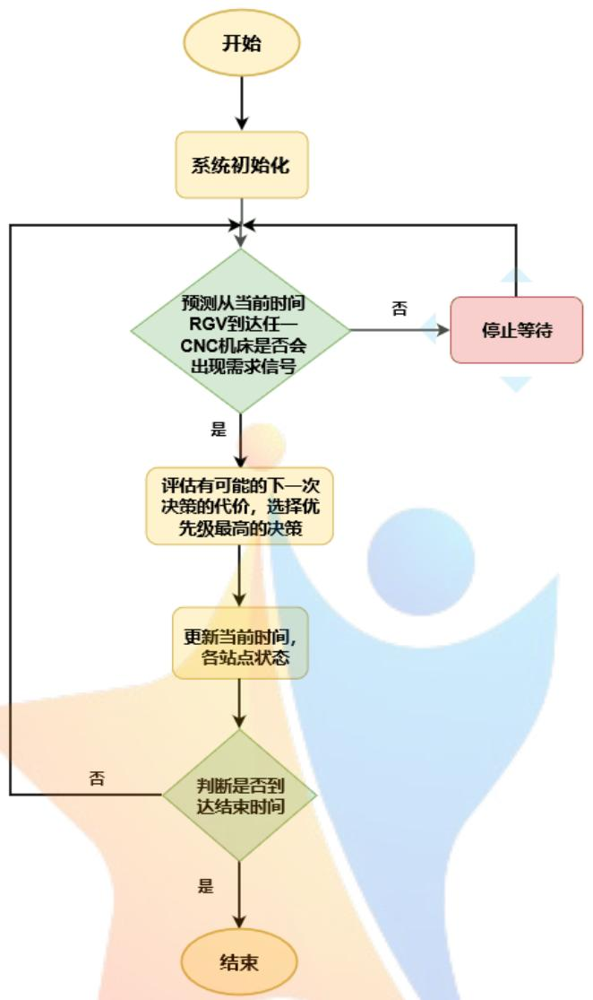
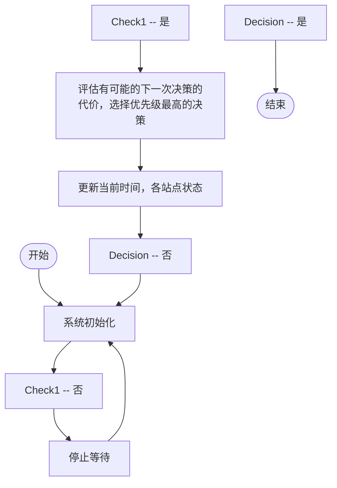
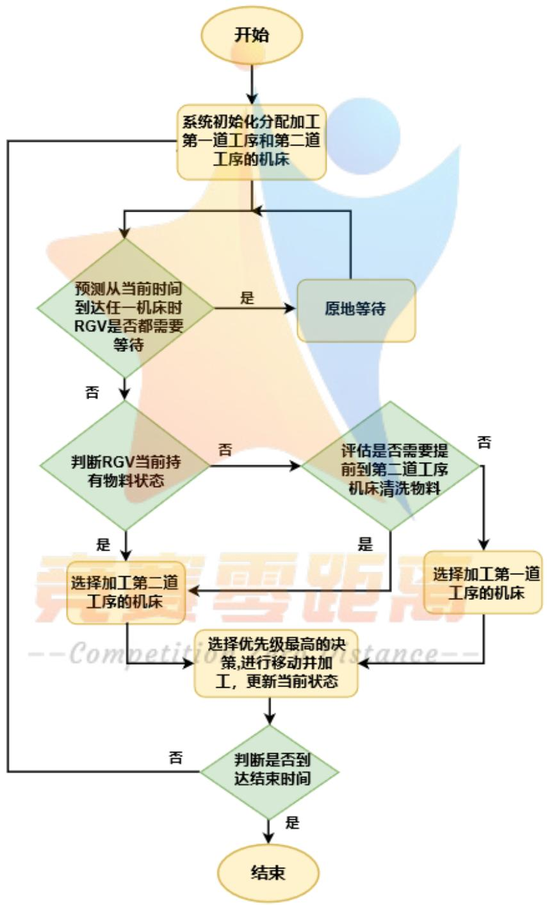
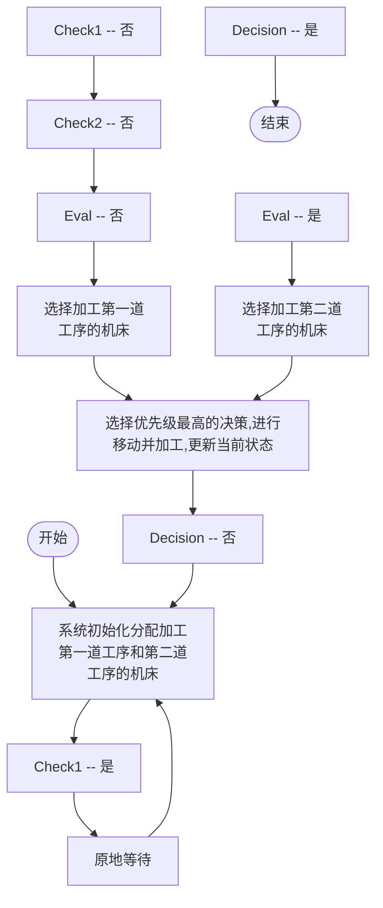
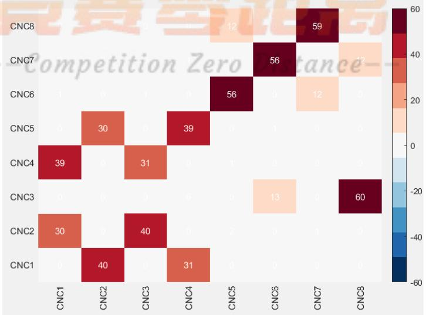
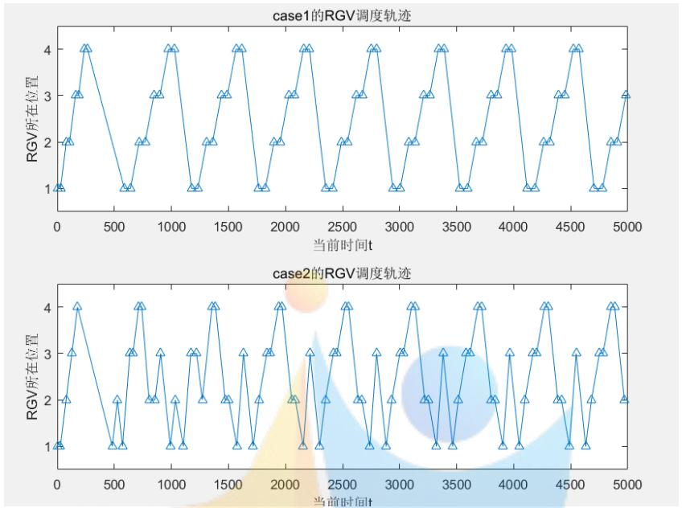

# 基于多原则比较和蒙特卡洛模拟的RGV动态调度模型

## 摘要

本文从规划模型、多原则求解的角度，综合了蒙特卡洛模拟与机器学习的思想，研究了由8台CNC、1辆RGV以及其他附属设备组成的智能加工系统的动态调度问题，并给出了不同工序情况下的具体调度方案。

针对情况一: 单工序的作业流程较为简单。首先, 利用规划的各个约束条件, 刻画了 RGV 在 CNC 之间的运动过程、单个物料的加工过程、“上下料”时 RGV 手爪的旋转过程、清洗作业的过程、RGV 移动至下一个机床进行加工的过程等等。此外, 还刻画了物料加工与运送的 “唯一性”, 以及利用 0-1 变量构造的目标函数。规划的目的是, 在给定的时间内, 使得加工出的物料数量最多。然而, 这样的规划是一个 NP 问题, 无法通过传统的方法求解, 所以进而寻求模拟的方法求得局部最优解。

本文选取了“就近原则”——构造时间代价函数，“FIFO 原则”——考虑各台 CNC 的等待时间，以及“HRRN 原则”——将时间代价与等待时间进行综合考虑，分别对情况一进行了模拟。事实上，每种原则的结果相同：第一组数据加工完成了 383 件物料，第二组数据加工完成了 360 件物料，第三组数据加工完成了 393 件物料。并且，调度的方案全部为 $1 \rightarrow 2 \rightarrow \dots \rightarrow 8 \rightarrow 1 \rightarrow \dots$ 此外，第三组数据的系统效率最高，为 49.125 件/h.

针对情况二：双工序的作业流程十分复杂。首先，在情况一的基础上，对规划的各个约束条件进行修正；并着重刻画了 RGV 移动至下一个机床进行加工的过程。

此外，双工序流程中各台 CNC 所负责的工序也是不确定的；因此，本文对 256 种工序布局方案，结合三种选取原则，进行了遍历。得到的结果是：第一组数据的各台 CNC 最优工序分配为 1-2-1-2-1-2-1-2，三种原则结果一致，最终加工出 253 件物料；第二组数据的各台 CNC 最优工序分配为 2-1-2-1-2-1-2-1，“FIFO 原则”和“HRRN 原则”更优，最终加工出 212 件物料；第三组数据的各台 CNC 最优工序分配为 1-1-2-1-2-1-1-2，“就近原则”最优，最终加工出 241 件物料。此外，所有的调度方案均呈现有规律的循环状态。

然后，利用 “基于蒙特卡洛的学习算法”，在构造正反馈的前提下 “随机” 地尝试以获得更优解。结果反映了，三种原则中的最优原则，已非常接近全局最优。此外，第一组数据和第三组数据的作业效率一样高，均为 30.125 件/h.

针对情况三：同时考虑单工序流程与双工序流程。构造了随机变量“是否故障”、“故障发生时间”和“故障排除时间”，并将它们融合进入规划模型。求解结果显示，遭遇故障后，单工序流程系统效率最多下降了2.25件/h，而双工序流程系统效率最多下降了1.875件/h.

本文的亮点在于：首先，利用一般化的公式对系统调度进行了较为细致的机理分析，使得模型具有普适性；其次，给出了多个调度原则相互比较，从而有利于结果更优；最后，将蒙特卡洛模拟与机器学习的思想相结合，对上述调度原则的有效性进行验证，增强了模型的说服力。

关键词 规划模型；多原则比较；蒙特卡洛模拟；机器学习；动态调度

## 1. 问题的重述

现有一个智能加工系统，由 8 台 CNC、1 辆 RGV 以及其他附属设备组成。RGV 能够根据指令与决策，在水平的轨道上自动控制移动的方向和距离，并通过机械手爪、机械臂等部件完成 “上下料”、“清洗作业” 等诸多过程。

对于以下三种情况:

①加工过程包含 1 道工序且每台 CNC 都可以进行加工;  
②加工过程包含 2 道工序且每台 CNC 只能完成 1 道工序;  
③某 CNC 在加工过程中发生故障，故障需人工排除，且该 CNC 上的物料报废；

考虑完成两个任务: 首先, 给出一般的模型, 并给出模型的求解算法; 然后, 检验模型的实用性和算法的有效性, 并给出具体调度策略和系统作业效率。

## 2. 问题的分析

对于情况（1），整个加工系统仅有一个工序。从物料的形态演化过程来看，生料经过 CNC 的加工成为熟料，而熟料经过 RGV 的清洗成为成料。从 RGV 的作业过程来看，RGV 首先需要选取一台候选 CNC，然后移动至该 CNC，放入生料，取出熟料，再将熟料进行清洗使之变为成料（包括送出系统）——最终 RGV 将进入下一轮选择 CNC 的阶段。


<details>
<summary>flowchart</summary>


</details>

图 1 情况（1）物料的形态演化

对于情况（2），整个加工系统有两个工序。从物料的形态演化过程来看，生料经过“一工序 CNC”的加工成为半熟料，而半熟料经过“二工序 CNC”的加工成为熟料，最后熟料经过 RGV 的清洗成为成料。


<details>
<summary>flowchart</summary>


</details>

图 2 情况（1）物料的形态演化

对于情况（3），整个系统出现了故障。根据题目所给条件，需要依此考虑对于某个物料的加工，是否发生故障，故障发生的时间，以及故障排除时间这三个随机变量。

本文拟构建一般性的规划，理清系统内部的机理关系。然后，通过提出不同的原则，编写算法，解决该规划问题；并通过“基于蒙特卡洛的学习算法”，比较、检验不同原则的优劣。

## 3. 模型的假设与符号的说明

## 3.1 模型的假设

(1) 生料的供应是无限的。

(2) 不考虑 RGV 转向的时间, 即 RGV 从 CNC1#到 CNC2#, 从 CNC3#到 CNC4#, 从 CNC5#到 CNC6#, 从 CNC7#到 CNC8#的时间全部为 0.  
（3）上料传送带可以及时将生料运往需要的 CNC 正前方，下料传送带可以及时将成料运出整个系统。

## 3.2 符号的说明

表 1 符号的说明

<table><tr><td>符号</td><td>说明</td><td>单位</td></tr><tr><td> $d_i$ </td><td>RGV移动i个单位所需时间</td><td>秒</td></tr><tr><td> $t_{ab}$ </td><td>RGV从机床a移动到机床b的时间</td><td>秒</td></tr><tr><td> $aj_a$ </td><td>a号机床所加工的第 $j_a$ 个物料</td><td>件</td></tr><tr><td> $t_0$ </td><td>物料加工时间</td><td>秒</td></tr><tr><td> $t_1$ </td><td>物料清洗时间</td><td>秒</td></tr><tr><td> $t_2^{(a)}$ </td><td>第a台机床“上下料”时间</td><td>秒</td></tr><tr><td> $R_{aj_a}$ </td><td>生料 $aj_a$ “上料”完成时刻</td><td>秒</td></tr><tr><td> $C_{aj_a}$ </td><td>熟料 $aj_a$ “下料”完成时刻</td><td>秒</td></tr><tr><td> $H_{aj_a}$ </td><td>成料 $aj_a$ 完成清洗时刻</td><td>秒</td></tr><tr><td> $y_{aj_a,bj_b}$ </td><td>两件独立熟料下机床时间的先后顺序</td><td>0-1变量</td></tr><tr><td> $z_{ab}$ </td><td>RGV是否从a移动至b</td><td>0-1变量</td></tr></table>

## 4. 模型的建立、求解与分析

## 4.1 情况（1）模型的建立、求解与分析

## 4.1.1 单工序的作业流程

在情况（1）中，物料加工程序仅由一道工序组成。其中，每台 CNC 安装同样的刀具，而物料可以在任意一台 CNC 上加工完成。

纵观整个单工序的加工过程，可以发现，当某台 CNC 完成加工，即完成“生料→熟料”的过程时，便处于等待状态，并向 RGV 发出需求信号。当 RGV 移动至该 CNC 正前方时，连续完成下述步骤：

(1) 上下料: 将熟料取出 CNC, 并向 CNC 放入新的生料, 这两步同时完

成;

(2) 清洗作业: 将取出的熟料进行清洗, 完成 “熟料→成料” 过程, 而后将成料放入传送带送出系统, 此时 RGV 在轨道上位置不变。

此后，RGV 需要根据需求信号的先后顺序、距离的远近等信息，寻找下一个作业候选 CNC，然后重复上述（1）（2）两个步骤，周而复始，直至 8 个小时结束。

## 4.1.2 单工序的调度模型

考虑到模型的一般化问题，此处本文拟利用规划的方法，寻找并构建各台CNC以及生产物料的数量关系。

## 1. RGV 在 CNC 之间运动时间的刻画

不妨设, 现有任意两台 CNC, 分别记作 $a, b$ , 其中 $a = 1, 2, \dots, 8; b = 1, 2, \dots$ , 8. 考虑到机床安放的位置关系——偶数号码机床位于系统左侧, 奇数号码机床位于系统右侧——则 RGV 从机床 $a$ 移动到机床 $b$ 的时间为:

$$
t _ {a b} = \left\{ \begin{array}{l l} 0, & \left| \left[ \frac {a + 1}{2} \right] - \left[ \frac {b + 1}{2} \right] \right| = 0 \\ d _ {1}, & \left| \left[ \frac {a + 1}{2} \right] - \left[ \frac {b + 1}{2} \right] \right| = 1 \\ d _ {2}, & \left| \left[ \frac {a + 1}{2} \right] - \left[ \frac {b + 1}{2} \right] \right| = 2 \\ d _ {3}, & \left| \left[ \frac {a + 1}{2} \right] - \left[ \frac {b + 1}{2} \right] \right| = 3 \end{array} \right.
$$

其中， $d_{i}$ 为 RGV 移动 i 个单位所需时间。

## 2. 基于单个物料加工过程的刻画

## Step 1.

将a号机床所加工的第 $j_{a}$ 个物料记为 $aj_{a}$ 。经过粗略的计算，在8小时内该系统可加工完成的物料数量级为 $10^{2}$ ，所以准备 $10^{3}$ 个生料一定足够。因此，参数取值范围可以取为 $j_{a}=1,2,\ldots,1000$ 。

相对应地，将尚为生料的 $aj_{a}$ 被 RGV 放入 $a$ 号机床（“上料”过程完成）的时刻，记为 $R_{aj_{a}}$ ；将已加工为熟料的 $aj_{a}$ 被 RGV 取出 $a$ 号机床（“下料”过程完成）的时刻，记为 $C_{aj_{a}}$ .

此外，物料加工时间记为 $t_{0}$ ，清洗时间记为 $t_{1}$ ，第a台机床“上下料”时间记为 $t_{2}^{(a)}$ .

$$
t _ {2} ^ {(a)} = \left\{ \begin{array}{l l} t _ {2} ^ {(1)}, & \mod (\frac {a}{2}) \neq 0 \\ t _ {2} ^ {(2)}, & \mod (\frac {a}{2}) = 0 \end{array} \right..
$$

其中， $t_{2}^{(1)}$ 为 RGV 为 CNC1#, 3#, 5#, 7# 进行一次上下料所需时间， $t_{2}^{(2)}$ 为 RGV 为 CNC2#, 4#, 6#, 8# 进行一次上下料所需时间。

## Step 2.

基于上述符号的定义，可以得到：

$$
\left\{ \begin{array}{c c} C _ {a j _ {a}} - R _ {a j _ {a}} \geq t _ {0} + t _ {2} ^ {(a)}, & C _ {a j _ {a}} \leq 8 \times 6 0 \times 6 0 - t _ {1} \\ C _ {a j _ {a}} = 0, & \text {其他} \end{array} \right. \tag {1}
$$

（1）式的意义为，若物料 $aj_{a}$ 加工完成时间在8小时终止以前，那么物料 $aj_{a}$ 从被放入CNC开始，直至被取出CNC，所经历的时间至少为加工时间 $t_0$ 与“上下料”时间 $t_2^{(a)}$ 两者之和。 $C_{aj_a} - R_{aj_a}$ 之所以可能大于 $t_0 + t_2^{(a)}$ ，是由于当物料 $aj_{a}$ 加工完成时，RGV不一定会恰好位于该CNC机床前并立即取出该物料；通常地，机床CNC需要等候RGV。

若物料 $aj_{a}$ 加工完成时间在8小时终止以后，则不妨令 $C_{aj_a} = 0$

## 3. “上下料”手爪旋转过程的刻画

值得注意的是，当 RGV 从 CNC 中取出物料（此时具体的状态为熟料） $aj_{a}$ 时，会相应地放入一个生料，该生料就是 a 号机床所加工的第 $(j+1)_{a}$ 个物料；且这两步同时发生。所以有：

$$
C _ {a j _ {a}} = R _ {a (j + 1) _ {a}} \tag {2}
$$

(2) 式不仅仅刻画了“上下料”过程发生的同时性, 还保证了 $\{j_{a}\}$ 序列的先后顺序能够反映物料加工的先后顺序。因为, 当 8 小时终止前, 有:

$$
C _ {a (j + 1) _ {a}} > R _ {a (j + 1) _ {a}} = C _ {a j _ {a}}
$$

可见，在连续作业的 8 小时终止前，第 $j + 1$ 个物料被取出 CNC 的时间一定晚于第 j 个物料被取出 CNC 的时间。

## 4. 清洗作业过程的刻画

当熟料 $aj_{a}$ 被取出后，会立即进行清洗作业过程。记物料 $aj_{a}$ 加工完成并放至下料传送带的时刻为 $H_{aj_{a}}$ 。由于这个过程是确定的、不间断的，且清洗时间 $t_{1}$ 为定值，所以容易得到：

$$
H _ {a j _ {a}} = C _ {a j _ {a}} + t _ {1} \tag {3}
$$

当 RGV 将成料 $aj_{a}$ 放到下料传送带后，就需要寻找下一个候选机床 b，并立即向它移动。

## 5. RGV 移动至下一个机床进行加工的过程刻画

仿照上述描述，记b号机床所加工的第 $j_{b}$ 个物料记为 $bj_{b}$ 。其中， $j_{b}=1,2,\ldots,1000$ 。

## Step 1.

首先，需要考虑物料 $bj_{b}$ 的加工顺序是否在物料 $aj_{a}$ 之后，所以构造顺序约束变量（0-1变量） $y_{aj_{a},bj_{b}}$ .

$$
y _ {a j _ {a}, b j _ {b}} = \left\{ \begin{array}{c l} 1, & \text {若熟料} b j _ {b} \text {下机床时间晚于熟料} a j _ {a} \text {下机床时间} \\ 0, & \text {其他（如加工物料} a j _ {a} \text {或} b j _ {b} \text {未完成)} \\ - 1, & \text {若熟料} b j _ {b} \text {下机床时间早于熟料} a j _ {a} \text {下机床时间} \end{array} \right. \tag {4}
$$

其中：

$$
\left\{ \begin{array}{c} y _ {a j _ {a}, b j _ {b}} + y _ {b j _ {b}, a j _ {a}} = 0 \\ y _ {a j _ {a}, b j _ {b}} = 0, \text {若} C _ {a j _ {a}} = 0 \text {或} C _ {b j _ {b}} = 0 \\ y _ {a j _ {a}, b j _ {b}} \times \left(C _ {b j _ {b}} - C _ {a j _ {a}}\right) \geq t _ {1} + t _ {a b} + t _ {2}, \text {若} C _ {a j _ {a}} \neq 0 \text {且} C _ {b j _ {b}} \neq 0 \end{array} \right. \tag {5}
$$

上述约束的意义为，若熟料 $b j_{b}$ 下机床时间晚于熟料 $a j_{a}$ 下机床时间，则两个时间点的差值至少包括熟料 $a j_{a}$ 的清洗时间、RGV从a运动至b的时间、上下料时间。反之亦然。

## Step 2.

由于从机床a出发，RGV 只能选择一个候选机床b，所以构造 0-1 变量：

$$
z _ {a b} = \left\{ \begin{array}{l l} 1, & \text {RGV从机床} a \text {至} b \\ 0, & \text {其他} \end{array} \right. \tag {6}
$$

其中：

$$
\sum_ {b = 1} ^ {8} z _ {a b} = 1 \tag {7}
$$

## Step 3.

此外，设M为一个足够大的数，用以限制约束条件。

所以，可以得到

$$
C _ {b j _ {b}} \geq H _ {a j _ {a}} + \sum_ {b = 1} ^ {8} t _ {a b} z _ {a b} + t _ {2} ^ {(b)} + M \times (y _ {a j _ {a}, b j _ {b}} - 1) \tag {8}
$$

当熟料 $b j_{b}$ 下机床时间晚于熟料 $a j_{a}$ 下机床时间时， $b j_{b}$ 被 RGV 从机床b中取出的时间点 $C_{b j_{b}}$ ，与 $a j_{a}$ 完成加工被送出系统的时间点 $H_{a j_{a}}$ 之间的差，至少包括 RGV 从a运动至b的时间，以及上下料的时间。

## 6. 唯一性的刻画

“唯一性”，一方面指每个物料只能被取一次，另一方面指 RGV 一次只能承载一个物料（包括清洗作业、运送物料过程）。具体而言，只要保证任意两个独立物料加工过程的时间点 $C_{aj_a}$ 与 $C_{bj_b}$ 、 $R_{aj_a}$ 与 $R_{bj_b}$ 保持一定的间距，“唯一性”即可得到保证。 $C_{aj_a}$ 与 $C_{bj_b}$ 的间距已在（5）式中得到了刻画。下面，刻画 $R_{aj_a}$ 与 $R_{bj_b}$ 的间距问题。

当 $R_{a j_{a}}, R_{b j_{b}} \leqslant 8 \times 60 \times 60$ 时，有

$$
\left| R _ {a j _ {a}} - R _ {b j _ {b}} \right| \geq t _ {1} + t _ {a b} + t _ {2}, \quad a j _ {a} \neq b j _ {b} \tag {9}
$$

（9）式的意义为，在8个小时作业时间截止前，假若生料 $aj_{a}$ 上机床的时点早于生料 $bj_{b}$ 上机床的时点，那么，当RGV将生料 $aj_{a}$ 放入机床 $a$ 的同时，必定会换下熟料 $a(j - 1)_a$ ，从而至少需要经历清洗熟料 $a(j - 1)_a$ 的时间，从RGV从 $a$ 运动至 $b$ 的时间，以及将生料 $aj_{a}$ 放入机床 $b$ 的时间。反之亦然。

## 7. 目标函数的刻画

根据题目的条件与模型的假定,在8个小时之内,生料的供应是绝对充足的。因此该规划的目标应该是,在给定时间内,加工完成的成料最多。

## Step 1.

首先，由（2）式可推导出约束条件：

$$
\max \left\{C _ {1, 1}, C _ {1, 2}, \dots \right\} \leq 8 \times 6 0 \times 6 0 - t _ {1} \tag {10}
$$

(10) 式说明最晚加工完成的成料, 在 8 小时连续作业终止前完成加工, 且又相当地接近 $8 \times 60 \times 60$ .

## Step 2.

考虑到在系统的初始状态中，RGV 处于 CNC1# 和 CNC2# 的正中间，而 CNC1# 上下料的时间又短于 CNC2#；所以，当整个 8 小时的连续作业终止前，已经加工完成的物料数，就几乎等同于所有下机床时间晚于 CNC1# 的第 1 个物料下机床的时间的物料数量：

$$
N U M = \sum_ {b = 1} ^ {8} \sum_ {j _ {b}} ^ {1 0 0 0} y _ {1 1, b j _ {b}} + 1 \tag {11}
$$

综上所述，将（1）～（11）式作为约束条件，则规划的目标函数可以表示为：

$$
\max N U M \tag {12}
$$

然而，上述规划问题所涉及到的决策变量达到上万之多，根本无法采用传统的规划方法进行计算机求解。根据 Yongkyun Na，对于 RGV 系统中的 N 项任务，实时选取最优的候选 CNC，涉及到 $O(N!)$ 数量级的计算，是一个 NP 问题 $^{[1]}$ ，一般无法得到全局最优解。因而想要解决此类问题，就不得不求助于模拟。

## 4.1.3 单工序的求解算法

求解此类问题的关键,在于当 RGV 完成一次“物料清洗-送出系统”过程后,如何安排接下来的任务——例如是否等待,是否移动,如果移动,如何移动——也就是 RGV 调度的原则问题。参考以往的文献,求解此类问题,往往采用启发式算法或者机器学习算法。然而,我们希望更加清晰地反映调度模拟的原则与机理。一个自然的想法是,在每一次调度中,尽可能减少各台机床等待的时间,从而减少生产资源的虚耗;这样,就可能在给定的时间内加工完成更多的物料。为了减少各台机床等待的时间,本文拟考虑以下几个原则:

## (1) “就近原则”。

## Step 1.

当 RGV 完成一次清洗过程，处于空闲状态时，遍历从此刻起 RGV 移动到达所有 CNC 的时间点。

假若，当 RGV 到达某 CNC 时，此 CNC 已在等待，则将此类 CNC 纳入候选范围。

假若，当 RGV 到达 CNC 正前方时，所有 CNC 都在忙，则等待数秒，直到出现上述情况。

Step 2.

计算 RGV 从当前位置到各台候选 CNC 的 “时间代价函数” $f(t)$ 。假若此时 RGV 处于位置 a，候选 CNC 处于位置 b。则：

$$
f ^ {b} (t) = t _ {a b} + t _ {2} ^ {(b)} + t _ {1}
$$

比较所有候选 CNC 的 “时间代价函数”，并选取 $\min\{f^{b}(t)\}$ ；最小值所对应的 CNC，即为 RGV 的下一个操作对象。

根据 “就近原则”，RGV 每次选择的都是一个 “移动-上下料-清洗” 过程时间最短的 CNC。这样，其他 CNC 在等待过程中虚耗的时间也是最短的，从而可以提高加工效率，加工更多的物料。

## (2) “FIFO 原则”

当 RGV 完成一次清洗过程，处于空闲状态时，遍历此时所有 CNC 的等待时间。选取等待时间最长的 CNC，作为 RGV 的下一个操作对象。

若此时所有的 CNC 都在忙，则利用（1）“就近原则”进行选择。

根据 “FIFO 原则”，RGV 每次选择的都是已经等待时间最长的 CNC；及时前往这样长期等待的 CNC 进行上下料，显然有助于减少它虚耗的时间，从而可以提高加工效率，加工更多的物料。

## (3) “HRRN 原则”

借鉴操作系统的调度原则，我们构造了 “HRRN 原则”。

当 RGV 完成一次清洗过程，处于空闲状态时，遍历 RGV 至所有 CNC 的响应比：

$$
\text {响应比} = \frac {\text {等待时间} + \text {时间代价函数}}{\text {时间代价函数}}
$$

其中，“等待时间”指该时刻各个 CNC 已等待时间，“时间代价函数”指 $f(t)$ . 选择所有 CNC 的响应比中的最大值。事实上，“HRRN”原则综合考虑了“就近原则”和“FIFO”原则：当时间代价函数一定时，等待时间越长越容易入选；当等待时间一定时，时间代价函数越小越容易入选。

在编写算法时，模拟的具体细节遵照 4.1.2 规划中的各项约束条件，包括单个物料加工过程、“上下料”手爪旋转过程、清洗作业过程等。算法的外部框架，则需要依次考虑：

①当 RGV 空闲时，RGV 是停止等待还是移动；  
②如果 RGV 停止等待，等待多长时间；  
③如果 RGV 移动，移动到哪一台 CNC。

具体如下流程图所示。



<details>
<summary>flowchart</summary>


</details>

图 3 情况（1）算法流程图

## 4.1.4 单工序算法的结果检验与分析

利用上述算法的三种原则，对题目给定的 3 组数据进行计算。

表 2 三种原则下 3 组数据的成料数量

<table><tr><td></td><td>第一组</td><td>第二组</td><td>第三组</td></tr><tr><td>就近原则</td><td>383</td><td>360</td><td>393</td></tr><tr><td>FIFO 原则</td><td>383</td><td>360</td><td>393</td></tr><tr><td>HRRN 原则</td><td>383</td><td>360</td><td>393</td></tr></table>

上表给出了在每个班次内（连续作业 8 个小时），对于不同的算法、不同的数据，系统加工完成的成料数量。基于此，可以分析：

①模型的实用性;  
②算法的有效性;  
③系统的作业效率。

（1）4.1.2 规划中的各项约束条件，做到了完全的一般化；三种模拟算法的内部细节全部遵照了 4.1.2 节规划中的约束。而对于截然不同的数据，只需要在“系统初始化”中进行更改，后续算法无需改变。因此，该模型具有一般性、实

用性。

（2）对于不同的原则，算法的外部框架全部一致；因此，算法的普适性毋庸置疑。  
（3）观察表 2，不难发现，对于第一组数据、第二组数据以及第三组数据，三种原则下得到的结果完全相同。

可见，对于单工序的加工过程，从结果角度而言，三种原则并无显著差别。这或许是由于，RGV 在各台 CNC 之间穿梭的时间 $t_{ab}$ 远小于加工时间 $t_{0}$ ，所以 RGV 的远距离移动也不会耽误时间。

表 3 给出了 “就近原则” 下三组数据的部分结果。不难看出，无论数据有何差异，RGV 在各台 CNC 之间穿梭作业的顺序始终为 $1 \rightarrow 2 \rightarrow \ldots \rightarrow 8 \rightarrow 1 \rightarrow 2 \ldots$ ；事实上，在另外两种原则下，RGV 移动的顺序也是如此。这样的相互印证，从侧面说明了，该算法与原则具有较强的有效性。

(4) 对于系统的作业效率, 可以计算系统完成加工的速度。第一组为 47.875 件/h, 第二组为 45 件/h, 第三组为 49.125 件/h. 所以, 第三组的作业效率最高, 第一组其次, 第二组的效率最低。

表 3 “就近原则” 下三组数据的部分结果

<table><tr><td></td><td colspan="3">第一组</td><td colspan="3">第二组</td><td colspan="3">第三组</td></tr><tr><td>加工物料序号</td><td>加工CNC编号</td><td>上料开始时间(s)</td><td>下料开始时间(s)</td><td>加工CNC编号</td><td>上料开始时间(s)</td><td>下料开始时间(s)</td><td>加工CNC编号</td><td>上料开始时间(s)</td><td>下料开始时间(s)</td></tr><tr><td>1</td><td>1</td><td>0</td><td>588</td><td>1</td><td>0</td><td>610</td><td>1</td><td>0</td><td>572</td></tr><tr><td>2</td><td>2</td><td>28</td><td>641</td><td>2</td><td>30</td><td>670</td><td>2</td><td>27</td><td>624</td></tr><tr><td>3</td><td>3</td><td>79</td><td>717</td><td>3</td><td>88</td><td>758</td><td>3</td><td>77</td><td>699</td></tr><tr><td>4</td><td>4</td><td>107</td><td>770</td><td>4</td><td>118</td><td>818</td><td>4</td><td>104</td><td>751</td></tr><tr><td>5</td><td>5</td><td>158</td><td>846</td><td>5</td><td>176</td><td>906</td><td>5</td><td>154</td><td>826</td></tr><tr><td>6</td><td>6</td><td>186</td><td>899</td><td>6</td><td>206</td><td>966</td><td>6</td><td>181</td><td>878</td></tr><tr><td>7</td><td>7</td><td>237</td><td>975</td><td>7</td><td>264</td><td>1054</td><td>7</td><td>231</td><td>953</td></tr><tr><td>8</td><td>8</td><td>265</td><td>1028</td><td>8</td><td>294</td><td>1114</td><td>8</td><td>258</td><td>1005</td></tr><tr><td>9</td><td>1</td><td>588</td><td>1176</td><td>1</td><td>610</td><td>1238</td><td>1</td><td>572</td><td>1144</td></tr><tr><td>10</td><td>2</td><td>641</td><td>1232</td><td>2</td><td>670</td><td>1298</td><td>2</td><td>624</td><td>1201</td></tr><tr><td>11</td><td>3</td><td>717</td><td>1308</td><td>3</td><td>758</td><td>1386</td><td>3</td><td>699</td><td>1276</td></tr><tr><td>12</td><td>4</td><td>770</td><td>1361</td><td>4</td><td>818</td><td>1446</td><td>4</td><td>751</td><td>1328</td></tr><tr><td>13</td><td>5</td><td>846</td><td>1437</td><td>5</td><td>906</td><td>1534</td><td>5</td><td>826</td><td>1403</td></tr><tr><td>14</td><td>6</td><td>899</td><td>1490</td><td>6</td><td>966</td><td>1594</td><td>6</td><td>878</td><td>1455</td></tr><tr><td>15</td><td>7</td><td>975</td><td>1566</td><td>7</td><td>1054</td><td>1682</td><td>7</td><td>953</td><td>1530</td></tr><tr><td>16</td><td>8</td><td>1028</td><td>1619</td><td>8</td><td>1114</td><td>1742</td><td>8</td><td>1005</td><td>1582</td></tr><tr><td>...</td><td>...</td><td>...</td><td>...</td><td>...</td><td>...</td><td>...</td><td>...</td><td>...</td><td>...</td></tr></table>

此外，RGV 的具体调度策略，详见支撑材料。

## 4.2 情况（2）模型的建立、求解与分析

## 4.2.1 双工序的作业流程

在情况（2）中，物料加工程序由两道工序组成。其中，每个物料的第一道工序、第二道工序分别由两台不同的 CNC 依次加工完成。

对于整个双工序的加工过程，当某台 “二工序 CNC” 完成加工，即完成 “半熟料→熟料” 的过程时，便处于等待状态，并向 RGV 发出需求信号。当 RGV 移动至该 CNC 正前方时，连续完成下述步骤：

（1）上下料：将熟料取出 CNC；然后，要么向 CNC 放入新的半熟料（若 RGV 的上一次作业对象为 “一工序 CNC”），要么不放入任何物料（若 RGV 的上一次作业对象为 “二工序 CNC”）。这两步同时完成。  
(2) 清洗作业: 将取出的熟料进行清洗, 完成 “熟料→成料” 过程, 而后将成料放入传送带送出系统, 此时 RGV 在轨道上位置不变。

此后，RGV 需要根据需求信号的先后顺序、距离的远近等信息，寻找下一个作业候选 CNC（可以是“一工序 CNC”或“二工序 CNC”），然后重复上述（1）

(2) 两个步骤, 周而复始, 直至 8 个小时结束。

## 4.2.2 双工序的调度模型

情况（2）的规划模型，只需要在情况（1）的基础上进行修正。

## 1. 基于单个物料加工过程的刻画

## Step 1. 对符号进行重新定义

假设a、b号机床为“一工序CNC”；c、d号机床为“二工序CNC”。

则有： $\{a,b,c,d\}=\{1,2,\ldots,8\}$ 且 $a\neq c,\quad b\neq c,\quad a\neq d,\quad b\neq d.$

将尚为生料的 $aj_{a}$ 被RGV放入 $a$ 号机床的时刻，记为 $R_{aj_{a}}^{(1)}$ ；

将已加工为半熟料的 $aj_{a}$ 被 RGV 取出a号机床的时刻，记为 $C_{aj_{a}}^{(1)}$ ;

将尚为半熟料的 $c j_{c}$ 被 RGV 放入 c 号机床的时刻，记为 $R_{c j_{c}}^{(2)}$ ;

将已加工为熟料的 $c j_{c}$ 被 RGV 取出 c 号机床的时刻，记为 $C_{c j_{c}}^{(2)}$ .

此外，第一道工序的加工时间记为 $t_{0}^{(1)}$ ，第二道工序的加工时间记为 $t_{0}^{(2)}$ .

## Step 2.

基于上述符号的定义，可以得到:

对于第一道工序，有

$$
\left\{ \begin{array}{c l} C _ {a j _ {a}} ^ {(1)} - R _ {a j _ {a}} ^ {(1)} \geq t _ {0} ^ {(1)} + t _ {2} ^ {(a)}, & C _ {a j _ {a}} ^ {(1)} \leq 8 \times 6 0 \times 6 0 \\ C _ {a j _ {a}} ^ {(1)} = 0, & \text {其他} \end{array} \right. \tag {13}
$$

对于第二道工序，有

$$
\left\{ \begin{array}{c l} C _ {c j _ {c}} ^ {(2)} - R _ {c j _ {c}} ^ {(2)} \geq t _ {0} ^ {(2)} + t _ {2} ^ {(c)}, & C _ {c j _ {c}} ^ {(2)} \leq 8 \times 6 0 \times 6 0 - t _ {1} \\ C _ {c j _ {c}} ^ {(2)} = 0, & \text {其他} \end{array} \right. \tag {14}
$$

## 2. “上下料”手爪旋转过程的刻画

当 RGV 从 “一工序 CNC” 中取出半熟料 $a j_{a}$ 时，有

$$
C _ {a j _ {a}} ^ {(1)} = R _ {a (j + 1) _ {a}} ^ {(1)} \tag {15}
$$

当 RGV 在 “二工序 CNC” 中执行 “上下料” 过程时，必定有

$$
C _ {c j _ {c}} ^ {(2)} \leq R _ {c (j + 1) _ {c}} ^ {(2)} \leq 8 \times 6 0 \times 6 0 - t _ {1}
$$

具体地，有：

1）能够取出熟料 $c j_{c}$ ，同时放入半熟料 $c(j+1)_{c}$

$$
\sum_ {a = 1} ^ {8} z _ {a c} ^ {\prime} C _ {c j _ {c}} ^ {(2)} = \sum_ {b = 1} ^ {8} z _ {b c} ^ {\prime \prime} R _ {c (j + 1) _ {c}} ^ {(2)}, \text {其中} \sum_ {a = 1} ^ {8} z _ {a c} ^ {\prime} = 1 \text {且} \sum_ {b = 1} ^ {8} z _ {b c} ^ {\prime \prime} = 1
$$

2）能够取出熟料 $c j_{c}$ ，但是无法同时放入半熟料 $c(j+1)_{c}$

$$
\sum_ {a = 1} ^ {8} z _ {a c} ^ {\prime} C _ {c j _ {c}} ^ {(2)} <   \sum_ {b = 1} ^ {8} z _ {b c} ^ {\prime \prime} R _ {c (j + 1) _ {c}} ^ {(2)}, \text {其中} \sum_ {a = 1} ^ {8} z _ {a c} ^ {\prime} = 1 \text {且} \sum_ {b = 1} ^ {8} z _ {b c} ^ {\prime \prime} = 1 \tag {16}
$$

3）能够放入半熟料 $c(j+1)_{c}$ ，但是无法同时取出熟料 $cj_{c}$

$$
\sum_ {a = 1} ^ {8} z _ {d c} ^ {\prime \prime \prime} C _ {c j _ {c}} ^ {(2)} <   \sum_ {b = 1} ^ {8} z _ {a c} ^ {\prime} R _ {c (j + 1) _ {c}} ^ {(2)}, \text {其中} \sum_ {a = 1} ^ {8} z _ {a c} ^ {\prime} = 1 \text {且} \sum_ {b = 1} ^ {8} z _ {d c} ^ {\prime \prime \prime} = 1
$$

## 3. 清洗作业过程的刻画

半熟料被取出时无需清理，熟料被取出时才需清理：

$$
H _ {c j _ {c}} = C _ {c j _ {c}} ^ {(2)} + t _ {1} \tag {17}
$$

## 4. RGV 移动至下一个机床进行加工的过程刻画

Step 1. 构造顺序约束变量 $y_{cj_{c},bj_{b}}^{(1)}$ ，反映空闲 RGV 选取 “一工序 CNC”.

$$
y _ {c j _ {c}, b j _ {b}} ^ {(1)} = \left\{ \begin{array}{l l} 1, & \text {若半熟料} b j _ {b} \text {下机床时间晚于熟料} c j _ {c} \text {下机床时间} \\ 0, & \text {其他（如半熟料} b j _ {b} \text {或熟料} c j _ {c} \text {未完成}) \\ - 1, & \text {若半熟料} b j _ {b} \text {下机床时间早于熟料} c j _ {c} \text {下机床时间} \end{array} \right. \tag {18}
$$

其中：

$$
\left\{ \begin{array}{c} y _ {c j _ {c}, b j _ {b}} ^ {(1)} + y _ {b j _ {b}, c j _ {c}} ^ {(1)} = 0 \\ y _ {c j _ {c}, b j _ {b}} ^ {(1)} = 0, \quad \text {若} C _ {b j _ {b}} ^ {(1)} = 0 \text {或} C _ {c j _ {c}} ^ {(2)} = 0 \\ y _ {c j _ {c}, b j _ {b}} ^ {(1)} \times \left(C _ {b j _ {b}} ^ {(1)} - C _ {c j _ {c}} ^ {(2)}\right) \geq t _ {1} + t _ {b c} + t _ {2} ^ {(b)}, \quad \text {若} C _ {b j _ {b}} ^ {(1)} \neq 0 \text {且} C _ {c j _ {c}} ^ {(2)} \neq 0 \end{array} \right. \tag {19}
$$

从机床c出发，RGV 只能选择一个候选机床b，因此构造 0-1 变量:

$$
z _ {c b} ^ {(1)} = \left\{ \begin{array}{l} 1, \text {RGV} \text {从机床} \mathrm{c} \text {至} b \\ 0, \text {其他} \end{array} \right., \text {其中} \sum_ {b = 1} ^ {8} z _ {c b} ^ {(1)} = 1 \tag {20}
$$

所以，可以得到

$$
C _ {b j _ {b}} ^ {(1)} \geq H _ {c j _ {c}} + \sum_ {b = 1} ^ {8} t _ {c b} z _ {c b} ^ {(1)} + t _ {2} ^ {(b)} + M \times \left(y _ {c j _ {c}, b j _ {b}} ^ {(1)} - 1\right) \tag {21}
$$

Step 2. 构造顺序约束变量 $y_{cj_{c},dj_{d}}^{(2)}$ ，反映空闲 RGV 选取 “二工序 CNC”.

$$
y _ {c j _ {c}, d j _ {d}} ^ {(2)} = \left\{ \begin{array}{l l} 1, & \text {若熟料} d j _ {d} \text {下机床时间晚于熟料} c j _ {c} \text {下机床时间} \\ 0, & \text {其他（如熟料} c j _ {c} \text {或熟料} d j _ {d} \text {未完成}) \\ - 1, & \text {若熟料} d j _ {d} \text {下机床时间早于熟料} c j _ {c} \text {下机床时间} \end{array} \right. \tag {22}
$$

其中：

$$
\left\{ \begin{array}{c} y _ {c j _ {c}, d j _ {d}} ^ {(2)} + y _ {d j _ {d}, c j _ {c}} ^ {(2)} = 0 \\ y _ {c j _ {c}, d j _ {d}} ^ {(2)} = 0, \quad \text {若} C _ {c j _ {c}} ^ {(2)} = 0 \text {或} C _ {d j _ {d}} ^ {(2)} = 0 \\ y _ {c j _ {c}, d j _ {d}} ^ {(2)} \times \left(C _ {d j _ {d}} ^ {(2)} - C _ {c j _ {c}} ^ {(2)}\right) \geq t _ {1} + t _ {c d} + t _ {2} ^ {(d)}, \quad \text {若} C _ {c j _ {c}} ^ {(2)} = 0 \text {且} C _ {d j _ {d}} ^ {(2)} = 0 \end{array} \right. \tag {23}
$$

从机床c出发，RGV 只能选择一个候选机床d，因此构造 0-1 变量：

$$
z _ {c d} ^ {(2)} = \left\{ \begin{array}{l} 1, \text {RGV} \text {从机床} c \text {至} d \\ 0, \text {其他} \end{array} , \text {其中} \sum_ {d = 1} ^ {8} z _ {c d} ^ {(2)} = 1 \right. \tag {24}
$$

所以，可以得到

$$
C _ {d j _ {d}} ^ {(1)} \geq H _ {c j _ {c}} + \sum_ {d = 1} ^ {8} t _ {c d} z _ {c d} ^ {(2)} + t _ {2} ^ {(d)} + M \times \left(y _ {c j _ {c}, d j _ {d}} ^ {(2)} - 1\right) \tag {25}
$$

Step 3. 构造顺序约束变量 $y_{aj_{a},cj_{c}}^{(3)}$ ，反映 RGV 将半熟料从 “一工序 CNC” 运送至 “二工序 CNC”。

$$
y _ {a j _ {a}, c j _ {c}} ^ {(3)} = \left\{ \begin{array}{l l} 1, & \text {若熟料} c j _ {c} \text {下机床时间晚于半熟料} a j _ {a} \text {下机床时间} \\ 0, & \text {其他（如半熟料} a j _ {a} \text {或熟料} c j _ {c} \text {未完成}) \\ - 1, & \text {若熟料} c j _ {c} \text {下机床时间早于半熟料} a j _ {a} \text {下机床时间} \end{array} \right. \tag {26}
$$

其中：

$$
\left\{ \begin{array}{c} y _ {a j _ {a}, c j _ {c}} ^ {(3)} + y _ {c j _ {c}, a j _ {a}} ^ {(3)} = 0 \\ y _ {a j _ {a}, c j _ {c}} ^ {(3)} = 0, \quad \text {若} C _ {a j _ {a}} ^ {(1)} = 0 \text {或} C _ {c j _ {c}} ^ {(2)} = 0 \\ y _ {a j _ {a}, c j _ {c}} ^ {(3)} \times \left(C _ {c j _ {c}} ^ {(2)} - C _ {a j _ {a}} ^ {(1)}\right) \geq t _ {a c} + t _ {2} ^ {(c)}, \quad \text {若} C _ {a j _ {a}} ^ {(1)} \neq 0 \text {且} C _ {c j _ {c}} ^ {(2)} \neq 0 \end{array} \right. \tag {27}
$$

从机床a出发，RGV 只能选择一个候选机床c，因此构造 0-1 变量：

$$
z _ {a c} ^ {(3)} = \left\{ \begin{array}{l l} 1, & \text {RGV从机床} a \text {至} c \\ 0, & \text {其他} \end{array} , \text {其中} \sum_ {c = 1} ^ {8} z _ {a c} ^ {(3)} = 1 \right. \tag {28}
$$

所以，可以得到

$$
C _ {c j _ {c}} ^ {(2)} \geq C _ {a j _ {a}} ^ {(1)} + \sum_ {b = 1} ^ {8} t _ {a c} z _ {a c} ^ {(3)} + t _ {2} ^ {(c)} + M \times \left(y _ {a j _ {a}, c j _ {c}} ^ {(3)} - 1\right) \tag {29}
$$

## 5. 唯一性的刻画

当 $y_{c(j-1)_{c},b(j-1)_{b}}^{(1)}\neq0$ 时，有

$$
\left| R _ {b j _ {b}} ^ {(1)} - R _ {c j _ {c}} ^ {(2)} \right| \geq t _ {1} + t _ {b c} + t _ {2} ^ {(b)} \tag {30}
$$

当 $y_{c(j-1)_{c},d(j-1)_{d}}^{(2)}\neq0$ 时，有

$$
\left| R _ {d j _ {d}} ^ {(2)} - R _ {c j _ {c}} ^ {(2)} \right| \geq t _ {1} + t _ {c d} + 2 \times t _ {2} \tag {31}
$$

当 $y_{a(j-1)_{a},c(j-1)_{c}}^{(3)}\neq0$ 时，有

$$
\left| R _ {c j _ {c}} ^ {(2)} - R _ {a j _ {a}} ^ {(1)} \right| \geq t _ {a c} + t _ {2} ^ {(c)} \tag {32}
$$

此外，当 $C_{a(j - 1)_a}^{(1)}\neq 0$ 且 $C_{b(j - 1)_b}^{(1)}\neq 0$ 时，有

$$
\left| C _ {b j _ {b}} ^ {(1)} - C _ {a j _ {a}} ^ {(1)} \right| \geq t _ {a b} + 2 \times t _ {2} + t _ {1} \tag {33}
$$

$$
\left| R _ {b j _ {b}} ^ {(1)} - R _ {a j _ {a}} ^ {(1)} \right| \geq t _ {a b} + 2 \times t _ {2} + t _ {1} \tag {34}
$$

## 6. 目标函数的刻画

假设距离初始位置最近的 “一工序 CNC” 为 i，距离初始位置最近的 “二工序 CNC” 为 j.

将（13）～（34）式作为约束条件，则目标函数为

$$
\max N U M = \sum_ {d = 1} ^ {8} \sum_ {j _ {d}} ^ {1 0 0 0} y _ {j 1, d j _ {d}} ^ {(2)} + \sum_ {b = 1} ^ {8} \sum_ {j _ {b}} ^ {1 0 0 0} y _ {i 1, c j _ {c}} ^ {(3)} + 2 \tag {35}
$$

## 4.2.3 双工序的基本算法

与 4.1.3 节中类似，上述规划模型同样需要利用模拟来解决。而与 4.1.3 节中不相同的是，8 台 CNC 中哪些加工第一道工序，哪些加工第二道工序尚不明了；因此，两道工序在 CNC 的分配同样是需要决策的变量。在这里，不妨先随机规定一种 CNC 的工序分配方案，从而可以更加一般化地讨论情况(2)的基本算法。

对于先前考虑过的三种 RGV 调度原则，尽管在情况（1）中所得结果完全相同，但是由于在情况（2）中所面临的情形更为复杂，所以此处需要进一步考虑：

（1）“就近原则”：选取最短的“时间代价函数”，从而使得其他 CNC 在等待过程中虚耗的时间也是最短的，因此节约的是系统总体的时间。从这种角度而言，“就近原则”有可能更优。  
(2) “FIFO 原则”: 选取最长的 CNC 等待时间, 从而及时止损, 节约的是某台 CNC 虚耗的时间。类似于插队现象, 虽然某台 CNC 的时间得到节约, 但反而浪费了其余 CNC 的时间; 从这种角度而言, “FIFO 原则” 有可能更劣。  
(3) “HRRN 原则”: 选取最大的响应比, 从而将 “就近原则” 和 “FIFO 原

则”进行综合考虑；因此，“HRRN 原则”有可能介乎两者之间。

与情况（1）几乎完全类似，在编写算法时，模拟的具体细节遵照 4.2.2 规划中的各项约束条件，包括单个物料加工过程、“上下料”手爪旋转过程、清洗作业过程等。算法的外部框架，仍然需要依次考虑：

①当 RGV 空闲时，RGV 是停止等待还是移动；  
②如果 RGV 停止等待，等待多长时间；  
③如果 RGV 移动，移动到哪一台 CNC。

综上，具体如下流程图所示。



<details>
<summary>flowchart</summary>


</details>

图 4 情况（2）算法流程图

## 4.2.4 双工序系统的 CNC 工序分配

事实上，对于每台 CNC，都有“一工序”、“二工序”两种可能，则 8 台 CNC 就存在 $2^{8}=256$ 种分配方案，这是一个可解的问题。基于此种考虑，本文拟利用题目所给的 3 组数据，采用不同的原则，遍历所有的方案，从而选取最优的“工序分配”与“原则”组合。

得到的各组数据最优结果如下:

表 4 三组数据的最优 “CNC 工序分配” 与 “原则” 组合

<table><tr><td></td><td>原则</td><td>CNC 工序分配</td><td>最优数量</td></tr><tr><td>第一组数据</td><td>就近原则FIFO 原则HRRN 原则</td><td>1-2-1-2-1-2-1-2</td><td>253</td></tr><tr><td>第二组数据</td><td>FIFO 原则HRRN 原则</td><td>2-1-2-1-2-1-2-1</td><td>212</td></tr><tr><td>第三组数据</td><td>就近原则</td><td>1-1-2-1-2-1-2-1</td><td>241</td></tr></table>

全部结果，详见支撑材料。根据结果，可以发现：

(1)对于第一组数据,在最优情况下,“就近原则”、“FIFO 原则”以及“HRRN 原则”旗鼓相当。  
（2）对于第二组数据，在最优情况下，“FIFO 原则”和“HRRN 原则”结果一致，并且更优；不过，虽然“就近原则”稍劣，却仅仅比最优的 212 个少 1 个，结果仍然可以接受。  
(3) 对于第三组数据, 在最优情况下, “就近原则” 最优, 且远远高于 “FIFO 原则” 的 230 个和 “HRRN 原则” 的 230 个。可见, 此处 “就近原则” 远远优于另外两个原则。  
（4）综合考虑上述三点，可以大致印证，“就近原则”的确略优，而“HRRN 原则”介乎两者之间。

## 4.2.5 基于蒙特卡洛的学习算法

事实上，在上述讨论中，无论是哪一种原则，都相对地固定，只能得到局部最优解。为了进一步探索是否存在更好的调度方案，此处可以给予每一次调度“随机”的空间，使其并不完全依赖于先前的模式与经验，从而计算最终结果是否更优。这种“随机”调度的策略，与先前三种“原则”平行，是一种空闲 RGV 选择下一台 CNC 的策略，同样需要在图 4 流程的大框架内进行。

## Step 0. 生成 “学习样本”

首先，从先前的三个原则中选取一个，作为学习与比对的样本，计算出在这个原则下的最终物料完成数量；并对该原则调度数据进行统计，计算出频数矩阵 $S_{ab}$ .

$$
S _ {a b} = \left( \begin{array}{c c c} s _ {1 1} & \dots & s _ {1 8} \\ \vdots & \ddots & \vdots \\ s _ {8 1} & \dots & s _ {8 8} \end{array} \right)
$$

其中， $s_{ab}$ 指的是，在所有完成的调度中，从第a个CNC调度到第b个CNC的频数。

## Step 1. 收集样本信息

记：此次仿真的次数为 $i$ ， $i = 1,2,\dots ,i_0$

当 RGV 完成一次清洗过程时，处于空闲状态，需要选择下一台作业的候选 CNC. 假设此时 RGV 所在的位置为 a. 根据图 4 流程的大框架，选择出所有可以到达的 CNC（即 RGV 到达后处于等待状态的 CNC），把它们分别记为 $b_{1}, b_{2}, \ldots, b_{k}$ .

仅考虑这些可以到达的 CNC，并对矩阵 $S_{ab}$ 按行求和

$$
N _ {a} = \sum_ {i = 1} ^ {k} s _ {a b _ {i}}.
$$

则此时，RGV 从位置 a 调度到位置 $b_{i}$ 的频率为

$$
P _ {a b _ {i}} = \frac {s _ {a b _ {i}}}{N}.
$$

## Step 2. 定义选择区间

通过上述信息的收集，可以构造 RGV 从位置 a 调度到每一个位置 $b_{i}$ 的 “临界区间”：

$$
\left[ L _ {a} ^ {(b _ {1})}, H _ {a} ^ {(b _ {1})} \right] = \left[ 0, P _ {a b _ {1}} \right]
$$

$$
\left[ L _ {a} ^ {(b _ {i})}, H _ {a} ^ {(b _ {i})} \right] = \left[ \sum_ {k = 1} ^ {i - 1} P _ {a b _ {k}}, \sum_ {k = 1} ^ {i} P _ {a b _ {k}} \right], i = 2, \dots , k
$$

每一个区间长度即对应着“学习样本”中 RGV 从位置 a 调度到位置 $b_{i}$ 的概率。这样，若 $b_{i}$ 区间长度越长，就意味着选择这种调度方案越有可能获得较优解。

## Step 3. Monte-Carlo 随机投点

现在，向区间[0,1]内部随机投点，记投中的点为e. 若

$$
e \in \left[ L _ {a} ^ {(b _ {i})}, H _ {a} ^ {(b _ {i})} \right]
$$

则意味着此时空闲的 RGV 应立即向 $b_{i}$ 号 CNC 移动，为其提供作业服务。

## Step 4. 总结本次数据

每当RGV处于空闲状态,需要搜寻、决策下一个作业CNC时,就重复Step3,直至8个小时结束,完成本次仿真过程。

当本次仿真结束后，计算最终物料完成数量；并对调度数据进行统计，计算出频数矩阵 $S_{ab}^{(1)}$ .

①若此次仿真的最终物料完成数量，少于学习样本的最终物料完成数量，则对于第 $i+1$ 次仿真，仍保持原先的“学习样本”不变，重复 Step1 至 Step4.  
②若此次仿真的最终物料完成数量, 多于学习样本的最终物料完成数量, 则构造新的频数矩阵

$$
\mathrm{S} _ {a b} ^ {\prime} = w _ {1} S _ {a b} + w _ {2} \mathrm{S} _ {a b} ^ {(1)}.
$$

其中， $w_{1}$ 与 $w_{2}$ 为权重，其取值取决于对先前经验的依赖程度。

将 $S_{ab}^{\prime}$ 作为新的“学习样本”的频数矩阵，并将此次的最终物料完成数量作为新的“学习样本”的最终物料完成数量。

## Step 5. 进行下一次仿真

进行第 $i+1$ 次仿真，重复上述步骤，直至 $i=i_{0}$ 停止。

## Step 6. 确定最优解

事实上，第 $i_{0}$ 次仿真结束时，“学习样本”的最终物料完成数量就是此次模拟的最优解。

此外，若 $s_{ab_{i}}=0$ ，则意味着下一次不可能选取 $ab_{i}$ 。为了使该学习系统具有一定的创新性，不完全囿于“学习样本”的固定模式，所以不妨令 $s_{ab_{i}}=\alpha$ 。其中 $\alpha$ 是一个很小的数，定义为“创新因子”。

取 $i_{0}=10^{7}$ ， $\alpha=2$ ，经过上述仿真流程，可以得到3组数据分别以前述3种原则为起始的“学习样本”时，最终的最优解。将这个解与表4进行对比如下：

表 5 蒙特卡洛前后最优解对比

<table><tr><td></td><td>初始原则</td><td>MCMC前最优解</td><td>MCMC后最优解</td></tr><tr><td rowspan="3">第一组数据</td><td>就近原则</td><td>241</td><td>241</td></tr><tr><td>FIFO 原则</td><td>241</td><td>241</td></tr><tr><td>HRRN 原则</td><td>241</td><td>241</td></tr><tr><td rowspan="3">第二组数据</td><td>就近原则</td><td>211</td><td>211</td></tr><tr><td>FIFO 原则</td><td>212</td><td>212</td></tr><tr><td>HRRN 原则</td><td>212</td><td>212</td></tr><tr><td rowspan="3">第三组数据</td><td>就近原则</td><td>241</td><td>241</td></tr><tr><td>FIFO 原则</td><td>230</td><td>235</td></tr><tr><td>HRRN 原则</td><td>230</td><td>237</td></tr></table>

由此可以看出，

①对于第三组数据，当初始学习样本以 “FIFO 原则” 或 “HRRN 原则” 为基准时，蒙特卡洛学习算法可以对结果有所优化。这说明蒙特卡洛学习算法是有效的，有助于找寻更优的结果；  
②然而，蒙特卡洛学习算法实际上并没有突破每一组数据的最优解。这或许能够说明，我们先前考虑的三种原则是极为有效的。他们得出的结果已经非常接近全局最优。

事实上，下图为第一组数据以“就近原则”为起始原则时，最终收敛到的频数矩阵 $S_{ab}^{\prime}$ .



<details>
<summary>heatmap</summary>

| Category | CNC1 | CNC2 | CNC3 | CNC4 | CNC5 | CNC6 | CNC7 | CNC8 |
| --- | --- | --- | --- | --- | --- | --- | --- | --- |
| CNC8 | — | — | — | — | 12 | — | 59 | — |
| CNC7 | — | — | — | — | — | 56 | — | 12 |
| CNC6 | 1 | 0 | 1 | 0 | 56 | 0 | 12 | 0 |
| CNC5 | 0 | 30 | 0 | 39 | 0 | 1 | 0 | 0 |
| CNC4 | 39 | 0 | 31 | 0 | 1 | 0 | 0 | 0 |
| CNC3 | 0 | 0 | 0 | 0 | 0 | 13 | 0 | 60 |
| CNC2 | 30 | 0 | 40 | 0 | 2 | 0 | 1 | 0 |
| CNC1 | 0 | 40 | 0 | 31 | 0 | 0 | 0 | 0 |
</details>

图 5 最终收敛到的频数矩阵

不难看出，对于矩阵的每一行，频数密集地处于某几个格点之中，意味着最终的“学习样本”趋于固定，难以继续尝试新的方案。因而，调度方案呈现出了规律性、周期性。

  
图 6 “就近原则” 下第一组数据的调度方案

上图显然印证了这一观点。可以想见，良好的规律性的确有助于节约系统整体虚度的时间，从而提高生产效率。

## 4.2.6 双工序算法的结果检验与分析

与 4.1.4 中的分析类似，对于情况（2）的模型和算法，我们可以考察：

①模型的实用性；②算法的有效性；③系统的作业效率。

(1)前文中规划的细节具有较强的一般性,流程大框架具有较强的普适性。结果数据均能较为合理地给出。因此该模型和算法具有一般性与实用性。  
（2）利用蒙特卡洛学习算法，对三种原则的结果进行验证。由于在一千万次模拟后，仍然无法突破三种原则得到的最优解，所以可以认为，情况（2）的算法具有极强的有效性。

(3) 对于系统的作业效率, 可以计算系统完成加工的速度。第一组为 30.125 件/h, 第二组为 26.25 件/h, 第三组为 30.125 件/h. 所以, 第一组和第三组的作业效率一样高, 第二组的效率最低。

表 6 “就近原则” 下第一组数据的部分结果

<table><tr><td>加工物料序号</td><td>工序1的CNC编号</td><td>上料开始时间(S)</td><td>下料开始时间(S)</td><td>工序2的CNC编号</td><td>上料开始时间(S)</td><td>下料开始时间(S)</td></tr><tr><td>1</td><td>1</td><td>0</td><td>428</td><td>2</td><td>456</td><td>884</td></tr><tr><td>2</td><td>3</td><td>48</td><td>507</td><td>4</td><td>535</td><td>988</td></tr><tr><td>3</td><td>5</td><td>96</td><td>586</td><td>6</td><td>614</td><td>1092</td></tr><tr><td>4</td><td>7</td><td>144</td><td>665</td><td>8</td><td>693</td><td>1196</td></tr><tr><td>5</td><td>1</td><td>428</td><td>856</td><td>2</td><td>884</td><td>1326</td></tr><tr><td>6</td><td>3</td><td>507</td><td>960</td><td>4</td><td>988</td><td>1430</td></tr><tr><td>7</td><td>5</td><td>586</td><td>1064</td><td>6</td><td>1092</td><td>1534</td></tr><tr><td>8</td><td>7</td><td>665</td><td>1168</td><td>8</td><td>1196</td><td>1638</td></tr><tr><td>9</td><td>1</td><td>856</td><td>1298</td><td>2</td><td>1326</td><td>1768</td></tr><tr><td>10</td><td>3</td><td>960</td><td>1402</td><td>4</td><td>1430</td><td>1872</td></tr><tr><td>11</td><td>5</td><td>1064</td><td>1506</td><td>6</td><td>1534</td><td>1976</td></tr><tr><td>12</td><td>7</td><td>1168</td><td>1610</td><td>8</td><td>1638</td><td>2080</td></tr><tr><td>13</td><td>1</td><td>1298</td><td>1740</td><td>2</td><td>1768</td><td>2210</td></tr><tr><td>14</td><td>3</td><td>1402</td><td>1844</td><td>4</td><td>1872</td><td>2314</td></tr><tr><td>15</td><td>5</td><td>1506</td><td>1948</td><td>6</td><td>1976</td><td>2418</td></tr><tr><td>16</td><td>7</td><td>1610</td><td>2052</td><td>8</td><td>2080</td><td>2522</td></tr><tr><td>...</td><td>...</td><td>...</td><td>...</td><td>...</td><td>...</td><td>...</td></tr></table>

此外，RGV 的具体调度策略，详见支撑材料。

## 4.3 情况（3）模型的建立、求解与分析

在情形（3）中，CNC 在加工过程中以 1% 的概率发生故障，而人工排除故障的时间为 10\~20 分钟；发生故障后，所有未完成的物料都会报废，且故障排除后 CNC 会即刻加入作业序列。

事实上，无论是考虑单工序的作业流程还是双工序的作业流程，只需在前序模型算法中略加改进即可。

## 4.3.1 模型和算法

## Step 1. 生成 “随机故障”

根据题目所给条件, 故障的发生概率约为 1%. 这可以理解为, 每加工 100 次物料, 平均发生 1 次故障; 换言之, 每加工 1 次物料, 就会有 1% 的可能性发生故障。此处引入随机变量 $X \sim U(0,1)$ 。每当一台 CNC 执行 “上下料” 程序时, 就从 $X$ 的分布中随机取出一点 $x$ , 用以判断对于 “上料” 后的生料或半熟料, 在其加工过程中是否会发生故障:

若x<0.01，认为发生故障；否则，认为没有发生故障。

此外，引入 0-1 变量 $h_{aj_{a}}$ ，则有

$$
h _ {a j _ {a}} = \left\{ \begin{array}{l l} 1, & x <   0. 0 1 \\ 0, & x \geq 0. 0 1 \end{array} \right.
$$

## Step 2. 生成 “故障发生时间”

当确定 Step 1. 中的加工过程发生故障时，还需要确定何时开始发生故障。同样地，引入随机变量 $Y \sim U(0, t_0)$ 。从 $Y$ 的分布中随机取出一点 $y$ ，就是从“上料”完成时至发生故障时所经历的时间。

## Step 3. 生成 “故障排除时间”

根据题目条件，人工排除故障的时间为 10\~20 分钟，这同样是一个不确定因素。因此，引入随机变量 $Z \sim U(10,20)$ 。从 Z 的分布中随机取出一点 z，即为人工排除故障的时间。

## Step 4. 报废物料退出系统

$$
C _ {a j _ {a}} \times h _ {a j _ {a}} = 0
$$

## Step 5. 故障排除后 CNC 重新加入作业

若 $h_{aj_{a}}=1$ ，则有

$$
R _ {a (j + 1) _ {a}} - R _ {a j _ {a}} \geq y + z + t _ {2}
$$

将上述 5 个步骤纳入 4.1.2 节和 4.2.2 节的模型，并基于此，重新完善算法，就可以得到模拟的结果。

## 4.3.2 结果分析

## 1. 单工序流程的故障结果

表 7 单工序流程的故障结果

<table><tr><td></td><td>故障物料数</td><td>故障时完成物料数</td><td>无故障时完成物料数</td></tr><tr><td>第一组</td><td>3</td><td>365</td><td>383</td></tr><tr><td>第二组</td><td>4</td><td>333</td><td>360</td></tr><tr><td>第三组</td><td>2</td><td>382</td><td>393</td></tr></table>

由上表可见，当加工流程出现故障时，最终完成的物料数量明显小于无故障时最终完成的物料数量。这显然是符合直觉的。

此时，第一组的系统效率从原先的 47.875 件/h 下降到 45.625 件/h，第二组的系统效率从原先的 45 件/h 下降到 41.625 件/h，第三组的系统效率从原先的 49.125 件/h 下降到 47.75 件/h.

## 2. 双工序流程的故障结果

表 8 双工序流程的故障结果

<table><tr><td></td><td>故障物料数</td><td>故障时完成物料数</td><td>无故障时完成物料数</td></tr><tr><td>第一组</td><td>6</td><td>226</td><td>241</td></tr><tr><td>第二组</td><td>7</td><td>200</td><td>211</td></tr><tr><td>第三组</td><td>5</td><td>232</td><td>241</td></tr></table>

此时，第一组的系统效率从原先的 30.125 件/h 下降到 28.25 件/h，第二组的系统效率从原先的 26.375 件/h 下降到 25 件/h，第三组的系统效率从原先的 30.125 件/h 下降到 29 件/h.

## 5. 模型的评价与改进方向

## 5.1 模型的优点

（1）利用规划的约束条件刻画系统加工的各项细节，将调度问题一般化；从而避免了当数据发生变动时，调度原则随之变动的问题。  
(2) 编写算法时, 同时考虑了多个调度空闲 RGV 的原则, 从而可以进行综合比较, 有利于得到更优的解。  
(3) 对所有 CNC 的工序分布布局进行遍历, 使得考虑更加全面。  
（4）开发了基于蒙特卡洛的学习算法，对各个既定原则进行检验，从而保证了本文结论已经接近最优。

## 5.2 模型的缺点及改进方向

（1）规划模型较为繁琐，不易理解；因此，寻找更加简洁的规划刻画各个调度关系，是模型改进的方向。  
(2) 开发的算法仅能够求出局部最优解; 因此, 寻找更加强大的算法以得出全局最优解, 是模型改进的方向。

## 参考文献

[1] Yongkyun Na. Single Vehicle Job Scheduling Using Learning Algorithm.  
[2] 姜启源，谢金星，叶俊．数学模型（第四版）．北京：高等教育出版社，2011.  
[3] 胡运权，郭辉煌. 运筹学教程（第四版）. 北京：清华大学出版社，2012.  
[4] 陈华. 基于分区法的 2-RGV 调度问题的模型和算法. 工业工程与管理, 2014, 19(6): 70-77.  
[5] CSDN 博客，几种常用的操作系统调度策略，https://blog.csdn.net/wujiafei\_njgcxy/article/details/77257500, 2017.08.16

## 附录

## Case1:

由于代码之间有很多相似之处，故以下以 group2 为例子:

以下有三种选择策略，都使用了封装的 min\_index()。需要选择不同的策略时，更换注释内容即可，以下为 C++代码。

```c
#include<iostream>
#define  inf  5000//无穷大
using namespace std;
int ons = 23, tws = 41, ths = 59;
int pro = 580;//加工时间
int rep[9] = {0,30,35,30,35,30,35,30,35};
int put_down = 30;
int L[9][9] = {
0 ,0 ,0 ,0 ,0 ,0 ,0 ,0 ,
0 ,0 ,0 ,23 ,23 ,41 ,41 ,59 ,59,
0 ,0 ,0 ,23 ,23 ,41 ,41 ,59 ,59,
0 ,23 ,23 ,0 ,0 ,23 ,23 ,41 ,41,
0 ,23 ,23 ,0 ,0 ,23 ,23 ,41 ,41,
0 ,41 ,41 ,23 ,23 ,0 ,0 ,23 ,23,
0 ,41 ,41 ,23 ,23 ,0 ,0 ,23 ,23,
0 ,59 ,59 ,41 ,41 ,23 ,23 ,0 ,0,
0 ,59 ,59 ,41 ,41 ,23 ,23 ,0 ,0
};
```

int S[9] = {0,0,0,0,0,0,0,0,0}; //加工剩余时间

bool B[9] = {0,0,0,0,0,0,0,0,0}; //是否有孰料

int endtime[9][10000]={0}; //记录时间

int numm[9]={0};

int num = 0;//成品数量

int T[9] ;//当前状态到达其他 CNC 加工台的代价

```txt
void out(int endtime[9][10000]){
    for(int ii=1;ii<9;ii++){
        for(int jj=0;jj<1000;jj++){
            if(endtime[ii][jj]!=0){
                cout<<ii<<" : "<<endtime[ii][jj]<<" ";
                cout<<endl;
            }
        }
    }
}
```

//就近原则;

```c
int min_index(int *T){
    int i=1,num=9;
```

```c
int min_ind = i;

for(; i<num; i++){
    if(T[i] < T[min_ind]) min_ind = i;
}
return min_ind;
}
//FIFO 原则
//int min_index(int *T){
//   int i=1,num=9;
//   int min_T_ind = i;
//   int min_S_ind = i;
//
//   for(; i<num; i++){
//       if(T[i] < T[min_T_ind]) min_T_ind = i;
//       if(S[i] < S[min_S_ind]) min_S_ind = i;
//   }
//
//   if(S[min_S_ind] < 0) return min_S_ind;
//   return min_T_ind;
//}
//HRRN 原则
//int min_index(int *T){
//   int temp[9];
//   int max_ind = 1;
//   int num = 9;
//   for(int i=1; i<num; i++){
//       if(T[i] < inf)//确保 S<0,并且 T 是时间代价
//          temp[i] = (-S[i] + T[i]) / T[i];//等待时间越长，优先级越高； 代价越小，优先级越高。
//       else temp[i] = -1;
//   }
//   for(int i=1; i<num; i++){
//       if(temp[max_ind] < temp[i]) max_ind = i;
//   }
//   return max_ind;
//}
int main(){
    int time = 0;
    int pos = 0,next_pos = 0;//小车起始位置
    bool begin = 0;
    while(time<3600*8){
        /**********评估过程**********/
        for(int j=1;j<9;j++){
```

```txt
T[j] = L[pos][j] + rep[j] + B[j]*put_down ;
if((S[j]-L[pos][j]) > 0)
    T[j] += (S[j]-L[pos][j])*inf;
//移动 T + 上下料 T + 清洗 T + 假设不会提前过去等待
}
/*********选择过程**********/
next_pos = min_index(T);//选择代价最小的
if(T[next_pos] < inf) //若过去无需等待，则选择。
{
    for(int i=1;i<9;i++){
        S[i] -= T[next_pos];//选择后，在这一过程中,RGV 无法做其他工作，所以下一次选择经过 T[next_pos]时间
        //此时若 S 为正，则说明 CNC 机器经过 S[i]秒后可以加工下一任务;
        //若 S 为负，则说明 CNC 机器已经加工完毕，等待|S[i]|秒
    }
    S[next_pos] = pro - B[next_pos]*put_down;
    time+=T[next_pos];//时间需要延长这个过程的时间
    endtime[next_pos][numm[next_pos]]=time-B[next_pos]*put_down-rep[next_pos];
    numm[next_pos]++;
    num+= B[next_pos];
    pos = next_pos;
    B[next_pos] = 1;
    begin = 1;
}
else{
    time++;
    for(int i=1;i<9;i++){
        S[i] --;//此时若 S 为正，则说明 CNC 机器经过 S[i]秒后可以加工下一任务;
        //若 S 为负，则说明 CNC 机器已经加工完毕，等待|S[i]|秒
    }
    begin = 0;
}
}
out(endtime);
cout<<num<<endl;
return 0;
}
```

## Case2:

由于不同组的的代码和操作之间有很多相似之处，故以下以 group3 为例子:

首先通过遍历各种布局，并且使用对应策略求解出当前策略、当前布局下所生产的货物数。选取最优布局。：

```c
#include<iostream>
#include<cmath>
#define  inf  5000//无穷大
using namespace std;
int ons = 18, tws = 32, ths = 46;
int pro[2] = {455,182};//加工时间,CNC1=455,CNC2=182
int rep[9] = {0,27,32,27,32,27,32,27,32};
bool type[9]; //= {0, 0,0,0, 1,0,1,0,1 }; //{0, 1,1,1, 2,1,2,1,2 };
int put_down = 25;
int L[2][9][9] = {0};
int full = 0,t_full;//0 表示当前为空车
int S[9] = {10000,0,0,0,0,0,0,0,0}//加工剩余时间
bool B[9] = {0,0,0,0,0,0,0,0,0}//是否有孰料
int num = 0;//成品数量
int T[9] = {10000,0} ;//当前状态到达其他 CNC 加工台的代价
void init();
void print();
/*就近原则；*/
int min_index(int *T){
    int i=1,num=9;
    int min_ind = i;

    for(; i<num; i++){
        if(T[i] < T[min_ind]) min_ind = i;
    }

    return min_ind;
}
//等待优先原则
//int min_index(int *T){
//   int i=1,num=9;
//   int min_T_ind = 0;
//   int min_S_ind = 0;
//   bool temp = 0; //temp = 1，表示可以作为下一次选择
//   for(; i<num; i++ ){
//       if(T[i] < T[min_T_ind]) min_T_ind = i;
//       temp = 0;
//       if(full == 1 && type[i]==1)
//               temp = 1;
//           else if(full == 0){
//                if(type[i]&&B[i] || not(type[i]))
//                    temp = 1;
//         }
//
```

```txt
//     if( S[i] < S[min_S_ind] && temp){
//         //if(full == 1 && type[i] == 1  || full == 0)  //若车上有半熟料,则必须去CNC2,
空车则去等的最久的CNC1 或 满 CNC2
////     if(type[i]&&B[i]  || not(type[i]))
////       min_S_ind = i;
//         if(full == 1 && type[i]==1)
//             min_S_ind = i;
//         else if(full == 0){
//             if(type[i]&&B[i] || not(type[i]))
//                 min_S_ind = i;
//         }
//
//    }
//   }
//
//   if(S[min_S_ind] < 0) return min_S_ind;
//   return min_T_ind;
//
//}

////优先原则
//int min_index(int *T){
//   int temp[9];
//   int max_ind = 1;
//   int num = 9;
///// cout<<"S: ";
///// for(int i=1; i<num; i++ ){
/////    cout<<S[i]<<" ";
/////   }
///// cout<<endl<<"T: ";
///// for(int i=1; i<num; i++ ){
/////    cout<<T[i]<<" ";
/////   }
///// cout<<endl<<"temp: ";
//   for(int i=1; i<num; i++ ){
//
//         if(T[i] < inf)//确保 S<0,并且 T 是时间代价
//             temp[i] = (-S[i] + T[i]) / T[i];//等待时间越长,优先级越高; 代价越小,优先
级越高。
//         else temp[i] = -1;
/////    cout<<temp[i]<<" ";
//   }
//
//   for(int i=1; i<num; i++ ){
```

```txt
//     if(temp[max_ind] < temp[i]) max_ind = i;
//   }
/// cout<<"so chose: "<<max_ind<<endl;
/// if(S[min_S_ind] < 0) return min_S_ind;
// return max_ind;
//
//}

int main(){
    num=0;
    for(int i1=0;i1<2;i1++)
        for(int i2=0;i2<2;i2++)
            for(int i3=0;i3<2;i3++)
                for(int i4=0;i4<2;i4++)
                    for(int i5=0;i5<2;i5++)
                        for(int i6=0;i6<2;i6++)
                            for(int i7=0;i7<2;i7++)
                                for(int i8=0;i8<2;i8++){
        type[1] = i1;  type[2] = i2;  type[3] = i3;      type[4] = i4;      type[5] = i5;
        type[6] = i6;  type[7] = i7;  type[8] = i8;
        init();
        int time = 0;
        int pos = 0,next_pos = 0;//小车起始位置
        bool begin = 0;
        while(time<3600*8){
            /****************评估过程****************/
            for(int j=1;j<9;j++){
                T[j] = L[full][pos][j] + rep[j] + B[j]*type[j]*put_down ;
                if((S[j]-L[full][pos][j]) > 0){
                    T[j] += inf;
                }
                if(full == 0 && B[j]==0 && type[j]) {
                    T[j] += inf;
                }
                //移动 T + 上下料 T + 清洗 T + 假设不会提前过去等待 + 假设不会空着手去到空的 CNC2 中
            }
            /****************选择过程****************/
            next_pos = min_index(T);//选择代价最小的
            if(T[next_pos] < inf) //若过去无需等待，并且当前小车状态允许过去，则选择
            {
                for(int i=1;i<9;i++){
                    S[i] -= T[next_pos];//选择后，在这一过程中,RGV 无法做其他工作，所以下一次选择经过 T[next_pos]时间
```

```txt
//此时若 S 为正，则说明 CNC 机器经过 S[i]秒后可以加工下一任务;
//若 S 为负，则说明 CNC 机器已经加工完毕，等待|S[i]|秒
}
//若是 CNC1 S = pro1,而 CNC2 S = pro2*full - put_down*B
if(type[next_pos] == 0)
    S[next_pos] = pro[0];
else if(type[next_pos] == 1 && full==1) S[next_pos] = pro[1] - B[next_pos]*put_down;
time+=T[next_pos];//时间需要延长这个过程的时间
num+= B[next_pos]*type[next_pos];
pos = next_pos;//小车到达
t_full = full;
full = B[next_pos] * not(type[next_pos));//若 CNC1 有半孰料
if(type[next_pos] == 0) B[next_pos] = 1;//CNC1 类型都会变为有加工产品
else B[next_pos] = t_full; //经过 CNC1 装半数料后哦
begin = 1;
}
else{
time++;
for(int i=1;i<9;i++){
    S[i] --;//此时若 S 为正，则说明 CNC 机器经过 S[i]秒后可以加工下一任务;
    //若 S 为负，则说明 CNC 机器已经加工完毕，等待|S[i]|秒
}
begin = 0;
}
}
```

//i1...i8，分别代表各个 CNC 机器的类型，若 ik=1 表示第 k 个机器为类型 2

cout<<i1<<" "<<i2<<" "<<i3<<" "<<i4<<" "<<i5<<" "<<i6<<" "<<i7<<" "<<i8<<"布局下，最大数为："<<num<<endl;

```txt
//cout<<num<<endl;
}
return 0;
}
void init(){
```

//生成矩阵 L

```c
for(int k=0;k<2;k++){
    for(int i=1;i<9;i++){
        for(int j=1;j<9;j++){
            //计算步长
            L[k][i][j] = abs((j+1)/2 - (i+1)/2) ;
            if(L[k][i][j] == 1) L[k][i][j] = ons;
            else if(L[k][i][j] == 2) L[k][i][j] = tws;
            else if(L[k][i][j] == 3) L[k][i][j] = ths;
            //满载时不能去到相同类型的机器
```

```txt
if(k==1 && type[i]==type[j])    L[k][i][j]=inf;
        }
    }
}
full = 0,t_full=0;//0 表示当前为空车
for(int i=1;i<9;i++){
    S[i] = 0;//加工剩余时间
    B[i] = 0;//是否有孰料
    T[i] = 0;//当前状态到达其他 CNC 加工台的代价
}
num = 0;//成品数量
}
void print(){
    for(int k=0;k<2;k++){
        for(int i=1;i<9;i++){
            for(int j=1;j<9;j++){
                cout<<L[k][i][j]<<" ";
            }
            cout<<endl;
        }
        cout<<endl<<endl;
    }
}
```

下面根据之前选择好的最优布局, 我们进行蒙特卡洛学习算法, 试试机器能不能找到更优的解。

```c
#include<iostream>
#include<cmath>
#include<ctime>
#include<stdlib.h>
#define  inf  5000//无穷大
using namespace std;
int ons = 18, tws = 32, ths = 46;
int pro[2] = {455,182};//加工时间,CNC1=455,CNC2=182
int rep[9] = {0,27,32,27,32,27,32,27,32};
bool type[9] = {0, 1, 0, 1, 0, 1, 0, 0, 0 }; //{0, 1,1,1, 2,1,2,1,2 };
int put_down = 25;
int L[2][9][9] = {0};
int endtime1[9][100]={0}; //记录时间
int endtime2[9][200]={0};
int numm1[9]={0};
int numm2[9]={0};
```

```c
int full = 0,t_full;//0 表示当前为空车
int S[9] = {10000,0,0,0,0,0,0,0};//加工剩余时间
bool B[9] = {0,0,0,0,0,0,0,0};//是否有孰料
int num = 0;//成品数量
int T[9] = {10000,0};//当前状态到达其他 CNC 加工台的代价

//频数统计矩阵
int P[9][9]={0};
int max_P[9][9]={//频数矩阵
0,0,1,0,0,0,0,0,0,
0,0,14,15,16,0,13,14,1,
0,15,0,14,1,15,0,0,0,
0,0,14,0,14,15,16,14,14,
0,14,0,15,0,14,1,0,0,
0,1,15,0,14,0,14,15,28,
0,14,0,14,0,15,0,1,0,
0,15,0,14,0,14,0,0,1,
0,14,1,15,0,14,0,0,0};
int max_num = 210;//储存之前最高的成品数量
int max_endtime1[9][100]={0}, max_endtime2[9][200]={0};
int max_numm1[9]={0}, max_numm2[9]={0};
void init1();//初始化 L 矩阵
void init2();//还原各个数据
void print();
void out(int);//储存
/////优先原则
double randuni(){
    return rand()*1.0/(RAND_MAX*1.0);
}
int min_index(int *T,int pos){
    int temp[9]={0};
    int max_ind = 1;
    int n = 0;//表示总频数
    double rand, K=0;
    for(int i=1; i<9; i++){
        if(T[i] < inf)//确保 S<0,并且 T 是时间代价
        {
            if(max_P[pos][i] < 0 ) max_P[pos][i] = 0;
            temp[i] = max_P[pos][i];//等待时间越长，优先级越高；代价越小，优先级越高。
            if(max_P[pos][i] == 0) temp[i]+=5;
            n+=temp[i];
        }
    }
}
```

```txt
}
    rand = randuni();
    K=0;
    for(int i=1; i<9; i++){
        K = K+ 1.0*temp[i]/n;
        if(K>rand) return i;
    }
    return 1;
}

int main(){
    init1();
    print();
    srand(time(NULL));
int repeat = 100000;
while(repeat--){
    int time = 0;
    int pos = 1,next_pos = 0;//小车起始位置
    bool begin = 0;
    init2();
    while(time<3600*8){
        /**********评估过程**********/
        for(int j=1;j<9;j++){
            T[j] = L[full][pos][j] + rep[j] + B[j]*type[j]*put_down ;
            if((S[j]-L[full][pos][j]) > 0){
                T[j] += inf;
            }

            if(full == 0 && B[j]==0 && type[j]) {
                T[j] += inf;
            }
        }
        /**********选择过程**********/
        next_pos = min_index(T,pos);//选择代价最小的
        if(T[next_pos] < inf) //若过去无需等待，并且当前小车状态允许过去，则选择
        {
            for(int i=1;i<9;i++){
                S[i] -= T[next_pos];//选择后，在这一过程中,RGV 无法做其他工作，所以
下一次选择经过 T[next_pos]时间
                //此时若 S 为正，则说明 CNC 机器经过 S[i]秒后可以加工下一任务；
                //若 S 为负，则说明 CNC 机器已经加工完毕，等待|S[i]|秒
            }
            //若是 CNC1 S = pro1,而 CNC2 S = pro2*full - put_down*B
            if(type[next_pos] == 0)
```

```javascript
S[next_pos] = pro[0];
else if(type[next_pos] == 1 && full==1) S[next_pos] = pro[1] - B[next_pos]*put_down;
time+=T[next_pos];//时间需要延长这个过程的时间
if(type[next_pos] == 0){
    endtime1[next_pos][numm1[next_pos]]=time - rep[next_pos];
    numm1[next_pos]++;
}
if(type[next_pos] == 1&&full==1){
    endtime2[next_pos][numm2[next_pos]]=pos;
    numm2[next_pos]++;
    endtime2[next_pos][numm2[next_pos]]=time-B[next_pos]*put_down-rep[next_pos];
    numm2[next_pos]++;
}
else if(type[next_pos] == 1&&full==0){
    endtime2[next_pos][numm2[next_pos]=-1;
    numm2[next_pos]++;
    endtime2[next_pos][numm2[next_pos]]=pos;
    numm2[next_pos]++;
    endtime2[next_pos][numm2[next_pos]]=time-B[next_pos]*put_down-rep[next_pos];
    numm2[next_pos]++;
}
P[pos][next_pos]++;//将边存入
num+= B[next_pos]*type[next_pos];
pos = next_pos;//小车到达
t_full = full;
full = B[next_pos] * not(type[next_pos]);//若 CNC1 有半孰料
if(type[next_pos] == 0) B[next_pos] = 1;//CNC1 类型都会变为有加工产品
else B[next_pos] = t_full; //经过 CNC1 装半数料后哦
begin = 1;
}
else{
    time++;
    for(int i=1;i<9;i++){
        S[i] --;//此时若 S 为正，则说明 CNC 机器经过 S[i]秒后可以加工下一任务;
        //若 S 为负，则说明 CNC 机器已经加工完毕，等待|S[i]|秒
    }
    begin = 0;
}
}
if(num>max_num){
    out(-1);
```

```c
print();
}
else if(num<max_num){
    out(max_num-num);
}
}
print();
return 0;
}
void init1(){
    //生成矩阵 L
    for(int k=0;k<2;k++){
        for(int i=1;i<9;i++){
            for(int j=1;j<9;j++){
                //计算步长
                L[k][i][j] = abs((j+1)/2 - (i+1)/2) ;
                if(L[k][i][j] == 1) L[k][i][j] = ons;
                else if(L[k][i][j] == 2) L[k][i][j] = tws;
                else if(L[k][i][j] == 3) L[k][i][j] = ths;
                //满载时不能去到相同类型的机器
                if(k==1 && type[i]==type[j])      L[k][i][j]=inf;
            }
        }
    }
}
void init2(){
    full = 0,t_full=0;//0 表示当前为空车
    for(int i=1;i<9;i++){
        S[i] = 0;//加工剩余时间
        B[i] = 0;//是否有孰料
        T[i] = 0;//当前状态到达其他 CNC 加工台的代价
        numm1[i] = 0; //将任务量置零
        numm2[i] = 0;
    }
    num = 0;//成品数量
    for(int i=1;i<9;i++)
        for(int j=1;j<9;j++)
            P[i][j]=0;
}
void print(){
    cout<<"**********MAX: "<<max_num<<endl;
    for(int i=0;i<9;i++){
        for(int j=0;j<9;j++)
            cout<<max_P[i][j]<<",";
```

```txt
cout<<endl;
}
for(int ii=1;ii<9;ii++){
    for(int jj=0;jj<100;jj++){
        if(endtime1[ii][jj]!=0){
            cout<<ii<<"  :  "<<endtime1[ii][jj]<<" ";
            cout<<endl;
        }
    }
}
for(int ii=1;ii<9;ii++){
    for(int jj=0;jj<200;jj+=2){
        if(endtime2[ii][jj]!=0&&endtime2[ii][jj]!=-1){
            cout<<ii<<"  :  "<<endtime2[ii][jj]<<" "<<endtime2[ii][jj+1]<<" ";
            cout<<endl;
        }
        else if(endtime2[ii][jj]==-1){
            cout<<ii<<"      :   "<<endtime2[ii][jj]<<"   "<<endtime2[ii][jj+1]<<" "<<endtime2[ii][jj+2];
            jj++;
            cout<<endl;
        }
    }
}
void out(int worse){//输出 excel 中结果
    if(worse == -1){
        max_num = num;
        for(int ii=1;ii<9;ii++){
            for(int jj=0;jj<100;jj++){
                max_endtime1[ii][jj] =  endtime1[ii][jj];
            }
        }
        for(int ii=1;ii<9;ii++){
            for(int jj=0;jj<200;jj+=1){
                max_endtime2[ii][jj] =  endtime2[ii][jj];
            }
        }
        for(int i=1;i<9;i++){
            max_numm1[i] = numm1[i];
            max_numm2[i] = numm2[i];
```

```txt
}
for(int i=1;i<9;i++)
{
    for(int j=1;j<9;j++){
        max_P[i][j] = 0.8*P[i][j] + 0.5*max_P[i][j];
    }
}
}
```

## %Matlab 代码

## %蒙特卡洛学习经验矩阵分布热图

```matlab
clc;
clear;
data = [0,40,0,31,0,0,0,0;
    30,0,40,0,2,0,1,0;
    0,0,0,0,0,13,0,60;
    39,0,31,0,1,0,0,0;
    0,30,0,39,0,1,0,0;
    1,0,1,0,56,0,12,0;
    0,2,0,1,0,56,0,12;
    0,0,0,0,12,0,59,0];
xvalues = {'CNC1','CNC2','CNC3','CNC4','CNC5','CNC6','CNC7','CNC8'};
yvalues = {'CNC1','CNC2','CNC3','CNC4','CNC5','CNC6','CNC7','CNC8'};
yvalues=yvalues'
HeatMap(data,'Colormap','redbluecmap','ColumnLabels',yvalues,'RowLabels',xvalues);
colorbar
```

%任务一的第一种情况和第二种情况调度轨迹图

```matlab
RGV=xlsread('data.xlsx');
RGV1=xlsread('dataa.xlsx')
%RGV=RGV';
a=RGV(:,1)
b=RGV(:,2);
wei=floor((RGV1(:,1)+1)./2);
t=RGV1(:,2);
```

```matlab
subplot(211)
plot(b,a,'-^')
axis([0 10000 0.5 4.5])
xlabel('当前时间 t');
ylabel('RGV 所在位置');
title('case1 的 RGV 调度轨迹')
```

```txt
subplot(212)
plot(t,wei,'-^')
axis([0 10000 0.5 4.5])
xlabel('当前时间 t');
ylabel('RGV 所在位置');
title('case2 的 RGV 调度轨迹')
```

## Case3:

result1:  
由于不同组数据间代码较为相似，我们使用第一组数据为例：  
```cpp
#include<iostream>
#include<ctime>
#include<stdlib.h>
using namespace std;
#define inf 5000//无穷大
int pro = 560;//加工时间
int rep[9] = {0,28,31,28,31,28,31,28,31};
int put_down = 25;
int L[9][9] = {
0, 0, 0, 0, 0, 0, 0, 0,
0, 0, 0, 20, 20, 33, 33, 46, 46,
0, 0, 0, 20, 20, 33, 33, 46, 46,
0, 20, 20, 0, 0, 20, 20, 33, 33,
0, 20, 20, 0, 0, 20, 20, 33, 33,
0, 33, 33, 20, 20, 0, 0, 20, 20,
0, 33, 33, 20, 20, 0, 0, 20, 20,
0, 46, 46, 33, 33, 20, 20, 0, 0,
0, 46, 46, 33, 33, 20, 20, 0, 0};
int S[9] = {0,0,0,0,0,0,0,0}//加工剩余时间
bool B[9] = {0,0,0,0,0,0,0,0}//是否有孰料
int num = 0;//成品数量
int T[9] ;//当前状态到达其他 CNC 加工台的代价
int endtime[9][10000]={0}; //记录时间
int error[9][1000]={0};
int numm[9]={0};
int breakNo[100],breakBeT[100],breakEnT[100],breakPos[100],numBR = 0; //记录故障
void out(int endtime[9][10000]){
    for(int ii=1;ii<8;ii++){
        numm[1]+=numm[ii+1];
    }
    cout<<"ALL"<<numm[1]<<endl<<endl;
    for(int ii=1;ii<9;ii++){
```

```txt
for(int jj=0;jj<1000;jj++){
    if(endtime[ii][jj]!=0){
        cout<<ii<<"      "<<endtime[ii][jj]<<"      "<<endtime[ii][jj+1]<<"      error?"<<error[ii][jj];
        cout<<endl;
    }
}
cout<<"当前错误有: "<<endl;
for(int i=0;i<numBR;i++){ //开始时间,结束时间,机床编号
    cout<<breakBeT[i]<<" "<<breakEnT[i]<<" "<<breakPos[i] <<endl;
}
//就近原则;
int min_index(int *T){
    int i=1,num=9;
    int min_ind = i;
    for(; i<num; i++){
        if(T[i] < T[min_ind]) min_ind = i;
    }
    return min_ind;
}
double randuni(){
    return rand()*1.0/(RAND_MAX*1.0);
}
double   randnum , breaktime, runtime;//故障率、 维护时间、 距离机器工作的时间
void ifbreak(int next_pos){
    randnum = randuni();
    breaktime = 600 + 600*randuni();
    runtime = randuni();
    //发生故障
    if(randnum<=0.01){
        S[next_pos] = breaktime + runtime;//加工剩余时间
        B[next_pos] = 0;//是否有孰料
        cout<<next_pos<<" break!!"<<endl;
        cout<<"now:"<<time<<" : ";
        for(int j=1;j<9;j++) cout<<S[j] <<" ";
        cout<<endl<<"B: ";
        for(int j=1;j<9;j++) cout<<B[j] <<" ";
        cout<<endl;
    }
}
int main(){
    srand(time(NULL));
```

```txt
int time = 0;
int pos = 0,next_pos = 0;//小车起始位置
bool begin = 0;
while(time<3600*8){
    /**********评估过程**********/
    for(int j=1;j<9;j++){
        T[j] = L[pos][j] + rep[j] + B[j]*put_down ;
        if((S[j]-L[pos][j]) > 0)
            T[j] += (S[j]-L[pos][j])*inf;
        //移动 T + 上下料 T + 清洗 T + 假设不会提前过去等待
    }
    /**********选择过程**********/
    next_pos = min_index(T);//选择代价最小的
    if(T[next_pos] < inf) //若过去无需等待，则选择。
    {
        for(int i=1;i<9;i++){
            S[i] -= T[next_pos];//选择后，在这一过程中,RGV 无法做其他工作，所以下一次选择经过 T[next_pos]时间
            //此时若 S 为正，则说明 CNC 机器经过 S[i]秒后可以加工下一任务;
            //若 S 为负，则说明 CNC 机器已经加工完毕，等待|S[i]|秒
        }
        S[next_pos] = pro - B[next_pos]*put_down;
        time+=T[next_pos];//时间需要延长这个过程的时间
        endtime[next_pos][numm[next_pos]]=time-B[next_pos]*put_down-rep[next_pos];
        numm[next_pos]++;
        cout<<time-B[next_pos]*put_down<<" : "<<pos<<">"<<next_pos<<endl;
        cout<<"now:"<<time<<" S : ";
        for(int j=1;j<9;j++) cout<<S[j] <<" ";
        cout<<endl;
        num+= B[next_pos];
        pos = next_pos;
        B[next_pos] = 1;
        ifbreak(next_pos);
        if(B[next_pos] == 0){
            error[next_pos][numm[next_pos]] = 1;
            breakBeT[numBR] = time;
            breakEnT[numBR] = time+breaktime;
            breakPos[numBR] = next_pos;
            numBR++;
        }
    }
    else{
        time++;
        for(int i=1;i<9;i++){
```

```txt
S[i] --;//此时若 S 为正，则说明 CNC 机器经过 S[i]秒后可以加工下一任务;
//若 S 为负，则说明 CNC 机器已经加工完毕，等待|S[i]|秒
}
begin = 0;
}
}
out(endtime);
cout<<num<<endl;
return 0;
}
```

result2: 我们使用第一组数据为例  
```cpp
#include<iostream>
#include<cmath>
#include<ctime>
#include<stdlib.h>
#define  inf  5000//无穷大
using namespace std;
int ons = 20, tws = 33, ths = 46;
int pro[2] = {400,378};//加工时间,CNC1=455,CNC2=182
int rep[9] = {0,28,31,28,31,28,31,28,31};
bool type[9] = {0,0,1,0,1,0,1,0,1};
int put_down = 25;
int L[2][9][9] = {0};
double randnum=0;
double breaktime = 0;
double runtime = 0;
double randuni(){
    return rand()*1.0/(RAND_MAX*1.0);
}
class item{//运送的物料类
    public: //CNC1 编号，进入 CNC1 时间，出 CNC1 时间，进 CNC2 时间，出 CNC2 时间
        int xuhao,CNC1,intime1,outtime1,CNC2,intime2,outtime2;
};
class error{//错误类
    public:
        int xuhao,NoCNC;//错误的物料序号，当前的 CNC 编号
        int occ_time,fix_time;//错误开始时间，修复时间
};
error_error[20];
int error_times = 0;
item it[500];
int hold_CNC[9] = {0};
int hold_RGV;
```

```txt
int numit = 0;
void init(){
    for(int k=0;k<2;k++){
        for(int i=1;i<9;i++){
            for(int j=1;j<9;j++){
                //计算步长
                L[k][i][j] = abs((j+1)/2 - (i+1)/2) ;
                if(L[k][i][j] == 1) L[k][i][j] = ons;
                else if(L[k][i][j] == 2) L[k][i][j] = tws;
                else if(L[k][i][j] == 3) L[k][i][j] = ths;
                //满载时不能去到相同类型的机器
                if(k==1 && type[i]==type[j])      L[k][i][j]=inf;
            }
        }
    }
}
void print(){
    for(int k=0;k<2;k++){
        for(int i=1;i<9;i++){
            for(int j=1;j<9;j++){
                cout<<L[k][i][j]<<" ";
            }
            cout<<endl;
        }
        cout<<endl<<endl;
    }
}
void outcome(){
    cout<<"物料："<<endl;
    for(int i=1;i<numit;i++){
        cout<<i<<","<<it[i].CNC1<<","<<it[i].intime1<<",";
        if(it[i].outtime1>0){
            cout<<it[i].outtime1<<","<<it[i].CNC2<<","<<it[i].intime2<<",";
            if(it[i].outtime2>0)
                cout<<it[i].outtime2;
        }
        cout<<endl;
    }
    cout<<"这八小时出现的故障有："<<endl;
    for(int i=0;i<error_times;i++){
        cout<<error[i].xuhao<<"      "<<error[i].NoCNC<<"      "<<error[i].occ_time<<" "<<error[i].fix_time<<endl;
    }
}
```

```c
int full = 0,t_full;//0 表示当前为空车
int S[9] = {10000,0,0,0,0,0,0,0,0};//加工剩余时间
bool B[9] = {0,0,0,0,0,0,0,0,0};//是否有孰料
int num = 0;//成品数量
int T[9] = {10000,0};//当前状态到达其他 CNC 加工台的代价
//就近原则;
```

```txt
int min_index(int *T){
    int i=1,num=9;
    int min_ind = i;
    for(; i<num; i++){
        if(T[i] < T[min_ind]) min_ind = i;
    }
    return min_ind;
}
void display(){
    cout<<"编号： ";
    for(int i=1;i<9;i++)
    {
        cout<<hold_CNC[i]<<" ";
    }
    cout<<endl<<" 船"<<hold_RGV<<" 任务序号： ";
    cout<<numit<<endl;
}
void ifbreak(int next_pos,int time){
    randnum = randuni();
    breaktime = 600 + 600*randuni();
    runtime = randuni()*pro[next_pos];
    //发生故障
    if(randnum<0.01){
        S[next_pos] = runtime+breaktime;//加工剩余时间
        B[next_pos] = 0;//是否有孰料
        cout<<next_pos<<" break!!"<<hold_CNC[next_pos] <<endl;
        cout<<"now:"<<time<<" : ";
        for(int j=1;j<9;j++) cout<<S[j] <<" ";
        cout<<endl<<"B: ";
        for(int j=1;j<9;j++) cout<<B[j] <<" ";
        cout<<endl;
        error[error_times].xuhao = hold_CNC[next_pos];
        error[error_times].NoCNC = next_pos;
        error[error_times].occ_time = runtime + time;
        error[error_times++].fix_time = time+runtime +breaktime;
    }
}
int main(){
```

```txt
srand(time(NULL));
init();
print();
int time = 0;
int pos = 1,next_pos = 0;//小车起始位置
bool begin = 0;
while(time<3600*8){
    /**********评估过程**********/
    for(int j=1;j<9;j++){
        T[j] = L[full][pos][j] + rep[j] + B[j]*type[j]*put_down ;
        if((S[j]-L[full][pos][j]) > 0){
            T[j] += inf;
        }
        if(full == 0 && B[j]==0 && type[j]) {
            T[j] += inf;
        }
        //移动 T + 上下料 T + 清洗 T + 假设不会提前过去等待 + 假设不会空着手去到空的 CNC2 中
    }
    /**********选择过程**********/
    next_pos = min_index(T);//选择代价最小的
    if(T[next_pos] < inf) //若过去无需等待，并且当前小车状态允许过去，则选择
    {
        for(int i=1;i<9;i++){
            S[i] -= T[next_pos];//选择后，在这一过程中,RGV 无法做其他工作，所以下一次选择经过 T[next_pos]时间
        }
        //若是 CNC1 S = pro1,而 CNC2 S = pro2*full - put_down*B
        if(type[next_pos] == 0){
            S[next_pos] = pro[0] ;
        }
        else if(type[next_pos] == 1 && full==1) S[next_pos] = pro[1] - B[next_pos]*put_down;
        time+=T[next_pos];//时间需要延长这个过程的时间
        cout<<time- type[next_pos]*B[next_pos]*put_down<<" : "<<pos<<"->"<<next_pos<<endl;
        cout<<"now:"<<time<<" : ";
        for(int j=1;j<9;j++) cout<<S[j] <<" ";
        cout<<endl<<"B: ";
        //交换;
        if(full == 1){
            //车上的清洗掉
            if(B[next_pos])
                it[ hold_CNC[next_pos] ].outtime2 = time -
```

```txt
type[next_pos]*B[next_pos]*put_down - rep[next_pos];
        hold_CNC[next_pos] = hold_RGV;
        it[ hold_RGV ].intime2 = time - type[next_pos]*B[next_pos]*put_down - rep[next_pos];
        it[ hold_RGV ].CNC2 = next_pos;
        hold_RGV = 0;
    }
    else{
        //在 CNN1
        if(type[next_pos] == 0){
            if(B[next_pos] == 1){
                hold_RGV = hold_CNC[next_pos];
                hold_CNC[next_pos] = 0;
                it[hold_RGV].outtime1 = time - rep[next_pos];
            }
            //不管内部有无半熟品，都会产生新的:
            numit++;
            hold_CNC[next_pos] = numit;
            it[numit].CNC1 = next_pos;
            it[numit].intime1 = time - rep[next_pos];
        }
        else{
            //对于 CNC2，仅仅拿下来做清洗
            it[     hold_CNC[next_pos]     ].outtime2      =     time - type[next_pos]*B[next_pos]*put_down - rep[next_pos];
            hold_CNC[next_pos] = 0;
        }
    }
    display();
    num+= B[next_pos]*type[next_pos];
    pos = next_pos;//小车到达
    t_full = full;
    full = B[next_pos] * not(type[next_pos));//若 CNC1 有半孰料
    if(type[next_pos] == 0) B[next_pos] = 1;//CNC1 类型都会变为有加工产品
    else B[next_pos] = t_full;  //经过 CNC1 装半数料后哦
    for(int j=1;j<9;j++) cout<<B[j] <<" ";
    cout<<endl;
    ifbreak(next_pos,time);
    begin = 1;
    cout<<full<<endl;
}
else{
    time++;
    for(int i=1;i<9;i++){
```

```txt
S[i] --;//此时若 S 为正，则说明 CNC 机器经过 S[i]秒后可以加工下一任务;
//若 S 为负，则说明 CNC 机器已经加工完毕，等待|S[i]|秒
}
begin = 0;
}
}
outcome();
return 0;
}
```


<details>
<summary>natural_image</summary>

Abstract graphic of a stylized human figure with a star and gradient background (no text or symbols)
</details>

## 竞赛零距离

--Competition Zero Distance--