# 基于 0-1 规划的单 RGV 动态调度模型

## 摘要

本文从规划角度出发，研究了智能加工系统中的单 RGV动态调度问题。由于RGV型号多样、功能有简有繁，因此本文从 RGV是否能预判CNC加工完成时间建立了两套单RGV 动态调度模型，并进行了对比分析。

针对任务一中情况 1，本题仅需考虑一个班次中单工序加工的单 RGV动态调度模型。本文以RGV 的调度路径为决策变量，以获得最多成料为目标函数，约束条件为每次调度单 RGV仅能对一台CNC进行作业、每班次RGV工作时长不超过8小时、RGV下轮作业移动起点为上轮作业终点、每台CNC每次作业仅能加工一个物料，根据0-1规划的思想建立单目标规划模型，最终得到 CNC无故障下加工单工序物料的所获成料最多模型，通过求得每轮上下料最短所需时长的启发信息，建立启发式算法得到近似最优解，并给出算法流程图及分析。

针对任务一中情况 2，本题需考虑一个班次中加工双工序的单RGV 动态调度模型。首先，在情况 1模型的基础上，增加约束条件：每台CNC仅能装配一种刀具加工一道工序、物料工序状况与 CNC加工工序类型相匹配。以获得成料尽可能多、获得最多成料时 RGV工作时间尽可能小为目标建立双目标规划模型，并给出以循环遍历法求最优刀具分布方案以及通过求得每轮上下料最短所需时长的启发信息，建立启发式算法得到近似最优解，并给出算法流程图及分析。

针对任务一中情况 3，在任务一情况1、2模型的基础上，将CNC 的故障和维修等效转换为一次时间较长的加工作业，增加约束条件：CNC加工过程中有1%的概率发生故障、故障发生时该 CNC正加工的物料即刻报废、排除故障时长服从10\~20分钟的均匀分布，并分别建立CNC 概率故障情况下的单、双工序加工的单目标规划模型、CNC概率情况下双工序加工的双目标规划模型。在情况1和情况2算法的基础上加入仿真随机故障得到情况 3的启发式算法，并给出算法流程图及分析。

针对任务二，利用 3组系统作业参数对任务一中三种情况的规划模型进行求解和检验，得到情况 1 下的产量为382、359、392；情况 2下的产量为253、211、243，得到最高产量时 RGV 总工作时长为 28797、28755、28692，最优刀具分布方案为[1,2,1,2,1,2,1,2]、[2,1,2,1,2,1,2,1]、[1,2,1,1,2,1,1,2]；单工序情况 3 下产量为 376、354、383，对应的故障次数为 3、3、4；双工序情况 3 下产量为239、210、240，加工工序一时故障次数为 3、1、1，工序二故障次数为 2、0、2。以普适性、经济性、实施模型的可行性和 CNC 平均非有效工作时长作为模型实用性指标，以程序运行时间和内存使用情况作为算法有效性指标，分别对两种模型各 12 组结果进行模型的实用性与算法的有效性评价。最终计算结果反映出本文模型实用性高、有效性强，且可预判模型结果更优。

最后，本文利用仿真数据对模型进行了再检验，分析了模型的优缺点，讨论了模型的改进方向并对模型进行了简单的推广。

关键词：智能 RGV；机器故障；动态调度；0-1 规划；启发式算法

## 一、问题的提出和重述

## 1.1 问题的提出

轨道式自动引导车（Rail Guide Vehicle,RGV）因为其无需人员操作且运行速度快的特点，能实现与系统快速连接并按照计划进行物料的传输等，在当今自动化物流系统与自动化仓库中有着重要应用，RGV的动态调度的研究对车间的高效作业有着重要意义。

## 1.2 问题的重述

现有 8 台计算机数控机床（Computer Number Controller，CNC）与 1 辆轨道式自动引导车，附属设备有 1条RGV直线轨道和上、下料传送带各一条等。请针对以下三种具体情况完成两项任务。

情况（1）：物料加工仅一道工序，每台 CNC安装相同刀具，物料可以在任一台CNC完成加工；

情况（2）：物料加工有两道工序，每个物料两道工序在两台刀具不同的 CNC上依次加工完成；

情况（3）：CNC 在加工过程中约有1%的可能发生故障（故障发生时该机正在加工的物料报废），每次排除故障需要 10 \~20 分钟，故障排除后 CNC 即刻加入作业序列。

任务1：研究一般问题，给出 RGV动态调度模型与相应的求解算法；

任务2：利用表 1中3组系统作业参数分别检验模型的实用性与算法的有效性，给出RGV的调度策略与系统的作业效率，将具体结果填入附件 2的EXCEL表中。

## 二、问题的分析

## 2.1 问题的分析

## 针对任务 1：

关于情况（1）：在智能加工系统中通过调度 1台RGV对8台CNC 进行上下料与清洗，RGV每次只能为一台 CNC进行上下料与洗料，每轮作业RGV与8台CNC的关系可用0-1 逻辑变量表示，以所获成料数量最大作为目标函数，以 RGV的调度路径作为决策变量，以智能加工系统中加工规则作为约束条件，以 0-1规划思想建立单目标规划模型，可以得到一道工序加工需求下的 RGV 动态调度模型。并根据以上思想，给出具有可行性的算法。

关于情况（2）：现实生产生活中，物料往往不止有一道工序，由于工序之间复杂度不同，加工耗时也会有差异。对有限加工资源的合理规划，能有效的解决这类问题。本文拟以所获成料数量最多、所获最多成品数量时 RGV工作总时间最少作为目标函数，仍以 RGV的调度路径作为决策变量，以智能加工系统中加工规则作为约束条件，根据0-1规划思想建立双目标规划模型，可得到两道工序加工需求下的 RGV动态规划模型，并给出具体可行的算法。

关于情况（3）：当 CNC存在1%的概率故障时，在情况（1）、（2）所建立的规划模型下，将故障 CNC的修理时间视为一次较长的加工时间，因此故障 CNC在故障排除前不会发出需求指令。视工作人员排除故障的时间在 10 \~20分钟间服从均匀分布，故障排除后 CNC重启，此时报废物料已被移去，CNC 即刻发出需求指令。可得到在 CNC概率故障情况下的 RGV动态规划模型，并给出具体可行的算法。

针对任务 2：拟考虑将模型的实用性分解为模型的普适性、经济性以及实施模型的可行性、CNC 平均非有效工作时长，将算法的有效性分解为程序总运行时长、Matlab内存占用量。利用三组系统参数分别检验情况 1、2、3的模型，讨论计算过程与结果的模型的实用性与算法的有效性。

## 三、模型的假设

## 3.1 模型的假设

（1）因安全需要，系统启动后直到系统停止作业，中途不能更换刀具。  
（2）RGV运行至需要作业的某 CNC处时，上料传送带将生料同时送到该CNC正前方，下料传送带将清洗后的成料能立刻送走。  
（3）CNC一旦发生故障，工作人员即刻开始排除故障。  
（4）RGV所有的计算处理时间为 0，不会对系统产生任何影响。  
（5）除非系统因已连续工作 8小时而停止作业，RGV的移动、上下料、清洗等操作不会被中途停止。

四、符号及变量说明

<table><tr><td>符号</td><td>表示含义</td><td>单位</td></tr><tr><td>k</td><td>上料轮数, $k = 0,1,2$  ...当 $k = 0$ 时,表示此时在第一轮上料之前</td><td>次</td></tr><tr><td>i</td><td> $i = 1,2, ...,8$ 依次表示CNC1#, CNC2#, ..., CNC8#</td><td></td></tr><tr><td> $x_{i}^{(k)}$ </td><td>第k轮上料RGV是否前往第i台CNC $x_{i}^{(k)} = \begin{cases} 0, & \text{第k轮上料不前往第i台CNC} \\ 1, & \text{第k轮上料前往第i台CNC} \end{cases}$ </td><td></td></tr><tr><td>p</td><td> $p = 1,2,3,4$ ,表示RGV移动的起点位置 $p = 1$ 表示CNC1#与CNC2#之间; $p = 2$ 表示CNC3#与CNC4#之间; $p = 3$ 表示CNC5#与CNC6#之间; $p = 4$ 表示CNC7#与CNC8#之间。</td><td></td></tr><tr><td> $p^{(k)}$ </td><td>表示第k轮上料RGV移动的起点位置</td><td></td></tr><tr><td>q</td><td> $q = 1,2,3,4$ ,表示RGV移动的终点位置 $q = 1$ 表示CNC1#与CNC2#之间; $q = 2$ 表示CNC3#与CNC4#之间; $q = 3$ 表示CNC5#与CNC6#之间; $q = 4$ 表示CNC7#与CNC8#之间;</td><td></td></tr><tr><td> $q^{(k)}$ </td><td>表示第k轮上料RGV移动的终点位置</td><td></td></tr><tr><td> $T_{i}^{(k)}$ </td><td>RGV前往第i台CNC完成第k轮上料所用时间</td><td>s</td></tr><tr><td> $T_{\text{移}p^{k}q^{k}}^{(k)}$ </td><td>第k轮从位置 $p^{(k)}$ 移动到位置 $q^{(k)}$ 所花的时间</td><td>s</td></tr><tr><td> $T_{\text{剩}i}^{(k)}$ </td><td>第k轮上料后第i台CNC上物料剩余加工完成的时间</td><td>s</td></tr><tr><td> $T_{\text{料}i}^{(k)}$ </td><td>在第i台CNC的处第k轮上料时间</td><td>s</td></tr><tr><td> $T_{\text{洗}i}^{(k)}$ </td><td>在第i台CNC的处第k轮洗料时间</td><td>s</td></tr><tr><td> $T_{\text{工}i}^{(k)}$ </td><td>第k轮上料后第i台CNC的加工时间</td><td>s</td></tr><tr><td> $T_{\text{渡}i}^{(k)}$ </td><td>第i台CNC第k轮上料后到其发生故障时刻的过渡时间 $T_{\text{渡}i}^{(k)} \sim U(0, T_{\text{工}i}^{(k)})$ </td><td>s</td></tr><tr><td> $t_{\text{障}}^{(k)}$ </td><td>事件 $C_i^{(k)}$ 发生的时刻</td><td>s</td></tr><tr><td> $T_{\text{修}i}^{(k)}$ </td><td>第k轮上料发生故障的第i台CNC的维修时间 $T_{\text{修}i}^{(k)} \sim U(600,1200)$ </td><td>s</td></tr><tr><td> $w^{(k)}$ </td><td>第k轮上料后加工一道工序的CNC产出的成料总数</td><td>个</td></tr><tr><td> $w_{ab}^{(k)}$ </td><td>第k轮上料后加工两道工序的CNC产出的成料总数</td><td>个</td></tr><tr><td> $Y_i$ </td><td>第i台CNC的加工工序 $Y_i = \begin{cases} 1, & \text{第}i\text{台CNC负责第一道工序} \\ 2, & \text{第}i\text{台CNC负责第二道工序} \end{cases}$ </td><td></td></tr><tr><td> $X^{(k)}$ </td><td>第k轮上料时的目标工序 $X^{(k)} = \begin{cases} 1, & \text{第}k\text{轮上料时RGV中无物料} \\ 2, & \text{第}k\text{轮上料时RGV中有完成了工序一的物料} \end{cases}$ </td><td></td></tr><tr><td> $C_i^{(k)}$ </td><td>第k轮上料时第i台CNC发生了故障</td><td></td></tr><tr><td> $P(C_i^{(k)})$ </td><td>第k轮上料时第i台CNC发生了故障的概率 $P(C_i^{(k)}) = \frac{1}{100}$ </td><td></td></tr></table>

## 五、模型的建立

由于现实中RGV 型号多样、功能有简有繁，本文根据信息处理能力将 RGV分为两类：

第一类为能通过处理历史需求信号得到每台 CNC实时工作状态，综合考虑并比较每台CNC的剩余加工时间、上下料时间以及 RGV移动至对应CNC 位置的所需时间后再对任务进行次序判断的 RGV，这类 RGV 能提前向下一轮最优 CNC 出发，总使得8小时内全体 CNC等待时间最少。

第二类为仅能根据当轮已接收到的需求信息、上下料时间以及RGV移动至对应机位所需时间对任务次序进行判断的 RGV，在没接收到需求信号时，RGV 停泊在原地。

本文分别以两类 RGV为调度对象，建立了两种单 RGV动态调度模型，比较它们之间的差异，并讨论其优劣。

具体的思维导图如图 1：

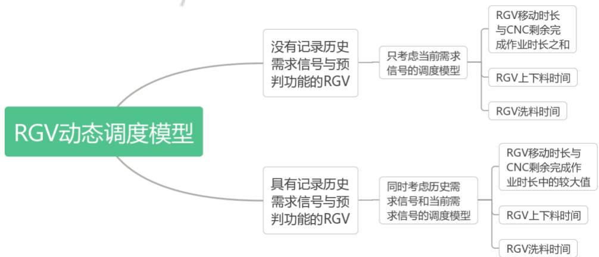

<details>
<summary>flowchart</summary>

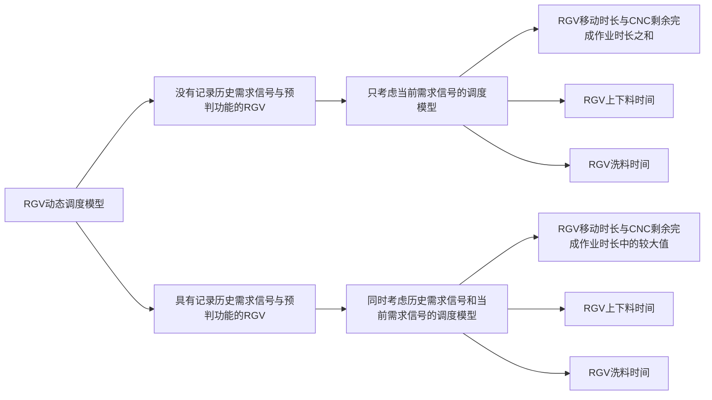
</details>

图1 模型思维导图

## 5.1 任务一的模型建立——方法一：考虑历史信号的调度模型

任务一实际为在 CNC有无发生故障的情况下分别对加工一道工序、两道工序的物料建立4种RGV 动态调度模型。本模块下 4种模型均在采用第一类 RGV的基础上建立。

## 5.1.1 无故障下加工一道工序的情况

## （1）RGV 的动态调度模型

在智能加工系统中，调度 1台RGV对两边排列的 8台CNC进行上下料与洗料。RGV小车，第�轮上料对于第�台CNC只有前往和不前往两种情况，引入0-1变量 $x _ { i } ^ { ( k ) }$ ，则有

$$
x _ {i} ^ {(k)} = \left\{ \begin{array}{l l} 0, & \text {RGV 第} k \text {轮上料不前往第} i \text {台 CNC} \\ 1, & \text {RGV 第} k \text {轮上料前往第} i \text {台 CNC} \end{array} \right. \tag {1}
$$

对RGV而言，每轮移动前均对当前8台 CNC各自的加工剩余时间 $T _ { \mathfrak { X } \mathfrak { k } \mathfrak { l } \mathfrak { i } } ^ { ( k ) }$ 与移动至每台CNC前所需时间 $T _ { \mathcal { \tilde { H } } \mathcal { \tilde { H } } p ^ { ( k ) } q ^ { ( k ) } } ^ { ( k ) }$ 进行比较，其较大值与上下料时间 $r _ { * * i } ^ { ( k ) }$ 之和即为RGV从前往第�台 CNC完成第�轮上料所用时间，

$$
T _ {i} ^ {(k)} = \max _ {i} \left(T _ {\text {剩} i} ^ {(k)}, T _ {\text {移} p ^ {(k)} q ^ {(k)}} ^ {(k)}\right) + T _ {\text {料} i} ^ {(k)} \tag {2}
$$

其中 ${ } ^ { \mathfrak { I } } p ^ { ( k ) }$ 表示第�轮上料的RGV移动的起点位置， $q ^ { ( k ) }$ 表示第�轮上料 RGV移动的终点位置。

$$
f _ {i} ^ {(k)} = \left\{ \begin{array}{l} 0, \text {第} k \text {轮上料前第} i \text {台CNC无物料} \\ 1, \text {第} k \text {轮上料前第} i \text {台CNC有物料} \end{array} \right. \tag {3}
$$

其中 $f _ { i } ^ { ( k ) }$ 为第�轮上料前第�台CNC上的物料状态，旨在区别开机后前 8轮上料之后不需要洗料的情况，其中RGV在第�台CNC 的处第�轮上料后洗料时间用 $T _ { \sharp \sharp i } ^ { ( k ) }$ 表示。

综上，建立获得成料数量最多的单目标规划模型如下：

决策变量为：

$$
x _ {i} ^ {(k)}
$$

目标函数为：

$$
\max Z = \max _ {k} w ^ {(k)} \tag {4}
$$

其中 $w ^ { ( k ) }$ 为第�轮上料后产出的成料总数。

约束条件为：

（1） RGV每轮移动去等待时间最短的 CNC前，即

$$
\max _ {i} \left(x _ {i} ^ {(k)} \cdot T _ {i} ^ {(k)}\right) = \min _ {i} T _ {i} ^ {(k)} \tag {5}
$$

（2） 一台RGV 每次只能对一台CNC进行上下料与洗料，即

$$
\sum_ {i = 1} ^ {8} x _ {i} ^ {(k)} = 1 \tag {6}
$$

（3）每台CNC在装载过一次物料后，CNC上一直有物料，即

$$
f _ {i} ^ {(k + 1)} = f _ {i} ^ {(k)} + x _ {i} ^ {(k)} \left(1 - f _ {i} ^ {(k)}\right) \tag {7}
$$

（4）RGV停泊的时间越短，工作时间越接近 8小时，系统工作效率越高。RGV一个加工班次中总工作时间不超过 8小时，即

$$
\sum_ {k = 1} ^ {k} \sum_ {i = 1} ^ {8} x _ {i} ^ {(k)} \cdot \left(T _ {i} ^ {(k)} + T _ {\text {洗} i} ^ {(k)} \cdot f _ {i} ^ {(k)}\right) \leq 8 \times 3 6 0 0 \tag {8}
$$

（5）RGV 第� + 1次的移动起点 ${ \boldsymbol { p } } ^ { ( k + 1 ) }$ 为第�次RGV的移动终点 $q ^ { ( k ) }$ ，即

$$
q ^ {(k)} = p ^ {(k + 1)} \tag {9}
$$

（6）每轮上料后累计成品产量至多增加 1，即

$$
w ^ {(k + 1)} = w ^ {(k)} + \sum_ {i = 1} ^ {8} \left(f _ {i} ^ {(k)} \cdot x _ {i} ^ {(k)}\right) \tag {10}
$$

（7）在第一轮上料前，成料总数为0，即

$$
w ^ {(0)} = 0 \tag {11}
$$

综上，获得最大数量成料的模型<sup>[1]</sup>为：

$$
\begin{array}{l} \max Z = \max _ {k} w ^ {(k)} \\ \text {s.t.} \left\{ \begin{array}{l} k = 1, 2, 3 \dots ; i = 1, 2, \dots , 8 \\ \max _ {i} \left(x _ {i} ^ {(k)} \cdot T _ {i} ^ {(k)}\right) = \min _ {i} T _ {i} ^ {(k)} \\ T _ {i} ^ {(k)} = \max _ {i} \left(T _ {\text {剩} i} ^ {(k)}, T _ {\text {移} p ^ {(k)} p ^ {(k + 1)}} ^ {(k)}\right) + T _ {\text {料} i} ^ {(k)} \\ \sum_ {i = 1} ^ {8} x _ {i} ^ {(k)} = 1 \\ f _ {i} ^ {(k + 1)} = f _ {i} ^ {(k)} + x _ {i} ^ {(k)} \left(1 - f _ {i} ^ {(k)}\right) \\ \sum_ {k = 1} ^ {k} \sum_ {i = 1} ^ {8} x _ {i} ^ {(k)} \cdot \left(T _ {i} ^ {(k)} + T _ {\text {洗} i} ^ {(k)} \cdot f _ {i} ^ {(k)}\right) \leq 8 \times 3 6 0 0 \\ q ^ {(k)} = p ^ {(k + 1)} \\ w ^ {(k + 1)} = w ^ {(k)} + \sum_ {i = 1} ^ {8} \left(f _ {i} ^ {(k)} \cdot x _ {i} ^ {(k)}\right) \\ w ^ {(0)} = 0 \\ x _ {i} ^ {(k)} \in \{0, 1 \} \end{array} \right. \tag {12} \\ \end{array}
$$

## （2）模型的求解算法

由于难以直接通过模型求得全局最优解，考虑通过求得每轮上下料最短所需时长的启发信息，构造启发式算法得到近似最优解。

从0时刻（即系统启动时刻）开始，通过综合考虑所有历史需求信号和当轮需求信号，找出能最快完成上下料的 CNC，并响应此CNC的当轮需求信号，对此CNC完成一轮上下料的过程，随后按照实际情况判断是否洗料。反复执行上述操作。当累计超过 8小时，中止循环。

图中预计完成作业时间即 $T _ { i } ^ { ( k ) } = \operatorname* { m a x } _ { i } \left( T _ { \# \mathbb { I } | i } ^ { ( k ) } , T _ { \# \mathcal { B } p ^ { ( k ) } q ^ { ( k ) } } ^ { ( k ) } \right) + T _ { \# \ i } ^ { ( k ) } \circ$

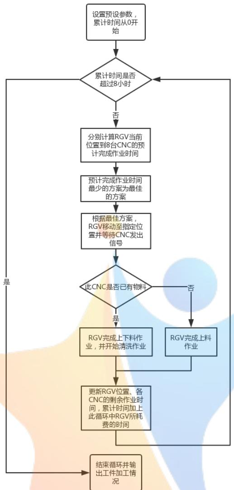

<details>
<summary>flowchart</summary>

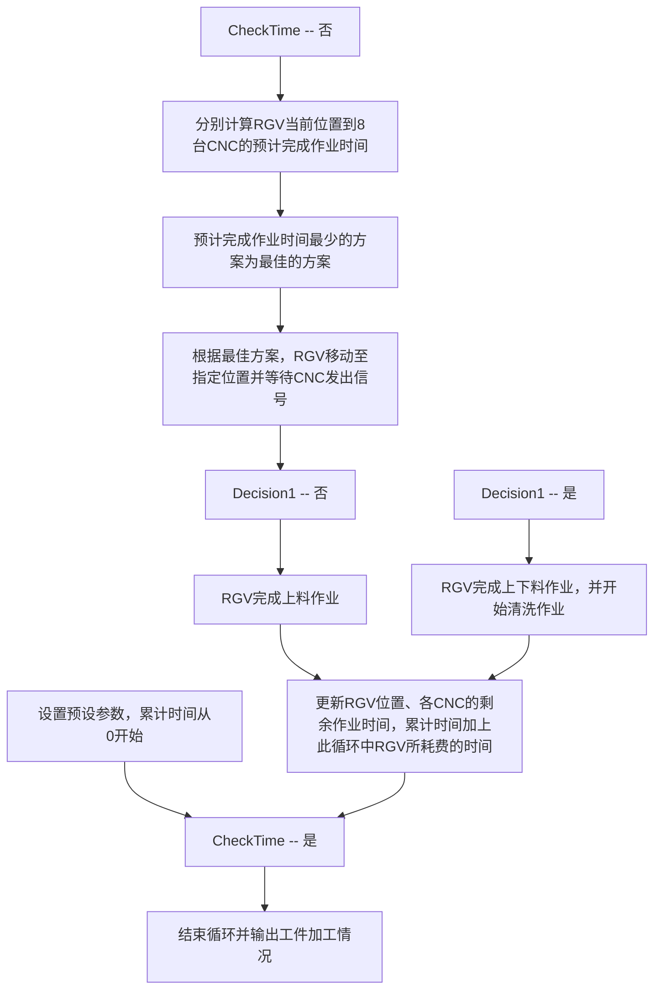
</details>

图2 情况1的流程图

## 5.1.2 无故障下加工两道工序的情况

## （1）RGV 的动态调度模型

具有两道工序的物料，在加工过程中有生料、已加工一道工序的物料以及熟料三种工序状态。在一个班次中，一台CNC仅能使用一种刀具加工一道工序情况下，如何让RGV 在上下料时“认识”机械臂所持物料正处于哪种工序状态并对其进行进一步处理（送至相应 CNC进行后序加工、洗料）是一大难点。本文通过引入物料工序状态因子�<sup>(�)</sup>、CNC加工工序类型因子�，当这两种因子匹配成功时，RGV才能成功进行上下料。

在对8台CNC进行刀具分配时，共有 $\textstyle \sum _ { j = 1 } ^ { 7 } C _ { 8 } ^ { j } = 2 5 4$ 种刀具分布方案，由于不同分配方案下RGV 工作时间与成料数量不同，本文建立了以RGV调度路径为决策变量的最快获得最大数量成料的双目标规划模型如下：

决策变量为：

$$
x _ {i} ^ {(k)}
$$

目标函数为：

$$
\max Z = \max _ {k} w _ {a b} ^ {(k)} \tag {13}
$$

$$
\min _ {k} \sum_ {k = 1} ^ {k} \sum_ {i = 1} ^ {8} x _ {i} ^ {(k)} \cdot \left(T _ {i} ^ {(k)} + T _ {\text {洗} i} ^ {(k)} \cdot f _ {i} ^ {(k)}\right) \tag {14}
$$

�为加工第一道工序的 CNC数量，�为加工第二道工序的 CNC数量， ${ w _ { a b } ^ { ( k ) } }$ 为第�轮上料后加工两道工序的 CNC产出的成料总数。

在式（5）-（11）的约束下，增加约束条件：

（1） 一个加工班次中，一台 CNC只能安装一种刀具、加工一道工序，即

$$
Y _ {i} = \left\{ \begin{array}{l} 1, \text {第} i \text {台 CNC 负责第一道工序} \\ 2, \text {第} i \text {台 CNC 负责第二道工序} \end{array} \right. \tag {15}
$$

（2） 物料有且仅有两种工序状况，即

$$
X ^ {(k)} = \left\{ \begin{array}{l} 1, \text {第} k \text {轮上料时RGV中无物料} \\ 2, \text {第} k \text {轮上料时RGV中有完成了工序一的物料} \end{array} \right. \tag {16}
$$

（3） 第�轮上料时，只有当物料与被上料的第�台CNC的工序匹配成功即当 $X ^ { ( k ) } = Y _ { i }$ 时才能成功进行上料，则有

$$
x _ {i} ^ {(k)} = x _ {i} ^ {(k)} \big (1 - \big | X ^ {(k)} - Y _ {i} \big | \big) \tag {17}
$$

（4）CNC数量满足正整数约束且 CNC总数量一定，即

$$
a + b = 8; a, b \in N ^ {+} \tag {18}
$$

综上，获得最短时间获得最多成品的模型<sup>[1]</sup>为：

$$
\max Z = \max _ {k} w _ {a b} ^ {(k)}
$$

$$
\min _ {k} \sum_ {k = 1} ^ {k} \sum_ {i = 1} ^ {8} x _ {i} ^ {(k)} \cdot \left(T _ {i} ^ {(k)} + T _ {\text {洗} i} ^ {(k)} \cdot f _ {i} ^ {(k)}\right)
$$

$$
\begin{array}{l} f k = 1, 2, 3 \dots ; i = 1, 2, \dots , 8 \\ \max _ {i} \left(x _ {i} ^ {(k)} \cdot T _ {i} ^ {(k)}\right) = \min _ {i} T _ {i} ^ {(k)} \\ T _ {i} ^ {(k)} = \max _ {i} \left(T _ {\text {剩} i} ^ {(k)}, T _ {\text {移} p ^ {(k)} q ^ {(k)}} ^ {(k)}\right) + T _ {\text {料} i} ^ {(k)} \\ \sum_ {i = 1} ^ {8} x _ {i} ^ {(k)} = 1 \\ x _ {i} ^ {(k)} = x _ {i} ^ {(k)} \big (1 - \big | X ^ {(k)} - Y _ {i} \big | \big) \\ a + b = 8; a, b \in N ^ {+} \\ f _ {k} ^ {(k + 1)} = f _ {i} ^ {(k)} + x _ {i} ^ {(k)} \left(1 - f _ {i} ^ {(k)}\right) (19) \\ s. t. \left\{\sum_ {k = 1} ^ {k} \sum_ {i = 1} ^ {8} x _ {i} ^ {(k)} \cdot \left(T _ {i} ^ {(k)} + T _ {\text {洗} i} ^ {(k)} \cdot f _ {i} ^ {(k)}\right) \leq 8 \times 3 6 0 0 \right. (19) \\ q ^ {(k)} = p ^ {(k + 1)} \\ w ^ {(k + 1)} = w ^ {(k)} + \sum_ {i = 1} ^ {8} \left(f _ {i} ^ {(k)} \cdot x _ {i} ^ {(k)}\right) \\ w ^ {(0)} = 0 \\ \begin{array}{l} x _ {i} ^ {(k)} \in \{0, 1 \} \\ Y _ {i} \in \{1, 2 \} \end{array} \\ X ^ {(k)} \epsilon \{1, 2 \} \\ \end{array}
$$

$$
\begin{array}{l} s. t. \left\{\sum_ {k = 1} ^ {k} \sum_ {i = 1} ^ {8} x _ {i} ^ {(k)} \cdot \left(T _ {i} ^ {(k)} + T _ {\text {洗} i} ^ {(k)} \cdot f _ {i} ^ {(k)}\right) \leq 8 \times 3 6 0 0 \right. \tag {19} \\ q ^ {(k)} = p ^ {(k + 1)} \\ w ^ {(k + 1)} = w ^ {(k)} + \sum_ {i = 1} ^ {8} \left(f _ {i} ^ {(k)} \cdot x _ {i} ^ {(k)}\right) \\ w ^ {(0)} = 0 \\ \begin{array}{l} x _ {i} ^ {(k)} \in \{0, 1 \} \\ Y _ {i} \in \{1, 2 \} \end{array} \\ X ^ {(k)} \epsilon \{1, 2 \} \\ \end{array}
$$

## （2）模型的求解算法

对每一种刀具分布方案采用与情况 1算法相同的思路构建启发式算法求出对应的近似最优解，依照双目标选出最优化刀具分布方案及相应的物料加工情况。

任何一种刀具分布方案中必然同时存在工序 1刀具和工序2刀具，遍历254种刀具分布方案，并进行计算：

从0时刻（即系统启动时刻）开始，通过综合考虑所有历史需求信号和当轮需求信号，在所负责工序符合当前目标工序的 CNC中，找出能最快完成上下料的CNC，并响应此 CNC的当轮需求信号，对此 CNC完成一轮上下料的过程，随后按照实际情况判断是否洗料以及是否改变目标工序。反复执行上述操作。当累计超过8小时，中止循环。最终依据双决策目标找出最优化刀具分布方案及相应的物料加工情况。

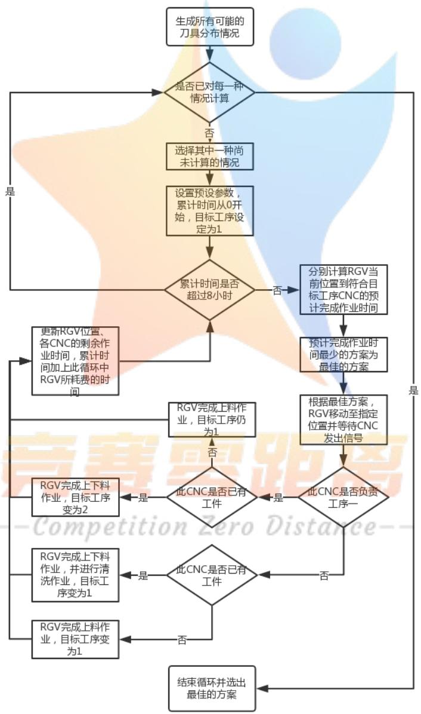

<details>
<summary>flowchart</summary>

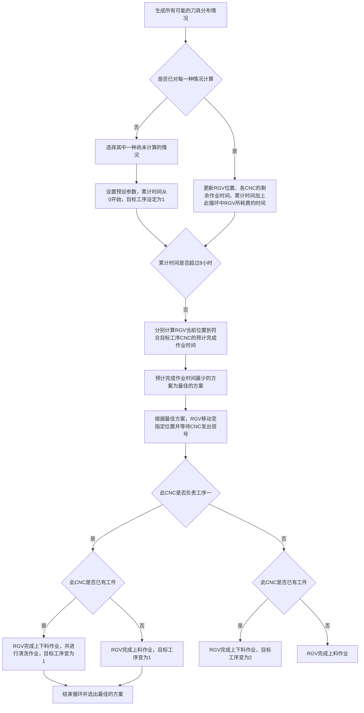
</details>

图 3 情况 2 的流程图

## 5.1.3 概率故障下加工一道工序的情况

## （1）RGV 的动态调度模型

实际生产生活中，工业流水线上存在多种不确定因素影响着正常生产，也影响了调度目标的实现。情况 3指出CNC在加工过程中可能发生概率为 1%的故障，故障发生时该机正在加工的物料即刻报废，人工排除故障需要 10\~20分钟，排除故障后该机即刻加入作业序列。因此在规划 RGV动态调度模型时，应考虑通过实时采集故障机信息，及时更新 RGV作业指令，使得RGV工作不因故障机停滞，从而提高此智能加工系统的生产效率。

综上，建立概率故障下获得最大数量成料的单目标规划模型如下：

决策变量为：

$$
x _ {i} ^ {(k)}
$$

目标函数为：

$$
\max Z = \max _ {k} w ^ {(k)} \tag {20}
$$

在式（5）-（11）的约束下，增加约束条件：

（1） 机器故障仅发生在加工过程中，即

$$
T _ {\text {渡} i} ^ {(k)} \sim U \left(0, T _ {\text {工} i} ^ {(k)}\right) \tag {21}
$$

其中 $T _ { \dot { \mathfrak { M } } \dot { \mathfrak { L } } i } ^ { ( k ) }$ 为第�台CNC 第�轮上料后到其发生故障的时间。

（2） 加工过程中第�台CNC发生故障的概率是确定的，即

$$
P \left(C _ {i} ^ {(k)}\right) = \frac {1}{1 0 0} \tag {22}
$$

（3）修理故障机耗时 10\~20 分钟，即

$$
T _ {\text {修} i} ^ {(k)} \sim U (6 0 0, 1 2 0 0) \tag {23}
$$

其中 $T _ { \langle | \widetilde { \Xi } i } ^ { ( k ) }$ 为第�轮上料发生故障的第�台CNC的维修时间。

（3） 第�轮上料时发生了故障的第�台 CNC表示为 $C _ { i } ^ { ( k ) }$ ，当 $C _ { i } ^ { ( k ) }$ 发生时，

$$
t _ {\text {障} i} ^ {(k)} = \sum_ {k = 1} ^ {k - 1} \sum_ {i = 1} ^ {8} \left\{x _ {i} ^ {(k)} \cdot \left[ T _ {i} ^ {(k)} + T _ {\text {洗} i} ^ {(k)} \cdot f _ {i} ^ {(k)} \right] \right\} + T _ {i} ^ {(k)} + T _ {\text {渡} i} ^ {k} \tag {24}
$$

此时人工将故障机的报废料清除,且令故障机的维修时间等同于故障机“剩余加工时间”，即

$$
\text {令} f _ {i} ^ {(k + 1)} = 0, T _ {\text {剩} i} ^ {(k)} = T _ {\text {修} i} ^ {(k)} \tag {25}
$$

综上，获得最大数量成料的模型<sup>[1]</sup>为：

$$
\max Z = \max _ {k} w ^ {(k)}
$$

$$
\text {s.t.} \left\{ \begin{array}{l} k = 1, 2, 3 \dots ; i = 1, 2, \dots , 8 \\ \max _ {i} \left(x _ {i} ^ {(k)} \cdot T _ {i} ^ {(k)}\right) = \min _ {i} T _ {i} ^ {(k)} \\ T _ {i} ^ {(k)} = \max _ {i} \left(T _ {\text {剩} i} ^ {(k)}, T _ {\text {移} p ^ {(k)} p ^ {(k + 1)}} ^ {(k)}\right) + T _ {\text {料} i} ^ {(k)} \\ \sum_ {i = 1} ^ {8} x _ {i} ^ {(k)} = 1 \\ f _ {i} ^ {(k + 1)} = f _ {i} ^ {(k)} + x _ {i} ^ {(k)} \left(1 - f _ {i} ^ {(k)}\right) \\ \sum_ {k = 1} ^ {k} \sum_ {i = 1} ^ {8} x _ {i} ^ {(k)} \cdot \left(T _ {i} ^ {(k)} + T _ {\text {洗} i} ^ {(k)} \cdot f _ {i} ^ {(k)}\right) \leq 8 \times 3 6 0 0, \\ q ^ {(k)} = p ^ {(k + 1)} \\ w ^ {(k + 1)} = w ^ {(k)} + \sum_ {i = 1} ^ {8} \left(f _ {i} ^ {(k)} \cdot x _ {i} ^ {(k)}\right); w ^ {(0)} = 0 \\ T _ {\text {渡} i} ^ {(k)} \sim U \left(0, T _ {\text {工} i} ^ {(k)}\right) \\ P \left(C _ {i} ^ {(k)}\right) = \frac {1}{1 0 0} \\ T _ {\text {修} i} ^ {(k)} \sim U (6 0 0, 1 2 0 0) \\ t _ {\text {障} i} ^ {(k)} = \sum_ {k = 1} ^ {k - 1} \sum_ {i = 1} ^ {8} \left\{x _ {i} ^ {(k)} \cdot \left[ T _ {i} ^ {(k)} + T _ {\text {洗} i} ^ {(k)} \cdot f _ {i} ^ {(k)} \right] \right\} + T _ {i} ^ {(k)} + T _ {\text {渡} i} ^ {k} \\ C _ {i} ^ {(k)} \text {发生时，令} f _ {i} ^ {(k + 1)} = 0, T _ {\text {剩} i} ^ {(k)} = T _ {\text {修} i} ^ {(k)} \\ x _ {i} ^ {(k)} \in \{0, 1 \} \end{array} \right. \tag {26}
$$

## （2）模型的求解算法

通过生成随机数模拟故障与维修，将故障与维修等效转换为 CNC 仍在工作。采用与情况1算法相同的思路构建启发式算法求出近似最优解。

从0时刻（即系统启动时刻）开始，通过综合考虑所有历史需求信号和当轮需求信号，找出能最快完成上下料的 CNC，并响应此CNC的当轮需求信号，对此CNC完成一轮上下料的过程，随后按照实际情况判断是否洗料。

为了模拟概率故障，在每一轮上料时刻，通过生成均布随机数来决定此物料是否有可能在未来的加工过程中发生故障，如果此物料的加工过程会发生故障，则分别生成均布随机数以决定故障的发生时刻和修复故障所需的时间，并记录这些信息。在每一次 RGV完成上下料（和洗料）时刻、RGV完成移动时刻、RGV原地等待时段，处理已发生且未曾处理的故障，将此次故障与修复的概念等效转化为故障 CNC正在加工物料，令此次加工时间等于修复时间，且此次加工结束（即完成修复）之后此 CNC中不存在物料（即产生故障的物料被人为报废）。如果发生故障的 CNC正好是RGV即将响应需求的 CNC，则令 RGV原地等待，并重新开始循环选择另一个需要被相应需求的 CNC。

反复执行上述操作。当累计超过 8小时，中止循环。

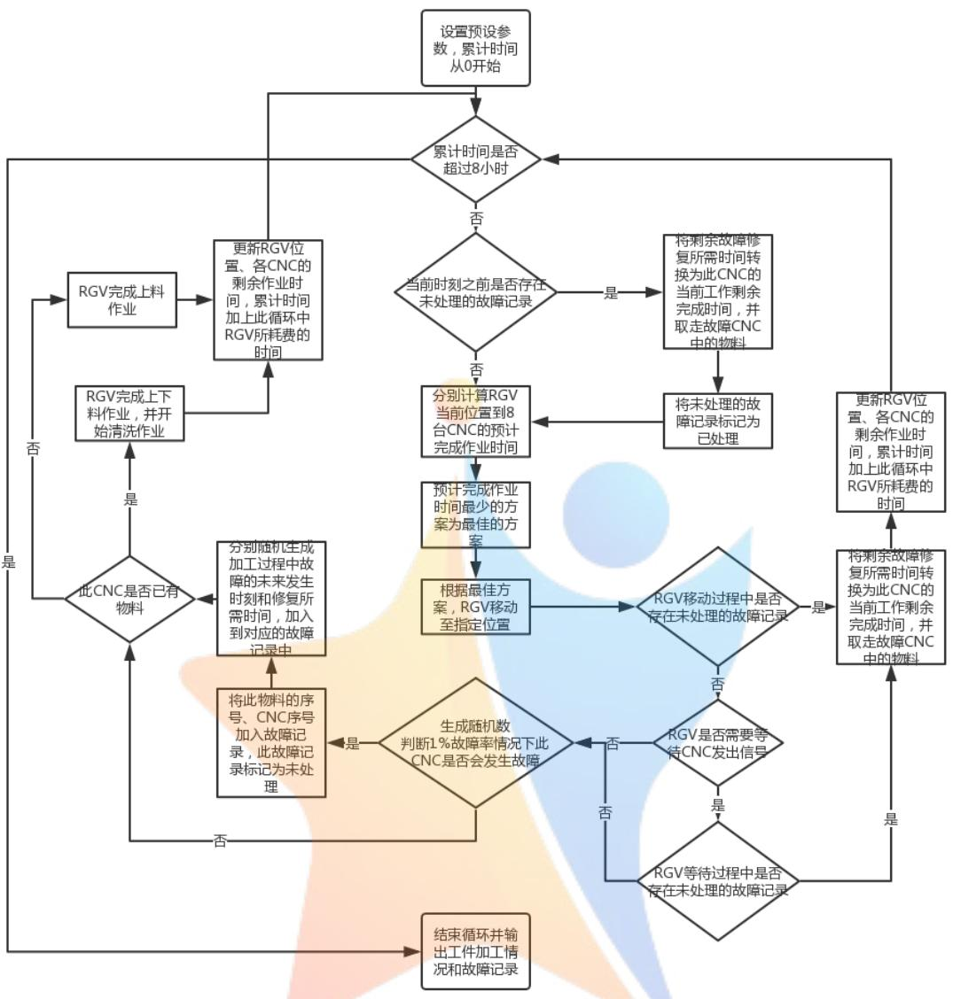

<details>
<summary>flowchart</summary>

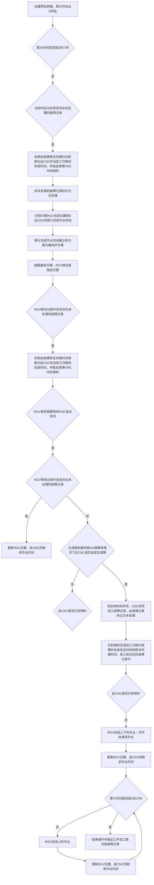
</details>

图4 情况3-1 的流程图

## 5.1.4 概率故障下加工两道工序的情况

## （1）RGV 的动态调度模型

在式（5）-（11）（15）-（18）（21）-（25）的约束下，获得最多成品模型<sup>[1]</sup>为：

$$
\max Z = \max _ {k} w _ {a b} ^ {(k)}
$$

$$
\min _ {k} \sum_ {k = 1} ^ {k} \sum_ {i = 1} ^ {8} x _ {i} ^ {(k)} \cdot \left(T _ {i} ^ {(k)} + T _ {\text {洗} i} ^ {(k)} \cdot f _ {i} ^ {(k)}\right)
$$

$$
\text {s.t.} \left\{ \begin{array}{l} k = 1, 2, 3 \dots ; i = 1, 2, \dots , 8 \\ \max _ {i} \left(x _ {i} ^ {(k)} \cdot T _ {i} ^ {(k)}\right) = \min _ {i} T _ {i} ^ {(k)} \\ T _ {i} ^ {(k)} = \max _ {i} \left(T _ {\text {剩} i} ^ {(k)}, T _ {\text {移} p ^ {(k)} q ^ {(k)}} ^ {(k)}\right) + T _ {\text {料} i} ^ {(k)} \\ \sum_ {i = 1} ^ {8} x _ {i} ^ {(k)} = 1 \\ x _ {i} ^ {(k)} = x _ {i} ^ {(k)} \left(1 - \left| X ^ {(k)} - Y _ {i} \right|\right) \\ a + b = 8; a, b \in N ^ {+} \\ f _ {i} ^ {(k + 1)} = f _ {i} ^ {(k)} + x _ {i} ^ {(k)} \left(1 - f _ {i} ^ {(k)}\right) \\ T _ {S} ^ {(k)} \leq 8 \times 3 6 0 0 \\ q ^ {(k)} = p ^ {(k + 1)} \\ w ^ {(k + 1)} = w ^ {(k)} + \sum_ {i = 1} ^ {8} \left(f _ {i} ^ {(k)} \cdot x _ {i} ^ {(k)}\right) \\ w ^ {(0)} = 0 \\ T _ {\text {渡} i} ^ {(k)} \sim U \left(0, T _ {\text {工} i} ^ {(k)}\right) \\ P \left(C _ {i} ^ {(k)}\right) = \frac {1}{1 0 0} \\ T _ {\text {修} i} ^ {(k)} \sim U (6 0 0, 1 2 0 0) \\ t _ {\text {障} i} ^ {(k)} = \sum_ {k = 1} ^ {k - 1} \sum_ {i = 1} ^ {8} \left\{x _ {i} ^ {(k)} \cdot \left[ T _ {i} ^ {(k)} + T _ {\text {洗} i} ^ {(k)} \cdot f _ {i} ^ {(k)} \right] \right\} + T _ {i} ^ {(k)} + T _ {\text {渡} i} ^ {k} \\ C _ {i} ^ {(k)} \text {发生时，令} f _ {i} ^ {(k + 1)} = 0, T _ {\text {剩} i} ^ {(k)} = T _ {\text {修} i} ^ {(k)} \\ x _ {i} ^ {(k)} \in \{0, 1 \} \\ Y _ {i} \in \{1, 2 \} \\ X ^ {(k)} \in \{1, 2 \} \end{array} \right. \tag {27}
$$

## （2）模型的求解算法

生成随机数模拟故障与维修，将故障与维修等效转换为 CNC仍在工作。采用已求得的最优刀具分布方案及情况 2算法相同的思路构建启发式算法求出近似最优解。

选择之前在情况 2中的最优刀具分布方案，从 0时刻（即系统启动时刻）开始，通过综合考虑所有历史需求信号和当轮需求信号，在所负责工序符合当前目标工序的CNC中，找出能最快完成上下料的 CNC，并响应此CNC 的当轮需求信号，对此CNC完成一轮上下料的过程，随后按照实际情况判断是否洗料以及是否改变目标工序。反复执行上述操作。

对于模拟概率故障，算法与上一种算法完全一致，不再赘述。当累计超过 8小时，中止循环。

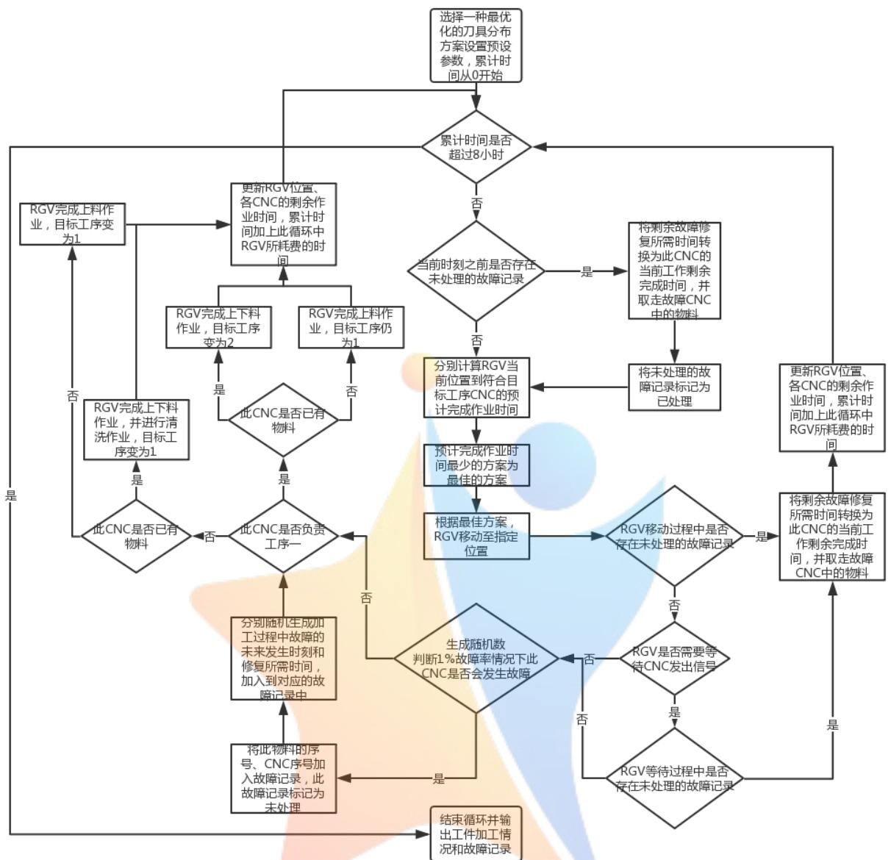

<details>
<summary>flowchart</summary>

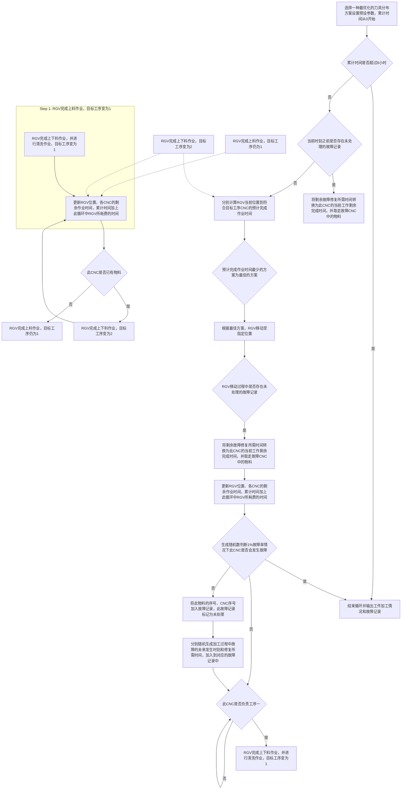
</details>

图5 情况3-2 的流程图

## 5.2 任务一的模型建立——方法二：仅考虑当轮信号的调度模型

本模块下4种模型均在采用第二类 RGV 的基础上建立，由于论文篇幅有限以及方法一、二算法思想极其相似，方法二算法文中不再展示。

两组RGV调度模型，最关键的区别即为是否在未接收到新需求指令时进行预判与移动。在方法二中，此时 RGV前往第�台CNC完成第�轮上料所用时间为 $T _ { \sharp \sharp \underline { { \sf i } } } ^ { ( k ) } +$ ${ \cal T } _ { \sharp \sharp p ^ { ( k ) } p ^ { ( k + 1 ) } } ^ { ( k ) } + { \cal T } _ { \sharp \sharp i } ^ { ( k ) }$ ，当 RGV移动前已经接收到多个需求信号时，有

$$
\max \left[ x _ {i} ^ {(k)} \cdot \left(T _ {\text {剩} i} ^ {(k)} + T _ {\text {移} p ^ {(k)} q ^ {(k)}} ^ {(k)} + T _ {\text {料} i} ^ {(k)}\right) \right] = \min \left(T _ {\text {剩} i} ^ {(k)} + T _ {\text {移} p ^ {(k)} q ^ {(k)}} ^ {(k)} + T _ {\text {料} i} ^ {(k)}\right) \tag {28}
$$

$$
\sum_ {k = 1} ^ {k} \sum_ {i = 1} ^ {8} x _ {i} ^ {(k)} \cdot \left(T _ {\text {剩} i} ^ {(k)} + T _ {\text {移} p ^ {(k)} q ^ {(k)}} ^ {(k)} + T _ {\text {料} i} ^ {(k)} + T _ {\text {洗} i} ^ {(k)} \cdot f _ {i} ^ {(k)}\right) \leq 8 \times 3 6 0 0 \tag {29}
$$

## 5.2.1 无故障下加工一道工序的情况

在式（6）（7）（9）-（11）（28）（29）的约束下，建立加工一道工序情况想获得最大数量成料的模型<sup>[1]</sup>为：

$$
\max Z = \max _ {k} w ^ {(k)}
$$

$$
\begin{array}{l} \begin{array}{r l} & {k = 1, 2, 3 \dots ; i = 1, 2, \dots , 8} \\ & {\max \left[ x _ {i} ^ {(k)} \cdot \left(T _ {\text {剩} i} ^ {(k)} + T _ {\text {移} p ^ {(k)} q ^ {(k)}} ^ {(k)} + T _ {\text {料} i} ^ {(k)}\right) \right] = \min \left(T _ {\text {剩} i} ^ {(k)} + T _ {\text {移} p ^ {(k)} q ^ {(k)}} ^ {(k)} + T _ {\text {料} i} ^ {(k)}\right)} \end{array} \\ \sum_ {i = 1} ^ {8} x _ {i} ^ {(k)} = 1 \\ f _ {i} ^ {(k + 1)} = f _ {i} ^ {(k)} + x _ {i} ^ {(k)} \Big (1 - f _ {i} ^ {(k)} \Big) \\ s. t. \left\{\sum_ {k = 1} ^ {k} \sum_ {i = 1} ^ {8} x _ {i} ^ {(k)} \cdot \left(T _ {\text {剩}} ^ {(k)} + T _ {\text {移} p ^ {(k)} q ^ {(k)}} ^ {(k)} + T _ {\text {料} i} ^ {(k)} + T _ {\text {洗} i} ^ {(k)} \cdot f _ {i} ^ {(k)}\right) \leq 8 \times 3 6 0 0, \right. \tag {29} \\ q ^ {(k)} = p ^ {(k + 1)} \\ \begin{array}{l} w ^ {(k + 1)} = w ^ {(k)} + \sum_ {i = 1} ^ {8} \Big (f _ {i} ^ {(k)} \cdot x _ {i} ^ {(k)} \Big) \\ w ^ {(0)} = 0 \\ x _ {i} ^ {(k)} \in \{0, 1 \} \end{array} \\ \end{array}
$$

$$
\begin{array}{l} s. t. \left\{\sum_ {k = 1} ^ {k} \sum_ {i = 1} ^ {8} x _ {i} ^ {(k)} \cdot \left(T _ {\text {剩}} ^ {(k)} + T _ {\text {移} p ^ {(k)} q ^ {(k)}} ^ {(k)} + T _ {\text {料} i} ^ {(k)} + T _ {\text {洗} i} ^ {(k)} \cdot f _ {i} ^ {(k)}\right) \leq 8 \times 3 6 0 0, \right. \tag {29} \\ q ^ {(k)} = p ^ {(k + 1)} \\ \begin{array}{l} w ^ {(k + 1)} = w ^ {(k)} + \sum_ {i = 1} ^ {8} \Big (f _ {i} ^ {(k)} \cdot x _ {i} ^ {(k)} \Big) \\ w ^ {(0)} = 0 \\ x _ {i} ^ {(k)} \in \{0, 1 \} \end{array} \\ \end{array}
$$

## 5.2.2 无故障下加工两道工序的情况

在式（6）（7）（9）-（11）（15）-（18）（28）（29）的约束下，建立加工两道工序情况下最短时间获得最多成品的模型<sup>[1]</sup>为：

$$
\max Z = \max _ {k} w _ {a b} ^ {(k)}
$$

$$
\min _ {k} \sum_ {k = 1} ^ {k} \sum_ {i = 1} ^ {8} x _ {i} ^ {(k)} \cdot \left[ T _ {\text {剩}} ^ {(k)} + T _ {\text {移} p ^ {(k)} q ^ {(k)}} ^ {(k)} + T _ {\text {料} i} ^ {(k)} + T _ {\text {洗} i} ^ {(k)} \cdot f _ {i} ^ {(k)} \right]
$$

$$
\begin{array}{l} \left\{ \begin{array}{l} k = 1, 2, 3 \dots ; i = 1, 2, \dots , 8 \\ \max \left[ x _ {i} ^ {(k)} \cdot \left(T _ {\text {剩} i} ^ {(k)} + T _ {\text {移} p ^ {(k)} q ^ {(k)}} ^ {(k)} + T _ {\text {料} i} ^ {(k)}\right) \right] = \min \left(T _ {\text {剩} i} ^ {(k)} + T _ {\text {移} p ^ {(k)} q ^ {(k)}} ^ {(k)} + T _ {\text {料} i} ^ {(k)}\right) \end{array} \right. \\ \sum_ {i = 1} ^ {8} x _ {i} ^ {(k)} = 1 \\ x _ {i} ^ {(k)} = x _ {i} ^ {(k)} \big (1 - \big | X ^ {(k)} - Y _ {i} \big | \big) \\ a + b = 8; a, b \in N ^ {+} \\ f _ {i} ^ {(k + 1)} = f _ {i} ^ {(k)} + x _ {i} ^ {(k)} \Big (1 - f _ {i} ^ {(k)} \Big) \\ \left\{\sum_ {k = 1} ^ {k} \sum_ {i = 1} ^ {8} x _ {i} ^ {(k)} \cdot \left(T _ {\text {剩}} ^ {(k)} + T _ {\text {移} p ^ {(k)} q ^ {(k)}} ^ {(k)} + T _ {\text {料} i} ^ {(k)} + T _ {\text {洗} i} ^ {(k)} \cdot f _ {i} ^ {(k)}\right) \leq 8 \times 3 6 0 0 \right. \tag {30} \\ q ^ {(k)} = p ^ {(k + 1)} \\ w ^ {(k + 1)} = w ^ {(k)} + \sum_ {i = 1} ^ {8} \left(f _ {i} ^ {(k)} \cdot x _ {i} ^ {(k)}\right) \\ w ^ {(0)} = 0 \\ x _ {i} ^ {(k)} \in \{0, 1 \} \\ Y _ {i} \in \{1, 2 \} \\ \big \lfloor X ^ {(k)} \epsilon \{1, 2 \} \\ \end{array}
$$

## 5.2.3 概率故障下加工一道工序的情况

在式（6） $\left( 7 \right) \left( 9 \right) - \left( 1 1 \right) \left( 2 1 \right) - \left( 2 5 \right) \left( 2 8 \right) \left( 2 9 \right)$ 的约束下，建立获得概率故障情况下加工一道工序的最大数量成料的模型<sup>[1]</sup>为：

$$
\max Z = \max _ {k} w ^ {(k)}
$$

$$
\begin{array}{l} \left\{ \begin{array}{l} k = 1, 2, 3 \dots ; i = 1, 2, \dots , 8 \\ m a x \left[ x _ {i} ^ {(k)} \cdot \left(T _ {\text {剩} i} ^ {(k)} + T _ {\text {移} p ^ {(k)} q ^ {(k)}} ^ {(k)} + T _ {\text {料} i} ^ {(k)}\right) \right] = \min \left(T _ {\text {剩} i} ^ {(k)} + T _ {\text {移} p ^ {(k)} q ^ {(k)}} ^ {(k)} + T _ {\text {料} i} ^ {(k)}\right) \\ \sum_ {i = 1} ^ {8} x _ {i} ^ {(k)} = 1 \\ f _ {i} ^ {(k + 1)} = f _ {i} ^ {(k)} + x _ {i} ^ {(k)} \Big (1 - f _ {i} ^ {(k)} \Big) \\ \sum_ {k = 1} ^ {k} \sum_ {i = 1} ^ {8} x _ {i} ^ {(k)} \cdot \left(T _ {\text {剩}} ^ {(k)} + T _ {\text {移} p ^ {(k)} q ^ {(k)}} ^ {(k)} + T _ {\text {料} i} ^ {(k)} + T _ {\text {洗} i} ^ {(k)} \cdot f _ {i} ^ {(k)}\right) \leq 8 \times 3 6 0 0, \\ q ^ {(k)} = p ^ {(k + 1)} \end{array} \right. \\ \text {s.t.} \left\{ \begin{array}{l} w ^ {(k + 1)} = w ^ {(k)} + \sum_ {i = 1} ^ {8} \left(f _ {i} ^ {(k)} \cdot x _ {i} ^ {(k)}\right) \\ w ^ {(0)} = 0 \\ T _ {\text {渡} i} ^ {(k)} \sim U \left(0, T _ {\text {工} i} ^ {(k)}\right) \\ P \left(C _ {i} ^ {(k)}\right) = \frac {1}{1 0 0} \\ T _ {\text {修} i} ^ {(k)} \sim U (6 0 0, 1 2 0 0) \\ t _ {\text {障} i} ^ {(k)} = \sum_ {k = 1} ^ {k - 1} \sum_ {i = 1} ^ {8} \left\{x _ {i} ^ {(k)} \cdot \left[ T _ {i} ^ {(k)} + T _ {\text {洗} i} ^ {(k)} \cdot f _ {i} ^ {(k)} \right] \right\} + T _ {i} ^ {(k)} + T _ {\text {渡} i} ^ {k} \\ C _ {i} ^ {(k)} \text {发生时,令} f _ {i} ^ {(k + 1)} = 0, T _ {\text {剩} i} ^ {(k)} = T _ {\text {修} i} ^ {(k)} \\ x _ {i} ^ {(k)} \in \{0, 1 \} \end{array} \right. \tag {31} \\ \end{array}
$$

## 5.2.4 概率故障下加工两道工序的情况

在式（6） $( 7 ) \ ( 9 ) \ - \ ( 1 1 ) \ ( 1 5 ) - \ ( 1 8 ) \ ( 2 1 ) = \ ( 2 5 ) \ ( 2 8 )$ （29）约束下，建立获得概率故障情况下加工两道工序的最短时间获得最大数量成料的模型<sup>[1]</sup>为：

$$
\max Z = \max _ {k} w _ {a b} ^ {(k)}
$$

$$
\min _ {k} \sum_ {k = 1} ^ {k} \sum_ {i = 1} ^ {8} x _ {i} ^ {(k)} \cdot \left[ T _ {\text {剩}} ^ {(k)} + T _ {\text {移} p ^ {(k)} q ^ {(k)}} ^ {(k)} + T _ {\text {料} i} ^ {(k)} + T _ {\text {洗} i} ^ {(k)} \cdot f _ {i} ^ {(k)} \right]
$$

$$
\text {s.t.} \left\{ \begin{array}{l} k = 1, 2, 3 \dots ; i = 1, 2, \dots , 8 \\ x _ {i} ^ {(k)} \in \{0, 1 \} \\ \max \left[ x _ {i} ^ {(k)} \cdot \left(T _ {\text {剩} i} ^ {(k)} + T _ {\text {移} p ^ {(k)} q ^ {(k)}} ^ {(k)} + T _ {\text {料} i} ^ {(k)}\right) \right] = \min \left(T _ {\text {剩} i} ^ {(k)} + T _ {\text {移} p ^ {(k)} q ^ {(k)}} ^ {(k)} + T _ {\text {料} i} ^ {(k)}\right) \\ \sum_ {i = 1} ^ {8} x _ {i} ^ {(k)} = 1 \\ x _ {i} ^ {(k)} = x _ {i} ^ {(k)} \left(1 - \left| X ^ {(k)} - Y _ {i} \right|\right) \\ a + b = 8; a, b \in N ^ {+} \\ f _ {i} ^ {(k + 1)} = f _ {i} ^ {(k)} + x _ {i} ^ {(k)} \left(1 - f _ {i} ^ {(k)}\right) \\ \sum_ {k = 1} ^ {k} \sum_ {i = 1} ^ {8} x _ {i} ^ {(k)} \cdot \left(T _ {\text {剩}} ^ {(k)} + T _ {\text {移} p ^ {(k)} q ^ {(k)}} ^ {(k)} + T _ {\text {料} i} ^ {(k)} + T _ {\text {洗} i} ^ {(k)} \cdot f _ {i} ^ {(k)}\right) \leq 8 \times 3 6 0 0 \\ q ^ {(k)} = p ^ {(k + 1)} \\ w ^ {(k + 1)} = w ^ {(k)} + \sum_ {i = 1} ^ {8} \left(f _ {i} ^ {(k)} \cdot x _ {i} ^ {(k)}\right) \\ w ^ {(0)} = 0 \\ T _ {\text {渡} i} ^ {(k)} \sim U (0, T _ {\text {工} i} ^ {(k)}) \\ P \left(C _ {i} ^ {(k)}\right) = \frac {1}{1 0 0} \\ T _ {\text {修} i} ^ {(k)} \sim U (6 0 0, 1 2 0 0) \\ t _ {\text {障} i} ^ {(k)} = \sum_ {k = 1} ^ {k - 1} \sum_ {i = 1} ^ {8} \left\{x _ {i} ^ {(k)} \cdot \left[ T _ {i} ^ {(k)} + T _ {\text {洗} i} ^ {(k)} \cdot f _ {i} ^ {(k)} \right] \right\} + T _ {i} ^ {(k)} + T _ {\text {渡} i} ^ {k} \\ C _ {i} ^ {(k)} \text {发生时，令} f _ {i} ^ {(k + 1)} = 0, T _ {\text {剩} i} ^ {(k)} = T _ {\text {修} i} ^ {(k)} \\ x _ {i} ^ {(k)} \in \{0, 1 \} \\ Y _ {i} \in \{1, 2 \} \\ X ^ {(k)} \in \{1, 2 \} \end{array} \right. \tag {32}
$$

## 5.3 任务二的模型建立与求解

本文利用题给3 组参数检验模型的实用性与算法的有效性。

## （1） 模型的实用性

为了更准确地描述 RGV动态调度模型的实用性，本文从实施的可行性<sup>[2]</sup>、经济性<sup>[2]</sup>、普适性三个方面分别进行研究。

①实施的可行性

一个可行性高的调度模型不能脱离实际，应能实施到实际生产中。RGV的动态调度模型是否能运用在实际生产中是实施的可行性的最重要因素。

②经济性

一个好的调度模型能实现缩短生产周期、降低生产成本、提高生产效率等目标，进而提高系统的经济效益。RGV的动态调度模型直接影响该智能加工系统的生产能力，通过经济性衡量模型的实用性是合适的。

这里情况1和2 下，引入理想总完成加工数，意指在一个班次内所有 CNC处于不间断工作状态。用实际总完成加工数与理想总完成加工数表的比例大小来反应其经济性的高低。

③普适性

普适性强的调度模型，能对同类生产对象、流水线具有普遍的适用性。

④CNC平均非有效工作时长

由于RGV总工作时长受总产量影响，因此使用 RGV总工作时间计算可得 CNC平均非有效工作时长，便于对其进行准确的评价。

$$
\text {CNC平均非有效工作时长} = \frac {\left(\mathrm{RGV总工作时间} \times 8 - \text {成料数} \cdot T _ {\text {工i}} ^ {(k)}\right)}{8} \tag {33}
$$

## （2） 算法的有效性

为了更准确地描述 RGV动态调度模型所对应算法的有效性，本文从程序的运行总时长与程序运行占用内存两个方面分别进行研究。

①程序总运行时长

总运行时长短的程序，能快速得到结果，运行结果在实际应用中具有时效性。程序总运行时间越短，运行结果的时效性越好，算法的有效性越高。程序基于 Intel(R)Core(TM)i7-6700HQ2.60GHz2.60GHz 处理器运行。

②程序运行占用内存

Matlab内存占用量反映了此程序的优化程度，内存占用量越小，程序对计算机的性能要求越低，算法的实用性越高。当 Matlab（R2018a）空闲时在本机上的内存占用量为1434MB。

## 5.3.1 对无故障下一道工序的两种 RGV 动态调度模型的求解与检验

表 1：情况 1中3组参量在两种方法下的检验结果

<table><tr><td rowspan="2">情况1</td><td colspan="2">组1</td><td colspan="2">组2</td><td colspan="2">组3</td></tr><tr><td>方法1</td><td>方法2</td><td>方法1</td><td>方法2</td><td>方法1</td><td>方法2</td></tr><tr><td>理想总完成加工数(件)</td><td colspan="2">390</td><td colspan="2">376</td><td colspan="2">401</td></tr><tr><td>总完成加工数(件)</td><td>382</td><td>356</td><td>359</td><td>336</td><td>392</td><td>366</td></tr><tr><td>比例</td><td>97.95%</td><td>91.28%</td><td>95.48%</td><td>89.36%</td><td>97.76%</td><td>91.27%</td></tr><tr><td>CNC平均非有效工作时长(秒)</td><td>1936</td><td>3792</td><td>2658</td><td>4242</td><td>1996</td><td>3800.3</td></tr><tr><td>RGV总工作时间(秒)</td><td>28729</td><td>28765</td><td>28751</td><td>28662</td><td>28753</td><td>28786</td></tr><tr><td>程序总运行时长(秒)</td><td>0.004891</td><td>0.004616</td><td>0.004945</td><td>0.004419</td><td>0.005415</td><td>0.005349</td></tr><tr><td>Matlab内存占用量(MB)</td><td>1661</td><td>1711</td><td>1667</td><td>1716</td><td>1689</td><td>1711</td></tr></table>

通过循环遍历法，在同时满足两个决策目标的情况下，组 1得到了 8种最优刀具分布方案，组 2得到了1种最优刀具分布方案，组 3得到了 2种最优刀具分布方案，具体分配方案如表 2。由于这些刀具分布方案同时满足了两个决策目标，因此在后文情况 3的模型求解中，每组选用其中一种刀具分布方案来进行求解。

表 2：情况 2中3组参量下的刀具分配方案

<table><tr><td></td><td colspan="8">组1</td><td>组2</td><td colspan="2">组3</td></tr><tr><td>CNC1#</td><td>1</td><td>1</td><td>1</td><td>1</td><td>1</td><td>1</td><td>1</td><td>1</td><td>2</td><td>1</td><td>1</td></tr><tr><td>CNC2#</td><td>2</td><td>2</td><td>2</td><td>2</td><td>2</td><td>2</td><td>2</td><td>2</td><td>1</td><td>2</td><td>2</td></tr><tr><td>CNC3#</td><td>2</td><td>2</td><td>2</td><td>2</td><td>1</td><td>1</td><td>1</td><td>1</td><td>2</td><td>1</td><td>1</td></tr><tr><td>CNC4#</td><td>1</td><td>1</td><td>1</td><td>1</td><td>2</td><td>2</td><td>2</td><td>2</td><td>1</td><td>1</td><td>1</td></tr><tr><td>CNC5#</td><td>2</td><td>2</td><td>1</td><td>1</td><td>2</td><td>2</td><td>1</td><td>1</td><td>2</td><td>2</td><td>2</td></tr><tr><td>CNC6#</td><td>1</td><td>1</td><td>2</td><td>2</td><td>1</td><td>1</td><td>2</td><td>2</td><td>1</td><td>1</td><td>1</td></tr><tr><td>CNC7#</td><td>2</td><td>1</td><td>2</td><td>1</td><td>2</td><td>1</td><td>2</td><td>1</td><td>2</td><td>2</td><td>1</td></tr><tr><td>CNC8#</td><td>1</td><td>2</td><td>1</td><td>2</td><td>1</td><td>2</td><td>1</td><td>2</td><td>1</td><td>1</td><td>2</td></tr></table>

## 5.3.2 对无故障下两道工序的两种 RGV 动态调度模型的求解与检验

表3：情况 2中3 组参量在两种方法下的检验结果

<table><tr><td rowspan="2">情况2</td><td colspan="2">组1</td><td colspan="2">组2</td><td colspan="2">组3</td></tr><tr><td>方法1</td><td>方法2</td><td>方法1</td><td>方法2</td><td>方法1</td><td>方法2</td></tr><tr><td>理想总完成加工数(件)</td><td colspan="2">275</td><td colspan="2">272</td><td colspan="2">331</td></tr><tr><td>总完成加工数(件)</td><td>253</td><td>235</td><td>211</td><td>202</td><td>243</td><td>240</td></tr><tr><td>比例</td><td>92.00%</td><td>85.45%</td><td>77.57%</td><td>74.26%</td><td>73.41%</td><td>72.51%</td></tr><tr><td>CNC平均非有效工作时长(秒)</td><td>4139</td><td>5822</td><td>8122</td><td>9035</td><td>9291</td><td>9549</td></tr><tr><td>RGV总工作时间(秒)</td><td>28797</td><td>28729</td><td>28755</td><td>28790</td><td>28692</td><td>28711</td></tr><tr><td>程序总运行时长(秒)</td><td>0.884714</td><td>0.887402</td><td>0.821533</td><td>0.767546</td><td>0.926895</td><td>0.881681</td></tr><tr><td>Matlab内存占用量(MB)</td><td>1722</td><td>1719</td><td>1723</td><td>1689</td><td>1723</td><td>1689</td></tr></table>

## 5.3.3 对概率故障下一道工序的两种 RGV 动态调度模型的求解与检验

表4：情况 3（1）中3组参量在两种方法下的检验结果

<table><tr><td rowspan="2">情况3(基于情况1)</td><td colspan="2">组1</td><td colspan="2">组2</td><td colspan="2">组3</td></tr><tr><td>方法1</td><td>方法2</td><td>方法1</td><td>方法2</td><td>方法1</td><td>方法2</td></tr><tr><td>总完成加工数(件)</td><td>376</td><td>352</td><td>354</td><td>332</td><td>383</td><td>357</td></tr><tr><td>CNC平均非有效工作时长(秒)</td><td>2183</td><td>3879</td><td>2851</td><td>4387</td><td>2336</td><td>4099</td></tr><tr><td>RGV 总工作时间(秒)</td><td>28766</td><td>28782</td><td>28799</td><td>28662</td><td>28753</td><td>28744</td></tr><tr><td>故障次数</td><td>3</td><td>3</td><td>3</td><td>2</td><td>4</td><td>4</td></tr><tr><td>程序总运行时长(秒)</td><td>0.007972</td><td>0.012689</td><td>0.007789</td><td>0.016446</td><td>0.012791</td><td>0.007311</td></tr><tr><td>Matlab 内存占用量(MB)</td><td>1697</td><td>1678</td><td>1689</td><td>1674</td><td>1683</td><td>1673</td></tr></table>

## 5.3.4 对概率故障下两道工序的两种 RGV 动态调度的模型求解与检验

表5：情况 3（2）中3组参量在两种方法下的检验结果

<table><tr><td rowspan="2">情况3(基于情况2)</td><td colspan="2">组1</td><td colspan="2">组2</td><td colspan="2">组3</td></tr><tr><td>方法1</td><td>方法2</td><td>方法1</td><td>方法2</td><td>方法1</td><td>方法2</td></tr><tr><td>总完成加工数(件)</td><td>239</td><td>222</td><td>210</td><td>196</td><td>240</td><td>233</td></tr><tr><td>CNC平均非有效工作时长(秒)</td><td>4917</td><td>6179</td><td>8148.</td><td>8978.</td><td>9208</td><td>9860</td></tr><tr><td>RGV总工作时间(秒)</td><td>28702</td><td>28700</td><td>28786</td><td>28636</td><td>28609</td><td>28709</td></tr><tr><td>工序1CNC故障次数</td><td>3</td><td>3</td><td>1</td><td>5</td><td>1</td><td>1</td></tr><tr><td>工序2CNC故障次数</td><td>2</td><td>6</td><td>0</td><td>0</td><td>2</td><td>2</td></tr><tr><td>程序总运行时长(秒)</td><td>0.009865</td><td>0.020835</td><td>0.016512</td><td>0.015374</td><td>0.02118</td><td>0.01148</td></tr><tr><td>Matlab内存占用量(MB)</td><td>1661</td><td>1634</td><td>1612</td><td>1635</td><td>1614</td><td>1636</td></tr></table>

## 5.3.5基于3 种情况对 RGV 动态调度模型及算法的评价

## （1）模型实用性的评价

①实施的可行性：根据表 1、3、4、5与模型，在一个班次内能够完整并较好地对RGV进行调度，说明了模型的可行性。  
②经济性：根据表 1、3与模型，在一个班次内，总完成加工数目与理想总完成加工数目差距不大，说明了模型有较高的经济性。  
③普适性：根据表 1、3、4、5，RGV调度模型能对不同 3组参数进行求解，并得出调度策略，说明了模型的普适性。

综上，本文所建立的单 RGV动态调度模型具有实用性。

## （2）算法有效性的评价

①程序总运行时长：根据表 1、3、4、5，利用计算机安排计算出一个班次内的调度方案所花的时间都非常的短。  
②程序运行占用内存：根据表 1、3、4、5，计算机在进行安排调度方案，所占用的运行内存整体偏小。

综上，本文所建立的单 RGV动态调度模型所对应的算法具有有效性。

## 5.3.6基于情况 1、2对两种 RGV 动态调度模型进行比较

由于，情况3存在随机因素，模拟过程中，随机因素对结果的影响很难消除，因此只基于情况 1、2对两种RGV动态调度模型进行比较。

表4：情况1中 3组参量在两种方法下的成料数

<table><tr><td rowspan="2">情况1</td><td colspan="2">组1</td><td colspan="2">组2</td><td colspan="2">组3</td></tr><tr><td>方法1</td><td>方法2</td><td>方法1</td><td>方法2</td><td>方法1</td><td>方法2</td></tr><tr><td>理想成料数(件)</td><td colspan="2">390</td><td colspan="2">376</td><td colspan="2">401</td></tr><tr><td>成料数(件)</td><td>382</td><td>356</td><td>359</td><td>336</td><td>392</td><td>366</td></tr></table>

根据表4，利用柱状图表示其差异，如图6：

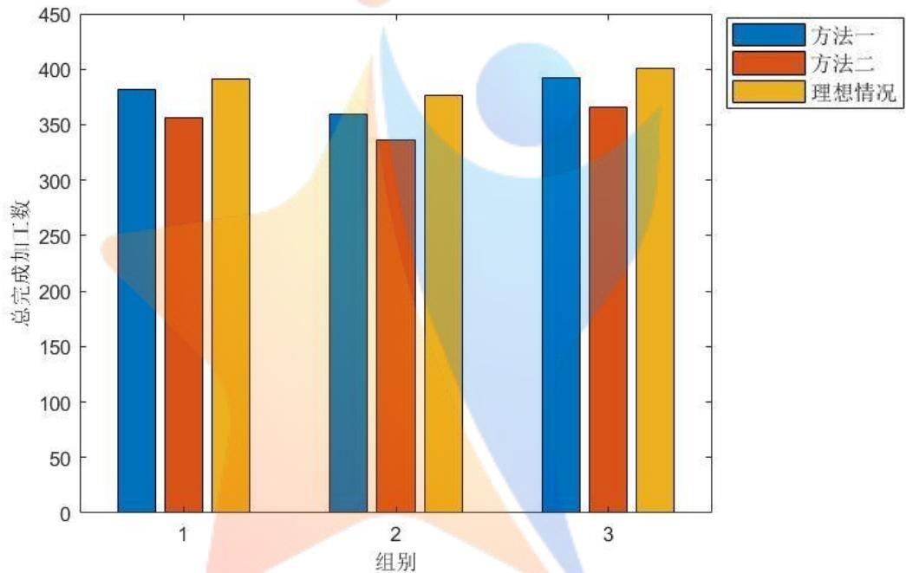

<details>
<summary>bar</summary>

| 组别 | 方法一 | 方法二 | 理想情况 |
| --- | --- | --- | --- |
| 1 | ~382 | ~357 | ~392 |
| 2 | ~360 | ~337 | ~377 |
| 3 | ~393 | ~366 | ~402 |
</details>

图6 情况1两种方法各组别成料数

表5：情况2中 3组参量在两种方法下的成料数

<table><tr><td rowspan="2">情况2</td><td colspan="2">组1</td><td colspan="2">组2</td><td colspan="2">组3</td></tr><tr><td>方法1</td><td>方法2</td><td>方法1</td><td>方法2</td><td>方法1</td><td>方法2</td></tr><tr><td>理想成料数(件)</td><td colspan="2">275</td><td colspan="2">272</td><td colspan="2">331</td></tr><tr><td>成料数(件)</td><td>253</td><td>235</td><td>211</td><td>202</td><td>243</td><td>240</td></tr></table>

根据表5，利用柱状图表示其差异，如图 7：

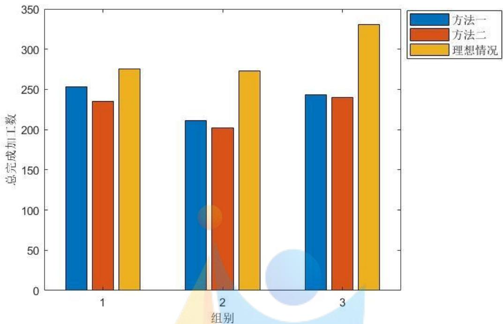

<details>
<summary>bar</summary>

| 组别 | 方法一 | 方法二 | 理想情况 |
| --- | --- | --- | --- |
| 1 | ~253 | ~236 | ~276 |
| 2 | ~212 | ~203 | ~274 |
| 3 | ~243 | ~240 | ~331 |
</details>

图7 情况2两种方法各组别成料数

综上，由图6与图 7可以得到，在情况 1、2下，在一个班次内，方法一所产出的成料总数更加接近理想成料总数，因此方法一更优于方法二。

## 六、模型的检验

## 6.1 仿真检验

为了进一步验证模型的实用性与算法的可行性，本文通过题给三组数据重新组合得到仿真数据，如表 7

表7 仿真数据表

<table><tr><td>系统作业参数</td><td>时长</td></tr><tr><td>RGV 移动 1 个单位所需时间</td><td>20</td></tr><tr><td>RGV 移动 2 个单位所需时间</td><td>41</td></tr><tr><td>RGV 移动 3 个单位所需时间</td><td>46</td></tr><tr><td>CNC 加工完成一个一道工序的物料所需时间</td><td>560</td></tr><tr><td>CNC 加工完成一个两道工序物料的第一道工序所需时间</td><td>455</td></tr><tr><td>CNC 加工完成一个两道工序物料的第二道工序所需时间</td><td>500</td></tr><tr><td>RGV 为 CNC1#, 3#, 5#, 7#一轮上下料所需时间</td><td>28</td></tr><tr><td>RGV 为 CNC2#, 4#, 6#, 8#一轮上下料所需时间</td><td>35</td></tr><tr><td>RGV 完成一个物料的清洗作业所需时间</td><td>25</td></tr></table>

根据表7中的系统作业参数，对 CNC概率故障情况下加工两道工序的物料进行最快获得最多成品的双目标规划，检验结果如表 8：

表 8 仿真检验结果表

<table><tr><td rowspan="2">模型的检验</td><td>情况3(基于情况2)</td></tr><tr><td>方法1</td></tr><tr><td>成料数(件)</td><td>201</td></tr><tr><td>CNC平均非有效工作时长(秒)</td><td>4338.5</td></tr><tr><td>最终完成物料清洗时刻(秒)</td><td>28751</td></tr><tr><td>程序总运行时长(秒)</td><td>0.006976</td></tr><tr><td>工序1CNC故障次数</td><td>1</td></tr><tr><td>工序2CNC故障次数</td><td>2</td></tr><tr><td>算法空间复杂度</td><td>0(1)</td></tr><tr><td>算法时间复杂度</td><td>0(n^2)</td></tr></table>

## 七、模型的评价

## 7.1 模型的评价

## 7.1.1 模型的优点

针对情况1的模型1：

对于单道工序的 RGV调度模型，模型规律简单、易懂，而且能够运用该模型以及模型求解算法得出比较理想的调度方案，说明了模型的实用性和算法有效性。

针对情况2的模型2：

对于双道工序的 RGV调度模型，我们在模型 1的基础上加入了目标工序的概念，以此来保证RGV 中的物料工序与CNC 工序相匹配。另外，本题中，由于工艺流程比较简单，对于模型的求解采用循环遍历法，能够找到各刀具数量与位置的最佳分配方案。

针对情况3的模型3：

在模型1、2的前提下，我们还建立故障模拟模型，能够较好地表示出 1%的故障发生概率，而且能够及时发现与处理故障 CNC，提高了工作的效率，从而能找出更优的调度方案提高了模型的实用性。

## 7.1.2 模型的缺点

针对情况1的模型：

对于单道工序的 RGV调度模型，在实际生产过程中，信号的发出与接受并作出行动这整个过程，会有时间延迟，这是该模型未考虑的。

针对情况2的模型：

对于双道工序的 RGV调度模型，由于题目 CNC台数偏少只有八台，且物料加工工序次数只有两次，对于模型的求解，采用了循环遍历法就能够很快找出各刀具数量与位置的最优分配方案。当 CNC 数目与加工工序次数增加时，模型的求解时间会以指数倍增长，那么算法的就不是很具有有效性。

针对情况3的模型：

对于CNC故障模拟下 RGV调度模型，由于故障 CNC修理时间是10-20分钟。在现实生活中，修理时间可能是属于 10-20分钟间无规律或有传统的分布，而我们以均匀分布来确定我们的修理时间，这里降低了模型的实用性。

## 八、模型的改进

## 8.1 模型的改进

（1）在实际生产中，延迟时间会由多种随机因素决定，因此使用一个固定的近似延迟时间来将其代替并纳入模型的计算，以尽可能减小误差。  
（2）当CNC数量增多时，使用遗传算法、蚁群算法等近似最优解算法来计算刀具分布方案，进而提高计算效率。  
（3）结合现实中的故障发生情况，制订更加接近真实情况的故障发生方案，使仿真结果更加符合真实情况。

## 九、模型的推广和应用

此次基于RGV 的单RGV 动态调度模型的建立与解决有着重要的现实意义，单RGV 调度在工业生产、终端排序、云调度系统等领域具有灵活的、重要的应用价值。本文采用的启发式算法与循环遍历法在日常生活中的诸多问题中也有着广泛应用。

## 参考文献：

[1]姜启源，谢金星，叶俊.数学模型(第三版）[M].北京：高等教育出版社，2003.85-130.  
[2]张继坤.浅谈应用技术成果实用性的评价[J].科学管理研究,1989,04:43-45.

## 附录：

所有代码基于 Matlab R2018a

代码文件名与问题的对应关系

情况一方法一第一组：Situation1Team1.m

情况一方法一第二组：Situation1Team2.m

情况一方法一第三组：Situation1Team3.m

情况二方法一第一组：Situation2Team1.m

情况二方法一第二组：Situation2Team2.m

情况二方法一第三组：Situation3Team3.m

单工序情况三方法一第一组：Situation3\_1Team1.m

单工序情况三方法一第二组：Situation3\_1Team2.m

单工序情况三方法一第三组：Situation3\_1Team3.m

双工序情况三方法一第一组：Situation3\_2Team1.m

双工序情况三方法一第二组：Situation3\_2Team2.m

双工序情况三方法一第三组：Situation3\_2Team3.m

情况一方法二第一组：Simplify\_Situation1Team1.m

情况一方法二第二组：Simplify\_Situation1Team2.m

情况一方法二第三组：Simplify\_Situation1Team3.m

情况二方法二第一组：Simplify\_Situation2Team1.m

情况二方法二第二组：Simplify\_Situation2Team2.m

情况二方法二第三组：Simplify\_Situation3Team3.m

单工序情况三方法二第一组：Simplify\_Situation3\_1Team1.m

单工序情况三方法二第二组：Simplify\_Situation3\_1Team2.m

单工序情况三方法二第三组：Simplify\_Situation3\_1Team3.m

双工序情况三方法二第一组：Simplify\_Situation3\_2Team1.m

双工序情况三方法二第二组：Simplify\_Situation3\_2Team2.m

双工序情况三方法二第三组：Simplify\_Situation3\_2Team3.m

绘图的代码：Plot.m

模型的检验的代码：ModelTest.m

由于同类型不同组的代码高度相似，下文仅给出各类型第一组的代码。

用于情况一方法一第一组的代码

Situation1Team1.m

%情况1下的代码

clear;clc;

%% 计时

tic

%% 输入不同组别参数

Move=[0,20,33,46];%第一组[0,20,33,46] 第二组[0,23,41,59] 第三组[0,18,32,46]

Work=560;%第一组 560 第二组 580 第三组 545

Switch=repmat([28,31],1,4);%第一组[28,31] 第二组[30,35] 第三组[27,32]

Wash=25;%第一组 25 第二组 30 第三组 25

%% 预设系统情况

Position=1;%记录 RGV 的位置，取值为 1\~4

Left=zeros(1,8);%记录 8 台 CNC 当前工作剩余完成时间，等待时为 0

Situation=zeros(1,8);%记录 8 台 CNC 当前是否拥有工件，0 为无，1 为有

Time=0;%系统已运行时间

Expect=ones(4,8);%预计时间，第一行为预计运动时间，第二行为预计等待时间，第三行为预计上下料时间，第四行为前三项之和

Rec=[];%记录每个工件的上下料信息

%% 系统开始运行

while Time<=28800

for i=1:8%计算预计时间

```matlab
Expect(1,i)=Move(1+abs(Position-ceil(i/2)));
if Left(i)<=Expect(1,i)
    Expect(2,i)=0;
else
    Expect(2,i)=Left(i)-Expect(1,i);
end
Expect(3,i)=Switch(i);
Expect(4,i)=sum(Expect(1:3,i));
end
```

[\~,MinNumber]=min(Expect(4,:));%找出下一个目标

Time=Time+Expect(1,MinNumber)+Expect(2,MinNumber);%RGV 移动至下一个目标位置并等待

flag=0;%目标CNC 是否已有工件，0为无，1为有

for i=size(Rec,1):-1:1%记录本次操作的时刻

```matlab
if Rec(i,1)==MinNumber && isnan(Rec(i,3))%同时发生上料和下料
    flag=1;
    Rec(i,3)=Time;%记录下料开始时间
    Rec=[Rec;MinNumber,Time,NaN];%记录上料开始时间
    break;
end
```

end

if flag==0%仅发生上料

```matlab
Rec=[Rec;MinNumber,Time,NaN];
end
```

if Situation(MinNumber)==0%不用清洗的情况

```matlab
Situation(MinNumber)=1;
Time=Time+Expect(3,MinNumber);%完成换料
for i=1:8%CNC 的时间推进
    if Left(i)-Expect(4,MinNumber)<0
        Left(i)=0;
    else
        Left(i)=Left(i)-Expect(4,MinNumber);
```

```matlab
end
    end
    Left(MinNumber)=Work;%换料的 CNC 更新剩余时间
else%需要清洗的情况
    Time=Time+Expect(3,MinNumber)+Wash;%完成换料与清洗
    for i=1:8%CNC 的时间推进
        if Left(i)-Expect(4,MinNumber)-Wash<0
            Left(i)=0;
        else
            Left(i)=Left(i)-Expect(4,MinNumber)-Wash;
        end
    end
    Left(MinNumber)=Work-Wash;%换料的 CNC 更新剩余时间
end
Position=ceil(MinNumber/2);%RGV 位置更新
end
while ~(Rec(end,3)+Expect(3,MinNumber)+Wash<=28800)%筛选去除边缘无效数据
    Rec(end,:)=[];
end
%% 计算
SUM=size(Rec,1);%成料数
WAIT=(Rec(end,3)*8-size(Rec,1)*Work)/8;%CNC 平均非有效工作时长
Last=Rec(end,3)+Expect(3,MinNumber)+Wash;%最终完成物料清洗时刻
%% 计时
toc
clear Expect flag i Left MinNumber Move Position Situation Switch Time Wash Work;
memory
```

用于情况二方法一第一组的代码

Situation2Team1.m

%情况2下的代码

clear;clc;

%% 计时

tic

%% 输入不同组别参数

Move=[0,20,33,46];%第一组[0,20,33,46] 第二组[0,23,41,59] 第三组[0,18,32,46]

Work=[400,378];%第一组[400,378] 第二组[280,500] 第三组[455,182]

Switch=repmat([28,31],1,4);%第一组[28,31] 第二组[30,35] 第三组[27,32]

Wash=25;%第一组 25 第二组 30 第三组 25

%% 记录所有刀具分布情况下的工作情况

Rec=cell(1,1);%用以记录每一种刀具分布情况下的完整加工情况

Statistics=[];%统计成功加工数和失败加工数

Order=[];%记录每一种刀具分布方案

%% 遍历所有刀具分布情况

for i=1:7%刀具 2 的数量

<div class="mineru-algorithm" style="white-space: pre-wrap; font-family:monospace;">
Type=nchoosek(1:8,i);%生成所有的组合情况
for j=1:size(Type,1)%确定一种刀具分布情况
    Tool=ones(1,8);
    for k=1:size(Type(j,:),2)
        Tool(Type(j,k))=2;
    end
    Order=[Order;Tool];
    Position=1;%记录 RGV 的位置，取值为 1~4
    Left=zeros(1,8);%记录 8 台 CNC 当前工作剩余完成时间，等待时为 0
    Situation=zeros(1,8);%记录 8 台 CNC 当前是否拥有工件，0 为无，1 为有
    Time=0;%系统已运行时间
    Expect=ones(4,8);%预计时间，第一行为预计运动时间，第二行为预计等待时间，第三行为预计上下料时间，第四行为前三项之和
    TempRec=[];%临时记录某一种刀具分布情况下的完整加工情况
    Now=1;%当前 RGV 目标工序，取值仅为 1 或 2
    while Time&lt;=28800
        for k=1:8%计算预期时间
            if Now~=Tool(k)%排除非目标工序的 CNC
                Expect(:,k)=inf;
                continue;
            end
            Expect(1,k)=Move(1+abs(Position-ceil(k/2)));
            if Left(k)&lt;=Expect(1,k)
                Expect(2,k)=0;
            else
                Expect(2,k)=Left(k)-Expect(1,k);
            end
            Expect(3,k)=Switch(k);
            Expect(4,k)=sum(Expect(1:3,k));
        end
        [~,MinNumber]=min(Expect(4,:));%找出下一个目标
        Time=Time+Expect(1,MinNumber)+Expect(2,MinNumber);%移动至下一个目标位置并等待
        if Now==1%当前目标是工序 1 的 CNC
            flag=0;
            for k=size(TempRec,1):-1:1%记录本次操作时刻
                if TempRec(k,1)==MinNumber &amp;&amp; isnan(TempRec(k,3))%同时发生上料和下料
</div>

```matlab
flag=1;
TempRec(k,3)=Time;
TempRec(end+1,1)=MinNumber;
TempRec(end,2)=Time;
TempRec(end,3:6)=NaN;%构建此工件工序 2 的记录矩阵
```

件

```matlab
break;
    end
end
if flag==0%仅发生上料
    TempRec(end+1,1)=MinNumber;
    TempRec(end,2)=Time;
    TempRec(end,3:6)=NaN;
end
if Situation(MinNumber)==1%换料时取下了一个已经完成工序1的工件
    Now=2;%下一道目标工序发生变化
    NEXT=k;%记录此工件的序号
end
Situation(MinNumber)=1;
Time=Time+Expect(3,MinNumber);%完成换料
for k=1:8
    if Left(k)-Expect(4,MinNumber)<0
        Left(k)=0;
    else
        Left(k)=Left(k)-Expect(4,MinNumber);
    end
end
Left(MinNumber)=Work(1);
else%当前目标是工序2的CNC
flag=0;
for k=size(TempRec,1):-1:1%记录本次操作时刻
    if TempRec(k,4)==MinNumber && isnan(TempRec(k,6))%取下已完成工
    flag=1;
    TempRec(k,6)=Time;
    TempRec(NEXT,4)=MinNumber;
    TempRec(NEXT,5)=Time;
    break;
end
end
if flag==0%放置待加工工序2的工件
    TempRec(NEXT,4)=MinNumber;
    TempRec(NEXT,5)=Time;
end
Now=1;%此时目标工序重新变为工序1
Situation(MinNumber)=1;
Time=Time+Expect(3,MinNumber)+Wash;%完成换料
for k=1:8
    if Left(k)-Expect(4,MinNumber)-Wash<0
        Left(k)=0;
```

```matlab
else
    Left(k)=Left(k)-Expect(4,MinNumber)-Wash;
end
end
end
Left(MinNumber)=Work(2)-Wash;
end
Position=ceil(MinNumber/2);%更新位置
end
Rec=[Rec,TempRec];%记录本次刀具分布情况下的完整加工情况
Statistics=[Statistics;0,0];%统计本次刀具分布情况下的成功加工数和失败加工数
for k=1:size(TempRec,1)
    if isnan(sum(TempRec(k,:)))
        Statistics(end,2)=Statistics(end,2)+1;
    else
        Statistics(end,1)=Statistics(end,1)+1;
    end
end
end
end
%% 对所有情况数据的分析
Rec(1)=[];
MaxProduct=max(Statistics(:,1));%最大产量
CompleteTime=inf;%产量最大情况下的最短完成时间
BestPlan=cell(1,1);%产量最大且完成时间最短的物料加工情况
BestKnife=[];%产量最大且完成时间最短的刀具分布方案
for i=1:size(Rec,2)%找出产量最大情况下的最短完成时间
    if Statistics(i,1)==MaxProduct
        for j=size(Rec{1,i},1):-1:1
            if ~isnan(Rec{1,i}(j,6))
                if Rec{1,i}(j,6)<=CompleteTime
                    CompleteTime=Rec{1,i}(j,6);
            end
            break;
        end
    end
end
end
for i=1:size(Rec,2)%找出产量最大且完成时间最短的所有方案并记录
    if Statistics(i,1)==MaxProduct
        for j=size(Rec{1,i},1):-1:1
            if ~isnan(Rec{1,i}(j,6))
                if Rec{1,i}(j,6)==CompleteTime
                    BestPlan=[BestPlan,Rec{1,i}];
                    BestKnife=[BestKnife;Order(i,:)];
```

```matlab
end
    break;
end
end
end
end
BestPlan(1)=[];
REC=BestPlan{1,end};%挑选一个最佳方案
while ~(REC(end,6)+Expect(3,MinNumber)+Wash<=28800)
    REC(end,:)=[];
end
%% 计算
SUM=size(REC,1);%成料数
WAIT=(REC(end,6)*8-size(REC,1)*sum(Work))/8;%CNC 平均非有效工作时长
Last=REC(end,6)+Expect(3,MinNumber)+Wash;%最终完成物料清洗时刻
%% 计时
toc
clear CompleteTime Expect flag i j k Left MaxProduct MinNumber Move NEXT Now Order Position
Situation Switch TempRec Time Tool Type Wash Work;
memory
```

用于单工序情况三方法一第一组的代码

Situation3\_1Team1.m

%情况3（基于情况1）下的代码

clear;clc;

%% 计时

tic

%% 输入不同组别参数

Move=[0,20,33,46];%第一组[0,20,33,46] 第二组[0,23,41,59] 第三组[0,18,32,46]

Work=560;%第一组 560 第二组 580 第三组 545

Switch=repmat([28,31],1,4);%第一组[28,31] 第二组[30,35] 第三组[27,32]

Wash=25;%第一组 25 第二组 30 第三组 25

%% 预设系统情况

Position=1;%记录 RGV 的位置，取值为 1\~4

Left=zeros(1,8);%记录 8 台 CNC 当前工作剩余完成时间，等待时为 0

Situation=zeros(1,8);%记录 8 台 CNC 当前是否拥有工件，0 为无，1 为有

Time=0;%系统已运行时间

Expect=ones(4,8);%预计时间，第一行为预计运动时间，第二行为预计等待时间，第三行为预计上下料时间，第四行为前三项之和

Rec=[];%记录每个工件的上下料信息

Error=[];%记录故障信息

%% 系统开始运行

while Time<=28800

for i=1:size(Error,1)%检查错误信息

if Time>=Error(i,3) && Time<=Error(i,4) && Error(i,5)==0%故障已发生Error(i,5)=1;%标记为已处理Left(Error(i,2))=Error(i,4)-Time;%将故障修复所需时间转换为当前工作剩余完成时间  
```matlab
Situation(Error(i,2))=0;%修复完成后取走故障工件
end
end
for i=1:8%计算预计时间
Expect(1,i)=Move(1+abs(Position-ceil(i/2)));
if Left(i)<=Expect(1,i)
Expect(2,i)=0;
else
Expect(2,i)=Left(i)-Expect(1,i);
end
Expect(3,i)=Switch(i);
Expect(4,i)=sum(Expect(1:3,i));
end
[~,MinNumber]=min(Expect(4,:));%找出下一个目标
Time=Time+Expect(1,MinNumber);%RGV 移动至下一个目标位置
flag=0;
for i=1:size(Error,1)%运动后再次检查错误信息
if Time>=Error(i,3) && Time<=Error(i,4) && Error(i,5)==0 && MinNumber==Error(i,2)%运动中原目标发生了故障
Error(i,5)=1;%标记为已处理
Situation(Error(i,2))=0;%修复完成后取走故障工件
for j=1:8%CNC 的时间推进
if Left(j)-Expect(1,MinNumber)<0
Left(j)=0;
else
Left(j)=Left(j)-Expect(1,MinNumber);
end
end
Left(Error(i,2))=Error(i,4)-Time;%将故障修复所需时间转换为当前工作剩余完成时间
flag=1;
end
end
if flag%由于原目标 CNC 发生故障，重启循环
continue;
end
flag=0;
for i=1:size(Error,1)%等待中检查错误信息
if Time<=Error(i,3) && Time+Expect(2,MinNumber)>=Error(i,3) && Error(i,5)==0 && MinNumber==Error(i,2)%等待中原目标发生了故障
```

```matlab
Error(i,5)=1;%标记为已处理
Situation(Error(i,2))=0;%修复完成后取走故障工件
for j=1:8%CNC 的时间推进
    if Left(j)-(Error(i,3)-Time)<0
        Left(j)=0;
    else
        Left(j)=Left(j)-(Error(i,3)-Time);
    end
end
Left(Error(i,2))=Error(i,4)-Error(i,3);%将故障修复所需时间转换为当前工作剩余完成时间
Time=Error(i,3);%时间调整至故障发生时
flag=1;
end
end
if flag%由于原目标 CNC 发生故障，重启循环
continue;
end
Time=Time+Expect(2,MinNumber);%正常等待
flag=0;%目标 CNC 是否已有工件，0 为无，1 为有
for i=size(Rec,1):-1:1%记录本次操作的时刻
    if Rec(i,1)==MinNumber && isnan(Rec(i,3))%同时发生上料和下料
        flag=1;
        Rec(i,3)=Time;%记录下料开始时间
        Rec=[Rec;MinNumber,Time,NaN];%记录上料开始时间
        break;
    end
end
if flag==0%仅发生上料
    Rec=[Rec;MinNumber,Time,NaN];
end
if Situation(MinNumber)==0%不用清洗的情况
    Situation(MinNumber)=1;
    Time=Time+Expect(3,MinNumber);%完成换料
    for i=1:8%CNC 的时间推进
        if Left(i)-Expect(4,MinNumber)<0
            Left(i)=0;
        else
            Left(i)=Left(i)-Expect(4,MinNumber);
    end
end
Left(MinNumber)=Work;%换料的 CNC 更新剩余时间
if unifrnd(0,100)>=99%生成故障信息
    StartTime=Time+unifrnd(0,Work);%随机生成故障开始时间（发生在加工时）
```

ProcessTime=unifrnd(600,1200);%随机生成人工修复所需时间Error=[Error;size(Rec,1),MinNumber,StartTime,StartTime+ProcessTime,0];% 记 录故障信息

```txt
end
else%需要清洗的情况
    Time=Time+Expect(3,MinNumber)+Wash;%完成换料与清洗
    for i=1:8%CNC 的时间推进
        if Left(i)-Expect(4,MinNumber)-Wash<0
            Left(i)=0;
        else
            Left(i)=Left(i)-Expect(4,MinNumber)-Wash;
        end
    end
    Left(MinNumber)=Work-Wash;%换料的 CNC 更新剩余时间
    if unifrnd(0,100)>=99%生成故障信息
        StartTime=Time-Wash+unifrnd(0,Work);%随机生成故障开始时间（发生在加工时）
        ProcessTime=unifrnd(600,1200);%随机生成人工修复所需时间
        Error=[Error;size(Rec,1),MinNumber,StartTime,StartTime+ProcessTime,0];% 记 录
故障信息
```

```matlab
end
    end
    Position=ceil(MinNumber/2);%RGV 位置更新
end
while ~(Rec(end,3)+Expect(3,MinNumber)+Wash<=28800)
    Rec(end,:)=[];
end
%% 计算
SUM=size(Rec,1)-size(Error,1);%成料数
WAIT=(Rec(end,3)*8-size(Rec,1)*Work)/8;%CNC 平均非有效工作时长
Last=Rec(end,3)+Expect(3,MinNumber)+Wash;%最终完成物料清洗时刻
%% 计时
toc
clear Expect flag i Left MinNumber Move Position Situation Switch Time Wash Work ProcessTime
StartTime;
memory
```

用于双工序情况三方法一第一组的代码

Situation3\_2Team1.m

%情况3（基于情况2）下的代码

clear;clc;

%% 计时

tic

%% 输入不同组别参数

Move=[0,20,33,46];%第一组[0,20,33,46] 第二组[0,23,41,59] 第三组[0,18,32,46]

```matlab
Work=[400,378];%第一组[400,378] 第二组[280,500] 第三组[455,182]
Switch=repmat([28,31],1,4);%第一组[28,31] 第二组[30,35] 第三组[27,32]
Wash=25;%第一组 25 第二组 30 第三组 25
%% 预设系统情况
Tool=[1,2,1,2,1,2,1,2];%预设刀具分布情况，是情况 2 下的最优方案
Position=1;%记录 RGV 的位置，取值为 1~4
Left=zeros(1,8);%记录 8 台 CNC 当前工作剩余完成时间，等待时为 0
Situation=zeros(1,8);%记录 8 台 CNC 当前是否拥有工件，0 为无，1 为有
Time=0;%系统已运行时间
Expect=ones(4,8);%预计时间，第一行为预计运动时间，第二行为预计等待时间，第三行为预计上下料时间，第四行为前三项之和
Now=1;%当前 RGV 目标工序，取值仅为 1 或 2
Error=[];%记录故障信息
Rec=[];%记录每个工件的上下料信息
%% 遍历所有刀具分布情况
while Time<=28800
    for i=1:size(Error,1)%检查错误信息
        if Time>=Error(i,3) && Time<=Error(i,4) && Error(i,5)==0%故障已发生
            Error(i,5)=1;%标记为已处理
            Left(Error(i,2))=Error(i,4)-Time;%将故障修复所需时间转换为当前工作剩余完成时间
            Situation(Error(i,2))=0;%修复完成后取走故障工件
        end
    end
    for i=1:8%计算预期时间
        if Now~=Tool(i)%排除非目标工序的 CNC
            Expect(:,i)=inf;
            continue;
        end
        Expect(1,i)=Move(1+abs(Position-ceil(i/2)));
        if Left(i)<=Expect(1,i)
            Expect(2,i)=0;
        else
            Expect(2,i)=Left(i)-Expect(1,i);
        end
        Expect(3,i)=Switch(i);
        Expect(4,i)=sum(Expect(1:3,i));
    end
    [~,MinNumber]=min(Expect(4,:));%找出下一个目标
    Time=Time+Expect(1,MinNumber);%移动至下一个目标位置
    flag=0;
    for i=1:size(Error,1)%运动后再次检查错误信息
        if Time>=Error(i,3) && Time<=Error(i,4) && Error(i,5)==0 && MinNumber==Error(i,2)%运动中原目标发生了故障
```

```matlab
Error(i,5)=1;%标记为已处理
Situation(Error(i,2))=0;%修复完成后取走故障工件
for j=1:8%CNC 的时间推进
    if Left(j)-Expect(1,MinNumber)<0
        Left(j)=0;
    else
        Left(j)=Left(j)-Expect(1,MinNumber);
    end
end
Left(Error(i,2))=Error(i,4)-Time;%将故障修复所需时间转换为当前工作剩余完成时间
flag=1;
end
end
if flag%由于原目标 CNC 发生故障，重启循环
continue;
end
flag=0;
for i=1:size(Error,1)%等待中检查错误信息
    if Time<=Error(i,3) && Time+Expect(2,MinNumber)>=Error(i,3) && Error(i,5)==0 && MinNumber==Error(i,2)%等待中原目标发生了故障
    Error(i,5)=1;%标记为已处理
    Situation(Error(i,2))=0;%修复完成后取走故障工件
    for j=1:8%CNC 的时间推进
        if Left(j)-(Error(i,3)-Time)<0
            Left(j)=0;
        else
            Left(j)=Left(j)-(Error(i,3)-Time);
        end
    end
    Left(Error(i,2))=Error(i,4)-Error(i,3);%将故障修复所需时间转换为当前工作剩余完成时间
    Time=Error(i,3);%时间调整至故障发生时
    flag=1;
end
end
if flag%由于原目标 CNC 发生故障，重启循环
continue;
end
Time=Time+Expect(2,MinNumber);%正常等待
if Now==1%当前目标是工序 1 的 CNC
flag=0;
for k=size(Rec,1):-1:1%记录本次操作时刻
    if Rec(k,1)==MinNumber && isnan(Rec(k,3))%同时发生上料和下料
```

```matlab
flag=1;
Rec(k,3)=Time;
Rec(end+1,1)=MinNumber;
Rec(end,2)=Time;
Rec(end,3:6)=NaN;%构建此工件工序2的记录矩阵
break;
end
end
if flag==0%仅发生上料
    Rec(end+1,1)=MinNumber;
    Rec(end,2)=Time;
    Rec(end,3:6)=NaN;
end
if Situation(MinNumber)==1%换料时取下了一个已经完成工序1的工件
    Now=2;%下一道目标工序发生变化
    NEXT=k;%记录此工件的序号
end
Situation(MinNumber)=1;
Time=Time+Expect(3,MinNumber);%完成换料
for k=1:8
    if Left(k)-Expect(4,MinNumber)<0
        Left(k)=0;
    else
        Left(k)=Left(k)-Expect(4,MinNumber);
    end
end
Left(MinNumber)=Work(1);
if unifrnd(0,100)>=99%生成故障信息
    StartTime=Time+unifrnd(0,Work(1));%随机生成故障开始时间（发生在加工时）
    ProcessTime=unifrnd(600,1200);%随机生成人工修复所需时间
    Error=[Error;size(Rec,1),MinNumber,StartTime,StartTime+ProcessTime,0];%记录故障信息
end
else%当前目标是工序2的CNC
flag=0;
for k=size(Rec,1):-1:1%记录本次操作时刻
    if Rec(k,4)==MinNumber && isnan(Rec(k,6))%取下已完成工件
        flag=1;
        Rec(k,6)=Time;
        Rec(NEXT,4)=MinNumber;
        Rec(NEXT,5)=Time;
        break;
    end
end
```

```matlab
if flag==0%放置待加工工序2的工件
    Rec(NEXT,4)=MinNumber;
    Rec(NEXT,5)=Time;
end
Now=1;%此时目标工序重新变为工序1
Situation(MinNumber)=1;
Time=Time+Expect(3,MinNumber)+Wash;%完成换料
for k=1:8
    if Left(k)-Expect(4,MinNumber)-Wash<0
        Left(k)=0;
    else
        Left(k)=Left(k)-Expect(4,MinNumber)-Wash;
    end
end
Left(MinNumber)=Work(2)-Wash;
if unifrnd(0,100)>=99%生成故障信息
    StartTime=Time-Wash+unifrnd(0,Work(2));%随机生成故障开始时间(发生在加工时)
    ProcessTime=unifrnd(600,1200);%随机生成人工修复所需时间
    Error=[Error;NEXT,MinNumber,StartTime,StartTime+ProcessTime,0];%记录故障信息
end
end
Position=ceil(MinNumber/2);%更新位置
end
while ~(Rec(end,6)+Expect(3,MinNumber)+Wash<=28800)
    Rec(end,:)=[];
end
%% 计算
SUM=size(Rec,1)-size(Error,1);%成料数
WAIT=(Rec(end,6)*8-size(Rec,1)*sum(Work))/8;%CNC平均非有效工作时长
Last=Rec(end,6)+Expect(3,MinNumber)+Wash;%最终完成物料清洗时刻
%% 计时
toc
clear CompleteTime Expect flag i j k Left MaxProduct MinNumber Move NEXT Now Order Position
Situation Switch TempRec Time Tool Type Wash Work ProcessTime StartTime;
memory
```

用于情况一方法二第一组的代码

Simplify\_Situation1Team1.m

%情况1下的简化模型代码

clear;clc;

%% 计时

tic

%% 输入不同组别参数

Move=[0,20,33,46];%第一组[0,20,33,46] 第二组[0,23,41,59] 第三组[0,18,32,46]

Work=560;%第一组 560 第二组 580 第三组 545

Switch=repmat([28,31],1,4);%第一组[28,31] 第二组[30,35] 第三组[27,32]

Wash=25;%第一组 25 第二组 30 第三组 25

%% 预设系统情况

Position=1;%记录 RGV 的位置，取值为 1\~4

Left=zeros(1,8);%记录 8 台 CNC 当前工作剩余完成时间，等待时为 0

Situation=zeros(1,8);%记录 8 台 CNC 当前是否拥有工件，0 为无，1 为有

Time=0;%系统已运行时间

Expect=ones(4,8);%预计时间，第一行为预计运动时间，第二行为预计等待时间，第三行为预计上下料时间，第四行为前三项之和

Rec=[];%记录每个工件的上下料信息

%% 系统开始运行

while Time<=28800

```matlab
for i=1:8%计算预计时间
    Expect(1,i)=Move(1+abs(Position-ceil(i/2)));
    Expect(2,i)=Left(i);
    Expect(3,i)=Switch(i);
    Expect(4,i)=sum(Expect(1:3,i));
end
```

[\~,MinNumber]=min(Expect(4,:));%找出下一个目标

Time=Time+Expect(1,MinNumber)+Expect(2,MinNumber);%RGV 移动至下一个目标位置并等待

flag=0;%目标CNC 是否已有工件，0为无，1为有

for i=size(Rec,1):-1:1%记录本次操作的时刻

if Rec(i,1)==MinNumber && isnan(Rec(i,3))%同时发生上料和下料 flag=1;

Rec(i,3)=Time;%记录下料开始时间

Rec=[Rec;MinNumber,Time,NaN];%记录上料开始时间

break;

end

end

if flag==0%仅发生上料

Rec=[Rec;MinNumber,Time,NaN];

end

if Situation(MinNumber)==0%不用清洗的情况

Situation(MinNumber)=1;

Time=Time+Expect(3,MinNumber);%完成换料

for i=1:8%CNC 的时间推进

if Left(i)-Expect(4,MinNumber)<0 Left(i)=0;

else

Left(i)=Left(i)-Expect(4,MinNumber);

```matlab
end
    end
    Left(MinNumber)=Work;%换料的 CNC 更新剩余时间
else%需要清洗的情况
    Time=Time+Expect(3,MinNumber)+Wash;%完成换料与清洗
    for i=1:8%CNC 的时间推进
        if Left(i)-Expect(4,MinNumber)-Wash<0
            Left(i)=0;
        else
            Left(i)=Left(i)-Expect(4,MinNumber)-Wash;
        end
    end
    Left(MinNumber)=Work-Wash;%换料的 CNC 更新剩余时间
end
Position=ceil(MinNumber/2);%RGV 位置更新
end
while ~(Rec(end,3)+Expect(3,MinNumber)+Wash<=28800)
    Rec(end,:)=[];
end
%% 计算
SUM=size(Rec,1);%成料数
WAIT=(Rec(end,3)*8-size(Rec,1)*Work)/8;%CNC 平均非有效工作时长
Last=Rec(end,3)+Expect(3,MinNumber)+Wash;%最终完成物料清洗时刻
%% 计时
toc
clear Expect flag i Left MinNumber Move Position Situation Switch Time Wash Work;
memory
```

用于情况二方法二第一组的代码

Simplify\_Situation2Team2.m

%情况2下的简化模型代码

clear;clc;

%% 计时

tic

%% 输入不同组别参数

Move=[0,20,33,46];%第一组[0,20,33,46] 第二组[0,23,41,59] 第三组[0,18,32,46]

Work=[400,378];%第一组[400,378] 第二组[280,500] 第三组[455,182]

Switch=repmat([28,31],1,4);%第一组[28,31] 第二组[30,35] 第三组[27,32]

Wash=25;%第一组 25 第二组 30 第三组 25

%% 记录所有刀具分布情况下的工作情况

Rec=cell(1,1);%用以记录每一种刀具分布情况下的完整加工情况

Statistics=[];%统计成功加工数和失败加工数

Order=[];%记录每一种刀具分布方案

%% 遍历所有刀具分布情况

for i=1:7%刀具 2 的数量

<div class="mineru-algorithm" style="white-space: pre-wrap; font-family:monospace;">
Type=nchoosek(1:8,i);%生成所有的组合情况
for j=1:size(Type,1)%确定一种刀具分布情况
    Tool=ones(1,8);
    for k=1:size(Type(j,:),2)
        Tool(Type(j,k))=2;
    end
    Order=[Order;Tool];
    Position=1;%记录 RGV 的位置，取值为 1~4
    Left=zeros(1,8);%记录 8 台 CNC 当前工作剩余完成时间，等待时为 0
    Situation=zeros(1,8);%记录 8 台 CNC 当前是否拥有工件，0 为无，1 为有
    Time=0;%系统已运行时间
    Expect=ones(4,8);%预计时间，第一行为预计运动时间，第二行为预计等待时间，第三行为预计上下料时间，第四行为前三项之和
    TempRec=[];%临时记录某一种刀具分布情况下的完整加工情况
    Now=1;%当前 RGV 目标工序，取值仅为 1 或 2
    while Time&lt;=28800
        for k=1:8%计算预期时间
            if Now~=Tool(k)%排除非目标工序的 CNC
                Expect(:,k)=inf;
                continue;
            end
            Expect(1,k)=Move(1+abs(Position-ceil(k/2)));
            Expect(2,k)=Left(k);
            Expect(3,k)=Switch(k);
            Expect(4,k)=sum(Expect(1:3,k));
        end
        [~,MinNumber]=min(Expect(4,:));%找出下一个目标
        Time=Time+Expect(1,MinNumber)+Expect(2,MinNumber);%移动至下一个目标位置并等待
        if Now==1%当前目标是工序 1 的 CNC
            flag=0;
            for k=size(TempRec,1):-1:1%记录本次操作时刻
                if TempRec(k,1)==MinNumber &amp;&amp; isnan(TempRec(k,3))%同时发生上料和下料
                    flag=1;
                    TempRec(k,3)=Time;
                    TempRec(end+1,1)=MinNumber;
                    TempRec(end,2)=Time;
                    TempRec(end,3:6)=NaN;%构建此工件工序 2 的记录矩阵
                    break;
                end
            end
            if flag==0%仅发生上料
</div>

件

```matlab
TempRec(end+1,1)=MinNumber;
TempRec(end,2)=Time;
TempRec(end,3:6)=NaN;
end
if Situation(MinNumber)==1%换料时取下了一个已经完成工序1的工件
Now=2;%下一道目标工序发生变化
NEXT=k;%记录此工件的序号
end
Situation(MinNumber)=1;
Time=Time+Expect(3,MinNumber);%完成换料
for k=1:8
    if Left(k)-Expect(4,MinNumber)<0
        Left(k)=0;
    else
        Left(k)=Left(k)-Expect(4,MinNumber);
    end
end
Left(MinNumber)=Work(1);
else%当前目标是工序2的CNC
flag=0;
for k=size(TempRec,1):-1:1%记录本次操作时刻
    if TempRec(k,4)==MinNumber && isnan(TempRec(k,6))%取下已完成工
```

```matlab
flag=1;
    TempRec(k,6)=Time;
    TempRec(NEXT,4)=MinNumber;
    TempRec(NEXT,5)=Time;
    break;
end
end
if flag==0%放置待加工工序2的工件
    TempRec(NEXT,4)=MinNumber;
    TempRec(NEXT,5)=Time;
end
Now=1;%此时目标工序重新变为工序1
Situation(MinNumber)=1;
Time=Time+Expect(3,MinNumber)+Wash;%完成换料
for k=1:8
    if Left(k)-Expect(4,MinNumber)-Wash<0
        Left(k)=0;
    else
        Left(k)=Left(k)-Expect(4,MinNumber)-Wash;
    end
end
```

```matlab
Left(MinNumber)=Work(2)-Wash;
    end
    Position=ceil(MinNumber/2);%更新位置
end
Rec=[Rec,TempRec];%记录本次刀具分布情况下的完整加工情况
Statistics=[Statistics;0,0];%统计本次刀具分布情况下的成功加工数和失败加工数
for k=1:size(TempRec,1)
    if isnan(sum(TempRec(k,:)))
        Statistics(end,2)=Statistics(end,2)+1;
    else
        Statistics(end,1)=Statistics(end,1)+1;
    end
end
end
end
%% 对所有情况数据的分析
Rec(1)=[];
MaxProduct=max(Statistics(:,1));%最大产量
CompleteTime=inf;%产量最大情况下的最短完成时间
BestPlan=cell(1,1);%产量最大且完成时间最短的物料加工情况
BestKnife=[];%产量最大且完成时间最短的刀具分布方案
for i=1:size(Rec,2)%找出产量最大情况下的最短完成时间
    if Statistics(i,1)==MaxProduct
        for j=size(Rec{1,i},1):-1:1
            if ~isnan(Rec{1,i}(j,6))
                if Rec{1,i}(j,6)<=CompleteTime
                    CompleteTime=Rec{1,i}(j,6);
            end
            break;
        end
    end
end
end
for i=1:size(Rec,2)%找出产量最大且完成时间最短的所有方案并记录
    if Statistics(i,1)==MaxProduct
        for j=size(Rec{1,i},1):-1:1
            if ~isnan(Rec{1,i}(j,6))
                if Rec{1,i}(j,6)==CompleteTime
                    BestPlan=[BestPlan,Rec{1,i}];
                    BestKnife=[BestKnife;Order(i,:)];
            end
            break;
        end
    end
```

```matlab
end
end
BestPlan(1)=[];
REC=BestPlan{1,end};%挑选一个最佳方案
while ~(REC(end,6)+Expect(3,MinNumber)+Wash<=28800)
    REC(end,:)=[];
end
%% 计算
SUM=size(REC,1);%成料数
WAIT=(REC(end,6)*8-size(REC,1)*sum(Work))/8;%CNC 平均非有效工作时长
Last=REC(end,6)+Expect(3,MinNumber)+Wash;%最终完成物料清洗时刻
%% 计时
toc
clear CompleteTime Expect flag i j k Left MaxProduct MinNumber Move NEXT Now Order Position
Situation Switch TempRec Time Tool Type Wash Work;
memory
```

用于单工序情况三方法二第一组的代码

Simplify\_Situation3\_1Team1.m

%情况3（基于情况1）下的简化模型代码

clear;clc;

%% 计时

tic

%% 输入不同组别参数

Move=[0,20,33,46];%第一组[0,20,33,46] 第二组[0,23,41,59] 第三组[0,18,32,46]

Work=560;%第一组 560 第二组 580 第三组 545

Switch=repmat([28,31],1,4);%第一组[28,31] 第二组[30,35] 第三组[27,32]

Wash=25;%第一组 25 第二组 30 第三组 25

%% 预设系统情况

Position=1;%记录 RGV 的位置，取值为 1\~4

Left=zeros(1,8);%记录 8 台 CNC 当前工作剩余完成时间，等待时为 0

Situation=zeros(1,8);%记录 8 台 CNC 当前是否拥有工件，0 为无，1 为有

Time=0;%系统已运行时间

Expect=ones(4,8);%预计时间，第一行为预计运动时间，第二行为预计等待时间，第三行为预计上下料时间，第四行为前三项之和

Rec=[];%记录每个工件的上下料信息

Error=[];%记录故障信息

%% 系统开始运行

while Time<=28800

for i=1:size(Error,1)%检查错误信息

if Time>=Error(i,3) && Time<=Error(i,4) && Error(i,5)==0%故障已发生

Error(i,5)=1;%标记为已处理

Left(Error(i,2))=Error(i,4)-Time;%将故障修复所需时间转换为当前工作剩余完成时间

```matlab
Situation(Error(i,2))=0;%修复完成后取走故障工件
end
end
for i=1:8%计算预计时间
    Expect(1,i)=Move(1+abs(Position-ceil(i/2)));
    Expect(2,i)=Left(i);
    Expect(3,i)=Switch(i);
    Expect(4,i)=sum(Expect(1:3,i));
end
[~,MinNumber]=min(Expect(4,:));%找出下一个目标
Time=Time+Expect(1,MinNumber);%RGV 移动至下一个目标位置
flag=0;
for i=1:size(Error,1)%运动后再次检查错误信息
    if Time>=Error(i,3) && Time<=Error(i,4) && Error(i,5)==0 && MinNumber==Error(i,2)%运动中原目标发生了故障
        Error(i,5)=1;%标记为已处理
        Situation(Error(i,2))=0;%修复完成后取走故障工件
        for j=1:8%CNC 的时间推进
            if Left(j)-Expect(1,MinNumber)<0
                Left(j)=0;
            else
                Left(j)=Left(j)-Expect(1,MinNumber);
            end
        end
        Left(Error(i,2))=Error(i,4)-Time;%将故障修复所需时间转换为当前工作剩余完成时间
        flag=1;
    end
end
if flag%由于原目标 CNC 发生故障，重启循环
    continue;
end
flag=0;
for i=1:size(Error,1)%等待中检查错误信息
    if Time<=Error(i,3) && Time+Expect(2,MinNumber)>=Error(i,3) && Error(i,5)==0 && MinNumber==Error(i,2)%等待中原目标发生了故障
        Error(i,5)=1;%标记为已处理
        Situation(Error(i,2))=0;%修复完成后取走故障工件
        for j=1:8%CNC 的时间推进
            if Left(j)-(Error(i,3)-Time)<0
                Left(j)=0;
            else
                Left(j)=Left(j)-(Error(i,3)-Time);
            end
```

endLeft(Error(i,2))=Error(i,4)-Error(i,3);%将故障修复所需时间转换为当前工作剩余完成时间

```matlab
Time=Error(i,3);%时间调整至故障发生时
flag=1;
end
end
if flag%由于原目标 CNC 发生故障，重启循环
continue;
end
Time=Time+Expect(2,MinNumber);%正常等待
flag=0;%目标 CNC 是否已有工件，0 为无，1 为有
for i=size(Rec,1):-1:1%记录本次操作的时刻
    if Rec(i,1)==MinNumber && isnan(Rec(i,3))%同时发生上料和下料
        flag=1;
        Rec(i,3)=Time;%记录下料开始时间
        Rec=[Rec;MinNumber,Time,NaN];%记录上料开始时间
        break;
    end
end
if flag==0%仅发生上料
    Rec=[Rec;MinNumber,Time,NaN];
end
if Situation(MinNumber)==0%不用清洗的情况
    Situation(MinNumber)=1;
    Time=Time+Expect(3,MinNumber);%完成换料
    for i=1:8%CNC 的时间推进
        if Left(i)-Expect(4,MinNumber)<0
            Left(i)=0;
        else
            Left(i)=Left(i)-Expect(4,MinNumber);
        end
    end
    Left(MinNumber)=Work;%换料的 CNC 更新剩余时间
    if unifrnd(0,100)>=99%生成故障信息
        StartTime=Time+unifrnd(0,Work);%随机生成故障开始时间（发生在加工时）
        ProcessTime=unifrnd(600,1200);%随机生成人工修复所需时间
        Error=[Error;size(Rec,1),MinNumber,StartTime,StartTime+ProcessTime,0];% 记录信息
    end
else%需要清洗的情况
    Time=Time+Expect(3,MinNumber)+Wash;%完成换料与清洗
    for i=1:8%CNC 的时间推进
        if Left(i)-Expect(4,MinNumber)-Wash<0
```

```matlab
Left(i)=0;
else
    Left(i)=Left(i)-Expect(4,MinNumber)-Wash;
end
end
Left(MinNumber)=Work-Wash;%换料的 CNC 更新剩余时间
if unifrnd(0,100)>=99%生成故障信息
    StartTime=Time-Wash+unifrnd(0,Work);%随机生成故障开始时间（发生在加工时）
    ProcessTime=unifrnd(600,1200);%随机生成人工修复所需时间
    Error=[Error;size(Rec,1),MinNumber,StartTime,StartTime+ProcessTime,0];% 记 录
故障信息
end
end
Position=ceil(MinNumber/2);%RGV 位置更新
end
while ~(Rec(end,3)+Expect(3,MinNumber)+Wash<=28800)
    Rec(end,:)=[];
end
%% 计算
SUM=size(Rec,1)-size(Error,1);%成料数
WAIT=(Rec(end,3)*8-size(Rec,1)*Work)/8;%CNC 平均非有效工作时长
Last=Rec(end,3)+Expect(3,MinNumber)+Wash;%最终完成物料清洗时刻
%% 计时
toc
clear Expect flag i Left MinNumber Move Position Situation Switch Time Wash Work ProcessTime
StartTime;
memory
```

用于双工序情况三方法二第一组的代码

Simplify\_Situation3\_2Team1.m

%情况3（基于情况2）下的简化模型代码

clear;clc;

%% 计时

tic

%% 输入不同组别参数

Move=[0,20,33,46];%第一组[0,20,33,46] 第二组[0,23,41,59] 第三组[0,18,32,46]

Work=[400,378];%第一组[400,378] 第二组[280,500] 第三组[455,182]

Switch=repmat([28,31],1,4);%第一组[28,31] 第二组[30,35] 第三组[27,32]

Wash=25;%第一组 25 第二组 30 第三组 25

%% 预设系统情况

Tool=[1,2,1,2,1,2,1,2];%预设刀具分布情况，是情况 2 下的最优方案

Position=1;%记录 RGV 的位置，取值为 1\~4

Left=zeros(1,8);%记录 8 台 CNC 当前工作剩余完成时间，等待时为 0

Situation=zeros(1,8);%记录 8 台 CNC 当前是否拥有工件，0 为无，1 为有

```matlab
Time=0;%系统已运行时间
Expect=ones(4,8);%预计时间，第一行为预计运动时间，第二行为预计等待时间，第三行为预计上下料时间，第四行为前三项之和
Now=1;%当前 RGV 目标工序，取值仅为 1 或 2
Error=[];%记录故障信息
Rec=[];%记录每个工件的上下料信息
%% 遍历所有刀具分布情况
while Time<=28800
    for i=1:size(Error,1)%检查错误信息
        if Time>=Error(i,3) && Time<=Error(i,4) && Error(i,5)==0%故障已发生
            Error(i,5)=1;%标记为已处理
            Left(Error(i,2))=Error(i,4)-Time;%将故障修复所需时间转换为当前工作剩余完成时间
            Situation(Error(i,2))=0;%修复完成后取走故障工件
        end
    end
    for i=1:8%计算预期时间
        if Now~=Tool(i)%排除非目标工序的 CNC
            Expect(:,i)=inf;
            continue;
        end
        Expect(1,i)=Move(1+abs(Position-ceil(i/2)));
        Expect(2,i)=Left(i);
        Expect(3,i)=Switch(i);
        Expect(4,i)=sum(Expect(1:3,i));
    end
    [~,MinNumber]=min(Expect(4,:));%找出下一个目标
    Time=Time+Expect(1,MinNumber);%移动至下一个目标位置
    flag=0;
    for i=1:size(Error,1)%运动后再次检查错误信息
        if Time>=Error(i,3) && Time<=Error(i,4) && Error(i,5)==0 && MinNumber==Error(i,2)%运动中原目标发生了故障
            Error(i,5)=1;%标记为已处理
            Situation(Error(i,2))=0;%修复完成后取走故障工件
            for j=1:8%CNC 的时间推进
                if Left(j)-Expect(1,MinNumber)<0
                    Left(j)=0;
                else
                    Left(j)=Left(j)-Expect(1,MinNumber);
            end
        end
        Left(Error(i,2))=Error(i,4)-Time;%将故障修复所需时间转换为当前工作剩余完成时间
        flag=1;
```

```matlab
end
end
if flag%由于原目标 CNC 发生故障，重启循环
    continue;
end
flag=0;
for i=1:size(Error,1)%等待中检查错误信息
    if Time<=Error(i,3) && Time+Expect(2,MinNumber)>=Error(i,3) && Error(i,5)==0 &&
MinNumber==Error(i,2)%等待中原目标发生了故障
        Error(i,5)=1;%标记为已处理
        Situation(Error(i,2))=0;%修复完成后取走故障工件
        for j=1:8%CNC 的时间推进
            if Left(j)-(Error(i,3)-Time)<0
                Left(j)=0;
            else
                Left(j)=Left(j)-(Error(i,3)-Time);
            end
        end
        Left(Error(i,2))=Error(i,4)-Error(i,3);%将故障修复所需时间转换为当前工作剩余完成时间
        Time=Error(i,3);%时间调整至故障发生时
        flag=1;
    end
end
if flag%由于原目标 CNC 发生故障，重启循环
    continue;
end
Time=Time+Expect(2,MinNumber);%正常等待
if Now==1%当前目标是工序 1 的 CNC
    flag=0;
    for k=size(Rec,1):-1:1%记录本次操作时刻
        if Rec(k,1)==MinNumber && isnan(Rec(k,3))%同时发生上料和下料
            flag=1;
            Rec(k,3)=Time;
            Rec(end+1,1)=MinNumber;
            Rec(end,2)=Time;
            Rec(end,3:6)=NaN;%构建此工件工序 2 的记录矩阵
            break;
        end
    end
    if flag==0%仅发生上料
        Rec(end+1,1)=MinNumber;
        Rec(end,2)=Time;
        Rec(end,3:6)=NaN;
```

```matlab
end
if Situation(MinNumber)==1%换料时取下了一个已经完成工序1的工件
    Now=2;%下一道目标工序发生变化
    NEXT=k;%记录此工件的序号
end
Situation(MinNumber)=1;
Time=Time+Expect(3,MinNumber);%完成换料
for k=1:8
    if Left(k)-Expect(4,MinNumber)<0
        Left(k)=0;
    else
        Left(k)=Left(k)-Expect(4,MinNumber);
    end
end
Left(MinNumber)=Work(1);
if unifrnd(0,100)>=99%生成故障信息
    StartTime=Time+unifrnd(0,Work(1));%随机生成故障开始时间（发生在加工时）
    ProcessTime=unifrnd(600,1200);%随机生成人工修复所需时间
    Error=[Error;size(Rec,1),MinNumber,StartTime,StartTime+ProcessTime,0];% 记录故障信息
```

```matlab
end
else%当前目标是工序2的CNC
    flag=0;
    for k=size(Rec,1):-1:1%记录本次操作时刻
        if Rec(k,4)==MinNumber && isnan(Rec(k,6))%取下已完成工件
            flag=1;
            Rec(k,6)=Time;
            Rec(NEXT,4)=MinNumber;
            Rec(NEXT,5)=Time;
            break;
        end
    end
    if flag==0%放置待加工工序2的工件
        Rec(NEXT,4)=MinNumber;
        Rec(NEXT,5)=Time;
    end
    Now=1;%此时目标工序重新变为工序1
    Situation(MinNumber)=1;
    Time=Time+Expect(3,MinNumber)+Wash;%完成换料
    for k=1:8
        if Left(k)-Expect(4,MinNumber)-Wash<0
            Left(k)=0;
        else
            Left(k)=Left(k)-Expect(4,MinNumber)-Wash;
```

```matlab
end
    end
    Left(MinNumber)=Work(2)-Wash;
    if unifrnd(0,100)>=99%生成故障信息
        StartTime=Time-Wash+unifrnd(0,Work(2));%随机生成故障开始时间(发生在加工时)
        ProcessTime=unifrnd(600,1200);%随机生成人工修复所需时间
        Error=[Error;NEXT,MinNumber,StartTime,StartTime+ProcessTime,0];%记录故障信息
    end
end
Position=ceil(MinNumber/2);%更新位置
end
while ~(Rec(end,6)+Expect(3,MinNumber)+Wash<=28800)
    Rec(end,:)=[];
end
%% 计算
SUM=size(Rec,1)-size(Error,1);%成料数
WAIT=(Rec(end,6)*8-size(Rec,1)*sum(Work))/8;%CNC 平均非有效工作时长
Last=Rec(end,6)+Expect(3,MinNumber)+Wash;%最终完成物料清洗时刻
%% 计时
toc
clear CompleteTime Expect flag i j k Left MaxProduct MinNumber Move NEXT Now Order Position Situation Switch TempRec Time Tool Type Wash Work ProcessTime StartTime;
memory

用于绘图的代码
Plot.m
%用于绘制统计图的代码
clear;clc;
%% 情况 1 下的作图
Work=[560,580,545];
Way1=[382,359,392];
Way2=[356,336,366];
Switch=[28+31,30+35,27+32]/2;
Ideal=28800./(Work+Switch)*8;
y=[Way1',Way2',Ideal'];
b=bar(y);
for k = 1:size(y,2)
    b(k).CData = k;
end
legend('方法一','方法二','理想情况');
xlabel('组别');
ylabel('成料数');
```

title('情况1 下各方法成料数条形图');

%% 情况2下的作图

Work=[400+378,280+500,455+182];

Way1=[253,211,243];

Way2=[235,202,240];

Switch=[28+31,30+35,27+32];

Ideal=28800./(Work+Switch)\*8;

y=[Way1',Way2',Ideal'];

b=bar(y);

for k = 1:size(y,2)

b(k).CData = k;

end

legend('方法一','方法二','理想情况');

xlabel('组别');

ylabel('成料数');

title('情况2 下各方法最优方案成料数条形图');

模型的检验的代码

ModelTest.m

%模型检验的代码

clear;clc;

%% 计时

tic

%% 输入不同组别参数

Move=[0,20,41,46];

Work=[455,500];

Switch=repmat([28,35],1,4);

Wash=25;

%% 预设系统情况

Tool=[1,2,1,2,1,2,1,2];%预设刀具分布情况，是情况 2 下的最优方案

Position=1;%记录 RGV 的位置，取值为 1\~4

Left=zeros(1,8);%记录 8 台 CNC 当前工作剩余完成时间，等待时为 0

Situation=zeros(1,8);%记录 8 台 CNC 当前是否拥有工件，0 为无，1 为有

Time=0;%系统已运行时间

Expect=ones(4,8);%预计时间，第一行为预计运动时间，第二行为预计等待时间，第三行为预计上下料时间，第四行为前三项之和

Now=1;%当前 RGV 目标工序，取值仅为 1 或 2

Error=[];%记录故障信息

Rec=[];%记录每个工件的上下料信息

%% 遍历所有刀具分布情况

while Time<=28800

for i=1:size(Error,1)%检查错误信息

if Time>=Error(i,3) && Time<=Error(i,4) && Error(i,5)==0%故障已发生

Error(i,5)=1;%标记为已处理

Left(Error(i,2))=Error(i,4)-Time;%将故障修复所需时间转换为当前工作剩余完成时间

```matlab
Situation(Error(i,2))=0;%修复完成后取走故障工件
end
end
for i=1:8%计算预期时间
    if Now~=Tool(i)%排除非目标工序的 CNC
        Expect(:,i)=inf;
        continue;
    end
    Expect(1,i)=Move(1+abs(Position-ceil(i/2)));
    if Left(i)<=Expect(1,i)
        Expect(2,i)=0;
    else
        Expect(2,i)=Left(i)-Expect(1,i);
    end
    Expect(3,i)=Switch(i);
    Expect(4,i)=sum(Expect(1:3,i));
end
[~,MinNumber]=min(Expect(4,:));%找出下一个目标
Time=Time+Expect(1,MinNumber);%移动至下一个目标位置
flag=0;
for i=1:size(Error,1)%运动后再次检查错误信息
    if Time>=Error(i,3) && Time<=Error(i,4) && Error(i,5)==0 && MinNumber==Error(i,2)%与中原目标发生了故障
        Error(i,5)=1;%标记为已处理
        Situation(Error(i,2))=0;%修复完成后取走故障工件
        for j=1:8%CNC 的时间推进
            if Left(j)-Expect(1,MinNumber)<0
                Left(j)=0;
            else
                Left(j)=Left(j)-Expect(1,MinNumber);
            end
        end
        Left(Error(i,2))=Error(i,4)-Time;%将故障修复所需时间转换为当前工作剩余完成
]
        flag=1;
    end
end
if flag%由于原目标 CNC 发生故障，重启循环
    continue;
end
flag=0;
for i=1:size(Error,1)%等待中检查错误信息
```

if Time<=Error(i,3) && Time+Expect(2,MinNumber)>=Error(i,3) && Error(i,5)==0 && MinNumber==Error(i,2)%等待中原目标发生了故障

```matlab
Error(i,5)=1;%标记为已处理
Situation(Error(i,2))=0;%修复完成后取走故障工件
for j=1:8%CNC 的时间推进
    if Left(j)-(Error(i,3)-Time)<0
        Left(j)=0;
    else
        Left(j)=Left(j)-(Error(i,3)-Time);
    end
end
```

Left(Error(i,2))=Error(i,4)-Error(i,3);%将故障修复所需时间转换为当前工作剩余完成时间

```matlab
Time=Error(i,3);%时间调整至故障发生时
flag=1;
end
end
if flag%由于原目标 CNC 发生故障，重启循环
continue;
end
Time=Time+Expect(2,MinNumber);%正常等待
if Now==1%当前目标是工序 1 的 CNC
flag=0;
for k=size(Rec,1):-1:1%记录本次操作时刻
    if Rec(k,1)==MinNumber && isnan(Rec(k,3))%同时发生上料和下料
        flag=1;
        Rec(k,3)=Time;
        Rec(end+1,1)=MinNumber;
        Rec(end,2)=Time;
        Rec(end,3:6)=NaN;%构建此工件工序 2 的记录矩阵
        break;
    end
end
if flag==0%仅发生上料
    Rec(end+1,1)=MinNumber;
    Rec(end,2)=Time;
    Rec(end,3:6)=NaN;
end
if Situation(MinNumber)==1%换料时取下了一个已经完成工序 1 的工件
    Now=2;%下一道目标工序发生变化
    NEXT=k;%记录此工件的序号
end
Situation(MinNumber)=1;
Time=Time+Expect(3,MinNumber);%完成换料
```

```matlab
for k=1:8
    if Left(k)-Expect(4,MinNumber)<0
        Left(k)=0;
    else
        Left(k)=Left(k)-Expect(4,MinNumber);
    end
end
Left(MinNumber)=Work(1);
if unifrnd(0,100)>=99%生成故障信息
    StartTime=Time+unifrnd(0,Work(1));%随机生成故障开始时间（发生在加工时）
    ProcessTime=unifrnd(600,1200);%随机生成人工修复所需时间
    Error=[Error;size(Rec,1),MinNumber,StartTime,StartTime+ProcessTime,0];% 记 录
故障信息
end
else%当前目标是工序 2 的 CNC
flag=0;
for k=size(Rec,1):-1:1%记录本次操作时刻
    if Rec(k,4)==MinNumber && isnan(Rec(k,6))%取下已完成工件
        flag=1;
        Rec(k,6)=Time;
        Rec(NEXT,4)=MinNumber;
        Rec(NEXT,5)=Time;
        break;
    end
end
if flag==0%放置待加工工序 2 的工件
    Rec(NEXT,4)=MinNumber;
    Rec(NEXT,5)=Time;
end
Now=1;%此时目标工序重新变为工序 1
Situation(MinNumber)=1;
Time=Time+Expect(3,MinNumber)+Wash;%完成换料
for k=1:8
    if Left(k)-Expect(4,MinNumber)-Wash<0
        Left(k)=0;
    else
        Left(k)=Left(k)-Expect(4,MinNumber)-Wash;
    end
end
Left(MinNumber)=Work(2)-Wash;
if unifrnd(0,100)>=99%生成故障信息
    StartTime=Time-Wash+unifrnd(0,Work(2));%随机生成故障开始时间（发生在加工时）
    ProcessTime=unifrnd(600,1200);%随机生成人工修复所需时间
```

Error=[Error;NEXT,MinNumber,StartTime,StartTime+ProcessTime,0];%记录故障信

息

```matlab
end
    end
    Position=ceil(MinNumber/2);%更新位置
end
while ~(Rec(end,6)+Expect(3,MinNumber)+Wash<=28800)
    Rec(end,:)=[];
end
%% 计算
SUM=size(Rec,1)-size(Error,1);%成料数
WAIT=(Rec(end,6)*8-size(Rec,1)*sum(Work))/8;%CNC 平均非有效工作时长
Last=Rec(end,6)+Expect(3,MinNumber)+Wash;%最终完成物料清洗时刻
%% 计时
toc
```