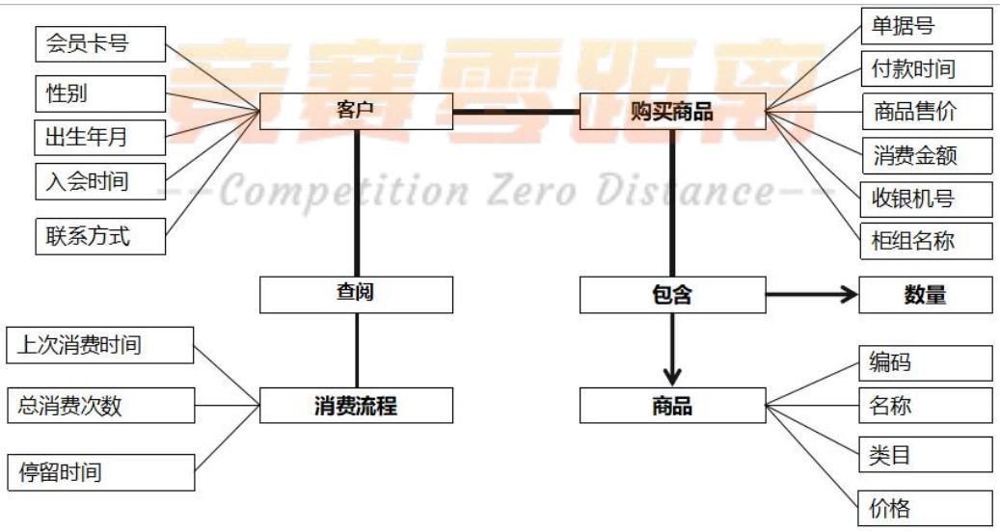
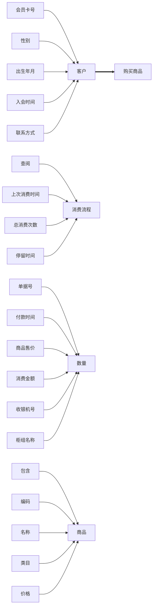
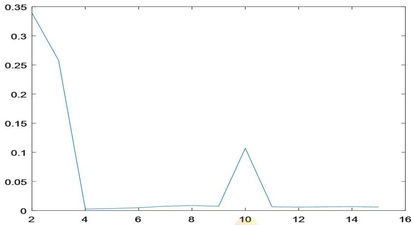
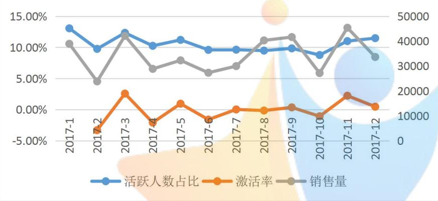
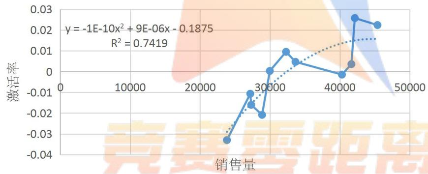

# 大型百货商场会员画像描述

## 摘 要

当前电商的发展使商场会员不断流失，给零售运营商带来了严重损失，在大数据时代，完善“会员画像”描绘，通过数据挖掘，加强对现有会员的精细化管理，实施会员细分和精准营销，不仅能够维系会员的忠诚度，给商场带来更大的利润，还能够节约商场的营销成本。

针对问题一，借助SQLServer数据库的储存与处理功能，先把数据导入SQLServer 数据库，然后根据单据号提取需要的特征数据，即分别提取出会员与非会员的消费数据（见附录1），再导入excel统计出会员的消费金额、购买数量及购买商品的平均价格，非会员的消费金额、购买数量及购买商品的平均价格；最后列表对比会员与非会员群体的差异及会员群体给商场带来的价值（见表4-4）。

针对问题二，本题选用K-均值聚类法，以消费金额和消费次数作为衡量会员购买力的特征数据，运用SPSS软件对提取好的数据（见附录 2）对会员进行聚类，K 值以公式（1）进行确定。D=类内平均距离/类间平均距离 （1），K取4使D 值最小，故将会员分为四类：大众会员（45678人）、黄金会员（2708人）、铂金会员（348 人）和砖石会员（17 人），其中各类别中心点见表4-6。

针对问题三，我们自定义规则：我们选择最近没有消费行为天数和消费次数，作为划分会员生命周期阶段的指标，把会员生命周期划分为五个阶段：引入期-成长期-成熟期-休眠期-流失期，选择2015年 1月1日至2018 年1月3 日范围内登记的会员作为研究对象，分析其生命周期和活跃状态。利用附件1与附件3的数据，通过SQL Server及excel 统计出会员的周期阶段以及状态划分，具体见附录3.

针对问题四，重新定义：会员当月有消费记录则当月为活跃状态，否则当月为非活跃状态。取登记时间为2015 年到2016年共13671个会员为研究对象，根据其消费明细统计得到 2017 年活跃状态矩阵（见表 4-9）。基于活跃状态矩阵采用 matlab 计算其马尔科夫状态转移矩阵（见表 4-10），由表 4-10 可知，在2017 年，会员整体从非活跃到活跃的激活率为 7.46%；根据销量数据分析，激活率与销售量的相关系数为 0.83，即激活率与促销活动成强线性相关关系，通过线性拟合（见图4-4）可得销售量与激活率的关系表达式为一元二次方程:

$$
y = - 1. 0 \times 1 0 ^ {- 1 0} x ^ {2} + 9 \times 1 0 ^ {- 6} x - 0. 1 8 7 5, R ^ {2} = 0. 7 4 1 9.
$$

针对问题五，根据著名的“尿布与啤酒的故事”，本题对相关数据进行关联规则挖掘，采用FP-Growth算法(python代码见附录5.2）对会员消费明细数据进行关联分析。首先根据会员卡号+消费时间+商品编码删除一次消费中商品重复数据，然后根据会员卡号+消费时间提取每次购物篮商品数据，最后采用购物篮数据进行关联规则分析，支持度计数设为50，即规则支持度计数大于等于50才是频繁项集，算法计算结果如置信度等见表附录5.1。通过关联分析给出促销建议：（1）将置信度高的 X和Y商品摆放在相同区域，以便会员能同时找到这几种商品，很快完成购物。（2）适当降低置信度高的X商品价格，会促进Y 商品的连带销售。（3）置信度建议选取0.8及以上。

关键词;会员画像；数据挖掘；K-均值聚类；状态转移矩阵；关联规则算法

## 一、问题重述

## 1.1 问题背景

随着当前“以顾客为中心”的经营理念的逐步深入，会员制的营销模式被广泛的实践和应用于各个领域，同时日益普及的会员营销模式也带来了会员制企业间越来越激烈的竞争。会员在各个销售领域的价值越来越大，所以利用数据库对会员的数据进行全方面的分析，建立会员画像，加强对会员的精细化管理，是实体店与零售行业得以更好发展的有效途径。

## 1.2 问题提出

根据以上背景，以及给出的五个附件，需要解决以下问题：

(1) 分析该商场会员的消费特征，比较会员与非会员群体的差异，并说明会员群体给商场带来的价值。  
(2) 针对会员的消费情况建立能够刻画每一位会员购买力的数学模型，以便能够对每个会员的价值进行识别。  
(3) 作为零售行业的重要资源，会员具有生命周期(会员从入会到退出的整个过程),会员的状态（比如活跃和非活跃）也会发生变化。试在某个时间窗口，建立会员生命周期和状态划分的数学模型.  
(4) 建立数学模型计算会员生命周期中非活跃会员的激活率，从实际销售数据出发，确定激活率和商场促销活动之间的关系模型。  
(5) 根据会员的喜好和商品的连带率来策划此次促销活动。

## 二、问题分析

## 2.1 问题一的分析

题目要求区要求区分会员与非会员的消费特征差异，以及会员群体给商场带来的价值，我们可以根据附件1与附件2，按djh（单据号），使用SQL Server数据库分别提取会员与非会员的消费数据。再使用excel统计出会员的消费金额、购买数量及购买商品的平均价格，非会员的消费金额、购买数量及购买商品的平均价格。最后根据会员与非会员的购买金额和数量比较两者的之间的差异；根据消费总额和单据数量进行两者对商场价值的分析。

## 2.2 问题二的分析

题目要求我们建立一个能刻画每一位会员购买的模型。我们根据“物以类聚，人以群分”的思想及顾客的消费特征，对消费者进行分类；通过spss 软件以消费金额和消费次数作为特征数据，采用K 均值聚类对会员进行聚类，一共将其分成大众会员、黄金会员、铂金会员和砖石会员。

## 2.3 问题三的分析

题目要求我们建立会员生命周期和状态划分的模型，这里我们通过自定义，选择最近没有消费行为天数和消费次数，作为划分会员生命周期阶段的指标，把会员生命周期划分为五个阶段：引入期-成长期-成熟期-休眠期-流失期；选择最近没有消费行为天数和平均每个月消费次数，作为划分会员活跃状态的指标。

## 2.4 问题四的分析

题目要求从实际销售数据出发，建立确定激活率和商场促销活动的关系模型，我们以 2015 年登记的会员为研究对象，计算这些会员在2017年每个月的活跃状态，并且统计每个月的活跃与非活跃占比，画出其趋势图，与 2017 年每个月的销量趋势作对比,编写代码，运行代码，得出状态转移矩阵；根据销量数据分析，激活率与销售量的相关系数为0.83，即激活率与促销活动成强线性相关关系，通过线性拟合（见图2）可得销售量与激活率的关系表达式。

## 2.5 问题五的分析

题目要求根据会员的喜好和商品的连带率策划某次某次活动，针对连带销售，我们采用 FP-Growth算法，首先根据会员卡号+消费时间+商品编码删除一次消费中商品重复数据，然后根据会员卡号+消费时间提取每次购物篮商品数据，最后采用购物篮数据进行关联规则分析，得出适合连带销售和不适合连带销售的商品。

## 三、模型假设

1. 所有附件所给的数据真实且合理。  
2. 马尔可夫模型的基本假设：

（1）齐次马尔科夫性假设：即假设隐藏的马尔科夫链在任意时刻 t的状态只依于其前一时刻的状态，与其他时刻的状态及观测无关，也与时刻 t 无关；  
（2）观测独立性假设：即假设任意时刻的观测只依赖于该时刻的马尔科夫链的状态，与其他观测即状态无关。

## 四、模型建立与求解

由于“会员画像”属于信息层面，因此需要用数据库的语言进行设计，也就是需要用实体-联系图来完成。E-R 图提供了实体（即数据对象）、属性、和联系的方法，用来描述现实世界的概念模型；其图示如图 4-1所示。



<details>
<summary>flowchart</summary>


</details>

图 4-1 商场“会员画像”E-R 的图示

## 4.1 问题一

针对本题，为了方便我们分析会员与非会员群体的差异，以及会员给商场带来的价值，首先我们根据附件一和附件二的单据号，借助 SQL Server数据库的存储与处理功能提取出会员与非会员的消费数据，再借助excel统计出会员的消费金额、购买数量及购买商品的平均价格，非会员的消费金额、购买数量及购买商品的平均价格。

我们将客户每个单据购买数量、每个单据消费金额、每个单据商场平均价格作为消费特征，根据所得数据，我们可以得到会员的消费特征（表4-1）和非会员的消费特征（表4-2）如下所示：

表 4-1 会员的消费特征表

<table><tr><td></td><td>最大值</td><td>最小值</td><td>平均值</td><td>中位数</td></tr><tr><td>每个单据购买数量</td><td>111630</td><td>1</td><td>2245</td><td>499</td></tr><tr><td>每个单据消费金额</td><td>184292565</td><td>220</td><td>2622781</td><td>441109</td></tr><tr><td>每个单据商品平均价格</td><td>9937</td><td>78</td><td>966</td><td>895</td></tr><tr><td>总消费金额</td><td>单据数量</td><td>平均每个单据消费金额</td><td></td><td></td></tr><tr><td>1258934872</td><td>480</td><td>2622781</td><td></td><td></td></tr></table>

表 4-2 非会员的消费特征表

<table><tr><td></td><td>最大值</td><td>最小值</td><td>平均值</td><td>中位数</td></tr><tr><td>每个单据购买数量</td><td>24</td><td>1</td><td>1</td><td>1</td></tr><tr><td>每个单据消费金额</td><td>47602</td><td>0</td><td>1772</td><td>798</td></tr><tr><td>每个单据商品平均价格</td><td>47602</td><td>0</td><td>1704</td><td>749</td></tr><tr><td>总消费金额</td><td>单据数量</td><td>平均每个单据消费金额</td><td></td><td></td></tr><tr><td>4440518</td><td>2506</td><td>1772</td><td></td><td></td></tr></table>

为了研究会员与非会员之间的消费特征差异，以及会员给商场带来的价值，我们将两者的消费特征数据进行对比，会员消费时间范围：2016-01-01 10:43:00至 2017-09-23 20:05:00，共 631 天；非会员消费时间范围：2017-01-01 23:23:00至 2017-04-18 21:59:00 共 106 天。对比结果如下表：

表 4-3 会员与非会员的消费特征对比表

<table><tr><td>消费特征</td><td>客户类别</td><td>最大值</td><td>最小值</td><td>平均值</td><td>中位数</td></tr><tr><td rowspan="2">每个单据购买数量</td><td>会员</td><td>111630</td><td>1</td><td>2245</td><td>499</td></tr><tr><td>非会员</td><td>24</td><td>1</td><td>1</td><td>1</td></tr><tr><td rowspan="2">每个单据消费金额</td><td>会员</td><td>184292565</td><td>220</td><td>2622781</td><td>441109</td></tr><tr><td>非会员</td><td>47602</td><td>0</td><td>1772</td><td>798</td></tr><tr><td rowspan="2">每个单据商品平均价格</td><td>会员</td><td>9937</td><td>78</td><td>966</td><td>895</td></tr><tr><td>非会员</td><td>47602</td><td>0</td><td>1704</td><td>749</td></tr></table>

表 4-4 会员与非会员所带价值表

<table><tr><td>客户类别</td><td>总消费金额</td><td>单据数量</td><td>数据范围天数</td><td>平均每个单据消费金额</td><td>平均每天消费金额</td></tr><tr><td>会员</td><td>1258934872</td><td>480</td><td>631</td><td>2622781</td><td>1995142</td></tr><tr><td>非会员</td><td>4440518</td><td>2506</td><td>106</td><td>1772</td><td>41892</td></tr></table>

对于商场而言，消费金额越高，给商场带来的价值就越大根据表4-4可知会 员的总消费金额远远大于金额远远大于非会员的总消费额，所以会员群体带给商 场的价值远远大于非会员群体给商场带来的价值

## 4.2 问题二

为了对会员的购买力进行刻画，我们根据会员的消费特征，对会员进行分类，建立分类模型。本题选用K-均值聚类法，运用SPSS软件对筛选整理好的数据（见附录 2）进行聚类。

我们运用k-均值分类法对会员进行分类，寻找对会员最合适的分类个数（即k值），k值以公式(1)进行确定:

D=类内平均距离/类间平均距离 （1）

D值计算结果见下图：



<details>
<summary>line</summary>

| X | Y |
| --- | --- |
| 2 | 0.34 |
| 3 | ~0.26 |
| 4 | 0 |
| 5 | ~0.005 |
| 6 | ~0.008 |
| 7 | ~0.01 |
| 8 | ~0.012 |
| 9 | ~0.01 |
| 10 | ~0.11 |
| 11 | ~0.01 |
| 12 | ~0.008 |
| 13 | ~0.008 |
| 14 | ~0.008 |
| 15 | ~0.008 |
</details>

图4-2 D值计算结果图

由上图（图4-2）可知K取4使 D值最小，故将会员分为四类。将消费金额和消费次数分为低、较低、较高、高四级。每类人数见表 4-5。

表 4-5 各类别人数

<table><tr><td>类别</td><td>人数</td></tr><tr><td>1</td><td>45678</td></tr><tr><td>2</td><td>348</td></tr><tr><td>3</td><td>2708</td></tr><tr><td>4</td><td>17</td></tr><tr><td>总计</td><td>48751</td></tr></table>

表 4-6 各类别中心点

<table><tr><td>类别</td><td>消费金额中心点</td><td>消费次数中心点</td></tr><tr><td>1</td><td>7607</td><td>4</td></tr><tr><td>2</td><td>343245</td><td>81</td></tr><tr><td>3</td><td>91325</td><td>28</td></tr><tr><td>4</td><td>1302838</td><td>200</td></tr></table>

由表 4-6可知，1类会员属于消费金额和消费次数低的会员，这类会员可命名为大众会员；；2类会员属于消费金额和消费次数较高的会员，这类会员可命名为铂金会员；3类会员属于消费金额和消费次数较低，这类会员可命名为黄金会员；4 类会员属于消费金额和消费次数高的会员，这类会员可命名为钻石会员。商场可以根据每一位会员的消费数据，就可对其进行归类，从而对每一位会员的价值进行识别。

## 4.3 问题三

会员的生命周期，是指会员从入会到退出的整个过程。会员的状态，是指会员在商场的消费是否活跃。

由于题目中并未说明会员的生命周期的每一个过程和评价会员活跃状态的标准，所以特做如下定义:

在研究会员的生命周期的时候，我们通过对数据的分析，把最近没有消费行为天数和消费次数，作为划分会员生命周期阶段的指标，把会员生命周期划分为五个阶段：引入期-成长期-成熟期-休眠期-流失期，对每一个时期 定义如下：

引入期：注册但没有过消费行为；

成长期：最近没有消费行为天数在30天及以内，消费1 到 3次；

成熟期：最近没有消费行为天数在30天及以内，消费4 次及以上；

休眠期：31-90天没有消费行为；

流失期：90天以上没有消费行为。

在研究会员的状态的时候，我们选择最近没有消费行为天数和平均每个月消费次数，作为划分会员活跃状态的指标，其中规定处于引入期或休眠期或流失期的会员皆为非活跃会员，定义如下：

活跃：处于成长期或成熟期的会员平均每个月消费次数达到 1次及以上为活跃会员；

非活跃：处于成长期或成熟期的会员平均每个月消费次数达到1次以下为非活跃会员。

因为附件3会员消费明细表里的消费时间范围是2015年1 月1日至2018年1月3 日，因此选择在这个时间范围内登记的会员作为研究对象，分析其生命周期和活跃状态。

利用附件1与附件3的数据，通过借助sql进行提取数据，再使用excel统计出会员的生命周期中处于每一个时期的人数(表4-7)，以及本商场会员处于活跃和非活跃会员的人数（表 4-8）。（数据支持见表格3—周期及状态划分）

表 4-7 所处时期人数表

<table><tr><td>生命周期阶段</td><td>人数</td></tr><tr><td>引入期</td><td>21298</td></tr><tr><td>成长期</td><td>1391</td></tr><tr><td>成熟期</td><td>2230</td></tr><tr><td>休眠期</td><td>3367</td></tr><tr><td>流失期</td><td>18924</td></tr><tr><td>总计</td><td>47210</td></tr></table>

表 4-8 活跃状态人数表

<table><tr><td>活跃程度</td><td>人数</td></tr><tr><td>非活跃</td><td>45039</td></tr><tr><td>活跃</td><td>2171</td></tr><tr><td>总计</td><td>47210</td></tr></table>

## 4.4 问题四

概念说明：转移概率矩阵（又叫跃迁矩阵，英文名：transition matrix）是俄国数学家马尔科夫提出的，他在20世纪初发现：一个系统的某些因素在转移中，第n 次结果只受第n-1的结果影响，即只与当前所处状态有关，而与过去状态无关。 在马尔科夫分析中，引入状态转移这个概念。所谓状态是指客观事物可能出现或存在的状态；状态转移概率是指客观事物由一种状态转移到另一种状态的概率。

重新定义：会员当月有消费记录则当月为活跃状态，否则当月为非活跃状态。取登记时间为2015年到 2016 年共13671个会员为研究对象，根据其消费明细统计得到2017年活跃状态矩阵（见表4-9），表1中1 代表当月为非活跃状态，2表示当月为活跃状态。基于活跃状态矩阵采用 matlab 计算其马尔科夫状态转移矩阵（见表 4-9），matlab 代码见附录 4.2 由表 4-9 可知，在 2017 年，会员整体从非活跃到活跃的激活率为7.46%。

表 4-9 状态转移概率矩阵

<table><tr><td></td><td>1</td><td>2</td></tr><tr><td>1</td><td>92.54%</td><td>7.46%</td></tr><tr><td>2</td><td>63.39%</td><td>36.61%</td></tr></table>

表 4-10 2017年各月活跃与非活跃状态统计表

<table><tr><td></td><td>2017-01</td><td>2017-02</td><td>2017-03</td><td>2017-04</td><td>2017-05</td><td>2017-06</td><td>2017-07</td><td>2017-08</td><td>2017-09</td><td>2017-10</td><td>2017-11</td><td>2017-12</td></tr><tr><td>非活跃人数</td><td>11886</td><td>12337</td><td>11985</td><td>12270</td><td>12140</td><td>12359</td><td>12355</td><td>12375</td><td>12326</td><td>12472</td><td>12166</td><td>12102</td></tr><tr><td>活跃人数</td><td>1785</td><td>1334</td><td>1686</td><td>1401</td><td>1531</td><td>1312</td><td>1316</td><td>1296</td><td>1345</td><td>1199</td><td>1505</td><td>1569</td></tr><tr><td>非活跃人数占比</td><td>86.94%</td><td>90.24%</td><td>87.67%</td><td>89.75%</td><td>88.80%</td><td>90.40%</td><td>90.37%</td><td>90.52%</td><td>90.16%</td><td>91.23%</td><td>88.99%</td><td>88.52%</td></tr><tr><td>活跃人数占比</td><td>13.06%</td><td>9.76%</td><td>12.33%</td><td>10.25%</td><td>11.20%</td><td>9.60%</td><td>9.63%</td><td>9.48%</td><td>9.84%</td><td>8.77%</td><td>11.01%</td><td>11.48%</td></tr></table>

表 4-11 激活率表

<table><tr><td>月份</td><td>活跃人数占比</td><td>激活率</td><td>销售量</td></tr><tr><td>2017-1</td><td>13.06%</td><td></td><td>38930</td></tr><tr><td>2017-2</td><td>9.76%</td><td>-3.30%</td><td>23840</td></tr><tr><td>2017-3</td><td>12.33%</td><td>2.57%</td><td>42131</td></tr><tr><td>2017-4</td><td>10.25%</td><td>-2.08%</td><td>28865</td></tr><tr><td>2017-5</td><td>11.20%</td><td>0.95%</td><td>32295</td></tr><tr><td>2017-6</td><td>9.60%</td><td>-1.60%</td><td>27316</td></tr><tr><td>2017-7</td><td>9.63%</td><td>0.03%</td><td>29974</td></tr><tr><td>2017-8</td><td>9.48%</td><td>-0.15%</td><td>40293</td></tr><tr><td>2017-9</td><td>9.84%</td><td>0.36%</td><td>41645</td></tr><tr><td>2017-10</td><td>8.77%</td><td>-1.07%</td><td>27180</td></tr><tr><td>2017-11</td><td>11.01%</td><td>2.24%</td><td>45374</td></tr><tr><td>2017-12</td><td>11.48%</td><td>0.47%</td><td>33644</td></tr></table>

定义：激活率=当月活跃人数占比-上月活跃人数占比。由表 4-11可以看出，2017 年1、3、8、9、11月为促销月，销量相对比其它月份更多，与此所对应的激活率比其它月份高，并且激活率与销售量的相关系数为 0.83，即激活率与促销活动成强线性相关关系，即有促销活动激活率就高，没促销活动激活率就降下来。通过线性拟合（见图4-4）可得销售量与激活率的关系表达式为一元二次方程: $\gamma = - 1 . 0 \times 1 0 ^ { - 1 0 } x ^ { 2 } + 9 \times 1 0 ^ { - 6 } x - 0 . 1 8 7 5 , R ^ { 2 } = 0 . 7 4 1 9$

图4-3 激活率与销售量对比  


<details>
<summary>line</summary>

| Category | 活跃人数占比 (%) | 激活率 (%) | 销售量 |
| --- | --- | --- | --- |
| 2017-1 | ~13.0 | ~10.5 | ~40000 |
| 2017-2 | ~9.8 | ~-3.0 | ~25000 |
| 2017-3 | ~12.5 | ~2.5 | ~42000 |
| 2017-4 | ~10.2 | ~-1.5 | ~30000 |
| 2017-5 | ~11.2 | ~1.0 | ~33000 |
| 2017-6 | ~9.5 | ~-1.5 | ~28000 |
| 2017-7 | ~9.5 | ~0.0 | ~31000 |
| 2017-8 | ~9.5 | ~0.0 | ~41000 |
| 2017-9 | ~9.8 | ~0.2 | ~42000 |
| 2017-10 | ~8.8 | ~-1.0 | ~28000 |
| 2017-11 | ~11.0 | ~2.2 | ~46000 |
| 2017-12 | ~11.5 | ~0.5 | ~35000 |
</details>



<details>
<summary>line</summary>

| 销售量 | 激活率 |
| --- | --- |
| ~23000 | ~-0.033 |
| ~26000 | ~-0.010 |
| ~27000 | ~-0.016 |
| ~28000 | ~-0.021 |
| ~30000 | 0 |
| ~32000 | 0.01 |
| ~34000 | 0.005 |
| ~40000 | -0.001 |
| ~42000 | 0.004 |
| ~42500 | 0.026 |
| ~46000 | 0.023 |
</details>

## 4.5 问题五

商场策划促销活动，主要是为了提高销售量，同时减少库存。处于此目的，对商品的连带销售的营销模式是非常有效的，在此营销模式中，对商品的关联分析是尤为重要的。

关联分析又称关联挖掘，就是在交易数据、关系数据或其他信息载体中，查找存在于项目集合或对象集合之间的频繁模式、关联、相关性或因果结构。可从数据库中关联分析出形如“由于某些事件的发生而引起另外一些事件的发生”之类的规则。如“67%的顾客在购买啤酒的同时也会购买尿布”，因此通过合理的啤酒和尿布的货架摆放或捆绑销售可提高超市的服务质量和效益。

过对数据的关联分析，找出商品之间的关联规则，就有利于商品之间的连带销售。商品之间的关联规则，就如尿布和啤酒一起卖的案例，其中的商品的关联规则可表示为{Diaper}→{Beer}。

它代表的意义是：购买了Diaper的顾客会购买Beer。这个关系不是必然的，但是可能性很大，这就已经足够用来辅助商家调整Diaper和Beer的摆放位置了，例如摆放在相近的位置，进行捆绑促销来提高销售量。其中，就对对于规;{Diaper}→{Beer}，其可以理解为：

置信度{Diaper, Beer}的支持度计数除于{Diaper}的支持度计数，为这个规则的置信度。例如规则{Diaper}→{Beer}的置信度为 3÷3=100%。说明买 Diaper的人 100%也买了 Beer。

支持度计数：一个项集出现在几个事务当中，它的支持度计数就是几。例如{Diaper, Beer}出现在事务 002、003 和 004 中，所以它的支持度计数是 3。

支持度：支持度计数除于总的事务数。例如上例中总的事务数为4，{Diaper,Beer}的支持度计数为3，所以它的支持度是3÷4=75%，说明有 75%的人同时买了 Diaper 和 Beer。

关联规则反映一个事物与其他事物之间的相互依存性和关联性。如果两个或者多个事物之间存在一定的关联关系，那么，其中一个事物就能够通过其他事物预测到，形如X→Y的逻辑蕴含式。

基于上述的出发点，我们首先根据会员卡号+消费时间+商品编码删除一次消费中商品重复数据，然后根据会员卡号+消费时间提取每次购物篮商品数据，最后采用购物篮数据采用FP-Growth算法，对会员消费明细数据进行关联分析，支持度计数设为50，即规则支持度计数大于等于 50 才是频繁项集。（python代码以及 fpgrowth建模数据见附件5.2-fpgrowth 代码）（关联分析算法计算结果见附件 5.1）

结果分析：

以第一条数据为例，122次购买植村秀气垫粉底盒的记录中有120 次会连带买植村秀气垫粉底霜，按照之前的关联规则，说明买植村秀气垫粉底盒的时有98.4%的可能性会连带买植村秀气垫粉底霜。

根据上述分析为例，为了提高商场连带消费的效益，对活动促销的建议有：

(1）将置信度高的 X和Y商品摆放在相同区域，以便会员能同时找到这几种商品，很快完成购物。  
(2）适当降低置信度高的X商品价格，会促进Y 商品的连带销售。置信度建议选取0.8 及以上。

## 五、模型评价与改进

## 5.1 K 均值聚类算法缺点：

缺点是分组的数目k是一个输入参数，不合适的k 可能返回较差的结果；K均值聚类对簇中心初始化非常敏感。而且，初始化不良会降低收敛的速度差并会使得整体聚集效果不佳；所以一旦初始数据有所波动，将影响聚类效果。

5.2 Apriori（关联规则）算法是一种挖掘关联规则的算法，用于挖掘其内含的、未知的却又实际存在的数据关系，其核心是基于两阶段频集思想的递推算法。

算法缺点：

（1）在每一步产生侯选项目集时循环产生的组合过多，没有排除不应该参与组合的元素；  
（2）每次计算项集的支持度时，都对数据库中的全部记录进行了一遍扫描比较，需要很大的 I/O 负载。

## 六、参考文献

[1]刘 海，卢 慧，阮金花，田丙强，胡守忠.基于“用户画像”挖掘的精准营销细分模型研究[J].丝绸，2015，12（12）:37-47.  
[2]吴邦刚，余琦，陈煜波.基于全生命周期行为的会员等级体系对顾客购买行为的影响[J].管理学报，2018，4（4）:569-576.  
[3]黄升民，刘珊.大数据背景下营销体系的结构与重构[J].现代传播，2012(12):13-20.  
[4] 张鹏，刘译璟.为消费者画像[J].销售与市场:渠道版，2013(9):30-32.  
[5]段云峰，吴唯宁，李剑威，等.数据仓库及其在电信领域中的应用[M].北京:电子工业出版社，2003:9-14.  
[6] 刘英姿，吴昊.客户细分方法研究综述[J].管理工程.2006,20(1):53-57.  
[7]吕红艳.基于顾客价值的市场细分研究[D].天津:天津大学，2007:5-8.  
[8]聂笃忠，陈 桦，米承继，彭礼红.马尔科夫链状态概率转移矩阵修正算法[J]. 统计与决策，2013(3):14-17.  
[9]廖普明.基于马尔科夫链状态转移概率矩阵的商品市场状态预测[J].统计与决策，2015(2):97-99  
[10] 周发超，王志坚，叶枫，等.关联规则挖掘算法Apriori的研究改进[J].计算机科学与探索，2015，9(9):1075-1083.  
[11] 王志春.一种改进的挖掘关联规则 Apriori 算法[J].电脑知识与技术，2015，12(34):4-17.

## 七 附录清单

附录 1:会员与非会员消费特征对比源数据；

附录 2:k 均值聚类法数据;

附录 3:周期及状态划分数据;

附录 4.1:马尔科夫状态转移矩阵构建及关系源数据；

附录 4.2：马尔科夫转移状态概率矩阵matlab 源代码；

附录 5.1：关联规则数据；

附录 5.2：fpgrowth 主函数代码。

马尔科夫转移状态概率矩阵求解matlab代码

<div class="mineru-algorithm" style="white-space: pre-wrap; font-family:monospace;">
clc,clear,format rat
a=xlsread('C:\Users\yang\Desktop\C 题\活跃状态矩阵.xlsx');
[r,c]=size(a);
a=a';a=a(:)'; %把矩阵 a 逐行展开成一个行向量
for i=1:2
    for j=1:2
        f(i,j)=length(findstr([i,j],a)); %统计子字符串'i j'的个数
    end
end
ni=sum(f,2); %计算矩阵 f 的行和
phat=f./repmat(ni,1,size(f,2)); %求状态转移的频率
format %恢复到短小数的显示格式
</div>

fpgrowth 主函数代码

<div class="mineru-algorithm" style="white-space: pre-wrap; font-family:monospace;">
import fp_growth_py3 as fpg
import pandas as pd
import datetime
itemName='商品名称'
start=datetime.datetime.now()
data=pd.read_excel('C:/Users/yang/Desktop/C 题/fpgrowth 建模数据.xlsx')
dataSet, itemSet=[], []
itemSet.append(data[itemName][0])
for i in range(1,len(data)):
    if data['会员消费编码'][i]==data['会员消费编码'][i-1]:
        itemSet.append(data[itemName][i])
        if i==len(data)-1:
            dataSet.append(itemSet)
    else:
        dataSet.append(itemSet)
        itemSet=[]
        itemSet.append(data[itemName][i])
        if i==len(data)-1:
            dataSet.append(itemSet)
end=datetime.datetime.now()
readDataTs=(end-start).seconds
if __name__ == '__main__':
    start=datetime.datetime.now()
    '''
</div>

调用 find\_frequent\_itemsets()生成频繁项

@:param minimum\_support 表示设置的最小支持度，即若支持度大于等于inimum\_support，保存此频繁项，否则删除

@:param include\_support 表 示 返 回 结 果 是 否 包 含 支 持 度 ， 若include\_support=True，返回结果中包含 itemset 和 support，否则只返回itemset

```python
frequent_itemsets      =     fpg.find_frequent_itemsets(dataSet,
minimum_support=49, include_support=True)
#   print(type(frequent_itemsets))  # print type
    result, itemNum=[], []
    for itemset, support in frequent_itemsets:   # 将 generator 结果存
入 list
        result.append((itemset, support))
        itemNum.append(len(itemset))
    result = sorted(result, key=lambda i: i[0])  # 排序后输出
    itemNum=pd.Series(itemNum)
    itemNumMax=itemNum.max()
    result2=[]
    for i in range(itemNumMax):#
        result2.append([])
    for itemset, support in result:
        result2[len(itemset)-1].append((itemset, support))

    result3=[]
    for i in range(1,itemNumMax):
        for j in range(len(result2[i])):
            for k in range(i+1):
                y=result2[i][j][0][k]
                x Wh()
                xx=[]
                n=0
                for item in result2[i][j][0]:
                    if item!=y:
                        xx.append(item)
                        x+=item+',
                        n+=1
                    x=x[:-1]
                for t in range(len(result2[i-1]):
                    if xx==result2[i-1][t][0]:

confidence=result2[i][j][1]/result2[i-1][t][1]
            supportCountX=result2[i-1][t][1]
            supportCountY=result2[i][j][1]
            supportX=result2[i-1][t][1]/len(dataSet)
            supportY=result2[i][j][1]/len(dataSet)
```

result3.append((x,y,n,supportCountX,supportCountY,supportX,supportY,c onfidence))

break

result3=pd.DataFrame(list(result3))

result3.columns = ['X','Y','X 商品个数

','supportCountX','supportCountY','supportX','supportY','confidence']

result3.to\_excel('C:/Users/yang/Desktop/fpgrowthResult.xlsx')

end=datetime.datetime.now()

calTs=(end-start).seconds


<details>
<summary>natural_image</summary>

Abstract graphic of a stylized human figure with a star and gradient background (no text or symbols)
</details>

##