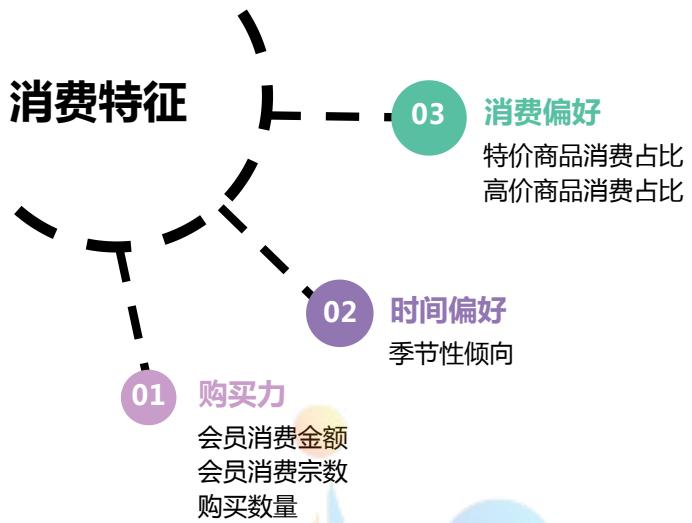
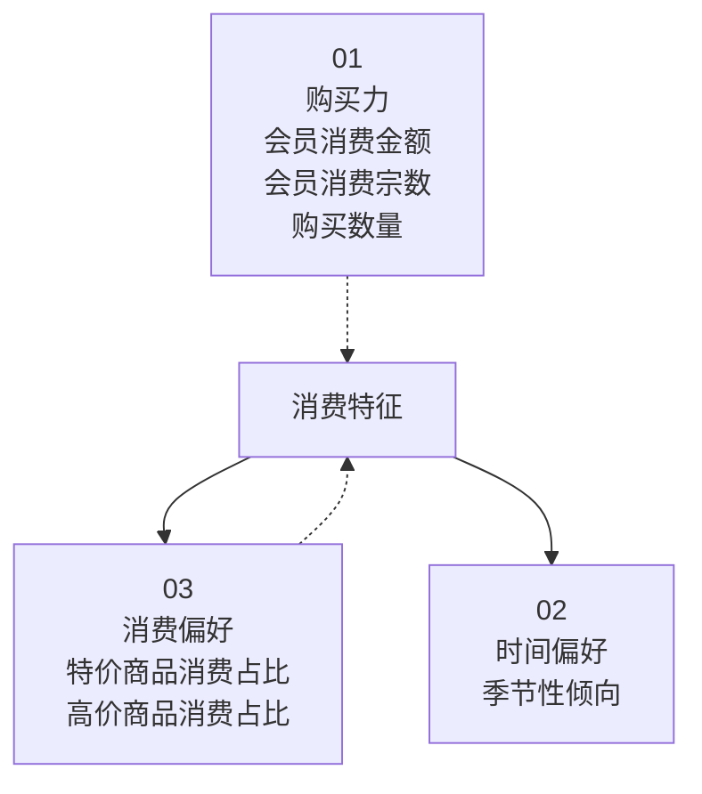
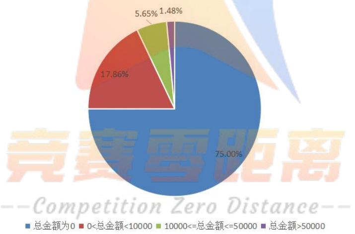
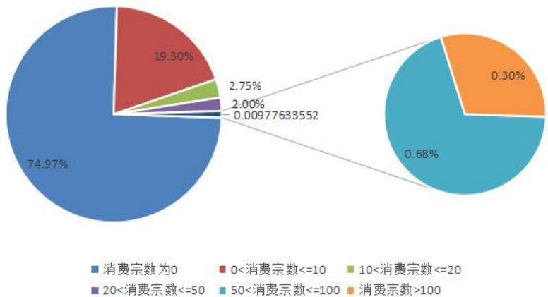
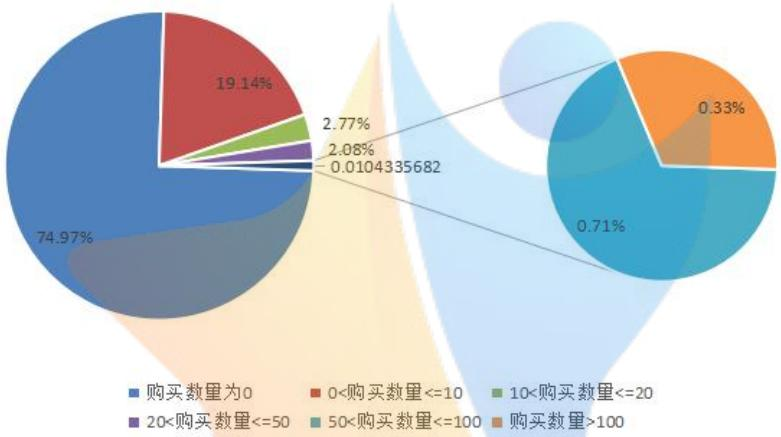
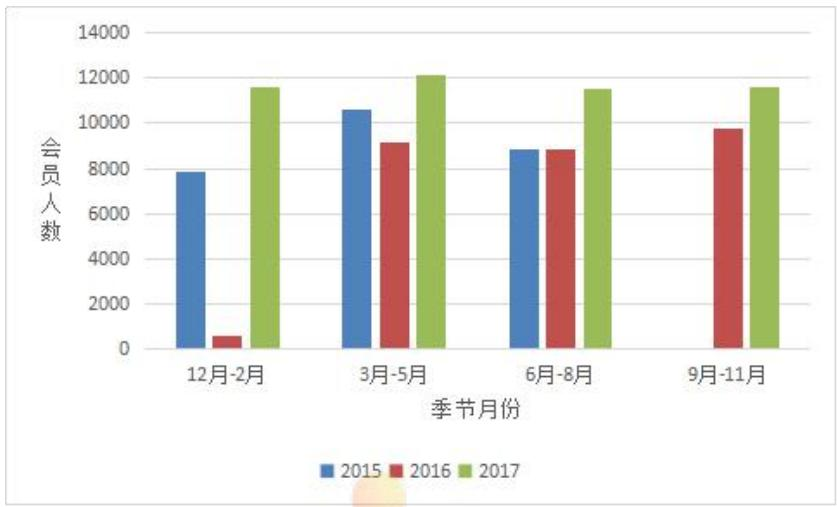
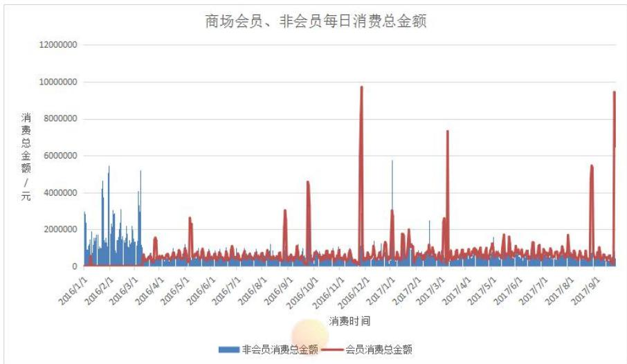
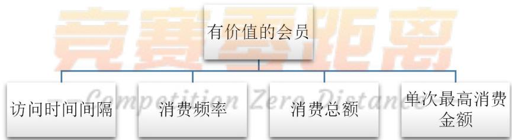
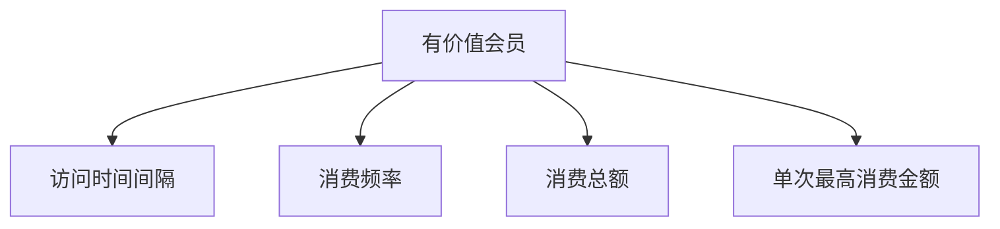

# 基于 RFMT 模型的百货商场会员画像描绘

## 摘要

电商的快速发展给零售运营商带来了较大的冲击,为了持续获取稳定的销售额和利润,零售运营商需完成对会员的管理与维系工作。完善会员画像,加强会员管理,维持会员稳定将使得零售业更好地发展。

本文利用该大型百货商场提供的会员信息以及消费明细，完善该商场的会员画像。本文从购买力、购买时间偏好、消费偏好三个维度分析会员的消费特征。以会员消费总金额、消费次数、商品购买数量代表会员购买力，同时按季节对会员消费行为进行分析，随后以特价商品、高价商品消费金额在会员总消费金额的占比分析会员的消费偏好。

为进一步说明会员群体给商场带来的价值,本文对比了会员与非会员的购买力。会员群体的消费总金额和商品购买数量略低于非会员群体,原因或是非会员群体人数较多。但是绘制两类群体的日消费金额曲线后可知,与非会员群体相比,会员的单日消费总金额增幅较大。

为刻画会员的购买力，本文建立了 RFMT 模型。分别选取会员最后一次消费的时间间隔、消费频率、总金额、单次购买最高金额作为指标，结合层次分析法得到相应指标的权重，并计算出每个会员的得分，会员得分则代表着会员的个人价值。利用 K-means 聚类的方法，根据会员得分进行聚类，得分较高的会员群体则为商场需要维护的会员群体。

为了合理地判断会员所处的生命周期，本文利用已构建的 RFMT 模型中的相关指标，再次使用 K-means 聚类的方法对该商场的会员进行聚类，将现有会员划分为活跃会员、沉默会员、流失会员三类，以便商场管理者对会员进行管理。

在会员的生命周期中,会员状态处于动态变化的过程。为了增加商场的利润,与发展新会员相比,促进非活跃会员转化为活跃会员会大大降低商场的成本。本文通过构建非活跃会员的相关指标,使用因子分析法,可计算得各非活跃会员激活率,激活率越高,则其被激活的可能性则越大。同时,本文以非活跃会员的特价商品消费金额在总消费金额中的占比作为非活跃会员对促销活动敏感度的反映,构建线性回归模型分析非活跃会员的激活率与促销活动之间的关系,结果表明,一定的促销活动有助于提升非活跃会员的激活率。

连带消费是商场经营的核心，本文选取销售数量排名前十的商品作为最受欢迎的商品，根据会员消费明细表，利用 Matlab 软件构建商品关联表，并使用 Clementine 建立商品的关联规则。商场可对热门商品及其关联商品推出相应促销活动，同时通过广告投放、邮件推送等方式对促销活动进行推广。

关键词：会员画像；RFMT 模型；生命周期；精准化营销

## 一、问题的重述

在零售行业中，会员的发展和维系对零售运营商而言至关重要，会员不但能够为运营商带来稳定的销售额和利润，而且对运营商的营销策略制定起着重要的作用。但随着电商日益发展，实体商场的会员不断流失，给零售运营商带来了严重损失，因此商家必须开展各种营销活动来吸引更多的会员以及维系旧会员。

在传统的市场营销中，想准确知道消费者的习惯、偏好、个性等影响消费者购买行为的因素是十分困难的，企业想对消费者进行精准化营销也难以实现，因此导致企业浪费了大量的营销资源。在众多大数据工具中用户画像技术是帮助企业准确识别和分析目标客户的有效工具之一，对于零售运营商的会员发展和维系，完善会员画像描绘，加强对现有会员的精细化管理，定期向其精准推送产品和服务，与会员建立稳定的关系是实体零售行业得以更好发展的有效途径。

在本文的研究中，完善商场会员画像是我们的研究重点，针对某大型百货商场的会员数据以及销售数据，我们需要解决以下问题：

(1) 对该商场的会员消费特征以及会员与非会员差异进行分析，并说明会员给商场带来的价值；  
(2) 建立刻画会员购买力的数学模型，对会员的价值进行识别；  
(3) 在某个时间窗口，建立会员生命周期和状态划分的数学模型；  
(4) 计算会员生命周期中非活跃会员的激活率，并确定激活率和商场促销活动之间的关系模型；  
(5) 根据会员的喜好和商品的连带率设计促销方案帮助商家策划促销活动。

## 二、模型假设

为了使得问题更易于理解，我们作出以下合理假设：

- 假设销售数据录入系统时不存在时间差;  
- 假设销售流水表和会员消费明细表中的一条记录代表一次消费，即不存在同一次消费产生多条记录的情况；  
- 假设会员的会员卡自开卡日起，除了自行退出外不存在会员卡过期导致会员退会的情况。

## 三、变量说明

本文建立模型的过程中主要涉及以下变量，变量及说明如下:

表 1 变量及其说明

<table><tr><td>变量</td><td>说明</td><td>变量</td><td>说明</td></tr><tr><td>R</td><td>最近一次购买商品的时间间隔天数</td><td>F</td><td>购买商品的频率</td></tr><tr><td>M</td><td>消费总金额</td><td>T</td><td>单次购买的最高金额</td></tr><tr><td> $w_{i}'$ </td><td>初始权重系数</td><td> $w_{i}$ </td><td>归一化权重系数</td></tr><tr><td>CI</td><td>一致性指标</td><td> $λ_{\max}$ </td><td>最大特征根</td></tr><tr><td> $\lambda_{i}$ </td><td>特征根</td><td>RI</td><td>平均随机一致性指标</td></tr><tr><td>CR</td><td>随机一致性指标</td><td> $x_{r},x_{f},x_{m},x_{t}$ </td><td>标准化的RFMT指标值</td></tr><tr><td> $x_{max}$ </td><td>指标最大值</td><td> $x_{min}$ </td><td>指标最小值</td></tr><tr><td>SRFMT</td><td>RFMT 价值得分</td><td> $w_{r},w_{f},w_{m},w_{t}$ </td><td>RFMT 各指标权重</td></tr><tr><td> $x_{r},x_{f},x_{m},x_{t}$ </td><td>RFMT 指标值</td><td> $F_{x_{r}},F_{x_{f}},F_{x_{m}},F_{x_{t}}$ </td><td>RFMT 指标得分</td></tr><tr><td> $c_{k}$ </td><td>聚类类别</td><td> $\mu_{i}$ </td><td>聚类中心</td></tr><tr><td> $J(c_{k})$ </td><td>距离平方和</td><td> $J(c)$ </td><td>总距离平方和</td></tr></table>

## 四、模型的建立与求解

## 4.1 数据预处理

题目提供了 5 个附件，附件中的数据给出了商场会员的相关信息：附件 1 是会员信息数据；附件 2 是近几年的销售流水表；附件 3 是会员消费明细表；附件 4 是商品信息表；附件 5 是数据字典。

对于众多的会员信息数据，我们需要对数据进行清洗整理，使用 EXCEL 和 SQL Server 软件对数据做了以下预处理：

① 剔除数据表中的重复数据；  
② 由于我们只针对附件一中的会员进行管理，附件三中的会员消费记录存在其他分店的会员，而附件一为本商场的会员，我们将附件一与附件三的数据相关联，筛选出本商场的会员消费明细，剔除其他分店的会员消费明细；  
③ 将附件一、附件二与附件三的数据相关联，分别筛选出附件二中会员与非会员的数据。

利用以上数据，对问题进行求解分析。

## 4.2 问题一的模型建立与求解

## 4.2.1 建模思路

对于问题一，我们运用数据统计分析的方法来对会员信息进行分析。问题中需要根据会员消费明细表分析会员的消费特征，主要从三个维度来分析：购买力、时间偏好、消费偏好，具体分析指标如下图所示：



<details>
<summary>flowchart</summary>


</details>

图 1 会员消费特征指标

而对于会员与非会员群体之间的差异, 我们从购买力以及购买数量的角度深入分析会员与非会员带给商场的价值差异, 进而分析会员给商场带来的价值。

## 4.2.2 模型建立

我们从购买力、时间偏好、消费偏好三个维度来分析会员的消费特征。

## (1) 购买力

反映会员购买力的指标主要有三个，分别为会员消费金额、会员消费宗数以及商品购买数量。根据会员的消费情况，我们定义了各指标的数据区间以及含义，如下表所示：

表 2 购买力指标区间以及含义

<table><tr><td>消费总金额区间</td><td>含义</td><td>消费宗数区间</td><td>含义</td><td>购买数量区间</td><td>含义</td></tr><tr><td>总金额为0</td><td>无消费会员</td><td>消费宗数为0</td><td>无消费会员</td><td>购买数量为0</td><td>无消费会员</td></tr><tr><td>0&lt;总金额&lt;10000</td><td>低消费会员</td><td>0&lt;消费宗数&lt;=10</td><td>低消费会员</td><td>0&lt;购买数量&lt;=10</td><td>低消费会员</td></tr><tr><td>10000&lt;=总金额&lt;=50000</td><td>中消费会员</td><td>10&lt;消费宗数&lt;=20</td><td>中低消费会员</td><td>10&lt;购买数量&lt;=20</td><td>中低消费会员</td></tr><tr><td>总金额&gt;50000</td><td>高消费会员</td><td>20&lt;消费宗数&lt;=50</td><td>中消费会员</td><td>20&lt;购买数量&lt;=50</td><td>中消费会员</td></tr><tr><td></td><td></td><td>50&lt;消费宗数&lt;=100</td><td>中高消费会员</td><td>50&lt;购买数量&lt;=100</td><td>中高消费会员</td></tr><tr><td></td><td></td><td>消费宗数&gt;100</td><td>高消费会员</td><td>购买数量&gt;100</td><td>高消费会员</td></tr></table>

我们在会员购买力维度下将会员群体分成了无消费会员、低消费会员、中低消费会员、中消费会员、中高消费会员、高消费会员六个等级，并根据会员的消费情况进行会员购买力分析。

## (2) 时间偏好

对于会员消费的时间偏好，我们主要分析会员消费的季节性倾向。仅考虑北半球的季节更替规律，一般认为每年的3月-5月为春季，6月-8月为夏季，9月-11月为秋季，12月-次年2月为冬季。

由于会员消费明细数据截取的时间区间为 2015 年 1 月 1 日-2018 年 1 月 4 日，在时间维度上分别分析 2015、2016、2017 三年间的会员消费季节性倾向情况。

## (3) 消费偏好

在会员的消费偏好上我们主要关注特价商品消费占比和高价商品消费占比这两个指标。

其中,特价商品消费占比是指会员购买特价商品的总金额占会员总消费金额的比例,即特价商品消费金额/总消费金额;

同样地, 高价商品消费占比是指会员购买高价商品的总金额占会员总消费金额的比例, 即高价商品消费金额/总消费金额。

并且，我们定义在商品信息表的商品类目中标明特价、促销、打折的商品为特价商品，并考虑百货商场实际销售的商品，定义商品售价在 5000 元以上的商品为高价商品。

## 4.2.3 模型的求解与结果分析

## 1. 会员的消费特征

## (1) 购买力

反映购买力的指标为：会员消费金额、会员消费宗数、商品购买数量。在会员消费数据的统计区间内，本文运用统计分析法对这三个指标进行了分析，结果如下：

在会员消费总金额指标中，将消费金额分为了 4 个区间，分别代表无消费会员、低消费会员、中消费会员和高消费会员。在统计区间内，会员消费总金额占总消费金额的比例如图 2 所示：



<details>
<summary>pie</summary>

| Category | Percentage |
| --- | --- |
| 总金额为0 | 75.00% |
| 0<总金额<10000 | 17.86% |
| 10000<=总金额<=50000 | 5.65% |
| 总金额>50000 | 1.48% |
</details>

图 2 会员消费总金额占比

从图 2 可以看到，无消费会员的占比最大，为 75%；低消费会员占比为 17.86%，中消费会员占比 5.65%，而消费总金额大于 50000 元的高消费会员仅占 1.48%

将会员消费宗数和购买数量都分成6个区间，分别代表6个会员等级，即无消费会员、低消费会员、中低消费会员、中消费会员、中高消费会员、高消费会员。在统计区间内，会员消费宗数的情况和会员购买商品的数量情况如图3、图4所示：



<details>
<summary>donut</summary>

| Category | Percentage |
| --- | --- |
| 消费宗数为0 | 74.97% |
| 0<消费宗数<=10 | 19.30% |
| 10<消费宗数<=20 | 2.75% |
| 20<消费宗数<=50 | 2.00% |
| 50<消费宗数<=100 | 0.68% |
| 消费宗数>100 | 0.30% |
</details>

图 3 会员消费宗数占比



<details>
<summary>donut</summary>

| Category | Percentage |
| --- | --- |
| 购买数量为0 | 74.97% |
| 0<购买数量<=10 | 19.14% |
| 10<购买数量<=20 | 2.77% |
| 20<购买数量<=50 | 2.08% |
| 50<购买数量<=100 | 0.71% |
| 购买数量>100 | 0.33% |
</details>

图 4 商品购买数量占比

从饼状图中可以看到，在所有会员中消费宗数小于 10 的会员占大多数，而消费宗数大于 50 的会员仅占 0.9%。同样地，商品购买数量小于 10 的会员占比最大，购买数量大于 50 的会员仅占比 1.4%。

从以上统计结果可知，无消费会员的占比最大，该商场的大部分会员都存在开了会员卡不消费的情况；而中、低消费的会员比高消费会员多，表明该商场会员的购买力一般在中、低消费的水平上。由于存在大量的无消费会员，该商场应采取一系列促销活动来吸引会员消费，维系会员的忠诚度。

## (2) 时间偏好

除了会员购买力能够直观地看出会员的消费特征，从时间上也能看出会员消费的时间倾向。在时间偏好维度上，本文主要分析会员消费的季节性倾向。在分析中，一般认为每年的3月-5月为春季，6月-8月为夏季，9月-11月为秋季，12月-次年2月为冬季。根据会员消费明细数据，统计得到2015年-2017年各季节消费的会员人数情况，如图5所示：



<details>
<summary>bar</summary>

| 季节月份 | 2015 | 2016 | 2017 |
| --- | --- | --- | --- |
| 12月-2月 | ~7900 | ~600 | ~11600 |
| 3月-5月 | ~10600 | ~9100 | ~12100 |
| 6月-8月 | ~8800 | ~8800 | ~11500 |
| 9月-11月 | — | ~9700 | ~11600 |
</details>

图 5 2015 年-2017 年季节消费会员人数

明显可以看到，2015年的秋季会员消费人数为0，冬季的消费人数与春季和夏季相比较少；到了2016年，会员在冬季的消费人数最少，而在秋季消费的人最多；2017年的会员消费人数在每个季节都较为平均，无明显季节性倾向。总体来看，该商场的会员主要倾向于春季和夏季消费。

## (3) 消费偏好

关注消费者对促销活动、高价商品的敏感度是分析消费者消费特征的一个很好的方向，在商场的营业中，销售特价商品和高价商品往往是商场提高盈利的渠道，所以可通过分析会员的特价商品和高价商品的消费情况来分析商场会员的消费特征。根据会员的消费明细表，可知会员的特价商品和高价商品的消费情况如表3所示。

表 3 特价和高价商品的会员消费情况

<table><tr><td>特价商品消费总金额/元</td><td>特价商品消费占比</td><td>高价商品消费总金额/元</td><td>高价商品消费占比</td><td>会员消费总金额/元</td></tr><tr><td>285763242.9</td><td>40.51%</td><td>194237180.6</td><td>27.54%</td><td>705409997.6</td></tr></table>

在会员总消费中，特价商品消费占比 40.51%，可见会员对于促销活动的特价商品的购买力较高，而高价商品消费占比 27.54%，表明会员对高价商品的销售贡献度还是比较高的。特价商品的销售属于薄利多销形式，通过促销活动吸引消费者消费；而高价商品的销售量不会像日常用品那样高，但是商品的价格越高，商场的盈利也越高，二者的销售均能给商场带来高利润收入。

## 2. 会员与非会员的差异

为了进一步分析客户给商场带来的价值,本文对会员和非会员的购买力进行了对比分析。同时,考虑到现有数据时间维度的不统一,本文以商场销售流水表为基准,提取时间节点为2016年1月至2017年9月的会员、非会员消费明细,开展分析。

在完成数据表关联后，利用统计分析法统计得，会员消费总金额为419074889.11元，非会员消费总金额为507093746.29元；会员购买商品总数量为330535件，非会员购买商品总数量为477415件。

非会员的消费总金额略高于会员消费总金额，且非会员购买商品的总数量也高于会员群体。针对该现象，结合日常生活中的实际情况，可能的原因是非会员群体的人数多于会员人数。



<details>
<summary>line</summary>

| 消费时间 | 非会员消费总金额 (元) | 会员消费总金额 (元) |
| :--- | :--- | :--- |
| 2016/1/1 | ~3000000 | ~500000 |
| 2016/2/1 | ~5500000 | ~500000 |
| 2016/3/1 | ~5200000 | ~500000 |
| 2016/4/1 | ~500000 | ~1500000 |
| 2016/5/1 | ~500000 | ~2500000 |
| 2016/6/1 | ~500000 | ~800000 |
| 2016/7/1 | ~500000 | ~800000 |
| 2016/8/1 | ~500000 | ~800000 |
| 2016/9/1 | ~500000 | ~3000000 |
| 2016/10/1 | ~500000 | ~4500000 |
| 2016/11/1 | ~500000 | ~800000 |
| 2016/12/1 | ~580000 | ~980000 |
| 2017/1/1 | ~580000 | ~300000 |
| 2017/2/1 | ~580000 | ~25000 |
| 2017/3/1 | ~58000 | ~730000 |
| 2017/4/1 | ~58000 | ~8000 |
| 2017/5/1 | ~5800 | ~800 |
| 2017/6/1 | ~580 | ~80 |
| 2017/7/1 | ~58 | ~8 |
| 2017/8/1 | ~58 | ~55 |
| 2017/9/1 | ~58 | ~95 |
</details>

图 6 会员与非会员每日消费总金额情况

从会员与非会员的消费总金额情况中可以明显看出，在统计时间段内，大部分会员每日消费金额比非会员每日消费金额高，会员群体的单日消费总金额增幅较大，购买力比非会员群体高。但可以注意到在2016年1月到2016年3月这段时间会员的每日消费总金额都非常低，相反在这段时间内非会员每日消费总金额是最高的，即非会员群体是最活跃的。对于此现象，我们推测在该段时间内商场会员人数处于较少阶段，商场推出一系列促销活动，增加了非会员群体的消费金额，并借此机会发展新会员，使得非会员群体升级为会员。

## 4.3 问题二的模型建立与求解

## 4.3.1 建模思路

对于问题二，需要建立一个能够刻画会员购买力的数学模型，并通过此模型来识别每一位会员的价值，就是要将每一位会员进行价值分析。

在众多的用户价值分析模型中，RFM 模型是衡量客户价值和增益能力的重要工具，考虑到本文研究对象为大型百货商场，相对消费会较为高端，可以增加一个反映会员一次性消费的最高能力的指标，故我们引入改进的 RFM 模型--RFMT 模型，对会员购买力进行刻画，并通过 RFMT 模型的会员得分对每个会员进行价值等级划分，最终可得知每一位会员对于商场的价值。

## 4.3.2 模型建立

在 RFM 模型的基础上，引入 RFMT 模型衡量会员价值和刻画会员购买力，应用层次分析法计算 RFMT 模型每个指标的指标权重，构建指标得分规则计算 RFMT 指标的得分，最终通过 K-means 聚类法对会员群体进行价值等级分类。

## 1. RFMT 模型介绍 $^{[1]}$

在营销活动中，每个会员的价值因其购买能力和实际需求的不同而各不相同，寻找一种工具来辨别会员价值至关重要。会员价值模型的建立可以对会员进行排序分类，然后对会员进行个性化营销。

本文为会员的消费情况建立一个能够刻画每一位会员购买力的 RFMT 数学模型，它以会员关系领域广泛用来衡量会员价值和描述会员行为的 RFM 模型为基础，拓展而成。RFMT 模型有四个指标，指标含义如下：

\- R (Recency)

R 表示会员最近一次购买商品的时间间隔天数。理论上，最近一次消费时间越近的会员应该是比较好的会员，对提供即时的商品或是服务也最有可能会有反应。R 指标主要刻画了会员对商场的关注程度。

\- F (Frequency)

F 表示会员在限定时间内购买商品的频率，消费频率越高的会员，其满意度和忠诚度也就越高。F 指标主要刻画了会员对商场的忠诚度。

\- M (Monetary)

M 表示会员在限定时间购买商品的总金额。消费金额是所有数据库报告的支柱，直接反应了商场的盈利情况。M 指标主要刻画了会员的购买力。

\- T (Topest)

T 表示单次购买的最高金额，反映的是会员一次性消费的最高能力。

RFMT 模型以上述四个指标为替代变量, 通过指标标准化和赋予权重来计算会员价值, 然后根据会员价值来进行均值聚类分析, 将会员分成不同的类别, 作为商场精准营销的基础。

## 2. 层次分析法

## (1) 层次分析法基本思想

层次分析法（Analytic Hierarchy Process，简称 AHP）是将与决策总是有关的元素分解成目标、准则、方案等层次，在此基础之上对一些较为复杂、较为模糊的问题进行定性和定量分析的决策方法，它特别适用于那些难于完全定量分析的问题。

## (2) 层次分析法计算权重系数

为了知道各指标体系在综合评价中的重要程度, 我们对在同一层评价目标中各个评价目标对总评价目标作用价值的大小分别赋予一定的权重系数。此处以一级指标的权重求取为例权重计算步骤为:

## a. 建立递阶层次结构模型

对总评价目标进行连续性分解以得到不同层次的评价目标, 建立目标树图将各层评价目标表示出来, 如图 7 所示。



<details>
<summary>flowchart</summary>


</details>

图 7 各层评价目标

## b. 构造出各层次中的所有判断矩阵

对目标树自上而下分层一一对比打分，建立成对比较判断优选矩阵，评分标准见表4:

表4 目标树各层次评分标准

<table><tr><td>对比打分</td><td>相对重要程度</td><td>说明</td></tr><tr><td>1</td><td>同等重要</td><td>两者对目标的贡献相同</td></tr><tr><td>3</td><td>略为重要</td><td>根据经验一个比另一个评价稍微有利</td></tr><tr><td>5</td><td>基本重要</td><td>根据经验一个比另一个评价更为有利</td></tr><tr><td>7</td><td>确实重要</td><td>根据经验一个比另一个评价更有利,且实践中证明</td></tr><tr><td>9</td><td>绝对重要</td><td>重要程度明显</td></tr><tr><td>(2, 4, 6, 8)</td><td>两相邻程序的中间值</td><td>需要折衷时使用</td></tr></table>

首先我们进行定性判定:

- 因为在价值评估中会员的消费额对于企业的利润贡献度较大，所以一般来说M应该具有最高的重要性；  
- F 重在衡量会员的忠诚度，忠诚度越高，对于企业的价值也越高，所以 F 也会占到一定的比例；  
- 最高消费额 T 在一定程度上可以体现会员的消费能力, 这个因素对于区分价格敏感型的会员有参考作用;  
- R 最近一次消费则是关系到一个会员的最近情况，由于对与航空业来说会员的需求不连续，所以 R 指标对于衡量会员价值权重不高，但从理论上说最近有购买的会员会比更长时间之前购买的会员对商场具有更高的产品关注度，营销效果也会好点，所以把 R 也当作其中一个指标参考。

则 4 个评价目标成对比较判断优选矩阵见表 5:

表5 子目标层对比判断优选矩阵

<table><tr><td></td><td>R</td><td>F</td><td>M</td><td>T</td></tr><tr><td>R</td><td>1</td><td>1/5</td><td>1/7</td><td>1/4</td></tr><tr><td>F</td><td>5</td><td>1</td><td>1/2</td><td>2</td></tr><tr><td>M</td><td>7</td><td>2</td><td>1</td><td>3</td></tr><tr><td>T</td><td>4</td><td>1/2</td><td>1/3</td><td>1</td></tr></table>

## c. 计算归一化权重系数

根据计算公式

$$
\mathrm{w} _ {\mathrm{i}} ^ {\prime} = \sqrt [ m ]{a _ {i 1} a _ {i 2} \cdots a _ {i m}} \tag {1}
$$

计算初始权重系数 $w_{i}$ 。

再根据公式

$$
\mathrm{W} _ {\mathrm{i}} = \frac {\mathrm{W} _ {i} ^ {\prime}}{\sum_ {i = 1} ^ {m} w _ {i} ^ {\prime}} \tag {2}
$$

最终计算得到归一化权重系数 $w_{i}$ 。

## d. 对权重系数是否符合逻辑进行检验

在确定权系数过程中，依靠主观判断给出的判断矩阵，还必须通过一致性检验，以便尽可能消除人得主观判断得不一致性。一致性检验通常采用一致性指标CI检验该项目的相对优先顺序有无逻辑混乱，一般认为，当CI<0.01时，可能逻辑混乱，即计算所得的各项权重可以接受。

根据公式计算:

$$
C I = \frac {\lambda_ {\max} - m}{m - 1} \tag {3}
$$

$$
\lambda_ {\max} = \sum_ {i = 1} ^ {m} \lambda_ {i} / m \tag {4}
$$

$$
\lambda_ {\mathrm{i}} = \sum_ {i = 1} ^ {m} a _ {i j} w _ {j} / w _ {i} \tag {5}
$$

其中式中 m 为接受检验层次的子目标数， $\lambda_{max}$ 为最大特征根， $\lambda_{i}$ 为该层子目标成对比较判断优选矩阵的特征根。

为了进一步度量不同阶段矩阵是否具有满意的一致性, 我们还需引入判断矩阵的平均随机一致性指标 RI 值。通常采用美国运筹学家 Saaty 教授创立的 1-9 级标度法。对于 1-9 阶判断矩阵, RI 值见表 6:

表6 1-9阶平均随机一致性指标RI的取值

<table><tr><td>阶数</td><td>1</td><td>2</td><td>3</td><td>4</td><td>5</td><td>6</td><td>7</td><td>8</td><td>9</td></tr><tr><td>RI</td><td>0.00</td><td>0.00</td><td>0.58</td><td>0.90</td><td>1.12</td><td>1.24</td><td>1.32</td><td>1.41</td><td>1.45</td></tr></table>

对于 1-2 阶判断矩阵，PI 只是形式上的，因为 1-2 阶判断矩阵具有完全一致性。当阶数大于 2 时，判断矩阵一致性指标 CI 与同阶平均随机一致性指标 RI 之比称为随机一致性比率，记为 CR，其中

$$
C R = \frac {C I}{R I} \tag {6}
$$

当 CR<0.1 时，即可认为判断矩阵具有满意的一致性，否则就需调整判断矩阵，并使之具有满意的一致性。

## 3. R、F、M、T 值的标准化

对各属性进行规格化变换，规格化变换又称为极差正规比变换，它是从数据矩阵中的每一个变量最大值和最小值，并用最大值减去最小值得出极差。然后用每一个原始数据减去该变量中的最小值，再除以极差，即得到规格化数据，标准化公式为：

$$
X ^ {\prime} = \frac {X - X _ {\min}}{X _ {\max} - X _ {\min}} \tag {7}
$$

$$
X ^ {\prime} = \frac {X _ {\max} - X}{X _ {\max} - X _ {\min}} \tag {8}
$$

其中， $X^{'}$ 是标准化的 R，F，M，T 值，X 是原值， $X_{max}$ 和 $X_{min}$ 分别是该指标的最大值和最小值。由于 F，M，T 指标的影响是正向的，所以适用公式（7），而 R 得指标影响是反向的，适用公式（8）。

## 4. 计算单个会员的价值得分

分别对 R，F，M，T 进行价值得分计算，再对四个指标的得分进行加权求

和，得到每个会员的价值得分，公式如下：

$$
S R F M T = \mathrm{w} _ {r} F _ {X _ {\mathrm{r}}} + \mathrm{w} _ {\mathrm{f}} F _ {X _ {\mathrm{f}}} + \mathrm{w} _ {m} F _ {X _ {\mathrm{m}}} + \mathrm{w} _ {t} F _ {X _ {\mathrm{t}}} \tag {9}
$$

式中 SRFM 表示会员的 RFMT 价值得分， $w_{r}$ 、 $w_{f}$ 、 $w_{m}$ 、 $w_{t}$ 分别表示 R、F、M 各指标的权重， $F_{X_{r}}$ 、 $F_{X_{f}}$ 、 $F_{X_{m}}$ 、 $F_{X_{t}}$ 分别指 R、F、M、T 四个指标的得分， $X_{r}$ 、 $X_{f}$ 、 $X_{m}$ 、 $X_{t}$ 分别表示相应的 R、F、M、T 值。

## 5. 将会员分类，计算每一类会员的价值得分

计算出会员个人价值得分后,我们采用 K-means 聚类方法对会员群体进行聚类分析,具体步骤如下所示 $^{[3]}$ :

对于给定的一个包含 n 个 d 维数据点的数据集 $X = \{x_1, x_2, \cdots, x_i, \cdots, x_n\}$ ，其中 $\mathbf{x}_i \in R^{\mathrm{d}}$ ，以及要生成的数据子集的数目 K，K-means 聚类算法将数据对象组织为 K 个划分 $C = \{c_k, i = 1, 2, \cdots, K\}$ 。每个划分代表一个类 $c_k$ ，每个类 $c_k$ 有一个类别中心 $\mu_i$ 。选取欧氏距离作为相似性和距离判断准则，计算该类内各点到聚类中心 $\mu_i$ 的距离平方和

$$
J \left(\mathrm{c} _ {k}\right) = \sum_ {X _ {i} \in \mathcal {C} _ {k}} \left\| X _ {i} - \boldsymbol {\mu} _ {k} \right\| ^ {2} \tag {10}
$$

聚类目标是使各类总的距离平方和 $J(C)=\sum_{k=1}^{K}J(c_{k})$ 最小。

$$
J (\mathrm{C}) = \sum_ {k = 1} ^ {K} J (c _ {k}) = \sum_ {\mathrm{k} = 1} ^ {K} \sum_ {x _ {i} \in C _ {k}} \left\| x _ {i} - \mu_ {k} \right\| ^ {2} = \sum_ {k = 1} ^ {K} \sum_ {i = 1} ^ {n} d _ {k i} \left\| x _ {i} - \mu_ {k} \right\| ^ {2} \tag {11}
$$

其中， $d_{ki}=\begin{cases}1, 若 x_{i} \in c_{i}, \\0, 若 x_{i} \notin c_{i}\end{cases}$

显然，根据最小二乘法和拉格朗日原理，聚类中心 $\mu_{k}$ 应该取为类别 $c_{k}$ 类各数据点的平均值。

K-means 聚类算法从一个初始的 K 类别划分开始, 然后将各数据点指派到各个类别中, 以减小总的距离平方和。因为 K-means 聚类算法中总的距离平方和随着类别个数 K 的增加而趋向于减小（当 K=n 时, J(C)=0）。因此, 总的距离平方和只能在某个确定的类别个数 K 下, 取得最小值。

## 4.3.3 模型的求解与结果分析

## 1. 层次分析法计算权重系数

## (1) 计算归一化权重系数

根据公式(1)计算初始权重系数 $w_{i}^{'}$ ，得

$$
\begin{array}{l} \mathrm{w} _ {r} ^ {\prime} = \sqrt [ 4 ]{a _ {1 1} a _ {1 2} . . . a _ {i 4}} = 0. 2 9 \quad \mathrm{w} _ {\mathrm{f}} ^ {\prime} = \sqrt [ 4 ]{a _ {2 1} a _ {2 2} . . . a _ {i 4}} = 1. 5 0 \\ \mathrm{w} _ {\mathrm{m}} ^ {\prime} = \sqrt [ 4 ]{a _ {1 1} a _ {1 2} . . . a _ {i 4}} = 2. 5 5 \quad \mathrm{w} _ {\mathrm{t}} ^ {\prime} = \sqrt [ 4 ]{a _ {1 1} a _ {1 2} . . . a _ {i 4}} = 0. 9 0 \\ \end{array}
$$

又根据公式(2)，计算归一化权重系数 $w_{i}$ ，得

$$
\mathrm{w} _ {r} = \mathrm{w} _ {r} ^ {\prime} / \left(\mathrm{w} _ {\mathrm{r}} ^ {\prime} + \mathrm{w} _ {\mathrm{f}} ^ {\prime} + \mathrm{w} _ {\mathrm{m}} ^ {\prime} + \mathrm{w} _ {\mathrm{t}} ^ {\prime}\right) = 0. 0 6 \tag {12}
$$

$$
\mathrm{w} _ {\mathrm{f}} = \mathrm{w} _ {\mathrm{f}} ^ {\prime} / \left(\mathrm{w} _ {\mathrm{r}} ^ {\prime} + \mathrm{w} _ {\mathrm{f}} ^ {\prime} + \mathrm{w} _ {\mathrm{m}} ^ {\prime} + \mathrm{w} _ {\mathrm{t}} ^ {\prime}\right) = 0. 2 9 \tag {13}
$$

$$
\mathrm{w} _ {\mathrm{m}} = \mathrm{w} _ {\mathrm{m}} ^ {\prime} / \left(\mathrm{w} _ {\mathrm{r}} ^ {\prime} + \mathrm{w} _ {\mathrm{f}} ^ {\prime} + \mathrm{w} _ {\mathrm{m}} ^ {\prime} + \mathrm{w} _ {\mathrm{t}} ^ {\prime}\right) = 0. 4 8 \tag {14}
$$

$$
\mathrm{w} _ {\mathrm{t}} = \mathrm{w} _ {\mathrm{t}} ^ {\prime} / \left(\mathrm{w} _ {\mathrm{r}} ^ {\prime} + \mathrm{w} _ {\mathrm{f}} ^ {\prime} + \mathrm{w} _ {\mathrm{m}} ^ {\prime} + \mathrm{w} _ {\mathrm{t}} ^ {\prime}\right) = 0. 1 7 \tag {15}
$$

## (2) 对权重系数是否符合逻辑进行检验

我们采用一致性指标 CI 检验该项目的相对优先顺序有无逻辑混乱，一般认为当 CI<0.01 时，可能导致逻辑混乱，计算所得的各项权重不可以接受；反之则认为各权重可以接受。

根据公式(3)(4)(5)可计算得到各特征根为:

$$
\lambda_ {1} = (1 \times 0. 0 6 + 1 / 5 \times 0. 2 9 + 1 / 7 \times 0. 4 8 + 1 / 4 \times 0. 1 7) / 0. 0 6 = 3. 8 2 \tag {16}
$$

$$
\lambda_ {2} = (5 \times 0. 0 6 + 1 \times 0. 2 9 + 1 / 2 \times 0. 4 8 + 2 \times 0. 1 7) / 0. 2 9 = 4. 0 3 \tag {17}
$$

$$
\lambda_ {3} = (7 \times 0. 0 6 + 2 \times 0. 2 9 + 1 \times 0. 4 8 + 3 \times 0. 1 7) / 0. 4 8 = 4. 1 5 \tag {18}
$$

$$
\lambda_ {4} = (4 \times 0. 0 6 + 1 / 2 \times 0. 2 9 + 1 / 3 \times 0. 4 8 + 1 \times 0. 1 7) / 0. 1 7 = 4. 2 1 \tag {19}
$$

所以

$$
\lambda_ {\max} = \frac {(3 . 8 2 + 4 . 0 3 + 4 . 1 5 + 4 . 2 1)}{4} = 4. 0 5 \tag {20}
$$

$$
C I = \frac {(\lambda_ {\max} - m)}{m - 1} = \frac {(4 . 0 5 - 4)}{4 - 1} = 0. 0 1 7 > 0. 0 1 \tag {21}
$$

由公式(25)可知 CI>0.01，故可以初步认定该项目的相对优先顺序无逻辑混乱。

接下来度量不同阶段矩阵是否具有满意的一致性，根据公式(6)计算得到随机一致性比率为

$$
C R = \frac {C I}{R I} = \frac {0 . 0 1 7}{0 . 9 0} = 0. 0 1 9 <   0. 1 \tag {22}
$$

由此可认为第一层子目标各项判断无逻辑错误，即

$$
\mathrm{w} _ {r} = \mathrm{w} _ {r} ^ {\prime} / \left(\mathrm{w} _ {\mathrm{r}} ^ {\prime} + \mathrm{w} _ {\mathrm{f}} ^ {\prime} + \mathrm{w} _ {\mathrm{m}} ^ {\prime} + \mathrm{w} _ {\mathrm{t}} ^ {\prime}\right) = 0. 0 6 \tag {23}
$$

$$
\mathrm{w} _ {\mathrm{f}} = \mathrm{w} _ {\mathrm{f}} ^ {\prime} / \left(\mathrm{w} _ {\mathrm{r}} ^ {\prime} + \mathrm{w} _ {\mathrm{f}} ^ {\prime} + \mathrm{w} _ {\mathrm{m}} ^ {\prime} + \mathrm{w} _ {\mathrm{t}} ^ {\prime}\right) = 0. 2 9 \tag {24}
$$

$$
\mathrm{w} _ {\mathrm{m}} = \mathrm{w} _ {\mathrm{m}} ^ {\prime} / \left(\mathrm{w} _ {\mathrm{r}} ^ {\prime} + \mathrm{w} _ {\mathrm{f}} ^ {\prime} + \mathrm{w} _ {\mathrm{m}} ^ {\prime} + \mathrm{w} _ {\mathrm{t}} ^ {\prime}\right) = 0. 4 8 \tag {25}
$$

$$
\mathrm{w} _ {\mathrm{t}} = \mathrm{w} _ {\mathrm{t}} ^ {\prime} / \left(\mathrm{w} _ {\mathrm{r}} ^ {\prime} + \mathrm{w} _ {\mathrm{f}} ^ {\prime} + \mathrm{w} _ {\mathrm{m}} ^ {\prime} + \mathrm{w} _ {\mathrm{t}} ^ {\prime}\right) = 0. 1 7 \tag {26}
$$

## 2. R、F、M、T 值的标准化

根据公式(7)(8),结合近几年的会员的消费数据，可计算得:

$$
\mathrm{X} _ {\mathrm{Rmax}} = 9 8 0, \mathrm{X} _ {\mathrm{Rmin}} = 0; \quad \mathrm{X} _ {\mathrm{Fmax}} = 1 8 7 8, \mathrm{X} _ {\mathrm{Fmin}} = 0
$$

$$
\mathrm{X} _ {\mathrm{M} \max} = 1 9 8 0 4 1 7. 8, \quad \mathrm{X} _ {\mathrm{M} \min} = 0; \quad \mathrm{X} _ {\mathrm{T} \max} = 1 3 4 2 5 1 5, \quad \mathrm{X} _ {\mathrm{T} \min} = 0
$$

## 3. 计算单个会员的价值得分

在此部分，我们利用公式(9)分别对 R, F, M, T 指标进行会员价值得分计算，再对四个指标的得分进行加权求和，得到每个会员的价值得分。

在计算四个指标的得分时，我们设定每个指标满分为 5 分，四个指标剔除分布上下 10% 的区间，即截取中间的 80% 再进行分级（核算最优区间），四个指标打分的 1-5 级均按照 0%-20%，20%-40%，40%-60%，60%-80%,80%-100% 进行分级，其中 M 因为存在退货情况，数据存在负数，我们将 M 为负数的会员的 M 指标得分设置为 0，结果如下表所示：

表 7 会员个人价值得分

<table><tr><td>会员卡号</td><td> $F_{X_r}$ </td><td> $F_{X_f}$ </td><td> $F_{X_m}$ </td><td> $F_{X_t}$ </td><td>SRFMT</td></tr><tr><td>221163c5</td><td>5</td><td>1</td><td>1</td><td>1</td><td>1.24</td></tr><tr><td>b1573e16</td><td>1</td><td>1</td><td>0</td><td>0</td><td>0.35</td></tr><tr><td>5fee4508</td><td>1</td><td>1</td><td>0</td><td>1</td><td>0.52</td></tr><tr><td>ba50490e</td><td>4</td><td>1</td><td>0</td><td>1</td><td>0.7</td></tr><tr><td>75a6388d</td><td>2</td><td>1</td><td>1</td><td>1</td><td>1.06</td></tr><tr><td>d3a76a86</td><td>3</td><td>1</td><td>1</td><td>1</td><td>1.12</td></tr><tr><td>0ae566d5</td><td>4</td><td>1</td><td>1</td><td>1</td><td>1.18</td></tr><tr><td>⋮</td><td>......</td><td>......</td><td>......</td><td>......</td><td>⋮</td></tr><tr><td>221163c5</td><td>5</td><td>1</td><td>1</td><td>1</td><td>1.24</td></tr><tr><td>82e36e94</td><td>5</td><td>1</td><td>2</td><td>1</td><td>1.72</td></tr><tr><td>11a77271</td><td>5</td><td>1</td><td>1</td><td>5</td><td>1.92</td></tr><tr><td>25cda8d2</td><td>5</td><td>2</td><td>2</td><td>1</td><td>2.01</td></tr><tr><td>7ff6682d</td><td>5</td><td>5</td><td>5</td><td>1</td><td>4.32</td></tr></table>

## 4. 将会员分类，计算每一类会员的价值得分

计算出会员个人价值得分进而对会员进行分级,但这种个人角度的分级只是确定了会员的等级,却没有各类会员之间的一个量化的价值比较,因而对各类会员做相应的价值分析是非常有必要的。

细分会员群不仅揭示了会员在级别上的差异,而且反映了会员在行为上的特性和变化倾向。针对不同等级的会员，采取不同的管理策略。因此我们采用K-means聚类法对会员群体进行聚类分析。聚类结果如表8所示：

表 8 标准化后的 RFMT 会员群体分级

<table><tr><td>会员级别</td><td>R</td><td>F</td><td>M</td><td>T</td><td>SRFM T</td><td>该级别会员数</td><td>排序</td></tr><tr><td>高价值会员</td><td>5.0</td><td>5.0</td><td>5.0</td><td>1.0</td><td>4.32</td><td>1</td><td>1</td></tr><tr><td>重要发展会员</td><td>5.0</td><td>1.0</td><td>1.0</td><td>5.0</td><td>1.92</td><td>1</td><td>2</td></tr><tr><td>重要保持会员</td><td>5.0</td><td>2.25</td><td>1.083</td><td>1.0</td><td>1.864</td><td>12</td><td>3</td></tr><tr><td>重要挽留会员</td><td>5.0</td><td>1.0</td><td>1.0</td><td>1.0</td><td>1.24</td><td>24848</td><td>4</td></tr><tr><td>一般价值会员</td><td>4.0</td><td>1.0</td><td>1.0</td><td>1.0</td><td>1.18</td><td>8096</td><td>5</td></tr><tr><td>一般发展会员</td><td>2.836</td><td>1.0</td><td>1.0</td><td>1.0</td><td>1.11</td><td>6216</td><td>6</td></tr><tr><td>一般保持会员</td><td>1.0</td><td>1.0</td><td>1.0</td><td>1.0</td><td>1.0</td><td>9579</td><td>7</td></tr><tr><td>低价值会员</td><td>1.0</td><td>0.0</td><td>1.0</td><td>0.25</td><td>0.392</td><td>4</td><td>8</td></tr></table>

进行会员分类后，我们再对会员的类别进行会员细分群的价值得分进行排序，使得商场能够量化各类会员的价值的差别，有助于企业制定更为可行的会员政策。

由于受到成本的制约，商场不可能提供完全的、无差别的个性化服务，按照总得分的排列情况，我们认为商场应该优先将资源投放到总得分较高的会员细分群体上。

## 4.4 问题三的模型建立与求解

## 4.4.1 建模思路

商场会员从入会到退出的过程称为会员的生命周期，在整个生命周期内会员的状态会随着会员的消费行为改变而改变，这个动态的过程对于商场对会员的管理造成了困扰，因此我们需要建立一个模型以判别会员处于生命周期内的状态。

对于问题三，基于问题二中的 RFMT 模型，选取 R（会员最近一次购买商品的时间间隔天数）和 F（会员在限定时间内购买商品的频率）指标作为聚类依据，应用 K-means 聚类法对有消费记录的会员进行状态聚类，最终可知每个会员所处的生命周期状态。

## 4.4.2 模型建立

为了更有效地对商场会员进行维系以及管理,该模型用于判别会员处于生命周期内的状态。通常情况下,会员的生命周期状态分为活跃会员、沉默会员、流失会员等。

考虑到会员的消费行为对状态的影响，在问题二的 RFMT 模型的基础上，运用 Clementine 软件对会员的 R、F、M、T 四个指标数据进行 K-means 聚类,选取模型中的 R 和 F 指标作为聚类依据，建立聚类模型对会员状态进行分类。

其中，R 表示会员最近一次购买商品的时间间隔天数，F 表示会员在限定时间内购买商品的频率，M 表示会员在限定时间购买商品的总金额，T 表示单次购买的最高金额。

K-means 聚类法的步骤与问题二中的聚类模型步骤相同，此处不再重复描述。

## 4.4.3 模型的求解和结果分析

根据会员的 R、F、M、T 指标数据，运用 Clementine 软件进行 K-means 聚类，建立聚类模型，选择聚类数为 3 类，一共迭代了 17 次，得到聚类结果如附件 3，聚类规则如下：

表 9 会员生命周期状态的 K-means 聚类规则

<table><tr><td>类别</td><td>聚类1</td><td>聚类2</td><td>聚类3</td></tr><tr><td>记录数</td><td>9803</td><td>23819</td><td>15135</td></tr><tr><td>R 聚类中心</td><td>982.932</td><td>113.681</td><td>447.715</td></tr><tr><td>F 聚类中心</td><td>4.329</td><td>16.458</td><td>5.695</td></tr><tr><td>M 聚类中心</td><td>5456.301</td><td>22920.953</td><td>6999.758</td></tr><tr><td>T 聚类中心</td><td>2524.31</td><td>4738.283</td><td>2870.665</td></tr><tr><td>状态划分</td><td>流失会员</td><td>活跃会员</td><td>沉默会员</td></tr></table>

从 R 指标和 F 指标的聚类中心来看，聚类 1 的 R 聚类中心为 982.932，F 聚类中心为 4.329，表示会员最近一次购买商品的时间距离数据截取时间的间隔天数约为 983 天，购买商品的频率约为 4 次，可将此类会员划分为流失会员；聚类 2 的 R 聚类中心为 113.681，F 聚类中心为 16.458，表示会员最近一次购买商品的时间距离数据截取时间的间隔天数约为 114 天，购买商品的频率约为 16 次，即会员在最近三个月内有消费且消费次数约为 16 次，可将此类会员划分为活跃会员；聚类 3 的 R 聚类中心为 447.715，F 聚类中心为 5.695，表示最近一次购买商品的时间距离数据截取时间的间隔天数约为 447 天，购买商品的频率约为 6 次，即会员最后一次消费发生在最近的 4-6 个月内，已经沉默 3 个月以上，因此可将此类会员划分为沉默会员。

## 4.5 问题四的模型建立与求解

## 4.5.1 建模思路

问题四中要求计算非活跃会员的激活率和确定激活率和商场促销活动之间的关系模型。

从问题三的聚类结果中可筛选出非活跃状态的会员, 给非活跃会员构建分析指标: R、F、M、T 指标, 针对非活跃会员的 RFMT 指标进行因子分析, 可得到相应指标的因子得分, 以每个公因子的方差贡献率作为权重系数, 对每个因子进行加权求和, 从而计算得到各非活跃会员的激活率。

对于非活跃会员激活率和商场促销活动之间的关系模型, 考虑到商场促销活动与特价商品有关, 结合非活跃会员的激活率和特价商品消费总金额在商品消费总金额中的占比, 利用 SAS 软件做相关性分析, 得到激活率和商场促销活动之间的关系模型。

## 4.5.2 模型建立

此问题主要建立因子分析模型, 其基本思想为根据相关性大小将变量进行分类, 使得同一类的变量之间相关性较高, 而不同类变量之间的相关性较低, 每一类变量代表一个公共因子。

假设 $X=(X_{1},X_{2},\cdots,X_{p})$ 为可观测随机向量，用 $Y=(Y_{1},Y_{2},\cdots,Y_{p})$ 代表经标准化处理后的 X，其均值 $E(Y)=0$ ，协方差矩阵 $D(Y)=\sum.F=(F_{1},F_{2},\cdots,F_{m})(m<p)$ 为不可观测的随机向量，且 $E(F)=0$ ，协方差矩阵 $D(F)=I_{m}$ ；又设 $\varepsilon=(\varepsilon_{1},\varepsilon_{2},\cdots,\varepsilon_{p})$ 与 F 不相关，且 $E(\varepsilon)=0$ ，

$$
D (\varepsilon) = \left( \begin{array}{c} \sigma_ {1} ^ {2} \\ \sigma_ {2} ^ {2} \\ \vdots \\ \sigma_ {p} ^ {2} \end{array} \right) = d i a g (\sigma_ {1} ^ {2}, \sigma_ {2} ^ {2}, \dots , \sigma_ {p} ^ {2}) \tag {27}
$$

假定随机变量可以表示为以下模型:

$$
\left( \begin{array}{c} Y _ {1} = \mathrm{a} _ {1 1} F _ {1} + a _ {1 2} F _ {2} + \dots + a _ {1 m} F _ {m} + \varepsilon_ {1} \\ Y _ {2} = \mathrm{a} _ {2 1} F _ {1} + a _ {2 2} F _ {2} + \dots + a _ {2 m} F _ {m} + \varepsilon_ {2} \\ \vdots \\ Y _ {p} = \mathrm{a} _ {p 1} F _ {1} + a _ {p 2} F _ {2} + \dots + a _ {p m} F _ {m} + \varepsilon_ {p} \end{array} \right) \tag {28}
$$

则称该模型为正交因子模型，用矩阵表示为： $Y = AF + \varepsilon$ .

其中矩阵 $A=\begin{pmatrix}a_{11}&a_{12}&\cdots&a_{1m}\\a_{21}&a_{22}&\cdots&a_{2m}\\\vdots&\vdots&\ddots&\vdots\\a_{p1}&a_{p2}&\cdots&a_{pm}\end{pmatrix}$ 为待估的系数矩阵，成为因子载荷矩阵。

$a_{ij}(i=1,2,\cdots,p;j=1,2,\cdots,m)$ 为第个变量在第 j 个因子上的载荷（简称为因子载荷）。

其中， $F=(F_{1},F_{2},\cdots,F_{m})(m<p),F_{1},F_{2},\cdots,F_{m}$ 称为 Y 的主因子；

$\varepsilon=(\varepsilon_{1},\varepsilon_{2},\cdots,\varepsilon_{p}),\varepsilon_{1},\varepsilon_{2},\cdots,\varepsilon_{m}$ 称为 Y 的特殊因子。

因子载荷矩阵 A 中第 i 列 j 元素的平方和

$$
S _ {\mathrm{j}} = \sum_ {i = 1} ^ {m} a _ {i j} ^ {2}, j = 1, \dots , m \tag {29}
$$

称为主因子 $F_{1}$ 对 $\mathrm{Y}$ 的贡献率，即 $S_{\mathrm{j}}$ 表示 $F_{1}$ 对各个变量所提供的方差贡献率的总和，通常用它来度量主因子的相对重要性。在求出主因子之后，如果各个主因子的典型代表变量不是很显著，还需通过适当的方法进行因子旋转，以求出新的具有较好解释能力的主因子。

## 4.5.3 模型的求解和结果分析

运用 SAS 软件对非活跃会员的 RFMT 指标进行因子分析，以每个公因子的方差贡献率作为权重系数，对每个因子进行加权求和，得到因子综合得分，公式如下：

因子综合得分=facl\*[fac1 贡献率/(fac1 贡献率+fac2 贡献率+fac3 贡献率)]

+fac2\*[fac2 贡献率/(fac1 贡献率+fac2 贡献率+fac3 贡献率)]  
+fac3\*[fac3 贡献率/(fac1 贡献率+fac2 贡献率+fac3 贡献率)]

(30)

根据上式, 可知每个流失会员与沉默会员在生命周期中非活跃会员的激活率如下表所示:

表 10 非活跃会员的激活率

<table><tr><td>流失会员卡号</td><td>激活率</td><td>沉默会员卡号</td><td>激活率</td></tr><tr><td>cf4add41</td><td>43.79%</td><td>fc4e49a8</td><td>4.5%</td></tr><tr><td>14ec5f13</td><td>46.98%</td><td>2777c933</td><td>19.41%</td></tr><tr><td>c45aa115</td><td>4318%</td><td>20a97091</td><td>38.28%</td></tr><tr><td>6f12c167</td><td>49.9%</td><td>dd80bbdc</td><td>10.42%</td></tr><tr><td>a0993bdc</td><td>42.74%</td><td>0e06e863</td><td>25.03%</td></tr><tr><td> $\vdots$ </td><td>...</td><td>...</td><td> $\vdots$ </td></tr><tr><td>4ca37148</td><td>43.34%</td><td>c5f111cf</td><td>6.95%</td></tr><tr><td>bf3fcf74</td><td>50.56%</td><td>0bdae392</td><td>3.96%</td></tr><tr><td>20eaed3d</td><td>49.48%</td><td>46c6721e</td><td>41.91%</td></tr><tr><td>a66e1367</td><td>40%</td><td>1cd34d9e</td><td>1.72%</td></tr><tr><td>da876aa5</td><td>43.5%</td><td>d4286f41</td><td>1.2%</td></tr></table>

然后，我们建立多元线性回归分析模型来探索激活率和商场促销活动（会员在商品促销活动中花费的金额占总花费金额的比例）之间的关系。

假设 Y 与 X 之间满足线性回归关系

$$
\mathrm{Y} = \beta_ {0} + \beta_ {\mathrm{X}} \mathrm{X} + \beta_ {\mathrm{R}} \mathrm{X} _ {\mathrm{R}} + \beta_ {\mathrm{F}} X _ {\mathrm{F}} + \beta_ {\mathrm{M}} X _ {M} + \beta_ {\mathrm{T}} X _ {T} + \varepsilon \tag {31}
$$

其中， $\varepsilon$ 独立分布于 N（0， $\sigma^{2}$ ）。

利用最小二乘法拟合，我们得知流失会员激活率(Y)与促销活动(X)的关系模型为:

$$
\begin{array}{l} \mathrm{Y} = - 0. 6 1 9 6 4 + 4. 5 6 5 8 9 \mathrm{E} - 1 3 \mathrm{X} + 0. 0 0 0 9 2 2 0 3 \mathrm{X} _ {\mathrm{R}} (32) \\ \begin{array}{l} \mathrm{P} = 0. 0 1 9 6 4 + 4. 5 8 5 6 9 E ^ {- 1} \mathrm{SA} + 0. 0 0 0 9 2 2 0 3 \mathrm{X} _ {\mathrm{R}} \\ + 0. 0 0 8 2 6 X _ {\mathrm{F}} + 0. 0 0 0 0 0 6 2 3 X _ {M} + 0. 0 0 0 0 2 1 4 7 X _ {T} \end{array} (32) \\ \end{array}
$$

沉默会员激活率(Y)与促销活动(X)的关系模型为:

$$
\begin{array}{l} \mathrm{Y} = - 0. 6 2 8 8 4 + 0. 0 1 6 6 3 \mathrm{X} + 0. 0 0 0 9 1 3 0 7 \mathrm{X} _ {\mathrm{R}} \tag {33} \\ + 0. 0 1 3 4 9 X _ {\mathrm{F}} + 2. 2 4 1 6 9 6 \mathrm{E} - 9 X _ {M} + 0. 0 0 0 0 2 9 6 1 X _ {T} \\ \end{array}
$$

比较(36)式和(37)式，可以看出在两个会员群体中激活率和商场促销活动均呈正比例关系，即商场促销活动对会员生命周期的激活率皆起着促进的作用，且其对沉默会员的促进效果优于其对流失会员的促进效果。

## 4.6 问题五的模型建立与求解

## 4.6.1 建模思路

连带消费是商场经营的核心，例如经典的“尿布与啤酒”的故事。连带消费是商品与商品之间具有的某种特定的关系导致的，根据会员的消费情况，对购买的商品进行关联规则挖掘；同时筛选出会员消费记录中的购买数量前十的商品作为会员的喜爱商品，结合商品之间的关联规则，开展促销活动。

## 4.6.2 模型建立

问题五中主要的工作为对会员购买的商品进行关联规则挖掘。

关联规则挖掘过程主要包含两个阶段:第一阶段必须先从会员消费数据集中找出所有的高频商品，第二阶段再由这些高频商品中产生关联规则。

关联规则挖掘的第一阶段必须从会员消费记录中，找出所有高频商品。高频的意思是指某一商品出现的频率相对于所有记录而言，必须达到某一水平。一商品出现的频率称为支持度，以一个包含 A 与 B 两个商品的 2-itemset 为例，我们可以经由公式 1 求得包含 {A,B} 商品的支持度，若支持度大于等于所设定的最小支持度门槛值时，则 {A,B} 称为高频商品。一个满足最小支持度的 k-itemset，则称为高频 k-商品，一般表示为 Large k 或 Frequent k。算法并从 Large k 的项目组中再产生 Large k+1，直到无法再找到更长的高频项目组为止。

关联规则挖掘的第二阶段是要产生关联规则。从高频商品产生关联规则，是利用前一步骤的高频 k-商品来产生规则，在最小信赖度的条件门槛下，若一规则所求得的信赖度满足最小信赖度，称此规则为关联规则。例如:经由高频 k-商品 $\{A,B\}$ 所产生的规则 AB，其信赖度可经由公式 2 求得，若信赖度大于等于最小信赖度，则称 AB 为关联规则。

## 4.6.3 模型的求解和结果分析

经统计，在会员消费记录中购买数量排名前十的商品为:

表 11 会员购买数量排名前十的商品

<table><tr><td>商品编码</td><td>商品名称</td><td>购买总数量</td></tr><tr><td>f09c9303</td><td>兰芝化妆品正价瓶</td><td>9863</td></tr><tr><td>5770b98c</td><td>欧舒丹化妆品瓶</td><td>7726</td></tr><tr><td>8215d513</td><td>欧莱雅化妆品系列支</td><td>6400</td></tr><tr><td>30768d8b</td><td>圣罗兰纯口红/唇釉/纯魅/蜜糖/金粹</td><td>5702</td></tr><tr><td>9c64cfd6</td><td>后瓶</td><td>5624</td></tr><tr><td>7bc05899</td><td>素然正价件</td><td>5389</td></tr><tr><td>1da35ea3</td><td>Fancl 无添加瓶</td><td>4547</td></tr><tr><td>cd93b1ca</td><td>爱慕内衣正价件</td><td>3568</td></tr><tr><td>f35be198</td><td>玛丝菲尔淑女装系列 A 件</td><td>3318</td></tr><tr><td>f3056fe6</td><td>雅诗兰黛特润修护肌透精华露 50ml</td><td>3050</td></tr></table>

针对会员消费情况, 使用 Clementine 软件对会员购买的商品进行关联规则挖掘, 得到表 11 中的商品对应的关联商品, 关联规则如下表所示:

表 12 关联商品

<table><tr><td>商品编码</td><td>商品名称</td><td>关联商品</td><td>关联商品</td></tr><tr><td>f09c9303</td><td>兰芝化妆品正价瓶</td><td>Fancl 无添加瓶</td><td>迪奥梦幻美肌修颜乳.</td></tr><tr><td>5770b98c</td><td>欧舒丹化妆品瓶</td><td>banxiaoxue A 件</td><td>雅芳婷床用系列 F 床</td></tr><tr><td>8215d513</td><td>欧莱雅化妆品系列支</td><td>科颜氏高保湿面霜 125ml</td><td>梦迪亚 美易 B.5无</td></tr><tr><td>30768d8b</td><td>圣罗兰纯口红/唇釉/</td><td>兰蔻唇膏/玫瑰唇釉.</td><td>香奈儿可可小姐/邂逅香水喷装 100ml</td></tr><tr><td>9c64cfd6</td><td>后瓶</td><td>兰蔻精准淡斑臻白精华乳 30ml</td><td>六福黄金系列正价件</td></tr><tr><td>7bc05899</td><td>素然正价件</td><td>IMMOBILE A件</td><td>雅诗兰黛鲜亮焕采洁面乳 125ml</td></tr><tr><td>1da35ea3</td><td>Fanca1 无添加瓶</td><td>Fancl 无添加瓶</td><td>SONG OF SONGB.5件</td></tr><tr><td>cd93b1ca</td><td>爱慕内衣正价件</td><td>香奈儿可可小姐/邂逅香水喷装 100ml</td><td>圣罗兰纯口红/唇釉/纯魅/蜜糖/金粹</td></tr><tr><td>f35be198</td><td>玛丝菲尔淑女装系列A件</td><td>娇韵诗恒润奇肌保湿面膜 50ml</td><td>娇韵诗恒润奇肌保湿面膜 50ml</td></tr><tr><td>f3056fe6</td><td>雅诗兰黛特润修复护肌精华露</td><td>阿玛尼持色迷情唇膏 4.2ml</td><td>圣罗兰气垫粉底液.</td></tr></table>

通过关联规则挖掘, 可以看到会员购买量前十的商品及其关联商品如上表所示。若商场要开展促销活动, 可根据以上关联规则进行适当搭配销售, 通过调整柜台等方式将相关商品以就近原则摆放, 通过连带消费对相关联的商品进行销售。

## 五、模型的评价与推广

## 5.1 模型的评价

## 5.1.1 模型的优点

1. 所建立的模型公众认可度高，模型严谨，考虑的维度和因素较为全面；  
2. 模型的计算采用专业软件求解，例如 SQL Server 软件、Clementine 软件、EXCEL 软件等对数据进行处理和模型求解，用于分析的数据可信度较高；  
3. 建立的模型能够与实际紧密联系，结合实际情况对问题进行求解，使得模型具有很好的通用性和推广性。

## 5.1.2 模型的缺点

1. RFMT 模型的指标间存在一定的相关性，模型中的四个指标 R、F、M、T 相关性较大，在价值衡量模型中出现相关性较大的指标，这样模型会显得较为冗余。  
2. RFMT 模型具有局限性，RFMT 是衡量会员的价值的代表性指标，仅从 4 个指标角度描述的主要是会员消费行为特征，但是这些指标还不能涵盖会员绝大多数的行为特征。  
3. 本文用指标 R（最近一次消费的时间间隔）来描述会员对商场的关注程度，但是更好的标准应该是会员对商场的访问频率，它可以更好地判断一个会员对商场商品的需求程度，访问越频繁代表越有需求，但是现有数据并不支持我们用会员的访问频率来进行分析。

## 5.1.3 模型的改进

1. 对于 RFMT 模型冗余的问题，在后期可以对 RFMT 模型进行精简，主要针对 F（消费频率）和 M（消费总金额）指标来进行分析。  
2. 在可获取数据的前提下，深入研究有哪些因素可以作为衡量会员价值的指标因素。后期可以做模型扩展，将会员的其他特征指标加进来，比如所在区域、工作职务、收入等个人信息，建立一个更加全面和准确的会员价值评价体系。

## 5.2 模型的推广

在大型百货商场的背景下，本文建立了完整的会员画像刻画模型，对商场会员的消费行为进行特征分析，衡量会员对于商场的价值，根据会员生命周期状态对会员的状态进行划分，使商场能够更有效地对会员进行精细化管理以及及时制定营销策略来发展和维系会员，从而达到增益的目的。

本文建立的 RFMT 模型能够广泛应用于用户价值分析中，对于现实生活中的百货商场会员分析也有着一定的参考和现实意义，并且可以将模型推广到 APP 运营、通信行业用户分析等研究中。

## 六、参考文献

[1] 王欢, 祁金才, 孙为平, 傅伟康, 刘如梦, 李雅婷. 基于 RFMT 模型的企业供应商评价 [J]. 自动化应用, 2017(04): 38-40.  
[2]徐静,王虹斌.基于 RFMT 的物流公司大客户营销策略研究——以南昌佳吉快运为例[J].物流技术,2013,32(13):208-212.  
[3]王千,王成,冯振元,叶金凤.K-means 聚类算法研究综述[J].电子设计工程,2012,20(07):21-24.  
[4] Anil K J. Data clustering: 50 years beyond K-Means[J]. Pattern Recognition Letters,2010,31(8):651-666  
[5]郝胜宇,陈静仁.大数据时代用户画像助力企业实现精准化营销[J].中国集体经济,2016(04):61-62.  
[6]刘海,卢慧,阮金花,田丙强,胡守忠.基于“用户画像”挖掘的精准营销细分模型研究[J].丝绸,2015,52(12):37-42+47.  
[7] 谢康, 吴记, 肖静华. 基于大数据平台的用户画像与用户行为分析 [J]. 中国信息化, 2018(03): 100-104.  
[8]赵萌,齐佳音.基于购买行为 RFM 及评论行为 RFMP 模型的客户终身价值研究 [J].统计与信息论坛,2014,29(09):91-98.  
[9]林盛,肖旭.基于 RFM 的电信客户市场细分方法[J].哈尔滨工业大学学报,2006(05):758-760.

## 七、附录

源程序 1:

使用软件：SQL Server 2008 R2

```sql
use Contest;
---------------------------创建总表-------------------
select sd.djh,sd.spbm,sd.sj,sd.sl,sd.je,sd.dtime,sd.syjh,vsd.kh as
vsd_kh,vsd.spmc,vsd.jf,vsd.gzbm,vsd.gzmc,vi.kh as vi_kh,vi.csny as vi_csny,vi.xb as vi_xb,vi.djsj as
vi_disj
  into total
from sale_detail sd
left join vip_sale_detail vsd
on (sd.djh=vsd.djh and sd.dtime=vsd.dtime and sd.je=vsd.je and sd.sj=vsd.sj and sd.sl=vsd.sl and
sd.spbm=vsd.spbm and sd.syjh=vsd.syjh)
left join vip_information vi on vsd.kh=vi.kh
;
```

创建该商场会员消费明细表

```sql
select * into mall_vip_sale_detail
from total
where vsd_kh is not null and vi_kh is not null
;
```

----创建该商场非会员消费明细表----

```sql
select * into mall_notvip_sale_detail
from total
where vsd_kh is null and vi_kh is null;
;
```

----创建以会员消费时间为主的,该商场会员消费明细表----

```sql
select
vsd.kh,vsd.dtime,vsd.spbm,vsd.sl,vsd.sj,vsd.je,vsd.spmc,vsd.jf,vsd.syjh,vsd.djh,vsd.gzbm,vsd.gzmc,vi.
kh as vi_kh,vi.csny,vi.xb ,vi.djsj
into vtime_mall_vip_sale_detail
from vip_sale_detail vsd,vip_information vi
where vsd.kh=vi.kh
```

第一问

购买力维度

```sql
select vi_kh as 会员卡号,count(vi_kh) as 会员消费宗数,SUM(je) as 会员消费总金额,SUM(sl) as
会员购买数量
from vtime_mall_vip_sale_detail --会员
group by vi_kh;
```

## -时间偏好维度-

--创建截取时间的临时表

if object\_id('tempdb..#cut\_time') is not null

Begin

drop table #cut\_time

End

select CONVERT(char(10),dtime,120) as cut\_time,\* into #cut\_time

from vtime\_mall\_vip\_sale\_detail tmvsd

;

--2015 冬

select COUNT(distinct vi\_kh) as 人数,COUNT(vi\_kh) as 次数

from #cut\_time ct

where ct.cut\_time between '2015-01-01' and '2015-02-28';

--2015 春

select COUNT(distinct vi\_kh) as 人数,COUNT(vi\_kh) as 次数

from #cut\_time ct

where ct.cut\_time between '2015-03-01' and '2015-05-31';

--2015 夏

select COUNT(distinct vi\_kh) as 人数,COUNT(vi\_kh) as 次数

from #cut\_time ct

where ct.cut\_time between '2015-06-01' and '2015-08-31';

--2015 秋

select COUNT(distinct vi\_kh) as 人数,COUNT(vi\_kh) as 次数

from #cut\_time ct

where ct.cut\_time between '2015-09-01' and '2015-11-30';

--2016 冬

select COUNT(distinct vi\_kh) as 人数,COUNT(vi\_kh) as 次数

from #cut\_time ct

where ct.cut\_time between '2015-12-01' and '2016-02-29';

--2016 春

select COUNT(distinct vi\_kh) as 人数,COUNT(vi\_kh) as 次数

from #cut\_time ct

where ct.cut\_time between '2016-03-01' and '2016-05-31';

--2016 夏

select COUNT(distinct vi\_kh) as 人数,COUNT(vi\_kh) as 次数

from #cut\_time ct

where ct.cut\_time between '2016-06-01' and '2016-08-31';

--2016 秋

select COUNT(distinct vi\_kh) as 人数,COUNT(vi\_kh) as 次数

from #cut\_time ct

where ct.cut\_time between '2016-09-01' and '2016-11-30';

--2017 冬

select COUNT(distinct vi\_kh) as 人数,COUNT(vi\_kh) as 次数

from #cut\_time ct

where ct.cut\_time between '2016-12-01' and '2017-02-28';

--2017 春

select COUNT(distinct vi\_kh) as 人数,COUNT(vi\_kh) as 次数

from #cut\_time ct

where ct.cut\_time between '2017-03-01' and '2017-05-31';

--2017 夏

select COUNT(distinct vi\_kh) as 人数,COUNT(vi\_kh) as 次数

from #cut\_time ct

where ct.cut\_time between '2017-06-01' and '2017-08-31';

--2017 秋

select COUNT(distinct vi\_kh) as 人数,COUNT(vi\_kh) as 次数

from #cut\_time ct

where ct.cut\_time between '2017-09-01' and '2017-11-30';

--2018 冬

select COUNT(distinct vi\_kh) as 人数,COUNT(vi\_kh) as 次数

from #cut\_time ct

where ct.cut\_time between '2017-12-01' and '2018-02-28';

特价商品消费占比

select SUM(je) as 商品消费总金额 from vtime\_mall\_vip\_sale\_detail;

select SUM(je) as 特价商品消费总金额

from vtime\_mall\_vip\_sale\_detail vmvsd

left join product\_information pdi on vmvsd.spbm=pdi.spbm

where pdi.splm like '%特%' or pdi.splm like '%折%' or pdi.splm like '%促%'

高价商品消费占比

--售价为以上为高价商品

select SUM(je) as 高价商品消费总金额

from vtime\_mall\_vip\_sale\_detail vmvsd

where sj>=5000

----该商场会员与非会员的消费差异----

购买力维度

--创建该商场每日非会员消费金额临时表

if object\_id('tempdb..#notvip\_total\_je') is not null

Begin

drop table #notvip\_total\_je

End

select CONVERT(char(10),dtime,120) as date,SUM(je) as 非会员消费总金额 into #notvip\_total\_je

from total t

where

vsd\_kh is null and t.vi\_kh is null --限定非会员

group by CONVERT(char(10), dtime, 120)

```sql
order by 1
;
--创建该商场会员消费金额临时表
if object_id('tempdb..#vip_total_je') is not null
Begin
    drop table #vip_total_je
End
select CONVERT(char(10),t.dtime,120) as 日期,SUM(je) as 会员消费总金额 into #vip_total_je from total t
where
t.vsd_kh is not null and t.vi_kh is not null --限定会员
group by CONVERT(char(10),dtime,120)
order by 1
;
--提取该商场会员、非会员消费总金额
select * from #notvip_total_je a left join #vip_total_je b on a.date=b.日期;
--提取会员、非会员消费总金额
select SUM(je) as 会员消费总金额 from mall_vip_sale_detail; --会员
select SUM(je) as 非会员消费总金额 from mall_notvip_sale_detail; --非会员
--会员、非会员的总购买数量
select SUM(sl) as 会员总购买数量 from mall_vip_sale_detail; --会员
select SUM(sl) as 非会员总购买数量 from mall_notvip_sale_detail; --非会员
------------------------第二问-------------------
------------------------查询 RFM 模型中所需数据-------------------
---创建最后一次购买日期临时表
if object_id('tempdb..#last_date') is not null
Begin
    drop table #last_date
End
;
select
vi_kh,MAX(dtime) as last_date into #last_date
from vtime_mall_vip_sale_detail
group by vi_kh
;
--创建 RFMT 模型临时表
if object_id('tempdb..#RFMT') is not null
Begin
    drop table #RFMT
End
;
select
distinct vmvsd.vi_kh as 会员卡号,
```

```txt
ld.last_date,
datediff(day,last_date,'2018-1-15') as R,
COUNT(vmvsd.vi_kh) as F,
sum(je) as M,
MAX(je) as T
into #RFMT
from vtime_mall_vip_sale_detail vmvsd,#last_date ld
where vmvsd.vi_kh=ld.vi_kh
group by vmvsd.vi_kh,last_date
;
--提取没有消费记录的会员卡号
select vi.kh,vi.csny,vi.xb,vi.djsj
from vip_information vi
left join vtime_mall_vip_sale_detail vmvsd on vi.kh=vmvsd.vi_kh
where vmvsd.vi_kh is null
```

## -第三问

```sql
--创建 RFMT 模型临时表
if object_id('tempdb..#frofire') is not null
Begin
    drop table #frofire
End
;
select vmvsd.kh,SUM(pdi.sj-pdi.hsjj) as 总利润 into #frofire from vtime_mall_vip_sale_detail vmvsd
left join product_information pdi on vmvsd.spbm=pdi.spbm group by vmvsd.kh
select * from #RFMT a left join #frofire b on a.会员卡号=b.kh
```

## 第四问

```sql
--创建特价商品临时表
if object_id('tempdb..#vip_discount_product_je') is not null
Begin
    drop table #vip_discount_product_je
End
;
select vmvsd.kh,SUM(je) as 特价商品消费总金额 into #vip_discount_product_je from vtime_mall_vip_sale_detail vmvsd
left join product_information pdi on vmvsd.spbm=pdi.spbm
where pdi.splm like '%特%' or pdi.splm like '%折%' or pdi.splm like '%促%'
group by vmvsd.kh
;
--创建会员特价商品消费金额表
if object_id('tempdb..#vtotal_discount_product_je') is not null
```

```sql
Begin
    drop table #vtotal_discount_product_je
End
;
--查询会员消费总金额
select vmvsd.kh,SUM(je) as 会员消费总金额,ISNULL(vdpj.特价商品消费总金额,0) as 特价商品消费总金额
into #vtotal_discount_product_je
from vtime_mall_vip_sale_detail vmvsd
left join #vip_discount_product_je vdpj on vmvsd.kh=vdpj.kh
group by vmvsd.kh,vdpj.特价商品消费总金额
;
select a.*,b.特价商品消费总金额,b.会员消费总金额
from #RFMT a left join #vtotal_discount_product_je b on a.会员卡号=b.kh
;
select jhl.*,vl.会员生命周期 from jihuolv jhl left join vip_life vl on jhl.会员卡号=vl.会员卡号 where vl.会员生命周期 <> '活跃会员'
;
-------------------第五问-------------------
--获取单据号
select distinct djh from vtime_mall_vip_sale_detail ;
--获取商品编码
select distinct spbm from vtime_mall_vip_sale_detail ;
select djh,spbm from vtime_mall_vip_sale_detail;

源程序 2:
使用软件：SAS
/*多元线性回归分析*/
proc reg data =liushi;
var jihuo_rate cuxiao_rate F R M T;
model jihuo_rate = cuxiao_rate F R M T;
run;

/*因子分析*/
proc factor data=A out=B Nfactor=3 method=prin priors=one
rotate=varimax simple p=0.8 score outstat=C;
var R F M T;
run;
proc score data=A
score=C
out=D;
var R F M T;
run;
```