# 基于 RFMS 指标的大型百货商场会员画像数据挖掘

## 摘 要

当代电商产业的迅猛发展使传统零售业受到冲击，完善商场会员画像成为运行商精细化管理、充分发挥会员价值的有效途径，我们希望基于数据挖掘的会员体系分析为其建立稳定的会员关系、策划促销活动提供可靠依据。

问题 1 中，分离数据后首先通过消费行为特征（频次、总额、单次最高消费等）和人口学信息特征（年龄、性别）分析会员的消费特征，得出女会员占主体、消费频次和总额高，特别是30-49 岁年龄段的女士，但是男性会员消费质量高，平均和单次消费金额均略高于女性。然后对比会员和非会员之间的价值差异，发现会员消费更活跃、购买力也更强。

问题 2 中，构建 FMS 购买力模型 $G ( c _ { i } ) = 1 0 0 \times F ( c _ { i } ) + 1 0 \times M ( c _ { i } ) + 1 \times S ( c _ { i } )$ 通过百分位阈值给各指标打分，可将每位会员的购买力分为 8类，将其对应为铂金、黄金、白银、青铜四个价值等级，随机检验表明模型评价高质量率达62.5%，其余均为中上评价水平。

问题 中，构建 消费状态评价模型 $Z ( c _ { i } ) = R ( c _ { i } ) \times F ( c _ { i } )$ ，通过滑动时间窗口计算出会员生命周期中消费状态随时间的变化，发现近年来新会员数量迅猛增加，超过总数 40%，但完全“活化”的活跃会员不多，同时会员办卡1 年内大概率消费活跃度偏低。活跃会员数虽有增加，但其增长率低于新会员增长率；非活跃会员数保持相对稳定的数目。

问题 4 中，计算出 2015 年至 2017 年非活跃会员激活率超过 10%，非活跃会员是存在激活的可能性的，激活率A t f x x x x( ) ( , , , ) 主要受商场促销活动四个指标中折扣促销活动次数和折扣力度影响，折扣大的活动能对非活跃会员产生较大的“延迟”效应，因此活动前的广泛宣传对提高激活率十分重要。

问题 中，通过消费细目数据挖掘，以商品类别为指标分析出会员消费喜好，otbetrtlon并计算出热销前十的每种商品类目“交叉连带率”，将两者结合提供一份基于会员喜好的有效连带促销方案（如中秋节日促销），尽可能产生更多消费市场和经济效益。

关键词：会员价值体系 RFMS指标 数据挖掘 精细化管理

## 一、 问题的重述

在零售行业中，会员价值体现在持续不断地为零售运营商带来稳定的销售额和利润，同时也为零售运营商策略的制定提供数据支持。零售行业会采取各种不同方法来吸引更多的人成为会员，并且尽可能提高会员的忠诚度。当前电商的发展使商场会员不断流失，给零售运营商带来了严重损失。此时，运营商需要有针对性地实施营销策略来加强与会员的良好关系。比如，商家针对会员采取一系列的促销活动，以此来维系会员的忠诚度。有人认为对老会员的维系成本太高，事实上，发展新会员的资金投入远比采取一定措施来维系现有会员要高。完善会员画像描绘，加强对现有会员的精细化管理，定期向其推送产品和服务，与会员建立稳定的关系是实体零售行业得以更好发展的有效途径。

附件中的数据给出了某大型百货商场会员的相关信息：附件1是会员信息数据；附件 2 是近几年的销售流水表；附件3是会员消费明细表；附件4是商品信息表，一般来说，商品价格越高，盈利越高；附件 5 是数据字典。请建立数学模型解决以下问题：

1. 分析该商场会员的消费特征，比较会员与非会员群体的差异，并说明会员群体给商场带来的价值；  
针对会员的消费情况建立能够刻画每一位会员购买力的数学模型，以便能够对每个会员的价值进行识别；  
3. 作为零售行业的重要资源，会员具有生命周期(会员从入会到退出的整个过程 会员的状态（比如活跃和非活跃）也会发生变化。试在某个时间窗口，建立会员生命周期和状态划分的数学模型，使商场管理者能够更有效地对会员进行管理；  
4. 建立数学模型计算会员生命周期中非活跃会员的激活率，即从非活跃会员转化为活跃会员的可能性，并从实际销售数据出发，确定激活率和商场促销活动之间的关系模型；  
5. 连带消费是购物中心经营的核心，如果商家将策划某次促销活动，如何根据会员的喜好和商品的连带率来策划此次促销活动？

## 二、 问题的分析

## 2.1 问题一分析

对于该商场会员的消费特征分析，我们以附件 1 中本地会员的卡号（kh）作为唯一识别特征，与附件3 中会员消费明细表（包括本地会员和非本地会员）进行匹配，筛选出在此期间本地会员的的消费明细，从消费行为特征（会员购买频次、消费总额、平均购买金额和单次最高消费）以及人口学信息特征（会员年龄阶段、性别）分析该商场本地会员的消费特征。

对于会员与非会员群体的差异分析，我们以附件 3中会员消费明细表中的会员消费产生的时间（dtime）、商品编码（spbm）和消费金额（je）作为识别特征，与附件 销售流水表进行匹配，分离出此期间会员（本地会员）以及非会员（非本地会员和非会员）的消费信息，以消费行为特征（会员购买频次、消费总额、平均购买金额）为指标比较两个群体的差异，并结合具体数据分析会员群体给商场带来的价值。

## 2.2 问题二分析

构建每一位会员购买力模型时，基于附件3数据，我们借鉴传统RFM方法中“购买频次（F）”和“消费总额（M）”指标<sup>[1]</sup>，结合问题一中直观体现购买能力的“单次最高消费（Single peak consumption，S）”指标，建立“FMS”会员购买力评价模型<sup>[2]</sup>。每个指标按整体会员消费情况百分位阈值赋予不同“评价分数”<sup>[3]</sup>，并结合各指标的系数计算出每位会员购买力的评分。

## 2.3 问题三分析

首先，确定滑动的研究时间窗口，起初为半年，其后以半年为单位逐渐增加，共有 个时间窗口。其次，确定时间窗口后，明确每个会员生命周期的算法；接着，在问题二模型基础上，建立判别会员活跃状态的“RF”模型，算出每个时间窗口内生命周期与活跃状态之间的概率分布关系；最后比较时间窗口滑动后，生命周期与活跃状态随时间变化的关系。

## 2.4 问题四分析

计算激活率同样基于问题三中时间窗口滑动的考量。我们追踪在原时间窗口中为非活跃的会员、在下一个窗口中变为一般活跃或很活跃的人数占原时间窗口中非活跃会员总数，将其定义为该时段内的非活跃会员激活率。问题三种我们设定了 6个时间窗口，因而可得出 5 个时段内的激活率，依此分析非活跃会员转化为活跃会员的可能性。此外，结合实际销售数据，追踪分析原非活跃会员是否与商场促销活动的相关指标存在关系。

## 2.5 问题五分析

需要分别计算出会员的消费偏好以及消费时的连带情况，进而策划促销活动。首先，通过附件 中本地会员消费流水中的商品名称和附件 中匹配，分析所有本地会员的消费品牌编码（不同的名牌标码计算其对应的购买次数），借此得出会员消费时喜爱的品牌类别排行；其次，分析会员喜爱的品牌中商品的连带情况，由该品牌购买总数量和有效单据数确定商品的连带率。

## 三、 模型假设

1. 假设问题二中FMS 购买力模型中商场会员消费频率、消费金额和单次消费最高金额三个不同的行为维度是相互独立的，不具有相关性<sup>[4]</sup>；  
2. 假设研究的时间窗口内，某会员无消费记录，则该会员与时间窗口前一天进行最后一次消费，以此计算其生命周期；  
3. 假设研究的时间窗口内，某会员无消费记录，则该时段内该会员卡处于“休眠”状态，不处于问题3中不活跃、一般活跃和很活跃三种状态中的任何一种，也就相应的不存在问题4中的激活与否问题。  
4. 假设问题5中促销活动主要以底价商品（单个商品价格小于10 元）和折扣商品（售价与消费金额的差值占售价比例>20%）这两种为主；  
5. 假设研究窗口以半年为单位增加或减少，会员半年中的消费行为特征能表明其长期的消费习惯；  
6. 假设问题三中RF 状态模型中商场会员消费频率、最近消费时间两个不同的行为维度是相互独立的，不具有相关性；  
7. 假设问题四中非活跃会员的激活主要受商场促销活动次数和促销力度的影响，与会员主观因素无关；

## 四、 符号说明

<table><tr><td>符号</td><td>符号说明</td><td>符号</td><td>符号说明</td></tr><tr><td>F</td><td>购买频次</td><td> $x_n$ </td><td>参加促销活动总次数</td></tr><tr><td>R</td><td>最后一次消费时长</td><td> $x_d$ </td><td>参加底价促销活动次数</td></tr><tr><td>M</td><td>消费总额</td><td> $x_z$ </td><td>参加折扣促销活动次数</td></tr><tr><td>G</td><td>购买力</td><td> $x_l$ </td><td>折扣促销活动的折扣率</td></tr><tr><td>S</td><td>单次最高消费</td><td>A</td><td>非活跃会员激活率</td></tr><tr><td>Z</td><td>消费状态</td><td> $t_i$ </td><td>第i个时间窗口</td></tr><tr><td> $c_i$ </td><td>第i个会员</td><td> $Jr_j$ </td><td>第j个品牌连带率</td></tr></table>

## 五、 模型的建立与求解

## 5.1 数据预处理

结合商场实际运行情况，我们对附件数据进行预处理：

（1）办卡日期、出生日期处于1900 年 1 月1 日之前或2018 年 1月 4日之后的会员信息记录无效；  
（2）附件 1 中会员出生日期和性别不明确的，其年龄和性别状况缺测，该会员信息无效；  
（3）附件 2 中若标红、商品售价、销售数量或消费金额为负值时，该消费记录无效；  
（4）附件 3 中会员消费记录若商品售价、销售数量、消费金额或此次消费积分存在负值时，该消费记录无效；

## 5.2 问题一的分析与处理

结合前面的问题一求解思路，在分析该商场会员的消费特征时，我们以附件1 中本地会员的卡号（kh）作为唯一识别特征，与附件 3 中 2015 年 1月 1 日至2018 年 1 月 3 日期间的的会员消费明细表（包括本地会员和非本地会员）进行匹配，筛选出在此期间本地会员的的消费明细，从消费行为特征（会员购买频次、消费总额、平均购买金额和单次最高消费）以及人口学信息特征（会员年龄阶段、性别）分析该商场本地会员的消费特征。

对于会员与非会员群体的差异分析，我们以附件3中会员消费明细表中的会员消费产生的时间（dtime）、商品编码（spbm）和消费金额（je）作为识别特征，与附件2中 2016 年 1 月1 日至2017 年9 月 23日期间的的销售流水表进行匹配，分离出此期间会员（本地会员）以及非会员（非本地会员和非会员）的消费信息。考虑到附件2 中的销售流水表中无非会员的人口学信息特征，我们以消费行为特征（会员购买频次、消费总额、平均消费金额）为指标比较两个群体的差异，并结合具体数据分析会员群体给商场带来的价值。

## 5.2.1 商场会员的消费特征分析

（1）通过 Fortran编程将附件 3中数据进行预处理，得出有效会员消费信息（支撑材料中 1\_1\_vipxf.txt），通过 Excel进行统计画图，得出会员消费的消费行为特征<sup>[5]</sup>（会员购买频次、消费总额、平均购买金额和单次最高消费）以及人口学信息特征（会员年龄阶段、性别）。  
（2）人口学信息特征：主要是会员的年龄阶段和性别。

数据预处理后，本地会员有效消费记录数据集包含 392690 条消费记录，43940 条会员信息。对比图 1我们可发现会员客户中存在很大的性别差异，其中女会员 38636 人（占总数88%），男会员4409 人（仅占 10%不到），有895 明会员性别不详（占总数2%）。女会员数远大于男会员数，是商场会员的主力军。

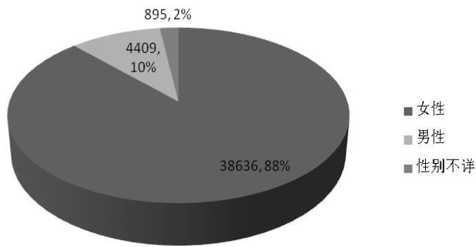

<details>
<summary>pie</summary>

| Category | Percentage |
| --- | --- |
| 女性 | 88% |
| 男性 | 10% |
| 性别不详 | 2% |
</details>

图 1 本地会员的性别比例图

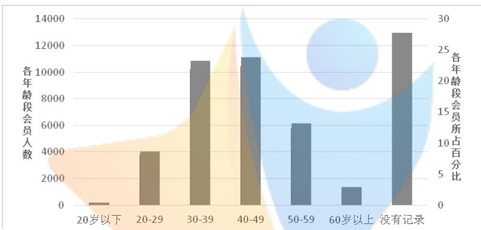

<details>
<summary>bar</summary>

| 年龄段 | 各年龄段会员人数 | 各年龄段会员所占百分比 |
| :--- | :--- | :--- |
| 20岁以下 | ~200 | ~1 |
| 20-29 | ~4000 | ~8 |
| 30-39 | ~10900 | ~23 |
| 40-49 | ~11100 | ~24 |
| 50-59 | ~6100 | ~13 |
| 60岁以上 | ~1300 | ~3 |
| 没有记录 | ~13000 | ~28 |
</details>

图 2 本地会员各年龄段的人数及其比例

据图 可得知，该商场会员客户群体中也存在较大的年龄差异。 岁青年（10206 人，占比 23.23%）、40-49 岁中年（10474 人，占比 23.84%）是会员主要群体，均占比20%以上。其中 50-59 岁中老年会员数低于 30-39 岁青年、40-49岁中年人数，但多于 20 岁以下青少年（171 人，仅占比 0.39%）、60 岁以上老年人（1267 人，占比 2.89%）。

除此之外，年龄不详的会员有12221 人，约占27.8%，而性别不详的会员占比不到 2%，表明在登记会员卡信息时，年龄信息缺失率远大于性别信息缺失率，基于女性会员占据会员主力军的实况下，年龄差异能为商场管理者提供更多有效的会员信息，因此在登记会员信息时，对会员的年龄信息给予更多的关注度。

（3）消费行为特征：主要是会员购买频次、消费总额、平均购买金额和单次最高消费。

进行数据预处理后，本地会员有效消费记录集包含 43940 条会员信息，条消费记录，消费总额为 元，平均消费额为 元，其购买频次、消费总额、平均购买金额和单次最高消费分布信息主要如表 1、表 2所示。

表 1 中为本地会员消费频次和消费总额相关信息。分析发现，在 2015 年 1月1 日至 2018 年1 月 3日近3 年期间，有超过60%的本地会员只有不超过5次的消费记录，平均每7 个月消费1 次，这其中有占总会员数40%左右的会员数，3年期间只有1-2次的消费记录，即低频消费/不活跃会员数占据了商场会员相当

表 1 会员的消费频次、消费总额指标频数分布及其占比

<table><tr><td colspan="3">消费频次</td><td colspan="3">消费总额</td></tr><tr><td>次数</td><td>会员数</td><td>占比%</td><td>金额(元)</td><td>会员数</td><td>占比%</td></tr><tr><td>1-2</td><td>18214</td><td>41.45</td><td>小于500</td><td>3447</td><td>7.84</td></tr><tr><td>3-5</td><td>10427</td><td>23.73</td><td>501-1000</td><td>4534</td><td>10.32</td></tr><tr><td>6-10</td><td>6686</td><td>15.22</td><td>1001-2000</td><td>6618</td><td>15.06</td></tr><tr><td>11-15</td><td>2817</td><td>6.41</td><td>2001-3000</td><td>4480</td><td>10.20</td></tr><tr><td>16-20</td><td>1513</td><td>3.44</td><td>3001-6000</td><td>7887</td><td>17.95</td></tr><tr><td>21-40</td><td>2526</td><td>5.75</td><td>6001-10000</td><td>4908</td><td>11.17</td></tr><tr><td>41-60</td><td>825</td><td>1.88</td><td>10001-15000</td><td>3449</td><td>7.85</td></tr><tr><td>61-90</td><td>490</td><td>1.12</td><td>15001-25000</td><td>3325</td><td>7.57</td></tr><tr><td>91-120</td><td>194</td><td>0.44</td><td>25001-35000</td><td>1654</td><td>3.76</td></tr><tr><td>121-150</td><td>113</td><td>0.26</td><td>35001-50000</td><td>1261</td><td>2.87</td></tr><tr><td>151-</td><td>135</td><td>0.31</td><td>50001-</td><td>2377</td><td>5.41</td></tr><tr><td>总计</td><td>43940</td><td>100.00</td><td>总计</td><td>43940</td><td>100.00</td></tr></table>

大的比例。有 的会员在 年期间消费了 次，平均每半年 次 每半个月 1次，是该商场会员中消费频率相对稳定额会员。此外，有2.12%左右的会员有超过60 次的消费，消费频率小于 15 天，是消费十分活跃的会员，但相对而言人数较少。综合来看，不难发现，该商场会员消费频次和对应的会员人数存在一定的关系，消费越频繁的会员人数越少。

结合消费总额可发现，大部分的会员 3 年期间在该会场的消费总额在 500元\~10000 元期间，约占总会员数的 65%，其中消费总额在 1000\~6000 元间的最为集中，这表明该商场的大部分会员购买力中等，低于1000 元总消费的会员数

表 2 会员的单次最高消费、平均单次消费指标频数分布及其占比

<table><tr><td colspan="3">单次最高消费</td><td colspan="3">平均单次消费</td></tr><tr><td>金额(元)</td><td>会员数</td><td>占比%</td><td>金额(元)</td><td>会员数</td><td>占比%</td></tr><tr><td>小于300</td><td>2464</td><td>5.61</td><td>小于300</td><td>3614</td><td>8.22</td></tr><tr><td>301-500</td><td>2950</td><td>6.71</td><td>301-500</td><td>5487</td><td>12.49</td></tr><tr><td>501-800</td><td>5410</td><td>12.31</td><td>501-800</td><td>8405</td><td>19.13</td></tr><tr><td>801-1300</td><td>6876</td><td>15.65</td><td>801-1300</td><td>8894</td><td>20.24</td></tr><tr><td>1301-1800</td><td>4617</td><td>10.51</td><td>1301-1800</td><td>5746</td><td>13.08</td></tr><tr><td>1801-2500</td><td>4232</td><td>9.63</td><td>1801-2500</td><td>4692</td><td>10.68</td></tr><tr><td>2501-3500</td><td>4972</td><td>11.32</td><td>2501-3500</td><td>3083</td><td>7.02</td></tr><tr><td>3501-4500</td><td>3313</td><td>7.54</td><td>3501-4500</td><td>1397</td><td>3.18</td></tr><tr><td>4501-5500</td><td>2003</td><td>4.56</td><td>4501-5500</td><td>714</td><td>1.62</td></tr><tr><td>5501-7000</td><td>1839</td><td>4.19</td><td>5501-7000</td><td>576</td><td>1.31</td></tr><tr><td>7001-</td><td>5264</td><td>11.98</td><td>7001-</td><td>1332</td><td>3.03</td></tr><tr><td>总计</td><td>43940</td><td>100.00</td><td>总计</td><td>43940</td><td>100.00</td></tr></table>

不超过 20%，而超过 10000 元总消费额的会员数接近 28%，表明该商场的高购买力会员数多于低购买力会员，特别是超过50000 元的会员数和低于500 元的会员数接近，但是前者无疑具有更大的会员价值。就总消费额而言，该商场的中等偏上购买力会员占据主体。

表 2中为本地会员单次最高消费和平均单次消费相关信息。分析发现，近3年期间，有接近 45%的本地会员单次消费最高金额在301\~1800 元区间内，低于300 元会员数占6%，而超过 1800 元的会员数约为 50%，超过 5500 元的接近 15%占比。结合平均单次消费可发现，65%的会员平均每次消费金额在 300\~1800 元之间，其中消费总额在800\~1300 元区间的最为集中，低于300 元平均消费的会员数约为 8%，而超过 1800 元平均消费额的会员数超过 26%，说明该商场会员单次购买力比较大，高购买力的会员多于低购买力的会员。

（4）综合人口学信息和消费行为特征：结合会员性别和年龄差异分析会员的具体消费特征。

不同性别、不同年龄段的会员近3 年期间消费频率如图3所示。由于女性会员数远远超过男性会员数，女性会员的消费频次也远远多于男性会员，这其中，

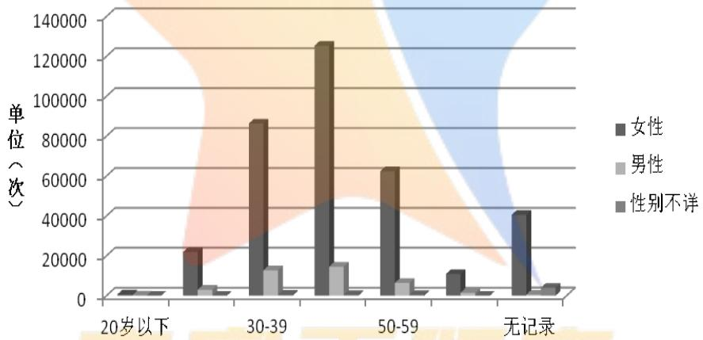

<details>
<summary>bar_stacked</summary>

| Category | 女性 (次) | 男性 (次) | 性别不详 (次) |
| --- | --- | --- | --- |
| 20岁以下 | ~5000 | ~1000 | ~1000 |
| 30-39 | ~25000 | ~15000 | ~48000 |
| 50-59 | ~65000 | ~10000 | ~45000 |
| 无记录 | ~42000 | ~5000 | ~1500 |
</details>

图 3 不同性别、年龄段会员的消费频率分布图

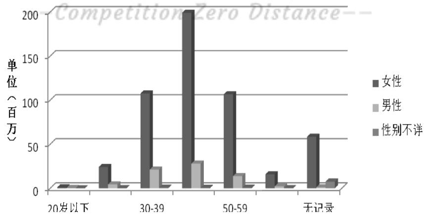

<details>
<summary>bar_stacked</summary>

| Category | 女性 (百万) | 男性 (百万) | 性别不详 (百万) |
| --- | --- | --- | --- |
| 20岁以下 | ~5 | ~5 | ~5 |
| 30-39 | ~110 | ~25 | ~35 |
| 50-59 | ~110 | ~20 | ~5 |
| 无记录 | ~60 | ~5 | ~10 |
</details>

图 4 不同性别、年龄段会员的消费总额分布图

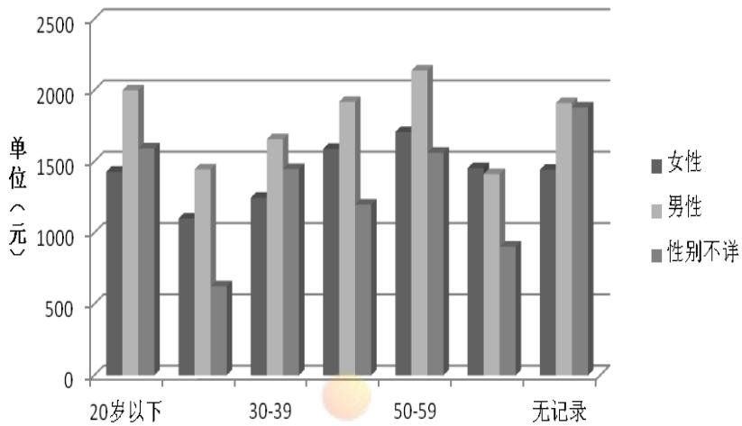

<details>
<summary>bar_stacked</summary>

| Category | 女性 (元) | 男性 (元) | 性别不详 (%) |
| --- | --- | --- | --- |
| 20岁以下 | ~1450 | ~2050 | ~1650 |
| 30-39 | ~1150 | ~1500 | ~650 |
| 50-59 | ~1300 | ~1700 | ~1500 |
| 无记录 | ~1650 | ~1950 | ~1250 |
| 20岁以下 (Group 2) | ~1750 | ~2200 | ~1600 |
| 30-39 (Group 2) | ~1500 | ~1450 | ~950 |
| 50-59 (Group 2) | ~1500 | ~1950 | ~1950 |
| 无记录 (Group 2) | ~1500 | ~1950 | ~1950 |
</details>

图 5 不同性别、年龄段会员的单笔消费金额均值分布图

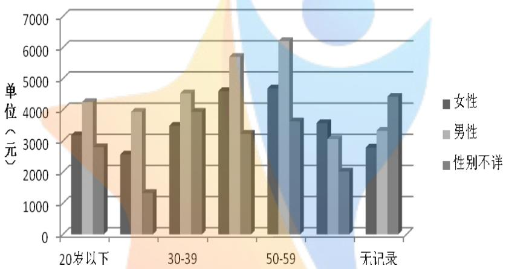

<details>
<summary>bar_stacked</summary>

| Category | 女性 (元) | 男性 (元) | 性别不详 (元) |
| --- | --- | --- | --- |
| 20岁以下 | ~3300 | ~4300 | ~2900 |
| 30-39 | ~2600 | ~4000 | ~1400 |
| 50-59 | ~3600 | ~4600 | ~4000 |
| 无记录 | ~4700 | ~5800 | ~3300 |
| 50-59 (Secondary) | ~4800 | ~6300 | ~3700 |
| 无记录 (Secondary) | ~3600 | ~3100 | ~2100 |
| 无记录 (Final) | ~2800 | ~3300 | ~4500 |
</details>

图 6 不同性别、年龄段会员的单次最高消费均值分布图

40-49 岁的女性会员消费频次最多（占比 32%），30-39 岁的女性会员其次（占比 ）， 岁以下（占比 ）和 岁以上（占比 ）的女性会员消费频次偏低。会员消费总额的差异如图4所示，40-49 岁的女性会员消费总额远远超过其他各年龄段的会员， 年期间的总消费额高达 万元， 岁和 和岁其次，两者约100 万元。结合图2和图 3发现，40-49 岁女性会员的消费频次高，会员数目多，消费总额多，对于商场而言，40-49 岁女性会员应是十分价值的会员。

图 和图 分别为单笔消费金额均值和单次最高消费均值图。单笔消费均值图中，50-59 岁男性和20岁以下的男性会员消费较高，约2000 元，其他年龄段会员单笔消费均值在 1500 元左右，女性会员消费略低于男性。单次最大消费均值图中，50\~59 岁的会员消费较高，其中男性会员高于女性会员消费，约为6000元，60 岁以上会员男性单次最高消费均值低于女性会员，除此之外女性会员单次消费均值略低于男性。图 5和图 6中男性会员的比重显著增加，这主要是因为男性会员的消费频次相对较低，进而产生的消费质量较高。因此对于商场而言，虽然男性会员数目不占主体，但是消费质量高于女性会员，在策划相关活动时不可忽视男性会员的价值。

## 5.2.2 会员与非会员群体的消费特征差异

我们主要从购买频次、消费总额、平均消费金额等角度分析本地会员和非会员群体（非本地会员和非会员）的消费特征差异，具体如表 3所示。

表 3 本地会员和非会员的消费特征对比

<table><tr><td></td><td>消费总频次</td><td>消费总额（元）</td><td>平均消费金额（元）</td></tr><tr><td>本地会员</td><td>533165</td><td>724129606.65</td><td>1358.17</td></tr><tr><td>非会员</td><td>458672</td><td>539226613.98</td><td>1175.62</td></tr></table>

由于附件5 中明确说明“我们只针对附件一中的会员进行管理”，因此在对比会员群体和非会员消费特征差异时，将非本地会员也归类于非会员群体，这在某种程度上扩大了非会员群体对于商场消费的贡献。但是在这样的前提下，本地会员的消费频次、消费总额和平均消费金额都大于非会员（非本地会员和非会员）群体，这表明商场的会员群体比非会员群体更频繁得去商场消费，并且平均每次消费额都比非会员大，会员群体是商场长期发展的基石和保证，对商场的忠诚度和认可度很高，能为商场产生更多的商业价值。

## 5.2.3 会员价值效应

表 直观呈现了本地会员的消费频次、消费总额和平均消费金额都大于非会员（非本地会员和非会员）群体，这表明商场的会员群体比非会员群体频繁的去商场消费，并且平均每次消费额都比非会员大，会员群体是商场长期发展的基石和保证，对商场的忠诚度和认可度很高，能为商场活动更多的商业价值，即商场会员的“价值效应”。

此外，会员单次消费均值大于非会员群体，说明会员有更大的可能性购买价格高的商品，而题干中已明确所指出“商品价格越高，盈利越高”，即会员群体为商场带来的盈利越多。

## 5.3 问题二模型的建立和处理

构建每一位会员购买力模型时，基于附件3数据，我们借鉴传统RFM方法中“购买频次（F）”和“消费总额（M）”指标，结合问题一中直观体现购买能力的“单次最高消费（Single peak consumption，S）”指标，建立“FMS”会员购买力评价模型。每个指标按整体会员消费情况百分位阈值赋予不同“评价分数”，并结合各指标的系数计算出每位会员购买力的评分。

## 5.3.1 FMS 购买力模型的建立

在衡量会员价值和创收能力时，RFM 模型时是具有重要使用价值的工具。RFM 模型具有三个重要的衡量指标：会员最近一次消费距研究时段最后一天的时长 R（Recency）、消费总频率 F（Frequency）以及消费总金额 M（Monetary）三项指标。

最后一次消费时长R表示会员最近一次的购买时间和分析时间间隔的天数，消费总频率 F 表示会员研究时段内所消费的总次数，消费总金额 M 是该会员在此期间消费的总金额。一般而言，会员的消费频率越高，消费总金额越大，会员的购买力也就越大。我们结合相关参考文献以及实际生活，发现 RFM 中，F 和M 两个指标相比 R 能更好的反应会员的购买能力，此外，问题一中的消费指标“单次最高消费（Single peak consumption，S）”能体现出会员购买商品的品牌等级和价格信息，这也能体现出会员的购买力，因此我们建立“FMS”模型评价每位会员的购买力。

每个会员的购买力可以表示成：

(1)

这里的 $F ( c _ { i } ) , M ( c _ { i } ) , S ( c _ { i } )$ 分别代表会员 $c _ { i }$ 以F、M、S 为分类的相应变量评分。所乘系数 100、10、1只是为了能让百位、十位和各位上的F、M、S 评分直观的组合为对应的购买力指数G。

其中 F、M、S 为分类的结合自身百分位考量，相应变量评分标准具体如下。

对于消费总频率F 而言，因其为不连续的分布，且结合表1 频次分布情况，定义频次 1-2 次 1 分（40%），3-5 次 2 分（20%），6-10 次 3 分（20%），11-20次 分（ ）， 次以上 分（ ）。对于消费总金额 而言， 元以下1 分（10%），601\~2000 元 2 分（25%），2001\~6700 元 3 分（30%），6701\~35000元 4 分（25%），35000 元以上 5 分（10%）。对于单次最高消费 S 而言，330元以下 1 分（10%），331\~800 元 2 分（25%），801\~1900 元 3 分（30%），1901\~5500元 4 分（25%），5500 元以上 5 分（10%）。

这样，会员购买力的指标应在111\~555 之间，整体而言其数值越大，其购买力越强。

## 5.3.2 FMS 模型对会员购买力识别和效果检验

在 43940 条有效消费记录中，随机选择8 条记录，并根据其评分大小判对其对应哪一种价值类型。表 4 中 G 即购买力评分，因其百位、十位、个位上数值大小可代表F、M、S 各指标在整体中的水平，分值4、5 为超出平均水平，赋值“1”，12 为低于平均水平，赋值“0”，分值3 为正常水平。因此百位、十位、个位上数值可化为0和 1组成的三位数，共八种情况（表 3中类型列）。为了更直观的体现出会员的购买能力，将百位、十位、个位上数值相加，和为0 表征“青铜”级购买力，1 表征“白银”级购买力，2 表征“黄金”级购买能力，3 表征“铂金”级购买能力。

表 4 FMS 购买力模型随机检验和评价

<table><tr><td>卡号</td><td>F</td><td>M</td><td>S</td><td>G</td><td>类型</td><td>价值型</td><td>评价</td></tr><tr><td>75dc1b12</td><td>53</td><td>46743.37</td><td>6029</td><td>555</td><td>111</td><td>铂金</td><td>优</td></tr><tr><td>94d07960</td><td>2</td><td>522</td><td>294</td><td>111</td><td>000</td><td>青铜</td><td>优</td></tr><tr><td>07d18c5f</td><td>3</td><td>8584</td><td>6012</td><td>245</td><td>011</td><td>黄金</td><td>优</td></tr><tr><td>4a3f140a</td><td>12</td><td>1215</td><td>198.44</td><td>421</td><td>100</td><td>白银</td><td>优</td></tr><tr><td>af6a5229</td><td>15</td><td>3220</td><td>544.59</td><td>432</td><td>110</td><td>黄金</td><td>中上</td></tr><tr><td>89a511ef</td><td>21</td><td>5706</td><td>3950</td><td>534</td><td>101</td><td>黄金</td><td>中上</td></tr><tr><td>50497f9c</td><td>1</td><td>1932</td><td>1932</td><td>124</td><td>001</td><td>白银</td><td>优</td></tr><tr><td>e3b692cb</td><td>5</td><td>7078</td><td>1768</td><td>243</td><td>010</td><td>白银</td><td>中上</td></tr></table>

对于模型的检验，我们发现 8 条记录中，有 3 条记录 G 值百位、十位、个位某一位评分为 但类型归为 或者 ，存在一些偏差，进而导致评价等级为中上。但是总体而言，5 条记录（62.5%）评价为优，3 条记录（37.5%）评价为中上，不存在中等及以下的评价，检验结果表明 FMS 模型能很好的描述每一位会员的购买能力，并对应到“青铜”、“白银”、“黄金”和“铂金”中的某一类。

## 5.3.3 购买力评分与会员价值分类对应关系

根据 FMS 模型我们可以将每一位会员F、M、S 参数计算出其购买力评分，并分别对应一种会员价值类型。如表5 所示，“铂金”级会员对应的购买力评分为111，即消费频次高、消费总额高、单次最高消费高的“三高”型会员；“黄金”级会员对应的购买力评分为 110（频次高、总额高、单消低）、101（频次高、总额低、单消高）和 （频次低、总额高、单消高）；“白银”级会员对应的购买力评分为 100（频次高、总额低、单消低）、010（频次低、总额高、单消低）和 （频次低、总额低、单消高）。

表 5 四类会员价值分类占比及其与购买力评分的对应关系

<table><tr><td>会员价值分类</td><td>占比例%</td><td>购买力评分</td></tr><tr><td>铂金</td><td>21.4</td><td>111</td></tr><tr><td>黄金</td><td>34.5</td><td>110、101、011</td></tr><tr><td>白银</td><td>22.1</td><td>100、010、001</td></tr><tr><td>青铜</td><td>22.0</td><td>000</td></tr></table>

结合一般商品经济规律我们发现，101（频次高、总额低、单消高）和 010（频次低、总额高、单消低）这两中购买力情况出现概率较低。整体而言，铂金型会员占比21.4%，黄金型占比34.5%，白银型占比22.1%，青铜级占比22.0%。

级别越高，会员的价值越高，商场管理人员在精细化管理、最大化创造会员价值时，也就更需要关注高级别的会员。

## 5.4 问题三模型的建立和处理

作为零售行业的重要资源，会员具有生命周期(会员从入会到退出的整个过程 ，会员的状态（比如活跃和非活跃）也会发生变化。试在某个时间窗口，建立会员生命周期和状态划分的数学模型，使商场管理者能够更有效地对会员进行管理。

首先，确定滑动的研究时间窗口，起初为半年，其后以半年为单位逐渐增加，变为一年、一年半、两年、两年半和三年共有6个时间窗口。其次，确定时间窗口后，分类讨论在研究窗口内有/无消费记录时，该会员生命周期的算法<sup>[6]</sup>；接着，在问题二模型基础上，综合考虑“R “F” “M”“S”指标中，我们认为最近一次消费时间长度“R”和消费频率“F”两个指标能表征会员是否处于消费积极性较高的“活跃”状态，而与消费额相关的“M”和“S”指标则不予考虑。

进而建立判别会员活跃状态的“RF”模型，对研究时段内所有会员的消费状态进行划分，在此基础上算出该时间窗口内不同生命周期与活跃状态之间的概率分布关系；最后延伸时间窗口，比较生命周期与活跃状态随时间变化的关系。

## 5.4.1 会员生命周期的计算

基于模型的假设2和3，在确定研究时间窗口后（半年，2015年1月1日\~2015年6 月 30日）期间，

（1）如果该会员在时间窗口内无消费记录，其生命周期为时间窗口前一天（2014年12 月 31 日）减去其办卡日期；  
（2）如果在时间窗口内有消费记录，其生命周期为时间窗口最后一天（2015 年6月 30 日）减去其办卡日期；

## 5.4.2 RF消费状态模型的建立

在衡量会员消费状态时，衡量四个重要的指标：会员最近一次消费距研究时段最后一天的时长 R（Recency）、消费总频率 F（Frequency）、消费总金额 M（Monetary）以及“单次最高消费（S）”。

结合相关参考文献以及实际生活经历，我们发现四个指标中，R和F 两个指标相比 、 能更好的反应会员的消费状态，因此我们建立“ ”模型评价每位会员的消费状态。

每个会员的消费状态可以表示成：

(2)

这里的 $R ( c _ { i } )$ $F ( c _ { i } )$ 分别代表会员 $c _ { i }$ 以 R、F 为分类的相应变量评分，评分同样在 1\~5 之间变化，评分越高，说明在该指标中会员的消费越活跃。两个指标的评分相乘使得消费状态 $Z ( c _ { i } )$ 的值区间变大为1\~25，更有区分度。

其中 R、F 为分类的结合自身百分位考量，相应变量评分标准具体如下。

对于最近消费时间指标 R 而言，研究时间窗口为半年时，第 6 月在第 1、2月消费 1分，第 3月消费2 分，第 4月消费 3 分，第 5月消费 4 分，第6 月消费5分，当时间窗口延伸时，每个等级的月份阈值相应延伸。对于消费总频率 F 而言，因其为不连续的分布，且结合该时间窗口内会员消费频次分布情况，当时间窗口为半年时，定义频次1 次 1分，2-3次 2 分，4-6 次 3分，7-10 次 4 分，11次以上 5分，时间窗口延伸时结合实际分布频率稍作调整。

这样，会员状态的指标应在 之间，其中 代表非活跃状态， 分表征一般活跃状态，16\~25 分表征很活跃状态。整体而言其数值越大，其消费状态越活跃。RF 状态模型可对每个会员的消费状态进行判断。

## 5.4.3 生命周期与消费状态之间随时间变化的关系

根据 2015 年1 月 1日\~2015 年 6 月30 日之间的本地会员消费记录，计算出该会员的生命周期和消费状态之后，我们统计处每个时间窗口内不同生命周期中各消费状态的占比。

## （1）各时间窗口中生命周期的频率分布

以 2015 年 1月 1日-2015 年6 月 30日为例时段内会员生命周期分布情况如图7 所示，其余5个时间窗口的生命周期频率分布见附录 1。

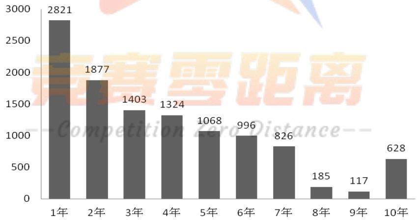

<details>
<summary>bar</summary>

| Category | Value |
| --- | --- |
| 1年 | 2821 |
| 2年 | 1877 |
| 3年 | 1403 |
| 4年 | 1324 |
| 5年 | 1068 |
| 6年 | 996 |
| 7年 | 826 |
| 8年 | 185 |
| 9年 | 117 |
| 10年 | 628 |
</details>

图 7 2015 年 1 月 1 日\~2015年 6 月 30日时段内会员生命周期分布图

在 2015 年上半年时间窗口内，各生命周期时段的人数随着周期的增加不断减少，此阶段内本地会员11425 人，小于等于 1年内的会员数最多，超过总会员数20%。会员主体的生命周期不超过5年，表明大部分会员是近2010 年之后成为商场的会员，随着时间的推移，新会员数逐年增加，10 年以上的老会员628

人，约占总人数的5%。

结合附录1 中其他五个时间窗口内会员生命周期的分布图分析，可发现较为一致的分布趋势。同时每半年新增的会员数逐渐增加，到2017 年生命周期不超过1 年的会员数远远大于其他生命周期时段，在2017 年 1月 4日-2018 年 1 月4日这一年间，新会员数超过16000 人，会员总人数不到40000 人，新会员占比超过了 40%，这需要商场管理层特别重视。

接下来我们分析在各时间窗口中，生命周期与会员消费状态关系随时间的变化。2015 年 1 月 1 日-2015 年 6月 30 日期间各生命周期时段中会员的活跃状态分布如图8 所示，其余5个时间窗口的各生命周期内活跃状态分布状况见附录 2。

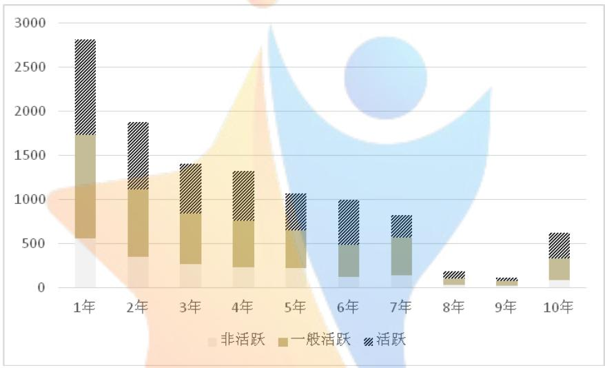

<details>
<summary>bar_stacked</summary>

| Category | 非活跃 | 一般活跃 | 活跃 |
| --- | --- | --- | --- |
| 1年 | ~580 | ~720 | ~1030 |
| 2年 | ~360 | ~740 | ~800 |
| 3年 | ~280 | ~560 | ~580 |
| 4年 | ~250 | ~490 | ~560 |
| 5年 | ~230 | ~390 | ~440 |
| 6年 | ~140 | ~340 | ~540 |
| 7年 | ~150 | ~380 | ~260 |
| 8年 | 0 | ~100 | ~80 |
| 9年 | 0 | ~90 | ~30 |
| 10年 | ~110 | ~210 | ~310 |
</details>

图 8 2015 年 1 月 1 日\~2015年 6 月 30内会员各生命周消费状态分布图

在 2015 年上半年时间窗口内可明显发现会员的生命周期越短，消费状态活跃的会员数越多，在生命周期小于 年的会员中表现得最为明显，活跃会员数接近总人数的40%。随着生命周期的增加，活跃会员比例先保持相对稳定，7 年之后逐渐减少；一般活跃的会员在各生命周期中都占相当大的比例；不活跃会员的数量随着生命周期的增加不断减少，同时所占比例也不短减少。

结合附录2 中其他五个时间窗口内会员生命周期内消费状态分析，可发现较每半年新增的会员数逐渐增加，活跃会员数也逐渐增加，但活跃会员增加的速度低于新会员增长的速度；同时办卡1年内的新会员，在2016 年之后不活跃会员数保持相对稳定的数目，约为2000 人。也就是说2016 年 7 月至 2018 年 1月，新会员数翻倍，从8000 增至 16000，活跃会员数从 2500 增至4000，不活跃会员数保持在2000 人，在这期间一般活跃的会员数不断增长。综合而言，近两年商场的新会员数不断增加，但并没有有效地将新会员高质量的转化为活跃会员，如何将一半活跃会员“活化”为活跃会员，是商场管理层需要慎重考量的。

计算完6个时间窗口内生命周期和消费状态的关系后，我们综合算出每个研

究窗口内个消费状态的占比，结果如表 6 所示：

表 6 6 个滑动的时间窗口中会员活跃状态分布情况

<table><tr><td></td><td>窗口1</td><td>窗口2</td><td>窗口3</td><td>窗口4</td><td>窗口5</td><td>窗口6</td></tr><tr><td>不活跃</td><td>40.1%</td><td>51.8%</td><td>42.2%</td><td>33.6%</td><td>27.8%</td><td>26.9%</td></tr><tr><td>一般活跃</td><td>41.2%</td><td>48.1%</td><td>33.7%</td><td>35.4%</td><td>43.0%</td><td>42.7%</td></tr><tr><td>很活跃</td><td>18.7%</td><td>0.1%</td><td>24.1%</td><td>31.0%</td><td>29.2%</td><td>29.2%</td></tr><tr><td>会员数</td><td>11245</td><td>13065</td><td>18280</td><td>24931</td><td>32373</td><td>38960</td></tr></table>

\*注：第六个时间窗口会员数少于之前统计的本地有效会员数，是因为在计算过程中暂时剔除了办卡日期不详的会员数。

结合表6会员活跃状态占比变化可发现，随着时间窗口的跨度越大，不活跃会员占比显著减少（从40%减少为27%），活跃会员占比较为稳定增加（从 18.7%增加为 29.2%）,这两类会员呈现相对稳定的线性变化。一般活跃会员占比在40%左右上下变化，保持相对稳定的比例。

但是，结合新会员数迅猛增加的前提，在会员数不断增加的提高下，一般活跃会员占比依旧保持在 左右甚至略有增加，表明一般活跃会员数是在不断增加的，而不活跃会员占比逐渐减少，其对商场的影响逐渐减弱。活跃会员数虽有增加，但其增长率不如新会员增长率。

## 5.4.4 商场对不同状态会员的精细化管理方案

结合上文的分析可知，每半年新增的会员数逐渐增加，到 年生命周期不超过 1年的会员数远远大于其他生命周期时段，在2017 年 1月 4 日-2018 年1月4 日这一年间，新会员数超过16000 人，会员总人数不到40000 人，新会员占比超过了40%，这需要商场管理层特别重视；

进一步分析各生命周期中会员活跃状态可发现，较每半年新增的会员数逐渐增加，活跃会员数也逐渐增加，但活跃会员增加的速度低于新会员增长的速度；同时办卡 年内的新会员，在 年之后不活跃会员数保持相对稳定的数目，约为 2000 人，在这期间一般活跃的会员数不断增长。综合而言，近两年商场的新会员数不断增加，但并没有有效地将新会员高质量的转化为活跃会员，如何将一半活跃会员“活化”为活跃会员，是商场管理层需要慎重考量的。

因此虽然不活跃会员占比显著减少，活跃会员占比较为稳定增加，但是考虑到新会员数不断增加的前提，我们建议一方面商场管理人员继续吸引新会员加入，新会员比例已经超过40%，但其中完全“活化”的活跃会员不多，需要进一步引导新会员转化为消费积极会员；另一方面，当会员办卡后， 年内会有很大概率处于一般活跃甚至不活跃消费状态，管理者应结合其购物偏好进行高质量促销活动，增加其消费，当新会员成员2 年及其以上老会员时，她们的消费状态会变得活跃，对商场的忠诚度也不断增加。

## 5.5 问题四模型的建立和处理

计算激活率同样基于问题三中时间窗口滑动的考量。我们追踪在原时间窗口中为非活跃的会员、在下一个窗口中变为一般活跃或很活跃的人数占原时间窗口中非活跃会员总数，将其定义为该时段内的非活跃会员激活率。问题三种我们设定了 个时间窗口，因而可得出 个时段内的激活率，依此分析非活跃会员转化为活跃会员的可能性。此外，结合实际销售数据，追踪分析原非活跃会员是否与商场促销活动的相关指标存在关系。

## 5.5.1 激活率的计算

结合文献我们定义非活跃会员的激活率为：

$$
A (t _ {i + 1}) = \frac {n h (t _ {i + 1})}{u n (t _ {i})} \tag {3}
$$

式中 $A ( t _ { i + 1 } )$ 为 i+1时段内会员的激活率， $n h ( t _ { i + 1 } )$ 为i时段内的非活跃会员，但在 i+1 时段内为一般活跃活跃、很活跃会员的数目， $u n ( t _ { i } )$ 为 i 时段内非活跃会员的总数。在计算过程中，我们使用追踪标记算法，追踪 $u n ( t _ { i } )$ 非活跃会员在i+1 时段内的活跃状态。

在问题三中，我们设定了 6 个时间窗口，进而可计算出 15 年下半年至 17年下半年期间，每隔半年非活跃会员的激活率，结果如表 7 所示。

表 7 15 年下半年至17 年下半年期间每隔半年非活跃会员的激活情况

<table><tr><td>时间转变</td><td>非活跃会员转化为一般、很活跃会员人数</td><td>原非活跃会员数</td><td>激活率</td></tr><tr><td>15 年上半年至 15 年下半年</td><td>616</td><td>4564</td><td>13.5%</td></tr><tr><td>15 年下半年至 16 年上半年</td><td>1238</td><td>6766</td><td>18.3%</td></tr><tr><td>16 年上半年至 16 年下半年</td><td>1344</td><td>7712</td><td>17.4%</td></tr><tr><td>16 年下半年至 17 年上半年</td><td>1004</td><td>8366</td><td>12.0%</td></tr><tr><td>17 年上半年至 17 年下半年</td><td>762</td><td>8992</td><td>8.5%</td></tr></table>

## 5.5.2 非活跃会员激活的可能性

结合表7可发现，15年下半年至 17年下半年期间每半年都存在非活跃会员激活情况，15 年下半年至 17 年上半年激活率均超过 10%，特别在 16 年期间，非活跃会员激活率超过17%，17年下半年会员激活率下降只8.5%，表明原先有

效的激活会员措施需要进一步完善。

不过表7中非活跃会员的激活率一致为正值，且基本在10%左右，说明非活跃会员是存在激活的可能性的。接下来，我们将跟踪这些被激活额会员消费记录，分析其在激活阶段的消费特征是否与促销活动有关，进一步从实际销售数据出发，确定激活率和商场促销活动之间的关系模型。

## 5.5.3 激活率和商场促销活动的可能关系

## （1）商场促销活动主要分类：

分析附件3 中的会员消费记录，我们将其中促销活动主要分为两种。

1）底价促销商品：单个商品价格小于10 元；  
2）折扣促销商品：售价与消费金额的差值占售价比例>20%；

## （2）促销活动的相关指标：

1）参加促销活动总次数x ：成功激活的非活跃会员参加两种促销活动的总次数。 $x _ { n }$ 通过计算其消费明细中的单个商品售价和消费金额得出；  
2）参加底价促销活动次数 $x _ { d }$ ：成功激活的非活跃会员参加底价促销活动的次数。通过计算其消费明细中单个商品价格得出；  
）参加折扣促销活动次数 ：成功激活的非活跃会员参加折扣促销活动的次数。 $x _ { z }$ 通过计算其消费明细中售价和消费金额得出；  
4）折扣促销活动的折扣率 $x _ { l }$ ：反应折扣促销活动的折扣力度，通过售价与消费金额的差值占售价比例表达；

通过编程计算出这个四个促销活动指标在非活跃会员激活阶段的值，具体如表8 所示。

表 8 四个促销活动指标在非活跃会员激活阶段的值

<table><tr><td>时间转变</td><td> $x_n$ </td><td> $x_d$ </td><td> $x_z$ </td><td> $x_l$ (%)</td><td>激活率</td></tr><tr><td>15 年上半年至 15 年下半年</td><td>14</td><td>6</td><td>8</td><td>51.82</td><td>13.5%</td></tr><tr><td>15 年下半年至 16 年上半年</td><td>158</td><td>25</td><td>133</td><td>51.63</td><td>18.3%</td></tr><tr><td>16 年上半年至 16 年下半年</td><td>98</td><td>26</td><td>72</td><td>38.20</td><td>17.4%</td></tr><tr><td>16 年下半年至 17 年上半年</td><td>25</td><td>4</td><td>21</td><td>38.27</td><td>12.0%</td></tr><tr><td>17 年上半年至 17 年下半年</td><td>32</td><td>8</td><td>24</td><td>42.17</td><td>8.5%</td></tr></table>

分析表8可发现，非活跃激活率是呈现先增加后缓慢减弱的变化趋势，而参加促销活动总次数、参加底价促销活动次数、参加折扣促销活动次数和折扣促销活动的折扣率这四个指标再次期间也有存在较为明显的变化趋势，接下来我们将分析这几个指标之间的变化是否和激活率的变化存在一定的因果关系，以便于更高效率的策划促销活动。

## （3）非活跃会员激活率和商品促销活动的可能关系

暂不考虑主观因素影响，假定非活跃会员的激活率主要与商场的促销活动有关，次数我们可以建立模型：

(4)

我们计算出在各个时间转变时段，原非会员参加商场促销活动的 $x _ { n } , x _ { d } , x _ { z } , x _ { l }$ 各指标，并构建简单的回归模型<sup>[7]</sup>分析各指标与激活率之间的可能关系。因为样本个数较少，模型无法全部通过显著性检验，因此我们先将对比分析各指标和激活率之间的关系（标准化之后），在之后的改进中，我们将减少滑动时间窗口的值，从半年变为1个月，增加样本数量，以便于获得高质量的模型，准确分析非活跃会员激活率和商品促销活动的关系。

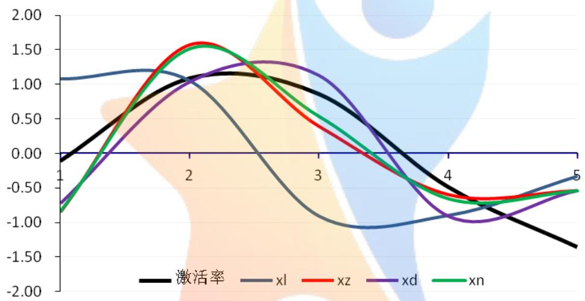

<details>
<summary>line</summary>

| X | 激活率 | xl | xz | xd | xn |
| --- | --- | --- | --- | --- | --- |
| 1 | ~-0.1 | ~1.1 | ~-0.8 | ~-0.7 | ~-0.8 |
| 2 | ~1.1 | ~1.2 | ~1.6 | ~1.0 | ~1.5 |
| 3 | ~0.9 | ~-0.9 | ~0.4 | ~1.3 | ~0.6 |
| 4 | ~-0.5 | ~-0.9 | ~-0.6 | ~-0.9 | ~-0.7 |
| 5 | ~-1.3 | ~-0.3 | ~-0.5 | ~-0.5 | ~-0.5 |
</details>

图 9 4 个促销指标和对应激活率之间回归函数图像（标准化后）

结合表 和图 可发现，四个促销指标中参加促销活动总次数和参加折扣促销活动次数变化基本一致，量级也基本接近，表明在举办的促销活动中，对非活跃会员激活有重要影响的是折扣促销活动，而不是底价促销活动。折扣促销活动力度和激活率变化基本一致，前先于激活率变化，说明促销活动力度。折扣大的活动能对非活跃会员产生较大的延迟效应。因此总结而言，结合该商场实际销售流水，为了更好的产生会员价值效应，我们建议管理人员，多组织策划折扣类活动，折扣力度大的活动尽可能加大宣传力度，进一步加深促销活动力度对激活非活跃会员的“延迟”效应。

不过我们划分的时间窗口转变时段较少，得到的有效数据偏少，只能得非活跃会员激活率和商场促销活动之间的大致关系，为商场策划促销活动提供数据支撑，在恰当的时机举办效果更好的促销活动，提升商场活动质量，使得商场管理员可以精细化管理会员、充分发挥会员价值。

## 5.6 问题五的分析与求解

先分别计算出会员的消费偏好以及消费时的连带情况，进而策划促销活动。首先，通过附件 3中本地会员消费流水中的商品名称和附件 4中匹配，分析所有本地会员的消费品牌编码（不同的品牌标码计算其对应的购买次数），借此得出会员消费时喜爱的品牌类别排行；其次，分析会员喜爱的品牌中商品的连带情况，由该品牌购买总数量和有效单据号数确定商品的连带率

## 5.6.1 会员的消费偏好

会员进行消费时基于自己的年龄、性别、收入情况以及主观需求会展现出多种多样的消费偏好特征，往往一次消费过程不会只购买单个商品，会出现“连带消费”现状，商场为了开展高质量促销活动往往要考虑顾客的消费偏好。分析会员的消费偏好可通过多种途径，如问卷调查等。在本题中，由于题目条件限制，我们尝试通过会员一次消费时同时购买的商品组合来分析其消费偏好。

首先，通过附件 中本地会员消费流水中的商品名称，和附件 中商品信息表匹配，分析所有本地会员的每个品牌编码，如果某品牌编码出现一次，则表明该名牌商品被消费一次，依此也可计算出不同的名牌的消费次数。

促销活动时针对整个会员群体展开的，因此我们将各品牌按照购买次数大小为特征进行排序，购买次数多的品牌默认是受客户喜爱的品牌，借此得出会员消费时喜爱的品牌类别排行，在策划连带促销活动时，往往在高购买次数的品牌中策划的连带活动。

计算得出的商品类别编码共130 种，由于篇幅限制正文中将购买次数排名前十的“热销”商品名单展示出来，如表 9 所示。

表 9 热销前十商品信息

<table><tr><td>排名</td><td>类别编号</td><td>商品类别</td><td>连带率 $Jr_{j}$ </td></tr><tr><td>1</td><td>40101</td><td>化妆品、珠宝首饰、折扣服装等</td><td>5.05(42919/8503)</td></tr><tr><td>2</td><td>70101</td><td>少淑女装等</td><td>2.12(1729/797)</td></tr><tr><td>3</td><td>60701</td><td>童装、母婴产品、内衣、打折商品等</td><td>3.70(2531/685)</td></tr><tr><td>4</td><td>60101</td><td>运动服饰、成熟女装等</td><td>2.90(60277/20833)</td></tr><tr><td>5</td><td>40501</td><td>男鞋、女鞋等</td><td>1.48 (431/291)</td></tr><tr><td>6</td><td>40102</td><td>日用品、平价化妆品等</td><td>4.14 (1827/441)</td></tr><tr><td>7</td><td>80701</td><td>男装等</td><td>3.70 (877/237)</td></tr><tr><td>8</td><td>50101</td><td>奢侈品、皮具、针织衫等</td><td>2.70194(1225/453)</td></tr><tr><td>9</td><td>70302</td><td>内衣、泳衣、家居服等</td><td>3.495902(853/244)</td></tr><tr><td>10</td><td>70403</td><td>装饰品、配饰、羊绒衫等</td><td>4.009091(441/110)</td></tr></table>

表 9中直观列出了会员“偏爱”的热销前十商品类别，化妆品、珠宝首饰、折扣服装、少淑女装、童装、母婴产品等排名靠前，这也和我们的日常生活保持一致。大部分的商场一楼柜台主要以奢侈品和化妆品为主，低楼层中往往少淑女状、母婴产品、童装等商品也往往较多，这与前文分析的会员消费特征相一致。即商场会员以女性为主，20-49 岁的女性消费频次、消费总额远远高于其他年龄段，而她们常规的消费商品也主要位于商场低层“黄金位置”。

## 5.6.2 会员消费的连带情况

在本题分析过程中我们任务单次消费时同时购买的品牌类别数目表征消费连带率的大小。分析连带消费时我们考虑两种情况，一种是考虑一次消费中同一品牌类别中商品的连带情况，即“单类连带消费”，另一种时考虑不同类别品牌中商品的连带消费，即“交叉连带消费”。理论上“单类连带消费”是“交叉连带消费”特殊情况，“交叉连带消费”能产生更多消费市场和经济效益。本问题我们分析“交叉连带消费”情况，此时连带率的计算公式为

$$
J r _ {j} = \frac {\text {销售总数量}}{\text {有效单据数（消费次数）}} \tag {4}
$$

其中，该名牌购买总数量由消费流水中商品编码数量计算得出，有效单据数（有效消费次数）由消费流水中的单据数确定消费次数，若单据数不唯一，则以消费时间和收银机号为参考项进行筛选，最终得出有效消费次数。 $J r _ { j }$ 值越大，表明会员单次消费时购买的品牌类别越多，商品之间的连带率也就越大。

具体的计算流程如下：

STEP1：根据会员喜好商品的类别编码（共130 个）在附件4 中匹配对应的商品编码（一个类别编码会对应多个商品编码）；

STEP2：用 STEP1 中找到的商品编码匹配附件 3 中的销售单据号。由于相同的单据号可能不是同一笔消费产生，不是唯一标识，因此当出现2 个商品编码对应同一单据号时，需进一步匹配消费时间。若消费时间相同，认为是同一次消费，记为 1张销售小票；若消费时间不相同，认为是两次消费，记为2张销售小票。得到每个类别编码对应的有效单据数；

STEP3：根据附件 3 计算每种类别编码对应商品的销售总量（<sub>j 1,2,3,...,130</sub>）  
：根据商品连带率公式 得到每种类别编码对应的连带率；

通过该流程计算得到的热销前十的商品“交叉连带消费”的连带率如表 9所示，会员喜好的十大热销商品类别包括特别是化妆品、珠宝首饰、日用品等，交叉消费连带率大于 ，超过其他热销商品，这也是商场管理层在组织策划促销活动时需要认真考量的。

## 5.6.3 基于消费偏好的有效连带促销活动

2018 年 9 月 21 日至 23 日中秋节期间，商场可以组长节日主题促销活动，同时结合表 9中会员偏爱的热销前十商品及其连带消费商品类型，为会员准备一份“投其所好”的高质量连带促销方案，以下使我们基于前文分析讨论出的方案：

（1）凡一次性购买珠宝首饰19999 元以上，享受8.8 折优惠；  
（2）凡一次性购买化妆品1888 元以上，享受8折优惠；  
（3）全场男女服饰一件八折，二件七折，三件五折，更有换季服饰最低 1 折起；  
（4）购买童装、母婴用品、儿童玩具满899 减199 元现金（特价商品不参加该活动）；  
（5）购买运动服饰满788 减188 元现金（特价商品不参加该活动）；  
（6）购买鞋包、家居服饰、运动配饰、家居用品满三件享 7.7 折（特价商品不参加该活动）；  
（7）购买大家器可免费享受一年延保；  
（8）单笔消费金额满1000 元，可凭购物小票领取月饼礼盒一份，购物小票当天有效逾期不予兑换；  
（9）活动期间本商城会员消费可享两倍积分

说明：特殊商品不参加活动。特殊商品包括：烟酒、大家电、手机、名表、数码产品、健身器材等惯例商品。

## 六、 模型评价和推广

## 6.1 模型的分析和评价

本文从商场的会员信息和消费流水数据出发，通过数据挖掘方法，构建描述会员购买力的 FMS 模型和描述会员消费状态的 RF 模型，建立了会员生命周期与专题划分的关系。进一步在不同窗口中得到非活跃会员激活率，结合实际销售数据，追踪分析原非活跃会员是否与商场促销活动的相关指标存在关系。通过计算会员喜好情况和商品连带率，为商家策划有针对性的促销方案提供有效依据。

## 6.1.1 模型的优点

（1）创建了FMS 模型刻画每一位会员的购买力。通过分析附件的数据，结合购买力的指标，单次消费金额能够更贴切客观地描述会员的购买力。  
（ ）通过附件 的商场销售流水表提炼出四个描述促销活动的指标。这四个指标可以反映商场促销的力度，将商场促销从定性研究提升到定量研究，并创建了一个概念模型。  
（3）基于会员消费明细精确刻画会员画像，商场可以清楚了解不同消费者对于促销活动的反应。

## 6.1.2 模型的缺点

（1）本文模型是基于历史数据创建的，因此不能预测存在潜在价值的会员。  
（2）FMS 模型仅考虑了三个指标，F 和M之间存在多重共线性，会员单次购买金额 S 大，并不一定能够商场带来很大利润（例如团购），这些都会导致结果存在偏差。

## 6.2 模型的改进与推广

通过商场会员消费明细，从不同角度精确计算会员价值，有利于帮助商场对会员进行认识和管理，并为商场制定针对不同价值会员的促销活动提供科学的依据。

## 七、 参考文献

[1] 田雨聪, 耿子月, 谢安泰,等. 基于数据挖掘的消费者价值细分模型研究[J].软件, 2017, 38(8):113-117.  
[2] 蔡玖琳. 基于数据挖掘的零售业客户细分方法[D]. 青岛大学, 2015.  
[3] 孙瑛, 马宝龙, 李金林. 基于 RFM 模型方法的忠诚计划会员顾客价值识别研究[J]. 数学的实践与认识, 2011, 41(15):75-79.  
[4] 马宝龙, 李飞, 王高,等. 随机RFM模型及其在零售顾客价值识别中的应用[J].管理工程学报, 2011, 25(1):102-108.  
[5] 王子威. 我国百货店客户关系管理研究——以北京当代商城为例[D]. 首都经济贸易大学, 2014.  
[6] 吴邦刚, 余琦, 陈煜波. 基于全生命周期行为的会员等级体系对顾客购买行为的影响[J]. 管理学报, 2018(4).  
[7] 姜启源，数学模型（第四版），北京：高等教育出版社2015.

## 八、附录

## 附录 1

问题三中在 2015 年 1 月 1 日-6 月 30 日、2015 年 7 月 1 日-12 月 31 日、2016年 1 月 1 日-6 月 30 日、2016 年 7 月 1 日-12 月 31 日、2017 年 1 月 1 日-6 月 30日、2017 年 7月 1 日-2018 年 1月 4日时间窗口的各生命周期频率分布图：

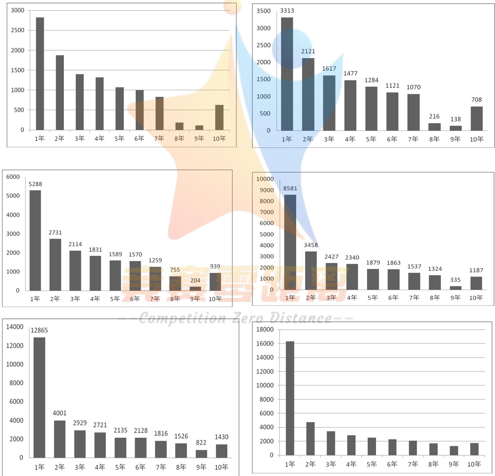

## 附录 2

问题三中在 2015 年 1 月 1 日-6 月 30 日、2015 年 7 月 1 日-12 月 31 日、2016年 1 月 1 日-6 月 30 日、2016 年 7 月 1 日-12 月 31 日、2017 年 1 月 1 日-6 月 30日、2017 年 7月 1日-2018 年1 月 4日时间窗口内生命周期与活跃状态的随时间变化的关系图：

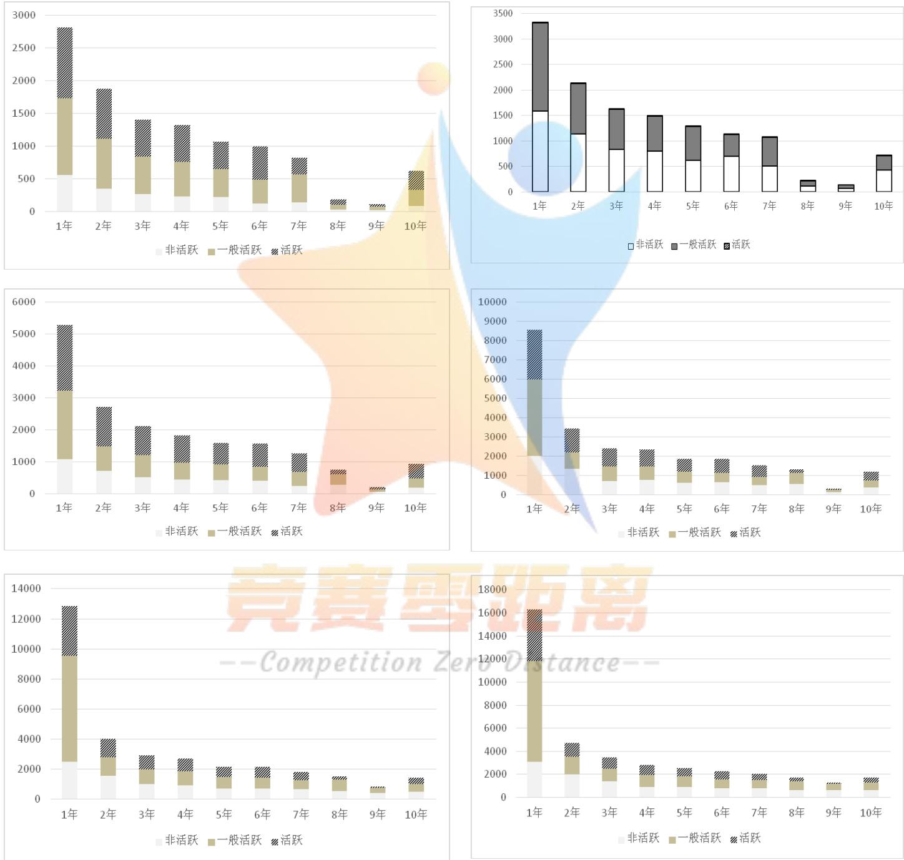

## 附录 3 部分相关计算程序的源代码（Fortran），支撑材料中有全部运行脚本

1. 问题一：附件 3 中筛选出本地会员  
```fortran
program vip information
implicit none

parameter num=200000
parameter vip_num=1000000

integer i,j
character*20 id(num),id2(vip_num)
integer mf(num),birth(num),cardday(num)
integer count,num_M,num_F,num_N
integer year_birth,age(num)
real total(num),cishu(num),maxxf(num)
integer lastm(num),numday

character*50 spmc(vip_num),djh(vip_num),
&     spbm(vip_num),gzmc(vip_num)
integer vip_count,syjh(vip_num),gzbm(vip_num),dtime(vip_num)
real sl(vip_num),sj(vip_num),je(vip_num),jf(vip_num)

open(2,file='/路径/information.prn')
  open(3,file='/路径/vip.prn')
  open(4,file='/路径/vipxf.txt')

count=0
do i=1,num
read(2,*,end=10)id(i),birth(i),mf(i),cardday(i)
count=count+1
enddo
10   continue

    write(*,*)'total number=',count

!!!!!!!!!! count of man and woman
    num_N=0  !! no record
num_M=0  !! male
num_F=0  !! female
    do i=1,count
if(mf(i)==0)then
    num_f=num_f+1
elseif(mf(i)==1)then
    num_m=num_m+1
```

```fortran
elseif(mf(i)==2)then
    num_n=num_n+1
endif
  enddo
  write(*,*)'man number=',num_m
write(*,*)'woman number=',num_f
write(*,*)'no record number=',num_n

!      do i=1,100000
do i=1,count
year_birth=birth(i)/10000
if(year_birth==9999)then
  age(i)=9999
else
  age(i)=2018-year_birth
endif
enddo

write(*,*)''
vip_count=0
do i=1,vip_num
read(3,*,end=20)id2(i),dtime(i),spbm(i),sl(i),sj(i),je(i),
 *   jf(i),syjh(i),djh(i),gzbm(i)
vip_count=vip_count+1
enddo
20   continue

  write(*,*)'total vip number=',vip_count
close(3)

  total=0.0
  cishu=0.0
maxxf=0.0
lastm=-1
  do i=1,count
if(mod(i,100)==0)then
write(*,*)i
endif
  do j=1,vip_count
    if(trim(id(i))==trim(id2(j)).and.sl(j).gt.0.and.sj(j).gt.0
*       .and.je(j).gt.0.and.jf(j).gt.0)then
      total(i)=total(i)+je(j)
      cishu(i)=cishu(i)+1
```

```julia
if(je(j).gt.maxxf(i))then
    maxxf(i)=je(j)
endif
if(dtime(j).gt.lastm(i))then
    lastm(i)=dtime(j)
endif
endif
enddo
if(total(i).gt.0)then
call daynum(lastm(i),numday)
write(4,30)id(i),mf(i),age(i),cardday(i),total(i),cishu(i),
* maxxf(i),lastm(i),numday
endif
enddo
30 format(a30,3i10,f20.2,f10.1,f20.2,i10,i10)

end
subroutine daynum(cle,num)
integer cle,num,i
integer year,mon,day,monday(13),monday1(13)
data (monday(i),i=1,13) /0,31,28,31,30,31,30,31,31,30,31,30,31/
data (monday1(i),i=1,13) /0,31,29,31,30,31,30,31,31,30,31,30,31/
num=4 !2018/01/04
year=cle/10000
mon=(cle-year*10000)/100
day=mod(cle,100)
if(year==2015)num=num+365*3+1
if(year==2016)num=num+365*2+1
if(year==2017)num=num+365*1
if(year==2018)num=num

if(year==2018)then
do i=1,mon
    num=num-monday1(i)
enddo
else
do i=1,mon
    num=num-monday(i)
enddo
endif

num=num-day

end
```

2. 问题二：FMS 购买力模型计算每位会员的购买力评分  
```fortran
program fms model
implicit none
parameter num=50000
integer i,j,count
character*20 id(num)
integer mf(num),age(num)
real total(num),cishu(num),maxxf(num)
integer lastm(num),numday(num)
integer fre(num),mon(num),sig(num)
open(2,file='路径\vipxf.txt')
open(3,file='路径\fms.txt')
count=0
do i=1,num
read(2,*,end=10)id(i),mf(i),age(i),total(i),cishu(i),
* maxxf(i),lastm(i),numday(i)
count=count+1
enddo
10 continue
write(*,*)'total number=',count
!!!!!!!! count of man and woman
do i=1,count
if(mod(i,100)==0)write(*,*)i
if(cishu(i).gt.20)then
fre(i)=5
elseif(cishu(i).gt.10)then
fre(i)=4
elseif(cishu(i).gt.5)then
fre(i)=3
elseif(cishu(i).gt.2)then
fre(i)=2
else
fre(i)=1
endif

if(total(i).ge.35000)then
mon(i)=5
elseif(total(i).ge.6700)then
mon(i)=4
elseif(total(i).ge.2000)then
mon(i)=3
elseif(total(i).ge.600)then
mon(i)=2
else
```

```lua
mon(i)=1
endif

if(maxxf(i).ge.5500) then
    sig(i)=5
elseif(maxxf(i).ge.1900) then
    sig(i)=4
elseif(maxxf(i).ge.800) then
    sig(i)=3
elseif(maxxf(i).ge.330) then
    sig(i)=2
else
    sig(i)=1
endif
enddo

do i=1,count
write(3,20)id(i),cishu(i),total(i),maxxf(i),fre(i),mon(i),sig(i),
*       fre(i)*100+mon(i)*10+sig(i)
enddo
20 format(a20,f10.0,2f20.2,4i10)

End
```

3. 问题三：滑动窗口计算每位会员的生命周期、RF 状态模型计算每位会员的状态评分  
```fortran
program fms model
implicit none
parameter num=50000
parameter xs_num=1000000
integer i,j,k,count
character*20 id(num),id2(xs_num)
integer mf(num),age(num),cardday(num)
character*50 spbm(xs_num),spmc(xs_num),djh(xs_num),syjh(xs_num),
* gzbm(xs_num),rdata(xs_num)
integer xs_count
real sl(xs_num),sj(xs_num),je(xs_num),jf(xs_num)
  integer last(num,6),fre(num,6)
integer rday,smday
open(2,file='路径/vipxf-b.txt',
* status='unknown')
open(3,file='路径/vip-hr.prn')
  open(4,file='路径/vip-c.txt')
count=0
do i=1,num
read(2,*,end=10)id(i),mf(i),age(i),cardday(i)
count=count+1
enddo
10 continue
  write(*,*)'total number=',count
xs_count=0
do i=1,xs_num
read(3,*,end=20)id2(i),rdata(i),spbm(i),sl(i),sj(i),je(i),
* jf(i),djh(i)
xs_count=xs_count+1
enddo
20 continue
  write(*,*)'total record number=',xs_count!!!!!!
  do i=1,count
  if(mod(i,100)==0)write(*,*)i
  do j=1,xs_count
    if(trim(id(i))==trim(id2(j)).and.sl(j).ge.0.and.sj(j).ge.0
*     .and.je(j).ge.0.and.jf(j).ge.0)then
      write(4,30)rdata(j),spbm(j),djh(j)
    endif
    enddo
  enddo
```

```csv
30 format(a30,2a20)
End
: : : : : : : : : : : : : : : : : : : : : : : :
program fms model
implicit none
parameter num=50000
parameter xs_num=1000000
integer i,j,k,count
character*20 id(num)
integer mf(num),age(num)

character*50 spbm(xs_num),spmc(xs_num),djh(xs_num),syjh(xs_num)
integer xs_count
integer rdata(xs_num)
real sl(xs_num),sj(xs_num),je(xs_num),jf(xs_num),
* gzbm(xs_num)
integer last(num),fre(num),cardday(num),rday(num),smday(num)
integer fpf(num),rpf(num),pf(num)
open(11,file='d:\2018\out\3\c1sm.txt',status='unknown')
open(12,file='d:\2018\out\3\c2sm.txt',status='unknown')
open(13,file='d:\2018\out\3\c3sm.txt',status='unknown')
open(14,file='d:\2018\out\3\c4sm.txt',status='unknown')
open(15,file='d:\2018\out\3\c5sm.txt',status='unknown')
open(16,file='d:\2018\out\3\c6sm.txt',status='unknown')
open(21,file='d:\2018\out\3\c1zt.txt',status='unknown')
open(22,file='d:\2018\out\3\c2zt.txt',status='unknown')
open(23,file='d:\2018\out\3\c3zt.txt',status='unknown')
open(24,file='d:\2018\out\3\c4zt.txt',status='unknown')
open(25,file='d:\2018\out\3\c5zt.txt',status='unknown')
open(26,file='d:\2018\out\3\c6zt.txt',status='unknown')
count=0
do i=1,num
read(11,*,end=10)id(i),fre(i),last(i),cardday(i),rday(i),smday(i)
count=count+1
enddo
10 continue
write(*,*)'total number=',count

do i=1,count
if(fre(i).ge.11)then
fpf(i)=5
elseif(fre(i).ge.7)then
fpf(i)=4
elseif(fre(i).ge.4)then
```

```lua
fpf(i)=3
    elseif(fre(i).ge.2)then
        fpf(i)=2
    else
        fpf(i)=1
    endif
    if(rday(i).le.30)then
        rpf(i)=5
    elseif(rday(i).le.60)then
        rpf(i)=4
    elseif(rday(i).le.90)then
        rpf(i)=3
    elseif(rday(i).le.120)then
        rpf(i)=2
    else
        rpf(i)=1
    endif
    if(smday(i).ne.99999)then
        write(21,20)id(i),fre(i),rday(i),fpf(i),rpf(i),fpf(i)*rpf(i)
* ,smday(i)
endif
enddo
20 format(a20,6i10)
count=0
do i=1,num
read(12,*,end=21)id(i),fre(i),last(i),cardday(i),rday(i),smday(i)
count=count+1
enddo
21 continue
write(*,*)'total number=',count
do i=1,count
if(fre(i).ge.11)then
    fpf(i)=5
elseif(fre(i).ge.6)then
    fpf(i)=4
elseif(fre(i).ge.3)then
    fpf(i)=3
elseif(fre(i).ge.2)then
    fpf(i)=2
else
    fpf(i)=1
endif
if(rday(i).le.30*2)then
    rpf(i)=5
```

```lua
elseif(rday(i).le.60*2)then
    rpf(i)=4
elseif(rday(i).le.90*2)then
    rpf(i)=3
elseif(rday(i).le.120*2)then
    rpf(i)=2
else
    rpf(i)=1
endif
if(smday(i).ne.99999)then
write(22,20)id(i),fre(i),rday(i),fpf(i),rpf(i),fpf(i)*rpf(i)
* ,smday(i)
endif
enddo
count=0
do i=1,num
read(13,*,end=22)id(i),fre(i),last(i),cardday(i),rday(i),smday(i)
count=count+1
enddo
22 continue
write(*,*)'total number=',count
do i=1,count
if(fre(i).ge.11)then
    fpf(i)=5
elseif(fre(i).ge.6)then
    fpf(i)=4
elseif(fre(i).ge.3)then
    fpf(i)=3
elseif(fre(i).ge.2)then
    fpf(i)=2
else
    fpf(i)=1
endif
if(rday(i).le.30*2)then
    rpf(i)=5
elseif(rday(i).le.60*3)then
    rpf(i)=4
elseif(rday(i).le.90*3)then
    rpf(i)=3
elseif(rday(i).le.120*3)then
    rpf(i)=2
else
    rpf(i)=1
endif
```

```txt
if(smday(i).ne.99999)then
    write(23,20)id(i),fre(i),rday(i),fpf(i),rpf(i),fpf(i)*rpf(i)
* ,smday(i)
endif
enddo
count=0
do i=1,num
read(14,*,end=23)id(i),fre(i),last(i),cardday(i),rday(i),smday(i)
count=count+1
enddo
23 continue
    write(*,*)'total number=',count
    do i=1,count
        if(fre(i).ge.12)then
            fpf(i)=5
        elseif(fre(i).ge.6)then
            fpf(i)=4
        elseif(fre(i).ge.3)then
            fpf(i)=3
        elseif(fre(i).ge.2)then
            fpf(i)=2
        else
            fpf(i)=1
        endi
        if(rday(i).le.30*4)then
            rpf(i)=5
        elseif(rday(i).le.60*4)then
            rpf(i)=4
        elseif(rday(i).le.90*4)then
            rpf(i)=3
        elseif(rday(i).le.120*4)then
            rpf(i)=2
        else
            rpf(i)=1
        endif
        if(smday(i).ne.99999)then
            write(24,20)id(i),fre(i),rday(i),fpf(i),rpf(i),fpf(i)*rpf(i)
* ,smday(i)
endif
enddo
count=0
do i=1,num
read(15,*,end=24)id(i),fre(i),last(i),cardday(i),rday(i),smday(i)
count=count+1
```

enddo

24 continue

```lua
write(*,*)'total number=',count
do i=1,count
if(fre(i).ge.13)then
    fpf(i)=5
elseif(fre(i).ge.7)then
    fpf(i)=4
elseif(fre(i).ge.3)then
    fpf(i)=3
elseif(fre(i).ge.2)then
    fpf(i)=2
else
    fpf(i)=1
endif
if(rday(i).le.30*5)then
    rpf(i)=5
elseif(rday(i).le.60*5)then
    rpf(i)=4
elseif(rday(i).le.90*5)then
    rpf(i)=3
elseif(rday(i).le.120*5)then
    rpf(i)=2
else
    rpf(i)=1
endif
if(smday(i).ne.99999)then
write(25,20)id(i),fre(i),rday(i),fpf(i),rpf(i),fpf(i)*rpf(i)
*,smday(i)
endif
nddo
count=0
to i=1,num
ead(16,*,end=25)id(i),fre(i),last(i),cardday(i),rday(i),smday(i)
count=count+1
nddo
```

25 continue

```matlab
write(*,*)'total number=',count
do i=1,count
if(fre(i).ge.13)then
    fpf(i)=5
elseif(fre(i).ge.7)then
    fpf(i)=4
elseif(fre(i).ge.4)then
```

```lua
fpf(i)=3
elseif(fre(i).ge.2)then
    fpf(i)=2
else
    fpf(i)=1
endif
if(rday(i).le.30*6)then
    rpf(i)=5
elseif(rday(i).le.60*6)then
    rpf(i)=4
elseif(rday(i).le.90*6)then
    rpf(i)=3
elseif(rday(i).le.120*6)then
    rpf(i)=2
else
    rpf(i)=1
endif
if(smday(i).ne.99999)then
write(26,20)id(i),fre(i),rday(i),fpf(i),rpf(i),fpf(i)*rpf(i)
* ,smday(i)
endif
enddo
end
```

4. 问题四：计算6 个时段内会员的活跃与非活跃状态、计算四个促销活动指标  
```fortran
program cx records
implicit none

parameter num=50000
parameter xs_num=1000000

character*20 id(num,5),id2(xs_num)
integer i,j,k,cnt(5),xs_cnt

integer rdata(xs_num)
character*50 spbm(xs_num),djh(xs_num),syjh(xs_num),gzbm(xs_num)
real sl(xs_num),sj(xs_num),je(xs_num),jf(xs_num)

integer cx_num(5),dj_num(5),zk_num(5)
real zkld(5),zkq(5),zkh(5)

open(2,file='路径\cx12.txt')
open(3,file='路径\cx23.txt')
open(4,file='路径\cx34.txt')
open(5,file='路径\cx45.txt')
open(6,file='路径\cx56.txt')

open(10,file='路径\zk-inf.txt')

cnt=0
cx_num=0
dj_num=0
zk_num=0
zkq=0.0
zkh=0.0
k=1
do j=1,num
read(2,*,end=12)id2(j),rdata(j),spbm(j),sl(j),sj(j),je(j),
*        jf(j),syjh(j),djh(j),gzbm(j)
cnt(k)=cnt(k)+1
enddo
12 continue
write(*,*)'total number=',cnt(k)

do i=1,cnt(k)
    cx_num(k)=cx_num(k)+1
    if(je(i)/sl(i).le.10)then
        dj_num(k)=dj_num(k)+1
```

```txt
else
    zk_num(k)=zk_num(k)+1
    zkq(k)=zkq(k)+sj(i)*sl(i)
    zkh(k)=zkh(k)+je(i)
endif
enddo
    zkld(k)=(zkq(k)-zkh(k))*100/zkq(k)
k=2
do j=1,num
read(3,*,end=13)id2(j),rdata(j),spbm(j),sl(j),sj(j),je(j),
*                      jf(j),syjh(j),djh(j),gzbm(j)
cnt(k)=cnt(k)+1
enddo
13 continue
    write(*,*)'total number=',cnt(k)
    do i=1,cnt(k)
        cx_num(k)=cx_num(k)+1
        if(je(i)/sl(i).le.10)then
            dj_num(k)=dj_num(k)+1
        else
            zk_num(k)=zk_num(k)+1
            zkq(k)=zkq(k)+sj(i)*sl(i)
            zkh(k)=zkh(k)+je(i)
        endif
    enddo
        zkld(k)=(zkq(k)-zkh(k))*100/zkq(k)
k=3
do j=1,num
read(4,*,end=14)id2(j),rdata(j),spbm(j),sl(j),sj(j),je(j),
*                      jf(j),syjh(j),djh(j),gzbm(j)
cnt(k)=cnt(k)+1
enddo
14 continue
    write(*,*)'total number=',cnt(k)
    do i=1,cnt(k)
        cx_num(k)=cx_num(k)+1
        if(je(i)/sl(i).le.10)then
            dj_num(k)=dj_num(k)+1
        else
            zk_num(k)=zk_num(k)+1
            zkq(k)=zkq(k)+sj(i)*sl(i)
            zkh(k)=zkh(k)+ je(i)
        endif
enddo
```

```julia
zkld(k)=(zkq(k)-zkh(k))*100/zkq(k)
k=4
do j=1,num
read(5,*,end=15)id2(j),rdata(j),spbm(j),sl(j),sj(j),je(j),
*        jf(j),syjh(j),djh(j),gzbm(j)
cnt(k)=cnt(k)+1
enddo
15 continue
write(*,*)'total number=',cnt(k)
do i=1,cnt(k)
cx_num(k)=cx_num(k)+1
if(je(i)/sl(i).le.10)then
dj_num(k)=dj_num(k)+1
else
zk_num(k)=zk_num(k)+1
zkq(k)=zkq(k)+sj(i)*sl(i)
zkh(k)=zkh(k)+je(i)
endif
enddo
zkld(k)=(zkq(k)-zkh(k))*100/zkq(k)
k=5
do j=1,num
read(6,*,end=16)id2(j),rdata(j),spbm(j),sl(j),sj(j),je(j),
*        jf(j),syjh(j),djh(j),gzbm(j)
cnt(k)=cnt(k)+1
enddo
16 continue
write(*,*)'total number=',cnt(k)
do i=1,cnt(k)
cx_num(k)=cx_num(k)+1
if(je(i)/sl(i).le.10)then
dj_num(k)=dj_num(k)+1
else
zk_num(k)=zk_num(k)+1
zkq(k)=zkq(k)+sj(i)*sl(i)
zkh(k)=zkh(k)+je(i)
endif
enddo
zkId(k)=(zkq(k)-zkh(k))*100/zkq(k)
do k=1,5
write(10,10)cx_num(k),dj_num(k),zk_num(k),zkId(k)
enddo
10 format(3i10,3f10.2)
End
```

5. 问题五：计算前十热销品牌的“单类消费连带率”  
```fortran
program cx records
implicit none

parameter num=100000
parameter xs_num=1000000

character*20 id(num),id2(xs_num)
integer i,j,xs_cnt,cnt,lb_num

integer rdata(xs_num)
character*50 spbm(xs_num),djh(xs_num),syjh(xs_num),gzbm(xs_num)
real sl(xs_num),sj(xs_num),je(xs_num),jf(xs_num)
character*50 lbbm_b(num),ppbm(num),lbbm(num),bm,hmax
integer xhnum(200),max
open(12,file='路径\item.prn')
open(2,file='路径\lb.txt')
open(22,file='路径\vip-b.txt')

    xs_cnt=0
    do j=1,xs_num
    read(22,*,end=22)id2(j),rdata(j),spbm(j),sl(j),sj(j),je(j),
        *           jf(j),syjh(j),djh(j),gzbm(j)
xs_cnt=xs_cnt+1
enddo
22 continue
    write(*,*)'total number=',xs_cnt
cnt=0
do i=1,num
read(12,*,end=12)id(i),ppbm(i),lbbm(i)
cnt=cnt+1
enddo
12 continue
    write(*,*)'item number=',cnt
lb_num=1
    lbbm_b(1)=lbbm(1)
do i=2,cnt
    do j=i-1,1,-1
        if(trim(lbbm(i))==trim(lbbm(j)))then
            goto 11
        endif
    enddo
lb_num=lb_num+1
    lbbm_b(lb_num)=lbbm(i)
```

```matlab
continue
    enddo
    write(*,*)'leibie number=',lb_num

    xhnum=0
    do i=1,xs_num
    if(mod(i,1000)==0)write(*,*)i
        do j=1,cnt
            if(trim(spbm(i))==trim(id(i)))then
                bm=lbbm(j)
                    goto 30
            endif
        enddo
    continue
        do j=1,lb_num
            if(trim(bm)==trim(lbbm_b(j)))then
                xhnum(j)=xhnum(j)+1
            endif
        enddo
    enddo

    do i=1,lb_num
    write(2,10)lbbm_b(i),xhnum(i)
    enddo
    format(a20,i10)
end
```

## 附录四

附件 2筛选出本地会员和非会员（非本地会员和非会员）见支撑材料txt文件

相关处理后的数据详见支撑材料中的txt文件、Excel文件

另，由于运行程序脚本过长，未将全部运行程序放在附录中，每题中的重要程序已放在附录中，在电子支撑材料中包含可运行的所有源程序脚本（可能需要修改路径）