## 汽车总装线配置方案

## 摘要

本文主要针对汽车总装线的配置问题，以降低成本为目标，综合分析了品牌、配置、动力、驱动、颜色、以及喷涂线六个方面，并运用EXCEL表格制定出较优的汽车总装线配置的排列顺序。

针对问题一，按照品牌、喷涂、颜色、驱动、动力、配置的顺序进行排序。

第一步：根据装配要求，将 A1、A2 总装配数分为相同的两部分，白班、夜班各一半，按照A1后 A2为排列顺序，确定出白班、夜班的装配顺序。

第二步：确定喷涂线的顺序是唯一的，奇数车在 C1线上喷涂，偶数车在 C2线上喷涂，因此一天的喷涂线如下：

$$
\mathrm{C1-C2-C1-C2} \dots \dots \mathrm{C1-C2-C1-C2}
$$

第三步：分析每个颜色所占的比例，发现黑色数量最多且黑色汽车与其他颜色的汽车之间的切换代价很高，故以黑色为基准，进行框架划分。由于 A2 总数较少，则优先排列，因 A2 白班中的总数小于 A2 中黑色总数，因此需将 A2 中的黑色汽车总数分为两部分。由于黑色汽车连续排列需要 50-70辆，需将白班中的A1、A2 连接处的黑色汽车连续起来，将 A1 中的部分黑色分到 A2 中，以连接处一组黑色 50 为基准，确定 A2 中黑色的顺序。然后求出 A1 中剩余的黑色数，为了使黑色尽量连续，将剩余的黑色数均分为几个黑色组，由于白班、夜班中的A1 数是确定的，所以令 A1 白班中插入 2 个黑色组，其间隔至少 20 辆，剩余的插入A1夜班中，然后将除黑色以外的颜色进行排列，遵循蓝、红、黄在 C1喷涂线上，金在C2喷涂线上的原则，最终确定装配中颜色的排列。

第四步：优先排颜色较少的四驱汽车，对于不能达到间隔数量要求的汽车进行微调，使其达到要求，然后将两驱排入，得到驱动的排列顺序。

第五步：发现动力和驱动的装配数相近，因此可以按照与驱动相同的方法对动力进行排序，最终得到动力排列顺序。

第六步：优先排入数量较少配置，然后将排入颜色数量较多的配置，使其同种配置车尽量放在一起，减少不同配置车辆之间的切换次数，最终得到配置排列顺序。

根据上面算法排出较为合理的装配顺序，使得生产成本相对较低。

针对问题二：

（1）应用问题一的算法计算出总的装配顺序，具体装配顺序见附录。

（2）利用附件中 9月17日-9月23日的数据，运用问题一中的算法计算出总的装配顺序，具体见支撑材料文件“schedule.xlsx”。

## 一、问题重述

## 1.1 问题背景

某公司生产多种型号的汽车，各型号汽车由品牌、动力、配置、驱动、颜色5 种属性确定。其中包括 2 种品牌（A1、A2），2 种动力（汽油、柴油），6 种配置（B1、B2、B3、B4、B5、B6），2 种驱动（两驱、四驱）以及 9 种颜色（黑色、白色、蓝色、黄色、红色、银色、棕色、灰色、金色）。

根据市场需求以及销售情况，确定每天生产各种型号车辆的具体数量。该公司每天生产线 24 小时不间断作业，总共可装配 460 辆各种型号的汽车，其中白班、晚班（每班 12 小时）各 230 辆。附件已给出该公司 2018 年 9 月 17 日至 9月23 日一周的生产计划。

该公司装配流程如图 1所示。待装配车辆按一定顺序排列，先匀速通过总装线依次进行总装作业，随后按序分为 C1、C2线进行喷涂作业。

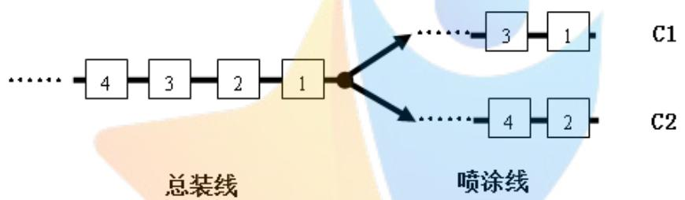

<details>
<summary>flowchart</summary>

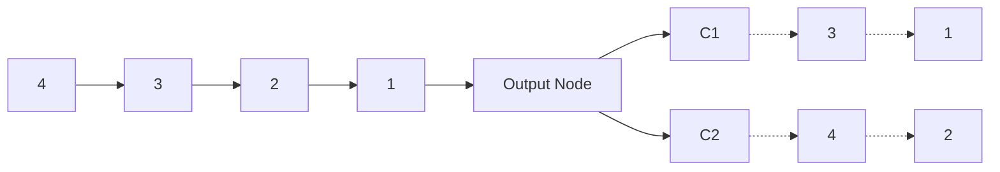
</details>

图1 汽车总装线的装配流程图

## 1.2 装配要求

## 1.2.1 对车辆型号的要求

(1)按照先A1后 A2的品牌顺序，每天白班和晚班装配当天两种品牌各一半数量的汽车。  
(2)两批四驱汽车之间间隔的两驱汽车的数量至少为 10辆，其中四驱汽车连续装配数量不得超过 2辆；两批柴油汽车之间间隔的汽油汽车的数量至少为 10辆，其中柴油汽车连续装配数量不得超过 2辆。间隔数量越多越好，若无法满足要求，间隔数量可在 5-9辆之内仍可接受，但代价太高。  
(3)减少不同配置车辆间的切换次数，同一品牌下相同配置车辆尽量连续。

## 1.2.2 对颜色的要求

(1)蓝、黄、红、三种颜色汽车只能在 C1线上进行喷涂，金色汽车只能在C2线上进行喷涂，其他颜色汽车的喷涂可在 C1 或C2线上进行。  
(2)在同一条喷涂线上，除黑、白两种颜色外，同种颜色汽车应尽量连续进行喷涂作业。  
(3)尽可能减少喷涂线上不同颜色汽车之间的切换次数，尤其是黑色汽车与其他颜色汽车之间切换代价很高。

(4)不同颜色汽车在总装线上排列时的具体要求见下：

a.黑色汽车连续排列数量在 50-70辆之间，两批黑色汽车在总装线上间隔数量至少为20辆；  
b.蓝色汽车必须与白色汽车间隔排列；  
c.白色汽车可以连续排列，也可与蓝色或棕色汽车间隔排列；  
d.颜色黄或红的汽车必须与颜色为银、灰、棕、金中的一种颜色汽车间隔排

列；

e.要求金色汽车与颜色为红或黄的汽车间隔排列，若无法满足要求，也可与颜色为银、灰、棕中的一种颜色的汽车间隔排列；  
f.棕色汽车可以连续排列，也可以和颜色为黄、红、金、中的一种颜色的汽车间隔排列；  
g.颜色为灰或银的汽车可以连续排列，也可以和颜色为黄、红、金中的一种颜色的汽车间隔排列；

h.对于其他颜色搭配，遵循“没有允许即为禁止”的原则。

以上总装线和喷涂线的各项要求同样适用于相邻班次（包括当日晚班与次日白班）的车辆。

## 1.3 需要解决的问题

(1)根据问题的背景、装配要求以及所给附件中的数据，建立数学模型或设计算法，得出符合要求、且具有较低生产成本的装配顺序。  
(2)根据(1)中的数学模型或算法，针对附件中的数据，得出计算结果。并给出9月17日至9月23 日每天的装配顺序。

## 二、问题分析

对于装配流水线而言，为提高生产能力，就必须实现均衡生产，节约时间，才能降低生产成本。而本题是关于汽车总装线的配置问题，则应对每种汽车型号的品牌、配置、动力、驱动、颜色以及喷涂线等方面因素综合考虑，设计合理的算法，得出较优的排序方案<sup>[1]</sup>。结合启发，大体思路见图 2。

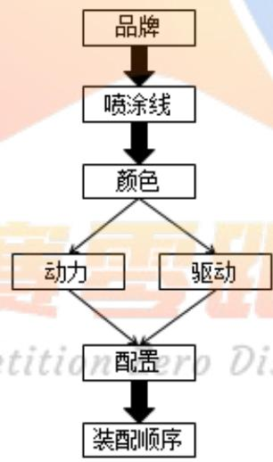

<details>
<summary>flowchart</summary>

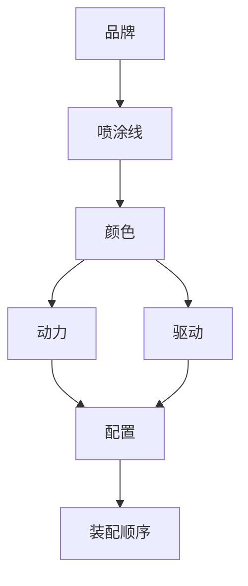
</details>

图2 思路分析过程图

## 2.1问题一分析

首先，由题可知，每天可装配各种型号汽车共 460 辆，白班、晚班各 230辆，白班和晚班按照先 A1 后 A2 的品牌顺序，将 A1、A2 需装配汽车总数除以 2即得每班需装配的A1、A2品牌汽车的个数。

根据题目要求装配顺序为奇数的汽车必须在 C1 线喷涂，装配顺序为偶数的汽车必须在C2线喷涂，因此先排出喷涂线。

其次，观察附件中所给数据，由于颜色种类多，且要求繁，因此下面需要以颜色为限定条件进行排列。由于黑色汽车生产数量最多，而且黑色汽车在排列时有 50-70 以及间隔不小于 20 的数量限制，因此以黑色汽车数量为基准进行框架划分，在满足题中所给颜色要求下，将其他颜色填充到框架内。

再次，由于动力及驱动规格较少，均只有两种选择，特殊的，柴油车及四驱车需要数量较少，因此动力及驱动排列起来相对容易，因而接下来排列动力及驱动。

最后，运用 Excel 表格 <sup>[2]</sup> 按照装配要求排出配置，先排个数较少的配置，遵循从少到多，尽量连续的原则，即可完成所有要求，完成总装线路的装配方案。

在排列的过程中，总结提炼，得到算法。

## 2.2问题二分析

在问题一的基础上，运用问题一中得到的算法，分别计算出 9 月 17 日至 9月23日的装配顺序。在计算过程中，如遇特殊情况，可进行微调。

## 三、模型假设

1.假设题目中所给数据真实可靠。  
2.假设装配过程中，操作工人能够正常作业，无特殊情况发生。  
3.假设每名操作工人的工作量均匀分配。  
4.假设机器不会发生故障。  
5.假设所需生产材料都能及时供应。

## 四、符号说明

<table><tr><td>m</td><td>品牌 A1 生产的总数量</td></tr><tr><td>n</td><td>品牌 A2 生产的总数量</td></tr><tr><td>w</td><td>白班或夜班生产品牌 A1 的总数量</td></tr><tr><td>p</td><td>白班或夜班生产品牌 A2 的总数量</td></tr><tr><td>x</td><td>A1 中生产黑色汽车车辆数目</td></tr><tr><td>y</td><td>A2 中生产黑色汽车车辆数目</td></tr><tr><td>z</td><td>A2 中需 A1 的黑色汽车车辆数目</td></tr><tr><td>h</td><td>A1 中剩余黑色汽车车辆数目</td></tr><tr><td>g</td><td>A1 中每组黑色汽车车辆数目</td></tr></table>

## 五、模型的建立与求解

## 5.1 问题一

5.1.1 间隔排列、连续排列、切换的定义

1. 连续排列： 两个或两个以上的颜色不间断地排列，如黑黑黑、白白均为连续排列。  
2. 间隔排列：1 种颜色相邻两侧的颜色为同种颜色，例如：白棕白，则棕色将白色间隔开。

3. 切换：1 种颜色相邻两侧的颜色为不同颜色，例如：白棕黑，则白棕、棕黑之间均为切换。

## 5.1.2 算法设计

要求：装配顺序生产成本达到最低，即喷涂线上不同颜色汽车间切换次数尽可能少、同一品牌下相同配置车辆尽量连续。

## 第1步：排品牌

计算 A1、A2 总装配汽车数，由于白班、夜班各装配一半，利用附件中的数据可知 A1、A2 总装配数，对 A1、A2 分别除以 2，得到白班、夜班装配 A1、A2的装配数量。具体计算公式如下：

设m表示需生产的品牌 A1汽车总数，n表示需生产的品牌 A2汽车总数，由于白班和夜班生产的品牌 A1及A2汽车数量相同，因此白班或夜班生产的品牌A1汽车总个数均设为w<sub>，</sub>则

$$
w = \frac {m}{2}
$$

白班或夜班生产的品牌 A1汽车总个数均设为p<sub>，</sub>则

$$
p = \frac {n}{2}
$$

具体以9月20日为例，计算出每班需生产两个品牌汽车数量如下：

表1 9月20日生产车辆数目

<table><tr><td>班次</td><td>汽车型号</td><td>生产汽车数量</td></tr><tr><td rowspan="2">白班</td><td>A1</td><td>181</td></tr><tr><td>A2</td><td>49</td></tr><tr><td rowspan="2">夜班</td><td>A1</td><td>181</td></tr><tr><td>A2</td><td>49</td></tr></table>

## 第2步：排喷涂线

根据题目要求，奇数车在C1喷涂线进行喷涂、偶数车在C2喷涂线进行喷涂，可以先确定每辆车的具体喷涂顺序。每天的喷涂顺序都是一致的，如下：

$$
\mathrm{C1-C2-C1-C2} \dots \dots \mathrm{C1-C2-C1-C2}
$$

总计汽车生产数量 460辆。

## 第3步：排颜色

每天总装配为 460 辆，因此早班、夜班各装配 230 辆。先根据附表的 A1、A2 的各总车辆数分别确定白班、夜班装配 A1、A2 的装配数量。再分析 A1、A2中各颜色的具体数量，统计各个颜色的数量，做出条形图，以 9 月 20 日为例，得到如下柱形图。

9月20日各颜色汽车生产数量图  
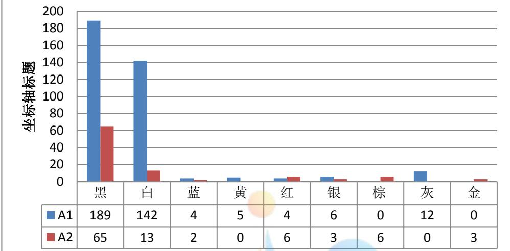

<details>
<summary>bar</summary>

| Category | A1 | A2 |
| --- | --- | --- |
| 黑 | 189 | 65 |
| 白 | 142 | 13 |
| 蓝 | 4 | 2 |
| 黄 | 5 | 0 |
| 红 | 4 | 6 |
| 银 | 6 | 3 |
| 棕 | 0 | 6 |
| 灰 | 12 | 0 |
| 金 | 0 | 3 |
</details>

图 3 9月20日各颜色汽车生产数量图

由图 3 知，黑色最多，白色其次。因此以黑色为基准，先确定黑色的位置。题中又要求黑色连续数为 50-70 辆，因个别天数 A2 中黑色数目较少，要使得黑色连续，需使白班、夜班的 A1、A2中的黑色连续起来，故可先将 A2中黑色分为两部分，然后以一组黑色为 50辆为最低标准，计算所需要 A1中黑色的个数。最后将A1中剩余黑色的个数进行分组。具体计算公式如下：

设x表示A1中生产黑色汽车车辆数目，y表示A2中生产黑色汽车车辆数目，A2中需A1的黑色汽车车辆个数：

$$
z = 5 0 - \frac {y}{2}
$$

A1中剩余黑色汽车车辆个数：

$$
h = x - 2 z
$$

A1中每组黑色汽车车辆个数：

$$
g = \frac {h}{3}
$$

说明：黑色组代表汽车数量 50-70辆之间的连续装配车辆数。

由于每组黑色汽车数量应在 50-70辆之间，每个班次总装配数为230 辆，故一个班次最多有4个黑色组、最少 2个黑色组。为了使得黑色比较集中，故以白班A1中放入2个黑色组为优先原则，得到黑色的排列方案。然后在白班 A1中第一个黑色组后插入20 个颜色尽量相同的汽车，且满足蓝、红、黄在 C1线上喷涂，金在C2线上喷涂，在后面排列中仍满足此要求。排入白班 A1个黑色组后，计算剩余插入除黑色汽车的数量，简称剩余车辆数。

白班A1中剩余车数量=白班A1生产汽车数量-白班A1中黑色汽车总数量，

夜班A1中剩余车数量=夜班A1生产汽车数量-夜班A1中黑色汽车总数量，

白班A2中剩余车数量=白班A1生产汽车数量-白班A2中黑色汽车总数量，

夜班A2中剩余车数量=夜班A1生产汽车数量-夜班A2中黑色汽车总数量，然后插入其他颜色汽车，其满足：

a.黑色汽车连续排列数量在 50-70辆之间，两批黑色汽车在总装线上间隔数量至少为20辆；

b.蓝色汽车必须与白色汽车间隔排列；  
c.白色汽车可以连续排列，也可与蓝色或棕色汽车间隔排列；  
d.颜色黄或红的汽车必须与颜色为银、灰、棕、金中的一种颜色汽车间隔排列；  
e.金色汽车与颜色为红或黄的汽车间隔排列，若无法满足要求，也可与颜色为银、灰、棕中的一种颜色的汽车间隔排列；  
f.棕色汽车可以连续排列，也可以和颜色为黄、红、金、白中的一种颜色的汽车间隔排列；  
g.颜色为灰或银的汽车可以连续排列，也可以和颜色为黄、红、金中的一种颜色的汽车间隔排列；  
h.对于其他颜色搭配，遵循“没有允许即为禁止”的原则。

根据实际排列需要，有些虽然要求不能间隔，但是我们可以切换排列。

以9月20日为例，得到颜色排列如下：

20白→50黑→1蓝→1白→1蓝→1白→1蓝→1白→1蓝→13白→50黑→1黄→1 银→1 黄→1 银→1 黄→1 银→1 黄→1 银→1 黄→13 白→2 银→1 灰→1 红→1灰→1 红→1 灰→1 红→1 灰→1 红→8 灰→51 黑→84 白→53 黑→3 白→1 蓝→1金→1银→1金→1银→1金→1银→5白

## 第4步：排驱动

由附件中数据可知，四驱汽车较少，故优先排列。由于黑色数量较多，所以插入的四驱可以满足要求，但是其它颜色数量相对较少，因此需将连着的相同颜色分开，最好能满足间隔 10 辆，如不能，应满足间隔 5-9 辆，以达到驱动的要求。

以9月20日为例，得到驱动排列如下：

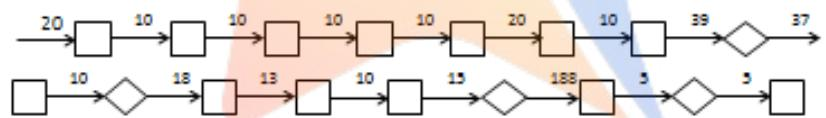

<details>
<summary>flowchart</summary>

This flowchart illustrates a sequential process with multiple stages, each containing a sequence of numbers and arrows indicating transitions or data flow.
</details>

其中，方框代表2个四驱，菱形代表 1个四驱，箭头上的数字表示两组四驱之间间隔的两驱车辆的个数。

## 第5步：排动力

由附件数据可知，柴油汽车较少，故优先排列。由于黑色汽油汽车的数量较多，所以插入的柴油汽车可以满足要求，但是其它颜色汽油汽车数量相对较少，因此需将连着的相同颜色汽车分开，最好能满足间隔 10 辆，如不能，应满足间隔5-9辆，以达到动力的要求。

以9月20日为例，得到动力排列如下：

411汽油→2柴油→10汽油→1柴油→23 汽油→1柴油→12汽油 第6步：排配置

由附件数据知，各种颜色的数量多少存在差异，为符合相同配置数量尽量连续，减少切换次数，我们先对颜色少的配置进行排列，再对颜色多的配置进行排列。由于A2数量较少，对照附表，优先对A2中颜色较少进行排列，然后将剩余进行排列，遵循同配置的尽可能连续，然后以同样的方法对 A1 进行排列，最终

得到具体装配顺序。

以9月20日为例，先对 A2中的柴油车进行配置排列，白色柴油车和 3辆黑色柴油车的配置必须为 B1，那么与其相邻的车辆尽量也安排成 B1配置。然后对颜色最少汽油车进行配置排列，如 A2中的2辆银色车配置必须为 B2，则与其相邻的车辆尽量也安排成 B2配置。依次对A2各配置进行排队，应遵循同种配置车辆尽量连续，然后给 A1中车进行排列，方法与 A2中的方法相同，最终得到配置装配顺序。

以上6种装配都已排列完毕，得到总装配路线顺序。

以9月20日为例，部分配置排列如下：

表2 9月20日部分装配顺序

<table><tr><td>装配顺序</td><td>品牌</td><td>配置</td><td>动力</td><td>驱动</td><td>颜色</td><td>喷涂线</td></tr><tr><td>1</td><td>A1</td><td>B1</td><td>汽油</td><td>两驱</td><td>白</td><td>C1</td></tr><tr><td>2</td><td>A1</td><td>B1</td><td>汽油</td><td>两驱</td><td>白</td><td>C2</td></tr><tr><td>3</td><td>A1</td><td>B1</td><td>汽油</td><td>两驱</td><td>白</td><td>C1</td></tr><tr><td>...</td><td>...</td><td>...</td><td>...</td><td>...</td><td>...</td><td>...</td></tr><tr><td>...</td><td>...</td><td>...</td><td>...</td><td>...</td><td>...</td><td>...</td></tr><tr><td>460</td><td>A2</td><td>B1</td><td>汽油</td><td>四驱</td><td>白</td><td>C2</td></tr></table>

## 5.1.3 算法总结

1.排品牌:计算白班或夜班中生产 A1、A2汽车总数量 $w , p$

$$
w = \frac {m}{2};
$$

$$
p = \frac {n}{2}
$$

其中m n表示A1品牌生产的总数量, 表示A2品牌生产的总数量。

2.排喷涂线：一天连续的 460个汽车的喷涂排列如下：

$$
\mathrm{C1-C2-C1-C2} \dots \dots \mathrm{C1-C2-C1-C2}
$$

其中C1、C2相间隔，奇数车在 C1线进行喷涂、偶数车在 C2线进行喷涂。

## 3.排颜色

（1）确定黑色为基准，计算方法如下：

A2中需A1的黑色汽车车辆个数：

$$
z = 5 0 - \frac {y}{2}
$$

A1中剩余黑色汽车车辆个数：

$$
h = x - 2 z
$$

A1中每组黑色汽车车辆个数：

$$
g = \frac {h}{3}
$$

其中x表示 A1 中生产黑色汽车车辆数目，y表示 A2 中生产黑色汽车车辆数目。

（2）对黑色进行分组：先对 A2 中的黑色进行分组，再和 A1 中的黑色进行组合，以一组黑色为 50 为一组，得到白班、夜班交替时黑色的排列，最后将剩余的黑色进行均分，得到 A2中黑色组的具体分布情况。  
（3）计算A1、A2 中除黑颜色意外的装配汽车数，计算方法如下：

白班A1中剩余车数量=白班A1生产汽车数量-白班A1中黑色汽车总数量；

夜班A1中剩余车数量=夜班A1生产汽车数量-夜班A1中黑色汽车总数量

白班A2中剩余车数量=白班A1生产汽车数量-白班A2中黑色汽车总数量；

夜班A2中剩余车数量=夜班A1生产汽车数量-夜班A2中黑色汽车总数量

（4）A1、A2 中除黑颜色意外的装配汽车排列方法：白班 A1 中第一个黑色组后插入大于20个颜色除黑以外尽量相同的汽车，且满足蓝、红、黄在 C1线上喷涂，金在 C2 线上喷涂，在后面排列中仍满足此要求，且满足白班、夜班 A1的总装配数量。A2的排列与 A1相同，最终确定装配中颜色的排列。

## 4.排驱动

由于四驱较少，优先排颜色较少的四驱，如不能达到题目要求，需进行微调，然后将其他颜色四驱排列，最后将两驱排入，得到驱动排列方案。

## 5.排动力

由于柴油较少，优先排颜色较少的柴油，如不能达到题目要求，需进行微调，然后将其他颜色柴油排列，最后将汽油排入，得到动力排列顺序。

## 6.排配置

优先排数量较少的配置，按照配置尽量连续的原则，再排入数量较多的配置，使其同种配置车尽量放在一起，最终得到配置排列顺序。

按照上面的顺序即可得到总的装配顺序。总的装配顺序见附录。

## 5.1.4 装配连续循环图

为保证每天 24 小时不间断作业，因此令七天为一个循环周期，然后形成一个连续生产的循环图，见图 4。

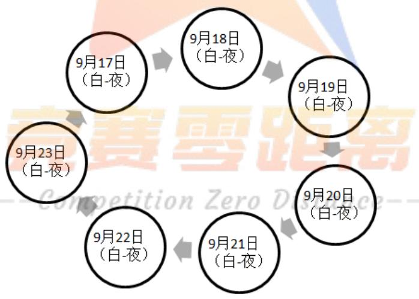

<details>
<summary>flowchart</summary>


</details>

图4 生产循环流程图

## 5.2 问题二

9月20日装配顺序在问题一中已经得出，具体装配顺序见附录。

根据问题一中第一步、第二步排品牌、排喷涂线排出品牌和喷涂线，第三步，然后根据附件中的数据计算 9 月 17 日、9 月 18 日、9 月 19 日、9 月 21 日、9月22日、9月23日，白班、夜班 A1、A2的具体生产车辆数目，分别见下表。

表 3 9 月 17 日生产车辆数目

<table><tr><td>班次</td><td>汽车型号</td><td>生产汽车数量</td></tr><tr><td rowspan="2">白班</td><td>A1</td><td>182</td></tr><tr><td>A2</td><td>48</td></tr><tr><td rowspan="2">夜班</td><td>A1</td><td>182</td></tr><tr><td>A2</td><td>48</td></tr></table>

表4 9月18日生产车辆数目

<table><tr><td>班次</td><td>汽车型号</td><td>生产汽车数量</td></tr><tr><td rowspan="2">白班</td><td>A1</td><td>178</td></tr><tr><td>A2</td><td>52</td></tr><tr><td rowspan="2">夜班</td><td>A1</td><td>178</td></tr><tr><td>A2</td><td>52</td></tr></table>

表5 9月19日生产车辆数目

<table><tr><td>班次</td><td>汽车型号</td><td>生产汽车数量</td></tr><tr><td rowspan="2">白班</td><td>A1</td><td>178</td></tr><tr><td>A2</td><td>52</td></tr><tr><td rowspan="2">夜班</td><td>A1</td><td>178</td></tr><tr><td>A2</td><td>52</td></tr></table>

表6 9月21日生产车辆数目

<table><tr><td>班次</td><td>汽车型号</td><td>生产汽车数量</td></tr><tr><td rowspan="2">白班</td><td>A1</td><td>188</td></tr><tr><td>A2</td><td>42</td></tr><tr><td rowspan="2">夜班</td><td>A1</td><td>188</td></tr><tr><td>A2</td><td>42</td></tr></table>

表 7 9 月 22 日生产车辆数目

<table><tr><td>班次</td><td>汽车型号</td><td>生产汽车数量</td></tr><tr><td rowspan="2">白班</td><td>A1</td><td>183</td></tr><tr><td>A2</td><td>47</td></tr><tr><td rowspan="2">夜班</td><td>A1</td><td>183</td></tr><tr><td>A2</td><td>47</td></tr></table>

表8 9月23日生产车辆数目

<table><tr><td>班次</td><td>汽车型号</td><td>生产汽车数量</td></tr><tr><td rowspan="2">白班</td><td>A1</td><td>183</td></tr><tr><td>A2</td><td>47</td></tr><tr><td rowspan="2">夜班</td><td>A1</td><td>184</td></tr><tr><td>A2</td><td>46</td></tr></table>

根据问题一中排颜色的方法对 9 月 17 日、9 月 18 日、9 月 19 日、9 月 21日、9月22日、9月 23日的颜色进行统计，得到条形图如下：

9月17日各颜色汽车生产数量图  
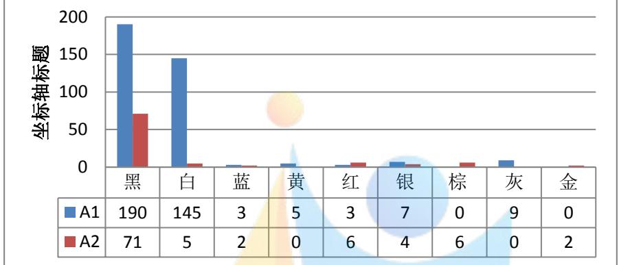

<details>
<summary>bar</summary>

| Category | A1 | A2 |
| --- | --- | --- |
| 黑 | 190 | 71 |
| 白 | 145 | 5 |
| 蓝 | 3 | 2 |
| 黄 | 5 | 0 |
| 红 | 3 | 6 |
| 银 | 7 | 4 |
| 棕 | 0 | 6 |
| 灰 | 9 | 0 |
| 金 | 0 | 2 |
</details>

图5 9月17日各颜色汽车生产数量图

9月18日各颜色汽车生产数量图  
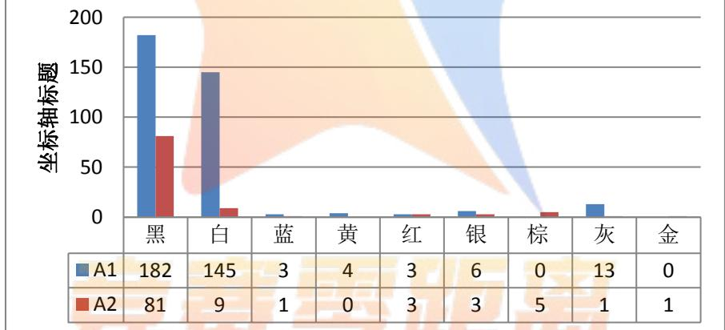

<details>
<summary>bar_stacked</summary>

| Category | A1 | A2 |
| --- | --- | --- |
| 黑 | 182 | 81 |
| 白 | 145 | 9 |
| 蓝 | 3 | 1 |
| 黄 | 4 | 0 |
| 红 | 3 | 3 |
| 银 | 6 | 3 |
| 棕 | 0 | 5 |
| 灰 | 13 | 1 |
| 金 | 0 | 1 |
</details>

图6 9月18日各颜色汽车生产数量图

9月19日各颜色汽车生产数量图  
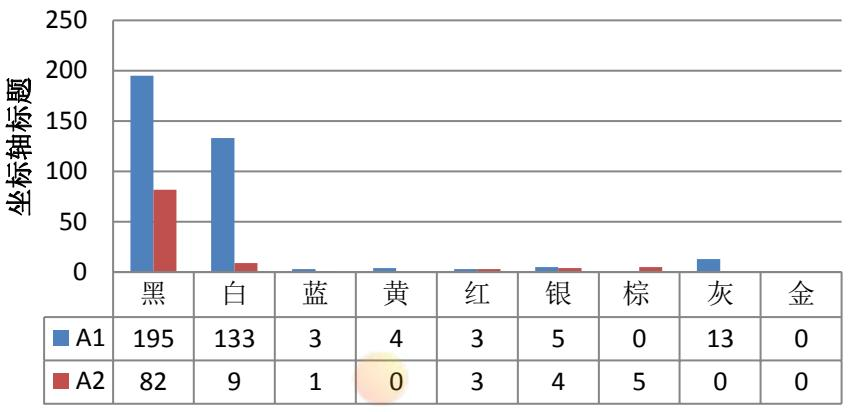

<details>
<summary>bar</summary>

| Category | A1 | A2 |
| --- | --- | --- |
| 黑 | 195 | 82 |
| 白 | 133 | 9 |
| 蓝 | 3 | 1 |
| 黄 | 4 | 0 |
| 红 | 3 | 3 |
| 银 | 5 | 4 |
| 棕 | 0 | 5 |
| 灰 | 13 | 0 |
| 金 | 0 | 0 |
</details>

图7 9月19日各颜色汽车生产数量图

9月21日各颜色汽车生产数量图  
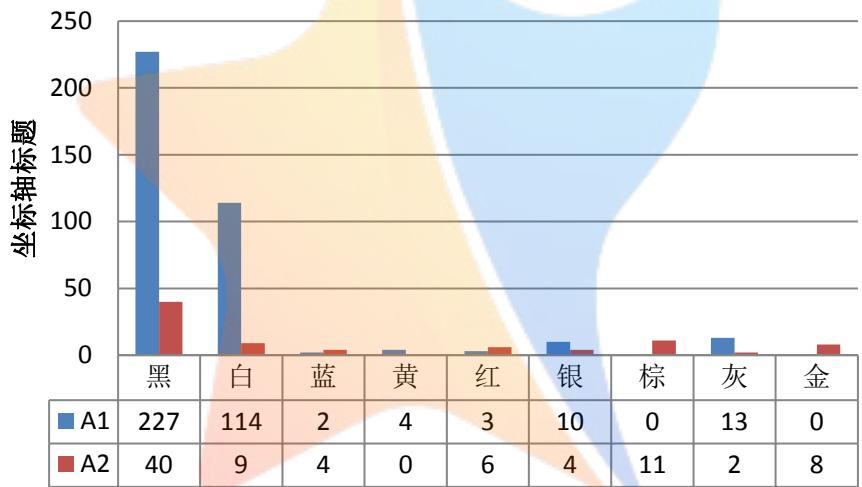

<details>
<summary>bar</summary>

| Category | A1 | A2 |
| --- | --- | --- |
| 黑 | 227 | 40 |
| 白 | 114 | 9 |
| 蓝 | 2 | 4 |
| 黄 | 4 | 0 |
| 红 | 3 | 6 |
| 银 | 10 | 4 |
| 棕 | 0 | 11 |
| 灰 | 13 | 2 |
| 金 | 0 | 8 |
</details>

图8 9月21日各颜色汽车生产数量图

9月22日各颜色汽车生产数量图  
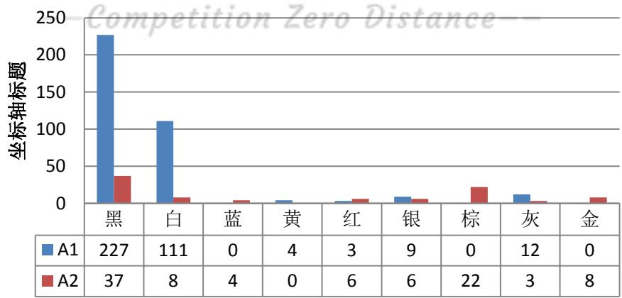

<details>
<summary>bar</summary>

| Category | A1 | A2 |
| --- | --- | --- |
| 黑 | 227 | 37 |
| 白 | 111 | 8 |
| 蓝 | 0 | 4 |
| 黄 | 4 | 0 |
| 红 | 3 | 6 |
| 银 | 9 | 6 |
| 棕 | 0 | 22 |
| 灰 | 12 | 3 |
| 金 | 0 | 8 |
</details>

图9 9月22日各颜色汽车生产数量图

9月23日各颜色汽车生产数量图  
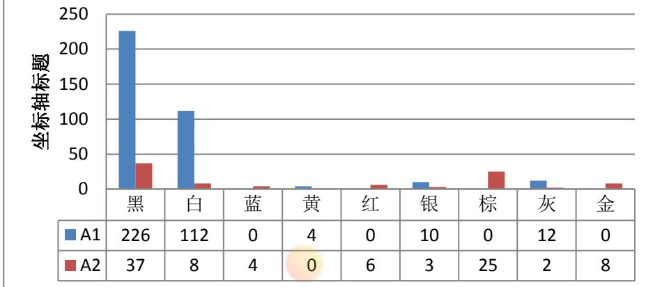

<details>
<summary>bar</summary>

| Category | A1 | A2 |
| --- | --- | --- |
| 黑 | 226 | 37 |
| 白 | 112 | 8 |
| 蓝 | 0 | 4 |
| 黄 | 4 | 0 |
| 红 | 0 | 6 |
| 银 | 10 | 3 |
| 棕 | 0 | 25 |
| 灰 | 12 | 2 |
| 金 | 0 | 8 |
</details>

图 10 9 月 23 日各颜色汽车生产数量图

## 第3步：排颜色

按照与问题一相同的方法排出颜色，9 月 17 日、9 月 18 日、9 月 19 日、9月21日、9月22日、9月23日排列如下

## 9 月 17 日：

54 黑→1 蓝→1 白→1 蓝→1 白→1 蓝→1 白→1 黄→1 灰→1 黄→1 灰→1 黄→1灰→1黄→1灰→黄→7灰→54黑→38白→50黑→1红→1棕→1红→1棕→1红→1棕→1红→1棕→1红→1棕→1红→1棕→52白→53黑→1银→1红→1银→1 红→1 银→1 红→4 银→52 白→50 黑→1 蓝→1 白→1 蓝→4 白→1 银→1 金→1银→1金→2银

## 9 月 18 日：

20 白→54 黑→1 蓝→1 白→1 蓝→1 白→1 蓝→15 白→55 黑→20 白→50 黑→1银→1红→1银→1红→1银→1红→1灰→1蓝→2白→1金→1红→1银→1红→1银→1红→1银→1黄→1灰→1黄→1灰→1黄→1灰→1黄→1灰→3银→9灰→54 黑→88 白→50 黑→1 白→1 棕→1 白→1 棕→1 白→1 棕→1 白→1 棕→1 白→1棕→2白

## 9 月 19 日：

59 黑→5 银→1 黄→1 灰→1 黄→1 灰→1 黄→1 灰→1 黄→1 灰→1 红→1 灰→1红→1灰→1红→7灰→59黑→26白→50黑→2白→5棕→1蓝→2白→1银→52白→59 黑→1 白→1 蓝→1 白→1 蓝→1 白→1 蓝→52 白→50 黑→2 白→1 银→1红→1银→1红→1银→1红→3白

## 9 月 21 日：

60黑→16白→1蓝→1白→1蓝→1白→50黑→1黄→1灰→1黄→1灰→1黄→1灰→1黄→1灰→1红→1灰→1红→1灰→1红→1灰→34白→50黑→22白→60黑→6 灰→10 银→42 白→50 黑→2 白→1 蓝→1 白→1 蓝→1 白→1 蓝→1 白→1蓝→2白→1金→1红→1金→1红→1金→1红→1金→1红→1金→1红→1金→1红→1金→1棕→1金→10棕→4银→2灰

## 9 月 22 日：

54 黑→1 红→1 银→1 红→1 银→1 红→1 银→1 黄→1 银→1 黄→1 银→1 黄→1银→1 黄→3 银→5 白→53 黑→42 白→50 黑→1 蓝→1 白→1 蓝→1 白→1 蓝→1白→1蓝→23白→54黑→12灰→44白→53黑→2白→2棕→1金→1棕→1金→1棕→1金→1棕→1金→1棕→1金→1棕→1金→1棕→1金→1棕→1金→7棕→3 灰→1 红→1 棕→1 红→1 棕→1 红→1 棕→1 红→1 棕→1 红→1 棕→1 红→1棕→6银

## 9 月 23 日：

52 黑→1 红→1 银→1 红→1 银→1 红→8 银→8 灰→52 黑→1 灰→1 黄→1 灰→1黄→1 灰→1 黄→1 灰→1 黄→34 白→53 黑→9 棕→21 白→53 黑→58 白→53 黑→2 白→2 灰→3 银→1 棕→1 红→1 棕→1 红→1 棕→1 红→1 棕→1 红→1 棕→1红→1棕→1红→2棕→1金→1棕→1金→1棕→1金→1棕→1金→1棕→1金→1棕→1金→1棕→1金→1棕→1金→1蓝→1白→1蓝→1白→1蓝→1白→1蓝→2白→1棕

## 第 4 步：排驱动

按照与问题一相同的方法排出驱动，9 月 17 日、9 月 18 日、9 月 19 日、9月21日、9月22日、9月23日的驱动排列如下，其中，方框代表 2个四驱，菱形代表1个四驱，箭头上的数字表示两组四驱之间间隔的两驱车辆的个数。

## 9 月 17 日：

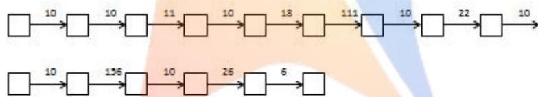

<details>
<summary>flowchart</summary>

```mermaid
graph LR
  A[""] -->|"10"| B[""]
  B -->|"10"| C[""]
  C -->|"11"| D[""]
  D -->|"10"| E[""]
  E -->|"18"| F[""]
  F -->|"111"| G[""]
  G -->|"10"| H[""]
  H -->|"22"| I[""]
  I -->|"10"| J[""]
  J -->|"10"| K[""]
  K -->|"136"| L[""]
  L -->|"10"| M[""]
  M -->|"26"| N[""]
  N -->|"6"| O[""]
```
</details>

## 9 月 18 日：

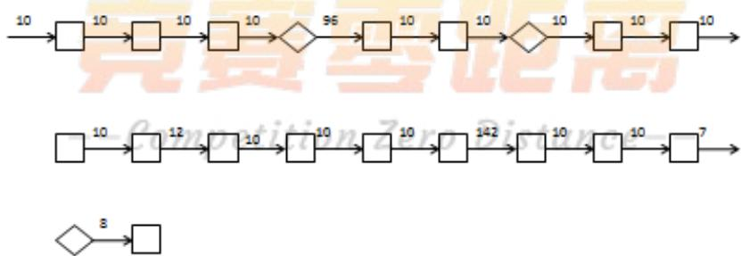

<details>
<summary>flowchart</summary>

This image displays a sequence of process flow diagrams, likely representing a digital signal or data processing workflow with multiple stages and loop transitions.
</details>

## 9 月 19 日：

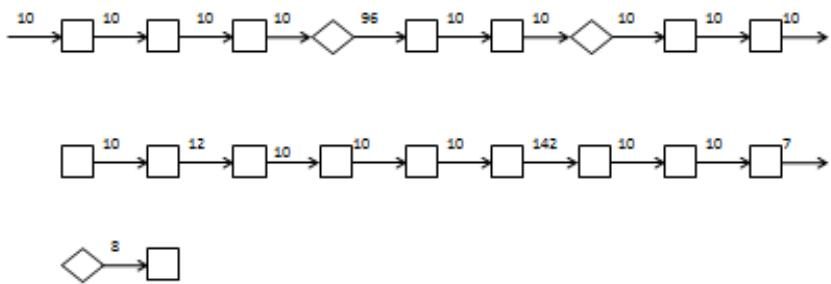

<details>
<summary>flowchart</summary>

This image displays a sequence of process flowcharts or data processing steps, showing sequential operations with associated values and diamond markers indicating specific stages.
</details>

9 月 21 日：

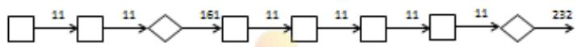

<details>
<summary>flowchart</summary>

```mermaid
graph LR
  A[""] -->|"11"| B[""]
  B -->|"11"| C{""}
  C -->|"161"| D[""]
  D -->|"11"| E[""]
  E -->|"11"| F[""]
  F -->|"11"| G{""}
  G -->|"232"| H[""]
```
</details>

9 月 22 日：

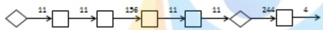

9 月 23 日：

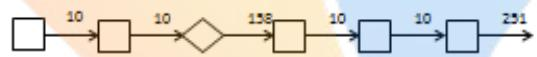

第5步：排动力

同理，9 月 17 日、9 月 18 日、9 月 19 日、9 月 21 日、9 月 22 日、9 月 23日的动力排列如下.

9 月 17 日：

184汽油→2柴油→12汽油→2 柴油→260汽油

9 月 18 日：

20汽油→2柴油→156汽油→2柴油→12汽油→2柴油→10汽油→2柴油→13汽 油→1柴油→7汽油→2柴油→219汽油→1柴油→9汽油→2柴油

9 月 19 日：

145汽油→2柴油→10汽油→2柴油→31汽油→1柴油→11汽油→2柴油→15汽 油→2柴油→7汽油→2柴油→194汽油→1柴油→24汽油→2柴油→7汽油→2 柴油

9 月 21 日：

188汽油→2柴油→270 汽油

9 月 22 日：

185 汽油→2 柴油→10 汽油→2 柴油→11 汽油→1 柴油→16 汽油→2 柴油→184 汽油→2柴油→26汽油→1柴油→12汽油→2柴油→4汽油

9 月 23 日：

183 汽油→2 柴油→12 汽油→2 柴油→10 汽油→2 柴油→10 汽油→1 柴油→7 汽 油→1柴油→184汽油→2柴油→41汽油→2柴油→1汽油

第6步：排配置

9 月 17 日、9 月 18 日、9 月 19 日、9 月 21 日、9 月 22 日、9 月 23 日的部分装配排列见表9-表 14。

表9 9月17日部分装配顺序

<table><tr><td>装配顺序</td><td>品牌</td><td>配置</td><td>动力</td><td>驱动</td><td>颜色</td><td>喷涂线</td></tr><tr><td>1</td><td>A1</td><td>B1</td><td>汽油</td><td>四驱</td><td>黑</td><td>C1</td></tr><tr><td>2</td><td>A1</td><td>B1</td><td>汽油</td><td>四驱</td><td>黑</td><td>C2</td></tr><tr><td>3</td><td>A1</td><td>B1</td><td>汽油</td><td>两驱</td><td>黑</td><td>C1</td></tr><tr><td>...</td><td>...</td><td>...</td><td>...</td><td>...</td><td>...</td><td>...</td></tr><tr><td>...</td><td>...</td><td>...</td><td>...</td><td>...</td><td>...</td><td>...</td></tr><tr><td>460</td><td>A2</td><td>B4</td><td>汽油</td><td>两驱</td><td>银</td><td>C2</td></tr></table>

表10 9月18日部分装配顺序

<table><tr><td>装配顺序</td><td>品牌</td><td>配置</td><td>动力</td><td>驱动</td><td>颜色</td><td>喷涂线</td></tr><tr><td>1</td><td>A1</td><td>B1</td><td>汽油</td><td>两驱</td><td>白</td><td>C1</td></tr><tr><td>2</td><td>A1</td><td>B1</td><td>汽油</td><td>两驱</td><td>白</td><td>C2</td></tr><tr><td>3</td><td>A1</td><td>B1</td><td>汽油</td><td>两驱</td><td>白</td><td>C1</td></tr><tr><td>...</td><td>...</td><td>...</td><td>...</td><td>...</td><td>...</td><td>...</td></tr><tr><td>...</td><td>...</td><td>...</td><td>...</td><td>...</td><td>...</td><td>...</td></tr><tr><td>460</td><td>A2</td><td>B1</td><td>柴油</td><td>四驱</td><td>白</td><td>C2</td></tr></table>

表11 9月19日部分装配顺序

<table><tr><td>装配顺序</td><td>品牌</td><td>配置</td><td>动力</td><td>驱动</td><td>颜色</td><td>喷涂线</td></tr><tr><td>1</td><td>A1</td><td>B1</td><td>汽油</td><td>两驱</td><td>黑</td><td>C1</td></tr><tr><td>2</td><td>A1</td><td>B1</td><td>汽油</td><td>两驱</td><td>黑</td><td>C2</td></tr><tr><td>3</td><td>A1</td><td>B1</td><td>汽油</td><td>两驱</td><td>黑</td><td>C1</td></tr><tr><td>...</td><td>...</td><td>...</td><td>...</td><td>...</td><td>...</td><td>...</td></tr><tr><td>...</td><td>...</td><td>...</td><td>...</td><td>...</td><td>...</td><td>...</td></tr><tr><td>460</td><td>A2</td><td>B1</td><td>柴油</td><td>四驱</td><td>白</td><td>C2</td></tr></table>

表12 9月21日部分装配顺序

<table><tr><td>装配顺序</td><td>品牌</td><td>配置</td><td>动力</td><td>驱动</td><td>颜色</td><td>喷涂线</td></tr><tr><td>1</td><td>A1</td><td>B5</td><td>汽油</td><td>四驱</td><td>黑</td><td>C1</td></tr><tr><td>2</td><td>A1</td><td>B5</td><td>汽油</td><td>四驱</td><td>黑</td><td>C2</td></tr><tr><td>3</td><td>A1</td><td>B3</td><td>汽油</td><td>两驱</td><td>黑</td><td>C1</td></tr><tr><td>...</td><td>...</td><td>...</td><td>...</td><td>...</td><td>...</td><td>...</td></tr><tr><td>...</td><td>...</td><td>...</td><td>...</td><td>...</td><td>...</td><td>...</td></tr><tr><td>460</td><td>A2</td><td>B1</td><td>汽油</td><td>两驱</td><td>灰</td><td>C2</td></tr></table>

表13 9月22日部分装配顺序

<table><tr><td>装配顺序</td><td>品牌</td><td>配置</td><td>动力</td><td>驱动</td><td>颜色</td><td>喷涂线</td></tr><tr><td>1</td><td>A1</td><td>B1</td><td>汽油</td><td>四驱</td><td>黑</td><td>C1</td></tr><tr><td>2</td><td>A1</td><td>B1</td><td>汽油</td><td>两驱</td><td>黑</td><td>C2</td></tr><tr><td>3</td><td>A1</td><td>B1</td><td>汽油</td><td>两驱</td><td>黑</td><td>C1</td></tr><tr><td>...</td><td>...</td><td>...</td><td>...</td><td>...</td><td>...</td><td>...</td></tr><tr><td>...</td><td>...</td><td>...</td><td>...</td><td>...</td><td>...</td><td>...</td></tr><tr><td>460</td><td>A2</td><td>B4</td><td>汽油</td><td>两驱</td><td>银</td><td>C2</td></tr></table>

表14 9月23日部分装配顺序

<table><tr><td>装配顺序</td><td>品牌</td><td>配置</td><td>动力</td><td>驱动</td><td>颜色</td><td>喷涂线</td></tr><tr><td>1</td><td>A1</td><td>B1</td><td>汽油</td><td>四驱</td><td>黑</td><td>C1</td></tr><tr><td>2</td><td>A1</td><td>B1</td><td>汽油</td><td>四驱</td><td>黑</td><td>C2</td></tr><tr><td>3</td><td>A1</td><td>B1</td><td>汽油</td><td>两驱</td><td>黑</td><td>C1</td></tr><tr><td>...</td><td>...</td><td>...</td><td>...</td><td>...</td><td>...</td><td>...</td></tr><tr><td>...</td><td>...</td><td>...</td><td>...</td><td>...</td><td>...</td><td>...</td></tr><tr><td>460</td><td>A2</td><td>B6</td><td>汽油</td><td>两驱</td><td>棕</td><td>C2</td></tr></table>

最终得到9月17日9 月23日每天的装配顺序，具体见支撑材料。

## 六、评价及推广

## 6.1算法的优点：

(1)算法思想简单易懂，运算效率较高，数据易于整理且普及性广。  
(2)采用从局部到整体到整体的思想，层次递进，条理分明，使得方案更加合理。  
(3)模型求解过程中，对模型进行逐步调整，增加的结果的准确性。

## 6.2模型的缺点：

(1)该模型只能对现有数据进行处理。  
(2)该模型有一定的局限性。

## 七、参考文献

[1]肖华勇.实用数学建模与软件应用[M].西安：西北工业大学出版社，2010.  
[2]袁新生.LINGO 和 EXCEL 在数学建模中的应用[M].北京：科学出版社，2007.

9 月20 日装配顺序

<table><tr><td>装配顺序</td><td>品牌</td><td>配置</td><td>动力</td><td>驱动</td><td>颜色</td><td>喷涂线</td></tr><tr><td>1</td><td>A1</td><td>B1</td><td>汽油</td><td>两驱</td><td>白</td><td>C1</td></tr><tr><td>2</td><td>A1</td><td>B1</td><td>汽油</td><td>两驱</td><td>白</td><td>C2</td></tr><tr><td>3</td><td>A1</td><td>B1</td><td>汽油</td><td>两驱</td><td>白</td><td>C1</td></tr><tr><td>4</td><td>A1</td><td>B1</td><td>汽油</td><td>两驱</td><td>白</td><td>C2</td></tr><tr><td>5</td><td>A1</td><td>B1</td><td>汽油</td><td>两驱</td><td>白</td><td>C1</td></tr><tr><td>6</td><td>A1</td><td>B1</td><td>汽油</td><td>两驱</td><td>白</td><td>C2</td></tr><tr><td>7</td><td>A1</td><td>B1</td><td>汽油</td><td>两驱</td><td>白</td><td>C1</td></tr><tr><td>8</td><td>A1</td><td>B1</td><td>汽油</td><td>两驱</td><td>白</td><td>C2</td></tr><tr><td>9</td><td>A1</td><td>B1</td><td>汽油</td><td>两驱</td><td>白</td><td>C1</td></tr><tr><td>10</td><td>A1</td><td>B1</td><td>汽油</td><td>两驱</td><td>白</td><td>C2</td></tr><tr><td>11</td><td>A1</td><td>B1</td><td>汽油</td><td>两驱</td><td>白</td><td>C1</td></tr><tr><td>12</td><td>A1</td><td>B1</td><td>汽油</td><td>两驱</td><td>白</td><td>C2</td></tr><tr><td>13</td><td>A1</td><td>B1</td><td>汽油</td><td>两驱</td><td>白</td><td>C1</td></tr><tr><td>14</td><td>A1</td><td>B1</td><td>汽油</td><td>两驱</td><td>白</td><td>C2</td></tr><tr><td>15</td><td>A1</td><td>B1</td><td>汽油</td><td>两驱</td><td>白</td><td>C1</td></tr><tr><td>16</td><td>A1</td><td>B1</td><td>汽油</td><td>两驱</td><td>白</td><td>C2</td></tr><tr><td>17</td><td>A1</td><td>B1</td><td>汽油</td><td>两驱</td><td>白</td><td>C1</td></tr><tr><td>18</td><td>A1</td><td>B1</td><td>汽油</td><td>两驱</td><td>白</td><td>C2</td></tr><tr><td>19</td><td>A1</td><td>B1</td><td>汽油</td><td>两驱</td><td>白</td><td>C1</td></tr><tr><td>20</td><td>A1</td><td>B1</td><td>汽油</td><td>两驱</td><td>白</td><td>C2</td></tr><tr><td>21</td><td>A1</td><td>B1</td><td>汽油</td><td>四驱</td><td>黑</td><td>C1</td></tr><tr><td>22</td><td>A1</td><td>B1</td><td>汽油</td><td>四驱</td><td>黑</td><td>C2</td></tr><tr><td>23</td><td>A1</td><td>B1</td><td>汽油</td><td>两驱</td><td>黑</td><td>C1</td></tr><tr><td>24</td><td>A1</td><td>B1</td><td>汽油</td><td>两驱</td><td>黑</td><td>C2</td></tr><tr><td>25</td><td>A1</td><td>B1</td><td>汽油</td><td>两驱</td><td>黑</td><td>C1</td></tr><tr><td>26</td><td>A1</td><td>B1</td><td>汽油</td><td>两驱</td><td>黑</td><td>C2</td></tr><tr><td>27</td><td>A1</td><td>B1</td><td>汽油</td><td>两驱</td><td>黑</td><td>C1</td></tr><tr><td>28</td><td>A1</td><td>B1</td><td>汽油</td><td>两驱</td><td>黑</td><td>C2</td></tr><tr><td>29</td><td>A1</td><td>B1</td><td>汽油</td><td>两驱</td><td>黑</td><td>C1</td></tr><tr><td>30</td><td>A1</td><td>B1</td><td>汽油</td><td>两驱</td><td>黑</td><td>C2</td></tr><tr><td>31</td><td>A1</td><td>B1</td><td>汽油</td><td>两驱</td><td>黑</td><td>C1</td></tr><tr><td>32</td><td>A1</td><td>B1</td><td>汽油</td><td>两驱</td><td>黑</td><td>C2</td></tr><tr><td>33</td><td>A1</td><td>B1</td><td>汽油</td><td>四驱</td><td>黑</td><td>C1</td></tr><tr><td>34</td><td>A1</td><td>B1</td><td>汽油</td><td>四驱</td><td>黑</td><td>C2</td></tr><tr><td>35</td><td>A1</td><td>B1</td><td>汽油</td><td>两驱</td><td>黑</td><td>C1</td></tr><tr><td>36</td><td>A1</td><td>B1</td><td>汽油</td><td>两驱</td><td>黑</td><td>C2</td></tr><tr><td>37</td><td>A1</td><td>B1</td><td>汽油</td><td>两驱</td><td>黑</td><td>C1</td></tr><tr><td>38</td><td>A1</td><td>B1</td><td>汽油</td><td>两驱</td><td>黑</td><td>C2</td></tr><tr><td>39</td><td>A1</td><td>B1</td><td>汽油</td><td>两驱</td><td>黑</td><td>C1</td></tr><tr><td>40</td><td>A1</td><td>B1</td><td>汽油</td><td>两驱</td><td>黑</td><td>C2</td></tr><tr><td>41</td><td>A1</td><td>B1</td><td>汽油</td><td>两驱</td><td>黑</td><td>C1</td></tr><tr><td>42</td><td>A1</td><td>B1</td><td>汽油</td><td>两驱</td><td>黑</td><td>C2</td></tr><tr><td>43</td><td>A1</td><td>B1</td><td>汽油</td><td>两驱</td><td>黑</td><td>C1</td></tr><tr><td>44</td><td>A1</td><td>B1</td><td>汽油</td><td>两驱</td><td>黑</td><td>C2</td></tr><tr><td>45</td><td>A1</td><td>B1</td><td>汽油</td><td>四驱</td><td>黑</td><td>C1</td></tr><tr><td>46</td><td>A1</td><td>B1</td><td>汽油</td><td>四驱</td><td>黑</td><td>C2</td></tr><tr><td>47</td><td>A1</td><td>B1</td><td>汽油</td><td>两驱</td><td>黑</td><td>C1</td></tr><tr><td>48</td><td>A1</td><td>B1</td><td>汽油</td><td>两驱</td><td>黑</td><td>C2</td></tr><tr><td>49</td><td>A1</td><td>B1</td><td>汽油</td><td>两驱</td><td>黑</td><td>C1</td></tr><tr><td>50</td><td>A1</td><td>B1</td><td>汽油</td><td>两驱</td><td>黑</td><td>C2</td></tr><tr><td>51</td><td>A1</td><td>B1</td><td>汽油</td><td>两驱</td><td>黑</td><td>C1</td></tr><tr><td>52</td><td>A1</td><td>B1</td><td>汽油</td><td>两驱</td><td>黑</td><td>C2</td></tr><tr><td>53</td><td>A1</td><td>B1</td><td>汽油</td><td>两驱</td><td>黑</td><td>C1</td></tr><tr><td>54</td><td>A1</td><td>B1</td><td>汽油</td><td>两驱</td><td>黑</td><td>C2</td></tr><tr><td>55</td><td>A1</td><td>B1</td><td>汽油</td><td>两驱</td><td>黑</td><td>C1</td></tr><tr><td>56</td><td>A1</td><td>B1</td><td>汽油</td><td>两驱</td><td>黑</td><td>C2</td></tr><tr><td>57</td><td>A1</td><td>B1</td><td>汽油</td><td>四驱</td><td>黑</td><td>C1</td></tr><tr><td>58</td><td>A1</td><td>B1</td><td>汽油</td><td>四驱</td><td>黑</td><td>C2</td></tr><tr><td>59</td><td>A1</td><td>B1</td><td>汽油</td><td>两驱</td><td>黑</td><td>C1</td></tr><tr><td>60</td><td>A1</td><td>B1</td><td>汽油</td><td>两驱</td><td>黑</td><td>C2</td></tr><tr><td>61</td><td>A1</td><td>B1</td><td>汽油</td><td>两驱</td><td>黑</td><td>C1</td></tr><tr><td>62</td><td>A1</td><td>B1</td><td>汽油</td><td>两驱</td><td>黑</td><td>C2</td></tr><tr><td>63</td><td>A1</td><td>B1</td><td>汽油</td><td>两驱</td><td>黑</td><td>C1</td></tr><tr><td>64</td><td>A1</td><td>B1</td><td>汽油</td><td>两驱</td><td>黑</td><td>C2</td></tr><tr><td>65</td><td>A1</td><td>B1</td><td>汽油</td><td>两驱</td><td>黑</td><td>C1</td></tr><tr><td>66</td><td>A1</td><td>B1</td><td>汽油</td><td>两驱</td><td>黑</td><td>C2</td></tr><tr><td>67</td><td>A1</td><td>B1</td><td>汽油</td><td>两驱</td><td>黑</td><td>C1</td></tr><tr><td>68</td><td>A1</td><td>B1</td><td>汽油</td><td>两驱</td><td>黑</td><td>C2</td></tr><tr><td>69</td><td>A1</td><td>B2</td><td>汽油</td><td>四驱</td><td>黑</td><td>C1</td></tr><tr><td>70</td><td>A1</td><td>B1</td><td>汽油</td><td>四驱</td><td>黑</td><td>C2</td></tr><tr><td>71</td><td>A1</td><td>B1</td><td>汽油</td><td>两驱</td><td>蓝</td><td>C1</td></tr><tr><td>72</td><td>A1</td><td>B1</td><td>汽油</td><td>两驱</td><td>白</td><td>C2</td></tr><tr><td>73</td><td>A1</td><td>B1</td><td>汽油</td><td>两驱</td><td>蓝</td><td>C1</td></tr><tr><td>74</td><td>A1</td><td>B1</td><td>汽油</td><td>两驱</td><td>白</td><td>C2</td></tr><tr><td>75</td><td>A1</td><td>B1</td><td>汽油</td><td>两驱</td><td>蓝</td><td>C1</td></tr><tr><td>76</td><td>A1</td><td>B1</td><td>汽油</td><td>两驱</td><td>白</td><td>C2</td></tr><tr><td>77</td><td>A1</td><td>B3</td><td>汽油</td><td>两驱</td><td>蓝</td><td>C1</td></tr><tr><td>78</td><td>A1</td><td>B2</td><td>汽油</td><td>两驱</td><td>白</td><td>C2</td></tr><tr><td>79</td><td>A1</td><td>B2</td><td>汽油</td><td>两驱</td><td>白</td><td>C1</td></tr><tr><td>80</td><td>A1</td><td>B2</td><td>汽油</td><td>两驱</td><td>白</td><td>C2</td></tr><tr><td>81</td><td>A1</td><td>B2</td><td>汽油</td><td>两驱</td><td>白</td><td>C1</td></tr><tr><td>82</td><td>A1</td><td>B2</td><td>汽油</td><td>两驱</td><td>白</td><td>C2</td></tr><tr><td>83</td><td>A1</td><td>B2</td><td>汽油</td><td>两驱</td><td>白</td><td>C1</td></tr><tr><td>84</td><td>A1</td><td>B2</td><td>汽油</td><td>两驱</td><td>白</td><td>C2</td></tr><tr><td>85</td><td>A1</td><td>B2</td><td>汽油</td><td>两驱</td><td>白</td><td>C1</td></tr><tr><td>86</td><td>A1</td><td>B2</td><td>汽油</td><td>两驱</td><td>白</td><td>C2</td></tr><tr><td>87</td><td>A1</td><td>B2</td><td>汽油</td><td>两驱</td><td>白</td><td>C1</td></tr><tr><td>88</td><td>A1</td><td>B2</td><td>汽油</td><td>两驱</td><td>白</td><td>C2</td></tr><tr><td>89</td><td>A1</td><td>B2</td><td>汽油</td><td>两驱</td><td>白</td><td>C1</td></tr><tr><td>90</td><td>A1</td><td>B2</td><td>汽油</td><td>两驱</td><td>白</td><td>C2</td></tr><tr><td>91</td><td>A1</td><td>B2</td><td>汽油</td><td>四驱</td><td>黑</td><td>C1</td></tr><tr><td>92</td><td>A1</td><td>B2</td><td>汽油</td><td>四驱</td><td>黑</td><td>C2</td></tr><tr><td>93</td><td>A1</td><td>B3</td><td>汽油</td><td>两驱</td><td>黑</td><td>C1</td></tr><tr><td>94</td><td>A1</td><td>B3</td><td>汽油</td><td>两驱</td><td>黑</td><td>C2</td></tr><tr><td>95</td><td>A1</td><td>B3</td><td>汽油</td><td>两驱</td><td>黑</td><td>C1</td></tr><tr><td>96</td><td>A1</td><td>B3</td><td>汽油</td><td>两驱</td><td>黑</td><td>C2</td></tr><tr><td>97</td><td>A1</td><td>B3</td><td>汽油</td><td>两驱</td><td>黑</td><td>C1</td></tr><tr><td>98</td><td>A1</td><td>B3</td><td>汽油</td><td>两驱</td><td>黑</td><td>C2</td></tr><tr><td>99</td><td>A1</td><td>B3</td><td>汽油</td><td>两驱</td><td>黑</td><td>C1</td></tr><tr><td>100</td><td>A1</td><td>B2</td><td>汽油</td><td>两驱</td><td>黑</td><td>C2</td></tr><tr><td>101</td><td>A1</td><td>B2</td><td>汽油</td><td>两驱</td><td>黑</td><td>C1</td></tr><tr><td>102</td><td>A1</td><td>B2</td><td>汽油</td><td>两驱</td><td>黑</td><td>C2</td></tr><tr><td>103</td><td>A1</td><td>B5</td><td>汽油</td><td>四驱</td><td>黑</td><td>C1</td></tr><tr><td>104</td><td>A1</td><td>B5</td><td>汽油</td><td>四驱</td><td>黑</td><td>C2</td></tr><tr><td>105</td><td>A1</td><td>B2</td><td>汽油</td><td>两驱</td><td>黑</td><td>C1</td></tr><tr><td>106</td><td>A1</td><td>B2</td><td>汽油</td><td>两驱</td><td>黑</td><td>C2</td></tr><tr><td>107</td><td>A1</td><td>B2</td><td>汽油</td><td>两驱</td><td>黑</td><td>C1</td></tr><tr><td>108</td><td>A1</td><td>B1</td><td>汽油</td><td>两驱</td><td>黑</td><td>C2</td></tr><tr><td>109</td><td>A1</td><td>B1</td><td>汽油</td><td>两驱</td><td>黑</td><td>C1</td></tr><tr><td>110</td><td>A1</td><td>B1</td><td>汽油</td><td>两驱</td><td>黑</td><td>C2</td></tr><tr><td>111</td><td>A1</td><td>B1</td><td>汽油</td><td>两驱</td><td>黑</td><td>C1</td></tr><tr><td>112</td><td>A1</td><td>B1</td><td>汽油</td><td>两驱</td><td>黑</td><td>C2</td></tr><tr><td>113</td><td>A1</td><td>B1</td><td>汽油</td><td>两驱</td><td>黑</td><td>C1</td></tr><tr><td>114</td><td>A1</td><td>B1</td><td>汽油</td><td>两驱</td><td>黑</td><td>C2</td></tr><tr><td>115</td><td>A1</td><td>B1</td><td>汽油</td><td>两驱</td><td>黑</td><td>C1</td></tr><tr><td>116</td><td>A1</td><td>B1</td><td>汽油</td><td>两驱</td><td>黑</td><td>C2</td></tr><tr><td>117</td><td>A1</td><td>B1</td><td>汽油</td><td>两驱</td><td>黑</td><td>C1</td></tr><tr><td>118</td><td>A1</td><td>B1</td><td>汽油</td><td>两驱</td><td>黑</td><td>C2</td></tr><tr><td>119</td><td>A1</td><td>B1</td><td>汽油</td><td>两驱</td><td>黑</td><td>C1</td></tr><tr><td>120</td><td>A1</td><td>B1</td><td>汽油</td><td>两驱</td><td>黑</td><td>C2</td></tr><tr><td>121</td><td>A1</td><td>B1</td><td>汽油</td><td>两驱</td><td>黑</td><td>C1</td></tr><tr><td>122</td><td>A1</td><td>B1</td><td>汽油</td><td>两驱</td><td>黑</td><td>C2</td></tr><tr><td>123</td><td>A1</td><td>B1</td><td>汽油</td><td>两驱</td><td>黑</td><td>C1</td></tr><tr><td>124</td><td>A1</td><td>B1</td><td>汽油</td><td>两驱</td><td>黑</td><td>C2</td></tr><tr><td>125</td><td>A1</td><td>B1</td><td>汽油</td><td>两驱</td><td>黑</td><td>C1</td></tr><tr><td>126</td><td>A1</td><td>B1</td><td>汽油</td><td>两驱</td><td>黑</td><td>C2</td></tr><tr><td>127</td><td>A1</td><td>B1</td><td>汽油</td><td>两驱</td><td>黑</td><td>C1</td></tr><tr><td>128</td><td>A1</td><td>B1</td><td>汽油</td><td>两驱</td><td>黑</td><td>C2</td></tr><tr><td>129</td><td>A1</td><td>B1</td><td>汽油</td><td>两驱</td><td>黑</td><td>C1</td></tr><tr><td>130</td><td>A1</td><td>B1</td><td>汽油</td><td>两驱</td><td>黑</td><td>C2</td></tr><tr><td>131</td><td>A1</td><td>B1</td><td>汽油</td><td>两驱</td><td>黑</td><td>C1</td></tr><tr><td>132</td><td>A1</td><td>B1</td><td>汽油</td><td>两驱</td><td>黑</td><td>C2</td></tr><tr><td>133</td><td>A1</td><td>B1</td><td>汽油</td><td>两驱</td><td>黑</td><td>C1</td></tr><tr><td>134</td><td>A1</td><td>B1</td><td>汽油</td><td>两驱</td><td>黑</td><td>C2</td></tr><tr><td>135</td><td>A1</td><td>B1</td><td>汽油</td><td>两驱</td><td>黑</td><td>C1</td></tr><tr><td>136</td><td>A1</td><td>B1</td><td>汽油</td><td>两驱</td><td>黑</td><td>C2</td></tr><tr><td>137</td><td>A1</td><td>B1</td><td>汽油</td><td>两驱</td><td>黑</td><td>C1</td></tr><tr><td>138</td><td>A1</td><td>B1</td><td>汽油</td><td>两驱</td><td>黑</td><td>C2</td></tr><tr><td>139</td><td>A1</td><td>B1</td><td>汽油</td><td>两驱</td><td>黑</td><td>C1</td></tr><tr><td>140</td><td>A1</td><td>B1</td><td>汽油</td><td>两驱</td><td>黑</td><td>C2</td></tr><tr><td>141</td><td>A1</td><td>B1</td><td>汽油</td><td>两驱</td><td>黄</td><td>C1</td></tr><tr><td>142</td><td>A1</td><td>B3</td><td>汽油</td><td>两驱</td><td>银</td><td>C2</td></tr><tr><td>143</td><td>A1</td><td>B1</td><td>汽油</td><td>两驱</td><td>黄</td><td>C1</td></tr><tr><td>144</td><td>A1</td><td>B1</td><td>汽油</td><td>四驱</td><td>银</td><td>C2</td></tr><tr><td>145</td><td>A1</td><td>B1</td><td>汽油</td><td>两驱</td><td>黄</td><td>C1</td></tr><tr><td>146</td><td>A1</td><td>B1</td><td>汽油</td><td>两驱</td><td>银</td><td>C2</td></tr><tr><td>147</td><td>A1</td><td>B1</td><td>汽油</td><td>两驱</td><td>黄</td><td>C1</td></tr><tr><td>148</td><td>A1</td><td>B1</td><td>汽油</td><td>两驱</td><td>银</td><td>C2</td></tr><tr><td>149</td><td>A1</td><td>B2</td><td>汽油</td><td>两驱</td><td>黄</td><td>C1</td></tr><tr><td>150</td><td>A1</td><td>B2</td><td>汽油</td><td>两驱</td><td>白</td><td>C2</td></tr><tr><td>151</td><td>A1</td><td>B2</td><td>汽油</td><td>两驱</td><td>白</td><td>C1</td></tr><tr><td>152</td><td>A1</td><td>B2</td><td>汽油</td><td>两驱</td><td>白</td><td>C2</td></tr><tr><td>153</td><td>A1</td><td>B2</td><td>汽油</td><td>两驱</td><td>白</td><td>C1</td></tr><tr><td>154</td><td>A1</td><td>B2</td><td>汽油</td><td>两驱</td><td>白</td><td>C2</td></tr><tr><td>155</td><td>A1</td><td>B2</td><td>汽油</td><td>两驱</td><td>白</td><td>C1</td></tr><tr><td>156</td><td>A1</td><td>B2</td><td>汽油</td><td>两驱</td><td>白</td><td>C2</td></tr><tr><td>157</td><td>A1</td><td>B2</td><td>汽油</td><td>两驱</td><td>白</td><td>C1</td></tr><tr><td>158</td><td>A1</td><td>B2</td><td>汽油</td><td>两驱</td><td>白</td><td>C2</td></tr><tr><td>159</td><td>A1</td><td>B2</td><td>汽油</td><td>两驱</td><td>白</td><td>C1</td></tr><tr><td>160</td><td>A1</td><td>B2</td><td>汽油</td><td>两驱</td><td>白</td><td>C2</td></tr><tr><td>161</td><td>A1</td><td>B2</td><td>汽油</td><td>两驱</td><td>白</td><td>C1</td></tr><tr><td>162</td><td>A1</td><td>B2</td><td>汽油</td><td>两驱</td><td>白</td><td>C2</td></tr><tr><td>163</td><td>A1</td><td>B1</td><td>汽油</td><td>两驱</td><td>黑</td><td>C1</td></tr><tr><td>164</td><td>A1</td><td>B1</td><td>汽油</td><td>两驱</td><td>黑</td><td>C2</td></tr><tr><td>165</td><td>A1</td><td>B1</td><td>汽油</td><td>两驱</td><td>黑</td><td>C1</td></tr><tr><td>166</td><td>A1</td><td>B1</td><td>汽油</td><td>两驱</td><td>黑</td><td>C2</td></tr><tr><td>167</td><td>A1</td><td>B1</td><td>汽油</td><td>两驱</td><td>黑</td><td>C1</td></tr><tr><td>168</td><td>A1</td><td>B1</td><td>汽油</td><td>两驱</td><td>黑</td><td>C2</td></tr><tr><td>169</td><td>A1</td><td>B1</td><td>汽油</td><td>两驱</td><td>黑</td><td>C1</td></tr><tr><td>170</td><td>A1</td><td>B1</td><td>汽油</td><td>两驱</td><td>黑</td><td>C2</td></tr><tr><td>171</td><td>A1</td><td>B1</td><td>汽油</td><td>两驱</td><td>黑</td><td>C1</td></tr><tr><td>172</td><td>A1</td><td>B1</td><td>汽油</td><td>两驱</td><td>黑</td><td>C2</td></tr><tr><td>173</td><td>A1</td><td>B1</td><td>汽油</td><td>两驱</td><td>黑</td><td>C1</td></tr><tr><td>174</td><td>A1</td><td>B1</td><td>汽油</td><td>两驱</td><td>黑</td><td>C2</td></tr><tr><td>175</td><td>A1</td><td>B1</td><td>汽油</td><td>两驱</td><td>黑</td><td>C1</td></tr><tr><td>176</td><td>A1</td><td>B1</td><td>汽油</td><td>两驱</td><td>黑</td><td>C2</td></tr><tr><td>177</td><td>A1</td><td>B1</td><td>汽油</td><td>两驱</td><td>黑</td><td>C1</td></tr><tr><td>178</td><td>A1</td><td>B1</td><td>汽油</td><td>两驱</td><td>黑</td><td>C2</td></tr><tr><td>179</td><td>A1</td><td>B1</td><td>汽油</td><td>两驱</td><td>黑</td><td>C1</td></tr><tr><td>180</td><td>A1</td><td>B1</td><td>汽油</td><td>两驱</td><td>黑</td><td>C2</td></tr><tr><td>181</td><td>A1</td><td>B1</td><td>汽油</td><td>两驱</td><td>黑</td><td>C1</td></tr><tr><td>182</td><td>A2</td><td>B1</td><td>汽油</td><td>四驱</td><td>黑</td><td>C2</td></tr><tr><td>183</td><td>A2</td><td>B1</td><td>汽油</td><td>四驱</td><td>黑</td><td>C1</td></tr><tr><td>184</td><td>A2</td><td>B1</td><td>汽油</td><td>两驱</td><td>黑</td><td>C2</td></tr><tr><td>185</td><td>A2</td><td>B1</td><td>汽油</td><td>两驱</td><td>黑</td><td>C1</td></tr><tr><td>186</td><td>A2</td><td>B1</td><td>汽油</td><td>两驱</td><td>黑</td><td>C2</td></tr><tr><td>187</td><td>A2</td><td>B1</td><td>汽油</td><td>两驱</td><td>黑</td><td>C1</td></tr><tr><td>188</td><td>A2</td><td>B1</td><td>汽油</td><td>两驱</td><td>黑</td><td>C2</td></tr><tr><td>189</td><td>A2</td><td>B1</td><td>汽油</td><td>两驱</td><td>黑</td><td>C1</td></tr><tr><td>190</td><td>A2</td><td>B1</td><td>汽油</td><td>两驱</td><td>黑</td><td>C2</td></tr><tr><td>191</td><td>A2</td><td>B1</td><td>汽油</td><td>两驱</td><td>黑</td><td>C1</td></tr><tr><td>192</td><td>A2</td><td>B1</td><td>汽油</td><td>两驱</td><td>黑</td><td>C2</td></tr><tr><td>193</td><td>A2</td><td>B1</td><td>汽油</td><td>两驱</td><td>黑</td><td>C1</td></tr><tr><td>194</td><td>A2</td><td>B5</td><td>汽油</td><td>四驱</td><td>黑</td><td>C2</td></tr><tr><td>195</td><td>A2</td><td>B5</td><td>汽油</td><td>两驱</td><td>黑</td><td>C1</td></tr><tr><td>196</td><td>A2</td><td>B1</td><td>汽油</td><td>两驱</td><td>黑</td><td>C2</td></tr><tr><td>197</td><td>A2</td><td>B1</td><td>汽油</td><td>两驱</td><td>黑</td><td>C1</td></tr><tr><td>198</td><td>A2</td><td>B1</td><td>汽油</td><td>两驱</td><td>黑</td><td>C2</td></tr><tr><td>199</td><td>A2</td><td>B1</td><td>汽油</td><td>两驱</td><td>黑</td><td>C1</td></tr><tr><td>200</td><td>A2</td><td>B1</td><td>汽油</td><td>两驱</td><td>黑</td><td>C2</td></tr><tr><td>201</td><td>A2</td><td>B1</td><td>汽油</td><td>两驱</td><td>黑</td><td>C1</td></tr><tr><td>202</td><td>A2</td><td>B1</td><td>汽油</td><td>两驱</td><td>黑</td><td>C2</td></tr><tr><td>203</td><td>A2</td><td>B1</td><td>汽油</td><td>两驱</td><td>黑</td><td>C1</td></tr><tr><td>204</td><td>A2</td><td>B1</td><td>汽油</td><td>两驱</td><td>黑</td><td>C2</td></tr><tr><td>205</td><td>A2</td><td>B1</td><td>汽油</td><td>两驱</td><td>黑</td><td>C1</td></tr><tr><td>206</td><td>A2</td><td>B1</td><td>汽油</td><td>两驱</td><td>黑</td><td>C2</td></tr><tr><td>207</td><td>A2</td><td>B1</td><td>汽油</td><td>两驱</td><td>黑</td><td>C1</td></tr><tr><td>208</td><td>A2</td><td>B1</td><td>汽油</td><td>两驱</td><td>黑</td><td>C2</td></tr><tr><td>209</td><td>A2</td><td>B1</td><td>汽油</td><td>两驱</td><td>黑</td><td>C1</td></tr><tr><td>210</td><td>A2</td><td>B1</td><td>汽油</td><td>两驱</td><td>黑</td><td>C2</td></tr><tr><td>211</td><td>A2</td><td>B1</td><td>汽油</td><td>两驱</td><td>黑</td><td>C1</td></tr><tr><td>212</td><td>A2</td><td>B1</td><td>汽油</td><td>两驱</td><td>黑</td><td>C2</td></tr><tr><td>213</td><td>A2</td><td>B1</td><td>汽油</td><td>四驱</td><td>白</td><td>C1</td></tr><tr><td>214</td><td>A2</td><td>B1</td><td>汽油</td><td>四驱</td><td>白</td><td>C2</td></tr><tr><td>215</td><td>A2</td><td>B1</td><td>汽油</td><td>两驱</td><td>红</td><td>C1</td></tr><tr><td>216</td><td>A2</td><td>B4</td><td>汽油</td><td>两驱</td><td>棕</td><td>C2</td></tr><tr><td>217</td><td>A2</td><td>B1</td><td>汽油</td><td>两驱</td><td>红</td><td>C1</td></tr><tr><td>218</td><td>A2</td><td>B4</td><td>汽油</td><td>两驱</td><td>棕</td><td>C2</td></tr><tr><td>219</td><td>A2</td><td>B1</td><td>汽油</td><td>两驱</td><td>红</td><td>C1</td></tr><tr><td>220</td><td>A2</td><td>B4</td><td>汽油</td><td>两驱</td><td>棕</td><td>C2</td></tr><tr><td>221</td><td>A2</td><td>B4</td><td>汽油</td><td>两驱</td><td>红</td><td>C1</td></tr><tr><td>222</td><td>A2</td><td>B4</td><td>汽油</td><td>两驱</td><td>棕</td><td>C2</td></tr><tr><td>223</td><td>A2</td><td>B4</td><td>汽油</td><td>两驱</td><td>红</td><td>C1</td></tr><tr><td>224</td><td>A2</td><td>B4</td><td>汽油</td><td>两驱</td><td>棕</td><td>C2</td></tr><tr><td>225</td><td>A2</td><td>B6</td><td>汽油</td><td>两驱</td><td>红</td><td>C1</td></tr><tr><td>226</td><td>A2</td><td>B6</td><td>汽油</td><td>两驱</td><td>棕</td><td>C2</td></tr><tr><td>227</td><td>A2</td><td>B4</td><td>汽油</td><td>两驱</td><td>蓝</td><td>C1</td></tr><tr><td>228</td><td>A2</td><td>B1</td><td>汽油</td><td>四驱</td><td>白</td><td>C2</td></tr><tr><td>229</td><td>A2</td><td>B1</td><td>汽油</td><td>四驱</td><td>白</td><td>C1</td></tr><tr><td>230</td><td>A2</td><td>B6</td><td>汽油</td><td>两驱</td><td>白</td><td>C2</td></tr><tr><td>231</td><td>A1</td><td>B5</td><td>汽油</td><td>两驱</td><td>白</td><td>C1</td></tr><tr><td>232</td><td>A1</td><td>B1</td><td>汽油</td><td>两驱</td><td>白</td><td>C2</td></tr><tr><td>233</td><td>A1</td><td>B1</td><td>汽油</td><td>两驱</td><td>白</td><td>C1</td></tr><tr><td>234</td><td>A1</td><td>B1</td><td>汽油</td><td>两驱</td><td>白</td><td>C2</td></tr><tr><td>235</td><td>A1</td><td>B1</td><td>汽油</td><td>两驱</td><td>白</td><td>C1</td></tr><tr><td>236</td><td>A1</td><td>B1</td><td>汽油</td><td>两驱</td><td>白</td><td>C2</td></tr><tr><td>237</td><td>A1</td><td>B1</td><td>汽油</td><td>两驱</td><td>白</td><td>C1</td></tr><tr><td>238</td><td>A1</td><td>B1</td><td>汽油</td><td>两驱</td><td>白</td><td>C2</td></tr><tr><td>239</td><td>A1</td><td>B1</td><td>汽油</td><td>两驱</td><td>白</td><td>C1</td></tr><tr><td>240</td><td>A1</td><td>B1</td><td>汽油</td><td>四驱</td><td>银</td><td>C2</td></tr><tr><td>241</td><td>A1</td><td>B3</td><td>汽油</td><td>四驱</td><td>银</td><td>C1</td></tr><tr><td>242</td><td>A1</td><td>B2</td><td>汽油</td><td>两驱</td><td>灰</td><td>C2</td></tr><tr><td>243</td><td>A1</td><td>B2</td><td>汽油</td><td>两驱</td><td>红</td><td>C1</td></tr><tr><td>244</td><td>A1</td><td>B1</td><td>汽油</td><td>两驱</td><td>灰</td><td>C2</td></tr><tr><td>245</td><td>A1</td><td>B1</td><td>汽油</td><td>两驱</td><td>红</td><td>C1</td></tr><tr><td>246</td><td>A1</td><td>B1</td><td>汽油</td><td>两驱</td><td>灰</td><td>C2</td></tr><tr><td>247</td><td>A1</td><td>B1</td><td>汽油</td><td>两驱</td><td>红</td><td>C1</td></tr><tr><td>248</td><td>A1</td><td>B1</td><td>汽油</td><td>两驱</td><td>灰</td><td>C2</td></tr><tr><td>249</td><td>A1</td><td>B1</td><td>汽油</td><td>两驱</td><td>红</td><td>C1</td></tr><tr><td>250</td><td>A1</td><td>B1</td><td>汽油</td><td>两驱</td><td>灰</td><td>C2</td></tr><tr><td>251</td><td>A1</td><td>B1</td><td>汽油</td><td>两驱</td><td>灰</td><td>C1</td></tr><tr><td>252</td><td>A1</td><td>B1</td><td>汽油</td><td>两驱</td><td>灰</td><td>C2</td></tr><tr><td>253</td><td>A1</td><td>B1</td><td>汽油</td><td>两驱</td><td>灰</td><td>C1</td></tr><tr><td>254</td><td>A1</td><td>B3</td><td>汽油</td><td>两驱</td><td>灰</td><td>C2</td></tr><tr><td>255</td><td>A1</td><td>B3</td><td>汽油</td><td>两驱</td><td>灰</td><td>C1</td></tr><tr><td>256</td><td>A1</td><td>B3</td><td>汽油</td><td>两驱</td><td>灰</td><td>C2</td></tr><tr><td>257</td><td>A1</td><td>B5</td><td>汽油</td><td>四驱</td><td>灰</td><td>C1</td></tr><tr><td>258</td><td>A1</td><td>B5</td><td>汽油</td><td>两驱</td><td>黑</td><td>C2</td></tr><tr><td>259</td><td>A1</td><td>B2</td><td>汽油</td><td>两驱</td><td>黑</td><td>C1</td></tr><tr><td>260</td><td>A1</td><td>B2</td><td>汽油</td><td>两驱</td><td>黑</td><td>C2</td></tr><tr><td>261</td><td>A1</td><td>B2</td><td>汽油</td><td>两驱</td><td>黑</td><td>C1</td></tr><tr><td>262</td><td>A1</td><td>B2</td><td>汽油</td><td>两驱</td><td>黑</td><td>C2</td></tr><tr><td>263</td><td>A1</td><td>B2</td><td>汽油</td><td>两驱</td><td>黑</td><td>C1</td></tr><tr><td>264</td><td>A1</td><td>B2</td><td>汽油</td><td>两驱</td><td>黑</td><td>C2</td></tr><tr><td>265</td><td>A1</td><td>B2</td><td>汽油</td><td>两驱</td><td>黑</td><td>C1</td></tr><tr><td>266</td><td>A1</td><td>B2</td><td>汽油</td><td>两驱</td><td>黑</td><td>C2</td></tr><tr><td>267</td><td>A1</td><td>B2</td><td>汽油</td><td>两驱</td><td>黑</td><td>C1</td></tr><tr><td>268</td><td>A1</td><td>B2</td><td>汽油</td><td>两驱</td><td>黑</td><td>C2</td></tr><tr><td>269</td><td>A1</td><td>B2</td><td>汽油</td><td>两驱</td><td>黑</td><td>C1</td></tr><tr><td>270</td><td>A1</td><td>B2</td><td>汽油</td><td>两驱</td><td>黑</td><td>C2</td></tr><tr><td>271</td><td>A1</td><td>B2</td><td>汽油</td><td>两驱</td><td>黑</td><td>C1</td></tr><tr><td>272</td><td>A1</td><td>B2</td><td>汽油</td><td>两驱</td><td>黑</td><td>C2</td></tr><tr><td>273</td><td>A1</td><td>B2</td><td>汽油</td><td>两驱</td><td>黑</td><td>C1</td></tr><tr><td>274</td><td>A1</td><td>B2</td><td>汽油</td><td>两驱</td><td>黑</td><td>C2</td></tr><tr><td>275</td><td>A1</td><td>B2</td><td>汽油</td><td>两驱</td><td>黑</td><td>C1</td></tr><tr><td>276</td><td>A1</td><td>B2</td><td>汽油</td><td>两驱</td><td>黑</td><td>C2</td></tr><tr><td>277</td><td>A1</td><td>B2</td><td>汽油</td><td>两驱</td><td>黑</td><td>C1</td></tr><tr><td>278</td><td>A1</td><td>B2</td><td>汽油</td><td>两驱</td><td>黑</td><td>C2</td></tr><tr><td>279</td><td>A1</td><td>B2</td><td>汽油</td><td>两驱</td><td>黑</td><td>C1</td></tr><tr><td>280</td><td>A1</td><td>B2</td><td>汽油</td><td>两驱</td><td>黑</td><td>C2</td></tr><tr><td>281</td><td>A1</td><td>B2</td><td>汽油</td><td>两驱</td><td>黑</td><td>C1</td></tr><tr><td>282</td><td>A1</td><td>B2</td><td>汽油</td><td>两驱</td><td>黑</td><td>C2</td></tr><tr><td>283</td><td>A1</td><td>B2</td><td>汽油</td><td>两驱</td><td>黑</td><td>C1</td></tr><tr><td>284</td><td>A1</td><td>B2</td><td>汽油</td><td>两驱</td><td>黑</td><td>C2</td></tr><tr><td>285</td><td>A1</td><td>B2</td><td>汽油</td><td>两驱</td><td>黑</td><td>C1</td></tr><tr><td>286</td><td>A1</td><td>B2</td><td>汽油</td><td>两驱</td><td>黑</td><td>C2</td></tr><tr><td>287</td><td>A1</td><td>B2</td><td>汽油</td><td>两驱</td><td>黑</td><td>C1</td></tr><tr><td>288</td><td>A1</td><td>B2</td><td>汽油</td><td>两驱</td><td>黑</td><td>C2</td></tr><tr><td>289</td><td>A1</td><td>B2</td><td>汽油</td><td>两驱</td><td>黑</td><td>C1</td></tr><tr><td>290</td><td>A1</td><td>B2</td><td>汽油</td><td>两驱</td><td>黑</td><td>C2</td></tr><tr><td>291</td><td>A1</td><td>B2</td><td>汽油</td><td>两驱</td><td>黑</td><td>C1</td></tr><tr><td>292</td><td>A1</td><td>B2</td><td>汽油</td><td>两驱</td><td>黑</td><td>C2</td></tr><tr><td>293</td><td>A1</td><td>B2</td><td>汽油</td><td>两驱</td><td>黑</td><td>C1</td></tr><tr><td>294</td><td>A1</td><td>B2</td><td>汽油</td><td>两驱</td><td>黑</td><td>C2</td></tr><tr><td>295</td><td>A1</td><td>B2</td><td>汽油</td><td>两驱</td><td>黑</td><td>C1</td></tr><tr><td>296</td><td>A1</td><td>B2</td><td>汽油</td><td>两驱</td><td>黑</td><td>C2</td></tr><tr><td>297</td><td>A1</td><td>B2</td><td>汽油</td><td>两驱</td><td>黑</td><td>C1</td></tr><tr><td>298</td><td>A1</td><td>B2</td><td>汽油</td><td>两驱</td><td>黑</td><td>C2</td></tr><tr><td>299</td><td>A1</td><td>B2</td><td>汽油</td><td>两驱</td><td>黑</td><td>C1</td></tr><tr><td>300</td><td>A1</td><td>B2</td><td>汽油</td><td>两驱</td><td>黑</td><td>C2</td></tr><tr><td>301</td><td>A1</td><td>B2</td><td>汽油</td><td>两驱</td><td>黑</td><td>C1</td></tr><tr><td>302</td><td>A1</td><td>B2</td><td>汽油</td><td>两驱</td><td>黑</td><td>C2</td></tr><tr><td>303</td><td>A1</td><td>B2</td><td>汽油</td><td>两驱</td><td>黑</td><td>C1</td></tr><tr><td>304</td><td>A1</td><td>B2</td><td>汽油</td><td>两驱</td><td>黑</td><td>C2</td></tr><tr><td>305</td><td>A1</td><td>B2</td><td>汽油</td><td>两驱</td><td>黑</td><td>C1</td></tr><tr><td>306</td><td>A1</td><td>B2</td><td>汽油</td><td>两驱</td><td>黑</td><td>C2</td></tr><tr><td>307</td><td>A1</td><td>B2</td><td>汽油</td><td>两驱</td><td>黑</td><td>C1</td></tr><tr><td>308</td><td>A1</td><td>B2</td><td>汽油</td><td>两驱</td><td>黑</td><td>C2</td></tr><tr><td>309</td><td>A1</td><td>B2</td><td>汽油</td><td>两驱</td><td>白</td><td>C1</td></tr><tr><td>310</td><td>A1</td><td>B1</td><td>汽油</td><td>两驱</td><td>白</td><td>C2</td></tr><tr><td>311</td><td>A1</td><td>B1</td><td>汽油</td><td>两驱</td><td>白</td><td>C1</td></tr><tr><td>312</td><td>A1</td><td>B1</td><td>汽油</td><td>两驱</td><td>白</td><td>C2</td></tr><tr><td>313</td><td>A1</td><td>B1</td><td>汽油</td><td>两驱</td><td>白</td><td>C1</td></tr><tr><td>314</td><td>A1</td><td>B1</td><td>汽油</td><td>两驱</td><td>白</td><td>C2</td></tr><tr><td>315</td><td>A1</td><td>B1</td><td>汽油</td><td>两驱</td><td>白</td><td>C1</td></tr><tr><td>316</td><td>A1</td><td>B1</td><td>汽油</td><td>两驱</td><td>白</td><td>C2</td></tr><tr><td>317</td><td>A1</td><td>B1</td><td>汽油</td><td>两驱</td><td>白</td><td>C1</td></tr><tr><td>318</td><td>A1</td><td>B1</td><td>汽油</td><td>两驱</td><td>白</td><td>C2</td></tr><tr><td>319</td><td>A1</td><td>B1</td><td>汽油</td><td>两驱</td><td>白</td><td>C1</td></tr><tr><td>320</td><td>A1</td><td>B1</td><td>汽油</td><td>两驱</td><td>白</td><td>C2</td></tr><tr><td>321</td><td>A1</td><td>B1</td><td>汽油</td><td>两驱</td><td>白</td><td>C1</td></tr><tr><td>322</td><td>A1</td><td>B1</td><td>汽油</td><td>两驱</td><td>白</td><td>C2</td></tr><tr><td>323</td><td>A1</td><td>B1</td><td>汽油</td><td>两驱</td><td>白</td><td>C1</td></tr><tr><td>324</td><td>A1</td><td>B1</td><td>汽油</td><td>两驱</td><td>白</td><td>C2</td></tr><tr><td>325</td><td>A1</td><td>B1</td><td>汽油</td><td>两驱</td><td>白</td><td>C1</td></tr><tr><td>326</td><td>A1</td><td>B1</td><td>汽油</td><td>两驱</td><td>白</td><td>C2</td></tr><tr><td>327</td><td>A1</td><td>B1</td><td>汽油</td><td>两驱</td><td>白</td><td>C1</td></tr><tr><td>328</td><td>A1</td><td>B1</td><td>汽油</td><td>两驱</td><td>白</td><td>C2</td></tr><tr><td>329</td><td>A1</td><td>B1</td><td>汽油</td><td>两驱</td><td>白</td><td>C1</td></tr><tr><td>330</td><td>A1</td><td>B1</td><td>汽油</td><td>两驱</td><td>白</td><td>C2</td></tr><tr><td>331</td><td>A1</td><td>B1</td><td>汽油</td><td>两驱</td><td>白</td><td>C1</td></tr><tr><td>332</td><td>A1</td><td>B1</td><td>汽油</td><td>两驱</td><td>白</td><td>C2</td></tr><tr><td>333</td><td>A1</td><td>B1</td><td>汽油</td><td>两驱</td><td>白</td><td>C1</td></tr><tr><td>334</td><td>A1</td><td>B1</td><td>汽油</td><td>两驱</td><td>白</td><td>C2</td></tr><tr><td>335</td><td>A1</td><td>B1</td><td>汽油</td><td>两驱</td><td>白</td><td>C1</td></tr><tr><td>336</td><td>A1</td><td>B1</td><td>汽油</td><td>两驱</td><td>白</td><td>C2</td></tr><tr><td>337</td><td>A1</td><td>B1</td><td>汽油</td><td>两驱</td><td>白</td><td>C1</td></tr><tr><td>338</td><td>A1</td><td>B1</td><td>汽油</td><td>两驱</td><td>白</td><td>C2</td></tr><tr><td>339</td><td>A1</td><td>B1</td><td>汽油</td><td>两驱</td><td>白</td><td>C1</td></tr><tr><td>340</td><td>A1</td><td>B1</td><td>汽油</td><td>两驱</td><td>白</td><td>C2</td></tr><tr><td>341</td><td>A1</td><td>B1</td><td>汽油</td><td>两驱</td><td>白</td><td>C1</td></tr><tr><td>342</td><td>A1</td><td>B1</td><td>汽油</td><td>两驱</td><td>白</td><td>C2</td></tr><tr><td>343</td><td>A1</td><td>B1</td><td>汽油</td><td>两驱</td><td>白</td><td>C1</td></tr><tr><td>344</td><td>A1</td><td>B1</td><td>汽油</td><td>两驱</td><td>白</td><td>C2</td></tr><tr><td>345</td><td>A1</td><td>B1</td><td>汽油</td><td>两驱</td><td>白</td><td>C1</td></tr><tr><td>346</td><td>A1</td><td>B1</td><td>汽油</td><td>两驱</td><td>白</td><td>C2</td></tr><tr><td>347</td><td>A1</td><td>B1</td><td>汽油</td><td>两驱</td><td>白</td><td>C1</td></tr><tr><td>348</td><td>A1</td><td>B1</td><td>汽油</td><td>两驱</td><td>白</td><td>C2</td></tr><tr><td>349</td><td>A1</td><td>B1</td><td>汽油</td><td>两驱</td><td>白</td><td>C1</td></tr><tr><td>350</td><td>A1</td><td>B1</td><td>汽油</td><td>两驱</td><td>白</td><td>C2</td></tr><tr><td>351</td><td>A1</td><td>B1</td><td>汽油</td><td>两驱</td><td>白</td><td>C1</td></tr><tr><td>352</td><td>A1</td><td>B1</td><td>汽油</td><td>两驱</td><td>白</td><td>C2</td></tr><tr><td>353</td><td>A1</td><td>B1</td><td>汽油</td><td>两驱</td><td>白</td><td>C1</td></tr><tr><td>354</td><td>A1</td><td>B1</td><td>汽油</td><td>两驱</td><td>白</td><td>C2</td></tr><tr><td>355</td><td>A1</td><td>B1</td><td>汽油</td><td>两驱</td><td>白</td><td>C1</td></tr><tr><td>356</td><td>A1</td><td>B1</td><td>汽油</td><td>两驱</td><td>白</td><td>C2</td></tr><tr><td>357</td><td>A1</td><td>B1</td><td>汽油</td><td>两驱</td><td>白</td><td>C1</td></tr><tr><td>358</td><td>A1</td><td>B1</td><td>汽油</td><td>两驱</td><td>白</td><td>C2</td></tr><tr><td>359</td><td>A1</td><td>B1</td><td>汽油</td><td>两驱</td><td>白</td><td>C1</td></tr><tr><td>360</td><td>A1</td><td>B1</td><td>汽油</td><td>两驱</td><td>白</td><td>C2</td></tr><tr><td>361</td><td>A1</td><td>B1</td><td>汽油</td><td>两驱</td><td>白</td><td>C1</td></tr><tr><td>362</td><td>A1</td><td>B1</td><td>汽油</td><td>两驱</td><td>白</td><td>C2</td></tr><tr><td>363</td><td>A1</td><td>B1</td><td>汽油</td><td>两驱</td><td>白</td><td>C1</td></tr><tr><td>364</td><td>A1</td><td>B1</td><td>汽油</td><td>两驱</td><td>白</td><td>C2</td></tr><tr><td>365</td><td>A1</td><td>B1</td><td>汽油</td><td>两驱</td><td>白</td><td>C1</td></tr><tr><td>366</td><td>A1</td><td>B1</td><td>汽油</td><td>两驱</td><td>白</td><td>C2</td></tr><tr><td>367</td><td>A1</td><td>B1</td><td>汽油</td><td>两驱</td><td>白</td><td>C1</td></tr><tr><td>368</td><td>A1</td><td>B1</td><td>汽油</td><td>两驱</td><td>白</td><td>C2</td></tr><tr><td>369</td><td>A1</td><td>B1</td><td>汽油</td><td>两驱</td><td>白</td><td>C1</td></tr><tr><td>370</td><td>A1</td><td>B1</td><td>汽油</td><td>两驱</td><td>白</td><td>C2</td></tr><tr><td>371</td><td>A1</td><td>B1</td><td>汽油</td><td>两驱</td><td>白</td><td>C1</td></tr><tr><td>372</td><td>A1</td><td>B1</td><td>汽油</td><td>两驱</td><td>白</td><td>C2</td></tr><tr><td>373</td><td>A1</td><td>B1</td><td>汽油</td><td>两驱</td><td>白</td><td>C1</td></tr><tr><td>374</td><td>A1</td><td>B1</td><td>汽油</td><td>两驱</td><td>白</td><td>C2</td></tr><tr><td>375</td><td>A1</td><td>B1</td><td>汽油</td><td>两驱</td><td>白</td><td>C1</td></tr><tr><td>376</td><td>A1</td><td>B1</td><td>汽油</td><td>两驱</td><td>白</td><td>C2</td></tr><tr><td>377</td><td>A1</td><td>B1</td><td>汽油</td><td>两驱</td><td>白</td><td>C1</td></tr><tr><td>378</td><td>A1</td><td>B1</td><td>汽油</td><td>两驱</td><td>白</td><td>C2</td></tr><tr><td>379</td><td>A1</td><td>B1</td><td>汽油</td><td>两驱</td><td>白</td><td>C1</td></tr><tr><td>380</td><td>A1</td><td>B1</td><td>汽油</td><td>两驱</td><td>白</td><td>C2</td></tr><tr><td>381</td><td>A1</td><td>B1</td><td>汽油</td><td>两驱</td><td>白</td><td>C1</td></tr><tr><td>382</td><td>A1</td><td>B1</td><td>汽油</td><td>两驱</td><td>白</td><td>C2</td></tr><tr><td>383</td><td>A1</td><td>B1</td><td>汽油</td><td>两驱</td><td>白</td><td>C1</td></tr><tr><td>384</td><td>A1</td><td>B1</td><td>汽油</td><td>两驱</td><td>白</td><td>C2</td></tr><tr><td>385</td><td>A1</td><td>B1</td><td>汽油</td><td>两驱</td><td>白</td><td>C1</td></tr><tr><td>386</td><td>A1</td><td>B1</td><td>汽油</td><td>两驱</td><td>白</td><td>C2</td></tr><tr><td>387</td><td>A1</td><td>B1</td><td>汽油</td><td>两驱</td><td>白</td><td>C1</td></tr><tr><td>388</td><td>A1</td><td>B1</td><td>汽油</td><td>两驱</td><td>白</td><td>C2</td></tr><tr><td>389</td><td>A1</td><td>B1</td><td>汽油</td><td>两驱</td><td>白</td><td>C1</td></tr><tr><td>390</td><td>A1</td><td>B1</td><td>汽油</td><td>两驱</td><td>白</td><td>C2</td></tr><tr><td>391</td><td>A1</td><td>B1</td><td>汽油</td><td>两驱</td><td>白</td><td>C1</td></tr><tr><td>392</td><td>A1</td><td>B1</td><td>汽油</td><td>两驱</td><td>白</td><td>C2</td></tr><tr><td>393</td><td>A1</td><td>B2</td><td>汽油</td><td>两驱</td><td>黑</td><td>C1</td></tr><tr><td>394</td><td>A1</td><td>B2</td><td>汽油</td><td>两驱</td><td>黑</td><td>C2</td></tr><tr><td>395</td><td>A1</td><td>B2</td><td>汽油</td><td>两驱</td><td>黑</td><td>C1</td></tr><tr><td>396</td><td>A1</td><td>B2</td><td>汽油</td><td>两驱</td><td>黑</td><td>C2</td></tr><tr><td>397</td><td>A1</td><td>B2</td><td>汽油</td><td>两驱</td><td>黑</td><td>C1</td></tr><tr><td>398</td><td>A1</td><td>B2</td><td>汽油</td><td>两驱</td><td>黑</td><td>C2</td></tr><tr><td>399</td><td>A1</td><td>B2</td><td>汽油</td><td>两驱</td><td>黑</td><td>C1</td></tr><tr><td>400</td><td>A1</td><td>B2</td><td>汽油</td><td>两驱</td><td>黑</td><td>C2</td></tr><tr><td>401</td><td>A1</td><td>B2</td><td>汽油</td><td>两驱</td><td>黑</td><td>C1</td></tr><tr><td>402</td><td>A1</td><td>B2</td><td>汽油</td><td>两驱</td><td>黑</td><td>C2</td></tr><tr><td>403</td><td>A1</td><td>B2</td><td>汽油</td><td>两驱</td><td>黑</td><td>C1</td></tr><tr><td>404</td><td>A1</td><td>B2</td><td>汽油</td><td>两驱</td><td>黑</td><td>C2</td></tr><tr><td>405</td><td>A1</td><td>B2</td><td>汽油</td><td>两驱</td><td>黑</td><td>C1</td></tr><tr><td>406</td><td>A1</td><td>B2</td><td>汽油</td><td>两驱</td><td>黑</td><td>C2</td></tr><tr><td>407</td><td>A1</td><td>B2</td><td>汽油</td><td>两驱</td><td>黑</td><td>C1</td></tr><tr><td>408</td><td>A1</td><td>B2</td><td>汽油</td><td>两驱</td><td>黑</td><td>C2</td></tr><tr><td>409</td><td>A1</td><td>B2</td><td>汽油</td><td>两驱</td><td>黑</td><td>C1</td></tr><tr><td>410</td><td>A1</td><td>B2</td><td>汽油</td><td>两驱</td><td>黑</td><td>C2</td></tr><tr><td>411</td><td>A1</td><td>B2</td><td>汽油</td><td>两驱</td><td>黑</td><td>C1</td></tr><tr><td>412</td><td>A2</td><td>B1</td><td>柴油</td><td>两驱</td><td>黑</td><td>C2</td></tr><tr><td>413</td><td>A2</td><td>B1</td><td>柴油</td><td>两驱</td><td>黑</td><td>C1</td></tr><tr><td>414</td><td>A2</td><td>B1</td><td>汽油</td><td>两驱</td><td>黑</td><td>C2</td></tr><tr><td>415</td><td>A2</td><td>B1</td><td>汽油</td><td>两驱</td><td>黑</td><td>C1</td></tr><tr><td>416</td><td>A2</td><td>B1</td><td>汽油</td><td>两驱</td><td>黑</td><td>C2</td></tr><tr><td>417</td><td>A2</td><td>B1</td><td>汽油</td><td>两驱</td><td>黑</td><td>C1</td></tr><tr><td>418</td><td>A2</td><td>B1</td><td>汽油</td><td>两驱</td><td>黑</td><td>C2</td></tr><tr><td>419</td><td>A2</td><td>B1</td><td>汽油</td><td>两驱</td><td>黑</td><td>C1</td></tr><tr><td>420</td><td>A2</td><td>B1</td><td>汽油</td><td>两驱</td><td>黑</td><td>C2</td></tr><tr><td>421</td><td>A2</td><td>B1</td><td>汽油</td><td>两驱</td><td>黑</td><td>C1</td></tr><tr><td>422</td><td>A2</td><td>B1</td><td>汽油</td><td>两驱</td><td>黑</td><td>C2</td></tr><tr><td>423</td><td>A2</td><td>B4</td><td>汽油</td><td>两驱</td><td>黑</td><td>C1</td></tr><tr><td>424</td><td>A2</td><td>B1</td><td>柴油</td><td>两驱</td><td>黑</td><td>C2</td></tr><tr><td>425</td><td>A2</td><td>B4</td><td>汽油</td><td>两驱</td><td>黑</td><td>C1</td></tr><tr><td>426</td><td>A2</td><td>B4</td><td>汽油</td><td>两驱</td><td>黑</td><td>C2</td></tr><tr><td>427</td><td>A2</td><td>B4</td><td>汽油</td><td>两驱</td><td>黑</td><td>C1</td></tr><tr><td>428</td><td>A2</td><td>B4</td><td>汽油</td><td>两驱</td><td>黑</td><td>C2</td></tr><tr><td>429</td><td>A2</td><td>B4</td><td>汽油</td><td>两驱</td><td>黑</td><td>C1</td></tr><tr><td>430</td><td>A2</td><td>B4</td><td>汽油</td><td>两驱</td><td>黑</td><td>C2</td></tr><tr><td>431</td><td>A2</td><td>B4</td><td>汽油</td><td>两驱</td><td>黑</td><td>C1</td></tr><tr><td>432</td><td>A2</td><td>B4</td><td>汽油</td><td>两驱</td><td>黑</td><td>C2</td></tr><tr><td>433</td><td>A2</td><td>B4</td><td>汽油</td><td>两驱</td><td>黑</td><td>C1</td></tr><tr><td>434</td><td>A2</td><td>B4</td><td>汽油</td><td>两驱</td><td>黑</td><td>C2</td></tr><tr><td>435</td><td>A2</td><td>B4</td><td>汽油</td><td>两驱</td><td>黑</td><td>C1</td></tr><tr><td>436</td><td>A2</td><td>B4</td><td>汽油</td><td>两驱</td><td>黑</td><td>C2</td></tr><tr><td>437</td><td>A2</td><td>B4</td><td>汽油</td><td>两驱</td><td>黑</td><td>C1</td></tr><tr><td>438</td><td>A2</td><td>B4</td><td>汽油</td><td>两驱</td><td>黑</td><td>C2</td></tr><tr><td>439</td><td>A2</td><td>B4</td><td>汽油</td><td>两驱</td><td>黑</td><td>C1</td></tr><tr><td>440</td><td>A2</td><td>B4</td><td>汽油</td><td>两驱</td><td>黑</td><td>C2</td></tr><tr><td>441</td><td>A2</td><td>B4</td><td>汽油</td><td>两驱</td><td>黑</td><td>C1</td></tr><tr><td>442</td><td>A2</td><td>B6</td><td>汽油</td><td>两驱</td><td>黑</td><td>C2</td></tr><tr><td>443</td><td>A2</td><td>B6</td><td>汽油</td><td>两驱</td><td>黑</td><td>C1</td></tr><tr><td>444</td><td>A2</td><td>B6</td><td>汽油</td><td>两驱</td><td>黑</td><td>C2</td></tr><tr><td>445</td><td>A2</td><td>B6</td><td>汽油</td><td>两驱</td><td>黑</td><td>C1</td></tr><tr><td>446</td><td>A2</td><td>B1</td><td>汽油</td><td>四驱</td><td>白</td><td>C2</td></tr><tr><td>447</td><td>A2</td><td>B1</td><td>汽油</td><td>四驱</td><td>白</td><td>C1</td></tr><tr><td>448</td><td>A2</td><td>B1</td><td>柴油</td><td>两驱</td><td>白</td><td>C2</td></tr><tr><td>449</td><td>A2</td><td>B1</td><td>汽油</td><td>两驱</td><td>蓝</td><td>C1</td></tr><tr><td>450</td><td>A2</td><td>B1</td><td>汽油</td><td>两驱</td><td>金</td><td>C2</td></tr><tr><td>451</td><td>A2</td><td>B4</td><td>汽油</td><td>两驱</td><td>银</td><td>C1</td></tr><tr><td>452</td><td>A2</td><td>B4</td><td>汽油</td><td>两驱</td><td>金</td><td>C2</td></tr><tr><td>453</td><td>A2</td><td>B1</td><td>汽油</td><td>四驱</td><td>银</td><td>C1</td></tr><tr><td>454</td><td>A2</td><td>B1</td><td>汽油</td><td>两驱</td><td>金</td><td>C2</td></tr><tr><td>455</td><td>A2</td><td>B4</td><td>汽油</td><td>两驱</td><td>银</td><td>C1</td></tr><tr><td>456</td><td>A2</td><td>B4</td><td>汽油</td><td>两驱</td><td>白</td><td>C2</td></tr><tr><td>457</td><td>A2</td><td>B4</td><td>汽油</td><td>两驱</td><td>白</td><td>C1</td></tr><tr><td>458</td><td>A2</td><td>B4</td><td>汽油</td><td>两驱</td><td>白</td><td>C2</td></tr><tr><td>459</td><td>A2</td><td>B1</td><td>汽油</td><td>四驱</td><td>白</td><td>C1</td></tr><tr><td>460</td><td>A2</td><td>B1</td><td>汽油</td><td>四驱</td><td>白</td><td>C2</td></tr></table>