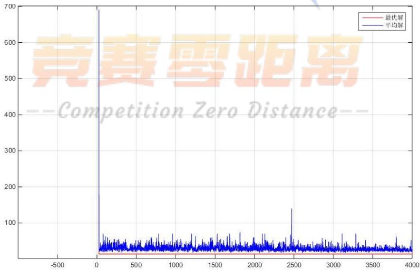
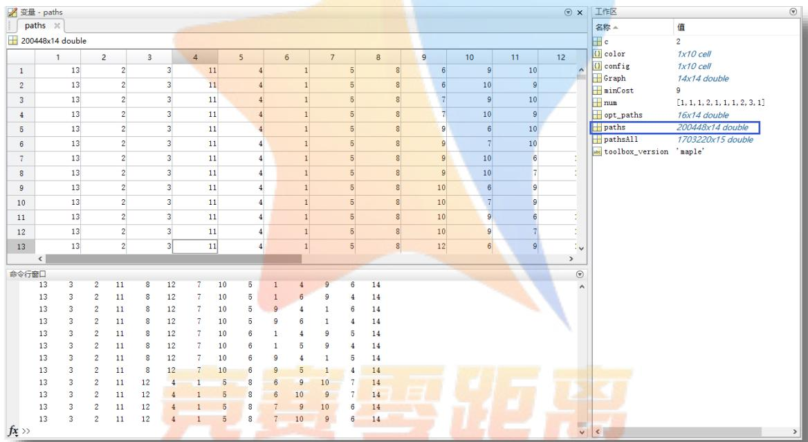
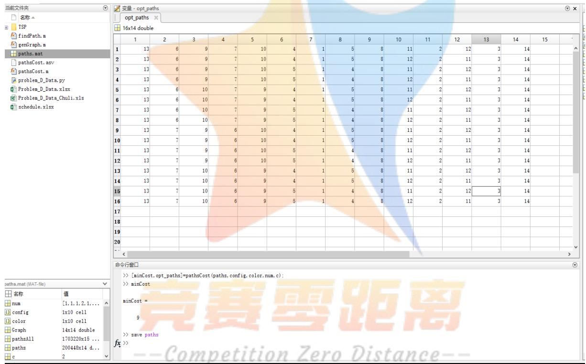
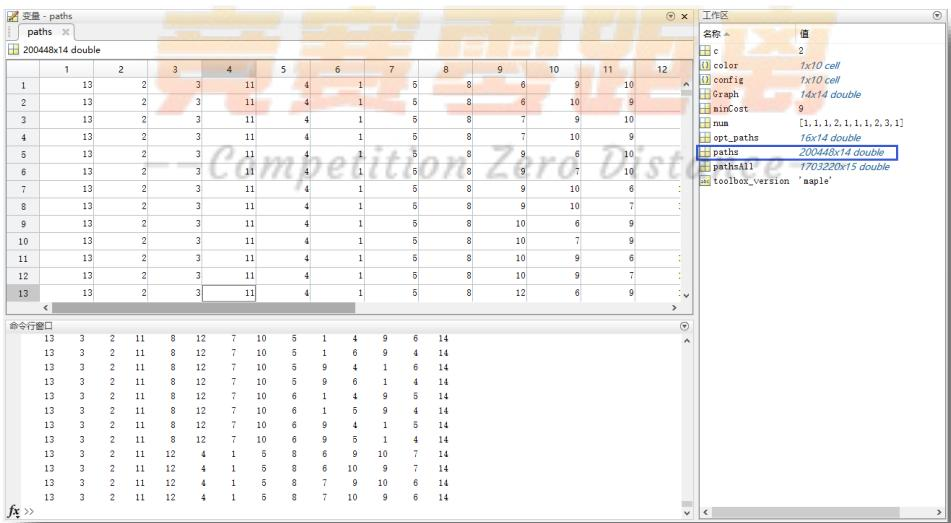
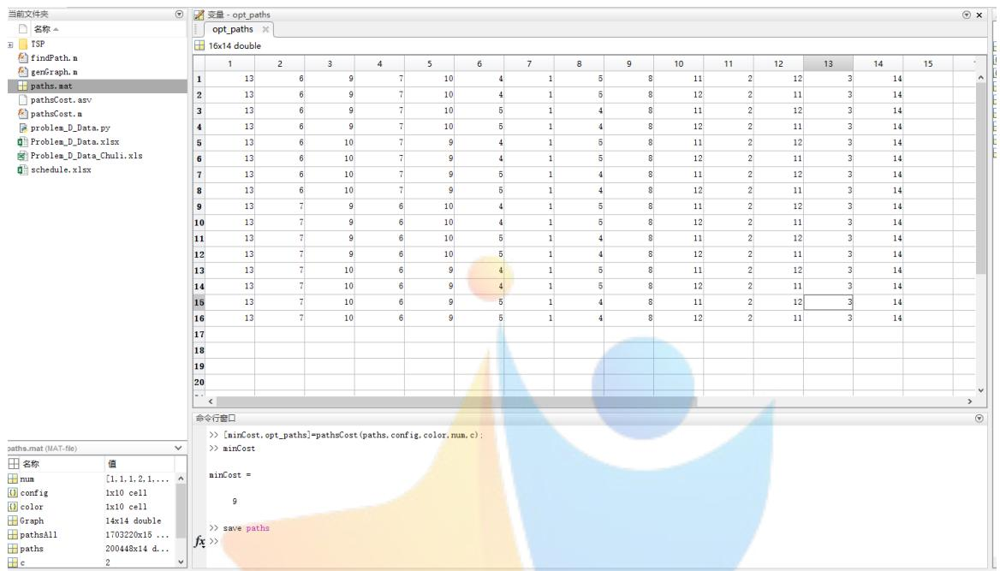

# 汽车总装线配置的优化模型研究

## 摘 要

生产具有品牌、配置、动力、驱动、颜色等属性的多种型号的汽车，对总装线和喷涂线上的装配顺序各项提出了各种不同形式的要求，而且不同的装配顺序造成的生产成本也不尽相同。本文主要通过建立数学模型并设计算法，给出符合生产要求、且具有较低生产成本的装配顺序。

首先是数据处理，使用 python 将原附件数据中的生产计划整理成方便数据读取的规范形式，设计 Excel 表格存储每日的装配顺序，并与生产计划数据联动形成相互校验，保证装配顺序的准确性；

接着，通过分析总装线和喷涂线的各项要求，根据汽车的颜色分类情况，先将黑色的汽车手工填入装配顺序表。在确定一些初值后，减小装配顺序问题求解的搜索规模后，建立生产成本最小优化模型，再使用计算机搜索四驱、柴油汽车等关键属性汽车的位置；

然后，配置白色和棕色等可以连续排列的颜色，此时注意蓝色汽车只能与白色间隔等关键要求，尽可能多地将这些汽车连续地填入装配顺序表；

最后，装配顺序表中通常只含有数量不多的连续空余位置，对应着剩余尚未分配的、颜色成分复杂的汽车。按照颜色是否符合在总装线上排列时的具体要求，将符合颜色衔接要求的汽车作为顶点相互连接起来，构成了一个有向图，装配顺序的问题转化成了图的遍历问题。使用基于遗传算法的 TSP 问题和广度优先搜索算法搜索有向图中经过指定起点和终点的所有路径。采用 Matlab验证各个路径上的特殊颜色能否按顺序分配在指定的 C1或C2喷涂线上，计算各种路径上切换配置和颜色的代价，并且取代价最小的路径填入装配顺序表。

本文在进行充分的理论分析的基础上，综合利用多种计算机工具，在计算结果展示、人工经验介入、计算过程衔接方面取得了较好效果。

关键词：汽车装配顺序 优化模型 邻接矩阵 路径搜索 遗传算法 问题

## 1. 问题的重述

某汽车公司生产以下型号的汽车，每种型号由品牌、配置、动力、驱动、颜色5种属性确定。品牌分为 A1和A2两种，配置分为 B1、B2、B3、B4、B5和B6六种，动力分为汽油和柴油 2种，驱动分为两驱和四驱 2种，颜色分为黑、白、蓝、黄、红、银、棕、灰、金 9种。

公司每天可装配各种型号的汽车 460辆，其中白班、晚班（每班 12小时）各230辆。每天生产各种型号车辆的具体数量根据市场需求和销售情况确定。待装配车辆按一定顺序排成一列，首先匀速通过总装线依次进行总装作业，随后按序分为 C1、C2 线进行喷涂作业。

由于工艺流程的制约和质量控制的需要以及降低成本的考虑，总装和喷涂作业对经过生产线车辆型号有多种要求。

## 1.1 装配要求

1. 每天白班和晚班都是按照先 A1后A2 的品牌顺序，装配当天两种品牌各一半数量的汽车。  
2. 四驱汽车和柴油汽车连续装配数量不得超过 2辆，并且两批之间间隔的汽车的数量至少是 10辆。若间隔数量无法满足要求，仍希望间隔数量越多越好。间隔数量在5-9辆仍是可以接受的，但代价很高。  
3. 黑色汽车连续排列的数量在 50-70辆之间，两批黑色汽车在总装线上需间隔至少20辆。  
4. 装配线上的汽车颜色间隔需要满足一定的规则。

## 1.2 喷涂要求

1. 蓝、黄、红三种颜色汽车的喷涂只能在 C1线上进行，金色汽车的喷涂只能在C2 线上进行。  
2. 喷涂线上不同颜色汽车之间的切换次数尽可能少，黑色汽车与其它颜色的汽车之间的切换代价很高。

## 1.3 需要解决的问题

1. 建立数学模型或者设计算法，使其能给出符合要求、且具有较低生产成本的装配顺序。  
2. 给出9月17 日至9月23日每天的装配顺序。

## 2. 问题的假设

1. 生产成本只是由题目中所指的装配线上不同汽车配置切换、喷涂线上不同汽车颜色的切换构成。汽车配置切换和普通的颜色切换代价设为 1，黑色切换为其他颜色成本耗费较高，设为10。  
2. 在无法满足柴油、四驱汽车的批次间隔 k至少是10的情况下，间隔 k必须大于5，而且间隔越小代价越高，设为 10-k。  
3. 9月23日A1 和A2 品牌数量为奇数，在尽可能均衡的情况下，允许白班和晚班装配的汽车数量相差 1 辆。  
4. 在考虑不同工作日的装配顺序时，总装线和喷涂线的各项要求对当日晚班与次日白班交接同样适用。  
5. 不考虑其他主观或其他题目中未涉及的因素。

## 3. 符号的说明

<table><tr><td>符号</td><td>含义</td></tr><tr><td>I</td><td>A1品牌下标集合,如20日 $I = \{1, \cdots 181, 231, \cdots, 411\}$ </td></tr><tr><td>J</td><td>A2品牌下标集合,如20日 $J = \{182, \cdots 230, 412, \cdots, 460\}$ </td></tr><tr><td> $x_k$ </td><td>k是黑车 $x_k = 1$ ,否则 $x_k = 0$ , $k \in I \cup J$ </td></tr><tr><td> $y_k$ </td><td>k是四驱车 $y_k = 1$ ,否则 $y_k = 0$ , $k \in I \cup J$ </td></tr><tr><td> $z_k$ </td><td>k是柴油车 $z_k = 1$ ,否则 $z_k = 0$ , $k \in I \cup J$ </td></tr></table>

## 4. 问题的分析与数据处理

## 4.1 问题的分析

题目所要解决的最终问题是每天 460个汽车装配的顺序，初步估算寻求可行解的问题规模，460 的阶乘是一个1027位数。即使可以设计精巧的约束条件建立通用的数学模型，但在使用计算机搜索可行解时可能会遇到无法及时给出答案的问题。

通过分析9月 17日至9月23日每天的生产计划可以发现，所产汽车的颜色可以分为黑色、白色与棕色、其他数量较少的颜色等三种情况。根据总装线和喷涂线的各项要求，这几种颜色的汽车有着如下的不同特征：

 黑色汽车需要连续生产，尽量不要与其他颜色切换，除非付出较高代价切换成其他颜色  
 白色、银色、灰色或棕色可以连续排列且有时数量较多，特别是棕色可以与许多的其他颜色切换  
 其他颜色数量较少，却有复杂的切换规则

根据以上特征，尝试以下逐步按顺序求解的过程

首先，手动排黑色汽车的装配位置，此时尽可能按顺序排列相同配置的汽车，在确定一些初值后，再使用计算机搜索四驱、柴油汽车等较少量的特殊属性汽车的位置；

接着，配置白色和棕色等可以连续排列的颜色，此时注意蓝色汽车只能与白色间隔；

最后，剩余未确定配置顺序的颜色数量较少，并且因为以上两步都是连续排列的，只需将它们按一定的顺序排在剩余的连续空间内，可以使用计算机直接搜索可能的顺序。

## 4.2 数据处理

以上过程需要计算机搜索和手工介入同步进行，需要设计合适的表格对数据整理。

python 中的模块 xlwt 和xlrd 可以方便快捷地读写、操纵 excel 单元格，将附件“CUMCM-2018-Problem-D-Chinese-Appendix.xlsx”中的生产计划数据整理成规范形式，程序文件名“problem\_D\_Data.py”， 具体见附件1-2。设计有关表格如下。

表1是使用python 整理得到的生产计划表（数据文件夹中 excel 文件“schedule.xlsx”的“sheet1”表单），列举了每日所有不同种类汽车的生产数量，添加的最后一列“装配剩余”使用以下公式，统计还没安排装配顺序的剩余汽车数量（以9月17日为例）。

```javascript
H2=G2-COUNTIFS('9.17'!A:A, sheet1!A2, '9.17'!C:C, sheet1!B2, '9.17'!D:D, sheet1!C2,'9.17'!E:E, sheet1!D2, '9.17'!F:F, sheet1!E2, '9.17'!G:G,sheet1!F2)
```

表 1 生产计划表

<table><tr><td></td><td>A</td><td>B</td><td>C</td><td>D</td><td>E</td><td>F</td><td>G</td><td>H</td></tr><tr><td>1</td><td>日期</td><td>品牌</td><td>配置</td><td>动力</td><td>驱动</td><td>颜色</td><td>数量</td><td>装配剩余</td></tr><tr><td>2</td><td>2018/9/17</td><td>A1</td><td>B1</td><td>汽油</td><td>四驱</td><td>白</td><td>2</td><td>0</td></tr><tr><td>3</td><td>2018/9/17</td><td>A1</td><td>B3</td><td>汽油</td><td>四驱</td><td>白</td><td>4</td><td>0</td></tr><tr><td>4</td><td>2018/9/17</td><td>A1</td><td>B1</td><td>汽油</td><td>四驱</td><td>黑</td><td>3</td><td>0</td></tr><tr><td>5</td><td>2018/9/17</td><td>A1</td><td>B2</td><td>汽油</td><td>四驱</td><td>黑</td><td>1</td><td>0</td></tr><tr><td>6</td><td>2018/9/17</td><td>A1</td><td>B3</td><td>汽油</td><td>四驱</td><td>黑</td><td>6</td><td>0</td></tr><tr><td>7</td><td>2018/9/17</td><td>A1</td><td>B1</td><td>汽油</td><td>四驱</td><td>灰</td><td>2</td><td>0</td></tr><tr><td>8</td><td>2018/9/17</td><td>A1</td><td>B1</td><td>汽油</td><td>两驱</td><td>白</td><td>109</td><td>0</td></tr><tr><td>9</td><td>2018/9/17</td><td>A1</td><td>B2</td><td>汽油</td><td>两驱</td><td>白</td><td>27</td><td>0</td></tr><tr><td>10</td><td>2018/9/17</td><td>A1</td><td>B5</td><td>汽油</td><td>两驱</td><td>白</td><td>3</td><td>0</td></tr><tr><td>11</td><td>2018/9/17</td><td>A1</td><td>B1</td><td>汽油</td><td>两驱</td><td>黑</td><td>101</td><td>0</td></tr><tr><td>12</td><td>2018/9/17</td><td>A1</td><td>B2</td><td>汽油</td><td>两驱</td><td>黑</td><td>75</td><td>0</td></tr><tr><td>13</td><td>2018/9/17</td><td>A1</td><td>B3</td><td>汽油</td><td>两驱</td><td>黑</td><td>2</td><td>0</td></tr><tr><td>14</td><td>2018/9/17</td><td>A1</td><td>B5</td><td>汽油</td><td>两驱</td><td>黑</td><td>2</td><td>0</td></tr><tr><td>15</td><td>2018/9/17</td><td>A1</td><td>B1</td><td>汽油</td><td>两驱</td><td>红</td><td>2</td><td>0</td></tr><tr><td>16</td><td>2018/9/17</td><td>A1</td><td>B2</td><td>汽油</td><td>两驱</td><td>红</td><td>1</td><td>0</td></tr><tr><td>17</td><td>2018/9/17</td><td>A1</td><td>B1</td><td>汽油</td><td>两驱</td><td>黄</td><td>4</td><td>0</td></tr><tr><td>18</td><td>2018/9/17</td><td>A1</td><td>B2</td><td>汽油</td><td>两驱</td><td>黄</td><td>1</td><td>0</td></tr><tr><td>19</td><td>2018/9/17</td><td>A1</td><td>B1</td><td>汽油</td><td>两驱</td><td>灰</td><td>8</td><td>0</td></tr><tr><td>20</td><td>2018/9/17</td><td>A1</td><td>B2</td><td>汽油</td><td>两驱</td><td>灰</td><td>1</td><td>0</td></tr><tr><td>21</td><td>2018/9/17</td><td>A1</td><td>B1</td><td>汽油</td><td>两驱</td><td>蓝</td><td>3</td><td>0</td></tr><tr><td>22</td><td>2018/9/17</td><td>A1</td><td>B1</td><td>汽油</td><td>两驱</td><td>银</td><td>4</td><td>0</td></tr><tr><td>23</td><td>2018/9/17</td><td>A1</td><td>B2</td><td>汽油</td><td>两驱</td><td>银</td><td>1</td><td>0</td></tr><tr><td>24</td><td>2018/9/17</td><td>A1</td><td>B3</td><td>汽油</td><td>两驱</td><td>银</td><td>1</td><td>0</td></tr><tr><td>25</td><td>2018/9/17</td><td>A1</td><td>B5</td><td>汽油</td><td>两驱</td><td>银</td><td>1</td><td>0</td></tr><tr><td>26</td><td>2018/9/17</td><td>A2</td><td>B1</td><td>汽油</td><td>四驱</td><td>白</td><td>2</td><td>0</td></tr><tr><td>27</td><td>2018/9/17</td><td>A2</td><td>B1</td><td>汽油</td><td>四驱</td><td>黑</td><td>9</td><td>0</td></tr><tr><td>28</td><td>2018/9/17</td><td>A2</td><td>B5</td><td>汽油</td><td>四驱</td><td>黑</td><td>1</td><td>0</td></tr><tr><td>29</td><td>2018/9/17</td><td>A2</td><td>B4</td><td>汽油</td><td>两驱</td><td>白</td><td>3</td><td>0</td></tr></table>

表 2 是 9 月 17 日的装配顺序（数据文件夹中 excel 文件“schedule.xlsx”的“9.17”表单，其他日期的表单类似），在喷涂线后添加了“装配代价”、“喷涂代价”、“其他代价”、“总代价”、“装配校验”、“喷涂校对”等列，对应公式和作用如下

 装配代价：统计同一品牌下，装配线上不同汽车配置切换代价

$$
\mathrm{I} 5 = \mathrm{IF} (\mathrm{C} 5 = \mathrm{C} 4, 1, \theta) * \mathrm{IF} (\mathrm{D} 5 <   > \mathrm{D} 4, 1, \theta)
$$

 喷涂代价：统计喷涂线上的颜色切换代价，其中黑色切换为 10J5=IF(G3="黑",10,1)\*IF(G5<>G3,1,0)

 其他代价：柴油和四驱汽车的批次间隔 k小于10，代价为 10-k特殊情况

 总代价：累计以上三种代价

$$
\mathrm{L} 2 = \text {SUMIF} (\mathrm{A}: \mathrm{A}, \mathrm{A} 2, \mathrm{I}: \mathrm{I}) + \text {SUMIF} (\mathrm{A}: \mathrm{A}, \mathrm{A} 2, \mathrm{J}: \mathrm{J}) + \text {SUMIF} (\mathrm{A}: \mathrm{A}, \mathrm{A} 2, \mathrm{K}: \mathrm{K})
$$

装配校对：校对装配顺序中的配置是否是出现在计划表中的有效配置O5=COUNTIFS(sheet1!A:A,'9.17'!A5,sheet1!B:B,'9.17'!C5,sheet1!C:C,'9.17'!D5,sheet1!D:D,'9.17'!E5,sheet1!E:E,'9.17'!F5,sheet1!F:F,'9.17'!G5)  
 喷涂校对：校对装配顺序上的汽车是否交替分配到喷涂线 C1 和C2上P5=IF(H5=H3,1,0)

表 2 9 月 17 日的装配顺序

<table><tr><td>A</td><td>B</td><td>C</td><td>D</td><td>E</td><td>F</td><td>G</td><td>H</td><td>I</td><td>J</td><td>K</td><td>L</td><td>O</td><td>P</td></tr><tr><td>日期</td><td>装配顺</td><td>品牌</td><td>配置</td><td>动力</td><td>驱动</td><td>颜色</td><td>喷涂线</td><td>装配代</td><td>喷涂代</td><td>其他代</td><td>总代价</td><td>装配校</td><td>喷涂校对</td></tr><tr><td>2018/9/17</td><td>1</td><td>A1</td><td>B1</td><td>汽油</td><td>四驱</td><td>黑</td><td>C2</td><td></td><td></td><td></td><td>171</td><td>1</td><td></td></tr><tr><td>2018/9/17</td><td>2</td><td>A1</td><td>B1</td><td>汽油</td><td>四驱</td><td>黑</td><td>C1</td><td>0</td><td></td><td></td><td></td><td>1</td><td></td></tr><tr><td>2018/9/17</td><td>3</td><td>A1</td><td>B1</td><td>汽油</td><td>两驱</td><td>黑</td><td>C2</td><td>0</td><td>0</td><td></td><td></td><td>1</td><td>1</td></tr><tr><td>2018/9/17</td><td>4</td><td>A1</td><td>B1</td><td>汽油</td><td>两驱</td><td>黑</td><td>C1</td><td>0</td><td>0</td><td></td><td></td><td>1</td><td>1</td></tr><tr><td>2018/9/17</td><td>5</td><td>A1</td><td>B1</td><td>汽油</td><td>两驱</td><td>黑</td><td>C2</td><td>1</td><td>0</td><td></td><td></td><td>1</td><td>1</td></tr><tr><td>2018/9/17</td><td>6</td><td>A1</td><td>B1</td><td>汽油</td><td>两驱</td><td>黑</td><td>C1</td><td>0</td><td>0</td><td></td><td></td><td>1</td><td>1</td></tr><tr><td>2018/9/17</td><td>7</td><td>A1</td><td>B1</td><td>汽油</td><td>两驱</td><td>黑</td><td>C2</td><td>1</td><td>0</td><td></td><td></td><td>1</td><td>1</td></tr><tr><td>2018/9/17</td><td>8</td><td>A1</td><td>B1</td><td>汽油</td><td>两驱</td><td>黑</td><td>C1</td><td>0</td><td>0</td><td></td><td></td><td>1</td><td>1</td></tr><tr><td>2018/9/17</td><td>9</td><td>A1</td><td>B1</td><td>汽油</td><td>两驱</td><td>黑</td><td>C2</td><td>0</td><td>0</td><td></td><td></td><td>1</td><td>1</td></tr><tr><td>2018/9/17</td><td>10</td><td>A1</td><td>B1</td><td>汽油</td><td>两驱</td><td>黑</td><td>C1</td><td>0</td><td>0</td><td></td><td></td><td>1</td><td>1</td></tr><tr><td>2018/9/17</td><td>11</td><td>A1</td><td>B1</td><td>汽油</td><td>两驱</td><td>黑</td><td>C2</td><td>0</td><td>0</td><td></td><td></td><td>1</td><td>1</td></tr><tr><td>2018/9/17</td><td>12</td><td>A1</td><td>B1</td><td>汽油</td><td>两驱</td><td>黑</td><td>C1</td><td>0</td><td>0</td><td></td><td></td><td>1</td><td>1</td></tr><tr><td>2018/9/17</td><td>13</td><td>A1</td><td>B2</td><td>汽油</td><td>四驱</td><td>黑</td><td>C2</td><td>0</td><td>0</td><td></td><td></td><td>1</td><td>1</td></tr><tr><td>2018/9/17</td><td>14</td><td>A1</td><td>B1</td><td>汽油</td><td>四驱</td><td>黑</td><td>C1</td><td>0</td><td>0</td><td></td><td></td><td>1</td><td>1</td></tr><tr><td>2018/9/17</td><td>15</td><td>A1</td><td>B1</td><td>汽油</td><td>两驱</td><td>黑</td><td>C2</td><td>0</td><td>0</td><td></td><td></td><td>1</td><td>1</td></tr><tr><td>2018/9/17</td><td>16</td><td>A1</td><td>B1</td><td>汽油</td><td>两驱</td><td>黑</td><td>C1</td><td>0</td><td>0</td><td></td><td></td><td>1</td><td>1</td></tr><tr><td>2018/9/17</td><td>17</td><td>A1</td><td>B1</td><td>汽油</td><td>两驱</td><td>黑</td><td>C2</td><td>1</td><td>0</td><td></td><td></td><td>1</td><td>1</td></tr><tr><td>2018/9/17</td><td>18</td><td>A1</td><td>B1</td><td>汽油</td><td>两驱</td><td>黑</td><td>C1</td><td>0</td><td>0</td><td></td><td></td><td>1</td><td>1</td></tr><tr><td>2018/9/17</td><td>19</td><td>A1</td><td>B1</td><td>汽油</td><td>两驱</td><td>黑</td><td>C2</td><td>1</td><td>0</td><td></td><td></td><td>1</td><td>1</td></tr><tr><td>2018/9/17</td><td>20</td><td>A1</td><td>B1</td><td>汽油</td><td>两驱</td><td>黑</td><td>C1</td><td>0</td><td>0</td><td></td><td></td><td>1</td><td>1</td></tr><tr><td>2018/9/17</td><td>21</td><td>A1</td><td>B1</td><td>汽油</td><td>两驱</td><td>黑</td><td>C2</td><td>0</td><td>0</td><td></td><td></td><td>1</td><td>1</td></tr><tr><td>2018/9/17</td><td>22</td><td>A1</td><td>B1</td><td>汽油</td><td>两驱</td><td>黑</td><td>C1</td><td>0</td><td>0</td><td></td><td></td><td>1</td><td>1</td></tr><tr><td>2018/9/17</td><td>23</td><td>A1</td><td>B1</td><td>汽油</td><td>两驱</td><td>黑</td><td>C2</td><td>0</td><td>0</td><td></td><td></td><td>1</td><td>1</td></tr><tr><td>2018/9/17</td><td>24</td><td>A1</td><td>B1</td><td>汽油</td><td>两驱</td><td>黑</td><td>C1</td><td>0</td><td>0</td><td></td><td></td><td>1</td><td>1</td></tr><tr><td>2018/9/17</td><td>25</td><td>A1</td><td>B3</td><td>汽油</td><td>四驱</td><td>黑</td><td>C2</td><td>0</td><td>0</td><td></td><td></td><td>1</td><td>1</td></tr><tr><td>2018/9/17</td><td>26</td><td>A1</td><td>B3</td><td>汽油</td><td>四驱</td><td>黑</td><td>C1</td><td>0</td><td>0</td><td></td><td></td><td>1</td><td>1</td></tr><tr><td>2018/9/17</td><td>27</td><td>A1</td><td>B1</td><td>汽油</td><td>两驱</td><td>黑</td><td>C2</td><td>0</td><td>0</td><td></td><td></td><td>1</td><td>1</td></tr><tr><td>2018/9/17</td><td>28</td><td>A1</td><td>B1</td><td>汽油</td><td>两驱</td><td>黑</td><td>C1</td><td>0</td><td>0</td><td></td><td></td><td>1</td><td>1</td></tr><tr><td>2018/9/17</td><td>29</td><td>A1</td><td>B1</td><td>汽油</td><td>两驱</td><td>黑</td><td>C2</td><td>1</td><td>0</td><td></td><td></td><td>1</td><td>1</td></tr><tr><td>2018/9/17</td><td>30</td><td>A1</td><td>B1</td><td>汽油</td><td>两驱</td><td>黑</td><td>C1</td><td>0</td><td>0</td><td></td><td></td><td>1</td><td>1</td></tr><tr><td>2018/9/17</td><td>31</td><td>A1</td><td>B1</td><td>汽油</td><td>两驱</td><td>黑</td><td>C2</td><td>1</td><td>10</td><td></td><td></td><td>1</td><td>1</td></tr><tr><td>2018/9/17</td><td>32</td><td>A1</td><td>B1</td><td>汽油</td><td>两驱</td><td>黑</td><td>C1</td><td>0</td><td>10</td><td></td><td></td><td>1</td><td>1</td></tr><tr><td>2018/9/17</td><td>33</td><td>A1</td><td>B1</td><td>汽油</td><td>两驱</td><td>黑</td><td>C2</td><td>0</td><td>0</td><td></td><td></td><td>1</td><td>1</td></tr><tr><td>2018/9/17</td><td>34</td><td>A1</td><td>B1</td><td>汽油</td><td>两驱</td><td>黑</td><td>C1</td><td>0</td><td>1</td><td></td><td></td><td>1</td><td>1</td></tr><tr><td>2018/9/17</td><td>35</td><td>A1</td><td>B1</td><td>汽油</td><td>两驱</td><td>黑</td><td>C2</td><td>0</td><td>0</td><td></td><td></td><td>1</td><td>1</td></tr></table>

上述设计的表格在整理装配情况、手工介入搜索、导入计算结果过程中发挥重要作用。

## 5. 模型的建立与问题的求解

## 5.1 生产成本优化模型

根据上一节中的问题分析，建立如下有关四驱、柴油汽车装配问题约束。

## 1. 各类汽车数量约束

$y _ { k }$ 表示装配顺序�是否是四驱汽车，则以下公式分别表示

A1黑色四驱： $\sum _ { i \in I } x _ { i } y _ { i }$

A2黑色四驱： $\sum _ { j \in J } x _ { j } y _ { j }$

A1非黑色四驱： $\sum _ { i \in I } ( 1 - x _ { i } ) y _ { i }$

A2非黑色四驱： $\sum _ { j \in J } { ( 1 - x _ { j } ) y _ { j } }$ （1）

$z _ { k }$ 表示装配顺序�是否是柴油动力汽车，则以下公式分别表示

A1 柴油汽车： $\sum _ { i \in I } z _ { i }$

A2 柴油汽车： $\sum _ { j \in J } z _ { j }$

A1黑色柴油汽车： $\sum _ { i \in I } x _ { i } z _ { i }$

A2 黑色柴油汽车： $\sum _ { j \in J } x _ { j } z _ { j }$ （2）

A1柴油四驱： $\sum _ { i \in I } y _ { i } z _ { i }$

A2柴油四驱： $\sum _ { j \in J } y _ { j } z _ { j }$

## 2. 柴油和四驱汽车连续排列不能超过两个

如果 $y _ { k } = 1$ 表示装配顺序�是四驱汽车，可以通过 $y _ { k }$ 在�前后连续 3个取值的和来约束四驱汽车连续排列不能超过两个，即如果 $y _ { k } = 1$ $\sum _ { t = k - 1 } ^ { k + 1 } y _ { t } \ \leq \ 2$ $k = 2 , \cdots , 4 5 9$ ，可以验证其等价于

$$
3 - \sum_ {t = k - 1} ^ {k + 1} y _ {t} \geq y _ {k}, k = 2, \dots , 4 5 9 \tag {3}
$$

同理，可以将柴油汽车连续排列不能超过两个表示为

$$
3 - \sum_ {t = k - 1} ^ {k + 1} z _ {t} \geq z _ {k}, k = 2, \dots , 4 5 9 \tag {4}
$$

## 3. 柴油和四驱汽车批次间隔约束

可以使用 $1 - y _ { k }$ 连续取值的和表示相邻批次的四驱汽车的间隔，如下表述批次间隔至少为10

$$
\sum_ {t = k - 1 1} ^ {k} (1 - y _ {t}) \geq 1 0, k = 1 2, \dots , 4 6 0 \tag {5}
$$

同理，可以将柴油汽车相邻批次的间隔不少于 10表示为

$$
\sum_ {t = k - 1 1} ^ {k} (1 - z _ {t}) \geq 1 0, k = 1 2, \dots , 4 6 0 \tag {6}
$$

## 4. 生产成本最小的目标函数

如果无法满足柴油和四驱汽车的批次间隔 k至少是10的情况下，间隔k必须大于5，代价为10-k，上面（5-6）变为

$$
\sum_ {t = k - 6} ^ {k} (1 - y _ {t}) \geq 5, \quad \sum_ {t = k - 6} ^ {k} (1 - z _ {t}) \geq 5, k = 7, \dots , 4 6 0 \tag {7}
$$

此时，成本最小的目标函数可以表示为

$$
\mathrm{MIN} = \sum_ {k = 1 2} ^ {4 6 0} \left[ y _ {k} \left(1 0 - \sum_ {t = k - 1 1} ^ {k} (1 - y _ {t})\right) + z _ {k} \left(1 0 - \sum_ {t = k - 1 1} ^ {k} (1 - z _ {t})\right) \right] \tag {8}
$$

由上述（1-8），可以得到生产成本最小的优化模型如下

$$
\mathrm{MIN} = \sum_ {k = 1 2} ^ {4 6 0} \left[ y _ {k} \left(1 0 - \sum_ {t = k - 1 1} ^ {k} \left(1 - y _ {t}\right)\right) + z _ {k} \left(1 0 - \sum_ {t = k - 1 1} ^ {k} \left(1 - z _ {t}\right)\right) \right]
$$

S.T. A1黑色四驱 $\vdots = \sum _ { i \in I } x _ { i } y _ { i }$ A2 黑色四 $\varPsi \varXi = \sum _ { j \in J } x _ { j } y _ { j }$

A1非黑色四驱 $= \sum _ { i \in I } { ( 1 - x _ { i } ) y _ { i } }$ A2 非黑色四驱 $= \sum _ { j \in J } ( 1 - x _ { j } ) y _ { j }$  
A1柴油汽车= $: \sum _ { i \in I } z _ { i }$ A2 柴油汽车 $\vdots \sum _ { j \in J } z _ { j }$  
A1黑色柴油汽车= $: \sum _ { i \in I } x _ { i } z _ { i }$ A2 黑色柴油汽 $\ddag { \cdot } { = } \sum _ { j \in J } x _ { j } z _ { j }$  
A1柴油四驱 $\displaystyle \mathop { = } \sum _ { i \in I } y _ { i } z _ { i }$ A2 柴油四驱 $= \sum _ { j \in J } y _ { j } z _ { j }$

$$
3 - \sum_ {t = k - 1} ^ {k + 1} y _ {t} \geq y _ {k}, 3 - \sum_ {t = k - 1} ^ {k + 1} z _ {t} \geq z _ {k}, k = 2, \dots , 4 5 9
$$

$$
\sum_ {t = k - 6} ^ {k} (1 - y _ {t}) \geq 5, \quad \sum_ {t = k - 6} ^ {k} (1 - z _ {t}) \geq 5, \quad k = 7, \dots , 4 6 0
$$

需要指出的是，上述模型没有约束黑色汽车的配置顺序和成本，这需要手工排入，并且注意优先按顺序排入相同配置的汽车。使用数据处理中设计的Excel 表格，尽可能多地事先按顺序确定各类汽车配置顺序，然后将初值带入上述生产成本优化模型进行求解，相关程序见附件-3，结合手工介入的调整，可以得到如图1所示的 9月17日-9月23日部分装配顺序，相关结果记录在“schedule.xlsx”表单中。

9 月 17 日

<table><tr><td colspan="101">A1</td><td></td><td></td><td></td></tr><tr><td></td><td></td><td></td><td></td><td></td><td></td><td></td><td></td><td></td><td></td><td></td><td></td><td></td><td></td><td></td><td></td><td></td><td></td><td></td><td></td><td></td><td></td><td></td><td></td><td></td><td></td><td></td><td></td><td></td><td></td><td></td><td></td><td></td><td></td><td></td><td></td><td></td><td></td><td></td><td></td><td></td><td></td><td></td><td></td><td></td><td></td><td></td><td></td><td></td><td></td><td></td><td></td><td></td><td></td><td></td><td></td><td></td><td></td><td></td><td></td><td></td><td></td><td></td><td></td><td></td><td></td><td></td><td></td><td></td><td></td><td></td><td></td><td></td><td></td><td></td><td></td><td></td><td></td><td></td><td></td><td></td><td></td><td></td><td></td><td></td><td></td><td></td><td></td><td></td><td></td><td></td><td></td><td></td><td></td><td></td><td></td><td></td><td></td><td></td><td></td><td></td><td></td><td></td><td></td></tr><tr><td rowspan="2">四</td><td rowspan="2">四</td><td rowspan="2">10</td><td rowspan="2">四</td><td rowspan="2">四</td><td rowspan="2">10</td><td rowspan="2">四</td><td rowspan="2">四</td><td rowspan="2">10</td><td rowspan="2">四</td><td rowspan="2">四</td><td rowspan="2">10</td><td rowspan="2">四</td><td rowspan="2">四</td><td>路径搜索</td><td></td><td></td><td></td><td></td><td></td><td></td><td></td><td></td><td></td><td></td><td></td><td></td><td></td><td></td><td></td><td></td><td></td><td></td><td></td><td></td><td></td><td></td><td></td><td></td><td></td><td></td><td></td><td></td><td></td><td></td><td></td><td></td><td></td><td></td><td></td><td></td><td></td><td></td><td></td><td></td><td></td><td></td><td></td><td></td><td></td><td></td><td></td><td></td><td></td><td></td><td></td><td></td><td></td><td></td><td></td><td></td><td></td><td></td><td></td><td></td><td></td><td></td><td></td><td></td><td></td><td></td><td></td><td></td><td></td><td></td><td></td><td></td><td></td><td></td><td></td><td></td><td></td><td></td><td></td><td></td><td></td><td></td><td></td><td></td><td></td><td></td><td></td><td></td><td></td></tr><tr><td>12</td><td>四</td><td>四</td><td>5</td><td></td><td></td><td></td><td></td><td></td><td></td><td></td><td></td><td></td><td></td><td></td><td></td><td></td><td></td><td></td><td></td><td></td><td></td><td></td><td></td><td></td><td></td><td></td><td></td><td></td><td></td><td></td><td></td><td></td><td></td><td></td><td></td><td></td><td></td><td></td><td></td><td></td><td></td><td></td><td></td><td></td><td></td><td></td><td></td><td></td><td></td><td></td><td></td><td></td><td></td><td></td><td></td><td></td><td></td><td></td><td></td><td></td><td></td><td></td><td></td><td></td><td></td><td></td><td></td><td></td><td></td><td></td><td></td><td></td><td></td><td></td><td></td><td></td><td></td><td></td><td></td><td></td><td></td><td></td><td></td><td></td><td></td><td></td><td></td><td></td><td></td></tr><tr><td></td><td></td><td></td><td></td><td></td><td></td><td></td><td></td><td></td><td></td><td></td><td></td><td></td><td></td><td>灰</td><td>灰</td><td></td><td></td><td>银</td><td>银</td><td>银</td><td>银</td><td>银</td><td>银</td><td>银</td><td></td><td></td><td></td><td></td><td></td><td></td><td></td><td>蓝</td><td>蓝</td><td>蓝</td><td>蓝</td><td></td><td></td><td></td><td></td><td></td><td></td><td></td><td></td><td></td><td></td><td></td><td></td><td></td><td></td><td></td><td></td><td></td><td></td><td></td><td></td><td></td><td></td><td></td><td></td><td></td><td></td><td></td><td></td><td></td><td></td><td></td><td></td><td></td><td></td><td></td><td></td><td></td><td></td><td></td><td></td><td></td><td></td><td></td><td></td><td></td><td></td><td></td><td></td><td></td><td></td><td></td><td></td><td></td><td></td><td></td><td></td><td></td><td></td><td></td><td></td><td></td><td></td><td></td><td></td><td></td><td></td><td></td><td></td></tr></table>

9 月 18 日

<table><tr><td colspan="101">A1</td><td></td><td></td></tr><tr><td colspan="100"></td><td></td><td></td><td></td></tr><tr><td>路径搜索</td><td></td><td></td><td></td><td></td><td></td><td></td><td></td><td></td><td></td><td></td><td></td><td></td><td></td><td></td><td></td><td></td><td></td><td></td><td></td><td></td><td></td><td></td><td></td><td></td><td></td><td></td><td></td><td></td><td></td><td></td><td></td><td></td><td></td><td></td><td></td><td></td><td></td><td></td><td></td><td></td><td></td><td></td><td></td><td></td><td></td><td></td><td></td><td></td><td></td><td></td><td></td><td></td><td></td><td></td><td></td><td></td><td></td><td></td><td></td><td></td><td></td><td></td><td></td><td></td><td></td><td></td><td></td><td></td><td></td><td></td><td></td><td></td><td></td><td></td><td></td><td></td><td></td><td></td><td></td><td></td><td></td><td></td><td></td><td></td><td></td><td></td><td></td><td></td><td></td><td></td><td></td><td></td><td></td><td></td><td></td><td></td><td></td><td></td><td></td><td></td><td></td><td></td></tr><tr><td>12</td><td></td><td></td><td></td><td></td><td></td><td></td><td></td><td></td><td></td><td></td><td></td><td></td><td></td><td></td><td></td><td></td><td></td><td></td><td></td><td></td><td></td><td></td><td></td><td></td><td></td><td></td><td></td><td></td><td></td><td></td><td></td><td></td><td></td><td></td><td></td><td></td><td></td><td></td><td></td><td></td><td></td><td></td><td></td><td></td><td></td><td></td><td></td><td></td><td></td><td></td><td></td><td></td><td></td><td></td><td></td><td></td><td></td><td></td><td></td><td></td><td></td><td></td><td></td><td></td><td></td><td></td><td></td><td></td><td></td><td></td><td></td><td></td><td></td><td></td><td></td><td></td><td></td><td></td><td></td><td></td><td></td><td></td><td></td><td></td><td></td><td></td><td></td><td></td><td></td><td></td><td></td><td></td><td></td><td></td><td></td><td></td><td></td><td></td><td></td><td>柴</td><td></td><td></td></tr><tr><td></td><td colspan="100">银灰银灰银灰银灰银灰灰红灰银</td><td>棕</td><td>棕</td></tr></table>

9 月 19 日

<table><tr><td colspan="101">A1</td><td></td><td></td><td></td><td></td><td></td></tr><tr><td></td><td></td><td></td><td></td><td></td><td></td><td></td><td></td><td></td><td></td><td></td><td></td><td></td><td></td><td></td><td></td><td></td><td></td><td></td><td></td><td></td><td></td><td></td><td></td><td></td><td></td><td></td><td></td><td></td><td></td><td></td><td></td><td></td><td></td><td></td><td></td><td></td><td></td><td></td><td></td><td></td><td></td><td></td><td></td><td></td><td></td><td></td><td></td><td></td><td></td><td></td><td></td><td></td><td></td><td></td><td></td><td></td><td></td><td></td><td></td><td></td><td></td><td></td><td></td><td></td><td></td><td></td><td></td><td></td><td></td><td></td><td></td><td></td><td></td><td></td><td></td><td></td><td></td><td></td><td></td><td></td><td></td><td></td><td></td><td></td><td></td><td></td><td></td><td></td><td></td><td></td><td></td><td></td><td></td><td></td><td></td><td></td><td></td><td></td><td></td><td></td><td></td><td></td><td></td><td></td><td></td></tr><tr><td>10</td><td>四</td><td>四</td><td>10</td><td>四</td><td>四</td><td>10</td><td>四</td><td>15</td><td>四</td><td>17</td><td>57</td><td></td><td></td><td></td><td>柴</td><td>柴</td><td></td><td></td><td></td><td></td><td></td><td></td><td></td><td></td><td></td><td></td><td></td><td></td><td></td><td></td><td></td><td></td><td></td><td></td><td></td><td></td><td></td><td></td><td></td><td></td><td></td><td></td><td></td><td></td><td></td><td></td><td></td><td></td><td></td><td></td><td></td><td></td><td></td><td></td><td></td><td></td><td></td><td></td><td></td><td></td><td></td><td></td><td></td><td></td><td></td><td></td><td></td><td></td><td></td><td></td><td></td><td></td><td></td><td></td><td></td><td></td><td></td><td></td><td></td><td></td><td></td><td></td><td></td><td></td><td></td><td></td><td></td><td></td><td></td><td></td><td></td><td></td><td></td><td></td><td></td><td></td><td></td><td></td><td></td><td></td><td></td><td></td><td></td><td></td><td></td></tr><tr><td colspan="100"></td><td></td><td></td><td></td><td></td><td></td><td></td></tr></table>

9 月 20 日

<table><tr><td colspan="27">A1</td><td colspan="101">A2</td><td colspan="100">A1</td><td></td><td></td><td></td><td></td><td></td><td></td><td></td><td></td><td></td><td></td><td></td><td></td><td></td><td></td><td></td><td></td><td></td><td></td><td></td><td></td><td></td><td></td><td></td><td></td><td></td><td></td><td></td><td></td><td></td><td></td><td></td><td></td><td></td><td></td><td></td><td></td><td></td><td></td><td></td><td></td><td></td><td></td><td></td><td></td><td></td><td></td><td></td><td></td><td></td><td></td><td></td><td></td><td></td></tr><tr><td></td><td></td><td></td><td></td><td></td><td></td><td></td><td></td><td></td><td></td><td></td><td></td><td></td><td></td><td></td><td></td><td></td><td></td><td></td><td></td><td></td><td></td><td></td><td></td><td></td><td></td><td></td><td></td><td></td><td></td><td></td><td></td><td></td><td></td><td></td><td></td><td></td><td></td><td></td><td></td><td></td><td></td><td></td><td></td><td></td><td></td><td></td><td></td><td></td><td></td><td></td><td></td><td></td><td></td><td></td><td></td><td></td><td></td><td></td><td></td><td></td><td></td><td></td><td></td><td></td><td></td><td></td><td></td><td></td><td></td><td></td><td></td><td></td><td></td><td></td><td></td><td></td><td></td><td></td><td></td><td></td><td></td><td></td><td></td><td></td><td></td><td></td><td></td><td></td><td></td><td></td><td></td><td></td><td></td><td></td><td></td><td></td><td></td><td></td><td></td><td></td><td></td><td></td><td></td><td></td><td></td><td></td><td></td><td></td><td></td><td></td><td></td><td></td><td></td><td></td><td></td><td></td><td></td><td></td><td></td><td></td><td></td><td></td><td></td><td></td><td></td><td></td><td></td><td></td><td></td><td></td><td></td><td></td><td></td><td></td><td></td><td></td><td></td><td></td><td></td><td></td><td></td><td></td><td></td><td></td><td></td><td></td><td></td><td></td><td></td><td></td><td></td><td></td><td></td><td></td><td></td><td></td><td></td><td></td><td></td><td></td><td></td><td></td><td></td><td></td><td></td><td></td><td></td><td></td><td></td><td></td><td></td><td></td><td></td><td></td><td></td><td></td><td></td><td></td><td></td><td></td><td></td><td></td><td></td><td></td><td></td><td></td><td></td><td></td><td></td><td></td><td></td><td></td><td></td><td></td><td></td><td></td><td></td><td></td><td></td><td></td><td></td><td></td><td></td><td></td><td></td><td></td><td></td><td></td><td></td><td></td><td></td><td></td><td></td><td></td><td></td><td></td><td></td><td></td><td></td><td></td><td></td><td></td><td></td><td></td><td></td><td></td><td></td><td></td><td></td><td></td><td></td><td></td><td></td><td></td><td></td><td></td><td></td><td></td><td></td><td></td><td></td><td></td><td></td><td></td><td></td><td></td><td></td><td></td><td></td><td></td><td></td><td></td><td></td><td></td><td></td><td></td><td></td><td></td><td></td><td></td><td></td><td></td><td></td><td></td><td></td><td></td><td></td><td></td><td></td><td></td><td></td><td></td><td></td><td></td><td></td><td></td><td></td><td></td><td></td><td></td></tr><tr><td>20</td><td></td><td>四</td><td>四</td><td></td><td>10</td><td></td><td>四</td><td>四</td><td></td><td>10</td><td></td><td>四</td><td>四</td><td></td><td>10</td><td></td><td>四</td><td></td><td>四</td><td></td><td>20</td><td></td><td>3</td><td></td><td></td><td></td><td></td><td></td><td></td><td></td><td></td><td></td><td></td><td></td><td></td><td></td><td></td><td></td><td></td><td></td><td></td><td></td><td></td><td></td><td></td><td></td><td></td><td></td><td></td><td></td><td></td><td></td><td></td><td></td><td></td><td></td><td></td><td></td><td></td><td></td><td></td><td></td><td></td><td></td><td></td><td></td><td></td><td></td><td></td><td></td><td></td><td rowspan="2"></td><td rowspan="2"></td><td rowspan="2"></td><td rowspan="2"></td><td rowspan="2"></td><td rowspan="2"></td><td rowspan="2"></td><td rowspan="2"></td><td rowspan="2"></td><td rowspan="2"></td><td rowspan="2"></td><td rowspan="2"></td><td rowspan="2"></td><td rowspan="2"></td><td rowspan="2"></td><td rowspan="2"></td><td rowspan="3"></td><td rowspan="3"></td><td rowspan="3"></td><td rowspan="3"></td><td rowspan="3"></td><td rowspan="3"></td><td rowspan="3"></td><td rowspan="3"></td><td rowspan="3"></td><td rowspan="3"></td><td rowspan="3"></td><td rowspan="3"></td><td rowspan="3"></td><td rowspan="3"></td><td rowspan="3"></td><td rowspan="3"></td><td rowspan="3"></td><td rowspan="3"></td><td rowspan="3"></td><td rowspan="3"></td><td rowspan="3"></td><td rowspan="3"></td><td rowspan="3"></td><td rowspan="3"></td><td rowspan="3"></td><td rowspan="3"></td><td rowspan="3"></td><td rowspan="3"></td><td rowspan="3"></td><td rowspan="3"></td><td rowspan="3"></td><td rowspan="3"></td><td rowspan="3"></td><td rowspan="3"></td><td rowspan="3"></td><td rowspan="3" colspan="26">路径搜索</td><td rowspan="3"></td><td rowspan="3"></td><td rowspan="3"></td><td rowspan="3"></td><td rowspan="3"></td><td rowspan="3"></td><td rowspan="3"></td><td rowspan="3"></td><td rowspan="3"></td><td rowspan="3"></td><td rowspan="3"></td><td rowspan="3"></td><td rowspan="3"></td><td rowspan="3"></td><td rowspan="3"></td><td rowspan="3"></td><td rowspan="3"></td><td rowspan="3"></td><td rowspan="3"></td><td rowspan="3"></td><td rowspan="3"></td><td rowspan="3"></td><td rowspan="3"></td><td rowspan="3"></td><td rowspan="3"></td><td rowspan="3"></td><td rowspan="3"></td><td rowspan="3"></td><td rowspan="3"></td><td rowspan="3"></td><td rowspan="3"></td><td rowspan="3"></td><td rowspan="3"></td><td rowspan="3"></td><td rowspan="3"></td><td rowspan="3"></td><td rowspan="3"></td><td rowspan="3"></td><td rowspan="2"></td><td rowspan="2"></td><td rowspan="2"></td><td rowspan="2"></td><td rowspan="2"></td><td rowspan="2"></td><td rowspan="2"></td><td rowspan="2"></td><td rowspan="2"></td><td rowspan="2"></td><td rowspan="2"></td><td rowspan="2"></td><td rowspan="2"></td><td rowspan="2"></td><td rowspan="2"></td><td rowspan="2"></td><td rowspan="2"></td><td rowspan="2"></td><td rowspan="2"></td><td rowspan="2"></td><td rowspan="2"></td><td rowspan="2"></td><td rowspan="2"></td><td rowspan="2"></td><td rowspan="2"></td><td rowspan="2"></td><td rowspan="2"></td><td rowspan="2"></td><td rowspan="2"></td><td rowspan="2"></td><td rowspan="2"></td><td rowspan="2"></td><td rowspan="2"></td><td rowspan="2"></td><td rowspan="2"></td><td rowspan="2"></td><td rowspan="2"></td><td rowspan="2"></td><td rowspan="2"></td><td rowspan="2"></td><td rowspan="2"></td><td rowspan="2"></td><td rowspan="2"></td><td rowspan="2"></td><td rowspan="2"></td><td rowspan="2"></td><td rowspan="2"></td><td rowspan="2"></td><td rowspan="2"></td><td rowspan="2"></td><td rowspan="2"></td><td rowspan="2"></td><td rowspan="2"></td><td rowspan="2"></td><td rowspan="2"></td><td rowspan="2"></td><td rowspan="2"></td><td rowspan="2"></td><td rowspan="2"></td><td rowspan="2"></td><td rowspan="2"></td><td rowspan="2"></td><td rowspan="2"></td><td rowspan="2"></td><td rowspan="2"></td><td rowspan="2"></td><td rowspan="2"></td><td rowspan="2"></td><td rowspan="2"></td><td rowspan="2"></td><td rowspan="2"></td><td rowspan="2"></td><td rowspan="2"></td><td rowspan="2"></td><td rowspan="2"></td><td rowspan="2"></td><td rowspan="2"></td><td rowspan="2"></td><td rowspan="2"></td><td rowspan="2"></td><td rowspan="2"></td><td rowspan="2"></td><td rowspan="2"></td><td rowspan="2"></td><td rowspan="2"></td><td></td><td></td><td></td><td></td><td></td><td></td><td></td><td></td><td></td></tr><tr><td></td><td></td><td></td><td></td><td></td><td></td><td></td><td></td><td></td><td></td><td></td><td></td><td></td><td></td><td></td><td></td><td></td><td></td><td></td><td></td><td></td><td></td><td></td><td></td><td></td><td></td><td></td><td></td><td></td><td></td><td></td><td></td><td></td><td></td><td></td><td></td><td></td><td></td><td></td><td></td><td></td><td></td><td></td><td></td><td></td><td></td><td></td><td></td><td></td><td></td><td></td><td></td><td></td><td></td><td></td><td></td><td></td><td></td><td></td><td></td><td></td><td></td><td></td><td></td><td></td><td></td><td></td><td></td><td></td><td></td><td></td><td></td><td></td><td></td><td></td><td></td><td></td><td></td><td></td><td></td><td></td></tr><tr><td></td><td></td><td></td><td></td><td></td><td></td><td></td><td></td><td></td><td></td><td></td><td></td><td></td><td></td><td></td><td></td><td></td><td></td><td></td><td></td><td></td><td></td><td></td><td></td><td></td><td></td><td></td><td></td><td></td><td></td><td></td><td></td><td></td><td></td><td></td><td></td><td></td><td></td><td></td><td></td><td></td><td></td><td></td><td></td><td></td><td></td><td></td><td></td><td></td><td></td><td></td><td></td><td></td><td></td><td></td><td></td><td></td><td></td><td></td><td></td><td></td><td></td><td></td><td></td><td></td><td></td><td></td><td></td><td></td><td></td><td></td><td></td><td></td><td></td><td></td><td></td><td></td><td></td><td></td><td></td><td></td><td></td><td></td><td></td><td></td><td></td><td></td><td></td><td></td><td></td><td></td><td></td><td></td><td></td><td></td><td></td><td></td><td></td><td></td><td></td><td></td><td></td><td></td><td></td><td></td><td></td><td></td><td></td><td></td><td></td><td></td><td></td><td></td><td></td><td></td><td></td><td></td><td></td><td></td><td></td><td></td><td></td><td></td><td></td><td></td><td></td><td></td><td></td><td></td><td></td><td></td><td></td><td></td><td></td><td></td><td></td><td></td><td></td><td></td><td></td><td></td><td></td><td></td><td></td><td></td><td></td><td></td><td></td><td></td><td></td><td></td><td></td><td></td><td></td><td></td><td></td><td></td><td></td><td></td><td></td><td></td><td></td><td></td><td></td><td></td><td></td><td></td><td></td><td></td><td></td><td></td><td></td><td></td><td></td><td></td><td></td><td></td><td></td><td></td><td></td><td></td><td></td></tr></table>

9 月 21 日

<table><tr><td colspan="101">A1</td><td></td><td></td><td></td><td></td><td></td><td></td><td></td><td></td><td></td><td></td><td></td><td></td><td></td><td></td><td></td><td></td><td></td><td></td><td></td><td></td><td></td><td></td><td></td><td></td><td></td></tr><tr><td></td><td></td><td></td><td></td><td></td><td></td><td></td><td></td><td></td><td></td><td></td><td></td><td>路径搜索</td><td></td><td></td><td></td><td></td><td></td><td></td><td></td><td></td><td></td><td></td><td></td><td></td><td></td><td></td><td></td><td></td><td></td><td></td><td></td><td></td><td></td><td></td><td></td><td></td><td></td><td></td><td></td><td></td><td></td><td></td><td></td><td></td><td></td><td></td><td></td><td></td><td></td><td></td><td></td><td></td><td></td><td></td><td></td><td></td><td></td><td></td><td></td><td></td><td></td><td></td><td></td><td></td><td></td><td></td><td></td><td></td><td></td><td></td><td></td><td></td><td></td><td></td><td></td><td></td><td></td><td></td><td></td><td></td><td></td><td></td><td></td><td></td><td></td><td></td><td></td><td></td><td></td><td></td><td></td><td></td><td></td><td></td><td></td><td></td><td></td><td></td><td></td><td></td><td></td><td></td><td></td><td></td><td></td><td></td><td></td><td></td><td></td><td></td><td></td><td></td><td></td><td></td><td></td><td></td><td></td><td></td><td></td><td></td><td></td><td></td><td></td><td></td><td></td></tr><tr><td>10</td><td>四</td><td>四</td><td>10</td><td>四</td><td>10</td><td>四</td><td>四</td><td>25</td><td>12</td><td></td><td></td><td></td><td></td><td></td><td></td><td></td><td></td><td></td><td></td><td></td><td></td><td></td><td></td><td></td><td></td><td></td><td></td><td></td><td></td><td></td><td></td><td></td><td></td><td></td><td></td><td></td><td></td><td></td><td></td><td></td><td></td><td></td><td></td><td></td><td></td><td></td><td></td><td></td><td></td><td></td><td></td><td></td><td></td><td></td><td></td><td></td><td></td><td></td><td></td><td></td><td></td><td></td><td></td><td></td><td></td><td></td><td></td><td></td><td></td><td></td><td></td><td></td><td></td><td></td><td></td><td></td><td></td><td></td><td></td><td></td><td></td><td></td><td></td><td></td><td></td><td></td><td></td><td></td><td></td><td></td><td></td><td></td><td></td><td></td><td></td><td></td><td></td><td></td><td></td><td></td><td></td><td></td><td></td><td></td><td></td><td></td><td></td><td></td><td>7</td><td>3</td><td></td><td></td><td></td><td></td><td></td><td></td><td></td><td></td><td></td><td></td><td></td><td></td><td></td><td></td><td></td></tr><tr><td></td><td></td><td></td><td></td><td></td><td></td><td></td><td></td><td></td><td></td><td></td><td>灰</td><td>灰</td><td>银</td><td>灰</td><td>银</td><td>灰</td><td>银</td><td>灰</td><td>银</td><td>灰</td><td>银</td><td>银</td><td>银</td><td>灰</td><td>黄</td><td>银</td><td>灰</td><td></td><td></td><td></td><td>蓝</td><td></td><td>蓝</td><td></td><td></td><td></td><td></td><td></td><td></td><td></td><td></td><td></td><td></td><td></td><td></td><td></td><td></td><td></td><td></td><td></td><td></td><td></td><td></td><td></td><td></td><td></td><td></td><td></td><td></td><td></td><td></td><td></td><td></td><td></td><td></td><td></td><td></td><td></td><td></td><td></td><td></td><td></td><td></td><td></td><td></td><td></td><td></td><td></td><td></td><td></td><td></td><td></td><td></td><td></td><td></td><td></td><td></td><td></td><td></td><td></td><td></td><td></td><td></td><td></td><td></td><td></td><td></td><td></td><td></td><td></td><td></td><td></td><td></td><td></td><td></td><td></td><td></td><td></td><td></td><td></td><td></td><td></td><td></td><td></td><td></td><td></td><td></td><td></td><td></td><td></td><td></td><td></td><td></td><td></td><td></td></tr></table>

9 月 22 日

<table><tr><td colspan="101">A1</td><td></td><td></td></tr><tr><td></td><td></td><td></td><td></td><td></td><td></td><td></td><td></td><td></td><td></td><td></td><td></td><td></td><td></td><td></td><td></td><td></td><td></td><td></td><td></td><td></td><td></td><td></td><td></td><td></td><td></td><td></td><td></td><td></td><td></td><td></td><td></td><td></td><td></td><td></td><td></td><td></td><td></td><td></td><td></td><td></td><td></td><td></td><td></td><td></td><td></td><td></td><td></td><td></td><td></td><td></td><td></td><td></td><td></td><td></td><td></td><td></td><td></td><td></td><td></td><td></td><td></td><td></td><td></td><td></td><td></td><td></td><td></td><td></td><td></td><td></td><td></td><td></td><td></td><td></td><td></td><td></td><td></td><td></td><td></td><td></td><td></td><td></td><td></td><td></td><td></td><td></td><td></td><td></td><td></td><td></td><td></td><td></td><td></td><td></td><td></td><td></td><td></td><td></td><td></td><td></td><td></td><td></td></tr><tr><td>四</td><td>四</td><td>10</td><td>四</td><td>四</td><td>10</td><td>四</td><td>25</td><td></td><td></td><td></td><td></td><td></td><td></td><td></td><td></td><td></td><td></td><td></td><td></td><td></td><td></td><td></td><td></td><td></td><td></td><td></td><td></td><td></td><td></td><td></td><td></td><td></td><td></td><td></td><td></td><td></td><td></td><td></td><td></td><td></td><td></td><td></td><td></td><td></td><td></td><td></td><td></td><td></td><td></td><td></td><td></td><td></td><td></td><td></td><td></td><td></td><td></td><td></td><td></td><td></td><td></td><td></td><td></td><td></td><td></td><td></td><td></td><td></td><td></td><td></td><td></td><td></td><td></td><td></td><td></td><td></td><td></td><td></td><td></td><td></td><td></td><td></td><td></td><td></td><td></td><td></td><td></td><td></td><td></td><td></td><td></td><td></td><td></td><td></td><td></td><td></td><td></td><td></td><td></td><td></td><td></td><td></td></tr><tr><td></td><td></td><td></td><td></td><td></td><td></td><td></td><td></td><td></td><td></td><td></td><td></td><td></td><td></td><td></td><td></td><td></td><td></td><td></td><td></td><td></td><td></td><td></td><td></td><td></td><td></td><td></td><td></td><td></td><td></td><td></td><td></td><td></td><td></td><td></td><td></td><td></td><td></td><td></td><td></td><td></td><td></td><td></td><td></td><td></td><td></td><td></td><td></td><td></td><td></td><td></td><td></td><td></td><td></td><td></td><td></td><td></td><td></td><td></td><td></td><td></td><td></td><td></td><td></td><td></td><td></td><td></td><td></td><td></td><td></td><td></td><td></td><td></td><td></td><td></td><td></td><td></td><td></td><td></td><td></td><td></td><td></td><td></td><td></td><td></td><td></td><td></td><td></td><td></td><td></td><td></td><td></td><td></td><td></td><td></td><td></td><td></td><td></td><td></td><td></td><td></td><td></td><td></td></tr><tr><td></td><td></td><td>灰红</td><td>灰</td><td>黄</td><td>灰</td><td>红</td><td>灰</td><td>黄</td><td>灰</td><td>红</td><td>灰</td><td>黄</td><td>灰</td><td>黄</td><td>灰</td><td>灰</td><td>灰</td><td>银</td><td>银</td><td>银</td><td>银</td><td>银</td><td>银</td><td>银</td><td>银</td><td>银</td><td>灰</td><td></td><td></td><td></td><td></td><td></td><td></td><td></td><td></td><td></td><td></td><td></td><td></td><td></td><td></td><td></td><td></td><td></td><td></td><td></td><td></td><td></td><td></td><td></td><td></td><td></td><td></td><td></td><td></td><td></td><td></td><td></td><td></td><td></td><td></td><td></td><td></td><td></td><td></td><td></td><td></td><td></td><td></td><td></td><td></td><td></td><td></td><td></td><td></td><td></td><td></td><td></td><td></td><td></td><td></td><td></td><td></td><td></td><td></td><td></td><td></td><td></td><td></td><td></td><td></td><td></td><td></td><td></td><td></td><td></td><td></td><td></td><td></td><td></td><td></td><td></td></tr></table>

9 月 23 日

<table><tr><td colspan="17">A1</td><td colspan="14">A2</td><td colspan="10">A1</td><td colspan="10">A2</td></tr><tr><td></td><td></td><td></td><td></td><td></td><td></td><td></td><td></td><td></td><td></td><td></td><td></td><td></td><td></td><td></td><td></td><td></td><td>柴</td><td>柴</td><td></td><td>柴</td><td>柴</td><td></td><td></td><td>路径搜索</td><td>柴</td><td>柴</td><td></td><td></td><td></td><td></td><td></td><td></td><td></td><td></td><td></td><td></td><td></td><td></td><td></td><td></td><td></td><td>柴</td><td></td><td>柴</td><td>柴</td><td></td><td></td><td></td><td></td><td></td></tr><tr><td>四</td><td>四</td><td>10</td><td>四</td><td>四</td><td>10</td><td>四</td><td>25</td><td></td><td></td><td></td><td></td><td></td><td></td><td></td><td></td><td></td><td>50</td><td></td><td>20</td><td>35</td><td>四</td><td>四</td><td>10</td><td></td><td></td><td>14</td><td></td><td>2</td><td></td><td>四</td><td>四</td><td>7</td><td>39</td><td></td><td>144</td><td></td><td></td><td></td><td></td><td></td><td>四</td><td>四</td><td></td><td>9</td><td></td><td></td><td></td><td></td><td></td><td></td></tr><tr><td></td><td></td><td></td><td></td><td></td><td></td><td></td><td></td><td>灰红灰黄灰红灰黄灰红灰黄灰灰灰灰灰银银银银银银银银银银银银银银银银银银银银银银银银银银银银银银银银银银银银银银银银银银银银银银银银银银银银银银银银银银银银银银银银银银银银银银银银银银银银银银银银银银银银银银银银银银银银银银银银银银银银根</td><td></td><td></td><td></td><td></td><td></td><td></td><td></td><td></td><td></td><td></td><td></td><td></td><td></td><td>红金红金红金</td><td></td><td></td><td></td><td></td><td></td><td></td><td></td><td></td><td></td><td></td><td></td><td></td><td></td><td></td><td>棕</td><td></td><td>棕棕棕棕棕棕棕棕棕</td><td></td><td></td><td>蓝</td><td>蓝</td><td>蓝</td><td>蓝</td><td>蓝</td><td></td><td></td><td></td><td></td></tr></table>

图 1 2018 年9 月 17 日-9 月 23 日部分装配顺序示意图（可以放大）

## 5.2 路径搜索模型

经过上述成本优化模型的求解，如图 1 所示，装配顺序表中通常只含有数量不多的空余位置，对应着剩余尚未分配的、颜色成分复杂的汽车，如下表3所示，是在求解9月 20日的装配顺序表时，最后剩余品牌为 A2 的部分汽车，共有14量，颜色和配置型号都较为复杂。

表 3 9 月 20 日未安排装配顺序的汽车

<table><tr><td>2018/9/20</td><td>A2</td><td>B1</td><td>汽油</td><td>四驱</td><td>白</td><td>8</td><td>0</td></tr><tr><td>2018/9/20</td><td>A2</td><td>B1</td><td>汽油</td><td>四驱</td><td>黑</td><td>2</td><td>0</td></tr><tr><td>2018/9/20</td><td>A2</td><td>B5</td><td>汽油</td><td>四驱</td><td>黑</td><td>1</td><td>0</td></tr><tr><td>2018/9/20</td><td>A2</td><td>B1</td><td>汽油</td><td>四驱</td><td>银</td><td>1</td><td>1</td></tr><tr><td>2018/9/20</td><td>A2</td><td>B4</td><td>汽油</td><td>两驱</td><td>白</td><td>3</td><td>1</td></tr><tr><td>2018/9/20</td><td>A2</td><td>B6</td><td>汽油</td><td>两驱</td><td>白</td><td>1</td><td>1</td></tr><tr><td>2018/9/20</td><td>A2</td><td>B1</td><td>汽油</td><td>两驱</td><td>黑</td><td>36</td><td>0</td></tr><tr><td>2018/9/20</td><td>A2</td><td>B4</td><td>汽油</td><td>两驱</td><td>黑</td><td>18</td><td>0</td></tr><tr><td>2018/9/20</td><td>A2</td><td>B5</td><td>汽油</td><td>两驱</td><td>黑</td><td>1</td><td>0</td></tr><tr><td>2018/9/20</td><td>A2</td><td>B6</td><td>汽油</td><td>两驱</td><td>黑</td><td>4</td><td>0</td></tr><tr><td>2018/9/20</td><td>A2</td><td>B1</td><td>汽油</td><td>两驱</td><td>红</td><td>3</td><td>2</td></tr><tr><td>2018/9/20</td><td>A2</td><td>B4</td><td>汽油</td><td>两驱</td><td>红</td><td>2</td><td>1</td></tr><tr><td>2018/9/20</td><td>A2</td><td>B6</td><td>汽油</td><td>两驱</td><td>红</td><td>1</td><td>1</td></tr><tr><td>2018/9/20</td><td>A2</td><td>B1</td><td>汽油</td><td>两驱</td><td>金</td><td>2</td><td>1</td></tr><tr><td>2018/9/20</td><td>A2</td><td>B4</td><td>汽油</td><td>两驱</td><td>金</td><td>1</td><td>0</td></tr><tr><td>2018/9/20</td><td>A2</td><td>B1</td><td>汽油</td><td>两驱</td><td>蓝</td><td>1</td><td>0</td></tr><tr><td>2018/9/20</td><td>A2</td><td>B4</td><td>汽油</td><td>两驱</td><td>蓝</td><td>1</td><td>0</td></tr><tr><td>2018/9/20</td><td>A2</td><td>B4</td><td>汽油</td><td>两驱</td><td>银</td><td>2</td><td>2</td></tr><tr><td>2018/9/20</td><td>A2</td><td>B4</td><td>汽油</td><td>两驱</td><td>棕</td><td>5</td><td>3</td></tr><tr><td>2018/9/20</td><td>A2</td><td>B6</td><td>汽油</td><td>两驱</td><td>棕</td><td>1</td><td>1</td></tr><tr><td>2018/9/20</td><td>A2</td><td>B1</td><td>柴油</td><td>两驱</td><td>白</td><td>1</td><td>0</td></tr><tr><td>2018/9/20</td><td>A2</td><td>B1</td><td>柴油</td><td>两驱</td><td>黑</td><td>3</td><td>0</td></tr></table>

以这14辆车为顶点，按照颜色是否符合在总装线上排列时的具体要求，将顶点相互连接起来。这样，符合颜色衔接要求的汽车作为顶点相互连接起来，构成了一个有向图。装配顺序的问题转化成了图的遍历问题。

## 1. 生成图的连接矩阵

使用Matlab 按照颜色是否符合要求生成图的邻接矩阵，程序文件名为“genGraph.m”，具体见附件-3。以表2中的装配问题为例，在命令窗口中输入以下指令

```txt
>>num=[1 1 1 2 1 1 1 2 3 1];
>>config={'B1','B4','B6','B1','B4','B6','B1','B4','B4','B6'};
>>color={'银','白','白','红','红','红','金','银','棕','棕'};
>>Graph=genGraph(config,color,num)
```

生成所求装配顺序对应图的邻接矩阵如下表 4

表 4 按照颜色是否符合在总装线上排列要求生成的图的邻接矩阵

<table><tr><td></td><td>1</td><td>2</td><td>3</td><td>4</td><td>5</td><td>6</td><td>7</td><td>8</td><td>9</td><td>10</td><td>11</td><td>12</td><td>13</td><td>14</td></tr><tr><td>1</td><td>0</td><td>Inf</td><td>Inf</td><td>1</td><td>1</td><td>1</td><td>1</td><td>1</td><td>1</td><td>1</td><td>Inf</td><td>Inf</td><td>Inf</td><td>Inf</td></tr><tr><td>2</td><td>Inf</td><td>0</td><td>1</td><td>Inf</td><td>Inf</td><td>Inf</td><td>Inf</td><td>Inf</td><td>Inf</td><td>Inf</td><td>1</td><td>1</td><td>1</td><td>1</td></tr><tr><td>3</td><td>Inf</td><td>1</td><td>0</td><td>Inf</td><td>Inf</td><td>Inf</td><td>Inf</td><td>Inf</td><td>Inf</td><td>Inf</td><td>1</td><td>1</td><td>1</td><td>1</td></tr><tr><td>4</td><td>1</td><td>Inf</td><td>Inf</td><td>0</td><td>Inf</td><td>Inf</td><td>Inf</td><td>1</td><td>1</td><td>1</td><td>1</td><td>1</td><td>1</td><td>1</td></tr><tr><td>5</td><td>1</td><td>Inf</td><td>Inf</td><td>Inf</td><td>0</td><td>Inf</td><td>Inf</td><td>1</td><td>1</td><td>1</td><td>1</td><td>1</td><td>1</td><td>1</td></tr><tr><td>6</td><td>1</td><td>Inf</td><td>Inf</td><td>Inf</td><td>Inf</td><td>0</td><td>Inf</td><td>1</td><td>1</td><td>1</td><td>1</td><td>1</td><td>1</td><td>1</td></tr><tr><td>7</td><td>1</td><td>Inf</td><td>Inf</td><td>Inf</td><td>Inf</td><td>Inf</td><td>0</td><td>1</td><td>1</td><td>1</td><td>1</td><td>1</td><td>1</td><td>1</td></tr><tr><td>8</td><td>10</td><td>Inf</td><td>Inf</td><td>1</td><td>1</td><td>1</td><td>1</td><td>0</td><td>10</td><td>10</td><td>10</td><td>10</td><td>10</td><td>10</td></tr><tr><td>9</td><td>1</td><td>Inf</td><td>Inf</td><td>1</td><td>1</td><td>1</td><td>1</td><td>1</td><td>0</td><td>1</td><td>Inf</td><td>Inf</td><td>Inf</td><td>Inf</td></tr><tr><td>10</td><td>1</td><td>Inf</td><td>Inf</td><td>1</td><td>1</td><td>1</td><td>1</td><td>1</td><td>1</td><td>0</td><td>Inf</td><td>Inf</td><td>Inf</td><td>Inf</td></tr><tr><td>11</td><td>Inf</td><td>1</td><td>1</td><td>1</td><td>1</td><td>1</td><td>1</td><td>1</td><td>Inf</td><td>Inf</td><td>0</td><td>1</td><td>1</td><td>1</td></tr><tr><td>12</td><td>Inf</td><td>1</td><td>1</td><td>1</td><td>1</td><td>1</td><td>1</td><td>1</td><td>Inf</td><td>Inf</td><td>1</td><td>0</td><td>1</td><td>1</td></tr><tr><td>13</td><td>Inf</td><td>1</td><td>1</td><td>1</td><td>1</td><td>1</td><td>1</td><td>1</td><td>Inf</td><td>Inf</td><td>1</td><td>1</td><td>0</td><td>1</td></tr><tr><td>14</td><td>Inf</td><td>1</td><td>1</td><td>1</td><td>1</td><td>1</td><td>1</td><td>1</td><td>Inf</td><td>Inf</td><td>1</td><td>1</td><td>1</td><td>0</td></tr></table>

## 2. 基于遗传算法的 TSP 问题求解

旅行商问题，即 TSP 问题（Traveling Salesman Problem）又称旅行推销员问题、货郎担问题，是研究的较为充分的图的顶点遍历问题<sup>[1-4]</sup>，并且已经证明是一个NPC 问题。将现有基于遗传算法的 TSP 求解代码<sup>[5]</sup>适当改写为Matlab程序“ga\_TSP.m”，可以对上述邻接矩阵直接求解，得到如下结果，具体见附件-5。通常，对于将装配顺序问题转化成的 15 个左右顶点的有向图，基于遗传算法的TSP 问题求解程序在迭代5000代以内收敛，如图2所示。



<details>
<summary>line</summary>

| X | 最优解 | 平均解 |
| --- | --- | --- |
| 0 | ~20 | ~690 |
| 2500 | ~20 | ~140 |
</details>

图 2 基于遗传算法的 TSP 问题求解

但还存在以下问题，一是如图 2所示，因为装配顺序问题转化的有向图不是所有顶点都有边连接的，TSP 问题求解过程不太稳定，时常会出现迭代之后求解失败，没有通路的情况；二是求解 TSP 问题结果得到只是一条路径，颜色和配置切换造成的成本无法在求解过程中确定，一些特定颜色无法保证能按顺序分配在指定的C1 或C2 喷涂线上。

## 3. 广度优先搜索图中指定起点和终点的所有路径

经过以上分析，转化得到的有向图的边并不是太多，顶点规模不是太大，可以考虑搜索图中指定起点和终点的所有路径。采用广度优先搜索算法<sup>[6]</sup>，程序文件名称“findPath.m”，具体见附件-6。以表4中的邻接矩阵为例，输入以下指令，得到满足颜色转化要求，并且经过所有顶点的路径近20万个，如图3所示。

```txt
>>pathsAll = findPath(Graph, 13, 14, 0);
>>paths = pathsAll(paths( :,end-1)~=0,1:end-1);
```



<details>
<summary>text_image</summary>

变量 - paths
paths
200448x14 double
名称	值
c	2
color	1x10 cell
config	1x10 cell
Graph	14x14 double
minCost	9
num	[1, 1, 1, 2, 1, 1, 1, 2, 3, 1]
opt_paths	16x14 double
paths	200448x14 double
pathsAll	1703220x15 double
toolbox_version 'maple'
命令行窗口
fx >>
</details>

图 3 广度优先搜索图中指定起点和终点的所有路径

## 4. 路径代价计算

对于上述搜索得到的所有路径，以下采用 Matlab 验证各个路径上的特殊颜色能否按顺序分配在指定的 C1或C2 喷涂线上，计算各种路径上切换配置和颜色的代价，并且取代价最小的路径填入装配顺序的整个过程中去，程序文件名称“pathsCost.m”，具体见附件-7。

function [minCost,opt\_paths]=pathsCost(paths,config,color,num,c)

%paths：需要验证的所有路径

%config：汽车配置

%color：汽车颜色

%num：对应的汽车数量

%c：起始点处的喷涂线分配

%miniCost：最小代价

%opt\_paths：最小代价对应的所有最优路径

在命令窗口中输入指令

>> [minCost,opt\_paths]=pathsCost(paths,config,color,num,c);

>> minCost

最终算得共有 16 条代价最小为 9 的装配顺序，如下图 4 所示。



<details>
<summary>text_image</summary>

当前文件夹
名称
TSP
findPath.m
genGraph.m
paths.mat
pathsCost.asv
pathsCost.m
problem_D_Data.py
Problem_D_Data.xlsx
Problem_D_Data_Chuli.xls
schedule.xlsx
变量 - opt_paths
opt_paths
16x14 double
1	2	3	4	5	6	7	8	9	10	11	12	13	14	15
1	13	6	9	7	10	4	1	5	8	11	2	12	3	14
2	13	6	9	7	10	4	1	5	8	12	2	11	3	14
3	13	6	9	7	10	5	1	4	8	11	2	12	3	14
4	13	6	9	7	10	5	1	4	8	12	2	11	3	14
5	13	6	10	7	9	4	1	5	8	11	2	12	3	14
6	13	6	10	7	9	4	1	5	8	12	2	11	3	14
7	13	6	10	7	9	5	1	4	8	11	2	12	3	14
8	13	6	10	7	9	5	1	4	8	12	2	11	3	14
9	13	7	9	6	10	4	1	5	8	11	2	12	3	14
10	13	7	9	6	10	4	1	5	8	12	2	11	3	14
11	13	7	9	6	10	5	1	4	8	11	2	12	3		|
12_ 13_ 7_ 9_ 6_ 10_ 5_ 1_ 4_ 8_ 12_ 2_ 11_ 3_ 14
13_ 7_ 7_ 9_ 6_ 9_ 4_ 1_ 5_ 8_ 11_ 2_ 12_ 3_ 14
14_ 7_ 7_ 10_ 6_ 9_ 4_ 1_ 5_ 8_ 12_ 2_ 11_ 3_ 14
15_ 7_ 7_ 10_ 6_ 9_ 5_ 1_ 4_ 8_ 11_ 2_ 12_ 3_ 14
16_ 7_ 7_ 10_ 6_ 9_ 5_ 1_ 4_ 8_ 12_ 2_ 11_ 3_ 14
命令行窗口
>> [minCost, opt_paths]=pathsCost (paths, config, color, num, c);
>> minCost
minCost =
9
>> save paths
fx>
</details>

图 4 路径代价计算

取其中一条，完成 20日尚未完成的部分装配顺序如下表5，9月 20日完整的装配顺序表见附录-8。具体计算结果见数据文件夹“paths.mat”和“schedule.xlsx”文件。

表 5 最优搜索路径代入装配顺序表

<table><tr><td>2018/9/20</td><td>443</td><td>A2</td><td>B1</td><td>汽油</td><td>四驱</td><td>白</td><td>C2</td></tr><tr><td>2018/9/20</td><td>444</td><td>A2</td><td>B1</td><td>汽油</td><td>四驱</td><td>白</td><td>C1</td></tr><tr><td>2018/9/20</td><td>445</td><td>A2</td><td>B4</td><td>汽油</td><td>两驱</td><td>白</td><td>C2</td></tr><tr><td>2018/9/20</td><td>446</td><td>A2</td><td>B6</td><td>汽油</td><td>两驱</td><td>白</td><td>C1</td></tr><tr><td>2018/9/20</td><td>447</td><td>A2</td><td>B6</td><td>汽油</td><td>两驱</td><td>棕</td><td>C2</td></tr><tr><td>2018/9/20</td><td>448</td><td>A2</td><td>B6</td><td>汽油</td><td>两驱</td><td>红</td><td>C1</td></tr><tr><td>2018/9/20</td><td>449</td><td>A2</td><td>B4</td><td>汽油</td><td>两驱</td><td>棕</td><td>C2</td></tr><tr><td>2018/9/20</td><td>450</td><td>A2</td><td>B1</td><td>汽油</td><td>两驱</td><td>红</td><td>C1</td></tr><tr><td>2018/9/20</td><td>451</td><td>A2</td><td>B4</td><td>汽油</td><td>两驱</td><td>银</td><td>C2</td></tr><tr><td>2018/9/20</td><td>452</td><td>A2</td><td>B4</td><td>汽油</td><td>两驱</td><td>银</td><td>C1</td></tr><tr><td>2018/9/20</td><td>453</td><td>A2</td><td>B1</td><td>汽油</td><td>四驱</td><td>银</td><td>C2</td></tr><tr><td>2018/9/20</td><td>454</td><td>A2</td><td>B1</td><td>汽油</td><td>两驱</td><td>红</td><td>C1</td></tr><tr><td>2018/9/20</td><td>455</td><td>A2</td><td>B1</td><td>汽油</td><td>两驱</td><td>金</td><td>C2</td></tr><tr><td>2018/9/20</td><td>456</td><td>A2</td><td>B4</td><td>汽油</td><td>两驱</td><td>红</td><td>C1</td></tr><tr><td>2018/9/20</td><td>457</td><td>A2</td><td>B4</td><td>汽油</td><td>两驱</td><td>棕</td><td>C2</td></tr><tr><td>2018/9/20</td><td>458</td><td>A2</td><td>B4</td><td>汽油</td><td>两驱</td><td>棕</td><td>C1</td></tr><tr><td>2018/9/20</td><td>459</td><td>A2</td><td>B1</td><td>汽油</td><td>四驱</td><td>白</td><td>C2</td></tr><tr><td>2018/9/20</td><td>460</td><td>A2</td><td>B1</td><td>汽油</td><td>四驱</td><td>白</td><td>C1</td></tr></table>

## 6. 模型的评价与推广

## 6.1 评价与改进

在模型的建立和求解过程中，综合利用多种计算机工具，使用 Excel 汇总展示数据，使用python 整理规范数据，使用 Lingo 优化配置方案，使用 Matlab快速实现算法，在计算结果展示、人工经验介入、计算过程衔接方面取得了较好效果。在进行充分的理论分析的基础上，正是综合采用以上手段，才实现了未来一周内的生产配置顺序的设计。

对于原题目中这样复杂的综合问题，本文给出的模型和求解过程仍然显得复杂，自动化和智能化程度不够，需要较多的经验性人工干预，需要进行更高的抽象概括、使用更智能化的算法进行改进。

## 6.2 模型的推广应用

本文模型适用领域广泛，实现了对数据属性不同、要求形式多样、限制条件多维情况下的装配方案的统筹分析，可以运用于工厂机器的顺序调配、车站班次的调配等实际问题，在提升资源利用率、节约生产成本、提高经济效益方面有着积极作用。

## 参考文献

[1]来学伟. 贪心算法在 TSP 问题中的应用[J]. 许昌学院学报,2017,36(02):41-44.  
[2]陈灵佳. 蚁群算法在解决 TSP 问题中的应用[J]. 电子技术与软件工程,2017(10):145.

[3]李月. 基于遗传算法的免疫算法对 TSP 问题的改进与研究[J]. 中国传媒大学学报(自然科学版),2017,24(04):58-63.  
[4]袁豪. 旅行商问题的研究与应用[D].南京邮电大学,2017.  
[5]联合开发网. 基于遗传算法的 TSP 算法[EB/OL]. http://www.pudn.com/Download/item/id/3107168.html,2018.9.15.  
[6]Matlab 论坛. 广度优先搜索所有路径[EB/OL]. http://www.ilovematlab.cn/thread-212175-1-1.htm,2018.9.15.


<details>
<summary>natural_image</summary>

Abstract graphic of a stylized human figure with a star and gradient background (no text or symbols)
</details>

##

## 附件-1 使用python整理生产计划表

使用 python 将“CUMCM-2018-Problem-D-Chinese-Appendix.xlsx”中的生产计划数据整理成规范形式，程序文件名“problem\_D\_Data.py”， 具体见数据文件夹。

```python
# -*- coding: utf-8 -*-
import xlwt
import xlrd

data=xlrd.open_workbook('Problem_D_Data.xlsx')
sheet=data.sheet_by_name('Sheet1')
cols = sheet.col_values(0)
riqi_index=((x for x in range(len(cols)) if cols[x] == '日期'])

workbook = xlwt.Workbook(encoding='utf-8')
sheet1 = workbook.add_sheet('sheet1',cell_overwrite_ok=True)
#为样式创建字体
style = xlwt.XFStyle()
font = xlwt.Font()
font.name = 'Times New Roman'
font.bold = False
#设置样式的字体
style.font = font
sheet1.write(0, 0, '日期', style)
sheet1.write(0, 1, '品牌', style)
sheet1.write(0, 2, '配置', style)
sheet1.write(0, 3, '动力', style)
sheet1.write(0, 4, '驱动', style)
sheet1.write(0, 5, '颜色', style)
sheet1.write(0, 6, '数量', style)
idx=0
for k in range(len(riqi_index)-1):
    for t in range(riqi_index[k+1]-riqi_index[k]-2):
        for s in range(5):
            if sheet.cell_value(riqi_index[k]+t+1,s+4) !=0:
                idx = idx + 1
                #每找到一项非0的生产计划就记录一行
                sheet1.write(idx, 0, sheet.cell_value(riqi_index[k]+t+1,0), style)
                #日期在原表中位置为第1列
                sheet1.write(idx, 1, sheet.cell_value(riqi_index[k]+t+1,1), style)
                #品牌在原表中位置为第2列
                sheet1.write(idx, 2, sheet.cell_value(riqi_index[k],s+4), style)
                #配置在原表中位置为上方的第2行
                sheet1.write(idx, 3, sheet.cell_value(riqi_index[k]-1,s+4), style)
                #动力在原表中位置为上方的第1行
                sheet1.write(idx, 4, sheet.cell_value(riqi_index[k]+t+1,2), style)
                #驱动在原表中位置为第3列
                sheet1.write(idx, 5, sheet.cell_value(riqi_index[k]+t+1,3), style)
                #颜色在原表中位置为第4列
                sheet1.write(idx, 6, sheet.cell_value(riqi_index[k]+t+1,s+4), style)
                #对应以上属性的汽车生产需求

workbook.save('Problem_D_Data_Chuli.xls')
```

## 附件-2 规范生产计划安排

规范后的生产计划安排，以下图2018年9 月20 日为例，数据文件名“Problem\_D\_Data\_Chuli.xls”，具体见数据文件夹。

<table><tr><td>日期</td><td>品牌</td><td>配置</td><td>动力</td><td>驱动</td><td>颜色</td><td>数量</td></tr><tr><td>2018/9/20</td><td>A1</td><td>B1</td><td>汽油</td><td>四驱</td><td>黑</td><td>9</td></tr><tr><td>2018/9/20</td><td>A1</td><td>B2</td><td>汽油</td><td>四驱</td><td>黑</td><td>3</td></tr><tr><td>2018/9/20</td><td>A1</td><td>B5</td><td>汽油</td><td>四驱</td><td>黑</td><td>2</td></tr><tr><td>2018/9/20</td><td>A1</td><td>B5</td><td>汽油</td><td>四驱</td><td>灰</td><td>1</td></tr><tr><td>2018/9/20</td><td>A1</td><td>B1</td><td>汽油</td><td>四驱</td><td>银</td><td>2</td></tr><tr><td>2018/9/20</td><td>A1</td><td>B3</td><td>汽油</td><td>四驱</td><td>银</td><td>1</td></tr><tr><td>2018/9/20</td><td>A1</td><td>B1</td><td>汽油</td><td>两驱</td><td>白</td><td>114</td></tr><tr><td>2018/9/20</td><td>A1</td><td>B2</td><td>汽油</td><td>两驱</td><td>白</td><td>27</td></tr><tr><td>2018/9/20</td><td>A1</td><td>B5</td><td>汽油</td><td>两驱</td><td>白</td><td>1</td></tr><tr><td>2018/9/20</td><td>A1</td><td>B1</td><td>汽油</td><td>两驱</td><td>黑</td><td>92</td></tr><tr><td>2018/9/20</td><td>A1</td><td>B2</td><td>汽油</td><td>两驱</td><td>黑</td><td>75</td></tr><tr><td>2018/9/20</td><td>A1</td><td>B3</td><td>汽油</td><td>两驱</td><td>黑</td><td>7</td></tr><tr><td>2018/9/20</td><td>A1</td><td>B5</td><td>汽油</td><td>两驱</td><td>黑</td><td>1</td></tr><tr><td>2018/9/20</td><td>A1</td><td>B1</td><td>汽油</td><td>两驱</td><td>红</td><td>3</td></tr><tr><td>2018/9/20</td><td>A1</td><td>B2</td><td>汽油</td><td>两驱</td><td>红</td><td>1</td></tr><tr><td>2018/9/20</td><td>A1</td><td>B1</td><td>汽油</td><td>两驱</td><td>黄</td><td>4</td></tr><tr><td>2018/9/20</td><td>A1</td><td>B2</td><td>汽油</td><td>两驱</td><td>黄</td><td>1</td></tr><tr><td>2018/9/20</td><td>A1</td><td>B1</td><td>汽油</td><td>两驱</td><td>灰</td><td>7</td></tr><tr><td>2018/9/20</td><td>A1</td><td>B2</td><td>汽油</td><td>两驱</td><td>灰</td><td>1</td></tr><tr><td>2018/9/20</td><td>A1</td><td>B3</td><td>汽油</td><td>两驱</td><td>灰</td><td>3</td></tr><tr><td>2018/9/20</td><td>A1</td><td>B1</td><td>汽油</td><td>两驱</td><td>蓝</td><td>3</td></tr><tr><td>2018/9/20</td><td>A1</td><td>B3</td><td>汽油</td><td>两驱</td><td>蓝</td><td>1</td></tr><tr><td>2018/9/20</td><td>A1</td><td>B1</td><td>汽油</td><td>两驱</td><td>银</td><td>2</td></tr><tr><td>2018/9/20</td><td>A1</td><td>B3</td><td>汽油</td><td>两驱</td><td>银</td><td>1</td></tr><tr><td>2018/9/20</td><td>A2</td><td>B1</td><td>汽油</td><td>四驱</td><td>白</td><td>8</td></tr><tr><td>2018/9/20</td><td>A2</td><td>B1</td><td>汽油</td><td>四驱</td><td>黑</td><td>2</td></tr><tr><td>2018/9/20</td><td>A2</td><td>B5</td><td>汽油</td><td>四驱</td><td>黑</td><td>1</td></tr><tr><td>2018/9/20</td><td>A2</td><td>B1</td><td>汽油</td><td>四驱</td><td>银</td><td>1</td></tr><tr><td>2018/9/20</td><td>A2</td><td>B4</td><td>汽油</td><td>两驱</td><td>白</td><td>3</td></tr><tr><td>2018/9/20</td><td>A2</td><td>B6</td><td>汽油</td><td>两驱</td><td>白</td><td>1</td></tr><tr><td>2018/9/20</td><td>A2</td><td>B1</td><td>汽油</td><td>两驱</td><td>黑</td><td>36</td></tr><tr><td>2018/9/20</td><td>A2</td><td>B4</td><td>汽油</td><td>两驱</td><td>黑</td><td>18</td></tr><tr><td>2018/9/20</td><td>A2</td><td>B5</td><td>汽油</td><td>两驱</td><td>黑</td><td>1</td></tr><tr><td>2018/9/20</td><td>A2</td><td>B6</td><td>汽油</td><td>两驱</td><td>黑</td><td>4</td></tr><tr><td>2018/9/20</td><td>A2</td><td>B1</td><td>汽油</td><td>两驱</td><td>红</td><td>3</td></tr><tr><td>2018/9/20</td><td>A2</td><td>B4</td><td>汽油</td><td>两驱</td><td>红</td><td>2</td></tr><tr><td>2018/9/20</td><td>A2</td><td>B6</td><td>汽油</td><td>两驱</td><td>红</td><td>1</td></tr><tr><td>2018/9/20</td><td>A2</td><td>B1</td><td>汽油</td><td>两驱</td><td>金</td><td>2</td></tr><tr><td>2018/9/20</td><td>A2</td><td>B4</td><td>汽油</td><td>两驱</td><td>金</td><td>1</td></tr><tr><td>2018/9/20</td><td>A2</td><td>B1</td><td>汽油</td><td>两驱</td><td>蓝</td><td>1</td></tr><tr><td>2018/9/20</td><td>A2</td><td>B4</td><td>汽油</td><td>两驱</td><td>蓝</td><td>1</td></tr><tr><td>2018/9/20</td><td>A2</td><td>B4</td><td>汽油</td><td>两驱</td><td>银</td><td>2</td></tr><tr><td>2018/9/20</td><td>A2</td><td>B4</td><td>汽油</td><td>两驱</td><td>棕</td><td>5</td></tr><tr><td>2018/9/20</td><td>A2</td><td>B6</td><td>汽油</td><td>两驱</td><td>棕</td><td>1</td></tr><tr><td>2018/9/20</td><td>A2</td><td>B1</td><td>柴油</td><td>两驱</td><td>白</td><td>1</td></tr><tr><td>2018/9/20</td><td>A2</td><td>B1</td><td>柴油</td><td>两驱</td><td>黑</td><td>3</td></tr></table>

## 附件-3 求解生产成本优化模型的Lingo程序

程序文件名为“生产成本优化模型.lg4”，注意满足于局部最优解，不要勾选“Use GlobalSolver”选项，求解一段时间后可以手动打断求解过程，具体见数据文件夹。

```matlab
model:
sets:
xiaobiao/1..460/:A1_,A2_,y,z,x;
shuzhi/1..10/:SL;
!A1黑色四驱、A2黑色四驱、 A1非黑色四驱、
A2非黑色四驱、A1柴油、A2柴油、A1黑色柴油
......等特殊汽车数值;
endsets
init:
y,z=@ole('LingoData.xlsx');
endinit
data:
!打开Excel文件'LingoData.xlsx'读取相关数据;
A1_,A2_,x,SL=@ole('LingoData.xlsx');
enddata
min=@sum(xiaobiao(k) | k #GE# 12:
    y(k)*(10-@sum(xiaobiao(t) | (t #GE# k-11) #AND# (t #LE# k) :
        (1-y(t))))
    +z(k)*(10-@sum(xiaobiao(t) | (t #GE# k-11) #AND# (t #LE# k) :
        (1-z(t))))
);
@sum(xiaobiao(I):A1_(I)*x(I)*y(I))=SL(1);
@sum(xiaobiao(I):A2_(I)*x(I)*y(I))=SL(2);
@sum(xiaobiao(I):A1_(I)*y(I)*(1-x(I)))=SL(3);
@sum(xiaobiao(I):A2_(I)*y(I)*(1-x(I)))=SL(4);
@sum(xiaobiao(I):A1_(I)*z(I))=SL(5);
@sum(xiaobiao(I):A2_(I)*z(I))=SL(6);
@sum(xiaobiao(I):A1_(I)*x(I)*z(I))=SL(7);
@sum(xiaobiao(I):A2_(I)*x(I)*z(I))=SL(8);
@sum(xiaobiao(I):A1_(I)*y(I)*z(I))=SL(9);
@sum(xiaobiao(I):A2_(I)*y(I)*z(I))=SL(10);

@for(xiaobiao(I) | (I #GE# 2) #AND# (I #LE# 459) :
    3-y(I-1)-y(I)-y(I+1) >= y(I);
    3-z(I-1)-z(I)-z(I+1) >= z(I);
);

@for(xiaobiao(k) | k #GE# 7 :
    @sum(xiaobiao(t) | (t #GE# k-6) #AND# (t #LE# k) :
        (1-y(t)))>=5;
    @sum(xiaobiao(t) | (t #GE# k-6) #AND# (t #LE# k) :
        (1-z(t)))>=5;
);

@for(xiaobiao(I):
    @bin(A1_(I));
    @bin(A2_(I));
    @bin(y(I));
    @bin(z(I));
);
end
```

<table><tr><td colspan="2">Feasible solution found.</td></tr><tr><td>Objective value:</td><td>-13.00000</td></tr><tr><td>Objective bound:</td><td>-39.78077</td></tr><tr><td>Infeasibilities:</td><td>0.000000</td></tr><tr><td>Extended solver steps:</td><td>1</td></tr><tr><td>Total solver iterations:</td><td>466</td></tr></table>

<table><tr><td>Variable</td><td>Value</td><td>Reduced Cost</td></tr><tr><td>A1_(1)</td><td>1.000000</td><td>0.000000</td></tr><tr><td>A1_(2)</td><td>1.000000</td><td>0.000000</td></tr><tr><td>A1_(3)</td><td>1.000000</td><td>0.000000</td></tr><tr><td>A1_(4)</td><td>1.000000</td><td>0.000000</td></tr><tr><td>A1_(5)</td><td>1.000000</td><td>0.000000</td></tr><tr><td>A1_(6)</td><td>1.000000</td><td>0.000000</td></tr><tr><td>A1_(7)</td><td>1.000000</td><td>0.000000</td></tr><tr><td>A1_(8)</td><td>1.000000</td><td>0.000000</td></tr><tr><td>A1_(9)</td><td>1.000000</td><td>0.000000</td></tr><tr><td>A1_(10)</td><td>1.000000</td><td>0.000000</td></tr><tr><td>A1_(11)</td><td>1.000000</td><td>0.000000</td></tr><tr><td>A1_(12)</td><td>1.000000</td><td>0.000000</td></tr><tr><td>A1_(13)</td><td>1.000000</td><td>0.000000</td></tr><tr><td>A1_(14)</td><td>1.000000</td><td>0.000000</td></tr><tr><td>A1_(15)</td><td>1.000000</td><td>0.000000</td></tr><tr><td>A1_(16)</td><td>1.000000</td><td>0.000000</td></tr><tr><td>A1_(17)</td><td>1.000000</td><td>0.000000</td></tr><tr><td>A1_(18)</td><td>1.000000</td><td>0.000000</td></tr><tr><td>A1_(19)</td><td>1.000000</td><td>0.000000</td></tr><tr><td>A1_(20)</td><td>1.000000</td><td>0.000000</td></tr><tr><td>A1_(21)</td><td>1.000000</td><td>0.000000</td></tr><tr><td>A1_(22)</td><td>1.000000</td><td>0.000000</td></tr><tr><td>A1_(23)</td><td>1.000000</td><td>0.000000</td></tr><tr><td>A1_(24)</td><td>1.000000</td><td>0.000000</td></tr><tr><td>A1_(25)</td><td>1.000000</td><td>0.000000</td></tr><tr><td>A1_(26)</td><td>1.000000</td><td>0.000000</td></tr><tr><td>A1_(27)</td><td>1.000000</td><td>0.000000</td></tr><tr><td>A1_(28)</td><td>1.000000</td><td>0.000000</td></tr><tr><td>A1_(29)</td><td>1.000000</td><td>0.000000</td></tr><tr><td>A1_(30)</td><td>1.000000</td><td>0.000000</td></tr></table>

##

## 附件-4 邻接矩阵生成

使用 Matlab将除大部分黑、白色以外的其他杂色汽车，按允许的装配顺序生成邻接矩阵，以求解2018年9 月20日装配顺序过程的一些装配顺序为例，程序文件名为“genGraph.m”，具体见数据文件夹。

<table><tr><td>2018/9/20</td><td>443</td><td>A2</td><td>B1</td><td>汽油</td><td>四驱</td><td>白</td></tr><tr><td>2018/9/20</td><td>444</td><td>A2</td><td>B1</td><td>汽油</td><td>四驱</td><td>白</td></tr><tr><td>2018/9/20</td><td>445</td><td>A2</td><td></td><td></td><td></td><td></td></tr><tr><td>2018/9/20</td><td>446</td><td>A2</td><td></td><td></td><td></td><td></td></tr><tr><td>2018/9/20</td><td>447</td><td>A2</td><td></td><td></td><td></td><td></td></tr><tr><td>2018/9/20</td><td>448</td><td>A2</td><td></td><td></td><td></td><td></td></tr><tr><td>2018/9/20</td><td>449</td><td>A2</td><td></td><td></td><td></td><td></td></tr><tr><td>2018/9/20</td><td>450</td><td>A2</td><td></td><td></td><td></td><td></td></tr><tr><td>2018/9/20</td><td>451</td><td>A2</td><td></td><td></td><td></td><td></td></tr><tr><td>2018/9/20</td><td>452</td><td>A2</td><td></td><td></td><td></td><td></td></tr><tr><td>2018/9/20</td><td>453</td><td>A2</td><td></td><td></td><td></td><td></td></tr><tr><td>2018/9/20</td><td>454</td><td>A2</td><td></td><td></td><td></td><td></td></tr><tr><td>2018/9/20</td><td>455</td><td>A2</td><td></td><td></td><td></td><td></td></tr><tr><td>2018/9/20</td><td>456</td><td>A2</td><td></td><td></td><td></td><td></td></tr><tr><td>2018/9/20</td><td>457</td><td>A2</td><td></td><td></td><td></td><td></td></tr><tr><td>2018/9/20</td><td>458</td><td>A2</td><td></td><td></td><td></td><td></td></tr><tr><td>2018/9/20</td><td>459</td><td>A2</td><td>B1</td><td>汽油</td><td>四驱</td><td>白</td></tr><tr><td>2018/9/20</td><td>460</td><td>A2</td><td>B1</td><td>汽油</td><td>四驱</td><td>白</td></tr></table>

空余的位置

<table><tr><td>2018/9/20</td><td>A2</td><td>B1</td><td>汽油</td><td>四驱</td><td>白</td><td>8</td><td>0</td></tr><tr><td>2018/9/20</td><td>A2</td><td>B1</td><td>汽油</td><td>四驱</td><td>黑</td><td>2</td><td>0</td></tr><tr><td>2018/9/20</td><td>A2</td><td>B5</td><td>汽油</td><td>四驱</td><td>黑</td><td>1</td><td>0</td></tr><tr><td>2018/9/20</td><td>A2</td><td>B1</td><td>汽油</td><td>四驱</td><td>银</td><td>1</td><td>1</td></tr><tr><td>2018/9/20</td><td>A2</td><td>B4</td><td>汽油</td><td>两驱</td><td>白</td><td>3</td><td>1</td></tr><tr><td>2018/9/20</td><td>A2</td><td>B6</td><td>汽油</td><td>两驱</td><td>白</td><td>1</td><td>1</td></tr><tr><td>2018/9/20</td><td>A2</td><td>B1</td><td>汽油</td><td>两驱</td><td>黑</td><td>36</td><td>0</td></tr><tr><td>2018/9/20</td><td>A2</td><td>B4</td><td>汽油</td><td>两驱</td><td>黑</td><td>18</td><td>0</td></tr><tr><td>2018/9/20</td><td>A2</td><td>B5</td><td>汽油</td><td>两驱</td><td>黑</td><td>1</td><td>0</td></tr><tr><td>2018/9/20</td><td>A2</td><td>B6</td><td>汽油</td><td>两驱</td><td>黑</td><td>4</td><td>0</td></tr><tr><td>2018/9/20</td><td>A2</td><td>B1</td><td>汽油</td><td>两驱</td><td>红</td><td>3</td><td>2</td></tr><tr><td>2018/9/20</td><td>A2</td><td>B4</td><td>汽油</td><td>两驱</td><td>红</td><td>2</td><td>1</td></tr><tr><td>2018/9/20</td><td>A2</td><td>B6</td><td>汽油</td><td>两驱</td><td>红</td><td>1</td><td>1</td></tr><tr><td>2018/9/20</td><td>A2</td><td>B1</td><td>汽油</td><td>两驱</td><td>金</td><td>2</td><td>1</td></tr><tr><td>2018/9/20</td><td>A2</td><td>B4</td><td>汽油</td><td>两驱</td><td>金</td><td>1</td><td>0</td></tr><tr><td>2018/9/20</td><td>A2</td><td>B1</td><td>汽油</td><td>两驱</td><td>蓝</td><td>1</td><td>0</td></tr><tr><td>2018/9/20</td><td>A2</td><td>B4</td><td>汽油</td><td>两驱</td><td>蓝</td><td>1</td><td>0</td></tr><tr><td>2018/9/20</td><td>A2</td><td>B4</td><td>汽油</td><td>两驱</td><td>银</td><td>2</td><td>2</td></tr><tr><td>2018/9/20</td><td>A2</td><td>B4</td><td>汽油</td><td>两驱</td><td>棕</td><td>5</td><td>3</td></tr><tr><td>2018/9/20</td><td>A2</td><td>B6</td><td>汽油</td><td>两驱</td><td>棕</td><td>1</td><td>1</td></tr><tr><td>2018/9/20</td><td>A2</td><td>B1</td><td>柴油</td><td>两驱</td><td>白</td><td>1</td><td>0</td></tr><tr><td>2018/9/20</td><td>A2</td><td>B1</td><td>柴油</td><td>两驱</td><td>黑</td><td>3</td><td>0</td></tr></table>

## 未分配的汽车

```matlab
function Graph=genGraph(config,color,num)
N=sum(num);
Graph=ones(N)*inf;  %连接图共有 N 个顶点
idx=zeros(N,1);      %用来记录每个顶点的属性类表序号
s=1;
for k = 1:length(num)
    idx(s:(s+num(k)-1))=k;
    s=s+num(k);
end
for k = 1:N
    for t = 1:N
        if t==k
            Graph(k,t) = 0;
        end
        if t ~= k
            if strcmp(color{idx(k)},'白')      %白色汽车在装配线上的允许连接情况
                if strcmp(color{idx(t)},'白')
                    Graph(k,t) = 1;
            end
            if strcmp(color{idx(t)},'蓝')
```

```matlab
Graph(k,t) = 1;
end
if strcmp(color[idx(t)],'棕')
    Graph(k,t) = 1;
end
end
if strcmp(color[idx(k)],'黄')          %黄色汽车在装配线上的允许连接情况
    if strcmp(color[idx(t)],'银')
        Graph(k,t) = 1;
    end
    if strcmp(color[idx(t)],'灰')
        Graph(k,t) = 1;
    end
    if strcmp(color[idx(t)],'棕')
        Graph(k,t) = 1;
    end
    if strcmp(color[idx(t)],'金')
        Graph(k,t) = 1;
end
end
if strcmp(color[idx(k)],'红')          %红色汽车在装配线上的允许连接情况
    if strcmp(color[idx(t)],'银')
        Graph(k,t) = 1;
    end
    if strcmp(color[idx(t)],'灰')
        Graph(k,t) = 1;
    end
    if strcmp(color[idx(t)],'棕')
        Graph(k,t) = 1;
    end
    if strcmp(color[idx(t)],'金')
        Graph(k,t) = 1;
end
end
if strikep(color[idx(k)],'蓝')          %蓝色汽车在装配线上的允许连接情况
    if strikep(color[idx(t)],'白')
        Graph(k,t) = 1;
    end
end
if strikep(color[idx(k)],'金')          %金色汽车在装配线上的允许连接情况
    if strikep(color[idx(t)],'黄')
        Graph(k,t) = 1;
    end
    if strikep(color[idx(t)],'红')
        Graph(k,t) = 1;
    end
    if strikep(color[idx(t)],'灰')
        Graph(k,t) = 10;         %金色汽车优先与黄、红汽车连接
    end
    if strikep(color[idx(t)],'棕')
        Graph(k,t) = 10;
    end
    if strikep(color[idx(t)],'银')
        Graph(k,t) = 10;
end
end
if strikep(color[idx(k)],'灰')          %灰色汽车在装配线上的允许连接情况
    if strikep(color[idx(t)],'灰')
        Graph(k,t) = 1;
    end
    if strikep(color[idx(t)],'银')
        Graph(k,t) = 1;
    end
    if strikep(color[idx(t)],'黄')
        Graph(k,t) = 1;
    end
    if strikep(color[idx(t)],'红')
        Graph(k,t) = 1;
    end
    if strikep(color[idx(t)],'金')
        Graph(k,t) = 1;
end
end
if strikep(color[idx(k)],'银')          %银色汽车在装配线上的允许连接情况
    if strikep(color[idx(t)],'灰')
        Graph(k,t) = 1;
```

```matlab
end
    if strcmp(color[idx(t)],'银')
        Graph(k,t) = 1;
    end
    if strcmp(color[idx(t)],'黄')
        Graph(k,t) = 1;
    end
    if strcmp(color[idx(t)],'红')
        Graph(k,t) = 1;
    end
    if strcmp(color[idx(t)],'金')
        Graph(k,t) = 1;
end
end
if strcmp(color[idx(k)],'棕')          %棕色汽车在装配线上的允许连接情况
    if strcmp(color[idx(t)],'棕')
        Graph(k,t) = 1;
    end
    if strcmp(color[idx(t)],'白')
        Graph(k,t) = 1;
    end
    if strcmp(color[idx(t)],'黄')
        Graph(k,t) = 1;
    end
    if strcmp(color[idx(t)],'红')
        Graph(k,t) = 1;
    end
    if strcmp(color[idx(t)],'金')
        Graph(k,t) = 1;
end
end
end
end
end

>>num=[1 1 1 2 1 1 1 2 3 1];
>>config={'B1','B4','B6','B1','B4','B6','B1','B4','B4','B6'};
>>color={'银','白','白','红','红','红','金','银','棕','棕'};
>>Graph=genGraph(config,color,num)
```

生成所求装配顺序对应图的邻接矩阵如下：

<table><tr><td></td><td>1</td><td>2</td><td>3</td><td>4</td><td>5</td><td>6</td><td>7</td><td>8</td><td>9</td><td>10</td><td>11</td><td>12</td><td>13</td><td>14</td></tr><tr><td>1</td><td>0</td><td>Inf</td><td>Inf</td><td>1</td><td>1</td><td>1</td><td>1</td><td>1</td><td>1</td><td>1</td><td>Inf</td><td>Inf</td><td>Inf</td><td>Inf</td></tr><tr><td>2</td><td>Inf</td><td>0</td><td>1</td><td>Inf</td><td>Inf</td><td>Inf</td><td>Inf</td><td>Inf</td><td>Inf</td><td>Inf</td><td>1</td><td>1</td><td>1</td><td>1</td></tr><tr><td>3</td><td>Inf</td><td>1</td><td>0</td><td>Inf</td><td>Inf</td><td>Inf</td><td>Inf</td><td>Inf</td><td>Inf</td><td>Inf</td><td>1</td><td>1</td><td>1</td><td>1</td></tr><tr><td>4</td><td>1</td><td>Inf</td><td>Inf</td><td>0</td><td>Inf</td><td>Inf</td><td>Inf</td><td>1</td><td>1</td><td>1</td><td>1</td><td>1</td><td>1</td><td>1</td></tr><tr><td>5</td><td>1</td><td>Inf</td><td>Inf</td><td>Inf</td><td>0</td><td>Inf</td><td>Inf</td><td>1</td><td>1</td><td>1</td><td>1</td><td>1</td><td>1</td><td>1</td></tr><tr><td>6</td><td>1</td><td>Inf</td><td>Inf</td><td>Inf</td><td>Inf</td><td>0</td><td>Inf</td><td>1</td><td>1</td><td>1</td><td>1</td><td>1</td><td>1</td><td>1</td></tr><tr><td>7</td><td>1</td><td>Inf</td><td>Inf</td><td>Inf</td><td>Inf</td><td>Inf</td><td>0</td><td>1</td><td>1</td><td>1</td><td>1</td><td>1</td><td>1</td><td>1</td></tr><tr><td>8</td><td>10</td><td>Inf</td><td>Inf</td><td>1</td><td>1</td><td>1</td><td>1</td><td>0</td><td>10</td><td>10</td><td>10</td><td>10</td><td>10</td><td>10</td></tr><tr><td>9</td><td>1</td><td>Inf</td><td>Inf</td><td>1</td><td>1</td><td>1</td><td>1</td><td>1</td><td>0</td><td>1</td><td>Inf</td><td>Inf</td><td>Inf</td><td>Inf</td></tr><tr><td>10</td><td>1</td><td>Inf</td><td>Inf</td><td>1</td><td>1</td><td>1</td><td>1</td><td>1</td><td>1</td><td>0</td><td>Inf</td><td>Inf</td><td>Inf</td><td>Inf</td></tr><tr><td>11</td><td>Inf</td><td>1</td><td>1</td><td>1</td><td>1</td><td>1</td><td>1</td><td>1</td><td>Inf</td><td>Inf</td><td>0</td><td>1</td><td>1</td><td>1</td></tr><tr><td>12</td><td>Inf</td><td>1</td><td>1</td><td>1</td><td>1</td><td>1</td><td>1</td><td>1</td><td>Inf</td><td>Inf</td><td>1</td><td>0</td><td>1</td><td>1</td></tr><tr><td>13</td><td>Inf</td><td>1</td><td>1</td><td>1</td><td>1</td><td>1</td><td>1</td><td>1</td><td>Inf</td><td>Inf</td><td>1</td><td>1</td><td>0</td><td>1</td></tr><tr><td>14</td><td>Inf</td><td>1</td><td>1</td><td>1</td><td>1</td><td>1</td><td>1</td><td>1</td><td>Inf</td><td>Inf</td><td>1</td><td>1</td><td>1</td><td>0</td></tr></table>

## 附件-5 使用遗传算法求解 TSP问题

使用 Matlab 采用遗传算法搜索给定邻接矩阵为 Graph 的图对应的 TSP 问题，程序文件名称“ga\_TSP.m”，具体见数据文件夹。

（以下代码改写自联合开发网：http://www.pudn.com/Download/item/id/3107168.html）

```matlab
function ga_TSP(dislist)
CityNum=size(dislist, 2)
inn=30; %初始种群大小
gnmax=500000; %最大代数
pc=0.8; %交叉概率
pm=0.8; %变异概率
%产生初始种群
s=zeros(inn, CityNum);
for i=1: inn
    s(i,:)=randperm(CityNum);
end
[`,p]=objf(s, dislist);
gn=1;
ymean=zeros(gn, 1);
ymax=zeros(gn, 1);
xmax=zeros(inn, CityNum);
scnew=zeros(inn, CityNum);
smnew=zeros(inn, CityNum);
while gn<gnmax+1
    for j=1:2: inn
        selnsel(p); %选择操作
        scro=cro(s, seln, pc); %交叉操作
        scnew(j,:)=scro(1,:);
        scnew(j+1,:)=scro(2,:);
        smnew(j,:)=mut(scnew(j,:), pm); %变异操作
        smnew(j+1,:)=mut(scnew(j+1,:), pm);
    end
    s=smnew; %产生了新的种群
    [f,p]=objf(s, dislist); %计算新种群的适应度
    %记录当前代最好和平均的适应度
    [fmax, nmax]=max(f);
    ymean(gn)=1000/mean(f);
    ymax(gn)=1000/fmax;
    %记录当前代的最佳个体
    x=s(nmax, :);
    xmax(gn, :)=x;
    gn=gn+1;
end
```

%根据变异概率判断是否变异  
```matlab
function pcc=pro(pc)
test(1:100)=0;
l=round(100*pc);
test(1:1)=1;
n=round(rand*99)+1;
pcc=test(n);
end
```

%“选择”操作  
```txt
function seln=sel(p)
```

seln=zeros (2, 1)  
```txt
%从种群中选择两个个体，最好不要两次选择同一个个体
```

for i=1:2  
```javascript
r=rand;  %产生一个随机数
prand=p-r;
j=1;
while prand(j)<0
    j=j+1;
```  
end

```matlab
seln(i)=j; %选中个体的序号
if i==2&&j==seln(i-1)      %%若相同就再选一次
    r=rand;  %产生一个随机数
    prand=p-r;
    j=1;
    while prand(j)<0
        j=j+1;
    end
end
```

%“交叉”操作  
```txt
function scro=cro(s,seln,pc)
```

```matlab
bn=size(s,2);
pcc=pro(pc); %根据交叉概率决定是否进行交叉操作，1则是，0则否
scro(1,:)=s(seln(1),:);
```

```matlab
scro(2,:)=s(seln(2),:);
if pcc==1
    c1=round(rand*(bn-2))+1; %在[1, bn-1]范围内随机产生一个交叉位
    c2=round(rand*(bn-2))+1;
    chb1=min(c1, c2);
    chb2=max(c1, c2);
    middle=scro(1, chb1+1: chb2);
    scro(1, chb1+1: chb2)=scro(2, chb1+1: chb2);
    scro(2, chb1+1: chb2)=middle;
    for i=1: chb1 %似乎有问题
        while find(scro(1, chb1+1: chb2)==scro(1, i))
            zhi=find(scro(1, chb1+1: chb2)==scro(1, i));
            y=scro(2, chb1+zhi);
            scro(1, i)=y;
        end
        while find(scro(2, chb1+1: chb2)==scro(2, i))
            zhi=find(scro(2, chb1+1: chb2)==scro(2, i));
            y=scro(1, chb1+zhi);
            scro(2, i)=y;
        end
    end
    for i=chb2+1: bn
        while find(scro(1, 1: chb2)==scro(1, i))
            zhi=logical(scro(1, 1: chb2)==scro(1, i));
            y=scro(2, zhi);
            scro(1, i)=y;
        end
        while find(scro(2, 1: chb2)==scro(2, i))
            zhi=logical(scro(2, 1: chb2)==scro(2, i));
            y=scro(1, zhi);
            scro(2, i)=y;
        end
    end
end
end
```

```txt
function snnew=mut(snew, pm)
```

bn=size (snew, 2)  
```txt
snnew=snew;
```

```matlab
pmm=pro(pm);  %根据变异概率决定是否进行变异操作, 1则是, 0则否
if pmm==1
    c1=round(rand*(bn-2))+1;  %在[1, bn-1]范围内随机产生一个变异位
    c2=round(rand*(bn-2))+1;
    chb1=min(c1, c2);
    chb2=max(c1, c2);
    x=snew(chb1+1: chb2);
    snnew(chb1+1: chb2)=fliplr(x);
end
end
```

## %适应度函数

function F=CalDist(dislist. s)

DistanV=0;

n=size(s, 2) ;

for i=1: (n-1)

DistanV=DistanV+dislist(s(i),s(i+1));

end

DistanV=DistanV+dislist(s(n),s(1))

F=DistanV;

\- end

>> load paths

>> ga\_TSP(Graph)

##

# 附件-6 广度优先搜索图中指定起点和终点的所有路径

使用 Matlab按广度优先搜索给定邻接矩阵为Graph的图中从顶点partialPath到顶点destination 间的所有路径，程序文件名称“findPath.m”，具体见数据文件夹。

（以下代码来自 Matlab 论坛：http://www.ilovematlab.cn/thread-212175-1-1.html）  
```matlab
function possiblePaths = findPath(Graph, partialPath, destination, partialWeight)
% findPath按深度优先搜索所有可能的从partialPath出发到destination的路径，这些路径中不包含环路
% Graph: 路网图，非无穷或0表示两节点之间直接连通，矩阵值就为路网权值
% partialPath: 出发的路径，如果partialPath就一个数，表示这个就是起始点
% destination: 目标节点
% partialWeight: partialPath的权值，当partialPath为一个数时，partialWeight为0
pathLength = length(partialPath);
lastNode = partialPath(pathLength); %得到最后一个节点
nextNodes = find(0<Graph(lastNode,:) & Graph(lastNode,:)<inf); %根据Graph图得到最后一个节点的下一个节点
GLength = length(Graph);
possiblePaths = [];
if lastNode == destination
    % 如果lastNode与目标节点相等，则说明partialPath就是从其出发到目标节点的路径，结果只有这一个，直接返回
    possiblePaths = partialPath;
    possiblePaths(GLength + 1) = partialWeight;
    return;
elseif ~isempty( find( partialPath == destination ) ) %#ok<*EFIND>
    return;
end
%nextNodes中的数一定大于0,所以为了让nextNodes(i)去掉，先将其赋值为0
for i=1:length(nextNodes)
    if destination == nextNodes(i)
        %输出路径
        tmpPath = cat(2, partialPath, destination);      %串接成一条完整的路径
        tmpPath(GLength + 1) = partialWeight + Graph(lastNode, destination);
        %延长数组长度至GLength+1, 最后一个元素用于存放该路径的总路阻
        possiblePaths( length(possiblePaths) + 1 , : ) = tmpPath;
        nextNodes(i) = 0;
    elseif ~isempty( find( partialPath == nextNodes(i) ) )
        nextNodes(i) = 0;
    end
end
nextNodes = nextNodes(nextNodes ~= 0);
%将nextNodes中为0的值去掉，因为下一个节点可能已经遍历过或者它就是目标节点
for i=1:length(nextNodes)
    tmpPath = cat(2, partialPath, nextNodes(i));
    tmpPsbPaths = findPath(Graph, tmpPath, destination, partialWeight + Graph(lastNode, nextNodes(i)));
    possiblePaths = cat(1, possiblePaths, tmpPsbPaths);
end
```

## 使用路径搜索算法搜索得到路径（部分）如下

```txt
>>pathsAll = findPath(Graph, 13, 14, 0);
>>paths = pathsAll(paths( :,end-1)~=0,1:end-1);
```



<details>
<summary>text_image</summary>

变量 - paths
paths
200448x14 double
名称	值
c	2
color	1x10 cell
config	1x10 cell
Graph	14x14 double
minCost	9
num	[1, 1, 1, 2, 1, 1, 1, 2, 3, 1]
opt_paths	16x14 double
paths	200448x14 double
paths all	1703220x15 double
toolbox_version 'maple'
命令行窗口
fx >>
</details>

## 附件-7 路径代价计算

由于各种汽车的颜色在装配线上的组合形式多样，使用路径搜索算法给出的可能路径非常多。以下采用Matlab计算各种路径的代价，并且取代价最小的路径填入装配顺序的整个过程中去，程序文件名称“pathsCost.m”，具体见数据文件夹。

```matlab
function [minCost,opt_paths]=pathsCost(paths,config,color,num,c)
%paths: 需要验证的所有路径
%config: 汽车配置
%color: 汽车颜色
%num: 对应的汽车数量
%c: 起始点处的喷涂线分配
%miniCost: 最小代价
%opt_paths: 最小代价对应的所有最优路径
N=sum(num);
idx=zeros(N,1);      %用来记录每个顶点的属性类表序号
s=1;
for k = 1:length(num)
    idx(s:(s+num(k)-1))=k;
    s=s+num(k);
end
maxpath=size(paths,1);
Cost = zeros(maxpath,1);
for k=1:maxpath
    path = paths(k,1:end-1);
    Cost0 = 0;
    for t = 1:N
        if t>=2
            if ~strcmp(config{idx(t)},config{idx(t-1)})
                %装配线上配置改变代价+1
                Cost0 = Cost0+1;
            end
        end
        if t>=3
            if ~strcmp(color{idx(t)},color{idx(t-2)})
                %喷涂线上颜色改变代价+1
                Cost0 = Cost0+1;
            end
        end
        %金色汽车喷绘线为 C2
        if strcmp(color{idx(t)},'金')
            if (c == 1 && mod(t,2) == 1) || (c == 2 && mod(t,2) == 0)
                Cost0 = Cost0+100000;
            end
        end
        %黄、蓝、红色汽车喷绘线为 C1
        if strcmp(color{idx(t)},'黄') || strcmp(color{idx(t)},'蓝') || strcmp(color{idx(t)},'红')
            if (c == 1 && mod(t,2) == 0) || (c == 2 && mod(t,2) == 1)
                Cost0 = Cost0+100000;
            end
        end
    end
    Cost(k) = Cost0;
end
minCost = min(Cost);
mink = Cost==minCost;
opt_paths=paths(mink,1:end-1);
```

```txt
>> [minCost,opt_paths]=pathsCost(paths,config,color,num,c);
>> minCost
```

最终算得共有16 条代价最小为9的装配顺序，如下图所示。



<details>
<summary>text_image</summary>

当前文件夹
名称
TSP
findPath.m
genGraph.m
paths.mat
pathsCost.asv
pathsCost.m
problems_D_Data.py
Problem_D_Data.xlsx
Problem_D_Data_Chuli.xls
schedule.xlsx
变量 - opt_paths
opt_paths
16x14 double
1	2	3	4	5	6	7	8	9	10	11	12	13	14	15
1	13	6	9	7	10	4	1	5	8	11	2	12	3	14
2	13	6	9	7	10	4	1	5	8	12	2	11	3	14
3	13	6	9	7	10	5	1	4	8	11	2	12	3	14
4	13	6	9	7	10	5	1	4	8	12	2	11	3	14
5	13	6	10	7	9	4	1	5	8	11	2	12	3	14
6	13	6	10	7	9	4	1	5	8	12	2	11	3	14
7	13	6	10	7	9	5	1	4	8	11	2	12	3	14
8	13	6	10	7	9	5	1	4	8	12	2	11	3	14
9	13	7	9	6	10	4	1	5	8	11	2	12	3	14
10	13	7	9	6	10	4	1	5	8	12	2	11	3	14
11	13	7	9	6\t 10\t 5\t 1\t 4\t 8\t 11\t 2\t 12\t 3\t 14
12\t 13\t 7\t 9\t 6\t 10\t 5\t 1\t 4\t 8\t 12\t 2\t 11\t 3\t 14
13\t 7\t 10\t 6\t 9\t 4\t 1\t 5\t 8\t 11\t 2\t 12\t 3\t 14
14\t 7\t 10\t 6\t 9\t 4\t 1\t 5\t 8\t 12\t 2\t 11\t 3\t 14
15\t 7\t 10\t 6\t 9\t 5\t 1\t 4\t 8\t 11\t 2\t 12\t 3\t 14
16\t 7\t 10\t 6\t 9\t 5\t 1\t 4\t 8\t 12\t 2\t 11\t 3\t 14
命令行窗口
>> [minCost.opt_paths]=pathsCost(paths.config.color.num.c);
>> minCost
minCost =
9
>> save paths
fx >>
</details>

取其中一条（注意四驱汽车的位置），完成 20 日的装配顺序如下。具体计算结果见数据文件夹“paths.mat”和“schedule.xlsx”。

<table><tr><td>2018/9/20</td><td>443</td><td>A2</td><td>B1</td><td>汽油</td><td>四驱</td><td>白</td><td>C2</td></tr><tr><td>2018/9/20</td><td>444</td><td>A2</td><td>B1</td><td>汽油</td><td>四驱</td><td>白</td><td>C1</td></tr><tr><td>2018/9/20</td><td>445</td><td>A2</td><td>B4</td><td>汽油</td><td>两驱</td><td>白</td><td>C2</td></tr><tr><td>2018/9/20</td><td>446</td><td>A2</td><td>B6</td><td>汽油</td><td>两驱</td><td>白</td><td>C1</td></tr><tr><td>2018/9/20</td><td>447</td><td>A2</td><td>B6</td><td>汽油</td><td>两驱</td><td>棕</td><td>C2</td></tr><tr><td>2018/9/20</td><td>448</td><td>A2</td><td>B6</td><td>汽油</td><td>两驱</td><td>红</td><td>C1</td></tr><tr><td>2018/9/20</td><td>449</td><td>A2</td><td>B4</td><td>汽油</td><td>两驱</td><td>棕</td><td>C2</td></tr><tr><td>2018/9/20</td><td>450</td><td>A2</td><td>B1</td><td>汽油</td><td>两驱</td><td>红</td><td>C1</td></tr><tr><td>2018/9/20</td><td>451</td><td>A2</td><td>B4</td><td>汽油</td><td>两驱</td><td>银</td><td>C2</td></tr><tr><td>2018/9/20</td><td>452</td><td>A2</td><td>B4</td><td>汽油</td><td>两驱</td><td>银</td><td>C1</td></tr><tr><td>2018/9/20</td><td>453</td><td>A2</td><td>B1</td><td>汽油</td><td>四驱</td><td>银</td><td>C2</td></tr><tr><td>2018/9/20</td><td>454</td><td>A2</td><td>B1</td><td>汽油</td><td>两驱</td><td>红</td><td>C1</td></tr><tr><td>2018/9/20</td><td>455</td><td>A2</td><td>B1</td><td>汽油</td><td>两驱</td><td>金</td><td>C2</td></tr><tr><td>2018/9/20</td><td>456</td><td>A2</td><td>B4</td><td>汽油</td><td>两驱</td><td>红</td><td>C1</td></tr><tr><td>2018/9/20</td><td>457</td><td>A2</td><td>B4</td><td>汽油</td><td>两驱</td><td>棕</td><td>C2</td></tr><tr><td>2018/9/20</td><td>458</td><td>A2</td><td>B4</td><td>汽油</td><td>两驱</td><td>棕</td><td>C1</td></tr><tr><td>2018/9/20</td><td>459</td><td>A2</td><td>B1</td><td>汽油</td><td>四驱</td><td>白</td><td>C2</td></tr><tr><td>2018/9/20</td><td>460</td><td>A2</td><td>B1</td><td>汽油</td><td>四驱</td><td>白</td><td>C1</td></tr></table>

附件-8 9月20日的装配顺序

<table><tr><td>装配顺序</td><td>品牌</td><td>配置</td><td>动力</td><td>驱动</td><td>颜色</td><td>喷涂线</td></tr><tr><td>1</td><td>A1</td><td>B1</td><td>汽油</td><td>两驱</td><td>白</td><td>C2</td></tr><tr><td>2</td><td>A1</td><td>B1</td><td>汽油</td><td>两驱</td><td>白</td><td>C1</td></tr><tr><td>3</td><td>A1</td><td>B1</td><td>汽油</td><td>两驱</td><td>白</td><td>C2</td></tr><tr><td>4</td><td>A1</td><td>B1</td><td>汽油</td><td>两驱</td><td>白</td><td>C1</td></tr><tr><td>5</td><td>A1</td><td>B1</td><td>汽油</td><td>两驱</td><td>白</td><td>C2</td></tr><tr><td>6</td><td>A1</td><td>B1</td><td>汽油</td><td>两驱</td><td>白</td><td>C1</td></tr><tr><td>7</td><td>A1</td><td>B1</td><td>汽油</td><td>两驱</td><td>白</td><td>C2</td></tr><tr><td>8</td><td>A1</td><td>B1</td><td>汽油</td><td>两驱</td><td>白</td><td>C1</td></tr><tr><td>9</td><td>A1</td><td>B1</td><td>汽油</td><td>两驱</td><td>白</td><td>C2</td></tr><tr><td>10</td><td>A1</td><td>B1</td><td>汽油</td><td>两驱</td><td>白</td><td>C1</td></tr><tr><td>11</td><td>A1</td><td>B1</td><td>汽油</td><td>两驱</td><td>白</td><td>C2</td></tr><tr><td>12</td><td>A1</td><td>B1</td><td>汽油</td><td>两驱</td><td>白</td><td>C1</td></tr><tr><td>13</td><td>A1</td><td>B1</td><td>汽油</td><td>两驱</td><td>白</td><td>C2</td></tr><tr><td>14</td><td>A1</td><td>B1</td><td>汽油</td><td>两驱</td><td>白</td><td>C1</td></tr><tr><td>15</td><td>A1</td><td>B1</td><td>汽油</td><td>两驱</td><td>白</td><td>C2</td></tr><tr><td>16</td><td>A1</td><td>B1</td><td>汽油</td><td>两驱</td><td>白</td><td>C1</td></tr><tr><td>17</td><td>A1</td><td>B1</td><td>汽油</td><td>两驱</td><td>白</td><td>C2</td></tr><tr><td>18</td><td>A1</td><td>B1</td><td>汽油</td><td>两驱</td><td>白</td><td>C1</td></tr><tr><td>19</td><td>A1</td><td>B1</td><td>汽油</td><td>两驱</td><td>白</td><td>C2</td></tr><tr><td>20</td><td>A1</td><td>B1</td><td>汽油</td><td>两驱</td><td>白</td><td>C1</td></tr><tr><td>21</td><td>A1</td><td>B1</td><td>汽油</td><td>四驱</td><td>黑</td><td>C2</td></tr><tr><td>22</td><td>A1</td><td>B1</td><td>汽油</td><td>四驱</td><td>黑</td><td>C1</td></tr><tr><td>23</td><td>A1</td><td>B1</td><td>汽油</td><td>两驱</td><td>黑</td><td>C2</td></tr><tr><td>24</td><td>A1</td><td>B1</td><td>汽油</td><td>两驱</td><td>黑</td><td>C1</td></tr><tr><td>25</td><td>A1</td><td>B1</td><td>汽油</td><td>两驱</td><td>黑</td><td>C2</td></tr><tr><td>26</td><td>A1</td><td>B1</td><td>汽油</td><td>两驱</td><td>黑</td><td>C1</td></tr><tr><td>27</td><td>A1</td><td>B1</td><td>汽油</td><td>两驱</td><td>黑</td><td>C2</td></tr><tr><td>28</td><td>A1</td><td>B1</td><td>汽油</td><td>两驱</td><td>黑</td><td>C1</td></tr><tr><td>29</td><td>A1</td><td>B1</td><td>汽油</td><td>两驱</td><td>黑</td><td>C2</td></tr><tr><td>30</td><td>A1</td><td>B1</td><td>汽油</td><td>两驱</td><td>黑</td><td>C1</td></tr><tr><td>31</td><td>A1</td><td>B1</td><td>汽油</td><td>两驱</td><td>黑</td><td>C2</td></tr><tr><td>32</td><td>A1</td><td>B1</td><td>汽油</td><td>两驱</td><td>黑</td><td>C1</td></tr><tr><td>33</td><td>A1</td><td>B1</td><td>汽油</td><td>四驱</td><td>黑</td><td>C2</td></tr><tr><td>34</td><td>A1</td><td>B1</td><td>汽油</td><td>四驱</td><td>黑</td><td>C1</td></tr><tr><td>35</td><td>A1</td><td>B1</td><td>汽油</td><td>两驱</td><td>黑</td><td>C2</td></tr><tr><td>36</td><td>A1</td><td>B1</td><td>汽油</td><td>两驱</td><td>黑</td><td>C1</td></tr><tr><td>37</td><td>A1</td><td>B1</td><td>汽油</td><td>两驱</td><td>黑</td><td>C2</td></tr><tr><td>38</td><td>A1</td><td>B1</td><td>汽油</td><td>两驱</td><td>黑</td><td>C1</td></tr><tr><td>39</td><td>A1</td><td>B1</td><td>汽油</td><td>两驱</td><td>黑</td><td>C2</td></tr><tr><td>40</td><td>A1</td><td>B1</td><td>汽油</td><td>两驱</td><td>黑</td><td>C1</td></tr><tr><td>41</td><td>A1</td><td>B1</td><td>汽油</td><td>两驱</td><td>黑</td><td>C2</td></tr><tr><td>42</td><td>A1</td><td>B1</td><td>汽油</td><td>两驱</td><td>黑</td><td>C1</td></tr><tr><td>43</td><td>A1</td><td>B1</td><td>汽油</td><td>两驱</td><td>黑</td><td>C2</td></tr><tr><td>44</td><td>A1</td><td>B1</td><td>汽油</td><td>两驱</td><td>黑</td><td>C1</td></tr><tr><td>45</td><td>A1</td><td>B1</td><td>汽油</td><td>四驱</td><td>黑</td><td>C2</td></tr><tr><td>46</td><td>A1</td><td>B1</td><td>汽油</td><td>四驱</td><td>黑</td><td>C1</td></tr><tr><td>47</td><td>A1</td><td>B1</td><td>汽油</td><td>两驱</td><td>黑</td><td>C2</td></tr><tr><td>48</td><td>A1</td><td>B1</td><td>汽油</td><td>两驱</td><td>黑</td><td>C1</td></tr><tr><td>49</td><td>A1</td><td>B1</td><td>汽油</td><td>两驱</td><td>黑</td><td>C2</td></tr><tr><td>50</td><td>A1</td><td>B1</td><td>汽油</td><td>两驱</td><td>黑</td><td>C1</td></tr><tr><td>51</td><td>A1</td><td>B1</td><td>汽油</td><td>两驱</td><td>黑</td><td>C2</td></tr><tr><td>52</td><td>A1</td><td>B1</td><td>汽油</td><td>两驱</td><td>黑</td><td>C1</td></tr><tr><td>53</td><td>A1</td><td>B1</td><td>汽油</td><td>两驱</td><td>黑</td><td>C2</td></tr><tr><td>54</td><td>A1</td><td>B1</td><td>汽油</td><td>两驱</td><td>黑</td><td>C1</td></tr><tr><td>55</td><td>A1</td><td>B1</td><td>汽油</td><td>两驱</td><td>黑</td><td>C2</td></tr><tr><td>56</td><td>A1</td><td>B1</td><td>汽油</td><td>两驱</td><td>黑</td><td>C1</td></tr><tr><td>57</td><td>A1</td><td>B1</td><td>汽油</td><td>两驱</td><td>黑</td><td>C2</td></tr><tr><td>58</td><td>A1</td><td>B1</td><td>汽油</td><td>四驱</td><td>黑</td><td>C1</td></tr><tr><td>59</td><td>A1</td><td>B1</td><td>汽油</td><td>两驱</td><td>黑</td><td>C2</td></tr><tr><td>60</td><td>A1</td><td>B1</td><td>汽油</td><td>两驱</td><td>黑</td><td>C1</td></tr><tr><td>61</td><td>A1</td><td>B1</td><td>汽油</td><td>两驱</td><td>黑</td><td>C2</td></tr><tr><td>62</td><td>A1</td><td>B1</td><td>汽油</td><td>两驱</td><td>黑</td><td>C1</td></tr><tr><td>63</td><td>A1</td><td>B1</td><td>汽油</td><td>两驱</td><td>黑</td><td>C2</td></tr><tr><td>64</td><td>A1</td><td>B1</td><td>汽油</td><td>两驱</td><td>黑</td><td>C1</td></tr><tr><td>65</td><td>A1</td><td>B1</td><td>汽油</td><td>两驱</td><td>黑</td><td>C2</td></tr><tr><td>66</td><td>A1</td><td>B1</td><td>汽油</td><td>两驱</td><td>黑</td><td>C1</td></tr><tr><td>67</td><td>A1</td><td>B1</td><td>汽油</td><td>两驱</td><td>黑</td><td>C2</td></tr><tr><td>68</td><td>A1</td><td>B1</td><td>汽油</td><td>两驱</td><td>黑</td><td>C1</td></tr><tr><td>69</td><td>A1</td><td>B1</td><td>汽油</td><td>四驱</td><td>黑</td><td>C2</td></tr><tr><td>70</td><td>A1</td><td>B1</td><td>汽油</td><td>四驱</td><td>黑</td><td>C1</td></tr><tr><td>71</td><td>A1</td><td>B1</td><td>汽油</td><td>两驱</td><td>黑</td><td>C2</td></tr><tr><td>72</td><td>A1</td><td>B1</td><td>汽油</td><td>两驱</td><td>黑</td><td>C1</td></tr><tr><td>73</td><td>A1</td><td>B1</td><td>汽油</td><td>两驱</td><td>黑</td><td>C2</td></tr><tr><td>74</td><td>A1</td><td>B1</td><td>汽油</td><td>两驱</td><td>黑</td><td>C1</td></tr><tr><td>75</td><td>A1</td><td>B1</td><td>汽油</td><td>两驱</td><td>黑</td><td>C2</td></tr><tr><td>76</td><td>A1</td><td>B1</td><td>汽油</td><td>两驱</td><td>黑</td><td>C1</td></tr><tr><td>77</td><td>A1</td><td>B1</td><td>汽油</td><td>两驱</td><td>黑</td><td>C2</td></tr><tr><td>78</td><td>A1</td><td>B1</td><td>汽油</td><td>两驱</td><td>黑</td><td>C1</td></tr><tr><td>79</td><td>A1</td><td>B1</td><td>汽油</td><td>两驱</td><td>黑</td><td>C2</td></tr><tr><td>80</td><td>A1</td><td>B1</td><td>汽油</td><td>两驱</td><td>黑</td><td>C1</td></tr><tr><td>81</td><td>A1</td><td>B1</td><td>汽油</td><td>两驱</td><td>黑</td><td>C2</td></tr><tr><td>82</td><td>A1</td><td>B1</td><td>汽油</td><td>两驱</td><td>黑</td><td>C1</td></tr><tr><td>83</td><td>A1</td><td>B1</td><td>汽油</td><td>两驱</td><td>黑</td><td>C2</td></tr><tr><td>84</td><td>A1</td><td>B1</td><td>汽油</td><td>两驱</td><td>黑</td><td>C1</td></tr><tr><td>85</td><td>A1</td><td>B1</td><td>汽油</td><td>两驱</td><td>黑</td><td>C2</td></tr><tr><td>86</td><td>A1</td><td>B1</td><td>汽油</td><td>两驱</td><td>黑</td><td>C1</td></tr><tr><td>87</td><td>A1</td><td>B1</td><td>汽油</td><td>两驱</td><td>黑</td><td>C2</td></tr><tr><td>88</td><td>A1</td><td>B1</td><td>汽油</td><td>两驱</td><td>黑</td><td>C1</td></tr><tr><td>89</td><td>A1</td><td>B1</td><td>汽油</td><td>两驱</td><td>黑</td><td>C2</td></tr><tr><td>90</td><td>A1</td><td>B1</td><td>汽油</td><td>两驱</td><td>黑</td><td>C1</td></tr><tr><td>91</td><td>A1</td><td>B1</td><td>汽油</td><td>两驱</td><td>白</td><td>C2</td></tr><tr><td>92</td><td>A1</td><td>B1</td><td>汽油</td><td>两驱</td><td>白</td><td>C1</td></tr><tr><td>93</td><td>A1</td><td>B1</td><td>汽油</td><td>两驱</td><td>白</td><td>C2</td></tr><tr><td>94</td><td>A1</td><td>B1</td><td>汽油</td><td>两驱</td><td>蓝</td><td>C1</td></tr><tr><td>95</td><td>A1</td><td>B1</td><td>汽油</td><td>两驱</td><td>白</td><td>C2</td></tr><tr><td>96</td><td>A1</td><td>B1</td><td>汽油</td><td>两驱</td><td>蓝</td><td>C1</td></tr><tr><td>97</td><td>A1</td><td>B1</td><td>汽油</td><td>两驱</td><td>白</td><td>C2</td></tr><tr><td>98</td><td>A1</td><td>B1</td><td>汽油</td><td>两驱</td><td>蓝</td><td>C1</td></tr><tr><td>99</td><td>A1</td><td>B1</td><td>汽油</td><td>两驱</td><td>白</td><td>C2</td></tr><tr><td>100</td><td>A1</td><td>B3</td><td>汽油</td><td>两驱</td><td>蓝</td><td>C1</td></tr><tr><td>101</td><td>A1</td><td>B1</td><td>汽油</td><td>两驱</td><td>白</td><td>C2</td></tr><tr><td>102</td><td>A1</td><td>B1</td><td>汽油</td><td>两驱</td><td>白</td><td>C1</td></tr><tr><td>103</td><td>A1</td><td>B1</td><td>汽油</td><td>两驱</td><td>白</td><td>C2</td></tr><tr><td>104</td><td>A1</td><td>B1</td><td>汽油</td><td>两驱</td><td>白</td><td>C1</td></tr><tr><td>105</td><td>A1</td><td>B1</td><td>汽油</td><td>两驱</td><td>白</td><td>C2</td></tr><tr><td>106</td><td>A1</td><td>B1</td><td>汽油</td><td>两驱</td><td>白</td><td>C1</td></tr><tr><td>107</td><td>A1</td><td>B1</td><td>汽油</td><td>两驱</td><td>白</td><td>C2</td></tr><tr><td>108</td><td>A1</td><td>B1</td><td>汽油</td><td>两驱</td><td>白</td><td>C1</td></tr><tr><td>109</td><td>A1</td><td>B1</td><td>汽油</td><td>两驱</td><td>白</td><td>C2</td></tr><tr><td>110</td><td>A1</td><td>B1</td><td>汽油</td><td>两驱</td><td>白</td><td>C1</td></tr><tr><td>111</td><td>A1</td><td>B1</td><td>汽油</td><td>两驱</td><td>白</td><td>C2</td></tr><tr><td>112</td><td>A1</td><td>B1</td><td>汽油</td><td>两驱</td><td>白</td><td>C1</td></tr><tr><td>113</td><td>A1</td><td>B1</td><td>汽油</td><td>两驱</td><td>白</td><td>C2</td></tr><tr><td>114</td><td>A1</td><td>B1</td><td>汽油</td><td>两驱</td><td>白</td><td>C1</td></tr><tr><td>115</td><td>A1</td><td>B1</td><td>汽油</td><td>两驱</td><td>白</td><td>C2</td></tr><tr><td>116</td><td>A1</td><td>B1</td><td>汽油</td><td>两驱</td><td>白</td><td>C1</td></tr><tr><td>117</td><td>A1</td><td>B1</td><td>汽油</td><td>两驱</td><td>白</td><td>C2</td></tr><tr><td>118</td><td>A1</td><td>B1</td><td>汽油</td><td>两驱</td><td>白</td><td>C1</td></tr><tr><td>119</td><td>A1</td><td>B1</td><td>汽油</td><td>两驱</td><td>白</td><td>C2</td></tr><tr><td>120</td><td>A1</td><td>B1</td><td>汽油</td><td>两驱</td><td>白</td><td>C1</td></tr><tr><td>121</td><td>A1</td><td>B1</td><td>汽油</td><td>两驱</td><td>白</td><td>C2</td></tr><tr><td>122</td><td>A1</td><td>B1</td><td>汽油</td><td>两驱</td><td>白</td><td>C1</td></tr><tr><td>123</td><td>A1</td><td>B1</td><td>汽油</td><td>两驱</td><td>白</td><td>C2</td></tr><tr><td>124</td><td>A1</td><td>B1</td><td>汽油</td><td>两驱</td><td>白</td><td>C1</td></tr><tr><td>125</td><td>A1</td><td>B1</td><td>汽油</td><td>两驱</td><td>白</td><td>C2</td></tr><tr><td>126</td><td>A1</td><td>B1</td><td>汽油</td><td>两驱</td><td>白</td><td>C1</td></tr><tr><td>127</td><td>A1</td><td>B1</td><td>汽油</td><td>两驱</td><td>白</td><td>C2</td></tr><tr><td>128</td><td>A1</td><td>B1</td><td>汽油</td><td>两驱</td><td>白</td><td>C1</td></tr><tr><td>129</td><td>A1</td><td>B1</td><td>汽油</td><td>两驱</td><td>白</td><td>C2</td></tr><tr><td>130</td><td>A1</td><td>B1</td><td>汽油</td><td>两驱</td><td>白</td><td>C1</td></tr><tr><td>131</td><td>A1</td><td>B1</td><td>汽油</td><td>两驱</td><td>白</td><td>C2</td></tr><tr><td>132</td><td>A1</td><td>B1</td><td>汽油</td><td>两驱</td><td>白</td><td>C1</td></tr><tr><td>133</td><td>A1</td><td>B1</td><td>汽油</td><td>两驱</td><td>白</td><td>C2</td></tr><tr><td>134</td><td>A1</td><td>B1</td><td>汽油</td><td>两驱</td><td>白</td><td>C1</td></tr><tr><td>135</td><td>A1</td><td>B1</td><td>汽油</td><td>两驱</td><td>白</td><td>C2</td></tr><tr><td>136</td><td>A1</td><td>B1</td><td>汽油</td><td>两驱</td><td>白</td><td>C1</td></tr><tr><td>137</td><td>A1</td><td>B1</td><td>汽油</td><td>两驱</td><td>白</td><td>C2</td></tr><tr><td>138</td><td>A1</td><td>B1</td><td>汽油</td><td>两驱</td><td>白</td><td>C1</td></tr><tr><td>139</td><td>A1</td><td>B1</td><td>汽油</td><td>两驱</td><td>白</td><td>C2</td></tr><tr><td>140</td><td>A1</td><td>B1</td><td>汽油</td><td>两驱</td><td>白</td><td>C1</td></tr><tr><td>141</td><td>A1</td><td>B1</td><td>汽油</td><td>两驱</td><td>白</td><td>C2</td></tr><tr><td>142</td><td>A1</td><td>B1</td><td>汽油</td><td>两驱</td><td>白</td><td>C1</td></tr><tr><td>143</td><td>A1</td><td>B1</td><td>汽油</td><td>两驱</td><td>白</td><td>C2</td></tr><tr><td>144</td><td>A1</td><td>B1</td><td>汽油</td><td>两驱</td><td>白</td><td>C1</td></tr><tr><td>145</td><td>A1</td><td>B1</td><td>汽油</td><td>两驱</td><td>白</td><td>C2</td></tr><tr><td>146</td><td>A1</td><td>B1</td><td>汽油</td><td>两驱</td><td>白</td><td>C1</td></tr><tr><td>147</td><td>A1</td><td>B1</td><td>汽油</td><td>两驱</td><td>白</td><td>C2</td></tr><tr><td>148</td><td>A1</td><td>B1</td><td>汽油</td><td>两驱</td><td>白</td><td>C1</td></tr><tr><td>149</td><td>A1</td><td>B1</td><td>汽油</td><td>两驱</td><td>白</td><td>C2</td></tr><tr><td>150</td><td>A1</td><td>B1</td><td>汽油</td><td>两驱</td><td>白</td><td>C1</td></tr><tr><td>151</td><td>A1</td><td>B1</td><td>汽油</td><td>两驱</td><td>黑</td><td>C2</td></tr><tr><td>152</td><td>A1</td><td>B1</td><td>汽油</td><td>两驱</td><td>黑</td><td>C1</td></tr><tr><td>153</td><td>A1</td><td>B1</td><td>汽油</td><td>两驱</td><td>黑</td><td>C2</td></tr><tr><td>154</td><td>A1</td><td>B1</td><td>汽油</td><td>两驱</td><td>黑</td><td>C1</td></tr><tr><td>155</td><td>A1</td><td>B1</td><td>汽油</td><td>两驱</td><td>黑</td><td>C2</td></tr><tr><td>156</td><td>A1</td><td>B1</td><td>汽油</td><td>两驱</td><td>黑</td><td>C1</td></tr><tr><td>157</td><td>A1</td><td>B1</td><td>汽油</td><td>两驱</td><td>黑</td><td>C2</td></tr><tr><td>158</td><td>A1</td><td>B1</td><td>汽油</td><td>两驱</td><td>黑</td><td>C1</td></tr><tr><td>159</td><td>A1</td><td>B1</td><td>汽油</td><td>两驱</td><td>黑</td><td>C2</td></tr><tr><td>160</td><td>A1</td><td>B1</td><td>汽油</td><td>两驱</td><td>黑</td><td>C1</td></tr><tr><td>161</td><td>A1</td><td>B1</td><td>汽油</td><td>两驱</td><td>黑</td><td>C2</td></tr><tr><td>162</td><td>A1</td><td>B1</td><td>汽油</td><td>两驱</td><td>黑</td><td>C1</td></tr><tr><td>163</td><td>A1</td><td>B1</td><td>汽油</td><td>两驱</td><td>黑</td><td>C2</td></tr><tr><td>164</td><td>A1</td><td>B1</td><td>汽油</td><td>两驱</td><td>黑</td><td>C1</td></tr><tr><td>165</td><td>A1</td><td>B1</td><td>汽油</td><td>两驱</td><td>黑</td><td>C2</td></tr><tr><td>166</td><td>A1</td><td>B1</td><td>汽油</td><td>两驱</td><td>黑</td><td>C1</td></tr><tr><td>167</td><td>A1</td><td>B1</td><td>汽油</td><td>两驱</td><td>黑</td><td>C2</td></tr><tr><td>168</td><td>A1</td><td>B1</td><td>汽油</td><td>两驱</td><td>黑</td><td>C1</td></tr><tr><td>169</td><td>A1</td><td>B1</td><td>汽油</td><td>两驱</td><td>黑</td><td>C2</td></tr><tr><td>170</td><td>A1</td><td>B1</td><td>汽油</td><td>两驱</td><td>黑</td><td>C1</td></tr><tr><td>171</td><td>A1</td><td>B1</td><td>汽油</td><td>两驱</td><td>黑</td><td>C2</td></tr><tr><td>172</td><td>A1</td><td>B1</td><td>汽油</td><td>两驱</td><td>黑</td><td>C1</td></tr><tr><td>173</td><td>A1</td><td>B1</td><td>汽油</td><td>两驱</td><td>黑</td><td>C2</td></tr><tr><td>174</td><td>A1</td><td>B1</td><td>汽油</td><td>两驱</td><td>黑</td><td>C1</td></tr><tr><td>175</td><td>A1</td><td>B1</td><td>汽油</td><td>两驱</td><td>黑</td><td>C2</td></tr><tr><td>176</td><td>A1</td><td>B1</td><td>汽油</td><td>两驱</td><td>黑</td><td>C1</td></tr><tr><td>177</td><td>A1</td><td>B1</td><td>汽油</td><td>两驱</td><td>黑</td><td>C2</td></tr><tr><td>178</td><td>A1</td><td>B1</td><td>汽油</td><td>两驱</td><td>黑</td><td>C1</td></tr><tr><td>179</td><td>A1</td><td>B1</td><td>汽油</td><td>两驱</td><td>黑</td><td>C2</td></tr><tr><td>180</td><td>A1</td><td>B1</td><td>汽油</td><td>两驱</td><td>黑</td><td>C1</td></tr><tr><td>181</td><td>A1</td><td>B1</td><td>汽油</td><td>两驱</td><td>黑</td><td>C2</td></tr><tr><td>182</td><td>A2</td><td>B1</td><td>汽油</td><td>四驱</td><td>黑</td><td>C1</td></tr><tr><td>183</td><td>A2</td><td>B1</td><td>汽油</td><td>四驱</td><td>黑</td><td>C2</td></tr><tr><td>184</td><td>A2</td><td>B1</td><td>柴油</td><td>两驱</td><td>黑</td><td>C1</td></tr><tr><td>185</td><td>A2</td><td>B1</td><td>柴油</td><td>两驱</td><td>黑</td><td>C2</td></tr><tr><td>186</td><td>A2</td><td>B1</td><td>汽油</td><td>两驱</td><td>黑</td><td>C1</td></tr><tr><td>187</td><td>A2</td><td>B1</td><td>汽油</td><td>两驱</td><td>黑</td><td>C2</td></tr><tr><td>188</td><td>A2</td><td>B1</td><td>汽油</td><td>两驱</td><td>黑</td><td>C1</td></tr><tr><td>189</td><td>A2</td><td>B1</td><td>汽油</td><td>两驱</td><td>黑</td><td>C2</td></tr><tr><td>190</td><td>A2</td><td>B1</td><td>汽油</td><td>两驱</td><td>黑</td><td>C1</td></tr><tr><td>191</td><td>A2</td><td>B1</td><td>汽油</td><td>两驱</td><td>黑</td><td>C2</td></tr><tr><td>192</td><td>A2</td><td>B1</td><td>汽油</td><td>两驱</td><td>黑</td><td>C1</td></tr><tr><td>193</td><td>A2</td><td>B1</td><td>汽油</td><td>两驱</td><td>黑</td><td>C2</td></tr><tr><td>194</td><td>A2</td><td>B1</td><td>汽油</td><td>两驱</td><td>黑</td><td>C1</td></tr><tr><td>195</td><td>A2</td><td>B1</td><td>汽油</td><td>两驱</td><td>黑</td><td>C2</td></tr><tr><td>196</td><td>A2</td><td>B1</td><td>汽油</td><td>两驱</td><td>黑</td><td>C1</td></tr><tr><td>197</td><td>A2</td><td>B1</td><td>柴油</td><td>两驱</td><td>黑</td><td>C2</td></tr><tr><td>198</td><td>A2</td><td>B1</td><td>汽油</td><td>两驱</td><td>黑</td><td>C1</td></tr><tr><td>199</td><td>A2</td><td>B1</td><td>汽油</td><td>两驱</td><td>黑</td><td>C2</td></tr><tr><td>200</td><td>A2</td><td>B1</td><td>汽油</td><td>两驱</td><td>黑</td><td>C1</td></tr><tr><td>201</td><td>A2</td><td>B1</td><td>汽油</td><td>两驱</td><td>黑</td><td>C2</td></tr><tr><td>202</td><td>A2</td><td>B1</td><td>汽油</td><td>两驱</td><td>黑</td><td>C1</td></tr><tr><td>203</td><td>A2</td><td>B1</td><td>汽油</td><td>两驱</td><td>黑</td><td>C2</td></tr><tr><td>204</td><td>A2</td><td>B1</td><td>汽油</td><td>两驱</td><td>黑</td><td>C1</td></tr><tr><td>205</td><td>A2</td><td>B1</td><td>汽油</td><td>两驱</td><td>黑</td><td>C2</td></tr><tr><td>206</td><td>A2</td><td>B1</td><td>汽油</td><td>两驱</td><td>黑</td><td>C1</td></tr><tr><td>207</td><td>A2</td><td>B1</td><td>汽油</td><td>两驱</td><td>黑</td><td>C2</td></tr><tr><td>208</td><td>A2</td><td>B1</td><td>汽油</td><td>两驱</td><td>黑</td><td>C1</td></tr><tr><td>209</td><td>A2</td><td>B1</td><td>汽油</td><td>两驱</td><td>黑</td><td>C2</td></tr><tr><td>210</td><td>A2</td><td>B1</td><td>汽油</td><td>两驱</td><td>黑</td><td>C1</td></tr><tr><td>211</td><td>A2</td><td>B1</td><td>汽油</td><td>两驱</td><td>黑</td><td>C2</td></tr><tr><td>212</td><td>A2</td><td>B1</td><td>汽油</td><td>两驱</td><td>黑</td><td>C1</td></tr><tr><td>213</td><td>A2</td><td>B1</td><td>汽油</td><td>两驱</td><td>黑</td><td>C2</td></tr><tr><td>214</td><td>A2</td><td>B1</td><td>汽油</td><td>两驱</td><td>黑</td><td>C1</td></tr><tr><td>215</td><td>A2</td><td>B1</td><td>汽油</td><td>两驱</td><td>黑</td><td>C2</td></tr><tr><td>216</td><td>A2</td><td>B1</td><td>汽油</td><td>四驱</td><td>白</td><td>C1</td></tr><tr><td>217</td><td>A2</td><td>B1</td><td>汽油</td><td>四驱</td><td>白</td><td>C2</td></tr><tr><td>218</td><td>A2</td><td>B1</td><td>汽油</td><td>两驱</td><td>蓝</td><td>C1</td></tr><tr><td>219</td><td>A2</td><td>B4</td><td>汽油</td><td>两驱</td><td>白</td><td>C2</td></tr><tr><td>220</td><td>A2</td><td>B4</td><td>汽油</td><td>两驱</td><td>蓝</td><td>C1</td></tr><tr><td>221</td><td>A2</td><td>B4</td><td>汽油</td><td>两驱</td><td>白</td><td>C2</td></tr><tr><td>222</td><td>A2</td><td>B4</td><td>汽油</td><td>两驱</td><td>棕</td><td>C1</td></tr><tr><td>223</td><td>A2</td><td>B4</td><td>汽油</td><td>两驱</td><td>金</td><td>C2</td></tr><tr><td>224</td><td>A2</td><td>B4</td><td>汽油</td><td>两驱</td><td>红</td><td>C1</td></tr><tr><td>225</td><td>A2</td><td>B1</td><td>汽油</td><td>两驱</td><td>金</td><td>C2</td></tr><tr><td>226</td><td>A2</td><td>B1</td><td>汽油</td><td>两驱</td><td>红</td><td>C1</td></tr><tr><td>227</td><td>A2</td><td>B4</td><td>汽油</td><td>两驱</td><td>棕</td><td>C2</td></tr><tr><td>228</td><td>A2</td><td>B1</td><td>柴油</td><td>两驱</td><td>白</td><td>C1</td></tr><tr><td>229</td><td>A2</td><td>B1</td><td>汽油</td><td>四驱</td><td>白</td><td>C2</td></tr><tr><td>230</td><td>A2</td><td>B1</td><td>汽油</td><td>四驱</td><td>白</td><td>C1</td></tr><tr><td>231</td><td>A1</td><td>B1</td><td>汽油</td><td>两驱</td><td>白</td><td>C2</td></tr><tr><td>232</td><td>A1</td><td>B1</td><td>汽油</td><td>两驱</td><td>白</td><td>C1</td></tr><tr><td>233</td><td>A1</td><td>B1</td><td>汽油</td><td>两驱</td><td>白</td><td>C2</td></tr><tr><td>234</td><td>A1</td><td>B1</td><td>汽油</td><td>两驱</td><td>白</td><td>C1</td></tr><tr><td>235</td><td>A1</td><td>B1</td><td>汽油</td><td>两驱</td><td>白</td><td>C2</td></tr><tr><td>236</td><td>A1</td><td>B1</td><td>汽油</td><td>两驱</td><td>白</td><td>C1</td></tr><tr><td>237</td><td>A1</td><td>B1</td><td>汽油</td><td>两驱</td><td>白</td><td>C2</td></tr><tr><td>238</td><td>A1</td><td>B1</td><td>汽油</td><td>两驱</td><td>白</td><td>C1</td></tr><tr><td>239</td><td>A1</td><td>B1</td><td>汽油</td><td>两驱</td><td>白</td><td>C2</td></tr><tr><td>240</td><td>A1</td><td>B1</td><td>汽油</td><td>两驱</td><td>白</td><td>C1</td></tr><tr><td>241</td><td>A1</td><td>B1</td><td>汽油</td><td>两驱</td><td>白</td><td>C2</td></tr><tr><td>242</td><td>A1</td><td>B1</td><td>汽油</td><td>两驱</td><td>白</td><td>C1</td></tr><tr><td>243</td><td>A1</td><td>B1</td><td>汽油</td><td>两驱</td><td>白</td><td>C2</td></tr><tr><td>244</td><td>A1</td><td>B1</td><td>汽油</td><td>两驱</td><td>白</td><td>C1</td></tr><tr><td>245</td><td>A1</td><td>B1</td><td>汽油</td><td>两驱</td><td>白</td><td>C2</td></tr><tr><td>246</td><td>A1</td><td>B1</td><td>汽油</td><td>两驱</td><td>白</td><td>C1</td></tr><tr><td>247</td><td>A1</td><td>B1</td><td>汽油</td><td>两驱</td><td>白</td><td>C2</td></tr><tr><td>248</td><td>A1</td><td>B1</td><td>汽油</td><td>两驱</td><td>白</td><td>C1</td></tr><tr><td>249</td><td>A1</td><td>B1</td><td>汽油</td><td>两驱</td><td>白</td><td>C2</td></tr><tr><td>250</td><td>A1</td><td>B1</td><td>汽油</td><td>两驱</td><td>白</td><td>C1</td></tr><tr><td>251</td><td>A1</td><td>B1</td><td>汽油</td><td>两驱</td><td>白</td><td>C2</td></tr><tr><td>252</td><td>A1</td><td>B1</td><td>汽油</td><td>两驱</td><td>白</td><td>C1</td></tr><tr><td>253</td><td>A1</td><td>B1</td><td>汽油</td><td>两驱</td><td>白</td><td>C2</td></tr><tr><td>254</td><td>A1</td><td>B1</td><td>汽油</td><td>两驱</td><td>白</td><td>C1</td></tr><tr><td>255</td><td>A1</td><td>B1</td><td>汽油</td><td>两驱</td><td>白</td><td>C2</td></tr><tr><td>256</td><td>A1</td><td>B1</td><td>汽油</td><td>两驱</td><td>白</td><td>C1</td></tr><tr><td>257</td><td>A1</td><td>B1</td><td>汽油</td><td>两驱</td><td>白</td><td>C2</td></tr><tr><td>258</td><td>A1</td><td>B1</td><td>汽油</td><td>两驱</td><td>白</td><td>C1</td></tr><tr><td>259</td><td>A1</td><td>B1</td><td>汽油</td><td>两驱</td><td>白</td><td>C2</td></tr><tr><td>260</td><td>A1</td><td>B1</td><td>汽油</td><td>两驱</td><td>白</td><td>C1</td></tr><tr><td>261</td><td>A1</td><td>B1</td><td>汽油</td><td>两驱</td><td>白</td><td>C2</td></tr><tr><td>262</td><td>A1</td><td>B1</td><td>汽油</td><td>两驱</td><td>白</td><td>C1</td></tr><tr><td>263</td><td>A1</td><td>B1</td><td>汽油</td><td>两驱</td><td>白</td><td>C2</td></tr><tr><td>264</td><td>A1</td><td>B1</td><td>汽油</td><td>两驱</td><td>白</td><td>C1</td></tr><tr><td>265</td><td>A1</td><td>B1</td><td>汽油</td><td>两驱</td><td>白</td><td>C2</td></tr><tr><td>266</td><td>A1</td><td>B1</td><td>汽油</td><td>两驱</td><td>白</td><td>C1</td></tr><tr><td>267</td><td>A1</td><td>B1</td><td>汽油</td><td>两驱</td><td>白</td><td>C2</td></tr><tr><td>268</td><td>A1</td><td>B1</td><td>汽油</td><td>两驱</td><td>白</td><td>C1</td></tr><tr><td>269</td><td>A1</td><td>B2</td><td>汽油</td><td>两驱</td><td>白</td><td>C2</td></tr><tr><td>270</td><td>A1</td><td>B2</td><td>汽油</td><td>两驱</td><td>白</td><td>C1</td></tr><tr><td>271</td><td>A1</td><td>B2</td><td>汽油</td><td>两驱</td><td>白</td><td>C2</td></tr><tr><td>272</td><td>A1</td><td>B2</td><td>汽油</td><td>两驱</td><td>白</td><td>C1</td></tr><tr><td>273</td><td>A1</td><td>B2</td><td>汽油</td><td>两驱</td><td>白</td><td>C2</td></tr><tr><td>274</td><td>A1</td><td>B2</td><td>汽油</td><td>两驱</td><td>白</td><td>C1</td></tr><tr><td>275</td><td>A1</td><td>B2</td><td>汽油</td><td>两驱</td><td>白</td><td>C2</td></tr><tr><td>276</td><td>A1</td><td>B2</td><td>汽油</td><td>两驱</td><td>白</td><td>C1</td></tr><tr><td>277</td><td>A1</td><td>B2</td><td>汽油</td><td>两驱</td><td>白</td><td>C2</td></tr><tr><td>278</td><td>A1</td><td>B2</td><td>汽油</td><td>两驱</td><td>白</td><td>C1</td></tr><tr><td>279</td><td>A1</td><td>B2</td><td>汽油</td><td>两驱</td><td>白</td><td>C2</td></tr><tr><td>280</td><td>A1</td><td>B2</td><td>汽油</td><td>两驱</td><td>白</td><td>C1</td></tr><tr><td>281</td><td>A1</td><td>B2</td><td>汽油</td><td>两驱</td><td>白</td><td>C2</td></tr><tr><td>282</td><td>A1</td><td>B2</td><td>汽油</td><td>两驱</td><td>白</td><td>C1</td></tr><tr><td>283</td><td>A1</td><td>B2</td><td>汽油</td><td>两驱</td><td>白</td><td>C2</td></tr><tr><td>284</td><td>A1</td><td>B2</td><td>汽油</td><td>两驱</td><td>白</td><td>C1</td></tr><tr><td>285</td><td>A1</td><td>B2</td><td>汽油</td><td>两驱</td><td>白</td><td>C2</td></tr><tr><td>286</td><td>A1</td><td>B2</td><td>汽油</td><td>两驱</td><td>白</td><td>C1</td></tr><tr><td>287</td><td>A1</td><td>B2</td><td>汽油</td><td>两驱</td><td>白</td><td>C2</td></tr><tr><td>288</td><td>A1</td><td>B2</td><td>汽油</td><td>两驱</td><td>白</td><td>C1</td></tr><tr><td>289</td><td>A1</td><td>B2</td><td>汽油</td><td>两驱</td><td>白</td><td>C2</td></tr><tr><td>290</td><td>A1</td><td>B2</td><td>汽油</td><td>两驱</td><td>白</td><td>C1</td></tr><tr><td>291</td><td>A1</td><td>B2</td><td>汽油</td><td>两驱</td><td>白</td><td>C2</td></tr><tr><td>292</td><td>A1</td><td>B2</td><td>汽油</td><td>两驱</td><td>白</td><td>C1</td></tr><tr><td>293</td><td>A1</td><td>B2</td><td>汽油</td><td>两驱</td><td>白</td><td>C2</td></tr><tr><td>294</td><td>A1</td><td>B2</td><td>汽油</td><td>两驱</td><td>白</td><td>C1</td></tr><tr><td>295</td><td>A1</td><td>B2</td><td>汽油</td><td>两驱</td><td>白</td><td>C2</td></tr><tr><td>296</td><td>A1</td><td>B5</td><td>汽油</td><td>两驱</td><td>白</td><td>C1</td></tr><tr><td>297</td><td>A1</td><td>B2</td><td>汽油</td><td>两驱</td><td>黑</td><td>C2</td></tr><tr><td>298</td><td>A1</td><td>B2</td><td>汽油</td><td>两驱</td><td>黑</td><td>C1</td></tr><tr><td>299</td><td>A1</td><td>B2</td><td>汽油</td><td>两驱</td><td>黑</td><td>C2</td></tr><tr><td>300</td><td>A1</td><td>B2</td><td>汽油</td><td>两驱</td><td>黑</td><td>C1</td></tr><tr><td>301</td><td>A1</td><td>B2</td><td>汽油</td><td>两驱</td><td>黑</td><td>C2</td></tr><tr><td>302</td><td>A1</td><td>B2</td><td>汽油</td><td>两驱</td><td>黑</td><td>C1</td></tr><tr><td>303</td><td>A1</td><td>B2</td><td>汽油</td><td>两驱</td><td>黑</td><td>C2</td></tr><tr><td>304</td><td>A1</td><td>B2</td><td>汽油</td><td>两驱</td><td>黑</td><td>C1</td></tr><tr><td>305</td><td>A1</td><td>B2</td><td>汽油</td><td>两驱</td><td>黑</td><td>C2</td></tr><tr><td>306</td><td>A1</td><td>B2</td><td>汽油</td><td>两驱</td><td>黑</td><td>C1</td></tr><tr><td>307</td><td>A1</td><td>B2</td><td>汽油</td><td>两驱</td><td>黑</td><td>C2</td></tr><tr><td>308</td><td>A1</td><td>B2</td><td>汽油</td><td>两驱</td><td>黑</td><td>C1</td></tr><tr><td>309</td><td>A1</td><td>B2</td><td>汽油</td><td>两驱</td><td>黑</td><td>C2</td></tr><tr><td>310</td><td>A1</td><td>B2</td><td>汽油</td><td>两驱</td><td>黑</td><td>C1</td></tr><tr><td>311</td><td>A1</td><td>B2</td><td>汽油</td><td>两驱</td><td>黑</td><td>C2</td></tr><tr><td>312</td><td>A1</td><td>B2</td><td>汽油</td><td>两驱</td><td>黑</td><td>C1</td></tr><tr><td>313</td><td>A1</td><td>B2</td><td>汽油</td><td>两驱</td><td>黑</td><td>C2</td></tr><tr><td>314</td><td>A1</td><td>B2</td><td>汽油</td><td>两驱</td><td>黑</td><td>C1</td></tr><tr><td>315</td><td>A1</td><td>B2</td><td>汽油</td><td>两驱</td><td>黑</td><td>C2</td></tr><tr><td>316</td><td>A1</td><td>B2</td><td>汽油</td><td>两驱</td><td>黑</td><td>C1</td></tr><tr><td>317</td><td>A1</td><td>B2</td><td>汽油</td><td>两驱</td><td>黑</td><td>C2</td></tr><tr><td>318</td><td>A1</td><td>B2</td><td>汽油</td><td>两驱</td><td>黑</td><td>C1</td></tr><tr><td>319</td><td>A1</td><td>B2</td><td>汽油</td><td>两驱</td><td>黑</td><td>C2</td></tr><tr><td>320</td><td>A1</td><td>B2</td><td>汽油</td><td>两驱</td><td>黑</td><td>C1</td></tr><tr><td>321</td><td>A1</td><td>B2</td><td>汽油</td><td>两驱</td><td>黑</td><td>C2</td></tr><tr><td>322</td><td>A1</td><td>B2</td><td>汽油</td><td>两驱</td><td>黑</td><td>C1</td></tr><tr><td>323</td><td>A1</td><td>B2</td><td>汽油</td><td>两驱</td><td>黑</td><td>C2</td></tr><tr><td>324</td><td>A1</td><td>B2</td><td>汽油</td><td>两驱</td><td>黑</td><td>C1</td></tr><tr><td>325</td><td>A1</td><td>B2</td><td>汽油</td><td>两驱</td><td>黑</td><td>C2</td></tr><tr><td>326</td><td>A1</td><td>B2</td><td>汽油</td><td>两驱</td><td>黑</td><td>C1</td></tr><tr><td>327</td><td>A1</td><td>B2</td><td>汽油</td><td>两驱</td><td>黑</td><td>C2</td></tr><tr><td>328</td><td>A1</td><td>B2</td><td>汽油</td><td>两驱</td><td>黑</td><td>C1</td></tr><tr><td>329</td><td>A1</td><td>B2</td><td>汽油</td><td>两驱</td><td>黑</td><td>C2</td></tr><tr><td>330</td><td>A1</td><td>B2</td><td>汽油</td><td>两驱</td><td>黑</td><td>C1</td></tr><tr><td>331</td><td>A1</td><td>B2</td><td>汽油</td><td>两驱</td><td>黑</td><td>C2</td></tr><tr><td>332</td><td>A1</td><td>B2</td><td>汽油</td><td>两驱</td><td>黑</td><td>C1</td></tr><tr><td>333</td><td>A1</td><td>B2</td><td>汽油</td><td>两驱</td><td>黑</td><td>C2</td></tr><tr><td>334</td><td>A1</td><td>B2</td><td>汽油</td><td>两驱</td><td>黑</td><td>C1</td></tr><tr><td>335</td><td>A1</td><td>B2</td><td>汽油</td><td>两驱</td><td>黑</td><td>C2</td></tr><tr><td>336</td><td>A1</td><td>B2</td><td>汽油</td><td>两驱</td><td>黑</td><td>C1</td></tr><tr><td>337</td><td>A1</td><td>B2</td><td>汽油</td><td>两驱</td><td>黑</td><td>C2</td></tr><tr><td>338</td><td>A1</td><td>B2</td><td>汽油</td><td>两驱</td><td>黑</td><td>C1</td></tr><tr><td>339</td><td>A1</td><td>B2</td><td>汽油</td><td>两驱</td><td>黑</td><td>C2</td></tr><tr><td>340</td><td>A1</td><td>B2</td><td>汽油</td><td>两驱</td><td>黑</td><td>C1</td></tr><tr><td>341</td><td>A1</td><td>B2</td><td>汽油</td><td>两驱</td><td>黑</td><td>C2</td></tr><tr><td>342</td><td>A1</td><td>B2</td><td>汽油</td><td>两驱</td><td>黑</td><td>C1</td></tr><tr><td>343</td><td>A1</td><td>B2</td><td>汽油</td><td>两驱</td><td>黑</td><td>C2</td></tr><tr><td>344</td><td>A1</td><td>B2</td><td>汽油</td><td>两驱</td><td>黑</td><td>C1</td></tr><tr><td>345</td><td>A1</td><td>B2</td><td>汽油</td><td>两驱</td><td>黑</td><td>C2</td></tr><tr><td>346</td><td>A1</td><td>B2</td><td>汽油</td><td>两驱</td><td>黑</td><td>C1</td></tr><tr><td>347</td><td>A1</td><td>B2</td><td>汽油</td><td>两驱</td><td>黑</td><td>C2</td></tr><tr><td>348</td><td>A1</td><td>B1</td><td>汽油</td><td>四驱</td><td>银</td><td>C1</td></tr><tr><td>349</td><td>A1</td><td>B1</td><td>汽油</td><td>四驱</td><td>银</td><td>C2</td></tr><tr><td>350</td><td>A1</td><td>B1</td><td>汽油</td><td>两驱</td><td>红</td><td>C1</td></tr><tr><td>351</td><td>A1</td><td>B1</td><td>汽油</td><td>两驱</td><td>银</td><td>C2</td></tr><tr><td>352</td><td>A1</td><td>B1</td><td>汽油</td><td>两驱</td><td>红</td><td>C1</td></tr><tr><td>353</td><td>A1</td><td>B1</td><td>汽油</td><td>两驱</td><td>银</td><td>C2</td></tr><tr><td>354</td><td>A1</td><td>B1</td><td>汽油</td><td>两驱</td><td>黄</td><td>C1</td></tr><tr><td>355</td><td>A1</td><td>B1</td><td>汽油</td><td>两驱</td><td>灰</td><td>C2</td></tr><tr><td>356</td><td>A1</td><td>B1</td><td>汽油</td><td>两驱</td><td>黄</td><td>C1</td></tr><tr><td>357</td><td>A1</td><td>B1</td><td>汽油</td><td>两驱</td><td>灰</td><td>C2</td></tr><tr><td>358</td><td>A1</td><td>B1</td><td>汽油</td><td>两驱</td><td>黄</td><td>C1</td></tr><tr><td>359</td><td>A1</td><td>B1</td><td>汽油</td><td>两驱</td><td>灰</td><td>C2</td></tr><tr><td>360</td><td>A1</td><td>B1</td><td>汽油</td><td>两驱</td><td>黄</td><td>C1</td></tr><tr><td>361</td><td>A1</td><td>B3</td><td>汽油</td><td>四驱</td><td>银</td><td>C2</td></tr><tr><td>362</td><td>A1</td><td>B5</td><td>汽油</td><td>四驱</td><td>灰</td><td>C1</td></tr><tr><td>363</td><td>A1</td><td>B1</td><td>汽油</td><td>两驱</td><td>灰</td><td>C2</td></tr><tr><td>364</td><td>A1</td><td>B1</td><td>汽油</td><td>两驱</td><td>灰</td><td>C1</td></tr><tr><td>365</td><td>A1</td><td>B1</td><td>汽油</td><td>两驱</td><td>灰</td><td>C2</td></tr><tr><td>366</td><td>A1</td><td>B1</td><td>汽油</td><td>两驱</td><td>红</td><td>C1</td></tr><tr><td>367</td><td>A1</td><td>B1</td><td>汽油</td><td>两驱</td><td>灰</td><td>C2</td></tr><tr><td>368</td><td>A1</td><td>B3</td><td>汽油</td><td>两驱</td><td>灰</td><td>C1</td></tr><tr><td>369</td><td>A1</td><td>B3</td><td>汽油</td><td>两驱</td><td>灰</td><td>C2</td></tr><tr><td>370</td><td>A1</td><td>B3</td><td>汽油</td><td>两驱</td><td>银</td><td>C1</td></tr><tr><td>371</td><td>A1</td><td>B3</td><td>汽油</td><td>两驱</td><td>灰</td><td>C2</td></tr><tr><td>372</td><td>A1</td><td>B2</td><td>汽油</td><td>两驱</td><td>黄</td><td>C1</td></tr><tr><td>373</td><td>A1</td><td>B2</td><td>汽油</td><td>两驱</td><td>灰</td><td>C2</td></tr><tr><td>374</td><td>A1</td><td>B2</td><td>汽油</td><td>两驱</td><td>红</td><td>C1</td></tr><tr><td>375</td><td>A1</td><td>B2</td><td>汽油</td><td>四驱</td><td>黑</td><td>C2</td></tr><tr><td>376</td><td>A1</td><td>B2</td><td>汽油</td><td>四驱</td><td>黑</td><td>C1</td></tr><tr><td>377</td><td>A1</td><td>B2</td><td>汽油</td><td>两驱</td><td>黑</td><td>C2</td></tr><tr><td>378</td><td>A1</td><td>B2</td><td>汽油</td><td>两驱</td><td>黑</td><td>C1</td></tr><tr><td>379</td><td>A1</td><td>B2</td><td>汽油</td><td>两驱</td><td>黑</td><td>C2</td></tr><tr><td>380</td><td>A1</td><td>B2</td><td>汽油</td><td>两驱</td><td>黑</td><td>C1</td></tr><tr><td>381</td><td>A1</td><td>B2</td><td>汽油</td><td>两驱</td><td>黑</td><td>C2</td></tr><tr><td>382</td><td>A1</td><td>B2</td><td>汽油</td><td>两驱</td><td>黑</td><td>C1</td></tr><tr><td>383</td><td>A1</td><td>B2</td><td>汽油</td><td>两驱</td><td>黑</td><td>C2</td></tr><tr><td>384</td><td>A1</td><td>B2</td><td>汽油</td><td>两驱</td><td>黑</td><td>C1</td></tr><tr><td>385</td><td>A1</td><td>B2</td><td>汽油</td><td>两驱</td><td>黑</td><td>C2</td></tr><tr><td>386</td><td>A1</td><td>B2</td><td>汽油</td><td>两驱</td><td>黑</td><td>C1</td></tr><tr><td>387</td><td>A1</td><td>B2</td><td>汽油</td><td>两驱</td><td>黑</td><td>C2</td></tr><tr><td>388</td><td>A1</td><td>B2</td><td>汽油</td><td>四驱</td><td>黑</td><td>C1</td></tr><tr><td>389</td><td>A1</td><td>B2</td><td>汽油</td><td>两驱</td><td>黑</td><td>C2</td></tr><tr><td>390</td><td>A1</td><td>B2</td><td>汽油</td><td>两驱</td><td>黑</td><td>C1</td></tr><tr><td>391</td><td>A1</td><td>B2</td><td>汽油</td><td>两驱</td><td>黑</td><td>C2</td></tr><tr><td>392</td><td>A1</td><td>B2</td><td>汽油</td><td>两驱</td><td>黑</td><td>C1</td></tr><tr><td>393</td><td>A1</td><td>B2</td><td>汽油</td><td>两驱</td><td>黑</td><td>C2</td></tr><tr><td>394</td><td>A1</td><td>B2</td><td>汽油</td><td>两驱</td><td>黑</td><td>C1</td></tr><tr><td>395</td><td>A1</td><td>B2</td><td>汽油</td><td>两驱</td><td>黑</td><td>C2</td></tr><tr><td>396</td><td>A1</td><td>B2</td><td>汽油</td><td>两驱</td><td>黑</td><td>C1</td></tr><tr><td>397</td><td>A1</td><td>B2</td><td>汽油</td><td>两驱</td><td>黑</td><td>C2</td></tr><tr><td>398</td><td>A1</td><td>B2</td><td>汽油</td><td>两驱</td><td>黑</td><td>C1</td></tr><tr><td>399</td><td>A1</td><td>B2</td><td>汽油</td><td>两驱</td><td>黑</td><td>C2</td></tr><tr><td>400</td><td>A1</td><td>B2</td><td>汽油</td><td>两驱</td><td>黑</td><td>C1</td></tr><tr><td>401</td><td>A1</td><td>B2</td><td>汽油</td><td>两驱</td><td>黑</td><td>C2</td></tr><tr><td>402</td><td>A1</td><td>B5</td><td>汽油</td><td>四驱</td><td>黑</td><td>C1</td></tr><tr><td>403</td><td>A1</td><td>B5</td><td>汽油</td><td>四驱</td><td>黑</td><td>C2</td></tr><tr><td>404</td><td>A1</td><td>B5</td><td>汽油</td><td>两驱</td><td>黑</td><td>C1</td></tr><tr><td>405</td><td>A1</td><td>B3</td><td>汽油</td><td>两驱</td><td>黑</td><td>C2</td></tr><tr><td>406</td><td>A1</td><td>B3</td><td>汽油</td><td>两驱</td><td>黑</td><td>C1</td></tr><tr><td>407</td><td>A1</td><td>B3</td><td>汽油</td><td>两驱</td><td>黑</td><td>C2</td></tr><tr><td>408</td><td>A1</td><td>B3</td><td>汽油</td><td>两驱</td><td>黑</td><td>C1</td></tr><tr><td>409</td><td>A1</td><td>B3</td><td>汽油</td><td>两驱</td><td>黑</td><td>C2</td></tr><tr><td>410</td><td>A1</td><td>B3</td><td>汽油</td><td>两驱</td><td>黑</td><td>C1</td></tr><tr><td>411</td><td>A1</td><td>B3</td><td>汽油</td><td>两驱</td><td>黑</td><td>C2</td></tr><tr><td>412</td><td>A2</td><td>B1</td><td>汽油</td><td>两驱</td><td>黑</td><td>C1</td></tr><tr><td>413</td><td>A2</td><td>B1</td><td>汽油</td><td>两驱</td><td>黑</td><td>C2</td></tr><tr><td>414</td><td>A2</td><td>B1</td><td>汽油</td><td>两驱</td><td>黑</td><td>C1</td></tr><tr><td>415</td><td>A2</td><td>B1</td><td>汽油</td><td>两驱</td><td>黑</td><td>C2</td></tr><tr><td>416</td><td>A2</td><td>B1</td><td>汽油</td><td>两驱</td><td>黑</td><td>C1</td></tr><tr><td>417</td><td>A2</td><td>B1</td><td>汽油</td><td>两驱</td><td>黑</td><td>C2</td></tr><tr><td>418</td><td>A2</td><td>B5</td><td>汽油</td><td>两驱</td><td>黑</td><td>C1</td></tr><tr><td>419</td><td>A2</td><td>B5</td><td>汽油</td><td>四驱</td><td>黑</td><td>C2</td></tr><tr><td>420</td><td>A2</td><td>B6</td><td>汽油</td><td>两驱</td><td>黑</td><td>C1</td></tr><tr><td>421</td><td>A2</td><td>B6</td><td>汽油</td><td>两驱</td><td>黑</td><td>C2</td></tr><tr><td>422</td><td>A2</td><td>B6</td><td>汽油</td><td>两驱</td><td>黑</td><td>C1</td></tr><tr><td>423</td><td>A2</td><td>B6</td><td>汽油</td><td>两驱</td><td>黑</td><td>C2</td></tr><tr><td>424</td><td>A2</td><td>B4</td><td>汽油</td><td>两驱</td><td>黑</td><td>C1</td></tr><tr><td>425</td><td>A2</td><td>B4</td><td>汽油</td><td>两驱</td><td>黑</td><td>C2</td></tr><tr><td>426</td><td>A2</td><td>B4</td><td>汽油</td><td>两驱</td><td>黑</td><td>C1</td></tr><tr><td>427</td><td>A2</td><td>B4</td><td>汽油</td><td>两驱</td><td>黑</td><td>C2</td></tr><tr><td>428</td><td>A2</td><td>B4</td><td>汽油</td><td>两驱</td><td>黑</td><td>C1</td></tr><tr><td>429</td><td>A2</td><td>B4</td><td>汽油</td><td>两驱</td><td>黑</td><td>C2</td></tr><tr><td>430</td><td>A2</td><td>B4</td><td>汽油</td><td>两驱</td><td>黑</td><td>C1</td></tr><tr><td>431</td><td>A2</td><td>B4</td><td>汽油</td><td>两驱</td><td>黑</td><td>C2</td></tr><tr><td>432</td><td>A2</td><td>B4</td><td>汽油</td><td>两驱</td><td>黑</td><td>C1</td></tr><tr><td>433</td><td>A2</td><td>B4</td><td>汽油</td><td>两驱</td><td>黑</td><td>C2</td></tr><tr><td>434</td><td>A2</td><td>B4</td><td>汽油</td><td>两驱</td><td>黑</td><td>C1</td></tr><tr><td>435</td><td>A2</td><td>B4</td><td>汽油</td><td>两驱</td><td>黑</td><td>C2</td></tr><tr><td>436</td><td>A2</td><td>B4</td><td>汽油</td><td>两驱</td><td>黑</td><td>C1</td></tr><tr><td>437</td><td>A2</td><td>B4</td><td>汽油</td><td>两驱</td><td>黑</td><td>C2</td></tr><tr><td>438</td><td>A2</td><td>B4</td><td>汽油</td><td>两驱</td><td>黑</td><td>C1</td></tr><tr><td>439</td><td>A2</td><td>B4</td><td>汽油</td><td>两驱</td><td>黑</td><td>C2</td></tr><tr><td>440</td><td>A2</td><td>B4</td><td>汽油</td><td>两驱</td><td>黑</td><td>C1</td></tr><tr><td>441</td><td>A2</td><td>B4</td><td>汽油</td><td>两驱</td><td>黑</td><td>C2</td></tr><tr><td>442</td><td>A2</td><td>B1</td><td>汽油</td><td>两驱</td><td>黑</td><td>C1</td></tr><tr><td>443</td><td>A2</td><td>B1</td><td>汽油</td><td>四驱</td><td>白</td><td>C2</td></tr><tr><td>444</td><td>A2</td><td>B1</td><td>汽油</td><td>四驱</td><td>白</td><td>C1</td></tr><tr><td>445</td><td>A2</td><td>B4</td><td>汽油</td><td>两驱</td><td>白</td><td>C2</td></tr><tr><td>446</td><td>A2</td><td>B6</td><td>汽油</td><td>两驱</td><td>白</td><td>C1</td></tr><tr><td>447</td><td>A2</td><td>B6</td><td>汽油</td><td>两驱</td><td>棕</td><td>C2</td></tr><tr><td>448</td><td>A2</td><td>B6</td><td>汽油</td><td>两驱</td><td>红</td><td>C1</td></tr><tr><td>449</td><td>A2</td><td>B4</td><td>汽油</td><td>两驱</td><td>棕</td><td>C2</td></tr><tr><td>450</td><td>A2</td><td>B1</td><td>汽油</td><td>两驱</td><td>红</td><td>C1</td></tr><tr><td>451</td><td>A2</td><td>B4</td><td>汽油</td><td>两驱</td><td>银</td><td>C2</td></tr><tr><td>452</td><td>A2</td><td>B4</td><td>汽油</td><td>两驱</td><td>银</td><td>C1</td></tr><tr><td>453</td><td>A2</td><td>B1</td><td>汽油</td><td>四驱</td><td>银</td><td>C2</td></tr><tr><td>454</td><td>A2</td><td>B1</td><td>汽油</td><td>两驱</td><td>红</td><td>C1</td></tr><tr><td>455</td><td>A2</td><td>B1</td><td>汽油</td><td>两驱</td><td>金</td><td>C2</td></tr><tr><td>456</td><td>A2</td><td>B4</td><td>汽油</td><td>两驱</td><td>红</td><td>C1</td></tr><tr><td>457</td><td>A2</td><td>B4</td><td>汽油</td><td>两驱</td><td>棕</td><td>C2</td></tr><tr><td>458</td><td>A2</td><td>B4</td><td>汽油</td><td>两驱</td><td>棕</td><td>C1</td></tr><tr><td>459</td><td>A2</td><td>B1</td><td>汽油</td><td>四驱</td><td>白</td><td>C2</td></tr><tr><td>460</td><td>A2</td><td>B1</td><td>汽油</td><td>四驱</td><td>白</td><td>C1</td></tr></table>


<details>
<summary>natural_image</summary>

Abstract graphic of a stylized human figure with a star-shaped base and gradient fill (no text or symbols)
</details>

##