# 基于数值模拟的高压油管压力控制模型

## 摘要

高压油管是燃油发动机供油系统中连接喷油泵与喷油器的重要零部件, 其内部压力的变化会影响发动机的工作效率。对于给定参数规格的高压油管, 本文通过建立数学模型, 研究了不同进油、喷油方式下油管内压力变化情况。

对于问题一，首先根据题目给定的压力变化量与密度变化量的对应关系，通过数值积分的方式，得到了一定精度下，不同燃油密度对应的燃油压力。建立进出油过程中油管内部压力变化的微分方程，即高压油管内部压力变化的微分模型，在此基础上研究了油管系统随时间的波动情况和稳态性质。将单向阀开启时间作为决策变量，以稳态阶段油管燃油压力与期望压力偏差的平方和为目标函数，建立基于油管压力变化微分模型的优化模型，并将微分模型改写成差分形式，通过编程遍历求解得到最优单向阀开启时长为0.288ms。通过对模型稳态的研究，将期望压力设定为150MPa，结合上述微分模型，通过数值模拟求解得出，调整时间为2s的策略为0到2s内单向阀每次开启时长为0.913ms，随后开启时长变为0.752ms；调整时间为5s的策略为0到5s内单向阀每次开启时长为0.755ms，随后开启时长变为0.752ms；调整时间为10s的策略为0到4.1s内单向阀每次开启时长为0.288ms，随后开启时长变为0.752ms。

对于问题二，针对重新定义的高压油泵供油方式和喷油嘴的出油方式，首先研究柱塞腔内压力变化与凸轮转动的关系，建立柱塞腔内压力变化的微分模型。接着分析针阀运动，确定喷油嘴有效面积与针阀运动的关系。最后，建立油管系统压力变化的微分模型，并将其转化为差分形式，以凸轮转动角速度作为决策变量建立优化模型。通过编程遍历求解得出凸轮转动角速度的最优值为27.5rad/s。

对于问题三, 将两个喷油嘴工作时间的间隔和凸轮转动角速度共同作为决策变量, 重新定义出油量, 建立了两个喷油嘴的高压油管系统二元最优化模型。通过数值模拟的方法得到凸轮角速度最优值为 $55 \mathrm{rad} / \mathrm{s}$ , 喷油嘴工作时间间隔为 $50 \mathrm{~ms}$ 。进一步考虑安装减压阀后的情况, 分别研究泄压阀式和电磁阀式的减压阀。对于含泄压阀的油管系统, 将泄压阈值作为新的决策变量, 改进上一小问的模型, 通过数值模拟求解得到一个最优解为压力阈值取 $100 \mathrm{MPa}$ , 凸轮角速度为 $440 \mathrm{rad} / \mathrm{s}$ 。对于含电磁阀的油管系统, 将电磁阀开启时长和关闭时长作为决策变量建立多元优化模型, 通过数值模拟求解得到一个最优解为每 $50 \mathrm{~ms}$ 泄压阀工作 $2 \mathrm{~ms}$ , 且距离上一次喷油嘴出油间隔为 $25.225 \mathrm{~ms}$ , 此时凸轮角速度为 $110 \mathrm{rad} / \mathrm{s}$ 。随后, 对两种减压阀的减压效果做出评价。

最后，给出了模型的优缺点和改进方法。

关键词：常微分方程 差分法 数值模拟 数值积分 最优化模型

## 一、问题重述

## 1 问题背景

高压油管是柴油发动机供油系统中连接喷油泵与喷油器的重要零部件,它作为发动机工作时的“大动脉”,承担着给发动机输送高压燃油的任务。燃油进入和喷出高压油管是许多燃油发动机工作的基础,其间歇性工作过程会导致高压油管内压力的变化,使得所喷出的燃油量出现偏差,从而影响发动机的工作效率。

## 2 需要解决的问题

某型号高压油管的内腔长度为500mm，内直径为10mm，供油入口A处小孔的直径为1.4mm。

问题1: 高压油泵在入口A处提供的压力恒为 $160 \mathrm{MPa}$ , 高压油管内的初始压力为 $100 \mathrm{MPa}$ 。喷油器每秒工作10次, 每次喷油时间为 $2.4 \mathrm{~ms}$ , 已知其每一时刻的喷油速率, 要求通过单向阀开关控制供油时间的长短, 且单向阀每打开一次后就要关闭 $10 \mathrm{~ms}$ , 设置单向阀每次开启的时长使高压油管内的压力尽可能稳定在 $100 \mathrm{MPa}$ 。若要将高压油管内的压力从 $100 \mathrm{MPa}$ 增加到 $150 \mathrm{MPa}$ , 且分别经过约 $2 \mathrm{s} 、 5 \mathrm{s}$ 和 $10 \mathrm{s}$ 的调整过程后稳定在 $150 \mathrm{MPa}$ , 确定调整单向阀开启时长的策略。

问题2：在实际工作过程中，高压油管A处的燃油来自高压油泵的柱塞腔出口，喷油由喷油嘴的针阀控制。当凸轮运动使柱塞腔内的压力大于高压油管内的压力时，柱塞腔与高压油管连接的单向阀开启，燃油进入高压油管内。柱塞腔内直径为5mm，柱塞运动到上止点位置时，柱塞腔残余容积为 $20mm^{3}$ 。柱塞运动到下止点时，低压燃油会充满柱塞腔（包括残余容积），低压燃油的压力为0.5 MPa。喷油器针阀直径为2.5mm、密封座是半角为9°的圆锥，最下端喷孔的直径为1.4mm。针阀升程为0时，针阀关闭；针阀升程大于0时，针阀开启，燃油向喷孔流动，通过喷孔喷出。在问题1中给出的喷油器工作次数、高压油管尺寸和初始压力下，确定凸轮的角速度，使得高压油管内的压力尽量稳定在100 MPa左右。

问题3：在问题2的基础上，再增加一个喷油嘴，每个喷嘴喷油规律相同，喷油和供油策略应如何调整？为了更有效地控制高压油管的压力，现计划在D处安装一个单向减压阀。单向减压阀出口为直径为1.4mm的圆，打开后高压油管内的燃油可以在压力下回流到外部低压油路中，从而使得高压油管内燃油的压力减小。请给出高压油泵和减压阀的控制方案。

## 二、问题分析

问题的研究对象是高压油管，研究内容为其中燃油的压力变化情况。该问题描述了该系统在不同的进油和出油方式下的压力变化特点，并在不同的进油和出油方式下提出了不同的要求。

## 1 问题1

第一小问：问题定义了恒定的出油方式，同时其定义的进油方式只和系统压力与单向阀每次开启时长相关。其次提出了“将高压油管内的压力尽可能稳定在100MPa左右”的要求。这首先要求我们对“尽可能稳定在100MPa附近”做出描述，其次由问题描述易知，系统唯一的可改变变量为单向阀开启时长，这就要求我们将其作为决策变量，研究上述描述的最优化问题。

第二小问：问题要求我们在不同的时间内将系统压力从100MPa调整到150MPa并使其稳定。这首先要求我们先将前一小问中期望的压力设定为150MPa，研究如何设定单向阀开启时间使其稳定，然后另外确定一个单向阀开启时间使得在规定时间内，系统压力能够从100MPa上升到150MPa。

## 2 问题2

该问题重新定义了进油出油方式，此时进油方式将与凸轮的角速度有关，这要求我们在问题一的基础上重新描述进出油方式，并将决策变量设定为凸轮的角速度。同时由于引进了柱塞腔与凸轮的概念，这要求我们将其作为一个与高压油管相关联的子系统，并对其做出描述。

## 3 问题3

第一小问：该问题在问题二的基础上，给系统新加了一个喷油嘴，由此出油方式将会发生改变，由于新加的喷油嘴的喷油时间是否与原来的时间重合未得到描述，所以这需要我们将这一问题作为一个决策变量。

第二小问：在前一小问的基础上，又定义了一个泄压阀。由于问题未对其工作方式进行准确的描述，所以需要我们对泄压阀工作方式进行定义，并且将其作为一个决策因素。

## 三、模型假设与约定

1 高压油管是刚体，不考虑其形变；  
2 高压油管的体积是理想圆柱体体积;  
3 不考虑高压油管内壁对油的粘滞力；  
4 不考虑液体压力波动和压力传播的时间，腔内液压处处相等；  
5 整个系统温度恒定;  
6 不考虑供油入口和喷油口的阀门开关的延迟时间。

## 四、符号说明及名词定义

<table><tr><td>P(t)</td><td>t时刻高压油管的压力</td></tr><tr><td>m(t)</td><td>t时刻高压油管储油总质量</td></tr><tr><td>ρ(t)</td><td>t时刻高压油管内燃油密度</td></tr><tr><td>I(t)</td><td>t时刻的进油速率</td></tr><tr><td>E(t)</td><td>t时刻的出油速率</td></tr><tr><td>Q1</td><td>进油时的速率</td></tr><tr><td>Q2</td><td>出油时的速率</td></tr><tr><td>T</td><td>单向阀的开启时间</td></tr><tr><td>T100</td><td>稳态为100MPa时,单向阀开启时间</td></tr><tr><td>T150</td><td>稳态为150MPa时,单向阀开启时间</td></tr><tr><td>te</td><td>期望的时间</td></tr><tr><td>Pe</td><td>期望的稳态压力</td></tr><tr><td>Plow</td><td>喷油嘴及减压阀外界的压力</td></tr><tr><td>tn</td><td>系统达到稳态所需的时间</td></tr><tr><td>[tn1,tn2]</td><td>系统稳态后的某段周期整数倍的时间</td></tr><tr><td>Tlcm</td><td>喷油周期与供油周期的最小公倍数的某一倍数</td></tr><tr><td>ρc, Pc, mc, Vc</td><td>柱塞腔内燃油密度,压力,质量,体积</td></tr><tr><td>ω</td><td>凸轮转动的角速度</td></tr><tr><td>Tc</td><td>凸轮转动的周期</td></tr><tr><td>f1(t), f2(t)</td><td>进出油的状态变量</td></tr><tr><td>PR</td><td>泄压阈值压力</td></tr></table>


<details>
<summary>text_image</summary>

竞赛零距离
--Competition Zero Distance--
</details>

## 五、模型准备与性质分析

## 1 基本模型：高压油管压力变化的微分模型

将高压油管内的压力作为研究对象,从其变化的角度研究其进油与出油情况。

假设每次单向阀开启的时间为T；记初始时刻为0，且此时单向阀开启； $t_{0}$ 时刻喷油嘴开始喷油， $t_{0}\in[0,97.6]$ ;

另设 t 时刻高压油管的压力为 P(t)、储油总质量为 m(t)、燃油密度为 $\rho(t)$ ; 设高压油管的容积恒为 $V = 12500\pi mm^{3}$ ， $\rho_{I}$ 为 160MPa 下燃油的密度，其值恒定。

描述高压油泵及喷油嘴周期性所产生的工作进油时间段与出油时间段，记：进油时间段

$$
\Omega_ {1, 1}, \Omega_ {1, 2}, \dots , \Omega_ {1, n _ {1}}
$$

$$
\Omega_ {1, i} = [ 0 + (i - 1) \cdot (T + 1 0), T + (i - 1) \cdot (T + 1 0) ], i = 1, 2, \dots , n _ {1}
$$

出油时间段

$$
\Omega_ {2, 1}, \Omega_ {2, 2}, \dots , \Omega_ {2, n _ {1}}
$$

$$
\Omega_ {2, i} = [ t _ {0} + 1 0 0 \cdot (i - 1), 2. 4 + t _ {0} + 1 0 0 \cdot (i - 1) ]; i = 1, 2, \dots , n _ {2}
$$

于是可以得到 t 时刻的进油速率 I(t) 和出油速率 E(t)

$$
\mathrm{I} (\mathrm{t}) = \left\{ \begin{array}{c l} Q _ {1} (t), & t \in \Omega_ {1, i} \\ 0, & \text {其他} \end{array} , \mathrm{i} = 1, 2, \dots , n _ {1} \right. \tag {1}
$$

$$
\mathrm{E} (\mathrm{t}) = \left\{ \begin{array}{c l} Q _ {2} (t), & t \in \Omega_ {2, i} \\ 0, & \text {其他} \end{array} , i = 1, 2, \dots , n _ {2} \right. \tag {2}
$$

其中

$$
Q _ {1} (t) = C A \sqrt {\frac {2 \Delta P (t)}{\rho_ {I}}} \tag {3}
$$

$$
Q _ {2} (t) = \left\{ \begin{array}{c} 1 0 0 t ^ {\prime}, t ^ {\prime} \in [ 0, 0. 2) \\ 2 0, t ^ {\prime} \in [ 0. 2, 2. 2) \\ 2 4 0 - 1 0 0 t ^ {\prime}, t ^ {\prime} \in [ 2. 2, 2. 4) \end{array} \right. \tag {4}
$$

$$
t ^ {\prime} = t - t _ {0} + 1 0 0 \cdot (i - 1) \tag {5}
$$

考虑 t 时刻到 $\mathrm{t} + \mathrm{dt}$ 时刻高压油管中燃油的质量变化量，应有

$$
\mathrm{m} (\mathrm{t} + \mathrm{dt}) - \mathrm{m} (\mathrm{t}) = (\rho_ {I} \cdot \mathrm{I} (\mathrm{t}) - \rho (t) \cdot \mathrm{E} (\mathrm{t})) \mathrm{dt}
$$

于是

$$
\frac {d m}{d t} = \rho_ {I} \cdot \mathrm{I} - \rho (t) \cdot \mathrm{E} \tag {6}
$$

另考虑系统的初始时刻状态

$$
\mathrm{m} (0) = \rho (0) \cdot \mathrm{V} \tag {7}
$$

其中 $\rho(0)$ 已知，其值为0.850 mg/mm $^{3}$ ;

综上所述，高压油管进出油模型为以下初值问题

$$
\left\{ \begin{array}{c} \frac {d m}{d t} = \rho_ {I} \cdot \mathrm{I} - \rho (t) \cdot \mathrm{E} \\ \mathrm{m(0)} = \rho (0) \cdot \mathrm{V} \end{array} \right. \tag {8}
$$

其中

$$
\left\{ \begin{array}{c} \mathrm{I(t)} = \left\{ \begin{array}{c} Q _ {1} (t), t \in \Omega_ {1, i}, \mathrm{i=1,2,...,n_{1}} \\ 0, \text {其他} \end{array} \right. \\ \mathrm{E(t)} = \left\{ \begin{array}{c} Q _ {2} (t), t \in \Omega_ {2, i}, i = 1, 2, \dots , n _ {2} \\ 0, \text {其他} \end{array} \right. \\ Q _ {1} (t) = C A \sqrt {\frac {2 \Delta P (t)}{\rho (t)}} \\ Q _ {2} (t) = \left\{ \begin{array}{c} 1 0 0 t ^ {\prime}, t ^ {\prime} \in [ 0, 0. 2) \\ 2 0, t ^ {\prime} \in [ 0. 2, 2. 2) \quad t ^ {\prime} = t - t _ {0} + 1 0 0 \cdot (\mathrm{i-1}) \\ 2 4 0 - 1 0 0 t r, t ^ {\prime} \in [ 2. 2, 2. 4) \end{array} \right. \\ \Omega_ {1, i} = [ 0 + (i - 1) \cdot (T + 1 0), T + (i - 1) \cdot (T + 1 0) ]; i = 1, 2, \dots , n _ {1} \\ \Omega_ {2, i} = [ t _ {0} + 1 0 0 \cdot (i - 1), 2. 4 + t _ {0} + 1 0 0 \cdot (i - 1) ]; i = 1, 2, \dots , n _ {2} \end{array} \right. \tag {9}
$$

## 2 系统的波动和稳态

设系统中单位时间内液体压力的均值随时间变化情况的描述量为 $h_{p}(t)$ 。

$$
\hbar_ {p} (t) = \frac {\int_ {t - T / 2} ^ {t + T / 2} P (t) d t}{T} \tag {10}
$$

总体上，考虑从系统初始状态到无限远的时间内的变化，由式（6）可知，当供油端压力恒定时，若一段时间内高压油管的燃油整体压力升高，则相应的I将会减小，而整体出油速率不发生改变，所以 $\frac{dm}{dt}$ 逐渐减小，即高压油管燃油质量增速放缓甚至呈负增长。而若高压油管的燃油整体压力下降，则相应的I将会增大，于是 $\frac{dm}{dt}$ 逐渐增大，即高压油管燃油质量减速放缓甚至呈正增长。

所以无论系统初始状态如何，无论开阀时长多少，系统中单位时间内压力的均值随时间的增长将趋近于一个常数，即

$$
h _ {p} (t) \rightarrow \text {常数}
$$

当 $h_{p}(t)$ 等于一个常数时，系统达到稳态。如图1所示。

此时系统应满足以下方程组：

$$
\left\{ \begin{array}{l} \frac {d m}{d t} = \rho_ {I} \cdot \mathrm{I} - \rho (t) \cdot \mathrm{E} \\ \mathrm{m} (\mathrm{nT} _ {l c m}) = \mathrm{m} ((n - 1) \mathrm{T} _ {l c m}), \quad \mathrm{n} > \mathrm{n} _ {0} \end{array} \right. \tag {11}
$$

其中 $T_{lcm}$ 为喷油周期与供油周期的最小公倍数的某一倍数。

另考虑单个喷油周期，因为若要使高压油管的压力稳定在期望压力附近，其压力应当随时间在期望压力附近波动。而综合比较单向阀开启时间和喷油嘴开启时间，单次喷油量应远大于单次供油量。于是理想情况下单个喷油周期应有如图2的特征，当系统达到稳态时，单个喷油周期内，期望压力以下曲线面积与以上面积相等。

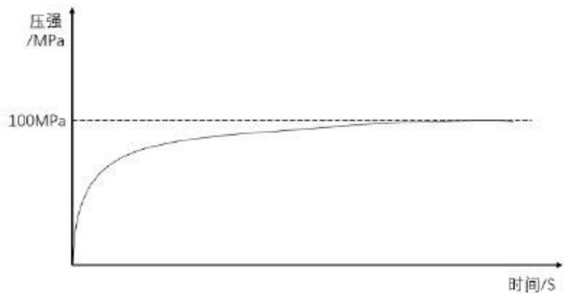

<details>
<summary>line</summary>

| 时间/s | 压强/MPa |
| --- | --- |
| 0 | 0 |
| ~100 | 100 |
</details>

图1 从初始到稳态，油压随时间变化的大致趋势

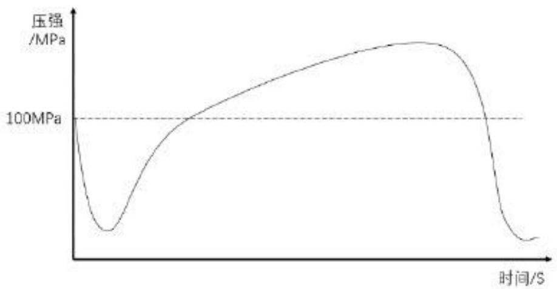

<details>
<summary>line</summary>

| 时间/s | 压强/MPa |
| --- | --- |
| 0 | 100 |
| ~15 | ~20 |
| ~30 | 100 |
| ~85 | ~140 |
| ~95 | ~20 |
</details>

图 2 单个喷油周期内，油压随时间变化的大致趋势

## 3 燃油压力P和燃油密度 $\rho$ 关系的确定

进油与出油决定了高压油管内燃油的总质量变化，于是由密度计算公式可以确定燃油密度的变化情况

$$
\rho (t) = \frac {m (t)}{V}
$$

根据题目注解1的内容, 可以确定压力 $\mathrm{P}\left( \mathrm{t}\right)$ 与密度 $\rho \left( \mathrm{t}\right)$ 之间的关系,记为

$$
\mathrm{P} = \mathrm{g} (\rho)
$$

设燃油的压力变化量为 $\mathrm{dP}$ , 密度变化量为 $\mathrm{d\rho}$ ; 由于燃油的压力变化量与密度变化量成正比, 比例系数为 $\frac{E}{\rho}$ , 有

$$
\mathrm{dP} = \frac {E}{\rho} \cdot d \rho \tag {12}
$$

其中 $E=E(P)$ ;

于是

$$
\int \frac {1}{E} d P = \int \frac {1}{\rho} d \rho + c \tag {13}
$$

求出上述不定积分, 且利用条件: $\rho = 0.85 \mathrm{mg} / \mathrm{mm}^{3}$ 时, $\mathrm{P} = 100 \mathrm{MPa}$ , 即可得到 $\rho$ 与 $\mathrm{P}$ 的关系表达式。

但由于E=E(P)没有具体表达式，且该积分难以计算。根据积分的定义，我们对该公式进行了简单的数值积分，得到不同步长下ρ与P的值，如图1所示。具体代码与结果见文件“密度压力关系.xlsx”.

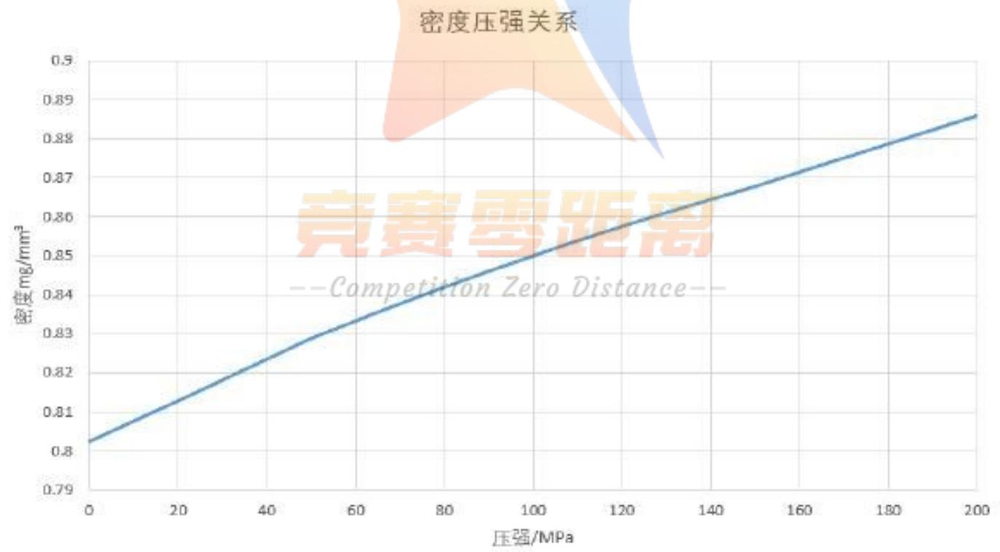

<details>
<summary>line</summary>

| 压强/MPa | 密度 \(mg/mm^{3}\) |
| --- | --- |
| 0 | ~0.802 |
| 20 | ~0.813 |
| 40 | ~0.824 |
| 60 | ~0.834 |
| 80 | ~0.844 |
| 100 | ~0.854 |
| 120 | ~0.864 |
| 140 | ~0.873 |
| 160 | ~0.882 |
| 180 | ~0.891 |
| 200 | ~0.899 |
</details>

图 3 数值积分得到的燃油P与 $\rho$ 的关系

## 六、模型的建立与求解

## 1 问题1：简化结构下基于基本模型的规划模型

## 1.1 第一小问模型的建立与求解

## 1.1.1 建立规划模型

题目要求设定高压油管中燃油的期望压力为 $P_{e}=100MPa$ ，设计单向阀开启时长T，使得一定时间里高压油管燃油实际压力的偏差达到最小；假设研究的时间段为 $[t_{1},t_{2}]$ ;

于是设决策变量为

## T

目标函数为

$$
\min Z = \int_ {t _ {1}} ^ {t _ {2}} (P (t) - P _ {e}) ^ {2}   \mathrm{d} t
$$

约束条件有:

(1) 模型满足基本模型的方程组 (8) (9)  
(2) 模型满足燃油密度和燃油压力的关系 $\mathrm{P} = \mathrm{g}\left( \rho \right)$

即

$$
\left\{ \begin{array}{c} \frac {d m}{d t} = \rho_ {I} \cdot \mathrm{I} - \rho (t) \cdot \mathrm{E} \\ \mathrm{P=g(} \rho) \\ \mathrm{m(0)=} \rho (0) \cdot \mathrm{V} \end{array} \right. \tag {14}
$$

其中

$$
\left\{ \begin{array}{c}\rho (t) = \frac {m (t)}{V} \\ \mathrm{I} (t) = \left\{ \begin{array}{l l} Q _ {1} (t), & t \in \Omega_ {1, i}, \quad i = 1, 2, \dots , n _ {1} \\ 0, & \text {其他} \end{array} \right. \\ \mathrm{E} = \left\{ \begin{array}{l l} Q _ {2} (t), & t \in \Omega_ {2, i}, \\ 0, & \text {其他} \end{array} \right., \quad i = 1, 2, \dots , n _ {2} \\ Q _ {1} (t) = C A \sqrt {\frac {2 \Delta P (t)}{\rho (t)}} \\ Q _ {2} (t) = \left\{ \begin{array}{c} 1 0 0 t ^ {\prime}, t ^ {\prime} \in [ 0, 0. 2) \\ 2 0, t ^ {\prime} \in [ 0. 2, 2. 2) \\ 2 4 0 - 1 0 0 t ^ {\prime}, t ^ {\prime} \in [ 2. 2, 2. 4) \end{array} \right. \\ \Omega_ {1, i} = [ 0 + (i - 1) \cdot (T + 1 0), T + (i - 1) \cdot (T + 1 0) ]; i = 1, 2, \dots , n _ {1} \\ \Omega_ {2, i} = [ t _ {0} + 1 0 0 \cdot (i - 1), 2. 4 + t _ {0} + 1 0 0 \cdot (i - 1) ]; i = 1, 2, \dots , n _ {2} \end{array} \right.
$$

## 1.1.2 求解规划模型

由于该模型难以从得到解析解的角度上进行求解, 即方程组 (14) 难以写成显性的解析解。这里给出方程组 (14) 的差分形式, 并对其进行数值计算得到一列不同 T 取值下对应 Z 的数值, 然后对 $[T, Z]$ 进行多项式的拟合, 即用多项式的形式对其实际关系 $Z = h(t)$ 进行描述, 于是模型转化为无约束条件的优化问题,对其进行求解即可得到问题的近似解。

首先，设时间步长为 dt，以dt为间隔将时间分为

$$
0 = t _ {0} <   t _ {1} <   t _ {2} <   \dots <   t _ {N}
$$

假设 $t_{n}$ 时刻，高压油管的燃油压力为 $P_{n}$ 、燃油密度为 $\rho_{n}$ 、燃油总质量为 $m_{n}$ 、

进油速率为 $I_{n}$ 、出油速率为 $E_{n}$ 。

于是记

$$
\frac {d m}{d t} = \frac {\mathrm{m} _ {n + 1} - \mathrm{m} _ {n}}{d t}
$$

所以其差分形式为

$$
\left\{ \begin{array}{c} \mathrm{m} _ {n + 1} = (\rho_ {I} \cdot \mathrm{I} _ {n} - \rho_ {n} \cdot \mathrm{E} _ {n}) \cdot \mathrm{dt} + \mathrm{m} _ {n} \\ \mathrm{m} _ {0} = \rho (0) \cdot \mathrm{V} \end{array} \right. \tag {15}
$$

另外

$$
\rho_ {n} = \frac {\mathrm{m} _ {n}}{V}
$$

$$
\mathrm{P} _ {n} = \mathrm{g} (\rho_ {n}) \tag {16}
$$

于是目标函数为:

$$
\min Z = \sum_ {i = t _ {n 1}} ^ {t _ {n 2}} (\mathrm{P} _ {n} - \mathrm{P} _ {e}) ^ {2} \cdot d t \tag {17}
$$

其中 $\left[t_{n1},t_{n2}\right]$ 表示系统达到稳态后的某段周期整数倍的时间。

这里具体数值计算由 Matlab 实现，具体代码见附录 2，程序流程如下：

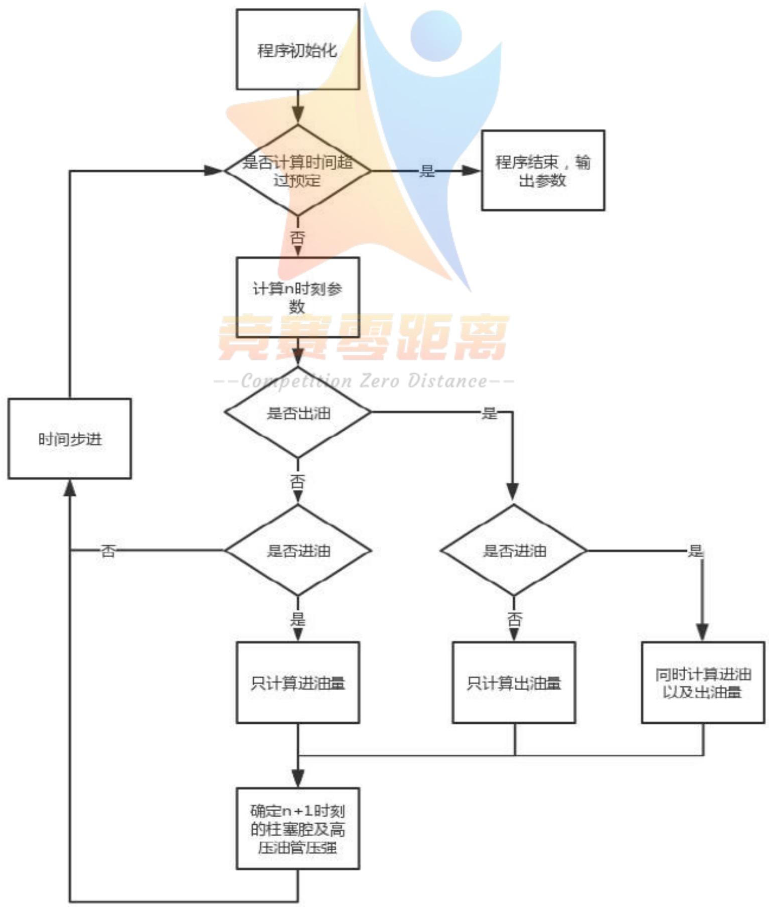

<details>
<summary>flowchart</summary>

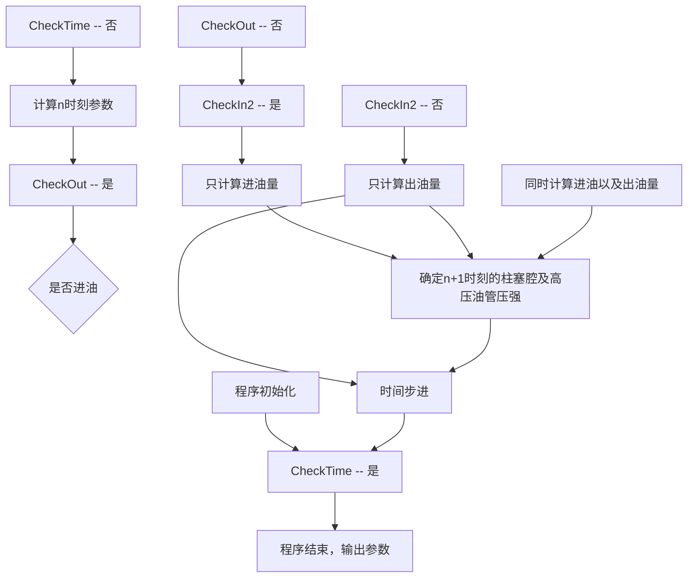
```mermaid
graph TD
  Start["程序初始化"] --> CheckTime{"是否计算时间超过预定"}
  CheckTime["CheckTime -- 是"] --> End["程序结束，输出参数"]
  CheckTime2["CheckTime -- 否"] --> CalcN["计算n时刻参数"]
  CalcN --> CheckOut{"是否出油"}
  CheckOut["CheckOut -- 是"] --> CheckIn{"是否进油"}
  CheckOut2["CheckOut -- 否"] --> CheckIn2{"是否进油"}
  CheckIn2["CheckIn2 -- 是"] --> CalcIn1["只计算进油量"]
  CheckIn22["CheckIn2 -- 否"] --> CalcIn2["只计算出油量"]
  CalcIn1 --> FinalCheck["确定n+1时刻的柱塞腔及高压油管压强"]
  CalcIn2 --> FinalCheck
  CalcIn2 --> TimeStep["时间步进"]
  TimeStep --> CheckTime
  CalcIn3["同时计算进油以及出油量"] --> FinalCheck
  FinalCheck --> TimeStep
```
</details>

图4 问题1的程序流程图

## 1.1.3 模型的结果与检验

取期望压力 $P_{e}=100MPa$ ，通过遍历T得出以下公式所给出的偏差平方和Z

$$
\mathrm{Z} = \sum_ {i = t _ {n 1}} ^ {t _ {n 2}} (\mathrm{P} _ {n} - \mathrm{P} _ {e}) ^ {2} \cdot d t \tag {18}
$$

程序模拟足够长的时间 50S，取最后一秒即 10 个喷油周期的以上偏差平方和 Z，如图所示。

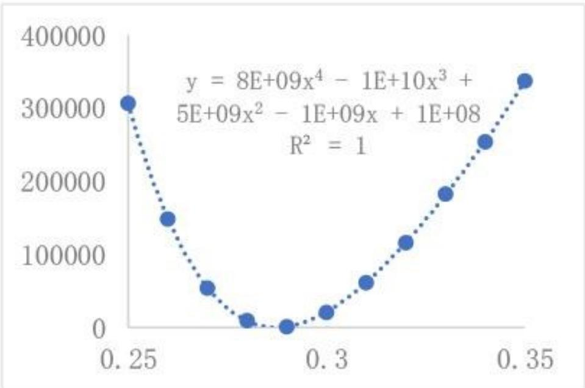

<details>
<summary>scatter</summary>

| X | Y |
| --- | --- |
| 0.25 | ~310000 |
| 0.26 | ~150000 |
| 0.27 | ~60000 |
| 0.28 | ~15000 |
| 0.29 | ~5000 |
| 0.30 | ~25000 |
| 0.31 | ~70000 |
| 0.32 | ~120000 |
| 0.33 | ~190000 |
| 0.34 | ~260000 |
| 0.35 | ~340000 |
</details>

图 5 T=0.25:0.35 时, 最后一秒内压力的偏差平方和  
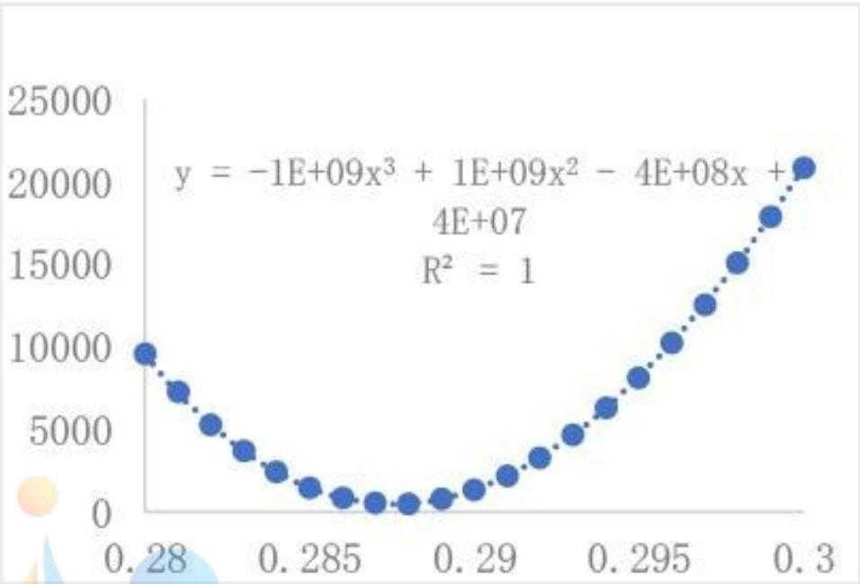

<details>
<summary>scatter</summary>

| X | Y |
| --- | --- |
| 0.28 | ~9500 |
| 0.281 | ~7500 |
| 0.282 | ~5500 |
| 0.283 | ~4000 |
| 0.284 | ~2500 |
| 0.285 | ~1500 |
| 0.286 | ~1000 |
| 0.287 | ~800 |
| 0.288 | ~700 |
| 0.289 | ~1000 |
| 0.29 | ~1500 |
| 0.291 | ~2500 |
| 0.292 | ~3500 |
| 0.293 | ~5000 |
| 0.294 | ~6500 |
| 0.295 | ~8500 |
| 0.296 | ~10500 |
| 0.297 | ~13000 |
| 0.298 | ~15500 |
| 0.299 | ~18500 |
| 0.3 | ~21500 |
</details>

图 6 T=0.28:0.3 时, 最后一秒内压力的偏差平方和

图中可以看出, 当 $T = 0.288 \mathrm{~ms}$ 时, 高压油管内的压力与 $100 \mathrm{MPa}$ 偏差最小, 最为稳定。

对于该结果的所取时间段是否达到稳态, 用该段时间压力的偏差和 $Z_{e}$ 进行检验:

$$
\mathrm{Z} _ {e} = \sum_ {i = t _ {n 1}} ^ {t _ {n 2}} (\mathrm{P} _ {n} - \mathrm{P} _ {e}) \cdot d t \tag {19}
$$

当所取时间段, 高压油管内压力达到稳定状态时, $Z_{e}$ 的值应趋于 0 , 检验结果如下:

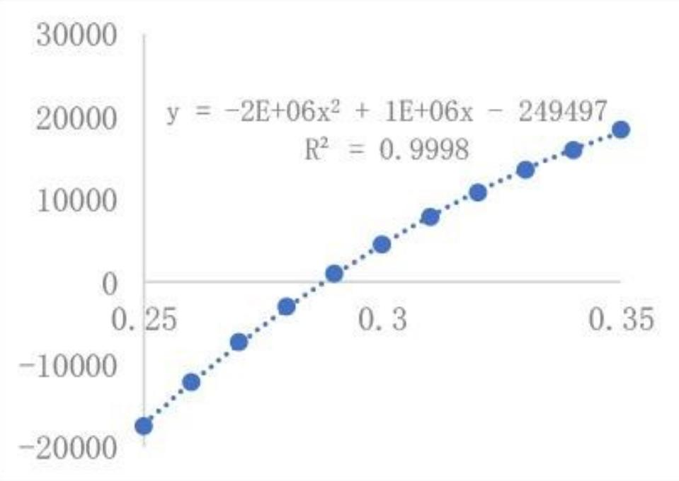

<details>
<summary>scatter</summary>

| X | Y |
| --- | --- |
| ~0.24 | ~-17500 |
| ~0.26 | ~-12000 |
| ~0.28 | ~-7000 |
| ~0.30 | ~-2500 |
| ~0.32 | ~1500 |
| ~0.34 | ~5000 |
| ~0.36 | ~8500 |
| ~0.38 | ~11500 |
| ~0.40 | ~14000 |
| ~0.42 | ~16500 |
| ~0.44 | ~19000 |
</details>

图 7 T=0.25:0.35 时，最后一秒内压力的偏差和

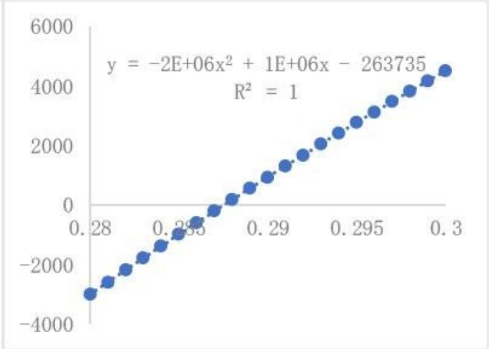

<details>
<summary>scatter</summary>

| X | Y |
| --- | --- |
| ~0.280 | ~-3000 |
| ~0.282 | ~-2600 |
| ~0.284 | ~-2100 |
| ~0.286 | ~-1700 |
| ~0.288 | ~-1300 |
| ~0.290 | ~-900 |
| ~0.292 | ~-500 |
| ~0.294 | ~-100 |
| ~0.296 | ~300 |
| ~0.298 | ~700 |
| ~0.300 | ~1100 |
| ~0.302 | ~1500 |
| ~0.304 | ~1900 |
| ~0.306 | ~2300 |
| ~0.308 | ~2700 |
| ~0.310 | ~3100 |
| ~0.312 | ~3500 |
| ~0.314 | ~3900 |
| ~0.316 | ~4300 |
| ~0.318 | ~4600 |
</details>

图 8 T=0.28:0.3 时，最后一秒内压力的偏差和

可以看出当T = 0.288ms，50S后压力偏差和近似为0，即此时达到稳态。

综上可以得出结论，当单向阀每次开启的时长 $T = 0.288 \mathrm{~ms}$ 时，高压油管内的压力尽稳定在 $100 \mathrm{MPa}$ 左右，且偏差最小。

## 1.2 第二小问模型的建立与求解

## 1.2.1 稳态性质的进一步研究

在五. 2 中，我们论述了不同初始状态、不同开阀时长 T 的系统，最终都要到达稳态，压力值在一个常数附近波动。

进一步分析, 猜想不同开阀时长对应不同的稳态压力值, 即当 T 确定时, 从不同的初始状态出发都会到达同一个稳态, 不过到达稳态的时间不同。下面我们利用第一小问的模型, 绘制了 $\mathrm{T} = 0.288 \mathrm{~ms}$ , 初始压力分别为 $100 \mathrm{MPa}$ 和 $130 \mathrm{MPa}$ 的压力变化图。见图 7、8。

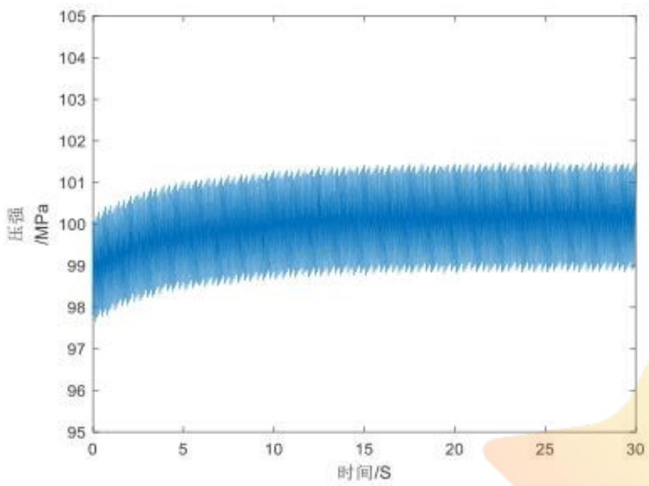

<details>
<summary>line</summary>

| 时间/s | 压强/MPa |
| --- | --- |
| 0 | ~97.8 |
| 5 | ~99.5 |
| 10 | ~100.2 |
| 15 | ~100.3 |
| 20 | ~100.4 |
| 25 | ~100.5 |
| 30 | ~100.6 |
</details>

图 9 初始压力为 100MPa，T = 0.288ms

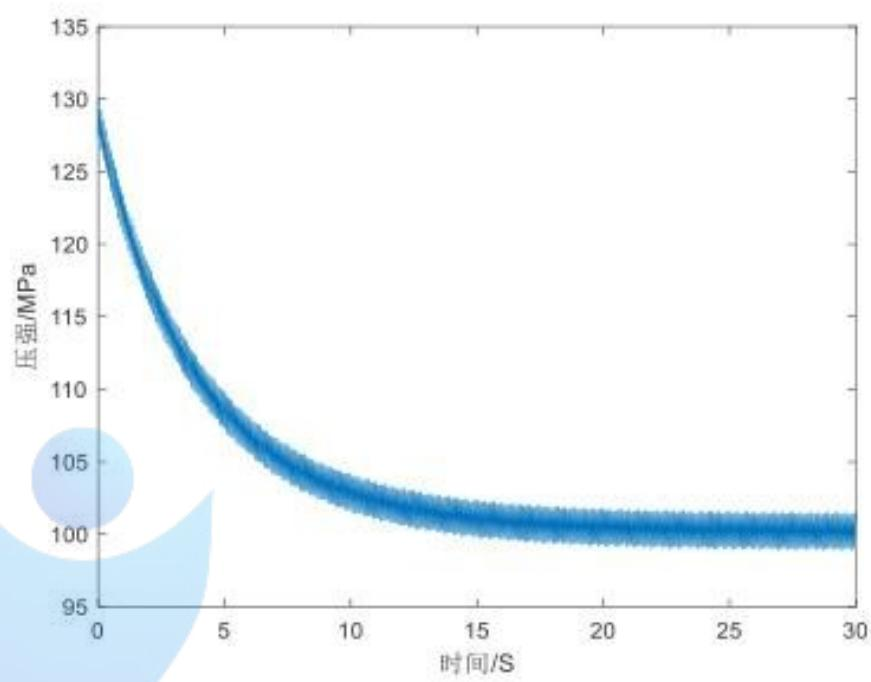

<details>
<summary>line</summary>

| 时间/S | 压强/MPa |
| --- | --- |
| 0 | ~129 |
| 5 | ~108 |
| 10 | ~103 |
| 15 | ~101 |
| 20 | ~100.5 |
| 25 | ~100.2 |
| 30 | ~100 |
</details>

图10初始压力为 $130\mathrm{MPa}$ ， $\mathrm{T} = 0.288\mathrm{ms}$

由图示以及计算稳态时压力的均值，发现两个过程最后都在100MPa附近波动，证明猜想正确。

另外，易知到达稳态所用的时间与T有关，T越大，到达稳态越迅速。

这表明了不同T的取值将对应唯一的系统稳态的压力均值 $h_{p}(t)$ ；喷油开始时刻 $t_{0}$ 和初始压力的取值，对最终系统状态无影响。

## 1.2.2 模型的分析

由模型稳态的描述，稳定时 150MPa 的期望压力应当对应唯一的单向阀开启时间。所以，可以先将模型期望压力设定为 150MPa，得到对应单向阀开启时长 $T_{150}$ 。然后研究该 $T_{150}$ 时长下系统到达 150MPa 的稳定压力需要的时间。最后对 2S、5S、10S 的要求分别设计不同的调整方案。

## 1.2.3 模型的建立

在前一小问的基础上，将期望压力设定为 $P_{e}=150MPa$ ，初始状态不改变；期望时间为 $t_{e}$ ，喷油嘴开启时刻取 $t_{0}=0$ ；利用前一小问的模型，得到对应 $T_{150}$ 。利用一定时间内压力的均值 $h_{p}(t)$ （如式(10)）来描述整体压力，找到系统到达150MPa的稳定压力所需要的时间 $t_{n}$ 。分以下情况设计调整方案。

(1) 若 $t_{e}=t_{n}$ :

系统刚好达到期望压力 150MPa;

(2) 若 $t_{e} > t_{n}$ :

在 0 到 $t_{n}-t_{e}$ 时间内，单向阀开启时间不变化， $t_{n}-t_{e}$ 时刻调整为 $T_{150}$ 。

(3) 若 $t_{e} < t_{n}$ :

此时 $T_{150}$ 无法使得系统在规定的时间内到达150MPa的稳定压力。于是需要在0到 $t_{e}$ 时间内使用更大的单向阀开启时长 $T_{m}$ 使高压油管升压到150MPa，然后再设定开启时长为 $T_{150}$ ，使得系统状态稳定。

此时，对不同的 $T_{m}$ 取值，令式（10）中 $t=t_{e}$ ，得到对应 $h_{p}(t)$ ，找到 $h_{p}(t)=150Mpa$ 即可。

## 1.2.4 模型的求解及结果

首先按照模型重复上述操作，容易得到 $T_{150}=0.752ms$ 。对应实际压力变化如图。


<details>
<summary>line</summary>

| 时间 (s) | 压强 (MPa) |
| --- | --- |
| 0 | 100 |
| ~2.5 | ~148 |
| 5 | ~150 |
| 10 | ~150 |
| 15 | ~150 |
| 20 | ~150 |
| 25 | ~150 |
| 30 | ~150 |
</details>

图11 $\mathrm{T} = \mathrm{T}_{150}$ 时，系统实际压力随时间的变化

令t取2000ms-6000ms，令一定时间内压力的均值 $h_{p}(t)$ 取

$$
\hbar_ {p} (t) = \frac {\sum_ {t - 5 0} ^ {t + 5 0} P (t) d t}{1 0 0} \tag {20}
$$

$h_{p}(t)$ 结果如图:

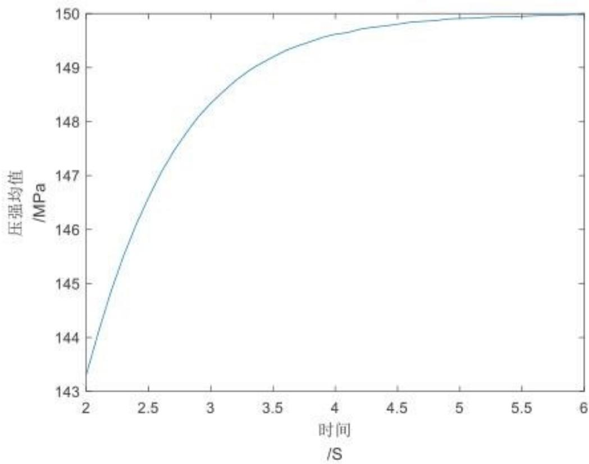

<details>
<summary>line</summary>

| 时间 (s) | 压强均值 (MPa) |
| --- | --- |
| 2.0 | ~143.3 |
| 2.5 | ~146.8 |
| 3.0 | ~148.5 |
| 3.5 | ~149.3 |
| 4.0 | ~149.7 |
| 4.5 | ~149.9 |
| 5.0 | ~149.95 |
| 5.5 | ~149.98 |
| 6.0 | ~150.0 |
</details>

图12 $T = T_{150}$ 时，系统压力均值随时间的变化（局部放大）  
可以发现在 5.9S 时，系统达到 150MPa 的稳态，于是记 $t_{n} = 5900ms$ .  
对于 2S 和 5S, 因为 $t_{e} < 5900ms$ ，所以各自计算新的 $t_{n}$ 。

(1) 2S情况下

设 $t_{e}=2000ms$ ，调整不同的单向阀开启时长 $T_{m}$ ，计算式（20），得到不同T值下2S时刻压力均值，如图13；放大0.9S-0.92S局部，如图14。

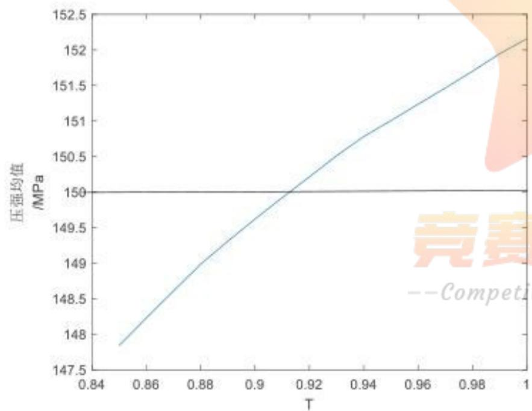

<details>
<summary>line</summary>

| T | 压强均值 (MPa) |
| --- | --- |
| 0.85 | ~147.9 |
| 0.88 | ~149.0 |
| 0.91 | ~150.0 |
| 0.94 | ~150.8 |
| 0.98 | ~151.8 |
</details>

图13 不同T值下2S时刻压力均值

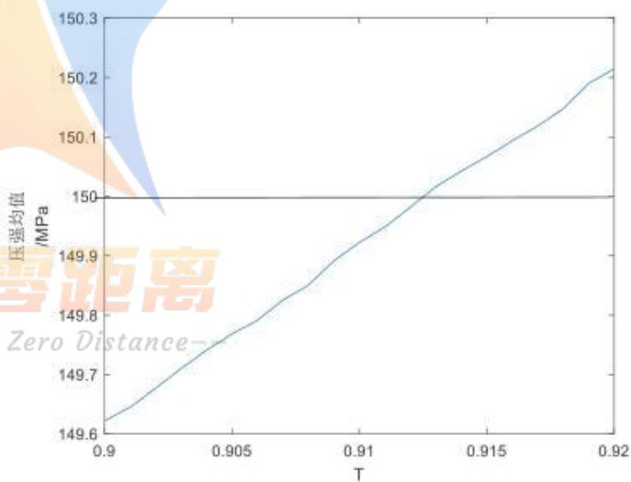

<details>
<summary>line</summary>

| T | 压强均值 (MPa) |
| --- | --- |
| 0.9 | ~149.63 |
| 0.905 | ~149.78 |
| 0.91 | ~149.92 |
| 0.915 | ~150.05 |
| 0.92 | ~150.21 |
</details>

图14 局部放大图

可以得到 $T_{m}=0.913ms$ ，方案为：0到2S时刻取T=0.913ms，2S后取T=0.752ms。

(2) 5S情况下

设 $t_{e}=5000ms$ ，调整不同的单向阀开启时长 $T_{m}$ ，计算式（20），得到不同T值下5S时刻压力均值，如图15；放大0.75S-0.76S局部，如图16。

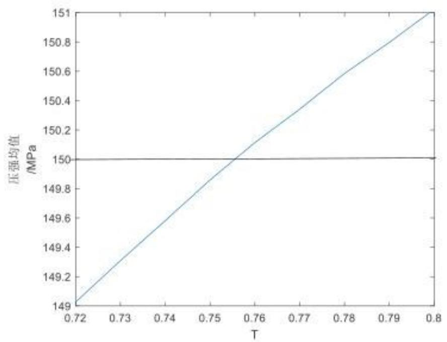

<details>
<summary>line</summary>

| T | 压强均值 (MPa) |
| --- | --- |
| 0.72 | 149 |
| 0.73 | ~149.3 |
| 0.74 | ~149.6 |
| 0.75 | ~149.9 |
| 0.76 | ~150.2 |
| 0.77 | ~150.4 |
| 0.78 | ~150.6 |
| 0.79 | ~150.8 |
| 0.8 | 151 |
</details>

图15 不同T值下5S时刻压力均值

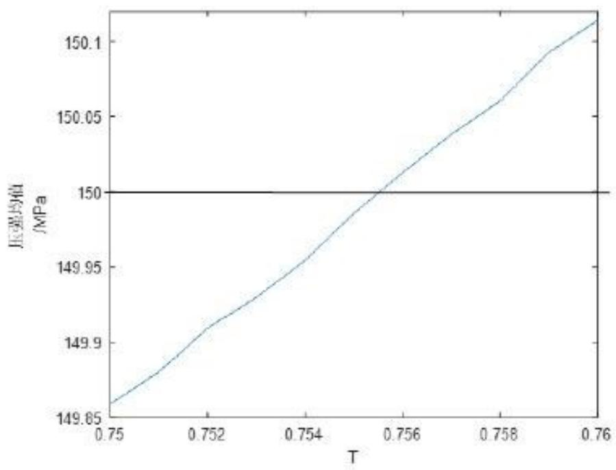

<details>
<summary>line</summary>

| T | 压强均值 (MPa) |
| --- | --- |
| 0.75 | ~149.86 |
| 0.752 | ~149.91 |
| 0.754 | ~149.96 |
| 0.756 | ~150.01 |
| 0.758 | ~150.06 |
| 0.76 | ~150.12 |
</details>

图16 局部放大图

可以得到 $T_{m}=0.755ms$ ，方案为：0到5S时刻取T=0.755ms, 5S后取T=0.752ms。

## (3) 对于10S的要求:

由于 $t_{e}=1000ms>t_{n}=5900ms$ ，于是方案为：在0到4.1S内保持T=0.288ms；4.1S时，调整T=0.752ms。

策略结果见下表。

<table><tr><td>调整至稳定的时间</td><td>单阀开启时长策略</td></tr><tr><td>2S</td><td>0到2S时刻取T = 0.913ms, 2S后取T = 0.752ms</td></tr><tr><td>5S</td><td>0到5S时刻取T = 0.755ms, 5S后取T = 0.752ms</td></tr><tr><td>10S</td><td>0到4.1S内保持T = 0.288ms4.1S时, 调整T = 0.752ms</td></tr></table>

  
--Competition Zero Distance--

## 2 问题2：实际结构的基于基本模型的规划模型

## 2.1 问题分析

问题二在问题一的基础上，重新定义了高压油泵供油的方式，同时详细描述了喷油嘴在一个喷油周期内的工作方式。这就要求我们重新确定高压油管的进出油方式，即重新确定I(t)、E(t)的表达形式。

## 2.2 模型的建立

同样将高压油管内的压力作为研究对象，研究其进油与出油情况。在基本初值条件下，建立边界条件。

设决策变量为凸轮转速 $\omega$ 。

目标函数为

$$
\min Z = \int_ {t _ {1}} ^ {t _ {2}} (P (t) - P _ {e}) ^ {2}   \mathrm{d} t
$$

约束条件为

$$
\left\{ \begin{array}{c} \frac {d m}{d t} = \rho_ {I} \cdot \mathrm{I} - \rho (t) \cdot \mathrm{E} \\ \mathrm{m(0)} = \rho (0) \cdot \mathrm{V} \end{array} \right. \tag {21}
$$

由于供油喷油得方式发生改变，I(t)与E(t)需要重新确定。

## 2.2.1 I(t)的确定

假设 t 时刻柱塞腔内的压力为 $P_{c}(t)$ ，定义 0-1 变量 $f_{1}(t)$ 描述进油状态：

$$
f _ {1} (t) = \left\{ \begin{array}{l l} 1, & \text {进油} \\ 0, & \text {不进油} \end{array} \right. \tag {22}
$$

其可表达为

$$
f _ {1} (t) = \frac {\mathrm{sgn} (\mathrm{P} _ {c} (t) - \mathrm{P} (t)) \cdot [ \mathrm{sgn} (\mathrm{P} _ {c} (t) - \mathrm{P} (t)) + 1 ]}{2} \tag {23}
$$

于是

$$
\mathrm{I} (\mathrm{t}) = \mathrm{f} _ {1} (\mathrm{t}) \cdot C A \sqrt {\frac {2 (\mathrm{P} _ {c} (\mathrm{t}) - \mathrm{P} (\mathrm{t}))}{\rho (\mathrm{t})}} \tag {24}
$$

以下确定其中的 $P_{c}(t)$ :

将柱塞腔视为一个独立整体。假设凸轮匀速转动，即单位时间内凸轮转过的角度不变，设其角速度为 $\omega$ rad/s。于是可以得到凸轮转动的周期

$$
\mathrm{T} _ {c} = \frac {2 \pi}{w} \tag {25}
$$

考虑 t 时刻整个系统的状态，设柱塞腔内燃油密度 $\rho_{c}(t)$ 、压力 $P_{c}(t)$ 、质量 $m_{c}(t)$ 、密度 $\rho_{c}(t)$ 、横截面 S；柱塞腔容积 $V_{c}(t)$ ；凸轮极径 r(t)。

若此时 $|f_{1}(t)|>0$ ，由于 $P(t)$ 作为时间的函数必然是连续的，所以可以取dt>0足够小，使得 $|f_{1}(t+dt)|>0$ ，同时 $f_{1}(t)$ 与 $f_{1}(t+dt)$ 同号，即dt时刻后柱塞腔放油的状态不发生改变。

其次考虑到t必然属于某一个 $T_{c}$ 周期，又根据模型假设，于是只要 $|f_{1}(t)|=0$ ，dt>0足够小，则在t到 $t+dt$ 时间内，柱塞腔放油状态要么是以t时刻为不放油到放油的转折点，之后一直保持在放油状态，要么是一直不放油。

综上所述，t到 $t+dt$ 时间内，放油状态不发生改变。于是在t到dt时刻内，应该有如下关系

$$
\begin{array}{l} \mathrm{m} _ {c} (\mathrm{t} + \mathrm{dt}) - \mathrm{m} _ {c} (\mathrm{t}) = - \rho_ {c} \cdot (\mathrm{t}) \mathrm{dt} \\ \mathrm{V} _ {c} (\mathrm{t} + \mathrm{dt}) - \mathrm{V} _ {c} (\mathrm{t}) = - S \cdot (\mathrm{r} (\mathrm{t} + \mathrm{dt}) - \mathrm{r} (\mathrm{t})) \mathrm{dt} \\ \mathrm{P} _ {c} (\mathrm{t}) = \mathrm{m} _ {c} (\mathrm{t}) / \mathrm{V} _ {c} (\mathrm{t}) \\ \rho_ {c} = \mathrm{g} (\mathrm{P} _ {c}) \\ \end{array}
$$

初边值条件为

$$
\mathrm{P} _ {c} (\mathrm{k} \cdot \mathrm{T} _ {c}) = 0. 5 \mathrm{MPa}, \mathrm{k} = 0, 1, 2, \dots
$$

进一步地设由附录3给出的极角与极径的关系为

$$
\mathrm{r} = \mathrm{r} (\theta (t))
$$

其中 $\theta(t)=w\cdot t+2k\pi,\quad k\in Z,\quad\theta\in[0,2\pi);$

即如下边值问题

$$
\left\{ \begin{array}{c} \frac {\mathrm{m} _ {c} (d t)}{d t} = - \rho_ {c} \cdot \mathrm{I} (\mathrm{t}) \\ \frac {\mathrm{V} _ {c} (\mathrm{t})}{d t} = - \mathrm{S} \cdot (\mathrm{r} (\mathrm{t} + \mathrm{dt}) - \mathrm{r} (\mathrm{t})) \\ \mathrm{P} _ {c} (\mathrm{k} \cdot \mathrm{T} _ {c}) = 0. 5 \mathrm{MPa} \end{array} \right. \tag {26}
$$

其中

$$
\left\{ \begin{array}{c} \mathrm{P} _ {c} (\mathrm{t}) = \frac {\mathrm{m} _ {c} (\mathrm{t})}{\mathrm{V} _ {c} (\mathrm{t})} \\ \rho_ {c} = \mathrm{g} (\mathrm{P} _ {c}) \\ \mathrm{r} = \mathrm{r} (\theta (\mathrm{t})) \\ \theta (\mathrm{t}) = \mathrm{w} \cdot \mathrm{t} + 2 \mathrm{k} \pi , \mathrm{k} \in \mathrm{Z}, \theta \in [ 0, 2 \pi) \\ I (\mathrm{t}) = \mathrm{f} _ {1} (\mathrm{t}) \cdot C A \sqrt {\frac {2 (\mathrm{P} _ {c} (\mathrm{t}) - \mathrm{P} (\mathrm{t}))}{\rho (\mathrm{t})}} \\ f _ {1} (\mathrm{t}) = \frac {\operatorname{sgn} (\mathrm{P} _ {c} (\mathrm{t}) - \mathrm{P} (\mathrm{t})) \cdot [ \operatorname{sgn} (\mathrm{P} _ {c} (\mathrm{t}) - \mathrm{P} (\mathrm{t})) + 1 ]}{2} \end{array} \right. \tag {27}
$$

$P_{c}$ 由方程组（26）（27）确定。

综上所述，问题 2 中高压油管进油速率为

$$
\mathrm{I(t)} = \mathrm{f} _ {1} (\mathrm{t}) \cdot C A \sqrt {\frac {2 (\mathrm{P} _ {c} (\mathrm{t}) - \mathrm{P} (\mathrm{t}))}{\rho (t)}} \tag {28}
$$

## 2.2.2 $\mathrm{E(t)}$ 的确定

喷油规律总体上与第一问一致,但在一个周期内,我们需要考虑针阀的运动,所以单次喷油的流量曲线会发生一定改变。

设 t 时刻针阀的升程为 $l(t)$ 。

针阀的升程为 $l(t)=0$ 时，其处于下图中虚线位置，此时停止喷油。 $l(t)=\Delta h$ 时，针阀位置如图。

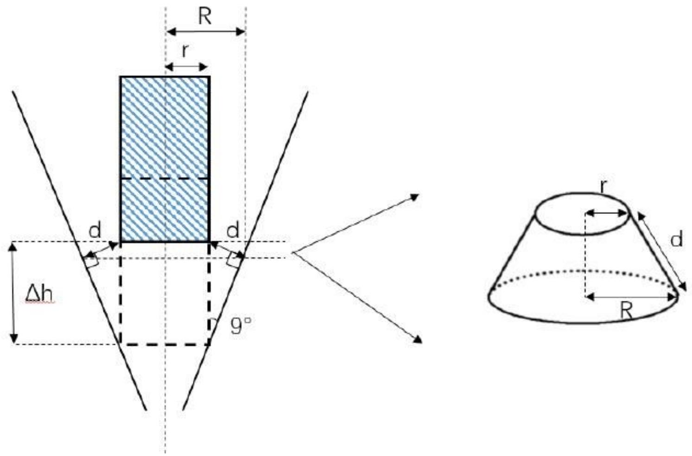

<details>
<summary>text_image</summary>

R
r
d
d
Δh
g°
r
d
R
</details>

图 17 喷油口的结构及局部放大图

此时关于针阀的最小环缝的形状为一个圆台的侧面, 且该圆台母线处处垂直于密封座壁, 设圆台母线长为d

$$
\mathrm{d} = \Delta \mathrm{h} \cdot \sin 9 ^ {\circ} \tag {29}
$$

圆台顶面半径即针阀半径为r，则有底面半径R

$$
\mathrm{R} = \mathrm{r} + \mathrm{d} \cos 9 ^ {\circ} \tag {30}
$$

设喷油器喷孔面积为 $S_{1}$ ，环缝的面积为 $S_{2}$ ，则

$$
S _ {1} = 0. 4 9 \pi
$$

$$
S _ {2} = \pi d \cdot (r + R) \tag {31}
$$

其中r = 1.25mm;

设出油的有效面积为 $S(t)$

$$
S (t) = \min \{S _ {1}, S _ {2} \} \tag {32}
$$

S(t)如图所示。


<details>
<summary>area</summary>

| 时间/S | 有效出油面积 \(/mm^{2}\) |
| --- | --- |
| 0 | 0 |
| ~0.35 | 1.5 |
| ~0.4 | 2.75 |
| ~2.1 | 2.75 |
| ~2.15 | 1.5 |
| 2.5 | 0 |
</details>

图 18 针阀运动周期内，有效出油面积（红色）随时间的变化

综上所述，t时刻，油嘴喷油量为

$$
\mathrm{E(t)} = \left\{ \begin{array}{c} Q _ {2} (t), t \in \Omega_ {2, i} \\ 0, \text {其他} \end{array} , i = 1, 2, \dots , n _ {2} \right. \tag {33}
$$

其中

$$
Q _ {2} (t) = C \cdot S (t) \cdot \sqrt {\frac {2 \Delta P (t)}{\rho_ {I}}} \tag {34}
$$

$$
\Omega_ {2, i} = [ t _ {0} + 1 0 0 \cdot (i - 1), 2. 4 5 + t _ {0} + 1 0 0 \cdot (i - 1) ]; i = 1, 2, \dots , n _ {2}
$$

另外，由于 $\Delta P(t)$ 无法计算，假设喷油嘴外气压 $P_{low}$ 为一个标准大气压即0.1MPa，此时可以近似的认为 $\Delta P(t)=P(t)$ ，并且估算得到最大出油速率为Q=20.079mg/mm $^{3}$ ，这与问题1的所给数据基本一致，证明假设合理。

综上，问题 2 的模型为

$$
\min Z = \int_ {t _ {1}} ^ {t _ {2}} (P (t) - P _ {e}) ^ {2}   \mathrm{d} t
$$

约束条件为:

方程组(21)-(34) (35)

## 2.3 模型的求解

类似问题 1 建立模型的差分形式:

设时间步长为 dt；以 dt 为间隔将时间分为

$$
0 = t _ {0} <   t _ {1} <   t _ {2} <   \dots <   t _ {N}
$$

设 $t_{n}$ 时刻柱塞腔的燃油压力为 $P_{c_{n}}$ 、燃油密度为 $\rho_{c_{n}}$ 、燃油总质量为 $m_{c_{n}}$ 、出油速率为 $I_{n}$ ；极径为 $r_{n}$ ，其他参数类似。于是同样的有

$$
\left\{ \begin{array}{c} \mathrm{m} _ {c _ {n + 1}} = - \left(\rho_ {I _ {n}} \cdot \mathrm{I} _ {n}\right) \cdot \mathrm{dt} + \mathrm{m} _ {c _ {n}} \\ \mathrm{V} _ {c _ {n}} = \mathrm{S} \cdot (\mathrm{r} _ {n} - \mathrm{r} _ {n - 1}) \cdot \mathrm{dt} + \mathrm{V} _ {c _ {n + 1}} \\ \mathrm{P} _ {c} (\mathrm{kT} _ {c}) = 0. 5 \mathrm{MPa} \end{array} \right. \tag {36}
$$

另外

$$
\left\{ \begin{array}{c} \mathrm{P} _ {c _ {n}} = \frac {\mathrm{m} _ {c _ {n}}}{\mathrm{V} _ {c _ {n}}} \\ \rho_ {n} = \mathrm{g} (\mathrm{P} _ {c _ {n}}) \\ \mathrm{r} _ {n} = \mathrm{r} (\theta (\mathrm{t} _ {n})) \\ \theta (\mathrm{t} _ {n}) = \mathrm{w} _ {n} \cdot \mathrm{t} _ {n} + 2 \mathrm{k} \pi , \mathrm{k} \in \mathrm{Z}, \theta \in [ 0, 2 \pi) \\ I _ {n} = \mathrm{f} _ {1} (\mathrm{t} _ {n}) \cdot C A \sqrt {\frac {2 (\mathrm{P} _ {c _ {n}} - \mathrm{P} _ {n})}{\rho_ {c _ {n}}}} \\ f _ {1} (\mathrm{t}) = \frac {\operatorname{sgn} (\mathrm{P} _ {c _ {n}} - \mathrm{P} _ {n}) \cdot [ \operatorname{sgn} (\mathrm{P} _ {c _ {n}} - \mathrm{P} _ {n}) + 1 ]}{2} \end{array} \right. \tag {37}
$$

于是问题二的差分规划模型为

决策变量

--Competition Zero Distance--

目标函数

$$
\min Z = \sum_ {i = t _ {n 1}} ^ {t _ {n 2}} (\mathrm{P} _ {n} - \mathrm{P} _ {e}) ^ {2} \cdot d t
$$

约束条件

$$
\left\{ \begin{array}{c} \mathrm{m} _ {n + 1} = \left(\rho_ {I} \cdot \mathrm{I} _ {n} - \rho_ {n} \cdot \mathrm{E} _ {n}\right) \cdot \mathrm{dt} + \mathrm{m} _ {n} \\ \mathrm{m} _ {0} = \rho (0) \cdot \mathrm{V} \\ \rho_ {n} = \frac {\mathrm{m} _ {n}}{v} \\ \mathrm{P} _ {n} = \mathrm{g} (\rho_ {n}) \\ \text {方程组(36)(37)} \end{array} \right. \tag {38}
$$

具体数值计算由 Matlab 实现，具体代码见附录 4，程序流程如下。

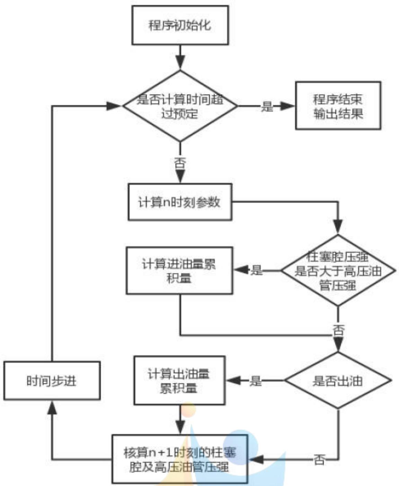

<details>
<summary>flowchart</summary>

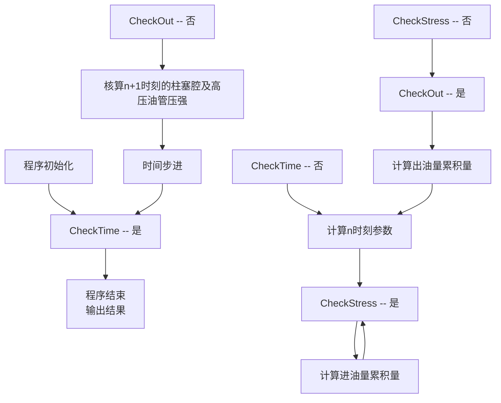
```mermaid
graph TD
  Start["程序初始化"] --> CheckTime{"是否计算时间超过预定"}
  CheckTime["CheckTime -- 是"] --> End["程序结束\n输出结果"]
  CheckTime2["CheckTime -- 否"] --> CalcN["计算n时刻参数"]
  CalcN --> CheckStress{"柱塞腔压强\n是否大于高压油\n管压强"}
  CheckStress["CheckStress -- 是"] --> CalcOil["计算进油量累积量"]
  CalcOil --> CheckStress
  CheckStress2["CheckStress -- 否"] --> CheckOut{"是否出油"}
  CheckOut["CheckOut -- 是"] --> CalcOut["计算出油量累积量"]
  CalcOut --> CalcN
  CheckOut2["CheckOut -- 否"] --> CalcN1["核算n+1时刻的柱塞腔及高压油管压强"]
  CalcN1 --> TimeStep["时间步进"]
  TimeStep --> CheckTime
```
</details>

图 19 问题 2 的程序流程图

## 2.4 模型的结果

取期望压力 $P_{e}=100MPa$ ，通过遍历凸轮角速度 $\omega$ 得出以下公式所给出的式（18）的偏差平方和Z。

程序模拟一段较大时间范围内角速度与偏差平方和的关系, 发现是一个有唯一极小值的凸函数, 缩小范围至 27-29S 即 27.4-27.6S, 得到以下图。

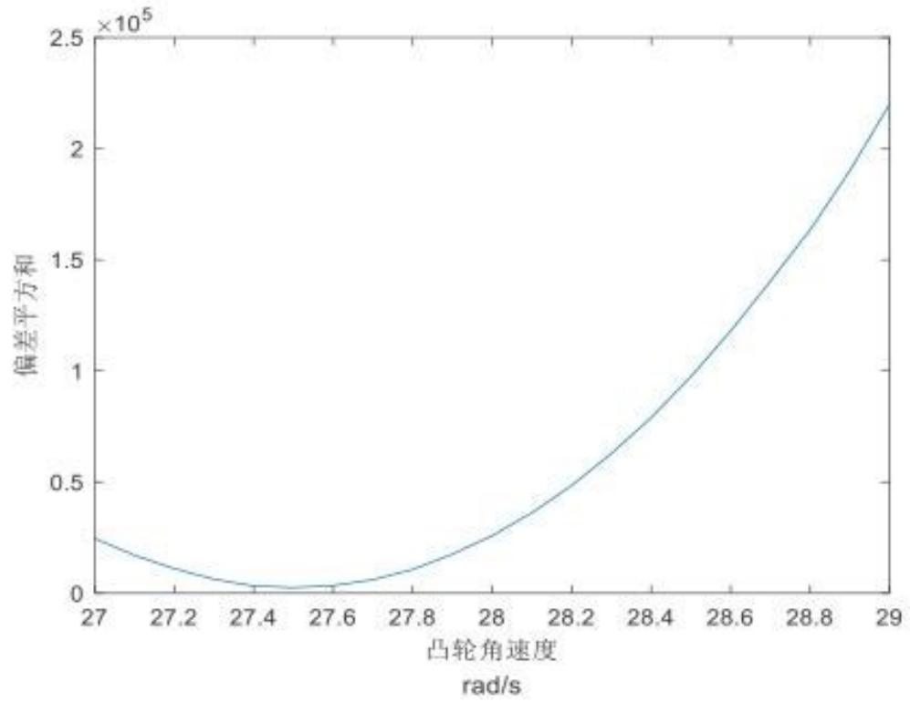

<details>
<summary>line</summary>

| 凸轮角速度 (rad/s) | 偏差平方和 (x10^5) |
| --- | --- |
| 27.0 | ~0.25 |
| 27.4 | ~0.02 |
| 27.6 | ~0.03 |
| 28.0 | ~0.25 |
| 28.4 | ~0.75 |
| 28.8 | ~1.65 |
| 29.0 | ~2.20 |
</details>

图 20 $\omega = 27:29rad/s$ ，偏差平方和随角速度的变化

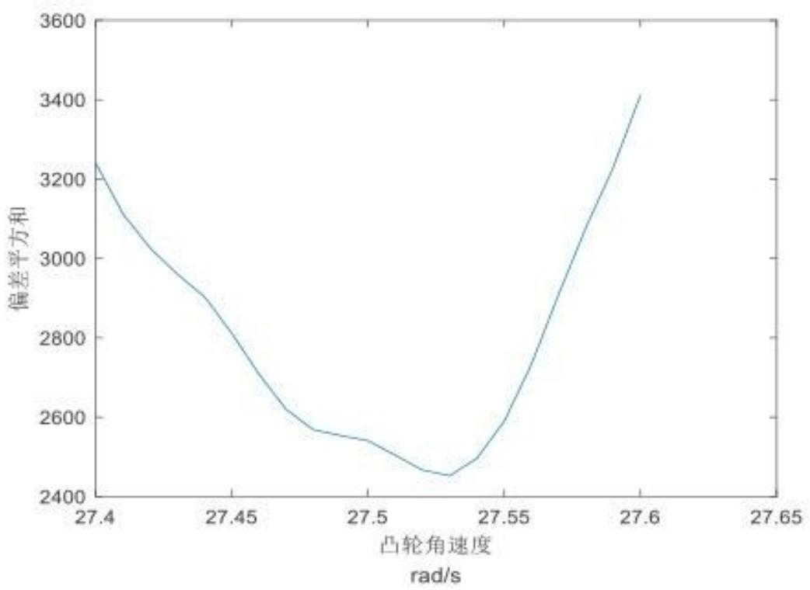

<details>
<summary>line</summary>

| 凸轮角速度 (rad/s) | 偏差平方和 |
| --- | --- |
| 27.40 | ~3240 |
| 27.41 | ~3120 |
| 27.42 | ~3030 |
| 27.43 | ~2960 |
| 27.44 | ~2900 |
| 27.45 | ~2810 |
| 27.46 | ~2720 |
| 27.47 | ~2630 |
| 27.48 | ~2570 |
| 27.49 | ~2560 |
| 27.50 | ~2550 |
| 27.51 | ~2530 |
| 27.52 | ~2490 |
| 27.53 | ~2460 |
| 27.54 | ~2500 |
| 27.55 | ~2600 |
| 27.56 | ~2750 |
| 27.57 | ~2900 |
| 27.58 | ~3050 |
| 27.59 | ~3200 |
| 27.60 | ~3410 |
</details>

图 21 $\omega = 27:29rad/s$ ，偏差平方和随角速度的变化

图中可以看出，当 $\omega = 27.5rad/s$ 时，高压油管内的压力与100 MPa偏差最小，最为稳定。

对于该结果的所取时间段是否达到稳态，用该段时间压力的偏差和 $Z_{e}$ (式（19）) 进行检验.

当所取时间段, 高压油管内压力达到稳定状态时, $Z_{e}$ 的值应趋于 0 , 检验结果如下:

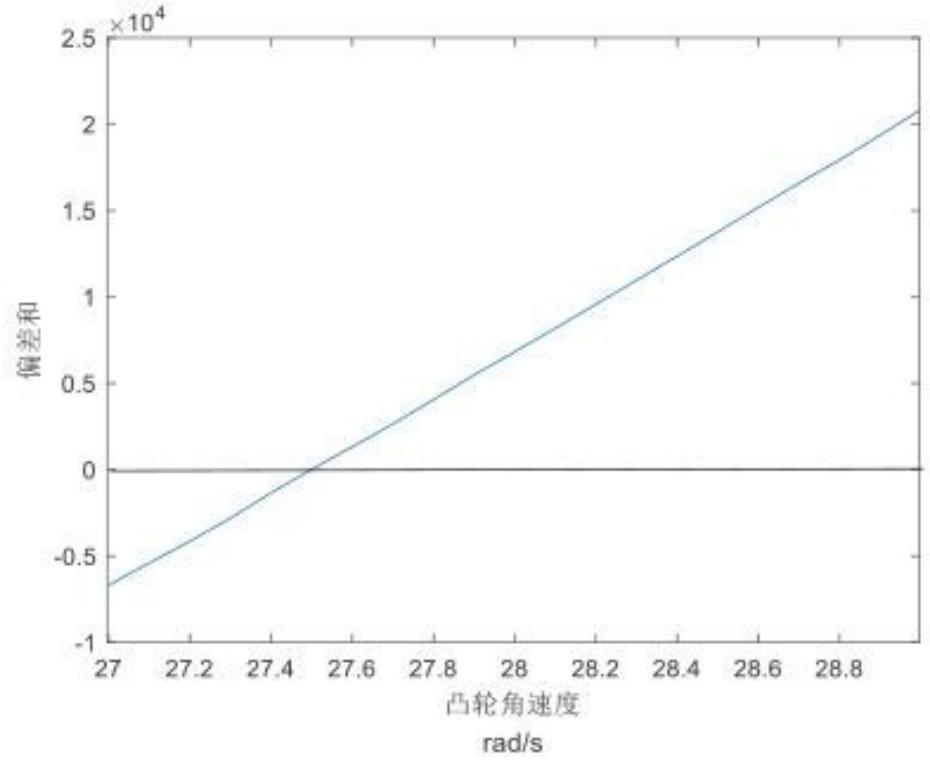

<details>
<summary>line</summary>

| 凸轮角速度 (rad/s) | 偏差 (x10^4) |
| --- | --- |
| 27.0 | ~-0.65 |
| 27.5 | 0 |
| 28.0 | ~0.75 |
| 28.5 | ~1.5 |
| 29.0 | ~2.1 |
</details>

图 22 $\omega = 27:29rad/s$ ，偏差和随角速度的变化

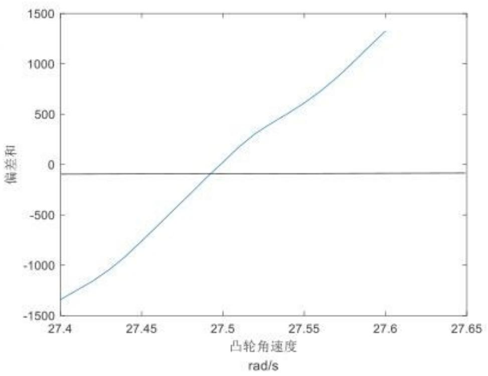

<details>
<summary>line</summary>

| 凸轮角速度 (rad/s) | 偏差和 |
| --- | --- |
| 27.40 | ~-1350 |
| 27.45 | ~-800 |
| 27.50 | 0 |
| 27.55 | ~600 |
| 27.60 | ~1350 |
</details>

图 23 $\omega = 27:29rad/s$ ，偏差和随角速度的变化

可以看出当 $\omega=27.5rad/s$ 时，压力偏差和近似为0，即此时达到稳态。

综上可以得出结论, 当凸轮转动角速度 $\omega = 27.5 \mathrm{rad} / \mathrm{s}$ 时, 高压油管内的压力尽可能稳定在 $100 \mathrm{MPa}$ 左右, 且偏差最小。

## 3 问题3：增加出油口情况下的基于基本模型的规划模型

## 3.1 第一小问模型的建立、求解和结果

## 3.1.1 模型的建立

在问题二的基础上，再增加一个喷油嘴，每个喷嘴喷油规律相同，但喷油开始时间不同，设在单个喷油周期内，喷油嘴 C 喷油开始时间落后喷油嘴 B 的喷油开始时间的时差为 $t_{0}^{\prime}$ ；这种情况下，出油量 $E(t)$ 需要重新定义：

$$
\mathrm{E} (\mathrm{t}) = \left\{ \begin{array}{c} \mathrm{Q} _ {2} (\mathrm{t}), \mathrm{t} \in \Omega_ {2, \mathrm{i}} \\ \mathrm{Q} _ {3} (\mathrm{t}), \mathrm{t} \in \Omega_ {3, \mathrm{i}}, \mathrm{i} = 1, 2, \dots , \mathrm{n} _ {2} \\ 0, \text {其他} \end{array} \right. \tag {39}
$$

其中

$$
\begin{array}{l} \Omega_ {2, \mathrm{i}} = [ \mathrm{t} _ {0} + 1 0 0 \cdot (\mathrm{i} - 1), 2. 4 5 + \mathrm{t} _ {0} + 1 0 0 \cdot (\mathrm{i} - 1) ]; \mathrm{i} = 1, 2, \dots , \mathrm{n} _ {2} \\ \Omega_ {3, \mathrm{i}} = [ \mathrm{t} _ {0} + \mathrm{t} _ {0} ^ {\prime} + 1 0 0 \cdot (\mathrm{i} - 1), 2. 4 5 + \mathrm{t} _ {0} + \mathrm{t} _ {0} ^ {\prime} + 1 0 0 \cdot (\mathrm{i} - 1) ]; \mathrm{i} = 1, 2, \dots , \mathrm{n} _ {2} \\ \end{array}
$$

于是问题三第一小问的模型为:

决策变量

$$
t _ {0} ^ {\prime}, \omega
$$

目标函数

$$
\min Z = \int_ {t _ {1}} ^ {t _ {2}} (P (t) - P _ {e}) ^ {2} d t
$$

约束条件

方程组（38）（39）

## 3.1.2 模型的求解

模型的差分模型与程序与前一问基本一致，不再赘述，具体代码见附录。

由于该模型最终转化为一个无约束条件的多元规划问题, 结合问题一所描述问题的性质与稳态与决策变量的唯一对应关系, 可知该问题有唯一的全局最优解, 且目标函数是下凸的, 如下图所示, 则可以通过以下方式找到最优解。

设目标函数为

$$
\min Z = \mathrm{f} (\mathrm{x} _ {1}, \mathrm{x} _ {2}, \dots , \mathrm{x} _ {n})
$$

固定 $x_{2},\ldots,x_{n}$ 为任意值，于是问题转化为无约束条件下单变量的规划问题

$$
\min Z = \mathrm{f} _ {1 1} (\mathrm{x} _ {1})
$$

找到该问题的最优解，例如 $x_{1}=x_{10}$ ；固定 $x_{1}=x_{10}$ ，然后固定 $x_{3},\ldots,x_{n}$ ，求解

$$
\min Z = \mathrm{f} _ {1 2} (\mathrm{x} _ {2})
$$

... ... ... ...

固定 $x_{1}=x_{10},\quad x_{2}=x_{20},\quad\cdots,\quad x_{n-1}=x_{n-10}$ ，求解

$$
\min Z = \mathrm{f} _ {1 n} (\mathrm{x} _ {1})
$$

固定 $x_{2}=x_{20},\cdots,x_{n}=x_{n0}$ ，求解

$$
\min Z = \mathrm{f} _ {2 1} (\mathrm{x} _ {1})
$$

如此往复，当重复次数足够多时，即可找到问题的近似最优解。


<details>
<summary>surface_3d</summary>

| X | Y | Competition Distance |
| --- | --- | --- |
| -1~1 | -1~1 | ~0.5 ~2.0 |
</details>

图 24 下凸函数 $z = {x}^{2} + {y}^{2}$ 的图像

## 3.1.3 模型的结果

通过数值模拟的方法，固定 $t_{0}^{\prime}=50ms$ ，取凸轮角速度 $\omega$ 为54.5到55.5rad/s，得到压力的偏差平方和以及偏差和随 $\omega$ 的变化情况如图，得到 $\omega$ 的最优取值为55rad/s。

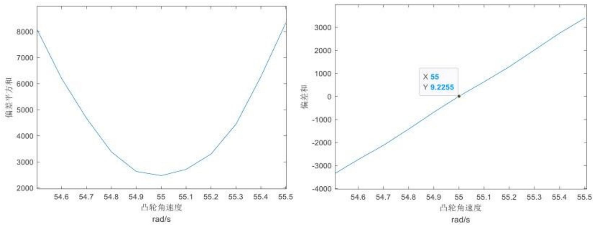  
图25、26 $t_{0}^{\prime}=50ms,\quad\omega=54.5:55.5rad/s$ ，压力的偏差平方和及偏差和

接着固定 $\omega=55rad/s$ ，取凸轮角速度 $t_{0}^{\prime}$ 为0到95ms，如图所示， $t_{0}^{\prime}$ 的最优值为45ms。

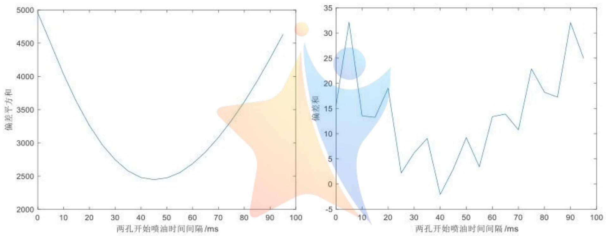  
图27、28 $\omega=55rad/s$ , $t_{0}^{\prime}=0:95ms$ ，压力的偏差平方和和偏差和

最后固定 $t_0^{\prime} = 45 \mathrm{~ms}$ , 取不同 $\omega$ 的值, 重复以上过程, 得到问题的近似最优解为

$$
\begin{array}{l} t _ {0} ^ {\prime} = 5 0 \mathrm{ms} \\ \omega = 55\text{rad/s} \\ \end{array}
$$

## 3.2 第二小问模型的建立、求解和结果

## 3.2.1 模型的建立与求解

在第一小问的基础上安装了一个减压阀，因减压阀的种类和工作原理未知，现提供两种最常见的形式。

## (1) 泄压阀式减压阀

这种减压阀工作方式与传统泄压阀一致，即其存在一个泄压阈值压力 $P_{R}$ ; 当 t 时刻高压油泵压力 $P(t) > P_{R}$ 时，减压阀打开，否则关闭。

引入 0-1 变量 $f_{2}(t)$ ，描述泄压状态：

$$
\mathrm{f} _ {2} (\mathrm{t}) = \left\{ \begin{array}{l l} 1, & \text {减压阀关闭} \\ 0, & \text {减压阀关闭} \end{array} \right.
$$

该变量可表达为

$$
\mathrm{f} _ {2} (\mathrm{t}) = \frac {\operatorname{sgn} (\mathrm{P} (\mathrm{t}) - \mathrm{P} _ {\mathrm{R}}) \cdot [ \operatorname{sgn} (\mathrm{P} (\mathrm{t}) - \mathrm{P} _ {\mathrm{R}}) + 1 ]}{2} \tag {40}
$$

于是通过减压阀泄压的出油量为

$$
\mathrm{Q} _ {4} (\mathrm{t}) = \mathrm{f} _ {2} (\mathrm{t}) \cdot \mathrm{A} \sqrt {\frac {2 \cdot (\mathrm{P} (\mathrm{t}) - P _ {l o w})}{\rho (\mathrm{t})}} \tag {41}
$$

于是重新定义的出油量为

$$
\mathrm{E} ^ {\prime} (\mathrm{t}) = \mathrm{Q} _ {4} (\mathrm{t}) + \mathrm{E} (\mathrm{t}) \tag {42}
$$

所以这种情况下的模型为:

决策变量

$$
t _ {0} ^ {\prime}, \omega , P _ {R}
$$

目标函数

$$
\min Z = \int_ {t _ {1}} ^ {t _ {2}} (P (t) - P _ {e}) ^ {2} d t
$$

约束条件

方程组（38）（39）（42）

## (2) 电磁阀式减压阀

这种减压阀可以通过电磁导阀控制阀门的开闭, 磁导阀的脉冲式电压的周期直接决定了阀门开启和关闭的时长。设减压阀的开启时长为 $T_{on}$ , 关闭时长为 $T_{off}$ , 通过设定不同的 $t_0$ 来模拟电磁阀较喷油嘴开启的延后时间;

则其工作时间段为

$$
\Omega_ {5, i} = \left[ (i - 1) \cdot (\mathrm{T} _ {o n} + \mathrm{T} _ {o f f}), \mathrm{T} _ {o n} + (i - 1) \cdot (\mathrm{T} _ {o n} + \mathrm{T} _ {o f f}) \right], i = 1, 2, \dots , n _ {2}
$$

重新定义的出油量为

$$
\mathrm{E} (\mathrm{t}) = \left\{ \begin{array}{c} Q _ {2} (t), t \in \Omega_ {2, i} \\ Q _ {3} (t), t \in \Omega_ {3, i} \\ Q _ {5} (t), t \in \Omega_ {5, i} \\ 0, \text {其他} \end{array} , i = 1, 2, \dots , n _ {2} \right. \tag {43}
$$

通过减压阀泄压的出油量为

$$
Q _ {5} (t) = C A \sqrt {\frac {2 \cdot P (t)}{\rho (t)}} \tag {44}
$$

这种情况下模型为:

决策变量

$$
\mathrm{T} _ {o n}, \mathrm{T} _ {o f f}, \omega , t _ {0} ^ {\prime}, \mathrm{t} _ {0}
$$

目标函数

$$
\min Z = \int_ {t _ {1}} ^ {t _ {2}} (P (t) - P _ {e}) ^ {2}   \mathrm{d} t
$$

约束条件

方程组（38）（43）（44）

求解与第一小问类似，流程如图。

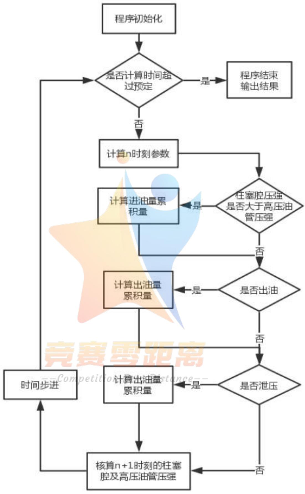

<details>
<summary>flowchart</summary>

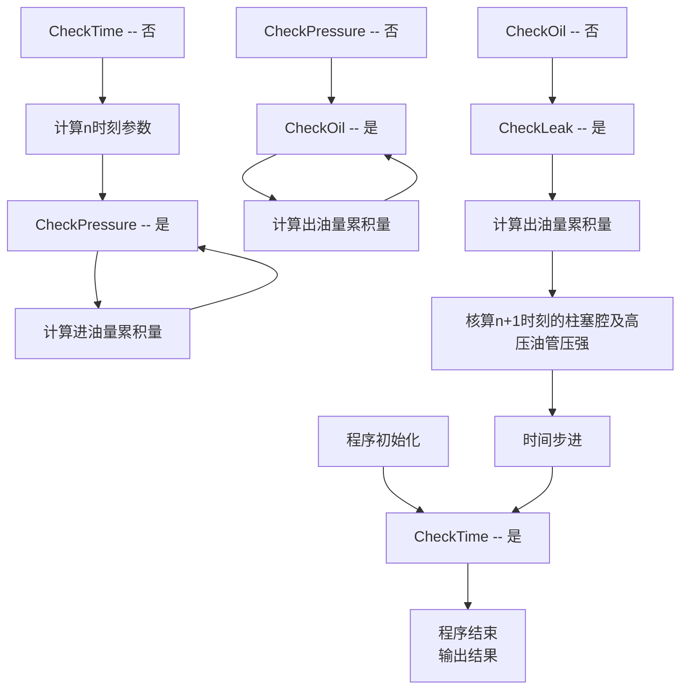
```mermaid
graph TD
  Start["程序初始化"] --> CheckTime{"是否计算时间超过预定"}
  CheckTime["CheckTime -- 是"] --> End["程序结束\n输出结果"]
  CheckTime2["CheckTime -- 否"] --> CalcN["计算n时刻参数"]
  CalcN --> CheckPressure{"柱塞腔压强\n是否大于高压油\n管压强"}
  CheckPressure["CheckPressure -- 是"] --> CalcIn["计算进油量累积量"]
  CalcIn --> CheckPressure
  CheckPressure2["CheckPressure -- 否"] --> CheckOil{"是否出油"}
  CheckOil["CheckOil -- 是"] --> CalcOut["计算出油量累积量"]
  CalcOut --> CheckOil
  CheckOil2["CheckOil -- 否"] --> CheckLeak{"是否泄压"}
  CheckLeak["CheckLeak -- 是"] --> CalcOut2["计算出油量累积量"]
  CalcOut2 --> CalcN2["核算n+1时刻的柱塞腔及高压油管压强"]
  CalcN2 --> TimeStep["时间步进"]
  TimeStep --> CheckTime
```
</details>

图29 问题3第二问的程序流程图

## 3.2.2 模型的结果

## (1) 泄压阀式减压阀

根据前一小题结论，可事先取定 $t_{0}^{\prime}=50ms$ ，设定 $P_{R}=100.5MPa$ ，取较高的 $\omega$ ，先得到下图：

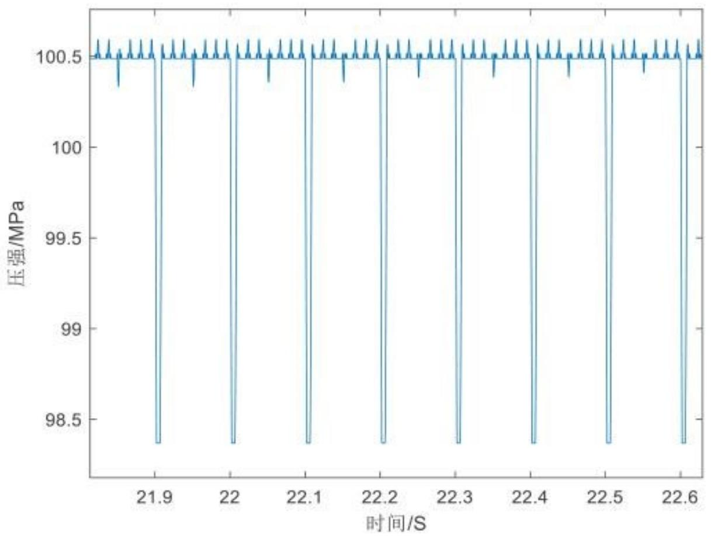

<details>
<summary>line</summary>

| 时间/S | 压强/MPa |
| --- | --- |
| 21.9 | ~98.4 |
| 22.0 | ~98.4 |
| 22.1 | ~98.4 |
| 22.2 | ~98.4 |
| 22.3 | ~98.4 |
| 22.4 | ~98.4 |
| 22.5 | ~98.4 |
| 22.6 | ~98.4 |
</details>

图30 加入泄压阀式减压阀的时间-压力图

这张图很好的解释了泄压阀的工作原理，当实际压力超过 $P_{R}$ 时，泄压阀开始工作并降低腔内的压力，而当实际压力低于 $P_{R}$ 时，泄压阀停止工作，此时较大的ω能够使实际压力迅速回升到 $P_{R}$ 附近，即泄压阀能使实际压力尽量稳定在 $P_{R}$ 附近，从而满足“压力尽可能稳定在100 MPa左右”的要求。

另外, 过大的 $\omega$ 意味着极高的凸轮转速, 当 $\omega = 800 \mathrm{rad} / \mathrm{s}$ 时, 油泵里最大的压力已经超过 $500 \mathrm{MPa}$ , 且此时凸轮转速达到 $7643 \mathrm{~r} / \mathrm{分钟}$ 。这是不可能实现的。又因为泄压阀的工作效率并未被明显限制 (由于小孔面积恒定), 所以问题只能取合适且较高的 $\omega$ 值, 将问题的维度降低, 寻找近似最优解, 具体过程不再赘述, 举以下例子说明问题。

取 $\omega=440rad/s,\ t_{0}^{\prime}=50ms,\ P_{R}$ 取值98-102.5MPa，类似地寻找近似最优解。

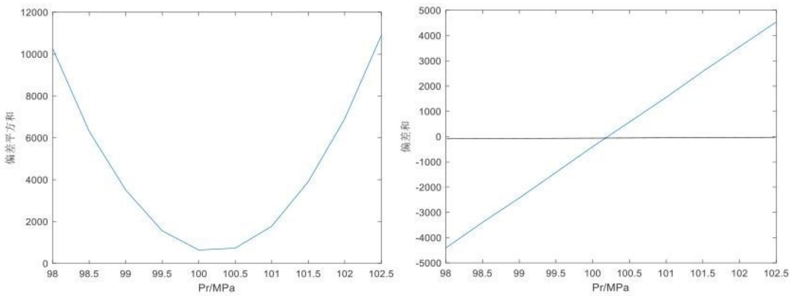  
图31、32 $\omega = 440rad/s$ , $t_{0}^{\prime} = 50ms$ , $P_{R}$ 为98-102.5MPa，压力偏差平方和和偏差和

## (2) 电磁阀式减压阀

如图31所示，电磁阀的工作时间刚好能够填充喷油嘴的工作间隙，这种情况下凸轮转动角速度 $\omega$ 较高。当仅电磁阀工作时，压力稳定在期望压力附近。

而当电磁阀停止工作，喷油嘴即将开始工作时，由于较高的凸轮转动角速度 $\omega$ ，油管压力立刻上升，为喷油做准备，这也将达到使实际压力尽量稳定在 $P_{R}$ 附近的目的。

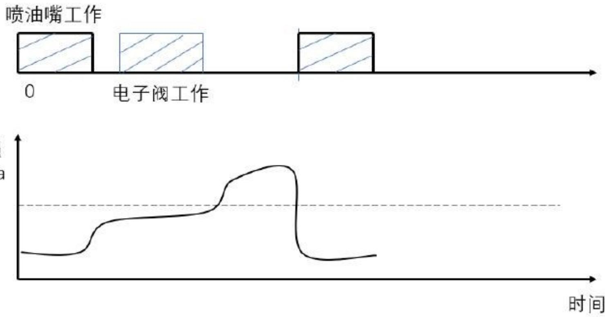

<details>
<summary>line</summary>

| 时间阶段 | 喷油嘴工作 (相对大小) | 电子阀工作 (相对大小) |
| --- | --- | --- |
| 0~1 | High | Low |
| 1~2 | Low | Rising |
| 2~3 | Low | Peak |
| 3~4 | Low | Drop |
| 4~5 | Low | Low |
</details>

图33 电磁阀工作刚好能够填充喷油嘴的工作间隙时，单个周期压力变化示意曲线

取定 $t_{0}^{\prime}=50ms$ ，要达到上述目标，必然要令 $T_{on}+T_{off}$ 的值为50ms的某一约数，同时调整合适的 $t_{0}$ 使得电磁阀工作时间与喷油嘴工作时间错开，取合适的 $\omega$ 求解问题。

令 $\omega=110\ rad/s,\ T_{on}$ 取值0到4，可得 $\frac{1}{2}T_{on}=1$ 时最优；

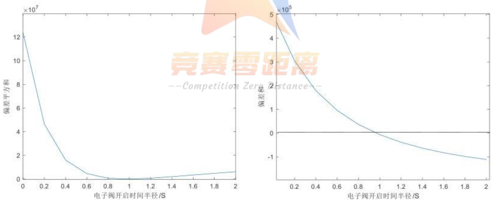  
图34、35 $\omega = 110rad/s$ , $t_{0}^{\prime} = 50ms$ , $T_{on}$ 取0-4S, 压力偏差平方和和偏差和

再令 $T_{on}=2$ ， $\omega$ 取值20到220，可得 $\omega=110\ rad/s$ 为最优；

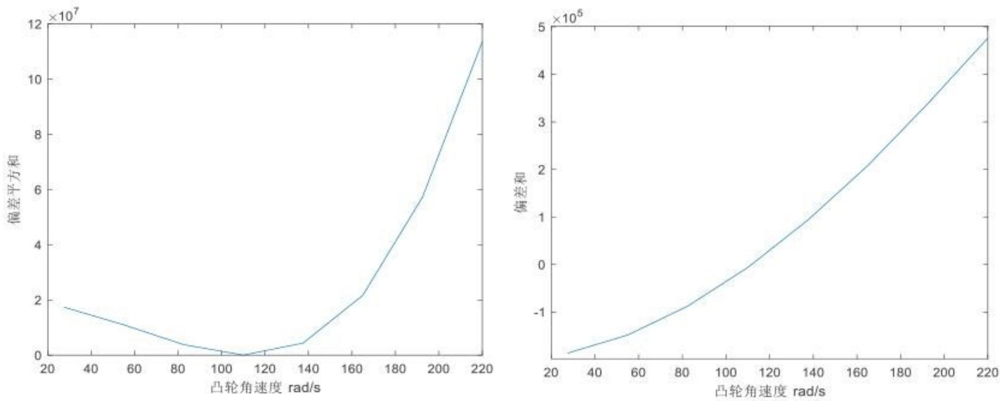  
图36、37 $T_{on}=2S,\quad\omega=20-220rad/s,\quad t_{0}^{\prime}=50ms$ ，压力偏差平方和和偏差和

可见 $T_{on}=2S,\omega=110\ rad/s$ 是近似的最优解。但综合前文，这一解的偏差平方和是较大的，也就是说不能控制流量的电磁式减压阀效果仍然较差。

## 七、模型评价

## 1 优点

(1) 模型在一定程度上准确且巧妙描述了问题, 且对其进行了相当的简化,易于理解操作。  
(2) 在该问题规模下，程序运行时间较快，空间占用很小。

## 2 缺点

(1) 由于采用数值模拟的方式对微分模拟进行了描述与求解, 模型始终一定误差。特别在泄压阀式减压阀的描述中, 程序无法对阈值这一概念精确描述, 所以在泄压阈值附近, 实际压力出现明显波动。

(2) 模型难以检验。  
(3) 模型空间复杂度与时间复杂度较高。

## 3 改进方法

(1) 由于高压油管的长度较直径更大, 显得同时长度量级较大, 所以可以考虑油管中压力传播的时间。将油管视为一维的长线, 设 $t$ 时刻 $x$ 位置油管的压力为

$$
\mathrm{P} (\mathrm{x}, \mathrm{t})
$$

可以考虑其传播速度为

$$
\mathrm{u} = \sqrt {\frac {E (P)}{\rho (P)}}
$$

将压力视为机械波，油管中压力的波动与传播情况。

(2) 第三个问题第二小问中的电磁阀式减压阀, 可以进一步考虑其为可控制流量的以更好的控制压力的变化。  
(3) 某些地方可以通过对常微分模型进行相轨分析, 以此弥补模型精度的不足。

## 八、参考文献

[1] 赵祎，黄立荣，马晓峰. 柴油机高压油管故障分析. 现代零部件，2013年，02期：68  
[2] 丁同仁, 李承治. 常微分方程教程. 高等教育出版社, 第二版

## 九、附录

## 1 密度压强关系计算程序

```matlab
clear;
%% 程序初始化
drou=0.00001;      %密度变化步长
rou1(1)=0.85;     %已知初始密度(100-200)
rou2(1)=0.85;     %(0-100)
p1(1)=100;         %已知初始压强(100-200)
p2(1)=100;         %(0-100)
n=1;                             %计数器
%% 算法主体
while(p1(end)>=0)
    n=n+1;
    rou1(n)=rou1(n-1)-drou;
    i=floor((p1(n-1))/50);
    if i==0
        E=1538.4;
    elseif i==1
        E=fun1(p1(n-1));
    else
        E=fun2(p1(n-1));
    end
    dp=E/((rou1(n-1)+rou1(n))/2)*drou;
    p1(n)=p1(n-1)-dp;
end
n=1;
while(p2(end)<=500)
    n=n+1;
    rou2(n)=rou2(n-1)+drou;
    i=floor((p2(n-1)-100)/50)+3;
    if i==5
```

```matlab
E=3393.4;
elseif i==3
    E=fun3(p2(n-1));
else
    E=fun4(p2(n-1));
end
dp=E/((rou2(n-1)+rou2(n))/2)*drou;
p2(n)=p2(n-1)+dp;
end
%% 数据拼接
for i=1:size(p1,2)
    Result(1,i)=p1(size(p1,2)+1-i);
    Result(2,i)=rou1(size(p1,2)+1-i);
end
p2(:,1)=[];
rou2(:,1)=[];
Result=[Result [p2;rou2]];
if Result(1,1) < 0 %去除首尾无效数据
    Result(:,1)=[];
end
if Result(1,end)>200
    Result(:,end)=[];
end
clear dp drou E i n p1 p2 rou1 rou2;
%% 分段多项拟合的函数
function [e]=fun1(p)      %0-49.5
    e=0.00004*p^3+0.0106*p^2+4.872*p+1538.4;
end
function [e]=fun2(p)      %50-99.5
    e=0.00006*p^3+0.0062*p^2+5.1165*p+1533.7;
end
function [e]=fun3(p)      %100-149.5
    e=0.0000005*p^4-
        0.0001*p^3+0.0308*p^2+3.5249*p+1573.3;
end
function [e]=fun4(p)      %150-200
    e=0.000001*p^4-0.0007*p^3+0.159*p^2-
        9.9328*p+2104.3;
end
```

## 2 问题1主程序

1. clear;  
2. tic;  
3. %% 数据载入  
4. load P\_rou.mat %P 与 Rou 的对应关系  
5. P\_ref=P\_rou(1,:);  
6. Rou\_ref=P\_rou(2,:);  
7. dtt=0.00001; %对应关系里的时间精度  
8. %% 数据初始化  
9. %可调参数  
10. T=0.288; %单向阀开启时间  
11. P(1)=100; %初始压强  
12. rou=0.85; %初始密度（调节压强的时候请同时条件密度）  
13. dt=0.001; %时间步长（精度）  
14. Tall=30000; %总模拟时间  
15. t0=0; %喷油开始时刻  
16. %其他参数  
17. V=12500\*pi; %油管体积  
18. m=rou\*V; %初始质量  
19. P\_I=160; %入口处的压强  
20. rou\_I=0.87143; %160MPa 时的密度  
21. Pe=100; %期望压强  
22. C=0.85; %流量系数  
23. A=pi\*0.7\*0.7; %小孔面积  
24. Itimes=1; %进油次数  
25. Etimes=1; %出油次数  
26. I\_prev=0; %前一时刻的进油量  
27. E\_prev=0; %前一时刻的出油量  
28. $\%$ 进油第一个周期的时长  
29. Tin\_start=0; %进油开始时刻  
30. Tin\_end=T; %进油结束时刻  
31. %出油第一个周期的时长  
32. Tout\_start=t0; %第一次喷油开始的时刻  
33. Tout\_1=Tout\_start+0.2; %出油速率第一段  
34. Tout\_2=Tout\_1+2; %出油速率第二段  
35. Tout\_end=Tout\_2+0.2; %出油速率第三段，完成一个周期内的出油工作  
36. %% 主程序  
37. for i=2:1:Tall/dt %0-Tallms  
38. %时间步进  
39. $t=(i-1)*dt;$  
40. %计算 t 时刻的燃油质量 m(t)  
41. %判断是否同时有进油和出油

```matlab
if t>Tin_start && t<=Tin_end && t>Tout_start && t<=Tout_end
    %同时有进油和出油
    I_now=C*A*sqrt(2*(P_I-P(i-1))/rou_I);%当前进油流量
    I=(I_now+I_prev)/2;
    I_prev=I_now;
    %计算出油流量速率
    if t<Tout_1
        E_now=100*(t-t0-100*(Etimes-1));
        E=(E_now+E_prev)/2;
        E_prev=E_now;
    elseif t<Tout_2
        E_now=20;
        E=(E_now+E_prev)/2;
        E_prev=E_now;
    else
        E_now=240-100*(t-t0-100*(Etimes-1));
        E=(E_now+E_prev)/2;
        E_prev=E_now;
    end
    elseif t>Tin_start && t<=Tin_end          %只有进油
    I_now=C*A*sqrt(2*(P_I-P(i-1))/rou_I);  %当前进油流量
    I=(I_now+I_prev)/2;
    I_prev=I_now;
    E_now=0;--Competition Zero Distance--
    E=(E_now+E_prev)/2;
    E_prev=E_now;
    %出油是否进入下一个周期
    if abs(t-(Tout_start+100))<0.001
        Etimes=Etimes+1;          %新一次出油周期即将开始
        Tout_start=t;
        Tout_1=Tout_start+0.2;      %出油速率第一段
        Tout_2=Tout_1+2;       %出油速率第二段
        Tout_end=Tout_2+0.2;     %出油速率第三段,完成一个周期内的出油工作
    end
    elseif t>Tout_start && t<=Tout_end %只有出油
        I_now=0;
        I=(I_now+I_prev)/2;
        I_prev=I_now;
```

```matlab
if t<Tout_1
    E_now=100*(t-t0-100*(Etimes-1));
elseif t<Tout_2
    E_now=20;
else
    E_now=240-100*(t-t0-100*(Etimes-1));
end
E=(E_now+E_prev)/2;
E_prev=E_now;
%进油是否进入下一个周期
if abs(t-(Tin_end+10))<0.001
    Itimes=Itimes+1;          %新一次进油周期即将开始
    Tin_start=t;
    Tin_end=t+T;            %进油结束时刻
end
else                      %没有进油和出油
    I_now=0;
    I=(I_now+I_prev)/2;
    I_prev=I_now;
    E_now=0;
    E=(E_now+E_prev)/2;
    E_prev=E_now;
    if abs(t-(Tin_end+10))<0.001
        Itimes=Itimes+1;      %新一次进油周期即将开始
        Tin_start=t;
        Tin_end=t+T;          %进油结束时刻
    end
    if abs(t-(Tout_start+100))<0.001
        Etimes=Etimes+1;      %新一次出油周期即将开始
        Tout_start=t;
        Tout_1=Tout_start+0.2;   %出油速率第一段
        Tout_2=Tout_1+2;       %出油速率第二段
        Tout_end=Tout_2+0.2;   %出油速率第三段，完成一个周期内的出油工作
    end
end
m=m+dt*(rou_I*I-rou*E);
rou=m/V;
%计算 t 时刻的密度
P(i)=P_ref(int16(floor(rou/dtt)-Rou_ref(1)/dtt+1)); %计算 t 时刻的压强
```

118. end  
119. clear A C dt dtt E E\_now E\_prev Etimes i I I\_now I\_prev Itimes k m P\_I P\_ref P\_rou Pe qw rou rou\_I Rou\_ref t T0 Tall Tin\_end Tin\_start Tout\_1 Tout\_2 Tout\_end Tout\_start V W Z  
120. %% 图形显示  
121. plot(P);  
122. toc

## 3 问题2主程序

1. clear;  
2. tic; %程序计时  
3. $\%$ 数据载入  
4. load 'Result'; %密度压强关系  
5. load 'rad'; %凸轮极径  
6. load 'S' %升程与小孔面积关系  
7. %以上 S 的来源  
8. % load '针阀运动.mat';  
9. % S0=pi\*0.7^2;  
10. % %生成针阀运动对应的出油口面积  
11. % for i=1:1:246 %0-2.45ms  
12. % S(i)=pi\*f(2,i)\*sind(9)\*(2.5+f(2,i)\*sind(9)\*cosd(9);
);  
13. % if S(i)>S0  
14. % S(i)=S0;  
15. % end  
16. % end  
17. %可调节参数  
18. w=27.5; %转速，弧度制  
19. dt=0.01; %精度，时间步长  
20. Talls=50; %总运行时间，秒  
21. Tall=Talls\*1000;%总运行时间，毫秒  
22. rou=0.85; %初始密度(程序对该数据精度敏感)  
23. t0=0; %喷油开始时间  
24. pc=0.5; %初始油泵压强  
25. $\%$ 恒常参数及衍生参数  
26. v=12500\*pi; %油管体积  
27. m=rou\*v; %油管油量  
28. vθ=20; %油泵残余油量  
29. vc=v0+pi\*2.5\*2.5\*(7.239-2.413); %油泵最大油量  
30. rc=2.413; %升程

```matlab
rouc=0.80255;      %油泵密度
mc=rouc*vc;       %油泵质量
p(1)=Result(1,floor(10^5*(rou)-80229));%油管初始压强
%程序用参数
pt=p;
for i=1:1:(Tall/dt)
    p(i)=pt;
    t=i*dt;      %当前时间，ms
    %循环累积量初始化（程序用变量）
    dQ=0;
    dm=0;
    dQc=0;
    dvc=0;
    dmc=0;
    %% 变化量累积
    %进出油
    %当前时间处于出油时间，即 t∈[t_0+100·(i-1),2.4+t_0+100·(i-1)]
    if t0/100-floor(t0/100) <= t/100-floor(t/100) && t/100-floor(t/100) < (t0+2.45)/100-floor((t0+2.45)/100)
        t1=100*((t-t0)/100-floor((t-t0)/100));%于 t_0+100·(i-1)时刻
        dQ=-0.85*S(round(100*t1)+1)*sqrt(2*pt/rou)*dt;
        dm=dm+dQ*rou;
    end
    %进油
    if pc>pt
        dQ=0.85*0.7*0.7*pi*sqrt(2*(pc-pt)/rouc)*dt;
        dm=dm+dQ*rouc;
        dQc=-0.85*0.7*0.7*pi*sqrt(2*(pc-pt)/rouc)*dt;
        dmc=dmc+dQc*rouc;
    end
    %凸轮转动
    seta=w*t/1000;
    while seta>=2*pi      %限制在 0 到 2*pi
        seta=seta-2*pi;
    end
    if seta <= pi          %升程小孔面积由分段拟合得到
        dr=fun1(seta)-rc;
        rc=fun1(seta);
    else
        dr=fun2(seta)-rc;
```

```matlab
70. rc=fun2(seta);
71. end
72. %% 核算高压油管状态
73. m=m+dm;
74. rou=m/v;
75. if rou<=0.8025
76. pt=0.016182;
77. else
78. pt=Result(1,floor(10^5*rou-80229));
79. end
80. %% 核算栓塞腔状态
81. dv=pi*2.5*2.5*dr;
82. vc=vc-dv;
83. mc=mc+dmc;
84. rouc=mc/vc;
85. %判断油泵是否回油
86. if rouc <= 0.80255 %(即对应压强小于 0.5Mpa)
87. pc=0.495479034926858;
88. rouc=0.80255;
89. mc=rouc*vc;
90. else %核算压强
91. pc=Result(1,floor(10^5*rouc-80229));
92. end
93. end
94. clear dm dmc dQ dQc dr dt dv dvc i m mc pc pt rc rad Res
ult rou rouc S seta t t0 t1 Talls v v0 vc w;
95. %% 结果作图
96. A=0:0.01*0.001:Tall/1000-0.01*0.001;
97. plot(A,p);
98. toc
99. clear A Tall;
100. function [r]=fun1(setat)
101. r=0.00003*setat^6 + 0.018*setat^5 - 0.1429*setat^
4 + 0.0504*setat^3 + 1.178*setat^2 + 0.0028*setat + 2.412
6;
102. end
103. function [r]=fun2(setat)
104. r=-1E-
05*setat^6 - 0.018*setat^5 + 0.4272*setat^4 - 3.6351*seta
t^3 + 13.38*setat^2 - 20.644*setat + 16.659;
105. end
```

## 4 问题3\_1主程序

1. clear;  
2. tic; %程序计时  
3. %数据载入  
4. load 'Result'; %密度压强关系  
5. load 'rad'; %凸轮极径  
6. load 'S' %升程与小孔面积关系  
7. %以上 S 的来源  
8. % load '针阀运动.mat';  
9. % S0=pi\*0.7^2;  
10. % %生成针阀运动对应的出油口面积  
11. % for i=1:1:246 %0-2.45ms  
12. % S(i)=pi\*f(2,i)\*sind(9)\*(2.5+f(2,i)\*sind(9)\*cosd(9));  
13. % if S(i)>S0  
14. % S(i)=S0;  
15. % end  
16. % end  
17. %可调节参数  
18. w=27.5\*2; %转速，弧度制  
19. dt=0.01; %精度，时间步长  
20. t0=0; %喷油开始时间  
21. t01=50; %第二个喷嘴较第一个延迟开启时间  
22. Talls=50; %总运行时间，秒  
23. Tall=Talls\*1000;%总运行时间，毫秒  
24. rou=0.85; %初始密度(程序对该数据精度敏感)  
25. pc=0.5; %初始油泵压强  
26. $\%$ 恒常参数及衍生参数  
27. v=12500\*pi; %油管体积  
28. m=rou\*v; %油管油量  
29. v0=20; %油泵残余油量  
30. vc=v0+pi\*2.5\*2.5\*(7.239-2.413); %油泵最大油量  
31. rc=2.413; %升程  
32. rouc=0.80255; %油泵密度  
33. mc=rouc\*vc; %油泵质量  
34. p(1)=Result(1,floor(10^5\*(rou)-80229));%油管初始压强  
35. %程序用参数  
36. pt=p;  
37. for i=1:1:(Tall/dt)  
38. $p(i) = pt;$  
39. $t = i^{*}dt;$ %当前时间，ms  
40. %循环累积量初始化（程序用变量）

```matlab
dQ=0;
dm=0;
dQc=0;
dvc=0;
dmc=0;
%% 变化量累积
%进出油
%当前时间处于出油时间，即 t∈[t_0+100·(i-1),2.4+t_0+100·(i-1)]
if t0/100-floor(t0/100) <= t/100-floor(t/100) && t/100-floor(t/100) < (t0+2.45)/100-floor((t0+2.45)/100)
    t1=100*((t-t0)/100-floor((t-t0)/100));%于 t_0+100·(i-1)时刻
    dQ=-0.85*S(round(100*t1)+1)*sqrt(2*pt/rou)*dt;
    dm=dm+dQ*rou;
end
if (t0+t01)/100-floor((t0+t01)/100) <= t/100-floor(t/100) && t/100-floor(t/100) < (t0+t01+2.45)/100-floor((t01+t0+2.45)/100)
    t1=100*((t-t0-t01)/100-floor((t-t0-t01)/100));%于 t_0+100·(i-1)时刻
    dQ=-0.85*S(round(100*t1)+1)*sqrt(2*pt/rou)*dt;
    dm=dm+dQ*rou;
end
%进油
if pc>pt
    dQ=0.85*0.7*0.7*pi*sqrt(2*(pc-pt)/rouc)*dt;
    dm=dm+dQ*rouc;
    dQc=-0.85*0.7*0.7*pi*sqrt(2*(pc-pt)/rouc)*dt;
    dmc=dmc+dQc*rouc;
end
%凸轮转动
seta=w*t/1000;
while seta>=2*pi      %限制在 0 到 2*pi
    seta=seta-2*pi;
end
if seta <= pi       %升程小孔面积由分段拟合得到
    dr=fun1(seta)-rc;
    rc=fun1(seta);
else
    dr=fun2(seta)-rc;
    rc=fun2(seta);
```

```matlab
end
    %% 核算高压油管状态
    m=m+dm;
    rou=m/v;
    if rou<=0.8025
        pt=0.016182;
    else
        pt=Result(1,floor(10^5*rou-80229));
    end
    %% 核算栓塞腔状态
    dv=pi*2.5*2.5*dr;
    vc=vc-dv;
    mc=mc+dmc;
    rouc=mc/vc;
    %判断油泵是否回油
    if rouc <= 0.80255      %(即对应压强小于 0.5Mpa)
        pc=0.495479034926858;
        rouc=0.80255;
        mc=rouc*vc;
    else                          %核算压强
        pc=Result(1,floor(10^5*rouc-80229));
    end
end
clear dm dmc dQ dQc dr dt dv dvc i m mc pc pt rc rad
    Result rou rouc S seta t t0 t1 Talls v v0 vc w;
    %% 结果作图
    A=0:0.01*0.001:Tall/1000-0.01*0.001;
    plot(A,p);
    toc
    clear A Tall;
    function [r]=fun1(setat)
        r=0.00003*setat^6 + 0.018*setat^5 - 0.1429*setat^4 + 0.0504*setat^3 + 1.178*setat^2 + 0.0028*setat + 2.4126;
    end
    function [r]=fun2(setat)
        r=-1E-
        05*setat^6 - 0.018*setat^5 + 0.4272*setat^4 - 3.6351*setat^3 + 13.38*setat^2 - 20.644*setat + 16.659;
end
```

## 5 问题3\_2主程序\_电磁阀

1. clear;  
2. tic; %程序计时  
3. %数据载入  
4. load 'Result'; %密度压强关系  
5. load 'rad'; %凸轮极径  
6. load 'S' %升程与小孔面积关系  
7.  
8. %可调节参数  
9. tr0=2.45+(50-2.45)/2;%50 内减压阀工作中心时刻  
10. w=112; %转速，弧度制  
11. TR=1; %50ms 内减压阀开启时间的一半  
12. dt=0.01; %精度，时间步长  
13. t01=50; %第二个喷嘴较第一个延迟开启时间  
14. Talls=50; %总运行时间，秒  
15. Tall=Talls\*1000;%总运行时间，毫秒  
16. rou=0.85; %初始密度(程序对该数据精度敏感)  
17. t0=0; %喷油开始时间  
18. pc=0.5; %初始油泵压强  
19. %恒常参数及衍生参数  
20. v=12500\*pi; %油管体积  
21. m=rou\*v; %油管油量  
22. vθ=20; %油泵残余油量  
23. pe=100; %油管期望压强  
24. vc=v0+pi\*2.5\*2.5\*(7.239-2.413); %油泵最大油量  
25. rc=2.413; %升程  
26. rouc=0.80255; %油泵密度  
27. mc=rouc\*vc; %油泵质量  
28. p(1)=Result(1,floor(10^5\*(rou)-80229));%油管初始压强  
29. %程序用参数  
30. pt=p;  
31. for i=1:1:(Tall/dt)  
32. p(i)=pt;  
33. $t=i*dt;\quad\%$ 当前时间，ms  
34. %循环累积量初始化（程序用变量）  
35. dQ=0;  
36. $dm = 0$ ;  
37. dQc=0;  
38. dvc=0;  
39. dmc=0;  
40. %% 变化量累积  
41. %出油

42. %第一个喷油嘴当前时间处于出油时间，即 $t \in [t0 + 100 \cdot (i - 1), 2.4 + t0 + 100 \cdot (i - 1)]$

43. if t0/100-floor(t0/100) <= t/100-floor(t/100) && t/100-floor(t/100) < (t0+2.45)/100-floor((t0+2.45)/100)

44. $t1=100*((t-t0)/100-floor((t-t0)/100));$

45. dQ=-0.85\*S(round(100\*t1)+1)\*sqrt(2\*pt/rou)\*dt;

46. $dm = dm + dQ^{*}rou;$

47. end

48. %第二个喷油嘴当前时间处于出油时间，即 $t \in [t0 + t01 + 100 \cdot (i - 1), 2.4 + t0 + t01 + 100 \cdot (i - 1)]$

49. if (t0+t01)/100-floor((t0+t01)/100) <= t/100-floor(t/100) && t/100-floor(t/100) < (t0+t01+2.45)/100-floor((t01+t0+2.45)/100)

50. t1=100\*((t-t0-t01)/100-floor((t-t0-t01)/100));

51. dQ=-0.85\*S(round(100\*t1)+1)\*sqrt(2\*pt/rou)\*dt;

52. dm=dm+dQ\*rou;

53. end

54. %进油

55. if pc>pt

56. dQ=0.85\*0.7\*0.7\*pi\*sqrt(2\*(pc-pt)/rouc)\*dt;

57. dm=dm+dQ\*rouc;

58. dQc=-0.85\*0.7\*0.7\*pi\*sqrt(2\*(pc-pt)/rouc)\*dt;

59. dmc=dmc+dQc\*rouc;

60. end

61. %卸油

62. %当前时间处于单向阀开启时间，即 $t \in [\text{tr0}-\text{TR}+50 \cdot (\text{i}-1), \text{tr0}+\text{TR}+50 \cdot (\text{i}-1)]$

if (tr0-TR)/50-floor((tr0-TR)/50) <= t/50-floor(t/50) && t/50-floor(t/50) < (tr0+TR)/50-floor((tr0+TR)/50)

64. dQ=-0.85\*0.7\*0.7\*pi\*sqrt(2\*(pt-0.5)/rou)\*dt;

65. dm=dm+dQ\*rou;

66. end

67.

68. %凸轮转动

seta=w\*t/1000;

70. while seta>=2\*pi %限制在 0 到 2\*pi

71. seta=seta-2\*pi;

72. end

73. if seta <= pi %升程小孔面积由分段拟合得到

```matlab
74. dr=fun1(seta)-rc;
75. rc=fun1(seta);
76. else
77. dr=fun2(seta)-rc;
78. rc=fun2(seta);
79. end
80. %% 核算高压油管状态
81. m=m+dm;
82. rou=m/v;
83. if rou<=0.8025
84. pt=0.016182;
85. else
86. pt=Result(1,floor(10^5*rou-80229));
87. end
88. %% 核算栓塞腔状态
89. dv=pi*2.5*2.5*dr;
90. vc=vc-dv;
91. mc=mc+dmc;
92. rouc=mc/vc;
93. %判断油泵是否回油
94. if rouc <= 0.80255      %(即对应压强小于 0.5Mpa)
95. pc=0.495479034926858;
96. rouc=0.80255;
97. mc=rouc*vc;
98. else                      %核算压强
99. pc=Result(1,floor(10^5*rouc-80229));
100. end
101.
102. end
103. clear dm dmc dQ dQc dr dt dv dvc i m mc pc pt rc rad
Result rou rouc S seta t t0 t1 Talls v v0 vc w;
104. %% 结果作图
105. figure;
106. A=0:0.01*0.001:Tall/1000-0.01*0.001;
107. plot(A,p);
108. toc
109. clear A Tall;
110. function [r]=fun1(setat)
111. r=0.00003*setat^6 + 0.018*setat^5 - 0.1429*setat^4 + 0.0504*setat^3 + 1.178*setat^2 + 0.0028*setat + 2.4126;
112. end
113. function [r]=fun2(setat)
```

```matlab
114. r=-1E-
05*setat^6 - 0.018*setat^5 + 0.4272*setat^4 - 3.6351*seta
t^3 + 13.38*setat^2 - 20.644*setat + 16.659;
115. end
```

6 问题3\_2主程序\_泄压阀  
```matlab
clear;
tic;                      %程序计时
%数据载入
load 'Result';   %密度压强关系
load 'rad';       %凸轮极径
load 'S'           %升程与小孔面积关系
%以上 S 的来源
% load '针阀运动.mat';
% S0=pi*0.7^2;
% %生成针阀运动对应的出油口面积
% for i=1:1:246 %0-2.45ms
%     S(i)=pi*f(2,i)*sind(9)*(2.5+f(2,i)*sind(9)*cosd(9)
);
%    if  S(i)>S0
%         S(i)=S0;
% end
% end
%可调节参数
w=27.5*4;          %转速，弧度制
pr=100.5;          %泄压压强
dt=0.01;          %精度，时间步长
t01=50;          %第二个喷嘴较第一个延迟开启时间
Talls=50;          %总运行时间，秒
Tall=Talls*1000;%总运行时间，毫秒
rou=0.85;          %初始密度(程序对该数据精度敏感)
t0=0;                  %喷油开始时间
pc=0.5;          %初始油泵压强
%恒常参数及衍生参数
v=12500*pi;      %油管体积
m=rou*v;        %油管油量
v0=20;          %油泵残余油量
vc=v0+pi*2.5*2.5*(7.239-2.413); %油泵最大油量
rc=2.413;       %升程
rouc=0.80255;   %油泵密度
mc=rouc*vc;      %油泵质量
```

```matlab
p(1)=Result(1,floor(10^5*(rou)-80229));%油管初始压强
%程序用参数
pt=p;
for i=1:1:(Tall/dt)
    p(i)=pt;
    t=i*dt;      %当前时间，ms
    %循环累积量初始化（程序用变量）
    dQ=0;
    dm=0;
    dQc=0;
    dvc=0;
    dmc=0;
    flag=1;%是否 guo
    %% 变化量累积
    %进出油
    %当前时间处于出油时间，即 t∈[t_0+100·(i-1),2.4+t_0+100·(i-1)]
    if t0/100-floor(t0/100) <= t/100-floor(t/100) && t/100-floor(t/100) < (t0+2.45)/100-floor((t0+2.45)/100)
        t1=100*((t-t0)/100-floor((t-t0)/100));%于 t_0+100·(i-1)时刻
        dQ=-0.85*S(round(100*t1)+1)*sqrt(2*pt/rou)*dt;
        dm=dm+dQ*rou;
    end
    if (t0+t01)/100-floor((t0+t01)/100) <= t/100-floor(t/100) && t/100-floor(t/100) < (t0+t01+2.45)/100-floor((t01+t0+2.45)/100)
        t1=100*((t-t0-t01)/100-floor((t-t0-t01)/100));%于 t_0+100·(i-1)时刻
        dQ=-0.85*S(round(100*t1)+1)*sqrt(2*pt/rou)*dt;
        dm=dm+dQ*rou;
    end
    %进油
    if pc>pt
        dQ=0.85*0.7*0.7*pi*sqrt(2*(pc-pt)/rouc)*dt;
        dm=dm+dQ*rouc;
        dQc=-0.85*0.7*0.7*pi*sqrt(2*(pc-pt)/rouc)*dt;
        dmc=dmc+dQc*rouc;
    end
    %卸油
    if pt > pr
        mθ=m+dm;          %不泄压的质量
```

```matlab
71.     rou0=m/v;          %不泄压的密度
72.     if rou0<=0.8025 %不泄压的压强
73.         pt0=0.016182;
74.     else
75.         pt0=Result(1,floor(10^5*rou0-80229));
76.     end
77.     dQ=-0.85*0.7*0.7*pi*sqrt(2*pt/rou)*dt;
78.     dmr=dm+dQ*rou;
79.     mr=m+dmr;          %泄压后压强
80.     rour=mr/v;          %泄压后密度
81.     if rour<=0.8025%%泄压后压强
82.         ptr=0.016182;
83.     else
84.         ptr=Result(1,floor(10^5*rou-80229));
85.     end
86.     if ptr < pr && pt0 >= 0 %若不泄压压强大于 pr，但泄压后压强小于 pr，发生过度泄压，修正泄压策略
87.         flag=0;
88.         j=0;
89.         while(ptr < pr)      %修正泄压策略
90.             j=j+1;
91.             ptr=Result(1,floor(10^5*rou-80229)+j);
92.         end
93.         rou=Result(2,floor(10^5*rou-80229)+j); %修
正后密度
94.         pt=Result(1,floor(10^5*rou-80229)+j); %修
正后压强
95.         m=rou*v;                  %修
正后质量
96.     else
97.         dm=dmr;                  %不
发生过度泄压
98.     end
99.    end
100.     %凸轮转动
101.     seta=w*t/1000;
102.     while seta>=2*pi   %限制在 0 到 2*pi
103.         seta=seta-2*pi;
104.     end
105.     if seta <= pi       %升程小孔面积由分段拟合得到
106.         dr=fun1(seta)-rc;
107.         rc=fun1(seta);
108.     else
109.         dr=fun2(seta)-rc;
```

```matlab
rc=fun2(seta);
end
%% 核算高压油管状态
if flag == 1
m=m+dm;
rou=m/v;
if rou<=0.8025
pt=0.016182;
else
pt=Result(1,floor(10^5*rou-80229));
end
end
%% 核算栓塞腔状态
dv=pi*2.5*2.5*dr;
vc=vc-dv;
mc=mc+dmc;
rouc=mc/vc;
%判断油泵是否回油
if rouc <= 0.80255 %(即对应压强小于 0.5Mpa)
pc=0.495479034926858;
rouc=0.80255;
mc=rouc*vc;
else %核算压强
pc=Result(1,floor(10^5*rouc-80229));
end
end
clear dm dmc dQ dQc dr dt dv dvc i m mc pc pt rc rad
Result rou rouc S setat t0 t1Talls v v0 vc w;
%% 结果作图
A=0:0.01*0.001:Tall/1000-0.01*0.001;
plot(A,p);
toc
clear A Tall;
function [r]=fun1(setat)
r=0.00003*setat^6 + 0.018*setat^5 - 0.1429*setat^4 + 0.0504*setat^3 + 1.178*setat^2 + 0.0028*setat + 2.4126;
end
function [r]=fun2(setat)
r=-1E-
05*setat^6 - 0.018*setat^5 + 0.4272*setat^4 - 3.6351*setat^3 + 13.38*setat^2 - 20.644*setat + 16.659;
end
```