# 高压油管压力波动的稳定控制摘要

本文针对燃油进入和喷出高压油管的过程，以高压油管内压力波动最小为目标建立目标规划模型，对单向阀开启时长、凸轮角速度以及减压阀开启条件等系统参数进行搜索求解，最终稳定管内压力。

针对问题一，首先对附件三弹性模量与压力的关系表格进行曲线拟合，结合燃油压力变化量与密度变化量的正比关系得到燃油压力与密度关系式。然后通过分析微小时间内进入高压油管的燃油质量与排出高压油管的燃油质量，得到高压油管内燃油质量差。假设管内密度均匀，进一步推出燃油密度变化，通过燃油压力与密度关系式推得压力变化，使微小时段无穷逼近于零，建立微分方程模型。通过有限差分法求得一系列离散时刻管内燃油的密度和质量，进而求得管内压力。以高压油管内的压力波动在初始值100MPa左右为目标建立优化模型。运用多重搜索算法分别以0.5s和0.0001s的步长进行搜索求解，得到要求高压油管内压力稳定在100MPa时，单向阀单次开启时长为0.2875ms；要求分别在2s、5s和10s后管内压力稳定在150MPa时，压力尚未稳定时单向阀开启时长随时间线性变化，压力稳定后单向阀开启时长恒为0.765ms。

针对问题二，考虑进油处的凸轮角速度和出油处的针阀运动，二者分别影响高压油管的进油流量和出油流量。为求解进油流量，由凸轮边缘曲线与角度的关系求得柱塞的运动情况，从而得到腔内的体积与燃油的密度变化情况，由燃油压力与密度关系式得到其压力变化情况。为求解喷油流量，由已知喷油器的喷嘴结构及针阀升程与时间的关系得到针阀与密封座之间的空隙面积，将喷油面积定义为空隙面积与喷孔面积的较小值。运用多重搜索算法搜索凸轮合适的角速度，以稳定高压油管内的压力在100 MPa左右为目标建立优化模型。求解得到1000s的求解周期内，凸轮角速度为0.0273rad/ms时，高压油管内压力稳定在100MPa左右，并在其附近小幅度上下波动。

针对问题三, 从两个喷油嘴喷射时间的间隔和凸轮转动角速度两个方面调整喷油和供油策略。供油策略的调整主要由凸轮运动角速度 $\omega$ 决定, 根据其变化规律, 将 $\omega$ 的调整融合进其他参量的求解过程中。喷油策略为在两个喷油嘴的喷油规律相同的条件下, 对两个喷油嘴开始喷油的时间间隔进行调整。因此, 以管内压力波动幅度为目标建立优化模型求解最佳喷射间隔。求解得到最佳喷射间隔 $\Delta t = 49.1\mathrm{ms}$ 时压强差值指标 $Z$ 达到最小。在原有模型的基础上考虑单向减压阀的控制方案。由单向减压阀的工作原理, 设置减压阀开启条件, 即设阈值压强 $P^{*}$ , 当 $P > P^{*}$ 为减压阀开启条件, 否则, 单向阀关闭。此时, 以使压强差值指标 $Z$ 最小为目标, 搜寻阈值压强 $P^{*}$ 。求解得到设定单向减压阀阈值压强为 $102.25\mathrm{MPa}$ , 角速度为 $0.056\mathrm{rad/ms}$ 时高压油管内压力差值最小。

本题中建立的规划模型针对系统各项重要参数的求解均很好控制了高压油管内的压力，从而保证了发动机的工作效率。模型具有的现实意义也可以让其运用在广泛的领域中。

## 一、问题重述

燃油发动机工作主要包括两个部分，分别为燃油进入和喷出高压油管。在燃油经过高压油泵进入高压油管，然后再由喷口喷出的间歇性工作过程中，燃油的运动会导致高压油管内压力的变化，使得燃油喷出喷口的数量出现偏差，为此，我们需要控制压力使燃油发动机的工作效率尽量稳定。具体，需要解决以下三个问题。

## 问题一：

已知某型号高压油管的内腔长度、内直径、供油入口等几何参数，给定喷油器的工作频率和单向阀打开后的关闭时间。为了控制压力使燃油发动机的工作效率尽量稳定，需要调节单向阀的工作时长，以使高压油管内的压力尽可能稳定。针对100 MPa和150 MPa两种需要稳定的压力情况，设置单向阀每次开启的时长；在后者的稳定要求下，调整单向阀开启的时长，在2s、5s和10s的调整过程后稳定高压油管内的压力。

## 问题二：

在实际工作过程中，燃油从高压油泵的柱塞腔出口处进入，从喷油嘴的针阀处喷出。高压油泵柱塞的压油过程中，柱塞被凸轮驱动上下运动，柱塞向上运动的时候柱塞腔内的燃油被压缩，当压缩至柱塞腔内的压力比高压油管内的压力大时，连接柱塞腔与高压油管的单向阀开启，高压油管内燃油进入。已知柱塞腔内直径以及柱塞运动到上、下止点位置时柱塞腔内的残余容积和低压燃油的压力。分析喷油器喷嘴结构，结合一个喷油周期内针阀升程与时间的关系，由问题一中求解出的喷油器工作次数、高压油管的尺寸以及给定的初始压力，确定凸轮的角速度，控制高压油管内的压力，使其尽量稳定在100MPa左右。

## 问题三：

在高压油管上增加一个喷油嘴，每个喷嘴保证喷油规律相同，为了更有效地控制高压油管的压力，需要调整喷油和供油策略。在问题二的基础上，在高压油管上增加一个单向减压阀，给定单向减压阀的出口直径。这种情况下的燃油进入和喷出可以在压力下回流到外部低压油路中，从而使得燃油在高压油管内的压力减小。基于这种设置，给出高压油泵和减压阀的控制方案。

## 二、问题分析

## 2.1 问题一的分析

问题一要使高压油管内的燃油压力稳定在给定值，已知燃油的压力变化量与密度变化量成正比，且比例系数为弹性模量与燃油的密度的比值。则若求得密度变化量，即可推得燃油的压力变化量。假设高压油管内的燃油分布均匀，即燃油密度在高压油管各部分相同，则需求得极短时间内高压油管内燃油的进出流量，从而得到燃油在极短时间段内的密度。

由附件三弹性模量与压力的关系表格，通过曲线拟合得到燃油的压力与密度的函数关系。建立微分方程模型，通过高压油泵在入口处提供的恒为160MPa的压力，得到外部燃油密度即高压侧燃油的密度；由高压油管内的初始燃油密度求得其内部压强，结合油管外给定压强由注2的流量计算公式可以得到dt时间段内进入高压油管的燃油流量，进而求得燃油在极小时间段的密度。高压油管从喷油嘴的针阀处喷出的燃油由所给喷油速率示意图求得，在极小的时间段内，由高压油管内燃油的进出流量求得其密度变化量, 进而通过流量计算公式求得油管内的压力。由此进行迭代可以求得下一时间段 dt 内的高压油管内部压力, 针对 100 MPa 和 150 MPa 两种需要稳定的压力情况, 搜索单向阀每次开启的时长, 使压力尽量保持稳定即可得到开启时长的最佳值。

## 2.2 问题二的分析

问题二考虑了实际工作情况，将燃油系统的结构调整为高压油泵的柱塞腔出口处产生高压油管A处的燃油，喷油嘴的针阀控制喷出的燃油。

针对进油部分，在柱塞的压油过程中，柱塞被凸轮驱动上下运动，从而改变柱塞腔内的压力，决定高压油泵内的燃油是否进入。那么，由凸轮边缘曲线与角度的关系可以求得柱塞的运动情况，从而得到腔内的体积变化情况，进而求得腔内燃油的密度变化，由燃油压力与密度关系式得到其压力变化。针对喷油部分，由已知喷油器的喷嘴结构及其工作条件，由附件2给出的在一个喷油周期内针阀升程与时间的关系可以得到针阀与密封座之间的空隙面积。将问题1中给定的喷油器工作次数、高压油管尺寸和初始压力等条件代入模型求解，搜索凸轮的角速度，以高压油管内的压力尽量稳定在100 MPa左右为规划目标建立规划模型，求解可以得到最佳角速度。

## 2.3 问题三的分析

问题三要求为使燃油发动机的高压油管内压力保持稳定, 调整喷油和供油策略。分析各部分所能调整的参数可得, 喷油策略的调整主要为调整两个喷油嘴喷射时间的间隔, 供油策略包括凸轮运动角速度的控制, 此外, 通过单向减压阀可以调节管内过高压力。

针对喷油和供油策略，供油策略的调整主要由凸轮运动角速度决定。在调整模型中其他参数值时，最佳角速度会发生变化，因此，将角速度的调整和求解融合进其他参量的求解过程中。

喷油策略需要对两个喷油嘴喷射时间的间隔进行调整。由题目可知，两个喷油嘴的喷油规律相同，对于两个喷油嘴开始喷射的时间间隔，假设喷油嘴的喷油规律不变，调整两个喷油嘴的喷油间隙，使高压油管内压力尽量稳定，从而求得在该喷油间隙下针阀运动的最佳角速度。以高压油管压力波动最小为目标建立规划模型求解最佳的喷油嘴开始喷射时间间隔。在原有模型的基础上考虑单向减压阀的引入。由单向减压阀的工作原理，设置单向减压阀的开启条件，设置阈值压强，管内压强大于阈值压强为减压阀开启条件，即此时燃油从油管内回流进减压阀，由流量计算公式求解减压阀中回流的燃油流量，从而得到高压油管内的燃油密度，进而得其压力，以压力波动最小为规划目标进行模型求解，可以得到减压阀的最佳开启条件。

## 三、模型假设

(1) 假定高压燃油中不存在气泡。  
(2) 假定喷嘴的喷油规律跟喷嘴在管道中处于哪个位置没有关系。  
(3) 假定忽略因零件加工精度等问题造成的燃油泄露, 只考虑圆柱针阀与活塞间的燃油泄露。  
（4）假定喷嘴是等间隔时长喷射的，即当1s喷射10次时，认为喷射周期为100ms。  
(5) 假定在同一容积腔内，燃油的压力和密度处处相等。

## 四、符号说明及名词定义

<table><tr><td>符号</td><td>说明</td></tr><tr><td> $I(t)$ </td><td>燃油从高压油泵进入的速率</td></tr><tr><td> $O(t)$ </td><td>燃油从喷油器喷出的速率</td></tr><tr><td> $\rho_1$ </td><td>高压油泵内的燃油密度</td></tr><tr><td> $\rho_2$ </td><td>高压油管内的燃油密度</td></tr><tr><td> $P_1$ </td><td>高压油泵内的压力</td></tr><tr><td> $P_2$ </td><td>高压油管内的压力</td></tr><tr><td> $M$ </td><td>某时刻凸轮与柱塞底部的接触点</td></tr><tr><td> $s_k$ </td><td>凸轮转角为 $\varphi_k$ 时柱塞的升程值</td></tr><tr><td> $h(t)$ </td><td>针阀在某时刻的升程</td></tr><tr><td> $R_1(t)$ </td><td>密封座截面半径</td></tr><tr><td> $t_d$ </td><td>单向减压阀单次开启时长</td></tr><tr><td> $Q_d$ </td><td>从减压阀中回流的燃油流量</td></tr><tr><td> $P = f(\rho)$ </td><td>燃油压力与密度关系式</td></tr></table>

表 1 符号说明

## 五、问题一的模型的建立与求解

## 5.1 模型的建立

问题一要使高压油管内的燃油压力尽量稳定在100Mpa左右，由注1已知燃油的压力变化量与密度变化量成正比，且比例系数为弹性模量与燃油的密度的比值，则可通过求解微分方程得到燃油压力与密度关系式。根据油泵进油和喷油器出油规律求解高压油管内的燃油密度，利用密度与压强关系，进一步推得使高压油管内的压力变化，设置单向阀每次开启的时长，尽可能使高压油管内的燃油压力稳定在100Mpa。

## 5.1.1 燃油压力与密度关系式

已知燃油的压力变化量与密度变化量成正比, 比例系数为弹性模量与燃油密度的比值。则燃油的压力变化量与密度变化量的关系可以表示为如下微分关系

$$
\frac {d P}{d \rho} = \frac {E}{\rho} \tag {1}
$$

将上式变形并作积分，得到方程

$$
\int \frac {d P}{E} - \int \frac {d \rho}{\rho} = C _ {0} \tag {2}
$$

其中，常数 $C_0$ 可由压力为 $100\mathrm{MPa}$ 时，燃油的密度为 $0.850\mathrm{mg / mm^3}$ 给定条件求得。由附件3弹性模量与压力的关系表格数据绘制压力随弹性模量的变化关系图。对图像进行曲线的二次拟合，得到压力 $P$ 与弹性模量 $E$ 的函数关系，代入上式即可得到压力与密度的函数关系，设

$$
P = f (\rho) \tag {3}
$$

则其反函数为

$$
\rho = g (P) \tag {4}
$$

## 5.1.2 管内燃油质量变化量

设 $I(t)$ 为燃油从高压油泵进入的速率， $O(t)$ 为燃油从喷油器喷出的速率， $\rho_{1}$ 为高压油泵内的燃油密度， $\rho_{2}$ 为高压油管内的燃油密度， $P_{1}$ 为高压油泵内的压力， $P_{2}$ 为高压油管内的压力。

对于 $I(t)$ ，由题目注释可得，进出高压油管的流量计算公式如下

$$
Q = C A \sqrt {\frac {2 \Delta P}{\rho}} \tag {5}
$$

其中， $\Delta P$ 为小孔两边的压力差，由高压油管外部压力与内部压力差求得，即高压油泵内的压力与高压油管内的压力差值，由于压力随时间变化，则压力差可表示为

$$
\Delta P = P _ {1} (t) - P _ {2} (t) \tag {6}
$$

由上述公式及流量定义可得, 进入高压油管的燃油流量即为燃油从高压油泵进入的速率, 则 $I(t)$ 计算公式为

$$
I (t) = C A \sqrt {\frac {2 \left[ P _ {1} (t) - P _ {2} (t) \right]}{\rho_ {1}}} \tag {7}
$$

高压油泵在入口A处提供的压力 $P_{1}$ 已知，恒为160 MPa，该值作为高压油管的外部压力；对于高压油管内的压力 $P_{2}$ ，初始压力为100 MPa。在进出高压油管的流量计算公式中，已知小孔直径d，小孔的面积 $A=\pi d^{2}/4$ 。由此可求得 $I(t)$ 。

由于供油时间的长短由单向阀开关控制，单向阀每打开一次后就要关闭10ms，设单向阀每次开启 $t_{0}$ ，则其工作周期 $T_{1}$ 为 $T_{1}=t_{0}+10$ ，燃油进入高压油管的流量表示为一分段函数，如下所示

$$
I (t) = \left\{ \begin{array}{l l} C A \sqrt {\frac {2 [ P _ {1} (t) - P _ {2} (t)}{\rho_ {1}}} & , t \in (k T _ {1}, k T _ {1} + t _ {0}) \\ 0 & , t \in (k T _ {1} + t _ {0}, (k + 1) T _ {1}) \end{array} \right. \tag {8}
$$

进入的燃油密度为高压油泵内的燃油密度，则进入高压油管的燃油质量 $m_{1}(t)$ 为

$$
m _ {1} (t) = \rho_ {1} I (t) \Delta t \tag {9}
$$

对于 $O(t)$ ，喷油器每秒工作10次，则其工作周期 $T_{2}$ 为100ms，由喷油速率随时间的变化关系图得到 $O(t)$ 的函数关系如下。

$$
O (t) = \left\{ \begin{array}{l l} 1 0 0 (t - k T _ {2}) & , t \in (k T _ {2}, k T _ {2} + 0. 2) \\ 2 0 & , t \in (k T _ {2} + 0. 2, k T _ {2} + 2. 2) \\ - 1 0 0 t + 2 4 0 & , t \in (k T _ {2} + 2. 2, k T _ {2} + 2. 4) \\ 0 & , t \in (k T _ {2} + 2. 4, (k + 1) T _ {2} \end{array} \right. \tag {10}
$$

由喷油速率 $O(t)$ 随时间的变化关系图得到喷油速率，由于时间段极小，喷油器喷出的燃油量即为图中 $\Delta t$ 时间段内燃油喷出速率与时间的乘积，又已知喷油器喷出的燃油密度为高压油管内的燃油密度 $\rho_{2}$ ，则从高压油管喷出的燃油质量 $m_{2}(t)$ 为

$$
m _ {2} (t) = \rho_ {2} O (t) \Delta t \tag {11}
$$

高压油管内燃油不断进入和喷出，其在 $\Delta t$ 时间段内的质量变化可由进入和喷出的燃油密度分别与其体积的乘积计算求得，即

$$
m _ {1} (t) - m _ {2} (t) = \rho_ {1} I (t) \Delta t - \rho_ {2} O (t) \Delta t \tag {12}
$$

## 5.1.3 油管压力波动规划模型的建立

高压油管内燃油质量的变化量为进入和喷出的质量差值，也可以表示为 $\Delta t$ 时间段后与变化前的质量差值，即

$$
m (t + \Delta t) - m (t) = \rho_ {1} I (t) \Delta t - \rho_ {2} O (t) \Delta t \tag {13}
$$

由燃油质量密度关系式，可以求得 $\Delta t$ 时间段内管内燃油密度的变化量为

$$
\rho_ {2} (t + \Delta t) - \rho_ {2} (t) = \frac {1}{V} [ m (t + \Delta t) - m (t) ] \tag {14}
$$

将（13）式代入，可得

$$
\rho_ {2} (t + \Delta t) - \rho_ {2} (t) = \frac {1}{V} [ \rho_ {1} I (t) - \rho_ {2} O (t) ] \Delta t \tag {15}
$$

对（15）式变形处理， $\Delta t$ 移至左侧得

$$
\frac {\rho_ {2} (t + \Delta t) - \rho_ {2} (t)}{\Delta t} = \frac {1}{V} [ \rho_ {1} I (t) - \rho_ {2} O (t) ] \tag {16}
$$

令（16）式中 $\Delta t\rightarrow0$ ，即取一极短得时间段，则（4）式转化为油管内密度关于时间的微分方程

$$
\frac {\partial \rho_ {2} (t)}{\partial t} = \frac {1}{V} [ \rho_ {1} I (t) - \rho_ {2} O (t) ] \tag {17}
$$

联立（3）、（8）和（17）式可以得到压力函数 $P(t)$ 的求解模型

$$
\left\{ \begin{array}{l} P (t) = f [ \rho (t) ] \\ I (t) = C A \sqrt {\frac {2 [ P _ {1} (t) - P _ {2} (t) ]}{\rho_ {1}}} \\ \frac {\partial \rho_ {2} (t)}{\partial t} = \frac {1}{V} [ \rho_ {1} I (t) - \rho_ {2} O (t) ] \end{array} \right. \tag {18}
$$

给定单向阀开启时长 $t_{0}$ 的值，即可求得燃油进入流量 $I(t)$ ，从而确定管内燃油密度和压力函数 $P(t)$ ，将 $P(t)$ 离散化表示为 $P(t_{k})$ ，其中 $t_{k}$ 表示时间离散化时的时间可能取值，使每时刻压强差指标最小，定义一个压强差指标Z，表示如下

$$
Z = \frac {\sum_ {k = 1} ^ {N} | P (t _ {k}) - P _ {0} |}{N} \tag {19}
$$

建立规划方程，目标为使高压油管内的压力尽可能稳定在初始值左右，即
min Z (20)

将上述模型与求解步骤绘制成如下流程示意图。

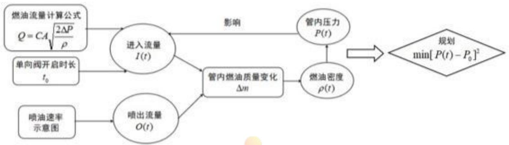

<details>
<summary>flowchart</summary>

```mermaid
graph LR
  A["燃油流量计算公式\nQ = CA√(2ΔP/ρ)"] --> B["进入流量 I(t)"]
  C["单向阀开启时长 t₀"] --> B
  D["喷油速率示意图"] --> E["喷出流量 O(t)"]
  B --> F["管内燃油质量变化 Δn"]
  E --> F
  G["管内压力 P(t)"] --> H["影响"]
  F --> I["燃油密度 ρ(t)"]
  I --> J{"规划_min["P(t) - P0"]^2"}
```
</details>

图 1 模型示意图

## 5.2 模型的求解

由附件3弹性模量与压力的关系表格数据作点，绘制压力随弹性模量的变化关系图，并对图像进行曲线的二次拟合，拟合曲线如图1所示。

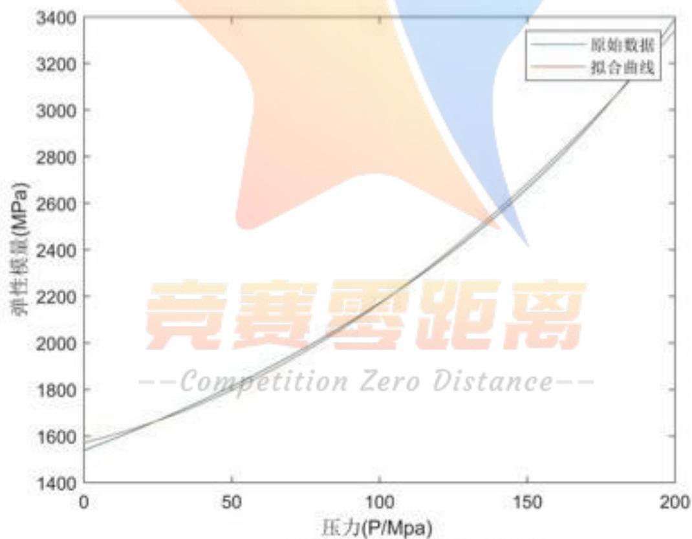

<details>
<summary>area</summary>

| 压力 (P/Mpa) | 弹性模量 (MPa) |
| --- | --- |
| 0 | ~1550 |
| 50 | ~1800 |
| 100 | ~2100 |
| 150 | ~2600 |
| 200 | ~3400 |
</details>

图 2弹性模量与压力拟合曲线

由图2的二次拟合曲线，得到压力P与弹性模量E的二次函数关系

$$
P = 0. 0 2 9 8 3 E ^ {2} + 3. 0 7 7 E + 1 5 7 2 \tag {21}
$$

其中，压力P与弹性模量E的单位均为MPa。代入压力P与弹性模量E的二次函数关系式，根据已知条件当压力为100 MPa时，燃油的密度为0.850 mg/mm³解得燃油的压力与密度关系式

$$
P = \frac {\rho - 0 . 8 1}{1 . 8 6 - 1 . 7 0 \rho} \times 1 0 ^ {- 3} \tag {22}
$$

其中，密度 $\rho$ 的单位为 $mg/mm^{3}$ 。由此得到燃油压力与密度关系式。

## 5.2.1 稳定压力 $100\mathrm{MPa}$ 时的求解

考虑到高压油管燃油进入和喷出的实际情况,对单向阀开启的时长进行两次搜索,第一次得出单向阀开启时长的大概范围,第二次在该范围内求得其精确值。

## 多重搜索算法

## Step1: 初步搜索

以0.5s为步长，在(0,10)s内搜索单向阀开启时长，单向阀进油周期与喷油器喷油周期的最小公倍数为求解周期，在该周期内，根据模型相关公式计算 $\Delta t$ 时间段内高压油管内的燃油变化量，进而求得该时间段内的燃油密度与压力，由目标规划使压力与100 MPa的差值最小，然后进行下一步迭代。得到单向阀单次开启时长在(0,0.5)ms范围内，由此进行第二次搜索。

## Step2: 精度搜索

第二次搜索，以0.0001ms为步长，在(0,0.5)ms内搜索单向阀开启时长，得到单向阀每次开启0.2875ms时，高压油管内压力波动最小。在求解周期100s内压力变化曲线如图2所示。

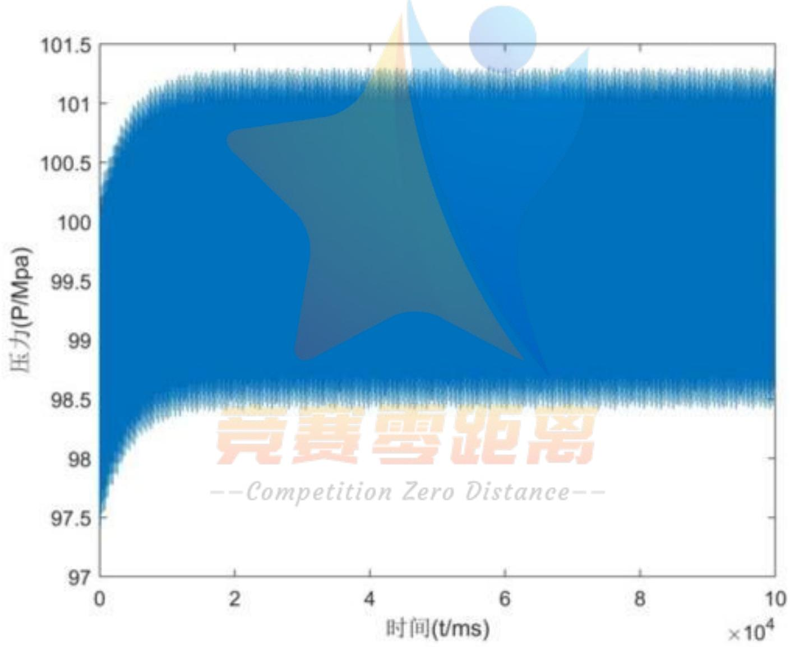

<details>
<summary>area</summary>

| 时间 (t/ms) | 压力 (P/Mpa) |
| --- | --- |
| 0 | ~97.5 |
| 20000 | ~101.2 |
| 40000 | ~101.2 |
| 60000 | ~101.2 |
| 80000 | ~101.2 |
| 100000 | ~101.2 |
</details>

图 3 压力在 100MPa 处波动图

由图3可见，单向阀开启时长为0.2875ms时，高压油管内的压力会在100 MPa上下波动。由于单向阀刚开启时对喷油器工作的影响较小，在求解周期内的前10s内油管内的压力波动中总体呈升高趋势；其后由于单向阀与喷油器的周期性工作，管内压力逐渐稳定在100 MPa附近，以较小的幅度上下波动，但是波动最高点和最低点均与100 MPa相差不大。

## 5.2.2 稳定压力 150MPa 时的求解

将高压油管内的压力从 100 MPa 增加到 150 MPa，在高压油泵进油和喷油器喷油的过程中，仍需管内压力保持其稳定，要求分别经过约 2 s、5 s 和 10 s 的调整过程后压力稳定于 150 MPa。

分析 100MPa 时的高压油管内压力变化图可知，管内压力在到达稳定前会经过一段到达平衡的时间，称之为未稳定阶段。在模型求解的过程中发现，单向阀开启时长 $t_{0}$ 的调整会同时改变到到达平衡时的压力数值以及到达平衡的时间。因此，对 $t_{0}$ 的值进行动态调整，使其分别满足 150 MPa 的稳定压力和 2s 的稳定时间。在未稳定阶段，为使管内压力尽量平稳变化，即调整 $t_{0}$ 的值使压力随时间变化的曲线相对平滑，需要找到给定未稳定阶段内单向阀单次开启时长随时间变化的函数关系。为此，我们尝试了一次函数、二次函数、指数函数和对数函数等关系式，最终发现在单向阀单次开启时间与时间呈线性相关关系时，管内压力随时间的变化曲线最平滑。

在给定 2 s 的未稳定阶段，对单向阀单次开启时长 $t_{0}$ 的值进行动态调整，取多个合适的 $t_{0}$ 与时间的组合作为二元点进行曲线拟合， $t_{0}$ 的单位为 ms，得到未稳定阶段及稳定后的 $t_{0}$ 随时间变化的函数关系式为

$$
t _ {0} = \left\{ \begin{array}{c c} - 0. 0 4 7 t + 0. 8 5, & t <   1. 8 \\ 0. 7 6 5, & t \geq 1. 8 \end{array} \right. \tag {23}
$$

由此得到一个求解周期内管内压力随时间变化关系图如图, 单向阀在未稳定阶段及稳定后的单次开启时长如图 4 所示。


<details>
<summary>line</summary>

| 时间 (t/ms) | 压力 (P/Mpa) |
| --- | --- |
| 0 | ~100 |
| 0.25x10^4 | 149.9 |
</details>

图 4 未稳定阶段为 2s 时压力变化图

由图可得当时间为 2.001s 时, 压力为 149.900MPa, 其后基本稳定于 150MPa; 单向阀单次开启时长在未稳定阶段随时间线性增加, 稳定后恒为 0.765s。

同理，在给定 5 s 的未稳定阶段，对单向阀单次开启时长 $t_{0}$ 的值进行动态调整，取点进行曲线拟合，得到未稳定阶段及稳定后的 $t_{0}$ 随时间变化的函数关系式为

$$
t _ {0} = \left\{ \begin{array}{c c} 0. 1 0 4 t + 0. 4, & t <   3. 5 \\ 0. 7 6 5, & t \geq 3. 5 \end{array} \right. \tag {24}
$$

给定 5 s 的未稳定阶段时一个求解周期内管内压力随时间变化关系图如图 5。

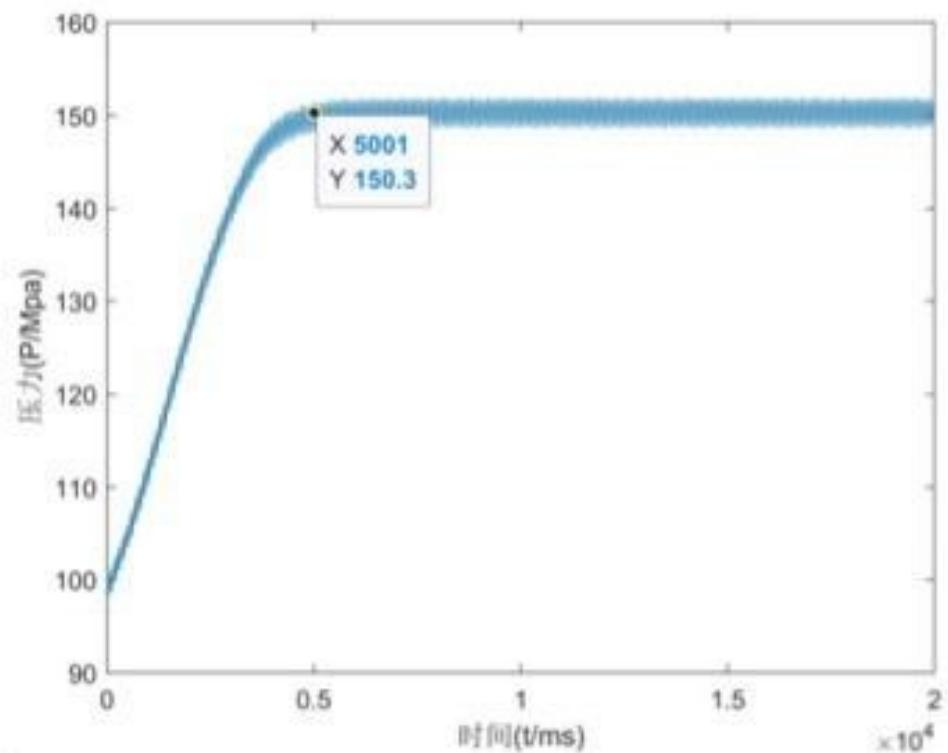

<details>
<summary>line</summary>

| 时间 (t/ms) | 压力 (P/Mpa) |
| --- | --- |
| 5001 | 150.3 |
</details>

图 5 未稳定阶段为 5s 时压力变化图

由图可得当时间为 5.001s 时，压力为 150.300MPa，其后基本稳定于 150MPa；

给定 10 s 的未稳定阶段， $t_{0}$ 随时间变化的函数关系式为

$$
t _ {0} = \left\{ \begin{array}{c c} 0. 0 4 1 t + 0. 4, & t <   9. 0 \\ 0. 7 6 5, & t \geq 9. 0 \end{array} \right. \tag {25}
$$

一个求解周期内管内压力随时间变化关系图为


<details>
<summary>line</summary>

| 时间 (t/ms) | 压力 (P/Mpa) |
| --- | --- |
| 1.005e+04 | 150.3 |
</details>

图 6 未稳定阶段为 10s 时压力变化图

由图可得当时间为10.050s时，压力为150.300MPa，其后基本稳定于150MPa；

综合分析以上要求分别经过约2s、5s和10s的调整过程后的压力稳定图像。结合单向阀单次开启时长的函数关系，可知管内压力稳定于150MPa时单向阀单次开启时长在稳定后恒为0.765s，即给定高压油管稳定压力的情况下，压力稳定后单向阀单次开启的时长恒定，不随未稳定阶段的时长变化。但是不同的未稳定阶段高压油管内压力随时间变化情况不一。

## 六、问题二的模型的建立与求解

## 6.1 模型的建立

问题二考虑了实际工作情况，对燃油系统的结构调整为高压油泵的柱塞腔出口处产生高压油管A处的燃油，喷油嘴的针阀控制喷出的燃油。针对进油部分，在柱塞的压油过程中，柱塞被凸轮驱动上下运动，从而改变柱塞腔内的压力，决定高压油泵内的燃油是否进入。由凸轮边缘曲线与角度的关系可以求得柱塞的运动情况，从而得到腔内的压力变化。针对喷油部分，由已知喷油器的喷嘴结构及其工作条件，在一个喷油周期内针阀升程与时间的关系由附件2给出。结合问题1中给出的喷油器工作次数、高压油管尺寸以及初始压力，确定凸轮转动的角速度，使得高压油管内的压力尽量稳定在100 MPa左右。

## 6.1.1 燃油进入

凸轮轮廓线的拟合直接服务于其运动规律的反解，即凸轮角度与柱塞升程对应关系的反解。由附件1所给凸轮边缘曲线坐标，得到极坐标形式下极角与极径的一一对应关系，使用插值法进行数据处理。

在凸轮机构的设计中，有上止点和下止点的设计，即在这两个点上柱塞升程分别为最小和最大，反映到凸轮实际廓线上，则是两段圆弧，该圆弧反映到极坐标上是极角变化半径不变。因此，当我们使用柱塞上某段圆弧的中间点作为起始点和终止点时，可以使用拟合的自然边界条件。经过三次插值后，使用各个插值区间的三次多项式函数求得凸轮上一周360个角度 $\theta$ 的对应的极径r，以水平和竖直方向建立直角坐标轴，所对应的直角坐标由下式计算：

$$
\left\{ \begin{array}{l} x = r \cdot \cos \theta \\ y = r \cdot \sin \theta \end{array} \right. \tag {26}
$$

对于驱动柱塞的凸轮机构，如图7所示，O点为盘形凸轮的基圆圆心位置，也是其运动时的旋转轴，M为某时刻凸轮与柱塞底部的接触点，柱塞底部与x轴平行。接触点M的特征为：M为此时刻凸轮廓线上所有点中y坐标最大的那一点。

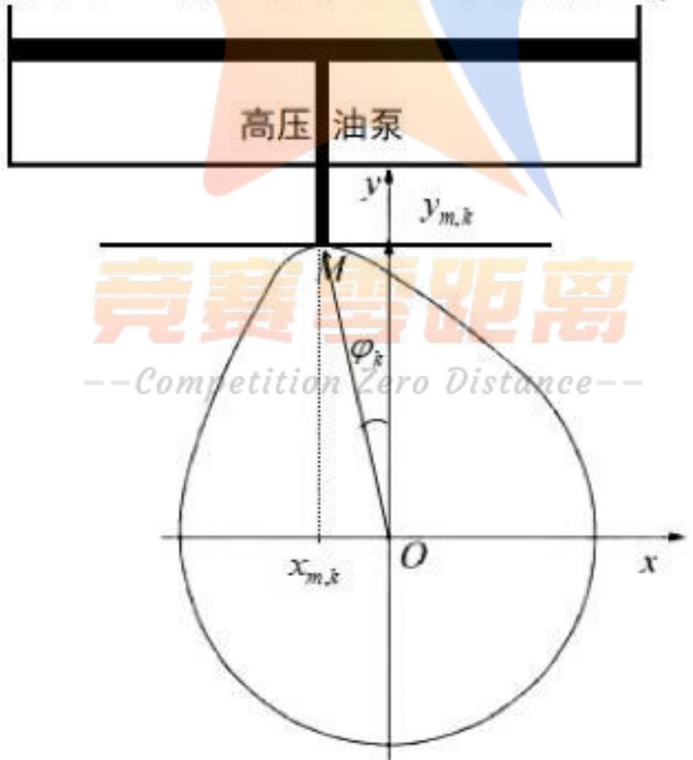

<details>
<summary>text_image</summary>

高压油泵
y
y_{m,k}
M
φ_k
x_{m,k}
O
x
</details>

图 7 凸轮直角坐标几何关系图

在初始位置下转角为 $\varphi_{0}=0$ ，凸轮球形底端接触柱塞底面时，即柱塞运动到下止点时，低压燃油会充满柱塞腔，凸轮边缘曲线坐标为，设凸轮轮廓的横坐标为 $X_{0}=[x_{1,0},x_{2,0},\cdots,x_{m,0},\cdots,x_{n,0}]$ ，相应的纵坐标为 $Y_{0}=[y_{1,0},y_{2,0},\cdots,y_{m,0},\cdots,y_{n,0}]$ 。

首先，为了得到凸轮转至各转角 $\varphi_{k}$ 时的柱塞升程值，需要模拟凸轮和柱塞间的相对运动将凸轮的轮廓线旋转角度 $\varphi_{k}$ 。对于转角 $\varphi_0$ 时凸轮轮廓线上点的坐标 $(x_{m,0},y_{m,0})$ ，转角为 $\varphi_{k}$ 时的坐标 $(x_{m,k},y_{m,k})$ 可由下式计算：

$$
\left\{ \begin{array}{l} x _ {m, k} = x _ {m, 0} \cdot \cos \varphi_ {k} - y _ {m, 0} \cdot \sin \varphi_ {k} \\ y _ {m, k} = x _ {m, 0} \cdot \sin \varphi_ {k} - y _ {m, 0} \cdot \cos \varphi_ {k} \end{array} \right. \tag {27}
$$

如此可得到凸轮转角为 $\varphi_{k}$ 时凸轮轮廓线的横坐标 $X_{k}=[x_{1,k},x_{2,k},\cdots,x_{m,k},\cdots,x_{n,k}]$ ，直角坐标系中相应的纵坐标为 $Y_{k}=[y_{1,k},y_{2,k},\cdots,y_{m,k},\cdots,y_{n,k}]$ 。

则若凸轮机构的基圆半径为 $R_{0}$ ，则在凸轮转角为 $\varphi_{k}$ 时柱塞的升程值 $s_k$ 为

$$
s _ {k} = \max (Y _ {k}) - R _ {0} \tag {28}
$$

已知柱塞腔内直径为 $5\mathrm{mm}$ ，可求柱塞腔的底面积 $S$ 。由于凸轮运动初始时刻凸轮底端接触柱塞底面，则凸轮转角为 $\varphi_{k}$ 时高压油泵内的燃油体积为

$$
V = (h _ {2} - s _ {k}) S \tag {29}
$$

其中， $h_{2}$ 为柱塞运动到下止点时，柱塞底端与高压油泵顶端的距离，由附件1的凸轮边缘曲线数据可得。由柱塞运动到下止点时，充满柱塞腔的低压燃油压力为0.5 MPa，根据燃油压力与密度关系式，可以得到高压油泵内存储的低压燃油的密度 $\rho_{0}$ 。

当凸轮运动至下止点时，柱塞腔内燃油体积 $V_{0}=Sh_{2}$ ，则腔内的燃油质量为 $m=\rho_{0}V_{0}$ 。凸轮转角为 $\varphi_{k}$ 时，腔内的燃油质量不变，体积随柱塞的升降而变化设为 $V_{1}$ ，因此，未再次进油前的任意时刻，腔内的燃油密度 $\rho_{1}$ 为 $m/V_{1}$ ，代入以上关系式并化简，得到 $\rho_{1}$ 的计算公式为

$$
\rho_ {1} = \frac {\rho_ {0} h _ {2}}{h _ {2} - s _ {k}} \tag {30}
$$

设凸轮转动角速度为 $\omega$ ，则在一段极小的时间段 $\Delta t$ 内凸轮转过的角度为

$$
\varphi_ {k + 1} - \varphi_ {k} = \omega \Delta t \tag {31}
$$

则腔内压力随时间变化根据燃油压力与密度关系式，得到凸轮转角为 $\varphi_{k}$ 时腔内压力为 $P_{1}(t)$ ，由题目可得，当腔内压力大于高压油管内的压力 $P_{2}(t)$ ，即 $P_{1}(t) > P_{2}(t)$ 时，高压油泵开始向高压油管内进油，则进油流量 $I(t)$ 为

$$
I (t) = C A \sqrt {\frac {2 [ P _ {1} (t) - P _ {2} (t) ]}{\rho_ {1}}} \tag {32}
$$

## 6.1.2 燃油喷出

由喷油器喷嘴放大后的示意图, 分析可得喷油时燃油喷出可能经过的面积有两个, 分别是针阀与密封座之间的空隙面积, 记为 $S_{1}$ , 以及密封座底部的面积, 记为 $S_{2}$ 。喷油嘴纵向切面图如下图左半部分所示, 在针阀底部作密封座横向切面, 得到各面积示意图如右图所示, 其中橙黄色部分为针阀与密封座之间的空隙面积, 深蓝色部分为密封座底部的面积。

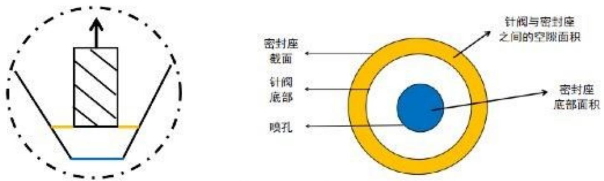  
图 8 喷油器燃油喷出面积示意图

附件2给出了一个喷油周期内针阀升程和时间的关系，分析处理两者关系，发现随时间变化，针阀升程先持续升高，然后在[0.45,2]区间内稳定在 $2\mathrm{mm}$ ，之后持续降低，在[2.46,100]时间段内恒为0。

设针阀在某时刻的升程为 $h(t)$ ，由于密封座截面半径与升程有函数关系，因此，密封座截面半径为 $R_{1}(t)$ 随时间变化，喷孔半径为 $R_{2}$ 已知且保持不变，若将密封座还原为圆锥，则喷孔距离虚拟圆锥顶点的距离为 $L_{0}$ ，圆锥半角为 $9^{\circ}$ ，则上述关系用图形表示如下。

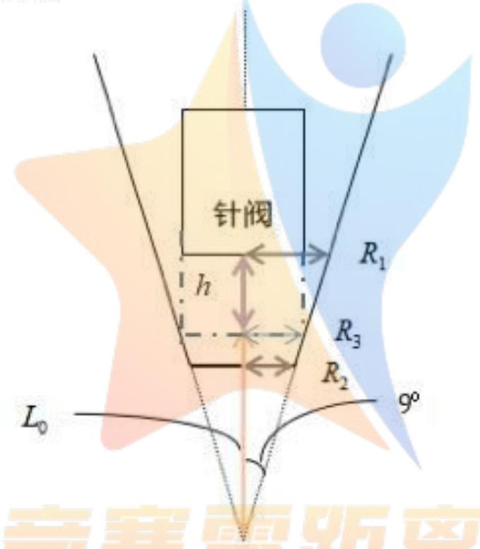

<details>
<summary>text_image</summary>

针阀
h
R₁
R₃
R₂
L₀
9°
</details>

图 9 针阀几何关系图

根据几何关系图，密封座截面半径为

$$
R _ {1} (t) = [ h (t) + L _ {0} ] \tan 9 ^ {\circ} \tag {33}
$$

则针阀与密封座之间的空隙面积 $S_{1}(t)$ 为 $\pi R_1^2$ ，即

$$
S _ {1} (t) = \pi [ h (t) + L _ {0} ] ^ {2} \tan^ {2} 9 ^ {\circ} \tag {34}
$$

喷孔半径为 $R_{2}$ 已知，则喷孔面积 $S_{2}$ 为 $\pi R_{2}^{2}$ 。

燃油从该处喷出时，设喷出的燃油经过的面积为 $S(t)$ ，则

$$
S (t) = \min \{S _ {1} (t), S _ {2} \} \tag {35}
$$

假设喷油嘴外部的压强 $P_{e}$ 为一个标准大气压，即 $P_{e} = P_{N}$ ，高压油管内压力为 $P_{2}(t)$ ，则由高压油管的流量计算公式，得到燃油喷出的流量 $O(t)$ 为

$$
O (t) = C S (t) \sqrt {\frac {2 [ P _ {2} (t) - P _ {e} ]}{\rho_ {2}}} \tag {36}
$$

## 6.1.3 规划模型的建立

与第一问的规划模型相似，高压油管内燃油不断进入和喷出，其在 $\Delta t$ 时间段内的质量变化可由进入和喷出的燃油密度分别与其体积的乘积计算求得，从高压油泵进入的燃油质量为 $m_{1}=\rho_{1}I(t)\Delta t$ ，从针阀喷孔处喷出的燃油质量为 $m_{2}=\rho_{2}O(t)\Delta t$ 。即 $\Delta t$ 时间段管内燃油的变化量

$$
m (t + \Delta t) - m (t) = \rho_ {1} I (t) \Delta t - \rho_ {2} O (t) \Delta t \tag {37}
$$

变形得到油管内燃油密度关于时间的微分方程

$$
\frac {\partial \rho_ {2} (t)}{\partial t} = \frac {1}{V} [ \rho_ {1} I (t) - \rho_ {2} O (t) ] \tag {38}
$$

联立（3）、（7）和（14）式可以得到压力函数 $P(t)$ 的求解模型

$$
\left\{ \begin{array}{l} P (t) = f [ \rho (t) ] \\ I (t) = C A \sqrt {\frac {2 [ P _ {1} (t) - P _ {2} (t)}{\rho_ {1}}} \\ \frac {\partial \rho_ {2} (t)}{\partial t} = \frac {1}{V} [ \rho_ {1} I (t) - \rho_ {2} O (t) ] \end{array} \right. \tag {39}
$$

由求解得到的压力函数 $P(t)$ , 将 $P(t)$ 离散化表示为 $P(t_k)$ , 由压强差指标 $Z$ 建立单目标规划模型, 表示如下

$$
\min Z \tag {40}
$$

求解该单目标规划从而确定凸轮的角速度。

## 6.2 模型的求解

对附件 1 的凸轮边缘曲线数据和附件 2 的针阀运动曲线数据进行处理, 得到关系曲线分别如下图所示。其中, 左下图凸轮运动曲线为当柱塞运动到下止点为初始状态时的处理结果。右下图为针阀运动曲线处理结果。

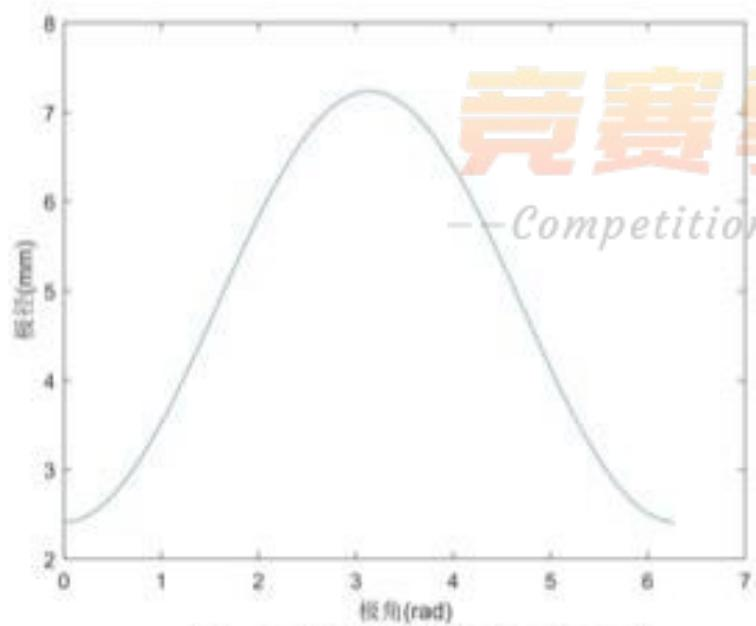

<details>
<summary>line</summary>

| 极角(rad) | 振径(mm) |
| --- | --- |
| 0 | ~2.4 |
| 1 | ~3.5 |
| 2 | ~5.8 |
| 3 | ~7.2 |
| 4 | ~6.2 |
| 5 | ~4.2 |
| 6 | ~2.5 |
</details>

图 10 凸轮极径极角关系图

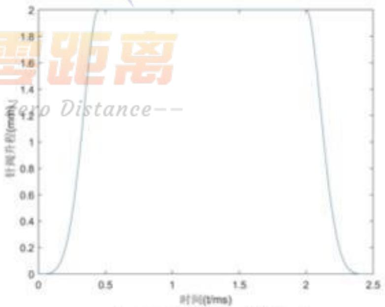

<details>
<summary>line</summary>

| 时间(t/ms) | 针向升程(mm) |
| --- | --- |
| 0 | 0 |
| ~0.25 | ~1.2 |
| ~0.4 | 2 |
| ~2.0 | 2 |
| ~2.4 | 0 |
</details>

图 11 针阀几何关系图

通过有限差分法，近似计算微分方程(7)的数值解，代入已知高压油管参数初始值，由高压油管压力求解模型求得管内压力。当管内压力大于100MPa时，油泵向管内进油；当针阀升程不为0时，喷油嘴处燃油喷出。以0.01为步长搜索凸轮运动角速度，迭代求解各值，使管内压力波动尽可能小。

求得凸轮角速度为0.0273rad/ms时，高压油管压力稳定在100MPa左右，并在其附近小幅度上下波动，得到1000s的求解周期内，压力随时间变化关系图为

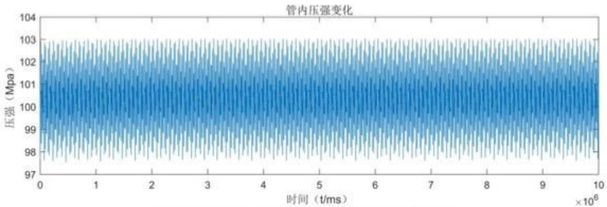

<details>
<summary>spectrogram</summary>

| 时间 (t/ms) | 压强 (Mpa) |
| --- | --- |
| 0 | ~97.5 ~103.0 |
| 1 | ~97.5 ~103.0 |
| 2 | ~97.5 ~103.0 |
| 3 | ~97.5 ~103.0 |
| 4 | ~97.5 ~103.0 |
| 5 | ~97.5 ~103.0 |
| 6 | ~97.5 ~103.0 |
| 7 | ~97.5 ~103.0 |
| 8 | ~97.5 ~103.0 |
| 9 | ~97.5 ~103.0 |
| 10 | ~97.5 ~103.0 |
</details>

图 12 角速度为 0.0273 rad/s 时管内压强变化

从上图中可以看出在整个求解周期内, 管内压力在初始的极小时间段内有微小幅度的波动上升, 之后的时间内压力在 $100 \mathrm{MPa}$ 附近波动变化, 波动幅度较小, 可知求解的凸轮角速度为一合适的值。

## 七、问题三的模型的建立与求解

为使燃油发动机的高压油管内压力保持稳定，调整喷油和供油策略。其中，喷油策略的调整分为升程最高点的控制和两个喷油嘴喷射时间的间隔，供油策略包括凸轮运动角速度的控制，此外，通过单向减压阀可以调节管内过高压力。

## 7.1 喷油与供油政策的调整

针对喷油和供油策略，供油策略的调整主要由凸轮运动角速度 $\omega$ 决定。经过前两问的模型求解，我们发现，在调整模型中其他参数值时，最佳 $\omega$ 值均会变化，因此，将 $\omega$ 的调整和求解融合进其他参量的求解过程中。

喷油策略需要考虑两个喷油嘴喷射时间的间隔, 此时认定喷油嘴的喷油规律与第二问相同, 仍为一秒内喷射 10 次, 两个喷油嘴的喷油规律相同, 设喷油嘴 1 在 t=0 时刻开始喷射, 喷油嘴 2 在 $t=\Delta t$ 时刻开始喷射, 即两个喷油嘴的喷射时间间隙为 $\Delta t$ 。

搜索两个喷油嘴的喷油间隙，在每一间隙数值下调整针阀运动角速度 $\omega$ 使得管内压力稳定在 100MPa。喷射间隙会影响每段时间内从喷油嘴喷出的总的燃油量，从而影响高压油管内的燃油压力。当喷油嘴开始喷射时间间隔在 0～50ms 内变化时，压力在时间间隔分别为 12.5ms、25.0ms、37.5ms、50.0ms 时变化如图 13-图 16 所示。

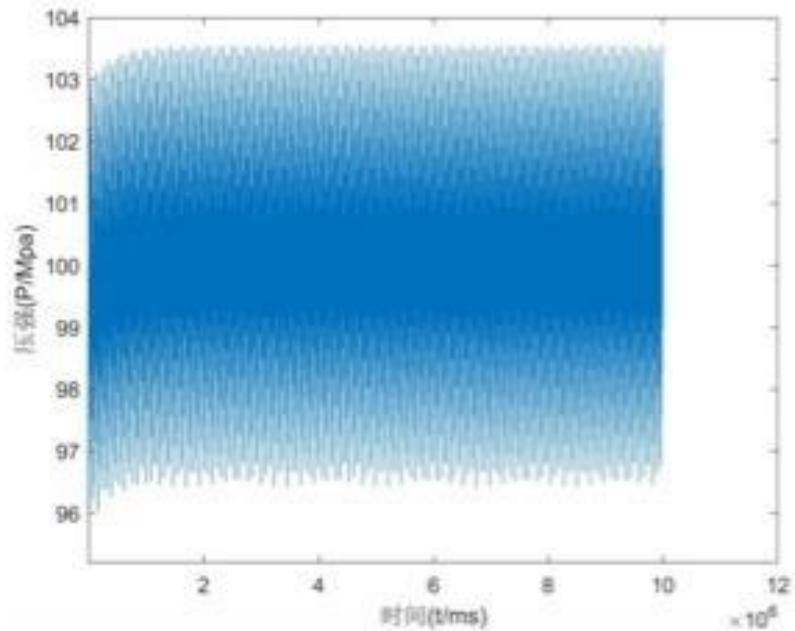

<details>
<summary>spectrogram</summary>

| 时间 (t/ms) | 压强 (P/Mpa) |
| --- | --- |
| 0~10000000 | ~96.2 ~103.5 |
</details>

图 13 时间间隔为 12.5s 时压强

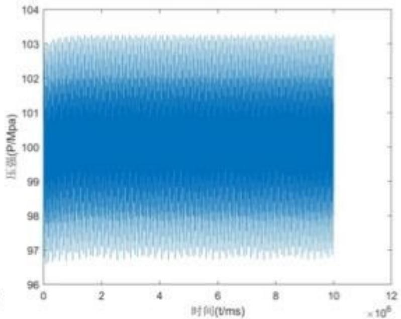

<details>
<summary>spectrogram</summary>

| 时间 (t/ms) | 压强 (P/Mpa) |
| --- | --- |
| 0 | ~96.5 ~103.2 |
| 200,000 | ~96.8 ~103.2 |
| 400,000 | ~96.8 ~103.2 |
| 600,000 | ~96.8 ~103.2 |
| 800,000 | ~96.8 ~103.2 |
| 1,000,000 | ~96.8 ~103.2 |
</details>

图 14 时间间隔为 25.0s 时压强

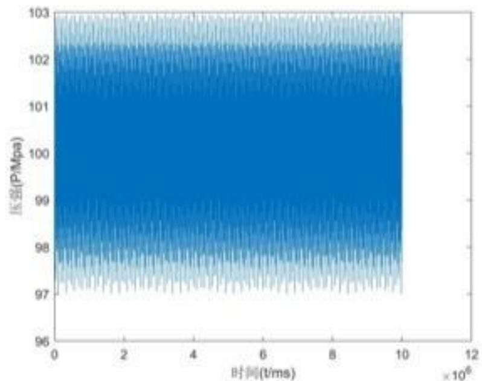

<details>
<summary>spectrogram</summary>

| 时间 (t/ms) | 压强 (P/MPa) |
| --- | --- |
| 0 | ~97.2 ~103.0 |
| 2000000 | ~97.2 ~103.0 |
| 4000000 | ~97.2 ~103.0 |
| 6000000 | ~97.2 ~103.0 |
| 8000000 | ~97.2 ~103.0 |
| 10000000 | ~97.2 ~103.0 |
</details>

图 15 时间间隔下为 37.5s 压强

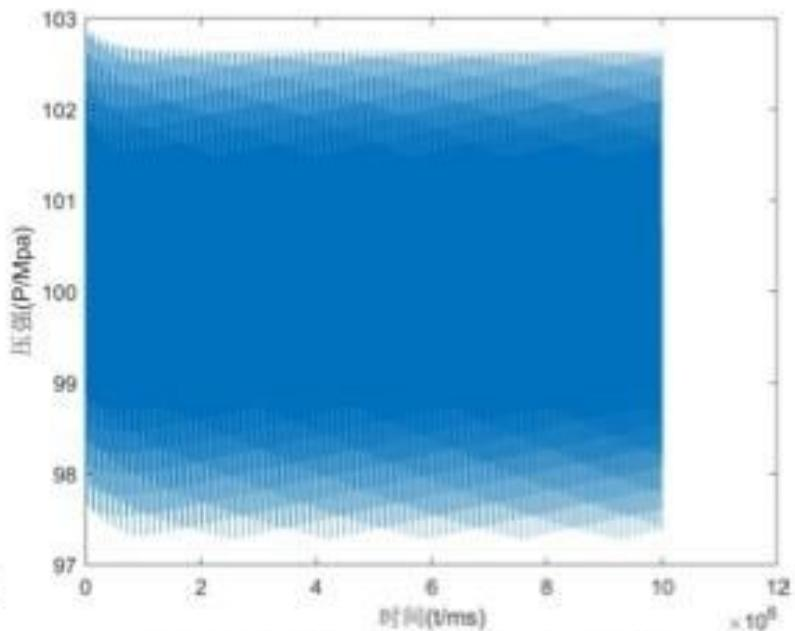

<details>
<summary>spectrogram</summary>

| Time (t/ms) | Pressure (P/MPa) |
| --- | --- |
| 0~10e8 | ~97.5 ~102.8 |
</details>

图 16 时间间隔下为 50.0s 压强

分析上图可得，当喷油嘴开始喷射时间间隔在 $(0 \sim 50)ms$ 内变化时，管内压力在稳定值附近的波动幅度逐渐减小。

由压强差指标Z，建立规划模型如下

$$
\min Z \tag {41}
$$

可以得到 $\Delta t$ 在0到100ms之间变化时，压强差指标Z的变化曲线如下：

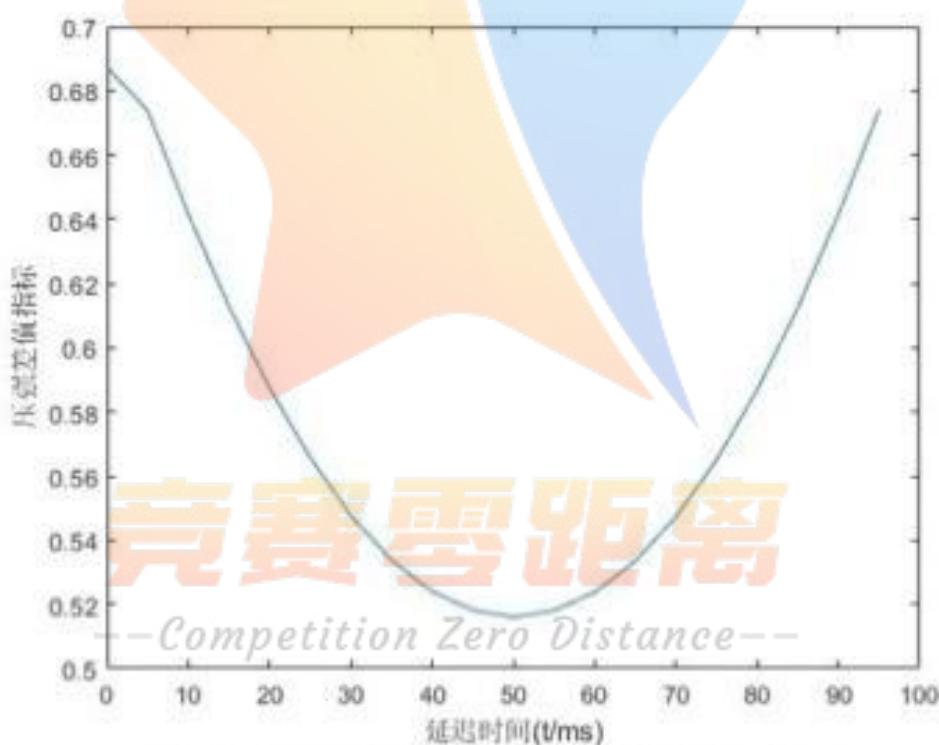

<details>
<summary>area</summary>

| 延迟时间 (t/ms) | 压差差值指标 |
| --- | --- |
| 0 | ~0.685 |
| 10 | ~0.645 |
| 20 | ~0.595 |
| 30 | ~0.565 |
| 40 | ~0.545 |
| 50 | ~0.518 |
| 60 | ~0.525 |
| 70 | ~0.545 |
| 80 | ~0.585 |
| 90 | ~0.635 |
| 95 | ~0.675 |
</details>

图 17 随间隔时间变化的压强差值变化图

从图中可以看出，延迟时间在 50ms 附近时，压强差值指标 Z 达到最小。在 50ms 附近做精确搜索。可以得到最优延迟时间 $\Delta t = 49.1ms$

## 7.2 单项减压阀的引入

在调整喷油策略和供油策略后，在原有模型的基础上考虑单向减压阀。由单向减压阀的工作原理，设置阈值压强 $P'$ ，当 $P_{0}>P'$ 为减压阀开启条件，从减压阀中回流的燃油流量为 $Q_{d}$ ，由流量计算公式得

$$
Q _ {d} = C A \sqrt {\frac {2 [ P (t) - P _ {e} (t) ]}{\rho}} \tag {42}
$$

当高压油管内压力 $P_{0}<P^{\prime}$ 时，单向阀关闭。此时，以使得压力变化最小为目标，即 $\min P_{\max}-P_{\min}$ ，搜寻阈值压强 $P^{\prime}$ 与凸轮旋转角速度 $\omega$ 。

最终求得设定得阈值压强为102.25Mpa，角速度为0.056 rad/ms， $\Delta t = 49.1ms$ 时得压力变化为：

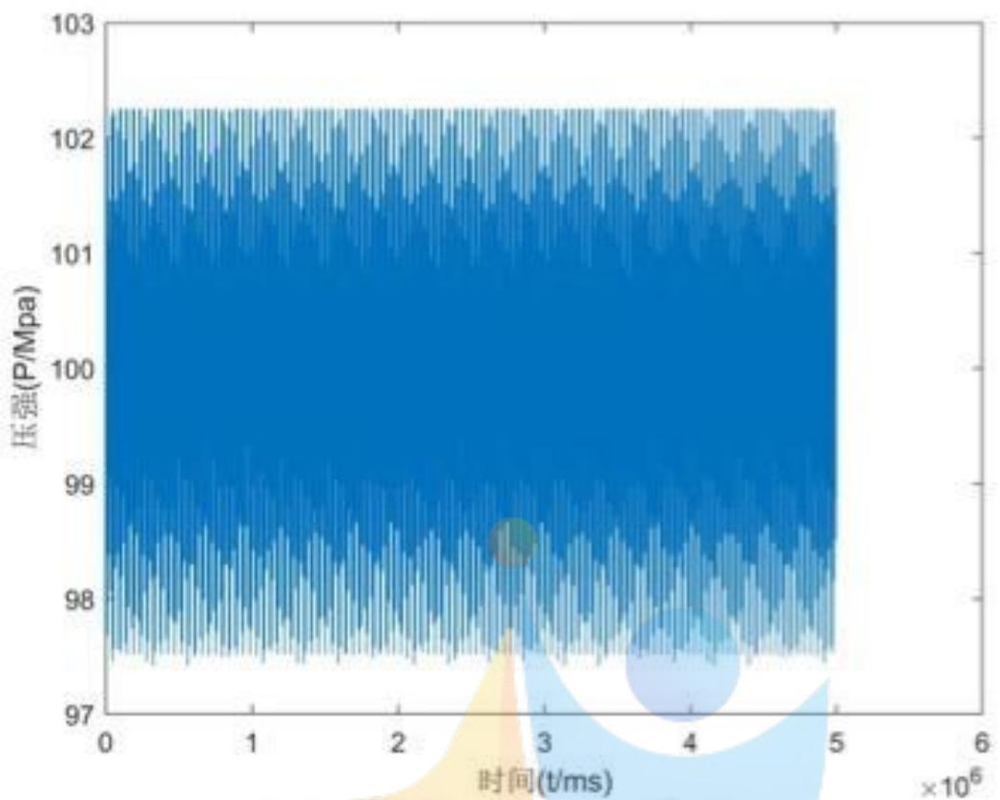

<details>
<summary>spectrogram</summary>

| 时间 (t/ms) | 压强 (P/Mpa) |
| --- | --- |
| 0 | ~97.5 ~102.2 |
| 1000000 | ~97.5 ~102.2 |
| 2000000 | ~97.5 ~102.2 |
| 3000000 | ~97.5 ~102.2 |
| 4000000 | ~97.5 ~102.2 |
| 5000000 | ~97.5 ~102.2 |
</details>

图 18 单向阀方案下压强变化图

## 八、模型的评价与推广

## 8.1 模型的优点

1、建立微分与规划模型，利用差分迭代算法，解出来的解较为精确。  
2、以第一问模型为核心，层层递进，模型可推广性较好。  
3、采用多重搜索算法，提高求解速度，算法可重复利用性好。

## 8.2 模型的缺点

1、模型考虑在高压管内密度是均匀不变的，没有将模型细化到高压管中每一点密度不同的情况。  
2、高压油泵从上止点回到下止点时的冲油过程没有细化考虑。

## 8.3 模型的推广

高压油管广泛运用在车，船等领域，作为高压喷射的柴油机，和高压喷射的直喷汽油机核心部件，高压油管需要承担承受发动机运转过程中所需的油压。本文所研究的高压油管以传统的泵—管—嘴系统为基础，目前可以运用在新一代的电控燃油喷射系统和高压共轨式电控燃油喷射系统等众多的喷射系统中。

## 九、参考文献

[1] 王占永. 基于 AMEsim 的柴油机高压共轨燃油喷射系统的仿真研究 [D]. 2017.  
[2] 王凌. 高压共轨电磁式喷油器喷油特性及结构优化研究 [D]. 2016.  
[3]关治,陆金甫.数值分析基础[M].高等教育出版社,1998.

[4]顾春光[1], 赵京[2]. 基于 MATLAB 的盘形凸轮逆向工程 [J]. 制造技术与机床, 2017(5).  
[5] 李晶晶. 柴油机电控高压共轨燃油喷射系统控制策略及仿真研究 [D]. 北京交通大学, 2011.

## 附录

附录一：问题一的求解

```javascript
t=(.3-.7650)/-1800*i+.85;
t=(.3-.7650)/-3500*i+.3;
t=(.85-.7650)/1800*i+.85;
t=(.4-.7650)/-9000*i+.4;
```

上面是要更换的函数。

```txt
c=0.85;A=(1.4/2)^2*pi;
rho=@(x)0.80853816*(1+(0.6*10^-3*x)/(1+1.7*10^-3*x));
P=@(rho)-(90071992547409920000*rho-72826643121816530000)/(15312238733
0596864*rho-167501279180178019)
qchu=@(q)100*q.*(q<=0.2)+20.*(q>0.2&q<=2.2)-(100*q-240).*(q>2.2&q<=2.
4)+0.*(q>2.4);
```

```txt
V=(5^2)*500*pi;
k=[];
result=0;
delta_t=.01;
```

```matlab
t=.2875;
    p0=100;      %初始压强
    m0=rho(100)*V;   %初始质量
    m1=m0;
    % min=inf;
    u=00;
    j=0;
    h=0;q=0;x=[];
    for i=0:delta_t:100000

        q=q+1;
        x(q)=i;
        vin=0;
        if h>t+10
            h=h-(t+10);
        end
        if h<t
        vin=(c*A*(2*(160-p0)/0.8696)^(.5));    %进入流量
        end
```

```matlab
h=h+delta_t;
m_in=0.8696*vin*delta_t; %进入质量
if u>100
    u=u-100;
end
vout=qchu(u)*delta_t;
u=u+delta_t;
mout=vout*rho(p0);
delta_m=m_in-mout;

% delta_m
rho_now=(m0+delta_m)/V;
p0=P(rho_now);
j=j+1;
k(j)=p0;
m0=m0+delta_m;

end

plot(x,k)
%plot(k)
```

附录二：问题二的求解  
```txt
rho=@(x)0.80853816*(1+(0.6*10^-3*x)/(1+1.7*10^-3*x));
P=@(rho)-(90071992547409920000*rho-72826643121816530000)/(15312238733
0596864*rho-167501279180178019);
c=0.85;      %单向阀孔面积
```

A=(1.4/2)^2\*pi;  
```txt
A_you=(5/2)^2*pi;    %油孔面积
H=5.8446;      %高压油箱的整体高度
```  
Vmax=H\*A\_you;    %最大的体积

```matlab
M=Vmax*rho(0.5);          %初始油质量
V=(5^2)*500*pi;           %油管体积
m0=rho(100)*V;       %高压油管初始油质量
delta_t=0.01;        %步长
```  
p\_wai=0.1; %油孔外气压

```javascript
theta=xlsread('附件1-凸轮边缘曲线','sheet1','A2:A629');
```  
r=xlsread('附件1-凸轮边缘曲线','sheet1','C2:C629');

<div class="mineru-algorithm" style="white-space: pre-wrap; font-family:monospace;">
$L0=0.7/\tan(9/180*pi)*2.5/1.4;$  %针阀初始高度（相对圆锥顶点）
</div>

A\_zhen=(2.5/2)^2\*pi; %针阀的底面积  
```txt
A_kong=0.7^2*pi; %喷孔的底面积
```  
k=[];x=[];y=[];

```javascript
a1=xlsread('附件2-针阀运动曲线','sheet1','B2:B46');
```  
b1=2\*ones(156,1);

c1=xlsread('附件2-针阀运动曲线','sheet1','E2:E46');
h\_zhen=[a1;b1;c1;zeros(9755,1)]';    %针阀上升距离  
```matlab
%initial matrix s
for i=1:628
    x(i)=sin(theta(i))*r(i);
    y(i)=cos(theta(i))*r(i);
end
s=[];u=1;
%每0.01弧度油泵上升的距离
for i=0:0.01:6.27
    xk=[];
    yk=[];
    for j=1:628
        xk(j)=x(j)*cos(i)-y(j)*sin(i);
        yk(j)=x(j)*sin(i)+y(j)*cos(i);
    end
    s(u)=max(yk)-2.4130;
    u=u+1;
end
s=interp1([0:0.01:6.27],s,[0:0.000001:6.27],'spline'); %三次样条插值
w=0.0273;%角速度
j=1;
u=1;
p0=100; %管内初始压强
rho0=0.85; %管内初始密度
m_you=M; %油箱初始质量
fy=1;
for i=0:delta_t:100000
    fy=fy+int32(w*delta_t/0.000001); %角度
    while fy > 6270001
        fy=fy-6270001; %到下一个周期
        m_you=M;%补油
    end
    h_now=H-s(fy); %剩余高度
    V_now=A_you*h_now; %剩余体积
    rho_now=m_you/V_now; %当前油箱密度
    P_now=P(rho_now); %当前压强
    vin=0;
    if P_now>p0
        vin=c*A*(2*(P_now-p0)/rho_now)^(.5); %进入流量
    end
    m_in=rho_now*vin*delta_t; %进入质量
```

```matlab
m_you=m_you-m_in;      %剩余油质量
r1=(h_zhen(u)+L0)*tan(9/180*pi); h_z=h_zhen(u);      %大圆半径
A_out=pi*r1^2-A_zhen;
if pi*r1^2-A_zhen-A_kong>0
    A_out=A_kong;
end
if h_zhen(u)==0
    A_out=0;          %不喷油情况
end
u=u+1;
if u>10001
    u=u-10001;
end
vout=c*A_out*(2*(p0-p_wai)/rho0)^(.5);   %喷油流量
mout=vout*rho0*delta_t  ;   %喷出质量
delta_m=m_in-mout;   %管内质量差
rho0=(m0+delta_m)/V;     %管内新密度
k(j)=p0;
p0=P(rho0);   %管内新压强
j=j+1;

m0=m0+delta_m;

end
plot(k)
```

附录三：问题三的求解  
```matlab
rho=@(x)0.80853816*(1+(0.6*10^-3*x)/(1+1.7*10^-3*x));
P=@(rho)-(90071992547409920000*rho-72826643121816530000)/(15312238733
0596864*rho-167501279180178019);
c=0.85;      %单向阀孔面积
A=(1.4/2)^2*pi;
A_you=(5/2)^2*pi;   %油孔面积
H=5.8446;       %高压油箱的整体高度
Vmax=H*A_you;     %最大的体积
M=Vmax*rho(0.5);         %初始油质量
V=(5^2)*500*pi;           %油管体积
m0=rho(100)*V;       %高压油管初始油质量
delta_t=0.01;      %步长
  p_wai=0.1;    %油孔外气压
theta=xlsread('附件1-凸轮边缘曲线','sheet1','A2:A629');
r=xlsread('附件1-凸轮边缘曲线','sheet1','C2:C629');
L0=0.7/tan(9/180*pi)*2.5/1.4;   %针阀初始高度（相对圆锥顶点）
```

```matlab
A_zhen=(2.5/2)^2*pi;    %针阀的底面积
A_kong=0.7^2*pi;        %喷孔的底面积
k=[];x=[];y=[];
a1=xlsread('附件2-针阀运动曲线','sheet1','B2:B46');
b1=2*ones(156,1);
c1=xlsread('附件2-针阀运动曲线','sheet1','E2:E46');
h_zhen=[a1;b1;c1;zeros(9755,1)]';    %针阀上升距离
yanchi=5000;   %延迟时间
for  i=10001:-1:yanchi+1
    h_zhen1(i)=h_zhen(i-yanchi);
end
for i=1:1:yanchi
    h_zhen1(i)=0;
end
%initial matrix s
for i=1:628
    x(i)=sin(theta(i))*r(i);
    y(i)=cos(theta(i))*r(i);
end
s=[];u=1;
%每0.01弧度油泵上升的距离
for i=0:0.01:6.27
    xk=[];
    yk=[];
    for j=1:628
        xk(j)=x(j)*cos(i)-y(j)*sin(i);
        yk(j)=x(j)*sin(i)+y(j)*cos(i);
    end
    s(u)=max(yk)-2.4130;
    u=u+1;
end
s=interp1([0:0.01:6.27],s,[0:0.000001:6.27],'spline');    %三次样条插值
w=0.0545;%角速度
j=1;
u=1;
p0=100;   %管内初始压强
rho0=0.85;     %管内初始密度
m_you=M;      %油箱初始质量
fy=1;
for i=0:delta_t:100000
    fy=fy+int32(w*delta_t/0.000001); %角度
    while  fy > 6270001
        fy=fy-6270001; %到下一个周期
```

```matlab
m_you=M;%补油
end
h_now=H-s(fy);          %剩余高度
V_now=A_you*h_now;      %剩余体积
rho_now=m_you/V_now;    %当前油箱密度
P_now=P(rho_now);     %当前压强
vin=0;
if P_now>p0
    vin=c*A*(2*(P_now-p0)/rho_now)^(.5);   %进入流量
end
m_in=rho_now*vin*delta_t;   %进入质量
m_you=m_you-m_in;      %剩余油质量
r1=(h_zhen(u)+L0)*tan(9/180*pi);      %大圆半径
r12=(h_zhen1(u)+L0)*tan(9/180*pi);
A_out=pi*r1^2-A_zhen;
if pi*r1^2-A_zhen-A_kong>0
    A_out=A_kong;
end
if h_zhen(u)==0
    A_out=0;           %不喷油情况
end
A1_out=pi*r12^2-A_zhen;
if pi*r12^2-A_zhen-A_kong>0
    A1_out=A_kong;
end
if h_zhen1(u)==0
    A1_out=0;           %不喷油情况
end
u=u+1;
if u>10001
    u=u-10001;
end
vout=c*(A_out+A1_out)*(2*(p0-p_wai)/rho0)^(.5);   %喷油流量
mout=vout*rho0*delta_t  ;   %喷出质量
delta_m=m_in-mout;   %管内质量差
rho0=(m0+delta_m)/V;       %管内新密度
k(j)=p0;
p0=P(rho0);   %管内新压强
j=j+1;

m0=m0+delta_m;
```

end

plot(k);

xlabel('时间(t/ms)')

ylabel('压强(P/Mpa)')


<details>
<summary>natural_image</summary>

Abstract graphic of a stylized human figure with a star and gradient background (no text or symbols)
</details>

## 竞赛零距离

--Competition Zero Distance--