# 同心鼓“同心协力”策略探究

## 摘要

“同心鼓”游戏是一项团队协作能力拓展项目，队员通过拉绳使鼓抬高，达到使球在鼓面上跳动的目的。本文通过建立三维物理模型，利用数学物理方法，分析了“同心鼓”游戏中的物理过程，希望能为游戏参与者提供指导性意见，帮助参与者取得更好成绩。

问题一中，由于条件为理想状态，我们考虑所有人所用拉力相同时的情况，建立了鼓和球较为简单的一维运动模型，得出公式，并对条件中的数据给出了对应的数值结论，以及在题中条件下，参赛队员应采取的相应策略：以0.6s为一个周期(其中碰撞所需时间忽略不计). t=0时排球开始下落, t=0.194s时所有人同时开始发力, 发力过程中手的高度基本不变, 沿绳方向的力大小恒定为90N, t=0.3s时所有人结束发力(即令绳子松弛), 直到下一个周期开始.

问题二的条件中存在发力误差，为此我们在问题一模型的基础上增加了鼓的转动，用平动速度，平动加速度，角速度,角加速度较为全面地描述了鼓在复杂情况下的运动状态，列出了普遍情形下的微分方程并求出了解析解，并利用计算机辅助计算得到了给定的九组条件下问题的具体解答,答案见解题过程中的表格.分析了两种不同的发力误差对鼓运动状态的影响.

在解决问题二的过程中, 我们发现问题一中的策略需要队员给出的拉力较大, 不利于实际操作, 因此我们在问题三补充考虑了拉力较小时的情况, 并给出了所需拉力更小, 更利于操作的策略: 以 $0.797 \mathrm{~s}$ 为一个周期 (其中碰撞所需时间忽略不计). $t = 0$ 时排球开始下落, $t = 0.22 \mathrm{~s}$ 时所有人同时开始发力, 发力过程中手的高度基本不变, 沿绳方向的力大小恒定为 $\mathrm{F} = 80 \mathrm{~N}, t = 0.3 \mathrm{~s}$ 时所有人继续发力, 此时排球与同心鼓相撞, $t = 0.497 \mathrm{~s}$ 时所有人结束发力, 此时排球与同心鼓脱离, 直到下一个周期开始.

对于问题四，我们采用和问题二中相似的模型进行分析，求出了使鼓按要求方向转动要满足的条件，并取出了一组满足条件的解（十个人的拉力分别为 $F_{1} = 129.3N, F_{2} = 115.5N, F6 = 99N, F_{i} = 100N (i = 3,4,5,7,8,9,10)$ ）并验证了其合理性。结果表明让球从倾斜方向恢复至竖直方向在操作上具有一定难度，因此队员应格外注意各方向拉力的均衡，避免使球偏离竖直方向。

关键字：一维碰撞 二维碰撞 平动 转动

## 一、问题重述

“同心协力”（又称“同心鼓”）是一项团队协作能力拓展项目。该项目的道具是一面牛皮双面鼓，鼓身中间固定多根绳子，绳子在鼓身上的固定点沿圆周呈均匀分布，每根绳子长度相同。团队成员每人牵拉一根绳子，使鼓面保持水平。项目开始时，球从鼓面中心上方竖直落下，队员同心协力将球颠起，使其有节奏地在鼓面上跳动。颠球过程中，队员只能抓握绳子的末端，不能接触鼓或绳子的其他位置。项目开始时，球从鼓面中心上方40 cm处竖直落下，球被颠起的高度应离开鼓面40 cm以上，如果低于40cm，则项目停止。项目的目标是使得连续颠球的次数尽可能多。

- 问题一要求给出在每个人都可以精确控制用力方向、时机和力度的理想状态下，团队的最佳协作策略，并给出该策略下的颠球高度；  
- 问题二要求建立模型描述队员发力时机和力度出现的误差与某一特定时刻的鼓面倾斜角度的关系，并求出给定情况下的数值解；  
- 问题三要求根据问题2的模型，调整问题1中给出的策略；  
- 问题四要求给出具体情形下当鼓面发生倾斜时队员的调整策略，并分析在现实情形中这种调整策略的实施效果。

## 二、问题分析

游戏目标是使颠球的次数尽可能多，因此我们希望球的运动状态可预测。我们需要分析球和鼓的运动状态，以及拉力与球的运动的相互作用关系。

- 问题一要求给出理想情况下的策略，根据对称性我们猜测最佳策略中所有人所用拉力和拉力作用时间都相同，并希望对这一结论进行定量分析；  
- 问题二要求描述队员发力时机和力度出现的误差与某一特定时刻的鼓面倾斜角度的关系;  
- 为此，我们需要建立三维模型，具体考察鼓在不同位置的受力情况，并对鼓在三维空间中的平动和转动进行分析。我们需要推导出描述状态变化的方程，并通过计算机得出给定条件下的数值解；  
- 问题三，四的结论需要由问题一，二的模型决定。

## 三、模型假设

\- 鼓的形状为圆柱体，绳子在鼓上的固定点到鼓的上下平面距离相等；

- 整个装置固定良好，绳子轻质柔软，鼓的材质在各方向上均匀一致；  
· 每人在拉绳时所用的力为恒力；  
- 球在空中运动时忽略空气阻力的影响；  
- 鼓的中心在水平方向上不移动；  
- 当鼓面不平行时，球与鼓面的碰撞中球的运动满足反射定律；  
- 忽略鼓与水平面夹角对拉力在竖直方向上的分量的影响。

## 四、符号说明

下面列出的是本文使用的主要符号. 与具体问题有关的符号将在相应的章节单独给出. 文中所有物理量若不加说明都采用国际单位制.

<table><tr><td>符号</td><td>意义</td></tr><tr><td>m</td><td>鼓的质量</td></tr><tr><td>R</td><td>鼓的半径</td></tr><tr><td>h(t)</td><td>同心鼓位置较绳子水平时偏移量关于时间的函数</td></tr><tr><td>l</td><td>绳子长度</td></tr><tr><td>g</td><td>重力加速度</td></tr><tr><td> $h_0$ </td><td>同心鼓初始位置较绳子水平时偏移量</td></tr></table>

## 五、问题一：理想状态下的策略

将一个周期分为三个阶段：

- 加速阶段。此时球受重力作自由落体运动，鼓受重力与拉力作加速运动。  
- 碰撞阶段。此时球与鼓相遇，拉力消失，此阶段时间忽略不计。  
- 复原阶段。此时球与鼓分离，球受重力作竖直上抛运动回到初始位置，鼓经过运动回到初始位置，一个周期结束。

## 5.1 加速阶段

由牛顿第二定律可得

$$
\left\{ \begin{array}{l} - m _ {1} h _ {1} ^ {\prime \prime} (t) = \frac {n F h _ {1} (t)}{l} - m _ {1} g \\ h (0) = h _ {0} \\ h ^ {\prime} (0) = 0 \\ h ^ {\prime} (t _ {1}) = - v _ {1} \end{array} \right.
$$

其中各个符号所表示意义为

$m_{1}$ : 同心鼓质量 (在本章中为了与排球质量相区分, 加了下标 1)

$h_{1}(t)$ : 同心鼓位置较绳子水平时偏移量关于时间的函数

n: 人数

F: 沿绳方向的恒力

$v_{1}$ : 同心鼓碰撞前速度

$t_{1}$ : 恒力作用时间

## 5.2 碰撞阶段

由动量守恒与关于动能变化的假设，以及球自由落体与竖直上抛所经过路程相同，可得

$$
\left\{ \begin{array}{l} m _ {1} v _ {1} - m _ {2} v _ {2} = - m _ {1} v _ {1} ^ {\prime} + m _ {2} v _ {2} ^ {\prime} \\ \eta \left(\frac {1}{2} m _ {1} v _ {1} ^ {2} + \frac {1}{2} m _ {2} v _ {2} ^ {2}\right) = \frac {1}{2} m _ {1} v _ {1} ^ {\prime 2} + \frac {1}{2} m _ {2} v _ {2} ^ {\prime 2} \\ v _ {2} = v _ {2} ^ {\prime} \end{array} \right.
$$

其中各个符号所表示意义为

$m_{2}$ : 排球质量

$v_{2}$ : 排球碰撞前速度

$v_{1}^{\prime}$ : 同心鼓碰撞后速度

$v_{2}^{\prime}$ : 排球碰撞后速度

$\eta$ ：碰撞后动能与碰撞前动能之比

## 5.3 复原阶段

根据竖直上抛运动可得

$$
\left\{ \begin{array}{l} v _ {2} = \sqrt {2 g h _ {2}} \\ t _ {2} = \frac {v _ {2}}{g} \end{array} \right.
$$

其中各个符号所表示意义为

$t_{2}$ : 排球碰撞后到最高点所用时间

$h_{2}$ : 排球碰撞后上升的高度

解微分方程可得

$$
h _ {1} (t) = \frac {1}{F n} \left((F h _ {0} n - g l m _ {1}) \cos \sqrt {\frac {F n t ^ {2}}{l m _ {1}}} + g l m _ {1}\right) \tag {1}
$$

等式两侧对 $t$ 求导可得

$$
v _ {1} = - h _ {1} ^ {\prime} (t _ {1}) = \frac {F h _ {0} n - g l m _ {1}}{\sqrt {F n l m _ {1}}} \sin \sqrt {\frac {F n t _ {1} ^ {2}}{l m _ {1}}}
$$

反解 $t_1$ 可得

$$
t _ {1} = \sqrt {\frac {l m _ {1}}{F n}} \arcsin \frac {v _ {1} \sqrt {F n l m _ {1}}}{F h _ {0} n - g l m _ {1}} \tag {2}
$$

解二次方程组可得

$$
v _ {1} = v _ {2} \cdot \frac {2 m _ {2} - \sqrt {m _ {2} (4 \eta m _ {2} - (1 - \eta) ^ {2} m _ {1})}}{m _ {1} (1 - \eta)}
$$

综上所述

$$
\left\{ \begin{array}{l} t _ {1} = \sqrt {\frac {l m _ {1}}{F n}} \arcsin \frac {\sqrt {2 g h _ {2}} \left(2 m _ {2} - \sqrt {m _ {2} (4 \eta m _ {2} - (1 - \eta) ^ {2} m _ {1})}\right) \sqrt {F n l m _ {1}}}{m _ {1} (1 - \eta) (F h _ {0} n - g l m _ {1})} \\ t _ {2} = \sqrt {\frac {2 h _ {2}}{g}} \end{array} \right.
$$

最佳协作策略如下, 以 $2t_{2}$ 为一个周期 (其中碰撞所需时间忽略不计). $t = 0$ 时排球开始下落, $t = t_{2} - t_{1}$ 时所有人同时开始发力, 发力过程中手的高度基本不变, 沿绳方向的力大小恒定为 $F, t = t_{2}$ 时所有人结束发力 (即令绳子松弛), 直到下一个周期开始. 此时颠球高度为 $h_{2}$ .

将数值代入上述公式,其中单位均采用国际单位制

$$
\left\{ \begin{array}{l} l = 1. 7 \\ m _ {1} = 3. 6 \\ n = 8 \\ g = 9. 8 \\ h _ {2} = 0. 4 5 \\ m _ {2} = 0. 2 7 \\ \eta = 0. 9 5 \\ h _ {0} = 0. 1 1 \end{array} \right.
$$

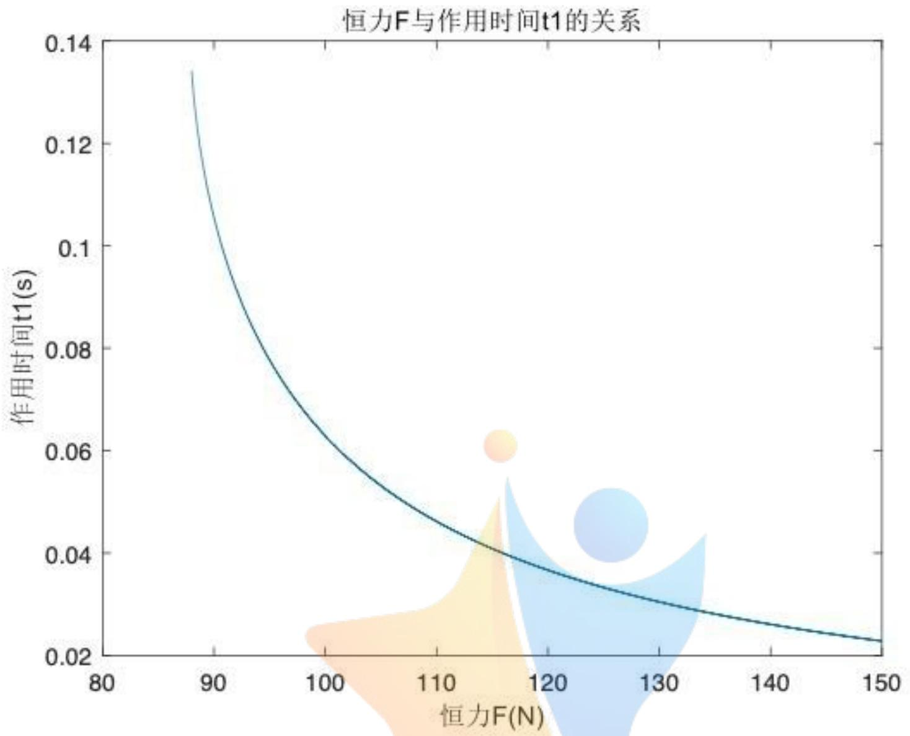

<details>
<summary>line</summary>

| 恒力F(N) | 作用时间t1(s) |
| --- | --- |
| ~88 | ~0.135 |
| ~90 | ~0.115 |
| ~95 | ~0.085 |
| ~100 | ~0.065 |
| ~105 | ~0.052 |
| ~110 | ~0.045 |
| ~115 | ~0.040 |
| ~120 | ~0.036 |
| ~125 | ~0.033 |
| ~130 | ~0.030 |
| ~135 | ~0.028 |
| ~140 | ~0.026 |
| ~145 | ~0.024 |
| ~150 | ~0.023 |
</details>

图1

计算得

$$
t _ {2} = \sqrt {\frac {2 h _ {2}}{g}} = 0. 3
$$

作出时间 $t_1$ 关于恒力 $F$ 大小的函数图像如图1

任取图像上一点, 如 $F = 90 ~N, t_{1} = 0.106 ~s$ , 即对应着如下的策略:

以 0.6s 为一个周期 (其中碰撞所需时间忽略不计). t = 0 时排球开始下落, t = 0.194s 时所有人同时开始发力, 发力过程中手的高度基本不变, 沿绳方向的力大小恒定为 90N, t = 0.3s 时所有人结束发力 (即令绳子松弛), 直到下一个周期开始. 此时颠球高度为 0.45m.

## 六、问题二：不同误差对鼓面的影响

## 6.1 假设的合理性

\- 题目表格中列出的 8 个人在没有发力的时候默认绳子上的拉力为 68.155N. 特别地,未提前发力的人在 -0.1s 至 0s 之间也记为绳子上有 68.155N 的力.

因为开始之前, 在所有人为了保持鼓的静止和水平, 需要在绳子上产生的力为 $F = (3.6 * 9.8N * 1.7 / 0.11) / 8 = 68.155N$ .

\- 鼓的平动只考虑竖直方向.

由题设数据可得, 在初始状态, 每人需要用 68.155N 的力来抵消鼓的重力, 因此无论是一个人提前了 0.1 秒发力或是从 0 秒开始发 90N 的力, 他都仅仅比其他人多了大约 10N 的力, 所以鼓在水平方向受到的合力都是 10N 左右. 因此鼓在水平方向上的加速度约为

$$
a _ {\mathrm{水平}} = \frac {1 0 N}{3 . 6 k g} = 2. 7 8 m / s ^ {2}
$$

故鼓在水平方向平移大约为

$$
s _ {\text {水平}} = \frac {1}{2} * 2. 7 8 m / s ^ {2} * (0. 1 s) ^ {2} = 0. 0 1 4 m
$$

这样1厘米多的距离相对于1.7m的绳长可以忽略不计.

\- 鼓的平动不考虑鼓倾斜.

每人 80N 的力原先作用在鼓上的竖直分量约为 $80N * 0.11 / 1.7 = 5.18N$ , 因此 8 个人在竖直方向上的合力总共 $5.18N * 8 = 41.4N$ . 如果鼓面向上倾斜了 $2^{\circ}$ (在后文可以看出这已经是一个很大的倾斜角了), 上倾的这一侧的鼓的边缘会升高 $\sin(2^{\circ}) * 0.2m = 0.007m$ , 同理另一边下降 $0.007m$ . 这样相对的两个 80N 的力作用在鼓上的竖直分量为 $80N * 0.103 / 1.7 + 80N * 0.117 / 1.7 = 10.36N = 5.18N * 2$ , 与原来没有差别. 即使有一个人用力比其他人多出大约 10N, 也仅仅会造成 $10N * 0.007 / 1.7 = 0.04N$ 的影响, 显然可以忽略. 因此在考虑鼓的平动时, 可以忽略转动的影响, 继续使用第一问的模型.

\- 由于倾斜角都是不大于 $5^{\circ}$ 的小角度, 因此下面将反复使用近似 $\sin \alpha \approx \alpha \approx \tan \alpha$ , 并把约等号用等号代替.

## 6.2 本章主要符号

α: 鼓面的倾斜角 (凡是不加°符号的角度都默认为弧度制)

$\omega$ : 鼓的角速度

β: 鼓的角加速度

$F_{i}(i=1,2,\ldots,8)$ : 第 i 个人在的绳子上的力

$F_{s}$ : 8个力的数值之和(不是矢量和)

$M_{i}(i=1,2,\ldots,8)$ : 第 i 个人的力对鼓中心产生的力矩

M: 鼓受到的总力矩 (以鼓的中心为基准点)

I: 鼓的转动惯量 (转轴在过鼓中心的水平面上)

## 6.3 平动

对于鼓的平动, 只需对第一问的方程稍加修改:

$$
- m h ^ {\prime \prime} (t) = \frac {F _ {s} h (t)}{l} - m g
$$

可以解得

$$
h (t) = \frac {1}{F _ {s}} \left((F _ {s} h _ {0} - g l m) c o s (\sqrt {\frac {F _ {s}}{m l}} t) + g l m\right) \tag {3}
$$

## 6.4 转动

本节主要考虑鼓的转动,需要注意的是虽然前面论证了鼓的转动对平动的影响可以忽略,但是鼓的平动对其转动是有一定影响的.

## 6.4.1 几何关系

如图2所示, 设转轴所在水平面为 $\Omega$ , 鼓的倾斜角 $\alpha$ 和高度 $h$ 均给定, 下面计算在鼓面上与转轴相差 $\varphi(0 \leq \varphi \leq \frac{\pi}{2})$ 的点 $B$ 处拉出的绳子对鼓中心产生的力矩 $M_{\text{上}}$ .

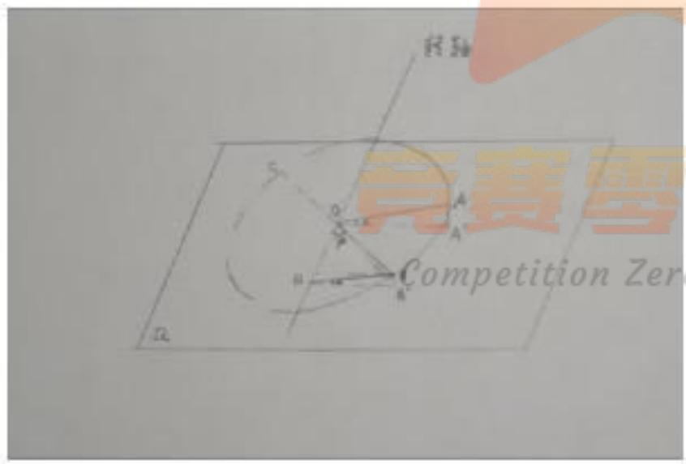

<details>
<summary>text_image</summary>

竞赛型
Competition Zer
</details>

(a) 示意图

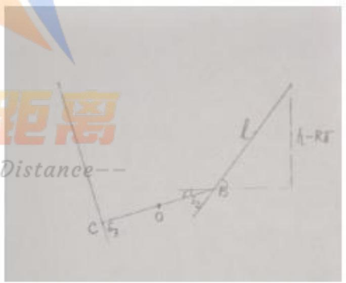

<details>
<summary>text_image</summary>

距离
Distance--
C E O P L
h-RT
</details>

(b) OB 所在竖直平面的截面面图  
图 2 鼓倾斜时所受力矩的示意图

如图2a所示, 设 $OA$ 与转轴垂直, $OB$ 与平面 $\Omega$ 的夹角为 $\gamma$ , $A, B$ 在 $\Omega$ 上的投影分别是 $A', B'$ , $B$ 在转轴上的投影为 $H$ . 由相似关系知 $\angle BHB = \angle AOA' = \alpha$ , 故 $BB' = BH\sin\alpha = R\sin\varphi * \alpha$ , 所以 $\gamma = BB'/BO = \alpha * \sin(\varphi)$ (这里 $\gamma < \alpha$ , 也是小角度).

绳子与水平面的夹角为 $\frac{h-R\gamma}{l}$ ，所以绳子与 OB 的夹角为

$$
\delta_ {\mathrm{上}} = \frac {h - R \gamma}{l} - \gamma
$$

因此绳子中的力 $F_{\text{上}}$ 产生的力矩为

$$
M _ {\mathrm{上}} = R F _ {\mathrm{上}} (\frac {h - R \gamma}{l} - \gamma) \tag {4}
$$

同理, $B$ 的对径点 $C$ 处的绳子中的力 $F_{\text{下}}$ 对鼓中心产生的力矩为

$$
M _ {\mathrm{下}} = R F _ {\mathrm{下}} (\frac {h + R \gamma}{l} + \gamma) \tag {5}
$$

这里 $M_{下}$ 与 $M_{上}$ 的方向相反.

## 6.4.2 转动惯量

一个质量为 $m'$ ，半径为 R 的圆环，绕着过它一条直径的轴的转动惯量为 $\frac{1}{2}m'R^{2}$ .

由平行轴定理, 若把轴离开圆环所在平面移动距离 x, 转动惯量为 $\frac{1}{2}m'R^{2} + m'x^{2}$

可以近似地认为鼓的质量均匀地分布在其木头边缘上, 即质量分布为一个无盖的圆柱面, 半径和厚度分别是 $R = 0.2 \mathrm{~m}$ 和 $d_{0} = 0.22 \mathrm{~m}$ , 转轴在过中心的水平面上.

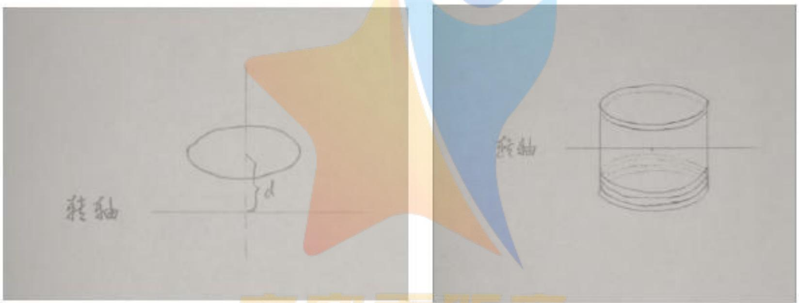  
图 3 转动惯量

把圆柱面看成圆盘微元堆积而成, 由上面的公式积分可以得到其转动惯量

$$
\begin{array}{l} I = \frac {1}{2} m R ^ {2} + m * \frac {1}{0 . 2 2} \int_ {- 0. 1 1} ^ {0. 1 1} x ^ {2} d x \\ = m (0. 5 * 0. 2 ^ {2} + \frac {1}{0 . 2 2} * \frac {1}{3} * 2 * 0. 1 1 ^ {3}) \\ = 3. 6 (0. 0 2 + \frac {1}{3} * 0. 1 1 ^ {2}) \\ = 0. 0 8 6 5 2 k g \cdot m ^ {2} \\ \end{array}
$$

## 6.4.3 一般情形下的方程

由刚体的转动定理, 有

$$
M = I \beta \tag {6}
$$

由角加速度的定义有

$$
\alpha^ {\prime \prime} (t) = \beta \tag {7}
$$

由几何关系有

$$
M = f _ {0} (\alpha , h) \tag {8}
$$

其中 $f_{0}(\alpha ,h)$ 是把8根绳子都用(4)和(5)计算所得的力矩 $M$ 与 $\alpha$ 和 $h$ 的关系式，具体表达式在下一节分情况给出.

## 6.4.4 方程的求解

在给出的 9 组需要求解的数据中, 除了第 8 组以外都很好的对称性, 可以直接看出来转轴的方向:

1. 第 1,4,7 组仅有第 1 个人与其他人的行为不一样, 因此转轴为过鼓的中心且平行于第 3,7 号选手连线.(见图4a)  
2. 第 2,5 组仅有第 1,2 个人与其他人的行为不同, 且 1,2 之间相同, 转轴平行于 3,4 号选手的平分线。(见图4b)  
3. 第 3,6,9 组有 1,4 两人相同且与其余不同 (9 中还有 5,8 两人相同且与其余不同), 转轴平行于 4,5 号选手的角平分线.(见图4c)  
4. 第8组对称性较弱, 后文将单独处理.

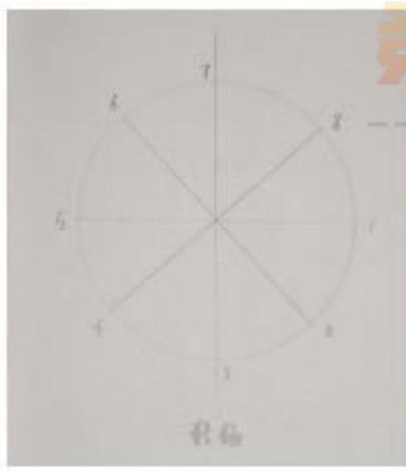

<details>
<summary>text_image</summary>

T
R
F2
F
3
R
</details>

(a)

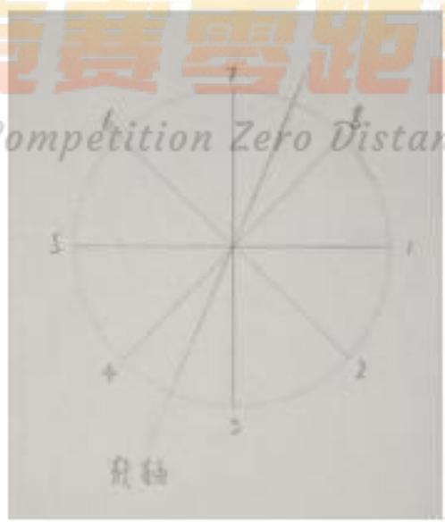

<details>
<summary>text_image</summary>

Competition Zero Distant
5
1
4
2
3
象轴
</details>

(b)

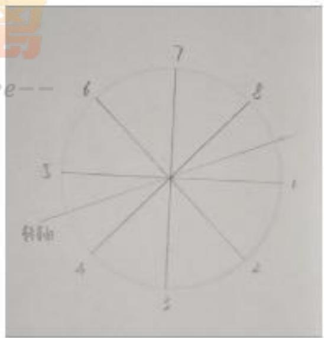

<details>
<summary>text_image</summary>

e--
6
7
8
1
3
基础
4
2
2
</details>

(c)  
图 4 前三类的对称轴位置

下面分别对这几中情况进行求解.

为了方便计算, 在有提前发力的组里, 本文把它当作两个从 0s 到 0.1s 的过程, 而不再使用 -0.1s 到 0s 进行计算.

第1,4,7组 利用公式(4)和(5)可以得到

$$
M _ {2, 6} \triangleq M _ {2} + M _ {6} = R (F _ {2} (\frac {h - R \alpha / \sqrt {2}}{l} - \alpha / \sqrt {2}) - F _ {6} (\frac {h + R \alpha / \sqrt {2}}{l} + \alpha / \sqrt {2}))
$$

$$
M _ {4, 8} \triangleq M _ {8} + M _ {4} = R (F _ {8} (\frac {h - R \alpha / \sqrt {2}}{l} - \alpha / \sqrt {2}) - F _ {4} (\frac {h + R \alpha / \sqrt {2}}{l} + \alpha / \sqrt {2}))
$$

$$
M _ {3, 7} \triangleq M _ {3} + M _ {7} = R (F _ {3} * \frac {h}{l} - F _ {7} * \frac {h}{l}) = 0 \quad (\text {因为} F _ {3} = F _ {7})
$$

$$
M _ {1, 5} \triangleq M _ {1} + M _ {5} = R (F _ {1} (\frac {h - R \alpha}{l} - \alpha) - F _ {6} (\frac {h + R \alpha}{l} + \alpha))
$$

其中各个力矩的方向如5所示.

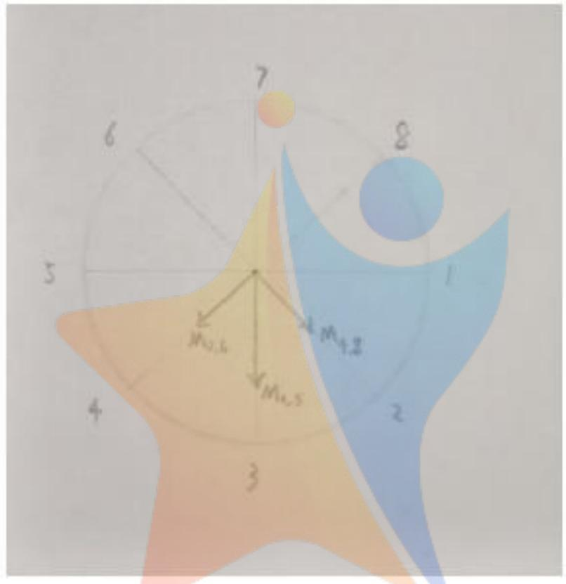

<details>
<summary>text_image</summary>

7
8
3
M0.6
M1.5
1
2
4
3
</details>

图5 力矩方向

将上面的式子相加 (按照矢量加法), 再结合 $F_{2}=F_{3}=\cdots=F_{8}$ 整理可以得到总力矩

$$
M = M _ {1, 5} + M _ {2, 6} + M _ {3, 7} + M _ {4, 8} = R \left((F _ {1} + 3 F _ {5}) (- 1 - \frac {R}{l}) \alpha + (F _ {1} - F _ {5}) \frac {h}{l}\right)
$$

将式(3),(6)和(7)代入可以得到关于 $\alpha$ 和 $t$ 的微分方程

$$
I \alpha^ {\prime \prime} (t) = R \left((F _ {1} + 3 F _ {5}) (- 1 - \frac {R}{l}) \alpha (t) + (F _ {1} - F _ {5}) \frac {1}{l F _ {s}} \left((F _ {s} h _ {0} - g l m) c o s (\sqrt {\frac {F _ {s}}{m l}} t) + g l m\right)\right) \tag {9}
$$

为了使其形式简洁, 做一些变量代换使其具有如下形式

$$
I \alpha^ {\prime \prime} (t) + c \alpha (t) - (d * \cos (k t) + f) = 0 \tag {10}
$$

其中

$$
c = R ((F _ {1} + 3 F _ {5}) (1 + \frac {R}{l})
$$

$$
d = R (F _ {1} - F _ {5}) \frac {1}{l F _ {s}} (F _ {s} h _ {0} - g l m)
$$

$$
k = \sqrt {\frac {F _ {s}}{m l}}
$$

$$
f = R (F _ {1} - F _ {5}) \frac {1}{l F _ {s}} g l m
$$

求解(10)得

$$
\alpha (t) = \frac {d * c o s (k t)}{c - I k ^ {2}} + \frac {f}{c} + a _ {1} * c o s (u t) + a _ {2} * s i n (u t) \tag {11}
$$

其中

$$
u \triangleq \sqrt {\frac {c}{I}}
$$

$a_1, a_2$ 是两个待定常数，可由初始倾角 $\alpha(0)$ 和初始角速度 $\alpha'(0)$ 唯一确定如下

$$
a _ {1} = \alpha (0) - \frac {d}{c - I k ^ {2}} - \frac {f}{c} \tag {12}
$$

$$
a _ {2} = \frac {\alpha^ {\prime} (0)}{u} \tag {13}
$$

在附录中给出了计算 $a_{1}, a_{2}$ 以及 $y(t)$ 表达式的 Python 代码. 下面给出第 1,4,7 题的具体计算结果.

第1组 将初始高度 $h_{0}=0.11$ ，力的大小 $F_{1}=90, F_{5}=80$ ，初始偏向角和角速度 $\alpha(0)=0, \alpha'(0)=0$ 输入程序可得

$$
\alpha (t) = 0. 0 0 0 3 2 3 0 \cos (1 0. 3 0 6 t) + 0. 0 0 1 4 7 2 - 0. 0 0 1 7 9 5 \cos (2 9. 2 0 t)
$$

最终倾斜了

$$
\alpha (0. 1) = 0. 0 0 3 3 8 8 = 0. 1 9 4 ^ {\circ}
$$

倾斜方向为1号高,5号低.

第 4 组 分为两个阶段, 为方便输入程序, 均用 0s 至 0.1s 计时, 第一阶段的末状态为第二阶段的初状态.

第一阶段: 1号先发力, 初始状态为 $h_0 = 0.11, F_1 = 80, F_5 = 68.155, \alpha(0) = 0, \alpha'(0) = 0$ 解得

$$
\alpha (t) = 0. 0 0 0 0 5 8 5 2 \cos (9. 5 4 1 t) + 0. 0 0 2 3 5 9 - 0. 0 0 2 4 1 8 \cos (2 7. 1 1 0 t)
$$

末倾角为 0.004590, 末角速度为 0.02691, 末高度为 0.1090.

第二阶段: 所有人发 80N 的力, 初状态为 $h_{0} = 0.1090, F_{1} = 80, F_{5} = 80, \alpha(0) = 0.004590, \alpha'(0) = 0.02691$

解得

$$
\begin{array}{l} \alpha (t) = 0. 0 0 4 5 9 0 \cos (2 8. 7 5 t) + 0. 0 0 0 9 3 5 8 \sin (2 8. 7 5 t) \\ \alpha (0. 1) = - 0. 0 0 4 1 8 2 = - 0. 2 4 0 ^ {\circ} \\ \end{array}
$$

因此倾斜方向为1号低,5号高,倾斜了0.240°.

值得一提的是, 先发力的人并没有一直保持着自己方向的倾斜, 而是将鼓带入了一种振动状态.

## 第7组 同理分为两个阶段

第一阶段: 初始状态 $h_{0}=0.11, F_{1}=90, F_{5}=68.155, \alpha(0)=0, \alpha'(0)=0$

解得末倾角为0.008242,末角速度为0.04306,末高度为0.1082

第二阶段: 初始状态 $h_{0}=0.1082, F_{1}=90, F_{5}=80, \alpha(0)=0.008242, \alpha'(0)=0.04306$ 解得

$$
\alpha (t) = 0. 0 0 0 2 8 9 9 \cos (1 0. 3 1 t) + 0. 0 0 1 4 7 2 + 0. 0 0 6 4 8 0 \cos (2 9. 2 0 t) + 0. 0 0 1 4 7 5 \sin (2 9. 2 0 t)
$$

$$
\alpha (0. 1) = - 0. 0 0 4 3 7 6 = - 0. 2 5 1 ^ {\circ}
$$

因此倾斜方向为1号低,5号高,倾斜了0.251°.

## 第 2,5 组 同样经过力矩的合成可以得到与 (9) 类似的微分方程

$$
I \alpha^ {\prime \prime} (t) = R \left((1 + \frac {\sqrt {2}}{2}) F _ {1} + (3 - \frac {\sqrt {2}}{2}) F _ {5}) (- 1 - \frac {R}{l}) \alpha (t) + (F _ {1} - F _ {5}) \frac {\sqrt {2 + \sqrt {2}}}{l F _ {s}} \left((F _ {s} h _ {0} - g l m) c o s (\sqrt {\frac {F _ {s}}{m l}} t) + g l m\right)\right)
$$

经过如下代换后又会化为方程(10)

$$
\begin{array}{l} c = R ((1 + \frac {\sqrt {2}}{2}) F _ {1} + (3 - \frac {\sqrt {2}}{2}) F _ {5}) (1 + \frac {R}{l}) \\ d = R (F _ {1} - F _ {5}) \frac {\sqrt {2 + \sqrt {2}}}{l F _ {s}} (F _ {s} h _ {0} - g l m) \\ k = \frac {F _ {s}}{m l} \\ f = R (F _ {1} - F _ {5}) \frac {\sqrt {2 + \sqrt {2}}}{l F _ {s}} g l m \\ \end{array}
$$

方程(10)的求解过程已经由(11)～(13)完整地给出,因此不再赘述.对第2,5组数据求解的过程也与前一类完全类似,因此直接将解出的 $\alpha(t)$ 表达式和最终的倾斜角度列在后文的表格中.

第3,6,9组 与(9)完全类似地有

$$
I \alpha^ {\prime \prime} (t) = R \left(((1 - \frac {\sqrt {2}}{2}) F _ {1} + (3 + \frac {\sqrt {2}}{2}) F _ {5}) (- 1 - \frac {R}{l}) \alpha (t) + (F _ {1} - F _ {5}) \frac {\sqrt {2 - \sqrt {2}}}{l F _ {s}} \left((F _ {s} h _ {0} - g l m) c o s (\sqrt {\frac {F _ {s}}{m l}} t) + g l m\right)\right)
$$

经过如下变量代换

$$
\begin{array}{l} c = R ((1 - \frac {\sqrt {2}}{2}) F _ {1} + (3 + \frac {\sqrt {2}}{2}) F _ {5}) (1 + \frac {R}{l}) \\ d = R (F _ {1} - F _ {5}) \frac {\sqrt {2 - \sqrt {2}}}{l F _ {s}} (F _ {s} h _ {0} - g l m) \\ k = \frac {F _ {s}}{m l} \\ f = R (F _ {1} - F _ {5}) \frac {\sqrt {2 - \sqrt {2}}}{l F _ {s}} g l m \\ \end{array}
$$

又化为(10)，可由 $(11)\sim (13)$ 解出.

第 3,6,9 组问题的具体解答也在后文的表 1 中. 其中第 9 组问题稍有特殊性, 因为在 0s 前后与其他人发力不同的两个人恰好变为了他们相对径的人, 因此在使用程序解完第一阶段之后, 需要将力矩的正方向倒转, 相应的偏转角度和角速度取相反数后再代入第二阶段的计算.

第8组 本组与第3,6,9组的区别在于,两次0.1s的转动的转轴不同,对于其中每一次转动,与(9)完全类似地有

$$
I \alpha^ {\prime \prime} (t) = R \left(((1 - \frac {\sqrt {2}}{2}) F _ {1} + (3 + \frac {\sqrt {2}}{2}) F _ {5}) (- 1 - \frac {R}{l}) \alpha (t) + (F _ {1} - F _ {5}) \frac {\sqrt {2 - \sqrt {2}}}{l F _ {s}} \left((F _ {s} h _ {0} - g l m) c o s (\sqrt {\frac {F _ {s}}{m l}} t) + g l m\right)\right)
$$

## 竞赛零距离

第一阶段 初始状态 $h_{0}=0.11, F_{1}=80, F_{5}=68.155, \alpha(0)=0, \alpha'(0)=0$ , 解得

$$
\alpha (t) = 0. 0 0 0 0 4 6 3 4 \cos (9. 5 4 1 t) + 0. 0 0 1 8 6 1 - 0. 0 0 1 9 0 7 \cos (2 6. 7 1 t)
$$

得末倾角为0.003587,末角速度为0.02274,末高度为0.1090

第二阶段 我们将第一阶段求出的倾角与角速度, 沿序号为 1,4 者连线方向正交分解. 初始状态 $h_0 = 0.1090, F_1 = 90, F_5 = 80, \alpha(0) = 0.003587sin(45^\circ) = 0.002536, \alpha'(0) = 0.02274sin(45^\circ) = 0.01608$ , 解得

$$
\alpha (t) = 0. 0 0 0 2 3 9 3 \cos (1 0. 3 1 t) + 0. 0 0 1 1 5 1 + 0. 0 0 1 1 4 6 \cos (2 8. 8 8 t) + 0. 0 0 0 5 5 6 8 \sin (2 8. 8 8 t)
$$

得末倾角为0.0003041，末角速度为-0.002135，末高度为0.1009

合并 所求倾角为正交的两个倾角 (即第二阶段所得的倾角和第一阶段所得的倾角的垂直分量) 的矢量和, 即

$$
\sqrt {(\frac {0 . 0 0 3 5 8 7 \sqrt {2}}{2}) ^ {2} + 0 . 0 0 0 3 0 4 1 ^ {2}} = 0. 2 5 5 5 = 0. 1 4 6 ^ {\circ}
$$

总结 综上所述, 所求倾角如表 1 所列, 表中 $y(t)$ 即为文中 $\alpha(t)$ 的表达式, 有提前发力的组别均写出了两个 0.1 秒的时间段内的表达式, t 的范围都是 0s 至 0.1s.

<table><tr><td>序号</td><td>用力参数</td><td>1</td><td>2</td><td>3</td><td>4</td><td>5</td><td>6</td><td>7</td><td>8</td><td>鼓面倾角(度)</td></tr><tr><td rowspan="3">1</td><td>发力时机</td><td>0</td><td>0</td><td>0</td><td>0</td><td>0</td><td>0</td><td>0</td><td>0</td><td rowspan="3">0.194</td></tr><tr><td>用力大小</td><td>90</td><td>80</td><td>80</td><td>80</td><td>80</td><td>80</td><td>80</td><td>80</td></tr><tr><td colspan="9">y(t)=0.0003230 cos(10.306t)+0.001472-0.001795 cos(29.20 t)</td></tr><tr><td rowspan="3">2</td><td>发力时机</td><td>0</td><td>0</td><td>0</td><td>0</td><td>0</td><td>0</td><td>0</td><td>0</td><td rowspan="3">0.352</td></tr><tr><td>用力大小</td><td>90</td><td>90</td><td>80</td><td>80</td><td>80</td><td>80</td><td>80</td><td>80</td></tr><tr><td colspan="9">y(t)=0.0005826 cos(10.31 t)+0.002662-0.003245 cos(29.51 t)</td></tr><tr><td rowspan="3">3</td><td>发力时机</td><td>0</td><td>0</td><td>0</td><td>0</td><td>0</td><td>0</td><td>0</td><td>0</td><td rowspan="3">0.151</td></tr><tr><td>用力大小</td><td>90</td><td>80</td><td>80</td><td>90</td><td>80</td><td>80</td><td>80</td><td>80</td></tr><tr><td colspan="9">y(t)=0.0002534 cos(10.31 t)+0.001151-0.001404 cos(28.88 t)</td></tr><tr><td rowspan="4">4</td><td>发力时机</td><td>-0.1</td><td>0</td><td>0</td><td>0</td><td>0</td><td>0</td><td>0</td><td>0</td><td rowspan="4">0.24</td></tr><tr><td>用力大小</td><td>80</td><td>80</td><td>80</td><td>80</td><td>80</td><td>80</td><td>80</td><td>80</td></tr><tr><td colspan="9">y(t)=0.00005852 cos(9.541 t)+0.002359-0.002418 cos(27.11 t)</td></tr><tr><td colspan="9">y(t)=0.004590 cos(28.75 t)+0.0009358 sin(28.75 t)</td></tr><tr><td rowspan="4">5</td><td>发力时机</td><td>-0.1</td><td>-0.1</td><td>0</td><td>0</td><td>0</td><td>0</td><td>0</td><td>0</td><td rowspan="4">0.436</td></tr><tr><td>用力大小</td><td>80</td><td>80</td><td>80</td><td>80</td><td>80</td><td>80</td><td>80</td><td>80</td></tr><tr><td colspan="9">y(t)=0.0001046 cos(9.541 t)+0.004235-0.004340 cos(27.51 t)</td></tr><tr><td colspan="9">y(t)=0.008308 cos(28.75 t)+0.001554 sin(28.75 t)</td></tr><tr><td rowspan="4">6</td><td>发力时机</td><td>-0.1</td><td>0</td><td>0</td><td>-0.1</td><td>0</td><td>0</td><td>0</td><td>0</td><td rowspan="4">0.186</td></tr><tr><td>用力大小</td><td>80</td><td>80</td><td>80</td><td>80</td><td>80</td><td>80</td><td>80</td><td>80</td></tr><tr><td colspan="9">y(t)=0.00004634 cos(9.541 t)+0.001861-0.001907 cos(26.71 t)</td></tr><tr><td colspan="9">y(t)=0.003587 cos(28.75 t)+0.0007910 sin(28.75 t)</td></tr><tr><td rowspan="4">7</td><td>发力时机</td><td>-0.1</td><td>0</td><td>0</td><td>0</td><td>0</td><td>0</td><td>0</td><td>0</td><td rowspan="4">0.251</td></tr><tr><td>用力大小</td><td>90</td><td>80</td><td>80</td><td>80</td><td>80</td><td>80</td><td>80</td><td>80</td></tr><tr><td colspan="9">y(t)=0.0001884 cos(9.626 t)+0.004129-0.004318 cos(27.58 t)</td></tr><tr><td colspan="9">y(t)=0.0002899 cos(10.31 t)+0.001472-0.006480 cos(29.20 t)+0.001475 sin(29.20 t)</td></tr><tr><td rowspan="4">8</td><td>发力时机</td><td>0</td><td>-0.1</td><td>0</td><td>0</td><td>-0.1</td><td>0</td><td>0</td><td>0</td><td rowspan="4">0.146</td></tr><tr><td>用力大小</td><td>90</td><td>80</td><td>80</td><td>90</td><td>80</td><td>80</td><td>80</td><td>80</td></tr><tr><td colspan="9">y(t)=0.00004634 cos(9.541 t)+0.001861-0.001907 cos(26.71 t)</td></tr><tr><td colspan="9">y(t)=0.0002393 cos(10.31 t)+0.001151+0.001146 cos(28.88 t)+0.0005568 sin(28.88 t)</td></tr><tr><td rowspan="4">9</td><td>发力时机</td><td>0</td><td>0</td><td>0</td><td>0</td><td>-0.1</td><td>0</td><td>0</td><td>-0.1</td><td rowspan="4">0.338</td></tr><tr><td>用力大小</td><td>90</td><td>80</td><td>80</td><td>90</td><td>80</td><td>80</td><td>80</td><td>80</td></tr><tr><td colspan="9">y(t)=0.00004635 cos(9.541 t)+0.001861-0.001907 cos(26.71 t)</td></tr><tr><td colspan="9">y(t)=0.0002393 cos(10.31 t)+0.001151-0.004977 cos(28.88 t)-0.0007874 sin(28.88 t)</td></tr></table>

表1

## 七、问题三：实际条件下策略的改进

在问题一的策略中, 如果把问题二的数据代入, 那么恒力 F 的大小需至少约为 88N, 否则

$$
t _ {1} = \sqrt {\frac {l m _ {1}}{F n}} \arcsin \frac {v _ {1} \sqrt {F n l m _ {1}}}{F h _ {0} n - g l m _ {1}}
$$

无实数解, 如图6所示.

因此,对于更小的力 F,需要对这一模型进行改进

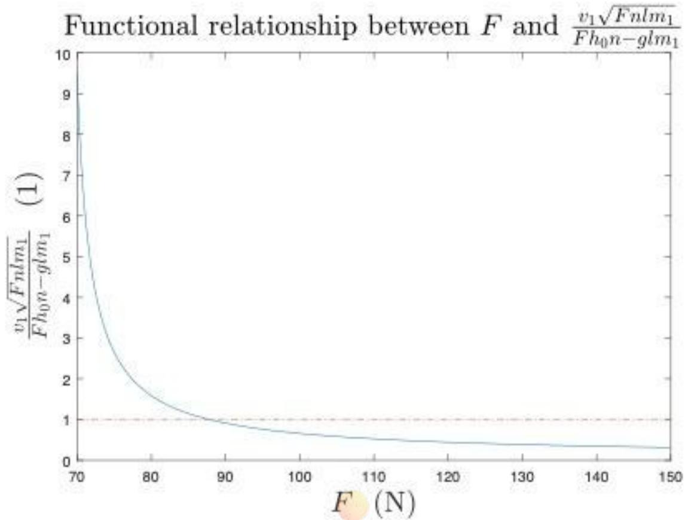

<details>
<summary>line</summary>

| F (N) | Value |
| --- | --- |
| 70 | ~9.5 |
| 80 | ~1.8 |
| 90 | ~1.0 |
| 100 | ~0.7 |
| 110 | ~0.6 |
| 120 | ~0.5 |
| 130 | ~0.4 |
| 140 | ~0.35 |
| 150 | ~0.3 |
</details>

图6

问题一中的模型建立在碰撞所需时间极短, 且一旦碰撞恒力即刻撤走的假设下. 在实际情形中, 碰撞需要时间, 设之为 $t_0$ , 而且碰撞时恒力仍然存续, 才能使排球上升高度较大.

记 $\eta$ 为能量转化效率, $I$ 为碰撞过程中合外力的冲量, $W$ 为碰撞过程中合外力的功, 方程组变为

$$
\left\{ \begin{array}{l} m _ {1} v _ {1} - m _ {2} v _ {2} + I = - m _ {1} v _ {1} ^ {\prime} + m _ {2} v _ {2} ^ {\prime} \\ \eta \left(\frac {1}{2} m _ {1} v _ {1} ^ {2} + \frac {1}{2} m _ {2} v _ {2} ^ {2} + W\right) = \frac {1}{2} m _ {1} v _ {1} ^ {\prime 2} + \frac {1}{2} m _ {2} v _ {2} ^ {\prime 2} \\ v _ {2} = v _ {2} ^ {\prime} - C o m p e t i t i o n Z e r o D i s t a n c e - - \end{array} \right.
$$

其中冲量 I 与功 W 为

$$
\left\{ \begin{array}{l} I = \left(\frac {n F h _ {1} (t _ {1})}{l} - m _ {1} g\right) t _ {0} \\ W = \left(\frac {n F h _ {1} (t _ {1})}{l} - m _ {1} g\right) (h _ {1} (t _ {1} + t _ {0}) - h _ {1} (t _ {1})) \end{array} \right.
$$

解方程组可得

$$
v _ {1} = \frac {2 m _ {2} v _ {2} - I - \sqrt {\eta (2 m _ {2} v _ {2} - I) ^ {2} - (1 - \eta) (- 2 \eta W m _ {1} + m _ {1} m _ {2} v _ {2} ^ {2} (1 - \eta))}}{(1 - \eta) m _ {1}}
$$

前面已经说明(上波浪线仅用作与前式区分)

$$
\widetilde {v _ {1}} = - h _ {1} ^ {\prime} (t _ {1}) = \frac {F h _ {0} n - g l m _ {1}}{\sqrt {F n l m _ {1}}} \sin \sqrt {\frac {F n t _ {1} ^ {2}}{l m _ {1}}}
$$

只需要找到适当的 $F, t_{1}, t_{0}$ 使得这两个式子同时成立, 即为一种策略.

改进后的协作策略如下, 以 $2t_{2} + t_{0}$ 为一个周期 (其中碰撞所需时间忽略不计). $t = 0$ 时排球开始下落, $t = t_{2} - t_{1}$ 时所有人同时开始发力, 发力过程中手的高度基本不变, 沿绳方向的力大小恒定为 $F, t = t_{2}$ 时所有人继续发力, 此时排球与同心鼓相撞, $t = t_{2} + t_{0}$ 时所有人结束发力, 此时排球与同心鼓脱离, 直到下一个周期开始. 此时颠球高度为 $h_{2}$ .

将数值代入上述公式,其中单位均采用国际单位制

$$
\left\{ \begin{array}{l} l = 1. 7 \\ m _ {1} = 3. 6 \\ n = 8 \\ g = 9. 8 \\ h _ {2} = 0. 4 5 \\ m _ {2} = 0. 2 7 \\ \eta = 0. 9 5 \\ h _ {0} = 0. 1 1 \end{array} \right.
$$

计算得

$$
t _ {2} = \sqrt {\frac {2 h _ {2}}{g}} = 0. 3
$$

对于 $F = 80, t_{1} = 0.08$ ，作出 $\widetilde{v_{1}} - v_{1}$ 关于 $t_{0}$ 的函数图像如图7所示

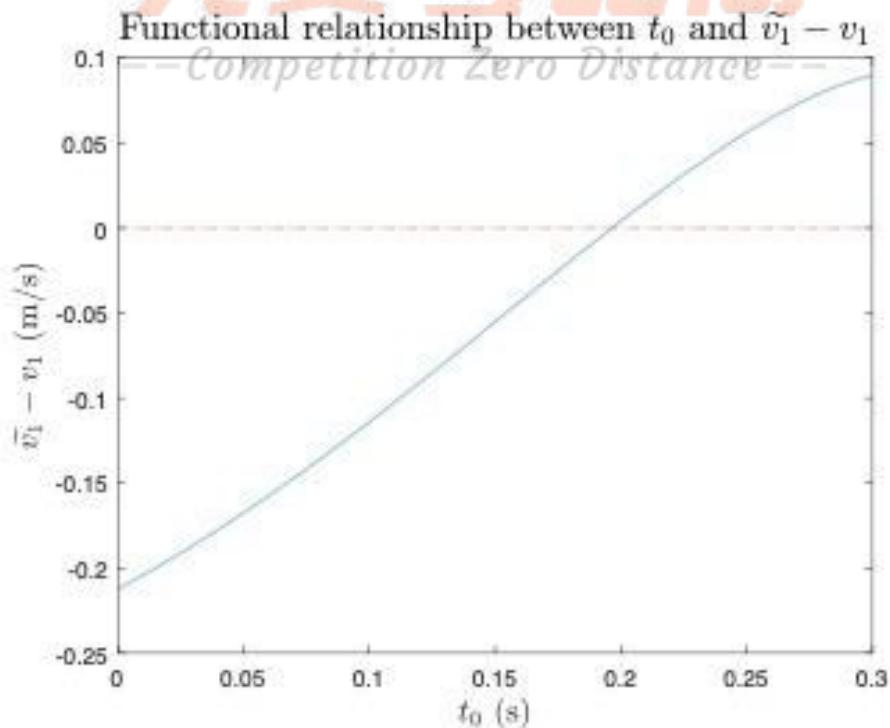

<details>
<summary>line</summary>

| t0 (s) | v1 - v1 (m/s) |
| --- | --- |
| 0 | ~-0.21 |
| 0.05 | ~-0.16 |
| 0.1 | ~-0.11 |
| 0.15 | ~-0.06 |
| 0.2 | 0 |
| 0.25 | ~0.06 |
| 0.3 | ~0.09 |
</details>

图7

得到 $t_0 = 0.197$ 满足条件.

因此, 一种策略为, 以 $0.797 \mathrm{~s}$ 为一个周期 (其中碰撞所需时间忽略不计). $t = 0$ 时排球开始下落, 当 $t = 0.22 \mathrm{~s}$ 时所有人同时开始发力, 发力过程中手的高度基本不变, 沿绳方向的力大小恒定为 $F, t = 0.3 \mathrm{~s}$ 时所有人继续发力, 此时排球与同心鼓相撞, $t = 0.497 \mathrm{~s}$ 时所有人结束发力, 此时排球与同心鼓脱离, 直到下一个周期开始. 此时颠球高度为 $0.45 \mathrm{~m}$ .

## 八、问题四：误差消除的策略研究

在此问题中, 依旧不需要考虑鼓的水平移动. 一方面, 第二问中已经分析过忽略水平移动造成的误差可以忽略. 另一方面, 排球偏转了 $1^{\circ}$ 后落下并不会超出鼓面的范围, 不需要移动鼓来接球. 为了说明这一点, 可以以排球的最高的为原点建立坐标系, 排球的轨迹可设为 $y = -ax^{2} \quad (a > 0)$ , 则排球上次弹起处坐标为 $(x_{0}, y_{0}) = (-\sqrt{\frac{0.6}{a}}, -0.6)$ , 求导知此处斜率为 $2a * \sqrt{\frac{0.6}{a}}$ , 由题意知 $2a * \sqrt{\frac{0.6}{a}} = tan(89^{\circ})$ , 解得 $a = 1367$ , 可求得两次落点之间距离为 $0.04 \mathrm{~m}$ , 远小于鼓面半径.

如图8所示, 设球沿着第 1,2 位选手之间 1:2 的方向所在竖直面内移动, 为了把球调整成竖直, 需要在下次接到球时鼓面往反方向倾斜 $0.5^{\circ}$ , 即要鼓绕着图中的轴线旋转使得第 1,2 位选手之间 1:2 的方向上升 $0.5^{\circ}$ . 为此, 需要使得合力矩始终沿着转轴的方向.

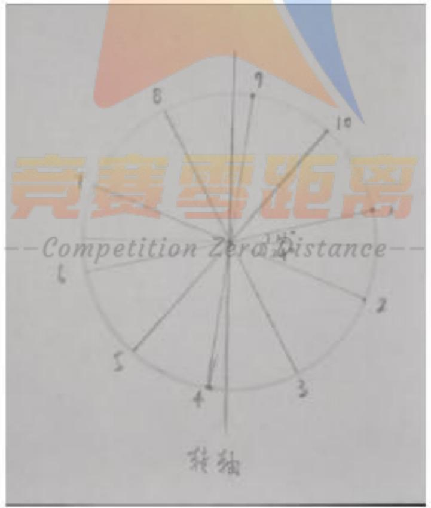

<details>
<summary>text_image</summary>

竞赛距离
Competition Zero Distance——
转轴
</details>

图8

利用公式 (4) 和 (5), 可以得到各组力矩

$$
M _ {1, 6} \triangleq M _ {1} + M _ {6} = R \left(F _ {1} - F _ {6}\right) \frac {h}{l} - R \left(F _ {1} + F _ {6}\right) \left(1 + \frac {R}{l}\right) \alpha * \sin \left(7 8 ^ {\circ}\right) \tag {14}
$$

$$
M _ {2, 7} \triangleq M _ {2} + M _ {7} = R (F _ {2} - F _ {7}) \frac {h}{l} - R (F _ {2} + F _ {7}) (1 + \frac {R}{l}) \alpha * s i n (1 1 4 ^ {\circ}) \tag {15}
$$

$$
M _ {3, 8} \triangleq M _ {3} + M _ {8} = R (F _ {3} - F _ {8}) \frac {h}{l} - R (F _ {3} + F _ {8}) (1 + \frac {R}{l}) \alpha * s i n (1 5 0 ^ {\circ}) \tag {16}
$$

$$
M _ {9, 4} \triangleq M _ {9} + M _ {4} = R (F _ {9} - F _ {4}) \frac {h}{l} - R (F _ {9} + F _ {4}) (1 + \frac {R}{l}) \alpha * s i n (6 ^ {\circ}) \tag {17}
$$

$$
M _ {1 0, 5} \triangleq M _ {1 0} + M _ {5} = R (F _ {1 0} - F _ {5}) \frac {h}{l} - R (F _ {1 0} + F _ {5}) (1 + \frac {R}{l}) \alpha * s i n (4 2 ^ {\circ}) \tag {18}
$$

它们的方向如图9所示.

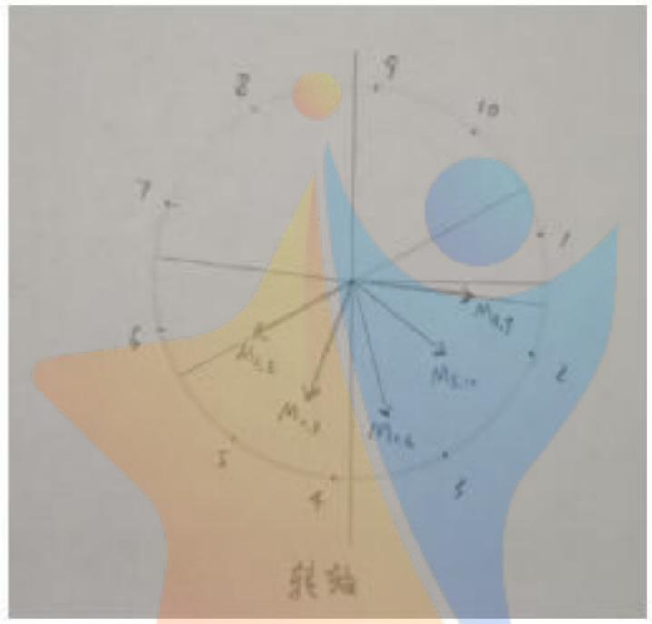

<details>
<summary>text_image</summary>

8
9
10
7
1
M_{8,9}
2
M_{5,10}
M_{4}
M_{3,6}
5
5
转站
</details>

图9

要使得鼓始终绕着轴旋转, 需要合力矩始终垂直于轴, 即沿轴方向的分量为零. 由上面各个力矩的大小和方向, 可以得到合力矩沿轴方向的分量为

$$
\left((F _ {1} - F _ {6}) \cos (7 8 ^ {\circ}) + (F _ {2} - F _ {7}) \cos (1 1 4 ^ {\circ}) + (F _ {3} - F _ {8}) \cos (1 5 0 ^ {\circ}) + (F _ {9} - F _ {4}) \cos (6 ^ {\circ}) + (F _ {1 0} - F _ {5}) \cos (4 2 ^ {\circ})\right) \frac {R}{l} h +
$$

$$
\left((F _ {1} + F _ {6}) \sin (1 5 6 ^ {\circ}) + (F _ {2} + F _ {7}) \sin (2 2 8 ^ {\circ}) + (F _ {3} + F _ {8}) \sin (3 0 0 ^ {\circ}) + (F _ {9} + F _ {4}) \sin (1 2 ^ {\circ}) + (F _ {1 0} + F _ {5}) \sin (8 4 ^ {\circ})\right) R (1 + \frac {R}{l}) \alpha
$$

为了使此分量恒为零, 需要 h 和 $\alpha$ 的系数均为零, 即

$$
\begin{array}{l} (F _ {1} - F _ {6}) \cos (7 8 ^ {\circ}) + (F _ {2} - F _ {7}) \cos (1 1 4 ^ {\circ}) + (F _ {3} - F _ {8}) \cos (1 5 0 ^ {\circ}) \\ + (F _ {9} - F _ {4}) \cos (6 ^ {\circ}) + (F _ {1 0} - F _ {5}) \cos (4 2 ^ {\circ}) = 0 \tag {19} \\ \end{array}
$$

$$
\begin{array}{l} (F _ {1} + F _ {6}) \sin (1 5 6 ^ {\circ}) + (F _ {2} + F _ {7}) \sin (2 2 8 ^ {\circ}) + (F _ {3} + F _ {8}) \sin (3 0 0 ^ {\circ}) \\ + (F _ {9} + F _ {4}) \sin (1 2 ^ {\circ}) + (F _ {1 0} + F _ {5}) \sin (8 4 ^ {\circ}) = 0 \tag {20} \\ \end{array}
$$

容易找出满足上面两式的解,现举一例如下:

$$
F _ {1} = 1 2 9. 3 N \quad F _ {2} = 1 1 5. 5 N \quad F _ {6} = 9 9 N \quad F _ {i} = 1 0 0 N \quad (i = 3, 4, 5, 7, 8, 9, 1 0)
$$

注意到其中 $F_{1} > F_{6}, F_{2} > F_{7}$ ，其余三对力互相相等，因此鼓确实会沿着给定的轴旋转使得选手 1,2 所在一侧升高.

假设鼓面初始时刻是水平静止的，初始位置较绳子水平时下降 0.15m, 下面计算通过多长时间能使其倾斜 $0.5^{\circ}$ . 将数据代入 (3) 中可以得到

$$
h (t) = \frac {1}{1 0 4 3 . 8} (8 6. 0 1 c o s (1 2. 0 4 t) + 7 0. 5 6) \tag {21}
$$

将各个力的大小代入前面的 (14) \~ (18), 然后计算矢量和可以得到总力矩, 结合 (6) 和 (7) 得到微分方程

$$
4. 2 8 2 h - 1 1 8. 8 \alpha (t) = 0. 0 8 6 5 2 \alpha^ {\prime \prime} (t)
$$

将(21)代入得

$$
0. 0 8 6 5 2 \alpha^ {\prime \prime} (t) + 1 1 8. 8 \alpha - (0. 3 5 2 8 \cos (1 2. 0 4 t) + 0. 2 8 9 5) = 0
$$

解得

$$
\alpha (t) = 0. 0 0 3 3 2 0 \cos (1 2. 0 4 t) + 0. 0 0 2 4 3 7 - 0. 0 0 5 7 5 7 \cos (3 7. 0 6 t)
$$

图像如下(图10)

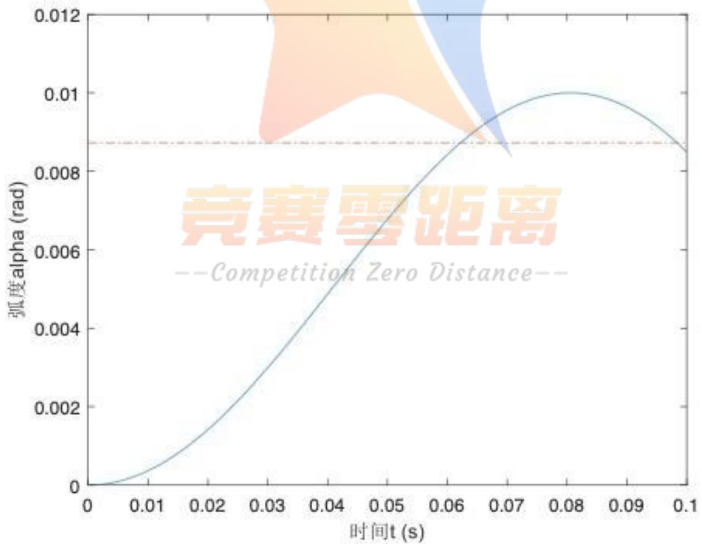

<details>
<summary>area</summary>

| 时间 t (s) | 弧度 alpha (rad) |
| --- | --- |
| 0 | 0 |
| 0.01 | ~0.0005 |
| 0.02 | ~0.0015 |
| 0.03 | ~0.003 |
| 0.04 | ~0.0045 |
| 0.05 | ~0.006 |
| 0.06 | ~0.0075 |
| 0.07 | ~0.009 |
| 0.08 | ~0.01 |
| 0.09 | ~0.0095 |
| 0.1 | ~0.0085 |
</details>

图10

在倾斜角取到 $0.5^{\circ}(=8.73 \times 10^{-3}$ 弧度) 时，时间 t = 0.062.

由(1)可得鼓速度 $v_{1}$ 关于时间的函数图像(图11)

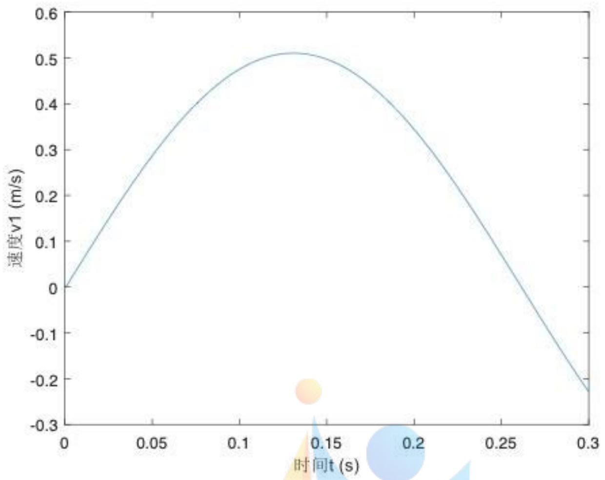

<details>
<summary>line</summary>

| 时间t (s) | 速度v1 (m/s) |
| --- | --- |
| 0 | 0 |
| ~0.14 | ~0.51 |
| 0.3 | ~-0.22 |
</details>

图11

知速度 $v_{1}$ 在前 0.1s 时随时间增大而增大。由 (2) 可得，t = 0.0423s 时的速度恰好能使球上升至 40cm 处。当 t = 0.062 时， $v_{1}$ 较前者更大，故满足使球上升至少 40cm 的要求，这一策略符合题意。

## 九、模型评价

我们通过建立和改进物理模型, 较好地模拟了实际情况, 并对给定问题给出了具体解答. 我们认为此模型有以下优点:

- 采用了合理的近似,在简化问题的同时不会产生较大误差  
- 利用对称原理, 减少了大量不必要的计算  
- 用图像直观地体现了变量之间的关系

同时, 我们认为此模型也存在以下不足:

- 模型中假设拉力为恒力,但实际情况下难以保持拉力恒定  
- 在运动过程中将水平方向上的位移忽略不计, 这可能导致计算结果一定的误差

## 参考文献

[1] 钟锡华, 陈熙谋. 大学物理通用教程力学[M]. 北京大学出版社, 北京, 2014.

## 附录

## 附录一: 恒力 F 与作用时间 t1 的关系, Matlab

图1  
```matlab
l=1.7;
m1=3.6;
n=8;
g=9.8;
h2=0.45;
m2=0.27;
h0=0.11;
F=88:0.01:150;
hold off
for eta = 0.95
lambda=((2*g*h2*n*l*m1.*F).^0.5.*(2*m2-(m2*(4*eta*m2-(1-eta)^2*m1)).^0.5))...
./(m1*(1-eta).*(h0*n.*F-g*l*m1)));
t1=(l*m1./(F.*n)).^0.5.*asin(lambda);
plot(F, t1)
title('恒力F与作用时间t1的关系')
xlabel('恒力F(N)')
ylabel('作用时间t1(s)')
hold on
end
```

## 附录二: 问题二的辅助程序, Python

第1,4,7组  
```python
from math import *
g = 9.8
m = 3.6
h0 = float(input('初始高度h0 = '))
I = 0.08652                      ##转动惯量
F1 = float(input('F1 = '))
F5 = float(input('F5 = '))
Fs = F1 + 7 * F5
R = 0.2                          ##鼓半径
L = 1.7

c = R * (F1 + 3 * F5) * (1 +R/L)
b1 = R * (F1 - F5)/(L * Fs)
d = b1 * (Fs * h0 - g * L * m)
k = sqrt(Fs/m/L)
```

```txt
f = b1 * g * L * m
u = sqrt(c/I)

t = 0.1
print('\n初值')
y0 = float(input('初始偏转角（弧度）= '))
dy0 = float(input('初始角速度（弧度/秒）= '))
a1 = y0 - d/(c- I * k * k) - f/c
a2 = (dy0 * sqrt(I/c))

print('\n')

print('倾角y(t) =',d/(c - I * k * k),'cos(',k,'t) +',f/c,'+',a1,'cos(',u,'t)
    +',a2,'sin(',u,'t)')
print('角速度y\'(t) =',-d*k/(c-I*k*k),'sin(',k,'t)
    -',a1*u,'sin(',u,'t)+',a2*u,'cos(',u,'t)')
print('0.1秒时倾角为',d * cos(k *t)/(c - I * k * k) + f/c + a1 * cos(u * t) + a2 * sin(u * t))
print('0.1秒时角速度为',-d*k/(c-I*k*k)*sin(k*t) - a1*u*sin(u*t) + a2*u*cos(k*t))
print('0.1秒时高度为',1/Fs * ((Fs * h0 - g * L * m) * cos(k * t) + g * L * m))
```

## 第2,5组

```python
from math import *

g = 9.8
m = 3.6
h0 = float(input('初始高度h0 = '))
I = 0.08652
F1 = float(input('F1 = '))
F5 = float(input('F5 = '))
Fs = F1 + 7 * F5
R = 0.2
L = 1.7

c = R * ((1+sqrt(2)/2)*F1 + (3-sqrt(2)/2) * F5) * (1 +R/L)
b1 = R * (F1 - F5)*(sqrt(2+sqrt(2)))/(L * Fs)
d = b1 * (Fs * h0 - g * L * m)
k = sqrt(Fs/m/L)
f = b1 * g * L * m
u = sqrt(c/I)

t = 0.1
print('\n初值')
```

```txt
y0 = float(input('初始偏转角（弧度）= '))
dy0 = float(input('初始角速度（弧度/秒）= '))
a1 = y0 - d/(c- I * k * k) - f/c
a2 = (dy0 * sqrt(I/c))

print('\n')

print('倾角y(t) =',d/(c - I * k * k),'cos(',k,'t) +',f/c,'+',a1,'cos(',u,'t)
    +',a2,'sin(',u,'t)')
print('角速度y\'(t) =',-d*k/(c-I*k*k),'sin(',k,'t)
    -',a1*u,'sin(',u,'t)+',a2*u,'cos(',u,'t)')
print('0.1秒时倾角为',d * cos(k *t)/(c - I * k * k) + f/c + a1 * cos(u * t) + a2 * sin(u * t))
print('0.1秒时角速度为',-d*k/(c-I*k*k)*sin(k*t) - a1*u*sin(u*t) + a2*u*cos(k*t))
print('0.1秒时高度为',1/Fs * ((Fs * h0 - g * L * m) * cos(k * t) + g * L * m))
```

第3,6,8,9组  
```python
from math import *

g = 9.8
m = 3.6
h0 = float(input('初始高度h0 = '))
I = 0.08652                      ##转动惯量
F1 = float(input('F1 = '))
F5 = float(input('F5 = '))
Fs = F1 + 7 * F5
R = 0.2                          ##鼓半径
L = 1.7

c = R * ((1-sqrt(2)/2)*F1 + (3+sqrt(2)/
b1 = R * (F1 - F5)*(sqrt(2-sqrt(2)))/(L
d = b1 * (Fs * h0 - g * L * m)
k = sqrt(Fs/m/L)
f = b1 * g * L * m
u = sqrt(c/I)

t = 0.1
print('\n初值')
y0 = float(input('初始偏转角（弧度）= ')
dy0 = float(input('初始角速度（弧度/秒）
a1 = y0 - d/(c- I * k * k) - f/c
a2 = (dy0 * sqrt(I/c))
```

```txt
print('\n')

print('倾角y(t) =',d/(c - I * k * k),'cos(',k,'t) +',f/c,'+',a1,'cos(',u,'t)
    +',a2,'sin(',u,'t)')
print('角速度y\'(t) =',-d*k/(c-I*k*k),'sin(',k,'t)
    -',a1*u,'sin(',u,'t)+',a2*u,'cos(',u,'t)')
print('0.1秒时倾角为',d * cos(k *t)/(c - I * k * k) + f/c + a1 * cos(u * t) + a2 * sin(u * t))
print('0.1秒时角速度为',-d*k/(c-I*k*k)*sin(k*t) - a1*u*sin(u*t) + a2*u*cos(k*t))
print('0.1秒时高度为',1/Fs * ((Fs * h0 - g * L * m) * cos(k * t) + g * L * m))
```

## 附录三：问题三的作图, Matlab

图6  
```matlab
figure(1)
l=1.7;
m1=3.6;
n=8;
g=9.8;
h2=0.45;
m2=0.27;
h0=0.11;
F=70:0.01:150;
k=1.+zeros(1,8001);
hold off
for eta = 0.95
lambda=((2*g*h2*n*l*m1.*F).^0.5.*(2*m2-(m2*(4*eta*m2-(1-eta)^2*m1)).^0.5))...
./(m1*(1-eta).*(h0*n.*F-g*l*m1)));
t1=(l*m1./(F.*n)).^0.5.*asin(lambda);
plot(F, lambda)
hold on
plot(F, k, '-.')
title({'\$mbox{Functional relationship between}\ F\ \mbox{and}\
\frac{v_1\sqrt{Fnlm_1}{Fh_0n-glm_1}$'}, 'interpreter','latex','fontsize',20);
xlabel('\$F\ \ (\mbox{N})$', 'interpreter','latex','fontsize',20)
ylabel({'\$\frac{v_1\sqrt{Fnlm_1}{Fh_0n-glm_1}\ \
(1)$'}, 'interpreter','latex','fontsize',20)
hold on
end
```

图7  
```javascript
m=3.6;m2=0.27;h=0.11;l=1.7;n=8;g=9.8;f=80;eta=0.95;v2=3;
hold off
for x=0.08:0.1:0.1
```

```matlab
qwq=0;
for y=0:0.001:0.3
qwq=qwq+1;
h11=((f*h*n-g*l*m)*cos(sqrt((f*n*x^2)/(l*m)))+g*l*m)/(f*n);
h10=((f*h*n-g*l*m)*cos(sqrt((f*n*(x+y)^2)/(l*m)))+g*l*m)/(f*n);

I=(n*f*h11/l-m*g)*y;
W=(n*f*h11/l-m*g)*(h11-h10);
p=(f*h*n-g*l*m)/sqrt(f*n*l*m)*sin(sqrt(f*n*x^2)/(l*m));
q=(2*m2*v2-I-sqrt(eta*(2*m2*v2-I)^2-(1-eta)*(-2*eta*W*m+m*m2*v2^2*(1-eta)))/((1-eta)*m);
r=p-q;
rr(qwq)=r;
zz(qwq)=0;
end

y=0:0.001:0.3;
plot(y,rr,y,zz,'-.')
hold on
end
title({'$\mbox{Functional relationship between}\ t_0\ \mbox{and}\
\widetilde{v_1}-v_1$','interpreter','latex','fontsize',16);
xlabel('\$t_0\ (\mbox{s})$','interpreter','latex','fontsize',14)
ylabel({'$\widetilde{v_1}-v_1\ (\mbox{m/s})$','interpreter','latex','fontsize',14)
```

## 附录四：问题四的作图, Matlab

图10

```matlab
t = 0:0.001:0.1;
k = linspace(0.5*3.14159265/180,0.5*3.14159265/180,101);
alpha = 0.003320.*cos( 12.04.* t) + 0.002437 - 0.005757 *cos( 37.06.* t);
hold off
plot(t,alpha,t,k,'-.')
xlabel('时间t (s)')
ylabel('弧度alpha (rad)')
```

图11

```matlab
m=3.6;
h=0.11;
l=2;
f=1043.8;
g=9.8;
t=0:0.001:0.3;
s1=dsolve('m*D2y+(f/l)*y=m*g','y(0)=h,Dy(0)=0','t');
s2=eval(s1);
```

```matlab
s3(1)=0;
for i=1:300
s3(i+1)=1000*(s2(i)-s2(i+1));
end
hold off

plot(t,s3)
ylabel('速度v1 (m/s)')
xlabel('时间t (s)')
```


<details>
<summary>natural_image</summary>

Abstract graphic of a stylized human figure with a star and gradient background (no text or symbols)
</details>

## 竞赛零距离

--Competition Zero Distance--