# 机场的出租车问题

## 摘要

随着世界经济一体化的不断发展，我国航空业发展迅速，机场的旅客吞吐量不断攀升，旅客离港时出租车是机场重要的散客渠道之一。由于不同时空，不同地域机场规模不同，如何解决离港出租车排队问题的研究具有深远意义。本文针对某特定机场，从司机，机场两个角度分别对该问题进行了探究。

针对问题一, 本文首先站在司机角度上模拟决策做出的过程: 分别假设做出排队等候及空载返回两种决策, 参考两种假设下的预期利润大小, 进行决策。在模拟过程中自然地提取出了制约决策根本影响因素: 排队车数、返回市区路程以及出租车市区每小时收入。然后, 使用 0-1 变量 $Q$ 表征采取的决策, 建立了以不同决策下最大利润为目标函数的选择决策模型。

针对问题二，考虑到样本容差率以及数据复杂程度，选取苏南硕放国际机场进行研究。根据人车流量将一天均匀划分为四个时间段。利用收集到的数据，结合问题一建立的模型进行求解，给出四个时间段的司机决策方案为：3:30至9:30排队等候；9:30至16:30空载返回；16:30至21:30排队等候；21:30至次日3:30排队等候。值得注意的是，在求解平均车流量与等待时间的定量关系时本文采用了基于队列模拟的曲线拟合法，得出两者正相关。对相关因素的依赖性分析采用控制变量法。分别对目标变量求偏导，得到结论：等待时间对等待收益的负相关且影响较大；出租车市区每小时次之；而返回市区油耗则与排队等候的收益正相关。模型结果与机场实际情况基本吻合，较为合理。

针对问题三，参考国内机场，选择二车道矩阵式上客系统（详见5-14），设置一个上车口。根据交通流理论有泊车位数量与车流速度负相关。如此，必然存在一个泊车位数的阈值，使得乘车效率最大。所以以乘车效率为目标函数，泊车位数为决策变量，车速限制等为约束条件建立优化模型，求取最大值。目标函数取最大值时距决策变量取值最近的偶数即为乘车效率最大时的泊车位数。

针对问题四，我们分别给出了基于时间和基于路程的两种“短途票”方案，满足时间或路程条件的司机能够凭短途票享有“优先权”。两种衡量标准都围绕收益平衡思想设定，取短途司机利润与正常司机利润相等时对应额临界值。两种方法各有利弊，适用于不同条件的机场。

关键词：决策模型；队列模拟；短距标准

## 1. 问题的重述

乘坐航班到达机场后，多数乘客会前往市区的目的地。出租车因其无需转乘，方便快捷，全时段服务等优势条件深受出港旅客青睐。下图是上海浦东机场2018年旅客集散方式示意图。


<details>
<summary>pie</summary>

| Category | Value |
| --- | --- |
| 机场巴士 | ~15% |
| 私家车 | ~20% |
| 轨道交通 | ~25% |
| 机场巴士 | ~10% |
| 出租车 | ~15% |
| 旅游巴士 | ~10% |
| 磁悬浮 | ~5% |
</details>

图 1-1 上海浦东机场 18 年旅客集散方式示意图

其中，乘坐出租车的乘客数量达到了总旅客数的 18%。可以看出，出租车是机场主要的集散方式之一。而国内多数机场采用进站客流与出站客流分离的规划思想，即送客与接客区域相隔离。于是送客到机场的出租车司机都将会面临两个选择：

(A)前往到达区排队等待载客返回市区。出租车必须到指定的“蓄车池”排队等候，依“先来后到”排队进场载客，等待时间长短取决于排队出租车和乘客的数量多少，需要付出一定的时间成本,如图2。

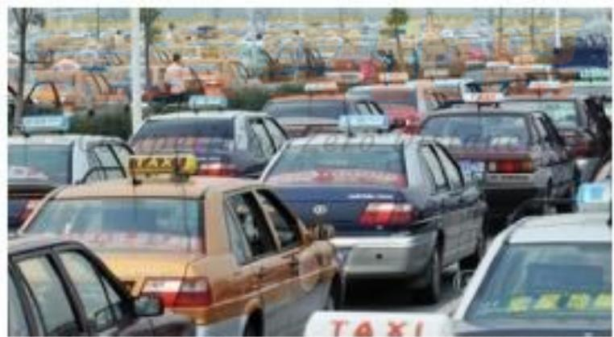

<details>
<summary>natural_image</summary>

Crowded highway scene with multiple taxis and a person in the background (no visible text or symbols)
</details>

图 1-2 上海浦东机场出租车蓄车池

以浦东机场为例，每位能在航站楼成功载乘客离去的出租车司机，都必须先经过P7蓄车场几小时的耐心排队。经过漫长等待后，被随机分配开往P1或P2停车场缓冲区再进行半小时到一小时的等待，最后才能在候客区载到客人。

“整个等待若花4小时算幸运的，有时候要等候七八个小时。”——某出租车司机。

(B)直接放空返回市区拉客。出租车司机会付出空载费用和可能损失潜在的载客收益。在浦东机场，漫长的等待让很多的哥望而却步，他们选择直接返回市区。

“等这么久真的很不划算，不如回去拉客能多赚点。”——某出租车司机。

通过查询, 司机可以得到在该时间段抵达的航班数量, 同时也可以观测到 “蓄车池” 里已有的车辆数, 结合两者司机可以在(A)、(B)间作出决策。司机的决策通常与其个人的经验判断有关, 比如在某个季节与某时间段抵达航班的多少和可能乘客数量的多寡等。

离港乘客若要搭乘出租车，则须前往指定“乘车区”排队，按先后顺序乘车。机场出租车管理人员负责放行出租车进入候客区以及安排乘客上车。要求结合实际，建立数学模型研究下列问题：

(1) 讨论决策相关因素及其影响机理，结合考虑机场乘客数量变化和出租车司机收益，建立出租车司机的选择决策模型，给出选择策略。  
(2) 结合国内某一机场及其所在城市出租车的相关数据，给出出租车司机的选择方案，并分析模型的合理性和对相关因素的依赖性。  
(3) 某机场“乘车区”现有两条并行车道。求应如何设置“上车点”，并合理安排出租车和乘客，在保证车辆和乘客安全的条件下，使得总的乘车效率最高。  
(4) 出租车载客收益与载客的行驶里程有关，乘客的目的地有远有近，出租车司机不能选择乘客和拒载，但允许出租车多次往返载客。故，拟对某些短途载客再次返回的出租车给予“优先权”，使出租车的收益均衡，试给出“优先”安排方案。

## 2. 问题的分析

本文要解决的是飞机场离港出租车上客系统优化问题。问题一、二要求从司机角度，结合机场情况作出空载返回或是排队等候的决策，使得利润最大化。而第三、第四问要求从机场角度考虑如何安排上车点，提高乘车效率以及如何设置短途返回“优先机制”以能够均衡司机收益。

## 2.1 对问题一的分析

针对问题一，为充分分析决策的影响因素及其机理，不妨站在司机角度上模拟决策做出的过程：

假设排队等候，通过排队车辆数，机场航班等情况估算等候的时间成本，并结合载客回市区的收益得出采取此决策的预期利润。二、假设空载返回，将空跑损耗作为成本，估计返回节省下的等候时间在市区拉客产生的收益，同样地可以给出采取空载返回决策的预期利润。

比较两种假设下的预期利润作出决策。如此，我们可以从决策过程中提取出直接影响因素：等待时间、返回时间、空跑损耗、载客利润及市区收益。对其继续分析可得到制约这几个量的根本影响因素：排队车数、打的人数、收费标准以及返回路程。对这类选择决策性问题建立模型时使用0-1变量表征采取的方式，目标函数取不同决策下的最大利润。使用上5个根本影响因素表示不同决策下的收益以及成本作为约束条件即可建立优化模型给出不同情况下使利润最大化的决策。

## 2.2 对问题二的分析

针对问题二，对机场的选择有一定的限制。首先不能选取小型机场：小型机场旅客吞吐量小，出租车流量小，导致样本容量小。受制于样本容量，对数据统计有极高要求，容错率极低。并且考虑到数据获取难度大，故不予考虑。其次尽量避免大型机场：大型机场作为国际、国内中转枢纽，交通方式多样，各类影响较多。在不同时间段需要纳入考虑因素太多，会对五个根本因素与的决策关系产生影响。增加后文分析难度。故也需尽量避免。于是中型机场成为较好的选择。结合城市出租车数量等因素初步考虑苏南硕放国际机场。

收集数据给出第一问五个根本影响因素的值，即可根据模型给出决策。值得注意的是，等待时间与很多其他变量相互联系。对等待时间求解很大程度上决定了模型的好坏，需格外注意。

## 2.3 对问题三的分析

针对问题三，首先对国内机场离港出租车上客系统情况进行采集分析，结合所给条件，选定二车道矩阵式上客系统。为增大系统乘车效率，考虑增设泊车位。但泊车位的增加，伴随着车流量的变大，可能导致车多缓行。于是，寻找一个泊车位数的阈值，使得乘车效率最大。

泊车位数变化造成的车流速度变化，通过出租车进出所需的时间直观地反映在了乘车效率上。可以尝试利用数学工具，给出泊车位数与车流速度的定量关系，进而给出出租车进出接客区时间关于泊车位数的表达式。另外给出乘客上车时间则可以结合泊车位数量给出乘车效率关于泊车位数的表达式。

将乘车效率作为目标函数，加上基于接客区宽度的约束条件即得优化模型。求解可得乘车效率最大值。

## 2.4 对问题四的分析

针对问题四，对短途返回“优先机制”进行设计要求了解该机制的设计初衷并加以实现。由于乘客的目的地有远有近，但司机付出了同样的时间成本。本机制的设计目的是平衡不同司机的收益。于是，设计过程均应当围绕“收益均衡”展开。

借鉴国内机场经验，采用较为成功的“短途票”方案。实际操作方案需要明确短距评判标准，不妨以“收益均衡”为指导，通过比较短途载客收益与普通载客收益来界定其临界距离。另外，结合实际给出“短途票”的使用条件。

## 3. 模型的假设与符号说明

## 3.1 模型的假设

（1）假设一：乘客上车时间为90秒 $^{[4]}$ 。  
(2) 假设二: 决策的选择仅考虑经济因素, 忽略个人倾向等其他因素。  
(3) 假设三: 出租车行驶默认为相同速度的匀速运动

## 3.2 符号说明

表 3-1 符号说明

<table><tr><td>符号</td><td>含义</td><td>单位</td></tr><tr><td>n</td><td>乘坐出租车离港的客流量</td><td>人</td></tr><tr><td>m</td><td>机场出租车流量</td><td>辆</td></tr><tr><td>T</td><td>等待载客时间</td><td>h</td></tr><tr><td>T&#x27;</td><td>从机场返回市中心时间</td><td>h</td></tr><tr><td>x</td><td>从机场返回市中心路程</td><td>km</td></tr><tr><td>τ</td><td>乘客上车时间</td><td>s</td></tr><tr><td>X</td><td>每条停车带所能停放的的车辆数</td><td>辆</td></tr><tr><td>W1</td><td>载客返回市中心收益</td><td>元</td></tr><tr><td>W2</td><td>在市中心拉客收益</td><td>元</td></tr><tr><td>V1</td><td>载客返回市中心油耗</td><td>元</td></tr><tr><td>V2</td><td>空载返回市中心油耗</td><td>元</td></tr><tr><td>P1</td><td>排队等候决策下的利润</td><td>元</td></tr><tr><td>P2</td><td>空载返回决策下的利润</td><td>元</td></tr><tr><td>λ</td><td>市中心拉客的每小时收益</td><td>元/h</td></tr><tr><td>π1</td><td>时间成本系数</td><td></td></tr><tr><td>π2</td><td>潜在收益系数</td><td></td></tr><tr><td>η</td><td>乘车效率</td><td>辆/h</td></tr><tr><td>v</td><td>车流速度</td><td>km/h</td></tr><tr><td>L</td><td>接客区长度</td><td>m</td></tr><tr><td>D</td><td>出租车长度</td><td>m</td></tr><tr><td>S</td><td>两辆出租车之间保持的安全距离</td><td>m</td></tr></table>

## 4. 模型的准备

## 4.1 对机场乘客数量与出租车流量关系的调查分析

如题中所述，机场等候人数与排队车数是决定排队时间长短的重要因素，但经过分析，猜想两者之间有某种内在联系，可以进行统一。为方便模型建立，不妨探究机场客流量、出租车流量时间维度上数量的对应关系。

通过对上海虹桥机场、浦东国际机场、首都国际机场、成都双流机场2019年3月15至20日、7月25至30日进港飞机的统计，得到部分机场各时段平均入港飞机架次分布折线图，如图4-1所示。

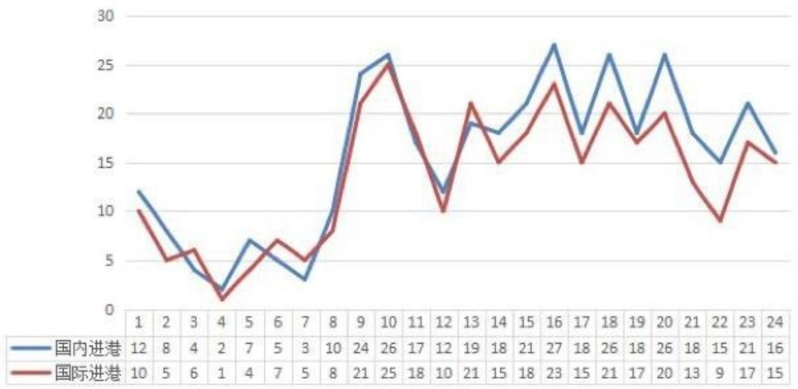

<details>
<summary>line</summary>

| Week | 国内进港 | 国际进港 |
| --- | --- | --- |
| 1 | 12 | 10 |
| 2 | 8 | 5 |
| 3 | 4 | 6 |
| 4 | 2 | 1 |
| 5 | 7 | 4 |
| 6 | 5 | 7 |
| 7 | 3 | 5 |
| 8 | 10 | 8 |
| 9 | 24 | 21 |
| 10 | 26 | 25 |
| 11 | 17 | 18 |
| 12 | 12 | 10 |
| 13 | 19 | 21 |
| 14 | 18 | 15 |
| 15 | 21 | 18 |
| 16 | 27 | 23 |
| 17 | 18 | 15 |
| 18 | 26 | 21 |
| 19 | 18 | 17 |
| 20 | 26 | 20 |
| 21 | 18 | 13 |
| 22 | 15 | 9 |
| 23 | 21 | 17 |
| 24 | 16 | 15 |
</details>

图 4-1 部分机场各时段平均入港飞机架次分布规律

国内航班按照每架次载运 150 人，国际航班按照每架次载运 300 人 $^{[1]}$ 。计算得部分机场平均人流量按时间分布图，如图 4-2 所示。

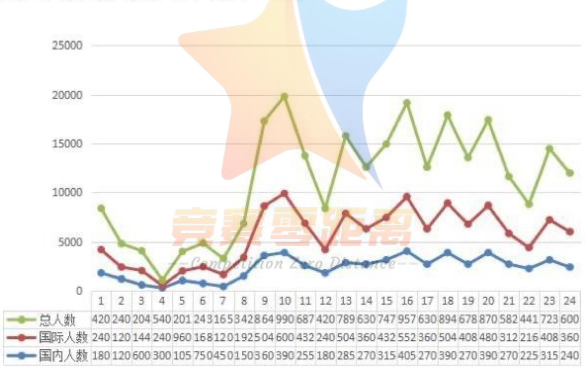

<details>
<summary>line</summary>

| Month | 总人数 | 国际人数 | 国内人数 |
| --- | --- | --- | --- |
| 1 | 8400 | 420 | 180 |
| 2 | 5000 | 240 | 120 |
| 3 | 4200 | 204 | 600 |
| 4 | 1000 | 540 | 300 |
| 5 | 4000 | 201 | 105 |
| 6 | 5000 | 243 | 750 |
| 7 | 3500 | 165 | 450 |
| 8 | 7000 | 342 | 150 |
| 9 | 17500 | 864 | 360 |
| 10 | 20000 | 990 | 390 |
| 11 | 14000 | 687 | 255 |
| 12 | 8500 | 420 | 180 |
| 13 | 16000 | 789 | 285 |
| 14 | 12500 | 630 | 270 |
| 15 | 15000 | 747 | 315 |
| 16 | 19500 | 957 | 405 |
| 17 | 12500 | 630 | 270 |
| 18 | 18000 | 894 | 390 |
| 19 | 13500 | 678 | 270 |
| 20 | 17500 | 870 | 390 |
| 21 | 11500 | 582 | 270 |
| 22 | 9000 | 441 | 225 |
| 23 | 14500 | 723 | 315 |
| 24 | 12000 | 600 | 240 |
</details>

图 4-2 部分机场平均人流量按时间分布规律  
注：表格内人数单位为：（百人）

对上文所述机场的出租车流量进行统计、归纳求取平均值，得出了部分机场出租车流量随时间变化规律图，如图 4-3 所示。

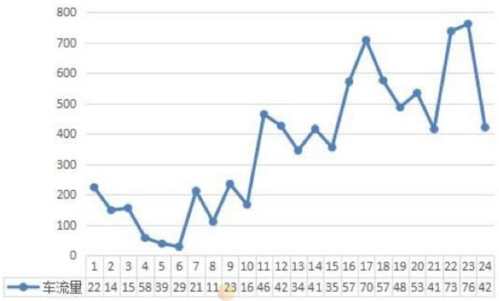

<details>
<summary>line</summary>

| Week | 车流量 |
| --- | --- |
| 1 | 22 |
| 2 | 14 |
| 3 | 15 |
| 4 | 58 |
| 5 | 39 |
| 6 | 29 |
| 7 | 21 |
| 8 | 11 |
| 9 | 23 |
| 10 | 16 |
| 11 | 46 |
| 12 | 42 |
| 13 | 34 |
| 14 | 41 |
| 15 | 35 |
| 16 | 57 |
| 17 | 70 |
| 18 | 57 |
| 19 | 48 |
| 20 | 53 |
| 21 | 41 |
| 22 | 73 |
| 23 | 76 |
| 24 | 42 |
</details>

图 4-3 部分机场出租车流量随时间变化规律  
注：表格内车流量单位为：（十辆）

为了直观的感受出租车车流量与机场客流量之间的关系，将图4-2、图4-3合并如图4-4所示。柱状图机场客流量单位纵坐标2000人次，折线图为车流量，单位纵坐标100辆次；横坐标为1至24时。于是得到了各时间段部分机场客流量与出租车流量的数量关系图。

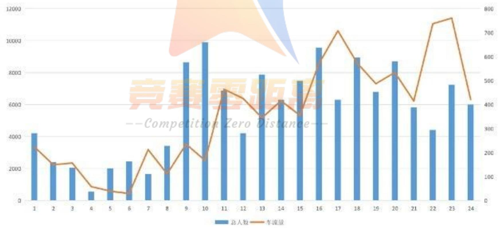

<details>
<summary>bar_line</summary>

| Category | 总人数 | 车流量 |
| --- | --- | --- |
| 1 | ~4200 | ~230 |
| 2 | ~2400 | ~150 |
| 3 | ~2100 | ~160 |
| 4 | ~600 | ~70 |
| 5 | ~2000 | ~60 |
| 6 | ~2500 | ~50 |
| 7 | ~1700 | ~220 |
| 8 | ~3400 | ~120 |
| 9 | ~8700 | ~240 |
| 10 | ~9900 | ~180 |
| 11 | ~6800 | ~460 |
| 12 | ~4200 | ~430 |
| 13 | ~7900 | ~350 |
| 14 | ~6200 | ~410 |
| 15 | ~7500 | ~370 |
| 16 | ~9600 | ~580 |
| 17 | ~6300 | ~710 |
| 18 | ~8900 | ~580 |
| 19 | ~6800 | ~480 |
| 20 | ~8700 | ~530 |
| 21 | ~5800 | ~420 |
| 22 | ~4400 | ~730 |
| 23 | ~7200 | ~760 |
| 24 | ~6000 | ~430 |
</details>

图 4-4 各时间段部分机场客流量与出租车流量的数量关系

结合图 4-4 可明显看出知，出租车车流量与入港航班表现出高度的吻合性。图中出租车流量在 11 时，17 时，22 时出现高峰。这与航班编制情况相统一。航班高峰期出现在 10 时、14 时，由于乘客下机后需办理行李提取、海关检疫等一系列手续，故乘客离开的高峰需顺延 1 至 2 小时。这与出租车的流量高峰是吻合的。22 时，轨道交通停运；23 时，机场大巴停运，此时航班仍较为密集，故大量人流在此时段选择出租车离开机场，造成 22 时后出租车流量的激增。

通常，机场客流人数与出租车数的增减情况是匹配的，不妨设白天总客流量与乘坐出租车旅客数比为 $C_{1}$ ，且基本恒定。但在22时后，公共交通陆续停运，旅客不得不选择出租车，导致该系数急剧上升。于是，不妨将时间分为夜间、日间两部分，分别为22时至次日6时以及6时至22时。在夜间总客流量与乘坐出租车旅客数比例为 $C_{2}$ 。在日间、夜间乘坐出租车人数于是可以描述为：

$$
n _ {\mathrm{乘坐}} (t) \left\{ \begin{array}{l l} {{\mathrm{C} _ {1} \cdot \mathrm{n} _ {1} (t), t \in [ 6, 2 2)}} \\ {{\mathrm{C} _ {2} \cdot \mathrm{n} _ {2} (t), t \not \in [ 6, 2 2)}} \end{array} \right. \tag {1}
$$

同时有：

$$
m (t) \propto n _ {\mathrm{乘坐}} (t) \tag 2
$$

于是建立起机场乘客数量与出租车数量的定性关系，后文讨论时将针对实际情况具体分析。

## 4.2 根据人流车辆情况对时间段进行划分

为了方便决策方案的给出，根据出港人流量和出租车流量的高峰、低谷，将一天等间隔地分为3:30至9:30；9:30至16:30；16:30至21:30；21:30至3:30四个时间段。各时间段均为6小时。具体划分方案如下：

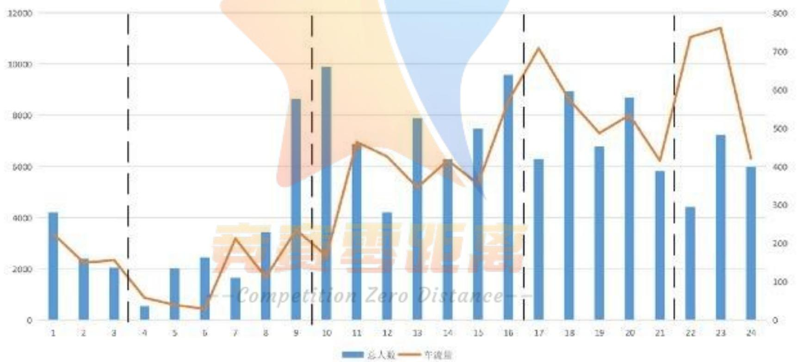

<details>
<summary>bar_line</summary>

| Day | 总人数 | 年流量 |
| --- | --- | --- |
| 1 | ~4200 | ~220 |
| 2 | ~2300 | ~150 |
| 3 | ~2000 | ~160 |
| 4 | ~600 | ~80 |
| 5 | ~2000 | ~60 |
| 6 | ~2400 | ~50 |
| 7 | ~1700 | ~220 |
| 8 | ~3400 | ~150 |
| 9 | ~8600 | ~230 |
| 10 | ~9900 | ~180 |
| 11 | ~6800 | ~450 |
| 12 | ~4200 | ~430 |
| 13 | ~7900 | ~350 |
| 14 | ~6200 | ~420 |
| 15 | ~7500 | ~380 |
| 16 | ~9600 | ~550 |
| 17 | ~6300 | ~720 |
| 18 | ~8900 | ~580 |
| 19 | ~6800 | ~480 |
| 20 | ~8700 | ~520 |
| 21 | ~5800 | ~420 |
| 22 | ~4400 | ~750 |
| 23 | ~7200 | ~780 |
| 24 | ~6000 | ~420 |
</details>

图 4-5 机场时间段划分规则

## 5. 模型的建立与求解

## 5.1 问题1的模型建立与求解

## 5.1.1 决策影响因素及其影响机理的分析

本问要求分析研究出租车司机的决策机理并建立决策模型，使收益较大。值得注意的是，收益中应将时间成本 $^{[2]}$ 纳入考虑。即在计算收益时扣除因时间浪费而错失的潜在收益。

分别对（A）排队等待载客，（B）空载返回市区的收益进行分析。为公平起见，取时间段相同，默认空载返回后便开始在市区拉客。两种方法各时段的成本及收益如下图 5-1 所示：

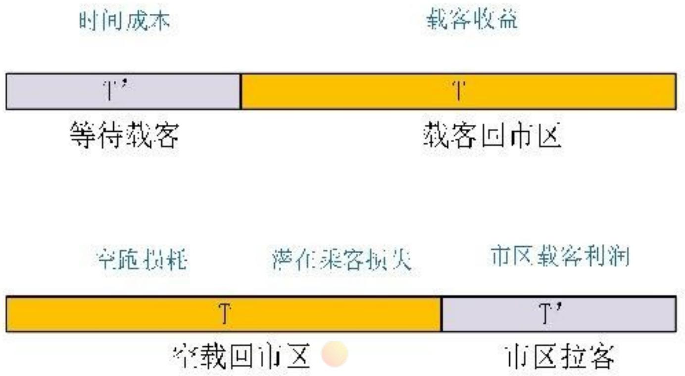

<details>
<summary>state_timeline</summary>

| Category | Time Cost Components | Revenue Components |
| --- | --- | --- |
| Top Section | T' (Waited Customer) | T (Loadback to Market) |
| Bottom Section | T (Unlabeled Segment) | T' (Market Sales) |
</details>

图 5-1 两种方式各时段成本及收益

由此可以得出影响司机决策的因素有：等待载客的时间、载客回市区的利润、空载返回的时间以及消耗、市区载客的利润。对这些因素继续进行分析，可以发现司机的决策实际上由三个根本要素决定：排队车辆数 m、返回路程 x 以及收费标准 g(x)。其中，排队车辆数决定了等待时间 T，返回路程和收费标准共同影响了载客利润 W₁。另外返回路程还制约了空载损耗的大小，收费标准还决定了司机在市区的收益。

由此得到如图 5-2 所示的决策影响因素及其影响机理图。

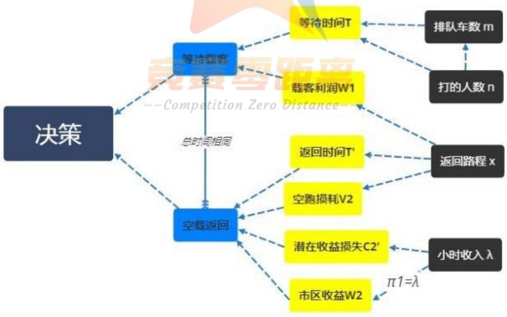

<details>
<summary>flowchart</summary>


```mermaid
graph LR
  A["决策"] --> B("等待战略")
  B --> C["等待时间T"]
  D["排队车数 m"] --> C
  E["打的人数 n"] --> F["等待时间W1"]
  G["返回路程 x"] --> H["返回时间T'"]
  I["潜在收益损失C2'"] --> J["空跑损耗V2"]
  K["市区收益W2"] --> L["等待时间W1"]
  M["排队车数 m"] --> N["等待时间W1"]
  O["排队车数 m"] --> N
  P["返回路程 x"] --> Q["返回时间T'"]
  R["潜在收益损失C2'"] --> S["空跑损耗V2"]
  T["市区收益W2"] --> U["等待时间W1"]
  V["排队车数 m"] --> U
  W["排队车数 m"] --> U
  X["排队车数 m"] --> Y["等待时间W1"]
  Z["排队车数 m"] --> AA["等待时间W1"]
  AB["排队车数 m"] --> AC["等待时间W1"]
  AD["排队车数 m"] --> AE["等待时间W1"]
  AF["排队车数 m"] --> AG["等待时间W1"]
  AH["排队车数 m"] --> AI["等待时间W1"]
  AJ["排队车数 m"] --> AK["等待时间W1"]
  AL["排队车数 m"] --> AM["等待时间W1"]
  AN["排队车数 m"] --> AO["等待时间W1"]
  AP["排队车数 m"] --> AQ["等待时间W1"]
  AR["排队车数 m"] --> AS["等待时间W1"]
  AT["排队车数 m"] --> AU["等待时间W1"]
  AV["排队车数 m"] --> AW["等待时间W1"]
  AX["排队车数 m"] --> AZ["等待时间W1"]
  BA["排队车数 m"] --> AC["等待时间W1"]
  B -->|总时间相同| C
  C --> D
  D --> AE
  AE --> F
  F --> G
  G --> H
  H --> I
  I --> J
  J --> K
  K --> L
  L --> M
  M --> N
  N --> O
  O --> P
  P --> Q
  Q --> R
  R --> S
  S --> T
  T --> U
  U --> V
  V --> W
  W --> X
  X --> Y
  Y --> Z
  Z --> AA
  AA --> AB
  AB --> AC
  AC --> AD
  AD --> AE
  AE --> AF
  AF --> AG
  AG --> AH
  AH --> AI
  AI --> AJ
  AJ --> AK
  AK --> AL
  AL --> AM
  AM --> AN
  AN --> AO
  AO --> AP
  AP --> AQ
  AQ --> AR
  AR --> AS
  AS --> AT
  AT --> AU
  AU --> AV
  AV --> AW
  AW --> AX
  AX --> AY
  AY --> AZ
  AZ --> AY
```
</details>

图 5-2 司机决策影响因素及其影响机理图

## 5.1.2 选择决策模型的建立

本题为典型的选择决策问题。得到影响因素及其影响机理后，我们便可以建立优化模型对司机进行决策的过程进行描述。

## 1. 目标函数的确定

对于该类“二选一”决策，采用0-1变量Q表征司机的决策方案。若Q取1，代表等选择等待载客，Q=0则代表空载返回。 $P_{1}$ 、 $P_{2}$ 分别代表了(A)、(B)两方案的利润。如此规定后，便可将某种决策下的利润Z表示为：

$$
Z = Q \cdot P _ {1} + (1 - Q) \cdot P _ {2} \tag {3}
$$

Q 为决策变量，决定了采取的决策。

目标函数对利润Z求取最大值即可：

$$
\max Z = Q \cdot P _ {1} + (1 - Q) \cdot P _ {2} \tag {4}
$$

## 2. 约束条件的确定

在目标函数中给出了两种方案对应的收益 $P_{1}$ 、 $P_{2}$ ，但并没有给出具体表达式。所以模型约束条件的确定将会围绕这两个重要的参数展开。

首先，根据分析可知无论采取方案(A)、(B)中哪一个，其利润计算的公式均为：

利润=收益-成本（金钱、时间）

下面，先讨论时间成本的折算问题。

时间成本 $^{[2]}$ ，即“货币时间价值”，其定义为：时间成本是指一定量资金在不同时点上的价值量产差额。时间成本也可以引申为：在等待时间内造成的市场机会的丢失。对于本题中出租车司机而言，无论作出等候载客或是空载返回的决策，均会产生相应的时间成本。

对采取等候载客的司机而言，其在蓄车池中等候的时间产生时间成本：假设不需等候而直接载客返回市区，省下的等候时间可以在市区拉客获得收益。该丢失的潜在盈利收益即为折算为金钱的时间成本。不妨假设在市区平均每小时能够获利 $\pi_{1}$ 则可得出该决策方法下时间成本为：

$$
c _ {1} = \pi_ {1} \cdot T \tag {5}
$$

其中，T 为等候载客的时间。 $\pi_{1}$ 称为时间成本系数。

对采取空载回家的出租车司机而言，其空载回市区时由于未运载乘客，则视为丢失了载客的潜在获利机会，该收益为：

$$
c _ {2} = \frac {W _ {1}}{T + T ^ {\prime}} T ^ {\prime} \tag {6}
$$

考虑到得到潜在获利的概率，对 $c_{2}$ 添加系数0.1作为时间成本。则有：

$$
c _ {2} ^ {\prime} = \frac {0 . 1 W _ {1}}{T + T ^ {\prime}} T ^ {\prime} = \pi_ {2} T ^ {\prime} \tag {7}
$$

其中， $T'$ 为若选择方案(A)所需等待的时间， $W_{1}$ 为载客回市区获得的利润。 $\pi_{2}$ 称为潜在载客收益系数。

$$
\pi_ {2} = \frac {0 . 1 W _ {1}}{T + T ^ {\prime}} \tag {8}
$$

如此，结合分析，可以给出 $P_{1}$ 、 $P_{2}$ 表达式

$$
P _ {1} = W _ {1} - V _ {1} - \pi_ {1} T \tag {9}
$$

$$
P _ {2} = W _ {2} - V _ {2} - \pi_ {2} T ^ {\prime} \tag {10}
$$

其中， $W_{1}$ 、 $W_{2}$ 为对应方案的收益， $V_{1}$ 、 $V_{2}$ 分别为返回时的载客油耗和空跑损耗。 $\pi_{1}$ 为时间成本折算系数，等于市中心拉客的每小时利润 $\lambda$ ， $\pi_{2}$ 为潜在乘客损失系数。 $W_{1}$ 、 $W_{2}$ 分别是与路程 x、等待时间 T 有关的系数，而 T 与某时刻 t 的排队出租车数有关。于是可以给出约束条件：

$$
\left\{ \begin{array}{c} P _ {1} = W _ {1} - V _ {1} - \pi_ {1} T \\ P _ {2} = W _ {2} - V _ {2} - \pi_ {2} T ^ {\prime} \\ W _ {1} = f (x) \\ W _ {2} = \lambda T \\ T = g [ m (t) ] \end{array} \right. \tag {11}
$$

## 5.1.3 决策模型的建立与司机决策的确定

综上可以给出决策模型：

$$
\max Z = Q \cdot P _ {1} + (1 - Q) \cdot P _ {2}
$$

$$
\left\{ \begin{array}{c} P _ {1} = W _ {1} - V _ {1} - \pi_ {1} T \\ P _ {2} = W _ {2} - V _ {2} - \pi_ {2} T ^ {\prime} \\ W _ {1} = f (x) \\ W _ {2} = \lambda T \\ T = g [ m (t) ] \end{array} \right.
$$

为了方便给出不同时间段的指导策略，我们决定根据客流量以及出租车流量将一天划分为3:30至9:30；9:30至16:30；16:30至21:30；21:30至3:30四个时间段。

## 5.1.3 季节因素的影响

季节的变化影响的不仅是乘客数量的变化，其客流量的走势或者规律也可能会发生变化。我们的决策方案的给出，是根据时段规律划分成有规律的几段，对每一段分别给定决策方案，所以季节因素，对模型结果影响很大。但是由于数据获取限制，这里无法对一年四季的情况分别具体分析，所以这里仅给出分析思路。如图所示


<details>
<summary>flowchart</summary>

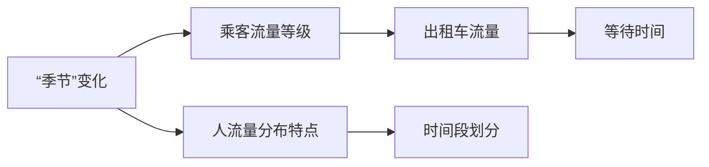
```mermaid
graph LR
  A["“季节”变化"] --> B["乘客流量等级"]
  A --> C["人流量分布特点"]
  B --> D["出租车流量"]
  D --> E["等待时间"]
  C --> F["时间段划分"]
```
</details>

图 5-3 季节因素的影响图示

## 5.2 问题2的模型建立与求解

本问要求收集国内某一机场及其所在城市出租车的相关数据，结合第一问方案给出该机场出租车司机的选择方案，并分析模型的合理性和对相关因素的依赖性。

## 5.2.1 机场的选取以及相关数据的收集

## 1. 机场的选取

考虑到小型机场数据收集困难且样本容量过小,大型机场数据量过于庞大,不便于统计分析。为兼顾数据的可靠性以及处理的便利性,决定选择中型机场进行分析。要求选择的中型机场应有较多国内航班班次且应设有国际航班,以保证足够大的旅客集散量。同时,应保证机场所在城市较为发达,以保证足够的出租车流量。如此才能有足够大的样本空间,较为客观地评价第一问的模型合理性。

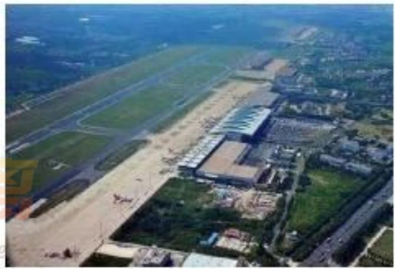

<details>
<summary>natural_image</summary>

Aerial view of an airport terminal with multiple runways and surrounding greenery (no visible text or signage)
</details>

图 5-4 苏南硕放国际机场

综上，选择了位于江苏省无锡市的苏南硕放国际机场(IATA 代码：WUX，ICAO 代码：ZSWX）。如图 5-4 所示。

该机场位于无锡市高新区硕放街道，是设计年旅客吞吐量1000-2000万人次的枢纽型国际空港，可直飞东京、大阪、首尔、济州、曼谷、新加坡、暹罗、台北、香港、澳门等国际(地区)城市。2018年苏南硕放机场完成旅客吞吐量684.6万人次，同比去年增长6.0%，旅客集散量大。该机场拥有5条公交及机场巴士线路，据沪宁高速仅1.3公里，还在建两条轻轨线路。出行选择交通方式多样。

该机场客运吞吐量适中，所在的无锡市全市有出租车4040辆，出租车流量足够，可以作为一个很好的研究对象。

## 2. 相关数据的收集

## (1) 返回路程 x 及收费标准 g(x) 的确定

由于首先对无锡市市中心明确化：

无锡南站位于无锡最古老的寺院崇安寺周围，位处无锡市中央位置。其作为重要的交通枢纽，是无锡人员流动的大动脉。于是不妨将所在地定为市中心。

通过导航软件可以得到：正常情况下司机载客从苏南硕放国际机场前往市中心的路程：14.4公里；行驶22分钟；收益为33元。如下图5-5所示。

如此可以确定返回路程 x，并结合收费标准得到载客回市区收益 $W_{1}$ 。

由《无锡市客运出租汽车收费价目表》（如下表），

表 5-1 无锡市客运出租汽车收费价目表

<table><tr><td>公里路程</td><td>价格说明</td></tr><tr><td>3 公里以内</td><td>起步价 10 元</td></tr><tr><td>3-8 公里</td><td>每公里 2.2 元</td></tr><tr><td>8 公里以上</td><td>每公里 2.8 元</td></tr></table>

给出收费标准 $g(x)$ 关于路程的函数：

$$
\mathrm{g} (\mathrm{x}) = \left\{ \begin{array}{c} 1 0, x \in (0, 3 ] \\ 2. 2 x + 3. 4, x \in (3, 8 ] \\ 2. 8 x - 1. 4, x \in (8, \infty) \end{array} \right. \tag {12}
$$

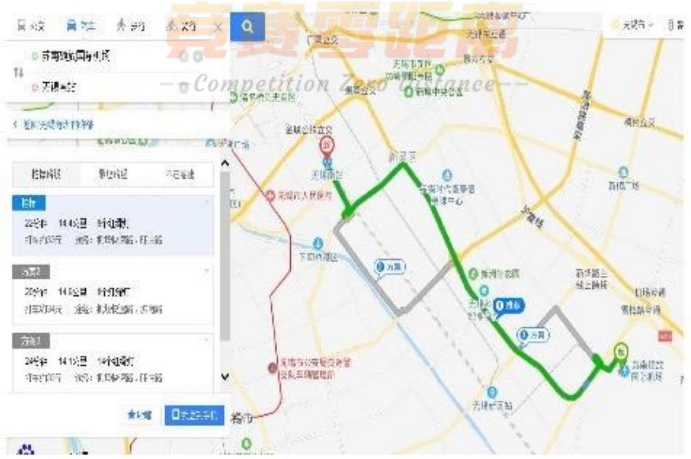

<details>
<summary>text_image</summary>

20年 14.6公里 时速
打车前行 送：杭州中路，任一路
20年 14.6公里 时速
打车前行 送：杭州中路，任一路
20年 14.1公里 14小时打
打车前行 送：杭州中路，任一路
</details>

图5-5 机场至市中心相应数据

于是可以给出返回市区所需时间 $T'$ 以及载客返回市区的利润 $W_{1}$

$$
T ^ {\prime} = 2 3 (\min) \tag {13}
$$

$$
W _ {1} = g (x) = 2. 8 5 \times 1 4. 4 - 1. 9 \approx 3 3 (\mathrm{元}) \tag {14}
$$

另外可以给出出租车从机场返回市区的燃油费用：

$$
V = 1 7. 9 \cdot \Phi \tag {15}
$$

考虑到空载和载人对汽车油耗影响较小，可以忽略不计。则 $V_{1}=V_{2}$ 。查阅无锡出租车（车型：现代伊兰特）油耗可得：

$$
V _ {1} = V _ {2} = 1 4. 4. 9 \times 0. 4 5 = 6. 4 8 (\mathrm{元}) \tag {16}
$$

另外查询知：无锡出租车司机每月净利润约为9000元，每天工作约7个小时，每月休假2日。如此可以推算无锡出租车司机在市中心每小时的利润 $\lambda$ 为：

$$
\lambda = \frac {9 0 0 0}{7 \times 2 8} \approx 4 5. 9 (\text {元 / 小时}) \tag {17}
$$

## (2) 等待人数 n 及出租车流量 m 的确定

通过对苏南硕放国际机场2019年6月15日至30日各时段国际、国内航班情况的收集归纳，给出苏南硕放国际机场各时段平均入港飞机架次折线图：

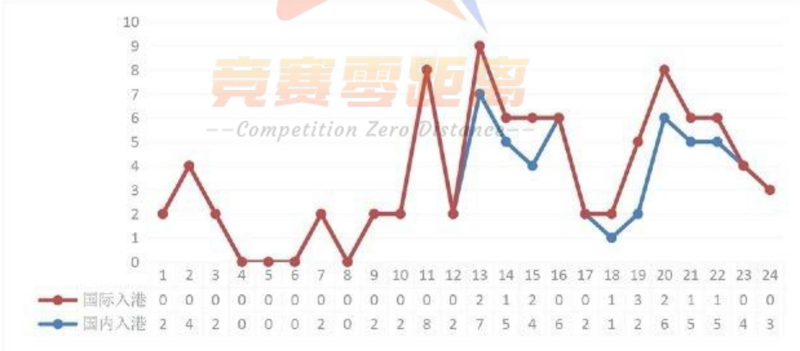

<details>
<summary>line</summary>

| Day | 国际入港 | 国内入港 |
| --- | --- | --- |
| 1 | 2 | 2 |
| 2 | 4 | 4 |
| 3 | 2 | 2 |
| 4 | 0 | 0 |
| 5 | 0 | 0 |
| 6 | 0 | 0 |
| 7 | 2 | 2 |
| 8 | 0 | 0 |
| 9 | 2 | 2 |
| 10 | 2 | 2 |
| 11 | 8 | 8 |
| 12 | 2 | 2 |
| 13 | 9 | 7 |
| 14 | 6 | 5 |
| 15 | 6 | 4 |
| 16 | 6 | 6 |
| 17 | 2 | 2 |
| 18 | 2 | 1 |
| 19 | 5 | 2 |
| 20 | 8 | 6 |
| 21 | 6 | 5 |
| 22 | 6 | 5 |
| 23 | 4 | 4 |
| 24 | 3 | 3 |
</details>

图5-6 苏南硕放国际机场各时段平均入港飞机数

同样地，取国内航班每架次乘客人数 150 人，国际航班每架次 300 人。于是可以结合图 5-6 入港飞机数给出各时间段离开机场客流量示意图。

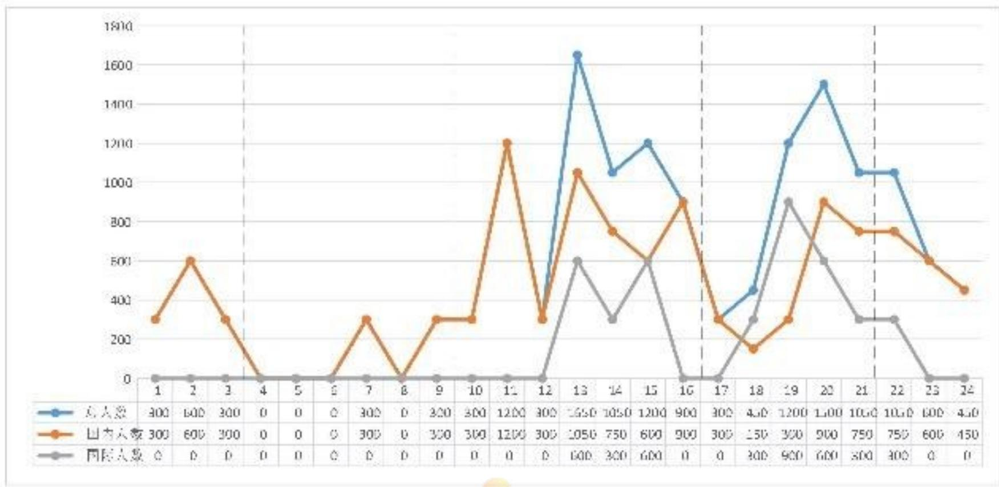

<details>
<summary>line</summary>

| Day | Total | Domestic | International |
| --- | --- | --- | --- |
| 1 | 300 | 300 | 0 |
| 2 | 600 | 600 | 0 |
| 3 | 300 | 300 | 0 |
| 4 | 0 | 0 | 0 |
| 5 | 0 | 0 | 0 |
| 6 | 0 | 0 | 0 |
| 7 | 300 | 300 | 0 |
| 8 | 0 | 0 | 0 |
| 9 | 300 | 300 | 0 |
| 10 | 300 | 300 | 0 |
| 11 | 1200 | 1200 | 0 |
| 12 | 300 | 300 | 0 |
| 13 | 1650 | 1050 | 600 |
| 14 | 1050 | 750 | 300 |
| 15 | 1200 | 600 | 600 |
| 16 | 900 | 900 | 0 |
| 17 | 300 | 300 | 0 |
| 18 | 450 | 150 | 300 |
| 19 | 1200 | 300 | 900 |
| 20 | 1500 | 900 | 600 |
| 21 | 1050 | 750 | 300 |
| 22 | 1050 | 750 | 300 |
| 23 | 500 | 500 | 0 |
| 24 | 450 | 450 | 0 |
</details>

图5-7苏南硕放国际机场各时段离开机场客流量

由于我们需要考虑的仅有乘坐出租车的乘客，故参考4.1求取各时段乘坐出租车客流量。参考南京禄口机场 $^{[4]}$ 该数据比例，给出其日间、夜间总客流量与乘坐出租车旅客数比例 $C_{1}$ 、 $C_{2}$ 分别为0.27和0.35。

通过调查统计，给出硕放机场出租车流量随时间变化规律曲线，与打的人数随时间变化规律放在同一图表中，可以看出数据高度吻合。如图 5-8 所示。

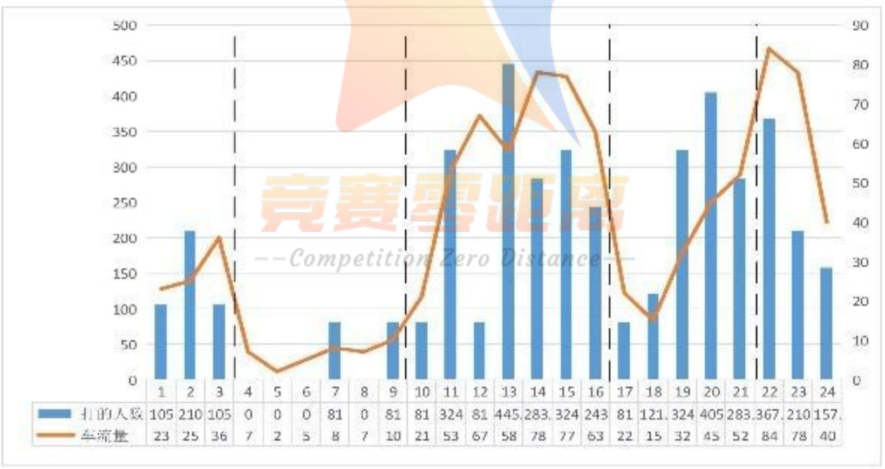

<details>
<summary>bar_line</summary>

| Day | 执行人数 | 车流量 |
| --- | --- | --- |
| 1 | 105 | 23 |
| 2 | 210 | 25 |
| 3 | 105 | 36 |
| 4 | 0 | 7 |
| 5 | 0 | 2 |
| 6 | 0 | 5 |
| 7 | 81 | 8 |
| 8 | 0 | 7 |
| 9 | 81 | 10 |
| 10 | 81 | 21 |
| 11 | 324 | 53 |
| 12 | 81 | 67 |
| 13 | 445 | 58 |
| 14 | 283 | 78 |
| 15 | 324 | 77 |
| 16 | 243 | 63 |
| 17 | 81 | 22 |
| 18 | 121 | 15 |
| 19 | 324 | 32 |
| 20 | 405 | 45 |
| 21 | 283 | 52 |
| 22 | 367 | 84 |
| 23 | 210 | 78 |
| 24 | 157 | 40 |
</details>

图5-8 苏南硕放国际机场出租车流量、打的人数随时间变化规律

为了方便决策方案的给出，如第一问将一天分为3:30至9:30；9:30至16:30；16:30至21:30；21:30至3:30四个时间段。分别求取各时间段出租车流量(m)平均值，打的人数(n)的平均值：

表5-2 苏南硕放国际机场各时段平均车流量、打的人数

<table><tr><td></td><td>3:30至9:30</td><td>9:30至16:30</td><td>16:30至21:30</td><td>21:30至次日3:30</td></tr><tr><td>车流量均值(辆)</td><td>8.67</td><td>65.23</td><td>33.8</td><td>49</td></tr><tr><td>打的人数均值(人)</td><td>29</td><td>243</td><td>238.95</td><td>207.42</td></tr></table>

考虑到人车匹配，可以将等待时间 T 表示为车流量 m 的函数。具体分析如下：

## 3. 等待时间 $\mathrm{T}$ 的确定

由上文分析可知，出租车等待时间与每小时到达机场排队的出租车数量相关。为了找到两者的关系，可以借助 MATLAB，使用 C 语言对实际出租车排队情况进行队列模拟[5]，得出数据，对数据进行分析，拟合出两者的函数关系曲线。

## 一、原理分析

首先，假设模拟时不会出现出租车等待乘客的情况，即出租车到达上车点时总有人上车。设每小时到达机场车道排队的出租车数量为 m，出租车司机平均等待时间为 T。为了真实地反映实际情况，以秒为单位进行模拟。模拟开始时，只有乘客在机场进行等待，上车点没有出租车排队。另，根据实际设定队列最大容量为 200 辆车。

我们可以给出每辆出租车的三个属性：到达时间、离开时间、乘客上车时间，如图 5-9 所示：


<details>
<summary>flowchart</summary>

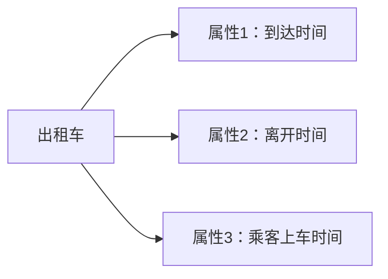
```mermaid
graph LR
  A["出租车"] --> B["属性1：到达时间"]
  A --> C["属性2：离开时间"]
  A --> D["属性3：乘客上车时间"]
```
</details>

图5-9 队列中出租车的属性

同样地，可以给出排队队列的6个属性，如图5-10所示。

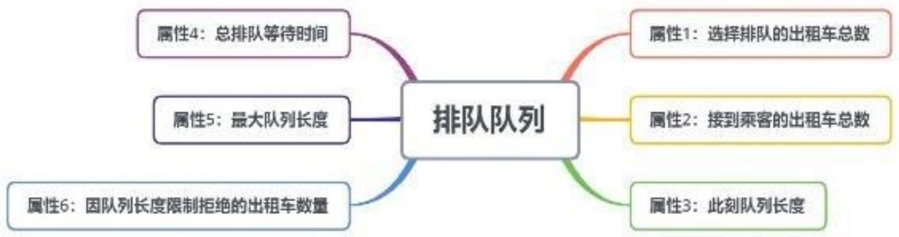

<details>
<summary>flowchart</summary>

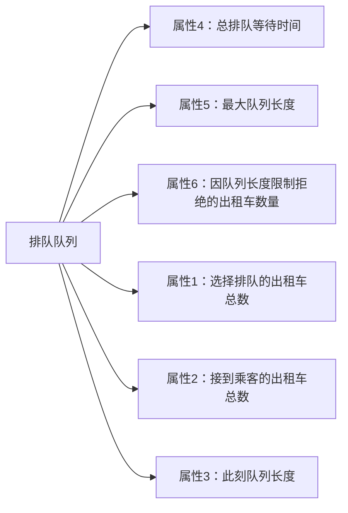
```mermaid
graph LR
  A["排队队列"] --> B["属性4：总排队等待时间"]
  A --> C["属性5：最大队列长度"]
  A --> D["属性6：因队列长度限制拒绝的出租车数量"]
  A --> E["属性1：选择排队的出租车总数"]
  A --> F["属性2：接到乘客的出租车总数"]
  A --> G["属性3：此刻队列长度"]
```
</details>

图5-10 排队队列的属性

暂且先假设只有一个上车点。则有出租车随机到达机场排队的概率 P，该概率由 m 决定：

$$
\mathrm{P} (\mathrm{每秒有出租车到达的概率}) = \frac {\mathrm{每小时到达机场排队的出租车数量}}{3 6 0 0} = \frac {\mathrm{m}}{3 6 0 0} \tag {18}
$$

模拟的每一秒首先会产生一个0到1之间的随机数，若该随机数小于P，则有一辆新到的出租车排到队列的末尾，并赋予其属性值。之后检查队列第一辆出租车的上车时间是否到达。若未到达，第一辆车上车时间（图5-9中属性3）减1秒；若到达，算出其等待时间（图5-9中属性2和属性1相减），加到排队队列的总排队等待时间（图5-10属性4）上，之后退出队列。之后另第二辆车成为队列首辆车，开始下一秒的模拟。重复上述步骤，最终可算出该m值下的出的T值。为了避免随机数产生的偶然性，模拟若干次取平均值，作为最终结果。一次模拟的程序框图见图5-11。改变m，T随之改变，用同样的方法得到所需要的数据点，进行拟合。

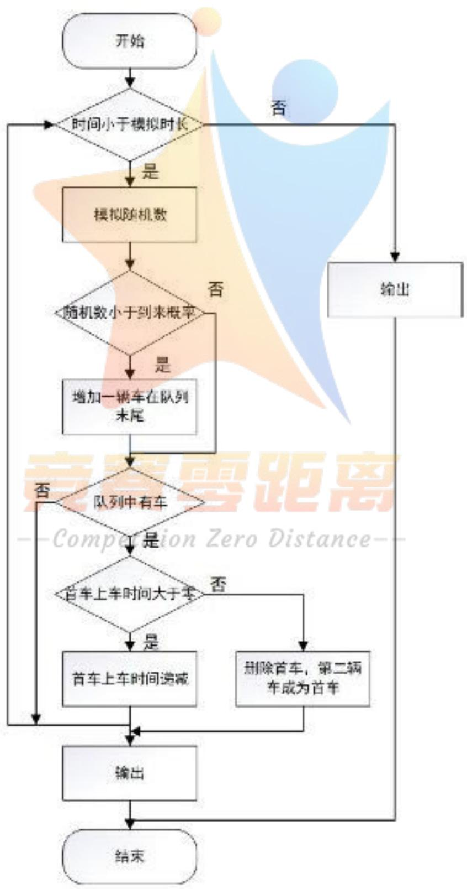

<details>
<summary>flowchart</summary>

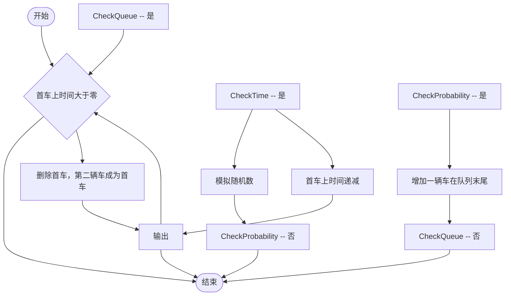
```mermaid
graph TD
  Start(["开始"]) --> CheckTime{"时间小于模拟时长"}
  CheckTime["CheckTime -- 否"] --> End(["结束"])
  CheckTime2["CheckTime -- 是"] --> Simulate["模拟随机数"]
  Simulate --> CheckProbability{"随机数小于到来概率"}
  CheckProbability["CheckProbability -- 否"] --> End
  CheckProbability2["CheckProbability -- 是"] --> AddQueue["增加一辆车在队列末尾"]
  AddQueue --> CheckQueue{"队列中有车"}
  CheckQueue["CheckQueue -- 否"] --> End
  CheckQueue2["CheckQueue -- 是"] --> CheckTime{"首车上时间大于零"}
  CheckTime --> Delete["删除首车，第二辆车成为首车"]
  CheckTime2 --> Update["首车上时间递减"]
  Update --> Output["输出"]
  Delete --> Output
  Output --> CheckTime
  Output --> End
```
</details>

图5-11 一次模拟程序框图

## 二、结果展示

模拟总时间选择1小时和2小时两个长度进行比较见表5-3。

表5-3 模拟时长为1、2小时时的等待时长

<table><tr><td>每小时到达机场排队的出租车数量m(辆)</td><td>模拟1小时的平均等待时间T1(分钟)</td><td>模拟2小时的平均等待时间T2(分钟)</td></tr><tr><td>10</td><td>0.21</td><td>0.23</td></tr><tr><td>20</td><td>0.64</td><td>0.67</td></tr><tr><td>40</td><td>3.84</td><td>5.95</td></tr><tr><td>60</td><td>10.24</td><td>20.23</td></tr><tr><td>80</td><td>14.75</td><td>29.72(有拒绝)</td></tr><tr><td>100</td><td>17.63(有拒绝)</td><td>35.56(有拒绝)</td></tr><tr><td>120</td><td>19.61(有拒绝)</td><td>39.57(有拒绝)</td></tr><tr><td>140</td><td>20.83(有拒绝)</td><td>42.27(有拒绝)</td></tr><tr><td>160</td><td>22.01(有拒绝)</td><td>44.35(有拒绝)</td></tr><tr><td>180</td><td>22.75(有拒绝)</td><td>45.98(有拒绝)</td></tr><tr><td>200</td><td>23.40(有拒绝)</td><td>47.22(有拒绝)</td></tr></table>

其中，“有拒绝”表示在模拟时间段内，存在因为队列长度限制而拒绝出租车排队的情况。由表可以看到，同一模拟时间段下，m越大，等待时间越长；不同模拟时段下，模拟时间越长，平均等待时间越长。两个小时的模拟更贴合现实，因为第二个小时开始时会存在等待的出租车，存在“拒绝”情况也很实际；但之后等待时间大幅增加，这是偏离现实的，因为车主在等待时间过长情况下会选择离开而不是等待。所以一小时的模拟提供了下限值，而两小时的模拟提供了比较合适的上限值。因此，最终选择1.5小时的模拟时长进行数据拟合分析。模拟结果见表5-4，数据曲线和拟合曲线见图5-12。

表5-4 1.5小时模拟数据

<table><tr><td>每小时到达机场排队的出租车数量m(辆)</td><td>模拟1.5小时的平均等待时间T(分钟)</td></tr><tr><td>10</td><td>0.23</td></tr><tr><td>20</td><td>0.70</td></tr><tr><td>40</td><td>5.00</td></tr><tr><td>60</td><td>15.5</td></tr><tr><td>80</td><td>22.32(有拒绝)</td></tr><tr><td>100</td><td>26.58(有拒绝)</td></tr><tr><td>120</td><td>29.53(有拒绝)</td></tr><tr><td>140</td><td>31.58(有拒绝)</td></tr><tr><td>160</td><td>33.10(有拒绝)</td></tr><tr><td>180</td><td>34.36(有拒绝)</td></tr><tr><td>200</td><td>35.41(有拒绝)</td></tr></table>

1.5小时模拟的数据曲线及拟合曲线  
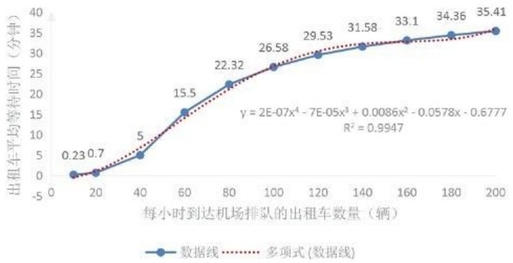

<details>
<summary>line</summary>

| 每小时到达机场排队的出租车数量 (辆) | 出租车平均等待时间 (分钟) |
| --- | --- |
| 10 | 0.23 |
| 20 | 0.7 |
| 40 | 5 |
| 60 | 15.5 |
| 80 | 22.32 |
| 100 | 26.58 |
| 120 | 29.53 |
| 140 | 31.58 |
| 160 | 33.1 |
| 180 | 34.36 |
| 200 | 35.41 |
</details>

图5-12 1.5小时模拟的数据曲线及拟合曲线

给出模拟时长为1.5小时时的拟合方程为:

$$
\mathrm{T} = 2 \times 1 0 ^ {- 7} \mathrm{m} ^ {4} - 7 \times 1 0 ^ {- 5} \mathrm{m} ^ {3} + 8. 6 \times 1 0 ^ {- 3} \mathrm{m} ^ {2} - 0. 0 5 7 8 \mathrm{m} - 0. 6 7 7 7 \tag {19}
$$

将各时间段的车流量均值代入可得：各时间段等待时间均值：

表5-5 各时段等待时间均值

<table><tr><td></td><td>3:30至9:30</td><td>9:30至16:30</td><td>16:30至21:30</td><td>21:30至次日3:30</td></tr><tr><td>车流量均值(辆)</td><td>8.67</td><td>46.29</td><td>33.8</td><td>49</td></tr><tr><td>等待时间均值(min)</td><td>0</td><td>16.3</td><td>11.1</td><td>17.3</td></tr></table>

## 5.2.2 决策方案的给出

综上，将上文给出的返回路程x、收费标准g(x)以及出租车流量m三个根本因素代入问题一模型中并求解，可以给出各时段决策方案。

表5-6 各时段决策方案

<table><tr><td></td><td>3:30至9:30</td><td>9:30至16:30</td><td>16:30至21:30</td><td>21:30至次日3:30</td></tr><tr><td>等待时间(T)</td><td>0</td><td>23.8min</td><td>8.7min</td><td>15.7min</td></tr><tr><td>最大收益(P)</td><td>26.5元</td><td>9.5元</td><td>20.3元</td><td>15.3元</td></tr><tr><td>决策建议(Q)</td><td>等待拉客</td><td>空载返回</td><td>等待拉客</td><td>等待拉客</td></tr></table>

## 5.3 问题 3 的模型建立与求解

## 5.3.1 各上客系统分析比较

本问要求给出机场乘车区“上车点”的设置方案，并说明如何安排出租车和乘客，在保证车辆和乘客安全的条件下，使得总的乘车效率最高。为衡量乘车效率，现给出“交通流理论”。交通流理论（Traffic Flow Theory） $^{[6][7]}$ 是研究交通流随时间流随时间和空间变化规律的模型和方法体系。其中最重要的三个参数为：交通量、速度和密度。交通量为速度和密度的乘积。如此给出乘车效率 $\eta$ 定义式：

$$
\eta = \frac {m}{t} \tag {20}
$$

其中m为时间t内载客离开的出租车数。

对国内各机场离港出租车上客系统进行观察分析，可以发现有单车道停靠式、矩阵式（多车道）停靠式以及斜列停靠式三种方式。后两种方式如图5-13所示。

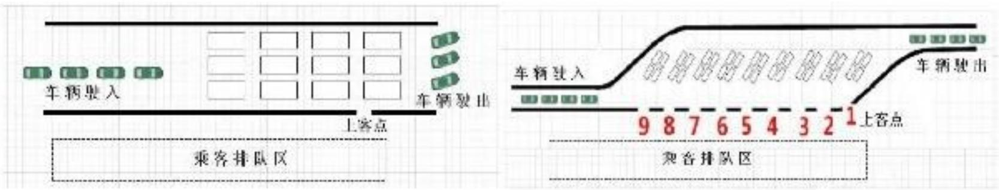  
图 5-13 矩阵停靠式、斜列停靠式上客系统图示

题中已给定两条并行车道，故只能采用矩阵停靠式上客系统。如下图5-14所示。这种上客方式运营过程按照如下循环：在通道上安排若干泊位。在某一时刻，闸机开启，对应数量的出租车进入接客区，在泊位停车。出租车停稳后，乘客依次进入接客区搭乘出租车。乘客上车后，两条车道出租车依次驶离，当最后一辆出租车驶离泊位区后，闸机再度开启，接客区接收出租车。

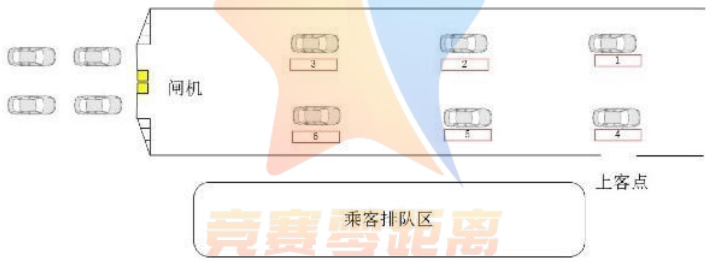

<details>
<summary>text_image</summary>

闸机
3
2
1
6
5
4
上客点
乘客排队区
</details>

图 5-14 两车道矩阵停靠式上客系统

根据实际机场设计方案，我们不妨先只设置一个上客点位于第一个泊车位侧面。同时，假设所有乘客上车时间 $\tau$ 相同，两条道路中的车队同进同出。

根据交通流理论，交通系统通行能力大小与交通参与者密度有密切关系。若增加泊位（驶入出租车）数量可以增加乘车效率，但当泊位数量超过某阈值时，乘车效率不增反降。该情况下通行能力的下降主要体现在车流平均速度的减缓。具体的影响分析见图5-15所示。

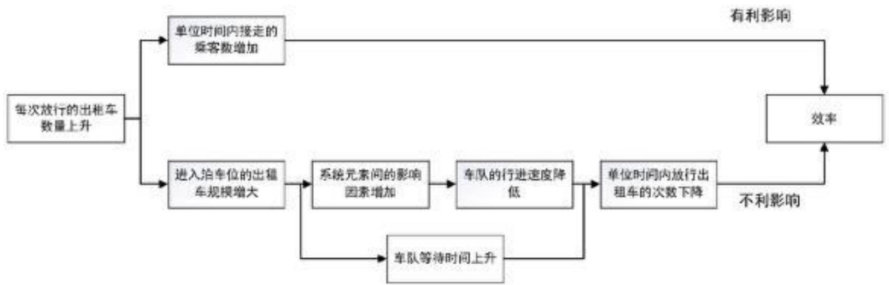

<details>
<summary>flowchart</summary>

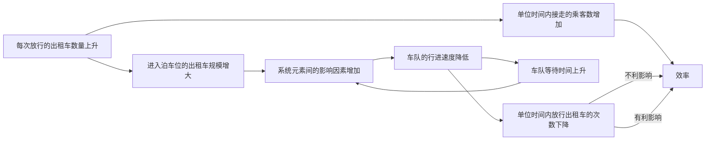
```mermaid
graph LR
  A["每次放行的出租车数量上升"] --> B["单位时间内接走的乘客数增加"]
  A --> C["进入泊车位的出租车规模增大"]
  C --> D["系统元素间的影响因素增加"]
  D --> E["车队的行进速度降低"]
  E --> F["车队等待时间上升"]
  F --> D
  B --> G["效率"]
  E --> H["单位时间内放行出租车的次数下降"]
  H -->|不利影响| G
  H -->|有利影响| G
```
</details>

图 5-15 车队规模对效率影响分析

## 5.3.2 上客系统乘车效率最大值求解

本问要求使上客系统乘车效率最大化。可以以效率为目标函数，建立泊车位数与效率的关系作为约束条件，建立优化模型。

## 1. 目标函数的确定

目标函数已由式（20）确定：

$$
\max \eta = \frac {m}{t}
$$

## 2. 约束条件的确定

根据交通流理论，首先给出泊位数对车流速度的定性关系：如图5-16所示。

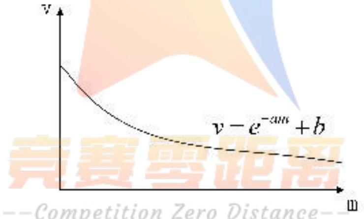

<details>
<summary>area</summary>

| \(\omega\) | v |
| --- | --- |
| 0 | ~High |
| High | ~Low |
</details>

图 5-16 泊位数对车流速度的定性关系

其次，为了给出方程中a的具体值，引入“影响”的概念。每辆出租车会对周围的出租车产生“影响”，造成速度变慢。当泊位数（驶入出租车）数量增加，产生的“影响”相应增加，使得车流速度变慢。当只有两辆车时，“影响”有两条；而当有四辆车时，“影响”变为6条；6辆车时，“影响”有11条。如图5-17所示。

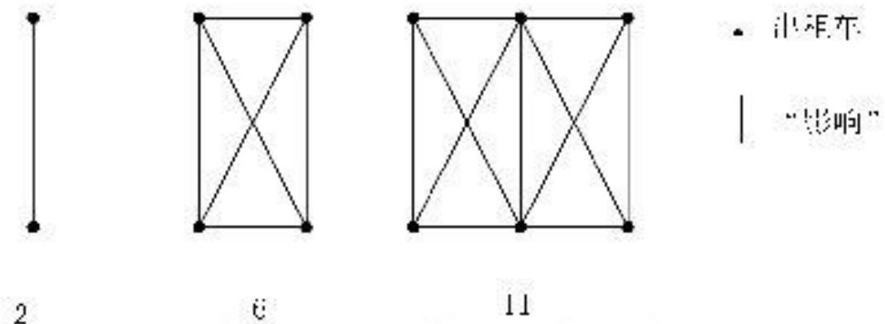

<details>
<summary>text_image</summary>

2
6
11
• 没无车
| “影响”
</details>

图 5-17 出租车与“影响”图示

可以归纳得到“影响” $E$ 与出租车数 $m$ 的关系式

$$
E = 2. 5 m - 4 \quad (m \geq 2) \tag {21}
$$

将“影响”E乘上影响系数 $k_{1}$ 即为参数a。设置基础车速 $k_{2}$ 作为参数b。如此，给出车流速度v关于出租车数m的函数关系式

$$
v = e ^ {- k _ {1} (2. 5 m ^ {2} - 4 m)} + k _ {2} \tag {22}
$$

如此，若给定接客区长度L,则可以计算得到出租车驶入至停稳时间 $t_{1}$ :

$$
t _ {1} = \frac {L}{\nu} \tag {23}
$$

每辆出租车长为D，每两辆车之间保持S的安全距离。具体见图5-18.

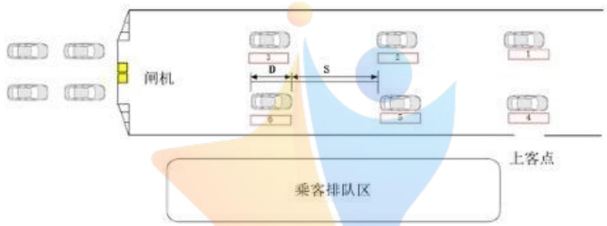

<details>
<summary>text_image</summary>

闸机
D
S
上客点
乘客排队区
</details>

图 5-18 各参数图示

所以出租车离开时间为：

$$
t _ {2} = \frac {\left(\frac {m}{2} - 1\right) S + \frac {m}{2} D}{v} \tag {24}
$$

对从上客点进入接客区的乘客, 其最远需走过 $\left(\frac{m}{2}-1\right)$ 个车长与安全距离, 则乘客的最大乘车时间为:

$$
\mathrm{t} _ {3} = k _ {3} (\frac {m}{2} - 1) + \tau \tag {25}
$$

对于一组的两列车，其完成驶入、接客、驶离一个周期所用的总时间为：

$$
t = t _ {1} + t _ {2} + t _ {2} \tag {26}
$$

最后，要求m辆出租车车长和相应安全距离之和不得超过接客区长度，有：

$$
\frac {m}{2} \cdot D + (\frac {m}{2} - 1) \cdot S \leq L \tag {27}
$$

车速不应超过机场所规定的最大车速限制 $V_{max}$ 。

$$
\mathrm{v} \leq V _ {\max} \tag {28}
$$

综上所述，给出约束条件：

$$
\left\{ \begin{array}{c} v = e ^ {- k _ {1} (2. 5 m ^ {2} - 4 m)} + k _ {2} \\ t _ {1} = \frac {L}{v} \\ t _ {2} = \frac {\left(\frac {m}{2} - 1\right) S + \frac {m}{2} D}{v} \\ t _ {3} = k _ {3} \left(\frac {m}{2} - 1\right) + \tau \\ t = t _ {1} + t _ {2} + t _ {2} \\ \frac {m}{2} \cdot D + \left(\frac {m}{2} - 1\right) \cdot S \leq L \\ v \leq V _ {\max} \end{array} \right. \tag {29}
$$

## 3. 模型的求解

根据以上分析，问题三的模型为：

$$
\max \eta = \frac {m}{t}
$$

$$
\left\{ \begin{array}{c} v = e ^ {- k _ {1} (2. 5 m ^ {2} - 4 m)} + k _ {2} \\ t _ {1} = \frac {L}{v} \\ t _ {2} = \frac {\left(\frac {m}{2} - 1\right) S + \frac {m}{2} D}{v} \\ t _ {3} = k _ {3} \left(\frac {m}{2} - 1\right) + \tau \\ t = t _ {1} + t _ {2} + t _ {2} \\ \frac {m}{2} \cdot D + \left(\frac {m}{2} - 1\right) \cdot S \leq L \\ v \leq V _ {\max} \end{array} \right.
$$

将等式关系带入目标函数，则有：

$$
\eta = \frac {m}{\frac {L}{e ^ {- k _ {1} (2 . 5 m ^ {2} - 4 m)} + k _ {2}} + \frac {\left(\frac {m}{2} - 1\right) S + \frac {m}{2} D}{e ^ {- k _ {1} (2 . 5 m ^ {2} - 4 m)} + k _ {2}} + k _ {3} \left(\frac {m}{2} - 1\right) + \tau} \tag {30}
$$

$$
\left\{ \begin{array}{c} \frac {m}{2} \cdot D + (\frac {m}{2} - 1) \cdot S \leq L \\ v \leq V _ {\max} \end{array} \right. \tag {31}
$$

依据5.3.1的分析，预计 $\eta$ 与m的关系图像大致如图5-19所示。

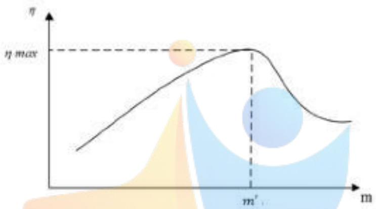

<details>
<summary>area</summary>

| Variable | Value |
| --- | --- |
| Peak \((\eta\) max) | \(\eta\) max |
</details>

图 5-19 $\eta$ 随 m 变化的趋势图

当 $m=m'$ 时，乘车系统的效率最大。对式（30）求对自变量m的偏导（结果见附录），令其值为0，即可求出 $m'$ 的值，即

$$
\frac {\partial \eta}{\partial m} = 0 \tag {32}
$$

## 5.4 问题4的模型建立与求解

目前机场出租车运营可能存在的情况根据载客距离分为：远途载客、中距离载客、短距载客三种情况受机场排队的接人的限制，出租车均付出了一定的时间成本，但是对于短途运输而言，可会出现司机消耗了大量时间，却不能获得足够多的利润，因此，造成了出租车收入不均衡的现象。

本问紧紧围绕司机的收益均衡性对“优先机制”进行设计。将载客前往市中心的司机利润作为标准利润，尽量通过“优先机制”使得短途载客的司机利润尽可能接近标准利润。

参考[8]国内机场对优先机制的设计，现借用“短途票”方案，即为了均衡短距载客出租车的收益，可以领一张免排队的短途票（如图5-20所示），送完客人后，这些司机就可以进入特殊接客区（无需排队）。


<details>
<summary>text_image</summary>

T2浦东机场短途用车记录单
(国际) 编号: No. 0015984
车号: ☐ ☐ 9831 目的地:
上车时间: 12时38分 晚返时间: 环以内有效
日期: 12年6月2日 第二支队
</details>

5-20 “短途票” 图示

实际方案需要明确短距评判标准，并规定“短途票”的使用条件。其中，临界条件围绕出租车收益均衡界定，这里我们设定两种方案，分别以时间和距离作临界约束。

思维导图如下：

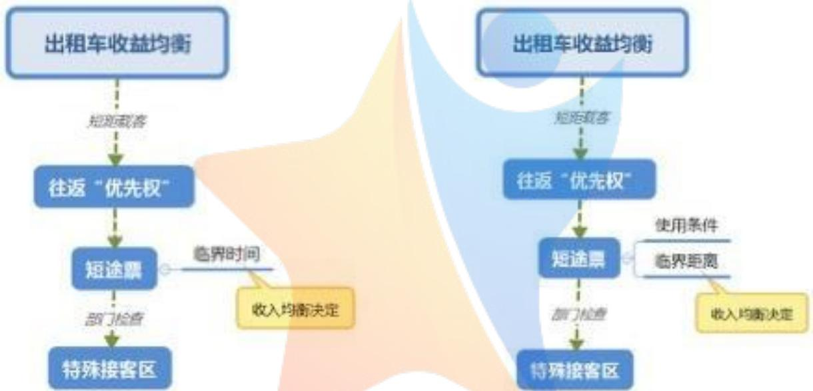

<details>
<summary>flowchart</summary>

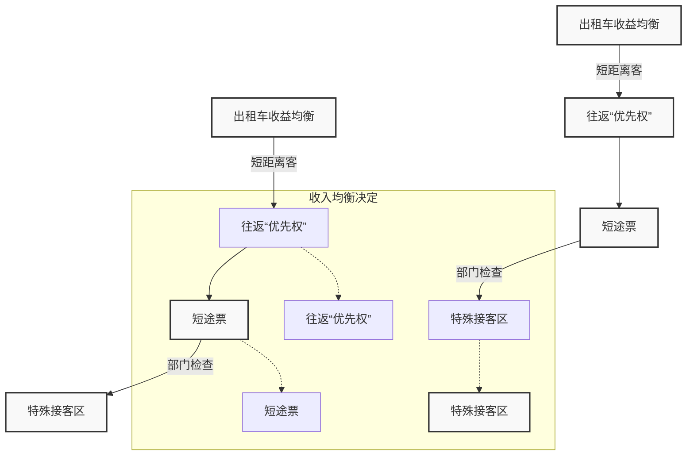
```mermaid
graph TD
  A["出租车收益均衡"] -->|短距离客| B["往返“优先权”"]
  C["出租车收益均衡"] -->|短距离客| D["往返“优先权”"]
  B --> E["短途票"]
  D --> F["短途票"]
  E -->|部门检查| G["特殊接客区"]
  F -->|部门检查| H["特殊接客区"]
  
  subgraph Decision_Left["收入均衡决定"]
    direction TB
    B -.-> I["往返“优先权”"]
    E -.-> J["短途票"]
    H -.-> K["特殊接客区"]
  end
  
  style A fill:#f9f9f9,stroke:#333,stroke-width:2px
  style C fill:#f9f9f9,stroke:#333,stroke-width:2px
  style D fill:#f9f9f9,stroke:#333,stroke-width:2px
  style E fill:#f9f9f9,stroke:#333,stroke-width:2px
  style F fill:#f9f9f9,stroke:#333,stroke-width:2px
  style G fill:#f9f9f9,stroke:#333,stroke-width:2px
  style K fill:#f9f9f9,stroke:#333,stroke-width:2px
```
</details>

图 5-21 问题 4 A、B 两种方案的思维导图

## 1. 标准利润的确定

根据问题一公式（9），给出标准利润：

$$
c _ {s} = g (x) - \pi_ {1} T \tag {33}
$$

由于各种载客情况油耗基本一致，可以消去，故此处直接省略。

则每小时平均标准利润为：

$$
\overline {{c _ {s}}} = \frac {g (x) - \pi_ {1} T}{T + T ^ {\prime}} \tag {34}
$$

其中 $T$ 为等候时间， $T^{\prime}$ 为返回市中心所用时间

## 2. 短途载客利润的确定

对于短途载客的司机，考虑极端情况，假设其共进行(n-1)次短距往返载客，直至第n次载客时直接返回市中心。第i次短距载客利润为 $c_{n}$ 。为使收益均衡，希望有下式成立：

$$
\sum_ {i = 0} ^ {n} c _ {i} = c _ {s} \tag {35}
$$

同样根据问题一公式，对每次短距载客利润分别求解并求和得到短距利润如下：

$$
c _ {d} = h _ {1} - \pi_ {1} T + \mu h _ {1} + h _ {2} + \mu h _ {2} + \dots .. + h _ {i - 1} + \mu h _ {i - 1} + h _ {i} \tag {36}
$$

该模型忽略了拥有“优先权”司机的等待时间，第一次排队等待的时间成本计入第一次短距载客。 $\mu$ 为一个0至1的常数，表征返回时载客的概率。 $h_{i}$ 为第i次短距载客收益。

考虑到实际情况下短途旅客数量较少，司机多次短途载客概率极低，故下文中n值均取2。此时 $c_{d}$ 表达式为：

$$
c _ {d} = h _ {1} - \pi_ {1} T + \mu h _ {1} + h _ {2} \tag {37}
$$

总时间为

$$
T _ {\mathrm{总}} = 2 t _ {1} + T + t _ {2} \tag {38}
$$

$t_{1}$ 、 $t_{2}$ 分别为第一次、第二次载客单程行驶时间。

为方便比较，求取平均每小时利润：

$$
\overline {{c _ {d}}} = \frac {h _ {1} - \pi_ {1} T + \mu h _ {1} + h _ {2}}{2 t _ {1} + T + t _ {2}} \tag {39}
$$

将单程行驶时间t、短距载客收益h转化为关于路程的函数可得：

$$
\overline {{c _ {d}}} = \frac {(1 + \mu) g (x _ {1}) - \pi_ {1} T + g (x _ {2})}{\nu (2 x _ {1} + x _ {2}) + T} \tag {40}
$$

其中， $x_{2}$ 可视为乘客平均离港距离，即为机场至市中心距离 x。v 为出租车平均行驶速度。

## 3. 短距标准的确定

令每小时平均标准利润与平局短途往返载客利润相等。

$$
\frac {g (x) - \pi_ {1} T}{T + T ^ {\prime}} = \frac {(1 + \mu) g (x _ {s}) - \pi_ {1} T + g (x)}{v (2 x _ {s} + x) + T} \tag {41}
$$

解得临界等收入距离x1

对于方案A:

由距离速度时间关系:

$$
x _ {1} = v T _ {1} \tag {42}
$$

导出:

$$
T _ {t} = \frac {x _ {1}}{v} \tag {43}
$$

Tt 作为方案A的短距标准。

对于方案B:

x1作为为短距标准xs。即有短距标准xs。

## 4. A 方案具体操作方案

（1）限制短距载客出租车返回机场的时间。  
(2) 通过机场放车接客的闸口, 对出租车牌进行观测, 获得距上次离开机场的时间间隔, 在 $\mathrm{T}_{\mathrm{t}}$ 内可进入特殊接客区优先接客。

## 5. B 方案具体操作方案

(1) 不限制短距载客出租车返回机场的时间, 即不设置 “短途票” 的有效期。  
(2) 在不限制返回时间的基础上, 我们考虑会出现司机使用 “短途票” 在某一时间过多, 为解决该问题, 我们进一步设定 “短途票” 分单双号使用。  
(3) 安装有GPS识别设备的车辆可以不用开具“短途票”直接进入特殊接客区；未安装GPS识别设备的车辆可开具“短途票”，凭票进入特殊接客区。

## 6. 关于特殊接客区的设置

对于短距出租车往返机场时优先权的设定，考虑设特殊接客区，也可以理解为优先进入接客区的特殊通道。具体情况如下图（5-22）所示

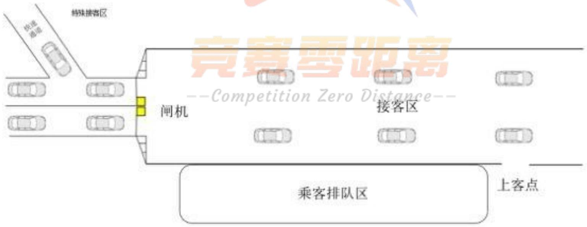

<details>
<summary>text_image</summary>

特殊接客区
快速通道
闸机
接客区
乘客排队区
上客点
</details>

图 5-22 特殊接客区图示

## 7. A 方案评价

(1) 车辆是否满足短距距离限制的检测简便

在现实情况中，大多数城市的机场会倾向于选择A方案，因为A方案的短距标准检测相对容易，加上机场自身的条件的限制，只能实现对车辆往复机场的时间间隔进行检测。

(2) 司机拒载及服务态度消极

假若设定短距标准时不考虑经济因数，而单纯的以距离“一刀切”，会带来一些潜在的问题。假若打车距离刚好超短途距离，因为花费费大量时间等待，时间成本高昂，而乘客目的地路程过近，甚至不足以抵消时间成本。出租车司机会产生抗拒心理，甚至直接拒载。

## 8. B 方案评价

## （1）减少司机拒载及服务态度消极的情况

相对于A方案，此时对时间的限制不存在，直接考虑单位时间收益相等的极限情况下，通过距离对短途进行界定，很好地避免了这种问题的存在。

## (2) 减轻机场的堵车率

设定“短距票”分单双号使用可以避免使用特权集中使用，防止特殊接客（优先接客）区拥堵影响降优先全即特殊接客区的效能。

## (3) 司机有更多“选择”

据了解[8]当前国内一些机场，对短途票的时间有严格要求，例如浦东国际机场规定短途票使用期限为1小时。但是这样的后果就是给司机带来很多麻烦，使其工作受限，直接影响收入。关于优先权的设定，就是为了补偿出租车短途载客的损失，那么我们没有必要干涉其什么时候使用其优先权，所以在这里我们不限制时间，这样就避免了为了使用短剧票而不得不在指定时间内返回机场带来的一切困扰，为司机带来带来更大的自由性。

## (4) 出租车行驶安全性

不限制短途票的有效期限，司机便可以不必要因为时间问题急忙赶回机场。时间若限制为1小时，而乘客目的地在短距边界处，那么司机的时间就很紧迫。不排除遇到堵车，或者红绿灯因素导致为在期限前到达而超速驾驶。

## (5) 对于车辆是否满足短距距离限制的检测不方便

在现实情况中，不同城市的经济情况是有很大区别的，所以机场的条件也不尽相同。对于B方案的短距标准，对于条件差、硬件性能不够强的机场来说就很不适用，因为它无法准确把控车辆是否满足条件进入特殊接客区。

## 9. 实际机场对 A、B 方案选取

对于条件允许的条件下B方案显然更好一些，可以很大程度上减轻当今的一些社会问题，但对机场的经济和硬件能力有很强要求。

相反对于条件一般的机场，则可以选择B方案，也可以较好的实现出租车收入均衡的目标。

## 6. 模型的推广与改进方向

## 6.2 模型的改进

## (1) 乘客上车时间:

本文为了分析简便，将乘客的上车时间固定。但实际上乘客的上车时间分布在一个范围内，因此可以通过实地考察或查找资料得出乘客上车时间的概率分布函数，在使用程序模拟时，按照分布函数产生随机数，以使模型更加贴合实际。

## (2) 机场规模:

本模型研究的主要目标是中小型机场，应用到实际规划时，避免不了可能遇到规划大性机场的情况，此时对于模型本身而言，改变的不仅是参数数量的变化，参数的个数也会发生变化。比如：大城市的机场乘客的出行选择会更多，因为大型机场交通枢纽的陆侧交通方式更多，选择出租车的比例自然就会下降。而且此时出租车的管理排队问题也会变得更复杂。

## 6.2 模型的推广

本文基于机场的对于出租车规划问题的处理，同样可以应用于其他大型交通枢纽的乘客的转运的问题，例如火车站及港口等。因为它们属于一类问题，只不过人数流量和车辆流量及一些枢纽自身的参数不同，应用到此模型均能解决。

## 7. 模型的优缺点

## 7.1 模型的优点

(1) 问题一模型在回答基本决策的基础上, 进一步对一些特殊情况加以补充完善, 增强实用性。  
(2) 问题三模型很好地反映实际情况, 实用性强, 对现实有很强指导意义。  
(3) 问题四中对"短距票"使用时间的处理, 可以解决很多现实中的问题。

## 7.2 模型的缺点

(1) 问题一模型没有考虑其他因素如司机个人因素、突发因素等, 某些时刻会有一点误差。  
(2) 模型存在近似误差, 是通过拟合产生的。

## 参考文献

[1] 民航飞机型号一览表，2015.  
[2] 胡国强，吴树畅．《成本管理会计》[M]. 北京：西南财经大学出版社，2006-8.  
[3] 秦晶，乐意．《无锡市区每天30万人次打的出租车司机收入有所上涨》．无锡商报 http://wuxi.people.com.cn/n/2013/1120/c131315-23603222.html，2018-11-20.  
[4] 包丹文, 郭唐仪, 华松逸. 基于 SP/RP 融合数据的机场旅客出行方式选择行为分析 [J]. 武汉理工大学学报 (交通科学与工程版), 2015, 39(04): 763-767.  
[5] Stephen Prata. 姜佑. C Primer Plus. （第六版）[M]. 北京：人民邮电出版社，2018.  
[6] Zhaodong Z, Shaohui C, Yanquan Y, et al. VISSIM Simulation Based Expressway Exit Control Modes Research[J]. Procedia Engineering, 2016, 137: 738-746.  
[7] Patel A, Mathew T V, Venkateswaran J. Real-time adaptive signal controller for non-lane following heterogeneous road traffic[C]. Communication Systems and Networks(COMSNE TS), 2016 8th International Conference on. IEEE, 2016:1-6.  
[8]https://news.sina.cn/gn/2018-10-28/detail-ifxeuwws8817753.d.html?pos=3&vt=4


<details>
<summary>natural_image</summary>

Abstract graphic of a stylized human figure with a star and gradient background (no text or symbols)
</details>

## 竞赛零距离

--Competition Zero Distance--

## 附录

<<C 语言编辑器及编译器版本:

Microsoft Visual Studio Enterprise 2017

版本 15.9.5

用于 x64 的 Microsoft (R) C/C++ 优化编译器 19.16.27026.1 版

版权所有(C) Microsoft Corporation。保留所有权利。>>

<<MATLAB 版本:

9.4.0.813654 (R2018a)>>

<<LINGO 版本:

Extended Lingo/Win32 12.0.3.27>>

## 附录 1 问题 1 的模型 1 求解程序

## 1. LINGO 程序

```julia
sets:
t/1..4/:P1,P2,n,m,h,Q;
endsets
data:
n=29 243 238.95 207.42;
m=8.67 65 33.8 49;
enddata
max=@sum(t(i):Q(i)*P1(i)+(1-Q(i))*P2(i));
@for(t(i):P1(i)=33-6.48-44.3*h(i)/60);
@for(t(i):P2(i)=44.3*h(i)/60-6.48-3.3/(h(i)/60+0.36)*0.36);
@for(t(i):h(i)=@if(m(i)#gt#12.6,2e-7*m(i)^4-7e-05*m(i)^3+0.0086*m(i)^2+0.05
78*m(i)-0.6777, 0));
@for(t(i):@free(P1(i));@free(P2(i));@bin(Q(i)));
End
```

2. 运行结果

<table><tr><td colspan="2">Global optimal solution found.</td></tr><tr><td>Objective value:</td><td>71.05164</td></tr><tr><td>Objective bound:</td><td>71.05164</td></tr><tr><td>Infeasibilities:</td><td>0.000000</td></tr><tr><td>Extended solver steps:</td><td>0</td></tr><tr><td>Total solver iterations:</td><td>0</td></tr></table>

<table><tr><td>Model Class:</td><td>MILP</td></tr></table>

<table><tr><td>Total variables:</td><td>5</td></tr><tr><td>Nonlinear variables:</td><td>0</td></tr><tr><td>Integer variables:</td><td>4</td></tr></table>

<table><tr><td>Total constraints:</td><td>2</td></tr><tr><td>Nonlinear constraints:</td><td>0</td></tr></table>

<table><tr><td>Total nonzeros:</td><td>5</td></tr><tr><td>Nonlinear nonzeros:</td><td>0</td></tr></table>

<table><tr><td>Variable</td><td>Value</td><td>Reduced Cost</td></tr><tr><td>P1(1)</td><td>26.52000</td><td>0.000000</td></tr><tr><td>P1(2)</td><td>8.976702</td><td>0.000000</td></tr><tr><td>P1(3)</td><td>20.12681</td><td>0.000000</td></tr><tr><td>P1(4)</td><td>14.91293</td><td>0.000000</td></tr><tr><td>P2(1)</td><td>-9.780000</td><td>0.000000</td></tr><tr><td>P2(2)</td><td>9.491893</td><td>0.000000</td></tr><tr><td>P2(3)</td><td>-2.442480</td><td>0.000000</td></tr><tr><td>P2(4)</td><td>3.217130</td><td>0.000000</td></tr><tr><td>N(1)</td><td>29.00000</td><td>0.000000</td></tr><tr><td>N(2)</td><td>243.0000</td><td>0.000000</td></tr><tr><td>N(3)</td><td>238.9500</td><td>0.000000</td></tr><tr><td>N(4)</td><td>207.4200</td><td>0.000000</td></tr><tr><td>M(1)</td><td>8.670000</td><td>0.000000</td></tr><tr><td>M(2)</td><td>65.00000</td><td>0.000000</td></tr><tr><td>M(3)</td><td>33.80000</td><td>0.000000</td></tr><tr><td>M(4)</td><td>49.00000</td><td>0.000000</td></tr><tr><td>H(1)</td><td>0.000000</td><td>0.000000</td></tr><tr><td>H(2)</td><td>23.76067</td><td>0.000000</td></tr><tr><td>H(3)</td><td>8.658945</td><td>0.000000</td></tr><tr><td>H(4)</td><td>15.72063</td><td>0.000000</td></tr><tr><td>Q(1)</td><td>1.000000</td><td>-36.30000</td></tr><tr><td>Q(2)</td><td>0.000000</td><td>0.5151916</td></tr><tr><td>Q(3)</td><td>1.000000</td><td>-22.56929</td></tr><tr><td>Q(4)</td><td>1.000000</td><td>-11.69580</td></tr></table>

附录 2 问题 2 的模型 2 求解程序  
1. C 语言队列模拟程序  
```c
#include<stdio.h>
#include<stdlib.h>
#include<time.h>
#defineMAXCAR 60 //最大队列长度
#define MIN_PER_HR 60.0
typedefstructitem
{
    long Arrive;
    int BordingTime;
}Item;
typedefstructnode
{
    Item item;
    structnode * Next;
}Node;
typedefstructqueue
{
    Node * front;
    Node * rear;
    int items;
}Queue;
void InitializeQueue(Queue * pq);
int QueueIsFull(constQueue * pq);
int QueueIsEmpty(constQueue * pq);
int QueueItemCount(constQueue * pq);
int EnQueue(Itemitem, Queue * pq);
int DeQueue(Item * pitem, Queue * pq);
void EmptyTheQueue(Queue * pq);
staticvoid CopyToNode(Itemitem, Node * pn);
staticvoid CopyToItem(Node * pn, Item * pi);
int NewCar(doublex);
Item Cartime(longwhen);
double Average(doubleAve[], intn);
int main(void)
{
    Queue Line;
    Item Temp;
    double Hours;// 模拟小时数
    int Perhour;//每小时平均来多少辆出租车
    int Cycle;
    double CycleLimit;
    long TurnAway = 0;//因队列已满被拒绝的出租车数量
```

```txt
long Cars = 0;//加入队列的顾客数量
long Served = 0;//在模拟时间段接到乘客地出租车数量
long SumLine = 0;//累积的队列总长
int WaiTime = 0;//当前到第一辆车载客出发的时间
double MinPerCars;//出租车到来的平均时间
long SumLineWait = 0;//队列累积的等待时间
int t, tt;
double Ave[1000] = {};
double SumAv[1000] = {};
puts("请输入模拟次数（不要超过1000次）：");
scanf_s("%d", &t);
tt = t;//tt为循环次数
puts("请输入模拟时长：");
scanf_s("%lf", &Hours);
puts("请输入平均每小时到机场排队的出租车数量：");
scanf_s("%d", &Perhour);
srand((unsignedint)time(0));
while (tt--)//模拟开始
{
    Cars = 0; Served = 0; SumLine = 0;
    TurnAway = 0; WaiTime = 0; SumLineWait = 0;
    InitializeQueue(&Line);
    CycleLimit = MIN_PER_HR * Hours * 60;
    MinPerCars = (MIN_PER_HR * 60) / Perhour;
    for (Cycle = 0.0; Cycle < CycleLimit; Cycle++)
    {
        if (NewCar(MinPerCars))
        {
            if (QueueIsFull(&Line))
                TurnAway++;
            else
            {
                Cars++;
                Temp = Cartime(Cycle);
                EnQueue(Temp, &Line);
            }
        }
        if (WaiTime <= 0 && !QueueIsEmpty(&Line))
        {
            DeQueue(&Temp, &Line);
            WaiTime = Temp.BordingTime;
            SumLineWait += Cycle - Temp.Arrive;
            Served++;
        }
    }
}
```

```c
if (WaiTime > 0)
    WaiTime--;
    SumLine += QueueItemCount(&Line);
}
if (Cars > 0)
{
    printf("--------------------------------------------------\n");
    printf("%-40s%-15ld\n", "进行排队的出租车总数（辆）：", Cars);
    printf("%-40s%-15ld\n", "接到乘客的出租车数量（辆）：", Served);
    printf("%-40s%-15ld\n", "由于场地限制拒绝的出租车数量（辆）：", TurnAway);
    printf("%-40s%.2f\n", "出租车平均等待时间（秒）：", (double)SumLineWait / Served);
}
else
    printf("No Cars!");
    Ave[tt] = (double)SumLineWait / Served;
    SumAv[tt] = Cars;
    EmptyTheQueue(&Line);
    printf("\n");
}
printf("--------------------------------------------------\n");
printf("%d 次模拟出租车等待时间平均值为 %.2f 分钟，进行排队出租车的"
      " (% .2f个小时) 平均数为 %.2f 辆", t, Average(Ave, t) / 60, Hours, Average(SumAv, t));
getchar();
getchar();
return 0;
};

int NewCar(doublex)
{
    if (rand() * x / RAND_MAX< 1)
        returntrue;
    else
        returnfalse;
}
Item Cartime(longwhen)
{
    Item cust;
    //cust.BordingTime = (rand() % 3 + 1) * 60;
    cust.BordingTime = 90;
    cust.Arrive = when;

    return cust;
}
void InitializeQueue(Queue * pq)
```

```c
{
    pq->front = pq->rear = NULL;
    pq->items = 0;
}
int QueueIsFull(constQueue * pq)
{
    returnpq->items == MAXCAR;
}
int QueueIsEmpty(constQueue * pq)
{
    returnpq->items == 0;
}
int QueueItemCount(constQueue * pq)
{
    returnpq->items;
}
int EnQueue(Itemitem, Queue * pq)
{
    Node * pnew;
    if (QueueIsFull(pq))
        returnfalse;
    pnew = (Node *)malloc(sizeof(Node));
    if (pnew == NULL)
    {
        fprintf(stderr, "Unble to allocate memory!\n");
        exit(1);
    }
    CopyToNode(item, pnew);
    pnew->Next = NULL;
    if (QueueIsEmpty(pq))
        pq->front = pnew;
    else
        pq->rear->Next = pnew;
    pq->rear = pnew;
    pq->items++;
    returntrue;
}
int DeQueue(Item * pitem, Queue * pq)
{
    Node * pt;
    if (QueueIsEmpty(pq))
        returnfalse;
    CopyToItem(pq->front, pitem);
    pt = pq->front;
```

```c
pq->front = pq->front->Next;
free(pt);
pq->items--;
if (pq->items == 0)
    pq->rear = NULL;
returntrue;
}

void EmptyTheQueue(Queue * pq)
{
    Item dummy;
    while (!QueueIsEmpty(pq))
        DeQueue(&dummy, pq);
}

staticvoid CopyToNode(Itemitem, Node * pq)
{
    pq->item =item;
}

staticvoid CopyToItem(Node * pq, Item * pi)
{
    *pi=pq->item;
}

double Average(doubleAve[], intn)
{
    int i;
    double Sum = 0.0;
    for (i = 0; i <= n - 1; i++)
    {
        Sum += Ave[i];
    }
    return Sum / n;
}
```

## 2. 队列模拟结果截图

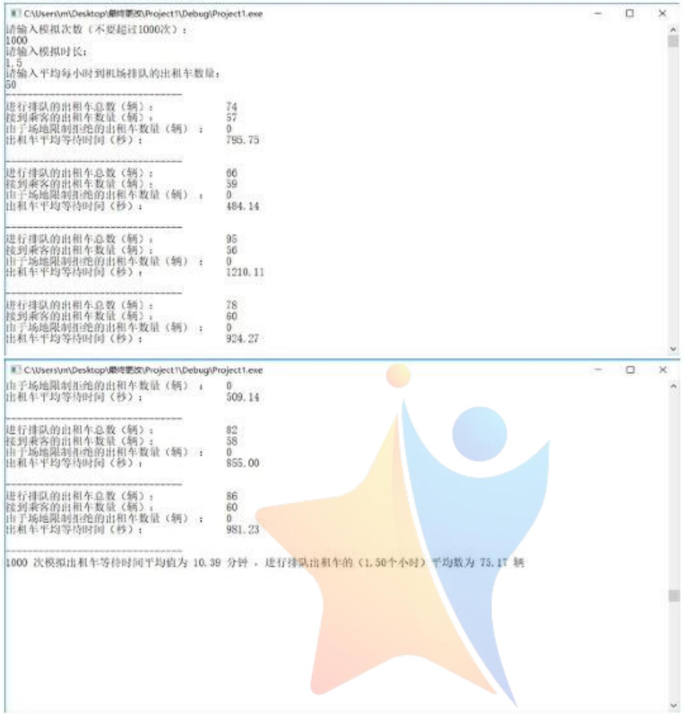

<details>
<summary>text_image</summary>

请输入模拟次数（不要超过1000次）：
1000
请输入模拟时长：
1.5
请输入平均每小时到机场排队的出租车数量：
50
进行排队的出租车总数（辆）： 74
接到乘客的出租车数量（辆）： 57
由于场地限制拒绝的出租车数量（辆）： 0
出租车平均等待时间（秒）： 795.75
进行排队的出租车总数（辆）： 66
接到乘客的出租车数量（辆）： 59
由于场地限制拒绝的出租车数量（辆）： 0
出租车平均等待时间（秒）： 484.14
进行排队的出租车总数（辆）： 95
接到乘客的出租车数量（辆）： 56
由于场地限制拒绝的出租车数量（辆）： 0
出租车平均等待时间（秒）： 1210.11
进行排队的出租车总数（辆）： 78
接到乘客的出租车数量（辆）： 60
由于场地限制拒绝的出租车数量（辆）： 0
出租车平均等待时间（秒）： 924.27
C:\Users\m\Desktop\最终更改\Project\Debug\Project1.exe
由于场地限制拒绝的出租车数量（辆）： 0
出租车平均等待时间（秒）： 509.14
进行排队的出租车总数（辆）： 82
接到乘客的出租车数量（辆）： 58
由于场地限制拒绝的出租车数量（辆）： 0
出租车平均等待时间（秒）： 855.00
进行排队的出租车总数（辆）： 86
接到乘客的出租车数量（辆）： 60
由于场地限制拒绝的出租车数量（辆）： 0
出租车平均等待时间（秒）： 981.23
1000 次模拟出租车等待时间平均值为 10.39 分钟，进行排队出租车的（1.50个小时）平均数为 75.17 辆
</details>

## 3. MATLAB 程序

syms y v w yita1 T

y = w - yita1\*T -yita1\*0.11\*w +v;

ans1 = diff(y, v);

ans2 = diff(y, w);

ans3 = diff(y, yita1);

ans4 = diff(y, T);

## 竞赛零距离

Competition Zero Distance--

## 附录 3 问题 3 的模型 3 求解程序

## 1. 偏导求解 MATLAB 程序

syms m L k1 k2 k3 tao S D

f = m/(L/exp(-k1\*(2.5\*m-4)\*m+k2)+( (m/2-1)\*S+(m\*D)/2)/exp(-k1\*(2.5\*m-4)\*m+k2)+tao+(m/2 - 1)\*k3);

dd = diff(f, m);

## 2. 求偏导结果

$\mathrm{dd} = 1 / (\mathrm{tao} + \mathrm{L}^{*}\exp (\mathrm{k}1^{*}\mathrm{m}^{*}((5^{*}\mathrm{m}) / 2 - 4) - \mathrm{k}2) + \exp (\mathrm{k}1^{*}\mathrm{m}^{*}((5^{*}\mathrm{m}) / 2 - 4) - \mathrm{k}2)^{*}((\mathrm{D}^{*}\mathrm{m}) / 2 + \mathrm{S}^{*}(\mathrm{m} / 2 - 1)) +$

$$
\begin{array}{l} \mathrm{k} 3 ^ {*} (\mathrm{m} / 2 - 1)) - (\mathrm{m} ^ {*} (\mathrm{k} 3 / 2 + \exp (\mathrm{k} 1 ^ {*} \mathrm{m} ^ {*} ((5 ^ {*} \mathrm{m}) / 2 - 4) - \mathrm{k} 2) ^ {*} (\mathrm{D} / 2 + \mathrm{S} / 2) + \mathrm{L} ^ {*} \exp (\mathrm{k} 1 ^ {*} \mathrm{m} ^ {*} ((5 ^ {*} \mathrm{m}) / 2 - 4) - \\ \mathrm{k} 2) ^ {*} ((5 ^ {*} \mathrm{k} 1 ^ {*} \mathrm{m}) / 2 + \mathrm{k} 1 ^ {*} ((5 ^ {*} \mathrm{m}) / 2 - 4)) + \exp (\mathrm{k} 1 ^ {*} \mathrm{m} ^ {*} ((5 ^ {*} \mathrm{m}) / 2 - 4) - \mathrm{k} 2) ^ {*} ((\mathrm{D} ^ {*} \mathrm{m}) / 2 + \mathrm{S} ^ {*} (\mathrm{m} / 2 - \\ 1)) ^ {*} ((5 * k 1 * m) / 2 + k 1 ^ {*} ((5 * m) / 2 - 4)))) / (t a o + L ^ {*} \exp (k 1 * m ^ {*} ((5 * m) / 2 - 4) - k 2) + \exp (k 1 * m ^ {*} ((5 * m) / 2 - 4) - \\ \mathrm{k} 2) ^ {*} ((\mathrm{D} ^ {*} \mathrm{m}) / 2 + \mathrm{S} ^ {*} (\mathrm{m} / 2 - 1)) + \mathrm{k} 3 ^ {*} (\mathrm{m} / 2 - 1)) ^ {\wedge} 2. \\ \end{array}
$$


<details>
<summary>natural_image</summary>

Abstract graphic of a stylized human figure with a star and gradient background (no text or symbols)
</details>

## 竞赛零距离

--Competition Zero Distance--