# 基于系统模拟的机场出租车决策与安排模型

摘要

本文分别从出租车司机和机场管理者角度出发: 建立出租车司机选择决策模型, 给出司机的选择策略; 建立乘车区上车安排模型和优先排队模型, 使机场调度安排方案能够尽可能提高乘车效率, 且均衡各种出租车的收益。

针对出租车司机在等待载客和空载返回这两个方案中的选择决策问题,首先,我们综合分析了影响司机决策的确定因素与随机因素,并研究了这些因素对司机决策的作用机理。接着,根据作用机理,得到出租车两种方案下的收益计算公式,我们以收益最大化为决策准则,建立出租车司机选择决策模型。最后,我们将模拟数据代入决策模型,在给定条件下模拟司机的选择策略,将模拟结果与生活实际进行对比分析,说明了我们模型的可行性。

基于上述选择决策模型，我们收集了北京首都国际机场 T2 航站楼全天的航班动态以及北京市出租车的相关数据，并将节假日、工作日、机场忙期、闲期的数据分别代入前面建立的模型进行求解，得到司机一般在机场工作日的忙期和节假日更倾向于选择留在机场载客，而在工作日的闲期更倾向于空载返回。进一步分析发现“蓄车池”中已有车辆数与司机等待的收益呈负相关；此外，机场与市区距离越远，司机越愿意留在机场等待，距离为 21km 是司机的决策转变点。

针对上车点的设置问题，需要我们合理安排上车点数量，使得机场乘车效率最高。于是，我们以乘车效率为优化目标，安全因素为约束条件，上车点数量为决策变量，建立单目标优化模型。其中，我们通过合理制定机场出租车乘车区运行规则，利用计算机模拟的方法，计算得到各方案对应的乘车效率。我们发现当车多于人或者人多于车的时候，设置4个上车点的效率最高，且在这两种情况下乘客平均用时分别为1.9分钟、20分钟，出租车的平均用时分别为19.9分钟、2分钟；而在人和车数量相当时，在保证安全性和方便管理的前提下，上车点数量设为8个时效率较高，乘客和出租车平均用时都在4分钟左右。

针对短途载客出租车的优先排队问题,我们将机场排队的出租车分为长途车和短途车这两大类,其中短途车数量远小于长途车数量。接着,我们分别研究了长途车与短途车在机场与市区间的往返情况,对比两者在相同观测时间内的收益与相同观测空间内的空载率。然后,以长短途出租车的空载率差值、收益差值最小为优化目标,建立排队位置最优化模型,在输入短途里程后可得到相应的优先排队位置,例如当某个短途车单程为6km时,该车可以在一个共100辆出租车等候队列中优先排到第15位。同时发现,短途里程越短,车辆排的位置越靠前。

最后，我们分析了模拟系统截止时间 $T_{c}$ 的设定对输出的乘车效率的影响，发现截止时间超过 40min 后乘车效率将趋于一个稳定值，这说明我们前面选取的 50min 是合理的，同时验证了模型的稳定性和鲁棒性。另外，我们对于优先排队模型价值函数中的权重因子 $\varepsilon_{1}, \varepsilon_{2}$ 进行了灵敏度分析，结果表明 $\varepsilon_{1}, \varepsilon_{2}$ 的值对系统排队的结果是有一定影响的，机场管理者可以根据需求调节权重，得到不同的优先排队方案。

关键词 随机因素 选择策略 乘车效率 计算机模拟 最优化

## 1 问题重述

## 1.1 问题背景

国家经济的稳定发展和国民消费能力的提升使得人们在规划中长途出行时更多地选择航空客运，持续增长的旅客吞吐量对航空港的运力供应能力提出更高的要求，而出租车作为主要的空陆对接工具对缓解机场陆侧客运压力起到了重要的作用。对于送客到机场的出租车司机常面临是直接空载回市区还是等待载客回市区的抉择，直接空载回市区的司机需支付空载费用和潜在载客收益损失而等待载客回市区的司机则需考虑等待带来的时间成本。对于机场管理部门，是否能设置合理的出租车接客规则对能否保障机场的有序性和运力效率有实质意义。

## 1.2 问题要求

基于上述背景我们需要建立数学模型解决以下问题：

1) 分析探究影响出租车司机决策的确定及不确定因素的作用机理，在综合考虑机场乘客数量变化规律和出租车司机收益的基础上，建立出租车司机选择决策模型并给出出租车司机的选择策略。  
2) 以国内某一机场为例，根据收集的机场及所在城市相关数据，给出出租车司机相应的选择方案，并分析上述模型的合理性和对相关因素的依赖性。  
3) 分别考虑出租车排队载客数高于和低于乘客排队乘车数的情况，对乘车区有两并行车道的机场，在保证车辆和乘客安全的基础上，设置乘车区上车点及出租车接客规则使乘车总效率达到最高。  
4) 在出租车无法选择乘客和拒载、可以多次往返载客的情况下，为管理部门设计一个可行的短途载客出租车“优先”安排方案，使得接到长途和短途乘客的出租车收益尽可能均衡。

## 2 问题分析

## 2.1 出租车司机选择方案

本小问需要我们从出租车司机的角度出发，建立司机载客决策模型，并给出司机选择策略。为解决司机到达机场后是进入“蓄车池”等待载客还是直接空载返回市区的选择问题，我们首先需要考虑影响司机做出决策的因素并研究因素对司机决策过程的作用机理。这些因素可以是司机直接获得的确定信息，也可以是具有随机现象的不确定信息。接着我们需要综合考虑各影响因素，从司机角度估计其可能的成本收益，确定等待载客方案和空载返回方案两种策略在确定自然状态下的收益。最后基于收益，为出租车司机做出更有益于自己的决策。此外我们需要通过计算机对上述司机决策模型进行模拟，在模拟中确定的信息由我们根据实际情况直接给出，不确定的信息基于特殊概率分布给出，从而得到不同情况下司机的选择策略，也展现出模拟的可行性，为第二问的求解奠定基础。

## 2.2 基于真实数据决策模型的分析讨论

本小问需要我们在第一问建立的决策模型基础上，结合实际的机场及出租车情况，给出出租车司机决策方案并讨论模型的合理性及对因素的依赖性。首先我们需要收集机场航班抵达信息和出租车计价方式等数据并剔除冗余信息；接着我们需要根据第一问建立的决策模型，使用计算机模拟针对不同自然状态的讨论，如机场每日的忙期及闲期、节假日及工作日，得到司机不同的选择方案。为保证模拟结果的合理性，我们需要采用多次模拟得到出现次数更多的一种方案作为自己最终的决策结果。最后我们需要将模拟结果与现实情况对比，讨论模型的合理性，并对部分因素对收益的影响进行依赖性分析。

## 2.3 乘车效率的优化

本小问需要我们在保证乘客和车辆安全的基础上设置出租车接客区的上车点并使得总乘车效率最高。这实质上是一个优化问题，需要我们以上车点数量为决策变量，在满足乘客和车辆安全的约束条件下，使乘车效率尽可能高。在计算每种上车点设置方案下的乘车效率时，我们需要根据实际情况，合理制定机场出租车载客的运作规则，并利用计算机多次模拟统计得到出租车和乘客总乘车效率。

## 2.4 短途车优先排队设计

本小问需要我们通过为短途车给予“优先权”的方式尽可能平衡短途和非短途出租车的收益情况。我们可以将此问抽象成一个双目标优化的问题，优化目标为短程载客出租车与非短途出租车的收益与空载率的接近程度，使其达到均衡状态。为解决本问题，我们需要研究短途和非短途情况下出租车在机场与市区间的往返规律，并分别计算使得两种出租车的收益与空载率尽可能相等的短途车排队位置，通过综合考虑出租车收益和空载率两个目标，给出最优的短途车排队方案。

## 3 模型假设

## 3.1 假设

- 假设出租车司机将乘客送达机场后最终会返回市中心  
- 假设乘客选择乘坐出租车的比例在研究时间内保持不变  
- 假设出租车接客和乘客乘车均遵循先来后到原则或机场制定的规则  
- 假设机场忙期时“蓄车池”内的出租车数量维持稳定

3.2 变量说明

<table><tr><td>符号</td><td>定义</td><td>单位</td></tr><tr><td>L</td><td>机场至市中心距离</td><td>km</td></tr><tr><td> $N_f$ </td><td>时间段内航班抵达数</td><td>班</td></tr><tr><td> $M_p$ </td><td>时间段内机场乘客总数</td><td>位</td></tr><tr><td> $N_{taxi}$ </td><td>蓄车池内出租车数</td><td>辆</td></tr><tr><td>β</td><td>出租车空载率</td><td>/</td></tr><tr><td> $v_{leave}$ </td><td>出租车机场通行能力</td><td>辆/h</td></tr><tr><td> $v_{taxi}$ </td><td>出租车正常行驶速度</td><td>km/h</td></tr><tr><td> $M_0$ </td><td>每班次航班载客数</td><td>位</td></tr><tr><td>G(x)</td><td>出租车计价规则函数</td><td>元</td></tr><tr><td> $C_i(x)$ </td><td>出租车时间成本函数</td><td>元</td></tr><tr><td> $C_g(x)$ </td><td>出租车油耗成本函数</td><td>元</td></tr><tr><td>μ1</td><td>选择出租车出行乘客比例</td><td>/</td></tr><tr><td>μ2</td><td>乘客平均同行数</td><td>位</td></tr><tr><td> $W_i$ </td><td>第i个方案的收益</td><td>元</td></tr><tr><td>η</td><td>司机和乘客乘车效率函数</td><td>/</td></tr><tr><td>n</td><td>观测区间内乘客总数</td><td>位</td></tr><tr><td>m</td><td>观测区间内出租车总数</td><td>辆</td></tr><tr><td>k</td><td>出租车接客区上车点数量</td><td>辆</td></tr><tr><td> $x_{short}$ </td><td>短途车单程行驶里程</td><td>km</td></tr><tr><td> $m_0$ </td><td>短途车在等候车列中位置</td><td>/</td></tr></table>

## 4 模型建立与求解

## 4.1 出租车司机的选择决策模型

本问我们从出租车司机的角度出发，分析影响出租车司机选择返程方案时的因素及其作用机理，并基于此给出出租车司机在两种方案下需要支付的成本和可能得到的收益以及预估的收益表达式，从而帮助司机选择对自己更有益的一种方案。此外我们通过计算机模拟，在给定部分参数值和具体决策情况下，给出司机的选择策略。

## 4.1.1 模型建立

## (一)影响因素分析

出租车司机在做不同决策时可以考虑因素有很多,这些因素根据司机是否能够快捷、较准确地得到相关信息而分为确定因素和随机因素。本问题中,出租车司机通过观察直接可知的信息或作为行业常识已知的信息且影响司机决策的因素为上述确定因素;需要根据现有信息进行估计或存在一定不可预测性的并对司机决策产生影响的因素为上述随机因素。下面我们将从确定因素及随机因素两个方面来具体分析研究不同可能的因素对司机决策的影响。

## 1. 确定因素

## - 司机到达机场时间点及关注时间段

出租车司机将乘客送至机场后可通过机场时钟及时准确得知该时刻的时间点 $T_{0}$ 。此外，司机可以通过收听机场广播或观看屏幕了解自己到达前后一段时间内的航班信息从而帮助自己决策。机场内循环播放的航班信息是一个时间段内的，而非全天的全部航班信息。所以我们定义司机能了解到航班信息的时间区间为 $[T_{1}, T_{2}]$ ， $T_{0} \in [T_{1}, T_{2}]$ 。时间段上下限在确定机场后便可随之确定。

## - 时间段内航班总数

$[T_{1}, T_{2}]$ 时间段内达到机场的航班总数直接决定了机场内滞留的待乘车人数和即将抵达机场的人数，这也是出租车司机可以快速获得的准确信息。其中若已知 $[T_{1}, T_{2}]$ 时间段内的航班到达数为 $N_{f1}$ ，出租车司机可大致估计机场中滞留的待乘人数 $M_{p1}$ ；已知 $[T_{0}, T_{2}]$ 时间段内的航班到达数 $N_{f2}$ ，出租车司机可以预测即将抵达机场的人数 $M_{p2}$ 。机场滞留人数和即将抵达人数的总和可以帮助司机确定是否能够在预期等待时间内载到客，从而确定自己的等待是否有价值，进而对选择空载返回还是等待载客的决策产生影响。

## - “蓄车池”内出租车数

到达机场的车辆在排队等待接客时首先要进入“蓄车池”，然后按照先来后到排队进场载客，从而保证车辆接客的秩序和可管控。一般机场的蓄车池会有实时容量显示，或者司机可以通过直接观察得知蓄车池中已停车辆的数目。在本问题中，“蓄车池”内出租车数 $N_{taxi}$ 对司机可作为一个确定信息。当蓄车池内出租车数量过多，导致排队等候时间超出司机心理预期时，即使司机预计能拉到客人，他仍会选择直接离开；当司机认为自己可以拉到乘客且等待时间不超过预期时，他会选择留下等待载客。

## - 出租车空载率及机场通行能力

出租车空载率一般指地区内出租车空载时间占出租车总运营时间的比例。由于经济市场的内在作用和微观调控，地区内出租车空载率一般具有较稳定的数值，并在小范围内上下波动。此稳定数值可以通过统计调查获得，且对于从事出租车行业的司机，他们通常对所在地区的空载率有一定了解。所以本问题我们将出租车空载率 $\beta$ 视为影响司机决策的确定因素。若司机所在地区的出租车空载率低，意味着司机在空载返回市区途中或返回市区后更有可能拉到乘客，带来更多收益，从而增加了司机等待的时间成本，进而导致司机更倾向于空载离开。

出租车机场通行能力 $v_{leave}$ 是指单位时间内机场通过出租车载离乘客的组数，这里之所以定义为组数，是因为一辆出租车可以搭乘一至四位乘客，且存在乘客结伴乘车的情况，所以我们设平均同行人数即每组乘客数为 $\mu_{2}$ 。由于机场载客规则及人员配置相对稳定，单位时间出租车载离的乘客数可以作为一个确定因素影响司机的决策。即使“蓄车池”中有较多车辆等候，但由于出租车机场通行能力较大，司机仍然可以在较短时间内搭乘到乘客，从而提高司机的等待倾向。

## - 机场至市中心距离

假设出租车载客途中以恒定的速度行驶，则当机场至市中心距离 L 确定，出租车返回市中心所需的时间随之确定。当机场至市中心的距离较大时，返回市区的时间相应较多，司机损失也会增加，此情况下司机与其直接返回市区不如等待接客，从而对在机场的等待时间忍耐上限增加，更倾向于等待载客返回市区。

## 2. 随机因素

## - 航班载客数

对于抵达机场的航班数量多少, 出租车司机可以通过机场屏幕显示直接得知, 但对于每班次航班上具体的载客数, 司机则往往无从得知的。此外影响每班航班载客数的因素众多且相互影响具有很大的不确定性, 如阴雨天气人们会减少乘坐飞机出行, 但减少的程度又受到乘客出行的必要性和紧急性的影响难以量化, 所以司机仅能通过自己的经验估计出每个航班大致的载客人数, 司机对每班次航班载客数的数量有一个估计区间 $[M_1, M_2]$ , 然后再根据经验确定区间中的某一值 $M_0$ 。由于 $M_0$ 值的选取有很大主观性, 假按照均匀分布选取, 即

$$
\zeta (M _ {0}) \sim U (M _ {1}, M _ {2})
$$

区间内每个值作为 $M_{0}$ 的可能性相同，概率分布函数表示为：

$$
U \left(M _ {1}, M _ {2}\right) = \left\{ \begin{array}{l l} 0 & M _ {0} \notin \left[ M _ {1}, M _ {2} \right] \\ \frac {1}{M _ {2} - M _ {1}} & M _ {0} \in \left[ M _ {1}, M _ {2} \right] \end{array} \right. \tag {1}
$$

根据时间段内确定的航班达到数，司机可得到时间段内机场中的乘客总数 $M_{p}$ ，计算式如下：

$$
M _ {p} = M _ {p 1} + M _ {p 2}
$$

$$
M _ {p 1} = \sum_ {i = 1} ^ {N _ {f 1}} M _ {0 i}, M _ {p 2} = \sum_ {i = 1} ^ {N _ {f 2}} M _ {0 i} \tag {2}
$$

其中 $M_{p1}$ 为司机估计的机场滞留人数值， $M_{p2}$ 为司机估计的机场即将抵达人数值。 $N_{f1}$ 为 $[T_{1}, T_{2}]$ 时间段内的航班到达数， $N_{f2}$ 为 $[T_{0}, T_{2}]$ 时间段内的航班到达数。

## - 乘客乘车里程

乘客的目的地有远有近，且出租车司机不能选择乘客和拒载，所以等待载客的出租车司机对自己接到的乘客是未知的，搭载乘客的里程数和获得的收益也是随机的。由于大多数乘客下飞机后的目的地是市区，部分乘客在从机场到市区的途中下车。所以我们假设乘客乘车里程呈一维正态分布，即

$$
\xi (x) \sim N (\mu , \sigma^ {2})
$$

概率密度公式表示为下式:

$$
\varphi_ {\mu , \sigma} (\zeta) = \frac {1}{\sqrt {2 \pi} \sigma} e ^ {- \frac {(\zeta - \mu) ^ {2}}{2 \sigma^ {2}}} \tag {3}
$$

其中 $\mu,\sigma^{2}$ 分别为正态分布的数学期望和方差，描述了分布的对称轴位置和函数分布形状。[1]在本问题中，我们以机场位置为零点，市中心位置为正态分布对称轴对应的横坐标位置，机场至市中心的距离为 $3\sigma$ 。如图 1 所示。

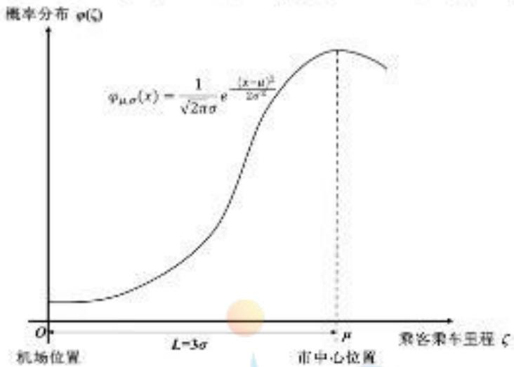

<details>
<summary>line</summary>

| 特征 | 描述 |
| --- | --- |
| X轴标签 | \(乘客乘车里程 \zeta\) |
| Y轴标签 | 概率分布 \(\phi(\zeta)\) |
| 关键点 | \(\mu\) (中心位置) |
| 原点 | 0 (机场位置) |
| 原点 | L=3σ |
| 原点 | 市中心位置 |
</details>

图 1 出租车搭载乘客里程分布图

## (二)出租车收支来源

## 1. 计价规则及收入

不同城市的出租车价格会有不同，但计价规则基本一致，可以表示为以距离为自变量，价格为因变量的分段函数形式。里程在 $a$ 公里以内均为同一价格 $p_0$ ；在 $[a, b]$ 内价格随里程呈线性增长，增长系数为 $p_1$ ；里程大于 $b$ 公里后价格随距离以增长系数 $p_2$ 增加，具体的计价收入分段函数表达式为：

$$
G (x) = \left\{ \begin{array}{l l} p _ {0}, & x \leq a \\ p _ {0} + p _ {1} (x - a), & a <   x \leq b \\ p _ {0} + p _ {1} (b - a) + p _ {2} (x - b), & x > b \end{array} \right. \tag {4}
$$

## 2. 时间成本

时间成本主要体现在时间的流失而导致机会的丧失。简单来说，时间成本指由于选择不同，在单位时间内存在收益差别而造成的相对成本。比如在本问题中，司机选择在机场等候，则他失去了在相同时间内搭载乘客而获得收益的机会，从而在收入上有一定损失，这一损失就是我们所说的时间成本。此外，对于空载的司机，他们相对于已载客的司机仍有相对的收入差，也是我们所说的时间成本。通过以上讨论我们可以将本问题的时间成本划分为两个方面，一是出租车为等待接客的等待时间成本 $C_{wait}$ ，二是司机在路途中由于空载造成的空载时间成本 $C_{free}$ 。

等待时间成本计算的重点是等待时间的计算，等待时间由“蓄车池”内已有出租车数和出租车机场通行能力共同确定，用下式表示：

$$
t _ {\text {wait}} = \frac {M _ {\text {ptaxi}}}{v _ {\text {leave}}} \tag {5}
$$

其中 $v_{leave}$ 出租车机场通行能力， $M_{ptaxi}$ 为时间段内机场乘客选择乘坐出租车的乘客总数。与机场中的乘客总数 $M_{p}$ 呈比例关系，即 $M_{ptaxi} = \mu_{1} M_{p}$ ， $\mu_{1}$ 为机场乘客选择出租车的比例。

出租车司机在路途中行驶时会以一定概率拉到乘客，所以出租车司机行驶的距离越远，司机搭乘乘客行驶的距离越大，获得的收益也越多。假设出租车行驶速度不变，则出租车在路途行驶的时间越多，搭载乘客获取收益的时间越多。司机拉到乘客的概率可用空载率表示，即 $\gamma=1-\beta$ 。司机载有乘客的行驶时间表示为 $t_{pa}=t_{drive}.\gamma$ ，其中 $t_{drive}$ 表示出租车总的行驶时间。同理司机载有乘客行驶的距离为 $L_{pa}=L_{drive}.\gamma$ ，其中 $L_{drive}$ 表示出租车总的行驶距离。我们将载有乘客的距离里程代入上述出租车计价函数则可得到行驶时间为 $t_{pa}$ 或行驶距离为 $L_{pa}$ 下出租车获得的收益。而对于空载或等待的出租车是无法得到此收益的，所以转换为我们讨论的时间成本，得到时间成本的具体表达式为：

$$
C _ {t i m e} = C _ {w a i t} + C _ {f r e e} = G \left(L _ {p a w}\right) + G \left(L _ {p a f}\right) \tag {6}
$$

$$
L _ {p a w} = t _ {w a i t} \cdot v _ {t a x i} \cdot \gamma ; L _ {p a f} = t _ {f r e e} \cdot v _ {t a x i} \cdot \gamma
$$

其中 $G(L_{paw})$ ， $G(L_{paf})$ 分别是以等待时间和空载时间对应的搭载乘客距离 $L_{paw}$ 和 $L_{paf}$ 为中间变量的出租车计价收入。

## 3. 行驶油耗成本

目前出租车大部分以燃油或油电混合为动力驱动的, 油耗支出是出租车最主要的也是必不可少的成本。不同的出租车型有不同的油耗成本, 但基本都遵循以下计算公式:

$$
C _ {g} (x) = A \cdot S _ {\text {gas}} \cdot x \tag {7}
$$

其中 A 表示出租车每公里耗油量，单位为升； $S_{gas}$ 表示每升燃油的价格；x 表示行驶的里程数。一般汽车生产商会给出每种车型百公里耗油测量数据，即 100A；燃油价格 $S_{gas}$ 信息可根据国家发布的每周油价标准得到，从而可知出租车行驶过程中的油耗成本。

## (三)方案收益确定

## 1. 等待载客方案

此方案为出租车司机在送客结束后到机场指定的“蓄车池”排队等候，待搭乘乘客后在返回市区。在此种方案下司机对所接乘客的情况是随机的，不可预测的，乘客有一定概率在去往市中心的路途中选择下车，所以此方案下司机付出的时间成本包括等待时间成本和一定概率的空载时间成本。司机由于搭载乘客回市中心会获得相应的计价收入，再减去所需的油耗成本即为司机的总收益结果，用下式表示：

$$
\begin{array}{l} W _ {1} = G (x) - C _ {g} (x) - C _ {\text {time}} \\ = G (x) - C _ {g} (L) - G \left(t _ {\text {wait}} v _ {\text {taxi}} \gamma\right) - G \left(t _ {\text {free}} v _ {\text {taxi}} \gamma\right) \tag {8} \\ t _ {f r e e} = \frac {L - x}{v _ {t a x i}} \\ \end{array}
$$

上式中 $G(x)$ ， $C_{g}(x)$ 分别为乘客搭乘里程为 x 时的计价收入和油耗支出， $t_{wait}$ 为司机预计的等待时间， $t_{free}$ 为乘客途中下车后司机返回市区空载的时间。联立式(4)、(6)即可计算得到等待载客方案的司机预计收入。

## 2. 空载返回方案

此方案为司机在送客结束后直接返回市区继续接客。在此种方案下司机只有在返回市区后才会有计价收入，在返回途中需要付出油耗成本和时间成本，这里的时间成本仅包括空载成本。于是可以得到空载返回方案下的收益结果，用下式表示为：

$$
\begin{array}{c} W _ {2} = - C _ {g} (x) - C _ {\text {time}} = - C _ {g} (L) - G \left(t _ {\text {free}} v _ {\text {taxi}} \gamma\right) \\ t _ {\text {free}} = L / v _ {\text {taxi}} \end{array} \tag {9}
$$

上式中 $C_{g}(L)$ 为司机返回市区所需的油耗，在机场与市中心距离 L 确定后此值确定； $t_{free}$ 表示司机空载的时间。

## (四)出租车司机方案选择

出租车司机选择方案的过程即为决策分析的过程。一般决策方案需要包含三个要素，即自然状态，策略和收益。其中自然状态是指不以人的意志为转移的客观因素，在本问题研究中，这些因素为我们前面提到的影响司机做出选择的确定因素和随机因素；策略是指决策人员根据不同的客观情况做出的不同主观选择，在本问题中即为司机对等待载客和空载返回方案两种策略；收益是指当处于某一自然状态下，决策者选择某一策略后，系统产生的收益和损失值，本问题中为司机在不同方案下的收益结果。[2]决策者会对不同情况下的不同策略的预计收益结果进行分析，做出更有利于自己的决策，使自己损失最小或收益最大。

司机在决策前会假设选择一种方案, 根据已有的确定信息和自己的经验对相应方案下的收益或损失进行估计, 从而选择对自己更有益的一种方案。在预选择中, 两种方案的讨论区间必须一致使两种方案具有可比性。由题目可知司机送客后均会返回市区, 所以我们在讨论两种方案时以空间为相同研究范围。即只考虑从机场到市中心这一空间区间内司机在选择不同方案时的收益, 对于等待载客的司机拉到的乘客搭乘里程大于机场到市中心的距离时, 我们统一按照机场到市中心的距离处理; 对于空载返回市区后的司机是否再次拉到乘客我们不做考虑。

我们可以建立出租车司机的决策模型如下：

$$
D = \left\{ \begin{array}{l l} 0 & W _ {1} > W _ {2} \\ 1 & W _ {1} \leq W _ {2} \end{array} , W = \max \left(W _ {1}, W _ {2}\right) \right. \tag {10}
$$

当 D=0 时，司机选择等待载客方案更优；当 D=1 时，司机选择空载返回方案更优，司机获得的最优收益为 W。

## (五)出租车司机决策过程

根据上述四点分析，司机选择策略时的思考过程可概括为右图内容。

其中时间段内机场总人数的估计值 $M_{p}$ 可以由式(1)(2)得到，估计等待的时间由式(5)给出，司机在对能否搭载到乘客进行判断时，主要是判断关注时间段内出租车数是否大于机场内乘客总数，即为下式是否成立，

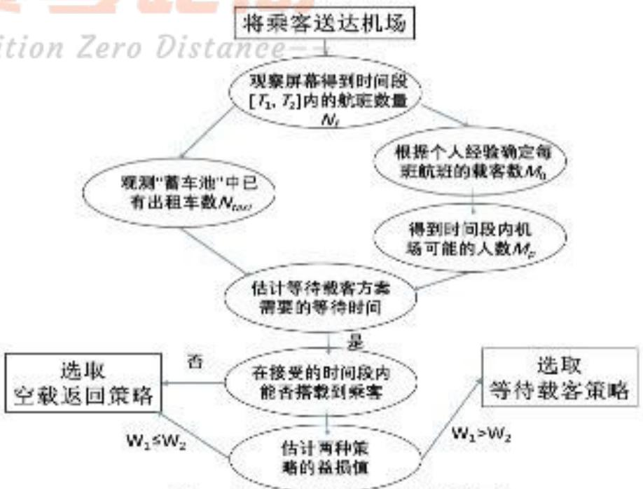

<details>
<summary>flowchart</summary>

```mermaid
graph TD
  A["将乘客送达机场"] --> B{"观察屏幕得到时间段["T1, T2"]内的航班数量 N_i"}
  B --> C{"观测"蓄车池"中已有出租车数 N_two"}
  B --> D{"根据个人经验确定每班航班的载客数 M_0"}
  C --> E{"估计等待载客方案\n需要的等待时间"}
  D --> F{"得到时间段内机场可能的人数 M_p"}
  E --> G{"在接受的时间段内\n能否搭载到乘客"}
  F --> H{"估计两种策略的益损值"}
  G -->|否| I["选取空载返回策略"]
  G -->|是| J["选取等待载客策略"]
  H --> K{"W1≤W2"}
  H --> L{"W1＞W2"}
```
</details>

图 2 出租车司机决策过程图

$$
N _ {t a x i} <   M _ {p t a x i} \tag {11}
$$

若式(11)成立，则司机能搭载到乘客，然后计算两种策略的收益。等待载客策略的收益由式(3)、(4)、(5)、(7)、(8)给出，空载返回策略的收益由式(4)、(7)、(9)给出，决策确定的方式由式(10)给出。

## 4.1.2 模型求解

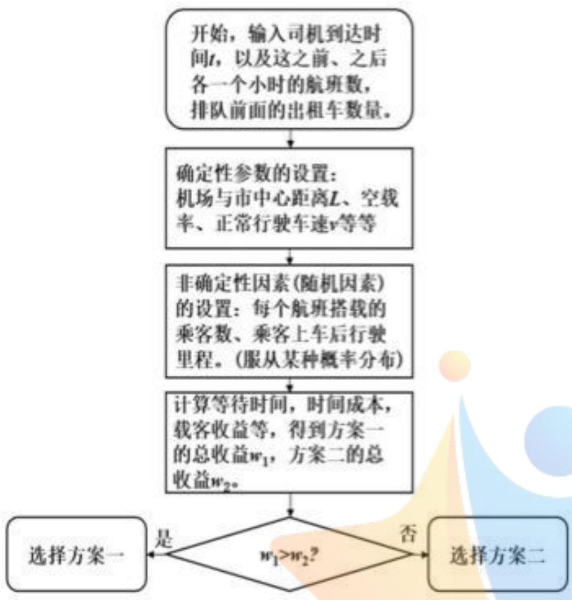

<details>
<summary>flowchart</summary>

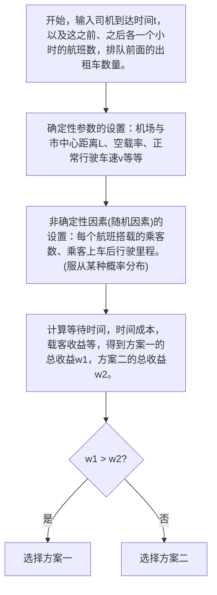
```mermaid
graph TD
  A["开始，输入司机到达时间t，以及这之前、之后各一个小时的航班数，排队前面的出租车数量。"] --> B["确定性参数的设置：机场与市中心距离L、空载率、正常行驶车速v等等"]
  B --> C["非确定性因素(随机因素)的设置：每个航班搭载的乘客数、乘客上车后行驶里程。(服从某种概率分布)"]
  C --> D["计算等待时间，时间成本，载客收益等，得到方案一的总收益w1，方案二的总收益w2。"]
  D --> E{"w1 > w2?"}
  E -->|是| F["选择方案一"]
  E -->|否| G["选择方案二"]
```
</details>

图 3 计算机模拟司机决策流程图

为给出司机的选择策略，我们根据上述建立的模型，通过下面的流程去计算各方案收益，并得到判断结果，流程如作图所示。

首先，我们需要输入司机能够观测和已知的一些数据，具体的有司机抵达的时间，因为不同时间（夜间、白天）出租车的收费方式不同，在抵达时间前后一个小时内的航班数量以及“蓄车池”里已有的车辆数。

接着，我们设置涉及的确定因素参数：机场与市中心的距离 L=25.1km。出租车工作时间内的平均空载率 $\beta=0.4$ 。正常行驶的车速 $v_{taxi}=60km/h$ 。机场每分钟出

租车载走的乘客组数 $v_{leave}=1$ (组/分钟)。选择出租车出行的乘客数占总机场乘客数的比例 $\mu_{1}=0.3$ 。平均同行的乘客数 $\mu_{2}=2$ 。

然后设置非确定因素(随机因素): 司机根据个人经验估计每个航班的载客数服从 $[M_{1}, M_{2}]$ 上的均匀分布选取, 这里我们不妨取 $M_{1}=100, M_{2}=200$ 。乘客乘车里程服从式(3)的概率分布, 里程最大值是从机场到市中心距离为25.1km。

利用式(4)-(7),计算两种策略的计价收入、等待时间、时间成本和油耗,利用式(8)、(9)计算两策略的收益 $W_{1}$ 和 $W_{2}$ , 比较 $W_{1}$ 和 $W_{2}$ 大小并选择收益大的方案。

## 4.1.3 模型结果

下面我们采用一组生成模拟数据，来验证我们建立模型的可行性。

假设司机到达机场的时间点是上午 10 点，他观测到 9 点至 10 点航班数为 4，10 点至 11 点航班数为 6。在“蓄车池”排队等待的出租车共有 50 辆，将求解中确定的数据代入判断模型，得到的结果如图 4a). 所示。

从图 4a). 可见，由于我们选定的观测区间为机场到市中心，所以方案二收益为一确定值；而通过多次模拟得到结果显示：方案一的收益大部分大于方案二，从统计角度，100次模拟中选择方案一的平均收益为-48.05元，选择方案二的平均收益为-57.62元。

统计这 100 次模拟的决策结果，发现有 68 次决策，司机选择了方案一，有 32 次决策司机选择了方案二，也就是说在到达时间为上午 10 点，前后一小时内航班数分别为 4、6 班，已经有 50 辆出租车等待的情况下，该司机倾向于选择方案一，即留下来等待载客再返回市中心。

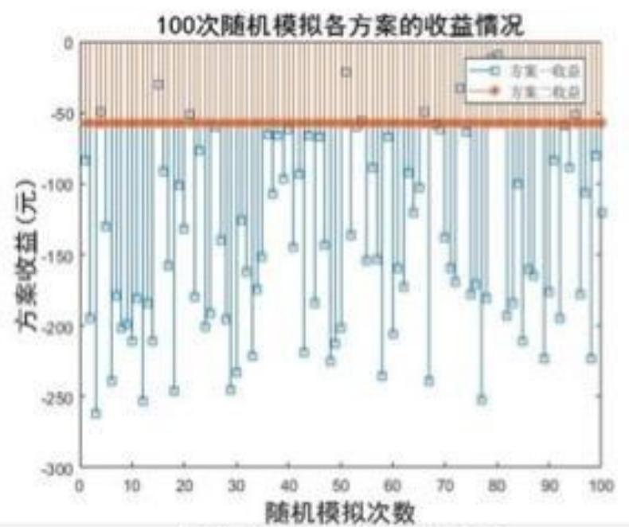

<details>
<summary>scatter</summary>

| 随机模拟次数 | 方案一收益 (元) | 方案二收益 (元) |
| --- | --- | --- |
| 2 | ~-85 | ~-55 |
| 3 | ~-260 | ~-55 |
| 4 | ~-190 | ~-55 |
| 5 | ~-130 | ~-55 |
| 6 | ~-240 | ~-55 |
| 7 | ~-180 | ~-55 |
| 8 | ~-200 | ~-55 |
| 9 | ~-180 | ~-55 |
| 10 | ~-210 | ~-55 |
| 11 | ~-250 | ~-55 |
| 12 | ~-180 | ~-55 |
| 13 | ~-210 | ~-55 |
| 14 | ~-160 | ~-55 |
| 15 | ~-90 | ~-55 |
| 16 | ~-240 | ~-55 |
| 17 | ~-100 | ~-55 |
| 18 | ~-130 | ~-55 |
| 19 | ~-240 | ~-55 |
| 20 | ~-180 | ~-55 |
| 21 | ~-130 | ~-55 |
| 22 | ~-70 | ~-55 |
| 23 | ~-180 | ~-55 |
| 24 | ~-200 | ~-55 |
| 25 | ~-190 | ~-55 |
| 26 | ~-240 | ~-55 |
| 27 | ~-140 | ~-55 |
| 28 | ~-230 | ~-55 |
| 29 | ~-160 | ~-55 |
| 30 | ~-220 | ~-55 |
| 31 | ~-170 | ~-55 |
| 32 | ~-140 | ~-55 |
| 33 | ~-160 | ~-55 |
| 34 | ~-110 | ~-55 |
| 35 | ~-60 | ~-55 |
| 36 | ~-60 | ~-55 |
| 37 | ~-60 | ~-55 |
| 38 | ~-60 | ~-55 |
| 39 | ~-60 | ~-55 |
| 40 | ~-60 | ~-55 |
| 41 | ~-60 | ~-55 |
| 42 | ~-60 | ~-55 |
| 43 | ~-60 | ~-55 |
| 44 | ~-60 | ~-55 |
| 45 | ~-60 | ~-55 |
| 46 | ~-60 | ~-55 |
| 47 | ~-60 | ~-55 |
| 48 | ~-60 | ~-55 |
| 49 | ~-60 | ~-55 |
| 50 | ~-60 | ~-55 |
| 51 | ~-60 | ~-55 |
| 52 | ~-60 | ~-55 |
| 53 | ~-60 | ~-55 |
| 54 | ~-60 | ~-55 |
| 55 | ~-60 | ~-55 |
| 56 | ~-60 | ~-55 |
| 57 | ~-60 | ~-55 |
| 58 | ~-60 | ~-55 |
| 59 | ~-60 | ~-55 |
| 60 | ~-60 | ~-55 |
| 61 | ~-60 | ~-55 |
| 62 | ~-60 | ~-55 |
| 63 | ~-60 | ~-55 |
| 64 | ~-60 | ~-55 |
| 65 | ~-60 | ~-55 |
| 66 | ~-60 | ~-55 |
| 67 | ~-60 | ~-55 |
| 68 | ~-60 | ~-55 |
| 69 | ~-60 | ~-55 |
| 70 | ~-60 | ~-55 |
| 71 | ~-60 | ~-55 |
| 72 | ~-60 | ~-55 |
| 73 | ~-60 | ~-55 |
| 74 | ~-60 | ~-55 |
| 75 | ~-60 | ~-55 |
| 76 | ~-60 | ~-55 |
| 77 | ~-60 | ~-55 |
| 78 | ~-60 | ~-55 |
| 79 | ~-60 | ~-55 |
| 80 | ~-60 | ~-55 |
| 81 | ~-60 | ~-55 |
| 82 | ~-60 | ~-55 |
| 83 | ~-60 | ~-55 |
| 84 | ~-60 | ~-55 |
| 85 | ~-60 | ~-55 |
| 86 | ~-60 | ~-55 |
| 87 | ~-60 | ~-55 |
| 88 | ~-60 | ~-55 |
| 89 | ~-60 | ~-55 |
| 90 | ~-60 | ~-55 |
| 91 | ~-60 | ~-55 |
| 92 | ~-60 | ~-55 |
| 93 | ~-60 | ~-55 |
| 94 | ~-60 | ~-55 |
| 95 | ~-60 | ~-55 |
| 96 | ~-60 | ~-55 |
| 97 | ~-60 | ~-55 |
| 98 | ~-60 | ~-55 |
| 99 | ~-60 | ~-55 |
| 100 | — | — |

注：由于图中数据点密集且无具体数值标签，表中除明确标注的极值外，其余均为基于网格线的估算值（使用~前缀）。
</details>

a). 忙期模拟的方案收益比较图

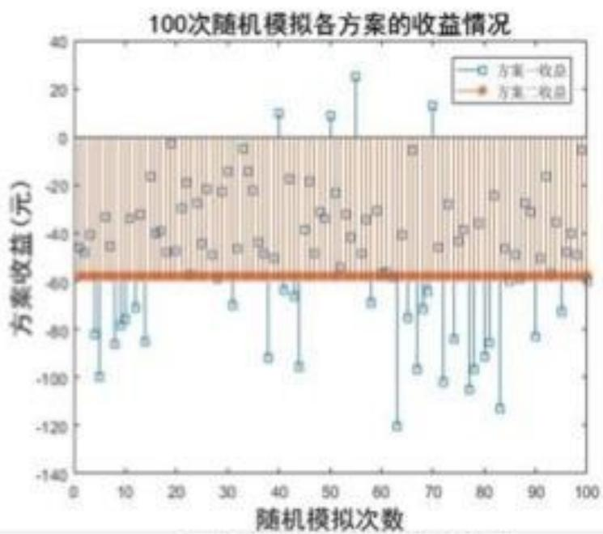

<details>
<summary>scatter</summary>

| 随机模拟次数 | 方案一收益 (元) | 方案二收益 (元) |
| --- | --- | --- |
| 2 | ~-4.5 | -50 |
| 3 | ~-6.0 | -50 |
| 4 | ~-10.0 | -50 |
| 5 | ~-5.0 | -50 |
| 6 | ~-7.0 | -50 |
| 7 | ~-8.0 | -50 |
| 8 | ~-9.0 | -50 |
| 9 | ~-8.5 | -50 |
| 10 | ~-9.5 | -50 |
| 11 | ~-8.0 | -50 |
| 12 | ~-9.0 | -50 |
| 13 | ~-8.5 | -50 |
| 14 | ~-9.5 | -50 |
| 15 | ~-8.0 | -50 |
| 16 | ~-7.0 | -50 |
| 17 | ~-8.0 | -50 |
| 18 | ~-7.0 | -50 |
| 19 | ~-8.0 | -50 |
| 20 | ~-7.0 | -50 |
| 21 | ~-8.0 | -50 |
| 22 | ~-7.0 | -50 |
| 23 | ~-8.0 | -50 |
| 24 | ~-7.0 | -50 |
| 25 | ~-8.0 | -50 |
| 26 | ~-7.0 | -50 |
| 27 | ~-8.0 | -50 |
| 28 | ~-7.0 | -50 |
| 29 | ~-8.0 | -50 |
| 30 | ~-7.0 | -50 |
| 31 | ~-8.0 | -50 |
| 32 | ~-7.0 | -50 |
| 33 | ~-8.0 | -50 |
| 34 | ~-7.0 | -50 |
| 35 | ~-8.0 | -50 |
| 36 | ~-7.0 | -50 |
| 37 | ~-8.0 | -50 |
| 38 | ~-7.0 | -50 |
| 39 | ~-8.0 | -50 |
| 40 | ~-7.0 | -50 |
| 41 | ~-8.0 | -50 |
| 42 | ~-7.0 | -50 |
| 43 | ~-8.0 | -50 |
| 44 | ~-7.0 | -50 |
| 45 | ~-8.0 | -50 |
| 46 | ~-7.0 | -50 |
| 47 | ~-8.0 | -50 |
| 48 | ~-7.0 | -50 |
| 49 | ~-8.0 | -50 |
| 50 | ~-7.0 | -50 |
| 51 | ~-8.0 | -50 |
| 52 | ~-7.0 | -50 |
| 53 | ~-8.0 | -50 |
| 54 | ~-7.0 | -50 |
| 55 | ~-8.0 | -50 |
| 56 | ~-7.0 | -50 |
| 57 | ~-8.0 | -50 |
| 58 | ~-7.0 | -50 |
| 59 | ~-8.0 | -50 |
| 60 | ~-7.0 | -50 |
| 61 | ~-8.0 | -50 |
| 62 | ~-7.0 | -50 |
| 63 | ~-8.0 | -50 |
| 64 | ~-7.0 | -50 |
| 65 | ~-8.0 | -50 |
| 66 | ~-7.0 | -50 |
| 67 | ~-8.0 | -50 |
| 68 | ~-7.0 | -50 |
| 69 | ~-8.0 | -50 |
| 70 | ~-7.0 | -50 |
| 71 | ~-8.0 | -50 |
| 72 | ~-7.0 | -50 |
| 73 | ~-8.0 | -50 |
| 74 | ~-7.0 | -50 |
| 75 | ~-8.0 | -50 |
| 76 | ~-7.0 | -50 |
| 77 | ~-8.0 | -50 |
| 78 | ~-7.0 | -50 |
| 79 | ~-8.0 | -50 |
| 80 | ~-7.0 | -50 |
| 81 | ~-8.0 | -50 |
| 82 | ~-7.0 | -50 |
| 83 | ~-8.0 | -50 |
| 84 | ~-7.0 | -50 |
| 85 | ~-8.0 | -50 |
| 86 | ~-7.0 | -50 |
| 87 | ~-8.0 | -50 |
| 88 | ~-7.0 | -50 |
| 89 | ~-8.0 | -50 |
| 90 | ~-7.0 | -50 |
| 91 | ~-8.0 | -50 |
| 92 | ~-7.0 | -50 |
| 93 | ~-8.0 | -50 |
| 94 | ~-7.0 | -50 |
| 95 | ~-8.0 | -50 |
| 96 | ~-7.0 | -50 |
| 97 | ~-8.0 | -50 |
| 98 | ~-7.0 | -50 |
| 99 | ~-8.0 | -50 |
| 100 | ~-7.0 | -50 |

注：由于图中数据点密集且无具体数值标签，表中除坐标轴刻度外的所有值均为基于网格线的估算值（使用~前缀）。
</details>

b). 闲期模拟的方案收益比较图  
图 4 100 次模拟下不同方案收益比较图  
(方案一为等待载客方案，方案二为空载返回方案)

我们改变司机到达时观测到的数据，假设司机还是早上10点到达，但是他观测到9点至10点航班数为2，10点至11点航班数为3。他前面已经排队等待的出租车有60辆，将上述数据代入判断模型，得到的结果如图4b).

我们发现，当航班数减少，同时已经排队的出租车增多后，绝大部分的方案一收益都低于方案二的收益，所以司机很大概率会选择方案二空载返回市区，而不会在机场等待较长载客。以上结果均符合实际情况，在一定程度上体现我们模型的可行性。

## 4.2 基于真实数据决策模型的分析讨论

本小问是对第一问模型的现实情况模拟，通过收集到的实际机场及相应城市出租车数据，给出出租车司机的选择方案，并验证模型的合理性及确定相关因素的依赖性。在准确全面收集数据的基础上，我们的参数具有了更真实的现实意义，再通过计算机多次模拟得到贴近实际的司机决策方案。此外以蓄车池内车辆数为变量探究两方案收益情况来证明模型合理性并对机场到市中心距离、出租车正常行驶速度因素进行了依赖性分析。

## 4.2.1 数据收集与处理

## - 数据收集

我们以北京首都国际机场为例为第一问中的模型提供实际基础。北京首都国际机场共有 T1 至 T3 三个航站楼，每年旅客吞吐量近一亿人次，国内国际航班起降近 60 万次，每个航站楼有独立的车辆接客区及“蓄车池”。

通过携程官方网站[3],我们查找到北京首都国际机场分别在工作日和节假日全天的航班抵达信息，具体包括航班序号、航班起止城市、航班预计起飞降落时刻、航班实际起飞降落时刻和航班状态等。通过比较节假日和工作日航班抵达信息，我们发现两者的航班信息除天气等特殊因素影响外，其他基本信息相同，所以我们收集了2019年9月13日抵达北京首都国际机场的全天的航班信息作为我们的数据基础，全部数据见附录[1]。

此外我们收集了北京出租车和北京首都国际机场的相关数据以进行实际情况的出租车司机决策模拟，数据见下表1。

表 1 北京出租车及首都国际机场相关数据

<table><tr><td>项目名称</td><td>具体数值</td><td>单位</td></tr><tr><td>机场至市中心距离</td><td>25.1</td><td>km</td></tr><tr><td>北京出租车空载率</td><td>0.4[4]</td><td>/</td></tr><tr><td>出租车每公里油耗</td><td>8~9</td><td>L/km</td></tr><tr><td>北京9月6日至13日油价</td><td>6.02</td><td>元/L</td></tr><tr><td>选择乘坐出租车比例</td><td>37[5]</td><td>%</td></tr><tr><td>出租车平均同行人数</td><td>2</td><td>人</td></tr><tr><td>出租车计价规则 $p_0$   $p_1$   $p_2$ </td><td>13, 2.3, 3.45[6]</td><td>/</td></tr></table>

## - 数据处理

收集到北京首都国际机场的全天数据后，将我们本次不考虑的信息项(如航班起飞时间、航班状态等)进行剔除，并删除了航班状态为取消的航班。由于北京首都国际机场三个航站楼可以视为相互独立，我们以T2航站楼为研究目标，筛选出抵达首都机场T2的航班。此外对于已经降落的航班我们按其实际着陆时间计算，对于未着陆的航班按其预计着陆时间计算。

## 4.2.2 模型求解

为了更加细致地分析一天内航班的忙期和闲期情况，我们做出图 5，来观察 T2 航站楼一天内抵达航班的情况。

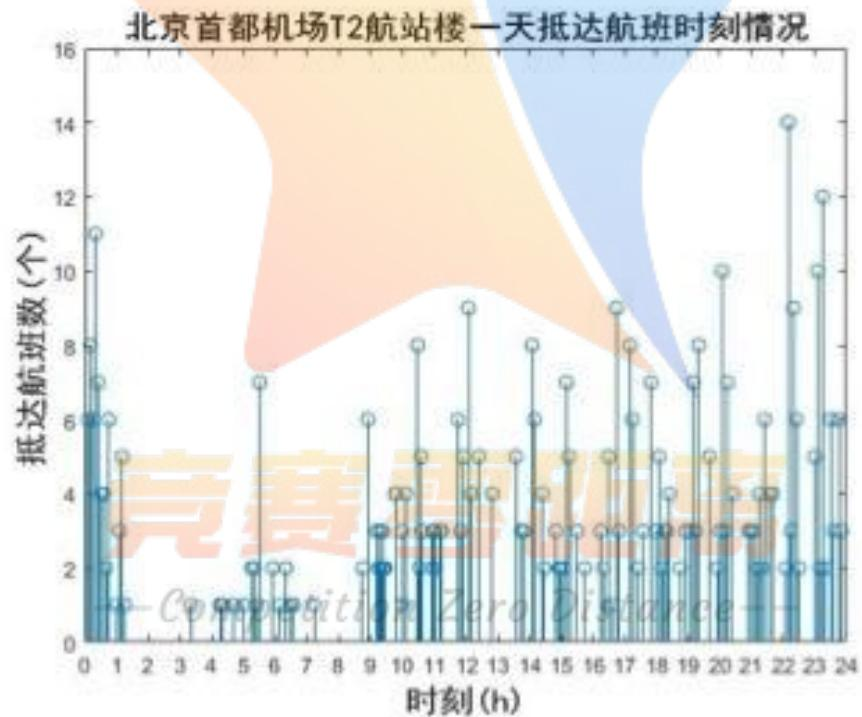

<details>
<summary>scatter</summary>

| 时刻 (h) | 抵达航班数 (个) |
| --- | --- |
| 0 | 11 |
| 0 | 8 |
| 0 | 6 |
| 0 | 4 |
| 0 | 2 |
| 1 | 5 |
| 1 | 3 |
| 1 | 1 |
| 4 | 1 |
| 5 | 7 |
| 5 | 2 |
| 6 | 2 |
| 6 | 1 |
| 9 | 6 |
| 9 | 2 |
| 9 | 1 |
| 10 | 8 |
| 10 | 4 |
| 10 | 3 |
| 11 | 9 |
| 11 | 6 |
| 11 | 5 |
| 11 | 3 |
| 12 | 9 |
| 12 | 6 |
| 12 | 4 |
| 13 | 8 |
| 13 | 6 |
| 13 | 4 |
| 14 | 7 |
| 14 | 5 |
| 14 | 3 |
| 15 | 9 |
| 15 | 6 |
| 15 | 3 |
| 16 | 7 |
| 16 | 5 |
| 16 | 3 |
| 17 | 10 |
| 17 | 7 |
| 17 | 5 |
| 18 | 8 |
| 18 | 6 |
| 18 | 3 |
| 19 | 7 |
| 19 | 5 |
| 19 | 3 |
| 20 | 6 |
| 20 | 4 |
| 20 | 3 |
| 21 | 14 |
| 21 | 9 |
| 21 | 6 |
| 22 | 12 |
| 22 | 6 |
| 22 | 3 |
| 23 | 6 |
| 23 | 3 |
</details>

图 5 北京首都国际机场 T2 航站楼全天航班抵达情况

从图 5 可见，在一天中 1 时至 5 时这个时间段内，抵达 T2 航站楼的航班数量低于其他时间段，于是我们设定每天的 1 时至 5 时为航班抵达的闲期，其他时间段为航班抵达的忙期。

接着我们查询了北京市出租车计费方式, 发现计费多少与行驶里程成分段函数关系, 当出租车在 5 点\~23 点运营时, 其收费如式(12):

$$
G (x) = \left\{ \begin{array}{l l} 1 3, & x \leq 3 \\ 1 3 + 2. 3 \times (x - 3), & 3 <   x \leq 1 5 \\ 1 3 + 2. 3 \times 1 2 + 2. 3 \times 1. 5 \times (x - 1 5), & x > 1 5 \end{array} \right. \tag {12}
$$

当出租车在23点\~第二天5点运营时，其收费如式(13):

$$
G (x) = \left\{ \begin{array}{l l} 1 3, & x \leq 3 \\ 1 3 + 2. 7 6 \times (x - 3), & 3 <   x \leq 1 5 \\ 1 3 + 2. 7 6 \times 1 2 + 2. 7 6 \times 1. 5 \times (x - 1 5), & x > 1 5 \end{array} \right. \tag {13}
$$

然后我们来设置司机决策模型里面的确定性因素和非确定性(随机)因素，对于确定性因素，根据收集到的数据可知：机场与市中心的距离 L=25.1km。出租车工作时间内的平均空载率 $\beta=0.4$ 。正常行驶的车速 $v_{taxi}=60km/h$ 。机场每分钟出租车载走的乘客组数 $v_{leave}=1$ （组/分钟）。选择出租车出行的乘客数占总机场乘客数的比例 $\mu_{1}=0.3$ 。平均同行的乘客数 $\mu_{2}=2$ 。

根据常识我们知道，节假日和工作日抵达机场的乘客数是不一样的，但通过收集的数据我们知道两种情况下飞机航班数是基本相同的，所以这两种情况的差异主要受非确定性因素(随机因素)，如航班载客数影响。节假日的航班载客数更高。我们设置在节假日，每个航班的载客数服从[200 300]之间的均匀分布，在工作日，每个航班的载客数服从[50 200]之间的均匀分布。乘客乘车行驶里程仍然服从式(1)的概率分布，且里程不超过25.1km。

我们分 4 组种情况讨论司机的决策，第一、节假日忙期司机的决策，第二、节假日闲期司机的决策，第三、工作日忙期司机的决策，第四、工作日闲期司机的决策。

对于节假日忙期，假设某司机抵达机场时观测到的抵达时间为10点，且该天为节假日。他看到了前后各一小时的航班信息，其中部分数据如表2所示：

表 2 北京首都国际机场 9 点\~11 点到达 T2 航站楼部分航班信息

<table><tr><td>航班号</td><td>出发机场</td><td>到达机场</td><td>到达时间</td></tr><tr><td>MU5137</td><td>上海虹桥 T2</td><td>北京 T2</td><td>9:15</td></tr><tr><td>CZ5051</td><td>厦门 T3</td><td>北京 T2</td><td>9:23</td></tr><tr><td>MF8117</td><td>厦门 T3</td><td>北京 T2</td><td>9:23</td></tr><tr><td>OQ2301</td><td>重庆 T3</td><td>北京 T2</td><td>10:06</td></tr><tr><td>CZ3681</td><td>贵阳 T2</td><td>北京 T2</td><td>10:37</td></tr></table>

这里只展示了部分航班信息，全部航班数据可从附录1中获得。司机通过机场屏幕或广播可以知道在9\~10点时间段内，一共有30架航班到达T2航站楼，在10\~11点时间段内，一共有27架航班到达T2航站楼。

对于节假日闲期，假设某司机抵达机场时观测到的抵达时间为4点，且该天为节假日。他看到了前后各一小时的航班信息，如表3：

表 3 首都国际机场 3 点\~5 点到达 T2 航站楼部分航班信息

<table><tr><td>航班号</td><td>出发机场</td><td>到达机场</td><td>到达时间</td></tr><tr><td>T5607</td><td>阿什哈巴德 MAIN</td><td>北京 T2</td><td>3:20</td></tr><tr><td>SU202</td><td>莫斯科 D</td><td>北京 T2</td><td>4:15</td></tr><tr><td>MF9512</td><td>雅加达 T3</td><td>北京 T2</td><td>4:20</td></tr><tr><td>HU7970</td><td>拉斯维加斯 T3</td><td>北京 T2</td><td>4:40</td></tr></table>

司机可以得知在 3\~4 点之间只有 1 架航班抵达 T2 航站楼，在 4\~5 点之间将有 3 架航班抵达航站楼。

同理对于非节假日，假设司机也是在上面两个时间(10点和4点)到达，得到的航班信息与前面相同。

然后利用式(4)-(7)，计算司机的计价收入、等待时间、时间成本和油耗成本，再用式(8)、(9)，计算 $W_{1}$ 和 $W_{2}$ ，比较 $W_{1}$ 和 $W_{2}$ 大小，从而选择收益大的方案。

## 4.2.3 模型结果

## - 出租车司机选择方案

对于节假日忙期，若司机10点到达后看到前面已有50辆出租车在等待，然后我们将收集到的数据代入司机决策模型进行100次模拟，每一次的决策结果如图6:

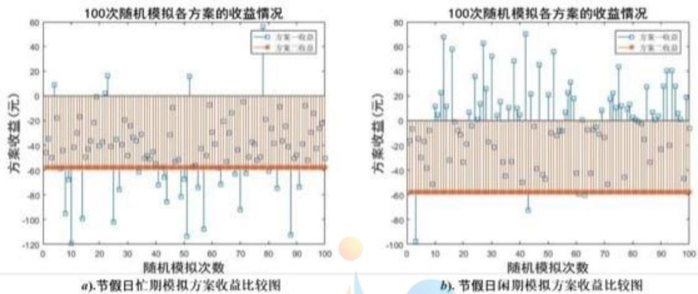  
图 6 节假日忙闲期 100 次模拟方案收益比较图

从图 6a). 可见，有 74 次决策的方案一的收益都大于方案二，这是可能是因为在节假日忙期时航班载客数多，机场内已有和预期乘客数多。这时即使司机前面的在等待的出租车已经较多，但是司机能忍受的时间范围如 1 个小时内，司机一定能搭载到乘客，所以司机更倾向于在机场等待载客后再返回。

同理, 假设节假日闲时司机到达航站楼 T2, 蓄车池内有 20 个出租车再等候, 我们得到模拟结果如图 6b).。从图中可见, 有 96 次决策都选择了在机场等待载客, 这是因为虽然时间处于每日的闲期, 但是节假日中司机估计航班载客数较多, 能够满足司机的载客需求, 同时蓄车池内排队的出租车较少, 所需的排队时间短, 所以司机更倾向于排队等待载客。

对于工作日，其他条件不变，我们得到图7：

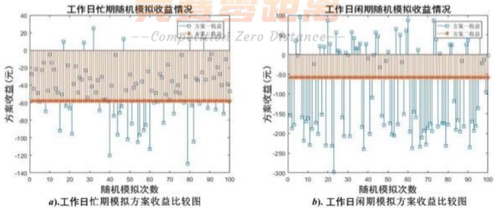  
图 7 节假日忙闲期 100 次模拟方案收益比较图

从图 7 可见，在工作日忙期，司机更愿意留下来等待乘客，因为虽然每个航班的乘客数量相比于节假日有所下降，但是航班数足够多，能保证他在 1 小时内能够载客。

但是，对于工作日闲期司机更倾向于空载返回市区，因为此时航班数少，乘客数也少，尽管蓄车池内排队的出租车不多，但是不一定能保证司机能够在1小时内载到客，司机更愿意返回市区。

综上我们结合具体机场实例及收集的相关数据，针对节假日和工作日、一天中的忙期和闲期情况对出租车司机的选择进行模拟，得到出租车司机的选择策略如下表：

表 4 不同自然状态下出租车司机方案选择结果

<table><tr><td>司机所处时间段</td><td>方案策略选择</td></tr><tr><td>节假日忙期</td><td>等待载客方案</td></tr><tr><td>节假日闲期</td><td>等待载客方案</td></tr><tr><td>工作日忙期</td><td>等待载客方案</td></tr><tr><td>工作日闲期</td><td>空载返回方案</td></tr></table>

## - 模型合理性分析

在模拟司机决策的过程中,很多确定因素和随机因素共同作用于司机的判断,下面我们来分析这些因素对模型结果的影响。

对于模型的合理性，我们首先分析司机到达机场时，蓄车池内出租车数量对司机决策的影响。假设司机获取相同的航班信息，我们以蓄车池内排队等候的出租车数量为横坐标，选择方案一(等待载客方案)的收益为纵坐标做出两者关系图，如下图所示：

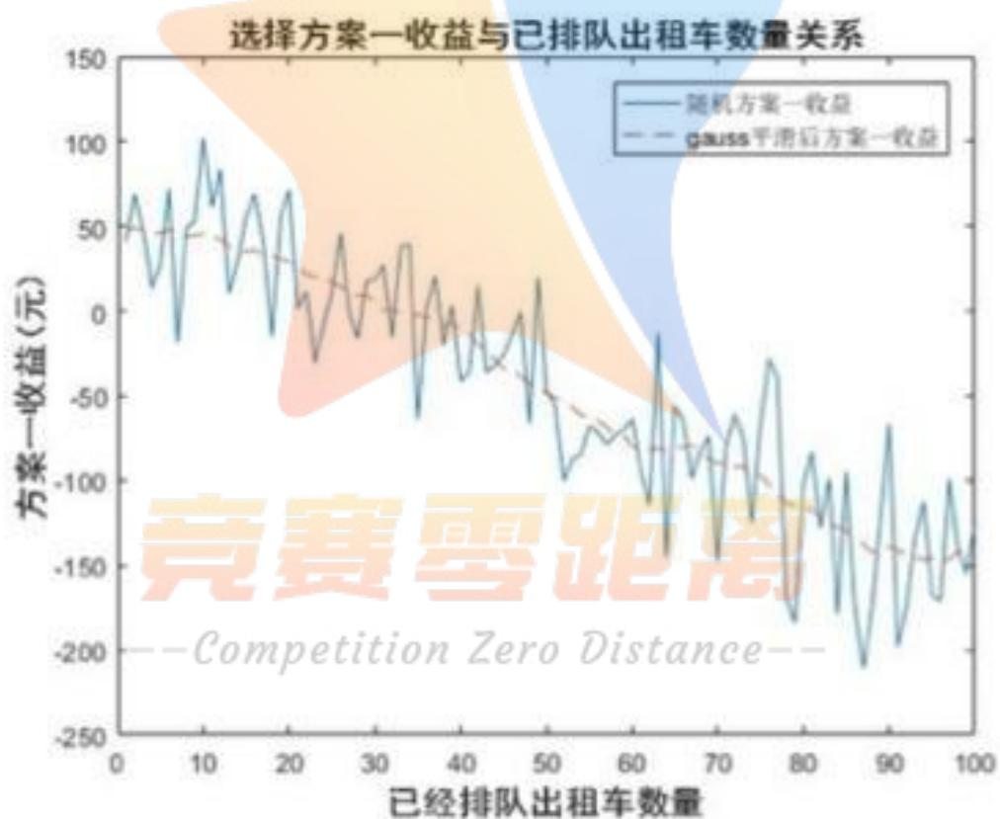

<details>
<summary>line</summary>

| 已经排队出租车数量 | 随机方案-收益 (元) | Gauss平滑后方案-收益 (元) |
| --- | --- | --- |
| 0 | ~50 | ~50 |
| 10 | ~70 | ~45 |
| 20 | ~30 | ~35 |
| 30 | ~10 | ~20 |
| 40 | ~-20 | ~-10 |
| 50 | ~-60 | ~-40 |
| 60 | ~-80 | ~-70 |
| 70 | ~-90 | ~-85 |
| 80 | ~-120 | ~-110 |
| 90 | ~-180 | ~-135 |
| 100 | ~-140 | ~-145 |
</details>

图8 排队出租车数量对方案一收益影响

由上图可见，在我们将数据代入模拟决策模型后，得到方案一的收益是波动较大的折线，这是因为每一班航班的乘客数量是一个不确定信息，此外司机所载乘客行驶里程也是一个不确定信息。这两个不确定因素的共同作用导致了方案一收益的波动。为更加清楚地分析蓄车池出租车数量对司机收益的影响，我们对原始结果进行高斯平滑。从平滑后的曲线可以明显看出，蓄车池内出租车数量越多，司机选择方案一的收益越小。因为排队出租车越多，司机需要的排队时间越长，所消耗的时间成本越大，这是符合生活实际的，一定程度上展示了模型的合理性。

## - 相关因素依赖性分析

对于因素的依赖性,我们考虑机场与市区的距离对决策结果的影响以及出租车正常行驶速度对决策结果的影响。

首先根据常理可知，机场与市区之间的距离 L 越大，司机更不愿意空载返回，因为距离的增大会直接导致出租车空载时间的增长，所以机场与市区之间的距离对司机的决策有重要影响，是一个至关重要的参数。下面我们计算了不同距离 L 时方案一和方案二的收益，得到图 9a).

从图 9 a). 可见，由于前面提及的两点随机因素的影响方案一的收益波动较大，我们仍通过高斯平滑后观察各曲线变化趋势。从图中我们发现，当机场与市区距离增加时，选择方案一的收益逐渐上升，这是因为司机所载乘客回到市区的距离增加，司机能获得更多收益且大大减少了空载返回时的油耗及时间成本；另一方面，选择方案二的收益逐渐减少，这是因为机场离市区越远，司机在无收益的情况下仍要承受更高的油耗和时间成本。当机场与市区距离在 21km 附近时，选择两种方案的收益近似相等，这时候司机可以根据自己偏好做出抉择。

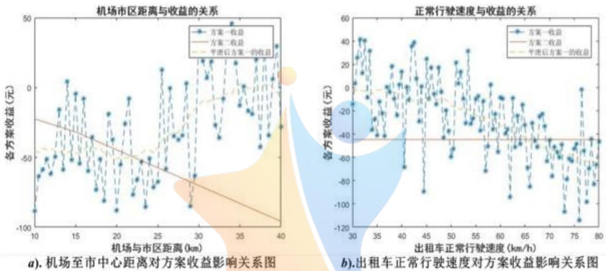  
图 9 参量对方案收益影响关系图

下面我们同理分析出租车正常行驶速度对收益的影响，结果如图9b).

由于我们选取统一的观测区间为机场到市中心的空间区间, 这使方案二的收益为仅与机场到市中心距离有关的函数, 从而车辆行驶速度不影响选择方案二的收益。但从图 9b). 可见, 车辆正常行驶速度对方案一的收益影响较为明显, 当出租车正常行驶速度增加时, 相当于增加了出租车停在机场等待时间所对应的时间成本, 所以出租车司机更愿意快速返回市区去载客, 减少时间成本, 而不愿意空车等待。此外我们发现当正常行驶速度在 $65 \mathrm{~km} / \mathrm{h}$ 附近时, 选择两种方案的收益相等, 是司机选择方案的临界值。在出租车正常行驶速度小于或等于 $65 \mathrm{~km} / \mathrm{h}$ 时, 司机倾向于选择方案一, 行驶速度大于 $65 \mathrm{~km} / \mathrm{h}$ 时, 司机倾向于选择方案二。

## 4.3 最优乘车效率模型

从管理部门角度出发，需要在保证车辆和乘客安全的前提下，合理设置乘车规则，尽量提高乘车效率。[7]针对此问题，我们以乘车效率为优化目标，以安全因素为约束条件，以上车点数量为决策变量，以单位时间到达机场的平均出租车数与平均人数之比 $\alpha_{1}$ 、携带大件行李乘客的占比 $\alpha_{2}$ 为环境参量，建立了单目标优化模型。其中，我们通过计算机模拟机场出租车乘客区的运行机制来计算各个方案对应的乘车效率。最后我们探讨了不同环境条件下最优方案的设置，对机场管理者提出了合理的建议。

模型总体思路图如下：

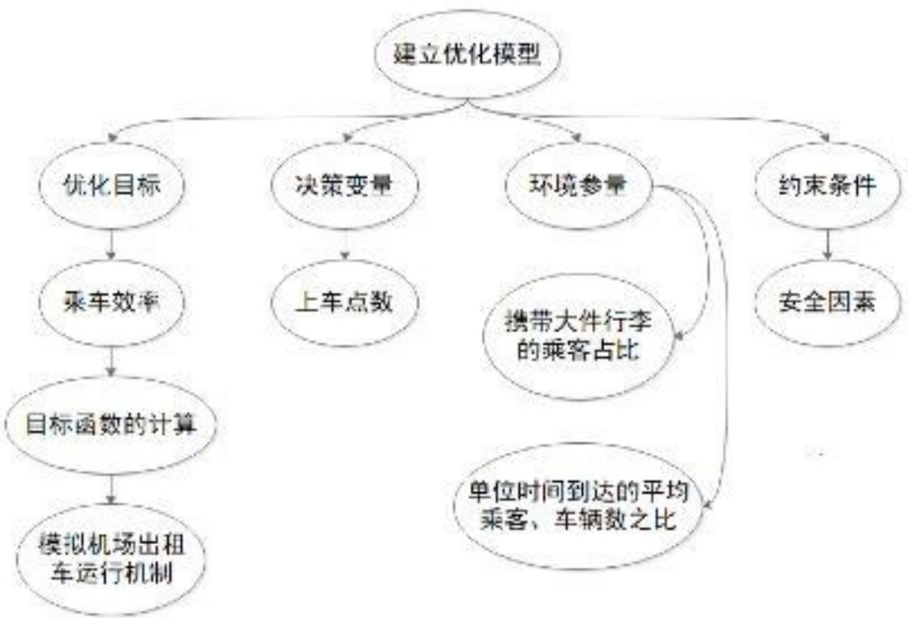

<details>
<summary>flowchart</summary>

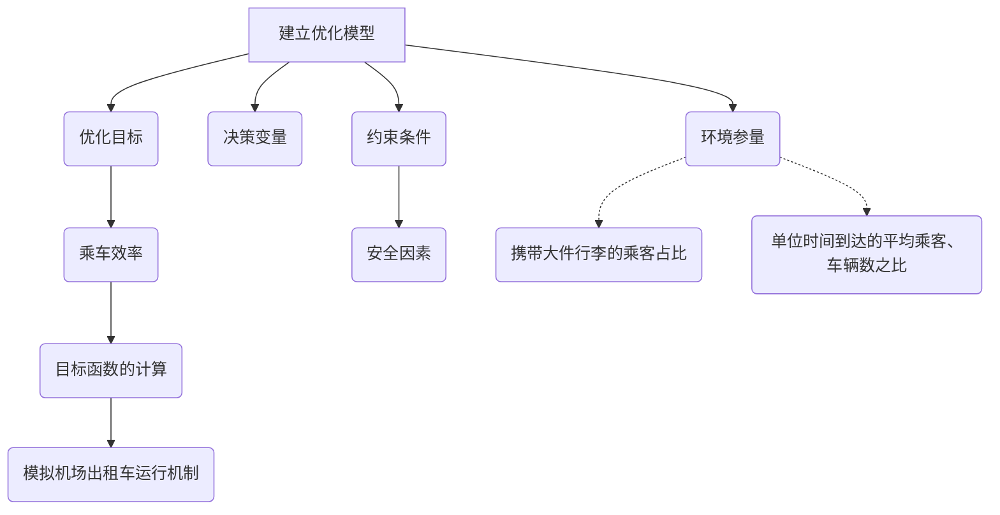
```mermaid
graph TD
  A["建立优化模型"] --> B("优化目标")
  A --> C("决策变量")
  A --> D("约束条件")
  A --> E("环境参量")
  B --> F("乘车效率")
  F --> G("目标函数的计算")
  G --> H("模拟机场出租车运行机制")
  D --> I("安全因素")
  E -.-> J("携带大件行李的乘客占比")
  E -.-> K("单位时间到达的平均乘客、车辆数之比")
```
</details>

图 10 上车点设置模型思路图

## 4.3.1 模型建立

## (一)优化目标的确定

为了使机场运作高效有序，从乘客和出租车两个方面考虑，既要减少乘客在机场的逗留时间，也要减少出租车在机场的逗留时间。逗留时间定义为乘客等待上车时间与上车时间之和。于是，我们定义乘车效率为平均乘客逗留时间与平均出租车逗留时间之和的倒数，如下式所示：

$$
\eta = \frac {1}{\sum_ {i = 1} ^ {n} t _ {p i} / n + \sum_ {j = 1} ^ {m} t _ {c j} / m} \tag {14}
$$

其中， $\eta$ 为乘车效率， $n$ 和 $m$ 为研究范围内的总乘客数与总出租车数， $t_{pi}$ 为第 $i$ 位乘客的逗留时间， $t_{cj}$ 为第 $j$ 辆出租车的逗留时间。

## (二) 约束条件分析

若开放的上车点数量过多，将会导致车辆管理与乘客安排的难度加大，容易造成不安全事件的发生，故我们设定上车点数量不超过12个。

$$
k \leq 1 2 \tag {15}
$$

其中，k 为上车点的数量。

## (三)决策变量和环境参量分析

我们以上车点数量 k 为单决策变量，则上车点数量与方案呈一一对应关系。另外，我们引入多种不同环境对最优方案选择的影响并在结果中进行分析讨论。

这里，我们考虑了两个可能对方案设计有影响的环境参量：单位时间到达机场的平均出租车数与平均人数之比 $\alpha_{1}$ 、携带大件行李乘客的占比 $\alpha_{2}$ 。其中 $\alpha_{1}=\lambda_{1}/\lambda_{2}$ ， $\lambda_{1}$ 为平均每分钟到达机场的出租车数， $\lambda_{2}$ 为平均每分钟到达机场的乘客数。

## (四) 模拟系统运行规则的设定

为了能够计算各种环境下每个方案的目标函数值, 我们用计算机模拟的方法来描述机场出租车乘客区的运行情况, 通过合理的规则设定, 使得在问题得以简化的同时也能够反映问题的本质。

系统示意图如右图所示（以六个上车点为例），各环节的规则设定如下：

## 1. 车流和人流的生成

设定每分钟到达的出租车和乘客数量都服从泊松分布，平均每分钟到达数分别为 $\lambda_{1}$ 和 $\lambda_{2}$ ，其中到达的乘客分为大行李乘客和小行李乘客两类，携带大件行李乘客的占比 $\alpha_{2}$ 。

车流生成后进入蓄车池中排队等待再进入乘车区，新生成的车辆排到蓄车池的末位位置；人流生成后到各

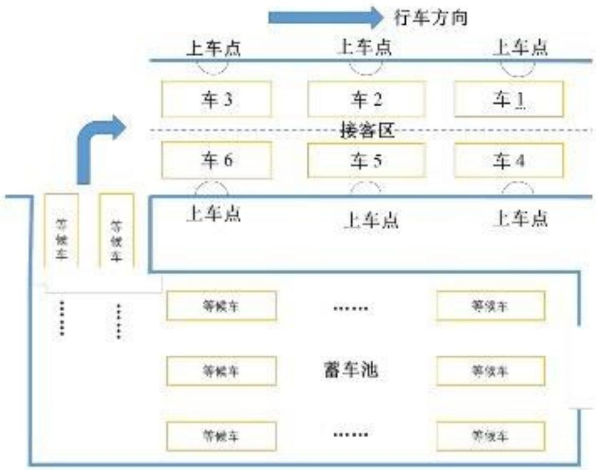

<details>
<summary>flowchart</summary>

This diagram illustrates the transportation route and vehicle arrangement for a bus, showing how cars are routed to a terminal area via a passenger zone.
</details>

图 11 出租车接客系统示意图

个上车点等待上车, 新生成的乘客会优先选择所有上车点中排队人数最少的上车点进行排队或者直接上车, 若有多辆车可乘或多列队伍排队人数相同, 则优先选择前排的上车点。

每辆车和每位乘客都安装有计时器，在生成后的初始时刻开始计时，直至离开乘车区计时结束，最终计时器将会显示第 i 为乘客的逗留时间 $t_{pi}$ ，及第 j 辆出租车的逗留时间的时间 $t_{cj}$ ，计时的最小单位为分钟。

## 2. 乘车区的设置

乘车区内设置有两列并行的车道及 k 个上车点，如图 11 所示。每个上车点对应着一个出租车停靠点。

## 3. 车辆从蓄车池进入乘车区

采取分批进入乘车区方法，当原本乘车区内的出租车全部离开后，再从蓄车池内调出与上车点数相同数量的出租车，共同驶入乘车区的各个对应上车点，各辆车从蓄车池进入乘车区所耗费的时间相同。若蓄车池内车辆数小于上车点数，则等待新的车辆生成，直至数量不低于上车点数时，再共同前往乘车区。

## 4. 车辆载客

当车辆进入乘车区到达指定上车点后，若此时上车点有乘客，则直接上车；否则等待至乘客到来。携带大件行李和小件行李的乘客上车时间分别为 $t_{l}, t_{h}$ 。

## 5. 车辆离开乘车区

乘客上车完毕后，出租车即处于待启动状态，若该时刻前方无停靠车辆，则启动车辆，并于1min后驶离乘车区，若该时刻前方有车则等待1min后再此观测，直至前方无车再驶离乘车区。

## 6. 观测区间内的总乘客数 n 与总车辆数 m

设置以截止时间 $T_{c}$ ，该时刻之后不再产生车流与人流，继续以既定方式运作，直至车辆或乘客有一方全部离开机场。统计全时间段内，能够离开机场的乘客数 n 与车辆数 m，即为需要被观测逗留时间的对象。

其中，对截止时刻后车辆离开乘车区的方法以修正，当车辆数少于上车点数时，仍然全部驶入乘车区。

按照以上运行方式进行模拟，经过对乘客与出租车计数器示数的统计，并代入式(14)进行计算即可得到每种上车点数量对应的乘车效率。

## (五)优化模型汇总

经过前面的分析，得到汇总后的优化模型如下：

$$
\begin{array}{l} \max \eta = \frac {1}{\sum_ {i = 1} ^ {n} t _ {p i} / n + \sum_ {j = 1} ^ {m} t _ {c j} / m} \\ s. t. \quad k \leq 1 2 \end{array} \tag {16}
$$

其中 $\eta=f(k)$ ，上式是优化目标、约束条件、决策变量的综合， $\eta=f(k)$ 是从方案映射到乘车效率的计算方法，f 函数代表了模拟系统内部的运作过程，这里无法显示表达。

## 4.3.2 模型求解

根据前面建立的模型，我们采用算法实现这个系统模拟的过程，算法具体实现涉及排队论模拟、元胞自动机、有限状态机设计的知识，算法流程图如图12。

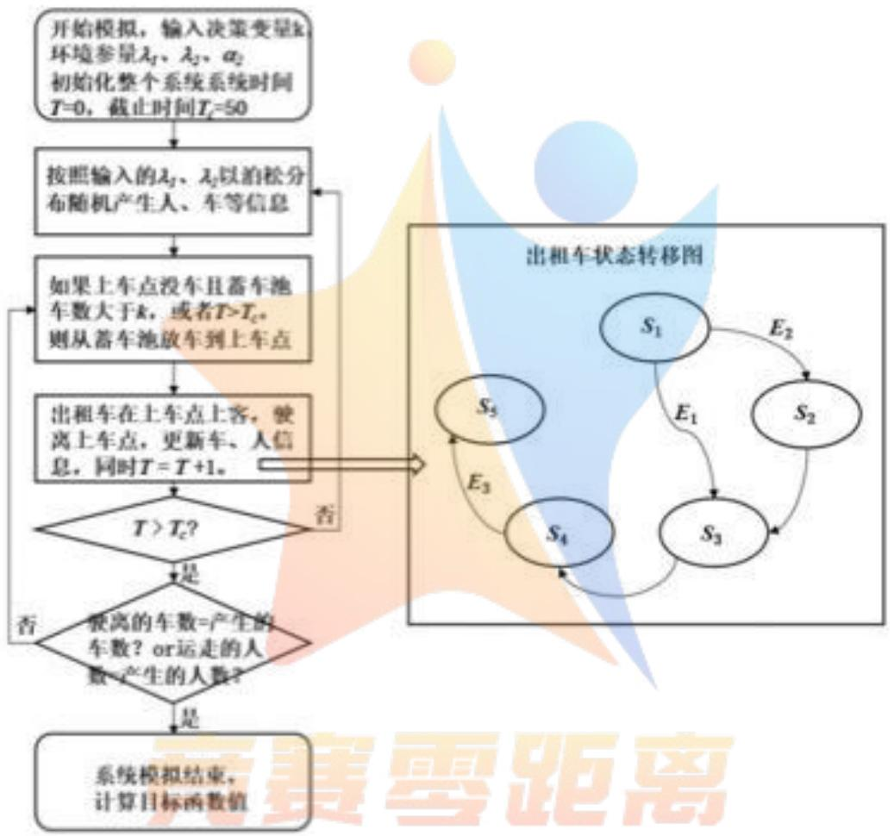

<details>
<summary>flowchart</summary>

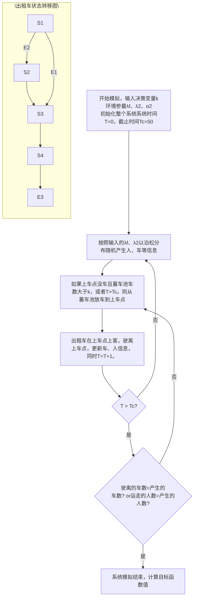
```mermaid
graph TD
  A["开始模拟，输入决策变量k\n环境参量λf、λ2、α2\n初始化整个系统系统时间T=0，截止时间Tc=50"] --> B["按照输入的λf、λ2以泊松分布随机产生人、车等信息"]
  B --> C["如果上车点没车且蓄车池车数大于k，或者T>Tc。则从蓄车池放车到上车点"]
  C --> D["出租车在上车点上客，驶离上车点，更新车、人信息，同时T=T+1。"]
  D --> E{"T > Tc?"}
  E -->|否| B
  E -->|是| F{"驶离的车数=产生的\n车数? or运走的人数=产生的人数?"}
  F -->|否| C
  F -->|是| G["系统模拟结束，计算目标函数值"]
  
  subgraph sg["\"出租车状态转移图\""]
    direction TB
  S1["S1"] -->|E2| S2["S2"]
  S2 --> S3["S3"]
  S3 --> S4["S4"]
  S4 --> E3["E3"]
  S1 -->|E1| S3
  end
```
</details>

图 12 算法流程及出租车状态转移图

首先我们观察出租车的状态转移情况。在状态转移框图中，出租车共有五个状态 S1、S2、S3、S4、S5；其中 S1——未上客、S2——正在上客 1、S3——正在上客 2、S4——上客结束、S5——驶离上车点。共有 3 个事件可以改变出租车的状态 E1、E2、E3；其中 E1——所在上车点有一个轻行李乘客排队、E2——所在上车点有一个重行李乘客排队、E3——出租车位置在第 1、2 个上车点或者前面上车点没有出租车。框图中标出了能引起出租车状态发生转移的事件，若事件不能引起状态转移，则没有在框图中标出，并且在图 12 右侧图中没有标记事件的线来代表下一个时刻状态会发生转移。

接着，我们具体探究整个模拟系统的工作流程。模拟系统的输入是上车点数 $k$ 和环境变量，包括平均每分钟到达机场的出租车数 $\lambda_{1}$ ，平均每分钟到达机场的乘客数 $\lambda_{2}$ ，还有携带大件行李乘客的占比 $\alpha_{2}$ 。

接收到输入后，系统开始初始化，将系统时间 T 设置为 0，同时设置一个系统停止产生乘客和车辆的时间 $T_{c}=50$ 。

当 $T<T_{c}$ 时，系统产生满足 $\lambda_{1}$ 为均值的泊松分布随机数 Car\_t，然后产生 Car\_t 个车辆数据记录元胞 cell\_car 来记录每个车辆的信息。同理，对于乘客，系统产生满足 $\lambda_{2}$ 为均值的泊松分布随机数 P\_t，然后产生 P\_t 个车辆数据记录元胞 cell\_p 来记录每个乘客的信息。

然后将出租车从蓄车池放行到接客区，在 $T < T_{c}$ 时，需要满足以下两个条件才会放行：(1)上车点已经没有车，这是为了保证司机和乘客的安全；(2)蓄车池中等候的车数不少于上车点个数 $k$ 。因为我们要分批放行，每次放行的车辆数等于上车点个数，若蓄车池中车辆数不够，则需等待后来产生在蓄车池中的车。但是当 $\mathrm{T} > T_{c}$ 时，只需要满足上车点没有车这个条件就能放行，这是因为就算蓄车池中车辆数不足 $k$ 个，但是由于 $T > T_{c}$ ，已经不会有新的车辆产生，所以就算等待，也不可以达到 $k$ 个，于是我们选择将剩下的车全部放行。

当出租车到达上车点之后，就需要进行上车操作，这时，我们将每个出租车看作一个有限状态机，其状态和事件在前面已经叙述。每个时刻系统会更新出租车的状态和乘客的信息，实现出租车载客、驶离上车点、乘客上车、离开机场的整个过程。

之后我们判断当前时间 T 是否大于 $T_{c}$ ，如果否，则返回第二步并按一定概率分布随机生成乘客和出租车。如果是，则只执行放行和上车的操作。

在 $T > T_{c}$ 时，我们要判断系统是否达到终止条件，如果乘客或者出租车全部驶离了机场，我们就认为到达系统模拟的终止条件，否则继续放行上客。

## 4.3.3 模型结果

乘车效率和上车点设置有关系，但在不同环境情况下，上车点的设置也可能不尽相同，于是我们分别讨论车多于人、人多于车、人车数量基本相等、以及乘客携带行李多少比例各异的情况下，如何设置上车点和管理乘客上车。

对于车多于人的情况，我们假设 $\lambda_{1}=4,\lambda_{2}=1,\alpha_{2}=0.5$ ，即平均每秒产生 4 个出租车、而平均每秒只有 1 个乘客需要乘坐出租车，同时乘客中有一半的乘客带着重行李。

采用前面叙述的求解过程，得到的一组模拟结果如表 5:

表 5 $\lambda_{1}=4,\lambda_{2}=1,\alpha=0.5$ 时的一组模拟结果

<table><tr><td>系统结束时间(分钟)</td><td>人车产生结束时间(分钟)</td><td>产生车辆总数(辆)</td><td>产生乘客总数(人)</td><td>轻行李人数(人)</td><td>重行李人数(人)</td></tr><tr><td>51</td><td>50</td><td>191</td><td>42</td><td>23</td><td>19</td></tr><tr><td>人群总用时(分钟)</td><td>车辆总用时(分钟)</td><td>平均每个乘客用时(分钟)</td><td>平均每辆出租车用时(分钟)</td><td>上车点数量(个)</td><td>目标函数值</td></tr><tr><td>105</td><td>934</td><td>2.5</td><td>4.9</td><td>2</td><td>0.135</td></tr></table>

从表 5 可见，当设置上车点数量 k 为 2 时，平均每个乘客从在上车点排队开始到乘坐上出租车驶离机场用时 2.5 分钟，平均每辆出租车从在蓄车池中排队，到接到乘客离开机场用时 4.9 分钟，这时对应的目标函数值为 0.135。

但是，该模拟过程中有很多随机因素共同影响系统输出结果，比如每秒具体产生了多少乘客和出租车，每个乘客具体的携带行李情况等，所以为了较为准确得到 k=2 时的乘车效率，需要我们进行多次模拟，然后取平均值。

下面我们就 $\lambda_{1}=4,\lambda_{2}=1,\alpha_{2}=0.5$ 的环境参数，设置不同的上车点数量 k，来探究在这种环境下，k 对乘车效率的影响，得到结果如下图 13a).

图 13 a). 中，每个上车点数量对应的用时，都是通过系统模拟 100 次，然后取平均的结果，从图 13 a). 可见，上车点数量为 4 时，乘客的平均用时和出租车的平均用时都达到最小，乘客平均用时 1.9 分钟，出租车平均用时 19.9 分钟，此时目标函数值也达到最大 0.0465，这时的乘车效率最高。此后，随着上车点数量的增加，乘客和出租车所用的时间也逐渐增加，所以当车多于人时，最优的上车点设置数量为 4 个。

我们从图 13 a). 还可以看出，并不是上车点越多，乘客、出租车用的时间就越短。这是因为每次放车都是等接客区内所有车都完了才能放车，在上车点数量多，但是乘客较少的情况下，同一批车全部走完的时间需要很久，导致后方车辆全部滞留在蓄车池里面，降低了乘车效率。

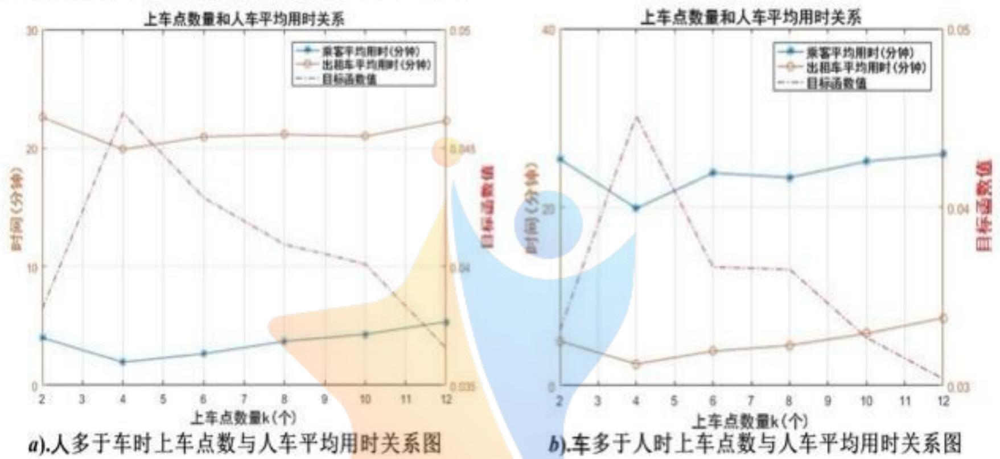  
图 13 上车点数与人车平均用时关系图

下面我们考虑人多于车的情况，设置 $\lambda_{1}=1,\lambda_{1}=4,\alpha_{2}=0.5$ ，得到上图 13 b).

从图 13 b). 可见，当人多于车，且上车点数量为 4 个时，乘客的平均用时和出租车的平均用时都达到最小，乘客平均用时 20 分钟，出租车平均用时 2 分钟，此时目标函数值也达到最大 0.045，这时的乘车效率最高。此后，随着上车点数量的增加，乘客和出租车所用的时间也逐渐增加，所以当车多于人时，最优的上车点设置数量为 4 个。

这个结果和车多于人的情况相似，但是原因不同，我们可以看到，车多于人的时候，车的平均排队时间远大于人的排队时间，但是人多于车的时候，人的排队时间远大于车的排队时间。同时，在人多于车的情况，当 $k$ 很大时，车辆产生的数量很少，且每次要等待蓄车池中车辆数达到 $k$ 后才能放车，这将导致出租车和乘客的等待时间增加。结果也显示，乘车效率并不是一直随着 $k$ 的增加而增加，在 $k > 4$ 之后，随着 $k$ 的增加而减小。

最后我们考虑一般情况，当人和车的数量相当时，设置 $\lambda_{1}=3, \lambda_{2}=3, \alpha_{2}=0.5$ ，得到结果如图14。从图14可见，上车点数量越多，乘客和出租车平均用时越短，目标函数越大，说明乘车效率越高，但是我们还要同时考虑安全性。开放的上车点越多，越难以管理，安全性越低。观察图14，我们看到当 k=8 之后，随着 k 的增加，目标函数值虽然在增加，但是增加的幅度不大，而在 k<8 之前，目标函数值随着 k 的增加而增大的趋势很明显，于是在乘车效率和安全性之间做一个折中，我们选择 k=8 时，乘车效率较高，而且安全也得到较好的保障，此时乘客平均用时为3.8分钟，出租车平均用时为4.2分钟，目标函数值为0.135。

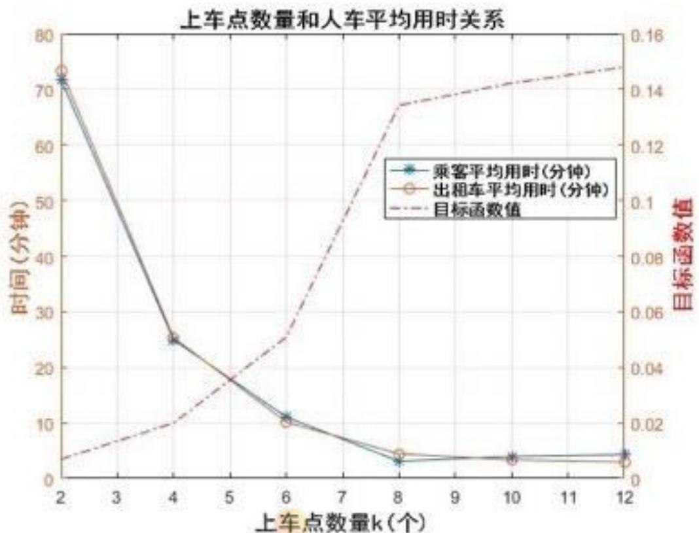

<details>
<summary>line</summary>

| 上车点数量k (个) | 乘客平均用时 (分钟) | 出租车平均用时 (分钟) | 目标函数值 |
| --- | --- | --- | --- |
| 2 | ~72 | ~74 | ~0.01 |
| 4 | ~25 | ~25 | ~0.02 |
| 6 | ~11 | ~10 | ~0.05 |
| 8 | ~3 | ~4 | ~0.13 |
| 10 | ~4 | ~3 | ~0.14 |
| 12 | ~4 | ~3 | ~0.15 |
</details>

图 14 人和车数量相当时上车点数量与人车平均用时的关系

除了要考虑人、车数量,我们还要考虑乘客携带行李轻重情况对结果的影响。我们设置参数 $\lambda_{1}=3,\lambda_{2}=3,k=8$ ，改变 $\alpha_{2}$ ，得到结果如图 15:

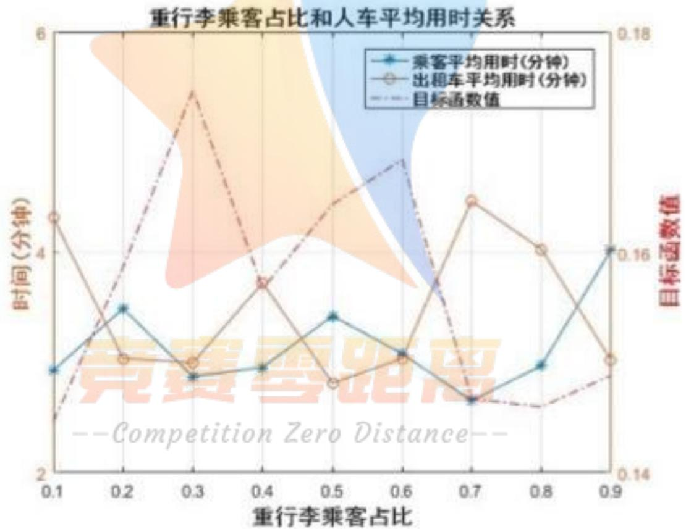

<details>
<summary>line</summary>

| 重行李乘客占比 | 乘客平均用时 (分钟) | 出租车平均用时 (分钟) | 目标函数值 |
| --- | --- | --- | --- |
| 0.1 | ~2.8 | ~4.3 | ~0.15 |
| 0.2 | ~3.3 | ~2.9 | ~0.16 |
| 0.3 | ~2.7 | ~2.8 | ~0.17 |
| 0.4 | ~2.8 | ~3.6 | ~0.15 |
| 0.5 | ~3.2 | ~2.7 | ~0.16 |
| 0.6 | ~2.9 | ~2.9 | ~0.17 |
| 0.7 | ~2.6 | ~4.4 | ~0.15 |
| 0.8 | ~2.8 | ~4.0 | ~0.15 |
| 0.9 | ~4.0 | ~2.9 | ~0.15 |
</details>

图 15 乘客行李轻重情况与人车平均用时关系图

从图 15 可见，乘客行李轻重占比虽然对人车平均用时有影响，但是这种影响效果很小，而且趋势不明显，我们看到在不同行李轻重情况下，乘客最长等待时间为 4 分钟，最短时间为 3 分钟，而出租车最长等待时间为 4.5 分钟，最短时间 3 分钟，所以行李这个因素对乘客和出租车平均等待用时的影响不大。

## 4.4 最优排队方案模型

为了使出租车的收益尽量均衡,现考虑为短途载客返回的出租车给予一定的优先权,重新设置排队方案。[8]为此,我们分别研究了大多数出租车在机场与市区间的往返情况,以及短程载客的出租车在机场与市区间的往返情况,对比两者在相同观测时间段内的收益与相同观测空间内的空载率,搜索寻找使得长短途出租车的收益差值与空载率差值都相对较小的短途出租车位置作为最终的排队方

案。

## 4.4.1 模型建立

根据生活常识来说，在机场排队等待乘客的出租车绝大多数都是从市区长途载客到达机场，很少一部分是因为从机场短途载客而又折回机场。因此我们认为对一辆短途返回的出租车安排插队方式时，原本正在排队的车列中基本没有另外的短途返回出租车。因此，我们希望达到的效果是，使这辆短途返回的出租车的在特定观测时间内收益值与特定观测空间内的空载率，都能够接近于大多数出租车在对应观测范围的情况。

## (一)短途载客返回出租车在机场与城市间的往返情况

在我们设定的观测时间范围内短途车有如下活动流程：

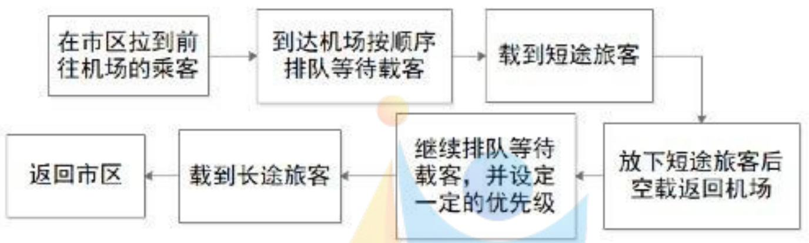

<details>
<summary>flowchart</summary>


```mermaid
graph LR
  A["在市区拉到前往机场的乘客"] --> B["到达机场按顺序排队等待载客"]
  B --> C["载到短途旅客"]
  C --> D["放下短途旅客后空载返回机场"]
  D --> E["继续排队等待载客，并设定一定的优先级"]
  E --> F["载到长途旅客"]
  F --> G["返回市区"]
```
</details>

图 16 观测时间内短途车活动流程

根据上面的流程图, 我们可以看到, 定义的观测空间范围为该辆车从市区出发至再次返回市区, 观测的时间范围为短途车从市区出发至再次返回市区所耗的时间。

若短途车在短途返程后优先排到了第 $m_{0}$ 位，则在观测空间内，短途车的空载率可由下式表示：

$$
\begin{array}{l} \beta_ {\text {short}} = \frac {m / v _ {\text {leave}} + x _ {\text {short}} / v _ {\text {taxi}} + m _ {0} / v _ {\text {leave}}}{L / v _ {\text {taxi}} + m / v _ {\text {leave}} + x _ {\text {short}} / v _ {\text {taxi}} + x _ {\text {short}} / v _ {\text {taxi}} + m _ {0} / v _ {\text {leave}} + L / v _ {\text {taxi}}} \tag {17} \\ = \frac {m / v _ {\text {leave}} + x _ {\text {short}} / v _ {\text {taxi}} + m _ {0} / v _ {\text {leave}}}{2 L / v _ {\text {taxi}} + m / v _ {\text {leave}} + 2 x _ {\text {short}} / v _ {\text {taxi}} + m _ {0} / v _ {\text {leave}}} \\ \end{array}
$$

公式各项的解释： $\beta_{short}$ 为短途车空载率，含义为空载时间与总观测时间之比； $2L/v_{taxi}$ 为长途载客时间， $2x_{short}/v_{taxi}$ 为短程往返时间，m/vleave 和 m0/vleave 分别为第一次与第二次的排队等待时间。其中，m 为队列长度，由于忙期时间段内机场排队的车辆长度基本不变，即 m 为一确定参量； $v_{leave}$ 为机场出租车通行能力； $v_{taxi}$ 为出租车平均车速； $x_{short}$ 为短途距离；L 为机场到市中心的距离。

在观测时间内，短途车单位时间收益可由下式表示：

$$
W _ {s h o r t} = \frac {2 W _ {L} + W _ {x}}{2 L / v _ {t a x i} + m / v _ {l e a v e} + 2 x _ {s h o r t} / v _ {t a x i} + m _ {0} / v _ {l e a v e}} \tag {18}
$$

其中，分母在前一个公式已经将进行了解释，分子中的 $2W_{L}$ 为往返长途载客的收益， $W_{x}$ 为短程载客的收益。根据第一节中对于出租车收支来源的计算方法，即可进行收益的计算，这里不再列出公式。

## (二)多数出租车在机场与城市间的往返情况

多数长途出租车在相同观测时间内会经历如下动作：


<details>
<summary>flowchart</summary>


```mermaid
graph LR
  A["在市区拉到前往机场的乘客"] --> B["到达机场按顺序排队等待载客"]
  B --> C["载到返回市区的乘客"]
  C --> D["到达市区后继续在市区内运营"]
```
</details>

图 17 观测时间内长途车活动流程

可见，在观测时间内，长途车与短途车相比，所经历的动作少了短程往返和第二次排队的过程，而增加了在市内运营的时间。但观测空间仍然设定为从市区出发到回到市区的过程，即观测空间并不包括在市区内运营的情况。

那么，长途出租车在观测空间内的空载率可表示为：

$$
\beta_ {\text {long}} = \frac {m / v _ {\text {leave}}}{2 L / v _ {\text {taxi}} + m / v _ {\text {leave}}} \tag {19}
$$

其中，m 为队列长度，由于忙期时间段内机场排队的车辆长度基本不变，即 m 为一确定参量；vleave 为机场出租车通行能力； $v_{taxi}$ 为出租车平均车速；L 为机场到市中心的距离。

长途出租车在观测时间内单位时间的收益可表示为：

$$
W _ {l o n g} = \frac {2 W _ {L} + W _ {c i t y} (T)}{2 L / v _ {t a x i} + m / v _ {l e a v e} + T} \tag {20}
$$

其中， $2W_{L}$ 为往返长途载客的收益； $W_{city}(T)$ 为返回市区后在市区内拉客的收益；T 为在市区内运营的时间，根据长短途车的观测时间相同可以推知 T 的取值。收益计算方法在第一节中已经给出，这里不再进行说明。

## (三)建立优化模型

综合上面对两种情况出租车的讨论，我们得到优化模型如下：

$$
\min g (m _ {0}) = \varepsilon_ {1} \left(\frac {\beta_ {\text {long}} - \beta_ {\text {short}}}{\Delta \beta_ {\max}}\right) ^ {2} + \varepsilon_ {2} \left(\frac {W _ {\text {long}} - W _ {\text {short}}}{\Delta W _ {\max}}\right) ^ {2} \tag {21}
$$

其中， $\varepsilon_{1}$ 和 $\varepsilon_{2}$ 为权重因子， $\Delta \beta_{max}$ 和 $\Delta W_{max}$ 为归一化因子。变量的计算方法如下：

$$
\left\{ \begin{array}{l} \beta_ {\text {short}} = \frac {m / v _ {\text {leave}} + x / v _ {\text {taxi}} + m _ {0} / v _ {\text {leave}}}{2 L / v _ {\text {taxi}} + m / v _ {\text {leave}} + 2 x / v _ {\text {taxi}} + m _ {0} / v _ {\text {leave}}} \\ W _ {\text {short}} = \frac {2 W _ {L} + W _ {x}}{2 L / v _ {\text {taxi}} + m / v _ {\text {leave}} + 2 x / v _ {\text {taxi}} + m _ {0} / v _ {\text {leave}}} \\ \beta_ {\text {long}} = \frac {m / v _ {\text {leave}}}{2 L / v _ {\text {taxi}} + m / v _ {\text {leave}}} \\ W _ {\text {long}} = \frac {2 W _ {L} + W _ {\text {city}} (T)}{2 L / v _ {\text {taxi}} + m / v _ {\text {leave}} + T} \end{array} \right. \tag {22}
$$

环境参量为系统的输入，即短途历里程 $x_{short}$ ；决策变量为短途车在队列中的次序 $m_{0}$ 。下面将通过优化算法寻找给定 $x_{short}$ 下的最优排队次序 $m_{0}$ 。

## 4.4.2 模型求解

根据前面建立的模型, 我们根据短途车上一个短途单的行驶里程 $x_{short}$ , 来判断它这次应该优先安排在什么位置。

优先安排的最终目的是为了使短途车和长途车在空载率和单位时间的收益上都尽量均衡，于是我们先直观地观察短途车空载率、收益与上一个短途单的关系，如图 18 所示。

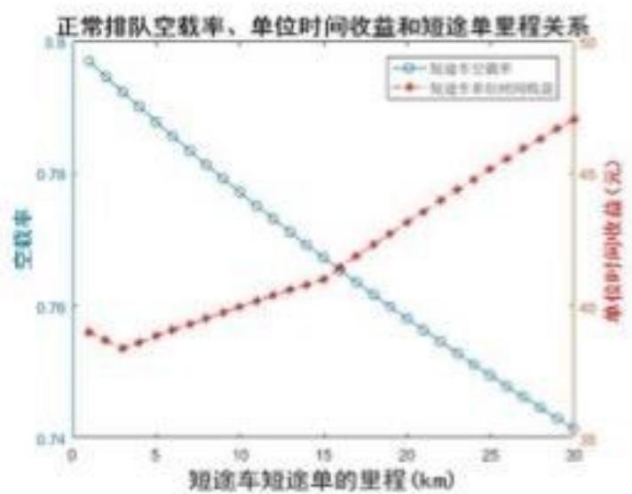

<details>
<summary>line</summary>

| 短途车短途单的里程 (km) | 空载率 | 单位时间收益 (元) |
| --- | --- | --- |
| 1 | ~0.798 | ~39 |
| 3 | ~0.794 | ~38 |
| 5 | ~0.790 | ~39 |
| 7 | ~0.786 | ~40 |
| 9 | ~0.782 | ~41 |
| 11 | ~0.778 | ~42 |
| 13 | ~0.774 | ~43 |
| 15 | ~0.770 | ~44 |
| 16 | ~0.766 | ~45 |
| 18 | ~0.762 | ~46 |
| 20 | ~0.758 | ~47 |
| 22 | ~0.754 | ~48 |
| 24 | ~0.750 | ~49 |
| 26 | ~0.746 | ~50 |
| 28 | ~0.742 | ~51 |
| 30 | ~0.738 | ~52 |
</details>

图 18 短途车短途单行驶里程对空载率和收益的影响图

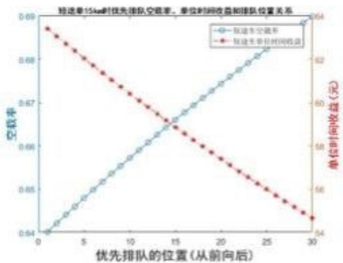

<details>
<summary>line</summary>

| 优先排队的位置 (从前向后) | 航运客机空载率 | 单位时间收益 (元) |
| --- | --- | --- |
| 0 | 0.04 | ~63.5 |
| 1 | ~0.042 | ~63.2 |
| 2 | ~0.044 | ~62.9 |
| 3 | ~0.046 | ~62.6 |
| 4 | ~0.048 | ~62.3 |
| 5 | ~0.05 | ~62.0 |
| 6 | ~0.052 | ~61.7 |
| 7 | ~0.054 | ~61.4 |
| 8 | ~0.056 | ~61.1 |
| 9 | ~0.058 | ~60.8 |
| 10 | ~0.06 | ~60.5 |
| 11 | ~0.062 | ~60.2 |
| 12 | ~0.064 | ~59.9 |
| 13 | ~0.066 | ~59.6 |
| 14 | ~0.068 | ~59.3 |
| 15 | ~0.07 | ~59.0 |
| 16 | ~0.072 | ~58.7 |
| 17 | ~0.074 | ~58.4 |
| 18 | ~0.076 | ~58.1 |
| 19 | ~0.078 | ~57.8 |
| 20 | ~0.08 | ~57.5 |
| 21 | ~0.082 | ~57.2 |
| 22 | ~0.084 | ~56.9 |
| 23 | ~0.086 | ~56.6 |
| 24 | ~0.088 | ~56.3 |
| 25 | ~0.09 | ~56.0 |
| 26 | — | ~55.7 |
| 27 | — | ~55.4 |
| 28 | — | ~55.1 |
| 29 | — | ~54.8 |
| 30 | — | ~54.5 |
</details>

图 19 优先排队位置和空载率、收益的关系图

从图中我们可知, 短途车上一个短途单的行驶里程越短, 空载率越高, 单位时间的收益也越小。在 $0 \sim 3 \mathrm{~km}$ 之内, 收益有一个增加现象是因为出租车起步价较高的原因, 但是机场高速距离大于 $3 \mathrm{~km}$ , 故不会有乘客在 $0 \sim 3 \mathrm{~km}$ 下车, 所以不考虑 $0 \sim 3 \mathrm{~km}$ 内收益随里程增加而减少的极端情况。

但是, 我们可以通过有线安排短途车的排队位置来提高短途车单位时间的收益, 同时降低短途车的空载率。以上一个短途单为 $15 \mathrm{~km}$ 为例, 优先排队位置和空载率、收益关系如上图 19.

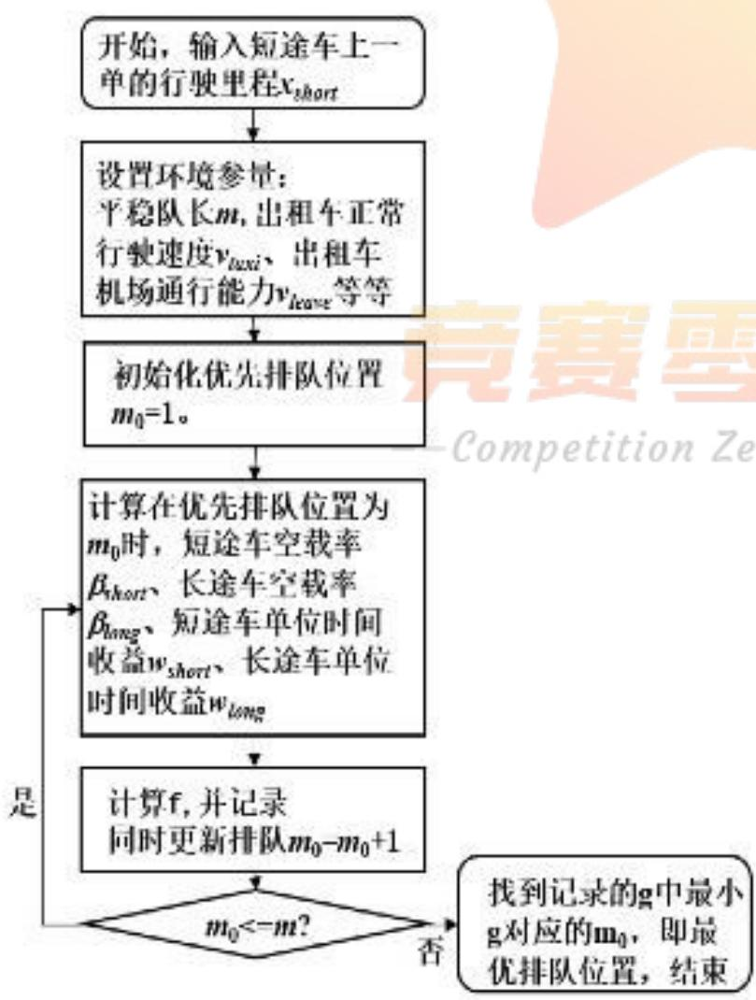

<details>
<summary>flowchart</summary>

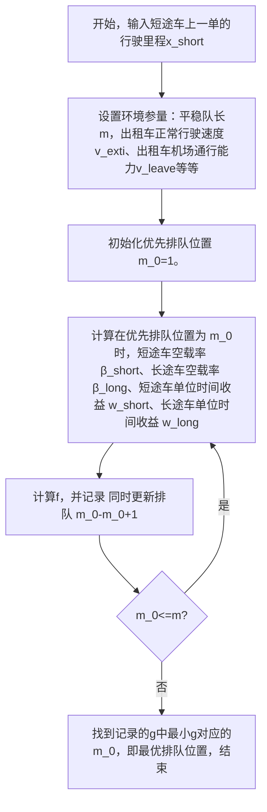
```mermaid
graph TD
  A["开始，输入短途车上一单的行驶里程x_short"] --> B["设置环境参量：平稳队长m，出租车正常行驶速度v_exti、出租车机场通行能力v_leave等等"]
  B --> C["初始化优先排队位置 m_0=1。"]
  C --> D["计算在优先排队位置为 m_0时，短途车空载率 β_short、长途车空载率 β_long、短途车单位时间收益 w_short、长途车单位时间收益 w_long"]
  D --> E["计算f，并记录 同时更新排队 m_0-m_0+1"]
  E --> F{"m_0<=m?"}
  F -->|是| D
  F -->|否| G["找到记录的g中最小g对应的m_0，即最优排队位置，结束"]
```
</details>

图 20 搜寻最优安排方案的算法流程图

从图 19 可见，优先排队的位置越靠前，短途车的空载率越低并且短途车单位时间的收益越大。我们的优先安排方案是使短途车的空载率、单位时间收益尽量和长途车相等，但是由于使空载率最接近的排队位置不一定是使单位时间收益最接近的排队位置，于是我们综合考虑两者，得到最佳的排队位置即优先安排方案。

我们设置具体的环境参数 $v_{taxi}=60km/h,\nu_{leave}=60(辆/h),L=25.1km,m=100$ (辆)对于空载率和单位时间收益的权值 $\varepsilon_{1}=0.5,\varepsilon_{2}=0.5$ ，然后当一个短途车到达机场蓄车池之后，我们就能根据该出租车上一个短途单的行驶里程搜寻到一个最优的排队位置，让该出租车在空载率和单位时间收益上都接近正常的长途车。搜索最优安排方案的算法流程图如左图20所示。

## 4.4.3 模型结果

首先，我们观察当改变优先排队位置时，短途车空载率、收益与长途车的对比，以直观找到较优的排队位置。我们假设机场来了一个上一单行程为 15km 的短途车，那么不同排队位置的结果如图 21。

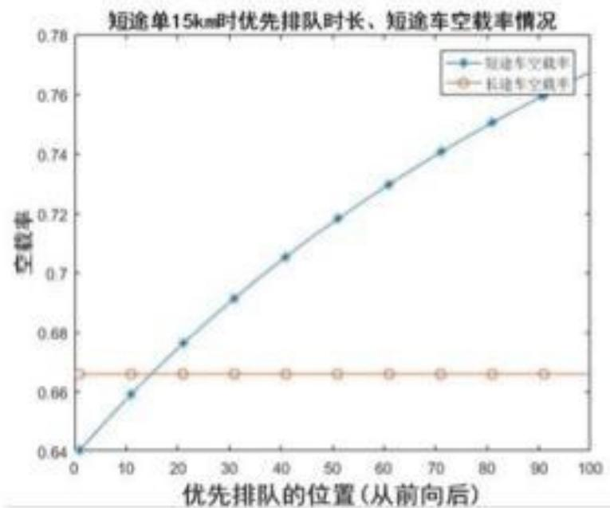

<details>
<summary>line</summary>

| 优先排队的位置 (从前向后) | 短途车空载率 | 长途车空载率 |
| --- | --- | --- |
| 0 | 0.64 | ~0.667 |
| 10 | 0.66 | ~0.667 |
| 20 | 0.677 | ~0.667 |
| 30 | 0.692 | ~0.667 |
| 40 | 0.706 | ~0.667 |
| 50 | 0.719 | ~0.667 |
| 60 | 0.730 | ~0.667 |
| 70 | 0.741 | ~0.667 |
| 80 | 0.751 | ~0.667 |
| 90 | 0.760 | ~0.667 |
</details>

a). 位置对短长途车空载率的影响关系图

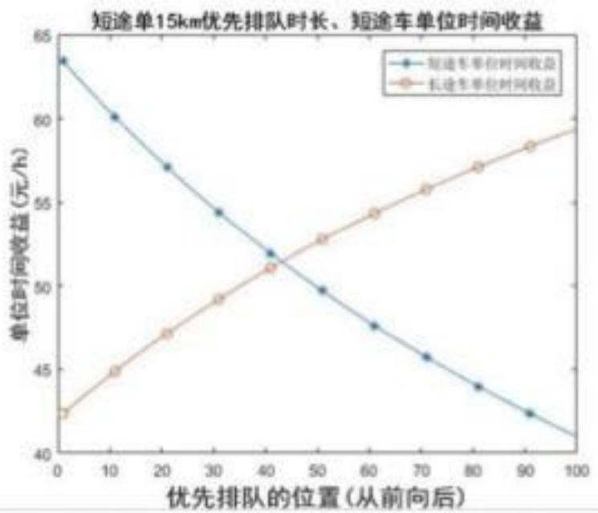

<details>
<summary>line</summary>

| 优先排队的位置 (从前向后) | 短途车单位时间收益 (元/h) | 长途车单位时间收益 (元/h) |
| --- | --- | --- |
| 0 | ~63.5 | ~42.5 |
| 10 | ~60.2 | ~45.0 |
| 20 | ~57.2 | ~47.2 |
| 30 | ~54.5 | ~49.2 |
| 40 | ~52.0 | ~51.2 |
| 50 | ~49.8 | ~53.0 |
| 60 | ~47.5 | ~54.5 |
| 70 | ~45.8 | ~56.0 |
| 80 | ~44.0 | ~57.2 |
| 90 | ~42.5 | ~58.5 |
| 100 | ~41.2 | ~59.5 |
</details>

b). 位置对短长途车单位时间收益的影响关系图  
图 21 位置对短长途出租车空载率及时间效益的影响关系图

从图 21 可见，对于一个 15km 行程的短途车，若只考虑空载率均衡则它应该排在 15 的位置，若只考虑单位时间收益的平衡，那么它应该排在 43 的位置。

应用我们的模型，计算得到，在当把该出租车排在31位时，价值函数g最小为0.0072，此时考虑优先排队之后短途车的空载率0.69，单位时间收益为53元/h。

前面我们假设短途车上一单的行驶里程为 15km，下面我们探究不同短途里程的最优优先排队位置，得到的结果如图 22:

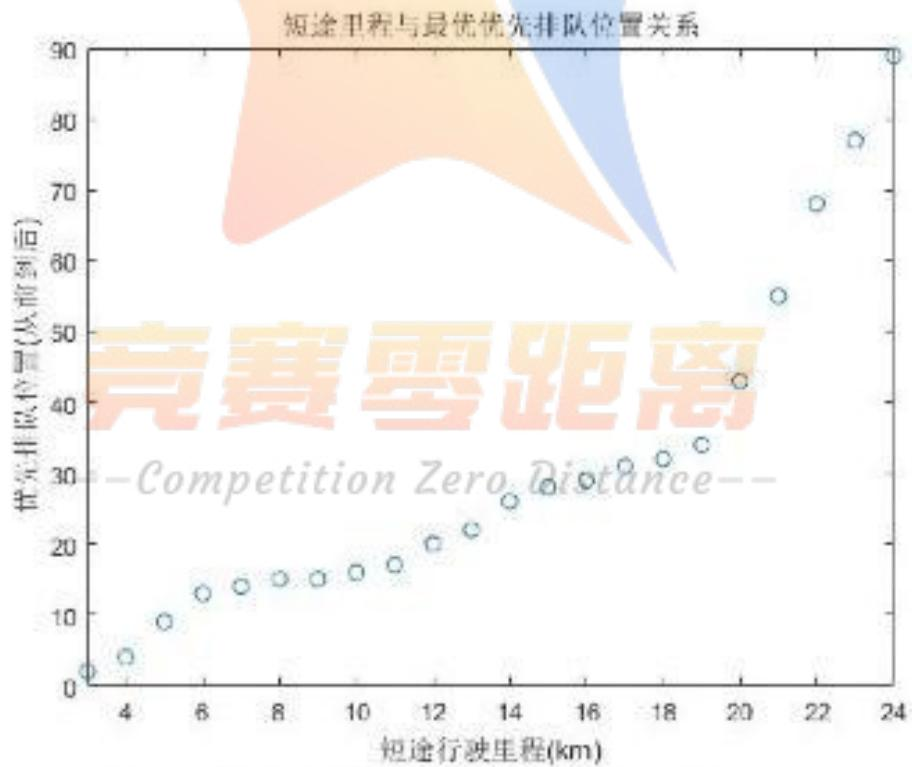

<details>
<summary>scatter</summary>

| 短途行驶里程 (km) | 优先排队位置 (从前到后) |
| --- | --- |
| ~3 | ~2 |
| ~4 | ~4 |
| ~5 | ~9 |
| ~6 | ~13 |
| ~7 | ~14 |
| ~8 | ~15 |
| ~9 | ~15 |
| ~10 | ~16 |
| ~11 | ~17 |
| ~12 | ~20 |
| ~13 | ~22 |
| ~14 | ~26 |
| ~15 | ~28 |
| ~16 | ~29 |
| ~17 | ~31 |
| ~18 | ~32 |
| ~19 | ~34 |
| ~20 | ~43 |
| ~21 | ~55 |
| ~22 | ~68 |
| ~23 | ~77 |
| ~24 | ~89 |
</details>

图 22 短途里程与优先排队位置对应图

从图 22 可见，每一个短途行驶里程，都对应一个最优的排队位置，且短途越短，出租车优先排队位置越靠前，当行驶里程达到 24km 时，优先排队位置为 90，已经接近排队总长度。粗略观察，当行驶里程在 0\~5km 之内，应该排在 10 位之前，当行驶里程在 5\~12km 之内，应该排在 10\~20 位之间，当行驶里程在 12\~20km 之间，应该排在 20\~40 位之间，当行驶里程大于 20km，排队位置迅速接近总队列的尾部。

如果按照图 22 所示的对应关系排队，得到的空载率和单位时间收益结果如图 23。

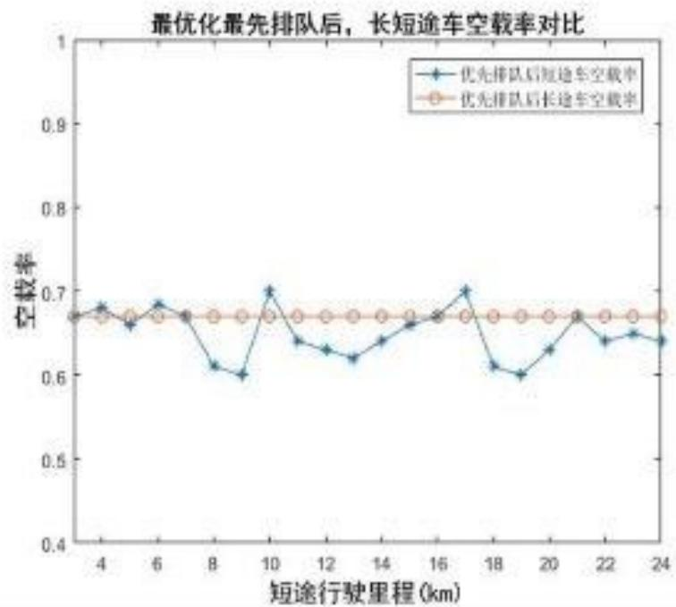

<details>
<summary>line</summary>

| 短途行驶里程 (km) | 优先排队后短途车空载率 | 优先排队后长途车空载率 |
| --- | --- | --- |
| 3 | ~0.67 | ~0.67 |
| 4 | ~0.68 | ~0.67 |
| 5 | ~0.66 | ~0.67 |
| 6 | ~0.68 | ~0.67 |
| 7 | ~0.67 | ~0.67 |
| 8 | ~0.61 | ~0.67 |
| 9 | ~0.60 | ~0.67 |
| 10 | ~0.70 | ~0.67 |
| 11 | ~0.64 | ~0.67 |
| 12 | ~0.63 | ~0.67 |
| 13 | ~0.62 | ~0.67 |
| 14 | ~0.64 | ~0.67 |
| 15 | ~0.66 | ~0.67 |
| 16 | ~0.67 | ~0.67 |
| 17 | ~0.70 | ~0.67 |
| 18 | ~0.61 | ~0.67 |
| 19 | ~0.60 | ~0.67 |
| 20 | ~0.63 | ~0.67 |
| 21 | ~0.67 | ~0.67 |
| 22 | ~0.64 | ~0.67 |
| 23 | ~0.65 | ~0.67 |
| 24 | ~0.64 | ~0.67 |
</details>

a). 排队后里程与长短途车空载率关系图

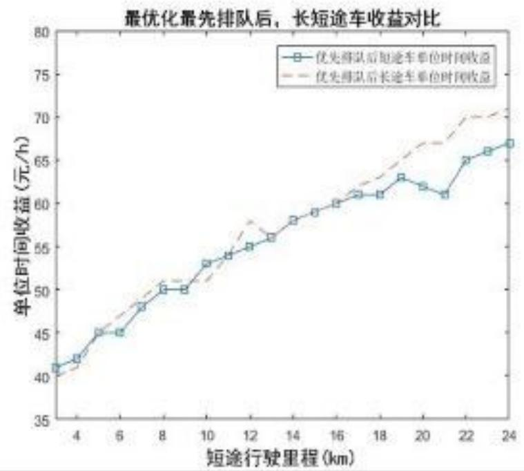

<details>
<summary>line</summary>

| 短途行驶里程 (km) | 优先排队后短途车单位时间收益 (元/h) | 优先排队后长途车单位时间收益 (元/h) |
| --- | --- | --- |
| 3 | ~41.2 | ~40.5 |
| 4 | ~42.2 | ~41.8 |
| 5 | ~45.2 | ~45.2 |
| 6 | ~45.2 | ~47.5 |
| 7 | ~48.2 | ~49.5 |
| 8 | ~50.0 | ~51.0 |
| 9 | ~50.0 | ~51.0 |
| 10 | ~53.2 | ~51.5 |
| 11 | ~54.0 | ~54.5 |
| 12 | ~55.0 | ~58.0 |
| 13 | ~56.2 | ~56.2 |
| 14 | ~58.2 | ~58.2 |
| 15 | ~59.0 | ~59.0 |
| 16 | ~60.0 | ~60.0 |
| 17 | ~61.0 | ~61.5 |
| 18 | ~61.0 | ~63.0 |
| 19 | ~63.0 | ~65.0 |
| 20 | ~62.0 | ~67.0 |
| 21 | ~61.0 | ~67.0 |
| 22 | ~65.0 | ~70.0 |
| 23 | ~66.0 | ~70.0 |
| 24 | ~67.0 | ~71.0 |
</details>

b). 排队后里程与长短途车单位时间收益关系图  
图 23 优先排队后行驶里程与长短途车空载率和单位时间收益关系图

从图 23 可见，当我们按照最优排队方案排队之后，短途车的空载率与长途车的空载率近似相等，并且短途车的单位时间收益与长途车的单位时间收益也近似相等，达到了我们均衡长途车和短途车空载率、收益的目的，反映出这种优先排队方案的合理性。

## 5 模型检验

## 5.1 乘车效率对模拟系统截止时间 ${T}_{c}$ 的灵敏度分析

第三问对机场运行系统的模拟中，我们自行设定了系统运行的截止时间，并且根据这一截止时间确定了观测的乘客与出租车数量。下面我们来分析乘车效率对模拟截止时间 $T_{c}$ 的灵敏度。

我们设置上车点数量 $N=4, \lambda_{1}=3, \lambda_{2}=3, \alpha_{2}=0.5$ ，改变 $T_{c}$ ，观察平均每个乘客用时、每个出租车用时、目标函数值，得到结果如图 24。

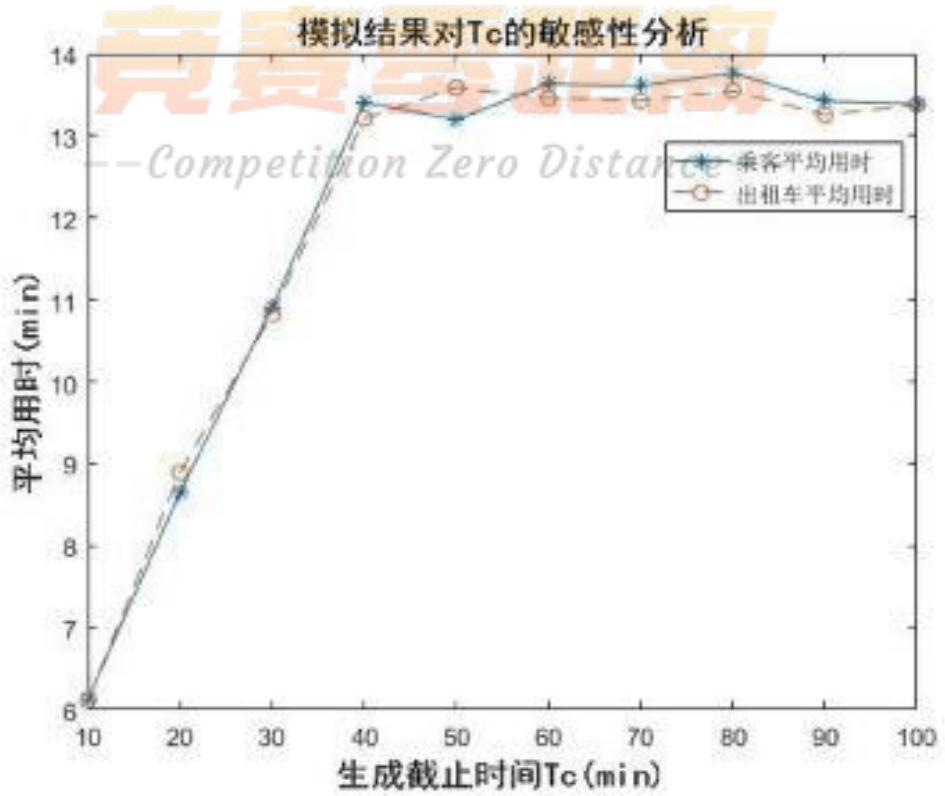

<details>
<summary>line</summary>

| 生成截止时间Tc (min) | 乘客平均用时 (min) | 出租车平均用时 (min) |
| --- | --- | --- |
| 10 | ~6.2 | ~6.2 |
| 20 | ~8.7 | ~8.9 |
| 30 | ~10.9 | ~10.8 |
| 40 | ~13.4 | ~13.3 |
| 50 | ~13.2 | ~13.6 |
| 60 | ~13.6 | ~13.5 |
| 70 | ~13.6 | ~13.4 |
| 80 | ~13.8 | ~13.5 |
| 90 | ~13.4 | ~13.3 |
| 100 | ~13.4 | ~13.4 |
</details>

图 24 截止时间对人车用时的影响

由图 24 可见，当 $T_{c}<40$ 时，人、车用时随着 $T_{c}$ 的增加而增大，说明此时的系统并未稳定，得到的结果是不可靠的。但是当 $T_{c}>40$ 时，人车用时保持恒定，故此时模拟运行的结果与 $T_{c}$ 大小无关，系统结果稳定，证明了我们前面选取 $T_{c}=50(\text{min})$ 是合理的，且得到的结果是正确和稳定的。

## 5.2 权重因子对于排队方案影响

在第四问中，对于空载率和单位时间收益对系统排队的重要性给了两个权重 $\varepsilon_{1}, \varepsilon_{2}$ ，不同的 $\varepsilon_{1}, \varepsilon_{2}$ 组合，对系统排序的结果可能造成影响，下面我们以 $x_{short}=15km$ ，为例，改变不同的 $\varepsilon_{1}, \varepsilon_{2}$ 组合，观察系统做出的最优排队结果，结果如表 6:

表 6 不同权重下系统优先排序结果表

<table><tr><td> $\varepsilon_1, \varepsilon_2$ 的值</td><td>0,1</td><td>0.1,0.9</td><td>0.2,0.8</td><td>0.3,0.7</td><td>0.4,0.6</td><td>0.5,0.5</td></tr><tr><td>短途车优先排队位置</td><td>43</td><td>40</td><td>37</td><td>35</td><td>33</td><td>31</td></tr><tr><td> $\varepsilon_1, \varepsilon_2$ 的值</td><td>0.6,0.4</td><td>0.7,0.3</td><td>0.8,0.2</td><td>0.9,0.1</td><td>1,0</td><td></td></tr><tr><td>短途车优先排队位置</td><td>29</td><td>26</td><td>23</td><td>19</td><td>15</td><td></td></tr></table>

从表 6 可见，当 $\varepsilon_{1}$ ， $\varepsilon_{2}$ 的值分别为 0、1 时，短途车应该被排在 43 的位置，而当 $\varepsilon_{1}$ ， $\varepsilon_{2}$ 的值分别为 1、0 时，短途车应该排在 15 的位置。当两者比例在其他值时，短途车的最优的排队位置在 15\~43 之间，可见， $\varepsilon_{1}$ ， $\varepsilon_{2}$ 的值对系统排队的结果是有一定影响的，这也反映出当我们在空载率、单位时间收益这两者之间做抉择时，会影响我们的排队位置。

## 6 模型评价

## 6.1 模型优缺点

## 6.1.1 优点

● 综合考虑了多种影响司机决策的确定因素与随机因素，从出租车司机的切身思想出发，进行设身处地的思考与建模  
- 分析讨论了多种环境条件下的司机决策策略，验证了模型的可靠性和合理性  
● 通过合理指定机场出租车上客机制计算各种上车点数量下的乘车效率，并且分析讨论了各环境参量对上车点数量安排的影响，对机场管理部门的统筹安排具有建议性

## 6.1.2 缺点

● 确定随机因素服从的分布比较主观，可能对决策结果造成影响  
- 决策模型中考虑的影响因素不够完全，可能导致模型与生活实际中的决策策略有所区别  
● 优先排队模型中，由于时间限制只将出租车种类分为两大类进行讨论，相对与真实生活中的复杂情况稍显简化

## 6.2 未来工作

- 加入考虑网约车与地铁对出租车司机决策策略的影响，修正两种方案收益的计算方法  
● 搜集有关乘客乘出租车出行距离的真实统计数据，通过数据对随机因素的概率密度进行拟合，使得随机因素更符合生活实际  
● 对于机场排队的出租车类型进行更加详细地讨论，讨论队列中各类出租车分布的随机性，使得模型更加贴合实际情况  
- 查找一些设定参数的真实取值，利用这些真实生活中的参数值进行模拟，使得模拟结果更具有实际效用

## 参考文献

[1] 张凌. 出租车乘客和司机的行为模式研究. 大连理工大学硕士学位论文. 2017.  
[2] 刘满凤 陶长琪等. 运筹学教程. 北京：清华大学出版社. 2010.7.  
[3] 携程. 航班实时起降信息. https://flights.ctrip.com/actualtime/arrive-bjs\_pek/. 2019-9-13.  
[4] 中国经济网. 北京的士平均空载率达40%靠涨价难解"打车难.  
"http://district.ce.cn/newarea/roll/201305/14/t20130514\_24378655.shtml. 2019.9.13."  
[5] 杨立峰. 大型机场航站区陆侧道路交通组织与规划研究. 交通与运输(学术版)(01):1-5. 2018.  
[6] 中华财经网. 2016 年出租车调价方案最新消息, 北京出租车收费标准. https://www.tlzx.net/qichezixun/5136.html. 2019-9-13.  
[7] 姜恒. 大型枢纽出租车到发车位及周转停车位研究. 中国城市规划学会城市交通规划学术委员会、福州市人民政府. 公交优先与缓堵对策——中国城市交通规划 2012 年年会暨第 26 次学术研讨会论文集. 2012:9.  
[8] 胡稚鸿,董卫,曹流,高忠,陆志勇,吕俊,黄宏标,顾非凡. 大型交通枢纽出租车智能匹配管理系统构建与实施. 创新世界周刊(07):90-95. 2019.


<details>
<summary>natural_image</summary>

Abstract graphic of a stylized human figure with a star-shaped background (no text or symbols)
</details>

竞赛零距离

--Competition Zero Distance--

## 附录

附件清单：

附件 1：2019-9-13 首都国际机场 T2 航站楼部分航班抵达信息(全部数据见支撑材料)

附件2：北京出租车相关数据

附件3：问题一、问题二出租车司机决策函数主函数以及子函数matlab代码

附件 4：问题一虚拟数据运行 matlab 代码

附件 5：问题二首都国际机场 T2 航站楼真实数据读入 matlab 代码

附件6：问题三上车点系统模拟matlab代码

附件7：问题四计算最优排队位置主函数及其子函数matlab代码

附件 1:

<table><tr><td>航班号</td><td>出发机场</td><td>到达机场</td><td>计划起降时间</td><td>预估起降时间</td><td>实际起降时间</td><td>状态</td></tr><tr><td>CZ6042</td><td>胡志明市 T2</td><td>北京 T2</td><td>00:05</td><td></td><td>00:28</td><td>到达</td></tr><tr><td></td><td></td><td></td><td>6:00</td><td></td><td>6:08</td><td></td></tr><tr><td>HU7970</td><td>拉斯维加斯 T3</td><td>北京 T2</td><td>01:00</td><td>01:00</td><td></td><td>待起飞</td></tr><tr><td></td><td></td><td></td><td>4:40</td><td>4:40</td><td></td><td></td></tr><tr><td>MU2072</td><td>曼谷 T1</td><td>北京 T2</td><td>01:05</td><td></td><td>01:02</td><td>到达</td></tr><tr><td></td><td></td><td></td><td>6:55</td><td></td><td>6:29</td><td></td></tr><tr><td>MU764</td><td>塞班 I</td><td>北京 T2</td><td>01:30</td><td></td><td>02:06</td><td>到达</td></tr><tr><td></td><td></td><td></td><td>6:00</td><td></td><td>5:25</td><td></td></tr><tr><td>HU7996</td><td>曼谷 T1</td><td>北京 T2</td><td>01:35</td><td></td><td>01:48</td><td>到达</td></tr><tr><td></td><td></td><td></td><td>7:20</td><td></td><td>7:13</td><td></td></tr><tr><td>MU782</td><td>巴厘岛登巴萨 I</td><td>北京 T2</td><td>01:35</td><td>01:35</td><td></td><td>取消</td></tr><tr><td></td><td></td><td></td><td>8:40</td><td>8:40</td><td></td><td></td></tr><tr><td>MU564</td><td>新德里 T3</td><td>北京 T2</td><td>02:40</td><td></td><td>02:42</td><td>起飞</td></tr><tr><td></td><td></td><td></td><td>15:10</td><td></td><td></td><td></td></tr><tr><td>CZ5051</td><td>厦门 T3</td><td>北京 T2</td><td>06:45</td><td></td><td>06:48</td><td>到达</td></tr><tr><td></td><td></td><td></td><td>9:45</td><td></td><td>9:23</td><td></td></tr><tr><td>MF8117</td><td>厦门 T3</td><td>北京 T2</td><td>06:45</td><td></td><td>06:48</td><td>到达</td></tr><tr><td></td><td></td><td></td><td>9:45</td><td></td><td>9:23</td><td></td></tr><tr><td>NS8117</td><td>厦门 T3</td><td>北京 T2</td><td>06:45</td><td></td><td>06:48</td><td>到达</td></tr><tr><td></td><td></td><td></td><td>9:45</td><td></td><td>9:23</td><td></td></tr><tr><td>CZ6605</td><td>武汉 T3</td><td>北京 T2</td><td>07:00</td><td></td><td>07:03</td><td>到达</td></tr><tr><td></td><td></td><td></td><td>8:55</td><td></td><td>8:45</td><td></td></tr><tr><td>MF1289</td><td>武汉 T3</td><td>北京 T2</td><td>07:00</td><td></td><td>07:03</td><td>到达</td></tr><tr><td></td><td></td><td></td><td>8:55</td><td></td><td>8:45</td><td></td></tr><tr><td>MU5137</td><td>上海虹桥 T2</td><td>北京 T2</td><td>07:00</td><td></td><td>07:13</td><td>到达</td></tr><tr><td></td><td></td><td></td><td>9:15</td><td></td><td>9:18</td><td></td></tr><tr><td>CZ9093</td><td>上海虹桥 T2</td><td>北京 T2</td><td>07:00</td><td></td><td>07:13</td><td>到达</td></tr><tr><td></td><td></td><td></td><td>9:15</td><td></td><td>9:18</td><td></td></tr><tr><td>MU5137</td><td>上海虹桥 T2</td><td>北京 T2</td><td>07:00</td><td></td><td>07:13</td><td>到达</td></tr><tr><td></td><td></td><td></td><td>9:15</td><td></td><td>9:18</td><td></td></tr><tr><td>MU2427</td><td>西宁 T2</td><td>北京 T2</td><td>07:10</td><td></td><td>07:14</td><td>到达</td></tr><tr><td></td><td></td><td></td><td>9:25</td><td></td><td>9:14</td><td></td></tr><tr><td>CZ9143</td><td>西宁 T2</td><td>北京 T2</td><td>07:10</td><td></td><td>07:14</td><td>到达</td></tr><tr><td></td><td></td><td></td><td>9:25</td><td></td><td>9:14</td><td></td></tr></table>

附件 2:

<table><tr><td>项目名称</td><td>具体数值</td><td>单位</td></tr><tr><td>机场至市中心距离</td><td>25.1</td><td>km</td></tr><tr><td>北京出租车空载率</td><td>0.4</td><td>/</td></tr><tr><td>出租车每公里油耗</td><td>8~9</td><td>L/km</td></tr><tr><td>北京9月6日至13日油价</td><td>6.02</td><td>元/L</td></tr><tr><td>选择乘坐出租车比例</td><td>37</td><td>%</td></tr><tr><td>出租车平均同行人数</td><td>2</td><td>人</td></tr><tr><td>出租车计价规则 $p_0p_1p_2$ </td><td>13, 2.3, 3.45</td><td>/</td></tr></table>

附件3:

function [f1,f2,j] = judge(N1,N2,N,t)

%司机决策主函数

%N1 代表前一个小时航班数、N2 代表后一个小时航班数、N 代表司机前面出租车数量,t 代表时间

%f1 代表等待载客然后返回收益、f2 代表空载直接返回收益、j 代表选方案 1 还是 2 --Competition Zero Distance--

%确定参数设置

L=25.1;%机场与市中心距离

b=0.4;%空载率

v=60;%假设车速

v\_jichang=1;%假设机场每分钟通过出租车带走多少组乘客

a1=0.3;%选择出租车出行的乘客数

a2=2;%平均同行乘客数

%非确定因素

%假设航班以200-300均匀分布

% num=randperm(100,1);

% num=num+200;% 节假日

num=randperm(150,1);

num=num+50;%工作日，50-200之间均匀分布

x=normrnd(L,8.3);%乘客乘车距离随机产生

N1=floor(N1\*num\*a1/a2)-60\*v\_jichang;

N2=floor(N2\*num\*a1/a2);

if N1+N2>=N

t\_wait=(1/60)\*N/v\_jichang;

else

t\_wait=2;

end

$\mathrm{Cg1 = L^{*}0.492}$

Ct1=(1-b)\*(earning(t\_wait\*v,t)+earning(L-x,t));

$\mathrm{fl} = \text{earning}(x,t) - Cg1 - Ct1; \%$ 等待载客的收益

$\mathrm{Cg2 = L^{*}0.492; \%}$ 油耗

Ct2=(1-b)\*earning(L,t);

f2=-Cg2-Ct2;%选择空载的收益

if f1>f2

j=1;

else

j=2;

end

end

function y = earning(x,t)

%司机决策函数子函数

%输入里程 x，时间 t，计算收费

Base=13;%基础收费

a1=2.3;

a2=2.3\*1.5;

a3=a1\*1.2;

a4=a2\*1.2;

if (t>5&&t<23)%每天 5—23 时的收费标准

if x<=3

y=Base;

elseif x>3&&x<=15

y=Base+al\*(x-3);

else

y=Base+a1\*12+a2\*(x-15);

end

else%每天23时-第二天5时的收费标准

if x<=3

y=Base;

elseif x>3&&x<=15

y=Base+a3\*(x-3);

else

y=Base+a3\*12+a4\*(x-15);

```matlab
end
end

附件 4:
%第一问虚拟数据随机模拟
f1=zeros(100,1);
f2=zeros(100,1);
j=zeros(100,1);
for i=1:100
    [f1(i),f2(i),j(i)]=judge(2,3,60,10);
end
stem(1:100,f1,'Marker','s');
hold on
stem(1:100,f2,'Marker','*');
hold off
legend('方案一收益','方案二收益');
xlabel('随机模拟次数','FontName','黑体','FontSize',15,'FontWeight','bold');
ylabel('方案收益(元)','FontName','黑体','FontSize',15,'FontWeight','bold');
title('100 次随机模拟各方案的收益情况','FontName','黑体','FontSize',15,'FontWeight','bold');
```

附件 5:  
```matlab
%数据读入，机场航班到达情况
[data,txt]=xlsread('首都国际机场 T2 航站楼航班信息.xlsx');
[row1,colom1]=size(data);
[row2,colom2]=size(txt);
time=ones((row2)/2,1);
for i=2:2:row1
    if (strcmp(txt{i,7},'到达'))
        time(i/2)=data(i-1,3)*24;
    elseif(strcmp(txt{i,7},'起飞'))
        time(i/2)=data(i-1,1)*24;
    elseif(strcmp(txt{i,7},'待起飞'))
        time(i/2)=data(i-1,2)*24;
    else time(i/2)=1000;%标记为“取消”的航班设定为坏值
end
end
id=find(time==1000);
time(id)=[];
l=length(time);
num_t=ones(1,2);
for i=1:1
    num_t(i,1)=time(i);
    num_t(i,2)=1;
```

```matlab
end
num_t=sortrows(num_t,1);%每时刻到达机场的乘客数
a=unique(num_t(:,1),'stable');
b=arrayfun(@(x) sum(num_t(num_t(:,1)==a(x),2)),1:length(a));
num_jia=[a,b'];
stem(num_jia(:,1),num_jia(:,2))
set(gca,'XTick', 0:1:24)
xlabel('时刻(h)','FontName','黑体','FontSize',15,'FontWeight','bold');
ylabel('抵达航班数(个)','FontName','黑体','FontSize',15,'FontWeight','bold');
title('北京首都机场 T2 航站楼一天抵达航班时刻情况','FontName','黑体','FontSize',15,'FontWeight','bold');
axis([0,24,0,16])
```

附件6:

```matlab
function [per_p,per_car,F] = P3(N,n1,n2,pp)
```

%问题三上车系统模拟

%N 代表上车点数量、n1 代表每分钟平均产生乘客数、n2 代表每分钟平均产生车数，pp 代表重行李乘客占比

%per\_p 代表乘客平均用时,per\_car 代表出租车平均用时,F 代表目标函数值

%系统模拟上车点

T=0;%整个系统标准时间

T\_g\_end=50;%生成车和人的截止时间

flag=1;%判断系统是否结束

flag\_2=0;%特殊判断终止条件二

port=zeros(N,2);%每个上车点现在人数,车数

for i=1:N

port(i)=0;%初始化各个上车点

end

Num\_car=0;%产生的总车数

Num\_car\_dis=0;%消失的车数

Num chi=0;%蓄车池初始没有车

Num\_dian=0;%上车点初始没有车

Num\_p=0;%产生的人数

Num\_p\_dis=0;%消失的人数

cell\_car=zeros(1000,5);%记录每个车的信息,一是车辆编号,二产生时间,三消失时间,四所在位置(0-蓄车池,1-N是上车点位置,N+1代表消失),五上客状态(0-未上客、1-正在上客1、2——正在上客2、3-上客结束)

cell\_p=zeros(1000,7);%记录每个人的信息，一是乘客编号，二产生时间，三是消失时间，四所在位置(1-N 是位置，N+1 代表消失),五是排队深度(0 是上车，1 是等待等等)，六是上车状态(0 是未上车，1-正在上车，2-上车完成，七是行李状态(1-少行李，2-多行李))

while(flag)

T=T+1;

%产生环节

```matlab
if T<=T_g_end
    p(T)=random('Poisson',n1);%随机产生人群
    car(T)=random('Poisson',n2);%随机产生车
    for i=1:car(T)
        cell_car(Num_car+i,1)=Num_car+i;
        cell_car(Num_car+i,2)=T;
        cell_car(Num_car+i,3)=T;
        cell_car(Num_car+i,4)=0;
        cell_car(Num_car+i,5)=0;
    end
    Num_car=Num_car+car(T);
    for i=1:p(T)
        cell_p(Num_p+i,1)=Num_p+i;
        cell_p(Num_p+i,2)=T;
        cell_p(Num_p+i,3)=T;
        [~,loc]=min(port(:,1));%当前最少排队队列
        cell_p(Num_p+i,4)=loc;
        port(loc,1)=port(loc,1)+1;
        cell_p(Num_p+i,5)=port(loc,1);
        cell_p(Num_p+i,6)=0;
        if(rand()>pp)
            cell_p(Num_p+i,7)=1;
        else
            cell_p(Num_p+i,7)=2;
        end
    end
    Num_p=Num_p+p(T);
    Num_chi=Num_chi+car(T);%蓄车池内的车辆增加
end
    if (Num_dian==0)&&(Num_chi>=N)
        Num_chi=Num_chi-N;
        Num_dian=Num_dian+N;
        for i=1:N
            cell_car(Num_car_dis+i,4)=i;
            port(i,2)=1;
        end
        continue;
    end%从蓄车池到上车点的过程。continue 代表放车需要花一分钟时间。
    if (T>T_g_end)&&(Num_dian==0)
        Num_dian=Num_dian+Num_chi;
        Num_chi=0;
        for i=1:Num_dian
            cell_car(Num_car_dis+i,4)=i;
            port(i,2)=1;
```

它可以走

```matlab
end
    continue;
end%从蓄车池到上车点的过程。continue 代表放车需要花一分钟时间。
%如何上车
%对于第 i 个位置
for i=1:N
if port(i,2)==1%有车
    if port(i,1)>0%有人
        id_car=find(cell_car(:,4)==i);%找到车
        id_p=min(find(cell_p(:,4)==i));%找到人
        %判断车的状态
        if cell_car(id_car,5)==0%如果车处于未上车
            if cell_p(id_p,7)==1
                cell_car(id_car,5)=2;
                cell_p(id_p,5)=0;
            elseif cell_p(id_p,7)==2
                cell_car(id_car,5)=1;
                cell_p(id_p,5)=0;
            end
        end
        if cell_car(id_car,5)==1%如果处于上车状态 1
            cell_car(id_car,5)=2;
        end
        if cell_car(id_car,5)==2%如果处于上车状态 2
            cell_car(id_car,5)=3;
        end
        if cell_car(id_car,5)==3%如果处于上车结束状态
            if cell_car(id_car,4)==1||cell_car(id_car,4)==2%如果在前排,
```

```matlab
cell_car(id_car,3)=T;%记录车消失时间
cell_car(id_car,4)=N+1;%将位置坏值处理
cell_p(id_p,3)=T;%记录人消失时间
cell_p(id_p,4)=N+1;%将位置坏值处理
id3=find(cell_p(:,5)==i);
cell_p(id3,5)=cell_p(id3,5)-1;%剩下的人排队深度减一
port(i,2)=0;
port(i,1)=port(i,1)-1;
Num_car_dis=Num_car_dis+1;
Num_p_dis=Num_p_dis+1;
Num_dian=Num_dian-1;
elseif port(i-2,2)==0%如果前面没车，它可以走
    cell_car(id_car,3)=T;%记录车消失时间
    cell_car(id_car,4)=N+1;%将位置坏值处理
    cell_p(id_p,3)=T;%记录人消失时间
```

一

```matlab
cell_p(id_p,4)=N+1;%将位置坏值处理
id3=find(cell_p(:,5)==i);
cell_p(id3,5)=cell_p(id3,5)-1;%剩下的人排队深度减
```

```matlab
port(i,2)=0;
port(i,1)=port(i,1)-1;
Num_car_dis=Num_car_dis+1;%消失车数加一
Num_dian=Num_dian-1;
Num_p_dis=Num_p_dis+1;
end
end
end
end
end
if T>T_g_end
    if (Num_car_dis==Num_car)||(Num_p_dis==Num_p)
        flag=0;
    end
end
if T>T_g_end
    if flag_2==0
        port_bao=port;
        flag_2=1;
    end
    if flag_2==1
        if(isequal(port_bao,port))
            flag_2=2;
        else
            flag_2=0;
    end
end
    if flag_2==2
        if(isequal(port_bao,port))
            flag_2=3;
        else
            flag_2=0;
    end
end
    if flag_2==3
        if(isequal(port_bao,port))
            flag_2=4;
        else
            flag_2=0;
    end
```

```matlab
end
    if flag_2==4
        port1=port(:,1)+port(:,2);
        if max(port1)<2
            flag=0;
        else
            flag_2=0;
    end
end
%人车错位保持 4 分钟认为结束
end
end
time_p=sum(cell_p(:,3)-cell_p(:,2));%人群总用时
time_car=sum(cell_car(:,3)-cell_car(:,2));%车辆总用时
per_p=time_p/Num_p_dis;%平均每人用时
per_car=time_car/Num_car_dis;%平均每车用时
F=1/(per_p+per_car);%目标函数值
end

附件 7:
function y = good_loc( x )
%第四问，遍历搜寻最优位置主函数
%输入 x 代表短途车上一个短途单的行程距离
%输出 y 包含最优排队位置、目标函数值、空载率和平均收益
%参数设置
L=25.1;
v=60;
v_ji=60;
m=100;%排队队列长度
a1=0.5;%空载率权值
a2=0.5;%平均收益权值
rec=zeros(m,4);%记录位置、目标函数值、空载率、收益
for i=1:m
    rec(i,1)=i;
    rec(i,2)=a1*((duan_kong(x,i)-chang_kong()/0.8)^2+a2*((duan_shou(x,i)-chang_shou(x,i))/45)^2;
    rec(i,3)=duan_kong(x,i);
    rec(i,4)=duan_shou(x,i);
end
[~,loc]=min(rec(:,2));
y=rec(loc,:);
end

function y = duan_kong(x,k)
```

```matlab
%第四问子函数1，短途车空载率计算
%x 代表短途里程,k 代表优先排在第k位
%参数设置
L=25.1;
v=60;
v_ji=60;
m=100;%排队队列长度
y=1-(2*L/v+x/v)/(2*L/v+2*x/v+m/v_ji+k/v_ji);
end
```

function y = chang\_kong()
%第四问子函数 2，长途车空载率
%参数设置  
```matlab
L=25.1;
v=60;
v_ji=60;
m=100;%排队队列长度
y=1-(2*L/v)/(2*L/v+m/v_ji);
end
```

function y = duan\_shou(x,k)
%第四问子函数 3，短途车单位时间收益
%x 代表短途里程,k 代表优先排在第 k 位
%参数设置  
```matlab
L=25.1;
v=60;
v_ji=60;
m=100;%排队队列长度
y=(2*earning2(L)+earning2(x))/(2*L/v+2*x/v+m/v_ji+k/v_ji);
end
```

```matlab
function y = chang_shou(x,k)
%第四问子函数 4，长途车单位时间收益
%参数设置
L=25.1;
v=60;
v_ji=60;
m=100;%排队队列长度
T=k/v_ji+2*x/v;
w2=2*v*T-v*T*0.492;
y=(2*earning2(x)+w2)/(2*L/v+m/v_ji+T);
end
```

function y = earning2(x)

%第四问子函数5，出租车收费计算，输入里程x计算收费y

Base=13;%基础收费  
```matlab
a1=2.3;
a2=2.3*1.5;
    if x<=3
        y=Base;
    elseif x>3&&x<=15
        y=Base+a1*(x-3);
    else
        y=Base+a1*12+a2*(x-15);
    end
end
```


<details>
<summary>natural_image</summary>

Abstract graphic of a stylized human figure with a star and gradient background (no text or symbols)
</details>

## 竞赛零距离

--Competition Zero Distance--