# 机场出租车司机综合决策及机场出租车管理模型

## 摘要

本文针对送客到机场后出租车司机的决策问题，基于排队论、收益与成本博弈，建立了数学模型，为出租车司机提供了选择决策，给出了总乘车效率高时的乘车点安排以及有“优先权”的出租车安排方案。

为了研究出租车司机的选择策略，本文建立了出租车司机选择决策模型。考虑到天气，时间，航班抵达量等因子对决策的影响，建立了乘客抵达量与出租车需求模型，并根据排队论中的生灭过程理论构建了蓄车池等待时间模型。在分析了两种决策各自的收益情况和时间特性并综合订单价格的情况下，从两种决策的成本和收益出发，建立了净收益模型，并通过比较净收益的方式构建决策模型，即司机总会选择净收益大的决策执行。

本文选定上海浦东国际机场为研究对象，在收集了上海市统计年鉴，上海市交通委以及飞常准APP中的相关数据后，对航班密度进行了插值预处理，预测了2019年9月13日全天浦东机场乘客抵达量，出租车需求量及蓄车池内出租车数量随时间的变化情况。在排队和返程两种决策的收益达到平衡时做出了蓄车池内出租车队列长度平衡曲线。通过比较平衡曲线与预测数量曲线，本文给出了司机选择决策方案：在12:24-15:00，司机将放空返回市区，其他时间则选择在蓄车池排队载客。在15:00时，浦东机场蓄车池内出租车的数量为806辆，当前时刻需要排队1.6h，未来的预计收益为54.3元/h。最后本文通过灵敏性分析及添加数据噪声的方式分析了对模型相关因素的依赖性及合理性。经检验，我们模型的准确率为88.46%。

解决高乘车效率下的上车点设置问题时，本文在考虑安全的情况下选择矩阵泊车布局形式。先通过机理分析出租车的进场出场方式，参考排队论构建出租车流量模型。以乘车效率最高为目标进行优化，并用蒙特卡洛法进行模拟，求解得到在路侧设置5个上车点10个泊位的最优方案，此时机场出租车的发车效率为184辆/小时。

为使短途载客出租车与正常载客出租车间的收益尽量均衡，本文在分析两者的收益情况和时间特性后建立了优先插队模型。以浦东机场2019年9月13日为例，给出了短途载客出租车在不同载客距离下重新排队时的合理插队位置。

关键字：决策模型 排队论 目标优化 蒙特卡洛模拟 机场出租车

## 一、问题重述

大多数乘客下飞机后要去市区（或周边）的目的地，出租车是众多旅客离开机场的首选交通工具。国内多数机场都是将出发与到达通道分开的。送客到机场的出租车司机都将会面临两个选择：

(A)前往到达区排队等待载客返回市区。出租车必须到指定的“蓄车池”排队等候，依“先来后到”排队进场载客，等待时间长短取决于排队出租车和乘客的数量多少，需要付出一定的时间成本。  
(B) 直接放空返回市区拉客。出租车司机会付出空载费用和可能损失潜在的载客收益。

在某时间段抵达的航班数量和“蓄车池”里已有的车辆数是司机可观测到的确定信息。通常司机的决策与其个人的经验判断有关。如果乘客在下飞机后想“打车”，就要到指定的“乘车区”排队，按先后顺序乘车。在实际中，还有很多影响出租车司机决策的确定和不确定因素，其关联关系各异，影响效果也不尽相同。

现在需要建立数学模型解决下列问题：

(1) 分析与出租车司机决策相关因素的影响机理, 建立出租车司机选择决策模型, 给出司机的选择策略。  
(2) 收集国内某一机场及其所在城市出租车的相关数据，给出该机场出租车司机的选择方案，并分析模型的合理性和对相关因素的依赖性。  
(3) 经常会出现出租车排队载客和乘客排队乘车的情况。某机场“乘车区”现有两条并行车道，管理部门应如何设置“上车点”，并合理安排出租车和乘客，在保证车辆和乘客安全的条件下，使得总的乘车效率最高。  
(4) 机场的出租车载客收益与载客的行驶里程有关。试给出一个可行的“优先”安排方案, 使得这些出租车的收益尽量均衡。

## 二、问题分析

## 2.1出租车司机的选择决策

出租车司机送客到机场后，依据自己的个人经验以及某时间段抵达的航班数量和“蓄车场”里已有的车辆数等可观测的确定信息，作出排队等待载客返回市区或放空返回市区的决策判断。如果某时间段抵达的航班数量密集，则选择出租车出行的乘客数量会增多；如果“蓄车场”里已有的车辆数过多，则会延长出租车司机的等待时间。

从出租车司机的角度出发，在相等的时间内，他们总会选择收益较高的一个方案。

司杨在《计划行为理论下出租车驾驶员寻客行为研究》[2]一文中针对机场区域，以计划行为理论为基础，考虑出租车司机的态度、主观规范、行为控制和目的地选择建立了出租车司机寻客目的地选择模型。虽然司杨考虑了出租车寻客时的影响因素，但是与本问题的出租车司机的决策相关性不大。慕晨[3]针对出租车运营中的空车行为，仿真模拟了出租车在路网上搜索乘客并提供出行服务的动态过程。即使我们也要考虑出租车司机将乘客送抵后的空车寻客行为，然而对于直接放空返回市区拉客这一行为他们均未进行具体的研究。林思睿[4]通过分析机场出租车客流的规律，采用机器学习的算法，预测出出租车运力需求量并利用首都机场的实际数据对模型进行了验证。虽然这种以机场出租车为对象的研究为解决机场旅客滞留、提高机场客运能力提供了行之有效的方式，但是没有从出租车司机的角度出发考虑如何在两种选择下决策。

针对此问题，我们首先要选择影响出租车司机决策的相关因素，机场乘客数量的变化以及出租车司机的收益是值得关注的两大因素。对于出租车司机排队等待载客返回市区这一方案，我们需要重点考虑排队等待载客这一行为，这涉及到排队论的知识；而对于出租车放空返回市区拉客，我们要考虑如何衡量司机回到市区之后的收益以及成本。由于在相等的时间内，出租车司机总会考虑利益最大化的方案。我们将建立收益模型衡量出租车司机在相同时间内不同选择下的盈利情况，根据收益，构建出租车司机选择决策模型，给出司机的选择策略。

## 2.2 针对具体机场的出租车司机的选择方案

基于上问建立的出租车司机选择决策模型，我们需要针对国内具体某一机场验证模型的准确性。国内三大机场分别是北京首都国际机场、上海浦东国际机场、广州白云国际机场，2018年三大机场的年旅客吞吐量均在7000万及以上。首先，收集这三大机场及其所在城市出租车的相关数据，收集数据是此问的基础，需要保证数据的真实性与准确性。然后，根据数据的完整性，选定机场及城市。解决数据源的问题之后，整理相关数据，应用我们建立的出租车司机选择决策模型，给出该机场出租车司机的选择方案。为了分析模型的合理性和对相关因素的依赖性

## 2.3 合理安排上车点

机场出租车乘车点，出租车排队载客和乘客排队乘客是经常发生的情况。魏中华 $^{[8]}$ 将交通枢纽的出租车上客区的布局形式分为三类，利用排队论以及费用决策模型对北京站多点并列式出租车排队系统的服务台数量进行了优化。对于此题来说，虽然他讨论了乘车效率高时的乘车点的安排情况，但是忽略了车辆以及乘客安全的条件。对于两条并行车道的上车点的安排问题，可以对当前机场出租车上客布局形式进行分类，以车辆以及乘客安全性为条件首先挑选出一种上客布局形式。由于乘客与出租车司机都处于排队状态，可以将其考虑为泊松流，研究在固定时间内上客区出租车完成上客的概率，以每小时出租车的驶离量为目标函数建立目标优化模型，给出该种上客布局形式的合理的乘车点数量。

## 2.4有“优先权”的出租车安排

由于规定出租车司机不能选择乘客和拒载，所以存在出租车乘载目的地距机场较近的乘客。在这种情况下，必然造成出租车司机的收益损失。他要么从乘客的目的地直接返回市区，在途中进行拉客；要么返回机场等待载客。但是返回机场，出租车又要再一次进入蓄车场排队，花费更大的时间成本。浦东国际机场为了解决短途旅客与司机引发的矛盾，引入GPS短途职能识别系统，对出租车进行长短途分流，设置两个缓冲区与蓄车场，短途司机直接进入第二个缓冲区进行载客，而其他司机依次排队进入两个缓冲区进行载客。这样可以节省时间成本，使出租车司机的收益尽量均衡。参考前面建立的模型，分析短途载客以及长途载客的时间成本以及收益情况，建立收益平衡的方程式，可以得到短途载客再次返回机场理论上应该排的位置。

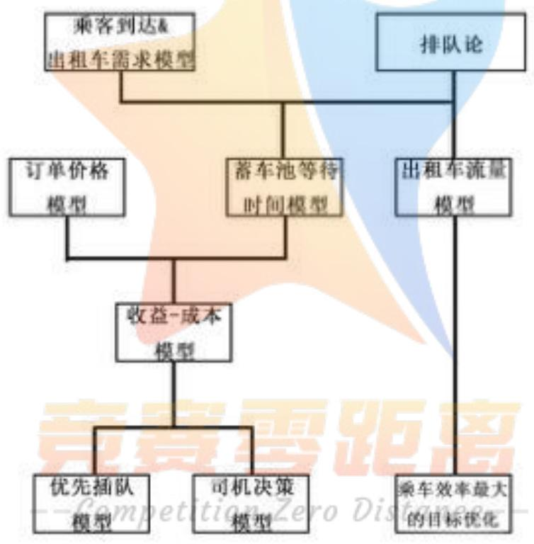

<details>
<summary>flowchart</summary>

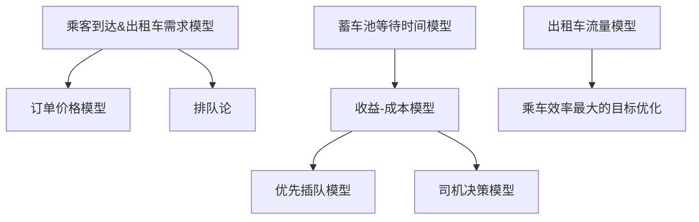
</details>

图 1 本题思路框图示意图

## 三、基本假设

1. 不考虑不同车速下对每公里油耗的影响的差异，即每公里油耗为恒定值。  
2. 单位时间内因器件损耗造成的其他成本视为恒定值。  
3. 不计乘客因上不同车道上的车而造成的微小时间差。  
4. 收集的求解需要的的数据真实准确可信。

## 四、变量说明

表 1 符号说明

<table><tr><td>符号</td><td>意义</td><td>单位</td></tr><tr><td> $t_i$ </td><td>i选择下的时间消耗</td><td>小时</td></tr><tr><td> $t_l$ </td><td>A选择下在机场的损耗时间</td><td>小时</td></tr><tr><td> $t_{dA}$ </td><td>A选择下乘载乘客的时间</td><td>小时</td></tr><tr><td>K(t)</td><td>选择出租车返回市区的乘客比例</td><td></td></tr><tr><td> $ρ_p(t)$ </td><td>t时刻乘客的客流量</td><td>人/小时</td></tr><tr><td> $ρ_a(t)$ </td><td>t时刻航班的到达量</td><td>架/小时</td></tr><tr><td> $\overline{N}_a$ </td><td>航班的平均载客量</td><td>人/架</td></tr><tr><td> $\overline{N}_c$ </td><td>一辆出租车每个订单的平均载客人数</td><td>人/车次</td></tr><tr><td> $ρ_r(t)$ </td><td>t时刻出租车的需求量</td><td>辆/小时</td></tr><tr><td> $ΔE_i$ </td><td>i选择下单位时间的收益</td><td>元/小时</td></tr><tr><td>φ</td><td>燃料消耗成本系数</td><td>元/千米</td></tr></table>


<details>
<summary>text_image</summary>

竞赛零距离
--Competition Zero Distance--
</details>

## 五、模型的建立与求解

## 5.1 出租车司机选择决策模型

为了给出送客到机场的出租车司机的选择策略，我们建立了出租车司机选择决策模型。针对前往到达区排队等待载客返回市区以及直接放空返回市区拉客两种不同选择，我们综合考虑其时间成本以及收益，以单位时间的收益为依据为出租车司机做出选择策略。对于排队载客返回市区，我们利用排队论的知识衡量出租车司机的等待时间。

## 5.1.1 影响出租车司机决策的相关因素

司机的决策主要与三方面有关系，分别为排队时间、返程时间、收入与成本。若蓄车池内出租车数量过多，则会花费更多的时间成本才会载客。此时出租车司机更愿意放空返回市区。出租车的需求量与乘客选择出租车出行的数量有关，而乘客选择出租车出行的数量及比例与天气、时间、航班的抵达量等有关系。白天由于轨道交通以及公交巴士的运行，在白天选择出租车离开机场的比例将比夜晚低。浦东机场白天会有15%的旅客选择出租车，而在夜晚的比例则高达45% $^{[1]}$ 。除此，如果是雨雪天气，不仅会影响航班的到达量，航班的到达量会进一步影响乘客的数量，也会影响乘客选择出租车离开的比例。

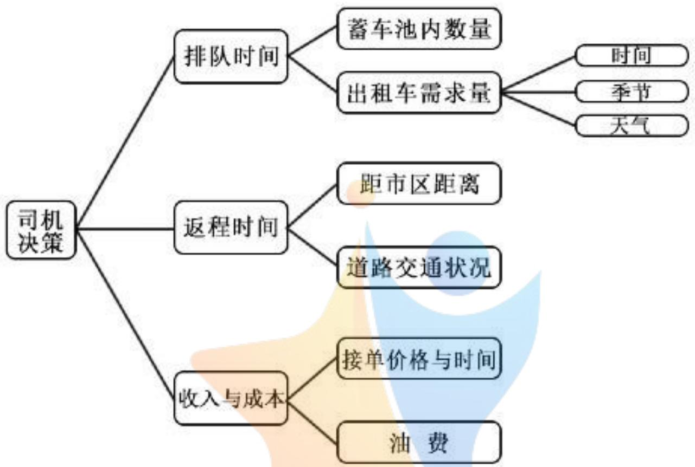

<details>
<summary>flowchart</summary>

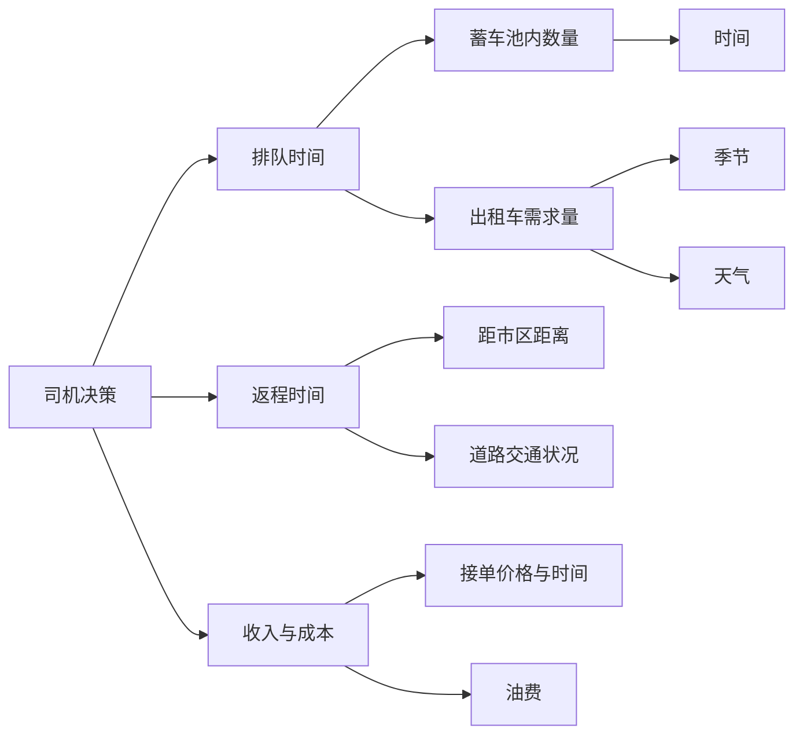
</details>

图 2 影响出租车司机决策的相关因素

其次返程时间也会影响司机的决策。若订单距机场距离近，而距市区远，则司机的收益少，司机不愿意接此订单。如果乘客现在需要前往一个正在拥堵的路段或景区，由于需要花费大量的时间停留在道路上，影响了司机的收益，出租车司机也不会愿意去。收入与成本是司机决策的重要因素，因为司机做决策时总会从单位时间的收益考虑，单位时间收益高的订单出租车司机更愿意接单。

## 5.1.2 两种不同选择下的时间消耗构成

无论出租车司机选择哪一种方案，我们总是研究出租车司机在相同时间内的收益。而收益与每一单的价格以及接单量有关。因此我们以前往到达区排队等待载客返回市区的时间为基准，研究直接放空返回市区拉客的时间消耗构成。由于出租车司机选择的不同，这一阶段的环节也不尽相同，因此我们分别讨论两种不同选择下的时间消耗构成。为了便于表达，我们将前往到达区排队等待载客返回市区记为选择A，将直接放空返回市区拉客记为选择B。

## 1）相同时间内A选择的时间消耗构成

若出租车选择前往到达区排队等待载客返回市区，则到下一订单的完成总共需要五个步骤，如图3所示。

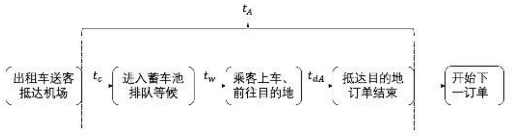

<details>
<summary>flowchart</summary>


</details>

图 3 A 选择下的流程示意图

出租车司机首先需要从送客车道驱车前往蓄车池，花费时间为 $t_c$ ；然后在蓄车池排队等候 $t_w$ 时间直到乘客上车；开车前往乘客的目的地需要时间 $t_{dA}$ ，此订单结束，出租车司机开始搜寻下一订单。这一阶段 A 选择的时间消耗 $t_A$ 构成为：

$$
t _ {A} = t _ {c} + t _ {w} + t _ {d A} \tag {1}
$$

在不考虑送客车道前往蓄车池的道路状况时， $t_{c}$ 与在蓄车池的等待时间 $t_{w}$ 相比， $t_{w}$ 的时间更长，因此我们将 $t_{c}$ 的数值纳入 $t_{w}$ 中，定义为 A 选择下的损耗时间，记为 $t_{l}$ 。则上式可以变为：

$$
t _ {A} = t _ {c} + t _ {w} + t _ {d A} = t _ {l} + t _ {d A} \tag {2}
$$

## 2）相同时间内 B 选择的时间消耗构成

若出租车选择直接放空车返回市区拉客，则直到与 A 选择的相等时间内的环节构成如图 4 所示。

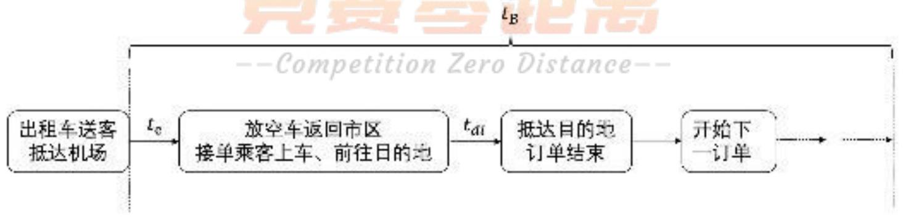

<details>
<summary>flowchart</summary>

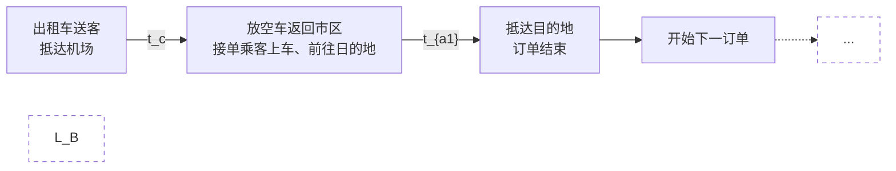
</details>

图 4 B 选择下的流程示意图

出租车直接从机场的送客车道出发，返回市区，搜寻乘客，这段时间记为 $t_{e}$ ；乘客上车后，出租车司机驱车前往目的地，乘客抵达终点，订单结束，出租车司机开始搜寻下一订单。由于在与 A 选择的相等时间内，B 选择下可以接到不止一单的乘客，从乘客上车这一订单开始到下一订单的开始此段时间记为 $t_{di}$ ，因此相等时间内 B 选择的时间消耗 $t_{B}$ 的构成为：

$$
t _ {B} = t _ {e} + \sum_ {i = 1} ^ {n} t _ {d i} \tag {3}
$$

其中，n 为相等时间内 B 选择下出租车司机的接单数量。

## 5.1.3 出租车需求模型

出租车乘客的数量是由选择出租车返回市区的乘客比例以及航班的数量所决定的。选择出租车返回市区的乘客比例会受到天气以及时间的影响，夜间选择出租车返回市区的乘客比例比白天高，雨雪天气下选择出租车返回市区的乘客比例比晴天比例高。航班的数量也会受到天气与时间的影响，一般来说，白天的航班到达数量比夜晚多；恶劣天气下航班停飞，航班到达量会降低。则出租车乘客的数量 $\rho_{c}(t)$ 为：

$$
\rho_ {c} (t) = K (t) \rho_ {p} (t) \tag {4}
$$

其中， $K(t)$ 为选择出租车返回市区的乘客比例； $\rho_{p}(t)$ 为乘客的客流量，其计算公式为：

$$
\rho_ {p} (t) = \rho_ {a} (t) \overline {{N}} _ {a} \tag {5}
$$

其中， $\rho_{a}(t)$ 为航班的到达量； $\overline{N}_{a}$ 为航班的平均载客量，其计算公式为：

$$
\overline {{N}} _ {a} = \frac {N _ {p}}{N _ {a}} \tag {6}
$$

其中， $N_{p}$ 为某段时间内乘客的抵达数量； $N_{a}$ 为航班的抵达数量。

由于存在多人乘坐一辆出租车离开机场的情况，因此我们需要根据乘坐出租车的乘客数量进一步得到出租车的需求量。记一辆出租车每个订单的平均载客人数为 $\overline{N}_{c}$ ，则我们的出租车的需求模型为：

$$
\rho_ {r} (t) = \frac {\rho_ {c} (t)}{\overline {{N}} _ {c}} \tag {7}
$$

其中， $\rho_{r}(t)$ 为出租车 t 时刻的需求量。

## 5.1.4 基于生灭过程的 A 选择下损耗时间的确定

出租车司机选择前往到达区排队等待载客返回市区，则出租车需要到达指定的蓄车池进行排队等候，等待时间即为此选择下的消耗时间，其长短取决于排队出租车和乘客的数量多少。出租车排队载客与乘客排队上车的流程如图5所示。

出租车按照“先来后到”的规则排队进场载客，引入生灭过程[9]来研究出租车候客以及乘客候车的排队系统。用“生”表示出租车以及乘客的到达，用“灭”表示乘客以及出租车的离去。排队系统是由输入过程、输出过程、排队规则、服务过程四部分组成的。以空出租车以及乘客为输入，载客出租车为输出，出租车为移动服务台构建该排队系统。出租车进场后会面临两种情况，分别为乘客不足以及乘客充足。乘客不足时，出租车需要等待乘客来出租车乘车点乘车；乘客充足时，出租车只需依次排队让乘客上车即可。

设某时刻蓄车池内出租车的数量为 $M_{1}(t)$ ，则 $M_{2}(t)$ 满足以下性质：

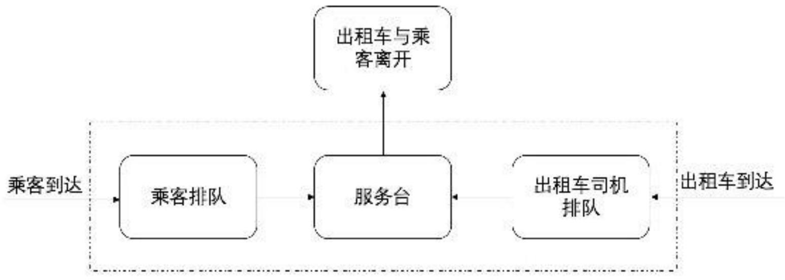

<details>
<summary>flowchart</summary>

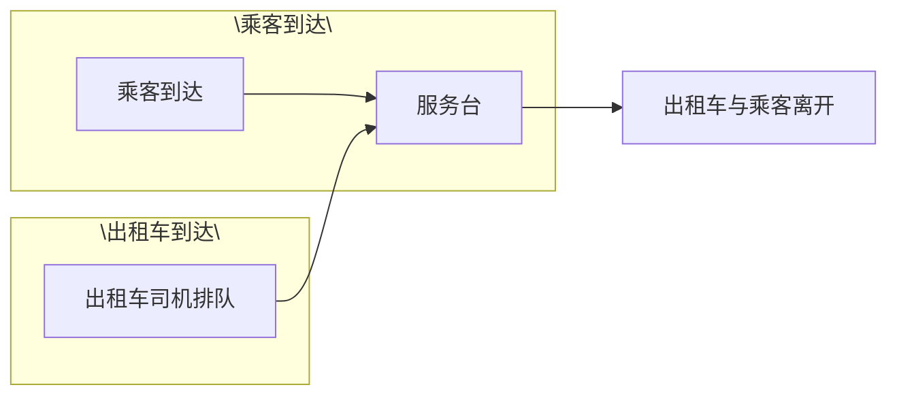
</details>

图 5 出租车排队等待乘客上车

- 假设 $M_{1}(t) = n_{1}$ ，则从时刻 $t$ 起到下一辆出租车进入蓄车场时刻止的时间服从 $\lambda(t)$ 的分布；  
- 假设 $M_{1}(t) = n_{1}$ , 则从时刻 $t$ 起到下一辆出租车离开蓄车场时刻止的时间服从 $\mu$ 的负指数分布;  
- 同一时刻只有一辆出租车到达或离去。  
设某时刻机场出租车候车点出租车的需求的数量为 $M_{2}(t)$ ，则 $M_{2}(t)$ 满足以下性质：  
- 假设 $M_{2}(t) = n_{2}$ ，则从时刻 $t$ 起到下一个顾客到达时刻止的时间服从 $\rho_{r}(t)$ 的分布；  
- 假设 $M_{1}(t) = n_{2}$ , 则从时刻 $t$ 起到下一个顾客离去时刻止的时间服从 $\mu$ 的负指数分布;  
- 同一时刻只有一个顾客到达或离去。

这里的顾客是指乘坐同一辆出租车的一位或多位乘客。则选择前往到达区排队等待载客返回市区的损耗时间 $t_{l}$ 为：

$$
\left\{ \begin{array}{l l} t _ {l} = \frac {S _ {1}}{\rho_ {r} (t)} + \frac {S _ {2}}{\mu} & S _ {1} \in N ^ {*} \\ S _ {1} + S _ {2} = M _ {1} (t) & S _ {2} \in N ^ {*} \end{array} \right. \tag {8}
$$

其中， $S_{1}$ 表示乘客不足时出租车在蓄车池内挤压的数量， $S_{2}$ 为乘客充足时蓄车池内出租车排队的数量。

## 5.1.5 两种不同选择下单位时间的收益

前面，我们以前往到达区排队等待载客返回市区这段时间为基准，已经研究了两种不同选择下相同时间内的时间消耗构成。现在我们要研究两种不同选择下单位时间的收益。收益是由收入与成本做差得到的。出租车的收益就是根据出租车计价收费器收取乘客的费用，而成本主要是燃料消耗成本和维修以及保养出租车的费用。

## 1) A 选择下单位时间的收益

由于我们选择前往到达区排队等候载客返回市区这段时间为研究的一段相同时间，在这段时间内，A选择下，出租车司机只有将机场乘客带往目的地一个订单，记总的行程距离为 $X_{A}$ ，此订单的定价为 $P_{A}$ ，订单的价格与地方出租车的价格管理有关。则 A 选择下的成本 $C_{A}$ 为：

$$
C _ {A} = \varphi X _ {A} + C ^ {\prime} \tag {9}
$$

其中， $C'$ 为除燃料消耗成本的其他成本，包括维修费用等； $\varphi$ 为燃料消耗成本系数，计算公式为：

$$
\varphi = \frac {a P _ {o}}{1 0 0} \tag {10}
$$

其中，a 为出租车的每百公里燃料消耗数， $P_{o}$ 为每升燃料的价格。则 A 选择下的收益 $E_{A}$ 为

$$
E _ {A} = P _ {A} - C _ {A} \tag {11}
$$

A 选择下的单位时间收益 $\Delta E_{A}$ 为:

$$
\Delta E _ {A} = \frac {E _ {A}}{t _ {A}} \tag {12}
$$

## 2) B 选择下单位时间的收益

相同时间内，B 选择下出租车司机的接单数量可能不止一单。用 $X_0$ 表示从机场放空返回市区拉到第一个单时所行驶的路程，用 $X_i$ 表示一个订单开始到下一个订单开始所行驶的路程，则 B 选择下的成本为：

$$
C _ {B} = \varphi \sum_ {i = 0} ^ {n} X _ {i} + C ^ {\prime} \tag {13}
$$

B 选择下的收益 $E_{B}$ 为:

$$
E _ {B} = \sum_ {i = 1} ^ {n} P _ {i} - C _ {B} \tag {14}
$$

其中， $P_{i}$ 为第 i 单的定价。A 选择下的单位时间收益 $\Delta E_{A}$ 为：

$$
\Delta E _ {B} = \frac {E _ {B}}{t _ {B}} \tag {15}
$$

## 5.1.6 基于收益的出租车司机选择决策模型的建立

我们研究的是出租车司机在相同时间内不同选择下单位时间的收益，从出租车司机的角度出发，他们总是希望获利最大。根据上面的分析，我们建立模型如下：

$$
\mathrm{sgn} \left(\Delta E _ {A} - \Delta E _ {B}\right) = \left\{ \begin{array}{l l} 1 & \Delta E _ {A} > \Delta E _ {B} \\ 0 & \Delta E _ {A} = \Delta E _ {B} \\ - 1 & \Delta E _ {A} <   \Delta E _ {B} \end{array} \right. \tag {16}
$$

分析上面的符号函数的函数值取值，我们得到出租车司机的选择策略为：当上面的符号函数取值为1时，代表A选择下的单位时间收益比B选择大，出租车司机选择前往到达区排队等待载客返回市区；当上面的符号函数取值为-1时，代表B选择下的单位时间收益比A选择大，出租车司机选择直接放空返回市区拉客。

## 5.2 上海浦东国际机场出租车司机的选择方案

北京首都国际机场、上海浦东国际机场、广州白云国际机场是国内三大门户复合枢纽机场。在搜集这三大机场及其所在城市出租车的相关数据时，在保证数据的正确性与真实性的基础上，依数据的完整性，我们选定上海浦东国际机场为我们研究对象，根据数据确定相关参数，应用我们建立的出租车司机选择决策模型，给出了该机场出租车司机的选择方案，并分析了模型的合理性和对相关因素的依赖性。

## 5.2.1 数据收集及计算

上海浦东国际机场距离上海市中心约 55km，对出租车的依赖性高于其他交通方式，在夜间更是旅客到达或离开机场的主要方式，出租车日均发车辆在 9100 辆左右 $^{[6]}$ 。浦东国际机场的出租车排队系统主要由三部分组成，分别为 P7 出租车蓄车场、P1 缓冲区与 P2 缓冲区。图 6 是上海浦东国际机场出租车上客系统的示意图：出租车在地下蓄车

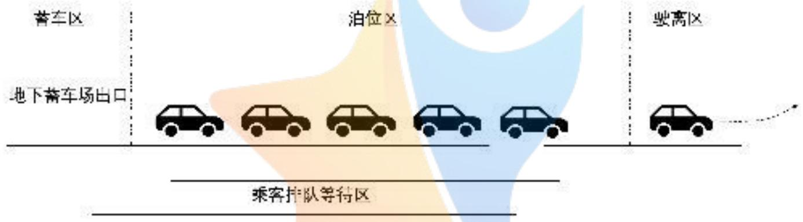

<details>
<summary>flowchart</summary>

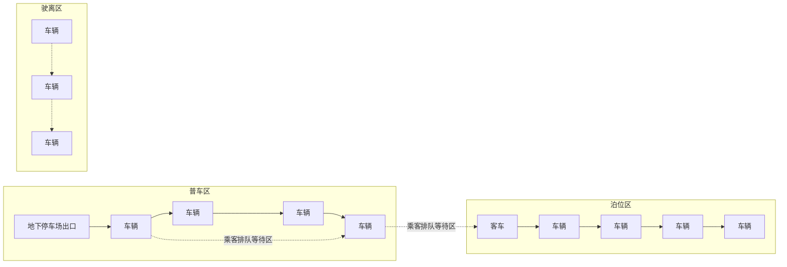
</details>

图 6 出租车排队等待乘客上车

场排队等候，在工作人员的引导下出蓄车场，进入泊位区载客；乘客在排队等待区等候出租车到来，出租车完成载客后驶离。

表 2 为上海浦东国际机场及城市出租车相关数据，数据来源于上海市交通委、上海统计年鉴、百度地图等。假设出租车都是烧汽油进行运转的，通过查阅得到每升 93 号汽油的价格以及出租车的每百公里耗油，利用式 (10) 即可得到汽油消耗成本系数为 0.50 元/公里。通过上海统计年鉴查得 2018 年上海浦东国际机场旅客吞吐量为 $7405.42 \times 10^{4}$ 人次，起落飞机 504972 架次，通过式 (6) 计算可得上海浦东国际机场每架航班平均载客量为 146.65 人次。

$\bar{t}_{dA}$ 、 $\overline{X}_{A}$ 、 $\bar{t}_{e}$ 、 $\overline{X}_{0}$ 是通过百度地图核算得来的，如图7所示。以浦东机场为目的地、上海市市中心为终点进行路线规划，得到距离为45.8km，行驶时间为50min左右。由于上海浦东国际机场周围分布着许多城镇以及迪士尼乐园，因此出租车司机从机场放空返回市区时，会前往这些地方进行拉客。经过地图路线规划及计算得到 $\bar{t}_{e}$ 与 $\overline{X}_{0}$ 。

表 2 上海浦东国际机场及城市出租车相关数据

<table><tr><td>意义</td><td>符号</td><td>数值</td></tr><tr><td>93号汽油消耗成本系数</td><td> $\varphi$ </td><td>0.50元/公里</td></tr><tr><td>上海浦东国际机场每架航班平均载客量</td><td> $\overline{N}_{a}$ </td><td>146.65人次</td></tr><tr><td>2018年上海出租车载客总人数</td><td></td><td> $103406 \times 10^{4}$ 人次</td></tr><tr><td>2018年上海出租车发车总次数</td><td></td><td> $57238 \times 10^{4}$ 次</td></tr><tr><td>上海市出租车每一订单平均载客人数</td><td> $\overline{N}_{c}$ </td><td>1.81人次</td></tr><tr><td>A选择下行驶至乘客目的地的平均时间</td><td> $\bar{t}_{dA}$ </td><td>50min</td></tr><tr><td>A选择下机场距乘客目的地的平均距离</td><td> $\overline{X}_{A}$ </td><td>45.8km</td></tr><tr><td>A选择下订单的平均价格</td><td> $\overline{P}_{A}$ </td><td>155元</td></tr><tr><td>B选择下多个订单的平均距离</td><td> $\overline{X}_{i}$ </td><td>9.12公里</td></tr><tr><td>B选择下返回市区拉到乘客的平均距离</td><td> $\overline{X}_{0}$ </td><td>26公里</td></tr><tr><td>B选择下一个订单开始到下一个订单开始的平均时间</td><td> $\bar{t}_{di}$ </td><td>20min</td></tr><tr><td>B选择下返回市区拉到乘客的平均时间</td><td> $\bar{t}_{e}$ </td><td>30min</td></tr><tr><td>B选择下每一订单的平均价格</td><td> $\overline{P}_{B}$ </td><td>29.3元</td></tr></table>

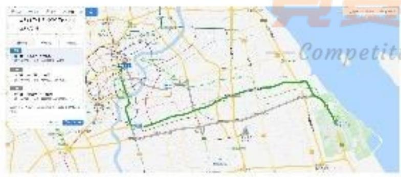

<details>
<summary>text_image</summary>

Map interface screenshot showing a green route outline with directional arrows and a 'Competit' label overlay
</details>

(a) 浦东机场距上海市中心的距离

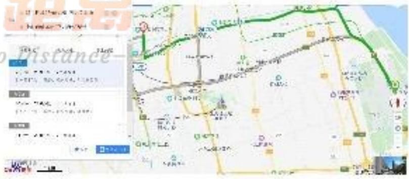

<details>
<summary>text_image</summary>

Scanned map image with overlaid route map and a data interface panel showing geographic coordinates and distance metrics.
</details>

(b) 浦东机场距最近可能订单的距离  
图 7 参数的衡量

$\overline{P}_{A}$ 与 $\overline{X}_{i}$ 是通过上海市出租车计价规则得来的，上海市出租车计价规则分为两种情况：日间 (05:00-23:00) 和夜间 (23:00-次日 05:00)。计价规则如表 3 所示。

我们采用了 2019 年 9 月 13 日上海浦东国际机场的到达航班的航班数量分布，数据来源于飞常准 app。利用浦东机场每架航班平均载客量以及式 (7) 计算得到了浦东机场乘客抵达量以及出租车的需求量随时间的变化，为了使曲线更加平滑，我们对原始数据

表 3 上海浦东国际机场及城市出租车相关数据

<table><tr><td></td><td>日间 (05:00-23:00)</td><td>夜间 (23:00-次日 05:00)</td></tr><tr><td>0-3 公里</td><td>14 元</td><td>18 元</td></tr><tr><td>3-15 公里</td><td>2.50 元/公里</td><td>3.10 元/公里</td></tr><tr><td>15 公里以上</td><td>3.60 元/公里</td><td>4.70 元/公里</td></tr></table>

做了插值处理，处理后的图像如图8所示。

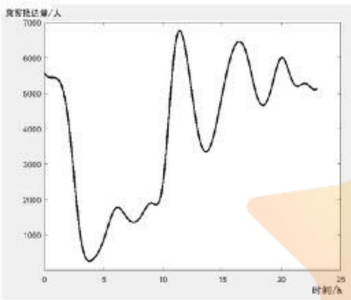

<details>
<summary>line</summary>

| 时间/h | 竞客批达量/人 |
| --- | --- |
| 0 | ~5600 |
| 3.5 | ~300 |
| 6 | ~1800 |
| 7.5 | ~1400 |
| 9 | ~1900 |
| 11.5 | ~6800 |
| 13.5 | ~3400 |
| 16.5 | ~6500 |
| 18.5 | ~4700 |
| 20 | ~6000 |
| 22 | ~5300 |
| 23 | ~5200 |
</details>

(a) 浦东机场乘客抵达量随时间的变化

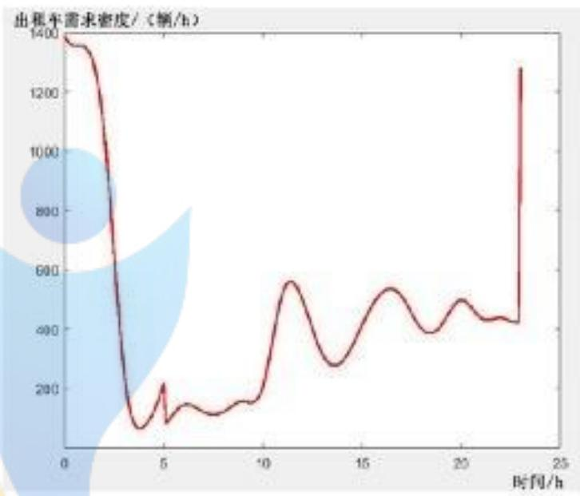

<details>
<summary>line</summary>

| 时间/h | 出租车需求密度/(辆/h) |
| --- | --- |
| 0 | ~1380 |
| 5 | ~100 |
| 10 | ~200 |
| 15 | ~400 |
| 20 | ~450 |
| 23 | ~1280 |
</details>

(b) 浦东机场出租车需求量随时间的变化  
图 8 浦东机场乘客抵达量以及出租车的需求量随时间的变化

从图 8(a) 可以看出，曲线在 1:00、11:24、16:24、20:00 出现极大值，在 3:48、13:36、18:24 出现极小值。这表明浦东机场在凌晨一点、中午十一点、下午四点以及晚上八点航班降落较多，出现了高峰期。在日间有 15% 抵达乘客会选择乘坐出租车前往市区或周边的目的地，而夜间为 45%。观察图 8(b) 可知，出租车的需求量的高峰期出现在凌晨两点、中午十二点、下午五点以及晚上八点半左右，与乘客抵达的高峰期相比滞后了一小时。这是由于乘客下飞机后还需要办理其他事物，如取行李等，会造成想乘坐出租车前往其他目的地的乘客滞后来到出租车乘车点。

## 5.2.2 平衡状态下出租车的队列长度

由于我们的出租车司机选择决策模型是在考虑相同时间段内 A 与 B 两种选择不同收益下建立的，因此我们可以求出在相同时间段 A 与 B 收益相同时的浦东机场出租车

乘车点的出租车队列长度。则有：

$$
\left\{ \begin{array}{l} t _ {A} = t _ {B} \\ \Delta E _ {A} = \Delta E _ {B} \end{array} \right. \tag {17}
$$

根据上面的方程组，可以求解得到 A 选择下的损耗时间 $t_{l}$ 。则 A 选择与 B 选择的收益相等时，浦东机场出租车乘车点的出租车队列长度为：

$$
N _ {b} (t) = \int_ {t} ^ {t + t _ {i}} \rho_ {r} (t) d t \tag {18}
$$

设 t 时刻将乘客送往浦东机场到达出发通道的出租车的数量为 $\rho_{m}(t)$ ，该数据可由某时刻从浦东机场出发的航班数以及航班的平均载客量得到。则实际状况下浦东机场出租车乘车点的出租车队列长度为：

$$
N _ {p} (t) = \int_ {0} ^ {t} (\rho_ {m} (t) - \rho_ {r} (t)) d t + N _ {0} \geq 0 \tag {19}
$$

其中 $N_{0}$ 为出租车队列的初始长度。参考北京首都机场的数据，我们定 $N_{0} = 600$ 。对于式(19)来说，积分可能会出现负数的情况。这表明在持续的供小于求的状态下，出租车处于严重不足的状态，只有当供大于求的情况持续出现时才会将其抵消。现在我们已经得到了A与B收益相等时浦东机场出租车的队列长度 $N_{b}(t)$ 以及实际状况下的队列长度 $N_{p}(t)$ 。若某时刻 $N_{p}(t) > N_{b}(t)$ ，则代表司机需要花费比平衡状态下更多的时间成本去等待顾客上车，由于A选择下的总时间增加了，则单位时间的收益下降，这种情况下出租车司机选择直接放空返回市区拉客收益更大；若某时刻 $N_{p}(t) < N_{b}(t)$ ，则代表司机需要花费比平衡状态下更少的时间成本等待顾客上车，此时相比B选择来说，需要花费更多的时间才等达到与A选择相等的收益，因此此时选择前往到达区排队等待载客返回市区收益更大；若某时刻 $N_{p}(t) = N_{b}(t)$ ，在两种选择收益相等，出租车司机选择哪种方案都可以。

## 5.2.3 出租车司机的选择方案

由式(18)与式(19)，给出求解步骤如下：

step1. 根据 $t_{A}=t_{B}$ 、 $E_{A}=E_{B}$ 两个等式列出线性方程组；

step2. 由矩阵变换得出线性方程组的解，即损耗时间 $t_l$ 的值；

step3. 由梯形积分法求解出收益相等时出租车队列长度 $N_{b}(t)$ 与实际出租车队列长度 $N_{p}(t)$ 。

求解得到如图 9 的图像，蓝线代表 A 选择与 B 选择收益相等时浦东机场排队出租车的队列长度，红色虚线代表实际状况下浦东机场排队出租车的队列长度。两条曲线的相交点时刻为 12:24 和 15:00。在 12:24-15:00，红色虚线的值高于蓝线的值。从供需角度来看，此时供大于求，也就是说排队等待乘客上车的出租车过多，出租车司机需要消耗更多的时间；在其他时刻，红色虚线的值低于蓝线的值，供小于求，排队出租车的数量低于需求量。从图 7(b) 我们知道，凌晨是出租车需求的高峰期，但是实际状况下机场出租车的数量远远小于平衡状态下的数量，猜测原因在于凌晨到达机场的出租车数量较少，他们全部前往机场出租车候车点依然无法满足乘客的需求。

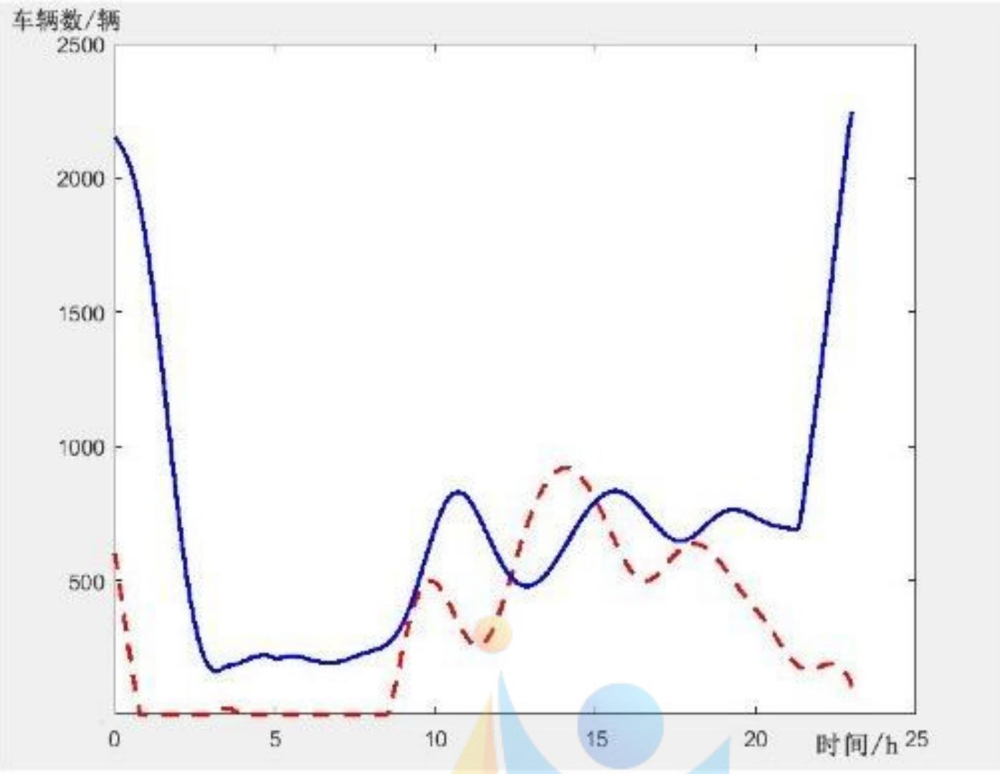

<details>
<summary>line</summary>

| 时间/h | 车辆数/辆 (实线) | 车辆数/辆 (虚线) |
| --- | --- | --- |
| 0 | ~2150 | ~600 |
| 3 | ~200 | ~0 |
| 5 | ~250 | ~0 |
| 8 | ~250 | ~0 |
| 9 | ~300 | ~100 |
| 10 | ~600 | ~500 |
| 11 | ~850 | ~300 |
| 12 | ~700 | ~400 |
| 13 | ~500 | ~600 |
| 14 | ~600 | ~950 |
| 15 | ~850 | ~850 |
| 16 | ~750 | ~600 |
| 17 | ~700 | ~500 |
| 18 | ~750 | ~650 |
| 19 | ~750 | ~650 |
| 20 | ~700 | ~400 |
| 21 | ~700 | ~250 |
| 22 | ~1500 | ~250 |
| 23 | ~2250 | ~200 |
</details>

图9 浦东机场出租车候车点的出租车排队情况

根据上面的分析，我们给出浦东机场出租车司机的选择方案为：在12:24-15:00，建议出租车司机直接放空返回市区拉客；其他时刻，建议出租车司机前往到达区排队等待载客返回市区。

下面我们给出 15:00 时浦东机场出租车的各项参数的具体数值，如表 4 所示。

表 4 每架航班的平均载客量的改变对决策结果的影响

<table><tr><td>时刻</td><td>蓄车池内出租车的辆数</td><td>当前排队时间</td><td>预估收益</td></tr><tr><td>15:00</td><td>806辆</td><td>1.6h</td><td>54.3元/小时</td></tr></table>

## 5.2.4 出租车选择决策模型对相关因素的依赖性

为了衡量出租车司机选择决策模型对相关因素的依赖性，我们分别改变了每架航班的平均载客量、市区内一个订单的平均时间、A选择下的订单平均价格、B选择下每一订单的平均价格以及油耗成本系数，观察选择B的时间长度的改变。

## 1) 每架航班的平均载客量的改变对决策结果的影响

表 5 每架航班的平均载客量的改变对决策结果的影响

<table><tr><td> $\overline{N}_{a}$ 的变化幅度</td><td>起始时间</td><td>终止时间</td><td>时间长度</td><td>B选择的时间长度的变化幅度</td></tr><tr><td>10%</td><td>12:30</td><td>14:48</td><td>2.3</td><td>-11.54%</td></tr><tr><td>5%</td><td>12:30</td><td>14:54</td><td>2.4</td><td>-7.69%</td></tr><tr><td>0</td><td>12:24</td><td>15:00</td><td>2.6</td><td>0</td></tr><tr><td>-5%</td><td>12:18</td><td>15:06</td><td>2.8</td><td>7.69%</td></tr><tr><td>-10%</td><td>12:18</td><td>15:12</td><td>2.9</td><td>11.54%</td></tr></table>

观察表 5, 随着 $\overline{N}_{a}$ 的变化幅度从 $10\%$ 到 $-10\%$ , 选择 B 的时间长度的变化幅度在 $12\%$ 以内。当 $\overline{N}_{a}$ 增加时, 选择乘坐出租车去市区或周边的乘客数量增加, 对出租车的需求量增加, 出租车司机选择 A 的收益更大, 因此选择 B 的时间长度变短。

## 2) 市区内一个订单的平均时间的改变对决策结果的影响

表 6 市区内一个订单的平均时间的改变对决策结果的影响

<table><tr><td> $\bar{t}_{di}$ 的变化幅度</td><td>起始时间</td><td>终止时间</td><td>时间长度</td><td>选择B的时间长度的变化幅度</td></tr><tr><td>10%</td><td>12:30</td><td>14:42</td><td>2.2</td><td>-15.38%</td></tr><tr><td>5%</td><td>12:30</td><td>14:48</td><td>2.3</td><td>-11.54%</td></tr><tr><td>0</td><td>12:24</td><td>15:00</td><td>2.6</td><td>0</td></tr><tr><td>-5%</td><td>12:24</td><td>15:06</td><td>2.7</td><td>3.85%</td></tr><tr><td>-10%</td><td>12:18</td><td>15:18</td><td>3.0</td><td>15.38%</td></tr></table>

观察表 6，随着 $\bar{t}_{di}$ 的变化幅度从 10% 到 -10%，选择 B 的时间长度的变化幅度在 16% 以内。当 $\bar{t}_{di}$ 增加时，在相等时间内，与未变化相比，选择 B 的接单量减少，收益相对减少，出租车司机如果选择 A，则收益会更大，因此选择 B 的时间长度变短。

## 3)A 选择下的订单平均价格的改变对决策结果的影响

观察表 7, 随着 $\overline{P}_{A}$ 的变化幅度从 $10\%$ 到 $-10\%$ , 选择 B 的时间长度的变化幅度在 $16\%$ 以内。当 $\overline{P}_{A}$ 增加时, 在相等时间内, A 选择的收益增加, 因此出租车司机更愿意去排队载客返回市区, 选择 B 的时间长度变短。

表 7 A 选择下的订单平均价格的改变对决策结果的影响

<table><tr><td> $\overline{P}_{A}$ 的变化幅度</td><td>起始时间</td><td>终止时间</td><td>时间长度</td><td>选择B的时间长度的变化幅度</td></tr><tr><td>10%</td><td>12:30</td><td>14:42</td><td>2.2</td><td>-15.38%</td></tr><tr><td>5%</td><td>12:30</td><td>14:48</td><td>2.3</td><td>-11.54%</td></tr><tr><td>0</td><td>12:24</td><td>15:00</td><td>2.6</td><td>0</td></tr><tr><td>-5%</td><td>12:24</td><td>15:06</td><td>2.7</td><td>3.85%</td></tr><tr><td>-10%</td><td>12:18</td><td>15:18</td><td>3.0</td><td>15.38%</td></tr></table>

## 4)B 选择下每一订单的平均价格的改变对决策结果的影响

表 8 B 选择下每一订单的平均价格的改变对决策结果的影响

<table><tr><td> $\overline{P}_B$ 的变化幅度</td><td>起始时间</td><td>终止时间</td><td>时间长度</td><td>选择B的时间长度的变化幅度</td></tr><tr><td>10%</td><td>12:18</td><td>15:18</td><td>3.0</td><td>15.38%</td></tr><tr><td>5%</td><td>12:24</td><td>15:06</td><td>2.7</td><td>3.85%</td></tr><tr><td>0</td><td>12:24</td><td>15.0</td><td>2.6</td><td>0</td></tr><tr><td>-5%</td><td>12:30</td><td>14:42</td><td>2.2</td><td>-15.38%</td></tr><tr><td>-10%</td><td>12:30</td><td>14:30</td><td>1.9</td><td>-26.92%</td></tr></table>

观察表8，随着 $\overline{P}_B$ 的变化幅度从 $10\%$ 到 $-10\%$ ，选择B的时间长度的变化幅度在 $27\%$ 以内。值得注意的是，当 $\overline{P}_B$ 减少 $10\%$ 时，选择B的时间长度减少 $-26.92\%$ ，远远大于 $10\%$ 。当B选择下每一订单的平均价格增加时，选择B的收益更大，出租车司机就会直接放空返回市区拉客。且B选择下每一订单的平均价格的减少比平均价格的增加影响选择B的时间长度更大。

## 5) 油耗成本系数的改变对决策结果的影响

由表 9 可知，随着油耗成本系数 $\varphi$ 的变化幅度从 10% 到 -10%，选择 B 的时间长度的变化幅度低于 5%。虽然油耗成本系数的增加会影响收益的大小，但是对出租车司机的决策方案影响不大。当油耗成本系数减少了 10% 时，选择 B 的时间长度反而增加了。这是由于油耗成本的减少会间接导致 A 选择下的时间成本增加，出租车司机更愿意尝试到机场附近的地方拉客返回市区。

表 9 油耗成本系数的改变对决策结果的影响

<table><tr><td>φ的变化幅度</td><td>起始时间</td><td>终止时间</td><td>时间长度</td><td>选择B的时间长度的变化幅度</td></tr><tr><td>10%</td><td>12:24</td><td>15:00</td><td>2.6</td><td>0.00%</td></tr><tr><td>5%</td><td>12:24</td><td>15:00</td><td>2.6</td><td>0.00%</td></tr><tr><td>0</td><td>12:24</td><td>15:00</td><td>2.6</td><td>0</td></tr><tr><td>-5%</td><td>12:24</td><td>15:00</td><td>2.6</td><td>0.00%</td></tr><tr><td>-10%</td><td>12:24</td><td>15:06</td><td>2.7</td><td>3.85%</td></tr></table>

综上，考虑上述5个因素的改变对决策结果的影响，我们得出结论：出租车司机选择决策模型受到市区内每一订单的平均价格影响较大，而油耗成本系数的影响较小。也就是说模型对于市区内每一订单的平均价格依赖性较高。

## 5.2.5 出租车选择决策模型的合理性

为了衡量模型的合理性, 我们对浦东机场每时刻的航班到达量进行了加高斯噪声处理, 即噪声符合均值为 0 , 方差为 $\sigma$ 的正态分布, 观察给出的决策方案中选择 B 的时段长度的变化, 结果如表 10 所示。“左”代表开始 B 选择的时刻, “右”代表结束 B 选择的时

表 10 加噪声处理对模型结果的影响

<table><tr><td rowspan="2"></td><td colspan="2"> $\sigma = 1$ </td><td colspan="2"> $\sigma = 2$ </td><td colspan="2"> $\sigma = 3$ </td><td colspan="2"> $\sigma = 4$ </td><td colspan="2"> $\sigma = 5$ </td></tr><tr><td>min</td><td>max</td><td>min</td><td>max</td><td>min</td><td>max</td><td>min</td><td>max</td><td>min</td><td>max</td></tr><tr><td>左</td><td>12:24</td><td>12:24</td><td>12:24</td><td>12:30</td><td>12:18</td><td>12:30</td><td>12:18</td><td>12:30</td><td>12:18</td><td>12:30</td></tr><tr><td>右</td><td>14:54</td><td>15:00</td><td>14:54</td><td>15:00</td><td>14:48</td><td>15:06</td><td>14:48</td><td>15:06</td><td>14:48</td><td>15:06</td></tr></table>

刻。观察表10，加噪声处理后，B选择的时段长度变化不大。以 $\sigma=5$ 时的结果来看，开始时刻浮动了0.1h，结束时刻浮动了0.2h，总浮动为0.3h，则我们模型的准确率为 $\frac{2.6-0.3}{2.6}\approx88.46\%$ .

## 5.3 乘车区的设计

## 5.3.1 上车点的设置

目前国内机场出租车上客区的主要布局形式可以分为：单车道出租车上客方式、多车道出租车上客方式、斜列式出租车上客方式以及混合式出租车上客方式[7]，如图10所示。单车道出租车上客方式由于车道的限制导致每次停靠在泊位区的出租车数量较

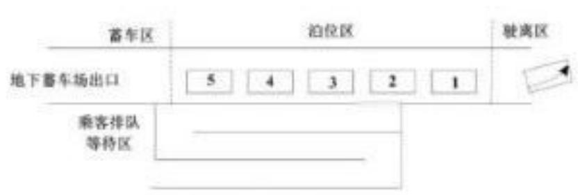

<details>
<summary>text_image</summary>

蓄车区
地下蓄车场出口
5 4 3 2 1
泊位区
驶离区
乘客排队
等待区
</details>

(a) 单车道出租车上客方式

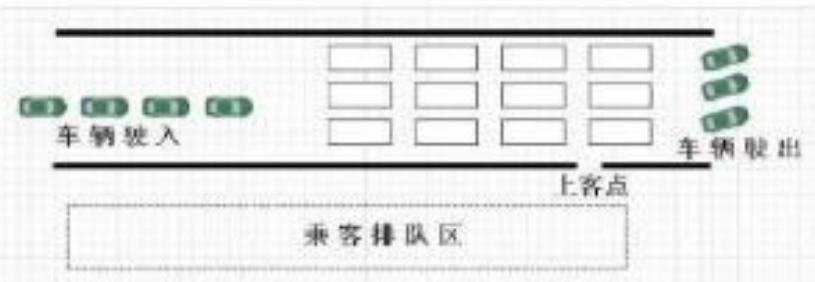

<details>
<summary>text_image</summary>

车辆驶入
上客点
车辆驶出
乘客排队区
</details>

(b) 多车道出租车上客方式

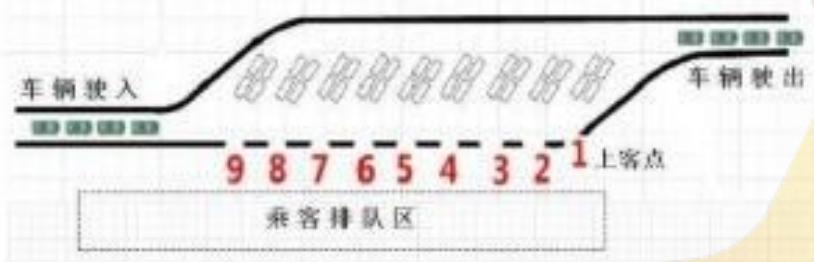

<details>
<summary>text_image</summary>

车辆驶入
9 8 7 6 5 4 3 2 1 上客点
车辆驶出
乘客排队区
</details>

(c) 斜列式出租车上客方式


<details>
<summary>text_image</summary>

车销接入
上客点
乘客排队区
乘客排队区
</details>

(d) 混合式出租车上客方式  
图 10 国内机场出租车上车点主要上客方式 $^{[7]}$

少，无法保证出租车的发车效率；多车道出租车上客方式一次可以满足多辆出租车停靠，方便乘客搬运行李，一定程度地避免了人车混行状况，安全性较高；斜列式出租车上客方式可以有效提高乘车效率，有效降低驶离车辆间的干扰；混合式出租车上客方式是多车道以及斜列式的结合，虽然一次的发车量大，但是斜列式发车区的发车情况会影响到多车道式发车区的发车，降低了发车效率。综合考虑题目中乘车区两条并行车道的要求以及车辆和乘客的安全，我们将研究双车道出租车上客方式，求出乘车效率最高时的乘车点的设置情况。

## 5.3.2 乘车效率模型的建立

机场出租车乘车点在高峰期经常会出现出租车排队载客和乘客排队乘车的情况，这时候乘客的数量以及出租车的数量是“源源不断”的。考虑双车道出租车停靠方式，每一车道的停车个数是相等的，设共有 n 个泊位。当上车区的出租车全部搭载完乘客时，出租车全部驶离上车区，机场工作人员会放行蓄车场内的出租车进入停车区。视出租车为一个泊松流，服从参数为 $\lambda$ 的指数分布，则单辆出租车在 t 秒内完成上车的概率为：

$$
P _ {1} = 1 - e ^ {- \lambda t} \tag {20}
$$

那么上车区内所有出租车在 t 秒内完成上车的概率为：

$$
P _ {n} = (1 - e ^ {- \lambda t}) ^ {n} \tag {21}
$$

由于我们规定上车区的出租车行驶规则为上一轮等待上客的出租车全部载客驶离后，下一轮出租车才进入上客区，所以上车区的所有出租车从进入上客区到发车离开时花费的平均时间为：

$$
E = \int_ {0} ^ {\infty} \lambda e ^ {- \lambda t} n \left(1 - e ^ {- \lambda t}\right) ^ {n - 1} d t \tag {22}
$$

现在考虑一轮出租车的进上客区的时间以及出上客区的时间，设一个停车位的长度为 $L$ ，车道限速为 $v$ ，每一位司机启动车的反应时间为 $t_r$ ，则有：

$$
t _ {i n} = t _ {o u t} = \frac {n L}{v} + (n - 1) t _ {r} \tag {23}
$$

通常一个泊车位的长度为 $5 \mathrm{~m}$ , 机场车道限速为 $5 \mathrm{~km} / \mathrm{h}$ , 司机的反应时间为 $1 \mathrm{~s}$ 。那么一轮出租车中第一辆车从进入上客区开始到最后一辆车驶离上客区的时间 $t_{per}$ 为:

$$
\begin{array}{l} t _ {p e r} = E + t _ {i n} + t _ {o u t} \\ = n ^ {2} \int_ {0} ^ {\infty} \lambda e ^ {- \lambda t} (1 - e ^ {- \lambda t}) ^ {n - 1} d t + \frac {2}{k} \left[ \frac {n L}{v} + (n - 1) t _ {r} \right] \tag {24} \\ \end{array}
$$

其中 k 为上客区的车道数量。由于我们的优化目标是总的乘车效率最高，因此我们建立以每小时驶离上客区的出租车数量为目标函数的目标优化模型： $\exists_{k}^{n}\in N^{*}$

$$
s. t. \max \left(\frac {n}{t _ {p e r}}\right) \tag {25}
$$

## 5.3.3 乘车效率模型的求解

本文采用蒙特卡洛来确定上车点数的最优解，蒙特卡洛的算法步骤如下：

Step 1. 置初始 $n = 2$

Step 2. 若 $n < 100$ , 则利用蒙特卡洛算法思想, 获取 $n$ 个服从参数为 $\lambda$ 的指数分布的随机数; 若 $n > 100$ , 转 Step7;

Step 3. 置 E 为 n 个随机数的最大值，计算该次随机下 $t_{per}$ 的值；

Step 4. 重复 Step2-Step3 共 100 次，并储存每次随机的 $t_{per}$ ，记为 $t_{per}(i)$ ;

Step 5. 置 $t_{per}$ 为 100 次 Step4 随机值的平均值 $mean(t_{per}(i))$ ;

Step 6. 计算目标函数值, 置 $n = n + 2$ , 转 Step2;

Step 7. 计算目标函数最大值及其对应的 n。

按照上面的步骤进行搜索，求解得到的结果如 11 所示。观察图 11，随着乘车点的增加，每小时驶离上客区的出租车数量呈上升趋势，最后趋于平稳状态。考虑到实际状况，上客区的车道长度有限，且如果只是一味地增加上车点，会给机场出租车上客区的管理带来巨大的麻烦，且有发生安全事故的隐患。因此我们以每小时驶离上客区的出租车数量最大值的 0.9 倍进行搜寻得到此时的乘车点数。在保证车辆和乘客安全的条件下，为使总的乘车效率最高，共设置 5 个乘车点共 10 个泊车位，具体如图 12 所示。

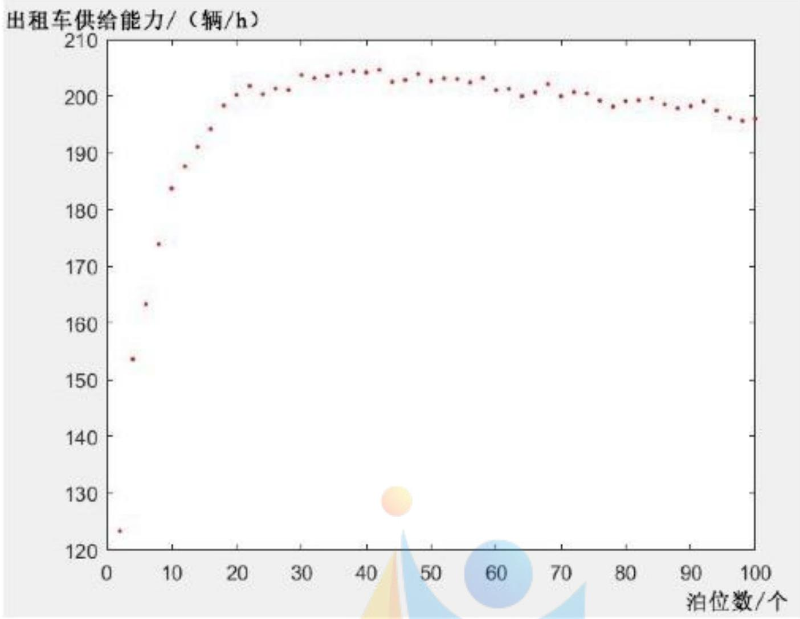

<details>
<summary>scatter</summary>

| 泊位数/个 | 出租车供给能力/(辆/h) |
| --- | --- |
| 2 | ~124 |
| 4 | ~154 |
| 6 | ~164 |
| 8 | ~174 |
| 10 | ~184 |
| 12 | ~188 |
| 14 | ~191 |
| 16 | ~195 |
| 18 | ~199 |
| 20 | ~201 |
| 22 | ~202 |
| 24 | ~201 |
| 26 | ~202 |
| 28 | ~203 |
| 30 | ~204 |
| 32 | ~204 |
| 34 | ~205 |
| 36 | ~205 |
| 38 | ~205 |
| 40 | ~205 |
| 42 | ~203 |
| 44 | ~203 |
| 46 | ~204 |
| 48 | ~203 |
| 50 | ~203 |
| 52 | ~203 |
| 54 | ~203 |
| 56 | ~203 |
| 58 | ~201 |
| 60 | ~201 |
| 62 | ~200 |
| 64 | ~201 |
| 66 | ~203 |
| 68 | ~200 |
| 70 | ~201 |
| 72 | ~201 |
| 74 | ~200 |
| 76 | ~199 |
| 78 | ~198 |
| 80 | ~199 |
| 82 | ~199 |
| 84 | ~199 |
| 86 | ~198 |
| 88 | ~198 |
| 90 | ~199 |
| 92 | ~198 |
| 94 | ~197 |
| 96 | ~196 |
| 98 | ~196 |
</details>

图 11 乘车点与每小时驶离上客区的出租车数量关系图

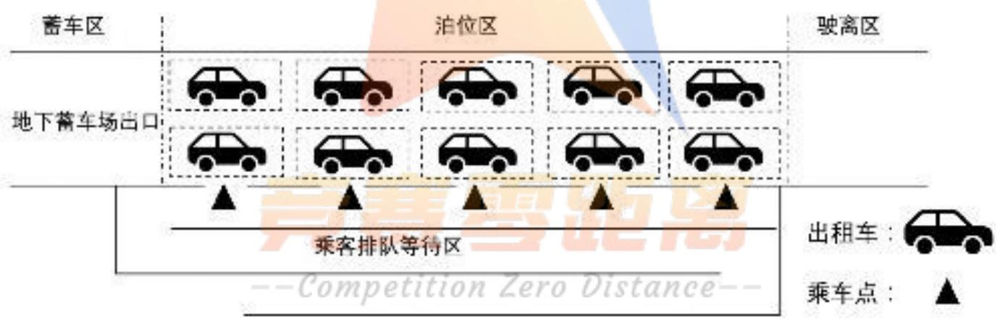

<details>
<summary>flowchart</summary>

```mermaid
graph LR
  subgraph Passenger Area [蓄车区]
    direction TB
  A1["Car"] --> B1["Car"]
  A2["Car"] --> C1["Car"]
  A3["Car"] --> D1["Car"]
  A4["Car"] --> E1["Car"]
  end

  subgraph Parking Area [泊位区]
    direction TB
  F1["Car"] --> G1["Car"]
  F2["Car"] --> H1["Car"]
  F3["Car"] --> I1["Car"]
  F4["Car"] --> J1["Car"]
  end

  subgraph Freight Area [驶离区]
    direction TB
  K1["Car"] --> L1["Car"]
  K2["Car"] --> M1["Car"]
  K3["Car"] --> N1["Car"]
  K4["Car"] --> O1["Car"]
  end

  Passenger_Queue["乘客排队等待区"] -.->|"Outbound"| Passenger Queue
  Passenger Queue ==>|"Queue Point"| Passenger Queue
```
</details>

图 12 乘车点设置示意图

## 5.4 出租车优先插队模型

## 5.4.1 出租车优先插队模型的建立

出租车司机在蓄车场排队等待载客，若是短途乘客，则在花费了较大的时间成本基础上只得到了较少的收益。因此允许出租车多次往返载客，给予某些短途载客再次返回的出租车一定的优先权，减少他的排队时间，使出租车的收益尽量均衡。

对于长途载客的出租车来说，出租车返回市区后，就在市区内进行搜单，该出租车

的时间构成 $t_{h}$ 为：

$$
t _ {h} = t _ {l} + t _ {d A} + \sum_ {j = 1} ^ {m} t _ {d j} \tag {26}
$$

其中， $t_{dj}$ 为拉长途乘客的出租车返回市区从上一单结束到下一单开始的时间，m 为拉长途乘客的出租车返回市区接单的数量。长途载客的出租车的收益 $E_{h}$ 为：

$$
E _ {h} = P _ {A} + \sum_ {j = 1} ^ {m} P _ {h j} - \varphi X _ {A} - \varphi \sum_ {j = 1} ^ {m} X _ {h j} - C ^ {\prime} \tag {27}
$$

其中， $P_{hj}$ 为拉长途乘客的出租车返回市区拉客每一单的价格， $X_{hj}$ 为拉长途乘客的出租车返回市区从上一单结束到下一单开始的行车距离。对于短途载客的出租车来说，其短途订单的距离为长途订单距离的 $\gamma$ 倍，其行程时间大约也是长途订单时间的 $\gamma$ 倍。出租车司机在完成短途订单后，空车返回机场蓄车场，等待 $t_{l}^{\prime}$ 后开始下一订单返回市区。短途载客的出租车的时间构成 $t_{s}$ 为：

$$
t _ {s} = t _ {l} + 2 \gamma t _ {d A} + t _ {l} ^ {\prime} + t _ {d A} ^ {\prime} \tag {28}
$$

其中， $t_{dA}^{\prime}$ 为出租车司机返回机场后下一订单的时间。则短途载客的出租车这段时间的收益 $E_{s}$ 为：

$$
E _ {s} = P _ {A} + P _ {A} ^ {\prime} - (1 + 2 \gamma) \varphi X _ {A} - C ^ {\prime} \tag {29}
$$

其中， $P_{A}^{\prime}$ 为短途出租车返回机场下一订单的价格。为使这两种情况下的出租车收益尽量平衡，即相等时间内收益相等，则有：

$$
\left\{ \begin{array}{l} t _ {h} = t _ {s} \\ E _ {h} = E _ {s} \end{array} \right. \tag {30}
$$

由上面的方程组可以求解得到 $t_{l}^{\prime}$ 。由 $t_{l}^{\prime}$ ，我们可以得到短途载客的出租车再次返回时应该排队的位置 $N_{cut}(t)$ 。因此我们建立的插队模型为：

$$
N _ {c u t} (t) = \int_ {t} ^ {t + t _ {l} ^ {\prime}} \rho_ {r} (t) d t \tag {31}
$$

## 5.4.2 出租车优先插队模型的求解

参考上海浦东国际机场对机场出租车短途区域的划定，我们规定短途为不超过20km的行程。对 $\gamma$ 分别取 0.2 和 0.4，求解的算法步骤如下：

step1. 根据 $t_{h}=t_{s}$ 、 $E_{h}=E_{s}$ 两个等式列出线性方程组；

step2. 由矩阵变换得出线性方程组的解，即损耗时间 $t_{l}^{\prime}$ 的值；

step3. 由梯形积分法求解出排队位置 $N_{b}(t)$ 。

计算得到浦东国际机场9月13日不同短途单下出租车插队后其前面的车辆数量随时间的变化，如图13所示。图13中，绿线代表蓄车场内的实际出租车排队的队列长度，蓝色虚线表示 $\gamma$ 取 0.2 时短途单下出租车插队后其前面的车辆数量，红色虚线为 $\gamma$ 取 0.4 时的情况。观察图 13 可以看到，红色虚线一直在蓝色虚线之上，这代表随着短途订单距离的增加，收益增加，出租车司机返回机场享受优先权插队后，其前面的出租车数量也在增加。这可以间接验证我们模型的准确性。在 0:30—3:00 时，红色虚线与蓝色虚线均高于绿色虚线，这代表蓄车场内的出租车无法满足乘客的需求，短途司机一返回机场即可接单开始下一订单。表 11 给出了一些具体时刻短途载客的出租车返回机场的插队情况。

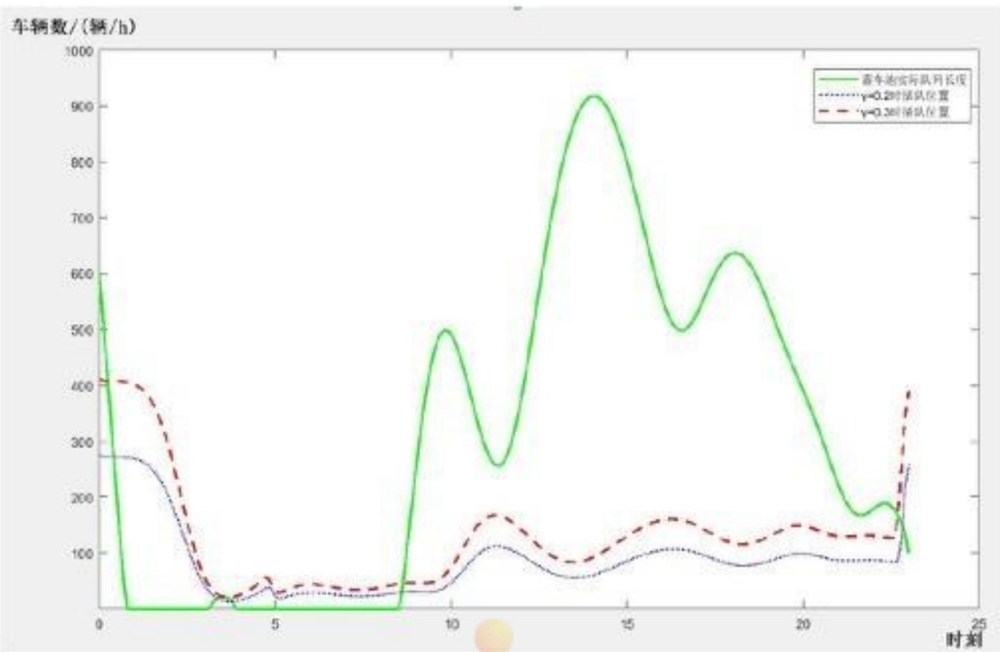

<details>
<summary>line</summary>

| 时刻 | 实际队列长度 (辆/h) | \(\gamma=0.2\)时驱队位置 (辆/h) | \(\gamma=0.3\)时驱队位置 (辆/h) |
| --- | --- | --- | --- |
| 0 | ~600 | ~280 | ~410 |
| 1 | 0 | ~270 | ~410 |
| 2 | 0 | ~250 | ~350 |
| 3 | 0 | ~150 | ~200 |
| 4 | 0 | ~50 | ~50 |
| 5 | 0 | ~30 | ~40 |
| 6 | 0 | ~30 | ~40 |
| 7 | 0 | ~30 | ~40 |
| 8 | 0 | ~30 | ~40 |
| 9 | ~150 | ~30 | ~40 |
| 10 | ~500 | ~40 | ~50 |
| 11 | ~350 | ~80 | ~120 |
| 12 | ~260 | ~110 | ~170 |
| 13 | ~450 | ~90 | ~120 |
| 14 | ~750 | ~70 | ~90 |
| 15 | ~920 | ~80 | ~110 |
| 16 | ~750 | ~90 | ~130 |
| 17 | ~550 | ~110 | ~160 |
| 18 | ~640 | ~90 | ~120 |
| 19 | ~550 | ~90 | ~130 |
| 20 | ~450 | ~100 | ~150 |
| 21 | ~350 | ~90 | ~130 |
| 22 | ~250 | ~90 | ~130 |
| 23 | ~180 | ~90 | ~130 |
| 24 | ~180 | ~260 | ~400 |
| 25 | — | — | — |
</details>

图 13 不同短途单下出租车插队后其前面的车辆数量随时间的变化

表 11 B 选择下每一订单的平均价格的改变对决策结果的影响

<table><tr><td></td><td>9:00</td><td>12:00</td><td>15:00</td><td>18:00</td></tr><tr><td>蓄车池内出租车数量/辆</td><td>252</td><td>379</td><td>799</td><td>637</td></tr><tr><td> $\gamma = 0.4$ 时的插队位置</td><td>47</td><td>141</td><td>130</td><td>118</td></tr><tr><td> $\gamma = 0.2$ 时的插队位置</td><td>31</td><td>96</td><td>85</td><td>79</td></tr></table>

上午9:00时，浦东机场蓄车场有252辆车排队等候，而对于 $\gamma=0.2$ 的短途载客司机来说返回机场，享受优先权后，其前面的排队车辆为31辆，对于 $\gamma=0.4$ 的短途载客司机来说是47辆。下午15:00，浦东机场蓄车场有799辆车排队等候，而对于 $\gamma=0.2$ 的短途载客司机来说返回机场，享受优先权后，其前面的排队车辆为86辆，对于 $\gamma=0.4$ 的短途载客司机来说是130辆。这对于短途司机来说，大大缩减了时间成本，花费较少的时间就可以排队载客。

## 六、模型的检验

我们通过改变 $\lambda$ 、L 与 v 的值来观察问题三中乘车效率以及乘车点的变化，具体的变化如表 12 所示。观察表 12，随着 $\lambda$ 、L 与 v 的变化幅度从 10% 到 -10%，问题三中乘车点不变或者增加了一个，乘车效率变化幅度在 4% 以内，不超过 5%，这代表 $\lambda$ 、L 与 v 改变对问题三的结果影响不大，说明了我们模型的准确性。

表 12 λ、L 与 v 的改变对问题三结果的影响

<table><tr><td></td><td>变化幅度</td><td>乘车点</td><td>每小时驶离停车区的辆数</td><td> $\frac{n}{t_{per}}$ 的变化幅度</td></tr><tr><td rowspan="4">λ</td><td>5%</td><td>6</td><td>182.45</td><td>-0.69%</td></tr><tr><td>10%</td><td>6</td><td>178.89</td><td>-2.62%</td></tr><tr><td>-5%</td><td>5</td><td>188.68</td><td>2.71%</td></tr><tr><td>-10%</td><td>5</td><td>189.29</td><td>3.04%</td></tr><tr><td rowspan="4">L</td><td>5%</td><td>5</td><td>182.45</td><td>-0.69%</td></tr><tr><td>10%</td><td>5</td><td>181.58</td><td>-1.16%</td></tr><tr><td>-5%</td><td>6</td><td>188.03</td><td>2.35%</td></tr><tr><td>-10%</td><td>5</td><td>184.10</td><td>0.21%</td></tr><tr><td rowspan="4">v</td><td>5%</td><td>5</td><td>183.94</td><td>0.12%</td></tr><tr><td>10%</td><td>5</td><td>183.24</td><td>-0.26%</td></tr><tr><td>-5%</td><td>6</td><td>186.27</td><td>1.39%</td></tr><tr><td>-10%</td><td>5</td><td>180.56</td><td>-1.71%</td></tr></table>

## 七、模型的评价

## 7.1 模型的优点

1. 基于收益模型建立的出租车司机决策模型直接从经济层面上上说明了司机的选择方式，结果合理，直观实用。  
2. 在出租车停泊位模型中，将乘车效率转换为出租车供给能力，并利用排队论和蒙特卡洛模拟成功地确立了每轮的最佳泊位数量，富有新意，结果合理。

3. 插队模型在以第一问收益模型为基础构建，整体性强，架构清晰。

## 7.2 模型的缺点

1. 在建立模型的过程中忽略了一些衔接过程（如从出发点到蓄车池的时间）等，会对结果产生一定的影响。  
2. 对模型的部分参数通过实际情况进行了估计，对结果产生了一定误差。  
3. 仅对某些影响决策的因素（如季节）进行定性分析，存在改进空间。

## 7.3 模型的改进

1. 详细调查出租车的运行情况数据（如 GPS 数据），使模型中的部分参数更精密。  
2. 建立部分影响因素（如天气气候和季节）对航班分布的影响模型，使司机决策模型更加精密。

## 7.4 模型的推广

对于会出现队列的排队现象，可使用排队论中生灭过程的思想，构建“顾客”到来和“消失”的模型，进而得到相应的队列变化情况和排队时间等所求量。

## 参考文献

[1] 张兰芳, 卞韬, 张亮. 基于 NL 模型的大型机场接驳方式选择研究 [J]. 城市交通, 2017, 15(02): 40-47.  
[2] 司杨, 关宏志. 计划行为理论下出租车驾驶员寻客行为研究 [J]. 交通运输系统工程与信息, 2016, 16(06): 147-152+175.  
[3] 慕晨, 宣慧玉, 张发. 出租车运营中空车行为的仿真研究 [J]. 系统工程学报, 2008, 23(05): 554-562.  
[4] 林思睿. 机场出租车运力需求预测技术研究 [D]. 电子科技大学, 2018.  
[5] 张凌. 出租车乘客和司机的行为模式研究 [D]. 大连理工大学, 2017.  
[6] 颜超. 上海市枢纽机场陆侧公共交通管理研究 [D]. 华东师范大学, 2015.  
[7] 孙健. 基于排队论的航空枢纽陆侧旅客服务资源建模与仿真 [D]. 中国矿业大学 (北京), 2017.  
[8] 魏中华, 王琳, 邱实. 基于排队论的枢纽内出租车上客区服务台优化 [J]. 公路交通科技 (应用技术版), 2017, 13(10): 298-300.

[9] 司守奎. 数学建模算法与程序 [M]. 海军航空工程学院, 2007.  
[10] 张泉峰. 首都机场接续运输协调保障技术研究与实现 [D]. 电子科技大学, 2015.  
[11] 王俊. 城市出租车市场规制研究 [D]. 东南大学, 2005.

## 附录 A 问题二 A 选择下损耗时间的计算-matlab 源程序

```matlab
function tarhosatisfy
syms delTa bn
fai =6.8*7.4/100;

tadr=50/60;
tAtotal =delTa+tadr;
Pa=155;
Xa=45.8;
Ca=Xa*fai;
Ea=Pa;
deltaEa=Ea-Ca;

delTb=30/60;
otherTb=20/60;
tBtotal =delTb+bn*otherTb;
Pb=0.9*bn*29.3;
Xb=26+bn*9.12;
Cb=Xb*fai;
Eb=Pb;
deltaEb=Eb-Cb;
[a,b]=vpasolve([ tAtotal -tBtotal,deltaEa -deltaEb],[delTa,bn])
```

## 附录 B 问题二平衡曲线的绘制-matlab 源程序

```matlab
function rhotaxiint
data=xlsread('E:\数模\二〇一九年全国大学生数学建模竞赛\data\飞机密度0.1插值中.xlsx');
rhoplane=data(:,2);
time=data(:,1);
  totaltraveller =7405.42*10^4;
totalplane =504972;
planeratio = totaltraveller / totalplane ;
  taxiratio =103406/57238;
n=length(rhoplane(:,1));
rhotaxi=zeros(size(rhoplane));
people=zeros(size(rhoplane));
for i=1:n
    timei=time(i);
    if (timei>=0)&&(timei<=5)
      k=0.45;
    elseif (timei>=23)
      k=0.45;
```

```matlab
else
    k=0.15;
end
rhotaxi (i)=rhoplane(i)* planeratio*k/ taxiratio ;
end
j=0;
Time=(0:0.1:26)';
for i=1:231
    j=j+1;
    idxs=(i:i+16)';
    time1=Time(idxs);
    rhotaxi1=rhotaxi (idxs);
    intrho (j)=trapz(time1, rhotaxi1);
end
time2 =0:0.1:23;
plot(time2, intrho , 'g-')
hold on
```

```matlab
function rhotaxiint4
data2=xlsread('E:\数模\二〇一九年全国大学生数学建模竞赛\data\浦东到达0.1密度插值2.xlsx');
rhoplane2=data2(:,2);
time2=data2(:,1);
  totaltraveller2 =7405.42*10^4;
  totalplane2 =504972;
  planeratio2 = totaltraveller2 / totalplane2 ;
  taxiratio2 =103406/57238;
n2=length(rhoplane2(:,1));
rhotaxi2=zeros(size(rhoplane2));
```

```matlab
for i2=1:n2
    timei2=time2(i2);
    if (timei2>=0)&&(timei2<=5)
        k2=0.45;
    elseif (timei2>=23)
        k2=0.45;
    else
        k2=0.2;
    end
    rhotaxi2(i2)=rhoplane2(i2)*planeratio2*k2/taxiratio2;
end
data=xlsread('E:\数模\二〇一九年全国大学生数学建模竞赛\data\飞机密度0.1插值.xlsx');
rhoplane=data(:,2);
time=data(:,1);
    totaltraveller =7405.42*10^4;
    totalplane =504972;
    planeratio = totaltraveller / totalplane;
    taxiratio =103406/57238;
    n=length(rhoplane(:,1));
    rhotaxi=zeros(size(rhoplane));
    people=zeros(size(rhoplane));
    for i=1:n
        timei=time(i);
        if (timei>=0)&&(timei<=5)
            k=0.45;
        elseif (timei>=23)
            k=0.45;
```

```matlab
else
    k=0.2;
end
rhotaxi (i)=rhoplane(i)* planeratio *k/ taxiratio ;
end

deltataxi =rhotaxi2 -rhotaxi(1:251);
j=0;
timez=0:0.1:23;
for i=1:231
if i==1
    intnew(i)=600;
    continue
end
timeint=timez(1:i);
deltaxint = deltataxi (1:i);
intnew(i)=trapz(timeint , deltaxint )+600;
end
for k=1:length(intnew)
    if intnew(k)<0
        intnew(k)=0;
    end
end
```

## 附录 C 问题三最优上车点数量的计算-matlab 源程序

```matlab
function maxvalfind
f=zeros( size (2:2:100) );
j=0;
for i=2:2:100
    j=j+1;
    f(j)=myfun(i);

end
x=2:2:100;
f=3600.*f;

plot(x,f,'r.')
hold on
xlswrite ('E:\数模\二〇一九年全国大学生数学建模竞赛\data\第三问数据.xlsx',f);
end
function f=myfun(x)
k=2;
for m=1:1500
for i=1:x
    mu=(30+x*2.5);
    ar(i)=exprnd(mu);
end

r=max(ar);
t(m)=r+2.*(x .*5./(10./3.6) ./k+1.*(x-1));
end
```

```matlab
f=1500*x/sum(t);
end
```

## 附录 D 问题二最优厚度搜索-matlab 源程序

```matlab
function calerwen
x1=6*10^-3;
x2=20*10^-3;
p=(x2-x1);
while (p*10^3>0.001)
x=x1+0.5*p;
a=skinTerwen(x);
a=a(1);
    if a>44
        x1=x;
        elseif a<44
            x2=x;
        else
            x=x
                break
        end
p=x2-x1;
end
x3=x1+0.002
x4=x2+0.002
```

## 附录 E 问题四短途旅客的损耗时间的计算-matlab 源程序

```matlab
function q4valcan
syms delta4 n4
Pb=29.3;
tb=40/60;
ta=50/60;
gama=0.4;
xa=45.8;
xb=9.12;
fai =6.8*7.4/100;
```

```matlab
Ey=n4*Pb-(n4*xb)*fai;
ty=n4*tb;

xaxian=xa*gama;
taxian=ta*gama;
Paxian=taxival (xaxian);
Ex=Paxian-(2*xaxian*fai);
txian=2*taxian+delta4;
[ delta4 ,nfour]=vpasolve([ Ex-Ey,txian-ty],[delta4,n4])
end
```

```matlab
function P=taxival(x)
if ((x>0)&&(x<=3))
    P=14;
elseif ((x>3)&&(x<=15))
    P=2.5*(x-3)+14;
elseif x>15
    P=3.6*(x-15)+44;
end
end
```

## 附录 F 问题四短途旅客的插队位置-matlab 源程序

```matlab
function q4rhotaxiint
data=xlsread('E:\数模\二〇一九年全国大学生数学建模竞赛\data\飞机密度0.1插值中.xlsx');
rhoplane=data(:,2);
time=data(:,1);
totaltraveller =7405.42*10^4;
totalplane =504972;
planeratio = totaltraveller / totalplane;
taxiratio =103406/57238;
n=length(rhoplane(:,1));
rhotaxi=zeros(size(rhoplane));
people=zeros(size(rhoplane));
for i=1:n
    timei=time(i);
    if (timei>=0)&&(timei<=5)
        k=0.45;
    elseif (timei>=23)
        k=0.45;
    else
        k=0.15;
    end
    rhotaxi(i)=rhoplane(i)*planeratio*k/ taxiratio;
end
j=0;
Time=(0:0.1:26)';
for i=1:231
    j=j+1;

    idxs=(i:i+5)';
    time1=Time(idxs);
    rhotaxi1=rhotaxi(idxs);
    intrho(j)=trapz(time1, rhotaxi1);
end
time2=0:0.1:23;
plot(time2, intrho,'k-')
hold on
```