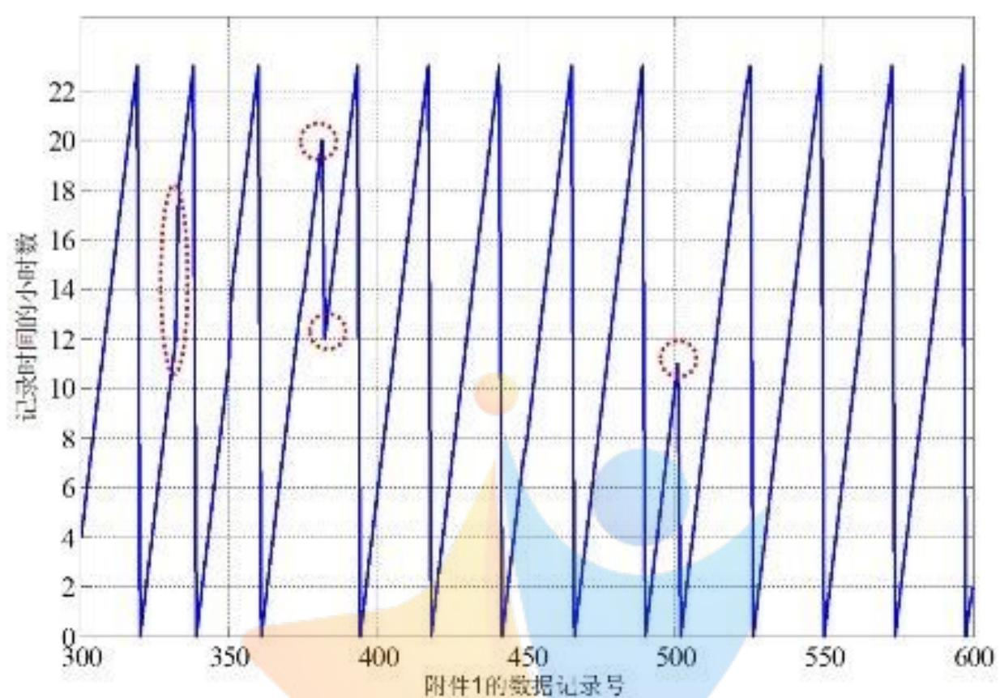
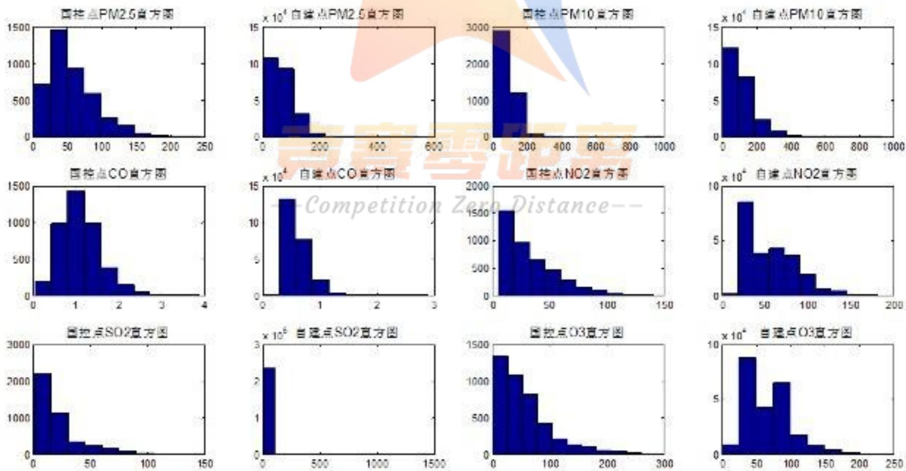
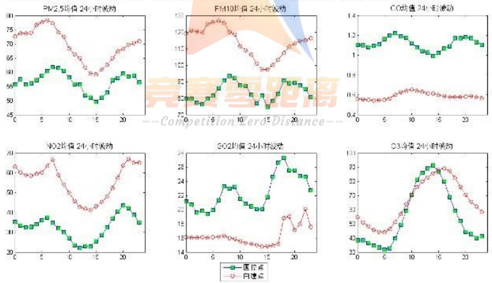
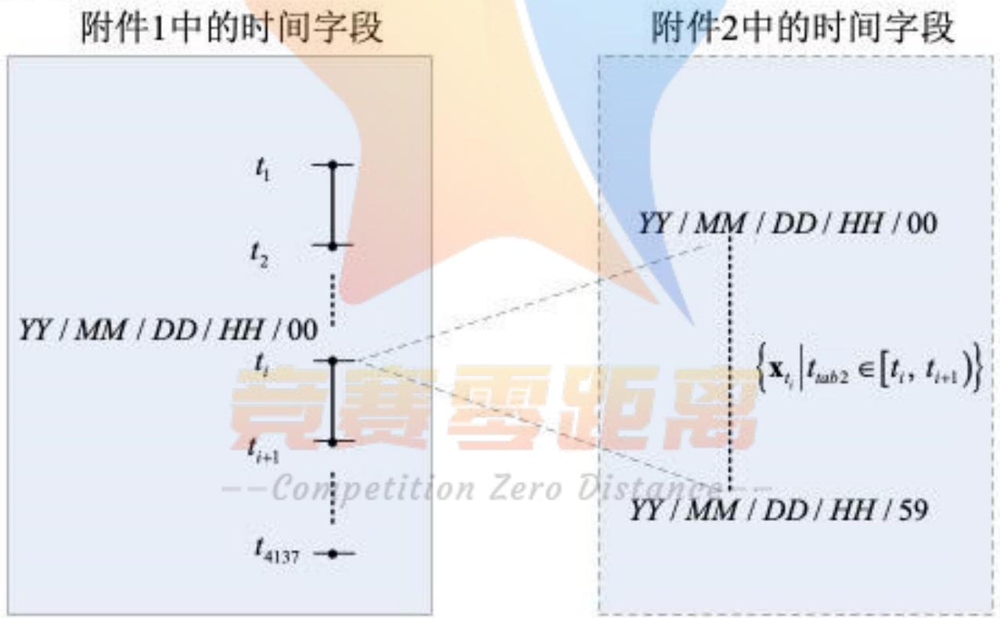
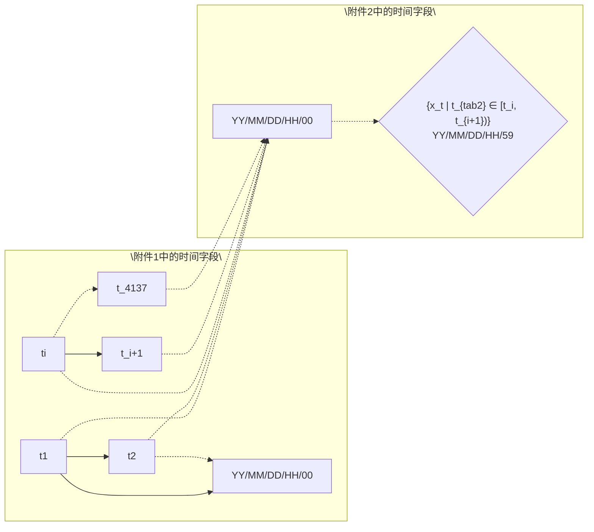
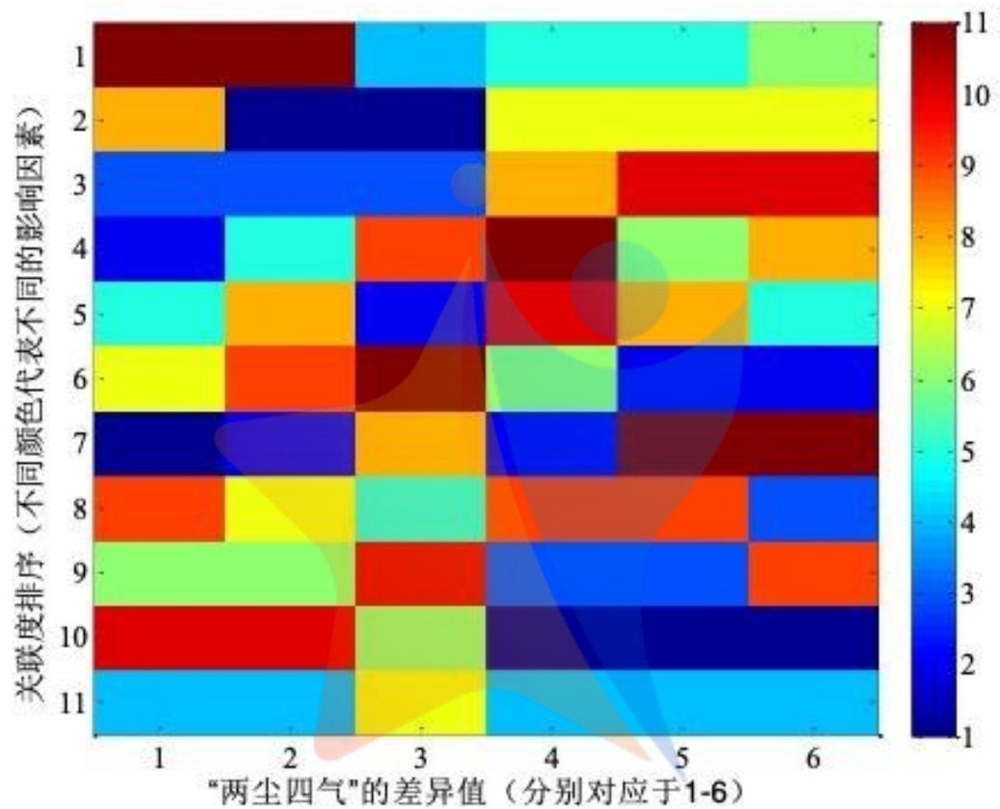
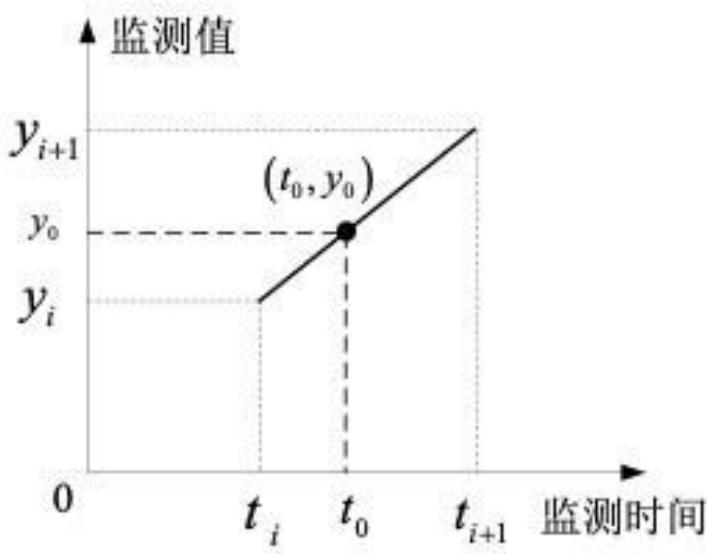
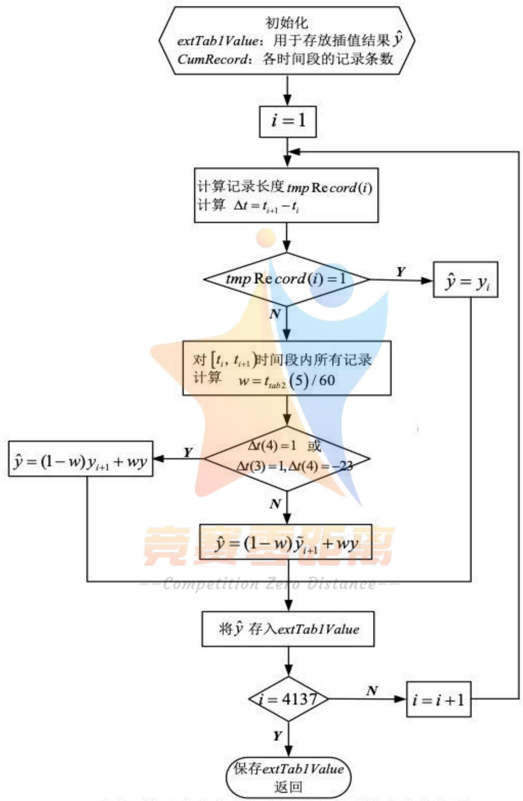
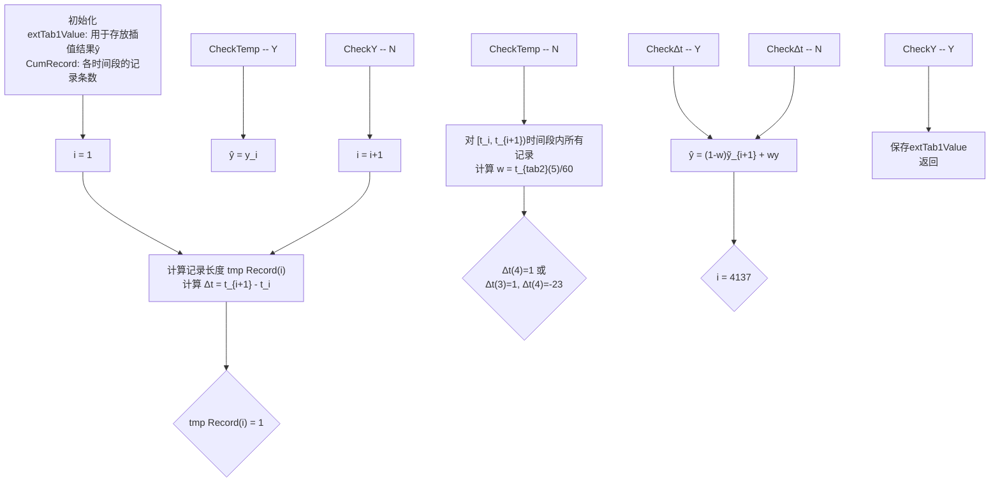
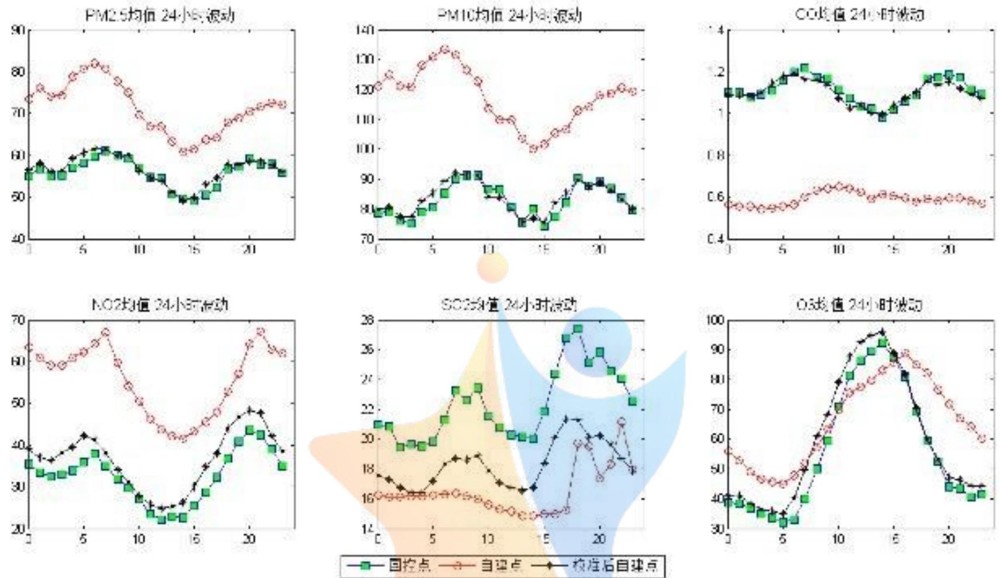

# 空气质量数据的校准

## 摘要

掌握空气质量并采取相应措施，对维持生态环境和推动人类健康具有重大的现实意义。本文以空气质量的监测数据为研究对象，在合理假设的基础上，首先，对国控点和自建点的监测数据进行了探索性分析；其次，找到了一种基于时间对齐的差异值计算方法，在此基础上分别建立并求解了基于关联度分析和基于多元线性回归的差异值影响模型，分析了导致自建点数据和国控点数据产生差异的因素；接着，基于分段线性插值的自建点数据校准模型解答了问题三；最后，对模型优缺点进行了分析。主要结论如下：

针对问题一，从数据质量检查、数据的统计量、污染物浓度直方图、污染物浓度和气象参数的相关系数、“两尘四气”浓度的24小时波动趋势等五个方面对自建点数据和国控点数据开展探索性分析。结论表明：国控点数据中存在多处“小时数的不连续点”，自建点数据也存在一些不连续点；该区域空气污染主要由颗粒物造成，PM2.5、PM10达到二级浓度限值，“四气”均达到一级浓度限值；从直方图看，国控点和自建点数据在分布上存在明显差异；“两尘四气”浓度和气象参数等11个因素之间存在显著的两两相关关系；“两尘四气”浓度在一天内达到峰值与谷值的时间段不同，国控点和自建点数据污染物浓度的24小时变动趋势不一致。

针对问题二，基于时间对齐算法实现国控点数据和自建点数据的可比较性；建立并求解了基于关联度分析和多元线性回归的差异值影响模型，均循环6次，分别考察了11个影响因素对“两尘四气”浓度差异值的影响。时间对齐后，附件1的有效记录为4137行，附件2的有效记录为197341行，进而将附件2压缩为4137行，定量计算出两者的差异值。关联度分析结论表明：影响“两尘四气”浓度差异值的最主要因素不同，对PM2.5、PM10、CO、NO₂、SO₂、O₃监测浓度差异影响最大的分别为第11个（湿度）、第11个（湿度）、第4个（NO₂）、第5个（SO₂）、第5个（SO₂）、第6个（O₃）影响因素；污染物浓度变化的确会对传感器存在交叉干扰；影响因素的重要程度并非一成不变，针对不同污染物，影响因素的主次关系变化较大。通过多元回归分析发现：P值表明所有6个模型在整体上是显著的，R²值表明模型2、模型3和模型6的拟合度较高；零点漂移和量程漂移可视作回归方程的常数项变化；传感器的长时间使用、气体污染物浓度变化以及气象因素均可导致自建点数据和国控点数据之间的差异，影响程度由回归系数决定；并非只有气体污染物对数据差异产生影响，颗粒物的影响效应同样存在。

针对问题三，基于分段线性插值方法对自建点数据进行校准，将自建点数据校准问题，转化为一个过已知有限个数据点（国控点监测数据）求近似函数的问题，从而将附件1中的4137条国控点监测数据，扩展成为197341条自建点的校准数据。结论表明：校准后的自建点数据与国控点数据吻合度较好；自建点与国控点的残差为56717、校准后的数据与国控点的残差为1649，仅为原残差的2.9%。

文中所建立的模型简便易行，便于推广，可利用国控点的数据对近邻自建点的数据进行校准。

关键词：空气质量 探索性分析 关联度分析 多元线性回归 分段线性插值

## 一、问题重述

伴随着工业化和城市化的迅猛发展，城市雾霾、酸雨及光化学烟雾等空气污染现象日益突出。实时监测“两尘四气”（PM2.5、PM10、CO、NO₂、SO₂、O₃）浓度，掌握空气质量并采取相应措施，对维持生态环境和推动人类健康具有重大的现实意义。自2012年《环境空气质量标准》发布后，国家已陆续建成了1000多座空气质量监测控制站点，成为了空气监测和评估的主力军。此外，基于传感器和无线传感器网络的自建点也成为了国控点的有益补充。

国控点监测数据准确，但布控较少、成本高、发布时间滞后；自建点成本低、实时性强，不仅可满足高密度网格化及动态监测的要求，还可监测温度、湿度、风速、气压、降水等气象参数，但同时也暴露出数据准确性差、校准难等缺点[1]。近邻自建点所采集的数据与国控点的数据值存在一定的差异，主要影响因素来自于三个方面：传感器的零点漂移和量程漂移，非常规气态污染物（气）浓度变化对传感器存在交叉干扰，以及天气因素对传感器的影响。因此，需要利用国控点的数据对近邻自建点的数据进行校准，从而充分发挥自建点数据的作用，使其为污染源控制和环境管理提供更丰富的决策依据。根据国控点每小时监测数据（附件1.CSV）和该国控点近邻的一个自建点监测数据（附件2.CSV），建立数学模型解决以下问题：

问题 1，对国控点数据和自建点数据进行探索性数据分析。

问题 2，分析导致自建点数据和国控点数据产生差异的因素。

问题 3，以国控点数据为基准，通过数学模型校准自建点数据。

## 二、问题分析

考虑到数据量较大，首先需要对附件 1.CSV（国控点监测数据），附件 2.CSV（自建点监测数据，含气象参数）进行数据预处理，将后续程序中需要用到的数据另存为后缀为.mat 的文件。

探索性数据分析（Exploratory Data Analysis，简称EDA），是指对已有的数据（题目中对应为附件1和附件2中的原始数据）在尽量少的先验假定下进行探索，通过作图、制表、方程拟合、计算特征量等手段探索数据的结构和规律的一种数据分析方法[2]。针对问题一，首先需要对原始数据进行数据质量检查，检查内容主要包括数据一致性，处理无效值和缺失值；在此基础上，通过最小值、最大值、均值、中位数、标准差、偏度以及峰度等统计量反映国控点和自建点监测数据的数量特征；进一步地，还可绘制出变量的直方图、分析变量之间的相关关系，通过可视化的方式直观考察国控点和自建点在监测值上的差异性。

影响差异值的三大来源分别是:传感器的零点漂移和量程漂移、污染物的交叉干扰、天气因素对传感器的影响。针对问题二,主要包括两个子问题:1)如何定量地刻画国控点和自建点监测数据的差异值;2)如何建立合理模型,对引致差异值的影响因素进行分析。分析要点应该包括:究竟是哪些影响因素导致了差异值的产生?能否通过分析关联度,测算出影响因素的排序?是否可以通过多元回归,考察各影响因素对于差异值的显著程度、作用方向及影响程度?文中考虑采用灰度系统理论中的关联度分析方法和多元线性回归方法。

针对问题三，已知国控点的监测数据准确，但布控较少、发布时间滞后；自建点监测数据更新快，但误差较大。如何利用国控点数据对自建点数据进行校准这一问题，等同于求一个过已知有限个数据点（国控点监测数据）的近似函数，进而产生出与自建点监测数据同步更新的数据，并据此对自建点数据进行校准。校准方法的有效性需要进行客观、准确的评价，可考虑通过可视化方式、定量计算两种方式进行评价。文中考虑采用线性插值的方法进行数据校准。

## 三、基本假设

为简化问题，做出如下合理假设：

(1) 同一时间, 自建点与国控点所处的客观环境是一致的, 即污染物浓度和天气因素的实际值是完全相同的。  
(2) 不考虑监测数据的存储、传输、分发等环节的随机噪声所导致的数据误差。  
（3）假设数据总体是符合线性正态误差模型，即误差项 $\varepsilon\sim N(0,\sigma^{2})$ 。

## 四、符号说明

<table><tr><td>符号</td><td>说明</td></tr><tr><td> $\bar{x}$ </td><td>监测数据的均值</td></tr><tr><td>s</td><td>监测数据的标准差</td></tr><tr><td> $v_1$ </td><td>监测数据的偏度</td></tr><tr><td> $v_2$ </td><td>监测数据的峰度</td></tr><tr><td> $\rho$ </td><td>各污染物浓度之间、污染物与气象参数之间的相关系数</td></tr><tr><td> $t_i$ </td><td>附件1中“时间”字段的第i个时刻(年月日时)</td></tr><tr><td> $t_{tab2}$ </td><td>附件2中 $[t_i, t_{i+1})$ 时间段内的各个时刻(年月日时分)</td></tr><tr><td> $\mathbf{x}_{t_{tab2}}$ </td><td> $[t_i, t_{i+1})$ 时间段内,附件2中的所有监测值(含气象参数)</td></tr><tr><td> $\overline{\mathbf{x}}_{t_{tab2}}$ </td><td> $[t_i, t_{i+1})$ 时间段内,附件2中对所有监测值按列求均值</td></tr><tr><td>rowNum</td><td>附件2中 $[t_i, t_{i+1})$ 时间段内所有监测记录的行数,其中每一行为一条监测记录,维数为11</td></tr><tr><td>newTab1Value</td><td>基于时间对齐后,附件1中的监测数据</td></tr><tr><td>newTab1Time</td><td>基于时间对齐后,附件1中的时间(年月日时)</td></tr><tr><td>newTab2Value</td><td>基于时间对齐后,附件2中的监测数据</td></tr><tr><td>newTab2Time</td><td>基于时间对齐后,附件2中的时间(年月日时分)</td></tr><tr><td> $\mathbf{y}_i$ </td><td>第i个时刻的国控点监测数据(6维)</td></tr><tr><td> $\Delta\mathbf{y}_i$ </td><td>第i个时刻的自建点与国控点的差异值(6维)</td></tr><tr><td>compTab2Value</td><td>将newTab2Value从197341条自建点数据压缩成4137条</td></tr><tr><td>extTab1Value</td><td>将newTab1Value从4137条国控点数据扩展成197341条</td></tr><tr><td>w</td><td> $t_0, t_i$ 处的一阶均差,即 $w = (t_0 - t_i)/(t_{i+1} - t_i)$ </td></tr></table>

## 五、模型的建立及求解

## 5.1 问题一的分析与求解

## 5.1.1 国控点和自建点数据的探索性分析

(1) 数据质量检查  


<details>
<summary>line</summary>

| 附件1的数据记录号 | 记录时间的小时数 |
| --- | --- |
| ~320 | 23 |
| ~335 | 23 |
| ~360 | 23 |
| ~380 | 20 |
| ~390 | 12 |
| ~400 | 23 |
| ~420 | 23 |
| ~440 | 23 |
| ~460 | 23 |
| ~480 | 23 |
| ~500 | 11 |
| ~520 | 23 |
| ~540 | 23 |
| ~560 | 23 |
| ~580 | 23 |
| ~600 | 23 |
</details>

图1 附件1中监测数据中小时数的不连续点

在对国控点数据和自建点数据进行探索性分析之前，首先对附件1和附件2的数据进行质量检查，发现数据一致性较好，不存在无效值和缺失值的情况。考虑到国控点和自建点由于某种原因导致的记录中断，因此数据质量检查主要针对监测数据的记录时间是否具有连续性。以附件1监测数据为例，国控点监测数据的正常间隔为1小时一次，一旦发现存在相邻的两条数据记录时间间隔超过1小时，说明监测数据记录存在间断现象。随机取出附件1中第300条至600条记录，横轴为数据记录序号，纵轴为“时间”字段的小时数，如图1所示。如果小时数是连续的，则图1是连续的锯齿波形状。显然在图1中存在多处“小时数的不连续点”（以红色虚线圈出），分别对应于附件1中第333条，第351条，第382条和第502条记录。类似地，附件2中也存在一些监测时间的不连续点：国控点监测数据的正常间隔为5分钟内至少一次，例如第9073条数据为2018年12月1日18:51的记录，之后在当日的19:00\~20:00内未产生任何监测记录。

需要指出的是，由于时间点记录的缺失值数量有限，在进行探索性数据分析时不考虑其影响，毕竟该分析是基于大样本统计得出的。但在问题2的建模和求解过程中，由于时间字段的不连续点对国控点和自建点的差值分析的影响较大，因此要挖掘数据差异的影响因素，必须对缺失值进行处理。

对国控点数据和自建点数据进行探索性数据分析,也即将附件1和附件2分别作为国控点和自建点的空气质量监测样本,从中提取有用信息,从而根据样本去推断该区域大气的特征。

## (2) 监测数据的统计量

通过最小值、最大值、均值、中位数、标准差、偏度以及峰度等统计量来反映观测样本的数量特征[3]。顾名思义，最小值或最大值分别为附件1和附件2中每列数据中最小和最大的值。均值可描述每列数据取值的平均位置，记做 $\bar{x}$ ，

$$
\overline {{x}} = \frac {1}{n} \sum_ {i = 1} ^ {n} x _ {i} \tag {1}
$$

中位数是将每列数据由小到大排序后位于中间位置的那个数值。标准差是用于表示变异程度的统计量，记做s

$$
s = \sqrt {\frac {1}{n - 1} \sum_ {i = 1} ^ {n} \left(x _ {i} - \bar {x}\right) ^ {2}} \tag {2}
$$

随机变量 x 的偏度和峰度指的是 x 的的标准化变量 $(x - E(x))/\sqrt{D(x)}$ 的三阶中心距和四阶中心距：

$$
v _ {1} = E \left[ \left(\frac {x - E (x)}{\sqrt {D (x)}}\right) ^ {3} \right] = \frac {E \left[ (x - E (x)) ^ {3} \right]}{(D (x)) ^ {3 / 2}} \tag {3}
$$

$$
v _ {2} = E \left[ \left(\frac {x - E (x)}{\sqrt {D (x)}}\right) ^ {4} \right] = \frac {E \left[ (x - E (x)) ^ {4} \right]}{(D (x)) ^ {2}} \tag {4}
$$

偏度 $v_{1}$ 和峰度 $v_{2}$ 反映每列数据的分布形状, 其中偏度反映对称性, $v_{1} > 0$ 成为右偏态, 说明数据位于均值右边的比位于左边的多, 反之则成为左偏态; 峰度则是衡量偏离正态分布的尺度之一, 正态分布的峰度为 3 , 若 $v_{2}$ 比 3 大的多, 表示分布有沉重的尾巴, 说明样本中含有较多远离均值的数据。

## (3) 污染物浓度直方图

以“两尘四气”中各污染物浓度的最大值和最小值为上下限，将其取值区间等分 $M$ 份，计算得到污染物浓度分别落入 $M$ 个小区间内的频数（文中选择 $M = 10$ ），从而可直观展示国控点和自建点监测数据在分布上的差异。

## (4) 污染物浓度、气象参数的相关系数

将各污染物浓度以及温湿度、风速、气压等气象参数看做随机变量，从而研究变量之间的两两相关性，进而考察两个变量之间是否存在相互依存关系以及相互关系的密切程度。两个变量之间的相关系数 $\rho$ 如下式所示：

$$
\rho = \frac {\operatorname{Cov} (X , Y)}{\sqrt {D (X)} \sqrt {D (Y)}} \tag {5}
$$

其中， $\mathrm{Cov}(X,Y)$ 为X与Y的协方差， $D(X)$ 为X的方差， $D(Y)$ 为Y的方差。

## (5)“两尘四气”浓度的24小时波动趋势

以小时为单位，根据2018年11月14日至2019年6月11日期间国控点和自建点的监测数据，计算出“两尘四气”浓度在一天24小时的均值，从而研究24小时变化趋势。根据波动趋势图，既可以分析出较长时期内各污染物浓度在一天中的峰值与谷值，又可以考察国控点和自建点在监测值上的差异性。

## 5.1.2 探索性分析结果及讨论

## (1) 对国控点和自建点数据的描述性统计分析

表 1 国控点“两层四气”浓度的描述性统计

<table><tr><td></td><td>PM2.5 (μg/m3)</td><td>PM10 (μg/m3)</td><td>CO (mg/m3)</td><td>NO2 (μg/m3)</td><td>SO2 (μg/m3)</td><td>O3 (μg/m3)</td></tr><tr><td>最小值</td><td>1</td><td>2</td><td>0.05</td><td>5</td><td>1</td><td>1</td></tr><tr><td>最大值</td><td>246</td><td>985</td><td>3.895</td><td>141</td><td>150</td><td>259</td></tr><tr><td>均值</td><td>56.73</td><td>83.82</td><td>1.12</td><td>32.64</td><td>22.40</td><td>54.77</td></tr><tr><td>中位数</td><td>49</td><td>76</td><td>1.05</td><td>26</td><td>15</td><td>45</td></tr><tr><td>标准差</td><td>34.57</td><td>50.87</td><td>0.49</td><td>24.30</td><td>20.03</td><td>47.99</td></tr><tr><td>偏度</td><td>1.14</td><td>3.31</td><td>0.94</td><td>1.23</td><td>2.06</td><td>1.38</td></tr><tr><td>峰度</td><td>4.52</td><td>49.72</td><td>4.95</td><td>4.33</td><td>7.496</td><td>5.09</td></tr></table>

表 2 自建点“两层四气”浓度的描述性统计

<table><tr><td></td><td>PM2.5 $(\mu g/m^3)$ </td><td>PM10 $(\mu g/m^3)$ </td><td>CO $(mg/m^3)$ </td><td>NO2 $(\mu g/m^3)$ </td><td>SO2 $(\mu g/m^3)$ </td><td>O3 $(\mu g/m^3)$ </td></tr><tr><td>最小值</td><td>1</td><td>2</td><td>0</td><td>0</td><td>2</td><td>0</td></tr><tr><td>最大值</td><td>548</td><td>933</td><td>2.9</td><td>181</td><td>1103</td><td>249</td></tr><tr><td>均值</td><td>69.35</td><td>113.47</td><td>0.59</td><td>55.51</td><td>16.34</td><td>66.09</td></tr><tr><td>中位数</td><td>59</td><td>93</td><td>0.5</td><td>51</td><td>16</td><td>62</td></tr><tr><td>标准差</td><td>38.51</td><td>71.70</td><td>0.22</td><td>28.73</td><td>20.01</td><td>33.66</td></tr><tr><td>偏度</td><td>1.06</td><td>1.52</td><td>1.67</td><td>0.69</td><td>37.00</td><td>0.99</td></tr><tr><td>峰度</td><td>4.38</td><td>6.08</td><td>7.21</td><td>2.69</td><td>1506.57</td><td>4.19</td></tr></table>

对国控点和自建点数据的描述性统计如表1和表2所示，由于篇幅限制，仅对表1进行分析。由表1可知，“两尘四气”中PM2.5、PM10、CO、 $NO_{2}$ 、 $SO_{2}$ 、 $O_{3}$ 的日均浓度分别为56.73、83.82、1.12、32.64、22.40、54.77。根据《环境空气质量标准》[4]中所规定的环境空气污染物基本浓度限值，PM2.5、PM10在二级浓度限值（35<PM2.5≤75，50<PM10≤150）的范围内，其余四种气体均达到一级浓度限值标准（ $CO<4,NO_{2}<80,SO_{2}<50,O_{3}<160$ ），说明该区域空气污染主要由颗粒物造成。六种空气污染物的偏度均大于0，表明位于均值右边的数据比左边多。PM10的峰度远远大于3（ $\nu_{2}=49.72$ ），说明观测数据中有较多远离均值的数据。

(2) 对国控点和自建点数据的直方图表示  
  
图2“两尘四气”中各污染物浓度的频数统计

“两尘四气”中各污染物浓度的频数统计如图1所示。从图1可直观看出，国控点和自建点数据在分布上存在明显差异，表明零点漂移、量程漂移、污染物及天气因素对传感器的影响确实存在，这也为后续分析自建点数据和国控点数据差异的影响因素，乃至自建点数据的校准埋下了伏笔。

(3) 国控点和自建点数据中各污染物浓度、气象参数之间的相关性分析

表 3 国控点“两层四气”浓度的相关性分析（p<0.05）

<table><tr><td></td><td>PM2.5</td><td>PM10</td><td>CO</td><td>NO2</td><td>SO2</td><td>O3</td></tr><tr><td>PM2.5</td><td>1.0000</td><td>0.8157</td><td>0.6624</td><td>0.2590</td><td>0.2713</td><td>-0.2690</td></tr><tr><td>PM10</td><td>0.8157</td><td>1.0000</td><td>0.5822</td><td>0.3064</td><td>0.3064</td><td>-0.1765</td></tr><tr><td>CO</td><td>0.6624</td><td>0.5822</td><td>1.0000</td><td>0.2983</td><td>0.3119</td><td>-0.2737</td></tr><tr><td>NO2</td><td>0.2590</td><td>0.3064</td><td>0.2983</td><td>1.0000</td><td>-0.3440</td><td>-0.2544</td></tr><tr><td>SO2</td><td>0.2713</td><td>0.3064</td><td>0.3119</td><td>-0.3440</td><td>1.0000</td><td>-0.2840</td></tr><tr><td>O3</td><td>-0.2690</td><td>-0.1765</td><td>-0.2737</td><td>-0.2544</td><td>-0.2840</td><td>1.0000</td></tr></table>

国控点各污染物浓度的相关性分析如表3所示。由表3可知，各相关系数在p<0.05的水平上均显著，说明各污染物之间确实存在相互依存关系，PM2.5、PM10、CO、 $NO_{2}$ 、 $SO_{2}$ 之间存在正相关关系， $O_{3}$ 与其他污染物浓度之间负相关。自建点各污染物浓度、气象参数之间的相关性分析结果如表4所示（见附录1）。从表4可以看出，各污染物之间的相互依存关系依然存在。此外，各污染物浓度和气压、温湿度等气象参数间也存在显著的相关关系，例如降水量和 $SO_{2}$ 之间存在显著的负相关关系（r=-0.0543, p<0.05），湿度和 $SO_{2}$ 浓度之间则存在负相关关系（r=0.0328, p<0.05）。相关性分析的结果也为问题2——分析自建点数据和国控点数据差异的因素奠定了基础。

## (4) 国控点和自建点数据的分时段统计分析

国控点和自建点数据中各污染物浓度的24小时波动趋势如图2所示。由图2可知，6种污染物达到峰值的时间段不同：PM2.5、PM10、CO、 $NO_{2}$ 的浓度在7\~9点间达到峰值， $SO_{2}$ 浓度在17:00\~19:00点达到峰值，而 $O_{3}$ 在15:00左右达到峰值。此外，从图2还可以发现，国控点和自建点数据确实存在不一致现象：对PM2.5、PM10和 $NO_{2}$ 而言，两者的24小时变化趋势大致一致，自控点的监测值较高；对CO和 $SO_{2}$ 而言，国控点较自建点观测值高；对 $O_{3}$ 而言，自建点的监测值较国控点有位移现象。

  
图 3 各污染物浓度的 24 小时波动趋势

## 5.2 问题二模型的建立与求解

针对问题二，需要对造成自建点数据和国控点数据差异的因素进行分析。这就涉及两个子问题：1）如何定量计算出自建点数据和国控点数据的差异值？2）差异值的影响因素分析，包括因素的识别、因素间相互关系以及因素影响程度大小等问题。

对于1)，通过时间对齐算法实现国控点数据和监测点数据的可比较性；对于2)，拟采用关联度分析和多元线性回归两种方法进行差异值的影响因素分析。原因有两点：一是鉴于难以识别造成差异的因素，难以确定因素主次关系以及因素之间相互作用机理亦不明确等原因，可基于灰色系统理论中的关联度分析量化关联程度，厘清因素的主次关系，从而展示该灰色系统的内在规律；二是借助多元回归模型，考察各因素的显著程度、作用方向及影响程度，以便分清哪些因素是潜在的，哪些因素是明显的，哪些因素需要抑制。

## 5.2.1. 模型二的建立 I：基于关联度分析的差异值影响模型

## (1) 基于时间对齐的差异值计算方法

如何定量地刻画自建点数据和国控点数据的差异，需要通过计算出两者的差异值，因此差异值的计算方法直接决定模型二能否建立与求解。欲求两者的差异值，只能基于时间对齐的差异值计算方法实现国控点数据和监测点数据的可比较性。面临的问题在5.1.1中探索性分析已指出，国控点数据和监测点数据均存在记录缺失的情况。因此，需要先以附件1中的时间点为基准，查找附件2中与之有时间对应关系的记录；或者以附件2的时间段为基准，查找附件1中与之相对应的监测记录，从而使国控点数据和自建点数据在时间上对齐，具备明确的时间对应关系。文中拟采用第一种时间对齐方法，基本原理如图4所示。



<details>
<summary>flowchart</summary>


</details>

图4国控点数据和自建点数据的时间对齐

由图4可知，若要查找与附件1中国控点 $t_{i}$ 时刻记录相对应的自建点数据，首先必须严格保证二者在年（YY）、月（MM）、日（DD）、小时（HH）上的一致性。随之在附件2中的“时间”字段查找分钟数介于0\~59之间所有自建点监测值，记为集合 $x_{t_{tab2}}$ ，也即 $\left\{x_{t_{tab2}}\mid t_{tab2}\in\left[t_{i},t_{i+1}\right)\right\}$ ，其中 $t_{tab2}$ 表示附件2中在 $\left[t_{i},t_{i+1}\right)$ 时间段内的各个时刻（格式：年月日时分）。反之，由 $\left\{x_{t_{tab2}}\mid t_{tab2}\in\left[t_{i},t_{i+1}\right)\right\}$ 也可查找出与之相对应的国控点数据。以附件1中第1076条记录为例，它表示国控点在2019年1月1日1:00的记录。在附件2中，与之对应的为2019年1月1日1:00\~1:59的记录，也即记录的第31309至31319条。同理，与第31309至31319条相对应的国控点记录便为第1076条。基于上述正向和逆向查找的时间对齐方法，具备明确的时间对应关系的监测数据，在附件1的记录为

4137 行，在原始数据（4200 行）占比 98.5%；附件 2 的记录为 197341 行，在原始数据（234717 行）占比 84.1%，均处于可接受范围。

基于时间对齐的处理后，附件1中的监测数据记为newTab1Value，维度为4137\*6，对应的时间字段以年、月、日、时4维数组的格式记为newTab1Time，维度为4137\*4。附件2中的监测数据记为newTab2Value，维度为197341\*11，对应的时间字段以年、月、日、时、分5维数组的格式记为newTab2Time，维度为197341\*5。

在国控点数据和自建点数据实现时间对齐后，可对 $\left[t_{i},t_{i+1}\right)$ 时间段内自建点的“两尘四气”浓度，以及风速、气压、降水量、温度以及湿度等气象参数按列求均值，将newTab2Value的197341条自建点数据压缩成4137条，维度为11，记为compTab2Value。 $\left[t_{i},t_{i+1}\right)$ 时间段内的计算公式如下：

$$
\overline {{\mathbf {x}}} _ {t _ {a b 2}} = \frac {\sum \mathbf {x} _ {t _ {a b 2}}}{r o w N u m (\mathbf {x} _ {t _ {a b 2}})} \tag {6}
$$

自建点与国控点在“两尘四气”浓度上的数据差异，可由式（6）中的 $\bar{x}_{t_{\mathrm{ub2}}}$ 与国控点监测数据的差值 $\Delta Y$ 来表示：

$$
\Delta \mathbf {Y} = \left\{\Delta \mathbf {y} _ {i.} \mid \Delta \mathbf {y} _ {i.} = \overline {{\mathbf {x}}} _ {t _ {\mathrm{tab2}}} - \mathbf {y} _ {i.}, i = 1, 2, \dots 4 1 3 7 \right\} \tag {7}
$$

其中， $y_{i}$ 为 newTab1Time 中第 i 个时刻的国控点监测数据（6 维）， $\Delta y_{i}$ 为 newTab1Time 中第 i 个时刻的自建点与国控点的差异值。

## (2) 基于关联度分析 $^{[3]}$ 的差异值影响模型

关联度分析方法是根据因素之间发展态势的相似或相异程度来衡量因素间关联的程度，它解释了事物动态关联的特征与程度。它具备不过分要求样本量、不需要典型分布规律、计算量少、不会出现关联度量化结果与定性分析不一致等优点，因此得到了广泛使用 $^{[3]}$ 。

文中主要基于关联度分析，着重考察“两尘四气”浓度变化、天气因素（风速、压强、降水量、温度、湿度）对差异值的影响。差异值可根据式（7）求得，“两尘四气”浓度变化由 newTab1Value 可得，天气因素由 compTab2Value 的第 7 列\~第 11 列可得。因为差异值 $\Delta Y$ 共有 6 列，分别对应于 PM2.5、PM10、CO、 $NO_{2}$ 、 $SO_{2}$ 、 $O_{3}$ ，在考察时需要分别处理，相当于关联度分析方法需要循环 6 次，分别计算出各因素对于“两尘四气”监测数据差异值的影响。例如，对 PM2.5 分析时，需选取差异值 $\Delta Y$ 的第 1 列数据，构造时间序列 $[\Delta Y[1], newTab1Value, compTab2Value[7:11]]$ ；对 PM10 分析时，需选取差异值 $\Delta Y$ 的第 2 列数据，构造时间序列 $[\Delta Y[2], newTab1Value, compTab2Value[7:11]]$ ，以此类推。

关联度分析方法的一般性表述 $^{[3]}$ 如下：

选取参考数列

$$
h _ {0} = \left\{h _ {0} (k) \mid k = 1, 2, \dots , n \right\} = \left(h _ {0} (1), h _ {0} (2), \dots , h _ {0} (n)\right) \tag {8}
$$

其中，k 表示时刻。

假设有 m 个比较数列 $h_{i}=\left\{h_{i}(k)\mid k=1,2,\cdots,n\right\}=\left(h_{i}(1),h_{i}(2),\cdots,h_{i}(n)\right)$ ， $i=1,2,\cdots,m$ ，则称

$$
\zeta_ {i} (k) = \frac {\min _ {s} \min _ {t} \left| h _ {0} (t) - h _ {s} (t) \right| + \theta \max _ {s} \max _ {t} \left| h _ {0} (t) - h _ {s} (t) \right|}{\left| h _ {0} (k) - h _ {i} (k) \right| + \theta \max _ {s} \max _ {t} \left| h _ {0} (t) - h _ {s} (t) \right|} \tag {9}
$$

为比较数列 $h_i$ 对参考数列 $h_0$ 在 $k$ 时刻的关联系数。其中， $\theta \in [0,1]$ 为分辨系数， $\theta$ 越大，分辨率越大， $\theta$ 越小，分辨率越小， $\min_{s}\min_{t}|h_{0}(t)-h_{s}(t)|$ 和 $\max_{s}\max_{t}|h_{0}(t)-h_{s}(t)|$ 分别为两级最小差和两级最大差。

式(9)定义的关联系数是描述比较数列与参考数列在某时刻关联程度的一种指标，由于各个时刻都有一个关联数，因此信息显得过于分散，不便于比较，为此给出

$$
r _ {i} = \frac {1}{n} \sum_ {k = 1} ^ {n} \zeta_ {i} (k) \tag {10}
$$

称为数列 $h_{i}$ 对参考数列 $h_{0}$ 的关联度。

需要注意的是，在计算关联度之前，还需对数据表中各个数列作初始化处理。由于实际问题中不同数列往往具有不同的量纲，而在关联度的计算要求量纲相同，因此，需要对各种数据进行无量纲化。此外，为了便于比较，要求所有数列有公共的焦点，因此对给定数列进行变化。若给定数列 $h=\left(h(1),h(2),\cdots,h(n)\right)$ ，称

$$
\bar {h} = \left(1, \frac {h (2)}{h (1)}, \dots , \frac {h (n)}{h (1)}\right) \tag {11}
$$

为原始数列 h 的初始化序列。

## 5.2.2. 模型二的建立Ⅱ：基于多元线性回归的差异值影响模型

多元回归分析的基本步骤[3]如下：1）获取自变量与因变量的数据，作为样本数据；2）根据自变量与因变量基本确定回归模型；3）利用自变量与因变量的样本数据拟合出回归数学模型的系数；4）通过模型的显著程度、拟合度等参数评价模型优劣。

文中，多元线性回归模型的因变量仍为自建点与国控点在“两尘四气”浓度上的数据差异值 $\Delta Y$ ，详见式（7）。自变量分别为“两尘四气”浓度、风速、气压、降水量、温度以及湿度，共计11维，分别记为 $x_{1},x_{2},\ldots,x_{11}$ 。在自变量样本数据的选择上，考虑到国控点的监测数据较为精确，所有将附件1中“两尘四气”的浓度作为样本数据的前6列；又考虑到只有自建点才可测得气象参数值，所以取compTab2Value中的第7列\~第11列作为样本数据，分别对应为风速、气压、降水量、温度以及湿度值。在此基础上建立的多元线性回归分析的模型为：

$$
\left\{ \begin{array}{l} \Delta \mathbf {y} = \beta_ {0} + \beta_ {1} \mathbf {x} _ {1} +... + \beta_ {m} \mathbf {x} _ {m} + \varepsilon \\ \varepsilon \sim N (0, \sigma^ {2}) \end{array} \right. \tag {12}
$$

式中 $\beta_{0}, \beta_{1}, \ldots, \beta_{m}, \sigma^{2}$ 都是与 $x_{1}, x_{2}, \ldots, x_{m}$ 无关的未知参数，其中 $\beta_{0}, \beta_{1}, \ldots, \beta_{m}$ 为回归系数，文中 $m = 1, 2, \cdots, 11$ 。与关联度分析方法类似的是， $\Delta y$ 为差异值 $\Delta Y$ 的某一列，6 列依次对应于 PM2.5、PM10、CO、 $NO_{2}$ 、 $SO_{2}$ 、 $O_{3}$ ，这意味着，基于多元线性回归的差异值影响模型同样需要运行 6 次，分别计算出各因素对于“两尘四气”监测数据差异值的影响。

多元回归分析的一般性表述 $^{[3]}$ 如下：

现有 n 个独立观测数据 $(y_{i}, x_{i1}, ..., x_{im})$ ， $i = 1, 2, ..., n, n > m$ ，本题 n = 4137。

由（12）得

$$
\left\{ \begin{array}{l} y _ {i} = \beta_ {0} + \beta_ {1} x _ {i 1} + \dots + \beta_ {m} x _ {i m} + \varepsilon_ {i} \\ \varepsilon_ {i} \sim N (0, \sigma^ {2}), i = 1, \dots , n \end{array} \right. \tag {13}
$$

记

$$
X = \left[ \begin{array}{c c c c} 1 & x _ {1 1} & \dots & x _ {1 m} \\ \vdots & \vdots & \dots & \vdots \\ 1 & x _ {n 1} & \dots & x _ {n m} \end{array} \right], Y = \left[ \begin{array}{c} y _ {1} \\ \vdots \\ y _ {n} \end{array} \right] \tag {14}
$$

$$
\varepsilon = \left[ \begin{array}{c c c} \varepsilon_ {1} & \dots & \varepsilon_ {n} \end{array} \right] ^ {T}, \beta = \left[ \begin{array}{c c c c} \beta_ {0} & \beta_ {1} & \dots & \beta_ {m} \end{array} \right] ^ {T} \tag {15}
$$

采用矢量矩阵，可表示为

$$
\left\{ \begin{array}{l} \mathbf {Y} = \mathbf {X} \boldsymbol {\beta} + \varepsilon \\ \varepsilon \sim N (0, \sigma^ {2} E _ {n}) \end{array} \right. \tag {16}
$$

其中 $E_{n}$ 为 n 阶单位矩阵。

## 5.2.3 模型二的求解 I：关联度分析结果及讨论

本模型求解运行环境为 Intel 酷睿 i7 处理器，8G 内存，Matlab2012a $^{[5]}$ ，下文模型求解中均不再提及运行环境。执行附录 4 中问题二模型的求解程序 question2.m，即可得出如下结论。

(1) 差异值及其影响因素的关联度排序结果, 如表 5 所示。需要指出的是, 表 5 中关联度是降序排列的, 每个关联度对应的序号代表因素编号, PM2.5、PM10、CO、 $\mathrm{NO}_{2}$ 、 $\mathrm{SO}_{2}$ 、 $\mathrm{O}_{3}$ 、风速、压强、降水量、温度、湿度分别对应编号 1\~11 。例如, 与自建点和国控点在 PM2.5 浓度上的监测差异最主要因素是第 11 个, 也即湿度; 最次要因素是第 4 个, 即 $\mathrm{NO}_{2}$ 浓度, 以此类推。

表 5 差异值及其影响因素的关联度排序

<table><tr><td colspan="2">PM2.5浓度差异</td><td colspan="2">PM10浓度差异</td><td colspan="2">CO浓度差异</td></tr><tr><td>关联度</td><td>重要性排序</td><td>关联度</td><td>重要性排序</td><td>关联度</td><td>重要性排序</td></tr><tr><td>0.9210</td><td>11</td><td>0.9456</td><td>11</td><td>0.7939</td><td>4</td></tr><tr><td>0.9044</td><td>8</td><td>0.9451</td><td>1</td><td>0.7721</td><td>1</td></tr><tr><td>0.8976</td><td>3</td><td>0.9413</td><td>3</td><td>0.7694</td><td>3</td></tr><tr><td>0.8919</td><td>2</td><td>0.9386</td><td>5</td><td>0.7657</td><td>9</td></tr><tr><td>0.8909</td><td>5</td><td>0.9385</td><td>8</td><td>0.7651</td><td>2</td></tr><tr><td>0.8905</td><td>7</td><td>0.9382</td><td>9</td><td>0.7637</td><td>11</td></tr><tr><td>0.8885</td><td>1</td><td>0.9377</td><td>2</td><td>0.7620</td><td>8</td></tr><tr><td>0.8810</td><td>9</td><td>0.9337</td><td>7</td><td>0.7604</td><td>5</td></tr><tr><td>0.8705</td><td>6</td><td>0.9269</td><td>6</td><td>0.7589</td><td>10</td></tr><tr><td>0.8693</td><td>10</td><td>0.9265</td><td>10</td><td>0.7575</td><td>6</td></tr><tr><td>0.7689</td><td>4</td><td>0.9030</td><td>4</td><td>0.7567</td><td>7</td></tr><tr><td colspan="2">NO2浓度差异</td><td colspan="2">SO2浓度差异</td><td colspan="2">O3浓度差异</td></tr><tr><td>关联度</td><td>重要性排序</td><td>关联度</td><td>重要性排序</td><td>关联度</td><td>重要性排序</td></tr><tr><td>0.9463</td><td>5</td><td>0.9746</td><td>5</td><td>0.8866</td><td>6</td></tr><tr><td>0.9400</td><td>7</td><td>0.9639</td><td>7</td><td>0.8739</td><td>7</td></tr><tr><td>0.9345</td><td>8</td><td>0.9608</td><td>10</td><td>0.8708</td><td>10</td></tr><tr><td>0.9299</td><td>11</td><td>0.9597</td><td>6</td><td>0.8549</td><td>8</td></tr><tr><td>0.9264</td><td>10</td><td>0.9597</td><td>8</td><td>0.8511</td><td>5</td></tr><tr><td>0.9194</td><td>6</td><td>0.9590</td><td>2</td><td>0.8402</td><td>2</td></tr><tr><td>0.9148</td><td>2</td><td>0.9586</td><td>11</td><td>0.8384</td><td>11</td></tr><tr><td>0.8974</td><td>9</td><td>0.9570</td><td>9</td><td>0.8244</td><td>3</td></tr><tr><td>0.8956</td><td>3</td><td>0.9546</td><td>3</td><td>0.8229</td><td>9</td></tr><tr><td>0.8779</td><td>1</td><td>0.9522</td><td>1</td><td>0.8109</td><td>1</td></tr><tr><td>0.7616</td><td>4</td><td>0.9038</td><td>4</td><td>0.7184</td><td>4</td></tr></table>

由表 5 可知，1）造成各种污染物的自建点和国控点监测浓度的差异的最主要因素不同。对 PM2.5、PM10、CO、 $NO_{2}$ 、 $SO_{2}$ 、 $O_{3}$ 监测浓度差异影响最大的分别为第 11 个（湿度）、第11个（湿度）、第4个 $\left(\mathrm{NO}_{2}\right)$ 、第5个 $\left(\mathrm{SO}_{2}\right)$ 、第5个 $\left(\mathrm{SO}_{2}\right)$ 、第6个 $\left(\mathrm{O}_{3}\right)$ 影响因素。这是可解释的：湿度对PM2.5和PM10的监测浓度差异影响最大是符合生活常识的，通常下雨天空气中的颗粒物较少； $NO_{2}$ 对CO的监测浓度差异影响最大，可能是由于 $NO_{2}$ 和CO等汽车尾气的主要成分，在一定条件下可发生化学反应，使得CO的监测浓度发生变化；第5个影响因素—— $SO_{2}$ 对 $NO_{2}$ 的监测浓度差异影响最大，这是由于在一定条件下， $NO_{2}$ 和 $SO_{2}$ 很容易发生反应生成NO和 $SO_{3}$ ，从而造成监测差异，这也说明非常规气体污染物浓度变化的确会对传感器存在交叉干扰。2）影响因素的重要程度并非一成不变，针对不同污染物，影响因素的主次关系变化较大，如图5所示。以第11个影响因素——湿度为例，它对PM2.5和PM10的监测浓度差异的影响最大，但对CO、 $NO_{2}$ 、 $SO_{2}$ 、 $O_{3}$ 浓度差异的重要性分别位于6、4、7、7位。



<details>
<summary>heatmap</summary>

| 关联度排序 (不同颜色代表不同的影响因素) | 1 | 2 | 3 | 4 | 5 | 6 |
| --- | --- | --- | --- | --- | --- | --- |
| 1 | ~10.5 | ~10.5 | ~4.5 | ~5.5 | ~6.5 | ~7.5 |
| 2 | ~8.0 | ~2.0 | ~2.0 | ~7.5 | ~7.5 | ~7.5 |
| 3 | ~3.0 | ~3.0 | ~3.0 | ~8.0 | ~9.5 | ~9.5 |
| 4 | ~2.0 | ~5.0 | ~8.5 | ~10.5 | ~7.5 | ~8.0 |
| 5 | ~5.0 | ~8.0 | ~2.0 | ~9.5 | ~8.0 | ~5.0 |
| 6 | ~7.5 | ~8.5 | ~10.5 | ~6.0 | ~2.0 | ~2.0 |
| 7 | ~1.0 | ~2.0 | ~8.0 | ~2.0 | ~10.5 | ~11.0 |
| 8 | ~9.0 | ~7.5 | ~5.5 | ~9.0 | ~9.5 | ~3.0 |
| 9 | ~6.0 | ~6.0 | ~9.5 | ~2.0 | ~2.0 | ~9.0 |
| 10 | ~10.5 | ~10.5 | ~6.5 | ~1.5 | ~1.5 | ~1.5 |
| 11 | ~4.0 | ~4.0 | ~7.5 | ~4.0 | ~4.0 | ~4.0 |
</details>

图 5 根据关联度排序的影响因素变化

## 5.2.4 模型二的求解Ⅱ：回归分析结果及讨论

执行附录 4 程序 question2.m，可得“两尘四气”浓度及风速、压强等气象参数与自建点和国控点数据差异的回归分析结果，如表 6 所示。

模型 1 检验了“两尘四气”浓度及各气象参数对 PM2.5 监测浓度差异的影响，模型 2 至模型 6 分别考察了自变量对 PM10、 $NO_{2}$ 、CO、 $SO_{2}$ 以及 $O_{3}$ 的监测差异的影响。P 值表明所有模型在整体上是显著的， $R^{2}$ 值表明模型 2、模型 3 和模型 6 的拟合度较好。

分析方程1可知，常数项会导致监测差异的变化，而零点漂移和量程漂移恰可视作方程的常数项发生了变化； $\mathrm{NO}_2$ 和 $\mathrm{O}_3$ 的浓度对数据差异存在正向影响（ $\beta_{1} = 0.0154, \beta_{2} = 0.0215$ ），CO 和 $\mathrm{SO}_2$ 对数据差异存在负向影响（ $\beta_{1} = -0.0955, \beta_{2} = -0.0052$ ）；除温度外，风速、压强、降水量和湿度均对自建点数据和国控点数据的差异产生正向影响。此之，模型1还说明并非只有气体污染对数据差异产生影响，颗粒物的影响效应同样存在（ $\beta_{1} = 0.0614, \beta_{2} = -0.0227$ ）。由于篇幅限制，不对模型2至模型6中的回归结果一一进行分析。

表6“两尘四气”浓度及各气象参数对自建点和国控点数据差异的影响的回归分析

<table><tr><td></td><td>模型1</td><td>模型2</td><td>模型3</td><td>模型4</td><td>模型5</td><td>模型6</td></tr><tr><td colspan="7">自变量</td></tr><tr><td>PM2.5</td><td>0.0614</td><td>1.8250</td><td>0.0003</td><td>-0.0096</td><td>-0.0741</td><td>-0.0202</td></tr><tr><td>PM10</td><td>-0.0227</td><td>-0.9938</td><td>0.0006</td><td>0.0591</td><td>0.0531</td><td>0.0632</td></tr><tr><td>CO</td><td>-0.0955</td><td>2.5820</td><td>-0.9537</td><td>-1.3646</td><td>2.2036</td><td>1.9699</td></tr><tr><td> $NO_2$ </td><td>0.0154</td><td>-0.2670</td><td>0.0009</td><td>-0.4989</td><td>0.0945</td><td>0.1698</td></tr><tr><td> $SO_2$ </td><td>-0.0052</td><td>0.0903</td><td>0.0044</td><td>0.3018</td><td>-0.9283</td><td>0.7282</td></tr><tr><td> $O_3$ </td><td>0.0215</td><td>-0.1151</td><td>0.0005</td><td>-0.1973</td><td>0.0298</td><td>-0.5668</td></tr><tr><td>风速</td><td>1.6377</td><td>-3.3613</td><td>-0.0177</td><td>-2.5797</td><td>-0.6583</td><td>-2.7809</td></tr><tr><td>压强</td><td>0.3161</td><td>1.8754</td><td>0.0130</td><td>0.3288</td><td>0.0639</td><td>1.0826</td></tr><tr><td>降水量</td><td>0.0176</td><td>0.0600</td><td>0.0001</td><td>0.0946</td><td>-0.0161</td><td>0.0731</td></tr><tr><td>温度</td><td>-0.1689</td><td>0.6282</td><td>0.0220</td><td>1.1126</td><td>-0.0925</td><td>1.1501</td></tr><tr><td>湿度</td><td>0.3806</td><td>0.6560</td><td>0.0036</td><td>0.2648</td><td>0.0740</td><td>0.1671</td></tr><tr><td>常数项</td><td>-336.2875</td><td>-1938.9459</td><td>-13.4583</td><td>-334.3950</td><td>-59.1242</td><td>-1119.7575</td></tr><tr><td>F</td><td>302.1792</td><td>1636.0807</td><td>3094.0912</td><td>618.6439</td><td>522.4825</td><td>1297.9020</td></tr><tr><td>P</td><td>0</td><td>0</td><td>0</td><td>0</td><td>0</td><td>0</td></tr><tr><td> $R^2$ </td><td>0.4462</td><td>0.8135</td><td>0.8919</td><td>0.6226</td><td>0.5822</td><td>0.7758</td></tr></table>

综上可知，传感器的长时间使用、气体污染物浓度变化以及气象因素的确会造成自建点数据和国控点数据之间的差异，影响程度由回归系数决定。这也表明，有必要对自建点数据进行校准。

## 5.3 问题三模型的建立与求解

## 5.3.1. 模型三的建立：基于分段线性插值的自建点数据校准模型

已知国控点的监测数据准确,但布控较少、发布时间滞后;自建点监测数据更新快,但误差较大。利用国控点数据对自建点数据进行校准这一问题,等同于过已知有限个数据点(国控点监测数据)求一个的近似函数,进而产生出与自建点监测数据同步更新的数据,并据此对自建点数据进行校准。文中拟采用分段线性插值方法进行自建点数据校准,将 newTab1Value 的 4137 条国控点监测数据,扩展成为 197341 条自建点的校准数据,将校准结果记为 extTab1Value。

顾名思义，分段线性插值 $^{[3]}$ 是将每两个相邻的节点用直线连起来，如此形成的一条折线就是分段线性插值函数。具体到每一个分段，指插值函数为一次多项式的插值方式，即线性插值（在插值节点上的插值误差为零），其示意图如图6所示。每一段的计算公式如式（17）所示，程序流程图如图7所示。



<details>
<summary>line</summary>

| Time | Value |
| --- | --- |
| t_i | y_i |
| t_0 | y_0 |
| t_{i+1} | y_{i+1} |
</details>

图 6 线性插值

$$
y _ {0} = \frac {t _ {i + 1} - t _ {0}}{t _ {i + 1} - t _ {i}} y _ {i + 1} + \frac {t _ {0} - t _ {i}}{t _ {i + 1} - t _ {i}} y _ {i} = (1 - w) y _ {i + 1} + w y _ {i} \tag {17}
$$

其中 $t_{i}$ 为 newTab1Time 中的第 i 个时刻（年月日时），w 在 $t_{0}, t_{i}$ 处的一阶均差。



<details>
<summary>flowchart</summary>


</details>

图7基于分段线性插值的数据校准的程序流程图

## 5.3.2 模型三的求解：自建点数据校准的结果及讨论

执行附录 5 程序 question3.m，即可得出自建点数据校准的结果，并有如下结论。

以 newTab1Value（国控点数据）、newTab2Value（自建点数据）和 extTab1Value（自建点校准数据）为研究对象，类似于 5.1.1 中探索性分析，再次考察“两尘四气”浓度的 24 小时波动趋势：以小时为单位，计算出“两尘四气”浓度在一天 24 小时的均值的变化趋势，如图 8 所示。由图可知，国控点和自建点数据存在明显的不一致现象，但校准后的自建点数据与国控点数据吻合度较好。进一步地，通过定量分析印证这一结论，以国控点为基准，分别计算自建点与国控点的残差为 56717、校准值与国控点的残差仅为 1649，换言之，对自建点数据校准后，与国控点的残差仅为原残差的 2.9%。

  
图 8 各污染物浓度的 24 小时波动趋势

## 六、模型的评价与推广

本文以空气质量的监测数据为研究对象，在对国控点和自建点数据的探索性分析的基础上，找到了一种基于时间对齐的差异值计算方法，分别建立并求解了基于关联度分析的差异值影响模型，基于多元线性回归的差异值影响模型，基于分段线性插值的自建点数据校准模型，对题设中的三个问题进行了解答。

## 6.1 模型的优点

1、灵活运用探索性分析策略，分别从数据质量、数据的统计量、直方图、相关系数、波动趋势等五个方面对数据进行了探索。  
2、从关联度分析和多元回归分析两个角度，分别考察了导致自建点数据和国控点数据产生差异的因素，分析内容详实，具体包括是哪些影响因素导致了差异值的产生、测算出差异值与影响因素的关联度排序、各影响因素对于差异值的显著程度、作用方向及影响程度。  
3. 校准后的自建点数据与国控点数据吻合度较好。数据校准后，与国控点的残差仅为原来残差的 2.9%；而且该方法概念简单，计算过程清晰，具有可操作性。算法复杂度小，容易移植到嵌入式仪表设备中。

## 6.2 模型的缺点及改进方向

1、在基于多元线性回归的差异值影响模型中，并未对自变量进行筛选，也未对影响因素进一步深加工，以产生新的自变量。自变量筛选可以借鉴的方法包括：1）前进法，根据指标变化情况逐个加入自变量；2）后退法，根据指标变化情况逐个剔除自变量；3）逐步回归分析，引进更有意义的自变量，剔除无关变量。回归方法也可以考虑其它理论方法，如神经网络理论，以便实现线性和非线性的有机统一。  
2. 基于时间对齐的差异值计算方法过于简单，并未考虑对时间的不连续点进行预测补值；在进行分段线性插值时，可以引入时间衰减因子，使得校准后的自建点数据更加贴合国控点的监测数据。

## 6.3 模型的推广

文中所建立的模型可应用于利用国控点数据对自建点数据进行校准, 进而掌握空气质量并采取相应措施, 有利于维持生态环境和推动人类健康。

## 七、参考文献

[1] 秦孝良，高健等. 传感器技术在环境空气监测与污染治理中的应用现状、问题与展望[J]. 中国环境监测，2019，35（4）：162-172.  
[2] 一文带你探索性数据分析(EDA). [EB/OL] https://www.jianshu.com/p/9325c9f88ee6.2017.12.19.  
[3] 司守奎, 孙玺菁. 数学建模算法与应用[M]. 北京: 国防工业出版社, 2011.  
[4] 环境保护部. GB 3095-2012 环境空气质量标准[S], 2016.  
[5] 卓金武. MATLAB 在数学建模中的应用[M]. 北京航空航天大学出版社, 2014.

竞赛零距离

--Competition Zero Distance--

附录1 11个因素相关性分析结果  
表 4 自建点“两尘四气”浓度、气象参数的相关性分析 (p<0.05)

<table><tr><td></td><td>PM2.5</td><td>PM10</td><td>CO</td><td>NO2</td><td>SO2</td><td>O3</td><td>风速</td><td>压强</td><td>降水量</td><td>温度</td><td>湿度</td></tr><tr><td>M2.5</td><td>1.0000</td><td>0.9573</td><td>0.1835</td><td>0.3240</td><td>0.0682</td><td>-0.0829</td><td>-0.1289</td><td>0.2887</td><td>0.0272</td><td>-0.4036</td><td>0.3601</td></tr><tr><td>PM10</td><td>0.9573</td><td>1.0000</td><td>0.2633</td><td>0.3338</td><td>0.0584</td><td>0.0037</td><td>-0.1247</td><td>0.3840</td><td>0.0938</td><td>-0.4611</td><td>0.3709</td></tr><tr><td>CO</td><td>0.1835</td><td>0.2633</td><td>1.0000</td><td>0.2333</td><td>0.2059</td><td>0.4837</td><td>-0.0843</td><td>-0.1841</td><td>0.1751</td><td>0.3037</td><td>-0.0592</td></tr><tr><td>NO2</td><td>0.3240</td><td>0.3338</td><td>0.2333</td><td>1.0000</td><td>0.1085</td><td>-0.0884</td><td>-0.2505</td><td>0.0582</td><td>0.3000</td><td>-0.1644</td><td>0.2539</td></tr><tr><td>SO2</td><td>0.0682</td><td>0.0584</td><td>0.2059</td><td>0.1085</td><td>1.0000</td><td>-0.0463</td><td>-0.0490</td><td>0.0253</td><td>-0.0543</td><td>-0.0480</td><td>0.0328</td></tr><tr><td>O3</td><td>-0.0829</td><td>0.0037</td><td>0.4837</td><td>-0.0884</td><td>-0.0463</td><td>1.0000</td><td>0.1105</td><td>-0.1743</td><td>0.2359</td><td>0.4396</td><td>-0.4546</td></tr><tr><td>风速</td><td>-0.1289</td><td>-0.1247</td><td>-0.0843</td><td>-0.2505</td><td>-0.0490</td><td>0.1105</td><td>1.0000</td><td>0.0589</td><td>0.0357</td><td>0.0498</td><td>-0.2083</td></tr><tr><td>压强</td><td>0.2887</td><td>0.3840</td><td>-0.1841</td><td>0.0582</td><td>0.0253</td><td>-0.1743</td><td>0.0589</td><td>1.0000</td><td>0.1161</td><td>-0.8421</td><td>0.1496</td></tr><tr><td>降水量</td><td>0.0272</td><td>0.0938</td><td>0.1751</td><td>0.3000</td><td>-0.0543</td><td>0.2359</td><td>0.0357</td><td>0.1161</td><td>1.0000</td><td>-0.0561</td><td>0.0648</td></tr><tr><td>温度</td><td>-0.4036</td><td>-0.4611</td><td>0.3037</td><td>-0.1644</td><td>-0.0480</td><td>0.4396</td><td>0.0498</td><td>-0.8421</td><td>-0.0561</td><td>1.0000</td><td>-0.5180</td></tr><tr><td>湿度</td><td>0.3601</td><td>0.3709</td><td>-0.0592</td><td>0.2539</td><td>0.0328</td><td>-0.4546</td><td>-0.2083</td><td>0.1496</td><td>0.0648</td><td>-0.5180</td><td>1.0000</td></tr></table>

## 附录 2 数据预处理类程序

包括 getTime.m、dataPrepro.m 两个程序，主要功能是对附件 1、附件 2 进行数据预处理，将常用数据项保存为 mat 文件，以便调用。

```matlab
Time.m
function data = getTime(str,flag)
% 函数功能: 根据输入的时间字符串, flag=2,输出相应的年、月、日
%          flag 为其它数值时, 输出相应的年、月、日、时、分、秒
if nargin ==1
    flag = 2;
end
tmpdate = datevec(str);
if flag == 1
    data = tmpdate(1:3,:);
else
    data = tmpdate;
end
```

dataPrepro.m  
```matlab
% 对数据进行预处理
% Tab1 预处理：标题行 tab1Title、国控点时间 tab1Time、监测值 tab1MonitorValue
[~,~,tab1Alldata]=xlsread('附件 1.csv'); % 读取“附件 1.csv”
Ltab1 = length(tab1Alldata);          % 取行数
% tab1Title = tab1Alldata(1 ,:);           % tab1 行名称
tab1Alldata = tab1Alldata(2:Ltab1 ,:);    % 删除标题行
tab1Time = getTime(tab1Alldata(:,7));     % 国控点时间：年月日时分秒
tab1Time = tab1Time(:,1:4);               % 仅保留年、月、日、时
tab1MonitorValue = cell2mat(tab1Alldata(:,1:6)); % tab1 传感器记录值
% save tab1Title.mat tab1Title
save tab1Time.mat tab1Time
save tab1MonitorValue.mat tab1MonitorValue
```

```matlab
% Tab2 预处理：标题行 tab2Title、自建点时间 tab2Time、监测值 tab2MonitorValue
[~,~,tab2Alldata]= xlsread('附件 2.csv'); % 读取“附件 2.csv”
Ltab2 = length(tab2Alldata);          % 取行数
% tab2Title = tab2Alldata(1 ,:);          % tab2 行名称
tab2Alldata = tab2Alldata(2:Ltab2 ,:);      % 删除标题行
tab2Time = getTime(tab2Alldata(:,12));    % 自建点时间：年月日时分秒
tab2Time = tab2Time(:,1:5);            % 仅保留年、月、日、时、分
tab2MonitorValue = cell2mat(tab2Alldata(:,1:11)); % tab2 传感器记录值
% save tab2Title.mat tab2Title
save tab2Time.mat tab2Time
save tab2MonitorValue.mat tab2MonitorValue
```

## 附录 3 问题一的求解程序

包括 question1.m 和 explorDataAnalysis.m 两个程序，主要功能是对问题一模型进行求解。

question1.m

% 解决问题1，对自建点数据和国控点数据进行探索性数据分析

```txt
%% 装载数据
% 国控点数据 附件1标题：PM2.5、PM10、CO、NO2、SO2、O3
```

load tab1Time.mat % 附件 1 国控点记录时间：年月日时 (4200 \* 4)

load tab1MonitorValue.mat % 附件 1 监测值: 4200 \* 6

% 自建点数据

% 附件2标题：PM2.5、PM10、CO、NO2、SO2、O3、风速、压强、降水量、温度、湿度

load tab2Time.mat % 附件 2 自建点记录时间：年月日时分 (234717 \* 5)

load tab2MonitorValue.mat % 附件 2 监测值: (234717 \* 11)

%% 缺失值分析

% ii = 1:4200; plot(ii, tab1 Time(:,4)); ii = 1:1000; plot(ii, tab1 Time(ii,4));

ii = 300:600;plot(ii,tab1Time(ii,4),'-b','LineWidth',2);grid on

xlabel('附件1的数据记录号','FontSize',12);

ylabel('记录时间的小时数','FontSize',12);

set(gca,'ytick',0:2:23)

set(gca,'FontName','Times New Roman','FontSize',14) %设置坐标轴刻度字体名称、大小

%% 描述性统计：最小值、最大值、均值、中位数、标准差、偏度、峰度

% 国控点数据

tab1DataDisplay = [];

for i = 1:6

tmpDataDisplay = explorDataAnalysis(tab1MonitorValue(:,i));

tab1DataDisplay = [tab1DataDisplay tmpDataDisplay];

end

save tab1DataDisplay.mat tab1DataDisplay

% 自建点数据

tab2DataDisplay = [];

for i = 1:11

tmpDataDisplay = explorDataAnalysis(tab2MonitorValue(:,i));

tab2DataDisplay = [tab2DataDisplay tmpDataDisplay];

end

save tab2DataDisplay.mat tab2DataDisplay

%% 相关系数：结果与 corrcoef 相同

C1 = corr(tab1MonitorValue,'type','Pearson');    % 国控点数据

C2 = corr(tab2MonitorValue,'type','Pearson');    % 自建点数据

%% 国控点数据波形图

figure

tab1Date = 1:length(tab1Time);

set(gca,'FontName','Times New Roman','FontSize',12) %设置坐标轴刻度字体名称、大小

subplot(231);plot(tab1Date, tab1MonitorValue(:,1));title('国控点 PM2.5','FontSize', 12);xlim([0 4300]);

subplot(232);plot(tab1Date, tab1MonitorValue(:,2));title('国控点 PM10', 'FontSize', 12);xlim([0 4300]);

subplot(233);plot(tab1Date, tab1MonitorValue(:,3));title('国控点 CO','FontSize', 12);xlim([0 4300]);

subplot(234);plot(tab1Date, tab1MonitorValue(:,4));title('国控点 NO2','FontSize', 12);xlim([0 4300]);

subplot(235);plot(tab1Date, tab1MonitorValue(:,5));title('国控点 SO2', 'FontSize', 12);xlim([0 4300]);

subplot(236);plot(tab1Date, tab1MonitorValue(:,6));title('国控点 O3','FontSize', 12);xlim([0 4300]);

%% 对 24 小时浓度均值的波动情况进行统计分析

% 国控点数据

hourWave = zeros(24,6);

for i = 0:23

tmpIndex = tab1Time(:,4)==i;

tmpValue = tab1MonitorValue(tmpIndex,:);

hourWave(i+1,:) = sum(tmpValue,1)/length(tmpValue);
end  
% 自建点数据  
```matlab
hourWave2 = zeros(24,6);
for i = 0:23
    tmpIndex = tab2Time(:,4)==i;
    tmpValue = tab2MonitorValue(tmpIndex,1:6);
    hourWave2(i+1,:) = sum(tmpValue,1)/length(tmpValue);
end
```

figure  
```matlab
tab1Date = 0:23;
set(gca,'FontName','Times New Roman','FontSize',12,'LineWidth',3)%设置坐标轴刻度字体、大小、线宽
subplot(231);plot(tab1Date,hourWave(:,1),'--bs','MarkerFaceColor','g');
hold on;plot(tab1Date,hourWave2(:,1),'-ro');
title('PM2.5 均值 24 小时波动','FontSize',12);xlim([0 24]);
subplot(232);plot(tab1Date,hourWave(:,2),'-bs','MarkerFaceColor','g');
hold on;plot(tab1Date,hourWave2(:,2),'-ro');
title('PM10 均值 24 小时波动','FontSize',12);xlim([0 24]);
subplot(233);plot(tab1Date,hourWave(:,3),'-bs','MarkerFaceColor','g');
hold on;plot(tab1Date,hourWave2(:,3),'-ro');
title('CO 均值 24 小时波动','FontSize',12);xlim([0 24]);
subplot(234);plot(tab1Date,hourWave(:,4),'-bs','MarkerFaceColor','g');
hold on;plot(tab1Date,hourWave2(:,4),'-ro');
title('NO2 均值 24 小时波动','FontSize',12);xlim([0 24]);
subplot(235);plot(tab1Date,hourWave(:,5),'-bs','MarkerFaceColor','g');
hold on;plot(tab1Date,hourWave2(:,5),'-ro');
title('SO2 均值 24 小时波动','FontSize',12);xlim([0 24]);
subplot(236);plot(tab1Date,hourWave(:,6),'-bs','MarkerFaceColor','g');
hold on;plot(tab1Date,hourWave2(:,6),'-ro');
title('O3 均值 24 小时波动','FontSize',12);xlim([0 24]);
legend('国控点','自建点','FontSize',12)
```  
%% tab1 和 tab2 直方图比较

figure  
```matlab
binNum = 10;
set(gca,'FontName','Times New Roman','FontSize',12) %设置坐标轴刻度字体名称、大小
subplot(341);hist(tab1MonitorValue(:,1),binNum);title('国控点 PM2.5 直方图','FontSize',12);
subplot(342);hist(tab2MonitorValue(:,1),binNum);title('自建点 PM2.5 直方图','FontSize',12);
subplot(343);hist(tab1MonitorValue(:,2),binNum);title('国控点 PM10 直方图','FontSize',12);
subplot(344);hist(tab2MonitorValue(:,2),binNum);title('自建点 PM10 直方图','FontSize',12);
subplot(345);hist(tab1MonitorValue(:,3),binNum);title('国控点 CO 直方图','FontSize',12);
subplot(346);hist(tab2MonitorValue(:,3),binNum);title('自建点 CO 直方图','FontSize',12);
subplot(347);hist(tab1MonitorValue(:,4),binNum);title('国控点 NO2 直方图','FontSize',12);
subplot(348);hist(tab2MonitorValue(:,4),binNum);title('自建点 NO2 直方图','FontSize',12);
subplot(349);hist(tab1MonitorValue(:,5),binNum);title('国控点 SO2 直方图','FontSize',12);
subplot(3,4,10);hist(tab2MonitorValue(:,5),binNum);title('自建点 SO2 直方图','FontSize',12);
subplot(3,4,11);hist(tab1MonitorValue(:,6),binNum);title('国控点 O3 直方图','FontSize',12);
subplot(3,4,12);hist(tab2MonitorValue(:,6),binNum);title('自建点 O3 直方图','FontSize',12);
```

## explorDataAnalysis.m

function dataDisplay = explorDataAnalysis(x)

% 函数功能：对数据进行探索性分析

% 输入: x 行向量或者列向量

% 输出：最小值、最大值、均值、中位数、标准差、偏度、峰度

```matlab
zuiXiaoZhi = min(x);      % 最小值
zuiDaZhi = max(x);        % 最大值
junZhi = mean(x);          % 均值
zhongWeiShu = median(x);  % 中位数
biaoZhunCha = std(x);     % 标准差
pianDu = skewness(x);      % 偏度
fengDu = kurtosis(x);      % 峰度
dataDisplay = [zuiXiaoZhi;zuiDaZhi;junZhi;zhongWeiShu;biaoZhunCha;...
    pianDu;fengDu];
```

## 附录 4 问题二模型的求解程序

## question2.m

% 解决问题 2: 分析导致差异值的因素

% （1）时间对齐算法：计算自建点数据和国控点数据的差异  
% （2）关联度分析：对导致自建点数据和国控点数据造成差异的因素进行分析  
% （3）多元线性回归分析：对差异值的影响因素分析，与（2）进行比较

%% 装载数据

```txt
% 国控点数据 附件1标题：PM2.5、PM10、CO、NO2、SO2、O3
load tab1Time.mat      % 附件1 国控点记录时间：年月日时 (4200 * 4)
load tab1MonitorValue.mat % 附件1 监测值：4200 * 6
```

% 自建点数据

```txt
% 附件 2 标题：PM2.5、PM10、CO、NO2、SO2、O3、风速、压强、降水量、温度、湿度
load tab2Time.mat          % 附件 2 自建点记录时间：年月日时分 （234717 * 5）
load tab2MonitorValue.mat % 附件 2 监测值：（234717 * 11）
```

%%（1）时间对齐算法：计算自建点数据和国控点数据的差异

```matlab
% 明确国控点和自建点的对应关系，找到小时数的不连续点，整例删除 tab1 中对应的数据
[newTab1Time,iTab1,iTab2] = intersect(tab1Time(:,1:4),tab2Time(:,1:4),'rows');
newTab1Value = tab1MonitorValue(iTab1,:);    % 处理后的国控点观测值
```

% 根据时间段求均值，将 Tab2 压缩为 4137\*11，计算 Tab1 和 Tab2 的差异

```matlab
compTab2Value = zeros(length(newTab1Time),11);    % 初始化，存放压缩后的 Tab2
newTab2Time = [];    % 存放处理后的自建点观测时间
newTab2Value = [];    % 存放处理后的自建点观测值
lengthRecord = [];    % tab1-tab2 中对应的观测值数量
for i = 1:length(newTab1Time)
    tmpIndex = find(tab2Time(:,1)==newTab1Time(i,1)&...
        tab2Time(:,2)==newTab1Time(i,2)&...
        tab2Time(:,3)==newTab1Time(i,3)&...
        tab2Time(:,4)==newTab1Time(i,4));
    tmpValue = tab2MonitorValue(tmpIndex,:);
    tmpLength = size(tmpValue,1);
    compTab2Value(i,:) = sum(tmpValue,1)/tmpLength; % 对应时间段，均值处理
    newTab2Time = [newTab2Time;tab2Time(tmpIndex,:)]; % 记录观测时间
    newTab2Value = [newTab2Value;tmpValue];          % 记录观测值
    lengthRecord = [lengthRecord;tmpLength];         % 记录每段观测值的数量
```

```matlab
end
Diff1 = compTab2Value(:,1:6) - newTab1Value;
save ('Q2Q3data.mat','newTab1Value','compTab2Value','Diff1',...
    'newTab2Value','lengthRecord', 'newTab2Time','newTab1Time')
```  
%% （2）关联度分析：11种因素与差异值的关联度排序

% 数据项：差异值、PM2.5、PM10、CO、NO2、SO2、O3、风速、压强、降水量、温度、湿度
rsResult = [];  
```matlab
rResult = [];
for ii = 1:6
    X = [Diff1(:,ii),newTab1Value,compTab2Value(:,7:11)]'; % 时间序列
    [indexNum columnNum]=size(X);
```

```matlab
for i = 1:indexNum          % 消除量纲影响
    X(i,:) = X(i,:)/X(i,1);
end
ck=X(1,:); m1=size(ck,1);  % 提取参考队列和比较队列
bj=X(2:end,:); m2=size(bj,1);

for i=1:m1
    for j=1:m2            % 比较队列与参考队列相减
        t(j,:)=bj(j,:)-ck(i,:);
    end
    jc1=min(min(abs(t')); % 最大差和最小差
    jc2=max(max(abs(thorho=0.5;
    ksi=(jc1+rho*jc2)/(abs(t)+rho*jc2); % 求关联系数
    rt=sum(ksi,2)/size(ksi,2);      % 求关联度
    r(:,i)=rt;
end
rResult = [rResult,r];          % 关联度（顺序记录，无大小排序）
[rs,rind]= sort(r,'descend');   % 对关联度进行排序
rsResult = [rsResult,rs,rind];   % 关联度（大小排序）
```

% 将排序结果可视化  
```matlab
sorted11 = rsResult(:,2:2:12); % 取出排序结果
imagesc(sorted11)
xlabel('“两尘四气”的差异值（分别对应于 1-6）','FontSize',14)
ylabel('关联度排序（不同颜色代表不同的影响因素）','FontSize',14)
colorbar          % 显示色阶,1~11 分别对应 11 种影响因素
set(gca,'FontName','Times New Roman','FontSize',14)%设置坐标轴刻度字体、大小
set(gcf,'papersize',[15.2,8.4])
set(gcf,'paperposition',[-2,0.05,15.2,8.4])
```

%% (3) 多元线性回归分析  
```matlab
% 多元线性回归分析(未消除量纲):国控点观测值[1:6], 天气因素[7:11]
X1 = [ones(4137,1),newTab1Value,compTab2Value(:,7:11)]; % 构造自变量
P1 = ones(4,6);
B1 = zeros(12,6);
for i = 1:6
    Y1 = Diff1(:,i);
    [b,bint,r,rint,stats]=regress(Y1,X1);
```

```matlab
P1(:,i) = stats;
    B1(:,i) = b;
end
```

## 附录 5 问题三模型的求解程序

question3.m

% 解决问题3：条件已知，基于线性插值，依据国控点对自建点数据进行校准

load Q2Q3data.mat % 装载数据  
```matlab
%% 线性插值，估算出与自建点数据对应的国控点数据
extTab1Value = []; % 初始化，存放插值后的 Tab1
deltaTab1Time = [newTab1Time(2:end,:) - newTab1Time(1:end-1,:);[0 0 0 1]];
cumRecord = cumsum(lengthRecord); % 累计记录长度
for i = 1:length(deltaTab1Time)
    if i == 1
        tmpRecord = 1:cumRecord(1);
    else
        tmpRecord = (cumRecord(i-1)+1):cumRecord(i);
    end

    if length(tmpRecord)==1      % 记录长度=1 的特殊情况
        tmpExtTab1 = newTab1Value(i,:);
    else
        tmpW = newTab2Time(tmpRecord,5)/60;
        if i == length(deltaTab1Time)
            tmpExtTab1=(1-tmpW)*newTab2Value(end,1:6)+tmpW*newTab1Value(i,:);
        else
            if deltaTab1Time(i,4)==1 || ...     % 前后时间段相邻
                (deltaTab1Time(i,4) == -23 && deltaTab1Time(i,3)==1)
                    tmpExtTab1=(1-tmpW)*newTab1Value(i+1,:) + tmpW*newTab1Value(i,:);
            else                          % 前后时间段不相邻,用 Tab2 最后一个值近似
                tmpExtTab1=(1-tmpW)*newTab2Value(tmpRecord(2),1:6)+tmpW*newTab1Value(i,:);
        end
    end
end
extTab1Value = [extTab1Value;tmpExtTab1];
end
```

%% 根据线性插值结果，对自建点数据进行校准，并分析校准结果
yHat = extTab1Value;  
% 再次对 24 小时浓度均值的波动情况进行统计分析，比较三条曲线的差异  
```matlab
% 国控点数据
hourWave = zeros(24,6);
for i = 0:23
    tmpIndex = newTab1Time(:,4)==i;
    tmpValue = newTab1Value(tmpIndex,:);
    hourWave(i+1,:) = sum(tmpValue,1)/length(tmpValue);
end
% 自建点数据
hourWave2 = zeros(24,6);
for i = 0:23
```

```matlab
tmpIndex = newTab2Time(:,4)==i;
tmpValue = newTab2Value(tmpIndex,1:6);
hourWave2(i+1,:) = sum(tmpValue,1)/length(tmpValue);
end
```  
% 校准后自建点数据

```matlab
hourWave3 = zeros(24,6);
for i = 0:23
    tmpIndex = newTab2Time(:,4)==i;
    tmpValue = yHat(tmpIndex,:);
    hourWave3(i+1,:) = sum(tmpValue,1)/length(tmpValue);
end
```

% 计算残差  
```matlab
cancha1 = sum(sum((hourWave2 - hourWave).*(hourWave2 - hourWave)));
cancha2 = sum(sum((hourWave3 - hourWave).*(hourWave3 - hourWave)));
cancha1,cancha2
```

figure  
```matlab
tab1Date = 0:23;
set(gca,'FontName','Times New Roman','FontSize',12,'LineWidth',3)
subplot(231);plot(tab1Date,hourWave(:,1),'--bs','MarkerFaceColor','g');
hold on;plot(tab1Date,hourWave2(:,1),'-ro');plot(tab1Date,hourWave3(:,1),'-k*');
title('PM2.5 均值 24 小时波动','FontSize',12);xlim([0 24]);
subplot(232);plot(tab1Date,hourWave(:,2),'-bs','MarkerFaceColor','g');
hold on;plot(tab1Date,hourWave2(:,2),'-ro');plot(tab1Date,hourWave3(:,2),'-k*');
title('PM10 均值 24 小时波动','FontSize',12);xlim([0 24]);
subplot(233);plot(tab1Date,hourWave(:,3),'-bs','MarkerFaceColor','g');
hold on;plot(tab1Date,hourWave2(:,3),'-ro');plot(tab1Date,hourWave3(:,3),'-k*');
title('CO 均值 24 小时波动','FontSize',12);xlim([0 24]);
subplot(234);plot(tab1Date,hourWave(:,4),'-bs','MarkerFaceColor','g');
hold on;plot(tab1Date,hourWave2(:,4),'-ro');plot(tab1Date,hourWave3(:,4),'-k*');
title('NO2 均值 24 小时波动','FontSize',12);xlim([0 24]);
subplot(235);plot(tab1Date,hourWave(:,5),'-bs','MarkerFaceColor','g');
hold on;plot(tab1Date,hourWave2(:,5),'-ro');plot(tab1Date,hourWave3(:,5),'-k*');
title('SO2 均值 24 小时波动','FontSize',12);xlim([0 24]);
subplot(236);plot(tab1Date,hourWave(:,6),'-bs','MarkerFaceColor','g');
hold on;plot(tab1Date,hourWave2(:,6),'-ro');plot(tab1Date,hourWave3(:,6),'-k*');
title('O3 均值 24 小时波动','FontSize',12);xlim([0 24]);
hl = legend('国控点','自建点','校准后自建点','FontSize',12)
set(hl,'Orientation','horizon')
```