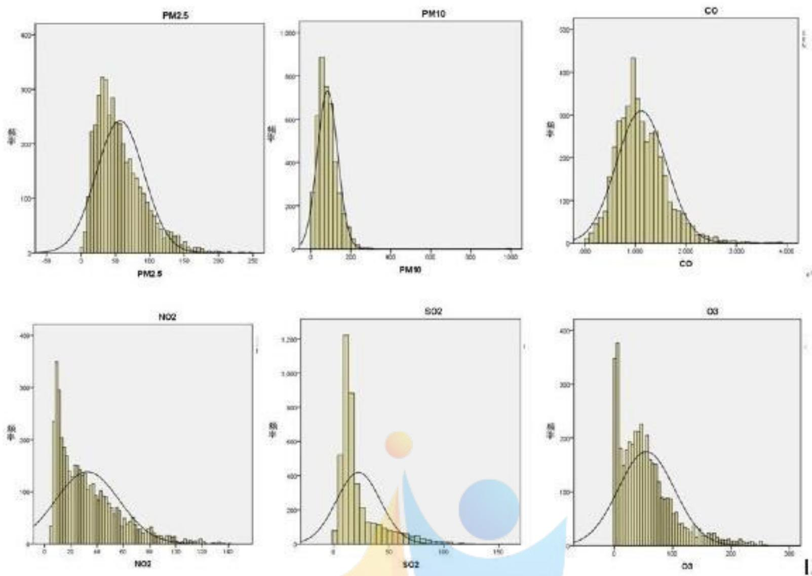
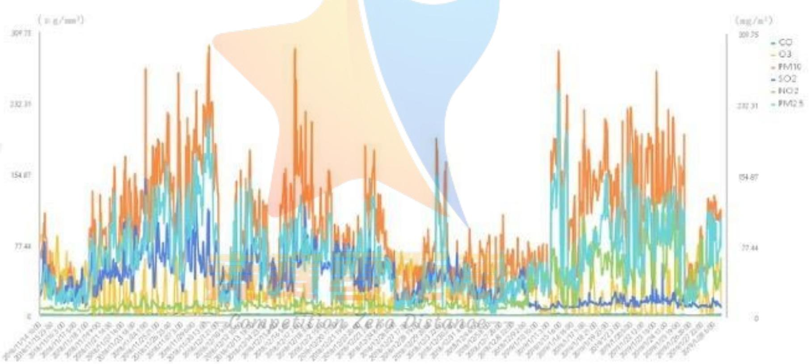
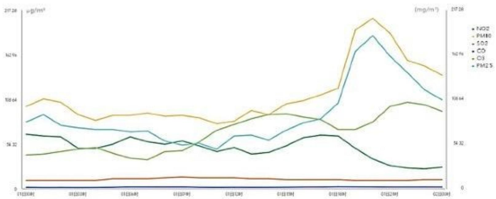
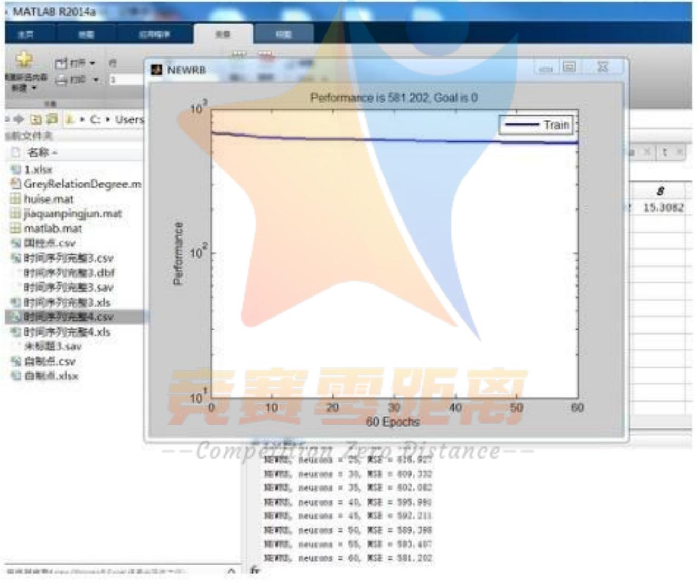
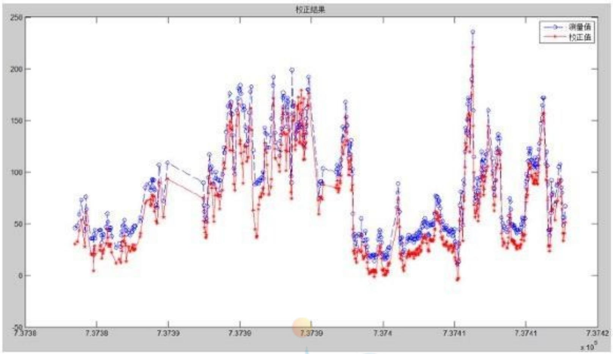
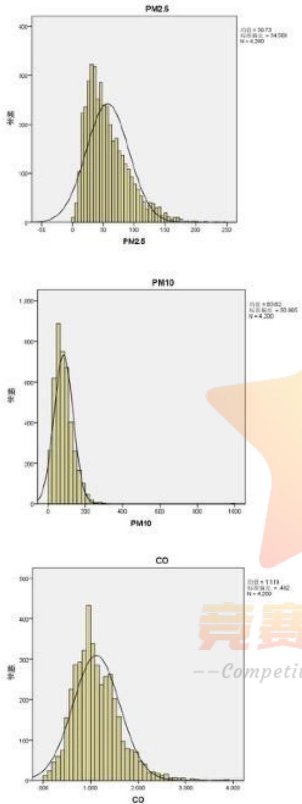
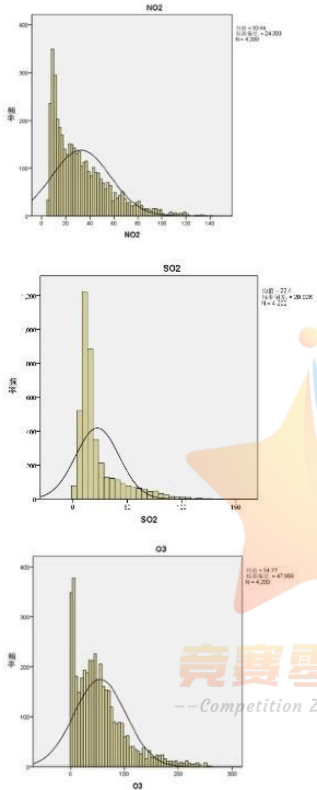

# 空气质量数据的校准

## 摘要

本文采用灰关联分析、SPSS 多元统计分析及 RBF 神经网络等方法，对空气质量数据校准问题进行研究。

针对问题一，使用 SPSS 进行统计分析，对各个污染物分布特性规律有了整体把握，并通过 BDP 作图，可视化分析结果。得到如下结论：（1）CO 的均值为 $1.11919 \, mg/m^{3}$ ，相对于其它气体的均值，其一天中变化范围最大，标准差达到了 $492093 \, mg/m^{3}$ ，其次 PM10 和 $O_{3}$ 的变化较大。（2）6 个污染指标分布均正偏。（3）PM10 的峰度最高为 46.782，表明分布极其陡峭，大部分时刻集中在均值附近。（4）在长期变化趋势中， $O_{3}$ 、PM10、 $SO_{2}$ 、PM2.5 具有相似的变化趋势， $NO_{2}$ 和 CO 的量较为稳定。一天内，污染物呈现先稳定不变再逐渐上升态势，PM2.5 和 PM10 均在下午 14 点后明显上升，污染最重的时候是在下午。

针对问题二，通过删除异常、重复数据，利用 matlab 数据标准化，并进行三次样条函数插值，保证了自建数据和国控数据处于同样的时间戳下。在此基础上，通过对两者的数据做差，将该差值与温度、湿度、压强、降水量、风速做灰色关联分析，得到以下结论：（1）风速与 PM2.5、PM10、 $NO_{2}$ 、 $SO_{2}$ 的误差有明显的关联，灰色关联度均大于 0.9；（2）压强与 CO 的误差具有较高的灰色关联度；（3）降水量对 PM2.5、PM10、 $NO_{2}$ 、 $SO_{2}$ 的误差的灰色关联度较大；（4）温度会对 PM2.5、PM10、 $NO_{2}$ 、 $SO_{2}$ 的测量造成误差；（5）湿度只与 $O_{3}$ 的误差相关。

针对问题三，在模型二样条函数插值的基础上，分别采用加权平均模型和RBF神经网络两种模型对数据进行校准。一将问题二模型中经过插值后的国控点数据和自建点数据加权平均，将国控点数据的估计值引入自建点数据，修正自建点数据。二是通过建立RBF神经网络，预测每次的测量误差，从而根据误差和自建点数据预测最终误差；三是通过建立逐步多元线性回归模型，分析出其中的关系式，从而校准自测点数据。模型校准的结果见支撑材料中的校准结果文件夹。

关键词：灰关联分析 RBF 神经网络 样条函数插值 逐步多元线性回归

## 1 问题的重述

大气污染有害于生态环境和人类健康。对“两尘四气”的浓度进行实时监控，便于对空气质量进行控制，采取应对污染源的处理。虽然国家监控局（NCP）对“两尘四气”有监测数据，且较为准确，但国控点的布控较少，数据发布滞后，成本较高。本公司的自制迷你型空气质量检测器成本低，并能实时监测特定区域的空气质量，同时监测温度、湿度、风速、空气压、降雨量等气象参数。

由于所使用的电化学气体传感器在长期使用后会产生一定的零点漂移和量程漂移，因此存在常规气体污染物质(气)浓度变化与气象因素对传感器的交叉干扰。在靠近国家控制点的自建点上，其收集的数据与国家控制点的数据之间存在一些差异。因此，需要使用国家控制点的每小时的数据校准近邻自建点的数据。

请确立研究以下问题的数学模型：

1.自我构筑点数据和国家管理点数据的探索的数据解析  
2.请分析造成构筑点数据与国家控制点数据差异的原因。  
3. 使用自控点的数据建立了校准自己构筑点的数据的数学模型。

## 2 问题的分析

本题要求首先对自建点数据和国控点数据进行探索性数据分析，首先通过SPSS进行描述分析和统计分析，并采用BDP个人版进行数据可视化分析，据此通过可视化图标发现数据规律。之后自建点数据和国控点数据进行数据插值，将自建点数据与国控点数据的差值与风速、压强、降水量、温度、湿度的数据序列进行灰色关联分析，比较灰关联度大小，判断相关程度。最后通过建立多变量灰色预测模型，利用国控点数据、自建点数据、风速、压强、降水量、温度、湿度等数据进行数据校准，得到校准后的数据序列。

3 符号约定

<table><tr><td> $x_i$ </td><td>自建点数据第i个的时间戳</td></tr><tr><td> $y_i$ </td><td>自建点数据第i个的污染物数据</td></tr><tr><td> $u_i$ </td><td>国控点数据第i个的时间戳</td></tr><tr><td> $w_i$ </td><td>国控点数据第i个的污染物数据</td></tr><tr><td>t</td><td>新建立的时间戳</td></tr><tr><td> $A_i$ </td><td>插值后的自建点数据</td></tr><tr><td> $B_i$ </td><td>插值后的国控点数据</td></tr><tr><td> $\hat{A}_{i}$ </td><td>插值后的自建点数据</td></tr><tr><td> $W_{1},W_{2}$ </td><td>权重值</td></tr><tr><td>NPM 2.5</td><td>自建点所测 PM2.5 的值</td></tr><tr><td>NPM 10</td><td>自建点所测 PM10 的值</td></tr><tr><td> $NSO_{2}$ </td><td>自建点所测  $SO_{2}$  的值</td></tr><tr><td>NCO</td><td>自建点所测 CO 的值</td></tr><tr><td> $NNO_{2}$ </td><td>自建点所测  $NO_{2}$  的值</td></tr><tr><td> $NO_{3}$ </td><td>自建点所测  $O_{3}$  的值</td></tr><tr><td>N降水量</td><td>自建点所测降水量的值</td></tr><tr><td>N压强</td><td>自建点所测压强的值</td></tr><tr><td>N温度</td><td>自建点所测温度的值</td></tr><tr><td>N湿度</td><td>自建点所测湿度的值</td></tr><tr><td> $PM2.5_{xz}$ </td><td>自建点校准过后 PM2.5 的值</td></tr><tr><td> $PM10_{xz}$ </td><td>自建点校准过后 PM10 的值</td></tr><tr><td> $CO_{xz}$ </td><td>自建点校准过后 CO 的值</td></tr><tr><td> $NO_{2xz}$ </td><td>自建点校准过后  $NO_{2}$  的值</td></tr><tr><td> $SO_{2xz}$ </td><td>自建点校准过后  $SO_{2}$  的值</td></tr><tr><td> $O_{3xz}$ </td><td>自建点校准过后  $O_{3}$  的值</td></tr></table>

## 4 模型的假设

1 假设题中给定的数据准确，没有错误；  
2、假设与自建点产生误差的变量都已经考虑在数据中；  
3、假设测试当天没有影响测量误差的其他特殊情况；  
4、假设各个时刻国控点数据没有测量误差。

## 5 模型一的建立与求解

## 5.1 问题分析

题目要求对自建点数据和国控点数据进行探索性分析，挖掘内在规律。首先利用 SPSS，对两尘四气的数据序列进行统计分析，分析其统计规律。之后利用 BDP 个人版，把自建点数据和国控点的时间序列通过 BDP 进行时间可视化，分析“两尘四气”（PM2.5、PM10、CO、NO₂、SO₂、O₃）浓度随时间变化序列的变化趋势。最后采用 SPSS 进行相关性分析，分析各个测量变量之间的相关关系。

## 5.2. 模型一的建立

## 5.2.1 数据预处理

## (1) 数据去重

由于对时间序列可视化需要将两尘四气表示为时间的函数, 而函数的性质是对于每一个自变量, 有且只能有一个因变量的数值与之对应。观察自建点数据, 发现数据中存在较多的重复数据, 多个重复数据保留重复数据部分第一个, 进行数据去重, 删除 4488 个重复数据。

## (2) 去除缺失数据

检查国控点和自建点的缺失数据，发现两者均没有缺失数据。

## (3) 删除异常数据

利用 SPSS 检查自建点时间序列的异常值, 将异常值指标大于 3 的数据删除, 共删除 732 条异常数据。

经过处理，自建点数据为229497条。国控点数据量为4200条。

## 5.2.2 统计分析模型构建

将自建点和国控点数据导入 SPSS，进行统计分析，分别统计全距、极小值、极大值、均值、标准差、方差、偏度、峰度，查看自建点和国控点的统计规律。

表1. 国控点各个统计量

<table><tr><td colspan="2"></td><td>PM2.5</td><td>PM10</td><td>CO</td><td>NO2</td><td>SO2</td><td>O3</td></tr><tr><td rowspan="2">N</td><td>有效</td><td>4200</td><td>4200</td><td>4200</td><td>4200</td><td>4200</td><td>4200</td></tr><tr><td>缺失</td><td>0</td><td>0</td><td>0</td><td>0</td><td>0</td><td>0</td></tr><tr><td colspan="2">均值</td><td>56.73</td><td>83.82</td><td>1.11919</td><td>32.64</td><td>22.40</td><td>54.77</td></tr><tr><td colspan="2">众数</td><td>38</td><td> $50^a$ </td><td>.860</td><td>8</td><td>16</td><td>2</td></tr><tr><td colspan="2">标准差</td><td>34.569</td><td>50.865</td><td>.492093</td><td>24.303</td><td>20.026</td><td>47.989</td></tr><tr><td colspan="2">偏度</td><td>1.143</td><td>3.316</td><td>.944</td><td>1.233</td><td>2.064</td><td>1.385</td></tr><tr><td colspan="2">偏度的标准误</td><td>.038</td><td>.038</td><td>.038</td><td>.038</td><td>.038</td><td>.038</td></tr><tr><td colspan="2">峰度</td><td>1.524</td><td>46.782</td><td>1.955</td><td>1.335</td><td>4.496</td><td>2.094</td></tr><tr><td colspan="2">峰度的标准误</td><td>.076</td><td>.076</td><td>.076</td><td>.076</td><td>.076</td><td>.076</td></tr><tr><td colspan="2">全距</td><td>245</td><td>983</td><td>3.845</td><td>136</td><td>149</td><td>258</td></tr><tr><td colspan="2">极小值</td><td>1</td><td>2</td><td>.050</td><td>5</td><td>1</td><td>1</td></tr><tr><td colspan="2">极大值</td><td>246</td><td>985</td><td>3.895</td><td>141</td><td>150</td><td>259</td></tr><tr><td colspan="2">和</td><td>238247</td><td>352054</td><td>4700.577</td><td>137101</td><td>94100</td><td>230018</td></tr><tr><td colspan="2">百分位数 25</td><td>31.00</td><td>49.00</td><td>.78000</td><td>13.00</td><td>10.00</td><td>18.00</td></tr><tr><td colspan="2">50</td><td>49.00</td><td>76.00</td><td>1.05000</td><td>26.00</td><td>15.00</td><td>45.00</td></tr><tr><td colspan="2">75</td><td>76.00</td><td>110.00</td><td>1.40000</td><td>45.75</td><td>26.00</td><td>75.00</td></tr></table>

首先对自国控点的 PM2.5、PM10、CO、NO₂、SO₂、O₃ 6 个指标的时间序列进行统计分析。得到结果如下表所示。

从均值可以看出，CO 含量具有绝对优势，均值 $1.11919 \, mg/m^{3}$ ，远高于第二位的 PM10（均值为 $83.82 \, \mug/m^{3}$ ），第三位 PM2.5 的（ $56.73 \, \mug/m^{3}$ ），最后三位分别是 $O_{3}$ ， $NO_{2}$ ， $SO_{2}$ 。可见该城市主要污染物是 CO 和颗粒物。

分析标准差可知，从变化数值上看，CO 在一天中变化范围最大，标准差达到了 $492093 \, mg/m^{3}$ ，其次 PM10 和 $O_{3}$ 的变化较大，其标准差分别为 $50.865 \, \mug/m^{3}$ 和 $47.989 \, \mug/m^{3}$ ，

分析偏度，发现6个污染指标的偏度均为正数，表示长尾均在右方，即全天污染物的分布物分布，大部分时刻处在低于均值的时刻，只有较少数出现数值很大的污染。其中PM10的偏度明显偏大，表明PM10存在明显的正偏。PM2.5偏度最小，表明，全天PM2.5在均值左右侧分布较为均匀。

分析峰度，PM10 的峰度为 46.782，远远高于其他几项污染物指标的峰度，表明 PM10 污染极端大和极端小的数值出现情况都很少。大部分情况集中在均值附近。

分析全距,表明 CO 是全天数值变化最大的污染源,全距达到了 $3.845 \, mg/m^{3}$ , 而全距最小的为 $NO_{2}$ , 全距仅为 $136 \, g/m^{3}$ .

各污染物的污染指数分布情况如图所示。

  
图 1 国控点各污染物分布情况

对国控点进行 PM2.5、PM10、CO、 $NO_{2}$ 、 $SO_{2}$ 、 $O_{3}$ 6 个指标的时间序列进行统计分析。得到结果如下表所示。

表 2. 自建点各个统计量

<table><tr><td colspan="2"></td><td>PM2.5</td><td>PM10</td><td>CO</td><td>NO2</td><td>SO2</td><td>O3</td></tr><tr><td rowspan="2">N</td><td>有效</td><td>234717</td><td>234717</td><td>234717</td><td>234717</td><td>234717</td><td>234717</td></tr><tr><td>缺失</td><td>0</td><td>0</td><td>0</td><td>0</td><td>0</td><td>0</td></tr><tr><td>均值</td><td></td><td>69.35</td><td>113.47</td><td>.589</td><td>55.51</td><td>16.34</td><td>66.09</td></tr><tr><td>中值</td><td></td><td>59.00</td><td>93.00</td><td>.500</td><td>51.00</td><td>16.00</td><td>62.00</td></tr><tr><td>众数</td><td></td><td>40</td><td>72</td><td>.4</td><td>26</td><td>17</td><td>40</td></tr><tr><td>标准差</td><td></td><td>38.510</td><td>71.698</td><td>.2176</td><td>28.735</td><td>20.006</td><td>33.659</td></tr><tr><td>偏度</td><td></td><td>1.060</td><td>1.521</td><td>1.670</td><td>.687</td><td>37.003</td><td>.986</td></tr><tr><td>偏度的标准误</td><td></td><td>.005</td><td>.005</td><td>.005</td><td>.005</td><td>.005</td><td>.005</td></tr><tr><td>峰度</td><td></td><td>1.380</td><td>3.080</td><td>4.211</td><td>-.305</td><td>1503.600</td><td>1.188</td></tr><tr><td>峰度的标准误</td><td></td><td>.010</td><td>.010</td><td>.010</td><td>.010</td><td>.010</td><td>.010</td></tr><tr><td>全距</td><td></td><td>547</td><td>931</td><td>2.9</td><td>181</td><td>1101</td><td>249</td></tr><tr><td>极小值</td><td></td><td>1</td><td>2</td><td>.0</td><td>0</td><td>2</td><td>0</td></tr><tr><td>极大值</td><td></td><td>548</td><td>933</td><td>2.9</td><td>181</td><td>1103</td><td>249</td></tr><tr><td>和</td><td></td><td>16277696</td><td>26633136</td><td>138225.0</td><td>13028418</td><td>3836103</td><td>15511917</td></tr><tr><td></td><td>25</td><td>41.00</td><td>66.00</td><td>.400</td><td>28.00</td><td>14.00</td><td>39.00</td></tr><tr><td>百分位数</td><td>50</td><td>59.00</td><td>93.00</td><td>.500</td><td>51.00</td><td>16.00</td><td>62.00</td></tr><tr><td></td><td>75</td><td>92.00</td><td>144.00</td><td>.700</td><td>76.00</td><td>17.00</td><td>85.00</td></tr></table>

对自建点的数据进行统计分析后, 发现均值与国控点的数据存在较为明显的差异。

PM10 的自建点数据均值（113.46）与国控点（83.82）数据均值存在明显差异，CO 自建点数据（0.589）同国控点数据（1.119）存在明显差异。，其余数据相差不大。对偏度数据进行分析，发现 $SO_{2}$ 的自建点偏度数据（37.003）明显大于国控点的偏度数据（2.064），峰度（1503.600）远远高于国控点数据，表明自建点的统计分布存在明显的极端值，有较大的偏差。国控点各个测试序列的均值、标准差与自建点各个序列标准差基本吻合，表明自建点测试的数据与测试点的数据在分布上没有大的变动。

## 5.2.1 时间序列可视化分析

利用 BDP 可视化功能，将国建点数据进行可视化观察数据趋势规律，如图二所示。



<details>
<summary>area_stacked</summary>

| Date | CO \((mg/m^{3})\) | O3 \((mg/m^{3})\) | PM10 \((mg/m^{3})\) | SO2 \((mg/m^{3})\) | NO2 \((mg/m^{3})\) | PM2.5 \((mg/m^{3})\) |
| --- | --- | --- | --- | --- | --- | --- |
| 2014/10/4 16:00 | ~77.48 | ~77.48 | ~77.48 | ~77.48 | ~77.48 | ~77.48 |
| 2014/11/15 22:00 | ~77.48 | ~77.48 | ~77.48 | ~77.48 | ~77.48 | ~77.48 |
| 2014/11/30 3:00 | ~77.48 | ~77.48 | ~77.48 | ~77.48 | ~77.48 | ~77.48 |
| 2014/12/17 5:00 | ~77.48 | ~77.48 | ~77.48 | ~77.48 | ~77.48 | ~77.48 |
| 2015/01/09 6:00 | ~77.48 | ~77.48 | ~77.48 | ~77.48 | ~77.48 | ~77.48 |
| 2015/01/21 9:00 | ~77.48 | ~77.48 | ~77.48 | ~77.48 | ~77.48 | ~77.48 |
| 2015/02/01 13:00 | ~77.48 | ~77.48 | ~77.48 | ~77.48 | ~77.48 | ~77.48 |
| 2015/02/13 16:00 | ~77.48 | ~77.48 | ~77.48 | ~77.48 | ~77.48 | ~77.48 |
| 2015/02/25 19:00 | ~77.48 | ~77.48 | ~77.48 | ~77.48 | ~77.48 | ~77.48 |
| 2015/03/09 22:00 | ~77.48 | ~77.48 | ~77.48 | ~77.48 | ~77.48 | ~77.48 |
| 2015/03/21 26:00 | ~77.48 | ~77.48 | ~77.48 | ~77.48 | ~77.48 | ~77.48 |
| 2015/04/03 30:00 | ~77.48 | ~77.48 | ~77.48 | ~77.48 | ~77.48 | ~77.48 |
| 2015/05/06 3:00 | ~77.48 | ~77.48 | ~77.48 | ~77.48 | ~77.48 | ~77.48 |
| 2015/05/19 6:00 | ~77.48 | ~77.48 | ~77.48 | ~77.48 | ~77.48 | ~77.48 |
| 2015/06/01 9:00 | ~77.48 | ~77.48 | ~77.48 | ~77.48 | ~77.48 | ~77.48 |
| 2015/06/13 13:00 | ~77.48 | ~77.48 | ~77.48 | ~77.48 | ~77.48 | ~77.48 |
| 2015/06/25 16:00 | ~77.48 | ~77.48 | ~77.48 | ~77.48 | ~77.48 | ~77.48 |
| 2015/06/30 20:00 | ~154.69 | ~154.69 | ~154.69 | ~154.69 | ~154.69 | ~154.69 |
| 2015/09/01 3:00 | ~154.69 | ~154.69 | ~154.69 | ~154.69 | ~154.69 | ~154.69 |
| 2015/09/13 6:00 | ~154.69 | ~154.69 | ~154.69 | ~154.69 | ~154.69 | ~154.69 |
| 2015/09/25 9:00 | ~154.69 | ~154.69 | ~154.69 | ~154.69 | ~154.69 | ~154.69 |
| 2015/10/08 13:00 | ~154.69 | ~154.69 | ~154.69 | ~154.69 | ~154.69 | ~154.69 |
| 2015/10/20 16:00 | ~154.69 | ~154.69 | ~154.69 | ~154.69 | ~154.69 | ~154.69 |
| 2015/11/02 20:00 | ~154.69 | ~154.69 | ~154.69 | ~154.69 | ~154.69 | ~154.69 |
| 2015/11/15 2:30:33:33:33:33:33:33:33:33:33:33:33:33:33:33:33:33:33:33:33:33:33:33:33:33:33:33:33:33:33:33:33:33:33:33<fcel>~232.31~232.31~232.31~232.31~232.31~232.31~232.31~232.31~232.31~232.31~232.31~232.31~232.31~232.31~232.31~<fcel>~232.31~232.31~232.31~232.31~232.31~232.31~232.31~232.31~232<nl>

</details>

图2.BDP可视化国建点3个月时间序列数据图

从图中可以看出， $O_{3}$ 、PM10、 $SO_{2}$ 、PM2.5 具有相似的变化趋势，即波动趋势方面较为吻合，NO2 在前期始终保持较低的数值，但是在 2019 年 1 月以后数值有明显的上升，可能是因为春运导致的交通出行量剧增，形成了较多含氮化合物尾气。CO 的量保持较为稳定的趋势。

3 个月时间跨度过长，看不出污染物单日随时间变化趋势。因此随机抽取一天的数据作为样本，做日污染物变化曲线，不妨抽取 3 月 1 日的国建点数据作为样本点。观察当日数据变化趋势，如图三所示。



<details>
<summary>line</summary>

| Date | NO2 \((\mu g/m^{3})\) | PM10 \((\mu g/m^{3})\) | SO2 \((\mu g/m^{3})\) | CO \((\mu g/m^{3})\) | O3 \((\mu g/m^{3})\) | PM2.5 \((\mu g/m^{3})\) |
| --- | --- | --- | --- | --- | --- | --- |
| 01/2008 | ~107.28 | ~106.64 | ~54.32 | ~54.32 | ~34.32 | ~64.64 |
| 01/2009 | ~107.28 | ~106.64 | ~54.32 | ~54.32 | ~34.32 | ~64.64 |
| 01/2010 | ~107.28 | ~106.64 | ~54.32 | ~54.32 | ~34.32 | ~64.64 |
| 01/2011 | ~107.28 | ~106.64 | ~54.32 | ~54.32 | ~34.32 | ~64.64 |
| 01/2012 | ~107.28 | ~106.64 | ~54.32 | ~54.32 | ~34.32 | ~64.64 |
| 01/2013 | ~107.28 | ~106.64 | ~54.32 | ~54.32 | ~34.32 | ~64.64 |
| 01/2014 | ~107.28 | ~106.64 | ~54.32 | ~54.32 | ~34.32 | ~64.64 |
| 01/2015 | ~107.28 | ~106.64 | ~54.32 | ~54.32 | ~34.32 | ~64.64 |
| 01/2016 | ~107.28 | ~106.64 | ~54.32 | ~54.32 | ~34.32 | ~64.64 |
| 01/2017 | ~107.28 | ~106.64 | ~54.32 | ~54.32 | ~34.32 | ~64.64 |
| 01/2018 | ~107.28 | ~106.64 | ~54.32 | ~54.32 | ~34.32 | ~64.64 |
| 01/2019 | ~107.28 | ~106.64 | ~54.32 | ~54.32 | ~34.32 | ~64.64 |
| 01/2020 | ~107.28 | ~106.64 | ~54.32 | ~54.32 | ~34.32 | ~64.64 |
| 01/2021 | ~107.28 | ~106.64 | ~54.32 | ~54.32 | ~34.32 | ~64.64 |
| 01/2022 | ~107.28 | ~106.64 | ~54.32 | ~54.32 | ~34.32 | ~64.64 |
| 01/2023 | ~107.28 | ~106.64 | ~54.32 | ~54.32 | ~34.32 | ~64.64 |
| 01/2024 | ~107.28 | ~106.64 | ~54.32 | ~54.32 | ~34.32 | ~64.64 |
| 01/2025 | ~107.28 | ~106.64 | ~54.32 | ~54.32 | ~34.32 | ~64.64 |
| 01/2026 | ~107.28 | ~106.64 | ~54.32 | ~54.32 | ~34.32 | ~64.64 |
| 01/2027 | ~107.28 | ~106.64 | ~54.32 | ~54.32 | ~34.32 | ~64.64 |
| 01/2028 | ~107.28 | ~106.64 | ~54.32 | ~54.32 | ~34.32 | ~64.64 |
| 01/2029 | ~107.28 | ~106.64 | ~54.32 | ~54.32 | ~34.32 | ~64.64 |
| 01/2030 | ~107.28 | ~106.64 | ~54.32 | ~54.32 | ~34.32 | ~64.64 |
| 01/2031 | ~107.28 | ~106.64 | ~54.32 | ~54.32 | ~34.32 | ~64.64 |
| 01/2032 | ~107.28 | ~106.64 | ~54.32 | ~54.32 | ~34.32 | ~64.64 |
| 01/2033 | ~107.28 | ~106.64 | ~54.32 | ~54.32 | ~34.32 | ~64.64 |
| 01/2034 | ~107.28 | ~106.64 | ~54.32 | ~54.32 | ~34.32 | ~64.64 |
| 01/2035 | ~107.28 | ~106.64 | ~54.32 | ~54.32 | ~34.32 | ~64.64 |
| 01/2036 | ~107.28 | ~106.64 | ~54.32 | ~54.32 | ~34.32 | ~64.64 |
| 01/2037 | ~107.28 | ~106.64 | ~54.32 | ~54.32 | ~34.32 | ~64.64 |
| 01/2038 | ~107.28 | ~106.64 | ~54.32 | ~54.32 | ~34.32 | ~64.64 |
| 01/2039 | ~107.28 | ~106.64 | ~54.32 | ~54.32 | ~34.32 | ~64.64 |
| 01/2040 | ~107.28 | ~106.64 | ~54.32 | ~54.32 | ~34.32 | ~64.64 |
| 01/2041 | ~107.28 | ~106.64 | ~54.32 | ~54.32 | ~34.32 | ~64.64 |
| 01/2042 | ~107.28 | ~106.64 | ~54.32 | ~54.32 | ~34.32 | ~64.64 |
| 01/2043 | ~107.28 | ~106.64 | ~54.32 | ~54.32 | ~34.32 | ~64.64 |
| 01/2044 | ~107.28 | ~106.64 | ~54.32 | ~54.32 | ~34.32 | ~64.64 |
| 01/2045 | ~107.28 | ~106.64 | ~54.32 | ~54.32 | ~34.32 | ~64.64 |
| 01/2046 | ~107.28 | ~106.64 | ~54.32 | ~54.32 | ~34.32 | ~64.64 |
</details>

图3. 三月一日的国建点数据变化趋势

从图 3 可以看出, 污染源数据随一天内时间变化基本呈现先稳定不变再逐渐上升态势, 在 $\mathrm{SO}_{2}$ 和 $\mathrm{CO}$ 在一天内数值较为稳定, 而 PM2.5 和 PM10 均在下午 14 点以后呈现明显的上升态势在 20 点左右达到峰值, 之后随着大气的自然沉淀作用逐渐下降。 $\mathrm{O}_{3}$ 和 $\mathrm{NO}_{2}$ 分别在 12 点和 18 点左右略微上升, 之后回落。可见污染最重的时候在下午, 在凌晨期间污染物随着大气的自然降解和沉淀作用逐渐下降。

## 6 问题二模型的建立与求解

## 6.1 问题分析

问题二要求对导致自建点数据与国控点数据造成差异的因素进行分析, 自建点数据和国控点数据的数据序列不等长, 并且数据序列的测量时间点不完全重合, 不具备可比性。不妨采取插值的方法, 利用 Matlab 对国控点数据和自建点数据插值, 使得其数据序列和自建点序列等长, 并且在测量时间点上一一对应, 之后对两个序列的差值进行分析, 采用灰色关联模型对两序列差值、风速、压强、降水量、温度、湿度进行分析, 通过比较灰色关联度大小探究造成误差的原因。

## 6.2 数据预处理

首先对日期数据进行处理。Matlab 中要求对时间数据要转换为 matlab 中规定的数值数据。因此不妨采用 matlab 的 datenum 函数 $^{[2]}$ ，将时间序列数据转换为数值型数据，以便于插值的进行。

对数据进行标准化处理。由于待分析的空气质量各个指标的数据量纲不同，直接进行灰色关联度分析会产生偏差，必须对数据进行标准化处理，消除量纲的影响。本文采用 minmax 标准化方法，可以利用 matlab 自带的函数 mapminmax

实现数据标准化。

## 6.3 样条函数插值模型的构建

## 6.3.1 插值的定义

插值 $^{[3,4]}$ ，也叫“内插法”，即为根据目前已有的数据样本点，预测得到未知数据点的方法。本文中采用样条函数插值，利用 matlab 的 interp1 命令进行三次样条函数插值。

样条函数的定义：针对于[a，b]上的一个区间分段

$$
S: \boldsymbol {a} = \boldsymbol {x} _ {0} <   \boldsymbol {x} _ {1} <   \dots <   \boldsymbol {x} _ {n - 1} <   \boldsymbol {x} _ {n} = \boldsymbol {b}
$$

若 $f(x)$ 符合以下的情形:

(1) 对于每个区间 $\left[x_{i}, x_{i+1}\right]$ , $i = (0, 1, \ldots, n-1)$ , f(x) 是次数小于或者等于 k 的多项式。  
(2) 并且 $f(x)$ 在整个区间上都上有 $k - 1$ 阶导数，就可以称 $f(x)$ 是定义在 $[a, b]$ 上的 $k$ 次多项式样条函数。

样条函数差值在实际应用中一般都取 k=3，即三次样条函数。

## 6.3.2 数据插值

(1) 构建新的时间戳。将国控点数据和自建点数据的时间序列组合到一起,利用 SPSS 去除重复值, 成为完整的时间序列。采用该时间序列, 利用 interp1 函数分别对国控点数据和自建点数据进行三次样条函数插值。共去除 2444 个重复的时间戳数据, 去重后时间戳总数 231253 条。三次样条函数插值后, 国控点的时间戳和自建点的时间戳都变成了 231253 条。  
（2）插值。进行三次样条函数插值，国控点的数据成为了形状为[231253,7]的矩阵，而自建点成为了[231253,12]的矩阵序列。

## 6.4 灰色关联分析模型构建

## 6.4.1 灰关联分析定义

灰色关联度分析 $^{[3,4]}$ ，是一种常用的统计分析方法，即一个灰色系统中，所关注变量受其他变量影响的相对强弱。采用灰色关联分析简便易行，但同时具有较强的主观性。

## 6.4.2 灰关联分析

考虑影响到自建点测量误差的数据包含了风速、压强、降水量、温度、湿度，经过6.2.3插值处理后，时间戳得到了统一，在此基础上进行灰色关联分析。

分别对造成 PM2.5、PM10、CO、 $NO_{2}$ 、 $SO_{2}$ 、 $O_{3}$ 测量误差的影响因素进行分析，比较各因素与测量误差之间的灰色关联度,得到各个测量误差与各影响因素之间的灰色关联度如下表所示。

表 3. 各测量误差与各影响因素的灰色关联度

<table><tr><td>灰关联度</td><td>PM2.5的误差</td><td>PM10的误差</td><td>CO的误差</td><td>NO2的误差</td><td>SO2的误差</td><td>O3的误差</td></tr><tr><td>风速</td><td>0.951083</td><td>0.994155</td><td>0.516806</td><td>0.997056</td><td>0.958080</td><td>0.344844</td></tr><tr><td>压强</td><td>0.521370</td><td>0.537394</td><td>0.923587</td><td>0.536017</td><td>0.522947</td><td>0.492007</td></tr><tr><td>降水量</td><td>0.948509</td><td>0.996057</td><td>0.517572</td><td>0.997728</td><td>0.955459</td><td>0.345186</td></tr><tr><td>温度</td><td>0.998644</td><td>0.944824</td><td>0.503078</td><td>0.949109</td><td>0.991003</td><td>0.338701</td></tr><tr><td>湿度</td><td>0.338721</td><td>0.345411</td><td>0.509104</td><td>0.344844</td><td>0.339110</td><td>0.998881</td></tr></table>

可以发现风速与 PM2.5、PM10、 $NO_{2}$ 、 $SO_{2}$ 的误差有明显的关联，灰色关联度均大于 0.9；压强与 CO 的误差具有较高的灰色关联度；降水量对 PM2.5、PM10、 $NO_{2}$ 、 $SO_{2}$ 的误差的灰色关联度较大。温度则会对 PM2.5、PM10、 $NO_{2}$ 、 $SO_{2}$ 的测量造成误差。湿度只与 $O_{3}$ 的误差相关。

## 7 问题三模型的建立与求解

## 7.1 问题分析

问题三要求设根据国控点数据进行自建点的数据校准。有两种思路，一是可以将问题二模型中经过插值后的国控点数据和自建点数据进行加权平均，通过将国控点数据的估计值引入自建点数据中修正自建点数据；二是通过建立RBF神经网络，预测每次的测量误差，从而根据误差和自建点数据预测最终误差；三是通过建立SPSS多元线性回归[6]，来分析其相关关系，从而通过建立多元线性回归模型校准数据。

## 7.2 加权修正模型的建立

对于加权修正模型来说，一个合适的权重至关重要。由经验数据可得，可以将自建数据取0.3的权重，国控数据取0.7的权重，从而实现加权修正模型。

即：

$$
\hat {A} _ {i} = A _ {i} * W _ {1} + B _ {i} * W _ {2} \tag {1}
$$

其中

$$
A _ {i} = \text {interp1} (x _ {i}, y _ {i}, t) \tag {2}
$$

$$
\boldsymbol {B} _ {i} = \text {interp1} (\boldsymbol {u} _ {i}, \boldsymbol {w} _ {i}, t) \tag {3}
$$

$x_{i}$ ， $y_{i}$ 表示自建点数据第 i 个的数据， $u_{i}$ ， $w_{i}$ 表示国控点数据第 i 个数据。t 表示新建立的时间戳。 $A_{i}$ 表示插值后的自建点数据， $B_{i}$ 表示插值后的国控点数据

$\hat{A}_{i}$ 表示校准后的数据， $W_{1}, W_{2}$ 是权重值。

利用 matlab 可以方便的进行加权修正模型的构建与计算。部分计算结果如下所示。

<table><tr><td>时间</td><td>PM2.5校准值</td><td>PM10校准值</td><td>CO校准值</td><td>NO2校准值</td><td>SO2校准值</td><td>O3校准值</td></tr><tr><td>2018/11/14 10:00</td><td>21.05</td><td>40.75</td><td>0.3656</td><td>15.7</td><td>9.5</td><td>37.7</td></tr><tr><td>2018/11/14 10:02</td><td>22.35</td><td>44.75</td><td>0.3602</td><td>20.1</td><td>12.3</td><td>34.65</td></tr><tr><td>2018/11/14 10:06</td><td>26.65</td><td>50.2</td><td>0.3941</td><td>11.9</td><td>17.75</td><td>40.75</td></tr><tr><td>2018/11/14 10:09</td><td>33.8</td><td>57.2</td><td>0.41785</td><td>27.6</td><td>11</td><td>42.85</td></tr><tr><td>2018/11/14 10:10</td><td>19.55</td><td>37.5</td><td>0.35645</td><td>19.9</td><td>8.7</td><td>23.6</td></tr><tr><td>2018/11/14 10:14</td><td>32.45</td><td>54.65</td><td>0.3638</td><td>25.9</td><td>10.7</td><td>36.85</td></tr><tr><td>2018/11/14 10:16</td><td>29</td><td>47</td><td>0.3509</td><td>25.75</td><td>10.4</td><td>37.3</td></tr><tr><td>2018/11/14 10:18</td><td>15.9</td><td>30.45</td><td>0.34685</td><td>30.6</td><td>12.9</td><td>35.05</td></tr><tr><td>2018/11/14 10:19</td><td>15.6</td><td>30.25</td><td>0.3422</td><td>32</td><td>13.65</td><td>35.95</td></tr><tr><td>2018/11/14 10:23</td><td>15.6</td><td>31</td><td>0.33515</td><td>19.75</td><td>11.3</td><td>38.45</td></tr><tr><td>2018/11/14 10:24</td><td>9.7</td><td>16.8</td><td>0.3236</td><td>21.85</td><td>10.85</td><td>35.9</td></tr><tr><td>2018/11/14 10:28</td><td>17.45</td><td>33.4</td><td>0.33335</td><td>29.3</td><td>12.2</td><td>35.1</td></tr><tr><td>2018/11/14 10:29</td><td>19.45</td><td>36.35</td><td>0.329</td><td>29.65</td><td>10.95</td><td>35.85</td></tr><tr><td>2018/11/14 10:33</td><td>15.6</td><td>29.6</td><td>0.3245</td><td>25.85</td><td>10.05</td><td>35.95</td></tr><tr><td>2018/11/14 10:34</td><td>18.85</td><td>35.45</td><td>0.31685</td><td>15.25</td><td>7.15</td><td>22.2</td></tr><tr><td>2018/11/14 10:38</td><td>19</td><td>36.2</td><td>0.2856</td><td>17</td><td>9</td><td>21.3</td></tr><tr><td>2018/11/14 10:39</td><td>18.4</td><td>36.2</td><td>0.32915</td><td>28</td><td>10.2</td><td>37</td></tr><tr><td>2018/11/14 10:42</td><td>17.55</td><td>30.95</td><td>0.32555</td><td>20.65</td><td>9</td><td>35.55</td></tr><tr><td>2018/11/14 10:43</td><td>13.6</td><td>26.35</td><td>0.2862</td><td>20.3</td><td>9.35</td><td>27.3</td></tr><tr><td>2018/11/14 10:47</td><td>15.2</td><td>30.6</td><td>0.32945</td><td>20.65</td><td>8.55</td><td>30.55</td></tr><tr><td>2018/11/14 10:48</td><td>17.15</td><td>31.75</td><td>0.3344</td><td>18.9</td><td>8.1</td><td>33.7</td></tr><tr><td>2018/11/14 10:52</td><td>19.9</td><td>39.2</td><td>0.30885</td><td>21.55</td><td>9.2</td><td>34</td></tr><tr><td>2018/11/14 10:53</td><td>24.9</td><td>46.2</td><td>0.3087</td><td>19.8</td><td>9.8</td><td>34.35</td></tr><tr><td>2018/11/14 10:57</td><td>22.4</td><td>45.45</td><td>0.34265</td><td>23.45</td><td>8.75</td><td>35.7</td></tr><tr><td>2018/11/14 10:58</td><td>19.9</td><td>38.4</td><td>0.3458</td><td>17.65</td><td>8.1</td><td>28.4</td></tr><tr><td>2018/11/14 11:00</td><td>19.75</td><td>37.15</td><td>0.34775</td><td>17.5</td><td>7.95</td><td>31.05</td></tr><tr><td>2018/11/14 11:02</td><td>20.75</td><td>38.15</td><td>0.3467</td><td>19.8</td><td>9.05</td><td>35.35</td></tr></table>

表 4. 加权模型部分测量值校准数据

## 7.3 RBF 神经网络校准模型

RBF 神经网络是将 RBF 高斯核函数应用于神经网络的一种模型[5], RBF 神经网络通常只有三层, 第一层是输入的各个指标原始数值, 即输入层; 中间的隐含层是多个高斯核函数, 每个高斯核函数都以一个样本点或者一个聚类中心作为高斯核函数的参数。经过隐含层, 数据相当于经过了非线性的变化; 之后在第二层和第三层之间采用线性输出, 利用线性加权的方法将隐含层的数据输出到输出层, 作为最终的预测结果。

将风速、压强、降水量、温度、湿度作为自变量，将上文预测得到的误差作为因变量，通过构建 RBF 神经网络，可以预测每次测量的误差值，进一步将误差值与自建点数据相加，得到最终预测数据。其中 MSE 降到了 109.2，RMSE 数值为 10.45。在一定范围内认为可以接受。训练 RBF 过程截图如图 4 所示。



<details>
<summary>line</summary>

| Epochs | Performance |
| --- | --- |
| 0 | ~700 |
| 10 | ~690 |
| 20 | ~685 |
| 30 | ~680 |
| 40 | ~675 |
| 50 | ~670 |
| 60 | ~665 |
</details>

图 4. RBF 训练截图

训练结果中，以 PM2.5 前 500 条校准值和实际值为例，做折线图如下图所示：



<details>
<summary>line</summary>

| X (x 10^5) | 测量值 | 校正值 |
| --- | --- | --- |
| 7.3738 | ~45 | ~30 |
| 7.3739 | ~110 | ~95 |
| 7.3739 | ~180 | ~160 |
| 7.3739 | ~200 | ~180 |
| 7.374 | ~170 | ~160 |
| 7.374 | ~90 | ~80 |
| 7.374 | ~240 | ~220 |
| 7.3741 | ~170 | ~160 |
| 7.3742 | ~100 | ~90 |
</details>

图 5. 采用神经网络进行数据校准举例

部分校准结果如下表所示，完整结果见支撑材料。

表 5. RBF 部分校准结果

<table><tr><td>时间</td><td>PM2.5</td><td>PM10</td><td>CO</td><td>NO2</td><td>SO2</td><td>O3</td></tr><tr><td>2018/11/14 10:00</td><td>30.69184</td><td>29.38671</td><td>1.085954</td><td>-3.98165</td><td>38.23162</td><td>33.72884</td></tr><tr><td>2018/11/14 10:02</td><td>32.69184</td><td>34.38671</td><td>1.085954</td><td>9.018353</td><td>37.23162</td><td>29.72884</td></tr><tr><td>2018/11/14 10:06</td><td>43.69184</td><td>44.38671</td><td>1.085954</td><td>-48.6953</td><td>38.23162</td><td>70.72884</td></tr><tr><td>2018/11/14 10:09</td><td>54.00516</td><td>67.38671</td><td>1.185954</td><td>10.09286</td><td>38.23162</td><td>61.72884</td></tr><tr><td>2018/11/14 10:10</td><td>27.69184</td><td>27.38671</td><td>1.085954</td><td>8.018232</td><td>37.23162</td><td>3.72884</td></tr><tr><td>2018/11/14 10:14</td><td>60.69184</td><td>73.38671</td><td>1.085954</td><td>26.01835</td><td>38.23162</td><td>52.72884</td></tr><tr><td>2018/11/14 10:16</td><td>48.69184</td><td>55.38671</td><td>1.085954</td><td>26.01833</td><td>38.23162</td><td>52.72884</td></tr><tr><td>2018/11/14 10:18</td><td>20.69184</td><td>12.38671</td><td>1.085954</td><td>-0.93364</td><td>37.23162</td><td>10.50235</td></tr><tr><td>2018/11/14 10:19</td><td>20.69184</td><td>11.38671</td><td>1.085954</td><td>2.115929</td><td>37.23162</td><td>9.129398</td></tr><tr><td>2018/11/14 10:23</td><td>20.69184</td><td>11.38671</td><td>1.085954</td><td>7.72292</td><td>38.23162</td><td>60.39163</td></tr><tr><td>2018/11/14 10:24</td><td>4.691837</td><td>-23.6133</td><td>1.085954</td><td>14.01835</td><td>38.23162</td><td>51.72884</td></tr><tr><td>2018/11/14 10:28</td><td>24.69184</td><td>23.38671</td><td>1.085954</td><td>31.54313</td><td>38.23162</td><td>53.24208</td></tr><tr><td>2018/11/14 10:29</td><td>28.69184</td><td>28.38671</td><td>1.085954</td><td>34.27333</td><td>37.23162</td><td>53.72884</td></tr><tr><td>2018/11/14 10:33</td><td>20.69184</td><td>10.38671</td><td>1.085954</td><td>25.01835</td><td>37.23162</td><td>52.72884</td></tr><tr><td>2018/11/14 10:34</td><td>24.60514</td><td>31.59475</td><td>1.085954</td><td>-3.92927</td><td>36.23162</td><td>5.728504</td></tr><tr><td>2018/11/14 10:38</td><td>28.59091</td><td>34.38672</td><td>0.985954</td><td>1.008817</td><td>37.23162</td><td>5.719131</td></tr><tr><td>2018/11/14 10:39</td><td>28.69145</td><td>31.38671</td><td>1.085954</td><td>32.01835</td><td>37.23162</td><td>52.72884</td></tr><tr><td>2018/11/14 10:42</td><td>23.69184</td><td>19.38671</td><td>1.085954</td><td>11.01835</td><td>37.23162</td><td>38.72884</td></tr><tr><td>2018/11/14 10:43</td><td>16.69184</td><td>5.386705</td><td>0.985954</td><td>10.01836</td><td>38.23162</td><td>11.72884</td></tr><tr><td>2018/11/14 10:47</td><td>21.69184</td><td>15.38671</td><td>1.085954</td><td>11.01835</td><td>37.23162</td><td>16.72884</td></tr><tr><td>2018/11/14 10:48</td><td>24.69184</td><td>20.38671</td><td>1.085954</td><td>6.018353</td><td>37.23162</td><td>22.72884</td></tr><tr><td>2018/11/14 10:52</td><td>31.69184</td><td>40.38671</td><td>0.985954</td><td>14.01835</td><td>38.23162</td><td>46.72884</td></tr><tr><td>2018/11/14 10:53</td><td>44.69184</td><td>57.38671</td><td>0.985954</td><td>9.018353</td><td>38.23162</td><td>47.72884</td></tr><tr><td>2018/11/14 10:57</td><td>36.69184</td><td>51.38671</td><td>1.085954</td><td>19.01835</td><td>38.23162</td><td>47.72884</td></tr><tr><td>2018/11/14 10:58</td><td>28.69184</td><td>33.38671</td><td>1.085954</td><td>2.018384</td><td>37.23162</td><td>24.72884</td></tr><tr><td>2018/11/14 11:00</td><td>28.69184</td><td>29.38671</td><td>1.085954</td><td>2.228208</td><td>37.23162</td><td>32.72884</td></tr><tr><td>2018/11/14 11:02</td><td>30.69184</td><td>34.38671</td><td>1.085954</td><td>12.19491</td><td>38.23162</td><td>46.72884</td></tr></table>

对比上述 RBF 部分校准结果与国控点所测数据后发现有些误差较大，所以我们考虑了采用逐步多元线性回归校准模型进行校准，结果表明逐步多元线性回归校准模型比 RBF 神经网络校准模型误差小。

## 7.4 逐步多元线性回归校准模型

逐步多元线性回归中确定一个因变量，再选择几个自变量，分析出因变量与自变量之间的关系，在本文中就是需要校准的数据与原数据之间的关系。多元线性回归分析情况如下：

(1) 将 $\mathrm{PM10}_{\mathrm{xz}}$ 作为因变量, 自测点的各项数值作为自变量, 使用 SPSS 进行逐步多元线性回归建模[6], 结果见下表。

表 6. 将 ${\mathrm{{PM10}}}_{\mathrm{{XZ}}}$ 作为因变量的逐步多元线性回归系数表

<table><tr><td rowspan="2">模型</td><td colspan="2">非标准化系数</td><td>标准系数</td><td rowspan="2">t</td><td rowspan="2">Sig.</td><td colspan="2">B的95.0%置信区间</td></tr><tr><td>B</td><td>标准误差</td><td>试用版</td><td>下限</td><td>上限</td></tr><tr><td>(常量)</td><td>1492.989</td><td>144.415</td><td></td><td>10.338</td><td>.000</td><td>1209.859</td><td>1776.119</td></tr><tr><td>NPM25</td><td>.708</td><td>.049</td><td>.577</td><td>14.541</td><td>.000</td><td>.612</td><td>.803</td></tr><tr><td>N湿度</td><td>-1.112</td><td>.032</td><td>-.479</td><td>-34.278</td><td>.000</td><td>-1.176</td><td>-1.048</td></tr><tr><td>NNO2</td><td>.307</td><td>.020</td><td>.167</td><td>15.705</td><td>.000</td><td>.269</td><td>.346</td></tr><tr><td>N降水量</td><td>-.064</td><td>.006</td><td>-.110</td><td>-10.663</td><td>.000</td><td>-.076</td><td>-.053</td></tr><tr><td>NCO</td><td>33.305</td><td>2.979</td><td>.140</td><td>11.178</td><td>.000</td><td>27.464</td><td>39.146</td></tr><tr><td>N压强</td><td>-1.384</td><td>.139</td><td>-.241</td><td>-9.959</td><td>.000</td><td>-1.657</td><td>-1.112</td></tr><tr><td>N温度</td><td>-1.463</td><td>.165</td><td>-.247</td><td>-8.890</td><td>.000</td><td>-1.785</td><td>-1.140</td></tr><tr><td>NPM10</td><td>.106</td><td>.027</td><td>.167</td><td>3.898</td><td>.000</td><td>.053</td><td>.160</td></tr></table>

可得到多元线性回归模型如下

$$
P M 1 0 _ {X Z} = b _ {0} + b _ {1} * N P M 2 5 + b _ {2} * N \text {湿度} + b _ {3} * N N O _ {2} + b _ {4} * N \text {降水量}
$$

$$
+ b _ {5} * N C O + b _ {6} * N \text {压强} + b _ {7} * N \text {温度} + b _ {8} * N P M 1 0
$$

其中：

$$
b _ {0} = 1 4 9 2. 9 8 9, b _ {1} = 0. 7 0 8, b _ {2} = - 1. 1 1 2, b _ {3} = 0. 3 0 7, b _ {4} = - 0. 0 6 4,
$$

$$
b _ {5} = 3 3. 3 0 5, b _ {6} = - 1. 3 8 4, b _ {7} = - 1. 4 6 3, b _ {8} = 0. 1 0 6
$$

(2) 将 PM2.5xz 作为因变量，自测点的各项数值作为自变量，使用 SPSS 进行逐步多元线性回归建模，结果见下表。

表7. 将PM2.5xz作为因变量的逐步多元线性回归系数表

<table><tr><td rowspan="2">模型</td><td colspan="2">非标准化系数</td><td>标准系数</td><td rowspan="2">t</td><td rowspan="2">Sig.</td><td colspan="2">B的95.0%置信区间</td></tr><tr><td>B</td><td>标准误差</td><td>试用版</td><td>下限</td><td>上限</td></tr><tr><td>(常量)</td><td>560.233</td><td>59.768</td><td></td><td>9.374</td><td>.000</td><td>443.057</td><td>677.409</td></tr><tr><td>NPM25</td><td>.730</td><td>.020</td><td>.876</td><td>36.130</td><td>.000</td><td>.690</td><td>.770</td></tr><tr><td>N湿度</td><td>-.337</td><td>.013</td><td>-.213</td><td>-24.986</td><td>.000</td><td>-.363</td><td>-.310</td></tr><tr><td>N压强</td><td>-.531</td><td>.058</td><td>-.136</td><td>-9.220</td><td>.000</td><td>-.643</td><td>-.418</td></tr><tr><td>NNO2</td><td>.085</td><td>.008</td><td>.068</td><td>10.315</td><td>.000</td><td>.069</td><td>.101</td></tr><tr><td>N降水量</td><td>-.028</td><td>.003</td><td>-.069</td><td>-10.907</td><td>.000</td><td>-.032</td><td>-.023</td></tr><tr><td>NCO</td><td>11.020</td><td>1.272</td><td>.068</td><td>8.665</td><td>.000</td><td>8.526</td><td>13.513</td></tr><tr><td>N温度</td><td>-.353</td><td>.068</td><td>-.088</td><td>-5.155</td><td>.000</td><td>-.487</td><td>-.218</td></tr><tr><td>NPM10</td><td>.031</td><td>.011</td><td>.071</td><td>2.722</td><td>.007</td><td>.009</td><td>.053</td></tr><tr><td>N风速</td><td>-1.058</td><td>.413</td><td>-.015</td><td>-2.560</td><td>.011</td><td>-1.868</td><td>-.248</td></tr><tr><td>NSO2</td><td>-.019</td><td>.009</td><td>-.013</td><td>-2.284</td><td>.022</td><td>-.036</td><td>-.003</td></tr></table>

可得到多元线性回归模型如下

$$
P M 2. 5 _ {X Z} = b _ {0} + b _ {1} * N P M 2 5 + b _ {2} * N \text {湿度} + b _ {3} * N \text {压强} + b _ {4} * N N O 2 + b _ {5} * N \text {降水量}
$$

$$
+ b _ {6} * N C O + b _ {7} * N \text {温度} + b _ {8} * N P M 1 0 + b _ {9} * N \text {风速} + b _ {1 0} * N S O _ {2}
$$

其中：

$$
b _ {0} = 5 6 0. 2 3 3, b _ {1} = 0. 7 3 0, b _ {3} = - 0. 3 3 7, b _ {4} = 0. 0 8 5, b _ {5} = - 0. 0 2 8
$$

$$
b _ {6} = 1 1. 0 2 0, b _ {7} = - 0. 3 5 3, b _ {8} = 0. 0 3 1, b _ {9} = - 1. 0 5 8, b _ {1 0} = - 0. 0 1 9
$$

(3) 将 $\mathrm{CO}_{\mathrm{xz}}$ 作为因变量, 自测点的各项数值作为自变量, 使用 SPSS 进行逐步多元线性回归建模, 结果见下表:

表8.将CO $_{xz}$ 作为因变量的逐步多元线性回归系数表

<table><tr><td rowspan="2">模型</td><td colspan="2">非标准化系数</td><td>标准系数</td><td rowspan="2">t</td><td rowspan="2">Sig.</td><td colspan="2">B的95.0%置信区间</td></tr><tr><td>B</td><td>标准误差</td><td>试用版</td><td>下限</td><td>上限</td></tr><tr><td>(常量)</td><td>27.225</td><td>1.676</td><td></td><td>16.244</td><td>.000</td><td>23.939</td><td>30.511</td></tr><tr><td>NPM25</td><td>.006</td><td>.000</td><td>.543</td><td>40.085</td><td>.000</td><td>.006</td><td>.007</td></tr><tr><td>N压强</td><td>-.026</td><td>.002</td><td>-.469</td><td>-16.109</td><td>.000</td><td>-.029</td><td>-.023</td></tr><tr><td>NNO2</td><td>.002</td><td>.000</td><td>.128</td><td>9.608</td><td>.000</td><td>.002</td><td>.003</td></tr><tr><td>NCO</td><td>.400</td><td>.032</td><td>.174</td><td>12.658</td><td>.000</td><td>.338</td><td>.462</td></tr><tr><td>N温度</td><td>-.020</td><td>.002</td><td>-.357</td><td>-10.463</td><td>.000</td><td>-.024</td><td>-.017</td></tr><tr><td>N湿度</td><td>-.003</td><td>.000</td><td>-.145</td><td>-8.435</td><td>.000</td><td>-.004</td><td>-.002</td></tr><tr><td>N降水量</td><td>.000</td><td>.000</td><td>.082</td><td>6.434</td><td>.000</td><td>.000</td><td>.001</td></tr><tr><td>N风速</td><td>-.063</td><td>.012</td><td>-.064</td><td>-5.319</td><td>.000</td><td>-.087</td><td>-.040</td></tr></table>

可得到多元线性回归模型如下

$$
\begin{array}{l} C O _ {X Z} = b _ {0} + b _ {1} * N P M 2 5 + b _ {2} * N \text {压强} + b _ {3} * N N O _ {2} + b _ {4} * N C O \\ + b _ {5} * N \text {温度} + b _ {6} * N \text {湿度} + b _ {7} * N \text {降水量} + b _ {8} * N \text {风速} \\ \end{array}
$$

其中：

$$
b _ {0} = 2 7. 2 2 5, b _ {1} = 0. 0 0 6, b _ {2} = - 0. 0 2 6, b _ {3} = 0. 0 0 2, b _ {4} = 0. 4 0 0, b _ {5} = - 0. 0 2 0
$$

$$
b _ {6} = - 0. 0 0 3, b _ {7} = 0. 0 0 0, b _ {8} = - 0. 0 6 3
$$

(4) 将 $\mathrm{NO}_{2\mathrm{xz}}$ 作为因变量, 自测点的各项数值作为自变量, 使用 SPSS 进行逐步多元线性回归建模, 结果见下表。

表 9. 将 ${\mathrm{{NO}}}_{2\mathrm{{XZ}}}$ 作为因变量的逐步多元线性回归系数表

<table><tr><td rowspan="2">模型</td><td colspan="2">非标准化系数</td><td>标准系数</td><td rowspan="2">t</td><td rowspan="2">Sig.</td><td colspan="2">B的95.0%置信区间</td></tr><tr><td>B</td><td>标准误差</td><td>试用版</td><td>下限</td><td>上限</td></tr><tr><td>(常量)</td><td>1589.198</td><td>86.230</td><td></td><td>18.430</td><td>.000</td><td>1420.142</td><td>1758.254</td></tr><tr><td>NNO2</td><td>.384</td><td>.012</td><td>.438</td><td>31.992</td><td>.000</td><td>.361</td><td>.408</td></tr><tr><td>N降水量</td><td>-.033</td><td>.004</td><td>-.117</td><td>-8.724</td><td>.000</td><td>-.040</td><td>-.025</td></tr><tr><td>N湿度</td><td>-.642</td><td>.020</td><td>-.579</td><td>-32.206</td><td>.000</td><td>-.682</td><td>-.603</td></tr><tr><td>NO3</td><td>-.073</td><td>.013</td><td>-.095</td><td>-5.705</td><td>.000</td><td>-.098</td><td>-.048</td></tr><tr><td>NPM25</td><td>.430</td><td>.031</td><td>.733</td><td>13.979</td><td>.000</td><td>.369</td><td>.490</td></tr><tr><td>NPM10</td><td>-.186</td><td>.018</td><td>-.614</td><td>-10.594</td><td>.000</td><td>-.221</td><td>-.152</td></tr><tr><td>N风速</td><td>-7.882</td><td>.596</td><td>-.161</td><td>-13.235</td><td>.000</td><td>-9.049</td><td>-6.714</td></tr><tr><td>N温度</td><td>-1.845</td><td>.101</td><td>-.652</td><td>-18.312</td><td>.000</td><td>-2.042</td><td>-1.647</td></tr><tr><td>N压强</td><td>-1.475</td><td>.083</td><td>-.538</td><td>-17.760</td><td>.000</td><td>-1.638</td><td>-1.312</td></tr><tr><td>NCO</td><td>-5.794</td><td>1.894</td><td>-.051</td><td>-3.059</td><td>.002</td><td>-9.506</td><td>-2.081</td></tr><tr><td>NSO2</td><td>.024</td><td>.012</td><td>.024</td><td>1.998</td><td>.046</td><td>.000</td><td>.049</td></tr></table>

可得到多元线性回归模型如下

$$
\begin{array}{l} N O _ {2 X Z} = b _ {0} + b _ {1} * N N O _ {2} + b _ {2} * N \text {降水量} + b _ {3} * N \text {湿度} + b _ {4} * N O _ {3} + b _ {5} * N P M 2 5 + b 6 * N P M 1 0 \\ + b _ {7} * N \mathrm{风速} + b _ {8} * N \mathrm{温度} + b _ {9} * N \mathrm{压强} + b _ {1 0} * N C O + b _ {1 1} * N S O _ {2} \\ \end{array}
$$

其中：

$$
\begin{array}{l} b _ {0} = 1 5 8 9. 1 9 8, b _ {1} = 0. 3 8 4, b _ {2} = - 0. 0 3 3, b _ {3} = - 0. 6 4 2, b _ {4} = - 0. 0 7 3, b _ {5} = 0. 4 3 0 \\ b _ {6} = - 0. 1 8 6, b _ {7} = - 7. 8 8 2, b _ {8} = - 1. 8 4 5, b _ {9} = - 1. 4 7 5, b _ {1 0} = - 5. 7 9 4, b _ {1 1} = 0. 0 2 4 \\ \end{array}
$$

(5) 将 $\mathrm{O}_{3\mathrm{xz}}$ 作为因变量, 自测点的各项数值作为自变量, 使用 SPSS 进行逐步多元线性回归建模, 结果见下表。

表 10. 将 ${\mathrm{O}}_{3\mathrm{{XZ}}}$ 作为因变量的逐步多元线性回归系数表

<table><tr><td rowspan="2">模型</td><td colspan="2">非标准化系数</td><td>标准系数</td><td rowspan="2">t</td><td rowspan="2">Sig.</td><td colspan="2">B的95.0%置信区间</td></tr><tr><td>B</td><td>标准误差</td><td>试用版</td><td>下限</td><td>上限</td></tr><tr><td>(常量)</td><td>-1091.908</td><td>114.446</td><td></td><td>-9.541</td><td>.000</td><td>-1316.282</td><td>-867.533</td></tr><tr><td>N温度</td><td>3.025</td><td>.127</td><td>.542</td><td>23.769</td><td>.000</td><td>2.775</td><td>3.274</td></tr><tr><td>NNO2</td><td>-.545</td><td>.016</td><td>-.315</td><td>-34.563</td><td>.000</td><td>-.576</td><td>-.515</td></tr><tr><td>N湿度</td><td>-.246</td><td>.026</td><td>-.112</td><td>-9.402</td><td>.000</td><td>-.297</td><td>-.195</td></tr><tr><td>NO3</td><td>.418</td><td>.017</td><td>.277</td><td>25.130</td><td>.000</td><td>.385</td><td>.450</td></tr><tr><td>N风速</td><td>9.396</td><td>.801</td><td>.097</td><td>11.734</td><td>.000</td><td>7.826</td><td>10.965</td></tr><tr><td>NPM10</td><td>-.575</td><td>.022</td><td>-.959</td><td>-25.631</td><td>.000</td><td>-.619</td><td>-.531</td></tr><tr><td>NPM25</td><td>.951</td><td>.040</td><td>.823</td><td>23.805</td><td>.000</td><td>.873</td><td>1.030</td></tr><tr><td>N压强</td><td>1.104</td><td>.110</td><td>.204</td><td>10.013</td><td>.000</td><td>.887</td><td>1.320</td></tr><tr><td>N降水量</td><td>.012</td><td>.005</td><td>.022</td><td>2.451</td><td>.014</td><td>.002</td><td>.022</td></tr></table>

可得到多元线性回归模型如下

$$
O _ {3 X Z} = b _ {0} + b _ {1} * N \mathrm{温度} + b _ {2} * N N O _ {2} + b _ {3} * N \mathrm{温度} + b _ {4} * N O _ {3} + b _ {5} * N \mathrm{风速} + b _ {6} * N P M 1 0
$$

$$
+ b _ {7} * N P M 2 5 + b _ {8} * N \text {压强} + b _ {9} * N \text {降水量}
$$

其中：

$$
b _ {0} = - 1 0 9 1. 9 0 8, b _ {1} = 3. 0 2 5, b _ {2} = - 0. 5 4 5, b _ {3} = - 0. 2 4 6, b _ {4} = 0. 4 1 8, b _ {5} = 9. 3 9 6
$$

$$
b _ {6} = - 0. 5 7 5, b _ {7} = 0. 9 5 1, b _ {8} = 1. 1 0 4, b _ {9} = 0. 0 1 2
$$

(6) 将 $\mathrm{SO}_{2\mathrm{xZ}}$ 作为因变量, 自测点的各项数值作为自变量, 使用 SPSS 进行逐步多元线性回归建模, 结果见下表。

表 11. 将 ${\mathrm{{SO}}}_{2\mathrm{{XZ}}}$ 作为因变量的逐步多元线性回归系数表

<table><tr><td rowspan="2">模型</td><td colspan="2">非标准化系数</td><td rowspan="2">标准系数试用版</td><td rowspan="2">t</td><td rowspan="2">Sig.</td><td colspan="2">B的95.0%置信区间</td></tr><tr><td>B</td><td>标准误差</td><td>下限</td><td>上限</td></tr><tr><td>(常量)</td><td>-363.904</td><td>36.933</td><td></td><td>-9.853</td><td>.000</td><td>-436.313</td><td>-291.496</td></tr><tr><td>NCO</td><td>33.890</td><td>1.560</td><td>.363</td><td>21.723</td><td>.000</td><td>30.832</td><td>36.949</td></tr><tr><td>N压强</td><td>.346</td><td>.036</td><td>.153</td><td>9.650</td><td>.000</td><td>.276</td><td>.416</td></tr><tr><td>N降水量</td><td>.022</td><td>.003</td><td>.098</td><td>6.865</td><td>.000</td><td>.016</td><td>.029</td></tr><tr><td>NPM10</td><td>.099</td><td>.015</td><td>.397</td><td>6.471</td><td>.000</td><td>.069</td><td>.129</td></tr><tr><td>NPM25</td><td>-.146</td><td>.027</td><td>-.302</td><td>-5.406</td><td>.000</td><td>-.198</td><td>-.093</td></tr><tr><td>N风速</td><td>-2.990</td><td>.522</td><td>-.074</td><td>-5.724</td><td>.000</td><td>-4.014</td><td>-1.966</td></tr><tr><td>NO3</td><td>.079</td><td>.011</td><td>.126</td><td>7.242</td><td>.000</td><td>.058</td><td>.101</td></tr><tr><td>NNO2</td><td>.066</td><td>.010</td><td>.091</td><td>6.250</td><td>.000</td><td>.045</td><td>.086</td></tr><tr><td>NSO2</td><td>-.060</td><td>.011</td><td>-.071</td><td>-5.584</td><td>.000</td><td>-.081</td><td>-.039</td></tr><tr><td>N湿度</td><td>.031</td><td>.014</td><td>.034</td><td>2.191</td><td>.029</td><td>.003</td><td>.058</td></tr></table>

可得到多元线性回归模型如下

$$
S O _ {2 X Z} = b _ {0} + b _ {1} * N C O + b _ {2} * N \text {压强} + b _ {3} * N \text {降水量} + b _ {4} * N P M 1 0 + b _ {5} * N P M 2 5
$$

$$
+ b _ {6} * N \text {风速} + b _ {7} * N O _ {3} + b _ {8} * N N O _ {2} + b _ {9} * N S O _ {2} + b _ {1 0} * N \text {湿度}
$$

其中：

$$
b _ {0} = - 3 6 3. 9 0 4, b _ {1} = 3 3. 8 9 0, b _ {2} = 0. 3 4 6, b _ {3} = 0. 0 2 2, b _ {4} = 0. 0 9 9, b _ {5} = - 0. 1 4 6
$$

$$
b _ {6} = - 2. 9 9 0, b _ {7} = 0. 0 7 9, b _ {8} = 0. 0 6 6, b _ {9} = - 0. 0 6 0, b _ {1 0} = 0. 0 3 1
$$

利用这些关系式对自测点的数据进行校准，部分校准结果如下图所示，完整校准结果见支称材料

表 12.逐步多元线性回归部分校准结果

<table><tr><td>时间</td><td>PM2.5</td><td>PM10</td><td>CO</td><td>NO2</td><td>SO2</td><td>O3</td></tr><tr><td>2018/11/14 10:02</td><td>41.39</td><td>71.9724</td><td>0.9069</td><td>26.9504</td><td>28.0592</td><td>46.633</td></tr><tr><td>2018/11/14 10:06</td><td>38.8327</td><td>68.7165</td><td>0.7691</td><td>13.6125</td><td>21.0868</td><td>61.5088</td></tr><tr><td>2018/11/14 10:09</td><td>39.493</td><td>67.6059</td><td>0.8559</td><td>26.3588</td><td>24.5602</td><td>50.512</td></tr><tr><td>2018/11/14 10:10</td><td>38.5638</td><td>67.7009</td><td>0.8012</td><td>19.948</td><td>21.8162</td><td>59.9914</td></tr><tr><td>2018/11/14 10:14</td><td>38.0408</td><td>67.0457</td><td>0.7927</td><td>19.5692</td><td>22.45</td><td>56.291</td></tr><tr><td>2018/11/14 10:16</td><td>38.0378</td><td>66.9297</td><td>0.7877</td><td>18.4562</td><td>22.392</td><td>59.971</td></tr><tr><td>2018/11/14 10:18</td><td>39.3397</td><td>67.3751</td><td>0.8616</td><td>27.5849</td><td>25.7914</td><td>49.398</td></tr><tr><td>2018/11/14 10:19</td><td>41.1398</td><td>70.4817</td><td>0.8157</td><td>20.7822</td><td>21.979</td><td>62.11</td></tr><tr><td>2018/11/14 10:23</td><td>39.1526</td><td>69.9422</td><td>0.834</td><td>19.077</td><td>25.941</td><td>61.5924</td></tr><tr><td>2018/11/14 10:24</td><td>37.4056</td><td>66.1987</td><td>0.7605</td><td>15.3714</td><td>21.05</td><td>68.2464</td></tr><tr><td>2018/11/14 10:28</td><td>34.9378</td><td>66.5755</td><td>0.6907</td><td>7.9244</td><td>18.2088</td><td>74.2246</td></tr><tr><td>2018/11/14 10:29</td><td>39.4838</td><td>69.5245</td><td>0.8072</td><td>20.2664</td><td>22.5188</td><td>62.5976</td></tr><tr><td>2018/11/14 10:33</td><td>34.8097</td><td>65.4319</td><td>0.7101</td><td>12.6281</td><td>19.4962</td><td>72.2906</td></tr><tr><td>2018/11/14 10:34</td><td>36.1136</td><td>66.5555</td><td>0.7885</td><td>21.6376</td><td>22.5538</td><td>59.95</td></tr><tr><td>2018/11/14 10:38</td><td>34.7776</td><td>65.5395</td><td>0.7175</td><td>11.4096</td><td>19.9718</td><td>72.884</td></tr><tr><td>2018/11/14 10:39</td><td>38.4535</td><td>66.6569</td><td>0.8189</td><td>23.0553</td><td>24.5802</td><td>61.893</td></tr><tr><td>2018/11/14 10:42</td><td>34.9984</td><td>65.1393</td><td>0.7763</td><td>21.553</td><td>23.3376</td><td>65.781</td></tr><tr><td>2018/11/14 10:43</td><td>36.6559</td><td>66.5339</td><td>0.7963</td><td>22.8599</td><td>23.8502</td><td>63.3232</td></tr><tr><td>2018/11/14 10:47</td><td>36.4834</td><td>68.4093</td><td>0.7598</td><td>17.958</td><td>22.0546</td><td>67.766</td></tr><tr><td>2018/11/14 10:48</td><td>34.3423</td><td>64.2627</td><td>0.7772</td><td>21.6747</td><td>23.682</td><td>64.325</td></tr><tr><td>2018/11/14 10:52</td><td>37.6598</td><td>65.9603</td><td>0.8062</td><td>21.8866</td><td>24.0246</td><td>66.2132</td></tr><tr><td>2018/11/14 10:53</td><td>34.2457</td><td>62.8427</td><td>0.7596</td><td>17.8323</td><td>23.061</td><td>68.7752</td></tr><tr><td>2018/11/14 10:57</td><td>36.1084</td><td>67.1713</td><td>0.7853</td><td>22.131</td><td>23.4566</td><td>66.664</td></tr><tr><td>2018/11/14 10:58</td><td>34.5347</td><td>68.8002</td><td>0.7466</td><td>13.1079</td><td>23.241</td><td>76.0332</td></tr><tr><td>2018/11/14 11:02</td><td>33.7503</td><td>61.6595</td><td>0.7727</td><td>20.3569</td><td>23.0668</td><td>70.2426</td></tr><tr><td>2018/11/14 11:07</td><td>34.6808</td><td>68.6984</td><td>0.7832</td><td>17.1206</td><td>25.0852</td><td>72.2484</td></tr></table>

将上述三种方法的校准结果与国控数据对比之后，发现逐步多元线性回归模型校准的结果误差最小，采用该模型得到的校准数据与国控数据的误差分析结果见下所示，由此可见逐步多元线性回归校准模型是简单、实用、可靠的的校准模型。

表 13. 校准数据与国控数据之间的误差分析

<table><tr><td></td><td>PM25</td><td>PM10</td><td>CO</td><td>NO2</td><td>SO2</td><td>O3</td></tr><tr><td>数据之间误差的标准差</td><td>12.4562853</td><td>30.19392415</td><td>0.361734234</td><td>17.94346805</td><td>15.75096246</td><td>24.15714565</td></tr><tr><td>数据之间误差的均值</td><td>-0.475222446</td><td>0.069381626</td><td>-0.07100922</td><td>0.304541139</td><td>-0.356725765</td><td>0.640619656</td></tr><tr><td>数据之间绝对误差的标准差</td><td>9.544020855</td><td>25.77405167</td><td>0.24908357</td><td>11.49880581</td><td>11.79364236</td><td>15.35081887</td></tr><tr><td>数据之间绝对误差的均值</td><td>8.017554471</td><td>15.72632245</td><td>0.272218647</td><td>13.81996337</td><td>10.41426456</td><td>18.55974054</td></tr></table>

## 8 模型的结论

对于问题一，使用SPSS进行统计分析，对各个污染物分布特性规律有了整体把握，并通过BDP作图，可视化分析结果。可知该城市主要污染物是CO和颗粒物，污染最重的时候是在下午，在凌晨期间污染物随着大气的自然降解和沉淀作用逐渐下降。

对于问题二，通过删除缺失、重复数据进行数据预处理，并利用 matlab 进行数据标准化，之后利用 matlab 进行三次样条函数插值，保证了自建数据和国控数据处于同样的时间戳下。通过对两者的数据做差，并将该差值与温度、湿度、压强、降水量、风速做灰色关联分析，得到几个变量之间的灰色关联度，从而得到以下结论（1）风速与 PM2.5、PM10、 $NO_{2}$ 、 $SO_{2}$ 的误差有明显的关联，灰色关联度均大于 0.9；（2）压强与 CO 的误差具有较高的灰色关联度；（3）降水量对 PM2.5、PM10、 $NO_{2}$ 、 $SO_{2}$ 的误差的灰色关联度较大。（4）温度会对 PM2.5、PM10、 $NO_{2}$ 、 $SO_{2}$ 的测量造成误差。（5）湿度只与 $O_{3}$ 的误差相关。

对于问题三，在模型二样条函数插值的基础上，分别采用加权平均模型和RBF神经网络两种模型对数据进行校准。一将问题二模型中经过插值后的国控点数据和自建点数据加权平均，将国控点数据的估计值引入自建点数据，修正自建点数据。二是通过建立RBF神经网络，预测每次的测量误差，从而根据误差和自建点数据预测最终误差。三是通过逐步多元线性回归分析出其中的关系式，从而通过计算，校准自测点的数据。模型校准的结果见支撑材料。

## 9 模型的优缺点分析与推广

模型一利用 spss 进行统计分析，分析数据的统计分布规律，并利用 BDP 可视化直观显示数据的趋势性变化规律和全天各个时刻的变化规律。操作简单方便迅速，可以迅速得到数据的分布规律。但是若数据过长过多的时候，可视化方法将会操作实施困难，需要对数据进行采样来进行可视化分析。

模型二在数据预处理和数据标准化的基础上采用三次样条函数插值，统一时间戳，便于后续的数据处理。之后才用灰色关联分析的方法，针对各个污染物测量误差与各个可能的影响因素，建立灰关联分析模型，通过灰色关联度，比较各个影响因素与误差之间的相关程度。有效利用了灰色关联分析模型针对序列分析的优势。其中通过插值统一时间戳的方法可以推广到其他时间戳不相等的场所，从而加快数据校准操作。

模型三在模型二样条函数插值的基础上使用了加权平均模型和 RBF 神经网络模型，加权平均模型易操作，好实现，但是准确率较低。RBF 神经网络利用 RBF 的强拟合能力，对误差进行了有效的拟合，从而可以通过预测误差的方法，间接校准模型，但是操作费时费力，面对大规模数据时无能为力。采用 SPSS 逐步多元线性回归的方法利用分析所得各数据之间的关系式，从而计算出校准之后的自测点数据，该方法误差更小，且简单方便，便于推广。

## 参考文献

【1】韩中庚，数学建模方法及其应用，北京：高等教育出版社，2017.  
【2】李昕 编著，MATLAB 数学建模，北京：清华大学出版社，2017.  
【3】姜启源、谢金星、叶俊 编著，数学模型，北京：高等教育出版社，2018.  
【4】袁震东,蒋鲁敏,束金龙 编著,数学建模简明教程,上海:华东师范大学出版社,2002年出版.  
【5】刘金琨 编著，RBF 神经网络自适应控制及 Matlab 仿真，北京：清华大学出版社，2019.  
【6】张文彤 编著，SPSS 统计分析基础课程，北京：高等教育出版社，2017.

## 附录一

Matlab 代码程序  
```matlab
load('matlab.mat')
guo_2= interp1(guo(:,7),guo(:,1:6),time,'spline');
zizhi_2= interp1(zizhi(:,12),zizhi(:,1:11),time,'spline');
wucha=zizhi_2(:,1:6)-guo_2(:,1:6);

stats=[wucha(:,1),zizhi_2(:,2),zizhi_2(:,3),zizhi_2(:,4),zizhi_2(:,5),zizhi_2(:,6)];
stats=stats';
T=GreyRelationDegree(stats)
T1=mean(T,2);

stats=[wucha(:,2),zizhi_2(:,2),zizhi_2(:,3),zizhi_2(:,4),zizhi_2(:,5),zizhi_2(:,6)];
stats=stats';
T=GreyRelationDegree(stats)
T2=mean(T,2);

stats=[wucha(:,3),zizhi_2(:,2),zizhi_2(:,3),zizhi_2(:,4),zizhi_2(:,5),zizhi_2(:,6)];
stats=stats';
T=GreyRelationDegree(stats)
T3=mean(T,2);

stats=[wucha(:,4),zizhi_2(:,2),zizhi_2(:,3),zizhi_2(:,4),zizhi_2(:,5),zizhi_2(:,6)];
stats=stats';
T=GreyRelationDegree(stats)
T4=mean(T,2);

stats=[wucha(:,5),zizhi_2(:,2),zizhi_2(:,3),zizhi_2(:,4),zizhi_2(:,5),zizhi_2(:,6)];
stats=stats';
T=GreyRelationDegree(stats)
T5=mean(T,2);

stats=[wucha(:,6),zizhi_2(:,2),zizhi_2(:,3),zizhi_2(:,4),zizhi_2(:,5),zizhi_2(:,6)];
stats=stats';
T=GreyRelationDegree(stats)
T6=mean(T,2);
```

```matlab
%训练 RBF 神经网络，选择其目标变量为误差，自变量为前面相关的几个变量
net=newrb(zizhi_2(1:10000,7:11)',wucha(1:10000,1)',0,0.5,85,5)
%用训练好的 RBF 拟合残差
```

```matlab
t=sim(net,zizhi_2(:,7:11)');
%得到新的预测数据
G2=zizhi_2(:,1)-t';
%画出预测数据和实际数据的图
plot(time(1:500),zizhi_2(1:500,1),'bo--');
hold on;
plot(time(1:500),G2(1:500,1),'r*-');
title('校准结果');
legend('测量值','校准值');
```

```matlab
%训练 RBF 神经网络，选择其目标变量为误差，自变量为前面相关的几个变量
net=newrb(zizhi_2(1:10000,7:11)',wucha(1:10000,2)',0,0.5,85,5)
%用训练好的 RBF 拟合残差
t=sim(net,zizhi_2(:,7:11)');
%得到新的预测数据
G3=zizhi_2(:,2)-t';
```

```matlab
%训练 RBF 神经网络，选择其目标变量为误差，自变量为前面相关的几个变量
net=newrb(zizhi_2(1:10000,7:11)',wucha(1:10000,3)',0,0.5,85,5)
%用训练好的 RBF 拟合残差
t=sim(net,zizhi_2(:,7:11)');
%得到新的预测数据
G4=zizhi_2(:,3)-t';
```

```matlab
%训练 RBF 神经网络，选择其目标变量为误差，自变量为前面相关的几个变量
net=newrb(zizhi_2(1:10000,7:11)',wucha(1:10000,4)',0,0.5,85,5)
%用训练好的 RBF 拟合残差
t=sim(net,zizhi_2(:,7:11)');
%得到新的预测数据
G5=zizhi_2(:,4)-t';
```

```matlab
%训练 RBF 神经网络，选择其目标变量为误差，自变量为前面相关的几个变量
net=newrb(zizhi_2(1:10000,7:11)',wucha(1:10000,5)',0,0.5,85,5)
%用训练好的 RBF 拟合残差
t=sim(net,zizhi_2(:,7:11)');
%得到新的预测数据
G6=zizhi_2(:,5)-t';
```

```matlab
%训练 RBF 神经网络，选择其目标变量为误差，自变量为前面相关的几个变量
net=newrb(zizhi_2(1:10000,7:11)',wucha(1:10000,6)',0,0.5,85,5)
%用训练好的 RBF 拟合残差
t=sim(net,zizhi_2(:,7:11)');
%得到新的预测数据
G7=zizhi_2(:,6)-t';
```

## 附录二

GET DATA

<div class="mineru-algorithm" style="white-space: pre-wrap; font-family:monospace;">
/TYPE=TXT
/FILE="C:\Users\Administrator\Desktop\CUMCM2019Problems22\D-2019 中文\附件 1.csv"
/DELCASE=LINE
/DELIMITERS=","
/ARRANGEMENT=DELIMITED
/FIRSTCASE=2
/IMPORTCASE=ALL
/VARIABLES=
PM2.5 F3.0
PM10 F3.0
CO F5.3
NO2 F2.0
SO2 F3.0
O3 F3.0
时间 A16.
</div>

CACHE.  
EXECUTE.

DATASET NAME 数据集 1 WINDOW=FRONT.

DESCRIPTIVES VARIABLES=PM2.5 PM10 CO NO2 SO2 O3

/SAVE

/STATISTICS=MEAN SUM STDDEV VARIANCE RANGE MIN MAX SEMEAN KURTOSIS SKEWNESS.

竞赛零距离

--Competition Zero Distance--

## 描述

附注

<table><tr><td>创建的输出</td><td></td><td>12-SEP-2019 22:45:34</td></tr><tr><td>注释</td><td></td><td></td></tr><tr><td></td><td>数据</td><td>C:\Users\Administrator\Desktop\CUMCM2019Problems22\D-2019 中文\附件1.csv</td></tr><tr><td rowspan="3">输入</td><td>活动的数据集</td><td>数据集1</td></tr><tr><td>过滤器</td><td></td></tr><tr><td>权重</td><td></td></tr><tr><td rowspan="2"></td><td>拆分文件</td><td>&lt;none&gt;</td></tr><tr><td>工作数据文件中的N行</td><td>4200</td></tr><tr><td rowspan="5">缺失值处理</td><td>对缺失的定义</td><td>用户定义的缺失值作为缺失数据对待。</td></tr><tr><td>使用的案例</td><td>使用所有非缺失数据。</td></tr><tr><td></td><td>DESCRIPTIVES VARIABLES=PM2.5</td></tr><tr><td></td><td>PM10 CO NO2 SO2 O3</td></tr><tr><td></td><td>/SAVE</td></tr><tr><td rowspan="4">语法</td><td></td><td>/STATISTICS=MEAN SUM</td></tr><tr><td></td><td>STDDEV VARIANCE RANGE MIN</td></tr><tr><td></td><td>MAX SEMEAN KURTOSIS</td></tr><tr><td></td><td>SKEWNESS.</td></tr><tr><td rowspan="4">资源</td><td>处理器时间</td><td>00:00:00.05</td></tr><tr><td>已用时间</td><td>00:00:00.02</td></tr><tr><td>ZPM2.5</td><td>Zscore(PM2.5)</td></tr><tr><td>ZPM10</td><td>Zscore(PM10)</td></tr><tr><td rowspan="4">已?建或修改的?量</td><td>ZCO</td><td>Zscore(CO)</td></tr><tr><td>ZNO2</td><td>Zscore(NO2)</td></tr><tr><td>ZSO2</td><td>Zscore(SO2)</td></tr><tr><td>ZO3</td><td>Zscore(O3)</td></tr></table>

[数据集1]

描述统计量

<table><tr><td rowspan="2"></td><td>N</td><td>全距</td><td>极小值</td><td>极大值</td><td>和</td><td>均值</td></tr><tr><td>统计量</td><td>统计量</td><td>统计量</td><td>统计量</td><td>统计量</td><td>统计量</td></tr><tr><td>PM2.5</td><td>4200</td><td>245</td><td>1</td><td>246</td><td>238247</td><td>56.73</td></tr><tr><td>PM10</td><td>4200</td><td>983</td><td>2</td><td>985</td><td>352054</td><td>83.82</td></tr><tr><td>CO</td><td>4200</td><td>3.845</td><td>.050</td><td>3.895</td><td>4700.577</td><td>1.11919</td></tr><tr><td>NO2</td><td>4200</td><td>136</td><td>5</td><td>141</td><td>137101</td><td>32.64</td></tr><tr><td>SO2</td><td>4200</td><td>149</td><td>1</td><td>150</td><td>94100</td><td>22.40</td></tr><tr><td>O3</td><td>4200</td><td>258</td><td>1</td><td>259</td><td>230018</td><td>54.77</td></tr><tr><td>有效的 N (列表状态)</td><td>4200</td><td></td><td></td><td></td><td></td><td></td></tr></table>

描述统计量

<table><tr><td rowspan="2"></td><td>均值</td><td>标准差</td><td>方差</td><td colspan="2">偏度</td><td>峰度</td></tr><tr><td>标准误</td><td>统计量</td><td>统计量</td><td>统计量</td><td>标准误</td><td>统计量</td></tr><tr><td>PM2.5</td><td>.533</td><td>34.569</td><td>1195.004</td><td>1.143</td><td>.038</td><td>1.524</td></tr><tr><td>PM10</td><td>.785</td><td>50.865</td><td>2587.273</td><td>3.316</td><td>.038</td><td>46.782</td></tr><tr><td>CO</td><td>.007593</td><td>.492093</td><td>.242</td><td>.944</td><td>.038</td><td>1.955</td></tr><tr><td>NO2</td><td>.375</td><td>24.303</td><td>590.657</td><td>1.233</td><td>.038</td><td>1.335</td></tr><tr><td>SO2</td><td>.309</td><td>20.026</td><td>401.039</td><td>2.064</td><td>.038</td><td>4.496</td></tr><tr><td>O3</td><td>.740</td><td>47.989</td><td>2302.969</td><td>1.385</td><td>.038</td><td>2.094</td></tr><tr><td>有效的N(列表状态)</td><td></td><td></td><td></td><td></td><td></td><td></td></tr></table>

描述统计量

<table><tr><td rowspan="2"></td><td>峰度</td></tr><tr><td>标准误</td></tr><tr><td>PM2.5</td><td>.076</td></tr><tr><td>PM10</td><td>.076</td></tr><tr><td>CO</td><td>.076</td></tr><tr><td>NO2</td><td>.076</td></tr><tr><td>SO2</td><td>.076</td></tr><tr><td>O3</td><td>.076</td></tr><tr><td>有效的 N(列表状态)</td><td></td></tr></table>

DESCRIPTIVES VARIABLES=PM2.5 PM10 CO NO2 SO2 O3

/SAVE

/STATISTICS=MEAN SUM STDDEV VARIANCE RANGE MIN MAX KURTOSIS SKEWNESS.

## 描述

附注

<table><tr><td>创建的输出</td><td></td><td>12-SEP-2019 22:49:06</td></tr><tr><td>注释</td><td></td><td>C:\Users\Administrator\Desktop\CUMC</td></tr><tr><td></td><td>数据</td><td>M2019Problems22\D-2019 中文\附件1.csv</td></tr><tr><td></td><td>活动的数据集</td><td>数据集1</td></tr><tr><td>输入</td><td>过滤器</td><td></td></tr><tr><td></td><td>权重</td><td></td></tr><tr><td></td><td>拆分文件</td><td></td></tr><tr><td></td><td>工作数据文件中的N行</td><td>4200</td></tr><tr><td></td><td>对缺失的定义</td><td>用户定义的缺失值作为缺失数据对待。</td></tr><tr><td>缺失值处理</td><td>使用的案例</td><td>使用所有非缺失数据。</td></tr><tr><td>语法</td><td></td><td>DESCRIPTIVES VARIABLES=PM2.5PM10 CO NO2 SO2 O3/SAVE/STATISTICS=MEAN SUMSTDDEV VARIANCE RANGE MINMAX KURTOSIS SKEWNESS.</td></tr><tr><td rowspan="2">资源</td><td>处理器时间</td><td>00:00:00.03</td></tr><tr><td>已用时间</td><td>00:00:00.03</td></tr><tr><td rowspan="6">已?建或修改的?量</td><td>ZSco01</td><td>Zscore(PM2.5)</td></tr><tr><td>ZSco02</td><td>Zscore(PM10)</td></tr><tr><td>ZSco03</td><td>Zscore(CO)</td></tr><tr><td>ZSco04</td><td>Zscore(NO2)</td></tr><tr><td>ZSco05</td><td>Zscore(SO2)</td></tr><tr><td>ZSco06</td><td>Zscore(O3)</td></tr></table>

[数据集1]

描述统计量

<table><tr><td rowspan="2"></td><td>N</td><td>全距</td><td>极小值</td><td>极大值</td><td>和</td><td>均值</td></tr><tr><td>统计量</td><td>统计量</td><td>统计量</td><td>统计量</td><td>统计量</td><td>统计量</td></tr><tr><td>PM2.5</td><td>4200</td><td>245</td><td>1</td><td>246</td><td>238247</td><td>56.73</td></tr><tr><td>PM10</td><td>4200</td><td>983</td><td>2</td><td>985</td><td>352054</td><td>83.82</td></tr><tr><td>CO</td><td>4200</td><td>3.845</td><td>.050</td><td>3.895</td><td>4700.577</td><td>1.11919</td></tr><tr><td>NO2</td><td>4200</td><td>136</td><td>5</td><td>141</td><td>137101</td><td>32.64</td></tr><tr><td>SO2</td><td>4200</td><td>149</td><td>1</td><td>150</td><td>94100</td><td>22.40</td></tr><tr><td>O3</td><td>4200</td><td>258</td><td>1</td><td>259</td><td>230018</td><td>54.77</td></tr><tr><td>有效的 N (列表状态)</td><td>4200</td><td></td><td></td><td></td><td></td><td></td></tr></table>

--Competition Zero Distance--

描述统计量

<table><tr><td rowspan="2"></td><td>标准差</td><td>方差</td><td colspan="2">偏度</td><td colspan="2">峰度</td></tr><tr><td>统计量</td><td>统计量</td><td>统计量</td><td>标准误</td><td>统计量</td><td>标准误</td></tr><tr><td>PM2.5</td><td>34.569</td><td>1195.004</td><td>1.143</td><td>.038</td><td>1.524</td><td>.076</td></tr><tr><td>PM10</td><td>50.865</td><td>2587.273</td><td>3.316</td><td>.038</td><td>46.782</td><td>.076</td></tr><tr><td>CO</td><td>.492093</td><td>.242</td><td>.944</td><td>.038</td><td>1.955</td><td>.076</td></tr><tr><td>NO2</td><td>24.303</td><td>590.657</td><td>1.233</td><td>.038</td><td>1.335</td><td>.076</td></tr><tr><td>SO2</td><td>20.026</td><td>401.039</td><td>2.064</td><td>.038</td><td>4.496</td><td>.076</td></tr><tr><td>O3</td><td>47.989</td><td>2302.969</td><td>1.385</td><td>.038</td><td>2.094</td><td>.076</td></tr><tr><td>有效的N(列表状态)</td><td></td><td></td><td></td><td></td><td></td><td></td></tr></table>

附注

<table><tr><td>创建的输出</td><td>12-SEP-2019 23:14:44</td></tr></table>

<table><tr><td>注释</td><td></td><td></td></tr><tr><td></td><td>数据</td><td>C:\Users\Administrator\Desktop\CUMCM2019Problems22\D-2019 中文\附件2.csv</td></tr><tr><td rowspan="6">输入</td><td>活动的数据集</td><td>数据集 2</td></tr><tr><td>过滤器</td><td></td></tr><tr><td>权重</td><td></td></tr><tr><td>拆分文件</td><td></td></tr><tr><td>工作数据文件中的 N 行</td><td></td></tr><tr><td>对缺失的定义</td><td>用户定义的丢失值作为丢失对待。</td></tr><tr><td>缺失值处理</td><td>使用的案例</td><td>统计量的计算将基于所有包含有效数据的案例。FREQUENCIES VARIABLES=PM2.5PM10 CO NO2 SO2 O3/NTILES=4</td></tr><tr><td>语法</td><td></td><td>/STATISTICS=STDDEV RANGEMINIMUM MAXIMUM MEANMEDIAN MODE SUM SKEWNESSSESKEW KURTOSIS SEKURT/ORDER=ANALYSIS.</td></tr><tr><td rowspan="2">资源</td><td>处理器时间</td><td>00:00:00.41</td></tr><tr><td>已用时间</td><td>00:00:00.50</td></tr></table>

[数据集2]  
统计量

<table><tr><td colspan="2"></td><td>PM2.5</td><td>PM10</td><td>CO</td><td>NO2</td><td>SO2</td><td>O3</td></tr><tr><td rowspan="2">N</td><td>有效</td><td>234717</td><td>234717</td><td>234717</td><td>234717</td><td>234717</td><td>234717</td></tr><tr><td>缺失</td><td>0</td><td>0</td><td>0</td><td>0</td><td>0</td><td>0</td></tr><tr><td colspan="2">均值</td><td>69.35</td><td>113.47</td><td>.589</td><td>55.51</td><td>16.34</td><td>66.09</td></tr><tr><td colspan="2">中值</td><td>59.00</td><td>93.00</td><td>.500</td><td>51.00</td><td>16.00</td><td>62.00</td></tr><tr><td colspan="2">众数</td><td>40</td><td>72</td><td>.4</td><td>26</td><td>17</td><td>40</td></tr><tr><td colspan="2">标准差</td><td>38.510</td><td>71.698</td><td>.2176</td><td>28.735</td><td>20.006</td><td>33.659</td></tr><tr><td colspan="2">偏度</td><td>1.060</td><td>1.521</td><td>1.670</td><td>.687</td><td>37.003</td><td>.986</td></tr><tr><td colspan="2">偏度的标准误</td><td>.005</td><td>.005</td><td>.005</td><td>.005</td><td>.005</td><td>.005</td></tr><tr><td colspan="2">峰度</td><td>1.380</td><td>3.080</td><td>4.211</td><td>-.305</td><td>1503.600</td><td>1.188</td></tr><tr><td colspan="2">峰度的标准误</td><td>.010</td><td>.010</td><td>.010</td><td>.010</td><td>.010</td><td>.010</td></tr><tr><td colspan="2">全距</td><td>547</td><td>931</td><td>2.9</td><td>181</td><td>1101</td><td>249</td></tr><tr><td colspan="2">极小值</td><td>1</td><td>2</td><td>.0</td><td>0</td><td>2</td><td>0</td></tr><tr><td colspan="2">极大值</td><td>548</td><td>933</td><td>2.9</td><td>181</td><td>1103</td><td>249</td></tr><tr><td colspan="2">和</td><td>16277696</td><td>26633136</td><td>138225.0</td><td>13028418</td><td>3836103</td><td>15511917</td></tr><tr><td rowspan="3">百分位数</td><td>25</td><td>41.00</td><td>66.00</td><td>.400</td><td>28.00</td><td>14.00</td><td>39.00</td></tr><tr><td>50</td><td>59.00</td><td>93.00</td><td>.500</td><td>51.00</td><td>16.00</td><td>62.00</td></tr><tr><td>75</td><td>92.00</td><td>144.00</td><td>.700</td><td>76.00</td><td>17.00</td><td>85.00</td></tr></table>

直方图





## 附录三

SPSS 多元逐步线性回归分析  
系数a

<table><tr><td colspan="2" rowspan="2">模型</td><td colspan="2">非标准化系数</td><td>标准系数</td><td rowspan="2">t</td><td rowspan="2">Sig.</td><td colspan="2">B的95.0%置信区间</td></tr><tr><td>B</td><td>标准误差</td><td>试用版</td><td>下限</td><td>上限</td></tr><tr><td rowspan="2">1</td><td>(常量)</td><td>22.389</td><td>1.168</td><td></td><td>19.165</td><td>.000</td><td>20.099</td><td>24.679</td></tr><tr><td>NPM25</td><td>.836</td><td>.014</td><td>.682</td><td>60.390</td><td>.000</td><td>.809</td><td>.863</td></tr><tr><td rowspan="3">2</td><td>(常量)</td><td>70.564</td><td>1.695</td><td></td><td>41.622</td><td>.000</td><td>67.240</td><td>73.887</td></tr><tr><td>NPM25</td><td>1.006</td><td>.013</td><td>.821</td><td>77.194</td><td>.000</td><td>.981</td><td>1.032</td></tr><tr><td>N湿度</td><td>-.880</td><td>.025</td><td>-.379</td><td>-35.647</td><td>.000</td><td>-.929</td><td>-.832</td></tr><tr><td rowspan="4">3</td><td>(常量)</td><td>61.266</td><td>1.741</td><td></td><td>35.198</td><td>.000</td><td>57.854</td><td>64.679</td></tr><tr><td>NPM25</td><td>.958</td><td>.013</td><td>.782</td><td>73.769</td><td>.000</td><td>.933</td><td>.984</td></tr><tr><td>N湿度</td><td>-.951</td><td>.024</td><td>-.409</td><td>-39.059</td><td>.000</td><td>-.998</td><td>-.903</td></tr><tr><td>NNO2</td><td>.306</td><td>.019</td><td>.167</td><td>16.289</td><td>.000</td><td>.269</td><td>.343</td></tr><tr><td rowspan="5">4</td><td>(常量)</td><td>66.622</td><td>1.776</td><td></td><td>37.514</td><td>.000</td><td>63.140</td><td>70.103</td></tr><tr><td>NPM25</td><td>.937</td><td>.013</td><td>.764</td><td>72.529</td><td>.000</td><td>.912</td><td>.962</td></tr><tr><td>N湿度</td><td>-.939</td><td>.024</td><td>-.404</td><td>-39.153</td><td>.000</td><td>-.986</td><td>-.892</td></tr><tr><td>NNO2</td><td>.380</td><td>.020</td><td>.207</td><td>19.398</td><td>.000</td><td>.341</td><td>.418</td></tr><tr><td>N降水量</td><td>-.067</td><td>.006</td><td>-.116</td><td>-11.514</td><td>.000</td><td>-.079</td><td>-.056</td></tr><tr><td rowspan="6">5</td><td>(常量)</td><td>52.511</td><td>2.078</td><td></td><td>25.264</td><td>.000</td><td>48.436</td><td>56.586</td></tr><tr><td>NPM25</td><td>.901</td><td>.013</td><td>.735</td><td>69.196</td><td>.000</td><td>.875</td><td>.926</td></tr><tr><td>N湿度</td><td>-.905</td><td>.024</td><td>-.390</td><td>-38.154</td><td>.000</td><td>-.951</td><td>-.858</td></tr><tr><td>NNO2</td><td>.335</td><td>.020</td><td>.183</td><td>17.152</td><td>.000</td><td>.297</td><td>.374</td></tr><tr><td>N降水量</td><td>-.075</td><td>.006</td><td>-.129</td><td>-12.983</td><td>.000</td><td>-.086</td><td>-.064</td></tr><tr><td>NCO</td><td>29.398</td><td>2.356</td><td>.124</td><td>12.480</td><td>.000</td><td>24.780</td><td>34.017</td></tr><tr><td rowspan="7">6</td><td>(常量)</td><td>217.500</td><td>58.792</td><td></td><td>3.699</td><td>.000</td><td>102.235</td><td>332.764</td></tr><tr><td>NPM25</td><td>.911</td><td>.013</td><td>.743</td><td>67.574</td><td>.000</td><td>.884</td><td>.937</td></tr><tr><td>N湿度</td><td>-.902</td><td>.024</td><td>-.388</td><td>-38.002</td><td>.000</td><td>-.948</td><td>-.855</td></tr><tr><td>NNO2</td><td>.332</td><td>.020</td><td>.181</td><td>16.942</td><td>.000</td><td>.293</td><td>.370</td></tr><tr><td>N降水量</td><td>-.071</td><td>.006</td><td>-.121</td><td>-11.725</td><td>.000</td><td>-.082</td><td>-.059</td></tr><tr><td>NCO</td><td>27.962</td><td>2.409</td><td>.118</td><td>11.609</td><td>.000</td><td>23.240</td><td>32.684</td></tr><tr><td>N压强</td><td>-.162</td><td>.058</td><td>-.028</td><td>-2.808</td><td>.005</td><td>-.276</td><td>-.049</td></tr><tr><td rowspan="8">7</td><td>(常量)</td><td>1369.379</td><td>141.128</td><td></td><td>9.703</td><td>.000</td><td>1092.692</td><td>1646.065</td></tr><tr><td>NPM25</td><td>.890</td><td>.014</td><td>.726</td><td>65.718</td><td>.000</td><td>.864</td><td>.917</td></tr><tr><td>N湿度</td><td>-1.101</td><td>.032</td><td>-.474</td><td>-34.011</td><td>.000</td><td>-1.165</td><td>-1.038</td></tr><tr><td>NNO2</td><td>.306</td><td>.020</td><td>.167</td><td>15.619</td><td>.000</td><td>.268</td><td>.345</td></tr><tr><td>N降水量</td><td>-.062</td><td>.006</td><td>-.107</td><td>-10.356</td><td>.000</td><td>-.074</td><td>-.051</td></tr><tr><td>NCO</td><td>38.550</td><td>2.663</td><td>.162</td><td>14.478</td><td>.000</td><td>33.330</td><td>43.770</td></tr><tr><td>N压强</td><td>-1.267</td><td>.136</td><td>-.221</td><td>-9.320</td><td>.000</td><td>-1.533</td><td>-1.000</td></tr><tr><td>N温度</td><td>-1.477</td><td>.165</td><td>-.249</td><td>-8.961</td><td>.000</td><td>-1.800</td><td>-1.153</td></tr><tr><td rowspan="9">8</td><td>(常量)</td><td>1492.989</td><td>144.415</td><td></td><td>10.338</td><td>.000</td><td>1209.859</td><td>1776.119</td></tr><tr><td>NPM25</td><td>.708</td><td>.049</td><td>.577</td><td>14.541</td><td>.000</td><td>.612</td><td>.803</td></tr><tr><td>N湿度</td><td>-1.112</td><td>.032</td><td>-.479</td><td>-34.278</td><td>.000</td><td>-1.176</td><td>-1.048</td></tr><tr><td>NNO2</td><td>.307</td><td>.020</td><td>.167</td><td>15.705</td><td>.000</td><td>.269</td><td>.346</td></tr><tr><td>N降水量</td><td>-.064</td><td>.006</td><td>-.110</td><td>-10.663</td><td>.000</td><td>-.076</td><td>-.053</td></tr><tr><td>NCO</td><td>33.305</td><td>2.979</td><td>.140</td><td>11.178</td><td>.000</td><td>27.464</td><td>39.146</td></tr><tr><td>N压强</td><td>-1.384</td><td>.139</td><td>-.241</td><td>-9.959</td><td>.000</td><td>-1.657</td><td>-1.112</td></tr><tr><td>N温度</td><td>-1.463</td><td>.165</td><td>-.247</td><td>-8.890</td><td>.000</td><td>-1.785</td><td>-1.140</td></tr><tr><td>NPM10</td><td>.106</td><td>.027</td><td>.167</td><td>3.898</td><td>.000</td><td>.053</td><td>.160</td></tr></table>

a. 因变量: PM10

PM10=b0+b1\*NPM25+b2\*N 湿度 +b3\*NNO2+b4\*N 降水量 +b5\*NCO+b6\*N 压强 +b7\*N 温度 O +b8\*NPM10;

<table><tr><td colspan="2" rowspan="2">模型</td><td colspan="2">非标准化系数</td><td>标准系数</td><td rowspan="2">t</td><td rowspan="2">Sig.</td><td colspan="2">B的95.0%置信区间</td></tr><tr><td>B</td><td>标准误差</td><td>试用版</td><td>下限</td><td>上限</td></tr><tr><td rowspan="2">1</td><td>(常量)</td><td>1.195</td><td>.457</td><td></td><td>2.614</td><td>.009</td><td>.299</td><td>2.091</td></tr><tr><td>NPM25</td><td>.756</td><td>.005</td><td>.907</td><td>139.524</td><td>.000</td><td>.745</td><td>.766</td></tr><tr><td rowspan="3">2</td><td>(常量)</td><td>16.880</td><td>.694</td><td></td><td>24.339</td><td>.000</td><td>15.520</td><td>18.239</td></tr><tr><td>NPM25</td><td>.811</td><td>.005</td><td>.974</td><td>152.089</td><td>.000</td><td>.801</td><td>.822</td></tr><tr><td>N湿度</td><td>-.287</td><td>.010</td><td>-.182</td><td>-28.372</td><td>.000</td><td>-.306</td><td>-.267</td></tr><tr><td rowspan="4">3</td><td>(常量)</td><td>373.894</td><td>23.585</td><td></td><td>15.853</td><td>.000</td><td>327.656</td><td>420.133</td></tr><tr><td>NPM25</td><td>.825</td><td>.005</td><td>.991</td><td>156.355</td><td>.000</td><td>.815</td><td>.836</td></tr><tr><td>N湿度</td><td>-.275</td><td>.010</td><td>-.174</td><td>-27.857</td><td>.000</td><td>-.294</td><td>-.256</td></tr><tr><td>N压强</td><td>-.352</td><td>.023</td><td>-.090</td><td>-15.144</td><td>.000</td><td>-.398</td><td>-.307</td></tr><tr><td rowspan="5">4</td><td>(常量)</td><td>366.320</td><td>23.306</td><td></td><td>15.718</td><td>.000</td><td>320.629</td><td>412.011</td></tr><tr><td>NPM25</td><td>.813</td><td>.005</td><td>.976</td><td>151.767</td><td>.000</td><td>.802</td><td>.823</td></tr><tr><td>N湿度</td><td>-.293</td><td>.010</td><td>-.186</td><td>-29.593</td><td>.000</td><td>-.313</td><td>-.274</td></tr><tr><td>N压强</td><td>-.347</td><td>.023</td><td>-.089</td><td>-15.107</td><td>.000</td><td>-.392</td><td>-.302</td></tr><tr><td>NNO2</td><td>.079</td><td>.008</td><td>.063</td><td>10.313</td><td>.000</td><td>.064</td><td>.094</td></tr><tr><td rowspan="6">5</td><td>(常量)</td><td>307.843</td><td>23.727</td><td></td><td>12.974</td><td>.000</td><td>261.324</td><td>354.361</td></tr><tr><td>NPM25</td><td>.803</td><td>.005</td><td>.963</td><td>148.953</td><td>.000</td><td>.792</td><td>.813</td></tr><tr><td>N湿度</td><td>-.291</td><td>.010</td><td>-.184</td><td>-29.722</td><td>.000</td><td>-.310</td><td>-.272</td></tr><tr><td>N压强</td><td>-.287</td><td>.023</td><td>-.074</td><td>-12.263</td><td>.000</td><td>-.333</td><td>-.242</td></tr><tr><td>NNO2</td><td>.107</td><td>.008</td><td>.085</td><td>13.292</td><td>.000</td><td>.091</td><td>.122</td></tr><tr><td>N降水量</td><td>-.025</td><td>.002</td><td>-.063</td><td>-10.201</td><td>.000</td><td>-.030</td><td>-.020</td></tr><tr><td rowspan="2">6</td><td>(常量)</td><td>253.409</td><td>24.117</td><td></td><td>10.508</td><td>.000</td><td>206.127</td><td>300.690</td></tr><tr><td>NPM25</td><td>.788</td><td>.006</td><td>.946</td><td>142.575</td><td>.000</td><td>.777</td><td>.799</td></tr><tr><td rowspan="5"></td><td>N湿度</td><td>-.281</td><td>.010</td><td>-.178</td><td>-28.893</td><td>.000</td><td>-.300</td><td>-.262</td></tr><tr><td>N压强</td><td>-.238</td><td>.024</td><td>-.061</td><td>-10.043</td><td>.000</td><td>-.285</td><td>-.192</td></tr><tr><td>NNO2</td><td>.094</td><td>.008</td><td>.075</td><td>11.664</td><td>.000</td><td>.078</td><td>.109</td></tr><tr><td>N降水量</td><td>-.029</td><td>.002</td><td>-.073</td><td>-11.729</td><td>.000</td><td>-.034</td><td>-.024</td></tr><tr><td>NCO</td><td>9.656</td><td>.988</td><td>.060</td><td>9.773</td><td>.000</td><td>7.718</td><td>11.593</td></tr><tr><td rowspan="8">7</td><td>(常量)</td><td>522.906</td><td>58.263</td><td></td><td>8.975</td><td>.000</td><td>408.679</td><td>637.134</td></tr><tr><td>NPM25</td><td>.783</td><td>.006</td><td>.940</td><td>140.086</td><td>.000</td><td>.772</td><td>.794</td></tr><tr><td>N湿度</td><td>-.328</td><td>.013</td><td>-.208</td><td>-24.530</td><td>.000</td><td>-.354</td><td>-.302</td></tr><tr><td>N压强</td><td>-.497</td><td>.056</td><td>-.127</td><td>-8.851</td><td>.000</td><td>-.607</td><td>-.387</td></tr><tr><td>NNO2</td><td>.088</td><td>.008</td><td>.070</td><td>10.837</td><td>.000</td><td>.072</td><td>.104</td></tr><tr><td>N降水量</td><td>-.027</td><td>.002</td><td>-.068</td><td>-10.868</td><td>.000</td><td>-.032</td><td>-.022</td></tr><tr><td>NCO</td><td>12.133</td><td>1.099</td><td>.075</td><td>11.037</td><td>.000</td><td>9.978</td><td>14.288</td></tr><tr><td>N温度</td><td>-.345</td><td>.068</td><td>-.086</td><td>-5.078</td><td>.000</td><td>-.479</td><td>-.212</td></tr><tr><td rowspan="9">8</td><td>(常量)</td><td>563.207</td><td>59.661</td><td></td><td>9.440</td><td>.000</td><td>446.240</td><td>680.174</td></tr><tr><td>NPM25</td><td>.724</td><td>.020</td><td>.869</td><td>35.995</td><td>.000</td><td>.684</td><td>.763</td></tr><tr><td>N湿度</td><td>-.331</td><td>.013</td><td>-.210</td><td>-24.728</td><td>.000</td><td>-.358</td><td>-.305</td></tr><tr><td>N压强</td><td>-.535</td><td>.057</td><td>-.137</td><td>-9.316</td><td>.000</td><td>-.647</td><td>-.422</td></tr><tr><td>NNO2</td><td>.088</td><td>.008</td><td>.071</td><td>10.895</td><td>.000</td><td>.072</td><td>.104</td></tr><tr><td>N降水量</td><td>-.028</td><td>.002</td><td>-.070</td><td>-11.098</td><td>.000</td><td>-.033</td><td>-.023</td></tr><tr><td>NCO</td><td>10.423</td><td>1.231</td><td>.065</td><td>8.468</td><td>.000</td><td>8.010</td><td>12.836</td></tr><tr><td>N温度</td><td>-.341</td><td>.068</td><td>-.085</td><td>-5.016</td><td>.000</td><td>-.474</td><td>-.208</td></tr><tr><td>NPM10</td><td>.035</td><td>.011</td><td>.080</td><td>3.076</td><td>.002</td><td>.013</td><td>.057</td></tr><tr><td rowspan="10">9</td><td>(常量)</td><td>553.860</td><td>59.732</td><td></td><td>9.272</td><td>.000</td><td>436.753</td><td>670.968</td></tr><tr><td>NPM25</td><td>.725</td><td>.020</td><td>.870</td><td>36.070</td><td>.000</td><td>.686</td><td>.765</td></tr><tr><td>N湿度</td><td>-.335</td><td>.013</td><td>-.212</td><td>-24.877</td><td>.000</td><td>-.361</td><td>-.308</td></tr><tr><td>N压强</td><td>-.525</td><td>.058</td><td>-.135</td><td>-9.120</td><td>.000</td><td>-.637</td><td>-.412</td></tr><tr><td>NNO2</td><td>.084</td><td>.008</td><td>.067</td><td>10.196</td><td>.000</td><td>.068</td><td>.100</td></tr><tr><td>N降水量</td><td>-.027</td><td>.003</td><td>-.068</td><td>-10.720</td><td>.000</td><td>-.032</td><td>-.022</td></tr><tr><td>NCO</td><td>10.287</td><td>1.231</td><td>.064</td><td>8.355</td><td>.000</td><td>7.873</td><td>12.701</td></tr><tr><td>N温度</td><td>-.334</td><td>.068</td><td>-.083</td><td>-4.920</td><td>.000</td><td>-.468</td><td>-.201</td></tr><tr><td>NPM10</td><td>.034</td><td>.011</td><td>.078</td><td>3.000</td><td>.003</td><td>.012</td><td>.056</td></tr><tr><td>N风速</td><td>-1.061</td><td>.414</td><td>-.015</td><td>-2.567</td><td>.010</td><td>-1.872</td><td>-.251</td></tr><tr><td rowspan="8">10</td><td>(常量)</td><td>560.233</td><td>59.768</td><td></td><td>9.374</td><td>.000</td><td>443.057</td><td>677.409</td></tr><tr><td>NPM25</td><td>.730</td><td>.020</td><td>.876</td><td>36.130</td><td>.000</td><td>.690</td><td>.770</td></tr><tr><td>N湿度</td><td>-.337</td><td>.013</td><td>-.213</td><td>-24.986</td><td>.000</td><td>-.363</td><td>-.310</td></tr><tr><td>N压强</td><td>-.531</td><td>.058</td><td>-.136</td><td>-9.220</td><td>.000</td><td>-.643</td><td>-.418</td></tr><tr><td>NNO2</td><td>.085</td><td>.008</td><td>.068</td><td>10.315</td><td>.000</td><td>.069</td><td>.101</td></tr><tr><td>N降水量</td><td>-.028</td><td>.003</td><td>-.069</td><td>-10.907</td><td>.000</td><td>-.032</td><td>-.023</td></tr><tr><td>NCO</td><td>11.020</td><td>1.272</td><td>.068</td><td>8.665</td><td>.000</td><td>8.526</td><td>13.513</td></tr><tr><td>N温度</td><td>-.353</td><td>.068</td><td>-.088</td><td>-5.155</td><td>.000</td><td>-.487</td><td>-.218</td></tr><tr><td>NPM10</td><td>.031</td><td>.011</td><td>.071</td><td>2.722</td><td>.007</td><td>.009</td><td>.053</td></tr><tr><td>N 风速</td><td>-1.058</td><td>.413</td><td>-.015</td><td>-2.560</td><td>.011</td><td>-1.868</td><td>-.248</td></tr><tr><td>NSO2</td><td>-.019</td><td>.009</td><td>-.013</td><td>-2.284</td><td>.022</td><td>-.036</td><td>-.003</td></tr></table>

a.因变量PM2.5  
PM2.5=b0+b1\*NPM25+b2\*N 湿度+b3\*N 压强+b4\*NNO2+b5\*N 降水量+b6\*NCO+b7\*N 温度  
+b8\*NPM10+b9\*N 风速+b10\*NSO2;

<table><tr><td colspan="2" rowspan="2">模型</td><td colspan="2">非标准化系数</td><td>标准系数</td><td rowspan="2">t</td><td rowspan="2">Sig.</td><td colspan="2">B的95.0%置信区间</td></tr><tr><td>B</td><td>标准误差</td><td>试用版</td><td>下限</td><td>上限</td></tr><tr><td rowspan="2">1</td><td>(常量)</td><td>.599</td><td>.012</td><td></td><td>48.308</td><td>.000</td><td>.574</td><td>.623</td></tr><tr><td>NPM25</td><td>.007</td><td>.000</td><td>.597</td><td>48.267</td><td>.000</td><td>.007</td><td>.007</td></tr><tr><td rowspan="3">2</td><td>(常量)</td><td>12.286</td><td>.692</td><td></td><td>17.744</td><td>.000</td><td>10.929</td><td>13.644</td></tr><tr><td>NPM25</td><td>.008</td><td>.000</td><td>.643</td><td>52.370</td><td>.000</td><td>.007</td><td>.008</td></tr><tr><td>N压强</td><td>-.012</td><td>.001</td><td>-.207</td><td>-16.883</td><td>.000</td><td>-.013</td><td>-.010</td></tr><tr><td rowspan="4">3</td><td>(常量)</td><td>12.049</td><td>.671</td><td></td><td>17.966</td><td>.000</td><td>10.734</td><td>13.364</td></tr><tr><td>NPM25</td><td>.007</td><td>.000</td><td>.581</td><td>46.653</td><td>.000</td><td>.007</td><td>.007</td></tr><tr><td>N压强</td><td>-.011</td><td>.001</td><td>-.206</td><td>-17.312</td><td>.000</td><td>-.013</td><td>-.010</td></tr><tr><td>NNO2</td><td>.004</td><td>.000</td><td>.204</td><td>16.720</td><td>.000</td><td>.003</td><td>.004</td></tr><tr><td rowspan="5">4</td><td>(常量)</td><td>10.677</td><td>.677</td><td></td><td>15.769</td><td>.000</td><td>9.349</td><td>12.004</td></tr><tr><td>NPM25</td><td>.007</td><td>.000</td><td>.553</td><td>43.803</td><td>.000</td><td>.006</td><td>.007</td></tr><tr><td>N压强</td><td>-.010</td><td>.001</td><td>-.184</td><td>-15.362</td><td>.000</td><td>-.012</td><td>-.009</td></tr><tr><td>NNO2</td><td>.003</td><td>.000</td><td>.178</td><td>14.425</td><td>.000</td><td>.003</td><td>.004</td></tr><tr><td>NCO</td><td>.283</td><td>.028</td><td>.123</td><td>9.978</td><td>.000</td><td>.227</td><td>.338</td></tr><tr><td rowspan="6">5</td><td>(常量)</td><td>18.150</td><td>1.302</td><td></td><td>13.936</td><td>.000</td><td>15.596</td><td>20.703</td></tr><tr><td>NPM25</td><td>.006</td><td>.000</td><td>.521</td><td>38.832</td><td>.000</td><td>.006</td><td>.006</td></tr><tr><td>N压强</td><td>-.017</td><td>.001</td><td>-.314</td><td>-13.784</td><td>.000</td><td>-.020</td><td>-.015</td></tr><tr><td>NNO2</td><td>.003</td><td>.000</td><td>.160</td><td>12.784</td><td>.000</td><td>.002</td><td>.003</td></tr><tr><td>NCO</td><td>.367</td><td>.031</td><td>.160</td><td>11.897</td><td>.000</td><td>.307</td><td>.428</td></tr><tr><td>N温度</td><td>-.010</td><td>.001</td><td>-.168</td><td>-6.704</td><td>.000</td><td>-.012</td><td>-.007</td></tr><tr><td rowspan="7">6</td><td>(常量)</td><td>25.310</td><td>1.633</td><td></td><td>15.495</td><td>.000</td><td>22.108</td><td>28.513</td></tr><tr><td>NPM25</td><td>.006</td><td>.000</td><td>.529</td><td>39.513</td><td>.000</td><td>.006</td><td>.007</td></tr><tr><td>N压强</td><td>-.024</td><td>.002</td><td>-.436</td><td>-15.407</td><td>.000</td><td>-.027</td><td>-.021</td></tr><tr><td>NNO2</td><td>.003</td><td>.000</td><td>.166</td><td>13.342</td><td>.000</td><td>.003</td><td>.003</td></tr><tr><td>NCO</td><td>.425</td><td>.032</td><td>.185</td><td>13.389</td><td>.000</td><td>.362</td><td>.487</td></tr><tr><td>N温度</td><td>-.019</td><td>.002</td><td>-.334</td><td>-9.835</td><td>.000</td><td>-.023</td><td>-.015</td></tr><tr><td>N湿度</td><td>-.003</td><td>.000</td><td>-.123</td><td>-7.189</td><td>.000</td><td>-.004</td><td>-.002</td></tr><tr><td rowspan="3">7</td><td>(常量)</td><td>27.723</td><td>1.679</td><td></td><td>16.513</td><td>.000</td><td>24.431</td><td>31.014</td></tr><tr><td>NPM25</td><td>.006</td><td>.000</td><td>.544</td><td>40.054</td><td>.000</td><td>.006</td><td>.007</td></tr><tr><td>N压强</td><td>-.027</td><td>.002</td><td>-.479</td><td>-16.435</td><td>.000</td><td>-.030</td><td>-.023</td></tr><tr><td rowspan="5"></td><td>NNO2</td><td>.003</td><td>.000</td><td>.142</td><td>10.808</td><td>.000</td><td>.002</td><td>.003</td></tr><tr><td>NCO</td><td>.411</td><td>.032</td><td>.179</td><td>12.978</td><td>.000</td><td>.349</td><td>.473</td></tr><tr><td>N温度</td><td>-.021</td><td>.002</td><td>-.364</td><td>-10.637</td><td>.000</td><td>-.025</td><td>-.017</td></tr><tr><td>N湿度</td><td>-.003</td><td>.000</td><td>-.136</td><td>-7.916</td><td>.000</td><td>-.004</td><td>-.002</td></tr><tr><td>N降水量</td><td>.000</td><td>.000</td><td>.074</td><td>5.832</td><td>.000</td><td>.000</td><td>.001</td></tr><tr><td rowspan="9">8</td><td>(常量)</td><td>27.225</td><td>1.676</td><td></td><td>16.244</td><td>.000</td><td>23.939</td><td>30.511</td></tr><tr><td>NPM25</td><td>.006</td><td>.000</td><td>.543</td><td>40.085</td><td>.000</td><td>.006</td><td>.007</td></tr><tr><td>N压强</td><td>-.026</td><td>.002</td><td>-.469</td><td>-16.109</td><td>.000</td><td>-.029</td><td>-.023</td></tr><tr><td>NNO2</td><td>.002</td><td>.000</td><td>.128</td><td>9.608</td><td>.000</td><td>.002</td><td>.003</td></tr><tr><td>NCO</td><td>.400</td><td>.032</td><td>.174</td><td>12.658</td><td>.000</td><td>.338</td><td>.462</td></tr><tr><td>N温度</td><td>-.020</td><td>.002</td><td>-.357</td><td>-10.463</td><td>.000</td><td>-.024</td><td>-.017</td></tr><tr><td>N湿度</td><td>-.003</td><td>.000</td><td>-.145</td><td>-8.435</td><td>.000</td><td>-.004</td><td>-.002</td></tr><tr><td>N降水量</td><td>.000</td><td>.000</td><td>.082</td><td>6.434</td><td>.000</td><td>.000</td><td>.001</td></tr><tr><td>N风速</td><td>-.063</td><td>.012</td><td>-.064</td><td>-5.319</td><td>.000</td><td>-.087</td><td>-.040</td></tr></table>

a.因变量co  
CO=b0+b1\*NPM25+b2\*N 压强+b3\*NNO2+b4\*NCO+b5\*N 温度+b6\*N 湿度+b7\*N 降水量+b8\*N 风速;

<table><tr><td colspan="2" rowspan="2">模型</td><td colspan="2">非标准化系数</td><td>标准系数</td><td rowspan="2">t</td><td rowspan="2">Sig.</td><td colspan="2">B的95.0%置信区间</td></tr><tr><td>B</td><td>标准误差</td><td>试用版</td><td>下限</td><td>上限</td></tr><tr><td rowspan="2">1</td><td>(常量)</td><td>14.202</td><td>.809</td><td></td><td>17.560</td><td>.000</td><td>12.617</td><td>15.788</td></tr><tr><td>NNO2</td><td>.319</td><td>.013</td><td>.364</td><td>25.289</td><td>.000</td><td>.294</td><td>.344</td></tr><tr><td rowspan="3">2</td><td>(常量)</td><td>20.225</td><td>.828</td><td></td><td>24.417</td><td>.000</td><td>18.601</td><td>21.849</td></tr><tr><td>NNO2</td><td>.399</td><td>.013</td><td>.455</td><td>31.454</td><td>.000</td><td>.374</td><td>.424</td></tr><tr><td>N降水量</td><td>-.081</td><td>.004</td><td>-.291</td><td>-20.135</td><td>.000</td><td>-.089</td><td>-.073</td></tr><tr><td rowspan="4">3</td><td>(常量)</td><td>35.760</td><td>1.177</td><td></td><td>30.382</td><td>.000</td><td>33.452</td><td>38.067</td></tr><tr><td>NNO2</td><td>.457</td><td>.013</td><td>.521</td><td>36.154</td><td>.000</td><td>.433</td><td>.482</td></tr><tr><td>N降水量</td><td>-.081</td><td>.004</td><td>-.292</td><td>-20.946</td><td>.000</td><td>-.089</td><td>-.074</td></tr><tr><td>N湿度</td><td>-.274</td><td>.015</td><td>-.247</td><td>-17.961</td><td>.000</td><td>-.304</td><td>-.244</td></tr><tr><td rowspan="5">4</td><td>(常量)</td><td>53.408</td><td>1.503</td><td></td><td>35.528</td><td>.000</td><td>50.461</td><td>56.355</td></tr><tr><td>NNO2</td><td>.459</td><td>.012</td><td>.523</td><td>37.599</td><td>.000</td><td>.435</td><td>.483</td></tr><tr><td>N降水量</td><td>-.063</td><td>.004</td><td>-.228</td><td>-16.396</td><td>.000</td><td>-.071</td><td>-.056</td></tr><tr><td>N湿度</td><td>-.373</td><td>.016</td><td>-.337</td><td>-23.767</td><td>.000</td><td>-.404</td><td>-.343</td></tr><tr><td>NO3</td><td>-.192</td><td>.011</td><td>-.252</td><td>-17.896</td><td>.000</td><td>-.213</td><td>-.171</td></tr><tr><td rowspan="6">5</td><td>(常量)</td><td>54.015</td><td>1.473</td><td></td><td>36.673</td><td>.000</td><td>51.127</td><td>56.903</td></tr><tr><td>NNO2</td><td>.415</td><td>.012</td><td>.473</td><td>33.485</td><td>.000</td><td>.390</td><td>.439</td></tr><tr><td>N降水量</td><td>-.054</td><td>.004</td><td>-.192</td><td>-13.854</td><td>.000</td><td>-.061</td><td>-.046</td></tr><tr><td>N湿度</td><td>-.454</td><td>.017</td><td>-.409</td><td>-27.484</td><td>.000</td><td>-.486</td><td>-.422</td></tr><tr><td>NO3</td><td>-.222</td><td>.011</td><td>-.291</td><td>-20.651</td><td>.000</td><td>-.243</td><td>-.201</td></tr><tr><td>NPM25</td><td>.112</td><td>.008</td><td>.191</td><td>13.412</td><td>.000</td><td>.096</td><td>.128</td></tr><tr><td rowspan="7">6</td><td>(常量)</td><td>42.683</td><td>1.661</td><td></td><td>25.691</td><td>.000</td><td>39.426</td><td>45.941</td></tr><tr><td>NNO2</td><td>.423</td><td>.012</td><td>.482</td><td>34.856</td><td>.000</td><td>.399</td><td>.447</td></tr><tr><td>N降水量</td><td>-.047</td><td>.004</td><td>-.169</td><td>-12.373</td><td>.000</td><td>-.055</td><td>-.040</td></tr><tr><td>N湿度</td><td>-.393</td><td>.017</td><td>-.354</td><td>-23.462</td><td>.000</td><td>-.426</td><td>-.360</td></tr><tr><td>NO3</td><td>-.157</td><td>.012</td><td>-.206</td><td>-13.621</td><td>.000</td><td>-.180</td><td>-.134</td></tr><tr><td>NPM25</td><td>.490</td><td>.029</td><td>.836</td><td>17.034</td><td>.000</td><td>.434</td><td>.546</td></tr><tr><td>NPM10</td><td>-.212</td><td>.015</td><td>-.697</td><td>-13.708</td><td>.000</td><td>-.242</td><td>-.181</td></tr><tr><td rowspan="8">7</td><td>(常量)</td><td>52.126</td><td>1.783</td><td></td><td>29.228</td><td>.000</td><td>48.629</td><td>55.622</td></tr><tr><td>NNO2</td><td>.388</td><td>.012</td><td>.442</td><td>31.798</td><td>.000</td><td>.364</td><td>.412</td></tr><tr><td>N降水量</td><td>-.040</td><td>.004</td><td>-.144</td><td>-10.603</td><td>.000</td><td>-.047</td><td>-.033</td></tr><tr><td>N湿度</td><td>-.427</td><td>.017</td><td>-.385</td><td>-25.657</td><td>.000</td><td>-.459</td><td>-.394</td></tr><tr><td>NO3</td><td>-.161</td><td>.011</td><td>-.211</td><td>-14.269</td><td>.000</td><td>-.184</td><td>-.139</td></tr><tr><td>NPM25</td><td>.489</td><td>.028</td><td>.835</td><td>17.350</td><td>.000</td><td>.434</td><td>.545</td></tr><tr><td>NPM10</td><td>-.212</td><td>.015</td><td>-.699</td><td>-14.010</td><td>.000</td><td>-.242</td><td>-.182</td></tr><tr><td>N风速</td><td>-8.093</td><td>.622</td><td>-.165</td><td>-13.009</td><td>.000</td><td>-9.313</td><td>-6.873</td></tr><tr><td rowspan="9">8</td><td>(常量)</td><td>57.117</td><td>1.856</td><td></td><td>30.770</td><td>.000</td><td>53.477</td><td>60.756</td></tr><tr><td>NNO2</td><td>.399</td><td>.012</td><td>.455</td><td>32.832</td><td>.000</td><td>.375</td><td>.423</td></tr><tr><td>N降水量</td><td>-.046</td><td>.004</td><td>-.166</td><td>-12.140</td><td>.000</td><td>-.054</td><td>-.039</td></tr><tr><td>N湿度</td><td>-.457</td><td>.017</td><td>-.412</td><td>-27.146</td><td>.000</td><td>-.490</td><td>-.424</td></tr><tr><td>NO3</td><td>-.107</td><td>.013</td><td>-.140</td><td>-8.383</td><td>.000</td><td>-.132</td><td>-.082</td></tr><tr><td>NPM25</td><td>.586</td><td>.030</td><td>1.000</td><td>19.510</td><td>.000</td><td>.527</td><td>.645</td></tr><tr><td>NPM10</td><td>-.279</td><td>.017</td><td>-.919</td><td>-16.586</td><td>.000</td><td>-.312</td><td>-.246</td></tr><tr><td>N风速</td><td>-8.492</td><td>.618</td><td>-.173</td><td>-13.737</td><td>.000</td><td>-9.704</td><td>-7.280</td></tr><tr><td>N温度</td><td>-.414</td><td>.047</td><td>-.146</td><td>-8.796</td><td>.000</td><td>-.506</td><td>-.322</td></tr><tr><td rowspan="10">9</td><td>(常量)</td><td>1633.359</td><td>85.119</td><td></td><td>19.189</td><td>.000</td><td>1466.480</td><td>1800.237</td></tr><tr><td>NNO2</td><td>.379</td><td>.012</td><td>.432</td><td>32.272</td><td>.000</td><td>.356</td><td>.402</td></tr><tr><td>N降水量</td><td>-.033</td><td>.004</td><td>-.119</td><td>-8.864</td><td>.000</td><td>-.040</td><td>-.026</td></tr><tr><td>N湿度</td><td>-.657</td><td>.019</td><td>-.592</td><td>-33.765</td><td>.000</td><td>-.695</td><td>-.619</td></tr><tr><td>NO3</td><td>-.082</td><td>.012</td><td>-.108</td><td>-6.655</td><td>.000</td><td>-.107</td><td>-.058</td></tr><tr><td>NPM25</td><td>.455</td><td>.030</td><td>.776</td><td>15.293</td><td>.000</td><td>.396</td><td>.513</td></tr><tr><td>NPM10</td><td>-.204</td><td>.017</td><td>-.671</td><td>-12.222</td><td>.000</td><td>-.236</td><td>-.171</td></tr><tr><td>N风速</td><td>-7.806</td><td>.596</td><td>-.159</td><td>-13.107</td><td>.000</td><td>-8.973</td><td>-6.638</td></tr><tr><td>N温度</td><td>-1.954</td><td>.095</td><td>-.691</td><td>-20.642</td><td>.000</td><td>-2.139</td><td>-1.768</td></tr><tr><td>N压强</td><td>-1.518</td><td>.082</td><td>-.554</td><td>-18.522</td><td>.000</td><td>-1.679</td><td>-1.357</td></tr><tr><td rowspan="6">10</td><td>(常量)</td><td>1596.883</td><td>86.175</td><td></td><td>18.531</td><td>.000</td><td>1427.935</td><td>1765.831</td></tr><tr><td>NNO2</td><td>.385</td><td>.012</td><td>.439</td><td>32.124</td><td>.000</td><td>.362</td><td>.409</td></tr><tr><td>N降水量</td><td>-.033</td><td>.004</td><td>-.120</td><td>-8.948</td><td>.000</td><td>-.041</td><td>-.026</td></tr><tr><td>N湿度</td><td>-.645</td><td>.020</td><td>-.582</td><td>-32.427</td><td>.000</td><td>-.684</td><td>-.606</td></tr><tr><td>NO3</td><td>-.074</td><td>.013</td><td>-.097</td><td>-5.780</td><td>.000</td><td>-.099</td><td>-.049</td></tr><tr><td>NPM25</td><td>.435</td><td>.031</td><td>.742</td><td>14.201</td><td>.000</td><td>.375</td><td>.495</td></tr><tr><td rowspan="5"></td><td>NPM10</td><td>-.190</td><td>.018</td><td>-.624</td><td>-10.819</td><td>.000</td><td>-.224</td><td>-.155</td></tr><tr><td>N风速</td><td>-7.877</td><td>.596</td><td>-.161</td><td>-13.222</td><td>.000</td><td>-9.045</td><td>-6.709</td></tr><tr><td>N温度</td><td>-1.866</td><td>.100</td><td>-.660</td><td>-18.621</td><td>.000</td><td>-2.063</td><td>-1.670</td></tr><tr><td>N压强</td><td>-1.482</td><td>.083</td><td>-.541</td><td>-17.857</td><td>.000</td><td>-1.645</td><td>-1.320</td></tr><tr><td>NCO</td><td>-4.835</td><td>1.833</td><td>-.043</td><td>-2.638</td><td>.008</td><td>-8.428</td><td>-1.242</td></tr><tr><td rowspan="12">11</td><td>(常量)</td><td>1589.198</td><td>86.230</td><td></td><td>18.430</td><td>.000</td><td>1420.142</td><td>1758.254</td></tr><tr><td>NNO2</td><td>.384</td><td>.012</td><td>.438</td><td>31.992</td><td>.000</td><td>.361</td><td>.408</td></tr><tr><td>N降水量</td><td>-.033</td><td>.004</td><td>-.117</td><td>-8.724</td><td>.000</td><td>-.040</td><td>-.025</td></tr><tr><td>N湿度</td><td>-.642</td><td>.020</td><td>-.579</td><td>-32.206</td><td>.000</td><td>-.682</td><td>-.603</td></tr><tr><td>NO3</td><td>-.073</td><td>.013</td><td>-.095</td><td>-5.705</td><td>.000</td><td>-.098</td><td>-.048</td></tr><tr><td>NPM25</td><td>.430</td><td>.031</td><td>.733</td><td>13.979</td><td>.000</td><td>.369</td><td>.490</td></tr><tr><td>NPM10</td><td>-.186</td><td>.018</td><td>-.614</td><td>-10.594</td><td>.000</td><td>-.221</td><td>-.152</td></tr><tr><td>N风速</td><td>-7.882</td><td>.596</td><td>-.161</td><td>-13.235</td><td>.000</td><td>-9.049</td><td>-6.714</td></tr><tr><td>N温度</td><td>-1.845</td><td>.101</td><td>-.652</td><td>-18.312</td><td>.000</td><td>-2.042</td><td>-1.647</td></tr><tr><td>N压强</td><td>-1.475</td><td>.083</td><td>-.538</td><td>-17.760</td><td>.000</td><td>-1.638</td><td>-1.312</td></tr><tr><td>NCO</td><td>-5.794</td><td>1.894</td><td>-.051</td><td>-3.059</td><td>.002</td><td>-9.506</td><td>-2.081</td></tr><tr><td>NSO2</td><td>.024</td><td>.012</td><td>.024</td><td>1.998</td><td>.046</td><td>.000</td><td>.049</td></tr></table>

a.因变量NO2  
NO2=b0+b1\*NNO2+b2\*N 降水量+b3\*N 湿度+b4\*NNO3+b5\*NPM25+b6\*NPM10+b7\*N 风速+b8\*N 温度  
+b9\*N 压强+b10\*NCO+  
B11\*NSO2;

<table><tr><td colspan="2" rowspan="2">模型</td><td colspan="2">非标准化系数</td><td>标准系数</td><td rowspan="2">t</td><td rowspan="2">Sig.</td><td colspan="2">B的95.0%置信区间</td></tr><tr><td>B</td><td>标准误差</td><td>试用版</td><td>下限</td><td>上限</td></tr><tr><td rowspan="2">1</td><td>(常量)</td><td>-6.343</td><td>.809</td><td></td><td>-7.843</td><td>.000</td><td>-7.929</td><td>-4.757</td></tr><tr><td>NCO</td><td>46.981</td><td>1.247</td><td>.503</td><td>37.661</td><td>.000</td><td>44.535</td><td>49.427</td></tr><tr><td rowspan="3">2</td><td>(常量)</td><td>-577.346</td><td>29.753</td><td></td><td>-19.404</td><td>.000</td><td>-635.678</td><td>-519.014</td></tr><tr><td>NCO</td><td>49.683</td><td>1.204</td><td>.531</td><td>41.250</td><td>.000</td><td>47.322</td><td>52.045</td></tr><tr><td>N压强</td><td>.559</td><td>.029</td><td>.247</td><td>19.198</td><td>.000</td><td>.502</td><td>.616</td></tr><tr><td rowspan="4">3</td><td>(常量)</td><td>-495.902</td><td>30.151</td><td></td><td>-16.447</td><td>.000</td><td>-555.015</td><td>-436.789</td></tr><tr><td>NCO</td><td>47.155</td><td>1.207</td><td>.504</td><td>39.084</td><td>.000</td><td>44.790</td><td>49.521</td></tr><tr><td>N压强</td><td>.476</td><td>.030</td><td>.211</td><td>16.098</td><td>.000</td><td>.418</td><td>.534</td></tr><tr><td>N降水量</td><td>.035</td><td>.003</td><td>.151</td><td>11.459</td><td>.000</td><td>.029</td><td>.040</td></tr><tr><td rowspan="5">4</td><td>(常量)</td><td>-373.141</td><td>32.524</td><td></td><td>-11.473</td><td>.000</td><td>-436.905</td><td>-309.377</td></tr><tr><td>NCO</td><td>41.988</td><td>1.312</td><td>.449</td><td>31.993</td><td>.000</td><td>39.415</td><td>44.561</td></tr><tr><td>N压强</td><td>.354</td><td>.032</td><td>.157</td><td>11.074</td><td>.000</td><td>.291</td><td>.417</td></tr><tr><td>N降水量</td><td>.038</td><td>.003</td><td>.165</td><td>12.583</td><td>.000</td><td>.032</td><td>.044</td></tr><tr><td>NPM10</td><td>.034</td><td>.004</td><td>.137</td><td>9.483</td><td>.000</td><td>.027</td><td>.041</td></tr><tr><td rowspan="6">5</td><td>(常量)</td><td>-242.622</td><td>35.787</td><td></td><td>-6.780</td><td>.000</td><td>-312.784</td><td>-172.460</td></tr><tr><td>NCO</td><td>37.264</td><td>1.417</td><td>.399</td><td>26.291</td><td>.000</td><td>34.485</td><td>40.043</td></tr><tr><td>N压强</td><td>.230</td><td>.035</td><td>.102</td><td>6.596</td><td>.000</td><td>.162</td><td>.299</td></tr><tr><td>N降水量</td><td>.035</td><td>.003</td><td>.151</td><td>11.520</td><td>.000</td><td>.029</td><td>.041</td></tr><tr><td>NPM10</td><td>.151</td><td>.014</td><td>.605</td><td>10.547</td><td>.000</td><td>.123</td><td>.179</td></tr><tr><td>NPM25</td><td>-.217</td><td>.026</td><td>-.449</td><td>-8.420</td><td>.000</td><td>-.267</td><td>-.166</td></tr><tr><td rowspan="7">6</td><td>(常量)</td><td>-261.201</td><td>35.722</td><td></td><td>-7.312</td><td>.000</td><td>-331.235</td><td>-191.166</td></tr><tr><td>NCO</td><td>36.958</td><td>1.411</td><td>.395</td><td>26.191</td><td>.000</td><td>34.192</td><td>39.725</td></tr><tr><td>N压强</td><td>.251</td><td>.035</td><td>.111</td><td>7.203</td><td>.000</td><td>.183</td><td>.320</td></tr><tr><td>N降水量</td><td>.036</td><td>.003</td><td>.155</td><td>11.879</td><td>.000</td><td>.030</td><td>.041</td></tr><tr><td>NPM10</td><td>.146</td><td>.014</td><td>.585</td><td>10.226</td><td>.000</td><td>.118</td><td>.174</td></tr><tr><td>NPM25</td><td>-.214</td><td>.026</td><td>-.444</td><td>-8.361</td><td>.000</td><td>-.265</td><td>-.164</td></tr><tr><td>N风速</td><td>-3.327</td><td>.508</td><td>-.082</td><td>-6.554</td><td>.000</td><td>-4.323</td><td>-2.332</td></tr><tr><td rowspan="8">7</td><td>(常量)</td><td>-310.485</td><td>36.452</td><td></td><td>-8.518</td><td>.000</td><td>-381.951</td><td>-239.019</td></tr><tr><td>NCO</td><td>33.694</td><td>1.501</td><td>.360</td><td>22.443</td><td>.000</td><td>30.751</td><td>36.638</td></tr><tr><td>N压强</td><td>.298</td><td>.036</td><td>.132</td><td>8.383</td><td>.000</td><td>.228</td><td>.368</td></tr><tr><td>N降水量</td><td>.033</td><td>.003</td><td>.142</td><td>10.802</td><td>.000</td><td>.027</td><td>.039</td></tr><tr><td>NPM10</td><td>.121</td><td>.015</td><td>.484</td><td>8.171</td><td>.000</td><td>.092</td><td>.150</td></tr><tr><td>NPM25</td><td>-.168</td><td>.027</td><td>-.348</td><td>-6.317</td><td>.000</td><td>-.220</td><td>-.116</td></tr><tr><td>N风速</td><td>-3.784</td><td>.511</td><td>-.094</td><td>-7.407</td><td>.000</td><td>-4.785</td><td>-2.782</td></tr><tr><td>NO3</td><td>.059</td><td>.010</td><td>.094</td><td>6.166</td><td>.000</td><td>.040</td><td>.078</td></tr><tr><td rowspan="9">8</td><td>(常量)</td><td>-330.763</td><td>36.459</td><td></td><td>-9.072</td><td>.000</td><td>-402.242</td><td>-259.283</td></tr><tr><td>NCO</td><td>31.952</td><td>1.523</td><td>.342</td><td>20.977</td><td>.000</td><td>28.966</td><td>34.938</td></tr><tr><td>N压强</td><td>.316</td><td>.036</td><td>.140</td><td>8.888</td><td>.000</td><td>.246</td><td>.386</td></tr><tr><td>N降水量</td><td>.026</td><td>.003</td><td>.111</td><td>7.915</td><td>.000</td><td>.019</td><td>.032</td></tr><tr><td>NPM10</td><td>.116</td><td>.015</td><td>.463</td><td>7.832</td><td>.000</td><td>.087</td><td>.145</td></tr><tr><td>NPM25</td><td>-.169</td><td>.026</td><td>-.350</td><td>-6.381</td><td>.000</td><td>-.221</td><td>-.117</td></tr><tr><td>N风速</td><td>-3.156</td><td>.519</td><td>-.078</td><td>-6.075</td><td>.000</td><td>-4.174</td><td>-2.137</td></tr><tr><td>NO3</td><td>.072</td><td>.010</td><td>.115</td><td>7.336</td><td>.000</td><td>.053</td><td>.091</td></tr><tr><td>NNO2</td><td>.063</td><td>.011</td><td>.087</td><td>5.989</td><td>.000</td><td>.042</td><td>.084</td></tr><tr><td rowspan="10">9</td><td>(常量)</td><td>-351.543</td><td>36.516</td><td></td><td>-9.627</td><td>.000</td><td>-423.134</td><td>-279.952</td></tr><tr><td>NCO</td><td>33.982</td><td>1.560</td><td>.364</td><td>21.780</td><td>.000</td><td>30.923</td><td>37.041</td></tr><tr><td>N压强</td><td>.336</td><td>.036</td><td>.149</td><td>9.447</td><td>.000</td><td>.267</td><td>.406</td></tr><tr><td>N降水量</td><td>.024</td><td>.003</td><td>.103</td><td>7.303</td><td>.000</td><td>.017</td><td>.030</td></tr><tr><td>NPM10</td><td>.108</td><td>.015</td><td>.433</td><td>7.336</td><td>.000</td><td>.079</td><td>.137</td></tr><tr><td>NPM25</td><td>-.156</td><td>.026</td><td>-.324</td><td>-5.901</td><td>.000</td><td>-.208</td><td>-.104</td></tr><tr><td>N风速</td><td>-3.149</td><td>.518</td><td>-.078</td><td>-6.085</td><td>.000</td><td>-4.164</td><td>-2.134</td></tr><tr><td>NO3</td><td>.069</td><td>.010</td><td>.109</td><td>7.003</td><td>.000</td><td>.049</td><td>.088</td></tr><tr><td>NNO2</td><td>.067</td><td>.010</td><td>.092</td><td>6.342</td><td>.000</td><td>.046</td><td>.087</td></tr><tr><td>NSO2</td><td>-.060</td><td>.011</td><td>-.071</td><td>-5.609</td><td>.000</td><td>-.081</td><td>-.039</td></tr><tr><td rowspan="11">10</td><td>(常量)</td><td>-363.904</td><td>36.933</td><td></td><td>-9.853</td><td>.000</td><td>-436.313</td><td>-291.496</td></tr><tr><td>NCO</td><td>33.890</td><td>1.560</td><td>.363</td><td>21.723</td><td>.000</td><td>30.832</td><td>36.949</td></tr><tr><td>N压强</td><td>.346</td><td>.036</td><td>.153</td><td>9.650</td><td>.000</td><td>.276</td><td>.416</td></tr><tr><td>N降水量</td><td>.022</td><td>.003</td><td>.098</td><td>6.865</td><td>.000</td><td>.016</td><td>.029</td></tr><tr><td>NPM10</td><td>.099</td><td>.015</td><td>.397</td><td>6.471</td><td>.000</td><td>.069</td><td>.129</td></tr><tr><td>NPM25</td><td>-.146</td><td>.027</td><td>-.302</td><td>-5.406</td><td>.000</td><td>-.198</td><td>-.093</td></tr><tr><td>N风速</td><td>-2.990</td><td>.522</td><td>-.074</td><td>-5.724</td><td>.000</td><td>-4.014</td><td>-1.966</td></tr><tr><td>NO3</td><td>.079</td><td>.011</td><td>.126</td><td>7.242</td><td>.000</td><td>.058</td><td>.101</td></tr><tr><td>NNO2</td><td>.066</td><td>.010</td><td>.091</td><td>6.250</td><td>.000</td><td>.045</td><td>.086</td></tr><tr><td>NSO2</td><td>-.060</td><td>.011</td><td>-.071</td><td>-5.584</td><td>.000</td><td>-.081</td><td>-.039</td></tr><tr><td>N湿度</td><td>.031</td><td>.014</td><td>.034</td><td>2.191</td><td>.029</td><td>.003</td><td>.058</td></tr></table>

a.因变量SO2  
$\mathrm{SO2 = b0 + b1^{*}NCO + b2^{*}N}$ 压强 $+b3^{*}N$ 降水量 $+b4^{*}NPM10 + b5^{*}NPM25 + b6^{*}N$ 风速  
+b7\*NNO3+b8\*NNO2+b9\*NSO2+b10\*N 湿度;

<table><tr><td colspan="2" rowspan="2">模型</td><td colspan="2">非标准化系数</td><td>标准系数</td><td rowspan="2">t</td><td rowspan="2">Sig.</td><td colspan="2">B的95.0%置信区间</td></tr><tr><td>B</td><td>标准误差</td><td>试用版</td><td>下限</td><td>上限</td></tr><tr><td rowspan="2">1</td><td>(常量)</td><td>10.038</td><td>.929</td><td></td><td>10.802</td><td>.000</td><td>8.216</td><td>11.860</td></tr><tr><td>N温度</td><td>3.776</td><td>.064</td><td>.676</td><td>59.458</td><td>.000</td><td>3.652</td><td>3.901</td></tr><tr><td rowspan="3">2</td><td>(常量)</td><td>54.386</td><td>1.321</td><td></td><td>41.175</td><td>.000</td><td>51.797</td><td>56.976</td></tr><tr><td>N温度</td><td>3.440</td><td>.054</td><td>.616</td><td>63.671</td><td>.000</td><td>3.334</td><td>3.546</td></tr><tr><td>NNO2</td><td>-.698</td><td>.017</td><td>-.403</td><td>-41.653</td><td>.000</td><td>-.731</td><td>-.665</td></tr><tr><td rowspan="4">3</td><td>(常量)</td><td>99.416</td><td>2.081</td><td></td><td>47.768</td><td>.000</td><td>95.336</td><td>103.497</td></tr><tr><td>N温度</td><td>2.722</td><td>.057</td><td>.487</td><td>47.980</td><td>.000</td><td>2.611</td><td>2.833</td></tr><tr><td>NNO2</td><td>-.602</td><td>.016</td><td>-.347</td><td>-37.829</td><td>.000</td><td>-.633</td><td>-.571</td></tr><tr><td>N湿度</td><td>-.610</td><td>.023</td><td>-.279</td><td>-26.720</td><td>.000</td><td>-.655</td><td>-.566</td></tr><tr><td rowspan="5">4</td><td>(常量)</td><td>81.688</td><td>2.287</td><td></td><td>35.726</td><td>.000</td><td>77.205</td><td>86.170</td></tr><tr><td>N温度</td><td>2.515</td><td>.056</td><td>.450</td><td>44.579</td><td>.000</td><td>2.404</td><td>2.625</td></tr><tr><td>NNO2</td><td>-.626</td><td>.015</td><td>-.361</td><td>-40.402</td><td>.000</td><td>-.656</td><td>-.596</td></tr><tr><td>N湿度</td><td>-.529</td><td>.023</td><td>-.241</td><td>-23.317</td><td>.000</td><td>-.573</td><td>-.484</td></tr><tr><td>NO3</td><td>.233</td><td>.014</td><td>.154</td><td>16.469</td><td>.000</td><td>.205</td><td>.260</td></tr><tr><td rowspan="6">5</td><td>(常量)</td><td>67.357</td><td>2.494</td><td></td><td>27.006</td><td>.000</td><td>62.467</td><td>72.247</td></tr><tr><td>N温度</td><td>2.574</td><td>.055</td><td>.461</td><td>46.401</td><td>.000</td><td>2.466</td><td>2.683</td></tr><tr><td>NNO2</td><td>-.585</td><td>.016</td><td>-.338</td><td>-37.748</td><td>.000</td><td>-.616</td><td>-.555</td></tr><tr><td>N湿度</td><td>-.475</td><td>.023</td><td>-.217</td><td>-20.992</td><td>.000</td><td>-.519</td><td>-.430</td></tr><tr><td>NO3</td><td>.229</td><td>.014</td><td>.152</td><td>16.528</td><td>.000</td><td>.202</td><td>.256</td></tr><tr><td>N风速</td><td>11.189</td><td>.854</td><td>.116</td><td>13.099</td><td>.000</td><td>9.514</td><td>12.864</td></tr><tr><td rowspan="2">6</td><td>(常量)</td><td>68.288</td><td>2.467</td><td></td><td>27.681</td><td>.000</td><td>63.451</td><td>73.124</td></tr><tr><td>N温度</td><td>2.362</td><td>.059</td><td>.423</td><td>40.167</td><td>.000</td><td>2.247</td><td>2.477</td></tr><tr><td rowspan="5"></td><td>NNO2</td><td>-.551</td><td>.016</td><td>-.318</td><td>-35.096</td><td>.000</td><td>-.582</td><td>-.520</td></tr><tr><td>N湿度</td><td>-.416</td><td>.023</td><td>-.190</td><td>-18.012</td><td>.000</td><td>-.462</td><td>-.371</td></tr><tr><td>NO3</td><td>.284</td><td>.015</td><td>.188</td><td>19.242</td><td>.000</td><td>.255</td><td>.313</td></tr><tr><td>N风速</td><td>10.592</td><td>.846</td><td>.110</td><td>12.514</td><td>.000</td><td>8.933</td><td>12.251</td></tr><tr><td>NPM10</td><td>-.062</td><td>.006</td><td>-.104</td><td>-9.997</td><td>.000</td><td>-.075</td><td>-.050</td></tr><tr><td rowspan="8">7</td><td>(常量)</td><td>54.448</td><td>2.429</td><td></td><td>22.413</td><td>.000</td><td>49.686</td><td>59.211</td></tr><tr><td>N温度</td><td>1.856</td><td>.061</td><td>.332</td><td>30.608</td><td>.000</td><td>1.737</td><td>1.974</td></tr><tr><td>NNO2</td><td>-.536</td><td>.015</td><td>-.309</td><td>-35.904</td><td>.000</td><td>-.565</td><td>-.506</td></tr><tr><td>N湿度</td><td>-.382</td><td>.022</td><td>-.174</td><td>-17.376</td><td>.000</td><td>-.425</td><td>-.339</td></tr><tr><td>NO3</td><td>.456</td><td>.016</td><td>.302</td><td>28.252</td><td>.000</td><td>.424</td><td>.487</td></tr><tr><td>N风速</td><td>10.349</td><td>.804</td><td>.107</td><td>12.878</td><td>.000</td><td>8.774</td><td>11.925</td></tr><tr><td>NPM10</td><td>-.518</td><td>.022</td><td>-.864</td><td>-23.489</td><td>.000</td><td>-.561</td><td>-.475</td></tr><tr><td>NPM25</td><td>.841</td><td>.039</td><td>.727</td><td>21.448</td><td>.000</td><td>.764</td><td>.918</td></tr><tr><td rowspan="9">8</td><td>(常量)</td><td>-1145.024</td><td>112.442</td><td></td><td>-10.183</td><td>.000</td><td>-1365.469</td><td>-924.579</td></tr><tr><td>N温度</td><td>3.050</td><td>.127</td><td>.546</td><td>24.031</td><td>.000</td><td>2.801</td><td>3.299</td></tr><tr><td>NNO2</td><td>-.532</td><td>.015</td><td>-.307</td><td>-36.087</td><td>.000</td><td>-.560</td><td>-.503</td></tr><tr><td>N湿度</td><td>-.234</td><td>.026</td><td>-.107</td><td>-9.106</td><td>.000</td><td>-.285</td><td>-.184</td></tr><tr><td>NO3</td><td>.428</td><td>.016</td><td>.284</td><td>26.510</td><td>.000</td><td>.396</td><td>.459</td></tr><tr><td>N风速</td><td>9.619</td><td>.796</td><td>.100</td><td>12.084</td><td>.000</td><td>8.058</td><td>11.180</td></tr><tr><td>NPM10</td><td>-.576</td><td>.022</td><td>-.961</td><td>-25.684</td><td>.000</td><td>-.620</td><td>-.532</td></tr><tr><td>NPM25</td><td>.948</td><td>.040</td><td>.819</td><td>23.714</td><td>.000</td><td>.869</td><td>1.026</td></tr><tr><td>N压强</td><td>1.155</td><td>.108</td><td>.213</td><td>10.670</td><td>.000</td><td>.943</td><td>1.367</td></tr><tr><td rowspan="10">9</td><td>(常量)</td><td>-1091.908</td><td>114.446</td><td></td><td>-9.541</td><td>.000</td><td>-1316.282</td><td>-867.533</td></tr><tr><td>N温度</td><td>3.025</td><td>.127</td><td>.542</td><td>23.769</td><td>.000</td><td>2.775</td><td>3.274</td></tr><tr><td>NNO2</td><td>-.545</td><td>.016</td><td>-.315</td><td>-34.563</td><td>.000</td><td>-.576</td><td>-.515</td></tr><tr><td>N湿度</td><td>-.246</td><td>.026</td><td>-.112</td><td>-9.402</td><td>.000</td><td>-.297</td><td>-.195</td></tr><tr><td>NO3</td><td>.418</td><td>.017</td><td>.277</td><td>25.130</td><td>.000</td><td>.385</td><td>.450</td></tr><tr><td>N风速</td><td>9.396</td><td>.801</td><td>.097</td><td>11.734</td><td>.000</td><td>7.826</td><td>10.965</td></tr><tr><td>NPM10</td><td>-.575</td><td>.022</td><td>-.959</td><td>-25.631</td><td>.000</td><td>-.619</td><td>-.531</td></tr><tr><td>NPM25</td><td>.951</td><td>.040</td><td>.823</td><td>23.805</td><td>.000</td><td>.873</td><td>1.030</td></tr><tr><td>N压强</td><td>1.104</td><td>.110</td><td>.204</td><td>10.013</td><td>.000</td><td>.887</td><td>1.320</td></tr><tr><td>N降水量</td><td>.012</td><td>.005</td><td>.022</td><td>2.451</td><td>.014</td><td>.002</td><td>.022</td></tr></table>

O3=b0+b1\*N 温度+b2\*NNO2+b3\*N 温度+b4\*NNO3+b5\*N 风速+b6\*NPM10+b7\*NPM25+b8\*N 压强
+b9\*N 降水量;