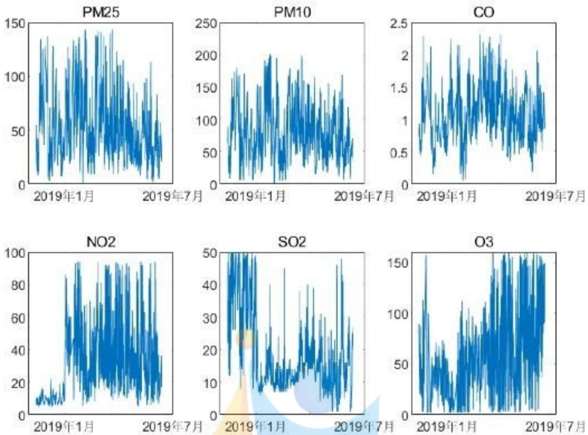
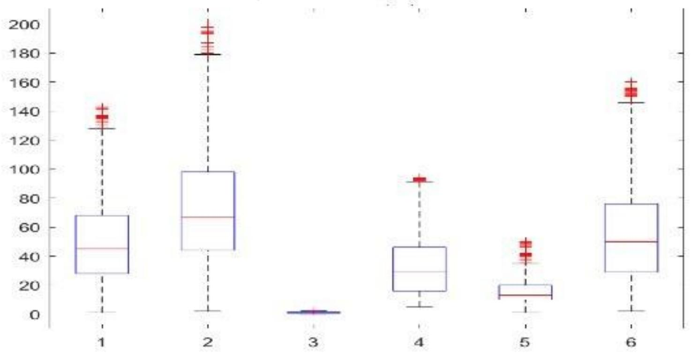
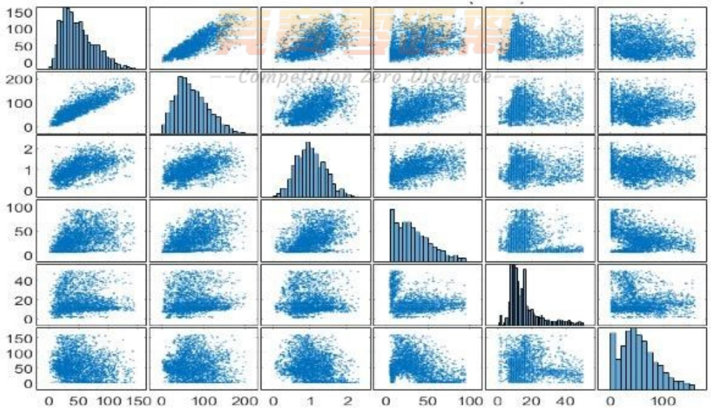
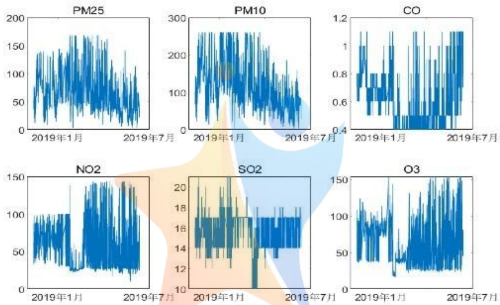
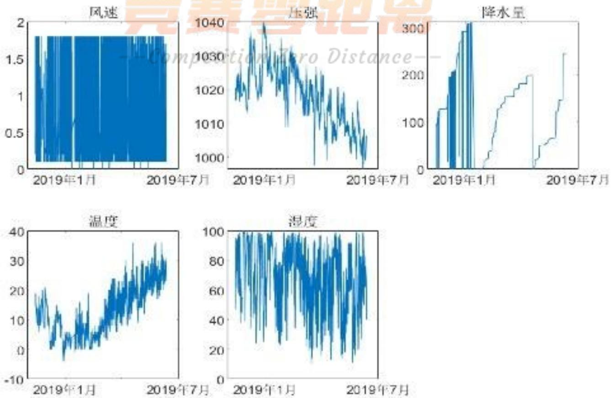
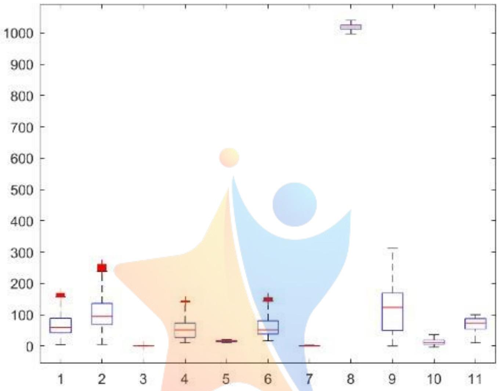
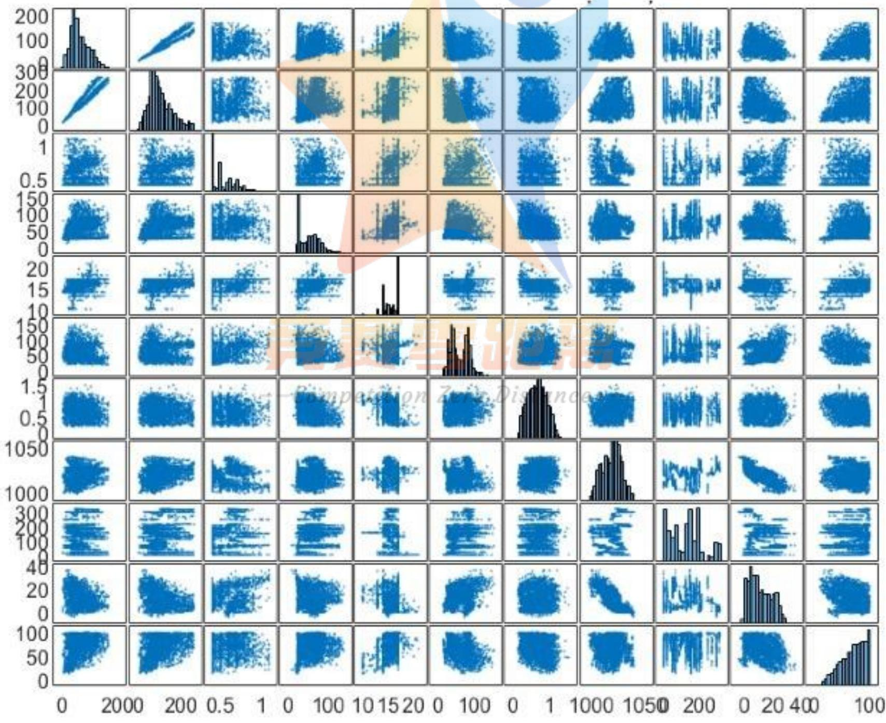
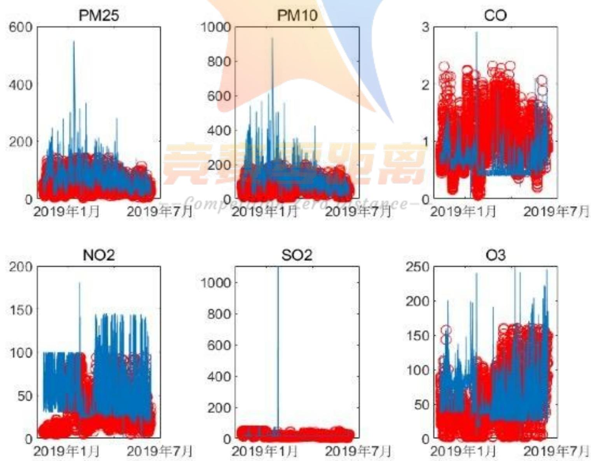
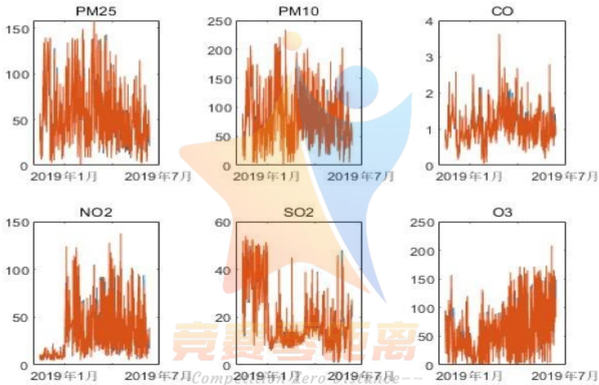
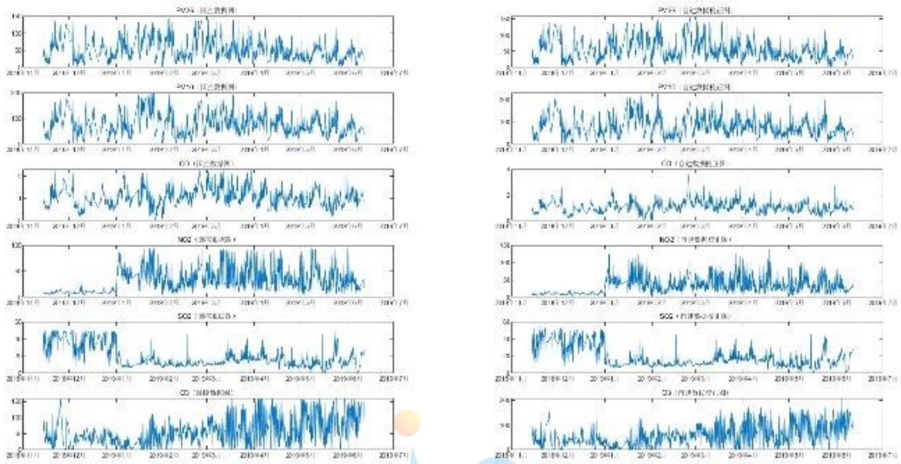

# 空气质量监测数据校准模型研究

## 摘要

空气中 PM2.5、PM10、CO、NO2、SO2、O3 是污染生态环境和危害人类健康的“两尘四气”，对其浓度实时监测可以及时掌握空气质量，并及时对污染源头采取相应管理措施。

本文主要对国控点数据（准确）和自建点数据（有差异）的数据进行探索分析，寻找造成差异的主要因素，根据国控点数据对自建点数据进行数据校准，由于全程基于数据，先对数据质量进行分析，对缺失数据进行处理，对两个附件数据进行整理为进一步探索做数据准备。

对问题一，主要对国控点和自建点数据分别从空气质量因素的整体分布、分位数、因素之间的相关性、因素与气象因素之间的相关性等角度进行探索分析，发现部分异常数据，得出 PM2.5 与 PM10 的相关程度比较高，NO2 与 SO2 的有一定的负相关，O3 与其他因素相关较弱。自建点数据与国控点数据在 CO、NO2、SO2 差异比较大。SO2 的异常数据比较集中。

对问题二，主要从零点漂移、量程漂移，交叉影响、气象因素等方面进行差异因素分析，确定以小时为单位间隔的均值表示零点漂移，以天为单位间隔的标准差表示量程漂移，用 MATLAB 计算出各自的漂移程度（表和表），用回归分析的方法寻找各种产生差异的因素，如对 CO 数据差异的交叉影响主要是 SO2，其次是 O3 和 NO2；对 NO2 数据差异的交叉影响的主要是 CO 和 SO2 等；造成 PM2.5 和 PM10 的差异的因素是风速，其次是湿度，然后是压强；造成 CO 的差异的气象因素较弱，主要是风速；造成自建点 NO2 的差异的主要是风速，其次是温度、压强和湿度，降雨量的影响较小等；

对问题三，为了以国控数据为参考，校准自建点数据，先将自建点数据零点归零，量程归一，然后再按照国控数据的零点和量程进行校准，建立数学模型，代入自建点各因素数据进行校正，得到绝对误差和相对误差都很小校准结果（表），校准效果如图所示，该模型能很好的校准自建点数据。

## 关键词

空气质量 均值 标准差 校准 数学模型 MATLAB 差异分析 回归分析

## 1 问题描述

## 1.1 基本情况

空气中 PM2.5、PM10、CO、NO2、SO2、O3 是污染生态环境和危害人类健康的“两尘四气”，对其浓度实时监测可以及时掌握空气质量，并及时对污染源头采取相应管理措施。现对空气检测有两种方式，一是国家监测控制站点，简称国控点，对“两尘四气”的数据有效监测，而且相对准确，但国控点费用高，布控较少，且数据发布时间滞后，不能立刻给出实时空气质量的监测和预报。二是自主研发的微型空气质量检测仪，改检测仪器费用小，检测空气数据的同时可以监测温度、湿度、风速、气压、降水等气象参数，对地区空气质量可以进行即时网格化监控。

由于微型空气质量检测仪所使用的电化学气体传感器在长时间使用后会产生一定的零点漂移和量程漂移，而非常规气态污染物（气）浓度变化对传感器存在交叉干扰，天气因素对传感器也会产生影响，在国控点附近布控的自建点，同一时间微型空气质量检测仪所采集的数据与该国控点的数据值存在一定的差异，因此，需要利用国控点每小时的数据对国控点近邻的自建点数据进行校准。

## 1.2 问题提出

两个附件分别提供了一个时间段内某个国控点每小时的数据和附近的一个自建点数据，时间相应于国控点间隔在5分钟以内，现需要建立数学模型研究：

问题一、探索性分析自建点数据与国控点数据数据；

问题二、对导致自建点数据与国控点数据造成差异的因素进行分析；

问题三、建立数学模型利用国控点数据对自建点数据进行校准。

## 2 条件假设

## 2.1 条件假设

1、假设国控点与自建点距离很近，所测数据能反映统一网格内空气质量；  
2、假设国控点检测数据是准确的；  
3、假设不管是国控监测仪器还是自建检测仪器都是正常运行，没有损坏；

4、附件中缺失的部门小时的数据不影响自建点数据校正；  
5、两附件中记录有数据的都是在仪器正常工作的时候的数据；  
6、假设对 “两尘” 的监测仪器主要采用散光法，对 “四气” 的监测主要采用电化学气体法；  
7、对电化学气体法检测气体的影响，此处忽略电压变化所造成的影响。

## 3 模型准备

## 3.1 名词解释

为了很好的理解问题和解决本问题，首先对涉及名词解释如下：

零点漂移：在未进行维修、保养或调解的前提下，仪器按规定的时间运行后，仪器的读数与零输入之间的偏差。

量程漂移：在未进行维修、保养或调节的前提下，仪器按规定的时间运行后，仪器的读数与已知参数考值之间的偏差。

PM2.5: 环境空气中空气动力学当量直径小于等于 $2.5 \mu m$ 的颗粒物, 也称可细颗粒物。

PM10: 环境空气中空气动力学当量直径小于等于 $10 \mu m$ 的颗粒物, 也称可吸入颗粒物。

单位：CO 的含量单位： $mg/m^{3}$ ；PM2.5、PM10、NO2、SO2、O3 含量单位： $\mu g/m^{3}$ 。

## 3.2 数据准备

由数据可知，附件一给出了某监测点的2018年11月14日10:00至2019年6月11日15:00，每隔一小时的国控点“两尘四气”数据，附件2给出了同一地点的2018年11月14日10:02至2019年6年11日16:32，间隔不超过5分钟的自建点“两尘四气”和风速、压强、降水量、温度、湿度的数据，经仔细查看，在这个时段中，两个附件中均有部分小时的数据缺失，例如国控数据中2018年11月15日10时至12时的数据没有记录，自建点数据中2018年12月1日21时和22时段的数据缺失，特别是国控点缺失的数据，对相应时间的自建点数据校准会产生影响，因此删除部门因数据缺失而无法校准的数据共30803个，根据假设4，这部分缺失数据的处理将不影响数据校准，后面的数据分析和差异因素的实施将建立在新数据基础上。

## 3.3 问题分析

根据问题描述中的“两尘四气”是环境污染的主要有害物，中华人民共和国环境保护标准专门制定了对颗粒PM2.5、PM10和污染气体CO、NO2、SO2、O3的监测仪器、数据分析的相关标准[1]，不同的监测仪器读取的数据会有差异，要使用相对准确的监测数据对其他有差异的仪器读取的数据进行校准，校准数学模型是关键，在进行建模之前用统计学知识进行数据相关探索。

问题一、为了详尽的探索国控点数据和自建点数据，根据整理后的数据从均值、标准差、中位数、相关性、关联图等角度对各项因素进行探索性分析，国控点数据是相对准确的数据，将是自建点数据建准的参考。

问题二、不同的监测仪，因各种原因所得到的数据有差异，但环境是相同的，想要找出差异，均采用以时为单位，将两组数据各个因素分别从零点漂移因素、量程漂移因素、污染物（气）浓度变化交叉干扰因素、气象因素等分别进行差异对比。

目前型空气质量传感监测仪采用光散射法和电化学法监测大气中“两尘四气”其中PM10、PM2.5是采用光散射法，而SO2、NO2、O3、CO是采用电化学法。

问题三、国控点数据是相对准确的数据，以国控点数据为准，根据问题二中探索的差异因素，将自建点数据校准。

## 4 建立模型与求解

## 4.1 问题一 探索性数据分析

## 4.1.1 国控点数据探索分析

## (1) 整体分布

国控点数据是每小时一组，用 MATLAB 画出整理后的“两尘四气”六组数据的分布图（图 1）

  
图 1 国控点时数据分布图

从图 1 中可以看出 PM2.5、 $NO_{2}$ 、 $O_{3}$ 的浓度在该时间段内的变化较大，主要集中在 0 到 100 微克每立方米； $SO_{2}$ 的在时间段内的浓度变化较为显著，且浓度值较小，主要集中在 0 到 30 微克每立方米；PM10 的浓度变化在时间段内的较小，主要集中在 50 到 100 微克每立方米；CO 在空气中的浓度相较于其他几种污染物而言偏大，主要集中在 0.5 到 1.5 毫克每立方米之间，即 500 到 1500 微克每立方米。

(2) 分位数  


<details>
<summary>boxplot</summary>

| Category | Q1 | Q2 (Median) | Q3 | IQR |
| --- | --- | --- | --- | --- |
| 1 | ~28 | ~45 | ~68 | ~40 |
| 2 | ~44 | ~67 | ~99 | ~55 |
| 3 | ~1 | ~2 | ~3 | ~2 |
| 4 | ~16 | ~30 | ~46 | ~30 |
| 5 | ~12 | ~14 | ~21 | ~10 |
| 6 | ~30 | ~50 | ~76 | ~56 |
</details>

图 2 国控点数据箱位图

从箱位图（图 2）可以看出，国控点数据大部分在 10 分位到 90 分位之间，有少部分异常数据，其中 CO 的异常数据最少，其次是 NO2 的异常数据较少。

## (3) 相关性

相关性可以很好的反映因素之间的相关关系，是探索因素之间关系的一个重要手段，相关系数模型为

$$
\rho X Y = \frac {C o v (X , Y)}{\sqrt {D (X)} \sqrt {D (Y)}}
$$

根据国控数据六个因素的数据，代入公式，用 MATLAB 计算相关系数如表（表1）所示

表 1 国控点六因素的相关系数表（时）

<table><tr><td></td><td>PM2.5</td><td>PM10</td><td>CO</td><td> $NO_2$ </td><td> $SO_2$ </td><td> $O_3$ </td></tr><tr><td>PM2.5</td><td>1.0000</td><td>0.8157</td><td>0.6624</td><td>0.2590</td><td>0.2713</td><td>-0.2690</td></tr><tr><td>PM10</td><td>0.8157</td><td>1.0000</td><td>0.5822</td><td>0.3064</td><td>0.3064</td><td>-0.1765</td></tr><tr><td>CO</td><td>0.6624</td><td>0.5822</td><td>1.0000</td><td>0.2983</td><td>0.3119</td><td>-0.2737</td></tr><tr><td> $NO_2$ </td><td>0.2590</td><td>0.3064</td><td>0.2983</td><td>1.0000</td><td>-0.3440</td><td>-0.2544</td></tr><tr><td> $SO_2$ </td><td>0.2713</td><td>0.3064</td><td>0.3119</td><td>-0.3440</td><td>1.0000</td><td>-0.2840</td></tr><tr><td> $O_3$ </td><td>-0.2690</td><td>-0.1765</td><td>-0.2737</td><td>-0.2544</td><td>-0.2840</td><td>1.0000</td></tr></table>

画出六因素关联图（图3）：



<details>
<summary>scatter</summary>

| Category | X-axis Range | Y-axis Range |
| --- | --- | --- |
| Row 1 | 0~150 | 0~150 |
| Row 2 | 0~200 | 0~200 |
| Row 3 | 0~2 | 0~2 |
| Row 4 | 0~100 | 0~100 |
| Row 5 | 0~100 | 0~100 |
| Row 6 | 0~100 | 0~100 |
| Row 7 | 0~150 | 0~150 |
| Row 8 | 0~200 | 0~200 |
| Row 9 | 0~2 | 0~2 |
| Row 10 | 0~150 | 0~150 |
| Row 11 | 0~200 | 0~200 |
| Row 12 | 0~150 | 0~150 |
| Row 13 | 0~150 | 0~150 |
| Row 14 | 0~150 | 0~150 |
| Row 15 | 0~150 | 0~150 |
| Row 16 | 0~150 | 0~150 |
| Row 17 | 0~150 | 0~150 |
| Row 18 | 0~150 | 0~150 |
| Row 19 | 0~150 | 0~150 |
| Row 20 | 0~150 | 0~150 |
| Row 21 | 0~150 | 0~150 |
| Row 22 | 0~150 | 0~150 |
| Row 23 | 0~150 | 0~150 |
| Row 24 | 0~150 | 0~150 |
| Row 25 | 0~150 | 0~150 |
| Row 26 | 0~150 | 0~150 |
| Row 27 | 0~150 | 0~150 |
| Row 28 | 0~150 | 0~150 |
| Row 29 | 0~150 | 0~150 |
| Row 30 | 0~150 | 0~150 |
| Row 31 | 0~150 | 0~150 |
| Row 32 | 0~150 | 0~150 |
| Row 33 | 0~150 | 0~150 |
| Row 34 | 0~150 | 0~150 |
| Row 35 | 0~150 | 0~150 |
| Row 36 | 0~150 | 0~150 |
| Row 37 | 0~150 | 0~150 |
| Row 38 | 0~150 | 0~150 |
| Row 39 | 0~150 | 0~150 |
| Row 40 | 0~150 | 0~150 |
| Row 41 | 0~150 | 0~150 |
| Row 42 | 0~150 | 0~150 |
| Row 43 | 0~150 | 0~150 |
| Row 44 | 0~150 | 0~150 |
| Row 45 | 0~150 | 0~150 |
| Row 46 | 0~150 | 0~150 |
| Row 47 | 0~150 | 0~150 |
| Row 48 | 0~150 | 0~150 |
| Row 49 | 0~150 | 0~150 |
| Row 50 | 0~150 | 0~150 |
| Row 51 | 2~45 | N/A (Density Plot) |
| Row 52 | N/A (Density Plot) | N/A (Density Plot) |
| Row 53 | N/A (Density Plot) | N/A (Density Plot) |
| Row 54 | N/A (Density Plot) | N/A (Density Plot) |
| Row 55 | N/A (Density Plot) | N/A (Density Plot) |
| Row 56 | N/A (Density Plot) | N/A (Density Plot) |
| Row 57 | N/A (Density Plot) | N/A (Density Plot) |
| Row 58 | N/A (Density Plot) | N/A (Density Plot) |
| Row 59 | N/A (Density Plot) | N/A (Density Plot) |
| Row 60 | N/A (Density Plot) | N/A (Density Plot) |
| Row 61 | N/A (Density Plot) | N/A (Density Plot) |
| Row 62 | N/A (Density Plot) | N/A (Density Plot) |
| Row 63 | N/A (Density Plot) | N/A (Density Plot) |
| Row 64 | N/A (Density Plot) | N/A (Density Plot) |
| Row 65 | N/A (Density Plot) | N/A (Density Plot) |
| Row 66 | N/A (Density Plot) | N/A (Density Plot) |
| Row 67 | N/A (Density Plot) | N/A (Density Plot) |
| Row 68 | N/A (Density Plot) | N/A (Density Plot) |
| Row 69 | N/A (Density Plot) | N/A (Density Plot) |
| Row 70 | N/A (Density Plot) | N/A (Density Plot) |
| Row 71 | N/A (Density Plot) | N/A (Density Plot) |
| Row 72 | N/A (Density Plot) | N/A (Density Plot) |
| Row 73 | N/A (Density Plot) | N/A (Density Plot) |
| Row 74 | N/A (Density Plot) | N/A (Density Plot) |
| Row 75 | N/A (Density Plot) | N/A (Density Plot) |
| Row 76 | N/A (Density Plot) | N/A (Density Plot) |
| Row 77 | N/A (Density Plot) | N/A (Density Plot) |
| Row 78 | N/A (Density Plot) | N/A (Density Plot) |
| Row 79 | N/A (Density Plot) | N/A (Density Plot) |
| Row 80 | N/A (Density Plot) | N/A (Density Plot) |
</details>

图3 国控点数据（小时）六因素关联图

从表 1 和图 3 可得信息: PM2.5 与 PM10 相关性最大, PM2.5 与 CO 相关性其次,都是成正相关; NO2 与 SO2 线性相关程度相对较大, 负相关; O3 与其他各因素直接相关性较小。

## 4.1.2 自建点数据探索分析

## (1) 整体分布

自建点数据是 5 分钟以内一组，用 MATLAB 画出整理后的 “两尘四气” 六组数据的分布图（如图 4）和气象因素分布图（如图 5）

  
图 4 数据分布子图

  
图 5 气象数据分布子图

从图中可以看出自建点的“两尘四气”的变化趋势与国控数据大致相当，温度和气压数据变化趋势明显，该段时间内风速长期维持，降水充足，温度适宜，湿度偏大

## (2) 分位数

为很好了解数据的结构，画出箱体图（图6）



<details>
<summary>boxplot</summary>

| Category | Q1 | Q2 (Median) | Q3 | IQR |
| --- | --- | --- | --- | --- |
| 1 | ~45 | ~60 | ~90 | ~55 |
| 2 | ~70 | ~100 | ~140 | ~70 |
| 3 | 0 | 0 | 0 | 0 |
| 4 | ~30 | ~50 | ~75 | ~45 |
| 5 | ~15 | ~15 | ~15 | 0 |
| 6 | ~40 | ~60 | ~80 | ~40 |
| 7 | 0 | 0 | 0 | 0 |
| 8 | ~1020 | ~1030 | ~1040 | ~20 |
| 9 | ~50 | ~125 | ~170 | ~120 |
| 10 | ~10 | ~15 | ~20 | ~10 |
| 11 | ~55 | ~75 | ~90 | ~45 |
</details>

图 6 自建点数据箱体图

从箱体图（图6）可以看出“两尘四气”中异常数据比较少，气象数据没有异常数据，数据质量比较高。

## (3) 相关性

根据相关性公式，做出相关系数如表（表2）

表 2 “两尘四气”与气象资料之间的相关系数

<table><tr><td></td><td>PM2.5</td><td>PM10</td><td>CO</td><td>NO2</td><td>SO2</td><td>O3</td><td>风速</td><td>压强</td><td>降雨量</td><td>温度</td><td>湿度</td></tr><tr><td>PM2.5</td><td>1.00</td><td>0.95</td><td>0.13</td><td>0.26</td><td>0.42</td><td>-0.11</td><td>-0.14</td><td>0.10</td><td>-0.02</td><td>-0.27</td><td>0.33</td></tr><tr><td>PM10</td><td>0.95</td><td>1.00</td><td>0.27</td><td>0.30</td><td>0.40</td><td>0.02</td><td>-0.13</td><td>0.26</td><td>0.08</td><td>-0.40</td><td>0.36</td></tr><tr><td>CO</td><td>0.13</td><td>0.27</td><td>1.00</td><td>0.41</td><td>0.19</td><td>0.43</td><td>-0.11</td><td>-0.10</td><td>0.19</td><td>0.20</td><td>0.07</td></tr><tr><td>NO2</td><td>0.26</td><td>0.30</td><td>0.41</td><td>1.00</td><td>0.25</td><td>0.10</td><td>-0.34</td><td>-0.07</td><td>0.35</td><td>0.00</td><td>0.20</td></tr><tr><td> $SO_2$ </td><td>0.42</td><td>0.40</td><td>0.19</td><td>0.25</td><td>1.00</td><td>-0.29</td><td>-0.41</td><td>0.03</td><td>-0.25</td><td>-0.26</td><td>0.48</td></tr><tr><td> $O_3$ </td><td>-0.11</td><td>0.02</td><td>0.43</td><td>0.10</td><td>-0.29</td><td>1.00</td><td>0.21</td><td>0.00</td><td>0.31</td><td>0.23</td><td>-0.34</td></tr><tr><td>风速</td><td>-0.14</td><td>-0.13</td><td>-0.11</td><td>-0.34</td><td>-0.41</td><td>0.21</td><td>1.00</td><td>0.19</td><td>0.12</td><td>-0.03</td><td>-0.32</td></tr><tr><td>压强</td><td>0.10</td><td>0.26</td><td>-0.10</td><td>-0.07</td><td>0.03</td><td>0.00</td><td>0.19</td><td>1.00</td><td>0.21</td><td>-0.85</td><td>0.04</td></tr><tr><td>降雨量</td><td>-0.02</td><td>0.08</td><td>0.19</td><td>0.35</td><td>-0.25</td><td>0.31</td><td>0.12</td><td>0.21</td><td>1.00</td><td>-0.12</td><td>0.05</td></tr><tr><td>温度</td><td>-0.27</td><td>-0.40</td><td>0.20</td><td>0.00</td><td>-0.26</td><td>0.23</td><td>-0.03</td><td>-0.85</td><td>-0.12</td><td>1.00</td><td>-0.40</td></tr><tr><td>湿度</td><td>0.33</td><td>0.36</td><td>0.07</td><td>0.20</td><td>0.48</td><td>-0.34</td><td>-0.32</td><td>0.04</td><td>0.05</td><td>-0.40</td><td>1.00</td></tr></table>

为直观反映因素之间的相关性，画出自建点的“两尘四气”与环境个因素的关联图（图7）



<details>
<summary>pairplot</summary>

| Column | X-axis (Range) | Y-axis (Range) |
| --- | --- | --- |
| 200 | 0~2000 | 0~200 |
| 100 | 0~2000 | 0~200 |
| 300 | 0~2000 | 0~200 |
| 200 | 0~2000 | 0~200 |
| 100 | 0~2000 | 0~200 |
| 1 | 0~2000 | 0~200 |
| 0.5 | 0~2000 | 0~200 |
| 150 | 0~2000 | 0~200 |
| 100 | 0~2000 | 0~200 |
| 50 | 0~2000 | 0~200 |
| 20 | 0~2000 | 0~200 |
| 15 | 0~2000 | 0~200 |
| 150 | 0~2000 | 0~200 |
| 1.5 | 0~2000 | 0~200 |
| 1 | 0~2000 | 0~200 |
| 1050 | 0~2000 | 0~200 |
| 1000 | 0~2000 | 0~200 |
| 300 | 0~2000 | 0~200 |
| 40 | 0~2000 | 0~200 |
| 20 | 0~2000 | 0~200 |
| 100 | 0~2000 | 0~200 |
| 5 | 15~15 | ~15 ~15 |
| 15 | 15~15 | ~15 ~15 |
| 15 | 15~15 | ~15 ~15 |
| 1.5 | 15~15 | ~15 ~15 |
| 1.5 | 15~15 | ~15 ~15 |
| 1.5 | 15~15 | ~15 ~15 |
| 1.5 | 15~15 | ~15 ~15 |
| 1.5 | 15~15 | ~15 ~15 |
| 1 | 15~15 | ~15 ~15 |
| 1.5 | 15~15 | ~15 ~15 |
| 1.5 | 15~15 | ~15 ~15 |
| 1.5 | 1.5~1.5 | ~15 ~1.5 |
| 1.5 | 1.5~1.5 | ~1.5 ~1.5 |
| 1.5 | 1.5~1.5 | ~1.5 ~1.5 |
| 1.5 | 1.5~1.5 | ~1.5 ~1.5 |
| 1.5 | 1.5~1.5 | ~1.5 ~1.5 |
| 1.5 | 1.5~1.5 | ~1.5 ~1 |
| 388 | 388~488 | ~388 ~488 |
| 388 | 388~488 | ~388 ~488 |
| 388 | 388~488 | ~388 ~488 |
| 388 | 388~488 | ~388 ~488 |
| 388 | 388~488 | ~388 ~488 |
| 466 | 466~466 | ~466 ~466 |
| 466 | 466~466 | ~466 ~466 |
| 466 | 466~466 | ~466 ~466 |
| 466 | 466~466 | ~466 ~466 |
| 466 | 466~466 | ~466 ~466 |
| 724 | 724~724 | ~724 ~724 |
| 724 | 724~724 | ~724 ~724 |
| 724 | 724~724 | ~724 ~724 |
| 724 | 724~724 | ~724 ~724 |
| 724 | 724~724 | ~724 ~724 |
| 992 | 992~992 | ~992 ~992 |
| 992 | 992~992 | ~992 ~992 |
| 992 | 992~992 | ~992 ~992 |
| 992 | 992~992 | ~992 ~992 |
| 992 | 992~992 | ~992 ~992 |
</details>

图 7 自建点关联图（时）

从相关系数和因素关联图可以看出，对于“两尘四气”的各因素的相关性，与国控点基本一致，对于气象数据与“两尘四气”的各因素之间的相关系较为复杂，其中 SO2 与湿度和温度有一定相关性；NO2 余降雨量和风速有一定相关性，与压强和温度相关性小；CO 与其他气象因素相关性小；PM2.5、PM10 与温度和湿度有一定相关性，与降雨量的相关性小。

## 4.1.3 国控点与自建点之间的数据探索分析

由所给数据可知，国控点数据是每小时一组，二自建点数据是五分钟以内一组，为了更好的对比国控点数据和自建点数据之间的差异，将整理后的数据都统筹到每小时一组。通过数据观察可知，一小时内各个污染因素的变化不大，所以将所有时的数据统计一起，求其平均值，计算模型如下：

$$
X _ {k} = \frac {\sum_ {i \in k} x _ {i}}{n _ {k}}
$$

例如，2018年11月14日10:02至10:58分的数据的平均值作为10:00整的数据，用MATLAB编程可得自建点时数据，为探索他们之间的关系，会出图形如图（图8）

  
图8 国控数据与自建数据分布图（蓝线条为自建点数据，红圈为国控点数据）

从图 8 中可知，两类数据基本反映了相同趋势的环境状态，但有差距，其中 PM2.5、

PM10、O3变化趋势差不多，CO、NO2、SO2差异比较大。SO2的异常数据比较集中。

## 4.2 问题二 造成自建点与国控点数据差异因素分析

## 4.2.1 造成差异的零点漂移分析

从问题一中的数据探索（图8）可知，国控点数据与自建点数据的PM2.5、PM10、O3的差异相对较弱，CO、NO2、SO2差异较大，因此用二者之差的绝对值作为其数据差异。

根据名词解释，零点漂移是指读数与零输入之间的差距，建立数学模型得

$$
d _ {k} = | Y _ {k} - X _ {k} | = | Y _ {k} - \frac {\sum_ {i \in k} x _ {i}}{n _ {k}} |
$$

将自建点数据按平均的方法整合成以小时为间隔数据，代入数据，用 MATLAB 求出国控点数据与自建点数据在六个因素上的零点漂移如下表（表 3，选取了部分数据，完整数据见附件 1）：

表 3 六因素零点漂移差异（时）

<table><tr><td>时间</td><td>PM2.5</td><td>PM10</td><td>C0</td><td>NO2</td><td>S02</td><td>03</td></tr><tr><td>2018/11/14 10:00</td><td>13.6500</td><td>22.1250</td><td>0.0460</td><td>47.4500</td><td>9.8750</td><td>27.0000</td></tr><tr><td>2018/11/14 11:00</td><td>8.7895</td><td>13.7895</td><td>0.0114</td><td>37.3684</td><td>6.6842</td><td>21.3158</td></tr><tr><td>2018/11/14 12:00</td><td>11.5200</td><td>25.1200</td><td>0.0480</td><td>34.6000</td><td>10.8400</td><td>18.3600</td></tr><tr><td>2018/11/14 13:00</td><td>6.1429</td><td>19.7143</td><td>0.0071</td><td>37.2857</td><td>11.0000</td><td>18.1905</td></tr><tr><td>2018/11/14 14:00</td><td>20.5455</td><td>26.9545</td><td>0.1050</td><td>52.8182</td><td>18.9091</td><td>29.6818</td></tr><tr><td>2018/11/14 15:00</td><td>16.1905</td><td>19.2381</td><td>0.0487</td><td>52.4762</td><td>21.7143</td><td>27.3333</td></tr><tr><td>2018/11/14 16:00</td><td>12.0000</td><td>17.0333</td><td>0.0480</td><td>61.0000</td><td>31.7000</td><td>20.4333</td></tr><tr><td>2018/11/14 21:00</td><td>19.0000</td><td>35.5789</td><td>0.0936</td><td>70.2632</td><td>22.0000</td><td>46.6316</td></tr><tr><td>2018/11/14 22:00</td><td>23.1731</td><td>45.8654</td><td>0.1840</td><td>63.2500</td><td>20.2692</td><td>40.7692</td></tr><tr><td>2018/11/14 23:00</td><td>17.5333</td><td>44.7667</td><td>0.1790</td><td>60.5667</td><td>20.3333</td><td>41.4333</td></tr><tr><td>2018/11/15 0:00</td><td>18.4583</td><td>41.3333</td><td>0.1355</td><td>57.4583</td><td>16.2917</td><td>26.3750</td></tr><tr><td>2018/11/15 1:00</td><td>8.3478</td><td>33.8696</td><td>0.1216</td><td>49.7391</td><td>10.7826</td><td>19.3043</td></tr><tr><td>2018/11/15 2:00</td><td>2.2500</td><td>33.5833</td><td>0.0727</td><td>46.5833</td><td>9.7917</td><td>26.6250</td></tr><tr><td>2018/11/15 3:00</td><td>9.0000</td><td>33.0435</td><td>0.0347</td><td>45.5652</td><td>8.9565</td><td>23.6957</td></tr><tr><td>2018/11/15 4:00</td><td>15.2200</td><td>45.0800</td><td>0.0430</td><td>46.0600</td><td>7.5800</td><td>11.3200</td></tr><tr><td>2018/11/15 5:00</td><td>29.9231</td><td>68.1923</td><td>0.1656</td><td>64.1154</td><td>21.4231</td><td>51.1154</td></tr><tr><td>2018/11/15 6:00</td><td>29.9615</td><td>69.3846</td><td>0.0920</td><td>66.0385</td><td>18.2308</td><td>51.2692</td></tr><tr><td>2018/11/15 7:00</td><td>13.7407</td><td>65.3704</td><td>0.0060</td><td>67.3704</td><td>16.6667</td><td>49.3333</td></tr><tr><td>2018/11/15 8:00</td><td>13.9524</td><td>70.9524</td><td>0.0343</td><td>68.7619</td><td>17.4762</td><td>48.2857</td></tr><tr><td>2018/11/15 9:00</td><td>17.2273</td><td>60.5000</td><td>0.0421</td><td>71.1364</td><td>21.5909</td><td>50.6364</td></tr><tr><td>2018/11/15 13:00</td><td>13.3333</td><td>30.7500</td><td>0.0840</td><td>68.1250</td><td>20.6250</td><td>64.7500</td></tr><tr><td>2018/11/15 14:00</td><td>16.6250</td><td>46.5000</td><td>0.1062</td><td>72.1250</td><td>26.5833</td><td>67.2500</td></tr><tr><td>2018/11/15 16:00</td><td>15.6071</td><td>39.7500</td><td>0.0274</td><td>82.2143</td><td>34.6071</td><td>74.7500</td></tr><tr><td>2018/11/15 18:00</td><td>9.6400</td><td>15.2000</td><td>0.0950</td><td>65.3200</td><td>22.6000</td><td>61.2400</td></tr><tr><td>2018/11/15 19:00</td><td>13.7917</td><td>33.5000</td><td>0.1802</td><td>63.0417</td><td>19.2083</td><td>55.8333</td></tr><tr><td>2018/11/15 20:00</td><td>17.9130</td><td>53.7826</td><td>0.1110</td><td>69.2174</td><td>28.0435</td><td>65.7826</td></tr></table>

## 4.2.2 造成差异的量程漂移分析

根据名词解释，量程漂移是指读数所度量的程度与实际度量程度的差异，建立数学模型如下：

$$
l _ {r} = \left| \sigma (x _ {r}) - \sigma (y _ {r}) \right|
$$

由于，国控数据是按每小时给的，一小时只有一个数值，无法求出一小时内的量程，所以用日量程来表示，编程求解得到量程漂移如表（表4，完整数据见附件1）。

表 4 六因素量程漂移差异（天）

<table><tr><td>对应时间</td><td>PM2.5</td><td>PM10</td><td>CO</td><td>NO2</td><td>SO2</td><td>O3</td></tr><tr><td>2018/11/14 10:00</td><td>3.7964</td><td>0.1612</td><td>0.0245</td><td>10.3456</td><td>5.7997</td><td>3.3973</td></tr><tr><td>2018/11/15 10:00</td><td>0.5830</td><td>3.3586</td><td>0.0096</td><td>12.6366</td><td>10.0527</td><td>8.7588</td></tr><tr><td>2018/11/16 10:00</td><td>3.3171</td><td>17.4448</td><td>0.0285</td><td>6.7959</td><td>4.2309</td><td>0.4781</td></tr><tr><td>2018/11/17 10:00</td><td>2.5784</td><td>1.2093</td><td>0.0083</td><td>11.1919</td><td>9.6140</td><td>7.1610</td></tr><tr><td>2018/11/18 10:00</td><td>1.1601</td><td>9.9634</td><td>0.2136</td><td>8.7443</td><td>6.8018</td><td>0.7485</td></tr><tr><td>2018/11/19 10:00</td><td>2.3312</td><td>8.4149</td><td>0.1212</td><td>5.9249</td><td>2.4112</td><td>6.7443</td></tr><tr><td>2018/11/20 10:00</td><td>3.6054</td><td>16.9900</td><td>0.0769</td><td>12.7276</td><td>5.8051</td><td>26.9299</td></tr><tr><td>2018/11/21 10:00</td><td>8.6482</td><td>2.2516</td><td>0.3057</td><td>3.1256</td><td>2.5142</td><td>6.3571</td></tr><tr><td>2018/11/22 10:00</td><td>2.7986</td><td>5.8490</td><td>0.1005</td><td>10.5374</td><td>4.2853</td><td>6.4997</td></tr><tr><td>2018/11/23 10:00</td><td>0.3303</td><td>10.8740</td><td>0.0349</td><td>11.4531</td><td>9.4092</td><td>0.0225</td></tr><tr><td>2018/11/25 10:00</td><td>4.2733</td><td>3.1232</td><td>0.0032</td><td>8.5923</td><td>0.6502</td><td>7.0297</td></tr><tr><td>2018/11/26 10:00</td><td>2.3428</td><td>7.7955</td><td>0.1346</td><td>9.9826</td><td>6.9743</td><td>6.5180</td></tr><tr><td>2018/11/27 10:00</td><td>2.5256</td><td>4.2555</td><td>0.0203</td><td>10.2788</td><td>0.4250</td><td>2.8546</td></tr><tr><td>2018/11/28 10:00</td><td>63.7003</td><td>57.2003</td><td>64.2003</td><td>58.2003</td><td>63.7003</td><td>62.7003</td></tr><tr><td>2018/11/29 10:00</td><td>56.7544</td><td>50.4957</td><td>63.3559</td><td>53.4369</td><td>62.8301</td><td>52.4082</td></tr><tr><td>2018/12/1 10:00</td><td>4.6889</td><td>9.1538</td><td>0.0471</td><td>9.1241</td><td>6.1243</td><td>1.0765</td></tr><tr><td>2018/12/2 10:00</td><td>8.7655</td><td>14.9677</td><td>0.0937</td><td>5.7230</td><td>4.0073</td><td>2.4247</td></tr><tr><td>2018/12/3 10:00</td><td>7.5656</td><td>21.9148</td><td>0.2348</td><td>11.3995</td><td>7.9331</td><td>3.3098</td></tr><tr><td>2018/12/4 10:00</td><td>6.8658</td><td>23.2946</td><td>0.0382</td><td>5.4516</td><td>4.6169</td><td>8.7025</td></tr><tr><td>2018/12/5 10:00</td><td>1.3317</td><td>9.0348</td><td>0.0753</td><td>14.3982</td><td>10.8410</td><td>5.9551</td></tr><tr><td>2018/12/6 10:00</td><td>1.0382</td><td>17.3375</td><td>0.1687</td><td>7.6602</td><td>4.9706</td><td>6.4981</td></tr><tr><td>2018/12/7 10:00</td><td>0.2716</td><td>4.3743</td><td>0.0190</td><td>5.2123</td><td>4.5321</td><td>3.4665</td></tr><tr><td>2018/12/8 10:00</td><td>0.8375</td><td>4.8665</td><td>0.0848</td><td>3.1969</td><td>3.5043</td><td>0.1412</td></tr><tr><td>2018/12/9 10:00</td><td>0.8731</td><td>1.8851</td><td>0.0467</td><td>6.0823</td><td>8.8496</td><td>3.7491</td></tr><tr><td>2018/12/10 10:00</td><td>3.8848</td><td>17.4249</td><td>0.0314</td><td>11.1139</td><td>9.9421</td><td>0.3050</td></tr><tr><td>2018/12/11 10:00</td><td>12.3807</td><td>7.0771</td><td>0.1381</td><td>3.4769</td><td>4.7068</td><td>3.1091</td></tr><tr><td>2018/12/12 10:00</td><td>0.0167</td><td>4.7541</td><td>0.1484</td><td>5.1444</td><td>2.6941</td><td>12.0790</td></tr><tr><td>2018/12/13 10:00</td><td>5.3215</td><td>2.4335</td><td>0.0195</td><td>5.1847</td><td>4.8134</td><td>2.4011</td></tr><tr><td>2018/12/14 10:00</td><td>2.5564</td><td>5.2371</td><td>0.0132</td><td>7.1870</td><td>4.9068</td><td>0.3705</td></tr><tr><td>2018/12/15 10:00</td><td>9.8752</td><td>40.6976</td><td>0.1057</td><td>8.5914</td><td>5.8183</td><td>2.2465</td></tr><tr><td>2018/12/16 10:00</td><td>1.9390</td><td>4.5074</td><td>0.0214</td><td>4.4068</td><td>4.2700</td><td>7.6396</td></tr><tr><td>...</td><td>...</td><td>...</td><td>...</td><td>...</td><td>...</td><td>...</td></tr></table>

## 4.2.3 造成差异的污染物（气）交叉干扰分析

根据假设 6, 粉尘的监测仪器是采用光散射法, 电化学传气体感器是监测污染气体 (“四气”) 浓度的, 因此, 因污染气浓度变化对传感器会产生交叉干扰就只有气体,以国控点与自建点气体数据差异为因变量, 其他气体及交叉项为自变量, 建立多元回归模型

$$
d _ {l} = f (X _ {l}) + \varepsilon_ {l} (\varepsilon_ {l} \mathrm{为第} l \mathrm{个随机影响因子})
$$

由于有交叉影响，所以模型确定为

$$
\begin{array}{l} d _ {l} = a _ {l 1} X _ {l 1} + a _ {l 2} X _ {l 2} + a _ {l 3} X _ {l 3} + a _ {l 4} X _ {l 1} X _ {l 2} + a _ {l 5} X _ {l 1} X _ {l 3} + a _ {l 6} X _ {l 2} X _ {l 3} + \varepsilon_ {l} \\ , l = 1, 2, 3, 4 \\ \end{array}
$$

其中 $d_{l}$ 表示国控点与自建点的数据差异, $X_{l}$ 表示气体中除了因变量以外的其他三个因子, 用 MATLAB 编程, 逐步回归分别得到四种气体的交叉影响因素的回归系数与置信区间及相关统计量分别如表 5—表 8

表 5 造成自建点 CO 浓度差异的交叉影响因素回归系数及统计量结论：通过对回归系数的绝对值的大小可判断，对自建点 CO 数据产生差异的交叉影响的很少，相对来说 SO2 影响要强一点，其次是 O3 和 NO2；对自建点 NO2 数据产生差异的交叉影响的主要是 CO 和 SO2；对自建点 O3 数据产生差异的交叉影响的主要是 CO 和 SO2；对自建点 SO2 数据产生差异的交叉影响的主要是 CO 和 O3。

<table><tr><td></td><td>回归系数</td><td>置信区间</td></tr><tr><td> $a_1$ </td><td>0.838640877</td><td>TRUE</td></tr><tr><td> $a_2$ </td><td>-0.002637036</td><td>[-0.00482860232935142,-0.00044546886846622]</td></tr><tr><td> $a_3$ </td><td>-0.032052149</td><td>[-0.0419944858088612,-0.0221098120165993]</td></tr><tr><td> $a_4$ </td><td>-0.009595304</td><td>[-0.0114641080368416,-0.00772649922774414]</td></tr><tr><td> $a_5$ </td><td>0.000224751</td><td>[9.91153190761922E-05,0.000350387573322156]</td></tr><tr><td> $a_6$ </td><td>1.14E-05</td><td>[3.78785390058088E-06,1.91014268788494E-05]</td></tr><tr><td> $a_7$ </td><td>0.000755604</td><td>[0.000627823318737813,0.000883384389445674]</td></tr></table>

表 6 造成自建点 NO2 浓度差异的交叉影响因素回归系数及统计量

<table><tr><td></td><td>回归系数</td><td>置信区间</td></tr><tr><td> $a_1$ </td><td>16.15026762</td><td>[-17.9457973684333,50.246332605258]</td></tr><tr><td> $a_2$ </td><td>136.0616175</td><td>[70.8450994663302,201.278135573797]</td></tr><tr><td> $a_3$ </td><td>-1.77845981</td><td>[-3.85378328013802,0.2968636600797]</td></tr><tr><td> $a_4$ </td><td>-0.921094113</td><td>[-1.288436889379,-0.55375133639111]</td></tr><tr><td> $a_5$ </td><td>-0.701362041</td><td>[-4.48731361842689,3.08458953580456]</td></tr><tr><td> $a_6$ </td><td>-1.0645198</td><td>[-1.28991687940105,-0.839122719993172]</td></tr><tr><td> $a_7$ </td><td>0.097668639</td><td>[0.0717528210197347,0.123584457839633]</td></tr></table>

表 7 造成自建点 SO2 浓度差异的交叉影响因素回归系数及统计量

<table><tr><td></td><td>回归系数</td><td>置信区间</td></tr><tr><td> $a_{1}$ </td><td>156.9419301</td><td>[128.924031206347,184.959828984221]</td></tr><tr><td> $a_{2}$ </td><td>29.23625505</td><td>[-27.0662326724419,85.5387427766777]</td></tr><tr><td> $a_{3}$ </td><td>-0.253693216</td><td>[-0.611120506499765,0.103734074763409]</td></tr><tr><td> $a_{4}$ </td><td>-9.040501906</td><td>[-10.7905617941779,-7.2904420168223]</td></tr><tr><td> $a_{6}$ </td><td>3.367310093</td><td>[-0.131515088393034,6.86613527502903]</td></tr><tr><td> $a_{7}$ </td><td>0.015276172</td><td>[-0.0069965580461346,0.0375489019998208]</td></tr></table>

表 8 造成自建点 O3 浓度差异的交叉影响因素回归系数及统计量

<table><tr><td></td><td>回归系数</td><td>置信区间</td></tr><tr><td> $a_1$ </td><td>155.3082608</td><td>[127.152075868251,183.464445679913]</td></tr><tr><td> $a_2$ </td><td>32.99423239</td><td>[-23.6729380680243,89.6614028538028]</td></tr><tr><td> $a_3$ </td><td>-0.310894888</td><td>[-0.681511825021926,0.0597220490821466]</td></tr><tr><td> $a_4$ </td><td>-8.714017635</td><td>[-10.5513080712488,-6.87672719936623]</td></tr><tr><td> $a_5$ </td><td>0.121237047</td><td>[-0.0865867791405965,0.329060872309548]</td></tr><tr><td> $a_6$ </td><td>2.686654413</td><td>[-1.00143250080032,6.37474132774853]</td></tr><tr><td> $a_7$ </td><td>0.014843902</td><td>[-0.00744009711945207,0.037127901449762]</td></tr></table>

## 4.2.4 造成差异的气象环境因素分析

气象因素也是影响检测数据之一，因此建立以国控与自建数据差异为因变量，气象因素为自变量的回归模型

$$
d _ {l} = f (X _ {l}) + \varepsilon_ {l} (\varepsilon_ {l} \mathrm{为第} l \mathrm{个随机影响因子})
$$

此处只需要得出哪些因素是产生差异的主要因素，因此建立线性回归模型，即

$$
d _ {l} = \beta_ {l 0} + \beta_ {l 1} X _ {l 1} + \beta_ {l 2} X _ {l 2} + \beta_ {l 3} X _ {l 3} + \beta_ {l 4} X _ {l 4} + \beta_ {l 5} X _ {l 5} + \varepsilon_ {l}
$$

$$
(l = 1, 2, 3, 4, 5, 6)
$$

用 MATLAB 编程，逐步回归分别得到六个因素与气象因素的回归系数与置信区间及相关统计量分别如表 9-表 14:

表 9 自建点 PM2.5 差异与气象因素的回归系数

<table><tr><td></td><td>回归系数</td><td>置信区间</td></tr><tr><td> $\beta_0$ </td><td>-254.222</td><td>-349.1090, -159.3356</td></tr><tr><td> $\beta_1$ </td><td>3.73816</td><td>2.2975, 5.1789</td></tr><tr><td> $\beta_2$ </td><td>0.2394</td><td>0.1480, 0.3308</td></tr><tr><td> $\beta_3$ </td><td>0.0109</td><td>0.0069, 0.0148</td></tr><tr><td> $\beta_4$ </td><td>-0.1757</td><td>-0.2847, -0.0668</td></tr><tr><td> $\beta_5$ </td><td>0.3536</td><td>0.3313, 0.3759</td></tr><tr><td colspan="3">R2=0.459, F=551.438, P&lt;0.001</td></tr></table>

表 10 自建点 PM10 差异与气象因素的回归系数

<table><tr><td></td><td>回归系数</td><td>置信区间</td></tr><tr><td> $\beta_0$ </td><td>-1726.74</td><td>-1834.14,-1619.34</td></tr><tr><td> $\beta_1$ </td><td>5.1731</td><td>1.196823,9.1494406</td></tr><tr><td> $\beta_2$ </td><td>1.6267</td><td>1.520307,1.733066</td></tr><tr><td> $\beta_3$ </td><td>0.0508</td><td>0.04011,0.061429</td></tr><tr><td> $\beta_5$ </td><td>1.3527</td><td>1.306957,1.398514</td></tr></table>

表 11 自建点 CO 差异与气象因素的回归系数

<table><tr><td>回归系数</td><td>置信区间</td></tr></table>

<table><tr><td> $\beta_0$ </td><td>-43.3052</td><td>-46.9783,-39.6321</td></tr><tr><td> $\beta_1$ </td><td>0.1468</td><td>0.09105,0.20259</td></tr><tr><td> $\beta_2$ </td><td>0.044125</td><td>0.037714,0.044787</td></tr><tr><td> $\beta_3$ </td><td>-0.0005</td><td>-0.00062,-0.00031</td></tr><tr><td> $\beta_4$ </td><td>0.045</td><td>0.040831,0.049265</td></tr><tr><td> $\beta_5$ </td><td>0.0037</td><td>0.002838,0.004563</td></tr></table>

表 12 自建点 NO2 差异与气象因素的回归系数

<table><tr><td></td><td>回归系数</td><td>置信区间</td></tr><tr><td> $\beta_0$ </td><td>-1391.69</td><td>-1590.14,-1193.24</td></tr><tr><td> $\beta_1$ </td><td>6.3493</td><td>3.336144,9.362355</td></tr><tr><td> $\beta_2$ </td><td>1.3103</td><td>1.119311,1.501463</td></tr><tr><td> $\beta_3$ </td><td>0.1043</td><td>0.096096,0.112545</td></tr><tr><td> $\beta_4$ </td><td>1.9264</td><td>1.69857,2.154226</td></tr><tr><td> $\beta_5$ </td><td>0.5695</td><td>0.52288,0.616052</td></tr></table>

表 13 自建点 SO2 差异与气象因素的回归系数

<table><tr><td></td><td>回归系数</td><td>置信区间</td></tr><tr><td> $\beta_0$ </td><td>725.433</td><td>634.0592223,816.8076</td></tr><tr><td> $\beta_2$ </td><td>-0.6997</td><td>-0.787557217,-0.61188</td></tr><tr><td> $\beta_3$ </td><td>-0.0293</td><td>-0.033127343,-0.02555</td></tr></table>

<table><tr><td> $\beta_{4}$ </td><td>-0.7249</td><td>-0.830300769,-0.61959</td></tr><tr><td> $\beta_{5}$ </td><td>-0.0295</td><td>-0.040567933,0.001381</td></tr></table>

表 14 自建点 O3 差异与气象因素的回归系数

<table><tr><td></td><td>回归系数</td><td>置信区间</td></tr><tr><td> $\beta_0$ </td><td>-922.071</td><td>-1202.831028,-641.311</td></tr><tr><td> $\beta_1$ </td><td>-36.9613</td><td>-41.22419272,-32.6985</td></tr><tr><td> $\beta_2$ </td><td>0.9017</td><td>0.631409188,1.172067</td></tr><tr><td> $\beta_3$ </td><td>0.1177</td><td>0.106089499,0.129361</td></tr><tr><td> $\beta_4$ </td><td>-0.497</td><td>-0.819292762,-0.17464</td></tr><tr><td> $\beta_5$ </td><td>0.35248</td><td>0.288897753,0.420716</td></tr></table>

结论：虽然有些回归优度不高，是由于气象数据离散程度较大，不确定因素较多，但其回归系数能反映出该因素对因变量的影响程度，有以上列表数据可知，造成自建点数据PM2.5和PM10的差异的因素是风速，其次是湿度，然后是压强；造成自建点数据CO的差异的气象因素较弱，主要是风速；造成自建点NO2的差异的主要是风速，其次是温度、压强和湿度，降雨量的影响较小；对自建点数据SO2差异的主要是温度和压强，不过是负相关影响；对自建点数据O3差异的主要影响因子是风速，其次是压强和温度，降雨量影响最小。

## 4.3 问题三 利用国控点数据，对自建点数据校准

## 4.3.1 建模与求解

根据问题一的数据探索和问题二的异影响因素分析，以国控数据为准确，建立校准模型。

首先，建立零点漂移和量程漂移校准模型。可能因为各种原因，如大自然现象，人为控制污染源等，空气中的“两尘四气”的含量长时段内不会明显呈现出某种规律，但在小时段内，如一日（24小时）内，其变化不会很大，数据的均值和标准差相对比较稳定，因此以先将自建点数据0—1标准化，

$$
x _ {i} ^ {\prime} = \frac {x _ {i} - \overline {{x}} _ {k}}{\sigma_ {k}}, (i \in k)
$$

再将标准化后的数据按照国控点数据的零点和量程进行校正，模型如下

$$
\hat {x} _ {i} = a _ {k} + b _ {k} x _ {i} ^ {\prime}
$$

其中， $a_{k}$ 为零点校正参数， $b_{k}$ 量程校正参数，分别为

$$
\left\{ \begin{array}{c} a _ {k} = y _ {k} \\ b _ {k} = \frac {y _ {k}}{\overline {{x}} _ {k}} \sigma_ {k} \end{array} \right.
$$

代入可得校正模型为

$$
\hat {x} _ {i} = y _ {k} + \frac {y _ {k}}{\overline {{x}} _ {k}} \sigma_ {k} (\frac {x _ {i} - \overline {{x}} _ {k}}{\sigma_ {k}}), (i \in k)
$$

代入数据，用 MATLAB 编程可算出校正结果如下表（表 7，只列出部分数据，完整数据见附件 2）：

表 7 基于国控点数据对自建点数据的校正结果表（部门数据，完整数据见附录 2）

<table><tr><td>时间</td><td>PM2.5</td><td>PM10</td><td>CO</td><td>NO2</td><td>SO2</td><td>O3</td></tr><tr><td>'2018-11-14 10:02:00'</td><td>35.36977</td><td>74.71678</td><td>0.851831</td><td>9.884854</td><td>24.79339</td><td>69.43396</td></tr><tr><td>'2018-11-14 10:06:00'</td><td>36.07717</td><td>78.14765</td><td>0.745352</td><td>9.087688</td><td>25.61983</td><td>78.49057</td></tr><tr><td>'2018-11-14 10:09:00'</td><td>34.66238</td><td>73.19195</td><td>0.745352</td><td>9.247121</td><td>24.79339</td><td>73.96226</td></tr><tr><td>'2018-11-14 10:10:00'</td><td>34.66238</td><td>71.66711</td><td>0.745352</td><td>9.406554</td><td>24.79339</td><td>75.4717</td></tr><tr><td>'2018-11-14 10:14:00'</td><td>33.95498</td><td>73.95436</td><td>0.745352</td><td>9.884854</td><td>24.79339</td><td>70.9434</td></tr><tr><td>'2018-11-14 10:16:00'</td><td>33.95498</td><td>73.95436</td><td>0.745352</td><td>9.247121</td><td>24.79339</td><td>75.4717</td></tr><tr><td>'2018-11-14 10:18:00''2018-11-14 10:19:00'</td><td>33.95498</td><td>73.95436</td><td>0.745352</td><td>9.406554</td><td>24.79339</td><td>76.98113</td></tr><tr><td></td><td>36.78457</td><td>74.71678</td><td>0.745352</td><td>9.565988</td><td>26.44628</td><td>75.4717</td></tr><tr><td>'2018-11-14 10:23:00'</td><td>33.95498</td><td>71.66711</td><td>0.851831</td><td>9.247121</td><td>24.79339</td><td>78.49057</td></tr><tr><td>'2018-11-14 10:24:00'</td><td>33.95498</td><td>70.9047</td><td>0.745352</td><td>9.087688</td><td>24.79339</td><td>81.50943</td></tr><tr><td>'2018-11-14 10:29:00'</td><td>34.66238</td><td>73.95436</td><td>0.745352</td><td>8.928255</td><td>24.79339</td><td>80</td></tr><tr><td>'2018-11-14 10:34:00'</td><td>31.1254</td><td>67.85503</td><td>0.745352</td><td>9.087688</td><td>24.79339</td><td>75.4717</td></tr><tr><td>'2018-11-14 10:39:00'</td><td>33.24759</td><td>71.66711</td><td>0.745352</td><td>8.449956</td><td>24.79339</td><td>84.5283</td></tr><tr><td>'2018-11-14 10:42:00'</td><td>29.71061</td><td>64.80537</td><td>0.745352</td><td>8.768822</td><td>24.79339</td><td>86.03774</td></tr><tr><td>'2018-11-14 10:43:00'</td><td>31.1254</td><td>67.85503</td><td>0.745352</td><td>8.609389</td><td>24.79339</td><td>83.01887</td></tr><tr><td>'2018-11-14 10:47:00'</td><td>31.1254</td><td>70.14228</td><td>0.745352</td><td>8.768822</td><td>24.79339</td><td>83.01887</td></tr><tr><td>'2018-11-14 10:48:00'</td><td>29.00322</td><td>64.80537</td><td>0.745352</td><td>8.609389</td><td>24.79339</td><td>86.03774</td></tr><tr><td>'2018-11-14 10:52:00'</td><td>32.54019</td><td>69.37987</td><td>0.745352</td><td>7.971656</td><td>24.79339</td><td>87.54717</td></tr><tr><td>'2018-11-14 10:53:00'</td><td>29.71061</td><td>66.3302</td><td>0.745352</td><td>7.971656</td><td>24.79339</td><td>89.0566</td></tr><tr><td>'2018-11-14 10:57:00'</td><td>30.41801</td><td>66.3302</td><td>0.745352</td><td>8.768822</td><td>26.44628</td><td>89.0566</td></tr><tr><td>'2018-11-14 11:02:00'</td><td>32.16516</td><td>67.50858</td><td>0.689352</td><td>8.92849</td><td>21.54639</td><td>77.1131</td></tr><tr><td>'2018-11-14 11:07:00'</td><td>31.38065</td><td>69.17546</td><td>0.787831</td><td>10.09308</td><td>21.54639</td><td>78.44264</td></tr><tr><td>'2018-11-14 11:08:00'</td><td>31.38065</td><td>67.50858</td><td>0.689352</td><td>10.28717</td><td>21.54639</td><td>77.1131</td></tr><tr><td>'2018-11-14 11:11:00'</td><td>32.16516</td><td>69.17546</td><td>0.787831</td><td>8.92849</td><td>22.98282</td><td>79.77217</td></tr><tr><td>'2018-11-14 11:12:00'</td><td>31.38065</td><td>65.8417</td><td>0.787831</td><td>8.734393</td><td>21.54639</td><td>85.09032</td></tr><tr><td>'2018-11-14 11:16:00'</td><td>31.38065</td><td>65.8417</td><td>0.787831</td><td>9.704881</td><td>21.54639</td><td>82.43124</td></tr><tr><td>'2018-11-14 11:17:00'</td><td>30.59613</td><td>65.8417</td><td>0.689352</td><td>10.28717</td><td>21.54639</td><td>78.44264</td></tr><tr><td>'2018-11-14 11:20:00'</td><td>31.38065</td><td>65.8417</td><td>0.689352</td><td>9.704881</td><td>22.98282</td><td>83.76078</td></tr><tr><td>'2018-11-14 11:23:00'</td><td>31.38065</td><td>69.17546</td><td>0.689352</td><td>8.734393</td><td>21.54639</td><td>82.43124</td></tr><tr><td>'2018-11-14 11:25:00'</td><td>32.94968</td><td>70.0089</td><td>0.689352</td><td>8.346198</td><td>22.98282</td><td>90.40846</td></tr><tr><td>'2018-11-14 11:28:00'</td><td>32.16516</td><td>70.0089</td><td>0.787831</td><td>8.346198</td><td>21.54639</td><td>89.07893</td></tr><tr><td>...</td><td>...</td><td>...</td><td>...</td><td>...</td><td>...</td><td>...</td></tr></table>

用全部数据画出国控数据和自建点数据图，直观比较校准效果：

首先，在同一坐标内画出国控点数据图（蓝色线条）和自建点数据校正图（红色线条）（图），从图中不同进行比较发现，很大部分的重叠在一起，只有极少数的点没有重叠。为了进行直观对比，分开画出对比图（如图所示）

  
图9同一坐标六因素国控点数据（蓝色线条）和自建点数据校正（红色线条）图

  
图 10 六因素国控数据（左边）与自建点校正数据（右边）对比图

## 4.3.2 误差分析

该模型将自建点所有的数据进行了校正，为了检验校准效果，需要用国控点数据与之进行对比，国控点是按小时给数据，为了进行检验，需要找到国控点时刻对应的自建点的时刻，用线性插值将自建点的整点时刻插值得到和国控点同一时刻的数值，数据见附录，然后进行误差分析，这里主要采用两种误差分析。

绝对误差：

$$
w _ {\text {绝}} = | \hat {x} _ {k} - y _ {k} |
$$

相对误差：

$$
w _ {\mathrm{相}} = \frac {| \hat {x} _ {k} - y _ {k} |}{y _ {k}} \times 100
$$

用 MATLAB 计算可得结果如下:

表 8 误差分析结果表

<table><tr><td></td><td>PM2.5</td><td>PM10</td><td>CO</td><td>NO2</td><td>SO2</td><td>O3</td></tr><tr><td>绝对误差</td><td>3.6848</td><td>5.7515</td><td>0.0548</td><td>4.0597</td><td>0.6950</td><td>4.9447</td></tr><tr><td>相对误差(%)</td><td>8.9343</td><td>8.6312</td><td>5.1324</td><td>10.8094</td><td>4.2573</td><td>10.1987</td></tr></table>

从误差可以看出校准效果非常好

## 5 模型评价

## 5.2 模型优缺点

模型优点：本文建立了通俗易懂的模型，特别是对问题三中对自建点数据的校准，误差很小

模型缺点：校准模型的校准效果好，但仅仅只用到了零点漂移和量程漂移，把其他交叉影响和气象影响都含进了读取的数据中心，校正模型中如果能包含交叉影响和气象数据的影响则更完美，如把模型改成

$$
\hat {x} _ {i} = y _ {k} + \frac {y _ {k}}{\overline {{x}} _ {k}} \sigma_ {k} (\frac {x _ {i} - \overline {{x}} _ {k}}{\sigma_ {k}} +) + \varepsilon (Z), (i \in k)
$$

其中 $\varepsilon (Z)$ 是交叉影响和气象影响因素，由于时间有限，暂时不能在此做详细研究。

竞赛零距离
--Competition Zero Distance--

## 6 参考文献

[1] 姜启源，大学数学实验，[M]，清华大学出版社。  
[2] MathWorks 中国.MATLAB Docu/.  
[6] 王正林，精通 Matlab7，[M]，电子工业出版社  
[7] 网址 https://baike.baidu.com/item/%E8%B4%AD%E4%B9%B0%  
E5%8A%9B/794428?fr=Aladdin  
[8] 张良均，数据挖掘：实用案例分析 [M]. 北京：机械工业出版社，2013.  
[9] 电化学气体传感器 https://baike.baidu.com/item/电化学气体传感器/12605741

## 附录1

数据清除....25

导入数据....25

数据预处理....26

计算平均数、方差、中位数....27

小时....27

日....28

1. 数据探索....28

2.分析差异....31

3.建立模型....32

## 数据清除

clear;clc

## 导入数据

## 竞赛零距离

--Competition Zero Distance--

[\~, \~,Country\_data,Country\_Time] = xlsread('CUMCM2019Problems\_D\_Country\_data.xlsx',...

'CUMCM2019Problems\_D\_Country\_dat','A2:G4201', '',@convertSpreadsheetExcelDates);

[\~, \~,Self\_data,Self\_Time] = xlsread('CUMCM2019Problems\_D\_Self\_data.xlsx',...

'CUMCM2019Problems\_D\_Self\_data','A2:L234718', '',@convertSpreadsheetExcelDates);

Country\_data = double(string(Country\_data(:,1:end-1)));

Country\_Time = datetime([Country\_Time{:,end}].', 'ConvertFrom', 'Excel');

self\_data = double(string(self\_data(:,1:end-1)));

```txt
self_Time = datetime([Self_Time{:,end}].', 'ConvertFrom', 'Excel');
```

## 数据预处理

```javascript
bt = string({"PM25";"PM10";"CO";"NO2";"SO2";"O3";"风速";'压强';'降水量';'温度';'湿度'});
```  
figure

```matlab
for i = 1:6

    subplot(2,3,i)

    plot(Country_Time,Country_data(:,i),'ro',Self_Time,self_data(:,i))

    title(bt(i))

end
```

% 自建点相同时间取平均数  
```matlab
a = tabulate(Self_Time);

xtsj_dian = datetime(a([a(:,2] >= 2,1));

for i = 1:size(xtsj_dian,1)

    wz = find(Self_Time == xtsj_dian(i)

    Self_Time(wz(2:end)) = [];

    Self_data(wz(1),:) = mean(Self_data);
    Self_data(wz(2:end),:) = []

end
```

figure  
```c
boxplot(Country_data)

title("国控点")

figure

boxplot(Self_data)

title("自建点")

[yc_data,yc_time,spot,data1,time1] = MC2(Country_data,Country_Time);

Country_data = data1;Country_Time = time1;
```

```matlab
[yc_data1,yc_time1,spot1,data11,time11] = MC2(Self_data,Self_Time);
Self_data = data11;Self_Time = time11;
Hour = (datetime('2018-11-14 10:00:00'):duration('01:00:00'):datetime('2019-6-11 17:00:00'));
xc = [];ma = [];
for i = 1:size(Country_Time,1)
    list = find(Self_Time >= Hour(Hour == Country_Time(i)) & Self_Time < Hour(find((Hour == Country_Time(i)),inf,'last')+1),inf,'last');
    if ~isnan(list)
        ma = [ma list'];
    else
        xc = [xc i];
    end
end
queshi = setdiff(1:size(Self_Time,1),ma);
Country_data_tichu = Country_data(xc,:);Country_Time_tichu = Country_Time(xc,:);
Country_data(xc,:) = [];Country_Time(xc,:) = [];
Self_data_tichu = Self_data(queshi,:);Self_Time_tichu = Self_data(queshi,:);
Self_data(queshi,:) = [];Self_Time(queshi,:) = [];
```

## 计算平均数、方差、中位数

## 小时

```python
[Self_Mean_Hour, Self_Variance_Hour, Self_Median_Hour, time] = MC(Self_data, Self_Time, Country_Time,
```

```javascript
duration('01:00:00'));
```

% 自建点

## 日

```csv
Day = (datetime('2018-11-14 10:00:00'):duration('24:00:00'):datetime('2019-6-11 17:00:00'))';
[Country_Mean_day,Country_Variance_day,Country_Median_day,time]
MC(Country_data,Country_Time,Day,duration('24:00:00'));          % 国控点
[Self_Mean_day,Self_Variance_day,Self_Median_day,Day]
MC(Self_data,Self_Time,Day,duration('24:00:00'));          % 自建点
```

## 1. 数据探索

```txt
String_1 = string({"国控点检测物含量的整体分布散点图(小时)";"国控点检测物含量的整体分布散点图(天)";...
"自建点检测物含量的整体分布散点图(小时)";"自建点检测物含量的整体分布散点图(天)";...
"国控点检测物含量的整体分布散点图(天)中位数";...
"自建点检测物含量的整体分布散点图(小时)中位数";"自建点检测物含量的整体分布散点图(天)中位数
";...
"国控点检测物含量的整体分布散点图(天)标准差";...
"自建点检测物含量的整体分布散点图(小时)标准差";"自建点检测物含量的整体分布散点图(天)标准差
";...
"自建点检测物含量的整体分布散点图(5分钟内)";"自建点气象的整体分布散点图(5分钟内)";...
"自建点气象的整体分布散点图(小时)均值";"自建点气象的整体分布散点图(天)均值";...
"自建点气象的整体分布散点图(小时)中位数";"自建点气象的整体分布散点图(天)中位数";...
"自建点气象的整体分布散点图(小时)标准差";"自建点气象的整体分布散点图(天)标准差"...}
);
String_2 = string({"国控点检测物含量关联图(小时)";"国控点检测物含量关联图(天)";...
"自建点检测物含量关联图(小时)";"国控点检测物含量关联图(天)";...
"国控点检测物含量关联图(天)中位数";...
"自建点检测物含量关联图(小时)中位数";"国控点检测物含量关联图(天)中位数";...
```

```matlab
"国控点检测物含量关联图(天)标准差";
"自建点检测物含量关联图(小时)标准差";"国控点检测物含量关联图(天)标准差";
"自建点检测物含量关联图(5分钟内)";"自建点气象关联图(5分钟内)";
"自建点气象关联图(小时)均值";"自建点气象关联图(天)均值";
"自建点气象关联图(小时)中位数";"自建点气象关联图(天)中位数";
"自建点气象关联图(小时)标准差";"自建点气象关联图(天)标准差"
});
Cell_1 = {Country_Time;Day;Country_Time;Day;
    Day;Country_Time;Day;
    Day;Country_Time;Day;
    Self_Time;Self_Time;
    Country_Time;Day;
    Country_Time;Day;
    Country_Time;Day...
};
Cell_2 = {Country_data;Country_Mean_day;Self_Mean_Hour;Self_Mean_day;
    Country_Median_day;Self_Median_Hour;Self_Median_day;
    Country_Variance_day;Self_Variance_Hour;Self_Variance_day;
    Self_data(:,1:6);Self_data(:,7:end);
    Self_Mean_Hour(:,7:end);Self_Mean_day(:,7:end);
    Self_Variance_Hour(:,7:end);Self_Variance_day(:,7:end);
    Self_Median_Hour(:,7:end);Self_Median_day(:,7:end)...
};
c = cell(1,18);
for j = 1:18
    if j >= 12
        figure
        for i = 1:5
```

```matlab
subplot(2,3,i)
plot(Cell_1{j},Cell_2{j}(:,i)) %作图
title(bt(i+6))
end
suptitle(String_1(j))
else
figure
for i = 1:6
subplot(2,3,i)
plot(Cell_1{j},Cell_2{j}(:,i)) %作图
title(bt(i))
end
suptitle(String_1(j))
end
figure
plotmatrix(Cell_2{j})
title(String_2(j))
c[j]=corrcoef(Cell_2[j]); %关联图
%求得对应的相关系数
end
% 自建点数据与国控点数据分析
figure
plotmatrix(Country_data,Self_Mean_Hour(:,1:6))%国与自的相关强度分析/时
title('自建点检测物含量与国控点检测物含量关联图(小时)')
figure
plotmatrix(Country_Mean_day(:,1:6),Self_Mean_day(:,1:6))%国与自的相关强度分析/天
title('自建点检测物含量与国控点检测物含量关联图(天)')
% 清除临时变量
clearvars i j bt String_1 String_2 Cell_1 Cell_2 Hour;
```

## 2. 分析差异

```matlab
a1 = Self_Mean_Hour(:,1:6) - Country_data;

a2=abs(a1)./Country_data;
a3=Self_Variance_day(:,1:6)-Country_Variance_day;
a3=abs(a3)./Country_Variance_day;
pj_wc = mean(abs(a1));bt = string({"PM25";"PM10";"CO";"NO2";"SO2";"O3"});
    figure
for i =1:6
    subplot(2,3,i)
    plot(Country_Time,a1(:,i))
    title(bt(i))
end
suptitle("国控与自建的误差图")

a4 = Self_Mean_Hour(:,3:6);
X = [Self_Mean_Hour a4(:,1).*a4(:,2) a4(:,1).*a4(:,3)...
        a4(:,1).*a4(:,4) a4(:,2).*a4(:,3) a4(:,2).*a4(:,4) a4(:,3).*a4(:,4)];
rew1 = cell(6,17);rew2 = ones(6,17);rew3 = ones(6,17);rew4 = ones(6,17);rew = cell(6,17);

for i =1:6
    for j =1:17
        [b, bint,r,rint,stats] = regress(a1(:,i),[ones(size(Country_data,1),1) x(:,j)]);
        rew1{i,j} = b;
        rew2(i,j) = stats(1);rew3(i,j)= stats(2);rew4(i,j)= stats(3);
        r2 = corrcoef(a1(:,i),x(:,j));
        rew{i,j} = r2(2);
```

```matlab
end

end

sj_data1 = cell(4,1);sj_data3 = ones(4,1);sj_data4 = ones(4,1);sj_data5 = ones(4,1);sj_data =
cell(4,1);

for i = 1:4

    mac = Self_Mean_Hour(:,3:6);

    mac(:,i) = [];

    [b, bint,r,rint,stats] = regress(Self_Mean_Hour(:,i+2),[ones(size(Self_Mean_Hour,1),1)
mac ...

        mac(:,1).*mac(:,3) mac(:,2).*mac(:,3)]);

    stepwise( Self_Mean_Hour(:,7:end),a1(:,i));

    sj_data1{i,1} = b;

    sj_data3(i) = stats(1);

    sj_data4(i) = stats(2);

    sj_data5(i) = stats(3);

    sj_data{1,i} = bint;

end
```

## % 清除临时变量

clearvars i j a4 X b bint r rint stats r2

## 竞赛零距离

--Competition Zero Distance--

## 3.建立模型

```matlab
[y,x1,x2] = MC11(Self_data(:,1:6),Self_Mean_Hour(:,1:6),Country_data,Country_Time,Self_Time);
y111 = interp1(Self_Time,y,Country_Time(2:end),'nearest');
wcz = Country_data(2:end,:) - y111;
jdwc = mean(abs(wcz));
xdwc = mean(abs(wcz) ./ Country_data(2:end,:)) .* 100
```

```matlab
rwe11 = cell(2,6);rwe22 = cell(2,6);

for i = 1:6

    stepwise( Self_Mean_Hour(:,7:end),a1(:,i));

end

for i = 1:6
[b,     bint,r,rint,stats]      =   regress(a1(:,i),[ones(size(Country_data,1),1)
Self_Mean_Hour(:,7:end)]);

rwe11{1,i} = b;rwe11{2,i} = stats;
[b,     bint,r,rint,stats]   =   regress(Self_Mean_Hour(:,i),[ones(size(Country_data,1),1)
Self_Mean_Hour(:,7:end)]);

rwe22{1,i} = b;rwe22{2,i} = stats;

end

ace = ones(size(Self_data(:,1:6)));ace1 = ones(size(Self_data(:,1:6)));

for i = 1:6
    ym = rwe22{1,i}(1) + rwe22{1,i}(2).*Self_data(:,7) + rwe22{1,i}(3).*Self_data(:,8) +
rwe22{1,i}(4).*Self_data(:,9) + ...

    rwe22{1,i}(5).*Self_data(:,10) + rwe22{1,i}(6).*Self_data(:,10);
    ace1(:,i) = ym;
    ace(:,i) = Self_data(:,i) - ym;

end

mean(abs(ace))

[y__1,x__1,x__2] = MCL1(ace1,Self_Mean_Hour(:,1:6),Country_data,Country_Time,Self_Time);
chazhi = interp1(Self_Time,y__1,Country_Time(2:end),'nearest');
mean(abs(Country_data(2:end,:) - chazhi) ./ Country_data(2:end,:)) .*100;%;
```

```javascript
bt1 = string({"PM25(国控数据图)";"PM10(国控数据图)";"CO(国控数据图)";"NO2(国控数据图)";"SO2(国控数据图)";"O3(国控数据图)"});
```

```javascript
bt2 = string({"PM25(自建数据校正图)";"PM10(自建数据校正图)";"CO(自建数据校正图)";"NO2(自建数据校正图)";"SO2(自建数据校正图)";"O3(自建数据校正图)"});
```

```txt
figure
for i = 1:6

    figure

    subplot(2,1,1)

    plot(Country_Time(2:end,:),Country_data(2:end,i))

    title(bt1(i))

    subplot(2,1,2)

    plot(Country_Time(2:end,:),y111(:,i))

    title(bt2(i))
```

## Published with MATLAB® R2018a

## 子程序1

```matlab
function [Mean, Variance, Median, time] = MC(data, data1, time, a)
    Mean = ones(size(time, 1) - 1, size(data, 2));
    Variance = ones(size(time, 1) - 1, size(data, 2));
    Median = ones(size(time, 1) - 1, size(data, 2));
    for i = 1:size(time, 1)
        xlh = find(data1 >= time(i) & data1 < time(i) + a, inf, 'last');
        Mean(i,:) = mean(data(xlh,:), 1); %均值
        Variance(i,:) = std(data(xlh,:), 1); % 标准差
        Median(i,:) = median(data(xlh,:), 1); % 中位数
    end
    a = find(isnan(Mean(:, 1)), inf, 'last');
    Mean(a,:) = [];
```

```matlab
Variance(a,:) = [];
    Median(a,:) = [];
    time(a,:) = [];
```  
子程序2

```matlab
function [yc_data,yc_time,spot,data1,time1] = MC2(data,time)
    spot = [];
    for i = 1:size(data,2)
        a = quantile(data(:,i),3);
        b = a(1) - 1.5 .* (a(3) - a(1));
        c = a(3) + 1.5 .* (a(3) - a(1));
        spot = union(spot,find(data(:,i) < b | data(:,i) > c,inf,'last'));
    end
    yc_data = data(spot);
    yc_time = time(spot);
    data1 = data(setdiff(1:size(data,1),spot),:);
    time1 = time(setdiff(1:size(time),spot),:);
```

子程序3  
```matlab
function [y,x1,x2] = MC11(Self_data,Self_Mean_Hour,Country_data,time,data1)
    y      =   ones(size(Self_data,1),6);x1    =   ones(size(Self_data,1),6);x2  =
ones(size(Country_data));

    for i = 1:size(time,1)

        xlh = find(data1 >= time(i) & data1 < time(i) + duration('01:00:00'),inf,'last');

        Std = std(Self_data(xlh,:));

        if Std(Std == 0) == 0

            lis = self_data(xlh,:);

            std(Std == 0) = lis(1,find(Std == 0,inf,'last'));
```

end

```matlab
end
    x = (Self_data(xlh,:) - Self_Mean_Hour(i,:)) ./ Std;
    bk = (Country_data(i,:) ./ Self_Mean_Hour(i,:)) .* Std;

    y(xlh,:) = Country_data(i,:) + bk .* x;

    x1(xlh,:) = x;

    x2(i,:) = bk;

end
```


<details>
<summary>natural_image</summary>

Abstract graphic of a stylized human figure with a star and gradient background (no text or symbols)
</details>

## 竞赛零距离

--Competition Zero Distance--