# 空气质量数据的校准

## 摘要

本文假设国控点数据为真实数据，通过计算自建点数据与理想数据的相关系数分析了自建点与国控点数据的内涵。通过建立BP神经网络模型，对某公司自主研发的微型空气质量检测仪测量数据进行了校准，给出的误差值更小污染物预测解决方案。

对于问题一，首先假设国控点检测的数据为准确数据，然后对数据进行预处理，把存在问题的数据，如国控点数据和自建点数据在日期上缺失或多出的数据，以及数值异常的数据剔除掉。然后把国控点和自建点的数据作周平均处理和日平均处理，用 EXCEL 作出对比折线图，通过对比图得出了 PM2.5、PM10、CO、NO、SO2、O3 六种污染物的季节性变化趋势，以及自测点与国控点数据的之间关系。发现自测点在测试 PM2.5、PM10 这两个指标时较准确，而在测试 CO、NO、SO2、O3 时误差较大。

对于问题二，首先把国控点与自建点的数据进行归一化处理，对归一化后的污染物指标数据计算其相互之间的 Pearson 相关系数，进而得到了国测点 6 个指标与自测点 11 个指标之间的相关系数矩阵。通过相关系数矩阵，分析了每一个污染物指标的自测点与国控点之间的相关性，发现 CO、NO、SO2、O3 四个值的相关系数 r<0.4，说明自测点对这四个指标的测量不准确。最后通过归一化的误差值与归一化的天气值指标之间的关系图，分析了天气因素对误差之间的关系。

对于问题三，属于回归分析问题，文章采用BP神经网络来对数据进行回归分析。为了让神经网络的预测性能更好，在训练神经网络时采用了如下的优化手段：（1）数据归一化处理，减小数据分布偏差；（2）训练集随机选择，增加数据多样性；（3）对预测值采用多次预测求平均值的方法减少预测的误差；（4）优化BP网络的隐层数目，使网络性能达到最优。通过训练好的BP网络模型，得出了国控值、BP预测值、自建点测量值三者之间的对比关系图，发现模型对污染物指标的预测能力得到的极大的提升，如PM2.5的准确度由自建点的 $48.22\%$ 提升到 $90.35\%$ ，PM10的准确度由自建点的 $54.06\%$ 提升到 $89.37\%$ 。

关键词：空气污染 数据处理 相关系数 均方误差 BP 神经网络

## 一、问题的重述

大气污染对生态环境和人类健康构成巨大的危害，通过对 PM2.5、PM10、CO、NO2、SO2、O3 浓度的实时监测可以及时掌握空气质量并采取相应的防治措施。虽然国家监测站点（国控点）对“两尘四气”有监测数据，且较为准确，但因为国控点的布控较少，数据发布时间滞后较长且花费较大，并不能给空气质量作出实时的监测和预报。某公司自主研发的微型空气质量仪相对便宜，可以实时网格化监控某一地区的空气质量，并实时监控温度、湿度、风速、气压、降水等气象参数。

由于微型空气质量仪所使用的电化学气体传感器在长时间使用后会产生一定的零点漂移和量程漂移，非常规气态污染物（气）浓度变化对传感器存在交叉干扰，以及天气因数对传感器的影响，在国控点附近所安放的自建点上，同一时间微型空气质量仪所测得的数据与该国控点的数据值有所不同，所以需要利用国控点每小时的数据对附近的自建点数据进行调整。

附件已提供了相关数据。请建立数学模型研究以下问题：

1. 对自建点数据与国控点数据进行探索性数据分析。  
2. 对导致自建点数据与国控点数据造成差异的因素进行分析。  
3. 利用国控点数据，建立数学模型对自建点数据进行校准。

竞赛零距离

--Competition Zero Distance--

## 二、问题分析及模型假设

## 2.1 对于问题一的分析

在对于自建点数据与国控点数据进行探索性数据分析前，我们首先对数据进行了预处理。分析数据发现国控点的数据和自建点的数据中有个别日期出现了缺失、多出现象，为此先把对应不上的日期剔除掉，以免对分析造成影响。我们还发现在2018年11月24号这一天自建点检测的S02数据异常，经过与国控点同一天S02的浓度对比以及观察前后一个月的浓度变化得知这天明显不符合规律，推测应是该天自建点传感器出故障，或则监测点附近的人类活动造成了数据异常，为不影响分析，应对该天数据进行修正。接着对附件1和附件2的数据进行处理，由于把污染物每天不同时间段浓度变化作图过于繁杂，且不利于分析此问题，所以我们用污染物的国控点与自建点的浓度的日平均值与周平均值作图比较，通过两者的趋势图探索自建点和国控点之间的规律与联系。

## 2.2 对于问题二的分析

对于此问题，需要把自建点测得的各种污染物参数在加入天气参数条件下跟国控点参数对比，因为各个污染物数据的单位、数值范围等都不相同为了便于后续的分析与处理，我们把国控点和自建点所测得的所有数据统一进行了归一化处理。

为了准确简单找出各个变量之间的联系，我们引用 Pearson 相关系数来研究问题中各个变量的相关性，以此来衡量变量之间的相关程度。相关系数 r 计算公式如下：

$$
r = \frac {\sum_ {i = 1} ^ {n} \left(X _ {i} - \overline {{X}}\right) \left(Y _ {i} - \overline {{Y}}\right)}{\sqrt {\sum_ {i = 1} ^ {n} \left(X _ {i} - \overline {{X}}\right) ^ {2}} \sqrt {\sum_ {i = 1} ^ {n} \left(Y _ {i} - \overline {{Y}}\right) ^ {2}}} \tag {1}
$$

r 的取值范围为 -1 到 1 之间，即 $-1 \leqslant r \leqslant 1$ ，当 r 越趋向 1（或 -1）代表相关程度越大，越趋向 0 代表相关程度越低，1 为正相关，-1 为负相关。只要掌握了国控点数据与自建点数据之间的线性相关度，便能直观地知道国控点数据和自建点数据差异的因数，并进而进行具体的分析了。

## 2.3 对于问题三的分析

在前面的问题研究中已经把自建点异常的数据处理了，在利用国控点数据建立模型时无须考虑数据的影响偏差。建立一个模型首先要设计变量，在此问题中，自建点的11个测量值都可以认为是影响污染物真实指标的变量，由于因变量太多，加上因变量之间可能存在交叉干扰，因此，采用传统的方法建立模型对自建点数据进行修正难度较大，于是我们考虑用BP神经网络来对目标函数进行模拟。文章首先利用自建点与国控点的数据训练神经网络，把自建点数据作为输入，把国控点某个污染物的数据作为输出，并且实验不同的隐层对bp网络预测性能的影响。最后我们得到了能通过输入自建点数据预测真实污染物指标的bp神经网络。

## 三、模型假设

1. 假设国控点测得的数据绝对准确。  
2. 假设自建点除了零点漂移和量程漂移外不出现其他误差。  
3. 假设自建点测量的温度、湿度、风速、气压、降水等气象参数绝对准确

## 四、符号说明

<table><tr><td>符号</td><td>含义</td></tr><tr><td>r</td><td>相关常数</td></tr><tr><td>L</td><td>BP神经网络隐层数目</td></tr><tr><td>MSE</td><td>均方误差值</td></tr><tr><td> $O_t$ </td><td>BP神经网络预测值</td></tr><tr><td> $Y_t$ </td><td>国测点污染物数据</td></tr><tr><td> $P_t$ </td><td>自建点原始数据值</td></tr><tr><td>P_bp</td><td>BP网络预测准确率</td></tr><tr><td>P_Z</td><td>自建点准确率</td></tr><tr><td>BZ</td><td>比例系数BZ=MSE_BP/MSE_Z</td></tr><tr><td>BZ_J</td><td>比例系数BZ_J=MSE_BP_J/MSE_Z_J</td></tr></table>

## 五、模型建立、求解与数据分析

## 5.1 问题一：对自建点数据与国控点数据进行探索性数据分析

在建模或数据分析前，首先要做的事情就是数据预处理，数据预处理的好坏，很大程度上决定了模型或分析结果的好坏。其中，异常值（outliers）检测是整个数据预处理过程中，十分重要的一环。通过分析自建点与国控点的数据，我们发现自建点与国控点有各别天数（如：国控点2019-1-12和自建点2019-1-14、2019-4-10天）是没有对应上的，于是我们把这几天数据剔除，这样得到的206天的数据就是我们进行分析的基础数据了。

分析数据发现自建点的数据是以分钟为单位记录数据的，所以其数据量远远多于国控点。为了能对比性分析自建点与国控点的数据关系，我们把自建点与国控点的数据进行了均值化处理，分别得到自建点的日均数据和周均数据以及国控点的日均数据和周均数据。

5.1.1 PM2.5 数据分析  
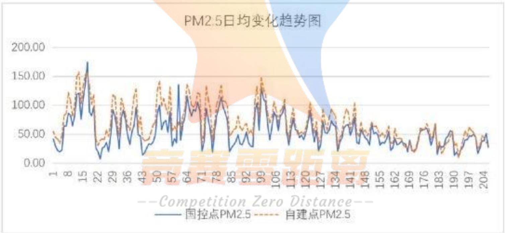

<details>
<summary>line</summary>

| Category | 国控点PM2.5 | 自建点PM2.5 |
| --- | --- | --- |
| 1 | ~40 | ~50 |
| 8 | ~20 | ~30 |
| 15 | ~120 | ~150 |
| 22 | ~170 | ~160 |
| 29 | ~10 | ~20 |
| 36 | ~90 | ~110 |
| 43 | ~10 | ~40 |
| 50 | ~100 | ~140 |
| 57 | ~60 | ~130 |
| 64 | ~130 | ~120 |
| 71 | ~100 | ~120 |
| 78 | ~10 | ~130 |
| 85 | ~110 | ~130 |
| 92 | ~20 | ~60 |
| 99 | ~130 | ~140 |
| 106 | ~80 | ~90 |
| 113 | ~100 | ~110 |
| 120 | ~50 | ~60 |
| 127 | ~90 | ~100 |
| 134 | ~20 | ~30 |
| 141 | ~70 | ~90 |
| 148 | ~60 | ~70 |
| 155 | ~40 | ~50 |
| 162 | ~30 | ~40 |
| 169 | ~20 | ~30 |
| 176 | ~60 | ~60 |
| 183 | ~20 | ~30 |
| 190 | ~50 | ~60 |
| 197 | ~20 | ~30 |
| 204 | ~50 | ~50 |
</details>

图 1 PM2.5 日均变化趋势图

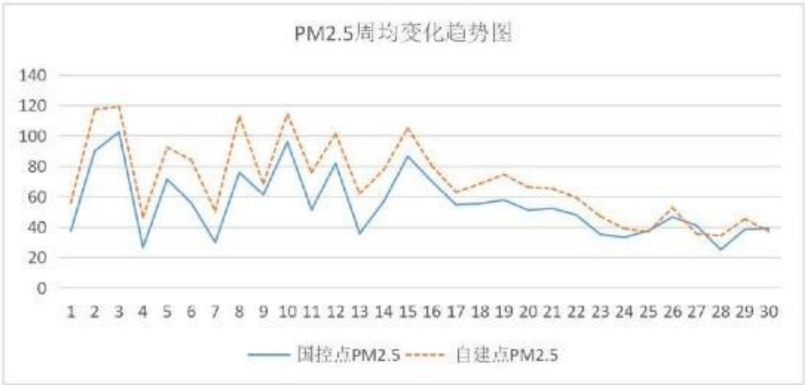

<details>
<summary>line</summary>

| 周次 | 国控点PM2.5 | 自建点PM2.5 |
| --- | --- | --- |
| 1 | ~38 | ~56 |
| 2 | ~90 | ~118 |
| 3 | ~102 | ~120 |
| 4 | ~27 | ~46 |
| 5 | ~72 | ~93 |
| 6 | ~56 | ~84 |
| 7 | ~30 | ~51 |
| 8 | ~76 | ~113 |
| 9 | ~61 | ~68 |
| 10 | ~96 | ~115 |
| 11 | ~52 | ~76 |
| 12 | ~82 | ~102 |
| 13 | ~36 | ~62 |
| 14 | ~58 | ~78 |
| 15 | ~87 | ~105 |
| 16 | ~72 | ~82 |
| 17 | ~55 | ~63 |
| 18 | ~56 | ~68 |
| 19 | ~58 | ~75 |
| 20 | ~52 | ~66 |
| 21 | ~53 | ~65 |
| 22 | ~48 | ~60 |
| 23 | ~35 | ~48 |
| 24 | ~34 | ~39 |
| 25 | ~38 | ~38 |
| 26 | ~47 | ~53 |
| 27 | ~42 | ~36 |
| 28 | ~25 | ~34 |
| 29 | ~39 | ~45 |
| 30 | ~39 | ~39 |
</details>

图 2 PM2.5 周均变化趋势图

通过把国控点与自建点的 PM2.5 浓度数据的日平均值和周平均值结合一起分析，并利用 MATLAB 画出对应的折线图（如图 1），我们得到了 PM2.5 日均变化趋势图（图 1）与 PM2.5 周均变化趋势图（图 2）。两个图中，红色虚线为自建点图，蓝色实线为国控点图。

分析图 1 与图 2，不难看出自建点测出的 PM2.5 数值与国控点的变化趋势整体一致，但浓度整体偏高（此处以国控检测值作为准确值）。冬季相比于夏季 PM2.5 的浓度高，2、3 月份浓度有所上升，应与春节放鞭炮有关。

结论一：自建点能较准确的测量出 PM2.5 浓度变化趋势，但测出的 PM2.5 浓度偏高。

结论二：PM2.5有很大的季节性变化，表现为冬季浓度相对高，夏季浓度相对低。

## 5.1.2 PM10 数据分析

对比分析方法如 5.1.1 所述，由图易得，PM10 的变化趋势跟 PM2.5 整体相同，符合 PM2.5 的变化特征。如下两图，上面为 PM10 浓度变化日平均趋势图，下面为周平均趋势图，红色虚线为自建点图，蓝色实线为国控点图。

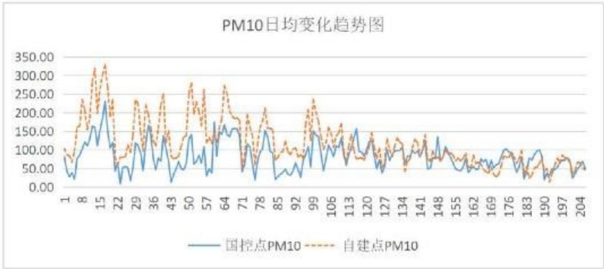

<details>
<summary>line</summary>

| Day | 国控点PM10 | 自建点PM10 |
| --- | --- | --- |
| 1 | ~80 | ~100 |
| 8 | ~30 | ~70 |
| 15 | ~160 | ~320 |
| 22 | ~230 | ~330 |
| 29 | ~50 | ~80 |
| 36 | ~120 | ~230 |
| 43 | ~160 | ~250 |
| 50 | ~50 | ~80 |
| 57 | ~140 | ~280 |
| 64 | ~170 | ~270 |
| 71 | ~150 | ~180 |
| 78 | ~150 | ~210 |
| 85 | ~20 | ~80 |
| 92 | ~40 | ~120 |
| 99 | ~150 | ~240 |
| 106 | ~100 | ~160 |
| 113 | ~160 | ~170 |
| 120 | ~80 | ~80 |
| 127 | ~120 | ~130 |
| 134 | ~80 | ~120 |
| 141 | ~100 | ~130 |
| 148 | ~130 | ~140 |
| 155 | ~80 | ~80 |
| 162 | ~60 | ~70 |
| 169 | ~70 | ~50 |
| 176 | ~100 | ~90 |
| 183 | ~50 | ~60 |
| 190 | ~100 | ~80 |
| 197 | ~50 | ~70 |
| 204 | ~60 | ~60 |
</details>

图 3 PM10 日均变化趋势图

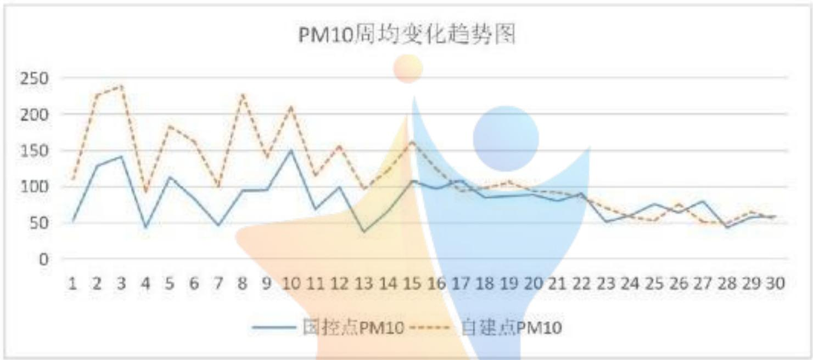

<details>
<summary>line</summary>

| Week | 国控点PM10 | 自建点PM10 |
| --- | --- | --- |
| 1 | ~50 | ~110 |
| 2 | ~130 | ~230 |
| 3 | ~140 | ~240 |
| 4 | ~45 | ~95 |
| 5 | ~115 | ~185 |
| 6 | ~85 | ~165 |
| 7 | ~50 | ~100 |
| 8 | ~95 | ~230 |
| 9 | ~95 | ~140 |
| 10 | ~150 | ~210 |
| 11 | ~70 | ~115 |
| 12 | ~100 | ~155 |
| 13 | ~40 | ~100 |
| 14 | ~65 | ~125 |
| 15 | ~110 | ~160 |
| 16 | ~100 | ~125 |
| 17 | ~110 | ~95 |
| 18 | ~85 | ~100 |
| 19 | ~90 | ~110 |
| 20 | ~90 | ~95 |
| 21 | ~80 | ~90 |
| 22 | ~90 | ~85 |
| 23 | ~50 | ~75 |
| 24 | ~60 | ~60 |
| 25 | ~75 | ~55 |
| 26 | ~65 | ~75 |
| 27 | ~80 | ~50 |
| 28 | ~45 | ~50 |
| 29 | ~60 | ~65 |
| 30 | ~60 | ~60 |
</details>

图 4 PM10 周均变化趋势图

结论三：PM10 浓度在冬季较高，夏季有所下降。

结论四：自建点的测量值总体准确，冬季符合国控点的变化趋势，夏季对比国控点差异小。

--Competition Zero Distance--

## 5.1.3 CO数据分析

图表形象地表达出 CO 浓度也有较大的季节性特征，表现为冬季浓度起伏大，夏季浓度持续较高。自建点测量的 CO 浓度整体变化趋势跟国控点变化趋势大体相同，但仍有很大误差。一月份到四月份自建点对 CO 的检测明显有错，5 月份到 6 月份自建点测量值较接近国控点。可以认为天气对自建点测量 CO 有很大影响。从国控点（蓝色虚线）可以看出 CO 的浓度整体上也是冬季高，夏季相对低。如下两图，上面为 CO 浓度变化日平均趋势图，下面为周平均趋势图，红色虚线为自建点图，蓝色实线为国控点图。

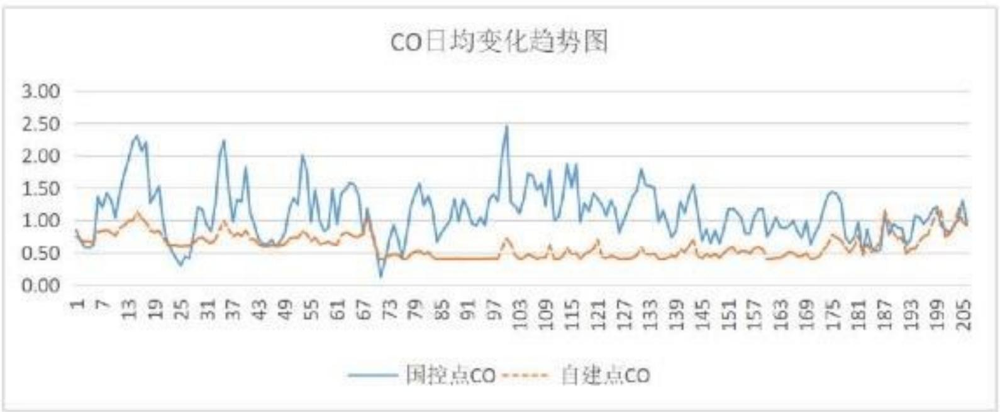

<details>
<summary>line</summary>

| X | 国控点CO | 自建点CO |
| --- | --- | --- |
| 1 | ~0.8 | ~0.8 |
| 7 | ~0.6 | ~0.6 |
| 13 | ~1.4 | ~0.8 |
| 19 | ~2.3 | ~1.1 |
| 25 | ~0.4 | ~0.6 |
| 31 | ~1.2 | ~0.7 |
| 37 | ~2.2 | ~0.9 |
| 43 | ~0.7 | ~0.7 |
| 49 | ~0.7 | ~0.7 |
| 55 | ~2.0 | ~0.8 |
| 61 | ~1.5 | ~0.7 |
| 67 | ~1.6 | ~0.8 |
| 73 | ~0.2 | ~0.5 |
| 79 | ~1.5 | ~0.5 |
| 85 | ~0.7 | ~0.5 |
| 91 | ~1.3 | ~0.5 |
| 97 | ~1.4 | ~0.5 |
| 103 | ~2.5 | ~0.7 |
| 109 | ~1.7 | ~0.5 |
| 115 | ~1.8 | ~0.5 |
| 121 | ~1.2 | ~0.5 |
| 127 | ~1.4 | ~0.5 |
| 133 | ~1.8 | ~0.5 |
| 139 | ~1.5 | ~0.5 |
| 145 | ~0.8 | ~0.5 |
| 151 | ~1.2 | ~0.5 |
| 157 | ~1.2 | ~0.5 |
| 163 | ~0.9 | ~0.5 |
| 169 | ~1.0 | ~0.5 |
| 175 | ~1.4 | ~0.8 |
| 181 | ~0.7 | ~0.6 |
| 187 | ~0.9 | ~0.6 |
| 193 | ~0.8 | ~0.6 |
| 199 | ~1.2 | ~1.2 |
| 205 | ~1.3 | ~1.0 |
</details>

图 5 CO 日均变化趋势图

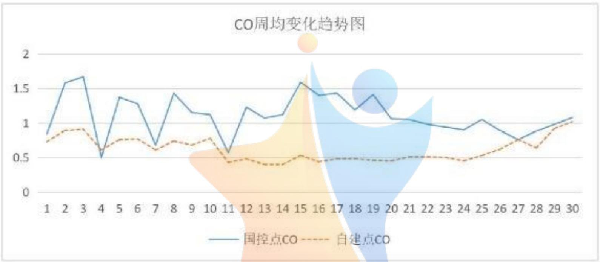

<details>
<summary>line</summary>

| Category | 国控点CO | 自建点CO |
| --- | --- | --- |
| 1 | ~0.85 | ~0.75 |
| 2 | ~1.6 | ~0.9 |
| 3 | ~1.65 | ~0.9 |
| 4 | ~0.5 | ~0.6 |
| 5 | ~1.35 | ~0.75 |
| 6 | ~1.3 | ~0.75 |
| 7 | ~0.7 | ~0.6 |
| 8 | ~1.45 | ~0.75 |
| 9 | ~1.15 | ~0.7 |
| 10 | ~1.15 | ~0.8 |
| 11 | ~0.6 | ~0.45 |
| 12 | ~1.25 | ~0.5 |
| 13 | ~1.1 | ~0.4 |
| 14 | ~1.15 | ~0.4 |
| 15 | ~1.6 | ~0.55 |
| 16 | ~1.4 | ~0.45 |
| 17 | ~1.45 | ~0.5 |
| 18 | ~1.2 | ~0.5 |
| 19 | ~1.4 | ~0.45 |
| 20 | ~1.1 | ~0.45 |
| 21 | ~1.05 | ~0.5 |
| 22 | ~1.0 | ~0.5 |
| 23 | ~0.95 | ~0.5 |
| 24 | ~0.9 | ~0.45 |
| 25 | ~1.05 | ~0.55 |
| 26 | ~0.9 | ~0.65 |
| 27 | ~0.75 | ~0.75 |
| 28 | ~0.9 | ~0.65 |
| 29 | ~1.0 | ~0.9 |
| 30 | ~1.1 | ~1.05 |
</details>

图 6 CO 周均变化趋势图

结论五：CO 浓度在冬季起伏大，在夏季保持高浓度并逐渐降低。

结论六：自建点在1月份到4月份测量CO浓度误差较大。

--Competition Zero Distance--

## 5.1.4 NO2 数据分析

11 到 12 月份质控点测量的 N02 浓度明显差别于国控点，1 到 6 月份测量值整体变化趋势与国控点相同。N02 浓度在 11、12 月份较低，在一月份迅速升高并保持在较高浓度。由于 1 到 6 月份自建点能较准确得测量 N02 浓度，因此不考虑是地理因数引起的误差。如下两图，上面为 N02 浓度变化日平均趋势图，下面为周平均趋势图，红色虚线为自建点图，蓝色实线为国控点图。

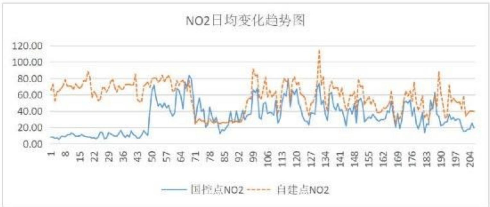

<details>
<summary>line</summary>

| Day | 国控点NO2 | 自建点NO2 |
| --- | --- | --- |
| 1 | ~8 | ~65 |
| 8 | ~10 | ~70 |
| 15 | ~12 | ~75 |
| 22 | ~10 | ~85 |
| 29 | ~10 | ~60 |
| 36 | ~12 | ~70 |
| 43 | ~10 | ~75 |
| 50 | ~15 | ~70 |
| 57 | ~70 | ~80 |
| 64 | ~45 | ~80 |
| 71 | ~80 | ~75 |
| 78 | ~30 | ~30 |
| 85 | ~20 | ~25 |
| 92 | ~30 | ~30 |
| 99 | ~60 | ~90 |
| 106 | ~40 | ~60 |
| 113 | ~60 | ~80 |
| 120 | ~65 | ~75 |
| 127 | ~30 | ~40 |
| 134 | ~70 | ~115 |
| 141 | ~40 | ~60 |
| 148 | ~40 | ~60 |
| 155 | ~30 | ~50 |
| 162 | ~30 | ~40 |
| 169 | ~40 | ~50 |
| 176 | ~50 | ~60 |
| 183 | ~20 | ~40 |
| 190 | ~60 | ~90 |
| 197 | ~30 | ~50 |
| 204 | ~20 | ~40 |
</details>

图 7 NO2 日均变化趋势图

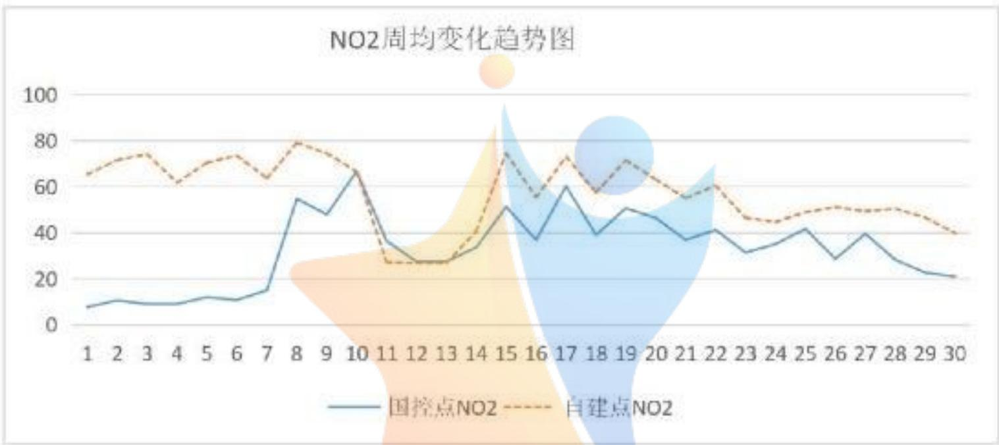

<details>
<summary>line</summary>

| 周数 | 国控点NO2 | 自建点NO2 |
| --- | --- | --- |
| 1 | ~8 | ~65 |
| 2 | ~11 | ~70 |
| 3 | ~9 | ~74 |
| 4 | ~9 | ~62 |
| 5 | ~12 | ~70 |
| 6 | ~11 | ~73 |
| 7 | ~15 | ~64 |
| 8 | ~55 | ~79 |
| 9 | ~48 | ~75 |
| 10 | ~67 | ~67 |
| 11 | ~37 | ~27 |
| 12 | ~28 | ~27 |
| 13 | ~28 | ~28 |
| 14 | ~34 | ~38 |
| 15 | ~51 | ~75 |
| 16 | ~37 | ~55 |
| 17 | ~60 | ~73 |
| 18 | ~40 | ~58 |
| 19 | ~50 | ~71 |
| 20 | ~47 | ~65 |
| 21 | ~37 | ~55 |
| 22 | ~41 | ~60 |
| 23 | ~32 | ~46 |
| 24 | ~35 | ~45 |
| 25 | ~41 | ~49 |
| 26 | ~28 | ~51 |
| 27 | ~40 | ~50 |
| 28 | ~28 | ~50 |
| 29 | ~23 | ~46 |
| 30 | ~21 | ~40 |
</details>

图 8 NO2 周均变化趋势图

结论七：NO2浓度受温度影响大。

结论八：自建点在温度较低时无法准确测量 N02 浓度，误差较大。

## 5.1.5 S02 数据分析

如下图所示，在11月24号这一天自建点检测的S02浓度异常高，显然不符合国控点的变化规律，推测可能是传感器当天有问题，或者测试点有人放鞭炮。红色虚线为自建点图，蓝色实线为国控点图。

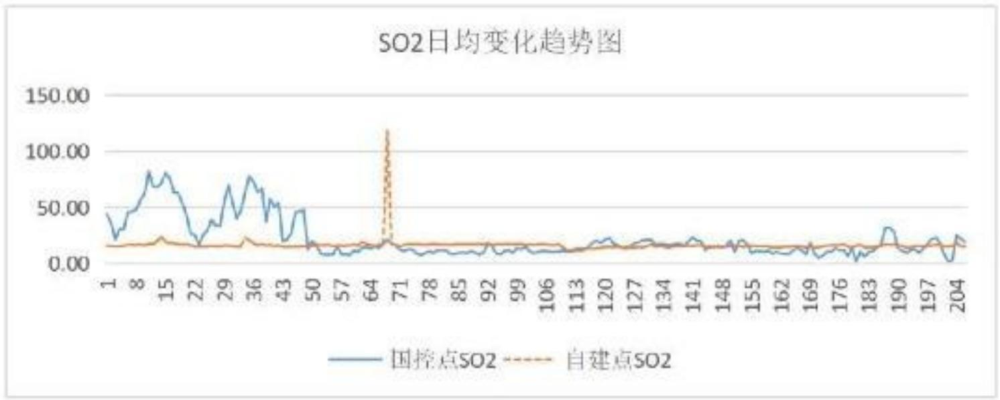

<details>
<summary>line</summary>

| X | 国控点SO2 | 自建点SO2 |
| --- | --- | --- |
| 1 | ~45 | ~18 |
| 8 | ~30 | ~18 |
| 15 | ~80 | ~25 |
| 22 | ~60 | ~18 |
| 29 | ~30 | ~18 |
| 36 | ~75 | ~25 |
| 43 | ~50 | ~18 |
| 50 | ~45 | ~18 |
| 57 | ~10 | ~18 |
| 64 | ~15 | ~18 |
| 71 | ~15 | ~120 |
| 78 | ~10 | ~18 |
| 85 | ~10 | ~18 |
| 92 | ~10 | ~18 |
| 99 | ~10 | ~18 |
| 106 | ~10 | ~18 |
| 113 | ~10 | ~18 |
| 120 | ~20 | ~18 |
| 127 | ~15 | ~18 |
| 134 | ~20 | ~18 |
| 141 | ~20 | ~18 |
| 148 | ~15 | ~18 |
| 155 | ~15 | ~18 |
| 162 | ~10 | ~18 |
| 169 | ~10 | ~18 |
| 176 | ~10 | ~18 |
| 183 | ~30 | ~18 |
| 190 | ~15 | ~18 |
| 197 | ~20 | ~18 |
| 204 | ~25 | ~20 |
</details>

图 9 SO2 日均变化趋势图

为不影响分析，需要把该天异常数据进行修正，修正方法是把同一天的国控点测得的数据代替自建点的数据，这样既符合整体规律，又能让往后的分析与预测更接近真实情况。根据修正国控点图形得出 S02 浓度含量在冬天较高并且在一月份浓度迅速降低，夏季保持在低浓度水平，自建点在冬季对 S02 测量有较大误差。修正后，如下两图，上面为 S02 浓度变化日平均趋势图，下面为周平均趋势图，红色虚线为自建点图，蓝色实线为国控点图。

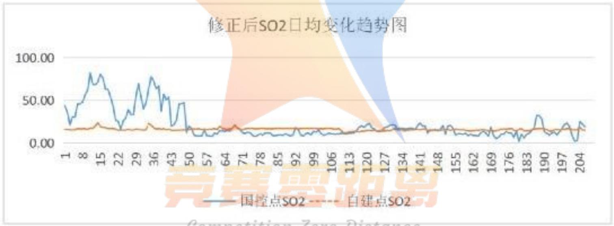

<details>
<summary>line</summary>

| X | 国控点SO2 | 自建点SO2 |
| --- | --- | --- |
| 1 | ~45 | ~18 |
| 8 | ~30 | ~18 |
| 15 | ~80 | ~25 |
| 22 | ~60 | ~18 |
| 29 | ~30 | ~18 |
| 36 | ~75 | ~25 |
| 43 | ~50 | ~18 |
| 50 | ~45 | ~18 |
| 57 | ~10 | ~18 |
| 64 | ~15 | ~18 |
| 71 | ~15 | ~20 |
| 78 | ~10 | ~18 |
| 85 | ~10 | ~18 |
| 92 | ~10 | ~18 |
| 99 | ~10 | ~18 |
| 106 | ~10 | ~18 |
| 113 | ~10 | ~18 |
| 120 | ~20 | ~18 |
| 127 | ~15 | ~18 |
| 134 | ~20 | ~18 |
| 141 | ~20 | ~18 |
| 148 | ~15 | ~18 |
| 155 | ~15 | ~18 |
| 162 | ~10 | ~18 |
| 169 | ~10 | ~18 |
| 176 | ~10 | ~18 |
| 183 | ~30 | ~18 |
| 190 | ~15 | ~18 |
| 197 | ~20 | ~18 |
| 204 | ~25 | ~18 |
</details>

图 9 修正后 SO2 日均变化趋势图  
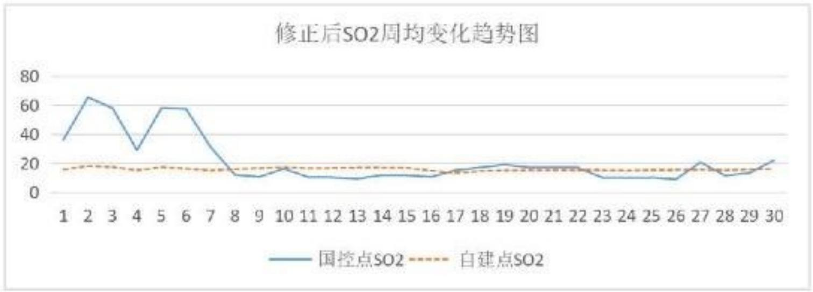

<details>
<summary>line</summary>

| 周次 | 国控点SO2 | 自建点SO2 |
| --- | --- | --- |
| 1 | ~36 | ~16 |
| 2 | ~66 | ~18 |
| 3 | ~58 | ~17 |
| 4 | ~30 | ~16 |
| 5 | ~58 | ~18 |
| 6 | ~58 | ~17 |
| 7 | ~35 | ~16 |
| 8 | ~12 | ~16 |
| 9 | ~11 | ~17 |
| 10 | ~17 | ~17 |
| 11 | ~11 | ~17 |
| 12 | ~10 | ~17 |
| 13 | ~10 | ~17 |
| 14 | ~12 | ~17 |
| 15 | ~12 | ~17 |
| 16 | ~11 | ~16 |
| 17 | ~15 | ~15 |
| 18 | ~17 | ~15 |
| 19 | ~20 | ~15 |
| 20 | ~18 | ~15 |
| 21 | ~18 | ~15 |
| 22 | ~18 | ~15 |
| 23 | ~10 | ~15 |
| 24 | ~10 | ~15 |
| 25 | ~9 | ~15 |
| 26 | ~9 | ~15 |
| 27 | ~21 | ~15 |
| 28 | ~12 | ~15 |
| 29 | ~14 | ~15 |
| 30 | ~23 | ~16 |
</details>

图 10 修正后 SO2 周均变化趋势图

结论九：S02 在 11、12 月浓度较高，并且受温度影响大。

结论十：自建点在冬季无法正确测量 S02 浓度，整体误差非常大。

## 5.1.6 03 数据分析

03 在 11 到 12 月份浓度较低，从冬季到夏季含量递增。在冬季自建点不能准确测量出 03 的浓度。如下两图，上面为 03 浓度变化日平均趋势图，下面为日平均趋势图，红色虚线为自建点图，蓝色实线为国控点图。

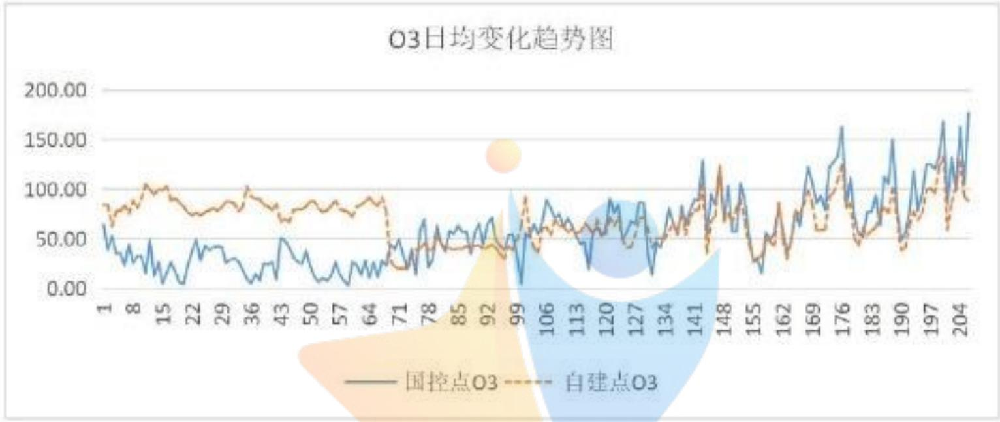

<details>
<summary>line</summary>

| Day | 国控点O3 | 自建点O3 |
| --- | --- | --- |
| 1 | ~65 | ~85 |
| 8 | ~30 | ~90 |
| 15 | ~20 | ~100 |
| 22 | ~40 | ~80 |
| 29 | ~30 | ~85 |
| 36 | ~20 | ~90 |
| 43 | ~50 | ~70 |
| 50 | ~20 | ~85 |
| 57 | ~10 | ~80 |
| 64 | ~20 | ~90 |
| 71 | ~40 | ~25 |
| 78 | ~60 | ~40 |
| 85 | ~50 | ~45 |
| 92 | ~60 | ~45 |
| 99 | ~50 | ~40 |
| 106 | ~80 | ~60 |
| 113 | ~60 | ~60 |
| 120 | ~70 | ~60 |
| 127 | ~80 | ~60 |
| 134 | ~60 | ~60 |
| 141 | ~90 | ~80 |
| 148 | ~120 | ~120 |
| 155 | ~60 | ~60 |
| 162 | ~80 | ~80 |
| 169 | ~120 | ~100 |
| 176 | ~160 | ~120 |
| 183 | ~80 | ~80 |
| 190 | ~150 | ~100 |
| 197 | ~120 | ~120 |
| 204 | ~175 | ~90 |
</details>

图 11 03 日均变化趋势图

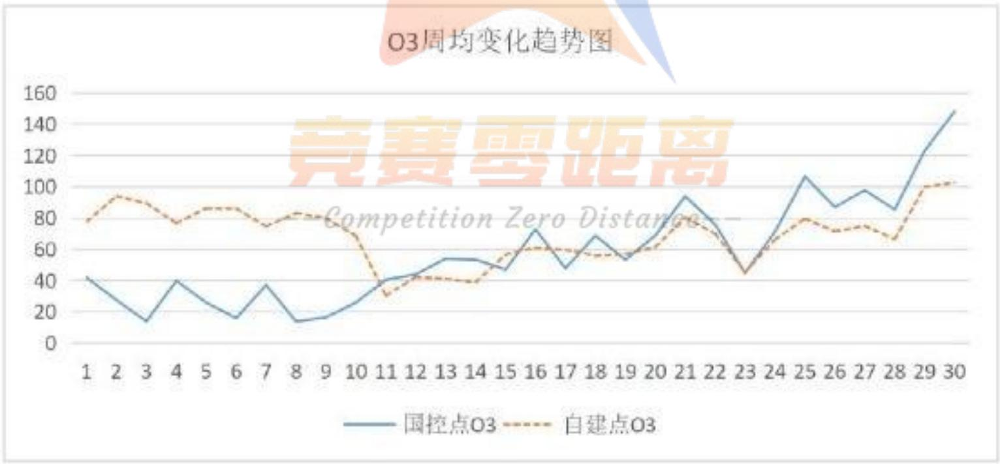

<details>
<summary>line</summary>

| 周数 | 国控点O3 | 自建点O3 |
| --- | --- | --- |
| 1 | ~42 | ~78 |
| 2 | ~25 | ~94 |
| 3 | ~15 | ~88 |
| 4 | ~40 | ~76 |
| 5 | ~25 | ~86 |
| 6 | ~18 | ~86 |
| 7 | ~38 | ~74 |
| 8 | ~15 | ~82 |
| 9 | ~18 | ~80 |
| 10 | ~25 | ~70 |
| 11 | ~40 | ~30 |
| 12 | ~45 | ~42 |
| 13 | ~54 | ~42 |
| 14 | ~54 | ~40 |
| 15 | ~48 | ~58 |
| 16 | ~72 | ~60 |
| 17 | ~48 | ~60 |
| 18 | ~68 | ~56 |
| 19 | ~54 | ~58 |
| 20 | ~68 | ~62 |
| 21 | ~94 | ~78 |
| 22 | ~78 | ~72 |
| 23 | ~45 | ~45 |
| 24 | ~65 | ~65 |
| 25 | ~106 | ~78 |
| 26 | ~86 | ~72 |
| 27 | ~98 | ~74 |
| 28 | ~84 | ~66 |
| 29 | ~120 | ~100 |
| 30 | ~148 | ~102 |
</details>

图 12 03 周均变化趋势图

结论十一：03 浓度跟温度正相关。

结论十二：温度较低时自建点不能准确测量03浓度，整体误差非常大。

## 5.2 问题二：对导致自建点数据与国控点数据造成差异的因素进行分析

首先把国控点检测的数据和自建点检测的数据统一进行归一化处理（归一化程序详见附录），通过 Pearson 相关系数计算公式，利用 MATLAB 计算得到如下相关度表 A（计算程序详见附录），表中数据为相关系数 r 的值。

<table><tr><td></td><td>国控点PM2.5</td><td>国控点PM10</td><td>国控点CO</td><td>国控点NO2</td><td>国控点SO2</td><td>国控点O3</td></tr><tr><td>自建点 PM2.5</td><td>0.9205</td><td>0.7614</td><td>0.6678</td><td>0.1595</td><td>0.3622</td><td>-0.4628</td></tr><tr><td>自建点 PM10</td><td>0.866</td><td>0.7243</td><td>0.6294</td><td>0.034</td><td>0.4882</td><td>-0.5695</td></tr><tr><td>自建点 CO</td><td>0.3293</td><td>0.3639</td><td>0.3355</td><td>-0.1884</td><td>0.5824</td><td>-0.0449</td></tr><tr><td>自建点 NO2</td><td>0.3665</td><td>0.4272</td><td>0.4431</td><td>0.2384</td><td>0.4204</td><td>-0.4045</td></tr><tr><td>自建点 SO2</td><td>0.4587</td><td>0.3858</td><td>0.4361</td><td>-0.049</td><td>0.3935</td><td>-0.2696</td></tr><tr><td>自建点 O3</td><td>0.15</td><td>0.2613</td><td>0.197</td><td>-0.172</td><td>0.4671</td><td>0.2509</td></tr><tr><td>风速</td><td>-0.2477</td><td>-0.2077</td><td>-0.3037</td><td>-0.1785</td><td>-0.2265</td><td>0.1471</td></tr><tr><td>压强</td><td>0.1595</td><td>0.0987</td><td>-0.0329</td><td>-0.0946</td><td>0.2414</td><td>-0.5686</td></tr><tr><td>降水量</td><td>-0.0732</td><td>-0.0935</td><td>0.093</td><td>-0.166</td><td>0.2902</td><td>-0.111</td></tr><tr><td>温度</td><td>-0.2084</td><td>-0.0688</td><td>-0.0589</td><td>0.066</td><td>-0.1384</td><td>0.7046</td></tr><tr><td>湿度</td><td>0.1167</td><td>-0.1817</td><td>0.1591</td><td>-0.3558</td><td>0.1293</td><td>-0.5493</td></tr></table>

表 1 国控点数据与自建点数据的相关性分析表

<table><tr><td></td><td>自建点PM2.5</td><td>自建点PM10</td><td>自建点CO</td><td>自建点NO2</td><td>自建点SO2</td><td>自建点O3</td></tr><tr><td>风速</td><td>-0.2266</td><td>-0.2843</td><td>-0.3906</td><td>-0.1715</td><td>-0.4697</td><td>-0.2675</td></tr><tr><td>压强</td><td>0.4919</td><td>0.5745</td><td>-0.1705</td><td>0.2893</td><td>0.3206</td><td>-0.2247</td></tr><tr><td>降水量</td><td>0.0516</td><td>0.1508</td><td>0.3464</td><td>0.5341</td><td>-0.1566</td><td>0.5567</td></tr><tr><td>温度</td><td>-0.5744</td><td>-0.6063</td><td>0.2654</td><td>-0.1986</td><td>-0.3546</td><td>0.3636</td></tr><tr><td>湿度</td><td>0.4793</td><td>0.5416</td><td>0.0772</td><td>0.0554</td><td>0.5215</td><td>-0.1272</td></tr></table>

表 2 自建点数据与天气因数的相关性分析表

由表 1 得，自建点与国控点的 PM2.5 的相关系数大于 0.7，为高度线性相关，故自建点数据较接近于国控点，忽略受天气的影响。自建点的 CO、NO2、SO2、O3 与国控点相对应的污染物的相关系数均小于 0.4，即相关度较低，说明其测试误差相当大，此时要考虑风速、压强、降水量、温度、湿度的影响。

由表 2 可知，跟自建点 CO 相关度较高的天气因素有风速、降水量、温度；跟自建点 NO2 相关度较高的因素有压强和降水量；除降水量外其余因素都跟自建点 SO2 相关度较高；除湿度外，O3 对其余因素相关度较高。

把跟 CO 相关度较高的因素数值作归一化周均图，并把国控点与自建点 CO 差值放同一图分析，如图：

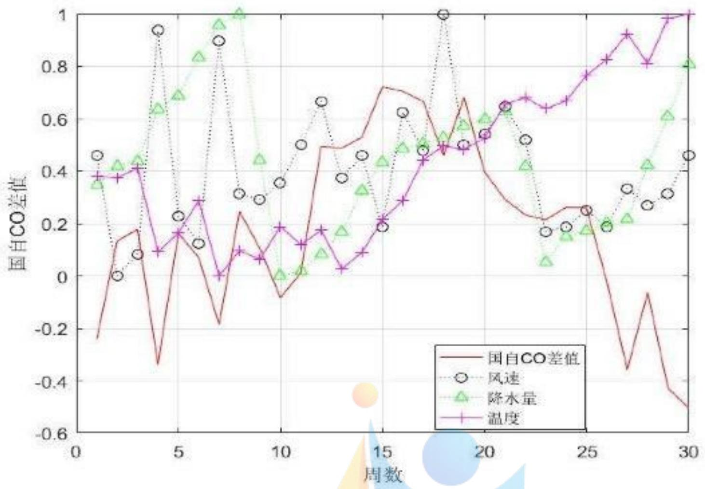

<details>
<summary>line</summary>

| 周数 | 国自CO差值 | 风速 | 降水量 | 温度 |
| --- | --- | --- | --- | --- |
| 1 | ~-0.23 | ~0.46 | ~0.35 | ~0.38 |
| 2 | ~0.13 | ~0.00 | ~0.42 | ~0.38 |
| 3 | ~0.18 | ~0.09 | ~0.44 | ~0.41 |
| 4 | ~-0.33 | ~0.94 | ~0.64 | ~0.10 |
| 5 | ~0.17 | ~0.23 | ~0.69 | ~0.17 |
| 6 | ~0.12 | ~0.13 | ~0.84 | ~0.29 |
| 7 | ~-0.18 | ~0.90 | ~0.96 | ~0.01 |
| 8 | ~0.25 | ~0.32 | ~1.01 | ~0.10 |
| 9 | ~0.12 | ~0.29 | ~0.45 | ~0.07 |
| 10 | ~-0.07 | ~0.36 | ~0.01 | ~0.19 |
| 11 | ~0.13 | ~0.51 | ~0.02 | ~0.13 |
| 12 | ~0.49 | ~0.67 | ~0.18 | ~0.18 |
| 13 | ~0.49 | ~0.38 | ~0.18 | ~0.03 |
| 14 | ~0.53 | ~0.46 | ~0.33 | ~0.10 |
| 15 | ~0.72 | ~0.19 | ~0.44 | ~0.22 |
| 16 | ~0.71 | ~0.63 | ~0.49 | ~0.29 |
| 17 | ~0.67 | ~0.48 | ~0.52 | ~0.44 |
| 18 | ~0.48 | 1.00 | ~0.58 | ~0.49 |
| 19 | ~0.68 | ~0.51 | ~0.59 | ~0.49 |
| 20 | ~0.45 | ~0.55 | ~0.61 | ~0.54 |
| 21 | ~0.35 | ~0.65 | ~0.65 | ~0.65 |
| 22 | ~0.25 | ~0.52 | ~0.42 | ~0.68 |
| 23 | ~0.22 | ~0.17 | ~0.06 | ~0.64 |
| 24 | ~0.27 | ~0.19 | ~0.15 | ~0.67 |
| 25 | ~0.26 | ~0.26 | ~0.18 | ~0.77 |
| 26 | ~-0.35 | ~0.34 | ~0.22 | ~0.83 |
| 27 | ~-0.06 | ~0.27 | ~0.42 | ~0.93 |
| 28 | ~-0.43 | ~0.32 | ~0.61 | ~0.81 |
| 29 | ~-0.55 | ~0.46 | ~0.81 | 1.00 |
| 30 | — | — | — | — |
</details>

图 13 国自 CO 差值与天气因素变化趋势图

由图 13 可知，风速较大时国控点与自建点 CO 差异较大，降水量增加时，国控点与自建点 CO 差异增大，温度降低时国控点与自建点 CO 差异变大，在 25 到 30 周，风速、降水量、温度都在上升，而国控点与自建点 CO 差异随之变大。从第 1 周到第 8 周降水量一直上升，而国自 CO 差值并不随其变化，相比之下，风速跟温度对差值影响较为敏感

结论:风速与温度对测量差异的影响相比于降水量更敏感更大。

把跟 N02 相关性较大的因素数值作归一化周均图，把国控点与自建点的 N02 差值放同一图分析，如图 14:

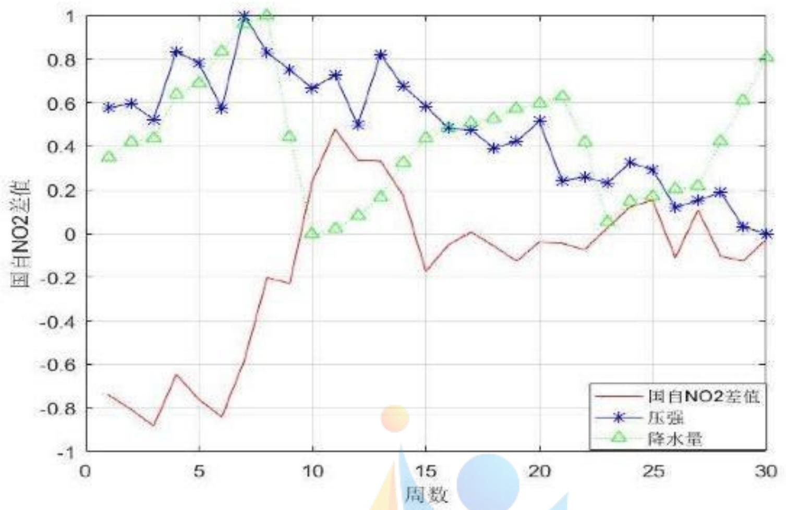

<details>
<summary>line</summary>

| 周数 | 国自NO2差值 | 压强 | 降水量 |
| --- | --- | --- | --- |
| 1 | ~-0.74 | ~0.58 | ~0.35 |
| 2 | ~-0.82 | ~0.60 | ~0.42 |
| 3 | ~-0.88 | ~0.52 | ~0.45 |
| 4 | ~-0.65 | ~0.84 | ~0.65 |
| 5 | ~-0.75 | ~0.79 | ~0.70 |
| 6 | ~-0.84 | ~0.58 | ~0.85 |
| 7 | ~-0.60 | ~1.00 | ~1.00 |
| 8 | ~-0.20 | ~0.84 | ~1.00 |
| 9 | ~-0.23 | ~0.75 | ~0.45 |
| 10 | ~0.25 | ~0.67 | ~0.01 |
| 11 | ~0.48 | ~0.73 | ~0.03 |
| 12 | ~0.34 | ~0.50 | ~0.10 |
| 13 | ~0.33 | ~0.82 | ~0.18 |
| 14 | ~0.18 | ~0.68 | ~0.33 |
| 15 | ~-0.17 | ~0.59 | ~0.45 |
| 16 | ~-0.05 | ~0.49 | ~0.52 |
| 17 | ~0.01 | ~0.48 | ~0.54 |
| 18 | ~-0.12 | ~0.39 | ~0.58 |
| 19 | ~-0.12 | ~0.42 | ~0.60 |
| 20 | ~-0.04 | ~0.52 | ~0.64 |
| 21 | ~-0.04 | ~0.25 | ~0.42 |
| 22 | ~-0.07 | ~0.26 | ~0.25 |
| 23 | ~-0.07 | ~0.24 | ~0.15 |
| 24 | ~0.12 | ~0.33 | ~0.16 |
| 25 | ~0.16 | ~0.30 | ~0.18 |
| 26 | ~-0.11 | ~0.13 | ~0.22 |
| 27 | ~-0.12 | ~0.16 | ~0.23 |
| 28 | ~-0.12 | ~0.19 | ~0.43 |
| 29 | ~-0.12 | ~0.04 | ~0.62 |
| 30 | 0.00 | 0.00 | 0.82 |
</details>

图 14 国自 NO2 差值与天气因素变化趋势图

如果把压强和降水量单独跟国自 N02 差值比较，很难看出其规律，但是把压强和降水量当成一个整体就会发现，当压强和降水量都都较高时，国自 N02 的差值较大，当压强和降水量都整体较低时，国自 N02 的差值变小。

结论：压强与降水量两个天气因数叠加影响时会产生截然不同的结果

把跟 S02 相关性较大的因素数值作归一化周均图，把国控点与自建点的 S02 差值放同一图分析，如图 15:

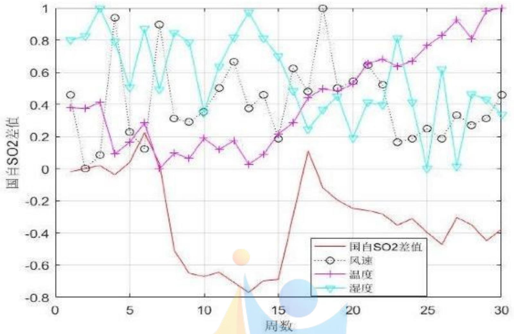

<details>
<summary>line</summary>

| 周数 | 国自SO2差值 | 风速 | 温度 | 湿度 |
| --- | --- | --- | --- | --- |
| 1 | ~0.0 | ~0.47 | ~0.38 | ~0.81 |
| 2 | ~0.0 | ~0.0 | ~0.38 | ~0.83 |
| 3 | ~0.0 | ~0.1 | ~0.42 | ~1.0 |
| 4 | ~-0.03 | ~0.95 | ~0.1 | ~0.8 |
| 5 | ~0.05 | ~0.23 | ~0.17 | ~0.52 |
| 6 | ~0.22 | ~0.13 | ~0.28 | ~0.88 |
| 7 | ~0.0 | ~0.9 | ~0.0 | ~0.5 |
| 8 | ~-0.52 | ~0.32 | ~0.1 | ~0.85 |
| 9 | ~-0.65 | ~0.3 | ~0.07 | ~0.78 |
| 10 | ~-0.67 | ~0.36 | ~0.19 | ~0.36 |
| 11 | ~-0.65 | ~0.51 | ~0.12 | ~0.64 |
| 12 | ~-0.75 | ~0.67 | ~0.18 | ~0.82 |
| 13 | ~-0.77 | ~0.38 | ~0.03 | ~1.0 |
| 14 | ~-0.7 | ~0.47 | ~0.1 | ~0.82 |
| 15 | ~-0.69 | ~0.19 | ~0.22 | ~0.7 |
| 16 | ~-0.45 | ~0.63 | ~0.29 | ~0.48 |
| 17 | ~-0.12 | ~0.49 | ~0.45 | ~0.25 |
| 18 | ~-0.25 | ~1.0 | ~0.5 | ~0.37 |
| 19 | ~-0.28 | ~0.51 | ~0.51 | ~0.45 |
| 20 | ~-0.25 | ~0.55 | ~0.55 | ~0.2 |
| 21 | ~-0.28 | ~0.65 | ~0.65 | ~0.42 |
| 22 | ~-0.35 | ~0.53 | ~0.68 | ~0.4 |
| 23 | ~-0.32 | ~0.17 | ~0.64 | ~0.82 |
| 24 | ~-0.38 | ~0.19 | ~0.67 | ~0.42 |
| 25 | ~-0.47 | ~0.25 | ~0.77 | ~0 |
| 26 | ~-0.31 | ~0.19 | ~0.83 | ~0.62 |
| 27 | ~-0.35 | ~0.34 | ~0.93 | ~0 |
| 28 | ~-0.44 | ~0.27 | ~0.81 | ~0.47 |
| 29 | ~-0.39 | ~0.32 | ~1.0 | ~0.44 |
| 30 | — | ~0.47 | — | — |
</details>

图 15 国自 S02 差值与天气因素变化趋势图

从 1 到 5 周 S02 的差值接近 0，而天气因数都有较大起伏，推测是由于各因素的不同影响综合起来就被互相抵消了，第 8 周左右，由于风速、湿度的下降，造成国自 S02 差值迅速增大，第 15 周后风速上升，差值减小，16 周左右由于湿度、风速下降，造成差值增大。

结论：不同因数综合影响会被抵消，可能会被叠加，使得有时相关性较大的因数对差值影响不大，而相关性较小的因数对差值影响较大。

--Competition Zero Distance--

把跟 S02 相关性较大的因素数值作归一化周均图，把国控点与自建点的 S02 差值放同一图分析，如图 16:

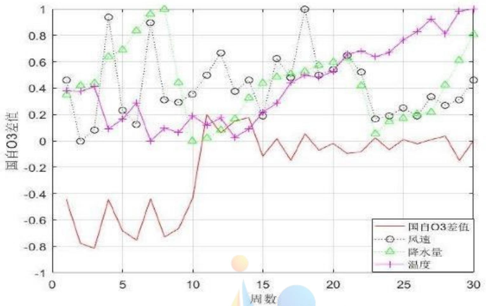

<details>
<summary>line</summary>

| 周数 | 国自O3差值 | 风速 | 降水量 | 温度 |
| --- | --- | --- | --- | --- |
| 1 | ~-0.45 | ~0.47 | ~0.36 | ~0.38 |
| 2 | ~-0.78 | ~0.00 | ~0.42 | ~0.38 |
| 3 | ~-0.80 | ~0.09 | ~0.44 | ~0.41 |
| 4 | ~-0.45 | ~0.95 | ~0.65 | ~0.10 |
| 5 | ~-0.68 | ~0.23 | ~0.70 | ~0.17 |
| 6 | ~-0.75 | ~0.13 | ~0.84 | ~0.29 |
| 7 | ~-0.44 | ~0.90 | ~0.97 | ~0.00 |
| 8 | ~-0.72 | ~0.32 | ~1.00 | ~0.10 |
| 9 | ~-0.68 | ~0.30 | ~0.45 | ~0.07 |
| 10 | ~-0.42 | ~0.36 | ~0.01 | ~0.19 |
| 11 | ~-0.15 | ~0.50 | ~0.04 | ~0.13 |
| 12 | ~0.20 | ~0.67 | ~0.18 | ~0.18 |
| 13 | ~0.12 | ~0.38 | ~0.17 | ~0.03 |
| 14 | ~0.18 | ~0.47 | ~0.33 | ~0.10 |
| 15 | ~-0.11 | ~0.20 | ~0.45 | ~0.22 |
| 16 | ~-0.02 | ~0.63 | ~0.50 | ~0.29 |
| 17 | ~-0.14 | ~0.48 | ~0.53 | ~0.45 |
| 18 | ~-0.06 | ~1.00 | ~0.58 | ~0.50 |
| 19 | ~-0.07 | ~0.55 | ~0.61 | ~0.54 |
| 20 | ~-0.10 | ~0.65 | ~0.65 | ~0.65 |
| 21 | ~-0.11 | ~0.53 | ~0.42 | ~0.68 |
| 22 | ~-0.15 | ~0.17 | ~0.15 | ~0.64 |
| 23 | ~-0.12 | ~0.26 | ~0.18 | ~0.68 |
| 24 | ~-0.15 | ~0.34 | ~0.22 | ~0.77 |
| 25 | ~-0.14 | ~0.27 | ~0.43 | ~0.83 |
| 26 | ~-0.15 | ~0.32 | ~0.62 | ~0.93 |
| 27 | ~-0.14 | ~0.47 | ~0.81 | ~1.00 |
| 28 | ~-0.15 | — | — | — |
| 29 | — | — | — | — |
| 30 | — | — | — | — |
</details>

图 16 国自 03 差值与天气因素变化趋势图

在第 1 到第 10 周，气温较低与降水量较高时国自 03 差值较大，在第 10 周到第 20 周，温度降水量风速上升，但 03 差值并不波动，即当因温度降水量风速同时上升时反而对 03 差值影响不大。

结论：当几种相关性较大的因素一起作用时，有时反而影响变小。

最后，因为自建点的 pm2.5 和 pm10 的测量值与国控点高度吻合，相关度高，所以认为自建点的这两个数据是较准确地，因此就不做误差分析了。

## 5.3 问题三：利用国控点数据，建立数学模型对自建点数据进行校准。

问题三属于回归分析问题, 即如何通过自建点的测试数据预测出真实的数据。由表 1 可知国控点数据与自建点的 11 个测量数据（自建点 PM2.5、自建点 PM10、自建点 CO、自建点 NO、自建点 SO2、自建点 O3、风速、压强、降水量、温度、湿度）都存在相关性，只是有的相关性强，有的相关性弱。因此可设自建点 11 个测量因子为自变量，真实值（国控点测量值）为因变量，则真实值（国控点测量值）有函数如下:

$$
y _ {i} = B _ {0} + B _ {1} x _ {1} + B _ {2} x _ {2} + \dots + B _ {1 1} x _ {1 1} + \varepsilon \tag {2}
$$

对上述函数，因为自变量多，且相互之间的作用机制不明确（比如可能存在交叉干扰项），采用传统的方法建立模型对自建点数据进行修正难度较大，于是我们考虑用 BP 神经网络来对目标函数进行模拟，即把自建点数据作为输入，把国控点某个污染物的数据作为输出，最终得到训练好的 bp 神经网络，就可以通过输入自建点数据预测出污染物的真实指标了。

BP 神经网络是采用反向传播学习算法和非线性可微转移函数的多层网络典型的反向传播算法是梯度下降算法。一个经过训练的 BP 神经网络能够根据输入给出合适的结果，这个特性使得 BP 神经网络很适合采用输入/目标对进行训练。

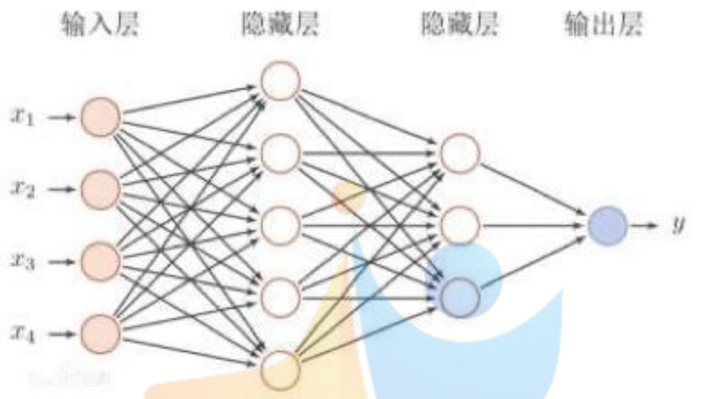

<details>
<summary>flowchart</summary>

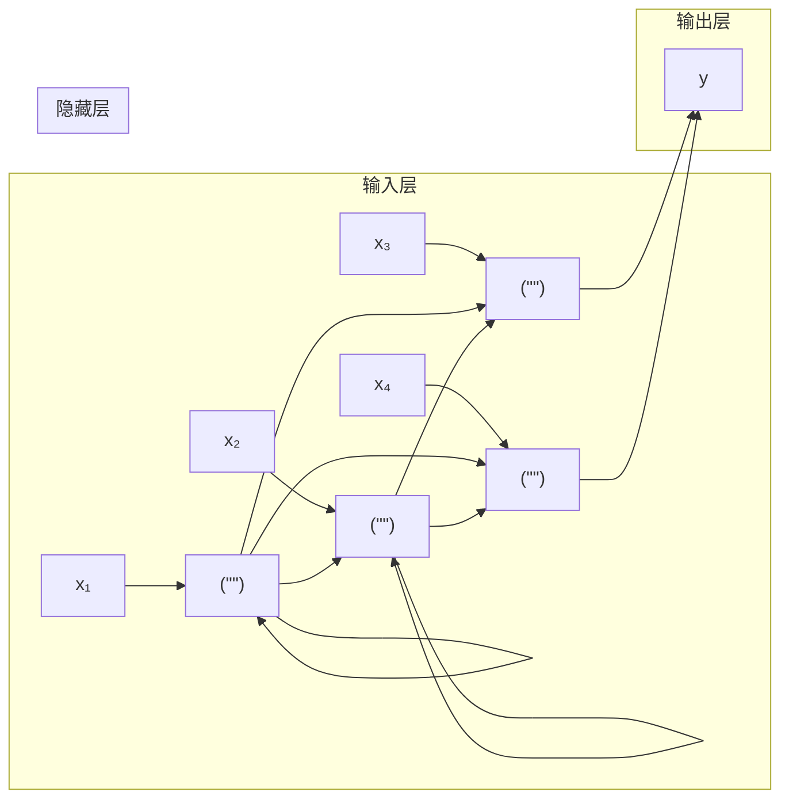
```mermaid
graph LR
  subgraph InputLayer["输入层"]
  x1["x₁"] --> Layer1
  x2["x₂"] --> Layer2
  x3["x₃"] --> Layer3
  x4["x₄"] --> Layer4
  end

  subgraph PrivacyLayer["隐藏层"]
  Layer1["(&quot;&quot;)"] --> Layer1
  Layer1 --> Layer2
  Layer1 --> Layer3
  Layer1 --> Layer4
  end

  subgraph PrivacyLayer["隐藏层"]
  Layer2["(&quot;&quot;)"] --> Layer2
  Layer2 --> Layer3
  Layer2 --> Layer4
  end

  subgraph OutputLayer["输出层"]
  Layer3["(&quot;&quot;)"] --> OutputY["y"]
  Layer4["(&quot;&quot;)"] --> OutputY
  end
```
</details>

上图为 BP 神经网络结构，神经网络由 3 个神经元组成，即输入层、隐层、输出层，其中左边为输入层，输入层由大量的数据组成，中间两层为隐层，右边为输出层，输入层与隐层之间的传递函数一般采用激励函数，隐层与输出层之间的传递函数一般也采用激励函数。多层的神经网络理论上可以拟合出任何函数。

## 5.3.1 BP 神经网络的训练方法

本文为了让 bp 神经网络能更好的预测出真实的污染物指标, 在训练神经网络时, 采用了如下的优化手段:

(1) 数据处理前首先进行数据归一化处理, 因为归一化后数据分布偏差较小, 对 BP 神经网络训练效果更好;  
(2) 然后从 206 天中随机选择 176 天的数据作为训练集, 剩余 30 天的数据作为测试集, 数据的随机选取对 BP 神经网络训练有好处, 因为数据多样性得到了保障;  
(3) 对某个预测值采用多次预测, 然后求平均值的方法, 其好处是预测结果更加稳健, 偶然性误差大大减少;  
(4) 由于隐层 (L) 是影响 BP 神经网络预测的重要参数, 而参数的选择直接影响 bp 网络预测的错误率, 所以本文实验了不同隐层数目对网络性能的影

响，分别让隐层数从 5 至 16 取不同值，得到不同结构的 BP 神经网络，然后对每一个这种神经网络再通过多次运行求均值（20 次）的方法来对污染物数据预测，并得到不同隐层数下的均方差值（BP 神经网络性能指标，此值越小，BP 神经网络性能越好）。

## 5.3.2 BP 神经网络的性能指标

均方误差是各个数据偏离真实值的距离平方和的平均数（即预测值和真实值一一对应的差值的平方和的均值，其公式为：

$$
M S E = \frac {1}{N} \sum_ {t = 1} ^ {N} (O _ {t} - Y _ {t}) ^ {2} \tag {3}
$$

其中， $O_{t}$ 为神经网络的预测输出值， $Y_{t}$ 为真实值，N为样本数。

本文以国控点数据作为真实值，对BP神经网络预测数据和自建点原始数据求均方误差值。MSE\_BP为归一化处理后BP神经网络预测值与真实输出值的均方差值，显然此值越小，说明BP网络的预测约准确。MSE\_Z为归一化处理后自建点数据值与真实输出值的均方差值，此值越大，则表示自建点的测试数据与国控点差异越大。

定义比例系数 BZ=MSE\_BP/MSE\_Z (4)

系数 BZ 为衡量 BP 神经网络性能指标，BZ 值越小，BP 神经网络性能越好。

MSE\_BP\_J 为解归一化处理后 BP 神经网络预测值与真实输出值的均方差值, MSE\_Z\_J 为解归一化处理后自建点数据值与真实输出值的均方差值相应的, 定义比例系数 BZ\_J=MSE\_BP\_J /MSE\_Z\_J (5)

为了更加清晰的表示出 BP 神经网络的预测效果，本文定义了 BP 网络预测准确度 P\_bp:

$$
P _ {-} \mathrm{bp} = 1 - \frac {\sum_ {t} | O _ {t} - Y _ {t} |}{\sum_ {t} | Y _ {t} |} \tag {6}
$$

以及自建点准确度 P\_Z:

$$
P _ {-} Z = 1 - \frac {\sum_ {t} | Z _ {t} - Y _ {t} |}{\sum_ {t} | Y _ {t} |} \tag {7}
$$

即，用1减去多次预测的误差与真实值之比，P\_bp值与P\_Z值在0-1之间，越接近1说明BP网络预测的准确度越高，越接近0说明预测的数值与真实值差异越大。 $Y_{t}$ 为真实值， $O_{t}$ 为神经网络的预测输出值， $Z_{t}$ 为自建点测试值。

## 5.3.3 BP 神经网络的结构的确定

根据上述的算法设计，我们利用 matlab2018 自带的神经网络工具箱，从 206天中随机选择 176 天的数据作为训练集，来训练我们所需的神经网络。在训练时，我们把自建点的每一天的 11 个测试量：自建点 PM2.5、自建点 PM10、自建点 CO、自建点 NO、自建点 SO2、自建点 O3、风速、压强、降水量、温度、湿度，作为网络的输入向量，把国控点的各个测试值分别当成不同神经网络的输出值。

如，其中的预测 pm2.5 的神经网络结构如下图：

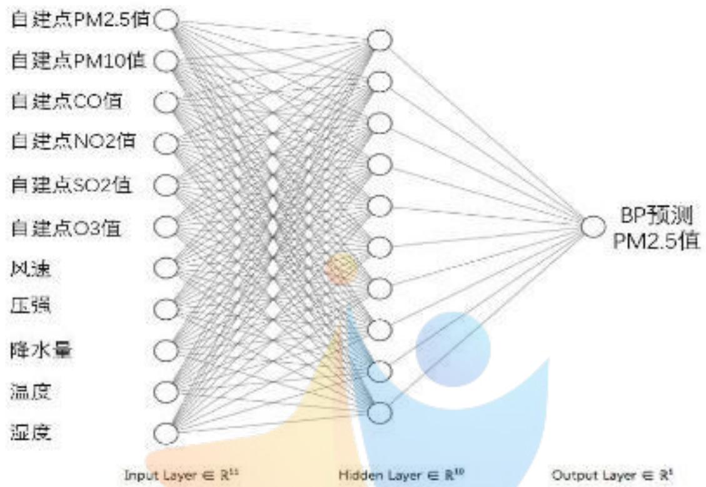

<details>
<summary>flowchart</summary>

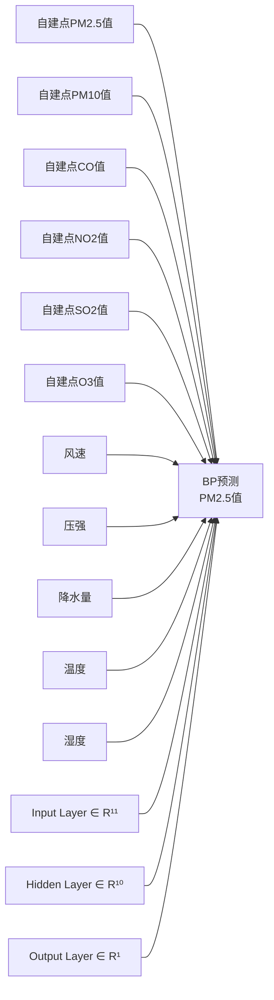
```mermaid
graph LR
  A["自建点PM2.5值"] --> B["BP预测\nPM2.5值"]
  C["自建点PM10值"] --> B
  D["自建点CO值"] --> B
  E["自建点NO2值"] --> B
  F["自建点SO2值"] --> B
  G["自建点O3值"] --> B
  H["风速"] --> B
  I["压强"] --> B
  J["降水量"] --> B
  K["温度"] --> B
  L["湿度"] --> B
  M["Input Layer ∈ R¹¹"] --> B
  N["Hidden Layer ∈ R¹⁰"] --> B
  O["Output Layer ∈ R¹"] --> B
```
</details>

图 17 预测 PM2.5 的 BP 神经网络结构示意图  
也就是说对每一个污染物指标，我们都建立一个神经网络，这样我们就需要训练6个不同的神经网络。用如上方法训练好6个BP神经网络之后，用剩余30天的数据作为测试集，对我们得到的BP神经网络的性能进行测试。

为了得到最优的神经网络结构我们通过程序设计，让BP神经网络的隐层数目分别取5-16，每一层都分别计算这一层的均方差比例系数BZ，通过此系数来反应BP网络的性能。下表为不同隐层数对应点的预测值的均方差比例系数BZ值。

<table><tr><td>隐层数</td><td>PM2.5</td><td>PM10</td><td>CO</td><td>NO2</td><td>SO2</td><td>O3</td></tr><tr><td>5</td><td>0.0912</td><td>0.4727</td><td>0.2504</td><td>0.2903</td><td>0.4357</td><td>0.0933</td></tr><tr><td>6</td><td>0.1056</td><td>0.4016</td><td>0.1026</td><td>0.3554</td><td>0.2092</td><td>0.1198</td></tr><tr><td>7</td><td>0.116</td><td>0.0986</td><td>0.1973</td><td>0.2662</td><td>0.3887</td><td>0.1088</td></tr><tr><td>8</td><td>0.0989</td><td>0.2263</td><td>0.2132</td><td>0.3939</td><td>0.4652</td><td>0.0763</td></tr><tr><td>9</td><td>0.1666</td><td>0.2683</td><td>0.1601</td><td>0.3774</td><td>0.3452</td><td>0.0877</td></tr><tr><td>10</td><td>0.0967</td><td>0.3249</td><td>0.2274</td><td>0.3831</td><td>0.3764</td><td>0.084</td></tr><tr><td>11</td><td>0.0909</td><td>0.2319</td><td>0.1241</td><td>0.1556</td><td>0.6272</td><td>0.1844</td></tr><tr><td>12</td><td>0.2646</td><td>0.3363</td><td>0.1478</td><td>0.2298</td><td>0.2887</td><td>0.0575</td></tr><tr><td>13</td><td>0.1482</td><td>0.2169</td><td>0.1257</td><td>0.2324</td><td>0.3894</td><td>0.1031</td></tr><tr><td>14</td><td>0.0926</td><td>0.2045</td><td>0.1269</td><td>0.2209</td><td>0.4087</td><td>0.1369</td></tr><tr><td>15</td><td>0.0969</td><td>0.1901</td><td>0.1137</td><td>0.3439</td><td>0.4939</td><td>0.192</td></tr><tr><td>16</td><td>0.1302</td><td>0.3702</td><td>0.1946</td><td>0.2424</td><td>0.3157</td><td>0.1611</td></tr></table>

## 表 3 不同隐层数的比例系数 BZ 值

例如，由表 3 数据可知，对 PM2.5 而言，比例系数 BZ 值最小时对应的隐层数为 11，此时 BP 神经网络预测性能最好。

同理得出各污染物质指标预测所需的BP神经网络的最佳隐层数，如下表：

<table><tr><td></td><td>PM2.5</td><td>PM10</td><td>CO</td><td>NO2</td><td>SO2</td><td>O3</td></tr><tr><td>最优隐层数</td><td>11</td><td>7</td><td>6</td><td>11</td><td>6</td><td>12</td></tr></table>

表 4 不同污染空气的最优隐层数

## 5.3.4 BP神经网络模型的对预测性能分析

根据上面的实验, 我们分别得出了 PM2.5、PM10、CO、NO2、SO2、O3 这 6 个 污染指标的最佳 BP 神经网络结构 (隐层数目)。下面开始对 BP 网络的性能进行测试, 测试的方法是, 对某一个污染指标来说, 比如 PM2.5, 我们把 30 个随机选择的自建点的 11 个数据作为测试集样本然后输入训练好的 BP 神经网络, 进而得到 PM2.5 的 BP 神经网络预测值, 然后我们把此值和自建点原始数据值以及国控点测量值三者进行比较, 做出下列的对比图。

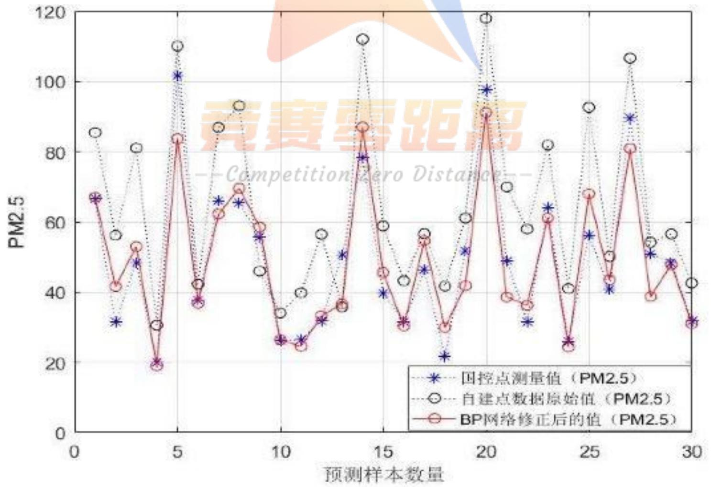

<details>
<summary>line</summary>

| 预测样本数量 | 回控点测量值 (PM2.5) | 自建点数据原始值 (PM2.5) | BP网络修正后的值 (PM2.5) |
| --- | --- | --- | --- |
| 1 | ~67 | ~86 | ~67 |
| 2 | ~32 | ~56 | ~42 |
| 3 | ~49 | ~81 | ~53 |
| 4 | ~20 | ~31 | ~20 |
| 5 | ~102 | ~110 | ~84 |
| 6 | ~37 | ~42 | ~37 |
| 7 | ~66 | ~87 | ~62 |
| 8 | ~66 | ~93 | ~70 |
| 9 | ~56 | ~46 | ~59 |
| 10 | ~26 | ~34 | ~26 |
| 11 | ~27 | ~40 | ~25 |
| 12 | ~32 | ~56 | ~34 |
| 13 | ~50 | ~36 | ~36 |
| 14 | ~79 | ~112 | ~87 |
| 15 | ~40 | ~59 | ~45 |
| 16 | ~31 | ~43 | ~31 |
| 17 | ~46 | ~57 | ~55 |
| 18 | ~22 | ~42 | ~30 |
| 19 | ~52 | ~61 | ~42 |
| 20 | ~98 | ~118 | ~92 |
| 21 | ~49 | ~70 | ~39 |
| 22 | ~32 | ~58 | ~36 |
| 23 | ~64 | ~82 | ~61 |
| 24 | ~25 | ~41 | ~25 |
| 25 | ~56 | ~93 | ~68 |
| 26 | ~41 | ~50 | ~44 |
| 27 | ~90 | ~107 | ~81 |
| 28 | ~51 | ~54 | ~39 |
| 29 | ~48 | ~57 | ~48 |
| 30 | ~32 | ~43 | ~32 |
</details>

图 18 PM2.5 预测效果对比图

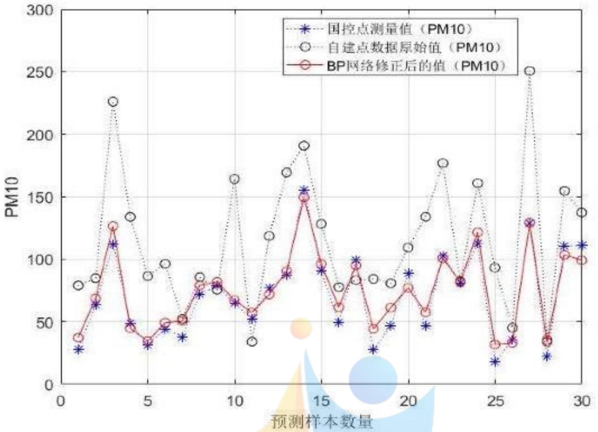

<details>
<summary>line</summary>

| 预测样本数量 | 国控点测量值 (PM10) | 自建点数据原始值 (PM10) | BP网络修正后的值 (PM10) |
| --- | --- | --- | --- |
| 1 | ~28 | ~80 | ~38 |
| 2 | ~65 | ~85 | ~70 |
| 3 | ~112 | ~228 | ~128 |
| 4 | ~48 | ~135 | ~45 |
| 5 | ~32 | ~88 | ~35 |
| 6 | ~45 | ~98 | ~50 |
| 7 | ~38 | ~52 | ~52 |
| 8 | ~72 | ~88 | ~78 |
| 9 | ~80 | ~82 | ~82 |
| 10 | ~68 | ~165 | ~68 |
| 11 | ~52 | ~35 | ~58 |
| 12 | ~75 | ~118 | ~72 |
| 13 | ~90 | ~170 | ~90 |
| 14 | ~155 | ~192 | ~150 |
| 15 | ~92 | ~130 | ~98 |
| 16 | ~50 | ~78 | ~62 |
| 17 | ~98 | ~85 | ~95 |
| 18 | ~28 | ~85 | ~45 |
| 19 | ~48 | ~82 | ~62 |
| 20 | ~90 | ~110 | ~78 |
| 21 | ~48 | ~135 | ~58 |
| 22 | ~102 | ~178 | ~102 |
| 23 | ~82 | ~82 | ~82 |
| 24 | ~115 | ~162 | ~122 |
| 25 | ~18 | ~95 | ~32 |
| 26 | ~35 | ~45 | ~35 |
| 27 | ~130 | ~250 | ~130 |
| 28 | ~22 | ~35 | ~35 |
| 29 | ~110 | ~155 | ~105 |
| 30 | ~112 | ~138 | ~100 |
</details>

图 19 PM10 预测效果对比图

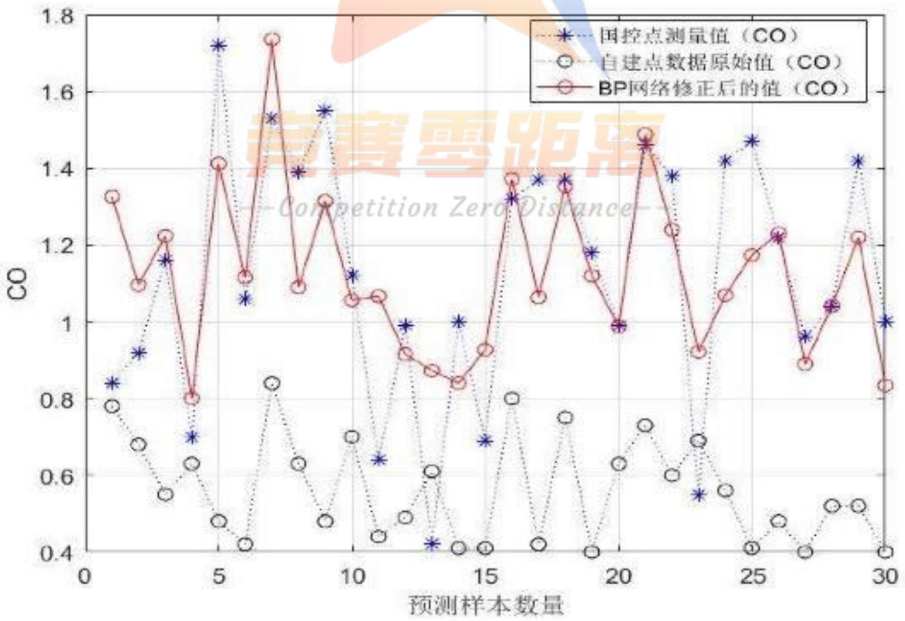

<details>
<summary>line</summary>

| 预测样本数量 | 国控点测量值 (CO) | 自建点数据原始值 (CO) | BP网络修正后的值 (CO) |
| --- | --- | --- | --- |
| 1 | ~0.85 | ~0.79 | ~1.33 |
| 2 | ~0.92 | ~0.69 | ~1.10 |
| 3 | ~1.16 | ~0.56 | ~1.23 |
| 4 | ~0.70 | ~0.64 | ~0.81 |
| 5 | ~1.73 | ~0.49 | ~1.42 |
| 6 | ~1.06 | ~0.43 | ~1.12 |
| 7 | ~1.53 | ~0.85 | ~1.74 |
| 8 | ~1.39 | ~0.64 | ~1.10 |
| 9 | ~1.55 | ~0.49 | ~1.32 |
| 10 | ~1.13 | ~0.71 | ~1.06 |
| 11 | ~0.65 | ~0.45 | ~1.07 |
| 12 | ~0.99 | ~0.50 | ~0.92 |
| 13 | ~0.43 | ~0.62 | ~0.88 |
| 14 | ~1.00 | ~0.42 | ~0.85 |
| 15 | ~0.70 | ~0.42 | ~0.93 |
| 16 | ~1.33 | ~0.81 | ~1.38 |
| 17 | ~1.37 | ~0.43 | ~1.07 |
| 18 | ~1.37 | ~0.76 | ~1.36 |
| 19 | ~1.18 | ~0.41 | ~1.12 |
| 20 | ~0.99 | ~0.64 | ~0.99 |
| 21 | ~1.47 | ~0.74 | ~1.49 |
| 22 | ~1.38 | ~0.61 | ~1.24 |
| 23 | ~0.56 | ~0.70 | ~0.93 |
| 24 | ~1.42 | ~0.57 | ~1.07 |
| 25 | ~1.48 | ~0.42 | ~1.18 |
| 26 | ~0.96 | ~0.49 | ~1.23 |
| 27 | ~1.05 | ~0.41 | ~0.90 |
| 28 | ~1.42 | ~0.53 | ~1.22 |
| 29 | ~1.00 | ~0.53 | ~0.84 |
| 30 | — | — | — |
</details>

图 20 CO 预测效果对比图

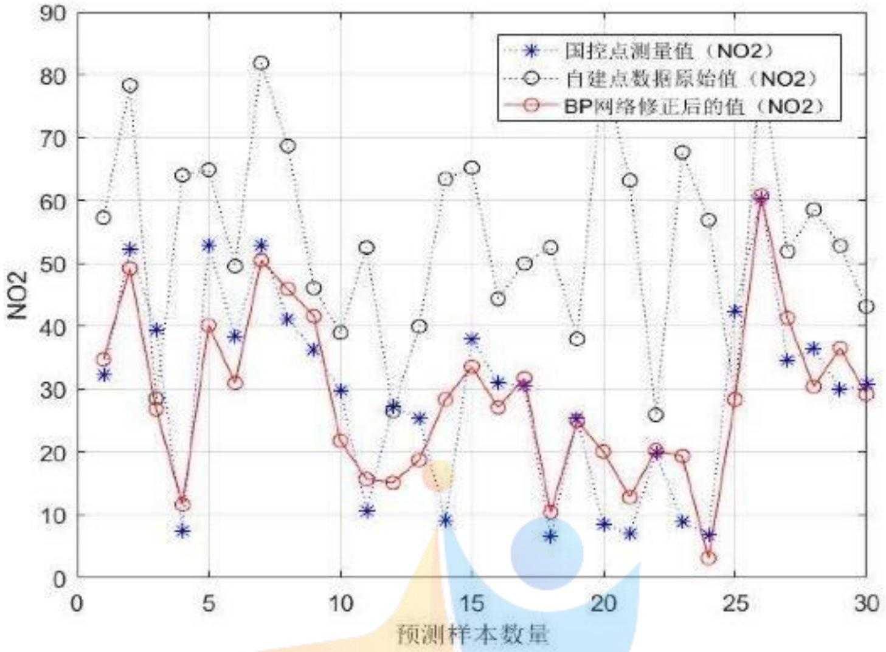

<details>
<summary>line</summary>

| 预测样本数量 | 国控点测量值 (NO2) | 自建点数据原始值 (NO2) | BP网络修正后的值 (NO2) |
| --- | --- | --- | --- |
| 1 | ~32 | ~58 | ~35 |
| 2 | ~53 | ~79 | ~49 |
| 3 | ~40 | ~29 | ~27 |
| 4 | ~8 | ~64 | ~12 |
| 5 | ~53 | ~65 | ~40 |
| 6 | ~39 | ~50 | ~31 |
| 7 | ~53 | ~82 | ~51 |
| 8 | ~41 | ~69 | ~46 |
| 9 | ~37 | ~46 | ~42 |
| 10 | ~30 | ~39 | ~22 |
| 11 | ~11 | ~53 | ~16 |
| 12 | ~27 | ~27 | ~15 |
| 13 | ~26 | ~40 | ~19 |
| 14 | ~9 | ~64 | ~29 |
| 15 | ~38 | ~66 | ~34 |
| 16 | ~31 | ~45 | ~27 |
| 17 | ~31 | ~50 | ~32 |
| 18 | ~7 | ~53 | ~11 |
| 19 | ~26 | ~38 | ~25 |
| 20 | ~9 | ~64 | ~20 |
| 21 | ~7 | ~26 | ~13 |
| 22 | ~20 | ~68 | ~20 |
| 23 | ~9 | ~57 | ~20 |
| 24 | ~7 | ~43 | ~4 |
| 25 | ~43 | ~61 | ~29 |
| 26 | ~61 | ~61 | ~61 |
| 27 | ~35 | ~52 | ~42 |
| 28 | ~37 | ~59 | ~31 |
| 29 | ~30 | ~53 | ~37 |
| 30 | ~31 | ~43 | ~29 |
</details>

图 21 NO2 预测效果对比图

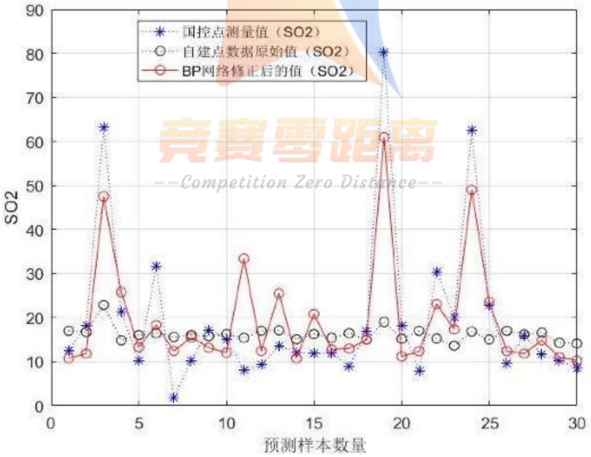

<details>
<summary>line</summary>

| 预测样本数量 | 国控点测量值 (SO2) | 自建点数据原始值 (SO2) | BP网络修正后的值 (SO2) |
| --- | --- | --- | --- |
| 1 | ~13 | ~17 | ~11 |
| 2 | ~18 | ~17 | ~12 |
| 3 | ~64 | ~23 | ~48 |
| 4 | ~22 | ~15 | ~26 |
| 5 | ~10 | ~16 | ~14 |
| 6 | ~32 | ~17 | ~19 |
| 7 | ~2 | ~16 | ~13 |
| 8 | ~10 | ~16 | ~16 |
| 9 | ~17 | ~16 | ~14 |
| 10 | ~15 | ~16 | ~13 |
| 11 | ~8 | ~16 | ~34 |
| 12 | ~9 | ~17 | ~13 |
| 13 | ~14 | ~17 | ~26 |
| 14 | ~12 | ~15 | ~12 |
| 15 | ~12 | ~16 | ~21 |
| 16 | ~9 | ~16 | ~13 |
| 17 | ~17 | ~17 | ~13 |
| 18 | ~80 | ~20 | ~62 |
| 19 | ~18 | ~15 | ~12 |
| 20 | ~8 | ~17 | ~13 |
| 21 | ~30 | ~15 | ~23 |
| 22 | ~20 | ~14 | ~18 |
| 23 | ~63 | ~17 | ~49 |
| 24 | ~23 | ~15 | ~24 |
| 25 | ~10 | ~17 | ~13 |
| 26 | ~16 | ~17 | ~12 |
| 27 | ~12 | ~17 | ~15 |
| 28 | ~10 | ~15 | ~11 |
| 29 | ~9 | ~14 | ~10 |
| 30 | — | — | — |
</details>

图 22 SO2 预测效果对比图

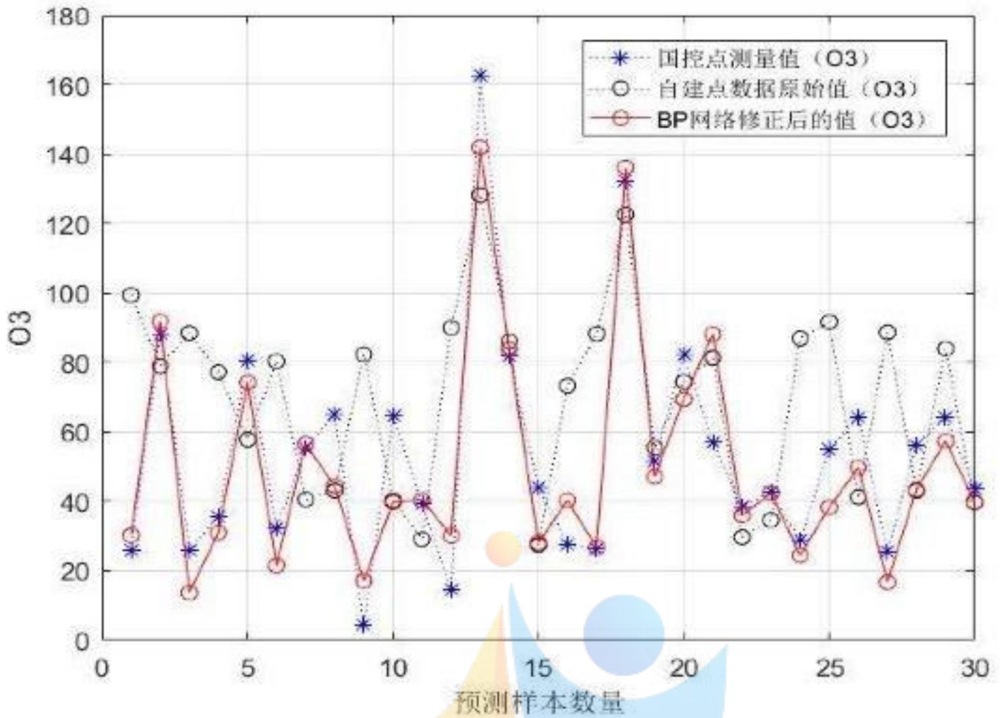

<details>
<summary>line</summary>

| 预测样本数量 | 国控点测量值 (O3) | 自建点数据原始值 (O3) | BP网络修正后的值 (O3) |
| --- | --- | --- | --- |
| 1 | ~26 | 100 | ~30 |
| 2 | ~88 | ~80 | ~92 |
| 3 | ~26 | ~89 | ~14 |
| 4 | ~35 | ~78 | ~31 |
| 5 | ~81 | ~58 | ~75 |
| 6 | ~32 | ~81 | ~22 |
| 7 | ~56 | ~41 | ~56 |
| 8 | ~65 | ~44 | ~44 |
| 9 | ~5 | ~83 | ~18 |
| 10 | ~65 | ~40 | ~40 |
| 11 | ~40 | ~30 | ~40 |
| 12 | ~15 | ~90 | ~30 |
| 13 | ~163 | ~129 | ~142 |
| 14 | ~82 | ~86 | ~85 |
| 15 | ~44 | ~28 | ~28 |
| 16 | ~28 | ~73 | ~40 |
| 17 | ~27 | ~89 | ~27 |
| 18 | ~132 | ~123 | ~137 |
| 19 | ~52 | ~56 | ~48 |
| 20 | ~83 | ~75 | ~70 |
| 21 | ~57 | ~82 | ~89 |
| 22 | ~38 | ~30 | ~36 |
| 23 | ~43 | ~35 | ~43 |
| 24 | ~29 | ~87 | ~25 |
| 25 | ~55 | ~92 | ~39 |
| 26 | ~64 | ~41 | ~50 |
| 27 | ~26 | ~89 | ~17 |
| 28 | ~56 | ~44 | ~44 |
| 29 | ~64 | ~84 | ~57 |
| 30 | ~44 | — | ~40 |
</details>

图 23 03 预测效果对比图  
由图 20 至图 25 各自对照可知：BP 神经网络修正后的污染物指标预测值远远优于自建点原始数据值，BP 神经网络的预测值更接近与真实值（即国控点测量值），说明我们的模型非常成功，可以非常好的对自建点数据进行校准。

为了更准确比较本文的 BP 模型对预测性能的提升效果, 本文分别求出了神经网络预测的 PM2.5、PM10、CO、NO2、SO2、O3 这 6 个污染指标与国测数值的均方差值 MSE\_BP 以及均方差比例系数 BZ, 以及自测点这六个指标的数值与国测数值均方差值 MSE\_Z 以及均方差比例系数 BZ  
归一化后的数据我们记为 MSE\_BP、MSW\_Z、BZ，数据解归一化后的数据我们记为 MSE\_BP1、MSE\_Z1、BZ\_J。  
自建点的准确率记为 P\_Z，BP 网络预测的准确率记为 P\_bp。

<table><tr><td colspan="2"></td><td>PM2.5</td><td>PM10</td><td>CO</td><td>NO2</td><td>SO2</td><td>O3</td></tr><tr><td rowspan="3">均方差(归一化)</td><td>MSE_BP</td><td>0.0019</td><td>0.0015</td><td>0.0098</td><td>0.0098</td><td>0.0118</td><td>0.0051</td></tr><tr><td>MSE_Z</td><td>0.0209</td><td>0.0153</td><td>0.0951</td><td>0.0627</td><td>0.0565</td><td>0.0886</td></tr><tr><td>BZ</td><td>0.0909</td><td>0.0986</td><td>0.1026</td><td>0.1556</td><td>0.2092</td><td>0.0575</td></tr><tr><td rowspan="3">均方差(解归一化)</td><td>MSE_BP_J</td><td>52.6175</td><td>74.4271</td><td>0.0529</td><td>59.4366</td><td>76.2294</td><td>154.2694</td></tr><tr><td>MSE_Z_J</td><td>360.5526</td><td>3185.2</td><td>0.4378</td><td>1053.5</td><td>293.5084</td><td>1508.1</td></tr><tr><td>BZ_J</td><td>0.1459</td><td>0.0234</td><td>0.1209</td><td>0.0564</td><td>0.2597</td><td>0.1023</td></tr><tr><td>自建点准确率 P_Z</td><td>48.22%</td><td>54.06%</td><td>67.21%</td><td>34.97%</td><td>0%</td><td>0%</td></tr><tr><td>BP 网络预测准确率 P_bp</td><td>90.35%</td><td>89.37%</td><td>85.76%</td><td>75.85%</td><td>71.53%</td><td>84.44%</td></tr></table>

表 5 BP 神经网络预测性能分析表

通过表 5，发现通过训练好的 BP 网络模型，污染物指标的预测能力得到的极大的提升。如 PM2.5 的准确度由自建点的 48.22% 提升到 90.35%，PM10 的准确度由自建点的 54.06% 提升到 89.37%，SO2 的准确度由 0% 提升到 71.53%，可见我们的模型相当成功。

## 六、模型的评价与改进

本文假假设国控点数据为真实数据，通过计算自建点数据与理想数据的相关系数分析了自建点与国控点数据的内涵。通过计算国测点6个指标与自测点11个指标之间的相关系数矩阵，分析了每一个污染物指标的自测点与国控点之间的相关性。通过优化的BP神经网络来对自建点数据进行了修正和预测，得出了国控值、BP预测值、自建点测量值三者之间的对比关系图，发现模型对污染物指标的预测能力得到的极大的提升。由于训练BP神经网络的数据是经过日均值处理的，所以数据不能最精确的表达出真实情况，因此BP神经网络预测出的数据仍然有少许的误差。进一步改进则需要用更多更密集的数据对BP神经网络训练和改进。

## 七、参考文献

1、韩中庚，宋明武，邵广纪，数学建模竞赛—获奖论文精选与点评  
2、王连堂，《数学建模》  
3、冯杰，数学建模原理与案例，北京：科学出版社，2007。  
4、韩中庚，数学建模方法及其应用，北京：高等教育出版社，2004。  
5、百张怡文，胡静宜，王冉．基于神经网络的PM\_(2.5)预测模型[J].江苏师范大学学报(自然科学版)，2015(1):63-65.  
6、https://blog.csdn.net/weixin\_40909201/article/details/82113053  
7、田静毅[1]，范泽宣[2]，孙丽华[3]. 基于BP神经网络的空气质量预测与分析[J]. 辽宁科技大学学报，2015(2):131-136.

## 附录

pm25 不同隐层数目试验  
```txt
c|c
```

```txt
clear all
```

load data.mat %载入206行17列的总数据

%记录归一化的 MSE\_bp, MSE\_Z, bili 和解归一化的 MSE\_bp1, MSE\_Z1, bili1

%初始值置零

```javascript
JFC=zeros(6,12);
```

for yc=5:16 %试验不同 隐层 数目对结构的影响

yc %显示层数

%初始化各个参数相量（数据归一化到0-1之间）  
```matlab
[G_pm25_d_N, ps_G_pm25_d_N]=mapminmax(data(:,1)', 0, 1);
[G_pm10_d_N, ps_G_pm10_d_N]=mapminmax(data(:,2)', 0, 1);
[G_CO_d_N, ps_G_CO_d_N]=mapminmax(data(:,3)', 0, 1);
[G_NO2_d_N, ps_G_NO2_d_N]=mapminmax(data(:,4)', 0, 1);
[G_SO2_d_N, ps_G_SO2_d_N]=mapminmax(data(:,5)', 0, 1);
[G_O3_d_N, ps_G_O3_d_N]=mapminmax(data(:,6)', 0, 1);
```

```matlab
[Z_pm25_d_N, ps_Z_pm25_d_N]=mapminmax(data(:,7)',0,1);
[Z_pm10_d_N, ps_Z_pm10_d_N]=mapminmax(data(:,8)',0,1);
[Z_CO_d_N, ps_Z_CO_d_N]=mapminmax(data(:,9)',0,1);
[Z_NO2_d_N, ps_Z_NO2_d_N]=mapminmax(data(:,10)',0,1);
[Z_SO2_d_N, ps_Z_SO2_d_N]=mapminmax(data(:,11)',0,1);
[Z_O3_d_N, ps_Z_O3_d_N]=mapminmax(data(:,12)',0,1);
```

```matlab
Feng_d_N=mapminmax(data(:,13)',0,1);
Ya_d_N=mapminmax(data(:,14)',0,1);
Shui_d_N=mapminmax(data(:,15)',0,1);
Wen_d_N=mapminmax(data(:,16)',0,1);
Shi_d_N=mapminmax(data(:,17)',0,1);
```

%计算国测点各测量值与自测点的11个测量值的相关系数：

$\% |r| < 0.4$ 为低度线性相关； $0.4 \leqslant |r| < 0.7$ 为显著性相关； $0.7 \leqslant |r| < 1$ 为高度线性相关。

%相关系数函数 corr 计算的相量必须是列向量

```matlab
r1_1=corr(G_pm25_d_N', Z_pm25_d_N', 'type', 'pearson');
r1_2=corr(G_pm25_d_N', Z_pm10_d_N', 'type', 'pearson');
r1_3=corr(G_pm25_d_N', Z_CO_d_N', 'type', 'pearson');
r1_4=corr(G_pm25_d_N', Z_NO2_d_N', 'type', 'pearson');
r1_5=corr(G_pm25_d_N', Z_SO2_d_N', 'type', 'pearson');
r1_6=corr(G_pm25_d_N', Z_O3_d_N', 'type', 'pearson');
r1_7=corr(G_pm25_d_N', Feng_d_N', 'type', 'pearson');
r1_8=corr(G_pm25_d_N', Ya_d_N', 'type', 'pearson');
r1_9=corr(G_pm25_d_N', Shui_d_N', 'type', 'pearson');
r1_10=corr(G_pm25_d_N', Wen_d_N', 'type', 'pearson');
r1_11=corr(G_pm25_d_N', Shi_d_N', 'type', 'pearson');
```

```matlab
r2_1=corr(G_pm10_d_N',Z_pm25_d_N','type','pearson');
r2_2=corr(G_pm10_d_N',Z_pm10_d_N','type','pearson');
r2_3=corr(G_pm10_d_N',Z_CO_d_N','type','pearson');
r2_4=corr(G_pm10_d_N',Z_NO2_d_N','type','pearson');
r2_5=corr(G_pm10_d_N',Z_SO2_d_N','type','pearson');
r2_6=corr(G_pm10_d_N',Z_O3_d_N','type','pearson');
r2_7=corr(G_pm10_d_N',Feng_d_N','type','pearson');
```

```javascript
r2_8=corr(G_pm10_d_N',Ya_d_N','type','pearson');
r2_9=corr(G_pm10_d_N',Shui_d_N','type','pearson');
r2_10=corr(G_pm10_d_N',Wen_d_N','type','pearson');
r2_11=corr(G_pm10_d_N',Shi_d_N','type','pearson');
```

```matlab
r3_1=corr(G_CO_d_N', Z_pm25_d_N','type','pearson');
r3_2=corr(G_CO_d_N', Z_pm10_d_N','type','pearson');
r3_3=corr(G_CO_d_N', Z_CO_d_N','type','pearson');
r3_4=corr(G_CO_d_N', Z_NO2_d_N','type','pearson');
r3_5=corr(G_CO_d_N', Z_SO2_d_N','type','pearson');
r3_6=corr(G_CO_d_N', Z_O3_d_N','type','pearson');
r3_7=corr(G_CO_d_N', Feng_d_N','type','pearson');
r3_8=corr(G_CO_d_N', Ya_d_N','type','pearson');
r3_9=corr(G_CO_d_N', Shui_d_N','type','pearson');
r3_10=corr(G_CO_d_N', Wen_d_N','type','pearson');
r3_11=corr(G_CO_d_N', Shi_d_N','type','pearson');
```

```matlab
r4_1=corr(G_NO2_d_N', Z_pm25_d_N', 'type', 'pearson');
r4_2=corr(G_NO2_d_N', Z_pm10_d_N', 'type', 'pearson');
r4_3=corr(G_NO2_d_N', Z_CO_d_N', 'type', 'pearson');
r4_4=corr(G_NO2_d_N', Z_NO2_d_N', 'type', 'pearson');
r4_5=corr(G_NO2_d_N', Z_SO2_d_N', 'type', 'pearson');
r4_6=corr(G_NO2_d_N', Z_O3_d_N', 'type', 'pearson');
r4_7=corr(G_NO2_d_N', Feng_d_N', 'type', 'pearson');
r4_8=corr(G_NO2_d_N', Ya_d_N', 'type', 'pearson');
r4_9=corr(G_NO2_d_N', Shui_d_N', 'type', 'pearson');
r4_10=corr(G_NO2_d_N', Wen_d_N', 'type', 'pearson');
r4_11=corr(G_NO2_d_N', Shi_d_N', 'type', 'pearson');
```

```matlab
r5_1=corr(G_S02_d_N', Z_pm25_d_N', 'type', 'pearson');
r5_2=corr(G_S02_d_N', Z_pm10_d_N', 'type', 'pearson');
r5_3=corr(G_S02_d_N', Z_CO_d_N', 'type', 'pearson');
r5_4=corr(G_S02_d_N', Z_NO2_d_N', 'type', 'pearson');
r5_5=corr(G_S02_d_N', Z_S02_d_N', 'type', 'pearson');
r5_6=corr(G_S02_d_N', Z_O3_d_N', 'type', 'pearson');
r5_7=corr(G_S02_d_N', Feng_d_N', 'type', 'pearson');
r5_8=corr(G_S02_d_N', Ya_d_N', 'type', 'pearson');
r5_9=corr(G_S02_d_N', Shui_d_N', 'type', 'pearson');
r5_10=corr(G_S02_d_N', Wen_d_N', 'type', 'pearson');
r5_11=corr(G_S02_d_N', Shi_d_N', 'type', 'pearson');
```

```matlab
r6_1=corr(G_03_d_N', Z_pm25_d_N', 'type', 'pearson');
r6_2=corr(G_03_d_N', Z_pm10_d_N', 'type', 'pearson');
r6_3=corr(G_03_d_N', Z_CO_d_N', 'type', 'pearson');
r6_4=corr(G_03_d_N', Z_NO2_d_N', 'type', 'pearson');
r6_5=corr(G_03_d_N', Z_SO2_d_N', 'type', 'pearson');
r6_6=corr(G_03_d_N', Z_O3_d_N', 'type', 'pearson');
r6_7=corr(G_03_d_N', Feng_d_N', 'type', 'pearson');
r6_8=corr(G_03_d_N', Ya_d_N', 'type', 'pearson');
r6_9=corr(G_03_d_N', Shui_d_N', 'type', 'pearson');
r6_10=corr(G_03_d_N', Wen_d_N', 'type', 'pearson');
r6_11=corr(G_03_d_N', Shi_d_N', 'type', 'pearson');
```

%pm25\_BP 网络

## % 训练集

a=randperm(206); %把1-206，这206个整数打乱顺序。

B=a(1:176); %随机选176个训练集

C=a(177:206); %剩余的随机30个测试集

```matlab
P_train
    [Z_pm25_d_N(B);Z_pm10_d_N(B);Z_CO_d_N(B);Z_NO2_d_N(B);Z_S02_d_N(B);Z_03_d
    _N(B);Feng_d_N(B);Ya_d_N(B);Shui_d_N(B);Wen_d_N(B);Shi_d_N(B)];
T_train = G_pm25_d_N(B);
```

% 测试集——30个样本，测试点多一些，从图上更好说明我们Bp网络的优越性

```c
P_test
[Z_pm25_d_N(C);Z_pm10_d_N(C);Z_CO_d_N(C);Z_NO2_d_N(C);Z_SO2_d_N(C);Z_O3_d
_N(C);Feng_d_N(C);Ya_d_N(C);Shui_d_N(C);Wen_d_N(C);Shi_d_N(C)];
```

```txt
T_test = G_pm25_d_N(C);
N = size(P_test, 2);
```

T\_sim\_bp=zeros(1,N); %预测值的初始化，都设置为0

for i=1:20 %循环 20 次，把 20 次 BP 网络预测的值求和后取平均值

% 创建网络

```matlab
net = newff(P_train, T_train, yc);    %yc 为隐层的层数
net.trainFcn = 'traingda';          %traingda 表示自适应调整学习率的梯度
```

下降反向传播算法训练函数

% 设置训练参数

```javascript
net.trainParam.epochs =600;
net.trainParam.goal = 1e-5;
net.trainParam.lr = 0.001;
```

% 训练网络

```txt
net = train(net, P_train, T_train);
```

%仿真测试

T\_sim\_bp\_i = sim(net, P\_test);      %T\_sim\_bp\_i 为循环时 T\_sim\_bp 每次得到的临时值

T\_sim\_bp=T\_sim\_bp+T\_sim\_bp\_i; %把每次循环时 T\_sim\_bp 的值累加起来;
end

T\_sim\_bp=T\_sim\_bp/20;

%把累加的 T\_sim\_bp，再求平均值；

%相对误差 error

error\_bp = abs(T\_sim\_bp - T\_test)./T\_test;

% 结果对比

result\_bp = [T\_test' T\_sim\_bp' error\_bp'];      % 测试值，预测值，误差的结果对比

PM25\_MSE\_BP=0; %BP 网络预测数据的均方误差初始化
PM25\_MSE\_Z=0; %自测点原始数据的均方误差初始化

Z\_pm25\_d\_N\_L=Z\_pm25\_d\_N(C); %非常重要，如果换成pm10,这里需要修改

for i=1:N

PM25\_MSE\_BP=PM25\_MSE\_BP+(T\_test(i)-T\_sim\_bp(i))^2;

end

PM25\_MSE\_BP=PM25\_MSE\_BP/N %BP 网络预测数据的均方误差
PM25\_MSE\_Z=PM25\_MSE\_Z/N %自测点原始数据的均方误差
bili=PM25\_MSE\_BP/PM25\_MSE\_Z %此值越小，说明 bp 网络的预测效果越好。

p=1-sum(abs(T\_sim\_bp- T\_test))/sum(T\_test)

JFC(1, yc-4)=PM25\_MSE\_BP;

JFC(2, yc-4)=PM25\_MSE\_Z;

JFC(3, yc-4)=bili;

%% 绘图(归一化数据)

figure

plot(1:N,T\_test,'b:\*', 1:N,Z\_pm25\_d\_N(C),'k:o',1:N,T\_sim\_bp,'r-o') %把国

测的值，自建点原值测量值，BP网络修正的值，三者一起画出来。

legend('国控点测量值（PM2.5）','自建点数据原始值（PM2.5）','BP网络修正后的值

(PM2.5)')

xlabel('预测样本数量')

ylabel('PM2.5')

grid

end