# “薄利多销”销售策略的模型研究分析

## 摘要

本文通过探索商场商品打折力度与商品销售额以及利润率的基本关系，利用线性回归的方法建立数学模型，运用Excel软件工具进行求解，求出了商场的营业额、利润率及打折力度，并对打折力度与营业额和利润率之间的关系进行了分析。

针对问题一，根据表中数据商场每日所有商品的销售情况，可以较好计算出商场每天的营业额。针对非打折商品的成本价缺失，建立线性回归方程，寻找到商品的成本比例，补全非打折商品的成本价，进而利用Excel软件工具在所有商品中能够计算出商场每种商品的利润值，再与商场每天的营业额进行对比，可以形成商场每天的利润率。

针对问题二，定义了商场单日折扣力度是单日所有商品折扣的总幅度，力度越大，商品相对于原价就越便宜。在问题一中，已经计算出商场每天的营业额，再计算出商场所有销售出商品的门店价总额，计算出门店价与商场营业额的差额，用差额与门店价可以计算出商品的降价百分比。并对商场每天的降价百分比进行等级划分，进行明显比较。

针对问题三，利用Excel软件工具中的统计和数据拟合工具，对问题一和问题二中进行求出商场每天的打折力度和商品销售额及利润率进行分析，分析中，考虑到需求量等因素，从而得到三者之间的函数关系式及图像，进而求而出在折扣力度为 $\rho = 5.5$ 时，即折扣度为15.5%时，商场各类商品的利润率能够达到最大，为19.4%。

针对问题四，根据附件4中的信息，把商品分为28个大类，然后采用前三个问题中的方法，对每一类商品的打折力度和商品销售额及利润率分别进行分析，经分析比对，富有弹性的商品如办公用品、纺织用品、宠物等，并不是生活必须，其受到很多因素的影响，如可支配收入、消费偏好、休闲时间等，当商场进行一定程度的打折后，该大类的商品的销售额增长不明显，利润率增加很少，甚至还降低。

最后，指出了模型的优缺点及改进方向。

关键词：打折力度 销售额 线性回归 利润率 薄利多销

## 一、问题重述

“薄利多销”是通过降低单位商品的利润来增加销售数量，从而使商家获得更多盈利的一种扩大销售的策略。对于需求富有弹性的商品来说，当该商品的价格下降时，如果需求量（从而销售量）增加的幅度大于价格下降的幅度，将导致总收益增加。在实际经营管理中，“薄利多销”原则被广泛应用。

1. 计算该商场从2016年11月30日到2019年1月2日每天的营业额和利润率（注意：由于未知原因，数据中非打折商品的成本价缺失。一般情况下，零售商的利润率在20%-40%之间）。  
2. 建立适当的指标衡量商场每天的打折力度，并计算该商场从2016年11月30日到2019年1月2日每天的打折力度。  
3. 分析打折力度与商品销售额以及利润率的关系。  
4. 如果进一步考虑商品的大类区分，打折力度与商品销售额以及利润率的关系有何变化？

## 二、问题分析

薄利多销是指低价低利扩大销售的策略。“薄利多销”中的“薄利”就是降价，降价就能“多销”，“多销”就能增加总收益。要研究薄利多销策略，需要研究打折力度（降价）与商品销售额以及利润率的关系，可以根据提供的每日流水记录建立打折力度（降价）与商品销售额以及利润率的关系模型。根据关系模型可以分析得到打折力度（降价）与商品销售额以及利润率的关系。

## 2.1 问题1，计算每天的营业额和利润率的分析

销售流水记录就是在销售过程中销售了多少产品（分品种和数量、单价等）的一个最为原始的记录表。根据附件5的信息将附件1、2的数据进行整理将未完成的订单记录删除，并根据附件4中的一级类目表进行分类而后按照时间进行排序。由于未知原因，附件1、2数据中非打折商品的成本价缺失，可以根据每种商品已知的门店价与成本价建立函数关系补全缺失的成本价，为之后的解题作数据支撑。

每日营业额也被叫做"每日流水". 就是每日产品或是商品在交易中的总量金额，这个指标是不除去如进货或是原材料等费用的。

对于每日营业额的计算可以根据整理后的附件1、2中销售流水记录。通过对每件商品的销售额进行按日求和就可以确定2016年11月30日到2019年1月2日之间每天的营业额。

每日利润率是指每日销售利润总额与销售成本总额之比。表明每日销售成本获得的利润，反映了成本与利润的关系。

对于每日利润率的计算可以根据整理后的附件1、2中销售流水记录。通过求和函数可以得出每日销售成本总额，利用每日营业额和每日销售成本总额的差值可以求出每日销售利润额，根据每日销售利润总额与每日销售成本总额之比可以求出每日利润率。

## 2.2 问题2，计算打折力度的分析

打折力度时是门店价与销售价的差的程度大小。差越大，表示力度越高，差越小，则

表示力度越低。

根据整理后的附件1、2中销售流水记录，通过计算可以得出按销售价每日营业额和按门店价每日营业额，对两种营业额作差可以得到每日的降价额，用降价额除以门店价每日营业额可以得出每日降价百分比，此降价百分比越大，折扣越，打折力度越大。

以此降价百分比作为指标衡量商场每天的打折力度，将此降价百分比按最大值到最小值等距的划分为10级，可以计算出该商场从2016年11月30日到2019年1月2日每天的打折力度。

## 2.3 问题3，关于打折力度与商品销售额以及利润率关系的分析

经过对之前两个问题的求解可以得出每日的销售额、利润率以及其相应的打折力度。

首先分析打折力度与每日销售额的关系，将每日的打折力度与每日销售额按照日期依此对应，通过建立线性回归方程确定两者之间的关系，而后以此两组数据做出散点图进一步分析两者之间的关系。

之后运用相同的方法建立线性回归方程确定每日打折力度与每日利润率之间的关系，同样通过散点图进一步分析两者之间的关系。

## 2.4 问题4，考虑商品大类分区后，关于打折力度与商品销售额以及利润率关系的分析

根据整理后的附件1、2中销售流水记录。按照附件4中的一级类目区分商品大类，将流水记录按类划分。

首先通过对于整理后的附件1、2中销售流水记录的进一步处理，计算出每类商品的打折力度、商品销售额以及利润率（此处不按时间分组）。

然后分别对于打折力度与销售额、打折力度与利润率建立线性回归方程，求出关系式。并分别对于打折力度与销售额、打折力度与利润率建立线性回归方程做出散点图并进一步分析之间的关系。

## 三、模型假设

1. 销售流水记录完整且数据准确。假设商品区分准确完整，不存在缺项。  
2. 商品利润率计算不考虑商场运营中的人工、场地、水电等运营成本。  
3. 不考虑商品过保质期、损坏等造成的损失。

## 四、符号说明

<table><tr><td>序号</td><td>符号</td><td>符号说明</td></tr><tr><td>1</td><td>x</td><td>打折商品的成本价</td></tr><tr><td>2</td><td>y</td><td>门店价格</td></tr><tr><td>3</td><td>α</td><td>非打折商品成本价格</td></tr><tr><td>4</td><td>β</td><td>每天商品营业总额</td></tr><tr><td>5</td><td>δ</td><td>每天销售商品成本</td></tr><tr><td>6</td><td>γ</td><td>每天利润</td></tr><tr><td>7</td><td>ε</td><td>利润率</td></tr><tr><td>8</td><td>P</td><td>商品门店价</td></tr><tr><td>9</td><td>I</td><td>商品销售数量</td></tr><tr><td>10</td><td>ν</td><td>门店价出售的总额</td></tr><tr><td>11</td><td>Z</td><td>打折商品出售总额</td></tr><tr><td>12</td><td>M</td><td>商场打折后少获得利润总和</td></tr><tr><td>13</td><td>ρ</td><td>打折度</td></tr><tr><td>14</td><td>K</td><td>商品SKU销售价</td></tr><tr><td>15</td><td>n</td><td>商品种类</td></tr></table>

## 五、模型的建立与求解

## 5.1 问题一的模型建立与求解

对于附件1、2中的数据进行筛选，删除未完成的订单项，并对数据进行简单排序。将商品销售额与销售量相乘得出商品营业额，通过数据求和的模型按日期分别统计每天的营业额，通过每天利润除以成本额的模型统计出每天的利润率。

## 5.1.1 附件数据的处理及缺失数据的补全

首先将附件数据中未完成的订单项删除，而后按照日期进行排序，筛选出完整数据商品的门店价与成本价，通过线性回归得出公式：

$$
y = 0. 7 2 7 2 x + 0. 4 1 6 5
$$

图1 标价与成本关系图  
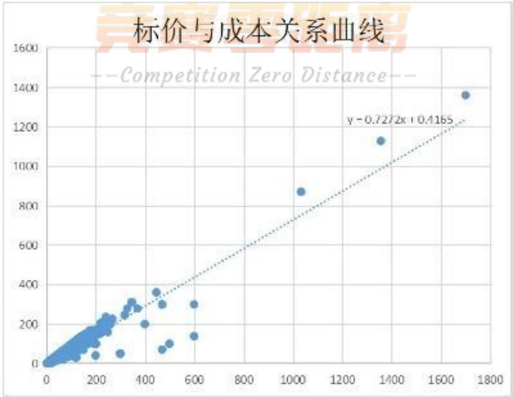

scatter

| X | Y |
| --- | --- |
| ~100 | ~100 |
| ~200 | ~200 |
| ~300 | ~300 |
| ~400 | ~350 |
| ~500 | ~300 |
| ~600 | ~300 |
| ~1050 | ~880 |
| ~1350 | ~1130 |
| ~1700 | ~1360 |

而后根据此公式将缺失成本价的商品门店价代入公式，将成本价补全，结果如下表。

表1 成本价补全

<table><tr><td>日期</td><td>商品名称</td><td>门店价</td><td>SKU销售价</td><td>成本价</td></tr><tr><td>2017年7月22日</td><td>优选五花肉 约500g</td><td>18.8</td><td>18.8</td><td>14.08786</td></tr><tr><td>2017年7月22日</td><td>优选后腿肉 约500g</td><td>12.5</td><td>12.5</td><td>9.5065</td></tr><tr><td>2017年7月22日</td><td>带皮后腿肉 约500g</td><td>9.3</td><td>9.3</td><td>7.17946</td></tr><tr><td>2017年7月22日</td><td>土豆 约500g</td><td>1.7</td><td>1.7</td><td>1.65274</td></tr><tr><td>2017年7月22日</td><td>New Hope/新希望 红枣汁 风味酸牛奶 160g(新旧包装,随机发货)</td><td>1.6</td><td>1.6</td><td>1.58002</td></tr><tr><td>2017年7月22日</td><td>青椒 约400g</td><td>2.5</td><td>2.5</td><td>2.2345</td></tr><tr><td>2017年7月22日</td><td>包装蟹味菇 约140g</td><td>5</td><td>5</td><td>4.0525</td></tr><tr><td>2017年7月22日</td><td>进口 香蕉 约1kg</td><td>8.3</td><td>8.3</td><td>6.45226</td></tr><tr><td>2017年7月22日</td><td>包装西兰花 约300g</td><td>7.9</td><td>7.9</td><td>6.16138</td></tr><tr><td>2017年7月22日</td><td>Great Value/惠宜 薏苡仁 200g</td><td>8.8</td><td>8.8</td><td>6.81586</td></tr><tr><td>2017年7月22日</td><td>人民 糯米?500g</td><td>5.98</td><td>5.98</td><td>4.765156</td></tr><tr><td>2017年7月22日</td><td>上海青 约300g</td><td>3.8</td><td>3.8</td><td>3.17986</td></tr><tr><td>2017年7月22日</td><td>皇冠蜜梨 约1kg</td><td>6.3</td><td>6.3</td><td>4.99786</td></tr><tr><td>2017年7月22日</td><td>进口 香蕉 约1kg</td><td>8.3</td><td>8.3</td><td>6.45226</td></tr><tr><td>2017年7月22日</td><td>黄瓜 约500g</td><td>2.2</td><td>2.2</td><td>2.01634</td></tr><tr><td>2017年7月22日</td><td>增兴 精选银耳 100g</td><td>13.9</td><td>13.9</td><td>10.52458</td></tr><tr><td>2017年7月22日</td><td>冬瓜 约1kg</td><td>2.5</td><td>2.5</td><td>2.2345</td></tr><tr><td>2017年7月22日</td><td>包装鲜土鸡蛋 约500g 10枚+送2枚</td><td>8.9</td><td>8.9</td><td>6.88858</td></tr><tr><td>2017年7月22日</td><td>杂粮水果软欧式面包(个)</td><td>12.8</td><td>12.8</td><td>9.72466</td></tr><tr><td>2017年7月22日</td><td>宾川红提 500g</td><td>7.2</td><td>7.2</td><td>5.65234</td></tr><tr><td>2017年7月22日</td><td>冻琵琶腿 约500g</td><td>6.7</td><td>6.7</td><td>5.28874</td></tr><tr><td>2017年7月22日</td><td>进口 精品火龙果 约1.3kg</td><td>16.3</td><td>16.3</td><td>12.26986</td></tr><tr><td>2017年7月22日</td><td>蒙牛 红枣风味酸牛奶 160g</td><td>2.5</td><td>2.5</td><td>2.2345</td></tr><tr><td>2017年7月22日</td><td>宾川红提 500g</td><td>7.2</td><td>7.2</td><td>5.65234</td></tr><tr><td>2017年7月22日</td><td>胡萝卜 约500g</td><td>2.7</td><td>2.7</td><td>2.37994</td></tr><tr><td>2017年7月22日</td><td>包装大葱 约300g</td><td>5.9</td><td>5.9</td><td>4.70698</td></tr><tr><td>2017年7月22日</td><td>优选前腿肉 约500g</td><td>15.5</td><td>15.5</td><td>11.6881</td></tr></table>

由于篇幅关系，本表只列出了部分结果，全部结果见支撑材料附件。

## 5.1.2 计算每日营业额

用Excel表格处理数据，将销售额按日期进行分类，对商品的销售额与销售量相乘得出每种商品的营业额。将此营业额按日期进行求和得出每日营业额（此处截取部分数据表格，完整数据详见附录）：

$$
\beta_ {i} = \mathrm{I} _ {1} \times \mathrm{K} _ {1} + \mathrm{I} _ {2} \times \mathrm{K} _ {2} + \dots + \mathrm{I} _ {n} \times \mathrm{K} _ {n}
$$

表2 商场每日营业额

<table><tr><td>日期</td><td>附件一营业额</td><td>附件二营业额</td><td>每日营业额</td></tr><tr><td>2016/11/30</td><td>1540.8</td><td>1292.9</td><td>2833.7</td></tr><tr><td>2016/12/1</td><td>1222.9</td><td>1123.3</td><td>2346.2</td></tr><tr><td>2016/12/2</td><td>1372.1</td><td>966.2</td><td>2338.3</td></tr><tr><td>2016/12/3</td><td>2119.9</td><td>1150.5</td><td>3270.4</td></tr><tr><td>2016/12/4</td><td>1917.6</td><td>1964.08</td><td>3881.68</td></tr><tr><td>2016/12/5</td><td>1161</td><td>1201.6</td><td>2362.6</td></tr><tr><td>2016/12/6</td><td>1322.4</td><td>930.7</td><td>2253.1</td></tr><tr><td>2016/12/7</td><td>3493.58</td><td>1819.3</td><td>5312.88</td></tr><tr><td>2016/12/8</td><td>2820.86</td><td>3069.86</td><td>5890.72</td></tr><tr><td>2016/12/9</td><td>3283.68</td><td>2466.9</td><td>5750.58</td></tr><tr><td>2016/12/10</td><td>2878.52</td><td>2876.74</td><td>5755.26</td></tr><tr><td>2016/12/11</td><td>9498.06</td><td>6917.16</td><td>16415.22</td></tr><tr><td>2016/12/12</td><td>20935.48</td><td>16300.6</td><td>37236.08</td></tr><tr><td>2016/12/13</td><td>9259.4</td><td>7287.6</td><td>16547</td></tr><tr><td>2016/12/14</td><td>4679.3</td><td>4493.6</td><td>9172.9</td></tr><tr><td>2016/12/15</td><td>6626.7</td><td>4540.7</td><td>11167.4</td></tr><tr><td>2016/12/16</td><td>6556.4</td><td>4505.88</td><td>11062.28</td></tr><tr><td>2016/12/17</td><td>8048.7</td><td>6695.74</td><td>14744.44</td></tr><tr><td>2016/12/18</td><td>10032.2</td><td>7392.46</td><td>17424.66</td></tr><tr><td>2016/12/19</td><td>2170.3</td><td>981.4</td><td>3151.7</td></tr><tr><td>2016/12/20</td><td>2154.3</td><td>2216.1</td><td>4370.4</td></tr><tr><td>2016/12/21</td><td>5571.4</td><td>2734.56</td><td>8305.96</td></tr><tr><td>2016/12/22</td><td>3095.92</td><td>2762.3</td><td>5858.22</td></tr><tr><td>2016/12/23</td><td>5421.7</td><td>5044</td><td>10465.7</td></tr><tr><td>2016/12/24</td><td>3696.18</td><td>2626.54</td><td>6322.72</td></tr><tr><td>2016/12/25</td><td>3036.3</td><td>2631.3</td><td>5667.6</td></tr><tr><td>2016/12/26</td><td>1831.2</td><td>2423.6</td><td>4254.8</td></tr></table>

## 5.1.3 计算每日利润率

通过补全成本价后的数据求出，运用Excel软件工具将数据按时间排序并分别统计出每日的营业额和每日的成本额，通过每日营业额减去每日成本额得出每日利润。

$$
\beta - \delta = \gamma
$$

使用每日利润额除以每日成本额得到每日的利润率。

$$
\frac {\gamma}{\delta} = \varepsilon
$$

可以得到结果（此处截取部分数据表格，完整数据详见附录）：

表 3 商场每日利润率

<table><tr><td>日期</td><td>利润</td><td>成本</td><td>利润率</td></tr><tr><td>2016/11/30</td><td>269.6044</td><td>2258.68578</td><td>0.119363394</td></tr><tr><td>2016/12/1</td><td>397.26025</td><td>1788.58313</td><td>0.22210891</td></tr><tr><td>2016/12/2</td><td>336.50814</td><td>1909.05558</td><td>0.176269431</td></tr><tr><td>2016/12/3</td><td>456.50245</td><td>2715.30669</td><td>0.168121874</td></tr><tr><td>2016/12/4</td><td>514.052724</td><td>3128.655756</td><td>0.164304661</td></tr><tr><td>2016/12/5</td><td>441.70415</td><td>1746.07425</td><td>0.252969855</td></tr><tr><td>2016/12/6</td><td>379.80573</td><td>1806.01225</td><td>0.21030075</td></tr><tr><td>2016/12/7</td><td>720.85198</td><td>4237.47238</td><td>0.17011367</td></tr><tr><td>2016/12/8</td><td>857.535778</td><td>4653.435982</td><td>0.184280128</td></tr><tr><td>2016/12/9</td><td>890.14117</td><td>4515.84835</td><td>0.197114939</td></tr><tr><td>2016/12/10</td><td>773.624722</td><td>4520.399658</td><td>0.17114078</td></tr><tr><td>2016/12/11</td><td>2333.365138</td><td>12957.34532</td><td>0.180080493</td></tr><tr><td>2016/12/12</td><td>4916.42751</td><td>29603.60311</td><td>0.166075308</td></tr><tr><td>2016/12/13</td><td>2202.91174</td><td>13559.85754</td><td>0.162458325</td></tr><tr><td>2016/12/14</td><td>1353.21035</td><td>7217.94429</td><td>0.187478636</td></tr><tr><td>2016/12/15</td><td>1563.07517</td><td>9123.85701</td><td>0.171317368</td></tr><tr><td>2016/12/16</td><td>1524.374974</td><td>8911.937286</td><td>0.171048665</td></tr><tr><td>2016/12/17</td><td>1890.128262</td><td>11498.9897</td><td>0.16437342</td></tr><tr><td>2016/12/18</td><td>2410.949738</td><td>13796.7194</td><td>0.174748045</td></tr><tr><td>2016/12/19</td><td>497.40266</td><td>2391.68487</td><td>0.207971655</td></tr><tr><td>2016/12/20</td><td>614.8262</td><td>3450.83002</td><td>0.178167628</td></tr><tr><td>2016/12/21</td><td>1087.621888</td><td>6472.008726</td><td>0.168050127</td></tr><tr><td>2016/12/22</td><td>651.11473</td><td>4594.78773</td><td>0.141707249</td></tr><tr><td>2016/12/23</td><td>1073.77157</td><td>7590.60623</td><td>0.141460581</td></tr><tr><td>2016/12/24</td><td>861.694132</td><td>4999.103432</td><td>0.172369735</td></tr><tr><td>2016/12/25</td><td>639.64864</td><td>4728.86402</td><td>0.135264756</td></tr><tr><td>2016/12/26</td><td>433.42118</td><td>3332.77286</td><td>0.130048221</td></tr></table>

## 5.2 问题二的模型建立与求解

根据整理后的附件1、2中销售流水记录，通过计算可以得出按销售价每日营业额和按门店价每日营业额，对两种营业额作差可以得到每日的降价额，用降价额除以门店价每日营业额可以得出每日降价百分比，此降价百分比越大，折扣越，打折力度越大。

以此降价百分比作为指标衡量商场每天的打折力度，将此降价百分比按最大值到最小值等距的划分为10级，可以计算出该商场从2016年11月30日到2019年1月2日每天的打折力度。 --Competition Zero Distance--

## 5.2.1 定义每日打折力度

根据商品原价和商品销售数量，二者相乘可以得到所有商品全按照原价出售的总额。

$$
\mathrm{P} \times \mathrm{I} = \nu
$$

再利用商品打折之后的价格和商品销售数量，二者相乘可以得到每天打折之后商品出售的总额。

$$
y \times I = Z
$$

已知商品原价出售的总额和打折后出售的总额，将二者进行相减可以得到每天商场打折后少获得的利润总和。

$$
\nu - Z = M
$$

将每天商场打折后少获得的利润总和与商场每天出售商品原价总额进行比值，可

以得到商场所有商品的打折度（降价百分比）

$$
\frac {(\mathrm{P-y}) \times \mathrm{I}}{\nu} \times 100\% = \rho
$$

利用上述公式，通过Excel软件工具中的计算功能，得出每日的降价百分比如下（完整数据详见附录）

表4 降价百分比

<table><tr><td>日期</td><td>原价总额</td><td>现价总额</td><td>原现差额</td><td>降价百分比</td></tr><tr><td>2017/1/31</td><td>2558.1</td><td>2473.1</td><td>85</td><td>3.32%</td></tr><tr><td>2017/5/2</td><td>7779</td><td>7436.3</td><td>342.7</td><td>4.41%</td></tr><tr><td>2017/5/3</td><td>7781</td><td>7438.3</td><td>342.7</td><td>4.40%</td></tr><tr><td>2017/5/4</td><td>7783</td><td>7440.3</td><td>342.7</td><td>4.40%</td></tr><tr><td>2017/5/5</td><td>7785</td><td>7442.3</td><td>342.7</td><td>4.40%</td></tr><tr><td>2017/5/6</td><td>7787</td><td>7444.3</td><td>342.7</td><td>4.40%</td></tr><tr><td>2017/5/7</td><td>7789</td><td>7446.3</td><td>342.7</td><td>4.40%</td></tr><tr><td>2017/5/8</td><td>7791</td><td>7448.3</td><td>342.7</td><td>4.40%</td></tr><tr><td>2017/5/9</td><td>7793</td><td>7450.3</td><td>342.7</td><td>4.40%</td></tr><tr><td>2017/5/10</td><td>7795</td><td>7452.3</td><td>342.7</td><td>4.40%</td></tr><tr><td>2017/5/11</td><td>7797</td><td>7454.3</td><td>342.7</td><td>4.40%</td></tr><tr><td>2017/5/12</td><td>7799</td><td>7456.3</td><td>342.7</td><td>4.39%</td></tr><tr><td>2017/5/13</td><td>7801</td><td>7458.3</td><td>342.7</td><td>4.39%</td></tr><tr><td>2017/5/14</td><td>7803</td><td>7460.3</td><td>342.7</td><td>4.39%</td></tr></table>

降价百分比作为指标衡量商场每天的打折力度，将此降价百分比按最大值到最小值等距的划分为10级：

表5 打折力度等级划分

<table><tr><td>等级划分</td><td>打折等级区间</td></tr><tr><td>1</td><td>0-3%</td></tr><tr><td>2</td><td>3%-6%</td></tr><tr><td>3</td><td>8%-11%</td></tr><tr><td>4</td><td>11%-14%</td></tr><tr><td>5</td><td>14%-17%</td></tr><tr><td>6</td><td>17%-19%</td></tr><tr><td>7</td><td>19%-22%</td></tr><tr><td>8</td><td>22%-25%</td></tr><tr><td>9</td><td>25%-28%</td></tr><tr><td>10</td><td>28%-31%</td></tr></table>

通过将每日降价百分比按照打折力度等级进行划分可以得出商场从2016年11月30日到2019年1月2日每天的打折力度。

表6 每天打折力度

<table><tr><td>日期</td><td>原价总额</td><td>现价总额</td><td>原现差额</td><td>降价 百分比</td><td>打折力度等级</td></tr><tr><td>2016/11/30</td><td>3306.3</td><td>2833.7</td><td>472.6</td><td>14.29%</td><td>5</td></tr><tr><td>2016/12/1</td><td>2564</td><td>2346.2</td><td>217.8</td><td>8.49%</td><td>3</td></tr><tr><td>2016/12/2</td><td>2594.9</td><td>2338.3</td><td>256.6</td><td>9.89%</td><td>4</td></tr><tr><td>2016/12/3</td><td>3692.6</td><td>3270.4</td><td>422.2</td><td>11.43%</td><td>4</td></tr><tr><td>2016/12/4</td><td>4319.18</td><td>3881.68</td><td>437.5</td><td>10.13%</td><td>4</td></tr><tr><td>2016/12/5</td><td>2528.6</td><td>2362.6</td><td>166</td><td>6.56%</td><td>3</td></tr><tr><td>2016/12/6</td><td>2519</td><td>2253.1</td><td>265.9</td><td>10.56%</td><td>4</td></tr><tr><td>2016/12/7</td><td>5956.48</td><td>5312.88</td><td>643.6</td><td>10.81%</td><td>4</td></tr><tr><td>2016/12/8</td><td>6650.32</td><td>5890.72</td><td>759.6</td><td>11.42%</td><td>4</td></tr><tr><td>2016/12/9</td><td>6339.88</td><td>5750.58</td><td>589.3</td><td>9.30%</td><td>4</td></tr><tr><td>2016/12/10</td><td>6421.06</td><td>5755.26</td><td>665.8</td><td>10.37%</td><td>4</td></tr><tr><td>2016/12/11</td><td>18105.72</td><td>16415.22</td><td>1690.5</td><td>9.34%</td><td>4</td></tr></table>

## 5.3 问题三的模型建立与求解

经过对之前两个问题的求解可以得出每日的销售额、利润率以及其相应的打折力度。

首先分析打折力度与每日销售额的关系，将每日的打折力度与每日销售额按照日期依此对应，通过建立线性回归方程确定两者之间的关系，而后以此两组数据做出散点图进一步分析两者之间的关系。

之后运用相同的方法建立线性回归方程确定每日打折力度与每日利润率之间关系，样通过散点图进一步分析两者之间的关系。

## 5.3.1 每日打折力度与每日销售额的关系

通过之前问题中得出的每日打折力度以及每日销售额，分析每日打折力度与每日销售额的关系。将每日打折力度与每日销售额按照日期依此对应，通过建立线性回归方程确定两者之间的关系，而后以此两组数据做出散点图进一步分析两者之间的关系。利用Excel建立散点图（见图2），并得到函数关系式：

$$
\beta = 4 6 8. 9 9 \rho^ {2} + 1 1 4 3 7 \rho - 3 1 1 9 8
$$

图2 每天打折力度与销售额的关系  
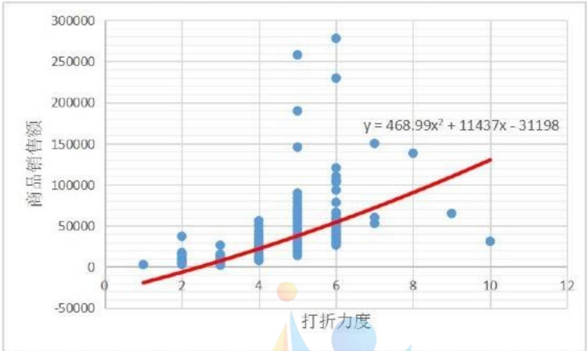

scatter

| 打折力度 | 商品销售额 |
| --- | --- |
| ~1.0 | ~5000 |
| ~2.0 | ~40000 |
| ~2.0 | ~20000 |
| ~3.0 | ~30000 |
| ~3.0 | ~15000 |
| ~4.0 | ~60000 |
| ~4.0 | ~45000 |
| ~4.0 | ~35000 |
| ~4.0 | ~15000 |
| ~4.8 | ~260000 |
| ~4.8 | ~190000 |
| ~4.8 | ~150000 |
| ~4.8 | ~95000 |
| ~4.8 | ~15000 |
| ~6.0 | ~280000 |
| ~6.0 | ~230000 |
| ~6.0 | ~125000 |
| ~6.0 | ~115000 |
| ~6.0 | ~110000 |
| ~6.0 | ~105000 |
| ~6.0 | ~95000 |
| ~6.0 | ~85000 |
| ~6.0 | ~75000 |
| ~6.0 | ~70000 |
| ~6.0 | ~65000 |
| ~6.0 | ~60000 |
| ~6.0 | ~55000 |
| ~7.2 | ~155000 |
| ~7.2 | ~65000 |
| ~7.2 | ~60000 |
| ~7.2 | ~55000 |
| ~8.2 | ~145000 |
| ~9.2 | ~75000 |
| ~10.2 | ~35000 |

由上述二次函数关系式和图像可以得出，该商场的打折力度越大，销售额就越多。

## 5.3.2 每日打折力度与每日销售额的关系

在通过之前问题中得出的每日打折力度以及每日利润率，分析每日打折力度与每日利润率的关系。将每日打折力度与每日利润率按照日期依此对应，通过建立线性回归方程确定两者之间的关系，而后以此两组数据做出散点图进一步分析两者之间的关系。利用Excel建立散点图，并得到函数关系式：

$$
\varepsilon = - 0. 0 0 1 3 \rho^ {2} + 0. 0 1 4 3 \rho + 0. 1 5 4 8
$$

图3 每天打折力度与利润率的关系  
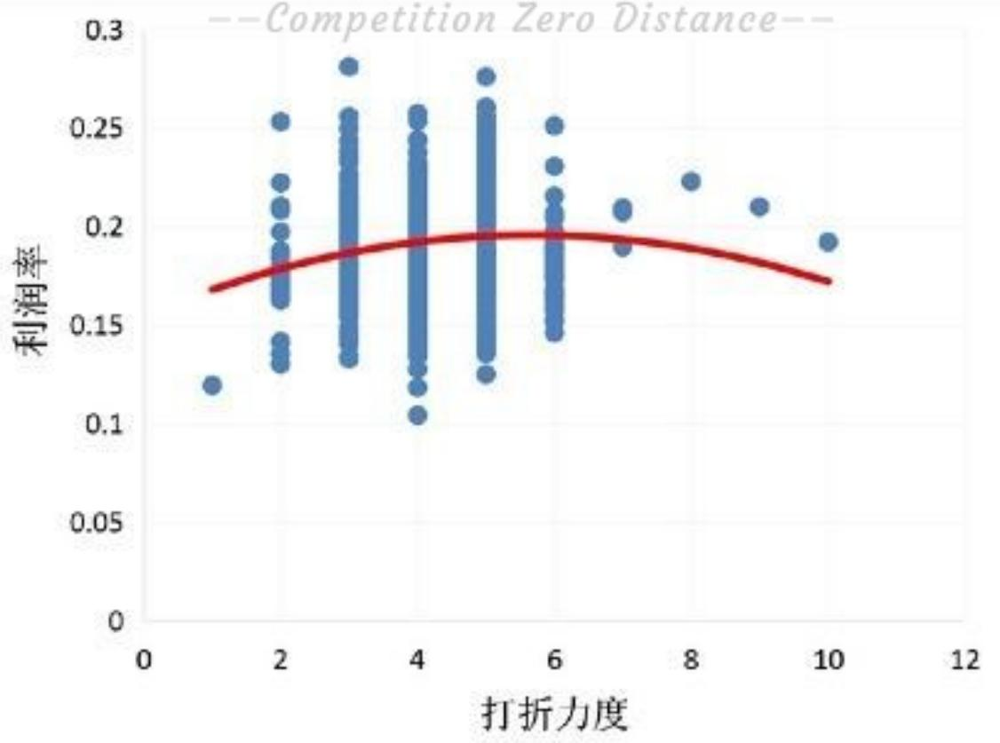

scatter

| 打折力度 (range) | 利润率 (range) |
| --- | --- |
| 1~2 | 0.12~0.25 |
| 2~3 | 0.13~0.28 |
| 3~4 | 0.10~0.26 |
| 4~5 | 0.12~0.28 |
| 5~6 | 0.14~0.25 |
| 6~7 | 0.19~0.21 |
| 7~8 | 0.22~0.23 |
| 8~9 | 0.21~0.22 |
| 9~10 | 0.19~0.20 |

由上述函数关系式可以得出，当 $\rho = 5.5$ 时，即折扣度为 15.5% 时，商场各类商品的利润率能够达到最大，为 19.4%。

通过散点图和函数关系式可以得出，商场打折力度与商品的销售额以及利润率之间并不是成正比关系，而是二次函数关系。当商场的打折力度在5-6级（打折度为0.144339759-0.199895745）时，商场的利润率能够达到较高水平。当商场的打折力度越大时，商场的销售额就会越高。所以，该商场对各类商品价格发生变化对总收入、总收益的影响与在售产品的需求弹性掌握较为合理。对会影响价格制定的因素，在考虑选择降价折扣策略时，充分去考究价格需求弹性对产品总收益、总利润的影响。

## 5.4 问题四的模型建立与求解

根据整理后的附件1、2中销售流水记录。按照附件4中的一级类目区分商品大类，将流水记录按类划分。

首先通过对于整理后的附件1、2中销售流水记录的进一步处理，计算出每类商品的打折力度、商品销售额以及利润率（此处不按时间分组）。

然后分别对于打折力度与销售额、打折力度与利润率建立线性回归方程，求出关系式。并分别对于打折力度与销售额、打折力度与利润率建立线性回归方程做出散点图并进一步分析之间的关系。

## 5.4.1 按分类求打折力度、商品销售额以及利润率

重复问题1和问题2中的步骤，我们可以计算出按照大类区分之后的各类商品的打折力度、销售额和利润率。利用Excel表格将打折力度、销售额和利润率三者进行区分，并建立图表，得到各类商品的打折力度、销售额和利润率的柱形图，如图4、图5、图6。

图 4 各类商品销售额柱状图  
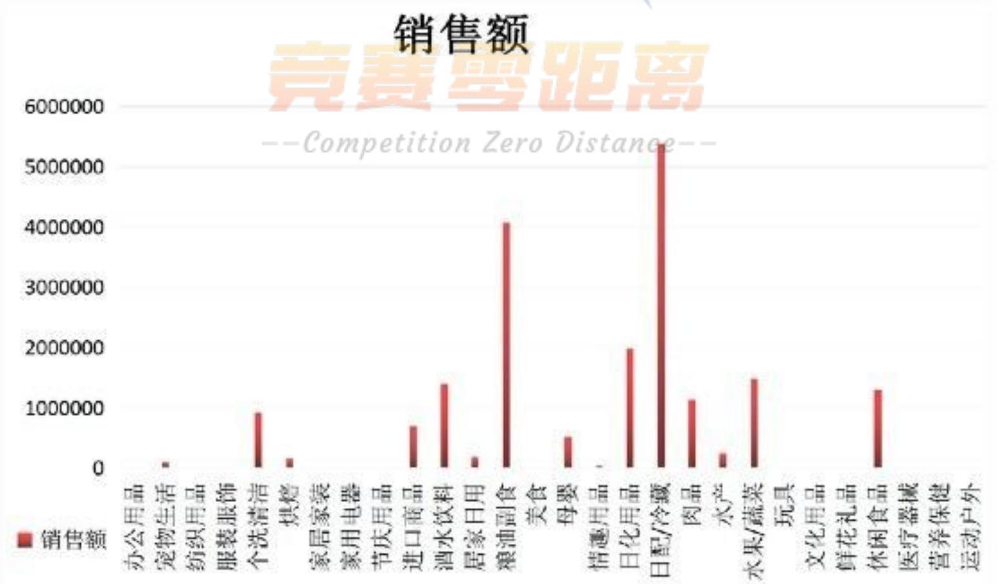

bar

| Category | 销售额 |
| --- | --- |
| 办公用品 | ~100000 |
| 宠物生活 | ~100000 |
| 纺织用品 | ~900000 |
| 服装服饰 | ~200000 |
| 个洗清洁 | ~700000 |
| 烘焙 | ~1400000 |
| 家居家装 | ~200000 |
| 家用电器 | ~4100000 |
| 节庆用品 | ~500000 |
| 进口商品 | ~1900000 |
| 酒水饮料 | ~200000 |
| 居家日用 | ~1100000 |
| 粮油副食 | ~1500000 |
| 美食 | ~1300000 |
| 母婴 | ~1300000 |
| 情遇用品 | ~1300000 |
| 日化用品 | ~1300000 |
| 日配/冷藏 | ~5300000 |
| 肉品 | ~1300000 |
| 水产 | ~250000 |
| 水果/蔬菜 | ~1500000 |
| 玩具 | ~1300000 |
| 文化用品 | ~1300000 |
| 鲜花礼品 | ~1300000 |
| 休闲食品 | ~1300000 |
| 医疗器械 | ~1300000 |
| 营养保健 | ~1300000 |
| 运动户外 | ~1300000 |

由图可示，该商场销售额排名靠前的有粮油副食、日配/冷藏、日化用品、水果蔬菜、酒水饮料、休闲食品、个洗清洁、进口商品、母婴等10大类商品。

图 5 各种商品利润率柱状图  
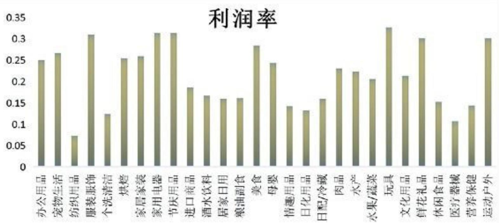

bar

| Category | Profit Margin |
| --- | --- |
| 办公用品 | ~0.25 |
| 宠物生活 | ~0.27 |
| 纺织用品 | ~0.08 |
| 服装服饰 | ~0.31 |
| 个洗清洁 | ~0.13 |
| 烘焙 | ~0.26 |
| 家居家装 | ~0.26 |
| 家用电器 | ~0.31 |
| 节庆用品 | ~0.31 |
| 进口商品 | ~0.19 |
| 酒水饮料 | ~0.17 |
| 居家日用 | ~0.16 |
| 粮油副食 | ~0.16 |
| 美食 | ~0.28 |
| 母婴 | ~0.24 |
| 情趣用品 | ~0.14 |
| 日化用品 | ~0.13 |
| 日配/冷藏 | ~0.16 |
| 肉品 | ~0.23 |
| 水产 | ~0.22 |
| 水果/蔬菜 | ~0.21 |
| 玩具 | ~0.33 |
| 文化用品 | ~0.21 |
| 鲜花礼品 | ~0.30 |
| 休闲食品 | ~0.15 |
| 医疗器械 | ~0.11 |
| 营养保健 | ~0.14 |
| 运动户外 | ~0.30 |

由此图可以发现，该商场29类商品之中，利润率排名靠前的有宠物生活、服装服饰、家居家装、家用电器、节庆用品、美食、母婴、玩具、鲜花礼品、运动户外等10大类商品。

图 6 各大类商品一般降价百分比柱状图  
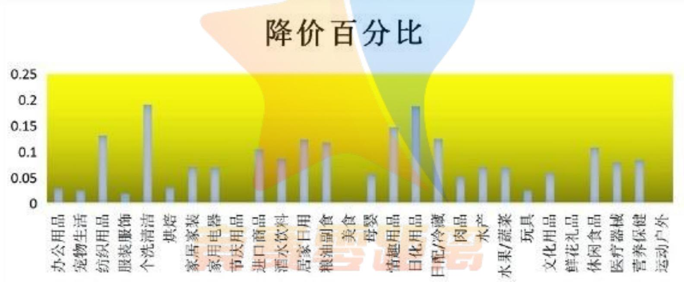

bar

| Category | 降价百分比 |
| --- | --- |
| 办公用品 | ~0.03 |
| 宠物生活 | ~0.025 |
| 纺织用品 | ~0.13 |
| 服装服饰 | ~0.02 |
| 个洗清洁 | ~0.19 |
| 烘焙 | ~0.03 |
| 家居家装 | ~0.07 |
| 家用电器 | ~0.07 |
| 节庆用品 | ~0.02 |
| 进口商品 | ~0.105 |
| 酒水饮料 | ~0.085 |
| 居家日用 | ~0.125 |
| 粮油副食 | ~0.115 |
| 美食 | ~0.02 |
| 母婴 | ~0.055 |
| 情趣用品 | ~0.145 |
| 日化用品 | ~0.185 |
| 日配/冷藏 | ~0.125 |
| 肉品 | ~0.05 |
| 水产 | ~0.07 |
| 水果/蔬菜 | ~0.07 |
| 玩具 | ~0.025 |
| 文化用品 | ~0.06 |
| 鲜花礼品 | ~0.02 |
| 休闲食品 | ~0.11 |
| 医疗器械 | ~0.08 |
| 营养保健 | ~0.085 |
| 运动户外 | ~0.02 |

由图可示，该商场个洗清洁、日化用品这两大类商品一般降价百分比最高，平均能够达到15%以上，纺织用品、进口商品、居家日用、粮油副食、情趣用品、日化用品、日配/冷藏、休闲食品这八类商品一般降价百分比较高，平均能够达到10%以上。

将三组数据按照分类统计在表格中：

表7 按类划分打折力度、商品销售额以及利润率

<table><tr><td>类别</td><td>销售额</td><td>利润率</td><td>打折力度等级</td></tr><tr><td>办公用品</td><td>1916.9</td><td>0.249957827</td><td>1</td></tr><tr><td>宠物生活</td><td>96321.02</td><td>0.266439354</td><td>1</td></tr><tr><td>纺织用品</td><td>4868.8</td><td>0.072700004</td><td>3</td></tr><tr><td>服装服饰</td><td>15207.3</td><td>0.309895037</td><td>1</td></tr><tr><td>个洗清洁</td><td>917334.48</td><td>0.124583041</td><td>4</td></tr><tr><td>烘焙</td><td>158368.25</td><td>0.254114752</td><td>1</td></tr><tr><td>家居家装</td><td>4195</td><td>0.258921794</td><td>2</td></tr><tr><td>家用电器</td><td>5178.9</td><td>0.313383204</td><td>2</td></tr><tr><td>节庆用品</td><td>3780.1</td><td>0.313635248</td><td>0</td></tr><tr><td>进口商品</td><td>688180.01</td><td>0.186170736</td><td>3</td></tr><tr><td>酒水饮料</td><td>1399196.63</td><td>0.167128795</td><td>2</td></tr><tr><td>居家日用</td><td>183778.66</td><td>0.159592479</td><td>3</td></tr><tr><td>粮油副食</td><td>4072362.98</td><td>0.161719589</td><td>3</td></tr><tr><td>美食</td><td>18240.94</td><td>0.283654883</td><td>1</td></tr><tr><td>母婴</td><td>507144.89</td><td>0.243523446</td><td>2</td></tr><tr><td>情趣用品</td><td>31372.7</td><td>0.142193758</td><td>3</td></tr><tr><td>日化用品</td><td>1976835.24</td><td>0.132452264</td><td>4</td></tr><tr><td>日配/冷藏</td><td>5377809.5</td><td>0.159818994</td><td>3</td></tr><tr><td>肉品</td><td>1138012.52</td><td>0.230468599</td><td>2</td></tr><tr><td>水产</td><td>243731.41</td><td>0.22313492</td><td>2</td></tr><tr><td>水果/蔬菜</td><td>1485513.91</td><td>0.205813414</td><td>2</td></tr><tr><td>玩具</td><td>4500.1</td><td>0.326991642</td><td>1</td></tr><tr><td>文化用品</td><td>79.1</td><td>0.212813691</td><td>2</td></tr><tr><td>鲜花礼品</td><td>70</td><td>0.300643819</td><td>0</td></tr><tr><td>休闲食品</td><td>1296224.82</td><td>0.152772611</td><td>3</td></tr><tr><td>医疗器械</td><td>2162.08</td><td>0.107115982</td><td>2</td></tr><tr><td>营养保健</td><td>18662.5</td><td>0.143396167</td><td>2</td></tr><tr><td>运动户外</td><td>1778</td><td>0.300659974</td><td>1</td></tr></table>

## 5.4.2 反投影重建算法

分别对于打折力度与销售额、打折力度与利润率建立线性回归方程，求出关系式。并对打折力度与销售额、打折力度与利润率建立线性回归方程做出散点图并进一步分析之间的关系。

图7  
销售额与打折力度关系图  
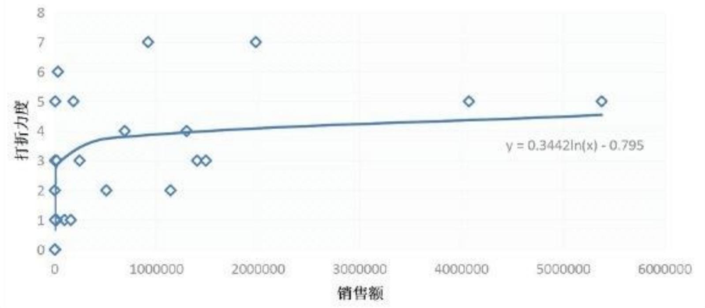

scatter

| 销售额 | 打折力度 |
| --- | --- |
| ~0 | 0 |
| ~0 | 1 |
| ~0 | 2 |
| ~0 | 3 |
| ~0 | 5 |
| ~0 | 6 |
| ~100000 | 1 |
| ~100000 | 2 |
| ~100000 | 3 |
| ~100000 | 5 |
| ~200000 | 5 |
| ~500000 | 2 |
| ~700000 | 4 |
| ~900000 | 7 |
| ~1200000 | 2 |
| ~1300000 | 4 |
| ~1400000 | 3 |
| ~1500000 | 3 |
| ~2000000 | 7 |
| ~4100000 | 5 |
| ~5400000 | 5 |

图8  
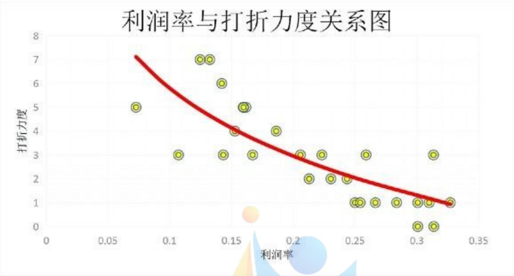

scatter

| 利润率 | 打折力度 |
| --- | --- |
| ~0.07 | 5 |
| ~0.11 | 3 |
| ~0.12 | 7 |
| ~0.13 | 7 |
| ~0.14 | 6 |
| ~0.15 | 3 |
| ~0.16 | 5 |
| ~0.16 | 4 |
| ~0.17 | 3 |
| ~0.18 | 4 |
| ~0.20 | 3 |
| ~0.21 | 2 |
| ~0.22 | 3 |
| ~0.23 | 2 |
| ~0.24 | 2 |
| ~0.25 | 1 |
| ~0.25 | 1 |
| ~0.26 | 3 |
| ~0.27 | 1 |
| ~0.28 | 1 |
| ~0.30 | 0 |
| ~0.31 | 1 |
| ~0.31 | 1 |
| ~0.32 | 3 |
| ~0.33 | 1 |

表 8 各类商品三类情况排行表

<table><tr><td>排名</td><td colspan="2">利润率</td><td colspan="2">销售额</td><td colspan="2">降价百分比</td></tr><tr><td>1</td><td>玩具</td><td>0.326991642</td><td>日配/冷藏</td><td>5377809.5</td><td>个洗清洁</td><td>0.191066229</td></tr><tr><td>2</td><td>节庆用品</td><td>0.313635248</td><td>粮油副食</td><td>4072362.98</td><td>日化用品</td><td>0.187512166</td></tr><tr><td>3</td><td>家用电器</td><td>0.313383204</td><td>日化用品</td><td>1976835.24</td><td>情趣用品</td><td>0.147916282</td></tr><tr><td>4</td><td>服装服饰</td><td>0.309895037</td><td>水果/蔬菜</td><td>1485513.91</td><td>纺织用品</td><td>0.131625883</td></tr><tr><td>5</td><td>运动户外</td><td>0.300659974</td><td>酒水饮料</td><td>1399196.63</td><td>日配/冷藏</td><td>0.125568708</td></tr><tr><td>6</td><td>鲜花礼品</td><td>0.300643819</td><td>休闲食品</td><td>1296224.82</td><td>居家日用</td><td>0.124329406</td></tr><tr><td>7</td><td>美食</td><td>0.283654883</td><td>肉品</td><td>1138012.52</td><td>粮油副食</td><td>0.11811754</td></tr><tr><td>8</td><td>宠物生活</td><td>0.266439354</td><td>个洗清洁</td><td>917334.48</td><td>休闲食品</td><td>0.108329746</td></tr><tr><td>9</td><td>家居家装</td><td>0.258921794</td><td>进口商品</td><td>688180.01</td><td>进口商品</td><td>0.105150137</td></tr><tr><td>10</td><td>烘焙</td><td>0.254114752</td><td>母婴</td><td>507144.89</td><td>酒水饮料</td><td>0.086681724</td></tr><tr><td>11</td><td>办公用品</td><td>0.249957827</td><td>水产</td><td>243731.41</td><td>营养保健</td><td>0.084655566</td></tr><tr><td>12</td><td>母婴</td><td>0.243523446</td><td>居家日用</td><td>183778.66</td><td>医疗器械</td><td>0.07956645</td></tr><tr><td>13</td><td>肉品</td><td>0.230468599</td><td>烘焙</td><td>158368.25</td><td>家居家装</td><td>0.070874862</td></tr><tr><td>14</td><td>水产</td><td>0.22313492</td><td>宠物生活</td><td>96321.02</td><td>水产</td><td>0.070304315</td></tr><tr><td>15</td><td>文化用品</td><td>0.212813691</td><td>情趣用品</td><td>31372.7</td><td>水果/蔬菜</td><td>0.069587053</td></tr><tr><td>16</td><td>水果/蔬菜</td><td>0.205813414</td><td>营养保健</td><td>18662.5</td><td>家用电器</td><td>0.069480379</td></tr><tr><td>17</td><td>进口商品</td><td>0.186170736</td><td>美食</td><td>18240.94</td><td>文化用品</td><td>0.059453032</td></tr><tr><td>18</td><td>酒水饮料</td><td>0.167128795</td><td>服装服饰</td><td>15207.3</td><td>母婴</td><td>0.056908744</td></tr><tr><td>19</td><td>粮油副食</td><td>0.161719589</td><td>家用电器</td><td>5178.9</td><td>肉品</td><td>0.051905519</td></tr><tr><td>20</td><td>日配/冷藏</td><td>0.159818994</td><td>纺织用品</td><td>4868.8</td><td>烘焙</td><td>0.032131783</td></tr><tr><td>21</td><td>居家日用</td><td>0.159592479</td><td>玩具</td><td>4500.1</td><td>办公用品</td><td>0.029368576</td></tr><tr><td>22</td><td>休闲食品</td><td>0.152772611</td><td>家居家装</td><td>4195</td><td>宠物生活</td><td>0.025795907</td></tr><tr><td>23</td><td>营养保健</td><td>0.143396167</td><td>节庆用品</td><td>3780.1</td><td>玩具</td><td>0.025783685</td></tr><tr><td>24</td><td>情趣用品</td><td>0.142193758</td><td>医疗器械</td><td>2162.08</td><td>服装服饰</td><td>0.019345727</td></tr><tr><td>25</td><td>日化用品</td><td>0.132452264</td><td>办公用品</td><td>1916.9</td><td>美食</td><td>0.003833732</td></tr><tr><td>26</td><td>个洗清洁</td><td>0.124583041</td><td>运动户外</td><td>1778</td><td>运动户外</td><td>0.002804262</td></tr><tr><td>27</td><td>医疗器械</td><td>0.107115982</td><td>文化用品</td><td>79.1</td><td>节庆用品</td><td>0</td></tr><tr><td>28</td><td>纺织用品</td><td>0.072700004</td><td>鲜花礼品</td><td>70</td><td>鲜花礼品</td><td>0</td></tr></table>

通过建立以上3种关系图，可以清楚发现：该商场在复杂的市场情况下制定折扣促销策略，充分考虑到了产品的弹性需求，并考虑到自己出售产品的弹性需求大小，价格变化对于自身销售收入和利润的影响。从而对于处于不同的需求弹性区间内的产品采取了不同的打折力度。所以需求弹性大的商品，当商家将其价格降低在一定的幅度范围内，总收入和总利润仍然是增加的。

## 5.4.3 不同类别商品打折力度与销售额以及利润率关系的变化

为更好发现各大类商品打折力度与销售额以及利润率关系的变化，我们对每类商品的数据进行汇总，运用Excel软件的数据处理和绘图功能，做出各大类商品打折力度与销售额，打折力度与利润率的散点图和线性回归方程。

办公用品类  
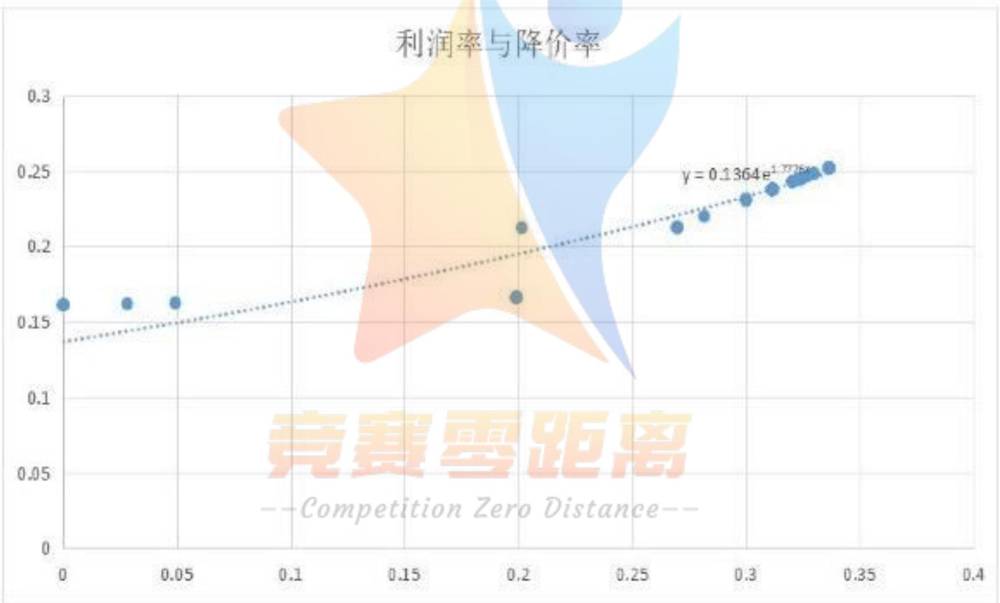

scatter

| X | Y |
| --- | --- |
| ~0.01 | ~0.16 |
| ~0.03 | ~0.16 |
| ~0.05 | ~0.16 |
| ~0.20 | ~0.17 |
| ~0.20 | ~0.21 |
| ~0.27 | ~0.21 |
| ~0.28 | ~0.22 |
| ~0.30 | ~0.23 |
| ~0.31 | ~0.24 |
| ~0.32 | ~0.24 |
| ~0.33 | ~0.25 |

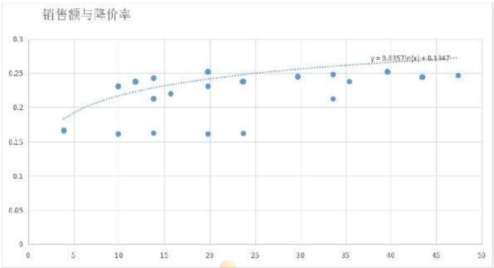

scatter

| X | Y |
| --- | --- |
| ~4 | ~0.165 |
| ~10 | ~0.23 |
| ~10 | ~0.16 |
| ~12 | ~0.24 |
| ~14 | ~0.245 |
| ~14 | ~0.215 |
| ~14 | ~0.165 |
| ~16 | ~0.22 |
| ~20 | ~0.255 |
| ~20 | ~0.23 |
| ~20 | ~0.16 |
| ~24 | ~0.24 |
| ~24 | ~0.165 |
| ~30 | ~0.245 |
| ~34 | ~0.25 |
| ~34 | ~0.215 |
| ~36 | ~0.24 |
| ~40 | ~0.255 |
| ~44 | ~0.245 |
| ~48 | ~0.25 |

宠物用品类  
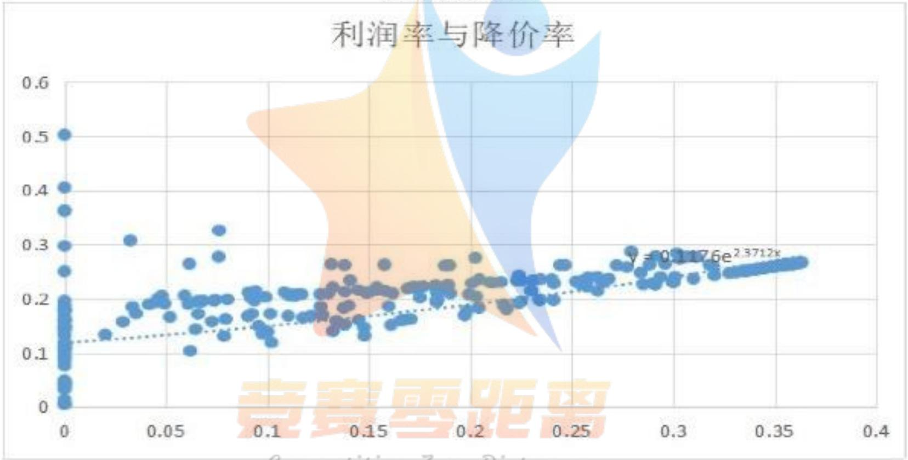

scatter

| X (range) | Y (range) |
| --- | --- |
| 0~0.37 | 0~0.5 |

销售额与降价率  
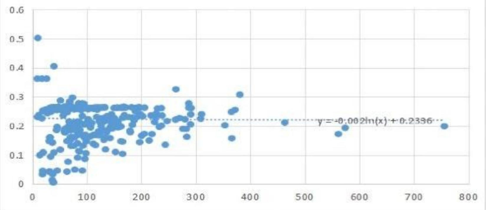

scatter

| X | Y |
| --- | --- |
| ~10 | ~0.51 |
| ~10 | ~0.37 |
| ~10 | ~0.36 |
| ~10 | ~0.24 |
| ~10 | ~0.11 |
| ~10 | ~0.09 |
| ~10 | ~0.04 |
| ~10 | ~0.03 |
| ~10 | ~0.01 |
| ~20 | ~0.41 |
| ~20 | ~0.28 |
| ~20 | ~0.27 |
| ~20 | ~0.26 |
| ~20 | ~0.25 |
| ~20 | ~0.24 |
| ~20 | ~0.23 |
| ~20 | ~0.22 |
| ~20 | ~0.21 |
| ~20 | ~0.20 |
| ~20 | ~0.19 |
| ~20 | ~0.18 |
| ~20 | ~0.17 |
| ~20 | ~0.16 |
| ~20 | ~0.15 |
| ~20 | ~0.14 |
| ~20 | ~0.13 |
| ~20 | ~0.12 |
| ~20 | ~0.11 |
| ~20 | ~0.10 |
| ~20 | ~0.09 |
| ~20 | ~0.08 |
| ~20 | ~0.07 |
| ~20 | ~0.06 |
| ~20 | ~0.05 |
| ~20 | ~0.04 |
| ~20 | ~0.03 |
| ~20 | ~0.02 |
| ~20 | ~0.01 |
| ~30 | ~0.37 |
| ~30 | ~0.36 |
| ~30 | ~0.35 |
| ~30 | ~0.34 |
| ~30 | ~0.33 |
| ~30 | ~0.32 |
| ~30 | ~0.31 |
| ~30 | ~0.30 |
| ~30 | ~0.29 |
| ~30 | ~0.28 |
| ~30 | ~0.27 |
| ~30 | ~0.26 |
| ~30 | ~0.25 |
| ~30 | ~0.24 |
| ~30 | ~0.23 |
| ~30 | ~0.22 |
| ~30 | ~0.21 |
| ~30 | ~0.20 |
| ~30 | ~0.19 |
| ~30 | ~0.18 |
| ~30 | ~0.17 |
| ~30 | ~0.16 |
| ~30 | ~0.15 |
| ~30 | ~0.14 |
| ~30 | ~0.13 |
| ~30 | ~0.12 |
| ~30 | ~0.11 |
| ~30 | ~0.10 |
| ~30 | ~0.09 |
| ~30 | ~0.08 |
| ~30 | ~0.07 |
| ~30 | ~0.06 |
| ~30 | ~0.05 |
| ~30 | ~0.04 |
| ~30 | ~0.03 |
| ~30 | ~0.02 |
| ~40 | ~0.41 |
| ~40 | ~0.37 |
| ~40 | ~0.36 |
| ~40 | ~0.35 |
| ~40 | ~0.34 |
| ~40 | ~0.33 |
| ~40 | ~0.32 |
| ~40 | ~0.31 |
| ~40 | ~0.30 |
| ~40 | ~0.29 |
| ~40 | ~0.28 |
| ~40 | ~0.27 |
| ~40 | ~0.26 |
| ~40 | ~0.25 |
| ~40 | ~0.24 |
| ~40 | ~0.23 |
| ~40 | ~0.22 |
| ~40 | ~0.21 |
| ~40 | ~0.20 |
| ~40 | ~0.19 |
| ~40 | ~0.18 |
| ~40 | ~0.17 |
| ~40 | ~0.16 |
| ~40 | ~0.15 |
| ~40 | ~0.14 |
| ~40 | ~0.13 |
| ~40 | ~0.12 |
| ~40 | ~0.11 |
| ~40 | ~0.10 |
| ~40 | ~0.09 |
| ~40 | ~0.08 |
| ~40 | ~0.07 |
| ~40 | ~0.06 |
| ~40 | ~0.05 |
| ~40 | ~0.04 |
| 5~85 | 1~1~1~1~1~1~1~1~1~1~1~1~1~1~1~1~1~1~1~1~1~1~1~1~1~1~1~1~1~1~1~1~1~1~1~1~1~1~1~1~1~1~1~1~1~1~1~1~1~1~1%

纺织用品类

销售额与降价率关系  
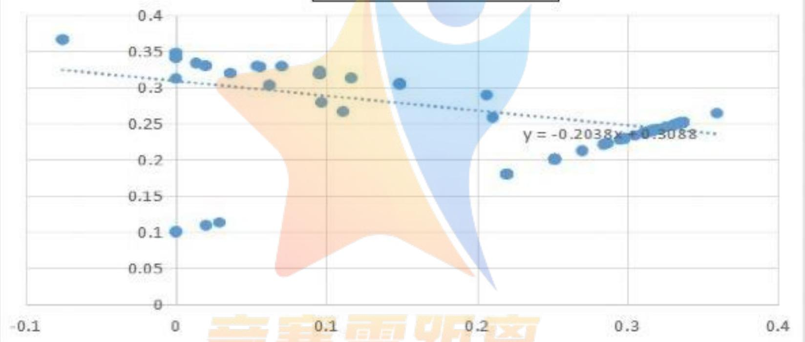

scatter

| X | Y |
| --- | --- |
| ~0.01 | ~0.37 |
| ~0.01 | ~0.34 |
| ~0.01 | ~0.31 |
| ~0.02 | ~0.10 |
| ~0.03 | ~0.11 |
| ~0.04 | ~0.12 |
| ~0.06 | ~0.32 |
| ~0.08 | ~0.33 |
| ~0.10 | ~0.33 |
| ~0.11 | ~0.32 |
| ~0.12 | ~0.28 |
| ~0.13 | ~0.27 |
| ~0.14 | ~0.32 |
| ~0.15 | ~0.31 |
| ~0.21 | ~0.29 |
| ~0.22 | ~0.26 |
| ~0.22 | ~0.18 |
| ~0.25 | ~0.20 |
| ~0.27 | ~0.21 |
| ~0.29 | ~0.23 |
| ~0.31 | ~0.24 |
| ~0.33 | ~0.25 |
| ~0.36 | ~0.27 |

利润率与降价  
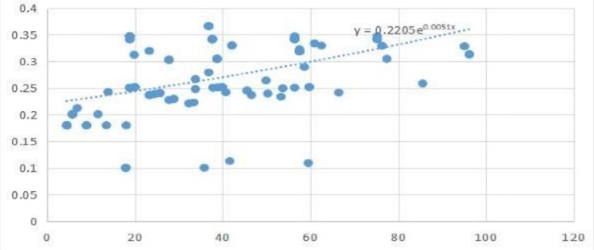

scatter

| X | Y |
| --- | --- |
| ~5 | ~0.18 |
| ~6 | ~0.20 |
| ~7 | ~0.21 |
| ~10 | ~0.18 |
| ~12 | ~0.20 |
| ~15 | ~0.18 |
| ~18 | ~0.10 |
| ~19 | ~0.34 |
| ~20 | ~0.35 |
| ~21 | ~0.31 |
| ~23 | ~0.24 |
| ~25 | ~0.24 |
| ~26 | ~0.32 |
| ~28 | ~0.23 |
| ~30 | ~0.23 |
| ~32 | ~0.22 |
| ~33 | ~0.27 |
| ~35 | ~0.25 |
| ~36 | ~0.37 |
| ~37 | ~0.34 |
| ~38 | ~0.31 |
| ~39 | ~0.25 |
| ~40 | ~0.25 |
| ~41 | ~0.11 |
| ~42 | ~0.25 |
| ~43 | ~0.33 |
| ~45 | ~0.24 |
| ~48 | ~0.24 |
| ~50 | ~0.26 |
| ~52 | ~0.24 |
| ~53 | ~0.25 |
| ~55 | ~0.25 |
| ~56 | ~0.34 |
| ~57 | ~0.32 |
| ~58 | ~0.29 |
| ~59 | ~0.11 |
| ~60 | ~0.33 |
| ~61 | ~0.33 |
| ~65 | ~0.24 |
| ~75 | ~0.34 |
| ~76 | ~0.33 |
| ~77 | ~0.31 |
| ~85 | ~0.26 |
| ~95 | ~0.33 |
| ~96 | ~0.31 |

通过以上图表可以分析出，富有弹性的商品如办公用品、纺织用品、宠物等，并

不是生活必须, 其受到很多因素的影响, 如可支配收入、消费偏好、休闲时间等, 当商场进行一定程度的打折后, 该大类的商品的销售额增长不明显, 利润率增加很少, 甚至还降低。再对于缺乏弹性的商品来说, 如粮油副食是生活必需品, 是满足人们的生活需要的商品, 更是缺乏价格弹性的商品。当此类缺乏弹性的商品降价时, 商场的销售收入降低, 但是消费者在与其他商场进行对比时, 更能够吸引进行消费者到该商场进行选择购买, 从而使得商场的销售额和利润增加, 实现薄利多销的效果。并且能够促使消费者在选购该类价格属性较小的同时, 能够对商场内其他种类的商品进行选择购买, 达到增加商场其他类商品的销量和总利润增加的目的。

## 六、模型评价

## 6.1 模型优点

1. 模型是在充分利用所给的各项数据信息后建立的，通过不断地分析、检验和完善使得模型具有较高的精确性，同时也确保了解题方式的科学性，和整体结构的严谨性。  
2. 根据所给出的相关数据，选择用Excel表格对数据进行相关的整理和计算，可操作性强且适用范围广。简化了计算的过程。  
3. 各类图表的建立，对我们发现薄利多销的原理性、商场的经营观念拥有很直观的认识，也更对我们的生活拥有很大的帮助。  
4. 对于模型得到的结果，能够联系全文不同计算所得结果，可以合理地去进行分析、反复推测，最后验证模型的可行性。

## 6.2 模型缺点

1. 假设在实际情况中对于其他并非按照附件所说明进行计算，则相关数据的计算结果也会有一定的误差.  
2. 对于商场可能采取的现金折扣、数量折扣、功能折扣、季节折扣、回扣和津贴分析较为浅层。

## 6.3 模型的改进方向

本文针对题目提出的各个问题的不同要求，分别做出了对商场每天的营业额和利润率的计算、建立了适当的指标衡量商场每天的打折力度，计算该商场一段时间以来每天的打折力度、分析打折力度与商品销售额以及利润率的关系、并进一步考虑商品的大类区分，打折力度与商品销售额以及利润率的关系有何变化的数据分析和处理，且通过与原始数据的反复检验保证了各项数据分析的准确性。结合个问题的计算与数据处理过程和求解得到的结果，对各问题的结果分析阐述如下：

## 问题（1）的数据计算的合理性分析

首先，我们已知商场的每日销售流水记录，但由于未知原因数据中非打折商品的成本价缺失。便利用商场每天的营业总额和总成本，去除已知打折商品的成本总和与营业额总和，得到了非打折商品的成本总和与营业额总和。再建立回归线性方程，从而得到各种商品的成本价格。并进行反复的推演预算，是整个数据能够较为合理化，具有较好的科学性和合理性。由于是利用了数据中的统计数据分析了各个指标间的联系，基础关系式具有很好的科学性和合理性，多元回归分析法对于各项系数的确定更进一步确定了该模型的精确性。

最后将每日销售出的商品营业额总和与总成本关系进行计算，可以得到每天的利润率。

## 问题（2）的数据计算的合理性分析

问题2中要求建立适当的衡量指标得到商场的打折力度。我们结合问题一中已经得到的商场每天的营业总额，门店价总额和利润率，建立以每日出售商品原现价差值与商品原价比值作为衡量指标。再进行数据处理得到商场各种商品的打折情况和商场所有商品的打折力度，并且进行划分等级指标对商场打折力度进行分档，从而分析影响商场的打折力度情况的因素。

衡量指标由于各商场的打折方式、经营理念存在不同，我们进行数据分析后，以每日出售商品原现价差值与商品原价比值作为衡量指标，并进行检验，以做出较为合理的解释。

## 问题（3）的数据分析合理性检验

在这里我们根据问题2中已经建立的衡量指标下的商场打折力度信息，并从问题一中，我们已经知道商场每天的商品销售额及利润率。我们根据Excel进行图表分析，分析考虑到需求量等因素，从而找到三者之间的关系。我们初步考虑利用附件1和附件2中提取的数据，考虑三项指标之间的关系，利用该关系自主构建图表，利用实际数据影响三者之间的未知系数，然后通过检验相关系数以及利用其他数据验证来确定分析模型的正确性。

## 问题（4）的数据分析合理性检验

由于弹性商品和非弹性商品在谁给你家的各种打折情况之下，各种数据之间的联系较为复杂。而我们将每大类商品看成是独立的单元来模拟便可以较好地解决数据处理中的繁琐，具有较强的科学性和合理性。

同时，我们充分利用了Excel表格对于数据的处理能力，将整个销售流水记录折扣信息进行分析处理，并建立函数关系式直观了解他们的关系。还通过图表的直观显示，我们可以清晰了解到商家薄利多销的原则对各大类商品的打折力度和商品销售额以及利润率的影响等信息，为研究带来了很大的便利性。

## 七、参考文献

[1] 豆丁网. start2015a44. 薄利多销. https://www.docin.com/p1331071706.html. 2015-10-23  
[2] 豆丁网. pfbppj9191. 需求弹性. https://www.docin.com/p-1524716064.html 2016-04-09  
[3] 豆丁网. 唐树伶. 价格理论需求供给与弹性理论 https://www.docin.com/p-1391622406.html 2015-12-14

## 八、附录

每日营业额、利润率及降价率表

<table><tr><td>日期</td><td>每日营业额</td><td>利润率</td><td>打折度/降价率</td></tr><tr><td>2016/11/30</td><td>2833.7</td><td>15.07004976</td><td>0.142939237</td></tr><tr><td>2016/12/1</td><td>2346.2</td><td>18.20177308</td><td>0.084945398</td></tr><tr><td>2016/12/2</td><td>2338.3</td><td>18.26369585</td><td>0.098886277</td></tr><tr><td>2016/12/3</td><td>3270.4</td><td>13.05864726</td><td>0.114336782</td></tr><tr><td>2016/12/4</td><td>3881.68</td><td>11.00245255</td><td>0.101292375</td></tr><tr><td>2016/12/5</td><td>2362.6</td><td>18.07711843</td><td>0.065648976</td></tr><tr><td>2016/12/6</td><td>2253.1</td><td>18.95610492</td><td>0.105557761</td></tr><tr><td>2016/12/7</td><td>5312.88</td><td>8.039142612</td><td>0.108050392</td></tr><tr><td>2016/12/8</td><td>5890.72</td><td>7.250726567</td><td>0.114220068</td></tr><tr><td>2016/12/9</td><td>5750.58</td><td>7.427598607</td><td>0.092951286</td></tr><tr><td>2016/12/10</td><td>5755.26</td><td>7.421732467</td><td>0.103690045</td></tr><tr><td>2016/12/11</td><td>16415.22</td><td>2.602158241</td><td>0.093368284</td></tr><tr><td>2016/12/12</td><td>37236.08</td><td>1.147166941</td><td>0.110118851</td></tr><tr><td>2016/12/13</td><td>16547</td><td>2.581555569</td><td>0.102418756</td></tr><tr><td>2016/12/14</td><td>9172.9</td><td>4.656978709</td><td>0.089935909</td></tr><tr><td>2016/12/15</td><td>11167.4</td><td>3.825330874</td><td>0.102558745</td></tr><tr><td>2016/12/16</td><td>11062.28</td><td>3.861771714</td><td>0.111875772</td></tr><tr><td>2016/12/17</td><td>14744.44</td><td>2.897431167</td><td>0.116085281</td></tr><tr><td>2016/12/18</td><td>17424.66</td><td>2.451812546</td><td>0.159583396</td></tr><tr><td>2016/12/19</td><td>3151.7</td><td>13.55554145</td><td>0.106660998</td></tr><tr><td>2016/12/20</td><td>4370.4</td><td>9.775764232</td><td>0.150223605</td></tr><tr><td>2016/12/21</td><td>8305.96</td><td>5.143896672</td><td>0.100430401</td></tr><tr><td>2016/12/22</td><td>5858.22</td><td>7.293341664</td><td>0.114901371</td></tr><tr><td>2016/12/23</td><td>10465.7</td><td>4.082574505</td><td>0.123585814</td></tr><tr><td>2016/12/24</td><td>6322.72</td><td>6.757851051</td><td>0.096085389</td></tr><tr><td>2016/12/25</td><td>5667.6</td><td>7.539170019</td><td>0.177881896</td></tr><tr><td>2016/12/26</td><td>4254.8</td><td>10.04277522</td><td>0.161913016</td></tr><tr><td>2016/12/27</td><td>4968.5</td><td>8.600382409</td><td>0.120385943</td></tr><tr><td>2016/12/28</td><td>3529.5</td><td>12.10709732</td><td>0.091435632</td></tr><tr><td>2016/12/29</td><td>6333.48</td><td>6.747159539</td><td>0.100559818</td></tr><tr><td>2016/12/30</td><td>8263.1</td><td>5.171666808</td><td>0.09434562</td></tr><tr><td>2016/12/31</td><td>9905.48</td><td>4.314278561</td><td>0.145149292</td></tr><tr><td>2017/1/1</td><td>4802.6</td><td>8.898513305</td><td>0.076991082</td></tr><tr><td>2017/1/2</td><td>6961.1</td><td>6.139403255</td><td>0.125687659</td></tr><tr><td>2017/1/3</td><td>4045.68</td><td>10.56386071</td><td>0.311007718</td></tr><tr><td>2017/1/4</td><td>4227.3</td><td>10.11023585</td><td>0.121216531</td></tr><tr><td>2017/1/5</td><td>2020.3</td><td>21.15527397</td><td>0.103642575</td></tr><tr><td>2017/1/6</td><td>4531.1</td><td>9.43280881</td><td>0.08746526</td></tr><tr><td>2017/1/7</td><td>5871.7</td><td>7.279322854</td><td>0.117342874</td></tr><tr><td>2017/1/8</td><td>5586.4</td><td>7.651260203</td><td>0.077649545</td></tr><tr><td>2017/1/9</td><td>4600.6</td><td>9.290962048</td><td>0.070510748</td></tr><tr><td>2017/1/10</td><td>5708</td><td>7.488612474</td><td>0.106910957</td></tr><tr><td>2017/1/11</td><td>4688.2</td><td>9.117785077</td><td>0.076289554</td></tr><tr><td>2017/1/12</td><td>3868.3</td><td>11.0505907</td><td>0.077445835</td></tr><tr><td>2017/1/13</td><td>2742.2</td><td>15.58894318</td><td>0.083642274</td></tr><tr><td>2017/1/14</td><td>11038.94</td><td>3.872563851</td><td>0.081752141</td></tr><tr><td>2017/1/15</td><td>11856.6</td><td>3.605586762</td><td>0.15625055</td></tr><tr><td>2017/1/16</td><td>4794.1</td><td>8.917419328</td><td>0.086769656</td></tr><tr><td>2017/1/17</td><td>6077</td><td>7.035050189</td><td>0.096101479</td></tr><tr><td>2017/1/18</td><td>5244.6</td><td>8.151813294</td><td>0.073537486</td></tr><tr><td>2017/1/19</td><td>5906.18</td><td>7.238858281</td><td>0.071602342</td></tr><tr><td>2017/1/20</td><td>4503.1</td><td>9.494570407</td><td>0.082721824</td></tr><tr><td>2017/1/21</td><td>5321.52</td><td>8.034546521</td><td>0.081909879</td></tr><tr><td>2017/1/22</td><td>5105.5</td><td>8.374693957</td><td>0.116768595</td></tr><tr><td>2017/1/23</td><td>5322.58</td><td>8.033322186</td><td>0.127134598</td></tr><tr><td>2017/1/24</td><td>6930.24</td><td>6.169916193</td><td>0.180291468</td></tr><tr><td>2017/1/25</td><td>8824.1</td><td>4.84581997</td><td>0.081117803</td></tr><tr><td>2017/1/26</td><td>9636.66</td><td>4.437325795</td><td>0.033227786</td></tr><tr><td>2017/1/27</td><td>4683.08</td><td>9.131170085</td><td>0.074523267</td></tr><tr><td>2017/1/28</td><td>2445.1</td><td>17.48926424</td><td>0.137422167</td></tr><tr><td>2017/1/29</td><td>3211.7</td><td>13.31506679</td><td>0.266884532</td></tr><tr><td>2017/1/30</td><td>2502.3</td><td>17.09027695</td><td>0.075645514</td></tr><tr><td>2017/1/31</td><td>2473.1</td><td>17.29246694</td><td>0.092212814</td></tr><tr><td>2017/2/1</td><td>3693.3</td><td>11.57961714</td><td>0.075919375</td></tr><tr><td>2017/2/2</td><td>4611.56</td><td>9.274085125</td><td>0.067022583</td></tr><tr><td>2017/2/3</td><td>6926.5</td><td>6.174691403</td><td>0.086948809</td></tr><tr><td>2017/2/4</td><td>5451.3</td><td>7.845834938</td><td>0.082573069</td></tr><tr><td>2017/2/5</td><td>8173.66</td><td>5.232784334</td><td>0.069266218</td></tr><tr><td>2017/2/6</td><td>5564.1</td><td>7.687137183</td><td>0.098254362</td></tr><tr><td>2017/2/7</td><td>7909.28</td><td>5.407951166</td><td>0.080958141</td></tr><tr><td>2017/2/8</td><td>5869.3</td><td>7.287751521</td><td>0.090156602</td></tr><tr><td>2017/2/9</td><td>7444.6</td><td>5.745775461</td><td>0.123953204</td></tr><tr><td>2017/2/10</td><td>3516.9</td><td>12.16298445</td><td>0.099787982</td></tr><tr><td>2017/2/11</td><td>12108.78</td><td>3.53272584</td><td>0.066831507</td></tr><tr><td>2017/2/12</td><td>4220.36</td><td>10.13610213</td><td>0.07180603</td></tr><tr><td>2017/2/13</td><td>3634.24</td><td>11.77109932</td><td>0.081249288</td></tr><tr><td>2017/2/14</td><td>6564</td><td>6.517367459</td><td>0.113846579</td></tr><tr><td>2017/2/15</td><td>4528.26</td><td>9.447558223</td><td>0.091207335</td></tr><tr><td>2017/2/16</td><td>3495.3</td><td>12.23986496</td><td>0.087426305</td></tr><tr><td>2017/2/17</td><td>4251.68</td><td>10.06261054</td><td>0.09066086</td></tr><tr><td>2017/2/18</td><td>13070.04</td><td>3.273440632</td><td>0.092900467</td></tr><tr><td>2017/2/19</td><td>11243.18</td><td>3.80541804</td><td>0.100062731</td></tr><tr><td>2017/2/20</td><td>3404.18</td><td>12.56866558</td><td>0.081200957</td></tr><tr><td>2017/2/21</td><td>4479</td><td>9.552801965</td><td>0.072006261</td></tr><tr><td>2017/2/22</td><td>4140</td><td>10.3352657</td><td>0.091126978</td></tr><tr><td>2017/2/23</td><td>5160.88</td><td>8.291027887</td><td>0.089803568</td></tr><tr><td>2017/2/24</td><td>4876.52</td><td>8.774699991</td><td>0.094702501</td></tr><tr><td>2017/2/25</td><td>6941.94</td><td>6.164127031</td><td>0.099605798</td></tr><tr><td>2017/2/26</td><td>5977.96</td><td>7.158294803</td><td>0.150806622</td></tr><tr><td>2017/2/27</td><td>2630.9</td><td>16.26553651</td><td>0.096827787</td></tr><tr><td>2017/2/28</td><td>3079.2</td><td>13.89776565</td><td>0.105424792</td></tr><tr><td>2017/3/1</td><td>3164.58</td><td>13.52312155</td><td>0.118650764</td></tr><tr><td>2017/3/2</td><td>6742.6</td><td>6.347106457</td><td>0.113304485</td></tr><tr><td>2017/3/3</td><td>5849.92</td><td>7.315826541</td><td>0.09969225</td></tr><tr><td>2017/3/4</td><td>10838.54</td><td>3.948686816</td><td>0.079856133</td></tr><tr><td>2017/3/5</td><td>10519.26</td><td>4.068632204</td><td>0.081315309</td></tr><tr><td>2017/3/6</td><td>5323.12</td><td>8.040397361</td><td>0.091394308</td></tr><tr><td>2017/3/7</td><td>6199.26</td><td>6.904211148</td><td>0.094972927</td></tr><tr><td>2017/3/8</td><td>5289.96</td><td>8.091176493</td><td>0.103570072</td></tr><tr><td>2017/3/9</td><td>5466.02</td><td>7.830743393</td><td>0.104509134</td></tr><tr><td>2017/3/10</td><td>8350.08</td><td>5.126178432</td><td>0.073503708</td></tr><tr><td>2017/3/11</td><td>8936.86</td><td>4.789713613</td><td>0.135268418</td></tr><tr><td>2017/3/12</td><td>9993.76</td><td>4.283272762</td><td>0.084116963</td></tr><tr><td>2017/3/13</td><td>6782.6</td><td>6.311296553</td><td>0.082458371</td></tr><tr><td>2017/3/14</td><td>5926.96</td><td>7.222589658</td><td>0.08091092</td></tr><tr><td>2017/3/15</td><td>5249.66</td><td>8.154623347</td><td>0.132187186</td></tr><tr><td>2017/3/16</td><td>4585.78</td><td>9.335380241</td><td>0.106090724</td></tr><tr><td>2017/3/17</td><td>7752.46</td><td>5.522247132</td><td>0.090579682</td></tr><tr><td>2017/3/18</td><td>9758.02</td><td>4.38736547</td><td>0.069020525</td></tr><tr><td>2017/3/19</td><td>8354.96</td><td>5.124261517</td><td>0.127028054</td></tr><tr><td>2017/3/20</td><td>4112.9</td><td>10.4096866</td><td>0.090577249</td></tr><tr><td>2017/3/21</td><td>4982.66</td><td>8.59279983</td><td>0.077401727</td></tr><tr><td>2017/3/22</td><td>4979.92</td><td>8.597728478</td><td>0.08676564</td></tr><tr><td>2017/3/23</td><td>6578.7</td><td>6.508428717</td><td>0.099193618</td></tr><tr><td>2017/3/24</td><td>6223.7</td><td>6.879830326</td><td>0.093562488</td></tr><tr><td>2017/3/25</td><td>9294.66</td><td>4.606838765</td><td>0.100701493</td></tr><tr><td>2017/3/26</td><td>10049.32</td><td>4.260984823</td><td>0.09607482</td></tr><tr><td>2017/3/27</td><td>6390.4</td><td>6.700832499</td><td>0.112220047</td></tr><tr><td>2017/3/28</td><td>4002.3</td><td>10.69934787</td><td>0.0824028</td></tr><tr><td>2017/3/29</td><td>4602.94</td><td>9.303401739</td><td>0.08468261</td></tr><tr><td>2017/3/30</td><td>4983.98</td><td>8.592329825</td><td>0.115461847</td></tr><tr><td>2017/3/31</td><td>4687.58</td><td>9.135844082</td><td>0.104116964</td></tr><tr><td>2017/4/1</td><td>6293.26</td><td>6.80505811</td><td>0.097855021</td></tr><tr><td>2017/4/2</td><td>8765.68</td><td>4.885759006</td><td>0.08226225</td></tr><tr><td>2017/4/3</td><td>8079.22</td><td>5.30100678</td><td>0.16982875</td></tr><tr><td>2017/4/4</td><td>7272.3</td><td>5.889333498</td><td>0.101916638</td></tr><tr><td>2017/4/5</td><td>7722.34</td><td>5.546246345</td><td>0.08183214</td></tr><tr><td>2017/4/6</td><td>7973.9</td><td>5.37139919</td><td>0.080268841</td></tr><tr><td>2017/4/7</td><td>5565.16</td><td>7.69645437</td><td>0.101600159</td></tr><tr><td>2017/4/8</td><td>10214.37</td><td>4.193405957</td><td>0.107644315</td></tr><tr><td>2017/4/9</td><td>9208.51</td><td>4.651566866</td><td>0.096440571</td></tr><tr><td>2017/4/10</td><td>7394.3</td><td>5.79297567</td><td>0.102777606</td></tr><tr><td>2017/4/11</td><td>5814.6</td><td>7.366972793</td><td>0.077361517</td></tr><tr><td>2017/4/12</td><td>9538.18</td><td>4.491108367</td><td>0.089551749</td></tr><tr><td>2017/4/13</td><td>6151.05</td><td>6.964339422</td><td>0.075078576</td></tr><tr><td>2017/4/14</td><td>6065.65</td><td>7.062557187</td><td>0.108328842</td></tr><tr><td>2017/4/15</td><td>26484.97</td><td>1.617521183</td><td>0.074515026</td></tr><tr><td>2017/4/16</td><td>15674.68</td><td>2.733133946</td><td>0.06920105</td></tr><tr><td>2017/4/17</td><td>13065.85</td><td>3.278929423</td><td>0.044054506</td></tr><tr><td>2017/4/18</td><td>6620.51</td><td>6.471253725</td><td>0.044043182</td></tr><tr><td>2017/4/19</td><td>7662.03</td><td>5.591729607</td><td>0.044031864</td></tr><tr><td>2017/4/20</td><td>9045.06</td><td>4.736839778</td><td>0.083748453</td></tr><tr><td>2017/4/21</td><td>6884.4</td><td>6.223636047</td><td>0.044020552</td></tr><tr><td>2017/4/22</td><td>9863.74</td><td>4.343889843</td><td>0.076277964</td></tr><tr><td>2017/4/23</td><td>11263.22</td><td>3.804240706</td><td>0.044009246</td></tr><tr><td>2017/4/24</td><td>9423.54</td><td>4.547017363</td><td>0.094016464</td></tr><tr><td>2017/4/25</td><td>7615.84</td><td>5.626431228</td><td>0.043997946</td></tr><tr><td>2017/4/26</td><td>8867.42</td><td>4.832408976</td><td>0.079652615</td></tr><tr><td>2017/4/27</td><td>6783.12</td><td>6.317446839</td><td>0.043986651</td></tr><tr><td>2017/4/28</td><td>9906.08</td><td>4.325929126</td><td>0.073133495</td></tr><tr><td>2017/4/29</td><td>11983.26</td><td>3.576155403</td><td>0.043975363</td></tr><tr><td>2017/4/30</td><td>7957.72</td><td>5.385336503</td><td>0.07669703</td></tr><tr><td>2017/5/1</td><td>9549.96</td><td>4.487558063</td><td>0.04396408</td></tr><tr><td>2017/5/2</td><td>7436.3</td><td>5.763215578</td><td>0.043952802</td></tr><tr><td>2017/5/3</td><td>8740.28</td><td>4.903504236</td><td>0.080438221</td></tr><tr><td>2017/5/4</td><td>8810.4</td><td>4.864591846</td><td>0.043941531</td></tr><tr><td>2017/5/5</td><td>12023.36</td><td>3.564727331</td><td>0.138518217</td></tr><tr><td>2017/5/6</td><td>14255.66</td><td>3.006595275</td><td>0.043930265</td></tr><tr><td>2017/5/7</td><td>18369.6</td><td>2.333311558</td><td>0.097167504</td></tr><tr><td>2017/5/8</td><td>11316.28</td><td>3.78772883</td><td>0.043919006</td></tr><tr><td>2017/5/9</td><td>8627.86</td><td>4.96809174</td><td>0.08803372</td></tr><tr><td>2017/5/10</td><td>9264.32</td><td>4.626891126</td><td>0.043907751</td></tr><tr><td>2017/5/11</td><td>8966.04</td><td>4.780928927</td><td>0.087575079</td></tr><tr><td>2017/5/12</td><td>11546.94</td><td>3.71241212</td><td>0.043896503</td></tr><tr><td>2017/5/13</td><td>17109.38</td><td>2.505526208</td><td>0.083995293</td></tr><tr><td>2017/5/14</td><td>16348.4</td><td>2.622213795</td><td>0.043885261</td></tr><tr><td>2017/5/15</td><td>10500.04</td><td>4.082841589</td><td>0.068847701</td></tr><tr><td>2017/5/16</td><td>13699.4</td><td>3.129407127</td><td>0.043874024</td></tr><tr><td>2017/5/17</td><td>12678.16</td><td>3.381563255</td><td>0.090045915</td></tr><tr><td>2017/5/18</td><td>7756.94</td><td>5.527050615</td><td>0.043862793</td></tr><tr><td>2017/5/19</td><td>9879.66</td><td>4.339623023</td><td>0.091897943</td></tr><tr><td>2017/5/20</td><td>17236.68</td><td>2.487427973</td><td>0.043851567</td></tr><tr><td>2017/5/21</td><td>13542.78</td><td>3.165967401</td><td>0.107244521</td></tr><tr><td>2017/5/22</td><td>8920.1</td><td>4.806784677</td><td>0.043840348</td></tr><tr><td>2017/5/23</td><td>8635.88</td><td>4.965099098</td><td>0.089174022</td></tr><tr><td>2017/5/24</td><td>7528.6</td><td>5.695481232</td><td>0.043829134</td></tr><tr><td>2017/5/25</td><td>18932.76</td><td>2.264857316</td><td>0.096332692</td></tr><tr><td>2017/5/26</td><td>17948</td><td>2.389179853</td><td>0.043817926</td></tr><tr><td>2017/5/27</td><td>22587.02</td><td>1.89852402</td><td>0.09155097</td></tr><tr><td>2017/5/28</td><td>18523.6</td><td>2.315046751</td><td>0.043806724</td></tr><tr><td>2017/5/29</td><td>13832.26</td><td>3.100288745</td><td>0.076823092</td></tr><tr><td>2017/5/30</td><td>13621.88</td><td>3.148243855</td><td>0.043795527</td></tr><tr><td>2017/5/31</td><td>8611.28</td><td>4.980212001</td><td>0.096195984</td></tr><tr><td>2017/6/1</td><td>11057.08</td><td>3.8786913</td><td>0.043784336</td></tr><tr><td>2017/6/2</td><td>13165.88</td><td>3.257511082</td><td>0.101593785</td></tr><tr><td>2017/6/3</td><td>12844.42</td><td>3.339115351</td><td>0.043773151</td></tr><tr><td>2017/6/4</td><td>26582.76</td><td>1.613451726</td><td>0.098787372</td></tr><tr><td>2017/6/5</td><td>8974.52</td><td>4.779197105</td><td>0.099129944</td></tr><tr><td>2017/6/6</td><td>10181.38</td><td>4.212788443</td><td>0.10937508</td></tr><tr><td>2017/6/7</td><td>8089.38</td><td>5.302384113</td><td>0.077150917</td></tr><tr><td>2017/6/8</td><td>9795.46</td><td>4.378967399</td><td>0.105394056</td></tr><tr><td>2017/6/9</td><td>14480.36</td><td>2.96228823</td><td>0.094571069</td></tr><tr><td>2017/6/10</td><td>21694.68</td><td>1.977258941</td><td>0.084671762</td></tr><tr><td>2017/6/11</td><td>18782.08</td><td>2.283932344</td><td>0.100374575</td></tr><tr><td>2017/6/12</td><td>6633.84</td><td>6.466541249</td><td>0.104600622</td></tr><tr><td>2017/6/13</td><td>8147.3</td><td>5.265425356</td><td>0.093612835</td></tr><tr><td>2017/6/14</td><td>8739.14</td><td>4.908949851</td><td>0.103497646</td></tr><tr><td>2017/6/15</td><td>8392.68</td><td>5.1117164</td><td>0.097900367</td></tr><tr><td>2017/6/16</td><td>15567.39</td><td>2.755889073</td><td>0.096589798</td></tr><tr><td>2017/6/17</td><td>23047.72</td><td>1.861485648</td><td>0.079587045</td></tr><tr><td>2017/6/18</td><td>24557.02</td><td>1.747117525</td><td>0.106408744</td></tr><tr><td>2017/6/19</td><td>7117.24</td><td>6.028319967</td><td>0.106643874</td></tr><tr><td>2017/6/20</td><td>9259.82</td><td>4.633567391</td><td>0.093779797</td></tr><tr><td>2017/6/21</td><td>10425.45</td><td>4.115601725</td><td>0.070049081</td></tr><tr><td>2017/6/22</td><td>10253.73</td><td>4.184623547</td><td>0.07781321</td></tr><tr><td>2017/6/23</td><td>8079.75</td><td>5.310684118</td><td>0.095682644</td></tr><tr><td>2017/6/24</td><td>12776.44</td><td>3.358525536</td><td>0.121410697</td></tr><tr><td>2017/6/25</td><td>19733.88</td><td>2.17448368</td><td>0.109641241</td></tr><tr><td>2017/6/26</td><td>12826.88</td><td>3.345474504</td><td>0.134915944</td></tr><tr><td>2017/6/27</td><td>10704.16</td><td>4.009002108</td><td>0.118219302</td></tr><tr><td>2017/6/28</td><td>9539.92</td><td>4.498360573</td><td>0.096595876</td></tr><tr><td>2017/6/29</td><td>8660.98</td><td>4.954982</td><td>0.109573656</td></tr><tr><td>2017/6/30</td><td>9911.3</td><td>4.330007164</td><td>0.104516833</td></tr><tr><td>2017/7/1</td><td>20458</td><td>2.097810148</td><td>0.114478074</td></tr><tr><td>2017/7/2</td><td>21159.84</td><td>2.028276206</td><td>0.109589977</td></tr><tr><td>2017/7/3</td><td>8757.1</td><td>4.901051718</td><td>0.104140753</td></tr><tr><td>2017/7/4</td><td>12178.88</td><td>3.524133582</td><td>0.099177756</td></tr><tr><td>2017/7/5</td><td>8791.6</td><td>4.882046499</td><td>0.087116631</td></tr><tr><td>2017/7/6</td><td>10297.06</td><td>4.168374274</td><td>0.084857624</td></tr><tr><td>2017/7/7</td><td>13946.02</td><td>3.077795672</td><td>0.108455538</td></tr><tr><td>2017/7/8</td><td>16452.12</td><td>2.609025463</td><td>0.090188915</td></tr><tr><td>2017/7/9</td><td>24269.82</td><td>1.768657534</td><td>0.097570304</td></tr><tr><td>2017/7/10</td><td>12636.74</td><td>3.396920408</td><td>0.097297247</td></tr><tr><td>2017/7/11</td><td>18129.64</td><td>2.367780055</td><td>0.079004659</td></tr><tr><td>2017/7/12</td><td>16038.26</td><td>2.676599581</td><td>0.094748688</td></tr><tr><td>2017/7/13</td><td>15221.38</td><td>2.820309328</td><td>0.090438827</td></tr><tr><td>2017/7/14</td><td>15777.42</td><td>2.720977194</td><td>0.076804869</td></tr><tr><td>2017/7/15</td><td>20630.78</td><td>2.080919868</td><td>0.099168803</td></tr><tr><td>2017/7/16</td><td>21487.96</td><td>1.997956065</td><td>0.082739095</td></tr><tr><td>2017/7/17</td><td>18001.3</td><td>2.384994417</td><td>0.076569577</td></tr><tr><td>2017/7/18</td><td>15154.98</td><td>2.83299615</td><td>0.088728398</td></tr><tr><td>2017/7/19</td><td>12390.58</td><td>3.465132383</td><td>0.094893761</td></tr><tr><td>2017/7/20</td><td>13677.48</td><td>3.13917476</td><td>0.10054164</td></tr><tr><td>2017/7/21</td><td>10881</td><td>3.946052753</td><td>0.08988023</td></tr><tr><td>2017/7/22</td><td>23821.18</td><td>1.802513561</td><td>0.094073826</td></tr><tr><td>2017/7/23</td><td>27280.42</td><td>1.573986031</td><td>0.082644676</td></tr><tr><td>2017/7/24</td><td>14317.6</td><td>2.999105995</td><td>0.104151727</td></tr><tr><td>2017/7/25</td><td>17326.68</td><td>2.478316677</td><td>0.083176381</td></tr><tr><td>2017/7/26</td><td>13885.08</td><td>3.092672134</td><td>0.093975572</td></tr><tr><td>2017/7/27</td><td>15306.46</td><td>2.805547462</td><td>0.106217377</td></tr><tr><td>2017/7/28</td><td>14382.02</td><td>2.985950513</td><td>0.085490316</td></tr><tr><td>2017/7/29</td><td>17840.12</td><td>2.40721475</td><td>0.111421432</td></tr><tr><td>2017/7/30</td><td>27296.98</td><td>1.573287594</td><td>0.13751938</td></tr><tr><td>2017/7/31</td><td>11970.54</td><td>3.58772453</td><td>0.098844768</td></tr><tr><td>2017/8/1</td><td>13076.36</td><td>3.284400246</td><td>0.101401158</td></tr><tr><td>2017/8/2</td><td>14722.02</td><td>2.917330638</td><td>0.096035306</td></tr><tr><td>2017/8/3</td><td>11522.4</td><td>3.727522044</td><td>0.116676305</td></tr><tr><td>2017/8/4</td><td>13678.04</td><td>3.140142886</td><td>0.113062837</td></tr><tr><td>2017/8/5</td><td>17766.32</td><td>2.417608148</td><td>0.11383796</td></tr><tr><td>2017/8/6</td><td>18428.46</td><td>2.330797039</td><td>0.11157524</td></tr><tr><td>2017/8/7</td><td>21998.48</td><td>1.952589452</td><td>0.104179383</td></tr><tr><td>2017/8/8</td><td>36706</td><td>1.170244647</td><td>0.104942112</td></tr><tr><td>2017/8/9</td><td>16816.9</td><td>2.554335222</td><td>0.097952513</td></tr><tr><td>2017/8/10</td><td>17326.2</td><td>2.479308792</td><td>0.092122717</td></tr><tr><td>2017/8/11</td><td>14490.28</td><td>2.964607999</td><td>0.123918432</td></tr><tr><td>2017/8/12</td><td>24909.18</td><td>1.724625218</td><td>0.082222628</td></tr><tr><td>2017/8/13</td><td>21283.96</td><td>2.018421384</td><td>0.10136861</td></tr><tr><td>2017/8/14</td><td>13652.31</td><td>3.146793473</td><td>0.082273602</td></tr><tr><td>2017/8/15</td><td>15883.46</td><td>2.704826278</td><td>0.109271585</td></tr><tr><td>2017/8/16</td><td>13781.3</td><td>3.117485288</td><td>0.150695645</td></tr><tr><td>2017/8/17</td><td>13898.08</td><td>3.09136226</td><td>0.091404681</td></tr><tr><td>2017/8/18</td><td>11498.42</td><td>3.736600333</td><td>0.111811702</td></tr><tr><td>2017/8/19</td><td>30093.9</td><td>1.427731201</td><td>0.097458857</td></tr><tr><td>2017/8/20</td><td>25363.96</td><td>1.694017811</td><td>0.10002092</td></tr><tr><td>2017/8/21</td><td>14852.12</td><td>2.893054998</td><td>0.098143402</td></tr><tr><td>2017/8/22</td><td>15173.9</td><td>2.831770342</td><td>0.085112985</td></tr><tr><td>2017/8/23</td><td>15843.84</td><td>2.712095048</td><td>0.108806808</td></tr><tr><td>2017/8/24</td><td>14565.8</td><td>2.950129756</td><td>0.083688941</td></tr><tr><td>2017/8/25</td><td>14963.34</td><td>2.871818725</td><td>0.100653378</td></tr><tr><td>2017/8/26</td><td>28778.1</td><td>1.49325355</td><td>0.099570632</td></tr><tr><td>2017/8/27</td><td>33496.46</td><td>1.282941541</td><td>0.124404052</td></tr><tr><td>2017/8/28</td><td>18005.34</td><td>2.386791918</td><td>0.083756705</td></tr><tr><td>2017/8/29</td><td>17594.06</td><td>2.442642574</td><td>0.113725331</td></tr><tr><td>2017/8/30</td><td>14927.84</td><td>2.878983162</td><td>0.096678752</td></tr><tr><td>2017/8/31</td><td>17351.68</td><td>2.47687832</td><td>0.104937075</td></tr><tr><td>2017/9/1</td><td>13105.8</td><td>3.279387752</td><td>0.076846048</td></tr><tr><td>2017/9/2</td><td>19070.32</td><td>2.253763964</td><td>0.076818003</td></tr><tr><td>2017/9/3</td><td>19324.92</td><td>2.224123049</td><td>0.118812063</td></tr><tr><td>2017/9/4</td><td>15471.9</td><td>2.778068628</td><td>0.119413567</td></tr><tr><td>2017/9/5</td><td>13171.94</td><td>3.263224703</td><td>0.123330318</td></tr><tr><td>2017/9/6</td><td>16704.34</td><td>2.573223486</td><td>0.093526107</td></tr><tr><td>2017/9/7</td><td>11289.42</td><td>3.807547243</td><td>0.083784756</td></tr><tr><td>2017/9/8</td><td>11534.02</td><td>3.726887937</td><td>0.099898016</td></tr><tr><td>2017/9/9</td><td>23892.26</td><td>1.799201917</td><td>0.072797737</td></tr><tr><td>2017/9/10</td><td>27222.12</td><td>1.57915695</td><td>0.111815313</td></tr><tr><td>2017/9/11</td><td>14066.98</td><td>3.056021975</td><td>0.107514368</td></tr><tr><td>2017/9/12</td><td>13805.38</td><td>3.114003381</td><td>0.105835915</td></tr><tr><td>2017/9/13</td><td>13164.78</td><td>3.265607173</td><td>0.094938448</td></tr><tr><td>2017/9/14</td><td>13497.72</td><td>3.185130526</td><td>0.094278957</td></tr><tr><td>2017/9/15</td><td>13264.69</td><td>3.241161309</td><td>0.12162159</td></tr><tr><td>2017/9/16</td><td>19744.54</td><td>2.177513378</td><td>0.134243125</td></tr><tr><td>2017/9/17</td><td>32303.85</td><td>1.330955908</td><td>0.140707136</td></tr><tr><td>2017/9/18</td><td>12603.54</td><td>3.411422505</td><td>0.14080812</td></tr><tr><td>2017/9/19</td><td>19617.13</td><td>2.191808894</td><td>0.115961484</td></tr><tr><td>2017/9/20</td><td>14182.61</td><td>3.031740984</td><td>0.129084924</td></tr><tr><td>2017/9/21</td><td>24485.85</td><td>1.756075448</td><td>0.116177742</td></tr><tr><td>2017/9/22</td><td>22449.36</td><td>1.915422088</td><td>0.107929074</td></tr><tr><td>2017/9/23</td><td>31528.24</td><td>1.363888374</td><td>0.117768811</td></tr><tr><td>2017/9/24</td><td>23004.18</td><td>1.869312447</td><td>0.113136663</td></tr><tr><td>2017/9/25</td><td>18007.76</td><td>2.388026051</td><td>0.109745881</td></tr><tr><td>2017/9/26</td><td>22051.16</td><td>1.950192189</td><td>0.084576616</td></tr><tr><td>2017/9/27</td><td>19699.64</td><td>2.183034817</td><td>0.090919075</td></tr><tr><td>2017/9/28</td><td>19421.22</td><td>2.214382001</td><td>0.10064801</td></tr><tr><td>2017/9/29</td><td>23737.4</td><td>1.811782251</td><td>0.122922049</td></tr><tr><td>2017/9/30</td><td>24170.5</td><td>1.779359136</td><td>0.128504424</td></tr><tr><td>2017/10/1</td><td>18945.06</td><td>2.27019603</td><td>0.123945439</td></tr><tr><td>2017/10/2</td><td>15512.6</td><td>2.772584866</td><td>0.090084994</td></tr><tr><td>2017/10/3</td><td>17538.18</td><td>2.452420947</td><td>0.100545634</td></tr><tr><td>2017/10/4</td><td>16098.18</td><td>2.671854831</td><td>0.105680314</td></tr><tr><td>2017/10/5</td><td>11692</td><td>3.678840233</td><td>0.08869433</td></tr><tr><td>2017/10/6</td><td>11524.28</td><td>3.732467451</td><td>0.13220721</td></tr><tr><td>2017/10/7</td><td>18367.38</td><td>2.341923562</td><td>0.136454419</td></tr><tr><td>2017/10/8</td><td>22192.42</td><td>1.93831948</td><td>0.125371131</td></tr><tr><td>2017/10/9</td><td>18143.72</td><td>2.37090299</td><td>0.086078186</td></tr><tr><td>2017/10/10</td><td>19315.9</td><td>2.227077175</td><td>0.09450901</td></tr><tr><td>2017/10/11</td><td>14929.2</td><td>2.881534175</td><td>0.090792777</td></tr><tr><td>2017/10/12</td><td>12250.86</td><td>3.511590207</td><td>0.093608202</td></tr><tr><td>2017/10/13</td><td>13854.86</td><td>3.105119792</td><td>0.089291069</td></tr><tr><td>2017/10/14</td><td>20140.68</td><td>2.13607485</td><td>0.078564758</td></tr><tr><td>2017/10/15</td><td>46091.66</td><td>0.933422663</td><td>0.087168691</td></tr><tr><td>2017/10/16</td><td>12076.24</td><td>3.562698323</td><td>0.083961708</td></tr><tr><td>2017/10/17</td><td>10852.7</td><td>3.964451243</td><td>0.092288435</td></tr><tr><td>2017/10/18</td><td>12584.98</td><td>3.418837376</td><td>0.099087796</td></tr><tr><td>2017/10/19</td><td>11335.5</td><td>3.795774337</td><td>0.088916283</td></tr><tr><td>2017/10/20</td><td>36135.81</td><td>1.190730193</td><td>0.106387169</td></tr><tr><td>2017/10/21</td><td>22684.5</td><td>1.896845864</td><td>0.113144793</td></tr><tr><td>2017/10/22</td><td>23401.9</td><td>1.83873959</td><td>0.094926185</td></tr><tr><td>2017/10/23</td><td>14942.5</td><td>2.879772461</td><td>0.127515567</td></tr><tr><td>2017/10/24</td><td>13499.6</td><td>3.187650004</td><td>0.087962033</td></tr><tr><td>2017/10/25</td><td>11671.78</td><td>3.68692693</td><td>0.093288663</td></tr><tr><td>2017/10/26</td><td>10403</td><td>4.136691339</td><td>0.091493303</td></tr><tr><td>2017/10/27</td><td>13768.7</td><td>3.12556741</td><td>0.089730103</td></tr><tr><td>2017/10/28</td><td>26571.88</td><td>1.619606893</td><td>0.126530471</td></tr><tr><td>2017/10/29</td><td>28123.3</td><td>1.530296942</td><td>0.126605526</td></tr><tr><td>2017/10/30</td><td>12848.9</td><td>3.349547432</td><td>0.128125361</td></tr><tr><td>2017/10/31</td><td>13535.4</td><td>3.179736099</td><td>0.109048738</td></tr><tr><td>2017/11/1</td><td>11575.18</td><td>3.718300709</td><td>0.115974487</td></tr><tr><td>2017/11/2</td><td>10593.8</td><td>4.062848081</td><td>0.127028955</td></tr><tr><td>2017/11/3</td><td>11183.4</td><td>3.848740097</td><td>0.113279918</td></tr><tr><td>2017/11/4</td><td>16040.96</td><td>2.683318205</td><td>0.129609963</td></tr><tr><td>2017/11/5</td><td>24658.18</td><td>1.745627617</td><td>0.124659211</td></tr><tr><td>2017/11/6</td><td>11866.9</td><td>3.627316317</td><td>0.123089232</td></tr><tr><td>2017/11/7</td><td>11683.68</td><td>3.684284404</td><td>0.106741378</td></tr><tr><td>2017/11/8</td><td>11576.06</td><td>3.718622744</td><td>0.102480621</td></tr><tr><td>2017/11/9</td><td>16400.8</td><td>2.624750012</td><td>0.107225384</td></tr><tr><td>2017/11/10</td><td>17166.53</td><td>2.507728702</td><td>0.076382532</td></tr><tr><td>2017/11/11</td><td>56107.98</td><td>0.767270538</td><td>0.081309762</td></tr><tr><td>2017/11/12</td><td>28546.18</td><td>1.508117724</td><td>0.098937889</td></tr><tr><td>2017/11/13</td><td>11454.02</td><td>3.758680359</td><td>0.076171636</td></tr><tr><td>2017/11/14</td><td>12743.58</td><td>3.37840701</td><td>0.080013955</td></tr><tr><td>2017/11/15</td><td>11569.5</td><td>3.721336272</td><td>0.081239119</td></tr><tr><td>2017/11/16</td><td>12528.98</td><td>3.436432974</td><td>0.074659914</td></tr><tr><td>2017/11/17</td><td>12604.56</td><td>3.415906624</td><td>0.075579003</td></tr><tr><td>2017/11/18</td><td>28388.2</td><td>1.516721736</td><td>0.133597765</td></tr><tr><td>2017/11/19</td><td>24328.78</td><td>1.769838027</td><td>0.14082258</td></tr><tr><td>2017/11/20</td><td>14898.96</td><td>2.890067495</td><td>0.101994939</td></tr><tr><td>2017/11/21</td><td>13449.58</td><td>3.201586964</td><td>0.07184404</td></tr><tr><td>2017/11/22</td><td>14310.06</td><td>3.009141821</td><td>0.093001705</td></tr><tr><td>2017/11/23</td><td>14278.6</td><td>3.015841889</td><td>0.087859412</td></tr><tr><td>2017/11/24</td><td>19639.72</td><td>2.192648368</td><td>0.091232325</td></tr><tr><td>2017/11/25</td><td>23283.46</td><td>1.849553288</td><td>0.085583122</td></tr><tr><td>2017/11/26</td><td>27832.64</td><td>1.547284052</td><td>0.093917468</td></tr><tr><td>2017/11/27</td><td>14944.68</td><td>2.881694355</td><td>0.10404368</td></tr><tr><td>2017/11/28</td><td>17060.18</td><td>2.524416507</td><td>0.098805622</td></tr><tr><td>2017/11/29</td><td>12376.86</td><td>3.479719412</td><td>0.091893768</td></tr><tr><td>2017/11/30</td><td>12393.56</td><td>3.475111267</td><td>0.094532671</td></tr><tr><td>2017/12/1</td><td>16086.64</td><td>2.677377004</td><td>0.09215412</td></tr><tr><td>2017/12/2</td><td>25293.5</td><td>1.702848558</td><td>0.109071361</td></tr><tr><td>2017/12/3</td><td>35492.64</td><td>1.213547372</td><td>0.088901115</td></tr><tr><td>2017/12/4</td><td>14443.58</td><td>2.982155394</td><td>0.087823484</td></tr><tr><td>2017/12/5</td><td>19481.69</td><td>2.210999148</td><td>0.089792423</td></tr><tr><td>2017/12/6</td><td>13351.25</td><td>3.226289673</td><td>0.093685188</td></tr><tr><td>2017/12/7</td><td>14181.56</td><td>3.037465554</td><td>0.078194591</td></tr><tr><td>2017/12/8</td><td>20467.26</td><td>2.104678399</td><td>0.086166215</td></tr><tr><td>2017/12/9</td><td>40496.72</td><td>1.063740471</td><td>0.108888931</td></tr><tr><td>2017/12/10</td><td>30310.6</td><td>1.421251971</td><td>0.108234556</td></tr><tr><td>2017/12/11</td><td>16701.28</td><td>2.579443013</td><td>0.113115026</td></tr><tr><td>2017/12/12</td><td>50802.06</td><td>0.848016793</td><td>0.117898676</td></tr><tr><td>2017/12/13</td><td>13211.28</td><td>3.261001205</td><td>0.101543938</td></tr><tr><td>2017/12/14</td><td>13430.3</td><td>3.207895579</td><td>0.109813999</td></tr><tr><td>2017/12/15</td><td>11094.86</td><td>3.883239626</td><td>0.119833469</td></tr><tr><td>2017/12/16</td><td>20685.6</td><td>2.082849905</td><td>0.124244683</td></tr><tr><td>2017/12/17</td><td>28503.8</td><td>1.511587929</td><td>0.148460755</td></tr><tr><td>2017/12/18</td><td>11938.5</td><td>3.609079868</td><td>0.139510152</td></tr><tr><td>2017/12/19</td><td>14708.42</td><td>2.929478489</td><td>0.135503347</td></tr><tr><td>2017/12/20</td><td>10104.76</td><td>4.264227948</td><td>0.16338385</td></tr><tr><td>2017/12/21</td><td>12150.98</td><td>3.546216025</td><td>0.117681001</td></tr><tr><td>2017/12/22</td><td>14694</td><td>2.932557506</td><td>0.089822916</td></tr><tr><td>2017/12/23</td><td>28579.4</td><td>1.507799324</td><td>0.121898907</td></tr><tr><td>2017/12/24</td><td>34333.86</td><td>1.255116669</td><td>0.099145552</td></tr><tr><td>2017/12/25</td><td>12716.1</td><td>3.388932141</td><td>0.097269684</td></tr><tr><td>2017/12/26</td><td>13177.84</td><td>3.270262805</td><td>0.099015132</td></tr><tr><td>2017/12/27</td><td>12731.1</td><td>3.385096339</td><td>0.100166894</td></tr><tr><td>2017/12/28</td><td>11847.28</td><td>3.637712623</td><td>0.089149215</td></tr><tr><td>2017/12/29</td><td>14842.91</td><td>2.903608524</td><td>0.111281933</td></tr><tr><td>2017/12/30</td><td>21322.9</td><td>2.021254145</td><td>0.122604838</td></tr><tr><td>2017/12/31</td><td>16192.81</td><td>2.661675151</td><td>0.121271938</td></tr><tr><td>2018/1/1</td><td>26079.55</td><td>1.652674222</td><td>0.108025156</td></tr><tr><td>2018/1/2</td><td>17700.47</td><td>2.435076583</td><td>0.105979541</td></tr><tr><td>2018/1/3</td><td>14144.54</td><td>3.047324268</td><td>0.118494318</td></tr><tr><td>2018/1/4</td><td>16786</td><td>2.567854164</td><td>0.10894062</td></tr><tr><td>2018/1/5</td><td>21137.34</td><td>2.039282142</td><td>0.079406769</td></tr><tr><td>2018/1/6</td><td>51758.08</td><td>0.832836148</td><td>0.079411261</td></tr><tr><td>2018/1/7</td><td>33940.98</td><td>1.270057612</td><td>0.083419018</td></tr><tr><td>2018/1/8</td><td>14826.76</td><td>2.907445727</td><td>0.080476434</td></tr><tr><td>2018/1/9</td><td>15631.57</td><td>2.757816393</td><td>0.10015099</td></tr><tr><td>2018/1/10</td><td>10899.77</td><td>3.955129328</td><td>0.116719654</td></tr><tr><td>2018/1/11</td><td>15184.24</td><td>2.839193796</td><td>0.116879176</td></tr><tr><td>2018/1/12</td><td>18536.1</td><td>2.325839848</td><td>0.110486991</td></tr><tr><td>2018/1/13</td><td>32975.98</td><td>1.307406179</td><td>0.166421899</td></tr><tr><td>2018/1/14</td><td>32088.3</td><td>1.34360499</td><td>0.164370646</td></tr><tr><td>2018/1/15</td><td>18288.08</td><td>2.357546555</td><td>0.169877246</td></tr><tr><td>2018/1/16</td><td>16438.36</td><td>2.622889388</td><td>0.096647544</td></tr><tr><td>2018/1/17</td><td>17520.12</td><td>2.460999126</td><td>0.104302982</td></tr><tr><td>2018/1/18</td><td>15775.74</td><td>2.73318399</td><td>0.092960979</td></tr><tr><td>2018/1/19</td><td>18398</td><td>2.343678661</td><td>0.105891109</td></tr><tr><td>2018/1/20</td><td>50035.12</td><td>0.861794675</td><td>0.142129208</td></tr><tr><td>2018/1/21</td><td>40596.12</td><td>1.062195106</td><td>0.174637302</td></tr><tr><td>2018/1/22</td><td>14348.48</td><td>3.005335757</td><td>0.14798136</td></tr><tr><td>2018/1/23</td><td>16329.24</td><td>2.640845502</td><td>0.119324973</td></tr><tr><td>2018/1/24</td><td>17666.58</td><td>2.440993107</td><td>0.127609869</td></tr><tr><td>2018/1/25</td><td>19524.76</td><td>2.208733936</td><td>0.117260463</td></tr><tr><td>2018/1/26</td><td>23829.02</td><td>1.809810055</td><td>0.112366088</td></tr><tr><td>2018/1/27</td><td>44433.28</td><td>0.970601315</td><td>0.157447962</td></tr><tr><td>2018/1/28</td><td>38107.94</td><td>1.131732652</td><td>0.140069289</td></tr><tr><td>2018/1/29</td><td>13708.76</td><td>3.146090529</td><td>0.124059299</td></tr><tr><td>2018/1/30</td><td>20334.46</td><td>2.121030015</td><td>0.099540497</td></tr><tr><td>2018/1/31</td><td>17280.66</td><td>2.495911614</td><td>0.124887993</td></tr><tr><td>2018/2/1</td><td>17272.72</td><td>2.497116841</td><td>0.113693898</td></tr><tr><td>2018/2/2</td><td>16409.6</td><td>2.628522328</td><td>0.118809021</td></tr><tr><td>2018/2/3</td><td>38597.98</td><td>1.117519621</td><td>0.113450949</td></tr><tr><td>2018/2/4</td><td>44093.16</td><td>0.978269645</td><td>0.101201708</td></tr><tr><td>2018/2/5</td><td>19793.24</td><td>2.179329913</td><td>0.112185637</td></tr><tr><td>2018/2/6</td><td>22770.06</td><td>1.894461411</td><td>0.081144123</td></tr><tr><td>2018/2/7</td><td>22979.94</td><td>1.877202464</td><td>0.096563429</td></tr><tr><td>2018/2/8</td><td>20264.02</td><td>2.12884709</td><td>0.070319469</td></tr><tr><td>2018/2/9</td><td>22444.94</td><td>1.922036771</td><td>0.0975977</td></tr><tr><td>2018/2/10</td><td>37703.76</td><td>1.14420949</td><td>0.102424552</td></tr><tr><td>2018/2/11</td><td>31036.9</td><td>1.390022844</td><td>0.110817312</td></tr><tr><td>2018/2/12</td><td>23814</td><td>1.811665407</td><td>0.111651859</td></tr><tr><td>2018/2/13</td><td>20736.58</td><td>2.080574521</td><td>0.111460064</td></tr><tr><td>2018/2/14</td><td>21253.82</td><td>2.029988021</td><td>0.115625539</td></tr><tr><td>2018/2/15</td><td>11968.66</td><td>3.604914836</td><td>0.098675308</td></tr><tr><td>2018/2/16</td><td>7544.1</td><td>5.719303827</td><td>0.111048623</td></tr><tr><td>2018/2/17</td><td>8354.08</td><td>5.164901461</td><td>0.120476782</td></tr><tr><td>2018/2/18</td><td>7864.28</td><td>5.486706984</td><td>0.147125807</td></tr><tr><td>2018/2/19</td><td>10617.28</td><td>4.064129419</td><td>0.142217611</td></tr><tr><td>2018/2/20</td><td>10261.86</td><td>4.20498818</td><td>0.110202075</td></tr><tr><td>2018/2/21</td><td>16796.48</td><td>2.569109718</td><td>0.089706367</td></tr><tr><td>2018/2/22</td><td>20448.37</td><td>2.110339357</td><td>0.089998981</td></tr><tr><td>2018/2/23</td><td>19237.39</td><td>2.243235699</td><td>0.108158174</td></tr><tr><td>2018/2/24</td><td>30983.95</td><td>1.392817894</td><td>0.071997933</td></tr><tr><td>2018/2/25</td><td>33013.16</td><td>1.307236266</td><td>0.104127793</td></tr><tr><td>2018/2/26</td><td>12046.64</td><td>3.582492712</td><td>0.080887011</td></tr><tr><td>2018/2/27</td><td>13516.1</td><td>3.193080844</td><td>0.103936264</td></tr><tr><td>2018/2/28</td><td>15804.66</td><td>2.730776872</td><td>0.087687075</td></tr><tr><td>2018/3/1</td><td>19138.31</td><td>2.255162551</td><td>0.093741839</td></tr><tr><td>2018/3/2</td><td>16199.42</td><td>2.66435465</td><td>0.116068009</td></tr><tr><td>2018/3/3</td><td>28591.54</td><td>1.509607387</td><td>0.115718264</td></tr><tr><td>2018/3/4</td><td>29111.07</td><td>1.482700567</td><td>0.129816852</td></tr><tr><td>2018/3/5</td><td>14536.68</td><td>2.96931624</td><td>0.134312202</td></tr><tr><td>2018/3/6</td><td>16335.42</td><td>2.64241752</td><td>0.109403185</td></tr><tr><td>2018/3/7</td><td>13792.78</td><td>3.129608389</td><td>0.110350947</td></tr><tr><td>2018/3/8</td><td>40981.05</td><td>1.053340507</td><td>0.101191878</td></tr><tr><td>2018/3/9</td><td>12603.9</td><td>3.424971636</td><td>0.115345716</td></tr><tr><td>2018/3/10</td><td>29117.55</td><td>1.482576659</td><td>0.093911088</td></tr><tr><td>2018/3/11</td><td>28441.84</td><td>1.517834289</td><td>0.128076498</td></tr><tr><td>2018/3/12</td><td>16442.98</td><td>2.625497325</td><td>0.125524261</td></tr><tr><td>2018/3/13</td><td>16402.28</td><td>2.632073102</td><td>0.114636321</td></tr><tr><td>2018/3/14</td><td>25133.84</td><td>1.717723993</td><td>0.125523147</td></tr><tr><td>2018/3/15</td><td>16963.2</td><td>2.545156574</td><td>0.129055642</td></tr><tr><td>2018/3/16</td><td>18224.22</td><td>2.369100022</td><td>0.115653694</td></tr><tr><td>2018/3/17</td><td>39366.02</td><td>1.09678347</td><td>0.121342675</td></tr><tr><td>2018/3/18</td><td>38864.52</td><td>1.110961875</td><td>0.122502825</td></tr><tr><td>2018/3/19</td><td>16186.2</td><td>2.667581026</td><td>0.101308011</td></tr><tr><td>2018/3/20</td><td>16439.96</td><td>2.626466244</td><td>0.097441127</td></tr><tr><td>2018/3/21</td><td>14277.22</td><td>3.024398307</td><td>0.126352368</td></tr><tr><td>2018/3/22</td><td>15898.94</td><td>2.715967228</td><td>0.145570735</td></tr><tr><td>2018/3/23</td><td>15848.68</td><td>2.724643314</td><td>0.11320593</td></tr><tr><td>2018/3/24</td><td>42356.32</td><td>1.019517276</td><td>0.10179855</td></tr><tr><td>2018/3/25</td><td>35821.7</td><td>1.205526259</td><td>0.145138349</td></tr><tr><td>2018/3/26</td><td>16888.02</td><td>2.557138137</td><td>0.137266933</td></tr><tr><td>2018/3/27</td><td>15604.3</td><td>2.767570477</td><td>0.142032974</td></tr><tr><td>2018/3/28</td><td>17358.36</td><td>2.487965453</td><td>0.133854567</td></tr><tr><td>2018/3/29</td><td>14750.7</td><td>2.927861051</td><td>0.135630695</td></tr><tr><td>2018/3/30</td><td>20961.36</td><td>2.060410202</td><td>0.139205678</td></tr><tr><td>2018/3/31</td><td>44012.12</td><td>0.9813206</td><td>0.136778374</td></tr><tr><td>2018/4/1</td><td>47521.04</td><td>0.908881624</td><td>0.155321141</td></tr><tr><td>2018/4/2</td><td>18340.08</td><td>2.35506061</td><td>0.128736139</td></tr><tr><td>2018/4/3</td><td>23399.74</td><td>1.845875211</td><td>0.14163861</td></tr><tr><td>2018/4/4</td><td>18358.22</td><td>2.352842487</td><td>0.118211819</td></tr><tr><td>2018/4/5</td><td>26376.38</td><td>1.637639433</td><td>0.105891782</td></tr><tr><td>2018/4/6</td><td>32795.34</td><td>1.31713835</td><td>0.118898287</td></tr><tr><td>2018/4/7</td><td>34380.3</td><td>1.256446279</td><td>0.121649516</td></tr><tr><td>2018/4/8</td><td>25665.1</td><td>1.683141698</td><td>0.129393817</td></tr><tr><td>2018/4/9</td><td>42050.62</td><td>1.027309467</td><td>0.132074479</td></tr><tr><td>2018/4/10</td><td>27286.34</td><td>1.583209767</td><td>0.120792261</td></tr><tr><td>2018/4/11</td><td>21884.68</td><td>1.974029321</td><td>0.123580297</td></tr><tr><td>2018/4/12</td><td>23326.08</td><td>1.852090021</td><td>0.113284537</td></tr><tr><td>2018/4/13</td><td>23345.85</td><td>1.850564447</td><td>0.12340776</td></tr><tr><td>2018/4/14</td><td>31600.28</td><td>1.367203075</td><td>0.140248535</td></tr><tr><td>2018/4/15</td><td>85168.78</td><td>0.507286825</td><td>0.150459731</td></tr><tr><td>2018/4/16</td><td>43464.54</td><td>0.994051703</td><td>0.138422546</td></tr><tr><td>2018/4/17</td><td>21622.04</td><td>1.998285083</td><td>0.144593156</td></tr><tr><td>2018/4/18</td><td>21947.42</td><td>1.968705205</td><td>0.12224301</td></tr><tr><td>2018/4/19</td><td>23433</td><td>1.843938036</td><td>0.132557876</td></tr><tr><td>2018/4/20</td><td>25086.42</td><td>1.722445849</td><td>0.133277697</td></tr><tr><td>2018/4/21</td><td>36757.26</td><td>1.175577287</td><td>0.176647694</td></tr><tr><td>2018/4/22</td><td>42998.72</td><td>1.004960148</td><td>0.172183734</td></tr><tr><td>2018/4/23</td><td>24411.14</td><td>1.770216385</td><td>0.205407041</td></tr><tr><td>2018/4/24</td><td>29047.92</td><td>1.487679669</td><td>0.168916438</td></tr><tr><td>2018/4/25</td><td>24204.7</td><td>1.785397051</td><td>0.146981162</td></tr><tr><td>2018/4/26</td><td>26137.34</td><td>1.653419973</td><td>0.15779646</td></tr><tr><td>2018/4/27</td><td>23529.9</td><td>1.836684389</td><td>0.124039623</td></tr><tr><td>2018/4/28</td><td>32493.44</td><td>1.330053081</td><td>0.135522782</td></tr><tr><td>2018/4/29</td><td>46697.46</td><td>0.925510724</td><td>0.163752094</td></tr><tr><td>2018/4/30</td><td>36421.32</td><td>1.186667589</td><td>0.147974318</td></tr><tr><td>2018/5/1</td><td>27338.56</td><td>1.580953788</td><td>0.146493479</td></tr><tr><td>2018/5/2</td><td>29230.42</td><td>1.478665035</td><td>0.135263674</td></tr><tr><td>2018/5/3</td><td>26703.24</td><td>1.618642532</td><td>0.110494785</td></tr><tr><td>2018/5/4</td><td>26322.34</td><td>1.642103248</td><td>0.11884528</td></tr><tr><td>2018/5/5</td><td>40515.58</td><td>1.066873534</td><td>0.109745771</td></tr><tr><td>2018/5/6</td><td>39848.88</td><td>1.084748179</td><td>0.134510619</td></tr><tr><td>2018/5/7</td><td>27651.64</td><td>1.56327075</td><td>0.118523842</td></tr><tr><td>2018/5/8</td><td>27290.69</td><td>1.583983402</td><td>0.129858532</td></tr><tr><td>2018/5/9</td><td>28179.14</td><td>1.534078045</td><td>0.12148108</td></tr><tr><td>2018/5/10</td><td>29559.22</td><td>1.462487846</td><td>0.118184506</td></tr><tr><td>2018/5/11</td><td>27080.12</td><td>1.596410946</td><td>0.105213759</td></tr><tr><td>2018/5/12</td><td>46105.12</td><td>0.937683277</td><td>0.085989873</td></tr><tr><td>2018/5/13</td><td>49144.94</td><td>0.879703994</td><td>0.07237948</td></tr><tr><td>2018/5/14</td><td>28728.72</td><td>1.504905196</td><td>0.065505488</td></tr><tr><td>2018/5/15</td><td>29333.9</td><td>1.473891982</td><td>0.099778867</td></tr><tr><td>2018/5/16</td><td>25394.25</td><td>1.702590153</td><td>0.100784718</td></tr><tr><td>2018/5/17</td><td>25887.34</td><td>1.670198638</td><td>0.073737942</td></tr><tr><td>2018/5/18</td><td>24721.2</td><td>1.749025128</td><td>0.072440337</td></tr><tr><td>2018/5/19</td><td>36515.07</td><td>1.184141233</td><td>0.065466026</td></tr><tr><td>2018/5/20</td><td>72976.06</td><td>0.592523082</td><td>0.078386797</td></tr><tr><td>2018/5/21</td><td>32256</td><td>1.340556796</td><td>0.075656159</td></tr><tr><td>2018/5/22</td><td>30356.36</td><td>1.424479088</td><td>0.065961739</td></tr><tr><td>2018/5/23</td><td>23396.6</td><td>1.848260004</td><td>0.081365247</td></tr><tr><td>2018/5/24</td><td>25706.02</td><td>1.682251862</td><td>0.082867139</td></tr><tr><td>2018/5/25</td><td>20176.92</td><td>2.143290453</td><td>0.083361372</td></tr><tr><td>2018/5/26</td><td>24504.86</td><td>1.76479278</td><td>0.076732824</td></tr><tr><td>2018/5/27</td><td>32819.6</td><td>1.31771868</td><td>0.091193355</td></tr><tr><td>2018/5/28</td><td>27172.26</td><td>1.591623222</td><td>0.110822629</td></tr><tr><td>2018/5/29</td><td>26116.78</td><td>1.655985156</td><td>0.090986417</td></tr><tr><td>2018/5/30</td><td>18719.34</td><td>2.310444706</td><td>0.083609474</td></tr><tr><td>2018/5/31</td><td>22652.9</td><td>1.909291967</td><td>0.091331943</td></tr><tr><td>2018/6/1</td><td>20579.46</td><td>2.101707236</td><td>0.088999095</td></tr><tr><td>2018/6/2</td><td>32855.8</td><td>1.316449455</td><td>0.091016732</td></tr><tr><td>2018/6/3</td><td>34446.12</td><td>1.255700207</td><td>0.076044879</td></tr><tr><td>2018/6/4</td><td>23290.92</td><td>1.857161503</td><td>0.112510183</td></tr><tr><td>2018/6/5</td><td>28021.82</td><td>1.543654195</td><td>0.091599037</td></tr><tr><td>2018/6/6</td><td>30010.48</td><td>1.441396472</td><td>0.105170076</td></tr><tr><td>2018/6/7</td><td>32375.46</td><td>1.336135456</td><td>0.082604842</td></tr><tr><td>2018/6/8</td><td>39106</td><td>1.106198537</td><td>0.093020237</td></tr><tr><td>2018/6/9</td><td>49781.3</td><td>0.86900101</td><td>0.085213123</td></tr><tr><td>2018/6/10</td><td>69976.92</td><td>0.618218121</td><td>0.082903496</td></tr><tr><td>2018/6/11</td><td>29007.54</td><td>1.491405338</td><td>0.092771355</td></tr><tr><td>2018/6/12</td><td>31625.48</td><td>1.367979237</td><td>0.08686531</td></tr><tr><td>2018/6/13</td><td>28327.74</td><td>1.527266206</td><td>0.084768813</td></tr><tr><td>2018/6/14</td><td>30971.16</td><td>1.396944771</td><td>0.080059964</td></tr><tr><td>2018/6/15</td><td>34557.1</td><td>1.252014781</td><td>0.100864806</td></tr><tr><td>2018/6/16</td><td>44574.16</td><td>0.970674489</td><td>0.089461955</td></tr><tr><td>2018/6/17</td><td>60651.64</td><td>0.713385491</td><td>0.085436033</td></tr><tr><td>2018/6/18</td><td>145831.86</td><td>0.296704712</td><td>0.116936289</td></tr><tr><td>2018/6/19</td><td>31471.39</td><td>1.374899552</td><td>0.108982802</td></tr><tr><td>2018/6/20</td><td>24739.05</td><td>1.749097075</td><td>0.115693214</td></tr><tr><td>2018/6/21</td><td>24482.66</td><td>1.767455007</td><td>0.117352063</td></tr><tr><td>2018/6/22</td><td>21627.01</td><td>2.000877606</td><td>0.078709079</td></tr><tr><td>2018/6/23</td><td>31239.71</td><td>1.385224127</td><td>0.079290155</td></tr><tr><td>2018/6/24</td><td>36158.36</td><td>1.196818661</td><td>0.071054697</td></tr><tr><td>2018/6/25</td><td>18333.95</td><td>2.360429695</td><td>0.072767979</td></tr><tr><td>2018/6/26</td><td>21326.66</td><td>2.029244148</td><td>0.094954731</td></tr><tr><td>2018/6/27</td><td>21629.95</td><td>2.000836803</td><td>0.075069827</td></tr><tr><td>2018/6/28</td><td>24080.87</td><td>1.797235731</td><td>0.073854818</td></tr><tr><td>2018/6/29</td><td>15008.93</td><td>2.88361662</td><td>0.070485549</td></tr><tr><td>2018/6/30</td><td>35329.77</td><td>1.225057508</td><td>0.079814777</td></tr><tr><td>2018/7/1</td><td>41630.44</td><td>1.039671932</td><td>0.073568017</td></tr><tr><td>2018/7/2</td><td>14000.24</td><td>3.091589858</td><td>0.087870666</td></tr><tr><td>2018/7/3</td><td>29149.47</td><td>1.484898353</td><td>0.078885346</td></tr><tr><td>2018/7/4</td><td>19153.28</td><td>2.259926237</td><td>0.069460082</td></tr><tr><td>2018/7/5</td><td>20197.68</td><td>2.143117427</td><td>0.076068007</td></tr><tr><td>2018/7/6</td><td>28899.25</td><td>1.497858941</td><td>0.114064001</td></tr><tr><td>2018/7/7</td><td>65173.01</td><td>0.664201331</td><td>0.095387955</td></tr><tr><td>2018/7/8</td><td>25189.35</td><td>1.71854375</td><td>0.091875446</td></tr><tr><td>2018/7/9</td><td>32896.54</td><td>1.315943865</td><td>0.080434137</td></tr><tr><td>2018/7/10</td><td>41637.67</td><td>1.039707553</td><td>0.082345985</td></tr><tr><td>2018/7/11</td><td>24666.9</td><td>1.755064479</td><td>0.080834842</td></tr><tr><td>2018/7/12</td><td>38228.92</td><td>1.132467253</td><td>0.105093503</td></tr><tr><td>2018/7/13</td><td>42846.13</td><td>1.010452986</td><td>0.157274294</td></tr><tr><td>2018/7/14</td><td>60366.02</td><td>0.717208125</td><td>0.150417536</td></tr><tr><td>2018/7/15</td><td>55885.6</td><td>0.774725511</td><td>0.137197349</td></tr><tr><td>2018/7/16</td><td>28280.22</td><td>1.530999405</td><td>0.107993177</td></tr><tr><td>2018/7/17</td><td>49039.56</td><td>0.88291983</td><td>0.126606349</td></tr><tr><td>2018/7/18</td><td>35608.62</td><td>1.215969616</td><td>0.109484619</td></tr><tr><td>2018/7/19</td><td>34949.98</td><td>1.238913441</td><td>0.109035053</td></tr><tr><td>2018/7/20</td><td>42361.02</td><td>1.02218974</td><td>0.116333297</td></tr><tr><td>2018/7/21</td><td>83509.44</td><td>0.518528205</td><td>0.161955432</td></tr><tr><td>2018/7/22</td><td>57487.3</td><td>0.753262025</td><td>0.116755666</td></tr><tr><td>2018/7/23</td><td>29553.1</td><td>1.465294673</td><td>0.102150845</td></tr><tr><td>2018/7/24</td><td>45461.52</td><td>0.952563839</td><td>0.127817137</td></tr><tr><td>2018/7/25</td><td>28256.32</td><td>1.532612881</td><td>0.10788654</td></tr><tr><td>2018/7/26</td><td>34950.68</td><td>1.23908891</td><td>0.109536815</td></tr><tr><td>2018/7/27</td><td>35176.6</td><td>1.23115935</td><td>0.128526304</td></tr><tr><td>2018/7/28</td><td>67885.68</td><td>0.637969598</td><td>0.135371443</td></tr><tr><td>2018/7/29</td><td>67088.32</td><td>0.645566918</td><td>0.146454581</td></tr><tr><td>2018/7/30</td><td>25527.42</td><td>1.696646195</td><td>0.090172874</td></tr><tr><td>2018/7/31</td><td>59527.18</td><td>0.7276004</td><td>0.137591964</td></tr><tr><td>2018/8/1</td><td>30896.3</td><td>1.401883073</td><td>0.104419768</td></tr><tr><td>2018/8/2</td><td>33570.32</td><td>1.290246861</td><td>0.109943352</td></tr><tr><td>2018/8/3</td><td>32518.08</td><td>1.332028213</td><td>0.126086879</td></tr><tr><td>2018/8/4</td><td>67705.14</td><td>0.639774174</td><td>0.13789204</td></tr><tr><td>2018/8/5</td><td>62450.34</td><td>0.693623125</td><td>0.155504284</td></tr><tr><td>2018/8/6</td><td>40952.06</td><td>1.057773406</td><td>0.122848382</td></tr><tr><td>2018/8/7</td><td>49447.66</td><td>0.876057633</td><td>0.126446687</td></tr><tr><td>2018/8/8</td><td>257851.42</td><td>0.168003729</td><td>0.125095638</td></tr><tr><td>2018/8/9</td><td>39202.6</td><td>1.105054257</td><td>0.125607517</td></tr><tr><td>2018/8/10</td><td>40916.9</td><td>1.058780113</td><td>0.109500749</td></tr><tr><td>2018/8/11</td><td>61344.36</td><td>0.706226294</td><td>0.12211922</td></tr><tr><td>2018/8/12</td><td>64348.18</td><td>0.673274675</td><td>0.125606657</td></tr><tr><td>2018/8/13</td><td>30678.12</td><td>1.412244297</td><td>0.109272898</td></tr><tr><td>2018/8/14</td><td>44943.22</td><td>0.964016374</td><td>0.124266353</td></tr><tr><td>2018/8/15</td><td>34772.46</td><td>1.246014806</td><td>0.109303774</td></tr><tr><td>2018/8/16</td><td>36017.02</td><td>1.20298681</td><td>0.114032602</td></tr><tr><td>2018/8/17</td><td>37301.38</td><td>1.161592413</td><td>0.119248825</td></tr><tr><td>2018/8/18</td><td>56657.71</td><td>0.764767937</td><td>0.129757402</td></tr><tr><td>2018/8/19</td><td>66879.51</td><td>0.647896493</td><td>0.123251455</td></tr><tr><td>2018/8/20</td><td>35954.7</td><td>1.205183189</td><td>0.117231982</td></tr><tr><td>2018/8/21</td><td>38127.64</td><td>1.136524579</td><td>0.153201786</td></tr><tr><td>2018/8/22</td><td>32018.4</td><td>1.35340929</td><td>0.132669231</td></tr><tr><td>2018/8/23</td><td>30939</td><td>1.400659362</td><td>0.112301251</td></tr><tr><td>2018/8/24</td><td>35628.4</td><td>1.216333038</td><td>0.133271511</td></tr><tr><td>2018/8/25</td><td>85100.38</td><td>0.50924567</td><td>0.150200621</td></tr><tr><td>2018/8/26</td><td>69184.86</td><td>0.626408726</td><td>0.144062857</td></tr><tr><td>2018/8/27</td><td>37371.52</td><td>1.159679885</td><td>0.122691437</td></tr><tr><td>2018/8/28</td><td>47250.16</td><td>0.917245571</td><td>0.134344989</td></tr><tr><td>2018/8/29</td><td>37120.44</td><td>1.167577755</td><td>0.120561488</td></tr><tr><td>2018/8/30</td><td>39828.28</td><td>1.088221736</td><td>0.109715584</td></tr><tr><td>2018/8/31</td><td>52495.88</td><td>0.825645746</td><td>0.119446331</td></tr><tr><td>2018/9/1</td><td>74198.1</td><td>0.584165902</td><td>0.117158558</td></tr><tr><td>2018/9/2</td><td>65845.56</td><td>0.658282806</td><td>0.122084016</td></tr><tr><td>2018/9/3</td><td>37530.7</td><td>1.154947816</td><td>0.109365419</td></tr><tr><td>2018/9/4</td><td>48626.98</td><td>0.891418714</td><td>0.146989218</td></tr><tr><td>2018/9/5</td><td>31049.1</td><td>1.39611132</td><td>0.106938127</td></tr><tr><td>2018/9/6</td><td>32834.28</td><td>1.320236046</td><td>0.099107236</td></tr><tr><td>2018/9/7</td><td>28555.1</td><td>1.518117604</td><td>0.131927418</td></tr><tr><td>2018/9/8</td><td>83909.17</td><td>0.516641983</td><td>0.142652806</td></tr><tr><td>2018/9/9</td><td>60993.36</td><td>0.710765893</td><td>0.139888044</td></tr><tr><td>2018/9/10</td><td>32203.48</td><td>1.346220967</td><td>0.116135481</td></tr><tr><td>2018/9/11</td><td>49431.12</td><td>0.877058824</td><td>0.142538065</td></tr><tr><td>2018/9/12</td><td>38808.96</td><td>1.117138929</td><td>0.113830101</td></tr><tr><td>2018/9/13</td><td>30054.66</td><td>1.442571634</td><td>0.113920378</td></tr><tr><td>2018/9/14</td><td>42424.82</td><td>1.021972515</td><td>0.144710549</td></tr><tr><td>2018/9/15</td><td>71534.28</td><td>0.606114998</td><td>0.126764631</td></tr><tr><td>2018/9/16</td><td>89663.58</td><td>0.483574267</td><td>0.126929083</td></tr><tr><td>2018/9/17</td><td>28946.22</td><td>1.497950337</td><td>0.14078713</td></tr><tr><td>2018/9/18</td><td>39320.92</td><td>1.102746324</td><td>0.131808366</td></tr><tr><td>2018/9/19</td><td>35424.14</td><td>1.224080528</td><td>0.11005222</td></tr><tr><td>2018/9/20</td><td>29078.58</td><td>1.491235129</td><td>0.093504242</td></tr><tr><td>2018/9/21</td><td>30355.76</td><td>1.42852625</td><td>0.14183303</td></tr><tr><td>2018/9/22</td><td>79550.22</td><td>0.545127342</td><td>0.144387239</td></tr><tr><td>2018/9/23</td><td>66059.36</td><td>0.656470181</td><td>0.136129228</td></tr><tr><td>2018/9/24</td><td>57241.9</td><td>0.757609374</td><td>0.129269919</td></tr><tr><td>2018/9/25</td><td>48224.74</td><td>0.899289452</td><td>0.146627901</td></tr><tr><td>2018/9/26</td><td>41525.12</td><td>1.044403966</td><td>0.118920463</td></tr><tr><td>2018/9/27</td><td>39283.06</td><td>1.104038229</td><td>0.109041796</td></tr><tr><td>2018/9/28</td><td>45581.54</td><td>0.951503613</td><td>0.11058657</td></tr><tr><td>2018/9/29</td><td>53036.5</td><td>0.817776437</td><td>0.118409242</td></tr><tr><td>2018/9/30</td><td>54425.22</td><td>0.796928336</td><td>0.115413059</td></tr><tr><td>2018/10/1</td><td>38084.64</td><td>1.138884338</td><td>0.106140405</td></tr><tr><td>2018/10/2</td><td>37205.72</td><td>1.165815364</td><td>0.113825015</td></tr><tr><td>2018/10/3</td><td>27349.1</td><td>1.586011971</td><td>0.107827562</td></tr><tr><td>2018/10/4</td><td>34171.36</td><td>1.26939636</td><td>0.120512528</td></tr><tr><td>2018/10/5</td><td>53367.76</td><td>0.812812829</td><td>0.137061754</td></tr><tr><td>2018/10/6</td><td>49373.94</td><td>0.878580887</td><td>0.126248673</td></tr><tr><td>2018/10/7</td><td>80454.88</td><td>0.539184199</td><td>0.130774288</td></tr><tr><td>2018/10/8</td><td>72285.5</td><td>0.60013419</td><td>0.128917824</td></tr><tr><td>2018/10/9</td><td>26410.82</td><td>1.642584365</td><td>0.127653868</td></tr><tr><td>2018/10/10</td><td>35340.4</td><td>1.22757524</td><td>0.101979789</td></tr><tr><td>2018/10/11</td><td>24699.04</td><td>1.756505516</td><td>0.10363051</td></tr><tr><td>2018/10/12</td><td>26593.1</td><td>1.63143823</td><td>0.124914361</td></tr><tr><td>2018/10/13</td><td>78843.8</td><td>0.550277891</td><td>0.12004825</td></tr><tr><td>2018/10/14</td><td>60255.33</td><td>0.720052483</td><td>0.137758049</td></tr><tr><td>2018/10/15</td><td>27721.04</td><td>1.565164943</td><td>0.138475806</td></tr><tr><td>2018/10/16</td><td>41440.66</td><td>1.047015178</td><td>0.155197046</td></tr><tr><td>2018/10/17</td><td>31055.24</td><td>1.397187721</td><td>0.14388305</td></tr><tr><td>2018/10/18</td><td>29046.74</td><td>1.493833731</td><td>0.152164078</td></tr><tr><td>2018/10/19</td><td>58232.92</td><td>0.745145529</td><td>0.158477127</td></tr><tr><td>2018/10/20</td><td>189877.51</td><td>0.228531541</td><td>0.167451988</td></tr><tr><td>2018/10/21</td><td>65788.3</td><td>0.659600567</td><td>0.151229981</td></tr><tr><td>2018/10/22</td><td>40451.3</td><td>1.072771456</td><td>0.084950717</td></tr><tr><td>2018/10/23</td><td>40760</td><td>1.064671246</td><td>0.118785013</td></tr><tr><td>2018/10/24</td><td>39857.6</td><td>1.088801132</td><td>0.119077562</td></tr><tr><td>2018/10/25</td><td>33875.06</td><td>1.281119502</td><td>0.13318236</td></tr><tr><td>2018/10/26</td><td>35934.42</td><td>1.207727855</td><td>0.114979851</td></tr><tr><td>2018/10/27</td><td>74243.96</td><td>0.584559337</td><td>0.111190974</td></tr><tr><td>2018/10/28</td><td>53106.72</td><td>0.817241208</td><td>0.117801314</td></tr><tr><td>2018/10/29</td><td>35945.24</td><td>1.207447773</td><td>0.101030538</td></tr><tr><td>2018/10/30</td><td>57189.64</td><td>0.758931163</td><td>0.121494983</td></tr><tr><td>2018/10/31</td><td>43202.38</td><td>1.004666873</td><td>0.102109842</td></tr><tr><td>2018/11/1</td><td>30889.32</td><td>1.40517823</td><td>0.102951178</td></tr><tr><td>2018/11/2</td><td>35130.36</td><td>1.235569462</td><td>0.115116318</td></tr><tr><td>2018/11/3</td><td>60899.83</td><td>0.71276061</td><td>0.112663881</td></tr><tr><td>2018/11/4</td><td>58831.99</td><td>0.737829878</td><td>0.094312264</td></tr><tr><td>2018/11/5</td><td>32648.49</td><td>1.329586759</td><td>0.081540731</td></tr><tr><td>2018/11/6</td><td>38345.41</td><td>1.132078129</td><td>0.100659189</td></tr><tr><td>2018/11/7</td><td>44662.99</td><td>0.971968066</td><td>0.100373362</td></tr><tr><td>2018/11/8</td><td>35668.29</td><td>1.217103483</td><td>0.11845607</td></tr><tr><td>2018/11/9</td><td>42900.35</td><td>1.011949786</td><td>0.145490678</td></tr><tr><td>2018/11/10</td><td>93407.02</td><td>0.464783054</td><td>0.13830129</td></tr><tr><td>2018/11/11</td><td>278059.18</td><td>0.156135827</td><td>0.12170807</td></tr><tr><td>2018/11/12</td><td>52946.5</td><td>0.819997545</td><td>0.126276348</td></tr><tr><td>2018/11/13</td><td>35348.84</td><td>1.228243982</td><td>0.12330614</td></tr><tr><td>2018/11/14</td><td>35552.02</td><td>1.221252688</td><td>0.090568129</td></tr><tr><td>2018/11/15</td><td>37826.78</td><td>1.14783759</td><td>0.104667863</td></tr><tr><td>2018/11/16</td><td>32061.2</td><td>1.35428493</td><td>0.125577722</td></tr><tr><td>2018/11/17</td><td>68253.17</td><td>0.63617558</td><td>0.11791341</td></tr><tr><td>2018/11/18</td><td>55248.53</td><td>0.785939463</td><td>0.126174161</td></tr><tr><td>2018/11/19</td><td>31774.82</td><td>1.36658524</td><td>0.11598951</td></tr><tr><td>2018/11/20</td><td>48258.91</td><td>0.899813112</td><td>0.124311714</td></tr><tr><td>2018/11/21</td><td>36251.73</td><td>1.197873867</td><td>0.140758187</td></tr><tr><td>2018/11/22</td><td>38172.34</td><td>1.137630022</td><td>0.12461852</td></tr><tr><td>2018/11/23</td><td>36667.89</td><td>1.184333214</td><td>0.134138967</td></tr><tr><td>2018/11/24</td><td>102832.74</td><td>0.422316861</td><td>0.144042711</td></tr><tr><td>2018/11/25</td><td>63792.65</td><td>0.680783758</td><td>0.137513611</td></tr><tr><td>2018/11/26</td><td>32746.56</td><td>1.326246177</td><td>0.130310675</td></tr><tr><td>2018/11/27</td><td>45350.07</td><td>0.957683197</td><td>0.136760689</td></tr><tr><td>2018/11/28</td><td>59501.1</td><td>0.729936085</td><td>0.132157815</td></tr><tr><td>2018/11/29</td><td>44469.59</td><td>0.976689913</td><td>0.134658127</td></tr><tr><td>2018/11/30</td><td>45165.2</td><td>0.961669604</td><td>0.135143374</td></tr><tr><td>2018/12/1</td><td>66117.5</td><td>0.656936515</td><td>0.131144801</td></tr><tr><td>2018/12/2</td><td>57200.76</td><td>0.75936054</td><td>0.129648142</td></tr><tr><td>2018/12/3</td><td>27210.66</td><td>1.596322912</td><td>0.112078378</td></tr><tr><td>2018/12/4</td><td>42459.46</td><td>1.023046454</td><td>0.126123438</td></tr><tr><td>2018/12/5</td><td>36057.52</td><td>1.204714024</td><td>0.133207272</td></tr><tr><td>2018/12/6</td><td>37099.86</td><td>1.170893906</td><td>0.13473024</td></tr><tr><td>2018/12/7</td><td>39370.66</td><td>1.10338511</td><td>0.11105627</td></tr><tr><td>2018/12/8</td><td>95391.5</td><td>0.455407452</td><td>0.12370365</td></tr><tr><td>2018/12/9</td><td>105277.57</td><td>0.412652002</td><td>0.122028731</td></tr><tr><td>2018/12/10</td><td>40469.47</td><td>1.073500592</td><td>0.132082589</td></tr><tr><td>2018/12/11</td><td>78454.82</td><td>0.553758201</td><td>0.163417721</td></tr><tr><td>2018/12/12</td><td>229656.55</td><td>0.189178144</td><td>0.150299625</td></tr><tr><td>2018/12/13</td><td>57357.66</td><td>0.757475113</td><td>0.12015039</td></tr><tr><td>2018/12/14</td><td>26863.38</td><td>1.617369073</td><td>0.13825733</td></tr><tr><td>2018/12/15</td><td>66594.04</td><td>0.652445774</td><td>0.141479114</td></tr><tr><td>2018/12/16</td><td>54211.82</td><td>0.801485728</td><td>0.146284802</td></tr><tr><td>2018/12/17</td><td>31607.87</td><td>1.374689278</td><td>0.117138783</td></tr><tr><td>2018/12/18</td><td>51768.71</td><td>0.839348711</td><td>0.118250889</td></tr><tr><td>2018/12/19</td><td>29618.34</td><td>1.467097751</td><td>0.11934907</td></tr><tr><td>2018/12/20</td><td>26606.28</td><td>1.633223434</td><td>0.119782552</td></tr><tr><td>2018/12/21</td><td>34304.52</td><td>1.266742692</td><td>0.12114707</td></tr><tr><td>2018/12/22</td><td>110128.37</td><td>0.394594054</td><td>0.124033833</td></tr><tr><td>2018/12/23</td><td>120411.56</td><td>0.360903887</td><td>0.12852154</td></tr><tr><td>2018/12/25</td><td>41420.4</td><td>1.049217294</td><td>0.129189447</td></tr><tr><td>2018/12/26</td><td>42076.08</td><td>1.032890897</td><td>0.129677629</td></tr><tr><td>2018/12/27</td><td>43160.64</td><td>1.006959118</td><td>0.133692068</td></tr><tr><td>2018/12/28</td><td>52874.62</td><td>0.821982267</td><td>0.136663206</td></tr><tr><td>2018/12/29</td><td>60221.94</td><td>0.721713714</td><td>0.140878908</td></tr><tr><td>2018/12/30</td><td>150241.92</td><td>0.289293428</td><td>0.146571998</td></tr><tr><td>2018/12/31</td><td>138330.88</td><td>0.314210392</td><td>0.147374738</td></tr><tr><td>2019/1/1</td><td>65065</td><td>0.668039653</td><td>0.148495298</td></tr><tr><td>2019/1/2</td><td>31072.58</td><td>1.398886092</td><td>0.152636508</td></tr></table>

natural_image

Abstract graphic of a stylized human figure with a star and circular element, no text or symbols present.

## 竞赛零距离

--Competition Zero Distance--