# 基于数据挖掘对“薄利多销”进行分析

## 摘要

“薄利多销”原则被广泛运用于现代商场的促销中，研究商品的折扣力度与销量的关系对扩大商品的销量与提高商场的获益有实际意义。本文围绕薄利多销的分析问题，基于对附件中数据挖掘分析并借助于SPSS等软件，给出了商场每天的营业额、利润率以及打折力度，并运用回归分析建立了打折力度与商品销售额以及利润率的统计模型。

针对问题一，要求给出商场每天的营业额与利润率。首先，利用 SPSS 对附件 1、2 中的异常数据、缺失数据进行处理并根据售价受成本价影响原则利用 MATLAB 补齐缺失成本价；其次，给出营业额与利润率的相关定义与计算公式并利用 SPSS 计算出每天的营业额与利润率，具体计算结果见参见下文；然后，绘制营业额与利润率年分布折线图，并挖掘其隐含信息，得出在商场应在节假日或者双休加强打折的力度，从而实现薄利多销。

销售额针对问题二，要求建立适当的指标衡量商场每天的打折力度，并计算所有天数的打折力度。首先，根据销售流水账信息，挖掘出商品的门店价、销售价，并根据此建立一个折扣率来衡量打折力度；其次，给出折扣率的定义以及建立了求解模型，并利用SPSS计算出每天的打折力度；然后，对得出的每天打折力度进行可视化处理，绘制打折力度的年分布折线图，挖掘其包含的有效信息，得出商场应在适时的设定打折力度，以更好的适应市场，以在施利消费者同时扩大销量。

针对问题三，要求分析打折力度与商品销售额以及利润率的关系。首先给出销售额的定义与合理的计算公式，并利用 SPSS 求解出每天的销售额；其次，分别绘制了以月平均折扣率为 x 轴，以销售额与利润率为 y 轴的关系散点图，通过观察其特征发现商品平均折扣率处于 0%-25% 之间，商场想要获得较高的利润是存在困难的，只能维持商场的正常经营；商场的平均折扣率在 25%-27.5% 之间，其利润率与销售额都是较高的，若商场要进行“薄利多销”的经营策略，折扣率可以取在 25%-27.5% 之间是较为合适的；最后，运用多元回归分析法给出了打折力度与商品销售额以及利润的关系。

针对问题四，要求在考虑对商品分类的情况下，分析打折力度与销售额与利润率的变化关系。首先，根据商品类目对商品进行类别区分并根据级别名称分为29种商品类别；其次，根据附件1、附件2中的数据利用MATLAB软件计算选取以日配冷藏类别的商品数据分析得出，在考虑商品类型后，折扣率与销售额以及利润率存正相关关系。

关键词：SPSS；分割数据；统计分析；数据挖掘

## 1. 问题重述

## 1.1 问题的背景

“薄利多销”是通过降低单位商品的利润来增加销售数量，从而使商家获得更多盈利的一种扩大销售的策略。对于需求富有弹性的商品来说，当该商品的价格下降时，如果需求量（从而销售量）增加的幅度大于价格下降的幅度，将导致总收益增加。在实际经营管理中，“薄利多销”原则被广泛应用。

## 1.2 问题的提出

附件 1 和附件 2 是某商场自 2016 年 11 月 30 日起至 2019 年 1 月 2 日的销售流水记录，附件 3 是折扣信息表，附件 4 是商品信息表，附件 5 是数据说明表。请根据这批数据，建立数学模型解决下列问题。

1) 计算该商场从 2016 年 11 月 30 日到 2019 年 1 月 2 日每天的营业额和利润率（注意：由于未知原因，数据中非打折商品的成本价缺失。一般情况下，零售商的利润率在 20%-40%之间）。  
2) 建立适当的指标衡量商场每天的打折力度，并计算该商场从 2016 年 11 月 30 日到 2019 年 1 月 2 日每天的打折力度。  
3) 分析打折力度与商品销售额以及利润率的关系。  
4) 如果进一步考虑商品的大类区分，打折力度与商品销售额以及利润率的关系有何变化？

## 2. 问题分析

## 2.1 数据预处理的分析

本题所提供的数据的特点是数据量大包含上百万条销售流水记录且多条流水记录存在异常值、缺失值，因此在数据预处理阶段，应针对不同的情况相应的应用异常值处理办法，缺失值插补方法、数据合理性检验等方法来解决以上问题。

首先，考虑到顾客在商场购买的 sku\_cnt（商品数量）可能由于工作人员的疏忽造成录入的错误，为检验其合理性，可将商品数量为负的数据（由生活经验可知，购买数量只能为正）视为异常值，并将其进行剔除；其次，考虑到海量的原始数据中存在的缺失数据，会影响到数据挖建模的执行效率，因此需对缺失数据进行缺失值处理，利用 SPSS 对数据进行处理并找出数据中的缺失部分，发现部分商品名称与 UPC 码存在缺失，考虑到商品名称对后文的研究影响较大，因而选用相应的方法对其进行补齐，UPC 码的缺失并不会造成太大的影响，因而直接做剔除处理；最后，可通过一定的方法对清理后数据进行有效性检验。

## 2.2 问题一的分析

问题一要求在众多商品销售信息已知的情况下，给出商场的营业额和利润率，首先，应给出营业额与利润率的定义以及算计公式，以便于后续的计算与描述；其次，考虑到题目提供的原始数据可能存在异常值、缺失值、以及题目所述的由于未知原因缺失的未打折商品的成本价，因而可利用SPSS先将异常数据找出，再寻找合理的方式将其处理。针对大量商品成本价的缺失，可根据商品的门店价与零售商的利润率范围，分年份对缺失数据补齐，例如，利用SPSS将2016年成本价缺失的商品与成本价未缺失商品进行分开并把缺失成本价的商品数据导入 Excel 中，并根据商品的门店价格进行降序排序，之后将排序后的数据导入 MATLAB 中，并以门店价最高的商品利润为 40%，根据其他商品的价格向下取步长，从而得出商品相应的利润率。最后依照利润率计算公式对缺失成本单价的商品进行补齐处理。

数据进行预处理后，可根据所给营业额与利润率计算公式并综合利用 SPSS 与 MATLAB 计算该商场每天的营业额与利润率；其次，可对得出数据进行充分挖掘与分析，找出隐含的有价值信息以及数据之间内部的关联，最后给出相应的提高商场利润与促销方式的建议。

## 2.3 问题二的分析

问题二要求建立适当的指标衡量商场每天的打折力度，并计算每天的打折力度。

首先，若需建立体现打折力度的相关指标，可对打折商品数据进行挖掘研究，利用SPSS对未打折的商品进行剔除处理，留下打折商品数据；其次，商场的折扣率越大，表明商场将以更低的价格出售商品，折扣率越小，说明商场并为对消费者让利太多，因此选取了折扣率作为衡量商场每天的打折力度；然后，对分析商品的销售价格、门店价格，并根据分析结果给出折扣率的相关计算模型，继而使用Excel并根据计算模型，对处理后数据进行折扣率的计算；最后，可根据计算得出的每天折扣率与前文计算所得的每天营业额、利润率进行匹配，分析打折力度与营业额、利润率之间的关联，挖掘出更多有价值的信息，对商场的薄利多销促销模式给出更多的合理性建议。

## 2.4 问题三的分析

问题三要求分析打折力度与商品销售额以及利润率的关系，首先，给出销售额的定义以及计算公式，并利用 SPSS 计算计算出每天的销售额；其次，考虑到折扣率的变化影响销售额以及利润率的变化，因此可基于求出的数据，分别绘制以销售额、利润率为自变量，折扣率为因变量的散点图，观察其特征，并假设其函数类型并对假设进行验证，并对其进行检验，最后得出折扣率关于销售额、利润率的回归模型；然后，考虑到销售额与利润率可能与折扣率存在多种共线性关系，因此可作以折扣率关于销售额、利润率的多元线性回归方程，并对其进行显著性检验；然后，根据所得出的回归模型，可以分析折扣率对自变量的影响，处于哪个打折力度，销售额会较大，并对此进行深度探讨，已给决策者建议。

## 2.5 问题四的分析

问题四要求进一步考虑商品的大类区分，并从不同类别的商品分析打折力度与商品销售额以及利润利的变化关系。首先，根据附件4中不同商品的数据信息，以一级类目为划分区间对商品进行类别区分，根据级别名称可分为29种商品类别，并对各种商品类别进行数量统计，选取数量较大具有代表性商品类别分别进行分析；其次，根据划分的商品类别，对附件1和附2的商品信息利用MATLAB软件进行商品的归类区分；最后，对数量较大的商品类别分析其打折力度与销售额以及利润率的变化关系并与之前的变化关系进行比较，从而得出相关结论，并给出相对应合理性建议。

## 3.问题假设

1. 假设补齐的成本价全部符合常理；  
2. 假设数据真实可靠，具有代表性。

## 4. 符号说明

<table><tr><td>符号</td><td>含义</td><td>单位</td></tr><tr><td> $z_i$ </td><td>第i天的折扣率</td><td>%</td></tr><tr><td> $Y_i$ </td><td>第i天的售出商品的总门店价</td><td>元</td></tr><tr><td> $X_i$ </td><td>第i天的售出商品的总销售价</td><td>元</td></tr><tr><td> $y_{ij}$ </td><td>第i天第j个商品的门店价</td><td>元</td></tr><tr><td> $x_{ij}$ </td><td>第i天第j个商品的销售价</td><td>元</td></tr><tr><td> $c_i$ </td><td>第i天的营业额</td><td>元</td></tr><tr><td> $r_i$ </td><td>第i天的利润率</td><td>元</td></tr><tr><td> $B_i$ </td><td>第i天的售出商品总成本价</td><td>元</td></tr><tr><td> $b_{ij}$ </td><td>第i天第j个商品的成本价</td><td>元</td></tr></table>

## 5. 模型的建立与求解

本文要求根据某商场的销售流水记录以及商品折扣的相关信息，计算商场每天的营业额和利润率，并分析打折力度与商品销售额以及利润率的关系变化，为此，应充分对营业额、利润率、打折力度等进行分析，并找出其内在关联的规律。该问题应从日常生活实际出发，处于商家的角度考虑应把握怎样的打折力度才能在提高销量并增加利润的同时，提升消费者的满意度和增强购买欲。题目提供了海量的数据，因此在数据处理与充分挖掘数据隐含信息与数据相关性存在一定的困难。若要深度对薄利多销进行分析，关键在于充分挖掘数据信息，并根据挖掘信息对商场的促销方式进行调整改进，最终使得商场与消费者实现共赢。

## 5.1 数据的预处理

通过观察附件 1、2 的销售流水记录，发现表格中存在一些异常数据，缺失数据，为筛选与挖掘与本文无关的数据，首先应对数据进行处理并进行合理性检验。

## 5.1.1剔除无效数据

考虑到附件所给的原始数据中可能存在集中的无关数据，为减少后续数据挖掘中的干扰数据，应筛选与剔除与主题无关的数据，通过 SPSS 软件中的降序排序选项对信息进行分析对原始数据进行处理，发现可能由于记录的错误或消费者的退单导致数据中出现了未完成交易的数据，该数据对后续的相关计算与分析产生影响，由此将该数据视为无效数据；并进行剔除处理。

表 1 剔除无效数据个数

<table><tr><td>处理方式</td><td>剔除数据</td><td>总数据</td></tr><tr><td>处理数量</td><td>96674</td><td>1221855</td></tr><tr><td>占比</td><td>7.91%</td><td>100%</td></tr></table>

## 5.1.2 删除异常数据

通过对附件 1、2 数据的探索分析，发现存在一些可能由于记录错误或采集错误所造成的不合理数据，为了后续精准分析与挖掘数据，可利用 SPSS 的降序排序法对数据进行扫描并将发现的不合理数据进行清洗处理。根据日常生活经验可知，消费者购买的商品不可能为负，所以将 sku\_cnt（商品数量）为负的数据视为不合理数据；并将其进行剔除处理。

表 2 剔除负数数据个数

<table><tr><td>处理方式</td><td>剔除数据</td><td>总数据</td></tr><tr><td>处理数量</td><td>350</td><td>1221855</td></tr><tr><td>占比</td><td>0.028%</td><td>100%</td></tr></table>

## 5.1.3 异常数据的修正

在附件 1、2 的销售流水记录数据中，发现存在数据异常的现象，若直接将这部分数据进行剔除处理，会影响后文对营业额、利润率的计算，最终导致数据产生偏差，为达到一个较为理想的建模计算效果，可对异常与缺失数据进行剔除或者补齐处理。

利用 SPSS 对数据进行处理时发现，部分数据的商品名称缺失，但商品的 ID 并没有缺失，可利用商品 ID 进行搜索，找出与其商品 ID 相同的商品名称，并将其进行补齐；考虑到 “?进口柠檬(个) 约 80g” 这类数据存在特殊符号，于是可以把问号修证过来。

表 3 修正异常数据个数

<table><tr><td>处理方式</td><td>剔除数据</td><td>总数据</td></tr><tr><td>处理数量</td><td>29</td><td>1221855</td></tr><tr><td>占比</td><td>0.003%</td><td>100%</td></tr></table>

## 5.1.4 缺失数据的剔除与数据合理性的检验

通过 SPSS 的降序方法对附件中的异常数据进行处理，发现部分商品的 UPC code 码也存在缺失，考虑到该码对后续的工作影响不大，因此对该类异常数据进行直接剔除的处理。数据预处理后，需对合理数据与异常数据进行统计，并计算异常数据占合理数据的比例，从而证明数据的有效性。

<table><tr><td>数据种类</td><td>不合理数据</td><td>合理数据</td><td>总数据</td></tr><tr><td>数据数量</td><td>98764</td><td>1123091</td><td>1221855</td></tr><tr><td>占比</td><td>8.08%</td><td>91.92%</td><td>100%</td></tr></table>

由上表可知，附件1、2中的异常数据占比较小，且不合理占比小于8.08%<10%，因对该部分进行处理对最后的影响较小，因此认为使用该修正后数据较为合理。

## 5.1.5 对缺失成本价数据的补齐

由题意可知，存在未知原因，使数据中非打折商品的成本价缺失。考虑到商品成本价格影响后续利润率的计算，且缺失数据易造成数据挖掘建模将丢失大量的有用信息与不利于对数据蕴含的内在规律进行把握，因此需对成本缺失价格进行补齐。

为了方便管理数据对数据进行年段分析，本文分四个年段对缺失数据进行补齐，首先，利用 SPSS 对修正后数据分为四个年段，并将年度有成本价格与无成本价格的数据分开；其次，利用 SPSS 将无成本价格数据导入 EXCEL 变为文本文件，根据商品的门店价格进行降序（从高到低）排序；然后，利用 MATLAB 的写入命令，对缺失数据进行补齐，根据一般常理可知，商品的定价高其赚取的利润也相对较高，据此，根据零售商的利润在 20%-40% 之间，从门店价最高的商品对应 40% 的利润进行计算，并根据其它商品的价格向下取步长，从而得出该商品对应的利润率，最后根据下列公式进行反推，便可得到商品的成本价，具体补齐数据见支撑材料。具体反推公式，即

$$
\text{利润率} = \frac{(\text{售价} - \text{成本})}{\text{售价}}\cdot 100\%
$$

其中，利润率与售价是已知的，根据已知信息反推出成本。下表给出部分补齐数据，具体数据见支撑材料

表 4 补齐成本价格表

<table><tr><td>商品名称</td><td>门店价</td><td>销售价</td><td>补齐成本价</td></tr><tr><td>三笑 深层洁净牙刷 1支</td><td>0.7</td><td>0.7</td><td>0.56</td></tr><tr><td>南瓜 约500g</td><td>0.8</td><td>0.8</td><td>0.63978842</td></tr><tr><td>台湾小青柠檬(个)</td><td>0.5</td><td>0.5</td><td>0.4</td></tr><tr><td>玉米 1根</td><td>0.5</td><td>0.5</td><td>0.3999995</td></tr><tr><td>贝贝南瓜(绿)约200g</td><td>0.5</td><td>0.5</td><td>0.39999724</td></tr></table>

## 5.2 商场每天营业额与利润率的计算

题目要求根据销售流水记录给出商场每天的营业额和利润率，首先，给出营业额与利润率的定义以及计算公式，以便于后续的计算与描述。

## (1) 营业额

营业额即商品在交易中的总量金额，根据题目所给的流水记录可知单笔销售的营业额与订单是否完成交易、商品销售价格、消费者购买该商品数量有关，且销售价格、购买数量与营业额成正比，是 sku\_sale\_prc 否完成交易则决定该订单有无营业额，综上可得

$$
C _ {i} = \sum_ {j = 1} ^ {n} x _ {i j} \cdot s _ {i j} (i = 1, 2, \dots , N, j = 1, 2, \dots , n) \tag {1}
$$

式子中， $C_{i}$ 表示第i天的营业额、 $x_{ij}$ 表示第i天第j个商品的销售价、 $s_{ij}$ 表示第i天第j个商品的销售数量。

## (2) 利润率

利润率为一定时期的销售利润总额与销售收入总额的比率。它表明单位销售收入获得的利润，反映销售收入和利润的关系，即

$$
r _ {i} = \frac {(X _ {i} - B _ {i})}{X _ {i}} \cdot f (i = 1, 2, \dots , N) \tag {2}
$$

$$
X _ {i} = \sum_ {j = 1} ^ {n} x _ {i j} B _ {i} = \sum_ {j = 1} ^ {n} b _ {i j} (i = 1, 2, \dots , N, j = 1, 2, \dots , n) \tag {3}
$$

式子中， $r_{i}$ 表示第i天的利润率、 $X_{i}$ 表示第i天的售出商品的总售价、 $B_{i}$ 表示第i天的售出商品的总成本价、 $b_{ij}$ 表示第i天第j个商品的成本价、 $x_{ij}$ 表示第i天第j个商品的销售价、f表示百分比常数。

## 5.2.1 综合利用 SPSS 与 Excel 求解营业额

首先可利用 Excel 对商品流水记录进行分组，日期为相同的分为一组，相应的操作步骤如下。

(1) 选定全部数据  
(2) 选择 “插入” → “数据透视图”  
(3) 同时选择 “选择一个表或区域” 和 “新工作表”

(4) 单击 “确定”  
(5) 在数据透视图字段中选择 “create\_dt” 和 “营业额”  
(6) 完成

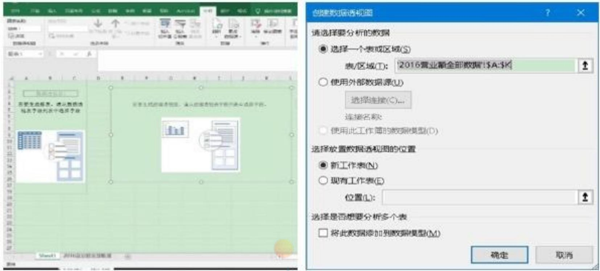  
图 1 Excel 操作图

根据前文所给出的营业额计算公式，并利用 SPSS 软件对预处理后并经过分组的数据进行营业额的计算，其具体的操作步骤如下所示

(1) 打开附件 1、2 数据  
(2) 选择 “数据” → “选择个案” 菜单项，打开 “选择个案” 对话框  
(3) 在选择框中选择 “如果条件满足”，单击 “如果”  
(4) 进入“选择个案:If”对话框  
(5) 将变量按 “is\_finished \* sku\_sale\_prc\*sku\_cnt” 的顺序输入对话框  
(6) 最后单击“确定”

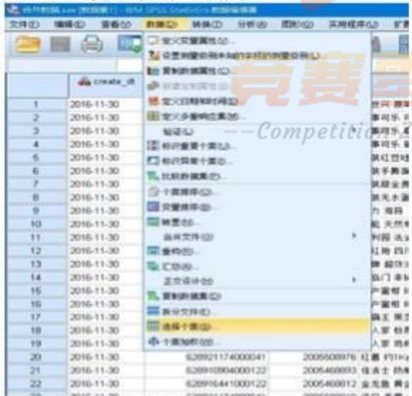

<details>
<summary>text_image</summary>

文件(E)	编辑(E)	查看(V)	数据(D)	转换(T)	分析(S)	图层(L)	实用程序(U)	扩展
定义变量属性(D)
设置变量类别未知的字段的变量类别(L)
复制变量属性(C)
创建变量属性(I)
定义日期和时间(E)
定义多重响应器(B)
链接(L)
标识重要个案(A)
标识简易个案(C)
比较数据集(D)
丰富排序(Q)
变量排序(S)
转置(R)
合并文件(O)
重构(R)
汇总(S)
正文设计(P)
复制数据集(G)
新分文件(F)
选择个案(Q)
个案加权(K)
此开 感谢
事可乐 1
事可乐 2
事可乐 3
装红百时
装手腾顶
装尾全景
装光水源
为 海苔
能 天然
利用法
红梅 四川
牌 超效
装门 非标
户窗相 R
户窗相 S
路王 黑子
人家 相册
人家 码
2016-11-30	628921174000041	2005508976	红幕 约1Kg
2016-11-30	628910904000122	2005468893	佳吉士 热
2016-11-30	628916441000122	2005468812	金龙鱼 黄
</details>

图 2 具体操作步骤图

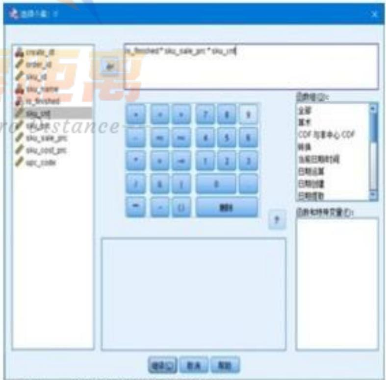

<details>
<summary>text_image</summary>

名称: id
order_id
SKU_id
SKU_name
is_finished
sku_pmt
sku_bpt
sku_state_pmt
sku_opst_pmt
apc_cndw
is_finished*sku_scale_pmt *sku_rml
函数组(2):
全部
算术
CDF 与表中心 CDF
转换
当前日期时间
日期运算
日期创建
日期提取
函数和特征变量(2):
确定 取消 帮助
</details>

图 3 计算营业额方法图

参照以上步骤，最后可得到该段时间范围内每天的营业额，由于论文篇幅的限制，正文中只给出部分日期的，具体数据见支撑材料。

表 5 每天营业额表

<table><tr><td colspan="2">2016年</td><td colspan="2">2017年</td><td colspan="2">2018年</td><td colspan="2">2019年</td></tr><tr><td>日期</td><td>营业额</td><td>日期</td><td>营业额</td><td>日期</td><td>营业额</td><td>日期</td><td>营业额</td></tr><tr><td>11月30日</td><td>2833.7</td><td>1月1日</td><td>4809.6</td><td>1月1日</td><td>26079.55</td><td>1月1日</td><td>65072.5</td></tr><tr><td>12月1日</td><td>2346.2</td><td>1月2日</td><td>6961.1</td><td>1月2日</td><td>17700.47</td><td>1月2日</td><td>31072.58</td></tr><tr><td>12月2日</td><td>2349.1</td><td>1月3日</td><td>4045.68</td><td>1月3日</td><td>14144.54</td><td></td><td></td></tr><tr><td>......</td><td>......</td><td>......</td><td>......</td><td>......</td><td>......</td><td></td><td></td></tr><tr><td>12月30日</td><td>8263.1</td><td>12月30日</td><td>21322.9</td><td>12月30日</td><td>150241.92</td><td></td><td></td></tr><tr><td>12月31日</td><td>9905.48</td><td>12月31日</td><td>16192.81</td><td>12月31日</td><td>138330.88</td><td></td><td></td></tr><tr><td>年总计</td><td>257212.9</td><td>年总计</td><td>4916000.52</td><td>年总计</td><td>14523378.64</td><td>年总计</td><td>96145.08</td></tr></table>

上表给出了该商场 2017、2018、年总营业额，2016 年、2019 年部分天数的营业额，其中四年之间营业额最小值为 2020.3、最大值为 278077.98、平均营业额为 25925.6674。通过观察可知，2018 的销售总营业额为最大，相较于 2017 年的销售额增长近 3 倍；其中究其原因，可能该商场在 2018 年的销售模式有所变化，经常举办打折促销活动吸引消费者，从而提高销量扩大影响力，让商场得到较快速的发展。

## 5.2.2 研究日营业额的分布情况

由于上表不便于观察到数据隐含的更多信息，于是给出了每天营业额的分布图（19年的数据量太少，因此将不给出折线统计图），具体见下图。

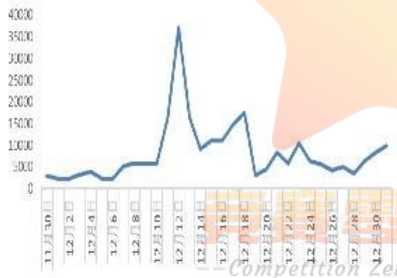

<details>
<summary>line</summary>

| Date | Value |
| --- | --- |
| 11月30日 | ~300 |
| 12月2日 | ~250 |
| 12月4日 | ~400 |
| 12月6日 | ~250 |
| 12月8日 | ~600 |
| 12月10日 | ~600 |
| 12月12日 | ~3750 |
| 12月14日 | ~900 |
| 12月16日 | ~1150 |
| 12月18日 | ~1750 |
| 12月20日 | ~300 |
| 12月22日 | ~850 |
| 12月24日 | ~1100 |
| 12月26日 | ~450 |
| 12月28日 | ~350 |
| 12月30日 | ~1000 |
</details>

图 4 2016 年营业额销售总额

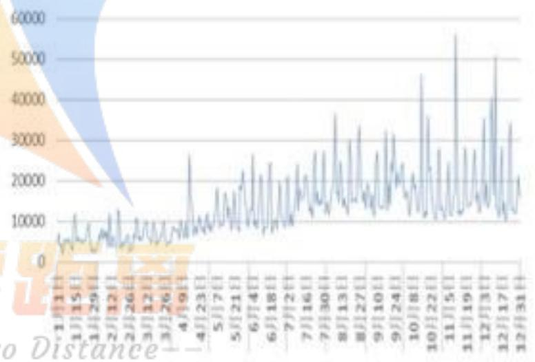

<details>
<summary>line</summary>

| Date | Value |
| --- | --- |
| 1月1日 | ~5000 |
| 1月15日 | ~6000 |
| 1月29日 | ~7000 |
| 2月12日 | ~8000 |
| 2月26日 | ~9000 |
| 3月12日 | ~10000 |
| 3月26日 | ~11000 |
| 4月9日 | ~12000 |
| 4月23日 | ~13000 |
| 5月7日 | ~14000 |
| 5月21日 | ~15000 |
| 6月4日 | ~16000 |
| 6月18日 | ~17000 |
| 7月2日 | ~18000 |
| 7月16日 | ~19000 |
| 7月30日 | ~20000 |
| 8月13日 | ~21000 |
| 8月27日 | ~22000 |
| 9月10日 | ~23000 |
| 9月24日 | ~24000 |
| 10月8日 | ~25000 |
| 10月22日 | ~26000 |
| 11月5日 | ~27000 |
| 11月19日 | ~28000 |
| 12月3日 | ~29000 |
| 12月17日 | ~30000 |
| 12月31日 | ~31000 |
</details>

图 5 2017 年营业额销售总额

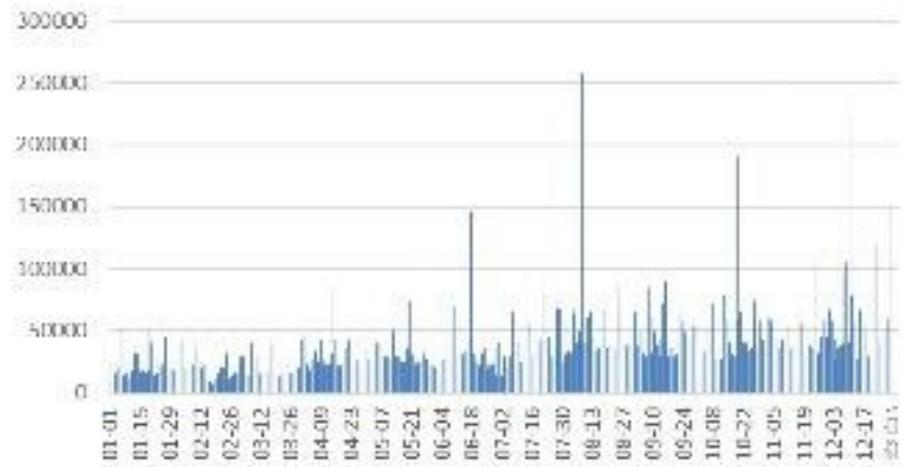

<details>
<summary>bar</summary>

| Date | Value |
| --- | --- |
| 01-01 | ~15000 |
| 01-15 | ~20000 |
| 01-29 | ~30000 |
| 02-12 | ~15000 |
| 02-26 | ~25000 |
| 03-12 | ~15000 |
| 03-26 | ~20000 |
| 04-09 | ~35000 |
| 04-23 | ~25000 |
| 05-07 | ~30000 |
| 05-21 | ~45000 |
| 06-04 | ~25000 |
| 06-18 | ~145000 |
| 07-02 | ~35000 |
| 07-16 | ~65000 |
| 07-30 | ~70000 |
| 08-13 | ~255000 |
| 08-27 | ~45000 |
| 09-10 | ~85000 |
| 09-24 | ~90000 |
| 10-08 | ~75000 |
| 10-22 | ~190000 |
| 11-05 | ~65000 |
| 11-19 | ~45000 |
| 12-03 | ~65000 |
| 12-17 | ~110000 |
| 12-31 | ~65000 |
</details>

图 6 2018 年营业销售总额

结果分析：上文给出的统计分布图包含了2016年11月30日—2019年1月2日每一天的营业额情况，据观察可知折线图出现较多波峰，参照几年的日历可知图中出现波峰处大多为法定节假日或者周末，周末商场人流量多，商品潜在消费对象较多所以商场选择使用打折或者其他促销方式，吸引消费者，勾起消费者的购买欲望，在给消费者让利的基础之上，提高商品的销售量，减少库存。

其中，2017年、2018年在购物狂欢节双十一的营业额的巅峰值，其他营业额较大日期大都也处于节假日或者双休日。因此在商场后续的经营当中，若要保证商场的正常经营，可以适当在节假日或者周末多举办弹性需求较大商品的促销活动，例如食品、生活用品等，吸引消费者的目光，让人产生购买欲，以此扩大销量增加盈利，从而加快商场的物资资金周转率，提升商场的人气，从而实现商场的可持续发展；可在营业额较低的工作日举行晚间打折活动，吸引下班后的上班族与晚间散步的群体，从而提高商品的销售量，已达到薄利多销的效果。

## 5.2.3 营业额的进一步研究

考虑到季节也可能对营业额产生一定的影响，因此可作营业额的月份分布统计分布直方图进行观察分析，最后给出相应的结果。考虑到16年只有12月营业额数据，19年只有2天的营业额数据，上述数据可能对需研究的方面不能提供较大的参考依据，所以没有给出相应的直方图营业额月份布直方图，2017年、2018年的月份分布直方图与季节营业额分布饼图如下。

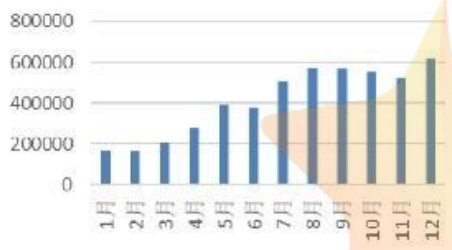

<details>
<summary>bar</summary>

| Category | Value |
| --- | --- |
| 1月 | ~170000 |
| 2月 | ~170000 |
| 3月 | ~210000 |
| 4月 | ~280000 |
| 5月 | ~390000 |
| 6月 | ~380000 |
| 7月 | ~500000 |
| 8月 | ~570000 |
| 9月 | ~570000 |
| 10月 | ~550000 |
| 11月 | ~520000 |
| 12月 | ~610000 |
</details>

图 6 2017 年月营业额直方图

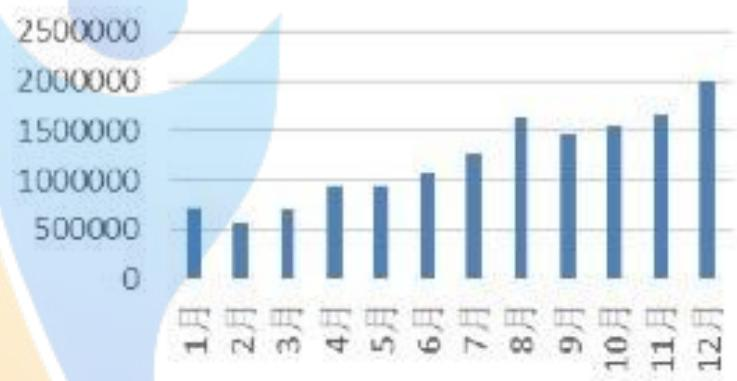

<details>
<summary>bar</summary>

| Category | Value |
| --- | --- |
| 1月 | ~700000 |
| 2月 | ~550000 |
| 3月 | ~700000 |
| 4月 | ~950000 |
| 5月 | ~950000 |
| 6月 | ~1100000 |
| 7月 | ~1300000 |
| 8月 | ~1650000 |
| 9月 | ~1500000 |
| 10月 | ~1550000 |
| 11月 | ~1650000 |
| 12月 | ~2000000 |
</details>

图 7 2018 年月营业额直方图

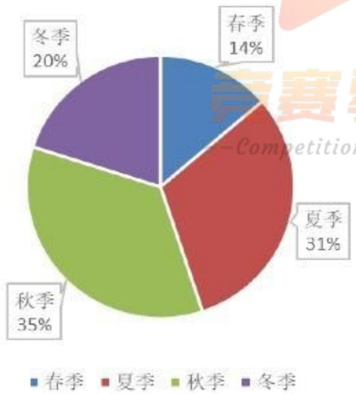

<details>
<summary>pie</summary>

| Category | Value (%) |
| --- | --- |
| 春季 | 14% |
| 夏季 | 31% |
| 秋季 | 35% |
| 冬季 | 20% |
</details>

图 8 2017 季节营业额占比图

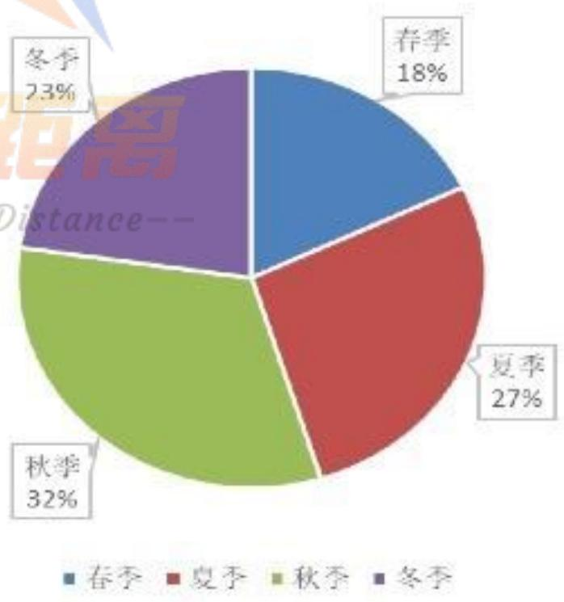

<details>
<summary>pie</summary>

| Category | Value (%) |
| --- | --- |
| 春季 | 18% |
| 夏季 | 27% |
| 秋季 | 32% |
| 冬季 | 23% |
</details>

图 9 2018 年季节营业额占比图

结果分析：综合上述4幅图可知，秋季、夏季的营业额较多、占比大，其中2017年秋季的营业额为1642660.61元，占年营业总额的35%，夏季营业额为1462695.89元，占年总营业额的31%，2018年的秋、夏季营业额也占比较大，其中秋季的营业额为4662251.68元，占年营业额的32%，综上所述，夏季和秋季属于商品销售的旺季，而秋冬两季属于商品销售的淡季，处在商品销售的旺季（夏、秋），夏秋季的天气较为闷热，人们受到气候的影响，更倾向于出行到附近的超市等地点，超市的人流量增多，营业额也会相应的增长；其次，夏、秋两季集中了较多的假期，学生等群体有了更为充足的时间去享受购物的乐趣，于是销售的营业额也会相应的增加，针对上述情况，可给出以下建设性的建议。

因此在夏秋两季商场可以适当的在周末或者节假日举行一些促销活动，例如酸奶、水果等适合夏秋食用的商品促销活动，商场可以在商品原价的基础上降低一部分，勾起消费者的购买欲望；在非节假日也可适当的举办一些生活用品、农副产品的促销活动，满足家庭主妇群体的相关需求，如此在即可以提高销售量、获得更多利润的同时，也可以提升客户对商场的满意程度。

处在商品销售的淡季（春、冬），春冬季的气候较为严寒，在此气候的影响之下，大部分消费者群体更倾向于宅在家中，自然超市的客流量也会受到影响；由此商场更应在淡季加大打折促销的力度，对多种商品进行打折促销，吸引更多的消费者，从而使得商品的销售量增多，从而使得商场获得更多的利润。

## 5.2.4 利润率的核算

根据前文给出的利润率计算公式，利用 EXCEL 软件对预处理并分组后数据进行商场每天利润率的计算，具体的操作步骤与前文中计算营业额的 EXCEL 操作步骤相同，具体操作步骤见 5.2.1，经 EXCEL 操作可得每天的利润率，见下表。（具体数据请参见支撑材料）

表 6 2016 年与 2017 年每天利润率表

<table><tr><td colspan="4">2016年</td><td colspan="4">2017年</td></tr><tr><td>时间</td><td>售价</td><td>成本</td><td>利润率</td><td>时间</td><td>售价</td><td>成本</td><td>利润率</td></tr><tr><td>2016-11-30</td><td>2291.6</td><td>1974.272</td><td>0.138474</td><td>2017/1/1</td><td>3986.6</td><td>2932.453</td><td>0.264423</td></tr><tr><td>2016-12-01</td><td>1877.4</td><td>1433.915</td><td>0.236223</td><td>2017/1/2</td><td>5398.8</td><td>3947.782</td><td>0.268767</td></tr><tr><td>2016-12-02</td><td>2019.9</td><td>1586.833</td><td>0.2144</td><td>2017/1/3</td><td>3184.48</td><td>2477.395</td><td>0.222041</td></tr><tr><td>......</td><td>......</td><td>......</td><td>......</td><td>......</td><td>......</td><td>......</td><td>......</td></tr><tr><td>2016-12-29</td><td>5054.78</td><td>3945.100</td><td>0.2195</td><td>2017/12/29</td><td>11391.64</td><td>8788.728</td><td>0.228493</td></tr><tr><td>2016-12-30</td><td>6519.9</td><td>4902.079</td><td>0.2481</td><td>2017/12/30</td><td>17665.37</td><td>13520.84</td><td>0.234613</td></tr><tr><td>2016-12-31</td><td>7879.28</td><td>6068.149</td><td>0.2298</td><td>2017/12/31</td><td>13272.26</td><td>9938.128</td><td>0.251211</td></tr></table>

表 7 2018 年与 2019 年利润率表

<table><tr><td colspan="4">2018年</td><td colspan="4">2019年</td></tr><tr><td>时间</td><td>成本</td><td>售价</td><td>利润率</td><td>时间</td><td>成本</td><td>售价</td><td>利润率</td></tr><tr><td>2018/1/1</td><td>20737.51</td><td>15704.07</td><td>0.242721</td><td>2019/1/1</td><td>53024</td><td>42436.49471</td><td>0.199674</td></tr><tr><td>2018/1/2</td><td>14185.19</td><td>11238.09</td><td>0.207759</td><td>2019/1/2</td><td>25319.11</td><td>20575.77213</td><td>0.187342</td></tr><tr><td>2018/1/3</td><td>12091.87</td><td>9529.645</td><td>0.211879</td><td></td><td></td><td></td><td></td></tr><tr><td>......</td><td>......</td><td>......</td><td>......</td><td></td><td></td><td></td><td></td></tr><tr><td>2018/12/29</td><td>49044.29</td><td>39097.44</td><td>0.202814</td><td></td><td></td><td></td><td></td></tr><tr><td>2018/12/30</td><td>126215.1</td><td>100340.7</td><td>0.205002</td><td></td><td></td><td></td><td></td></tr><tr><td>2018/12/31</td><td>116397.2</td><td>90755.97</td><td>0.220291</td><td></td><td></td><td></td><td></td></tr></table>

经过计算可知，四年中利润率最小值为 0.138405、最大值为 0.290202、平均值为 0.220347。由上表可知，该商场在此时段每天的利润率，综合前文所给的天营业额表可知，2018年的营业额虽然相较于17的年营业额更高，且经过计算得出2018年的年利润为2538071.92，17年的年利润为899351，显然可知18年的利润更高，但综合观察上表可知18年利润率低于17年的利润率，分析其原因，18年商场采取了薄利多销的促销方式，通过降低单位商品价格，提高了商品的销量，由此得出以下结论，商品需求量增加的幅度大于价格下降的幅度，商场在一定程度上还是会获取较大的利润，至于如何把握商品价格下降的幅度，本文在后文会进行深度的探讨，为进一步研究数据所隐含的信息，利用SPSS绘制了利润率每天的变化趋势折线图。

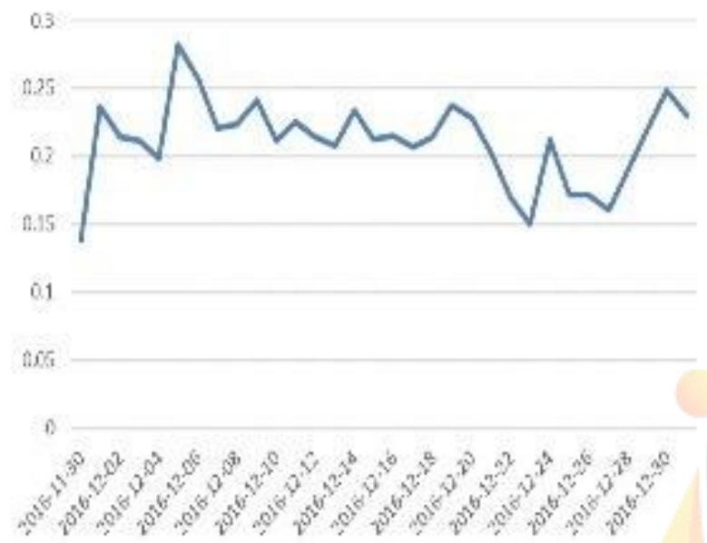

<details>
<summary>line</summary>

| Date | Value |
| --- | --- |
| 2016-11-30 | ~0.14 |
| 2016-12-01 | ~0.24 |
| 2016-12-02 | ~0.21 |
| 2016-12-03 | ~0.21 |
| 2016-12-04 | ~0.20 |
| 2016-12-05 | ~0.28 |
| 2016-12-06 | ~0.26 |
| 2016-12-07 | ~0.22 |
| 2016-12-08 | ~0.22 |
| 2016-12-09 | ~0.24 |
| 2016-12-10 | ~0.21 |
| 2016-12-11 | ~0.22 |
| 2016-12-12 | ~0.21 |
| 2016-12-13 | ~0.20 |
| 2016-12-14 | ~0.23 |
| 2016-12-15 | ~0.21 |
| 2016-12-16 | ~0.21 |
| 2016-12-17 | ~0.20 |
| 2016-12-18 | ~0.21 |
| 2016-12-19 | ~0.24 |
| 2016-12-20 | ~0.23 |
| 2016-12-21 | ~0.20 |
| 2016-12-22 | ~0.17 |
| 2016-12-23 | ~0.15 |
| 2016-12-24 | ~0.21 |
| 2016-12-25 | ~0.17 |
| 2016-12-26 | ~0.17 |
| 2016-12-27 | ~0.16 |
| 2016-12-28 | ~0.20 |
| 2016-12-29 | ~0.25 |
| 2016-12-30 | ~0.23 |
</details>

图 10 2016 年利润率走势图

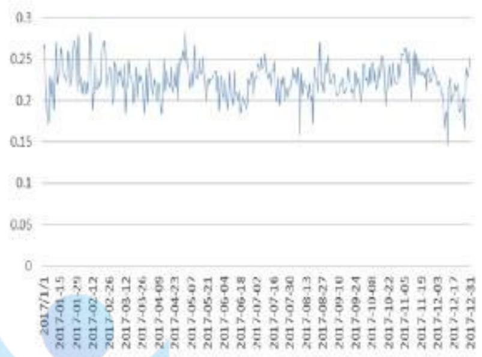

<details>
<summary>line</summary>

| Date | Value |
| --- | --- |
| 2017/1/1 | ~0.26 |
| 2017-01-15 | ~0.22 |
| 2017-01-29 | ~0.27 |
| 2017-02-12 | ~0.28 |
| 2017-02-26 | ~0.24 |
| 2017-03-12 | ~0.23 |
| 2017-03-26 | ~0.24 |
| 2017-04-09 | ~0.23 |
| 2017-04-23 | ~0.25 |
| 2017-05-07 | ~0.28 |
| 2017-05-21 | ~0.24 |
| 2017-06-04 | ~0.23 |
| 2017-06-18 | ~0.21 |
| 2017-07-02 | ~0.23 |
| 2017-07-16 | ~0.25 |
| 2017-07-30 | ~0.23 |
| 2017-08-13 | ~0.16 |
| 2017-08-27 | ~0.27 |
| 2017-09-10 | ~0.23 |
| 2017-09-24 | ~0.24 |
| 2017-10-08 | ~0.25 |
| 2017-10-22 | ~0.26 |
| 2017-11-05 | ~0.24 |
| 2017-11-19 | ~0.23 |
| 2017-12-03 | ~0.21 |
| 2017-12-17 | ~0.15 |
| 2017-12-31 | ~0.25 |
</details>

图 11 2017 年利润率走势图

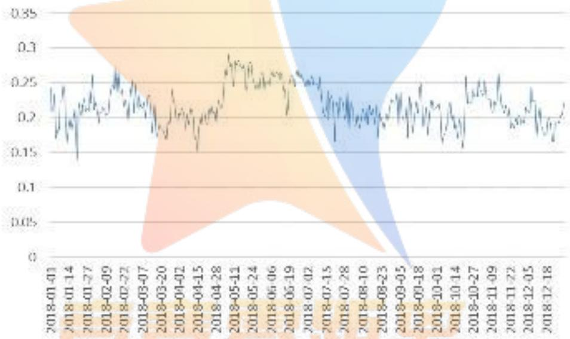

<details>
<summary>line</summary>

| Date | Value |
| --- | --- |
| 2018-01-01 | ~0.23 |
| 2018-01-14 | ~0.17 |
| 2018-01-27 | ~0.24 |
| 2018-02-09 | ~0.26 |
| 2018-02-22 | ~0.21 |
| 2018-03-07 | ~0.25 |
| 2018-03-20 | ~0.18 |
| 2018-04-02 | ~0.21 |
| 2018-04-15 | ~0.15 |
| 2018-04-28 | ~0.21 |
| 2018-05-11 | ~0.29 |
| 2018-05-24 | ~0.27 |
| 2018-06-06 | ~0.26 |
| 2018-06-19 | ~0.26 |
| 2018-07-02 | ~0.25 |
| 2018-07-15 | ~0.23 |
| 2018-07-28 | ~0.17 |
| 2018-08-10 | ~0.21 |
| 2018-08-23 | ~0.19 |
| 2018-09-05 | ~0.23 |
| 2018-09-18 | ~0.17 |
| 2018-10-01 | ~0.23 |
| 2018-10-14 | ~0.16 |
| 2018-10-27 | ~0.26 |
| 2018-11-09 | ~0.23 |
| 2018-11-22 | ~0.19 |
| 2018-12-05 | ~0.24 |
| 2018-12-18 | ~0.22 |
</details>

图 13 2018 年利润率走势图

结果分析：据观察图10，图11，图13可知，每天利润率波动范围不大，且17、18年围绕22.5%上下波动，在节假日或者周末，天利润率会出现一个较为低的值，但该天对应的利润却是一个较高的值；例如，在2017年双十一购物狂欢节中，该天的利润率为0.200938587相较于11月10日的利润率0.218156248有少许下降，但是双十一的利润却比11月10日的多了6541.385014元，因此，适当的举办促销活动，较薄利润的进行销售在一定程度可以扩大销量，从而提高整体的收益。

据此，给出以下结论，在节假日或者周末，商场在举办促销活动时，可在符合商品销售的客观规律的基础之上，加大打折的力度，吸引购买者的购买欲望，从而多销，实现商场获得更大的利润。

## 5.2.5 利润率的进一步研究

为探索挖掘更多的数据信息，以找出“薄利与多销”更深层次的关系，本文继续以月来对利润率进行分析，并绘制了月平均利润率的折线图。（2019与2016的数据没有代表性，因此只做出了2017年与2018年的月平均分布折线图）

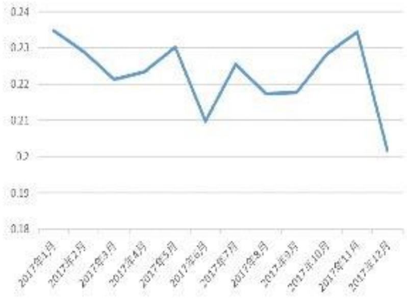

<details>
<summary>line</summary>

| Category | Value |
| --- | --- |
| 2017年1月 | ~0.235 |
| 2017年2月 | ~0.228 |
| 2017年3月 | ~0.221 |
| 2017年4月 | ~0.223 |
| 2017年5月 | ~0.230 |
| 2017年6月 | ~0.210 |
| 2017年7月 | ~0.225 |
| 2017年8月 | ~0.217 |
| 2017年9月 | ~0.217 |
| 2017年10月 | ~0.228 |
| 2017年11月 | ~0.234 |
| 2017年12月 | ~0.201 |
</details>

图 14 2017 年月平均利润率

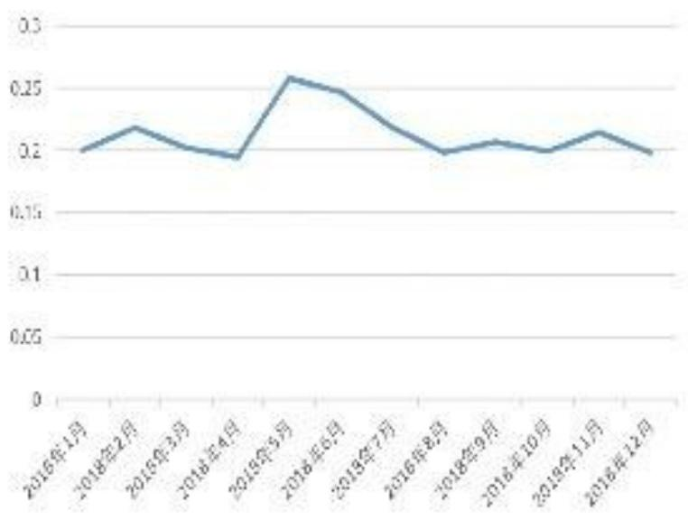

<details>
<summary>line</summary>

| Category | Value |
| --- | --- |
| 2016年1月 | ~0.20 |
| 2016年2月 | ~0.22 |
| 2016年3月 | ~0.20 |
| 2016年4月 | ~0.19 |
| 2016年5月 | ~0.26 |
| 2016年6月 | ~0.25 |
| 2016年7月 | ~0.22 |
| 2016年8月 | ~0.20 |
| 2016年9月 | ~0.21 |
| 2016年10月 | ~0.20 |
| 2016年11月 | ~0.21 |
| 2016年12月 | ~0.20 |
</details>

图 15 2018 年月平均利润率

结果分析：

观察上图可以得知，17年的月平均利润率变化趋势波动相对平缓，1月与11月的平均利润率较高，6月与8、9月的利润率较低，综合5.2.3对月营业额的统计，可以得出以下结论，2017年所有月份的平均利润率相差不大，且出现利润率偏低时销售利润反而更大的情况，因此可知薄利销售商品在一定程度上会带动商场总体的收入状况，进一步研究18年也是类似的情况。

## 5.2.6 营业额与利润率的关系分析

由前文分析营业额与利润率大概可能猜测营业额与利润率可能存在某种关系，受打折力度与销售数量影响，产生营业额较高时与之相对应利润率可能较低或营业额与利润率同时较高的情况；商品原价出售，出售的商品数量少，但单位商品的利润增加，从而会出现营业额较少而利润率较高的情况，为了深度研究其中的关系，本文绘制了四年数据的营业额与利润率的变化关系图。

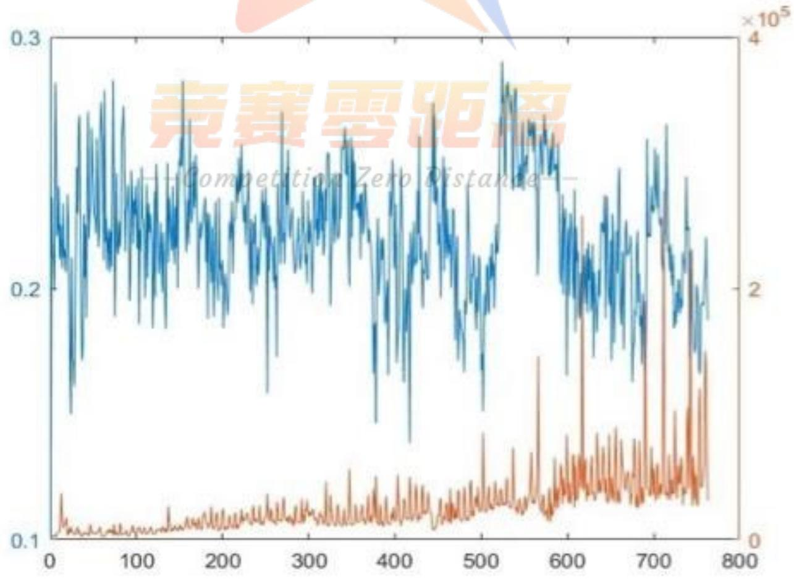

<details>
<summary>line</summary>

| X | Blue Line (Left Axis) | Orange Line (Right Axis) |
| --- | --- | --- |
| 0 | ~0.23 | ~0.1 |
| 100 | ~0.22 | ~0.1 |
| 200 | ~0.22 | ~0.1 |
| 300 | ~0.22 | ~0.1 |
| 400 | ~0.22 | ~0.1 |
| 500 | ~0.22 | ~0.1 |
| 600 | ~0.22 | ~0.1 |
| 700 | ~0.22 | ~0.1 |
| 800 | ~0.22 | ~0.1 |
</details>

图 14 营业额与利润率变化关系图

结果分析：

通过观察图 14，可以得出营业额与利润率一个大致的走势关系，当营业额较高时，其利润率会相应的下降，据分析可知，虽然商场在一定的采用薄利促销方式下，商品的销售量会增加，其营业额与利润会得到一定的提升，但其也不是一种获得“暴利”的方式，因此为找出一个多销与薄利的平衡点显得尤为重要，针对此问题，在后文会进一步的研究。

## 5.3 问题二模型的建立与求解

问题二要求建立适当的指标衡量商场每天的打折力度，并计算该商场每天的打折力度。即应充分对数据进行分析，并找出能体现打折力度的指标，继而给出相关的计算公式，求解每天的打折力度。

## 5.3.1 衡量打折力度指标的选取

## (1) 折扣率

对销售流水记录数据进行再挖掘，首先，考虑到打折力度是商场能够对消费者让利程度的直观体现，而让利的多少与商场的折扣率又有明显的关联，所以，继续对商品信息进行挖掘并进行分析可以得知，商品的门店价格与实际销售价格可以体现折扣率，即折扣率可作为衡量商场每天的打折力度，进而可以得出以下的计算公式。

据查阅相关文献与结合生活经验可知, 商品打折后价格与原价格之差可以体现商品打折力度, 但这难以对其进行定量的分析与直观打折力度的体现, 因此给出了下列定义, 即折扣率为第 $i$ 天售出商品的总门店价格与商品总销售之差再于第 $i$ 天商品的总门店价格之比

$$
z _ {i} = \frac {(Y _ {i} - X _ {i})}{Y _ {i}} \cdot 100 \% (i = 1, 2, \dots N) \tag {4}
$$

其中， $z_{i}$ 为第 i 天的折扣率， $Y_{i}$ 为第 i 天的售出商品的总门店价， $X_{i}$ 为第 i 天的售出商品的总销售价。

售出商品的总门店价即为该天售出所有商品的门店价价格之和，即

$$
Y _ {i} = \sum_ {j = 1} ^ {n} y _ {i j} (i = 1, 2, \dots N; j = 1, 2, \dots , n) \tag {5}
$$

其中， $y_{ij}$ 为第 i 天第 j 个商品的门店价。

售出商品的总销售价即为该天售出所有商品的销售价之和，即

$$
x _ {i} = \sum_ {j = 1} ^ {n} x _ {i j} (i = 1, 2, \dots , N; j = 1, 2, \dots , n) \tag {6}
$$

其中， $x_{ij}$ 第i天第j个商品的销售价。

## 5.3.2 每天打折力度的计算

利用 SPSS 并结合上述所给公式进行打折力度的计算，具体的 SPSS 操作步骤见下。

(1) 利用 SPSS 软件将附件 1,2 的数据合并

1. 选择 “文件” → “导入数据” → “CSV 数据”  
2. 选择对应文件，点击“打开”  
3. 在 “读取 CSV 文件” 对话框中单击 “确定 ”  
4. 在菜单项中选择“数据”→“合并文件”→“添加个案”  
5. 在个案添加对话框中选择“外部 SPSS Statistics 数据文件”

6. 点击“浏览”  
7. 选择对应数据文件  
8. 点击 “继续”  
9. 单击“确定”  
10. 保存文件

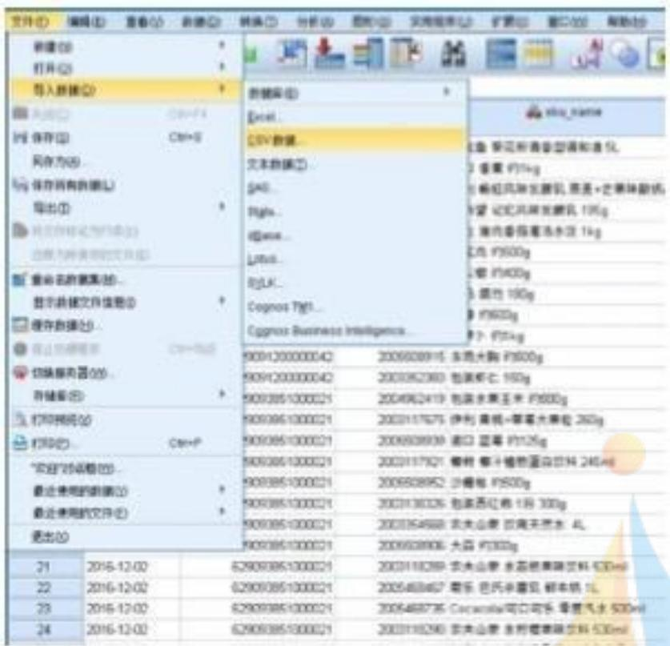

<details>
<summary>text_image</summary>

文件(F) 编辑(E) 查看(V) 软件(T) 窗口(W) 分析(A) 图层(L) 实例程序(M) 窗口(W) 帮助(H)
新建(N)
打开(O)
导入数据(D)
保存(S)
保存为(S)
保存所有数据(L)
导出(I)
可选存储为(A)(B)
查看到的数据库(D)
显示数据文件信息(I)
保存数据(D)
打开数据目录
切换服务器(00)
存储服务(S)
打印网络(S)
打印(P)
"欢迎"对话框(O)
最近使用的数据(D)
最近使用的文件(E)
退出(U)
21 2016-12-02 62909385/1000021 2003118289 安夫山歌 水芯极黑磁支料 530ml
22 2016-12-02 62909385/1000021 2005488467 墨乐 匡氏木露贝 都本铁 L
23 2016-12-02 62909385/1000021 2005488735 Cencora@可口可乐 零营气火 530ml
24 2016-12-02 62909385/1000021 2003118290 安夫山歌 水芯极黑磁支料 530ml
</details>

图 15 步骤一

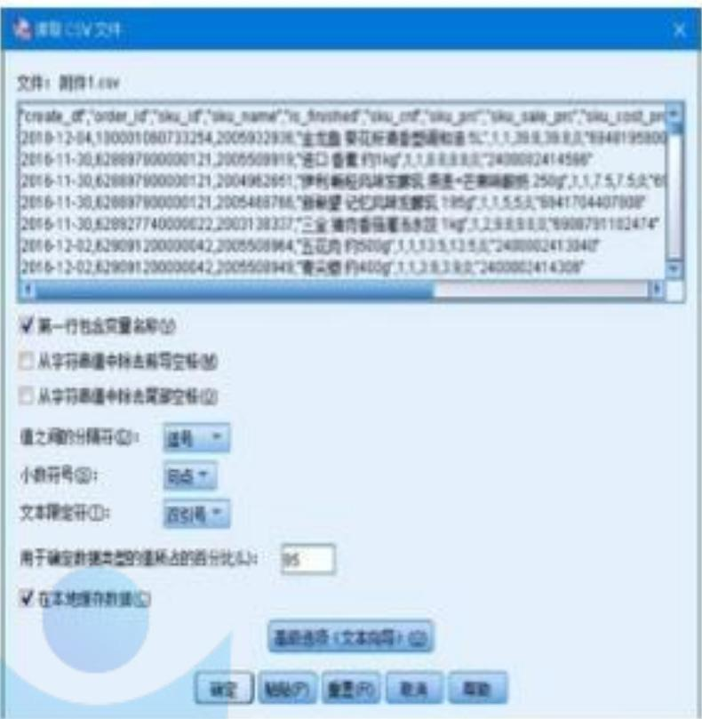

<details>
<summary>text_image</summary>

文件: 附件1.csw
"create_id","order_id","sku_id","sku_name","is_finished","sku_cnf","sku_pnt","sku_sale_pnt","sku_cost_pnt"
2018-12-04,100001060733254,2005932936,"金龙盘 姚花树清香型调和语 5C",1,1,28,8,39,8,0,"8848195800
2016-11-30,628897900000121,2005509919,"进口 香雷 约1kg",1,1,8,8,8,0,"2400002414586"
2016-11-30,628897900000121,2004982651,"伊利 新经玛珠宝露云 派盖<芒果瑞丽机 250g",1,1,7,5,7,5,8,"61
2016-11-30,628897900000121,2005488766,"新希望 记忆风转发露云 195g",1,1,5,5,8,"6941704407908"
2016-11-30,628827740000022,2003138337,"三全 猜内香福星水版 1kg",1,2,9,8,8,0,"6908791182474"
2016-12-02,629091200000042,2005508964,"五花岗 约580g",1,1,13,5,13,5,8,"2400002413840"
2016-12-02,629091200000042,2005508948,"香头堡 约630g",1,1,3,8,3,8,8,"2400002414308"
第一行包含变量名称(①)
从字符串值中除去解写空格(②)
从字符串值中除去尾部空格(③)
值之间的分隔符(④): 过号 " 
小数符号(⑤): 回点 " 
文本限定符(⑥): 反引号 " 
用于确定数据类型的值所占的百分比(⑦): 95
在本地保存数据 (⑧)
基础选项: (文本向导) (⑨)
确定 赠贴(P) 重置(R) 取消 帮助
</details>

图 16 步骤二

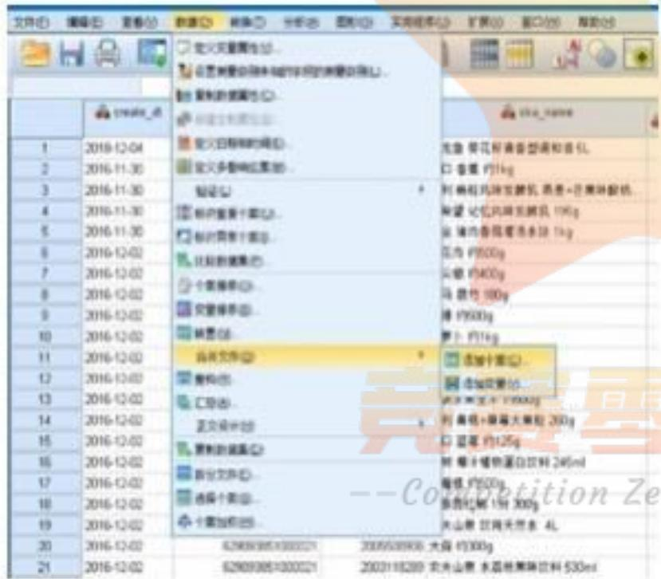

<details>
<summary>text_image</summary>

文件(F) 编辑(E) 查看(V) 数据(D) 转换(S) 分析(T) 图形(O) 实用程序(P) 窗口(W) 窗口(W) 帮助(H)
定义变量属性(I)
位置变量识别和编辑的字段(1,2,3,4,5,6,7,8,9,10,11,12,13,14,15,16,17,18,19,20,21
复制数据属性(C)
创建主数据源(I)
定义白细胞的组成(I)
定义多影响位基因(I)
验证(C)
标称蛋白质组(L)
标称同质体组(M)
比较新基因(G)
介素基因(Q)
变量排序(S)
转置(R)
修改文件(E)
重构(R)
汇入(I)
正交异计(I)
复制数据集(C)
新分类(A)
选择个数(N)
十类加权(B)
名称: 花籽蛋白酶提取和修饰
口: 香巢 代1kg
树: 标核外细胞机、病毒+亚麻球菌株
树: 记忆内细胞机 196g
树: 梁肉香肠带水球 1kg
花岗 代500g
山楂 代400g
马尾竹 180g
排 代500g
草上 代1kg
添加十面(C)
添加宽度(W)
添加文本 1000g
树: 高格+单基大颗粒 200g
树: 星草 代125g
树: 根本植物蛋白饮料 245ml
葡萄 代500g
多肽红碱 1片 300g
火山藻: 沈阳天草木 4L
629699851000221 2005508966 大蓝 约300g
629699851000221 2003118289 农夫山藻: 水西林果味粒料 530ml
</details>

图 17 步骤三

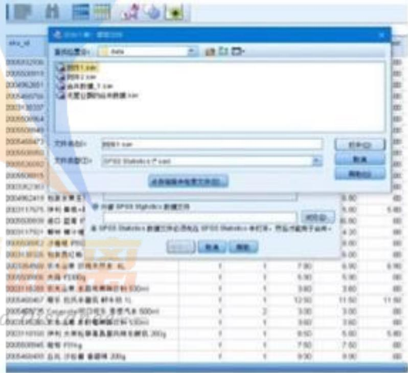

<details>
<summary>text_image</summary>

0005812906
0005008818
0004962651
0005485756
00031483397
0005049654
0005069449
0005468473
0005608882
0005636682
0005698815
0005827361
文件夹栏: 2021.12.29
文件夹箱: SPSS Statistics (*.txt)
打开(O)
取消
帮助(H)
选择要保存在文件夹栏
0004962419 松源木栗王
0003117675 沙杉 集根+J
0005039939 通口 盖图 P
0003147924 静林 集中楼
000562882 沙松坡 PPG
0003148326 松源西记树
0003549599 玉木山草 沙松坡米尾 6L
0005039936 大杨 47136g
0003148339 玉木山草 长阳市柳塘村桥 500m
0005482467 周乐 包风半融页 舞水钻 1
0005482475 Cogertyshu 红口钻石 普雪气B 500m
0003148339 玉木山草 沙松坡米尾 舞水钻 1.5DHI
0003148339 沙杉 大杨包翠莲县梨凤林龙新街 26G
0005638946 集柏 Filing
0005482463 白玉 沙松坡 香湖镇 28G
</details>

图 18 步骤四

(2) 将没有打折的商品信息剔除  
(3) 将处理后的数据按年分割数据  
(4) 计算折扣率

1. 选择“数据”→“选择个案”  
2. 在选择个案对话框中选择“如果条件满足”  
3. 单击“如果”  
4. 在对话框中输入 “(sku\_prc - sku\_sale\_prc) / sku\_prc”  
5. 单击“继续”  
6. 点击“确定”  
7. 保存数据

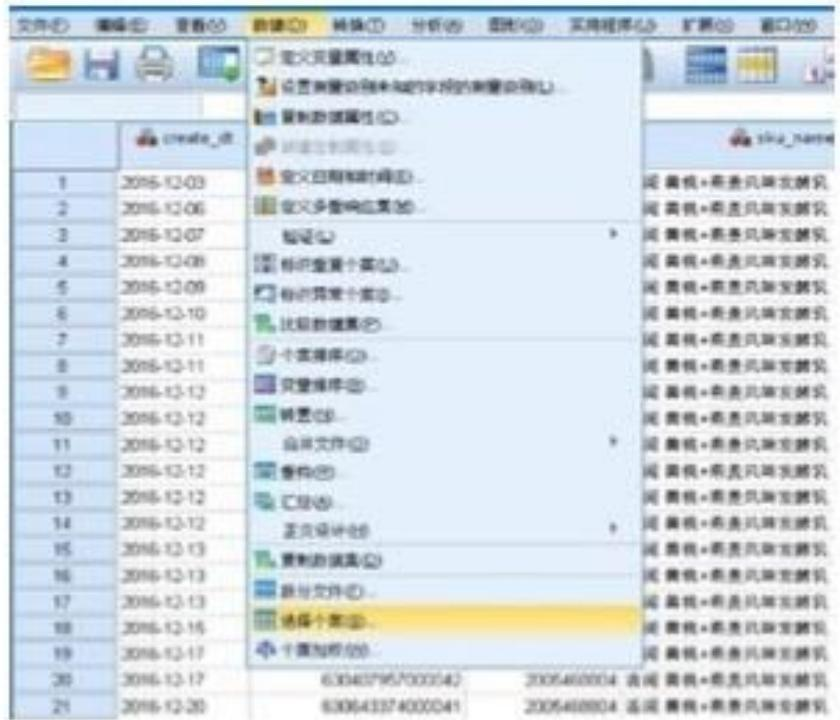

<details>
<summary>text_image</summary>

文件(E) 编辑(E) 查看(V) 数据(D) 转换(T) 分析(S) 图层(L) 实用程序(P) 扩展(B) 窗口(W)
定义变量属性(O)
设置变量识别未知的字段时变量名称(I)
复制数据属性(C)
创建主窗口(I)
定义日期和时间(S)
定义多量响应器(B)
标识(A)
标识重置个案(L)
标识异常个案(O)
比较数据集(B)
小案排序(Q)
变量排序(Q)
转置(R)
合并文件(U)
查件(P)
汇总(S)
正交设计(P)
复制数据集(Q)
软件文件(D)
选择个案(Q)
子案加权(U)
630407957000042 2005468804 请阅 简体+查看风频发警机
630643374000041 2005468804 请阅 简体+查看风频发警机
</details>

图 19 步骤五

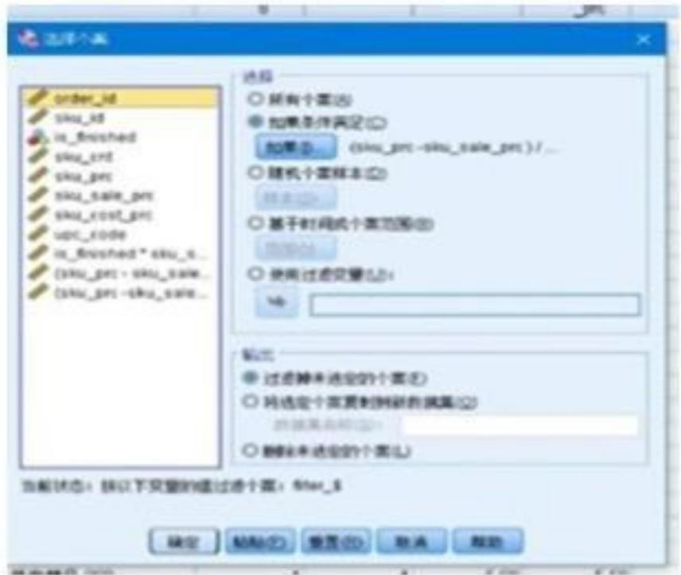

<details>
<summary>text_image</summary>

选择个案
order_id
sku_id
is_flushed
sku_crd
sku_pct
sku_scale_pct
sku_cost_pct
upc_node
is_flushed * sku_n...
(sku_pct - sku_scale...
(sku_pct - sku_scale...
选择
○ 所有个案(1)
● 如果条件满足(2)
如果(3) (sku_pct - sku_scale_pct) / ...
○ 随机个案样本(2)
样本(3)
○ 基于时间或个案范围(2)
删除(4)
○ 使用过渡变量(5):
确定
输出
● 过滤掉未选定的个案(2)
○ 将选定个案复制到新的数据集(2)
折线表中(3)
○ 删除未选定的个案(5)
当前状态: 按以下变量的通过这个案: filter_8
确定  粘贴(7)  整置(8)  取消  帮助
</details>

图 20 步骤六

根据上述操作步骤，得到每天的打折力度

表 8 2016、2017 每天打折力度

<table><tr><td colspan="4">2016年</td><td colspan="4">2017年</td></tr><tr><td>日期</td><td>总门店价</td><td>总销售价</td><td>折扣率</td><td>日期</td><td>总门店价</td><td>总销售价</td><td>折扣率</td></tr><tr><td>2016-11-30</td><td>1642.2</td><td>1303</td><td>0.206552</td><td>2017-01-01</td><td>1241.9</td><td>942.5</td><td>0.241082</td></tr><tr><td>2016-12-01</td><td>765.8</td><td>571</td><td>0.254375</td><td>2017-01-02</td><td>1582</td><td>1142.9</td><td>0.27756</td></tr><tr><td>2016-12-02</td><td>977.6</td><td>741.8</td><td>0.241203</td><td>2017-01-03</td><td>1598.3</td><td>1107.9</td><td>0.306826</td></tr><tr><td>......</td><td>......</td><td>......</td><td>......</td><td>......</td><td>......</td><td>......</td><td>......</td></tr><tr><td>2016-12-29</td><td>2356.7</td><td>1800.2</td><td>0.236135</td><td>2017-12-29</td><td>5084.6</td><td>4107.06</td><td>0.192255</td></tr><tr><td>2016-12-30</td><td>2576.3</td><td>1933.2</td><td>0.249622</td><td>2017-12-30</td><td>7626.6</td><td>6095.11</td><td>0.200809</td></tr><tr><td>2016-12-31</td><td>4039.9</td><td>2704.8</td><td>0.330478</td><td>2017-12-31</td><td>5109.6</td><td>3976.84</td><td>0.221693</td></tr></table>

表 9 2018、2019 年每天打折力度

<table><tr><td colspan="4">2018年</td></tr><tr><td>日期</td><td>总门店价</td><td>总销售额</td><td>折扣率</td></tr><tr><td>2018-01-01</td><td>9124.1</td><td>6883.75</td><td>0.245542</td></tr><tr><td>2018-01-02</td><td>7787</td><td>5905.8</td><td>0.241582</td></tr><tr><td>2018-01-03</td><td>6409</td><td>4796.53</td><td>0.251595</td></tr><tr><td>......</td><td>......</td><td>......</td><td>......</td></tr><tr><td>2018-12-29</td><td>28714.6</td><td>21611.71</td><td>0.247362</td></tr><tr><td>2018-12-30</td><td>73164.38</td><td>53328.74</td><td>0.271111</td></tr><tr><td>2018-12-31</td><td>61509.09</td><td>44685.94</td><td>0.273507</td></tr><tr><td colspan="4">2019年</td></tr><tr><td>日期</td><td>总门店价</td><td>总销售额</td><td>折扣率</td></tr><tr><td>2019-01-01</td><td>60793.74</td><td>53080.9</td><td>0.126869</td></tr><tr><td>2019-01-02</td><td>29083.42</td><td>25319.11</td><td>0.129431</td></tr></table>

经统计分析可知，四年中日打折率最高为0.4438，最低折扣率为0.1268。由上表可知，该商场每天都会举办不同程度的打折力度，处于法定假期时，商场的打折力度相应会加强，当商场的总销售额持续低迷时，商场也会增强一些打折力度，吸引顾客，提高商品的流通率，使得总销售额的提升，为更加清晰的观测到打折力度的变化规律，下文将给出每年的折扣力度统计分布直方图。

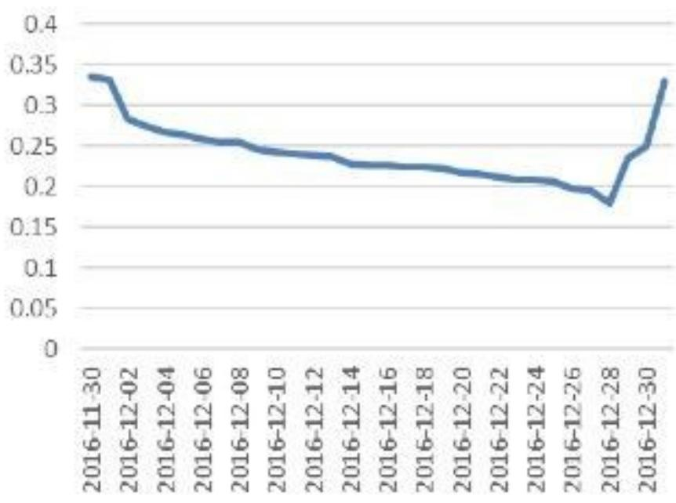

<details>
<summary>line</summary>

| Date | Value |
| --- | --- |
| 2016-11-30 | ~0.34 |
| 2016-12-02 | ~0.33 |
| 2016-12-04 | ~0.28 |
| 2016-12-06 | ~0.27 |
| 2016-12-08 | ~0.26 |
| 2016-12-10 | ~0.25 |
| 2016-12-12 | ~0.24 |
| 2016-12-14 | ~0.23 |
| 2016-12-16 | ~0.23 |
| 2016-12-18 | ~0.23 |
| 2016-12-20 | ~0.22 |
| 2016-12-22 | ~0.21 |
| 2016-12-24 | ~0.21 |
| 2016-12-26 | ~0.20 |
| 2016-12-28 | ~0.18 |
| 2016-12-30 | ~0.33 |
</details>

图 21 2016 年折扣率

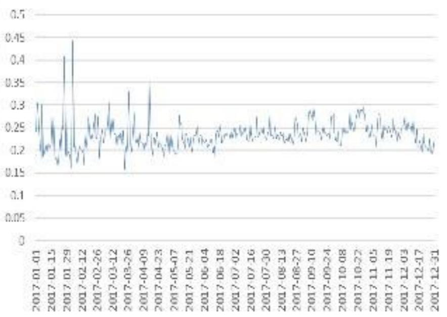

<details>
<summary>line</summary>

| Date | Value |
| --- | --- |
| 2017-01-01 | ~0.24 |
| 2017-01-15 | ~0.30 |
| 2017-01-29 | ~0.41 |
| 2017-02-12 | ~0.44 |
| 2017-02-26 | ~0.22 |
| 2017-03-12 | ~0.28 |
| 2017-03-26 | ~0.33 |
| 2017-04-09 | ~0.34 |
| 2017-04-23 | ~0.23 |
| 2017-05-07 | ~0.28 |
| 2017-05-21 | ~0.23 |
| 2017-06-04 | ~0.24 |
| 2017-06-18 | ~0.25 |
| 2017-07-02 | ~0.24 |
| 2017-07-16 | ~0.25 |
| 2017-07-30 | ~0.24 |
| 2017-08-13 | ~0.23 |
| 2017-08-27 | ~0.28 |
| 2017-09-10 | ~0.29 |
| 2017-09-24 | ~0.24 |
| 2017-10-08 | ~0.28 |
| 2017-10-22 | ~0.29 |
| 2017-11-05 | ~0.25 |
| 2017-11-19 | ~0.26 |
| 2017-12-03 | ~0.25 |
| 2017-12-17 | ~0.21 |
| 2017-12-31 | ~0.22 |
</details>

图 22 2017 年打折扣率

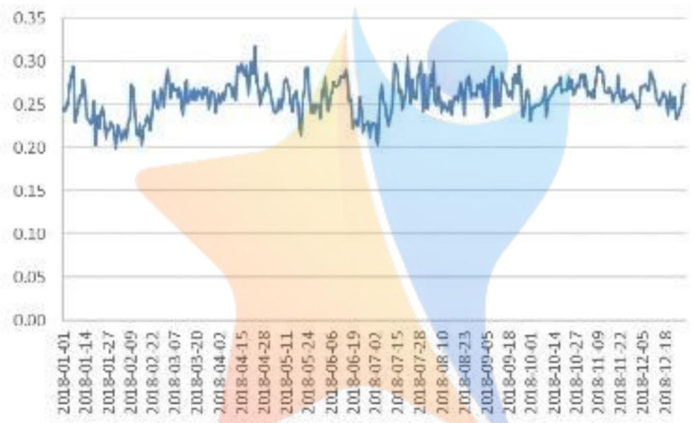

<details>
<summary>line</summary>

| Date | Value |
| --- | --- |
| 2018-01-01 | ~0.24 |
| 2018-01-14 | ~0.29 |
| 2018-01-27 | ~0.23 |
| 2018-02-09 | ~0.21 |
| 2018-02-22 | ~0.27 |
| 2018-03-07 | ~0.26 |
| 2018-03-20 | ~0.27 |
| 2018-04-02 | ~0.26 |
| 2018-04-15 | ~0.29 |
| 2018-04-28 | ~0.32 |
| 2018-05-11 | ~0.26 |
| 2018-05-24 | ~0.29 |
| 2018-06-06 | ~0.25 |
| 2018-06-19 | ~0.29 |
| 2018-07-02 | ~0.23 |
| 2018-07-15 | ~0.27 |
| 2018-07-28 | ~0.30 |
| 2018-08-10 | ~0.25 |
| 2018-08-23 | ~0.27 |
| 2018-09-05 | ~0.29 |
| 2018-09-18 | ~0.26 |
| 2018-10-01 | ~0.27 |
| 2018-10-14 | ~0.28 |
| 2018-10-27 | ~0.27 |
| 2018-11-09 | ~0.29 |
| 2018-11-22 | ~0.26 |
| 2018-12-05 | ~0.27 |
| 2018-12-18 | ~0.27 |
</details>

图 23 2018 年折扣率

结果分析：观察上图可以得知，各年的折扣率都存在波动，2016年终时，出现了最大的折扣率，分析原因，新年将至，消费市场的需求量大，商场为了增长营业额，举行了一系列的促销活动，增加商品的量销，同时获得更多的利润。17年的折扣率整体波动较小，但在2019年春节前后，出现了折扣率的高峰，究其原因，商场为了回馈客户，举办了大力的打折活动，客户收到优惠的同时，商场自身的商品销量得到上升、营业额得到了较大的增长的同时，商场的知名度也会得到相应的提升；18年的折扣率变化不大，说明18年商场以折扣为较为主要的促销方式，商场适时而变的对不同的商品进行折扣处理。

综上，可得以下结论，商场全年的举办促销活动，促销的商品应为当前市场潜力较大的商品，才可在扩大商品销售量的同时，增加销售额。

## 5.4 问题三模型的建立与求解

问题三要求分析打折力度与商品销售额以及利润率的关系，首先，给出商品销售额的相关定义以及计算公式，根据所给公式与利用 SPSS 计算出日商品销售额数量，并对统计数据进行挖掘分析；其次，分别绘制日打折力度关于商品销售额、利润率散点图，根据图片特征给出其相对应的关系，并给出有利于商场“薄利多销”经营策略。

## 5.4.1 商品销售额的定义及其计算公式

销售额是指商场销售商品、为消费者提供服务，从而对消费者收取的全部货款，根据上述定义继而给出相应的计算公式，即

销售额=销售量×平均销售价格

## 5.4.2 日销售额的计算

根据上述操作步骤，并借助于 SPSS 软件，计算日营业额，具体操作步骤如下。

(1) 选择”数据”→”选择个案”  
(2) 在选择对话框中选择 “如果条件满足”  
(3) 单击 “如果”  
(4) 在 “选择个案:If” 对话框中输入 “sku\_cnt \* sku\_sale\_prc”  
(5) 单击 “继续”  
(6) 点击“确定”  
(7) 完成后保存

  
图 24 具体操作步骤图

根据上述操作步骤，最后得出日销售额数量

表 10 日销售额的计算公式

<table><tr><td colspan="2">2016年</td><td colspan="2">2017年</td><td colspan="2">2018年</td><td colspan="2">2019年</td></tr><tr><td>日期</td><td>商品销售额</td><td>日期</td><td>商品销售额</td><td>日期</td><td>商品销售额</td><td>日期</td><td>商品销售额</td></tr><tr><td>2016-11-30</td><td>3306.3</td><td>2017/1/1</td><td>5210.2</td><td>2018/1/1</td><td>28938.04</td><td>2019/1/1</td><td>73706.68</td></tr><tr><td>2016-12-01</td><td>2564</td><td>2017/1/2</td><td>7961.8</td><td>2018/1/2</td><td>20025.67</td><td>2019/1/2</td><td>35702.38</td></tr><tr><td>2016-12-02</td><td>2605.7</td><td>2017/1/3</td><td>5871.88</td><td>2018/1/3</td><td>15966.44</td><td></td><td></td></tr><tr><td>......</td><td>......</td><td>......</td><td>......</td><td>......</td><td>......</td><td></td><td></td></tr><tr><td>2016-12-29</td><td>7041.58</td><td>2017/12/29</td><td>16066.28</td><td>2018/1/4</td><td>68383.44</td><td></td><td></td></tr><tr><td>2016-12-30</td><td>9123.9</td><td>2017/12/30</td><td>23200.52</td><td>2018/1/5</td><td>172531.12</td><td></td><td></td></tr><tr><td>2016-12-31</td><td>11587.38</td><td>2017/12/31</td><td>17566.8</td><td>2018/1/6</td><td>157399.35</td><td></td><td></td></tr><tr><td>总计</td><td>290437.36</td><td>总计</td><td>5481796.67</td><td>总计</td><td>16546079.6</td><td></td><td></td></tr></table>

据统计可知，题目所给的天数中最大销售额为316609.64元，最小销售额为2253.9元，两者相差较大。由前文的定义可知，销售额与商品门店价格相关，并且销售额可能会对打折力度产生影响，因此可绘制每天的销售额统计分布直方图，具体见下图。

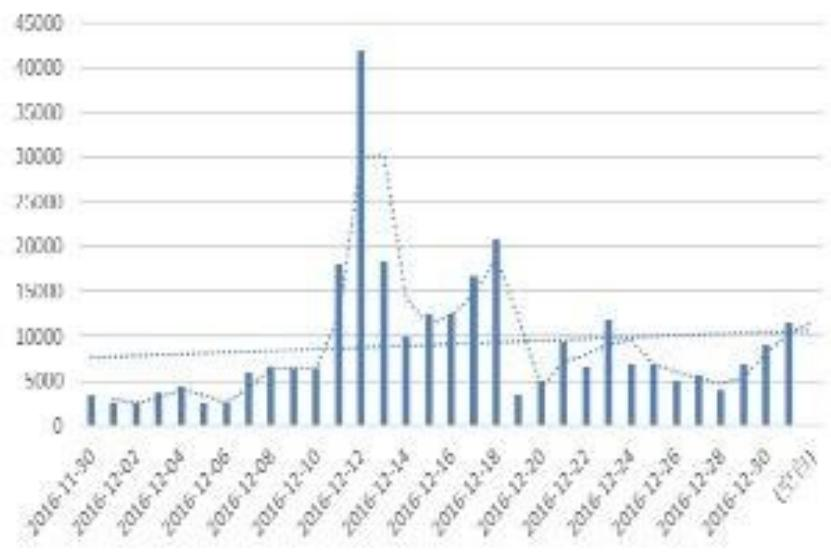

<details>
<summary>bar</summary>

| Date | Bar Value | Line Value |
| --- | --- | --- |
| 2016-11-30 | ~3500 | ~7800 |
| 2016-12-02 | ~2500 | ~7900 |
| 2016-12-04 | ~4000 | ~8000 |
| 2016-12-06 | ~2500 | ~8100 |
| 2016-12-08 | ~6000 | ~8200 |
| 2016-12-10 | ~6500 | ~8300 |
| 2016-12-12 | ~42000 | ~30000 |
| 2016-12-14 | ~18500 | ~30500 |
| 2016-12-16 | ~12500 | ~13000 |
| 2016-12-18 | ~21000 | ~17500 |
| 2016-12-20 | ~3500 | ~4500 |
| 2016-12-22 | ~9500 | ~7500 |
| 2016-12-24 | ~12000 | ~9500 |
| 2016-12-26 | ~7000 | ~7500 |
| 2016-12-28 | ~4500 | ~5500 |
| 2016-12-30 | ~9500 | ~11500 |
</details>

图 25 2016 年销售额日分布

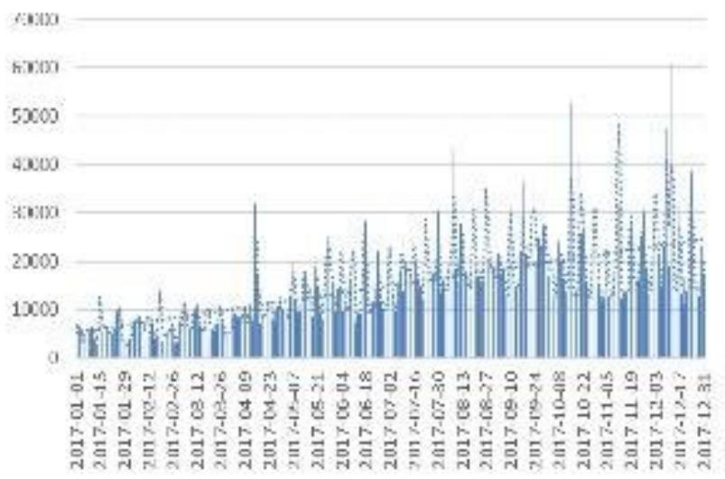

<details>
<summary>bar</summary>

| Date | Value |
| --- | --- |
| 2017-01-01 | ~600 |
| 2017-01-15 | ~600 |
| 2017-01-29 | ~800 |
| 2017-02-12 | ~800 |
| 2017-02-26 | ~800 |
| 2017-03-12 | ~800 |
| 2017-03-26 | ~800 |
| 2017-04-09 | ~800 |
| 2017-04-23 | ~800 |
| 2017-05-07 | ~1200 |
| 2017-05-21 | ~1500 |
| 2017-06-04 | ~1500 |
| 2017-06-18 | ~1500 |
| 2017-07-02 | ~1500 |
| 2017-07-16 | ~1500 |
| 2017-07-30 | ~1500 |
| 2017-08-13 | ~1500 |
| 2017-08-27 | ~1500 |
| 2017-09-10 | ~1500 |
| 2017-09-24 | ~1500 |
| 2017-10-08 | ~1500 |
| 2017-10-22 | ~1500 |
| 2017-11-05 | ~1500 |
| 2017-11-19 | ~1500 |
| 2017-12-03 | ~1500 |
| 2017-12-17 | ~1500 |
| 2017-12-31 | ~1500 |
</details>

图 26 2017 年销售额日分布

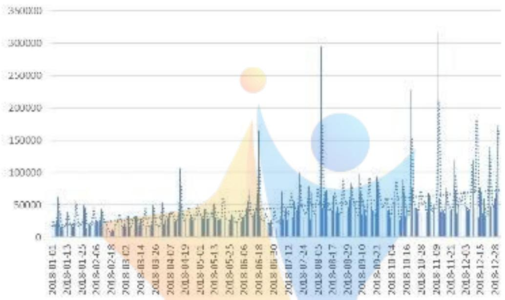

<details>
<summary>bar</summary>

| Date | Value |
| --- | --- |
| 2018-01-01 | ~20000 |
| 2018-01-13 | ~60000 |
| 2018-01-25 | ~45000 |
| 2018-02-06 | ~45000 |
| 2018-02-18 | ~30000 |
| 2018-03-02 | ~30000 |
| 2018-03-14 | ~35000 |
| 2018-03-26 | ~35000 |
| 2018-04-07 | ~55000 |
| 2018-04-19 | ~110000 |
| 2018-05-02 | ~45000 |
| 2018-05-13 | ~45000 |
| 2018-05-25 | ~45000 |
| 2018-06-06 | ~45000 |
| 2018-06-18 | ~165000 |
| 2018-06-30 | ~45000 |
| 2018-07-12 | ~75000 |
| 2018-07-24 | ~105000 |
| 2018-08-05 | ~395000 |
| 2018-08-17 | ~75000 |
| 2018-09-29 | ~95000 |
| 2018-10-10 | ~95000 |
| 2018-10-22 | ~95000 |
| 2018-11-16 | ~235000 |
| 2018-11-29 | ~75000 |
| 2018-12-15 | ~75000 |
| 2018-12-28 | ~175000 |
</details>

图 27 2018 年销售额日分布图

结果分析：据观察上述图片可得，各年销售额都大致分布在一个区间内，只有少数的几天营业额出现在较大的情况，销售额较大的天数中，说明该天出售的商品数量相应的也较多，即说明当天的商场的待客率较高，由此，销售额的大小直观的体现了商场当天的经营状况，商场决策者也可参照往年的不同时期的经营状况，预测以后的策略。

在特殊节日与双休，往往销售额会出现一个较大的峰值，因此在该类时期商场应有意识地以相对低廉的商品价格刺激需求，此做法虽然单位商品的利润率下降，但可以增加销量，反而可能给商场带来更多的利益，实现商场的健康稳定发展。对于工作日主要消费群体无暇光顾商场时期，商场可以加强一系列的促销活动，以赢得消费者的青睐。

同时考虑到季节性也会对销售额产生一定的影响，所以绘制了销售额的季节分布情况，见下图。

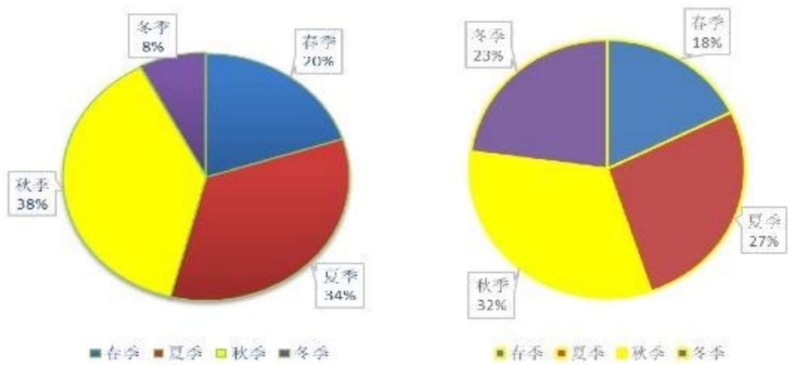  
图 28 季节销售额占比

结果分析：由上图可知，营业额在夏秋季较高，所以商场也可采用一些季节性的策略，处于春秋淡季，商场可根据商品的价值与储存时间赋予商品相应的折扣率，给予消费者一些价格上的优惠，以此提高淡季的销售量，实现共赢局面。针对夏秋旺季，商场可对需求较为旺盛、生产潜力大、弹性较大的商品进行低利润促销，即有利于施利消费者，同时也赢得了更多消费者的青睐。

## 5.4.3 打折力度与商品销售额以及利润率关系分析

题目要求研究三者的之间的关系，首先可以绘制折扣率关于销售额以及利润率的散点图；其次，观察散点图特征，从而对函数关系进行假设并对其进行一定的验证，散点图如下。

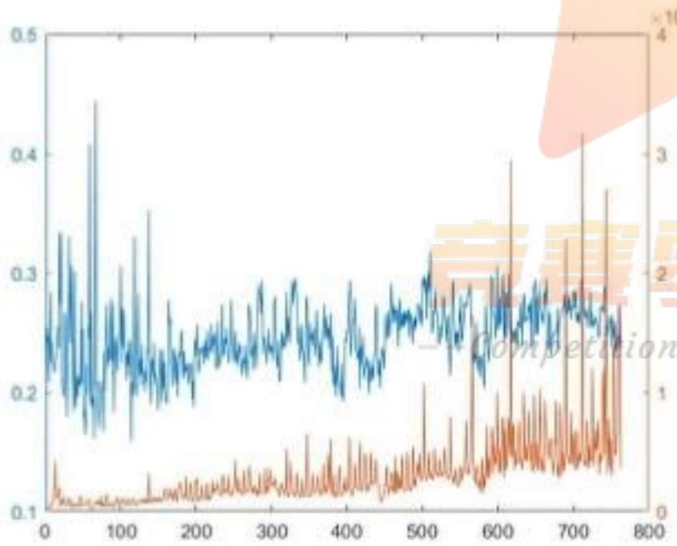

<details>
<summary>line</summary>

| X | Blue Line (Left Axis) | Orange Line (Right Axis) |
| --- | --- | --- |
| 0 | ~0.25 | ~0.1 |
| 100 | ~0.23 | ~0.1 |
| 200 | ~0.23 | ~0.1 |
| 300 | ~0.24 | ~0.1 |
| 400 | ~0.23 | ~0.1 |
| 500 | ~0.26 | ~0.1 |
| 600 | ~0.27 | ~0.1 |
| 700 | ~0.27 | ~0.1 |
| 800 | ~0.25 | ~0.1 |
</details>

图 29 折扣率与销售额的关系图

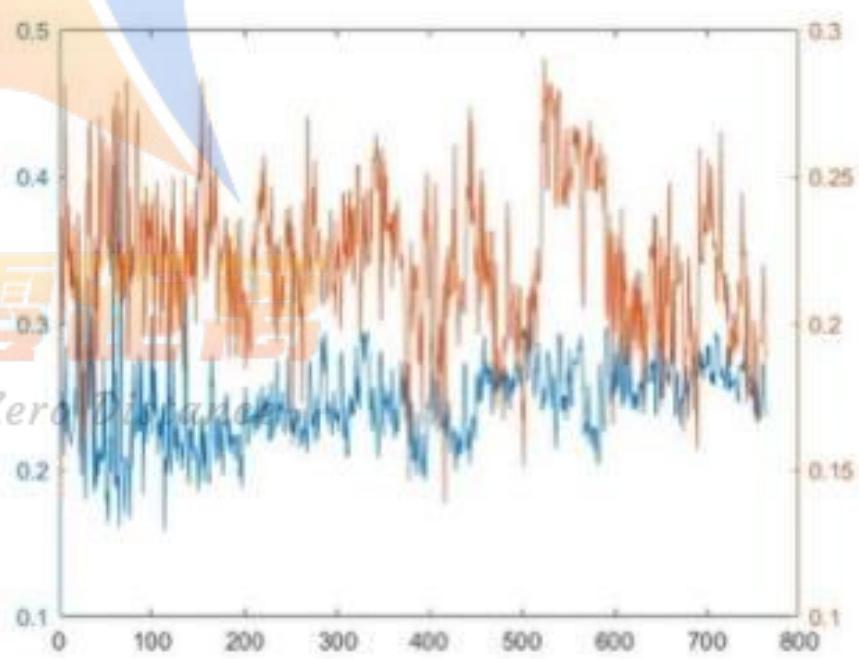

<details>
<summary>line</summary>

| X | Blue Line (Left Axis) | Orange Line (Right Axis) |
| --- | --- | --- |
| 0 | ~0.25 | ~0.23 |
| 100 | ~0.22 | ~0.24 |
| 200 | ~0.23 | ~0.23 |
| 300 | ~0.24 | ~0.24 |
| 400 | ~0.23 | ~0.23 |
| 500 | ~0.26 | ~0.27 |
| 600 | ~0.25 | ~0.25 |
| 700 | ~0.26 | ~0.26 |
| 800 | ~0.25 | ~0.24 |
</details>

图 30 折扣率与利润率的关系图

据观察可知，散点图过于离散粗糙，无法挖掘其相关关联，考虑到可能是样本点太多且部分样本点数据不具有代表性，因此在后文对数据进行整合后再绘制相关散点图。

考虑到以月样本点，数据更有代表性，并且容易更加直观的观察其变化规律，因此作以月平均折扣率为 y 轴，销售额与利润率为 x 轴的散点图，见下图。

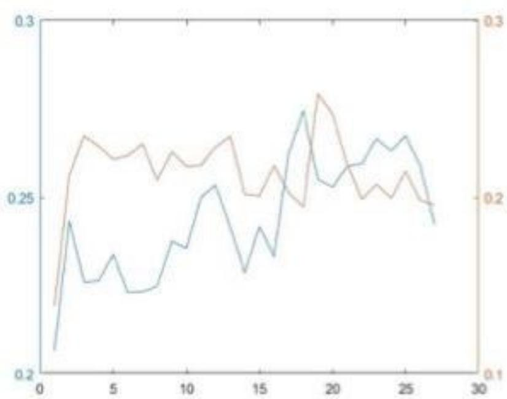

<details>
<summary>line</summary>

| X | Value (Left Axis) | Value (Right Axis) |
| --- | --- | --- |
| 1 | ~0.21 | ~0.15 |
| 2 | ~0.24 | ~0.22 |
| 3 | ~0.22 | ~0.24 |
| 4 | ~0.22 | ~0.23 |
| 5 | ~0.23 | ~0.23 |
| 6 | ~0.22 | ~0.23 |
| 7 | ~0.22 | ~0.24 |
| 8 | ~0.23 | ~0.22 |
| 9 | ~0.24 | ~0.23 |
| 10 | ~0.23 | ~0.23 |
| 11 | ~0.25 | ~0.23 |
| 12 | ~0.25 | ~0.24 |
| 13 | ~0.24 | ~0.24 |
| 14 | ~0.23 | ~0.23 |
| 15 | ~0.24 | ~0.23 |
| 16 | ~0.23 | ~0.24 |
| 17 | ~0.26 | ~0.23 |
| 18 | ~0.28 | ~0.21 |
| 19 | ~0.26 | ~0.25 |
| 20 | ~0.26 | ~0.24 |
| 21 | ~0.26 | ~0.23 |
| 22 | ~0.27 | ~0.21 |
| 23 | ~0.27 | ~0.21 |
| 24 | ~0.27 | ~0.21 |
| 25 | ~0.27 | ~0.22 |
| 26 | ~0.26 | ~0.21 |
| 27 | ~0.24 | ~0.21 |
</details>

图 31 月平均折扣率与月平均利润率

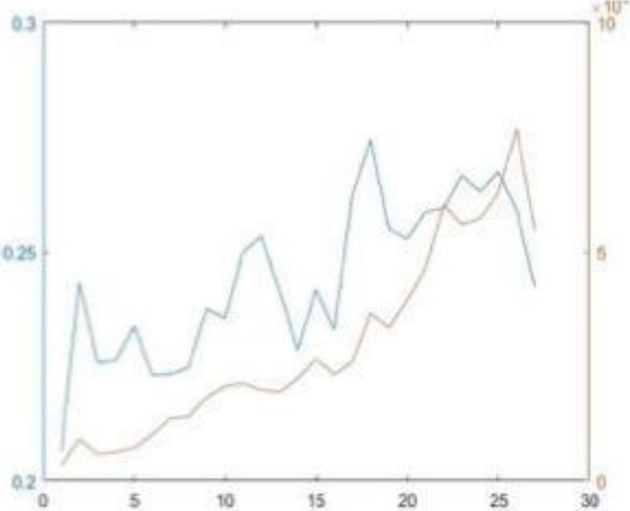

<details>
<summary>line</summary>

| X | Value (Left Axis) | Value (Right Axis) |
| --- | --- | --- |
| 1 | ~0.21 | ~1.5e4 |
| 2 | ~0.24 | ~2.0e4 |
| 3 | ~0.22 | ~1.8e4 |
| 4 | ~0.22 | ~1.8e4 |
| 5 | ~0.23 | ~2.0e4 |
| 6 | ~0.22 | ~2.2e4 |
| 7 | ~0.22 | ~2.3e4 |
| 8 | ~0.22 | ~2.4e4 |
| 9 | ~0.23 | ~2.6e4 |
| 10 | ~0.23 | ~2.7e4 |
| 11 | ~0.25 | ~2.8e4 |
| 12 | ~0.25 | ~2.7e4 |
| 13 | ~0.24 | ~2.6e4 |
| 14 | ~0.23 | ~2.7e4 |
| 15 | ~0.24 | ~2.9e4 |
| 16 | ~0.23 | ~2.7e4 |
| 17 | ~0.26 | ~3.5e4 |
| 18 | ~0.27 | ~3.8e4 |
| 19 | ~0.26 | ~3.6e4 |
| 20 | ~0.26 | ~3.8e4 |
| 21 | ~0.26 | ~4.5e4 |
| 22 | ~0.26 | ~5.5e4 |
| 23 | ~0.27 | ~5.8e4 |
| 24 | ~0.26 | ~5.7e4 |
| 25 | ~0.27 | ~6.0e4 |
| 26 | ~0.26 | ~7.5e4 |
| 27 | ~0.24 | ~5.5e4 |
</details>

图 32 月平均折扣率与销售额

结果分析：

通过观察打折力度与利润率以及销售额的折线图发现,随着打折力度的增加,利润率和销售额都有一定的增加,且呈一定的线性走势.所以后续可假设其呈线性关系,采用线性回归,对打折力度与商品销售额以及利润率的关系进行回归分析。

其次，仔细观察图 31，可以发现前 17 个月平均打折力度处于 0%-25%之间时，折扣率的变化趋势与利润率的变化趋势是相似的，表明商场在这个力度区间进行打折，商场想要获得较高的利润是存在困难的，只能维持商场的正常经营；从第 18 月开始到第 26 月都维持了折扣率在 25%-27.5%之间，发现较高的打折力度其利润率是较高的，结合图 32 发现这类月份的营业额是相对较高的，若商场要进行“薄利多销”的经营策略，折扣率可以取在 25%-27.5%之间是较为合适的。

## 5.4.4 三者关系的确定

折扣率可能受到多个因素影响，若考虑一个因素对其进行回归分析可能是导致模型失真，使得模型参数未能通过统计变量检验，为证实上述猜想，对自变量之间是否存在多重线性关系进行检验。

操作步骤

(1) 先打开回归的对话框: 分析→回归→线性, 打开线性回归对话框  
(2) 将自变量因变量都放到各自的位置，然后点击 “统计”  
(3) 在该对话框中，排列着一个多重共线性诊断的选项，  
(4) 确定  
(5) 检查两个参数，一个特征根一个条件指数  
(6) 判断是否存在多重共线性  
操作步骤如下

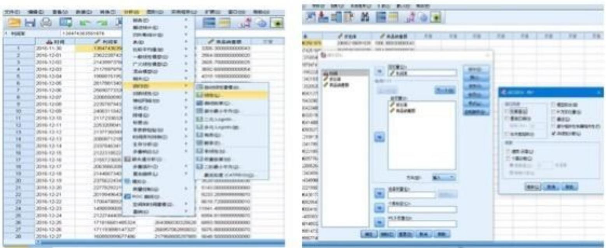

判断方法 1: 特征值, 存在维度为 3 和 4 的值约等于 0 , 说明存在比较严重的共线性。

判断方法 2：条件索引列第 3 第 4 的值大于 10，说明存在比较严重的共线性。

判断方法 3：比例方差内存在接近 1 的数（0.99），可以说明存在较严重的共线性。

通过计算，可得以下数据结论

表 11 共线性诊断表

<table><tr><td>模型</td><td>维</td><td>特征值</td><td>条件指标</td><td colspan="3">方差比例</td></tr><tr><td rowspan="4">1</td><td></td><td></td><td></td><td>(常量)</td><td>折扣率</td><td>商品销售额</td></tr><tr><td>1</td><td>2.632</td><td>1</td><td>0</td><td>0</td><td>0.05</td></tr><tr><td>2</td><td>0.362</td><td>2.697</td><td>0.01</td><td>0</td><td>0.85</td></tr><tr><td>3</td><td>0.006</td><td>20.448</td><td>0.99</td><td>0.99</td><td>0.1</td></tr></table>

由上表可知，维度 2、3 的特征值接近于 0 且条件指标远大于 10，且比例方差内存在接近 1 的数，综上所述，折扣率与销售额、利润率存在较为严重的共线性。

由于三者存在严重的共线性关系因此可直接使用 MATLAB 中的 regress 函数执行多元线性回归，运行后即可得到以下计算结果。

表 12 对回归模型的计算结果表

<table><tr><td>系数</td><td>系数估计值</td><td>系数置信区间</td></tr><tr><td> $\beta_0$ </td><td>0.1902</td><td>[0.1450, 0.2355]</td></tr><tr><td> $\beta_1$ </td><td>0.1622</td><td>[-0.0422, 0.3667]</td></tr><tr><td> $\beta_2$ </td><td>6.5075</td><td>[4.3191e-07, 8.6959e-07]</td></tr><tr><td colspan="3"> $R^2 = 0.6152$   $F = 19.1929$   $p < 0.0001$   $s^2 = 0.0001$ </td></tr></table>

由结果对模型进行判断，相关检验系数 $R^2$ 的检验系数表明线性相关性不强，但其仍存在一定的线性关系， $F$ 检验值小于其临界值，其 $P$ 值检验小于预定显著水平 $\alpha$ ， $s^2$ 为0.0001为一个较小的值，因此，线性回归模型的显著性虽然较低，但是仍存在一定线性关系。得到回归模型后并对其进残差分析

<table><tr><td>系数</td><td>系数估计值</td><td>系数置信区间</td></tr><tr><td> $\beta_0$ </td><td>0.192658632244655</td><td>[0.1273, 0.2580]</td></tr><tr><td> $\beta_1$ </td><td>0.150409205805035</td><td>[-0.1597, 0.4605]</td></tr><tr><td> $\beta_2$ </td><td>5.18280720827237e-07</td><td>[-2.055e-06, 3.092e-06]</td></tr><tr><td> $\beta_3$ </td><td>6.48714607979846e-07</td><td>[-1.1908e-05, 1.320e-05]</td></tr><tr><td colspan="3"> $R^2 = 0.615$   $F = 12.272$   $p < 0.0001$   $s^2 = 0.000126265254995551$ </td></tr></table>

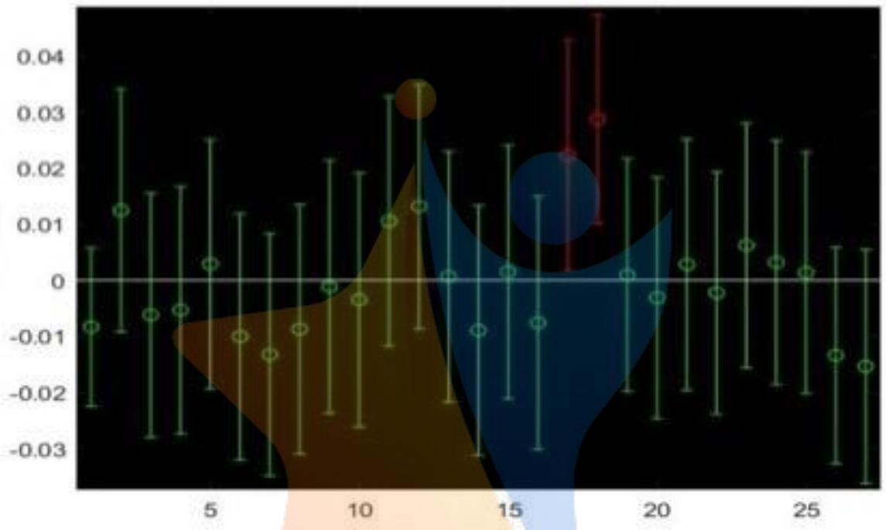

<details>
<summary>error_bar</summary>

| X | Y (Value) |
| --- | --- |
| ~2 | ~0.013 |
| ~3 | ~-0.006 |
| ~4 | ~-0.005 |
| ~5 | ~0.003 |
| ~6 | ~-0.010 |
| ~7 | ~-0.013 |
| ~8 | ~-0.009 |
| ~9 | ~-0.001 |
| ~10 | ~-0.003 |
| ~11 | ~0.011 |
| ~12 | ~0.013 |
| ~13 | ~0.001 |
| ~14 | ~-0.009 |
| ~15 | ~0.002 |
| ~16 | ~-0.008 |
| ~17 | ~0.029 |
| ~18 | ~0.023 |
| ~19 | ~0.001 |
| ~20 | ~-0.003 |
| ~21 | ~0.003 |
| ~22 | ~-0.002 |
| ~23 | ~0.007 |
| ~24 | ~0.004 |
| ~25 | ~0.002 |
| ~26 | ~-0.013 |
| ~27 | ~-0.015 |
</details>

其中，红色部分的比值离零点较远，说明残差与置信区间的距离较大即回归方程的显著性较差，因此，对该比值进行剔除；剩余的绿色部分比值离零点较近，甚至有些比值就在零点上，但是残差与置信区间的距离仍较大，回归方程的显著性较差。但其仍存在一定的线性关系，回归方程模型为

$$
y = 0. 1 9 + 0. 1 6 x _ {1} + 6. 5 0 7 5 9 7 2 1 4 5 9 4 1 8 e ^ {- 0 7} x _ {2} \tag {7}
$$

其中，y 为折扣率， $x_{1}$ 为利润率， $x_{2}$ 为销售额

在模型（10）中中利润率与销售额是分别对折扣率起作用的，但在实际中，二者可能起着交互作用，因此可建立二者的交互项建立新的模型，

增加交互项后，模型记作

$$
y = 0. 1 9 + 0. 1 5 x _ {1} + 5. 1 8 2 8 e ^ {- 0 7} x ^ {2} + 6. 4 8 7 e ^ {- 0 7} x _ {1} x _ {2} \tag {8}
$$

利用 MATLAB 的统计工具箱可以得到以下结果见下表。

增加交互项后，相关检验系数 $R^2$ 与与 $\mathsf{F}$ 值均通过检验，且显著性效果比直接采用多元线性回归的效果更差，为进一步验证引入交互项后的回归效果，引入残差分析图。

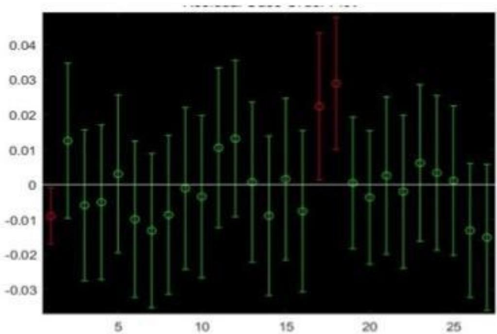

<details>
<summary>error_bar</summary>

| X | Central Value (Mean) | Outlier/Outlier |
| --- | --- | --- |
| 1 | ~-0.009 | ~-0.009 |
| 2 | ~0.013 | — |
| 3 | ~-0.006 | — |
| 4 | ~-0.005 | — |
| 5 | ~0.003 | — |
| 6 | ~-0.010 | — |
| 7 | ~-0.013 | — |
| 8 | ~-0.008 | — |
| 9 | ~-0.001 | — |
| 10 | ~-0.003 | — |
| 11 | ~0.011 | — |
| 12 | ~0.014 | — |
| 13 | ~0.001 | — |
| 14 | ~-0.009 | — |
| 15 | ~0.002 | — |
| 16 | ~-0.008 | — |
| 17 | ~0.023 | ~0.023 |
| 18 | ~0.029 | ~0.029 |
| 19 | ~0.001 | — |
| 20 | ~-0.004 | — |
| 21 | ~0.003 | — |
| 22 | ~-0.002 | — |
| 23 | ~0.007 | — |
| 24 | ~0.004 | — |
| 25 | ~0.002 | — |
| 26 | ~-0.013 | — |
| 27 | ~-0.015 | — |
</details>

其中，红色部分的比值离零点较远，说明残差与置信区间的距离较大即回归方程的显著性较差，因此，对该比值进行剔除；剩余的绿色部分比值离零点较近，甚至有些比值就在零点上，但是残差与置信区间的距离仍较大，说明交互项多元回归方程的显著性较差。因此不采用该种方法。

## 5.5 问题四模型的建立与求解

问题四要求进一步考虑商品的大类分区，并分析打折力度与商品销售额以及利润率的变化关系图，首先，对附件4中的商品进行统计归类，并分为了29类商品，商品类型具体见下表。

表 13 商品种类表

<table><tr><td>大类区分</td><td>手机</td><td>营养保健</td><td>医疗器械</td><td>情趣用品</td><td>肉品</td></tr><tr><td>商品种类数量</td><td>1</td><td>7</td><td>9</td><td>27</td><td>140</td></tr><tr><td>大类区分</td><td>水产</td><td>水果/蔬菜</td><td>烘焙</td><td>日配/冷藏</td><td>粮油副食</td></tr><tr><td>商品种类数量</td><td>142</td><td>492</td><td>130</td><td>964</td><td>1040</td></tr><tr><td>大类区分</td><td>休闲食品</td><td>酒水饮料</td><td>家居家装</td><td>日化用品</td><td>纺织用品</td></tr><tr><td>商品种类数量</td><td>992</td><td>404</td><td>7</td><td>535</td><td>13</td></tr><tr><td>大类区分</td><td>服装服饰</td><td>个洗清洁</td><td>家用电器</td><td>节庆用品</td><td>进口商品</td></tr><tr><td>商品种类数量</td><td>55</td><td>663</td><td>7</td><td>88</td><td>391</td></tr><tr><td>大类区分</td><td>居家日用</td><td>母婴</td><td>运动户外</td><td>玩具</td><td>文化用品</td></tr><tr><td>商品种类数量</td><td>183</td><td>192</td><td>15</td><td>25</td><td>6</td></tr><tr><td>大类区分</td><td>办公用品</td><td>宠物生活</td><td>鲜花礼品</td><td>美食</td><td></td></tr><tr><td>商品种类数量</td><td>6</td><td>29</td><td>1</td><td>6</td><td></td></tr></table>

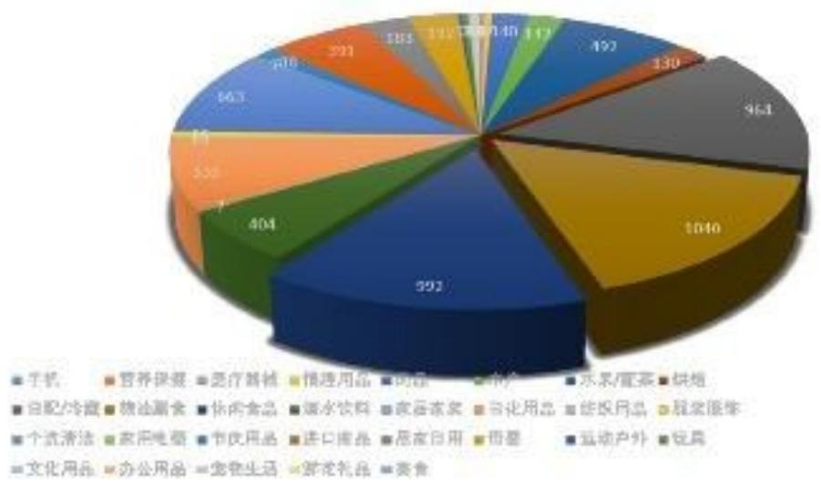

<details>
<summary>pie</summary>

| Category | Value |
| --- | --- |
| 手机 | 497 |
| 管养保健 | 330 |
| 医疗器械 | 961 |
| 情透用品 | 1040 |
| 匀洗 | 592 |
| 饲料 | 404 |
| 水茶/蛋糕 | 338 |
| 烘焙 | 15 |
| 白配/冷藏 | 143 |
| 糖油副食 | 321 |
| 休闲食品 | 406 |
| 烟水饮料 | 185 |
| 家品家装 | 192 |
| 化妆用品 | 140 |
| 织装用品 | 112 |
| 般菜服饰 | 8 |
| 个洗清洁 | 1 |
| 家用电器 | 1 |
| 市饮用品 | 1 |
| 进口商品 | 1 |
| 居家日用 | 1 |
| 运动户外 | 1 |
| 纳具 | 1 |
| 文化用品 | 1 |
| 办公用品 | 1 |
| 食物生活 | 1 |
| 游洗礼品 | 1 |
| 餐食 | 1 |
</details>

图 34 商品种类占比图

结果分析：由上图可知，粮油副食、日配冷藏、休闲食品、个洗清洁、水果蔬菜类商品占比较多，且该类商品都为生活必需品，市场需求量大，因此商品最适合进行“薄利多销”处理方式，在促销中，也可对上述五类商品进行连带的促销，推出更多的商品促销组合方式，以提高更多的销售量。

## 5.5.1 对销售量高商品的分析

由表 12 可知，商品的种类量较大，若要对每种商品数量进行变化关系分析工作量无疑是巨大的且会对很多没有代表性的数据进行分析，从而浪费时间精力，为针对性的解决与分析问题，本文选取了上述五类占比较多商品中销量最高的三种商品进行打折力度与商品销售额以及利润率的关系分析，下表为销量排序表。

表 14 商品销量排序表

<table><tr><td>排序</td><td>商品名称</td><td>销量</td><td>类型</td></tr><tr><td>1</td><td>土豆 约 550g (散装称重)</td><td>6751</td><td>水果/蔬菜</td></tr><tr><td>2</td><td>菊乐 酸乐奶 含乳饮料 250ml</td><td>5575</td><td>日配/冷藏</td></tr><tr><td>3</td><td>冻鸡大胸 约 500g</td><td>5376</td><td>肉品</td></tr><tr><td>4</td><td>菊乐 每日原动 原味酸奶 160g (新旧包装,随机发货)</td><td>5368</td><td>日配/冷藏</td></tr><tr><td>5</td><td>福临门 精选东北大米 5kg(新旧包装,随机发货)</td><td>5059</td><td>粮油副食</td></tr></table>

由上表可知，销量排名前五的商品，商场可对该类商品连带的商品进行打折处理，以提高连带商品的销量，例如：消费者在购买土豆的同时，可能顺带会买牛腩等于土豆混搭的商品，因此对牛腩进行薄利促销处理，其购买量会相应的增加，从而提高利润，所以对销售量高的商品的连带商品进行打折，可带动连带商品的销量。

## 5.5.2 选取商品类型并对其打折力度与销售额、利润率之间关系进行分析

考虑到日配冷藏的商品数量最多，涉及到的一系列打折活动与销量也可能较多，因此本文选取了以日配冷藏为代表性数据，对其进行折扣率、销售额、利润率进行重新的计算，继续采用与前文相同的方法，利用 SPSS 进行求解，具体数据见下表。

表 15

<table><tr><td>数量</td><td>门店价</td><td>销售价</td><td>成本</td><td>折扣率</td><td>利润率</td><td>销售额</td></tr><tr><td>1</td><td>22.5</td><td>22.5</td><td>14.11601</td><td>0</td><td>0.372622</td><td>22.5</td></tr><tr><td>1</td><td>22.5</td><td>22.5</td><td>14.11598</td><td>0</td><td>0.372623</td><td>22.5</td></tr><tr><td>1</td><td>22.5</td><td>22.5</td><td>14.1158</td><td>0</td><td>0.372631</td><td>22.5</td></tr><tr><td>19.9</td><td>15.8</td><td>15.8</td><td></td><td>0.20603</td><td>0</td><td>0</td></tr><tr><td>1</td><td>38</td><td>32.3</td><td>32.3</td><td>0.15</td><td>0</td><td>38</td></tr></table>

据与之前数据进行比较，该类数据较为准确的反映了折扣率与销售额之间的关系，所以变化关系为正线性相关系，因此打折力度会直接对销售额与利润率进行影响，但打折力度也不能无限制的增长，要保持在一定的区间范围内，因此对该类商品进行促销活动中，要寻找一个较为适当的打折力度。

为进一步研究其变化关系，可利用多元线性回归分析建立回归方程，下表为相关检验系数

表 16 对回归模型的计算结果表

<table><tr><td>系数</td><td>系数估计值</td><td>系数置信区间</td></tr><tr><td> $\beta_0$ </td><td>0.2504</td><td>[0.2470, 0.2538]</td></tr><tr><td> $\beta_1$ </td><td>-1.0354</td><td>[-1.0505, -1.0203]</td></tr><tr><td> $\beta_2$ </td><td>0.0012</td><td>[0.0011, 0.0013]</td></tr><tr><td colspan="3"> $R^2 = 0.7347$   $F = 9070.005$   $p < 0.0001$   $s^2 = 0.0069$ </td></tr></table>

其相关决定系数 $R^2$ 相较于未考虑商品类型的决定系数较大, 表明其线性关系更强, 因此变化关系为线性关系更强, 其 $\mathsf{P}$ 值与残差都较小, 因此该回归模型的可靠性是较强的。下图为残差分析图。

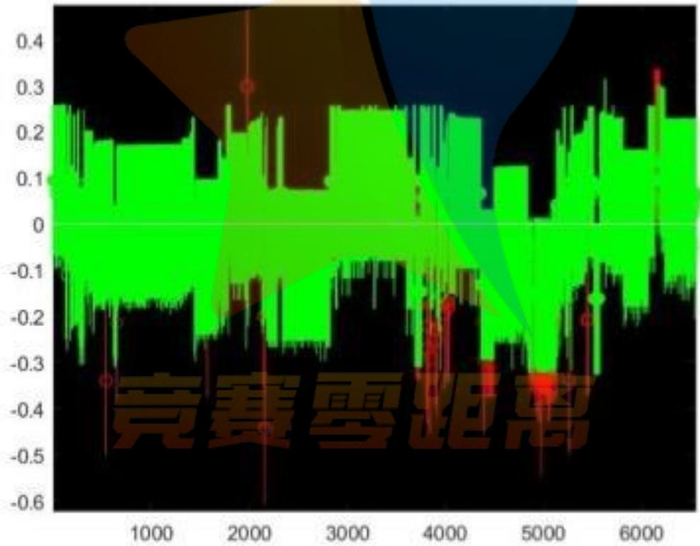

<details>
<summary>candlestick</summary>

| X | Value (Green) | Value (Red) |
| --- | --- | --- |
| ~500 | ~0.26 | ~-0.34 |
| ~2000 | ~0.26 | ~0.31 |
| ~4000 | ~0.26 | ~-0.18 |
| ~5000 | ~0.13 | ~-0.37 |
| ~6000 | ~0.26 | ~0.33 |
</details>

由上图可知，残差与置信区间的距离较近，因此回归效果较好，回归关系

$$
y = 0. 2 5 0 4 - 1. 0 3 5 4 x _ {1} + 0. 0 0 1 2 x _ {2} \tag {9}
$$

## 6. 模型的评价

## 6.1 模型的优点

1. 对数据进行预处理时，采用了不同的方法对各类数据进行处理；  
2. 问题一中，对每天影响营业额以及利润率的情况分析的较为透彻，给出的建议也是切实可行的；  
3. 求解问题二中，给出了较为合理的衡量指标；

4. 问题三给出了不同折扣率对商场盈利的影响；  
5. 图文并茂，较好的展示了营业额等的分布规律。

## 6.2 模型的缺点

1. 问题中只选取了一种指标来衡量打折力度；  
2. 没有深层次的挖掘数据隐含信息；  
3. 问题三中统计模型的精度不高，回归性检验显著性不强。

## 7. 模型的改进与推广

## 7.1 模型的改进

1) 影响打折力度的指标存在很多，不应该从一方面进行考虑，应综合考虑多个方面。  
2) 问题四中对大类商品的区分不够细致，应细分其类别。

## 7.2 模型的推广

本文所给出的促销策略与统计模型不仅可以运用到商场领域，也可运用到以服务为主的第三方产业。

## 参考文献

[1] 张文彤.SPSS 统计分析与基础教程（第 2 版）[M].北京.高等教育出版社.2004  
[2] 张良均. MATLAB 数据分析与挖掘实战[M]. 北京. 机械工业出版社. 2017  
[3] 销售额. [M]. https://baike.baidu.com/item/%E9%94%80%E5%94%AE%E9%A2%9D/4680903?fr=aladdin  
[4] 郝志峰. 数据科学与数学建模 [M]. 武汉. 华中科技大学出版社. 2019  
[5] 姜启源. 数学模型（第五版）[M]. 北京. 高等教育出版社. 2018.


<details>
<summary>text_image</summary>

竞赛零距离
--Competition Zero Distance--
</details>

## 附录

软件版本

MATLAB R2019a

SPSS 25

Excel 2019

注：部分数据文件是最终的结果，过渡处理数据文件不在支撑文件。

问题一 MATLAB 部分程序

clear all

clc

A=[1:1:763];%每一个代表一个具体的时间，例如"1"表示2016年11月30日，"2"表示2016年12月1日

$A=A'$ ;

B=xlsread('D:\Users\12142\Desktop\支撑材料\1\关系分析\营业额与利润率.xlsx','Sheet1','B2:B764');%利润率

C=xlsread('D:\Users\12142\Desktop\支撑材料\1\关系分析\营业额与利润率.xlsx','Sheet1','D2:D764');%营业额

plotyy(A,B,A,C);

clear all

clc

%% 2016 利润率

n=0.2/11343;%步长

A=[0.2:n:0.4];

A=A';%以n为步长的利润率

xlswrite('D:\Users\12142\Desktop\检查利润率\2016\2016 修正后的全部数据无成本.xlsx',A,'M2:M11345');%写入对应表格

AX=xlsread('D:\Users\12142\Desktop\检查利润率\2016\2016 修正后的全部数据无成本.xlsx','Sheet1','H2:H11345');%读写销售价格

N=length(AX);%数据个数

A1=ones(N,1)%创建 N 行 1 列的 1 矩阵

AC=(A1-A).\*AX;%计算成本,成本=(1-利润率)\*售价

xlswrite('D:\Users\12142\Desktop\检查利润率\2016\2016 修正后的全部数据无成本.xlsx',AC,'I2:I11345');%补全缺失成本数据

%% 2017 利润率

n2=0.2/198809;

B=[0.2:n2:0.4];

$B=B'$ ;

xlswrite('D:\Users\12142\Desktop\检查利润率\2017\2017 修正后的全部数据无成本.xlsx',B,'M2:M198811');

BX=xlsread('D:\Users\12142\Desktop\检查利润率\2017\2017 修正后的全部数据无成本.xlsx','Sheet1','H2:H198811');

N2=length(BX);

B1=ones(N2,1);

BC=(B1-B).\*BX;

xlswrite('D:\Users\12142\Desktop\检查利润率\2017\2017 修正后的全部数据无成本.xlsx',BC,'I2:I198811');%补全缺失成本数据

%% 2018 利润率

n3=0.2/506788;

C=[0.2:n3:0.4];

$C=C'$ ;

xlswrite('D:\Users\12142\Desktop\检查利润率\2018\2018 修正后的全部数据无成本.xlsx',C,'M2:M506790');

CX=xlsread('D:\Users\12142\Desktop\检查利润率\2018\2018 修正后的全部数据无成本.xlsx','Sheet1','H2:H506790');

C2=length(CX);

C1=ones(C2,1);

CC=(C1-C).\*CX;

xlswrite('D:\Users\12142\Desktop\检查利润率\2018\2018 修正后的全部数据无成本.xlsx',CC,'I2:I506790');

%% 2019 利润率

n4=0.2/2696;

D=[0.2:n4:0.4];

$D=D'$ ;

xlswrite('D:\Users\12142\Desktop\检查利润率\2019\2019 修正后的全部数据无成本.xlsx',D,'M2:M2698');

DX=xlsread('D:\Users\12142\Desktop\检查利润率\2019\2019 修正后的全部数据无成本.xlsx','Sheet1','H2:H2698');

D2=length(DX);

D1=ones(D2,1);

DC=(D1-D).\*DX;

xlswrite('D:\Users\12142\Desktop\检查利润率\2019\2019 修正后的全部数据无成本.xlsx',DC,'I2:I2698');

问题 2SPSS 软件部分程序

GET

FILE='D:\Users\12142\Desktop\支撑材料\2\2016 打折数据.sav'.

DATASET NAME 数据集 1 WINDOW=FRONT.

SORT CASES BY 折扣率 (A).

DATASET ACTIVATE 数据集 1.

SAVE OUTFILE='D:\Users\12142\Desktop\支撑材料\2\2016 打折数据.sav'

/COMPRESSED.

SAVE TRANSLATE OUTFILE='D:\Users\12142\Desktop\支撑材料\2\2016 打折数据.xlsx'

```txt
/TYPE=XLS
/VERSION=12
/MAP
/FIELDNAMES VALUE=NAMES
/CELLS=VALUES
/REPLACE.
```

Data written to D:\Users\12142\Desktop\支撑材料\2\2016 打折数据.xlsx.

12 variables and 7548 cases written to range: SPSS.

<table><tr><td>Variable: create_dt</td><td>Type: String</td><td>Width: 10</td><td></td></tr><tr><td>Variable: order_id</td><td>Type: Number</td><td>Width: 15</td><td>Dec: 0</td></tr><tr><td>Variable: sku_id</td><td>Type: Number</td><td>Width: 10</td><td>Dec: 0</td></tr><tr><td>Variable: sku_name</td><td>Type: String</td><td>Width: 108</td><td></td></tr><tr><td>Variable: is_finished</td><td>Type: Number</td><td>Width: 1</td><td>Dec: 0</td></tr><tr><td>Variable: sku_cnt</td><td>Type: Number</td><td>Width: 3</td><td>Dec: 0</td></tr><tr><td>Variable: sku_prc</td><td>Type: Number</td><td>Width: 6</td><td>Dec: 2</td></tr><tr><td>Variable: sku_sale_prc</td><td>Type: Number</td><td>Width: 6</td><td>Dec: 2</td></tr><tr><td>Variable: sku_cost_prc</td><td>Type: Number</td><td>Width: 6</td><td>Dec: 2</td></tr><tr><td>Variable: upc_code</td><td>Type: Number</td><td>Width: 14</td><td>Dec: 0</td></tr><tr><td>Variable: 营业额</td><td>Type: Number</td><td>Width: 4</td><td>Dec: 2</td></tr><tr><td>Variable: 折扣率</td><td>Type: Number</td><td>Width: 4</td><td>Dec: 2</td></tr></table>

## GET

FILE='D:\Users\12142\Desktop\支撑材料\2\2017 打折数据.sav'.

DATASET NAME 数据集 2 WINDOW=FRONT.

SORT CASES BY 折扣率 (A).

DATASET ACTIVATE 数据集 2.

SAVE OUTFILE='D:\Users\12142\Desktop\支撑材料\2\2017 打折数据.sav'/COMPRESSED.

DATASET ACTIVATE 数据集 2.

SAVE OUTFILE='D:\Users\12142\Desktop\支撑材料\2\2017 打折数据.sav'/COMPRESSED.

DATASET ACTIVATE 数据集 1.

DATASET CLOSE 数据集 2.

## GET

FILE='D:\Users\12142\Desktop\支撑材料\2\2017 打折数据.sav'.

DATASET NAME 数据集 3 WINDOW=FRONT.

## GET

FILE='D:\Users\12142\Desktop\支撑材料\2\2018 打折数据.sav'.

DATASET NAME 数据集 4 WINDOW=FRONT.

SORT CASES BY 折扣率 (A).

DATASET ACTIVATE 数据集 4.

SAVE OUTFILE='D:\Users\12142\Desktop\支撑材料\2\2018 打折数据.sav'/COMPRESSED.

DATASET ACTIVATE 数据集 1.

DATASET CLOSE 数据集 4.

GET

FILE='D:\Users\12142\Desktop\支撑材料\2\2018 打折数据.sav'.

DATASET NAME 数据集 5 WINDOW=FRONT.

GET

FILE='D:\Users\12142\Desktop\支撑材料\2\2017 打折数据.sav'.

GET

FILE='D:\Users\12142\Desktop\支撑材料\2\2019 打折数据.sav'.

DATASET NAME 数据集 7 WINDOW=FRONT.

SORT CASES BY 折扣率 (A).

DATASET ACTIVATE 数据集 7.

SAVE OUTFILE='D:\Users\12142\Desktop\支撑材料\2\2019 打折数据.sav'/COMPRESSED.

DATASET ACTIVATE 数据集 1.

DATASET CLOSE 数据集 7.

GET

FILE='D:\Users\12142\Desktop\支撑材料\2\2019 打折数据.sav'.

DATASET NAME 数据集 8 WINDOW=FRONT.

DATASET ACTIVATE 数据集 1.

SAVE TRANSLATE OUTFILE='D:\Users\12142\Desktop\支撑材料\2\2016 打折数据.xlsx'

/TYPE=XLS

/VERSION=12

/MAP

/FIELDNAMES VALUE=NAMES

/CELLS=VALUES

/REPLACE.

Data written to D:\Users\12142\Desktop\支撑材料\2\2016 打折数据.xlsx.

12 variables and 7548 cases written to range: SPSS.

Variable: create\_dt

Variable: order\_id

Variable: sku\_id

Variable: sku\_name

Variable: is\_finished

Variable: sku\_cnt

Variable: sku\_prc

Type: String Width: 10

Type: Number

Type: Number

Type: String

Type: Number

Type: Number

Type: Number

Width: 15

Width: 10

Width: 108

Width: 1

Width: 3

Width: 6

Dec: 0

Dec: 0

Dec: 0

Dec: 0

Dec: 2

<table><tr><td>Variable: sku_sale_prc</td><td>Type: Number</td><td>Width: 6</td><td>Dec: 2</td></tr><tr><td>Variable: sku_cost_prc</td><td>Type: Number</td><td>Width: 6</td><td>Dec: 2</td></tr><tr><td>Variable: upc_code</td><td>Type: Number</td><td>Width: 14</td><td>Dec: 0</td></tr><tr><td>Variable: 营业额</td><td>Type: Number</td><td>Width: 4</td><td>Dec: 2</td></tr><tr><td>Variable: 折扣率</td><td>Type: Number</td><td>Width: 4</td><td>Dec: 2</td></tr></table>

DATASET ACTIVATE 数据集 3.

DATASET CLOSE 数据集 1.

SAVE TRANSLATE OUTFILE='D:\Users\12142\Desktop\支撑材料\2\2017 打折数据.xlsx'

```txt
/TYPE=XLS
/VERSION=12
/MAP
/FIELDNAMES VALUE=NAMES
/CELLS=VALUES
/REPLACE.
```

Data written to D:\Users\12142\Desktop\支撑材料\2\2017 打折数据.xlsx.

12 variables and 107118 cases written to range: SPSS.

<table><tr><td>Variable: create_dt</td><td>Type: String</td><td>Width: 10</td><td></td></tr><tr><td>Variable: order_id</td><td>Type: Number</td><td>Width: 15</td><td>Dec: 0</td></tr><tr><td>Variable: sku_id</td><td>Type: Number</td><td>Width: 10</td><td>Dec: 0</td></tr><tr><td>Variable: sku_name</td><td>Type: String</td><td>Width: 120</td><td></td></tr><tr><td>Variable: is_finished</td><td>Type: Number</td><td>Width: 1</td><td>Dec: 0</td></tr><tr><td>Variable: sku_cnt</td><td>Type: Number</td><td>Width: 3</td><td>Dec: 0</td></tr><tr><td>Variable: sku_prc</td><td>Type: Number</td><td>Width: 6</td><td>Dec: 2</td></tr><tr><td>Variable: sku_sale_prc</td><td>Type: Number</td><td>Width: 6</td><td>Dec: 2</td></tr><tr><td>Variable: sku_cost_prc</td><td>Type: Number</td><td>Width: 6</td><td>Dec: 2</td></tr><tr><td>Variable: upc_code</td><td>Type: Number</td><td>Width: 14</td><td>Dec: 0</td></tr><tr><td>Variable: 营业额</td><td>Type: Number</td><td>Width: 4</td><td>Dec: 2</td></tr><tr><td>Variable: 折扣率</td><td>Type: Number</td><td>Width: 4</td><td>Dec: 2</td></tr></table>

DATASET ACTIVATE 数据集 5.

SAVE TRANSLATE OUTFILE='D:\Users\12142\Desktop\支撑材料\2\2018 打折数据.xlsx'

```txt
/TYPE=XLS
/VERSION=12
/MAP
/FIELDNAMES VALUE=NAMES
/CELLS=VALUES
/REPLACE.
```

Data written to D:\Users\12142\Desktop\支撑材料\2\2018 打折数据.xlsx.

12 variables and 301252 cases written to range: SPSS.

<table><tr><td>Variable: create_dt</td><td>Type: String</td><td>Width: 10</td><td></td></tr><tr><td>Variable: order_id</td><td>Type: Number</td><td>Width: 15</td><td>Dec: 0</td></tr><tr><td>Variable: sku_id</td><td>Type: Number</td><td>Width: 10</td><td>Dec: 0</td></tr><tr><td>Variable: sku_name</td><td>Type: String</td><td>Width: 119</td><td></td></tr><tr><td>Variable: is_finished</td><td>Type: Number</td><td>Width: 1</td><td>Dec: 0</td></tr><tr><td>Variable: sku_cnt</td><td>Type: Number</td><td>Width: 3</td><td>Dec: 0</td></tr><tr><td>Variable: sku_prc</td><td>Type: Number</td><td>Width: 6</td><td>Dec: 2</td></tr><tr><td>Variable: sku_sale_prc</td><td>Type: Number</td><td>Width: 6</td><td>Dec: 2</td></tr><tr><td>Variable: sku_cost_prc</td><td>Type: Number</td><td>Width: 6</td><td>Dec: 2</td></tr><tr><td>Variable: upc_code</td><td>Type: Number</td><td>Width: 14</td><td>Dec: 0</td></tr><tr><td>Variable: 营业额</td><td>Type: Number</td><td>Width: 4</td><td>Dec: 0</td></tr><tr><td>Variable: 折扣率</td><td>Type: Number</td><td>Width: 4</td><td>Dec: 0</td></tr></table>

DATASET ACTIVATE 数据集 8.

SAVE TRANSLATE OUTFILE='D:\Users\12142\Desktop\支撑材料\2\2019 打折数据.xlsx'

```txt
/TYPE=XLS
/VERSION=12
/MAP
/FIELDNAMES VALUE=NAMES
/CELLS=VALUES
/REPLACE.
```

Data written to D:\Users\12142\Desktop\支撑材料\2\2019 打折数据.xlsx.

12 variables and 1814 cases written to range: SPSS.

Variable: create\_dt Type: String Width: 10

Variable: order\_id      Type: Number  Width: 15  Dec: 0
--Competition Zero Distance--

问题 3MATLAB 部分程序

clear all;clc

A=xlsread('D:\Users\12142\Desktop\支撑材料\3\月平均值.xlsx','Sheet1','B2:B28');%月平均利润率

B=xlsread('D:\Users\12142\Desktop\支撑材料\3\月平均值.xlsx','Sheet1','D2:D28');%月平均折扣率

C=xlsread('D:\Users\12142\Desktop\支撑材料\3\月平均值.xlsx','Sheet1','F2:F28');%月平均商品销售额

D=[1:1:27];

$D=D^{1};$

figure(1)

```matlab
plotyy(D,B,D,A);%利润率
figure(2)
plotyy(D,B,D,C);
X=[ones(27,1) A C];
[b20,bint20,r20,rint20,stats20] = regress(B,X)%多元线性
rcoplot(r20,rint20);%r 残差,%rint 置信区间;
cftool
```

SPSS 软件

GET

FILE='D:\Users\12142\Desktop\支撑材料\3\2016 修正后的完整数据.sav'.

DATASET NAME 数据集 1 WINDOW=FRONT.

SAVE TRANSLATE OUTFILE='D:\Users\12142\Desktop\支撑材料\3\2016 修正后的完整数据.xlsx'

```txt
/TYPE=XLS
/VERSION=12
/MAP
/FIELDNAMES VALUE=NAMES
/CELLS=VALUES
/REPLACE.
```

Data written to D:\Users\12142\Desktop\支撑材料\3\2016 修正后的完整数据.xlsx.
11 variables and 18892 cases written to range: SPSS.

<table><tr><td>Variable: create_dt</td><td>Type: String</td><td>Width: 10</td><td></td></tr><tr><td>Variable: order_id</td><td>Type: Number</td><td>Width: 15</td><td>Dec: 0</td></tr><tr><td>Variable: sku_id</td><td>Type: Number</td><td>Width: 10</td><td>Dec: 0</td></tr><tr><td>Variable: sku_name</td><td>Type: String</td><td>Width: 108</td><td></td></tr><tr><td>Variable: is_finished</td><td>Type: Number</td><td>Width: 1</td><td>Dec: 0</td></tr><tr><td>Variable: sku_cnt</td><td>Type: Number</td><td>Width: 2</td><td>Dec: 0</td></tr><tr><td>Variable: sku_prc</td><td>Type: Number</td><td>Width: 31</td><td>Dec:15</td></tr><tr><td>Variable: sku_sale_prc</td><td>Type: Number</td><td>Width: 31</td><td>Dec:15</td></tr><tr><td>Variable: sku_cost_prc</td><td>Type: Number</td><td>Width: 19</td><td>Dec:15</td></tr><tr><td>Variable: upc_code</td><td>Type: Number</td><td>Width: 13</td><td>Dec: 0</td></tr><tr><td>Variable: 商品销售额</td><td>Type: Number</td><td>Width: 4</td><td>Dec: 2</td></tr></table>

GET

FILE='D:\Users\12142\Desktop\支撑材料\3\2017 修正后的完整数据.sav'.

DATASET NAME 数据集 2 WINDOW=FRONT.

SAVE TRANSLATE OUTFILE='D:\Users\12142\Desktop\支撑材料\3\2017 修正后的完整数据.xlsx'

/TYPE=XLS

```txt
/VERSION=12
/MAP
/FIELDNAMES VALUE=NAMES
/CELLS=VALUES
/REPLACE.
```

Data written to D:\Users\12142\Desktop\支撑材料\3\2017 修正后的完整数据.xlsx. 11 variables and 305964 cases written to range: SPSS.

<table><tr><td>Variable: create_dt</td><td>Type: String</td><td>Width: 10</td><td></td></tr><tr><td>Variable: order_id</td><td>Type: Number</td><td>Width: 15</td><td>Dec: 0</td></tr><tr><td>Variable: sku_id</td><td>Type: Number</td><td>Width: 10</td><td>Dec: 0</td></tr><tr><td>Variable: sku_name</td><td>Type: String</td><td>Width: 141</td><td></td></tr><tr><td>Variable: is_finished</td><td>Type: Number</td><td>Width: 1</td><td>Dec: 0</td></tr><tr><td>Variable: sku_cnt</td><td>Type: Number</td><td>Width: 2</td><td>Dec: 0</td></tr><tr><td>Variable: sku_prc</td><td>Type: Number</td><td>Width: 31</td><td>Dec:15</td></tr><tr><td>Variable: sku_sale_prc</td><td>Type: Number</td><td>Width: 31</td><td>Dec:15</td></tr><tr><td>Variable: sku_cost_prc</td><td>Type: Number</td><td>Width: 19</td><td>Dec:15</td></tr><tr><td>Variable: upc_code</td><td>Type: Number</td><td>Width: 13</td><td>Dec: 0</td></tr><tr><td>Variable: 商品销售额</td><td>Type: Number</td><td>Width: 4</td><td>Dec: 2</td></tr></table>

GET

FILE='D:\Users\12142\Desktop\支撑材料\3\2018 修正后的完整数据.sav'.

DATASET NAME 数据集 3 WINDOW=FRONT.

SAVE TRANSLATE OUTFILE='D:\Users\12142\Desktop\支撑材料\3\2018 修正后的完整数据.xlsx'

```txt
/TYPE=XLS
/VERSION=12
/MAP
/FIELDNAMES VALUE=NAMES
/CELLS=VALUES
/REPLACE.
```

Data written to D:\Users\12142\Desktop\支撑材料\3\2018 修正后的完整数据.xlsx. 11 variables and 794494 cases written to range: SPSS.

<table><tr><td>Variable: create_dt</td><td>Type: String</td><td>Width: 10</td><td></td></tr><tr><td>Variable: order_id</td><td>Type: Number</td><td>Width: 15</td><td>Dec: 0</td></tr><tr><td>Variable: sku_id</td><td>Type: Number</td><td>Width: 10</td><td>Dec: 0</td></tr><tr><td>Variable: sku_name</td><td>Type: String</td><td>Width: 123</td><td></td></tr><tr><td>Variable: is_finished</td><td>Type: Number</td><td>Width: 1</td><td>Dec: 0</td></tr><tr><td>Variable: sku_cnt</td><td>Type: Number</td><td>Width: 2</td><td>Dec: 0</td></tr><tr><td>Variable: sku_prc</td><td>Type: Number</td><td>Width: 31</td><td>Dec:15</td></tr><tr><td>Variable: sku_sale_prc</td><td>Type: Number</td><td>Width: 31</td><td>Dec:15</td></tr></table>

Variable: sku\_cost\_prc

Variable: upc\_code

Variable: 商品销售额

Type: Number

Type: Number

Type: Number

Width: 19

Width: 13

Width:

Dec:15

Dec: 0

Dec: 0

GET

FILE='D:\Users\12142\Desktop\支撑材料\3\2019 修正后的完整数据.sav'.

DATASET NAME 数据集 4 WINDOW=FRONT.

SAVE TRANSLATE OUTFILE='D:\Users\12142\Desktop\支撑材料\3\2019 修正后的完整数据.xlsx'

/TYPE=XLS

/VERSION=12

/MAP

/FIELDNAMES VALUE=NAMES

/CELLS=VALUES

/REPLACE.

Data written to D:\Users\12142\Desktop\支撑材料\3\2019 修正后的完整数据.xlsx.

11 variables and 4441 cases written to range: SPSS.

Variable: create\_dt

Variable: order\_id

Variable: sku\_id

Variable: sku\_name

Variable: is\_finished

Variable: sku\_cnt

Variable: sku\_prc

Variable: sku\_sale\_prc

Variable: sku\_cost\_prc

Variable: upc\_code

Variable: 商品销售额

Type: String

Type: Number

Type: Number

Type: String

Type: Number

Type: Number

Type: Number

Type: Number

Type: Number

Type: Number

Type: Number

Width: 10

Width: 15

Width: 10

Width: 109

Width: 1

Width: 2

Width: 31

Width: 31

Width: 19

Width: 13

Width:

Dec: 0

Dec: 0

Dec: 0

Dec: 0

Dec:15

Dec:15

Dec:15

Dec: 0

Dec: 2

问题四 MATLAB 部分程序

clear all;clc

A=xlsread('D:\Users\12142\Desktop\支撑材料\4\日配冷藏.xlsx','Sheet1','F2:F6554');%利润率

B=xlsread('D:\Users\12142\Desktop\支撑材料\4\日配冷藏.xlsx','Sheet1','G2:G6554');%折扣率

C=xlsread('D:\Users\12142\Desktop\支撑材料\4\日配冷藏.xlsx','Sheet1','H2:H6554');% 商品销售额

D=[1:1:6553];

$D=D'$ ;

```matlab
figure(1)
plotyy(D,B,D,A);%利润率
figure(2)
plotyy(D,B,D,C);
X=[ones(6553,1) A C];
[b20,bint20,r20,rint20,stats20] = regress(B,X)%多元线性
figure(3)
rcoplot(r20,rint20);%r 残差,%rint 置信区间;
cftool
```


<details>
<summary>natural_image</summary>

Abstract graphic of a stylized human figure with a star and gradient background (no text or symbols)
</details>

## 竞赛零距离

--Competition Zero Distance--