# “薄利多销”分析

## 摘要

在销售行业中“薄利多销”是一种常见的营销手段。本题中利用所给的商场数据，分析了商场两年多时间内每天的营业额与利润率，建立了衡量商场打折力度的折扣率模型，并通过分析商场打折力度与商品销售额以及利润率的关系，确定了商场采取“薄利多销”经营策略的合理性。

问题一：利用附件1和附件2所给出的销售流水记录，先进行了数据清洗，去除其中的无效数据，然后根据设定商场非打折商品的利润率 $r$ ，通过数据表中的商品原价补齐非打折商品的成本价。建立商品销售额及利润率的数学模型，进而计算出商场每天的营业额和利润率。

问题二：以商场每天的折扣率来衡量商场的打折力度，折扣率越大它的打折力度就越大。而折扣率就是商品折扣额与商品原价之比，据此建立数学模型，根据销售流水记录所给的商品原价和销售价，计算出商场每天的折扣率。

问题三：根据问题一、二的计算结果，我们然后对拟合情况进行分析，建立回归模型。为了更清楚的分析它们的关系，我们还对其分阶段进行了回归拟合，总体来看销售额随着折扣率的增加而增加，但折扣率对销售额的影响不太显著。

同样，利用 Mathematic 软件对商场折扣率与利润率进行回归拟合处理，建立了拟合度较好的线性回归模型，发现两者具有较为显著的线性关系，利润率随折扣率的增加而降低，这也是符合客观实际的。

综合两种拟合分析，比较清楚的体现了商场的“薄利多销”经营策略。

问题四：利用商品信息表，结合实际将商场商品分成八大类。选取了各具代表性的食品类，进口类和日用类，考虑折扣率与商品销售额以及利润率的关系，发现食品类更适用于“薄利多销”的经营策略。

模型优化中，利用折扣信息表筛选出可打折的商品的销售数据，分析折扣率与销售额以及利润率的关系，从而为上述结果得到更为清晰的依据。

关键词：Excel 运算 数据透视表 Mathematica 软件 数据拟合

## (一) 问题重述

“薄利多销”是通过降低单位商品的利润来增加销售数量，从而使商家获得更多盈利的一种扩大销售的策略。对于需求富有弹性的商品来说，当该商品的价格下降时，如果需求量（从而销售量）增加的幅度大于价格下降的幅度，将导致总收益增加。在实际经营管理中，“薄利多销”原则被广泛应用。

根据商场自2016年11月30日起至2019年1月2日的销售流水记录、折扣信息表、商品信息表、是数据说明表。这批数据，建立数学模型解决下列问题：

1. 计算该商场从 2016 年 11 月 30 日到 2019 年 1 月 2 日每天的营业额和利润率(注意: 由于未知原因, 数据中非打折商品的成本价缺失。一般情况下, 零售商的利润率在 20%-40%之间)。

2. 建立适当的指标衡量商场每天的打折力度，并计算该商场从 2016 年 11 月 30 日到 2019 年 1 月 2 日每天的打折力度。

3. 分析打折力度与商品销售额以及利润率的关系。

4. 如果进一步考虑商品的大类区分, 打折力度与商品销售额以及利润率的关系有何变化?

## （二）模型假设

1. 销售流水记录中销售数量为负时视为退货，不做特殊处理。  
2. 销售流水记录中的未完成订单视为无效数据进行清洗。  
3. 由于商场非打折商品的利润率 r 商场利润率计算的影响不大，后面的计算均按 r = 0.3。  
4. 不考虑商场的其他营业额收入，每天的商品销售额即为营业额。  
5. 商品的成本价已包含诸如税率、仓储、运输、人工等因素，无需额外考虑。  
6. 折扣信息表中的商品均视为商店的可打折商品。  
7. 所有金额单位统一为“元”。

## （三）符号说明

r：商场非打折商品的利润率。

n：每天销售的流水记录数。

$a_{i}$ ：每天第i条流水的商品销售价。

$b_{i}$ ：每天第i条流水的商品成本价。

$m_{i}$ ：每天第i条流水的商品成本价。

$d_{i}$ ：每天第i条流水的商品原价（门店价）。

y：商场每天的营业额（销售额）。

l：商场每天的利润率。

x：商场每天的折扣率。

c：商场每天的销售成本。

## (四) 问题分析

## 4.1 问题一：商场每天营业额和利润率的计算分析

## 4.1.1 计算商场每天的营业额

首先在附件 1、2 的销售流水记录，进行数据清洗，删除未完成订单。其次，注意到销售流水中存在少量销售数量为负数的商品，视为退货情况，正常计算在在当天的营业额内。

## 4.1.2 商品的成本价处理

对于打折商品，附件 1、2 的销售流水记录已经给出了商品的成本价，而非打折商品的成本价缺失，对此我们设定该商场非打折商品的利润率为 r，通过给出的商品原价计算出它的成本价。 --Competition Zero Distance--

## 4.1.3 计算商场每天的利润率

利润率是商品销售额与成本的差，与商品成本之比，我们据此建立模型，根据销售流水记录所给的销售价、补充完整的成本价以及商品的销售数量，计算出商场每天的利润率。

## 4.2 问题二：分析商场打折力度的衡量指标

我们以商场每天的折扣率来衡量商场的打折力度，折扣率越大它的打折力度就越大。而折扣率就是商品折扣额与商品原价之比，即商品原价与销售价的差与商品原价之比，我们据此建立模型，根据销售流水记录所给的商品原价（门店价）和销售价，计算出商场每天的折扣率。

## 4.3 问题三：如何建立商场打折力度与商品销售额及利润率的关系模型

要分析打折力度与商品销售额以及利润率的关系, 就需要对折扣率与销售额的关系进行分析, 我们利用 Mathematic 软件对前面计算出的折扣率与销售额进行回归拟合处理, 然后对拟合情况进行分析。对于折扣率与利润率的关系利用同样的方法进行处理

## 4.4 问题四：对商品分类后打折力度与商品销售额及利润率的关系变化

考虑到商品的大类区分，我们对附件4中的商品进行处理，鉴于按照商品一级类目划分的商品类别有29种，过于细化，所以我们对其进行重新分类为八种：食品类、文体娱乐类、日用类、进口类、宠物鲜花类、服装服饰类、母婴类、情趣类。因为有些类别商品较少，所以我们选择一些商品量较大、影响较显著的商品类别进行处理分析，包括食品类、进口类、日用类。

注意到所给数据中食品类徐福记被归入手机类，我们判断数据中存在错误。通过对数据中的商品分类仔细考证，我们将其手机类中徐福记归入食品类，医疗器械类中的口罩及创可贴归为日用类。

利用所分的商品大类, 我们采取与前面相同的方法分析打折力度与商品销售额以及利润率的关系, 并通过与之前分析的对比, 以及不同类别之间的对比, 分析它们的变化。这里的进口类商品比较富有弹性, 通过对其讨论我们更易体现商场 “薄利多销” 的经营策略。

## 4.5 问题五：对模型如何进行优化

参考附件 3 的折扣信息表，我们注意到商场中有些商品从来不会打折，而考察商场的打折力度更注重那些可打折商品的情况，我们对模型进行了优化。利用折扣信息表把附件 1、2 销售流水记录中的可打折商品筛选出来，只考虑这些商品的条件下计算商场的营业额、利润率、折扣率，以及它们之间的关系，并且考虑大类区分时的变化情况。

## （五）模型建立及求解

## 5.1 问题一：建立商场每天营业额和利润率的计算模型并求解

## 5.1.1 模型建立

根据分析的结果，对附件 1、2 的原始数据进行处理后，建立模型求出商场每天的营业额和利润率。

首先，有折扣商品的成本价已给出，非打折商品的成本价计算的数学模型为：

$$
b _ {i} = \frac {d _ {i}}{1 + r}
$$

利用 Excel 进行计算后填补非打折商品的成本价。

商场每天的营业额的数学模型为：

$$
y = \sum_ {i = 1} ^ {n} a _ {i} m _ {i}
$$

商场每天销售成本的数学模型为：

$$
c = \sum_ {i = 1} ^ {n} b _ {i} m _ {i}
$$

继而商场每天利润率的数学模型为：

$$
l = \frac {y - c}{c} = \frac {\sum_ {i = 1} ^ {n} (a _ {i} - b _ {i}) m _ {i}}{\sum_ {i = 1} ^ {n} b _ {i} m _ {i}}
$$

## 5.1.2 模型求解

按照上述模型,利用Excel的数据透视表及函数功能进行求解计算,得到商场自2016年11月30日起至2019年1月2日的763天的每天的营业额和利润率。因为一般情况下,零售商的利润率在20%-40%之间,所以我们分别取r=0.25,r=0.3,r=0.35三种情况进行了计算,部分结果表1所示:

表1：商场每天的营业额和利润率（部分）

<table><tr><td>日期</td><td>销售额</td><td>利润率(r=0.25)</td><td>利润率(r=0.3)</td><td>利润率(r=0.35)</td></tr><tr><td>2016/11/30</td><td>2833.7</td><td>0.100448925</td><td>0.117721842</td><td>0.134205892</td></tr><tr><td>2016/12/1</td><td>2346.2</td><td>0.173111731</td><td>0.205209564</td><td>0.236536618</td></tr><tr><td>2016/12/2</td><td>2338.3</td><td>0.149516262</td><td>0.176580559</td><td>0.202801719</td></tr><tr><td>2016/12/3</td><td>3270.4</td><td>0.137324727</td><td>0.161871447</td><td>0.18556391</td></tr><tr><td>2016/12/4</td><td>3881.68</td><td>0.134906545</td><td>0.158960602</td><td>0.18216022</td></tr><tr><td>2016/12/5</td><td>2362.6</td><td>0.190274671</td><td>0.226168329</td><td>0.261388848</td></tr><tr><td>2016/12/6</td><td>2253.1</td><td>0.162050647</td><td>0.191762317</td><td>0.220660678</td></tr><tr><td>2016/12/7</td><td>5312.88</td><td>0.140900165</td><td>0.166179376</td><td>0.190605812</td></tr><tr><td>2016/12/8</td><td>5890.72</td><td>0.144665732</td><td>0.170721625</td><td>0.195927891</td></tr><tr><td>2016/12/9</td><td>5750.58</td><td>0.151649075</td><td>0.179159608</td><td>0.205830739</td></tr><tr><td>2016/12/10</td><td>5755.26</td><td>0.137572224</td><td>0.162169492</td><td>0.185912558</td></tr><tr><td>2016/12/11</td><td>16415.22</td><td>0.145434693</td><td>0.171649852</td><td>0.19701623</td></tr><tr><td>2016/12/12</td><td>37236.08</td><td>0.13286994</td><td>0.156510789</td><td>0.179297553</td></tr><tr><td>2016/12/13</td><td>16547</td><td>0.136544717</td><td>0.160932282</td><td>0.184465458</td></tr><tr><td>......</td><td>......</td><td>......</td><td>......</td><td>......</td></tr><tr><td>平均值</td><td>25934.17806</td><td>0.142862055</td><td>0.169569873</td><td>0.195454461</td></tr></table>

更多详细运算结果数据见支撑材料第一题。另外，为了更清楚的看到商场的发展情况，我们将各月的平均营业额和利润率列在表2中。

表 2: 商场每月的平均营业额和利润率

<table><tr><td rowspan="2">月份</td><td rowspan="2">平均销售额</td><td colspan="3">平均利润率</td></tr><tr><td>r=0.25</td><td>r=0.3</td><td>r=0.35</td></tr><tr><td>2016年12月</td><td>8204.156774</td><td>0.139666166</td><td>0.164755916</td><td>0.189011525</td></tr><tr><td>2017年1月</td><td>5339.673548</td><td>0.152698132</td><td>0.180501286</td><td>0.207490223</td></tr><tr><td>2017年2月</td><td>5820.247143</td><td>0.153053912</td><td>0.180898334</td><td>0.207918544</td></tr><tr><td>2017年3月</td><td>6644.305161</td><td>0.14840611</td><td>0.17526108</td><td>0.201278083</td></tr><tr><td>2017年4月</td><td>9171.998667</td><td>0.149514876</td><td>0.176619786</td><td>0.202894372</td></tr><tr><td>2017年5月</td><td>12477.41355</td><td>0.154866946</td><td>0.183084001</td><td>0.210477979</td></tr><tr><td>2017年6月</td><td>12667.42133</td><td>0.142687913</td><td>0.168356693</td><td>0.193180562</td></tr><tr><td>2017年7月</td><td>16444.03355</td><td>0.15222425</td><td>0.179880686</td><td>0.206706769</td></tr><tr><td>2017年8月</td><td>18466.08097</td><td>0.146183456</td><td>0.17259125</td><td>0.198162498</td></tr><tr><td>2017年9月</td><td>18853.119</td><td>0.143302518</td><td>0.169091358</td><td>0.194033761</td></tr><tr><td>2017年10月</td><td>17775.27968</td><td>0.152451914</td><td>0.180169716</td><td>0.207054934</td></tr><tr><td>2017年11月</td><td>17516.18567</td><td>0.157457042</td><td>0.186259585</td><td>0.214243513</td></tr><tr><td>2017年12月</td><td>19786.30581</td><td>0.131643107</td><td>0.155879944</td><td>0.179279174</td></tr><tr><td>2018年1月</td><td>23364.65806</td><td>0.127949066</td><td>0.152014272</td><td>0.175252035</td></tr><tr><td>2018年2月</td><td>20629.56179</td><td>0.137307562</td><td>0.163936781</td><td>0.189741408</td></tr><tr><td>2018年3月</td><td>22795.17742</td><td>0.134663575</td><td>0.159723254</td><td>0.183947202</td></tr><tr><td>2018年4月</td><td>31325.04833</td><td>0.126045274</td><td>0.149735881</td><td>0.172586447</td></tr><tr><td>2018年5月</td><td>30722.71194</td><td>0.171753211</td><td>0.204490021</td><td>0.236487364</td></tr><tr><td>2018年6月</td><td>35713.97567</td><td>0.164254455</td><td>0.196066534</td><td>0.227119705</td></tr><tr><td>2018年7月</td><td>40793.01484</td><td>0.144522336</td><td>0.173317134</td><td>0.201312571</td></tr><tr><td>2018年8月</td><td>52563.6271</td><td>0.130378509</td><td>0.15583059</td><td>0.180444777</td></tr><tr><td>2018年9月</td><td>48857.21767</td><td>0.12208262</td><td>0.148778537</td><td>0.174660395</td></tr><tr><td>2018年10月</td><td>49747.22968</td><td>0.129355242</td><td>0.154539747</td><td>0.178897159</td></tr><tr><td>2018年11月</td><td>55122.129</td><td>0.139825656</td><td>0.166003205</td><td>0.191354897</td></tr><tr><td>2018年12月</td><td>66418.84533</td><td>0.121775902</td><td>0.144577686</td><td>0.16653987</td></tr></table>

分析表中数据, 通过营业额的变动情况可以看出, 商场在 2016 年底处于起步阶段, 营业额明显较低, 随着商场的发展, 营业额前期快速增长, 至 2017 年中期趋于稳定增长状态, 期间的起伏情况应该与商场销售的淡季旺季有关。

通过对利润率的分析可以看出商场的利润率基本位于非打折商品的利润率的 50%至 70%之间, 这是由于商场打折所造成的, 但这并不影响商场营业额的增长。也就是说, 虽然打折使得商场的利润率低于一般水平, 但是商场的总收益是增加的, 由此初步可以判断商场符合 “薄利多销” 的经营策略。

另外，注意到商场非打折商品的利润率 $r$ 在一般范围内无论取何值，都不会影响商场经营状态的结果分析，所以在后面的计算中我们只考虑的 $r = 0.3$ 情形。

## 5.2 问题二：建立商场折扣率计算模型并求解

## 5.2.1 建立模型

根据分析，我们以商场每天的折扣率来衡量商场的打折力度，商场每天的折扣率为折扣额与商品原价之比，而折扣额为商品原价与销售价之差，由此建立折扣率的数学模型为：

$$
x = \frac {\sum_ {i = 1} ^ {n} d _ {i} - \sum_ {i = 1} ^ {n} a _ {i}}{\sum_ {i = 1} ^ {n} d _ {i}}
$$

## 5.5.2 模型求解

按照上述模型，根据问题一中已经处理过的销售流水记录，利用 Excel 的数据透视表及函数功能进行求解计算，得到商场自 2016 年 11 月 30 日起至 2019 年 1 月 2 日的每天的折扣率，部分结果表 3 所示：

表 3: 商场每天的折扣率

<table><tr><td>日期</td><td>折扣率</td><td rowspan="9"></td><td>日期</td><td>折扣率</td><td rowspan="9"></td><td>日期</td><td>折扣率</td></tr><tr><td>2016/11/30</td><td>0.128934</td><td>2017/12/1</td><td>0.102382</td><td>2018/12/1</td><td>0.132123</td></tr><tr><td>2016/12/1</td><td>0.094006</td><td>2017/12/2</td><td>0.108721</td><td>2018/12/2</td><td>0.129339</td></tr><tr><td>2016/12/2</td><td>0.104037</td><td>2017/12/3</td><td>0.115395</td><td>2018/12/3</td><td>0.116622</td></tr><tr><td>2016/12/3</td><td>0.112379</td><td>2017/12/4</td><td>0.122994</td><td>2018/12/4</td><td>0.129936</td></tr><tr><td>2016/12/4</td><td>0.09719</td><td>2017/12/5</td><td>0.108157</td><td>2018/12/5</td><td>0.131804</td></tr><tr><td>2016/12/5</td><td>0.069814</td><td>2017/12/6</td><td>0.109796</td><td>2018/12/6</td><td>0.135595</td></tr><tr><td>2016/12/6</td><td>0.1008</td><td>2017/12/7</td><td>0.126534</td><td>......</td><td>......</td></tr><tr><td>......</td><td>......</td><td>......</td><td>......</td><td>2019/1/2</td><td>0.129431</td></tr></table>

更多详细运算结果数据见支撑材料第二题。

## 5.3 问题三：商场打折力度与商品销售额及利润率的关系模型

## 5.3.1 建立商场打折力度（折扣率）与销售额的关系模型

以商场折扣率为自变量，销售额为因变量，根据问题一、二的计算结果，将数据导

入 Mathematica 软件，建立线性回归拟合模型为：

$$
y = - 2 2 1 9 8 7 + 4 4 6 9 8 7 x
$$

对其进行模型显著性检验及拟合度检验得：

<table><tr><td>F=191.148</td><td>P=5.98877×10-39</td><td>R2=0.200755</td></tr></table>

可见模型显著性较好，但是拟合度较差。我们尝试用二次多项式进行拟合，得到回归模型为：

$$
y = 1 3 2 5. 4 7 + 2 2 5 4. 6 7 x + 1. 9 9 1 4 2 \times 1 0 ^ {6} x ^ {2}
$$

<table><tr><td>一次项</td><td>F=192.074</td><td>P=4.17819×10-39</td><td rowspan="2">R2=0.205654</td></tr><tr><td>二次项</td><td>F=4.688</td><td>P=0.0306844</td></tr></table>

二次多项式拟合模型显著性和拟合度都略有提高，但基本没什么变化，用Mathematica软件画出数据的散点图和二次多项式曲线图：

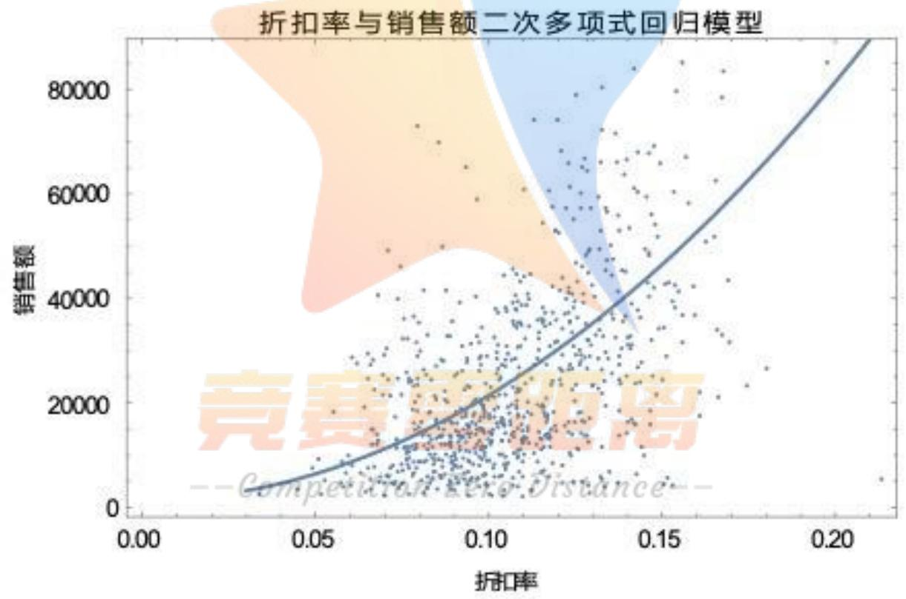

scatter

| 折扣率 (range) | 销售额 (range) |
| --- | --- |
| 0.05~0.20 | 0~85000 |

容易看出数据的散点图较为分散，无论直线曲线都难以取得较为理想的拟合效果，但整体可以看出，随着折扣率的增加商场的营业额也是增长状态，这也验证了商场“薄利多销”的经营理念。关于利用 Mathematica 软件对商场折扣率与销售额的拟合运算过程，详见支撑材料中文件“折扣率与销售额.nb”。

## 5.3.2 分阶段建立商场打折力度（折扣率）与销售额的关系模型

考虑到商场起步阶段与发展阶段的差异，我们将这两年多分为四个时间段，分别讨论商场折扣率与销售额的关系模型。通过 Mathematica 软件计算可以得出，线性回归模型与二次多项式回归模型的显著性和拟合度差异都不大，但都是二次多项式回归模型略优于线性回归模型，所以我们都只给出二次多项式回归模型。

第一时期(2016/11/30---2017/6/30)商场折扣率与销售额的二次多项式回归模型为:

$$
y = 3 1. 1 2 7 6 + 1 3 6 7 6 8 x - 4 6 0 1 3 5 x ^ {2}
$$

检验结果如下：

<table><tr><td>一次项</td><td>F=6.90459</td><td>P=0.00923192</td><td rowspan="2">R2=0.0420497</td></tr><tr><td>二次项</td><td>F=2.31345</td><td>P=0.129763</td></tr></table>

模型显著性与拟合度都较差，为了更直观的看到商场折扣率与销售额的关系，我们利用 Mathematica 软件画出数据的散点图和二次多项式曲线图：

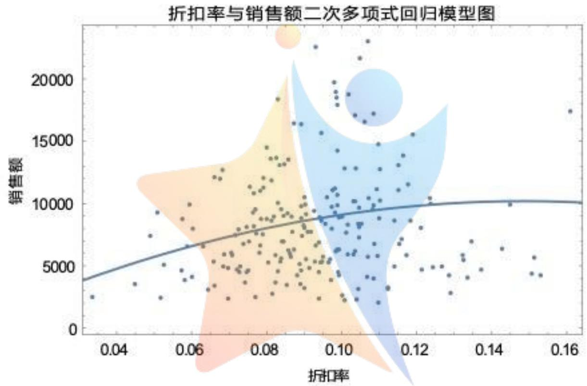

scatter

| Series | 折扣率 (range) | 销售额 (range) |
| --- | --- | --- |
| Data Points | 0.03~0.16 | 2500~23000 |

可以看出，商场折扣率与销售额没有明显的函数关系，这应该与商场处于起步阶段有关，商场的营销策略和经营管理还不成熟。

第二时期（2017/7/1---2017/12/31）商场折扣率与销售额的二次多项式回归模型为：

$$
y = 4 6 3 3 2. 6 - 7 2 6 5 9 7 x + 4. 2 5 7 3 3 \times 1 0 ^ {6} x ^ {2}
$$

检验结果如下：

<table><tr><td>一次项</td><td>F=63.3455</td><td>P=1.83922×10-13</td><td rowspan="2">R2=0.303042</td></tr><tr><td>二次项</td><td>F=15.3545</td><td>P=0.000126216</td></tr></table>

模型显著性还不错，拟合度也可以，都远远好于第一时期的回归效果。同样利用Mathematica软件画出数据的散点图和二次多项式曲线图：

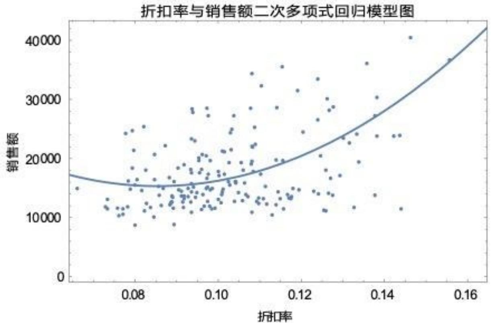

scatter

| 折扣率 (range) | 销售额 (range) |
| --- | --- |
| 0.07~0.16 | 8000~41000 |

可见这一时期商场折扣率与销售额具有一定的函数关系，销售额随着折扣率的增加呈现上升状态。关于这一时期商场折扣率与销售额的关系，我们也做了三次多项式进行拟合，但拟合效果与二次拟合相差不大，故在此不做赘述。

第三时期（2018/1/1---2018/6/30）商场折扣率与销售额的二次多项式回归模型为：

$$
y = 5 6 3 8 8. 5 - 6 2 2 3 9 6 x + 3. 0 6 7 8 2 \times 1 0 ^ {6} x ^ {2}
$$

检验结果如下：

<table><tr><td>一次项</td><td>F=4.17954</td><td>P=0.0423876</td><td rowspan="2"> $R^{2}=0.0620738$ </td></tr><tr><td>二次项</td><td>F=7.60086</td><td>P=0.00644223</td></tr></table>

模型显著性与拟合度都较差，利用 Mathematica 软件画出数据的散点图和二次多项式曲线图：

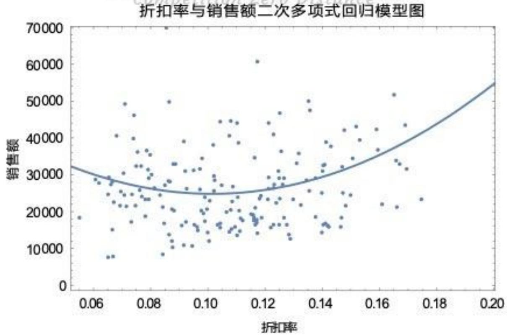

scatter

| 折扣率 (range) | 销售额 (range) |
| --- | --- |
| 0.06~0.20 | 8000~70000 |

对于这样的结果，我们认为可能与这个时间段是消费淡季有关，使得商场折扣率对销售额没有明显的影响。

第三时期（2018/7/1---2019/1/2）商场折扣率与销售额的二次多项式回归模型为：

$$
y = 6 0 9 2 2. 7 - 9 5 3 8 6 9 x + 6. 8 8 2 0 5 \times 1 0 ^ {6} x ^ {2}
$$

检验结果如下：

<table><tr><td>一次项</td><td>F=34.1048</td><td>P=2.35756×10-8</td><td rowspan="2">R=0.168302</td></tr><tr><td>二次项</td><td>F=2.72457</td><td>P=0.100539</td></tr></table>

跟第二时期相似，模型显著性和拟合度都可以。同样利用 Mathematica 软件画出数据的散点图和二次多项式曲线图：

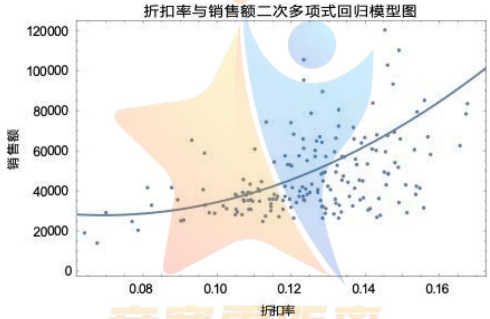

scatter

| 折扣率 (range) | 销售额 (range) |
| --- | --- |
| 0.07~0.17 | 15000~120000 |

通过分析可以认为,一般商场在后半年处于旺季,折扣率对销售额的影响比较显著,更容易实现“薄利多销”的经营策略。这一部分利用 Mathematica 软件对商场折扣率与销售额的分阶段拟合运算过程,详见支撑材料中第三题文件“折扣率与销售额 1.nb”、“折扣率与销售额 2.nb”、“折扣率与销售额 3.nb”、“折扣率与销售额 4.nb”。

## 5.3.3 建立商场打折力度（折扣率）与利润率的关系模型

以商场折扣率为自变量，利润率为因变量，根据问题一、二的计算结果（利润率数据使用 $r = 0.3$ 的运算结果），将数据导入Mathematica软件，建立线性回归拟合模型为：

$$
l = 0. 2 0 8 4 8 - 0. 6 0 9 4 x
$$

对其进行模型显著性检验及拟合度检验得：

<table><tr><td>F=1240.11</td><td>P=6.27×10-162</td><td>R2=0.6197</td></tr></table>

可见模型显著性与拟合度都很好，商场折扣率与利润率具有明显的线性关系，利润率随着折扣率的增加而减少。我们利用二次多项式及三次多项式进行拟合后，发现检验结果并无太大变化，因此采用了上面的线性回归模型来描述商场折扣率与利润率的关系。利用 Mathematica 软件画出数据的散点图和线性回归模型的直线图：

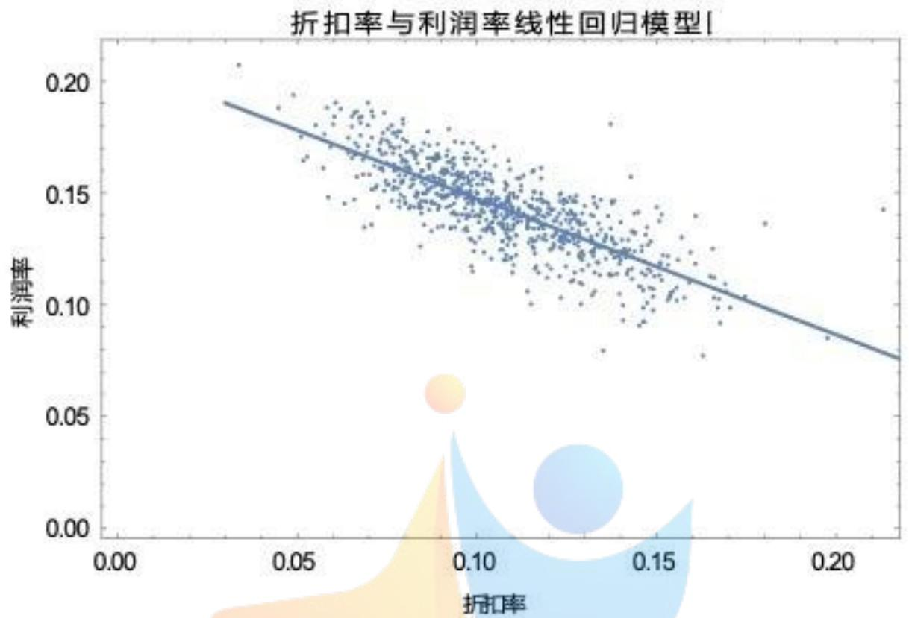

scatter

| 折扣率 (range) | 利润率 (range) |
| --- | --- |
| 0.03~0.21 | 0.08~0.21 |

商场折扣率的增加必然会导致利润率的下降，这也是符合实际情况的，此时商场的获利不是依赖于单个商品的高利润，结合之前分析商场折扣率与销售额的关系可以得到结论，商场通过降低利润率刺激消费，使得销售数量以更大比例增长从而使销售额增加，达到了“薄利多销”的目的。

## 5.4 问题四：商品分类后打折力度与商品销售额及利润率的关系模型及变化

借助附件 4 的商品信息表，把商品分为若干大类，进一步选择出比较有代表性的三类食品类、进口类、日用家居类分别进行处理。在附表 1、2 中利用 Excel 表将这三类的数据分别导出。

将这三类数据分别导入 Mathematica 软件中，建立线性回归拟合模型：

食品类折扣率与利润率的三次多项式回归模型为：

$$
l = 0. 2 4 2 2 4 1 - 0. 5 1 0 8 7 8 x - 4. 1 3 1 5 7 x ^ {2} + 2 0. 4 8 2 7 x ^ {2}
$$

对其进行模型显著性检验及拟合度检验得：

<table><tr><td>一次项</td><td>F=909.728</td><td>P=5.61518×10-132</td><td rowspan="3">R2=0.554315</td></tr><tr><td>二次项</td><td>F=28.4305</td><td>P=1.28235×10-7</td></tr><tr><td>三次项</td><td>F=5.83638</td><td>P=0.0159332</td></tr></table>

据此可以看出模型显著性和拟合度都很好。同样利用 Mathematica 软件画出数据的散点图和三次多项式曲线图：

食品类的折扣率与利润率三次多项式回归模型图  
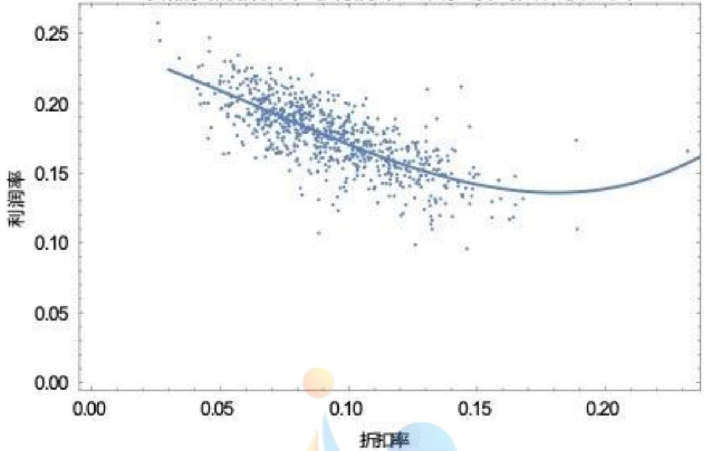

scatter

| 折扣率 (range) | 利润率 (range) |
| --- | --- |
| 0.03~0.24 | 0.10~0.26 |

根据此图可以看出，它的利润率是随着折扣率的增加而下降的，后期的上升可能是因为客户对商场的认知加深，购买量增加而产生的。我们之前还做过一次拟合、二次拟合但检验结果相差不大。

食品类折扣率与销售额：

$$
y = - 1 0 3 5 9. 2 + 3 2 5 8 0 5 x
$$

检验结果如下：

<table><tr><td>F = 249.501</td><td>P = 8.01122×10-49</td><td>R2 = 0.246908</td></tr></table>

由此可见模型显著性和拟合度都还可以，跟二次拟合结果相差不大，据此做出其散点图和一次项线性回归图：-Competition Zero Distance--

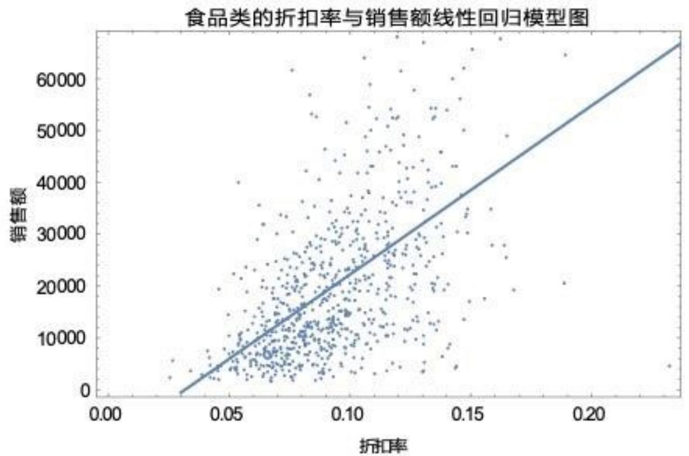

scatter

| 折扣率 (range) | 销售额 (range) |
| --- | --- |
| 0.03~0.24 | 0~68000 |

由图可以看出，折扣率越大，销售额就越大。

日用类折扣率与利润率：

$$
l = 0. 2 8 0 7 5 4 - 0. 8 5 8 1 4 x
$$

检验结果如下：

<table><tr><td>F = 2794.56</td><td>P = 5.75229×10-257</td><td>R2 = 0.785969</td></tr></table>

可见模型显著性与拟合度都很好，日用类折扣率与利润率具有明显的线性规划，利润率随着折扣率的增加而减少。我们利用二次多项式及三次多项式进行拟合后，发现检验结果并无太大变化，因此采用了上面的线性回归模型来描述折扣率与利润率的关系。利用 Mathematica 软件画出数据的散点图和线性回归模型的直线图：

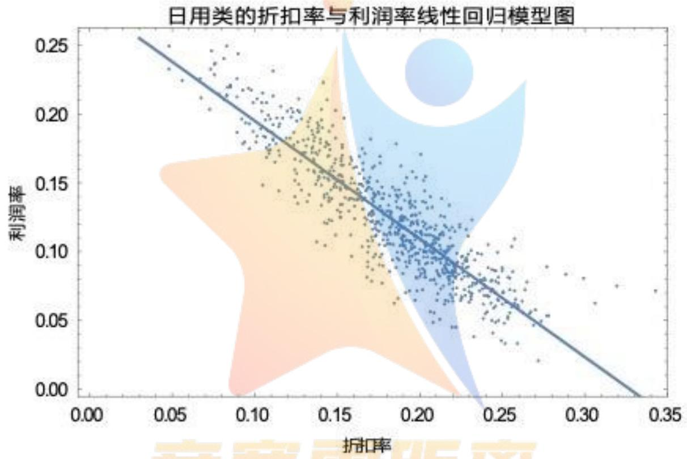

scatter

| Series | 折扣率 (range) | 利润率 (range) |
| --- | --- | --- |
| Data Points | 0.05~0.35 | 0.02~0.25 |

日用类的折扣率与利润率之间，有着很显著的影响，折扣率越大，商品的利润越小
日用类折扣率与销售额：

$$
y = 4 5 2 1. 1 3 - 2 0 5 9 9. 8 x + 9 2 9 0 9. 8 x ^ {2}
$$

检验结果如下：

<table><tr><td>一次项</td><td>F=5.73435</td><td>P=0.0168775</td><td rowspan="2">R2=0.00915712</td></tr><tr><td>二次项</td><td>F=1.28938</td><td>P=0.256521</td></tr></table>

由此可见模型显著性与拟合度并不好，一次项拟合的效果与其相差不大，说明其折扣率对销售额的影响并不显著。

进口类折扣率与利润率：

$$
l = 0. 2 9 3 7 9 9 - 1. 5 9 4 8 2 x + 3. 0 9 3 5 8 x ^ {2}
$$

检验结果如下：

<table><tr><td>一次项</td><td>F=1846.59</td><td>P=2.322×10-205</td><td rowspan="2">R2=0.734832</td></tr><tr><td>二次项</td><td>F=253.981</td><td>P=1.56596×10-49</td></tr></table>

由此可见模型显著性与拟合度很好，一次拟合的效果不如其拟合效果，三次拟合效果与其相差不大。因此采用了上面的线性回归模型来描述进口类折扣率与利润率的关系。利用 Mathematica 软件画出数据的散点图和线性回归模型的直线图：

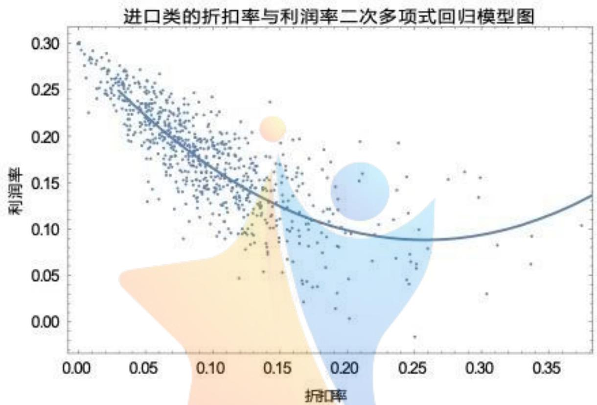

scatter

| 折扣率 (range) | 利润率 (range) |
| --- | --- |
| 0.00~0.38 | 0.00~0.30 |

由此可知，进口类的折扣率在前期利润率的影响是折扣越大，利润越小，后期呈相反的状态。

进口类折扣率与销售额：

$$
y = 5 0 7. 0 8 8 + 5 1 5 0. 6 x - 7 4 6 1. 3 1 x ^ {2}
$$

检验结果如下：

<table><tr><td>一次项</td><td>F=39.8264</td><td>P=4.7197×10-10</td><td rowspan="2">R2=0.0523048</td></tr><tr><td>二次项</td><td>F=2.00885</td><td>P=0.156795</td></tr></table>

由此可见，模型显著性和拟合性不高，一次拟合效果与其相差不大，说明其折扣率对销售额的影响并不显著。

## (六) 模型优化

利用折扣信息表把附件 1、2 销售流水记录中的可打折商品筛选出来，只考虑商场这些商品的销售情况，将附件1、2销售流水记录整合为打折商品的销售流水记录，仍然利用前面建立的商场的营业额、利润率、折扣率模型进行计算得出结果（详见支撑材料中中优化中的第一题文件“打折商品营业额和利润率.xlsx”、第二题文件“打折商品商场每天折扣率.xlsx”），根据计算结果，利用Mathematica软件建立商场打折力度与商品销售额及利润率的关系模型，与之前的模型进行比较，另外，也要考虑大区分类时的变化情况。

## 6.1 商场打折力度与商品销售额的优化模型

根据计算结果，以打折商品的商场折扣率为自变量，商品销售额为因变量，利用Mathematica软件，建立一次线性回归拟合的优化模型为：

$$
y = - 1 7 8 6 3. 9 + 2 8 0 4 7 7 x
$$

对其进行模型显著性检验及拟合度检验得：

<table><tr><td>F = 464.139</td><td>P = 9.622×10-81</td><td>R2 = 0.3788</td></tr></table>

与考虑全部商品的一次线性回归拟合模型的检验相比较，结果如下：

<table><tr><td>考虑全部商品的模型</td><td>F=191.148</td><td>P=5.98877×10-39</td><td>R2=0.200755</td></tr><tr><td>只考虑打折商品的优化模型</td><td>F=464.139</td><td>P=9.622×10-81</td><td>R2=0.3788</td></tr></table>

可以看到优化模型显著性和拟合度都有了较大的提高，更明确的给出了商场打折力度与商品销售额线性关系。

利用 Mathematica 软件画出数据的散点图和线性回归优化模型的直线图:

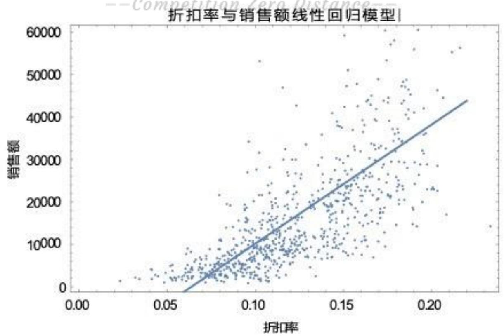

scatter

| 折扣率 (range) | 销售额 (range) |
| --- | --- |
| 0.02~0.23 | 0~60000 |

我们也计算了商场折扣率与销售额的二次多项式优化模型，对比结果与线性优化模型的对比结果相仿，这里不再多说。关于利用 Mathematica 软件对商场折扣率与销售额的优化模型拟合运算过程，详见支撑材料中优化中的第三题文件“打折商品折扣率与销售额.nb”。

## 6.2 商场打折力度与利润率的优化模型

根据计算结果，以打折商品的商场折扣率为自变量，利润率为因变量，利用Mathematica软件，建立一次线性回归拟合的优化模型为：

$$
y = 0. 2 3 8 7 4 3 - 0. 7 2 2 5 6 6 x
$$

对其进行模型显著性检验及拟合度检验得：

<table><tr><td>F=1778.13</td><td>P=2.64501×10-201</td><td>R2=0.700291</td></tr></table>

与考虑全部商品的一次线性回归拟合模型的检验相比较，结果如下：

<table><tr><td>考虑全部商品的模型</td><td>F=1240.11</td><td>P=6.27×10-162</td><td>R2=0.6197</td></tr><tr><td>只考虑打折商品的优化模型</td><td>F=1778.13</td><td>P=2.64501×10-201</td><td>R2=0.700291</td></tr></table>

可以看到优化模型显著性和拟合度也有较大的提高，更明确的给出了商场打折力度与利润率线性关系。

利用 Mathematica 软件画出数据的散点图和线性回归优化模型的直线图:

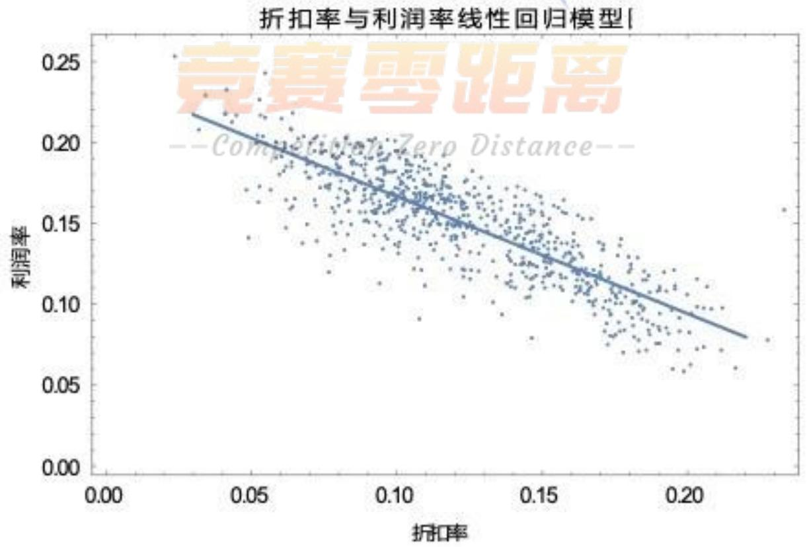

scatter

| 折扣率 (range) | 利润率 (range) |
| --- | --- |
| 0.03~0.23 | 0.06~0.25 |

关于利用 Mathematica 软件对商场折扣率与利润率的优化模型拟合运算过程，详见支撑材料中优化中的第三题文件“打折商品折扣率与利润率.nb”。

## 6.3 商品分类后打折力度与商品销售额及利润率的关系优化模型及变化

根据分类结果，以各分类中的打折商品折扣率为自变量，以销售额及利润率为因变量建立模型，对其进行分析。

打折商品中食品类的折扣率与销售额：

$$
y = - 8 9 1 7. 3 7 + 2 0 4 1 8 2 x
$$

检测结果如下：

<table><tr><td>F = 555.735</td><td>P = 1.11018×10-92</td><td>R2 = 0.422055</td></tr></table>

由此可见模型显著性与拟合度很好，二次拟合与三次拟合的结果相差不大。因此采用了上面的线性回归模型来描述食品类折扣率与销售额的关系。利用 Mathematica 软件画出数据的散点图和线性回归模型的直线图：

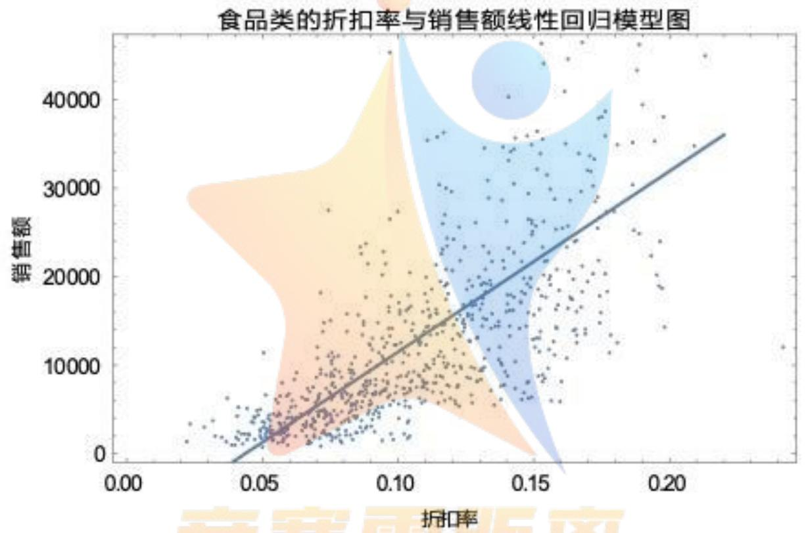

scatter

| Series | 折扣率 (range) | 销售额 (range) |
| --- | --- | --- |
| Data Points | 0.03~0.22 | 0~45000 |

由图可以看出食品类中打折商品的折扣率对销售额影响很大，销售额随着折扣率的增加而增加。

打折商品中食品类的折扣率与利润率：

$$
l = 0. 2 3 5 4 7 3 - 0. 7 3 3 6 0 6 x
$$

检测结果如下：

<table><tr><td>F = 1409.85</td><td>P = 2.15807 × 10-175</td><td>R2 = 0.649445</td></tr></table>

由此可见模型显著性与拟合度很好，二次拟合与三次拟合的结果相差不大。因此采用了上面的线性回归模型来描述食品类折扣率与利润率的关系。利用 Mathematica 软件画出数据的散点图和线性回归模型的直线图：

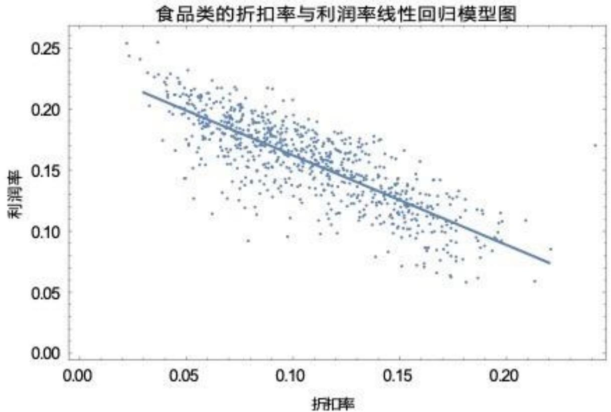

scatter

| 折扣率 (range) | 利润率 (range) |
| --- | --- |
| 0.03~0.22 | 0.06~0.25 |

食品类中打折商品的折扣率与利润率成反比，折扣率越大，利润率越小。通过分析可以看到，商场中食品类商品更适用于“薄利多销”的经营策略。

日用类打折商品的折扣率与销售额以及利润率的做法同上，但折扣率对销售额的影响不那么显著。详细计算过程结果见支撑材料中优化中的第四题“日用类的折扣率与销售额.nb”、“日用类的折扣率与利润率.nb”。

进口类打折商品的折扣率与销售额以及利润率的做法同上，具体结果见支撑材料中优化中的第四题“进口类的折扣率与销售额.nb”、“进口类的折扣率与利润率.nb”。

## (七) 模型评价

1. 此模型运用 Excel 软件，计算简便，结果可靠，可操作性强，有较强的实用性；  
2. 在分析第三问时和第四问时, 进行分类考虑, 更清晰条理的阐述了折扣率与利润率以及营业额的关系, 其中运用到线性规划更能能体现出三者之间的关系以及变化。  
3. 可推广面大，对从事解决相关的问题中又起了良好的借鉴作用。

## (八) 参考文献

（1）姜启源谢金星，数学建模案例选集，北京：高等教育出版社，2006年。  
(2) 阳明盛林建华, Mathematica 基础及数学软件, 大连理工大学出版社, 2003 年。  
(3) [美] D. 尤金, Mathematica 使用指南, 科学出版社, 2002 年。

## 附录

1、Excel 中的用到的嵌套函数进行筛选：从当前表格中筛选某列单元格内容包含其他表格目标列的内容的记录，如判断当前表格第一条记录中 B2 单元格内容是否包含在某一表格的 D 列中，可在当前表格第一条记录中任意空单元格输入 “=If（countif（某一表格的 D 列，B2）>0,1,0）”，则若包含计算结果为 1，否则为 0。

2、mathematica 软件中用到的拟合及检验、作图命令:

函数 = LinearModelFit[数据, x, x]，求出数据的线性拟合模型

函数 = LinearModelFit[数据, $\{x, x^{2}\}, x$ ], 求出数据的二次多项式拟合模型

函数["ANOVATable"]，求出模型的方差分析表

函数["RSquared"], 求出模型的拟合优度

Show[ListPlot[数据], Plot[函数[x], {x, 下限, 上限}], Frame → True], 作出数据散点图及模型曲线图