# 基于打折力度概念的“薄利多销”模型

## 摘要

本文主要对某商场 2016 年 11 月 30 日至 2019 年 1 月 2 日的销售流水相关数据进行分析，通过汇总、拼接、删失（删除缺失值）、排序、补全缺失值等数据处理得到商场每日销售额和利润率，然后选取商品折扣率、商品利润率以及折扣响应度指标，计算出商场每日最终的打折力度。依据每日商品营业额、利润率、打折力度，建立了打折力度与商品营业额、利润率的鲁棒线性回归模型，并进一步分析了商品类别对该模型的影响。

针对问题一，为了计算出商场每天的营业额和利润率，本文主要根据附件1附件2的销售流水记录来进行分析。对于大部分非打折商品成本价缺失(共783524条记录缺失成本价)，本文采用两种方式补全成本价缺失值。第一种方式利用商品ID遍历成本价未缺失的历史流水数据，从而填补了 $71.46\%$ 的缺失部分；对于在历史数据查询不到商品ID的缺失记录，依据先验信息零售商利润率一般在 $20\%$ 到 $40\%$ 之间，第二种方法则直接生成随机的商品利润率(0.2到0.4)，然后再根据销售价反算出缺失的商品成本价。最终依据完整的销售流水记录表汇总得到所有商品每日的营业额和对应的利润率。

针对问题二，根据附件3的折扣信息表，利用促销时间、价格、数量等变量，计算出商品折扣率、商品利润率以及折扣响应度指标，利用较为简单直观的公式输出一个粗粒度的打折力度，并与问题一数据融合计算出商场每日最终的打折力度。

针对问题三, 根据问题一和问题二对商场每天的销售额和利润率与打折力度, 利用迭代加权最小二乘法, 建立了打折力度为自变量、销售额利润率为因变量的线性回归模型, 结果表明: 打折力度与销售额存在正相关关系, 打折力度与利润率存在负相关关系。

针对问题四，通过附件4的商品信息表，对不同类别商品的价格弹性进行分析，按照问题一与问题二的计算方式来作图分析，考察不同类别商品下对该问题结果的影响。发现价格弹性高的商品，对打折力度的强度反应很灵敏，而弹性低的商品类别，销售额与打折力度之间没有很强的相关性，且利润率变化相对平缓。

关键词：打折力度 营业额 利润率 迭代加权最小二乘法 需求价格弹性

## 一、问题重述

打折促销，是“薄利多销”策略的一种应用。“薄利多销”，顾名思义就是通过降低商品价格，吸引更多的消费者达到更多的销售量，虽然单品利润降低但总体利润增加。日常生活频现打折活动，打折不仅可以促进本身打折品的销售，更妙地是它可以吸引更多潜在的消费者，形成对同商场其他未打折商品的购买力。

然而，打折必须精准定位，不同打折策略对商场营业额和利润率会有不同的影响。由经济学需求价格弹性概念知道[1]，薄利多销策略只对价格弹性高的商品有效，打折过低或过高都可能适得其反[2]，而任何商品都打折等盲目打折行为甚至可能造成亏损[3]。因此，确立打折力度与营业额、利润率的关系十分重要。

如前所述，依据零售商超市粗糙的数据流水记录数据，确立打折力度与营业额、利润率的关系，挖掘更有效精准的打折策略，必须先清洗、整合干净的交易数据，选取合适的指标量化“打折力度”这一概念。建立三者的相关关系，进而分析不同类别的商品对模型关系的影响。

所用数据集介绍：附件1和附件2是某商场自2016年11月30日起至2019年1月2日的销售流水记录，附件3是折扣信息表，附件4是商品信息表，附件5是数据说明表。因此，所要解决问题如下：

(1) 计算该商场从 2016 年 11 月 30 日到 2019 年 1 月 2 日每天的营业额和利润率  
(2) 选取合适指标衡量商场每天打折力度，并计算商场从 2016 年 11 月 30 日到 2019 年 1 月 2 日每天的打折力度。  
(3) 分析打折力度与商品销售额以及利润率的关系。  
(4) 考虑商品的大类区分,打折力度与商品销售额以及利润率的关系有何变化?

## 二、基本假设

(1) 假设 ID 相同的商品三年内成本价变化不大  
(2) 假设商品成本的利润率一般在 20%-40%之间  
（3）忽略单品买赠对评估打折力度的影响  
(4) 假设当天内等时间段的打折力度相等, 即打折力度一天对时间段无差别  
(5) 假设每天打折力度是当天所有商品打折力度之和

## 三、符号说明

为简化问题分析和数据处理，对符号做如下规定：

<table><tr><td>Y:</td><td>每日营业额</td></tr><tr><td>R:</td><td>每日利润率</td></tr><tr><td>n:</td><td>销售数量</td></tr><tr><td>Sp:</td><td>商品实际销售价格</td></tr><tr><td>Cp:</td><td>商品成本价</td></tr><tr><td>Bp:</td><td>商品标价</td></tr><tr><td>Dp:</td><td>打折力度</td></tr><tr><td>Da:</td><td>打折活跃度</td></tr><tr><td>Dr:</td><td>打折率</td></tr><tr><td>Lc:</td><td>限购数量</td></tr><tr><td>Sc:</td><td>购买数量</td></tr></table>

## 四、模型的建立与求解

本节主要求解四个小问，其求解思路过程流程图如下：

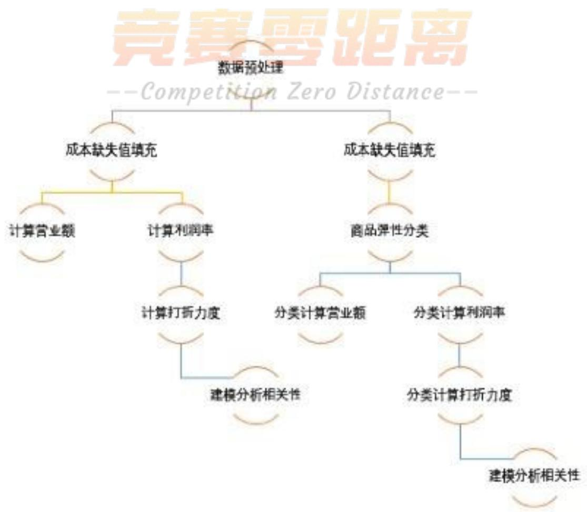

<details>
<summary>flowchart</summary>

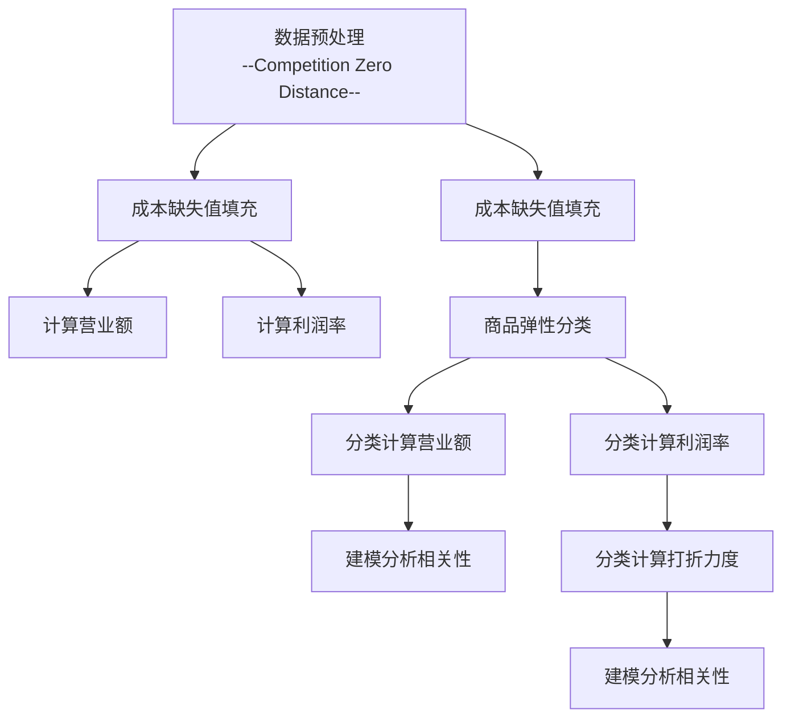
</details>

## 4.1 问题一的建模与解答

## 4.1.1 商品销售数据可视化探索

通过对附件 1 和附件 2 的 1221855 多条记录进行分析（见图 1），发现在这些订单中，有近 8% 的订单属于无效订单（96674 条），无效订单并没有形成实际购买，对于每日销售额 Y 和利润率 R 的计算是无用的，因此本小问计算对这些记录进行了删除处理。

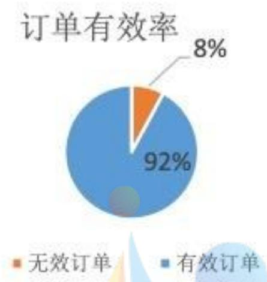

<details>
<summary>donut</summary>

| Category | Value (%) |
| --- | --- |
| 无效订单 | 8 |
| 有效订单 | 92 |
</details>

图1

计算有效订单中每天商品的营业额,再对每天所有商品的营业额进行求和得到每日营业额 Y。要计算每日的总利润率,需知道每日各个销售商品的成本价,再依据成本价 Cp、实际销售价 Sp 计算。经统计附件一、二中销售流水记录中有效订单的成本价缺失严重,有效订单中成本价缺失条数 720850,占比约 64%(见图 2),需想方法对这些成本价缺失值记录填充再行计算日利润率 R。

成本价缺失率情况  
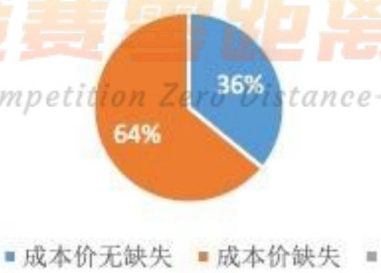

<details>
<summary>donut</summary>

| Category | Percentage |
| --- | --- |
| 成本价无缺失 | 36% |
| 成本价缺失 | 64% |
</details>

图2

填补成本价缺失的方法如前文所述，首先根据商品ID一一对应的方法，在有成本价的历史订单中遍历（由假设1三年内相同商品ID的成本价相差不大），从而补全部分缺失商品与历史订单相同商品ID的成本价，该方法共填充缺失条目数为519901，值得说明的是该方法历史遍历往往发现多条记录，本文选择与之售价或标价相同的记录对应的成本价。对于剩余的2万左右的成本价缺失记录，本文依据题目中所给假设2，商品零售利润率在 $20\% \sim 40\%$ 之间，随机生成商品利润率 $r_i \in [0.2, 0.4]$ ，再依据商品利润率和商品标价反算出缺失条目的成本价。

## 4.1.2 问题一的求解

问题要求结合商品销售流水记录，利用 SAS 将附件 1 与附件 2 进行拼接并按照日期排序，筛选出有效订单(is\_finished=0 表示该订单记录但并未成功付款，视为未成功订单)，根据有效订单的单品销售价及销售量，计算出指定时间段的每天营业额 Y。每天营业额 Y 计算公式如下：

$$
Y = \sum_ {i = 1} ^ {I} S p _ {i} \times n _ {i} \tag {1},
$$

其中 $Sp_{i}$ 商品 $\mathrm{i}$ 的销售价格， $n_i$ 为商品 $\mathrm{i}$ 的销售量， $\mathrm{I}$ 为当天不同商品销售总记录条数。

由公式(1)计算，2016年11月30至2019年1月2日每日的营业额图形如下：

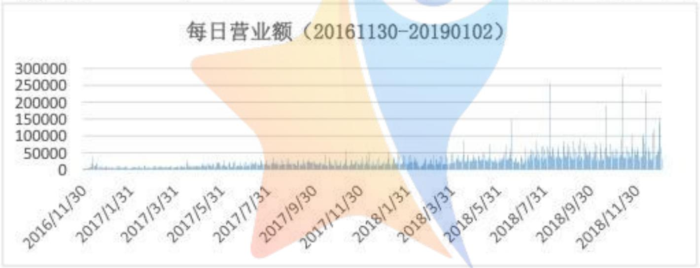

<details>
<summary>area</summary>

| Date | Daily Revenue |
| --- | --- |
| 2016/11/30 | ~5000 |
| 2017/1/31 | ~10000 |
| 2017/3/31 | ~15000 |
| 2017/5/31 | ~20000 |
| 2017/7/31 | ~25000 |
| 2017/9/30 | ~30000 |
| 2017/11/30 | ~40000 |
| 2018/1/31 | ~50000 |
| 2018/3/31 | ~60000 |
| 2018/5/31 | ~70000 |
| 2018/7/31 | ~80000 |
| 2018/9/30 | ~90000 |
| 2018/11/30 | ~150000 |
</details>

在利润率的计算上,本文先利用商品 ID 在设定随机数来补全缺失成本价格,设置 0.2\~0.4 之间的随机数利润率,每日利润率 R 的计算公式如下:

$$
R = \frac {Y}{\sum_ {i = 1} ^ {I} C p _ {i} \times n _ {i}} - 1 \tag {2},
$$

其中 Y 为已计算好的日营业额， $Cp_{i}$ 为商品 i 的成本价， $n_{i}$ 为商品 i 的销售量，I 为当天不同商品销售记录条数。商场每日营业额 Y 和利润率 R 计算如下表：(所有计算数据参见文件 “问题 1 营业额及利润率.xlsx”)

<table><tr><td>时间</td><td>日营业额(Y)</td><td>日利润率(R)</td></tr><tr><td>30Nov2016</td><td>2833.70</td><td>11.74%</td></tr><tr><td>1Dec2016</td><td>2346.20</td><td>19.47%</td></tr><tr><td>2Dec2016</td><td>2338.30</td><td>17.09%</td></tr><tr><td>3Dec2016</td><td>3270.40</td><td>16.21%</td></tr><tr><td>4Dec2016</td><td>3881.68</td><td>15.77%</td></tr><tr><td>5Dec2016</td><td>2362.60</td><td>22.77%</td></tr><tr><td>6Dec2016</td><td>2253.10</td><td>19.8%</td></tr><tr><td>7Dec2016</td><td>5312.88</td><td>16.38%</td></tr><tr><td>8Dec2016</td><td>5890.72</td><td>16.58%</td></tr><tr><td>9Dec2016</td><td>5750.58</td><td>17.59%</td></tr><tr><td>10Dec2016</td><td>5755.26</td><td>16.02%</td></tr><tr><td>11Dec2016</td><td>16415.22</td><td>17.09%</td></tr><tr><td>12Dec2016</td><td>37236.08</td><td>15.45%</td></tr><tr><td>13Dec2016</td><td>16547.00</td><td>15.82%</td></tr><tr><td>14Dec2016</td><td>9172.90</td><td>17.91%</td></tr><tr><td>15Dec2016</td><td>11167.40</td><td>17.21%</td></tr><tr><td>16Dec2016</td><td>11062.28</td><td>16.95%</td></tr><tr><td>17Dec2016</td><td>14744.44</td><td>15.61%</td></tr><tr><td>18Dec2016</td><td>17424.66</td><td>16.17%</td></tr><tr><td>19Dec2016</td><td>3151.70</td><td>17.52%</td></tr></table>

表1

## 4.2 问题二的建模与解答

问题二要求建立合适的指标量化打折力度，并计算商场2016年到2019年期间每天的打折力度。由日常经验知，五折比九折的打折力度要高，因此打折率指标可以反应单品的打折力度，单品打折率Dr=Sp/Bp(售价/标价)。

另外，同样的折扣率的两个商品，如 A 商品成本 1 元，门店标价 10 元，打五折实际售价 5 元；B 商品成本 2 元，门店标价 10 元，打五折售价 5 元，消费者应当购买 B 商品才更实惠，因为商场实际让利给消费者更多，打折力度更大，即同样的折扣率、原始利润率更低的商品折扣力度更大(商家利润率低，让利给消费者的实惠就更多，二者是竞争关系)。因此为简化问题，相同折扣率的商品，利润率 r 更低的商品打折力度更大，选择利润率 r 作为第二个量化打折力度的指标。

最后，由附件3限购数量和实际销售数量知，消费者用“脚”投票，实际销售量越接近限购数量，该打折活动的消费者活跃度越高，表示该商品打折活动很奏效，打折力度很大，折扣活跃度也应纳入衡量打折力度的指标中。由上述，这三个指标综合考量才形成打折力度的合理量化。

综上分析，在日期不存在附件3折扣信息表情形下，本文采用如下公式尝试计算单品打折力度Dp:

$$
D p = \frac {1 - D r}{\mathrm{r}} \tag {3},
$$

公式(3)恰能反应折扣力度与折扣率、利润率的关系，且分子分母均在(0,1)，计算数值变化不大，可以作为折扣力度的衡量。由于题中要求出2016年11月30号到2019年1月2号每日打折力度，而折扣信息表中只有2017年3月份以后的折扣信息数据，本文结合由附件1和附件2数据补全2016年11月30号至2017年3月份的打折力度（该时间段的打折力度按照公式(3)计算，并汇总成每日打折力度值)，对于附件3折扣信息表中存在限购数量Lc和购买数量Sc,其打折力度公式计算如下：

$$
D p = \frac {1 - D r}{\mathrm{r}} + \frac {S c}{L c} \tag {4},
$$

数据观察发现, 由于限购数通常还是很大的, 公式(4)中第二项 $\frac{Sc}{Lc}$ 实际很小, 当接近1时表明打折活跃度也很高, 这里线性相加反应在折扣力度Dp中。最后, 本文将这(3)、(4)两种计算结果融合, 拼接成总表2如下: (所有计算数据参见文件“问题2商品折扣力度.xlsx”)

<table><tr><td>时间</td><td>营业额Y</td><td>利润率R</td><td>打折力度Dp</td></tr><tr><td>30Nov2016</td><td>2833.70</td><td>0.115763026</td><td>2.02806</td></tr><tr><td>1Dec2016</td><td>2346.20</td><td>0.192372413</td><td>1.35932</td></tr><tr><td>2Dec2016</td><td>2338.30</td><td>0.175281984</td><td>1.36281</td></tr><tr><td>3Dec2016</td><td>3270.40</td><td>0.16535232</td><td>1.48605</td></tr><tr><td>4Dec2016</td><td>3881.68</td><td>0.156719561</td><td>1.38741</td></tr><tr><td>5Dec2016</td><td>2362.60</td><td>0.228914204</td><td>1.13271</td></tr><tr><td>6Dec2016</td><td>2253.10</td><td>0.190059093</td><td>1.47578</td></tr><tr><td>7Dec2016</td><td>5312.88</td><td>0.167720832</td><td>1.43409</td></tr><tr><td>8Dec2016</td><td>5890.72</td><td>0.170971981</td><td>1.51741</td></tr><tr><td>9Dec2016</td><td>5750.58</td><td>0.178246114</td><td>1.29463</td></tr><tr><td>10Dec2016</td><td>5755.26</td><td>0.16082193</td><td>1.40768</td></tr><tr><td>11Dec2016</td><td>16415.22</td><td>0.170418126</td><td>1.29086</td></tr><tr><td>12Dec2016</td><td>37236.08</td><td>0.154816697</td><td>1.48759</td></tr><tr><td>13Dec2016</td><td>16547.00</td><td>0.160560791</td><td>1.38423</td></tr><tr><td>14Dec2016</td><td>9172.90</td><td>0.180690837</td><td>1.24069</td></tr><tr><td>15Dec2016</td><td>11167.40</td><td>0.171880836</td><td>1.38703</td></tr><tr><td>16Dec2016</td><td>11062.28</td><td>0.171506814</td><td>1.48392</td></tr><tr><td>17Dec2016</td><td>14744.44</td><td>0.155224881</td><td>1.56064</td></tr><tr><td>18Dec2016</td><td>17424.66</td><td>0.162251897</td><td>2.02838</td></tr><tr><td>19Dec2016</td><td>3151.70</td><td>0.181803678</td><td>1.44158</td></tr></table>

表2

## 4.3 问题三的建模与解答

分析打折力度与商品销售额及利润率与之间的关系, 主要依赖于问题一和问题二得到的每日营业额、利润率、以及打折力度信息, 即 4.2 中表 2。首先通过 SAS 分别对打折力度与商品销售额、打折力度与利润率进行相关性分析。

## 4.3.1 打折力度与销售额关系

首先依据表2画出打折力度与销售额的散点图，如下所示：

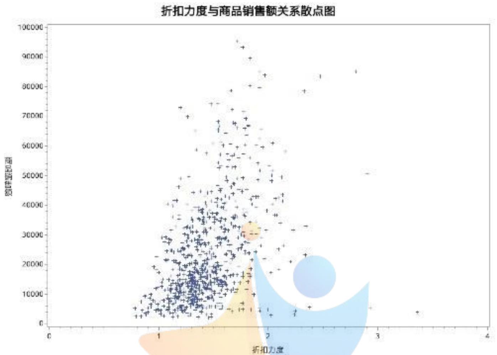

<details>
<summary>scatter</summary>

| 折扣力度 (range) | 商品销售额 (range) |
| --- | --- |
| 0.5~3.5 | 0~95000 |
</details>

可以看出打折力度与销售额呈现一定的正相关性, 下面通过皮尔逊相关性检验[4-5]来验证这种关系:

<table><tr><td colspan="3">Pearson 相关系数, N = 752Prob &gt; |r| under HO: Rho=0</td></tr><tr><td></td><td>_COL2</td><td>rate</td></tr><tr><td>_COL2营业额</td><td>1.00000</td><td>0.44020&lt;.0001</td></tr><tr><td>rate折扣力度</td><td>0.44020&lt;.0001</td><td>1.00000</td></tr></table>

<table><tr><td colspan="8">Pearson 相关统计量(Fisher z 转换)</td></tr><tr><td>变量</td><td>与变量</td><td>N</td><td>样本相关系数</td><td>Fisher z</td><td colspan="2">95% 置信限</td><td>HO:Rho=0的 p 值</td></tr><tr><td>_COL2</td><td>rate</td><td>752</td><td>0.44020</td><td>0.47248</td><td>0.380686</td><td>0.496080</td><td>&lt;.0001</td></tr></table>

皮尔逊相关性检结果 p 值很小（p<0.0001），说明它们确实具有相关性 $^{[4-5]}$ ；且样本相关系数为 0.4402>0，所以打折力度与营业额具有正相关性 $^{[4-5]}$ 。

对打折力度和营业额做线性回归，为防止异常值和噪声影响，本文使用迭代加权最小二乘法做回归（有关迭代加权最小二乘法更多介绍参加[6]），迭代加权最小二乘法拟合回归关系对噪声和异常值更稳健[6]，matlab中可以直接调用函数robustfit()实现，这里加权函数本文默认选择的双平方加权函数。为了消除营业额数值过大与打折力度量纲不同，本文对 $\ln (\mathrm{Y})$ 和Dp做回归，得到回归方程如下：

$$
\ln (Y) = 1. 5 9 D p + 7. 5 7 \tag {5},
$$

拟合的回归关系(红线)与对数营业额散点图如下:

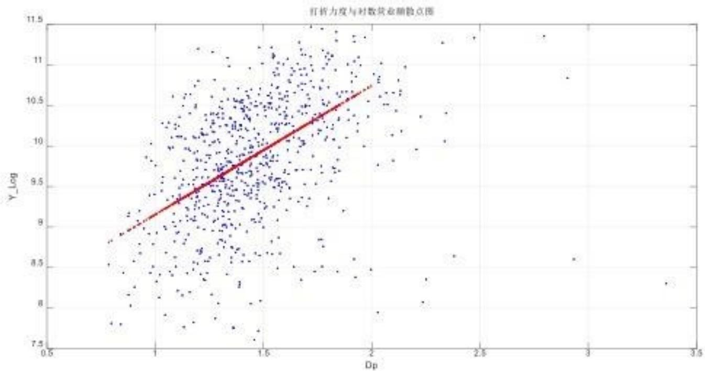

<details>
<summary>scatter</summary>

| Dp (range) | Y_Log (range) |
| --- | --- |
| 0.8~3.4 | 7.5~11.5 |
</details>

值得注意的是,当打折力度大于2.5后,营业额与打折力度反而不满足正相关性,这说明打折力度过大,打折策略不当反而损害了商场的利益。

## 4.3.2 打折力度与商品利润率的关系

首先依据表2画出每日打折力度与每日利润率的散点图，如下所示：

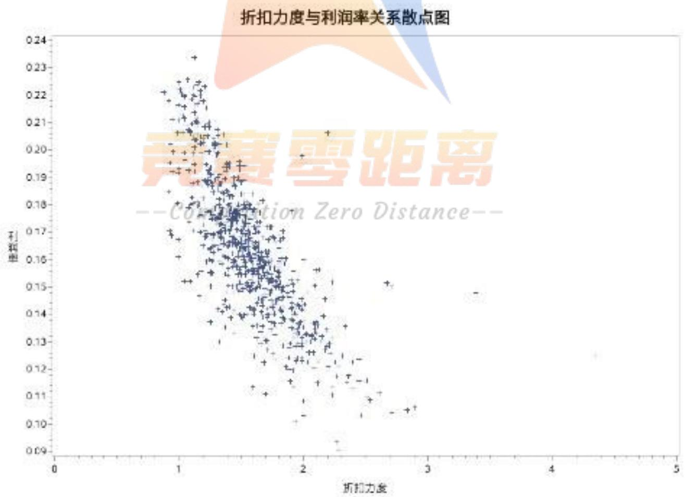

<details>
<summary>scatter</summary>

| 折扣力度 (range) | 利率 (range) |
| --- | --- |
| 0.8~3.5 | 0.09~0.24 |
</details>

可以看出打折力度与利润率有明显的负相关性, 下面通过皮尔逊相关性检验来验证这种关系:

<table><tr><td colspan="3">Pearson 相关系数. N = 752Prob &gt; |r| under HO: Rho=0</td></tr><tr><td></td><td>lr</td><td>rate</td></tr><tr><td>lr利润率</td><td>1.00000</td><td>-0.73343&lt;.0001</td></tr><tr><td>rate折扣力度</td><td>-0.73343&lt;.0001</td><td>1.00000</td></tr></table>

Pearson 相关统计量 (Fisher z 转换)

<table><tr><td>变量</td><td>与变量</td><td>N</td><td>样本相关系数</td><td>Fisher z</td><td colspan="2">95% 置信限</td><td>H0:Rho=0的p值</td></tr><tr><td>lr</td><td>rate</td><td>752</td><td>-0.73343</td><td>-0.93612</td><td>-0.764822</td><td>-0.698569</td><td>&lt;.0001</td></tr></table>

皮尔逊相关性检结果 p 值很小（p<0.0001），说明它们确实具有相关性 $^{[4-5]}$ ；且样本相关系数为 -0.73343<0，所以打折力度与利润率具有负相关性 $^{[4-5]}$ 。

对打折力度 Dp 和利润率 R 做线性回归，同样地，为防止异常值和噪声影响，本文使用迭代加权最小二乘法做回归 $^{[6]}$ ，调用 matlab 函数 robustfit()，加权函数选择默认的双平方加权函数，得到 Dp 和 R 的回归方程如下：

$$
R = - 0. 0 5 9 D p + 0. 2 6 \tag {6},
$$

拟合的回归关系（红线）及对应散点图如下：

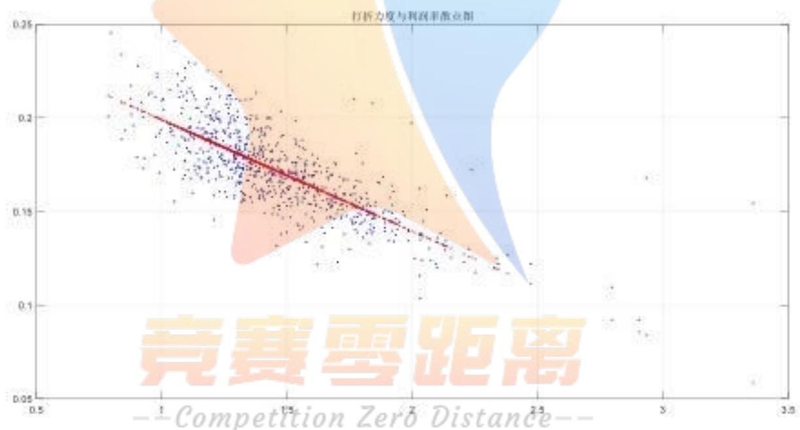

<details>
<summary>scatter</summary>

| Series | Competition Zero Distance (range) | Value (range) |
| --- | --- | --- |
| Data Points | 0.8~2.5 | 0.11~0.24 |
</details>

总结：由回归方程（5），（6）及图形可看出，随着打折力度的增加，商场每日的营业额是增加的，而商品每日的利润率是降低的。这表明，通过降低单个的利润率，确实带动了销售量的增加，进而营业额增加了，实现了“薄利多销”的策略。但也注意到，商场在这两年多的时间内，也有一些天数折扣力度过大，反而导致营业额不增反降了。

## 4.4 问题四的建模与解答

问题四是在问题三的基础上，进一步考虑商品的大类区分下，不同类别的商品打折力度与商品销售额以及利润率的关系会发生什么样的变化。附件四对商场里面的各种商品做了分类，在处理这个问题时，本文主要将附件四中各种商品对应的类别跟总商品记录表中的商品一一对应合并，再对合并后的总表进行分类，在这里本文将所有商品按照不同类别分成弹性大于1、弹性小于1两种类型，再分别按照问题一、问题二的方式，计算出对应的销售额、利润率以及打折力度。最后再根据计算出来的数据对打折力度与销售额、利润率之间的关系进行分析。

## 4.4.1 概念引入与数据分析

价格弹性[7]：是衡量由于价格变动所引起数量变动的敏感度指标。当弹性系数为1的时候，销售量的上升和价格的下降幅度是相抵的。弹性在0到1之间时，这类物品的需求是相对缺乏弹性的，或者说价格不敏感。而弹性大于1的时候，则说明价格变动会很敏感。大多数食品的需求弹性是低的，而大多数的奢侈品的需求弹性都相对较高。

根据附件三给出的商品分类数据，通过对类别进行分析，得到各类别下商品数量情况如下：

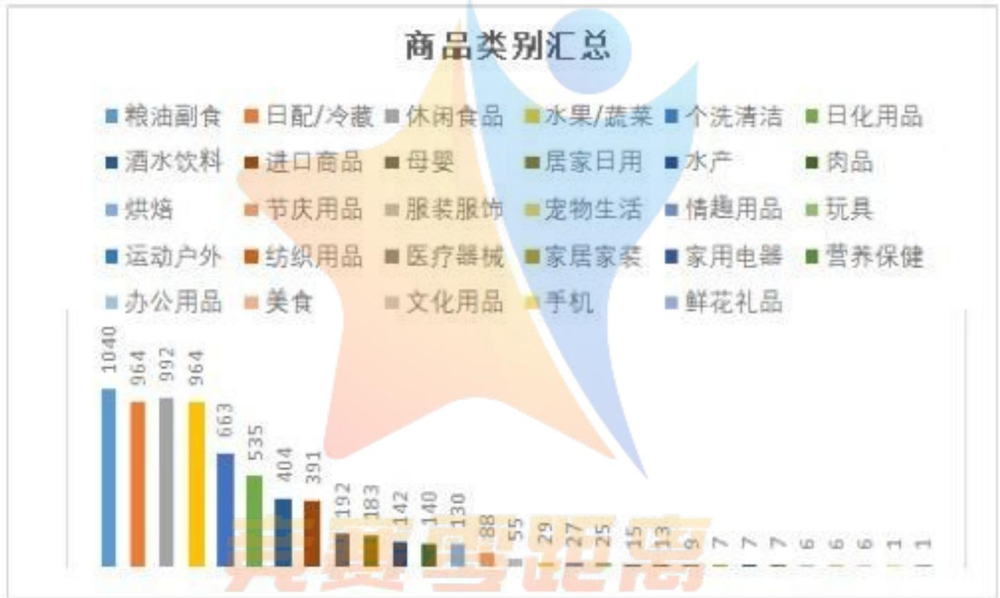

<details>
<summary>bar</summary>

| 商品类别 | 数值 |
| :--- | :--- |
| 粮油副食 | 1040 |
| 日配/冷藏 | 964 |
| 休闲食品 | 992 |
| 水果/蔬菜 | 964 |
| 个洗清洁 | 663 |
| 日化用品 | 535 |
| 酒水饮料 | 404 |
| 进口商品 | 391 |
| 母婴 | 192 |
| 居家日用 | 183 |
| 水产 | 142 |
| 肉品 | 140 |
| 烘焙 | 130 |
| 节庆用品 | 88 |
| 服装服饰 | 55 |
| 宠物生活 | 29 |
| 情趣用品 | 27 |
| 玩具 | 25 |
| 运动户外 | 15 |
| 纺织用品 | 13 |
| 医疗器械 | 9 |
| 家居家装 | 7 |
| 家用电器 | 7 |
| 营养保健 | 7 |
| 办公用品 | 6 |
| 美食 | 6 |
| 文化用品 | 6 |
| 手机 | 1 |
| 鲜花礼品 | 1 |
</details>

--Competition Zero Distance--

根据价格弹性定义[7]，为了便于对问题的分析，主要根据商品的时间、可替代物品、重要性、预算以及用途等[8]方面来对商品进行弹性类别划分。本文将以上类别涉及到的商品大类主要分为弹性大、弹性小两种类别。

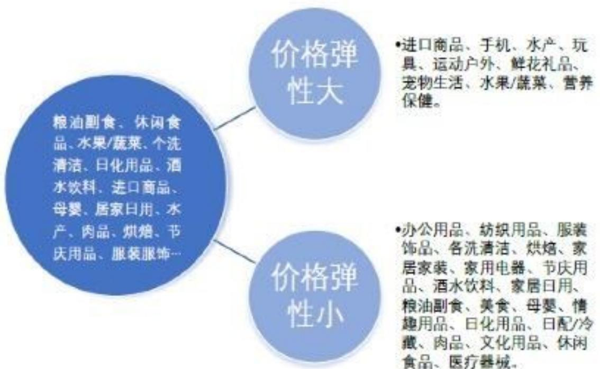

<details>
<summary>flowchart</summary>

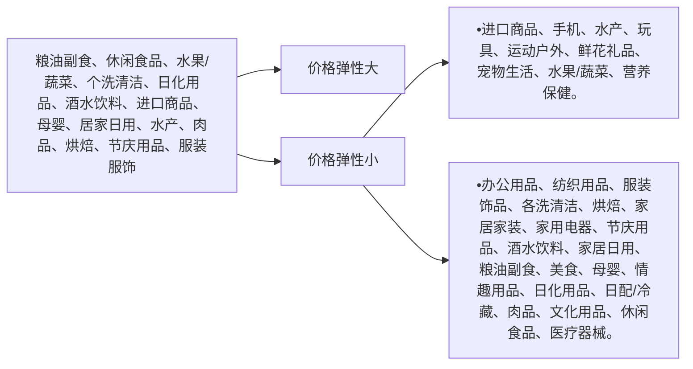
</details>

根据这种分类，本文对两种弹性不同的商品分别按照打折力度与销售额和利润率之间的关系进行分析。

## 4.4.2 打折力度与销售额的关系

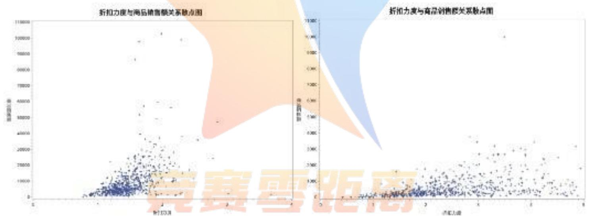

<details>
<summary>scatter</summary>

| Series | 折扣力度 (range) | 商品销售额 (range) |
| --- | --- | --- |
| Data Points | 0~10 | 0~110000 |
</details>

--Competition Zero Distance--

左上图是价格弹性高的商品打折力度与销售额之间的关系散点图；右上图是价格弹性低的商品打折力度与销售额之间的关系散点图，可以看出，打折力度对商品弹性大的这类商品来说影响较大，力度越大，销售额越高，正相关性明显，而对于价格弹性低的商品，销售额与打折力度之间的关系不是很明显。

## 4.4.3 打折力度与利润率的关系

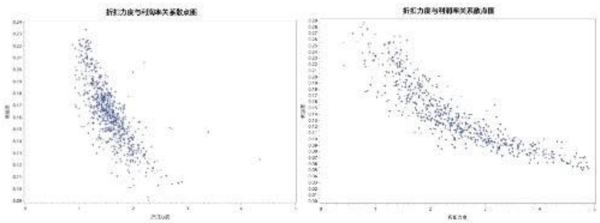

如上图所示, 左上图是价格弹性高的商品打折力度与利润率之间的关系散点图; 右上图是价格弹性低的商品打折力度与利润率之间的关系散点图, 可以直观地看出, 打折力度对商品弹性大的这类商品的利润率来说更敏感, 打折力度越大, 利润率下降趋势更陡峭, 而对于价格弹性低的商品, 随着打折力度的增加, 利润率的降低相比之下就有些平缓。

之所以出现价格弹性高低不同,打折力度与商品销售额和利润率之间的关系不同这种现象,主要是因为购买者对不同消费商品的弹性不一样,比如日常食品粮油这些商品,由于可替代性较差,又是生活中的必需品,所以价格的波动对购买者的意愿产生的影响并不大,而像鲜花、手机这种产品,购买者对价格就会显得更加敏感,属于弹性高的商品,打折力度变大,则消费者购买意愿变强。

## 五、模型评价及推广

本文针对题目给出的零散繁多的流水记录，汇总计算出了商场每日营业额，在数据质量存在大量缺失成本值的情况下给出了两种补全方式，从而计算出商场每日利润率。针对问题二要求，结合日常生活经验，本文给出了“打折力度”这一新概念的计算公式，并计算了每日的打折力度值。由皮尔逊相关检验，探索验证打折力度、营业额、利润率变量间的相关关系并建模，结果表明打折力度与商场营业额和利润率相关关系显著。随着打折力度的增加，商场营业额整体是增加的，而利润率是降低的，证实了“薄利多销”原理在生活中的应用。最后，对不同类别商品的价格弹性进行分析，按照问题一与问题二的计算方式来作图分析，考察不同类别商品下对该问题结果的影响。发现价格弹性高的商品，对打折力度的强度反应很强，而弹性低的商品类别，则不会因为打折力度低而减少销售量。

## 5.1 模型的优缺点

零售行业流水数据相似度很高，本文处理该数据并建模的流程清晰，预处理数据（筛选、删失、填充缺失、拼接表），可视化探索，相关性分析，数据建模等，适合推广到其他零售超市流水数据的分析。然而，打折力度的计算公式，本文只是依据生活常识，给出的打折力度虽不违背直观，仍有更多尝试探索的空间，因为“打折力度”本身这一概念并不清晰，更多的计算尝试要一同与建模考量，最终打磨出一个令各方满意的“打折力度”概念和计算公式。

## 5.2 模型推广

在分析打折力度和营业额、利润率时，这里为便于简化，只使用了迭代加权最小二乘的线性回归模型建模，后期也可以尝试更多复杂度更高的模型求解，这样对于不同打折力度下，对商场利润率和营业额有个更准确预测，便于指导商场零售打折策略的应用(应当在何时采取多强的打折力度获利最丰)。在问题四中，本文只是定性的分析了不同价格弹性的商品类别下，表明弹性高的商品对打折力度更敏感而弹性低的商品对打折力度不敏感。由于数据有限，无法计算出每种商品需求价格弹性。基于打折力度探究营业额和利润率的模型，若将每种商品需求价格弹性量化并考虑进来，其应用性和实用性将更为广泛、强大。

## 参考文献

[1] 高鸿业.《西方经济学》.上册,微观部分[M].中国经济出版社,1996.  
[2] 联商. 商场打折的运作策略与艺术[J]. 商业时代, 2008(18):14-14.  
[3] 史永卿, 郭钢, 文方. 试论商场打折盈利营销策略的有效性[J]. 山西财经大学学报, 2007(S2):65+77.  
[4] 吴喜之. 统计学：从数据到结论[M]. 中国统计出版社, 2005.  
[5] 陈珍珍著．统计学：厦门大学出版社，2002年.  
[6] 杰夫·吉尔. 广义线性模型：一种统一的方法[M]. 格致出版社, 2015.  
[7] https://baike.baidu.com/item/价格弹性  
[8] 陈通. 宏微观经济学[M]. 天津大学出版社, 2003.

## 附录：SAS 源代码

主程序

/\*Q1\*/

/\*读取数据 附件1 附件2\*/

```vhdl
proc import out=data11
    datafile="C:\Users\hr\Desktop\E-2019 中文\data\附件 11.xlsx"
    dbms=excel replace;
    sheet="a";
    getnames=yes;
run;
```

```txt
proc import out=data22
  datafile="C:\Users\hr\Desktop\E-2019 中文\data\附件 22.xlsx"
  dbms=excel replace;
  sheet="b";
  getnames=yes;
run;
```

/\*label 赋值\*/

data test1\_1;

```txt
set data11(rename=(sku_id=id sku_name=name sku_prc=prc sku_sale_prc=sale
          sku_cost_prc=cost  sku_cnt=cnt  create_dt=dt));
keep id name is_finished prc sale cost cnt dt;
```

run;

data test2\_1;

```txt
set data22(rename=(sku_id=id sku_name=name sku_prc=prc sku_sale_prc=sale
          sku_cost_prc=cost  sku_cnt=cnt  create_dt=dt));
keep id name is_finished prc sale cost cnt dt;
```

run;

/\*is\_finished 为0时删除 因为对分析没有意义，外部因素太多\*/

```txt
data cost1_miss  cost1_nomiss;
    set test1_1;
    where is_finished ne 0;
    if  cost ne 0 then output cost1_nomiss;
    else if  cost eq 0 then output cost1_miss;
run;
```

```txt
data cost2_miss  cost2_nomiss;
    set test2_1;
    where is_finished ne 0;
    if  cost ne 0 then output cost2_nomiss;
    else if  cost eq 0 then output cost2_miss;
```

```txt
run;

/*将 excel1 excel2 的成本缺失和非缺失的 set 到一起*/

data cost_nomiss;
    set cost1_nomiss  cost2_nomiss;
run;
data cost_miss;
    set cost1_miss  cost2_miss;
run;
/*将非缺失的成本 连接 到缺失成本里面      这种方式不是很合理 有很多无法匹配
*/
/*proc sort data=cost_nomiss out=nomiss(keep=dt id cost prc ) nodupkey;*/
/*   by dt id cost ;*/
/*run;*/
/*proc sort data=cost_miss out=miss nodupkey;*/
/*   by dt id name cost prc;*/
/*run;*/
 /**
/*proc sql;*/
/*     create table miss_add as*/
/*     select a.*,b.cost as cost_add from miss as a left join nomiss as b*/
/*   on        a.id=b.id          and         a.prc=b.prc          and
substr(put(a.dt,yymmdd10.),1,7)=substr(put(b.dt,yymmdd10.),1,7) ;*/
/*quit;*/
/**
data miss_add;
    set cost_miss(drop=cost);
    if sale ne 0 then cost=sale/1.3;
    else cost=prc/1.3;
run;
/*用 SAS 生成 1.2 到 1.4 之间的随机数代替上面 1.3*/
data rand;
    set cost_miss;
    do i=0 to 1;
    rand=0.2*ranuni(i)+1.2;
    end;
run;

data miss_add;
    set rand(drop=cost);
    if sale ne 0 then cost=sale/rand;
```

```matlab
else cost=prc/rand;
run;
data all;
    set cost_nomiss miss_add;
run;
```

```txt
data all_;
    set all;
/*营业额*/
    allin=sale*cnt;
```

```txt
/*成本总额*/
    costsum=cost*cnt;
```

```txt
/*定价总额*/
prcsum=prc*cnt;
```

```txt
/*利润率*/
    lirun=(sale-cost)/cost;
run;
```

```txt
/*保存 Q1 用到的总数据*/
libname data "D:\E-2019 中文" ;
```

```txt
data data.Q1_data;
    set all_;
run;
```

```txt
/*计算每天营业额 利润率*/
```

```txt
proc sort data=all_;
    by dt;
run;
```

```txt
proc sql;
    create table final0 as
    select distinct dt,sum(allin) as allin_sum,sum(prcsum) as prc_sum,sum(costsum) as cost_sum from
    all_
    group by dt
    order by dt;
quit;

data final;
```

```txt
set final0;
lirun_sum=(allin_sum-cost_sum)/cost_sum*100||'%';
lirun=put((allin_sum-cost_sum)/cost_sum,7.4)*100||'%';
lr=(allin_sum-cost_sum)/cost_sum;
/* lirun_sum_=put();*/
label dt='时间'
    lirun_sum='利润率'
    prc_sum='原价总额'
    cost_sum='成本总额'
    lirun='利润率保留两位小数'
    allin_sum='营业额';
    format dt yymmdd10. lirun_sum $200.;
run;

data data.Q1_final;
    set final;
run;
proc means data=final mean;
    var lr;
run;

ods excel file="C:\Users\hr\Desktop\E-2019 中文\data\附件 1done.xlsx" options
(sheet_name='营业额_利润率');
proc print data=final label;
run;
ods excel close;
/**********Q1 end*************************/
```

/\*输出问题 2 需要的数据\*/

proc sort data=all\_;

by dt;

run;

proc sql;

create table final2 as

select distinct dt,sum(allin) as allin\_sum,sum(prcsum) as prc\_sum,sum(costsum) as

```txt
cost_sum from
    all_
/*需要筛选出打折的商品*/
    where prc gt sale
    group by dt
    order by dt;
quit;
/*计算利润率折扣率之比*/
data final_;
    set final2;
    drop lirun_sum lirun;
run;
/*将之前问题1的折扣率merge过来*/
proc sql;
    create table final3 as
        select final_.*,final.lirun_sum,final.lr from final_left join final
        on final_.dt=final.dt
        order by dt;
quit;

data final3;
    set final3;
/*     if dt<"15APR2017"d ;*/
/*     format dt yymmdd10.;*/
    zhekou=allin_sum/prc_sum;
    per=lr/zhekou;
    power=1-zhekou;
    label zhekou='折扣'
        per='利润/折扣'
        power='打折力度';
run;

data data.Q2_final1;
    set final3;
run;
proc sort data=final3 ;
    by dt;
run;
ods excel file="C:\Users\hr\Desktop\E-2019 中文\data\问题 2 流水数据折扣情况.xlsx"
options (sheet_name='折扣');
proc print data=final3 label;
run;
```

ods excel close;
/\*读取数据 附件 3\*/  
```txt
proc import out=data3
    datafile="C:\Users\hr\Desktop\E-2019 中文\data\fujian3.xlsx"
    dbms=excel replace;
    sheet="promotion_sku";
    getnames=yes;
run;
```

/\*限购数量为0的删除\*/  
```c
data data3_1;
    set data3;
    if _COL8 =0 then delete;
/*   sale_rate=_COL5/_COL11;*/
run;
```  
/\*下面是处理附件三得出的结果\*/

```javascript
proc datasets library=work kill noprint;quit;
dm 'out;clear;log;clear;'
/* */
proc import out=test
    datafile="C:\Users\hr\Desktop\E-2019 中文\data\商品打折力度表.xlsx"
    dbms=excel replace;
    sheet="商品打折力度表";
    getnames=yes;
run;
```

```matlab
data test1 test2;
    set test;
    date1=put(_col0,best.);
    date2=put(_col1,best.);
    date=strip(scan(date1,1,':
        if strip(scan(date1,1,'')) =strip(scan(date2,1,'')) then output test1;
    else output test2;
run;
```  
proc sort data=test1;
    by date;

run;

proc sql;

```sql
create table final0 as
  select distinct date,_col0,mean(_col2) as per_mean from
test1
  group by date
  order by date;
```

quit;

/\*ods excel file="C:\Users\hr\Desktop\E-2019 中文 \data\Q2part.xlsx" options (sheet\_name='打折情况');\*/

```txt
/*     proc print data=final0 label;*/
/*   run;*/
/*ods excel close;*/
```

/\*test2 部分\*/

```txt
proc sort data=test2;
    by date;
run;
```

proc sql;

```sql
create table final2 as
select distinct date,_col0,sum(_col2) as per_sum,count(_col0) as no from test2
```

```txt
group by date
order by date;
```

quit;

```txt
data final3;
    set final2;
    per_mean=per_sum/no;
run;
```

```c
/*两种情况 merge 到一起*/
data final;
    set final3 final0;
run;
proc sort data=final;
    by date;
```

```txt
run;

proc sql;
    create table final_all as
        select distinct date,_col0,mean(per_mean) as mean from
    final
        group by date
        order by date;
    quit;

proc sort data=final_all out=all nodupkey;
    by date mean;
run;
/*输出每天折扣力度情况*/
ods excel file="C:\Users\hr\Desktop\E-2019 中文\data\Q2 打折情况.xlsx" options (sheet_name='打折情况');
    proc print data=all label;
    run;
ods excel close;
```

/\*将附件12和附件3得出的两种打折力度进行比较\*/

```txt
proc import out=data1
    datafile="C:\Users\hr\Desktop\E-2019 中文\data\问题 2 流水数据折扣情况.xlsx"
    dbms=excel replace;
    sheet="折扣";
    getnames=yes;
run;

data data1;
    set data1;
    dt=strip(_col1);
run;
data data2;
    set all;
    dt=strip(date);
run;
proc sort data=data1;
    by dt ;
run;
proc sort data=data2 ;
    by dt;
```

run;

```c
data data12;
    merge data1 data2;
    by dt;
    if input(date,best.)>21551 then delete;
run;
```

/\*对两种情况的数据折扣进行分析对比\*/

```txt
data dif;
    set data12;
    if mean eq . then delete;
    dif1=_col7-mean;
    dif1_=_col8-mean;
    dif2=_col9-mean;
    label dif1='与流水折扣差'
    dif1_='与流水折扣率差'
        dif2='与流水打折力度差';
run;
```

/\*输出每天折扣力度差异情况\*/

```txt
ods excel file="C:\Users\hr\Desktop\E-2019 中文\data\Q2 打折差异.xlsx" options
(sheet_name='打折情况');
proc print data=dif label;
run;
ods excel close;
```