# 基于一维热传导方程的炉温曲线机理模型研究

## 摘要

回焊炉通过加热，将电子元件自动焊接到电路板上，在集成电路板等电子产品的生产中具有广泛的应用。本文主要研究回焊炉焊接中心的炉温曲线，建立了基于热传导方程与牛顿冷却定律的温度分布模型，利用最小二乘法、差分法、优化模型进行求解。

对于问题一：首先对题干某次实验中的情况，基于一维热传导方程，建立回焊炉内部的温度分布模型。再通过热传导方程与牛顿冷却定律，建立焊接区域的温度分布模型。结合两个模型，确定初边值条件，建立微分控制方程组（包含四个待求参数）。利用差分法对方程组逐层求解，基于最小二乘原理，拟合实测温度，遍历得到最优的参数组合。将该组参数代入后得到一维热传递模型。

将问题一中的设定温度代入后，计算出炉温曲线。得到结果如下：u（小温区3中点）=138.92℃，u（小温区6中点）=172.24℃，u（小温区7中点）=190.17℃，u（小温区8终点）=223.16℃

对于问题二：建立单目标优化模型。首先，确定最优准则-过炉速度最大；其次确定约束条件为制程界限；其次，再对约束条件进行差分，得出差分后的约束条件；然后，应用问题一中得出的热传递模型，并用循环遍历的方法，借助 C++ 语言，搜索出该温度分布条件下最大速度为76cm/min。

对于问题三: 建立单目标优化问题。首先, 确定最优准则-炉温曲线超过 $217^{\circ}C$ 到峰值温度所覆盖的面积最小; 其次确定约束条件为制程界限, 并将其函数化表示; 其次, 再对约束条件进行差分, 得出差分后的约束条件; 然后, 应用问题一中得出的热传递模型, 运用爬山算法与 A\*算法, 借助 C++语言, 搜索出该温度分布条件下最优温度组合为: (185, 203, 238, 265, 25, 97), 最优过炉速度为 95cm/min。。

对于问题四：是在问题三基础上的多目标优化问题，可以将两目标进行线性加权处理得到单一目标，建立单目标优化模型。首先，确定最优准则-炉温曲线超过217℃到峰值温度所覆盖的面积最小与以峰值温度为中心线的两侧超过217℃的炉温曲线尽量对称，并取偏差平方表示出第二个指标；其次，对两个目标其进行线性加权整合为最终单一的优化目标，并写出差分后的微分方程，最终再建立以该单一目标为目标的优化模型。随后，与问题三类似，应用问题一中得出的热传递模型，运用爬山算法与A\*算法，借助C++语言，搜索出该温度分布条件下最优温度组合为：(185,204,245,265,25,100)，最优过炉速度为100cm/min。

最后对本文所建立的模型进行了讨论和分析，综合评价模型。

关键词 热传导方程 牛顿冷却定律 差分法 优化模型 爬山算法 A\*算法

## 一、问题重述

在某些电子产品，如集成电路板的生产过程中，存在将各种电子元器件通过回焊炉的焊接技术，安装至电路板上的环节。通过加热印刷电路板与电子元件，回焊炉中的电子元器件能够自动焊接到电路板上。

回焊炉内有四个功能区，依次是预热区、恒温区、回流区、冷却区，均由若干个小温区组成。电路板通过传送带，匀速进入回焊炉内部加热焊接。

某回焊炉的内部由炉前区域、炉后区域及 11 个小温区构成，炉前区域和炉后区域的长度参数均为 $25 \mathrm{~cm}$ ，每个小温区的长度参数为 $30.5 \mathrm{~cm}$ ，小温区间存在着 $5 \mathrm{~cm}$ 的空隙。

回焊炉会在短时间内达到内部温度的稳定, 焊接工作在回焊炉内部温度稳定之后进行。炉前区域、炉后区域和小温区之间的间隙不做特殊的温度控制, 空隙的温度受相邻温区的影响, 各温区边界附近的温度也可能会收到相邻温区的温度影响。除此之外, 回焊炉所在的生产车间的温度始终保持在 $25^{\circ}$ C。

某些位置上的焊接区域中心温度可以用过温度传感器测试，焊接区域中心温度曲线也被称为炉温曲线。附件是某次实验中的炉温曲线数据，每隔0.5s采集一次炉温数据。该次实验中，各温区设定的温度参数为 $175^{\circ}C$ （小温区1\~5）、 $195^{\circ}C$ （小温区6）、 $235^{\circ}C$ （小温区7）、 $255^{\circ}C$ （小温区8\~9）及 $25^{\circ}C$ （小温区10\~11）；传送带的速度参数为70 cm/min；焊接区域的厚度为0.15 mm。当焊接区域中心温度达到阀值 $30^{\circ}C$ 时，温度传感器开始工作。当电路板进入回焊炉时，开始计时。

为控制产品质量, 实际生产时通常通过调节各温区的设定温度和传送带的锅炉速度的方法。在上述实验设定的温度基础上, 各温区的设定温度可以在 $\pm 10^{\circ} \mathrm{C}$ 范围内进行调整。调整小温区温度时, 需满足以下限制: 小温区 $1 \sim 5$ 中的温度保持一致, 小温区 $8 \sim 9$ 中的温度保持一致, 小温区 $10 \sim 11$ 中的温度保持 $25^{\circ} \mathrm{C}$ 。传送带的过炉速度调节范围为 $65 \sim 100 \mathrm{~cm} / \mathrm{min}$ 。

在回焊炉电路板焊接生产中,炉温曲线应满足一定的要求,称为制程界限(见表1)。

表1 制程界限

<table><tr><td>界限名称</td><td>最低值</td><td>最高值</td><td>单位</td></tr><tr><td>温度上升斜率</td><td>0</td><td>3</td><td>°C/s</td></tr><tr><td>温度下降斜率</td><td>-3</td><td>0</td><td>°C/s</td></tr><tr><td>温度上升过程中在150°C~190°C的时间</td><td>60</td><td>120</td><td>s</td></tr><tr><td>温度大于217°C的时间</td><td>40</td><td>90</td><td>s</td></tr><tr><td>峰值温度</td><td>240</td><td>250</td><td>°C</td></tr></table>

请根据以上信息，回答下列问题：

问题 1 对焊接区域的温度变化规律建立数学模型。给出焊接区域中心的温度变化情况，列出小温区 3、6、7 中点及小温区 8 结束处焊接区域中心的温度，画出相应的炉温曲线，并将每隔 0.5 s 焊接区域中心的温度存放在提供的 result.csv 中。

假设: 传送带过炉速度为 $78 \mathrm{~cm} / \mathrm{min}$ , 各温区温度的设定值分别为 $173^{\circ} \mathrm{C}$ (小温区 1\~5)、 $198^{\circ} \mathrm{C}$ (小温区 6)、 $230^{\circ} \mathrm{C}$ (小温区 7) 和 $257^{\circ} \mathrm{C}$ (小温区 8\~9),

问题 2 确定允许的最大传送带过炉速度。

假设: 各温区温度的设定值分别为 $182^{\circ}C$ (小温区 1\~5)、 $203^{\circ}C$ (小温区 6)、 $237^{\circ}C$ (小温区 7)、 $254^{\circ}C$ (小温区 8\~9)

问题 3 在焊接过程中，焊接区域中心的温度超过 $217^{\circ}$ C 的时间不宜过长，峰值温度也不宜过高。理想的炉温曲线应使超过 $217^{\circ}$ C 到峰值温度所覆盖的面积（图 2 中阴影部分）最小。请确定在此要求下的最优炉温曲线，以及各温区的设定温度和传送带的过炉速度，并给出相应的面积。

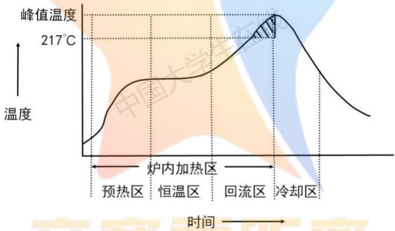

<details>
<summary>line</summary>

| Phase | Temperature \(({}^{\circ}C)\) |
| --- | --- |
| 预热区 | ~217 |
| 恒温区 | ~217 |
| 回流区 | ~217 |
| 冷却区 | Peak (Peak) |
</details>

图1 炉温曲线示意图

问题 4 在焊接过程中，除满足制程界限外，还希望以峰值温度为中心线的两侧超过 $217^{\circ}$ C 的炉温曲线应尽量对称（参见图 2）。请结合问题 3，进一步给出最优炉温曲线，以及各温区设定的温度及传送带过炉速度，并给出相应的指标值。

## 二、问题分析

## 2.1 问题一分析

对于问题一，需要建立焊接处中心的温度分布数学模型以求解。

基于热传导方程，建立回焊炉各点处的温度分布模型。在模型建立前，首先需要借助物理实验中的基本结果与能量守恒定律推导出热传导方程。

其次，借助热传导方程与牛顿冷却定律，建立焊接处内部各点的温度传递模

型。

基于上述两个模型，建立焊接处各点温度随时间变化的模型。并对大纲给出的示例数据进行拟合检验，大步长粗略搜索，小步长精确搜索，以得出精度较高的模型中参数的解。

最后，带入问题一中给出的回焊炉各温区的温度数据，得出焊接处中心温度随时间变化的情况。

## 2.2 问题二分析

问题二，在题目给定的温度条件、制程界限的限制下，求解允许的传送带最大速度，是一个最优化的问题。

需要基于问题一中得出的温度分布模型，对传送带的可能速度进行多次遍历，以得出精度较高的解。取 1cm/min 的速度步长，从 100cm/min 往下遍历后选取出第一个满足制程界限的解，即为最大解。

## 2.3 问题三分析

问题三，也是一个优化问题。需要求出最优的温区设定温度和传送带的过炉速度，使得在满足制程界限的同时，炉温曲线超过 $217^{\circ}$ C 到峰值温度所覆盖的面积也达到最小。

需要建立以覆盖面积最小为目标的优化模型，应用焊接区域温度分布模型，结合爬山与 A\*算法，求解最优的温区温度设定、传送带过炉速度的参数组合，并分析结果。

## 2.4 问题四分析

问题四，是在问题三基础上的多目标优化问题。需要满足制程界限的同时，在问题三——炉温曲线超过 $217^{\circ}$ C 到峰值温度所覆盖的面积达到最小的基础上，做到以峰值温度中线的两侧超过 $217^{\circ}$ C 的炉温曲线尽量对称的目标。

首先，需要分别表达出两个优化目标，并对其进行线性加权整合为最终单一的优化目标，最终再建立以该单一目标为目标的优化模型，应用焊接区域温度分布模型，结合爬山与 A\*算法，求解最优的温区温度设定、传送带过炉速度的参数组合，并分析结果。

## 三、模型的假设与约定

1. 假设回焊炉整个小温区的温度恒定，为该小温区的设定温度  
2. 假设温度传导只在焊接区域的竖直方向进行  
3. 假设电路板进入回焊炉时，回焊炉内的温度已经达到稳定

## 四、符号说明及名词解释

4.1 符号说明

<table><tr><td>符号</td><td>说明</td><td>单位</td></tr><tr><td>1</td><td>回焊炉上的点与炉前区域左边缘的距离</td><td>cm</td></tr><tr><td>u</td><td>温度</td><td>°C</td></tr><tr><td>t</td><td>时间</td><td>s</td></tr><tr><td>x</td><td>小温区间隙中的点距离上一温区右边缘的距离</td><td>cm</td></tr><tr><td>h</td><td>焊接区域中的点与焊接中心的距离</td><td>mm</td></tr><tr><td> $t_j$ </td><td>第j个时间微元, $t_j + \Delta t = t_{j+1}$ </td><td>s</td></tr><tr><td> $u_i^j$ </td><td>第i个微元在 $t_j$ 的温度</td><td>°C</td></tr><tr><td> $u^{-1}(190)$ </td><td>焊接区域中心温度为190°C时的时间t</td><td>s</td></tr></table>

## 4.2 名词解释

(1) 比热容: 表示物体吸热或散热能力, 比热容越大, 物体的吸热或散热能力越强。其指的是单位质量的某种物质升高或下降单位温度所吸收或放出的热量, 单位为 $J/(kg \cdot K)$ 。  
(2) 热传导率: 单位截面、长度的材料在单位温差下和单位时间内直接传导的热量。单位为瓦每米开尔文 (W/(m·K))。  
(3) 表面传热系数: 指空气与电路板的的比例系数。即当物体表面与周围存在温度差时, 单位时间从单位面积散失的热量与温度差成正比。

## 五、 模型建立与求解

## 问题 1: 确定温度分布数学模型

针对问题一，需要建立焊接处中心的温度分布数学模型以求解。

## 5.1.1 热传导方程及推导

(1) 通过两种方法研究某一物体内的热流

① 对于一个物体，t时刻 $\Delta V$ 内的热量Q可以用以下等式表达。

$$
\Delta Q = c \rho u \Delta V
$$

$\rho$ 为电路板的密度，c为比热容

假设有一根边界完全绝热、由单一均匀材料组成、热量只能通过两端流入或流出、长为 L 的细杆，如下图。设杆上任意一点到原点的距离为变量 x。

在该细杆中，温度 u 只与 x、时间 t 相关。则有下列等式：

$$
\Delta Q = c \rho u (x, t) \Delta V
$$

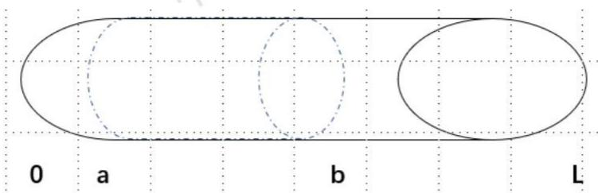

<details>
<summary>text_image</summary>

0 a b L
</details>

图2 长为 L 的均匀细杆

先取细杆中的一段长度 U，该区域为 x=a 到 x=b 的间隔段，设其横截面积为 S，取长度为 $\Delta x$ 的微元，则：

$$
\Delta V = S \Delta x
$$

则该微元的热量可表示为:

$$
\Delta Q = c \rho u (x, t) S \Delta x
$$

t 时刻区域 U 的热量为:

$$
Q (t) = \int_ {a} ^ {b} c \rho u (x, t) S   d x
$$

其中 c, $\rho$ 均与 t 无关。两边对 t 进行微分，则得出热量关于时间的变化方程为：

$$
\frac {d Q}{d t} = \int_ {a} ^ {b} c \rho \frac {\partial u}{\partial t} d x S \tag {1}
$$

② 热传递的过程中, 热量会从温度高的以放流向温度低的一方。则同样取相同的细杆, $u(x = b) > u(x = a)$ , 则:

$$
\Delta Q = - C \frac {u (a + \Delta x , t) - u (a , t)}{\Delta x} S
$$

C 为导热系数，与杆的材料有关。

则 a 处的热流速度为:

$$
v _ {a} = - C \frac {\partial u}{\partial x} (a, t) S
$$

b 处为:

$$
v _ {b} = C \frac {\partial u}{\partial x} (b, t) S
$$

t 时刻 U 区域中热量为:

$$
\frac {d Q}{d t} = C [ \frac {\partial u}{\partial x} (b, t) - \frac {\partial u}{\partial x} (a, t) ] S
$$

即

$$
\frac {d Q}{d t} = C \int_ {a} ^ {b} \frac {\partial^ {2} u}{\partial^ {2} x} d x S \tag {2}
$$

其中，C、S 可视为常数。

③ 联立等式(1)(2)，解得：

$$
\frac {C}{c \rho} \frac {\partial^ {2} u}{\partial^ {2} x} - \frac {\partial u}{\partial t} = 0 \tag {3}
$$

则热传递方程为:

$$
\frac {\partial u}{\partial t} - k \frac {\partial^ {2} u}{\partial^ {2} x} = 0 \tag {4}
$$

其中

$$
k = \frac {C}{c \rho} \tag {5}
$$

## 5.1.2 牛顿冷却定律

牛顿冷却定律是温度高于周围环境的物体向周围媒质传递热量逐渐冷却时所遵循的规律。具体的表述为：当物体表面与周围存在温差时，单位时间从单位面积散失的热量与温度差成正比，比例系数为热传导率。

计算公式为:

$$
- \lambda \frac {\partial u}{\partial n} = h _ {z} (u _ {\text {空气}} - u _ {\text {表面}}) \tag {6}
$$

$\lambda$ 为热传导率， $h_{z}$ 为表面冷却系数

## 5.1.3 回焊炉的温度分布模型确立

在回焊炉启动后，炉内空气温度会在短时间内达到稳定；同时根据假设1，回焊炉整个小温区的温度恒定，为该小温区的设定温度。各小温区的已知且恒定，可将回焊炉其余部分分为温区间隙、炉前区域、炉后区域三部分进行细化分析。

## Step 1: 列出温区的温度分布

因为主要研究竖直方向上的传热模型，可以简化回焊炉模型，以炉前区域左边边缘为原点，向右建立一维坐标轴（如下），需要建立温度随Ⅰ（离原点的距离）的分布方程。

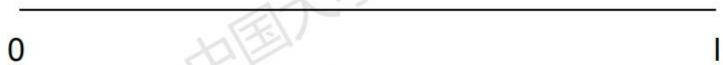

<details>
<summary>text_image</summary>

0
1
</details>

图3 一维坐标轴图

## Step 2: 求解温区间隙温度分布

在温区间隙，根据热传递方程，可得：

$$
\frac {\partial u (x , t)}{\partial t} - k \frac {\partial^ {2} u (x , t)}{\partial^ {2} x} = 0 \tag {7}
$$

其中 t 为时间，x 为该点到上一小温区边缘的距离， $0 \leqslant x \leqslant 5(\text{cm})$ 。

达到热稳态后，温度恒定，则：

$$
\frac {\partial u (x , t)}{\partial t} = 0 \tag {8}
$$

即：

$$
\frac {\partial^ {2} u (x , t)}{\partial^ {2} x} = 0 \tag {9}
$$

解偏微分方程(8)，得

$$
u (x, t) = C _ {1} x + C _ {2} \tag {10}
$$

$C_1, C_2$ 为常数

可知，温区间隙温度为线性分布，则带入各温区温度，可得

表1 间隙温度分布

<table><tr><td>间隙</td><td>温度分布</td></tr><tr><td>1-4</td><td>175</td></tr><tr><td>5</td><td>175+4x</td></tr><tr><td>6</td><td>195+4x</td></tr><tr><td>7</td><td>235+4x</td></tr><tr><td>8</td><td>255</td></tr><tr><td>9</td><td>255-46x</td></tr><tr><td>10</td><td>25</td></tr></table>

## Step 3: 炉前区域的温度分布

炉前区域温度与相邻温区的温度有关。

在一维坐标轴区域为:

$$
l \in [ 0, 2 5 ]
$$

因为空气温度为 25 摄氏度，在 I<25 的坐标轴上必定存在一点使得：

$$
u (l = a) = 2 5
$$

则：

$$
u (l <   a) = 2 5
$$

则在二维空间中，可视 $l < a$ 为另外一个温度为 $25^{\circ} \mathrm{C}$ 的“小温区0”， $a \leq l \leq 25$ 为小温区0与小温区1中的间隙0（如图4）

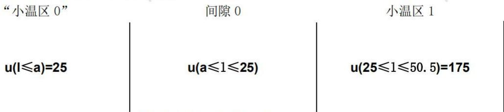

<details>
<summary>flowchart</summary>

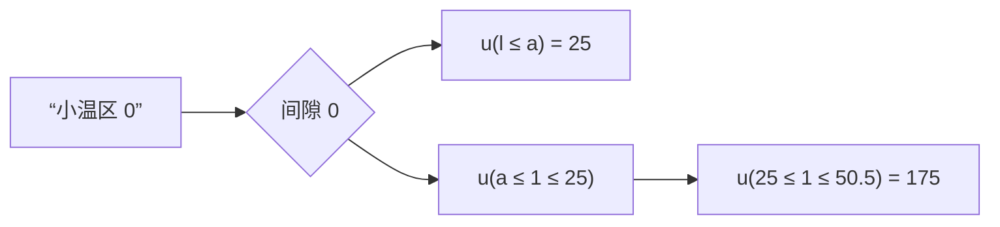
</details>

图4 炉前区域温度分布

回到一维坐标轴，根据Step1中的求解可知，间隙区域的温度为线性分布。a为待求解的一个参数。

## Step 4: 炉后区域的温度分布

在一维坐标轴上，炉后区域为

$$
\mathrm{x} \in [ 4 1 0. 5, 4 3 5. 5 ]
$$

相邻区域的温度分布为:

$$
u (3 4 4. 5 \leq x \leq 4 1 0. 5) = 2 5
$$

$$
u (x \geq 4 1 0. 5) = 2 5 。
$$

同理，可将炉外的空间视为另外一个温度为 $25^{\circ}$ C 的 “小温区”，根据 Step 1 中的求解可知炉后区域的温度分布为线性分布，而：

$$
u (x = 4 1 0. 5) = u (x = 4 3 5. 5) = 2 5
$$

可得炉后区域的温度为常数:

$$
u (4 1 0. 5 \leq x \leq 4 3 5. 5) = 2 5
$$

## Step 5: 回焊炉温度分布

表2 回焊炉温度分布表

<table><tr><td>x</td><td>温区</td><td>温度</td></tr><tr><td rowspan="2">[0,25]</td><td rowspan="2">炉前区域</td><td> $25(0 \leqslant x \leqslant a)$ </td></tr><tr><td> $25 + \frac{25}{3}(x - 7)(a \leqslant x \leqslant 25)$ </td></tr><tr><td>[25,197.5]</td><td>小温区 1-5(包含间隙 1-4)</td><td>175</td></tr><tr><td>[197.5,202.5]</td><td>间隙 5</td><td>175+4x</td></tr><tr><td>[202.5,233]</td><td>小温区 6</td><td>195</td></tr><tr><td>[233,238]</td><td>间隙 6</td><td>195+4x</td></tr><tr><td>[238,268.5]</td><td>小温区 7</td><td>235</td></tr><tr><td>[268.5,273.5]</td><td>间隙 7</td><td>235+4x</td></tr><tr><td>[273.5,339.5]</td><td>小温区 8-9(包含间隙 8)</td><td>255</td></tr><tr><td>[339.5,344.5]</td><td>间隙 9</td><td>255-46x</td></tr><tr><td>[344.5,410.5]</td><td>小温区 10-11(包含间隙 10)</td><td>25</td></tr><tr><td>[410.5,435.5]</td><td>炉后区域</td><td>25</td></tr></table>

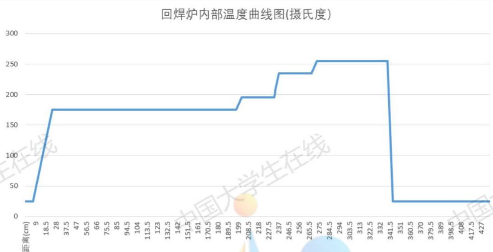

<details>
<summary>line</summary>

| 距离 (cm) | 温度 \(({}^{\circ}C)\) |
| --- | --- |
| 9 | ~25 |
| 28 | ~175 |
| 199 | ~195 |
| 237 | ~235 |
| 275 | ~255 |
| 341.5 | ~255 |
| 341.5 | ~25 |
| 427 | ~25 |
</details>

图5 回焊炉内部温度曲线图

## 5.1.4 焊接处内部温度分布模型的确立

对于焊接区域，考虑其厚度为 0.15mm，则可以将其视为方向竖直、长度为 0.15mm 的一条线段。

以焊接区域中心为原点建立一维坐标轴，如下图：

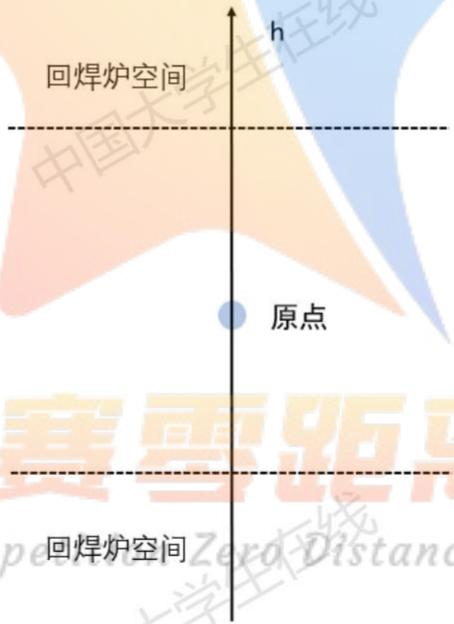

<details>
<summary>text_image</summary>

回焊炉空间
原点
回焊炉空间
h
中国大学生在线
赛要距
pe
Zero Distano
</details>

图6 焊接区域坐标轴

基于热传递定律与牛顿冷却定律，可将焊接区域的热传递分为边界与空气、区域内部两部分，联立两部分的方程，建立相关模型。

## Step 1 焊接区域内部的热传递方程

根据热传递方程，可得焊接区域内部温度函数 $u(h,t)$ 满足：

$$
\frac {\partial u (h , t)}{\partial t} = A \frac {\partial^ {2} u (h , t)}{\partial h ^ {2}} \tag {11}
$$

其中，

$$
A = \frac {C}{c \rho}
$$

因为焊接区域以焊接中心为对称点对称，所以只考虑焊接区域上半边的情况，即

$$
0 \leq h \leq H = 0. 0 7 5 m m
$$

## Step 2 确定初始条件与边界条件

生产车间的室温为 $25^{\circ}$ C，则初始条件为：

$$
u (h, 0) = 2 5 (0 \leq h \leq H) \tag {12}
$$

对于焊接中心，由于两边热量交换对称，则边界条件：

$$
\frac {\partial u (h , t)}{\partial h} \mid_ {h = 0} = 0 \tag {13}
$$

## Step 3 焊接区域边界与空气接触面的边界条件

根据牛顿冷却定律，

$$
\lambda \frac {\partial u}{\partial h} = h _ {z} (u _ {0} - u _ {H})
$$

H=0.075mm, $\lambda$ 为焊接电路板的热传导率， $h_{z}$ 为电路板与空气的表面冷却系数， $u_{0}$ 为外界温度。

化简，得

$$
\frac {\partial u}{\partial h} = B (u _ {0} - u _ {H}) \tag {14}
$$

其中，

$$
B = \frac {h _ {z}}{\lambda} \tag {15}
$$

同时，由于温度会影响热传导率的大小。所以将回焊炉的分为两部分，第一部分(炉内加热区域)的参数为 $B_{1}$ ，第二部分(冷却区)的参数为 $B_{2}$ 。

查阅资料得知，PCB 主要组成材料环氧树脂地热传导率随着温度减小而减小，所以可以将 $B_{2}$ 转化为一个新的参数 w， $B_{2}=wB_{1}(w\in(0,1))$ 。

## Step 4 模型确立

联立(11)(12)(13)(14)，得到焊接区域温度分布模型为以下方程组(1):

$$
\left\{ \begin{array}{c} \frac {\partial u (h , t)}{\partial t} = A \frac {\partial^ {2} u (h , t)}{\partial h ^ {2}} \\ u (h, 0) = 2 5 (0 \leq h \leq H) \\ \frac {\partial u (h , t)}{\partial h} | _ {h = 0} = 0 \\ \lambda \frac {\partial u}{\partial h} = h _ {z} (u _ {o} - u _ {H}) \end{array} \right. \tag {16}
$$

## 5.1.5 参数估计

在该一维传热模型中， $a, A, B_1, B_2$ 为未知量，需要通过最小二乘法建立参数估计模型：

$$
(a, A, B _ {1}, B _ {2}) = \underset {a, A, B _ {1}, B _ {2}} {\arg \min} \sum_ {j = 1} ^ {m} (u \big (t _ {j} \big) - u ^ {*} \big (t _ {j} \big) ^ {2})
$$

其中 $u(t_{j})$ 为拟合值， $u^{*}(t_{j})$ 原始值。

## 5.1.6 模型综合

关于焊接区域的传热过程，建模型综合如下：

$$
\left[ \begin{array}{l} \text {参数估计:} (a, A, B _ {1}, B _ {2}) = \underset {a, A, B _ {1}, B _ {2}} {\arg \min} \sum_ {j = 1} ^ {m} \left(u \left(t _ {j}\right) - u ^ {*} \left(t _ {j}\right) ^ {2}\right) \\ \text {控制方程:} \\ \frac {\partial u (h , t)}{\partial t} = A \frac {\partial^ {2} u (h , t)}{\partial h ^ {2}} \\ \text {初始条件:} \\ u (h, 0) = 2 5 (0 \leq h \leq H) \\ \text {边界条件:} \\ \frac {\partial u (h , t)}{\partial h} | _ {h = 0} = 0 \\ \lambda \frac {\partial u}{\partial h} = h _ {z} \left(u _ {o} - u _ {H}\right) \end{array} \right. \tag {17}
$$

## 5.1.7 模型求解

求解方法:

本文采用有限差分法：将连续的定解区域用有限个离散点构成的网格来代替；把定解区域上的连续变量的函数用网格上定义的离散变量的函数来近似；把原方程和定解条件中的微商用差商来近似。最终，把原微分方程和定解条件用代数方程组来代替，即有限差分方程组。解此方程组就可以得到原问题在离散点上的近似值。

本文对空间分别进行差分，将焊接区域的细杆分为 n 个高为 $\Delta x$ 的小区域，对于时间，每经过 $\Delta t$ 的时间进行一次迭代，即视为焊接区域在 $\Delta t$ 的时间内完成了一次完全的温度传递，直至 t=373.29 结束。

对于等式(11):

$$
\frac {u _ {i} ^ {j} - u _ {i} ^ {j - 1}}{\Delta t} = A \frac {u _ {i} ^ {j} - u _ {i + 2} ^ {j} + 2 u _ {i + 1} ^ {j + 1}}{\Delta x ^ {2}}
$$

下标 i 为空间，j 为时间 $(t_{j}+\Delta t=t_{j+1})$ ， $u_{i}^{j}$ 为第 i 个微元在 $t_{j}$ 的温度。

对于等式(14):

$$
\frac {u _ {2} ^ {j} - u _ {1} ^ {j + 1}}{\Delta x} = B _ {1} \big (u _ {1} ^ {j} - u _ {o} \big) \quad (0 \leq t \leq 2 9 5. 2 9) \tag {18}
$$

$$
\frac {u _ {2} ^ {j} - u _ {1} ^ {j + 1}}{\Delta x} = B _ {2} \left(u _ {1} ^ {j} - u _ {o}\right) (2 9 5. 2 9 \leq t \leq 3 7 3. 2 9) \tag {19}
$$

对于焊接中心，由等式(13)得， $\frac{\partial u(h,t)}{\partial h}|_{h = 0} = 0$ ，则：

$$
u _ {n} ^ {j + 1} = u _ {n - 1} ^ {j + 1} \tag {20}
$$

已知初始条件:

$$
u _ {i} ^ {0} = 2 5, i = 1, 2, 3, \dots , n
$$

$$
u _ {i} ^ {1} = 2 5, i = 1, 2, 3, \dots , n
$$

回焊炉温度分布:

<table><tr><td>x</td><td>t</td><td>温区</td><td>温度</td></tr><tr><td rowspan="2">[0,25]</td><td> $[0,\frac{6}{7}a]$ </td><td rowspan="2">炉前区域</td><td> $25(0\leqslant x\leqslant a)$ </td></tr><tr><td> $[\frac{6}{7}a,21.43]$ </td><td> $25+\frac{25}{3}(x-7)(a\leqslant x\leqslant 25)$ </td></tr><tr><td>[25,197.5]</td><td>[21.43,169.29]</td><td>小温区1-5(包含间隙1-4)</td><td>175</td></tr><tr><td>[197.5,202.5]</td><td>[169.29,173.57]</td><td>间隙5</td><td>175+4x</td></tr><tr><td>[202.5,233]</td><td>[173.57,199.71]</td><td>小温区6</td><td>195</td></tr><tr><td>[233,238]</td><td>[199.71,204.00]</td><td>间隙6</td><td>195+4x</td></tr><tr><td>[238,268.5]</td><td>[204.00,230.14]</td><td>小温区7</td><td>235</td></tr><tr><td>[268.5,273.5]</td><td>[230.14,234.43]</td><td>间隙7</td><td>235+4x</td></tr><tr><td>[273.5,339.5]</td><td>[234.43,291,00]</td><td>小温区8-9(包含间隙8)</td><td>255</td></tr><tr><td>[339.5,344.5]</td><td>[291,00,295.29]</td><td>间隙9</td><td>255-46x</td></tr><tr><td>[344.5,410.5]</td><td>[295.29,351.86]</td><td>小温区10-11(包含间隙10)</td><td>25</td></tr><tr><td>[410.5,435.5]</td><td>[351.86,373.29]</td><td>炉后区域</td><td>25</td></tr></table>

则模型的离散格式为:

参数估计： $(a,A,B_{1},B_{2})=\arg\min_{a,A,B_{1},B_{2}}\sum_{j=1}^{m}\left(u(t_{j})-u^{*}(t_{j})^{2}\right)$

控制方程:

$$
\frac {u _ {i} ^ {j} - u _ {i} ^ {j - 1}}{\Delta t} = A \frac {u _ {i} ^ {j} - u _ {i + 2} ^ {j} + 2 u _ {i + 1} ^ {j + 1}}{\Delta x ^ {2}}
$$

初始条件:

$$
u _ {i} ^ {0} = 2 5, i = 1, 2, 3, \dots , n
$$

$$
u _ {i} ^ {1} = 2 5, i = 1, 2, 3, \dots , n
$$

迭代条件:

$$
t _ {j} + \Delta t = t _ {j + 1}
$$

$$
u _ {n} ^ {j + 1} = u _ {n - 1} ^ {j + 1}
$$

边界条件:

$$
\frac {u _ {2} ^ {j} - u _ {1} ^ {j + 1}}{\Delta x} = B _ {1} \big (u _ {1} ^ {j} - u _ {o} \big) \quad (0 \leq t \leq 2 9 5. 2 9)
$$

$$
\frac {u _ {2} ^ {j} - u _ {1} ^ {j + 1}}{\Delta x} = B _ {2} \left(u _ {1} ^ {j} - u _ {o}\right) \quad (2 9 5. 2 9 \leq t \leq 3 7 3. 2 9)
$$

$$
\frac {\partial u (h , t)}{\partial h} \mid_ {h = 0} = 0 \tag {21}
$$

查阅资料并计算得知，

PCB 材料的 z 向热导率典型值为 0.25W/m-K

转化系数 $h_{z}\in[5,25]$

$$
A \in [ 0. 0 9 2 2 4, 0. 0 6 4 1 7 ]
$$

$$
B \in [ 1 0, 1 0 0 ]
$$

## 5.1.8 求解步骤

对传热模型进行时间-空间离散化后，可根据边界条件和初值条件，在空间点上，每经过 $\Delta t$ 的时间，进行逐层迭代求解。

Step 1: 代入参数 $(a, A, B_{1}, w)$ 的初始值 $(0, 0.0001, 10, 0.1)$ ，通过模型离散方程逐层求解，得到焊接中心区域温度随时间的分布曲线；

Step 2: 利用最小二乘的方法求解计算值与实测值的误差，并求出残差平方和。

Step 3: 更新参数值，再次带入离散方程进行求解，得到新的温度分布曲线与残差平方和；

Step 4: 遍历新的参数值，搜索寻优找到拟合程度最佳、满足制程界限的参数组合

Step 5: 根据搜索得到的最佳参数组合, 得到最终的焊接中心温度分布模型

## 5.1.9 最终结果及检验

## 参数求解及拟合结果

根据上述求解步骤进行求解，搜索得到最优拟合的参数取值为:

$$
A = 0. 0 0 0 3
$$

$$
B _ {1} = 7 0
$$

$$
w = 0. 3
$$

$$
a = 7
$$

则可求得 ${B}_{2}$ 为：

$$
B _ {2} = 2 1
$$

此时通过模型计算得到的温度值与实测温度值的图形绘制如下:

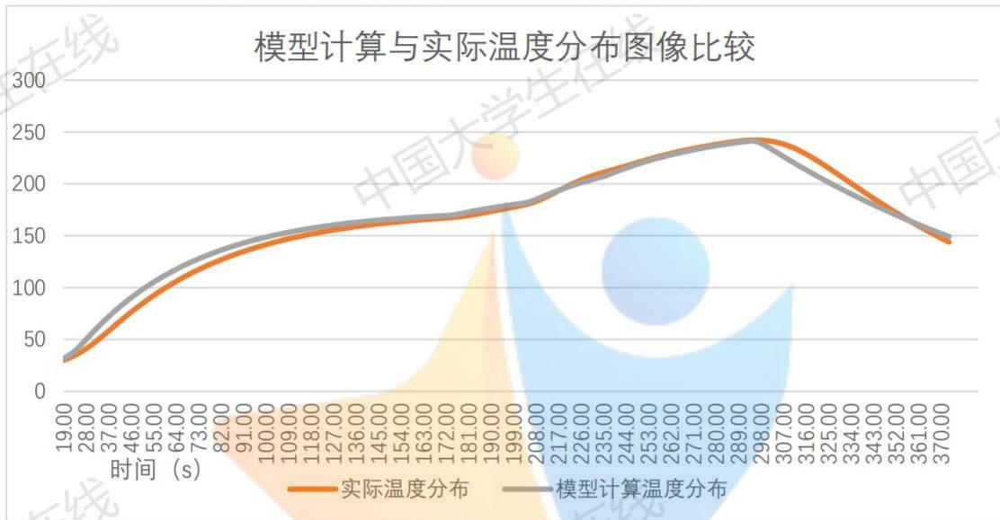

<details>
<summary>line</summary>

| 时间 (s) | 实际温度分布 | 模型计算温度分布 |
| --- | --- | --- |
| 19.00 | ~30 | ~35 |
| 28.00 | ~45 | ~55 |
| 37.00 | ~65 | ~80 |
| 46.00 | ~85 | ~100 |
| 55.00 | ~105 | ~115 |
| 64.00 | ~120 | ~130 |
| 73.00 | ~135 | ~140 |
| 82.00 | ~145 | ~148 |
| 91.00 | ~152 | ~153 |
| 100.00 | ~158 | ~158 |
| 109.00 | ~162 | ~162 |
| 118.00 | ~165 | ~165 |
| 127.00 | ~168 | ~168 |
| 136.00 | ~170 | ~170 |
| 145.00 | ~172 | ~172 |
| 154.00 | ~175 | ~175 |
| 163.00 | ~178 | ~178 |
| 172.00 | ~182 | ~182 |
| 181.00 | ~185 | ~185 |
| 190.00 | ~190 | ~190 |
| 199.00 | ~195 | ~195 |
| 208.00 | ~202 | ~202 |
| 217.00 | ~210 | ~210 |
| 226.00 | ~218 | ~218 |
| 235.00 | ~225 | ~225 |
| 244.00 | ~232 | ~232 |
| 253.00 | ~238 | ~238 |
| 262.00 | ~242 | ~242 |
| 271.00 | ~245 | ~245 |
| 280.00 | ~246 | ~246 |
| 289.00 | ~247 | ~247 |
| 298.00 | ~246 | ~246 |
| 307.00 | ~242 | ~242 |
| 316.00 | ~235 | ~235 |
| 325.00 | ~225 | ~225 |
| 334.00 | ~215 | ~215 |
| 343.00 | ~205 | ~205 |
| 352.00 | ~195 | ~195 |
| 361.00 | ~185 | ~185 |
| 370.00 | ~145 | ~150 |
</details>

图7 模型计算与实际温度分布图像比较

表3 拟合情况

<table><tr><td>A</td><td> $B_{1}$ </td><td> $B_{2}$ </td><td>a</td><td> $R^{2}$ </td></tr><tr><td>0.0003</td><td>70</td><td>21</td><td>7</td><td>0.9813</td></tr></table>

$$
R ^ {2} = 1 - \frac {\sum_ {i = 1} ^ {N} (y _ {i} ^ {*} - y _ {i}) ^ {2}}{\sum_ {i = 1} ^ {N} (y _ {i} ^ {*} - y _ {i} ^ {*}) ^ {2}} \tag {22}
$$

在该参数组合下， $R^{2}=0.9813$ ，拟合结果较好。则可将该组合的参数代入模型中。

## 求解结果

将问题一题干所给的各个温区温度分布带入上述模型，得到结果如下：

炉温曲线图:

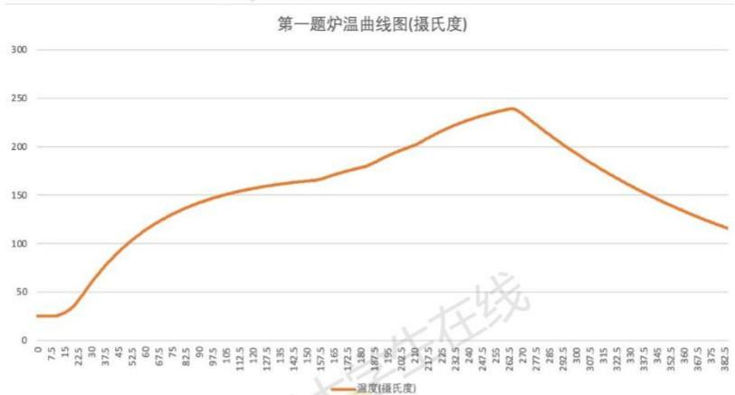

<details>
<summary>line</summary>

| 温度 (摄氏度) | 温度 (摄氏度) |
| --- | --- |
| 0 | ~25 |
| 7.5 | ~25 |
| 15 | ~30 |
| 22.5 | ~45 |
| 30 | ~65 |
| 37.5 | ~80 |
| 45 | ~95 |
| 52.5 | ~110 |
| 60 | ~120 |
| 67.5 | ~128 |
| 75 | ~135 |
| 82.5 | ~140 |
| 90 | ~145 |
| 97.5 | ~150 |
| 105 | ~153 |
| 112.5 | ~156 |
| 120 | ~158 |
| 127.5 | ~160 |
| 135 | ~162 |
| 142.5 | ~163 |
| 150 | ~165 |
| 157.5 | ~166 |
| 165 | ~170 |
| 172.5 | ~173 |
| 180 | ~178 |
| 187.5 | ~182 |
| 195 | ~188 |
| 202.5 | ~193 |
| 210 | ~200 |
| 217.5 | ~208 |
| 225 | ~215 |
| 232.5 | ~220 |
| 240 | ~225 |
| 247.5 | ~230 |
| 255 | ~233 |
| 262.5 | ~237 |
| 270 | ~240 |
| 277.5 | ~235 |
| 285 | ~228 |
| 292.5 | ~220 |
| 300 | ~212 |
| 307.5 | ~203 |
| 315 | ~195 |
| 322.5 | ~188 |
| 330 | ~180 |
| 337.5 | ~173 |
| 345 | ~166 |
| 352.5 | ~160 |
| 360 | ~153 |
| 367.5 | ~146 |
| 375 | ~139 |
| 382.5 | ~132 |
</details>

图8 炉温曲线图

特殊点温度分布:

<table><tr><td>位置</td><td>温度</td></tr><tr><td>小温区3中点</td><td>138.9208</td></tr><tr><td>小温区6中点</td><td>172.2397</td></tr><tr><td>小温区7中点</td><td>190.1654</td></tr><tr><td>小温区8结束处</td><td>223.1558</td></tr></table>

每隔 0.5 s 焊接区域中心的温度已存放在 result.csv 中。

## 5.1.10 模型分析：灵敏度分析

对四个变量进行灵敏度分析，结果如下图：

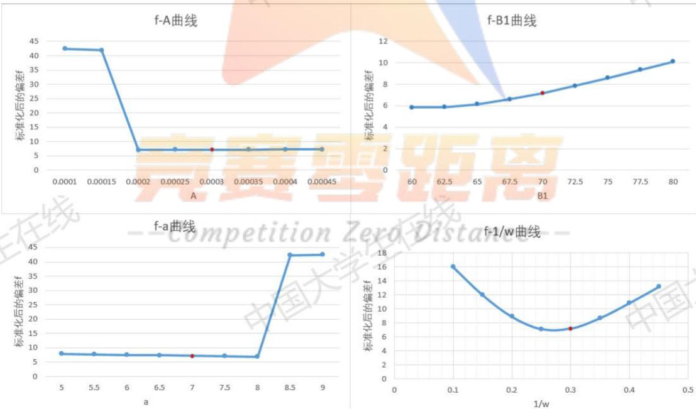  
图9 对四个变量进行灵敏度分析的结果图

对变量分别求标准化后的偏差，得：

表4 变量标准化偏差结果图

<table><tr><td>参数</td><td>标准化后偏差的灵敏度</td></tr><tr><td>A</td><td>0.025</td></tr><tr><td> $B_1$ </td><td>2.47</td></tr><tr><td>1/w</td><td>0.326</td></tr><tr><td>a</td><td>-0.312</td></tr></table>

灵敏度计算公式： $\frac{\Delta t/t}{\Delta r/r}\rightarrow\frac{r}{t}$

由结果分析可知，该热传导模型较为稳定。

## 问题 2：焊接中心温度模型基础上的单变量优化模型

问题二是建立在问题一焊接中心温度模型基础上的优化模型。对于给定的温区温度分布，根据问题一中的温度模型，以制程界限为约束条件，以传送带最大运输速度为目标，建立优化模型并求解。

## 5.2.1 模型建立

## Step 1 优化目标

根据问题二，需要求解设定温度下允许的最大传送带过炉速度，则目标为速度最大

$$
\max v
$$

## Step 2 约束条件

根据题目信息，约束条件即为制程界限，即-

$$
\left\{ \begin{array}{c} 6 5 \leq v \leq 1 0 0 \\ \left| \frac {d u}{d t} \right| \leq 3 \\ - \left[ \begin{array}{l l} \frac {d u}{d t} > 0 & \\ 6 0 \leq u ^ {- 1} (1 9 0) - u ^ {- 1} (1 5 0) \leq 1 2 0 & (2 5) \\ 4 0 \leq \max \{t | u \geq 2 1 7 \} - \min \{t | u \geq 2 1 7 \} \leq 9 0 & (2 6) \\ 2 4 0 \leq \max _ {t} u (t) \leq 2 5 0 & (2 7) \end{array} \right. \end{array} \right.
$$

## Step 3 模型综合

综上所述，建立特定温度下传送带过炉速度优化问题模型综合如下：

$$
\left\{ \begin{array}{c} \max v \\ 6 5 \leq v \leq 1 0 0 \\ \left| \frac {d u}{d t} \right| \leq 3 \\ - \left[ \begin{array}{c} \frac {d u}{d t} > 0 \\ 6 0 \leq u ^ {- 1} (1 9 0) - u ^ {- 1} (1 5 0) \leq 1 2 0 \\ 4 0 \leq \max \{t | u \geq 2 1 7 \} - \min \{t | u \geq 2 1 7 \} \leq 9 0 \\ 2 4 0 \leq \max _ {t} u (t) \leq 2 5 0 \\ \frac {\partial u (h , t)}{\partial t} = A \frac {\partial^ {2} u (h , t)}{\partial h ^ {2}} \\ u (h, 0) = 2 5 (0 \leq h \leq H) \\ \frac {\partial u (h , t)}{\partial h} | _ {h = 0} = 0 \\ \lambda \frac {\partial u}{\partial h} = h _ {z} \left(u _ {0} - u _ {H}\right) \end{array} \right. \\ \end{array} \right. \tag {28}
$$

## 5.2.2 模型求解

求解方法：将限制条件离散后遍历求解

由于传送带的速度有限制，可以先将速度区间离散化。之后，基于问题一的模型，对于遍历过程中每个传送带的速度建立相应的温度分布模型，并对限制条件进行检验，最后得出符合条件的最大速度。

离散后的限制条件:

$$
\left\{ \begin{array}{c} \left| \frac {u \left(t _ {j}\right) - u \left(t _ {j} - \Delta t\right)}{\Delta t} \right| \leq 3 \\ 6 0 \leq \min \left\{t \mid 1 9 0 \leq u \left(t _ {j}\right) \leq \max u, j = 1, 2, 3 \dots \right\} - \min \left\{t \mid u \left(t _ {j}\right) \geq 2 1 7 \right\} \\ \leq 1 2 0, j = 1, 2, 3 \dots \} \\ 4 0 \leq \max \left\{t \mid u \left(t _ {j}\right) \geq 2 1 7, j = 1, 2, 3 \dots \right\} - \min \left\{t \mid u \left(t _ {j}\right) \geq 2 1 7, j = 1, 2, 3 \dots \right\} \\ \leq 9 0 \\ 2 4 0 \leq \underset {t _ {j}} {\max} u (t) \leq 2 5 0 j = 1, 2, 3 \dots \\ \end{array} \right. \tag {29}
$$

## 5.2.3 求解步骤

Step 1: v=100

Step 2: 计算相应炉温曲线

Step 3: 验证限制条件(29)，若满足则 v=v，结束；否则 Step4

Step 4: v=v-1，回到 Step 2 继续循环

## 5.2.4 求解结果

遍历求解结果如下:

表5 问题二运行结果

<table><tr><td>速度</td><td>判断</td><td>速度</td><td>判断</td></tr><tr><td>v:100.000000</td><td>No</td><td>v:87.000000</td><td>No</td></tr><tr><td>v:99.000000</td><td>No</td><td>v:86.000000</td><td>No</td></tr><tr><td>v:98.000000</td><td>No</td><td>v:85.000000</td><td>No</td></tr><tr><td>v:97.000000</td><td>No</td><td>v:84.000000</td><td>No</td></tr><tr><td>v:96.000000</td><td>No</td><td>v:83.000000</td><td>No</td></tr><tr><td>v:95.000000</td><td>No</td><td>v:82.000000</td><td>No</td></tr><tr><td>v:94.000000</td><td>No</td><td>v:81.000000</td><td>No</td></tr><tr><td>v:93.000000</td><td>No</td><td>v:80.000000</td><td>No</td></tr><tr><td>v:92.000000</td><td>No</td><td>v:79.000000</td><td>No</td></tr><tr><td>v:91.000000</td><td>No</td><td>v:78.000000</td><td>No</td></tr><tr><td>v:90.000000</td><td>No</td><td>v:77.000000</td><td>No</td></tr><tr><td>v:89.000000</td><td>No</td><td>v:76.000000</td><td>YES</td></tr><tr><td>v:88.000000</td><td>No</td><td></td><td></td></tr></table>

则在问题二条件下的最优速度应取:

$$
v = 7 6 \mathrm{cm} / \mathrm{min}
$$

该速度下炉温曲线如下图:

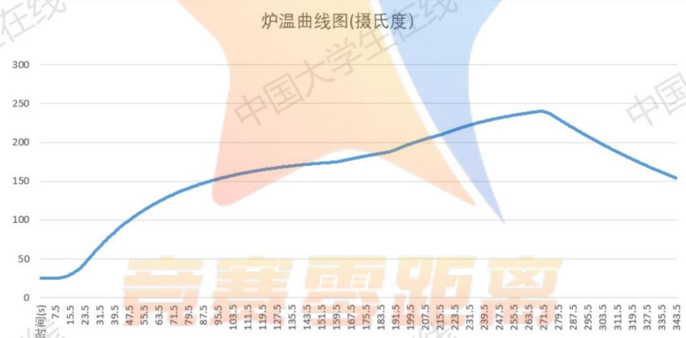

<details>
<summary>line</summary>

| 时间(s) | 温度 \(({}^{\circ}C)\) |
| --- | --- |
| 7.5 | ~25 |
| 15.5 | ~25 |
| 23.5 | ~40 |
| 31.5 | ~65 |
| 39.5 | ~85 |
| 47.5 | ~100 |
| 55.5 | ~110 |
| 63.5 | ~120 |
| 71.5 | ~130 |
| 79.5 | ~138 |
| 87.5 | ~145 |
| 95.5 | ~150 |
| 103.5 | ~155 |
| 111.5 | ~160 |
| 119.5 | ~163 |
| 127.5 | ~166 |
| 135.5 | ~168 |
| 143.5 | ~170 |
| 151.5 | ~172 |
| 159.5 | ~174 |
| 167.5 | ~176 |
| 175.5 | ~178 |
| 183.5 | ~182 |
| 191.5 | ~188 |
| 199.5 | ~195 |
| 207.5 | ~202 |
| 215.5 | ~208 |
| 223.5 | ~213 |
| 231.5 | ~218 |
| 239.5 | ~223 |
| 247.5 | ~227 |
| 255.5 | ~230 |
| 263.5 | ~233 |
| 271.5 | ~238 |
| 279.5 | ~230 |
| 287.5 | ~220 |
| 295.5 | ~210 |
| 303.5 | ~200 |
| 311.5 | ~190 |
| 319.5 | ~180 |
| 327.5 | ~170 |
| 335.5 | ~162 |
| 343.5 | ~153 |
</details>

图10 $v = 76cm / m$ 时炉温曲线图

## 问题 3

问题三同样是建立在问题一温度分布模型基础上的优化模型。在各温区温度设定、传送带锅炉速度均可变的情况下，求出各个温区与速度的组合，使得温度使超过 $217^{\circ}$ C 到峰值温度所覆盖的面积最小。该模型需要以面积最小为优化目标，建立优化模型并求解。

## 5.3.1 模型建立

## Step 1 优化目标

根据问题三，需要求解使超过 $217^{\circ}$ C 到峰值温度所覆盖的面积最小，则对相应区域进行积分，优化目标为：

$$
\min _ {u _ {1}, u _ {2}, u _ {3}, u _ {4}, v} \int_ {t ^ {\prime}} ^ {t ^ {\prime \prime}} [ u (t) - 2 1 7 ] d t
$$

## Step 2 约束条件

根据题目信息，约束条件即为制程界限，即：

$$
\left\{ \begin{array}{c} 6 5 \leq v \leq 1 0 0 \\ \left| \frac {d u}{d t} \right| \leq 3 \\ - \left[ \begin{array}{l} \frac {d u}{d t} > 0 \\ 6 0 \leq u ^ {- 1} (1 9 0) - u ^ {- 1} (1 5 0) \leq 1 2 0 \\ 4 0 \leq \max \{t | u \geq 2 1 7 \} - \min \{t | u \geq 2 1 7 \} \leq 9 0 \\ 2 4 0 \leq \max _ {t} u (t) \leq 2 5 0 \end{array} \right. \\ \end{array} \right. \tag {30}
$$

## Step 3 模型综合

综上所述，建立模型为：

$$
\min _ {u _ {1}, u _ {2}, u _ {3}, u _ {4}, v} \int_ {t ^ {\prime}} ^ {t ^ {\prime \prime}} [ u (t) - 2 1 7 ] d t
$$

$$
\left\{ \begin{array}{c} t ^ {\prime} = \min \{t \mid u \geq 2 1 7 \} \\ t ^ {\prime \prime} = \underset {t} {\operatorname{argmax}} u (t) \\ \frac {| d u |}{d t} \leq 3 \\ \frac {d u}{d t} > 0 \\ 6 0 \leq u ^ {- 1} (1 9 0) - u ^ {- 1} (1 5 0) \leq 1 2 0 \\ 4 0 \leq \max \{t \mid u \geq 2 1 7 \} - \min \{t \mid u \geq 2 1 7 \} \leq 9 0 \\ 2 4 0 \leq \underset {t} {\max} u (t) \leq 2 5 0 \\ \end{array} \right. \tag {31}
$$

## 5.3.2 模型求解

求解方法：将限制条件离散后遍历求解

原理与问题二的求解过程类似，将速度、各个区域的温度分别离散化，得到五个待求参数。之后，基于问题一的模型，对于遍历过程中每个待求参数组合建立相应的温度分布模型，并对限制条件进行检验，最后筛选得出符合条件的参数

组合。

离散后的限制条件:

$$
\begin{array}{c} t ^ {\prime} = \min \{t | u \geq 2 1 7 \} \\ t ^ {\prime \prime} = \underset {t} {\operatorname{argmax}} u (t) \\ | \frac {u (t _ {j}) - u (t _ {j} - \Delta t)}{\Delta t} | \leq 3 \\ 6 0 \leq \min \{t \mid 1 9 0 \leq u (t _ {j}) \leq m a x u, j = 1, 2, 3 \dots \} - \min \{t \mid u (t _ {j}) \geq 2 1 7 \} \\ \leq 1 2 0, j = 1, 2, 3 \dots \} \\ 4 0 \leq m a x \{t | u (t _ {j}) \geq 2 1 7, j = 1, 2, 3 \dots \} - m i n \{t | u (t _ {j}) \geq 2 1 7, j \\ = 1, 2, 3 \dots \} \leq 9 0 \\ 2 4 0 \leq m a x _ {t _ {j}} u (t) \leq 2 5 0 j = 1, 2, 3 \dots \end{array} \tag {32}
$$

## 5.3.3 优化方法：爬山算法与 A\*算法

由于优化问题的搜索参数由有 4 个温度值以及一个速度值，而每个温度值可以正负变化 10 度，速度值有 36 个，故搜索空间中大致包含 $21^{4} * 36 \approx 7000000$ 个状态值。由于巨大的搜索空间导致遍历在短时间内是不可能的，因此我们采用人工智能搜索方法，结合局部搜索算法——爬山算法与启发式搜索算法—— $A^{*}$ 算法。接下来先介绍俩个算法的内容：

爬山算法:

Step 1: 给定一个搜索起点 current（搜索空间中的一个状态）。

Step 2: 计算与当前状态相邻的所有状态的目标函数值并记录其中的最大者 lowest-valued-neighbor。

Step 3: 若 lowest-valued-neighbor 对应的函数目标值<current 对应的函数目标值，则令 current=lowest-valued-neighbor 并跳至 Step 2；反之算法运行结束并返回 current。

需要注意的是，上述爬山算法对应于最小化目标函数。此外，该算法可能会最终陷入局部最优解之中，因此我们必须多次运行该算法，每次通过随机数产生一个搜索起点，然后取其中最优的一个运行结果作为我们的结果。

$A^{*}$ 算法:

Step 1: 初始化算法: frontier 为一个按目标函数值排序的优先队列并且目前其中包含所有的状态, explored 为一个空集。

Step 2: 如果 frontier 队列变为空队列，则返回 optimal；否则继续 Step 3。

Step 3: 从 frontier 中弹出一个目标函数值最小的状态节点并赋值给 node，先检查 node 是否在 explored 中，若不在，则将 node 加入 explored 中，然后对 node 状态的每个相邻状态检验其是否在 explored 中，若不在，则将该状态以及对应的目标函数值插入 frontier 队论中；若相邻状态在 explored 中，则不做处理；若 node 在 explored 中，则跳至 Step 2。

Step 4: 若 node 的目标函数值<optimal 的目标函数值，则 optimal=node，跳至 Step 2；若 node 的目标函数值≥optimal 的目标函数值，则跳至 Step

2。

由于上述A\*算法可以遍历整个状态空间，因此我们对于该最优化问题的策略是：

Step 1: 计算机多次产生随机状态并运行爬山算法，记录其中的最优状态。

Step 2: 将上述爬山算法产生的最优状态以及爬山算法得出的部分局部最优解加入我们的 frontier 队列中, frontier 队列中再加入剩余的所有状态并初始化这些状态的目标函数为无穷大; 令 A\* 算法运行足够长的一段时间, 在 A\* 算法终止前提前返回 optimal 作为我们的最优状态。

该策略在一定程度上结合了局部搜索与全局搜索的优点，能较有效的避免我们最终产生的 optimal 陷入局部最优解之中，从而有较好的效果。

## 5.3.4 优化结果

爬山算法求得部分较优的局部最优解如下:

表6 问题三爬山算法局部最优解

<table><tr><td>参数组合</td><td>u(小温区1-5)</td><td>u(小温区6)</td><td>u(小温区7)</td><td>u(小温区8-9)</td><td>u(小温区10-11)</td><td>v</td><td>面积</td></tr><tr><td>1</td><td>185</td><td>203</td><td>238</td><td>265</td><td>25</td><td>97</td><td>403.069</td></tr><tr><td>2</td><td>184</td><td>195</td><td>230</td><td>264</td><td>25</td><td>90</td><td>416.248</td></tr><tr><td>3</td><td>184</td><td>195</td><td>230</td><td>264</td><td>25</td><td>90</td><td>416.248</td></tr><tr><td>4</td><td>184</td><td>193</td><td>239</td><td>264</td><td>25</td><td>93</td><td>416.659</td></tr><tr><td>5</td><td>183</td><td>197</td><td>240</td><td>264</td><td>25</td><td>94</td><td>416.661</td></tr><tr><td>6</td><td>179</td><td>191</td><td>242</td><td>264</td><td>25</td><td>92</td><td>417.127</td></tr><tr><td>7</td><td>179</td><td>191</td><td>242</td><td>264</td><td>25</td><td>92</td><td>417.127</td></tr><tr><td>8</td><td>167</td><td>201</td><td>235</td><td>264</td><td>25</td><td>88</td><td>417.349</td></tr><tr><td>9</td><td>169</td><td>192</td><td>233</td><td>264</td><td>25</td><td>86</td><td>417.368</td></tr><tr><td>10</td><td>179</td><td>201</td><td>236</td><td>264</td><td>25</td><td>92</td><td>417.521</td></tr></table>

## 5.3.5 最终结果

带入爬山所得的所有较优解代入 A\*算法中，在有限时间范围内（由于比赛时间有限），搜索得到的最优解如下。

<table><tr><td>u(小温区1-5)</td><td>u(小温区6)</td><td>u(小温区7)</td><td>u(小温区8-9)</td><td>u(小温区10-11)</td><td>v</td><td>面积</td></tr><tr><td>185</td><td>203</td><td>238</td><td>265</td><td>25</td><td>97</td><td>403.069</td></tr></table>

## 问题 4

问题四在问题三的基础上，新增加了一个优化目标，要使以峰值温度为中心线的两侧超过 $217^{\circ}$ C 的炉温曲线应尽量对称。则首先需要对优化目标进行线性加权，将两个优化目标简化为与问题三类似的单目标优化求解。最后建立优化模型，使用爬山与 A\* 方法求解。

## 5.4.1 模型建立

## Step 1 优化目标

在问题三的基础上，需要求出最优的温度分布与速度组合，使得以峰值温度为中心线的两侧超过 $217^{\circ}$ C 的炉温曲线应尽量对称，优化目标有两个：

$$
z _ {1} = \min _ {u _ {1}, u _ {2}, u _ {3}, u _ {4}, v} \int_ {t ^ {\prime}} ^ {t ^ {\prime \prime}} [ u (t) - 2 1 7 ] d t \tag {33}
$$

$$
z _ {2} = \min \frac {\int_ {L} ^ {\frac {L + R}{2}} [ T (t) - T (L + R - t) ] ^ {2} d t}{\frac {R - L}{2}} \tag {34}
$$

对于第二个优化目标，从温度达到 $217^{\circ}$ C 左右两端分别向右、向左取 $\Delta t$ ，为 $T(t), T(L + R - t)$ ，对该两点求偏差后平方，再累加。

## Step 2 单优化目标转换

首先，将 $z_{1}$ 与 $z_{2}$ 无量纲化，并以权重为1：1的比例线性求和，得到最后的单一优化目标：

$$
\min z = \frac {z _ {1} - \min z _ {1}}{\max z _ {1} - \min z _ {1}} + \frac {z _ {2} - \min z _ {2}}{\max z _ {2} - \min z _ {2}}
$$

对于 $z_{1}$ 与 $z_{2}$ ，不考虑制程界限时，其最小值均为0。故为简便操作，令 $minz_{1}=0,\ minz_{2}=0$ 。

则优化目标可转换为:

$$
\min z = \frac {z _ {1}}{\max z _ {1}} + \frac {z _ {2}}{\max z _ {2}}
$$

此外，简化 $max z_{1} z_{2}$ 的取值过程，由程序随机抽取有限个样本，使用样本中最大的 $z_{1} z_{2}$ 代替 $max z_{1} max z_{2}$

## Step 3 约束条件

根据题目信息，约束条件即为制程界限，即(30)。

## Step 4 模型综合

综上所述，建立模型为：

$$
\min z = \frac {z _ {1}}{\max z _ {1}} + \frac {z _ {2}}{\max z _ {2}}
$$

$$
\left\{ \begin{array}{c} L = \min \{t _ {j} | u (t _ {j}) \geq 2 1 7 \} \\ R = \max \{t _ {j} | u (t _ {j}) \geq 2 1 7 \} \\ t ^ {\prime} = \min \{t | u \geq 2 1 7 \} \\ t ^ {\prime \prime} = \underset {t} {\operatorname{argmax}} u (t) \\ \left| \frac {d u}{d t} \right| \leq 3 \\ \frac {d u}{d t} > 0 \\ 6 0 \leq u ^ {- 1} (1 9 0) - u ^ {- 1} (1 5 0) \leq 1 2 0 \\ 4 0 \leq \max \{t | u \geq 2 1 7 \} - \min \{t | u \geq 2 1 7 \} \leq 9 0 \\ 2 4 0 \leq \underset {t} {\max} u (t) \leq 2 5 0 \end{array} \right.
$$

## 5.4.2 模型求解

离散后的限制条件:

$$
\left\{ \begin{array}{c} t ^ {\prime} = \min \{t \mid u \geq 2 1 7 \} \\ t ^ {\prime \prime} = \underset {t} {\operatorname{argmax}} u (t) \\ | \frac {u \left(t _ {j}\right) - u \left(t _ {j} - \Delta t\right)}{\Delta t} | \leq 3 \\ 6 0 \\ \leq \min \left\{t \mid 1 9 0 \leq u \left(t _ {j}\right) \leq \max u, j = 1, 2, 3 \dots \right\} - \min \left\{t \mid u \left(t _ {j}\right) \geq 2 1 7 \right\} \\ \leq 1 2 0, j = 1, 2, 3 \dots \} \\ 4 0 \leq \max \left\{t \mid u \left(t _ {j}\right) \geq 2 1 7 \right\} - \min \left\{t \mid u \left(t _ {j}\right) \geq 2 1 7 \right\} \leq 9 0 j \\ = 1, 2, 3 \dots \\ 2 4 0 \leq \underset {t _ {j}} {\max} u (t) \leq 2 5 0 j = 1, 2, 3 \dots \end{array} \right. \tag {36}
$$

## 5.4.3 优化方法：爬山算法与 A\*算法

关于上述两种算法原理，已在问题三中有详细介绍。

由于上述A\*算法可以遍历整个状态空间，因此我们对于该最优化问题的策略是：

Step 1: 计算机多次产生随机状态并运行爬山算法，记录其中的最优状态。

Step 2: 将上述爬山算法产生的最优状态以及爬山算法得出的部分局部最优解加入我们的 frontier 队列中, frontier 队列中再加入剩余的所有状态并初始化这些状态的目标函数为无穷大; 令 A\* 算法运行足够长的一段时间, 在 A\* 算法终止前提前返回 optimal 作为我们的最优状态。

## 5.4.4 优化结果

爬山算法求得部分较优的局部最优解如下:

表7 问题四爬山算法局部最优解

<table><tr><td>参数组合</td><td>u(小温区1-5)</td><td>u(小温区6)</td><td>u(小温区7)</td><td>u(小温区8-9)</td><td>u(小温区10-11)</td><td>v</td><td>Z</td></tr><tr><td>1</td><td>183</td><td>197</td><td>240</td><td>264</td><td>25</td><td>94</td><td>0.99386</td></tr><tr><td>2</td><td>184</td><td>193</td><td>239</td><td>264</td><td>25</td><td>93</td><td>1.00468</td></tr><tr><td>3</td><td>179</td><td>191</td><td>242</td><td>264</td><td>25</td><td>92</td><td>1.01619</td></tr><tr><td>4</td><td>179</td><td>201</td><td>236</td><td>264</td><td>25</td><td>92</td><td>1.01659</td></tr><tr><td>5</td><td>184</td><td>195</td><td>230</td><td>264</td><td>25</td><td>90</td><td>1.03804</td></tr><tr><td>6</td><td>180</td><td>193</td><td>239</td><td>263</td><td>25</td><td>90</td><td>1.05375</td></tr></table>

## 5.4.5 最终结果

带入爬山所得的所有较优解代入 A\*算法中，在有限时间范围内（由于比赛时间有限），搜索得到的最优解如下。

表8 问题四 A\*算法最终解

<table><tr><td>参数组合</td><td>u(小温区1-5)</td><td>u(小温区6)</td><td>u(小温区7)</td><td>u(小温区8-9)</td><td>u(小温区10-11)</td><td>v</td><td>Z</td></tr><tr><td>1</td><td>183</td><td>197</td><td>240</td><td>264</td><td>25</td><td>94</td><td>0.99386</td></tr></table>

## 六、 模型评价与推广

## 模型评价

## 模型优点

(1) 对回焊炉的温区分段讨论，分为加热区与冷却区，更加贴近真实情况。  
(2) 在第一题遍历时，采用先大步长粗略分析、再小步长精确分析的方法，减少计算量，计算速度更快。  
(3) 在第三、第四题最优化求解的过程中, 采用爬山、A\*等人工智能的算法, 可以使结果更加精确。

## 模型缺点

问题三、四由于为获得全局最优解，遍历空间过大，容易导致程序运行缓慢。

## 参考文献

[1] 刘志华, 刘瑞金. 牛顿冷却定律的冷却规律研究[J]. 山东理工大学学报(自然科学版), 2005, 19(6):23-27.  
[2]贾海峰.一维热传导方程的推导[J].科技信息,2013(02):159.


<details>
<summary>text_image</summary>

中国大学生在线
中国大学生在线
</details>

## 竞赛零距离

--Competition Zero Distance--

## 附录

支撑材料列表

<table><tr><td>调试代码</td><td>/draw.cpp</td></tr><tr><td>参数遍历程序</td><td>/参数遍历.cpp</td></tr><tr><td>参数遍历输出结果</td><td>/参数遍历原始数据.out</td></tr><tr><td>参数遍历数据表</td><td>/参数遍历.xlsx</td></tr><tr><td>第一题</td><td>/T1</td></tr><tr><td>输入数据</td><td>/T1/s.in</td></tr><tr><td>代码</td><td>/T1/1.cpp</td></tr><tr><td>灵敏度检测</td><td>/Sen</td></tr><tr><td>输入数据</td><td>/Sen/s.in</td></tr><tr><td>代码</td><td>/Sen/sensitivity.cpp</td></tr><tr><td>灵敏度结果</td><td>/Sen/sensitivity1.out</td></tr><tr><td></td><td>/Sen/sensitivity2.out</td></tr><tr><td></td><td>/Sen/sensitivity3.out</td></tr><tr><td></td><td>/Sen/sensitivity4.out</td></tr><tr><td>第二题</td><td>/T2</td></tr><tr><td>输入数据</td><td>/T2/s.in</td></tr><tr><td>代码</td><td>/T2/T2.cpp</td></tr></table>

## 第三题

爬山算法求部分局部最优解/T3/GreedyT4.cpp

A\*算法 /T3/sT4.cpp

## 第四题:

爬山算法求部分局部最优解/T4/GreedyT4.cpp

A\*算法 /T4/sT4.cpp

第三、四题输出数据 /shuT34所有数据,xslx

## 参考文献

牛顿冷却定律的冷却规律研究\_刘志华

一维热传导方程的推导\_贾海峰

## 源代码

问题一（文件名：1.cpp）  
```cpp
#include<cstdio>
#include<cstdlib>
#include<cmath>
#include<iostream>
using namespace std;
#define ld long double
```

```c
Id T1,T2,T3,T4,T5;
Id v,d;
Id A,B;
Id tp;
Id dt,dx;
Id x0;
inline    Id TGD(Id x)// 管道内部温度随 x 变化的
{
    if(x>x0&&x<25)return 25+(T1-25.0)/25*(x-x0);
    //if(x>0&&x<25)return 25+(T1-25)*exp(-tp*(25-x));
    if(x>=25&&x<197.5)return T1;
    if(x>=197.5&&x<202.5)return T1+(T2-T1)/5.*(x-197.5);
    if(x>=202.5&&x<233)return T2;
    if(x>=233&&x<238)return T2+(T3-T2)/5.0*(x-233);
    if(x>=238&&x<268.5)return T3;
    if(x>=268.5&&x<273.5)return T3+(T4-T3)/5.*(x-268.5);
    if(x>=273.5&&x<339.5)return T4;
    if(x>=339.5&&x<344.5)return T4+(T5-T4)/5.*(x-339.5);
    return 25;
}
```

```javascript
Id TH[900000];
Id THJ[220][500000];//i x j 时间
Id tim[900000];
```

```c
int N,MXI;
Id MINL,MINA,MINB;
Id STD[100001][2];
inline void cp()
{
    int j;
    double t,CNT=0;
    int i=0;
```

```c
for(j=0,t=0;t*v<=500&&i<=N;t+=dt,j++)
{
    if(abs(STD[i][0]-tim[j])<1e-6)
    {
        CNT+=pow(1-THJ[MXI][j]/STD[i][1],2);
        i++;
        if(CNT>MINL)
            return;
    }
}

for(j=0,t=0;t*v<=500&&i<=N;t+=dt,j++)
{
    if(abs(STD[i][0]-tim[j])<1e-6)
    {
        TH[i]=THJ[MXI][j];
        i++;
    }
}

MINL=CNT;
MINA=A;
MINB=B;
}

inline void print()
{
    freopen("s.out","w",stdout);

    int j;
    ld t,CNT=0;
    /*for(j=0,t=0;t*v<=500;t+=dt,j++)
        if(TGD(t*v)>250){
            for(int ii=0;ii<=MXI;ii++)
                printf("%6.2Lf ",THJ[ii][j]);
            puts("");}*/

    printf("%Lf %Lf %Lf\n",MINA,MINB,MINL);
    printf("%d\n",MXI);
    int i=0;
    /*for(j=0,t=0;t*v<=500;t+=dt,j++,puts(""))
        for(i=0;i<=MXI;i++)
            printf("%6.2Lf\t",THJ[i][j]);
*/
```

```lisp
/*for(j=0,t=0;t*v<=500&&i<=N;t+=dt,j++)
{
    if(t>=290.97&&t<=300)
    {
        printf("%Lf %Lf\n",t,tim[j]);
        for(int ii=0;ii<=MXI;ii++)
            printf("%6.7Lf\t",THJ[ii][j]);
        puts("");
//        printf("%.2Lf %.2Lf\n",tim[j],THJ[MXI][j]);
        //i++;
    }
}*/
for(i=1;i<=N;i++)
    printf("%.2Lf\n",TH[i]);
}
int main()
{
    T1=173,T2=198,T3=230,T4=257,T5=25;
    v=7.8/6;
    //d=0.015/2;
    ld lIB;
    d=0.015/2;
    //dt=0.01,dx=d/100;
    //dt=0.005,dx=d/100;
    dt=0.001,dx=0.015/2/100;

    //dt=0.001,dx=10;
    freopen("s.in","r",stdin);

    double a,b;
    while(scanf("%lf%lf",&a,&b)==2)
    {
        STD[++N][0]=a;
        STD[N][1]=b;
    }

    MINL=1e100;
    A=6.4;// (6.4e-4 - 9.2e-4)
    B=100;// (0.2-1)
// for(A=0.00005;A<=0.0002;A=A+0.00005)
// for(B=10;B<=50;B=B+10)
// for(A=0.09224;A>=0.06417;A=A-0.00001)
```

```lisp
//for(B=-10;B>=-200;B=B-1)
//t=0.0001

A=0.000010, B=54.600000;// C=478591.910061
Id ttp=40;
//for(x0=0;x0<=20;x0=x0+1)
//for(A=0.00010;A<=0.00060;A+=0.00002)
// for(B=120;B<=300;B+=15)
//test
//A=0.001,B=5;
A=0.0002;
B=68;
bool rt;
//for(A=0.0001;A<=0.00052;A+=0.0001)
// for(B=66;B<=73;B+=2)
//for(x0=1;x0<=24;x0+=2)
x0=0;
Id Bt=1;
//for(x0=1;x0<25;x0+=2)
//for(A=0.0001;A<=0.001;A+=0.0002)
// for(IIB=10;IIB<=100;IIB+=10)
// for(Bt=0.1;Bt<=1;Bt+=0.2)
Bt=0.3,x0=7,A=0.0003,IIB=70;
{
tp=5.0/ttp;
B=IIB;
rt=1;
Id xx,t;
Id CNT=0,MAX,Ld,Hd;
int i,j;
for(i=2,xx=0;xx<=d;xx+=dx,i++)
THJ[i+1][0]=25;

for(i=2,xx=0;xx<=d;xx+=dx,i++)
THJ[i+1][1]=25;

THJ[0][0]=25;
THJ[1][0]=25;
THJ[2][0]=25;
THJ[2][1]=25;
int ni=1;
MXI=-1;
//for(j=0,t=0;t*v<=500;t+=dt,j++)
for(j=0,t=0;t*v<=500;t+=dt,j++)
```

```lisp
{
    /*THJ[1][j+1]=TGD(t*v);
    THJ[1][1]=25;
    THJ[2][j+1]=THJ[1][j+1]+dx*B*(THJ[1][j+1]-TGD((t+1)*v));

    THJ[2][j+1]=max(min(THJ[2][j], THJ[1][j+1]), THJ[2][j+1]);
    THJ[2][j+1]=min(max(THJ[2][j], THJ[1][j+1]), THJ[2][j+1]);*/
    //THJ[2][j+1]=THJ[1][j]+B*dx*(THJ[1][j]-TGD(t*v));
    THJ[1][j+1]=THJ[2][j]+B*dx*(TGD(t*v)-THJ[1][j]);
    //printf("%.10Lf\n", B*dx*(TGD(t*v)-THJ[1][j]));
    tim[j]=t;
    if(rt&&THJ[1][j+1]<THJ[1][j])
        //if(rt&&THJ[MXI][j+1]<THJ[MXI][j])
            A=A, B=B*Bt, rt=false;

    for(i=1, xx=0; xx<=d; xx+=dx, i++)
    {
        /*   if(j)
            THJ[i+1][j+1]=dx*dx/2/dt/A*(THJ[i][j+1]-THJ[i][j-1])+2*THJ[i][j+1]-THJ[i-1][j+1];
        else   THJ[i+1][j+1]=dx*dx/dt/A*(THJ[i][j+1]-THJ[i][j])+2*THJ[i][j+1]-THJ[i-1][j+1];

        THJ[i+1][j+1]=max(min(THJ[i+1][j], THJ[i][j+1]), THJ[i+1][j+1]);
        THJ[i+1][j+1]=min(max(THJ[i+1][j], THJ[i][j+1]), THJ[i+1][j+1]);*/
        if(j)
            //THJ[i+1][j+1}=(-(dx*dx/dt/A*(THJ[i][j]-THJ[i][j-1]))+THJ[i][j]+THJ[i+2][j])/2;
            THJ[i+1][j+1]=(-(dx*dx/dt/2/A*(THJ[i][j+1]-THJ[i][j-1]))+THJ[i][j]+THJ[i+2][j])/2;
            else   THJ[i+1][j+1]=25;
            /*if(i>1)
                if(THJ[i+1][j+1]-1e-6>THJ[i][j+1]&&THJ[i-1][j+1]-1e-6>THJ[i][j+1])
                printf("Case  1:i:%d  j:%d  dx:%LF  dt:%Lf - (dx*dx/dt/2/A*(THJ[i][j+1]-THJ[i][j-1]):%Lf  THJ[i][j+1]:%Lf  THJ[i-1][j+1]:%Lf
    THJ[i+1][j+1]:%Lf\n", i,j,
                    dx, dt,          -(dx*dx/dt/2/A*(THJ[i][j+1]-THJ[i][j-1]))/2, THJ[i][j+1], THJ[i-1][j+1], THJ[i+1][j+1]), exit(0);
            else     if(THJ[i+1][j+1]<THJ[i][j+1]-1e-6&&THJ[i][j+1]>THJ[i-1][j+1]+1e-6)
                printf("Case  2:i:%d  j:%d  dx:%LF  dt:%Lf - (dx*dx/dt/2/A*(THJ[i][j+1]-THJ[i][j-1]):%Lf  THJ[i][j+1]:%Lf  THJ[i-1][j+1]:%Lf
```

```c
THJ[i+1][j+1]:%Lf\n",i,j,
        dx,dt,          -(dx*dx/dt/2/A*(THJ[i][j+1]-THJ[i][j-1])/2,THJ[i][j+1],THJ[i-1][j+1],THJ[i+1][j+1]),exit(0);
*/
MXI=max(MXI,i+2);

}
if(abs(STD[ni][0]-tim[j])<1e-6)
{
    if(ni<=N)
        CNT+=pow(THJ[MXI][j]-STD[ni][1],2);
    ni++;
    if(CNT>2*MINL)
        {
            printf("Bt:%Lf\tx0:%Lf\tA:%Lf\tB:%Lf\t\n",Bt,x0,A,IIB);
            puts("Over");
            goto L;
        }
}
THJ[MXI][j+1]=THJ[MXI-1][j+1];
if(abs(t*v-111.25)<5e-4)
    printf("mid 3 %Lf\n",THJ[MXI][j]);
if(abs(t*v-217.75)<5e-4)
    printf("mid 6 %Lf\n",THJ[MXI][j]);
if(abs(t*v-253.25)<5e-4)
    printf("mid 7 %Lf\n",THJ[MXI][j]);
if(abs(t*v-304)<5e-4)
    printf("end 8 %Lf\n",THJ[MXI][j]);
}
MAX=-1,Ld=-1;
ni=1;
for(j=0,t=0;t*v<=500;t+=dt,j++)
{
    if(j%500==0)
    {
        TH[ni]=THJ[MXI][j];
        MAX=max(MAX,TH[ni]);
        N=ni++;
    }
}
```

```txt
MINL=CNT;
MINA=A;
MINB=B;
L:B=B*Bt;

}
print();
return 0;
}
```

问题一（文件名：参数遍历.cpp,说明：参数遍历）  
```cpp
#include<cstdio>
#include<cstdlib>
#include<cmath>
#include<iostream>
using namespace std;
#define ld long double

ld T1,T2,T3,T4,T5;
ld v,d;
ld A,B;
ld tp;
ld dt,dx;
ld x0;
inline    ld TGD(ld x)// 管道内部温度随 x 变化的
{
    if(x>x0&&x<25)return 25+(T1-25.0)/25*(x-x0);
    //if(x>0&&x<25)return 25+(T1-25)*exp(-tp*(25-x));
    if(x>=25&&x<197.5)return T1;
    if(x>=197.5&&x<202.5)return T1+(T2-T1)/5.*(x-197.5);
    if(x>=202.5&&x<233)return T2;
    if(x>=233&&x<238)return T2+(T3-T2)/5.0*(x-233);
    if(x>=238&&x<268.5)return T3;
    if(x>=268.5&&x<273.5)return T3+(T4-T3)/5.*(x-268.5);
    if(x>=273.5&&x<339.5)return T4;
    if(x>=339.5&&x<344.5)return T4+(T5-T4)/5.*(x-339.5);
    return 25;
}
```

```txt
Id TH[900000];
Id THJ[220][500000];//i x    j 时间
Id tim[900000];
```

```c
int N,MXI;
Id MINL,MINA,MINB;
Id STD[100001][2];
inline void cp()
{
    int j;
    double t,CNT=0;
    int i=0;
    for(j=0,t=0;t*v<=500&&i<=N;t+=dt,j++)
    {
        if(abs(STD[i][0]-tim[j])<1e-6)
        {
            CNT+=pow(1-THJ[MXI][j]/STD[i][1],2);
            i++;
            if(CNT>MINL)
                return;
        }
    }
    for(j=0,t=0;t*v<=500&&i<=N;t+=dt,j++)
    {
        if(abs(STD[i][0]-tim[j])<1e-6)
        {
            TH[i]=THJ[MXI][j];
            i++;
        }
    }

    MINL=CNT;
    MINA=A;
    MINB=B;
}

inline void print()
{
    freopen("s.out","w",stdout);

    int j;
    ld t,CNT=0;
    /*for(j=0,t=0;t*v<=500;t+=dt,j++)
        if(TGD(t*v)>250){
            for(int ii=0;ii<=MXI;ii++)
```

```c
printf("%6.2Lf ",THJ[ii][j]);
puts("");}*/

printf("%Lf %Lf %Lf\n",MINA,MINB,MINL);
printf("%d\n",MXI);
int i=0;
/*for(j=0,t=0;t*v<=500;t+=dt,j++,puts(""))
    for(i=0;i<=MXI;i++)
        printf("%6.2Lf\t",THJ[i][j]);
*/
/*for(j=0,t=0;t*v<=500&&i<=N;t+=dt,j++)
{
    if(t>=290.97&&t<=300)
    {
        printf("%Lf %Lf\n",t,tim[j]);
            for(int ii=0;ii<=MXI;ii++)
                printf("%6.7Lf\t",THJ[ii][j]);
            puts("");
//          printf("%.2Lf %.2Lf\n",tim[j],THJ[MXI][j]);
            //i++;
        }
    }*/
    for(i=1;i<=N;i++)
        printf("%.2Lf\n",TH[i]);
}
int main()
{
    T1=175,T2=195,T3=235,T4=255,T5=25;
    v=7./6;
    //d=0.015/2;
    ld lIB;
    d=0.015/2;
    //dt=0.01,dx=d/100;
    //dt=0.005,dx=d/100;
    dt=0.001,dx=0.015/2/100;

    //dt=0.001,dx=10;
    freopen("s.in","r",stdin);
    freopen("参数遍历原始数据.out","w",stdout);
    double a,b;
    while(scanf("%lf%lf",&a,&b)==2)
    {
```

```lisp
STD[++N][0]=a;
    STD[N][1]=b;
}

MINL=1e100;
A=6.4;// (6.4e-4 - 9.2e-4)
B=100;// (0.2-1)
// for(A=0.00005;A<=0.0002;A=A+0.00005)
// for(B=10;B<=50;B=B+10)
// for(A=0.09224;A>=0.06417;A=A-0.00001)
//for(B=-10;B>=-200;B=B-1)
//t=0.0001

A=0.000010, B=54.600000;// C=478591.910061
Id ttp=40;
//for(x0=0;x0<=20;x0=x0+1)
//for(A=0.00010;A<=0.00060;A+=0.00002)
// for(B=120;B<=300;B+=15)
//test
//A=0.001,B=5;
A=0.0002;
B=68;
bool rt;
//for(A=0.0001;A<=0.00052;A+=0.0001)
// for(B=66;B<=73;B+=2)
//for(x0=1;x0<=24;x0+=2)
x0=0;
ld Bt=1;
for(x0=1;x0<25;x0+=2)
for(A=0.0001;A<=0.001;A+=0.0002)
for(IIB=10;IIB<=100;IIB+=10)
for(Bt=0.1;Bt<=1;Bt+=0.2)
{
tp=5.0/ttp;
B=IIB;
rt=1;
ld xx,t;
ld CNT=0,MAX,Ld,Hd;
int i,j;
for(i=2,xx=0;xx<=d;xx+=dx,i++)
THJ[i+1][0]=25;

for(i=2,xx=0;xx<=d;xx+=dx,i++)
THJ[i+1][1]=25;
```

```lisp
THJ[0][0]=25;
THJ[1][0]=25;
THJ[2][0]=25;
THJ[2][1]=25;
int ni=1;
MXI=-1;
//for(j=0,t=0;t*v<=500;t+=dt,j++)
for(j=0,t=0;t*v<=500;t+=dt,j++)
{
    /*THJ[1][j+1]=TGD(t*v);
    THJ[1][1]=25;
    THJ[2][j+1]=THJ[1][j+1]+dx*B*(THJ[1][j+1]-TGD((t+1)*v));

    THJ[2][j+1]=max(min(THJ[2][j],THJ[1][j+1]),THJ[2][j+1]);
    THJ[2][j+1]=min(max(THJ[2][j],THJ[1][j+1]),THJ[2][j+1]);*/
    //THJ[2][j+1]=THJ[1][j]+B*dx*(THJ[1][j]-TGD(t*v));
    THJ[1][j+1]=THJ[2][j]+B*dx*(TGD(t*v)-THJ[1][j]);
    //printf("%.10Lf\n",B*dx*(TGD(t*v)-THJ[1][j]));
    tim[j]=t;
    if(rt&&THJ[1][j+1]<THJ[1][j])
        A=A,B=B*Bt,rt=false;

    for(i=1,xx=0;xx<=d;xx+=dx,i++)
    {
        /*     if(j)
            THJ[i+1][j+1]=dx*dx/2/dt/A*(THJ[i][j+1]-THJ[i][j-1])+2*THJ[i][j+1]-THJ[i-1][j+1];
            else   THJ[i+1][j+1]=dx*dx/dt/A*(THJ[i][j+1]-THJ[i][j])+2*THJ[i][j+1]-THJ[i-1][j+1];

            THJ[i+1][j+1]=max(min(THJ[i+1][j],THJ[i][j+1]),THJ[i+1][j+1]);
            THJ[i+1][j+1]=min(max(THJ[i+1][j],THJ[i][j+1]),THJ[i+1][j+1]);*/
            if(j)
                //THJ[i+1][j+1]=(-(dx*dx/dt/A*(THJ[i][j]-THJ[i][j-1]))+THJ[i][j]+THJ[i+2][j])/2;
                THJ[i+1][j+1]=(-(dx*dx/dt/2/A*(THJ[i][j+1]-THJ[i][j-1]))+THJ[i][j]+THJ[i+2][j])/2;
                else THJ[i+1][j+1]=25;

                /*if(i>1)
                    if(THJ[i+1][j+1]-1e-6>THJ[i][j+1]&&THJ[i-1][j+1]-1e-6>THJ[i][j+1])
                    printf("Case      1:i:%d      j:%d      dx:%LF      dt:%Lf      -
```

```txt
(dx*dx/dt/2/A*(THJ[i][j+1]-THJ[i][j-1]):%Lf THJ[i][j+1]:%Lf THJ[i-1][j+1]:%Lf
THJ[i+1][j+1]:%Lf\n",i,j,
        dx,dt, -(dx*dx/dt/2/A*(THJ[i][j+1]-THJ[i][j-
1]))/2,THJ[i][j+1],THJ[i-1][j+1],THJ[i+1][j+1]),exit(0);
        else if(THJ[i+1][j+1]<THJ[i][j+1]-1e-6&&THJ[i][j+1]>THJ[i-
1][j+1]+1e-6)
        printf("Case 2:i:%d j:%d dx:%LF dt:%Lf -
(dx*dx/dt/2/A*(THJ[i][j+1]-THJ[i][j-1]):%Lf THJ[i][j+1]:%Lf THJ[i-1][j+1]:%Lf
THJ[i+1][j+1]:%Lf\n",i,j,
        dx,dt, -(dx*dx/dt/2/A*(THJ[i][j+1]-THJ[i][j-
1]))/2, THJ[i][j+1], THJ[i-1][j+1], THJ[i+1][j+1]),exit(0);
    */
    MXI=max(MXI,i+2);

}
if(abs(STD[ni][0]-tim[j])<1e-6)
{
    if(ni<=N)
        CNT+=pow(THJ[MXI][j]-STD[ni][1],2);
    ni++;
    if(CNT>2*MINL)
    {
        printf("Bt:%Lf\tx0:%Lf\tA:%Lf\tB:%Lf\t\n",Bt,x0,A,lIB);
        puts("Over");
        goto L;
    }
}
THJ[MXI][j+1]=THJ[MXI-1][j+1];
}
MAX=-1,Ld=-1;
ni=1;
for(j=0,t=0;t*v<=500&&ni<=N;t+=dt,j++)
{
    if(abs(STD[ni][0]-tim[j])<1e-4)
    {
        TH[ni]=THJ[MXI][j];
        MAX=max(MAX,TH[ni]);
        if(Ld==-1)
            Ld=TH[ni];
        if(ni==N)
            Hd=TH[ni];
        ni++;
```

```prolog
}
}

MINL=CNT;
MINA=A;
MINB=B;
printf("Bt:%Lf\tx0:%Lf\tA:%Lf\tB:%Lf\t%Lf\t%Lf\t%Lf\t%Lf\n",Bt,x0,A,llB,sqrt(CNT/N),Ld,MAX,Hd);
L:B=B*Bt;
}
print();
return 0;
}
```

问题一（文件名：sensitivity.cpp,说明：参数敏感性分析）  
```cpp
#include<cstdio>
#include<cstdlib>
#include<cmath>
#include<queue>
#include<iostream>
using namespace std;
#define ld long double

ld T1,T2,T3,T4,T5;
ld v,d;
ld A,B;
ld tp;
ld dt,dx;
ld x0;
inline    ld TGD(ld x)// 管道内部温度随 x 变化的
{
    if(x>x0&&x<25)return 25+(T1-25.0)/25*(x-x0);
    //if(x>0&&x<25)return 25+(T1-25)*exp(-tp*(25-x));
    if(x>=25&&x<197.5)return T1;
    if(x>=197.5&&x<202.5)return T1+(T2-T1)/5.*(x-197.5);
    if(x>=202.5&&x<233)return T2;
    if(x>=233&&x<238)return T2+(T3-T2)/5.0*(x-233);
    if(x>=238&&x<268.5)return T3;
    if(x>=268.5&&x<273.5)return T3+(T4-T3)/5.*(x-268.5);
    if(x>=273.5&&x<339.5)return T4;
    if(x>=339.5&&x<344.5)return T4+(T5-T4)/5.*(x-339.5);
    return 25;
}
```

```lisp
struct Pa
{
    Id T1,T2,T3,T4,v;
    Id M;
    inline bool friend operator < (Pa a,Pa b){return a.M>b.M;}
    Pa(){\};
    Pa(Id      t1,Id      t2,Id      t3,Id      t4,Id      vv,Id
MM):T1(t1),T2(t2),T3(t3),T4(t4),v(vv),M(MM){}
    void
    print(){printf("%.0Lf\t%.0Lf\t%.0Lf\t%.0Lf\t%.0Lf\t%.3Lf\n",T1,T2,T3,T4,v*60,M);}
};
priority_queue<Pa>Q;
Id TH[900000];
Id THJ[220][500000];//i x  j  时间
Id tim[900000];

int N,MXI;
Id MINL,MINA,MINB;
Id STD[100001][2];
inline void cp()
{
    int j;
    double t,CNT=0;
    int i=0;
    for(j=0,t=0;t*v<=500&&i<=N;t+=dt,j++)
    {
        if(abs(STD[i][0]-tim[j])<1e-6)
        {
            CNT+=pow(1-THJ[MXI][j]/STD[i][1],2);
            i++;
            if(CNT>MINL)
                return;
        }
    }

    for(j=0,t=0;t*v<=500&&i<=N;t+=dt,j++)
    {
        if(abs(STD[i][0]-tim[j])<1e-6)
        {
            TH[i]=THJ[MXI][j];
            i++;
        }
    }
}
```

```txt
}
    MINL=CNT;
    MINA=A;
    MINB=B;
}
```

```javascript
Id IIB;
Id ttp=40;
Id Bt;
Id S[21][21][21][21][41];
int Out[21][21][21][21][41];
```

```txt
ld solve()
{
    //d=0.015/2;
    d=0.015/2;
    dt=0.001,dx=0.015/2/100;
    int t1,t2,t3,t4;
    t1=int(T1+1e-1)-165;
    t2=int(T2+1e-1)-185;
    t3=int(T3+1e-1)-225;
    t4=int(T4+1e-1)-245;
    //printf("%d %d %d %d\n",t1,t2,t3,t4);
    int vv=int(v*60+1e-1)-65;
```

```txt
//printf("%d\n",vv);
if(t1>20||t2>20||t3>20||t4>20||vv>35)return 1e100;
//if(S[t1][t2][t3][t4][vv]>1e-1)
//    return S[t1][t2][t3][t4][vv];
MINL=1e100;
```

```txt
bool rt;
Id MINS=1e100;
```

```txt
tp=5.0/ttp;
B=IIB;
rt=1;
Id Area=0;
Id xx,t;
Id CNT=0,MAX,Ld,Hd;
```

```txt
int i,j;
for(i=2,xx=0;xx<=d;xx+=dx,i++)
    THJ[i+1][0]=25;

for(i=2,xx=0;xx<=d;xx+=dx,i++)
    THJ[i+1][1]=25;

THJ[0][0]=25;
THJ[1][0]=25;
THJ[2][0]=25;
THJ[2][1]=25;
MXI=-1;
bool UP=false;
double ST=1e100,ED=-1;
double ST2=1e100,ED2=-1;
//for(j=0,t=0;t*v<=500;t+=dt,j++)
for(j=0,t=0;t*v<=500;t+=dt,j++)
{
    THJ[1][j+1]=THJ[2][j]+B*dx*(TGD(t*v)-THJ[1][j]);
    tim[j]=t;
    if(rt&&THJ[1][j+1]<THJ[1][j])
        A=A,B=B*Bt,rt=false;

    for(i=1,xx=0;xx<=d;xx+=dx,i++)
    {
        if(j)
            THJ[i+1][j+1]=(-(dx*dx/dt/2/A*(THJ[i][j+1]-THJ[i][j-1]))+THJ[i][j]+THJ[i+2][j])/2;
        else THJ[i+1][j+1]=25;
        MXI=max(MXI,i+2);
    }

    THJ[MXI][j+1]=THJ[MXI-1][j+1];
    if(abs(THJ[MXI][j+1]-THJ[MXI][j])/dt>3)
    {
        //puts("175");
        goto pl;}
    if(THJ[MXI][j+1]>150&&ST>1e10)
        ST=t;
    if(THJ[MXI][j+1]>190&&ED<0)
    {
        ED=t;
```

```txt
if(ED-ST<60||ED-ST>120)
{
    //puts("182");
    goto pl;}
}
if(THJ[MXI][j+1]>240)
UP=true;
if(THJ[MXI][j+1]>217)
{
    Area+=(THJ[MXI][j+1]-217)*dt;

    if(Area>MINS)
    {
        //puts("191");
        goto pl;}
        if(Area+pow(THJ[MXI][j+1]-217,2)/6>MINS)
        {//puts("193");
        goto pl;}
        if(!UP)&&Area+(240-THJ[MXI][j+1])*(THJ[MXI][j+1]-194)/6+(23*23)/6.>MINS)
        {
            //puts("195");
            goto pl;}
        }

        if(THJ[MXI][j+1]>250)
        {//puts("199");
        goto pl;}

        if(THJ[MXI][j+1]>217&&ST2>1e10)
        ST2=t;
        if(THJ[MXI][i+1]<217&&ST2<1e10)
        {
            ED2=t;
            if(ED2-ST2<40&&ED2-ST2>90)
                {//puts("207");
                goto pl;}
        }
    }

    MAX=-1,Ld=-1;
    for(j=0,t=0;t*v<=500;t+=dt,j++)
        MAX=max(MAX,THJ[MXI][j]);
```

```cpp
if(MAX<240)
{
    //printf("%Lf\n",MAX);
    for(int vi=vv;vi<=20;vi++)
        S[t1][t2][t3][t4][vi]=1e100;
    //puts("225");
    goto pl;
}
if(MAX>250)
    {//puts("228");
        for(int vi=vv;~vi;vi--)
            S[t1][t2][t3][t4][vi]=1e100;
        goto pl;}
MINL=CNT;
MINA=A;
MINB=B;
L:B=B*Bt;
MINS=Area;
goto ed;
pl:Area=1e100;
//printf("T1:%Lf\tT2:%Lf\tT3:%Lf\tT4:%Lf\tv:%Lf\tNo\n",T1,T2,T3,T4,v*60);
;
ed;;
//printf("%Lf\n",Area);
//print();
if(Area<1e10)
    Q.push(Pa(T1,T2,T3,T4,v,Area));
return S[t1][t2][t3][t4][vv]=Area;
}
int main()
{
    ld M=1e100,tp;
    Bt=0.3,x0=7,A=0.0003,llB=70;
    freopen("sensitivity1.out","w",stdout);
    freopen("s.in","r",stdin);
    double a,b;
    int N=0;
    while(scanf("%lf%lf",&a,&b)==2)
```

```csv
{
    STD[++N][0]=a;
    STD[N][1]=b;
}
for(Bt=0.1;Bt<=0.5;Bt+=0.05)
{
Pa L;
T1=175,T2=195,T3=235,T4=255,T5=25,v=70./60,M=solve();
int j;
Id t;
int i=1;
Id CNT=0;
for(j=0,t=0;t*v<=500&&i<=N;t+=dt,j++)
if(j%500==0)
{
    if(j>=19000)
        CNT+=pow(THJ[MXI][j]-STD[i++][1],2);
}
CNT/=N;
printf("%Lf\t%Lf\n",Bt,sqrt(CNT));
}
M=1e100;
Bt=0.3,x0=7,A=0.0003,llB=70;
freopen("sensitivity2.out","w",stdout);
freopen("s.in","r",stdin);

N=0;
while(scanf("%lf%lf",&a,&b)==2)
{
    STD[++N][0]=a;
    STD[N][1]=b;
}
for(x0=5;x0<=9;x0+=0.5)
{
Pa L;
T1=175,T2=195,T3=235,T4=255,T5=25,v=70./60,M=solve();
int j;
Id t;
int i=1;
Id CNT=0;
for(j=0,t=0;t*v<=500&&i<=N;t+=dt,j++)
if(j%500==0)
{
    if(j>= 19000)
```

```lisp
CNT+=pow(THJ[MXI][j]-STD[i++][1],2);
}
CNT/=N;
printf("%Lf\t%Lf\n",x0,sqrt(CNT));
}
M=1e100;
Bt=0.3,x0=7,A=0.0003,IIIB=70;
freopen("sensitivity3.out","w",stdout);
freopen("s.in","r",stdin);

N=0;
while(scanf("%lf%lf",&a,&b)==2)
{
    STD[++N][0]=a;
    STD[N][1]=b;
}
for(A=0.0001;A<=0.0005;A+=0.00005)
{
Pa L;
T1=175,T2=195,T3=235,T4=255,T5=25,v=70./60,M=solve();
int j;
Id t;
int i=1;
Id CNT=0;
for(j=0,t=0;t*v<=500&&i<=N;t+=dt,j++)
if(j%500==0)
{
    if(j>=19000)
        CNT+=pow(THJ[MXI][j]-STD[i++][1],2);
}
CNT/=N;
printf("%Lf\t%Lf\n",A,sqrt(CNT));
}
M=1e100;
Bt=0.3,x0=7,A=0.0003,IIIB=70;
freopen("sensitivity4.out","w",stdout);
freopen("s.in","r",stdin);

N=0;
while(scanf("%lf%lf",&a,&b)==2)
{
    STD[++N][0]=a;
    STD[N][1]=b;
}
```

```txt
for(IIIB=60;IIB<=80;IIB+=2.5)
{
Pa L;
T1=175,T2=195,T3=235,T4=255,T5=25,v=70./60,M=solve();
int j;
Id t;
int i=1;
Id CNT=0;
for(j=0,t=0;t*v<=500&&i<=N;t+=dt,j++)
if(j%500==0)
{
if(j>=19000)
CNT+=pow(THJ[MXI][j]-STD[i++][1],2);
}
CNT/=N;
printf("%Lf\t%Lf\n",IIB,sqrt(CNT));
}
}
```

问题二（文件名：T2.cpp）  
```cpp
#include<cstdio>
#include<cstdlib>
#include<cmath>
#include<iostream>
using namespace std;
#define ld long double
```

```c
Id T1,T2,T3,T4,T5;
Id v,d;
Id A,B;
Id tp;
Id dt,dx;
Id x0;
inline    Id TGD(Id x)// 管道内部温度随 x 变化的
{
    if(x>x0&&x<25)return 25+(T1-25.0)/25*(x-x0);
    //if(x>0&&x<25)return 25+(T1-25)*exp(-tp*(25-x));
    if(x>=25&&x<197.5)return T1;
    if(x>=197.5&&x<202.5)return T1+(T2-T1)/5.*(x-197.5);
    if(x>=202.5&&x<233)return T2;
    if(x>=233&&x<238)return T2+(T3-T2)/5.0*(x-233);
    if(x>=238&&x<268.5)return T3;
    if(x>=268.5&&x<273.5)return T3+(T4-T3)/5.*(x-268.5);
    if(x>=273.5&&x<339.5)return T4;
```

```txt
if(x>=339.5&&x<344.5)return T4+(T5-T4)/5.*(x-339.5);
return 25;
}

Id TH[900000];
Id THJ[220][500000];//i x j 时间
Id tim[900000];

int N,MXI;
Id MINL,MINA,MINB;
Id STD[100001][2];
inline void cp()
{
    int j;
    double t,CNT=0;
    int i=0;
    for(j=0,t=0;t*v<=500&&i<=N;t+=dt,j++)
    {
        if(abs(STD[i][0]-tim[j])<1e-6)
        {
            CNT+=pow(1-THJ[MXI][j]/STD[i][1],2);
            i++;
            if(CNT>MINL)
                return;
        }
    }

    for(j=0,t=0;t*v<=500&&i<=N;t+=dt,j++)
    {
        if(abs(STD[i][0]-tim[j])<1e-6)
        {
            TH[i]=THJ[MXI][j];
            i++;
        }
    }

    MINL=CNT;
    MINA=A;
    MINB=B;
}

inline void print()
{
```

```c
freopen("T2s.out","w",stdout);

int j;
ld t,CNT=0;
/*for(j=0,t=0;t*v<=500;t+=dt,j++)
    if(TGD(t*v)>250){
        for(int ii=0;ii<=MXI;ii++)
            printf("%6.2Lf ",THJ[ii][j]);
        puts("");}*/

printf("%Lf %Lf %Lf\n",MINA,MINB,MINL);
printf("%d\n",MXI);
int i=0;
/*for(j=0,t=0;t*v<=500;t+=dt,j++,puts(""))
    for(i=0;i<=MXI;i++)
        printf("%6.2Lf\t",THJ[i][j]);
*/
/*for(j=0,t=0;t*v<=500&&i<=N;t+=dt,j++)
{
    if(t>=290.97&&t<=300)
    {
        printf("%Lf %Lf\n",t,tim[j]);
        for(int ii=0;ii<=MXI;ii++)
            printf("%6.7Lf\t",THJ[ii][j]);
        puts("");
//    printf("%.2Lf %.2Lf\n",tim[j],THJ[MXI][j]);
        //i++;
    }
}*/
for(i=1;i<=N;i++)
    printf("%.2Lf\n",TH[i]);
}
int main()
{
    T1=182,T2=203,T3=237,T4=254,T5=25;
    v=7.8/6;
    //d=0.015/2;
    ld lIB;
    d=0.015/2;
    dt=0.001,dx=0.015/2/100;
    freopen("s.in","r",stdin);
    freopen("T2.out","w",stdout);
```

```txt
double a,b;
while(scanf("%lf%lf",&a,&b)==2)
{
    STD[++N][0]=a;
    STD[N][1]=b;
}

MINL=1e100;
A=6.4;// (6.4e-4 - 9.2e-4)
B=100;// (0.2-1)
// for(A=0.00005;A<=0.0002;A=A+0.00005)
// for(B=10;B<=50;B=B+10)
// for(A=0.09224;A>=0.06417;A=A-0.00001)
//for(B=-10;B>=-200;B=B-1)
//t=0.0001

A=0.000010, B=54.600000;// C=478591.910061
Id ttp=40;
//for(x0=0;x0<=20;x0=x0+1)
//for(A=0.00010;A<=0.00060;A+=0.00002)
// for(B=120;B<=300;B+=15)
//test
//A=0.001,B=5;
A=0.0002;
B=68;
bool rt;
//for(A=0.0001;A<=0.00052;A+=0.0001)
// for(B=66;B<=73;B+=2)
//for(x0=1;x0<=24;x0+=2)
x0=0;
ld Bt=1;
ld MINS=1e100;
//for(x0=1;x0<25;x0+=2)
//for(A=0.0001;A<=0.001;A+=0.0002)
// for(IIB=10;IIB<=100;IIB+=10)
// for(Bt=0.1;Bt<=1;Bt+=0.2)
Bt=0.3,x0=7,A=0.0003,IIB=70;

for(v=10./6;v>=6.5/6;v-=0.1/6)
{
tp=5.0/ttp;
B=IIB;
rt=1;
```

```txt
Id Area=0;
Id xx,t;
Id CNT=0,MAX,Ld,Hd;
int i,j;
for(i=2,xx=0;xx<=d;xx+=dx,i++)
    THJ[i+1][0]=25;

for(i=2,xx=0;xx<=d;xx+=dx,i++)
    THJ[i+1][1]=25;

THJ[0][0]=25;
THJ[1][0]=25;
THJ[2][0]=25;
THJ[2][1]=25;
int ni=1;
MXI=-1;
double ST=1e100,ED=-1;
double ST2=1e100,ED2=-1;
//for(j=0,t=0;t*v<=500;t+=dt,j++)
for(j=0,t=0;t*v<=500;t+=dt,j++)
{
    /*THJ[1][j+1]=TGD(t*v);
    THJ[1][1]=25;
    THJ[2][j+1]=THJ[1][j+1]+dx*B*(THJ[1][j+1]-TGD((t+1)*v));

    THJ[2][j+1]=max(min(THJ[2][j],THJ[1][j+1]),THJ[2][j+1]);
    THJ[2][j+1]=min(max(THJ[2][j],THJ[1][j+1]),THJ[2][j+1]);*/
    //THJ[2][j+1]=THJ[1][j]+B*dx*(THJ[1][j]-TGD(t*v));
    THJ[1][j+1]=THJ[2][j]+B*dx*(TGD(t*v)-THJ[1][j]);
    //printf("%.10Lf\n",B*dx*(TGD(t*v)-THJ[1][j]));
    tim[j]=t;
    if(rt&&THJ[1][j+1]<THJ[1][j])
        //if(rt&&THJ[MXI][j+1]<THJ[MXI][j])
            A=A,B=B*Bt,rt=false;

    for(i=1,xx=0;xx<=d;xx+=dx,i++)
    {
        if(j)
            THJ[i+1][j+1]=(-(dx*dx/dt/2/A*(THJ[i][j+1]-THJ[i][j-1]))+THJ[i][j]+THJ[i+2][j])/2;
        else THJ[i+1][j+1]=25;

        MXI=max(MXI,i+2);
```

```lisp
}
if(abs(STD[ni][0]-tim[j])<1e-6)
{
    if(ni<=N)
        CNT+=pow(THJ[MXI][j]-STD[ni][1],2);
    ni++;
    if(CNT>2*MINL)
    {
        printf("Bt:%Lf\tx0:%Lf\tA:%Lf\tB:%Lf\t\n",Bt,x0,A,IIB);
        puts("Over");
        goto L;
    }
}
THJ[MXI][j+1]=THJ[MXI-1][j+1];
if(abs(THJ[MXI][j+1]-THJ[MXI][j])/dt>3)
    goto pl;
if(THJ[MXI][j+1]>150&&ST>1e10)
    ST=t;
if(THJ[MXI][j+1]>190&&ED<0)
    {
        ED=t;
        if(ED-ST<60||ED-ST>120)
            goto pl;
    }
if(THJ[MXI][j+1]>217&&ST2>1e10)
    ST2=t;
if(THJ[MXI][i+1]<217&&ST2<1e10)
    {
        ED2=t;
        if(ED2-ST2<40&&ED2-ST2>90)
            goto pl;
    }
}
MAX=-1,Ld=-1;
ni=1;
for(j=0,t=0;t*v<=500;t+=dt,j++)
{
    if(j%500==0)
    {
        TH[ni]=THJ[MXI][j];
```

```matlab
MAX=max(MAX,TH[ni]);
N=ni++;
}
}
if(MAX<240)
{
    goto pl;
}
if(MAX>250)
    goto pl;

MINL=CNT;
MINA=A;
MINB=B;
L:B=B*Bt;

MINS=Area;
printf("v:%Lf\tYES\n",v*60);
exit(0);
goto ed;
pl:printf("v:%Lf\tNo\n",v*60);
;
ed;;
}
print();
return 0;
}
```

问题三（文件名：GreedyT3.cpp；说明：爬山代码）  
```cpp
#include<cstdio>
#include<cstdlib>
#include<cmath>
#include<iostream>
using namespace std;
#define ld long double

ld T1,T2,T3,T4,T5;
ld v,d;
ld A,B;
ld tp;
ld dt,dx;
ld x0;
inline    ld TGD(ld x)// 管道内部温度随 x 变化的
{
```

```javascript
if(x>x0&&x<25)return 25+(T1-25.0)/25*(x-x0);
//if(x>0&&x<25)return 25+(T1-25)*exp(-tp*(25-x));
if(x>=25&&x<197.5)return T1;
if(x>=197.5&&x<202.5)return T1+(T2-T1)/5.*(x-197.5);
if(x>=202.5&&x<233)return T2;
if(x>=233&&x<238)return T2+(T3-T2)/5.0*(x-233);
if(x>=238&&x<268.5)return T3;
if(x>=268.5&&x<273.5)return T3+(T4-T3)/5.*(x-268.5);
if(x>=273.5&&x<339.5)return T4;
if(x>=339.5&&x<344.5)return T4+(T5-T4)/5.*(x-339.5);
return 25;
}
```

```txt
Id TH[900000];
Id THJ[220][500000];//i x    j 时间
Id tim[900000];
```

```txt
int N,MXI;
Id MINL,MINA,MINB;
Id STD[100001][2];
inline void cp()
{
    int j;
    double t,CNT=0;
    int i=0;
    for(j=0,t=0;t*v<=500&&i<=N;t+=dt,j++)
    {
        if(abs(STD[i][0]-tim[j])<1e-6)
        {
            CNT+=pow(1-THJ[MXI][j]/STD[i][1],2);
            i++;
            if(CNT>MINL)
                return;
        }
    }

    for(j=0,t=0;t*v<=500&&i<=N;t+=dt,j++)
    {
        if(abs(STD[i][0]-tim[j])<1e-6)
        {
            TH[i]=THJ[MXI][j];
            i++;
        }
    }
}
```

```txt
}
MINL=CNT;
MINA=A;
MINB=B;
}
ld lIB;
ld ttp=40;
ld Bt;
ld S[21][21][21][21][41];
ld solve()
{
    //d=0.015/2;
    d=0.015/2;
    dt=0.001,dx=0.015/2/100;
    int t1,t2,t3,t4;
    t1=int(T1+1e-1)-165;
    t2=int(T2+1e-1)-184;
    t3=int(T3+1e-1)-224;
    t4=int(T4+1e-1)-244;
    int vv=int(v*60+1e-1)-65;
    if(t1>20||t2>20||t3>20||t4>20||vv>35)return 1e100;
    if(S[t1][t2][t3][t4][vv]>1e-1)
        return S[t1][t2][t3][t4][vv];
    MINL=1e100;

    bool rt;

    ld MINS=1e100;

    tp=5.0/ttp;
    B=lIB;
    rt=1;
    int ad=1;
    ld Area=0;
    ld xx,t;
    ld CNT=0,MAX,Ld,Hd;
    int i,j;
    for(i=2,xx=0;xx<=d;xx+=dx,i++)
        THJ[i+1][0]=25;

    for(i=2,xx=0;xx<=d;xx+=dx,i++)
```

```c
THJ[i+1][1]=25;

THJ[0][0]=25;
THJ[1][0]=25;
THJ[2][0]=25;
THJ[2][1]=25;
MXI=-1;
bool UP=false;
double ST=1e100,ED=-1;
double ST2=1e100,ED2=-1;
//for(j=0,t=0;t*v<=500;t+=dt,j++)
for(j=0,t=0;t*v<=500;t+=dt,j++)
{
    THJ[1][j+1]=THJ[2][j]+B*dx*(TGD(t*v)-THJ[1][j]);
    tim[j]=t;
    if(rt&&THJ[1][j+1]<THJ[1][j])
        A=A,B=B*Bt,rt=false;

    for(i=1,xx=0;xx<=d;xx+=dx,i++)
    {
        if(j)
            THJ[i+1][j+1]=(-(dx*dx/dt/2/A*(THJ[i][j+1]-THJ[i][j-1]))+THJ[i][j]+THJ[i+2][j])/2;
        else THJ[i+1][j+1]=25;
        MXI=max(MXI,i+2);
    }

    THJ[MXI][j+1]=THJ[MXI-1][j+1];
    if(abs(THJ[MXI][j+1]-THJ[MXI][j])/dt>3)
        {
            //puts("175");
            goto pl;}
    if(THJ[MXI][j+1]>150&&ST>1e10)
        ST=t;
    if(THJ[MXI][j+1]>190&&ED<0)
        {
            ED=t;
            if(ED-ST<60||ED-ST>120)
            {
                //puts("182");
                goto pl;}
        }
    }
```

```txt
if(THJ[MXI][j+1]>240)
    UP=true;
if(THJ[MXI][j+1]>217)
{
    if(ad&&THJ[MXI][j+1]>THJ[MXI][j])
        Area+=(THJ[MXI][j+1]-217)*dt;
    else ad=0;
    if(Area>MINS)
        {
            //puts("191");
            goto pl;}
        //if(Area+pow(THJ[MXI][j+1]-217,2)/6>MINS)
        // {//puts("193");
        // goto pl;}
        if(!UP)&&Area+(240-THJ[MXI][j+1])*(THJ[MXI][j+1]-194)/6>MINS)
        {
            //puts("195");
            goto pl;}
    }
    if(THJ[MXI][j+1]>250)
        {//puts("199");
            goto pl;}
    if(THJ[MXI][j+1]>217&&ST2>1e10)
        ST2=t;
    if(THJ[MXI][i+1]<217&&ST2<1e10)
        {
            ED2=t;
            if(ED2-ST2<40&&ED2-ST2>90)
                {//puts("207");
                    goto pl;}
        }
    }
}
MAX=-1,Ld=-1;
for(j=0,t=0;t*v<=500;t+=dt,j++)
    MAX=max(MAX,THJ[MXI][j]);
if(MAX<240)
{
    //printf("%Lf\n",MAX);
    for(int vi=vv;vi<=20;vi++)
```

```txt
S[t1][t2][t3][t4][vi]=1e100;
//puts("225");
goto pl;
}
if(MAX>250)
{//puts("228");
for(int vi=vv;~vi;vi--)
S[t1][t2][t3][t4][vi]=1e100;
goto pl;}

MINL=CNT;
MINA=A;
MINB=B;
L:B=B*Bt;

MINS=Area;
//printf("T1:%Lf\tT2:%Lf\tT3:%Lf\tT4:%Lf\tv:%Lf\t
Area:%Lf\tYES\n",T1,T2,T3,T4,v*60,Area);
goto ed;
pl:Area=1e100;
//printf("T1:%Lf\tT2:%Lf\tT3:%Lf\tT4:%Lf\tv:%Lf\tNo\n",T1,T2,T3,T4,v*60);
;
ed;;
//printf("%Lf\n",Area);
//print();
return S[t1][t2][t3][t4][vv]=Area;
}
```

```txt
int main()
{
    //freopen("GreedyT3.out","w",stdout);

    Id M=1e100,tp;
    Bt=0.3,x0=7,A=0.0003,IIB=70;
    for(int xxx=1;xxx<=50;xxx++)
    {   if(xxx==1)
        T1=182,T2=203,T3=237,T4=254,T5=25,v=7.6/6,M=solve();
        else if(xxx==2)
            T1=181,T2=203,T3=237,T4=254,T5=25,v=7.6/6,M=solve();
        else if(xxx==3)
            T1=182,T2=204,T3=237,T4=254,T5=25,v=7.6/6,M=solve();
```

```lisp
else if(xxx==4)
    T1=181,T2=204,T3=237,T4=254,T5=25,v=7.6/6,M=solve();
else if(xxx==5)
    T1=175,T2=195,T3=235,T4=255,T5=25,v=7.0/6,M=solve();
else
{
    //puts("******************************startselect");
    do

T1=165+rand()%21,T2=185+rand()%21,T3=225+rand()%21,T4=245+rand()%21,T5=25,v=(65+rand()%36)/60.;
    while((M=solve())>1e10);
    //puts("******************************endselect");
}
while(true)
{
    int fl=-1;
    T1=T1+1;
    tp=solve();
    if(tp<M)fl=1,M(tp;
    T1=T1-1;

    T1=T1-1;
    tp=solve();
    if(tp<M)fl=2,M(tp;
    T1=T1+1;

    T2=T2+1;
    tp=solve();
    if(tp<M)fl=3,M(tp;
    T2=T2-1;

    T2=T2-1;
    tp=solve();
    if(tp<M)fl=4,M(tp;
    T2=T2+1;

    T3=T3+1;
    tp=solve();
```

```javascript
if(tp<M)fl=5,M=tp;
T3=T3-1;
```

```txt
T3=T3-1;
tp=solve();
if(tp<M)fl=6,M=tp;
T3=T3+1;
```

```lua
T4=T4+1;
tp=solve();
if(tp<M)fl=7,M=tp;
T4=T4-1;
```

```lua
T4=T4-1;
tp=solve();
if(tp<M)fl=8,M=tp;
T4=T4+1;
```

```javascript
v=v+1./60;
tp=solve();
if(tp<M)fl=9,M=tp;
v=v-1./60;
```

```javascript
v=v-1./60;
tp=solve();
if(tp<M)fl=10,M=tp;
v=v+1./60;
```

```javascript
if(fl==-1)
    break;
if(fl==1)
    T1+=1;
```

```txt
if(fl==2)
    T1-=1;
```

```txt
if(fl==3)
    T2+=1;
if(fl==4)
    T2-=1;
```

```matlab
if(fl==5)
    T3+=1;
if(fl==6)
    T3-=1;
if(fl==7)
```

```lisp
T4+=1;
if(fl==8)
    T4-=1;
if(fl==9)
    v+=1./60;
if(fl==8)
    v-=1./60;
// printf("%.0Lf %.0Lf %.0Lf %.0Lf %.0Lf\n",T1,T2,T3,T4,v*60);
}
printf("%.0Lf\t%.0Lf\t%.0Lf\t%.0Lf\t%.0Lf\t%.3Lf\n",T1,T2,T3,T4,v*60,M);
}
}
```

问题三（文件名：s.cpp）  
```cpp
#include<cstdio>
#include<cstdlib>
#include<cmath>
#include<queue>
#include<iostream>
using namespace std;
#define ld long double
```

```c
Id T1,T2,T3,T4,T5;
Id v,d;
Id A,B;
Id tp;
Id dt,dx;
Id x0;
inline    Id TGD(Id x)// 管道内部温度随 x 变化的
{
    if(x>x0&&x<25)return 25+(T1-25.0)/25*(x-x0);
    //if(x>0&&x<25)return 25+(T1-25)*exp(-tp*(25-x));
    if(x>=25&&x<197.5)return T1;
    if(x>=197.5&&x<202.5)return T1+(T2-T1)/5.*(x-197.5);
    if(x>=202.5&&x<233)return T2;
    if(x>=233&&x<238)return T2+(T3-T2)/5.0*(x-233);
    if(x>=238&&x<268.5)return T3;
    if(x>=268.5&&x<273.5)return T3+(T4-T3)/5.*(x-268.5);
    if(x>=273.5&&x<339.5)return T4;
    if(x>=339.5&&x<344.5)return T4+(T5-T4)/5.*(x-339.5);
    return 25;
```

```c
}
struct Pa
{
    Id T1,T2,T3,T4,v;
    Id M;
    inline bool friend operator < (Pa a,Pa b){return a.M>b.M;}
    Pa(){\};
    Pa(Id      t1,Id      t2,Id      t3,Id      t4,Id      vv,Id
MM):T1(t1),T2(t2),T3(t3),T4(t4),v(vv),M(MM){}
    void
print(){printf("%.0Lf\t%.0Lf\t%.0Lf\t%.0Lf\t%.0Lf\t%.3Lf\n",T1,T2,T3,T4,v*60,M);}
};
priority_queue<Pa>Q;
Id TH[900000];
Id THJ[220][500000];//i x  j  时间
Id tim[900000];

int N,MXI;
Id MINL,MINA,MINB;
Id STD[100001][2];
inline void cp()
{
    int j;
    double t,CNT=0;
    int i=0;
    for(j=0,t=0;t*v<=500&&i<=N;t+=dt,j++)
    {
        if(abs(STD[i][0]-tim[j])<1e-6)
        {
            CNT+=pow(1-THJ[MXI][j]/STD[i][1],2);
            i++;
            if(CNT>MINL)
                return;
        }
    }

    for(j=0,t=0;t*v<=500&&i<=N;t+=dt,j++)
    {
        if(abs(STD[i][0]-tim[j])<1e-6)
        {
            TH[i]=THJ[MXI][j];
            i++;
```

```javascript
}
}

MINL=CNT;
MINA=A;
MINB=B;
}

ld IIB;
ld ttp=40;
ld Bt;
ld S[21][21][21][21][41];
int Out[21][21][21][21][41];

ld solve()
{
    //d=0.015/2;
    d=0.015/2;
    dt=0.001,dx=0.015/2/100;
    int t1,t2,t3,t4;
    t1=int(T1+1e-1)-165;
    t2=int(T2+1e-1)-185;
    t3=int(T3+1e-1)-225;
    t4=int(T4+1e-1)-245;
    int vv=int(v*60+1e-1)-65;
    if(t1>20||t2>20||t3>20||t4>20||vv>35)return 1e100;
    if(S[t1][t2][t3][t4][vv]>1e-1)
        return S[t1][t2][t3][t4][vv];
    MINL=1e100;

    bool rt;

    ld MINS=1e100;
```

```matlab
tp=5.0/ttp;
B=IIB;
rt=1;
Id Area=0;
Id xx,t;
Id CNT=0,MAX,Ld,Hd;
int i,j;
for(i=2,xx=0;xx<=d;xx+=dx,i++)
```

```txt
THJ[i+1][0]=25;

for(i=2,xx=0;xx<=d;xx+=dx,i++)
    THJ[i+1][1]=25;

THJ[0][0]=25;
THJ[1][0]=25;
THJ[2][0]=25;
THJ[2][1]=25;
MXI=-1;
bool UP=false;
int ad=1;
double ST=1e100,ED=-1;
double ST2=1e100,ED2=-1;
//for(j=0,t=0;t*v<=500;t+=dt,j++)
for(j=0,t=0;t*v<=500;t+=dt,j++)
{
    THJ[1][j+1]=THJ[2][j]+B*dx*(TGD(t*v)-THJ[1][j]);
    tim[j]=t;
    if(rt&&THJ[1][j+1]<THJ[1][j])
        A=A,B=B*Bt,rt=false;

    for(i=1,xx=0;xx<=d;xx+=dx,i++)
    {
        if(j)
            THJ[i+1][j+1]=(-(dx*dx/dt/2/A*(THJ[i][j+1]-THJ[i][j-1]))+THJ[i][j]+THJ[i+2][j])/2;
        else THJ[i+1][j+1]=25;
        MXI=max(MXI,i+2);
    }

    THJ[MXI][j+1]=THJ[MXI-1][j+1];
    if(abs(THJ[MXI][j+1]-THJ[MXI][j])/dt>3)
    {
        //puts("175");
        goto pl;}
    if(THJ[MXI][j+1]>150&&ST>1e10)
        ST=t;
    if(THJ[MXI][j+1]>190&&ED<0)
    {
        ED=t;
        if(ED-ST<60||ED-ST>120)
```

```txt
{
    //puts("182");
    goto pl;}
}
if(THJ[MXI][j+1]>240)
UP=true;
if(THJ[MXI][j+1]>217)
{
    if(ad&&THJ[MXI][j+1]>THJ[MXI][j])
        Area+=(THJ[MXI][j+1]-217)*dt;
    else ad=0;
    if(Area>MINS)
    {
        //puts("191");
        goto pl;}
    //if(Area+pow(THJ[MXI][j+1]-217,2)/6>MINS)
    // {//puts("193");
    // goto pl;}
    if(!UP)&&Area+(240-THJ[MXI][j+1])*(THJ[MXI][j+1]-194)/6>MINS)
    {
        //puts("195");
        goto pl;}
    }
    if(THJ[MXI][j+1]>250)
    {//puts("199");
    goto pl;}
    if(THJ[MXI][j+1]>217&&ST2>1e10)
        ST2=t;
    if(THJ[MXI][i+1]<217&&ST2<1e10)
    {
        ED2=t;
        if(ED2-ST2<40&&ED2-ST2>90)
            {//puts("207");
            goto pl;}
    }
}
MAX=-1,Ld=-1;
for(j=0,t=0;t*v<=500;t+=dt,j++)
MAX=max(MAX,THJ[MXI][j]);
```

```c
if(MAX<240)
{
    //printf("%Lf\n",MAX);
    for(int vi=vv;vi<=20;vi++)
        S[t1][t2][t3][t4][vi]=1e100;
    //puts("225");
    goto pl;
}
if(MAX>250)
    {//puts("228");
        for(int vi=vv;~vi;vi--)
            S[t1][t2][t3][t4][vi]=1e100;
        goto pl;}
MINL=CNT;
MINA=A;
MINB=B;
L:B=B*Bt;

MINS=Area;
//printf("T1:%Lf\tT2:%Lf\tT3:%Lf\tT4:%Lf\tv:%Lf\t
Area:%Lf\tYES\n",T1,T2,T3,T4,v*60,Area);
goto ed;
pl:Area=1e100;
//printf("T1:%Lf\tT2:%Lf\tT3:%Lf\tT4:%Lf\tv:%Lf\tNo\n",T1,T2,T3,T4,v*60);
;
ed:;
//printf("%Lf\n",Area);
//print();
if(Area<1e10)
    Q.push(Pa(T1,T2,T3,T4,v,Area));
return S[t1][t2][t3][t4][vv]=Area;
}

int main()
{
    //freopen("A*T3.out","w",stdout);

    ld M=1e100,tp;
    Bt=0.3,x0=7,A=0.0003,IIB=70;
```

T5=25;

Pa L;

T1=184,T2=195,T3=230,T4=264,v=90./60,M=solve();// 416.248

Q.push(Pa(T1,T2,T3,T4,v,M));

T1=179,T2=191,T3=242,T4=264,v=92./60,M=solve();// 417.127

Q.push(Pa(T1,T2,T3,T4,v,M));

T1=167,T2=      201,T3=      235,T4=      264,v= 88./60,M=solve();//
417.349

Q.push(Pa(T1,T2,T3,T4,v,M));

T1=169,T2=      192,T3=     233,T4=     264,v= 86./60,M=solve();//
417.368

Q.push(Pa(T1,T2,T3,T4,v,M));

T1=179,T2=      201,T3=     236,T4=     264,v= 92./60,M=solve();//
417.521

Q.push(Pa(T1,T2,T3,T4,v,M));

T1=175,T2= 197,T3= 231,T4= 264,v= 88./60,M=solve();// 417.57

Q.push(Pa(T1,T2,T3,T4,v,M));

T1=183, T2=197,T3= 240,T4= 264,v= 94./60,M=solve();

Q.push(Pa(T1,T2,T3,T4,v,M));

T1=184,T2= 193,T3= 239,T4= 264,v= 93./60,M=solve();

Q.push(Pa(T1,T2,T3,T4,v,M));

T1=179,T2= 191,T3= 242,T4= 264,v= 92./60,M=solve();

Q.push(Pa(T1,T2,T3,T4,v,M));

T1=179,T2= 201,T3= 236,T4= 264,v= 92./60,M=solve();

Q.push(Pa(T1,T2,T3,T4,v,M));

T1=184,T2= 195,T3= 230,T4= 264,v= 90./60,M=solve();

Q.push(Pa(T1,T2,T3,T4,v,M));

T1=180,T2= 193,T3= 239,T4= 263,v= 90./60,M=solve();

Q.push(Pa(T1,T2,T3,T4,v,M));

for(T1=165;T1<186;T1++)

for(T2=185;T2<206;T2++)

```javascript
for(T3=225;T3<246;T3++)
for(T4=245;T4<266;T4++)
for(v=65./60.;v<101./60.;v+=0.1/6)
    Q.push(Pa(T1,T2,T3,T4,v,1e100));
int NU=0;
Pa Best=Pa(-1,-1,-1,-1,-1,1e100);
while(!Q.empty())
{
    int fl=-1;
    Pa Fr=Q.top();
    Q.pop();
    T1=Fr.T1;
    T2=Fr.T2;
    T3=Fr.T3;
    T4=Fr.T4;
    v=Fr.v;
    M=Fr.M;
    int t1,t2,t3,t4,vv;
    t1=int(T1+1e-1)-165;
    t2=int(T2+1e-1)-185;
    t3=int(T3+1e-1)-225;
    t4=int(T4+1e-1)-245;
    vv=int(v*60+1e-1)-65;
```

//printf("%.OLf\t%.OLf\t%.OLf\t%.OLf\t%.OLf\t%.3Lf\n",T1,T2,T3,T4,v\*60,M);  
```javascript
// puts("1");
if(Out[t1][t2][t3][t4][vv])
    goto ed;
Out[t1][t2][t3][t4][vv]=1;
// puts("-1\n\n");

if(M>=solve()-1e-6)
    Fr.M=solve();
else
    {puts("???");goto ed;}
if(Fr.M<Best.M)
    Best=Fr;
NU++;
if(NU%10==0)
```  
printf("%.0Lf\t%.0Lf\t%.0Lf\t%.0Lf\t%.0Lf\t%.3Lf\n",Best.T1,Best.T2,Best.T3,Best.T4,Best.v\*60,Best.M);

```txt
T1=T1+1;
tp=solve();
if(tp<M)fl=1,M=tp;
T1=T1-1;
```

```lua
T1=T1-1;
tp=solve();
if(tp<M)fl=2,M=tp;
T1=T1+1;
```

```txt
T2=T2+1;
tp=solve();
if(tp<M)fl=3,M=tp;
T2=T2-1;
```

```txt
T2=T2-1;
tp=solve();
if(tp<M)fl=4,M=tp;
T2=T2+1;
```

```matlab
T3=T3+1;
tp=solve();
if(tp<M)fl=5,M=tp;
T3=T3-1;
```

```txt
T3=T3-1;
tp=solve();
if(tp<M)fl=6,M=tp;
T3=T3+1;
```

```lua
T4=T4+1;
tp=solve();
if(tp<M)fl=7,M=tp;
T4=T4-1;
```

```lua
T4=T4-1;
tp=solve();
if(tp<M)fl=8,M=tp;
T4=T4+1;
```

```txt
v=v+1./60;
tp=solve();
if(tp<M)fl=9,M=tp;
v=v-1./60;

v=v-1./60;
tp=solve();
if(tp<M)fl=10,M=tp;
v=v+1./60;

ed::
// printf("%.0Lf %.0Lf %.0Lf %.0Lf %.0Lf\n",T1,T2,T3,T4,v*60);
}

}
```

问题四（文件名：GreedyT4.cpp）  
```cpp
#include<cstdio>
#include<cstdlib>
#include<cmath>
#include<iostream>
using namespace std;
#define ld long double
```

```c
Id T1,T2,T3,T4,T5;
Id v,d;
Id A,B;
Id tp;
Id dt,dx;
Id x0;
inline    Id TGD(Id x)// 管道内部温度随 x 变化的
{
    if(x>x0&&x<25)return 25+(T1-25.0)/25*(x-x0);
    //if(x>0&&x<25)return 25+(T1-25)*exp(-tp*(25-x));
    if(x>=25&&x<197.5)return T1;
    if(x>=197.5&&x<202.5)return T1+(T2-T1)/5.*(x-197.5);
    if(x>=202.5&&x<233)return T2;
    if(x>=233&&x<238)return T2+(T3-T2)/5.0*(x-233);
    if(x>=238&&x<268.5)return T3;
    if(x>=268.5&&x<273.5)return T3+(T4-T3)/5.*(x-268.5);
    if(x>=273.5&&x<339.5)return T4;
    if(x>=339.5&&x<344.5)return T4+(T5-T4)/5.*(x-339.5);
```

```c
return 25;
}

ld TH[900000];
ld THJ[220][500000];//i x j 时间
ld tim[900000];

struct Pa
{
    ld T1,T2,T3,T4,v;
    ld M;
    inline bool friend operator < (Pa a,Pa b){return a.M>b.M;}
    Pa(){\};
    Pa(Id t1,Id t2,Id t3,Id t4,Id vv,Id
MM):T1(t1),T2(t2),T3(t3),T4(t4),v(vv),M(MM){}
    void
print(){printf("%.OLf\t%.OLf\t%.OLf\t%.OLf\t%.OLf\t%.3Lf\n",T1,T2,T3,T4,v*60,M
);}
};

ld BIG1=-1,BIG2=-2;
struct pr
{
    ld x,y;
    //inline bool friend operator < (Pa a,Pa b){return a.M>b.M;}
    pr(){\};
    pr(Id a,Id b):x(a),y(b){}
    inline bool friend operator < (pr a,pr b){return
a.x/BIG1+a.y/BIG2<b.x/BIG1+b.y/BIG2;}
};

int N,MXI;
ld MINL,MINA,MINB;
ld STD[100001][2];
inline void cp()
{
    int j;
    double t,CNT=0;
    int i=0;
    for(j=0,t=0;t*v<=500&&i<=N;t+=dt,j++)
    {
        if(abs(STD[i][0]-tim[j])<1e-6)
        {
```

```txt
CNT+=pow(1-THJ[MXI][j]/STD[i][1],2);
i++;
if(CNT>MINL)
    return;
}
}

for(j=0,t=0;t*v<=500&&i<=N;t+=dt,j++)
{
    if(abs(STD[i][0]-tim[j])<1e-6)
    {
        TH[i]=THJ[MXI][j];
        i++;
    }
}

MINL=CNT;
MINA=A;
MINB=B;
}
ld lIB;
ld ttp=40;
ld Bt;

pr S[21][21][21][21][41];
pr solve()
{
    //d=0.015/2;
    d=0.015/2;
    dt=0.001,dx=0.015/2/100;
    int t1,t2,t3,t4;
    t1=int(T1+1e-1)-165;
    t2=int(T2+1e-1)-184;
    t3=int(T3+1e-1)-224;
    t4=int(T4+1e-1)-244;
    int vv=int(v*60+1e-1)-65;
    if(t1>20||t2>20||t3>20||t4>20||vv>35)return pr(1e100,1e100);
    if(S[t1][t2][t3][t4][vv].x>1e-1)
        return S[t1][t2][t3][t4][vv];
    MINL=1e100;

bool rt;
```

```txt
Id MINS=1e100;
int LI,Rr;

tp=5.0/ttp;
B=IIB;
rt=1;
Id Area=0;
Id xx,t;
Id CNT=0,MAX,Ld,Hd;
int i,j;
for(i=2,xx=0;xx<=d;xx+=dx,i++)
    THJ[i+1][0]=25;

for(i=2,xx=0;xx<=d;xx+=dx,i++)
    THJ[i+1][1]=25;

THJ[0][0]=25;
THJ[1][0]=25;
THJ[2][0]=25;
THJ[2][1]=25;
MXI=-1;
ld sys,PPP;
bool UP=false;
double ST=1e100,ED=-1;
int ad=1;
double ST2=1e100,ED2=-1;
//for(j=0,t=0;t*v<=500;t+=dt,j++)
for(j=0,t=0;t*v<=500;t+=dt,j++)
{
    THJ[1][j+1]=THJ[2][j]+B*dx*(TGD(t*v)-THJ[1][j]);
    tim[j]=t;
    if(rt&&THJ[1][j+1]<THJ[1][j])
        A=A,B=B*Bt,rt=false;

    for(i=1,xx=0;xx<=d;xx+=dx,i++)
    {
        if(j)
            THJ[i+1][j+1]=(-(dx*dx/dt/2/A*(THJ[i][j+1]-THJ[i][j-1]))+THJ[i][j]+THJ[i+2][j])/2;
        else THJ[i+1][j+1]=25;
        MXI=max(MXI,i+2);
    }
}
```

```txt
THJ[MXI][j+1]=THJ[MXI-1][j+1];
if(abs(THJ[MXI][j+1]-THJ[MXI][j])/dt>3)
{
    //puts("175");
    goto pl;}
if(THJ[MXI][j+1]>150&&ST>1e10)
    ST=t;
if(THJ[MXI][j+1]>190&&ED<0)
{
    ED=t;
    if(ED-ST<60||ED-ST>120)
    {
        //puts("182");
        goto pl;}
    }
if(THJ[MXI][j+1]>240)
    UP=true;
if(THJ[MXI][j+1]>217)
{
    if(ad&&THJ[MXI][j+1]>THJ[MXI][j])
        Area+=(THJ[MXI][j+1]-217)*dt;
    else ad=0;

    /*   if(Area>MINS)
        {
            //puts("191");
            goto pl;}
    //   if(Area+pow(THJ[MXI][j+1]-217,2)/6>MINS)
    //   {//puts("193");
    //       goto pl;}
    if(!UP)&&Area+(240-THJ[MXI][j+1])*(THJ[MXI][j+1]-194)/6>MINS)
        {
            //puts("195");
            goto pl;}*/
    }

if(THJ[MXI][j+1]>250)
{//puts("199");
    goto pl;}

if(THJ[MXI][j+1]>217&&ST2>1e10)
    ST2=t,LI=j+1;
```

```txt
if(THJ[MXI][i+1]<217&&ST2<1e10)
{
    ED2=t;
    Rr=j+1;
    if(ED2-ST2<40&&ED2-ST2>90)
        {//puts("207");
            goto pl;}
}
}
```

```txt
MAX=-1,Ld=-1;
for(j=0,t=0;t*v<=500;t+=dt,j++)
    MAX=max(MAX,THJ[MXI][j]);
```

```c
if(MAX<240)
{
    //printf("%Lf\n",MAX);
    for(int vi=vv;vi<=20;vi++)
        S[t1][t2][t3][t4][vi]=pr(1e100,1e100);
    //puts("225");
    goto pl;
}
if(MAX>250)
    {//puts("228");
        for(int vi=vv;~vi;vi--)
            S[t1][t2][t3][t4][vi]=pr(1e100,1e100);
        goto pl;}
```

```javascript
sys=0;
PPP=Rr-LI;
while(LI<Rr)
{
    sys+=pow(THJ[MXI][Rr]-THJ[MXI][LI],2);
    Rr--;LI++;
}
sys/=PPP;
```

```matlab
MINL=CNT;
MINA=A;
MINB=B;
L:B=B*Bt;
```

```c
MINS=Area;
//printf("T1:%Lf\tT2:%Lf\tT3:%Lf\tT4:%Lf\tv:%Lf\t
Area:%Lf\tYES\n",T1,T2,T3,T4,v*60,Area);
goto ed;
pl:Area=1e100;
//printf("T1:%Lf\tT2:%Lf\tT3:%Lf\tT4:%Lf\tv:%Lf\tNo\n",T1,T2,T3,T4,v*60);
;
ed;;
//printf("%Lf\n",Area);
//print();
return S[t1][t2][t3][t4][vv]=pr(Area,sys);
}
```

```txt
int main()
{
    //freopen("GreedyT4.out","w",stdout);

    pr M,tp;
    Bt=0.3,x0=7,A=0.0003,IIIB=70;

    for(int xxx=1;xxx<=10;xxx++)
    {
        do

        T1=165+rand()%21,T2=185+rand()%21,T3=225+rand()%21,T4=245+rand()%21,T5=25,v=(65+rand()%36)/60.;
        while((M=solve()).x>1e10);
        BIG1=max(BIG1,M.x);
        BIG2=max(BIG2,M.y);
    }

    for(int xxx=1;xxx<=50;xxx++)
    {
        if(xxx==1)
            T1=182,T2=203,T3=237,T4=254,T5=25,v=7.6/6,M=solve();
        else if(xxx==2)
            T1=181,T2=203,T3=237,T4=254,T5=25,v=7.6/6,M=solve();
        else if(xxx==3)
            T1=182,T2=204,T3=237,T4=254,T5=25,v=7.6/6,M=solve();
        else if(xxx==4)
            T1=181,T2=204,T3=237,T4=254,T5=25,v=7.6/6,M=solve();
        else if(xxx==5)
```

```txt
T1=175,T2=195,T3=235,T4=255,T5=25,v=7.0/6,M=solve();
else
{
    //puts("************************startselect");
    do

T1=165+rand()%21,T2=185+rand()%21,T3=225+rand()%21,T4=245+rand()%21,T5=25,v=(65+rand()%36)/60.;
    while((M=solve()).x>1e10);
    //puts("************************endselect");
}
while(true)
{

    int fl=-1;
    T1=T1+1;
    tp=solve();
    if(tp<M)fl=1,M(tp;
    T1=T1-1;

    T1=T1-1;
    tp=solve();
    if(tp<M)fl=2,M(tp;
    T1=T1+1;

    T2=T2+1;
    tp=solve();
    if(tp<M)fl=3,M(tp;
    T2=T2-1;

    T2=T2-1;
    tp=solve();
    if(tp<M)fl=4,M(tp;
    T2=T2+1;

    T3=T3+1;
    tp=solve();
    if(tp<M)fl=5,M(tp;
    T3=T3-1;
```

```txt
T3=T3-1;
tp=solve();
if(tp<M)fl=6,M=tp;
T3=T3+1;
```

```lua
T4=T4+1;
tp=solve();
if(tp<M)fl=7,M=tp;
T4=T4-1;
```

```lua
T4=T4-1;
tp=solve();
if(tp<M)fl=8,M=tp;
T4=T4+1;
```

```javascript
v=v+1./60;
tp=solve();
if(tp<M)fl=9,M=tp;
v=v-1./60;
```

```javascript
v=v-1./60;
tp=solve();
if(tp<M)fl=10,M=tp;
v=v+1./60;
```

```javascript
if(fl==-1)
    break;
if(fl==1)
    T1+=1;
```

```txt
if(fl==2)
    T1-=1;
if(fl==3)
    T2+=1;
```

```txt
if(fl==4)
    T2-=1;
if(fl==5)
    T3+=1;
```

```matlab
if(fl==6)
    T3-=1;
if(fl==7)
    T4+=1;
if(fl==8)
    T4-=1;
```

```txt
if(fl==9)
    v+=1./60;
if(fl==8)
    v-=1./60;
// printf("%.0Lf %.0Lf %.0Lf %.0Lf %.0Lf\n",T1,T2,T3,T4,v*60);
}
printf("%.0Lf\t%.0Lf\t%.0Lf\t%.0Lf\t%.0Lf\t%Lf\t%Lf\t%.5Lf\n",T1,T2,T3,T4,v*60,M.x,M.y,M.x/BIG1+M.y/BIG2);
}
}
```

问题四（文件名：sT4.cpp）  
```cpp
#include<cstdio>
#include<cstdlib>
#include<cmath>
#include<queue>
#include<iostream>
using namespace std;
#define ld long double
```

```txt
ld T1,T2,T3,T4,T5;
ld v,d;
ld A,B;
ld tp;
ld dt,dx;
ld x0;
inline    ld TGD(Id x)// 管道内部温度随 x 变化的
{
    if(x>x0&&x<25)return 25+(T1-25.0)/25*(x-x0);
    //if(x>0&&x<25)return 25+(T1-25)*exp(-tp*(25-x));
    if(x>=25&&x<197.5)return T1;
    if(x>=197.5&&x<202.5)return T1+(T2-T1)/5.*(x-197.5);
    if(x>=202.5&&x<233)return T2;
    if(x>=233&&x<238)return T2+(T3-T2)/5.0*(x-233);
    if(x>=238&&x<268.5)return T3;
    if(x>=268.5&&x<273.5)return T3+(T4-T3)/5.*(x-268.5);
    if(x>=273.5&&x<339.5)return T4;
    if(x>=339.5&&x<344.5)return T4+(T5-T4)/5.*(x-339.5);
    return 25;
}
```

```c
ld BIG1=-1,BIG2=-2;
struct pr
{
    ld x,y;
    //inline bool friend operator < (Pa a,Pa b){return a.M>b.M;}
    pr() {};
    pr(Id a,ld b):x(a),y(b){}
    inline bool friend operator < (pr a,pr b){return a.x/BIG1+a.y/BIG2<b.x/BIG1+b.y/BIG2;}
};

struct Pa
{
    ld T1,T2,T3,T4,v;
    pr M;
    inline bool friend operator < (Pa a,Pa b){return b.M<a.M;}
    Pa() {};
    Pa(Id t1,ld t2,ld t3,ld t4,ld vv,pr MM):T1(t1),T2(t2),T3(t3),T4(t4),v(vv),M(MM){}
    void
    print(){printf("%.0Lf\t%.0Lf\t%.0Lf\t%.0Lf\t%.0Lf\t%.3Lf\n",T1,T2,T3,T4,v*60,M.x/BIG1+M.y/BIG2);}
};
priority_queue<Pa>Q;
ld TH[900000];
ld THJ[220][500000];//i x j 时间
ld tim[900000];

int N,MXI;
ld MINL,MINA,MINB;
ld STD[100001][2];
inline void cp()
{
    int j;
    double t,CNT=0;
    int i=0;
    for(j=0,t=0;t*v<=500&&i<=N;t+=dt,j++)
    {
        if(abs(STD[i][0]-tim[j])<1e-6)
        {
            CNT+=pow(1-THJ[MXI][j]/STD[i][1],2);
            i++;
```

```txt
if(CNT>MINL)
    return;
}
}

for(j=0,t=0;t*v<=500&&i<=N;t+=dt,j++)
{
    if(abs(STD[i][0]-tim[j])<1e-6)
    {
        TH[i]=THJ[MXI][j];
        i++;
    }
}

MINL=CNT;
MINA=A;
MINB=B;
}

ld IIB;
ld ttp=40;
ld Bt;
pr S[21][21][21][21][41];
int Out[21][21][21][21][41];

pr solve()
{
    //d=0.015/2;
    d=0.015/2;
    dt=0.001,dx=0.015/2/100;
    int t1,t2,t3,t4;
    t1=int(T1+1e-1)-165;
    t2=int(T2+1e-1)-185;
    t3=int(T3+1e-1)-225;
    t4=int(T4+1e-1)-245;
    int vv=int(v*60+1e-1)-65;
    if(t1>20||t2>20||t3>20||t4>20||vv>35)return pr(1e100,1e100);
    if(S[t1][t2][t3][t4][vv].x>1e-1)
        return S[t1][t2][t3][t4][vv];
    MINL=1e100;

bool rt;
```

```txt
Id MINS=1e100;
int LI,Rr;

tp=5.0/ttp;
B=IIB;
rt=1;
Id Area=0;
Id xx,t;
Id CNT=0,MAX,Ld,Hd;
int i,j;
for(i=2,xx=0;xx<=d;xx+=dx,i++)
    THJ[i+1][0]=25;

for(i=2,xx=0;xx<=d;xx+=dx,i++)
    THJ[i+1][1]=25;

THJ[0][0]=25;
THJ[1][0]=25;
THJ[2][0]=25;
THJ[2][1]=25;
MXI=-1;
Id sys,PPP;
bool UP=false;
double ST=1e100,ED=-1;
double ST2=1e100,ED2=-1;
int ad=1;
//for(j=0,t=0;t*v<=500;t+=dt,j++)
for(j=0,t=0;t*v<=500;t+=dt,j++)
{
    THJ[1][j+1]=THJ[2][j]+B*dx*(TGD(t*v)-THJ[1][j]);
    tim[j]=t;
    if(rt&&THJ[1][j+1]<THJ[1][j])
        A=A,B=B*Bt,rt=false;

    for(i=1,xx=0;xx<=d;xx+=dx,i++)
    {
        if(j)
            THJ[i+1][j+1]=(-(dx*dx/dt/2/A*(THJ[i][j+1]-THJ[i][j-1]))+THJ[i][j]+THJ[i+2][j])/2;
        else THJ[i+1][j+1]=25;
        MXI=max(MXI,i+2);
    }
}
```

```txt
THJ[MXI][j+1]=THJ[MXI-1][j+1];
if(abs(THJ[MXI][j+1]-THJ[MXI][j])/dt>3)
{
    //puts("175");
    goto pl;}
if(THJ[MXI][j+1]>150&&ST>1e10)
    ST=t;
if(THJ[MXI][j+1]>190&&ED<0)
{
    ED=t;
    if(ED-ST<60||ED-ST>120)
    {
        //puts("182");
        goto pl;}
    }
if(THJ[MXI][j+1]>240)
    UP=true;
if(THJ[MXI][j+1]>217)
{
    if(ad&&THJ[MXI][j+1]>THJ[MXI][j])
        Area+=(THJ[MXI][j+1]-217)*dt;
    else ad=0;

    /*   if(Area>MINS)
        {
            //puts("191");
            goto pl;}
    //   if(Area+pow(THJ[MXI][j+1]-217,2)/6>MINS)
    //   {//puts("193");
    //       goto pl;}
    if(!UP)&&Area+(240-THJ[MXI][j+1])*(THJ[MXI][j+1]-194)/6>MINS)
        {
            //puts("195");
            goto pl;}*/
    }

if(THJ[MXI][j+1]>250)
{//puts("199");
    goto pl;}

if(THJ[MXI][j+1]>217&&ST2>1e10)
    ST2=t,LI=j+1;
```

```txt
if(THJ[MXI][i+1]<217&&ST2<1e10)
{
    ED2=t;
    Rr=j+1;
    if(ED2-ST2<40&&ED2-ST2>90)
        {//puts("207");
            goto pl;}
}
}
```

```txt
MAX=-1,Ld=-1;
for(j=0,t=0;t*v<=500;t+=dt,j++)
    MAX=max(MAX,THJ[MXI][j]);
```

```c
if(MAX<240)
{
    //printf("%Lf\n",MAX);
    for(int vi=vv;vi<=20;vi++)
        S[t1][t2][t3][t4][vi]=pr(1e100,1e100);
    //puts("225");
    goto pl;
}
if(MAX>250)
    {//puts("228");
        for(int vi=vv;~vi;vi--)
            S[t1][t2][t3][t4][vi]=pr(1e100,1e100);
        goto pl;}
```

```javascript
sys=0;
PPP=Rr-LI;
while(LI<Rr)
{
    sys+=pow(THJ[MXI][Rr]-THJ[MXI][LI],2);
    Rr--;LI++;
}
sys/=PPP;
```

```matlab
MINL=CNT;
MINA=A;
MINB=B;
L:B=B*Bt;
```

```txt
MINS=Area;
//printf("T1:%Lf\tT2:%Lf\tT3:%Lf\tT4:%Lf\tv:%Lf\t
Area:%Lf\tYES\n",T1,T2,T3,T4,v*60,Area);
goto ed;
pl:Area=1e100;
//printf("T1:%Lf\tT2:%Lf\tT3:%Lf\tT4:%Lf\tv:%Lf\tNo\n",T1,T2,T3,T4,v*60);
;
ed--;
//printf("%Lf\n",Area);
//print();
if(Area<1e10)
    Q.push(Pa(T1,T2,T3,T4,v,pr(Area,sys)));
return S[t1][t2][t3][t4][vv]=pr(Area,sys);
}
```

```txt
int main()
{
    //freopen("A*T3.out","w",stdout);
```

```txt
pr M=pr(1e100,1e100),tp;
Bt=0.3,x0=7,A=0.0003,IIB=70;
```

```txt
Pa L;
```

```lisp
for(int xxx=1;xxx<=10;xxx++)
{
    do
```

```txt
T1=165+rand()%21,T2=185+rand()%21,T3=225+rand()%21,T4=245+rand
()%21,T5=25,v=(65+rand()%36)/60.;
    while((M=solve()).x>1e10);
    BIG1=max(BIG1,M.x);
    BIG2=max(BIG2,M.y);
}
```

```matlab
T5=25;
T1=183, T2=197,T3= 240,T4= 264,v= 94./60,M=solve();
Q.push(Pa(T1,T2,T3,T4,v,M));
```

```javascript
T1=184,T2= 193,T3= 239,T4= 264,v= 93./60,M=solve();
Q.push(Pa(T1,T2,T3,T4,v,M));
```

```javascript
T1=179,T2= 191,T3= 242,T4= 264,v= 92./60,M=solve();
Q.push(Pa(T1,T2,T3,T4,v,M));
```

```javascript
T1=179,T2= 201,T3= 236,T4= 264,v= 92./60,M=solve();
Q.push(Pa(T1,T2,T3,T4,v,M));
```

```javascript
T1=184,T2= 195,T3= 230,T4= 264,v= 90./60,M=solve();
Q.push(Pa(T1,T2,T3,T4,v,M));
```

```javascript
T1=180,T2= 193,T3= 239,T4= 263,v= 90./60,M=solve();
Q.push(Pa(T1,T2,T3,T4,v,M));
```

```txt
for(T1=165;T1<186;T1++)
for(T2=185;T2<206;T2++)
for(T3=225;T3<246;T3++)
for(T4=245;T4<266;T4++)
for(v=65./60.;v<101./60.;v+=0.1/6)
    Q.push(Pa(T1,T2,T3,T4,v,pr(1e100,1e100)));
int NU=0;
Pa Best=Pa(-1,-1,-1,-1,-1,pr(1e100,1e100));
printf("%Lf %Lf\n",BIG1,BIG2);
while(!Q.empty())
{
    int fl=-1;
    Pa Fr=Q.top();
    Q.pop();
    T1=Fr.T1;
    T2=Fr.T2;
    T3=Fr.T3;
    T4=Fr.T4;
    v=Fr.v;
    M=Fr.M;
    int t1,t2,t3,t4,vv;
    t1=int(T1+1e-1)-165;
    t2=int(T2+1e-1)-185;
    t3=int(T3+1e-1)-225;
    t4=int(T4+1e-1)-245;
    vv=int(v*60+1e-1)-65;
```

```javascript
//printf("%.OLf\t%.OLf\t%.OLf\t%.OLf\t%.OLf\t%.3Lf\n",T1,T2,T3,T4,v*60,M);
```

```txt
// puts("1");
if(Out[t1][t2][t3][t4][vv])
    goto ed;
Out[t1][t2][t3][t4][vv]=1;
// puts("-1\n\n");

if(M.x/BIG1+M.y/BIG2>=solve().x/BIG1+solve().y/BIG2-1e-6)
    Fr.M=solve();
else
    {puts("???");goto ed;}
if(Fr.M<Best.M)
    Best=Fr;
NU++;
if(NU%10==0)

printf("%.0Lf\t%.0Lf\t%.0Lf\t%.0Lf\t%.0Lf\t%Lf\t%Lf\t%.6Lf\n",Best.T1,Best.T2,Best.T3,Best.T4,Best.v*60,Best.M.x,Best.M.y,Best.M.x/BIG1+Best.M.y/BI G2);
```

```txt
T1=T1+1;
tp=solve();
if(tp<M)fl=1,M=tp;
T1=T1-1;
```

```lua
T1=T1-1;
tp=solve();
if(tp<M)fl=2,M=tp;
T1=T1+1;
```

```txt
T2=T2+1;
tp=solve();
if(tp<M)fl=3,M=tp;
T2=T2-1;

T2=T2-1;
tp=solve();
if(tp<M)fl=4,M=tp;
T2=T2+1;

T3=T3+1;
tp=solve();
```

```lisp
if(tp<M)fl=5,M=tp;
T3=T3-1;

T3=T3-1;
tp=solve();
if(tp<M)fl=6,M=tp;
T3=T3+1;

T4=T4+1;
tp=solve();
if(tp<M)fl=7,M=tp;
T4=T4-1;

T4=T4-1;
tp=solve();
if(tp<M)fl=8,M=tp;
T4=T4+1;

v=v+1./60;
tp=solve();
if(tp<M)fl=9,M=tp;
v=v-1./60;

v=v-1./60;
tp=solve();
if(tp<M)fl=10,M=tp;
v=v+1./60;

ed;;
// printf("%.0Lf %.0Lf %.0Lf %.0Lf%.0Lf\n",T1,T2,T3,T4,v*60);
}
}
```