# “穿越沙漠”游戏最佳策略模型的研究与构建

## 摘要

“穿越沙漠”是一种小游戏，选择最佳的游戏策略，能使得参与者在到达终点时保留尽可能多的资金；为帮助参与者选择最佳策略，我们使用贪心法、回溯法以求解单目标最优化模型，同时利用基于收益的数学期望的决策函数帮助参与者动态选择后继结点；在多个玩家参与的情况下，我们在博弈论的有关理论的基础之上，仍然使用最优化模型或决策函数，成功地帮助每一关的参与者选择了最佳策略。

针对问题一，我们认为参与者不可能在任意结点停留，因此我们首先证明：除了沙暴天气必须停留以外，参与者只可能在矿山停留挖矿，其余地点不做停留；然后，我们再根据游戏规则，给出参与者向前行走、沙暴时原地停留、矿山挖矿、村庄补给等情况下生活必需品以及资金剩余量的递推关系式的基础之上，以剩余资金最多为目标，设置了参与者按时到达、生活必需品重量不超过负重上限的约束条件，建立了单目标最优化模型，并对参与者挖矿和不挖矿的情况分别使用贪心法和回溯法，使用Matlab和C++编程求解，最终得到：在最佳策略下，第一关、第二关的剩余资金分别为10470、12730元，并将相应结果填入了Result.xlsx文件；随后，我们对该模型进行了灵敏度分析。

问题二中，考虑到参与者的决策关键为资金的数学期望，因此我们在给出晴朗、高温、沙暴这三种天气的概率的基础之上，得到了每天行走所耗资源对应的金额的期望、挖矿净收益的期望、挖矿所耗资源对应的金额的期望以及挖矿所耗水和食物箱数的期望的表达式；然后，借助这几种期望的比较，我们建立了决定参与者何时直奔终点、前往矿山或村庄、在矿山停留或离开矿山的决策模型，并给出了对应的决策函数，使用Matlab编程可以得到：第三关中，参与者应直奔终点，第四关中，参与者从起点前往村庄，再前往矿山，最终到达终点，且剩余资金为10065元；为验证该模型的正确性，我们使用蒙特卡洛方法对该模型进行了仿真。

对于问题三的第一部分，我们参考了博弈论的有关理论，对有 $n$ 名玩家和两名玩家的情况，构造了相应的支付矩阵和效用期望，在此基础上，建立了基于博弈论的最佳策略模型；为使求解步骤更具有一般性，我们首先给出了 $n$ 名玩家的一般情况下的求解过程，然后对于第五关中只有两名玩家的情况，先根据问题一中代码的运行结果，选择了3条较优路线，作为两名玩家选择路线的决策集，接着使用Lingo编程，计算出了这两名玩家选择各条路线的概率，由此得出了这种情况下两位玩家选择的路线。

针对问题三的第二部分，考虑到这一问具有问题三第一部分和问题二的共同点，因此我们在使用博弈论有关理论计算出各玩家前往各结点的概率基础之上，使用与问题二中类似的分析方法，给出了玩家行走、停留、挖矿、补给的情况下，某结点净收益的数学期望表达式，根据该数学期望的大小，即可得到选择下一结点的决策模型，并编写了相应的迭代算法，以求解得出3位参赛者选择的路线。

最后，我们分析了模型的优缺点，在对缺点提出相应的改进方式的基础之上，将该模型推广到其他领域。

关键词：最优化模型、贪心法、回溯法、决策模型、蒙特卡洛方法、博弈论

## 一、问题重述

有一种 “穿越沙漠” 小游戏，参与该游戏的玩家在获得沙漠地图，并在起点用初始资金以基准价格购买好水和食物等生活必需品后，从第 1 天开始在沙漠中行走，其目标是在游戏结束前到达终点，并剩余尽量多的资金；他可以选择在邻接的两个区域之间行走，也可以选择在原地停留；行进的过程中，他可能经过村庄或矿山，在前者可以补给装备，价格为基准价格的两倍，在后者可以挖矿赚取资金；游戏过程中，整个沙漠可能出现晴朗、高温、沙暴这三种天气，它们对游戏参与者是否在某地停留以及参与者的基础消耗量有一定影响。此外，参与者还需要遵守以下游戏规则：

1. 参与者携带的生活必需品的重量不能超过他的负重上限,但在到达终点前不能耗尽所有的生活必需品;若他选择行走,则生活必需品的消耗量为原地停留时的两倍。  
2. 参与者也可在起点停留，或返回起点，但是不能多次在起点补给资源，若在到达终点时生活必需品有剩余，可以将其退回，价格为基准价格的一半。  
3. 参与者可在矿山挖矿以获得一定的基础收益,但其对生活必需品的消耗量将达到原地停留时的三倍,同时,他在到达矿山的当天不能挖矿,但在出现沙暴天气时可挖矿。

为帮助游戏参与者选择最佳的游戏策略，我们需要建立数学模型完成以下任务：

1. 在只有一名玩家,且他知道游戏过程中每天的天气状况的情形下,给出最优策略,并利用第一关、第二关的数据进行求解,并生成相应的 Excel 文件。  
2. 在只有一名玩家，但他只知道当天的天气状况的情形下，给出最优策略，并利用第三关、第四关的数据进行求解。  
3. 在有 n 名玩家，且其中的 k 名玩家可能同时行动的情形下，若游戏过程中每天天气状况已知，且行动方案在第 1 天前确定不可更改，给出最优策略并对第五关进行讨论。  
4. 在前一题的条件下, 若玩家只知道当天的天气状况以及其他玩家当天的行动方案和剩余资源量, 给出最优策略并对第六关进行讨论。

## 二、问题分析

## 2.1 问题一的分析

问题一要求我们在只有一名玩家，且他知道游戏过程中每天的天气状况的情形下，给出最优策略；首先，我们根据题目中给出的游戏规则，可以列出向前行走、沙暴时原地停留、矿山挖矿、村庄补给等情况下生活必需品以及资金剩余量的递推关系式，然后根据参与者在游戏过程中所要满足的各种条件，可以建立单目标最优化模型；考虑到直接沿最短路径行走到终点所需购买的生活必需品数量较少，而在矿山停留挖矿能够赚取更多的资金，因此我们对前一种情况使用弗洛伊德算法，后一种情况使用回溯算法进行求解，以获得剩余资金最多时的游戏策略。

## 2.2 问题二的分析

问题二要求我们在只有一名玩家，但他只知道当天的天气状况的情形下，给出最优策略，考虑到参与者的决策方案与每天行走所耗资源对应的金额的期望、挖矿净收益的期望、挖矿所耗资源对应的金额的期望、挖矿所耗水和食物箱数的期望有关，而这五个期望的计算与天气有关，因此我们借助问题一中的天气数据，计算各种天气出现的概率以作为计算这些数学期望的辅助数据，然后根据该思路，我们可以建立基于数学期望的决策模型，并编写相应的迭代算法进行求解以获得参与者的决策方案。

## 2.3 问题三第一部分的分析

问题三第一部分要求我们在有 $n$ 名玩家，且其中的 $k$ 名玩家可能同时行动的情形下，若游戏过程中每天天气状况已知，且行动方案事先确定不可更改，给出最优策略并对第五关进行讨论，由于此问题中有多名玩家，一名玩家的决策方案会与别的玩家有关联，因此我们需要参考博弈论的有关资料，根据题意构建支付矩阵，并在两名玩家的条件下给出效用期望；然后就可以给出一般情况下模型的求解方法，并对本题的情况进行求解。

## 2.4 问题三第二部分的分析

问题三第二部分将上一部分中部分条件更变为只知道当天的天气状况以及其他玩家当天的行动方案和剩余资源量，给出最优策略并对第六关进行讨论，与问题二类似，我们仍根据参与者前往某个结点所获净收益的期望来判断他前往哪一个结点，而该期望的求解仍需要前一部分使用的博弈论知识以及问题二中定义的部分符号，将这两部分相结合即可得到获得该部分最优策略的数学模型，并可使用迭代算法进行求解。

下面为我们进行问题解决的思维导图。

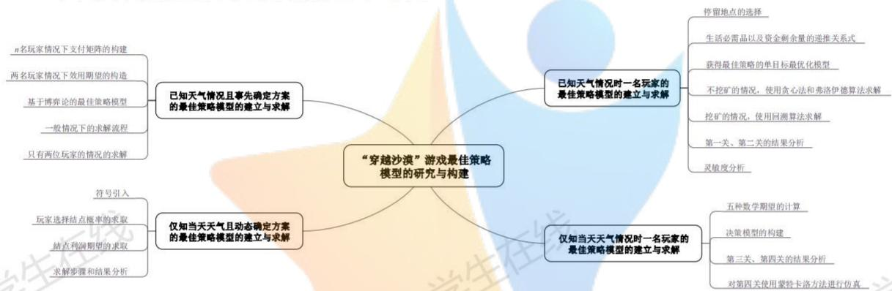

<details>
<summary>flowchart</summary>

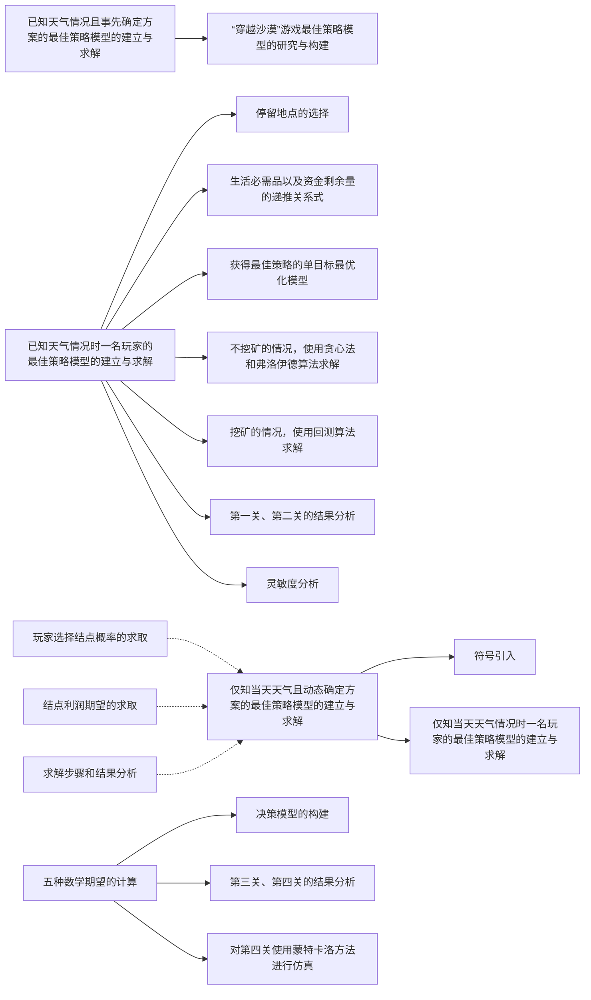
</details>

图2.4.1：问题解决思维导图

## 三、模型假设

1. 假设沙漠中各天的天气相互独立。  
2. 假设游戏参与者是完全理性的。  
3. 假设沙漠中天气不存在突变。

## 四、符号说明

<table><tr><td>关键符号</td><td>符号说明</td><td>关键符号</td><td>符号说明</td></tr><tr><td> $T_0$ </td><td>到达终点的实际天数</td><td> $B_W(t)$ </td><td>第t天水的基础消耗量</td></tr><tr><td> $B_F(t)$ </td><td>第t天食物的基础消耗量</td><td> $P_B$ </td><td>参与者挖矿赚得的基础收益</td></tr><tr><td> $\mathbb{I}(x)$ </td><td>指示函数</td><td> $E(j)$ </td><td>第j个结点净收益的期望</td></tr><tr><td>关键符号</td><td colspan="3">符号说明</td></tr><tr><td>W(i,t)</td><td colspan="3">第t天参与者在第i个结点时水的剩余量</td></tr><tr><td>F(i,t)</td><td colspan="3">第t天参与者在第i个结点时食物的剩余量</td></tr><tr><td>R(i,t)</td><td colspan="3">第t天参与者在第i个结点时资金的剩余量</td></tr><tr><td>d(i,j)</td><td colspan="3">从第i个结点到第j个结点的最短路径</td></tr><tr><td>f(i,t)</td><td colspan="3">参与者选择下一个结点的决策函数</td></tr></table>

## 五、模型的建立与求解

## 5.1 问题一：已知天气情况时一名玩家的最佳策略模型的建立与求解

为求解一名玩家在已知天气情况下的最佳策略，我们首先根据游戏规则列出了每天生活必需品以及资金剩余量的递推关系式，然后根据参与者在游戏过程中所要满足的各种条件，建立了单目标最优化模型，并且分别对直接到达终点、在矿山挖矿这两种情况进行求解，以获得最佳策略。

## 5.1.1 已知天气情况时一名玩家的最佳策略模型的建立

## ■ 停留地点的选择

根据游戏规则，参与者可以选择在任何地点停留，但是经过分析，我们认为除了沙暴天气必须停留以外，参与者只有在矿山停留挖矿才能获得收益，在其他地点停留只会带来较大亏损；设 $P_{B}$ 为参与者挖矿获得的基础收益， $P_{W}$ 、 $P_{F}$ 分别为水和食物的基础价格，下面我们对这两种情况进行具体的分析和说明。

## ☆ 矿山挖矿必定获得收益

若参与者在矿山挖矿一天，则这一天他将多消耗一部分水和食物，同时也会晚一天到达终点；我们按照最坏情况进行计算，即他挖矿的那一天遭遇了沙暴天气，同时在第17天到达终点前一个结点，根据第一关、第二关的参数设定，此时每天食物和水的基础消耗量均为10箱，同时最后一天其消耗量为基础消耗量的两倍，因此他的收益

$$
P _ {1} = P _ {B} - \left(1 0 P _ {W} + 1 0 P _ {F}\right) - 2 \left(1 0 P _ {W} + 1 0 P _ {F}\right) - 2 \left(8 P _ {W} + 6 P _ {F}\right),
$$

该式的第二项为相比于正常行进，参与者在沙暴天气挖矿所需多消耗的生活必需品对应的资金；由于参与者在第17天到达终点前一个结点，因此他需要在该结点等待两天，在第三天再前往终点，第三项、第四项即为这三天他所需多消耗的生活必需品对应的资金。经过整理化简，并代入题中所给数据，可得 $P_{1}=350>0$ ，由于该情况为最坏情况，所以我们可以得出结论：参与者挖矿必定获得收益。

## 其他地点停留必定导致亏损

若参与者在其他地点停留, 且停留的那天未遭遇沙暴, 我们按照最好情况进行计算, 即停留的那天以及到达终点的那一天的天气均是晴朗, 则其因为停留导致的亏损为

$$
P _ {2} = \left(5 P _ {W} + 7 P _ {F}\right) + 2 \left(5 P _ {W} + 7 P _ {F}\right),
$$

该式的第一项为参与者因为在该结点停留所需消耗的生活必需品对应的资金，第二项为参与者晚到终点一天所需多消耗的生活必需品对应的资金；经过整理化简，并代入题中所给数据，可得 $P_{2} = 285 > 0$ ，由于该情况为最好情况，所以我们可以得出结论：参与者在其余地点停留必定导致亏损。

## ■ 生活必需品以及资金剩余量的递推关系式

在建立该模型前，我们首先需要给出各个时刻在各个结点处，参与者所带生活必需品以及资金剩余量的递推关系式；设参与者在第 $T_{0}(T_{0}=1,2,\cdots,T_{\max})$ 天到达终点，其中 $T_{max}$ 为截止时间，终点的编号为end， $W(i,t)$ 、 $F(i,t)$ 、 $R(i,t)$ 分别为第 $t(t=0,1,\cdots,T_{0})$ 天参与者在第 $i(i=1,2,\cdots,end)$ 个结点时水、食物、资金的剩余量，由于若在终点处退回多余的生活必需品，会给参与者带来一定的损失，因此在最佳策略下，参与者一定在终点处刚好消耗完所有的水和食物，即

$$
\left\{ \begin{array}{l} W (e n d, T _ {0}) = 0, \\ F (e n d, T _ {0}) = 0. \end{array} \right. \tag {5.1.1}
$$

设 $M_0$ 为初始资金，则在起点处购买过物资之后的剩余资金

$$
M _ {1} = M _ {0} - \left[ P _ {W} \bullet W (1, 0) + P _ {F} \bullet F (1, 0) \right],
$$

由于根据我们的分析，参与者只可能在矿山停留，因此我们仅给出向前行走、沙暴时原地停留、矿山挖矿、村庄补给等情况下生活必需品以及资金剩余量的递推关系式。

## 向前行走时生活必需品剩余量的递推关系式

设参与者第 $t(t=0,1,\cdots,T_{0})$ 天在第 $i(i=1,2,\cdots,end)$ 个结点，第 $t+1$ 天在第j个结点，又设第t天水的基础消耗量为 $B_{W}(t)$ ，食物的基础消耗量为 $B_{F}(t)$ ，由于行走时生活必需品的消耗量为基础消耗量的两倍，因此

$$
\left\{ \begin{array}{l} W (j, t + 1) = W (i, t) - 2 B _ {W} (t) \\ F (j, t + 1) = F (i, t) - 2 B _ {F} (t) \end{array} , j \in S _ {i}, \right.
$$

$S_{i}$ 为 $i$ 的后继结点的集合，考虑到在前行的过程中，剩余资金量保持不变，所以

$$
R (j, t + 1) = R (i, t), j \in S _ {i}. \tag {5.1.2}
$$

## 沙暴时原地停留时生活必需品剩余量的递推关系式

在遭遇沙暴天气时，参与者必须原地停留，此时他消耗的生活必需品数量即为基础消耗量，因此

$$
\left\{ \begin{array}{l} W (j, t + 1) = W (i, t) - B _ {W} (t) \\ F (j, t + 1) = F (i, t) - B _ {F} (t) \end{array} , j \in S _ {i}, \right.
$$

在原地停留的情况下， $R(j,t+1)$ 的表达式与式(5.1.2)相同。

## 矿山挖矿时生活必需品剩余量的递推关系式

若参与者在矿山挖矿，则其消耗的生活必需品数量为基础消耗量的三倍，因此

$$
\left\{ \begin{array}{l} W (j, t + 1) = W (i, t) - 3 B _ {W} (t) \\ F (j, t + 1) = F (i, t) - 3 B _ {F} (t) \end{array} , j \in S _ {i}, \right.
$$

在挖矿时，参与者可赚得一定量的基础收益，所以

$$
R (i, t + 1) = R (i, t) + P _ {B}.
$$

## 村庄补给时生活必需品剩余量的递推关系式

设参与者在村庄补给的水的数量为 $m_{1}$ 箱，补给的食物的数量为 $m_{2}$ 箱，由于其在村庄无需停留，所以消耗的生活必需品数量仍为基础消耗量的两倍，因此

$$
\left\{ \begin{array}{l} W (j, t + 1) = W (i, t) - 2 B _ {W} (t) + m _ {1} \\ F (j, t + 1) = F (i, t) - 2 B _ {F} (t) + m _ {2} \end{array} , j \in S _ {i}. \right.
$$

补给生活必需品需要消耗参与者的资金，且村庄处生活必需品的售价为基准价格的两倍，所以补给过后的剩余资金

$$
R (j, t + 1) = R (i, t + 1) - 2 (P _ {W} m _ {1} + P _ {F} m _ {2}), j \in S _ {i}.
$$

## 获得最佳策略的单目标最优化模型

为了获得该游戏的最佳策略，我们根据参与者在游戏过程中所要满足的各种条件，建立了单目标最优化模型。

## 目标函数：剩余资金最多

题目中提及，参与者需要保留尽可能多的资金，因此目标函数为

$$
\max R (e n d, T _ {0}),
$$

其中 $R(i,t)$ 分别为第 $t(t=0,1,\cdots,T_{0})$ 天参与者在第 $i(i=1,2,\cdots,end)$ 个结点时资金的剩余量，end 为终点的编号， $T_{0}$ 为到达终点的实际时间。

## 约束条件 1：参与者在截止日期之前到达终点

根据游戏规则，参与者需要在规定的时间内到达终点，因此一个约束条件为

$$
T _ {0} \leqslant T _ {\max},
$$

其中 $T_{0}$ 为到达终点的实际时间， $T_{max}$ 为该关卡规定的到达终点的截止时间。

## 约束条件 2：生活必需品的数量不能超过负重上限

设参与者的载重上限为 $M$ ， $M_W$ 、 $M_F$ 分别每箱水和食物的重量，则另一个约束条件为

$$
M _ {W} W (i, t) + M _ {F} F (i, t) \leqslant M, i = 1, 2, \dots , e n d, t = 0, 1, \dots , T _ {0}.
$$

其中 $W(i,t)$ 、 $F(i,t)$ 分别为第t天参与者在第i个结点时水、食物的剩余量。

此外，参与者在到达终点之前不能耗尽所有的生活必需品，因此这也是一个约束条件，由于我们在给出生活必需品以及资金剩余量的递推关系式之前，已经用式(5.1.1)限定在最后一个时刻的食物和水的剩余量为0，因此在中间过程中不会出现生活必需品已经耗尽的情况，即我们可以用式(5.1.1)作为该约束条件。

## 获得最佳策略的单目标最优化模型

根据上述分析，我们可以得到获得最佳策略的单目标最优化模型：

$$
\max R (e n d, T _ {0}),
$$

$$
s. t. \left\{ \begin{array}{l} T _ {0} \leqslant T _ {\max}, \\ M _ {W} W (i, t) + M _ {F} F (i, t) \leqslant M, i = 1, 2, \dots , e n d, t = 0, 1, \dots , T _ {0}. \\ W (e n d, T _ {0}) = 0, \\ F (e n d, T _ {0}) = 0. \end{array} \right.
$$

设计相应的算法求解该模型即可得到已知天气情况时一名玩家的最佳策略。

## 5.1.2 已知天气情况时一名玩家的最佳策略模型的求解

## ● 不挖矿的情况，使用贪心法和弗洛伊德算法求解

## 贪心法和贪心准则

经过分析我们认为,对该模型需要分为不挖矿和挖矿两种情况,对于不挖矿的情况,应使用贪心法进行求解；贪心法是一种重要的算法设计思想，其基本原则是每一次做出的选择都是在当前情况下看起来最好的选择，因此依据贪心法设计的算法得到的是某种意义下的局部最优解，而不一定是全局最优解[2]；能否得到全局最优解的关键在于贪心准则的选择。设不挖矿时参与者的最大收益为 $P_{m1}$ ，挖矿时参与者的最大收益为 $P_{m2}$ ，则最佳策略下的收益

$$
P _ {\max} = \max \left\{P _ {m 1}, P _ {m 2} \right\},
$$

下面我们分别对不挖矿的情况下我们选择的贪心准则进行分析。

## 在起点购买尽量少的生活必需品

对于不挖矿时在起点购买的生活必需品，我们认为需要购买尽量少的生活必需品；设在起点购买水和食物各x、y箱，此时恰好能保证参与者到达终点，则资金剩余量

$$
R _ {1} \left(e n d, T _ {0}\right) = M _ {0} - \left(P _ {W} x + P _ {F} y\right),
$$

其中 $M_0$ 为初始资金， $P_F$ 、 $P_W$ 分别为食物和水的基础价格；若在起点多购买了生活必需品，即购买水 $(x + \Delta x)$ 箱，食物 $(y + \Delta y)$ 箱，则多余的生活必需品需要在终点退回，由于退回后返回给参与者的费用仅为基础价格的一半，所以

$$
\begin{array}{l} R _ {2} \left(e n d, T _ {0}\right) = M _ {0} - \left[ P _ {W} (x + \Delta x) + P _ {F} (y + \Delta y) \right] + \frac {1}{2} \left(P _ {W} \Delta x + P _ {F} \Delta y\right) \\ = R _ {1} \left(e n d, T _ {0}\right) - \frac {1}{2} \left(P _ {W} \Delta x + P _ {F} \Delta y\right) <   R _ {1} \left(e n d, T _ {0}\right), \\ \end{array}
$$

因此若不挖矿时想使得资金剩余量最大，必须在起点购买尽量少的生活必需品。

## 选择最短路径到达终点

若参与者选择不挖矿，则其必须减少生活必需品的消耗，因此必须选择从起点到终点的最短路径；定义函数

$$
w (t) = \left\{ \begin{array}{l} 0, \text {第} t \text {天为晴朗天气}, \\ 1, \text {第} t \text {天为高温天气}, \\ 2, \text {第} t \text {天为沙暴天气}, \end{array} \right.
$$

则可以给出第一关、第二关中第t天水和食物的基础消耗量为 $B_{W}(t)$ 、 $B_{F}(t)$ 的表达式：

$$
B _ {W} (t) = \left\{ \begin{array}{l} 5, w (t) = 0 \\ 8, w (t) = 1, B _ {F} (t) = \left\{ \begin{array}{l} 7, w (t) = 0 \\ 6, w (t) = 1, \\ 1 0, w (t) = 2 \end{array} \right. \\ 1 0, w (t) = 2 \end{array} \right.
$$

设从起点到终点的最短路程为 $d(1, end)$ ，则从起点到终点所需的天数

$$
T _ {0} = d (1, e n d) + \sum_ {t = 1} ^ {d (1, e n d)} \mathbb {I} \big [ w (t) = 2 \big ],
$$

其中 $\mathbb{I}(x)$ 为指示函数[1]，当 $x$ 成立时， $\mathbb{I}(x) = 1$ ，否则 $\mathbb{I}(x) = 0$ ，因此上式反映了从起点到终点所需的天数由选择最短路径行走的天数和沙暴天气停留的天数两部分组成；因此参与者在起点购买的水和食物的箱数分别为

$$
W (1, 0) = 2 \sum_ {t = 1} ^ {d (1, e n d)} B _ {W} (t) + 1 0 \left[ T _ {0} - d (1, e n d) \right], F (1, 0) = 2 \sum_ {t = 1} ^ {d (1, e n d)} B _ {F} (t) + 1 0 \left[ T _ {0} - d (1, e n d) \right], \tag {5.1.3}
$$

到达终点时的资金剩余量

$$
R (e n d, T _ {0}) = M _ {0} - \left[ P _ {W} \bullet W (1, 0) + P _ {F} \bullet F (1, 0) \right]. \tag {5.1.4}
$$

## 求解最佳策略的弗洛伊德算法

根据上述分析，在不挖矿时，我们直接选择最短路径到达终点，因此我们借助弗洛伊德算法进行求解，具体步骤如下。

第 1 步：使用邻接矩阵，将题目中所给的地图转换为图论中的图，并对距离矩阵进行初始化，能直接到达的结点之间距离为 1，否则为无穷大。

第 2 步：借助弗洛伊德算法求解任意两点之间的最短距离，即对于任意两个结点，若经过另外某个结点“中转”，得到的距离小于原来两结点的距离，则该距离为两点之间更短的距离；考虑将所有结点作为中转点的情况，即可获得两结点之间的最短路径。

第 3 步：初始化天气情况、各种情况下生活必需品的消耗量、最大负重等常量。

第 4 步: 根据第 2 步中的结果, 我们可以得到从起点到终点的最短路程 d, 根据式(5.1.3)可算出参与者在起点所需购买的生活必需品数量, 进而可根据式(5.1.4)算出到达终点时的资金剩余量; 使用 Matlab 编程 $^{[3]}$ , 可获得相关数据如下表所示。

表 5.1.1：不挖矿时第一关、第二关中参与者在起点购买生活必需品数量及到达时资金剩余量

<table><tr><td>关卡编号</td><td>第一关</td><td>第二关</td></tr><tr><td>最短路程</td><td>3</td><td>11</td></tr><tr><td>在起点购买食物/箱</td><td>38</td><td>170</td></tr><tr><td>在起点购买水/箱</td><td>42</td><td>182</td></tr><tr><td>到达终点资金剩余量/元</td><td>9410</td><td>7390</td></tr><tr><td>最短路径</td><td>1→25→26→27</td><td>1→2→3→4→5→13→22→30→39→47→56→64</td></tr></table>

## ● 挖矿的情况，使用回溯算法求解

若参与者选择挖矿，则其可能有多种路线选择方式，如起点→矿山→村庄→终点，起点→村庄→矿山→终点等，甚至可能来回往返村庄、矿山之间以补给资源，因此，我们必须考虑所有可能的情况，并对一些不可能出现的情况进行剪枝，以减少遍历次数，因此我们设计了回溯算法对挖矿的情况进行求解。该算法的精巧之处在于：考虑到村庄补给的情况较为复杂，我们设计的算法没有按照常规的路径去考察在村庄是否需要补给，而是在每一个结点考察是否需要补给，如果不需要，则继续深度优先遍历，否则回溯到上一个村庄的位置进行补给，或增加在起点购买的生活必需品的数量，以达到剪枝的目的；该算法的具体步骤如下，流程图如右图所示，由于该算法是一个递归算法，流程图只能简要的体现递归过程。

Step 1: 将各个结点分为 4 类: 起点、矿山、村庄、终点, 并初始化算法中所需使用的各

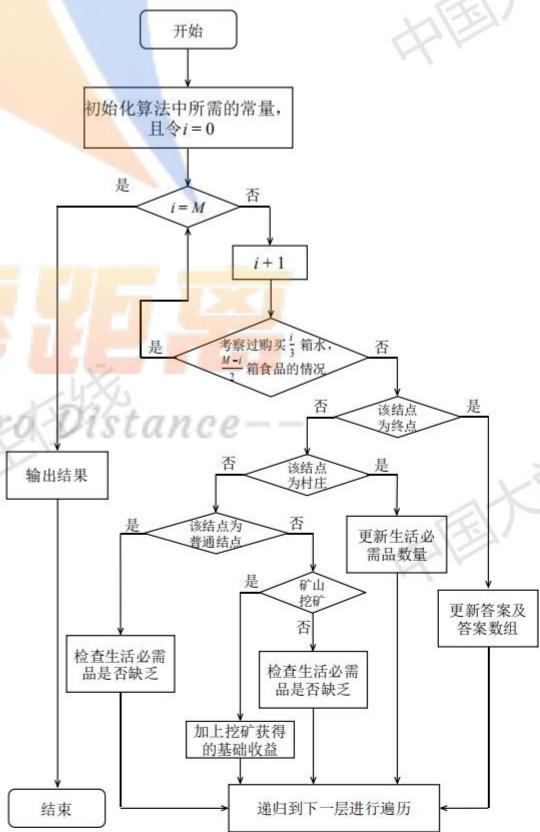

<details>
<summary>flowchart</summary>

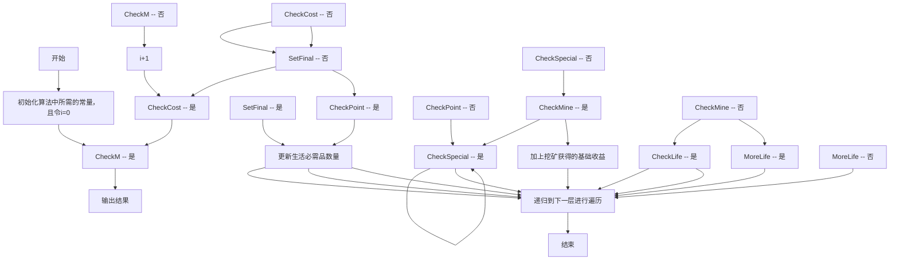
</details>

图 5.1.1: 回溯法流程图

个常量，如 4 类结点的通达情况数组、4 类结点的距离数组、天气情况、生活必需品的重量、基准价格、基础消耗等，令 i = 0。

Step 2: 检查 $i$ 是否已经达到参与者的负重上限 $M$ , 即 1200 千克, 若是, 输出结果, 算法结束, 否则将 $i + 1$ 赋值给 $i$ 。

Step 3: 由于每千克水的质量为 3 千克/箱, 食物的质量为 2 千克/箱, 因此令参与者在起点购买 $\frac{i}{3}$ 箱水, $\frac{M - i}{2}$ 箱食物, 若没有考察过 $\left(\frac{i}{3}, \frac{M - i}{2}\right)$ 的情况, 则转 Step 4, 进行深度优先遍历, 否则转 Step 2。

Step 4: 若当前情况下，该结点为终点，更新答案及相应的答案数组；若此次遍历时间已经超过了截止时间，则此次遍历失败，进行回溯。

Step 5: 若当前情况下，该结点为村庄，更新参与者所带生活必需品数量。

Step 6: 若当前情况下, 该结点为普通结点, 检查该结点处生活必需品是否缺乏, 若不缺乏, 减去消耗的生活必需品数量, 否则回溯到最近的村庄或起点, 进行下一次遍历。

Step 7: 若当前情况下, 该结点为矿山, 考察挖矿以及不挖矿仅停留这两种情况, 前一种情况使用类似 Step 6 的方法进行处理, 后一种要加上挖矿的收益。

Step 8: 一次遍历后, 转 Step 3, 以输出结果或进行下一次遍历。

## 5.1.3 已知天气情况时一名玩家的最佳策略模型的结果分析

## ◆ 第一关的结果分析

在对求解不挖矿的贪心算法进行分析的过程中，我们已经给出了不挖矿情形下，玩家参与第一关的行走路线，即 $1 \rightarrow 25 \rightarrow 26 \rightarrow 27$ ，他需要在起点购买食物 38 箱，水 42 箱，到达终点时剩余资金 9410 元；这里我们给出挖矿情况下，玩家参与第一关的行走路线，如右图所示。

从图中可以看出，参与者从起点 1 出发，沿箭头行走到 23 号结点后，由于遭遇了沙暴天气，所以需要停留一天，9 号结点同理；第一次到达 15 号村庄之后，参与者补给资源，接着经由 14 号结点到达矿山后，在矿山停留 9 天，其中第 17、18 天是沙暴天气，为避免损失，不挖矿，其余 7 天挖矿；原路返回村庄再次补给资源后，经由 9 号、21 号结点到达终点 27；整个过程历时 24 天，参与者在起点购买生活必需品数量及到达时资金剩余量如下表第一列所示。

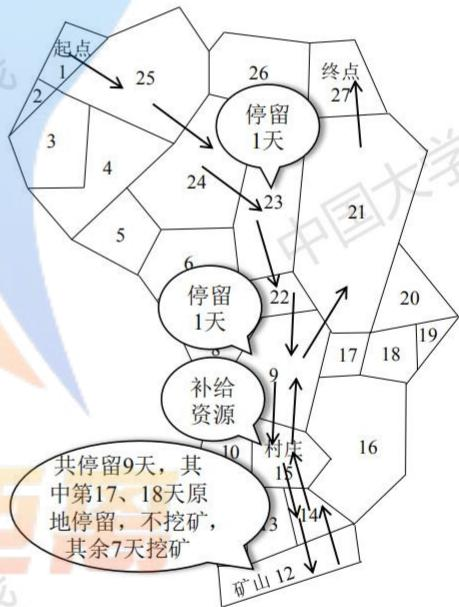

<details>
<summary>flowchart</summary>

```mermaid
graph TD
  A["起点\n1"] --> B["停留1天"]
  C["终点\n27"] --> B
  D["26"] --> B
  E["25"] --> B
  F["24"] --> B
  G["23"] --> B
  H["22"] --> B
  I["17"] --> J["20"]
  K["18"] --> L["19"]
  M["16"] --> N["10"]
  O["15"] --> P["村庄"]
  Q["14"] --> R["矿山12"]
  S["3"] --> T["补给资源"]
  U["23"] --> V["22"]
  W["21"] --> X["26"]
  Y["18"] --> Z["19"]
  AA["17"] --> AB["20"]
  AC["14"] --> AD["3"]
  AE["15"] --> AF["4"]
  AG["16"] --> AH["5"]
  AI["24"] --> AJ["6"]
  AK["25"] --> AL["7"]
  AM["26"] --> AN["8"]
  AO["27"] --> AP["9"]
  AQ["28"] --> AR["10"]
  AS["29"] --> AT["11"]
  AU["30"] --> AV["12"]
  AW["31"] --> AX["13"]
  A --> B
  B --> C
  C --> D
  D --> E
  E --> F
  F --> G
  G --> H
  H --> I
  I --> J
  J --> K
  K --> L
  L --> M
  M --> N
  N --> O
  O --> P
  P --> Q
  Q --> R
  R --> S
  S --> T
  T --> U
  U --> V
  V --> W
  W --> X
  X --> Y
  Y --> Z
  Z --> AA
  AA --> AB
  AB --> AC
  AC --> AD
  AD --> AE
  AE --> AF
  AF --> AG
  AG --> AH
  AH --> AI
  AI --> AJ
  AJ --> AK
  AK --> AL
  AL --> AM
  AM --> AN
  AN --> AO
  AO --> AP
  AP --> AQ
  AQ --> AR
  AR --> AS
  AS --> AT
  AT --> AU
  AU --> AV
  AV --> AW
  AW --> AX
  AX --> AZ
```
</details>

图 5.1.2: 挖矿时第一关的行走路线

表 5.1.2：挖矿时第一关、第二关中参与者在起点购买生活必需品数量及到达时资金剩余量

<table><tr><td>关卡编号</td><td>第一关</td><td>第二关</td></tr><tr><td>在起点购买食物/箱</td><td>333</td><td>405</td></tr><tr><td>在起点购买水/箱</td><td>178</td><td>130</td></tr><tr><td>到达终点资金剩余量/元</td><td>10470</td><td>12730</td></tr></table>

对于第一关, 将不挖矿与挖矿的情况相比, 显然挖矿的情况得到的剩余资金数更大, 因此我们采用这种策略作为最佳策略。根据图 5.1.2 中所示的路线以及我们编写的程序, 可以得到参与者每天的剩余资金数、剩余水量、剩余食物量, 并将其填入 Result.xlsx, 同时借助 Matlab 绘制剩余资金数、资源剩余量的折线图, 如下图所示。

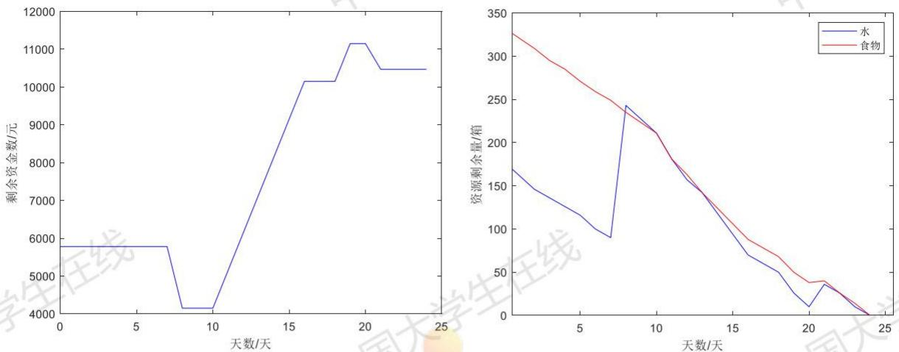  
图 5.1.3：第一关剩余资金数（左图）、资源剩余量（右图）的变化曲线

## 剩余资金数的变化情况分析

如图 5.1.3 左图所示，在起点购买完食物之后，资金保持在 5780 元不变，直到第 8 天在村庄补给资源之后，剩余资金减少；根据我们得到的结果，参与者在到达矿山之后，将挖矿 7 天，因此这一段时间资金剩余量持续上升；第 17、18 天是沙暴天气，虽然参与者也可挖矿，但是此时生活必需品的消耗量将增加，为减少损失，他这两天在矿山原地停留，不挖矿，因此图像中第 15 天后，剩余资金数短暂地保持不变；离开矿山后，参与者在前往终点的过程中仍需在村庄补给一次资源，因此剩余资金又一次减少，到达最终的 10470 元。

## 资源剩余量的变化情况分析

如图 5.1.3 右图所示, 参与者在起点购买了大量的食物和少量的水之后, 开始游戏;之所以这样购买, 是因为每千克水的价格为 1.67 元, 每千克食物的价格为 5 元, 因此参与者选择在起点带尽可能多的食物, 以免中途在村庄补给食物耗费更多金钱, 从图中也可以看到, 他仅在第二次到达村庄时补给了少量食物, 第一次到达村庄时仅补给了一部分水; 从图中也可以看出, 食物和水的剩余量总的来说是不断减少的, 且在到达终点时减少到 0 , 这也符合我们之前的分析, 即该情况下参与者不会因为资源剩余而产生损失。

## ◆ 第二关的结果分析

在表 5.1.1 和表 5.1.2 中，我们已经给出了第二关的参与者在挖矿和不挖矿的情况下在起点购买的生活必需品数量、剩余资金数量，经过比较发现，对于第二关，挖矿的情况下，到达终点时的资金剩余量更多，为 12730 元，因此我们采用这种策略作为最佳策略，参与者的行走路线如右图所示。

从右图可以看出，参与者从起点 1 行走到结点 4 之后，因沙暴停留一天，此后在结点 21、39 也会因为沙暴而停留；在这一关中，参赛者两次经过矿山，第一次挖矿 5 天，第二次挖矿 8 天，且不会出现第一关中为避免因沙暴造成的损失而停止挖矿的情况。

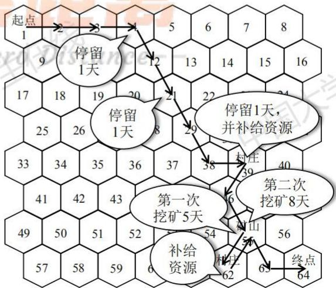

<details>
<summary>flowchart</summary>


</details>

图5.1.4：挖矿时第二关的行走路线

我们已经将第一关、第二关中参与者每天所在区域、剩余资金数、剩余水量、剩余食物量罗列在支撑材料的 Result.xlsx 文件中，其略表如下表所示。

表 5.1.3：第 1、2 关的相应结果（节选自 Result.xlsx，完整表格见支撑材料或附录）

<table><tr><td colspan="5">第一关</td><td colspan="5">第二关</td></tr><tr><td>日期</td><td>所在区域</td><td>剩余资金数/元</td><td>剩余水量/箱</td><td>剩余食物量/箱</td><td>日期</td><td>所在区域</td><td>剩余资金数/元</td><td>剩余水量/箱</td><td>剩余食物量/箱</td></tr><tr><td>0</td><td>1</td><td>5780</td><td>178</td><td>333</td><td>0</td><td>1</td><td>5300</td><td>130</td><td>405</td></tr><tr><td>1</td><td>25</td><td>5780</td><td>162</td><td>321</td><td>1</td><td>2</td><td>5300</td><td>114</td><td>393</td></tr><tr><td>2</td><td>24</td><td>5780</td><td>146</td><td>309</td><td>2</td><td>3</td><td>5300</td><td>98</td><td>381</td></tr><tr><td colspan="5">......</td><td colspan="5">......</td></tr><tr><td>22</td><td>9</td><td>10470</td><td>26</td><td>26</td><td>28</td><td>55</td><td>12730</td><td>32</td><td>24</td></tr><tr><td>23</td><td>21</td><td>10470</td><td>10</td><td>14</td><td>29</td><td>63</td><td>12730</td><td>16</td><td>12</td></tr><tr><td>24</td><td>27</td><td>10470</td><td>0</td><td>0</td><td>30</td><td>64</td><td>12730</td><td>0</td><td>0</td></tr></table>

对于第一关，参与者在第 24 天即可成功结束游戏，因此我们节选的是 0\~2、22\~24 天的数据；与第一关类似，我们绘制剩余资金数、资源剩余量的折线图，如图 5.1.4 所示。

## 剩余资金数的变化情况分析

从图 5.1.5 左图可以看出，剩余资金量两次减少，两次增加，其减少是因为参与者经过村庄 39、62 时均补给了一定量的资源，同时参与者两次前往矿山 55，第一次挖矿 5 天，第二次挖矿 8 天，都为其带来了一定的收入，因此剩余资金数两次增加。

## 资源剩余量的变化情况分析

与第一关的情况类似，这一关中，资源剩余量总体上也呈现减少的趋势，图像上的两次上升反映了参与者在村庄补给资源的情况；与第一关一样，这一关中参与者从起点出发时，购买的食物远多于水，这仍然是因为单位重量的食物的价格高于单位重量的水的价格，在起点带尽量多的食物可以尽可能的减少在村庄以两倍的价格补给食物造成的损失。

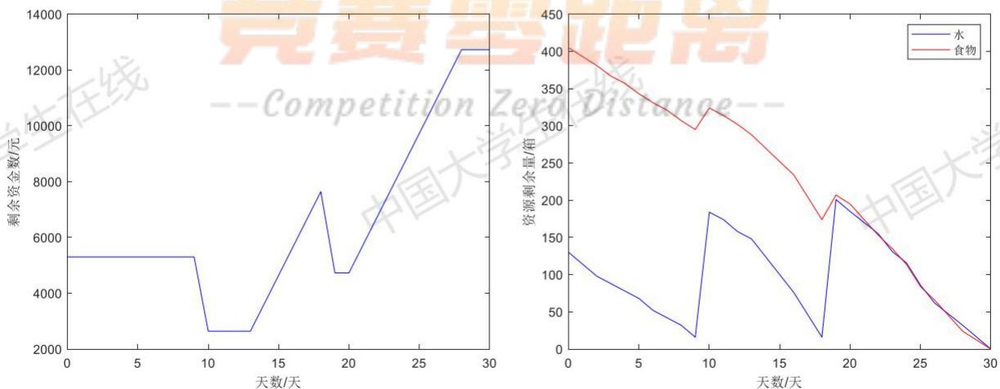  
图 5.1.5: 第二关剩余资金数（左图）、资源剩余量（右图）的变化曲线

## ◆ 灵敏度分析

根据之前的结果可知，最优解出现在参与者挖矿的情况下，因此我们针对这种情况对该模型进行灵敏度分析；我们将负重上限和初始资金分别前后变化 $10\%$ ，并作这几种情况下剩余资金量的变化曲线，如下图所示。

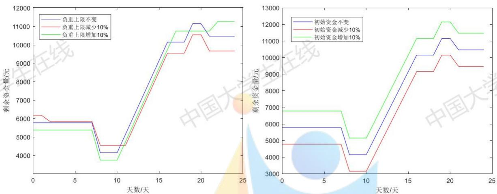  
图 5.1.6：改变负重上限（左）、初始资金（右）时剩余资金量的变化曲线

左图中，在到达终点之前的几天，负重上限的改变对剩余资金量的影响略大，而在之前，其改变对剩余资金量的影响较小；而在右图中，初始资金的改变一直对剩余资金量有较大影响，仅在参与者第一次在村庄补给资源时，初始资金的改变对剩余资金量的影响略小，但可以很明显的看出，其对参与者的决策无影响，因此曲线表现为上下平移；因此总的来说，剩余资金量对初始资金的改变更加敏感。

## 5.2 问题二：仅知当天天气情况时一名玩家的最佳策略模型的建立与求解

经过分析我们认为，仅知当天天气情况时，玩家的决策与每天行走所耗资源对应的金额的期望、挖矿净收益的期望、挖矿所耗资源对应的金额的期望、挖矿所耗水和食物箱数的期望有关，因此我们首先根据问题一的数据计算各种天气出现的概率以辅助这五种数学期望的计算，然后再建立基于数学期望的玩家决策模型。

## 5.2.1 仅知当天天气情况时一名玩家的最佳策略模型的建立

## ★ 五种数学期望的计算

根据之前的分析，建立获得最佳策略的决策模型需要使用五种数学期望，在对它们进行计算之前，我们定义：事件 A 表示“某一天的天气是晴朗”，事件 B 表示“某一天的天气是高温”，事件 C 表示“某一天的天气是沙暴”，其概率分别为 $P(A)$ 、 $P(B)$ 、 $P(C)$ 。

## 每天行走所耗资源对应的金额的期望的计算

设每天行走所耗资源对应的金额的期望为 $E_{1}$ ，根据第三关、第四关的参数设定，晴朗时水和食物的基础消耗量分别为3箱和4箱，高温时水和食物的基础消耗量均为9箱，根据游戏规则，行走时生活必需品的消耗量为基础消耗量的两倍，且沙暴天气下不能行走，只能原地停留，因此

$$
E _ {1} = P (A) \cdot 2 \left(3 P _ {W} + 4 P _ {F}\right) + P (B) \cdot 2 \left(9 P _ {W} + 9 P _ {F}\right),
$$

其中 $P_{W}$ 、 $P_{F}$ 分别为水和食物的基础价格，该式第一项为晴朗时行走所耗资源对应的金

额的期望，第二项为高温时行走所耗资源对应的金额的期望。

## ▶ 挖矿净收益的期望的计算

计算挖矿净收益，我们需要考察两天的天气，设挖矿那一天的天气为 $X$ ，从终点前一个结点到终点的那天的天气为 $Y$ ，则 $X 、 Y$ 均可能取 $A 、 B 、 C$ ，因此二维随机变量 $\{X, Y\}$ 共有9种取值组合；我们假设沙漠中各天的天气相互独立，则有

$$
P \left\{X = X _ {1}, Y = Y _ {1} \right\} = P \left\{X = X _ {1} \right\} P \left\{Y = Y _ {1} \right\}, X _ {1}, Y _ {1} = A, B, C,
$$

我们记 $p_{1}=P\{X=A,Y=A\}$ ， $p_{2}=P\{X=A,Y=B\}$ ，……， $p_{9}=P\{X=C,Y=C\}$ ，当 $\{X=A,Y=A\}$ 时，挖矿净收益记为 $x_{1}$ ，当 $\{X=A,Y=B\}$ 时，挖矿净收益记为 $x_{2}$ ，……，当 $\{X=C,Y=C\}$ 时，挖矿净收益记为 $x_{9}$ ，则

$$
x _ {1} = P _ {B} - \left(3 P _ {W} + 4 P _ {F}\right) - 2 \left(3 P _ {W} + 4 P _ {F}\right),
$$

该式中，第一项 $P_{B}$ 为参与者挖矿获得的基础收益，第二项为相比于正常行进，参与者在挖矿所需多消耗的生活必需品对应的资金，第三项为参与者最后一天正常行进所消耗的生活必需品对应的资金； $x_{2} \sim x_{9}$ 可用类似的方法进行计算，则挖矿净收益的期望为

$$
E _ {2} = \sum_ {i = 1} ^ {9} x _ {i} p _ {i}.
$$

## ▶ 挖矿所耗资源对应的金额的期望的计算

设挖矿所耗资源对应的金额的期望为 $E_{3}$ ，则可仿照 $E_{1}$ 的计算过程对其进行计算，即

$$
E _ {3} = P (A) \cdot 3 \left(3 P _ {W} + 4 P _ {F}\right) + P (B) \cdot 3 \left(9 P _ {W} + 9 P _ {F}\right) + P (C) \cdot 3 \left(1 0 P _ {W} + 1 0 P _ {F}\right),
$$

每一项分别为晴朗、高温、沙暴天气下挖矿所耗资源对应的金额的期望。

## ▶ 挖矿所耗水和食物箱数的期望的计算

设挖矿所耗水和食物箱数的期望分别为 $E_{4}$ 、 $E_{5}$ ，则使用与之前类似的方法可得

$$
E _ {4} = 3 \Big [ 3 P (A) + 9 P (B) + 1 0 P (C) \Big ], E _ {5} = 3 \Big [ 4 P (A) + 9 P (B) + 1 0 P (C) \Big ],
$$

中括号里的内容为晴朗、高温、沙暴时基础消耗量的总和。

## ★ 决策模型的构建

在构建决策模型，给出决策函数之前，我们先设 a、b 分别为矿山、村庄所在结点的编号， $N_{s}$ 为整个过程中沙暴天数， $f(i,t)$ 为参与者选择下一个结点的决策函数，其含义为第 t 天位于第 i 个结点的参与者应选择的下一个结点号， $T_{d}$ 为最多的挖矿天数，其表达式为

$$
T _ {d} = T _ {\max} - \left[ d (1, a) + d (a, e n d) \right] - N _ {S},
$$

其中 $T_{\mathrm{max}}$ 为该关卡规定的到达终点的截止时间， $d(i,j)$ 为我们在5.1.2中定义的函数，表示从第 $i$ 个结点到第 $j$ 个结点的最短路径。

## 参与者在一般结点选择直奔终点的情况及决策函数

经过分析我们认为，参赛者在一般结点处，在下列情况下应选择直奔终点：

$$
E _ {2} <   0 \text {或} \left\{ \begin{array}{l l} E _ {2} \geqslant 0, \\ E _ {2} T _ {d} <   \left[ d (1, a) + d (a, e n d) - d (1, e n d) \right] E _ {1}, \end{array} \right.
$$

第一种情况指挖矿产生亏损的情况；对于第二种情况的下面一式，小于号左边的是参与者这 $T_{d}$ 天挖矿带来的收益，右边是参与者因希望挖矿而“绕路”产生的资源消耗所对应的金额，因此该式指的是参与者挖矿所赚净收益不足以弥补其“绕路”产生的资源消耗所对应的金额；这两种情况下，参与者的决策应为：选择最短路径到达终点，决策函数的表达式为：

$$
f (i, t) = \underset {j \in S _ {i}} {\arg \min} d (j, e n d),
$$

其中 $S_{i}(i=1,2,\cdots,end)$ 为第 i 个结点后继结点的集合，因此上式得到的是第 i 个结点后继结点集合中，到达终点距离最短的那个点的编号，参与者应选择这个点作为下一个结点。此外，这种情况下参与者所带的食物要保证他能在最坏情况，即行进过程中均为高温，同时又有 $N_{S}$ 的沙暴天气的情况下到达终点，所以

$$
W (1, 0) = F (1, 0) = d (1, e n d) \times 2 \times 9 + 1 0 N _ {s},
$$

其他情况则应尽量多带水和食物，可参考问题一的情况。

## 参与者在一般结点选择前往矿山或村庄的情况及决策函数

如果 $\exists t' (t'=1,2,\cdots,T_{d}-T_{d}')$ ，使得

$$
\left\{ \begin{array}{l} t ^ {\prime} E _ {2} > \left[ d (1, b) + d (b, a) - d (1, a) \right] E _ {1} + 2 t ^ {\prime} E _ {3}, \\ M _ {W} W (b, t _ {0}) + M _ {F} F (b, t _ {0}) \leqslant M, \\ t ^ {\prime} \leqslant T _ {d} - T _ {d} ^ {\prime}, \end{array} \right. \tag {5.2.1}
$$

则参与者应选择先去村庄补给资源，再前往矿山；该式中第一式的含义为：参与者在 $t'$ 时间内挖矿所得净收益超过了他“绕路”前往村庄产生的资源消耗所对应的金额与他购买的在 $t'$ 时间内挖矿所需的资源所对应的金额的总和；第二式的含义为：参与者在村庄补给的资源重量没有超过他的负载上限，其中 $M_{W}$ 、 $M_{F}$ 分别为每箱水和食物的重量，M 为参与者的载重上限， $t_{0}$ 为参与者从起点出发，到达村庄所用的时间，即

$$
t _ {0} = d (1, b) + \sum_ {t = 1} ^ {d (1, b)} \mathbb {I} [ w (t) = 2 ],
$$

其中 $\mathbb{I}(x)$ 为前文已经介绍过的指示函数，当 $x$ 成立时， $\mathbb{I}(x)=1$ ，否则 $\mathbb{I}(x)=0$ ， $w(t)$ 也为前文定义的表示第 $t$ 天天气的函数， $w(t)=2$ 表示沙暴天气，因此 $t_0$ 由从起点直接走到村庄的时间和因沙暴而停留的时间构成； $W(b, t_0)$ 、 $F(b, t_0)$ 分别为第 $t_0$ 天参与者在村庄时补给过后水、食物的剩余量，取

$$
t ^ {*} = \arg \max _ {t ^ {\prime}} \left\{t ^ {\prime} E _ {2} - \left[ d (1, b) + d (b, a) - d (1, a) \right] E _ {1} - 2 t ^ {\prime} E _ {3} \right\},
$$

则参与者的补给行为能支撑他多挖矿 $t^{*}$ 天；第三式则限定了 $t'$ 的范围，其中 $T_{d}'$ 为不补给时最多的挖矿天数，其表达式为：

$$
\begin{array}{l} T _ {d} ^ {\prime} = \min \left\{\frac {W (b ^ {\prime} , t _ {0} - 1) - [ d (b ^ {\prime} , a) + d (a , e n d) ] [ 3 P (A) + 9 P (B) ]}{E _ {4}}, \right. \\ \left. \frac {F (b ^ {\prime} , t _ {0} - 1) - [ d (b ^ {\prime} , a) + d (a , e n d) ] [ 4 P (A) + 9 P (B) ]}{E _ {5}} \right\}, \\ \end{array}
$$

$b^{\prime}$ 为村庄前一个结点的编号；设 $Z_{W}$ 、 $Z_{F}$ 分别为参与者在村庄购买水和食物的购买量的决策函数，则

$$
Z _ {W} = t ^ {*} E _ {4}, Z _ {F} = t ^ {*} E _ {5},
$$

同时，参与者应选择最短路径到达村庄，决策函数为

$$
f (i, t) = \underset {j \in S _ {i}} {\arg \min} d (j, b),
$$

与之前相同，该函数得到的是第i个结点后继结点集合中，到达村庄距离最短的那个点的编号，参与者应选择这个点作为前往村庄下一个结点；在村庄补给完毕后，从村庄再前往矿山挖矿，决策函数的表达式为

$$
f (b, t) = \underset {j \in S _ {b}} {\arg \min} d (j, a),
$$

同理，参与者选择村庄结点后继结点集合中，到达矿山距离最短的那个点作为前往矿山的下一个结点；若不存在 $t'$ 使得式(5.2.1)成立，则参与者直接从该点前往矿山，决策函数为

$$
f (i, t) = \underset {j \in S _ {i}} {\arg \min} d (j, a),
$$

## 参与者在矿山选择原地等待或直奔终点的情况及决策函数

参与者在矿山挖矿时，若时间不够或者所携带的生活必需品不够，即

$$
T _ {\max} - t \leqslant d (a, e n d) + N _ {S} - \sum_ {i = 1} ^ {t} \mathbb {I} [ w (t) = 2 ] \text {或}
$$

$$
W (a, t) \leqslant 2 \times 9 d (a, e n d) - 1 0 \left\{N _ {S} - \sum_ {i = 1} ^ {t} \mathbb {I} [ w (t) = 2 ] \right\} \text {或}
$$

$$
F (a, t) \leqslant 2 \times 9 d (a, e n d) - 1 0 \left\{N _ {S} - \sum_ {i = 1} ^ {t} \mathbb {I} [ w (t) = 2 ] \right\}
$$

则应选择直奔终点，决策函数为

$$
f (a, t) = \underset {j \in S _ {a}} {\arg \min} d (j, e n d), \tag {5.2.2}
$$

设 $E_{2}\big|_{t}$ 为已知天气的在第t天挖矿所获净收益，若 $E_{2}\big|_{t}>0$ ，则选择继续挖矿；否则，若

$$
E _ {2} > P _ {F} B _ {F} (t) + P _ {W} B _ {W} (t),
$$

即第二天挖矿所获净收益能够弥补参与者因等待而多消耗的生活必需品价格，则原地等待，因为后续继续挖矿仍可能获利，否则直奔终点，决策函数与式(5.2.2)相同。

设计相应的算法，根据上述条件以及决策函数，即可得到参与者的决策方案。

## 5.2.2 仅知当天天气情况时一名玩家的最佳策略模型的求解

从模型的建立的过程中看，参与者决策的过程是较为复杂的，但实际上我们只需要计算一些常量，并将它们进行比较即可做出决策，因此我们的算法也分常量的初始化和迭代两部分进行。

Step 1: 计算求解过程中所需的各种常量，如 3 种天气出现的概率、5 种数学期望以及水和食物的消耗量、任意两个结点之间的行走天数等。

Step 2: 根据以上信息, 计算实际挖矿时间 $T_{d}$ 以及参与者的补给行为能支撑他多挖矿的天数 $t^{*}$ 。

Step 3: 进行迭代，以判断从起点出发后是直奔终点还是前往村庄或矿山，并且输出最终的结果，即剩余资金数、在起点需要购买的水和食物的箱数。

在求解过程中我们注意到，题目中提及第四关较少出现沙暴天气，为对“较少”进行具体化，我们对第一、二关的数据进行微调，使得每10天中出现一次沙暴天气；同时，由于我们发现第三关中，有 $E_{2} < 0$ 成立，参与者直奔终点，因此我们只按照以上步骤编写了求解第四关的代码，并对 $E_{2} < 0$ 即直奔终点的情况进行了证明。

## 5.2.3 仅知当天天气情况时一名玩家的最佳策略模型的结果分析

## 第三关的结果分析

前文中，我们已经假设挖矿那一天的天气为 X，从终点前一个结点到终点的那天的天气为 Y，事件 A 表示 “某一天的天气是晴朗”，事件 B 表示 “某一天的天气是高温”，事件 C 表示 “某一天的天气是高温”，且沙漠中各天天气相互独立；题目中提及，10 天内不会出现沙暴天气，因此我们根据第一关、第二关的天气情况，计算这两天各种天气组合出现的概率及各种天气情况下挖矿的净收益，如下表所示。

表 5.2.1：各种天气组合出现的概率及各种天气情况下挖矿的净收益

<table><tr><td>天气组合</td><td>X=A,Y=A</td><td>X=A,Y=B</td><td>X=B,Y=A</td><td>X=B,Y=B</td></tr><tr><td>出现概率</td><td> $\frac{9}{64}$ </td><td> $\frac{15}{64}$ </td><td> $\frac{15}{64}$ </td><td> $\frac{25}{64}$ </td></tr><tr><td>挖矿净收益</td><td>35</td><td>-125</td><td>-45</td><td>-205</td></tr></table>

根据上表可以算出，挖矿净收益的期望 $E_{2} = -115 < 0$ ，因此根据我们的模型，参与者应选择最短路径直奔终点，其路线为 $1 \rightarrow 5 \rightarrow 6 \rightarrow 13$ ；我们之所以认为 $E_{2} < 0$ 时直奔终点，是因为从表5.2.1可知，只有这两天均为晴天时，挖矿净收益才能达到最大，但此时从起点前往终点需要5天，而在现在选择的方案下只需要3天，因为多走2天产生的费用为220元，但挖矿产生的净收益仅为175元，因此这种情况下是亏损的，所以参与者应

选择直奔终点。

## ◆ 第四关的结果分析

我们编写了相应的 C++ 代码以求解第四关的决策方案，经过求解可以发现，参与者大致的行走方向是：起点→村庄→矿山→终点，经过的具体结点根据决策函数很容易可以得到。在这种行走方式下，到达终点时剩余资金数为 10065 元，参与者在起点购买的食品 200 箱，水 187 箱，这种方式为最优策略。

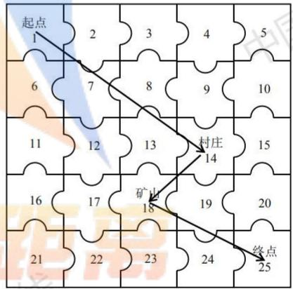

<details>
<summary>text_image</summary>

起点
1
2
3
4
5
6
7
8
9
10
11
12
13
村庄
14
15
16
17
矿山
18
19
20
21
22
23
24
终点
25
</details>

图5.2.1：第四关中参与者行走的大致路线

## 5.2.4 基于蒙特卡洛方法的模型合理性分析

## - 蒙特卡洛方法

蒙特卡洛方法是一种基于随机数和统计抽样，以便近似求解数学物理问题的方法，这种方法又称统计实验法，或者计算机随机模拟方法，由冯·诺依曼命名；这种方法的典型应用有：求不规则图形的面积，求 $\pi$ 的近似值等；在这里我们也可用蒙特卡洛方法对该问题中的模型进行仿真，以便检验该决策模型的合理性。

## - 对第四关使用蒙特卡洛方法进行仿真的结果分析

我们使用蒙特卡洛方法对该模型进行仿真，即对于第四问的情况，使用 C++中的rand()函数随机生成天气的情况, 但此处各种天气的出现频率必须满足“较少出现沙暴”的要求, 因此我们限定沙暴天气最多出现 3 天, 一次仿真后得到: 参与者到达终点时剩余资金数为 11245 元, 参与者在起点购买的食品 190 箱, 水 171 箱, 可以发现该仿真结果与使用在第一关、第二关天气数据上稍作修改得到的结果类似, 因此模型较为合理。

## 5.3 问题三第一部分：已知天气情况且事先确定方案的最佳策略模型的建立与求解

在本题中，一名玩家决策方案的确定会与其他玩家的方案产生关联，因此我们查阅了博弈论有关的资料，针对一般情况构建了支付矩阵，并根据本题的题设给出了效用期望以及基于效用期望的最优化模型。

## 5.3.1 已知天气情况且事先确定方案的最佳策略模型的建立

## ■ n 名玩家情况下支付矩阵的构建

设一共有 n 名玩家，根据题意可知，当有多名玩家走相同的路线时，消耗的资源量会增加，挖矿收益会减少，同时若需补给资源，购买价格也会增加，因此我们应尽可能的让玩家们选择不同的路线，即可让玩家之间两两进行比较，让他们选择不同的路线。

以玩家 1、2 为例，不妨设他们分别有 $n_{1}$ 、 $n_{2}$ 种决策方案，两人方案的集合分别为

$$
C _ {1} = \left\{1, 2, \dots , n _ {1} \right\}, C _ {2} = \left\{1, 2, \dots , n _ {2} \right\},
$$

则他们的支付矩阵 $^{[4]}$ 为

$$
\boldsymbol {M} = \left[ \begin{array}{c c c c} m _ {1 1} & m _ {1 2} & \dots & m _ {1, n _ {2}} \\ \vdots & \vdots & \ddots & \vdots \\ m _ {n _ {1}, 1} & m _ {n _ {1}, 2} & \dots & m _ {n _ {1}, n _ {2}} \end{array} \right],
$$

该矩阵中的元素 $m_{ij}(i=1,2,\cdots,n_{1},j=1,2,\cdots,n_{2})$ 的含义是：玩家 1 选择的第 i 条路径与玩家 2 选择的第 j 条路径中不冲突的路径数与冲突的路径数之差；其中“冲突”的含义为：若某一天两位玩家同时从结点 a 前往结点 b，则两条路径冲突一次，否则不冲突。

## ■ 两名玩家情况下效用期望的构造

设玩家 1 选择第 i 条路线的概率为 $q_{i}$ ( $i=1,2,\cdots,n_{1}$ )，玩家 2 选择第 j 条路线的概率为 $q_{j}^{'}$ ( $j=1,2,\cdots,n_{2}$ )，则玩家 1、2 的策略集 $^{[5]}$ 为

$$
Q _ {1} = \left\{\boldsymbol {q} = \left(q _ {1}, q _ {2}, \dots , q _ {n _ {1}}\right) \middle | 0 \leqslant q _ {i} \leqslant 1, \sum_ {i = 1} ^ {n _ {1}} q _ {i} = 1 \right\}, Q _ {2} = \left\{\boldsymbol {q} ^ {\prime} = \left(q _ {1} ^ {\prime}, q _ {2} ^ {\prime}, \dots , q _ {n _ {2}} ^ {\prime}\right) \middle | 0 \leqslant q _ {j} ^ {\prime} \leqslant 1, \sum_ {j = 1} ^ {n _ {2}} q _ {j} ^ {\prime} = 1 \right\},
$$

在本题的题设中，两位参与者不存在竞争关系，因此他们的效用期望相同，即

$$
U _ {1} (q, q ^ {\prime}) = U _ {2} (q, q ^ {\prime}) = \boldsymbol {q} \boldsymbol {M} \boldsymbol {q} ^ {\mathrm{T}} = \sum_ {i = 1} ^ {n _ {1}} \sum_ {j = 1} ^ {n _ {2}} q _ {i} m _ {i j} q _ {j} ^ {\prime}.
$$

## ■ 基于博弈论的最佳策略模型

对于玩家 1 和玩家 2 而言，他们选择的策略应使得效用期望最大，即

$$
\max _ {q \in Q _ {1}} U _ {1} (q, q ^ {\prime}) = \boldsymbol {q} \boldsymbol {M} \boldsymbol {q} ^ {\prime \mathrm{T}}, \max _ {q ^ {\prime} \in Q _ {2}} U _ {2} (q, q ^ {\prime}) = \boldsymbol {q} \boldsymbol {M} \boldsymbol {q} ^ {\prime \mathrm{T}},
$$

在博弈论中，某一方在决策过程中，无法控制另一方的决策过程，但是他一定能得到结论：对方采取的决策方案是使得己方得利尽量低的决策；因此他做决策时，应使得可能得利中最小得利最大，因此该模型可转化为

$$
\max \min q M, \max \min M q ^ {\prime^ {\mathrm{T}}}, \tag {5.3.1}
$$

从而对于本题中只有两位玩家的情形，可以方便的使用 Lingo 编程求解；为获得最佳策略，玩家一定会从最佳路径中进行选择，因此我们首先需要确定几条较佳路径，即按照该路径行走，到达终点时剩余资金数较大。

## 5.3.2 已知天气情况且事先确定方案的最佳策略模型的求解

## ● 一般情况下的求解流程

我们首先给出有 n 名玩家的情况下，该模型的求解步骤，若出现了超过两名玩家的情况，可使用 Matlab 或 C++ 等多种语言根据该步骤编程求解。

第 1 步：选择一些较优的路线，并为这 n 名玩家每人建立一个数组，即 $c_{1}, c_{2}, \cdots, c_{n}$ ，并将各数组中的每一个元素初始化为 0。

第 2 步：考察第 1、2 名玩家的情况，若第 1 名玩家选择第 i 条路线，第 2 名玩家选择第 j 条路线，则 $c_{1}$ 中的第 i 个元素加 1， $c_{2}$ 中的第 j 个元素加 1。

第 3 步：对第 1、3 名玩家，第 1、4 名玩家，……，第 1、n 名玩家，……，第 n、n-1 名玩家按照与第 2 步中相同的方式，改变各自数组中对应元素的值。

第 4 步：对于第 $k (k=1,2,\cdots,n)$ 名玩家，其选择的决策方案编号为

$$
\text {Choice} _ {k} = \arg \max \left\{c _ {k} [ i ] \right\},
$$

即其数组中最大元素的下标值，亦即这名玩家选择次数最多的路线编号。

## ● 只有两位玩家的情况的求解

前已述及，对于这种情况，我们可以直接使用 Lingo 编程求解；在求解之前，我们首先使用问题一中挖矿情况下的源代码得到了第五关中的最佳路线： $1 \rightarrow 5 \rightarrow 5 \rightarrow 6 \rightarrow 13$ ，同时对该路线进行微调，得到另外两条较佳路线，分别为： $1 \rightarrow 1 \rightarrow 1 \rightarrow 5 \rightarrow 6 \rightarrow 13$ 、 $1 \rightarrow 5 \rightarrow 6 \rightarrow 13$ ，将这三条路线分别编号为 1、2、3，可根据我们之前定义的“冲突”的概念计算支付矩阵 M 中的各个元素，例如路线 1 与路线 2 没有冲突，因此 $m_{12} = 4$ ，路线 3 与路线 1 冲突 1 次，不冲突 2 次，因此 $m_{31} = 1$ ；据此可根据式(5.3.1)使用 Lingo 编程 $^{[6]}$ 获得这两名玩家选择的路线。

## 5.3.3 已知天气情况且事先确定方案的最佳策略模型的结果分析

我们设玩家 1 可能从路线 1、2、3 中选择路线，玩家 2 可能从路线 1、2 中选择路线，根据 Lingo 报告，得到玩家 1、2 的决策集

$Q_{1}=\left\{\boldsymbol{q}=(0,0.22,0.78)\right\},\quad Q_{2}=\left\{\boldsymbol{q}^{\prime}=(0.5,0.5)\right\},$ 因此玩家1应选择路线3，对于玩家2，其选择路线1和路线2的概率均等，而参与者会优先选择最优路线，因此我们认为玩家2会选择最佳路线，即路线1。我们将两位玩家选择的路线标在右图中，可以发现，这两条路线唯一的不同之处，是玩家2需要在结点5多停留一天。

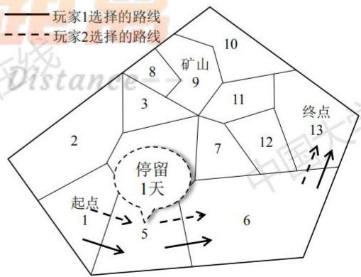

<details>
<summary>text_image</summary>

玩家1选择的路线
玩家2选择的路线
矿山
8
9
10
3
11
2
7
12
终点
13
起点
1
5
6
停留
1天
</details>

图 5.3.1: 玩家 1 和玩家 2 选择的路线

## 5.4 问题三第二部分：仅知当天天气且动态确定方案的最佳策略模型的建立与求解

这一部分要求我们根据当天的天气状况以及其余玩家的决策方案，动态地确定最佳策略，考虑到这一部分与问题二类似，因此我们仍然使用前往某个结点的收益的期望来建立最佳策略模型。

## 5.4.1 仅知当天天气且动态确定方案的最佳策略模型的建立

## ★ 符号引入

在构建该决策模型之前，我们首先引入部分符号，假设共有n名玩家，分别记为 $H=\left\{h_{1}(t),h_{2}(t),\cdots,h_{n}(t)\right\}$ ，对于每个玩家， $h_{1}(t)=(h_{11},h_{12})$ ， $h_{2}(t)=(h_{21},h_{22})$ ，……， $h_{n}(t)=(h_{n1},h_{n2})$ ，其中第一个分量表示t时刻第i个玩家所在的节点编号，第二个分量表示该时刻第i个玩家的行动，我们用1表示行走，2表示停留，3表示挖矿，4表示停留并补给资源，5表示不停留但补给资源。

以玩家 1 为例，假设其有 $n_1$ 种决策方案，且下一个行动结点为 $j$ ，则 $j \in S_{h_{11}} \cup \{h_{11}\}$ ，其中 $S_{h_{11}}$ 为结点 $h_{11}$ 的邻接结点的集合；假设玩家 2，玩家 3，……，玩家 $n$ 中下一个可能的决策结点为 $j$ 的个数为 $m (m \leqslant n-1)$ ，不妨设为玩家 $k_1$ 、 $k_2$ 、……、 $k_m$ ，且玩家 1 与玩家 $k_1$ 、 $k_2$ 、……、 $k_m$ 之间的支付矩阵分别为 $M_{1k_1}$ 、 $M_{1k_2}$ 、……、 $M_{1k_m}$ 。

## ★ 玩家选择结点概率的求取

我们以 $M_{1k_{1}}$ 为例，仿照之前的方式构造策略集：

$$
\begin{array}{l} Q _ {1} = \left\{\boldsymbol {q} = \left(q _ {1}, q _ {2}, \dots , q _ {n _ {1}}\right) \middle | 0 \leqslant q _ {i} \leqslant 1, \sum_ {i = 1} ^ {n _ {1}} q _ {i} = 1 \right\}, \\ Q _ {k _ {1}} = \left\{\boldsymbol {q} ^ {\prime} = \left(q _ {1} ^ {\prime}, q _ {2} ^ {\prime}, \dots , q _ {n _ {2}} ^ {\prime}\right) \middle | 0 \leqslant q _ {j} ^ {\prime} \leqslant 1, \sum_ {j = 1} ^ {n _ {2}} q _ {j} ^ {\prime} = 1 \right\}, \\ \end{array}
$$

同样，两人的效用期望相同，均为

$$
U _ {1} \left(q, q ^ {\prime}\right) = U _ {k _ {1}} \left(q, q ^ {\prime}\right) = q M _ {1 k _ {1}} q ^ {\prime^ {\mathrm{T}}},
$$

由此根据式(5.3.1)即可求得玩家 $k_{1}$ 前往结点 $j$ 的概率 $P_{k_1}(j)$ ，同理可求得 $P_{k_2}(j)$ 、 $P_{k_3}(j)$ 、 $\cdots$ 、 $P_{k_m}(j)$ 。

## ★ 结点利润期望的求取

根据题意，我们分 4 种情况求取结点 j 的收益期望，分别为行走、停留、挖矿、村庄补给的情况。

## 行走时结点 j 的收益期望的计算

对于行走时的1号玩家，有 $j \in S_{h_{11}}$ 且 $j \neq h_{11}$ ，则玩家1、玩家2、……、玩家 $n$ 均有可能到达结点 $j$ ，因此此处的“收益”指的是这部分玩家到达该结点消耗生活必需品的损失，为负数，即

$$
E (j) = - \sum_ {k = 2} ^ {n + 1} (2 k - 2) \Big [ B _ {W} (t) P _ {W} + B _ {F} (t) P _ {F} \Big ] P (k),
$$

假设每一位参与者到达结点 $j$ 是相互独立的, 则 $P(k)$ 为 $k$ 个参与者到达结点 $j$ 的概率。

## ▶ 停留结点 j 的收益期望的计算

当玩家 1 停留在结点 j 时，在此处的 “收益” 指的是在此处停留消耗的生活必需品对应的资金以及晚到终点一天消耗的生活必需品对应的资金；在问题二中我们已经假设 $P(A)$ 、 $P(B)$ 分别为天气晴朗和高温的概率，因此此时

$$
E (j) = - \left[ B _ {W} (t) P _ {W} + B _ {F} (t) P _ {F} \right] - P (A) \times 2 \left(3 P _ {W} + 4 P _ {F}\right) - P (B) \times 2 \left(9 P _ {W} + 9 P _ {F}\right),
$$

其中 $B_{W}(t)$ 、 $B_{F}(t)$ 为该时刻水和食物的基础消耗量， $P_{W}$ 、 $P_{F}$ 分别为水和食物的价格。

## 矿山挖矿时结点 j 的收益期望的计算

在矿山挖矿时，结点 j 的收益期望由挖矿收益、在此处停留消耗的生活必需品对应的资金以及晚到终点一天消耗的生活必需品对应的资金组成，因此

$$
E (j) = \sum_ {k = 2} ^ {n + 1} \frac {E _ {2} \mid_ {t}}{k} P (k) - \left[ B _ {W} (t) P _ {W} + B _ {F} (t) P _ {F} \right] - P (A) \times 2 \left(3 P _ {W} + 4 P _ {F}\right) - P (B) \times 2 \left(9 P _ {W} + 9 P _ {F}\right),
$$

其中 $E_{2}|_{t}$ 为问题二中定义的在已知天气的第 t 天挖矿所获净收益，因此上式中的第一项即为在该结点的玩家挖矿所获基础收益的均值。

## 村庄补给时结点 j 的收益期望的计算

在村庄补给时，结点 j 的收益期望即为玩家购买生活必需品耗费的资金，因此为一负值；在问题二中，我们已经定义了 $Z_{W}$ 、 $Z_{F}$ 分别为参与者在村庄购买水和食物的购买量，所以

$$
E (j) = - 2 \left(Z _ {W} P _ {W} + Z _ {F} P _ {F}\right).
$$

据此我们可以求得玩家 1 前往的下一个结点的编号

$$
h _ {1} (t + 1) _ {1} = \underset {j \in S _ {h _ {1 1}} \cup \{h _ {1 1} \}} {\arg \max} E (j),
$$

据此可做出决策。

## 5.4.2 仅知当天天气且动态确定方案的最佳策略模型的求解

我们建立的模型涉及到较多的支付矩阵，而两两玩家之间的支付矩阵并不一样，这样计算会过于复杂，因此我们简化了模型的计算，将其退化为最优路径的计算。

Step 1: 初始化算法中所需要的各个常量。

Step 2: 计算从起点到终点所需的行进天数，同时算出从第一天出发和第二天出发到达终点所需的水和食物的资源，并算出剩余的资金量。

Step 3: 以步长为 1 依次遍历在起点处参与者所带的水的重量, 从 1 遍历至 1200 千克, 对于其中水和食物的占比不同的情况, 进行深度优先遍历。

Step 4: 若当前节点为终点，更新答案以及对应的答案数组，算法结束。

Step 5: 若当前时间超过截至日期, 回溯至上一层。

Step 6: 若当前节点为村庄，则更新参与者仍能携带的物品的数量。

Step 7: 对于当前节点可以到达的每个节点, 检查是否有足够的资源供其到达, 若足够, 则搜索目标节点, 并扣除资源量。资源不足则回溯到上一个村庄或起点, 视为在上一个村庄或者起点进行补给。

Step 8: 若当前节点为矿山，这搜索在矿山停留和在矿山挖矿的两种情况，并扣除资源量，资源不足则回溯到上一个村庄或起点，视为在上一个村庄或者起点进行补给。

## 5.4.3 仅知当天天气且动态确定方案的最佳策略模型的结果分析

根据我们编写的迭代算法，即可获得三位玩家选择的路线，如右图所示，可以看出，一位玩家沿上边界和右边界到达终点，一位玩家沿左边界和下边界到达终点，还有一位玩家从地图中部到达终点；根据题意可知，该路线是比较合理的，因为若有多个玩家选择同一条路线，则他们资源的消耗量增大，挖矿获得的基础收益降低，同时若要前往村庄补给物资，则购买价格也会增加；所以玩家应选择尽量不同的路线，这与我们得到的路线是相符的。

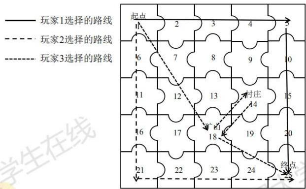  
图5.4.1：3位玩家选择的路线

## 六、模型的评价与推广

## 6.1 模型的评价

## - 模型的优点

在对问题一的求解过程中，将整个决策过程分为不挖矿和挖矿两种情况进行分析，并且根据每一种情况的特点，分别设计了基于贪心法和回溯法的算法对其进行求解，能够很好地得到参与者应选择的最佳策略。  
问题二涉及的场景是一个动态决策的过程，因此我们将决策过程分为若干种情况，考虑了天气、收益的数学期望等多种因素，并设计了相应的迭代算法，得到了参与者的决策方案，同时使用蒙特卡洛仿真以验证该模型的正确性。  
我们将问题三的场景抽象为一个博弈过程,在参考博弈论有关资料的基础之上,对于有n位玩家和本题中只有两位玩家的情况分别给出了对应的求解步骤,具有较强的普适性。

## - 模型的缺点

为求解问题一中前往矿山挖矿的过程，我们设计了相应的回溯算法，该算法效率较高，想法新颖，但是代码的简明性较低，即使借助注释也不容易很快理解其执行过程。  
我们在建立问题二有关模型的过程中，没有考虑参与者在村庄和矿山之间来回往返的情况，若考虑这种情况可能会得到更佳的策略。

## 6.2 模型的改进

我们解决问题一中前往矿山挖矿过程的回溯算法，本质上是一种带有限界函数的深度优先遍历方法，为提高该算法的简明性，我们可以在现有代码之上，对其中的某些数据结构、搜索条件等进行优化，或采用粒子群算法等智能算法对这种情况进行求解；在问题二中，如果需要考虑参与者在村庄和矿山之间来回往返的情况，整个决策过程将变得更加复杂，很难在现有的过程上进行拓展，但可以设计与问题一中的回溯算法类似的算法来考察这种情况。

## 6.3 模型的推广

我们建立模型的过程中用到的方法可以推广到其他领域，例如我们在求解问题一中使用到的贪心法就可以用于求解背包问题，该问题中涉及到的向背包中加入物品的过程与本问题中参与者在起点购买生活必需品的过程类似；在求解问题三时，我们参考了博弈论的相关理论，该理论可用于解决作战时兵力的分配、合作完成某项任务时人员的分配等多种实际问题。

## 七、参考文献

[1] 周志华. 机器学习[M]. 北京: 清华大学出版社, 2016.  
[2] 陈慧南. 算法设计与分析（C++语言描述）[M]. 北京: 电子工业出版社, 2018.  
[3] 卓金武, 王鸿钧. MATLAB 数学建模方法与实践（第三版）[M]. 北京: 北京航空航天大学出版社, 2018.  
[4] 林琦彤. 协同创新项目知识共享的演化博弈分析[D]. 济南: 山东大学, 2019.  
[5] 姜启源, 谢金星, 叶俊. 数学模型（第四版）[M]. 北京: 高等教育出版社, 2016.  
[6] 谢金星, 薛毅. 优化建模与 LINDO/LINGO 软件[M]. 北京: 清华大学出版社, 2005.

## 附录

## 一、程序源代码

问题 1：求解第一关不挖矿时最佳策略的 Matlab 源代码  
```matlab
p = [
0 1 0 0 0 0 0 0 0 0 0 0 0 0 0 0 0 0 0 0 1 0 0
0 0 1 1 0 0 0 0 0 0 0 0 0 0 0 0 0 0 0 0 0 0 0 0
0 1 0 1 0 0 0 0 0 0 0 0 0 0 0 0 0 0 0 0 1 0 0
0 0 1 0 1 0 0 0 0 0 0 0 0 0 0 0 0 0 0 1 1 0 0
0 0 0 1 0 1 0 0 0 0 0 0 0 0 0 0 0 0 0 1 0 0 0
0 0 0 1 0 1 0 0 0 0 0 0 0 0 0 0 0 1 1 0 0
0 0 0 0 1 1 1 1 1 1 1 1 1 1 1
0 0 0 1
0
0
0
0
0
0
0
0
0
0
1
1
1
1
1
1
1
1
1
1
1
1
1
1
1
1
1
1
]
inf = 99999999;
n = size(p,1);

%初始化距离矩阵
%令无法直接到达的点之间的距离为 inf
%能直接到达的点之间距离为1

dis = p;
for i = 1:27
    for j = 1:27
```

```matlab
if dis(i,j)==0
    dis(i,j)=inf;
end
end
end

% Floyd 算法计算任意两点的最短路径
for k=1:n
    for i=1:n
        for j=1:n
            if dis(i,k)+dis(k,j)<dis(i,j)
                dis(i,j)=dis(i,k)+dis(k,j);
        end
    end
end
end
dis = dis .* (ones(27) - diag(ones(1,27)));
weather = [2 2 1 3 1 2 3 1 2 2   3 2 1 2 2 2 3 3 2 2   1 1 2 1 3 2 1 1 2 2]; %天气情况
w_cost = [5 8 10];
f_cost = [7 6 10];
weight_limit = 1000;
day_limit = 30;
price_w = 5;
price_f = 10;
weight_w = 3;
weight_f = 2;

sumw = 0;
sumf = 0;
dest = 27;

i=0;
day=0;
while day<dis(1,dest)
    i=i+1;
    if weather(i)~=3
        day=day+1;
        sumw = sumw + 2 * w_cost(weather(i));
        sumf = sumf + 2 * f_cost(weather(i));
    else
        sumw = sumw + w_cost(weather(i));
        sumf = sumf + f_cost(weather(i));
    end
```

```txt
end
left = 10000-sumw*price_w-sumf*price_f;
left
sumw
sumf
```

问题 1：求解第二关不挖矿时最佳策略的 Matlab 源代码  
```matlab
p = zeros(64,64);
%邻接矩阵的生成过程
for i=1:64
    a = ceil(i/8);
    b = mod( i,8 );
    if b~=0
        p(i,i+1) = 1;
    end
    if b~=1
        p(i,i-1) = 1;
    end

    if mod (a,2) == 1
        if a-1>0
            if b==1
                p(i,i+8) = 1;
                p(i,i-8) = 1;
            else
                p(i,i+8) = 1;
                p(i,i-8) = 1;
                p(i,i+7) = 1;
                p(i,i-9) = 1;
            end
        else
            if b==1
                p(i,i+8) = 1;
            else
                p(i,i+7) = 1;
                p(i,i+8) = 1;
            end

        end
    else
        if a~=8

            if b==0
                p(i,i+8) = 1;
```

```matlab
p(i,i-8) = 1;
else
    p(i,i+8) = 1;
    p(i,i-8) = 1;
    p(i,i-7) = 1;
    p(i,i+9) = 1;
end
else
    if b==0
        p(i,i-8) = 1;
    else
        p(i,i-7) = 1;
        p(i,i-8) = 1;
    end
end
end
end

inf = 99999999;
n=size(p,1);

% 初始化路由矩阵
for i=1:n
    for j=1:n
        r(i,j)=j;
    end
end
r;

%初始化距离矩阵
%令无法直接到达的点之间的距离为 inf
%能直接到达的点之间距离为 1

dis=p;
for i=1:n
    for j=1:n
        if dis(i,j)==0
            dis(i,j)=inf;
        end
    end
end

% Floyd 算法计算任意两点的最短路径
```

```matlab
for k=1:n
    for i=1:n
        for j=1:n
            if dis(i,k)+dis(k,j)<dis(i,j)
                dis(i,j)=dis(i,k)+dis(k,j);
                r(i,j)=r(i,k);
            end
        end
    end
end

%根据路由矩阵回推路径

arrow=zeros(1,n);
arrow(1)=1;
i=2;
pp=1;
while pp~=n
    pp=r(pp,n);
    arrow(i)=pp;
    i=i+1;
end

dis = dis .* (ones(n) - diag(ones(1,n)));

weather = [2 2 1 3 1 2 3 1 2 2 3 2 1 2 2 2 3 3 2 2 1 1 2 1 3 2 1 1 2 2];      %天气情况
                                %1为晴朗,2为高温,3为沙暴
w_cost = [5 8 10];
f_cost = [7 6 10];
weight_limit = 1000;
day_limit = 30;
price_w = 5;
price_f = 10;
weight_w = 3;
weight_f = 2;

sumw = 0;
sumf = 0;
dest = 64;

i=0;
day=0;
while day<dis(1,dest)
    i=i+1;
```

```matlab
if weather(i)~=3                      %没有遇到沙暴
    day=day+1;
    sumw = sumw + 2 * w_cost(weather(i));
    sumf = sumf + 2 * f_cost(weather(i));
else                          %遇到沙暴
    sumw = sumw + w_cost(weather(i));
    sumf = sumf + f_cost(weather(i));
end
end
left = 10000-sumw*price_w-sumf*price_f;

arrow
left
sumw
sumf
```

问题 1：求解第一关挖矿时最佳策略的 C++源代码  
```cpp
#include <iostream>
#include <map>
using namespace std;
map<pair<int,int>,bool> mp;
const int qua[4]={0,1,2,3};          //将图中的 4 个特殊点分为 4 类
                                //按标号顺序记在该数组中
                                //0:起点,1:村庄,2:矿山,3:终点
const int dist[4][4] = {{0,6,8,3},         //4 个特殊点之间的距离矩阵
                    {6,0,2,3},
                    {8,2,0,5},
                    {3,3,5,0}};
const int f[4][4]={{0,1,1,1},       //4 类特殊点的互相到达的决策情况
        {0,0,1,1},
        {0,1,0,1},
        {0,0,0,0}};
const int wea[30]={    2,2,1,3,1,     //天气情况,1,2,3 分别代表晴朗,高温和沙暴
            2,3,1,2,2,
            3,2,1,2,2,
            2,3,3,2,2,
            1,1,2,1,3,
            2,1,1,2,2};
const int mx=3,my=2;           //mx 和 my 分别是水和食物的重量
const int cx=5,cy=10;           //cx 和 cy 分别是水和食物的基准价格
const int sx[4]={0,5,8,10};
                   //sx 中下标为 1-3 的元素分别指晴朗,高温,沙暴天气下水的基础消耗
const int sy[4]={0,7,6,10};
                   //sy 中下标为 1-3 的元素分别指晴朗,高温,沙暴天气下食物的基础消耗
```

```javascript
const int n=4; //共有 4 个特殊点
const int maxm=1200; //背包容量
const int coins=10000; //起始总资产
const int base=1000; //挖矿每日收益
const int date=30; //截至日期
int costx[32][4][4]; //第 d 天从第 i 点走到第 j 点所消耗的水
int costly[32][4][4]; //第 d 天从第 i 点走到第 j 点所消耗的食物
int days[32][4][4]; //第 d 天从第 i 点走到第 j 点所需要的实际天数
int ans=0;
int rec[32];
//每一天所到达的点的标记 -1 代表此时处于最短路径上的某个普通点或此时已经达到终点
//其余的数字 分别代表当天玩家位于对应的特殊点 对应情况如 qua 数组所示
int act[32];
//每一天的特殊行动情况 2 代表挖矿 1 代表于矿山停止行动 0 代表在村庄购买
int ansx[32]; //ansx 与 ansact 是最优解路径和最优解路径上的行为
int ansact[32];
int ansg,ansh; //ansg 和 ansh 是最优解对应的初始水和食物资源量
int g,h; //用于枚举的初始水与食物资源量

void dfs(int day,int now,int nm,int c,int x,int y,int type)
{
    act[day]=type;
    rec[day]=now;

    if(qua[now]==3)
    {
        if(ans<=c+x*cx+y*cy)
        {
            ansg=g;
            ansh=h;
            ans=c+x*cx+y*cy;
            for(int i=0;i<=date;i++)
                ansx[i]=rec[i];
            for(int i=0;i<=date;i++)
                ansact[i]=act[i];
        }
        act[day]=-1;
        rec[day]=-1;
        return;
    }
    if(day>=date)
    {
        act[day]=-1;
        rec[day]=-1;
```

```txt
return;
}
if(qua[now]==1)
    nm=maxm-mx*x-my*y;
for(int i=0;i<n;i++)
    if(f[qua[now]][qua[i]])
    {
        int tx=costx[day][now][i];
        int ty=costy[day][now][i];
        int ucost=c;
        int ux,uy;
        int um=nm;
        if(x>=tx)
            ux=x-tx;
        else
        {
            ux=0;
            ucost-=2*(tx-x)*cx;
            um=(tx-x)*mx;
        }
        if(y>=ty)
            uy=y-ty;
        else
        {
            uy=0;
            ucost-=2*(ty-y)*cy;
            um=(ty-y)*my;
        }
        if(ucost<0||um<0)
            continue;
        dfs(day+days[day][now][i],i,um,ucost,ux,uy,0);
    }
    if(qua[now]==2)
    {
        int attday=day;
        int tx=sx[wea[attday]];
        int ty=sy[wea[attday]];
        attday++;
        if(x>=tx)
        {
            x-=tx;
            tx=0;
        }
```

```txt
else
{
    tx-=x;
    x=0;
}
if(y>=ty)
{
    y-=ty;
    ty=0;
}
else
{
    ty-=y;
    y=0;
}
nm-=tx*mx+ty*my;
c-=2*tx*cx+2*ty*cy;
if(nm>=0&&c>=0)
    dfs(attday,now,nm,c,x,y,1);

attday=day;
tx=sx[wea[attday]]*2;
ty=sy[wea[attday]]*2;
attday++;
if(x>=tx)
{
    x-=tx;
    tx=0;
}
else
{
    tx-=x;
    x=0;
}
if(y>=ty)
{
    y-=ty;
    ty=0;
}
else
{
    ty-=y;
    y=0;
}
```

```lisp
nm-=tx*mx+ty*my;
c-=2*tx*cx+2*ty*cy;
c+=base;
if(nm>=0&&c>=0)
    dfs(attday,now,nm,c,x,y,2);
}
rec[day]=-1;
act[day]=-1;
}
int main()
{
    for(int d=0;d<=date;d++)
    {
        rec[d]=-1;
        act[d]=-1;
    }
    for(int d=0;d<date;d++)
        for(int i=0;i<n;i++)
            for(int j=0;j<n;j++)
                if(f[qua[i]][qua[j]])
                {
                    int now=0,count=0,sumx=0,sumy=0;
                    while(count<dist[i][j])
                    {
                        if(wea[now+d]!=3)
                        {
                            count++;
                            sumx+=2*sx[wea[now+d]];
                            sumy+=2*sy[wea[now+d]];
                        }
                    else
                    {
                        sumx+=sx[wea[now+d]];
                        sumy+=sy[wea[now+d]];
                    }
                    now++;
                    if(now+d>=date)
                        break;
                }
                if(count<dist[i][j])
                {
                    sumx=sumy=20000;
                    now=30;
                }
```

```html
costx[d][i][j]=sumx;
costy[d][i][j]=sumy;
days[d][i][j]=now;
}
for(int i=0;i<=maxm;i++)
{
    g=i/mx;
    h=(maxm-i)/my;
    if(!mp[make_pair(g,h)])
        dfs(0,0,0,coins-g*cx-h*cy,g,h,-1);
    mp[make_pair(g,h)]=1;
}
for(int i=0;i<=date;i++)
    cout<<i<<":"<<ansx[i]<<";"<<ansact[i]<<endl;
cout<<endl;
cout<<ans<<" "<<ansg<<" "<<ansh<<endl;
}
```

问题 1：求解第二关挖矿时最佳策略的 C++源代码  
```cpp
#include <iostream>
#include <map>
using namespace std;
map<pair<int,int>,bool> mp;
const int qua[6]={0,2,1,2,1,3}; //将图中的 6 个特殊点分为 4 类
//按标号顺序记在该数组中
//0:起点,1:村庄,2:矿山,3:终点
const int dist[6][6]={{0,7,8,9,9,11},
{7,0,1,3,4,4},
{8,1,0,2,3,3},
{9,3,2,0,1,2},
{9,4,3,1,0,2},
{11,4,3,2,2,0}};
const int f[4][4]={{0,1,1,1},
{0,0,1,1},
{0,1,0,1},
{0,0,0,0}};
const int wea[30]={ 2,2,1,3,1,
2,3,1,2,2,
3,2,1,2,2,
2,3,3,2,2,
1,1,2,1,3,
2,1,1,2,2};
//4 类特殊点的互相到达的决策情况
const int mx=3,my=2; //mx 和 my 分别是水和食物的重量
const int cx=5,cy=10; //cx 和 cy 分别是水和食物的基准价格
```

```txt
const int sx[4]={0,5,8,10};
//sx 中下标为 1-3 的元素分别指晴朗,高温,沙暴天气下水的基础消耗
const int sy[4]={0,7,6,10};
//sy 中下标为 1-3 的元素分别指晴朗,高温,沙暴天气下食物的基础消耗
const int n=6;
const int maxm=1200;
const int coins=10000;
const int base=1000;
const int date=30;
int costx[32][6][6];
int costly[32][6][6];
int days[32][6][6];
int ans=0;
int rec[32];
//每一天所到达的点的标记 -1 代表此时处于最短路径上的某个普通点或此时已经达到终点
//其余的数字 分别代表当天玩家位于对应的特殊点 对应情况如 qua 数组所示
int act[32];
//每一天的特殊行动情况 2 代表挖矿 1 代表于矿山停止行动 0 代表在村庄购买
int ansx[32];
int ansact[32];
int ansg,ansh;
int g,h;
void dfs(int day,int now,int nm,int c,int x,int y,int type)
{
    act[day]=type;
    rec[day]=now;

    if(qua[now]==3)
    {
        if(ans<=c+x*cx+y*cy)
        {
            ansg=g;
            ansh=h;
            ans=c+x*cx+y*cy;
            for(int i=0;i<=date;i++)
                ansx[i]=rec[i];
            for(int i=0;i<=date;i++)
                ansact[i]=act[i];
        }
        act[day]=-1;
        rec[day]=-1;
        return;
```

```lisp
}
if(day>=date)
{
    act[day]=-1;
    rec[day]=-1;
    return;
}
if(qua[now]==1)
    nm=maxm-mx*x-my*y;
for(int i=0;i<n;i++)
    if(f[qua[now]][qua[i]])
    {
        int tx=costx[day][now][i];
        int ty=costy[day][now][i];
        int ucost=c;
        int ux,uy;
        int um=nm;
        if(x>=tx)
            ux=x-tx;
        else
        {
            ux=0;
            ucost-=2*(tx-x)*cx;
            um=(tx-x)*mx;
        }

        if(y>=ty)
            uy=y-ty;
        else
        {
            uy=0;
            ucost-=2*(ty-y)*cy;
            um=(ty-y)*my;
        }
        if(ucost<0||um<0)
            continue;
        dfs(day+days[day][now][i],i,um,ucost,ux,uy,0);
    }
    if(qua[now]==2)
    {
        int attday=day;
        int tx=sx[wea[attday]];
        int ty=sy[wea[attday]];
        attday++;
```

```txt
if(x>=tx)
{
    x-=tx;
    tx=0;
}
else
{
    tx-=x;
    x=0;
}
if(y>=ty)
{
    y-=ty;
    ty=0;
}
else
{
    ty-=y;
    y=0;
}
nm-=tx*mx+ty*my;
c-=2*tx*cx+2*ty*cy;
if(nm>=0&&c>=0)
    dfs(attday,now,nm,c,x,y,1);

attday=day;
tx=sx[wea[attday]]*2;
ty=sy[wea[attday]]*2;
attday++;
if(x>=tx)
{
    x-=tx;
    tx=0;
}
else
{
    tx-=x;
    x=0;
}
if(y>=ty)
{
    y-=ty;
    ty=0;
}
```

```lisp
else
{
    ty-=y;
    y=0;
}
nm-=tx*mx+ty*my;
c-=2*tx*cx+2*ty*cy;
c+=base;
if(nm>=0&&c>=0)
    dfs(attday,now,nm,c,x,y,2);
}
rec[day]=-1;
act[day]=-1;
}
int main()
{
    for(int d=0;d<=date;d++)
    {
        rec[d]=-1;
        act[d]=-1;
    }
    for(int d=0;d<date;d++)
        for(int i=0;i<n;i++)
            for(int j=0;j<n;j++)
                if(f[qua[i]][qua[j]])
                {
                    int now=0,count=0,sumx=0,sumy=0;
                    while(count<dist[i][j])
                    {
                        if(wea[now+d]!=3)
                        {
                            count++;
                            sumx+=2*sx[wea[now+d]];
                            sumy+=2*sy[wea[now+d]];
                        }
                    else
                    {
                        sumx+=sx[wea[now+d]];
                        sumy+=sy[wea[now+d]];
                    }
                    now++;
                    if(now+d>=date)
                        break;
                    }
```

```lisp
if(count<dist[i][j])
{
    sumx=sumy=20000;
    now=30;
}
costx[d][i][j]=sumx;
costy[d][i][j]=sumy;
days[d][i][j]=now;
}
for(int i=0;i<=maxm;i++)
{
    g=i/mx;
    h=(maxm-i)/my;
    if(!mp[make_pair(g,h)])
        dfs(0,0,0,coins-g*cx-h*cy,g,h,-1);
    mp[make_pair(g,h)]=1;
}
for(int i=0;i<=date;i++)
    cout<<i<<":"<<ansx[i]<<";"<<ansact[i]<<endl;
cout<<endl;
cout<<ans<<" "<<ansg<<" "<<ansh<<endl;
}
```

问题 1：绘制第一关、第二关剩余资金数变化曲线的 Matlab 源代码  
```matlab
%t=[0:24];          %天数，对应于第一关，绘制第一关曲线时取消注释
t=[0:30];          %天数，对应于第二关，绘制第一关曲线时加上注释
%money=xlsread('Result.xlsx','C4:C28');
                  %剩余资金数，对应于第一关，绘制第一关曲线时取消注释
money=xlsread('Result.xlsx','I4:I34');
                  %剩余资金数，对应于第二关，绘制第一关曲线时加上注释
plot(t,money,'b')
```

问题 1：绘制第一关、第二关剩余水量、食物量变化曲线的 Matlab 源代码  
```matlab
%t=[0:24];          %天数，对应于第一关，绘制第一关曲线时取消注释
t=[0:30];          %天数，对应于第二关，绘制第一关曲线时加上注释
%water=xlsread('Result.xlsx','D4:D28');
                  %剩余水量，对应于第一关，绘制第一关曲线时取消注释
%food=xlsread('Result.xlsx','E4:E28');
                  %剩余食物量，对应于第一关，绘制第一关曲线时取消注释
water=xlsread('Result.xlsx','J4:J34');
                  %剩余水量，对应于第二关，绘制第一关曲线时加上注释
food=xlsread('Result.xlsx','K4:K34');
                  %剩余食物量，对应于第二关，绘制第一关曲线时加上注释
```

```txt
plot(t,water,'b');
hold on;
plot(t,food,'r')
```

问题1：以第一关为例进行灵敏度分析的Matlab源代码

<table><tr><td>t=[0:24];</td><td>%天数</td></tr><tr><td>%money1=xlsread(&#x27;sensitivity.xlsx&#x27;,&#x27;sheet1&#x27;,&#x27;A3:A27&#x27;);</td><td>%负重不变</td></tr><tr><td>%money2=xlsread(&#x27;sensitivity.xlsx&#x27;,&#x27;sheet1&#x27;,&#x27;B3:B27&#x27;);</td><td>%负重减少 10%</td></tr><tr><td>%money3=xlsread(&#x27;sensitivity.xlsx&#x27;,&#x27;sheet1&#x27;,&#x27;C3:C27&#x27;);</td><td>%负重增加 10%</td></tr><tr><td>money1=xlsread(&#x27;sensitivity.xlsx&#x27;,&#x27;sheet2&#x27;,&#x27;A3:A27&#x27;);</td><td>%初始资金不变</td></tr><tr><td>money2=xlsread(&#x27;sensitivity.xlsx&#x27;,&#x27;sheet2&#x27;,&#x27;B3:B27&#x27;);</td><td>%初始资金减少 10%</td></tr><tr><td>money3=xlsread(&#x27;sensitivity.xlsx&#x27;,&#x27;sheet2&#x27;,&#x27;C3:C27&#x27;);</td><td>%初始资金增加 10%</td></tr><tr><td>plot(t,money1,&#x27;b&#x27;);</td><td></td></tr><tr><td>hold on;</td><td></td></tr><tr><td>plot(t,money2,&#x27;r&#x27;);</td><td></td></tr><tr><td>hold on;</td><td></td></tr><tr><td>plot(t,money3,&#x27;g&#x27;)</td><td></td></tr></table>

问题 2：求解第四关最佳策略并使用蒙特卡洛方法进行仿真的 C++源代码

<table><tr><td colspan="2">#include &lt;iostream&gt;</td></tr><tr><td colspan="2">#include &lt;map&gt;</td></tr><tr><td colspan="2">using namespace std;</td></tr><tr><td colspan="2">map&lt;pair&lt;int,int&gt;,bool&gt; mp;</td></tr><tr><td rowspan="3">const int qua[4]={0,1,2,3};</td><td>//将图中的6个特殊点分为4类</td></tr><tr><td>//按标号顺序记在该数组中</td></tr><tr><td>//0:起点,1:村庄,2:矿山,3:终点</td></tr><tr><td>const int dist[4][4]={{0,5,5,8},</td><td>//4个特殊点之间的距离矩阵</td></tr><tr><td>{5,0,2,3},</td><td></td></tr><tr><td>{5,2,0,3},</td><td></td></tr><tr><td>{8,3,3,0}};</td><td></td></tr><tr><td>const int f[4][4]={{0,1,1,1},</td><td>//4类特殊点的互相到达的决策情况</td></tr><tr><td>{0,0,1,1},</td><td></td></tr><tr><td>{0,1,0,1},</td><td></td></tr><tr><td>{0,0,0,0}};</td><td></td></tr><tr><td>int wea[30]={2,2,1,3,1,</td><td>//30天的天气情况,1,2,3分别代表晴朗,高温和沙暴</td></tr><tr><td>2,2,1,2,2,</td><td></td></tr><tr><td>1,2,1,2,2,</td><td></td></tr><tr><td>2,3,1,2,2,</td><td></td></tr><tr><td>1,1,2,1,3,</td><td></td></tr><tr><td>2,1,1,2,2};</td><td></td></tr><tr><td>const int dis[26][26]={</td><td>//任意两点之间的距离矩阵 点的编号从1开始</td></tr><tr><td>0,0,0,0,0,0,0,0,0,0,0,0,0,0,0,0,0,0,0,0,0,0,0,0,0,0,0,0,0,0,0,0,0,0,0,0,0,0,0,0,0,0,0,0,0,0,0,0,0,0,0}</td><td></td></tr></table>

```txt
0,1,0,1,2,3,2,1,2,3,4,3,2,3,4,5,4,3,4,5,6,5,4,5,6,7,
0,2,1,0,1,2,3,2,1,2,3,4,3,2,3,4,5,4,3,4,5,6,5,4,5,6,
0,3,2,1,0,1,4,3,2,1,2,5,4,3,2,3,6,5,4,3,4,7,6,5,4,5,
0,4,3,2,1,0,5,4,3,2,1,6,5,4,3,2,7,6,5,4,3,8,7,6,5,4,
0,1,2,3,4,5,0,1,2,3,4,1,2,3,4,5,2,3,4,5,6,3,4,5,6,7,
0,2,1,2,3,4,1,0,1,2,3,2,1,2,3,4,3,2,3,4,5,4,3,4,5,6,
0,3,2,1,2,3,2,1,0,1,2,3,2,1,2,3,4,3,2,3,4,5,4,3,4,5,
0,4,3,2,1,2,3,2,1,0,1,4,3,2,1,2,5,4,3,2,3,6,5,4,3,4,
0.5.4.3.2.1.4.3.2.1.0.5.4.3.2.1.6.5.4.3.2.7.6.5.4.3,
0.2.3.4.5.6.1.2.3.4.5.0.1.2.3.4.1.2.3.4.5.2.3.4.5.6,
0.3.2.3.4.5.2.1.2.3.4.1.0.1.2.3.2.1.2.3.4.3.2.3.4.5,
0.4.3.2.3.4.3.2.1.2.3.2.1.0.1.2.3.2.1.2.3.4.3.2.3.4,
0.5.4.3.2.3.4.3.2.1.2.3.2.1.0.1.4.3.2.1.2.5.4.3.2.3,
0.6.5.4.3.2.5.4.3.2.1.4.3.2.1.0.5.4.3.2.16.5.4.3.2,
0.3.4.5.6.7.2.3.4.5.6.1.2.3.4.501.,2:3_4，1，2：3，4，5,
0，4，3，4，5，6，3，2，3，4，5，2，1，2，3，4，1，0，1，2，3，2，1，2，3，4,
0，5，4，3，4，5，4，3，2，3，4，3，2，1，2，3，2，1，0，1，2，3，2，1，2，3,
0，6，5，4，3，4，5，4，3，2，3，4，3，2，1，2，3，2，1。0，1，4，3，2、1，2,
0，7，6，5，4，3，6，5，4，3，2，5，4，3，2．1．4．3．2．1．0．5．4．3．2．1，
0．4．5．6．7．8．3．4．5．6．7．2．3．4．5．6．1．2．3．4．5．0．1．2．3．4，
0．5．4．5．6．7．4．3．4．5．6．3．2．3．4．5．2．1．2．3．4．1．0．1．2．3，
0．6．5．4．5．6．5．4．3．4．5．4．3．2．3．4．3．2．1．2．3．2．1．0．1．2，
0．7．6．5．4．5．6．5．4．3．4．5．4．3．2．3．4．3．2．1．2．3．2．1．0．1，
0．8．7．6．5．4．7　6、5、4、3、6、5、4、3、2、5、4、3、2、1、4、3、2、1、0
};
const int quai[4]={1，14，18，25};
const int mx=3.my=2; //mx 和 my 分别是水和食物的重量
const int cx=5.cy=10; //cx 和 cy 分别是水和食物的基准价格
const int sx[4]={0，3，9，10};
//sx 中下标为 1- 3 的元素分别指晴朗，高温，沙暴天气下水的基础消耗
const int sy[4]={0，4，9，10};
//sy 中下标为 1- 3 的元素分别指晴朗，高温，沙暴天气下食物的基础消耗
const int n= 4; //共有 6 个特殊点
const int maxm= 1200; //背包容量
const int coins= 10000; //起始总资产
const int base= 1000; //挖矿每日收益
const int date= 30; //截至日期
int costx[                                                                                                      
int costly[   ] [   ] [   ] ; //第 d 天从第 i 点走到第 j 点所消耗的水
int costly[   ] [   ] [   ] ; //第 d 天从第 i 点走到第 j 点所消耗的食物
int days[   ] [   ] [   ] ; //第 d 天从第 i 点走到第 j 点所需要的实际天数
int ans=0;
int rec[   ] ;
//每一天所到达的点的标记 -1 代表此时处于最短路径上的某个普通点或此时已经达到终点
//其余的数字 分别代表当天玩家位于对应的特殊点 对应情况如 qua 数组所示
```

```txt
int act[32];
//每一天的特殊行动情况 2 代表挖矿 1 代表于矿山停止行动 0 代表在村庄购买
int ansx[32]; //ansx 与 ansact 是最优解路径和最优解路径上的行为
int ansact[32];
int ansg,ansh; //ansg 和 ansh 是最优解对应的初始水和食物资源量
int g,h; //用于枚举的初始水与食物资源量

double e[4]={0};
double p[4]={0,17.0/30,1.0/3,1.0/10};
double pi[10];

int main()
{
// srand((unsigned)time(NULL)); //注释部分代码用于仿真
// int count3=0;
// for (int i=1;i<=30;i++){
//     if (count3==3){
//         wea[i]=rand()%2+1;
//     }
//    else{
//         wea[i]=rand()%3+1;
//         if(wea[i]==3){
//             count3++;
//     }
// }
// }
for(int i=1;i<=30;i++){
cout<<wea[i]<<" ";
}

for(int i=1;i<=2;i++)
{
e[1]=e[1]+p[i]*(2*sx[i]*cx+2*sy[i]*cy);
}
for(int i=1;i<=3;i++)
{
e[3]=e[3]+p[i]*(2*sx[i]*cx+2*sy[i]*cy);
}
double ew=3*3*p[1]+3*9*p[2]+3*10*p[3],ef=3*4*p[1]+3*9*p[2]+3*10*p[3];
for (int i=1;i<=3;i++)
{
for(int j=1;j<=3;j++)
{
if (j!=3)
```

```lisp
{
    pi[(i-1)*3+j]=(base-sx[i]*cx-sy[i]*cy-2*sx[j]*cx-2*sy[j]*cy)*p[i]*p[j];
}
else
{
    pi[(i-1)*3+j]=(base-sx[i]*cx-sy[i]*cy-(2*3*cx+2*4*cy)*p[1]-(2*9*cx+2*9*cy)*p[2])*p[i]*p[j];
}
}
for (int i=1;i<=9;i++)
{
    e[2]=e[2]+pi[i];
}
int tmax=30,nd=3,T0=tmax-dis[1][quai[2]]-dis[quai[2]][n]-nd;
int bw=178,bf=333;

for(int d=0;d<date;d++)
    for(int i=0;i<n;i++)
        for(int j=0;j<n;j++)
            if(f[qua[i]][qua[j]])
            {
                int now=0,count=0,sumx=0,sumy=0;
                while(count<dist[i][j])
                {
                    if(wea[now+d]!=3)
                    {
                        count++;
                        sumx+=2*sx[wea[now+d]];
                        sumy+=2*sy[wea[now+d]];
                    }
                else
                {
                    sumx+=sx[wea[now+d]];
                    sumy+=sy[wea[now+d]];
                }
                now++;
                if(now+d>=date)
                    break;
            }
            if(count<dist[i][j])
            {
                sumx=sumy=20000;
                now=30;
```

```txt
}
    costx[d][i][j]=sumx;
    costly[d][i][j]=sumy;
    days[d][i][j]=now;
}
double T0_1=min( (bw-costx[0][0][1] - (dis[quai[1]-1][quai[2]]+dis[quai[2]][25]) * ( 2*3*p[1]+2*9*p[2] ) )/ew ,
(bf-costy[0][0][1] - (dis[quai[1]-1][quai[2]]+dis[quai[2]][25]) * ( 2*4*p[1] + 2*9*p[2] ) )/ ef );

int i=1 ,t_m=0;
double maxx=-99999999;
while(i<=T0-T0_1){
    if ( i*e[2] > e[1] * (dist[0][1] + dist[1][2] - dist[0][2]) + 2*i*e[3] && mx*(bw-costx[0][0][1]+i*ew)+my*(bf-costy[0][0][1]+i*ef)<=maxm ){
        if (i*e[2]-e[1] * (dist[0][1] + dist[1][2] - dist[0][2]) -2*i*e[3]>maxx){
            maxx=i*e[2]-e[1] * (dist[0][1] + dist[1][2] - dist[0][2]) -2*i*e[3];
            t_m=i;
        }
    }
    i=i+1;
}

int dayss=0;
int nc=coins;
nc=nc-cx*bw-cy*bf;
cout<<nc<\"\n";
bw=bw-costx[0][0][1];
bf=bf-costy[0][0][1];
dayss=dayss+days[0][0][1];

bw=bw+t_m*ew;
bf=bf+t_m*ef;
cout<<t_m*ew<<" "<<t_m*ef<<endl;

nc=nc-t_m*ew*2*cx-t_m*ef*2*cy;

bw=bw-costx[dayss][1][2];
bf=bf-costy[dayss][1][2];
dayss=dayss+days[dayss][1][2];
int k=0;
for (;;){
    bw=bw-3*sx[wea[dayss+k]];
```

```txt
bf=bf-3*sy[wea[dayss+k]];
    if(date-k<=days[dayss+k][2][3] || bw<=2*9*dist[2][3] || bf<=2*9*dist[2][3]) {
        bw=bw+3*sx[wea[dayss+k]];
        bf=bf+3*sy[wea[dayss+k]];
        break;
    }
}
k=k-1;
nc=nc+base*k;
cout<<bw<<" "<<bf<<endl;          //bw 和 bf 为剩余的水和食物
cout<<k<<" "<<nc<<" "<<endl;          //k 为挖矿天数 nc 为剩余的资金
}
```

问题 3: 求解决策方案的 Lingo 源代码  
```matlab
!求解 p 是需注释掉求解 q 的代码，求解 q 时需注释掉求解 p 的代码;
model:
sets:
k/1..3/:s;
n/1..2/:t;
pay(k,n):M;
endsets
data:
M=-3 4
    4 -3
    1   3;
enddata
!max=a;                      !求解 p;
!@for(n(j):
        a<@sum(k(i):s(i)*m(i,j));
!);
!@sum(k:s)=1;
max=a;
@for(k(j):
a<@sum(n(i):t(i)*m(j,i));      !求解 q;
);
@sum(n:t)=1;
End
```

问题 4：求解第六关最佳策略的 C++源代码  
```cpp
#include <iostream>
#include <map>
using namespace std;
```

```txt
map<pair<int,int>,bool> mp;
const int qua[4]={0,1,2,3};          //将图中的 4 个特殊点分为 4 类
                                      //按标号顺序记在该数组中
                                      //0:起点,1:村庄,2:矿山,3:终点
const int dist[4][4]={{0,5,5,8},
                      {5,0,2,3},
                      {5,2,0,3},
                      {8,3,3,0}} ;
const int f[4][4]={{0,1,1,1},
                      {0,0,1,1},
                      {0,1,0,1},
                      {0,0,0,0}};
const int wea[30]={    2,2,1,3,1,
                                      //30 天的天气情况,1,2,3 分别代表晴朗,高温和沙暴
                       2,2,1,2,2,
                       1,2,1,2,2,
                       2,3,1,2,2,
                       1,1,2,1,3,
                       2,1,1,2,2};
const int mx=3,my=2;          //mx 和 my 分别是水和食物的重量
const int cx=5,cy=10;         //cx 和 cy 分别是水和食物的基准价格
const int sx[4]={0,3,9,10};
                   //sx 中下标为 1-3 的元素分别指晴朗,高温,沙暴天气下水的基础消耗
const int sy[4]={0,4,9,10};
                   //sy 中下标为 1-3 的元素分别指晴朗,高温,沙暴天气下食物的基础消耗
const int n=4;                    //共有 4 个特殊点
const int maxm=1200;            //背包容量
const int coins=10000;           //起始总资产

const int base=1000;             //挖矿每日收益

const int date=30;               //截至日期
int costx[32][4][4];        //第 d 天从第 i 点走到第 j 点所消耗的水
int costly[32][4][4];        //第 d 天从第 i 点走到第 j 点所消耗的食物
int days[32][4][4];        //第 d 天从第 i 点走到第 j 点所需要的实际天数
int ans=0;
int rec[32];
//每一天所到达的点的标记 -1 代表此时处于最短路径上的某个普通点或此时已经达到终点
//其余的数字 分别代表当天玩家位于对应的特殊点 对应情况如 qua 数组所示
int act[32];
//每一天的特殊行动情况 2 代表挖矿 1 代表于矿山停止行动 0 代表在村庄购买
int ansx[32];
//ansx 与 ansact 是最优解路径和最优解路径上的行为
```

```lisp
int ansact[32];
int ansg,ansh;                      //ansg 和 ansh 是最优解对应的初始水和食物资源量
int g,h;                            //用于枚举的初始水与食物资源量

void dfs(int day,int now,int nm,int c,int x,int y,int type)
{
    act[day]=type;
    rec[day]=now;
    if(qua[now]==3)
    {
        if(ans<=c+x*cx+y*cy)
        {
            ansg=g;
            ansh=h;
            ans=c+x*cx+y*cy;
            for(int i=0;i<=date;i++)ansx[i]=rec[i];
            for(int i=0;i<=date;i++)ansact[i]=act[i];
        }
        act[day]=-1;
        rec[day]=-1;
        return;
    }
    if(day>=date)
    {
        act[day]=-1;
        rec[day]=-1;
        return;
    }
    if(qua[now]==1)nm=maxm-mx*x-my*y;

    for(int i=0;i<n;i++)if(f[qua[now]][qua[i]])
    {
        int tx=costx[day][now][i];
        int ty=costy[day][now][i];
        int ucost=c;
        int ux,uy;
        int um=nm;
        if(x>=tx)ux=x-tx;
        else ux=0,ucost-=2*(tx-x)*cx,um-=(tx-x)*mx;
        if(y>=ty)uy=y-ty;
        else uy=0,ucost-=2*(ty-y)*cy,um-=(ty-y)*my;
        if(ucost<0||um<0)continue;
        dfs(day+days[day][now][i],i,um,ucost,ux,uy,0);
    }
```

```lisp
if(qua[now]==2)
{
    int attday=day;
    int tx=sx[wea[attday]];
    int ty=sy[wea[attday]];
    attday++;
    if(x>=tx)x-=tx,tx=0;
    else tx-=x,x=0;
    if(y>=ty)y-=ty,ty=0;
    else ty-=y,y=0;
    nm-=tx*mx+ty*my;
    c-=2*tx*cx+2*ty*cy;
    if(nm>=0&&c>=0)dfs(attday,now,nm,c,x,y,1);

    attday=day;
    tx=sx[wea[attday]]*2;
    ty=sy[wea[attday]]*2;
    attday++;
    if(x>=tx)x-=tx,tx=0;
    else tx-=x,x=0;
    if(y>=ty)y-=ty,ty=0;
    else ty-=y,y=0;
    nm-=tx*mx+ty*my;
    c-=2*tx*cx+2*ty*cy;
    c+=base;
    if(nm>=0&&c>=0)dfs(attday,now,nm,c,x,y,2);
}
rec[day]=-1;
act[day]=-1;
}
int main()
{
    for(int d=0;d<=date;d++)rec[d]=-1,act[d]=-1;
    for(int d=0;d<date;d++)for(int i=0;i<n;i++)for(int j=0;j<n;j++)if(f[qua[i]][qua[j]])
    {
        int now=0,count=0,sumx=0,sumy=0;
        while(count<dist[i][j])
        {
            if(wea[now+d]!=3)
            {
                count++;
                sumx+=2*sx[wea[now+d]];
                sumy+=2*sy[wea[now+d]];
```

```lisp
}
else
{
    sumx+=sx[wea[now+d]];
    sumy+=sy[wea[now+d]];
}
now++;
if(now+d>=date)break;
}
if(count<dist[i][j]){
    sumx=sumy=20000;
    now=30;
}
costx[d][i][j]=sumx;
costy[d][i][j]=sumy;
days[d][i][j]=now;

}
for(int i=0;i<=maxm;i++)
{
    g=i/mx;
    h=(maxm-i)/my;
    if(!mp[make_pair(g,h)])dfs(0,0,0,coins-g*cx-h*cy,g,h,-1);
    mp[make_pair(g,h)]=1;
}
for(int i=0;i<=date;i++)cout<<i<<"<<ansx[i]<<";"<<ansact[i]<<endl;
cout<<endl;
cout<<ans<<" "<<ansg<<" "<<ansh<<endl;
}
```

## 二、详细表格

附表 2.1：第 1、2 关的相应结果（即 Result.xlsx）

<table><tr><td colspan="5">第一关</td><td colspan="5">第二关</td></tr><tr><td>日期</td><td>所在区域</td><td>剩余资金数/元</td><td>剩余水量/箱</td><td>剩余食物量/箱</td><td>日期</td><td>所在区域</td><td>剩余资金数/元</td><td>剩余水量/箱</td><td>剩余食物量/箱</td></tr><tr><td>0</td><td>1</td><td>5780</td><td>178</td><td>333</td><td>0</td><td>1</td><td>5300</td><td>130</td><td>405</td></tr><tr><td>1</td><td>25</td><td>5780</td><td>162</td><td>321</td><td>1</td><td>2</td><td>5300</td><td>114</td><td>393</td></tr><tr><td>2</td><td>24</td><td>5780</td><td>146</td><td>309</td><td>2</td><td>3</td><td>5300</td><td>98</td><td>381</td></tr><tr><td>3</td><td>23</td><td>5780</td><td>136</td><td>295</td><td>3</td><td>4</td><td>5300</td><td>88</td><td>367</td></tr><tr><td>4</td><td>23</td><td>5780</td><td>126</td><td>285</td><td>4</td><td>4</td><td>5300</td><td>78</td><td>357</td></tr><tr><td>5</td><td>22</td><td>5780</td><td>116</td><td>271</td><td>5</td><td>12</td><td>5300</td><td>68</td><td>343</td></tr><tr><td>6</td><td>9</td><td>5780</td><td>100</td><td>259</td><td>6</td><td>21</td><td>5300</td><td>52</td><td>331</td></tr><tr><td>7</td><td>9</td><td>5780</td><td>90</td><td>249</td><td>7</td><td>21</td><td>5300</td><td>42</td><td>321</td></tr><tr><td>8</td><td>15</td><td>4150</td><td>243</td><td>235</td><td>8</td><td>29</td><td>5300</td><td>32</td><td>307</td></tr><tr><td>9</td><td>14</td><td>4150</td><td>227</td><td>223</td><td>9</td><td>38</td><td>5300</td><td>16</td><td>295</td></tr><tr><td>10</td><td>12</td><td>4150</td><td>211</td><td>211</td><td>10</td><td>39</td><td>2640</td><td>184</td><td>324</td></tr><tr><td>11</td><td>12</td><td>5150</td><td>181</td><td>181</td><td>11</td><td>39</td><td>2640</td><td>174</td><td>314</td></tr><tr><td>12</td><td>12</td><td>6150</td><td>157</td><td>163</td><td>12</td><td>46</td><td>2640</td><td>158</td><td>302</td></tr><tr><td>13</td><td>12</td><td>7150</td><td>142</td><td>142</td><td>13</td><td>55</td><td>2640</td><td>148</td><td>288</td></tr><tr><td>14</td><td>12</td><td>8150</td><td>118</td><td>124</td><td>14</td><td>55</td><td>3640</td><td>124</td><td>270</td></tr><tr><td>15</td><td>12</td><td>9150</td><td>94</td><td>106</td><td>15</td><td>55</td><td>4640</td><td>100</td><td>252</td></tr><tr><td>16</td><td>12</td><td>10150</td><td>70</td><td>88</td><td>16</td><td>55</td><td>5640</td><td>76</td><td>234</td></tr><tr><td>17</td><td>12</td><td>10150</td><td>60</td><td>78</td><td>17</td><td>55</td><td>6640</td><td>46</td><td>204</td></tr><tr><td>18</td><td>12</td><td>10150</td><td>50</td><td>68</td><td>18</td><td>55</td><td>7640</td><td>16</td><td>174</td></tr><tr><td>19</td><td>12</td><td>11150</td><td>26</td><td>50</td><td>19</td><td>62</td><td>4730</td><td>201</td><td>207</td></tr><tr><td>20</td><td>14</td><td>11150</td><td>10</td><td>38</td><td>20</td><td>55</td><td>4730</td><td>185</td><td>195</td></tr><tr><td>21</td><td>15</td><td>10470</td><td>36</td><td>40</td><td>21</td><td>55</td><td>5730</td><td>170</td><td>174</td></tr><tr><td>22</td><td>9</td><td>10470</td><td>26</td><td>26</td><td>22</td><td>55</td><td>6730</td><td>155</td><td>153</td></tr><tr><td>23</td><td>21</td><td>10470</td><td>10</td><td>14</td><td>23</td><td>55</td><td>7730</td><td>131</td><td>135</td></tr><tr><td>24</td><td>27</td><td>10470</td><td>0</td><td>0</td><td>24</td><td>55</td><td>8730</td><td>116</td><td>114</td></tr><tr><td>25</td><td></td><td></td><td></td><td></td><td>25</td><td>55</td><td>9730</td><td>86</td><td>84</td></tr><tr><td>26</td><td></td><td></td><td></td><td></td><td>26</td><td>55</td><td>10730</td><td>62</td><td>66</td></tr><tr><td>27</td><td></td><td></td><td></td><td></td><td>27</td><td>55</td><td>11730</td><td>47</td><td>45</td></tr><tr><td>28</td><td></td><td></td><td></td><td></td><td>28</td><td>55</td><td>12730</td><td>32</td><td>24</td></tr><tr><td>29</td><td></td><td></td><td></td><td></td><td>29</td><td>63</td><td>12730</td><td>16</td><td>12</td></tr><tr><td>30</td><td></td><td></td><td></td><td></td><td>30</td><td>64</td><td>12730</td><td>0</td><td>0</td></tr></table>

## 三、支撑材料内容组成

<table><tr><td>文件夹</td><td>文件名</td><td>主要功能/用途</td></tr><tr><td rowspan="10">源代码</td><td>p1_1_d.m</td><td>求解第一关不挖矿时的最佳策略(Matlab 源代码)</td></tr><tr><td>p1_2_d.m</td><td>求解第二关不挖矿时的最佳策略(Matlab 源代码)</td></tr><tr><td>p1_1.cpp</td><td>求解第一关挖矿时的最佳策略(C++源代码)</td></tr><tr><td>p1_2.cpp</td><td>求解第二关挖矿时的最佳策略(C++源代码)</td></tr><tr><td>plot1.m</td><td>绘制第一关、第二关剩余资金数的变化曲线(Matlab 源代码)</td></tr><tr><td>plot2.m</td><td>绘制第一关、第二关剩余水量、食物量的变化曲线(Matlab 源代码)</td></tr><tr><td>sensitivity1.m</td><td>以第一关为例进行灵敏度分析(Matlab 源代码)</td></tr><tr><td>p2_4.cpp</td><td>求解第四关的最佳策略,并使用蒙特卡洛方法进行仿真(C++源代码)</td></tr><tr><td>problem3_1.lg4</td><td>求解决策方案(Lingo 源代码)</td></tr><tr><td>p4.cpp</td><td>求解第六关的最佳策略(C++源代码)</td></tr><tr><td rowspan="2">数据</td><td>sensitivity.xlsx</td><td>该表格是我们以第一关为例进行灵敏度分析时的原始数据表格,该表格用于导入Matlab 进行计算</td></tr><tr><td>Result.xlsx</td><td>该表格是我们第一问中第一关与第二关分别求出的最优解对应的每天的水、食物和资金的剩余量</td></tr></table>