# “穿越沙漠”游戏下玩家的最优策略模型

## 摘要

“穿越沙漠”游戏要求玩家在规定时间内，利用手中的地图和初始资金，在起点和村庄购买物资，同时可以在矿山获得收益，每天需要根据不同的行为和天气消耗物资的规则下，合理安排行走路线、物质购买和挖矿安排以便能在终点获得最大的收益。本文根据每个问题不同的条件，建立对应的最优策略模型，并针对了具体的关卡进行了具体的分析。

针对问题一：经过分析，影响玩家决策的几个因素有持有资金、剩余水和食物、离目标地的距离和天气。本文将玩家游戏的天数、当前位置、剩余水、剩余食物设为玩家的状态，根据 Floyd 算法化简地图后，得出几条可能的最优路线，再利用动态规划算法，求解在不同状态下玩家在终点时持有的最大资金。最终求得第一关的最优解为 10470 元，第二关为 12730 元。

针对问题二：本文利用马尔可夫链，建立马尔可夫链天气预测模型，根据第一关的天气转换情况预测其余关卡的天气情况。再根据问题一的模型得出在不同天气状况下玩家的最佳策略，利用对应的天气情况概率和最佳策略下的最大资金，可以得出最终收益的数学期望，选择数学期望最大的一条策略即可。最后模拟了关卡三和关卡四的天气情况进行求解，经过验证，该模型是合理的。

针对问题三：对于问题三的第一小问，我们根据不同策略的收益，确定玩家选择策略的倾向。我们以玩家到达每一个点的平均收益来代替问题1中的实际收益S，定义点与点间转移的最大收益为势函数，通过势函数得到点与点之间的转移概率，接着通过排列组合求解点与点间的数学期望，最后可以再次利用问题1的方法求解到终点时数学期望最大的策略即为最佳策略。

对于问题三的第二小问，本文根据完全信息的静态博弈论建立了占优策略模型。本文定义了玩家的收益函数A，该函数与玩家的决策，剩余时间，剩余资源，以及所处的位置距离终点、村庄的距离有关。当于资源、时间充足的情况下，玩家无论选择何种策略，都不能保证是占优的，这种情况的解决根据问题三（1），利用期望收益求解。而当资源或时间不足的情况下，在参与人数超过两人时，则先考虑可以占优的一方或多方，再利用期望收益求解无法占优的参与者们。

综上所述，本文依据各题所给的条件较全面地分析了相关因素对玩家决策的影响，并给出了不同条件下玩家的最佳策略，实现了在终点的最大收益。经过分析验证，本文的模型具有合理性和一定的现实意义。

关键词：动态规划 马尔可夫链 人工势能场 博弈论

## 一、问题重述

## 1. 问题背景

穿越沙漠的游戏规则是玩家凭借一张地图，利用初始资金购买一定数量的水和食物（包括食品和其他日常用品），从起点出发，在沙漠中行走。途中会遇到不同的天气，也可在矿山、村庄补充资金或资源，目标是在规定时间内到达终点，并保留尽可能多的资金。

我们要在不同的游戏设定下给出玩家的最佳决策。

## 2. 需要解决的问题

问题一：假设只有一名玩家，在整个游戏时段内每天天气状况事先全部已知，试给出一般情况下玩家的最优策略。求解附件中的“第一关”和“第二关”，并将相应结果分别填入Result.xlsx。

问题二：假设只有一名玩家，玩家仅知道当天的天气状况，可据此决定当天的行动方案，试给出一般情况下玩家的最佳策略，并对附件中的“第三关”和“第四关”进行具体讨论。

问题三：现有n名玩家，他们有相同的初始资金，且同时从起点出发。若某天其中的任意 $k(2 \leq k \leq n)$ 名玩家均从区域A行走到区域 $B(B \neq A)$ ，则他们中的任一位消耗的资源数量均为基础消耗量的2k倍；若某天其中的任意名玩家在同一矿山挖矿，则他们中的任一位消耗的资源数量均为基础消耗量的3倍，且每名玩家一天可通过挖矿获得的资金是基础收益的 $\frac{1}{k}$ ；若某天其中的任意 $k(2 \leq k \leq n)$ 名玩家在同一村庄购买资源，每箱价格均为基准价格的4倍。其他情况下消耗资源数量与资源价格与单人游戏相同。

(1) 假设在整个游戏时段内每天天气状况事先全部已知, 每名玩家的行动方案需在第 0 天确定且此后不能更改。试给出一般情况下玩家应采取的策略, 并对附件中的 “第五关” 进行具体讨论。

(2) 假设所有玩家仅知道当天的天气状况，从第 1 天起，每名玩家在当天行动结束后均知道其余玩家当天的行动方案和剩余的资源数量，随后确定各自第二天的行动方案。试给出一般情况下玩家应采取的策略，并对附件中的“第六关”进行具体讨论。

## 二、问题分析

## 1. 问题 1

为了研究一般情况下单人玩家的最佳策略，我们需要分析影响玩家决策的因素。如图所示：

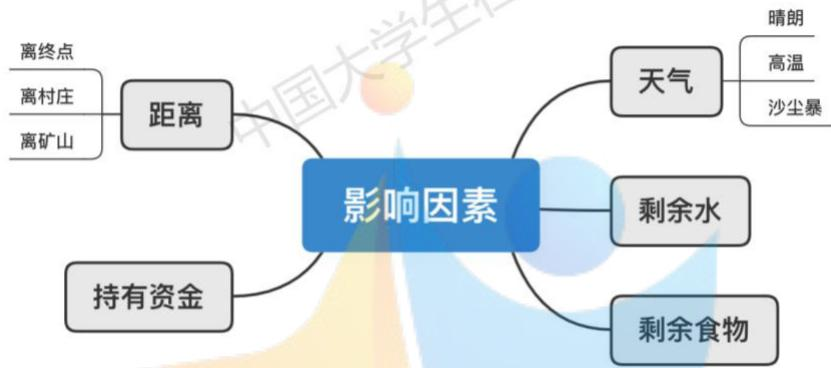

<details>
<summary>flowchart</summary>

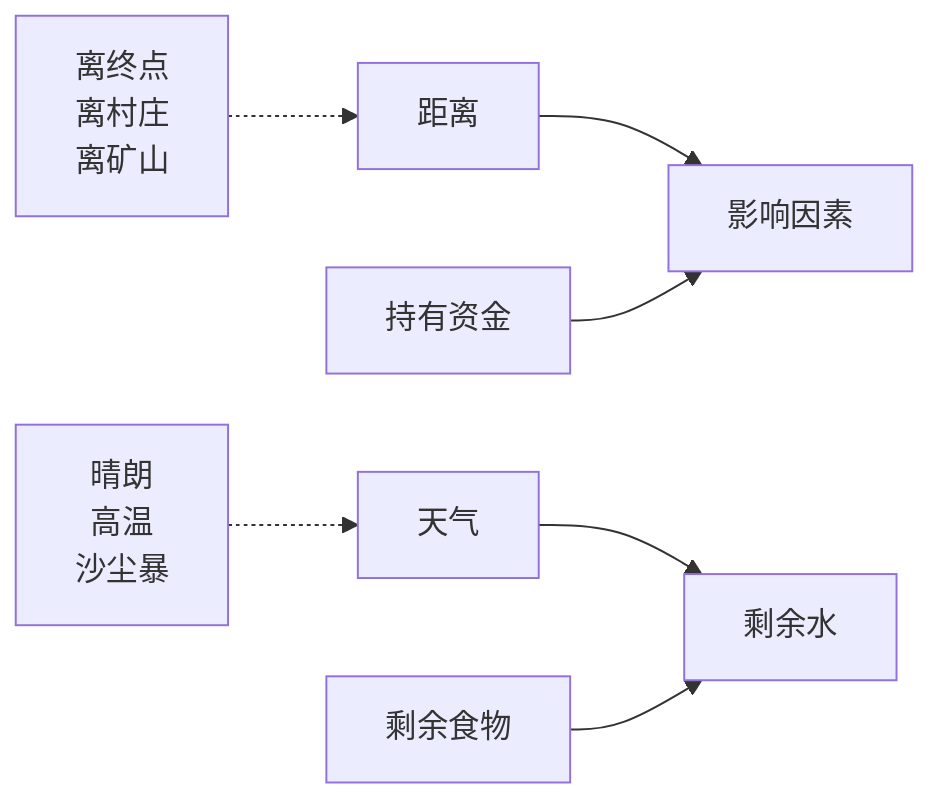
```mermaid
graph LR
  A["距离"] --> B["影响因素"]
  C["持有资金"] --> B
  D["天气"] --> E["剩余水"]
  F["剩余食物"] --> E
  G["离终点\n离村庄\n离矿山"] -.-> A
  H["晴朗\n高温\n沙尘暴"] -.-> D
```
</details>

图 1 影响因素

问题一中玩家的已知条件是规定时间内的天气和地图。关于距离的因素，玩家可以先化简地图，通过 Floyd 算法得出起点、村庄、矿山和终点之间的最短路径从而减少多余的区域。接着可以利用动态规划算法，根据所在点、天数、水和食物的四个因素的影响递推得出在符合规则下到终点时的最大的持有资金。

## 2. 问题 2

第二题相比于第一题，玩家仅知道当天的天气状况，需要根据当天天气状况来决定当天的行动方案。因此我们需要首先判断能否将天气因素用其他影响玩家决策的因素来代替或者去除，即化简、整合合并决策因素。但经过初步分析，天气因素在影响玩家决策的因素中是不可或缺的。玩家需要根据未来天气情况，来做一个全局规划。

因此，我们需要考虑其他方法来解决这个问题。对于现有的相关因素——当天天气，我们可以假设当天天气可影响明天天气，我们可以使用马尔可夫链来对未来天气进行预测。且根据马尔可夫链的概率收敛特性，在给定各天气跳转的概率下，我们可以最终得到一个收敛的天气概率，并基于此实现对未来天气的预测。

获得未来天气可能情况以及其对应概率后，我们根据第一问得到对应的最佳策略情况下的收益，并得到该情况下收益的数学期望。最终收益的数学

## 四、符号说明及名词定义

<table><tr><td>符号</td><td>定义</td></tr><tr><td> $L_{i}^{t' \to t}$ </td><td>第 $t'$ 天到第 $t$ 天且到达点 $i$ 的消耗的水和食物的价值</td></tr><tr><td> $M_{i}^{t' \to t}$ </td><td>第 $t'$ 天到第 $t$ 天且在点 $i$ 的挖矿的收益</td></tr><tr><td> $S_{i}^{t' \to t}$ </td><td>第 $t'$ 天到第 $t$ 天且到达点 $i$ 的净收益</td></tr><tr><td> $G_{max}^{w,f,t,i}$ </td><td>第 $t$ 天在第 $i$ 个点,有 $w$ 箱水和 $f$ 箱食物的最优解</td></tr><tr><td> $P_{ij}$ </td><td>天气 $i$ 转移到天气 $j$ 的概率</td></tr><tr><td> $W_{m}$ </td><td>表示标志为 $m$ 的一个有序天气集合</td></tr><tr><td> $H_{max}^{w,f,t,i}$ </td><td>第 $t$ 天在点 $i$ 且携带 $w$ 箱水和 $f$ 箱食物时的势函数</td></tr><tr><td> $P_{i,j}^{t}$ </td><td>第 $t$ 天,玩家从点 $i$ 到其邻点 $j$ 的转移概率</td></tr><tr><td> $E_{i,j}^{t}$ </td><td>第 $t$ 天,玩家从点 $i$ 到其邻点 $j$ 的净收益的数学期望</td></tr><tr><td> $A_{i}(s)$ </td><td>玩家 $i$ 下一步行动的总收益函数</td></tr></table>

## 五、模型的建立与求解

## 1 问题一

## 1.1 问题一模型的建立

## 1.1.1 最简地图模型的建立

为了简化问题和减少后面利用动态规划求解问题的复杂度，我们可以先将地图转换为点和线的关系，即一个点代表一个区域，而相邻的区域用线连接表示可以到达。

之后我们可以继续简化地图，找出起点、村庄、矿山和终点两两之间的最短路径。求最短路径的问题我们可以先用 Floyd 算法求解。

假设从节点i到节点j的最短距离为 $d_{i,j}$ ，而 $d_{i,j}$ 不外乎两种可能：

1）从节点i直接到节点j；  
2）从节点i经过若干个节点k到节点j。

则我们需要判断:

$$
d _ {i, k} + d _ {k, j} <   d _ {i, j}
$$

其中 $k$ 为图内所有节点。若上式中成立，则证明是上述的第二种可能，那么 $d_{i,j}$ 重置为 $d_{i,k} + d_{k,j}$ ，遍历完所有节点 $k$ 后， $d_{i,j}$ 即为所求最短距离。

求出最短距离后，只将起点、村庄、矿山和终点等目标地留下，线的权重的意义为从地点 $i$ 到地点 $j$ 需要 $t$ 天。

最后将多余的线可以删去，例如若矿山->村庄->终点的距离和矿山->终点的距离相等，则我们可以将矿山->终点的这条线去掉，简化图。

## 1.1.2 基于动态规划的最佳策略模型的建立

在本题中，我们的最终目标是在物资充足的前提下在规定时间内到达终点且资金最大。而这个目标的复杂度太高，可以采用分治的思想，将大问题化解为小问题进求解，即用动态规划求解。

## 1）水和食物的消耗

依据题意我们可以得到在第 $t$ 天玩家水的基础损耗 $D_{1}^{t}$ 为:

$$
D _ {1} ^ {t} = \left\{ \begin{array}{l l} 5 & \text {第} t \text {天为晴天} \\ 8 & \text {第} t \text {天为高温} \\ 1 0 & \text {第} t \text {天为沙尘暴} \end{array} \right. \tag {1}
$$

同理在第t天玩家食物的基础损耗 $D_{2}^{t}$ 为：

$$
D _ {2} ^ {t} = \left\{ \begin{array}{l l} 7 & \text {第} t \text {天为晴天} \\ 6 & \text {第} t \text {天为高温} \\ 1 0 & \text {第} t \text {天为沙尘暴} \end{array} \right. \tag {2}
$$

而考虑到玩家的行为因素，除了需要考虑在矿山的停留时间外，在前往目标地点途中无需停留，因此玩家其实只有三种行为对应三个基础消耗的倍数：在沙尘暴时停留、行走、挖矿。即：

$$
\sigma^ {k} = \left\{ \begin{array}{l l} 1 & k = \text {在沙尘暴时停留} \\ 2 & k = \text {行走} \\ 3 & k = \text {挖矿} \end{array} \right. \tag {3}
$$

接着我们可以推出经过 $t$ 天在第 $i$ 个点，有 $w$ 箱水和 $f$ 箱食物时水的损耗为

$$
w _ {c o s t} ^ {w, f, t, i} = w _ {c o s t} ^ {w ^ {\prime}, f ^ {\prime}, t ^ {\prime}, i} + \Delta w ^ {t ^ {\prime} \rightarrow t} \tag {4}
$$

其中 $\Delta w^{t^{\prime}\rightarrow t}$ 为从第 $t^\prime$ 天到第 $t$ 天水的损耗，满足

$$
\Delta w ^ {t ^ {\prime} \rightarrow t} = \sum_ {k = t ^ {\prime}} ^ {t} D _ {1} ^ {t} \times \sigma^ {k} \tag {5}
$$

同理，可以推出第 $t$ 天在第 $i$ 个点，有 $w$ 箱水和 $f$ 箱食物时食物的损耗为

$$
f _ {c o s t} ^ {w, f, t, i} = f _ {c o s t} ^ {w ^ {\prime}, f ^ {\prime}, t ^ {\prime}, i} + \Delta f ^ {t ^ {\prime} \rightarrow t} \tag {6}
$$

其中 $\Delta f^{t'\rightarrow t}$ 为从第 $t'$ 天到第t天食物的损耗，满足

$$
\Delta f ^ {t ^ {\prime} \rightarrow t} = \sum_ {k = t ^ {\prime}} ^ {t} D _ {2} ^ {t} \times \sigma^ {k} \tag {7}
$$

2）水和食物的损耗价值 $L_{i}^{t'\rightarrow t}$

根据题目所给的信息，在村庄所购的水和食物的价格为在起点的两倍，则我们可以列出在第 $t'$ 天到第t天且到达点i的消耗的水的价值为：

$$
W _ {i} ^ {t ^ {\prime} \rightarrow t} = \left\{\begin{array}{c c}\Delta w ^ {t ^ {\prime} \rightarrow t} \times w _ {p r i c e},&w _ {c o s t} ^ {w ^ {\prime}, f ^ {\prime}, t ^ {\prime}, i} - w _ {0} \leq \Delta w ^ {t ^ {\prime} \rightarrow t}\\\left(2 \Delta w ^ {t ^ {\prime} \rightarrow t} + w _ {0} - w _ {c o s t} ^ {w ^ {\prime}, f ^ {\prime}, t ^ {\prime}, i}\right) \times w _ {p r i c e},&\Delta w ^ {t ^ {\prime} \rightarrow t} <   w _ {c o s t} ^ {w ^ {\prime}, f ^ {\prime}, t ^ {\prime}, i} - w _ {0} <   0\\\Delta w ^ {t ^ {\prime} \rightarrow t} \times 2 \times w _ {p r i c e},&w _ {c o s t} ^ {w ^ {\prime}, f ^ {\prime}, t ^ {\prime}, i} - w _ {0} \geq 0\end{array}\right. \tag {8}
$$

同理可得第 $t'$ 天到第t天且到达点i的消耗的食物的价值：

$$
F _ {i} ^ {t ^ {\prime} \rightarrow t} = \left\{\begin{array}{c c}\Delta f ^ {t ^ {\prime} \rightarrow t} \times f _ {\text {price}},&f _ {\text {cost}} ^ {w ^ {\prime}, f ^ {\prime}, t ^ {\prime}, i} - f _ {0} \leq \Delta f ^ {t ^ {\prime} \rightarrow t}\\\left(2 \Delta f ^ {t ^ {\prime} \rightarrow t} + f _ {0} - f _ {\text {cost}} ^ {w ^ {\prime}, f ^ {\prime}, t ^ {\prime}, i}\right) \times f _ {\text {price}},&\Delta f ^ {t ^ {\prime} \rightarrow t} <   f _ {\text {cost}} ^ {w ^ {\prime}, f ^ {\prime}, t ^ {\prime}, i} - f _ {0} <   0\\\Delta f ^ {t ^ {\prime} \rightarrow t} \times 2 \times w _ {\text {price}},&f _ {\text {cost}} ^ {w ^ {\prime}, f ^ {\prime}, t ^ {\prime}, i} - f _ {0} \geq 0\end{array}\right. \tag {9}
$$

则总消耗价值为:

$$
L _ {i} ^ {t ^ {\prime} \rightarrow t} = W _ {i} ^ {t ^ {\prime} \rightarrow t} + F _ {i} ^ {t ^ {\prime} \rightarrow t} \tag {10}
$$

3）挖矿收益 $M_{i}^{t'\rightarrow t}$

根据题目所得, 每天的挖矿收益为 $m = 3 \times m\_basic$ , 则第 $t'$ 天到第 $t$ 天且在点 $i$ 的挖矿收益为:

$$
M _ {i} ^ {t ^ {\prime} \rightarrow t} = \left\{\begin{array}{l l}0&\text {不挖矿时}\\m \times \left(t - t ^ {\prime} + 1\right)&\text {挖矿时}\end{array}\right. \tag {11}
$$

4）净收益 $S_{i}^{t'\rightarrow t}$

根据题意和上述式子可得， $S_{i}^{t^{\prime}\rightarrow t}$ 由两部分构成，一是水和食物消耗的价值，二是由挖矿所得的资金，即：

$$
S _ {i} ^ {t ^ {\prime} \rightarrow t} = - L _ {i} ^ {t ^ {\prime} \rightarrow t} + M _ {i} ^ {t ^ {\prime} \rightarrow t} \tag {12}
$$

## 5) 资金最优解

我们可以假设第t天在第i个点，有w箱水和f箱食物的最优解为 $G_{max}^{w,f,t,i}$ ，而且满足：

$$
G _ {m a x} ^ {w, f, t, i} = \max \left\{G _ {m a x} ^ {w ^ {\prime}, f ^ {\prime}, t ^ {\prime}, i k} + S _ {i k} ^ {t ^ {\prime} \rightarrow t} \right\} \tag {13}
$$

其中点ik包括点i的所有邻点和其本身, $S_{ik}^{t'\rightarrow t}$ 为从第 $t'$ 天到第t天且到达点ik的净收益。

## 6）约束条件

$$
s. t. \left\{ \begin{array}{c} \Delta w > 0 \\ \Delta f > 0 \\ w _ {-} \text {weight} \times w _ {-} \text {cost} + f _ {-} \text {weight} \times f _ {-} \text {cost} \leq \max _ {-} \text {load} \\ t \leq \text {set\_time} \end{array} \right.
$$

## 1.2 问题一的求解

## 1.2.1 最简地图模型的求解

以下我们以第一关的地图为例化简。

1）将地图变形为点和线的图。

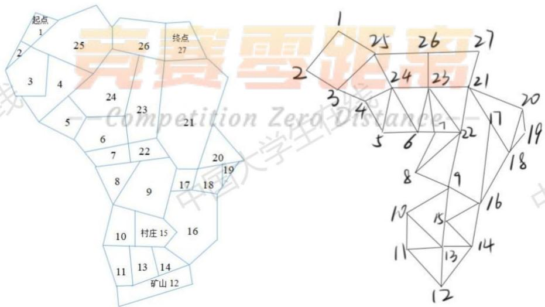  
图 2 第一关地图转化为点图

2）根据Floyd算法求出起点、村庄、矿山和终点两两之间的最短路径，然后摒弃无关点。

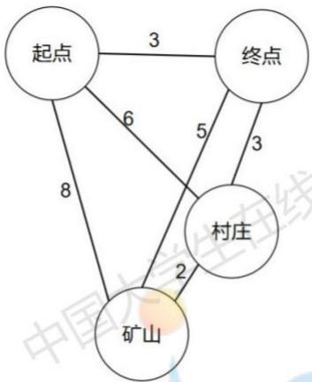

<details>
<summary>flowchart</summary>

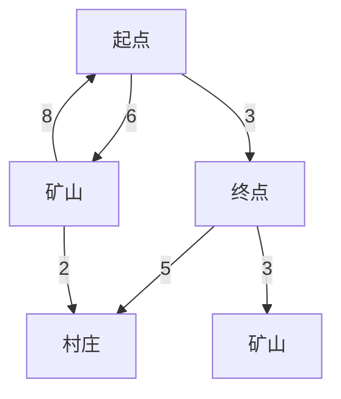
```mermaid
graph TD
  A["起点"] -->|3| B["终点"]
  A -->|6| C["矿山"]
  B -->|5| D["村庄"]
  B -->|3| E["矿山"]
  C -->|8| A
  C -->|2| D
```
</details>

图 3 第一关地图初步化简

3）分析可以去除的多余的线，最后第一关的地图可以化简如下图所示：

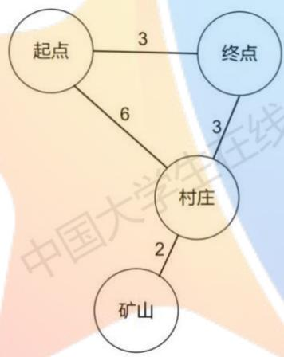

<details>
<summary>flowchart</summary>

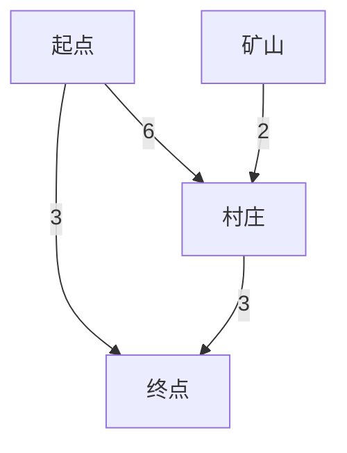
```mermaid
graph TD
  A["起点"] -->|3| B["终点"]
  A -->|6| C["村庄"]
  D["矿山"] -->|2| C
  C -->|3| B
```
</details>

图 4 第一关地图最终化简

同理，我们可以得到第二关地图的化简：

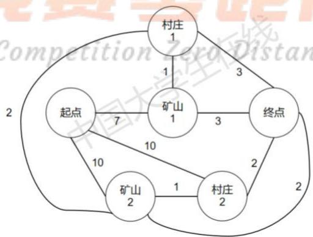

<details>
<summary>flowchart</summary>

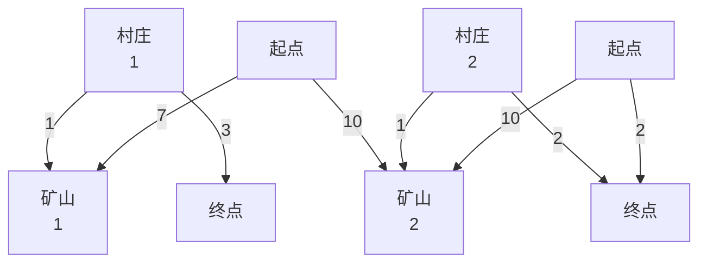
```mermaid
graph TD
  A["村庄\n1"] -->|1| B["矿山\n1"]
  A -->|3| C["终点"]
  D["起点"] -->|7| B
  D -->|10| E["矿山\n2"]
  F["村庄\n2"] -->|1| E
  F -->|2| G["终点"]
  H["起点"] -->|10| E
  H -->|2| G
```
</details>

图 5 第二关地图的最终化简

## 1.2.2 基于动态规划的最佳策略模型的求解

根据上述模型可以对各关进行模拟仿真（代码于附录），得到各关结果如下：

1）第一关路线图如下，得到终点的最大收益为10470元。

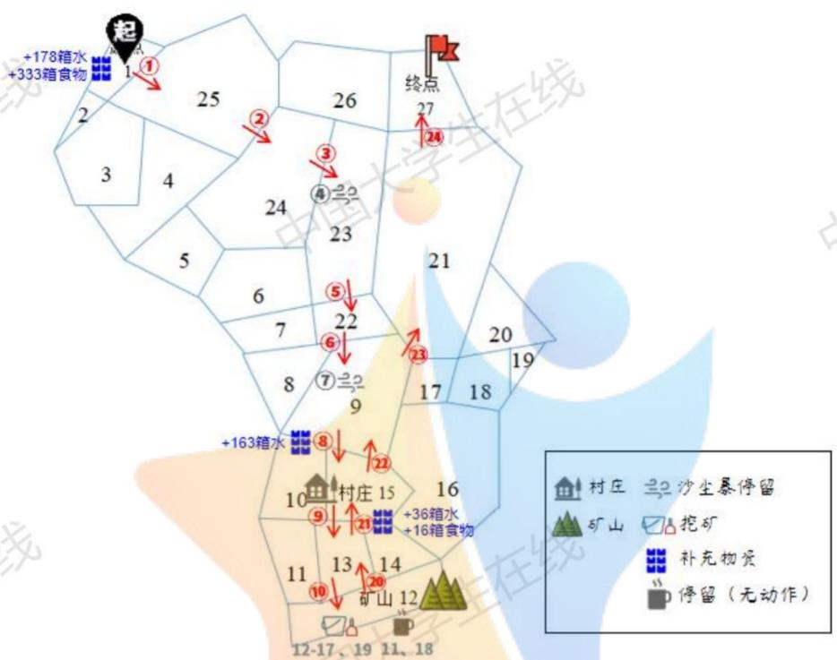

<details>
<summary>text_image</summary>

+178箱水
+333箱食物
起点
25
26
终点
27
24
①
②
③
④
⑤
⑥
⑦
⑧
⑨
⑩
⑪
⑫
⑬
⑭
⑮
⑯
⑰
⑱
⑲
⑳
⑱
⑲
⑳
⑱
⑲
⑳
⑱
⑲
⑳
⑱
⑲
⑳
⑱
⑲
⑳
⑱
⑲
⑳
⑱
⑲
⑳
⑱
⑲
⑳
⑱
⑲
⑳
⑱
⑲
⑳
⑱
⑲
⑳
</details>

图 6 第一关路线图

2）第二关路线图如下所示，到终点的收益为12730元。

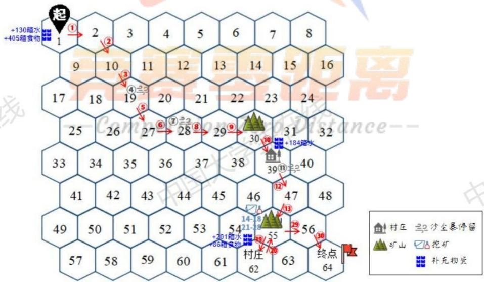

<details>
<summary>flowchart</summary>

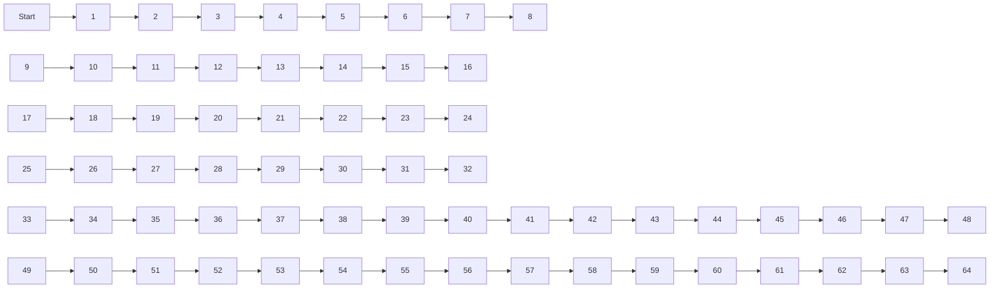
```mermaid
graph LR
  Start["Start"] --> A["1"]
  A --> B["2"]
  B --> C["3"]
  C --> D["4"]
  D --> E["5"]
  E --> F["6"]
  F --> G["7"]
  G --> H["8"]
  I["9"] --> J["10"]
  J --> K["11"]
  K --> L["12"]
  L --> M["13"]
  M --> N["14"]
  N --> O["15"]
  O --> P["16"]
  Q["17"] --> R["18"]
  R --> S["19"]
  S --> T["20"]
  T --> U["21"]
  U --> V["22"]
  V --> W["23"]
  W --> X["24"]
  Y["25"] --> Z["26"]
  Z --> AA["27"]
  AA --> AB["28"]
  AB --> AC["29"]
  AC --> AD["30"]
  AD --> AE["31"]
  AE --> AF["32"]
  AG["33"] --> AH["34"]
  AH --> AI["35"]
  AI --> AJ["36"]
  AJ --> AK["37"]
  AK --> AL["38"]
  AL --> AM["39"]
  AM --> AN["40"]
  AN --> AO["41"]
  AO --> AP["42"]
  AP --> AQ["43"]
  AQ --> AR["44"]
  AR --> AS["45"]
  AS --> AT["46"]
  AT --> AU["47"]
  AU --> AV["48"]
  AW["49"] --> AX["50"]
  AX --> AY["51"]
  AY --> AZ["52"]
  AZ --> BA["53"]
  BA --> BB["54"]
  BB --> BC["55"]
  BC --> BD["56"]
  BD --> BE["57"]
  BE --> BF["58"]
  BF --> BG["59"]
  BG --> BH["60"]
  BH --> BI["61"]
  BI --> BJ["62"]
  BJ --> BK["63"]
  BK --> BL["64"]
```
</details>

图 7 第二关路线图

## 2 问题二

## 2.1 问题二模型的建立

从全局来看，全局的天气因素能够影响玩家的全局策略；单从一天的天气来看，若玩家仅知晓一天的天气，他可以先规划一个大致的行走目标，然后根据每天的天气以及预测未来天气来及时的调整自己的策略。

在一般情况下，未来天气状况不确定，因此我们需要根据当天天气来预测未来天气状况。为了使得模型更好的拟合通用的游戏情况，我们将根据关卡一、关卡二的天气转换来分析各个天气状态相互跳转以及维持原天气的概率。再根据每个关卡不同的天气要求及时调整天气状态转换情况。

已知关卡一、关卡二天气一致，30 天天气状况表格如下：

<table><tr><td>日期</td><td>1</td><td>2</td><td>3</td><td>4</td><td>5</td><td>6</td><td>7</td><td>8</td><td>9</td><td>10</td></tr><tr><td>天气</td><td>高温</td><td>高温</td><td>晴朗</td><td>沙暴</td><td>晴朗</td><td>高温</td><td>沙暴</td><td>晴朗</td><td>高温</td><td>高温</td></tr><tr><td>日期</td><td>11</td><td>12</td><td>13</td><td>14</td><td>15</td><td>16</td><td>17</td><td>18</td><td>19</td><td>20</td></tr><tr><td>天气</td><td>沙暴</td><td>高温</td><td>晴朗</td><td>高温</td><td>高温</td><td>高温</td><td>沙暴</td><td>沙暴</td><td>高温</td><td>高温</td></tr><tr><td>日期</td><td>21</td><td>22</td><td>23</td><td>24</td><td>25</td><td>26</td><td>27</td><td>28</td><td>29</td><td>30</td></tr><tr><td>天气</td><td>晴朗</td><td>晴朗</td><td>高温</td><td>晴朗</td><td>沙暴</td><td>高温</td><td>晴朗</td><td>晴朗</td><td>高温</td><td>高温</td></tr></table>

根据现有条件，我们发现此问题的天气概率预测满足以下几个条件：

1) 可能的天气数是有限的，包含晴朗、高温、沙尘暴。  
2) 从任意状态能够转变到任意状态。  
3) 天气状态的跳转不是一个简单的循环。  
4) 我们可以利用上述天气跳转表格给定各个天气之间的转移概率。

至此，该问题的分析满足马尔可夫链收敛的四大条件。因此，我们选择马尔可夫链模型进行未来天气的预测。

## 2.1.1 马尔可夫链天气预测模型的建立

马尔可夫链可以描述为一个随机跳跃的序列。对于游戏中的天数而言，这个跳转序列仅包含有限个离散的位置或状态的集合，且随机变量 $w_{n}$ ——第n天的天气状态在有限的天气离散集中取值。则有：

$$
w _ {n} \in \{1, 2, 3 \}
$$

其中 1 代表晴朗天气，2 代表高温天气，3 代表沙尘暴天气。

根据关卡一、二 30 天天气状况表格，通过计算，我们可以得到各个天气之间在 30 天内的跳转次数如下：高温到高温有 6 次、高温到晴朗有 2 次、高温到沙尘暴有 3 次、晴朗到晴朗有 2 次、晴朗到高温有 4 次、晴朗到沙尘暴有 2 次、沙尘暴到沙尘暴有 1 次、沙尘暴到高温有 3 次、沙尘暴到晴朗有 2 次。则可以得出天气状态转移概率如下：

$$
P _ {i j} = \left[ \begin{array}{c c c} P _ {1 1} & P _ {1 2} & P _ {1 3} \\ P _ {2 1} & P _ {2 2} & P _ {2 3} \\ P _ {3 1} & P _ {3 2} & P _ {3 3} \end{array} \right] = \left[ \begin{array}{c c c} \frac {1}{4} & \frac {1}{2} & \frac {1}{4} \\ \frac {5}{1 4} & \frac {3}{7} & \frac {3}{1 4} \\ \frac {1}{3} & \frac {1}{2} & \frac {1}{6} \end{array} \right]
$$

对应的转换图为:

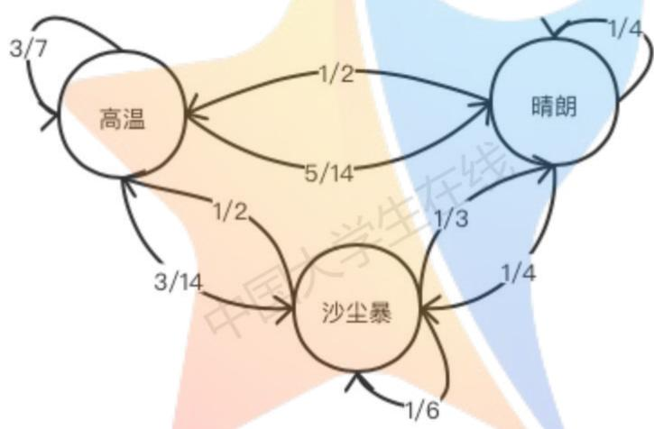

<details>
<summary>flowchart</summary>

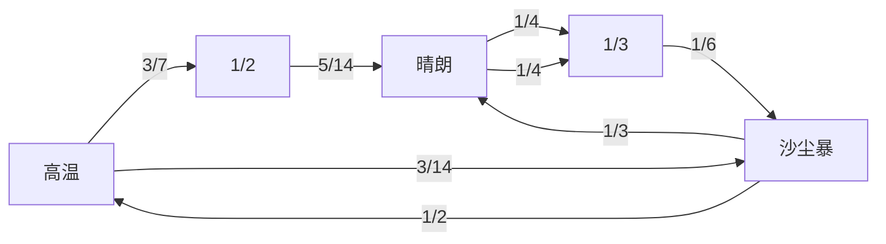
```mermaid
graph LR
  A["高温"] -->|3/7| B["1/2"]
  A -->|3/14| C["沙尘暴"]
  B -->|5/14| D["晴朗"]
  D -->|1/4| E["1/3"]
  E -->|1/6| C
  C -->|1/2| A
  C -->|1/3| D
  D -->|1/4| E
```
</details>

图 8 天气跳转问题的状态转移图

对于计算 $w_{n+1}=j$ 的概率 $P_{r}\{w_{n+1}=j\}$ ，满足：

$$
P _ {r} \{w _ {n + 1} = j \} = \sum_ {i} P _ {i j} P _ {r} \{w _ {n} = i \} \tag {14}
$$

在第 $n+1$ 天到达天气状态j的途径只能是在第n天到达天气状态i，然后从i跳转到j，因此，令 $\pi_{n}(i)=P_{i}\{w_{n}=j\}$ ，我们可以将式14表达为：

$$
\pi_ {n + 1} (j) = \sum_ {i} P _ {i j} \pi_ {n} (i) \tag {15}
$$

即为:

$$
\pi_ {n + 1} = P \pi_ {n}
$$

根据马尔可夫链收敛规则，我们可以设置任意合理的初始情况，迭代运行式15，都可以得到一个收敛的值，该值即为各个天气状况的概率。

至此，我们利用马尔可夫链求解出了各个天气状态的出现概率。在游戏中，玩家已知当天情况，但不知道未来天气状况。利用上述马尔可夫链模型所得结论，我们可以通过当天天气情况来预测直到游戏结束的未来的天气。不同的预测结果都对应着一个确切的概率。玩家可以根据预测概率情况结合问题一：已知全局天气情况下的决策选择模型来动态的选择自己的决策。

这种决策方法要求玩家能够根据实际情况“随机应变”，而不是固守游戏一开始时定下的策略。给定“历史”，玩家每一个行动选择开始至游戏结束都构成了一个博弈。我们将游戏的“初始状态”设定跟随玩家的选择而变化，即每一次决策后都进入一个新的将前一状态作为当前博弈初始状态的决策。

## 2.1.2 决策收益模型的建立

根据问题一所得的模型，我们可以将不同天气状态下获得的决策收益C表示为一个决策选择集如下：

$$
\{C _ {W _ {1}}, C _ {W _ {2}}, C _ {W _ {3}}, \dots , C _ {W _ {m}} \}
$$

其中 $W_{m}$ 表示标志为 $m$ 的一个有序天气集合， $C_{W_m}$ 表示在 $W_{m}$ 天气集情况下的最优决策所获得的收益。

对于 $W_{m}$ 而言，我们将其存在的概率表示为 $P_{W_m}$ ，则最佳决策的数学期望 $E_{max}$ 满足：

$$
E _ {m a x} = m a x \{P _ {W _ {1}} C _ {W _ {1}}, P _ {W _ {2}} C _ {W _ {2}}, \dots , P _ {W _ {m}} C _ {W _ {m}} \} \tag {16}
$$

## 2.2 利用问题二模型的具体求解

根据我们的模型可画出求解流程图如下:

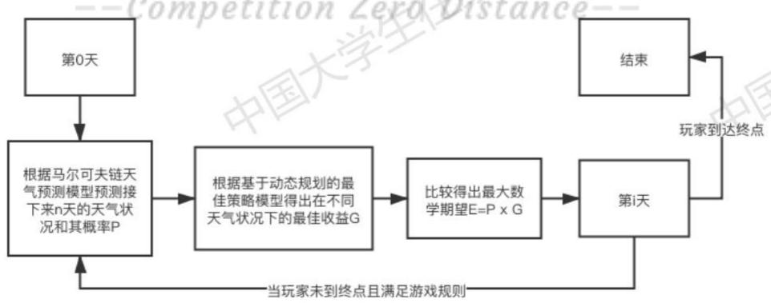

<details>
<summary>flowchart</summary>

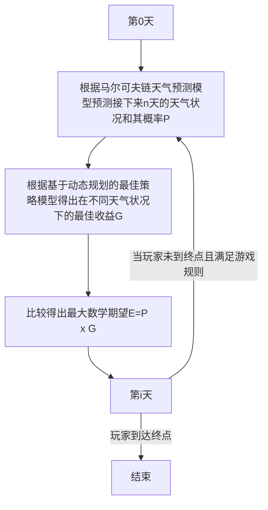
```mermaid
graph TD
  A["第0天"] --> B["根据马尔可夫链天气预测模型预测接下来n天的天气状况和其概率P"]
  B --> C["根据基于动态规划的最佳策略模型得出在不同天气状况下的最佳收益G"]
  C --> D["比较得出最大数学期望E=P x G"]
  D --> E["第i天"]
  E -->|"玩家到达终点"| F["结束"]
  E -->|"当玩家未到终点且满足游戏规则"| B
```
</details>

图 9 问题二求解流程图

## 2.2.1 关卡三求解

根据马尔可夫链收敛规则，我们可以设置任意合理的初始情况，迭代运行式15，都可以得到一个收敛的值，该值即为各个天气状况的概率在这里我们设置初始情况为 $\pi_1 = (0.5, 0.4, 0.1)$ ，迭代计算10次结果如下：

表 1 各天气概率收敛过程

<table><tr><td>迭代次数</td><td>晴朗</td><td>高温</td><td>沙尘暴</td></tr><tr><td>1</td><td>0.301190</td><td>0.471429</td><td>0.227381</td></tr><tr><td>2</td><td>0.319459</td><td>0.466327</td><td>0.214215</td></tr><tr><td>3</td><td>0.317815</td><td>0.466691</td><td>0.215494</td></tr><tr><td>4</td><td>0.317960</td><td>0.466665</td><td>0.215375</td></tr><tr><td>5</td><td>0.317948</td><td>0.466667</td><td>0.215386</td></tr><tr><td>6</td><td>0.317949</td><td>0.466667</td><td>0.215385</td></tr><tr><td>7</td><td>0.317949</td><td>0.466667</td><td>0.215385</td></tr><tr><td>8</td><td>0.317949</td><td>0.466667</td><td>0.215385</td></tr><tr><td>9</td><td>0.317949</td><td>0.466667</td><td>0.215385</td></tr><tr><td>10</td><td>0.317949</td><td>0.466667</td><td>0.215385</td></tr></table>

根据关卡三的天气要求: 玩家仅知道当天的天气状况, 但已知 10 天内不会出现沙暴天气。根据上述分析所得图 8 各天气状态跳转图, 我们由关卡天气条件删去天气状态为沙尘暴的天气:

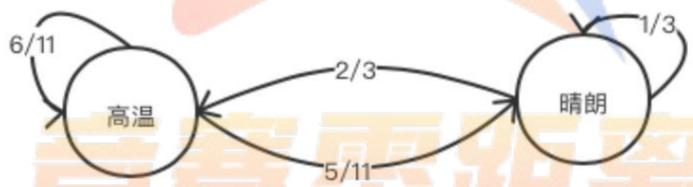

<details>
<summary>flowchart</summary>

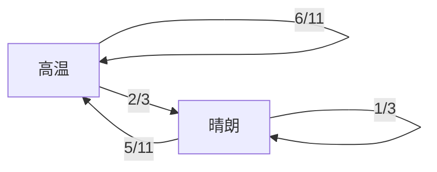
```mermaid
graph LR
  A["高温"] -->|"6/11"| A
  A -->|"2/3"| B["晴朗"]
  B -->|"5/11"| A
  B -->|"1/3"| B
```
</details>

图 10 关卡三的天气跳转问题的状态转移图

接下来我们可以根据 Floyd 算法将关卡三的地图化简为以下形式:

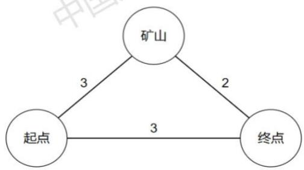

<details>
<summary>flowchart</summary>

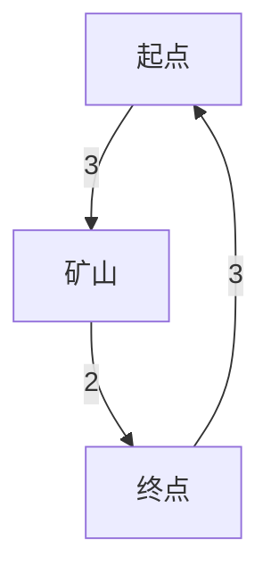
```mermaid
graph TD
  A["起点"] -->|"3"| B["矿山"]
  B -->|"2"| C["终点"]
  C -->|"3"| A
```
</details>

图 11 关卡三抽象地图

其次，根据图9的问题分析流程图，我们需要先获得各个天气情况下对应的最佳策略。通过以上天气跳转概率，我们列举了所有符合以上天气跳转概率的10天天气状况。运用模型一将关卡三的基础收益、基础消耗量、游戏天数等具体设定转化成对应数值带入到约束方程中。运行并分析得到的各个天气状态下的最优策略结果。

我们发现获得的最优决策路线大致分为以下两条：

①起点 $\xrightarrow{3}$ 终点

②起点 $\xrightarrow{3}$ 矿山 $\xrightarrow{2}$ 终点

其中, 路线②对应的天气情况较为特殊, 为后七天均为晴朗的天气条件。其余天气状况下分析所得的最右路线均为路线①。部分运行结果整理后列举如下:

表 2 运行结果

<table><tr><td>天气集\日期</td><td>1</td><td>2</td><td>3</td><td>4</td><td>5</td><td>6</td><td>7</td><td>8</td><td>9</td><td>10</td><td>路线选择</td></tr><tr><td>W1</td><td>高温</td><td>高温</td><td>高温</td><td>晴朗</td><td>高温</td><td>晴朗</td><td>高温</td><td>晴朗</td><td>晴朗</td><td>高温</td><td>1</td></tr><tr><td>W2</td><td>高温</td><td>晴朗</td><td>晴朗</td><td>晴朗</td><td>高温</td><td>晴朗</td><td>高温</td><td>晴朗</td><td>晴朗</td><td>高温</td><td>1</td></tr><tr><td>W3</td><td>高温</td><td>晴朗</td><td>高温</td><td>晴朗</td><td>高温</td><td>晴朗</td><td>高温</td><td>高温</td><td>晴朗</td><td>高温</td><td>1</td></tr><tr><td>W4</td><td>晴朗</td><td>高温</td><td>高温</td><td>晴朗</td><td>高温</td><td>晴朗</td><td>晴朗</td><td>晴朗</td><td>高温</td><td>晴朗</td><td>1</td></tr><tr><td>W5</td><td>高温</td><td>高温</td><td>高温</td><td>晴朗</td><td>晴朗</td><td>高温</td><td>高温</td><td>高温</td><td>晴朗</td><td>高温</td><td>1</td></tr><tr><td>W6</td><td>高温</td><td>高温</td><td>高温</td><td>高温</td><td>高温</td><td>晴朗</td><td>高温</td><td>晴朗</td><td>高温</td><td>高温</td><td>1</td></tr><tr><td>W7</td><td>晴朗</td><td>高温</td><td>高温</td><td>晴朗</td><td>晴朗</td><td>晴朗</td><td>晴朗</td><td>晴朗</td><td>晴朗</td><td>高温</td><td>1</td></tr><tr><td>W8</td><td>高温</td><td>晴朗</td><td>高温</td><td>晴朗</td><td>晴朗</td><td>晴朗</td><td>晴朗</td><td>晴朗</td><td>晴朗</td><td>晴朗</td><td>2</td></tr><tr><td>W9</td><td>高温</td><td>高温</td><td>高温</td><td>晴朗</td><td>晴朗</td><td>晴朗</td><td>晴朗</td><td>晴朗</td><td>晴朗</td><td>晴朗</td><td>2</td></tr><tr><td>...</td><td>...</td><td>...</td><td>...</td><td>...</td><td>...</td><td>...</td><td>...</td><td>...</td><td>...</td><td>...</td><td>...</td></tr></table>

为验证根据模型一给定天气得到的决策结果的合理性，我们将结合关卡三进行具体分析。

对于路线②而言，路程消耗为5天，则玩家最多在矿山挖5天。由于这种路线选择相较路线一复杂，我们先分析路线②的收益状况。由关卡设置条件易得，玩家仅在晴朗天气下挖矿一次才有35元的净收益，高温天气下挖矿收益为负，因此玩家在高温下肯定选择不挖矿。

若玩家挖矿挖满 5 天，我们设路线②净收益为 $E_{2}$ ，则有：

$$
E _ {2} = 3 5 d + E _ {1} - 1 3 5 \times (5 - d) - b \tag {17}
$$

其中： $d$ 指挖矿五天中天气为晴朗的天数， $b$ 表示最后两天回终点的消耗，

$E_{1}$ 为路线①的净收益（路线①无挖矿，净收益为负），同路线②前三天消耗。

若路线②比路线①更优，则有：

$$
E _ {2} > E _ {1}
$$

即：

$$
3 5 d - 1 3 5 (5 - d) - b > 0
$$

将b取最小值 110 元——两天都在晴朗的天气下赶路，则要使路线②有收益，最好情况下d取值应大于 4.617。

由于 $d \leq 5$ 故要使路线②收益大于路线①，则在最好情况下需要挖矿5天都为晴朗，即10天中的后7天都要为晴朗。与模型一分析结果相同。

下面我们将模拟玩家在关卡三起点时, 用上述模型进行的决策分析过程。根据图 10, 关卡三的天气跳转的状态转移图, 我们可以计算出连续 7 天晴朗的概率为: 0.001, 则两个决策的收益期望为:

$$
\left\{P _ {1} C _ {1}, P _ {2} C _ {2} \right\} = \left\{E _ {1}, E _ {1} + (0. 0 1 \times 6 5 + 0. 9 9 \times \partial) \right\} \tag {18}
$$

其中 $\partial\leq-105$ ，表示次好情况，即五天中仅一天为高温时后七天的收益。

易得线路①的收益期望大于收益二线路期望，玩家选择线路①更佳。

根据图 10 中两种天气状态的跳转概率，我们可以给出符合此跳转规律的可能的 10 天游戏天气状态表格。我们将其中一种情况列举如下：

<table><tr><td>日期</td><td>1</td><td>2</td><td>3</td><td>4</td><td>5</td><td>6</td><td>7</td><td>8</td><td>9</td><td>10</td></tr><tr><td>天气</td><td>高温</td><td>晴朗</td><td>晴朗</td><td>高温</td><td>高温</td><td>高温</td><td>晴朗</td><td>高温</td><td>高温</td><td>晴朗</td></tr></table>

为了细化分析，我们使用以上天气状态表格作为关卡三这 10 天真实的天气情况，并选择路线一作为玩家初始策略。后面玩家再重复上述过程迭代分析出每一步的策略即可。

关卡三过程模拟结果如下:

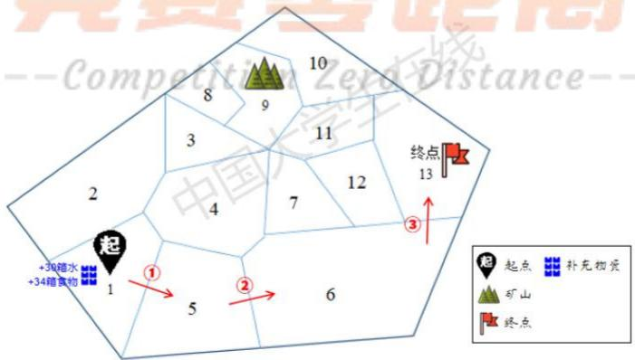

<details>
<summary>text_image</summary>

+36随水
+34箱食物
起点
补充物质
矿山
终点
10
8
9
3
11
2
4
7
12
起点
终点
①
②
③
⑤
⑥
⑦
⑧
⑨
⑩
⑪
⑫
⑬
⑭
⑮
⑯
⑰
⑱
⑲
⑳
⑳
</details>

图 12 第三关路线图

根据模拟结果，由于总水量和食物量消耗为 $158kg < 1200kg$ ，故玩家可

以在起点购买好 30 箱水以及 34 箱食物，后直达终点即可。

## 2.2.2 关卡四求解

与关卡三分析步骤相似，首先我们查看关卡四天气条件：玩家仅知道当天的天气状况，但已知30天内较少出现沙暴天气。因此，根据图8天气跳转问题的状态转移图，我们适当减少各个天气到沙暴天气的跳转概率。减少后的状态跳转图如下：

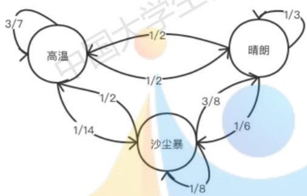

<details>
<summary>flowchart</summary>

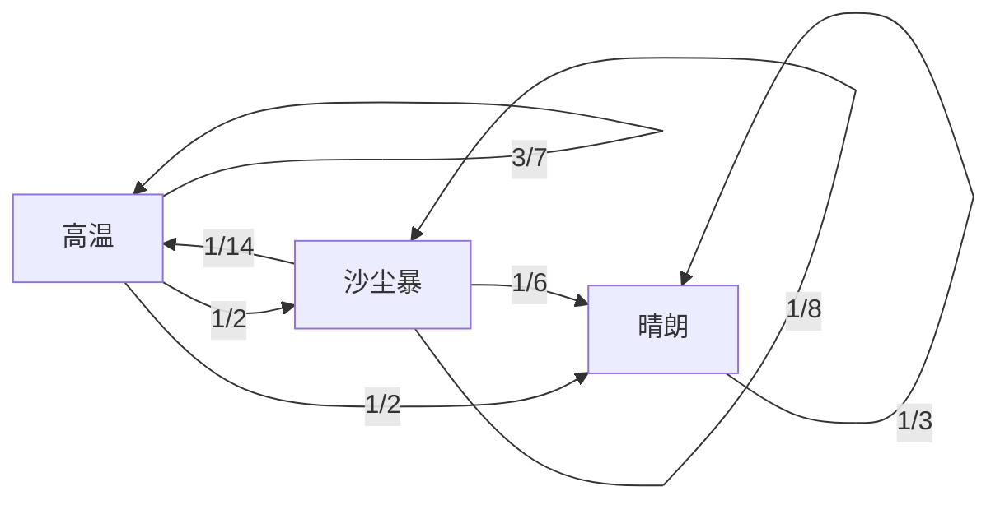
```mermaid
graph LR
  A["高温"] -->|"3/7"| A
  A -->|"1/2"| B["晴朗"]
  B -->|"1/3"| B
  A -->|"1/2"| C["沙尘暴"]
  C -->|"1/8"| C
  C -->|"1/6"| B
  C -->|"1/14"| A
```
</details>

图 13 关卡四的天气跳转图

设置初始值，利用式 15，我们求得，最终收敛后的各个天气概率表示如下，可以发现，当前沙暴天气出现概率较小，达到了 30 天内较少出现沙暴天气的模拟条件：

$$
\pi = (0. 4 1 6 0, 0. 4 6 6 7, 0. 1 1 7 3)
$$

接下来，我们再根据问题一中的方法简化关卡四地图如下：

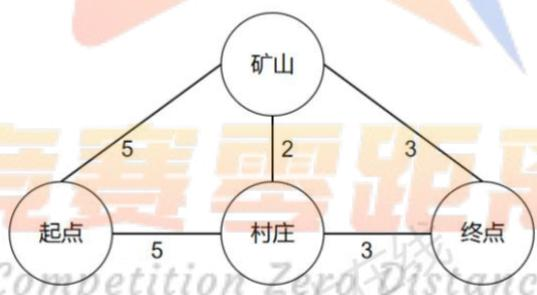

<details>
<summary>flowchart</summary>

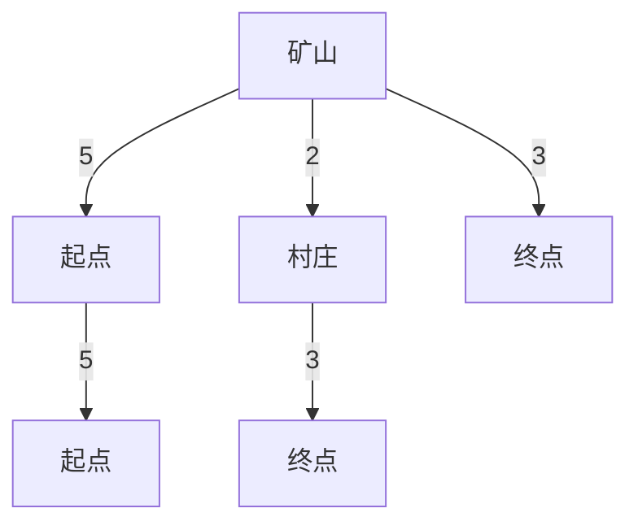
```mermaid
graph TD
  A["矿山"] -->|5| B["起点"]
  A -->|2| C["村庄"]
  A -->|3| D["终点"]
  B -->|5| E["起点"]
  C -->|3| F["终点"]
```
</details>

图 14 关卡四化简路线

我们假设未来天气有m种情况，其概率表示集合为：

$$
\{P _ {W _ {1}}, P _ {W _ {2}}, \dots , P _ {W _ {m}} \}
$$

每种天气我们都可以利用模型一求解得到对应的一种最佳选择策略。计算各个决策的收益，根据式16，得出最大收益期望。最终在每一点我们选择收益期望最大的决策即可。

运行算法我们可以得到，在初始情况下（即玩家位于起点，且仅知道当

天的天气）在所有路线中期望最大的一条路线为：

起点 $\xrightarrow{5}$ 村庄 $\xrightarrow{2}$ 矿山 $\xrightarrow{2}$ 村庄 $\xrightarrow{2}$ 矿山 $\xrightarrow{3}$ 终点

则此时，玩家在起点将按照这个策略进行第一天的操作。接下来重复以上分析步骤，进行分析判断，直至玩家走完全程。

根据图 16 关卡四的天气跳转图，为了细化问题分析，我们假设 30 天的天气状况如下：

<table><tr><td>日期</td><td>1</td><td>2</td><td>3</td><td>4</td><td>5</td><td>6</td><td>7</td><td>8</td><td>9</td><td>10</td></tr><tr><td>天气</td><td>高温</td><td>高温</td><td>晴朗</td><td>高温</td><td>晴朗</td><td>高温</td><td>沙暴</td><td>晴朗</td><td>高温</td><td>高温</td></tr><tr><td>日期</td><td>11</td><td>12</td><td>13</td><td>14</td><td>15</td><td>16</td><td>17</td><td>18</td><td>19</td><td>20</td></tr><tr><td>天气</td><td>晴朗</td><td>高温</td><td>晴朗</td><td>高温</td><td>高温</td><td>沙暴</td><td>高温</td><td>晴朗</td><td>高温</td><td>高温</td></tr><tr><td>日期</td><td>21</td><td>22</td><td>23</td><td>24</td><td>25</td><td>26</td><td>27</td><td>28</td><td>29</td><td>30</td></tr><tr><td>天气</td><td>晴朗</td><td>晴朗</td><td>高温</td><td>晴朗</td><td>沙暴</td><td>高温</td><td>晴朗</td><td>晴朗</td><td>高温</td><td>高温</td></tr></table>

玩家在起点采用上述路线的策略，并在到达新的一天后迭代更新下一步策略。最终，在上述假设的真实天气情况下，玩家关卡四游戏过程如下：

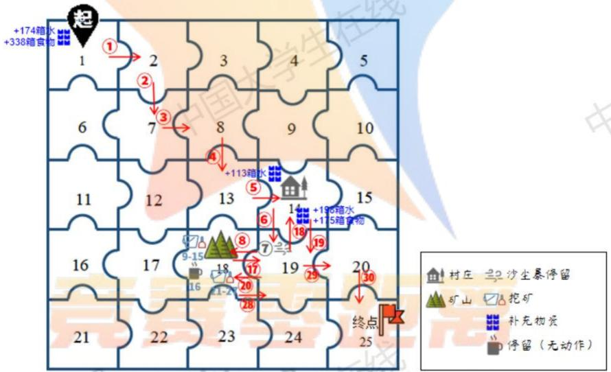

<details>
<summary>flowchart</summary>

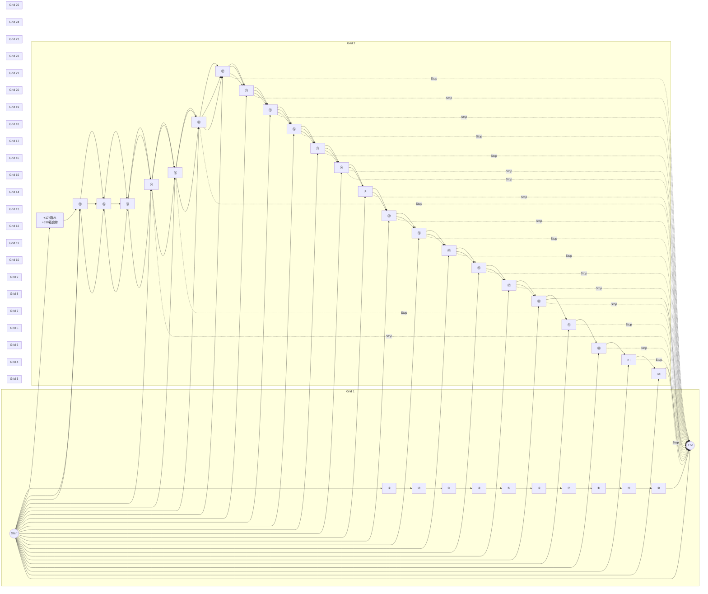
```mermaid
graph LR
  subgraph Grid1 [Grid 1]
    direction TB
  Start((Start)) --> Step1["①"]
  Step1 --> Step2["②"]
  Step2 --> Step3["③"]
  Step3 --> Step4["④"]
  Step4 --> Step5["⑤"]
  Step5 --> Step6["⑥"]
  Step6 --> Step7["⑦"]
  Step7 --> Step8["⑧"]
  Step8 --> Step9["⑨"]
  Step9 --> Step10["⑩"]
  Step10 --> End((End))
  end

  subgraph Grid2 [Grid 2]
    direction TB
  Start --> Move1["+174箱水\n+338箱食物"]
  Move1 --> Move2["⑪"]
  Move2 --> Move3["⑫"]
  Move3 --> Move4["⑬"]
  Move4 --> Move5["⑭"]
  Move5 --> Move6["⑮"]
  Move6 --> Move7["⑯"]
  Move7 --> Move8["⑰"]
  Move8 --> Move9["⑮"]
  Move9 --> Move10["⑪"]
  Move10 --> Move11["⑫"]
  Move11 --> Move12["⑬"]
  Move12 --> Move13["⑭"]
  Move13 --> Move14["⑵"]
  Move14 --> Move15["⑳"]
  Move15 --> Move16["⑱"]
  Move16 --> Move17["⑲"]
  Move17 --> Move18["⑬"]
  Move18 --> Move19["⑮"]
  Move19 --> Move20["⑱"]
  Move20 --> Move21["⑲"]
  Move21 --> Move22["⑳"]
  Move22 --> Move23["⑴"]
  Move23 --> Move24["⑵"]
  Move24 --> End((End))
  end

  subgraph Grid3 [Grid 3]
    direction TB
  Start --> Move2
  Move2 --> Move3
  Move3 --> Move4
  Move4 --> Move5
  Move5 --> Move6
  Move6 --> Move7
  Move7 --> Move8
  Move8 --> Move9
  Move9 --> Move10
  Move10 --> Move11
  Move11 --> Move12
  Move12 --> Move13
  Move13 --> Move14
  Move14 --> Move15
  Move15 --> Move16
  Move16 --> Move17
  Move17 --> Move18
  Move18 --> Move19
  Move19 --> Move20
  Move20 --> End((End))
  end

  subgraph Grid4 [Grid 4]
    direction TB
  Start --> Move2
  Move2 --> Move3
  Move3 --> Move4
  Move4 --> Move5
  Move5 --> Move6
  Move6 --> Move7
  Move7 --> Move8
  Move8 --> Move9
  Move9 --> Move10
  Move10 --> Move11
  Move11 --> Move12
  Move12 --> Move13
    Move13 -.->|Stop | End((End))
  end

  subgraph Grid5 [Grid 5]
    direction TB
  Start --> Move5
    Move5 -.->|Stop | End((End))
  end

  subgraph Grid6 [Grid 6]
    direction TB
  Start --> Move6
    Move6 -.->|Stop | End((End))
  end

  subgraph Grid7 [Grid 7]
    direction TB
  Start --> Move7
    Move7 -.->|Stop | End((End))
  end

  subgraph Grid8 [Grid 8]
    direction TB
  Start --> Move8
    Move8 -.->|Stop | End((End))
  end

  subgraph Grid9 [Grid 9]
    direction TB
  Start --> Move9
    Move9 -.->|Stop | End((End))
  end

  subgraph Grid10 [Grid 10]
    direction TB
  Start --> Move10
    Move10 -.->|Stop | End((End))
  end

  subgraph Grid11 [Grid 11]
    direction TB
  Start --> Move11
    Move11 -.->|Stop | End((End))
  end

  subgraph Grid12 [Grid 12]
    direction TB
  Start --> Move12
    Move12 -.->|Stop | End((End))
  end

  subgraph Grid13 [Grid 13]
    direction TB
  Start --> Move13
    Move13 -.->|Stop | End((End))
  end

  subgraph Grid14 [Grid 14]
    direction TB
  Start --> Move14
    Move14 -.->|Stop | End((End))
  end

  subgraph Grid15 [Grid 15]
    direction TB
  Start --> Move15
    Move15 -.->|Stop | End((End))
  end

  subgraph Grid16 [Grid 16]
    direction TB
  Start --> Move16
    Move16 -.->|Stop | End((End))
  end

  subgraph Grid17 [Grid 17]
    direction TB
  Start --> Move17
    Move17 -.->|Stop | End((End))
  end

  subgraph Grid18 [Grid 18]
    direction TB
  Start --> Move18
    Move18 -.->|Stop | End((End))
  end

  subgraph Grid19 [Grid 19]
    direction TB
  Start --> Move19
    Move19 -.->|Stop | End((End))
  end

  subgraph Grid20 [Grid 20]
    direction TB
  Start --> Move20
    Move20 -.->|Stop | End((End))
  end

  subgraph Grid21 [Grid 21]
    direction TB
  Start --> Move21
    Move21 -.->|Stop | End((End))
  end

  subgraph Grid22 [Grid 22]
    direction TB
  Start --> Move22
    Move22 -.->|Stop | End((End))
  end

  subgraph Grid23 [Grid 23]
    direction TB
  Start --> Move23
    Move23 -.->|Stop | End((End))
  end

  subgraph Grid24 [Grid 24]
    direction TB
  Start --> Move24
    Move24 -.->|Stop | End((End))
  end

  subgraph Grid25 [Grid 25]
    direction TB
  Start --> End((End))
  end
```
</details>

图 15 关卡四路线图

由模拟结果可得最终可以获得的收益为 13140 元。

## 3 问题三

## 3.1 问题三模型的建立

## 3.1.1 基于人工势能场最佳策略模型的建立

和第一第二问不同的是，第三问的游戏属于多人游戏，且玩家之间会产生影响。在第一小问中我们可以以玩家到达每一个节的平均收益来代替问题1中的实际收益G，将点和点转移的最大收益定为势函数，就可以得到点和点之间的转移概率，然后得到点和点转移的数学期望，最后就可以再次利用问题1的方法求解出最佳策略，该最佳策略指代的是玩家选择路线的最大数学期望。

我们需要求解出任意一点i在t时刻到它的相邻节点j的转移概率，从而计算出在第t天从i到j的概率（已知在第t天，节点i到节点i的概率为1）我们利用不同时间t时，节点i到达终点的最大收益，作为该点的势函数。并根据相邻节点的势函数，确定对于处于i点的玩家到达相邻节点j的转移概率。

此后，计算求解出第t天下，玩家从i走到j的概率，据此根据概率计算出t时刻有n位玩家从i到达j的概率，求解出数学期望，进而通过最大的平均期望筛选出最佳的策略。

我们可以先定义第t天在点i且携带w箱水和f箱食物时的势函数为 $H_{max}^{w,f,t,i}$ ，且满足：

$$
H _ {m a x} ^ {w, f, t, i} = G _ {m a x} ^ {w, f, t, i} \tag {19}
$$

其中 $G_{max}^{w,f,t,i}$ 为问题一所求该状态下到达终点的最大收益。

于是我们可以得到在第t天，从点i到其邻点j的转移概率 $P_{i,j}^{t}$ 为：

$$
P _ {i, j} ^ {t} = \frac {H _ {\max} ^ {w ^ {\prime} , f ^ {\prime} , t , j}}{\sum_ {q = 1} ^ {n} H _ {\max} ^ {w ^ {\prime} , u ^ {\prime} , t , j}} \tag {20}
$$

接着可以将式 20 写成如下:

$$
P _ {i, j} ^ {t} = \sum_ {k = 1} ^ {n} P _ {k, i} ^ {t - 1} \times P _ {i, j} ^ {t - 1} \tag {21}
$$

其中点 $k$ 为点 $i$ 的某个邻点, $n$ 为点 $i$ 邻点的个数。

根据问题一所建立的模型和数学期望的公式可以得到第t天，玩家从点i到其邻点j的水和食物损耗的数学期望 $E_{i,j}^{t}(L)$ 为：

$$
E _ {i, j} ^ {t} (L) = L _ {i, j} ^ {t} \left[ C _ {n} ^ {n} \big (P _ {i, j} ^ {t} \big) ^ {n} n + C _ {n} ^ {n - 1} \big (P _ {i, j} ^ {t} \big) ^ {n - 1} \big (1 - P _ {i, j} ^ {t} \big) ^ {1} (n - 1) + \dots + C _ {n} ^ {1} \big (P _ {i, j} ^ {t} \big) ^ {n} \big (1 - P _ {i, j} ^ {t} \big) ^ {n - 1} + \big (1 - P _ {i, j} ^ {t} \big) ^ {n} \right] (2 2)
$$

其中 $i \neq j$

同时，可以求出第t天，玩家从点i（点i为矿山所在处）的挖矿所得资金的数学期望 $E_{i,j}^{t}(M)$ 为：

$$
E _ {i, j} ^ {t} (M) = L _ {i, j} ^ {t} \left[ C _ {n} ^ {n} \big (P _ {i, j} ^ {t} \big) ^ {n} \frac {1}{n} + C _ {n} ^ {n - 1} \big (P _ {i, j} ^ {t} \big) ^ {n - 1} \big (1 - P _ {i, j} ^ {t} \big) ^ {1} \frac {1}{(n - 1)} + \dots + C _ {n} ^ {1} \big (P _ {i, j} ^ {t} \big) ^ {n} \times \big (1 - P _ {i, j} ^ {t} \big) ^ {n - 1} + \big (1 - P _ {i, j} ^ {t} \big) ^ {n} \right] (2 3)
$$

其中 $i = j =$ 矿山所在点

根据题意，也可得每次去村庄购买的金额的数学期望 $E_{i,j}^{t}(V)$ 为：

$$
E _ {i, j} ^ {t} (V) = V \left[ 4 \left(1 - C _ {n} ^ {1} \times \left(P _ {i, j} ^ {t}\right) ^ {n} \times \left(1 - P _ {i, j} ^ {t}\right) ^ {n - 1} - \left(1 - P _ {i, j} ^ {t}\right) ^ {n}\right) + C _ {n} ^ {1} \times \left(P _ {i, j} ^ {t}\right) ^ {n} \times \left(1 - P _ {i, j} ^ {t}\right) ^ {n - 1} + \left(1 - P _ {i, j} ^ {t}\right) ^ {n} \right]
$$

化简得

$$
E _ {i, j} ^ {t} (V) = V \left[ 4 - 3 \left(C _ {n} ^ {1} \times \left(P _ {i, j} ^ {t}\right) ^ {n} \times \left(1 - P _ {i, j} ^ {t}\right) ^ {n - 1} + \left(1 - P _ {i, j} ^ {t}\right) ^ {n}\right) \right] \tag {24}
$$

其中 $j =$ 村庄所在点

最后，第t天，玩家从点i到其邻点j的净收益 $E_{i,j}^{t}$ 的数学期望为：

$$
E _ {i, j} ^ {t} = E _ {i, j} ^ {t} (M) - E _ {i, j} ^ {t} (L) - E _ {i, j} ^ {t} (V) \tag {25}
$$

## 3.1.2 基于博弈论的占优策略模型模型的建立

根据题意，所有玩家仅知道当天的天气状况，从第1天起，每名玩家在当天行动结束后均知道其余玩家当天的行动方案和剩余的资源数量。而当玩家所处位置没有人时，玩家的决策不受他人影响，只有当玩家和他人在同一点或抵达同一点时才需要考虑。

根据问题二，我们可以得到第二天的天气概率 $P = [P_{1}, P_{2}, P_{3}]$ 。在不考虑多人的情况下，对应的天气从点 $i$ 到其邻点 $j$ 的收益为 $L = [L_{1}, L_{2}, L_{3}]$ ，则其收益的数学期望为

$$
E = P _ {1} L _ {1} + P _ {2} L _ {2} + P _ {3} L _ {3}
$$

在多人情况下，为了衡量玩家收益并选择最优策略，我们先定义一个决策空间 $S$ ，满足 $S = [s_1, s_2, \dots, s_m]$ ， $m$ 为玩家一天的决策总量。

接下来我们考虑该策略下的剩余时间 $t$ 对收益函数的影响。当到达下一个点后的剩余天数和到终点所需花费到时间相距越小时，玩家对路线的选择变得会苛刻，即非最短路径的选择损失会更大。我们设这对收益函数的影响为 $g_{1}(s,t)$ ，其满足关于到达终点后的剩余时间 $t(s)$ 的负指数分布，如下所示：

$$
g _ {1} (s, t) = \alpha_ {1} e ^ {- t (s)} \tag {26}
$$

其中 $\alpha_{1}$ 为时间系数，当 $t(s)$ 越大， $g_{1}$ 越大，说明若执行这个决策s， $g_{1}$ 的损失很大，即迟迟不去终点，关于时间的损耗会以指数级变大。

然后我们考虑该策略下剩余的水和食物对收益函数的影响，若资源足以到达终点，村庄和最优路线对决策的影响不大；但当资源不足以到达终点时，村庄和最优路线对决策的影响会变很大。我们假设该影响函数分别为 $g_{2}(s,w)$ 和 $g_{3}(s,f)$ 。

$$
g _ {2} (s, w) = \alpha_ {2} \left(e ^ {- w _ {1} (s)} - e ^ {- w _ {2} (s)}\right) \tag {27}
$$

其中 $\alpha_{2}$ 为水系数， $w_{1}(s)$ 代表到终点的剩余水的箱数， $w_{2}(s)$ 为到最近村庄的剩余水的箱数，分析同上。

同理，可以定义 $g_{3}(s,f)$ 满足：

$$
g _ {3} (s, f) = \alpha_ {3} \left(e ^ {- f _ {1} (s)} - e ^ {- f _ {2} (s)}\right) \tag {28}
$$

其中 $\alpha_{3}$ 为食物系数， $f_{1}(s)$ 代表到终点的剩余食物的箱数， $f_{2}(s)$ 为到最近村庄的剩余水的箱数，分析同上。

接着我们定义一个停留决策的惩罚为 $g_{4}(s)$ 满足：

$$
g _ {4} (s) = \alpha_ {4} \tag {29}
$$

$\alpha_{4}$ 为停留系数，当选择停留时可能他人也选择停留，则损失了时间、资源，同时进入下一轮决策。

最后我们可以假设玩家i下一步行动的总收益函数为 $A(s)$ :

$$
A _ {i} (s) = N (s) E (s) + \frac {M (s)}{N (s)} + g _ {1} (s, t) + g _ {2} (s, w) + g _ {3} (s, f) + g _ {4} (s) \tag {30}
$$

其中 $N(s)$ 代表选择该决策的玩家总数， $E(s)$ 代表选择该决策的期望花费， $M(s)$ 代表选择该决策的挖矿收益。

计算出收益函数后，对上述情况进行讨论，当所有玩家对物资和时间充足时，参与者的决策没有绝对占优的情况，因此只能通过问题3（1）的建模思想，选择具有最小期望损失的方案。

所以我们这里只讨论有一方的物资或时间充足的情况，即对于决策空间 $S$ ，参与者 $A = [A_{1}, A_{2}]$ ，满足：

$$
\left[ \begin{array}{c c c c c} A _ {1} (S _ {1}), A _ {2} (S _ {1}) & A _ {1} (S _ {1}), A _ {2} (S _ {2}) & \dots & A _ {1} (S _ {1}), A _ {2} (S _ {m - 1}) & A _ {1} (S _ {1}), A _ {2} (S _ {m}) \\ A _ {1} (S _ {2}), A _ {2} (S _ {1}) & A _ {1} (S _ {2}), A _ {2} (S _ {2}) & & A _ {1} (S _ {2}), A _ {2} (S _ {m - 1}) & A _ {1} (S _ {2}), A _ {2} (S _ {m}) \\ \vdots & & \ddots & & \vdots \\ A _ {1} (S _ {m - 1}), A _ {2} (S _ {1}) & A _ {1} (S _ {m - 1}), A _ {2} (S _ {2}) & \dots & A _ {1} (S _ {m - 1}), A _ {2} (S _ {m - 1}) & A _ {1} (S _ {m - 1}), A _ {2} (S _ {m}) \\ A _ {1} (S _ {m}), A _ {2} (S _ {1}) & A _ {1} (S _ {m}), A _ {2} (S _ {2}) & & A _ {1} (S _ {m}), A _ {2} (S _ {m - 1}) & A _ {1} (S _ {m}), A _ {2} (S _ {m}) \end{array} \right]
$$

在满足上述占优假设的情况下, 总有策略 $S_{i}$ , 使得无论 $A_{2}$ 选择何种策略, $A_{1}$ 选 $S_{i}$ 的收益总是比其他策略占优, 即严格占优策略。在多方参与的游戏中, 则先考虑最优、次优……最差情况, 对于优先级相同的玩家, 则按照期望损失给予相应的策略。

## 3.2 问题三模型的求解

## 3.2.1 第五关求解

第五关中，由于没有村庄的存在，玩家在确定最优方案时，只需要购买刚好够量的资源即可，不需要考虑村庄购买资源的额外价格；虽然玩家不一定要走单人情况下的最优策略，但考虑到玩家数量只有两个，且路径返回对玩家而言是亏损的，（即不需要考虑路径返回的情况），因此，可以为玩家规划出到达终点的最优和次优方案。

（1）首先，在第五关中，由于玩家数量只有两个，若两名玩家选择了同一条到达终点的路线，则需要某一名玩家错开行走，错开的方式是绕路或停留，先到另一个点后再到达，因此，对于绕开的玩家来说需要多消耗一天的时间和行走的资源，损失比停留一天的损失大，由此，对于不在主路线（直达终点）上的区域，我们可以不必考虑，化简为如下：（每条线的权重为1）

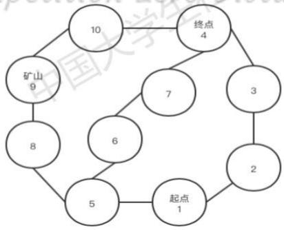

<details>
<summary>flowchart</summary>

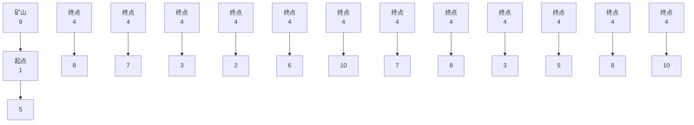
```mermaid
graph TD
  A["起点\n1"] --> B["5"]
  C["终点\n4"] --> D["8"]
  E["矿山\n9"] --> A
  F["终点\n4"] --> G["7"]
  H["终点\n4"] --> I["3"]
  J["终点\n4"] --> K["2"]
  L["终点\n4"] --> M["6"]
  N["终点\n4"] --> O["10"]
  P["终点\n4"] --> Q["7"]
  R["终点\n4"] --> S["8"]
  T["终点\n4"] --> U["3"]
  V["终点\n4"] --> W["5"]
  X["终点\n4"] --> Y["8"]
  Z["终点\n4"] --> AA["10"]
```
</details>

图 16 第五关化简地图

(2) 经过求解可得出各个点在不同时间 $t$ 到终点的最大收益如图所示:

表 3 各个点在不同时间 $t$ 到终点的最大收益

<table><tr><td>节点\日期</td><td>1</td><td>2</td><td>3</td><td>4</td><td>5</td><td>6</td><td>7</td><td>8</td><td>9</td><td>10</td></tr><tr><td>1</td><td>9535</td><td>9535</td><td>9480</td><td>9425</td><td>9290</td><td>9155</td><td>9020</td><td>0</td><td>0</td><td>0</td></tr><tr><td>2</td><td>0</td><td>9535</td><td>9535</td><td>9480</td><td>9425</td><td>9290</td><td>9155</td><td>9020</td><td>0</td><td>0</td></tr><tr><td>3</td><td>0</td><td>0</td><td>9535</td><td>9535</td><td>9480</td><td>9425</td><td>9290</td><td>9155</td><td>9020</td><td>0</td></tr><tr><td>4</td><td>0</td><td>0</td><td>0</td><td>9535</td><td>9535</td><td>9480</td><td>9425</td><td>9290</td><td>9155</td><td>9020</td></tr><tr><td>5</td><td>0</td><td>9425</td><td>9425</td><td>9370</td><td>9235</td><td>9100</td><td>8965</td><td>0</td><td>0</td><td>0</td></tr><tr><td>6</td><td>0</td><td>0</td><td>9425</td><td>9425</td><td>9425</td><td>9370</td><td>9235</td><td>9100</td><td>0</td><td>0</td></tr><tr><td>7</td><td>0</td><td>0</td><td>9425</td><td>9425</td><td>9370</td><td>9235</td><td>9100</td><td>8965</td><td>0</td><td>0</td></tr><tr><td>8</td><td>0</td><td>9315</td><td>9315</td><td>9180</td><td>9045</td><td>8910</td><td>0</td><td>0</td><td>0</td><td>0</td></tr><tr><td>9</td><td>0</td><td>0</td><td>9315</td><td>9315</td><td>9180</td><td>9045</td><td>8910</td><td>0</td><td>0</td><td>0</td></tr><tr><td>10</td><td>0</td><td>0</td><td>0</td><td>9315</td><td>9315</td><td>9180</td><td>9045</td><td>8910</td><td>0</td><td>0</td></tr></table>

(3) 据此求解出不同的时间 $t$ 下, 玩家从点 $i$ 到其邻点 $j$ 的概率, 下图为第三天的结果。

表 4 玩家从点i到其邻点j的概率（第三天）

<table><tr><td>节点&#x27;节点&#x27;</td><td>1</td><td>2</td><td>3</td><td>4</td><td>5</td><td>6</td><td>7</td><td>8</td><td>9</td><td>10</td></tr><tr><td>1</td><td>0.0633</td><td>0.0637</td><td>Inf</td><td>Inf</td><td>0.0630</td><td>Inf</td><td>Inf</td><td>0.0622</td><td>Inf</td><td>Inf</td></tr><tr><td>2</td><td>Inf</td><td>0.1261</td><td>0.1261</td><td>Inf</td><td>Inf</td><td>Inf</td><td>Inf</td><td>Inf</td><td>Inf</td><td>Inf</td></tr><tr><td>3</td><td>Inf</td><td>Inf</td><td>Inf</td><td>Inf</td><td>Inf</td><td>Inf</td><td>Inf</td><td>Inf</td><td>Inf</td><td>Inf</td></tr><tr><td>4</td><td>Inf</td><td>Inf</td><td>Inf</td><td>Inf</td><td>Inf</td><td>Inf</td><td>Inf</td><td>Inf</td><td>Inf</td><td>Inf</td></tr><tr><td>5</td><td>Inf</td><td>Inf</td><td>Inf</td><td>Inf</td><td>0.1246</td><td>0.1246</td><td>Inf</td><td>Inf</td><td>Inf</td><td>Inf</td></tr><tr><td>6</td><td>Inf</td><td>Inf</td><td>Inf</td><td>Inf</td><td>Inf</td><td>Inf</td><td>Inf</td><td>Inf</td><td>Inf</td><td>Inf</td></tr><tr><td>7</td><td>Inf</td><td>Inf</td><td>Inf</td><td>Inf</td><td>Inf</td><td>Inf</td><td>Inf</td><td>Inf</td><td>Inf</td><td>Inf</td></tr><tr><td>8</td><td>Inf</td><td>Inf</td><td>Inf</td><td>Inf</td><td>Inf</td><td>Inf</td><td>Inf</td><td>0.1232</td><td>0.1232</td><td>Inf</td></tr><tr><td>9</td><td>Inf</td><td>Inf</td><td>Inf</td><td>Inf</td><td>Inf</td><td>Inf</td><td>Inf</td><td>Inf</td><td>Inf</td><td>Inf</td></tr><tr><td>10</td><td>Inf</td><td>Inf</td><td>Inf</td><td>Inf</td><td>Inf</td><td>Inf</td><td>Inf</td><td>Inf</td><td>Inf</td><td>Inf</td></tr></table>

（4）计算不同时间 $t$ 下从点 $i$ 到其邻点 $j$ 的期望收益，如图为寻找最优策略的部分期望收益计算结果。

表 5 部分期望收益结果

<table><tr><td>节点\节点</td><td>1</td><td>2</td><td>3</td><td>4</td><td>5</td><td>6</td><td>7</td><td>8</td><td>9</td><td>10</td></tr><tr><td>1</td><td>55.000</td><td>110.028</td><td>NaN</td><td>NaN</td><td>110.028</td><td>NaN</td><td>NaN</td><td>110.026</td><td>NaN</td><td>NaN</td></tr><tr><td>2</td><td>NaN</td><td>55.000</td><td>110.996</td><td>NaN</td><td>NaN</td><td>NaN</td><td>NaN</td><td>NaN</td><td>NaN</td><td>NaN</td></tr><tr><td>3</td><td>NaN</td><td>NaN</td><td>55.000</td><td>110.437</td><td>NaN</td><td>NaN</td><td>NaN</td><td>NaN</td><td>NaN</td><td>NaN</td></tr><tr><td>4</td><td>NaN</td><td>NaN</td><td>NaN</td><td>55.000</td><td>NaN</td><td>NaN</td><td>NaN</td><td>NaN</td><td>NaN</td><td>NaN</td></tr><tr><td>5</td><td>NaN</td><td>NaN</td><td>NaN</td><td>NaN</td><td>55.000</td><td>110.973</td><td>NaN</td><td>NaN</td><td>NaN</td><td>NaN</td></tr><tr><td>6</td><td>NaN</td><td>NaN</td><td>NaN</td><td>NaN</td><td>NaN</td><td>55.000</td><td>110.427</td><td>NaN</td><td>NaN</td><td>NaN</td></tr><tr><td>7</td><td>NaN</td><td>NaN</td><td>NaN</td><td>NaN</td><td>NaN</td><td>NaN</td><td>55.000</td><td>NaN</td><td>NaN</td><td>NaN</td></tr><tr><td>8</td><td>NaN</td><td>NaN</td><td>NaN</td><td>NaN</td><td>NaN</td><td>NaN</td><td>NaN</td><td>55.000</td><td>110.959</td><td>NaN</td></tr><tr><td>9</td><td>NaN</td><td>NaN</td><td>NaN</td><td>NaN</td><td>NaN</td><td>NaN</td><td>NaN</td><td>NaN</td><td>-34.621</td><td>110.417</td></tr><tr><td>10</td><td>NaN</td><td>NaN</td><td>NaN</td><td>NaN</td><td>NaN</td><td>NaN</td><td>NaN</td><td>NaN</td><td>NaN</td><td>55.000</td></tr></table>

（5）最后利用第一问的计算方法求解，得到最大的平均期望收益为9526.3165元，最大的食物的消耗期望为33.6316箱，最大的水的消耗期望为27.4737箱。所以玩家在起点需购买34箱食物，28箱水，路线如下：

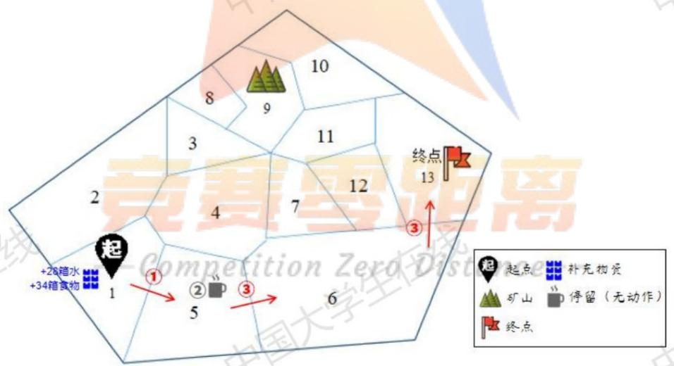

<details>
<summary>text_image</summary>

起
1
①
②
③
5
6
7
8
9
10
11
12
终点
13
起点
补充物资
矿山
停留（无动作）
终点
+26箱水
+34箱食物
</details>

图 17 第五关路线图

由于玩家数只有两个，结果和单人游戏时的最优策略相近，是可以说明我们模型的合理性的。

## 3.2.2 第六关求解

我们根据 3.1.2 所建立的基于博弈论的占优策略模型，可以绘制求解流程图如下所示：

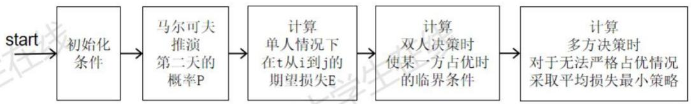

<details>
<summary>flowchart</summary>

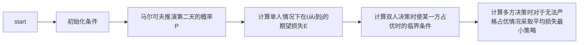
```mermaid
graph LR
  A["start"] --> B["初始化条件"]
  B --> C["马尔可夫推演第二天的概率P"]
  C --> D["计算单人情况下在t从i到j的期望损失E"]
  D --> E["计算双人决策时使某一方占优时的临界条件"]
  E --> F["计算多方决策时对于无法严格占优情况采取平均损失最小策略"]
```
</details>

图 18 第六关求解流程图

由于在第六关中，玩家到前进方向的任意一个点时，所有邻点到终点的距离都是相等的，因此，在玩家发生冲突时，终点的损失对于玩家的收益函数的影响是相同的，经过模拟仿真，得到结果如下图所示：(w和f是剩余水和食物的箱数)

表 6 第六关策略选择

<table><tr><td>占优临界</td><td>策略</td></tr><tr><td>节点13</td><td rowspan="2">占优势的玩家应当选择前往矿山,对于水或资源不够的玩家应当选择前往村庄补给,在有两人占优时,应选择前往矿山</td></tr><tr><td> $w = 28^{\text{或}}f = 29$ </td></tr><tr><td>节点15</td><td rowspan="2">占优势的玩家应当选择前往15,对于水或资源不够的玩家应当选择前往村庄补给,在有两人占优时,应选择停留</td></tr><tr><td> $w = 14^{\text{或}}f = 15$ </td></tr><tr><td>节点18</td><td rowspan="2">占优势的玩家应当选择前往矿山,对于水或资源不够的玩家应当选择前往村庄补给,在有两人占优时,仍选择前往矿山</td></tr><tr><td> $w = 16^{\text{或}}f = 17.14$ </td></tr><tr><td>节点19</td><td rowspan="2">在时间允许的情况下,占优势的玩家应当选择前往矿山,对于水或资源不够的玩家应当选择前往村庄补给,在两人占优时,选择停留</td></tr><tr><td> $w = 14^{\text{或}}f = 15$ </td></tr><tr><td>节点20</td><td rowspan="2">占优势的玩家应当选择停留,对于水或资源不够的玩家应当选择前往终点,在两人占优时,仍选择停留</td></tr><tr><td> $w = 7^{\text{或}}f = 7.5$ </td></tr><tr><td>节点23</td><td rowspan="2">占优势的玩家应当选择前往矿山,对于水或资源不够的玩家应当选择前往节点24,当两人占优时,选择停留</td></tr><tr><td> $w = 14^{\text{或}}f = 15$ </td></tr><tr><td>节点24</td><td rowspan="2">占优势的玩家应当选择停留,对于水或资源不够的玩家应当选择前往终点,有两人占优时,选择停留</td></tr><tr><td>w&lt;7或f&lt;7.5</td></tr></table>

起点开始的大部分点对玩家的决策影响都是随机的，而只有在 13, 15, 18, 19, 20, 23, 24，如下是各点的决策方案，由图可知，在有两人参与决策时，占优势的玩家不一定选择最优的方案，如节点 20 时，占劣势的玩家需选择到达终点，而占优势的玩家选择停留，如果此时占优玩家选择前往终点，而占劣势玩家选择停留，则此时占优玩家的收益最大，但实际上该方案的风险也是最大的，而对于劣势玩家而言，有更大的概率选择前往终点，此时停留避开冲突对占优玩家而言是比较稳妥的选择，这也体现了结果的合理性。

## 六、模型的讨论和合理性分析

对于问题三，我们针对参与玩家的数量 $n$ 从2增加到10，根据拟合的曲线可以发现，当玩家的数量逐渐增加时，玩家选择最佳路径的收益逐渐减少，且减少的趋势越来越大，这与实际情况是相吻合的，体现出我们模型的合理性。

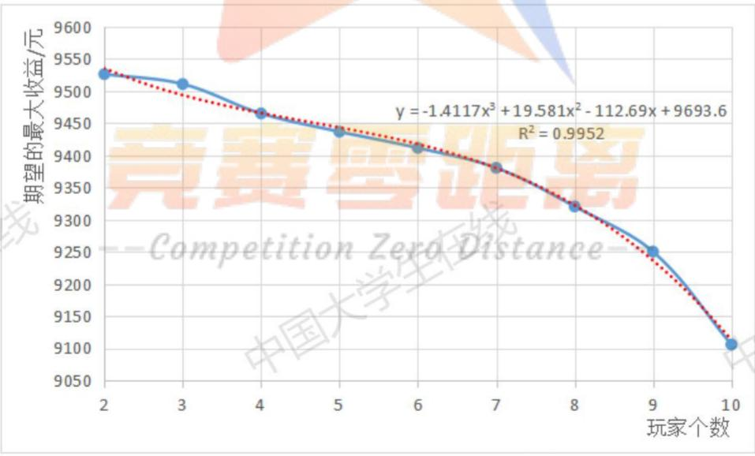

<details>
<summary>line</summary>

| 玩家个数 | 期望的最大收益/元 |
| --- | --- |
| 2 | ~9530 |
| 3 | ~9515 |
| 4 | ~9465 |
| 5 | ~9435 |
| 6 | ~9415 |
| 7 | ~9380 |
| 8 | ~9320 |
| 9 | ~9250 |
| 10 | ~9105 |
</details>

图 19 玩家人数和最大收益的拟合曲线

## 七、模型评价

## 模型的优点:

（1）问题一的模型充分考虑了影响玩家决策的确定因素与随机因素，使模型的建立更加符合游戏设定。从玩家的切身思想出发，保证路线最优化、收益最大化。  
(2) 问题二的模型利用马尔可夫链, 基于关卡一、二所给的 30 天天气状态计算出的天气跳转概率, 在已知当天天气的条件下预测未来天气状况。使得对天气的预测更加符合游戏设定、更加合理。  
（3）问题二、三的模型均以第一问的模型为基础，增加或改变了相应影响因子。使得模型整体性更强、思路清晰。  
（4）问题三的模型在影响玩家决策的相关因素上又增加了对其余玩家剩余资源量的考虑，使得多人游戏下各个玩家不同决策之间的互相影响得以衡量，提高准确度。

## 模型的缺点:

(1) 问题一的模型运算规模较大，耗时长。  
(2) 问题二的天气预测是基于一二关 30 天天气跳转概率给出的, 游戏天气样本数量较少, 存在预测的误差。  
（3）问题三采用玩家到达每一个点的平均收益代替问题一中的实际收益，使得对收益的衡量误差增大，存在一定的不准确性。

## 八、参考文献

[1] 张水舰，刘学军，杨洋．动态随机最短路径算法研究[J]. 物理学报，2012, 61(16): 7-16.  
[2] 戴玲, 夏学知. 基于 Markov 天气模型的流量管理改航策略 [J]. 舰船电子工程, 2007(4): 57-59.  
[3] 王芳, 万磊, 徐玉如, 等. 基于改进人工势场的水下机器人路径规划 [J]. 华中科技大学学报: 自然科学版, 2011(S2): 184-187.  
[4] 尚金成, 张维存, 等. 一种基于博弈论的发电商竞价策略模型与算法 [J]. 电力系统自动化, 2002(9): 12-15.

## 九、附录

## 附录清单：

1. Result.xlsx  
2. 问题一仿真代码  
3. 问题二马尔可夫收敛代码  
4. 问题三（1）仿真代码  
5. 问题三（2）仿真代码

1. Result.xlsx

<table><tr><td colspan="5">第一关</td></tr><tr><td>日期</td><td>所在区域</td><td>剩余资金数</td><td>剩余水量</td><td>剩余食物量</td></tr><tr><td>0</td><td>1</td><td>5780</td><td>178</td><td>333</td></tr><tr><td>1</td><td>25</td><td>5780</td><td>162</td><td>321</td></tr><tr><td>2</td><td>24</td><td>5780</td><td>146</td><td>309</td></tr><tr><td>3</td><td>23</td><td>5780</td><td>136</td><td>295</td></tr><tr><td>4</td><td>23</td><td>5780</td><td>126</td><td>285</td></tr><tr><td>5</td><td>22</td><td>5780</td><td>116</td><td>271</td></tr><tr><td>6</td><td>9</td><td>5780</td><td>100</td><td>259</td></tr><tr><td>7</td><td>9</td><td>5780</td><td>90</td><td>249</td></tr><tr><td>8</td><td>15</td><td>4150</td><td>243</td><td>235</td></tr><tr><td>9</td><td>13</td><td>4150</td><td>227</td><td>223</td></tr><tr><td>10</td><td>12</td><td>4150</td><td>211</td><td>211</td></tr><tr><td>11</td><td>12</td><td>4150</td><td>201</td><td>201</td></tr><tr><td>12</td><td>12</td><td>5150</td><td>177</td><td>183</td></tr><tr><td>13</td><td>12</td><td>6150</td><td>162</td><td>162</td></tr><tr><td>14</td><td>12</td><td>7150</td><td>138</td><td>144</td></tr><tr><td>15</td><td>12</td><td>8150</td><td>114</td><td>126</td></tr><tr><td>16</td><td>12</td><td>9150</td><td>90</td><td>108</td></tr><tr><td>17</td><td>12</td><td>10150</td><td>60</td><td>78</td></tr><tr><td>18</td><td>12</td><td>10150</td><td>50</td><td>68</td></tr><tr><td>19</td><td>12</td><td>11150</td><td>26</td><td>50</td></tr><tr><td>20</td><td>13</td><td>11150</td><td>10</td><td>38</td></tr><tr><td>21</td><td>15</td><td>10470</td><td>36</td><td>40</td></tr><tr><td>22</td><td>9</td><td>10470</td><td>26</td><td>26</td></tr><tr><td>23</td><td>21</td><td>10470</td><td>10</td><td>14</td></tr><tr><td>24</td><td>27</td><td>10470</td><td>0</td><td>0</td></tr><tr><td>25</td><td></td><td></td><td></td><td></td></tr><tr><td>26</td><td></td><td></td><td></td><td></td></tr><tr><td>27</td><td></td><td></td><td></td><td></td></tr><tr><td>28</td><td></td><td></td><td></td><td></td></tr><tr><td>29</td><td></td><td></td><td></td><td></td></tr><tr><td>30</td><td></td><td></td><td></td><td></td></tr></table>

第二关

<table><tr><td>日期</td><td>所在区域</td><td>剩余资金数</td><td>剩余水量</td><td>剩余食物量</td></tr><tr><td>0</td><td>1</td><td>5300</td><td>130</td><td>405</td></tr><tr><td>1</td><td>2</td><td>5300</td><td>114</td><td>393</td></tr><tr><td>2</td><td>10</td><td>5300</td><td>98</td><td>381</td></tr><tr><td>3</td><td>19</td><td>5300</td><td>88</td><td>367</td></tr><tr><td>4</td><td>19</td><td>5300</td><td>78</td><td>357</td></tr><tr><td>5</td><td>27</td><td>5300</td><td>68</td><td>343</td></tr><tr><td>6</td><td>28</td><td>5300</td><td>52</td><td>331</td></tr><tr><td>7</td><td>28</td><td>5300</td><td>42</td><td>321</td></tr><tr><td>8</td><td>29</td><td>5300</td><td>32</td><td>307</td></tr><tr><td>9</td><td>30</td><td>5300</td><td>16</td><td>295</td></tr><tr><td>10</td><td>39</td><td>3460</td><td>184</td><td>283</td></tr><tr><td>11</td><td>39</td><td>3460</td><td>174</td><td>273</td></tr><tr><td>12</td><td>47</td><td>3460</td><td>158</td><td>261</td></tr><tr><td>13</td><td>55</td><td>3460</td><td>148</td><td>247</td></tr><tr><td>14</td><td>55</td><td>4460</td><td>124</td><td>229</td></tr><tr><td>15</td><td>55</td><td>5460</td><td>100</td><td>211</td></tr><tr><td>16</td><td>55</td><td>6460</td><td>76</td><td>193</td></tr><tr><td>17</td><td>55</td><td>7460</td><td>46</td><td>163</td></tr><tr><td>18</td><td>55</td><td>8460</td><td>16</td><td>133</td></tr><tr><td>19</td><td>62</td><td>4730</td><td>201</td><td>207</td></tr><tr><td>20</td><td>55</td><td>4730</td><td>185</td><td>195</td></tr><tr><td>21</td><td>55</td><td>5730</td><td>170</td><td>174</td></tr><tr><td>22</td><td>55</td><td>6730</td><td>155</td><td>153</td></tr><tr><td>23</td><td>55</td><td>7730</td><td>131</td><td>135</td></tr><tr><td>24</td><td>55</td><td>8730</td><td>116</td><td>114</td></tr><tr><td>25</td><td>55</td><td>9730</td><td>86</td><td>84</td></tr><tr><td>26</td><td>55</td><td>10730</td><td>62</td><td>66</td></tr><tr><td>27</td><td>55</td><td>11730</td><td>47</td><td>45</td></tr><tr><td>28</td><td>55</td><td>12730</td><td>32</td><td>24</td></tr><tr><td>29</td><td>56</td><td>12730</td><td>16</td><td>12</td></tr><tr><td>30</td><td>64</td><td>12730</td><td>0</td><td>0</td></tr></table>

2. 问题一仿真代码  
```matlab
global neighbor_; %邻居
global get_ij;%收益
global w_ij;
global f_ij;
global day_ij;
global f_left;
global w_left;
neighbor_ = [1,1,1,0;1,1,1,0;1,1,1,1;0,1,1,1];
global get_mat;
get_mat = -inf(400,600,n,30);
get_mat(:,:,1,1) = 0;
mine_money = 1000;
bag = 1200; %负重 1200kg
money = 10000; %初始资金
w_weight = 3; %水的负重
f_weight = 2; %食物的负重
f_price = 10; %食物的基价
w_price = 5; %水的基价
mine = 4;
vilige = 3;
s = 1;
e = 2;
w = [5,8,10];
f = [7,6,10];%不同天气下食物和水的消耗
day = [2,2,1,3,1;2,3,1,2,2;3,2,1,2,2;2,3,3,2,2;1,1,2,1,3;2,1,1,2,2]; %30 天的天气情况
day = day';
```

```matlab
n = 4;%端点个数
d_n = [0,3,6,8;3,0,3,5;6,3,0,2;8,5,2,0];%端点之间的距离
f_left = -inf(n,n,30);
w_left = -inf(n,n,30);
get_ij = -inf(n,n,30);
w_ij = inf(n,n,30);
f_ij = inf(n,n,30);%食物的开销
day_ij = inf(n,n,30);%需要花多少天
for k = 1:30
    temp1 = day_ij(:,:,k);
    index_1 = find(day(k:end)~=3); %找到 k 天后不是沙尘暴天气的索引
    judge = (d_n <= length(index_1)& d_n~=0); % 找到 k 天后相互之间可以到达矩阵,不包含到自身
    index_2 = find(judge == 1); %找到可以相互到达的各个坐标
    temp1(index_2) = index_1(d_n(index_2)); %一个距离走一天，需要找 x 距离个非沙尘暴天气才能走完
    temp1(find(d_n==0)) = 0;
    day_ij(:,:,k) = temp1;
    for M = 1:n
        for N = 1:n
            if(M ~= N)
                if temp1(M,N) ~= inf %不能到达的地方不考虑
                    weather = day(k:k + (temp1(M,N)-1)); %找到走的这段路的天气情况;
                    w_ij(M,N,k) = length(weather==1)*(w(1))*2 + length(weather == 2)*(w(1))*2 + length(weather==3)*(w(3));
                    f_ij(M,N,k) = length(weather==1)*(f(1))*2 + length(weather == 2)*(f(1))*2 + length(weather==3)*(f(3));
                end
            else
                if M == mine
                    f_ij(M,N,k) = day(k) * f(day(k)) * 3;
                    w_ij(M,N,k) = day(k) * w(day(k)) * 3;%挖矿的开销是基础开销的三倍
                    get_ij(M,N,k) = 1000 - f_ij(M,N,k) * f_weight * f_price * 2 - w_ij(M,N,k) * w_weight * w_price * 2;
                else
                    f_ij(M,N,k) = day(k) * f(day(k));
```

```matlab
end
lost_w = -inf(10,10,10);
lost_f = -inf(10,10,10);
cost_money = -inf(10,10,10);
E = -inf(10,10,10);
E_f = -inf(10,10,10);
E_w = -inf(10,10,10);
w_cost = [3,9];
f_cost = [4,9];
weather = [1,2,1,1,1,1,2,2,2,2]; %十天的天气
p_1(find(p_1 == 0)) = inf;
for t = 1:10
    for i = 1:10
        for j = 1:10
            if i ~= j
                lost_w(i,j,t) = 2 * w_cost(weather(t));
                lost_f(i,j,t) = 2 * f_cost(weather(t));
                cost_money(i,j,t) = lost_w(i,j,t)*5+ lost_f(i,j,t)*10;
                E(i,j,t) = cost_money(i,j,t)*(p_1(i,j,t+1).^2 * 2 + 1 - p_1(i,j,t+1).^2);
                E_f(i,j,t) =   lost_f(i,j,t)*(p_1(i,j,t+1).^2 * 2 + 1 - p_1(i,j,t+1).^2);
                E_w(i,j,t)= lost_w(i,j,t)*(p_1(i,j,t+1).^2 * 2 + 1 - p_1(i,j,t+1).^2);
            else
                if i == 9
                    lost_w(i,j,t) = 3 * w_cost(weather(t));
                    lost_f(i,j,t) = 3 * f_cost(weather(t));
                    cost_money(i,j,t) = lost_w(i,j,t)*5+ lost_f(i,j,t) * 10;
                    E(i,j,t) = cost_money(i,j,t) - 200*(p_1(i,j,t+1).^2 * 1/2 + 1 - p_1(i,j,t+1).^2);
                    E_f(i,j,t) = lost_f(i,j,t);
                    E_w(i,j,t) = lost_w(i,j,t);
                else
                    lost_w(i,j,t) = w_cost(weather(t));
                    lost_f(i,j,t) = f_cost(weather(t));
                    cost_money(i,j,t) = 5*lost_w(i,j,t) + 10*lost_f(i,j,t);
                    E(i,j,t) = cost_money(i,j,t);
                    E_w(i,j,t) = lost_w(i,j,t);
                    E_f(i,j,t) = lost_f(i,j,t);
                end
```

```matlab
end
    end
end
end
table1 = p_1(:,:,3);
table2 = E(:,:,3);
5. 问题四仿真代码
w = zeros(3, 3); %根据行动结束当天预测明天天气
w = [1/3, 1/2, 1/6; 1/2, 3/7, 1/14; 3/8, 1/2, 1/8];
E = -inf(25, 25, 3); %根据当天的天气，给出期望
a_1 = 1000;
a_2 = 20000;
a_3 = 20600;

for j = 1:3
    E(:, :, j) = w(j, 1) * (3 * 2 * 5 + 4 * 2 * 10) + w(j, 2) * (9 * 2 * 5 + 9 * 2 * 10);
end
for i = 1:25
    E(i, i, :) = w(j, 1) * (3 * 5 + 4 * 10) + w(j, 2) * (9 * 5 + 9 * 10) + w(j, 3) * (10 * 5 + 10 * 10);
    if i == 18
        E(i, i, :) = 3*( w(j, 1) * (3 * 5 + 4 * 10) + w(j, 2) * (9 * 5 + 9 * 10) + w(j, 3) * (10 * 5 + 10 * 10)) - 1000;
    end
end
g_t = zeros(5, 5, 30);
g_w = zeros(5, 5, 100);
g_f = zeros(5, 5, 100);
for t = 1:30
    for i = 1:5
        for j = 1:5
            g_t(i, j, t) = a_1 * exp(-(25 -t) - (5 - i) - (5 - j)));%
计算 g1 损失
        end
    end
end
```

```matlab
for w = 1:100
    for i = 1:5
        for j = 1:5
            g_w(i, j, w) = a_2 * exp(-(w - 7*(5 - i) - 7*(5 - j))); %计
```  
算 $\mathrm{g}2$ 损失

```matlab
end
    end
end
for f = 1:100
    for i = 1:5
        for j = 1:5
            g_f(i, j, f) = a_3 * exp(-(f - 7*(5 - i) - 7*(5 - j))); %计
```  
算 g3 损失

```matlab
end
    end
end
k = 12;%以下为对某一个点寻找占优策略
w1 = 25;
w2 = 100;
f1 = 100;
f2 = 100;
t1 = 25;
t2 = 1;
test = [2,3];
test_1 = zeros(1,2);
E_1 = zeros(1,2);
E_1(1) = E(k, (test(1))*5 + test(2),1);
E_1(2) =E(k, (test(2))*5 + test(1),1);
test_1(1) = g_t(test(1), test(2), t1) + g_w(test(1), test(2), w1) +
g_f(test(1), test(2), w1);
test_1(2) = g_t(test(2), test(1), t1) + g_w(test(2), test(1), w1) +
g_f(test(2), test(1), w1);
test_2 = zeros(1,2);
test_2(1) = E(k, (test(1))*5 + test(2),1) + g_t(test(1), test(2), t2) +
g_w(test(1), test(2), w2) + g_f(test(1), test(2), w2);
test_2(2) = E(k, (test(2))*5 + test(1),1) + g_t(test(2), test(1), t2) +
g_w(test(2), test(1), w2) + g_f(test(2), test(1), w2);
```

```matlab
choose = zeros(2, 2);
for i = 1:2
    for j = 1:2
        if i ~=j
            choose(i, j) = test_1(i) + E_1(i);
        else
            choose(i, j) = test_1(i) + 2 * E_1(i);
        end
    end
end
best = 0;
for i = 1:2
    temp = choose(i, :) > max(choose(:, :));
    if sum(temp) == 2
        best = i;
    end
end
```