# 基于梯度下降的决策树算法与非线性规划的信贷风险评估与信贷策略模型

摘要

本文针对中小微企业的信贷决策问题,基于改进的梯度下降算法对决策树模型进行优化,建立信贷风险评估判断预测模型,之后基于收益最大、风险最小、客户流失率的最小目标建立非线性规划模型并进行求解,最后给出最优的银行贷款策略。

针对问题一，首先基于附件的交易票据数据挖掘出各企业的多项经营与财务指标，并进行筛选；之后本文对于传统的决策树模型进行改进，对于原模型添加正则项函数以抑制决策树的复杂性，利用集成学习思想将多个决策树模型（弱分类器）进行叠加，基于梯度下降算法进行迭代优化，得到最终的集成模型（强分类器）。基于该监督学习模型，建立以违约概率为目标函数的信贷风险评估模型，对附件1中各企业的违约概率进行定量求解，即得到各企业的信贷风险。求解结果表明，该模型的预测准确率达到96.75%，相较于传统的决策树算法（预测准确率为83.87%）和BP神经网络模型（59.3%），预测效果分别提升了15.36%和63.15%。基于得到的各企业的信贷违约概率，考虑到银行贷款期限为一年，本文以银行一年后的贷款收益最大化、客户流失率最小、客户违约风险最小为目标，考虑银行贷款额度、银行贷款利率、银行客户流失率、银行是否放贷、企业违约概率等约束，建立银行信贷策略的非线性多目标规划模型，最终通过求解模型可以确定银行的最佳信贷策略。

针对问题二，由于问题2中所给数据为无信贷记录和信贷评级的企业数据，因此本文首先基于前文的改进的梯度下降决策树算法建立企业信誉评级模型，并基于附件1的数据进行训练，利用得到的模型对附件2中的302家企业进行信誉评级。之后应用问题一所建立的信贷风险评估模型和信贷策略模型，对302家企业进行信贷风险评估，并确定银行针对302家企业具体的最佳信贷策略，最终结果表明银行的最优的期望收益为199.635万元，对于各企业贷款利率从4%-15%不等，包括银行给各企业是否放贷、具体的贷款额度以及贷款利率，详见附录10.1.2（4）。

针对问题三，本文首先将302家企业划分到14个行业大类、4个规模大类，之后以新冠肺炎疫情作为突发性因素的代表，从宏观和微观层面分析了不同行业、不同规模企业所受到的疫情影响的严重程度。从宏观层面，本文选择各行业具有代表性的上市公司股票，利用Python爬虫爬取了各行业从新冠疫情爆发以来至今的股票价格信息，以股票价格的波动作为分析该行业的发展与恢复情况的基本指标；在微观层面，本文从302家企业中随机抽取72家企业分析其2020年1月、2月与2018年、2019年同期的同比增长率，以此判定企业的运营状况。结合宏观与微观分析，本文将各类企业按照受疫情影响程度分为四类，同时考虑到国家政策对于中小微企业的信贷补贴优惠，从而确定银行的针对不同行业、不同类别企业的贷款调整政策。之后在问题二的基础上建立同时考虑信贷风险和突发因素影响的信贷决策规划模型，并且进行求解。最终银行贷款额度为1亿元，一年后的期望收益为184.655万元，相较于调整前减少 $7.5\%$ ，但是由此银行产生巨大的社会效益，可以帮助众多中小企业渡过难关。

关键词：信贷风险评估 梯度下降法 改进的决策树模型 非线性规划 集成学习

## 一、问题重述

中小微企业由于自身规模较小、抗风险能力弱等原因，在银行借贷方面可能有较大的信贷风险。为了保证银行科学借贷与促进中小微企业合理融资，银行需要建立科学完善的信贷风险评估体系，从而针对中小微企业的具体情况制定最佳贷款策略。

目前传统信贷风险评估方法较为成熟，国内外信贷决策中应用较多的有专家制度法、信用评级法和信用评分法[1]。但这类传统方法普遍存在量化标准不统一、所评估的财务数据不足等缺陷。现代评估更加注重精细量化，包括以logit和probit模型为代表的统计模型法，以及基于神经网络或专家系统的人工智能法[1]。统计模型能够提供较为统一的评估标准，但通常其评估指标的权重具有主观性，且忽略了难以计量的因素。人工智能法是新兴的评估方法，能够极大地降低风险评估难度，但由于其原理复杂、相关领域应用技术不成熟等原因，还未普遍地被银行应用于信贷风险评估。

在本题中，题目给出了企业信誉等级、财务发票信息，要求综合考虑中小微企业的当前实力、经营情况、发展前景与信誉等因素，对各企业的信贷风险进行量化评估，并制定银行针对各企业的具有普适性的最佳信贷策略。

因此，本题要求建立数学模型，解决以下问题：

1. 考虑企业实力、违约情况等，给出无信贷记录的企业的信誉评级方法。  
2. 考虑企业规模、经营情况与信誉等，对信贷风险进行量化分析。  
3. 基于信贷风险，给出银行针对各企业的最佳信贷策略。  
4. 考虑不同突发因素，给出银行针对不同类别企业的信贷调整策略。

## 二、问题分析

本题要求评估不同企业的信贷风险并制定具有普适性的信贷策略。解题思路主要分为两步：第一步综合考虑企业实力和信誉等级，对其信贷风险进行量化评估；第二步基于信贷风险，制定对应的信贷策略。

对于问题一有信贷记录的企业, 经以上两个步骤可求解。对于问题二无信贷记录的企业, 在进行信贷风险评估之前需要先预估信誉等级。对于问题三的信贷调整策略, 需要考虑不同突发因素对于不同行业类别和规模的企业的信贷风险影响程度。

## 2.1 问题一的分析

问题一要求考虑企业实力、信誉等因素对各企业的信贷风险进行量化评估，并基于信贷风险制定具体的银行信贷策略。为了建立完善科学的量化分析体系，该题的思路分为以下两个步骤：

1. 利用附件 1 基础数据，综合考虑各企业的当前实力、经营情况、发展前景与信誉，对附件 1 中企业的财务与经营信息进行充分挖掘，得到企业利润、增长率等财务指标，通过文献查阅法进行筛选，最终从多项企业经营指标中选取七项较为合理评估指标（即自变量）：企业规模、企业平均利润、企业平均年利润率、企业平均年利润增长率、企业平均营业额增长率、企业产品退货率与信誉评级。

之后本文运用集成学习思想对于传统的决策树模型进行改进, 将多个决策树模型进行集成, 添加正则项约束函数并且对目标函数进行优化, 同时使用梯度下降法进行迭代优化, 从而得到分类效果更好的强监督学习模型。

基于该监督学习模型建立以违约概率为目标函数的信贷风险评估模型, 求得各企业的借贷的违约概率, 并对信贷风险进行评估。

2. 基于步骤 1 所得的各企业违约概率，考虑到银行的贷款期限为一年，以银行一年后的贷款收益最大化、客户流失率最小、客户违约风险最小为目标，考虑银行贷款额度、银行贷款利率、银行客户流失率、银行是否放贷、企业违约概率等约束，建立银行信贷策略的多目标规划模型。最终确定银行的最佳信贷策略：包括银行给各企业的贷款额度、贷款利率，以及银行是否给企业放贷。

## 2.2 问题二的分析

对于问题二，该题未知各企业的信贷记录数据、信誉评级等信息，也需要对所有企业的信贷风险进行量化评估并给出最佳的银行信贷策略。

经过问题一的求解分析可知,企业的信誉评级与该企业是否存在违约风险有着高度的正相关关系,因此需要在信贷风险评估之前对各企业进行信誉评级。基于附件1有信贷记录的企业数据,以信誉评级为因变量,企业是否违约、企业规模、企业年利润率为自变量,基于问题一的改进决策树算法建立有监督的学习模型。运用该学习模型,对302家无信贷记录的企业的信誉等级进行评级。

然后应用问题一所建立的信贷风险离散评估模型和信贷策略模型，对 302 家企业进行信贷风险分析，并确定银行针对这 302 家企业的具体最佳信贷策略，包括银行给各企业的贷款额度、贷款利率，以及银行是否给企业放贷。

## 2.3 问题三的分析

对于问题三，题目提出突发因素会对不同行业与类别的企业造成不同影响，该题要求考虑可能的突发因素，并量化其影响，作为其他约束加入信贷策略多目标规划模型，得到调整后的银行最佳信贷策略。

为详细描述突发情况对不同企业的影响，本文基于国家标准将 302 家企业按照行业类别与企业规模进行分类。以新冠疫情为例，本文从宏观和微观层面分别分析了不同行业、不同类别的企业所受到的影响性质以及程度，并考虑国家政策扶持，引入市场风险函数、政策影响因子等指标。同时考虑信贷风险、市场风险、国家政策和社会效益，建立多目标非线性规划函数，将结果与第二问求得的结果进行对比，得到该银行年度信贷额度为 1 亿元时的信贷调整策略。

## 三、模型假设

1. 假设贷款利率仅与客户流失率有关，不考虑其他影响因素；  
2. 银行针对各企业的信贷评估仅考虑企业实力、企业信誉两方面；  
3. 银行通过综合评估企业的信贷风险来确定具体的信贷策略，不考虑其他因素。

## 四、符号说明

<table><tr><td>符号</td><td>说明</td><td>单位</td></tr><tr><td>j</td><td>企业 j</td><td></td></tr><tr><td>kj</td><td>不同信誉等级 k 的企业 j</td><td></td></tr><tr><td>Z</td><td>银行对于所有客户企业的期望收益</td><td>元</td></tr><tr><td> $t_j$ </td><td>银行对于目前已有客户企业 j 的期望收益</td><td>元</td></tr><tr><td> $A_j$ </td><td>企业 j 的可能贷款金额</td><td>元</td></tr><tr><td> $B_j$ </td><td>企业 j 的实际贷款金额</td><td>元</td></tr><tr><td> $y_j$ </td><td>判断银行是否给已有客户企业放贷的指标</td><td></td></tr><tr><td> $i_j$ </td><td>企业 j 的贷款利率</td><td>%</td></tr><tr><td> $P_j$ </td><td>企业j的还款概率</td><td></td></tr><tr><td> $q_j$ </td><td>企业j的客户流失概率</td><td></td></tr><tr><td> $M_j$ </td><td>企业j的客户流失价值</td><td>元</td></tr><tr><td>d</td><td>银行年度信贷总额</td><td></td></tr><tr><td> $R_j$ </td><td>企业j的违约概率</td><td></td></tr><tr><td> $x_1$ </td><td>企业规模</td><td></td></tr><tr><td> $x_2$ </td><td>企业平均利润</td><td>元</td></tr><tr><td> $x_3$ </td><td>企业平均年利润率</td><td>元</td></tr><tr><td> $x_4$ </td><td>企业平均年利润增长率</td><td></td></tr><tr><td> $x_5$ </td><td>企业平均销售额增长率</td><td></td></tr><tr><td> $x_6$ </td><td>企业服务或产品质量</td><td></td></tr><tr><td> $x_7$ </td><td>信誉评级</td><td></td></tr><tr><td> $h_{1j}$ </td><td>银行对于不同企业贷款额度的提升系数</td><td></td></tr><tr><td> $h_{2j}$ </td><td>银行对于不同企业的利率优惠系数</td><td></td></tr></table>

## 五、问题一的模型建立与求解

## 5.1 思路分析

本题对于中小微企业的信贷策略的解题思路主要分为两个部分, 第一部分是信贷风险量化评估问题, 第二部分是信贷策略的决策问题, 分别基于改进的梯度提升决策树算法和非线性规划算法建立信贷风险评估模型和信贷策略模型, 问题一的思路流程图如下。

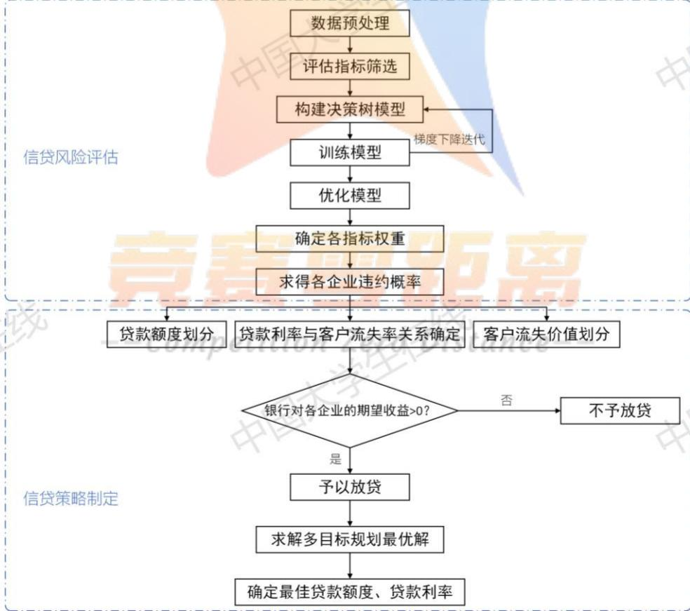

<details>
<summary>flowchart</summary>

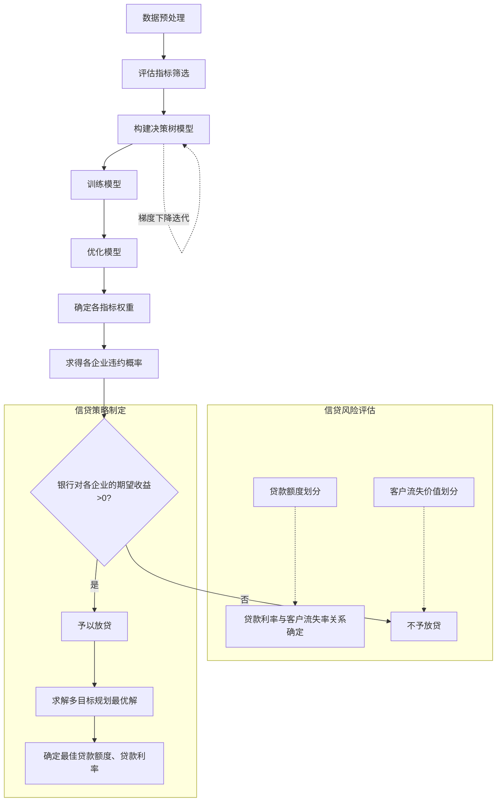
```mermaid
graph TD
  A["数据预处理"] --> B["评估指标筛选"]
  B --> C["构建决策树模型"]
  C --> D["训练模型"]
  D --> E["优化模型"]
  E --> F["确定各指标权重"]
  F --> G["求得各企业违约概率"]
  
  subgraph Credit Risk Assessment ["信贷风险评估"]
    H["贷款额度划分"] -.-> I["贷款利率与客户流失率关系确定"]
    J["客户流失价值划分"] -.-> K["不予放贷"]
  end
  
  subgraph Loan Strategy [信贷策略制定]
    L{"银行对各企业的期望收益>0?"}
    M["予以放贷"]
    N["求解多目标规划最优解"]
    O["确定最佳贷款额度、贷款利率"]
  end
  
  C -.->|"梯度下降迭代"| C
  G --> L
  L -->|是| M
  L -->|否| K
  M --> N
  N --> O
```
</details>

图 5-1 问题一思路流程图

## 5.2.2 企业的行业与规模划分

根据国家统计局于2017年12月制定的《统计上大中小微企业划分方法》，将企业所属的行业类别分为农林牧渔业、工业、建筑业等16个类别，并依据数据特征额外加入个体这一类别。依照营业收入、从业人员和企业资产指标将企业规模分为大、中、小、微4种规模。本文以此《办法》对有无信贷记录的企业进行行业类别和企业规模的划分，按照行业类别分为建筑业、交通运输业、零售业、餐饮业、软件和信息技术等共计14个类别，同时按照不同的企业规模将企业分为中型、小型、微型、个体户4类。

## 5.2 数据预处理

## 5.2.1 对不同年份的发票数据进行处理

附件 1 和 2 给出了有无信贷记录的所有企业的 2016-2020 年的发票信息，包括进项发票和销项发票。为便于后续的细化指标计算，本文以每个企业的一年经营情况作为基准。

(1) 剔除无效发票数据

本文不考虑作废发票数据，直接剔除。

(2) 不予研究信息较少的年份数据

由于 2016 年和 2020 年的发票信息过少，问题一暂不研究这部分数据。

(3) 按照比例补全有缺失的数据

本文选取各企业 2017-2019 三年的发票信息进行研究。但某些企业缺失完整三年的发票，超过半数的企业发票数据存在残缺。如果用半年的发票数据和一年的发票数据一起建模，无疑会产生较大的误差。因此，本文考虑将存在数据缺失的年份的数据补齐来弥补。补全数据的方式是找到下一年（或上一年）完整的数据，进行等比例补全。例如附件 1 中企业 E1 在 2017 年的销项发票只有 8 月到 12 月的数据，而 2018 年的销项发票数据是完整的，因此计算 2018 年 8 月-12 月相关数据占 2018 年整年相关数据比例，将其估计为 2017 年 8 月-12 月相关数据占 2018 年整年相关数据比例，从而计算出 2017 年整年数据的估计值。

## 5.2.3 不研究信誉评级为 D 的企业数据

实际中银行对于信誉等级为 D 的企业一般不予放贷，因此本文对于信誉等级为 D 的企业数据直接不研究，银行针对这部分企业的信贷策略即为不予放贷。

## 5.3 信贷风险评估模型的建立

## 5.3.1 评估指标的选取

## 5.3.1.1 选取指标的原则

中小微企业的信贷风险，即企业借贷的违约概率，与企业自身实力、经营状况、还款意愿、信誉、抗风险能力等内部原因有关，同时也受整体经济环境、国家政策等外部因素影响。为了更加科学地评估中小微企业的信贷风险，在选取信贷风险的评估指标上，应该遵循全面性、客观性、独立性等原则，综合考虑各方面对于企业信贷风险的影响。

依照近年来我国多名学者[2-7]的研究，对信贷风险的评估指标进行整理，选取了以下六大评估指标，如图5-2所示。

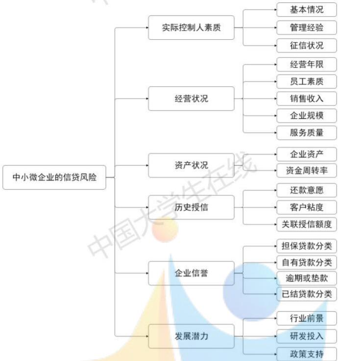

<details>
<summary>flowchart</summary>

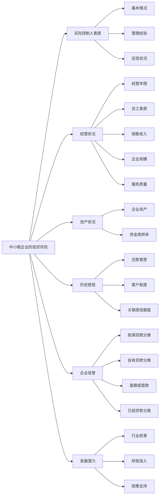
```mermaid
graph LR
  A["中小微企业的信贷风险"] --> B["实际控制人素质"]
  A --> C["经营状况"]
  A --> D["资产状况"]
  A --> E["历史授信"]
  A --> F["企业信誉"]
  A --> G["发展潜力"]
  
  B --> H["基本情况"]
  B --> I["管理经验"]
  B --> J["征信状况"]
  
  C --> K["经营年限"]
  C --> L["员工素质"]
  C --> M["销售收入"]
  C --> N["企业规模"]
  C --> O["服务质量"]
  
  D --> P["企业资产"]
  D --> Q["资金周转率"]
  
  E --> R["还款意愿"]
  E --> S["客户粘度"]
  E --> T["关联授信额度"]
  
  F --> U["担保贷款分类"]
  F --> V["自有贷款分类"]
  F --> W["逾期或垫款"]
  F --> X["已结贷款分类"]
  
  G --> Y["行业前景"]
  G --> Z["研发投入"]
  G --> AA["政策支持"]
```
</details>

图 5-2 中小微企业信贷风险评估指标

## 5.3.1.2 细化指标筛选与量化

基于上述评估指标体系，本文选取企业违约状态作为因变量，并试图选取对中小微企业的信贷风险影响最大的部分指标作为自变量进行研究。

参考国内已有研究[7]，基于中小微企业和银行的相关借贷数据和专家评分，企业的历史授信、经营状况、企业信誉这三类指标对于中小微企业的信贷风险影响最大。综合已知数据，本文主要从企业经营状况和企业信誉这两方面进行细化指标选取。在企业经营状况方面，本文选取123家有信贷记录的企业2017-2019年的三年平均营业收入、年平均利润、年平均（销售）利润率、年平均利润增长率、企业平均销售额增长率、企业产品及服务质量一共六个细化指标。在企业信誉方面，直接选取信誉等级这一细化指标。这七个细化指标从不同角度衡量了企业的当前规模、自身实力、经营状况、未来收益情况、发展前景与信誉情况。具体细化指标名称、计算公式与意义如下。

违约概率 $R_{j}$ ，为因变量，表示企业借款一年后违约的概率。

企业规模 $x_{1}$ ，为自变量，此处企业规模用企业年平均营业额代替，单位元。衡量企业规模。2017-2019三年平均销售额计算公式：

$$
x _ {1} = \frac {1}{3} \cdot \sum_ {\text {year} = 2 0 1 7} ^ {2 0 1 9} \text {销项发票金额数} \tag {1}
$$

企业平均利润 $x_{2}$ ，为自变量，2017-2019三年平均盈利，单位元。衡量企业经营状况。计算公式为：

$$
x _ {2} = \frac {1}{3} \cdot \left(\sum_ {\text {year} = 2 0 1 7} ^ {2 0 1 9} \text {销项发票金额数} - \sum_ {\text {year} = 2 0 1 7} ^ {2 0 1 9} \text {进项发票金额数}\right) \tag {2}
$$

企业平均年利润率 $x_{3}$ ，为自变量，此处为2017-2019年企业销售利润率。衡量企业收益情况。计算公式为：

$$
x_{3} = \frac{1}{3}\cdot \sum_{\text{year} = 2017}^{2019}\frac{\sum_{\text{year}} 利润}{\sum_{\text{year}} 营业额}\times 100\% \tag{3}
$$

企业平均年利润增长率 $x_{4}$ ，为自变量，2017-2019年的总盈利平均增长率。衡量企业未来收益情况和发展前景。计算公式为：

$$
x _ {4} = \frac {1}{2} \cdot \left(\frac {\sum_ {\text {year} = 2018} \text {利润} - \sum_ {\text {year} = 2017} \text {利润}}{\sum_ {\text {year} = 2017} \text {利润}} + \frac {\sum_ {\text {year} = 2019} \text {利润} - \sum_ {\text {year} = 2018} \text {利润}}{\sum_ {\text {year} = 2018} \text {利润}}\right) \times 100\%
$$

(4)

企业平均营业额增长率 $x_{5}$ ，为自变量，2017-2019年的总营业额平均增长率。衡量企业未来收益情况和发展前景。计算公式为：

$$
x _ {5} = \frac {1}{2} \cdot (\frac {\sum_ {\mathrm{year} = 2 0 1 8} \text {营业额} - \sum_ {\mathrm{year} = 2 0 1 7} \text {营业额}}{\sum_ {\mathrm{year} = 2 0 1 7} \text {营业额}} + \frac {\sum_ {\mathrm{year} = 2 0 1 9} \text {营业额} - \sum_ {\mathrm{year} = 2 0 1 8} \text {营业额}}{\sum_ {\mathrm{year} = 2 0 1 8} \text {营业额}}) \times 100 \% \tag{5}
$$

企业产品退货率 $x_{6}$ ，为自变量，2017-2019年的负数销项发票年平均金额数占总营业额的比例，退款率越大，说明该企业的产品或服务可能存在缺陷。衡量企业实力。计算公式为：

$$
x_{6} = \frac{1}{3}\cdot \sum_{\text{year} = 2017}^{2019}\frac{\sum_{\text{year}}\text{负销项发票金额数}}{\sum_{\text{year}}\text{正销项发票金额数}}\times 100\% \tag{6}
$$

信誉评级 $x_{7}$ ，为自变量，将企业信誉评级转换为得分，评级A为1分，B为0.75分，C为0.5分，D为0.25分。衡量企业的信誉情况。

## 5.3.2 基于改进的梯度提升决策树算法的信贷风险模型建立

为了进一步评价各公司在未来贷款中发生违约的可能性,本文需要建立相应的信贷风险模型对各企业的贷款风险和违约概率进行了预测和评估。由于问题一提供的数据中包含了所有公司的信贷记录以及贷款评级,即该数据集已经包含了相应的标签值,该场景非常适合使用监督学习模型进行建模求解。

基于前文确定的评估指标，接下来本文在传统决策树算法的基础之上进行改进，添加正则项函数解决算法的过拟合问题，建立以企业违约概率为因变量的信贷风险评估模型，进而预测出企业的违约的概率值。

## 5.3.2.1 决策树算法简介

决策树算法是一种逼近离散函数值的典型分类方法, 其基本思想是使用属性选择度量选择最佳属性以拆分记录, 之后使得该属性变成下一个决策节点, 让数据集变成更小的子集[8]。由于传统的决策树算法存在过拟合等缺陷, 有研究者提出了基于集成学习的梯度提升决策树算法, 并被广泛应用于分类和预测问题中。

梯度提升决策树算法, 又称为 GBDT 算法。其本质是一种集成学习算法(Boosting 算法), 由于传统单一的决策树模型存在预测效果差、具有局限性、过拟合等缺点, 集成学习算法将多个决策树模型(弱学习器)进行层层叠加, 将总模型提升为强学习器, 采用串行方式运行, 多个弱学习器的预测结果相加即为最终模型的预测结果。其基本思想为: 对于一个复杂任务, 将多个专家的判断进行适当综合, 得出的判断要犹豫任何一个专家单独的判断。该算法具有较好的解释性和鲁棒性, 同时树与树之间可以并行计算, 不需要做复杂的特征变换, 本文在该算法的基础上进行改进, 之后进行训练。

## 5.3.2.2 基于改进的梯度提升决策树算法

为了进一步提升梯度提升决策树算法的预测准确率,本文在原有的决策树算法模型基础之上进行改进,从而建立信贷风险模型。

假设对于企业 j，其信贷风险使用信贷还款违约概率进行刻画，记为R，基于前文考虑的各项评估指标，各企业的信贷还款违约概率可以表示为：

$$
\mathrm{R} _ {\mathrm{j}} = \varphi (x _ {1}, x _ {2}, x _ {3}, x _ {4}, x _ {5}, x _ {6}, x _ {7}) \tag {7}
$$

其中 $x_{i}(i=1,2\ldots7)$ 分别表示企业规模、企业平均利润、企业平均年利润率、企业平均年利润增长率、企业平均营业额增长率、企业产品退货率与信誉评级。

其优化函数可以表示为:

$$
\mathrm{R} _ {\mathrm{j}} = \varphi (x _ {1}, x _ {2}, x _ {3}, x _ {4}, x _ {5}, x _ {6}, x _ {7}) = \sum_ {i = 1} ^ {n} l \left(y _ {i}, \hat {y} _ {i} ^ {(t - 1)} + f _ {t} (x _ {i})\right) + \delta (f _ {t}) + c o n s t a n t
$$

(8)

其中l为损失函数， $\delta(f_{t})$ 为正则项，constant为常数项。

具体该目标函数的构建以及算法的迭代计算过程如下:

## (1) 构建单棵决策树

设 $f(x_{i})$ 为一棵决策树函数，其叶子节点个数为T。

之后基于信息增益法进行决策树特征选择：对于决策树，假设当前节点记为 C，分裂之后左孩子节点记为 L，右孩子节点记为 R，则该分裂获得的收益定义为当前节点的目标函数值减去左右两个孩子节点的目标函数值之和：

$$
\text {Gain} = f _ {\mathrm{C}} - \mathrm{f} _ {\mathrm{L}} - \mathrm{f} _ {\mathrm{R}} \tag {9}
$$

在决策树生成的过程中，选择收益最大的特征作为树枝。

## (2) 基于加法模型，构建集成学习决策树

建立好单棵决策树模型之后，基于集成学习的思想，将多个决策树（弱分类器）进行集成，本文采用加法模型，从而得到一个强分类器。此时目标函数即为 K 棵树组成的加法模型：

$$
\widehat {y} _ {i} = \sum_ {k = 1} ^ {K} f _ {k} (x _ {i}), f _ {k} \in F \tag {10}
$$

其中 $f_{k}$ 为第k棵决策树。

接下来使用 Boosting 算法对该模型进行训练和学习。由于学习的模型为加法模型，Boosting 算法可以对该模型从前向后学习，每一步只学习一个基函数及其系数（结构），逐步逼近优化目标函数，进而可以简化运算的复杂度。该方法从一个常量预测开始，每次学习一个新的函数，过程如下：

$$
\hat {y} _ {i} ^ {0} = 0 \tag {11}
$$

$$
\hat {y} _ {i} ^ {1} = f _ {1} (x _ {i}) = \hat {y} _ {i} ^ {0} + f _ {1} (x _ {i}) \tag {12}
$$

$$
\hat {y} _ {i} ^ {2} = f _ {1} (x _ {i}) + f _ {2} (x _ {i}) = \hat {y} _ {i} ^ {1} + f _ {2} (x _ {i}) \tag {13}
$$

...

$$
\hat {y} _ {i} ^ {t} = \sum_ {k = 1} ^ {t} f _ {k} (x _ {i}) = \hat {y} _ {i} ^ {t - 1} + f _ {t} (x _ {i}) \tag {14}
$$

在第 t 步时，其目标函数可以写为:

$$
\mathrm{R} _ {\mathrm{j}} ^ {\mathrm{t}} = \sum_ {i = 1} ^ {n} l \left(y _ {i}, \hat {y} _ {i} ^ {t}\right) = \sum_ {i = 1} ^ {n} l \left(y _ {i}, \hat {y} _ {i} ^ {t - 1} + f _ {t} \left(x _ {i}\right)\right) \tag {15}
$$

另一方面，由泰勒公式在点 x 处二阶展开，可以得到：

$$
\mathrm{f} (\mathrm{x} + \Delta \mathrm{x}) \approx \mathrm{f} (\mathrm{x}) + \mathrm{f} ^ {\prime} (x) \Delta x + \frac {1}{2} f ^ {\prime} ^ {\prime} (x) \Delta x ^ {2} \tag {16}
$$

则上式转化为:

$$
\mathrm{R} _ {\mathrm{j}} ^ {\mathrm{t}} = \sum_ {i = 1} ^ {n} \left[ l \left(y _ {i}, \hat {y} _ {i} ^ {t}\right) + g _ {i} f _ {t} \left(x _ {i}\right) + \frac {1}{2} h _ {i} f _ {t} ^ {2} \left(x _ {i}\right) \right] \tag {17}
$$

本文选取的损失函数l为平方损失函数，则目标函数为：

$$
\mathrm{R} _ {\mathrm{j}} ^ {\mathrm{t}} = \sum_ {i = 1} ^ {n} \left(y _ {i} - \left(\hat {y} _ {i} ^ {t - 1} + f _ {t} \left(x _ {i}\right)\right)\right) ^ {2} = \sum_ {i = 1} ^ {n} \left[ 2 \left(\hat {y} _ {i} ^ {t - 1} - y _ {i}\right) f _ {t} \left(x _ {i}\right) + f _ {t} \left(x _ {i}\right) ^ {2} \right] \tag {18}
$$

其中， $\left(\hat{y}_{i}^{t-1}-y_{i}\right)$ 即为残差，使用平方损失函数时，集成决策树通过拟合上一步模型中的残差不断对模型进行拟合。

## (3) 基于正则优化，改进梯度下降决策树模型

设 $f(x_{i})$ 为一棵决策树函数，其叶子节点个数为T。为了避免决策树出现过拟合问题，本文在原有的决策树模型中加入正则项。

决策树的复杂度由正则项表示为:

$$
\delta (f _ {t}) = \gamma \mathrm{T} + \frac {1}{2} \lambda \sum_ {j = 1} ^ {T} w _ {j} ^ {2} \tag {19}
$$

则在第 t 步时，其目标函数可以写为：

$$
R _ {j} ^ {t} = \sum_ {i = 1} ^ {n} l (y _ {i}, \hat {y} _ {i} ^ {t}) + \sum_ {i = i} ^ {t} \delta (f _ {i}) = \sum_ {i = 1} ^ {n} l (y _ {i}, \hat {y} _ {i} ^ {t - 1} + f _ {t} (x _ {i})) + \delta (f _ {t}) + \text {constant} \tag {20}
$$

对于单棵决策树，定义集合

$$
I _ {j} = \{i | q (x _ {i}) = j \} \tag {21}
$$

为所有被划分到叶子节点的训练样本的集合。则式 17 可以根据树的叶子节点重新组织为 T 个独立的二次函数的和：

$$
\begin{array}{c} R _ {j} ^ {t} = \sum_ {i = 1} ^ {n} \left[ g _ {i} w _ {q} \left(x _ {i}\right) + \frac {1}{2} h _ {i} w _ {q \left(x _ {i}\right)} ^ {2} \right] + \gamma T + \frac {1}{2} \gamma \sum_ {j = 1} ^ {T} w _ {j} ^ {2} = \sum_ {j = 1} ^ {T} \left[ \left(\sum_ {i \in I _ {j}} g _ {i}\right) w _ {j} + \right. \\ \frac {1}{2} \left(\sum_ {i \in I _ {j}} h _ {i} + \lambda\right) w _ {j} ^ {2 ]} + \gamma T \end{array} \tag {22}
$$

定义 $G_{j}=\sum_{i\in I_{j}}g_{i},H_{j}=\sum_{i\in I_{j}}h_{i}$ ，则式22可表示为：

$$
R _ {j} ^ {t} = \sum_ {j = 1} ^ {T} [ G _ {i} w _ {j} + \frac {1}{2} (H _ {i} + \lambda) w _ {j} ^ {2} ] + \gamma T \tag {23}
$$

对式 23 求一阶导，令一阶导等于 0, 有:

$$
w _ {j} ^ {*} = - \frac {G}{H _ {j} + \lambda} \tag {24}
$$

则此时目标函数的值为:

$$
R _ {j} ^ {t} = - \frac {1}{2} \sum_ {j = 1} ^ {T} \frac {G _ {j} ^ {2}}{H _ {j} + \lambda} + \gamma T \tag {25}
$$

由此得到每次决策树分裂时的收益为:

$$
\mathrm{Gain} = \frac {1}{2} \left[ \frac {G _ {L} ^ {2}}{H _ {L} + \lambda} + \frac {G _ {R} ^ {2}}{H _ {R} + \lambda} - \frac {(G _ {L} + G _ {R}) ^ {2}}{H _ {L} + H _ {R} + \lambda} \right] - \gamma \tag {26}
$$

在每次迭代时，通过式 26 计算损益，基于受益最大原则生成新的决策树，再通过式 25 计算每个叶结点对应的预测值，将新生成的决策树 $f_{t}(x)$ ，再次添加到模型中，即有：

$$
\hat {y} _ {\mathrm{i}} ^ {\mathrm{t}} = \hat {y} _ {\mathrm{i}} ^ {\mathrm{t-1}} + f _ {t} (x _ {i}) \tag {27}
$$

通过上述流程不断进行迭代，每轮迭代产生一个弱分类器，每个弱分类器在上一轮分类器残差的基础之上进行训练，这样不断进行迭代，直到达到目标精度为止，该模型的迭代流程图如下：

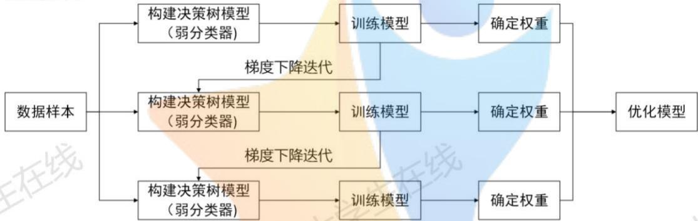

<details>
<summary>flowchart</summary>

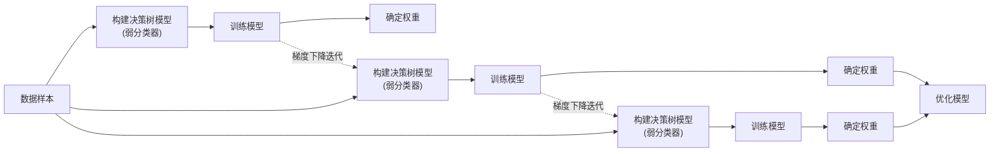
```mermaid
graph LR
  A["数据样本"] --> B["构建决策树模型\n(弱分类器)"]
  A --> C["构建决策树模型\n(弱分类器)"]
  A --> D["构建决策树模型\n(弱分类器)"]
  
  B --> E["训练模型"]
  E --> F["确定权重"]
  
  C --> G["训练模型"]
  G --> H["确定权重"]
  
  D --> I["训练模型"]
  I --> J["确定权重"]
  
  E -.->|"梯度下降迭代"| C
  G -.->|"梯度下降迭代"| D
  
  H --> K["优化模型"]
  J --> K
```
</details>

图 5-3 模型迭代流程图

## 5.4 基于非线性规划算法的信贷发放策略模型

## 5.4.1 贷款额度与客户流失价值的划分

## 5.4.1.1 基于企业营业收入对贷款额度进行划分

本文中银行对于可放贷企业的贷款额度为 10\~100 万元。为降低银行放贷风险同时保证银行贷款盈利较大，银行应针对不同规模与实力的企业给予不同的贷款额度。实际中大多数银行是基于企业的营业收入、资金周转率等指标来预估每家企业的未来资金需求量，然后给予相应的贷款金额，通常是企业营业收入的 10%\~20%。因此本文参考各行业类别的企业的营业收入和规模划分，以大多数行业类别的企业营业收入为基准，对不同规模的企业贷款额度进行了简要划分。由于本文的研究对象主要为中小微企业，因此不考虑大规模企业，同时依据数据特征保留“个体”这一规模分类，如表 5-1 所示。

表 5-1 不同规模的企业贷款额度

<table><tr><td>企业规模</td><td>贷款最大额度</td></tr><tr><td>大</td><td>——</td></tr><tr><td>中</td><td>100万</td></tr><tr><td>小</td><td>100万</td></tr><tr><td>微</td><td>60万</td></tr><tr><td>个体</td><td>40万</td></tr></table>

## 5.4.1.2 基于企业规模对客户流失价值进行划分

本文中客户流失率与银行贷款利率有关，对于一家银行来说，流失的客户越多，不仅会损失未来这部分客户的贷款收益，还会影响银行自身口碑以及失去这部分客户向其他潜在客户进行介绍和发展的潜力，同时银行吸引新客户所花费的成本也是银行由于客户流失所带来的损失。为了更好地衡量流失客户给银行贷款收益所带来的影响，本文引入客户流失价值这一概念，以该种流失客户的企业规模和实力所能带给银行的最大贷款收益为基准，取其10%\~25%的金额数近似评估其客户流失价值。针对不同企业规模的企业有不同的客户流失价值，如表5-2所示。

表 5-2 不同规模的企业客户流失价值

<table><tr><td>企业规模</td><td>客户流失价值(元)</td></tr><tr><td>大</td><td>——</td></tr><tr><td>中</td><td>10000</td></tr><tr><td>小</td><td>5000</td></tr><tr><td>微</td><td>2000</td></tr><tr><td>个体</td><td>1000</td></tr></table>

## 5.4.2 银行对于各企业是否放贷的分析

为了保证银行放贷风险较低，银行有权对部分违约概率较高或信誉较低的企业不放贷。本文基于各企业信誉等级和违约概率对银行是否放贷进行分析。

## 5.4.2.1 不予信誉等级为 D 的企业放贷

基于信誉评级模型和已有数据，本文已知所有有无信贷记录的企业的信誉等级。实际中银行对信誉评级为 D 的企业原则上不予放贷，因此本文的银行对于所有信誉等级为 D 的企业均不放贷，贷款额度、贷款利率均为 0。

经统计，123 家有信贷记录的企业中，银行对 24 家企业不予放贷；302 家无信贷记录的企业中，银行对 27 家企业不予放贷。

## 5.4.2.2 不予违约概率过高的企业放贷

在信贷风险评估模型中，已得到各企业的违约概率，当企业违约概率过高时，企业极有可能不还款，导致银行遭受损失。因此我们运用银行对于目前已有客户企业 j 的期望收益 $t_{j}$ 来衡量该企业的信贷风险。设 $A_{j}$ 为企业可贷款金额， $i_{j}$ 为企业贷款利率， $P_{j}$ 为企业的还款概率。

$$
\text {令} t _ {j} = A _ {j} \cdot i _ {j} \cdot P _ {j} - A _ {j} \cdot 0. 2 2 \cdot \left(1 - P _ {j}\right) 。
$$

若 $t_{j}\leq0$ ，认为该企业违约风险较高，银行不予放贷，取 $y_{j}=0$ ；若 $t_{j}>0$ ，认为该企业违约风险较低，银行放贷，取 $y_{j}=1$ 。

该式表示企业j借款一年后的期望还款金额，银行可得到的期望收益。如果企业未违约，正常还款，银行可得到贷款金额的利润，这部分即为收益；如果企业违约，不能正常还款，那么银行会蒙受较大损失。考虑到企业违约并非完全不偿还本息，而小微企业的违约概率较高，如果按照本息全部损失进行计算，会导致几乎所有小微企业的收益期望为负，不能发放贷款，因此本文参考吴建华等人的研究[9]，选取一年期平均贷款违约损失率为0.22进行计算，避免默认为贷款完全损失导致认定违约风险高的企业过多，无法发放贷款的情况。

因此最终企业的贷款金额用 $B_{j}$ 表示，则有：

$$
B _ {j} = A _ {j} \cdot y _ {j} \tag {28}
$$

只有当 $y_{j}=1$ 时，银行才会对该企业给予放贷，制定具体的贷款额度与利率。

## 5.4.3 不同信誉等级的客户流失率与贷款利率的关系

基于假设，本文认为客户流失率仅与银行贷款利率有关，因此运用 MATLAB 的 cftool 工具对已知数据进行非线性拟合，可得到不同信誉等级的企业客户流失率 q 与贷款利率 i 的关系。

MATLAB 的 cftool 工具有许多拟合方法，本文为了模型简洁，采用最一般的多项式拟合方法。在拟合过程中，尽管二次多项式拟合结果的拟合度已经很好，Adjusted R-square 已经能够达到 0.9 以上，但从数据的散点图能够看出，在贷款利率较高的位置客户流失率的变化有明显的斜率增大趋势，因此本文采用三次多项式进行拟合，显著减少在端点值附近的估计误差，如图 5-4 所示。

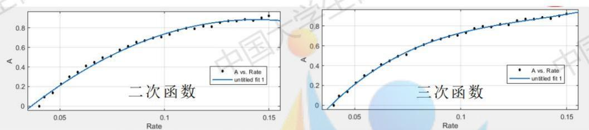  
图 5-4 信誉为 A 的客户流失率与贷款利率函数关系拟合图像

拟合结果如表 5-3 所示。

表 5-3 不同信誉等级的企业客户流失率与贷款利率的拟合关系

<table><tr><td colspan="4"> $q = f(i) = p_1 \cdot i^3 + p_2 \cdot i^2 + p_3 \cdot i + p_4$  $(p_1, p_2, p_3, p_4 \text{为相关系数})$ </td></tr><tr><td>不同信誉等级的企业</td><td>A</td><td>B</td><td>C</td></tr><tr><td> $p_1$ </td><td>634.6</td><td>545</td><td>503.4</td></tr><tr><td> $p_2$ </td><td>-256.5</td><td>-222.5</td><td>-207.2</td></tr><tr><td> $p_3$ </td><td>37.74</td><td>33.73</td><td>32.17</td></tr><tr><td> $p_4$ </td><td>-1.114</td><td>-1.008</td><td>-0.9846</td></tr><tr><td>Adjusted R-square</td><td>0.9972</td><td>0.9977</td><td>0.9977</td></tr></table>

三种信誉等级的企业客户流失率曲线的拟合度均较高, Adjusted R-square 均超过 0.99, 认为置信度较高, 拟合曲线予以采纳。

## 5.4.4 信贷策略的多目标函数与约束条件

对于一家银行来说，对不同企业进行放贷，其目标为贷款收益最大，同时客户流失率和客户违约风险要尽可能小，这样银行可以得到较为稳定丰厚的贷款收益，同时保有较稳定的客户量，有利于银行业务的发展与盈利。

因此本文以贷款收益最大、客户流失率最小、客户违约风险最小为目标，建立多目标规划模型。结合题目已知条件和假设，该规划模型需要满足以下约束：

（1）银行对不同企业的贷款额度有一定限定范围，对所有企业的贷款金额总和不超过银行贷款上限。  
(2) 银行对不同企业的贷款利率有一定限定范围。  
（3）银行对不同违约风险的企业有权决定是否放贷。  
（4）银行的客户流失会给期望收益带来一定损失，不同规模的企业客户流失价值不同。则最终的目标函数为：

$$
m a x Z = \sum_ {j = 1} ^ {1 2 3} y _ {j} [ A _ {j} \cdot i _ {j} \cdot (1 - R _ {j}) - A _ {j} \cdot 0. 2 2 \cdot R _ {j} ] (1 - q _ {j}) - M _ {j} \cdot q _ {j} \tag {29}
$$

需要满足的约束条件为:

$$
\sum_ {j = 1} ^ {1 2 3} A _ {j} \leq d \tag {30}
$$

$$
1 0 \leq A _ {j} \leq E _ {j} \tag {31}
$$

$$
0. 0 4 \leq i _ {k j} \leq 0. 1 5 \tag {32}
$$

$$
t _ {j} = A _ {j} \cdot i _ {j} \cdot P _ {j} - A _ {j} \cdot 0. 2 2 \cdot \left(1 - P _ {j}\right) \tag {33}
$$

$$
y _ {j} = \left\{ \begin{array}{l l} 0, & t _ {j} \leq 0 \\ 1, & t _ {j} > 0 \end{array} \right. \tag {34}
$$

$$
q = f (i) \tag {35}
$$

$$
M = \eta (x _ {1}, x _ {2}, x _ {3}, x _ {4}, x _ {5}, x _ {6}, x _ {7}) \tag {36}
$$

$$
R = \phi (x _ {1}, x _ {2}, x _ {3}, x _ {4}, x _ {5}, x _ {6}, x _ {7}) \tag {37}
$$

$$
P + R = 1 \tag {38}
$$

其中 M, P, R, E 分别表示客户流失价值，企业还款概率，企业违约概率与最高贷款限额，均为 $123 \times 1$ 的列向量，为解非线性规划前需要提前求解的数据。

## 5.5 问题一的求解与分析

## 5.5.1 信贷风险评估

基于附件 1 中的数据，使用改进的梯度下降决策树模型编程进行监督学习训练，通过训练集、验证集划分，集成学习，交叉验证等手段进行训练后得到最终的学习模型，通过运算可以得到，该学习模型的训练精度达到 97.24%，预测准确率为 96.75%，为了比较该模型的效果，我们分别使用了传统的未加改进的决策树算法和 BP 神经网络算法对上述数据进行了学习，结果表明，传统的决策树算法预测正确率为 83.87%，BP 神经网络的预测正确率为 59.3%，本文的改进模型使得算法的准确度分别提升了 15.36% 和 63.15%，改进效果明显，同时这也验证了本模型的准确性和有效性。

## 5.5.1.1 评估指标影响程度分析

首先本文基于该模型求解出所有自变量对于违约概率的影响程度，可以看到，银行对于企业的原信誉评级得分与企业是否可能违约的相关性最高，这说明了企业信誉等级对企业信贷风险的影响程度最大，也证明了银行对于企业的原信誉评级是可靠并且有效的。其次影响违约概率的显著因素分别为产品退货率、公司年平均营业额、年平均利润率、平均利润增长率等。

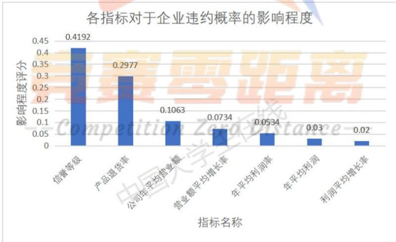

<details>
<summary>bar</summary>

| 指标名称 | 影响程度评分 |
| --- | --- |
| 信誉等级 | 0.4192 |
| 产品退货率 | 0.2977 |
| 公司年平均营业额 | 0.1063 |
| 营业额平均增长率 | 0.0734 |
| 年平均利润率 | 0.0534 |
| 年平均利润 | 0.03 |
| 利润平均增长率 | 0.02 |
</details>

图 5-5 各指标对于企业违约概率的影响程度

本文重点关注影响因素得分较高的两个评估指标：信誉等级和产品退货率。结合附件1已知信誉数据，我们统计了各企业信誉评级的平均违约概率，如图5-6所示。

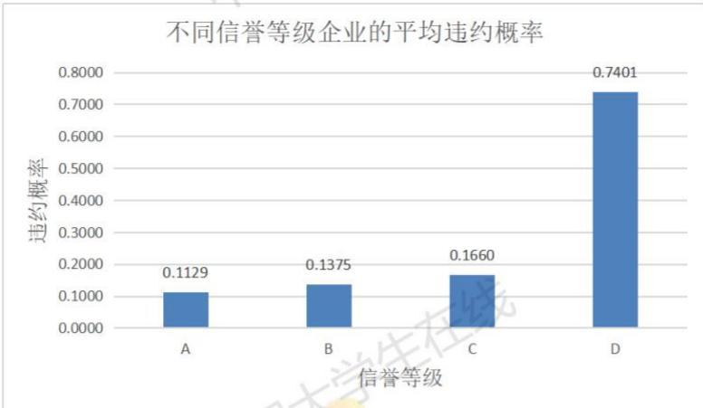

<details>
<summary>bar</summary>

| 信誉等级 | 平均违约概率 |
| --- | --- |
| A | 0.1129 |
| B | 0.1375 |
| C | 0.1660 |
| D | 0.7401 |
</details>

5-6 不同信誉等级企业的平均违约概率

在本题的学习模型训练过程中，模型参数设定违约概率大于 0.5 的企业即为有违约记录的企业。由上图可知模型所得的违约概率与企业原有信誉等级较为符合，信誉等级为 D 的企业违约概率大于 0.5，这部分企业全部有违约记录；信誉等级为 A、B、C 的企业违约概率小于 0.5，违约记录较少，且信誉等级与违约概率呈负相关关系。不同信誉等级的企业平均违约概率证明了银行不给予信誉等级为 D 的企业放贷的合理性。

在产品退货率方面，本文统计了不同规模的企业平均违约概率，如图 5-7 所示。

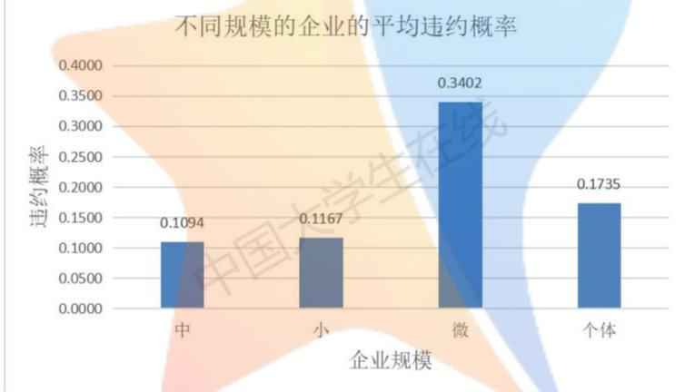

<details>
<summary>bar</summary>

| 企业规模 | 平均违约概率 |
| --- | --- |
| 中 | 0.1094 |
| 小 | 0.1167 |
| 微 | 0.3402 |
| 个体 | 0.1735 |
</details>

图 5-7 不同规模的企业的平均违约概率

产品退货率衡量的是企业提供的产品或服务的质量，产品退货率越高，说明企业产品或服务质量越有可能存在缺陷，这与企业自身生产、监测与服务有关，与企业规模这一指标类似，都是企业实力的反映。由图可知，中型和小型规模企业的违约概率较低，且相差不大，银行对这部分信贷风险较低的企业可以给予较多的放贷额度；微型企业的违约概率较高，银行应该对这部分信贷风险较高的企业谨慎放贷；而个体经营由于具体规模未知，其违约概率维持在一个适中且偏低的水平，银行对于这部分客户应予以更加详细深入的风险评估并制定相对应的信贷策略。

## 5.5.1.2 违约概率与信贷风险分析

基于该学习模型，本文求解出了123家企业的违约概率，部分数据见表5-4，完整数据见附录10.1.1（1）。

表 5-4 各企业违约概率（部分）

<table><tr><td>公司编号</td><td>违约概率</td><td>公司编号</td><td>违约概率</td></tr><tr><td>E1</td><td>0.114468</td><td>E10</td><td>0.088414</td></tr><tr><td>E2</td><td>0.141187</td><td>E11</td><td>0.099536</td></tr><tr><td>E3</td><td>0.088414</td><td>E12</td><td>0.107352</td></tr><tr><td>E4</td><td>0.095449</td><td>E13</td><td>0.14972</td></tr><tr><td>E5</td><td>0.21064</td><td>E14</td><td>0.088414</td></tr><tr><td>E6</td><td>0.114468</td><td>E15</td><td>0.090395</td></tr><tr><td>E7</td><td>0.082263</td><td>E16</td><td>0.088414</td></tr><tr><td>E8</td><td>0.088414</td><td>E17</td><td>0.099536</td></tr><tr><td>E9</td><td>0.088414</td><td>E18</td><td>0.088414</td></tr></table>

企业违约概率可以一定程度上衡量该企业的信贷风险。当企业借贷一年后，未能正常还款，即视作违约，包括未按时支付、金额未支付完全等情况。企业的不同违约情况会给银行带来不同程度的损失，故违约概率表示的是企业可能给银行带来的损失，包括各类违约情况所带来的损失可能性，也就是该企业的信贷风险。

因此本文采用违约概率来评估各企业的信贷风险，违约概率越高，说明该企业的信贷风险越高，可能给银行带来的信贷损失越大，银行应对这部分企业谨慎制定放贷策略。违约概率越低，说明该企业的信贷风险越低，同时也说明该企业信誉较好，银行对于这部分信誉良好、信贷风险低的企业可以给予适当贷款优惠。

## 5.5.2 信贷策略制定

## 5.5.2.1 非线性规划的最优值求解

基于 5.5.1 中解得的各公司的违约概率以及附件 1 中的数据，可以通过求解 5.4.4 中提出的非线性规划问题解出最有信贷发放策略。

在求解之前，需要获取如下数据： $M=\eta(x_{1},x_{2},x_{3},x_{4},x_{5},x_{6},x_{7})$ （客户流失价值）、 $R=\phi(x_{1},x_{2},x_{3},x_{4},x_{5},x_{6},x_{7})$ （企业违约概率）、 $q=f(i)$ （客户损失率函数）。其中客户损失率函数在5.4.3中通过多项式拟合获得，企业违约概率在5.5.1中求得，只需根据5.2.2的《办法》进行企业分类，并按5.4.1中提出的标准获取客户流失价值，企业分类部分结果如表5-5，全部结果见附录10.1.1（2）。

表 5-5 企业的行业与规模分类（部分）

<table><tr><td>企业代号</td><td>企业分类</td><td>企业规模</td><td>最高贷款额度(万元)</td><td>客户流失价值(元)</td></tr><tr><td>E1</td><td>零售业</td><td>中</td><td>100</td><td>10000</td></tr><tr><td>E2</td><td>其他未列明行业</td><td>中</td><td>100</td><td>10000</td></tr><tr><td>E3</td><td>信息传输业</td><td>中</td><td>100</td><td>10000</td></tr><tr><td>E4</td><td>其他未列明行业</td><td>中</td><td>100</td><td>10000</td></tr><tr><td>E5</td><td>租赁和商务服务业</td><td>小</td><td>60</td><td>5000</td></tr><tr><td>E6</td><td>建筑业</td><td>小</td><td>60</td><td>5000</td></tr><tr><td>E7</td><td>零售业</td><td>小</td><td>60</td><td>5000</td></tr><tr><td>E8</td><td>软件和信息技术服务业</td><td>中</td><td>100</td><td>10000</td></tr></table>

由于 MATLAB 的内置函数只能求解一般的非线性规划问题，不能求解非线性整数规划，故对 5.4.4 的规划问题进行适当调整后求解：

去掉约束条件:

$$
t _ {j} = A _ {j} \cdot i _ {j} \cdot P _ {j} - A _ {j} \cdot 0. 2 2 \cdot (1 - P _ {j}) y _ {j} = \left\{ \begin{array}{l l} 0, & t _ {j} \leq 0 \\ 1, & t _ {j} > 0 \end{array} \right. \tag {39}
$$

将改约束条件转移到目标函数中:

$$
\max Z = \sum_ {j = 1 \atop t _ {j} > 0} ^ {1 2 3} \left[ A _ {j} \cdot i _ {j} \cdot \left(1 - R _ {j}\right) - A _ {j} \cdot 0. 2 2 \cdot R _ {j} \right] \left(1 - q _ {j}\right) - M _ {j} \cdot q _ {j} \tag {40}
$$

最后利用 MATLAB 中的 fmincon 函数，可求得银行对于各企业是否放贷、具体的贷款金额与利率。

## 5.5.2.2 银行的最优信贷策略

银行对于各企业的贷款额度与利率结果如表 5-6，完整数据见附录 10.1.1（3）。由于银行年度信贷总额未确定，这里的贷款额度用额度占比来表示。

表 5-6 银行针对各企业的信贷策略（部分）

<table><tr><td>公司代号</td><td>是否放贷</td><td>额度占比</td><td>利率</td></tr><tr><td>E1</td><td>是</td><td>0.4644%</td><td>14.96%</td></tr><tr><td>E2</td><td>是</td><td>2.0539%</td><td>14.99%</td></tr><tr><td>E3</td><td>是</td><td>2.0296%</td><td>5.88%</td></tr><tr><td>E4</td><td>是</td><td>2.0294%</td><td>5.97%</td></tr><tr><td>E5</td><td>是</td><td>1.2047%</td><td>10.63%</td></tr><tr><td>E6</td><td>是</td><td>1.2315%</td><td>14.98%</td></tr><tr><td>E7</td><td>是</td><td>1.2324%</td><td>14.99%</td></tr><tr><td>E8</td><td>是</td><td>2.0557%</td><td>14.99%</td></tr><tr><td>E9</td><td>是</td><td>2.0557%</td><td>14.99%</td></tr><tr><td>E10</td><td>是</td><td>1.2071%</td><td>6.38%</td></tr><tr><td>E11</td><td>是</td><td>1.2068%</td><td>5.45%</td></tr><tr><td>E12</td><td>是</td><td>1.2065%</td><td>6.66%</td></tr><tr><td>E13</td><td>是</td><td>2.0535%</td><td>14.99%</td></tr><tr><td>E14</td><td>是</td><td>0.3851%</td><td>7.06%</td></tr><tr><td>E15</td><td>是</td><td>0.8205%</td><td>14.98%</td></tr><tr><td>E16</td><td>是</td><td>1.2322%</td><td>14.98%</td></tr><tr><td>E17</td><td>是</td><td>1.2319%</td><td>14.98%</td></tr><tr><td>E18</td><td>是</td><td>1.2322%</td><td>14.98%</td></tr></table>

基于非线性规划模型的最优值求解结果，本文得出了银行针对各企业的最优信贷策略，如下图所示。

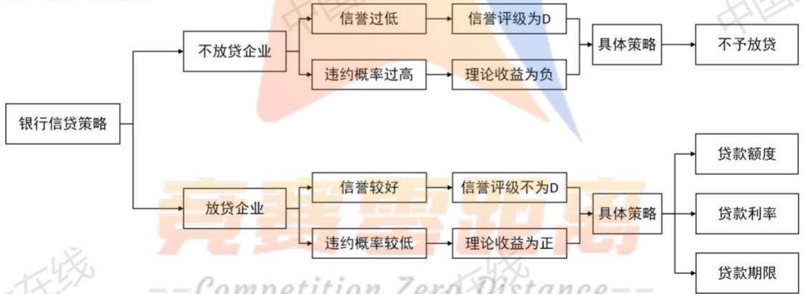

<details>
<summary>flowchart</summary>

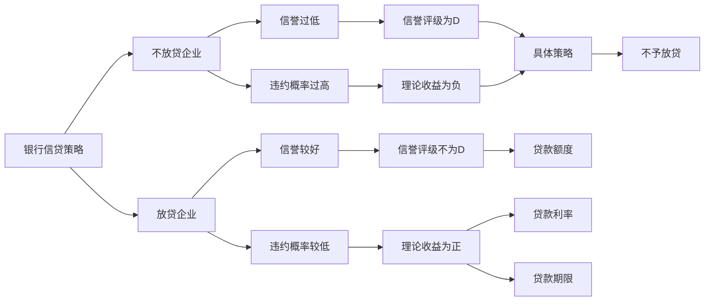
```mermaid
graph LR
  A["银行信贷策略"] --> B["不放贷企业"]
  A --> C["放贷企业"]
  
  B --> D["信誉过低"]
  B --> E["违约概率过高"]
  
  D --> F["信誉评级为D"]
  E --> G["理论收益为负"]
  
  F --> H["具体策略"]
  G --> H
  
  C --> I["信誉较好"]
  C --> J["违约概率较低"]
  
  I --> K["信誉评级不为D"]
  J --> L["理论收益为正"]
  
  K --> M["贷款额度"]
  L --> N["贷款利率"]
  L --> O["贷款期限"]
  
  H --> P["不予放贷"]
```
</details>

图 5-8 银行信贷策略

本文中，银行的信贷策略主要从是否放贷、贷款额度、贷款利率和贷款期限四个方面来考虑。银行不予信誉评级为D的企业和理论收益 $t_{j}$ 为负的企业发放贷款；对其他企业予以放贷，贷款期限均为一年，贷款额度和贷款利率针对不同企业而有所不同。基于以上信贷策略，能够保证银行的贷款收益最大化，同时使已有客户的流失率最小、违约风险最低，本文认为这即是最佳信贷策略。

## 六、问题二的模型建立与求解

## 6.1 思路分析

本题对于中小微企业的信贷策略的解题思路与问题一类似, 不同之处在于对企业进行信贷风险评估之前, 首先需要构建模型对无信贷记录的企业信誉等级进行预估, 然后应用问题一的两个模型, 进行信贷风险评估与信贷策略制定, 问题二的思路流程图如下。

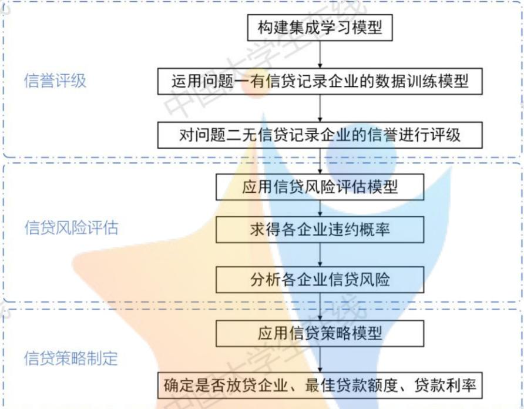

<details>
<summary>flowchart</summary>

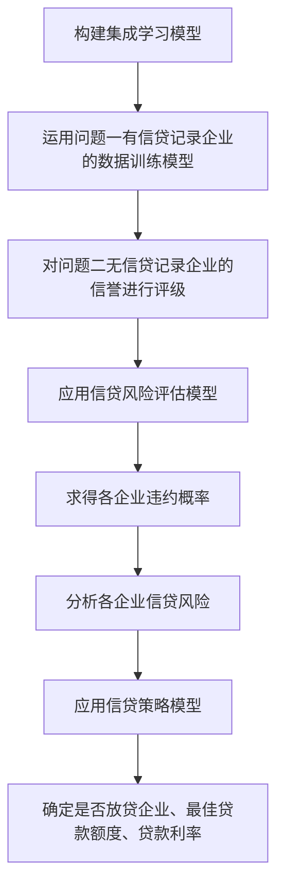
```mermaid
graph TD
  A["构建集成学习模型"] --> B["运用问题一有信贷记录企业的数据训练模型"]
  B --> C["对问题二无信贷记录企业的信誉进行评级"]
  C --> D["应用信贷风险评估模型"]
  D --> E["求得各企业违约概率"]
  E --> F["分析各企业信贷风险"]
  F --> G["应用信贷策略模型"]
  G --> H["确定是否放贷企业、最佳贷款额度、贷款利率"]
```
</details>

图 6-1 问题二思路流程图

## 6.2 信誉评级模型建立

经过第一问的模型求解与结果分析可知,企业的信誉等级与该企业违约风险的高低存在着高度的正相关关系,企业的信誉等级越高,则企业的违约风险就越低,因此企业的信贷违约记录以及信誉等级是银行用于评估企业违约概率极为重要的一个指标。而问题二所提供的302家企业没有信贷记录以及信誉评级,因此在信贷风险评估之前有必要基于企业的规模、盈利状况等信息建立数学模型,对各企业的信誉进行评级。

对企业的信誉评级结果共分为 A、B、C、D 四级，该问题本质是一个多分类问题，因此可以同样基于前文使用的改进的梯度下降决策树算法建立集成学习模型，基于问题 1 中 123 家有信誉评级信息企业的数据训练模型，之后将训练好的模型用于问题 2 中 302 家企业的信用评级。

假设对于企业 j，其信誉等级用 $C_{j}$ 表示，其中：

$$
\mathrm{C} _ {\mathrm{j}} = \{i | i \in A, B, C, D \} \tag {41}
$$

建立信誉等级与企业信息的决策树模型，其目标函数为：

$$
\mathrm{C} _ {\mathrm{j}} = \phi (x _ {1}, x _ {2}, x _ {3}, x _ {4}, x _ {5}, x _ {6}) = \sum_ {i = 1} ^ {n} l \left(y _ {i}, \hat {y} _ {i} ^ {(t - 1)} + f _ {t} (x _ {i})\right) + \delta (f _ {t}) + c o n s t a n t \tag {42}
$$

其中 $x_{i}$ (i=1,2...6)分别表示企业规模、企业平均利润、企业平均年利润率、企业平均年利润增长率、企业平均销售额增长率与企业服务或产品质量；l为损失函数， $\delta(f_{t})$ 为正则项，constant为常数项。

该学习模型的建立与优化过程与信贷风险评估模型类似，首先构建单棵决策树 $f(x_{i})$ ，之

后基于梯度下降方法，得到每次决策树分裂时的收益：

$$
\mathrm{Gain} = \frac {1}{2} \left[ \frac {G _ {L} ^ {2}}{H _ {L} + \lambda} + \frac {G _ {R} ^ {2}}{H _ {R} + \lambda} - \frac {(G _ {L} + G _ {R}) ^ {2}}{H _ {L} + H _ {R} + \lambda} \right] - \gamma \tag {43}
$$

基于泰勒公式展开计算损失函数在每个训练样本点的一阶导数和二阶导数, 通过贪心策略生成新的决策树, 基于加法模型将每次迭代生成的决策树模型相加集成, 构建集成学习决策树, 进而得到一个强分类器:

$$
\widehat {y} _ {i} = \sum_ {k = 1} ^ {K} f _ {k} (x _ {i}), f _ {k} \epsilon F \tag {44}
$$

此时目标函数的值为:

$$
R _ {j} ^ {t} = - \frac {1}{2} \sum_ {j = 1} ^ {T} \frac {G _ {j} ^ {2}}{H _ {j} + \lambda} + \gamma T \tag {45}
$$

其具体的实现细节在上一节中已经有详细解释，不再赘述。

## 6.3 问题二的求解与分析

本文首先运用 6.2 信誉评级模型对 302 家无信贷记录的企业进行评级，然后将信誉评级为 A、B、C 的企业继续运用 5.3 和 5.4 所建立的模型求解，得到企业的信贷风险和最佳信贷策略。

## 6.3.1 无信贷记录企业的信誉评级

基于信誉评级模型，本文给出所有无信贷记录的预估信誉等级，部分结果如表 6-1，完整数据见附录 10.1.2（1）。

表 6-1 各公司信誉等级（部分）

<table><tr><td>公司编号</td><td>评级得分</td></tr><tr><td>E124</td><td>B</td></tr><tr><td>E125</td><td>B</td></tr><tr><td>E126</td><td>B</td></tr><tr><td>E127</td><td>B</td></tr><tr><td>E128</td><td>B</td></tr><tr><td>E129</td><td>B</td></tr><tr><td>E130</td><td>B</td></tr><tr><td>E131</td><td>B</td></tr><tr><td>E132</td><td>B</td></tr></table>

本文统计了无信贷记录的 302 家企业的各信誉等级和规模计数，如图 6-2 所示。

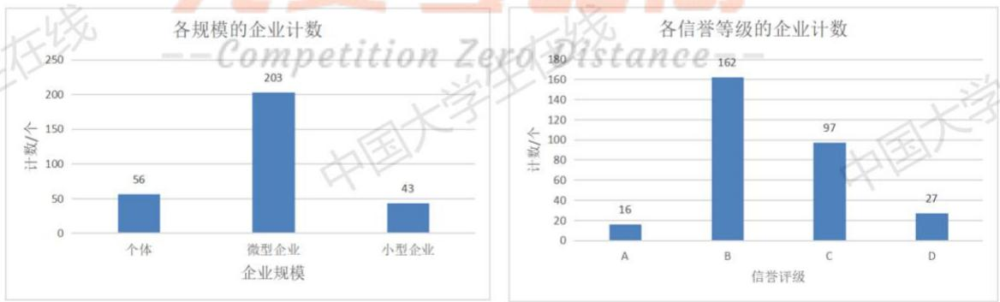  
图 6-2 各信誉等级和规模的企业计数

可以看到这 302 家企业中微型企业占绝大部分，并且没有中型企业，这部分企业的规模均较小；在信誉评级中，大多数企业评级为 B 和 C，这与企业规模、企业自身实力相符。对于大部分企业规模较小、信誉评级不高的企业，银行应更加详细深入地对其信贷风险进行评估，谨慎制定放贷策略。

## 6.3.2 信贷风险评估

基于 6.3.1 所求的各企业的信誉评级与附件 2 已知数据，本文直接运用 5.3 所建立的信贷风险模型对企业进行风险评估，其违约概率结果（部分）如表 6-2，完整数据见附录 10.1.2（2）。

表 6-2 无信贷记录的企业违约概率

<table><tr><td>公司编号</td><td>违约概率</td></tr><tr><td>E124</td><td>0.439356714</td></tr><tr><td>E125</td><td>0.414479107</td></tr><tr><td>E126</td><td>0.441195905</td></tr><tr><td>E127</td><td>0.467635691</td></tr><tr><td>E128</td><td>0.441195905</td></tr><tr><td>E129</td><td>0.467635691</td></tr><tr><td>E130</td><td>0.47423476</td></tr><tr><td>E131</td><td>0.467635691</td></tr><tr><td>E132</td><td>0.467635691</td></tr></table>

本文统计了不同规模的企业平均违约概率，如图 6-3 所示。

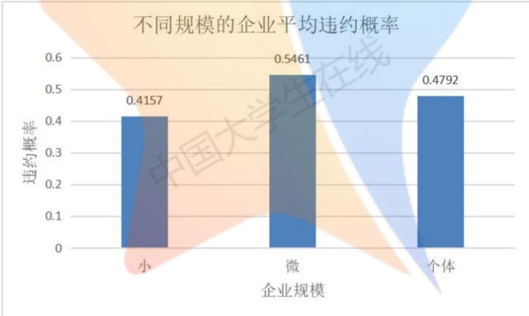

<details>
<summary>bar</summary>

| 企业规模 | 违约概率 |
| --- | --- |
| 小 | 0.4157 |
| 微 | 0.5461 |
| 个体 | 0.4792 |
</details>

图 6-3 不同规模企业的平均违约概率

由图知 302 家无信贷记录的企业以微型公司为主，没有中型规模公司，其普遍违约概率较高，与上文所得信誉评级普遍较低相符合。银行对于这部分小、微企业，应该采取更加谨慎的放贷策略。

## 6.3.3 信贷策略制定

问题二中，求解贷款方案采用的模型与问题一相同，故直接给出求解结果。

利用附件 2 和《办法》的数据对企业进行分类，方法与问题一相同，部分结果如表 6-3，完整数据见附录 10.1.2（3）。

表 6-3 各企业规模、行业类别等信息分类

<table><tr><td>企业代号</td><td>企业类别</td><td>企业规模</td><td>客户流失价值(元)</td><td>最高贷款额度(万元)</td></tr><tr><td>E134</td><td>租赁和商务服务业</td><td>微</td><td>2000</td><td>60</td></tr><tr><td>E135</td><td>建筑业</td><td>小</td><td>5000</td><td>100</td></tr><tr><td>E136</td><td>工业</td><td>小</td><td>5000</td><td>100</td></tr><tr><td>E137</td><td>建筑业</td><td>小</td><td>5000</td><td>100</td></tr><tr><td>E138</td><td>个体</td><td>个体</td><td>1000</td><td>40</td></tr></table>

对附件二进行计算时，发现使用 0.22 的贷款违约损失率仍旧会导致大部分企业无法获得贷款，因此再次放宽模型条件，只要企业的违约风险低于 50%，即可以向企业发放贷款。即假设企业违约时银行的损失仅为利息部分，本金可以追回。在上述假设下，非线性规划模型简化为如下形式：

目标函数:

$$
\max Z = \sum_ {j = 1 \atop t _ {j} > 0} ^ {3 0 2} [ A _ {j} \cdot i _ {j} \cdot (1 - 2 R _ {j}) ] (1 - q _ {j}) - M _ {j} \cdot q _ {j} \tag {46}
$$

约束条件:

$$
\sum_ {j = 1} ^ {3 0 2} A _ {j} \leq d \tag {47}
$$

$$
1 0 \leq A _ {j} \leq E _ {j} \tag {48}
$$

$$
0. 0 4 \leq i _ {j} \leq 0. 1 5 \tag {49}
$$

$$
q = f (i) \tag {50}
$$

$$
M = \eta (x _ {1}, x _ {2}, x _ {3}, x _ {4}, x _ {5}, x _ {6}, x _ {7}) \tag {51}
$$

$$
R = \phi (x _ {1}, x _ {2}, x _ {3}, x _ {4}, x _ {5}, x _ {6}, x _ {7}) \tag {52}
$$

$$
E = \tau (x _ {1}, x _ {2}, x _ {3}, x _ {4}, x _ {5}, x _ {6}, x _ {7}) \tag {53}
$$

其中 M, R, E 分别表示客户流失价值，企业违约概率与最高贷款限额，均为 $302 \times 1$ 的列向量，为解非线性规划前需要提前求解的数据。

利用 MATLAB 中的 fmincon 函数求解贷款策略结果如表 6-4，完整数据见附录 10.1.2（4）。

表 6-4 银行针对各企业的信贷策略（部分）

<table><tr><td>公司</td><td>是否放贷</td><td>额度(万元)</td><td>利率</td></tr><tr><td>E124</td><td>是</td><td>11.90</td><td>6.51%</td></tr><tr><td>E125</td><td>是</td><td>31.30</td><td>5.46%</td></tr><tr><td>E126</td><td>是</td><td>31.29</td><td>5.77%</td></tr><tr><td>E127</td><td>是</td><td>31.28</td><td>6.27%</td></tr><tr><td>E128</td><td>是</td><td>31.29</td><td>5.77%</td></tr><tr><td>E129</td><td>是</td><td>31.28</td><td>6.27%</td></tr><tr><td>E130</td><td>是</td><td>31.28</td><td>6.44%</td></tr><tr><td>E131</td><td>是</td><td>31.28</td><td>6.27%</td></tr><tr><td>E132</td><td>是</td><td>31.28</td><td>6.27%</td></tr><tr><td>E133</td><td>是</td><td>31.29</td><td>5.77%</td></tr><tr><td>E134</td><td>是</td><td>51.27</td><td>4.79%</td></tr><tr><td>E135</td><td>是</td><td>91.26</td><td>4.13%</td></tr><tr><td>E136</td><td>是</td><td>91.26</td><td>4.07%</td></tr><tr><td>E137</td><td>是</td><td>91.26</td><td>4.01%</td></tr><tr><td>E138</td><td>是</td><td>31.29</td><td>5.77%</td></tr><tr><td>E139</td><td>是</td><td>31.28</td><td>6.27%</td></tr><tr><td>E140</td><td>是</td><td>91.25</td><td>4.33%</td></tr><tr><td>E141</td><td>是</td><td>51.26</td><td>4.96%</td></tr></table>

无信贷记录的企业没有银行的信誉评级，为了给这部分企业放贷，银行需要基于其企业实力对其信誉等级进行预估，再进行相应的信贷风险评估与信贷策略制定。最终的信贷策略与问题一相同，从是否放贷、贷款额度、贷款利率和贷款期限四个方面来考虑，但具体针对各企业的贷款额度和贷款利率有所不同。

## 七、问题三的建模与分析

## 7.1 思路分析

企业的生产经营与利润效益经常会受到市场环境、国家政策甚至一些外界突发因素的影响，这些因素往往对于不同行业、不同类别的企业有着不同的影响，而对于企业造成的种种影响也会通过信用贷款等途径简介传递到银行，从而影响银行的资金安全和盈利能力。因此，银行在对企业确定是否借贷、借贷额度以及最佳利率之前，需要同时充分考虑各企业的信贷风险以及可能的突发因素对于各企业的影响。

本文首先基于统计局颁布的《统计上大中小微企业划分方法》，将附件2中所企业按照行业类别、企业规模进行分类，共分为14个行业大类、4个规模大类。之后以新冠肺炎疫情为例，从宏观和微观两个层面分析了不同行业、不同规模的企业所受到的疫情影响的严重程度，从宏观层面，本文选择各行业具有代表性的上市公司股票，基于Python爬虫爬取了各行业从新冠疫情爆发以来至今的股票价格信息，以股票价格的波动作为分析该行业的发展与恢复情况的基本指标；在微观层面，本文从302家企业中随机抽取72家企业分析其2020年1月、2月与2018年、2019年同期的同比增长率，以此判定企业的运营状况，之后结合宏观与微观分析，本文将各类企业按照受疫情影响程度分为四类。最后，由于新冠肺炎疫情属于严重影响社会经济发展的重大突发类事件，因此国家和各级政府在今年出台了多种扶持政策，以重点帮助疫情重灾区行业、特别是中小企业的渡过难关，在贷款方面也要求银行加大信贷支持力度、中央财政安排贴息资金支持等措施，本文银行在考虑借贷策略时，需要同时考虑国家政策倾斜以及银行利润最大两个目标。故本文引入市场风险函数、政策影响因子等指标，同时考虑信贷风险、市场风险、国家政策和社会效益，建立多目标非线性规划函数，并且进行求解，并与第二问求得的结果进行对比，得到该银行年度信贷额度为1亿元时的信贷调整策略。具体的思路流程图如下：

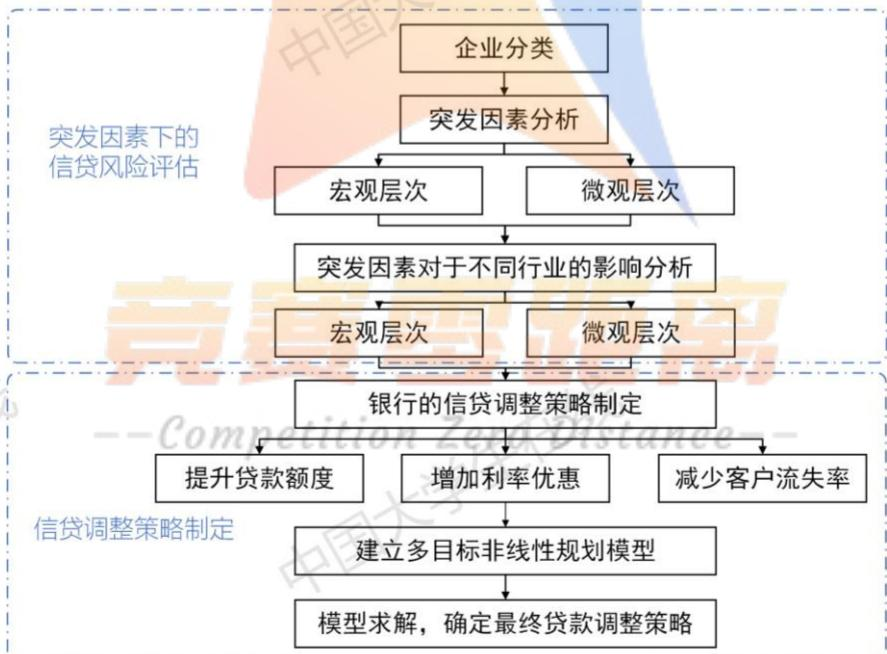

<details>
<summary>flowchart</summary>

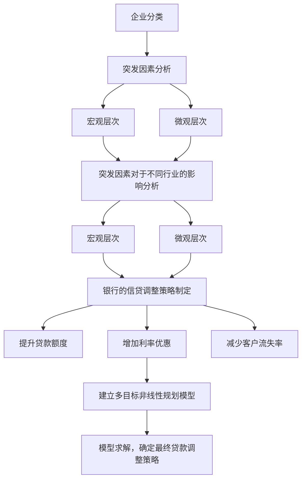
```mermaid
graph TD
  A["企业分类"] --> B["突发因素分析"]
  B --> C["宏观层次"]
  B --> D["微观层次"]
  C --> E["突发因素对于不同行业的影响分析"]
  D --> E
  E --> F["宏观层次"]
  E --> G["微观层次"]
  F --> H["银行的信贷调整策略制定"]
  G --> H
  H --> I["提升贷款额度"]
  H --> J["增加利率优惠"]
  H --> K["减少客户流失率"]
  J --> L["建立多目标非线性规划模型"]
  L --> M["模型求解，确定最终贷款调整策略"]
```
</details>

图 7-1 问题三思路流程图

## 7.2 无信贷记录企业的行业和规模分类

由于各类突发事件对于不同行业、不同规模、不同类别的企业造成的影响可能不同，因此有必要对于各类企业进行分类，针对不同企业规模、行业类别的企业进行研究。基于 5.2.2 的分类，302 家无信贷记录的企业分类结果统计如下。

表 7-1 各企业的规模和行业统计

<table><tr><td>序号</td><td>行业类别</td><td>中型企业</td><td>小型企业</td><td>微企业</td><td>个体户</td><td>合计</td></tr><tr><td>1</td><td>工业</td><td>0</td><td>0</td><td>0</td><td>0</td><td>38</td></tr><tr><td>2</td><td>建筑业</td><td>0</td><td>5</td><td>33</td><td>0</td><td>50</td></tr><tr><td>3</td><td>交通运输业</td><td>0</td><td>12</td><td>38</td><td>0</td><td>9</td></tr><tr><td>4</td><td>零售业</td><td>0</td><td>4</td><td>5</td><td>0</td><td>14</td></tr><tr><td>5</td><td>农林牧渔业</td><td>0</td><td>2</td><td>12</td><td>0</td><td>6</td></tr><tr><td>6</td><td>批发业</td><td>0</td><td>3</td><td>3</td><td>0</td><td>4</td></tr><tr><td>7</td><td>软件和信息技术服务业</td><td>0</td><td>12</td><td>10</td><td>0</td><td>22</td></tr><tr><td>8</td><td>物业管理</td><td>0</td><td>0</td><td>2</td><td>0</td><td>2</td></tr><tr><td>9</td><td>信息传输业</td><td>0</td><td>4</td><td>4</td><td>0</td><td>8</td></tr><tr><td>10</td><td>住宿业</td><td>0</td><td>0</td><td>2</td><td>0</td><td>2</td></tr><tr><td>11</td><td>租赁和商业服务业</td><td>0</td><td>1</td><td>49</td><td>0</td><td>50</td></tr><tr><td>12</td><td>餐饮业</td><td>0</td><td>0</td><td>1</td><td>0</td><td>1</td></tr><tr><td>13</td><td>房地产开发经营</td><td>0</td><td>0</td><td>3</td><td>0</td><td>3</td></tr><tr><td>14</td><td>其他未列明行业</td><td>0</td><td>0</td><td>12</td><td>54</td><td>66</td></tr></table>

可以看到，附件 2 中的企业多为小型或者微型企业或者个体经营户，无中型企业，其中交通运输业、建筑业、租赁与商业服务业的微型企业占比最高。

## 7.3 突发因素对于企业影响分析

突发事件是人们对于出乎意料的事件的总称，这种事件通常会造成巨大的经济损失或者人员伤亡，甚至危害到国家的政治安全、经济安全等，突发事件通常具有信息不全性、突发性、高度不确定性等特征，对于市场经济环境中的中小型企业来说，由于中小型企业普遍存在人才资源储备不足、现金流短缺、资金链脆弱等问题，导致大部分中小型企业的风险承受能力较低，在应对突发因素时如果没有得到贷款或外界的援助，难以仅依靠自身渡过难关。对于突发因素总体可以分为两类，宏观层面的突发因素、和企业微观层面的突发因素，前者往往可能是由于国家或者全球政治、经济、公共卫生重大事件所导致的连锁反应（如中美贸易摩擦、新冠肺炎疫情的爆发等），后者则可能是由于企业自身或者上下游供应链导致的一系列问题（例如自身产品质量缺陷、公关危机、供应链断裂等），其各种突发因素极为复杂，本文以新冠肺炎疫情的爆发为例，详细分析这种重大突发性公共卫生事件对于不同企业的影响。

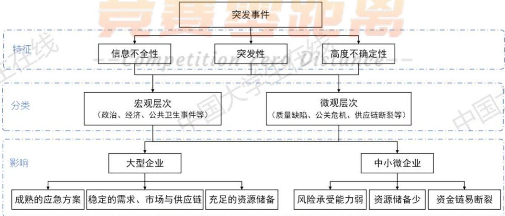

<details>
<summary>flowchart</summary>

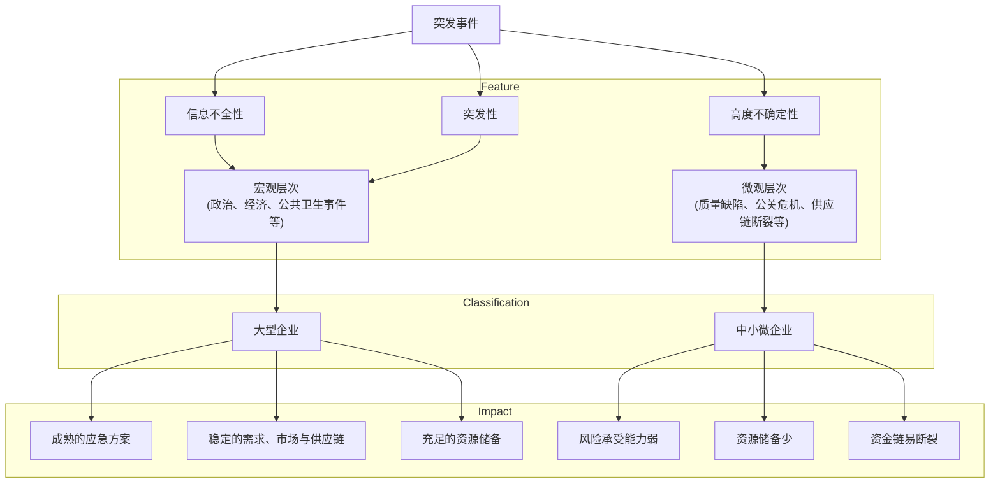
```mermaid
graph TD
  A["突发事件"] --> B["信息不全性"]
  A --> C["突发性"]
  A --> D["高度不确定性"]
  
  subgraph Feature
  B --> E["宏观层次\n(政治、经济、公共卫生事件等)"]
  C --> E
  D --> F["微观层次\n(质量缺陷、公关危机、供应链断裂等)"]
  end
  
  subgraph Classification
  E --> G["大型企业"]
  F --> H["中小微企业"]
  end
  
  subgraph Impact
  G --> I["成熟的应急方案"]
  G --> J["稳定的需求、市场与供应链"]
  G --> K["充足的资源储备"]
  H --> L["风险承受能力弱"]
  H --> M["资源储备少"]
  H --> N["资金链易断裂"]
  end
```
</details>

图 7-2 突发事件分析

为了评估新冠肺炎疫情对于不同行业、不同类别企业的影响，本文将从宏观层面和微观层面分别进行分析。

在宏观层面, 股票市场的价格波动往往能够非常真实且迅速地反映出整个行业的发展现状, 可以看做每个行业发展的 “晴雨表”, 因此本文选取每个行业中 1-3 支典型的上市公司股票作为分析对象, 分析目标公司在新冠肺炎疫情期间的股票价格变化趋势、涨跌幅等信息, 从而判断新冠肺炎疫情对于不同行业的影响情况。

在微观层面，由于新冠肺炎疫情从2020年1月开始爆发，而附件2中包含部分企业的2020年1月-2月的进、销项发票信息，因此本文基于附件2中各企业的2017年-2020年1、2月份的进销项发票信息得到各年份的1、2月份的营业额，进行营销额同比增长分析，进而分析出不同规模、不同行业的企业受到新冠肺炎疫情影响程度。

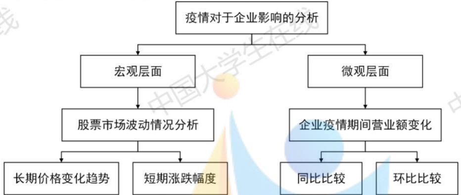

<details>
<summary>flowchart</summary>

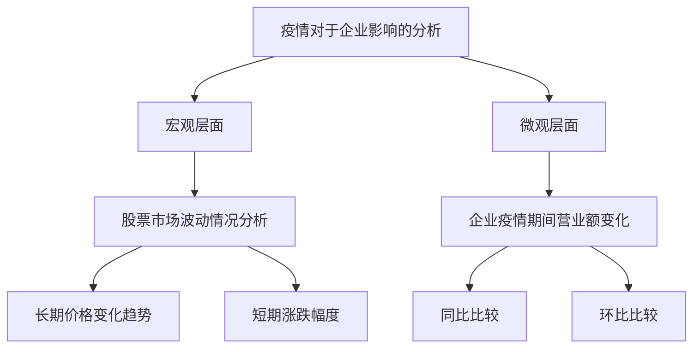
```mermaid
graph TD
  A["疫情对于企业影响的分析"] --> B["宏观层面"]
  A --> C["微观层面"]
  B --> D["股票市场波动情况分析"]
  C --> E["企业疫情期间营业额变化"]
  D --> F["长期价格变化趋势"]
  D --> G["短期涨跌幅度"]
  E --> H["同比比较"]
  E --> I["环比比较"]
```
</details>

图 7-3 疫情对企业影响的分析

## 7.3.1 宏观层面分析

通过调查和筛选，本文选择各个行业有代表的3支上市公司股票进行分析，选择的股票及对应信息如下：

表 7-2 各行业部分上市公司信息

<table><tr><td>所在行业</td><td>上市公司名称</td><td>股票代码</td></tr><tr><td rowspan="3">工业</td><td>中石油</td><td>sh.601857</td></tr><tr><td>山东黄金</td><td>sh.600547</td></tr><tr><td>中国神华</td><td>sh.601088</td></tr><tr><td rowspan="3">建筑业</td><td>中国建筑</td><td>sh.601668</td></tr><tr><td>中国中铁</td><td>sh.601390</td></tr><tr><td>中国交建</td><td>sh.601800</td></tr><tr><td rowspan="3">交通运输业</td><td>顺丰控股</td><td>sz.002352</td></tr><tr><td>大秦铁路</td><td>sh.601006</td></tr><tr><td>上港集团</td><td>sh.600018</td></tr><tr><td rowspan="3">零售业</td><td>海澜之家</td><td>sh.600398</td></tr><tr><td>森马服饰</td><td>sz.002563</td></tr><tr><td>永辉超市</td><td>sh.601933</td></tr><tr><td rowspan="3">农林牧渔业</td><td>隆平高科</td><td>sz.000998</td></tr><tr><td>牧原股份</td><td>sz.002714</td></tr><tr><td>海南橡胶</td><td>sh.601118</td></tr><tr><td rowspan="3">批发业</td><td>华东医药</td><td>sz.000963</td></tr><tr><td>九州通</td><td>sh.600998</td></tr><tr><td>苏宁易购</td><td>sz.002024</td></tr><tr><td rowspan="3">软件和信息技术服务业</td><td>完美世界</td><td>sz.002624</td></tr><tr><td>用友网络</td><td>sh.600588</td></tr><tr><td>恒生电子</td><td>sh.600570</td></tr><tr><td rowspan="3">物业管理</td><td>南国置业</td><td>sz.002305</td></tr><tr><td>绿地控股</td><td>sh.600606</td></tr><tr><td>南都物业</td><td>sh.603506</td></tr><tr><td rowspan="3">信息传输业</td><td>启明信息</td><td>sz.002232</td></tr><tr><td>软控股份</td><td>sz.002073</td></tr><tr><td>恒宝股份</td><td>sz.002104</td></tr><tr><td rowspan="3">住宿业</td><td>锦江酒店</td><td>sh.600754</td></tr><tr><td>首旅酒店</td><td>sh.600258</td></tr><tr><td>华天酒店</td><td>sz.000428</td></tr><tr><td rowspan="3">租赁和商务服务业</td><td>渤海租赁</td><td>sz.000415</td></tr><tr><td>皇庭国际</td><td>sz.000056</td></tr><tr><td>中青旅</td><td>sh.601888</td></tr><tr><td rowspan="3">餐饮业</td><td>全聚德</td><td>sz.002186</td></tr><tr><td>西安饮食</td><td>sz.000721</td></tr><tr><td>ST云网</td><td>sz.002306</td></tr><tr><td rowspan="3">房地产行业</td><td>万科</td><td>sz.000002</td></tr><tr><td>保利地产</td><td>sh.600048</td></tr><tr><td>华夏幸福</td><td>sh.600340</td></tr></table>

本文利用 Python 爬虫，从新浪财经、东方财富等知名财经网站对于上述股票的每日价格变动信息进行爬取。之后本文对于上述股票进行了股票价格分析，设定疫情爆发开始时间为 2020 年 1 月 20 日，计算从 1 月 20 日开始至 2020 年 7 月上述股票的最大跌幅、首次回复上涨时间、以及恢复到疫情之前股价所需时间等指标。股票最大跌幅可以反映该行业该公司对于公共卫生事件产生的风险承受能力，首次恢复上涨时间可以反映市场对于该行业的信心以及该行业自身的恢复情况，而股价回复时间这一指标可以反映该行业该公司自身的回复状况，本文计算分析得到的结果如下：

表 7-3 所选企业的股票变化信息

<table><tr><td>分类</td><td>企业</td><td>代码</td><td>疫情起点</td><td>首次回复日期</td><td>回复时间</td><td>最大跌幅</td><td>备注</td></tr><tr><td>工业</td><td>中国神华</td><td>sh.601088</td><td>1月20日</td><td>7月6日</td><td>168</td><td>18.87%</td><td></td></tr><tr><td>建筑业</td><td>中国交建</td><td>sh.601800</td><td>1月20日</td><td>3月2日</td><td>42</td><td>17.92%</td><td></td></tr><tr><td>交通运输业</td><td>上港集团</td><td>sh.600018</td><td>1月20日</td><td>9月11日</td><td>235</td><td>28.16%</td><td>未恢复到原价</td></tr><tr><td>零售业</td><td>海澜之家</td><td>sh.600398</td><td>1月20日</td><td>9月11日</td><td>235</td><td>26.18%</td><td>未恢复到原价</td></tr><tr><td>农林牧渔业</td><td>海南橡胶</td><td>sh.601118</td><td>1月20日</td><td>3月13日</td><td>53</td><td>20.62%</td><td></td></tr><tr><td>批发业</td><td>苏宁易购</td><td>sz.002024</td><td>1月20日</td><td>7月9日</td><td>171</td><td>22.26%</td><td></td></tr><tr><td>软件和信息技术服务业</td><td>恒生电子</td><td>sh.600570</td><td>1月20日</td><td>2月6日</td><td>17</td><td>13.47%</td><td></td></tr><tr><td>物业管理</td><td>南都物业</td><td>sh.603506</td><td>1月20日</td><td>2月19日</td><td>30</td><td>18.30%</td><td></td></tr><tr><td>信息传输业</td><td>恒宝股份</td><td>sz.002104</td><td>1月20日</td><td>2月24日</td><td>35</td><td>21.45%</td><td></td></tr><tr><td>住宿业</td><td>华天酒店</td><td>sz.000428</td><td>1月20日</td><td>3月2日</td><td>42</td><td>17.94%</td><td></td></tr><tr><td>租赁和商业服务业</td><td>中青旅</td><td>sh.601888</td><td>1月20日</td><td>8月12日</td><td>205</td><td>22.67%</td><td></td></tr><tr><td>餐饮业</td><td>ST云网</td><td>sz.002306</td><td>1月20日</td><td>3月18日</td><td>58</td><td>14.39%</td><td></td></tr><tr><td>房地产</td><td>华夏幸福</td><td>sh.600340</td><td>1月20日</td><td>7月6日</td><td>168</td><td>25.93%</td><td></td></tr></table>

开发经营  
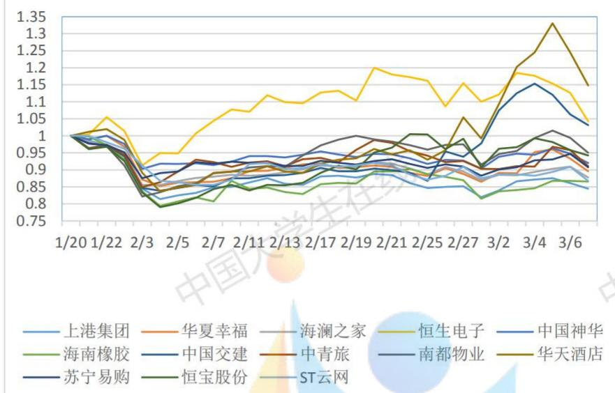

<details>
<summary>line</summary>

| Date | 上港集团 | 华夏幸福 | 海澜之家 | 恒生电子 | 中国神华 | 海南橡胶 | 中国交建 | 中青旅 | 南都物业 | 华天酒店 | 苏宁易购 | 恒宝股份 | ST云网 |
| --- | --- | --- | --- | --- | --- | --- | --- | --- | --- | --- | --- | --- | --- |
| 1/20 | 1.0 | 1.0 | 1.0 | 1.0 | 1.0 | 1.0 | 1.0 | 1.0 | 1.0 | 1.0 | 1.0 | 1.0 | 1.0 |
| 1/22 | ~0.98 | ~0.98 | ~0.98 | ~1.05 | ~0.98 | ~0.98 | ~0.98 | ~0.98 | ~0.98 | ~1.02 | ~0.98 | ~0.98 | ~0.98 |
| 2/3 | ~0.85 | ~0.85 | ~0.85 | ~0.92 | ~0.85 | ~0.85 | ~0.85 | ~0.85 | ~0.85 | ~0.85 | ~0.85 | ~0.85 | ~0.85 |
| 2/5 | ~0.92 | ~0.92 | ~0.92 | ~0.95 | ~0.92 | ~0.82 | ~0.92 | ~0.92 | ~0.92 | ~0.92 | ~0.92 | ~0.79 | ~0.82 |
| 2/7 | ~0.92 | ~0.92 | ~0.92 | ~1.02 | ~0.92 | ~0.85 | ~0.92 | ~0.92 | ~0.92 | ~0.92 | ~0.92 | ~0.85 | ~0.85 |
| 2/11 | ~0.94 | ~0.94 | ~0.94 | ~1.08 | ~0.94 | ~0.88 | ~0.94 | ~0.94 | ~0.94 | ~0.94 | ~0.94 | ~0.85 | ~0.88 |
| 2/13 | ~0.94 | ~0.94 | ~0.94 | ~1.12 | ~0.94 | ~0.88 | ~0.94 | ~0.94 | ~0.94 | ~0.94 | ~0.94 | ~0.85 | ~0.88 |
| 2/17 | ~0.95 | ~0.95 | ~0.95 | ~1.13 | ~0.95 | ~0.88 | ~0.95 | ~0.95 | ~0.95 | ~0.95 | ~0.95 | ~0.85 | ~0.88 |
| 2/19 | ~0.95 | ~0.95 | ~1.0 | ~1.13 | ~0.95 | ~0.88 | ~0.95 | ~0.95 | ~1.0 | ~1.13 | ~0.95 | ~0.85 | ~0.88 |
| 2/21 | ~0.95 | ~0.95 | ~1.05 | ~1.17 | ~0.95 | ~0.88 | ~0.95 | ~1.17 | ~1.17 | ~1.17 | ~1.17 | ~1.17 | ~1.17 |
| 2/25 | ~0.95 | ~0.95 | ~1.05 | ~1.16 | ~0.95 | ~0.88 | ~0.95 | ~1.16 | ~1.16 | ~1.16 | ~1.16 | ~1.16 | ~1.16 |
| 2/27 | ~0.95 | ~0.95 | ~1.05 | ~1.16 | ~0.95 | ~0.88 | ~0.95 | ~1.16 | ~1.16 | ~1.16 | ~1.16 | ~1.16 | ~1.16 |
| 3/2 | ~1.13 | ~1.13 | ~1.13 | ~1.23 | ~1.13 | ~0.85 | ~1.13 | ~1.23 | ~1.23 | ~1.23 | ~1.23 | ~1.23 | ~1.23 |
| 3/4 | ~1.33 | ~1.33 | ~1.33 | ~1.33 | ~1.33 | ~0.87 | ~1.33 | ~1.33 | ~1.33 | ~1.33 | ~1.33 | ~1.33 | ~1.33 |
</details>

图 7-4 所选公司股票变化

从上述结果可以看到，各行业公司股价在疫情爆发初期均有着较大程度的下跌，这与人们当时对于疫情未知导致的巨大恐慌有关，一段时间后，部分行业的股价迅速上涨，恢复到疫情之前的水平，甚至还存在进一步的上涨，说明该行业收到疫情的影响很小，甚至疫情对于该行业的发展具有利好效应（如软件和信息技术服务业、工业、建筑业、信息传输业等），而部分行业的企业则受到疫情的冲击较大，这个可以从两方面的数据中看出，一方面，这些行业疫情期间的股价最大下跌幅度大于其他行业；另一方面，该行业（如交通运输业、零售业、租赁和商务服务业等）公司的股价恢复速度也远远慢于其他行业，这说明一方面该行业并没有完全恢复，另一方面，投资者对于该行业的投资信息也没有完全恢复。

基于上述分析，首先将所有企业按照所在行业受疫情影响程度划分为严重、部分影响、无影响、利好四个等级，具体的划分结果如下：

表 7-4 各行业受疫情影响程度评级

<table><tr><td>影响程度评级</td><td>行业</td></tr><tr><td>严重影响</td><td>交通运输业、零售业、租赁与商业服务业</td></tr><tr><td>部分影响</td><td>餐饮业、批发业、农林牧渔业、住宿业、批发业</td></tr><tr><td>无影响/极小影响</td><td>工业、建筑业、房地产开发、物业管理</td></tr><tr><td>利好</td><td>软件和信息技术服务、信息传输</td></tr></table>

## 7.3.2 微观层面分析

本文在附件 2 中 302 家企业中随机抽取 72 家企业进行分析，包含除餐饮业之外的所有企业类别。计算 2020 年 1 月与 2 月利润与 2018 年、2019 年的同比增长率，2 月部分计算结果如表 7-5 所示，完整数据见附件 10.1.3（1）。

表 7-5 各企业 1,2 月经营状况同比比较

<table><tr><td rowspan="3">企业代号</td><td colspan="4">2月</td><td rowspan="3">企业类别</td><td rowspan="3">企业规模</td></tr><tr><td colspan="2">销项</td><td colspan="2">利润</td></tr><tr><td>2018年</td><td>2019年</td><td>2018年</td><td>2019年</td></tr><tr><td>E141</td><td>-80.00%</td><td>-86.11%</td><td>38.81%</td><td>60.07%</td><td>批发业</td><td>微</td></tr><tr><td>E143</td><td>-45.67%</td><td>-78.12%</td><td>-501.24%</td><td>10.51%</td><td>软件和信息技术服务业</td><td>小</td></tr><tr><td>E162</td><td>-70.14%</td><td>-79.29%</td><td>135.57%</td><td>-78.72%</td><td>软件和信息技术服务业</td><td>小</td></tr><tr><td>E163</td><td>-98.53%</td><td>-99.54%</td><td>101.52%</td><td>-99.48%</td><td>交通运输业</td><td>小</td></tr><tr><td>E171</td><td>-99.98%</td><td>-99.98%</td><td>99.87%</td><td>99.06%</td><td>其他未列明行业</td><td>微</td></tr><tr><td>E175</td><td>-89.04%</td><td>-94.47%</td><td>-89.04%</td><td>-94.47%</td><td>批发业</td><td>微</td></tr><tr><td>E176</td><td>-83.59%</td><td>-88.22%</td><td>-57.63%</td><td>-236.83%</td><td>软件和信息技术服务业</td><td>小</td></tr><tr><td>E180</td><td>-98.93%</td><td>-99.51%</td><td>-1101.53%</td><td>-1647.50%</td><td>工业</td><td>微</td></tr><tr><td>E194</td><td>-91.98%</td><td>-86.20%</td><td>-74.97%</td><td>118.99%</td><td>租赁和商务服务业</td><td>微</td></tr><tr><td>E196</td><td>-99.87%</td><td>-99.94%</td><td>95.78%</td><td>87.60%</td><td>其他未列明行业</td><td>微</td></tr></table>

从统计结果可以直观看出，2020年大部分企业的销售额与2018年与2019年同比均出现80%-90%萎缩。由于疫情影响，中小微企业在2020年进项支出也出现大幅度减少，存在许多2018年或2019年1月与2月亏损的公司由于在2020年的支出大幅下降，导致2020年同期转为盈利或亏损减少的情形。所以存在一定数量的企业2020年营业利润同比增长的情况。因此分析营业额的同比变化情况更为合理。

表 7-6 2020 年 1 月和 2 月各企业销项和利润同比降低比率

<table><tr><td>月份</td><td colspan="4">1月</td><td colspan="4">2月</td></tr><tr><td>经营情况</td><td colspan="2">销项</td><td colspan="2">利润</td><td colspan="2">销项</td><td colspan="2">利润</td></tr><tr><td>年份</td><td>2018</td><td>2019</td><td>2018</td><td>2019</td><td>2018</td><td>2019</td><td>2018</td><td>2019</td></tr><tr><td>同比降低比率</td><td>43.06%</td><td>55.56%</td><td>50.00%</td><td>48.61%</td><td>79.17%</td><td>83.33%</td><td>45.83%</td><td>45.83%</td></tr></table>

根据表 7-6 中的统计情况，各企业在 2020 年 1 月受疫情的影响较小，维持在利润增长与利润减少企业数量各半的一般水平；而 2020 年 2 月则明显表现出疫情对企业的影响，估计总体有 80% 左右的企业出现销售额同比往年下降。根据统计结果，销售额同比 2019 年下降的企业的平均销售额萎缩率高达 86.94%，可以看出疫情期间大部分企业的经营活动遭受严重的破坏，相当多的中小微企业在疫情中将面临生产停滞、销售受阻的不利局面，亟需政府的政策扶持以度过难关。

疫情对不同行业的影响也有所不同，表 7-7 为不同类型的企业 2020 年 2 月营业额同比 2019 年降低的频率表。

表 7-7 不同类型的企业 2020 年 2 月营业额同比降低频率

<table><tr><td>企业类型</td><td>营业额同比上升的企业数目</td><td>营业额同比下降的企业数目</td><td>营业额同比上升的企业频率</td></tr><tr><td>房地产开发经营</td><td>0</td><td>2</td><td>0.00%</td></tr><tr><td>工业</td><td>2</td><td>14</td><td>12.50%</td></tr><tr><td>建筑业</td><td>0</td><td>8</td><td>0.00%</td></tr><tr><td>交通运输业</td><td>0</td><td>3</td><td>0.00%</td></tr><tr><td>零售业</td><td>2</td><td>2</td><td>50.00%</td></tr><tr><td>农林牧渔业</td><td>0</td><td>2</td><td>0.00%</td></tr><tr><td>批发业</td><td>0</td><td>2</td><td>0.00%</td></tr><tr><td>软件和信息技术服务业</td><td>3</td><td>8</td><td>27.27%</td></tr><tr><td>物业管理</td><td>0</td><td>1</td><td>0.00%</td></tr><tr><td>信息传输业</td><td>0</td><td>2</td><td>0.00%</td></tr><tr><td>住宿业</td><td>0</td><td>2</td><td>0.00%</td></tr><tr><td>租赁和商务服务业</td><td>2</td><td>12</td><td>14.29%</td></tr><tr><td>未列明行业</td><td>0</td><td>4</td><td>0.00%</td></tr></table>

本文认为样本量大于 5 的数据为有效数据（于表中标红），可以看出受疫情影响最小的行业为软件和信息技术服务业，其次为租赁和商务服务业。其他行业的受损状况由于样本量太小，无法给出准确合理的判断。

这里解释一下关于对租赁和商务服务业的判断与 7.3.1 不同的原因。旅游业是商业服务业的一个分支，在疫情期间，旅游业遭受重创，而 7.3.1 中租赁和商务服务业的股票代表为一家旅游业企业，因此判断收到严重影响。而商务服务业还包括保险等行业，疫情期间对保险业是利好的，因此租赁和商务服务业的子行业的受影响状况不同，需要进一步研究。本文简单起见，在以后建模采用7.3.1的结论。

## 7.4 银行受到的影响分析及贷款策略调整方向

企业的生产经营与利润效益经常会受到市场环境、国家政策甚至一些外界突发因素的影响，这些因素往往对于不同行业、不同类别的企业有着不同的影响，而对于企业造成的种种影响也会通过信用贷款等途径简介传递到银行，从而影响银行的资金安全和盈利能力。

根据国内已有研究，在疫情的冲击下，银行贷款的质量出现恶化趋势。由于社会经济的流动性急剧降低，甚至在必要时还进行过“封城”的防疫措施，直接导致中小微企业人力资源与物流运输收到阻碍，生产停滞，同时因为疫情导致失业率上升，消费能力下降，进而导致订单大幅减少，营业额急剧下滑，还款能力下降，由于资金紧张导致贷款需求增加。因此中小微企业还本付息困难，逾期贷款激增，次级贷款额与不良贷款率均开始上升，银行的贷款损失风险增大[10]。

疫情期间，中小微企业受疫情的冲击最大，损失惨重，许多过去优秀的企业在疫情期间甚至达到濒临破产。为此，国家出台了许多对中小微企业的扶持政策。根据各省市自治区发布的政策措施，主要从降低成本与提供融资两方面来对中小微企业进行政策扶持。降低成本的方式主要为减税、降低水电费价格等；提供融资的方式主要有贷款延期、降低利率、降低小额贷款门槛等。首先，对于这些疫情影响最为严重企业，一方面，银行需要配合国家政策，积极向相关领域、相关企业提供更多对贷款资源，帮助他们度过难关，另一方面，也需要考虑到随之而来的贷款逾期率和不良率的上升。

其次，银行的信贷重点也应当向医药防护、民生保障等疫情防控相关领域倾斜，满足企业贷款投放需求，支持这些企业更好地发展。

最后，处于银行长期发展和盈利的考虑，银行也在疫情危机中寻找机遇，战略布局可能飞速发展的产业。例如疫情可能利好并且重构某些行业，5G 产业、在线教育、云计算、在线视频、电子商务、保险业、智能制造等行业将会迎来新的发展机遇，银行也应当适时抓住面向未来的新的发展机遇。

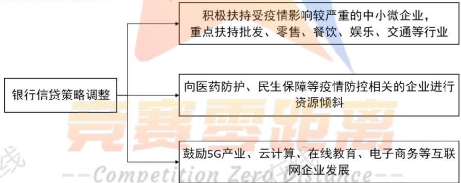

<details>
<summary>flowchart</summary>

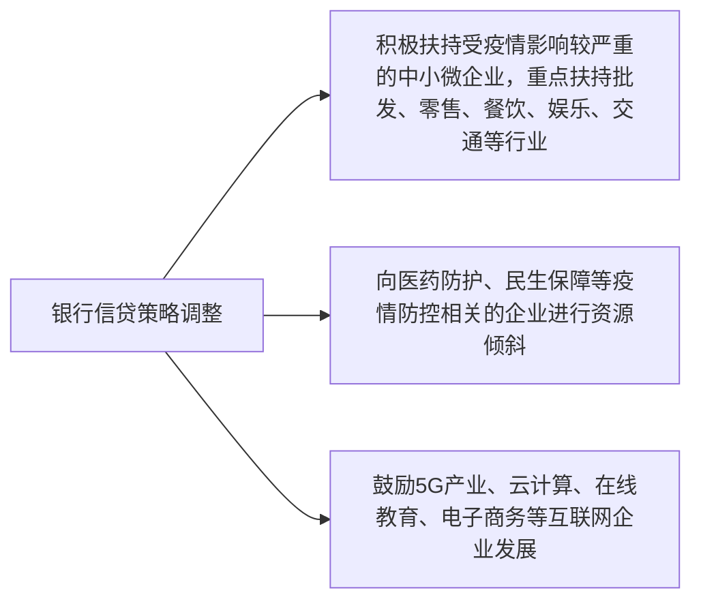
```mermaid
graph LR
  A["银行信贷策略调整"] --> B["积极扶持受疫情影响较严重的中小微企业，重点扶持批发、零售、餐饮、娱乐、交通等行业"]
  A --> C["向医药防护、民生保障等疫情防控相关的企业进行资源倾斜"]
  A --> D["鼓励5G产业、云计算、在线教育、电子商务等互联网企业发展"]
```
</details>

图 7-5 疫情下银行信贷策略的调整

基于前文划分的受影响严重程度的等级划分情况，充分考虑国家政策倾斜、银行盈利、银行长期发展等因素，银行具体的调整策略如下：

表 7-8 银行的具体调整策略

<table><tr><td>影响程度评级</td><td>贷款额度调整政策</td><td>贷款利率调整政策</td></tr><tr><td>严重影响</td><td>贷款额度上限提升30%</td><td>贷款利率优惠30%-50%</td></tr><tr><td>部分影响</td><td>无变化</td><td>贷款利率优惠10-30%</td></tr><tr><td>无影响/极小影响</td><td>无变化</td><td>无变化</td></tr><tr><td>利好</td><td>贷款额度上限提升20%-50%</td><td>无变化</td></tr></table>

其中对于受到疫情严重影响的企业，根据国家政策应该在贷款额度上限、贷款利率方面均给予适当优惠和倾斜，对于受疫情影响较小或者不受疫情影响的企业，应当适当减少倾斜力度甚至不给予优惠政策，同时基于长远发展以及银行的利益考虑，对于某些利好行业（如云计算、电子商务、智能制造等）所在企业同时应当适度提升贷款额度，从而提升客户的留存率以及银行的未来盈利。

## 7.5 考虑信贷风险与突发因素的借贷策略规划模型

在问题二基础上,本文考虑国家政策倾斜、各行业受影响程度等因素并且将其进行量化,加入到贷款策略调整模型中,得到最终的多目标非线性规划模型,模型需满足的约束与问题二相同。

该模型的目标函数为:

$$
\max Z = \sum_ {j = 1} ^ {3 0 2} y _ {i} [ A _ {j} (1 + h _ {1 j}) (1 - R _ {j}) i _ {j} (1 - h _ {2 j}) - 0. 2 2 \cdot A _ {j} (1 - h _ {2 j}) R _ {j} ] - M _ {j} \cdot q _ {j} \tag {54}
$$

其中 $h_{1j}$ 为银行对于不同企业贷款额度的提升系数，其取值与国家政策补贴、企业所在行业、企业规模、客户流失率等因素有关；

$h_{2j}$ 为银行对于不同企业的利率优惠系数，影响因素同上；

需要满足的约束条件为:

$$
\sum_ {j = 1} ^ {3 0 2} y _ {i} A _ {j} \leq d \tag {55}
$$

$$
1 0 \leq A _ {j} \leq E _ {j} \tag {56}
$$

$$
0. 0 4 \leq \mathrm{i} _ {\mathrm{kj}} \leq 0. 1 5 \tag {57}
$$

$$
\mathrm{t} _ {\mathrm{j}} = A _ {j} \cdot i _ {j} \cdot P _ {j} - A _ {j} \cdot 0. 2 2 \cdot (1 - P _ {j}) \tag {58}
$$

$$
y _ {j} = \left\{ \begin{array}{l} 0, t _ {j} \leq 0 \\ 1, t _ {j} > 0 \end{array} \right. \tag {59}
$$

$$
\mathrm{q} = \mathrm{f} (\mathrm{i}) \tag {60}
$$

$$
M = \eta (x _ {1}, x _ {2}, x _ {3}, x _ {4}, x _ {5}, x _ {6}, x _ {7}) \tag {61}
$$

$$
R = \phi (x _ {1}, x _ {2}, x _ {3}, x _ {4}, x _ {5}, x _ {6}, x _ {7}) \tag {62}
$$

$$
E = \tau (x _ {1}, x _ {2}, x _ {3}, x _ {4}, x _ {5}, x _ {6}, x _ {7}) \tag {63}
$$

其中 M, P, R, E 分别表示客户流失价值，企业还款概率，企业违约概率与最高贷款限额。

## 7.6 模型求解与分析

基于前文确定的新的银行贷款调整政策，以及对多目标规划模型的求解，本文计算出了附件2中对于所有企业的贷款策略，其中包括是否放贷、贷款额度、贷款利率等信息，求解部分结果见表7-9，完整求解结果见附录10.1.3（2）。

表 7-9 银行最佳信贷策略

<table><tr><td>公司</td><td>是否放贷</td><td>额度/万元</td><td>利率</td></tr><tr><td>E124</td><td>1</td><td>10.097</td><td>0.0692</td></tr><tr><td>E125</td><td>1</td><td>24.7333</td><td>0.0589</td></tr><tr><td>E126</td><td>1</td><td>24.7256</td><td>0.0619</td></tr><tr><td>E127</td><td>1</td><td>24.7183</td><td>0.0663</td></tr><tr><td>E128</td><td>1</td><td>24.7256</td><td>0.0619</td></tr><tr><td>E129</td><td>1</td><td>24.7183</td><td>0.0663</td></tr><tr><td>E130</td><td>1</td><td>24.7165</td><td>0.0678</td></tr><tr><td>E131</td><td>1</td><td>24.7183</td><td>0.0663</td></tr><tr><td>E132</td><td>1</td><td>24.7183</td><td>0.0663</td></tr><tr><td>E304</td><td>0</td><td>58.7645</td><td>0.095</td></tr><tr><td>E305</td><td>1</td><td>62.6648</td><td>0.0257</td></tr><tr><td>E306</td><td>0</td><td>38.7683</td><td>0.095</td></tr><tr><td>E307</td><td>0</td><td>58.7645</td><td>0.095</td></tr><tr><td>E308</td><td>0</td><td>58.7645</td><td>0.076</td></tr><tr><td>E309</td><td>0</td><td>38.7683</td><td>0.095</td></tr><tr><td>E310</td><td>0</td><td>76.763</td><td>0.0475</td></tr><tr><td>E311</td><td>1</td><td>62.6781</td><td>0.0245</td></tr><tr><td>E312</td><td>0</td><td>76.763</td><td>0.0475</td></tr><tr><td>E313</td><td>0</td><td>76.763</td><td>0.0475</td></tr></table>

最终银行总的贷款额度为 1 亿元，期望收益为 184.6552 万元，相较于问题二，考虑到政策补贴后的银行贷款策略贷款总额度没有变化，贷款的期望收益因此减少了 14.98 万元，减少了 7.50%。但是这种调整策略却能够帮助众多处在水深火热之中的中小企业渡过难关，体现银行巨大的责任意识和社会担当，产生了巨大的社会效益，进一步提升了银行的信誉和客户留存率，从这方面来看，这种策略的调整是值得的。

## 八、模型评价与推广

## 8.1 信贷风险评估模型

## 8.1.1 模型优点

（1）本模型的预测准确率更高，经过测算，本模型的预测正确率高达96.75%，相较于传统的决策树模型和BP神经网络模型，准确率分别提升了15.36%和63.15%;  
（2）本模型可以有效避免过拟合问题，使用传统的决策树算法，容易造成模型过拟合的问题，本模型通过引入正则项函数抑制决策树的复杂性，降低单棵决策树的拟合能力，再通过梯度提升的方法集成多个决策树，可以有效避免模型过拟合；  
（3）本模型对于数据特征、格式要求较低，不同于传统的统计型预测模型，本模型对于变量之间的相关性、共线性等均无要求，并且无需做复杂的特征工程和特征变换，可以大大简化数据预处理的工作量；  
（4）本模型对于附件的数据信息进行了充分挖掘，共从中提取出企业七大财务与运营指标，这些指标最终被证明在模型的训练过程中均是有效的，从而进一步提升了模型的可靠性。

## 8.1.2 模型不足

（1）本模型本质是一个监督学习预测模型，对于端到端、输入到输出可以做到很好的预测，但是其得到的模型参数难以显化，解释性不如传统的统计预测模型；  
（2）尽管本文从数据中挖掘出了七项企业的运营与财务指标，但是考虑到中小企业本身数据量偏少，同时问题本身提供的数据也较少，因此本模型的预测准确率还有进一步的提升空间。

## 8.1.3 模型推广

由于本模型具有预测准确率高，并行式计算、计算速度快等优势，因此本模型非常适合用于处理大型数据集，可以进一步应用于更多类型、更多行业、更多数据量的银行客户信达风险评估工作中去，当数据量增大时，本模型的预测效果可以得到进一步的提升。

## 8.2 信誉等级评估模型

## 8.2.1 模型优点

本模型是一个多分类模型，本质与信贷风险评估模型相同，同样具有预测率正确率高、

数据特征要求较低、训练速度较快等优势。

## 8.2.2 模型缺点

(1) 由于本模型本质是一个监督学习模型, 参数的解释性不如传统的统计预测模型;  
（2）由于问题一的评级将等级分为 A、B、C、D 四类，因此实质是一个四分类监督学习模型，实际中银行可能对于客户会采用更加复杂或者简单的评级（如三类或者五类），此时就需要重新训练模型。

## 8.2.3 模型推广

限于问题所给数据规模较小,因此本模型的应用于其他规模更大的企业的信誉评级问题中时可能效果会降低,未来需要通过更多的数据集(包含大中小微更多类别、更多行业)进行训练,进而才能够进一步提升模型预测的准确率。

## 8.3 基于多目标非线性规划算法的信贷策略模型

## 8.3.1 模型优点

（1）本模型基于银行期望收益最大、客户流失率最小、风险成本最小建立规划模型，考虑的目标较为全面，得到的最终求解结果也更为保守，对于银行来讲是最为安全的借贷策略；  
（2）本模型考虑全面，模型简洁高效，便于理解和应用，得到求解结果与实际情况较为接近，结果较为合理；

## 8.3.2 模型缺点

（1）本模型对于企业违约仅考虑了无法还贷的情况，考虑情况较为单一，实际上企业还贷违约可能还包括延迟还贷等情况，未来需要进一步查阅资料进行细化和建模；  
（2）实际银行贷款中不会按照模型计算结果进行贷款，一般会在计算的数值附近上下波动取整，这样便于银行业务的开展，本文没有考虑这样处理数据。  
（3）本模型对于企业违约的损失采用主观性较强的查阅文献估值的方式确定参数，客户流失价值的估计也是采用主观性较强的取值，导致可靠性准确性较差，处理不当会导致无法放贷的情况出现。企业违约损失与客户价值需要进一步研究，找到更优的函数模型。

## 8.3.3 模型推广

多数银行作为大型国有企业，其目标不应当仅仅是盈利，而应当承担更多的社会责任，通过自己的策略调整在保证自己受益的同时推动合作伙伴（客户）的发展，创造更多社会利益。因此未来可以考虑将社会效益因素量化，加入到本模型中，作为银行调整信贷策略的重要考量因素。

## 九、参考文献

[1] 赵池北. 中小企业信用风险评估模型比较[J]. 合作经济与科技, 2014(19):190-191.  
[2] 林婷婷. 基于 AHP 法的小微企业信用评级指标体系构建研究 [J]. 商场现代化. 2015(18).  
[3]苏静.软信息与小微企业信用风险识别[J].征信．2017(10).  
[4] 吴万里. 浅析层次分析法在小微企业信贷风险控制中的应用 [J]. 改革与开放. 2018(21)  
[5]吕秀梅.大数据金融下的中小微企业信用评估[J].财会月刊.2019(13).  
[6]崔凯.大数据背景下商业银行信用风险评价体系研究[D].河北工程大学,2019.  
[7] 王秋静. Q 银行小微企业信用风险评估与管理研究 [D]. 吉林大学, 2020.  
[8]雷国平,肖科,罗秀英,杨森,姚佳佳.基于机器学习的基础算法研究综述[J].卫星电视与宽带多媒体,2020(08):18-19.  
[9] 吴建华, 张颖, 王新军. 基于分位数回归模型的债务违约损失预测 [J]. 证券市场导报, 2018(08): 55-65.  
[10]农业银行泰州姜堰支行课题组, 张贵才. 新冠疫情冲击下商业银行的应对之策 [J]. 现代金融, 2020(07):36-39+48.

## 十、附录

## 10.1 计算结果

## 10.1.1 问题一计算结果

(1) 信贷风险评估——123 家企业违约概率

<table><tr><td>公司编号</td><td>违约概率</td><td>公司编号</td><td>违约概率</td><td>公司编号</td><td>违约概率</td></tr><tr><td>E1</td><td>11.45%</td><td>E42</td><td>12.01%</td><td>E83</td><td>13.60%</td></tr><tr><td>E2</td><td>14.12%</td><td>E43</td><td>12.45%</td><td>E84</td><td>10.66%</td></tr><tr><td>E3</td><td>8.84%</td><td>E44</td><td>8.71%</td><td>E85</td><td>16.72%</td></tr><tr><td>E4</td><td>9.54%</td><td>E45</td><td>33.80%</td><td>E86</td><td>14.44%</td></tr><tr><td>E5</td><td>21.06%</td><td>E46</td><td>9.50%</td><td>E87</td><td>43.78%</td></tr><tr><td>E6</td><td>11.45%</td><td>E47</td><td>9.50%</td><td>E88</td><td>20.61%</td></tr><tr><td>E7</td><td>8.23%</td><td>E48</td><td>13.68%</td><td>E89</td><td>11.76%</td></tr><tr><td>E8</td><td>8.84%</td><td>E49</td><td>8.71%</td><td>E90</td><td>10.80%</td></tr><tr><td>E9</td><td>8.84%</td><td>E50</td><td>16.89%</td><td>E91</td><td>20.51%</td></tr><tr><td>E10</td><td>8.84%</td><td>E51</td><td>10.31%</td><td>E92</td><td>29.87%</td></tr><tr><td>E11</td><td>9.95%</td><td>E52</td><td>36.73%</td><td>E93</td><td>9.81%</td></tr><tr><td>E12</td><td>10.74%</td><td>E53</td><td>8.06%</td><td>E94</td><td>16.36%</td></tr><tr><td>E13</td><td>14.97%</td><td>E54</td><td>14.97%</td><td>E95</td><td>13.17%</td></tr><tr><td>E14</td><td>8.84%</td><td>E55</td><td>8.06%</td><td>E96</td><td>16.96%</td></tr><tr><td>E15</td><td>9.04%</td><td>E56</td><td>11.99%</td><td>E97</td><td>15.10%</td></tr><tr><td>E16</td><td>8.84%</td><td>E57</td><td>10.29%</td><td>E98</td><td>9.81%</td></tr><tr><td>E17</td><td>9.95%</td><td>E58</td><td>8.06%</td><td>E99</td><td>82.84%</td></tr><tr><td>E18</td><td>8.84%</td><td>E59</td><td>12.63%</td><td>E100</td><td>77.28%</td></tr><tr><td>E19</td><td>9.58%</td><td>E60</td><td>10.54%</td><td>E101</td><td>79.60%</td></tr><tr><td>E20</td><td>24.05%</td><td>E61</td><td>8.06%</td><td>E102</td><td>85.92%</td></tr><tr><td>E21</td><td>14.97%</td><td>E62</td><td>8.06%</td><td>E103</td><td>67.57%</td></tr><tr><td>E22</td><td>9.27%</td><td>E63</td><td>10.47%</td><td>E104</td><td>43.19%</td></tr><tr><td>E23</td><td>8.23%</td><td>E64</td><td>10.88%</td><td>E105</td><td>51.31%</td></tr><tr><td>E24</td><td>8.92%</td><td>E65</td><td>9.19%</td><td>E106</td><td>42.32%</td></tr><tr><td>E25</td><td>16.73%</td><td>E66</td><td>14.24%</td><td>E107</td><td>73.58%</td></tr><tr><td>E26</td><td>9.04%</td><td>E67</td><td>9.19%</td><td>E108</td><td>68.57%</td></tr><tr><td>E27</td><td>8.23%</td><td>E68</td><td>8.71%</td><td>E109</td><td>73.58%</td></tr><tr><td>E28</td><td>10.81%</td><td>E69</td><td>11.22%</td><td>E110</td><td>48.31%</td></tr><tr><td>E29</td><td>15.80%</td><td>E70</td><td>8.06%</td><td>E111</td><td>88.53%</td></tr><tr><td>E30</td><td>9.50%</td><td>E71</td><td>14.79%</td><td>E112</td><td>80.95%</td></tr><tr><td>E31</td><td>9.50%</td><td>E72</td><td>22.81%</td><td>E113</td><td>89.17%</td></tr><tr><td>E32</td><td>13.61%</td><td>E73</td><td>14.86%</td><td>E114</td><td>89.17%</td></tr><tr><td>E33</td><td>16.08%</td><td>E74</td><td>8.06%</td><td>E115</td><td>88.03%</td></tr><tr><td>E34</td><td>13.15%</td><td>E75</td><td>8.06%</td><td>E116</td><td>89.17%</td></tr><tr><td>E35</td><td>12.45%</td><td>E76</td><td>18.84%</td><td>E117</td><td>79.31%</td></tr><tr><td>E36</td><td>16.47%</td><td>E77</td><td>12.54%</td><td>E118</td><td>77.17%</td></tr><tr><td>E37</td><td>14.97%</td><td>E78</td><td>9.42%</td><td>E119</td><td>86.69%</td></tr><tr><td>E38</td><td>14.97%</td><td>E79</td><td>13.98%</td><td>E120</td><td>88.70%</td></tr><tr><td>E39</td><td>10.13%</td><td>E80</td><td>20.90%</td><td>E121</td><td>73.53%</td></tr><tr><td>E40</td><td>9.44%</td><td>E81</td><td>8.06%</td><td>E122</td><td>86.73%</td></tr><tr><td>E41</td><td>10.20%</td><td>E82</td><td>33.95%</td><td>E123</td><td>63.07%</td></tr></table>

(2) 123 家企业分类结果

<table><tr><td>企业代号</td><td>企业分类</td><td>企业规模</td><td>最高贷款额度/万元</td><td>客户流失价值/万元</td></tr><tr><td>E1</td><td>零售业</td><td>中</td><td>100</td><td>1</td></tr><tr><td>E2</td><td>其他未列明行业</td><td>中</td><td>100</td><td>1</td></tr><tr><td>E3</td><td>信息传输业</td><td>中</td><td>100</td><td>1</td></tr><tr><td>E4</td><td>其他未列明行业</td><td>中</td><td>100</td><td>1</td></tr><tr><td>E5</td><td>租赁和商务服务业</td><td>小</td><td>60</td><td>0.5</td></tr><tr><td>E6</td><td>建筑业</td><td>小</td><td>60</td><td>0.5</td></tr><tr><td>E7</td><td>零售业</td><td>小</td><td>60</td><td>0.5</td></tr><tr><td>E8</td><td>软件和信息技术服务业</td><td>中</td><td>100</td><td>1</td></tr><tr><td>E9</td><td>零售业</td><td>中</td><td>100</td><td>1</td></tr><tr><td>E10</td><td>租赁和商务服务业</td><td>小</td><td>60</td><td>0.5</td></tr><tr><td>E11</td><td>建筑业</td><td>小</td><td>60</td><td>0.5</td></tr><tr><td>E12</td><td>租赁和商务服务业</td><td>小</td><td>60</td><td>0.5</td></tr><tr><td>E13</td><td>零售业</td><td>中</td><td>100</td><td>1</td></tr><tr><td>E14</td><td>个体</td><td>个体</td><td>20</td><td>0.1</td></tr><tr><td>E15</td><td>租赁和商务服务业</td><td>微</td><td>40</td><td>0.2</td></tr><tr><td>E16</td><td>租赁和商务服务业</td><td>小</td><td>60</td><td>0.5</td></tr><tr><td>E17</td><td>建筑业</td><td>小</td><td>60</td><td>0.5</td></tr><tr><td>E18</td><td>建筑业</td><td>小</td><td>60</td><td>0.5</td></tr><tr><td>E19</td><td>软件和信息技术服务业</td><td>小</td><td>60</td><td>0.5</td></tr><tr><td>E20</td><td>租赁和商务服务业</td><td>小</td><td>60</td><td>0.5</td></tr><tr><td>E21</td><td>建筑业</td><td>小</td><td>60</td><td>0.5</td></tr><tr><td>E22</td><td>交通运输业</td><td>小</td><td>60</td><td>0.5</td></tr><tr><td>E23</td><td>租赁和商务服务业</td><td>微</td><td>40</td><td>0.2</td></tr><tr><td>E24</td><td>交通运输业</td><td>小</td><td>60</td><td>0.5</td></tr><tr><td>E25</td><td>信息传输业</td><td>小</td><td>60</td><td>0.5</td></tr><tr><td>E26</td><td>工业</td><td>小</td><td>60</td><td>0.5</td></tr><tr><td>E27</td><td>农林牧渔业</td><td>小</td><td>60</td><td>0.5</td></tr><tr><td>E28</td><td>农林牧渔业</td><td>小</td><td>60</td><td>0.5</td></tr><tr><td>E29</td><td>租赁和商务服务业</td><td>微</td><td>40</td><td>0.2</td></tr><tr><td>E30</td><td>建筑业</td><td>小</td><td>60</td><td>0.5</td></tr><tr><td>E31</td><td>工业</td><td>小</td><td>60</td><td>0.5</td></tr></table>

<table><tr><td>E32</td><td>租赁和商务服务业</td><td>微</td><td>40</td><td>0.2</td></tr><tr><td>E33</td><td>农林牧渔业</td><td>小</td><td>60</td><td>0.5</td></tr><tr><td>E34</td><td>建筑业</td><td>微</td><td>40</td><td>0.2</td></tr><tr><td>E35</td><td>租赁和商务服务业</td><td>微</td><td>40</td><td>0.2</td></tr><tr><td>E36</td><td>工业</td><td>微</td><td>40</td><td>0.2</td></tr><tr><td>E37</td><td>农林牧渔业</td><td>小</td><td>60</td><td>0.5</td></tr><tr><td>E38</td><td>建筑业</td><td>微</td><td>40</td><td>0.2</td></tr><tr><td>E39</td><td>租赁和商务服务业</td><td>微</td><td>40</td><td>0.2</td></tr><tr><td>E40</td><td>租赁和商务服务业</td><td>微</td><td>40</td><td>0.2</td></tr><tr><td>E41</td><td>物业管理</td><td>微</td><td>40</td><td>0.2</td></tr><tr><td>E42</td><td>农林牧渔业</td><td>小</td><td>60</td><td>0.5</td></tr><tr><td>E43</td><td>建筑业</td><td>微</td><td>40</td><td>0.2</td></tr><tr><td>E44</td><td>租赁和商务服务业</td><td>微</td><td>40</td><td>0.2</td></tr><tr><td>E45</td><td>个体</td><td>个体</td><td>20</td><td>0.1</td></tr><tr><td>E46</td><td>其他未列明行业</td><td>小</td><td>60</td><td>0.5</td></tr><tr><td>E47</td><td>工业</td><td>微</td><td>40</td><td>0.2</td></tr><tr><td>E48</td><td>工业</td><td>微</td><td>40</td><td>0.2</td></tr><tr><td>E49</td><td>工业</td><td>微</td><td>40</td><td>0.2</td></tr><tr><td>E50</td><td>租赁和商务服务业</td><td>微</td><td>40</td><td>0.2</td></tr><tr><td>E51</td><td>交通运输业</td><td>小</td><td>60</td><td>0.5</td></tr><tr><td>E52</td><td>租赁和商务服务业</td><td>微</td><td>40</td><td>0.2</td></tr><tr><td>E53</td><td>其他未列明行业</td><td>小</td><td>60</td><td>0.5</td></tr><tr><td>E54</td><td>软件和信息技术服务业</td><td>小</td><td>60</td><td>0.5</td></tr><tr><td>E55</td><td>工业</td><td>微</td><td>40</td><td>0.2</td></tr><tr><td>E56</td><td>建筑业</td><td>微</td><td>40</td><td>0.2</td></tr><tr><td>E57</td><td>工业</td><td>微</td><td>40</td><td>0.2</td></tr><tr><td>E58</td><td>工业</td><td>微</td><td>40</td><td>0.2</td></tr><tr><td>E59</td><td>租赁和商务服务业</td><td>微</td><td>40</td><td>0.2</td></tr><tr><td>E60</td><td>租赁和商务服务业</td><td>微</td><td>40</td><td>0.2</td></tr><tr><td>E61</td><td>工业</td><td>微</td><td>40</td><td>0.2</td></tr><tr><td>E62</td><td>租赁和商务服务业</td><td>微</td><td>40</td><td>0.2</td></tr><tr><td>E63</td><td>软件和信息技术服务业</td><td>小</td><td>60</td><td>0.5</td></tr><tr><td>E64</td><td>其他未列明行业</td><td>小</td><td>60</td><td>0.5</td></tr><tr><td>E65</td><td>租赁和商务服务业</td><td>微</td><td>40</td><td>0.2</td></tr><tr><td>E66</td><td>交通运输业</td><td>小</td><td>60</td><td>0.5</td></tr><tr><td>E67</td><td>信息传输业</td><td>微</td><td>40</td><td>0.2</td></tr><tr><td>E68</td><td>农林牧渔业</td><td>小</td><td>60</td><td>0.5</td></tr><tr><td>E69</td><td>工业</td><td>微</td><td>40</td><td>0.2</td></tr><tr><td>E70</td><td>软件和信息技术服务业</td><td>小</td><td>60</td><td>0.5</td></tr><tr><td>E71</td><td>软件和信息技术服务业</td><td>微</td><td>40</td><td>0.2</td></tr><tr><td>E72</td><td>其他未列明行业</td><td>微</td><td>40</td><td>0.2</td></tr><tr><td>E73</td><td>租赁和商务服务业</td><td>微</td><td>40</td><td>0.2</td></tr><tr><td>E74</td><td>农林牧渔业</td><td>小</td><td>60</td><td>0.5</td></tr><tr><td>E75</td><td>住宿业</td><td>小</td><td>60</td><td>0.5</td></tr><tr><td>E76</td><td>软件和信息技术服务业</td><td>微</td><td>40</td><td>0.2</td></tr><tr><td>E77</td><td>工业</td><td>微</td><td>40</td><td>0.2</td></tr><tr><td>E78</td><td>个体</td><td>个体</td><td>20</td><td>0.1</td></tr><tr><td>E79</td><td>批发业</td><td>微</td><td>40</td><td>0.2</td></tr><tr><td>E80</td><td>其他未列明行业</td><td>小</td><td>60</td><td>0.5</td></tr><tr><td>E81</td><td>工业</td><td>微</td><td>40</td><td>0.2</td></tr><tr><td>E82</td><td>工业</td><td>微</td><td>40</td><td>0.2</td></tr><tr><td>E83</td><td>其他未列明行业</td><td>微</td><td>40</td><td>0.2</td></tr><tr><td>E84</td><td>建筑业</td><td>微</td><td>40</td><td>0.2</td></tr><tr><td>E85</td><td>建筑业</td><td>微</td><td>40</td><td>0.2</td></tr><tr><td>E86</td><td>建筑业</td><td>微</td><td>40</td><td>0.2</td></tr><tr><td>E87</td><td>其他未列明行业</td><td>微</td><td>40</td><td>0.2</td></tr><tr><td>E88</td><td>租赁和商务服务业</td><td>微</td><td>40</td><td>0.2</td></tr><tr><td>E89</td><td>其他未列明行业</td><td>微</td><td>40</td><td>0.2</td></tr><tr><td>E90</td><td>信息传输业</td><td>微</td><td>40</td><td>0.2</td></tr><tr><td>E91</td><td>软件和信息技术服务业</td><td>微</td><td>40</td><td>0.2</td></tr><tr><td>E92</td><td>其他未列明行业</td><td>微</td><td>40</td><td>0.2</td></tr><tr><td>E93</td><td>软件和信息技术服务业</td><td>微</td><td>40</td><td>0.2</td></tr><tr><td>E94</td><td>交通运输业</td><td>小</td><td>60</td><td>0.5</td></tr><tr><td>E95</td><td>农林牧渔业</td><td>微</td><td>40</td><td>0.2</td></tr><tr><td>E96</td><td>租赁和商务服务业</td><td>微</td><td>40</td><td>0.2</td></tr><tr><td>E97</td><td>其他未列明行业</td><td>微</td><td>40</td><td>0.2</td></tr><tr><td>E98</td><td>信息传输业</td><td>微</td><td>40</td><td>0.2</td></tr><tr><td>E99</td><td>建筑业</td><td>微</td><td>40</td><td>0.2</td></tr><tr><td>E100</td><td>建筑业</td><td>微</td><td>40</td><td>0.2</td></tr><tr><td>E101</td><td>建筑业</td><td>微</td><td>40</td><td>0.2</td></tr><tr><td>E102</td><td>零售业</td><td>微</td><td>40</td><td>0.2</td></tr><tr><td>E103</td><td>软件和信息技术服务业</td><td>微</td><td>40</td><td>0.2</td></tr><tr><td>E104</td><td>租赁和商务服务业</td><td>微</td><td>40</td><td>0.2</td></tr><tr><td>E105</td><td>建筑业</td><td>微</td><td>40</td><td>0.2</td></tr><tr><td>E106</td><td>租赁和商务服务业</td><td>微</td><td>40</td><td>0.2</td></tr><tr><td>E107</td><td>软件和信息技术服务业</td><td>微</td><td>40</td><td>0.2</td></tr><tr><td>E108</td><td>租赁和商务服务业</td><td>微</td><td>40</td><td>0.2</td></tr><tr><td>E109</td><td>批发业</td><td>微</td><td>40</td><td>0.2</td></tr><tr><td>E110</td><td>信息传输业</td><td>微</td><td>40</td><td>0.2</td></tr><tr><td>E111</td><td>软件和信息技术服务业</td><td>微</td><td>40</td><td>0.2</td></tr><tr><td>E112</td><td>工业</td><td>微</td><td>40</td><td>0.2</td></tr><tr><td>E113</td><td>建筑业</td><td>微</td><td>40</td><td>0.2</td></tr><tr><td>E114</td><td>批发业</td><td>微</td><td>40</td><td>0.2</td></tr><tr><td>E115</td><td>建筑业</td><td>微</td><td>40</td><td>0.2</td></tr><tr><td>E116</td><td>建筑业</td><td>微</td><td>40</td><td>0.2</td></tr><tr><td>E117</td><td>租赁和商务服务业</td><td>微</td><td>40</td><td>0.2</td></tr><tr><td>E118</td><td>其他未列明行业</td><td>微</td><td>40</td><td>0.2</td></tr><tr><td>E119</td><td>零售业</td><td>微</td><td>40</td><td>0.2</td></tr></table>

<table><tr><td>E120</td><td>信息传输业</td><td>微</td><td>40</td><td>0.2</td></tr><tr><td>E121</td><td>零售业</td><td>微</td><td>40</td><td>0.2</td></tr><tr><td>E122</td><td>租赁和商务服务业</td><td>微</td><td>40</td><td>0.2</td></tr><tr><td>E123</td><td>软件和信息技术服务业</td><td>微</td><td>40</td><td>0.2</td></tr></table>

(3) 向 123 家企业的贷款策略

<table><tr><td>公司代号</td><td>是否放贷</td><td>额度占比</td><td>利率</td><td>公司代号</td><td>是否放贷</td><td>额度占比</td><td>利率</td></tr><tr><td>E1</td><td>是</td><td>0.4644%</td><td>14.96%</td><td>E63</td><td>是</td><td>1.2066%</td><td>6.65%</td></tr><tr><td>E2</td><td>是</td><td>2.0539%</td><td>14.99%</td><td>E64</td><td>是</td><td>1.2317%</td><td>14.98%</td></tr><tr><td>E3</td><td>是</td><td>2.0296%</td><td>5.88%</td><td>E65</td><td>是</td><td>0.7957%</td><td>7.08%</td></tr><tr><td>E4</td><td>是</td><td>2.0294%</td><td>5.97%</td><td>E66</td><td>是</td><td>1.2056%</td><td>7.22%</td></tr><tr><td>E5</td><td>是</td><td>1.2047%</td><td>10.63%</td><td>E67</td><td>是</td><td>0.7957%</td><td>7.08%</td></tr><tr><td>E6</td><td>是</td><td>1.2315%</td><td>14.98%</td><td>E68</td><td>是</td><td>1.2072%</td><td>6.48%</td></tr><tr><td>E7</td><td>是</td><td>1.2324%</td><td>14.99%</td><td>E69</td><td>是</td><td>0.7951%</td><td>7.55%</td></tr><tr><td>E8</td><td>是</td><td>2.0557%</td><td>14.99%</td><td>E70</td><td>是</td><td>1.2251%</td><td>14.96%</td></tr><tr><td>E9</td><td>是</td><td>2.0557%</td><td>14.99%</td><td>E71</td><td>是</td><td>0.7941%</td><td>8.42%</td></tr><tr><td>E10</td><td>是</td><td>1.2071%</td><td>6.38%</td><td>E72</td><td>是</td><td>0.7930%</td><td>11.32%</td></tr><tr><td>E11</td><td>是</td><td>1.2068%</td><td>5.45%</td><td>E73</td><td>是</td><td>0.7940%</td><td>8.32%</td></tr><tr><td>E12</td><td>是</td><td>1.2065%</td><td>6.66%</td><td>E74</td><td>是</td><td>1.2074%</td><td>6.26%</td></tr><tr><td>E13</td><td>是</td><td>2.0535%</td><td>14.99%</td><td>E75</td><td>是</td><td>1.2074%</td><td>6.40%</td></tr><tr><td>E14</td><td>是</td><td>0.3851%</td><td>7.06%</td><td>E76</td><td>是</td><td>0.7935%</td><td>10.03%</td></tr><tr><td>E15</td><td>是</td><td>0.8205%</td><td>14.98%</td><td>E77</td><td>是</td><td>0.7948%</td><td>7.90%</td></tr><tr><td>E16</td><td>是</td><td>1.2322%</td><td>14.98%</td><td>E78</td><td>是</td><td>0.3849%</td><td>7.22%</td></tr><tr><td>E17</td><td>是</td><td>1.2319%</td><td>14.98%</td><td>E79</td><td>是</td><td>0.7941%</td><td>8.23%</td></tr><tr><td>E18</td><td>是</td><td>1.2322%</td><td>14.98%</td><td>E80</td><td>是</td><td>1.2047%</td><td>10.61%</td></tr><tr><td>E19</td><td>是</td><td>1.2320%</td><td>14.98%</td><td>E81</td><td>是</td><td>0.8207%</td><td>14.98%</td></tr><tr><td>E20</td><td>是</td><td>1.2044%</td><td>11.50%</td><td>E82</td><td>否</td><td>0.0000%</td><td>9.50%</td></tr><tr><td>E21</td><td>是</td><td>1.2055%</td><td>7.93%</td><td>E83</td><td>是</td><td>0.7942%</td><td>8.17%</td></tr><tr><td>E22</td><td>是</td><td>1.2321%</td><td>14.98%</td><td>E84</td><td>是</td><td>0.8200%</td><td>14.98%</td></tr><tr><td>E23</td><td>是</td><td>0.7960%</td><td>6.86%</td><td>E85</td><td>是</td><td>0.7938%</td><td>9.09%</td></tr><tr><td>E24</td><td>是</td><td>1.2322%</td><td>14.98%</td><td>E86</td><td>是</td><td>0.7941%</td><td>8.22%</td></tr><tr><td>E25</td><td>是</td><td>1.2046%</td><td>8.36%</td><td>E87</td><td>是</td><td>0.7913%</td><td>9.50%</td></tr><tr><td>E26</td><td>是</td><td>1.2322%</td><td>14.98%</td><td>E88</td><td>是</td><td>0.8149%</td><td>14.97%</td></tr><tr><td>E27</td><td>是</td><td>1.2324%</td><td>14.99%</td><td>E89</td><td>是</td><td>0.8196%</td><td>14.98%</td></tr><tr><td>E28</td><td>是</td><td>1.2065%</td><td>6.66%</td><td>E90</td><td>是</td><td>0.7953%</td><td>7.46%</td></tr><tr><td>E29</td><td>是</td><td>0.7940%</td><td>8.54%</td><td>E91</td><td>是</td><td>0.8149%</td><td>14.97%</td></tr><tr><td>E30</td><td>是</td><td>1.2069%</td><td>6.51%</td><td>E92</td><td>是</td><td>0.8010%</td><td>14.92%</td></tr><tr><td>E31</td><td>是</td><td>1.2321%</td><td>14.98%</td><td>E93</td><td>是</td><td>0.7955%</td><td>7.21%</td></tr><tr><td>E32</td><td>是</td><td>0.7942%</td><td>8.17%</td><td>E94</td><td>是</td><td>1.2053%</td><td>8.36%</td></tr><tr><td>E33</td><td>是</td><td>1.2053%</td><td>8.86%</td><td>E95</td><td>是</td><td>0.7946%</td><td>8.04%</td></tr><tr><td>E34</td><td>是</td><td>0.7946%</td><td>8.04%</td><td>E96</td><td>是</td><td>0.7938%</td><td>9.00%</td></tr><tr><td>E35</td><td>是</td><td>0.7947%</td><td>7.83%</td><td>E97</td><td>是</td><td>0.7940%</td><td>8.51%</td></tr><tr><td>E36</td><td>否</td><td>0.0000%</td><td>9.50%</td><td>E98</td><td>是</td><td>0.7955%</td><td>7.21%</td></tr><tr><td>E37</td><td>是</td><td>1.2055%</td><td>7.93%</td><td>E99</td><td>否</td><td>0.0000%</td><td>9.50%</td></tr><tr><td>E38</td><td>是</td><td>0.7940%</td><td>8.47%</td><td>E100</td><td>否</td><td>0.0000%</td><td>9.50%</td></tr><tr><td>E39</td><td>是</td><td>0.7955%</td><td>7.31%</td><td>E101</td><td>否</td><td>0.0000%</td><td>9.50%</td></tr><tr><td>E40</td><td>是</td><td>0.7957%</td><td>7.18%</td><td>E102</td><td>否</td><td>0.0000%</td><td>9.50%</td></tr><tr><td>E41</td><td>是</td><td>0.7954%</td><td>7.33%</td><td>E103</td><td>否</td><td>0.0000%</td><td>9.50%</td></tr><tr><td>E42</td><td>是</td><td>1.2313%</td><td>14.98%</td><td>E104</td><td>是</td><td>0.7913%</td><td>9.50%</td></tr><tr><td>E43</td><td>是</td><td>0.7947%</td><td>7.83%</td><td>E105</td><td>否</td><td>0.0000%</td><td>9.50%</td></tr><tr><td>E44</td><td>是</td><td>0.7959%</td><td>7.05%</td><td>E106</td><td>是</td><td>0.7913%</td><td>9.50%</td></tr><tr><td>E45</td><td>是</td><td>0.3807%</td><td>9.50%</td><td>E107</td><td>否</td><td>0.0000%</td><td>9.50%</td></tr><tr><td>E46</td><td>是</td><td>1.2069%</td><td>6.17%</td><td>E108</td><td>否</td><td>0.0000%</td><td>9.50%</td></tr><tr><td>E47</td><td>是</td><td>0.7956%</td><td>7.20%</td><td>E109</td><td>否</td><td>0.0000%</td><td>9.50%</td></tr><tr><td>E48</td><td>是</td><td>0.8189%</td><td>14.97%</td><td>E110</td><td>是</td><td>0.7913%</td><td>9.50%</td></tr><tr><td>E49</td><td>是</td><td>0.7959%</td><td>7.05%</td><td>E111</td><td>否</td><td>0.0000%</td><td>9.50%</td></tr><tr><td>E50</td><td>是</td><td>0.7938%</td><td>8.97%</td><td>E112</td><td>否</td><td>0.0000%</td><td>9.50%</td></tr><tr><td>E51</td><td>是</td><td>1.2066%</td><td>6.64%</td><td>E113</td><td>否</td><td>0.0000%</td><td>9.50%</td></tr><tr><td>E52</td><td>否</td><td>0.0000%</td><td>9.50%</td><td>E114</td><td>否</td><td>0.0000%</td><td>9.50%</td></tr><tr><td>E53</td><td>是</td><td>1.2074%</td><td>6.40%</td><td>E115</td><td>否</td><td>0.0000%</td><td>9.50%</td></tr><tr><td>E54</td><td>是</td><td>1.2301%</td><td>14.98%</td><td>E116</td><td>否</td><td>0.0000%</td><td>9.50%</td></tr><tr><td>E55</td><td>是</td><td>0.7961%</td><td>6.93%</td><td>E117</td><td>否</td><td>0.0000%</td><td>9.50%</td></tr><tr><td>E56</td><td>是</td><td>0.7949%</td><td>7.75%</td><td>E118</td><td>否</td><td>0.0000%</td><td>9.50%</td></tr><tr><td>E57</td><td>是</td><td>0.7953%</td><td>7.30%</td><td>E119</td><td>否</td><td>0.0000%</td><td>9.50%</td></tr><tr><td>E58</td><td>是</td><td>0.7960%</td><td>6.82%</td><td>E120</td><td>否</td><td>0.0000%</td><td>9.50%</td></tr><tr><td>E59</td><td>是</td><td>0.8193%</td><td>14.98%</td><td>E121</td><td>否</td><td>0.0000%</td><td>9.50%</td></tr><tr><td>E60</td><td>是</td><td>0.7953%</td><td>7.36%</td><td>E122</td><td>否</td><td>0.0000%</td><td>9.50%</td></tr><tr><td>E61</td><td>是</td><td>0.7960%</td><td>6.82%</td><td>E123</td><td>否</td><td>0.0000%</td><td>9.50%</td></tr><tr><td>E62</td><td>是</td><td>0.7960%</td><td>6.82%</td><td></td><td></td><td></td><td></td></tr></table>

## 10.1.2 问题二计算结果

(1) 信贷风险评估——302 家企业信誉评级

<table><tr><td>企业代号</td><td>信誉评级</td><td>企业代号</td><td>信誉评级</td><td>企业代号</td><td>信誉评级</td></tr><tr><td>E124</td><td>B</td><td>E225</td><td>B</td><td>E326</td><td>C</td></tr><tr><td>E125</td><td>B</td><td>E226</td><td>B</td><td>E327</td><td>B</td></tr><tr><td>E126</td><td>B</td><td>E227</td><td>B</td><td>E328</td><td>C</td></tr><tr><td>E127</td><td>B</td><td>E228</td><td>A</td><td>E329</td><td>C</td></tr><tr><td>E128</td><td>B</td><td>E229</td><td>B</td><td>E330</td><td>C</td></tr><tr><td>E129</td><td>B</td><td>E230</td><td>B</td><td>E331</td><td>C</td></tr><tr><td>E130</td><td>B</td><td>E231</td><td>B</td><td>E332</td><td>B</td></tr><tr><td>E131</td><td>B</td><td>E232</td><td>A</td><td>E333</td><td>C</td></tr><tr><td>E132</td><td>B</td><td>E233</td><td>B</td><td>E334</td><td>C</td></tr><tr><td>E133</td><td>B</td><td>E234</td><td>B</td><td>E335</td><td>C</td></tr></table>

<table><tr><td>E134</td><td>B</td><td>E235</td><td>B</td><td>E336</td><td>C</td></tr><tr><td>E135</td><td>B</td><td>E236</td><td>B</td><td>E337</td><td>C</td></tr><tr><td>E136</td><td>B</td><td>E237</td><td>B</td><td>E338</td><td>C</td></tr><tr><td>E137</td><td>B</td><td>E238</td><td>A</td><td>E339</td><td>C</td></tr><tr><td>E138</td><td>B</td><td>E239</td><td>B</td><td>E340</td><td>B</td></tr><tr><td>E139</td><td>B</td><td>E240</td><td>C</td><td>E341</td><td>C</td></tr><tr><td>E140</td><td>B</td><td>E241</td><td>B</td><td>E342</td><td>C</td></tr><tr><td>E141</td><td>B</td><td>E242</td><td>C</td><td>E343</td><td>C</td></tr><tr><td>E142</td><td>B</td><td>E243</td><td>B</td><td>E344</td><td>A</td></tr><tr><td>E143</td><td>B</td><td>E244</td><td>B</td><td>E345</td><td>C</td></tr><tr><td>E144</td><td>B</td><td>E245</td><td>A</td><td>E346</td><td>C</td></tr><tr><td>E145</td><td>B</td><td>E246</td><td>B</td><td>E347</td><td>C</td></tr><tr><td>E146</td><td>B</td><td>E247</td><td>B</td><td>E348</td><td>C</td></tr><tr><td>E147</td><td>B</td><td>E248</td><td>B</td><td>E349</td><td>C</td></tr><tr><td>E148</td><td>B</td><td>E249</td><td>B</td><td>E350</td><td>C</td></tr><tr><td>E149</td><td>B</td><td>E250</td><td>B</td><td>E351</td><td>C</td></tr><tr><td>E150</td><td>B</td><td>E251</td><td>B</td><td>E352</td><td>C</td></tr><tr><td>E151</td><td>B</td><td>E252</td><td>B</td><td>E353</td><td>C</td></tr><tr><td>E152</td><td>B</td><td>E253</td><td>B</td><td>E354</td><td>D</td></tr><tr><td>E153</td><td>B</td><td>E254</td><td>B</td><td>E355</td><td>C</td></tr><tr><td>E154</td><td>B</td><td>E255</td><td>B</td><td>E356</td><td>C</td></tr><tr><td>E155</td><td>B</td><td>E256</td><td>B</td><td>E357</td><td>C</td></tr><tr><td>E156</td><td>A</td><td>E257</td><td>B</td><td>E358</td><td>B</td></tr><tr><td>E157</td><td>A</td><td>E258</td><td>B</td><td>E359</td><td>D</td></tr><tr><td>E158</td><td>B</td><td>E259</td><td>B</td><td>E360</td><td>C</td></tr><tr><td>E159</td><td>B</td><td>E260</td><td>B</td><td>E361</td><td>C</td></tr><tr><td>E160</td><td>B</td><td>E261</td><td>B</td><td>E362</td><td>C</td></tr><tr><td>E161</td><td>B</td><td>E262</td><td>B</td><td>E363</td><td>C</td></tr><tr><td>E162</td><td>A</td><td>E263</td><td>B</td><td>E364</td><td>C</td></tr><tr><td>E163</td><td>B</td><td>E264</td><td>D</td><td>E365</td><td>C</td></tr><tr><td>E164</td><td>B</td><td>E265</td><td>B</td><td>E366</td><td>C</td></tr><tr><td>E165</td><td>B</td><td>E266</td><td>B</td><td>E367</td><td>D</td></tr><tr><td>E166</td><td>A</td><td>E267</td><td>B</td><td>E368</td><td>B</td></tr><tr><td>E167</td><td>B</td><td>E268</td><td>B</td><td>E369</td><td>D</td></tr><tr><td>E168</td><td>B</td><td>E269</td><td>B</td><td>E370</td><td>C</td></tr><tr><td>E169</td><td>B</td><td>E270</td><td>B</td><td>E371</td><td>D</td></tr><tr><td>E170</td><td>B</td><td>E271</td><td>A</td><td>E372</td><td>D</td></tr><tr><td>E171</td><td>B</td><td>E272</td><td>B</td><td>E373</td><td>C</td></tr><tr><td>E172</td><td>B</td><td>E273</td><td>B</td><td>E374</td><td>D</td></tr><tr><td>E173</td><td>B</td><td>E274</td><td>B</td><td>E375</td><td>C</td></tr><tr><td>E174</td><td>B</td><td>E275</td><td>A</td><td>E376</td><td>C</td></tr><tr><td>E175</td><td>B</td><td>E276</td><td>C</td><td>E377</td><td>C</td></tr><tr><td>E176</td><td>B</td><td>E277</td><td>B</td><td>E378</td><td>B</td></tr><tr><td>E177</td><td>B</td><td>E278</td><td>C</td><td>E379</td><td>C</td></tr><tr><td>E178</td><td>B</td><td>E279</td><td>A</td><td>E380</td><td>B</td></tr><tr><td>E179</td><td>B</td><td>E280</td><td>B</td><td>E381</td><td>B</td></tr><tr><td>E180</td><td>B</td><td>E281</td><td>C</td><td>E382</td><td>C</td></tr><tr><td>E181</td><td>B</td><td>E282</td><td>B</td><td>E383</td><td>B</td></tr><tr><td>E182</td><td>B</td><td>E283</td><td>B</td><td>E384</td><td>C</td></tr><tr><td>E183</td><td>B</td><td>E284</td><td>B</td><td>E385</td><td>C</td></tr><tr><td>E184</td><td>B</td><td>E285</td><td>B</td><td>E386</td><td>B</td></tr><tr><td>E185</td><td>B</td><td>E286</td><td>B</td><td>E387</td><td>C</td></tr><tr><td>E186</td><td>B</td><td>E287</td><td>C</td><td>E388</td><td>D</td></tr><tr><td>E187</td><td>C</td><td>E288</td><td>B</td><td>E389</td><td>C</td></tr><tr><td>E188</td><td>B</td><td>E289</td><td>B</td><td>E390</td><td>C</td></tr><tr><td>E189</td><td>B</td><td>E290</td><td>B</td><td>E391</td><td>D</td></tr><tr><td>E190</td><td>B</td><td>E291</td><td>C</td><td>E392</td><td>C</td></tr><tr><td>E191</td><td>B</td><td>E292</td><td>C</td><td>E393</td><td>D</td></tr><tr><td>E192</td><td>B</td><td>E293</td><td>C</td><td>E394</td><td>C</td></tr><tr><td>E193</td><td>B</td><td>E294</td><td>B</td><td>E395</td><td>D</td></tr><tr><td>E194</td><td>B</td><td>E295</td><td>C</td><td>E396</td><td>D</td></tr><tr><td>E195</td><td>B</td><td>E296</td><td>B</td><td>E397</td><td>D</td></tr><tr><td>E196</td><td>B</td><td>E297</td><td>C</td><td>E398</td><td>C</td></tr><tr><td>E197</td><td>B</td><td>E298</td><td>C</td><td>E399</td><td>D</td></tr><tr><td>E198</td><td>A</td><td>E299</td><td>B</td><td>E400</td><td>D</td></tr><tr><td>E199</td><td>A</td><td>E300</td><td>C</td><td>E401</td><td>C</td></tr><tr><td>E200</td><td>B</td><td>E301</td><td>C</td><td>E402</td><td>B</td></tr><tr><td>E201</td><td>B</td><td>E302</td><td>C</td><td>E403</td><td>D</td></tr><tr><td>E202</td><td>B</td><td>E303</td><td>C</td><td>E404</td><td>D</td></tr><tr><td>E203</td><td>B</td><td>E304</td><td>C</td><td>E405</td><td>D</td></tr><tr><td>E204</td><td>B</td><td>E305</td><td>B</td><td>E406</td><td>C</td></tr><tr><td>E205</td><td>B</td><td>E306</td><td>C</td><td>E407</td><td>B</td></tr><tr><td>E206</td><td>B</td><td>E307</td><td>C</td><td>E408</td><td>C</td></tr><tr><td>E207</td><td>B</td><td>E308</td><td>C</td><td>E409</td><td>C</td></tr><tr><td>E208</td><td>B</td><td>E309</td><td>C</td><td>E410</td><td>D</td></tr><tr><td>E209</td><td>B</td><td>E310</td><td>C</td><td>E411</td><td>B</td></tr><tr><td>E210</td><td>B</td><td>E311</td><td>B</td><td>E412</td><td>C</td></tr><tr><td>E211</td><td>B</td><td>E312</td><td>C</td><td>E413</td><td>C</td></tr><tr><td>E212</td><td>B</td><td>E313</td><td>C</td><td>E414</td><td>D</td></tr><tr><td>E213</td><td>B</td><td>E314</td><td>C</td><td>E415</td><td>D</td></tr><tr><td>E214</td><td>B</td><td>E315</td><td>C</td><td>E416</td><td>D</td></tr><tr><td>E215</td><td>B</td><td>E316</td><td>C</td><td>E417</td><td>D</td></tr><tr><td>E216</td><td>B</td><td>E317</td><td>C</td><td>E418</td><td>D</td></tr><tr><td>E217</td><td>C</td><td>E318</td><td>C</td><td>E419</td><td>C</td></tr><tr><td>E218</td><td>B</td><td>E319</td><td>C</td><td>E420</td><td>D</td></tr><tr><td>E219</td><td>A</td><td>E320</td><td>C</td><td>E421</td><td>C</td></tr><tr><td>E220</td><td>B</td><td>E321</td><td>C</td><td>E422</td><td>C</td></tr><tr><td>E221</td><td>B</td><td>E322</td><td>A</td><td>E423</td><td>C</td></tr></table>

<table><tr><td>E222</td><td>B</td><td>E323</td><td>C</td><td>E424</td><td>C</td></tr><tr><td>E223</td><td>B</td><td>E324</td><td>C</td><td>E425</td><td>D</td></tr><tr><td>E224</td><td>B</td><td>E325</td><td>C</td><td></td><td></td></tr></table>

(2) 信贷风险评估——302 家企业违约概率

<table><tr><td>企业代号</td><td>违约概率</td><td>企业代号</td><td>违约概率</td><td>企业代号</td><td>违约概率</td></tr><tr><td>E124</td><td>43.94%</td><td>E225</td><td>44.06%</td><td>E326</td><td>54.99%</td></tr><tr><td>E125</td><td>41.45%</td><td>E226</td><td>43.94%</td><td>E327</td><td>46.76%</td></tr><tr><td>E126</td><td>44.12%</td><td>E227</td><td>43.14%</td><td>E328</td><td>54.30%</td></tr><tr><td>E127</td><td>46.76%</td><td>E228</td><td>16.71%</td><td>E329</td><td>54.30%</td></tr><tr><td>E128</td><td>44.12%</td><td>E229</td><td>46.58%</td><td>E330</td><td>54.30%</td></tr><tr><td>E129</td><td>46.76%</td><td>E230</td><td>46.76%</td><td>E331</td><td>56.17%</td></tr><tr><td>E130</td><td>47.42%</td><td>E231</td><td>47.24%</td><td>E332</td><td>46.76%</td></tr><tr><td>E131</td><td>46.76%</td><td>E232</td><td>21.06%</td><td>E333</td><td>54.30%</td></tr><tr><td>E132</td><td>46.76%</td><td>E233</td><td>47.42%</td><td>E334</td><td>59.05%</td></tr><tr><td>E133</td><td>44.12%</td><td>E234</td><td>44.12%</td><td>E335</td><td>55.51%</td></tr><tr><td>E134</td><td>44.12%</td><td>E235</td><td>44.12%</td><td>E336</td><td>59.35%</td></tr><tr><td>E135</td><td>44.12%</td><td>E236</td><td>46.76%</td><td>E337</td><td>62.33%</td></tr><tr><td>E136</td><td>43.14%</td><td>E237</td><td>41.45%</td><td>E338</td><td>61.93%</td></tr><tr><td>E137</td><td>41.45%</td><td>E238</td><td>16.71%</td><td>E339</td><td>63.99%</td></tr><tr><td>E138</td><td>44.12%</td><td>E239</td><td>40.80%</td><td>E340</td><td>28.89%</td></tr><tr><td>E139</td><td>46.76%</td><td>E240</td><td>54.36%</td><td>E341</td><td>65.08%</td></tr><tr><td>E140</td><td>46.76%</td><td>E241</td><td>46.76%</td><td>E342</td><td>57.87%</td></tr><tr><td>E141</td><td>46.76%</td><td>E242</td><td>73.58%</td><td>E343</td><td>57.87%</td></tr><tr><td>E142</td><td>44.12%</td><td>E243</td><td>46.76%</td><td>E344</td><td>17.18%</td></tr><tr><td>E143</td><td>44.12%</td><td>E244</td><td>46.76%</td><td>E345</td><td>59.35%</td></tr><tr><td>E144</td><td>44.12%</td><td>E245</td><td>16.71%</td><td>E346</td><td>55.57%</td></tr><tr><td>E145</td><td>44.06%</td><td>E246</td><td>46.76%</td><td>E347</td><td>61.30%</td></tr><tr><td>E146</td><td>41.45%</td><td>E247</td><td>44.12%</td><td>E348</td><td>74.83%</td></tr><tr><td>E147</td><td>44.06%</td><td>E248</td><td>41.45%</td><td>E349</td><td>68.57%</td></tr><tr><td>E148</td><td>46.76%</td><td>E249</td><td>46.76%</td><td>E350</td><td>74.83%</td></tr><tr><td>E149</td><td>44.12%</td><td>E250</td><td>46.76%</td><td>E351</td><td>74.83%</td></tr><tr><td>E150</td><td>41.45%</td><td>E251</td><td>31.97%</td><td>E352</td><td>58.80%</td></tr><tr><td>E151</td><td>44.12%</td><td>E252</td><td>44.06%</td><td>E353</td><td>63.55%</td></tr><tr><td>E152</td><td>44.12%</td><td>E253</td><td>41.45%</td><td>E354</td><td>76.78%</td></tr><tr><td>E153</td><td>46.76%</td><td>E254</td><td>46.76%</td><td>E355</td><td>74.83%</td></tr><tr><td>E154</td><td>43.94%</td><td>E255</td><td>46.76%</td><td>E356</td><td>74.83%</td></tr><tr><td>E155</td><td>43.14%</td><td>E256</td><td>46.76%</td><td>E357</td><td>74.83%</td></tr><tr><td>E156</td><td>16.71%</td><td>E257</td><td>44.06%</td><td>E358</td><td>38.84%</td></tr><tr><td>E157</td><td>16.71%</td><td>E258</td><td>46.76%</td><td>E359</td><td>76.78%</td></tr><tr><td>E158</td><td>41.45%</td><td>E259</td><td>46.76%</td><td>E360</td><td>67.11%</td></tr><tr><td>E159</td><td>44.06%</td><td>E260</td><td>41.45%</td><td>E361</td><td>64.20%</td></tr><tr><td>E160</td><td>44.06%</td><td>E261</td><td>44.12%</td><td>E362</td><td>68.57%</td></tr><tr><td>E161</td><td>46.76%</td><td>E262</td><td>44.06%</td><td>E363</td><td>74.83%</td></tr><tr><td>E162</td><td>10.82%</td><td>E263</td><td>44.12%</td><td>E364</td><td>64.95%</td></tr><tr><td>E163</td><td>46.76%</td><td>E264</td><td>75.60%</td><td>E365</td><td>55.51%</td></tr><tr><td>E164</td><td>46.76%</td><td>E265</td><td>43.14%</td><td>E366</td><td>74.83%</td></tr><tr><td>E165</td><td>44.06%</td><td>E266</td><td>46.76%</td><td>E367</td><td>76.78%</td></tr><tr><td>E166</td><td>18.30%</td><td>E267</td><td>46.76%</td><td>E368</td><td>38.84%</td></tr><tr><td>E167</td><td>46.58%</td><td>E268</td><td>46.76%</td><td>E369</td><td>76.78%</td></tr><tr><td>E168</td><td>44.12%</td><td>E269</td><td>46.76%</td><td>E370</td><td>74.83%</td></tr><tr><td>E169</td><td>44.12%</td><td>E270</td><td>44.12%</td><td>E371</td><td>76.78%</td></tr><tr><td>E170</td><td>44.12%</td><td>E271</td><td>9.87%</td><td>E372</td><td>76.78%</td></tr><tr><td>E171</td><td>46.76%</td><td>E272</td><td>25.53%</td><td>E373</td><td>73.58%</td></tr><tr><td>E172</td><td>44.12%</td><td>E273</td><td>46.76%</td><td>E374</td><td>76.78%</td></tr><tr><td>E173</td><td>46.58%</td><td>E274</td><td>44.12%</td><td>E375</td><td>74.83%</td></tr><tr><td>E174</td><td>44.06%</td><td>E275</td><td>16.71%</td><td>E376</td><td>74.83%</td></tr><tr><td>E175</td><td>46.58%</td><td>E276</td><td>54.30%</td><td>E377</td><td>74.83%</td></tr><tr><td>E176</td><td>46.76%</td><td>E277</td><td>46.76%</td><td>E378</td><td>48.93%</td></tr><tr><td>E177</td><td>46.76%</td><td>E278</td><td>52.34%</td><td>E379</td><td>64.96%</td></tr><tr><td>E178</td><td>43.94%</td><td>E279</td><td>9.87%</td><td>E380</td><td>41.49%</td></tr><tr><td>E179</td><td>44.12%</td><td>E280</td><td>44.06%</td><td>E381</td><td>29.53%</td></tr><tr><td>E180</td><td>41.45%</td><td>E281</td><td>51.04%</td><td>E382</td><td>74.83%</td></tr><tr><td>E181</td><td>43.94%</td><td>E282</td><td>46.76%</td><td>E383</td><td>38.84%</td></tr><tr><td>E182</td><td>41.45%</td><td>E283</td><td>44.06%</td><td>E384</td><td>58.30%</td></tr><tr><td>E183</td><td>44.12%</td><td>E284</td><td>41.45%</td><td>E385</td><td>52.74%</td></tr><tr><td>E184</td><td>41.45%</td><td>E285</td><td>46.76%</td><td>E386</td><td>33.76%</td></tr><tr><td>E185</td><td>44.12%</td><td>E286</td><td>40.80%</td><td>E387</td><td>74.83%</td></tr><tr><td>E186</td><td>44.12%</td><td>E287</td><td>52.61%</td><td>E388</td><td>76.78%</td></tr><tr><td>E187</td><td>54.44%</td><td>E288</td><td>43.14%</td><td>E389</td><td>74.83%</td></tr><tr><td>E188</td><td>43.40%</td><td>E289</td><td>46.76%</td><td>E390</td><td>74.83%</td></tr><tr><td>E189</td><td>44.12%</td><td>E290</td><td>46.76%</td><td>E391</td><td>76.78%</td></tr><tr><td>E190</td><td>46.76%</td><td>E291</td><td>54.36%</td><td>E392</td><td>74.83%</td></tr><tr><td>E191</td><td>48.20%</td><td>E292</td><td>54.30%</td><td>E393</td><td>76.78%</td></tr><tr><td>E192</td><td>44.12%</td><td>E293</td><td>51.04%</td><td>E394</td><td>74.83%</td></tr><tr><td>E193</td><td>46.76%</td><td>E294</td><td>46.76%</td><td>E395</td><td>76.78%</td></tr><tr><td>E194</td><td>46.76%</td><td>E295</td><td>52.34%</td><td>E396</td><td>75.60%</td></tr><tr><td>E195</td><td>44.06%</td><td>E296</td><td>31.32%</td><td>E397</td><td>76.78%</td></tr><tr><td>E196</td><td>46.76%</td><td>E297</td><td>56.64%</td><td>E398</td><td>74.83%</td></tr><tr><td>E197</td><td>44.12%</td><td>E298</td><td>54.30%</td><td>E399</td><td>76.78%</td></tr><tr><td>E198</td><td>10.82%</td><td>E299</td><td>46.58%</td><td>E400</td><td>76.78%</td></tr><tr><td>E199</td><td>16.71%</td><td>E300</td><td>62.22%</td><td>E401</td><td>74.83%</td></tr><tr><td>E200</td><td>43.94%</td><td>E301</td><td>54.30%</td><td>E402</td><td>27.88%</td></tr><tr><td>E201</td><td>41.45%</td><td>E302</td><td>54.30%</td><td>E403</td><td>76.78%</td></tr><tr><td>E202</td><td>46.76%</td><td>E303</td><td>56.94%</td><td>E404</td><td>76.78%</td></tr><tr><td>E203</td><td>44.12%</td><td>E304</td><td>51.04%</td><td>E405</td><td>76.78%</td></tr><tr><td>E204</td><td>46.76%</td><td>E305</td><td>46.76%</td><td>E406</td><td>74.83%</td></tr><tr><td>E205</td><td>46.76%</td><td>E306</td><td>54.30%</td><td>E407</td><td>38.84%</td></tr><tr><td>E206</td><td>41.45%</td><td>E307</td><td>59.35%</td><td>E408</td><td>74.83%</td></tr><tr><td>E207</td><td>44.06%</td><td>E308</td><td>58.63%</td><td>E409</td><td>74.83%</td></tr><tr><td>E208</td><td>46.58%</td><td>E309</td><td>56.94%</td><td>E410</td><td>76.78%</td></tr><tr><td>E209</td><td>41.45%</td><td>E310</td><td>54.30%</td><td>E411</td><td>40.78%</td></tr><tr><td>E210</td><td>44.12%</td><td>E311</td><td>42.10%</td><td>E412</td><td>74.83%</td></tr><tr><td>E211</td><td>44.12%</td><td>E312</td><td>53.70%</td><td>E413</td><td>74.83%</td></tr><tr><td>E212</td><td>46.76%</td><td>E313</td><td>57.36%</td><td>E414</td><td>76.78%</td></tr><tr><td>E213</td><td>44.06%</td><td>E314</td><td>54.30%</td><td>E415</td><td>76.78%</td></tr><tr><td>E214</td><td>46.76%</td><td>E315</td><td>56.94%</td><td>E416</td><td>76.78%</td></tr><tr><td>E215</td><td>47.42%</td><td>E316</td><td>54.30%</td><td>E417</td><td>75.60%</td></tr><tr><td>E216</td><td>44.12%</td><td>E317</td><td>57.67%</td><td>E418</td><td>76.78%</td></tr><tr><td>E217</td><td>63.46%</td><td>E318</td><td>56.94%</td><td>E419</td><td>73.58%</td></tr><tr><td>E218</td><td>47.24%</td><td>E319</td><td>58.56%</td><td>E420</td><td>75.60%</td></tr><tr><td>E219</td><td>11.67%</td><td>E320</td><td>52.34%</td><td>E421</td><td>74.83%</td></tr><tr><td>E220</td><td>44.06%</td><td>E321</td><td>54.30%</td><td>E422</td><td>74.83%</td></tr><tr><td>E221</td><td>46.76%</td><td>E322</td><td>14.95%</td><td>E423</td><td>73.58%</td></tr><tr><td>E222</td><td>41.45%</td><td>E323</td><td>53.35%</td><td>E424</td><td>73.58%</td></tr><tr><td>E223</td><td>43.94%</td><td>E324</td><td>55.35%</td><td>E425</td><td>75.60%</td></tr><tr><td>E224</td><td>46.58%</td><td>E325</td><td>53.70%</td><td></td><td></td></tr></table>

(3) 302 家企业分类结果

<table><tr><td>企业代号</td><td>企业类别</td><td>企业规模</td><td>客户流失价值/元</td><td>最高贷款额度/万元</td></tr><tr><td>E124</td><td>个体</td><td>个体</td><td>1000</td><td>40</td></tr><tr><td>E125</td><td>个体</td><td>个体</td><td>1000</td><td>40</td></tr><tr><td>E126</td><td>个体</td><td>个体</td><td>1000</td><td>40</td></tr><tr><td>E127</td><td>个体</td><td>个体</td><td>1000</td><td>40</td></tr><tr><td>E128</td><td>个体</td><td>个体</td><td>1000</td><td>40</td></tr><tr><td>E129</td><td>个体</td><td>个体</td><td>1000</td><td>40</td></tr><tr><td>E130</td><td>个体</td><td>个体</td><td>1000</td><td>40</td></tr><tr><td>E131</td><td>个体</td><td>个体</td><td>1000</td><td>40</td></tr><tr><td>E132</td><td>个体</td><td>个体</td><td>1000</td><td>40</td></tr><tr><td>E133</td><td>个体</td><td>个体</td><td>1000</td><td>40</td></tr><tr><td>E134</td><td>租赁和商务服务业</td><td>微</td><td>2000</td><td>60</td></tr><tr><td>E135</td><td>建筑业</td><td>小</td><td>5000</td><td>100</td></tr><tr><td>E136</td><td>工业</td><td>小</td><td>5000</td><td>100</td></tr><tr><td>E137</td><td>建筑业</td><td>小</td><td>5000</td><td>100</td></tr><tr><td>E138</td><td>个体</td><td>个体</td><td>1000</td><td>40</td></tr><tr><td>E139</td><td>个体</td><td>个体</td><td>1000</td><td>40</td></tr><tr><td>E140</td><td>建筑业</td><td>小</td><td>5000</td><td>100</td></tr></table>

<table><tr><td>E141</td><td>批发业</td><td>微</td><td>2000</td><td>60</td></tr><tr><td>E142</td><td>其他未列明行业</td><td>微</td><td>2000</td><td>60</td></tr><tr><td>E143</td><td>软件和信息技术服务业</td><td>小</td><td>5000</td><td>100</td></tr><tr><td>E144</td><td>租赁和商务服务业</td><td>微</td><td>2000</td><td>60</td></tr><tr><td>E145</td><td>租赁和商务服务业</td><td>微</td><td>2000</td><td>60</td></tr><tr><td>E146</td><td>建筑业</td><td>小</td><td>5000</td><td>100</td></tr><tr><td>E147</td><td>建筑业</td><td>小</td><td>5000</td><td>100</td></tr><tr><td>E148</td><td>租赁和商务服务业</td><td>微</td><td>2000</td><td>60</td></tr><tr><td>E149</td><td>建筑业</td><td>小</td><td>5000</td><td>100</td></tr><tr><td>E150</td><td>建筑业</td><td>小</td><td>5000</td><td>100</td></tr><tr><td>E151</td><td>交通运输业</td><td>小</td><td>5000</td><td>100</td></tr><tr><td>E152</td><td>租赁和商务服务业</td><td>微</td><td>2000</td><td>60</td></tr><tr><td>E153</td><td>个体</td><td>个体</td><td>1000</td><td>40</td></tr><tr><td>E154</td><td>零售业</td><td>小</td><td>5000</td><td>100</td></tr><tr><td>E155</td><td>个体</td><td>个体</td><td>1000</td><td>40</td></tr><tr><td>E156</td><td>个体</td><td>个体</td><td>1000</td><td>40</td></tr><tr><td>E157</td><td>工业</td><td>微</td><td>2000</td><td>60</td></tr><tr><td>E158</td><td>建筑业</td><td>小</td><td>5000</td><td>100</td></tr><tr><td>E159</td><td>个体</td><td>个体</td><td>1000</td><td>40</td></tr><tr><td>E160</td><td>工业</td><td>小</td><td>5000</td><td>100</td></tr><tr><td>E161</td><td>建筑业</td><td>小</td><td>5000</td><td>100</td></tr><tr><td>E162</td><td>软件和信息技术服务业</td><td>小</td><td>5000</td><td>100</td></tr><tr><td>E163</td><td>交通运输业</td><td>小</td><td>5000</td><td>100</td></tr><tr><td>E164</td><td>个体</td><td>个体</td><td>1000</td><td>40</td></tr><tr><td>E165</td><td>租赁和商务服务业</td><td>微</td><td>2000</td><td>60</td></tr><tr><td>E166</td><td>建筑业</td><td>微</td><td>2000</td><td>60</td></tr><tr><td>E167</td><td>其他未列明行业</td><td>微</td><td>2000</td><td>60</td></tr><tr><td>E168</td><td>建筑业</td><td>小</td><td>5000</td><td>100</td></tr><tr><td>E169</td><td>建筑业</td><td>小</td><td>5000</td><td>100</td></tr><tr><td>E170</td><td>租赁和商务服务业</td><td>微</td><td>2000</td><td>60</td></tr><tr><td>E171</td><td>其他未列明行业</td><td>微</td><td>2000</td><td>60</td></tr><tr><td>E172</td><td>交通运输业</td><td>小</td><td>5000</td><td>100</td></tr><tr><td>E173</td><td>租赁和商务服务业</td><td>微</td><td>2000</td><td>60</td></tr><tr><td>E174</td><td>工业</td><td>微</td><td>2000</td><td>60</td></tr><tr><td>E175</td><td>批发业</td><td>微</td><td>2000</td><td>60</td></tr><tr><td>E176</td><td>软件和信息技术服务业</td><td>小</td><td>5000</td><td>100</td></tr><tr><td>E177</td><td>工业</td><td>小</td><td>5000</td><td>100</td></tr><tr><td>E178</td><td>租赁和商务服务业</td><td>微</td><td>2000</td><td>60</td></tr><tr><td>E179</td><td>农林牧渔业</td><td>小</td><td>5000</td><td>100</td></tr><tr><td>E180</td><td>工业</td><td>微</td><td>2000</td><td>60</td></tr><tr><td>E181</td><td>批发业</td><td>微</td><td>2000</td><td>60</td></tr><tr><td>E182</td><td>工业</td><td>微</td><td>2000</td><td>60</td></tr><tr><td>E183</td><td>建筑业</td><td>微</td><td>2000</td><td>60</td></tr><tr><td>E184</td><td>建筑业</td><td>微</td><td>2000</td><td>60</td></tr><tr><td>E185</td><td>农林牧渔业</td><td>小</td><td>5000</td><td>100</td></tr><tr><td>E186</td><td>租赁和商务服务业</td><td>微</td><td>2000</td><td>60</td></tr><tr><td>E187</td><td>个体</td><td>个体</td><td>1000</td><td>40</td></tr><tr><td>E188</td><td>工业</td><td>微</td><td>2000</td><td>60</td></tr><tr><td>E189</td><td>工业</td><td>微</td><td>2000</td><td>60</td></tr><tr><td>E190</td><td>租赁和商务服务业</td><td>微</td><td>2000</td><td>60</td></tr><tr><td>E191</td><td>租赁和商务服务业</td><td>小</td><td>5000</td><td>100</td></tr><tr><td>E192</td><td>建筑业</td><td>微</td><td>2000</td><td>60</td></tr><tr><td>E193</td><td>个体</td><td>个体</td><td>1000</td><td>40</td></tr><tr><td>E194</td><td>租赁和商务服务业</td><td>微</td><td>2000</td><td>60</td></tr><tr><td>E195</td><td>零售业</td><td>小</td><td>5000</td><td>100</td></tr><tr><td>E196</td><td>其他未列明行业</td><td>微</td><td>2000</td><td>60</td></tr><tr><td>E197</td><td>工业</td><td>小</td><td>5000</td><td>100</td></tr><tr><td>E198</td><td>租赁和商务服务业</td><td>微</td><td>2000</td><td>60</td></tr><tr><td>E199</td><td>租赁和商务服务业</td><td>微</td><td>2000</td><td>60</td></tr><tr><td>E200</td><td>个体</td><td>个体</td><td>1000</td><td>40</td></tr><tr><td>E201</td><td>交通运输业</td><td>微</td><td>2000</td><td>60</td></tr><tr><td>E202</td><td>个体</td><td>个体</td><td>1000</td><td>40</td></tr><tr><td>E203</td><td>建筑业</td><td>微</td><td>2000</td><td>60</td></tr><tr><td>E204</td><td>软件和信息技术服务业</td><td>小</td><td>5000</td><td>100</td></tr><tr><td>E205</td><td>个体</td><td>个体</td><td>1000</td><td>40</td></tr><tr><td>E206</td><td>建筑业</td><td>小</td><td>5000</td><td>100</td></tr><tr><td>E207</td><td>个体</td><td>个体</td><td>1000</td><td>40</td></tr><tr><td>E208</td><td>个体</td><td>个体</td><td>1000</td><td>40</td></tr><tr><td>E209</td><td>其他未列明行业</td><td>微</td><td>2000</td><td>60</td></tr><tr><td>E210</td><td>建筑业</td><td>微</td><td>2000</td><td>60</td></tr><tr><td>E211</td><td>个体</td><td>个体</td><td>1000</td><td>40</td></tr><tr><td>E212</td><td>租赁和商务服务业</td><td>微</td><td>2000</td><td>60</td></tr><tr><td>E213</td><td>软件和信息技术服务业</td><td>小</td><td>5000</td><td>100</td></tr><tr><td>E214</td><td>建筑业</td><td>微</td><td>2000</td><td>60</td></tr><tr><td>E215</td><td>建筑业</td><td>微</td><td>2000</td><td>60</td></tr><tr><td>E216</td><td>建筑业</td><td>微</td><td>2000</td><td>60</td></tr><tr><td>E217</td><td>个体</td><td>个体</td><td>1000</td><td>40</td></tr><tr><td>E218</td><td>建筑业</td><td>微</td><td>2000</td><td>60</td></tr><tr><td>E219</td><td>其他未列明行业</td><td>微</td><td>2000</td><td>60</td></tr><tr><td>E220</td><td>信息传输业</td><td>小</td><td>5000</td><td>100</td></tr><tr><td>E221</td><td>其他未列明行业</td><td>微</td><td>2000</td><td>60</td></tr><tr><td>E222</td><td>软件和信息技术服务业</td><td>小</td><td>5000</td><td>100</td></tr><tr><td>E223</td><td>软件和信息技术服务业</td><td>小</td><td>5000</td><td>100</td></tr><tr><td>E224</td><td>工业</td><td>小</td><td>5000</td><td>100</td></tr><tr><td>E225</td><td>物业管理</td><td>微</td><td>2000</td><td>60</td></tr><tr><td>E226</td><td>建筑业</td><td>微</td><td>2000</td><td>60</td></tr><tr><td>E227</td><td>建筑业</td><td>微</td><td>2000</td><td>60</td></tr><tr><td>E228</td><td>信息传输业</td><td>小</td><td>5000</td><td>100</td></tr><tr><td>E229</td><td>租赁和商务服务业</td><td>微</td><td>2000</td><td>60</td></tr><tr><td>E230</td><td>租赁和商务服务业</td><td>微</td><td>2000</td><td>60</td></tr><tr><td>E231</td><td>建筑业</td><td>微</td><td>2000</td><td>60</td></tr><tr><td>E232</td><td>租赁和商务服务业</td><td>微</td><td>2000</td><td>60</td></tr><tr><td>E233</td><td>租赁和商务服务业</td><td>微</td><td>2000</td><td>60</td></tr><tr><td>E234</td><td>租赁和商务服务业</td><td>微</td><td>2000</td><td>60</td></tr><tr><td>E235</td><td>个体</td><td>个体</td><td>1000</td><td>40</td></tr><tr><td>E236</td><td>个体</td><td>个体</td><td>1000</td><td>40</td></tr><tr><td>E237</td><td>个体</td><td>个体</td><td>1000</td><td>40</td></tr><tr><td>E238</td><td>个体</td><td>个体</td><td>1000</td><td>40</td></tr><tr><td>E239</td><td>个体</td><td>个体</td><td>1000</td><td>40</td></tr><tr><td>E240</td><td>个体</td><td>个体</td><td>1000</td><td>40</td></tr><tr><td>E241</td><td>个体</td><td>个体</td><td>1000</td><td>40</td></tr><tr><td>E242</td><td>个体</td><td>个体</td><td>1000</td><td>40</td></tr><tr><td>E243</td><td>软件和信息技术服务业</td><td>小</td><td>5000</td><td>100</td></tr><tr><td>E244</td><td>个体</td><td>个体</td><td>1000</td><td>40</td></tr><tr><td>E245</td><td>租赁和商务服务业</td><td>微</td><td>2000</td><td>60</td></tr><tr><td>E246</td><td>物业管理</td><td>微</td><td>2000</td><td>60</td></tr><tr><td>E247</td><td>工业</td><td>微</td><td>2000</td><td>60</td></tr><tr><td>E248</td><td>软件和信息技术服务业</td><td>小</td><td>5000</td><td>100</td></tr><tr><td>E249</td><td>建筑业</td><td>微</td><td>2000</td><td>60</td></tr><tr><td>E250</td><td>工业</td><td>微</td><td>2000</td><td>60</td></tr><tr><td>E251</td><td>工业</td><td>微</td><td>2000</td><td>60</td></tr><tr><td>E252</td><td>其他未列明行业</td><td>微</td><td>2000</td><td>60</td></tr><tr><td>E253</td><td>工业</td><td>微</td><td>2000</td><td>60</td></tr><tr><td>E254</td><td>建筑业</td><td>微</td><td>2000</td><td>60</td></tr><tr><td>E255</td><td>个体</td><td>个体</td><td>1000</td><td>40</td></tr><tr><td>E256</td><td>其他未列明行业</td><td>微</td><td>2000</td><td>60</td></tr><tr><td>E257</td><td>建筑业</td><td>微</td><td>2000</td><td>60</td></tr><tr><td>E258</td><td>交通运输业</td><td>小</td><td>5000</td><td>100</td></tr><tr><td>E259</td><td>信息传输业</td><td>小</td><td>5000</td><td>100</td></tr><tr><td>E260</td><td>信息传输业</td><td>小</td><td>5000</td><td>100</td></tr><tr><td>E261</td><td>工业</td><td>微</td><td>2000</td><td>60</td></tr><tr><td>E262</td><td>个体</td><td>个体</td><td>1000</td><td>40</td></tr><tr><td>E263</td><td>信息传输业</td><td>微</td><td>2000</td><td>60</td></tr><tr><td>E264</td><td>个体</td><td>个体</td><td>1000</td><td>40</td></tr><tr><td>E265</td><td>工业</td><td>微</td><td>2000</td><td>60</td></tr><tr><td>E266</td><td>工业</td><td>微</td><td>2000</td><td>60</td></tr><tr><td>E267</td><td>农林牧渔业</td><td>小</td><td>5000</td><td>100</td></tr><tr><td>E268</td><td>租赁和商务服务业</td><td>微</td><td>2000</td><td>60</td></tr><tr><td>E269</td><td>建筑业</td><td>微</td><td>2000</td><td>60</td></tr><tr><td>E270</td><td>个体</td><td>个体</td><td>1000</td><td>40</td></tr><tr><td>E271</td><td>软件和信息技术服务业</td><td>小</td><td>5000</td><td>100</td></tr><tr><td>E272</td><td>个体</td><td>个体</td><td>1000</td><td>40</td></tr><tr><td>E273</td><td>个体</td><td>个体</td><td>1000</td><td>40</td></tr><tr><td>E274</td><td>租赁和商务服务业</td><td>微</td><td>2000</td><td>60</td></tr><tr><td>E275</td><td>软件和信息技术服务业</td><td>小</td><td>5000</td><td>100</td></tr><tr><td>E276</td><td>建筑业</td><td>微</td><td>2000</td><td>60</td></tr><tr><td>E277</td><td>建筑业</td><td>微</td><td>2000</td><td>60</td></tr><tr><td>E278</td><td>租赁和商务服务业</td><td>微</td><td>2000</td><td>60</td></tr><tr><td>E279</td><td>工业</td><td>微</td><td>2000</td><td>60</td></tr><tr><td>E280</td><td>个体</td><td>个体</td><td>1000</td><td>40</td></tr><tr><td>E281</td><td>租赁和商务服务业</td><td>微</td><td>2000</td><td>60</td></tr><tr><td>E282</td><td>软件和信息技术服务业</td><td>小</td><td>5000</td><td>100</td></tr><tr><td>E283</td><td>工业</td><td>微</td><td>2000</td><td>60</td></tr><tr><td>E284</td><td>工业</td><td>微</td><td>2000</td><td>60</td></tr><tr><td>E285</td><td>个体</td><td>个体</td><td>1000</td><td>40</td></tr><tr><td>E286</td><td>其他未列明行业</td><td>微</td><td>2000</td><td>60</td></tr><tr><td>E287</td><td>工业</td><td>微</td><td>2000</td><td>60</td></tr><tr><td>E288</td><td>个体</td><td>个体</td><td>1000</td><td>40</td></tr><tr><td>E289</td><td>其他未列明行业</td><td>微</td><td>2000</td><td>60</td></tr><tr><td>E290</td><td>工业</td><td>微</td><td>2000</td><td>60</td></tr><tr><td>E291</td><td>建筑业</td><td>微</td><td>2000</td><td>60</td></tr><tr><td>E292</td><td>交通运输业</td><td>微</td><td>2000</td><td>60</td></tr><tr><td>E293</td><td>交通运输业</td><td>微</td><td>2000</td><td>60</td></tr><tr><td>E294</td><td>个体</td><td>个体</td><td>1000</td><td>40</td></tr><tr><td>E295</td><td>工业</td><td>微</td><td>2000</td><td>60</td></tr><tr><td>E296</td><td>建筑业</td><td>微</td><td>2000</td><td>60</td></tr><tr><td>E297</td><td>租赁和商务服务业</td><td>微</td><td>2000</td><td>60</td></tr><tr><td>E298</td><td>工业</td><td>微</td><td>2000</td><td>60</td></tr><tr><td>E299</td><td>工业</td><td>微</td><td>2000</td><td>60</td></tr><tr><td>E300</td><td>建筑业</td><td>微</td><td>2000</td><td>60</td></tr><tr><td>E301</td><td>租赁和商务服务业</td><td>微</td><td>2000</td><td>60</td></tr><tr><td>E302</td><td>工业</td><td>微</td><td>2000</td><td>60</td></tr><tr><td>E303</td><td>其他未列明行业</td><td>微</td><td>2000</td><td>60</td></tr><tr><td>E304</td><td>工业</td><td>微</td><td>2000</td><td>60</td></tr><tr><td>E305</td><td>租赁和商务服务业</td><td>微</td><td>2000</td><td>60</td></tr><tr><td>E306</td><td>个体</td><td>个体</td><td>1000</td><td>40</td></tr><tr><td>E307</td><td>信息传输业</td><td>微</td><td>2000</td><td>60</td></tr><tr><td>E308</td><td>餐饮业</td><td>微</td><td>2000</td><td>60</td></tr><tr><td>E309</td><td>个体</td><td>个体</td><td>1000</td><td>40</td></tr><tr><td>E310</td><td>租赁和商务服务业</td><td>微</td><td>2000</td><td>60</td></tr><tr><td>E311</td><td>租赁和商务服务业</td><td>微</td><td>2000</td><td>60</td></tr><tr><td>E312</td><td>零售业</td><td>微</td><td>2000</td><td>60</td></tr><tr><td>E313</td><td>交通运输业</td><td>微</td><td>2000</td><td>60</td></tr><tr><td>E314</td><td>房地产开发经营</td><td>微</td><td>2000</td><td>60</td></tr><tr><td>E315</td><td>零售业</td><td>微</td><td>2000</td><td>60</td></tr><tr><td>E316</td><td>个体</td><td>个体</td><td>1000</td><td>40</td></tr><tr><td>E317</td><td>软件和信息技术服务业</td><td>微</td><td>2000</td><td>60</td></tr><tr><td>E318</td><td>租赁和商务服务业</td><td>微</td><td>2000</td><td>60</td></tr><tr><td>E319</td><td>个体</td><td>个体</td><td>1000</td><td>40</td></tr><tr><td>E320</td><td>建筑业</td><td>微</td><td>2000</td><td>60</td></tr><tr><td>E321</td><td>软件和信息技术服务业</td><td>微</td><td>2000</td><td>60</td></tr><tr><td>E322</td><td>建筑业</td><td>微</td><td>2000</td><td>60</td></tr><tr><td>E323</td><td>建筑业</td><td>微</td><td>2000</td><td>60</td></tr><tr><td>E324</td><td>租赁和商务服务业</td><td>微</td><td>2000</td><td>60</td></tr><tr><td>E325</td><td>信息传输业</td><td>微</td><td>2000</td><td>60</td></tr><tr><td>E326</td><td>工业</td><td>微</td><td>2000</td><td>60</td></tr><tr><td>E327</td><td>个体</td><td>个体</td><td>1000</td><td>40</td></tr><tr><td>E328</td><td>软件和信息技术服务业</td><td>微</td><td>2000</td><td>60</td></tr><tr><td>E329</td><td>农林牧渔业</td><td>微</td><td>2000</td><td>60</td></tr><tr><td>E330</td><td>住宿业</td><td>微</td><td>2000</td><td>60</td></tr><tr><td>E331</td><td>租赁和商务服务业</td><td>微</td><td>2000</td><td>60</td></tr><tr><td>E332</td><td>租赁和商务服务业</td><td>微</td><td>2000</td><td>60</td></tr><tr><td>E333</td><td>房地产开发经营</td><td>微</td><td>2000</td><td>60</td></tr><tr><td>E334</td><td>工业</td><td>微</td><td>2000</td><td>60</td></tr><tr><td>E335</td><td>租赁和商务服务业</td><td>微</td><td>2000</td><td>60</td></tr><tr><td>E336</td><td>农林牧渔业</td><td>微</td><td>2000</td><td>60</td></tr><tr><td>E337</td><td>个体</td><td>个体</td><td>1000</td><td>40</td></tr><tr><td>E338</td><td>租赁和商务服务业</td><td>微</td><td>2000</td><td>60</td></tr><tr><td>E339</td><td>建筑业</td><td>微</td><td>2000</td><td>60</td></tr><tr><td>E340</td><td>交通运输业</td><td>微</td><td>2000</td><td>60</td></tr><tr><td>E341</td><td>工业</td><td>微</td><td>2000</td><td>60</td></tr><tr><td>E342</td><td>工业</td><td>微</td><td>2000</td><td>60</td></tr><tr><td>E343</td><td>零售业</td><td>微</td><td>2000</td><td>60</td></tr><tr><td>E344</td><td>工业</td><td>微</td><td>2000</td><td>60</td></tr><tr><td>E345</td><td>软件和信息技术服务业</td><td>微</td><td>2000</td><td>60</td></tr><tr><td>E346</td><td>个体</td><td>个体</td><td>1000</td><td>40</td></tr><tr><td>E347</td><td>工业</td><td>微</td><td>2000</td><td>60</td></tr><tr><td>E348</td><td>住宿业</td><td>微</td><td>2000</td><td>60</td></tr><tr><td>E349</td><td>租赁和商务服务业</td><td>微</td><td>2000</td><td>60</td></tr><tr><td>E350</td><td>租赁和商务服务业</td><td>微</td><td>2000</td><td>60</td></tr><tr><td>E351</td><td>租赁和商务服务业</td><td>微</td><td>2000</td><td>60</td></tr><tr><td>E352</td><td>建筑业</td><td>微</td><td>2000</td><td>60</td></tr><tr><td>E353</td><td>租赁和商务服务业</td><td>微</td><td>2000</td><td>60</td></tr><tr><td>E354</td><td>租赁和商务服务业</td><td>微</td><td>2000</td><td>60</td></tr><tr><td>E355</td><td>零售业</td><td>微</td><td>2000</td><td>60</td></tr><tr><td>E356</td><td>建筑业</td><td>微</td><td>2000</td><td>60</td></tr><tr><td>E357</td><td>零售业</td><td>微</td><td>2000</td><td>60</td></tr><tr><td>E358</td><td>零售业</td><td>微</td><td>2000</td><td>60</td></tr><tr><td>E359</td><td>零售业</td><td>微</td><td>2000</td><td>60</td></tr><tr><td>E360</td><td>租赁和商务服务业</td><td>微</td><td>2000</td><td>60</td></tr><tr><td>E361</td><td>建筑业</td><td>微</td><td>2000</td><td>60</td></tr><tr><td>E362</td><td>建筑业</td><td>微</td><td>2000</td><td>60</td></tr><tr><td>E363</td><td>建筑业</td><td>微</td><td>2000</td><td>60</td></tr><tr><td>E364</td><td>软件和信息技术服务业</td><td>微</td><td>2000</td><td>60</td></tr><tr><td>E365</td><td>软件和信息技术服务业</td><td>微</td><td>2000</td><td>60</td></tr><tr><td>E366</td><td>房地产开发经营</td><td>微</td><td>2000</td><td>60</td></tr><tr><td>E367</td><td>租赁和商务服务业</td><td>微</td><td>2000</td><td>60</td></tr><tr><td>E368</td><td>软件和信息技术服务业</td><td>微</td><td>2000</td><td>60</td></tr><tr><td>E369</td><td>软件和信息技术服务业</td><td>微</td><td>2000</td><td>60</td></tr><tr><td>E370</td><td>软件和信息技术服务业</td><td>微</td><td>2000</td><td>60</td></tr><tr><td>E371</td><td>工业</td><td>微</td><td>2000</td><td>60</td></tr><tr><td>E372</td><td>工业</td><td>微</td><td>2000</td><td>60</td></tr><tr><td>E373</td><td>个体</td><td>个体</td><td>1000</td><td>40</td></tr><tr><td>E374</td><td>零售业</td><td>微</td><td>2000</td><td>60</td></tr><tr><td>E375</td><td>零售业</td><td>微</td><td>2000</td><td>60</td></tr><tr><td>E376</td><td>建筑业</td><td>微</td><td>2000</td><td>60</td></tr><tr><td>E377</td><td>租赁和商务服务业</td><td>微</td><td>2000</td><td>60</td></tr><tr><td>E378</td><td>租赁和商务服务业</td><td>微</td><td>2000</td><td>60</td></tr><tr><td>E379</td><td>零售业</td><td>微</td><td>2000</td><td>60</td></tr><tr><td>E380</td><td>建筑业</td><td>微</td><td>2000</td><td>60</td></tr><tr><td>E381</td><td>信息传输业</td><td>微</td><td>2000</td><td>60</td></tr><tr><td>E382</td><td>租赁和商务服务业</td><td>微</td><td>2000</td><td>60</td></tr><tr><td>E383</td><td>零售业</td><td>微</td><td>2000</td><td>60</td></tr><tr><td>E384</td><td>个体</td><td>个体</td><td>1000</td><td>40</td></tr><tr><td>E385</td><td>建筑业</td><td>微</td><td>2000</td><td>60</td></tr><tr><td>E386</td><td>个体</td><td>个体</td><td>1000</td><td>40</td></tr><tr><td>E387</td><td>农林牧渔业</td><td>微</td><td>2000</td><td>60</td></tr><tr><td>E388</td><td>租赁和商务服务业</td><td>微</td><td>2000</td><td>60</td></tr><tr><td>E389</td><td>租赁和商务服务业</td><td>微</td><td>2000</td><td>60</td></tr><tr><td>E390</td><td>建筑业</td><td>微</td><td>2000</td><td>60</td></tr><tr><td>E391</td><td>零售业</td><td>微</td><td>2000</td><td>60</td></tr><tr><td>E392</td><td>软件和信息技术服务业</td><td>微</td><td>2000</td><td>60</td></tr><tr><td>E393</td><td>租赁和商务服务业</td><td>微</td><td>2000</td><td>60</td></tr><tr><td>E394</td><td>建筑业</td><td>微</td><td>2000</td><td>60</td></tr><tr><td>E395</td><td>软件和信息技术服务业</td><td>微</td><td>2000</td><td>60</td></tr><tr><td>E396</td><td>租赁和商务服务业</td><td>微</td><td>2000</td><td>60</td></tr><tr><td>E397</td><td>餐饮业</td><td>微</td><td>2000</td><td>60</td></tr><tr><td>E398</td><td>租赁和商务服务业</td><td>微</td><td>2000</td><td>60</td></tr><tr><td>E399</td><td>建筑业</td><td>微</td><td>2000</td><td>60</td></tr><tr><td>E400</td><td>零售业</td><td>微</td><td>2000</td><td>60</td></tr><tr><td>E401</td><td>工业</td><td>微</td><td>2000</td><td>60</td></tr><tr><td>E402</td><td>租赁和商务服务业</td><td>微</td><td>2000</td><td>60</td></tr><tr><td>E403</td><td>工业</td><td>微</td><td>2000</td><td>60</td></tr><tr><td>E404</td><td>个体</td><td>个体</td><td>1000</td><td>40</td></tr><tr><td>E405</td><td>租赁和商务服务业</td><td>微</td><td>2000</td><td>60</td></tr><tr><td>E406</td><td>租赁和商务服务业</td><td>微</td><td>2000</td><td>60</td></tr><tr><td>E407</td><td>建筑业</td><td>微</td><td>2000</td><td>60</td></tr><tr><td>E408</td><td>零售业</td><td>微</td><td>2000</td><td>60</td></tr><tr><td>E409</td><td>工业</td><td>微</td><td>2000</td><td>60</td></tr><tr><td>E410</td><td>软件和信息技术服务业</td><td>微</td><td>2000</td><td>60</td></tr><tr><td>E411</td><td>工业</td><td>微</td><td>2000</td><td>60</td></tr><tr><td>E412</td><td>零售业</td><td>微</td><td>2000</td><td>60</td></tr><tr><td>E413</td><td>建筑业</td><td>微</td><td>2000</td><td>60</td></tr><tr><td>E414</td><td>交通运输业</td><td>微</td><td>2000</td><td>60</td></tr><tr><td>E415</td><td>租赁和商务服务业</td><td>微</td><td>2000</td><td>60</td></tr><tr><td>E416</td><td>软件和信息技术服务业</td><td>微</td><td>2000</td><td>60</td></tr><tr><td>E417</td><td>农林牧渔业</td><td>微</td><td>2000</td><td>60</td></tr><tr><td>E418</td><td>租赁和商务服务业</td><td>微</td><td>2000</td><td>60</td></tr><tr><td>E419</td><td>软件和信息技术服务业</td><td>微</td><td>2000</td><td>60</td></tr><tr><td>E420</td><td>零售业</td><td>微</td><td>2000</td><td>60</td></tr><tr><td>E421</td><td>批发业</td><td>微</td><td>2000</td><td>60</td></tr></table>

<table><tr><td>E422</td><td>零售业</td><td>微</td><td>2000</td><td>60</td></tr><tr><td>E423</td><td>工业</td><td>微</td><td>2000</td><td>60</td></tr><tr><td>E424</td><td>租赁和商务服务业</td><td>微</td><td>2000</td><td>60</td></tr><tr><td>E425</td><td>租赁和商务服务业</td><td>微</td><td>2000</td><td>60</td></tr></table>

(4) 向 302 家企业的贷款策略

<table><tr><td>公司代号</td><td>是否放贷</td><td>额度</td><td>利率</td><td>公司代号</td><td>是否放贷</td><td>额度</td><td>利率</td></tr><tr><td>E124</td><td>是</td><td>11.90</td><td>6.51%</td><td>E275</td><td>是</td><td>92.05</td><td>15.00%</td></tr><tr><td>E125</td><td>是</td><td>31.30</td><td>5.46%</td><td>E276</td><td>否</td><td>0.00</td><td>9.50%</td></tr><tr><td>E126</td><td>是</td><td>31.29</td><td>5.77%</td><td>E277</td><td>是</td><td>51.26</td><td>4.96%</td></tr><tr><td>E127</td><td>是</td><td>31.28</td><td>6.27%</td><td>E278</td><td>否</td><td>0.00</td><td>9.50%</td></tr><tr><td>E128</td><td>是</td><td>31.29</td><td>5.77%</td><td>E279</td><td>是</td><td>52.23</td><td>14.99%</td></tr><tr><td>E129</td><td>是</td><td>31.28</td><td>6.27%</td><td>E280</td><td>是</td><td>31.29</td><td>5.76%</td></tr><tr><td>E130</td><td>是</td><td>31.28</td><td>6.44%</td><td>E281</td><td>否</td><td>0.00</td><td>9.50%</td></tr><tr><td>E131</td><td>是</td><td>31.28</td><td>6.27%</td><td>E282</td><td>是</td><td>91.25</td><td>4.33%</td></tr><tr><td>E132</td><td>是</td><td>31.28</td><td>6.27%</td><td>E283</td><td>是</td><td>51.27</td><td>4.79%</td></tr><tr><td>E133</td><td>是</td><td>31.29</td><td>5.77%</td><td>E284</td><td>是</td><td>51.28</td><td>4.64%</td></tr><tr><td>E134</td><td>是</td><td>51.27</td><td>4.79%</td><td>E285</td><td>是</td><td>31.28</td><td>6.27%</td></tr><tr><td>E135</td><td>是</td><td>91.26</td><td>4.13%</td><td>E286</td><td>是</td><td>51.28</td><td>4.60%</td></tr><tr><td>E136</td><td>是</td><td>91.26</td><td>4.07%</td><td>E287</td><td>否</td><td>0.00</td><td>9.50%</td></tr><tr><td>E137</td><td>是</td><td>91.26</td><td>4.01%</td><td>E288</td><td>是</td><td>31.29</td><td>5.64%</td></tr><tr><td>E138</td><td>是</td><td>31.29</td><td>5.77%</td><td>E289</td><td>是</td><td>51.26</td><td>4.96%</td></tr><tr><td>E139</td><td>是</td><td>31.28</td><td>6.27%</td><td>E290</td><td>是</td><td>51.26</td><td>4.96%</td></tr><tr><td>E140</td><td>是</td><td>91.25</td><td>4.33%</td><td>E291</td><td>否</td><td>0.00</td><td>9.50%</td></tr><tr><td>E141</td><td>是</td><td>51.26</td><td>4.96%</td><td>E292</td><td>否</td><td>0.00</td><td>9.50%</td></tr><tr><td>E142</td><td>是</td><td>51.27</td><td>4.79%</td><td>E293</td><td>否</td><td>0.00</td><td>9.50%</td></tr><tr><td>E143</td><td>是</td><td>91.26</td><td>4.13%</td><td>E294</td><td>是</td><td>31.28</td><td>6.27%</td></tr><tr><td>E144</td><td>是</td><td>51.27</td><td>4.79%</td><td>E295</td><td>否</td><td>0.00</td><td>9.50%</td></tr><tr><td>E145</td><td>是</td><td>51.27</td><td>4.79%</td><td>E296</td><td>是</td><td>51.31</td><td>4.38%</td></tr><tr><td>E146</td><td>是</td><td>91.26</td><td>4.01%</td><td>E297</td><td>否</td><td>0.00</td><td>9.50%</td></tr><tr><td>E147</td><td>是</td><td>91.26</td><td>4.12%</td><td>E298</td><td>否</td><td>0.00</td><td>9.50%</td></tr><tr><td>E148</td><td>是</td><td>51.26</td><td>4.96%</td><td>E299</td><td>是</td><td>51.26</td><td>4.95%</td></tr><tr><td>E149</td><td>是</td><td>91.26</td><td>4.13%</td><td>E300</td><td>否</td><td>0.00</td><td>9.50%</td></tr><tr><td>E150</td><td>是</td><td>91.26</td><td>4.01%</td><td>E301</td><td>否</td><td>0.00</td><td>9.50%</td></tr><tr><td>E151</td><td>是</td><td>91.26</td><td>4.13%</td><td>E302</td><td>否</td><td>0.00</td><td>9.50%</td></tr><tr><td>E152</td><td>是</td><td>51.27</td><td>4.79%</td><td>E303</td><td>否</td><td>0.00</td><td>9.50%</td></tr><tr><td>E153</td><td>是</td><td>31.28</td><td>6.27%</td><td>E304</td><td>否</td><td>0.00</td><td>9.50%</td></tr><tr><td>E154</td><td>是</td><td>91.26</td><td>4.12%</td><td>E305</td><td>是</td><td>51.26</td><td>4.96%</td></tr><tr><td>E155</td><td>是</td><td>31.29</td><td>5.64%</td><td>E306</td><td>否</td><td>0.00</td><td>9.50%</td></tr><tr><td>E156</td><td>是</td><td>32.07</td><td>14.99%</td><td>E307</td><td>否</td><td>0.00</td><td>9.50%</td></tr><tr><td>E157</td><td>是</td><td>52.06</td><td>14.99%</td><td>E308</td><td>否</td><td>0.00</td><td>9.50%</td></tr><tr><td>E158</td><td>是</td><td>91.26</td><td>4.01%</td><td>E309</td><td>否</td><td>0.00</td><td>9.50%</td></tr><tr><td>E159</td><td>是</td><td>31.29</td><td>5.76%</td><td>E310</td><td>否</td><td>0.00</td><td>9.50%</td></tr><tr><td>E160</td><td>是</td><td>91.26</td><td>4.12%</td><td>E311</td><td>是</td><td>51.27</td><td>4.68%</td></tr><tr><td>E161</td><td>是</td><td>91.25</td><td>4.33%</td><td>E312</td><td>否</td><td>0.00</td><td>9.50%</td></tr><tr><td>E162</td><td>是</td><td>92.19</td><td>15.00%</td><td>E313</td><td>否</td><td>0.00</td><td>9.50%</td></tr><tr><td>E163</td><td>是</td><td>91.25</td><td>4.33%</td><td>E314</td><td>否</td><td>0.00</td><td>9.50%</td></tr><tr><td>E164</td><td>是</td><td>31.28</td><td>6.27%</td><td>E315</td><td>否</td><td>0.00</td><td>9.50%</td></tr><tr><td>E165</td><td>是</td><td>51.27</td><td>4.79%</td><td>E316</td><td>否</td><td>0.00</td><td>9.50%</td></tr><tr><td>E166</td><td>是</td><td>52.02</td><td>14.99%</td><td>E317</td><td>否</td><td>0.00</td><td>9.50%</td></tr><tr><td>E167</td><td>是</td><td>51.26</td><td>4.95%</td><td>E318</td><td>否</td><td>0.00</td><td>9.50%</td></tr><tr><td>E168</td><td>是</td><td>91.26</td><td>4.13%</td><td>E319</td><td>否</td><td>0.00</td><td>9.50%</td></tr><tr><td>E169</td><td>是</td><td>91.26</td><td>4.13%</td><td>E320</td><td>否</td><td>0.00</td><td>9.50%</td></tr><tr><td>E170</td><td>是</td><td>51.27</td><td>4.79%</td><td>E321</td><td>否</td><td>0.00</td><td>9.50%</td></tr><tr><td>E171</td><td>是</td><td>51.26</td><td>4.96%</td><td>E322</td><td>是</td><td>52.10</td><td>14.99%</td></tr><tr><td>E172</td><td>是</td><td>91.26</td><td>4.13%</td><td>E323</td><td>否</td><td>0.00</td><td>9.50%</td></tr><tr><td>E173</td><td>是</td><td>51.26</td><td>4.95%</td><td>E324</td><td>否</td><td>0.00</td><td>9.50%</td></tr><tr><td>E174</td><td>是</td><td>51.27</td><td>4.79%</td><td>E325</td><td>否</td><td>0.00</td><td>9.50%</td></tr><tr><td>E175</td><td>是</td><td>51.26</td><td>4.95%</td><td>E326</td><td>否</td><td>0.00</td><td>9.50%</td></tr><tr><td>E176</td><td>是</td><td>91.25</td><td>4.33%</td><td>E327</td><td>是</td><td>31.28</td><td>6.27%</td></tr><tr><td>E177</td><td>是</td><td>91.25</td><td>4.33%</td><td>E328</td><td>否</td><td>0.00</td><td>9.50%</td></tr><tr><td>E178</td><td>是</td><td>51.27</td><td>4.78%</td><td>E329</td><td>否</td><td>0.00</td><td>9.50%</td></tr><tr><td>E179</td><td>是</td><td>91.26</td><td>4.13%</td><td>E330</td><td>否</td><td>0.00</td><td>9.50%</td></tr><tr><td>E180</td><td>是</td><td>51.28</td><td>4.64%</td><td>E331</td><td>否</td><td>0.00</td><td>9.50%</td></tr><tr><td>E181</td><td>是</td><td>51.27</td><td>4.78%</td><td>E332</td><td>是</td><td>51.26</td><td>4.96%</td></tr><tr><td>E182</td><td>是</td><td>51.28</td><td>4.64%</td><td>E333</td><td>否</td><td>0.00</td><td>9.50%</td></tr><tr><td>E183</td><td>是</td><td>51.27</td><td>4.79%</td><td>E334</td><td>否</td><td>0.00</td><td>9.50%</td></tr><tr><td>E184</td><td>是</td><td>51.28</td><td>4.64%</td><td>E335</td><td>否</td><td>0.00</td><td>9.50%</td></tr><tr><td>E185</td><td>是</td><td>91.26</td><td>4.13%</td><td>E336</td><td>否</td><td>0.00</td><td>9.50%</td></tr><tr><td>E186</td><td>是</td><td>51.27</td><td>4.79%</td><td>E337</td><td>否</td><td>0.00</td><td>9.50%</td></tr><tr><td>E187</td><td>否</td><td>0.00</td><td>9.50%</td><td>E338</td><td>否</td><td>0.00</td><td>9.50%</td></tr><tr><td>E188</td><td>是</td><td>51.27</td><td>4.76%</td><td>E339</td><td>否</td><td>0.00</td><td>9.50%</td></tr><tr><td>E189</td><td>是</td><td>51.27</td><td>4.79%</td><td>E340</td><td>是</td><td>51.32</td><td>4.48%</td></tr><tr><td>E190</td><td>是</td><td>51.26</td><td>4.96%</td><td>E341</td><td>否</td><td>0.00</td><td>9.50%</td></tr><tr><td>E191</td><td>是</td><td>91.24</td><td>4.39%</td><td>E342</td><td>否</td><td>0.00</td><td>9.50%</td></tr><tr><td>E192</td><td>是</td><td>51.27</td><td>4.79%</td><td>E343</td><td>否</td><td>0.00</td><td>9.50%</td></tr><tr><td>E193</td><td>是</td><td>31.28</td><td>6.27%</td><td>E344</td><td>是</td><td>52.04</td><td>14.99%</td></tr><tr><td>E194</td><td>是</td><td>51.26</td><td>4.96%</td><td>E345</td><td>否</td><td>0.00</td><td>9.50%</td></tr><tr><td>E195</td><td>是</td><td>91.26</td><td>4.12%</td><td>E346</td><td>否</td><td>0.00</td><td>9.50%</td></tr><tr><td>E196</td><td>是</td><td>51.26</td><td>4.96%</td><td>E347</td><td>否</td><td>0.00</td><td>9.50%</td></tr><tr><td>E197</td><td>是</td><td>91.26</td><td>4.13%</td><td>E348</td><td>否</td><td>0.00</td><td>9.50%</td></tr><tr><td>E198</td><td>是</td><td>52.20</td><td>14.99%</td><td>E349</td><td>否</td><td>0.00</td><td>9.50%</td></tr><tr><td>E199</td><td>是</td><td>52.06</td><td>14.99%</td><td>E350</td><td>否</td><td>0.00</td><td>9.50%</td></tr><tr><td>E200</td><td>是</td><td>31.29</td><td>5.75%</td><td>E351</td><td>否</td><td>0.00</td><td>9.50%</td></tr><tr><td>E201</td><td>是</td><td>51.28</td><td>4.64%</td><td>E352</td><td>否</td><td>0.00</td><td>9.50%</td></tr><tr><td>E202</td><td>是</td><td>31.28</td><td>6.27%</td><td>E353</td><td>否</td><td>0.00</td><td>9.50%</td></tr><tr><td>E203</td><td>是</td><td>51.27</td><td>4.79%</td><td>E354</td><td>否</td><td>0.00</td><td>9.50%</td></tr><tr><td>E204</td><td>是</td><td>91.25</td><td>4.33%</td><td>E355</td><td>否</td><td>0.00</td><td>9.50%</td></tr><tr><td>E205</td><td>是</td><td>31.28</td><td>6.27%</td><td>E356</td><td>否</td><td>0.00</td><td>9.50%</td></tr><tr><td>E206</td><td>是</td><td>91.26</td><td>4.01%</td><td>E357</td><td>否</td><td>0.00</td><td>9.50%</td></tr><tr><td>E207</td><td>是</td><td>31.29</td><td>5.76%</td><td>E358</td><td>是</td><td>51.28</td><td>4.49%</td></tr><tr><td>E208</td><td>是</td><td>31.28</td><td>6.22%</td><td>E359</td><td>否</td><td>0.00</td><td>9.50%</td></tr><tr><td>E209</td><td>是</td><td>51.28</td><td>4.64%</td><td>E360</td><td>否</td><td>0.00</td><td>9.50%</td></tr><tr><td>E210</td><td>是</td><td>51.27</td><td>4.79%</td><td>E361</td><td>否</td><td>0.00</td><td>9.50%</td></tr><tr><td>E211</td><td>是</td><td>31.29</td><td>5.77%</td><td>E362</td><td>否</td><td>0.00</td><td>9.50%</td></tr><tr><td>E212</td><td>是</td><td>51.26</td><td>4.96%</td><td>E363</td><td>否</td><td>0.00</td><td>9.50%</td></tr><tr><td>E213</td><td>是</td><td>91.26</td><td>4.12%</td><td>E364</td><td>否</td><td>0.00</td><td>9.50%</td></tr><tr><td>E214</td><td>是</td><td>51.26</td><td>4.96%</td><td>E365</td><td>否</td><td>0.00</td><td>9.50%</td></tr><tr><td>E215</td><td>是</td><td>51.26</td><td>5.02%</td><td>E366</td><td>否</td><td>0.00</td><td>9.50%</td></tr><tr><td>E216</td><td>是</td><td>51.27</td><td>4.79%</td><td>E367</td><td>否</td><td>0.00</td><td>9.50%</td></tr><tr><td>E217</td><td>否</td><td>0.00</td><td>9.50%</td><td>E368</td><td>是</td><td>51.28</td><td>4.49%</td></tr><tr><td>E218</td><td>是</td><td>51.26</td><td>5.00%</td><td>E369</td><td>否</td><td>0.00</td><td>9.50%</td></tr><tr><td>E219</td><td>是</td><td>52.18</td><td>14.99%</td><td>E370</td><td>否</td><td>0.00</td><td>9.50%</td></tr><tr><td>E220</td><td>是</td><td>91.26</td><td>4.12%</td><td>E371</td><td>否</td><td>0.00</td><td>9.50%</td></tr><tr><td>E221</td><td>是</td><td>51.26</td><td>4.96%</td><td>E372</td><td>否</td><td>0.00</td><td>9.50%</td></tr><tr><td>E222</td><td>是</td><td>91.26</td><td>4.01%</td><td>E373</td><td>否</td><td>0.00</td><td>9.50%</td></tr><tr><td>E223</td><td>是</td><td>91.26</td><td>4.12%</td><td>E374</td><td>否</td><td>0.00</td><td>9.50%</td></tr><tr><td>E224</td><td>是</td><td>91.25</td><td>4.31%</td><td>E375</td><td>否</td><td>0.00</td><td>9.50%</td></tr><tr><td>E225</td><td>是</td><td>51.27</td><td>4.79%</td><td>E376</td><td>否</td><td>0.00</td><td>9.50%</td></tr><tr><td>E226</td><td>是</td><td>51.27</td><td>4.78%</td><td>E377</td><td>否</td><td>0.00</td><td>9.50%</td></tr><tr><td>E227</td><td>是</td><td>51.27</td><td>4.75%</td><td>E378</td><td>是</td><td>51.25</td><td>5.18%</td></tr><tr><td>E228</td><td>是</td><td>92.05</td><td>15.00%</td><td>E379</td><td>否</td><td>0.00</td><td>9.50%</td></tr><tr><td>E229</td><td>是</td><td>51.26</td><td>4.95%</td><td>E380</td><td>是</td><td>51.28</td><td>4.65%</td></tr><tr><td>E230</td><td>是</td><td>51.26</td><td>4.96%</td><td>E381</td><td>是</td><td>51.32</td><td>4.45%</td></tr><tr><td>E231</td><td>是</td><td>51.26</td><td>5.00%</td><td>E382</td><td>否</td><td>0.00</td><td>9.50%</td></tr><tr><td>E232</td><td>是</td><td>51.95</td><td>14.99%</td><td>E383</td><td>是</td><td>51.28</td><td>4.49%</td></tr><tr><td>E233</td><td>是</td><td>51.26</td><td>5.02%</td><td>E384</td><td>否</td><td>0.00</td><td>9.50%</td></tr><tr><td>E234</td><td>是</td><td>51.27</td><td>4.79%</td><td>E385</td><td>否</td><td>0.00</td><td>9.50%</td></tr><tr><td>E235</td><td>是</td><td>31.29</td><td>5.77%</td><td>E386</td><td>是</td><td>31.32</td><td>4.94%</td></tr><tr><td>E236</td><td>是</td><td>31.28</td><td>6.27%</td><td>E387</td><td>否</td><td>0.00</td><td>9.50%</td></tr><tr><td>E237</td><td>是</td><td>31.30</td><td>5.46%</td><td>E388</td><td>否</td><td>0.00</td><td>9.50%</td></tr><tr><td>E238</td><td>是</td><td>32.07</td><td>14.99%</td><td>E389</td><td>否</td><td>0.00</td><td>9.50%</td></tr><tr><td>E239</td><td>是</td><td>31.30</td><td>5.40%</td><td>E390</td><td>否</td><td>0.00</td><td>9.50%</td></tr><tr><td>E240</td><td>否</td><td>0.00</td><td>9.50%</td><td>E391</td><td>否</td><td>0.00</td><td>9.50%</td></tr><tr><td>E241</td><td>是</td><td>31.28</td><td>6.27%</td><td>E392</td><td>否</td><td>0.00</td><td>9.50%</td></tr><tr><td>E242</td><td>否</td><td>0.00</td><td>9.50%</td><td>E393</td><td>否</td><td>0.00</td><td>9.50%</td></tr><tr><td>E243</td><td>是</td><td>91.25</td><td>4.33%</td><td>E394</td><td>否</td><td>0.00</td><td>9.50%</td></tr><tr><td>E244</td><td>是</td><td>31.28</td><td>6.27%</td><td>E395</td><td>否</td><td>0.00</td><td>9.50%</td></tr><tr><td>E245</td><td>是</td><td>52.06</td><td>14.99%</td><td>E396</td><td>否</td><td>0.00</td><td>9.50%</td></tr><tr><td>E246</td><td>是</td><td>51.26</td><td>4.96%</td><td>E397</td><td>否</td><td>0.00</td><td>9.50%</td></tr><tr><td>E247</td><td>是</td><td>51.27</td><td>4.79%</td><td>E398</td><td>否</td><td>0.00</td><td>9.50%</td></tr><tr><td>E248</td><td>是</td><td>91.26</td><td>4.01%</td><td>E399</td><td>否</td><td>0.00</td><td>9.50%</td></tr><tr><td>E249</td><td>是</td><td>51.26</td><td>4.96%</td><td>E400</td><td>否</td><td>0.00</td><td>9.50%</td></tr><tr><td>E250</td><td>是</td><td>51.26</td><td>4.96%</td><td>E401</td><td>否</td><td>0.00</td><td>9.50%</td></tr><tr><td>E251</td><td>是</td><td>51.31</td><td>4.36%</td><td>E402</td><td>是</td><td>51.33</td><td>4.53%</td></tr><tr><td>E252</td><td>是</td><td>51.27</td><td>4.79%</td><td>E403</td><td>否</td><td>0.00</td><td>9.50%</td></tr><tr><td>E253</td><td>是</td><td>51.28</td><td>4.64%</td><td>E404</td><td>否</td><td>0.00</td><td>9.50%</td></tr><tr><td>E254</td><td>是</td><td>51.26</td><td>4.96%</td><td>E405</td><td>否</td><td>0.00</td><td>9.50%</td></tr><tr><td>E255</td><td>是</td><td>31.28</td><td>6.27%</td><td>E406</td><td>否</td><td>0.00</td><td>9.50%</td></tr><tr><td>E256</td><td>是</td><td>51.26</td><td>4.96%</td><td>E407</td><td>是</td><td>51.28</td><td>4.49%</td></tr><tr><td>E257</td><td>是</td><td>51.27</td><td>4.79%</td><td>E408</td><td>否</td><td>0.00</td><td>9.50%</td></tr><tr><td>E258</td><td>是</td><td>91.25</td><td>4.33%</td><td>E409</td><td>否</td><td>0.00</td><td>9.50%</td></tr></table>

<table><tr><td>E259</td><td>是</td><td>91.25</td><td>4.33%</td><td>E410</td><td>否</td><td>0.00</td><td>9.50%</td></tr><tr><td>E260</td><td>是</td><td>91.26</td><td>4.01%</td><td>E411</td><td>是</td><td>51.28</td><td>4.60%</td></tr><tr><td>E261</td><td>是</td><td>51.27</td><td>4.79%</td><td>E412</td><td>否</td><td>0.00</td><td>9.50%</td></tr><tr><td>E262</td><td>是</td><td>31.29</td><td>5.76%</td><td>E413</td><td>否</td><td>0.00</td><td>9.50%</td></tr><tr><td>E263</td><td>是</td><td>51.27</td><td>4.79%</td><td>E414</td><td>否</td><td>0.00</td><td>9.50%</td></tr><tr><td>E264</td><td>否</td><td>0.00</td><td>9.50%</td><td>E415</td><td>否</td><td>0.00</td><td>9.50%</td></tr><tr><td>E265</td><td>是</td><td>51.27</td><td>4.75%</td><td>E416</td><td>否</td><td>0.00</td><td>9.50%</td></tr><tr><td>E266</td><td>是</td><td>51.26</td><td>4.96%</td><td>E417</td><td>否</td><td>0.00</td><td>9.50%</td></tr><tr><td>E267</td><td>是</td><td>91.25</td><td>4.33%</td><td>E418</td><td>否</td><td>0.00</td><td>9.50%</td></tr><tr><td>E268</td><td>是</td><td>51.26</td><td>4.96%</td><td>E419</td><td>否</td><td>0.00</td><td>9.50%</td></tr><tr><td>E269</td><td>是</td><td>51.26</td><td>4.96%</td><td>E420</td><td>否</td><td>0.00</td><td>9.50%</td></tr><tr><td>E270</td><td>是</td><td>31.29</td><td>5.77%</td><td>E421</td><td>否</td><td>0.00</td><td>9.50%</td></tr><tr><td>E271</td><td>是</td><td>92.22</td><td>15.00%</td><td>E422</td><td>否</td><td>0.00</td><td>9.50%</td></tr><tr><td>E272</td><td>是</td><td>31.36</td><td>4.70%</td><td>E423</td><td>否</td><td>0.00</td><td>9.50%</td></tr><tr><td>E273</td><td>是</td><td>31.28</td><td>6.27%</td><td>E424</td><td>否</td><td>0.00</td><td>9.50%</td></tr><tr><td>E274</td><td>是</td><td>51.27</td><td>4.79%</td><td>E425</td><td>否</td><td>0.00</td><td>9.50%</td></tr></table>

## 10.1.3 问题三计算结果

(1) 2020 年 1 月与 2 月利润与 2018 年、2019 年的同比增长率

<table><tr><td rowspan="3">企业代号</td><td colspan="4">2月</td><td rowspan="3">企业类别</td><td rowspan="3">企业规模</td></tr><tr><td colspan="2">销项</td><td colspan="2">利润</td></tr><tr><td>2018年</td><td>2019年</td><td>2018年</td><td>2019年</td></tr><tr><td>E141</td><td>-80.00%</td><td>-86.11%</td><td>38.81%</td><td>60.07%</td><td>批发业</td><td>微</td></tr><tr><td>E143</td><td>-45.67%</td><td>-78.12%</td><td>-501.24%</td><td>10.51%</td><td>软件和信息技术服务业</td><td>小</td></tr><tr><td>E162</td><td>-70.14%</td><td>-79.29%</td><td>135.57%</td><td>-78.72%</td><td>软件和信息技术服务业</td><td>小</td></tr><tr><td>E163</td><td>-98.53%</td><td>-99.54%</td><td>101.52%</td><td>-99.48%</td><td>交通运输业</td><td>小</td></tr><tr><td>E171</td><td>-99.98%</td><td>-99.98%</td><td>99.87%</td><td>99.06%</td><td>其他未列明行业</td><td>微</td></tr><tr><td>E175</td><td>-89.04%</td><td>-94.47%</td><td>-89.04%</td><td>-94.47%</td><td>批发业</td><td>微</td></tr><tr><td>E176</td><td>-83.59%</td><td>-88.22%</td><td>-57.63%</td><td>-236.83%</td><td>软件和信息技术服务业</td><td>小</td></tr><tr><td>E180</td><td>-98.93%</td><td>-99.51%</td><td>-1101.53%</td><td>-1647.50%</td><td>工业</td><td>微</td></tr><tr><td>E194</td><td>-91.98%</td><td>-86.20%</td><td>-74.97%</td><td>118.99%</td><td>租赁和商务服务业</td><td>微</td></tr><tr><td>E196</td><td>-99.87%</td><td>-99.94%</td><td>95.78%</td><td>87.60%</td><td>其他未列明行业</td><td>微</td></tr><tr><td>E212</td><td>224.65%</td><td>-96.77%</td><td>83.26%</td><td>17.92%</td><td>租赁和商务服务业</td><td>微</td></tr><tr><td>E216</td><td>-97.25%</td><td>-94.87%</td><td>-96.36%</td><td>-94.87%</td><td>建筑业</td><td>微</td></tr><tr><td>E225</td><td>24.65%</td><td>-54.13%</td><td>91.54%</td><td>-193.93%</td><td>物业管理</td><td>微</td></tr><tr><td>E232</td><td>-96.27%</td><td>-95.64%</td><td>-96.27%</td><td>-95.64%</td><td>租赁和商务服务业</td><td>微</td></tr><tr><td>E243</td><td>-100.00%</td><td>-100.00%</td><td>-483.54%</td><td>55.37%</td><td>软件和信息技术服务业</td><td>小</td></tr><tr><td>E247</td><td>-97.96%</td><td>-98.42%</td><td>101.10%</td><td>110.49%</td><td>工业</td><td>微</td></tr><tr><td>E250</td><td>-27.68%</td><td>736.76%</td><td>51.74%</td><td>70.62%</td><td>工业</td><td>微</td></tr><tr><td>E258</td><td>-97.52%</td><td>-92.06%</td><td>64.68%</td><td>-131.87%</td><td>交通运输业</td><td>小</td></tr><tr><td>E265</td><td>-95.81%</td><td>-94.12%</td><td>-203.46%</td><td>-1856.51%</td><td>工业</td><td>微</td></tr><tr><td>E267</td><td>0.00%</td><td>-99.97%</td><td>0.00%</td><td>-99.97%</td><td>农林牧渔业</td><td>小</td></tr><tr><td>E269</td><td>-100.00%</td><td>-100.00%</td><td>99.39%</td><td>80.51%</td><td>建筑业</td><td>微</td></tr><tr><td>E275</td><td>-88.90%</td><td>4.74%</td><td>-543.43%</td><td>-4283.92%</td><td>软件和信息技术服务业</td><td>小</td></tr><tr><td>E276</td><td>-97.97%</td><td>-96.64%</td><td>-97.97%</td><td>102.04%</td><td>建筑业</td><td>微</td></tr><tr><td>E278</td><td>234.03%</td><td>-99.95%</td><td>100.71%</td><td>-99.86%</td><td>租赁和商务服务业</td><td>微</td></tr><tr><td>E279</td><td>-99.80%</td><td>-99.81%</td><td>-0.58%</td><td>-138.06%</td><td>工业</td><td>微</td></tr><tr><td>E282</td><td>-9.91%</td><td>-12.91%</td><td>197.86%</td><td>282.56%</td><td>软件和信息技术服务业</td><td>小</td></tr><tr><td>E284</td><td>-98.34%</td><td>-99.38%</td><td>102.63%</td><td>100.94%</td><td>工业</td><td>微</td></tr><tr><td>E289</td><td>-96.27%</td><td>-98.10%</td><td>100.44%</td><td>100.41%</td><td>其他未列明行业</td><td>微</td></tr><tr><td>E290</td><td>-99.29%</td><td>-99.66%</td><td>100.71%</td><td>103.26%</td><td>工业</td><td>微</td></tr><tr><td>E291</td><td>-99.91%</td><td>-99.58%</td><td>-99.91%</td><td>-99.58%</td><td>建筑业</td><td>微</td></tr><tr><td>E296</td><td>0.00%</td><td>-97.90%</td><td>0.00%</td><td>-86.94%</td><td>建筑业</td><td>微</td></tr><tr><td>E298</td><td>-100.00%</td><td>-100.00%</td><td>-3884.00%</td><td>-268.50%</td><td>工业</td><td>微</td></tr><tr><td>E299</td><td>-99.69%</td><td>-99.79%</td><td>-7261.86%</td><td>-2134.98%</td><td>工业</td><td>微</td></tr><tr><td>E301</td><td>-97.75%</td><td>-98.73%</td><td>102.53%</td><td>100.89%</td><td>租赁和商务服务业</td><td>微</td></tr><tr><td>E302</td><td>-93.96%</td><td>-95.93%</td><td>-93.96%</td><td>100.41%</td><td>工业</td><td>微</td></tr><tr><td>E303</td><td>25.14%</td><td>-83.73%</td><td>-12744.29%</td><td>77.81%</td><td>其他未列明行业</td><td>微</td></tr><tr><td>E305</td><td>-98.26%</td><td>-97.95%</td><td>-98.26%</td><td>-97.95%</td><td>租赁和商务服务业</td><td>微</td></tr><tr><td>E307</td><td>-52.99%</td><td>-94.09%</td><td>-52.99%</td><td>100.09%</td><td>信息传输业</td><td>微</td></tr><tr><td>E310</td><td>-98.79%</td><td>-92.48%</td><td>-2.57%</td><td>35.17%</td><td>租赁和商务服务业</td><td>微</td></tr><tr><td>E311</td><td>-79.82%</td><td>-84.94%</td><td>102.24%</td><td>114.56%</td><td>租赁和商务服务业</td><td>微</td></tr><tr><td>E313</td><td>-98.28%</td><td>-94.74%</td><td>-207.23%</td><td>-524.90%</td><td>交通运输业</td><td>微</td></tr><tr><td>E314</td><td>-67.97%</td><td>-82.10%</td><td>100.68%</td><td>105.31%</td><td>房地产开发经营</td><td>微</td></tr><tr><td>E315</td><td>-99.31%</td><td>-95.69%</td><td>101.78%</td><td>100.83%</td><td>零售业</td><td>微</td></tr><tr><td>E318</td><td>-57.29%</td><td>-43.80%</td><td>50.08%</td><td>46.74%</td><td>租赁和商务服务业</td><td>微</td></tr><tr><td>E320</td><td>-89.50%</td><td>-71.06%</td><td>-89.50%</td><td>100.48%</td><td>建筑业</td><td>微</td></tr><tr><td>E325</td><td>-100.00%</td><td>-100.00%</td><td>-102.68%</td><td>-101.82%</td><td>信息传输业</td><td>微</td></tr><tr><td>E326</td><td>-81.58%</td><td>0.00%</td><td>148.84%</td><td>136.71%</td><td>工业</td><td>微</td></tr><tr><td>E330</td><td>-82.15%</td><td>-84.74%</td><td>101.94%</td><td>104.09%</td><td>住宿业</td><td>微</td></tr><tr><td>E333</td><td>-93.03%</td><td>-93.82%</td><td>101.30%</td><td>-93.82%</td><td>房地产开发经营</td><td>微</td></tr><tr><td>E334</td><td>-73.40%</td><td>-38.74%</td><td>100.44%</td><td>-38.74%</td><td>工业</td><td>微</td></tr><tr><td>E335</td><td>0.00%</td><td>824.54%</td><td>136.29%</td><td>824.54%</td><td>租赁和商务服务业</td><td>微</td></tr><tr><td>E342</td><td>394.08%</td><td>16.98%</td><td>1337.98%</td><td>16.98%</td><td>工业</td><td>微</td></tr><tr><td>E344</td><td>-75.35%</td><td>0.00%</td><td>10352.33%</td><td>124.78%</td><td>工业</td><td>微</td></tr><tr><td>E348</td><td>-100.00%</td><td>-100.00%</td><td>79.91%</td><td>65.76%</td><td>住宿业</td><td>微</td></tr><tr><td>E350</td><td>-67.70%</td><td>-88.94%</td><td>-67.70%</td><td>109.73%</td><td>租赁和商务服务业</td><td>微</td></tr><tr><td>E352</td><td>-90.80%</td><td>-85.94%</td><td>-90.80%</td><td>-85.94%</td><td>建筑业</td><td>微</td></tr><tr><td>E353</td><td>-98.44%</td><td>-97.77%</td><td>-98.44%</td><td>-97.77%</td><td>租赁和商务服务业</td><td>微</td></tr><tr><td>E364</td><td>-88.34%</td><td>-51.89%</td><td>-88.34%</td><td>107.62%</td><td>软件和信息技术服务业</td><td>微</td></tr><tr><td>E365</td><td>0.00%</td><td>36.33%</td><td>0.00%</td><td>36.33%</td><td>软件和信息技术服务业</td><td>微</td></tr><tr><td>E370</td><td>0.00%</td><td>0.00%</td><td>-866.50%</td><td>-904.24%</td><td>软件和信息技术服务业</td><td>微</td></tr><tr><td>E372</td><td>-89.19%</td><td>-45.52%</td><td>101.22%</td><td>124.89%</td><td>工业</td><td>微</td></tr><tr><td>E377</td><td>-94.17%</td><td>-77.27%</td><td>185.71%</td><td>-77.27%</td><td>租赁和商务服务业</td><td>微</td></tr><tr><td>E378</td><td>2444.18%</td><td>45.67%</td><td>752.46%</td><td>-8.64%</td><td>租赁和商务服务业</td><td>微</td></tr><tr><td>E379</td><td>-87.62%</td><td>-69.73%</td><td>100.83%</td><td>-69.73%</td><td>零售业</td><td>微</td></tr><tr><td>E391</td><td>0.00%</td><td>0.00%</td><td>-208.03%</td><td>-692.61%</td><td>零售业</td><td>微</td></tr><tr><td>E392</td><td>223.64%</td><td>-60.34%</td><td>191.87%</td><td>122.39%</td><td>软件和信息技术服务业</td><td>微</td></tr><tr><td>E403</td><td>0.00%</td><td>-87.12%</td><td>-10.83%</td><td>-40.14%</td><td>工业</td><td>微</td></tr><tr><td>E407</td><td>-98.32%</td><td>-94.43%</td><td>-98.32%</td><td>100.75%</td><td>建筑业</td><td>微</td></tr><tr><td>E410</td><td>-41.80%</td><td>-89.10%</td><td>106.47%</td><td>-89.10%</td><td>软件和信息技术服务业</td><td>微</td></tr><tr><td>E417</td><td>-81.36%</td><td>-74.86%</td><td>-81.36%</td><td>-74.86%</td><td>农林牧渔业</td><td>微</td></tr><tr><td>E419</td><td>1603.33%</td><td>169.79%</td><td>1603.33%</td><td>169.79%</td><td>软件和信息技术服务业</td><td>微</td></tr><tr><td>E420</td><td>-37.20%</td><td>57.41%</td><td>-34.60%</td><td>67.07%</td><td>零售业</td><td>微</td></tr></table>

(2) 向 302 家企业调整后贷款策略

<table><tr><td>公司代号</td><td>是否放贷</td><td>额度</td><td>利率</td><td>公司代号</td><td>是否放贷</td><td>额度</td><td>利率</td></tr><tr><td>E124</td><td>是</td><td>10.10</td><td>6.92%</td><td>E275</td><td>是</td><td>115.62</td><td>14.99%</td></tr><tr><td>E125</td><td>是</td><td>24.73</td><td>5.89%</td><td>E276</td><td>否</td><td>0.00</td><td>9.50%</td></tr><tr><td>E126</td><td>是</td><td>24.73</td><td>6.19%</td><td>E277</td><td>是</td><td>44.68</td><td>5.21%</td></tr><tr><td>E127</td><td>是</td><td>24.72</td><td>6.63%</td><td>E278</td><td>否</td><td>0.00</td><td>4.75%</td></tr><tr><td>E128</td><td>是</td><td>24.73</td><td>6.19%</td><td>E279</td><td>是</td><td>45.86</td><td>14.97%</td></tr><tr><td>E129</td><td>是</td><td>24.72</td><td>6.63%</td><td>E280</td><td>是</td><td>24.73</td><td>6.18%</td></tr><tr><td>E130</td><td>是</td><td>24.72</td><td>6.78%</td><td>E281</td><td>否</td><td>0.00</td><td>4.75%</td></tr><tr><td>E131</td><td>是</td><td>24.72</td><td>6.63%</td><td>E282</td><td>是</td><td>114.65</td><td>4.33%</td></tr><tr><td>E132</td><td>是</td><td>24.72</td><td>6.63%</td><td>E283</td><td>是</td><td>44.69</td><td>5.06%</td></tr><tr><td>E133</td><td>是</td><td>24.73</td><td>6.19%</td><td>E284</td><td>是</td><td>44.69</td><td>4.97%</td></tr><tr><td>E134</td><td>是</td><td>62.67</td><td>2.49%</td><td>E285</td><td>是</td><td>24.72</td><td>6.63%</td></tr><tr><td>E135</td><td>是</td><td>84.66</td><td>4.39%</td><td>E286</td><td>是</td><td>44.70</td><td>4.95%</td></tr><tr><td>E136</td><td>是</td><td>84.67</td><td>4.39%</td><td>E287</td><td>否</td><td>0.00</td><td>9.50%</td></tr><tr><td>E137</td><td>是</td><td>84.67</td><td>4.36%</td><td>E288</td><td>是</td><td>24.73</td><td>6.07%</td></tr><tr><td>E138</td><td>是</td><td>24.73</td><td>6.19%</td><td>E289</td><td>是</td><td>44.68</td><td>5.21%</td></tr><tr><td>E139</td><td>是</td><td>24.72</td><td>6.63%</td><td>E290</td><td>是</td><td>44.68</td><td>5.21%</td></tr><tr><td>E140</td><td>是</td><td>84.66</td><td>4.27%</td><td>E291</td><td>否</td><td>0.00</td><td>9.50%</td></tr><tr><td>E141</td><td>是</td><td>44.68</td><td>5.21%</td><td>E292</td><td>否</td><td>0.00</td><td>4.75%</td></tr><tr><td>E142</td><td>是</td><td>44.69</td><td>5.06%</td><td>E293</td><td>否</td><td>0.00</td><td>4.75%</td></tr><tr><td>E143</td><td>是</td><td>114.66</td><td>4.38%</td><td>E294</td><td>是</td><td>24.72</td><td>6.63%</td></tr><tr><td>E144</td><td>是</td><td>62.67</td><td>2.49%</td><td>E295</td><td>否</td><td>0.00</td><td>9.50%</td></tr><tr><td>E145</td><td>是</td><td>62.67</td><td>2.49%</td><td>E296</td><td>是</td><td>44.73</td><td>4.70%</td></tr><tr><td>E146</td><td>是</td><td>84.67</td><td>4.36%</td><td>E297</td><td>否</td><td>0.00</td><td>4.75%</td></tr><tr><td>E147</td><td>是</td><td>84.66</td><td>4.39%</td><td>E298</td><td>否</td><td>0.00</td><td>9.50%</td></tr><tr><td>E148</td><td>是</td><td>62.66</td><td>2.57%</td><td>E299</td><td>是</td><td>44.68</td><td>5.20%</td></tr><tr><td>E149</td><td>是</td><td>84.66</td><td>4.39%</td><td>E300</td><td>否</td><td>0.00</td><td>9.50%</td></tr><tr><td>E150</td><td>是</td><td>84.67</td><td>4.36%</td><td>E301</td><td>否</td><td>0.00</td><td>4.75%</td></tr><tr><td>E151</td><td>是</td><td>114.66</td><td>2.19%</td><td>E302</td><td>否</td><td>0.00</td><td>9.50%</td></tr><tr><td>E152</td><td>是</td><td>62.67</td><td>2.49%</td><td>E303</td><td>否</td><td>0.00</td><td>9.50%</td></tr><tr><td>E153</td><td>是</td><td>24.72</td><td>6.63%</td><td>E304</td><td>否</td><td>0.00</td><td>9.50%</td></tr><tr><td>E154</td><td>是</td><td>114.66</td><td>2.19%</td><td>E305</td><td>是</td><td>62.66</td><td>2.57%</td></tr><tr><td>E155</td><td>是</td><td>24.73</td><td>6.07%</td><td>E306</td><td>否</td><td>0.00</td><td>9.50%</td></tr><tr><td>E156</td><td>是</td><td>25.69</td><td>14.94%</td><td>E307</td><td>否</td><td>0.00</td><td>9.50%</td></tr><tr><td>E157</td><td>是</td><td>45.65</td><td>14.97%</td><td>E308</td><td>否</td><td>0.00</td><td>7.60%</td></tr><tr><td>E158</td><td>是</td><td>84.67</td><td>4.36%</td><td>E309</td><td>否</td><td>0.00</td><td>9.50%</td></tr><tr><td>E159</td><td>是</td><td>24.73</td><td>6.18%</td><td>E310</td><td>否</td><td>0.00</td><td>4.75%</td></tr><tr><td>E160</td><td>是</td><td>84.66</td><td>4.39%</td><td>E311</td><td>是</td><td>62.68</td><td>2.45%</td></tr><tr><td>E161</td><td>是</td><td>84.66</td><td>4.27%</td><td>E312</td><td>否</td><td>0.00</td><td>4.75%</td></tr><tr><td>E162</td><td>是</td><td>115.81</td><td>14.99%</td><td>E313</td><td>否</td><td>0.00</td><td>4.75%</td></tr><tr><td>E163</td><td>是</td><td>114.65</td><td>2.16%</td><td>E314</td><td>否</td><td>0.00</td><td>9.50%</td></tr><tr><td>E164</td><td>是</td><td>24.72</td><td>6.63%</td><td>E315</td><td>否</td><td>0.00</td><td>4.75%</td></tr><tr><td>E165</td><td>是</td><td>62.67</td><td>2.49%</td><td>E316</td><td>否</td><td>0.00</td><td>9.50%</td></tr><tr><td>E166</td><td>是</td><td>45.60</td><td>14.97%</td><td>E317</td><td>否</td><td>0.00</td><td>9.50%</td></tr><tr><td>E167</td><td>是</td><td>44.68</td><td>5.20%</td><td>E318</td><td>否</td><td>0.00</td><td>4.75%</td></tr><tr><td>E168</td><td>是</td><td>84.66</td><td>4.39%</td><td>E319</td><td>否</td><td>0.00</td><td>9.50%</td></tr><tr><td>E169</td><td>是</td><td>84.66</td><td>4.39%</td><td>E320</td><td>否</td><td>0.00</td><td>9.50%</td></tr><tr><td>E170</td><td>是</td><td>62.67</td><td>2.49%</td><td>E321</td><td>否</td><td>0.00</td><td>9.50%</td></tr><tr><td>E171</td><td>是</td><td>44.68</td><td>5.21%</td><td>E322</td><td>是</td><td>45.71</td><td>14.97%</td></tr><tr><td>E172</td><td>是</td><td>114.66</td><td>2.19%</td><td>E323</td><td>否</td><td>0.00</td><td>9.50%</td></tr><tr><td>E173</td><td>是</td><td>62.67</td><td>2.56%</td><td>E324</td><td>否</td><td>0.00</td><td>4.75%</td></tr><tr><td>E174</td><td>是</td><td>44.69</td><td>5.06%</td><td>E325</td><td>否</td><td>0.00</td><td>9.50%</td></tr><tr><td>E175</td><td>是</td><td>44.68</td><td>5.20%</td><td>E326</td><td>否</td><td>0.00</td><td>9.50%</td></tr><tr><td>E176</td><td>是</td><td>114.65</td><td>4.33%</td><td>E327</td><td>是</td><td>24.72</td><td>6.63%</td></tr><tr><td>E177</td><td>是</td><td>84.66</td><td>4.27%</td><td>E328</td><td>否</td><td>0.00</td><td>9.50%</td></tr><tr><td>E178</td><td>是</td><td>62.67</td><td>2.48%</td><td>E329</td><td>否</td><td>0.00</td><td>9.50%</td></tr><tr><td>E179</td><td>是</td><td>84.66</td><td>4.39%</td><td>E330</td><td>否</td><td>0.00</td><td>9.50%</td></tr><tr><td>E180</td><td>是</td><td>44.69</td><td>4.97%</td><td>E331</td><td>否</td><td>0.00</td><td>4.75%</td></tr><tr><td>E181</td><td>是</td><td>44.69</td><td>5.05%</td><td>E332</td><td>是</td><td>62.66</td><td>2.57%</td></tr><tr><td>E182</td><td>是</td><td>44.69</td><td>4.97%</td><td>E333</td><td>否</td><td>0.00</td><td>9.50%</td></tr><tr><td>E183</td><td>是</td><td>44.69</td><td>5.06%</td><td>E334</td><td>否</td><td>0.00</td><td>9.50%</td></tr><tr><td>E184</td><td>是</td><td>44.69</td><td>4.97%</td><td>E335</td><td>否</td><td>0.00</td><td>4.75%</td></tr><tr><td>E185</td><td>是</td><td>84.66</td><td>4.39%</td><td>E336</td><td>否</td><td>0.00</td><td>9.50%</td></tr><tr><td>E186</td><td>是</td><td>62.67</td><td>2.49%</td><td>E337</td><td>否</td><td>0.00</td><td>9.50%</td></tr><tr><td>E187</td><td>否</td><td>0.00</td><td>9.50%</td><td>E338</td><td>否</td><td>0.00</td><td>4.75%</td></tr><tr><td>E188</td><td>是</td><td>44.69</td><td>5.03%</td><td>E339</td><td>否</td><td>0.00</td><td>9.50%</td></tr><tr><td>E189</td><td>是</td><td>44.69</td><td>5.06%</td><td>E340</td><td>是</td><td>62.73</td><td>2.46%</td></tr><tr><td>E190</td><td>是</td><td>62.66</td><td>2.57%</td><td>E341</td><td>否</td><td>0.00</td><td>9.50%</td></tr><tr><td>E191</td><td>是</td><td>114.65</td><td>2.11%</td><td>E342</td><td>否</td><td>0.00</td><td>9.50%</td></tr><tr><td>E192</td><td>是</td><td>44.69</td><td>5.06%</td><td>E343</td><td>否</td><td>0.00</td><td>4.75%</td></tr><tr><td>E193</td><td>是</td><td>24.72</td><td>6.63%</td><td>E344</td><td>是</td><td>45.64</td><td>14.97%</td></tr><tr><td>E194</td><td>是</td><td>62.66</td><td>2.57%</td><td>E345</td><td>否</td><td>0.00</td><td>9.50%</td></tr><tr><td>E195</td><td>是</td><td>114.66</td><td>2.19%</td><td>E346</td><td>否</td><td>0.00</td><td>9.50%</td></tr><tr><td>E196</td><td>是</td><td>44.68</td><td>5.21%</td><td>E347</td><td>否</td><td>0.00</td><td>9.50%</td></tr><tr><td>E197</td><td>是</td><td>84.66</td><td>4.39%</td><td>E348</td><td>否</td><td>0.00</td><td>9.50%</td></tr><tr><td>E198</td><td>是</td><td>63.82</td><td>7.49%</td><td>E349</td><td>否</td><td>0.00</td><td>4.75%</td></tr><tr><td>E199</td><td>是</td><td>63.64</td><td>7.49%</td><td>E350</td><td>否</td><td>0.00</td><td>4.75%</td></tr><tr><td>E200</td><td>是</td><td>24.73</td><td>6.17%</td><td>E351</td><td>否</td><td>0.00</td><td>4.75%</td></tr><tr><td>E201</td><td>是</td><td>62.68</td><td>2.44%</td><td>E352</td><td>否</td><td>0.00</td><td>9.50%</td></tr><tr><td>E202</td><td>是</td><td>24.72</td><td>6.63%</td><td>E353</td><td>否</td><td>0.00</td><td>4.75%</td></tr><tr><td>E203</td><td>是</td><td>44.69</td><td>5.06%</td><td>E354</td><td>否</td><td>0.00</td><td>4.75%</td></tr><tr><td>E204</td><td>是</td><td>114.65</td><td>4.33%</td><td>E355</td><td>否</td><td>0.00</td><td>4.75%</td></tr><tr><td>E205</td><td>是</td><td>24.72</td><td>6.63%</td><td>E356</td><td>否</td><td>0.00</td><td>9.50%</td></tr><tr><td>E206</td><td>是</td><td>84.67</td><td>4.36%</td><td>E357</td><td>否</td><td>0.00</td><td>4.75%</td></tr><tr><td>E207</td><td>是</td><td>24.73</td><td>6.18%</td><td>E358</td><td>是</td><td>62.69</td><td>2.38%</td></tr><tr><td>E208</td><td>是</td><td>24.72</td><td>6.60%</td><td>E359</td><td>否</td><td>0.00</td><td>4.75%</td></tr><tr><td>E209</td><td>是</td><td>44.69</td><td>4.97%</td><td>E360</td><td>否</td><td>0.00</td><td>4.75%</td></tr><tr><td>E210</td><td>是</td><td>44.69</td><td>5.06%</td><td>E361</td><td>否</td><td>0.00</td><td>9.50%</td></tr><tr><td>E211</td><td>是</td><td>24.73</td><td>6.19%</td><td>E362</td><td>否</td><td>0.00</td><td>9.50%</td></tr><tr><td>E212</td><td>是</td><td>62.66</td><td>2.57%</td><td>E363</td><td>否</td><td>0.00</td><td>9.50%</td></tr><tr><td>E213</td><td>是</td><td>114.66</td><td>4.38%</td><td>E364</td><td>否</td><td>0.00</td><td>9.50%</td></tr><tr><td>E214</td><td>是</td><td>44.68</td><td>5.21%</td><td>E365</td><td>否</td><td>0.00</td><td>9.50%</td></tr><tr><td>E215</td><td>是</td><td>44.68</td><td>5.24%</td><td>E366</td><td>否</td><td>0.00</td><td>9.50%</td></tr><tr><td>E216</td><td>是</td><td>44.69</td><td>5.06%</td><td>E367</td><td>否</td><td>0.00</td><td>4.75%</td></tr><tr><td>E217</td><td>否</td><td>0.00</td><td>9.50%</td><td>E368</td><td>是</td><td>62.69</td><td>4.76%</td></tr><tr><td>E218</td><td>是</td><td>44.68</td><td>5.23%</td><td>E369</td><td>否</td><td>0.00</td><td>9.50%</td></tr><tr><td>E219</td><td>是</td><td>45.81</td><td>14.97%</td><td>E370</td><td>否</td><td>0.00</td><td>9.50%</td></tr><tr><td>E220</td><td>是</td><td>84.66</td><td>4.39%</td><td>E371</td><td>否</td><td>0.00</td><td>9.50%</td></tr><tr><td>E221</td><td>是</td><td>44.68</td><td>5.21%</td><td>E372</td><td>否</td><td>0.00</td><td>9.50%</td></tr><tr><td>E222</td><td>是</td><td>114.67</td><td>4.29%</td><td>E373</td><td>否</td><td>0.00</td><td>9.50%</td></tr><tr><td>E223</td><td>是</td><td>114.66</td><td>4.38%</td><td>E374</td><td>否</td><td>0.00</td><td>4.75%</td></tr><tr><td>E224</td><td>是</td><td>84.66</td><td>4.28%</td><td>E375</td><td>否</td><td>0.00</td><td>4.75%</td></tr><tr><td>E225</td><td>是</td><td>44.69</td><td>5.06%</td><td>E376</td><td>否</td><td>0.00</td><td>9.50%</td></tr><tr><td>E226</td><td>是</td><td>44.69</td><td>5.05%</td><td>E377</td><td>否</td><td>0.00</td><td>4.75%</td></tr><tr><td>E227</td><td>是</td><td>44.69</td><td>5.00%</td><td>E378</td><td>是</td><td>62.66</td><td>2.66%</td></tr><tr><td>E228</td><td>是</td><td>85.63</td><td>14.98%</td><td>E379</td><td>否</td><td>0.00</td><td>4.75%</td></tr><tr><td>E229</td><td>是</td><td>62.67</td><td>2.56%</td><td>E380</td><td>是</td><td>44.69</td><td>4.97%</td></tr><tr><td>E230</td><td>是</td><td>62.66</td><td>2.57%</td><td>E381</td><td>是</td><td>44.74</td><td>4.71%</td></tr><tr><td>E231</td><td>是</td><td>44.68</td><td>5.23%</td><td>E382</td><td>否</td><td>0.00</td><td>4.75%</td></tr><tr><td>E232</td><td>是</td><td>63.50</td><td>7.49%</td><td>E383</td><td>是</td><td>62.69</td><td>2.38%</td></tr><tr><td>E233</td><td>是</td><td>62.66</td><td>2.59%</td><td>E384</td><td>否</td><td>0.00</td><td>9.50%</td></tr><tr><td>E234</td><td>是</td><td>62.67</td><td>2.49%</td><td>E385</td><td>否</td><td>0.00</td><td>9.50%</td></tr><tr><td>E235</td><td>是</td><td>24.73</td><td>6.19%</td><td>E386</td><td>是</td><td>24.76</td><td>5.40%</td></tr><tr><td>E236</td><td>是</td><td>24.72</td><td>6.63%</td><td>E387</td><td>否</td><td>0.00</td><td>9.50%</td></tr><tr><td>E237</td><td>是</td><td>24.73</td><td>5.89%</td><td>E388</td><td>否</td><td>0.00</td><td>4.75%</td></tr><tr><td>E238</td><td>是</td><td>25.69</td><td>14.94%</td><td>E389</td><td>否</td><td>0.00</td><td>4.75%</td></tr><tr><td>E239</td><td>是</td><td>24.74</td><td>5.83%</td><td>E390</td><td>否</td><td>0.00</td><td>9.50%</td></tr><tr><td>E240</td><td>否</td><td>0.00</td><td>9.50%</td><td>E391</td><td>否</td><td>0.00</td><td>4.75%</td></tr><tr><td>E241</td><td>是</td><td>24.72</td><td>6.63%</td><td>E392</td><td>否</td><td>0.00</td><td>9.50%</td></tr><tr><td>E242</td><td>否</td><td>0.00</td><td>9.50%</td><td>E393</td><td>否</td><td>0.00</td><td>4.75%</td></tr><tr><td>E243</td><td>是</td><td>114.65</td><td>4.33%</td><td>E394</td><td>否</td><td>0.00</td><td>9.50%</td></tr><tr><td>E244</td><td>是</td><td>24.72</td><td>6.63%</td><td>E395</td><td>否</td><td>0.00</td><td>9.50%</td></tr><tr><td>E245</td><td>是</td><td>63.64</td><td>7.49%</td><td>E396</td><td>否</td><td>0.00</td><td>4.75%</td></tr><tr><td>E246</td><td>是</td><td>44.68</td><td>5.21%</td><td>E397</td><td>否</td><td>0.00</td><td>7.60%</td></tr><tr><td>E247</td><td>是</td><td>44.69</td><td>5.06%</td><td>E398</td><td>否</td><td>0.00</td><td>4.75%</td></tr><tr><td>E248</td><td>是</td><td>114.67</td><td>4.29%</td><td>E399</td><td>否</td><td>0.00</td><td>9.50%</td></tr><tr><td>E249</td><td>是</td><td>44.68</td><td>5.21%</td><td>E400</td><td>否</td><td>0.00</td><td>4.75%</td></tr><tr><td>E250</td><td>是</td><td>44.68</td><td>5.21%</td><td>E401</td><td>否</td><td>0.00</td><td>9.50%</td></tr><tr><td>E251</td><td>是</td><td>44.73</td><td>4.70%</td><td>E402</td><td>是</td><td>62.74</td><td>2.47%</td></tr><tr><td>E252</td><td>是</td><td>44.69</td><td>5.06%</td><td>E403</td><td>否</td><td>0.00</td><td>9.50%</td></tr></table>

<table><tr><td>E253</td><td>是</td><td>44.69</td><td>4.97%</td><td>E404</td><td>否</td><td>0.00</td><td>9.50%</td></tr><tr><td>E254</td><td>是</td><td>44.68</td><td>5.21%</td><td>E405</td><td>否</td><td>0.00</td><td>4.75%</td></tr><tr><td>E255</td><td>是</td><td>24.72</td><td>6.63%</td><td>E406</td><td>否</td><td>0.00</td><td>4.75%</td></tr><tr><td>E256</td><td>是</td><td>44.68</td><td>5.21%</td><td>E407</td><td>是</td><td>44.70</td><td>4.90%</td></tr><tr><td>E257</td><td>是</td><td>44.69</td><td>5.06%</td><td>E408</td><td>否</td><td>0.00</td><td>4.75%</td></tr><tr><td>E258</td><td>是</td><td>114.65</td><td>2.16%</td><td>E409</td><td>否</td><td>0.00</td><td>9.50%</td></tr><tr><td>E259</td><td>是</td><td>84.66</td><td>4.27%</td><td>E410</td><td>否</td><td>0.00</td><td>9.50%</td></tr><tr><td>E260</td><td>是</td><td>84.67</td><td>4.36%</td><td>E411</td><td>是</td><td>44.70</td><td>4.95%</td></tr><tr><td>E261</td><td>是</td><td>44.69</td><td>5.06%</td><td>E412</td><td>否</td><td>0.00</td><td>4.75%</td></tr><tr><td>E262</td><td>是</td><td>24.73</td><td>6.18%</td><td>E413</td><td>否</td><td>0.00</td><td>9.50%</td></tr><tr><td>E263</td><td>是</td><td>44.69</td><td>5.06%</td><td>E414</td><td>否</td><td>0.00</td><td>4.75%</td></tr><tr><td>E264</td><td>否</td><td>0.00</td><td>9.50%</td><td>E415</td><td>否</td><td>0.00</td><td>4.75%</td></tr><tr><td>E265</td><td>是</td><td>44.69</td><td>5.00%</td><td>E416</td><td>否</td><td>0.00</td><td>9.50%</td></tr><tr><td>E266</td><td>是</td><td>44.68</td><td>5.21%</td><td>E417</td><td>否</td><td>0.00</td><td>9.50%</td></tr><tr><td>E267</td><td>是</td><td>84.66</td><td>4.27%</td><td>E418</td><td>否</td><td>0.00</td><td>4.75%</td></tr><tr><td>E268</td><td>是</td><td>62.66</td><td>2.57%</td><td>E419</td><td>否</td><td>0.00</td><td>9.50%</td></tr><tr><td>E269</td><td>是</td><td>44.68</td><td>5.21%</td><td>E420</td><td>否</td><td>0.00</td><td>4.75%</td></tr><tr><td>E270</td><td>是</td><td>24.73</td><td>6.19%</td><td>E421</td><td>否</td><td>0.00</td><td>9.50%</td></tr><tr><td>E271</td><td>是</td><td>115.84</td><td>14.99%</td><td>E422</td><td>否</td><td>0.00</td><td>4.75%</td></tr><tr><td>E272</td><td>是</td><td>24.82</td><td>5.12%</td><td>E423</td><td>否</td><td>0.00</td><td>9.50%</td></tr><tr><td>E273</td><td>是</td><td>24.72</td><td>6.63%</td><td>E424</td><td>否</td><td>0.00</td><td>4.75%</td></tr><tr><td>E274</td><td>是</td><td>62.67</td><td>2.49%</td><td>E425</td><td>否</td><td>0.00</td><td>4.75%</td></tr></table>

## 10.2 程序代码

## 10.2.1Python 代码

## (1) 股票信息爬虫代码

import baostock as bs

import pandas as pd

\#### 登陆系统 ####

lg = bs.login()

\# 显示登陆返回信息

print('login respond error\_code:'+lg.error\_code)

print('login respond error\_msg:'+lg.error\_msg)

\#### 获取沪深 A 股历史 K 线数据 ####

\# 详细指标参数，参见“历史行情指标参数”章节；“分钟线”参数与“日线”参数不同。

\# 分钟线指标：date,time,code,open,high,low,close,volume,amount,adjustflag

\# 周月线指标：date,code,open,high,low,close,volume,amount,adjustflag,turn,pctChg

rs = bs.query\_history\_k\_data\_plus("sh.600000",

```python
"date,code,open,high,low,close,preclose,volume,amount,adjustflag,turn,tradestatus,pctChg,isST",
    start_date='2017-07-01', end_date='2017-12-31',
    frequency="d", adjustflag="3")
print('query_history_k_data_plus respond error_code:'+rs.error_code)
print('query_history_k_data_plus respond error_msg:'+rs.error_msg)
```

```python
##### 打印结果集 ###
data_list = []
while (rs.error_code == '0') & rs.next():
    # 获取一条记录，将记录合并在一起
    data_list.append(rs.get_row_data())
result = pd.DataFrame(data_list, columns=rs.fields)
```

```txt
###### 结果集输出到 csv 文件 ###
result.to_csv("D:\\history_A_stock_k_data.csv", index=False)
print(result)
```

```txt
#### 登出系统 ###
bs.logout()
```

## (2) 决策树模型训练代码

```python
import pandas as pd
df = pd.read_excel('问题一数据处理.xlsx')
X = df[['评级得分','公司年平均营业额','年平均盈利','销售额平均增长率','三年利润增长率','产品及服务质量']]
Y = df[['违约']]
from sklearn.model_selection import train_test_split
X_train, X_test, y_train, y_test = train_test_split(X, Y, random_state=1)
#call decision tree
from sklearn import tree
clf = tree.DecisionTreeClassifier(max_depth=8,min_samples_leaf=20)
clf = clf.fit(X_train, y_train)

test_rec = X_test.iloc[1,:] 
clf.predict([test_rec])

y_test.iloc[1]
from sklearn.metrics import accuracy_score
print(accuracy_score(y_test, clf.predict(X_test)))
```

## (3) 信贷风险模型训练代码

```python
import pandas as pd
df = pd.read_excel('问题一数据处理.xlsx')
import pandas as pd
import numpy as np
from xgboost.sklearn import XGBClassifier
import xgboost as xgb
from sklearn import model_selection, metrics    #Additional      scklearn functions
#from sklearn.grid_search import GridSearchCV   #Perforing grid search
from sklearn.model_selection import GridSearchCV
import matplotlib.pylab as plt
#%matplotlib inline
```

```python
from matplotlib.pylab import rcParams
rcParams['figure.figsize'] = 12, 4
train =df
target = '违约'
IDcol = 'id'
predictors = [x for x in train.columns if x not in [target, IDcol,'企业代号']]
xgb1 = XGBClassifier(
    learning_rate =0.1,
    n_estimators=1000,
    max_depth=18,
    min_child_weight=1,
    gamma=0,
    subsample=0.8,
    colsample_bytree=0.8,
    objective='binary:logistic',
    nthread=4,
    scale_pos_weight=1,
    seed=27)
```

```ini
alg=xgb1
dtrain=train
predictors=predictors
cv_folds=5
early_stopping_rounds=50
```

```python
xgb_param = alg.get_xgb_params()
    xgtrain = xgb.DMatrix(dtrain[predictors].values, label=dtrain[target].values)
    cvresult = xgb.cv(xgb_param, xgtrain, num_boost_round=alg.get_params()['n_estimators'],
    nfold=cv_folds,
        metrics='auc', early_stopping_rounds=early_stopping_rounds)
    alg.set_params(n_estimators=cvresult.shape[0])
```

```python
#Fit the algorithm on the data
alg.fit(dtrain[predictors], dtrain['违约'],eval_metric='auc')
```

```python
#Predict training set:
dtrain_predictions = alg.predict(dtrain[predictors])
```

```python
dtrain_predprob = alg.predict_proba(dtrain[predictors])[:,1]
print(dtrain_predictions)
print(dtrain_predprob)
from pandas import DataFrame
print(alg)
#Print model report:
print ("\nModel Report")
print ("Accuracy : %.4g" % metrics.accuracy_score(dtrain['违约'].values, dtrain_predictions))
print ("AUC Score (Train): %f" % metrics.roc_auc_score(dtrain['违约'], dtrain_predprob))
```

```python
ww=(alg.feature_importances_)
print(ww)
feat_imp = pd.Series(ww).sort_values(ascending=False)
```

```cmake
#print(feat_imp)
```

```python
feat_imp.plot(kind='bar', title='Feature Importances')
plt.ylabel('Feature Importance Score')
```

## (4) 信誉评级模型训练代码

```python
import pandas as pd
df = pd.read_excel('问题一数据处理.xlsx')
import pandas as pd
import numpy as np
from xgboost.sklearn import XGBClassifier
import xgboost as xgb

from sklearn import model_selection, metrics  #Additional  scklearn functions
#from sklearn.grid_search import GridSearchCV  #Perforing grid search
from sklearn.model_selection import GridSearchCV
import matplotlib.pylab as plt
#%matplotlib inline
from matplotlib.pylab import rcParams
from sklearn.preprocessing import LabelEncoder
from collections import defaultdict
d= LabelEncoder().fit(df['评级得分'])

df['评级得分']=d.transform(df['评级得分'])
rcParams['figure.figsize'] = 12, 4

train =df
target = '评级得分'
IDcol = 'id'
predictors = [x for x in train.columns if x not in [target, IDcol,'企业代号','违约']]
xgb1 = XGBClassifier(
    learning_rate =0.1,
    n_estimators=1000,
    max_depth=18,
    min_child_weight=1,
    gamma=0,
    subsample=0.8,
    colsample_bytree=0.8,
    objective='multi:softmax',
    nthread=4,
    scale_pos_weight=1,
    num_class = 5,
    seed=27,
    #booster=gbtree,
    #eval_metric=mlogloss
)

alg=xgb1
dtrain=train
predictors=predictors
cv_folds=5
params = {
    'booster': 'gbtree',
    'objective': 'multi:softmax',  # 多分类的问题
    'num_class': 4,          # 类别数，与 multisoftmax 并用
    'gamma': 0.1,            # 用于控制是否后剪枝的参数,越大越保守，一般
0.2 这样子。
    'max_depth': 12,          # 构建树的深度，越大越容易过拟合
```

```python
'lambda': 2, # 控制模型复杂度的权重值的 L2 正则化项参数,
参数越大, 模型越不容易过拟合。
'subsample': 0.7, # 随机采样训练样本
'colsample_bytree': 0.7, # 生成树时进行的列采样
'min_child_weight': 3,
'silent': 1, # 设置成 1 则没有运行信息输出, 最好是设置为 0.
'eta': 0.007, # 如同学习率
'seed': 1000,
'nthread': 4, # cpu 线程数
'n_estimators':1000
}
from sklearn.model_selection import train_test_split
X=dtrain[predictors]
Y=dtrain[target]
X_train, X_test, y_train, y_test = train_test_split(X, Y, test_size=0.3, random_state=0)
#加载 numpy 的数组到 DMatrix 对象
xg_train = xgb.DMatrix(X_train, label=y_train)
xg_test = xgb.DMatrix( X_test, label=y_test)
watchlist = [(xg_train,'train'), (xg_test, 'test')] 
num_round = 15
#param = alg.get_xgb_params()
bst = xgb.train(param, xg_train, num_round, watchlist)

pred = bst.predict( xg_test )
```

## (5) 神经网络训练代码

```python
import pandas as pd
df = pd.read_csv('loans.csv')

#print(df.head())

#X = df.drop('safe_loans', axis=1)

X = df.drop(['safe_loans'],axis=1)
y = df.safe_loans
#change categorical

from sklearn.preprocessing import LabelEncoder
from collections import defaultdict
d = defaultdict(LabelEncoder)
X_trans = X.apply(lambda x: d[x.name].fit_transform(x))
X_trans.head()
#X_trans.to_excel('X_trans.xls')
##############
data_train=X_trans
data_max = data_train.max()
data_min = data_train.min()
data_mean = data_train.mean()
#
# data_std = data_train.std()
X_train1 = (data_train-data_max)/(data_max-data_min)
```

```txt
#y=0.5*(y+1)
#random take train and test
```

from sklearn.model\_selection import train\_test\_split
x\_train, x\_test, y\_train, y\_test = train\_test\_split(X\_train1, y, random\_state=1)

#x\_train.to\_excel('xx\_trans.xls')

```python
#y_train.to_excel('y_trans.xls')
#call decision tree
#from sklearn import tree
#clf = tree.DecisionTreeClassifier(max_depth=10)
#clf = clf.fit(X_train, y_train)
```

from keras.models import Sequential
from keras.layers.core import Dense, Dropout, Activation

model = Sequential() #建立模型

model.add(Dense(units=48,input\_dim = 12)) #添加输入层、隐藏层的连接
model.add(Activation('tanh')) #以 Relu 函数为激活函数

model.add(Dense(input\_dim = 48, units=48)) #添加隐藏层、隐藏层的连接
model.add(Activation('relu')) #以 Relu 函数为激活函数
model.add(Dropout(0.2))

model.add(Dense(input\_dim = 48,units=36)) #添加隐藏层、隐藏层的连接
model.add(Activation('relu')) #以 Relu 函数为激活函数
model.add(Dropout(0.2))
model.add(Dense(input\_dim = 36, units=36)) #添加隐藏层、隐藏层的连接
model.add(Activation('relu')) #以 Relu 函数为激活函数

model.add(Dense(input\_dim = 36, units=12)) #添加隐藏层、隐藏层的连接
model.add(Activation('relu')) #以 Relu 函数为激活函数
model.add(Dense(input\_dim = 12, units=12)) #添加隐藏层、隐藏层的连接
model.add(Activation('relu')) #以 Relu 函数为激活函数

model.add(Dense(input\_dim = 12, units=1)) #添加隐藏层、输出层的连接
model.add(Activation('sigmoid')) #以 sigmoid 函数为激活函数
#编译模型，损失函数为 binary\_crossentropy，用 adam 法求解
model.compile(loss='mean\_squared\_error', optimizer='adam')
model.fit(x\_train.values, y\_train.values, batch\_size = 2000) #训练模型

```python
r = pd.DataFrame(model.predict_classes(x_test.values))
"""
r = pd.DataFrame(model.predict(x_test.values))
rr=r.values
tr=rr.flatten()
```

```python
for i in range(tr.shape[0]):
    if tr[i]>0.5:
        tr[i]=1
    else:
```

```python
tr[i]=0
"""
from sklearn.metrics import accuracy_score
print(accuracy_score(y_test, r))
```

## 10.2.2 MATLAB 代码

## (1) 导入附件数据代码

```matlab
%1. 导入附件 1 进项发票
%% 设置导入选项并导入数据
opts= spreadsheetImportOptions("NumVariables", 8);
% 指定工作表和范围
opts.Sheet = "进项发票信息";
opts.DataRange = "A2:H210948";
% 指定列名称和类型
opts.VariableNames = ["QYDH1", "Var2", "KPRQ1", "Var4", "JE1", "SE1", "JSHJ1", "FL1"];
opts.SelectedVariableNames = ["QYDH1", "KPRQ1", "JE1", "SE1", "JSHJ1", "FL1"];
opts.VariableTypes = ["string", "char", "datetime", "char", "double", "double", "double",
"categorical"];
% 指定变量属性
opts = setvaropts(opts, ["QYDH1", "Var2", "Var4"], "WhitespaceRule", "preserve");
opts = setvaropts(opts, ["QYDH1", "Var2", "Var4", "FL1"], "EmptyFieldRule", "auto");
opts = setvaropts(opts, "KPRQ1", "InputFormat", "");
% 导入数据
tbl = readable("C:\************", opts, "UseExcel", false);
%% 转换为输出类型
QYDH1 = tbl.QYDH1;
KPRQ1 = tbl.KPRQ1;
JE1 = tbl.JE1;
SE1 = tbl.SE1;
JSHJ1 = tbl.JSHJ1;
FL1 = tbl.FL1;
%% 清除临时变量
clear opts tbl
%% 剔除作废发票
d=find(FL1=="作废发票");
QYDH1(d,:)=[];KPRQ1(d,:)=[];JE1(d,:)=[];
SE1(d,:)=[];JSHJ1(d,:)=[];
clear FL1 d;

%2. 导入附件 1 销项发票
%% 设置导入选项并导入数据
opts = spreadsheetImportOptions("NumVariables", 8);
% 指定工作表和范围
opts.Sheet = "销项发票信息";
opts.DataRange = "A2:H162485";
% 指定列名称和类型
opts.VariableNames = ["QYDH2", "Var2", "RQSJ2", "Var4", "JE2", "SE2", "JSHJ2", "FL2"];
opts.SelectedVariableNames = ["QYDH2", "RQSJ2", "JE2", "SE2", "JSHJ2", "FL2"];
opts.VariableTypes = ["categorical", "char", "datetime", "char", "double", "double", "double",
"categorical"];
% 指定变量属性
```

```matlab
opts = setvaropts(opts, ["Var2", "Var4"], "WhitespaceRule", "preserve");
opts = setvaropts(opts, ["QYDH2", "Var2", "Var4", "FL2"], "EmptyFieldRule", "auto");
opts = setvaropts(opts, "RQSJ2", "InputFormat", "");
% 导入数据
tbl = readable("C:\************", opts, "UseExcel", false);
%% 转换为输出类型
QYDH2 = tbl.QYDH2;
RQSJ2 = tbl.RQSJ2;
JE2 = tbl.JE2;
SE2 = tbl.SE2;
JSHJ2 = tbl.JSHJ2;
FL2 = tbl.FL2;
%% 清除临时变量
clear opts tbl
d=find(FL2=="作废发票");
QYDH2(d,:)=[];RQSJ2(d,:)=[];JE2(d,:)=[];
SE2(d,:)=[];JSHJ2(d,:)=[];
clear FL2 d;

%3.导入附件 2 进项发票
%% 设置导入选项并导入数据
opts = spreadsheetImportOptions("NumVariables", 8);
% 指定工作表和范围
opts.Sheet = "进项发票信息";
opts.DataRange = "A2:H395176";
% 指定列名称和类型
opts.VariableNames = ["QYDH", "Var2", "RQSJ", "Var4", "Var5", "Var6", "JSHJ", "FL"];
opts.SelectedVariableNames = ["QYDH", "RQSJ", "JSHJ", "FL"];
opts.VariableTypes = ["categorical", "char", "datetime", "char", "char", "char", "double",
"categorical"];
% 指定变量属性
opts = setvaropts(opts, ["Var2", "Var4", "Var5", "Var6"], "WhitespaceRule", "preserve");
opts = setvaropts(opts, ["QYDH", "Var2", "Var4", "Var5", "Var6", "FL"], "EmptyFieldRule",
"auto");
opts = setvaropts(opts, "RQSJ", "InputFormat", "");
% 导入数据
tbl = readable("C:\************", opts, "UseExcel", false);
%% 转换为输出类型
QYDH = tbl.QYDH;
RQSJ = tbl.RQSJ;
JSHJ = tbl.JSHJ;
FL = tbl.FL;
%% 清除临时变量
clear opts tbl
%% 剔除作废发票
d=find(FL=="作废发票");
QYDH(d,:)=[];RQSJ(d,:)=[];JSHJ(d,:)=[];
clear FL d;
```

%4.导入附件2销项发票

%% 设置导入选项并导入数据

opts = spreadsheetImportOptions("NumVariables", 8);

% 指定工作表和范围

```matlab
opts.Sheet = "销项发票信息";
opts.DataRange = "A2:H330836";
% 指定列名称和类型
opts.VariableNames = ["QYDH3", "Var2", "RQSJ3", "Var4", "JE3", "SE3", "JSHJ3", "FL3"];
opts.SelectedVariableNames = ["QYDH3", "RQSJ3", "JE3", "SE3", "JSHJ3", "FL3"];
opts.VariableTypes = ["string", "char", "datetime", "char", "double", "double", "double",
"categorical"];
% 指定变量属性
opts = setvaropts(opts, ["QYDH3", "Var2", "Var4"], "WhitespaceRule", "preserve");
opts = setvaropts(opts, ["QYDH3", "Var2", "Var4", "FL3"], "EmptyFieldRule", "auto");
opts = setvaropts(opts, "RQSJ3", "InputFormat", "");
% 导入数据
tbl = readtable("C:\******************, opts, "UseExcel", false);
%% 转换为输出类型
QYDH3 = tbl.QYDH3;
RQSJ3 = tbl.RQSJ3;
JE3 = tbl.JE3;
SE3 = tbl.SE3;
JSHJ3 = tbl.JSHJ3;
FL3 = tbl.FL3;
%% 清除临时变量
clear opts tbl
d=find(FL3=="作废发票");
QYDH3(d,:)=[];RQSJ3(d,:)=[];JE3(d,:)=[];
SE3(d,:)=[];JSHJ3(d,:)=[];
clear FL3 d;
```

## (2) 求解分年、分月的利润、利润增长率函数

```matlab
%5.求解分年交易信息
function [Year]=datayear(QYBH,JSHJ,RQSJ)
month=datamonth(QYBH,JSHJ,RQSJ);%导入分月交易信息
RQSJ=datevec(RQSJ);%日期矢量化
Year=[0 0 0];
n=length(QYBH);j=1;
d=JSHJ(1);y=RQSJ(1,1);b=1;
for i=1:n-1
    if QYBH(i)==QYBH(i+1)
        if RQSJ(i,1)==RQSJ(i+1,1)
            d=d+JSHJ(i+1);
        else
            Year(j,2)=y;
            Year(j,3)=d;Year(j,1)=b;
            j=j+1;d=JSHJ(i+1);
            y=RQSJ(i+1,1);
        end
    else
        Year(j,2)=y;
        Year(j,3)=d;Year(j,1)=b;
        j=j+1;d=JSHJ(i+1);b=b+1;
        y=RQSJ(i+1,1);
    end
end
Year(j,2)=y;Year(j,3)=d;Year(j,1)=b;
for i=1:123
```

```matlab
p=intersect(find(month(:,2)==2017),find(month(:,1)==i));
n=intersect(find(Year(:,2)==2018),find(Year(:,1)==i));
N=intersect(find(Year(:,2)==2017),find(Year(:,1)==i));
p0=intersect(find(month(:,2)==2016),find(month(:,1)==i));
P=intersect(find(month(:,2)==2018),find(month(:,1)==i));
if isempty(p0)%检查是否有 2016 年数据
else
    continue;
end
if isempty(p)%如果 2017 年整年是否整年缺失，如果是则改为修正 2018 年数据
    p=intersect(find(month(:,2)==2018),find(month(:,1)==i));
    N=intersect(find(Year(:,2)==2018),find(Year(:,1)==i));
    n=intersect(find(Year(:,2)==2019),find(Year(:,1)==i));
    P=intersect(find(month(:,2)==2019),find(month(:,1)==i));
    P=P(month(P,3)>=min(month(p,3)));
end
P=P(month(P,3)>=min(month(p,3)));
if month(p(1),3)==1%判断 2017 年数据是否完整
    continue;
end
NN=Year(n,3);mm=sum(month(P,4));
Year(N,3)=Year(N,3)/(mm/NN);
end
for i=1:123                      %针对 2019 年数据利用完整年份数据补齐
    p=intersect(find(month(:,2)==2019),find(month(:,1)==i));
    n=intersect(find(Year(:,2)==2018),find(Year(:,1)==i));
    N=intersect(find(Year(:,2)==2019),find(Year(:,1)==i));
    p0=intersect(find(month(:,2)==2020),find(month(:,1)==i));
    P=intersect(find(month(:,2)==2018),find(month(:,1)==i));
    if isempty(p0) %检查是否有 2020 年数据
    else
        continue;
    end
    if isempty(p) %如果 2019 年整年是否整年缺失，如果是跳过
        continue;
    end
    if month(p(end),3)==12%判断 2019 年数据是否完整
        continue;
end
P=P(month(P,3)>=min(month(p,3)));
NN=Year(n,3);mm=sum(month(P,4));
Year(N,3)=Year(N,3)./(mm./NN);
end
```

%6..求解分月交易信息  
```matlab
function [Month]=datamonth(QYBH,JSHJ,RQSJ)
RQSJ=datevec(RQSJ);
Month=[0 0 0 0];
n=length(QYBH);j=1;
d=JSHJ(1);y=RQSJ(1,1);m=RQSJ(1,2);b=1;
for i=1:n-1
    if QYBH(i)==QYBH(i+1)
        if RQSJ(i,1:2)==RQSJ(i+1,1:2)
            d=d+JSHJ(i+1);
    else
```

```matlab
Month(j,2)=y;Month(j,3)=m;
Month(j,4)=d;Month(j,1)=b;
j=j+1;d=JSHJ(i+1);
y=RQSJ(i+1,1);m=RQSJ(i+1,2);
end
else
Month(j,2)=y;Month(j,3)=m;
Month(j,4)=d;Month(j,1)=b;
j=j+1;d=JSHJ(i+1);b=b+1;
y=RQSJ(i+1,1);m=RQSJ(i+1,2);
end
end
Month(j,2)=y;Month(j,3)=m;
Month(j,4)=d;Month(j,1)=b;

%7.求解年利润、利润增长率
function benefit=nianli(a1,a2)
n=max(a1(:,1));n0=min(a1(:,1));benefit=[0,0,0,0,0,0,0,0];j=1;
for i=n0:n
jin=a1(:,1)==i;
xiao=a2(:,1)==i;
J=a1(jin,:);X=a2(xiao,:);
U=union(J(:,2),X(:,2));%寻找最早与最晚交易日期
for m=min(U):max(U)
benefit(j,1)=i;benefit(j,2)=m;
b1=find(J(:,2)==m);b2=find(X(:,2)==m);
if isempty(b1)
    b1=0; %在数据中缺失的交易实际交易额补为 0
else
    b1=J(b1,3);benefit(j,3)=b1;
end
if isempty(b2)
    b2=0; %在数据中缺失的交易实际交易额补为 0
else
    b2=X(b2,3);benefit(j,4)=b2;
end
benefit(j,5)=b2-b1;%计算利润
benefit(j,6)=(b2-b1)/b1; %计算成本利润率
benefit(j,7)=(b2-b1)/b2; %计算销售利润率
if (benefit(j,2)==2018||benefit(j,2)==2019)&&benefit(j-1,1)==benefit(j,1)
    benefit(j,8)=(benefit(j,5)-benefit(j-1,5))/abs(benefit(j-1,5)); %计算利润增长
率
benefit(j,9)=(benefit(j,4)-benefit(j-1,4))/abs(benefit(j-1,4)); %计算销售额增
长率
```

```matlab
end
    j=j+1;
end
```

%求解分月利润、利润增长率

function benefit=yueli(a1,a2,val)%val=12 为分月；val=4 为分季度

n=max(a1(:,1));n0=min(a1(:,1));benefit=[0,0,0,0,0,0,0,0];j=1;

for i=n0:n

jin=a1(:,1)==i;

xiao=a2(:,1)==i;

```matlab
J=a1(jin,:);X=a2(xiao,:);
JM=J(:,2).*100+J(:,3);
XM=X(:,2).*100+X(:,3);
U=union(JM,XM); %寻找最早与最晚交易日期
for m=min(U):max(U)
    if mod(m,100)>val||mod(m,100)==0
        continue;
    end
    benefit(j,1)=i;
    M=[floor(m/100),mod(m,100)];
    benefit(j,2:3)=M;
    b1=intersect(find(J(:,2)==M(1)),find(J(:,3)==M(2)));
    b2=intersect(find(X(:,2)==M(1)),find(X(:,3)==M(2)));
    if isempty(b1)
        b1=0;
    else
        b1=J(b1,4);benefit(j,4)=b1;
    end
    if isempty(b2)
        b2=0;
    else
        b2=X(b2,4);benefit(j,5)=b2;
    end
    benefit(j,6)=b2-b1; %计算利润
    benefit(j,7)=(b2-b1)/b1; %计算成本利润率
    benefit(j,8)=(b2-b1)/b2; %计算销售利润率
    j=j+1;
end
end
```

## (3) 求解负数发票比例函数

%8.求解负数发票比例

```matlab
function F=fuzhang(QYDH,JSHJ)
n=length(QYDH);F=[1,0];j=1;
zheng=0;fu=0;QYDH(n+1)='0';
for i=1:n
    if QYDH(i)==QYDH(i+1)
        if JSHJ(i)>0
            zheng=zheng+JSHJ(i);
        else
            fu=fu-JSHJ(i);
        end
    else
        F(j,2)=zheng;F(j,3)=fu;
        F(j,4)=fu/zheng;
        F(j,1)=j;j=j+1;
        zheng=0;fu=0;
    end
end
```

## (4) 拟合客户流失率函数代码

%% 设置导入选项并导入数据

```matlab
opts = spreadsheetImportOptions("NumVariables", 4);
% 指定工作表和范围
opts.Sheet = "Sheet1";
opts.DataRange = "A3:D31";
% 指定列名称和类型
opts.VariableNames = ["Rate", "A", "B", "C"];
opts.VariableTypes = ["double", "double", "double", "double"];
% 导入数据
tbl = readable("C:\************", opts, "UseExcel", false);
%% 转换为输出类型
Rate = tbl.Rate;
A = tbl.A;
B = tbl.B;
C = tbl.C;
%% 清除临时变量
clear opts tbl
%% 进行函数拟合
cftool;
%选择自变量 x 为 Rate; 因变量 Y 分别为 A,B,C, 采用多项式拟合 (“polynomial”), Degree 选择 3
```

## (5) 求解问题—贷款策略非线性规划

function y=myfun(X)%问题一目标函数

%P 为违约概率，M 为客户价值

<table><tr><td colspan="7">P=[0.114468336 0.141186655 0.088414051 0.09544903 0.210639566 0.114468336</td></tr><tr><td>0.082263485</td><td>0.088414051</td><td>0.088414051</td><td>0.088414051</td><td>0.099536225</td><td>0.107351974</td><td>0.14971973</td></tr><tr><td>0.088414051</td><td>0.090395086</td><td>0.088414051</td><td>0.099536225</td><td>0.088414051</td><td>0.09576942</td><td>0.240515694</td></tr><tr><td>0.14971973</td><td>0.092690632</td><td>0.082263485</td><td>0.089157224</td><td>0.167289063</td><td>0.090395086</td><td>0.082263485</td></tr><tr><td>0.108063377</td><td>0.157975748</td><td>0.095048524</td><td>0.095048524</td><td>0.136075974</td><td>0.160848647</td><td>0.131541088</td></tr><tr><td>0.124518707</td><td>0.164687425</td><td>0.14971973</td><td>0.14971973</td><td>0.10131225</td><td>0.094357304</td><td>0.102009356</td></tr><tr><td>0.120100752</td><td>0.124518707</td><td>0.087099954</td><td>0.338004202</td><td>0.095048524</td><td>0.095048524</td><td>0.136805013</td></tr><tr><td>0.087099954</td><td>0.168858051</td><td>0.103052519</td><td>0.367288768</td><td>0.080605194</td><td>0.14971973</td><td>0.080605194</td></tr><tr><td>0.119915977</td><td>0.102863833</td><td>0.080605194</td><td>0.126312315</td><td>0.105437919</td><td>0.080605194</td><td>0.080605194</td></tr><tr><td>0.104670011</td><td>0.108821861</td><td>0.09186326</td><td>0.142410994</td><td>0.09186326</td><td>0.087078176</td><td>0.112150058</td></tr><tr><td>0.080605194</td><td>0.147935435</td><td>0.228120804</td><td>0.148629919</td><td>0.080605194</td><td>0.080605194</td><td>0.188400269</td></tr><tr><td>0.125449672</td><td>0.094201319</td><td>0.139789402</td><td>0.209001839</td><td>0.080605194</td><td>0.339491665</td><td>0.136026278</td></tr><tr><td>0.106643409</td><td>0.167215288</td><td>0.144432887</td><td>0.437775612</td><td>0.206080198</td><td>0.117614217</td><td>0.108048208</td></tr><tr><td>0.205125391</td><td>0.298677504</td><td>0.098102786</td><td>0.163620934</td><td>0.131739989</td><td>0.169595897</td><td>0.150953159</td></tr><tr><td>0.098102786</td><td>0.828398526</td><td>0.772815824</td><td>0.796029806</td><td>0.859211743</td><td>0.675740242</td><td>0.431892306</td></tr><tr><td>0.51310885</td><td>0.423234224</td><td>0.735794187</td><td>0.685686648</td><td>0.735794187</td><td>0.483098984</td><td>0.885273576</td></tr><tr><td>0.809455395</td><td>0.891733766</td><td>0.891733766</td><td>0.880257368</td><td>0.891733766</td><td>0.793117762</td><td>0.771745801</td></tr><tr><td>0.866918802</td><td>0.886963844</td><td>0.735292435</td><td>0.86732316</td><td>0.630734265];</td><td></td><td></td></tr></table>

<table><tr><td colspan="2">M=[10000</td><td>10000</td><td>10000</td><td>10000</td><td>5000</td><td>5000</td><td>5000</td><td>10000</td><td>10000</td></tr><tr><td>5000</td><td>5000</td><td>5000</td><td>10000</td><td>1000</td><td>2000</td><td>5000</td><td>5000</td><td>5000</td><td>5000</td></tr><tr><td>5000</td><td>5000</td><td>5000</td><td>2000</td><td>5000</td><td>5000</td><td>5000</td><td>5000</td><td>5000</td><td>2000</td></tr><tr><td>5000</td><td>5000</td><td>2000</td><td>5000</td><td>2000</td><td>2000</td><td>2000</td><td>5000</td><td>2000</td><td>2000</td></tr><tr><td>2000</td><td>2000</td><td>5000</td><td>2000</td><td>2000</td><td>1000</td><td>5000</td><td>2000</td><td>2000</td><td>2000</td></tr><tr><td>2000</td><td>5000</td><td>2000</td><td>5000</td><td>5000</td><td>2000</td><td>2000</td><td>2000</td><td>2000</td><td>2000</td></tr><tr><td>2000</td><td>2000</td><td>2000</td><td>5000</td><td>5000</td><td>2000</td><td>5000</td><td>2000</td><td>5000</td><td>2000</td></tr><tr><td>5000</td><td>2000</td><td>2000</td><td>2000</td><td>5000</td><td>5000</td><td>2000</td><td>2000</td><td>1000</td><td>2000</td></tr><tr><td>5000</td><td>2000</td><td>2000</td><td>2000</td><td>2000</td><td>2000</td><td>2000</td><td>2000</td><td>2000</td><td>2000</td></tr><tr><td>2000</td><td>2000</td><td>2000</td><td>2000</td><td>5000</td><td>2000</td><td>2000</td><td>2000</td><td>2000</td><td>2000</td></tr><tr><td>2000</td><td>2000</td><td>2000</td><td>2000</td><td>2000</td><td>2000</td><td>2000</td><td>2000</td><td>2000</td><td>2000</td></tr><tr><td>2000</td><td>2000</td><td>2000</td><td>2000</td><td>2000</td><td>2000</td><td>2000</td><td>2000</td><td>2000</td><td>2000</td></tr></table>

```matlab
2000 2000 2000 2000];
y=0;I=[];
for i=1:123
    t=X(2*i-1)*X(2*i)*(1-P(i))-X(2*i-1)*0.22*P(i);
    if t>0
        y=y-t*(1-f(X(2*i),i))+M(i)/10000*f(X(2*i),i);
        I(i)=1;
    else
        I(i)=0;
end
end
I=I';
end

%%客户流失率函数
function q=f(x,i)
%A, B, C 为信誉评级
A=[1 2 6 7 8 9 13 15:19 22 24 26 27 31 42 48 54 59 64 81 84 88 89 91];
B=[5 10 12 20 21 23 28 30 32 33 34 35 37 38 43 45 51 57 58 60 61 62 63 65 66 67 71 74 76
79 83 85 93 95 97 98 100];
C=[3 4 11 14 25 29 39 41 40 44 46 47 49 50 53 55 56 68 69 72 73 75 77 78 80 86 87 90 94 96
104 105 110];
if any(A==i)
    q=634.6*x^3-256.5*x^2+37.74*x-1.114;
elseif any(B==i)
    q=545*x^3-222.5*x^2+33.73*x-1.008;
elseif any(C==i)
    q=503.4*x^3-207.2*x^2+32.17*x-0.9746;
else
    q=0;
end
end

function [con,coneq]=mycon(X)%问题一约束条件
con=0;
P=[0.114468336   0.141186655   0.088414051   0.09544903   0.210639566   0.114468336
0.082263485   0.088414051   0.088414051   0.088414051   0.099536225   0.107351974
0.14971973   0.088414051   0.090395086   0.088414051   0.099536225   0.088414051
0.09576942   0.240515694   0.14971973   0.092690632   0.082263485   0.089157224
0.167289063   0.090395086   0.082263485   0.108063377   0.157975748   0.095048524
0.095048524   0.136075974   0.160848647   0.131541088   0.124518707   0.164687425
0.14971973   0.14971973   0.10131225   0.094357304   0.102009356   0.120100752
0.124518707   0.087099954   0.338004202   0.095048524   0.095048524   0.136805013
0.087099954   0.168858051   0.103052519   0.367288768   0.080605194   0.14971973
0.080605194   0.119915977   0.102863833   0.080605194   0.126312315   0.105437919
0.080605194   0.080605194   0.104670011   0.108821861   0.09186326   0.142410994
0.09186326   0.087078176   0.112150058   0.080605194   0.147935435   0.228120804
0.148629919   0.080605194   0.080605194   0.188400269   0.125449672   0.094201319
0.139789402   0.209001839   0.080605194   0.339491665   0.136026278   0.106643409
0.167215288   0.144432887   0.437775612   0.206080198   0.117614217   0.108048208
0.205125391   0.298677504   0.098102786   0.163620934   0.131739989   0.169595897
0.150953159   0.098102786   0.828398526   0.772815824   0.796O298O6   0.859211743
0.67574O242   0.43I8N23O6   0.5I3IOWGSSS     -EYKQYKQYKQYKQYKQYKQYKQYKQYKQYKQYKQYKQYKQYKQYKQYKQYKQYKQYKQYKQYKQYKQYKQYKQYKQYKQYKQYKQYKQYKQYKQYKQYKQYKQYS
    -EYKQYKQYKQYKQYKQYKQYKQYKQYKQYKQYKQYKQYKQYKQYKQYKQYKQYKQYKQYKQYKQYKQYKQYKQYKQYKQYKQYKQYKQYKQYKQYKQYKY
    -EYKQYKQYKQYKQYKQYKQYKQYKQYKYKYKYKYKYKYKYKYKYKYKYKYKYKYKYKYKYKYKYKYKYKYKYKYKYKYKYKYKYKYKYKYKYKYKYKYKYKYKYKYKYKYKYKYKYKYKYKYKYKYKYKYKYKYKYKYKYKYKYKYKYKYKYKYKYKYKYKYKYKYKYKYKYKYKYKYKYKYKYKYKYKYKYKYKYKYKYKYKYKYKYKYKYKYKYKYKYKYKYKYHY
    -EYKQYKQYKQYKQYKQYKQYKQYKQYKQYKQYKQYKQYKQYKQYKQYKQYKQYKQYKQYKQYKQYKQYKQYKQYKQYKQYKQLY
    -EYKQYKQYKQYKQYKQYKQYKQYKQYKQYKQYKQYKQYKQLY
    -EYKQYKQYKQYKQYKQYKQYKQYKQLY
    -EYKQYKQYKQYKQYKQYKQLY
    -EYKQYHKEYKEYKEYKEYKEYKEYKEYKEYKEYKEYKEYKEYKEYKEYKEYKEYKEYKEYKEYKEYKEYKEYKEYKEYKEYKEYKEYKEYKEYKEYKEYKEYKEYKEYKEYKEYKEYKEYKEYKEYKEYKEYKEYKEYKEYKEYKEYKEYKEYKEYKEYKEYKEYKEYKEYKEYKEYKEYKEYKEYKEYKEYKEYKEYKEYKEYKEYKEYKEYKEYKEYKEYKEYKEYKEYKEYKEYKEYKEYKEYKEYKEYKEYKEYKEYKEYKEYKEYKEYKEYKEYKEYKEYKEYKEYKEYKEYKEYKEYKEYKN
    -EYTKEYKEYKEYKEYKEYKEYKEYKEYKEYKEYKEYKEYKEYKEYKEYKEYKEYKEYKEYKEYKEYKEYKEYKEYKEYKEYKEYKEYKEYKEYKEYKEYKEYKEYKEYKEYKEYKEYKEYKEYKEYKEYKEYKEYKEYKEYKEYKEYKEYKEYKEYKEYKEYKEYKEYKEYKEYKEYKEYKEYKEYKEYKEYKEYKEYKEYKEYKEYKN
    -EYTOKLETYESYESYESYESYESYESYESYESYESYESYESYESYESYESYESYESYESYESYESYESYESYESYESYESYESYESYESYESYESYESYESYESYESYESYESYESYESYESYESYESYESYESYESYESYESYESYESYESYESYESYESYESYESYESYESYESYESYESYESYESYESYESYESYESYESYESYESYESYESYESYESYESYESYESYESYESYESYESYESYESYESYESYESYESYESYESYESYESYESYESYESYESYESYESYESYESYESYESYESYESARE
    -EYTOKLETONEYESAREYESAREYESAREYESAREYESAREYESAREYESAREYESAREYESAREYESAREYESAREYESAREYESAREYESAREYESAREYESAREYESAREYESAREYESAREYESAREYESAREYESAREYESAREYESAREYESAREYESAREYESAREYESAREYESAREYESAREYESAREYESAREYESAREYESAREYESAREYESAREYESAREYESAREYESAREYESAREYESAREYESAREYESAREYESARE YESARE YESARE YESARE YESARE YESARE YESARE YESARE YESARE YESARE YESARE YESARE YESARE YESARE YESARE YESARE YESARE YESARE YESARE YESARE YESARE YESARE YESARE YESARE YESARE YESARE YESARE YESARE YESARE YESARE YESARE YESARE YESARE YESARE YESARE YESARE YESARE YESARE YESARE YESARE YESARE YESARE YESARE YESARE YESARE YESARE YESARE YESARE YESARE YESARE YESARE SES
    -EYTOKLETONESEMESEMESEMESEMESEMESEMESEMESEMESEMESEMESEMESEMESEMESEMESEMESEMESEMESEMESEMESEMESEMESEMESEMESEMESEMESEMESEMESEMESEMESEMESEMESEMESEMESEMESEMESEMESEMESEMESEMESEMESEMESEMESEMESEMESEMESEMESEMESEMESEMESEMESE MESEMESEMESEMESEMESEMESEMESEMESEMESEMESEMESEMESEMESEMESEMESEMESEMESEMESEMESEMESEMESEMESEMESEMESEMESEMESEMESEMESEMESEMESEMESEMESEMESEMESEMESEMESEMESEMESEMESEMESEMESEMESEMESEMESEMESEMESEMESEMESEMESEMESEMEA
    -EYTOKLETONEWEETWEETWEETWEETWEETWEETWEETWEETWEETWEETWEETWEETWEETWEETWEETWEETWEETWEETWEETWEETWEETWEETWEETWEETWEETWEETWEETWEETWEETWEETWEETWEETWEETWEETWEETWEETWEETWEETWEETWEETWEETWEETWEETWEETWEETWEETWEETWEETWEETWEETWEAT
    -EYTOKLETONEWEEWEEWEEWEEWEEWEEWEEWEEWEEWEEWEEWEEWEEWEEWEEWEEWEEWEEWEEWEEWEEWEEWEEWEEWEEWEEWEEWEEWEEWEEWEEWEEWEEWEEWEEWEEWEEWEEWEEWEEWEEWEEWEEWEEWEEWEEWEEWEEWEEWEEWOO
    -EYTOKLETONEWEEWEEWEEWEEWEEWEEWEEWEEWEEWEEWEEWEEWEEWEEWEEWEEWEEWEEWEEWEEWEEWEEWEEWEEWEEWEEWEEWEEWEEWOO
    -EYTOKLETONEWEETWEETWEETWEETWEETWEETWEETWEETWEETWEETWEETWEETWEETWEETWEETWEETWEETWEETWEETWEETWEETWEETWEETWEETWEETWEETWEETWEETWEETWEETWEETWEETWEETWEETWEETWEETWEETWEETWEETWEETWEETWEETWEETWEETWEETWEAT
    -EYTOKLETONNEWEETNEWTNEWTNEWTNEWTNEWTNEWTNEWTNEWTNEWTNEWTNEWTNEWTNEWTNEWTNEWTNEWTNEWTNEWTNEWTNEWTNEWTNEWTNEWTNEWTNEWTNEWTNEWTNEWTNEWTNEWTNEWTNEWTNEWTNEWTNEWTNEWTNEWTNEWTNEWTNEWTNEWTNEWTNEWTNEWTNEWTNEWTNEWTNEWTNEWTNEWTNETWTE
    -EYTOKLETONNEWMELTNEWTNEWTNEWTNEWTNEWTNEWTNEWTNEWTNEWTNEWTNEWTNEWTNEWTNEWTNEWTNEWTNEWTNEWTNEWTNEWTNEWTNEWTNEWTNEWTNEWTNEWTNEWTNEWTNEWTNEWTNEWTNEWTNEWTNEWTNEWTNEWTNEWTNEWTNEWTNEWTNEWTNEWTNEWTNEWTNEWTNEWTNEWTNEWTNEWTNEWPTE
    -EYTOKLETONNEWMELTNTNTEWTNEWTNEWTNEWTNEWTNEWTNEWTNEWTNEWTNEWTNEWTNEWTNEWTNEWTNEWTNEWTNEWTNEWTNEWTNEWTNEWTNEWTNEWTNEWTNEWTNEWTNEWTNEWTNEWTNETEQTTE
    -EYTOKLETONNTEWMELTNTNTEWTNTEWTNTEWTNTEWTNTEWTNTEWTNTEWTNTEWTNTEWTNTEWTNTEWTNTEWTNTEWTNTEWTNTEWTNTEWTNTEWTNTEWTNTEWTNTEWTNTEVTTE
    -EYTOKLETONNTEWMELTNTNTNTEWTNTNTEWTNTNTEWTNTNTEWTNTNTEWTNTNTEWTNTNTEWTNTNTEWTNTNTEWTNTNTEVTTE
    -EYTOKLETONNTEWMELTNTNTNTNTEWTNTNTNTEWTNTNTEWTNTNTEWTNTNTEWTNTNTEVTTE
    -EYTOKLETONNTEWMELTNTNTNTNTNTEWTNTNTNTNTEWTNTNTEWTNTNTEVTTE
    -EYTOKLETONNTEWMELTNTNTNTNTNTNTEWTNTNTNTNTNTEWTNTNTNTEVTNTNTNTEVTNTNTEVTTE
    -EYTOKLETONNTEWMELTNTNTNTNTNTNTEWTNTNTNTNTNTEWTNTNTNTEVTNTNTNTEVTNTNTEVTTE
    -EYTOKLETONNTEWMELTNTNTNTNTNTNTEWIPTCTCTCTCTCTCTCTCTCTCTCTCTCTCTCTCTCTCTCTCTCTCTCTCTCTCTCTCTCTCTCTCTCTCTCTCTCTCTCTCTCTCTCTCTCTCTCTCTCTCTCTCTCTCTCTCTCTCTCTCTCTCTCTCTCTCTCTCTCTCTCTCTCTCTCTCTCTCTCTCTCTCTCTCTCTCTCTCTCTACTTACTTACTTACTTACTTACTTACTTACTTACTTACTTACTTACTTACTTACTTACTTACTTACTTACTTACTTACTTACTTACTTACTTACTTACTTACTTACTTACTTACTTACTTACTTACTTACTTACTTACTTACTTACTTACTTACTTACTTACTTACTTACTTACTTACTTACTTACTTACTTACTTACTTACTTTACTTTACTTTACTTTACTTTACTTTACTTTACTTTACTTTACTTTACTTTACTTTACTTTACTTTACTTTACTTTACTTTACTTTACTTTACTTTACTTTACTTTACTTTACTTTACTTTACTTTACTTTACTTTACTTTACTTTACTTTACTTTACTTTACTTTACTTTACTTTACTTTACTTTACTTTACTTTACTTTACTTTACTTTACTTTACTTTACTTTACTTTACTTTACTTTACTTTACTAA
    -EYTOKLETONNTHETAHTETAHTETAHTETAHTETAHTETAHTETAHTETAHTETAHTETAHTETAHTETAHTETAHTETAHTETAHTETAHTETAHTETAHTETAHTETAHTETAHTETAHTETAHTETAHTETAHTETAHTETAHTETAHTETAHTETAHTETAHTETAHTETAHTETAHTETAHTETAHTETAHTETAHTETAHTETAHTETAHTETAHTETAHTETAHTETAHTETAHTETAHTETAHTETAHTETAHTETAhtA
    -EYTOKLETONNTHETAHTETAHTETAHTETAHTETAHTETAHTETAHTETAHTETAHTETAHTETAHTETAHTETAHTETAHTETAhtA
    -EYTOKLETONNTHETAHTETAHTETAHTETAHTETAHTETAHTETAhtA
    -EYTOKLETONNTHETAHTETAHTETAHTETAhtA
    -EYTOKLETONNTHETAHTETAHTETAhtA
    -EYTOKLETONNTHETAHTETAHTETAhtA
    -EYTOKLETONNTHETAHTETAHTETAhtA
    -EYTOKLETONNTHETAHTETAHTETAhtA
    -EYTOKLETONNTHETAHTETAHTETAhtA
    -EYTOKLETONNTHETAHTETAHTETAhtA
    -EYTOKLETOLATEHOLEHOLEHOLEHOLEHOLEHOLEHOLEHOLEHOLEHOLEHOLEHOLEHOLEHOLEHOLEHOLEHOLEHOLEHOLEHOLEHOLEHOLEHOLEHOLEHOLEHOLEHOLEHOLEHOLEHOLEHOLEHOLEHOLEHOLEHOLEHOLEHOLEHOLEHOLEHOLEHOLEHOLEHOLEHOLEHOLEHOLEHOLEHOLEHOLEHOLEHLOUHOLEHLOUHOLEHLOUHOLEHLOUHOLEHLOUHOLEHLOUHOLEHLOUHOLEHLOUHOLEHLOUHOLEHLOUHOLEHLOUHOLEHLOUHOLEHLOUHOLEHLOUHOLEHLOUHOLEHLOUHOLEHLOUHOLEHLOUHOLEHLOUHOLEHLOUHOLEHLOUEUHEUHEUHEUHEUHEUHEUHEUHEUHEUHEUHEUHEUHEUHEUHEUHEUHEUHEUHEUHEUHEUHEUHEUHEUHEUHEUHEUHEUHEUHEUHEUHEUHEUHEUHEUHEUHEUHEUHEUHEUHEUHEUHEUHEUHEUHEUHEUHEUHEUHEUIEA
    -EYTOKLETONNTHETAHTENYEHEEHEEHEEHEEHEEHEEHEEHEEHEEHEEHEEHEEHEEHEEHEEHEEHEEHEEHEEHEEHEEHEEHEEHEEHEEHEEHEEHEEHEEHEEHEEHEEHEEHEEHEEHEEHEEHEEHEEHEEHEEHEEHEEHEEHEEHEEHEEHEEHEEHEEHEEHLEVELEVELEVELEVELEVELEVELEVELEVELEVELEVELEVELEVELEVELEVELEVELEVELEVELEVELEVELEVELEVELEVELEVELEVELEVELEVELEVELEVELEVELEVELEVELEVELEVELEVELEVELEVELEVELEVELEVELEVELEVELEVELEVELEVELEVELEVELEVELEVELEVELEVELEVIELEVELEVELEVELEVELEVELEVELEVELEVELEVELEVELEVELEVELEVELEVELEVELEVELEVELEVELEVELEVELEVELEVELEVELEVELEVELEVELEVELEVELEVELEVELEVELEVELEVELEVELEVELEVELEVELEVELEVELEVELEVELEVELEVELEVELEVELEVELEVELEVELEVELEEVIELEVELEVELEVELEVELEVELEVELEVELEVELEVELEVELEVELEVELEVELEVELEVELEVELEVELEVELEVELEVELEVELEVELEVELEVELEVELEVELEVELEVELEVELEVELEVELEVELEVELEVELEVELEVIEILEVIEILEVIEILEVIEILEVIEILEVIEILEVIEILEVIEILEVIEILEVIEILEVIEILEVIEILEVIEILEVIEILEVIEILEVIEILEVIEILEVIEILEVIEILEVIEILEVIEILEVIEILEVIEILEVIEILEVIEILEVIEILEVIEILEVIEILEVIEILEVIEILEVIEILEVIEILEVIEILEVIEILEVA EYEILEVA EYEILEVA EYEILEVA EYEILEVA EYEILEVA EYEILEVA EYEILEVA EYEILEVA EYEILEVA EYEILEVA EYEILEVA EYEILEVA EYEILEVA EYEILEVA EYEILEVA EYEILEVA EYEILEVA EYEILEVA EYEILEVA EYEILEVA EYEILEVA EYEILEVA EYEILEVA EYEILEVA EYEILEVA EZEILEVA EZEILEVA EZEILEVA EZEILEVA EZEILEVA EZEILEVA EZEILEVA EZEILEVA EZEILEVA EZEILEVA EZEILEVA EZEILEVA EZEILEVA EZEILEVA EZEILEVA EZEILEVA EZEILEVA EZEILEVA EZEILEVA EZEILEVA EZEILEVA EZEILEVA EZEILEVA EZEILEVA EZEILEVA EZALEVA EZEILEVA EZEILEVA EZEILEVA EZEILEVA EZEILEVA EZEILEVA EZEILEVA EZEILEVA EZEILEVA EZEILEVA EZEILEVA EZEILEVA EZEILEVA EZEILEVA EZEILEVA EZEILEVA EZEILEVA EZEILEVA EZEILEVA EZEILEVA EZEILEVA EZEILEVA EZEILEVA EZEILEVA EZEIRELA VIEALEVA VIEALEVA VIEALEVA VIEALEVA VIEALEVA VIEALEVA VIEALEVA VIEALEVA VIEALEVA VIEALEVA VIEALEVA VIEALEVA VIEALEVA VIEALEVA VIEALEVA VIEALEVA VIEALEVA VIEALEVA VIEALEVA VIEALEVA VIEALEVA VIEALEVA VIEALEVA VIEALEVA VIEALEVA VIEALEBA VIEALEVA VIEALEBA VIEALEBA VIEALEBA VIEALEBA VIEALEBA VIEALEBA VIEALEBA VIEALEBA VIEALEBA VIEALEBA VIEALEBA VIEALEBA VIEALEBA VIEALEBA VIEALEBA VIEALEBA VIEALEBA VIEALEBA VIEALEBA VIEALEBA VIEALEBA VIEALEBA VIEALEBA VIEALEBA VIEALEBA VIEALECA VIEALEBA VIEALEBA VIEALEBA VIEALEBA VIEALEBA VIEALEBA VIEALEBA VIEALEBA VIEALEBA VIEALEBA VIEALEBA VIEALEBA VIEALEBA VIEALEBA VIEALEBA VIEALEBA VIEALEBA VIEALEBA V
```

```matlab
t=X(2*i-1)*X(2*i)*(1-P(i))-X(2*i-1)*0.22*P(i);
if t>0
    con=con+X(2*i-1);
end
end
con=con-10000;
coneq=[];
end

%以下为规划主体程序
%E 为最高额度，D 为信誉评级
fun=@myfun;
nlcon=@mycon;
E=[100 100 100 100 60 60 60 100 100 60 60 60 100 20 40 60 60 60 60
60 60 60 40 60 60 60 60 40 60 60 40 60 40 40 40 40 40
40 40 60 40 40 20 60 40 40 40 40 40 60 40 60 40 40 60 40 40
40 40 40 60 60 40 60 40 60 40 60 40 40 40 60 60 40 40 20
60 40 40 40 40 40 40 40 40 40 40 40 40 40 40 60 40 40 40
40 40 40 40 40 40 40 40 40 40 40 40 40 40 40
40 40 40 40];
D=[36528299100:103107:109111:123];
lb=zeros(2*123,1);ub=zeros(2*123,1);
Lb=[10,0.04];Ub=[100,0.15];
for i=1:123
    lb(2*i-1:2*i)=Lb;ub(2*i-1:2*i)=Ub;
    ub(2*i-1)=E(i);
end
lb(D*2-1)=0;
ub(D*2-1)=0;
x0=ub;x0(D*2-1)=0;x0(1)=20;
[x,fval]=fmincon(fun,x0,[],[],[],],lb,ub,nlcon)%非线性规划
```

## (6) 求解问题二贷款策略非线性规划

```csv
function y=myfun2(X)%目标函数
P=[ 0.439356714 0.414479107 0.441195905 0.467635691 0.441195905 0.467635691
0.47423476 0.467635691 0.467635691 0.441195905 0.441195905 0.441195905
0.431377649 0.414479107 0.441195905 0.467635691 0.467635691 0.467635691
0.441195905 0.441195905 0.441195905 0.44058013 0.414479107 0.44058013
0.467635691 0.441195905 0.414479107 0.441195905 0.441195905 0.467635691
0.439356714 0.431377649 0.167139977 0.167139977 0.414479107 0.44058013
0.44058013 0.467635691 0.108243816 0.467635691 0.467635691 0.44058013
0.183037102 0.465778112 0.441195905 0.441195905 0.441195905 0.467635691
0.441195905 0.465778112 0.44058013 0.465778112 0.467635691 0.467635691
0.439356714 0.441195905 0.414479107 0.439356714 0.414479107 0.441195905
0.414479107 0.441195905 0.441195905 0.54440701 0.433996886 0.441195905
0.467635691 0.482039183 0.441195905 0.467635691 0.467635691 0.44058013
0.467635691 0.441195905 0.108243816 0.167139977 0.439356714 0.414479107
0.467635691 0.441195905 0.467635691 0.467635691 0.414479107 0.44058013
0.465778112 0.414479107 0.441195905 0.441195905 0.467635691 0.44058013
0.467635691 0.47423476 0.441195905 0.634630799 0.47237429 0.116676301
0.44058013 0.467635691 0.414479107 0.439356714 0.465778112 0.44058013
0.439356714 0.431377649 0.167139977 0.465778112 0.467635691 0.47237429
0.210639566 0.47423476 0.441195905 0.441195905 0.467635691 0.414479107
0.167139977 0.408001423 0.543589473 0.467635691 0.735794187 0.467635691
```

<table><tr><td>0.467635691</td><td>0.167139977</td><td>0.467635691</td><td>0.441195905</td><td>0.414479107</td><td>0.467635691</td></tr><tr><td>0.467635691</td><td>0.319708943</td><td>0.44058013</td><td>0.414479107</td><td>0.467635691</td><td>0.467635691</td></tr><tr><td>0.467635691</td><td>0.44058013</td><td>0.467635691</td><td>0.467635691</td><td>0.414479107</td><td>0.441195905</td></tr><tr><td>0.44058013</td><td>0.441195905</td><td>0.756003797</td><td>0.431377649</td><td>0.467635691</td><td>0.467635691</td></tr><tr><td>0.467635691</td><td>0.467635691</td><td>0.441195905</td><td>0.098680794</td><td>0.255337894</td><td>0.467635691</td></tr><tr><td>0.441195905</td><td>0.167139977</td><td>0.543042898</td><td>0.467635691</td><td>0.523408711</td><td>0.098680794</td></tr><tr><td>0.44058013</td><td>0.510409534</td><td>0.467635691</td><td>0.44058013</td><td>0.414479107</td><td>0.467635691</td></tr><tr><td>0.408001423</td><td>0.52606976</td><td>0.431377649</td><td>0.467635691</td><td>0.467635691</td><td>0.543589473</td></tr><tr><td>0.543042898</td><td>0.510409534</td><td>0.467635691</td><td>0.523408711</td><td>0.313160747</td><td>0.566366434</td></tr><tr><td>0.543042898</td><td>0.465778112</td><td>0.622239292</td><td>0.543042898</td><td>0.543042898</td><td>0.56936729</td></tr><tr><td>0.510409534</td><td>0.467635691</td><td>0.543042898</td><td>0.593462765</td><td>0.586257935</td><td>0.56936729</td></tr><tr><td>0.543042898</td><td>0.420986533</td><td>0.537011027</td><td>0.573625624</td><td>0.543042898</td><td>0.56936729</td></tr><tr><td>0.543042898</td><td>0.576653838</td><td>0.56936729</td><td>0.585631907</td><td>0.523408711</td><td>0.543042898</td></tr><tr><td>0.149456412</td><td>0.533488691</td><td>0.553539455</td><td>0.537011027</td><td>0.549926758</td><td>0.467635691</td></tr><tr><td>0.543042898</td><td>0.543042898</td><td>0.543042898</td><td>0.561693549</td><td>0.467635691</td><td>0.543042898</td></tr><tr><td>0.59046936</td><td>0.555096328</td><td>0.593462765</td><td>0.623253644</td><td>0.619322121</td><td>0.639883816</td></tr><tr><td>0.288913846</td><td>0.650806367</td><td>0.578662395</td><td>0.578662395</td><td>0.171751216</td><td>0.593475759</td></tr><tr><td>0.555706441</td><td>0.612994671</td><td>0.748278141</td><td>0.685686648</td><td>0.748278141</td><td>0.748278141</td></tr><tr><td>0.588003278</td><td>0.635507703</td><td>0.767834067</td><td>0.748278141</td><td>0.748278141</td><td>0.748278141</td></tr><tr><td>0.38843599</td><td>0.767834067</td><td>0.671144009</td><td>0.641982317</td><td>0.685686648</td><td>0.748278141</td></tr><tr><td>0.649532914</td><td>0.555096328</td><td>0.748278141</td><td>0.767834067</td><td>0.38843599</td><td>0.767834067</td></tr><tr><td>0.748278141</td><td>0.767834067</td><td>0.767834067</td><td>0.735794187</td><td>0.767834067</td><td>0.748278141</td></tr><tr><td>0.748278141</td><td>0.748278141</td><td>0.489274949</td><td>0.649618506</td><td>0.414895952</td><td>0.295277119</td></tr><tr><td>0.748278141</td><td>0.38843599</td><td>0.583015859</td><td>0.527353764</td><td>0.337607712</td><td>0.748278141</td></tr><tr><td>0.767834067</td><td>0.748278141</td><td>0.748278141</td><td>0.767834067</td><td>0.748278141</td><td>0.767834067</td></tr><tr><td>0.748278141</td><td>0.767834067</td><td>0.756003797</td><td>0.767834067</td><td>0.748278141</td><td>0.767834067</td></tr><tr><td>0.767834067</td><td>0.748278141</td><td>0.27875194</td><td>0.767834067</td><td>0.767834067</td><td>0.767834067</td></tr><tr><td>0.748278141</td><td>0.38843599</td><td>0.748278141</td><td>0.748278141</td><td>0.767834067</td><td>0.407762945</td></tr><tr><td>0.748278141</td><td>0.748278141</td><td>0.767834067</td><td>0.767834067</td><td>0.767834067</td><td>0.756003797</td></tr><tr><td>0.767834067</td><td>0.735794187</td><td>0.756003797</td><td>0.748278141</td><td>0.748278141</td><td>0.735794187</td></tr><tr><td>0.735794187</td><td>0.756003797];</td><td></td><td></td><td></td><td></td></tr><tr><td colspan="6">M=[1000 1000 1000 1000 1000 1000 1000 1000 1000 1000 1000 1000 1000 1000 1000 1000 1000 1000 1000 1000 1000</td></tr><tr><td>1000</td><td>2000</td><td>5000</td><td>5000</td><td>5000</td><td>1000</td></tr><tr><td>2000</td><td>5000</td><td>2000</td><td>2000</td><td>5000</td><td>5000</td></tr><tr><td>5000</td><td>2000</td><td>1000</td><td>5000</td><td>1000</td><td>1000</td></tr><tr><td>5000</td><td>5000</td><td>5000</td><td>5000</td><td>1000</td><td>2000</td></tr><tr><td>5000</td><td>2000</td><td>2000</td><td>5000</td><td>2000</td><td>2000</td></tr><tr><td>2000</td><td>5000</td><td>2000</td><td>2000</td><td>2000</td><td>2000</td></tr><tr><td>1000</td><td>2000</td><td>2000</td><td>2000</td><td>5000</td><td>2000</td></tr><tr><td>2000</td><td>5000</td><td>2000</td><td>2000</td><td>1000</td><td>2000</td></tr><tr><td>1000</td><td>5000</td><td>1000</td><td>1000</td><td>2000</td><td>2000</td></tr><tr><td>2000</td><td>2000</td><td>2000</td><td>1000</td><td>2000</td><td>2000</td></tr><tr><td>5000</td><td>5000</td><td>2000</td><td>2000</td><td>2000</td><td>5000</td></tr><tr><td>2000</td><td>2000</td><td>2000</td><td>1000</td><td>1000</td><td>1000</td></tr><tr><td>1000</td><td>1000</td><td>5000</td><td>1000</td><td>2000</td><td>2000</td></tr><tr><td>2000</td><td>2000</td><td>2000</td><td>2000</td><td>2000</td><td>1000</td></tr><tr><td>5000</td><td>5000</td><td>2000</td><td>1000</td><td>2000</td><td>2000</td></tr><tr><td>2000</td><td>2000</td><td>1000</td><td>5000</td><td>1000</td><td>2000</td></tr><tr><td>2000</td><td>2000</td><td>2000</td><td>1000</td><td>2000</td><td>2000</td></tr><tr><td>2000</td><td>2000</td><td>1000</td><td>2000</td><td>2000</td><td>2000</td></tr><tr><td>2000</td><td>2000</td><td>2000</td><td>2000</td><td>2000</td><td>2000</td></tr><tr><td>2000</td><td>2000</td><td>1000</td><td>2000</td><td>2000</td><td>2000</td></tr><tr><td>2000</td><td>2000</td><td>2000</td><td>1000</td><td>2000</td><td>2000</td></tr><tr><td>2000</td><td>2000</td><td>2000</td><td>2000</td><td>2000</td><td>2000</td></tr><tr><td>2000</td><td>2000</td><td>2000</td><td>2000</td><td>2000</td><td>2000</td></tr></table>

<table><tr><td>2000</td><td>2000</td><td>2000</td><td>2000</td><td>2000</td><td>2000</td><td>2000</td><td>2000</td><td>2000</td></tr><tr><td>2000</td><td>2000</td><td>2000</td><td>2000</td><td>2000</td><td>2000</td><td>1000</td><td>2000</td><td>2000</td></tr><tr><td>2000</td><td>2000</td><td>2000</td><td>2000</td><td>2000</td><td>2000</td><td>2000</td><td>2000</td><td>1000</td></tr><tr><td>2000</td><td>1000</td><td>2000</td><td>2000</td><td>2000</td><td>2000</td><td>2000</td><td>2000</td><td>2000</td></tr><tr><td>2000</td><td>2000</td><td>2000</td><td>2000</td><td>2000</td><td>2000</td><td>2000</td><td>2000</td><td>2000</td></tr><tr><td>2000</td><td>1000</td><td>2000</td><td>2000</td><td>2000</td><td>2000</td><td>2000</td><td>2000</td><td>2000</td></tr><tr><td>2000</td><td>2000</td><td>2000</td><td>2000</td><td>2000</td><td>2000</td><td>2000</td><td>2000</td><td>2000</td></tr></table>

$$
\mathrm{y} = 0; \mathrm{I} = [];
$$

$$
\text { for } i = 1: 3 0 2
$$

$$
\mathrm{t} = \mathrm{X} (2 ^ {*} \mathrm{i} - 1) ^ {*} \mathrm{X} (2 ^ {*} \mathrm{i}) ^ {*} (1 - \mathrm{P} (\mathrm{i})) - \mathrm{X} (2 ^ {*} \mathrm{i} - 1) ^ {*} \mathrm{X} (2 ^ {*} \mathrm{i}) ^ {*} \mathrm{P} (\mathrm{i});
$$

$$
\text {if} t > 0
$$

$$
\mathrm{y} = \mathrm{y-t} ^ {*} (1 - \mathrm{f(X(2*i),i)}) + \mathrm{M(i)/10000*f(X(2*i),i)};
$$

$$
\mathrm{I(i)=1};
$$

$$
\text {else}
$$

$$
\mathrm{I(i)=0};
$$

$$
\text {end}
$$

$$
\text {end}
$$

$$
\mathrm{I} = \mathrm{I} ^ {\prime};
$$

$$
\text {end}
$$

$$
\% 0 \%
$$

$$
\text {function} q = f (x, i)
$$

<table><tr><td colspan="19">A=[156 157 162 166 198 199 219 228 232 238 245 271 275 279 322 344];</td></tr><tr><td colspan="19">B=[124 125 126 127 128 129 130 131 132 133 134 135 136 137 138 139 140 141</td></tr><tr><td colspan="19">142 143 144 145 146 147 148 149 150 151 152 153 154 155 158 159 160 161 163</td></tr><tr><td colspan="19">164 165 167 168 169 170 171 172 173 174 175 176 177 178 179 180 181 182 183</td></tr><tr><td colspan="19">184 185 186 188 189 190 191 192 193 194 195 196 197 200 201 202 203 204 205</td></tr><tr><td colspan="19">206 207 208 209 210 211 212 213 214 215 216 218 220 221 222 223 224 225 226</td></tr><tr><td colspan="19">227 229 230 231 233 234 235 236 237 239 241 243 244 246 247 248 249 250 251</td></tr><tr><td colspan="19">252 253 254 255 256 257 258 259 260 261 262 263 265 266 267 268 269 270 272</td></tr><tr><td colspan="19">273 274 277 280 282 283 284 285 286 288 289 290 294 296 299 305 311 327 332</td></tr><tr><td colspan="19">340 358 368 378 380 381 383 386 402 407 411];</td></tr><tr><td colspan="19">C=[187 217 240 242 276 278 281 287 291 292 293 295 297 298 300 301 302 303</td></tr><tr><td colspan="19">304 306 307 308 309 310 312 313 314 315 316 317 318 319 320 321 323 324 325</td></tr><tr><td colspan="19">326 328 329 330 331 333 334 335 336 337 338 339 341 342 343 345 346 347 348</td></tr><tr><td colspan="19">349 350 351 352 353 355 356 357 360 361 362 363 364 365 366 370 373 375 376</td></tr><tr><td colspan="19">377 379 382 384 385 387 389 390 392 394 398 401 406 408 409 412 413 419 421</td></tr></table>

$$
4 2 2 \quad 4 2 3 \quad 4 2 4 ];
$$

$$
\text {if any} (\mathrm{A} = = \mathrm{i} + 1 2 3)
$$

$$
\mathrm{q} = 6 3 4. 6 ^ {*} \mathrm{x} ^ {\wedge} 3 - 2 5 6. 5 ^ {*} \mathrm{x} ^ {\wedge} 2 + 2 7. 7 4 ^ {*} \mathrm{x} - 1. 1 1 4;
$$

$$
\text {elseif any} (\mathrm{B} = = \mathrm{i} + 1 2 3)
$$

$$
\mathrm{q} = 5 4 5 * \mathrm{x} ^ {\wedge} 3 - 2 2 2. 5 * \mathrm{x} ^ {\wedge} 2 + 3 3. 7 3 * \mathrm{x} - 1. 0 0 8;
$$

$$
\text {elseif any} (\mathrm{C} = = \mathrm{i} + 1 2 3)
$$

$$
\mathrm{q} = 5 0 3. 4 * \mathrm{x} ^ {\wedge} 3 - 2 0 7. 2 * \mathrm{x} ^ {\wedge} 2 + 3 2. 1 7 * \mathrm{x} - 0. 9 7 4 6;
$$

$$
\text {else}
$$

$$
\mathrm{q=0};
$$

$$
\text {end}
$$

$$
\text {end}
$$

function [c,ceq]=mycon2(X)%约束条件

P=[ 0.439356714 0.414479107 0.441195905 0.467635691 0.441195905 0.467635691

0.47423476 0.467635691 0.467635691 0.441195905 0.441195905 0.441195905

0.431377649 0.414479107 0.441195905 0.467635691 0.467635691 0.467635691

0.441195905 0.441195905 0.441195905 0.44058013 0.414479107 0.44058013

0.467635691 0.441195905 0.414479107 0.441195905 0.441195905 0.467635691

<table><tr><td>0.439356714</td><td>0.431377649</td><td>0.167139977</td><td>0.167139977</td><td>0.414479107</td><td>0.44058013</td></tr><tr><td>0.44058013</td><td>0.467635691</td><td>0.108243816</td><td>0.467635691</td><td>0.467635691</td><td>0.44058013</td></tr><tr><td>0.183037102</td><td>0.465778112</td><td>0.441195905</td><td>0.441195905</td><td>0.441195905</td><td>0.467635691</td></tr><tr><td>0.441195905</td><td>0.465778112</td><td>0.44058013</td><td>0.465778112</td><td>0.467635691</td><td>0.467635691</td></tr><tr><td>0.439356714</td><td>0.441195905</td><td>0.414479107</td><td>0.439356714</td><td>0.414479107</td><td>0.441195905</td></tr><tr><td>0.414479107</td><td>0.441195905</td><td>0.441195905</td><td>0.54440701</td><td>0.433996886</td><td>0.441195905</td></tr><tr><td>0.467635691</td><td>0.482039183</td><td>0.441195905</td><td>0.467635691</td><td>0.467635691</td><td>0.44058013</td></tr><tr><td>0.467635691</td><td>0.441195905</td><td>0.108243816</td><td>0.167139977</td><td>0.439356714</td><td>0.414479107</td></tr><tr><td>0.467635691</td><td>0.441195905</td><td>0.467635691</td><td>0.467635691</td><td>0.414479107</td><td>0.44058013</td></tr><tr><td>0.465778112</td><td>0.414479107</td><td>0.441195905</td><td>0.441195905</td><td>0.467635691</td><td>0.44058013</td></tr><tr><td>0.467635691</td><td>0.47423476</td><td>0.441195905</td><td>0.634630799</td><td>0.47237429</td><td>0.116676301</td></tr><tr><td>0.44058013</td><td>0.467635691</td><td>0.414479107</td><td>0.439356714</td><td>0.465778112</td><td>0.44058013</td></tr><tr><td>0.439356714</td><td>0.431377649</td><td>0.167139977</td><td>0.465778112</td><td>0.467635691</td><td>0.47237429</td></tr><tr><td>0.210639566</td><td>0.47423476</td><td>0.441195905</td><td>0.441195905</td><td>0.467635691</td><td>0.414479107</td></tr><tr><td>0.167139977</td><td>0.408001423</td><td>0.543589473</td><td>0.467635691</td><td>0.735794187</td><td>0.467635691</td></tr><tr><td>0.467635691</td><td>0.167139977</td><td>0.467635691</td><td>0.441195905</td><td>0.414479107</td><td>0.467635691</td></tr><tr><td>0.467635691</td><td>0.319708943</td><td>0.44058013</td><td>0.414479107</td><td>0.467635691</td><td>0.467635691</td></tr><tr><td>0.467635691</td><td>0.44058013</td><td>0.467635691</td><td>0.467635691</td><td>0.414479107</td><td>0.441195905</td></tr><tr><td>0.44058013</td><td>0.441195905</td><td>0.756003797</td><td>0.431377649</td><td>0.467635691</td><td>0.467635691</td></tr><tr><td>0.467635691</td><td>0.467635691</td><td>0.441195905</td><td>0.098680794</td><td>0.255337894</td><td>0.467635691</td></tr><tr><td>0.441195905</td><td>0.167139977</td><td>0.543042898</td><td>0.467635691</td><td>0.523408711</td><td>0.098680794</td></tr><tr><td>0.44058013</td><td>0.510409534</td><td>0.467635691</td><td>0.44058013</td><td>0.414479107</td><td>0.467635691</td></tr><tr><td>0.408001423</td><td>0.52606976</td><td>0.431377649</td><td>0.467635691</td><td>0.467635691</td><td>0.543589473</td></tr><tr><td>0.543042898</td><td>0.510409534</td><td>0.467635691</td><td>0.523408711</td><td>0.313160747</td><td>0.566366434</td></tr><tr><td>0.543042898</td><td>0.465778112</td><td>0.622239292</td><td>0.543042898</td><td>0.543042898</td><td>0.56936729</td></tr><tr><td>0.510409534</td><td>0.467635691</td><td>0.543042898</td><td>0.593462765</td><td>0.586257935</td><td>0.56936729</td></tr><tr><td>0.543042898</td><td>0.420986533</td><td>0.537011027</td><td>0.573625624</td><td>0.543042898</td><td>0.56936729</td></tr><tr><td>0.543042898</td><td>0.576653838</td><td>0.56936729</td><td>0.585631907</td><td>0.523408711</td><td>0.543042898</td></tr><tr><td>0.149456412</td><td>0.533488691</td><td>0.553539455</td><td>0.537011027</td><td>0.549926758</td><td>0.467635691</td></tr><tr><td>0.543042898</td><td>0.543042898</td><td>0.543042898</td><td>0.561693549</td><td>0.467635691</td><td>0.543042898</td></tr><tr><td>0.59046936</td><td>0.555096328</td><td>0.593462765</td><td>0.623253644</td><td>0.619322121</td><td>0.639883816</td></tr><tr><td>0.288913846</td><td>0.650806367</td><td>0.578662395</td><td>0.578662395</td><td>0.171751216</td><td>0.593475759</td></tr><tr><td>0.555706441</td><td>0.612994671</td><td>0.748278141</td><td>0.685686648</td><td>0.748278141</td><td>0.748278141</td></tr><tr><td>0.588003278</td><td>0.635507703</td><td>0.767834067</td><td>0.748278141</td><td>0.748278141</td><td>0.748278141</td></tr><tr><td>0.38843599</td><td>0.767834067</td><td>0.671144009</td><td>0.641982317</td><td>0.685686648</td><td>0.748278141</td></tr><tr><td>0.649532914</td><td>0.555096328</td><td>0.748278141</td><td>0.767834067</td><td>0.38843599</td><td>0.767834067</td></tr><tr><td>0.748278141</td><td>0.767834067</td><td>0.767834067</td><td>0.735794187</td><td>0.767834067</td><td>0.748278141</td></tr><tr><td>0.748278141</td><td>0.748278141</td><td>0.489274949</td><td>0.649618506</td><td>0.414895952</td><td>0.295277119</td></tr><tr><td>0.748278141</td><td>0.38843599</td><td>0.583015859</td><td>0.527353764</td><td>0.337607712</td><td>0.748278141</td></tr><tr><td>0.767834067</td><td>0.748278141</td><td>0.748278141</td><td>0.767834067</td><td>0.748278141</td><td>0.767834067</td></tr><tr><td>0.748278141</td><td>0.767834067</td><td>0.756003797</td><td>0.767834067</td><td>0.748278141</td><td>0.767834067</td></tr><tr><td>0.767834067</td><td>0.748278141</td><td>0.27875194</td><td>0.767834067</td><td>0.767834067</td><td>0.767834067</td></tr><tr><td>0.748278141</td><td>0.38843599</td><td>0.748278141</td><td>0.748278141</td><td>0.767834067</td><td>0.407762945</td></tr><tr><td>0.748278141</td><td>0.748278141</td><td>0.767834067</td><td>0.767834067</td><td>0.767834067</td><td>0.756003797</td></tr><tr><td>0.767834067</td><td>0.735794187</td><td>0.756003797</td><td>0.748278141</td><td>0.748278141</td><td>0.735794187</td></tr><tr><td>0.735794187</td><td>0.756003797];</td><td></td><td></td><td></td><td></td></tr></table>

ceq=0;

for i=1:302

$t=X(2*i-1)*X(2*i)*(1-P(i))-X(2*i-1)*(X(2*i))*P(i);$

if $t > 0$

ceq=ceq+X(2\*i-1);

end

end

ceq=ceq-10000;

c=[];

%规划主体程序

<div class="mineru-algorithm" style="white-space: pre-wrap; font-family:monospace;">
D=[264 354 359 367 369 371 372 374 388 391 393 395 396 397 399 400 403 404
405 410 414 415 416 417 418 420 425];
D=D-123;
opts = spreadsheetImportOptions("NumVariables", 1);
opts.Sheet = "302 家无信贷记录的公司";
opts.DataRange = "O2:O303";
opts.VariableNames = "E";
opts.VariableTypes = "double";
tbl = readtable("C:\**********", opts, "UseExcel", false);
E = tbl.E;
clear opts tbl
lb=zeros(2*302,1);ub=zeros(2*302,1);
Lb=[10,0.04];Ub=[100,0.15];
for i=1:302
    lb(2*i-1:2*i)=Lb;ub(2*i-1:2*i)=Ub;
    ub(2*i-1)=E(i);
end
lb(D*2-1)=0;
ub(D*2-1)=0;
x0=ub;x0(D*2-1)=0;x0(1)=20;
[x,fval]=fmincon(@myfun2,x0,[],[],[],[],,lb,ub,'mycon2')
</div>

## (7) 求解问题三贷款策略非线性规划

<div class="mineru-algorithm" style="white-space: pre-wrap; font-family:monospace;">
D=[264 354 359 367 369 371 372 374 388 391 393 395 396 397 399 400 403 404
405 410 414 415 416 417 418 420 425];
D=D-123;
%L 为公司分类标志
opts = spreadsheetImportOptions("NumVariables", 3);
opts.Sheet = "302 家无信贷记录的公司";
opts.DataRange = "M2:O303";
opts.VariableNames = ["L", "M", "E"];
opts.VariableTypes = ["double", "double", "double"];
tbl = readtable("C:\**********8", opts, "UseExcel", false);
L = tbl.L;E = tbl.E;
clear opts tbl
lb=zeros(2*302,1);ub=zeros(2*302,1);
Lb=[10,0.04];Ub=[100,0.15];
for i=1:302
    lb(2*i-1:2*i)=Lb;ub(2*i-1:2*i)=Ub;
    if L(i)==1
        ub(2*i-1)=E(i)*1.3;
    elseif L(i)==-2
        ub(2*i-1)=E(i)*1.3;
    else
        ub(2*i-1)=E(i);
    end
end
lb(D*2-1)=0;
ub(D*2-1)=0;
x0=ub;x0(D*2-1)=0;x0(1)=20;
[x,fval]=fmincon(@myfun2,x0,[],[],[],[],],lb,ub,'mycon2');
for i=1:302
    if L(i)==-1
        x(2*i)=x(2*i)*0.8;
</div>

```matlab
elseif L(i)==-2
    x(2*i)=x(2*i)*0.5;
end
end
x
fval=myfun2(x)
```


<details>
<summary>text_image</summary>

中国大学生在线
</details>

## 竞赛零距离

--Competition Zero Distance--