# 银行对中小微企业的信贷策略

## 摘要

本文在规定的银行借贷方案的基础上，处理中小微企业的发票信息，对两类企业的信贷风险进行量化分析，给出相应的信贷策略，并探究突发因素与银行信贷策略的关系，给出调整策略。

在模型建立方面，对于问题一，本组建立了三级七类的企业风险衡量指标体系，并建立了基于主成分分析的信贷风险评价模型和基于非线性规划的最优信贷策略决策模型；对于问题二，本组建立了基于BP神经网络的信誉评价指数预测模型；对于问题三，本组提出了基于经验评估的企业特征指数体系和突发因素影响指标体系，并建立了信贷策略调整模型。

针对问题一的信贷风险评价模型，我们运用 MATLAB 软件编写指标计算和主成分分析程序，计算出附件 1 中 123 家有信贷记录企业的信贷风险安全指标；针对问题一的最优信贷策略决策模型，本组采用遗传算法替代大规模非线性规划，在较短的时间内，计算对附件 1 中企业的信贷策略。本组以银行年度贷款总额为 1 亿元为例，求解银行对每家企业的贷款额度和利率，并得到银行年度最大利润为 143.83 万元。

针对问题二的信誉评价指数预测模型，我们运用 MATLAB 工具箱编写了两级 BP 神经网络，以附件 1 中企业信息为训练和测试样本，得到了较为可靠的预测模型，并基于神经网络对附件 2 中 302 家无信贷记录企业的违约情况和信誉评级进行了预测。随后，本组分别依据问题一中的评价和决策模型，计算附件 2 中企业的信贷风险安全指标和具体信贷策略，得到银行年度最大利润为 393.97 万元。

针对问题三的信贷调整策略模型，我们围绕创新性的企业特征指数体系和突发因素影响指数体系编写程序，对附件2中的302家企业进行了特征描述。基于新冠疫情这一背景，本组以公共卫生事件这一突发因素为例，对模型进行求解，计算附件2中调整后的企业信贷安全指数和信贷策略，得到银行年度最大利润为89.51万元。

最后，我们探究了模型对银行年度贷款总额、违约概率函数方差和比例因子的灵敏度，分析了模型的优缺点，提出了未来的改进方向。

本组模型的主要创新点有：引入系列原创指标和函数，包括企业进步因子、交易偏好、交易规律和违约概率函数等；采用遗传算法替代大规模线性规划，兼顾效率与准确性；创新性地建立了企业特征和突发事件的分类描述体系，为信贷策略调整提供基础。

关键字：信贷策略 主成分分析 BP 神经网络 遗传算法 突发因素

## 1. 问题重述

## 1.1 问题背景

改革开放尤其是党的十八大以来，我国的中小微企业发展迅速，在国民经济和社会发展中的地位和作用日益增强。中小微企业在经济社会发展中处于独特地位，中小微企业是国民经济和社会发展的生力军，是扩大就业、改善民生、促进创业创新的重要力量，在稳增长、促改革、调结构、惠民生、防风险中发挥着重要作用。

当今社会，融资困境成为制约中小微企业快速发展的瓶颈因素，对于银行来说，贷款给规模较小、抵押资产少的中小微企业必然要承受较大的风险，所以银行科学制定对中小微企业的信贷策略（是否放贷、贷款额度、利率、期限等）是维护自身发展利益的必要手段，因此，如何依据企业的实力、信誉等因素进行合理的风险评估便具有了重要的意义。

## 1.2 问题要求

现某银行已经确定贷款策略区间，贷款额度为10\~100万元，年利率为4%\~15%，期限为1年。此外，银行提供了三个附件，分别是：附件1（123家有信贷记录企业的相关数据）附件2（302家无信贷记录企业的相关数据）和附件3（银行贷款年利率与客户流失率关系的2019年统计数据）。

基于上述背景和附件信息我们需要建立数学模型解决以下问题:

(1) 从 123 家有信贷记录企业的信誉数据与发票数据中提取信息, 分析其对于信贷风险的作用机理并进行量化, 在该银行年信贷总额固定的基础上, 给出银行行对这些企业的最优信贷策略。  
（2）在（1）的模型基础上，分析其销项发票信息和进项发票信息，对302家无信贷记录的企业进行风险量化分析，并在年度信贷总额为1亿元的条件下，进一步给出银行对这些企业的最优信贷策略。  
（3）企业的生产经营和收益情况受突发事件影响较大，突发事件对不同行业的影响情况也有所区分（例如新冠疫情给服务业较大的打击，同时给物流业的壮大提供了机会），分析不同突发因素对不同行业的影响机制，综合考虑企业的信贷风险与可能的突发因素，在年度信贷总额为1亿元的条件下，给出相应信贷调整策略。

## 2. 问题分析

本文要解决的是基于银行角度的对中小微企业的信贷策略问题。针对每一特定企业，最终都要决策出是否对其进行放贷以及贷款额度、贷款利率，贷款期限已经规定为一年。问题一是针对123家有信贷记录的企业在年度信贷总额固定时对其进行信贷策略决策；而问题二是针对302家无信贷记录的企业在年度信贷总额为特定值时的信贷策略决定；问题三是在考虑突发情况对企业影响情况下对问题二中确定的信贷策略进行调整。三个问题是一脉相承，层层递进的。

## 2.1 对问题一的分析

针对问题一, 根据银行决策机理, 企业的信贷风险将直接决定银行对其的信贷策略。因而首先要对企业的信贷风险做出具体的量化分析。

结合题意以及问题一所知数据,企业的信贷风险主要由企业的规模实力(还款能力)、企业的信誉(还款意愿)以及其上下游企业(供求关系)的稳定性三个大方面的影响因素决定。

其中企业的还款能力与其总收益以及收益的变化率有关；还款意愿与其无效发票（作废发票以及销项发票中的负数发票）的占比、违约情况以及信誉评价等级有关；企业的供求关系的稳定性由其交易偏好（上下游企业的影响力或规模占比情况）以及其上下游交易企业的周期性或者规律性有关，其中交易偏好可根据销项与进项发票的税率来确定。

考虑以上七个小类的影响因素，可以建立基于主成分分析的企业信贷风险综合评价模型。

利用企业信贷风险与其按时还款率之间的关系，表示出银行的年度贷款收益，结合贷款金额与贷款利率的约束条件以及相应的潜在客户流失率（取决于贷款利率与信誉评级）建立二元非线性规划约束模型找到可以使银行利润最大化的决策。其整体思路如下图所示：

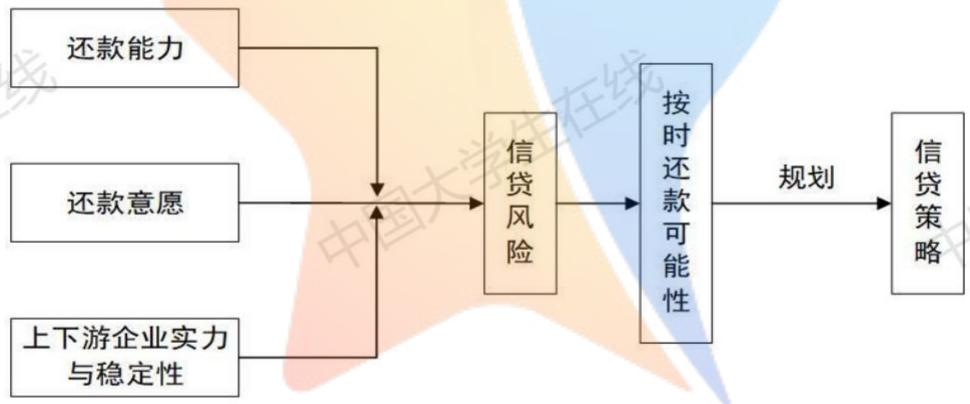

<details>
<summary>flowchart</summary>

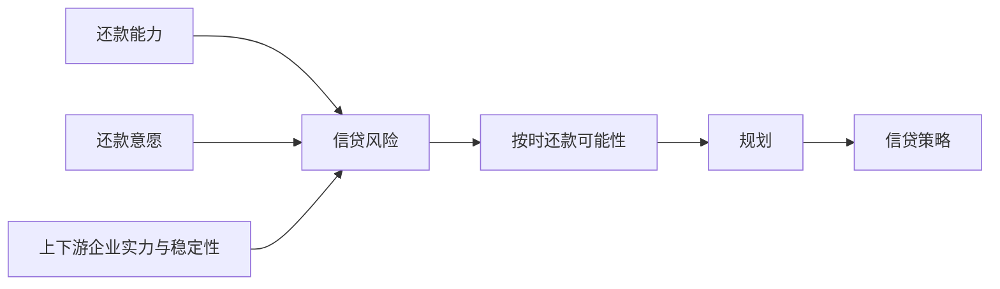
```mermaid
graph LR
  A["还款能力"] --> B["信贷风险"]
  C["还款意愿"] --> B
  D["上下游企业实力与稳定性"] --> B
  B --> E["按时还款可能性"]
  E --> F["规划"]
  F --> G["信贷策略"]
```
</details>

图1 问题一解决流程图

## 2.2 对问题二的分析

问题一中针对 123 家有信贷记录的企业，我们综合分析其信誉、供求稳定、企业实力建立了其最优信贷策略模型。在此基础上，我们对问题二进行分析解决。

问题二仍然是要对企业进行信贷风险定量分析以及最优信贷策略的决策。但是问题二中企业的主要不同是其没有信贷记录，这主要体现在附件二中的数据相比附件一缺少信誉评级以及违约情况两项指标，无法对其企业信誉的三个影响因素进行完整评价，因此不能直接利用问题一所建立的模型。

若要在问题一建立的模型的基础上对问题二中 302 家无信贷记录的企业进行信贷风险评估进而确定银行对其的最优信贷策略，首先要根据附件二计算出其数据中包含的相关指标，而后用附件一中数据作为训练集，采用神经网络的方法，结合附件二得到的已知指标预测出附件二中缺少的信誉评级以及违约情况两项未知指标，再利用问题一中模型进行评价与决策，流程图如下：

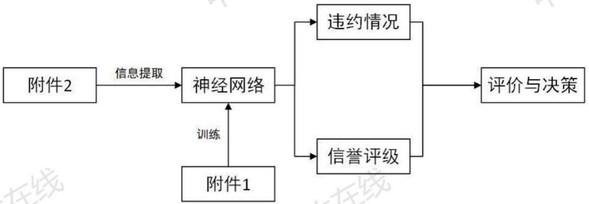

<details>
<summary>flowchart</summary>

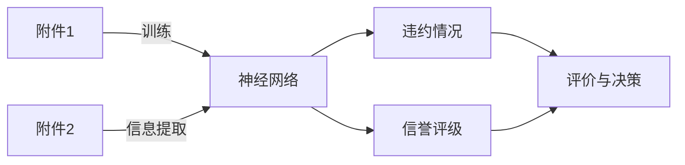
```mermaid
graph LR
  A["附件1"] -->|"训练"| B["神经网络"]
  C["附件2"] -->|"信息提取"| B
  B --> D["违约情况"]
  B --> E["信誉评级"]
  D --> F["评价与决策"]
  E --> F
```
</details>

图 2 问题二解决流程图

## 2.3 对问题三的分析

问题三是在问题二的基础上，考虑突发因素对于企业经营状况以及盈利情况的影响，这种突发事件带来的影响对企业能否按期还款这一关键因素有很强的作用，因此需要将突发事件的影响与问题二中所评价出的信贷风险指标进行融合后再进入后面的最优信贷策略决策寻找模型。

这种突发事件对企业生产经营和经济效益所带来的影响可能是积极的或消极的，也可能影响甚微。这取决于突发事件类别的不同、企业的行业类型以及类别的不同，需要构造出中间评价指数将突发事件与行业的分类联系起来，并对影响程度做出具体的评价。中间评价指数不仅要能够充分体现不同类别行业的特点以及倾向性和密集性的不同，还要使其被不同类别突发事件的影响强度能够得到体现。

可以采用基于经验评估的影响评价模型对最终的综合影响指数做出评价，本问的基本思路如下图所示：

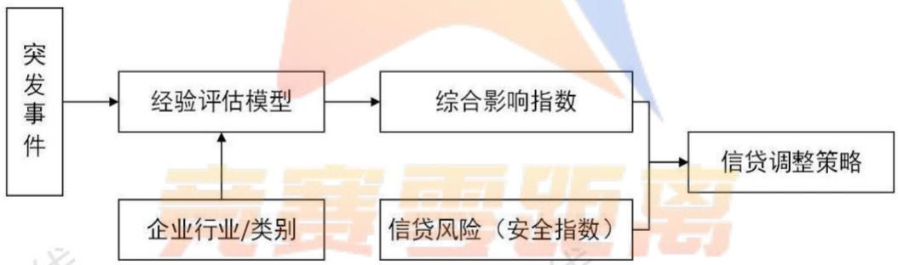

<details>
<summary>flowchart</summary>

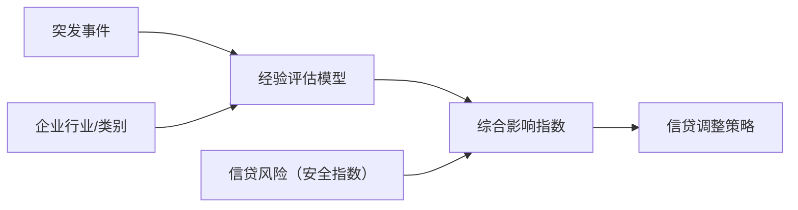
```mermaid
graph LR
  A["突发事件"] --> B["经验评估模型"]
  C["企业行业/类别"] --> B
  B --> D["综合影响指数"]
  E["信贷风险（安全指数）"] --> D
  D --> F["信贷调整策略"]
```
</details>

图3 问题三解决流程图

## 3. 模型的假设与符号说明

## 3.1 模型假设

(1) 企业的信贷风险仅由题目中所反映的企业实力、信誉以及供求关系的稳定性所决定, 不考虑经营者情况等其他主观因素。

(2) 计算企业总收益时不考虑企业的其他成本以及其他需要缴纳的税额。

(3) 同一种类企业受相同突发因素的影响相同, 忽略同一类别企业内部的差异性。

3.2 符号说明

<table><tr><td>符号</td><td>含义</td></tr><tr><td>P</td><td>企业总收益(万元)</td></tr><tr><td> $X_a$ </td><td>销项发票金额(万元)</td></tr><tr><td> $X_t$ </td><td>销项发票税额(万元)</td></tr><tr><td> $J_a$ </td><td>进项发票金额(万元)</td></tr><tr><td> $J_t$ </td><td>进项发票税额(万元)</td></tr><tr><td>T</td><td>需要缴纳的增值税额(万元)</td></tr><tr><td>α</td><td>进步因子</td></tr><tr><td> $I_r$ </td><td>月度收益增长率</td></tr><tr><td>R</td><td>信誉评级(分)</td></tr><tr><td>V</td><td>违约情况(分)</td></tr><tr><td> $B_p$ </td><td>无效发票占比</td></tr><tr><td>N</td><td>企业的总发票数</td></tr><tr><td>F</td><td>交易偏好</td></tr><tr><td>L</td><td>交易规律</td></tr><tr><td>C</td><td>企业供求客户总数</td></tr><tr><td>I</td><td>信贷风险安全指数</td></tr><tr><td>D</td><td>信贷风险</td></tr><tr><td>d</td><td>违约概率</td></tr><tr><td>W</td><td>银行总贷款利润(万元)</td></tr><tr><td>a</td><td>贷款额(万元)</td></tr><tr><td>r</td><td>贷款利率</td></tr><tr><td> $l_r$ </td><td>客户流失率</td></tr><tr><td> $T_o$ </td><td>银行年度信贷总额(万元)</td></tr><tr><td>NE</td><td>必需指数矩阵</td></tr><tr><td>PR</td><td>产业密集指数矩阵</td></tr><tr><td> $IN_1$ </td><td>必需特征影响指数矩阵</td></tr><tr><td> $IN_2$ </td><td>产业密集特征影响指数矩阵</td></tr><tr><td>IN</td><td>综合影响效果矩阵</td></tr><tr><td> $I_{adj}$ </td><td>信贷风险安全调整指数</td></tr><tr><td>ε</td><td>比例因子</td></tr></table>

## 4. 模型的建立与求解

## 4.1 问题一的模型建立与求解

## 4.1.1 企业信贷风险衡量指标体系的构建

首先对衡量信贷风险的七个评价指标给出具体定义，最后构建出企业信贷风险衡量指标体系。

## (1) 总收益 P

定义：总收益 P 为销项发票金额-进项发票金额-需要缴纳增值税额。

$$
\left\{ \begin{array}{c} P = \sum X _ {a} - \sum J _ {a} - T \\ T = \sum X _ {t} - \sum J _ {t} \end{array} \right. \tag {1}
$$

式中 $X_{a}$ 代表销项发票金额， $X_{t}$ 代表销项发票税额； $J_{a}$ 代表进项发票金额， $J_{t}$ 代表进项发票税额； $T$ 为实际需要缴纳的增值税额。

在不考虑其他成本和税额的情况下，企业的总收益代表了企业自建立以来的流水净利润，可以充分反映出企业的累计盈利能力，是其当前综合实力和还款能力的集中体现。

结合附件一中所提供数据，查阅资料可知，企业的进项和销项增值税额是可以抵消的，因而企业需要缴纳增值税额应为销项发票税额之和与进项发票税额之差。

## (2) 进步因子 $\alpha$

定义：进步因子 $\alpha$ 为企业各月度收益增长率的平均值。

$$
\left\{ \begin{array}{l} \alpha = \frac {\sum I _ {r}}{n} \\ I _ {r} = \frac {P _ {1} - P _ {0}}{P _ {0}} \end{array} \right. \tag {2}
$$

式中 $I_{r}$ 为月度收益增长率， $P_{1}$ 为所需要计算月份的下个月的收益， $P_{0}$ 为所计算月份的收益；n为参与求和的增长率的数目，即月份的总数目减一。

一些企业可能建立之初亏损较大，后来逐渐盈利且不断向好；或者由于统计数据的局限性问题，某些企业可能购入了大量原材料还未来得及来年卖出。它们虽然总的收益相对较小甚至为负，但并不能反应其综合实力。

因而需要考虑企业分段的收益的变化率，或者说主要是考虑其收益增长率的变化，用来表征企业当前以及未来的大致发展和进步情况。由于每个企业数据的差异性，这里主要是指数据时间跨度的不同，少的只有两年，多的有四到五年，若采用年收益增长率进行评价将有失代表性，因此这里我们采用月增长率进行评价。

## (3) 信誉评级 R

对信誉评级 R 的赋分（10 分制）如下：

$$
\mathrm{A}: 9 \text {分} \quad \mathrm{B}: 7 \text {分} \quad \mathrm{C}: 5 \text {分} \quad \mathrm{D}: 0 \text {分}
$$

此123家企业有过信贷记录，因而银行对他们都有过专业的信誉评级。此指标是银行对他们之前实际还款行为的评价，对未来其信贷行为有很强的预测作用，因而可以较大程度上反映该企业按期还款的可能性，在对企业还款意愿的评估中具有很强的指示作用。

评级分为四等，若为D等，则原则上不予放贷。模型建立完毕求解后得到的信贷风险评价也可以与此指标做对照，可以在一定程度上检验模型的准确性。

## (4) 违约情况 V

对违约情况 V 的赋分（10 分制）如下：

$$
\text {有违约情况:} 3 \text {分} \quad \text {无违约情况:} 9 \text {分}
$$

有无违约情况代表该公司在以往信贷记录中的信用品质，其对于判断企业的信誉有很强的参考意义。因此虽然其也是银行对其进行信誉评级的重要因素，在附件一中，违约情况还是作为单独的影响因素在信誉评级后给出。

## (5) 无效发票比例 Bp

定义: 无效发票比例 $B_{p}$ 为销项和进项发票中标识为作废发票的以及销项发票中金额为负数的发票占企业总发票数目的比例。

$$
\left\{ \begin{array}{c} B _ {p} = 0. 3 p _ {1} + 0. 7 p _ {2} \\ p _ {1} = \frac {n _ {1}}{N} \\ p _ {2} = \frac {n _ {2}}{N} \end{array} \right. \tag {3}
$$

上式中 $n_{1}$ 、 $n_{2}$ 与 $p_{1}$ 、 $p_{2}$ 分别代表作废发票与销项负数发票的数量和占比；N表示该企业的总发票数。

作废发票指在为交易活动开具发票后，因故取消了该项交易，使发票作废。负数发票指在为交易活动开具发票后，企业已入账记税，之后购方因故发生退货并退款，此时，需开具的负数发票。因此销项发票中金额为负数的发票即该企业被退货的发票数。两者的占比可以在一定程度上反映出企业总发票数中产生问题的比例，进而可以反映企业的信誉。

易知，下游企业对特定企业的退货发票比例相对于作废发票比例对于企业的信誉评价有更强的表征作用，因此我们对评价权重做了规定。

对于其他影响因素的评价, 均呈现出指标越高信贷风险越低的特点, 为保持一致性, 在下文利用主成分分析的方法进行求解时, 我们采用校正值 (1-Bp) 作为其中一个评价参数输入。

## (6) 交易偏好 F

定义：交易偏好 F 为企业成交发票税率的平均值。

$$
F = \sum (t * p _ {t}) \tag {4}
$$

式中 t 为该企业交易发票中出现过的税率值，包括 17%、13%、9%、6%、5%、3%； $p_{t}$ 为该税率所对应的发票比例。

为了衡量该企业上下游企业的稳定性，其供求企业的规模和实力是一个重要影响因素。在实际中，企业实力越大，相应成交金额也就越大；根据增值税征收的规律，一般地讲，随着成交金额的增大，税率也逐渐分档提高。

交易偏好是一个无量纲的税率期望，其反映了该企业成交的发票中的税率平均值，体现了交易的一种“偏好”程度，交易偏好的值越大说明企业的交易越偏向于规模较大企业（高税率），即信贷风险越低。

## (7) 交易规律 L

定义：交易规律性指标L为企业与客户之间交易数额的傅里叶变换后的幅度谱的方差的均值。

$$
\left\{ \begin{array}{c} L = \frac {\sum S ^ {2}}{C} \\ S ^ {2} = \frac {\sum (a b s - \overline {{a b s}}) ^ {2}}{B} \end{array} \right. \tag {5}
$$

式中 $S^2$ 为该企业与其每个往来客户之间交易数额的傅里叶变换后的幅度谱的方差，C为该企业上下游往来客户的总数目。abs代表企业与其每个往来客户之间交易数额的傅里叶变换后的幅度谱， $\overline{abs}$ 为其平均值；B为企业与每个客户的交易单数。

为了更具代表性和一般性，此处交易数额为每单发票的金额与税额的差值。

衡量企业供求稳定性的另一个重要指标是与该企业交易过程中的规律性，这个规律性主要体现在上下游企业随时间出现的周期性以及交易数额的规律性。规律性越强，企业的供求更稳定，其信贷风险更低。傅里叶变换后的幅度谱的方差可以衡量其变换后功率的集中程度，进而反映其原始数据的规律性和周期性。

## (8) 企业信贷风险衡量指标体系

以上七个特定评价指标，可层次表示为下图所示：

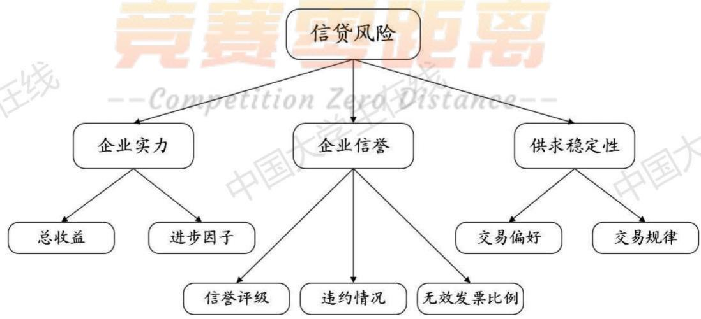

<details>
<summary>flowchart</summary>

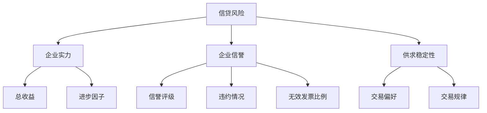
```mermaid
graph TD
  A["信贷风险"] --> B["企业实力"]
  A --> C["企业信誉"]
  A --> D["供求稳定性"]
  
  B --> E["总收益"]
  B --> F["进步因子"]
  
  C --> G["信誉评级"]
  C --> H["违约情况"]
  C --> I["无效发票比例"]
  
  D --> J["交易偏好"]
  D --> K["交易规律"]
```
</details>

图 4 企业信贷风险的评价体系

可知，企业建立以来的总收益 P 越大，进步因子 $\alpha$ 越大，其企业实力，即还款能力就越强，信贷风险越低；企业的无效发票的占比 Bp 越少、违约情况 V 为无时信誉评价等级 R 越高，其企业信誉越高，即还款意愿就越高，使信贷风险越低；企业的交易偏好 F 越大，交易规律性 L 越大，其上下游的供求稳定性越强，信贷风险越低。

## 4.1.2 基于主成分分析的信贷风险评价模型

由上述的信贷风险量化评价指标体系可以看出，信贷风险的评估是多因一果的过程，对结果产生影响的指标数多，且各指标之间关系复杂。

主成分分析法是一种综合评价方法，具有对大量变量进行降维分析的优势。根据这些特点，我们决定运用7个指标数据基于主成分分析法构建对信贷风险评价，具体过程如下[1]：

（1）对原始数据进行标准化处理；  
(2) 计算相关系数矩阵 R;  
（3）计算特征值和特征向量；

$$
\begin{array}{l} y _ {1} = u _ {1 1} \tilde {P} + u _ {2 1} \tilde {\alpha} + u _ {3 1} \tilde {F} + u _ {4 1} \tilde {L} + u _ {5 1} \tilde {R} + u _ {6 1} \tilde {V} + u _ {7 1} \widetilde {B p} \\ \begin{array}{c} y _ {2} = u _ {1 2} \tilde {P} + u _ {2 2} \tilde {\alpha} + u _ {3 2} \tilde {F} + u _ {4 2} \tilde {L} + u _ {5 2} \tilde {R} + u _ {6 2} \tilde {V} + u _ {7 2} \widetilde {B p} \\ \vdots \end{array} \tag {6} \\ y _ {7} = u _ {1 7} \tilde {P} + u _ {2 7} \tilde {\alpha} + u _ {3 7} \tilde {F} + u _ {4 7} \tilde {L} + u _ {5 7} \tilde {R} + u _ {6 7} \tilde {V} + u _ {7 7} \widetilde {B p} \\ \end{array}
$$

(4) 计算特征值 $\lambda_{j}$ 的信息贡献率和累积贡献率;

$$
b _ {j} = \frac {\lambda_ {j}}{\sum_ {k = 1} ^ {m} \lambda_ {k}}, j = 1, 2, \dots , m \tag {7}
$$

(5) 选择 p (p≤7) 个主成分，计算综合得分。

$$
I _ {t m p} = \sum_ {j = 1} ^ {p} b _ {j} y _ {j} \tag {8}
$$

（6）对综合得分进行归一化处理，将其取值范围限制在[0,1]。

$$
I = \frac {I _ {t m p} - \min (I _ {t m p})}{\max (I _ {t m p}) - \min (I _ {t m p})} \tag {9}
$$

在本模型中结合影响因素的定量定义，可以知道最后的综合评分越高，其信贷风险就越低，因此直接评价得出的指数与其信贷风险应该成负相关的关系。这里我们定义最终的评价指数为信贷风险安全指数 I，用其来刻画信贷风险 D 是非常合适的。两者关系如下：

$$
I \propto \frac {1}{D} \tag {10}
$$

## 4.1.3 最优信贷策略决策模型

银行将根据对企业的信贷风险的评价决定对其的信贷策略，这主要包括是否对其进行贷款、贷款额度以及贷款利率，由于题目中已经规定贷款期限为一年，因此不再需要决策贷款期限。策略模型即转化为依据上文得出的信贷风险安全指数结合其他特定变量进行信贷策略决策的过程。

本题是基于银行角度的决策类优化模型，而银行关心的主要问题是使贷款期限为一年时的总的贷款利润最大。要表示出银行的总贷款利润，需要确定关键因素企业违约概率 d，其与信贷风险安全指数 I 息息相关。

## (1) 违约概率 d 的生成

一般地说，信贷风险安全指数越高的企业，经营活动越稳定、信誉情况越好，违约的可能性越小；反之，违约的可能性越大。因此，银行应尽可能贷更多的款给违约概率低的企业，减少给违约概率高的企业贷款，对于某些违约概率特别高的企业，应当不予以贷款。

基于上述分析，我们认为信贷风险安全指数和违约概率之间存在一个可能的函数关系，我们通过趋势关系，拟合以下函数关系：

$$
d = d (I) = \sqrt {\frac {5}{\pi}} \exp (- 1 0 I ^ {2}) \tag {11}
$$

函数图像如图所示:

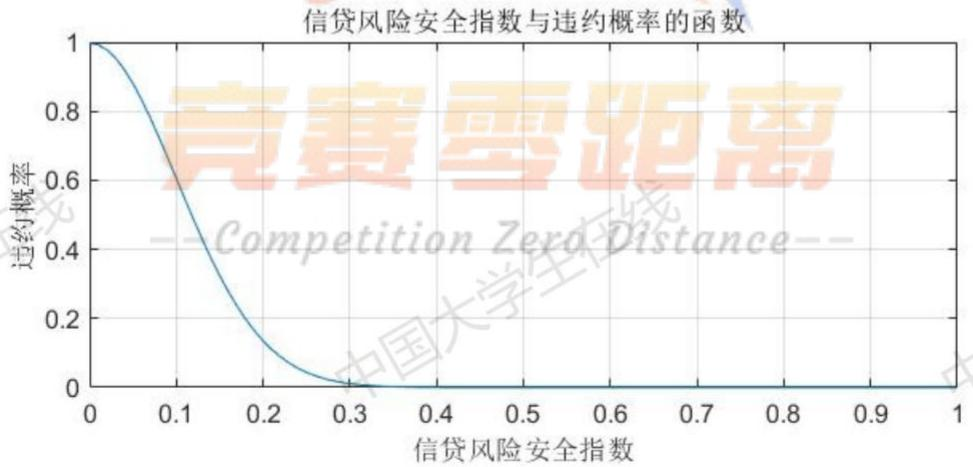

<details>
<summary>line</summary>

| 信贷风险安全指数 | 违约概率 |
| --- | --- |
| 0 | 1 |
| 0.1 | ~0.6 |
| 0.2 | ~0.15 |
| 0.3 | ~0.02 |
| 0.4 | 0 |
| 0.5 | 0 |
| 0.6 | 0 |
| 0.7 | 0 |
| 0.8 | 0 |
| 0.9 | 0 |
| 1 | 0 |
</details>

图 5 信贷风险安全指数与违约概率的函数关系图

## (2) 是否贷款策略基本决策模型

根据已知条件企业的信誉评级为 D 则原则上不予贷款这一信息，我们确定是否贷款的基本决策，即：

信誉等级 $R \neq 0$ 时，给予贷款；R = 0 时，不予贷款。

## (3) 基于非线性规划的最优信贷策略决策模型

## ①目标函数总贷款利润 W 的确定

以银行的总贷款利润 W 作为目标函数用来对银行向企业的贷款额 a 与贷款利率 r 进行决策。银行的起始总贷款利润为可以按期还款的企业所带来的利润减去不能按期还款的企业所带来的亏损；除此之外还要考虑客户流失率对于潜在客户流失所带来的利润值的流失。银行的总利润 W 表示如下：

$$
W = \sum [ a \cdot r \cdot (1 - d) - a \cdot d ] \cdot (1 - l _ {r}) \tag {12}
$$

上式中 a 代表贷款额，r 代表贷款利率；d 代表违约概率， $l_{r}$ 表示相应的客户流失率。其中：

$$
\left\{ \begin{array}{c} d = d (I) \\ l _ {r} = l _ {r} (R, r) \end{array} \right.
$$

违约概率 d 上文已经得出，是一个取决于我们得到的信贷风险安全指数的函数值。下面对客户流失率的关系曲线进行拟合求解。

根据附件三中所给出的数据，我们绘出信誉评级、贷款利率与客户流失率关系的散点图。

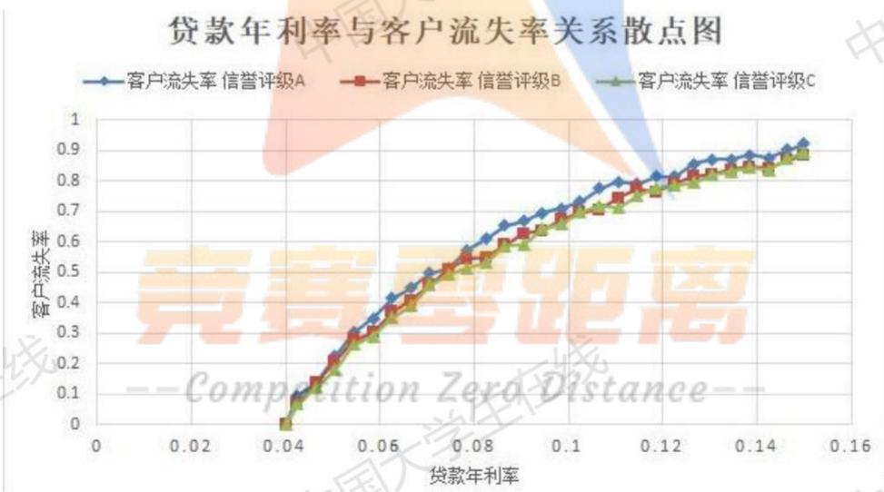

<details>
<summary>line</summary>

| 贷款年利率 | 客户流失率 信誉评级A | 客户流失率 信誉评级B | 客户流失率 信誉评级C |
| --- | --- | --- | --- |
| 0.04 | ~0.01 | ~0.01 | ~0.01 |
| 0.05 | ~0.22 | ~0.21 | ~0.18 |
| 0.06 | ~0.35 | ~0.33 | ~0.30 |
| 0.07 | ~0.48 | ~0.45 | ~0.43 |
| 0.08 | ~0.58 | ~0.54 | ~0.52 |
| 0.09 | ~0.66 | ~0.62 | ~0.59 |
| 0.10 | ~0.72 | ~0.68 | ~0.65 |
| 0.11 | ~0.78 | ~0.74 | ~0.71 |
| 0.12 | ~0.82 | ~0.78 | ~0.76 |
| 0.13 | ~0.86 | ~0.82 | ~0.80 |
| 0.14 | ~0.88 | ~0.85 | ~0.83 |
| 0.15 | ~0.92 | ~0.89 | ~0.88 |
</details>

图 6 贷款年利率与客户流失率关系图

观察可以发现客户流失率 $l_{r}$ 是一个取决于信誉评级以及贷款利率的函数值。考虑到因变量（客户流失率）包含非正值，最小值为0。无法应用对数转换。无法针对此变量计算复合模型、幂模型、S模型、增长模型、指数分布模型和Logistic等模型，所以我们主要用对数、一次、二次、三次模型来进行拟合测试。下面使用SPSS软件分析贷款年利率对信誉评级为A情况下的客户流失率的影响，并得出回归函数。

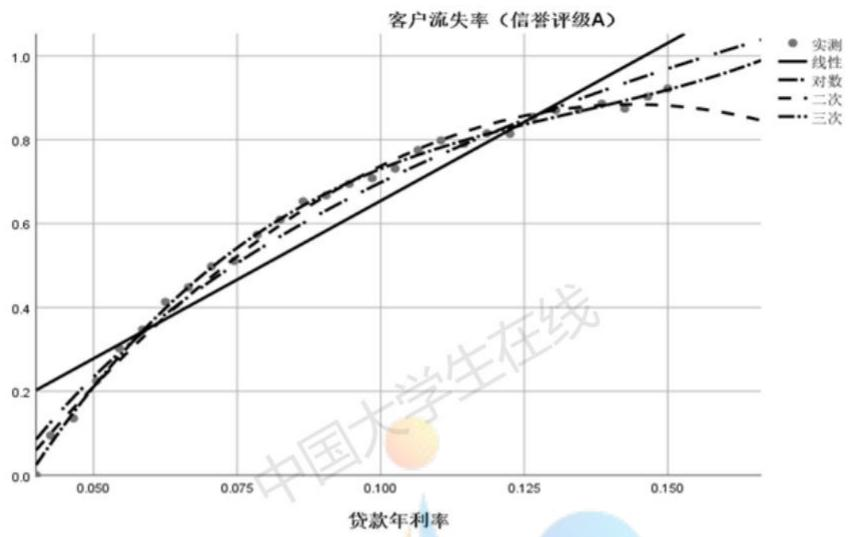

<details>
<summary>line</summary>

| 贷款年利率 | 实测 (Y) | 线性 (Y) | 对数 (Y) | 二次 (Y) | 三次 (Y) |
| --- | --- | --- | --- | --- | --- |
| 0.050 | ~0.14 | ~0.28 | ~0.16 | ~0.13 | ~0.12 |
| 0.075 | ~0.50 | ~0.52 | ~0.51 | ~0.50 | ~0.49 |
| 0.100 | ~0.73 | ~0.72 | ~0.73 | ~0.72 | ~0.71 |
| 0.125 | ~0.83 | ~0.86 | ~0.85 | ~0.84 | ~0.83 |
| 0.150 | — | ~1.05 | ~0.98 | ~0.92 | ~0.89 |
</details>

图 7 客户流失率（信誉评级 A）与贷款年利率关系拟合曲线

表 1 模型摘要和参数估计值

<table><tr><td rowspan="2">方程</td><td colspan="3">模型摘要</td><td colspan="4">参数估计值</td></tr><tr><td>R 方</td><td>F</td><td>显著性</td><td>常量</td><td>b1</td><td>b2</td><td>b3</td></tr><tr><td>线性</td><td>0.911</td><td>276.616</td><td>0.000</td><td>-0.098</td><td>7.524</td><td>/</td><td>/</td></tr><tr><td>对数</td><td>0.982</td><td>1500.776</td><td>0.000</td><td>2.239</td><td>0.669</td><td>/</td><td>/</td></tr><tr><td>二次</td><td>0.993</td><td>1847.861</td><td>0.000</td><td>-0.697</td><td>21.984</td><td>-76.410</td><td>/</td></tr><tr><td>三次</td><td>0.998</td><td>3690.626</td><td>0.000</td><td>-1.121</td><td>37.970</td><td>-258.570</td><td>640.944</td></tr></table>

经过观察可以得知四种拟合模型的可决系数 $R^{2}$ 分别为0.911、0.982、0.993、0.998，显著性都满足<0.05的要求，其中三次模型显著性为3.3296E-33（表格显示为0）最佳，经过分析比较，我们选择三次拟合方程作为其回归函数：

$$
A: \widehat {L _ {r 1}} = 6 4 0. 9 4 4 \mathrm{r} ^ {3} - 2 5 8. 5 7 0 \mathrm{r} ^ {2} + 3 7. 9 7 0 \mathrm{r} - 1. 1 2 1 \tag {13}
$$

同理，分析贷款年利率对信誉评级分别为 B、C 两种情况下的客户流失率的影响可得，其回归函数分别为：

$$
\mathrm{B}: \widehat {L _ {r 2}} = 5 5 2. 8 2 9 \mathrm{r} ^ {3} - 2 2 5. 0 5 1 \mathrm{r} ^ {2} + 3 3. 9 9 5 \mathrm{r} - 1. 0 1 7 \tag {14}
$$

$$
C: \widehat {L _ {r 3}} = 5 0 4. 7 1 7 \mathrm{r} ^ {3} - 2 0 7. 3 8 6 \mathrm{r} ^ {2} + 3 2. 1 5 7 \mathrm{r} - 0. 9 7 3 \tag {15}
$$

以上几式中 $\hat{r}$ 代表对流失率的拟合估计值；r 表示贷款利率。虽然上面根据信贷风险安全指数 R 已经筛选出一批不予借贷企业，但是不能排除仍有信誉等级为 D 的企业进入到此流程，因此当信誉等级为 D 时我们令流失率为 100%，保证规划模型不给予其贷款。综上所述：

$$
l _ {r} = l _ {r} (\mathrm{R}, \mathrm{r}) = \left\{ \begin{array}{l l} \widehat {L _ {r 1}}, & R = 9 \\ \widehat {L _ {r 2}}, & R = 7 \\ \widehat {L _ {r 3}}, & R = 3 \\ 1, & R = 0 \end{array} \right. \tag {16}
$$

②约束条件的确定

约束条件有以下几个方面：首先是题目中对于贷款额 a 与贷款利率 r 的约束条件。其次是各企业总的贷款额度之和不能大于银行年度信贷总额 $T_{o}$ ，表示如下：

$$
\left\{ \begin{array}{l} 1 0 \leq a \leq 1 0 0 \\ 4 \% \leq r \leq 1 5 \% \\ \sum a \leq T _ {o} \end{array} \right.
$$

③基于非线性规划的最优信贷策略决策模型

综上所述，给出贷款额 a 与利率 r 的信贷策略最优决策模型：

$$
\max \quad W = \sum \left\{\left[ a \cdot r \cdot (1 - d) - a \cdot d \right] \cdot \left(1 - l _ {r}\right) \right\}
$$

$$
s t \left\{ \begin{array}{c} l _ {r} = l _ {r} (\mathrm{R}, \mathrm{r}) \\ \mathrm{d} = \mathrm{d} (\mathrm{I}) \\ 1 0 \leq a \leq 1 0 0 \\ 4 \% \leq r \leq 1 5 \% \\ \sum a \leq T _ {o} \end{array} \right. \tag {17}
$$

模型描述：W 为目标变量，a 与 r 为决策变量。

W 为总贷款利润；d 为违约概率，（7）式中给出了 d(I) 的具体函数形式； $l_{r}$ 为客户流失率，（11）式中给出了其具体函数表达式；a 为贷款额度；r 为贷款利率； $T_{o}$ 为银行年度信贷总额；I 为信贷风险安全指数，由前文的主成分分析打分模型确定；R 为信誉评级。

④遗传算法

当贷款额度和贷款利率限制在固定的离散取值范围时，可以将上述非线性规划问题看作一个复杂组合优化问题，因此可以采用启发式算法提高求解效率。

遗传算法是一种基于自然原理的启发式算法，它的本质是通过群体搜索技术，根据适者生存的原则逐代进化，最终得到最优解或准最优解。该特性符合我们要求解的最优信贷策略模型，故采用遗传算法求解该模型。

遗传算法的一般流程分为求初始种群、确定目标函数、交叉操作、变异操作和选择等若干步骤，依据这一流程编写求解程序，随后运行得到结果。

## 4.1.4 问题一的模型求解

## (1) 信贷风险量化评价模型求解

## ①模型求解

根据主成分分析法基本过程，运用 MATLAB 软件编程，对 3 层、7 个评价指标进行主成分分析，相关系数矩阵的特征值、贡献率和累积贡献率见下表。

表 2 相关系数矩阵的特征值、贡献率、累积贡献率统计表

<table><tr><td>序号</td><td>特征值</td><td>贡献率</td><td>累计贡献率</td><td>序号</td><td>特征值</td><td>贡献率</td><td>累计贡献率</td></tr><tr><td>1</td><td>2.6082</td><td>37.2597</td><td>37.2597</td><td>5</td><td>0.3449</td><td>4.9275</td><td>97.9289</td></tr><tr><td>2</td><td>1.8764</td><td>26.8052</td><td>64.0649</td><td>6</td><td>0.1435</td><td>2.0497</td><td>99.9786</td></tr><tr><td>3</td><td>1.0992</td><td>15.7034</td><td>79.7683</td><td>7</td><td>0.0015</td><td>0.0214</td><td>100</td></tr><tr><td>4</td><td>0.9263</td><td>13.2331</td><td>93.0014</td><td></td><td></td><td></td><td></td></tr></table>

上述特征值对应的特征向量见下表。

表 3 特征值对应的特征向量统计表

<table><tr><td></td><td>P</td><td>α</td><td>F</td><td>L</td><td>R</td><td>V</td><td>Bp</td></tr><tr><td>1</td><td>0.4525</td><td>0.2262</td><td>0.3712</td><td>0.1594</td><td>0.7514</td><td>0.0317</td><td>0.1237</td></tr><tr><td>2</td><td>0.6055</td><td>0.0943</td><td>0.0040</td><td>0.0562</td><td>0.2599</td><td>0.0176</td><td>0.7439</td></tr><tr><td>3</td><td>0.1088</td><td>0.0709</td><td>0.5846</td><td>0.7918</td><td>0.0747</td><td>0.0929</td><td>0.0116</td></tr><tr><td>4</td><td>0.5910</td><td>0.0789</td><td>0.0361</td><td>0.0506</td><td>0.4599</td><td>0.0238</td><td>0.6547</td></tr><tr><td>5</td><td>0.1450</td><td>0.6698</td><td>0.1402</td><td>0.1020</td><td>0.0490</td><td>0.7052</td><td>0.0256</td></tr><tr><td>6</td><td>0.1072</td><td>0.6754</td><td>0.1982</td><td>0.0131</td><td>0.0172</td><td>0.7016</td><td>0.0189</td></tr><tr><td>7</td><td>0.1872</td><td>0.1544</td><td>0.6784</td><td>0.5756</td><td>0.3849</td><td>0.0048</td><td>0.0383</td></tr></table>

选取贡献率在 1% 以上的主成分，由此得到 6 个主成分分别为：

$$
\begin{array}{l} y _ {1} = 0. 4 5 2 5 \tilde {P} + 0. 2 2 6 2 \tilde {\alpha} + 0. 3 7 1 2 \tilde {F} + 0. 1 5 9 4 \tilde {L} + 0. 7 5 1 4 \tilde {R} + 0. 0 3 1 7 \tilde {V} + 0. 1 2 3 7 \widetilde {B p} \\ y _ {2} = 0. 6 0 5 5 \tilde {P} + 0. 0 9 4 3 \tilde {\alpha} + 0. 0 0 4 0 \tilde {F} + 0. 0 5 6 2 \tilde {L} + 0. 2 5 9 9 \tilde {R} + 0. 0 1 7 6 \tilde {V} + 0. 7 4 3 9 \widetilde {B p} \\ y _ {3} = 0. 1 0 8 8 \tilde {P} + 0. 0 7 0 9 \tilde {\alpha} + 0. 5 8 4 6 \tilde {F} + 0. 7 9 1 8 \tilde {L} + 0. 0 7 4 7 \tilde {R} + 0. 0 9 2 9 \tilde {V} + 0. 0 1 1 6 \widetilde {B p} \\ y _ {4} = 0. 5 9 1 0 \tilde {P} + 0. 0 7 8 9 \tilde {\alpha} + 0. 0 3 6 1 \tilde {F} + 0. 0 5 0 6 \tilde {L} + 0. 4 5 9 9 \tilde {R} + 0. 0 2 3 8 \tilde {V} + 0. 6 5 4 7 \widetilde {B p} \\ y _ {5} = 0. 1 4 5 0 \tilde {P} + 0. 6 6 9 8 \tilde {\alpha} + 0. 1 4 0 2 \tilde {F} + 0. 1 0 2 0 \tilde {L} + 0. 0 4 9 0 \tilde {R} + 0. 7 0 5 2 \tilde {V} + 0. 0 1 8 9 \widetilde {B p} \\ y _ {6} = 0. 1 0 7 2 \tilde {P} + 0. 6 7 5 4 \tilde {\alpha} + 0. 1 9 8 2 \tilde {F} + 0. 0 1 3 1 \tilde {L} + 0. 0 1 7 2 \tilde {R} + 0. 7 0 1 6 \tilde {V} + 0. 0 1 8 9 \widetilde {B p} \\ \end{array}
$$

分别以 6 个主成分的贡献率为权重，构建主成分综合评价模型：

$$
I _ {t m p} = 0. 3 7 2 6 y _ {1} + 0. 2 6 8 1 y _ {2} + 0. 1 5 7 0 y _ {3} + 0. 1 3 2 3 y _ {4} + 0. 0 4 9 3 y _ {5} + 0. 0 2 0 5 y _ {6} \tag {18}
$$

$$
I = \frac {I _ {t m p} - \min \left(I _ {t m p}\right)}{\max \left(I _ {t m p}\right) - \min \left(I _ {t m p}\right)} \tag {19}
$$

最终求解得到附件 1 中 123 家企业的信贷风险安全指数和排名结果，见支撑材料中的表格 1，下表展示位于前 8 名和后 8 名的企业。

表 4 前 8 名、后 8 名企业统计表

<table><tr><td>企业</td><td>E3</td><td>E4</td><td>E7</td><td>E2</td><td>E8</td><td>E9</td><td>E13</td><td>E19</td></tr><tr><td>排名</td><td>1</td><td>2</td><td>3</td><td>4</td><td>5</td><td>6</td><td>7</td><td>8</td></tr><tr><td>安全指数</td><td>1.0000</td><td>0.8974</td><td>0.7021</td><td>0.6849</td><td>0.4674</td><td>0.4636</td><td>0.4575</td><td>0.4116</td></tr><tr><td>信誉评级</td><td>C</td><td>C</td><td>A</td><td>A</td><td>A</td><td>A</td><td>A</td><td>A</td></tr><tr><td>企业</td><td>E122</td><td>E107</td><td>E108</td><td>E116</td><td>E118</td><td>E115</td><td>E117</td><td>E109</td></tr><tr><td>排名</td><td>116</td><td>117</td><td>118</td><td>119</td><td>120</td><td>121</td><td>122</td><td>123</td></tr><tr><td>安全指数</td><td>0.0326</td><td>0.0300</td><td>0.0265</td><td>0.0209</td><td>0.0166</td><td>0.0131</td><td>0.0032</td><td>0</td></tr><tr><td>信誉评级</td><td>D</td><td>D</td><td>D</td><td>D</td><td>D</td><td>D</td><td>D</td><td>D</td></tr></table>

## ②模型合理性检验

由于缺乏已知的直接与信贷风险相关的数据，我们很难对该评价模型的正确性进行精确的检验。在此情况下，我们尝试探究信贷风险安全指数与附件1中信誉评级的关系，作图如下

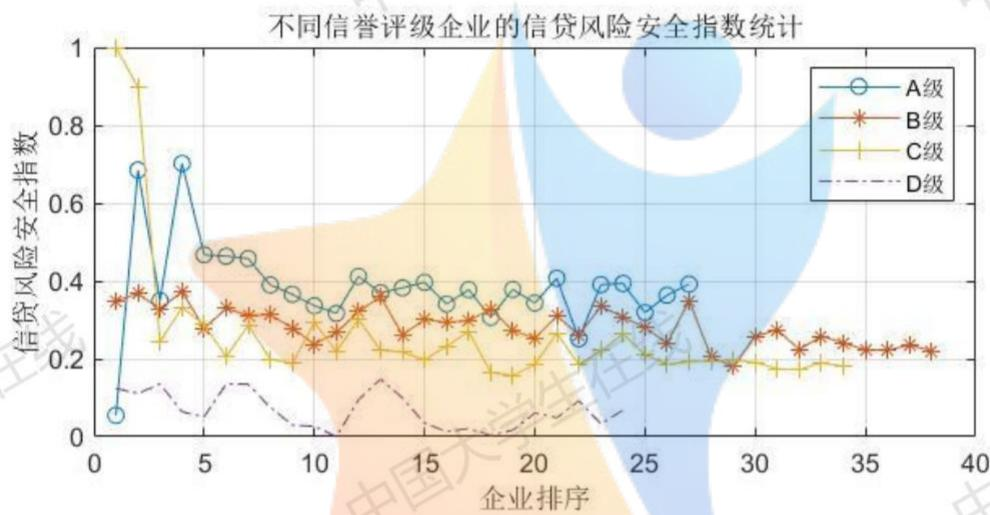

<details>
<summary>line</summary>

| 企业排序 | A级 | B级 | C级 | D级 |
| --- | --- | --- | --- | --- |
| 1 | ~0.06 | ~0.35 | 1.0 | ~0.12 |
| 2 | ~0.69 | ~0.37 | ~0.90 | ~0.13 |
| 3 | ~0.35 | ~0.34 | ~0.25 | ~0.14 |
| 4 | ~0.70 | ~0.38 | ~0.33 | ~0.06 |
| 5 | ~0.47 | ~0.28 | ~0.28 | ~0.05 |
| 6 | ~0.47 | ~0.33 | ~0.21 | ~0.14 |
| 7 | ~0.46 | ~0.31 | ~0.29 | ~0.14 |
| 8 | ~0.40 | ~0.31 | ~0.20 | ~0.08 |
| 9 | ~0.37 | ~0.28 | ~0.19 | ~0.03 |
| 10 | ~0.34 | ~0.23 | ~0.23 | ~0.02 |
| 11 | ~0.32 | ~0.27 | ~0.22 | ~0.01 |
| 12 | ~0.41 | ~0.32 | ~0.31 | ~0.15 |
| 13 | ~0.38 | ~0.36 | ~0.23 | ~0.15 |
| 14 | ~0.39 | ~0.26 | ~0.22 | ~0.05 |
| 15 | ~0.40 | ~0.30 | ~0.21 | ~0.02 |
| 16 | ~0.35 | ~0.29 | ~0.24 | ~0.02 |
| 17 | ~0.38 | ~0.31 | ~0.27 | ~0.01 |
| 18 | ~0.31 | ~0.33 | ~0.16 | ~0.01 |
| 19 | ~0.38 | ~0.26 | ~0.16 | ~0.05 |
| 20 | ~0.35 | ~0.27 | ~0.19 | ~0.06 |
| 21 | ~0.41 | ~0.31 | ~0.26 | ~0.11 |
| 22 | ~0.26 | ~0.26 | ~0.26 | ~0.05 |
| 23 | ~0.40 | ~0.34 | ~0.22 | — |
| 24 | ~0.40 | ~0.31 | ~0.27 | — |
| 25 | ~0.33 | ~0.28 | ~0.21 | — |
| 26 | ~0.36 | ~0.24 | ~0.19 | — |
| 27 | ~0.40 | ~0.35 | ~0.19 | — |
| 28 | — | — | — | — |
| 29 | — | — | — | — |
| 30 | — | — | — | — |
| 31 | — | — | — | — |
| 32 | — | — | — | — |
| 33 | — | — | — | — |
| 34 | — | — | — | — |
| 35 | — | — | — | — |
| 36 | — | — | — | — |
| 37 | — | — | — | — |
| 38 | — | — | — | — |
| 39 | — | — | — | — |
| 40 | — | — | — | — |
</details>

图 8 不同信誉评级企业的信贷风险安全指数统计图

由图 8 可知，从总体趋势上来看，人工信誉评级越高，信贷风险安全指数越高，银行放贷风险越小，其中信誉评级为 D 的企业安全指数显著低于其他企业。这一结果符合我们对问题背景的认知，证明模型结果基本正确。

但是，观察上图容易发现，部分评级为 C 的企业安全指数很高，甚至显著高于 A 级企业，同时，部分评级为 A 的企业安全指数低到 D 级水平。这是由于信贷风险不仅受企业信誉的影响，也与企业的规模、实力有很大的关系。例如，某些小企业的历史信誉可能非常好，但是由于其自身资金有限，一旦发生紧急情况，很有可能资金锻炼、破产，导致无法偿还贷款。上述解释也是符合现实生活情况的。

## (2) 基于遗传算法的最优信贷策略规划模型求解

以银行年度贷款总额为 1 亿元为例，按照遗传算法求解最优信贷策略规划模型，一次求解得到银行年度最大利润为 143.83 万元，完整策略见支撑材料中的表格 2，对部分企业的具体信贷策略如下表所示。

表 5 部分企业信贷策略展示表

<table><tr><td>企业</td><td>E3</td><td>E4</td><td>E7</td><td>E2</td><td>E8</td><td>E9</td><td>E13</td><td>E19</td></tr><tr><td>安全指数排名</td><td>1</td><td>2</td><td>3</td><td>4</td><td>5</td><td>6</td><td>7</td><td>8</td></tr><tr><td>贷款额度/万元</td><td>94</td><td>65</td><td>97</td><td>99</td><td>67</td><td>37</td><td>92</td><td>68</td></tr><tr><td>贷款利率</td><td>4.29%</td><td>5.85%</td><td>5.52%</td><td>6.56%</td><td>4.03%</td><td>4.28%</td><td>6.09%</td><td>5.93%</td></tr><tr><td>企业</td><td>E122</td><td>E107</td><td>E108</td><td>E116</td><td>E118</td><td>E115</td><td>E117</td><td>E109</td></tr><tr><td>安全指数排名</td><td>116</td><td>117</td><td>118</td><td>119</td><td>120</td><td>121</td><td>122</td><td>123</td></tr><tr><td>贷款额度/万元</td><td>0</td><td>0</td><td>0</td><td>0</td><td>0</td><td>0</td><td>0</td><td>0</td></tr><tr><td>贷款利率</td><td>0</td><td>0</td><td>0</td><td>0</td><td>0</td><td>0</td><td>0</td><td>0</td></tr></table>

分析上表可以看出，安全指数排名高的企业，贷款额度普遍较高，贷款利率较低；安全指数排名越低，贷款额度越低，贷款利率越高，当排名非常低时，银行不予以放贷。

## 4.2 问题二的模型建立与求解

## 4.2.1 问题二的模型建立思路

第一问已经建立起基于主成分分析的信贷风险评价模型和基于遗传算法的银行最优信贷策略模型，经过与其信誉等级的检验发现模型实现评价的效果较好。由于问题二仍然是对企业进行信贷风险的量化分析，进而确定银行对其的信贷策略，结合题意与实际，可以在第一问的基础上实现。

因此对于附件二中无信贷记录的企业数据，在应用已有模型之前，我们需要对问题二中企业的信誉评级以及违约情况做出较为合理的预测，而后利用模型（13），实现对302家无信贷记录的企业的信贷风险的有效量化评价及银行对其最优信贷策略的规划决策。下面我们主要对预测模型的建立做出介绍，后续过程由于与问题一的建立过程重复不再赘述。

## 4.2.2 基于 BP 神经网络的信誉评价指数预测模型

附件 1 中信誉评级这一指标，是银行内部根据企业的实际情况人工评定的。根据这一特点，对于无信贷记录的 302 家企业，可以采用一定的预测方法，基于已有的账目信息预测得到企业未来的违约情况和信誉评级。在此模型中，我们采用两级 BP 神经网络进行预测。

一般地说，BP 网络的学习算法步骤如下：

（1）初始化网络及学习参数，如设置网络初始权矩阵、学习因子等；  
（2）提供训练模式，训练网络，直到满足学习要求；  
（3）前向传播过程：对给定训练模式输入，计算网络的输出模式，并与期望模式比较，若有误差，则执行步骤（4），否则返回步骤（2）；  
（4）反向传播过程：计算同一层单元的误差，修正权值和阈值，返回步骤（2）。

根据上述步骤，我们将附件1中的已知完整数据分为训练和测试两部分，分别为两级神经网络提供训练模式，并进行检验，具体过程表述如下：

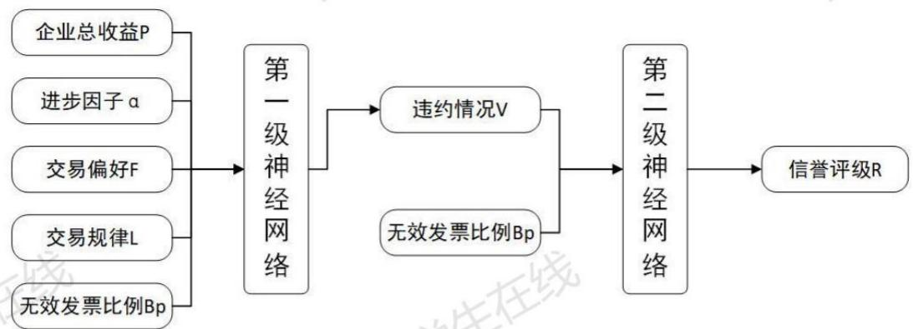

<details>
<summary>flowchart</summary>

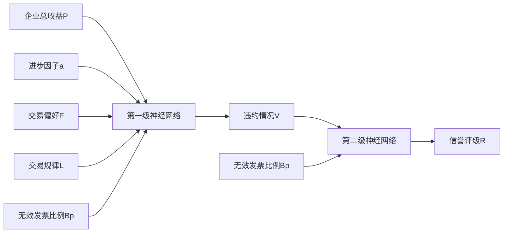
```mermaid
graph LR
  A["企业总收益P"] --> B["第一级神经网络"]
  C["进步因子a"] --> B
  D["交易偏好F"] --> B
  E["交易规律L"] --> B
  F["无效发票比例Bp"] --> B
  B --> G["违约情况V"]
  G --> H["第二级神经网络"]
  I["无效发票比例Bp"] --> H
  H --> J["信誉评级R"]
```
</details>

图 9 神经网络流程图

训练完成后，输入附件2中302家企业的发票数据，经过神经网络预测，即可得到每家企业对应的违约情况和信誉评级。而后，将7个评价指标构成的矩阵代入问题一中的信贷风险量化评价模型和信贷策略最优决策模型，利用主成分分析法和遗传算法即可求解。

## 4.2.3 问题二的求解

## (1) 两级 BP 神经网络性能检验

模型采用 MATLAB 自带工具实现神经网络，选取附件 1 中的 13 家企业数据对网络的性能进行测试和检验。一次检验具体结果如下（可见于支撑材料中的表格 3 和表格 4）。

表 6 第一级 BP 神经网络的检验结果

<table><tr><td>真实违约情况</td><td>否</td><td>否</td><td>否</td><td>否</td><td>否</td><td>否</td><td>否</td></tr><tr><td>预测违约情况</td><td>否</td><td>否</td><td>否</td><td>是</td><td>否</td><td>是</td><td>否</td></tr><tr><td>真实违约情况</td><td>否</td><td>否</td><td>否</td><td>否</td><td>是</td><td>是</td><td></td></tr><tr><td>预测违约情况</td><td>是</td><td>是</td><td>否</td><td>否</td><td>否</td><td>是</td><td></td></tr><tr><td>正确率</td><td colspan="7">61.54%</td></tr></table>

表 7 第二级 BP 神经网络的检验结果

<table><tr><td>真实信誉评级</td><td>B</td><td>B</td><td>B</td><td>B</td><td>A</td><td>B</td><td>B</td></tr><tr><td>预测信誉评级</td><td>B</td><td>B</td><td>B</td><td>B</td><td>B</td><td>B</td><td>B</td></tr><tr><td>真实信誉评级</td><td>B</td><td>C</td><td>C</td><td>B</td><td>D</td><td>D</td><td></td></tr><tr><td>预测信誉评级</td><td>B</td><td>B</td><td>B</td><td>B</td><td>D</td><td>D</td><td></td></tr><tr><td>正确率</td><td colspan="7">76.92%</td></tr></table>

分析表格可以看出，两级神经网络的预测均有一定准确性，但性能并不是非常好，这是因为附件1中的样本数据少，且多数指标与信誉相关性不是很强。未来如果要基于此模型进一步改进，应该收集更多的中小企业信誉评级和发票交易数据，以增强神经网络的性能。

## (2) 信贷风险量化评价模型求解

采用问题一中已建立的主成分分析法模型，对附件2中的交易数据和神经网络预测的数据进行求解，得到302家无信贷记录的企业的信贷风险安全指数，具体结果见支撑

材料中的表格 5。

对这些企业的安全指数进行统计，转化为图表呈现如下。

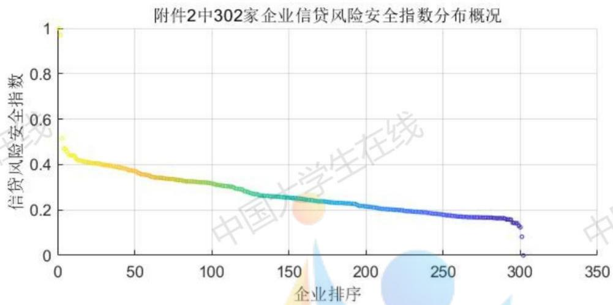

<details>
<summary>line</summary>

| 企业排序 | 信贷风险安全指数 |
| --- | --- |
| 0 | 1.0 |
| ~5 | ~0.48 |
| ~10 | ~0.42 |
| ~50 | ~0.38 |
| ~100 | ~0.32 |
| ~150 | ~0.26 |
| ~200 | ~0.22 |
| ~250 | ~0.18 |
| ~300 | ~0.14 |
</details>

图 10 附件 2 中 302 家企业信贷风险安全指数分布概况

对比附件 1 中 123 家有信贷记录企业的安全指数，分析可发现，无信贷记录的 302 家企业的评分规律与前者大致相同，但得分低的企业较多。这是因为当银行缺乏对企业的经验判断时，会采取相对保守的策略，适当地高估贷款风险。

对这 302 家企业，相应地有违约概率评估如下图。

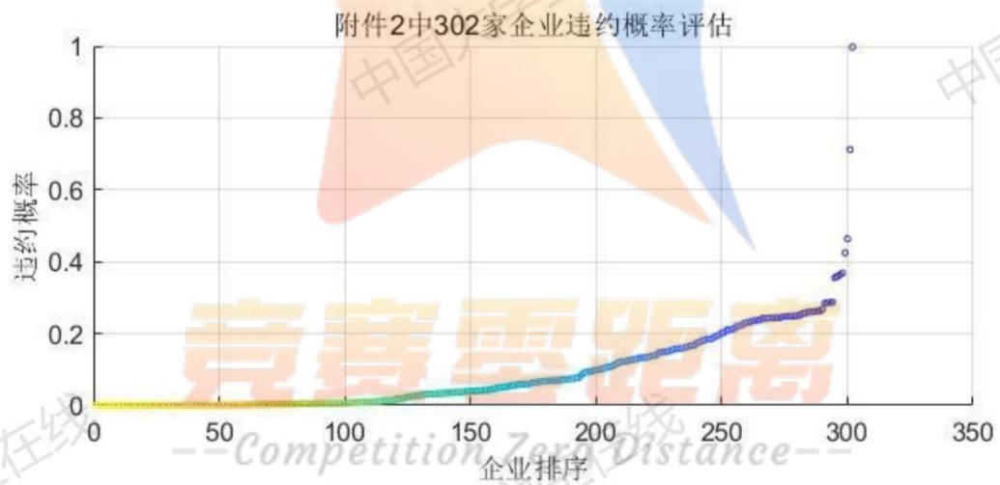

<details>
<summary>scatter</summary>

| 企业排序 | 违约概率 |
| --- | --- |
| ~100 | ~0.01 |
| ~150 | ~0.04 |
| ~200 | ~0.10 |
| ~250 | ~0.20 |
| ~290 | ~0.28 |
| ~295 | ~0.36 |
| ~298 | ~0.42 |
| ~299 | ~0.47 |
| ~300 | ~0.71 |
| ~301 | 1.00 |
</details>

图 11 附件 2 中 302 家企业违约概率评估

## (3) 基于遗传算法的最优信贷策略规划模型求解

银行年度贷款总额为固定金额 1 亿元，按照遗传算法求解最优信贷策略规划模型，一次求解得到银行年度最大利润为 393.97 万元，完整策略见支撑材料中的表格 6，对贷款策略进行统计，得到对 302 家无信贷记录企业的贷款额度和贷款利率分布概况如下图所示，图中贷款额度按升序排列，贷款利率与贷款额度一一对应。

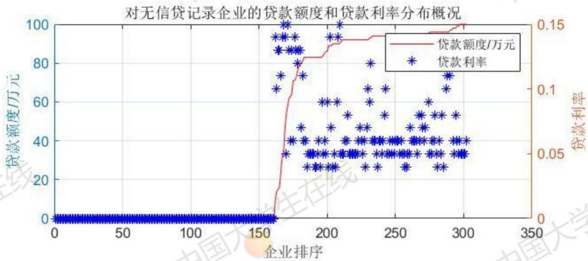

<details>
<summary>scatter</summary>

| 企业排序 | 贷款额度/万元 | 贷款利率 |
| --- | --- | --- |
| 0~160 | 0 | 0 |
| 160~300 | 25~100 | 0.04~0.15 |
</details>

图 12 无信贷记录企业的贷款额度和贷款利率分布图

观察上图可以发现如下规律:

i. 超过三分之一的企业无法获得银行贷款；

ii. 一般地说，贷款额度越低，利率越高；贷款额度越高，利率越低。这一规律可由图中利率分布的密集程度得出。

上述规律是符合主观分析的，首先，因为银行对于无信贷记录的企业，会采取保守态度，因此获批贷款的条件相对较高，导致相当一部分企业无法获得贷款；其次，贷款安全指数越高的企业，经营状况越好，获得的贷款利率越大，银行给予的利率优惠越大，因此利率越低。

根据上述分析，可知问题二建立的模型是合理可行的。

## 4.3 问题三的模型建立与求解

## 4.3.1 突发事件影响下的的信贷调整策略模型准备

## (1) 突发事件定义及分类

根据我国 2007 年 11 月 1 日起施行的《中华人民共和国突发事件应对法》的规定，突发事件，是指突然发生，造成或者可能造成严重社会危害，需要采取应急处置措施予以应对的自然灾害、事故灾难、公共卫生事件和社会安全事件。自然灾害主要指由于自然原因造成的“天灾”，如洪水、地震等。事故灾难是人为造成的违反人意志的灾难，如坠机、车祸等。公共卫生事件是危害民众生命健康的突发事件，如新冠肺炎疫情等。社会安全事件指威胁社会公共安全的突发事件，如恐怖袭击等。

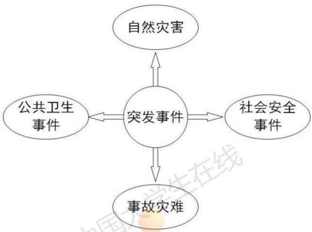

<details>
<summary>flowchart</summary>

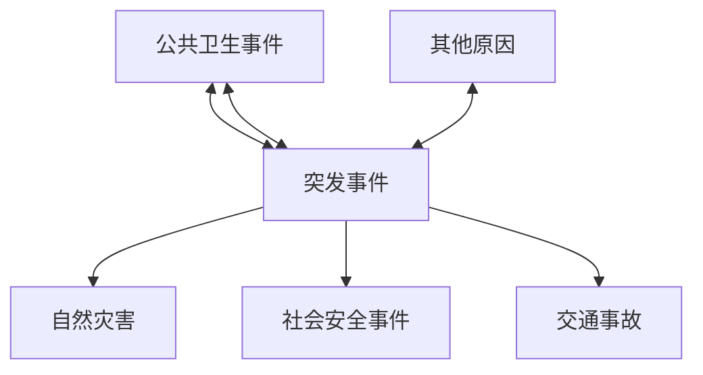
```mermaid
graph TD
  A["突发事件"] --> B["自然灾害"]
  A --> C["社会安全事件"]
  A --> D["交通事故"]
  E["公共卫生事件"] <--> A
  E <--> A
  F["其他原因"] <--> A
```
</details>

图 13 突发事件分类图

四类突发事件对于不同行业、不同类别企业的经营收益的影响不尽相同。因此我们建立的模型应该可以分别针对突发事件的 4 种不同类别分析其对信贷调整策略的影响，这需要分别对 4 类突发事件相关影响指数进行经验评估。

## (2) 附件二中企业的行业与类别分布情况

根据《2017年国民经济行业分类》，我们对附件2中的302家企业进行行业分类，分类为15个行业后发现制造业、建筑业中包含企业种数量较多，所以我们依据企业种类进行进一步细化，将制造业分为7类，建筑业分为2类。在后续的处理中，我们将一个行业也看作一个类别，共分为22个种类。

事实上，同一类企业的情况也存在不同，但是从可行性角度出发，我们赋予同一类企业相同的特征指数，在此基础上考虑不同突发事件对22类企业的影响。

表 8 22 类企业比例表

<table><tr><td>企业行业/种类</td><td>占比</td><td>企业行业/种类</td><td>占比</td></tr><tr><td>A 农、林、牧、渔业</td><td>0.662%</td><td>E2 建筑服务</td><td>4.967%</td></tr><tr><td>B 采矿业</td><td>0.331%</td><td>F 批发和零售业</td><td>12.252%</td></tr><tr><td>C1 食品制造业</td><td>0.993%</td><td>G 交通运输、仓储和邮政业</td><td>4.305%</td></tr><tr><td>C2 医药制造业</td><td>1.656%</td><td>H 住宿和餐饮业</td><td>0.993%</td></tr><tr><td>C3 机电制造业</td><td>5.960%</td><td>I 信息传输、软件和信息技术服务业</td><td>7.616%</td></tr><tr><td>C4 电子制造业</td><td>2.318%</td><td>J 租赁和商务服务业</td><td>8.609%</td></tr><tr><td>C5 材料制造业</td><td>3.642%</td><td>K 科学研究和技术服务业</td><td>2.980%</td></tr><tr><td>C6 印刷制造业</td><td>1.325%</td><td>L 水利、环境和公共设施管理业</td><td>1.987%</td></tr><tr><td>C7 家居制造业</td><td>1.325%</td><td>M 居民服务、修理和其他服务业</td><td>2.318%</td></tr><tr><td>D 电力、热力、燃气及水生产和供应业</td><td>0.993%</td><td>N 文化、体育和娱乐业</td><td>4.305%</td></tr><tr><td>E1 建筑工程</td><td>11.921%</td><td>O 个体经营</td><td>18.543%</td></tr></table>

302家企业（行业/种类）分类图  
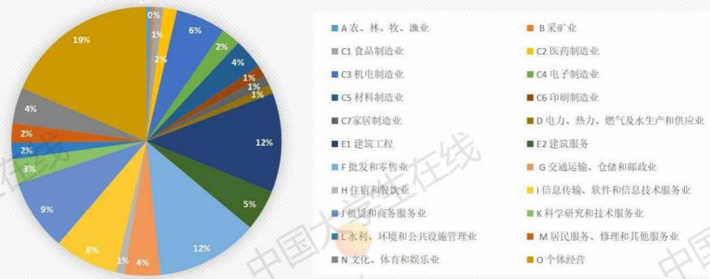

<details>
<summary>pie</summary>

| Category | Value (%) |
| --- | --- |
| A 农、林、牧、渔业 | 6% |
| B 采矿业 | 4% |
| C1 食品制造业 | 2% |
| C2 医药制造业 | 1% |
| C3 机电制造业 | 1% |
| C4 电子制造业 | 1% |
| C5 材料制造业 | 12% |
| C6 印刷制造业 | 5% |
| C7 家居制造业 | 12% |
| D 电力、热力、燃气及水生产和供应业 | 4% |
| E1 建筑工程 | 1% |
| E2 建筑服务 | 1% |
| F 批发和零售业 | 8% |
| G 交通运输、仓储和邮政业 | 4% |
| H 住宿和餐饮业 | 1% |
| I 信息传输、软件和信息技术服务业 | 9% |
| J 租赁和商务服务业 | 3% |
| K 科学研究和技术服务业 | 2% |
| L 水利、环境和公共设施管理业 | 2% |
| M 居民服务、修理和其他服务业 | 4% |
| N 文化、体育和娱乐业 | 0% |
| O 个体经营 | 19% |
</details>

图 14 302 家企业分类图

## 4.3.2 突发事件影响下的的信贷调整策略模型

## (1) 基于经验评估的企业特征指数体系

对于不同类别的企业，为了衡量突发事件对其的影响能力，结合相关资料，我们设立了企业的受影响特征指数体系，其基本构成如下图：

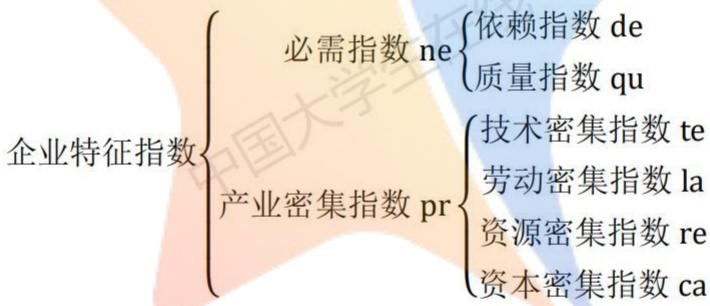

<details>
<summary>flowchart</summary>

```mermaid
graph LR
  A["企业特征指数"] --> B["必需指数 ne\n{依赖指数 de\n质量指数 qu}\n产业密集指数 pr\n{技术密集指数 te\n劳动密集指数 la\n资源密集指数 re\n资本密集指数 ca}\n必需指数 ne\n{技术密集指数 te\n劳动密集指数 la\n资源密集指数 re\n资本密集指数 ca}\n产业密集指数 pr\n{技术密集指数 te\n劳动密集指数 la\n资源密集指数 re\n资本密集指数 ca}\n产业密集指数 pr\n{技术密集指数 te\n劳动密集指数 la\n资源密集指数 re\n资本密集指数 ca}\n产业密集指数 pr\n{技术密集指数 te\n劳动密集指数 la\n资源密集指数 re\n资本密集指数 ca}\n产业密集指数 pr\n{技术密集指数 te\n劳动密集指数 la\n资源密集指数 re\n资本集\n集指数 ca}\n产业密集指数 pr\n{技术密集指数 te\n劳动密集指数 la\n资源密集指数 re\n资本集\n集指数 ca}\n产业密集指数 pr\n{技术密集指数 te\n劳动密集指数 la\n资源密集指数 re\n资本集\n集指数 ca}\n产业密集指数 pr\n{技术密集指数 te\n劳动密集指数 la\n资源密集指数 re\n资本集\n集指数 ca}\n产业密集指数 pr\n(中国大学)
```
</details>

对特征指数体系的解释及符号表示为：必需指数 ne 体现企业的正常经营对民众的必要程度，依赖指数 de 体现社会对其正常经营的依赖，质量指数 qu 体现其在提升民众生活质量上的贡献程度；产业密集指数 pr 反应其企业的生产要素的偏向程度，包括技术密集指数 te、劳动密集指数 la、资源密集指数 re 以及资本密集指数 ca。

实际指数打分时是对每类企业特征指数第三级的六个指标进行评分, 范围均是 (0, 1), 评分值越接近 0 说明该企业此特征越弱, 越接近于 1 说明该企业此特征越弱。对以上所述的共需要分别考虑的 22 类企业根据经验评估打分, 最终形成必需指数矩阵 NE 以及产业密集指数矩阵 PR:

$$
\mathrm{NE} = \left[ \begin{array}{l l l} d _ {e 1} & \dots & d _ {e 2 2} \\ q _ {u 1} & \dots & q _ {u 2 2} \end{array} \right] \tag {20}
$$

必需指数矩阵 NE 大小为 2\*22，第一行 $d_{e1} \sim d_{e22}$ 分别代表 22 类企业的依赖指数，第二行 $q_{u1} \sim q_{u22}$ 分别代表 22 类企业的质量指数；每一列与一类企业相对应。每一元素取值均为（0，1）。

$$
\mathrm{PR} = \left[ \begin{array}{c c c} t _ {e 1} & \dots & t _ {e 2 2} \\ \vdots & \ddots & \vdots \\ c _ {a 1} & \dots & c _ {a 2 2} \end{array} \right] \tag {21}
$$

产业密集指数矩阵 PR 大小为 4\*22，第一行 $t_{e1} \sim t_{e22}$ 分别代表 22 类企业的技术密集指数，第二行 $l_{a1} \sim l_{a22}$ 分别代表 22 类企业的劳动密集指数，第三行 $r_{e1} \sim r_{e22}$ 分别代表 22 类企业的资源密集指数，第四行 $c_{a1} \sim c_{a22}$ 分别代表 22 类企业的资本密集指数；每一列与一类企业相对应。每一元素评价取值均为（0，1）。

在实际进行评分时，为了更方便的表示指标的强度，我们并非在（0，1）中取无规则值，而是设定0.9、0.7、0.5、0.3、0.1五个量化等级，这对最终评估结果几乎没有影响。此外由于个体户无法归属到可作为评价依据的有效行业中，故我们统一对其指标赋为中间档0.5作为参考。

## (2) 基于经验评估的突发因素影响指数分析

结合（1）中我们设立的企业受影响指数体系，在考虑每一类突发因素（事件）对不同类别企业的影响时，我们将每类突发因素对于6个企业特征的影响指数做出经验评估，范围为 $(-1, 1)$ 。

影响指数取值接近 0 时说明该类突发因素对特定特征的影响几乎可以忽略不计，取正值说明是积极影响，取负值说明是消极影响，最终形成必需特征影响指数矩阵 IN1 与产业密集特征影响指数矩阵 IN2:

$$
I N _ {1} = \left[ \begin{array}{l l} i n 1 & i n 2 \\ i s 1 & i s 2 \\ i p 1 & i p 2 \\ i a 1 & i a 2 \end{array} \right] \tag {22}
$$

$$
I N _ {2} = \left[ \begin{array}{c c c c} i n 3 & i n 4 & i n 5 & i n 6 \\ i s 3 & i s 4 & i s 5 & i s 6 \\ i p 3 & i p 4 & i p 5 & i p 6 \\ i a 3 & i a 4 & i a 5 & i a 6 \end{array} \right] \tag {23}
$$

矩阵解释为：以第一行为例，in1\~in6分别代表自然灾害类突发事件对6个评价性指标的影响指数，同理is、ip、ia分别代表社会安全类突发事件、公共卫生事件、事故灾难类突发事件的影响指数。矩阵中每一元素取值均为（-1，1），类似的，为了方便评估，我们确定范围为-0.9\~0.9，间隔为0.2的11个量化等级进行打分。

企业的 6 个受影响指数以及每一类突发事件对其的影响其实可分别用一个矩阵刻画，而我们将必需型指数和产业密集指数进行了分开考虑，主要是考虑两大类指数的表征作用的不同，例如：

突发因素作用下，由于中小微企业规模等因素都相对较弱，对产业密集指数的影响相比对必需指数的影响要更小。例如在疫情影响下，人们隔离在家，但是对吃穿等生活必需品的需求却丝毫没有降低，反而可能会升高，对要素投入类指数的影响可能就没有那么强烈。所以对必需指数的影响往往能够更大程度上反映企业的受影响水平。

所以在下文的影响效果模型构建中我们分别赋予必需指数和产业密集指数 $\varepsilon$ 与 $1-\epsilon$ 的权重。

## (3) 突发因素综合影响效果矩阵的构建

综上所述：综合影响效果矩阵 IN 可以用企业特征指数矩阵与突发因素影响指数矩阵确立：

$$
IN = \epsilon \cdot IN _ {1} \cdot NE + (1 - \epsilon) \cdot IN _ {2} \cdot PR \tag {24}
$$

IN 为 4\*22 的矩阵， $IN_{ij}$ 代表第 i 类突发事件（因素）对于第 j 类企业的影响； $\epsilon$ 为比例因子。由于影响效果矩阵中元素取值范围为 $(-6, 6)$ ，在后续应用时需要先乘上 $\frac{1}{6}$ 做归一化处理。以上所涉及的各指数矩阵的具体构成均以 excel 表格形式给出，见支撑材料 “模型：问题 3\_ 指数矩阵定义.xlsx”。

## (4) 最优信贷调整策略的制定

要运用问题二中已经建立好的模型进行信贷策略的调整，必须要将企业的信贷风险（本模型中运用的是与其呈负相关的信贷风险安全指数）与评估出的综合影响效果指数进行融合处理，形成新的调整指数，再运用已经建立的信贷策略优化模型(13)即可得到信贷风险调整策略。

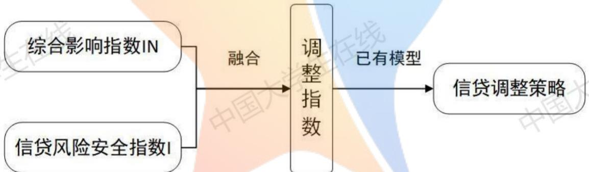

<details>
<summary>flowchart</summary>

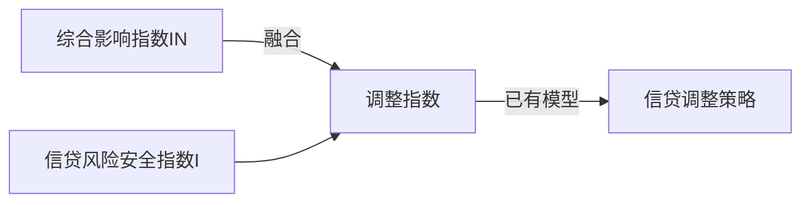
```mermaid
graph LR
  A["综合影响指数IN"] -->|"融合"| B["调整指数"]
  C["信贷风险安全指数I"] --> B
  B -->|"已有模型"| D["信贷调整策略"]
```
</details>

图 15 信贷策略调整流程图

综合影响指数与信贷风险安全指数的融合过程定义为

$$
I _ {a d j} = I \cdot (1 + I N) \tag {25}
$$

## 4.3.3 模型三的求解

我们以第三类突发事件，即公共卫生事件为例，对模型三进行求解，调整问题二中对302家无信贷记录企业的信贷策略。具体策略见支撑材料中的表格7.

## (1) 安全指数分布概况

调整后的 302 家企业信贷风险安全指数如下图所示，对比图 10 可见一定程度的下降。

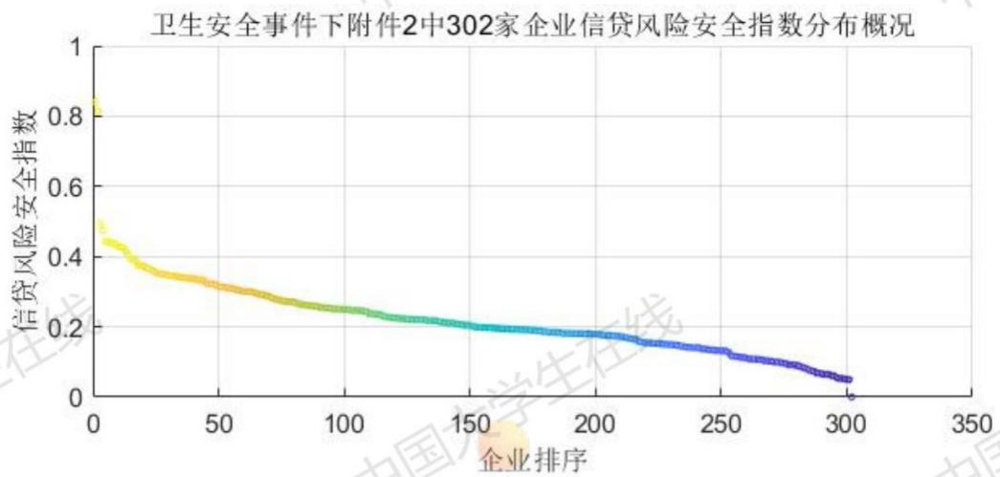

<details>
<summary>line</summary>

| 企业排序 | 信贷风险安全指数 |
| --- | --- |
| 0 | ~0.85 |
| 10 | ~0.45 |
| 20 | ~0.42 |
| 30 | ~0.38 |
| 40 | ~0.36 |
| 50 | ~0.34 |
| 60 | ~0.32 |
| 70 | ~0.30 |
| 80 | ~0.28 |
| 90 | ~0.27 |
| 100 | ~0.26 |
| 110 | ~0.25 |
| 120 | ~0.24 |
| 130 | ~0.23 |
| 140 | ~0.22 |
| 150 | ~0.21 |
| 160 | ~0.20 |
| 170 | ~0.19 |
| 180 | ~0.18 |
| 190 | ~0.18 |
| 200 | ~0.17 |
| 210 | ~0.16 |
| 220 | ~0.15 |
| 230 | ~0.14 |
| 240 | ~0.13 |
| 250 | ~0.12 |
| 260 | ~0.11 |
| 270 | ~0.10 |
| 280 | ~0.09 |
| 290 | ~0.07 |
| 300 | ~0.05 |
</details>

图 16 卫生安全事件下附件 2 中 302 家企业信贷风险安全指数分布图

## (2) 年度总利润

设置求解条件为银行年度贷款总额为 1 亿元，在公共卫生这一突发事件下，由遗传算法求解得到银行最大年利润为 89.51 万元，对比问题二中的最大利润 393.97 万元，虽然这一数字出现了明显的下降，但依然保证了基本的盈利，证明该模型的信贷调整策略是有效的。

## (3) 具体信贷策略变化

观察对比调整后的信贷策略与问题二中的信贷策略，可得如下图表。

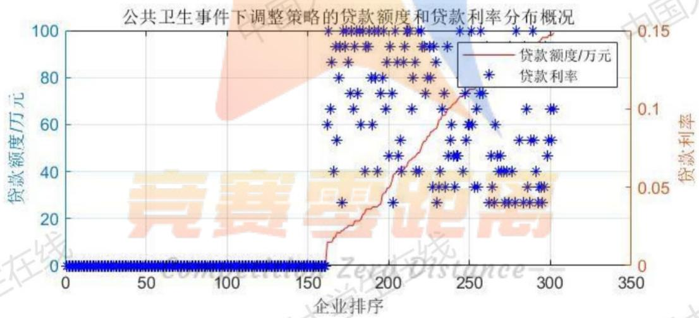

<details>
<summary>scatter</summary>

| 企业排序 | 贷款额度/万元 | 贷款利率 |
| --- | --- | --- |
| 0~160 | 0 | — |
| 160~300 | 25~100 | 0.04~0.15 |
</details>

图 17 公共卫生事件下调整策略的贷款额度和贷款利率分布图

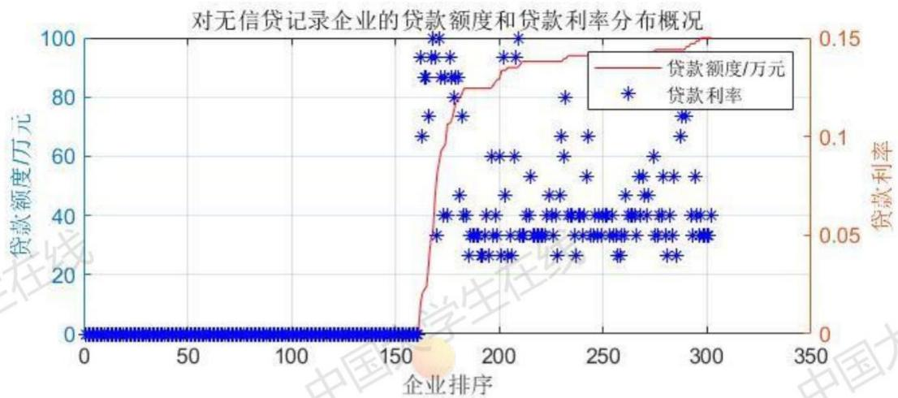

<details>
<summary>scatter</summary>

| 企业排序 | 贷款额度/万元 | 贷款利率 |
| --- | --- | --- |
| 0~160 | 0 | 0 |
| 160~300 | 25~100 | 0~0.15 |
</details>

图 18 对无信贷记录企业的贷款额度和贷款利率分布图

对比两图可发现:

i. 无法获得贷款的企业数量保持不变;

ii. 银行对企业的贷款额度出现了明显的下降，同时贷款利率普遍抬高；

对上述现象的现实解释如下: 在公共卫生突发事件的冲击下, 银行出于社会责任感, 依然为大部分的中小企业提供贷款; 但由于社会整体经济运行受到影响, 因此银行提供的贷款额度下降, 贷款利率变高, 以维持银行自身的生存。

## (4) 对不同行业的考察

下表中选取的是三家不同行业的企业，对比信贷策略调整前后的的贷款额度和贷款利率。

表 9 调整前后信贷额度、利率对比表

<table><tr><td>企业代号</td><td>企业名称</td><td>调整前贷款</td><td>调整前贷款</td><td>调整后贷款</td><td>调整后贷款</td></tr><tr><td>E195</td><td>***医药有限公司</td><td>96</td><td>6%</td><td>95</td><td>4%</td></tr><tr><td>E125</td><td>个体经营 E125</td><td>89</td><td>4%</td><td>46</td><td>12%</td></tr><tr><td>E166</td><td>***建筑工程有限公司</td><td>92</td><td>5%</td><td>24</td><td>14%</td></tr></table>

分析上表可知，E195 医药公司贷款额度基本维持不变，贷款利率变低；E125 个体经营和 E166 建筑公司的贷款额度显著下降，贷款利率明显攀升。这是由公共卫生事件的性质决定的，在此情况下，食品、医药和其他人们依赖程度高的行业受影响小，甚至受到积极影响；而其他行业普遍受到较大的消极影响。

## 5. 模型的灵敏度分析

## 5.1 银行年度贷款总额

问题一中的求解中，我们设置银行年度贷款总额为固定值1亿元，接下来分析信贷策略模型中银行年度利润对银行年度贷款灵敏度。保持其他参数与问题一求解时不变，

改变年度贷款总额，得到结果如下图。

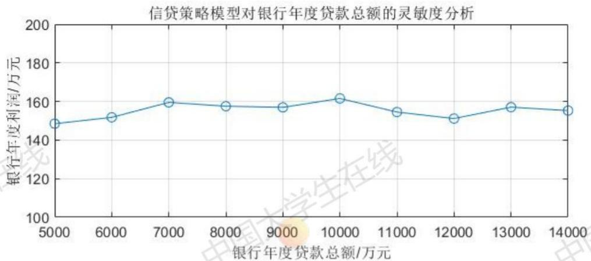

<details>
<summary>line</summary>

| 银行年度贷款总额/万元 | 银行年度利润/万元 |
| --- | --- |
| 5000 | ~149 |
| 6000 | ~152 |
| 7000 | ~160 |
| 8000 | ~158 |
| 9000 | ~157 |
| 10000 | ~162 |
| 11000 | ~155 |
| 12000 | ~152 |
| 13000 | ~157 |
| 14000 | ~156 |
</details>

图 19 信贷策略对银行年度贷款总额的灵敏度分析

由该图可知，年度利润对年度贷款总额的灵敏度较低，系统结果稳定。说明当年度贷款总额取值在合理范围内时，银行的年度利润主要取决于贷款企业的经营情况和单笔贷款的额度限制，与总额关系较弱；当年度贷款总额取值过低或过高时，模型会应约束条件限制而求解失败。

## 5.2 违约概率函数方差

在问题一模型的公式（11）中，我们提出了违约概率与信贷风险安全指数的函数关系，这一函数是以0为均值，0.1为方差的正态分布函数，其中方差值是我们通过经验尝试获得的。接下来探究银行年度利润对函数方差的灵敏度，保持其他参数不变，改变方差值多次求解。

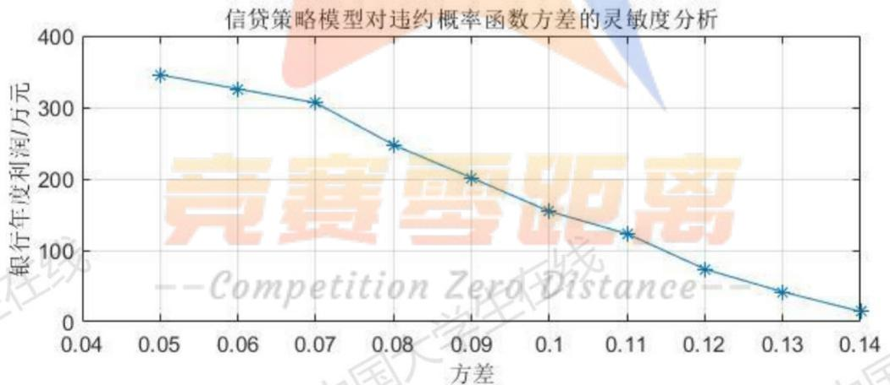

<details>
<summary>line</summary>

| 方差 | 银行年度利润/万元 |
| --- | --- |
| 0.05 | ~350 |
| 0.06 | ~330 |
| 0.07 | ~310 |
| 0.08 | ~250 |
| 0.09 | ~200 |
| 0.1 | ~160 |
| 0.11 | ~130 |
| 0.12 | ~80 |
| 0.13 | ~50 |
| 0.14 | ~20 |
</details>

图 20 信贷策略模型对违约概率函数方差的灵敏度分析

分析该图可知，在信贷策略模型中，银行年度利润随方差的增大而快速减小，即利润对方差灵敏度很高。这是因为当方差增大时，所有企业的违约概率都随之增大，带来利润的减小。方差太大，银行利润太低；方差太小，企业违约概率太低，不符合实际情况。

由此我们判断，在信贷策略模型中，方差是一个关键的参数，其精确值应该进一步

根据真实统计得出，以提高模型的准确性。

## 5.1 比例因子

在问题三模型的公式（24）中，我们提出了衡量突发事件影响的比例因子，不同的比例因子取值可能对模型结果造成影响。接下来探究调整策略模型的年度利润对比例因子 $\epsilon$ 的灵敏度。

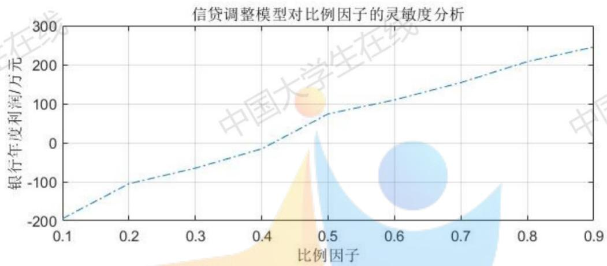

<details>
<summary>line</summary>

| 比例因子 | 银行年度利润/万元 |
| --- | --- |
| 0.1 | -200 |
| 0.2 | -100 |
| 0.3 | ~-60 |
| 0.4 | ~-10 |
| 0.5 | ~75 |
| 0.6 | ~110 |
| 0.7 | ~150 |
| 0.8 | ~210 |
| 0.9 | ~250 |
</details>

图 21 信贷策略模型对比例因子的灵敏度分析

分析上图可知，年度利润对比例因子的灵敏度很高。因此，要提高模型的准确性，应当进一步从真实统计规律中确定比例因子的取值。

## 6. 模型评价

## 6.1 优点与创新

(1) 将多方面影响因素归纳为企业信誉、企业实力、上下游企业供求稳定性这三方面，对银行是否贷款、贷款额度、贷款利率给出了合理的策略，对实际具有较强的指导作用。  
(2) 引入进步因子的概念，衡量企业的发展前景，并融入企业实力的考虑因素中；引入安全指数的概念，衡量贷款风险大小，并直接作用与贷款策略。  
(3)采用两级神经网络,对附件2中未给出的企业违约情况与信誉评级进行了科学预测。  
(4)采用遗传算法替代大规模非线性规划，兼顾效率和准确性。

## 6.2 不足之处

(1) 模型考虑的因素不够全，没有考虑国家对不同行业的扶持政策的区别。  
(2)在计算不同突发因素对不同企业的影响指数时，赋值具有一定的主观性，存在改进空间。  
(3) 将突发因素分为四大类，对每一类中更具体的事件没有进行区分，某些事件计算出的影响指数可能不够精准。

## 6.3 未来工作与推广

(1)银行的借贷策略, 事实上银行与企业之间的博弈, 可以从博弈论的角度出发, 对模型进行拓展。  
(2) 突发事件可以按照程度分为特别重大、重大、较大、一般四级，分别进行更加细致的影响指数量化。  
(3) 可以收集真实的统计数据，对违约概率函数的方差、信贷调整策略的比例因子进行精确的计算。

## 参考文献

[1] 司守奎，孙玺菁．数学建模算法与应用[M]. 北京：国防工业出版社，2016-2.  
[2] 梁益琳. 创新型中小企业成长、融资约束与信贷策略研究[D]. 山东：山东大学，2012.  
[3] 国家统计局. 2017 年国民经济行业分类（GB/T 4754—2017）[2020-9-12].  
http://www.stats.gov.cn/tjsj/tjbz/hyflbz/201710/t20171012\_1541679.html

## 附录

由于本文模型所用到的全部代码太多，所以附录只包含了涉及核心思想的源代码，其余可见于支撑材料。

支撑材料清单:

<table><tr><td>MATLAB 数据文件</td><td>form1credit.matformlin.matformlout.matform2credit.matform2in.matform2out.matmodel.matmodel3_index.matmodel3_industry.matpofViolation_form1.matpredictCreditIndex.matrequiredIndex_for_2.matriskIndex_form1.matriskIndex_form2.mat</td></tr><tr><td>MATLAB 程序文件</td><td>al_xlsxProcess_form1credit.ma2_xlsxProcess_form1in.ma3_xlsxProcess_form1out.ma4_xlsxProcess_form2credit.ma5_xlsxProcess_form2in.ma6_xlsxProcess_form2out.ma7_riskIndex_form1.ma8_riskIndex_form1_output.ma9_riskIndex_form1_display.ma10_violationProblity.ma11_GAsolution.ma12_allIndex_form2.ma13_rankForecast_form2.ma14_riskIndex_form2.ma15_GAsolution.ma16_xlsxProcess_model3.ma17_accidentEffect.ma18_epsAnalysis_form1.ma19_sigmaAndsumAnalysis.ma20_sensitivityDisplay.mfindIndustry.m</td></tr><tr><td>表格</td><td>表格1:问题1_123家有信贷记录企业的信贷风险评分.xlsx表格2:问题1_对123家有信贷记录企业的一种信贷策略.xlsx表格3:问题2_第一层神经网络检验.xlsx表格4:问题2_第二层神经网络检验.xlsx表格5:问题2_302家无信贷记录企业的信贷风险评分.xlsx表格6:问题2_对302家无信贷记录企业的信贷策略.xlsx表格7:问题3_公共卫生事件下对302家无信贷记录企业的调整策略.xlsx模型:问题3_企业分类与情况统计.xlsx模型:问题3_指数矩阵定义.xlsx</td></tr><tr><td>文本</td><td>amount敏感性分析.txteps敏感性分析.txtsigma敏感性分析.txtSPSS交互命令.txt</td></tr></table>

## 1. a7\_riskIndex\_form1.m

% 该程序运行时间约为6分钟

clear all; close all; clc;

```txt
%% 预处理
load form1in
load form1out
load form1credit
```

cancelIndex11 = [find(strcmp(invoiceState11,'作废发票))]; %作废的进项发票
cancelIndex12 = [find(strcmp(invoiceState12,'作废发票))]; %作废的销项发票
cancelIndex12\_0 = [find(strcmp(invoiceState12,' 作废发票))];

```javascript
cancelIndex12 = [cancelIndex12; cancelIndex12_0];
cancelIndex12 = sort(cancelIndex12);
```

% 留存备份

```matlab
money11_origin = money11;
money12_origin = money12;
firm11_origin = firm11;
firm12_origin = firm12;
```

% 删去相应的作废交易

```matlab
money11(cancelIndex11,:) = [];
money12(cancelIndex12,:) = [];
firm11(cancelIndex11,:) = [];
```

firm12(cancelIndex12,:) = [];

```txt
partner11(cancelIndex11,:) = [];
partner12(cancelIndex12,:) = [];
```

```matlab
time11(cancelIndex11,:) = [];
time12(cancelIndex12,:) = [];
```

```txt
size11 = size(firm11);
size12 = size(firm12);
```

```matlab
numEachFirm11 = zeros(123,1);
numEachFirm12 = zeros(123,1);
```

%% 实力

% 1. 总收益

```matlab
sumProfit = zeros(123,1);
j = 1; k = 1;
for i = 1:123
```

```matlab
while j <= size11(1) && strcmp(firm1(i),firm11(j))%在进项发票中找到对应的公司
    sumProfit(i) = sumProfit(i)- money11(j,1) + money11(j,2);
    j = j+1;
end
while k <= size12(1) && strcmp(firm1(i),firm12(k)) %在销项发票中找到对应的公司
    sumProfit(i) = sumProfit(i) + money12(k,1) - money12(k,2);
    k = k+1;
end
```

```matlab
if i == 1
    numEachFirm11(i) = j-1;
    numEachFirm12(i) = k-1;
else
    numEachFirm11(i) = j-numEachFirm11(i-1)-1;
    numEachFirm12(i) = k-numEachFirm12(i-1)-1;
end
end
clear i; clear j; clear k;
%
%% 2.进步因子
monthProfit = zeros(123,5*12);
monthStr = {'2016/1/','2016/2/','2016/3/','2016/4/','2016/5/','2016/6',...
        '2016/7/','2016/8/','2016/9/','2016/10','2016/11/','2016/12',...
        '2017/1/','2017/2/','2017/3/','2017/4/','2017/5/','2017/6',...
        '2017/7/','2017/8/','2017/9/','2017/10','2017/11','2017/12',...
        '2018/1/','2018/2/','2018/3/','2018/4/','2018/5/','2018/6',...
        '2018/7/','2018/8/','2018/9/','2018/10','2018/11','2018/12',...
        '2019/1/','2019/2/','2019/3/','2019/4/','2019/5/','2019/6',...
        '2019/7/','2019/8/','2019/9/','2019/10','2019/11','2019/12',...
        '2020/1/','2020/2/','2020/3/','2020/4/','2020/5/','2020/6',...
        '2020/7/','2020/8/','2020/9/','2020/10','2020/11','2020/12'};
k1 = 1; k2 = 1;
for i = 1:123 %按月统计每家企业的净利润
    for j = 1:60
        while k1 <= size11(1) && strncpyi(monthStr(j),time11(k1),7)
            monthProfit(i,j) = monthProfit(i,j) - money11(k1,1) + money11(k1,2);
            k1 = k1 + 1;
        end
        while k2 <= size12(1) && strncpyi(monthStr(j),time12(k2),7)
            monthProfit(i,j) = monthProfit(i,j) + money12(k2,1) - money12(k2,2);
            k2 = k2 + 1;
        end
    end
end
clear i; clear j; clear k1; clear k2;
increaseRate = zeros(size(monthProfit)); %每家企业每月的增长率
for i = 1:123
    for j = 2:60
        if monthProfit(i,j) ~= 0
            if monthProfit(i,j-1) ~= 0
                increaseRate(i,j) = (monthProfit(i,j)-monthProfit(i,j-1))/monthProfit(i,j-1);
            end
        end
```

```matlab
end
clear i; clear j;
progressIndex = zeros(123,1); %进步因子
for i = 1:123
    tmpRow = increaseRate(i,:); %抽取第 i 行
    realIndex = find(tmpRow);
    progressIndex(i,1) = mean(tmpRow(realIndex));
end
clear i;

%% 供求关系
% 1.计算交易偏好
taxPer11 = money11(:,2)./money11(:,1); %进项发票每一单的税率
taxPer12 = money12(:,2)./money12(:,1); %销项发票每一单的税率
preference11 = zeros(123,1); %购买偏好
preference12 = zeros(123,1); %销售偏好
j = 1; k = 1;
for i = 1:123
    tmpRow = [];
    while j <= size11(1) && strcmp(firm1(i),firm11(j))%在进项发票中找到对应的公司
        tmpRow = [tmpRow taxPer11(j)];
        j = j+1;
    end
    preference11(i,1) = mean(tmpRow);
    tmpRow = [];
    while k <= size12(1) && strcmp(firm1(i),firm12(k)) %在销项发票中找到对应的公司
        tmpRow = [tmpRow taxPer12(k)];
        k = k+1;
    end
    preference12(i,1) = mean(tmpRow);
    tmpRow = [];
end
clear i; clear j; clear k;
preference = (preference11+preference12)/2;

%% 2.分析交易规律
tradPattern = zeros(123,1);
j = 1; k = 1;
for i = 1:123 %循环 123 家企业
    patternOfthisFirm = [];
    moneyOfthisFirm = [];
    partnerOfthisFirm = [];
    while j <= size11(1) && strcmp(firm1(i),firm11(j)) %同一家企业的进项发票
```

```matlab
moneyOfthisFirm = [moneyOfthisFirm; money11(j,:)];
partnerOfthisFirm = [partnerOfthisFirm; partner11(j,:)];
j = j+1;
end
while k <= size12(1) && strcmp(firm1(i),firm12(k)) %同一家企业的销项发票
    moneyOfthisFirm = [moneyOfthisFirm; money12(k,:)];
    partnerOfthisFirm = [partnerOfthisFirm; partner12(k,:)];
    k = k+1;
end
while length(partnerOfthisFirm) > 0 %当列表中还有未处理的合作商时
    thisPartner = partnerOfthisFirm(1); %当前列表中的第一个合作商
    moneyOfthisPartner = [];
    k = 1;
    while k <= length(partnerOfthisFirm)
        if strcmp(partnerOfthisFirm(k),thisPartner)
            moneyOfthisPartner = [moneyOfthisPartner;...
                moneyOfthisFirm(k,1)-moneyOfthisFirm(k,2)]; %与该合作商一笔交易的花
销
```

```matlab
moneyOfthisFirm(k,:) = [];
partnerOfthisFirm(k,:) = [];
else
    k = k+1;
end
end
FthisPartner = fftshift(fft(moneyOfthisPartner)); %与某一合作商交易金额的双边幅度谱
patternOfthisFirm = [patternOfthisFirm var(FthisPartner)]; %迭代更新该企业的交易规律
因子
end
tradPattern(i) = mean(patternOfthisFirm); %计算该企业交易规律
end
```

%% 信誉等级

% 3.信誉评级

creditRank = zeros(123,1);

for i = 1:123

```matlab
if strcmp(credit1(i),'A')
    creditRank(i) = 9;
elseif strcmp(credit1(i),'B')
    creditRank(i) = 7;
elseif strcmp(credit1(i),'C')
    creditRank(i) = 5;
else
    creditRank(i) = 0;
end
```

```txt
end
clear i;
```

% 4. 违约情况  
```matlab
violation = zeros(123,1);
for i = 1:123
    if strcmp(violation1(i),'是')
        violation(i) = 3;
    else
        violation(i) = 9;
    end
end
```

% 5.“坏发票占比”  
```matlab
badPortion = zeros(123,1);
cancelPortion = zeros(123,1);
minusPortion = zeros(123,1);
% 计算作废比例
j = 1; k = 1;
for i = 1:123
    sumCancel11 = 0;
    while j <= length(cancelIndex11) && ...
        strcmp(firm1(i),firm11_origin(cancelIndex11(j)))
        sumCancel11 = sumCancel11+1;
        j = j+1;
    end
    sumCancel12 = 0;
    while k <= length(cancelIndex12) && ...
        strcmp(firm1(i),firm12_origin(cancelIndex12(k)))
        sumCancel12 = sumCancel12+1;
        k = k+1;
    end
    cancelPortion(i) = (sumCancel11/numEachFirm11(i)+...
        sumCancel12/numEachFirm12(i))/2;
end
clear i; clear j; clear k;
% 计算负比例
j = 1;
for i = 1:123
    sumMinus = 0;
    while j <= size12(1) && strcmp(firm1(i),firm12(j))
        if money12(j,1) < 0
            sumMinus = sumMinus+1;
        end
```

```matlab
j = j+1;
    end
    minusPortion(i) = sumMinus/numEachFirm12(i);
end
clear i; clear j;
badPortion = 0.3*cancelPortion + 0.7*minusPortion;
```

```matlab
%% 主成分分析，信贷风险因子计算
allIndex = [sumProfit progressIndex preference tradPattern...
            creditRank violation badPortion];
allIndex = zscore(allIndex);
relateMatrix = corrcoef(allIndex);
[featureVec,featureVal,contriRate] = pcacov(relateMatrix);
for i = 1:7
    for j = 1:7
        if featureVec(i,j) < 0
            featureVec(i,j) = -1 *featureVec(i,j);
        end
    end
end
num = 6;
df = allIndex *featureVec(1:num,:)';
tf = df *contriRate(1:num)/100;
[~,ind] = sort(tf,'descend');

tf = (tf - min(tf)) ./ (max(tf) - min(tf));
```

```matlab
save('riskIndex_form1.mat','firm1','credit1','tf','ind','sumProfit',...
    'progressIndex','preference','tradPattern','creditRank','violation',...
    'badPortion');
```

## 2. a11\_GAsolution.m

% 该程序运行时间约为 20 秒

clear all; close all; clc;

load form1credit;
load riskIndex\_form1;
load pofViolation\_form1;

clear badPortion; clear preference;
clear progressIndex; clear sumProfit;
clear tf; clear tradPattern; clear ind;

clear violation;

$\%$ 删除评级为 $\mathrm{D}$ 的企业

index = 1:length(firm1);

indexD = find(creditRank==0);

index(indexD) = [];

indexABC = index';

creditRank(indexD) = [];

pofViolation(indexD) = [];

N = length(indexABC); %企业（基因）数

fixAmount = 10000;

$\%$ 生成初始种群

w = 100; %种群个数

$\mathrm{g} = 100; \%$ 进化代数

$\mathrm{Ja} = \text{zeros(N,w)};\%$ 贷款金额的一代种群染色体

$\mathrm{Jr} = \text{zeros(N,w)};\% \text{利率的一代种群染色体}$

i = 0; j = 0;

while i < w

ca = randi([10,100],N,1);

if sum(ca) <= fixAmount

$\mathrm{Ja}(:,\mathrm{i} + 1) = \mathrm{ca};$

$i = i + 1;$

end

end

while j < w

%    Jr(:,j+1) = 0.04 + (0.15-0.04).\*rand(N,1);

$\mathrm{Jr}(:,j+1)=\mathrm{randi}([400,1500],N,1)/10000;$

$j=j+1;$

end

clear i; clear j;

%% 遗传过程：交叉和变异

for i = 1:g

$\mathrm{Aa} = \mathrm{Ja}; \%$ 贷款金额的子代染色体

$\mathrm{Ar} = \mathrm{Jr}; \%$ 利率的子代染色体

$\mathrm{ca} = \text{randperm(w)}; \%$ 贷款金额交叉操作的染色体编号

$\mathrm{cr} = \text{randperm(w)}; \%$ 利率交叉操作的染色体编号

% 交叉

for j = 1:2:w

$\mathrm{Fa} = \mathrm{randi}([1,\mathrm{N}]); \%$ 贷款金额的地址

$\mathrm{Fr} = \mathrm{randi}([1,\mathrm{N}]); \%$ 利率的地址

```julia
tmpa = Aa(Fa:N,ca(j));
tmpr = Ar(Fr:N,cr(j));
Aa(Fa:N,ca(j)) = Aa(Fa:N,ca(j+1));
Ar(Fr:N,cr(j)) = Ar(Fr:N,cr(j+1));
Aa(Fa:N,ca(j+1)) = tmpa;
Ar(Fr:N,cr(j+1)) = tmpr;
end
% 变异
bya = [];
byr = [];
while ~length(bya)
    bya = find(rand(1,w)<0.1); %变异概率为 10%
end
while ~length(byr)
    byr = randi([1,w],1,length(bya));
end
Ba = Aa(:,bya); %产生变异操作的初始染色体
Br = Ar(:,byr);
for i = 1:length(bya)
    bwa = sort(randi([2,N-1],1,3));
    Ba(:,i) = Ba([1:bwa(1)-1,bwa(2)+1:bwa(3),bwa(1):bwa(2),bwa(3)+1:N],i);
end
for j = 1:length(byr)
    bwr = sort(randi([2,N-1],1,3));
    Br(:,j) = Br([1:bwr(1)-1,bwr(2)+1:bwr(3),bwr(1):bwr(2),bwr(3)+1:N],j);
end
% 筛选
Ga = [Ja Aa Ba];
Gr = [Jr Ar Br];
num = size(Ga,2);
PROFIT = zeros(num,1);
for k = 1:num
    L = zeros(N,1);
    for j = 1:N
        if strcmp(credit1(j),'A') %计算顾客流失率
            L(j) = 640.944*Gr(j,k)^3 - 258.570*Gr(j,k)^2 + 37.970*Gr(j,k) - 1.121;
        elseif strcmp(credit1(j),'B')
            L(j) = 552.829*Gr(j,k)^3 - 225.051*Gr(j,k)^2 + 33.995*Gr(j,k) - 1.017;
        elseif strcmp(credit1(j),'C')
            L(j) = 504.717*Gr(j,k)^3 - 207.386*Gr(j,k)^2 + 32.157*Gr(j,k) - 0.973;
        else
            L(j) = 1;
        end
    end
end
```

```matlab
profit = (Ga(:,k).*Gr(:,k).*(1-pofViolation)-...
    Ga(:,k).*pofViolation).*(1-L); %计算每条染色体的年收益
PROFIT(k) = sum(profit);
end
[~,indP] = sort(PROFIT,'descend'); %对年收益由大到小排序
Ja = Ga(:,indP(1:w)); %筛选染色体
Jr = Gr(:,indP(1:w));
end
```

```matlab
%% 生成信贷策略
A = zeros(123,1);
R = zeros(123,1);
A(indexABC) = Ga(:,1);
R(indexABC) = Gr(:,1);
```

```matlab
filename = '表格 2：问题 1_对 123 家有信贷记录企业的一种信贷策略.xlsx';
xlswrite(filename,firm1,'A1:A123');
xlswrite(filename,A,'B1:B123');
xlswrite(filename,R,'C1:C123');
xlswrite(filename,PROFIT(indP(1)),'D1:D1')
```

## 3. a13\_rankForecast\_form2.m

```txt
clear all; close all; clc;

load form1credit;
load riskIndex_form1;
clear creditRank;
```

%% 构建第一层神经网络：预测是否违约

```matlab
violationTable = zeros(123,2);
for i = 1:123
    if violation(i) == 9 %否
        violationTable(i,:) = [1,0];
    else %是
        violationTable(i,:) = [0,1];
    end
end
```

```txt
vioIndex = [sumProfit progressIndex preference tradPattern badPortion violationTable];
vioIndex = vioIndex';
```

```javascript
onceViolate = [29 36 45 52 82 87 99 100 101 102 103 107 108 109 111 ...
    112 113 114 115 116 117 118 119 120 121 122 123];
```

```matlab
vP = vioIndex(1:5,[1:25 onceViolate(1:25)]);
[vPN,vPS1] = mapminmax(vP);
vT = vioIndex(6:7,[1:25 onceViolate(1:25)]);
[vTN,vPS2] = mapminmax(vT);
vx = vioIndex(1:5,[60:70 onceViolate(26:27)]);
vxn = mapminmax('apply',vx,vPS1);
netVio = feedforwardnet(2);
netVio = train(netVio,vPN,vTN);
vyn2 = netVio(vxn);
vy2 = mapminmax('reverse',vyn2,vPS2);
```

```txt
predictViolate = cell(13,1);
predictVioValue = zeros(13,1);
```

```matlab
for i = 1:13
    if vy2(1,i) < 0.1
        predictViolate(i) = {'是'};
        predictVioValue(i) = 3;
    else
        predictViolate(i) = {'否'};
        predictVioValue(i) = 9;
    end
end
```

%% 对第一层网络进行检验

```matlab
filename = '表格 3: 问题 2_第一层神经网络检验.xlsx';
xlswrite(filename,violation1([60:70 onceViolate(26:27)]),'Sheet1','A1:A13');
xlswrite(filename,predictViolate,'Sheet1','B1:B13');
```

%% 构建第二层神经网络：预测信誉等级

```matlab
creditRank = zeros(123,4);
for i = 1:123
    if strcmp(credit1(i),'A')
        creditRank(i,:) = [1,0,0,0];
    elseif strcmp(credit1(i),'B')
        creditRank(i,:) = [0,1,0,0];
    elseif strcmp(credit1(i),'C')
        creditRank(i,:) = [0,0,1,0];
    else
        creditRank(i,:) = [0,0,0,1];
    end
end
clear i;
```

```matlab
creditIndex = [badPortion violation creditRank];
creditIndex = creditIndex';

cP = creditIndex(1:2,1:100);
[cPN,cPS1] = mapminmax(cP);
cT = creditIndex(3:6,1:100);
[cTN,cPS2] = mapminmax(cT);
cx = creditIndex(1:2,[60:70 onceViolate(26:27)]);
cxn = mapminmax('apply',cx,cPS1);
netCredit = feedforwardnet(2);
netCredit = train(netCredit,cPN,cTN);
cyn2 = netCredit(cxn);
cy2 = mapminmax('reverse',cyn2,cPS2);

predictRank = cell(13,1);
for i = 1:13
    if cy2(4,i) > 0.1
        predictRank(i) = {'D'};
    else
        [~,loc] = max(cy2(:,i));
        if loc == 1
            predictRank(i) = {'A'};
        elseif loc == 2
            predictRank(i) = {'B'};
        elseif loc == 3
            predictRank(i) = {'C'};
    end
end
end
```

%% 对第二层网络进行检验

filename = '表格 4：问题 2\_第二层神经网络检验.xlsx';

xlswrite(filename,credit1([60:70 onceViolate(26:27)]),'Sheet2','A1:A13');

xlswrite(filename,predictRank,'Sheet2','B1:B13');

%% 预测附件二的违约情况

load allIndex\_form2

vioIndex2 = [sumProfit progressIndex preference tradPattern badPortion];

vioIndex2 = vioIndex2';

vinputIndex = mapminmax('apply',vioIndex2,vPS1);

voutputIndex = netVio(vinputIndex);

voutput = mapminmax('reverse',voutputIndex,vPS2);

```matlab
predictViolate2 = cell(302,1);
predictVioValue2 = zeros(302,1);
```

```matlab
for i = 1:302
    if voutput(1,i) < 0.1
        predictViolate2(i,1) = {'是'};
        predictVioValue2(i,1) = 3;
    else
        predictViolate2(i,1) = {'否'};
        predictVioValue2(i,1) = 9;
    end
end
```

%% 预测附件二的信誉等级  
```javascript
creditIndex2 = [badPortion predictVioValue2];
creditIndex2 = creditIndex2';
cinputIndex = mapminmax('apply',creditIndex2,cPS1);
coutputIndex = netCredit(cinputIndex);
coutput = mapminmax('reverse',coutputIndex,cPS2);
```

```matlab
predictRank2 = cell(302,1);
predictRankVal2 = zeros(302,1);
for i = 1:302
```

```matlab
if coutput(4,i) > 0.1
    predictRank2(i) = {'D'};
    predictRankVal2(i) = 0;
else
    [~,loc] = max(coutput(:,i));
    if loc == 1
        predictRank2(i) = {'A'};
        predictRankVal2(i) = 9;
    elseif loc == 2
        predictRank2(i) = {'B'};
        predictRankVal2(i) = 7;
    elseif loc == 3
        predictRank2(i) = {'C'};
        predictRankVal2(i) = 5;
    end
end
end
```

```javascript
save('predictCreditIndex.mat','predictVioValue2','predictRankVal2');
```

## 4. a17\_accidentEffect.m

clear all; close all; clc;

load form2credit;

load model3\_index;

load riskIndex\_form2;

clear badPortion; clear preference;

clear progressIndex; clear sumProfit;

clear tradPattern; clear ind;

clear violation;

eps1 = 0.6; eps2 = 1 - eps1;

IN = eps1\*IN1\*NE + eps2\*IN2\*PR;

%% 归类

industry2 = zeros(302,1);

for i = 1:302

industry2(i) = findIndustry(firm2(i));

end

%% 突发事件影响仿真

ACCIDENT = 3; %公共卫生事件

ADJ = IN(3,:);

for i = 1:302

tf(i) = tf(i) \* (1+ADJ(industry2(i)));

if tf(i) < 0

tf(i) = 0;

end

end

figure(1);

c = linspace(10,1,length(1:302));

scatter(1:302,sort(tf,'descend'),5,c);

title('卫生安全事件下附件2中302家企业信贷风险安全指数分布概况');

xlabel('企业排序');

ylabel('信贷风险安全指数');

grid on;

$\mathrm{mu} = 0$ ; sigma $= 0.1$

pofViolation = 0.25\*normpdf(tf,mu,sigma);

$00\%$ 调整策略

% 删除评级为 D 的企业

```matlab
index = 1:length(firm2);
indexD = find(creditRank==0);
index(indexD) = [];
indexABC = index';
```

```matlab
creditRank(indexD) = [];
pofViolation(indexD) = [];
```

```matlab
N = length(indexABC); %企业（基因）数
fixAmount = 10000;
```

% 生成初始种群

```matlab
w = 100; %种群个数
g = 100; %进化代数
Ja = zeros(N,w); %贷款金额的一代种群染色体
Jr = zeros(N,w); %利率的一代种群染色体
```

```matlab
i = 0; j = 0;
while i < w
    ca = randi([10,100],N,1);
    if sum(ca) <= fixAmount
        Ja(:,i+1) = ca;
        i = i+1;
    end
```

```matlab
end
while j < w
%       Jr(:,j+1) = 0.04 + (0.15-0.04).*rand(N,1);
        Jr(:,j+1) = randi([4,15],N,1)/100;
        j = j+1;
end
clear i; clear j;
```

% 遗传过程: 交叉和变异

```matlab
for i = 1:g
    Aa = Ja; %贷款金额的子代染色体
    Ar = Jr; %利率的子代染色体
    ca = randperm(w); %贷款金额交叉操作的染色体编号
    cr = randperm(w); %利率交叉操作的染色体编号
    % 交叉
    for j = 1:2:w
        Fa = randi([1,N]); %贷款金额的地址
        Fr = randi([1,N]); %利率的地址
        tmpa = Aa(Fa:N,ca(j));
        tmpr = Ar(Fr:N,cr(j));
```

```matlab
Aa(Fa:N,ca(j)) = Aa(Fa:N,ca(j+1));
Ar(Fr:N,cr(j)) = Ar(Fr:N,cr(j+1));
Aa(Fa:N,ca(j+1)) = tmpa;
Ar(Fr:N,cr(j+1)) = tmpr;
end
% 变异
bya = [];
byr = [];
while ~length(bya)
    bya = find(rand(1,w)<0.1); %变异概率为 10%
end
while ~length(byr)
    byr = randi([1,w],1,length(bya));
end
Ba = Aa(:,bya); %产生变异操作的初始染色体
Br = Ar(:,byr);
for i = 1:length(bya)
    bwa = sort(randi([2,N-1],1,3));
    Ba(:,i) = Ba([1:bwa(1)-1,bwa(2)+1:bwa(3),bwa(1):bwa(2),bwa(3)+1:N],i);
end
for j = 1:length(byr)
    bwr = sort(randi([2,N-1],1,3));
    Br(:,j) = Br([1:bwr(1)-1,bwr(2)+1:bwr(3),bwr(1):bwr(2),bwr(3)+1:N],j);
end
% 筛选
Ga = [Ja Aa Ba];
Gr = [Jr Ar Br];
num = size(Ga,2);
PROFIT = zeros(num,1);
for i = 1:num
    L = zeros(N,1);
    for j = 1:N
        if creditRank(j) == 9 %计算顾客流失率
            L(j) = 640.944*Gr(j,i)^3 - 258.570*Gr(j,i)^2 + 37.970*Gr(j,i) - 1.121;
        elseif creditRank(j) == 7
            L(j) = 552.829*Gr(j,i)^3 - 225.051*Gr(j,i)^2 + 33.995*Gr(j,i) - 1.017;
        elseif creditRank(j) == 5
            L(j) = 504.717*Gr(j,i)^3 - 207.386*Gr(j,i)^2 + 32.157*Gr(j,i) - 0.973;
        else
            L(j) = 1;
        end
    end
    profit = (Ga(:,i).*Gr(:,i).*(1-pofViolation)...
        Ga(:,i).*pofViolation).*(1-L); %计算每条染色体的年收益
```

```matlab
PROFIT(i) = sum(profit);
end
[~,indP] = sort(PROFIT,'descend'); %对年收益由大到小排序
Ja = Ga(:,indP(1:w)); %筛选染色体
Jr = Gr(:,indP(1:w));
end
```

```matlab
%% 生成信贷策略
A = zeros(302,1);
R = zeros(302,1);
A(indexABC) = Ga(:,1);
R(indexABC) = Gr(:,1);
```

```matlab
filename = '表格 7：问题 3_公共卫生事件下对 302 家无信贷记录企业的调整策略.xlsx';
xlswrite(filename,firm2,'A1:A302');
xlswrite(filename,A,'B1:B302');
xlswrite(filename,R,'C1:C302');
xlswrite(filename,PROFIT(indP(1)),'D1:D1');
```

```matlab
%% 可视化表达
figure;
xlabel('企业排序');
[sA,indA] = sort(A);
```

```txt
yyaxis left
plot(1:302,sA,'r');
ylabel('贷款额度/万元');
```

```txt
yyaxis right
plot(1:302,R(indA),'b*');
ylabel('贷款利率');
```

```javascript
title('公共卫生事件下调整策略的贷款额度和贷款利率分布概况');
legend('贷款额度/万元','贷款利率');
grid on;
```