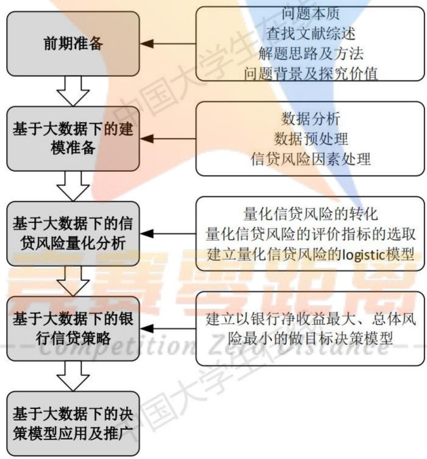
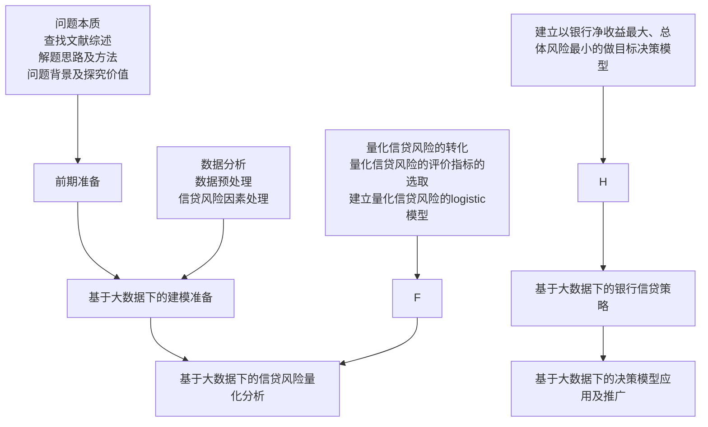
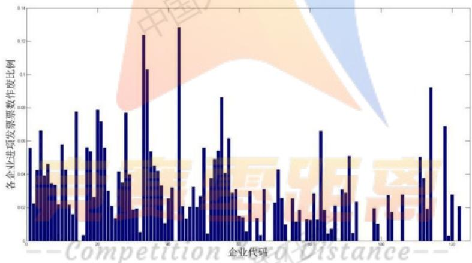
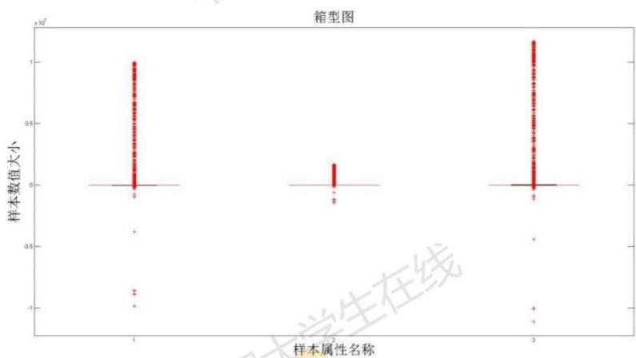
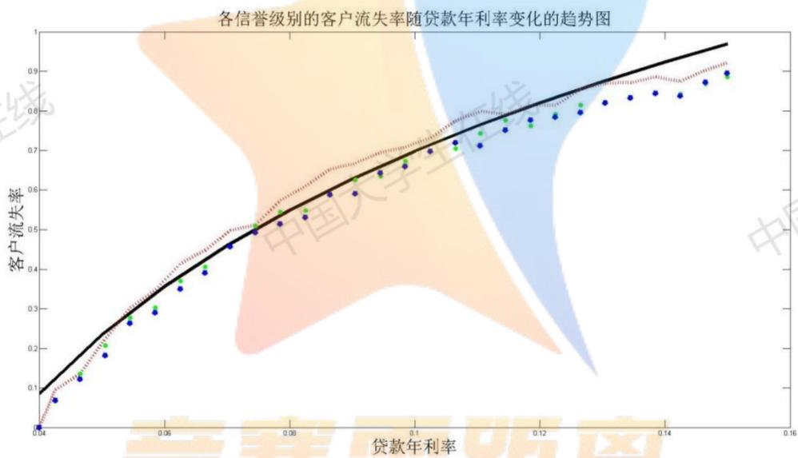
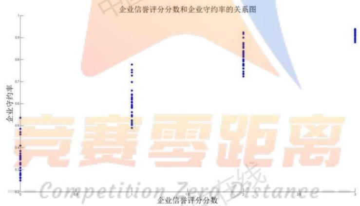
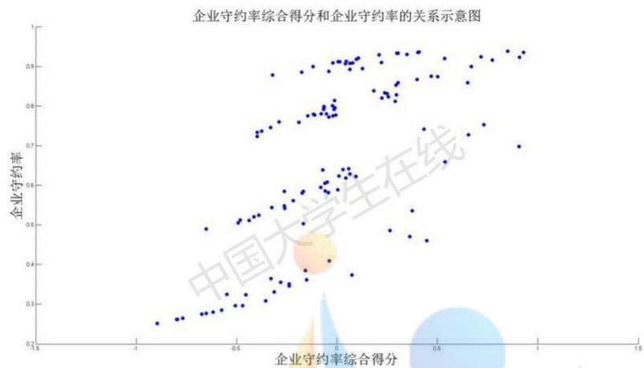
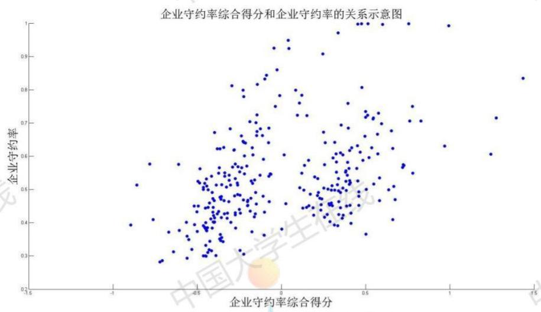

# 银行基于大数据挖掘对中小微企业的信贷决策问题

## 摘要

本文主要研究了银行针对中小微企业的信贷决策问题。信贷决策需要银行利用各企业的相关资料与信息，在对企业进行综合评价之后做出是否放贷、放贷多少、期限多久和利率多少等决策的问题。该问题的研究可以使银行在不影响自身收益的条件下，让我国的中小微企业的信贷问题得到改善，同时也提高了银行信贷决策的效率和质量。

针对问题一，根据题目要求，我们首先要对企业的信贷风险进行量化分析，在量化分析时，我们将风险的量化问题转化为客户守约率问题，建立 Logistic 回归模型对企业的信贷风险进行量化分析，并计算出的客户守约率 $p_i$ ，再将 $p_i$ 映射到 0-1 之间，可以得出：当 $P_i$ 值越接近 1 时，企业的信用越好，风险越低；当 $P_i$ 值越接近 0 时，企业的信用越差，风险越高。最后建立了以银行对企业 $i$ 放贷的金额 $x_i$ 和银行对企业 $i$ 放贷的年利率 $r_i$ 为决策变量，以风险尽可能小利润尽可能多为目标函数，以银行放贷的额度、银行放贷年利率和流失率等为约束条件建立多目标决策模型，最后利用 MATLAB 软件编程得到银行放贷的具体决策（详细结果见附录二）。

针对问题二, 在对问题二进行分析之后发现: 问题二是建立在问题一的基础之上的, 它可以看作问题一的推广。两题目的要求与条件大致相同, 所以只是问题二中缺少部分相关数据, 所以可以构建出相同的指标。为解决数据缺失的问题, 我们利用附件 1 中的数据找出附件 2 中缺失数据的相关规律, 对附件 2 中的 302 家企业的信誉评级, 并算出其大致的违约率。这样一来, 问题二就转化成为了问题一, 我们将问题二构建的模型嵌套进问题一的模型当中, 最后利用 MATLAB 软件编程计算得到银行放贷的具体决策 (结果详见附录三)。

针对问题三, 它是建立在问题二的基础之上的, 不同的是题目要求考虑突发因素(以新冠病毒疫情为例研究)。我们先对企业进行有关行业和类型的划分, 找到疫情对不同行业、不同类别的企业产生的不同的影响程度和影响方向, 并以此对问题二中所构建的指标进行改进。改进完成后, 问题三与问题二类似, 可以继续套用问题一中的模型进行求解, 最后利用 MATLAB 软件编程计算得到决策调整 (结果详见附录四)。

最后，本文对模型进行了优、缺点评价与模型推广，得出该模型还可以向银行面对的其他对象和生活的其它方面进行推广的结论。

关键词：中小微企业的信贷决策问题；Logistic 模型；多目标规划模型；欧氏距离

## 一 问题重述

## 1.1 问题背景

对于中小微企业的信贷问题，从一方面来说，其企业规模相对较小、缺少用于抵押的资产，并且他们的经营容易受到外部因素的影响，贷款风险较大。与此同时，他们的流动性较差，负债能力也极其有限[1]；从另一方面来说：投资更多的中小微企业有利于分散风险，也方便找到未来的新兴产业，所以银行通常依据信贷的相关政策、企业的交易票据信息和上下游企业的影响力，向实力强、供求关系稳定的企业提供贷款，并可以对信誉高、信贷风险小的企业给予利率优惠。

## 1.2 问题的提出

题目中已知：可以贷款的企业的贷款额度为10\~100万元、年利率为4%\~15%、贷款期限为1年。该题目要求我们根据实际情况和附件中的数据信息，通过建立恰当的数学模型来研究中小微企业的信贷策。

问题一需要我们对 123 家企业（附件 1）的信贷风险进行量化分析，并给出该银行在固定年度信贷总额的条件下对这些中小微企业的信贷策略。

问题二要求我们在问题 1 的基础上，对 302 家企业（见附件 2）的信贷风险进行量化分析，并给出银行在年度信贷总额为 1 亿元时对这些企业的信贷策略。

问题三已知一些突发因素可能会影响企业的生产经营和经济效益，而且突发因素对不同行业、不同类别的企业往往会有不同的影响。针对附件2中各企业，综合考虑的信贷风险和可能出现的突发因素（例如：新冠疫情）对各企业的影响，最后给出该银行在年度信贷总额为1亿元时的信贷调整策略。

## 二 问题分析

## 2.1 对问题一的分析

根据问题一的相关说明与条件，目前已知企业的名称、信誉评级、是否违约、企业的进项发票信息（发票号码、开票日期、金额、税额、价税合计、发票状态）和销项发票信息（发票号码、开票日期、金额、税额、价税合计、发票状态）等数据，题目要求对123家有信贷记录企业的信贷风险进行量化分析，并考虑在年度信贷总额固定的条件下给出针对企业的信贷策略。

该问题是常见的信贷决策大数据分析问题，要解决此类问题我们首先将风险的量化问题转化为客户守约率问题，随后建立Logistic回归模型对123家企业的信贷风险进行量化分析，并计算出的客户守约率 $p_i$ ，最后利用映射将 $p_i$ 映射到0-1之间，得出当 $P_i$ 值越接近1时，企业的信用越好，风险越低；当 $P_i$ 值越接近0时，企业的信用越差，风险越高。

## 2.2 对问题二的分析

问题二已知企业的名称、企业的进项发票信息（发票号码、开票日期、金额、税额、价税合计、发票状态）和销项发票信息（发票号码、开票日期、金额、税额、价税合计、发票状态）等数据。该问题与问题一极为相似，只是该问题缺少信誉评级和是否违约两条件。需要我们做的依然是对企业的信贷风险进行量化分析，并在年度信贷总额为1亿元的条件下给出针对企业的信贷策略。

针对该问题可以有的思路为：首先对附件1中的数据进行处理与分析，找出相关规律并构造出信誉等级，算出对应等级的违约率；再将此模型嵌套进问题一的模型当中，将问题二重新转化为问题一，就可按照问题一的求解步骤进行求解。

## 2.3 对问题三的分析

问题三建立在问题二的基础之上，考虑突发因素（例如：新冠病毒疫情）对不同行业、不同类别的企业的不同影响，对问题二中做出的决策进行调整。

面对该问题我们首先需要查找相关资料，对企业进行对行业和类型的划分，找到疫情不同行业、不同类别的企业的不同的影响程度和影响方向，并以此对问题二中所构建的指标进行改进。改进完成后，即可套用问题一中的模型进行求解。

综上所述：对于中小微企业的信贷决策问题的三个小问之间为层层深入的关系，我们在解决三个问题时的总体思路为将模型朝着问题一的模型的方向转换，即将二、三两问看作问题一的推广。所以解决问题一的关键为：指标的选取与构造；问题二的关键点在于用第一问的数据对问题二中的缺失数据进行预测与计算；问题三的关键点在于弄清疫情对不同行业、不同类别的企业产生的不同的影响。



<details>
<summary>flowchart</summary>


</details>

图1 整体建模思路图

## 三 模型基本假设与合理性说明

假设1：市场的风险与信誉风险之间没有关系，即在该小问中只考虑企业信誉风险对银行决策的影响，将市场风险看作不存在。

假设 2: 信用等级是离散的, 且在同一等级中的企业违约的概率相同。在利用 Excel 表格对数据进行筛选之后, 我们发现违约企业大多为信誉评级为 C、D 两个等级的企业, A、B 两个等级的企业很少违约。

假设 3：总体风险用银行所放贷的金额 $x_{i}$ 中最大的一个风险来衡量。当对所有企业发放贷款的最大的风险都是最小的时候的总体风险也是较小的。

假设 4：在做决策的这段时间内，平均收益率、交易费率、风险损失率以及同期银行的存款利率都可以看作常数。若平均收益率、交易率、风险损失率以及同期银行存款利率是变化的，那么此时建立的模型是不具有说服力的。

假设 5: 净收益和总体的风险只会受到平均收益率、交易费率、风险损失率的影响，而与其他因素无关。平均收益率、交易费率、风险损失率是目前已知的较为重要的数据，若考虑其他未知因素和影响甚小的因素不利于数学模型的建立。

四 符号说明

<table><tr><td>符号</td><td>符号说明</td></tr><tr><td> $x_{ti}$ </td><td>对企业i的评价指标t( $i=1,2,...,123; t=1,2,...,6$ )</td></tr><tr><td> $x_{tj}$ </td><td>对企业j的评价指标t( $j=1,2,...,302; t=1,2,...,6$ )</td></tr><tr><td> $x'_{tj}$ </td><td>疫情影响下对企业j的评价指标t( $j=1,2,...,302; t=1,2,...,6$ )</td></tr><tr><td>p</td><td>企业的守约率</td></tr><tr><td> $p'$ </td><td>疫情影响下的企业守约率</td></tr><tr><td>y</td><td>客户流失率</td></tr><tr><td>r</td><td>贷款年利率</td></tr><tr><td>x</td><td>银行对企业的放贷金额</td></tr><tr><td>α、β、γ</td><td>回归系数</td></tr></table>

## 五 基于有信贷记录的 Logistic 分析的多目标规划模型——问题一

## 5.1 建模思路

为给出银行年度信贷总额固定时对这123家企业的信贷策略，我们将以银行年净收益尽可能大，总体风险尽可能小为目标，建立多目标规划模型，求出银行对企业的信贷政策。在对信贷风险进行量化分析时，我们将信贷风险转化为了以企业守约率为量化分析点，因此我们将银行信贷风险损失率由企业守约率表达出，为： $1-p_{i}$ （企业的守约率越高，信用越好，信贷风险越低，信贷损失率越低；反之企业的守约率越低，信用越差，信贷风险越高，信贷损失率越高。）

## 5.2 建模准备

## 5.2.1 关键问题的转化

问题一要求对给出的 123 家有信贷记录的企业的信贷风险进行量化分析，于是我们将风险的量化问题转化为客户守约率问题（即：守约率越趋近于 1，该企业的信誉越好；守约率越趋近于 0，该企业的信誉越差）。

## 5.2.2 数据预处理

## ◆ 对作废发票进行筛选并删除

问题一中提供的数据数量庞大，我们需要将其中的作废发票过滤筛除掉。于是我们先将发票的状态进行处理，将有效发票作为“1”，作废发票作为“0”，再用 MATLAB 软件将发票状态为作废发票即“0”的发票信息筛选出来并剔除掉。



<details>
<summary>bar</summary>

| 企业代码 | 各企业进项发票数作废比例 |
| --- | --- |
| 1 | ~0.056 |
| 2 | ~0.043 |
| 3 | ~0.042 |
| 4 | ~0.066 |
| 5 | ~0.047 |
| 6 | ~0.038 |
| 7 | ~0.035 |
| 8 | ~0.034 |
| 9 | ~0.033 |
| 10 | ~0.022 |
| 11 | ~0.021 |
| 12 | ~0.058 |
| 13 | ~0.043 |
| 14 | ~0.021 |
| 15 | ~0.022 |
| 16 | ~0.078 |
| 17 | ~0.056 |
| 18 | ~0.054 |
| 19 | ~0.059 |
| 20 | ~0.072 |
| 21 | ~0.056 |
| 22 | ~0.031 |
| 23 | ~0.021 |
| 24 | ~0.014 |
| 25 | ~0.042 |
| 26 | ~0.035 |
| 27 | ~0.036 |
| 28 | ~0.041 |
| 29 | ~0.077 |
| 30 | ~0.041 |
| 31 | ~0.035 |
| 32 | ~0.034 |
| 33 | ~0.033 |
| 34 | ~0.124 |
| 35 | ~0.103 |
| 36 | ~0.128 |
| 37 | ~0.054 |
| 38 | ~0.045 |
| 39 | ~0.044 |
| 40 | ~0.042 |
| 41 | ~0.033 |
| 42 | ~0.031 |
| 43 | ~0.025 |
| 44 | ~0.026 |
| 45 | ~0.032 |
| 46 | ~0.021 |
| 47 | ~0.021 |
| 48 | ~0.032 |
| 49 | ~0.026 |
| 50 | ~0.026 |
| 51 | ~0.056 |
| 52 | ~0.038 |
| 53 | ~0.049 |
| 54 | ~0.054 |
| 55 | ~0.086 |
| 56 | ~0.062 |
| 57 | ~0.041 |
| 58 | ~0.041 |
| 59 | ~0.031 |
| 60 | ~0.029 |
| 61 | ~0.015 |
| 62 | ~0.015 |
| 63 | ~0.014 |
| 64 | ~0.031 |
| 65 | ~0.029 |
| 66 | ~0.014 |
| 67 | ~0.013 |
| 68 | ~0.029 |
| 69 | ~0.029 |
| 70 | ~0.029 |
| 71 | ~0.029 |
| 72 | ~0.029 |
| 73 | ~0.029 |
| 74 | ~0.029 |
| 75 | ~0.029 |
| 76 | ~0.029 |
| 77 | ~0.029 |
| 78 | ~0.029 |
| 79 | ~0.029 |
| 80 | ~0.029 |
| 81 | ~0.029 |
| 82 | ~0.029 |
| 83 | ~0.029 |
| 84 | ~0.029 |
| 85 | ~0.029 |
| 86 | ~0.029 |
| 87 | ~0.029 |
| 88 | ~0.029 |
| 89 | ~0.029 |
| 90 | ~0.029 |
| 91 | ~0.029 |
| 92 | ~0.029 |
| 93 | ~0.029 |
| 94 | ~0.029 |
| 95 | ~0.029 |
| 96 | ~0.029 |
| 97 | ~0.029 |
| 98 | ~0.029 |
| 99 | ~0.029 |
| 100 | ~0.115 |
| 115 | ~-18% (estimated) |

注：由于图中未提供精确的数据标签，表中数值均为根据坐标轴刻度的估算值（使用~前缀）。
</details>

图 2 各企业进项发票票数作废比例直方图

## ◆ 剔除异常值

箱形图是一种常用于显示一组数据分散情况资料的统计图，有利于准确稳定地描绘出数据的离散分布情况和数据的处理。因此我们以金额、税额以及价税合计作为样本数据，作出了如下箱型图：



<details>
<summary>boxplot</summary>

| 样本属性名称 | Q1 (x10^7) | Q2 (Median) (x10^7) | Q3 (x10^7) |
| --- | --- | --- | --- |
| 1 | ~0 | ~0 | ~1.0 |
| 2 | ~0 | ~0 | ~0.2 |
| 3 | ~0 | ~0 | ~1.2 |
</details>

图 3 箱形图

通过观察各方盒和线段的长短，我们对异常值分布的识别有了一定的了解；随后我们按照 4 个标准差将数据中的异常数据（包括 NaN, Inf, 和异常大小数据）进行了过滤筛选，主要是将离均值超过系数因子 4 倍标准差判为异常大小，最后通过产生随机数种子，进行结果再现检验均值、标准差结果是否正常。附录\*\*\*\*\*

## ◆ 筛除发票号相同的发票

在 Excel 表格中，使用数据透视表对发票号码相同的单元格进行筛选统计，若统计出来的数据表格中的值大于 1，则说明该发票是无效的，需要将其删除。

## 5.2.3 基于量化分析模型（Logistic 模型）的信贷风险评估

我们运用 Logistic 回归方法将 123 家企业的信贷风险的量化分析转化为对 123 家企业的信用风险评价并建立模型，企业信用越高，违约率越低，信贷风险越低。在建立对企业的信用风险评价模型主要有三步：即指标的构造与选择、样本数据的收集与处理和违约的判定。针对指标的构造与选择，指标的选择应该遵循科学性、全面性、公正性、针对性、合法性、可操作性等原则 $^{[2]}$ ，并以此构建相应的评价指标体系，评价体系共五个指标，指标及其描述如下表：

表 1 问题一各项指标的构造与描述

<table><tr><td>指标</td><td>指标描述</td></tr><tr><td>各企业进项发票的作废比例 $x_{1i}$ </td><td>该比例越低信用越高,信贷风险越低</td></tr><tr><td>各企业销项发票的作废比例 $x_{2i}$ </td><td>该比例越低信用越高,信贷风险越低</td></tr><tr><td>各企业的信誉状况 $x_{3i}$ </td><td>信誉状况越好信用越高,信贷风险越低</td></tr><tr><td>净发票总金额 $x_{4i}$ </td><td>金额越大企业资金越充足,企业实力越强</td></tr><tr><td>发票金额的变异系数 $x_{5i}$ </td><td>变异系数越低,金额的偏离程度越低,信贷风险也越低;变异系数越高,金额的偏离程度越高,信贷风险也越高</td></tr><tr><td>资金周转率 $x_{6i}$ </td><td>企业用尽可能少的资金获得尽可能多的销售收入,则资金周转率快,周转率越快,资金利用效果越好,企业的信用越高风险</td></tr></table>

根据上表可知：针对该模型我们共建立了6个评价指标，分别为：各企业进项发票的作废比例、销项发票的作废比例、信誉状况、净发票总金额、发票金额的变异系数和资金周转率。

观察题目中提到的要素：对于要点“企业实力”，企业实力是指企业满足市场要求的能力，用企业的生产能力，技术能力，销售能力，产品更新能力，市场信誉等因素表示。在此处我们用净发票的总金额来刻画企业的销售能力；用企业的资金周转率（资金周转率是反应资金流转速度指标。企业资金在生产经营过程中不间断地循环周转，从而使企业取得销售收入。）来刻画企业的财力和销售能力，企业用较少的资金占用，取得较多的销售收入，说明资金周转速度快，资金利用效果好 $^{[3]}$ 。

对于要点“信誉”，考虑到信誉的对象有两种，银行和销售方，所以我们主要构造了两个指标来刻画：一个是用题目中给出的信誉等级废票比例来刻画，另一个则是通过作废票数的比例来刻画。

对于要点“风险”，我们用变异系数，即标准偏差与平均值的比值（衡量各观测值的变异程度的一个统计量）[4]

，可以得到变异系数越低，金额的偏离程度就越低，信贷风险也越低；变异系数越高，金额的偏离程度就越高，信贷风险也越高。

通过相关数据建立 Logistic 回归模型，记企业的守约率为 $P_{i}$ ，信贷风险损失率为 $1 - p_{i}$ ，其中 i 表示第 i 种企业（ $i = 1, 2, \ldots, 123$ ）。通过指标拟合出回归方程中指标的相关系数，模型为：

$$
\ln \frac {p _ {i}}{1 - p _ {i}} = \beta_ {0} + \beta_ {1} x _ {1 i} + \beta_ {2} x _ {2 i} + \beta_ {3} x _ {3 i} + \beta_ {4} x _ {4 i} + \beta_ {5} x _ {5 i} + \beta_ {6} x _ {6 i} \tag {1}
$$

其中 $p_i = \frac{1}{1 + e^{-(\beta_0 + \beta_1x_{1i} + \beta_2x_{2i} + \beta_3x_{3i} + \beta_4x_{4i} + \beta_5x_{5i} + \beta_6x_{6i})}}$

将计算出的系数带入公式（1）可得系数（如下表）：

表 1 回归系数 $\beta$ 的值

<table><tr><td> $\beta_0$ </td><td> $\beta_1$ </td><td> $\beta_2$ </td><td> $\beta_3$ </td><td> $\beta_4$ </td><td> $\beta_5$ </td><td> $\beta_6$ </td></tr><tr><td>0.9347</td><td>-11.163</td><td>0.3755</td><td>-0.9628</td><td>-1.7819*10 $^{-10}$ </td><td>-0.0512</td><td>4.4326*10 $^{-6}$ </td></tr></table>

(详细程序见附录？)

通过上述公式求出123家企业的守约率，再通过映射将其映射到0-1之间。我们可以得出啊： $p_{i}$ 值越接近1，则申请贷款企业信用较好，P值越接近0，则申请贷款企业信用较差。贷款企业的信用越好，信贷风险也就越小，贷款企业的信用越差，信贷风险越高。附件1中各企业的守约率 $P_{i}$ 如下表：

表 2 附件 1 中各企业的守约率 $p$

<table><tr><td>E1</td><td>E2</td><td>E3</td><td>E4</td><td>E5</td><td>E6</td><td>E7</td></tr><tr><td>0.911868</td><td>0.924453</td><td>0.697678</td><td>0.777031</td><td>0.831152</td><td>0.930019</td><td>0.935032</td></tr><tr><td>E8</td><td>E9</td><td>E10</td><td>E11</td><td>E12</td><td>E13</td><td>E14</td></tr><tr><td>0.938654</td><td>0.920264</td><td>0.858713</td><td>0.639952</td><td>0.811639</td><td>0.909888</td><td>0.753185</td></tr><tr><td>E15</td><td>E16</td><td>E17</td><td>E18</td><td>E19</td><td>E20</td><td>E21</td></tr><tr><td>0.894665</td><td>0.892042</td><td>0.93354</td><td>0.935097</td><td>0.908727</td><td>0.875341</td><td>0.866861</td></tr><tr><td></td><td></td><td></td><td>...</td><td></td><td></td><td></td></tr><tr><td>E117</td><td>E118</td><td>E119</td><td>E120</td><td>E121</td><td>E122</td><td>E123</td></tr><tr><td>0.261692</td><td>0.485933</td><td>0.296586</td><td>0.324674</td><td>0.285289</td><td>0.350973</td><td>0.251285</td></tr></table>

注：由于全部表格过大，此处只放了部分数据。详细表格数据见附录？

## 5.3 建立有信贷记录的银行多目标规划模型

## 5.3.1 决策变量的确定

记银行对企业i放贷的金额（单位：万元）为 $x_{i}$ ；银行对企业i放贷的年利率为 $r_{i}$ ，其中i表示第i种企业 $(i=1,2,\ldots,123)$ 。

## 5.3.2 目标函数的确定

由于题目要求给出银行年度信贷总额固定时对这 123 家企业的信贷策略。从银行的角度来看，他们更愿意贷款给风险较小的企业，与此同时，银行也希望自己的收益尽可能多。

## 总体风险的刻画

根据假设 3，总体风险用银行所放贷的金额 $x_{i}$ 中最大的一个风险来衡量，放贷的风险率我们将其转化为企业守约率来表达，即：

$$
\max \left\{(1 - p _ {i}) x _ {i} \mid i = 1, 2,..., 1 2 3 \right\} \tag {2}
$$

## ◆ 银行年净收益的刻画

银行给企业i放贷金额为 $x_{i}$ 时的净收益为:

$$
[ r _ {i} - (1 - p _ {i}) ] x _ {i} \tag {3}
$$

所以我们确定以银行年净收益尽可能大，年总体风险尽可能小为目标，如下：

$$
\left\{ \begin{array}{l} \max \sum_ {i = 1} ^ {1 2 3} [ r _ {i} - (1 - p _ {i}) ] x _ {i} \\ \min \max \left\{(1 - p _ {i}) x _ {i} \right\} \end{array} \right. \tag {4}
$$

## 5.3.3 约束条件的确定

约束条件一：银行总放贷额度的限制。

由于题目已知银行对确定要放贷的贷款额度为10\~100万元,所以对所有确定要发放贷款之和应该满足:

$$
1 2 3 0 \leq \sum_ {i = 1} ^ {1 2 3} x _ {i} \leq 1 2 3 0 0 \tag {5}
$$

约束条件二：银行对各个企业放贷额度的限制。

$$
1 0 \leq x _ {i} \leq 1 0 0 \text {, 银行对企业} i \text {放贷} \tag {6}
$$

约束条件三：各个企业贷款的年利率限制。

已知银行贷款的年利率的范围为：4%\~15%

$$
4 \% \leq r _ {i} \leq 15 \% \tag {7}
$$

约束条件四：贷款利率对不同信誉等级客户的流失率限制。

利用 MATLAB 软件对贷款年利率和客户流失率的函数关系拟合, 得出不同信誉等级均遵守拟合出的函数关系（见图 4）



<details>
<summary>scatter</summary>

| 贷款年利率 | 客户流失率 (实线) | 客户流失率 (虚线) |
| --- | --- | --- |
| 0.04 | ~0.08 | ~0.01 |
| 0.05 | ~0.23 | ~0.22 |
| 0.06 | ~0.37 | ~0.38 |
| 0.07 | ~0.49 | ~0.50 |
| 0.08 | ~0.58 | ~0.61 |
| 0.09 | ~0.66 | ~0.69 |
| 0.10 | ~0.73 | ~0.76 |
| 0.11 | ~0.79 | ~0.82 |
| 0.12 | ~0.84 | ~0.87 |
| 0.13 | ~0.88 | ~0.91 |
| 0.14 | ~0.92 | ~0.94 |
| 0.15 | ~0.96 | ~0.97 |
</details>

图4各信誉级别的客户的流失率随贷款的年利率变化的趋势图

对图 4、附件 3 中 sheet1 中的相关数据及函数进行分析可以得出：贷款年利率为 0.0905 - 0.0985 时，不同信誉等级的客户的流失率变化不大。因此，贷款利率对不同信誉等级客户的流失率限制：

$$
0 \leq y _ {i} \leq 0. 7 0 8 3 0 2 0 2 3 \Rightarrow 0 \leq 2. 2 3 8 6 + 0. 6 6 9 \ln r _ {i} \leq 0. 7 0 8 3 0 2 0 2 3 \tag {8}
$$

约束条件五：银行有盈利约束。

在查找了不同银行有关贷款利率和存款利率的相关数据后，我们发现：银行的最高存款利率是死期一年：1.5%，但银行一年的贷款利率是4.75%，所以从利率方面来看，该银行始终处于盈利状态，即该约束恒成立。

约束条件六：银行对企业 $j$ 放贷的金额不为负。

$$
x _ {i} \geq 0, i = 1, 2, \dots , 1 2 3
$$

综上所述，建立多目标规划模型如下：

$$
\begin{array}{l} \left\{ \begin{array}{l} \max \sum_ {i = 1} ^ {1 2 3} [ r _ {i} - (1 - p _ {i}) ] x _ {i}, i = 1, 2, \dots 1 2 3 \\ \min \max \{(1 - p _ {i}) x _ {i} \} \end{array} \right. \\ s. t. \left\{ \begin{array}{l} 1 0 \leq x _ {i} \leq 1 0 0 \\ 1 2 3 0 \leq \sum_ {i = 1} ^ {1 2 3} x _ {i} \leq 1 2 3 0 0 \\ 4 \% \leq r _ {i} \leq 1 5 \% \\ x _ {i} \geq 0 \end{array} \right. \tag {9} \\ \end{array}
$$

## 5.4 计算步骤

Step 1: 定义一个总体 $X$ 为离散型的最大似然函数 $L(\alpha) = \prod_{j=1}^{n} p(x_{1j}; \alpha)$ ; 并对其两边同时取对数得到 $\ln L(\beta) = \sum_{i=1}^{n} \ln p(x_{1i}; \beta)$ ;

Step 2: 首先对对数似然函数的各个权重求偏导, 其次令之为 0 即可得到最大似然估计值, 即 $\beta_{0} = 0.9347$ 、 $\beta_{1} = -11.163$ 、 $\beta_{2} = 0.3755$ 、 $\beta_{3} = -0.9628$ 、 $\beta_{4} = -1.7819\mathrm{e}-10$ 、 $\beta_{5} = -0.0512$ 、 $\beta_{6} = 4.4326\mathrm{e}-06$ ;

Step 3: 由最佳回归系数的确定可定出对应的 Logistic 函数，并将 123 家企业相关因素的指标值代入该函数中，即可求得 123 家企业的守约率，见表\*\*\*\*\*；

Step 4: 将建立的净收益尽可能大、总体风险尽可能小的多目标规划模型通过固定风险水平、优化收益的手段转化为单目标的线性规划问题；最后利用 Lingo 软件对上述模型进行计算得到了银行对各企业的贷款额度和贷款利率，具体见表\*\*\*\*\*\*

## 5.5 计算结果

利用 MATLAB 软件对上述模型进行计算得到结果如下表:

表 3 银行对 123 家有信贷记录的企业的决策

<table><tr><td>企业</td><td>企业守约率</td><td>是否贷款</td><td>贷款额度(万元)</td><td>贷款利率</td><td>贷款期限(年)</td></tr><tr><td>E1</td><td>91.1868%</td><td>是</td><td>92.0681</td><td>4.9695%</td><td>1</td></tr><tr><td>E2</td><td>92.4453%</td><td>是</td><td>93.2008</td><td>4.8310%</td><td>1</td></tr><tr><td>E3</td><td>69.7678%</td><td>是</td><td>72.7910</td><td>7.3255%</td><td>1</td></tr><tr><td></td><td></td><td></td><td>......</td><td></td><td></td></tr><tr><td>E121</td><td>28.5289%</td><td>否</td><td>0.0000</td><td>0.0000%</td><td>0</td></tr><tr><td>E122</td><td>35.0973%</td><td>否</td><td>0.0000</td><td>0.0000%</td><td>0</td></tr><tr><td>E123</td><td>25.1285%</td><td>否</td><td>0.0000</td><td>0.0000%</td><td>0</td></tr></table>

注：由于全部表格过大，此处只放了部分数据。详细表格数据见附录？

## 5.6 结果分析与检验

本问中所得的贷款额度、贷款利率等结果根本上是基于企业守约率计算得出的，因此企业守约率的准确性是本问所有的结果精确的关键所在，所以下面将就企业守约率的结果进行检验与分析。

从经验来看，各企业的守约率很大程度上同其信誉状况成正相关，即信誉得分高，守约率高，反之，信誉得分低，守约率低。我们做出123家有信贷记录企业的信誉分数同守约率的散点关系图，如图所示：



<details>
<summary>scatter</summary>

| 企业信誉评分分数 | 企业守约率 |
| --- | --- |
| ~0.1 | ~0.25 |
| ~0.1 | ~0.35 |
| ~0.1 | ~0.45 |
| ~0.1 | ~0.55 |
| ~0.1 | ~0.65 |
| ~0.1 | ~0.75 |
| ~0.1 | ~0.85 |
| ~0.1 | ~0.95 |
| ~0.1 | ~1.05 |
| ~0.1 | ~1.15 |
| ~0.1 | ~1.25 |
| ~0.1 | ~1.35 |
| ~0.1 | ~1.45 |
| ~0.1 | ~1.55 |
| ~0.1 | ~1.65 |
| ~0.1 | ~1.75 |
| ~0.1 | ~1.85 |
| ~0.1 | ~1.95 |
| ~0.1 | ~2.05 |
| ~0.1 | ~2.15 |
| ~0.1 | ~2.25 |
| ~0.1 | ~2.35 |
| ~0.1 | ~2.45 |
| ~0.1 | ~2.55 |
| ~0.1 | ~2.65 |
| ~0.1 | ~2.75 |
| ~0.1 | ~2.85 |
| ~0.1 | ~2.95 |
| ~0.1 | ~3.05 |
| ~0.1 | ~3.15 |
| ~0.1 | ~3.25 |
| ~0.1 | ~3.35 |
| ~0.1 | ~3.45 |
| ~0.1 | ~3.55 |
| ~0.1 | ~3.65 |
| ~0.1 | ~3.75 |
| ~0.1 | ~3.85 |
| ~0.1 | ~3.95 |
| ~0.1 | ~4.05 |
| ~0.1 | ~4.15 |
| ~0.1 | ~4.25 |
| ~0.1 | ~4.35 |
| ~0.1 | ~4.45 |
| ~0.1 | ~4.55 |
| ~0.1 | ~4.65 |
| ~0.1 | ~4.75 |
| ~0.1 | ~4.85 |
| ~0.1 | ~4.95 |
| ~0.1 | ~5.05 |
| ~0.1 | ~5.15 |
| ~0.1 | ~5.25 |
| ~0.1 | ~5.35 |
| ~0.1 | ~5.45 |
| ~0.1 | ~5.55 |
| ~0.1 | ~5.65 |
| ~0.1 | ~5.75 |
| ~0.1 | ~5.85 |
| ~0.1 | ~5.95 |
| ~0.1 | ~6.05 |
| ~0.1 | ~6.15 |
| ~0.1 | ~6.25 |
| ~0.1 | ~6.35 |
| ~0.1 | ~6.45 |
| ~0.1 | ~6.55 |
| ~0.1 | ~6.65 |
| ~0.1 | ~6.75 |
| ~0.1 | ~6.85 |
| ~0.1 | ~6.95 |
| ~0.1 | ~7.05 |
| ~0.1 | ~7.15 |
| ~0.1 | ~7.25 |
| ~0.1 | ~7.35 |
| ~0.1 | ~7.45 |
| ~0.1 | ~7.55 |
| ~0.1 | ~7.65 |
| ~0.1 | ~7.75 |
| ~0.1 | ~7.85 |
| ~0.1 | ~7.95 |
| ~0.1 | ~8.05 |
| ~0.1 | ~8.15 |
| ~0.1 | ~8.25 |
| ~0.1 | ~8.35 |
| ~0.1 | ~8.45 |
| ~0.1 | ~8.55 |
| ~0.1 | ~8.65 |
| ~0.1 | ~8.75 |
| ~0.1 | ~8.85 |
| ~0.1 | ~8.95 |
| 3 | 9~9~9~9~9~9~9~9~9~9~9~9~9~9~9~9~9~9~9~9~9~9~9~9~9~9~9~9~9~9~9~9~9~9~9~9~9~9~9~9~9~9~9~9~9~9~9~9~9~9~9%~9%~9%~9%~9%~9%~9%~9%~9%~9%~9%~9%~9%~9%~9%~9%~9%~9%~9%~9%~9%~9%~9%~9%~9%~9%~9%~9%~9%~9%~9%~9%~9%~9%<nl>
</details>

图 5 企业信誉评分分数

由图很直观的发现，这是完全符合事实的，因此模型具有一定的合理性；

但以上的检验毕竟是主观的感受，具有一定的误差性。我们应对其进行进一步的客观描画检验，我们进行了如下的检验：

首先利用 MATLAB 软件对 6 个评价指标（各企业进项、销项发票的作废比例，各企业的信誉状况，净发票总金额，发票金额的变异系数，资金周转率）进行主成分分析，得到相关系数矩阵的前几个特征根及其贡献率大约分别为 24.9, 21.0, 17.3, 14.2, 12.7,

9.9；接着选取前 5 个主成分（累计贡献率达到 90%以上）进行综合评价；按照主成分分析法的基本步骤流程，我们依次计算了特征值、特征向量、综合评价值和综合得分；基于此，最后我们绘制出了综合得分和企业守约率的关系散点图，如下图：



<details>
<summary>scatter</summary>

| 企业守约率综合得分 (range) | 企业守约率 (range) |
| --- | --- |
| -0.9~1.0 | 0.25~0.95 |
</details>

图 6 123 家守约率综合得分散点图

其表示的含义是随着综合得分的增加，企业守约率也大致呈上升状态，因此，从一定意义上反应出了我们的企业守约率结果的正确与合理性。

## 六 内嵌欧式距离信誉等级确立的多目标规划模型——问题二

## 6.1 建模思路

问题二与问题一相似，其区别在于问题二的数据有一定的缺失（信誉评级和违约记录），所以在解决第二问时需要利用问题一中已有的数据对附件2中的302家企业的信誉等级进行预测，并在已经预测好信用等级的基础上确定每个等级的概率范围。然后采用第一问模型中的信贷风险量化方法。运用Logistic回归方法将302家企业的信贷风险的量化分析转化为对302家企业的守约率大小来量化并建立模型。其余操作类似问题一。

## 6.2 建模准备

## 6.2.1 数据预处理

## ◆ 对作废发票进行筛选并删除

问题二会用到附件 2 中的数据，我们需要将其中的作废发票过滤筛除掉。于是我们采用问题一中同样的处理方法将发票状态为作废发票信息筛选出来并剔除掉。

## ◆ 剔除异常值

问题二对附件2的处理同样采取有利于准确稳定地描绘出数据的离散分布情况和数据的处理。因此我们以：

观察各方盒和线段的长短，我们可以对异常值分布的识别有一定的了解；然后我们按照4个标准差将数据中的异常数据（包括NaN，Inf和异常大小数据）进行了过滤筛选，主要是将离均值超过系数因子4倍标准差判为异常大小，最后通过产生随机数种子，进行结果再现检验均值、标准差结果是否正常。

## ◆ 筛除发票号相同的发票

在 Excel 表格中，使用数据透视表对发票号码相同的单元格进行筛选统计，若统计出来的数据表格中的值大于 1，则说明该发票是无效的，需要将其删除。

## 6.2.2 信用等级与违约率的判定

在对附件 2 中的 302 家企业进行信贷风险量化分析前，首先需要要对 302 家企业的信誉评级做出判定。通过对附件 1 中的表格处理数据的分析及各项量化指标与信誉评级的关系发现：各项指标与信誉评价都是离散的，无法构造线性相关方程对其建立函数关系式，也就无法将信誉评级与其他指标相联系。因此，我们算出附件 1 中企业的各信誉状况下的平均净发票量和附件 2 中各企业的净发票量，构造两者间的距离关系式，附件 2 中各企业的净发票量与附件 1 中企业的哪个信誉状况下的平均净发票量距离近，该企业的信誉评级就是多少。

## 建立基于欧式距离的信誉等级确定模型：

我们通过计算得出 302 家企业的净发票总金额 $x_{4j}$ ，建立 302 家无信贷记录企业的净发票总金额 $x_{4j}$ 到 123 家有信贷记录企业的各信誉状况下的平均净发票总金额 $\overline{x_{4i}}$ 的距离函数，即， $d = \sqrt{x_{4j}^2 - \overline{x_{4i}^2}}$ ，以距离最小 $\min d$ 为目标函数，确定出 302 家无信贷记录企业相应的信誉等级。（123 家企业各信誉状况下的平均净发票总金额 $\overline{x_{4i}}$ 如下表）

表 4 4 个信誉等级对应的平均发票总金额

<table><tr><td>信誉等级</td><td>A</td><td>B</td><td>C</td><td>D</td></tr><tr><td>平均净发票总金额(元)</td><td>23191781.5266667</td><td>23681634.6419444</td><td>90799230.7874797</td><td>2604767.66384615</td></tr></table>

将附件 2 中的每个企业的平均发票总金额与上表对照比较，可以得到如下的关于 302 家企业的信誉等级，如下表：

表 5 302 个企业的信誉等级预测

<table><tr><td>企业</td><td>1</td><td>2</td><td>3</td><td>4</td><td>5</td><td>6</td><td>7</td><td>8</td><td>9</td><td>10</td></tr><tr><td>信誉等级</td><td>D</td><td>B</td><td>C</td><td>C</td><td>C</td><td>C</td><td>B</td><td>C</td><td>C</td><td>C</td></tr><tr><td>企业</td><td>11</td><td>12</td><td>13</td><td>14</td><td>15</td><td>16</td><td>17</td><td>18</td><td>19</td><td>20</td></tr><tr><td>信誉等级</td><td>C</td><td>C</td><td>D</td><td>B</td><td>C</td><td>C</td><td>C</td><td>C</td><td>B</td><td>C</td></tr><tr><td></td><td></td><td></td><td></td><td></td><td>......</td><td></td><td></td><td></td><td></td><td></td></tr><tr><td>企业</td><td>293</td><td>294</td><td>295</td><td>296</td><td>297</td><td>298</td><td>299</td><td>300</td><td>301</td><td>302</td></tr><tr><td>信誉等级</td><td>D</td><td>D</td><td>D</td><td>D</td><td>D</td><td>D</td><td>D</td><td>D</td><td>D</td><td>D</td></tr></table>

注：由于全部表格过大，此处只放了部分数据。详细表格数据见附录？

在对信誉评级判定后，采用第一问模型中的信贷风险量化方法。运用 Logistic 回归方法将 302 家企业的信贷风险的量化分析转化为对 302 家企业的守约率大小来量化并建立模型，企业信用越高，守约率越高，信贷风险越低。在建立对企业的信用风险评价模型时需要：选择指标、收集样本数据和判定违约。在指标的选择上要遵循科学性、全面性、公正性、针对性、合法性、可操作性等原则 $^{[2]}$ 来构建相应的评价指标体系，评价体系共六个指标（其中 $j=1,2,\ldots,302$ ），相应指标及其相关描述如下表：

表 6 问题二指标及其相关描述

<table><tr><td>指标</td><td>指标描述</td></tr><tr><td>各企业进项发票的作废比例 $x_{1j}$ </td><td>比例越低信用越高,信贷风险越低</td></tr><tr><td>各企业销项发票的作废比例 $x_{2j}$ </td><td>比例越低信用越高,信贷风险越低</td></tr><tr><td>各企业的信誉状况 $x_{3j}$ </td><td>信誉状况越好信用越高,信贷风险越低</td></tr><tr><td>净发票总金额 $x_{4j}$ </td><td>金额越大企业资金越充足,企业实力越强</td></tr><tr><td>发票金额的变异系数 $x_{5j}$ </td><td>变异系数越低,金额的偏离程度越低,信贷风险也越低;变异系数越高,金额的偏离程度越高,信贷风险也越高。</td></tr><tr><td>资金周转率 $x_{6j}$ </td><td>则资金周转率快,周转率越快,资金利用效果越好,企业的信用越高风险越低</td></tr></table>

通过相关数据建立 Logistic 回归模型, 通过指标拟合出回归方程中指标的相关系数。建立的模型为:

$$
\ln \frac {p _ {j}}{1 - p _ {j}} = \alpha_ {0} + \alpha_ {1} x _ {1 j} + \alpha_ {2} x _ {2 j} + \alpha_ {3} x _ {3 j} + \alpha_ {4} x _ {4 j} + \alpha_ {5} x _ {5 j} + \alpha_ {6} x _ {6 j} \tag {10}
$$

其中， $p_{j}$ 为企业的守约率， $1-p_{j}$ 为信贷风险损失率。计算出系数值见下表：

表 7 回归系数 $\alpha$ 的值

<table><tr><td> $\alpha_0$ </td><td> $\alpha_1$ </td><td> $\alpha_2$ </td><td> $\alpha_3$ </td><td> $\alpha_4$ </td><td> $\alpha_5$ </td><td> $\alpha_6$ </td></tr><tr><td>0.9146</td><td>-7.6634</td><td>0.0054</td><td>-0.1008</td><td>-2.7541*10-9</td><td>-0.0233</td><td>4.4710*10-5</td></tr></table>

(计算得出的详细公式和求出系数的程序见附录？)

## 6.3 建立无信贷记录的银行多目标规划模型

在给出该银行对这些企业的信贷政策时，在第一问建立的模型基础上，以银行年净收益尽可能大、年总体风险尽可能小为目标，建立多目标规划模型，以求出银行对企业的信贷政策。

## 6.3.1 决策变量的确定

记 $r_{j}$ 为银行对企业j放贷的年利率； $x_{j}$ 为银行对企业j放贷的金额（单位：万元），其中j表示第j种企业（ $j=1,2,\ldots,302$ ）。

## 6.3.2 目标函数的确定

$$
\left\{ \begin{array}{l} \max \sum_ {j = 1} ^ {3 0 2} [ r _ {j} - (1 - p _ {j}) ] x _ {j}, j = 1, 2, \dots , 3 0 2 \\ \min \max \left\{(1 - p _ {j}) x _ {j} \right\} \end{array} \right. \tag {11}
$$

## 6.3.3 约束条件的确定

约束条件一：银行对各个企业放贷额度的限制。

$$
\left\{ \begin{array}{l} 1 0 \leq x _ {j} \leq 1 0 0, \text {银行对企业} j \text {放贷} \\ 0, \text {银行对企业} j \text {不放贷} \end{array} \right. \tag {12}
$$

约束条件二：银行总放贷额度的限制。

$$
3 0 2 0 \leq \sum_ {j = 1} ^ {3 0 2} x _ {j} \leq 1 0 0 0 0 \tag {13}
$$

约束条件三：各个企业贷款的年利率限制。

$$
4\% \leq r _ {j} \leq 15\% \tag{14}
$$

约束条件四：贷款利率对不同信誉等级客户的流失率限制。

$$
0 \leq y _ {i} \leq 0. 7 0 8 3 0 2 0 2 3 \Rightarrow 0 \leq 2. 2 3 8 6 + 0. 6 6 9 \ln r _ {i} \leq 0. 7 0 8 3 0 2 0 2 3
$$

约束条件五：银行对企业 j 放贷的金额不为负。

$$
x _ {j} \geq 0, j = 1, 2, \dots , 3 0 2 \tag {15}
$$

综上所述，建立多目标规划模型如下：

$$
\begin{array}{l} \left\{ \begin{array}{l} \max \sum_ {j = 1} ^ {3 0 2} \left[ r _ {j} - \left(1 - p _ {j}\right) \right] x _ {j} \\ \min \max \left\{\left(1 - p _ {j}\right) x _ {j} \right\} \end{array} , j = 1, 2, \dots , 3 0 2 \right. \\ s. t, \left\{ \begin{array}{l} 1 0 \leq x _ {j} \leq 1 0 0 \\ 3 0 2 0 \leq \sum_ {j = 1} ^ {3 0 2} x _ {j} \leq 1 0 0 0 0 \\ 0 \leq y _ {i} \leq 0. 7 0 8 3 0 2 0 2 3 \Rightarrow 0 \leq 2. 2 3 8 6 + 0. 6 6 9 \ln r _ {i} \leq 0. 7 0 8 3 0 2 0 2 3 \\ x _ {j} \geq 0, j = 1, 2, \dots , 3 0 2 \end{array} \right. \tag {16} \\ \end{array}
$$

## 6.4 计算步骤

Step 1: 计算得出 123 家有信贷记录企业的各信誉状况下的平均净发票总金额 $\overline{x_{4i}}$ 的矩阵 (23191781.5266667, 23681634.6419444, 90799230.7874797, 2604767.66384615)，再计算得出 302 家无信贷记录企业的净发票总金额 $x_{4j}$ ，具体见表\*\*\*\*\*；

Step 2: 建立 302 家无信贷记录企业的净发票总金额 $x_{4j}$ 到 123 家有信贷记录企业的各信誉状况下的平均净发票总金额 $\overline{x_{4i}}$ 的距离函数，即 $d = \sqrt{x_{4j}^2 - \overline{x_{4i}}^2}$ ，以距离最小为目标函数，确定出 302 家无信贷记录企业相应的信誉等级，具体见表\*\*\*\*\*；

Step 3: 类似于问题一的计算过程，构造出最大似然函数 $L(\alpha) = \prod_{j=1}^{n} p(x_{1j}; \alpha)$ ，由此确定出最佳回归系数 $\alpha_0 = 0.9146$ 、 $\alpha_1 = -7.6634$ 、 $\alpha_2 = 0.0054$ 、 $\alpha_3 = -0.1008$ 、 $\alpha_4 = -2.7541e-09$ 、 $\alpha_5 = -0.0233$ 、 $\alpha_6 = 4.4710e-05$ ；

Step 4: 剩余计算步骤同第一问的计算过程类似，具体结果见表\*\*\*\*\*\*。

## 6.5 计算结果

利用 MATLAB 软件对上述模型进行计算得到结果如下表:

表 8 问题二银行决策方案

<table><tr><td>企业</td><td>企业守约率</td><td>是否贷款</td><td>贷款额度(万元)</td><td>贷款利率</td><td>贷款期限(年)</td></tr><tr><td>E1</td><td>54.7210%</td><td>否</td><td>0</td><td>0.0000%</td><td>0</td></tr><tr><td>E2</td><td>60.7320%</td><td>是</td><td>64.65882254</td><td>8.3195%</td><td>1</td></tr><tr><td>E3</td><td>83.4499%</td><td>是</td><td>85.10495226</td><td>5.8205%</td><td>1</td></tr><tr><td></td><td></td><td></td><td>······</td><td></td><td></td></tr><tr><td>E300</td><td>56.4983%</td><td>否</td><td>0</td><td>0.0000%</td><td>0</td></tr><tr><td>E301</td><td>54.9393%</td><td>否</td><td>0</td><td>0.0000%</td><td>0</td></tr><tr><td>E302</td><td>92.4893%</td><td>否</td><td>0</td><td>0.0000%</td><td>0</td></tr></table>

注：由于全部表格过大，此处只放了部分数据。详细表格数据见附录？

由上表可以直接看出银行对各个企业的决策：是否贷款、贷款额度和贷款利率。

## 6.6 结果分析与检验

类似问题一的结果检验与分析的操作步骤，我们绘制出了综合得分和企业守约率的关系散点图，如下：



<details>
<summary>scatter</summary>

| 企业守约率综合得分 (range) | 企业守约率 (range) |
| --- | --- |
| -1.0~1.5 | 0.28~1.0 |
</details>

图 7 302 家守约率综合得分散点图

其表示的含义是随着综合得分的增加，企业的守约率也大致呈上升状态，这在一定意义上反应出了我们的企业守约率结果的正确与合理性。

## 七 考虑突发因素的信贷决策问题——问题三

## 7.1 建模思路

问题三需要在前两问的基础上，考虑突发因素对企业生产经营和经济效益的影响，针对不同行业、不同类别的企业进行分析，我们分别根据附件2中的企业名称和对企业进行行业分类与中、小、微型企业的判别。

## 7.2 建模准备

## 7.2.1 关于不同类别、不同行业的分析

在疫情期间，政府出台了不少的政府扶持政策，其中就有银行的相关扶持政策（以四川为例）。《四川省人民政府办公厅关于应对新型冠状病毒肺炎疫情缓解中小企业生产经营困难的政策措施》中，小微企业存量贷款疫情防控期间到期办理续贷或展期，利率按原合同利率下浮10%，新增贷款利率下浮10%。因此，银行给企业放贷业j放贷的年利率 $r_{j}$ 降低为 $(1-10\%)r_{j}$ 。

在国家统计局官方网站收集的数据发现：疫情对不同行业的影响不同，疫情给批发零售、住宿餐饮、交通运输、文体娱乐、房地产等行业带来较大冲击；对线上教育、信息技术产业、金融业却带来一定的利好与机遇。若将行业分为线上和线下企业，那么线上企业基本没有影响，线下的企业除个体经营户外几乎都收到了影响且持续的时间较[5]。因此，不同行业的企业的营业能力、现金流减少，评价信贷风险的指标也发生相应的改变，例如；净发票总金额、资金周转率发生改变。

## 7.2.2 评价指标的构造

由于疫情的影响，评价指标中的发票总金额发生改变。通过新闻的报道及对四川中小微型企业进行了网络问卷调查发现：线上教育、信息技术产业、电商业大致没有发生变化，其他行业均发生变化，如：中型企业平均下降 $20\%$ ；小型企业平均下降 $15\%$ ；微型企业平均下降 $5\%$ （受到的影响较小）；发票金额也发生改变，资金的周转率也发生变化（与发票总金额改变的规律大致相同）。因此，我们对附件2的数据再次进行了数据处理。（处理如图/表/附件？）

在重新进行完数据处理与指标改进完善后，我们依旧套用 Logistic 回归方法将 302 家企业的信贷风险的量化分析转化为对 302 家企业的守约率大小来量化并建立模型，企业信用越高，守约率越高，信贷风险越低。评价体系共 6 个指标，后文用表示 $x'_{ij} (t = 1, 2, \ldots, (其中 j = 1, 2, \ldots, 302))$ ，指标及其描述如表 9：

表 9 问题三指标及其相关描述

<table><tr><td>指标</td><td>指标描述</td></tr><tr><td>各企业进项发票的作废比例 $x_{1j}^{\prime}$ </td><td>比例越低信用越高,信贷风险越低</td></tr><tr><td>各企业销项发票的作废比例 $x_{2j}^{\prime}$ </td><td>比例越低信用越高,信贷风险越低</td></tr><tr><td>各企业的信誉状况 $x_{3j}^{\prime}$ </td><td>信誉状况越好信用越高,信贷风险越低</td></tr><tr><td>净发票总金额 $x_{4j}^{\prime}$ </td><td>金额越大企业资金越充足,企业实力越强</td></tr><tr><td>发票金额的变异系数 $x_{5j}^{\prime}$ </td><td>变异系数越低,金额的偏离程度越低,信贷风险也越低;变异系数越高,金额的偏离程度越高,信贷风险也越高。</td></tr><tr><td>资金周转率 $x_{6j}^{\prime}$ </td><td>则资金周转率快,周转率越快,资金利用效果越好,企业的信用越高风险越低</td></tr></table>

通过相关数据建立 logistic 回归模型, 通过指标拟合出回归方程中指标的相关系数。建立模型如下:

$$
\ln \frac {p _ {j} ^ {\prime}}{1 - p _ {j} ^ {\prime}} = \gamma_ {0} + \gamma_ {1} x _ {1 j} ^ {\prime} + \gamma_ {2} x _ {2 j} ^ {\prime} + \gamma_ {3} x _ {3 j} ^ {\prime} + \gamma_ {4} x _ {4 j} ^ {\prime} + \gamma_ {5} x _ {5 j} ^ {\prime} + \gamma_ {6} x _ {6 j} ^ {\prime} \tag {17}
$$

则有： $p'_{j}=\frac{1}{1+e^{-(\gamma_{0}+\gamma_{1}x'_{1j}+\gamma_{2}x'_{2j}+\gamma_{3}x'_{3j}+\gamma_{4}x'_{4j}+\gamma_{5}x'_{5j}+\gamma_{6}x'_{6j})}$ ，其中， $p'_{j}$ 为企业的守约率， $1-p'_{j}$ 为疫情影响下的信贷风险损失率。计算出系数值见下表：

表 10 回归系数 $\gamma$ 的值

<table><tr><td> $\gamma_0$ </td><td> $\gamma_1$ </td><td> $\gamma_2$ </td><td> $\gamma_3$ </td><td> $\gamma_4$ </td><td> $\gamma_5$ </td><td> $\gamma_6$ </td></tr><tr><td>0.9113</td><td>-1.6409</td><td>0.0111</td><td>-0.1042</td><td>-2.8238*10-9</td><td>-0.0243</td><td>5.3738*10-5</td></tr></table>

通过对上述公式求出 302 家企业的守约率分析得出， $p'$ 值越接近 1，则申请贷款企业信用较好， $p'$ 值越接近 0，则申请贷款企业信用较差。贷款企业的信用越好，信贷风险也就越小，贷款企业的信用越差，信贷风险越高。

## 7.3 建立突发因素下的无信贷记录的银行多目标规划模型

企业的营业能力下降，现金流减少。面对这些问题，我们将问题2的模型做出改进

与完善。

## 7.3.1 决策变量的确定

记 $r_{j}$ 为银行对企业j放贷的年利率； $x_{j}$ 为银行对企业j放贷的金额；（其中j表示第j种企业（ $j=1,2,\ldots,302$ ））。

## 7.3.2 目标函数的确定

$$
\left\{ \begin{array}{l} \max \sum_ {j = 1} ^ {3 0 2} [ r _ {j} (1 - 1 0 \%) - (1 - p _ {j} ^ {\prime}) ] x _ {j} \\ \min \max \left\{(1 - p _ {j} ^ {\prime}) x _ {j} \right\} \end{array} \right. \tag {18}
$$

## 7.3.3 约束条件的确定

约束条件一：银行对各个企业放贷额度的限制。

$$
1 0 \leq x _ {j} \leq 1 0 0 \tag {19}
$$

约束条件二：银行总放贷额度的限制。

$$
3 0 2 0 \leq \sum_ {j = 1} ^ {3 0 2} x _ {j} \leq 1 0 0 0 0 \tag {20}
$$

约束条件三：各个企业贷款的年利率限制。

$$
4\% \cdot (1 - 10\%) \leq r_j \leq 15\% \cdot (1 - 10\%)
$$

约束条件四：贷款利率对不同信誉等级客户的流失率限制

$$
0 \leq y _ {i} \leq 0. 7 0 8 3 0 2 0 2 3 \Rightarrow 0 \leq 2. 2 3 8 6 + 0. 6 6 9 \ln r _ {i} \leq 0. 7 0 8 3 0 2 0 2 3 \tag {22}
$$

约束条件五：决策变量的类型与范围约束。

$$
x _ {j} \geq 0, j = 1, 2,..., 3 0 2 \tag {23}
$$

综上所述：建立多目标规划模型如下：

$$
\begin{array}{l} \left\{ \begin{array}{l} \max \sum_ {j = 1} ^ {3 0 2} \left[ r _ {j} \left(1 - 1 0 \%\right) - \left(1 - p _ {j} ^ {\prime}\right) \right] x _ {j} \\ \min \max \left\{\left(1 - p _ {j} ^ {\prime}\right) x _ {j} \right\} \end{array} \right. \\ s. t. \left\{ \begin{array}{l} 1 0 \leq x _ {j} \leq 1 0 0 \\ 4 \% \cdot (1 - 1 0 \%) \leq r _ {j} \leq 1 5 \% \cdot (1 - 1 0 \%) \\ 3 0 2 0 \leq \sum_ {j = 1} ^ {3 0 2} x _ {j} \leq 1 0 0 0 0 \\ 0 \leq y _ {i} \leq 0. 7 0 8 3 0 2 0 2 3 \Rightarrow 0 \leq 2. 2 3 8 6 + 0. 6 6 9 \ln r _ {i} \leq 0. 7 0 8 3 0 2 0 2 3 \\ x _ {j} \geq 0, j = 1, 2, \dots , 3 0 2 \end{array} \right. \tag {24} \\ \end{array}
$$

## 7.4 计算步骤

Step 1: 根据查阅出的政府信贷政策以及大中小微企业划分标准，首先对 302 家企业进行等级划分，其次根据划分等级和第二问的 302 家企业相关因素的指标值完成该问的评价指标的构造；

Step 2: 定义一个总体 X 为离散型的最大似然函数 $L(\gamma)=\prod_{j=1}^{n}p(x'_{1j};\gamma)$ ；并对其两边同时取对数得到 $\ln L(\gamma)=\sum_{j=1}^{n}\ln p(x'_{1j};\gamma)$ ;

Step 3: 首先对对数似然函数的各个权重求偏导, 其次令之为 0 即可得到最大似然估计值, 即 $\gamma_{0} = 0.9113$ 、 $\gamma_{1} = -1.6409$ 、 $\gamma_{2} = 0.0111$ 、 $\gamma_{3} = -0.1042$ 、 $\gamma_{4} = -2.8238e-09$ 、 $\gamma_{5} = -0.0243$ 、 $\gamma_{6} = 5.3738e-05$ ;

Step 4: 由最佳回归系数的确定即可定出对应的 logistic 函数，并将 302 家企业相关因素的指标值代入该函数中，即可求得突发因素影响下的 302 家无信贷企业的守约率，见表\*\*\*\*\*；

Step 5: 将所建立的净收益尽可能大，总体风险尽可能小的多目标规划模型，通过固定风险水平，优化收益的手段将其转化为单目标的线性规划问题；最后利用 Lingo 软件对上述模型进行计算得到了银行对各企业的贷款额度和贷款利率，具体见表\*\*\*\*\*\*。

## 7.5 计算结果

利用 MATLAB 软件对上述模型进行计算得到结果如下表:

<table><tr><td>企业</td><td>企业守约率</td><td>是否贷款</td><td>贷款额度(万元)</td><td>贷款利率</td><td>贷款期限(年)</td></tr><tr><td>E1</td><td>33.0282%</td><td>否</td><td>0.0000</td><td>0.0000%</td><td>0</td></tr><tr><td>E2</td><td>41.4379%</td><td>是</td><td>47.2941</td><td>10.4418%</td><td>1</td></tr><tr><td>E3</td><td>64.6708%</td><td>是</td><td>68.2037</td><td>7.8862%</td><td>1</td></tr><tr><td></td><td></td><td></td><td>......</td><td></td><td></td></tr><tr><td>E300</td><td>35.5959%</td><td>否</td><td>0.0000</td><td>0.0000%</td><td>0</td></tr><tr><td>E301</td><td>34.5768%</td><td>否</td><td>0.0000</td><td>0.0000%</td><td>0</td></tr><tr><td>E302</td><td>45.9041%</td><td>否</td><td>0.0000</td><td>0.0000%</td><td>0</td></tr></table>

由上表可以直接看出银行对各个企业的决策：是否贷款、贷款额度和贷款利率。

## 7.6 结果分析与检验

类似以上两个问题对结果的检验与分析，最终我们可以得到该模型是合理的。

## 八 模型评价与推广

## 10.1 模型优点

✿ 本文在建模之前都对数据进行了预处理，使得数据更加真实可靠。  
✿ 本文利用欧式距离来确定信誉等级，是本文模型的创新与独到之处。  
◇ 本文在解决问题时，套用的模型较为简单、易于理解，简化了问题的求解难度。

## 10.2 模型缺点

本题的数据量较大，但解决本题时没有用专门的数据处理软件，到时操作繁琐，等待时间较长。  
银行在评判顾客的信誉等级时，通常还会对借款人的经营实力进行评价、经营环境进行评估以及管理能力评估，但由于此时的数据种类有限，不能保证数据的评级完全合理。  
在问题二的模型中，由于问题二缺少数据，所以我们通过分析附件1中的数据得到了近似的附件二中的数据，此时的数据可能存在误差。

## 10.3 模型的推广

✿ 该模型该可以运用到银行面对的其他对象的等级判定  
该模型还可以运用到生活的其他方面，例如在人力资源市场选人时可以进行初步判定与筛选。

## 参考文献

[1] 周民志.商业银行小企业信贷工作策略研究.商场现代化,2007(11Z):362-363.熊熊,马佳,赵文杰,王小琰,张今.供应链金融模式下的信用风险评价[J].南开管理评论,2009,12(04):92-98+106.  
[3] 搜狗百科. 资金周转率.[2020-06-19](2020-09-13).[EB/OL]https://baike.sogou.com/v430553.htm?fromTitle=%E8%B5%84%E9%87%91%E5%91%A8%E8%BD%AC%E7%8E%87  
[4] 百度百科．变异系数．（2020-04-28）[EB/OL].https://baike.sogou.com/v1272795.htm?fromTitle=%E5%8F%98%E5%BC%82%E7%B3%BB%E6%95%B0]  
[5] 国家统计局.关于印发《统计上大中小微型企业划分办法(2017)》的通知.[2018-01-03](2020-09-13).[EB/OL].http://www.stats.gov.cn/tjgz/tzgb/201801/t20180103\_1569254.html

## 九 附录

附录一：附件1中的123家企业的信贷风险分析

<table><tr><td>E1</td><td>E2</td><td>E3</td><td>E4</td><td>E5</td><td>E6</td><td>E7</td></tr><tr><td>0.911868</td><td>0.924453</td><td>0.697678</td><td>0.777031</td><td>0.831152</td><td>0.930019</td><td>0.935032</td></tr><tr><td>E8</td><td>E9</td><td>E10</td><td>E11</td><td>E12</td><td>E13</td><td>E14</td></tr><tr><td>0.938654</td><td>0.920264</td><td>0.858713</td><td>0.639952</td><td>0.811639</td><td>0.909888</td><td>0.753185</td></tr><tr><td>E15</td><td>E16</td><td>E17</td><td>E18</td><td>E19</td><td>E20</td><td>E21</td></tr><tr><td>0.894665</td><td>0.892042</td><td>0.93354</td><td>0.935097</td><td>0.908727</td><td>0.875341</td><td>0.866861</td></tr><tr><td>E22</td><td>E23</td><td>E24</td><td>E25</td><td>E26</td><td>E27</td><td>E28</td></tr><tr><td>0.932794</td><td>0.823384</td><td>0.908329</td><td>0.585266</td><td>0.921216</td><td>0.917808</td><td>0.874552</td></tr><tr><td>E29</td><td>E30</td><td>E31</td><td>E32</td><td>E33</td><td>E34</td><td>E35</td></tr><tr><td>0.459967</td><td>0.778883</td><td>0.907359</td><td>0.772325</td><td>0.916064</td><td>0.899772</td><td>0.83894</td></tr><tr><td>E36</td><td>E37</td><td>E38</td><td>E39</td><td>E40</td><td>E41</td><td>E42</td></tr><tr><td>0.409591</td><td>0.814103</td><td>0.827989</td><td>0.588428</td><td>0.622065</td><td>0.628039</td><td>0.886989</td></tr><tr><td>E43</td><td>E44</td><td>E45</td><td>E46</td><td>E47</td><td>E48</td><td>E49</td></tr><tr><td>0.923021</td><td>0.584731</td><td>0.581489</td><td>0.594632</td><td>0.6235</td><td>0.907026</td><td>0.607689</td></tr><tr><td>E50</td><td>E51</td><td>E52</td><td>E53</td><td>E54</td><td>E55</td><td>E56</td></tr><tr><td>0.72763</td><td>0.745638</td><td>0.384837</td><td>0.638344</td><td>0.936011</td><td>0.74207</td><td>0.642057</td></tr><tr><td>E57</td><td>E58</td><td>E59</td><td>E60</td><td>E61</td><td>E62</td><td>E63</td></tr><tr><td>0.852643</td><td>0.819645</td><td>0.911881</td><td>0.775383</td><td>0.776846</td><td>0.777823</td><td>0.800873</td></tr><tr><td>E64</td><td>E65</td><td>E66</td><td>E67</td><td>E68</td><td>E69</td><td>E70</td></tr><tr><td>0.885768</td><td>0.780033</td><td>0.758795</td><td>0.798963</td><td>0.503014</td><td>0.510907</td><td>0.795634</td></tr><tr><td>E71</td><td>E72</td><td>E73</td><td>E74</td><td>E75</td><td>E76</td><td>E77</td></tr><tr><td>0.833626</td><td>0.618602</td><td>0.561564</td><td>0.736346</td><td>0.604942</td><td>0.779995</td><td>0.580591</td></tr><tr><td>E78</td><td>E79</td><td>E80</td><td>E81</td><td>E82</td><td>E83</td><td>E84</td></tr><tr><td>0.512274</td><td>0.760261</td><td>0.659583</td><td>0.912458</td><td>0.330715</td><td>0.858364</td><td>0.899904</td></tr><tr><td>E85</td><td>E86</td><td>E87</td><td>E88</td><td>E89</td><td>E90</td><td>E91</td></tr><tr><td>0.775438</td><td>0.544325</td><td>0.361585</td><td>0.87836</td><td>0.912343</td><td>0.584757</td><td>0.928782</td></tr><tr><td>E92</td><td>E93</td><td>E94</td><td>E95</td><td>E96</td><td>E97</td><td>E98</td></tr><tr><td>0.548353</td><td>0.791428</td><td>0.524225</td><td>0.723793</td><td>0.541653</td><td>0.733954</td><td>0.792085</td></tr><tr><td>E99</td><td>E100</td><td>E101</td><td>E102</td><td>E103</td><td>E104</td><td>E105</td></tr><tr><td>0.373993</td><td>0.29615</td><td>0.277118</td><td>0.355368</td><td>0.346124</td><td>0.505254</td><td>0.520966</td></tr><tr><td>E106</td><td>E107</td><td>E108</td><td>E109</td><td>E110</td><td>E111</td><td>E112</td></tr><tr><td>0.795923</td><td>0.274917</td><td>0.309013</td><td>0.264523</td><td>0.489548</td><td>0.470286</td><td>0.364224</td></tr><tr><td>E113</td><td>E114</td><td>E115</td><td>E116</td><td>E117</td><td>E118</td><td>E119</td></tr><tr><td>0.323882</td><td>0.536224</td><td>0.261899</td><td>0.280262</td><td>0.261692</td><td>0.485933</td><td>0.296586</td></tr><tr><td>E120</td><td>E121</td><td>E122</td><td>E123</td><td></td><td></td><td></td></tr><tr><td>0.324674</td><td>0.285289</td><td>0.350973</td><td>0.251285</td><td></td><td></td><td></td></tr></table>

附录二：问题一的银行决策

<table><tr><td colspan="6">问题一的银行决策</td></tr><tr><td>企业</td><td>企业守约率</td><td>是否贷款</td><td>贷款额度(万元)</td><td>贷款利率</td><td>贷款期限(年)</td></tr><tr><td>E1</td><td>91.1868%</td><td>是</td><td>92.0681</td><td>4.9695%</td><td>1</td></tr><tr><td>E2</td><td>92.4453%</td><td>是</td><td>93.2008</td><td>4.8310%</td><td>1</td></tr><tr><td>E3</td><td>69.7678%</td><td>是</td><td>72.7910</td><td>7.3255%</td><td>1</td></tr><tr><td>E4</td><td>77.7031%</td><td>是</td><td>79.9328</td><td>6.4527%</td><td>1</td></tr><tr><td>E5</td><td>83.1152%</td><td>是</td><td>84.8037</td><td>5.8573%</td><td>1</td></tr><tr><td>E6</td><td>93.0019%</td><td>是</td><td>93.7017</td><td>4.7698%</td><td>1</td></tr><tr><td>E7</td><td>93.5032%</td><td>是</td><td>94.1529</td><td>4.7146%</td><td>1</td></tr><tr><td>E8</td><td>93.8654%</td><td>是</td><td>94.4788</td><td>4.6748%</td><td>1</td></tr><tr><td>E9</td><td>92.0264%</td><td>是</td><td>92.8237</td><td>4.8771%</td><td>1</td></tr><tr><td>E10</td><td>85.8713%</td><td>是</td><td>87.2842</td><td>5.5542%</td><td>1</td></tr><tr><td>E11</td><td>63.9952%</td><td>是</td><td>67.5957</td><td>7.9605%</td><td>1</td></tr><tr><td>E12</td><td>81.1639%</td><td>是</td><td>83.0475</td><td>6.0720%</td><td>1</td></tr><tr><td>E13</td><td>90.9888%</td><td>是</td><td>91.8900</td><td>4.9912%</td><td>1</td></tr><tr><td>E14</td><td>75.3185%</td><td>是</td><td>77.7867</td><td>6.7150%</td><td>1</td></tr><tr><td>E15</td><td>89.4665%</td><td>是</td><td>90.5199</td><td>5.1587%</td><td>1</td></tr><tr><td>E16</td><td>89.2042%</td><td>是</td><td>90.2838</td><td>5.1875%</td><td>1</td></tr><tr><td>E17</td><td>93.3540%</td><td>是</td><td>94.0186</td><td>4.7311%</td><td>1</td></tr><tr><td>E18</td><td>93.5097%</td><td>是</td><td>94.1588</td><td>4.7139%</td><td>1</td></tr><tr><td>E19</td><td>90.8727%</td><td>是</td><td>91.7854</td><td>5.0040%</td><td>1</td></tr><tr><td>E20</td><td>87.5341%</td><td>是</td><td>88.7807</td><td>5.3712%</td><td>1</td></tr><tr><td>E21</td><td>86.6861%</td><td>是</td><td>88.0175</td><td>5.4645%</td><td>1</td></tr><tr><td>E22</td><td>93.2794%</td><td>是</td><td>93.9514</td><td>4.7393%</td><td>1</td></tr><tr><td>E23</td><td>82.3384%</td><td>是</td><td>84.1046</td><td>5.9428%</td><td>1</td></tr><tr><td>E24</td><td>90.8329%</td><td>是</td><td>91.7496</td><td>5.0084%</td><td>1</td></tr><tr><td>E25</td><td>58.5266%</td><td>是</td><td>62.6739</td><td>8.5621%</td><td>1</td></tr><tr><td>E26</td><td>92.1216%</td><td>是</td><td>92.9095</td><td>4.8666%</td><td>1</td></tr><tr><td>E27</td><td>91.7808%</td><td>是</td><td>92.6027</td><td>4.9041%</td><td>1</td></tr><tr><td>E28</td><td>87.4552%</td><td>是</td><td>88.7096</td><td>5.3799%</td><td>1</td></tr><tr><td>E29</td><td>45.9967%</td><td>否</td><td>0.0000</td><td>0.0000%</td><td>0</td></tr><tr><td>E30</td><td>77.8883%</td><td>是</td><td>80.0994</td><td>6.4323%</td><td>1</td></tr><tr><td>E31</td><td>90.7359%</td><td>是</td><td>91.6623</td><td>5.0191%</td><td>1</td></tr><tr><td>E32</td><td>77.2325%</td><td>是</td><td>79.5093</td><td>6.5044%</td><td>1</td></tr><tr><td>E33</td><td>91.6064%</td><td>是</td><td>92.4457</td><td>4.9233%</td><td>1</td></tr><tr><td>E34</td><td>89.9772%</td><td>是</td><td>90.9795</td><td>5.1025%</td><td>1</td></tr><tr><td>E35</td><td>83.8940%</td><td>是</td><td>85.5046</td><td>5.7717%</td><td>1</td></tr><tr><td>E36</td><td>40.9591%</td><td>否</td><td>0.0000</td><td>0.0000%</td><td>0</td></tr><tr><td>E37</td><td>81.4103%</td><td>是</td><td>83.2692</td><td>6.0449%</td><td>1</td></tr><tr><td>E38</td><td>82.7989%</td><td>是</td><td>84.5190</td><td>5.8921%</td><td>1</td></tr><tr><td>E39</td><td>58.8428%</td><td>是</td><td>62.9585</td><td>8.5273%</td><td>1</td></tr><tr><td>E40</td><td>62.2065%</td><td>是</td><td>65.9859</td><td>8.1573%</td><td>1</td></tr><tr><td>E41</td><td>62.8039%</td><td>是</td><td>66.5235</td><td>8.0916%</td><td>1</td></tr><tr><td>E42</td><td>88.6989%</td><td>是</td><td>89.8290</td><td>5.2431%</td><td>1</td></tr><tr><td>E43</td><td>92.3021%</td><td>是</td><td>93.0719</td><td>4.8468%</td><td>1</td></tr><tr><td>E44</td><td>58.4731%</td><td>是</td><td>62.6258</td><td>8.5680%</td><td>1</td></tr><tr><td>E45</td><td>58.1489%</td><td>是</td><td>62.3340</td><td>8.6036%</td><td>1</td></tr><tr><td>E46</td><td>59.4632%</td><td>是</td><td>63.5169</td><td>8.4590%</td><td>1</td></tr><tr><td>E47</td><td>62.3500%</td><td>是</td><td>66.1150</td><td>8.1415%</td><td>1</td></tr><tr><td>E48</td><td>90.7026%</td><td>是</td><td>91.6323</td><td>5.0227%</td><td>1</td></tr><tr><td>E49</td><td>60.7689%</td><td>是</td><td>64.6920</td><td>8.3154%</td><td>1</td></tr><tr><td>E50</td><td>72.7630%</td><td>是</td><td>75.4867</td><td>6.9961%</td><td>1</td></tr><tr><td>E51</td><td>74.5638%</td><td>是</td><td>77.1074</td><td>6.7980%</td><td>1</td></tr><tr><td>E52</td><td>38.4837%</td><td>否</td><td>0.0000</td><td>0.0000%</td><td>0</td></tr><tr><td>E53</td><td>63.8344%</td><td>是</td><td>67.4510</td><td>7.9782%</td><td>1</td></tr><tr><td>E54</td><td>93.6011%</td><td>是</td><td>94.2410</td><td>4.7039%</td><td>1</td></tr><tr><td>E55</td><td>74.2070%</td><td>是</td><td>76.7863</td><td>6.8372%</td><td>1</td></tr><tr><td>E56</td><td>64.2057%</td><td>是</td><td>67.7852</td><td>7.9374%</td><td>1</td></tr><tr><td>E57</td><td>85.2643%</td><td>是</td><td>86.7379</td><td>5.6209%</td><td>1</td></tr><tr><td>E58</td><td>81.9645%</td><td>是</td><td>83.7681</td><td>5.9839%</td><td>1</td></tr><tr><td>E59</td><td>91.1881%</td><td>是</td><td>92.0693</td><td>4.9693%</td><td>1</td></tr><tr><td>E60</td><td>77.5383%</td><td>是</td><td>79.7845</td><td>6.4708%</td><td>1</td></tr><tr><td>E61</td><td>77.6846%</td><td>是</td><td>79.9161</td><td>6.4547%</td><td>1</td></tr><tr><td>E62</td><td>77.7823%</td><td>是</td><td>80.0041</td><td>6.4439%</td><td>1</td></tr><tr><td>E63</td><td>80.0873%</td><td>是</td><td>82.0786</td><td>6.1904%</td><td>1</td></tr><tr><td>E64</td><td>88.5768%</td><td>是</td><td>89.7191</td><td>5.2566%</td><td>1</td></tr><tr><td>E65</td><td>78.0033%</td><td>是</td><td>80.2030</td><td>6.4196%</td><td>1</td></tr><tr><td>E66</td><td>75.8795%</td><td>是</td><td>78.2916</td><td>6.6533%</td><td>1</td></tr><tr><td>E67</td><td>79.8963%</td><td>是</td><td>81.9066</td><td>6.2114%</td><td>1</td></tr><tr><td>E68</td><td>50.3014%</td><td>是</td><td>55.2713</td><td>9.4668%</td><td>1</td></tr><tr><td>E69</td><td>51.0907%</td><td>是</td><td>55.9816</td><td>9.3800%</td><td>1</td></tr><tr><td>E70</td><td>79.5634%</td><td>是</td><td>81.6070</td><td>6.2480%</td><td>1</td></tr><tr><td>E71</td><td>83.3626%</td><td>是</td><td>85.0264</td><td>5.8301%</td><td>1</td></tr><tr><td>E72</td><td>61.8602%</td><td>是</td><td>65.6742</td><td>8.1954%</td><td>1</td></tr><tr><td>E73</td><td>56.1564%</td><td>是</td><td>60.5408</td><td>8.8228%</td><td>1</td></tr><tr><td>E74</td><td>73.6346%</td><td>是</td><td>76.2711</td><td>6.9002%</td><td>1</td></tr><tr><td>E75</td><td>60.4942%</td><td>是</td><td>64.4448</td><td>8.3456%</td><td>1</td></tr><tr><td>E76</td><td>77.9995%</td><td>是</td><td>80.1995</td><td>6.4201%</td><td>1</td></tr><tr><td>E77</td><td>58.0591%</td><td>是</td><td>62.2532</td><td>8.6135%</td><td>1</td></tr><tr><td>E78</td><td>51.2274%</td><td>是</td><td>56.1046</td><td>9.3650%</td><td>1</td></tr><tr><td>E79</td><td>76.0261%</td><td>是</td><td>78.4235</td><td>6.6371%</td><td>1</td></tr><tr><td>E80</td><td>65.9583%</td><td>是</td><td>69.3625</td><td>7.7446%</td><td>1</td></tr><tr><td>E81</td><td>91.2458%</td><td>是</td><td>92.1212</td><td>4.9630%</td><td>1</td></tr><tr><td>E82</td><td>33.0715%</td><td>否</td><td>0.0000</td><td>0.0000%</td><td>0</td></tr><tr><td>E83</td><td>85.8364%</td><td>是</td><td>87.2528</td><td>5.5580%</td><td>1</td></tr><tr><td>E84</td><td>89.9904%</td><td>是</td><td>90.9914</td><td>5.1011%</td><td>1</td></tr><tr><td>E85</td><td>77.5438%</td><td>是</td><td>79.7894</td><td>6.4702%</td><td>1</td></tr><tr><td>E86</td><td>54.4325%</td><td>是</td><td>58.9892</td><td>9.0124%</td><td>1</td></tr><tr><td>E87</td><td>36.1585%</td><td>否</td><td>0.0000</td><td>0.0000%</td><td>0</td></tr><tr><td>E88</td><td>87.8360%</td><td>是</td><td>89.0524</td><td>5.3380%</td><td>1</td></tr><tr><td>E89</td><td>91.2343%</td><td>是</td><td>92.1109</td><td>4.9642%</td><td>1</td></tr><tr><td>E90</td><td>58.4757%</td><td>是</td><td>62.6281</td><td>8.5677%</td><td>1</td></tr><tr><td>E91</td><td>92.8782%</td><td>是</td><td>93.5904</td><td>4.7834%</td><td>1</td></tr><tr><td>E92</td><td>54.8353%</td><td>是</td><td>59.3517</td><td>8.9681%</td><td>1</td></tr><tr><td>E93</td><td>79.1428%</td><td>是</td><td>81.2285</td><td>6.2943%</td><td>1</td></tr><tr><td>E94</td><td>52.4225%</td><td>是</td><td>57.1802</td><td>9.2335%</td><td>1</td></tr><tr><td>E95</td><td>72.3793%</td><td>是</td><td>75.1413</td><td>7.0383%</td><td>1</td></tr><tr><td>E96</td><td>54.1653%</td><td>是</td><td>58.7488</td><td>9.0418%</td><td>1</td></tr><tr><td>E97</td><td>73.3954%</td><td>是</td><td>76.0559</td><td>6.9265%</td><td>1</td></tr><tr><td>E98</td><td>79.2085%</td><td>是</td><td>81.2877</td><td>6.2871%</td><td>1</td></tr><tr><td>E99</td><td>37.3993%</td><td>否</td><td>0.0000</td><td>0.0000%</td><td>0</td></tr><tr><td>E100</td><td>29.6150%</td><td>否</td><td>0.0000</td><td>0.0000%</td><td>0</td></tr><tr><td>E101</td><td>27.7118%</td><td>否</td><td>0.0000</td><td>0.0000%</td><td>0</td></tr><tr><td>E102</td><td>35.5368%</td><td>否</td><td>0.0000</td><td>0.0000%</td><td>0</td></tr><tr><td>E103</td><td>34.6124%</td><td>否</td><td>0.0000</td><td>0.0000%</td><td>0</td></tr><tr><td>E104</td><td>50.5254%</td><td>是</td><td>55.4728</td><td>9.4422%</td><td>1</td></tr><tr><td>E105</td><td>52.0966%</td><td>是</td><td>56.8870</td><td>9.2694%</td><td>1</td></tr><tr><td>E106</td><td>79.5923%</td><td>是</td><td>81.6330</td><td>6.2449%</td><td>1</td></tr><tr><td>E107</td><td>27.4917%</td><td>否</td><td>0.0000</td><td>0.0000%</td><td>0</td></tr><tr><td>E108</td><td>30.9013%</td><td>否</td><td>0.0000</td><td>0.0000%</td><td>0</td></tr><tr><td>E109</td><td>26.4523%</td><td>否</td><td>0.0000</td><td>0.0000%</td><td>0</td></tr><tr><td>E110</td><td>48.9548%</td><td>是</td><td>54.0593</td><td>9.6150%</td><td>1</td></tr><tr><td>E111</td><td>47.0286%</td><td>否</td><td>0.0000</td><td>0.0000%</td><td>0</td></tr><tr><td>E112</td><td>36.4224%</td><td>否</td><td>0.0000</td><td>0.0000%</td><td>0</td></tr><tr><td>E113</td><td>32.3882%</td><td>否</td><td>0.0000</td><td>0.0000%</td><td>0</td></tr><tr><td>E114</td><td>53.6224%</td><td>否</td><td>0.0000</td><td>0.0000%</td><td>0</td></tr><tr><td>E115</td><td>26.1899%</td><td>否</td><td>0.0000</td><td>0.0000%</td><td>0</td></tr><tr><td>E116</td><td>28.0262%</td><td>否</td><td>0.0000</td><td>0.0000%</td><td>0</td></tr><tr><td>E117</td><td>26.1692%</td><td>否</td><td>0.0000</td><td>0.0000%</td><td>0</td></tr><tr><td>E118</td><td>48.5933%</td><td>否</td><td>0.0000</td><td>0.0000%</td><td>0</td></tr><tr><td>E119</td><td>29.6586%</td><td>否</td><td>0.0000</td><td>0.0000%</td><td>0</td></tr><tr><td>E120</td><td>32.4674%</td><td>否</td><td>0.0000</td><td>0.0000%</td><td>0</td></tr><tr><td>E121</td><td>28.5289%</td><td>否</td><td>0.0000</td><td>0.0000%</td><td>0</td></tr><tr><td>E122</td><td>35.0973%</td><td>否</td><td>0.0000</td><td>0.0000%</td><td>0</td></tr><tr><td>E123</td><td>25.1285%</td><td>否</td><td>0.0000</td><td>0.0000%</td><td>0</td></tr></table>

附件三：问题二结果

<table><tr><td colspan="6">问题二的银行决策</td></tr><tr><td>企业</td><td>企业守约率</td><td>是否贷款</td><td>贷款额度(万元)</td><td>贷款利率</td><td>贷款期限(年)</td></tr><tr><td>E1</td><td>54.7210%</td><td>否</td><td>0</td><td>0.0000%</td><td>0</td></tr><tr><td>E2</td><td>60.7320%</td><td>是</td><td>64.65882254</td><td>8.3195%</td><td>1</td></tr><tr><td>E3</td><td>83.4499%</td><td>是</td><td>85.10495226</td><td>5.8205%</td><td>1</td></tr><tr><td>E4</td><td>80.6977%</td><td>是</td><td>82.62793026</td><td>6.1233%</td><td>1</td></tr><tr><td>E5</td><td>63.0202%</td><td>是</td><td>66.71814604</td><td>8.0678%</td><td>1</td></tr><tr><td>E6</td><td>71.5436%</td><td>是</td><td>74.38922308</td><td>7.1302%</td><td>1</td></tr><tr><td>E7</td><td>45.1196%</td><td>是</td><td>50.60764105</td><td>10.0368%</td><td>1</td></tr><tr><td>E8</td><td>53.4870%</td><td>是</td><td>58.1383046</td><td>9.1164%</td><td>1</td></tr><tr><td>E9</td><td>56.2985%</td><td>是</td><td>60.66868004</td><td>8.8072%</td><td>1</td></tr><tr><td>E10</td><td>69.4060%</td><td>是</td><td>72.46543375</td><td>7.3653%</td><td>1</td></tr><tr><td>E11</td><td>60.5843%</td><td>是</td><td>64.52583501</td><td>8.3357%</td><td>1</td></tr><tr><td>E12</td><td>61.1789%</td><td>是</td><td>65.06104112</td><td>8.2703%</td><td>1</td></tr><tr><td>E13</td><td>37.6908%</td><td>否</td><td>0</td><td>0.0000%</td><td>0</td></tr><tr><td>E14</td><td>54.2564%</td><td>是</td><td>58.83077975</td><td>9.0318%</td><td>1</td></tr><tr><td>E15</td><td>44.3821%</td><td>是</td><td>49.94385879</td><td>10.1180%</td><td>1</td></tr><tr><td>E16</td><td>54.9282%</td><td>是</td><td>59.43533635</td><td>8.9579%</td><td>1</td></tr><tr><td>E17</td><td>70.5633%</td><td>是</td><td>73.50696024</td><td>7.2380%</td><td>1</td></tr><tr><td>E18</td><td>50.1501%</td><td>是</td><td>55.1350828</td><td>9.4835%</td><td>1</td></tr><tr><td>E19</td><td>51.1773%</td><td>是</td><td>56.05958526</td><td>9.3705%</td><td>1</td></tr><tr><td>E20</td><td>44.5064%</td><td>是</td><td>50.05573685</td><td>10.1043%</td><td>1</td></tr><tr><td>E21</td><td>57.4141%</td><td>是</td><td>61.67273382</td><td>8.6844%</td><td>1</td></tr><tr><td>E22</td><td>48.2926%</td><td>否</td><td>0</td><td>0.0000%</td><td>0</td></tr><tr><td>E23</td><td>52.8701%</td><td>否</td><td>0</td><td>0.0000%</td><td>0</td></tr><tr><td>E24</td><td>41.3759%</td><td>是</td><td>47.23827792</td><td>10.4487%</td><td>1</td></tr><tr><td>E25</td><td>45.2550%</td><td>是</td><td>50.72946662</td><td>10.0220%</td><td>1</td></tr><tr><td>E26</td><td>51.5821%</td><td>是</td><td>56.42393272</td><td>9.3260%</td><td>1</td></tr><tr><td>E27</td><td>58.2424%</td><td>是</td><td>62.41813661</td><td>8.5933%</td><td>1</td></tr><tr><td>E28</td><td>50.0451%</td><td>是</td><td>55.04060784</td><td>9.4950%</td><td>1</td></tr><tr><td>E29</td><td>43.7693%</td><td>是</td><td>49.39237188</td><td>10.1854%</td><td>1</td></tr><tr><td>E30</td><td>80.7079%</td><td>是</td><td>82.6371383</td><td>6.1221%</td><td>1</td></tr><tr><td>E31</td><td>35.9333%</td><td>否</td><td>0</td><td>0.0000%</td><td>0</td></tr><tr><td>E32</td><td>35.5687%</td><td>否</td><td>0</td><td>0.0000%</td><td>0</td></tr><tr><td>E33</td><td>67.5927%</td><td>是</td><td>70.83341627</td><td>7.5648%</td><td>1</td></tr><tr><td>E34</td><td>52.5846%</td><td>是</td><td>57.32615696</td><td>9.2157%</td><td>1</td></tr><tr><td>E35</td><td>62.2965%</td><td>是</td><td>66.06686591</td><td>8.1474%</td><td>1</td></tr><tr><td>E36</td><td>52.0901%</td><td>是</td><td>56.88105013</td><td>9.2701%</td><td>1</td></tr><tr><td>E37</td><td>67.2499%</td><td>是</td><td>70.52491808</td><td>7.6025%</td><td>1</td></tr><tr><td>E38</td><td>74.9940%</td><td>是</td><td>77.49457949</td><td>6.7507%</td><td>1</td></tr><tr><td>E39</td><td>45.7221%</td><td>否</td><td>0</td><td>0.0000%</td><td>0</td></tr><tr><td>E40</td><td>64.0444%</td><td>是</td><td>67.63998618</td><td>7.9551%</td><td>1</td></tr><tr><td>E41</td><td>61.0276%</td><td>是</td><td>64.92481061</td><td>8.2870%</td><td>1</td></tr><tr><td>E42</td><td>55.2151%</td><td>是</td><td>59.69362969</td><td>8.9263%</td><td>1</td></tr><tr><td>E43</td><td>57.2734%</td><td>是</td><td>61.54603712</td><td>8.6999%</td><td>1</td></tr><tr><td>E44</td><td>40.1548%</td><td>否</td><td>0</td><td>0.0000%</td><td>0</td></tr><tr><td>E45</td><td>45.1485%</td><td>是</td><td>50.63364837</td><td>10.0337%</td><td>1</td></tr><tr><td>E46</td><td>48.0120%</td><td>是</td><td>53.2107897</td><td>9.7187%</td><td>1</td></tr><tr><td>E47</td><td>39.7843%</td><td>是</td><td>45.80586299</td><td>10.6237%</td><td>1</td></tr><tr><td>E48</td><td>48.1505%</td><td>是</td><td>53.33541819</td><td>9.7034%</td><td>1</td></tr><tr><td>E49</td><td>50.5648%</td><td>是</td><td>55.50835236</td><td>9.4379%</td><td>1</td></tr><tr><td>E50</td><td>38.4024%</td><td>否</td><td>0</td><td>0.0000%</td><td>0</td></tr><tr><td>E51</td><td>52.4315%</td><td>是</td><td>57.18835239</td><td>9.2325%</td><td>1</td></tr><tr><td>E52</td><td>42.7126%</td><td>否</td><td>0</td><td>0.0000%</td><td>0</td></tr><tr><td>E53</td><td>59.6095%</td><td>是</td><td>63.64859305</td><td>8.4429%</td><td>1</td></tr><tr><td>E54</td><td>62.5465%</td><td>是</td><td>66.29181886</td><td>8.1199%</td><td>1</td></tr><tr><td>E55</td><td>44.5858%</td><td>否</td><td>0</td><td>0.0000%</td><td>0</td></tr><tr><td>E56</td><td>56.3750%</td><td>是</td><td>60.73753823</td><td>8.7987%</td><td>1</td></tr><tr><td>E57</td><td>46.9847%</td><td>是</td><td>52.28625235</td><td>9.8317%</td><td>1</td></tr><tr><td>E58</td><td>39.1494%</td><td>否</td><td>0</td><td>0.0000%</td><td>0</td></tr><tr><td>E59</td><td>34.5732%</td><td>否</td><td>0</td><td>0.0000%</td><td>0</td></tr><tr><td>E60</td><td>55.6093%</td><td>是</td><td>60.04838956</td><td>8.8830%</td><td>1</td></tr><tr><td>E61</td><td>42.9141%</td><td>是</td><td>48.6226841</td><td>10.2794%</td><td>1</td></tr><tr><td>E62</td><td>40.3587%</td><td>是</td><td>46.32285532</td><td>10.5605%</td><td>1</td></tr><tr><td>E63</td><td>42.2732%</td><td>是</td><td>48.04586689</td><td>10.3499%</td><td>1</td></tr><tr><td>E64</td><td>99.7263%</td><td>否</td><td>0</td><td>0.0000%</td><td>0</td></tr><tr><td>E65</td><td>36.4307%</td><td>否</td><td>0</td><td>0.0000%</td><td>0</td></tr><tr><td>E66</td><td>49.8850%</td><td>是</td><td>54.89654272</td><td>9.5126%</td><td>1</td></tr><tr><td>E67</td><td>66.5778%</td><td>是</td><td>69.92006274</td><td>7.6764%</td><td>1</td></tr><tr><td>E68</td><td>38.4051%</td><td>否</td><td>0</td><td>0.0000%</td><td>0</td></tr><tr><td>E69</td><td>72.9724%</td><td>是</td><td>75.67515388</td><td>6.9730%</td><td>1</td></tr><tr><td>E70</td><td>52.7018%</td><td>是</td><td>57.43166238</td><td>9.2028%</td><td>1</td></tr><tr><td>E71</td><td>49.0808%</td><td>是</td><td>54.17275106</td><td>9.6011%</td><td>1</td></tr><tr><td>E72</td><td>45.7226%</td><td>是</td><td>51.1502976</td><td>9.9705%</td><td>1</td></tr><tr><td>E73</td><td>48.6274%</td><td>是</td><td>53.76468459</td><td>9.6510%</td><td>1</td></tr><tr><td>E74</td><td>50.4180%</td><td>是</td><td>55.37618355</td><td>9.4540%</td><td>1</td></tr><tr><td>E75</td><td>47.0886%</td><td>否</td><td>0</td><td>0.0000%</td><td>0</td></tr><tr><td>E76</td><td>38.0840%</td><td>是</td><td>44.27563112</td><td>10.8108%</td><td>1</td></tr><tr><td>E77</td><td>43.4005%</td><td>否</td><td>0</td><td>0.0000%</td><td>0</td></tr><tr><td>E78</td><td>48.4584%</td><td>否</td><td>0</td><td>0.0000%</td><td>0</td></tr><tr><td>E79</td><td>39.0697%</td><td>是</td><td>45.16275603</td><td>10.7023%</td><td>1</td></tr><tr><td>E80</td><td>53.2256%</td><td>是</td><td>57.90301785</td><td>9.1452%</td><td>1</td></tr><tr><td>E81</td><td>73.4702%</td><td>是</td><td>76.12314001</td><td>6.9183%</td><td>1</td></tr><tr><td>E82</td><td>42.2931%</td><td>是</td><td>48.06378245</td><td>10.3478%</td><td>1</td></tr><tr><td>E83</td><td>45.8918%</td><td>是</td><td>51.30260664</td><td>9.9519%</td><td>1</td></tr><tr><td>E84</td><td>45.4473%</td><td>是</td><td>50.90260005</td><td>10.0008%</td><td>1</td></tr><tr><td>E85</td><td>51.8557%</td><td>否</td><td>0</td><td>0.0000%</td><td>0</td></tr><tr><td>E86</td><td>70.6219%</td><td>是</td><td>73.55973607</td><td>7.2316%</td><td>1</td></tr><tr><td>E87</td><td>49.8439%</td><td>是</td><td>54.85955086</td><td>9.5172%</td><td>1</td></tr><tr><td>E88</td><td>55.2600%</td><td>是</td><td>59.73401524</td><td>8.9214%</td><td>1</td></tr><tr><td>E89</td><td>57.4208%</td><td>是</td><td>61.67875911</td><td>8.6837%</td><td>1</td></tr><tr><td>E90</td><td>57.2377%</td><td>是</td><td>61.51394318</td><td>8.7039%</td><td>1</td></tr><tr><td>E91</td><td>68.4644%</td><td>是</td><td>71.61794882</td><td>7.4689%</td><td>1</td></tr><tr><td>E92</td><td>53.7624%</td><td>是</td><td>58.38618274</td><td>9.0861%</td><td>1</td></tr><tr><td>E93</td><td>58.2052%</td><td>是</td><td>62.3846567</td><td>8.5974%</td><td>1</td></tr><tr><td>E94</td><td>99.8091%</td><td>否</td><td>0</td><td>0.0000%</td><td>0</td></tr><tr><td>E95</td><td>90.7726%</td><td>否</td><td>0</td><td>0.0000%</td><td>0</td></tr><tr><td>E96</td><td>68.2841%</td><td>否</td><td>0</td><td>0.0000%</td><td>0</td></tr><tr><td>E97</td><td>45.2756%</td><td>是</td><td>50.74801535</td><td>10.0197%</td><td>1</td></tr><tr><td>E98</td><td>50.9662%</td><td>是</td><td>55.86959786</td><td>9.3937%</td><td>1</td></tr><tr><td>E99</td><td>76.0022%</td><td>否</td><td>0</td><td>0.0000%</td><td>0</td></tr><tr><td>E100</td><td>47.3975%</td><td>否</td><td>0</td><td>0.0000%</td><td>0</td></tr><tr><td>E101</td><td>31.5966%</td><td>否</td><td>0</td><td>0.0000%</td><td>0</td></tr><tr><td>E102</td><td>47.3688%</td><td>是</td><td>52.63195164</td><td>9.7894%</td><td>1</td></tr><tr><td>E103</td><td>41.5293%</td><td>否</td><td>0</td><td>0.0000%</td><td>0</td></tr><tr><td>E104</td><td>42.9028%</td><td>否</td><td>0</td><td>0.0000%</td><td>0</td></tr><tr><td>E105</td><td>66.0346%</td><td>是</td><td>69.43115364</td><td>7.7362%</td><td>1</td></tr><tr><td>E106</td><td>47.6212%</td><td>否</td><td>0</td><td>0.0000%</td><td>0</td></tr><tr><td>E107</td><td>60.6742%</td><td>是</td><td>64.60680015</td><td>8.3258%</td><td>1</td></tr><tr><td>E108</td><td>46.3856%</td><td>否</td><td>0</td><td>0.0000%</td><td>0</td></tr><tr><td>E109</td><td>44.4608%</td><td>是</td><td>50.01469598</td><td>10.1093%</td><td>1</td></tr><tr><td>E110</td><td>49.7535%</td><td>是</td><td>54.77814942</td><td>9.5271%</td><td>1</td></tr><tr><td>E111</td><td>45.0628%</td><td>是</td><td>50.55647696</td><td>10.0431%</td><td>1</td></tr><tr><td>E112</td><td>49.5593%</td><td>是</td><td>54.60336256</td><td>9.5485%</td><td>1</td></tr><tr><td>E113</td><td>75.8987%</td><td>是</td><td>78.30879468</td><td>6.6511%</td><td>1</td></tr><tr><td>E114</td><td>74.9650%</td><td>否</td><td>0</td><td>0.0000%</td><td>0</td></tr><tr><td>E115</td><td>51.6601%</td><td>是</td><td>56.49408601</td><td>9.3174%</td><td>1</td></tr><tr><td>E116</td><td>51.3332%</td><td>否</td><td>0</td><td>0.0000%</td><td>0</td></tr><tr><td>E117</td><td>99.6100%</td><td>否</td><td>0</td><td>0.0000%</td><td>0</td></tr><tr><td>E118</td><td>53.2552%</td><td>是</td><td>57.92971686</td><td>9.1419%</td><td>1</td></tr><tr><td>E119</td><td>99.7978%</td><td>否</td><td>0</td><td>0.0000%</td><td>0</td></tr><tr><td>E120</td><td>44.6339%</td><td>是</td><td>50.17047418</td><td>10.0903%</td><td>1</td></tr><tr><td>E121</td><td>69.8176%</td><td>是</td><td>72.8358369</td><td>7.3201%</td><td>1</td></tr><tr><td>E122</td><td>58.8167%</td><td>是</td><td>62.93498611</td><td>8.5302%</td><td>1</td></tr><tr><td>E123</td><td>56.6072%</td><td>是</td><td>60.94651063</td><td>8.7732%</td><td>1</td></tr><tr><td>E124</td><td>42.9074%</td><td>否</td><td>0</td><td>0.0000%</td><td>0</td></tr><tr><td>E125</td><td>54.2911%</td><td>否</td><td>0</td><td>0.0000%</td><td>0</td></tr><tr><td>E126</td><td>36.5712%</td><td>是</td><td>42.91410755</td><td>10.9772%</td><td>1</td></tr><tr><td>E127</td><td>64.1344%</td><td>是</td><td>67.720932</td><td>7.9452%</td><td>1</td></tr><tr><td>E128</td><td>53.9571%</td><td>否</td><td>0</td><td>0.0000%</td><td>0</td></tr><tr><td>E129</td><td>45.2684%</td><td>是</td><td>50.74158136</td><td>10.0205%</td><td>1</td></tr><tr><td>E130</td><td>60.1185%</td><td>否</td><td>0</td><td>0.0000%</td><td>0</td></tr><tr><td>E131</td><td>51.4167%</td><td>是</td><td>56.27502516</td><td>9.3442%</td><td>1</td></tr><tr><td>E132</td><td>49.2573%</td><td>是</td><td>54.33158189</td><td>9.5817%</td><td>1</td></tr><tr><td>E133</td><td>42.4228%</td><td>是</td><td>48.18055878</td><td>10.3335%</td><td>1</td></tr><tr><td>E134</td><td>51.9523%</td><td>否</td><td>0</td><td>0.0000%</td><td>0</td></tr><tr><td>E135</td><td>46.3625%</td><td>是</td><td>51.72625702</td><td>9.9001%</td><td>1</td></tr><tr><td>E136</td><td>62.5604%</td><td>是</td><td>66.3043396</td><td>8.1184%</td><td>1</td></tr><tr><td>E137</td><td>50.7014%</td><td>否</td><td>0</td><td>0.0000%</td><td>0</td></tr><tr><td>E138</td><td>51.8302%</td><td>否</td><td>0</td><td>0.0000%</td><td>0</td></tr><tr><td>E139</td><td>38.4737%</td><td>否</td><td>0</td><td>0.0000%</td><td>0</td></tr><tr><td>E140</td><td>71.5164%</td><td>是</td><td>74.3647313</td><td>7.1332%</td><td>1</td></tr><tr><td>E141</td><td>99.8170%</td><td>否</td><td>0</td><td>0.0000%</td><td>0</td></tr><tr><td>E142</td><td>59.0918%</td><td>否</td><td>0</td><td>0.0000%</td><td>0</td></tr><tr><td>E143</td><td>49.8185%</td><td>是</td><td>54.83668635</td><td>9.5200%</td><td>1</td></tr><tr><td>E144</td><td>58.7374%</td><td>是</td><td>62.86369324</td><td>8.5389%</td><td>1</td></tr><tr><td>E145</td><td>46.6643%</td><td>是</td><td>51.99789962</td><td>9.8669%</td><td>1</td></tr><tr><td>E146</td><td>61.6901%</td><td>是</td><td>65.52105749</td><td>8.2141%</td><td>1</td></tr><tr><td>E147</td><td>72.2973%</td><td>是</td><td>75.06754745</td><td>7.0473%</td><td>1</td></tr><tr><td>E148</td><td>68.4903%</td><td>否</td><td>0</td><td>0.0000%</td><td>0</td></tr><tr><td>E149</td><td>46.7173%</td><td>否</td><td>0</td><td>0.0000%</td><td>0</td></tr><tr><td>E150</td><td>40.8959%</td><td>是</td><td>46.80635064</td><td>10.5014%</td><td>1</td></tr><tr><td>E151</td><td>51.4362%</td><td>否</td><td>0</td><td>0.0000%</td><td>0</td></tr><tr><td>E152</td><td>71.7409%</td><td>是</td><td>74.56680323</td><td>7.1085%</td><td>1</td></tr><tr><td>E153</td><td>67.4073%</td><td>否</td><td>0</td><td>0.0000%</td><td>0</td></tr><tr><td>E154</td><td>41.7406%</td><td>否</td><td>0</td><td>0.0000%</td><td>0</td></tr><tr><td>E155</td><td>41.3689%</td><td>否</td><td>0</td><td>0.0000%</td><td>0</td></tr><tr><td>E156</td><td>37.7072%</td><td>否</td><td>0</td><td>0.0000%</td><td>0</td></tr><tr><td>E157</td><td>41.1174%</td><td>否</td><td>0</td><td>0.0000%</td><td>0</td></tr><tr><td>E158</td><td>42.4966%</td><td>否</td><td>0</td><td>0.0000%</td><td>0</td></tr><tr><td>E159</td><td>78.2173%</td><td>否</td><td>0</td><td>0.0000%</td><td>0</td></tr><tr><td>E160</td><td>34.2715%</td><td>否</td><td>0</td><td>0.0000%</td><td>0</td></tr><tr><td>E161</td><td>44.0383%</td><td>否</td><td>0</td><td>0.0000%</td><td>0</td></tr><tr><td>E162</td><td>71.1804%</td><td>是</td><td>74.06238644</td><td>7.1702%</td><td>1</td></tr><tr><td>E163</td><td>72.2463%</td><td>否</td><td>0</td><td>0.0000%</td><td>0</td></tr><tr><td>E164</td><td>54.5675%</td><td>否</td><td>0</td><td>0.0000%</td><td>0</td></tr><tr><td>E165</td><td>70.0889%</td><td>否</td><td>0</td><td>0.0000%</td><td>0</td></tr><tr><td>E166</td><td>49.0594%</td><td>是</td><td>54.15346504</td><td>9.6035%</td><td>1</td></tr><tr><td>E167</td><td>59.4958%</td><td>是</td><td>63.54624029</td><td>8.4555%</td><td>1</td></tr><tr><td>E168</td><td>66.2586%</td><td>否</td><td>0</td><td>0.0000%</td><td>0</td></tr><tr><td>E169</td><td>34.4108%</td><td>否</td><td>0</td><td>0.0000%</td><td>0</td></tr><tr><td>E170</td><td>45.1472%</td><td>否</td><td>0</td><td>0.0000%</td><td>0</td></tr><tr><td>E171</td><td>63.1123%</td><td>是</td><td>66.80108222</td><td>8.0576%</td><td>1</td></tr><tr><td>E172</td><td>62.5612%</td><td>否</td><td>0</td><td>0.0000%</td><td>0</td></tr><tr><td>E173</td><td>52.7258%</td><td>否</td><td>0</td><td>0.0000%</td><td>0</td></tr><tr><td>E174</td><td>51.3788%</td><td>否</td><td>0</td><td>0.0000%</td><td>0</td></tr><tr><td>E175</td><td>53.9562%</td><td>否</td><td>0</td><td>0.0000%</td><td>0</td></tr><tr><td>E176</td><td>46.3732%</td><td>否</td><td>0</td><td>0.0000%</td><td>0</td></tr><tr><td>E177</td><td>50.3996%</td><td>否</td><td>0</td><td>0.0000%</td><td>0</td></tr><tr><td>E178</td><td>41.4196%</td><td>否</td><td>0</td><td>0.0000%</td><td>0</td></tr><tr><td>E179</td><td>48.0088%</td><td>否</td><td>0</td><td>0.0000%</td><td>0</td></tr><tr><td>E180</td><td>60.4402%</td><td>是</td><td>64.39613809</td><td>8.3516%</td><td>1</td></tr><tr><td>E181</td><td>42.9725%</td><td>否</td><td>0</td><td>0.0000%</td><td>0</td></tr><tr><td>E182</td><td>54.9260%</td><td>是</td><td>59.43342294</td><td>8.9581%</td><td>1</td></tr><tr><td>E183</td><td>55.0011%</td><td>否</td><td>0</td><td>0.0000%</td><td>0</td></tr><tr><td>E184</td><td>56.7319%</td><td>否</td><td>0</td><td>0.0000%</td><td>0</td></tr><tr><td>E185</td><td>66.1760%</td><td>否</td><td>0</td><td>0.0000%</td><td>0</td></tr><tr><td>E186</td><td>64.0657%</td><td>否</td><td>0</td><td>0.0000%</td><td>0</td></tr><tr><td>E187</td><td>39.4529%</td><td>否</td><td>0</td><td>0.0000%</td><td>0</td></tr><tr><td>E188</td><td>50.9907%</td><td>否</td><td>0</td><td>0.0000%</td><td>0</td></tr><tr><td>E189</td><td>31.6827%</td><td>否</td><td>0</td><td>0.0000%</td><td>0</td></tr><tr><td>E190</td><td>39.9835%</td><td>否</td><td>0</td><td>0.0000%</td><td>0</td></tr><tr><td>E191</td><td>54.3357%</td><td>否</td><td>0</td><td>0.0000%</td><td>0</td></tr><tr><td>E192</td><td>35.1300%</td><td>否</td><td>0</td><td>0.0000%</td><td>0</td></tr><tr><td>E193</td><td>49.8977%</td><td>否</td><td>0</td><td>0.0000%</td><td>0</td></tr><tr><td>E194</td><td>62.2559%</td><td>否</td><td>0</td><td>0.0000%</td><td>0</td></tr><tr><td>E195</td><td>56.5536%</td><td>否</td><td>0</td><td>0.0000%</td><td>0</td></tr><tr><td>E196</td><td>42.3286%</td><td>否</td><td>0</td><td>0.0000%</td><td>0</td></tr><tr><td>E197</td><td>40.1566%</td><td>否</td><td>0</td><td>0.0000%</td><td>0</td></tr><tr><td>E198</td><td>57.0523%</td><td>否</td><td>0</td><td>0.0000%</td><td>0</td></tr><tr><td>E199</td><td>38.5692%</td><td>否</td><td>0</td><td>0.0000%</td><td>0</td></tr><tr><td>E200</td><td>79.9091%</td><td>否</td><td>0</td><td>0.0000%</td><td>0</td></tr><tr><td>E201</td><td>57.5437%</td><td>否</td><td>0</td><td>0.0000%</td><td>0</td></tr><tr><td>E202</td><td>37.2351%</td><td>否</td><td>0</td><td>0.0000%</td><td>0</td></tr><tr><td>E203</td><td>45.2271%</td><td>否</td><td>0</td><td>0.0000%</td><td>0</td></tr><tr><td>E204</td><td>42.6392%</td><td>否</td><td>0</td><td>0.0000%</td><td>0</td></tr><tr><td>E205</td><td>52.5143%</td><td>否</td><td>0</td><td>0.0000%</td><td>0</td></tr><tr><td>E206</td><td>29.3541%</td><td>否</td><td>0</td><td>0.0000%</td><td>0</td></tr><tr><td>E207</td><td>31.0958%</td><td>否</td><td>0</td><td>0.0000%</td><td>0</td></tr><tr><td>E208</td><td>42.1989%</td><td>否</td><td>0</td><td>0.0000%</td><td>0</td></tr><tr><td>E209</td><td>41.6929%</td><td>是</td><td>47.52363856</td><td>10.4138%</td><td>1</td></tr><tr><td>E210</td><td>47.1977%</td><td>否</td><td>0</td><td>0.0000%</td><td>0</td></tr><tr><td>E211</td><td>40.1795%</td><td>否</td><td>0</td><td>0.0000%</td><td>0</td></tr><tr><td>E212</td><td>66.0936%</td><td>否</td><td>0</td><td>0.0000%</td><td>0</td></tr><tr><td>E213</td><td>46.6152%</td><td>否</td><td>0</td><td>0.0000%</td><td>0</td></tr><tr><td>E214</td><td>48.0923%</td><td>否</td><td>0</td><td>0.0000%</td><td>0</td></tr><tr><td>E215</td><td>45.6142%</td><td>否</td><td>0</td><td>0.0000%</td><td>0</td></tr><tr><td>E216</td><td>37.5467%</td><td>否</td><td>0</td><td>0.0000%</td><td>0</td></tr><tr><td>E217</td><td>60.3916%</td><td>否</td><td>0</td><td>0.0000%</td><td>0</td></tr><tr><td>E218</td><td>43.2890%</td><td>否</td><td>0</td><td>0.0000%</td><td>0</td></tr><tr><td>E219</td><td>60.3951%</td><td>否</td><td>0</td><td>0.0000%</td><td>0</td></tr><tr><td>E220</td><td>39.2626%</td><td>否</td><td>0</td><td>0.0000%</td><td>0</td></tr><tr><td>E221</td><td>38.4410%</td><td>否</td><td>0</td><td>0.0000%</td><td>0</td></tr><tr><td>E222</td><td>55.2627%</td><td>否</td><td>0</td><td>0.0000%</td><td>0</td></tr><tr><td>E223</td><td>40.2590%</td><td>否</td><td>0</td><td>0.0000%</td><td>0</td></tr><tr><td>E224</td><td>64.4449%</td><td>否</td><td>0</td><td>0.0000%</td><td>0</td></tr><tr><td>E225</td><td>37.3558%</td><td>否</td><td>0</td><td>0.0000%</td><td>0</td></tr><tr><td>E226</td><td>30.0401%</td><td>否</td><td>0</td><td>0.0000%</td><td>0</td></tr><tr><td>E227</td><td>53.1455%</td><td>否</td><td>0</td><td>0.0000%</td><td>0</td></tr><tr><td>E228</td><td>54.7070%</td><td>否</td><td>0</td><td>0.0000%</td><td>0</td></tr><tr><td>E229</td><td>49.7998%</td><td>否</td><td>0</td><td>0.0000%</td><td>0</td></tr><tr><td>E230</td><td>56.7999%</td><td>否</td><td>0</td><td>0.0000%</td><td>0</td></tr><tr><td>E231</td><td>46.8562%</td><td>否</td><td>0</td><td>0.0000%</td><td>0</td></tr><tr><td>E232</td><td>39.3389%</td><td>否</td><td>0</td><td>0.0000%</td><td>0</td></tr><tr><td>E233</td><td>31.8521%</td><td>否</td><td>0</td><td>0.0000%</td><td>0</td></tr><tr><td>E234</td><td>40.1389%</td><td>否</td><td>0</td><td>0.0000%</td><td>0</td></tr><tr><td>E235</td><td>51.3380%</td><td>否</td><td>0</td><td>0.0000%</td><td>0</td></tr><tr><td>E236</td><td>40.9426%</td><td>否</td><td>0</td><td>0.0000%</td><td>0</td></tr><tr><td>E237</td><td>57.6826%</td><td>否</td><td>0</td><td>0.0000%</td><td>0</td></tr><tr><td>E238</td><td>72.4462%</td><td>否</td><td>0</td><td>0.0000%</td><td>0</td></tr><tr><td>E239</td><td>45.9343%</td><td>否</td><td>0</td><td>0.0000%</td><td>0</td></tr><tr><td>E240</td><td>70.4050%</td><td>否</td><td>0</td><td>0.0000%</td><td>0</td></tr><tr><td>E241</td><td>46.3652%</td><td>否</td><td>0</td><td>0.0000%</td><td>0</td></tr><tr><td>E242</td><td>54.0178%</td><td>否</td><td>0</td><td>0.0000%</td><td>0</td></tr><tr><td>E243</td><td>38.2774%</td><td>否</td><td>0</td><td>0.0000%</td><td>0</td></tr><tr><td>E244</td><td>43.5267%</td><td>否</td><td>0</td><td>0.0000%</td><td>0</td></tr><tr><td>E245</td><td>81.6224%</td><td>否</td><td>0</td><td>0.0000%</td><td>0</td></tr><tr><td>E246</td><td>40.1222%</td><td>否</td><td>0</td><td>0.0000%</td><td>0</td></tr><tr><td>E247</td><td>36.2222%</td><td>否</td><td>0</td><td>0.0000%</td><td>0</td></tr><tr><td>E248</td><td>64.1755%</td><td>否</td><td>0</td><td>0.0000%</td><td>0</td></tr><tr><td>E249</td><td>44.6136%</td><td>否</td><td>0</td><td>0.0000%</td><td>0</td></tr><tr><td>E250</td><td>33.1999%</td><td>否</td><td>0</td><td>0.0000%</td><td>0</td></tr><tr><td>E251</td><td>62.2528%</td><td>否</td><td>0</td><td>0.0000%</td><td>0</td></tr><tr><td>E252</td><td>37.1993%</td><td>否</td><td>0</td><td>0.0000%</td><td>0</td></tr><tr><td>E253</td><td>56.2696%</td><td>否</td><td>0</td><td>0.0000%</td><td>0</td></tr><tr><td>E254</td><td>84.3344%</td><td>否</td><td>0</td><td>0.0000%</td><td>0</td></tr><tr><td>E255</td><td>61.9678%</td><td>否</td><td>0</td><td>0.0000%</td><td>0</td></tr><tr><td>E256</td><td>85.9830%</td><td>否</td><td>0</td><td>0.0000%</td><td>0</td></tr><tr><td>E257</td><td>50.0411%</td><td>否</td><td>0</td><td>0.0000%</td><td>0</td></tr><tr><td>E258</td><td>28.1552%</td><td>否</td><td>0</td><td>0.0000%</td><td>0</td></tr><tr><td>E259</td><td>29.3531%</td><td>否</td><td>0</td><td>0.0000%</td><td>0</td></tr><tr><td>E260</td><td>50.6096%</td><td>否</td><td>0</td><td>0.0000%</td><td>0</td></tr><tr><td>E261</td><td>57.6370%</td><td>否</td><td>0</td><td>0.0000%</td><td>0</td></tr><tr><td>E262</td><td>97.0865%</td><td>否</td><td>0</td><td>0.0000%</td><td>0</td></tr><tr><td>E263</td><td>62.6483%</td><td>否</td><td>0</td><td>0.0000%</td><td>0</td></tr><tr><td>E264</td><td>44.4388%</td><td>否</td><td>0</td><td>0.0000%</td><td>0</td></tr><tr><td>E265</td><td>47.2386%</td><td>否</td><td>0</td><td>0.0000%</td><td>0</td></tr><tr><td>E266</td><td>31.9964%</td><td>否</td><td>0</td><td>0.0000%</td><td>0</td></tr><tr><td>E267</td><td>28.5625%</td><td>否</td><td>0</td><td>0.0000%</td><td>0</td></tr><tr><td>E268</td><td>45.0568%</td><td>否</td><td>0</td><td>0.0000%</td><td>0</td></tr><tr><td>E269</td><td>51.9041%</td><td>否</td><td>0</td><td>0.0000%</td><td>0</td></tr><tr><td>E270</td><td>49.0466%</td><td>否</td><td>0</td><td>0.0000%</td><td>0</td></tr><tr><td>E271</td><td>99.2695%</td><td>否</td><td>0</td><td>0.0000%</td><td>0</td></tr><tr><td>E272</td><td>83.2401%</td><td>否</td><td>0</td><td>0.0000%</td><td>0</td></tr><tr><td>E273</td><td>42.6995%</td><td>否</td><td>0</td><td>0.0000%</td><td>0</td></tr><tr><td>E274</td><td>77.9142%</td><td>否</td><td>0</td><td>0.0000%</td><td>0</td></tr><tr><td>E275</td><td>30.1636%</td><td>否</td><td>0</td><td>0.0000%</td><td>0</td></tr><tr><td>E276</td><td>67.1015%</td><td>否</td><td>0</td><td>0.0000%</td><td>0</td></tr><tr><td>E277</td><td>45.0100%</td><td>否</td><td>0</td><td>0.0000%</td><td>0</td></tr><tr><td>E278</td><td>94.8294%</td><td>否</td><td>0</td><td>0.0000%</td><td>0</td></tr><tr><td>E279</td><td>51.2936%</td><td>否</td><td>0</td><td>0.0000%</td><td>0</td></tr><tr><td>E280</td><td>53.2885%</td><td>否</td><td>0</td><td>0.0000%</td><td>0</td></tr><tr><td>E281</td><td>78.3354%</td><td>否</td><td>0</td><td>0.0000%</td><td>0</td></tr><tr><td>E282</td><td>92.4273%</td><td>否</td><td>0</td><td>0.0000%</td><td>0</td></tr><tr><td>E283</td><td>72.3731%</td><td>否</td><td>0</td><td>0.0000%</td><td>0</td></tr><tr><td>E284</td><td>79.8769%</td><td>否</td><td>0</td><td>0.0000%</td><td>0</td></tr><tr><td>E285</td><td>63.9504%</td><td>否</td><td>0</td><td>0.0000%</td><td>0</td></tr><tr><td>E286</td><td>49.0938%</td><td>否</td><td>0</td><td>0.0000%</td><td>0</td></tr><tr><td>E287</td><td>31.2715%</td><td>否</td><td>0</td><td>0.0000%</td><td>0</td></tr><tr><td>E288</td><td>81.2250%</td><td>否</td><td>0</td><td>0.0000%</td><td>0</td></tr><tr><td>E289</td><td>43.1932%</td><td>否</td><td>0</td><td>0.0000%</td><td>0</td></tr><tr><td>E290</td><td>61.8850%</td><td>否</td><td>0</td><td>0.0000%</td><td>0</td></tr><tr><td>E291</td><td>68.2748%</td><td>否</td><td>0</td><td>0.0000%</td><td>0</td></tr><tr><td>E292</td><td>30.0311%</td><td>否</td><td>0</td><td>0.0000%</td><td>0</td></tr><tr><td>E293</td><td>43.2145%</td><td>否</td><td>0</td><td>0.0000%</td><td>0</td></tr><tr><td>E294</td><td>29.9074%</td><td>否</td><td>0</td><td>0.0000%</td><td>0</td></tr><tr><td>E295</td><td>52.4510%</td><td>否</td><td>0</td><td>0.0000%</td><td>0</td></tr><tr><td>E296</td><td>30.5589%</td><td>否</td><td>0</td><td>0.0000%</td><td>0</td></tr><tr><td>E297</td><td>46.6936%</td><td>否</td><td>0</td><td>0.0000%</td><td>0</td></tr><tr><td>E298</td><td>34.9588%</td><td>否</td><td>0</td><td>0.0000%</td><td>0</td></tr><tr><td>E299</td><td>47.8419%</td><td>否</td><td>0</td><td>0.0000%</td><td>0</td></tr><tr><td>E300</td><td>56.4983%</td><td>否</td><td>0</td><td>0.0000%</td><td>0</td></tr><tr><td>E301</td><td>54.9393%</td><td>否</td><td>0</td><td>0.0000%</td><td>0</td></tr><tr><td>E302</td><td>92.4893%</td><td>否</td><td>0</td><td>0.0000%</td><td>0</td></tr></table>

附录四:问题三结果

<table><tr><td colspan="6">问题三银行的决策</td></tr><tr><td>企业</td><td>企业守约率</td><td>是否贷款</td><td>贷款额度(万元)</td><td>贷款利率</td><td>贷款期限(年)</td></tr><tr><td>E1</td><td>33.0282%</td><td>否</td><td>0.0000</td><td>0.0000%</td><td>0</td></tr><tr><td>E2</td><td>41.4379%</td><td>是</td><td>47.2941</td><td>10.4418%</td><td>1</td></tr><tr><td>E3</td><td>64.6708%</td><td>是</td><td>68.2037</td><td>7.8862%</td><td>1</td></tr><tr><td>E4</td><td>77.2441%</td><td>是</td><td>79.5197</td><td>6.5031%</td><td>1</td></tr><tr><td>E5</td><td>52.1377%</td><td>是</td><td>56.9239</td><td>9.2649%</td><td>1</td></tr><tr><td>E6</td><td>56.5446%</td><td>是</td><td>60.8902</td><td>8.7801%</td><td>1</td></tr><tr><td>E7</td><td>39.3591%</td><td>是</td><td>45.4232</td><td>10.6705%</td><td>1</td></tr><tr><td>E8</td><td>43.0397%</td><td>是</td><td>48.7358</td><td>10.2656%</td><td>1</td></tr><tr><td>E9</td><td>44.9106%</td><td>是</td><td>50.4196</td><td>10.0598%</td><td>1</td></tr><tr><td>E10</td><td>44.2666%</td><td>是</td><td>49.8399</td><td>10.1307%</td><td>1</td></tr><tr><td>E11</td><td>50.1756%</td><td>是</td><td>55.1580</td><td>9.4807%</td><td>1</td></tr><tr><td>E12</td><td>43.6908%</td><td>是</td><td>49.3217</td><td>10.1940%</td><td>1</td></tr><tr><td>E13</td><td>30.6767%</td><td>否</td><td>0.0000</td><td>0.0000%</td><td>0</td></tr><tr><td>E14</td><td>41.1376%</td><td>是</td><td>47.0238</td><td>10.4749%</td><td>1</td></tr><tr><td>E15</td><td>39.4464%</td><td>是</td><td>45.5018</td><td>10.6609%</td><td>1</td></tr><tr><td>E16</td><td>47.9051%</td><td>是</td><td>53.1145</td><td>9.7304%</td><td>1</td></tr><tr><td>E17</td><td>48.9353%</td><td>是</td><td>54.0418</td><td>9.6171%</td><td>1</td></tr><tr><td>E18</td><td>40.2666%</td><td>是</td><td>46.2400</td><td>10.5707%</td><td>1</td></tr><tr><td>E19</td><td>40.2503%</td><td>是</td><td>46.2252</td><td>10.5725%</td><td>1</td></tr><tr><td>E20</td><td>37.7247%</td><td>是</td><td>43.9523</td><td>10.8503%</td><td>1</td></tr><tr><td>E21</td><td>44.1357%</td><td>是</td><td>49.7221</td><td>10.1451%</td><td>1</td></tr><tr><td>E22</td><td>33.9732%</td><td>否</td><td>0.0000</td><td>0.0000%</td><td>0</td></tr><tr><td>E23</td><td>35.1322%</td><td>否</td><td>0.0000</td><td>0.0000%</td><td>0</td></tr><tr><td>E24</td><td>38.3193%</td><td>是</td><td>44.4874</td><td>10.7849%</td><td>1</td></tr><tr><td>E25</td><td>39.6512%</td><td>是</td><td>45.6861</td><td>10.6384%</td><td>1</td></tr><tr><td>E26</td><td>41.1763%</td><td>是</td><td>47.0587</td><td>10.4706%</td><td>1</td></tr><tr><td>E27</td><td>41.3721%</td><td>是</td><td>47.2349</td><td>10.4491%</td><td>1</td></tr><tr><td>E28</td><td>41.3493%</td><td>是</td><td>47.2144</td><td>10.4516%</td><td>1</td></tr><tr><td>E29</td><td>39.2359%</td><td>是</td><td>45.3124</td><td>10.6840%</td><td>1</td></tr><tr><td>E30</td><td>53.5142%</td><td>是</td><td>58.1628</td><td>9.1134%</td><td>1</td></tr><tr><td>E31</td><td>29.3185%</td><td>否</td><td>0.0000</td><td>0.0000%</td><td>0</td></tr><tr><td>E32</td><td>30.9802%</td><td>否</td><td>0.0000</td><td>0.0000%</td><td>0</td></tr><tr><td>E33</td><td>48.2325%</td><td>是</td><td>53.4093</td><td>9.6944%</td><td>1</td></tr><tr><td>E34</td><td>41.3491%</td><td>是</td><td>47.2142</td><td>10.4516%</td><td>1</td></tr><tr><td>E35</td><td>44.1593%</td><td>是</td><td>49.7434</td><td>10.1425%</td><td>1</td></tr><tr><td>E36</td><td>41.0337%</td><td>是</td><td>46.9304</td><td>10.4863%</td><td>1</td></tr><tr><td>E37</td><td>42.4011%</td><td>是</td><td>48.1610</td><td>10.3359%</td><td>1</td></tr><tr><td>E38</td><td>49.4562%</td><td>是</td><td>54.5106</td><td>9.5598%</td><td>1</td></tr><tr><td>E39</td><td>34.5770%</td><td>否</td><td>0.0000</td><td>0.0000%</td><td>0</td></tr><tr><td>E40</td><td>41.6322%</td><td>是</td><td>47.4690</td><td>10.4205%</td><td>1</td></tr><tr><td>E41</td><td>43.0930%</td><td>是</td><td>48.7837</td><td>10.2598%</td><td>1</td></tr><tr><td>E42</td><td>41.1780%</td><td>是</td><td>47.0602</td><td>10.4704%</td><td>1</td></tr><tr><td>E43</td><td>40.1709%</td><td>是</td><td>46.1538</td><td>10.5812%</td><td>1</td></tr><tr><td>E44</td><td>30.9413%</td><td>否</td><td>0.0000</td><td>0.0000%</td><td>0</td></tr><tr><td>E45</td><td>38.8802%</td><td>是</td><td>44.9922</td><td>10.7232%</td><td>1</td></tr><tr><td>E46</td><td>40.5221%</td><td>是</td><td>46.4699</td><td>10.5426%</td><td>1</td></tr><tr><td>E47</td><td>38.4104%</td><td>是</td><td>44.5693</td><td>10.7749%</td><td>1</td></tr><tr><td>E48</td><td>38.1338%</td><td>是</td><td>44.3205</td><td>10.8053%</td><td>1</td></tr><tr><td>E49</td><td>39.0144%</td><td>是</td><td>45.1129</td><td>10.7084%</td><td>1</td></tr><tr><td>E50</td><td>31.3511%</td><td>否</td><td>0.0000</td><td>0.0000%</td><td>0</td></tr><tr><td>E51</td><td>41.2410%</td><td>是</td><td>47.1169</td><td>10.4635%</td><td>1</td></tr><tr><td>E52</td><td>32.0738%</td><td>否</td><td>0.0000</td><td>0.0000%</td><td>0</td></tr><tr><td>E53</td><td>43.0693%</td><td>是</td><td>48.7624</td><td>10.2624%</td><td>1</td></tr><tr><td>E54</td><td>42.4364%</td><td>是</td><td>48.1928</td><td>10.3320%</td><td>1</td></tr><tr><td>E55</td><td>32.3890%</td><td>否</td><td>0.0000</td><td>0.0000%</td><td>0</td></tr><tr><td>E56</td><td>40.7174%</td><td>是</td><td>46.6457</td><td>10.5211%</td><td>1</td></tr><tr><td>E57</td><td>41.9533%</td><td>是</td><td>47.7579</td><td>10.3851%</td><td>1</td></tr><tr><td>E58</td><td>31.0105%</td><td>否</td><td>0.0000</td><td>0.0000%</td><td>0</td></tr><tr><td>E59</td><td>31.0866%</td><td>否</td><td>0.0000</td><td>0.0000%</td><td>0</td></tr><tr><td>E60</td><td>41.3669%</td><td>是</td><td>47.2302</td><td>10.4496%</td><td>1</td></tr><tr><td>E61</td><td>39.9032%</td><td>是</td><td>45.9129</td><td>10.6106%</td><td>1</td></tr><tr><td>E62</td><td>40.0259%</td><td>是</td><td>46.0233</td><td>10.5972%</td><td>1</td></tr><tr><td>E63</td><td>38.4907%</td><td>是</td><td>44.6417</td><td>10.7660%</td><td>1</td></tr><tr><td>E64</td><td>60.5619%</td><td>否</td><td>0.0000</td><td>0.0000%</td><td>0</td></tr><tr><td>E65</td><td>31.2438%</td><td>否</td><td>0.0000</td><td>0.0000%</td><td>0</td></tr><tr><td>E66</td><td>42.6629%</td><td>是</td><td>48.3967</td><td>10.3071%</td><td>1</td></tr><tr><td>E67</td><td>46.5143%</td><td>是</td><td>51.8628</td><td>9.8834%</td><td>1</td></tr><tr><td>E68</td><td>31.9197%</td><td>否</td><td>0.0000</td><td>0.0000%</td><td>0</td></tr><tr><td>E69</td><td>43.8751%</td><td>是</td><td>49.4876</td><td>10.1737%</td><td>1</td></tr><tr><td>E70</td><td>42.5976%</td><td>是</td><td>48.3378</td><td>10.3143%</td><td>1</td></tr><tr><td>E71</td><td>41.0230%</td><td>是</td><td>46.9207</td><td>10.4875%</td><td>1</td></tr><tr><td>E72</td><td>39.1836%</td><td>是</td><td>45.2652</td><td>10.6898%</td><td>1</td></tr><tr><td>E73</td><td>38.7670%</td><td>是</td><td>44.8903</td><td>10.7356%</td><td>1</td></tr><tr><td>E74</td><td>40.5164%</td><td>是</td><td>46.4647</td><td>10.5432%</td><td>1</td></tr><tr><td>E75</td><td>32.8401%</td><td>否</td><td>0.0000</td><td>0.0000%</td><td>0</td></tr><tr><td>E76</td><td>35.7799%</td><td>是</td><td>42.2019</td><td>11.0642%</td><td>1</td></tr><tr><td>E77</td><td>32.2464%</td><td>否</td><td>0.0000</td><td>0.0000%</td><td>0</td></tr><tr><td>E78</td><td>33.7657%</td><td>否</td><td>0.0000</td><td>0.0000%</td><td>0</td></tr><tr><td>E79</td><td>38.0494%</td><td>是</td><td>44.2445</td><td>10.8146%</td><td>1</td></tr><tr><td>E80</td><td>39.9884%</td><td>是</td><td>45.9896</td><td>10.6013%</td><td>1</td></tr><tr><td>E81</td><td>45.2519%</td><td>是</td><td>50.7267</td><td>10.0223%</td><td>1</td></tr><tr><td>E82</td><td>36.7690%</td><td>是</td><td>43.0921</td><td>10.9554%</td><td>1</td></tr><tr><td>E83</td><td>38.8594%</td><td>是</td><td>44.9734</td><td>10.7255%</td><td>1</td></tr><tr><td>E84</td><td>39.5774%</td><td>是</td><td>45.6196</td><td>10.6465%</td><td>1</td></tr><tr><td>E85</td><td>33.4030%</td><td>否</td><td>0.0000</td><td>0.0000%</td><td>0</td></tr><tr><td>E86</td><td>47.1063%</td><td>是</td><td>52.3957</td><td>9.8183%</td><td>1</td></tr><tr><td>E87</td><td>40.2537%</td><td>是</td><td>46.2283</td><td>10.5721%</td><td>1</td></tr><tr><td>E88</td><td>40.8623%</td><td>是</td><td>46.7761</td><td>10.5051%</td><td>1</td></tr><tr><td>E89</td><td>40.6051%</td><td>是</td><td>46.5446</td><td>10.5334%</td><td>1</td></tr><tr><td>E90</td><td>43.8939%</td><td>是</td><td>49.5045</td><td>10.1717%</td><td>1</td></tr><tr><td>E91</td><td>43.0241%</td><td>是</td><td>48.7217</td><td>10.2673%</td><td>1</td></tr><tr><td>E92</td><td>39.6446%</td><td>是</td><td>45.6801</td><td>10.6391%</td><td>1</td></tr><tr><td>E93</td><td>41.6288%</td><td>是</td><td>47.4659</td><td>10.4208%</td><td>1</td></tr><tr><td>E94</td><td>62.5600%</td><td>否</td><td>0.0000</td><td>0.0000%</td><td>0</td></tr><tr><td>E95</td><td>45.6109%</td><td>否</td><td>0.0000</td><td>0.0000%</td><td>0</td></tr><tr><td>E96</td><td>37.6471%</td><td>否</td><td>0.0000</td><td>0.0000%</td><td>0</td></tr><tr><td>E97</td><td>38.8895%</td><td>是</td><td>45.0006</td><td>10.7222%</td><td>1</td></tr><tr><td>E98</td><td>42.9567%</td><td>是</td><td>48.6610</td><td>10.2748%</td><td>1</td></tr><tr><td>E99</td><td>40.2948%</td><td>否</td><td>0.0000</td><td>0.0000%</td><td>0</td></tr><tr><td>E100</td><td>33.4657%</td><td>否</td><td>0.0000</td><td>0.0000%</td><td>0</td></tr><tr><td>E101</td><td>29.7688%</td><td>否</td><td>0.0000</td><td>0.0000%</td><td>0</td></tr><tr><td>E102</td><td>38.5877%</td><td>是</td><td>44.7290</td><td>10.7554%</td><td>1</td></tr><tr><td>E103</td><td>32.1008%</td><td>否</td><td>0.0000</td><td>0.0000%</td><td>0</td></tr><tr><td>E104</td><td>32.5389%</td><td>否</td><td>0.0000</td><td>0.0000%</td><td>0</td></tr><tr><td>E105</td><td>44.1111%</td><td>是</td><td>49.7000</td><td>10.1478%</td><td>1</td></tr><tr><td>E106</td><td>32.9041%</td><td>否</td><td>0.0000</td><td>0.0000%</td><td>0</td></tr><tr><td>E107</td><td>42.4021%</td><td>是</td><td>48.1619</td><td>10.3358%</td><td>1</td></tr><tr><td>E108</td><td>33.1748%</td><td>否</td><td>0.0000</td><td>0.0000%</td><td>0</td></tr><tr><td>E109</td><td>39.1787%</td><td>是</td><td>45.2609</td><td>10.6903%</td><td>1</td></tr><tr><td>E110</td><td>41.2450%</td><td>是</td><td>47.1205</td><td>10.4630%</td><td>1</td></tr><tr><td>E111</td><td>39.5687%</td><td>是</td><td>45.6118</td><td>10.6474%</td><td>1</td></tr><tr><td>E112</td><td>40.0780%</td><td>是</td><td>46.0702</td><td>10.5914%</td><td>1</td></tr><tr><td>E113</td><td>45.7355%</td><td>是</td><td>51.1619</td><td>9.9691%</td><td>1</td></tr><tr><td>E114</td><td>39.9200%</td><td>否</td><td>0.0000</td><td>0.0000%</td><td>0</td></tr><tr><td>E115</td><td>42.2207%</td><td>是</td><td>47.9986</td><td>10.3557%</td><td>1</td></tr><tr><td>E116</td><td>33.8679%</td><td>否</td><td>0.0000</td><td>0.0000%</td><td>0</td></tr><tr><td>E117</td><td>62.1121%</td><td>否</td><td>0.0000</td><td>0.0000%</td><td>0</td></tr><tr><td>E118</td><td>40.2558%</td><td>是</td><td>46.2302</td><td>10.5719%</td><td>1</td></tr><tr><td>E119</td><td>64.3853%</td><td>否</td><td>0.0000</td><td>0.0000%</td><td>0</td></tr><tr><td>E120</td><td>38.0431%</td><td>是</td><td>44.2388</td><td>10.8153%</td><td>1</td></tr><tr><td>E121</td><td>45.9338%</td><td>是</td><td>51.3405</td><td>9.9473%</td><td>1</td></tr><tr><td>E122</td><td>40.8065%</td><td>是</td><td>46.7258</td><td>10.5113%</td><td>1</td></tr><tr><td>E123</td><td>42.7634%</td><td>是</td><td>48.4871</td><td>10.2960%</td><td>1</td></tr><tr><td>E124</td><td>32.7177%</td><td>否</td><td>0.0000</td><td>0.0000%</td><td>0</td></tr><tr><td>E125</td><td>35.4883%</td><td>否</td><td>0.0000</td><td>0.0000%</td><td>0</td></tr><tr><td>E126</td><td>36.5302%</td><td>是</td><td>42.8772</td><td>10.9817%</td><td>1</td></tr><tr><td>E127</td><td>42.2048%</td><td>是</td><td>47.9843</td><td>10.3575%</td><td>1</td></tr><tr><td>E128</td><td>34.9720%</td><td>否</td><td>0.0000</td><td>0.0000%</td><td>0</td></tr><tr><td>E129</td><td>39.8691%</td><td>是</td><td>45.8822</td><td>10.6144%</td><td>1</td></tr><tr><td>E130</td><td>35.8216%</td><td>否</td><td>0.0000</td><td>0.0000%</td><td>0</td></tr><tr><td>E131</td><td>40.6485%</td><td>是</td><td>46.5837</td><td>10.5287%</td><td>1</td></tr><tr><td>E132</td><td>40.7507%</td><td>是</td><td>46.6757</td><td>10.5174%</td><td>1</td></tr><tr><td>E133</td><td>39.0251%</td><td>是</td><td>45.1226</td><td>10.7072%</td><td>1</td></tr><tr><td>E134</td><td>34.1853%</td><td>否</td><td>0.0000</td><td>0.0000%</td><td>0</td></tr><tr><td>E135</td><td>39.6863%</td><td>是</td><td>45.7176</td><td>10.6345%</td><td>1</td></tr><tr><td>E136</td><td>43.5836%</td><td>是</td><td>49.2252</td><td>10.2058%</td><td>1</td></tr><tr><td>E137</td><td>33.9888%</td><td>否</td><td>0.0000</td><td>0.0000%</td><td>0</td></tr><tr><td>E138</td><td>34.8426%</td><td>否</td><td>0.0000</td><td>0.0000%</td><td>0</td></tr><tr><td>E139</td><td>31.4410%</td><td>否</td><td>0.0000</td><td>0.0000%</td><td>0</td></tr><tr><td>E140</td><td>46.0723%</td><td>是</td><td>51.4650</td><td>9.9321%</td><td>1</td></tr><tr><td>E141</td><td>65.0939%</td><td>否</td><td>0.0000</td><td>0.0000%</td><td>0</td></tr><tr><td>E142</td><td>36.2190%</td><td>否</td><td>0.0000</td><td>0.0000%</td><td>0</td></tr><tr><td>E143</td><td>39.8623%</td><td>是</td><td>45.8761</td><td>10.6151%</td><td>1</td></tr><tr><td>E144</td><td>43.2362%</td><td>是</td><td>48.9126</td><td>10.2440%</td><td>1</td></tr><tr><td>E145</td><td>40.1948%</td><td>是</td><td>46.1753</td><td>10.5786%</td><td>1</td></tr><tr><td>E146</td><td>43.2667%</td><td>是</td><td>48.9400</td><td>10.2407%</td><td>1</td></tr><tr><td>E147</td><td>46.0497%</td><td>是</td><td>51.4448</td><td>9.9345%</td><td>1</td></tr><tr><td>E148</td><td>38.0995%</td><td>否</td><td>0.0000</td><td>0.0000%</td><td>0</td></tr><tr><td>E149</td><td>34.0077%</td><td>否</td><td>0.0000</td><td>0.0000%</td><td>0</td></tr><tr><td>E150</td><td>40.5164%</td><td>是</td><td>46.4648</td><td>10.5432%</td><td>1</td></tr><tr><td>E151</td><td>34.3914%</td><td>否</td><td>0.0000</td><td>0.0000%</td><td>0</td></tr><tr><td>E152</td><td>45.4645%</td><td>是</td><td>50.9180</td><td>9.9989%</td><td>1</td></tr><tr><td>E153</td><td>37.9738%</td><td>否</td><td>0.0000</td><td>0.0000%</td><td>0</td></tr><tr><td>E154</td><td>33.0647%</td><td>否</td><td>0.0000</td><td>0.0000%</td><td>0</td></tr><tr><td>E155</td><td>32.0913%</td><td>否</td><td>0.0000</td><td>0.0000%</td><td>0</td></tr><tr><td>E156</td><td>31.0600%</td><td>否</td><td>0.0000</td><td>0.0000%</td><td>0</td></tr><tr><td>E157</td><td>31.9803%</td><td>否</td><td>0.0000</td><td>0.0000%</td><td>0</td></tr><tr><td>E158</td><td>35.4635%</td><td>否</td><td>0.0000</td><td>0.0000%</td><td>0</td></tr><tr><td>E159</td><td>40.3271%</td><td>否</td><td>0.0000</td><td>0.0000%</td><td>0</td></tr><tr><td>E160</td><td>30.8059%</td><td>否</td><td>0.0000</td><td>0.0000%</td><td>0</td></tr><tr><td>E161</td><td>32.8492%</td><td>否</td><td>0.0000</td><td>0.0000%</td><td>0</td></tr><tr><td>E162</td><td>45.3891%</td><td>是</td><td>50.8502</td><td>10.0072%</td><td>1</td></tr><tr><td>E163</td><td>39.7995%</td><td>否</td><td>0.0000</td><td>0.0000%</td><td>0</td></tr><tr><td>E164</td><td>34.7378%</td><td>否</td><td>0.0000</td><td>0.0000%</td><td>0</td></tr><tr><td>E165</td><td>38.3793%</td><td>否</td><td>0.0000</td><td>0.0000%</td><td>0</td></tr><tr><td>E166</td><td>40.0839%</td><td>是</td><td>46.0755</td><td>10.5908%</td><td>1</td></tr><tr><td>E167</td><td>42.3208%</td><td>是</td><td>48.0887</td><td>10.3447%</td><td>1</td></tr><tr><td>E168</td><td>36.6816%</td><td>否</td><td>0.0000</td><td>0.0000%</td><td>0</td></tr><tr><td>E169</td><td>30.5601%</td><td>否</td><td>0.0000</td><td>0.0000%</td><td>0</td></tr><tr><td>E170</td><td>33.0947%</td><td>否</td><td>0.0000</td><td>0.0000%</td><td>0</td></tr><tr><td>E171</td><td>43.9814%</td><td>是</td><td>49.5833</td><td>10.1620%</td><td>1</td></tr><tr><td>E172</td><td>37.5794%</td><td>否</td><td>0.0000</td><td>0.0000%</td><td>0</td></tr><tr><td>E173</td><td>33.6361%</td><td>否</td><td>0.0000</td><td>0.0000%</td><td>0</td></tr><tr><td>E174</td><td>34.7235%</td><td>否</td><td>0.0000</td><td>0.0000%</td><td>0</td></tr><tr><td>E175</td><td>34.2823%</td><td>否</td><td>0.0000</td><td>0.0000%</td><td>0</td></tr><tr><td>E176</td><td>33.4061%</td><td>否</td><td>0.0000</td><td>0.0000%</td><td>0</td></tr><tr><td>E177</td><td>36.8872%</td><td>否</td><td>0.0000</td><td>0.0000%</td><td>0</td></tr><tr><td>E178</td><td>32.2397%</td><td>否</td><td>0.0000</td><td>0.0000%</td><td>0</td></tr><tr><td>E179</td><td>34.0768%</td><td>否</td><td>0.0000</td><td>0.0000%</td><td>0</td></tr><tr><td>E180</td><td>42.9588%</td><td>是</td><td>48.6629</td><td>10.2745%</td><td>1</td></tr><tr><td>E181</td><td>32.5335%</td><td>否</td><td>0.0000</td><td>0.0000%</td><td>0</td></tr><tr><td>E182</td><td>39.6371%</td><td>是</td><td>45.6734</td><td>10.6399%</td><td>1</td></tr><tr><td>E183</td><td>34.7080%</td><td>否</td><td>0.0000</td><td>0.0000%</td><td>0</td></tr><tr><td>E184</td><td>35.0637%</td><td>否</td><td>0.0000</td><td>0.0000%</td><td>0</td></tr><tr><td>E185</td><td>37.1088%</td><td>否</td><td>0.0000</td><td>0.0000%</td><td>0</td></tr><tr><td>E186</td><td>37.0365%</td><td>否</td><td>0.0000</td><td>0.0000%</td><td>0</td></tr><tr><td>E187</td><td>31.3234%</td><td>否</td><td>0.0000</td><td>0.0000%</td><td>0</td></tr><tr><td>E188</td><td>33.5414%</td><td>否</td><td>0.0000</td><td>0.0000%</td><td>0</td></tr><tr><td>E189</td><td>29.4325%</td><td>否</td><td>0.0000</td><td>0.0000%</td><td>0</td></tr><tr><td>E190</td><td>31.6625%</td><td>否</td><td>0.0000</td><td>0.0000%</td><td>0</td></tr><tr><td>E191</td><td>34.7984%</td><td>否</td><td>0.0000</td><td>0.0000%</td><td>0</td></tr><tr><td>E192</td><td>31.1571%</td><td>否</td><td>0.0000</td><td>0.0000%</td><td>0</td></tr><tr><td>E193</td><td>33.4376%</td><td>否</td><td>0.0000</td><td>0.0000%</td><td>0</td></tr><tr><td>E194</td><td>35.5858%</td><td>否</td><td>0.0000</td><td>0.0000%</td><td>0</td></tr><tr><td>E195</td><td>34.9672%</td><td>否</td><td>0.0000</td><td>0.0000%</td><td>0</td></tr><tr><td>E196</td><td>32.7758%</td><td>否</td><td>0.0000</td><td>0.0000%</td><td>0</td></tr><tr><td>E197</td><td>31.7965%</td><td>否</td><td>0.0000</td><td>0.0000%</td><td>0</td></tr><tr><td>E198</td><td>35.7031%</td><td>否</td><td>0.0000</td><td>0.0000%</td><td>0</td></tr><tr><td>E199</td><td>31.2208%</td><td>否</td><td>0.0000</td><td>0.0000%</td><td>0</td></tr><tr><td>E200</td><td>40.9227%</td><td>否</td><td>0.0000</td><td>0.0000%</td><td>0</td></tr><tr><td>E201</td><td>31.6531%</td><td>否</td><td>0.0000</td><td>0.0000%</td><td>0</td></tr><tr><td>E202</td><td>31.7862%</td><td>否</td><td>0.0000</td><td>0.0000%</td><td>0</td></tr><tr><td>E203</td><td>33.0804%</td><td>否</td><td>0.0000</td><td>0.0000%</td><td>0</td></tr><tr><td>E204</td><td>32.3544%</td><td>否</td><td>0.0000</td><td>0.0000%</td><td>0</td></tr><tr><td>E205</td><td>34.7339%</td><td>否</td><td>0.0000</td><td>0.0000%</td><td>0</td></tr><tr><td>E206</td><td>25.0451%</td><td>否</td><td>0.0000</td><td>0.0000%</td><td>0</td></tr><tr><td>E207</td><td>30.1828%</td><td>否</td><td>0.0000</td><td>0.0000%</td><td>0</td></tr><tr><td>E208</td><td>31.9432%</td><td>否</td><td>0.0000</td><td>0.0000%</td><td>0</td></tr><tr><td>E209</td><td>38.8316%</td><td>是</td><td>44.9484</td><td>10.7285%</td><td>1</td></tr><tr><td>E210</td><td>36.8276%</td><td>否</td><td>0.0000</td><td>0.0000%</td><td>0</td></tr><tr><td>E211</td><td>31.8456%</td><td>否</td><td>0.0000</td><td>0.0000%</td><td>0</td></tr><tr><td>E212</td><td>36.9621%</td><td>否</td><td>0.0000</td><td>0.0000%</td><td>0</td></tr><tr><td>E213</td><td>33.1858%</td><td>否</td><td>0.0000</td><td>0.0000%</td><td>0</td></tr><tr><td>E214</td><td>33.6188%</td><td>否</td><td>0.0000</td><td>0.0000%</td><td>0</td></tr><tr><td>E215</td><td>34.4083%</td><td>否</td><td>0.0000</td><td>0.0000%</td><td>0</td></tr><tr><td>E216</td><td>31.4835%</td><td>否</td><td>0.0000</td><td>0.0000%</td><td>0</td></tr><tr><td>E217</td><td>36.1886%</td><td>否</td><td>0.0000</td><td>0.0000%</td><td>0</td></tr><tr><td>E218</td><td>32.1034%</td><td>否</td><td>0.0000</td><td>0.0000%</td><td>0</td></tr><tr><td>E219</td><td>35.4629%</td><td>否</td><td>0.0000</td><td>0.0000%</td><td>0</td></tr><tr><td>E220</td><td>29.3071%</td><td>否</td><td>0.0000</td><td>0.0000%</td><td>0</td></tr><tr><td>E221</td><td>31.2061%</td><td>否</td><td>0.0000</td><td>0.0000%</td><td>0</td></tr><tr><td>E222</td><td>35.0972%</td><td>否</td><td>0.0000</td><td>0.0000%</td><td>0</td></tr><tr><td>E223</td><td>31.7925%</td><td>否</td><td>0.0000</td><td>0.0000%</td><td>0</td></tr><tr><td>E224</td><td>36.6261%</td><td>否</td><td>0.0000</td><td>0.0000%</td><td>0</td></tr><tr><td>E225</td><td>30.5121%</td><td>否</td><td>0.0000</td><td>0.0000%</td><td>0</td></tr><tr><td>E226</td><td>30.1631%</td><td>否</td><td>0.0000</td><td>0.0000%</td><td>0</td></tr><tr><td>E227</td><td>33.7570%</td><td>否</td><td>0.0000</td><td>0.0000%</td><td>0</td></tr><tr><td>E228</td><td>35.2413%</td><td>否</td><td>0.0000</td><td>0.0000%</td><td>0</td></tr><tr><td>E229</td><td>36.0921%</td><td>否</td><td>0.0000</td><td>0.0000%</td><td>0</td></tr><tr><td>E230</td><td>34.8184%</td><td>否</td><td>0.0000</td><td>0.0000%</td><td>0</td></tr><tr><td>E231</td><td>33.6223%</td><td>否</td><td>0.0000</td><td>0.0000%</td><td>0</td></tr><tr><td>E232</td><td>31.5654%</td><td>否</td><td>0.0000</td><td>0.0000%</td><td>0</td></tr><tr><td>E233</td><td>30.6200%</td><td>否</td><td>0.0000</td><td>0.0000%</td><td>0</td></tr><tr><td>E234</td><td>31.2671%</td><td>否</td><td>0.0000</td><td>0.0000%</td><td>0</td></tr><tr><td>E235</td><td>31.2901%</td><td>否</td><td>0.0000</td><td>0.0000%</td><td>0</td></tr><tr><td>E236</td><td>30.2580%</td><td>否</td><td>0.0000</td><td>0.0000%</td><td>0</td></tr><tr><td>E237</td><td>32.3265%</td><td>否</td><td>0.0000</td><td>0.0000%</td><td>0</td></tr><tr><td>E238</td><td>38.7455%</td><td>否</td><td>0.0000</td><td>0.0000%</td><td>0</td></tr><tr><td>E239</td><td>32.4400%</td><td>否</td><td>0.0000</td><td>0.0000%</td><td>0</td></tr><tr><td>E240</td><td>37.2675%</td><td>否</td><td>0.0000</td><td>0.0000%</td><td>0</td></tr><tr><td>E241</td><td>34.9197%</td><td>否</td><td>0.0000</td><td>0.0000%</td><td>0</td></tr><tr><td>E242</td><td>34.1384%</td><td>否</td><td>0.0000</td><td>0.0000%</td><td>0</td></tr><tr><td>E243</td><td>31.5654%</td><td>否</td><td>0.0000</td><td>0.0000%</td><td>0</td></tr><tr><td>E244</td><td>32.4644%</td><td>否</td><td>0.0000</td><td>0.0000%</td><td>0</td></tr><tr><td>E245</td><td>40.3893%</td><td>否</td><td>0.0000</td><td>0.0000%</td><td>0</td></tr><tr><td>E246</td><td>31.1889%</td><td>否</td><td>0.0000</td><td>0.0000%</td><td>0</td></tr><tr><td>E247</td><td>28.9640%</td><td>否</td><td>0.0000</td><td>0.0000%</td><td>0</td></tr><tr><td>E248</td><td>36.7750%</td><td>否</td><td>0.0000</td><td>0.0000%</td><td>0</td></tr><tr><td>E249</td><td>32.5989%</td><td>否</td><td>0.0000</td><td>0.0000%</td><td>0</td></tr><tr><td>E250</td><td>29.8834%</td><td>否</td><td>0.0000</td><td>0.0000%</td><td>0</td></tr><tr><td>E251</td><td>35.7812%</td><td>否</td><td>0.0000</td><td>0.0000%</td><td>0</td></tr><tr><td>E252</td><td>29.9633%</td><td>否</td><td>0.0000</td><td>0.0000%</td><td>0</td></tr><tr><td>E253</td><td>34.1966%</td><td>否</td><td>0.0000</td><td>0.0000%</td><td>0</td></tr><tr><td>E254</td><td>42.0444%</td><td>否</td><td>0.0000</td><td>0.0000%</td><td>0</td></tr><tr><td>E255</td><td>36.0748%</td><td>否</td><td>0.0000</td><td>0.0000%</td><td>0</td></tr><tr><td>E256</td><td>42.5523%</td><td>否</td><td>0.0000</td><td>0.0000%</td><td>0</td></tr><tr><td>E257</td><td>32.9635%</td><td>否</td><td>0.0000</td><td>0.0000%</td><td>0</td></tr><tr><td>E258</td><td>25.2593%</td><td>否</td><td>0.0000</td><td>0.0000%</td><td>0</td></tr><tr><td>E259</td><td>29.4626%</td><td>否</td><td>0.0000</td><td>0.0000%</td><td>0</td></tr><tr><td>E260</td><td>33.4275%</td><td>否</td><td>0.0000</td><td>0.0000%</td><td>0</td></tr><tr><td>E261</td><td>34.7626%</td><td>否</td><td>0.0000</td><td>0.0000%</td><td>0</td></tr><tr><td>E262</td><td>51.6631%</td><td>否</td><td>0.0000</td><td>0.0000%</td><td>0</td></tr><tr><td>E263</td><td>36.0140%</td><td>否</td><td>0.0000</td><td>0.0000%</td><td>0</td></tr><tr><td>E264</td><td>32.5261%</td><td>否</td><td>0.0000</td><td>0.0000%</td><td>0</td></tr><tr><td>E265</td><td>33.1482%</td><td>否</td><td>0.0000</td><td>0.0000%</td><td>0</td></tr><tr><td>E266</td><td>30.0716%</td><td>否</td><td>0.0000</td><td>0.0000%</td><td>0</td></tr><tr><td>E267</td><td>28.6147%</td><td>否</td><td>0.0000</td><td>0.0000%</td><td>0</td></tr><tr><td>E268</td><td>32.0272%</td><td>否</td><td>0.0000</td><td>0.0000%</td><td>0</td></tr><tr><td>E269</td><td>33.5092%</td><td>否</td><td>0.0000</td><td>0.0000%</td><td>0</td></tr><tr><td>E270</td><td>34.1391%</td><td>否</td><td>0.0000</td><td>0.0000%</td><td>0</td></tr><tr><td>E271</td><td>62.2020%</td><td>否</td><td>0.0000</td><td>0.0000%</td><td>0</td></tr><tr><td>E272</td><td>41.4642%</td><td>否</td><td>0.0000</td><td>0.0000%</td><td>0</td></tr><tr><td>E273</td><td>32.7769%</td><td>否</td><td>0.0000</td><td>0.0000%</td><td>0</td></tr><tr><td>E274</td><td>39.7881%</td><td>否</td><td>0.0000</td><td>0.0000%</td><td>0</td></tr><tr><td>E275</td><td>30.2982%</td><td>否</td><td>0.0000</td><td>0.0000%</td><td>0</td></tr><tr><td>E276</td><td>36.5273%</td><td>否</td><td>0.0000</td><td>0.0000%</td><td>0</td></tr><tr><td>E277</td><td>32.3928%</td><td>否</td><td>0.0000</td><td>0.0000%</td><td>0</td></tr><tr><td>E278</td><td>48.4831%</td><td>否</td><td>0.0000</td><td>0.0000%</td><td>0</td></tr><tr><td>E279</td><td>33.9323%</td><td>否</td><td>0.0000</td><td>0.0000%</td><td>0</td></tr><tr><td>E280</td><td>34.5779%</td><td>否</td><td>0.0000</td><td>0.0000%</td><td>0</td></tr><tr><td>E281</td><td>39.3360%</td><td>否</td><td>0.0000</td><td>0.0000%</td><td>0</td></tr><tr><td>E282</td><td>45.6683%</td><td>否</td><td>0.0000</td><td>0.0000%</td><td>0</td></tr><tr><td>E283</td><td>40.4006%</td><td>否</td><td>0.0000</td><td>0.0000%</td><td>0</td></tr><tr><td>E284</td><td>40.1761%</td><td>否</td><td>0.0000</td><td>0.0000%</td><td>0</td></tr><tr><td>E285</td><td>36.5477%</td><td>否</td><td>0.0000</td><td>0.0000%</td><td>0</td></tr><tr><td>E286</td><td>33.4559%</td><td>否</td><td>0.0000</td><td>0.0000%</td><td>0</td></tr><tr><td>E287</td><td>29.4176%</td><td>否</td><td>0.0000</td><td>0.0000%</td><td>0</td></tr><tr><td>E288</td><td>40.2289%</td><td>否</td><td>0.0000</td><td>0.0000%</td><td>0</td></tr><tr><td>E289</td><td>31.9687%</td><td>否</td><td>0.0000</td><td>0.0000%</td><td>0</td></tr><tr><td>E290</td><td>36.2500%</td><td>否</td><td>0.0000</td><td>0.0000%</td><td>0</td></tr><tr><td>E291</td><td>37.2724%</td><td>否</td><td>0.0000</td><td>0.0000%</td><td>0</td></tr><tr><td>E292</td><td>30.1619%</td><td>否</td><td>0.0000</td><td>0.0000%</td><td>0</td></tr><tr><td>E293</td><td>32.0636%</td><td>否</td><td>0.0000</td><td>0.0000%</td><td>0</td></tr><tr><td>E294</td><td>30.0332%</td><td>否</td><td>0.0000</td><td>0.0000%</td><td>0</td></tr><tr><td>E295</td><td>33.5283%</td><td>否</td><td>0.0000</td><td>0.0000%</td><td>0</td></tr><tr><td>E296</td><td>30.8695%</td><td>否</td><td>0.0000</td><td>0.0000%</td><td>0</td></tr><tr><td>E297</td><td>33.1677%</td><td>否</td><td>0.0000</td><td>0.0000%</td><td>0</td></tr><tr><td>E298</td><td>30.4868%</td><td>否</td><td>0.0000</td><td>0.0000%</td><td>0</td></tr><tr><td>E299</td><td>33.5514%</td><td>否</td><td>0.0000</td><td>0.0000%</td><td>0</td></tr><tr><td>E300</td><td>35.5959%</td><td>否</td><td>0.0000</td><td>0.0000%</td><td>0</td></tr><tr><td>E301</td><td>34.5768%</td><td>否</td><td>0.0000</td><td>0.0000%</td><td>0</td></tr><tr><td>E302</td><td>45.9041%</td><td>否</td><td>0.0000</td><td>0.0000%</td><td>0</td></tr></table>

附录五：

<table><tr><td>文件名:dealdata.m</td></tr><tr><td>解决问题:过滤筛选异常数据。</td></tr><tr><td>%对“123家有信贷记录企业的相关数据”表格我们进行了如下的%1、发票状态的处理,将有效发票作为1,将作废发票作为0;%2、通过Matlab将发票状态为作废发票的发票信息过滤筛除掉;%3、按4个标准差将数据中的异常大小数据进行了过滤筛选。%data=xlsread(&#x27;C:\Users\Administrator\Desktop\123家有信贷记录企业的相关数据.xlsx&#x27;,&#x27;进项发票信息&#x27;,&#x27;G2:G404&#x27;);%企业一2017年进货信息%异常数据的处理(默认按4个标准偏差)%去除异常数据,包括NaN,Inf,和异常大小数据function data = trim(data,outval)%data:列状数据,每列来自一个总体%outval:系数因子,离均值超过outval倍标准差被判为异常大小,默认值为4if nargin&lt;2outval=4endoutliers=(isnan(data)|abs(data)==inf);%筛选出异常字符或者绝对值为无穷大的作为异常数据[n,m]=size(data);if m&gt;1,data(any(outliers&#x27;),:)=[];elsedata(find(outliers&#x27;),:)=[];end[n,m]=size(data);mu=mean(data);sigma=std(data);outliers=(abs(data-ones(n,1)*mu)&gt;outval*ones(n,1)*sigma);if m&gt;1data(any(outliers&#x27;),:)=[];elsedata(find(outliers&#x27;),:)=[];endclearrng default;%设定随机数种子,结果可再现</td></tr></table>

```matlab
c=normrnd(10,2,1000,1);
%1000 个正态分布 N（10,2^2 随机数）
c(1)=NaN;c(2)=c(2)*1000;
%假设两个数出了异常差错，一个 NaN，一个放大 10000 倍
mean(c),nanmean(c)
trimmean(c,2) %trimmean 忽略上下各 1% 数据的均值
ct=trim(2);mean(ct),std(ct) %清除异常数据，检验均值、标准差结果是否正常
```

```matlab
文件名: xxt.m
解决问题: 将数据可视化, 方便处理。
data = xlsread('C:\Users\Administrator\Desktop\123 家有信贷记录企业的相关数据.xlsx', '进项发票信息', 'A2:F210948'); %读入需要预处理的数据
boxplot(data(:,3:5),1:3); %调用箱型图命令
title('箱型图')
xlabel('样本属性名称')
ylabel('样本数值大小')
set(xlabel('样本属性名称'),'FontSize',22)
set(ylabel('样本数值大小'),'FontSize',22)
set(title('箱型图'),'FontSize',22) %设置横纵轴、标题文本字体大小
```

```matlab
文件名: logistic_1.m
解决问题: 建立 logistic 函数
x = xlsread('C:\Users\Administrator\Desktop\data1.xlsx','A1:F123');
x1=x(:,1);
x2=x(:,2);
x3=x(:,3);
x4=x(:,4);
x5=x(:,5);
x6=x(:,6); %拆分大矩阵为 6 个小矩阵
a=zeros(123,1); %一个与上述矩阵同 size 的零矩阵（数组预分配）
for i=1:123
a(i,1)=1/(1+exp(0.9347-11.163*x1(i,1)+0.3755*x2(i,1)-0.9628*x3(i,1)-1.7819e-10*x4(i,1)-0.0512*x5(i,1)+4.4326e-06*x6(i,1)));
end
%回归系数确定的基本流程与步骤
x = xlsread('C:\Users\Administrator\Desktop\data1.xlsx','A1:F123');
X1=ones(size(x,1),1);
X=[X1,x];
Y=zeros(123,1);
Y(1:61,1)=0;
Y(62:123,1)=1;
b=regress(Y,X);
```

```matlab
文件名：jxje.m
解决问题：计算各企业进项发票总金额数
x1 = xlsread('C:\Users\Administrator\Desktop\123 家有信贷记录企业的相关数据.xlsx','进项发票信息','A2:F210948');%企业进货信息
a=zeros(1,123);
b=zeros(1,123);
s=zeros(1,123); %数组预分配
for i=1:123
    for j=2:210947 %遍历循环矩阵 x1
        if x1(j-1,1)==i&&x1(j,1)~=i %两组条件结合找出各企业起终点
            s(1,i)=j-1;
        end
    end
end
s=[1,s];
s(1,124)=210947;
for i=1:123
    a(1,i)=std(x1(s(1,i):s(1,i+1),5)); %标准偏差的求解
    b(1,i)=mean(x1(s(1,i):s(1,i+1),5)); %平均数的求解
end
c=a./b; %变异系数的定义
c=c' %再转置
```

```matlab
文件名: LINGO1.lg4
解决问题: 多目标规划模型的求解
model:
sets:
qiye/1..123/:r,x,p;
endsets
data:
p=@ole('C:\Users\Administrator\Desktop\企业守约率.xlsx',p);
enddata
!max=0.5*@sum(qiye(i):(r(i)-p(i))*x(i))-0.5*@sum(qiye(i):p(i)*x(i));
max=@sum(qiye(i):(r(i)-p(i))*x(i));
@sum(qiye(i):x(i)<=12300;
@sum(qiye(i):x(i)>=1230;
@for(qiye(i):x(i)<=100);
@for(qiye(i):x(i)>=10);
@for(qiye(i):r(i)>=0.04);
@for(qiye(i):r(i)<=0.0985);
end
```

```txt
文件名：jxje.m  
解决问题：计算各企业销项发票总金额数
```

```matlab
clc;
clear all;
data = xlsread('C:\Users\Administrator\Desktop\123 家有信贷记录企业的相关数据.xlsx','进项发票信息','A2:F210948');
%各企业进项发票总金额数
a2=zeros(1,123); %预分配
for i=1:123
    for j=1:194186 %遍历循环
        if ans(j,1)==i
            a2(1,i)=a2(1,i)+ans(j,5)*ans(j,6); %企业发票金额叠加
        end
    end
end
a2;
```

```matlab
文件名: zfbl.m
解决问题: 计算各企业进项发票票数作废比例
%各企业进项发票票数作废比例计算
clc;
clear all;
x = xlsread('C:\Users\Administrator\Desktop\123 家有信贷记录企业的相关数据.xlsx','进项发票信息','A2:F210948');
s1=zeros(123,1); %每个企业的总发票数矩阵
s2=zeros(123,1); %每个企业的作废票数矩阵
for i=1:123
    for j=1:210947
        if x(j,1)==i
            s1(i,1)=s1(i,1)+1;
            if x(j,6)==0
                s2(i,1)=s2(i,1)+1;
            end
        end
    end
end
s=s2./s1; %票数作废比例计算
%直方图的制作
bar(s)
xlabel('企业代码')
ylabel('各企业进项发票票数作废比例')
axis([0,125,0,0.14])
set(xlabel('企业代码'),'FontSize',12)
set(ylabel('各企业进项发票票数作废比例'),'FontSize',12)
```

<table><tr><td>文件名:xxje.m</td></tr><tr><td>解决问题:计算各企业销项发票总金额数</td></tr><tr><td>clc;clear all;data = xlsread(&#x27;C:\Users\Administrator\Desktop\123 家有信贷记录企业的相关数据.xlsx&#x27;,&#x27;销项发票信息&#x27;,&#x27;A2:F162485&#x27;);%各企业销项发票总金额数a1=zeros(1,123); %预分配for i=1:123for j=1:151625 %遍历循环if ans(j,1)==ia1(1,i)=a1(1,i)+ans(j,5)*ans(j,6); %企业发票金额叠加endendenda1;</td></tr></table>

<table><tr><td>文件名: zfbl2.m</td></tr><tr><td>解决问题: 计算各企业销项发票票数作废比例</td></tr><tr><td>%各企业销项发票票数作废比例计算clc;clear all;x = xlsread(&#x27;C:\Users\Administrator\Desktop\123 家有信贷记录企业的相关数据.xlsx&#x27;,&#x27;销项发票信息&#x27;,&#x27;A2:F162485&#x27;);s1=zeros(123,1); %每个企业的总发票数矩阵s2=zeros(123,1); %每个企业的作废票数矩阵for i=1:123for j=1:162484if x(j,1)==i s1(i,1)=s1(i,1)+1;if x(j,6)==0 s2(i,1)=s2(i,1)+1;endendends=s2./s1;%票数作废比例计算bar(s) %直方图的制作</td></tr></table>

<table><tr><td>文件名:nh.m</td></tr><tr><td>解决问题:确定银行贷款年利率与客户流失率关系函数图</td></tr><tr><td>clear allclc</td></tr></table>

```matlab
x = xlsread('C:\Users\Administrator\Desktop\银行贷款年利率与客户流失率关系的统计数据.xlsx','A3:D31');
x2=0.04:0.01:0.15;
y=2.2386+0.669*log(x2);
plot(x2,y,'k','LineWidth',3)
hold on %拟合曲线
plot(x(:,1),x(:,2),':r','LineWidth',3);
hold on %信誉度 A 下的银行贷款年利率与客户流失率的曲线
scatter(x(:,1),x(:,3),'g','filled');
hold on %信誉度 B 下的银行贷款年利率与客户流失率的曲线
scatter(x(:,1),x(:,4),'pb');
hold off %信誉度 C 下的银行贷款年利率与客户流失率的曲线
xlabel('贷款年利率');
ylabel('客户流失率');
title('各信誉级别的客户流失率随贷款年利率变化的趋势图')
set(xlabel('贷款年利率'),'FontSize',22)
set(ylabel('客户流失率'),'FontSize',22)
set(title('各信誉级别的客户流失率随贷款年利率变化的趋势图'),'FontSize',22)
```

```matlab
文件名: PCA.m
解决问题: 主成分分析
% clear all;
% clc;
% y1 = xlsread('C:\Users\Administrator\Desktop\ 第 一 问 结果.xlsx','A2:A124');%企业守约率
% x1 = xlsread('C:\Users\Administrator\Desktop\123 家有信贷记录企业的相关数据.xlsx','企业信息','E2:E124');
% scatter(x1,y1,'filled')
% xlabel('企业信誉评分分数');
% ylabel('企业守约率');
% title('企业信誉评分分数和企业守约率的关系示意图')
% set(xlabel('企业信誉评分分数'),'FontSize',22)
% set(ylabel('企业守约率'),'FontSize',22)
% set(title('企业信誉评分分数和企业守约率的关系图'),'FontSize',22)
gj = xlsread('C:\Users\Administrator\Desktop\data1.xlsx','A1:F123');
gj = zscore(gj); %数据标准化
r=corrcoef(gj); %计算相关系数矩阵
[vec1,lamda,rate]=pcacov(r)
contr=cumsum(rate) %计算累积贡献率
f=repmat(sign(sum(vec1)),size(vec1,1),1);
vec2=vec1.*f
num=5; %选取主成分的个数
df=gj*vec2(:,1:num); %计算各个主成分的得分
```

```matlab
tf=df*rate(1:num)/100; %计算综合得分
[stf,ind]=sort(tf,'descend'); %把得分按照从高到低的次序排列
stf=stf',ind=ind'
scatter(tf,y1,'filled')
axis([-1.5,1.5,0.2,1])
xlabel('企业守约率综合得分');
ylabel('企业守约率');
title('企业守约率综合得分和企业守约率的关系示意图')
set(xlabel('企业守约率综合得分'),'FontSize',22)
set(ylabel('企业守约率'),'FontSize',22)
set(title('企业守约率综合得分和企业守约率的关系示意图'),'FontSize',22)
```

```matlab
文件名: logistic_2.m
解决问题: 建立 logistic 函数
x = xlsread('C:\Users\Administrator\Desktop\data2.xlsx','A1:F302');
%回归系数确定的基本流程与步骤
X1=ones(size(x,1),1);
X=[X1,x];
Y=zeros(302,1);
Y(1:101,1)=0;
Y(101:302,1)=1;
b=regress(Y,X);
x1=x(:,2);
x2=x(:,2);
x3=x(:,3);
x4=x(:,4);
x5=x(:,5);
x6=x(:,6); %拆分大矩阵为 6 个小矩阵
a=zeros(302,1); %一个与上述矩阵同 size 的零矩阵（数组预分配）
for i=1:302
a(i,1)=1/(1+exp(0.9146-7.6634*x1(i,1)+0.0054*x2(i,1)-0.1008*x3(i,1)-2.7541e-09*x4(i,1)-0.0233*x5(i,1)+4.4710e-05*x6(i,1)));
end
```

```matlab
文件名: byxs_2.m
解决问题: 计算变异系数
x1 = xlsread('C:\Users\Administrator\Desktop\302 家无信贷记录企业的相关数据.xlsx','进项发票信息','A2:F330836');%企业进货信息
a=zeros(1,302);
b=zeros(1,302);
s=zeros(1,302);%数组预分配
for i=1:302
    for j=2:330835 %遍历循环矩阵 x1
```

```matlab
if x1(j-1,1)==(i+123) && x1(j,1)~=(i+123) %两组条件结合找出各企业
起终点
    s(1,i)=j-1;
end
end
end
s=[1,s];
s(1,303)=330835;
for i=1:302
    a(1,i)=std(x1(s(1,i):s(1,i+1),5)); %标准偏差的求解
    b(1,i)=mean(x1(s(1,i):s(1,i+1),5)); %平均数的求解
end
c=a./b; %变异系数的定义
c=c' %再转置
```

```matlab
文件名: zfbl_2.m
解决问题: 计算各企业进项发票票数作废比例
%各企业进项发票票数作废比例计算
clc;
clear all;
x = xlsread('C:\Users\Administrator\Desktop\123 家有信贷记录企业的相关数据.xlsx','进项发票信息','A2:F210948');
s1=zeros(123,1); %每个企业的总发票数矩阵
s2=zeros(123,1); %每个企业的作废票数矩阵
for i=1:123
    for j=1:210947 %遍历数组
        if x(j,1)==i
            s1(i,1)=s1(i,1)+1;
            if x(j,6)==0
                s2(i,1)=s2(i,1)+1;
        end
    end
end
end
s=s2./s1; %票数作废比例计算
bar(s)
```

```txt
文件名：LINGO2.lg4

解决问题：多目标规划模型的求解

model:
sets:
qiye/1..123/:r,x,p;
endsets
data:
```

```matlab
p=@ole('C:\Users\Administrator\Desktop\第二问结果.xlsx',p);
enddata
!max=0.5*@sum(qiye(i):(r(i)-p(i))*x(i))-0.5*@sum(qiye(i):p(i)*x(i));
max=@sum(qiye(i):(r(i)-p(i))*x(i));
@sum(qiye(i):x(i)<=10000;
@sum(qiye(i):x(i)>=3020;
@for(qiye(i):x(i)<=100);
@for(qiye(i):x(i)>=10);
@for(qiye(i):r(i)>=0.04);
@for(qiye(i):r(i)<=0.15);
end
```

```matlab
文件名: jxje_2.m
解决问题: 计算各企业进项发票总金额数
% clc;
% clear all;
data = xlsread('C:\Users\Administrator\Desktop\302 家无信贷记录企业的相关数据.xlsx','进项发票信息','A2:F395176');
%各企业进项发票总金额数
a3=zeros(1,302);%预分配
for i=1:302
    for j=1:395175 %遍历循环
        if data(j,1)==i+123
            a3(1,i)=a3(1,i)+data(j,5)*data(j,6);  %企业发票金额叠加
        end
    end
end
a3;
```

```matlab
文件名: jxzf_2.m
解决问题: 计算各企业进项发票票数作废比例计算
%各企业进项发票票数作废比例计算
clc;
clear all;
x = xlsread('C:\Users\Administrator\Desktop\302 家无信贷记录企业的相关数据.xlsx','进项发票信息','A2:F395176');
s1=zeros(302,1);%每个企业的总发票数矩阵
s2=zeros(302,1);%每个企业的作废票数矩阵
for i=1:302
    for j=1:395175
        if x(j,1)==i+123
            s1(i,1)=s1(i,1)+1;
            if x(j,6)==0
                s2(i,1)=s2(i,1)+1;
```

```matlab
end
    end
end
end
s=s2./s1;%票数作废比例计算
```

```matlab
文件名: xxje_2.m
解决问题: 计算各企业进项发票总金额数
% clc;
% clear all;
data = xlsread('C:\Users\Administrator\Desktop\302 家无信贷记录企业的相关数据.xlsx','销项发票信息','A2:F330836');
%各企业进项发票总金额数
a2=zeros(1,302);
for i=1:302
    for j=1:330835
        if data(j,1)==i+123
            a2(1,i)=a2(1,i)+data(j,5)*data(j,6);
        end
    end
end
a2;
```

```matlab
文件名: xxzf_2.m
解决问题: 计算各企业销项发票票数作废比例
%各企业销项发票票数作废比例计算
clc;
clear all;
x = xlsread('C:\Users\Administrator\Desktop\302 家无信贷记录企业的相关数据.xlsx','销项发票信息','A2:F330836');
s1=zeros(302,1);%每个企业的总发票数矩阵
s2=zeros(302,1);%每个企业的作废票数矩阵
for i=1:302
    for j=1:330835
        if x(j,1)==i+123
            s1(i,1)=s1(i,1)+1;
            if x(j,6)==0
                s2(i,1)=s2(i,1)+1;
            end
        end
    end
end
end
s=s2./s1;%票数作废比例计算
```

<table><tr><td>文件名:xydj.m</td></tr><tr><td>解决问题:信誉预测</td></tr><tr><td>a=[a2-a3]&#x27;;
b=[23191781.5266667,23681634.6419444,90799230.7874797,2604767.66384615];c=zeros(302,4);m=zeros(302,1);for i=1:302 for j=1:4 c(i,j)=a(i,1)-b(1,j); %距离计算 endendc;for i=1:302 for j=1:4 if abs(c(i,j))==min(abs(c(i,:))) %地址寻找 m(i,1)=j; endendendm;</td></tr></table>

<table><tr><td>文件名:PCA_2.m</td></tr><tr><td>解决问题:主成分分析</td></tr><tr><td>y1 = xlsread('C:\Users\Administrator\Desktop\第二问结果.xlsx','A2:A303');%企业守约率gj = xlsread('C:\Users\Administrator\Desktop\data2.xlsx','A1:F302');gj = zscore(gj);r=corrcoef(gj);[vec1,lamda,rate]=pcacov(r);contr=cumsum(rate);f=repmat(sign(sum(vec1)),size(vec1,1),1);vec2=vec1.*f;num=5;df=gj*vec2(:,1:num);tf=df*rate(1:num)/100;[stf,ind]=sort(tf,'descend');stf=stf',ind=ind';scatter(tf,y1,'filled')axis([-1.5,1.5,0.2,1])xlabel('企业守约率综合得分');ylabel('企业守约率');title('企业守约率综合得分和企业守约率的关系示意图')set(xlabel('企业守约率综合得分'),'FontSize',25)set(ylabel('企业守约率'),'FontSize',25)set(title('企业守约率综合得分和企业守约率的关系示意图'),'FontSize',25)</td></tr><tr><td>文件名: LINGO3.lg4</td></tr><tr><td>解决问题: 求解多目标模型</td></tr><tr><td>x = xlsread('C:\Users\Administrator\Desktop\data3.xlsx','A1:F302');X1=ones(size(x,1),1);X=[X1,x];Y=zeros(302,1);Y(1:101,1)=0;Y(101:302,1)=1;b=regress(Y,X);x1=x(:,2);x2=x(:,2);x3=x(:,3);x4=x(:,4);x5=x(:,5);x6=x(:,6);a=zeros(302,1);for i=1:302a(i,1)=1/(1+(exp(0.9113-1.6409*x1(i,1)+0.0111*x2(i,1)-0.1142*x3(i,1)-2.8238e-09*x4(i,1)-0.0243*x5(i,1)+5.3738e-05*x6(i,1)));end</td></tr></table>

<table><tr><td>文件名:logstic_3.m</td></tr><tr><td>解决问题:求解 logistic 函数</td></tr><tr><td>model:sets:qiye/1..123/:r,x,p;endsetsdata:p=@ole(&#x27;C:\Users\Administrator\Desktop\企业守约率.xlsx&#x27;,p);enddatamax=0.5*@sum(qiye(i):(0.9*r(i)-p(i))*x(i))-0.5*@sum(qiye(i):p(i)*x(i));@sum(qiye(i):x(i))&lt;=10000;@sum(qiye(i):x(i)&gt;=3020;@for(qiye(i):x(i)&lt;=100);@for(qiye(i):x(i)&gt;=10);@for(qiye(i):r(i)&gt;=0.036);@for(qiye(i):r(i)&lt;=0.135);end</td></tr></table>