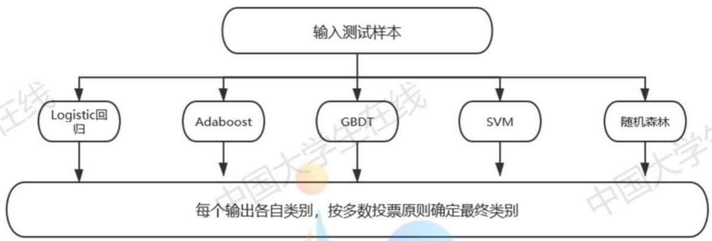
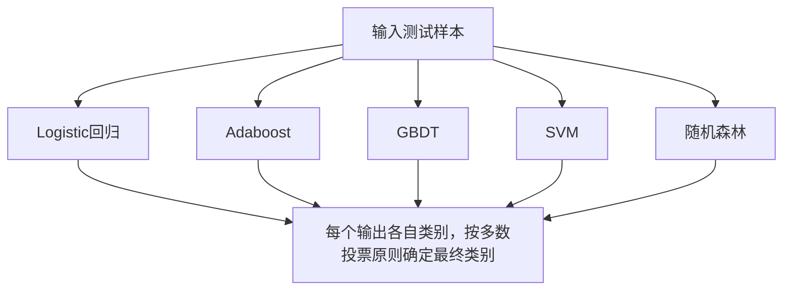
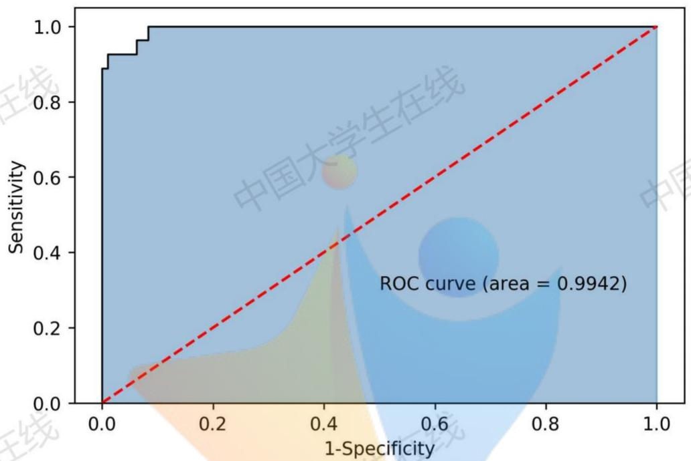
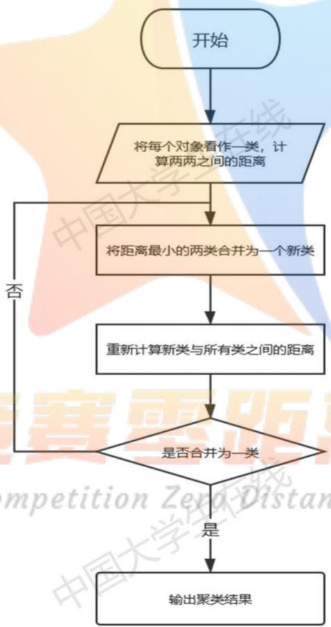
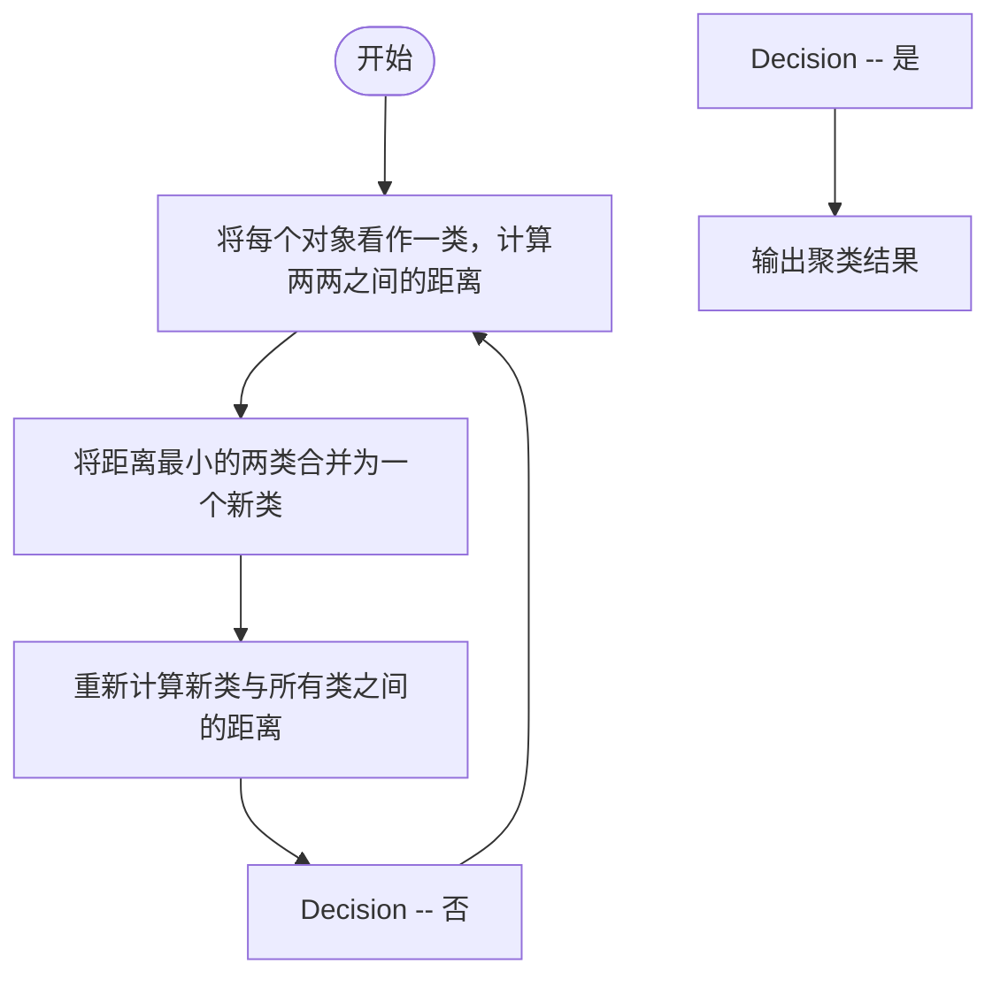
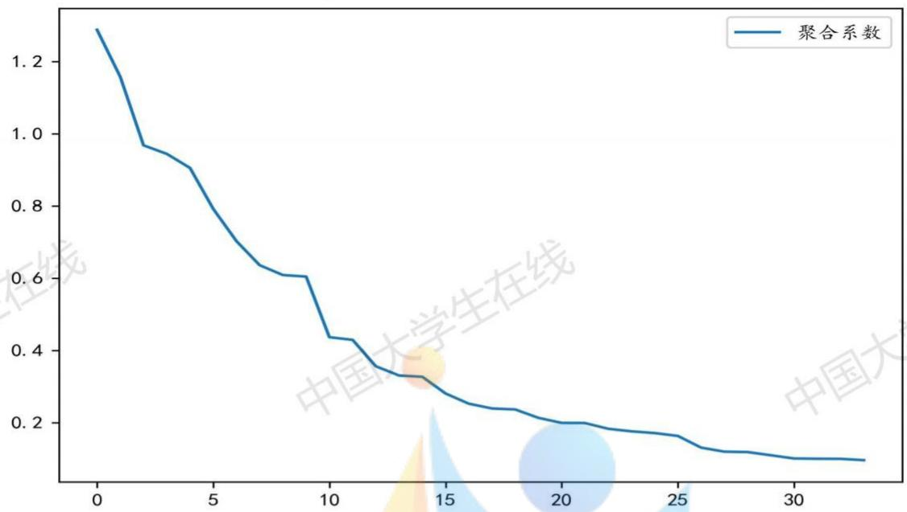

# 银行对中小微企业的信贷决策分析

## 摘要

本文研究银行如何根据中小微企业的实力、信誉对其信贷风险做出评估，然后依据信贷风险等因素来确定是否放贷及贷款额度、利率和期限等信贷策略。

针对问题一，对附件1中的数据进行特征提取，综合考虑了企业实力、发展潜力、上下游供求关系、企业抗风险能力四类指标，共提取出20个特征来衡量企业的信贷风险。本文以Logistic回归、Adaboost、GBDT、SVM和随机森林为基分类器，建立Soft Voting集成学习算法，计算企业的违约风险。Soft Voting在整个数据集上的综合准确率为97.6%，ROC曲线覆盖面积(AUC值)达到99.42%，接近完美模型，计算出的概率可信度高。根据附件1给出的信誉评级和得出的违约风险，根据银行的行为，建立一个利润最高，风险和潜在损失最小的多目标规划模型，求解得出本问的银行信贷策略。

针对问题二，由于本问为无信贷记录企业，银行需要需要根据贷款企业的已知信息和有信贷记录的信息对贷款企业进行信誉评级和违约风险判断。对附件2的数据做与附件1一样的处理，根据提取特征，使用问题一训练的Soft Voting模型对附件2企业进行违约风险预测。将违约风险加入已有特征，用有信贷记录的企业相关数据训练XGBoost模型，实现对信誉评级的多分类预测。XGBoost在训练集上综合准确率为 $87.8\%$ 。完成信誉评级和违约风险判断后，就可以进行多目标规划模型求解，得出银行的信贷策略。

针对问题三，本文以新冠疫情这个突发事件为例，综合考虑企业的信贷风险和疫情对不同企业的不同影响。从企业在疫情中面临的系统性风险和非系统性风险的角度，本文在附件2中提取行业风险、企业经营状况、利润同比增长率、废票占比变动率和交易企业数量变动率5个特征，反应新冠疫情对企业的综合影响。运用系统聚类将企业聚成3类，不同类别的企业具有不同的风险乘数 $Q_{i}$ ，风险乘数描述了疫情对不同类别企业的违约风险的放大作用。将信誉评级与聚类结果综合考虑，银行将对企业建立新的评价分级体系，将风险乘数 $Q_{i}$ 代入得到调整之后的多目标规划模型，求解可得出银行问题三情景下的信贷策略。

关键词：特征工程；集成学习算法；多目标规划；XGBoost；系统聚类

## 一、问题重述

## 1.1 问题背景

在实践中，由于中小企业规模相对较小，无较多抵押资产，银行通常根据信贷政策、企业交易票据信息以及上下游企业的影响力，向实力雄厚、供需关系稳定的企业提供贷款，对信誉好且信用风险底的企业可以给予优惠利率。银行首先根据中小企业的实力和信誉对其信用风险进行评估，然后根据信用风险等因素确定是否进行放贷和贷款额度、利率、期限等信贷策略。

## 1.2 问题提出

某银行对确定要放贷企业的贷款额度为 10-100 万元；年利率为 4%\~15%；贷款期限为 1 年。该银行请你们团队根据 2019 年统计的有无信贷记录相关企业数据和贷款利率与客户流失率关系，通过建立数学模型，解决下列问题：

（1）请对有信贷记录的公司的信贷风险进行量化分析，给出信贷总额固定情况下的信贷策略。  
（2）试对无信贷记录的公司的信贷风险进行量化分析，给出信贷总额为1亿元时的信贷策略。  
(3) 综合考虑无信贷公司的信贷风险与突发因素对企业的影响, 给出信贷总额为 1 亿元时信贷策略的调整。

## 二、问题分析

## 2.1 问题一分析

本问要求对 123 家企业的信贷风险进行量化分析，并在信贷总额固定时，给出相应信贷策略。由于信贷策略主要包括是否放贷，贷款额度，利率和期限四个方面，且期限为一年已经由题目中给出，因此我们主要是从对不同信誉等级的企业提供相应的贷款额度、利率与是否放贷来制定策略。首先本文就企业实力、对上下游企业的影响能力、发展潜力、抗风险能力等四类指标先对数据进行特征提取，共提取出 20 个相关的特征。通过运用 Voting 集成学习算法,对提取出的特征进行训练，得到每个企业的违约风险值。之后，利用题目给出的信誉评级，算出每个等级的平均违约风险，以此代表该等级企业的违约风险。最后建立以银行利润最高，银行风险最低，潜在流失客户率最小为目标的多目标非线性规划模型。求解得出银行年度信贷总额为固定金额（以 5000 万为例）银行对于不同信誉等级的企业发放的相应的贷款额度与利率。

## 2.2 问题二分析

本问要求对附件 2 的 302 家企业进行信贷风险分析，并给出信贷策略。本问与问题一的主要差别在于本问的企业无信贷记录，即无信誉评级和是否违约的数据，需要银行通过附件 2 给出的数据进行自行判断。首先运用第一问训练出的的 Voting 集成学习算法，求出 302 家企业的违约风险，对违约风险大于 50% 的企业不予放贷。要确定企业的信誉评级是一个多分类问题，将企业的违约概率这一特征与之前提取 20 个特征组成新的 21 个特征，运用 Xgboost 模型，用附件 1 所提取的特征训练模型，然后使用附件2数据对302家企业进行信誉评级，得出分类结果。最后求解多目标非线性规划模型，解出银行信贷总额为1亿元时对不同信誉等级的企业发放的相应贷款额度与利率。

## 2.3 问题三分析

本问考虑的突发事件以新冠疫情为例，不仅要考虑企业本身的信贷风险，还要考虑的疫情对企业的影响所导致企业经营困难，造成的“还贷难”问题。简而言之，新冠疫情扩大了企业的违约风险，具体的扩大倍数本文以风险乘数进行度量。考虑新冠疫情期间企业的所遭受的系统性风险和非系统性风险，在附件2中提取出行业风险、企业状况、利润同比增长率、废票占比变动率、交易企业数量变动率5个特征，反映新冠疫情对企业的影响。本文依据疫情对企业的影响程度对302家企业进行聚类分析，配合问题二所做出的信誉评级，建立一个新的综合分类评级。不同类别的企业具有不同的风险乘数 $Q_{i}$ 。在之前的多目标规划模型中，加入风险乘数 $Q_{i}$ ，对银行的风险目标进行修改，得到调整后的多目标规划模型，解出模型后得到银行在当期情况下的信贷策略。

## 三、模型假设

1、同一信誉评级下，本文认为所有企业的信贷风险一致。银行将给予相同信誉评级企业相同的贷款额度与年利率。  
2、针对有信贷记录的企业，银行根据以往的信誉评级给贷款。若该企业之前就有违约记录，则今年不予以贷款。  
3、针对无信贷记录的企业，银行根据已有信贷记录企业的数据对于无信贷记录企业进行信誉评级之后再考虑是否贷款。  
4、银行给予贷款的目标为，所得利息收益最大，承受的风险与客户流失率最小，银行根据此目标对贷款企业发放贷款额度和给予利率优惠。  
5、附件 1、2 所给交易票据数据为企业在所给时间内所有商业交易的总数据，不存在遗漏票据，可以反映企业在所给时间段内的所有可开票的商业交易活动。  
6、附件中所给出的企业均为请求银行贷款的企业，并非潜在客户，即不论利率多高附件内企业都不会放弃贷款。

## 四、符号说明

<table><tr><td>符号</td><td>含义</td></tr><tr><td> $\pi$ </td><td>企业利润</td></tr><tr><td> $M_{i}$ </td><td>总金额, $i=1$ 时代表进项, $i=2$ 时代表销项</td></tr><tr><td> $F_i$ </td><td>票据数量, i=1时代表进项, i=2时代表销项</td></tr><tr><td> $Tal_i$ </td><td>税额, i=1时代表进项, i=2时代表销项</td></tr><tr><td>Tax</td><td>企业应交增值税</td></tr><tr><td> $Num_{ij}$ </td><td>与某企业有j(j=1,...,4)年交易关系的企业数量。i=1时表示进项交易(上游企业), i=2时表示销项交易(下游企业)。</td></tr><tr><td> $GU_i$ </td><td>当i=1时,表示进项发票中作废发票的比例;当i=2时,表示销项发票中作废发票的比例。</td></tr><tr><td>An</td><td>企业利润增加的绝对数(除2020年数据)</td></tr><tr><td>Rn</td><td>企业利润增长的相对数(比例)(除2020年数据)</td></tr><tr><td>ToPro</td><td>企业是否扭亏为盈,是为1,不是则为0</td></tr><tr><td>ToLoss</td><td>企业是否变盈为亏,是为1,不是则为0</td></tr><tr><td>Under</td><td>企业是否为其他企业的下属部门,是为1,不是则为0</td></tr><tr><td>Controlled</td><td>企业是否为其他企业的分公司或子公司,是为1,不是则为0</td></tr><tr><td>Independent</td><td>企业是否为独立公司,是为1,不是则为0</td></tr><tr><td>Individual</td><td>企业是否为个体经营,是为1,不是则为0</td></tr><tr><td>Grade</td><td>企业信誉评级,分A,B,C,D四个等级分别为1,2,3,4四个值</td></tr><tr><td>Break</td><td>企业是否违约,是为1,不是则为0</td></tr><tr><td> $Accuracy_i$ </td><td>第i个基分类器的综合准确率</td></tr><tr><td> $W_i$ </td><td>第i个基分类器投票所占权重</td></tr><tr><td> $\overline{\sigma}_{i}$ </td><td>第i类企业的平均风险</td></tr><tr><td> $I_{i}$ </td><td>i类企业的利率, $i=1,...,3$ </td></tr><tr><td> $P_{i}$ </td><td>i类企业的贷款额度, $i=1,...,3$ </td></tr><tr><td> $C_{i}$ </td><td>i类企业的数量, $i=1,...,3$ </td></tr><tr><td> $Lost(I_{i})$ </td><td>利率 $I_{i}$ 下的i类企业的潜在客户流失率</td></tr><tr><td> $Con_{i}$ </td><td>第i个企业在2020年1至2月的盈利状况,若盈利则为1,无交易为0,亏损为-1, $i=1,...,302$ </td></tr><tr><td> $YG_{i}$ </td><td>第i个企业的利润在2020年1至2月的同比增长率, $i=1,...,302$ </td></tr><tr><td> $Error_{ij}$ </td><td>第i个企业2020年1至2月较2019年同期进项/销项作废和负数票据所占比例的变动率, $i=1,...,302$ , $j=1,2$ </td></tr><tr><td> $Tp_{ij}$ </td><td>第i个企业2020年1至2月较2019年同期进项/销项交易对象数量的变动率, $i=1,...,302$ , $j=1,2$ </td></tr><tr><td> $Ir_{i}$ </td><td>第i个企业所在行业的受疫情打击的程度, $i=1,...,302$ </td></tr><tr><td> $CC_{ij}$ </td><td>第i个企业进项/销项交易的交易对象数量</td></tr><tr><td> $Q_{i}$ </td><td>第i类企业的风险乘数</td></tr></table>

## 五、问题一建模与求解

## 5.1 数据预处理

我们对于附件 1 的数据，运用 Python 的 pandas 库，找出缺失值。若有缺失值，可删除有缺失值的样本或特征，或对缺失值进行填补。检查数据是否存在缺失值或者NAN现象，通过简单的查看可知该题数据不存在缺失，无需进行缺失值处理。

## 5.2 数据特征提取

根据附件一所给出的数据，结合相关文献和题目，本文认为银行放贷额度与利润率的选择主要受企业自身实力、发展前景和对上下游企业的影响力这三个方面进行评估。根据附件一所给信息，本文就四个方面总共提取了20个特征，用以衡量银行对企业信誉等级的评判，以此来衡量企业贷款的信贷风险。

## 5.2.1 企业实力

由前文假设可知，附件所给数据完整，保护所给日期内企业所有的交易事项，故根据进项和销项发票的金额，我们可以得出企业在所给日期之内所得利润总额 $\pi$ 。公式如下：

$$
\pi = M _ {2} - M _ {1}
$$

利润总额越高，企业盈利能力越强，银行可提供贷款额度可相应提升，利率应该相应降低；根据有效进项与销项发票的税额，我们可以得出企业在所给日期之内的增值税Tax，公式如下：

$$
T a x = T a l _ {2} - T a l _ {1}
$$

此处我们对增值税为负的情况置零；根据每个公司与上下游企业的无效票据与有效票据，我们可以得出在所给日期内的作废票据比 $GU_{i}(i=1,2)$ ，公式如下：

$$
G U _ {1} = \frac {F _ {1}}{F _ {1} + F _ {2}}
$$

$$
G U _ {2} = \frac {F _ {2}}{F _ {1} + F _ {2}}
$$

作废票据比越高，即银行信贷风险越高，因此需要适当降低公司信誉等级，减少信贷额度，提高利率。

## 5.2.2 企业对上下游企业的影响力

根据附件1所给的开票日期判断各个企业与其上下游企业合作的时间长度由此来判断供应链的强度。强度与粘性越大，即代表企业对于上下游企业的影响力越大。对于这种企业银行可适当提高贷款额度，降低利率。据此，我们用 $Num_{ij}$ 对其进行衡量，其中i=1,2，j=1,2,3,4。当i=1时，表示该企业与上游企业的进项交易，i=2时，表示该企业与下游企业的销项交易，j表示与该企业有j年合作关系的企业数

量。

## 5.2.3 企业的发展潜力

对于企业的未来发展潜力，本文根据题目所提供的数据，分别求出每个企业的利润绝对数的变化 $An$ 和相对数的变化 $Rn$ 。因为考虑到2020年的数据并不为全年数据，所以在计算这两个指标的时候剔除了2020年的票据数据。

$$
\begin{array}{l} A n = \pi_ {\text {第一年}} - \pi_ {\text {最后一年}} \\ R n = \frac {\pi_ {\text {第一年}}}{\pi_ {\text {最后一年}}} \\ \end{array}
$$

综合 $An$ 和 $Rn$ 两者可得出企业的经营是否发生最大变化, 即得出企业是否扭亏为盈或者由盈转亏。当 $Rn$ 小于 0 时, 则代表企业利润发生了正负转变, 这时候需要观察 $An$ 。当 $An$ 大于 0 时, 说明企业最近年份利润为正而最早年份利润为负, 企业扭亏为盈, 即 $ToPro$ 为 1 , 反之为 0 ; 当 $An$ 小于 0 时, 说明企业最近年份利润为负而最早年份利润正, 企业由盈转亏, 即 $ToLoss$ 为 1 , 反之为 0 。针对扭亏为盈的企业, 银行可适当提高贷款额度与降低利率, 针对扭赢为亏的企业, 银行可适当降低贷款额度与提高利率。

## 5.2.4 企业的抗风险能力

根据附件 1 所给数据可以明显看出不同企业可分为本身母公司，公司旗下子公司，下属部门与个体经营。每个不同企业的抗风险能力都不尽相同。因此我们将这四种情况分别作为四种特征值，将所有企业划分为四种情况内。当公司为独立公司时，Independent 为 1，当公司为个体经营，Individual 为 1，当公司为子公司时，

Controlled 为 1，当公司为下属部门，Under 为 1。

## 5.3 信贷风险评分模型

## 5.3.1 模型选择

信用风险的度量方法主要有传统信用风险度量方法和现代信用度量方法，因为现代信用风险度量方法运用了大量财务数据，受本题条件所限，本文主要参考传统信用评分方法中的多元非线性回归模型。传统的风险测度中，一般使用 Logistics 回归或 Probit 回归计算企业的违约概率，以此来度量企业信贷风险[1][2]。经过查询文献，亦有文献使用神经网络和机器学习的其他算法进行风险测量[3]，所以本文拟采取集成多个机器学习算法的方式，对附件 1 中的 123 家企业进行信贷风险度量。

## 5.3.2 数据选择与处理

将企业的信誉评级数据进行数据编码，若信誉评级为A，则Grade $= 1$ ；若信誉评级为B，则Grade $= 2$ ；若信誉评级为C，则Grade $= 3$ ；若信誉评级为D，则

$$
G r a d e = 4 \text {。}
$$

模型将使用前文从附件一中提取出20个特征，共123个样本进行训练。使用Python将数据随机切分为训练集和测试集，并以原数据为标准，对训练集和测试集数据进行标准化，将数据处理至0到1之间。

## 5.3.3 模型建立

投票(voting)是在分类算法中广泛运用的集成学习算法之一。投票主要有硬投票(Hard voting)和软投票(Soft voting)两种。硬投票是一种特殊的软投票，即各基分类器权重相同的投票，其原理为多数投票原则：如果基分类器的某一分类结果超过半数，则集成算法选择该结果；若无半数结果则无输出。软投票的原理也为多数投票，但是各基分类器投票所占的权重可自己定义。当各基分类器分类效果差异比较大时，应当选择软投票，给予分类性能更好的基分类器更大的权重，以此优化分类结果。

本文所选择的 5 个基分类器分别为 Logistic 回归，Adaboost，GBDT，SVM 和随机森林。Logistic 回归为传统信贷风险评级中常用的模型，该模型的核心为 Logit 函数，即： $g(z)=\frac{1}{1+e^{-z}}$ ，通过极大似然估计求解对应参数，将分类问题转化为概率问题映射至(0,1)区间。在传统的信用风险评分中，Logistic 回归的准确率能达到 54%—92%。

Adaboost, GBDT 和随机森林都是基于 boosting 算法的分类器, 分类结果较为理想, 模型具有较强的泛化能力。Adaboost 首先赋予 n 个训练样本相同的权重, 从而训练出一个基分类器, 之后进行预先设置的 T 次迭代, 每次迭代将前一次分类器中分错的样本加大权重, 使得在下一次迭代中更加关注这些样本, 从而调整权重改善分类器, 经过 T 次迭代得到 T 个基分类器, 最终将这些基分类器线性组合得到最终分类器模型。[4] GBDT 分类首先初始化一个弱分类器, 计算损失函数的负梯度值值, 再利用数据集拟合下一轮模型, 重复计算负梯度值和拟合过程, 利用 m 个基础模型, 构建梯度提升树。[5]随机森林则选取了大量的决策树模型, 各决策树独立的做出学习并进行分类, 最后将分类结合为一个最终的结果, 其优于单个决策树做出的分类结果。

SVM 是较为强大的传统机器学习算法。它将低维线性不可分的空间转换为高维线性可分的空间。本文主要应用非线性的 SVM 模型，其目标函数为：

$$
\left\{ \begin{array}{l} \min_ {a} \left(\frac {1}{2} \sum_ {i = 1} ^ {n} \sum_ {j = 1} ^ {n} a _ {i} a _ {j} y _ {i} y _ {j} \left(\oint (x _ {i}) * \oint (x _ {j})\right) - \sum_ {i = 1} ^ {n} a _ {i}\right) \\ s. t. \quad \sum_ {\substack {i = 1 \\ 0 \leqslant a _ {i} \leqslant C}} ^ {n} a _ {i} y _ {i} = 0 \end{array} \right.
$$

将内积 $\oint (x_i)^*\oint (x_j)$ 使用核函数替换，计算最优的 $a_{i}$ ，可以得出超平面的 $w$ 和 $b$ 值。



<details>
<summary>flowchart</summary>


</details>

图 1 Voting 模型图解

## 5.3.4 模型求解

首先对 5 个基分类进行数据拟合和调参，选取较优参数，得出 5 个基分类器在改数据集上表现，如下表所示：

表 1 基分类器分类效果

<table><tr><td>分类器</td><td>测试集准确率</td><td>训练集准确率</td><td>综合准确率</td><td>AUC值</td></tr><tr><td>Logistic 回归</td><td>0.839</td><td>0.902</td><td>0.886</td><td>0.754</td></tr><tr><td>Adaboost</td><td>0.903</td><td>0.913</td><td>0.911</td><td>0.822</td></tr><tr><td>GBDT</td><td>0.806</td><td>1</td><td>0.951</td><td>0.942</td></tr><tr><td>SVM</td><td>0.871</td><td>0.978</td><td>0.951</td><td>0.889</td></tr><tr><td>随机森林</td><td>0.871</td><td>1</td><td>0.967</td><td>0.953</td></tr></table>

从表 1 可以看出，训练集和测试集效果最接近的为 Adaboost，其余的分类器有程度不一样的过拟合现象。在整体上，Logistic 回归明显略逊一筹，后三个分类器的结果较为接近，主要是三个分类器在训练集上都有良好的表现，而训练集数据占到了整体数据的 7 成。

然而仅从准确率的角度判断分类模型的结果是有失偏颇的，并且本文的目的是，所以本文加入了 AUC 值进行参考。AUC 值为 ROC 曲线覆盖的面积，其含义可以综合的考虑召回率(recall)，精确率(precision)和准确率(accuracy)多种指标，一般 AUC 值达到 0.8 以上分类模型可以接受，从这个角度来看，Logistic 回归不符合要求。

因为各个基分类器的分类效果不一样，所以本文选择软投票，依据分类器在整体数据上的综合准确率来判断各基分类器的权重，公式为：

$$
W _ {i} = \frac {\text {Accuracy} _ {i}}{\sum_ {i = 1} ^ {5} \text {Accuracy} _ {i}} \tag {1}
$$

软投票分类结果如下表，

表 2 软投票结果

<table><tr><td>分类器</td><td>测试集准确率</td><td>训练集准确率</td><td>综合准确率</td><td>AUC值</td></tr><tr><td>Soft Voting</td><td>0.903</td><td>1</td><td>0.976</td><td>0.994</td></tr></table>

可以看出，Soft Voting 在分类上的表现十分完美，非常接近完美分类器，说明集成学习算法在此数据集上有着优秀的表现。



<details>
<summary>roc</summary>

| 1-Specificity | Sensitivity |
| --- | --- |
| 0.0 | 0.0 |
| ~0.01 | ~0.88 |
| ~0.02 | ~0.92 |
| ~0.05 | ~0.96 |
| ~0.08 | 1.0 |
| 1.0 | 1.0 |
</details>

图 2 Soft Voting 的 ROC 曲线图

Voting 模型不仅可以判断出企业是否户违约，并且可以给出企业违约的概率，本文将在后文以此作为对企业的信贷风险的度量。依据信誉评级分类，对不同类别企业的违约风险进行描述性统计分析，表格如下：

表 3 不同信誉评级下违约风险的描述性统计分析

<table><tr><td>信誉评级</td><td>Count</td><td>Mean</td><td>Std</td><td>Min</td><td>Max</td></tr><tr><td>A</td><td>27</td><td>0.145</td><td>0.068</td><td>0.079</td><td>0.435</td></tr><tr><td>B</td><td>38</td><td>0.182</td><td>0.108</td><td>0.101</td><td>0.757</td></tr><tr><td>C</td><td>34</td><td>0.209</td><td>0.147</td><td>0.088</td><td>0.638</td></tr><tr><td>D</td><td>24</td><td>0.710</td><td>0.170</td><td>0.237</td><td>0.882</td></tr></table>

## 5.4 信贷策略多目标规划模型

## 5.4.1 模型分析

根据假设 2，银行将对信誉评级在 C 及其以上并且之前没有违约记录的的企业发放贷款，即符合条件的企业共有 96 家，其中 A 级企业 27 家，B 级企业 37 家和 C 级企业 32 家。银行的放贷决策需要考虑自身利益，即综合的考虑收益和风险，决定对各级企业的放贷额度和利率优惠，这将自然转化为一个多目标规划问题。

首先，由假设1可知银行认为同种信誉评级下的企业的违约风险一直，且在前文中已经求出了每种类别的平均违约风险 $\overline{\sigma_{i}}$ ，故由每类企业的 $\overline{\sigma_{i}}$ 代表该类信誉评级下企业的违约风险。

## 5.4.2 模型建立与求解

收益目标：银行的目标之一为收益最大化，银行给予企业贷款得到的收益是利息收益，即

$$
\max \sum_ {i = 1} ^ {3} C _ {i} * I _ {i} * P _ {i} \tag {2}
$$

风险目标：银行的目标之一为风险最小，如果企业违约，即银行不仅收不回利息，也收不回本金，所以银行希望最小化损失，即

$$
\min \sum_ {i = 1} ^ {3} C _ {i} * \overline {{\sigma_ {i}}} * P _ {i} * \left(1 + I _ {i}\right) \tag {3}
$$

潜在损失目标：银行会因为调高利率，而流失潜在客户，这些流失的客户也对银行造成了潜在损失，银行也希望吸引更多的企业来贷款，可以获得更多的利息收益。由假设6可知，已知附件来贷款的企业的数量，通过利率可以算出流失的潜在客户

数，即 $\frac{C_i * Lost(I_i)}{1 - Lost(I_i)}$ 。若流失了一个潜在客户，则银行就失去了贷款从而获得利息的机会，银行希望这笔损失最小，即

$$
\min \sum_ {i = 1} ^ {3} \frac {C _ {i} * \text {Lost} \left(I _ {i}\right)}{\text {Lost} \left(I _ {i}\right)} * I _ {i} * P _ {i} \tag {4}
$$

查阅资料，我们发现银行有对贷款额度进行分级的实践，不同信用等级的企业能贷的最大贷款和最低利率不同，所以银行应该对信用等级高的企业优先给予贷款，且提供数额较大，利率较低的贷款，以满足银行对收益和风险的追求。本文因此对不同信誉评级的企业贷款的额度和利率的上下限做出规定，以此来规范贷款行为，具体规则如下：

表 4 不同信誉等级下的贷款限制

<table><tr><td>信誉评级</td><td>利率下限</td><td>贷款额度上限</td></tr><tr><td>A</td><td>4%</td><td>100</td></tr><tr><td>B</td><td>7.5%</td><td>70</td></tr><tr><td>C</td><td>11%</td><td>40</td></tr></table>

综上所述，银行在贷款额度为固定数额的约束下（本问定为 5000 万），要使得满足上述三个目标，将上述三个目标转化为单一目标，列式可得：

$$
\min \sum_ {i = 1} ^ {3} C _ {i} * \bar {\sigma_ {i}} * P _ {i} * \left(1 + I _ {i}\right) + I _ {i} * P _ {i} * \frac {C _ {i} * \text {Lost} \left(I _ {i}\right)}{1 - \text {Lost} \left(I _ {i}\right)} - C _ {i} * I _ {i} * P _ {i}
$$

$$
s. t. \left\{ \begin{array}{l} \sum_ {i = 1} ^ {3} C _ {i} * P _ {i} = 5 0 0 0 0 0 0 0 \\ 0. 0 4 \leqslant I _ {1} \leqslant 0. 1 5 \\ 0. 0 7 5 \leqslant I _ {2} \leqslant 0. 1 5 \\ 0. 1 1 \leqslant I _ {3} \leqslant 0. 1 5 \\ 1 0 0 0 0 0 \leqslant P _ {1} \leqslant 1 0 0 0 0 0 0 \\ 1 0 0 0 0 0 \leqslant P _ {2} \leqslant 7 0 0 0 0 0 \\ 1 0 0 0 0 0 \leqslant P _ {1} \leqslant 4 0 0 0 0 0 \end{array} \right. \tag {5}
$$

运用 MATLAB 求解可得:

$$
I _ {1} = 0. 0 5 8 5, I _ {2} = 0. 0 7 5, I _ {3} = 0. 1 1
$$

$$
P _ {1} = 9 9 9 9 0 5, P _ {2} = 5 3 5 1 7 8, P _ {3} = 1 0 0 0 3 0
$$

故对于附件一中队 123 家企业，银行的信贷策略是，对 D 级企业和有违约经历的企业拒绝提供贷款；剩下的企业中，对 A 级企业提供利率为 5.85%，额度为 999905 元的贷款；对 B 级企业提供利率为 7.5%，额度为 535178 元的贷款；对 C 级企业提供利率为 11%，额度为 100030 元的贷款。

## 六、问题二建模与求解

## 6.1 数据处理与编码

对附件 2 进行和附件 1 一样的数据处理方式，提取出问题一所列的 20 个特征。

将企业的信誉评级数据进行编码，若信誉评级为 A，则 Grade = 1；若信誉评级为 B，则 Grade = 2；若信誉评级为 C，则 Grade = 3；若信誉评级为 D，则 Grade = 4。

## 6.2 模型建立

## 6.2.1 违约风险预测

根据问题一所训练的 Voting 模型，运用附件 2 中所提取的 20 个特征进行预测附件 2 中 302 家企业的违约风险，判断企业是否会违约。

最终得到 302 个违约风险中，有 34 家企业的违约风险超过了 50%，即认为会违约，银行将不会向他们提供贷款。

## 6.2.2 信誉评级鉴定

在问题一中，我们已知 123 家企业的信誉评级并以此来确定贷款的发放，但本问的企业由于没有信贷记录，所以没有信誉评级。依据假设 3，银行将通过附件提供数据对企业进行信誉评级，然后据此做出信贷策略。基于 XGBoost 的在分类问题上的良好表现，本问将使用XGBoost模型进行对企业进行信誉评级。

XGBoost 是一种 Boosting 型的树集成模型，在梯度提升决策树 GBDT 基础上扩展，能够进行多线程并行计算，通过迭代生成新树，即可将多个分类性能较低的弱学习器组合为一个准确率较高的强学习器。XGBoost 采用随机森林对字段抽样，将正则项引入损失函数中，从而防止模型过拟合，并降低模型计算量。具体算法步骤如下：

1、优化目标。假设模型具有 $k$ 个决策树，即：

$$
\widehat {y _ {i}} = \sum_ {i = 1} ^ {k} f _ {k} (x _ {i}), \quad f _ {k} \in F
$$

上式中， $x_{i}$ 是第 $i$ 个输入样本； $y_{i}$ 为经过映射关系 $f_{k}$ 计算出的预测值； $F$ 为所有映射关系集合。优化目标以及损失函数为：

$$
L (t) = \sum_ {i = 1} ^ {n} l \big [ y _ {i}, \hat {y} (t - 1) _ {i} + f _ {t} (x _ {i}) \big ] + \Omega (f _ {t})
$$

上式中， $L(t)$ 为第 $t$ 次迭代时目标函数， $n$ 为样本数量， $I$ 为损失函数， $\hat{y} (t - 1)_i$ 为第 $t - 1$ 次迭代时模型的预测值， $f_{t}(x_{i})$ 为新加入的函数， $\Omega (f_t)$ 为正则项。

2、对 $L(t)$ 进行二阶泰勒展开和移除常数项操作后可得：

$$
\tilde {L} (t) \cong \sum_ {j = 1} ^ {T} \left[ \left(\sum_ {i \in I _ {j}} d _ {i}\right) w _ {j} + \frac {1}{2} \left(\sum_ {i \in I _ {j}} g _ {i} + \lambda\right) w _ {j} ^ {2} \right] + \gamma N
$$

上式中， $d_{i}$ 为 $l$ 对 $\hat{y} (t - 1)_i$ 的一阶导数； $g_{i}$ 为对 $\hat{y} (t - 1)_i$ 的二阶导数， $N$ 为叶子节点个数， $I_{j}$ 为每个叶子结点上样本集合， $w^{2}_{j}$ 为每个叶子结点分数的 $L_{2}$ 模的平方， $\lambda$ 和 $\gamma$ 则为比重系数，防止产生过拟合[3]。

调用 Python 的 xgboost 库，对 21 个特征（附件 2 提取出的 20 个特征加上是否违约）进行训练。XGBoost 在附件 1 上的综合准确率为 0.878，在多分类问题中表现较好。

将信誉评级的分类结果和违约风险的分类结果进行比较验证，发现所有的D级企业均为预测会违约企业，除此之外只有两个C级企业预测会违约。两个不同模型训练的结果较为相近，进一步验证了本问分类的精确性。

详细分类结果见附录。

## 6.3 信贷策略目标规划

根据 Xgboost 算法对 302 家企业进行的信誉分类以及假设 2，银行将对符合标准的 268 家企业进行贷款发放。其中 A 类企业有 63 家，B 类企业有 103 家，C 类企业有 102 家。本问仍然使用问题一中对不同信誉评级的贷款限制，调整后的信贷策略目标规划模型如下：

$$
\min \sum_ {i = 1} ^ {3} C _ {i} * \overline {{\sigma_ {i}}} * P _ {i} * (1 + I _ {i}) + I _ {i} * P _ {i} * \frac {C _ {i} * L o s t (I _ {i})}{L o s t (I _ {i})} - C _ {i} * I _ {i} * P _ {i}
$$

$$
s. t. \left\{ \begin{array}{l} \sum_ {i = 1} ^ {3} C _ {i} * P _ {i} = 1 0 0 0 0 0 0 0 0 \\ 0. 0 4 \leqslant I _ {1} \leqslant 0. 1 5 \\ 0. 0 7 5 \leqslant I _ {2} \leqslant 0. 1 5 \\ 0. 1 1 \leqslant I _ {3} \leqslant 0. 1 5 \\ 1 0 0 0 0 0 \leqslant P _ {1} \leqslant 1 0 0 0 0 0 0 \\ 1 0 0 0 0 0 \leqslant P _ {2} \leqslant 7 0 0 0 0 0 \\ 1 0 0 0 0 0 \leqslant P _ {1} \leqslant 4 0 0 0 0 0 \end{array} \right. \tag {6}
$$

运用 MATLAB 求解可得:

$$
I _ {1} = 0. 0 7 0 5, I _ {2} = 0. 0 7 5 2, I _ {3} = 0. 1 1 0 1
$$

$$
P _ {1} = 9 9 9 7 1 7, P _ {2} = 2 6 0 3 2 0, P _ {3} = 1 0 0 0 4 8
$$

故对于附件二中的 302 家企业，银行的信贷策略是：对 D 级企业和有违约经历的企业拒绝提供贷款；剩下的企业中，对 A 级企业提供利率为 7.05%，额度为 999717 元的贷款；对 B 级企业提供利率为 7.52%，额度为 260320 元的贷款；对 C 级企业提供利率为 11.01%，额度为 100048 元的贷款。

## 七、问题三建模与求解

## 7.1 风险及其传导机制

本问加入了突发因素，需要考虑突发因素对企业的影响。根据题目所给数据，本问的突发事件确定为新冠疫情。本问需要综合考虑企业之前的信贷风险和新冠疫情对企业的冲击。

本文认为新冠疫情的爆发会影响企业的违约风险。新冠疫情首先对不同行业的企业有不同程度的影响，这属于系统风险的一种，是企业如果所处其行业必然会受到的影响，即疫情对行业的打击程度。

但是企业自身的特殊性，可能同一行业的不同企业在疫情期间有不同的境遇，这属于非系统性风险，是由企业本身的特殊性所决定的，在数据上可以反映为企业在疫情期间的利润状况、较去年同期的同比增长率、废票所占比增长率和上下游供求企业数量的变化等等。

本文根据企业所受系统性风险（行业风险）和非系统性风险（自身表现）对企业的进行聚类分析，同一类别的企业拥有相同的风险乘数 $Q_{i}$ ，代表该类企业的违约风险较疫情未发生时增大的多少。银行将风险乘数加入信贷策略的目标规划模型，重新制定信贷策略。

## 7.2 数据处理和特征提取

## 7.2.1 企业状况

由于我们考虑疫情对企业的影响，因此我们主要对企业2020年1、2月份的盈利进行评估。用2020年1、2月份的销项金额减去进项金额即为盈利情况 $\pi$ 。

当 $\pi>0$ 时，公司盈利，令 $Con_{i}$ 为1；当 $\pi=0$ 时，则公司没有在2020年进行交易，令 $Con_{i}$ 为0；当 $\pi<0$ 时，公司亏损，令 $Con_{i}$ 为-1。

## 7.2.2 利润同比增长率

通过计算 2020 年 1, 2 月份的企业利润 $\pi$ 与 2019 年 1, 2 月份的企业利润 $\pi$ ，可以得出企业 2020 年 1, 2 月份的利润同比增长率 $YG_{i}(i=1,\ldots,302)$ 。公式如下：

$$
Y G _ {i} = \frac {\pi_ {i , 2 0 2 0} - \pi_ {i , 2 0 1 9}}{\pi_ {i , 2 0 1 9}}
$$

## 7.2.3 废票占比变动率

废票指的时公司所开的无效票据与负数票据之和。由于负数票据是对冲掉企业之前已经入账的票据，一张负数票据其实代表了至少有两张票据是作废票据。废票占比变动率 $Error_{ij}(i=1,\ldots,302,j=1,2)$ 即为2020年1，2月份的企业废票与总票据比例较2019年1，2月份企业废票与总票据比例的变动率，公式如下：

$$
E r r o r _ {i j} = \frac {G U _ {i , 2 0 1 9} - G U _ {i , 2 0 1 9}}{G U _ {i , 2 0 1 9}}
$$

## 7.2.4 交易企业数量变动率

交易企业数量变动率 $Tp_{ij}(i=1,\ldots,302,j=1,2)$ 是指的公司在受疫情影响情况下，与公司交易企业数量的变动程度。公式如下：

$$
T p _ {i j} = \frac {C C _ {i j , 2 0 2 0} - C C _ {i j , 2 0 1 9}}{C C _ {i j , 2 0 1 9}}
$$

## 7.2.5 行业风险

通过国家对于行业的标准化分类方法，本文通过观察企业名称将302家企业一共分为了13个行业。针对其中12个行业，我们通过查询同花顺上的行业股票数据，得到了12个行业股票指数2020年2个月的增长率，用以衡量行业打击程度大小。额外的一个行业中的企业均为为个体经营企业，根据第一财经发布的调研报告[6]，个体经营企业预期降幅约为 $1 / 3$ ，本文以此数据作为对行业风险的度量。 $Ir_{i}$ 计算公式如下：

$$
I r _ {i} = \frac {2 0 2 0 \text {年} 2 \text {月底股票额} - 2 0 2 0 \text {年} 1 \text {月初股票额}}{2 0 2 0 \text {年} 1 \text {月初股票额}}
$$

## 7.3 聚类模型

本文将上面计算的 5 种特征，作为系统聚类的依据。系统聚类首先将每一个样本都分为一类，然后不断计算子类与子类之间的距离，逐渐将所有的子类合并为一个大类。系统聚类算法的流程如下图所示。



<details>
<summary>flowchart</summary>


</details>

图 3 系统聚类流程图

将数据代入 SPSS，进行系统聚类，为了确定聚类类别 $K$ ，画出聚类系数的折线图如下。



<details>
<summary>line</summary>

| X | 聚合系数 |
| --- | --- |
| 0 | ~1.3 |
| 2 | ~0.97 |
| 4 | ~0.9 |
| 6 | ~0.7 |
| 8 | ~0.64 |
| 9 | ~0.61 |
| 10 | ~0.6 |
| 11 | ~0.44 |
| 12 | ~0.43 |
| 13 | ~0.35 |
| 14 | ~0.33 |
| 15 | ~0.32 |
| 16 | ~0.28 |
| 18 | ~0.24 |
| 20 | ~0.23 |
| 22 | ~0.21 |
| 24 | ~0.19 |
| 25 | ~0.18 |
| 26 | ~0.17 |
| 27 | ~0.13 |
| 28 | ~0.12 |
| 30 | ~0.11 |
| 32 | ~0.1 |
</details>

图 4 聚类系数折线图

根据聚合系数折线图，可以看出，令K=3，聚类效果最好。得出聚类结果后，对聚类的结果分别进行描述性统计分析，可得下面三表。

表 5 类别 1 企业特征描述性统计分析

<table><tr><td>指标</td><td> $Con_i$ </td><td> $YG_i$ </td><td> $Error_{i1}$ </td><td> $Error_{i1}$ </td><td> $Tp_{i1}$ </td><td> $Tp_{i2}$ </td><td> $Ir_i$ </td></tr><tr><td>count</td><td>239</td><td>239</td><td>239</td><td>239</td><td>239</td><td>239</td><td>239</td></tr><tr><td>mean</td><td>0.996</td><td>-1.539</td><td>0.031</td><td>0.115</td><td>3.987</td><td>7.130</td><td>-0.120</td></tr><tr><td>min</td><td>0</td><td>-159.795</td><td>0</td><td>0</td><td>-1</td><td>-1</td><td>-0.33</td></tr><tr><td>max</td><td>1</td><td>33.787</td><td>0.25</td><td>0.839</td><td>116</td><td>101</td><td>0.126</td></tr></table>

表 6 类别 2 企业特征描述性统计分析

<table><tr><td>指标</td><td> $Con_i$ </td><td> $YG_i$ </td><td> $Error_{i1}$ </td><td> $Error_{i1}$ </td><td> $Tp_{i1}$ </td><td> $Tp_{i2}$ </td><td> $Ir_i$ </td></tr><tr><td>count</td><td>59</td><td>59</td><td>59</td><td>59</td><td>59</td><td>59</td><td>59</td></tr><tr><td>mean</td><td>-0.932</td><td>0.301</td><td>0.033</td><td>0.116</td><td>1.458</td><td>6.677</td><td>-0.09</td></tr><tr><td>min</td><td>-1</td><td>-3.586</td><td>0</td><td>0</td><td>-1</td><td>-1</td><td>-0.33</td></tr><tr><td>max</td><td>0</td><td>9.020</td><td>0.125</td><td>0.734</td><td>27</td><td>93</td><td>0.126</td></tr></table>

表 7 类别 3 企业特征描述性统计分析

<table><tr><td>指标</td><td> $Con_i$ </td><td> $YG_i$ </td><td> $Error_{i1}$ </td><td> $Error_{i1}$ </td><td> $Tp_{i1}$ </td><td> $Tp_{i2}$ </td><td> $Ir_i$ </td></tr><tr><td>count</td><td>4</td><td>4</td><td>4</td><td>4</td><td>4</td><td>4</td><td>4</td></tr><tr><td>mean</td><td>-1</td><td>1</td><td>0.047</td><td>0.934</td><td>-1</td><td>-1</td><td>-0.33</td></tr><tr><td>min</td><td>-1</td><td>1</td><td>0.019</td><td>0.909</td><td>-1</td><td>-1</td><td>-0.33</td></tr><tr><td>max</td><td>-1</td><td>1</td><td>0.067</td><td>0.955</td><td>-1</td><td>-1</td><td>-0.33</td></tr></table>

综合上三表数据，类别1的企业大部分为2020年依然盈利或者不盈不亏；平均 $Error_{i1}$ 较小， $Tp_{ij}$ 大部分为正且数值较大，说明该类企业在疫情期间虽然盈利少于之前，但是供求关系仍然稳定甚至订单数较去年同期更多；类别2的企业大部分为亏损状态， $Error_{i1}$ 和 $Tp_{ij}$ 的表现差于类别1的企业；类别3的企业只有4个，且全为高风险，差表现的个体经营企业。

根据以上聚类出的三类行业的表现，本文设置其对应的风险乘数为：

$$
Q _ {1} = 1. 2, Q _ {2} = 1. 5, Q _ {3} = 2
$$

## 7.4 信贷策略

在问题二中本文将企业依据信誉评级分为4类，本问中根据疫情对企业的影响将企业分为3类，理论来说企业被分为了12类。但在银行的信贷策略中，对认为将违约和D级企业不放贷款且聚类结果的类别3全为D即企业，对数据进行观察可知，数据被分为6类，银行也将根据信誉评级和聚类结果，建立一个新的评价分级体系，记为 $A_{1},A_{2},B_{1},B_{2},C_{1},C_{2}$ 。将风险乘数 $Q_{i}$ 加入信贷目标规划模型，调整企业风险，例如对于 $A_{1}$ 类企业，其风险为 $(1+Q_{1})^{*}\overline{\sigma_{A}}$ 。建立调整后的多目标规划模型如下：

$$
m i n \sum_ {i = 1} ^ {3} \sum_ {j} C _ {i} * (1 + Q _ {j}) \overline {{\sigma_ {i}}} * P _ {i} * (1 + I _ {i}) + I _ {i} * P _ {i} * \frac {C _ {i} * L o s t (I _ {i})}{1 - L o s t (I _ {i})} - C _ {i} * I _ {i} * P _ {i}
$$

$$
\text {s.t.} \left\{ \begin{array}{l} \sum_ {i = 1} ^ {6} C _ {i} * P _ {i} = 1 0 0 0 0 0 0 0 \\ 0. 0 4 \leqslant I _ {1} \leqslant 0. 1 5 \\ 0. 0 5 8 \leqslant I _ {2} \leqslant 0. 1 5 \\ 0. 0 7 6 \leqslant I _ {3} \leqslant 0. 1 5 \\ 0. 0 9 4 \leqslant I _ {4} \leqslant 0. 1 5 \\ 0. 1 1 2 \leqslant I _ {5} \leqslant 0. 1 5 \\ 0. 1 3 \leqslant I _ {6} \leqslant 0. 1 5 \\ 1 0 0 0 0 0 \leqslant P _ {1} \leqslant 1 0 0 0 0 0 0 \\ 1 0 0 0 0 0 \leqslant P _ {2} \leqslant 8 5 0 0 0 0 \\ 1 0 0 0 0 0 \leqslant P _ {1} \leqslant 7 0 0 0 0 0 \\ 1 0 0 0 0 0 \leqslant P _ {4} \leqslant 5 5 0 0 0 0 \\ 1 0 0 0 0 0 \leqslant P _ {5} \leqslant 4 0 0 0 0 0 \\ 1 0 0 0 0 0 \leqslant P _ {6} \leqslant 2 5 0 0 0 0 \end{array} \right. \tag {7}
$$

使用 MATLAB 的 fmincon 函数解出答案。银行在综合考虑企业信贷风险和疫情对企业影响后的信贷策略如下表：

表 8 银行信贷调整策略

<table><tr><td>企业类别</td><td>企业数量</td><td>贷款利率</td><td>贷款金额</td></tr><tr><td> $A_1$ </td><td>54</td><td>7.60%</td><td>999988</td></tr><tr><td> $A_2$ </td><td>9</td><td>6.25%</td><td>849863</td></tr><tr><td> $B_1$ </td><td>82</td><td>11.20%</td><td>317698</td></tr><tr><td> $B_2$ </td><td>21</td><td>9.40%</td><td>100017</td></tr><tr><td> $C_1$ </td><td>87</td><td>11.20%</td><td>100002</td></tr><tr><td> $C_1$ </td><td>15</td><td>13%</td><td>100006</td></tr></table>

## 八、模型评价

## 8.1 模型优点

1、数据特征提取时，考虑到企业实力、对上下游企业的影响能力、发展潜力、抗风险能力，较为全面；  
2、使用强分类器，构建 Voting 集成学习算法，AUC 值接近完美模型，得到的违约风险可信度高；  
3、多目标规划不仅考虑了常见的风险和收益，也考虑了潜在客户流失所造成的损失。  
4、考虑疫情对企业影响时，综合考虑了系统风险和非系统风险的影响。

## 8.2 模型缺点

1、对于客户流失率选择的时候，一段区间内的贷款年利率用的是一个客户流失率，没有考虑小范围年利率变化时的客户流失率。  
2、特征提取过多，有些变量互相有相关性。

## 8.3 模型改进方向

1、可以使用函数对附件 3 的数据进行拟合，将离散的客户流失率连续化，多目标规划的结果会更精确。

2、在不对分类效果有较大影响的前提下，可以考虑使用因子分析简化特征数量。

## 九、参考文献

[1] 王晓燕.上市民营企业信用风险度量方法研究[D].山东大学,2020.  
[2] 刘琪.小额贷款公司个人贷款信用风险评估研究[D].扬州大学,2011.  
[3] 顾洲一.基于 XGBoost 模型的银行信贷高风险客户识别研究——以我国 Y 银行

为例[J].上海立信会计金融学院学报,2020,(1):17-28.

[4] 孟叶, 于忠清, 周强. 基于集成学习的股票指数预测方法 [J]. 现代电子技术, 2019, 42(19): 115-118. DOI: 10.16652/j.issn.1004-373x.2019.19.027.  
[5] 王金柱，王翔.从零开始学 Python 数据分析与挖掘[M].北京：清华大学出版社，2018.  
[6] 祝嫣然，计亚．疫情影响调研报告：个体户、民企受影响最为严重. https://m.yicai.com/news/100570014.html.2020.9.13

## 十、附录

第二问结果表

<table><tr><td>企业代号</td><td>是否违约</td><td>评级</td><td>企业代号</td><td>是否违约</td><td>评级</td></tr><tr><td>E124</td><td>0</td><td>B</td><td>E275</td><td>0</td><td>B</td></tr><tr><td>E125</td><td>0</td><td>B</td><td>E276</td><td>0</td><td>B</td></tr><tr><td>E126</td><td>0</td><td>A</td><td>E277</td><td>0</td><td>C</td></tr><tr><td>E127</td><td>0</td><td>B</td><td>E278</td><td>0</td><td>C</td></tr><tr><td>E128</td><td>0</td><td>B</td><td>E279</td><td>0</td><td>C</td></tr><tr><td>E129</td><td>0</td><td>C</td><td>E280</td><td>0</td><td>C</td></tr><tr><td>E130</td><td>0</td><td>B</td><td>E281</td><td>0</td><td>B</td></tr><tr><td>E131</td><td>0</td><td>C</td><td>E282</td><td>0</td><td>C</td></tr><tr><td>E132</td><td>0</td><td>A</td><td>E283</td><td>0</td><td>C</td></tr><tr><td>E133</td><td>0</td><td>B</td><td>E284</td><td>0</td><td>A</td></tr><tr><td>E134</td><td>0</td><td>B</td><td>E285</td><td>0</td><td>B</td></tr><tr><td>E135</td><td>0</td><td>B</td><td>E286</td><td>0</td><td>A</td></tr><tr><td>E136</td><td>0</td><td>B</td><td>E287</td><td>0</td><td>B</td></tr><tr><td>E137</td><td>0</td><td>C</td><td>E288</td><td>0</td><td>B</td></tr><tr><td>E138</td><td>0</td><td>A</td><td>E289</td><td>0</td><td>B</td></tr><tr><td>E139</td><td>0</td><td>B</td><td>E290</td><td>0</td><td>A</td></tr><tr><td>E140</td><td>0</td><td>B</td><td>E291</td><td>1</td><td>D</td></tr><tr><td>E141</td><td>0</td><td>A</td><td>E292</td><td>0</td><td>B</td></tr><tr><td>E142</td><td>0</td><td>A</td><td>E293</td><td>1</td><td>D</td></tr><tr><td>E143</td><td>0</td><td>A</td><td>E294</td><td>0</td><td>B</td></tr><tr><td>E144</td><td>0</td><td>A</td><td>E295</td><td>0</td><td>C</td></tr><tr><td>E145</td><td>0</td><td>A</td><td>E296</td><td>0</td><td>B</td></tr><tr><td>E146</td><td>0</td><td>B</td><td>E297</td><td>0</td><td>C</td></tr><tr><td>E147</td><td>0</td><td>B</td><td>E298</td><td>0</td><td>B</td></tr><tr><td>E148</td><td>0</td><td>A</td><td>E299</td><td>0</td><td>B</td></tr><tr><td>E149</td><td>0</td><td>B</td><td>E300</td><td>0</td><td>B</td></tr><tr><td>E150</td><td>0</td><td>A</td><td>E301</td><td>0</td><td>A</td></tr><tr><td>E151</td><td>0</td><td>B</td><td>E302</td><td>0</td><td>C</td></tr><tr><td>E152</td><td>0</td><td>B</td><td>E303</td><td>0</td><td>B</td></tr><tr><td>E153</td><td>0</td><td>C</td><td>E304</td><td>0</td><td>B</td></tr><tr><td>E154</td><td>0</td><td>B</td><td>E305</td><td>0</td><td>B</td></tr><tr><td>E155</td><td>0</td><td>C</td><td>E306</td><td>0</td><td>B</td></tr><tr><td>E156</td><td>0</td><td>B</td><td>E307</td><td>0</td><td>B</td></tr><tr><td>E157</td><td>0</td><td>C</td><td>E308</td><td>0</td><td>C</td></tr><tr><td>E158</td><td>0</td><td>B</td><td>E309</td><td>0</td><td>C</td></tr><tr><td>E159</td><td>0</td><td>C</td><td>E310</td><td>0</td><td>C</td></tr><tr><td>E160</td><td>0</td><td>A</td><td>E311</td><td>0</td><td>A</td></tr><tr><td>E161</td><td>0</td><td>B</td><td>E312</td><td>0</td><td>B</td></tr><tr><td>E162</td><td>0</td><td>A</td><td>E313</td><td>0</td><td>B</td></tr><tr><td>E163</td><td>0</td><td>B</td><td>E314</td><td>0</td><td>B</td></tr><tr><td>E164</td><td>0</td><td>B</td><td>E315</td><td>0</td><td>A</td></tr><tr><td>E165</td><td>0</td><td>A</td><td>E316</td><td>0</td><td>B</td></tr><tr><td>E166</td><td>0</td><td>B</td><td>E317</td><td>0</td><td>B</td></tr><tr><td>E167</td><td>0</td><td>A</td><td>E318</td><td>0</td><td>B</td></tr><tr><td>E168</td><td>0</td><td>C</td><td>E319</td><td>0</td><td>C</td></tr><tr><td>E169</td><td>0</td><td>C</td><td>E320</td><td>0</td><td>C</td></tr><tr><td>E170</td><td>0</td><td>B</td><td>E321</td><td>0</td><td>B</td></tr><tr><td>E171</td><td>0</td><td>A</td><td>E322</td><td>0</td><td>B</td></tr><tr><td>E172</td><td>0</td><td>A</td><td>E323</td><td>1</td><td>D</td></tr><tr><td>E173</td><td>0</td><td>A</td><td>E324</td><td>0</td><td>A</td></tr><tr><td>E174</td><td>0</td><td>B</td><td>E325</td><td>0</td><td>A</td></tr><tr><td>E175</td><td>0</td><td>A</td><td>E326</td><td>0</td><td>A</td></tr><tr><td>E176</td><td>0</td><td>A</td><td>E327</td><td>0</td><td>C</td></tr><tr><td>E177</td><td>0</td><td>B</td><td>E328</td><td>0</td><td>C</td></tr><tr><td>E178</td><td>0</td><td>A</td><td>E329</td><td>0</td><td>C</td></tr><tr><td>E179</td><td>0</td><td>A</td><td>E330</td><td>0</td><td>A</td></tr><tr><td>E180</td><td>0</td><td>A</td><td>E331</td><td>0</td><td>C</td></tr><tr><td>E181</td><td>0</td><td>B</td><td>E332</td><td>0</td><td>B</td></tr><tr><td>E182</td><td>0</td><td>C</td><td>E333</td><td>0</td><td>B</td></tr><tr><td>E183</td><td>0</td><td>B</td><td>E334</td><td>0</td><td>C</td></tr><tr><td>E184</td><td>0</td><td>B</td><td>E335</td><td>0</td><td>C</td></tr><tr><td>E185</td><td>0</td><td>A</td><td>E336</td><td>0</td><td>C</td></tr><tr><td>E186</td><td>0</td><td>B</td><td>E337</td><td>0</td><td>C</td></tr><tr><td>E187</td><td>1</td><td>D</td><td>E338</td><td>0</td><td>C</td></tr><tr><td>E188</td><td>0</td><td>A</td><td>E339</td><td>0</td><td>C</td></tr><tr><td>E189</td><td>0</td><td>C</td><td>E340</td><td>0</td><td>C</td></tr><tr><td>E190</td><td>0</td><td>B</td><td>E341</td><td>0</td><td>C</td></tr><tr><td>E191</td><td>0</td><td>B</td><td>E342</td><td>0</td><td>C</td></tr><tr><td>E192</td><td>0</td><td>C</td><td>E343</td><td>0</td><td>C</td></tr><tr><td>E193</td><td>0</td><td>C</td><td>E344</td><td>0</td><td>C</td></tr><tr><td>E194</td><td>0</td><td>A</td><td>E345</td><td>0</td><td>B</td></tr><tr><td>E195</td><td>0</td><td>A</td><td>E346</td><td>0</td><td>B</td></tr><tr><td>E196</td><td>0</td><td>A</td><td>E347</td><td>0</td><td>B</td></tr><tr><td>E197</td><td>0</td><td>A</td><td>E348</td><td>0</td><td>C</td></tr><tr><td>E198</td><td>0</td><td>B</td><td>E349</td><td>1</td><td>C</td></tr><tr><td>E199</td><td>0</td><td>B</td><td>E350</td><td>0</td><td>B</td></tr><tr><td>E200</td><td>0</td><td>B</td><td>E351</td><td>0</td><td>B</td></tr><tr><td>E201</td><td>0</td><td>A</td><td>E352</td><td>0</td><td>C</td></tr><tr><td>E202</td><td>0</td><td>C</td><td>E353</td><td>0</td><td>C</td></tr><tr><td>E203</td><td>0</td><td>B</td><td>E354</td><td>0</td><td>C</td></tr><tr><td>E204</td><td>0</td><td>A</td><td>E355</td><td>0</td><td>B</td></tr><tr><td>E205</td><td>0</td><td>C</td><td>E356</td><td>0</td><td>C</td></tr><tr><td>E206</td><td>0</td><td>B</td><td>E357</td><td>0</td><td>C</td></tr><tr><td>E207</td><td>0</td><td>B</td><td>E358</td><td>0</td><td>C</td></tr><tr><td>E208</td><td>0</td><td>B</td><td>E359</td><td>0</td><td>C</td></tr><tr><td>E209</td><td>0</td><td>A</td><td>E360</td><td>0</td><td>C</td></tr><tr><td>E210</td><td>0</td><td>B</td><td>E361</td><td>0</td><td>A</td></tr><tr><td>E211</td><td>0</td><td>B</td><td>E362</td><td>0</td><td>C</td></tr><tr><td>E212</td><td>0</td><td>A</td><td>E363</td><td>0</td><td>B</td></tr><tr><td>E213</td><td>0</td><td>A</td><td>E364</td><td>0</td><td>C</td></tr><tr><td>E214</td><td>0</td><td>B</td><td>E365</td><td>0</td><td>C</td></tr><tr><td>E215</td><td>0</td><td>B</td><td>E366</td><td>0</td><td>C</td></tr><tr><td>E216</td><td>0</td><td>A</td><td>E367</td><td>0</td><td>C</td></tr><tr><td>E217</td><td>1</td><td>D</td><td>E368</td><td>1</td><td>D</td></tr><tr><td>E218</td><td>1</td><td>D</td><td>E369</td><td>0</td><td>C</td></tr><tr><td>E219</td><td>0</td><td>B</td><td>E370</td><td>0</td><td>C</td></tr><tr><td>E220</td><td>0</td><td>A</td><td>E371</td><td>0</td><td>C</td></tr><tr><td>E221</td><td>0</td><td>B</td><td>E372</td><td>0</td><td>B</td></tr><tr><td>E222</td><td>0</td><td>A</td><td>E373</td><td>0</td><td>B</td></tr><tr><td>E223</td><td>0</td><td>A</td><td>E374</td><td>0</td><td>C</td></tr><tr><td>E224</td><td>0</td><td>B</td><td>E375</td><td>0</td><td>B</td></tr><tr><td>E225</td><td>0</td><td>A</td><td>E376</td><td>0</td><td>C</td></tr><tr><td>E226</td><td>0</td><td>B</td><td>E377</td><td>1</td><td>D</td></tr><tr><td>E227</td><td>0</td><td>B</td><td>E378</td><td>0</td><td>B</td></tr><tr><td>E228</td><td>0</td><td>A</td><td>E379</td><td>1</td><td>D</td></tr><tr><td>E229</td><td>0</td><td>C</td><td>E380</td><td>0</td><td>C</td></tr><tr><td>E230</td><td>0</td><td>A</td><td>E381</td><td>0</td><td>B</td></tr><tr><td>E231</td><td>1</td><td>D</td><td>E382</td><td>0</td><td>C</td></tr><tr><td>E232</td><td>0</td><td>C</td><td>E383</td><td>1</td><td>D</td></tr><tr><td>E233</td><td>0</td><td>B</td><td>E384</td><td>1</td><td>D</td></tr><tr><td>E234</td><td>0</td><td>A</td><td>E385</td><td>1</td><td>D</td></tr><tr><td>E235</td><td>0</td><td>A</td><td>E386</td><td>0</td><td>C</td></tr><tr><td>E236</td><td>0</td><td>C</td><td>E387</td><td>0</td><td>C</td></tr><tr><td>E237</td><td>0</td><td>B</td><td>E388</td><td>0</td><td>B</td></tr><tr><td>E238</td><td>0</td><td>C</td><td>E389</td><td>0</td><td>C</td></tr><tr><td>E239</td><td>0</td><td>C</td><td>E390</td><td>1</td><td>D</td></tr><tr><td>E240</td><td>1</td><td>D</td><td>E391</td><td>0</td><td>C</td></tr><tr><td>E241</td><td>0</td><td>B</td><td>E392</td><td>0</td><td>A</td></tr><tr><td>E242</td><td>1</td><td>D</td><td>E393</td><td>0</td><td>A</td></tr><tr><td>E243</td><td>0</td><td>B</td><td>E394</td><td>1</td><td>D</td></tr><tr><td>E244</td><td>0</td><td>C</td><td>E395</td><td>1</td><td>D</td></tr><tr><td>E245</td><td>0</td><td>B</td><td>E396</td><td>1</td><td>D</td></tr><tr><td>E246</td><td>0</td><td>B</td><td>E397</td><td>0</td><td>C</td></tr><tr><td>E247</td><td>0</td><td>C</td><td>E398</td><td>0</td><td>C</td></tr><tr><td>E248</td><td>0</td><td>A</td><td>E399</td><td>0</td><td>C</td></tr><tr><td>E249</td><td>1</td><td>C</td><td>E400</td><td>0</td><td>C</td></tr><tr><td>E250</td><td>0</td><td>A</td><td>E401</td><td>1</td><td>D</td></tr><tr><td>E251</td><td>0</td><td>B</td><td>E402</td><td>1</td><td>D</td></tr><tr><td>E252</td><td>0</td><td>C</td><td>E403</td><td>0</td><td>C</td></tr><tr><td>E253</td><td>0</td><td>A</td><td>E404</td><td>1</td><td>D</td></tr><tr><td>E254</td><td>0</td><td>C</td><td>E405</td><td>1</td><td>D</td></tr><tr><td>E255</td><td>0</td><td>B</td><td>E406</td><td>0</td><td>B</td></tr><tr><td>E256</td><td>0</td><td>A</td><td>E407</td><td>1</td><td>D</td></tr><tr><td>E257</td><td>0</td><td>C</td><td>E408</td><td>0</td><td>C</td></tr><tr><td>E258</td><td>0</td><td>A</td><td>E409</td><td>0</td><td>C</td></tr><tr><td>E259</td><td>0</td><td>C</td><td>E410</td><td>0</td><td>C</td></tr><tr><td>E260</td><td>0</td><td>A</td><td>E411</td><td>1</td><td>D</td></tr><tr><td>E261</td><td>0</td><td>A</td><td>E412</td><td>0</td><td>C</td></tr><tr><td>E262</td><td>0</td><td>C</td><td>E413</td><td>0</td><td>C</td></tr><tr><td>E263</td><td>0</td><td>B</td><td>E414</td><td>0</td><td>C</td></tr><tr><td>E264</td><td>1</td><td>D</td><td>E415</td><td>0</td><td>C</td></tr><tr><td>E265</td><td>1</td><td>D</td><td>E416</td><td>1</td><td>D</td></tr><tr><td>E266</td><td>0</td><td>B</td><td>E417</td><td>1</td><td>D</td></tr><tr><td>E267</td><td>0</td><td>C</td><td>E418</td><td>0</td><td>C</td></tr><tr><td>E268</td><td>0</td><td>B</td><td>E419</td><td>0</td><td>B</td></tr><tr><td>E269</td><td>0</td><td>C</td><td>E420</td><td>0</td><td>B</td></tr><tr><td>E270</td><td>0</td><td>A</td><td>E421</td><td>0</td><td>C</td></tr><tr><td>E271</td><td>0</td><td>C</td><td>E422</td><td>0</td><td>C</td></tr><tr><td>E272</td><td>0</td><td>C</td><td>E423</td><td>1</td><td>D</td></tr><tr><td>E273</td><td>0</td><td>C</td><td>E424</td><td>1</td><td>D</td></tr><tr><td>E274</td><td>0</td><td>C</td><td>E425</td><td>1</td><td>D</td></tr></table>

## Matlab 代码

feixianxing.m

<div class="mineru-algorithm" style="white-space: pre-wrap; font-family:monospace;">
%27 37 32
% 分级之后的规划
clc;clear;
load data.mat

x0=[0.10,0.10,0.10,50,50,50];
Aeq=[0,0,0,27,37,32];
beq=[5000];
lb=[0.04;0.075;0.11;10;10;10];
ub=[0.15;0.15;0.15;100;70;40];
%ub=[0.075;0.11;0.15;100;70;40];
[x,fval,ex]=fmincon(@fun,x0,[],[],Aeq,beq,lb,ub)
27*x(4)+37*x(5)+32*x(6)
27+37+32
load data.mat

% 63+103+102 % 不违约
x0=[0.10,0.10,0.10,50,50,50];
Aeq=[0,0,0,63,103,102];
beq=[10000];
lb=[0.04;0.075;0.11;10;10;10];
ub=[0.15;0.15;0.15;100;70;40];
%ub=[0.075;0.11;0.15;100;70;40];
[x,fval,ex]=fmincon(@fun1,x0,[],[],Aeq,beq,lb,ub)
%% 第三问
clc;clear;
load data.mat
</div>

39. fprintf("不违约的企业数:%d",54+9+82+21+87+15)  
40. x0=[0.04,0.04,0.04,0.04,0.04,0.04,10,10,10,10,10,10];  
41. Aeq=[0,0,0,0,0,0,54,9,82,21,87,15];  
42. beq=[10000];  
43. lb=[0.04;0.058;0.076;0.094;0.112;0.13;10;10;10;10;10;10];  
44. ub=[0.15;0.15;0.15;0.15;0.15;0.15;100;85;70;55;40;25];  
45. [x,fval,exitflag]=fmincon(@bbb,x0,[],[],Aeq,beq,lb,ub)

bbb.m  
```matlab
function f=bbb(x)
load data.mat
a1=0.14506157936837127 ; a2=0.1816959402725437 ; a3=0.2085706859586268 ;
q1=1.2 ;q2=1.5;
t1=54*x(1)*x(7)+9*x(2)*x(8)+82*x(3)*x(9)+21*x(4)*x(10)+87*x(5)*x(11)+15*x(6)*x(12);
t2=54*a1*q1*x(7)+9*a1*q2*x(8)+82*a2*q1*x(9)+21*a2*q2*x(10)+87*a3*q1*x(11)+15*a3*q2*x(12);
for i=1:length(data)
    if x(1)>data(i,1) && x(1)<=data(i+1,1)
        m1=i;
        break;
    end
end
for j=1:length(data)
    if x(2)>data(j,1) && x(2)<=data(j+1,1)
        m2=j;
        break;
    end
end
for k=1:length(data)
    if x(3)>data(k,1) && x(3)<=data(k+1,1)
        m3=k;
        break;
    end
end
for l=1:length(data)
    if x(4)>data(l,1) && x(4)<=data(l+1,1)
        m4=l;
        break;
    end
end
end
for m=1:length(data)
    if x(5)>data(m,1) && x(5)<=data(m+1,1)
        m5=m;
```

```matlab
break;
    end
end
for n=1:length(data)
    if x(6)>data(n,1) && x(6)<=data(n+1,1)
        m6=n;
        break;
    end
end
t3=(data(m1,2)*54*x(1)*x(7))/(1-data(m1,2))+(data(m2,2)*9*x(2)*x(8))/(1-data(m2,2))+(data(m3,3)*82*x(3)*x(9))/(1-data(m3,3))+(data(m4,3)*21*x(4)*x(10))/(1-data(m4,3))+(data(m5,4)*87*x(5)*x(11))/(1-data(m5,4))+(data(m6,4)*15*x(6)*x(12))/(1-data(m6,4));
f=t2+t3-t1;
end
```  
fun.m

```matlab
function f=fun(x)
load data.mat
a1=0.14506157936837127 ; a2=0.1816959402725437 ; a3=0.2085706859586268 ;
t1=27*x(1)*x(4)+37*x(2)*x(5)+32*x(3)*x(6);
t2=27*a1*x(4)*(1+x(1))+37*a2*x(5)*(1+x(2))+32*a3*x(6)*(1+x(3));
for i=1:length(data)
    if x(1)>data(i,1) && x(1)<=data(i+1,1)
        m1=i;
        break;
    end
end
for j=1:length(data)
    if x(2)>data(j,1) && x(2)<=data(j+1,1)
        m2=j;
        break;
    end
end
for k=1:length(data)
    if x(3)>data(k,1) && x(3)<=data(k+1,1)
        m3=k;
        break;
    end
end
end
t3=(data(m1,2)*27*x(1)*x(4))/(1-data(m1,2))+(data(m2,3)*37*x(2)*x(5))/(1-data(m2,3))+(data(m3,4)*32*x(3)*x(6))/(1-data(m3,4));
```

26.  
27. $f =  \mathrm{t}2 - \mathrm{t}1 + \mathrm{t}3$ ;  
28. end

fun1.m

<div class="mineru-algorithm" style="white-space: pre-wrap; font-family:monospace;">
function f=fun1(x)
% 63+103+102
load data.mat
q1 = 1.2;q2=1.5;
a1=0.14506157936837127 ; a2=0.1816959402725437 ; a3=0.2085706859586268 ;
t1=63*x(1)*x(4)+103*x(2)*x(5)+102*x(3)*x(6);
t2=63*a1*x(4)*(1+x(1))+103*a2*x(5)*(1+x(2))+102*a3*x(6)*(1+x(3));

for i=1:length(data)
    if x(1)&gt;data(i,1) &amp;&amp; x(1)&lt;=data(i+1,1)
        m1=i;
        break;
    end
end
for j=1:length(data)
    if x(2)&gt;data(j,1) &amp;&amp; x(2)&lt;=data(j+1,1)
        m2=j;
        break;
    end
end
for k=1:length(data)
    if x(3)&gt;data(k,1) &amp;&amp; x(3)&lt;=data(k+1,1)
        m3=k;
        break;
    end
end
end
t3=(data(m1,2)*63*x(1)*x(4))/(1-data(m1,2))+(data(m2,3)*103*x(2)*x(5))/(1-data(m2,3))+(data(m3,4)*102*x(3)*x(6))/(1-data(m3,4));

f=t2-t1+t3;
end
</div>

## Python 代码

## 第一问

1. # 第一问集成学习

```python
data = pd.read_csv('第一问所有特征.csv',encoding='gbk',index_col='企业代号')
for i in range(len(data)):
    a='E'+str(i+1)
    if data.loc[a,'是否违约 Compare'=='否':
        data.loc[a,'违约']=0
    else:
        data.loc[a,'违约']=1

x = data.iloc[:,:-3].values
y = data.iloc[:,-1].values

from sklearn.linear_model import LogisticRegression
from sklearn.model_selection import train_test_split
from sklearn.preprocessing import StandardScaler
from sklearn.model_selection import GridSearchCV
from sklearn import metrics
from sklearn.ensemble import AdaBoostClassifier as ada
from sklearn.ensemble import GradientBoostingClassifier
from sklearn.svm import SVC
from sklearn.ensemble import RandomForestClassifier as RF
from sklearn.model_selection import cross_val_score
from sklearn.metrics import roc_auc_score
from sklearn.ensemble import VotingClassifier

x_train,x_test,y_train,y_test=train_test_split(x,y,random_state=30)

tranfer = StandardScaler()
x = tranfer.fit_transform(x)
x_train = tranfer.transform(x_train)
x_test = tranfer.transform(x_test)

LR = LogisticRegression(C=0.1, class_weight=None, dual=False, fit_intercept=True,
                          intercept_scaling=1, l1_ratio=None, max_iter=100,
                          multi_class='auto', n_jobs=None, penalty='l2',
                          random_state=None, solver='newton-cg', tol=0.0001, verbose=0,
                          warm_start=False)
Ada = ada(algorithm='SAMME', base_estimator=None, learning_rate=0.1,
                          n_estimators=100, random_state=30)
GBDT = GradientBoostingClassifier(ccp_alpha=0.0, criterion='friedman_mse', init=None,
                learning_rate=0.7, loss='exponential', max_depth=3,
```

```python
max_features='auto', max_leaf_nodes=None,
min_impurity_decrease=0.0, min_impurity_split=None,
min_samples_leaf=1, min_samples_split=2,
min_weight_fraction_leaf=0.0, n_estimators=25,
n_iter_no_change=None, presort='deprecated',
random_state=30, subsample=1.0, tol=0.0001,
validation_fraction=0.1, verbose=0,
warm_start=False)
svc = SVC(C=0.8, break_ties=False, cache_size=200, class_weight=None, coef0=0.0,
decision_function_shape='ovr', degree=3, gamma=20, kernel='rbf',
max_iter=-1, probability=True, random_state=None, shrinking=True, tol=0.001,
verbose=False)
rf = RF(bootstrap=True, ccp_alpha=0.0, class_weight=None,
criterion='gini', max_depth=None, max_features='auto',
max_leaf_nodes=None, max_samples=None,
min_impurity_decrease=0.0, min_impurity_split=None,
min_samples_leaf=1, min_samples_split=2,
min_weight_fraction_leaf=0.0, n_estimators=100,
n_jobs=None, oob_score=False, random_state=30, verbose=0,
warm_start=False)
weight = []
for clf, label in zip([LR, Ada, GBDT, svc, rf, sclf],
['LR',
'Ada',
'GBDT',
'svc',
'rf', 'StackingClassifier']):
clf.fit(x_train, y_train)
y_predict = clf.predict(x_test)
print('{}在预测集模型的准确率为:
\n'.format(label), metrics.accuracy_score(y_test, y_predict))
print('{}在训练集模型的准确率为:
\n'.format(label), metrics.accuracy_score(y_train, clf.predict(x_train)))
print('{}的综合准确率为:
\n'.format(label), metrics.accuracy_score(y, clf.predict(x)))
tem = metrics.accuracy_score(y, clf.predict(x))
weight.append(tem)
print('{}的ROC面积为:
'.format(label), metrics.roc_auc_score(y, clf.predict(x)))
print()
```

```python
weight
del weight[-1]
# 软投票
w = weight/sum(weight)
vote2= VotingClassifier(estimators=[('LR',LR),('Ada',Ada), ('GBDT',GBDT), ('SVC',svc
),('rf',rf)],
voting='soft',weights=weight)
vote2.fit(x_train,y_train)
y_predict = vote2.predict(x_test)
print NeuIn(‘{）在预测集模型的准确率为:
\n'.format('soft Voting'),metrics.accuracy_score(y_test,y_predict))
print NeuIn(‘{）在训练集模型的准确率为:
\n'.format('soft Voting'),metrics.accuracy_score(y_train,vote2.predict(x_train)))
print('soft voting 的综合表现:\n',metrics.accuracy_score(y,vote2.predict(x)))
print()
P = vote2.predict_proba(x)[:,1]
df = pd.DataFrame(data={'违约概率':P})
df.to_csv('违约风险.csv',encoding='gbk')
fpr,tpr,threshold = metrics.roc_curve(y,P)
roc_auc = metrics.auc(fpr,tpr)
plt.figure(figsize=(6,4),dpi=250)
plt.stackplot(fpr,tpr,color='steelblue',alpha=0.5,edgecolor='black')
plt.plot(fpr,tpr,color='black',lw=1)
plt.plot([0,1],[0,1],color='red',linestyle='--')
plt.text(0.5,0.3,'ROC curve (area = %0.4f)' % roc_auc,fontsize=10)
plt.xlabel('1-Specificity')
plt.ylabel('Sensitivity')
plt.show()
```

## 第二问

```python
from xgboost import XGBClassifier
new_da = pd.read_csv('第二问所有特征.csv',encoding='gbk')

new_x = new_da.iloc[:,1:].values
new_x = tranfer.transform(new_x)
wieyue = vote2.predict(new_x)
sigma = vote2.predict_proba(new_x)[:,1]
new_da['是否违约']=wieyue
```

```python
new_da['违约风险']=sigma

x = data.drop(['是否违约','信誉评级'],axis=1).values  # 21 个特征
y =pd.read_csv('违约风险.csv',encoding='gbk')['评级'].values # 评价等级编码

x_train,x_test,y_train,y_test=train_test_split(x,y,random_state=30)

tranfer = StandardScaler()
x = tranfer.fit_transform(x)
x_train = tranfer.transform(x_train)
x_test = tranfer.transform(x_test)

other_params = {'learning_rate': 0.16, 'max_depth': 6, 'min_child_weight': 2, 'seed': 10,'estimator':60,
        'subsample': 0.8, 'colsample_bytree': 0.9, 'gamma': 0.5, 'reg_alpha': 0.08, 'reg_lambda': 0.12}

estimator = XGBClassifier(objective='multi:softmax',num_class=4,eval_metric='auc',**other_params)
y_predict = estimator.predict(x_test)
print('预测集模型的准确率为: \n', metrics.accuracy_score(y_test, y_predict))
print('训练集模型的准确率为: \n', metrics.accuracy_score(y_train, estimator.predict(x_train)])
print('综合准确率为: \n', metrics.accuracy_score(y,estimator.predict(x)))

new = pd.read_csv('已经判断是否违约.csv',encoding='gbk')
new_x = new.iloc[:,1:-1].values
new_x = tranfer.transform(new_x)
predict_y = estimator.predict(new_x)
new['信誉评级'] = predict_y
```

## 第三问

```python
import numpy as np
import pandas as pd
data01 = pd.read_csv('附件 2-1.csv',encoding='gbk',engine='python')
data021 = pd.read_csv('附件 2-21.csv',encoding='gbk',engine='python')
data031 = pd.read_csv('附件 2-31.csv',encoding='gbk',engine='python')

##2020/1/2
a=data021[((data021['开票日期']>'2020')&(data021['开票日期']<'2020/3'))]
a=a.reset_index()
tem1 = a['企业代号'].unique()
b=data031[((data031['开票日期']>'2020')&(data031['开票日期']<'2020/3'))]
b=b.reset_index()
tem2 = b['企业代号'].unique()
print("2020 年进项企业数: %d"%len(tem1))
print("2020 年销项企业数: %d"%len(tem2))
```

```python
tmp1 = [val for val in list(tem1) if val in list(tem2)]
print("2020年进项销项共有企业数: %d"%len(tmp1))
tmp2 = list(set(tem1).difference(set(tem2))) # 有进项无销项
tmp3 = list(set(tem2).difference(set(tem1))) # 有销项无进项

#2019/1/2 销-进
a1=[]
a1=pd.DataFrame(a1)
A=data021[((data021['开票日期']>'2019')&(data021['开票日期']<'2019/3'))]
B=data031[((data031['开票日期']>'2019')&(data031['开票日期']<'2019/3'))]
for num in range(len(tmp01)):
    id1 = tmp01[num]
    a1.loc[num,'企业代号']=id1
    t1=A[A['企业代号']==id1]

    a1.loc[num,'进项金额']=sum(t1['金额'])
    t2=B[B['企业代号']==id1]
    a1.loc[num,'销项金额']=sum(t2['金额'])
    a1['销-进金额']=a1['销项金额']-a1['进项金额']
}

#2020/1/2 销-进
a2=[]
a2=pd.DataFrame(a2)
A=data021[((data021['开票日期']>'2020')]
B=data031[((data031['开票日期']>'2020')]
for num in range(len(tmp1)):
    id1 = tmp1[num]
    a2.loc[num,'企业代号']=id1
    t1=A[A['企业代号']==id1]

    a2.loc[num,'进项金额']=sum(t1['金额'])
    t2=B[B['企业代号']==id1]
    a2.loc[num,'销项金额']=sum(t2['金额'])
    a2['销-进金额']=a2['销项金额']-a2['进项金额']
```

```python
#2019/1/2
a1=[]
a1=pd.DataFrame(a1)
data021['开票日期']=pd.to_datetime(data021['开票日期'])
data031['开票日期']=pd.to_datetime(data031['开票日期'])
A=data021[((data021['开票日期']>'2019')&(data021['开票日期']<'2019/3'))]#进项 2019
B=data031[((data031['开票日期']>'2019')&(data031['开票日期']<'2019/3'))]#销项 2019
A=A.reset_index(drop=True)
B=B.reset_index(drop=True)
for num in range (302):
    id1 = data01['企业代号'][num]
    a1.loc[num,'企业代号']=id1

for num in range (302):
    for i in range (len(A)):
        if A['企业代号'][i]==a1['企业代号'][num]:
            t1=A[A['企业代号']==A['企业代号'][i]]
            a1.loc[num,'进项金额']=sum(t1['金额'])
        for j in range (len(B)):
            if B['企业代号'][j]==a1['企业代号'][num]:
                t2=B[B['企业代号']==B['企业代号'][j]]
                a1.loc[num,'销项金额']=sum(t2['金额'])
a1=a1.fillna(0)
a1['销-进金额']=a1['销项金额']-a1['进项金额']

#2020/1/2
a2=[]
a2=pd.DataFrame(a2)
data021['开票日期']=pd.to_datetime(data021['开票日期'])
data031['开票日期']=pd.to_datetime(data031['开票日期'])
A=data021[(data021['开票日期']>'2020')]#进项 2020
B=data031[(data031['开票日期']>'2020')]#销项 2020
A=A.reset_index(drop=True)
B=B.reset_index(drop=True)
for num in range (302):
    id1 = data01['企业代号'][num]
    a2.loc[num,'企业代号']=id1

for num in range (302):
    for i in range (len(A)):
```

```python
if A['企业代号'][i]==a2['企业代号'][num]:
    t1=A[A['企业代号']==A['企业代号'][i]]
    a2.loc[num,'进项金额']=sum(t1['金额'])
for j in range (len(B)):
    if B['企业代号'][j]==a2['企业代号'][num]:
        t2=B[B['企业代号']==B['企业代号'][j]]
        a2.loc[num,'销项金额']=sum(t2['金额'])
a2=a2.fillna(0)
a2['销-进金额']=a2['销项金额']-a2['进项金额']
a=
a=pd.DataFrame(a)
a['企业代号']=a2['企业代号']
a['销-进金额']=a2['销-进金额']
for i in range (302):
    if a['销-进金额'][i]<0:
        a.loc[i,'2020 企业状况]=-1
    elif a['销-进金额'][i]== 0:
        a.loc[i,'2020 企业状况']=0
    else:
        a.loc[i,'2020 企业状况']=1
for i in range (302):
    if a1['销-进金额'][i]==0:
        if a2['销-进金额'][i]>0:
            a.loc[i,'同比增长速度']=1
    elif a2['销-进金额'][i]<0:
        a.loc[i,'同比增长速度]=-1
    else:
        a.loc[i,'同比增长速度']=0
    elif a1['销-进金额'][i]<0:
        if a2['销-进金额'][i]==0:
            a.loc[i,'同比增长速度']=1
    else:
        a.loc[i,'同比增长速度]=(a2['销-进金额'][i]-a1['销-进金额'][i])/a1['销-进金额'][i]
else:
```

```python
if a2['销-进金额'][i]==0:
    a.loc[i,'同比增长速度']=-1
else:
    a.loc[i,'同比增长速度]=(a2['销-进金额'][i]-a1['销-进金额'][i])/a1['销-进金额'][i]
r_in=[]
```