# 接触式轮廓仪校准问题

## 摘要

本文针对接触式轮廓测量仪的测量，计算参数，校正，绘制轮廓图和改进的问题进行了研究。

问题 1, 计算水平放置下, 工件 1 的各项参数。根据题意, 建立直角坐标系, 使用附件一 level 数据分段拟合工件 1 的轮廓函数图像。得到的函数两两相邻联立方程求交点坐标, 通过交点坐标和直线斜率求解工件 1 各项参数。工件 1 各项参数值的计算结果请查看, 表 5.1.7-2.

问题 2，计算在一定位移和倾斜程度的情况下，工件的倾斜程度。以附件一 level 为标准，计算倾斜时，对应水平放置下的直线轮廓与倾斜后的直线轮廓之间的夹角，取多条直线计算夹角取平均值减小误差。计算出的倾斜角为 $7.4779^{\circ}$ ，校正水平应将倾斜的工件逆时针旋转 $7.4779^{\circ}$ ，经过比较，校正后的工件测得的参数与水平放置下的工件测得的参数存在些许差异，但差异并不大，误差处于可接受范围。

问题 3，计算每次测量时的倾斜角度。我们假定 10 次测量的倾斜角度的平均值为标准值，计算标准值与实际值的差即为倾斜角度。标注工件 2 的各项参数值，计算方法同问题 1，分段拟合函数，求解交点坐标，计算参数值。计算结果见 5.3.2-1.

问题 4，校正圆和角。我们将附件三，四的 9 组数据，找一个校准点（特征点），可以将图像的最低点视为校准点（具体校准点的选取要根据图像判断选择），将 9 个图像的最低点经过上下左右平移到校准点，此时，9 组数据基本重合。将平移经过变换后的 9 组数据合为一组数据，拟合轮廓曲线，计算得出的工件 2 的参数可以视为标准参数，根据标准参数，对问题 3 中的拟合函数和画出的轮廓线进行擦除修正。

本文主要利用 MATLAB 软件，其中问题 2 中还额外使用了 123D-Design 软件对 3-D 模型进行分析。

关键词：分段拟合，函数化，平均校准

## 一. 问题重述

为了测量物体的轮廓，可以使用接触式测量仪。它主要是由夹具、平台、探针、传感器、伺服驱动等部件组成。它的工作原理是用探针去接触需要测量的物体，并且慢慢的匀速滑动，与此同时传感器会感受到被测物体的表面的几何变化，分别在 x 和 z 方向上分别进行采样，并把它转换成电信号。接着将电信号进行放大等一系列处理之后再转换成数字信号，最后把它储存在数据文件中。

在理想的情况下，轮廓曲线因该是平整光滑的，但由于接触式轮廓仪存在一系列问题，例如探针上有脏东西、探针有磨损、扫描位置不准确等问题会导致测量的结果不准确，此外还检测到的轮廓曲线出现不平整情况，这也会给工件形状的准确标注带来一定的影响。

为了将问题简化，假设被测量的工件的轮廓都是由圆弧和直线所组成的。请建立数学模型，根据附件1（工件1的水平和倾斜测量数据）、附件2\~4（工件2的多次测量数据）所提供的一些数据，研究下列问题：

问题 1. 附件 1 中的表 level 是工件 1 在水平状态下的测量数据, 其轮廓线如图 4 所示, 请标注出轮廓线的各项参数值: 槽口宽度 (如 $x_{1} x_{3}$ 等)、圆弧半径 (如 $R_{1} R_{2}$ 等)、圆心之间的距离 (如 $c_{1} c_{2}$ 等)、圆弧的长度、水平线段的长度 (如 $x_{2} x_{4}$ 等)、斜线线段的长度、斜线与水平线之间的夹角 (如 $\angle 1 \angle 2$ 等) 和人字形线的高度 ( $z_{1}$ )。

问题 2. 同一工件在不同次测量时，由于工件放置的角度和位置不同，轮廓线参数的计算值也会存在差异。附件 1 中的表 down 给出了工件 1 在倾斜一个角度和有一些水平位移状态下轮廓线的测量数据。请计算该工件测量时的倾斜角度，并作水平校正。在数据校正后，完成问题 1 的任务，并比较两种测量状态下工件 1 各项参数计算值之间的差异。

问题 3. 在对工件作多次检测时，工件每次放置的角度、测量的起点和终点都会有偏差，这导致了每次测量实际是对整个工件中的某一部分进行检测。附件 2 提供了对工件 2 的 10 次测量数据，请基于这些数据完成：（1）每次测量时工件 2 的倾斜角度；（2）标注出工件 2 轮廓线的各项参数值（同问题 1）；（3）画出工件 2 的完整轮廓线。

问题4. 为了更准确地标注出工件2的各项参数值，附件3和附件4分别提供了工件2关于圆和角的9次局部测量数据,请利用这些数据修正问题3的结论,并对该工件的完整轮廓线作进一步修正。

## 二. 问题分析

问题 1: 题中给出假设, 被测工件的轮廓线是由直线和圆弧构成的平面曲线, 所以我们将工件 1 看作直线与圆弧的结合, 拟合求出每条直线及圆弧的函数表达式, 用两函数联立求解的方法计算出拐点, 根据拐点坐标求工件 1 所有参数。

问题 2：我们以工件 1 水平放置下测量的数据为标准。根据工件 1 的水平直线的倾斜角改变的大小来校正一定倾斜程度下的工件 1，通过分段函数多次测量取平均值减小误差，计算出其倾斜角度。水平矫正，可以利用旋转矩阵，将待计算的数据写成矩阵的形式，利用 MATLAB 左除，将数据旋转一定角度后变为新数据，这样就回到问题 1 的拟合函数的问题了。

问题 3：对 10 次测量数据中每次得出的图形进行特征点（轮廓线最高点，最低点等）对齐，图像特征点重合后，再用问题 2 求倾斜角的方式计算两个图的夹角，对得到的九个夹角均值处理得到近似的水平数据。同样的，工件 2 参数的计算，同问题 1 拟合函数曲线。最后根据拟合的函数表达式画出工件 2 的完整轮廓线。

问题 4：圆角，由于题目是对工件 2 的参数进行校正，与工件 2 的函数表达式无关，所以在对圆角进行分析拟合函数时，我们只看重工件 2 参数圆半径 R 和圆弧长 l，再对比问题 3 求出的圆的相关参数，对工件 2 的轮廓线进行修正。方角，同样的，我们只看重工件 2 的参数，对方角的函数表达式求解，计算出参数两交点之间的距离参数 $x_{i}$ ，角的参数 $\angle \alpha$ ，将相关参数，对工件 2 的轮廓线进行修正。

## 三. 模型假设

1. 为简化模型，假设被测工件的轮廓都是由标准圆和直线组成的平面曲线。  
2. 在利用 MATLAB 计算时，假设计算的有效数字取舍误差可以忽略不计。

## 四. 符号说明

<table><tr><td>符号</td><td>解释</td></tr><tr><td>y = f(x)</td><td>被拟合工件轮廓的函数方程</td></tr><tr><td>b</td><td>常数函数系数</td></tr><tr><td> $b_0, b_1$ </td><td>一元线性回归系数</td></tr><tr><td>D, E, F</td><td>圆的一般方程系数</td></tr><tr><td> $(x_c, y_c)$ </td><td>圆心坐标</td></tr><tr><td>R</td><td>圆半径</td></tr><tr><td>α, β, γ</td><td>倾斜角</td></tr><tr><td>k</td><td>斜率</td></tr><tr><td>l</td><td>圆的弧长</td></tr></table>

## 五. 模型地建立与求解

## 5.1 问题一的求解

## 5.1.1 预处理

根据附件一 level 数据，利用 MATLAB 散点作图，可以看出工件 1 轮廓的大致图像，如图 5.1.1-1。我们可以利用函数刻画工件 1 的轮廓。建立直角坐标系，横轴为 x，纵轴为 y。为了简化问题，轮廓只由直线和圆弧构成，其中圆为标准圆。

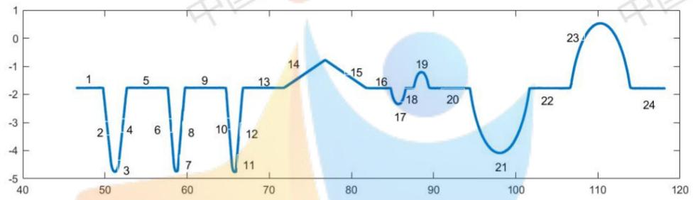

<details>
<summary>line</summary>

| Point | Value |
| --- | --- |
| 1 | ~-1.8 |
| 2 | ~-3.5 |
| 3 | ~-4.8 |
| 4 | ~-3.5 |
| 5 | ~-1.8 |
| 6 | ~-3.5 |
| 7 | ~-4.8 |
| 8 | ~-3.5 |
| 9 | ~-1.8 |
| 10 | ~-3.5 |
| 11 | ~-4.8 |
| 12 | ~-3.5 |
| 13 | ~-1.8 |
| 14 | ~-1.2 |
| 15 | ~-1.5 |
| 16 | ~-1.8 |
| 17 | ~-2.3 |
| 18 | ~-1.8 |
| 19 | ~-1.2 |
| 20 | ~-1.8 |
| 21 | ~-4.1 |
| 22 | ~-1.8 |
| 23 | ~-0.5 |
| 24 | ~-1.8 |
</details>

图 5.1.1-1 工件 1 轮廓散点图

## 5.1.2 工件 1 轮廓的函数拟合——直线部分

已知工件 1 为水平放置，部分直线倾斜角为 0。

将直线的计算分为两种，倾斜角为0，和倾斜角非0。

## 5.1.3 倾斜角为 0 的直线

倾斜角为 0，如图 5.1.1-1，轮廓线第 1，5，9，13，16，18，20，22，24 段。

当倾斜角为 0 时，计算方法相同，我们只以第 1 段轮廓线为例进行拟合。

建立常数函数模型求解 $^{[1]}$ 。

$$
y = b
$$

其中b为常数，且：

$$
b = (y _ {1} + y _ {2} + y _ {3} + \dots + y _ {n}) / n
$$

其中， $y_{1}, y_{2}, y_{3}, \ldots, y_{n}$ 为当 x 在一定范围内的 $x_{1}, x_{2}, x_{3}, \ldots, x_{n}$ 的对应值。n 为 x 在一定范围内数据的个数。

根据散点图，在第1段轮廓取一段区间 $x \in [47, 49]$ 时，此时 $n = 4000$ ，计算得 $b = -1.7703$

同样的，其他倾斜角为 0 常数函数也可以计算出来。

如下表 5.1.3-1 为所有倾斜度为 0 的直线轮廓计算结果。

表 5.1.3-1 倾斜度为 0 的直线轮廓计算

<table><tr><td>第几条轮廓线</td><td>截取的x区间</td><td>系数b</td><td>常数函数拟合式</td></tr><tr><td>1</td><td>[47,49]</td><td>-1.7703</td><td>y = -1.7703</td></tr><tr><td>5</td><td>[53,57]</td><td>-1.7674</td><td>y = -1.7674</td></tr><tr><td>9</td><td>[60,64]</td><td>-1.7681</td><td>y = -1.7681</td></tr><tr><td>13</td><td>[67,71]</td><td>-1.7674</td><td>y = -1.7674</td></tr><tr><td>16</td><td>[82.5,84.5]</td><td>-1.7779</td><td>y = -1.7779</td></tr><tr><td>18</td><td>[86.8,87.3]</td><td>-17776</td><td>y = -1.7776</td></tr><tr><td>20</td><td>[90,94]</td><td>-1.7784</td><td>y = -1.7784</td></tr><tr><td>22</td><td>[102,106]</td><td>-1.7807</td><td>y = -1.7807</td></tr><tr><td>24</td><td>[114.5,118]</td><td>-1.7846</td><td>y = -1.7846</td></tr></table>

## 5.1.4倾斜角非0的直线

倾斜角非0，图5.1.1-1，轮廓线第2，4，6，8，10，12，14，15段。

当倾斜角非 0 时，计算方法相同，我们只以第 2 段轮廓线为例进行一元线性回归拟合。

建立一元线性回归模型求解。

$$
y = b _ {0} + b _ {1} x + \varepsilon
$$

其中 $b_{0}$ ， $b_{1}$ 为回归系数， $\varepsilon$ 为服从 $N(0,\sigma^2)$ 分布、互相独立的随机变量。

根据散点图，在第 2 段轮廓取一段区间 $x \in [49.8, 50.58]$ ，利用 MATLAB 的 regress 函数计算结果如下：

表 5.1.4-1 回归系数

<table><tr><td>回归系数</td><td>系数估计值</td><td>置信区间</td></tr><tr><td> $b_0$ </td><td>134.673</td><td>[134.112,135.234]</td></tr><tr><td> $b_1$ </td><td>-2.741</td><td>[-2.752,-2.730]</td></tr></table>

<table><tr><td>R2决定系数</td><td>F值</td><td>p值</td><td>s2方差</td></tr><tr><td>0.999953</td><td>280629.0319</td><td>0.00000</td><td>0.00001981</td></tr></table>

由表5.1.4—1可对模型做检验：得 $R^2 = 0.999$ ， $p$ 值远小于0.0001，回归方程显著，模型可用。

$$
y = - 2. 7 4 1 x + 1 3 4. 6 7 3
$$

同样的方法，可以计算所有倾斜度非0的直线轮廓函数表达式，计算结果如下表5.1.4-2。

表 5.1.4-2 倾斜度非 0 的直线轮廓函数计算

<table><tr><td>第几条轮廓线</td><td>截取的x区间</td><td>回归系数 $b_1$ </td><td>回归系数 $b_0$ </td><td>一元线性回归函数拟合式</td></tr><tr><td>2</td><td>[49.8, 50.58]</td><td>-2.741</td><td>134.673</td><td>y = -2.741x + 134.673</td></tr><tr><td>4</td><td>[51.77, 52.6]</td><td>2.788</td><td>-148.566</td><td>y = 2.788x - 148.566</td></tr><tr><td>6</td><td>[57.71,58.34]</td><td>-3.722</td><td>212.816</td><td>y = -3.722x + 212.816</td></tr><tr><td>8</td><td>[58.69,59.66]</td><td>3.330</td><td>-200.668</td><td>y = 3.330x - 200.668</td></tr><tr><td>10</td><td>[64.79,65.34]</td><td>-3.780</td><td>242.905</td><td>y = -3.780x + 242.905</td></tr><tr><td>12</td><td>[66.06,66.73]</td><td>3.515</td><td>-236.496</td><td>y = 3.515x - 236.496</td></tr><tr><td>14</td><td>[72.25,76.2]</td><td>0.198</td><td>-16.045</td><td>y = 0.198x - 16.045</td></tr><tr><td>15</td><td>[77.52,81.16]</td><td>-0.201</td><td>14.645</td><td>y = -0.201x + 14.645</td></tr></table>

## 5.1.5 工件一轮廓的函数拟合——圆弧部分

如图 5.1.1-1，轮廓线 $^{[2]}$ 第 3, 7, 11, 17, 19, 21, 23 段。

计算方法相同，我们只以第3段轮廓线为例，建立圆的一般方程模型 $^{[3]}$ 。

$$
x ^ {2} + y ^ {2} + D x + E y + F = 0
$$

其中：D, E, F 为系数，且：

$$
\left\{ \begin{array}{c} x _ {c} = - \frac {D}{2} \\ y _ {c} = - \frac {E}{2} \\ R = \frac {D ^ {2} + E ^ {2}}{4} - F \end{array} \right.
$$

其中： $x_{c}$ 为圆心横坐标， $y_{c}$ 为圆心纵坐标，R 为圆半径。

根据散点图 $^{[4]}$ ，在第3段轮廓取一段区间 $x\in[50.95,51.49]$ ，编写函数M文件，利用MATLAB中的逆矩阵左除、右除的矩阵运算，计算出一般式系数拟合结果D=-102.4,E=8.5,F=264.11,通过圆的一般式方程系数可求得圆的圆心横坐标 $x_{c}=51.2177$ ,纵坐标 $y_{c}=-4.2582$ ,圆的半径R=0.4941

同样的方法, 可以求得圆弧拟合函数曲线及圆的参数, 结果如下表 5.1.5-1.

表 5.1.5-1 圆弧轮廓函数计算

<table><tr><td>第几条轮廓线</td><td>截取的x区间</td><td> $x_c$ 圆心横坐标</td><td> $y_c$ 圆心纵坐标</td><td>R半径</td></tr><tr><td>3</td><td>[50.95,51.49]</td><td>51.2177</td><td>-4.2582</td><td>0.4941</td></tr><tr><td>7</td><td>[58.55,58.85]</td><td>58.7048</td><td>-4.4395</td><td>0.3011</td></tr><tr><td>11</td><td>[65.5, 65.95]</td><td>65.7728</td><td>-4.4619</td><td>0.2974</td></tr><tr><td>17</td><td>[85.3, 86.3]</td><td>85.7117</td><td>-1.3674</td><td>0.9802</td></tr><tr><td>19</td><td>[87.8, 89]</td><td>88.5205</td><td>-2.2255</td><td>1.0204</td></tr><tr><td>21</td><td>[96, 100]</td><td>98.0520</td><td>-0.1012</td><td>3.9845</td></tr><tr><td>23</td><td>[108.5,111.5]</td><td>110.3021</td><td>-3.4715</td><td>3.9992</td></tr></table>

<table><tr><td>第几条轮廓线</td><td>圆的标准方程函数拟合式</td></tr><tr><td>3</td><td> $(x - 51.2177)^{2} + (y + 4.2582)^{2} = 0.4941^{2}$ </td></tr><tr><td>7</td><td> $(x - 58.7048)^{2} + (y + 4.4395)^{2} = 0.3011^{2}$ </td></tr><tr><td>11</td><td> $(x - 65.7728)^{2} + (y + 4.4619)^{2} = 0.2974^{2}$ </td></tr><tr><td>17</td><td> $(x - 85.7117)^{2} + (y + 1.3674)^{2} = 0.9802^{2}$ </td></tr><tr><td>19</td><td> $(x - 88.5205)^{2} + (y + 2.2255)^{2} = 1.0204^{2}$ </td></tr><tr><td>21</td><td> $(x - 98.0520)^{2} + (y + 0.1012)^{2} = 3.9845^{2}$ </td></tr><tr><td>23</td><td> $(x - 110.3021)^{2} + (y + 3.4715)^{2} = 3.9992^{2}$ </td></tr></table>

## 5.1.6 工件 1 分段拟合函数表达式

总结：将5.1.3，5.1.4，5.1.5计算所得的函数拟合表达式

$$
y = \left\{ \begin{array}{c} - 1. 7 7 0 3, x \in (4 6. 5 9 5 8, 4 9. 7 7 8 6) \\ - 2. 7 4 1 x + 1 3 4. 6 7 3, \quad x \in (4 9. 7 7 8 6, 5 0. 7 0 8 7) \\ \sqrt {0 . 4 9 4 1 ^ {2} - (x - 5 1 . 2 1 7 7) ^ {2}} - 4. 2 5 8 2, \quad x \in (5 0. 7 0 8 7, 5 1. 6 9 8 5) \\ 2. 7 8 8 x - 1 4 8. 5 6 6, \quad x \in (5 1. 6 9 8 5, 5 2. 6 5 3 7) \\ - 1. 7 6 7 4, x \in (5 2. 6 5 3 7, 5 7. 6 5 2 7) \\ - 3. 7 2 2 x + 2 1 2. 8 1 6, x \in (5 7. 6 5 2 7, 5 8. 3 9 3 1) \\ \sqrt {0 . 3 0 1 1 ^ {2} - (x - 5 8 . 7 0 4 8) ^ {2}} - 4. 4 3 9 5, \quad x \in (5 8. 3 9 3 1, 5 8. 8 4 7 9) \\ \quad \quad \quad \quad \quad \quad \quad \quad \quad \quad \quad \quad \quad \quad \quad \quad \quad \quad \quad \quad \quad \quad \quad \quad \quad \quad \quad \quad \quad \quad \quad \quad \quad \quad \quad \quad \quad \quad \quad \quad \quad \quad \quad \quad \quad \quad \quad \quad \quad \quad \text {或} \\ - 1. 7 6 8 1, x \in (5 9. 7 2 9 6, 6 4. 7 2 8 3) \\ - 3. 7 8 0 x + 2 4 2. 9 0 5, x \in (6 4. 7 2 8 3, 6 5. 4 6 2 7) \\ \sqrt {0 . 2 9 7 4 ^ {2} - (x - 6 5 . 7 7 2 8) ^ {2}} - 4. 4 6 1 9, x \in (6 5. 4 6 2 7, 6 5. 9 4 3 2) \\ \quad \quad \quad \quad \quad \quad \quad \quad \quad \quad \quad \quad \quad \quad \quad \quad \quad \quad \quad \quad \quad \quad \quad \quad \quad \quad \quad \quad \quad \quad \quad \quad \quad \quad \quad \quad \quad \text {或} \\ - \text {或} \\ - - - - - - - - - - - - - - - - - - - - - - - - - - - - - - - - - - - - - - - - - - - - - - - - - - - - - - - - - - - - - - - - - - - - - - - - - - - - - - - - - - - - - - - - - - - - - - - - - - - - -. \\ [ ] _ {\text {或}} \\ [ ] _ {\text {或}} \\ [ ] _ {\text {或}} \\ [ ] _ {\text {或}} \\ [ ] _ {\text {或}} \\ [ ] _ {\text {或}} \\ [ ] _ {\text {或}} \\ [ ] _ {\text {或}} \\ [ ] _ {\text {或}} \\ [ ] _ {\text {或}} \\ [ ] _ {\text {或}} \\ [ ] _ {\text {或}} / [ ] _ {\text {或}} \\ [ ] _ {\text {或}} \\ [ ] _ {\text {或}} \\ [ ] _ {\text {或}} \\ [ ] _ {\text {或}} \\ [ ] _ {\text {或}} \\ [ ] _ {\text {或}} \\ [ ] _ {\text {或}} \\ [ ] _ {\text {或}} \\ [ ] _ {\text {或}} \\ [ ] _ {\text {或}} \\ {[ ] _ {\text {或}}} \\ [ ] _ {\text {或}} \\ [ ] _ {\text {或}} \\ [ ] _ {\text {或}} \\ [ ] _ {\text {或}} \\ [ ] _ {\text {或}} \\ [ ] _ {\text {或}} \\ [ ] _ {\text {或}} \\ [ ] _ {\text {或}} \\ [ ] _ {\text {或}} \\ [ ] _ {\text {或}} \\ [ ] _ {\text {或}} & [ ] _ {\text {或}} \\ [ ] _ {\text {或}} \\ [ ] _ {\text {或}} \\ [ ] _ {\text {或}} \\ [ ] _ {\text {或}} \\ [ ] _ {\text {或}} \\ [ ] _ {\text {或}} \\ [ ] _ {\text {或}} \\ [ ] _ {\text {或}} \\ [ ] _ {\text {或}} \\ [ ] _ {\text {或}} \\ & [ ] _ {\text {或}} \\ & [ ] _ {\text {或}} \\ & [ ] _ {\text {或}} \\ & [ ] _ {\text {或}} \\ & [ ] _ {\text {或}} \\ & [ ] _ {\text {或}} \\ & [ ] _ {\text {或}} \\ & [ ] _ {\text {或}} \\ & [ ] _ {\text {或}} \\ & [ ] _ {\text {或}} \\ {[ ] _ {\text {或}}} \\ {[ ] _ {\text {或}}} \\ {[ ] _ {\text {或}}} \\ {[ ] _ {\text {或}}} \\ {[ ] _ {\text {或}}} \\ {[ ] _ {\text {或}}} \\ {[ ] _ {\text {或}}} \\ {[ ] _ {\text {或}}} \\ {[ ] _ {\text {或}}} \\ {[ ] _ {\text {或}}} \\ {[ ] _ {\text {或}}} \\ {[ ] _ {\text {或}}} / [ ] _ {\text {或}} / [ ] _ {\text {或}} / [ ] _ {\text {或}} / [ ] _ {\text {或}} / [ ] _ {\text {或}} / [ ] _ {\text {或}} / [ ] _ {\text {或}} / [ ] _ {\text {或}} / [ ] _ {\text {或}} / [ ] _ {\text {或}} / [ ] _ {\text {或}} / [ ] _ {\text {或}}/ [ ] _ {\text {或}} / [ ] _ {\text {或}} / [ ] _ {\text {或}} / [ ] _ {\text {或}} / [ ] _ {\text {或}} / [ ] _ {\text {或}} / [ ] _ {\text {或}} / [ ] _ {\text {或}} / [ ] _ {\text {或}} / [ ] _ {\text {或}} / [ ] _ {\text {或}} / {[} x := x := x := x := x := x := x := x := x := x := x := x := x := x := x := x := x := x := x := x := x := x := x := x := x := x := x := x := x := x := x := x := x := x := x := x := x := x := x := x := x := x := x := x := x := x := x := x := x := x := x:= x = x = x = x = x = x = x = x = x = x = x = x = x = x = x = x = x = x = x = x = x = x = x = x = x = x = x = x = x = x = x = x = x = x = x = x = x = x = x = x = x = x = x = x = x = x = x = x = x = x = x --> p r m n o d s t a b l e f o r i n g h o r m a t h e r m a t h e r m a t h e r m a t h e r m a t h e r m a t h e r m a t h e r m a t h e r m a t h e r m a t h e r m a t h e r m a t h e r m a t h e r m a t h e r m a t h e r m a t h e r m a t h e r m a tr i c l e f o r i n g h o r m a t h e r m a tr i c l e f o r i n g h o r m a t h e r m a tr i c l e f o r i n g h o r m a tr i c l e f o r i n g h o r m a tr i c l e f o r i n g h o r m a tr i c l e f o r i n g h o r m a tr i c l e f o r i n g h o r m a tr i c l e f o r i n g h o r m a tr i c l e f o r i n g h o r m a t h e r m a tr i c l e f o r i n g h o r m a tr i c l e f o r i n g h o r m a tr i c l e f o r i n g h o r m a tr i c l e f o r i n g h o r m a tr i c l e f o r i ng h o r m a tr i c l e f o r i ng h o r m a tr i c l e f o r i ng h o r m a tr i c l e f o r i ng h o r m a tr i c l e f o r i ng h o r m a tr i c l e f o r i ng h o r m a tr i c l e f o r i ng h o rm a tr i c l e f o r i ng h o rm a tr i c l e f o r i ng h o rm a tr i c l e f o r i ng h o rm a tr i c l e f o r i ng h o rm a tr i c l e f o r i ng h o rm a tr i c l e f o r i ng h o rm a tr ic l e f o r i ng h o rm a tr ic l e f o r i ng h o rm a tr ic l e f o r i ng h o rm a tr ic l e f o ropti / s / s / s / s / s / s / s / s / s / s / s / s / s / s / s / s / s / s / s / s / s / s / s / s / s / s / s / s / s / s / s / s / s / s / s / s / s / s / s / s / s / s / s / s / s / s / s / s / s / s /s / s / s /s /s /s /s /s /s /s /s /s /s /s /s /s /s /s /s /s /s /s /s /s /s /s /s /s /s /s /s /s /s /s /s /s /s /s /s /s /s /s /s /s /s /s /s /s /s /s /s /s /s /S S S S S S S S S S S S S S S S S S S S S S S S S S S S S S S S S S S S S S S S S S S S S S S S S S S S S S S S S SSSSSSSSSSSSSSSSSSSSSSSSSSSSSSSSSSSSSSSSSSSSSSSSSSSSSSSSSSSSSSSSSSSSSSSSSSSSSSSSSSSSSSSSSSSSSSSSSSSSSSSSSSSSSSSSSSSSSSSSSSSSSSSSSSSSSSSSSSSSSSSSSASSSASSSASSSASSSASSSASSSASSSASSSASSSASSSASSSASSSASSSASSSASSSASSSASSSASSSASSSASSSASSSASSSASSSASSSASSSASSSASSSASSSASSSASSSASSSASSSASSSASSSASSSASSSASSSASSSASSSASSSASSSASSSASSSASSSASSSASSSASSSASSSASSSASSSaussessessessessessessessessessessessessessessessessessessessessessessessessessessessessessessessessessessessessessessessessessessessessessessassessessassessassessassessassessassassassassassassassassassassassassassassassassassassassassassassassassassassassassassassassassassassassassassassassassassassassassassassassassassassassassassassassassassassassassassassassassassassassassassassassassassassassassassassassassassassassassassassassasssasssasssasssasssasssasssasssasssasssasssasssasssasssasssasssasssasssasssasssasssasssasssasssasssasssasssasssasssasssasssasssasssasssasssasssasssasssasssasssasssasssasssasssasssasssasssasssasssasssasissasssasssasssasssasssasssasssasssasssasssasssasssasssasssasssasssasssasssasssasssasssasssasssasssasssasssasssasssasssasssasssasssasssasssasssasssasssasssasssasssasssasssasssasssasssasssasssasssasssassss as ss as ss as ss as ss as ss as ss as ss as ss as ss as ss as ss as ss as ss as ss as ss as ss as ss as ss as ss as ss as ss as ss as ss as ss as ss as ss as ss as ss as ss as ss as ss as ss as ss as ss as ss as ss as ss as ss as ss as ss as ss as ss as ss as ss as ss as ss as ss as ss as ss as ss as SS SS SS SS SS SS SS SS SS SS SS SS SS SS SS SS SS SS SS SS SS SS SS SS SS SS SS SS SS SS SS SS SS SS SS SS SS SS SS SS SS SS SS SS SS SS SS SS SS SS SS SS SS SS SS SS SS SS SS SS SS SS SS SS SS SS SS SS SS SS SS SS SS SS SS SS SS SS SS SS SS SS SS SS SS SS SS SS SS SS SS SS SS SS SS SS SS SS SS SS RSS< nl>
\[\begin{array}{r} - (- (- (- (- (- (- (- (- (- (- (- (- (- (- (- (- (- (- (- (- (- (- (- (- (- (- (- (- (- (- (- (- (- (- (- (- (- (- (- (- (- (- (- (- (- (- (- (- (- (- (- (- (- (- (- (- (- (- (- (- (- (- (- (- (- (- (- (- (- (- (- (- (- (- (- (- (- (- (- (- (- (- (- (- (- (- (- (- (- (- (- (- (- (- (- (- (- (- (- (- ((- ((- ((- ((- ((- ((- ((- ((- ((- ((- ((- ((- ((- ((- ((- ((- ((- ((- ((- ((- ((- ((- ((- ((- ((- ((- ((- ((- ((- ((- ((- ((- ((- ((- ((- ((- ((- ((- ((- ((- ((- ((- ((- ((- ((- ((- ((- ((- ((- ((- ((- ((- ((- ((- ((- ((- ((- ((- ((- ((- ((- (-(((- (-- (-- (\( {}^{\prime }{}^{\prime }{}^{\prime }{}^{\prime }{}^{\prime }{}^{\prime }{}^{\prime }{}^{\prime }{}^{\prime }{}^{\prime }{}^{\prime }{}^{\prime }{}^{\prime }{}^{\prime }{}^{\prime }{}^{\prime }{}^{\prime }{}^{\prime }{}^{\prime }{}^{\prime }{}^{\prime } {}^{\prime }{}^{\prime }{}^{\prime }{}^{\prime }{}^{\prime }{}^{\prime }{}^{\prime }{}^{\prime }{}^{\prime }{}^{\prime }{}^{\prime }{}^{\prime }{}^{\prime }{}^{\prime }{}^{\prime }{}^{\prime }{}^{\prime }{}^{\prime }{}^{\prime }{}^{\prime} {}^{\prime} {}^{\prime} {}^{\prime} {}^{\prime} {}^{\prime} {}^{\prime} {}^{\prime} {}^{\prime} {}^{\prime} {}^{\prime} {}^{\prime} {}^{\prime} {}^{\prime} {}^{\prime} {}^{\prime} {}^{\prime} {}^{\prime} {}^{\prime} {}^{\prime} {}^{\prime} {{\bf R}, B}, B, B, B, B, B, B, B, B, B, B, B, B, B, B, B, B, B, B, B, B, B, B, B, B, B, B, B, B, B, B, B, B, B, B, B, B, B, B, B, B, B, B, B, B, B, B, B, B, B, B, B,
\end{array}
$$

## 5.1.7 工件 1 参数的计算

由 5.1.3, 5.1.4, 5.1.5 计算的工件 1 轮廓的函数拟合式，联立得两函数之间的交点，计算的交点坐标结果如下表 5.1.7-1:

表 5.1.7-1 两相邻轮廓线交点坐标

<table><tr><td>轮廓线</td><td>相邻两条轮廓线交点坐标</td><td>轮廓线</td><td>相邻两条轮廓线交点坐标</td></tr><tr><td>1, 2</td><td>(49.7786,-1.7703)</td><td>13, 14</td><td>(72.1090,-1.7674)</td></tr><tr><td>2, 3</td><td>(50.7087,-4.4293)</td><td>14, 15</td><td>(76.9172,-0.8153)</td></tr><tr><td>3, 4</td><td>(51.6985,-4.4306)</td><td>15, 16</td><td>(81.7059,-1.7779)</td></tr><tr><td>4, 5</td><td>(52.6537,-1.7674)</td><td>16, 17</td><td>(84.8215,-1.7779)</td></tr><tr><td>5, 6</td><td>(57.6527,-1.7674)</td><td>17, 18</td><td>(86.6019,-1.7776)</td></tr><tr><td>6, 7</td><td>(58.3931,-4.5232)</td><td>18, 19</td><td>(87.6036,-1.7776)</td></tr><tr><td>7, 8</td><td>(58.8479,-4.7044)</td><td>19, 20</td><td>(89.4377,-1.7784)</td></tr><tr><td>8, 9</td><td>(59.7296,-1.7681)</td><td>20, 21</td><td>(94.4376,-1.7784)</td></tr><tr><td>9, 10</td><td>(64.7283,-1.7681)</td><td>21, 22</td><td>(101.6652,-1.7807)</td></tr><tr><td>10, 11</td><td>(65.4627,-4.5439)</td><td>22, 23</td><td>(106.6779,-1.7807)</td></tr><tr><td>11, 12</td><td>(65.9432,-4.7056)</td><td>23, 24</td><td>(113.9281,-1.7846)</td></tr><tr><td>12, 13</td><td>(66.7791,-1.7674)</td><td colspan="2"></td></tr></table>

根据表 5.1.7-1 交点的坐标可以计算出工件 1 的参数值，如下表 5.1.7-2: 弧长的计算可以通过公式：

$$
L = 2 \pi \times \frac {\gamma}{2 \pi}
$$

其中：L为弧长，r为圆半径， $\gamma$ 为圆心角，且：

$$
\gamma = \arcsin \left(\frac {d}{2 r}\right)
$$

其中，d为两个交点（圆弧与相邻两条直线的交点）之间的距离，r为圆半径。

角度的计算可以通过公式:

$$
\angle \beta = 1 8 0 + \arctan (k)
$$

其中， $\beta$ 为角度（角度制），k为一次函数的斜率。

表 5.1.7-2 工件 1 水平放置下的各项参数值

<table><tr><td>参数</td><td>数值</td><td>参数</td><td>数值</td></tr><tr><td> $x_{1}$ </td><td>2.8751</td><td> $\angle 1$ </td><td>110.0436°</td></tr><tr><td> $x_{2}$ </td><td>5.0</td><td> $\angle 2$ </td><td>109.7319°</td></tr><tr><td> $x_{3}$ </td><td>2.0769</td><td> $\angle 3$ </td><td>107.0387°</td></tr><tr><td> $x_{4}$ </td><td>4.9987</td><td> $\angle 4$ </td><td>106.7151°</td></tr><tr><td> $x_{5}$ </td><td>2.0508</td><td> $\angle 5$ </td><td>104.8182°</td></tr><tr><td> $x_{6}$ </td><td>5.3299</td><td> $\angle 6$ </td><td>105.8808°</td></tr><tr><td> $x_{7}$ </td><td>9.5969</td><td> $\angle 7$ </td><td>168.8003°</td></tr><tr><td> $x_{8}$ </td><td>3.1156</td><td> $\angle 8$ </td><td>168.635°</td></tr><tr><td> $x_{9}$ </td><td>1.0017</td><td> $R_{1}$ </td><td>0.4941</td></tr><tr><td> $x_{10}$ </td><td>4.9999</td><td> $R_{2}$ </td><td>0.3011</td></tr><tr><td> $x_{11}$ </td><td>7.2276</td><td> $R_3$ </td><td>0.2974</td></tr><tr><td> $x_{12}$ </td><td>5.0127</td><td> $R_4$ </td><td>0.9802</td></tr><tr><td> $x_{13}$ </td><td>7.2502</td><td> $R_5$ </td><td>1.0204</td></tr><tr><td> $c_1$ </td><td>7.4871</td><td> $R_6$ </td><td>3.9845</td></tr><tr><td> $c_2$ </td><td>7.068</td><td> $R_7$ </td><td>3.9992</td></tr><tr><td> $c_3$ </td><td>19.9389</td><td> $Z_1$ </td><td>0.9521</td></tr><tr><td> $c_4$ </td><td>2.8088</td><td> $l_1$ </td><td>0.7761</td></tr><tr><td> $c_5$ </td><td>9.5315</td><td> $l_2$ </td><td>0.2577</td></tr><tr><td> $c_6$ </td><td>12.2501</td><td> $l_3$ </td><td>0.2797</td></tr><tr><td> $l_6$ </td><td>4.5265</td><td> $l_4$ </td><td>1.1164</td></tr><tr><td> $l_7$ </td><td>4.5384</td><td> $l_5$ </td><td>1.1396</td></tr></table>

## 5.2 问题二的求解

## 5.2.1 预处理

如图 5.2.1-1，图为工件 1 经过一定倾斜程度和位移 $^{[5]}$ 的条件下，测得的轮廓线散点图。计算该轮廓线拟合的函数表达式，计算方法同问题 1 的 5.1.3 和 5.1.4。

最终计算出的轮廓分段拟合函数为:

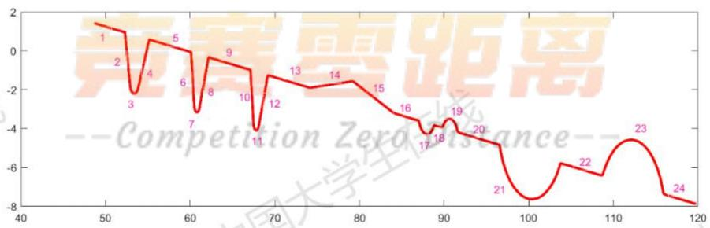

<details>
<summary>line</summary>

| Point | Value |
| --- | --- |
| 1 | ~1.5 |
| 2 | ~0.8 |
| 3 | ~-2.2 |
| 4 | ~0.6 |
| 5 | ~0.2 |
| 6 | ~-1.8 |
| 7 | ~-3.2 |
| 8 | ~-0.4 |
| 9 | ~-0.8 |
| 10 | ~-1.0 |
| 11 | ~-4.0 |
| 12 | ~-1.3 |
| 13 | ~-1.9 |
| 14 | ~-1.6 |
| 15 | ~-2.5 |
| 16 | ~-3.2 |
| 17 | ~-4.5 |
| 18 | ~-3.8 |
| 19 | ~-3.5 |
| 20 | ~-4.5 |
| 21 | ~-4.8 |
| 22 | ~-6.3 |
| 23 | ~-4.6 |
| 24 | ~-7.5 |
</details>

图 5.2.1-1 工件一倾斜并位移后的轮廓

$$
y = \left\{ \begin{array}{c} - 0. 1 2 9 4 x + 7. 7 1 4 \\ - 4. 4 6 7 x + 2 3 4. 5 4 5 \\ \sqrt {8 . 4 2 8 1 ^ {2} - (x - 5 3 . 3 5 1 1) ^ {2}} - 1 0. 1 8 8 8 \\ 1. 9 3 0 x - 1 0 5. 8 7 8 \\ - 0. 1 3 0 x + 7. 7 8 4 \\ - 7. 5 1 9 x + 4 5 1. 9 1 6 \\ \sqrt {0 . 4 1 4 2 ^ {2} - (x - 6 0 . 8 0 0 4) ^ {2}} - 1. 3 9 2 1 \\ 2. 3 6 7 x - 1 4 7. 5 2 1 \\ - 0. 1 3 1 x + 7. 8 1 1 \\ - 7. 6 8 5 x + 5 1 4. 8 7 1 \\ \sqrt {0 . 3 4 5 4 ^ {2} - (x - 6 7 . 8 0 9 3) ^ {2}} - 3. 7 3 7 2 \\ 2. 4 1 5 x - 1 6 8. 3 1 9 \\ - 0. 1 3 1 x + 7. 7 8 7 \\ 0. 0 6 7 x - 6. 9 3 3 \\ - 0. 3 3 9 x + 2 5. 3 6 1 \\ - 0. 1 3 2 x + 7. 8 5 1 \\ \sqrt {0 . 9 9 2 6 ^ {2} - (x - 8 7 . 9 8 0 2) ^ {2}} - 3. 2 9 2 0 \\ - 0. 1 3 4 x + 8. 0 3 4 \\ \sqrt {1 . 0 0 5 1 ^ {2} - (x - 9 0 . 6 5 5 6) ^ {2}} - 4. 5 0 4 3 \\ - 0. 1 3 1 x + 7. 8 2 2 \\ \sqrt {4 . 0 0 6 4 ^ {2} - (x - 1 0 0 . 3 8 3 2) ^ {2}} - 3. 6 2 3 5 \\ - 0. 1 3 \mathrm{x} + \mathrm{7.806} \\ \sqrt {4 . \mathrm{4928} ^ {2} - (x - \mathrm{112.1459}) ^ {2}} - \mathrm{9.1225} \\ - \mathrm{0.132x+7.893} \end{array} \right.
$$

## 5.2.2 计算倾斜角度

如图 5.2.2-1 散点图，计算工件 1 经过一定调整后的倾斜角 $^{[6]}$ 。其中，红色为调整后工件 1 的轮廓，蓝色为水平放置条件下的工件 1 轮廓。

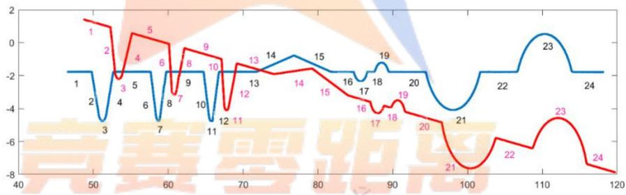

<details>
<summary>line</summary>

| Point | Blue Line Value | Red Line Value |
| --- | --- | --- |
| 1 | -1.8 | ~1.5 |
| 2 | -1.8 | ~0.9 |
| 3 | -4.8 | — |
| 4 | -1.8 | ~-2.2 |
| 5 | -1.8 | ~0.6 |
| 6 | -1.8 | ~0.3 |
| 7 | -4.8 | — |
| 8 | -1.8 | ~-3.2 |
| 9 | -1.8 | ~-0.4 |
| 10 | -1.8 | ~-0.9 |
| 11 | -4.8 | — |
| 12 | -1.8 | ~-4.1 |
| 13 | -1.8 | ~-1.3 |
| 14 | -1.8 | ~-1.9 |
| 15 | -0.8 | ~-1.5 |
| 16 | -1.8 | ~-3.2 |
| 17 | -2.2 | ~-3.6 |
| 18 | -1.2 | ~-4.0 |
| 19 | -1.8 | ~-3.5 |
| 20 | -1.8 | ~-4.5 |
| 21 | -4.0 | ~-7.5 |
| 22 | -1.8 | ~-5.8 |
| 23 | 0.5 | ~-4.5 |
| 24 | -1.8 | ~-7.5 |
</details>

图 5.2.2-1 工件一倾斜并位移后的轮廓与水平轮廓对比

根据轮廓散点图像，图 5.2.2-1，我们可以很容易的看出红色轮廓（待计算倾斜度数的工件 1）与蓝色轮廓（水平放置下的工件 1）之间呈现一个明显角度。

建立模型:

$$
t a n \alpha = \frac {k _ {1} + k _ {5} + k _ {9} + k _ {1 3} + k _ {1 6} + k _ {1 8} + k _ {2 0} + k _ {2 2} + k _ {2 4}}{9}
$$

其中： $\alpha$ 为工件1要测的倾斜角， $k_{1},k_{5},k_{9},k_{13},k_{16},k_{18},k_{20},k_{22},k_{24}$ 为红色轮廓的第1,5,9,13,16,18,20,22,24条轮廓一次函数的斜率。

由 5.2.1 的函数表达式等数据，可计算得 $\alpha = 7.4779^{\circ}$

## 5.2.3 水平校正

我们将图像校正，对数据进行处理，作出图像进行逆时针旋转 $\alpha$ 度，得到图像如图5.2.3-1，红色轮廓为校正后的工件1，蓝色轮廓为水平放置下的工件1。

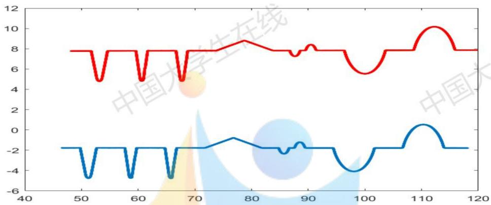

<details>
<summary>line</summary>

| X | Red Line | Blue Line |
| --- | --- | --- |
| 48 | 7.8 | -1.8 |
| 52 | 4.9 | -4.8 |
| 53 | 7.8 | -1.8 |
| 59 | 4.9 | -4.8 |
| 60 | 7.8 | -1.8 |
| 66 | 4.9 | -4.8 |
| 67 | 7.8 | -1.8 |
| 77 | 8.8 | -0.8 |
| 85 | 7.8 | -2.2 |
| 86 | 7.3 | -1.2 |
| 87 | 7.8 | -1.2 |
| 90 | 8.3 | -1.8 |
| 96 | 7.8 | -3.8 |
| 99 | 5.6 | -4.0 |
| 103 | 7.8 | -1.8 |
| 109 | 7.8 | -1.8 |
| 111 | 10.1 | 0.5 |
| 114 | 7.8 | -1.8 |
| 119 | 7.8 | -1.8 |
</details>

图 5.2.3-1 校正后的图像

计算该轮廓线拟合的函数表达式，计算方法同问题1的5.1.3和5.1.4。最终计算出的轮廓分段拟合函数为：

$$
y = \left\{ \begin{array}{c} 7. 7 7 9 \\ - 2. 7 2 6 x + 1 4 8. 7 7 6 \\ \sqrt {0 . 4 8 7 ^ {2} - (x - 5 3 . 1 6 4) ^ {2}} - 5. 2 8 6 \\ 2. 7 5 9 x - 1 4 2. 8 7 8 \\ 7. 7 9 3 \\ - 3. 7 0 8 x + 2 2 8. 7 6 5 \\ \sqrt {0 . 3 0 3 ^ {2} - (x - 6 0 . 6 5 1) ^ {2}} - 5. 1 2 4 \\ 3. 6 6 2 x - 2 1 8. 0 8 7 \\ 7. 8 0 2 \\ - 3. 7 6 4 x + 2 5 8. 7 9 \\ \sqrt {0 . 2 9 3 ^ {2} - (x - 6 7 . 7 1 6) ^ {2}} - 5. 1 0 7 \\ 3. 7 9 9 x - 2 5 3. 3 5 0 \\ 7. 8 0 9 \\ 0. 2 0 1 x - 7. 0 4 6 \\ - 0. 1 9 9 x + 2 4. 4 8 0 \\ \text {Competition} \\ \sqrt {1 . 0 0 2 ^ {2} - (x - 8 7 . 6 5 1) ^ {2}} - 8. 2 6 2 \\ \text {Competition} \\ \sqrt {1 . 0 0 2 ^ {2} - (x - 9 0 . 4 6 3) ^ {2}} - \text {Competition} \\ \text {Competition} \\ \sqrt {4 . 0 0 8 ^ {2} - (x - 9 9 . 9 9 3) ^ {2}} - \text {Competition} \\ \text {Competition} \\ \sqrt {3 . 9 9 7 ^ {2} - (x - 1 1 2 . 2 5 0) ^ {2}} - \text {Competition} \\ \text {Competition} \\ \text {Competition} \\ \text {Competition} \\ \text {Competition} \\ \text {Competition} \\ \text {Competition} \\ \text {Competition} \\ \text {Competition} \\ \text {Competition} \\ \text {Competition} \\ \text {Competition} \\ \text {Competition} \\ \text {Competition} \\ \text {Competition} \\ \end{array} \right.
$$

利用上面的方程组求得交点，交点如下图：

表 5.2.3-2 两相邻轮廓线交点坐标

<table><tr><td>轮廓线</td><td>相邻两条轮廓线交点坐标</td><td>轮廓线</td><td>相邻两条轮廓线交点坐标</td></tr><tr><td>1, 2</td><td>51.7230, 7.7790</td><td>13, 14</td><td>73.9055, 7.8090</td></tr><tr><td>2, 3</td><td>52.6998, 5.1164</td><td>14, 15</td><td>78.8150, 8.7958</td></tr><tr><td>3, 4</td><td>53.6399, 5.1145</td><td>15, 16</td><td>83.6985, 7.8240</td></tr><tr><td>4, 5</td><td>54.6107, 7.7930</td><td>16, 17</td><td>86.7489, 7.8240</td></tr><tr><td>5, 6</td><td>59.5933, 7.7930</td><td>17, 18</td><td>88.5560, 7.8300</td></tr><tr><td>6, 7</td><td>60.3358, 5.0398</td><td>18, 19</td><td>89.5571, 7.8300</td></tr><tr><td>7, 8</td><td>60.9102, 4.9662</td><td>19, 20</td><td>91.3699, 7.8360</td></tr><tr><td>8, 9</td><td>61.6846, 7.8020</td><td>20, 21</td><td>96.3695, 7.8360</td></tr><tr><td>9, 10</td><td>66.6812, 7.8020</td><td>21, 22</td><td>103.6179, 7.8530</td></tr><tr><td>10, 11</td><td>67.4180, 5.0287</td><td>22, 23</td><td>108.6234, 7.8530</td></tr><tr><td>11, 12</td><td>68.0126, 5.0298</td><td>23, 24</td><td>115.8770, 7.8640</td></tr><tr><td>12, 13</td><td>68.7441, 7.8090</td><td colspan="2"></td></tr></table>

同样的计算方法，将校正后的参数统计结果如下：

表 5.2.3-3 水平校正后的工件 1 各项参数值

<table><tr><td>参数</td><td>数值</td><td>参数</td><td>数值</td></tr><tr><td> $x_{1}'$ </td><td>2.8877</td><td> $\angle 1'$ </td><td>110.1449</td></tr><tr><td> $x_{2}'$ </td><td>4.9826</td><td> $\angle 2'$ </td><td>109.9231</td></tr><tr><td> $x_{3}'$ </td><td>2.0913</td><td> $\angle 3'$ </td><td>105.0929</td></tr><tr><td> $x_{4}'$ </td><td>4.9966</td><td> $\angle 4'$ </td><td>105.2737</td></tr><tr><td> $x_{5}'$ </td><td>2.0629</td><td> $\angle 5'$ </td><td>104.8783</td></tr><tr><td> $x_{6}'$ </td><td>5.1614</td><td> $\angle 6'$ </td><td>104.7473</td></tr><tr><td> $x_{7}'$ </td><td>9.7930</td><td> $\angle 7'$ </td><td>168.635</td></tr><tr><td> $x_{8}'$ </td><td>3.0504</td><td> $\angle 8'$ </td><td>168.7452</td></tr><tr><td> $x_{9}'$ </td><td>1.0011</td><td> $R_{1}'$ </td><td>0.487</td></tr><tr><td> $x_{10}'$ </td><td>4.9996</td><td> $R_2'$ </td><td>0.303</td></tr><tr><td> $x_{11}'$ </td><td>7.2484</td><td> $R_3'$ </td><td>0.293</td></tr><tr><td> $x_{12}'$ </td><td>5.0055</td><td> $R_4'$ </td><td>1.002</td></tr><tr><td> $x_{13}'$ </td><td>7.2536</td><td> $R_5'$ </td><td>1.002</td></tr><tr><td> $c_1'$ </td><td>7.487</td><td> $R_6'$ </td><td>4.008</td></tr><tr><td> $c_2'$ </td><td>7.065</td><td> $R_7'$ </td><td>3.997</td></tr><tr><td> $c_3'$ </td><td>19.935</td><td> $Z_1'$ </td><td>0.9868</td></tr><tr><td> $c_4'$ </td><td>2.812</td><td> $l_1'$ </td><td>0.6361</td></tr><tr><td> $c_5'$ </td><td>9.53</td><td> $l_2'$ </td><td>0.3777</td></tr><tr><td> $c_6'$ </td><td>12.257</td><td> $l_3'$ </td><td>0.4602</td></tr><tr><td> $l_6'$ </td><td>4.5274</td><td> $l_4'$ </td><td>1.1260</td></tr><tr><td> $l_7'$ </td><td>4.5446</td><td> $l_5'$ </td><td>1.1327</td></tr></table>

为了比较两种测量状态下工件 1 各项参数计算值之间的差异, 我们将两次表格得到的数据利用柱状图进行对比, 得到的结果如下:

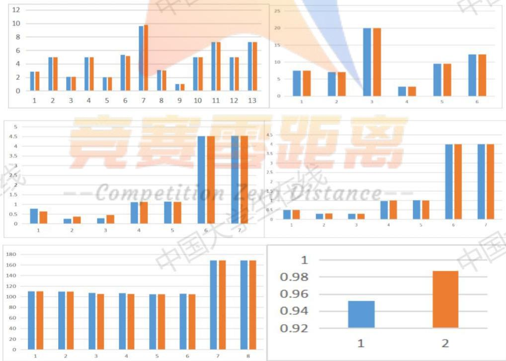  
图 5.2.3-2 工件 1 水平放置下和校正后计算的参数对比图

总结: 根据图 5.2.3-2, 图一为槽口宽度、水平线段的长度 $x_{1}, \ldots, x_{13}$ 与 $x_{1}^{\prime}, \ldots, x_{13}^{\prime}$ 对比图, 图二为圆心之间的距离 $c_{1}, \ldots, c_{6}$ 与 $c_{1}^{\prime}, \ldots, c_{6}^{\prime}$ 的对比图, 图三为圆弧的长度 $l_{1}, \ldots, l_{5}$ 与 $l_{1}^{\prime}, \ldots, l_{5}^{\prime}$ 的对比图, 图四为 $R_{1}, \ldots, R_{7}$ 与 $R_{1}^{\prime}, \ldots, R_{7}^{\prime}$ 之间的对比图, 图五为 $\angle 1, \ldots, \angle 8$ 与 $\angle 1^{\prime}, \ldots, \angle 8^{\prime}$ 之间的对比图, 图六为人字形线的高度 $Z_{1}$ 与 $Z_{1}^{\prime}$ 的对比图。通过图表可以更直观的看出圆弧的长度 $l_{1}, \ldots, l_{5}$ 与 $l_{1}^{\prime}, \ldots, l_{5}^{\prime}$ 和人字形线的高度 $Z_{1}, \ldots, Z_{1}^{\prime}$ 有些许差异, 其他数据的差异可忽略不计。

探究其产生差异的因素：我们在 123D-Design 软件中，画出了简单的 3-D 模型来模拟四种状态下物体被切割后的截面（凹槽截面为半圆）。如下图 5.2.3-3，左图中四个待切割的物体分别经过了 1. 水平放置，2. 上下倾斜 $40^{\circ}$ 坡度，3. 左右旋转 $40^{\circ}$ ，4. 上下倾斜 $40^{\circ}$ 坡度并且左右旋转 $40^{\circ}$ ，四种变换，将物体用极薄的“刀”“切”过后的横截面如右图所示。右图我们可以看出，1. 水平放置下的物体被切割后状态不变，凹槽为半圆，2. 上下倾斜 $40^{\circ}$ 坡度放置下物体被切割后，凹槽仍为半圆，只是整体截面被旋转了 $40^{\circ}$ ，3. 左右旋转 $40^{\circ}$ 条件下的物体被切割后，可以明显看出凹槽非半圆，严格来说为椭圆，整体截面轮廓被拉长，4. 上下倾斜 $40^{\circ}$ 坡度并且左右旋转 $40^{\circ}$ 条件下的物体被切割后，可以看出明显继承了 2 和 3 的特性，凹槽非半圆，为椭圆，整体被左右拉伸。根据这四种状态下的被切割的物体状态，我们可以判断，问题二中，蓝色轮廓（level）为第一种状态，红色轮廓（down）为第四种状态。其中，蓝色轮廓中为标准圆，红色轮廓中无标准圆，只有椭圆，而在模型的建立中，我们为了简化模型将图中所有轮廓只看成直线与圆的组合，导致了红色轮廓计算的工件 1 参数与蓝色轮廓计算的工件 1 参数存在微小差异，由于差异并不大，也是在可接受的范围之内。

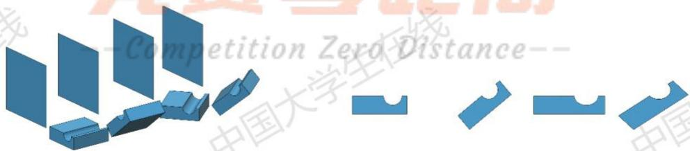

<details>
<summary>text_image</summary>

Competition Zero Distance--
</details>

图 5.2.3-3 3-D 模型观察参考

## 5.3 问题三的求解

## 5.3.1 计算每次测量时的工件 2 的倾斜角度

根据附件 2 的数据画出工件 2 的散点图，如图 5.3.1-1，图中为十次测量的工件 2 的散点轮廓图，其中存在数据太过接近导致轮廓线近乎重合的现象。

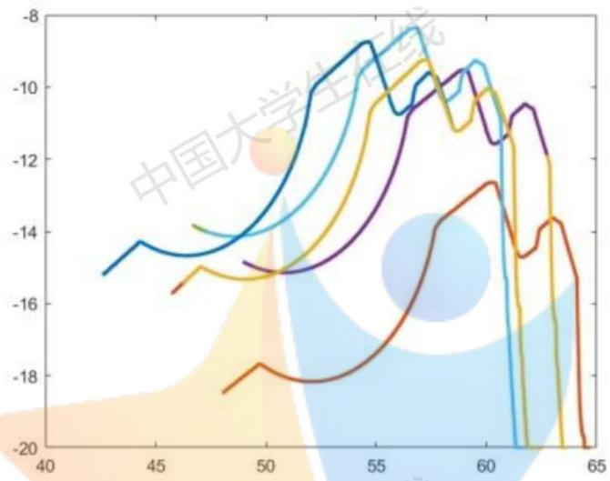

<details>
<summary>line</summary>

| X | Dark Blue | Light Blue | Yellow | Purple | Brown |
| --- | --- | --- | --- | --- | --- |
| 42 | -15.2 | — | — | — | — |
| 44 | -14.3 | — | — | — | — |
| 46 | -14.7 | — | -13.8 | — | -15.7 |
| 48 | -14.6 | -14.1 | -15.0 | — | -18.5 |
| 50 | -13.5 | -13.8 | -15.2 | -14.9 | -17.7 |
| 52 | -10.0 | -12.5 | -14.5 | -15.0 | -18.2 |
| 54 | -8.8 | -9.5 | -10.5 | -13.5 | -17.5 |
| 56 | -10.8 | -8.3 | -9.5 | -10.5 | -16.0 |
| 58 | -9.6 | -10.2 | -11.2 | -9.5 | -13.8 |
| 60 | -9.5 | -9.3 | -10.0 | -11.5 | -12.7 |
| 62 | — | — | — | -10.5 | -14.7 |
| 64 | — | — | — | — | -20.0 |
</details>

图 5.3.1-1 十个工件 2 轮廓散点图

计算工件 2 的倾斜程度，我们需要一条校准线（一次方程直线）。在十次工件 2 的测量中，选取每个轮廓的第 3 段进行校准，分别计算出其斜率 k 和倾斜角 $\alpha$

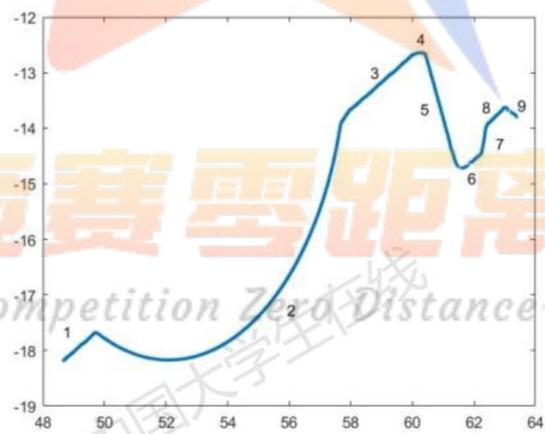

<details>
<summary>line</summary>

| Point | X | Y |
| --- | --- | --- |
| 1 | ~48.5 | ~-18.2 |
| 2 | ~56.0 | ~-17.0 |
| 3 | ~59.0 | ~-13.3 |
| 4 | ~60.5 | ~-12.6 |
| 5 | ~60.5 | ~-13.5 |
| 6 | ~61.5 | ~-14.7 |
| 7 | ~62.5 | ~-14.4 |
| 8 | ~62.5 | ~-13.9 |
| 9 | ~63.5 | ~-13.7 |
</details>

图 5.3.1-2 其中一个工件 2 轮廓散点图

校准角度的计算:

$$
\alpha = \frac {\alpha_ {1} + \alpha_ {2} + \alpha_ {3} + \cdots + \alpha_ {1 0}}{1 0}
$$

其中， $\alpha$ 为校准角度，其中 $i = 1,2,\dots 10,\alpha_{i}$ 为第 $i$ 次测量工件2的倾斜角，且：

$$
\alpha_ {i} = \arctan (k _ {i})
$$

其中 $i=1,2,\ldots,10,k_{i}$ 为第i次工件校准线的直线斜率（第3段的直线轮廓斜率）。

计算结果如下表:

表 5.3.1-1 直线斜率和倾斜角

<table><tr><td>第几个测量值</td><td>直线斜率</td><td>倾斜角</td><td>第几个测量值</td><td>直线斜率</td><td>倾斜角</td></tr><tr><td>1</td><td>0.4882</td><td>26.0216°</td><td>6</td><td>0.5279</td><td>27.8295°</td></tr><tr><td>2</td><td>0.4883</td><td>26.0262°</td><td>7</td><td>0.5508</td><td>28.8459°</td></tr><tr><td>3</td><td>0.5044</td><td>26.7663°</td><td>8</td><td>0.5507</td><td>28.8415°</td></tr><tr><td>4</td><td>0.5043</td><td>26.7618°</td><td>9</td><td>0.5768</td><td>29.9763°</td></tr><tr><td>5</td><td>0.5284</td><td>27.8519°</td><td>10</td><td>0.5762</td><td>29.9505°</td></tr></table>

可以得到可视为水平时的校准角度 $\alpha=27.8871$ ，将 $\alpha$ 与 $\alpha_{i}$ 逐个作差，得到如下结论：

表 5.3.1-2 标准角度与实际测量的差

<table><tr><td>标准角度与实际的差</td><td>倾斜角度</td><td>标准角度与实际的差</td><td>倾斜角度</td></tr><tr><td> $\alpha - a_1$ </td><td>1.8655°</td><td> $\alpha - a_6$ </td><td>0.0576°</td></tr><tr><td> $\alpha - a_2$ </td><td>1.8609°</td><td> $\alpha - a_7$ </td><td>-0.9588°</td></tr><tr><td> $\alpha - a_3$ </td><td>1.1208°</td><td> $\alpha - a_8$ </td><td>-0.9544°</td></tr><tr><td> $\alpha - a_4$ </td><td>1.1253°</td><td> $\alpha - a_9$ </td><td>-2.0892°</td></tr><tr><td> $\alpha - a_5$ </td><td>0.0352°</td><td> $\alpha - a_{10}$ </td><td>-2.0634°</td></tr></table>

## 5.3.2 标注工件 2 的参数

对图像进行数据校正。我们将 10 次测量数据各旋转一个角度，也就是根据 5.3.1 中校准线的斜率来旋转校正水平。

把每个轮廓线的最高点找到,作为校正值,在10个散点图以最高点为中心,将10个散点图经过上下左右平移,使得所有轮廓线的最高点(特征值)重合,此时10条散点图基本重合,做出的图像如下:

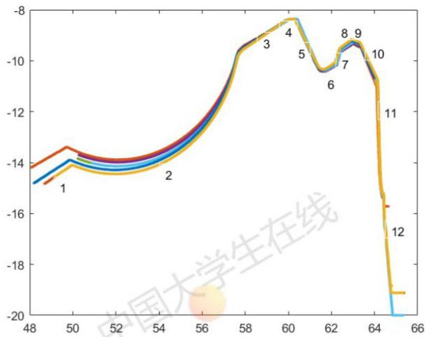

<details>
<summary>line</summary>

| Point | X | Y |
| --- | --- | --- |
| 1 | ~48.5 | ~-14.8 |
| 2 | ~54.5 | ~-14.2 |
| 3 | ~59.0 | ~-9.5 |
| 4 | ~60.5 | ~-8.5 |
| 5 | ~61.5 | ~-9.8 |
| 6 | ~62.0 | ~-10.5 |
| 7 | ~62.5 | ~-10.2 |
| 8 | ~63.0 | ~-9.5 |
| 9 | ~63.2 | ~-9.3 |
| 10 | ~64.0 | ~-10.0 |
| 11 | ~64.5 | ~-12.0 |
| 12 | ~65.0 | ~-15.8 |
</details>

图5.3.2-1 10条轮廓线经过上下左右平移最高点重合时的图像

我们把经过变换后的 10 条轮廓的散点数据（10 组数据）汇总合为一条散点图（一组数据），进行拟合函数，拟合方法同问题 1，计算的结果如下：

表 5.3.2-1 两相邻轮廓线交点坐标

<table><tr><td>轮廓线</td><td>两相邻轮廓线的交点</td><td>轮廓线</td><td>两相邻轮廓线的交点</td></tr><tr><td>1, 2</td><td>(50.5191, -13.5654)</td><td>7, 8</td><td>(62.4026, -9.5991)</td></tr><tr><td>2, 3</td><td>(57.1651, -9.8955)</td><td>8, 9</td><td>(62.9960, -9.2562)</td></tr><tr><td>3, 4</td><td>(60.0521, -8.3648)</td><td>9, 10</td><td>(63.3713, -9.4015)</td></tr><tr><td>4, 5</td><td>(60.3913, -8.4024)</td><td>10, 11</td><td>(64.1452, -10.8913)</td></tr><tr><td>5, 6</td><td>(61.4820, -10.4407)</td><td>11, 12</td><td>(64.2702, -14.0682)</td></tr><tr><td>6, 7</td><td>(62.2128, -10.1642)</td><td colspan="2"></td></tr></table>

拟合的各段函数表达式为:

$$
y = \left\{ \begin{array}{c c} 0. 4 2 3 2 x - 3 4. 9 4 5 1 & x \epsilon (4 8. 0 8 4 2, 5 0. 5 1 9 1) \\ \sqrt {4 . 5 2 5 0 ^ {2} - (\mathrm{x} - 5 2 . 6 5 1 5) ^ {2}} - 9. 5 7 4 4 & x \epsilon (5 0. 5 1 9 1, 5 7. 1 6 5 1) \\ 0. 5 3 0 2 x - 4 0. 2 0 4 4 & x \epsilon (5 7. 1 6 5 1, 6 0. 0 5 2 1) \\ - 0. 1 1 1 0 x - 1. 6 9 9 0 & x \epsilon (6 0. 0 5 2 1, 6 0. 3 9 1 3) \\ - 1. 8 6 8 8 x + 1 0 4. 4 5 6 9 & x \epsilon (6 0. 3 9 1 3, 6 1. 4 8 2 0) \\ 0. 3 7 8 4 x - 3 3. 7 0 5 5 & x \epsilon (6 1. 4 8 2 0, 6 2. 2 1 2 8) \\ 2. 9 7 7 5 x - 1 9 5. 4 0 2 9 & x \epsilon (6 2. 2 1 2 8, 6 2. 4 0 2 6) \\ 0. 5 7 7 8 x - 4 5. 6 5 5 3 & x \epsilon (6 2. 4 0 2 6, 6 2. 9 9 6 0) \\ - 0. 3 8 7 1 x + 1 5. 1 2 9 5 & x \epsilon (6 2. 9 9 6 0, 6 3. 3 7 1 3) \\ - 1. 9 2 7 6 x + 1 1 2. 5 8 8 2 & x \epsilon (6 3. 3 7 1 3, 6 4. 1 4 5 2) \\ - 2.5.4214 x + \text {1619.7699} & x \epsilon (6 \text {4.1452}, \text {64.2702}) \\ - \text {9.0753x+569.2032} & x \epsilon (6 \text {4.2702}, \text {65.3765}) \end{array} \right.
$$

如下图:

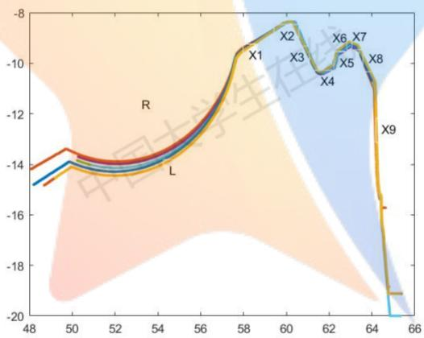

<details>
<summary>line</summary>

| Point | Value |
| --- | --- |
| X1 | ~-9.5 |
| X2 | ~-8.3 |
| X3 | ~-9.6 |
| X4 | ~-10.3 |
| X5 | ~-9.7 |
| X6 | ~-9.2 |
| X7 | ~-9.3 |
| X8 | ~-10.0 |
| X9 | ~-12.8 |
</details>

图 5.3.2-2 轮廓线参数指标

同样的，可以求得工件 2 的各个参数为：

$\angle 1$ 为线段 $x_{1}$ 与 $x_{2}$ 的夹角， $\angle 2$ 为线段 $x_{3}$ 与 $x_{4}$ 的夹角，依此类推， $\angle 9$ 为线段 $x_{9}$ 与 $x_{10}$ 的夹角。

表 5.3.2-1 工件 2 的参数

<table><tr><td>参数</td><td>数值</td><td>参数</td><td>数值</td></tr><tr><td> $x_{1}$ </td><td>7.589</td><td>∠1</td><td>145.7336°</td></tr><tr><td> $x_{2}$ </td><td>0.3413</td><td>∠2</td><td>124.4853°</td></tr><tr><td> $x_{3}$ </td><td>2.311</td><td>∠3</td><td>106.6311°</td></tr><tr><td> $x_{4}$ </td><td>0.7813</td><td>∠4</td><td>129.2914°</td></tr><tr><td> $x_{5}$ </td><td>0.596</td><td>∠5</td><td>138.5845°</td></tr><tr><td> $x_{6}$ </td><td>0.6852</td><td>∠6</td><td>128.8281°</td></tr><tr><td> $x_{7}$ </td><td>0.4019</td><td>∠7</td><td>138.5813°</td></tr><tr><td> $x_{8}$ </td><td>1.680</td><td>∠8</td><td>154.8359°</td></tr><tr><td> $x_{9}$ </td><td>3.110</td><td>∠9</td><td>175.9673°</td></tr><tr><td>圆半径R</td><td>4.5250</td><td>圆弧长l</td><td>4.5035</td></tr></table>

## 5.3.3 工件 2 完整轮廓线

根据函数拟合表达式，x 的取值范围，利用 MATLAB 画出工件 2 轮廓图像，如下：

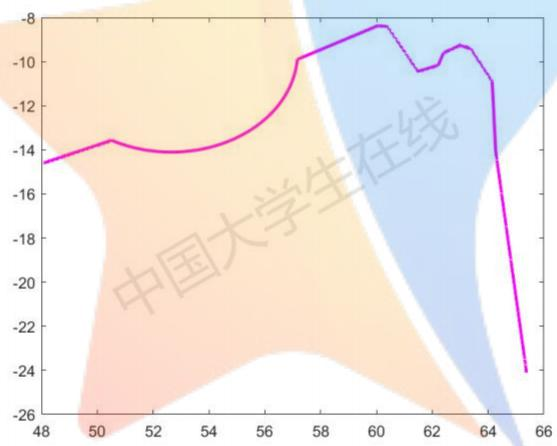

<details>
<summary>line</summary>

| X | Y |
| --- | --- |
| 48 | ~-14.5 |
| 50 | ~-13.5 |
| 52 | ~-14.0 |
| 54 | ~-13.8 |
| 56 | ~-12.5 |
| 57 | -10 |
| 60 | ~-8.3 |
| 61 | ~-9.5 |
| 62 | ~-10.3 |
| 63 | ~-9.3 |
| 64 | ~-11.0 |
| 65 | ~-24.0 |
</details>

图 5.3.3-1 工件 2 拟合函数绘制出的曲线

## 5.4 问题四的求解

## 5.4.1 圆角的修正

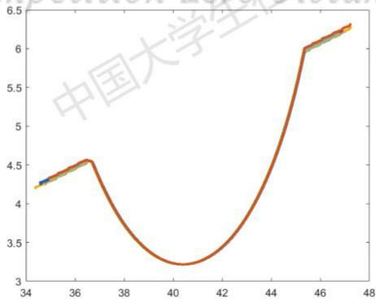

<details>
<summary>line</summary>

| X | Y |
| --- | --- |
| ~34.5 | ~4.2 |
| ~36.5 | ~4.55 |
| ~40.5 | ~3.25 |
| ~45.5 | ~6.0 |
| ~47.5 | ~6.3 |
</details>

图 5.4.1-1 9 个数据的轮廓重合图

由于只需要对工件2的轮廓校正,我们只要计算工件2圆角部分的参数即可,即圆半径和弧长。将附件三中的数据经过上下左右平移,使特征点重合。如上图5.4.1-1为附件三9个数据的轮廓重合图(特征点为圆的最低点)。

计算重合轮廓的函数曲线，将每组移动变换后的数据保存，作为重合的真实函数数据拟合，拟合结果如下：

$$
(x - 4 0. 3 9 8 2) ^ {2} + (y - 9. 0 2 7 8) ^ {2} = 5. 8 1 0 9 ^ {2}
$$

解得，圆半径为 5.8109 ，弧长为 4.9947 ，数据可以视为标准数据。

对比问题三算得的工件 2 参数半径 4.5250，弧长为 4.5035，两者之间半径相差 1.2759，弧长相差 0.4912，将计算出的标准数据替换掉问题 3 计算的参数。

## 5.4.2 直角的修正

直角相对于圆角，同样的计算方法，将9个数据定一个特征点（最高点），通过平移令特征点重合，如下图5.4.2-1。

计算重合轮廓的函数曲线, 将每组移动变换后的数据保存, 作为重合的真实函数数据拟合, 拟合结果如下:

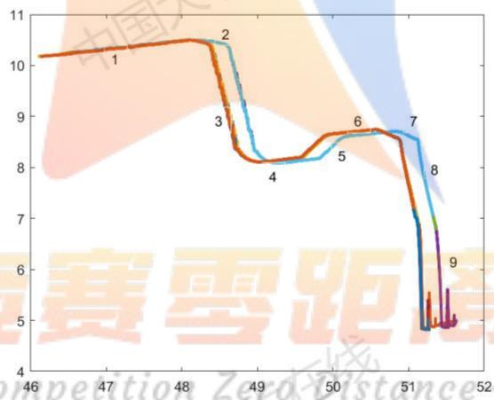

<details>
<summary>line</summary>

| Point | X | Y |
| --- | --- | --- |
| 1 | ~47.3 | ~10.3 |
| 2 | ~48.4 | ~10.5 |
| 3 | ~48.6 | ~9.0 |
| 4 | ~49.1 | ~8.1 |
| 5 | ~50.0 | ~8.2 |
| 6 | ~50.3 | ~8.7 |
| 7 | ~50.8 | ~8.7 |
| 8 | ~51.2 | ~8.6 |
| 9 | ~51.4 | ~5.0 |
</details>

图 5.4.2-1 9 个数据的轮廓重合图

拟合出的表达式为:

$$
y = \left\{ \begin{array}{c} 0. 1 6 1 7 x + 2. 7 1 6 6 \\ - 2. 1 4 0 7 x + 1 1 3. 8 2 8 7 \\ - 4. 7 6 1 6 x + 2 4 0. 9 5 2 5 \\ 0. 2 5 1 8 x - 4. 2 8 9 9 \\ 1. 0 3 4 4 1 x - 4 3. 1 1 0 7 \\ 0. 1 1 7 1 x + 2. 7 9 0 9 \\ - 0. 4 6 6 0 x + 3 2. 3 0 7 5 \\ - 4. 4 9 2 3 x + 2 3 7. 1 5 1 1 \end{array} \right.
$$

交点如下表:

表 5.4.2-1 轮廓线交点

<table><tr><td>轮廓线</td><td>两相邻轮廓线的交点</td><td>轮廓线</td><td>两相邻轮廓线的交点</td></tr><tr><td>1, 2</td><td>(48.2592, 10.5201)</td><td>5, 6</td><td>(50.0562, 8.6524)</td></tr><tr><td>2, 3</td><td>(48.5038, 9.9964)</td><td>6, 7</td><td>(50.6201, 8.7185)</td></tr><tr><td>3, 4</td><td>(48.9173, 8.0274)</td><td>7, 8</td><td>(50.8763, 8.5991)</td></tr><tr><td>4, 5</td><td>(49.6239, 8.2054)</td><td></td><td></td></tr></table>

表 5.4.2-2 参数的值

<table><tr><td>参数</td><td>值</td><td>参数</td><td>值</td></tr><tr><td> $x_{2}$ </td><td>0.5780</td><td> $x_{5}$ </td><td>0.6218</td></tr><tr><td> $x_{3}$ </td><td>2.0119</td><td> $x_{6}$ </td><td>0.5678</td></tr><tr><td> $x_{4}$ </td><td>0.7287</td><td> $x_{7}$ </td><td>0.2826</td></tr></table>

计算两直线的夹角公式

$$
t a n \alpha = \frac {| k _ {1} - k _ {2} |}{1 + k _ {1} k _ {2}}
$$

其中： $\alpha$ 为两直线的夹角 $\alpha \in (0, \frac{\pi}{2})$ ， $k_1, k_2$ 为两直线的斜率

表 5.4.2-3 参数夹角度数

<table><tr><td>∠1</td><td>105.8538</td><td>∠5</td><td>140.7168</td></tr><tr><td>∠2</td><td>166.8189</td><td>∠6</td><td>148.3337</td></tr><tr><td>∠3</td><td>92.2727</td><td>∠7</td><td>127.5345</td></tr><tr><td>∠4</td><td>148.1721</td><td></td><td></td></tr></table>

通过两次数据对比, 我们可以看到存在些许误差。将计算出的标准数据替换掉问题 3 计算的参数。

## 5.4.3 模型的校正

将 5.4.1 与 5.4.2 计算的数据进行校正, 从图 5.3.3-1 中圆弧与左侧线段的交点出发, 构造一个以 5.8109 为半径, 4.9947 为弧长的圆弧。接下来以表 5.4.2-2 和 5.4.2-3 的数据构建出修正后的工件 2 完整轮廓线如下:

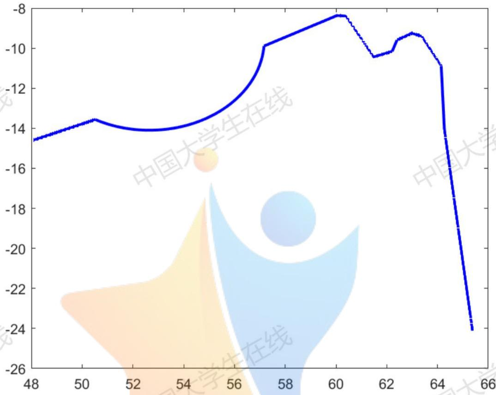

<details>
<summary>line</summary>

| X | Y |
| --- | --- |
| 48 | ~-14.5 |
| 50 | ~-13.5 |
| 52 | ~-14.0 |
| 54 | ~-13.8 |
| 56 | ~-12.5 |
| 57 | ~-9.8 |
| 60 | ~-8.2 |
| 61 | ~-10.4 |
| 62 | ~-10.2 |
| 63 | ~-9.2 |
| 64 | ~-10.8 |
| 65 | ~-24.0 |
</details>

图 5.4.3-1 修正后的工件 2

## 六. 模型的评价与推广

## 优点:

1. 模型刻画拟合工件轮廓的函数表达式, 可以利用函数表达式联立计算精确的得到想要的参数。  
2. 文章整体思路清晰，结论与理由分析都十分完好，在计算时，误差的多次测量取平均值也较为合理。

## 缺点:

1. 函数的分段拟合花费大量的时间精力，工作量偏大，最好能生成一个全自动的计算模型，以便更快的完成任务。  
2. 在函数的拟合刻画时，我们截取的数据为自定义的区间范围内的散点拟合，导致函数的精确度还可以提高。

## 改进：

1. 模型的精确度可以通过函数的残差检验进行更进一步的数据精确。  
2. 在问题二和问题三中, 模型可以将十条函数值拟合刻画, 这样计算出的参数值可以通过十次的均值来减小误差, 但是这样也会导致计算量的巨大提高。不过, 在时间允许的情况下, 是可以采用的提高精度 “笨方法”。  
3. 将拟合、求函数、解交点、求斜率、算长度等工作生成一个全自动的程序，以节省时间。

## 七. 参考文献

[1] 宋武生. 平均误差与仪器误差合成初探 [J]. 开封教育学院学报,  
1992 (03):58-59.  
[2]韩志国, 李锁印, 冯亚南, 赵琳. 接触式轮廓仪探针状态检查图形样块的研制 [J]. 微纳电子技术, 2019, 56(09): 761-765.  
[3] 马麟. 三次参数曲线拟合圆弧段的误差特性分析 [J]. 山西机械, 2000(02): 20-21+24.  
[4] 葛宝珊, 刘锋, 杜峰, 李旭杰, 闫浩. 一种精确测量应变的方法 [C]. 中国高科技产业化研究会智能信息处理产业化分会. 第十届全国信号和智能信息处理与应用学术会议专刊. 中国高科技产业化研究会智能信息处理产业化分会: 中国高科技产业化研究会, 2016:374-378.  
[5] 王云庆, 李庆祥, 周兆英. 接触式轮廓测量中触针测量力的分析 [J]. 现代计量测试, 1996(01): 18-21+17.  
[6] 伍春兰. 直线方程、倾斜角与斜率的教学实践与反思 [J]. 数学通报, 2017, 56(05): 30-33+63.

## 八. 附录

1. %附件一散点图  
2. a=load ('1-L.txt');  
3. plot(a(:,1),a(:,2),'.');  
4. hold on;  
b=load ('1-D.txt');  
6. plot(b(:,1),b(:,2),'r.');

1. %附件二散点图

2. a1=load ('2.1.txt');

3. plot(a1(:,1),a1(:,2),';

4. hold on;

5. a2=load ('2.2.txt');

6. plot(a2(:,1),a2(:,2),';

7. a3=load ('2.3.txt');

8. plot(a3(:,1),a3(:,2),';

a4=load ('2.4.txt');

10. plot(a4(:,1),a4(:,2),';

a5=load ('2.5.txt');

12. plot(a5(:,1),a5(:,2),';

a6=load ('2.6.txt');

plot(a6(:,1),a6(:,2),'.');

a7=load ('2.7.txt');

16. plot(a7(:,1),a7(:,2),';

a8=load ('2.8.txt');

18. plot(a8(:,1),a8(:,2),';

a9=load ('2.9.txt');

20. plot(a9(:,1),a9(:,2),';

a10=load ('2.10.txt');

22. plot(a10(:,1),a10(:,2),';');

1. %附件三散点图

2. a1=load ('3.1.txt');

3. plot(a1(:,1),a1(:,2),';

4. hold on;

5. a2=load ('3.2.txt');

6. plot(a2(:,1),a2(:,2),'.');

7. a3=load ('3.3.txt');

8. plot(a3(:,1),a3(:,2),'.');  
9. a4=load ('3.4.txt');  
10. plot(a4(:,1),a4(:,2),';  
a5=load ('3.5.txt');  
12. plot(a5(:,1),a5(:,2),';  
13. a6=load ('3.6.txt');  
14. plot(a6(:,1),a6(:,2),';  
15. hold on;  
16. a7=load ('3.7.txt');  
17. plot(a7(:,1),a7(:,2),';  
18. a8=load ('3.8.txt');  
19. plot(a8(:,1),a8(:,2),';  
20. a9=load ('3.9.txt');  
21. plot(a9(:,1),a9(:,2),';

1. %附件四散点图

2. a1=load ('4.1.txt');

3. plot(a1(:,1),a1(:,2),';

4. hold on;

5. a2=load ('4.2.txt');

6. plot(a2(:,1),a2(:,2),';

7. a3=load ('4.3.txt');

8. plot(a3(:,1),a3(:,2),';

a4=load ('4.4.txt');

10. plot(a4(:,1),a4(:,2),';

a5=load ('4.5.txt');

12. plot(a5(:,1),a5(:,2),';

a6=load ('4.6.txt');

14. plot(a6(:,1),a6(:,2),';

a7=load ('4.7.txt');

16. plot(a7(:,1),a7(:,2),';

17. a8=load ('4.8.txt');

18. plot(a8(:,1),a8(:,2),';

a9=load ('4.9.txt');

20. plot(a9(:,1),a9(:,2),';

1. %直线拟合 y=b  
2. clear all;clc;  
3. a=load ('1.txt');  
4. plot(a(:,1),a(:,2),'.');

```matlab
c=find(and(a(:,1)<49,a(:,1)>47)==1); %在第一段曲线找两个点 47, 49
d=c(size(c));
e=a(d(2):d(1),:);%在 47 到 49 之间的所有数据
b=mean(e(:,2))
10.
%一元回归拟合 y=kx+b
clear all;clc;
a=load ('1.txt');
plot(a(:,1),a(:,2),'.');
c=find(and(a(:,1)<50.58,a(:,1)>49.8)==1); %在第一段曲线找两个点 49.8, 50.58
d=c(size(c));
e=a(d(2):d(1),:);%之间的所有数据
f=floor(size(e(:,1))/100);
%向下取整,将数据量除 100
E=zeros(f(1),2);%初始化
for m=1:f(1)
E(m,:)=sum(e((m-1)*100+1:m*100,:))./100;
end
x1=E(:,1);
y1=E(:,2);
X1=[ones(size(x1)) x1];
[b1,bint1,r1,rint1,stats1]=regress(y1,X1);
b1,bint1,stats1
30.
%圆的一般方程拟合 x^2+y^2+Dx+Ey+F=0
clear all;clc;
a=load ('1-L.txt');
plot(a(:,1),a(:,2),'.');
c=find(and(a(:,1)<51.49,a(:,1)>50.95)==1); %在第一段曲线找两个点 50.95, 51.49
d=c(size(c));
e=a(d(2):d(1),:);%之间的所有数据
[x_c,y_c,R,r] = circfit(e(:,1),e(:,2));
x_c,y_c,R,r
40.
% 圆拟合函数计算 M 函数文件
function [x_c,y_c,R,r] = circfit(x,y)
%MATLAB 圆弧函数拟合
x=e(:,1);y=e(:,2);
n=length(x);
A=[sum(x) sum(y) n;sum(x.*y) sum(y.*y)...
sum(y);sum(x.*x) sum(x.*y) sum(x)];
```

49. B=[-sum(x.\*x+y.\*y); -sum(x.\*x.\*y+y.\*y.\*y); -sum(x.\*x.\*x+x.\*y.\*y)];  
50. $r = A \setminus B$ ; % 表示求解矩阵方程 $A r = B$ 的解  
51. x\_c = -.5\*r(1); %圆心横坐标  
52. y\_c = -.5\*r(2); %圆心纵坐标  
53. R = sqrt((r(1)^2+r(2)^2)/4-r(3));%圆半径  
54. end

1. %计算工件 1 各项参数  
2. clear all;clc;  
3. syms x y;  
4.  
5. %圆曲线（x-x\_c）^2+(y-y\_c)^2=R^2  
6. $q3=(x-51.2177)^{2}+(y+4.2582)^{2}==(0.4941)^{2};$  
7. $q7=(x-58.7048)^{2}+(y+4.4395)^{2}==(0.3011)^{2};$  
8. q11=(x-65.7728)^2+(y+4.4619)^2==(0.2974)^2;  
9. q17=(x-85.7117)^2+(y+1.3674)^2==(0.9802)^2;  
10. q19=(x-88.5205)^2+(y+2.2255)^2==(1.0204)^2;  
q21=(x-98.0520)^2+(y+0.1012)^2==(3.9845)^2;  
12. q23=(x-110.3021)^2+(y+3.4715)^2==(3.9992)^2;  
13.  
14. %水平直线 y=b  
15. s1= y==-1.7703;  
16. s5= y==-1.7674;  
17. s9= y==-1.7681;  
18. s13= y==-1.7674;  
19. s16= y== -1.7779;  
20. s18= y==-1.7776;  
21. s20= y==-1.7784;  
22. s22= y==-1.7807;  
23. s24=y==-1.7846;  
24.  
25. %直线 y=kx+b  
26. z2=y==-2.741\*x+134.673;  
27. z4=y==2.788\*x-148.566;  
28. z6=y==-3.722\*x+212.816;  
29. z8=y==3.330\*x-200.668;  
30. $z{10} = y =  =  - {3.780} * x + {242.905}$ ;  
31. z12=y==3.515\*x-236.496;  
32. $z14 = y == 0.198 * x - 16.045$ ;  
33. z15=y==-0.201\*x+14.645;  
34.  
35. $\%$ 相邻轮廓方程联立求解

36. a1=solve(s1,z2);  
37. a1.x,a1.y  
38. a2=solve(z2,q3);  
39. a2.x,a2.y  
40. a3=solve(q3,z4);  
41. a3.x,a3.y  
42. a4=solve(z4,s5);  
43. a4.x,a4.y  
44. a5=solve(s5,z6);  
45. a5.x,a5.y  
46. a6=solve(z6,q7);  
47. a6.x,a6.y  
48. a7=solve(q7,z8);  
49. a7.x,a7.y  
50. a8=solve(z8,s9);  
51. a8.x,a8.y  
52. a9=solve(s9,z10);  
53. a9.x,a9.y  
54. a10=solve(z10,q11);  
55. a10.x, a10.y  
56. a11=solve(q11,z12);  
57. a11.x, a11.y  
58. a12=solve(z12,s13);  
59. a12.x, a12.y  
60. a13=solve(s13,z14);  
61. a13.x, a13.y  
62. a14=solve(z14,z15);  
63. a14.x, a14.y  
64. a15=solve(z15,s16);  
65. a15.x, a15.y  
66. a16=solve(s16,q17);  
67. a16.x, a16.y  
68. a17=solve(q17,s18);  
69. a17.x, a17.y  
70. a18=solve(s18,q19);  
71. a18.x, a18.y  
72. a19=solve(q19,s20);  
73. a19.x, a19.y  
74. a20=solve(s20,q21);  
75. a20.x, a20.y  
76. a21=solve(q21,s22);  
77. a21.x, a21.y  
78. a22=solve(s22,q23);  
79. a22.x,a22.y

80. a23=solve(q23,s24);  
81. a23.x, a23.y  
82.  
83.  
84. $\%$ 计算角度  
85. clear all;clc;  
86. syms a1 a2 a3 a4 a5 a6 a7 a8;  
87. eq1=tand(a1)==-2.741;  
88. solve(eq1)  
89. eq2=tand(a2)== 2.788;  
90. solve(eq2)  
91. eq3=tand(a3)== -3.722;  
92. solve(eq3)  
93. eq4=tand(a4)== 3.330;  
94. solve(eq4)  
95. eq5=tand(a5)== -3.780;  
96. solve(eq5)  
97. eq6=tand(a6)== 3.515;  
98. solve(eq6)  
99. eq7=tand(a7)== 0.198  
100. solve(eq7)  
101. eq8=tand(a8)== -0.201  
102. solve(eq8)  
103.  
104.  
105.  
106.  
107.  
108. %圆曲线（x-x\_c）^2+(y-y\_c)^2=R^2  
109. q3=(x-51.2177)^2+(y+4.2582)^2==(0.4941)^2;  
110. q7=(x-58.7048)^2+(y+4.4395)^2==(0.3011)^2;  
111. q11=(x-65.7728)^2+(y+4.4619)^2==(0.2974)^2;  
112. q17=(x-85.7117)^2+(y+1.3674)^2==(0.9802)^2;  
113. q19=(x-88.5205)^2+(y+2.2255)^2==(1.0204)^2;  
114. $q21 = (x - 98.0520)^{2} + (y + 0.1012)^{2} = (3.9845)^{2}$ ;  
115. q23=(x-110.3021)^2+(y+3.4715)^2==(3.9992)^2;  
116.  
117. %水平直线 y=b  
118. s1= y==-1.7703;  
119. s5= y==-1.7674;  
120. s9= y==-1.7681;  
121. s13= y==-1.7674;  
122. s16= y== -1.7779;  
123. s18= y==-1.7776;

124. s20= y==-1.7784;  
125. s22= y==-1.7807;  
126. s24=y==-1.7846;  
127.  
128. %直线 y=kx+b  
129. z2=y==-2.741\*x+134.673;  
130. z4=y==2.788\*x-148.566;  
131. z6=y==-3.722\*x+212.816;  
132. z8=y==3.330\*x-200.668;  
133. z10=y==-3.780\*x+242.905;  
134. z12=y==3.515\*x-236.496;  
135. z14=y==0.198\*x-16.045;  
136. z15=y==-0.201\*x+14.645;  
137.  
138. %求弧长  
139. d= 57.1651-50.5191;  
140. r=4.525;  
141. a=asin(d/(2\*r));  
142. l=2\*pi\*r\*a/(2\*pi)  
143.  
144.  
145.  
146.  
147. 问题2  
148. %计算倾斜角度  
149. syms b;  
150. eq=tand(b)==0.0189;%斜率改为角度制  
151. solve(eq)  
152.  
153.  
154.  
155.  
156. %水平校正  
157. clear all;clc;  
158. a=load ('1-D.txt');  
159. M=[cos(-0.13126) sin(-0.13126) 0;  
160. -sin(-0.13126) cos(-0.13126) 0;  
161. 0 0 1];%旋转矩阵  
162. S(1,:) = a(:,1); %x  
163. S(2,:) = a(:,2); %y  
164. $S(3,:) = 1;\%$ 将二维坐标表达成 $(x,y,1)$ 的形式  
165. R=M\*S;  
166. plot(R(1,:),R(2,:), 'r.')  
167. %计算工件 1 校正各项参数

168. clear all;clc;  
169. syms x y;  
170.  
171. %圆曲线（x-x\_c)^2+(y-y\_c)^2=R^2  
172. q3=(x-53.1644)^2+(y-5.2868)^2==(0.4875)^2;  
173. q7=(x- 60.6514)^2+(y-5.1249)^2==( 0.3036)^2;  
174. q11=(x-67.7160)^2+(y-5.1079)^2==(0.2930)^2;  
175. q17=(x-87.6510)^2+(y-8.26204)^2==(1.0028)^2;  
176. q19=(x- 90.4635)^2+(y- 7.4029)^2==( 1.0020)^2;  
177. $q21 = (x - 99.9937)^{2} + (y - 9.5484)^{2} = (4.0084)^{2}$ ;  
178. q23=(x-112.2502)^2+(y-6.1709)^2==(3.9979)^2;  
179.  
180. %水平直线 y=b  
181. s1= y==7.779;  
182. s5= y==7.793;  
183. s9= y==7.802;  
184. s13= y==7.809;  
185. s16= y==7.824;  
186. s18= y==7.830;  
187. s20= y==7.836;  
188. s22= y==7.853;  
189. s24=y==7.864;  
190.  
191. %直线 y=kx+b  
192. $z2 = y = -2.726 * x + 148.776$ ;  
193. z4=y==2.759\*x-142.878;  
194. z6=y==-3.708\*x+228.765;  
195. z8=y==3.662\*x-218.087;  
196. z10=y==-3.764\*x+258.79;  
197. z12=y==3.799\*x-253.350;  
198. z14=y==0.201\*x-7.046;  
199. z15=y==-0.199\*x+24.480;  
200.  
201. %相邻轮廓方程联立求解  
202. a1=solve(s1,z2);  
203. a1.x,a1.y  
204. a2=solve(z2,q3);  
205. a2.x,a2.y  
206. a3=solve(q3,z4);  
207. a3.x,a3.y  
208. a4=solve(z4,s5);  
209. a4.x,a4.y  
210. a5=solve(s5,z6);  
211. a5.x,a5.y

212. a6=solve(z6,q7);  
213. a6.x,a6.y  
214. a7=solve(q7,z8);  
215. a7.x,a7.y  
216. a8=solve(z8,s9);  
217. a8.x,a8.y  
218. a9=solve(s9,z10);  
219. a9.x,a9.y  
220. a10=solve(z10,q11);  
221. a10.x, a10.y  
222. a11=solve(q11,z12);  
223. a11.x, a11.y  
224. a12=solve(z12,s13);  
225. a12.x, a12.y  
226. a13=solve(s13,z14);  
227. a13.x, a13.y  
228. a14=solve(z14,z15);  
229. a14.x, a14.y  
230. a15=solve(z15,s16);  
231. a15.x,a15.y  
232. a16=solve(s16,q17);  
233. a16.x, a16.y  
234. a17=solve(q17,s18);  
235. a17.x, a17.y  
236. a18=solve(s18,q19);  
237. a18.x, a18.y  
238. a19=solve(q19,s20);  
239. a19.x, a19.y  
240. a20=solve(s20,q21);  
241. a20.x,a20.y  
242. a21=solve(q21,s22);  
243. a21.x, a21.y  
244. a22=solve(s22,q23);  
245. a22.x, a22.y  
246. a23=solve(q23,s24);  
247. a23.x,a23.y  
248.  
249.  
250.  
251. $\%$ 计算角度  
252. clear all;clc;  
253. syms a1 a2 a3 a4 a5 a6 a7 a8;  
254. eq1=tand(a1)==-2.726;  
255. solve(eq1)

```matlab
eq2=tand(a2)== 2.759;
solve(eq2)
eq3=tand(a3)== -3.708;
solve(eq3)
eq4=tand(a4)== 3.662;
solve(eq4)
eq5=tand(a5)== -3.764;
solve(eq5)
eq6=tand(a6)== 3.799;
solve(eq6)
eq7=tand(a7)== 0.201
solve(eq7)
eq8=tand(a8)== -0.199
solve(eq8)
```

1. %问题三数据校正

```matlab
a1=load ('2.1.txt');
a2=load ('2.2.txt');
a3=load ('2.3.txt');
a4=load ('2.4.txt');
a5=load ('2.5.txt');
a6=load ('2.6.txt');
a7=load ('2.7.txt');
a8=load ('2.8.txt');
a9=load ('2.9.txt');
a10=load ('2.10.txt'
```

13. %平移使最高点重合

```matlab
n1=max( a1(:,2));
[row1,cell1]=find(a1==n1);
n2= max(a2(:,2));
[row2,cell2]=find(a2==n2);
n3=max(a3(:,2));
[row3,cell3]=find(a3==n3);
row3=row3(1);cell3=cell(1)
n4=max(a4(:,2));
[row4,cell4]=find(a4==n4);
n5=max(a5(:,2));
[row5,cell5]=find(a5==n5);
n6=max(a6(:,2));
[row6,cell6]=find(a6==n6);
n7=max(a7(:,2));
```

```matlab
[row7,cell7]=find(a7==n7);
n8=max(a8(:,2));
[row8,cell8]=find(a8==n8);
n9=max(a9(:,2));
[row9,cell9]=find(a9==n9);
n10=max(a10(:,2));
[row10,cell10]=find(a10==n10);

n_n=max([a1(row1,1);a2(row2,1);
a3(row3,1);a4(row4,1);a5(row5,1);
a6(row6,1);a7(row7,1);a8(row8,1);
a9(row9,1);a10(row10,1)]);
cc1= n_n- a1(row1,1);
cc2= n_n -a2(row2,1);
cc3= n_n- a3(row3,1);
cc4= n_n- a4(row4,1);
cc5= n_n- a5(row5,1);
cc6= n_n- a6(row6,1);
cc7= n_n- a7(row7,1);
cc8= n_n- a8(row8,1);
cc9= n_n- a9(row9,1);
cc10= n_n- a10(row10,1);

nn=[n1 n2 n3 n4 n5 n6 n7 n8 n9 n10];
n=max(nn);
[row,cell]=find(nn==n);

c1=nn(row,cell)-n1;
c2= nn(row,cell)-n2;
c3= nn(row,cell)-n3;
c4= nn(row,cell)-n4;
c5= nn(row,cell)-n5;
c6= nn(row,cell)-n6;
c7= nn(row,cell)-n7;
c8= nn(row,cell)-n8;
c9 = nn(row,cell)-n9;
c10 = nn(row,cell)-n10;
```

```matlab
72.
73.
74. y1_y1=a1(:,2)+c1;
75. y2_y2=a2(:,2)+c2;
76. y3_y3=a3(:,2)+c3;
77. y4_y4=a4(:,2)+c4;
78. y5_y5=a5(:,2)+c5;
79. y6_y6=a6(:,2)+c6;
80. y7_y7=a7(:,2)+c7;
81. y8_y8=a8(:,2)+c8;
82. y9_y9=a9(:,2)+c9;
83. y10_y10=a10(:,2)+c10;
84.
85. x1_x1=a1(:,1)+cc1;
86. x2_x2=a2(:,1)+cc2;
87. x3_x3=a3(:,1)+cc3;
88. x4_x4=a4(:,1)+cc4;
89. x5_x5=a5(:,1)+cc5;
90. x6_x6=a6(:,1)+cc6;
91. x7_x7=a7(:,1)+cc7;
92. x8_x8=a8(:,1)+cc8;
93. x9_x9=a9(:,1)+cc9;
94. x10_x10=a10(:,1)+cc10;
95.
96.
97.
98.
99. plot(x1_x1,y1_y1, '.');
100. hold on;
101. plot(x2_x2,y2_y2, '.');
102. plot(x3_x3,y3_y3, '.');
103. plot(x4_x4,y4_y4, '.');
104. plot(x5_x5,y5_y5, '.');
105. plot(x6_x6,y6_y6, '.');
106. plot(x7_x7,y7_y7, '.');
107. plot(x8_x8,y8_y8, '.');
108. plot(x9_x9,y9_y9, '.');
109. plot(x10_x10,y10_y10, '.');
110. hold off;
111.
112. m=[x1_x1, y1_y1;
113. x2_x2,y2_y2;
114. x3_x3, y3_y3;
115. x4_x4, y4_y4;
```

116. x5\_x5, y5\_y5;  
117. x6\_x6, y6\_y6;  
118. x7\_x7, y7\_y7;  
119. x8\_x8, y8\_y8;  
120. x9\_x9, y9\_y9;  
121. x10\_x10, y10\_y10];  
122. mm=sortrows(m);  
123. %将数据 mm 另存文件，作为拟合原始数据

1. %求工件 2 轮廓作图  
2. x1=[48.0842:0.0001: 50.5191];  
3. x2=[50.5191:0.0001: 57.1651];  
4. x3=[57.1651:0.0001: 60.0521];  
5. x4=[60.0521:0.0001: 60.3913];  
6. x5=[60.3913:0.0001: 61.4820];  
7. x6=[61.4820:0.0001: 62.2128];  
8. x7=[62.2128:0.0001: 62.4026];  
x8=[62.4026:0.0001: 62.9960];  
10. x9=[62.9960:0.0001: 63.3713];  
11. x10=[63.3713:0.0001: 64.1452];  
12. x11=[64.1452:0.0001: 64.2702];  
13. x12=[64.2702:0.0001:65.3765];  
14.  
15. y=0.4232\*x1-34.9451;  
16. plot(x1,y, '-m', 'LineWidth',2);  
17. hold on;  
18. y=-9.5744 -((4.5250)^2-(x2- 52.6515).^2).^0.5;  
19. plot(x2,y,'-m', 'LineWidth',2);  
20. y=0.5302\*x3 -40.2044;  
21. plot(x3,y, '-m', 'LineWidth',2);  
22. y=-0.1110\*x4 -1.6990;  
plot(x4,y, '-m', 'LineWidth',2);  
24. $y =  - {1.8688} *  \times  5 + {104.4569}$ ;  
25. plot(x5,y, '-m', 'LineWidth',2);  
26. $y = {0.3784} *  \times  6 - {33.7055}$ ;  
27. plot(x6,y, '-m', 'LineWidth',2);  
28. y= 2.9775\*x7 -195.4029;  
29. plot(x7,y, '-m', 'LineWidth',2);  
30. y= 0.5778\*x8- 45.6553;  
31. plot(x8,y, '-m', 'LineWidth',2);  
32. $y =  - {0.3871} *  \times  9 + {15.1295}$ ;  
33. plot(x9,y, '-m', 'LineWidth',2);

```matlab
y=-1.9250*x10+112.5882;
plot(x10,y, '-m', 'LineWidth',2);
y=-25.4214*x11+1619.7699;
plot(x11,y, '-m', 'LineWidth',2);
y=-9.0753*x12+569.203;
plot(x12,y, '-m', 'LineWidth',2);

%
%问题四圆角平移使最低点重合
a1=load ('3.1.txt');
a2=load ('3.2.txt');
a3=load ('3.3.txt');
a4=load ('3.4.txt');
a5=load ('3.5.txt');
a6=load ('3.6.txt');
a7=load ('3.7.txt');
a8=load ('3.8.txt');
a9=load ('3.9.txt');

n1=min( a1(:,2));
[row1,cell1]=find(a1==n1,1);
n2= min(a2(:,2));
[row2,cell2]=find(a2==n2,1);
n3=min(a3(:,2));
[row3,cell3]=find(a3==n3,1);
n4=min(a4(:,2));
[row4,cell4]=find(a4==n4,1);
n5=min(a5(:,2));
[row5,cell5]=find(a5==n5,1);
n6=min(a6(:,2));
[row6,cell6]=find(a6==n6,1);
n7=min(a7(:,2));
[row7,cell7]=find(a7==n7,1);
n8=min(a8(:,2));
[row8,cell8]=find(a8==n8,1);
n9=min(a9(:,2));
[row9,cell9]=find(a9==n9,1);
n
n_n=min([a1(row1,1);a2(row2,1);
a3(row3,1);a4(row4,1);a5(row5,1);
a6(row6,1);a7(row7,1);a8(row8,1);
```

```matlab
a9(row9,1)]);
cc1=- n_n+a1(row1,1);
cc2= -n_n +a2(row2,1);
cc3= -n_n+ a3(row3,1);
cc4= -n_n+a4(row4,1);
cc5= -n_n+ a5(row5,1);
cc6= -n_n+a6(row6,1);
cc7= -n_n+ a7(row7,1);
cc8= -n_n+a8(row8,1);
cc9= -n_n+a9(row9,1);
c1=-nn(row,cell)+n1;
c2= -nn(row,cell)+n2;
c3= -nn(row,cell)+n3;
c4= -nn(row,cell)+n4;
c5= -nn(row,cell)+n5;
c6= -nn(row,cell)+n6;
c7= -nn(row,cell)+n7;
c8= -nn(row,cell)+n8;
c9 =- nn(row,cell)+n9;
y1_y1=a1(:,2)-c1;
y2_y2=a2(:,2)-c2;
y3_y3=a3(:,2)-c3;
y4_y4=a4(:,2)-c4;
y5_y5=a5(:,2)-c5;
y6_y6=a6(:,2)-c6;
y7_y7=a7(:,2)-c7;
y8_y8=a8(:,2)-c8;
y9_y9=a9(:,2)-c9;
x1_x1=a1(:,1)-cc1;
```

```matlab
x2_x2=a2(:,1)-cc2;
x3_x3=a3(:,1)-cc3;
x4_x4=a4(:,1)-cc4;
x5_x5=a5(:,1)-cc5;
x6_x6=a6(:,1)-cc6;
x7_x7=a7(:,1)-cc7;
x8_x8=a8(:,1)-cc8;
x9_x9=a9(:,1)-cc9;
hold on;
plot(x1_x1,y1_y1, '.');
hold on;
plot(x2_x2,y2_y2, '.');
plot(x3_x3,y3_y3, '.');
plot(x4_x4,y4_y4, '.');
plot(x5_x5,y5_y5, '.');
plot(x6_x6,y6_y6, '.');
plot(x7_x7,y7_y7, '.');
plot(x8_x8,y8_y8, '.');
plot(x9_x9,y9_y9, '.');
hold off;
m=[x1_x1, y1_y1;
x2_x2,y2_y2;
x3_x3, y3_y3;
x4_x4, y4_y4;
x5_x5, y5_y5;
x6_x6, y6_y6;
x7_x7, y7_y7;
x8_x8, y8_y8;
x9_x9, y9_y9];
mm=sort(m);
syms y x;
z1=y==0.4232*x-34.9451;
q2=(x- 52.6515)^2+(y+9.5744)^2==( 4.5250)^2;
z3=y==0.5302*x -40.2044;
z4=y==-0.1110*x -1.6990;
z5=y==-1.8688*x+104.4569;
```

166. z6=y== 0.3784\*x -33.7055;  
167. z7=y== 2.9775\*x -195.4029;  
168. z8=y== 0.5778\*x- 45.6553;  
169. z9=y== -0.3871\*x +15.1295;  
170. z10=y==-1.9250\*x+112.5882;  
171. z11=y==-25.4214\*x+1619.7699;  
172. z12=y==-9.0753\*x+569.203;  
173.  
174. 相邻轮廓方程联立求解  
175. a1=solve(z1,q2);  
176. a1.x,a1.y  
177. a2=solve(q2,z3);  
178. a2.x,a2.y  
179. a3=solve(z3,z4);  
180. a3.x,a3.y  
181. a4=solve(z4,z5);  
182. a4.x,a4.y  
183. a5=solve(z5,z6);  
184. a5.x,a5.y  
185. a6=solve(z6,z7);  
186. a6.x,a6.y  
187. a7=solve(z7,z8);  
188. a7.x,a7.y  
189. a8=solve(z8,z9);  
190. a8.x,a8.y  
191. a9=solve(z9,z10);  
192. a9.x,a9.y  
193. a10=solve(z10,z11);  
194. a10.x, a10.y  
195. a11=solve(z11,z12);  
196. a11.x, a11.y  
197.  
198.  
a1=load ('4.1.txt');  
200. a2=load ('4.2.txt');  
201. a3=load ('4.3.txt');  
202. a4=load ('4.4.txt');  
203. a5=load ('4.5.txt');  
204. a6=load ('4.6.txt');  
205. a7=load ('4.7.txt');  
206. a8=load ('4.8.txt');  
207. a9=load ('4.9.txt');  
208.  
209. %平移使最高点重合

```matlab
n1=max( a1(:,2));
[row1,cell1]=find(a1==n1,1);
n2= max(a2(:,2));
[row2,cell2]=find(a2==n2,1);
n3=max(a3(:,2));
[row3,cell3]=find(a3==n3,1);
n4=max(a4(:,2));
[row4,cell4]=find(a4==n4,1);
n5=max(a5(:,2));
[row5,cell5]=find(a5==n5,1);
n6=max(a6(:,2));
[row6,cell6]=find(a6==n6,1);
n7=max(a7(:,2));
[row7,cell7]=find(a7==n7,1);
n8=max(a8(:,2));
[row8,cell8]=find(a8==n8,1);
n9=max(a9(:,2));
[row9,cell9]=find(a9==n9,1);

n_n=max([a1(row1,1);a2(row2,1);
a3(row3,1);a4(row4,1);a5(row5,1);
a6(row6,1);a7(row7,1);a8(row8,1);
a9(row9,1)]);
cc1= n_n- a1(row1,1);
cc2= n_n -a2(row2,1);
cc3= n_n- a3(row3,1);
cc4= n_n- a4(row4,1);
cc5= n_n- a5(row5,1);
cc6= n_n- a6(row6,1);
cc7= n_n- a7(row7,1);
cc8= n_n- a8(row8,1);
cc9= n_n- a9(row9,1);

nn=[n1 n2 n3 n4 n5 n6 n7 n8 n9];
n=max(nn);
[row,cell]=find(nn==n);

c1=nn(row,cell)-n1;
c2= nn(row,cell)-n2;
```

```matlab
c3= nn(row,cell)-n3;
c4= nn(row,cell)-n4;
c5= nn(row,cell)-n5;
c6= nn(row,cell)-n6;
c7= nn(row,cell)-n7;
c8= nn(row,cell)-n8;
c9 = nn(row,cell)-n9;
261.
262.
263.
264.
265. y1_y1=a1(:,2)+c1;
266. y2_y2=a2(:,2)+c2;
267. y3_y3=a3(:,2)+c3;
268. y4_y4=a4(:,2)+c4;
269. y5_y5=a5(:,2)+c5;
270. y6_y6=a6(:,2)+c6;
271. y7_y7=a7(:,2)+c7;
272. y8_y8=a8(:,2)+c8;
273. y9_y9=a9(:,2)+c9;
274.
275. x1_x1=a1(:,1)+cc1;
276. x2_x2=a2(:,1)+cc2;
277. x3_x3=a3(:,1)+cc3;
278. x4_x4=a4(:,1)+cc4;
279. x5_x5=a5(:,1)+cc5;
280. x6_x6=a6(:,1)+cc6;
281. x7_x7=a7(:,1)+cc7;
282. x8_x8=a8(:,1)+cc8;
283. x9_x9=a9(:,1)+cc9;
284.
285.
286.
287.
288. plot(x1_x1,y1_y1, '.')
289. hold on;
290. plot(x2_x2,y2_y2, '.')
291. plot(x3_x3,y3_y3, '.')
292. plot(x4_x4,y4_y4, '.')
293. plot(x5_x5,y5_y5, '.')
294. plot(x6_x6,y6_y6, '.')
295. plot(x7_x7,y7_y7, '.')
296. plot(x8_x8,y8_y8, '.')
297. plot(x9_x9,y9_y9, '.')
```

```csv
hold off;

m=[x1_x1, y1_y1;
x2_x2,y2_y2;
x3_x3, y3_y3;
x4_x4, y4_y4;
x5_x5, y5_y5;
x6_x6, y6_y6;
x7_x7, y7_y7;
x8_x8, y8_y8;
x9_x9, y9_y9];
mm=sort(m);
%将数据 mm 另存文件
```