# 校园供水系统智能管理

## 摘要

智能水表的使用伴随着人工智能与科技的发展，变得越来越广泛，它的使用极大的方便了管理人员对用水情况的管理，它产生的数据也可以帮助其进行合理的数据估计，从而合理规划维修，本文基于某校园智能水表产生的数据，进行了挖掘和分析，具体如下：

对问题一，首先借助于 Python 中的 pandas 库对大规模、多种数据类型共存数据处理的优势进行数据的操作和处理，描述分析了宿舍、教学楼、办公楼、食堂的用水特征；

对问题二，在问题一的基础上，首先利用水表层级关系附件，建立各级表的数据关系拓扑图，结合实际情况分析得出，一级水表中401X、403X、405X处的数据与二级水表相比误差率分别为 $11\%$ 、 $11\%$ 、 $4\%$ ；其他一级水表按照优质水表 $\pm 0.5\% - \pm 3\%$ ；二级以上水表按照普通水表 $-5\% - 3\%$ 来标记误差；

对于问题三，首先利用时间点左右各5个点对其本身进行样条插值平滑预测，利用预测值与原始值的差值估计漏损量，总漏损量为32215，总漏损率为9.8%，该校园漏损率低于全国的平均漏损率，此外还分析评估了各水表漏损情况；

对于问题四，根据上一问的估计结果，以 $9.8\%$ 为阈值，漏损率超出阈值则标记一次漏损事故，结合各水表处的漏水量情况，按照漏损次数对水表进行漏损等级评定，得到40118T/40121T/40331T等水表点的漏水可能性较高；

对于问题五，通过查看相关文献资料，获得平均水价范围 5.5 元/吨-6.5 元/吨，单次维修费用 500 元/次-1500 元/次，建立了每天是否维修的 0-1 规划模型，并取平均水价 6 元/吨以及单次维修成本均价 1000 元/次分析维修次数、损失金额与水价和维修成本的关系，最终的漏水维修 33 次，总损失金额为 174630 元。

本文由数据驱动，建立模型挖掘校园用水的特性，对于供热网、高速路网等问题都具有良好的推广应用价值。

关键字：数据挖掘 样条插值平滑预测 漏损检测 0-1 规划

## 一 问题重述

## 1.1 问题背景

水是生命之源，自来水通过供水管道进入千家万户，随着科学技术的不断发展，在校园中，学校建立了一套基于智能水表的供水情况监测系统，目的是实时监测供水管道中各种运行数据，例如管道内的水压、用水量的记录。

供水管道的检漏、维护和修补，这需要耗费巨大的人力、物力、财力，是否可以通过智能水表提供的准确、及时的数据，分析管道中潜在的漏水问题，并进行及时的处理修补，减少由于水资源浪费造成的经济损失以及检漏、维护成本支出。

## 1.2 已知条件

1. 水表的层级关系  
2. 水表四个季度所有的用水数据记录（每十五分钟记录一次）

## 1.3 解决问题

1. 统计、分析各个水表数据的变化规律，并给出校园内不同功能区（宿舍、教学楼、办公楼、食堂等）的用水特征。  
2. 结合水表层级关系，建立水表数据之间的关系模型，并利用已有数据分析模型误差。  
3. 输水管网漏损严重，平均失水在 5% 左右；较老旧的管网，失水则更为严重。利用已有数据，建立数学模型，分析该供水管网的漏损情况。  
4. 地下水管暗漏不容易被发现,需要花费大量人力对供水管道的漏损进行检测及定位,从水表的实时数据发现并确定发生漏损的位置。  
5. 管网维修需要人工费和材料费，但同时可以降低管网漏损程度。根据上述结论和查询到的水价及维修成本确定管网漏损的最优维修决策方案。

## 二 问题分析

对于整体五个问题我们的分析流程见下图:

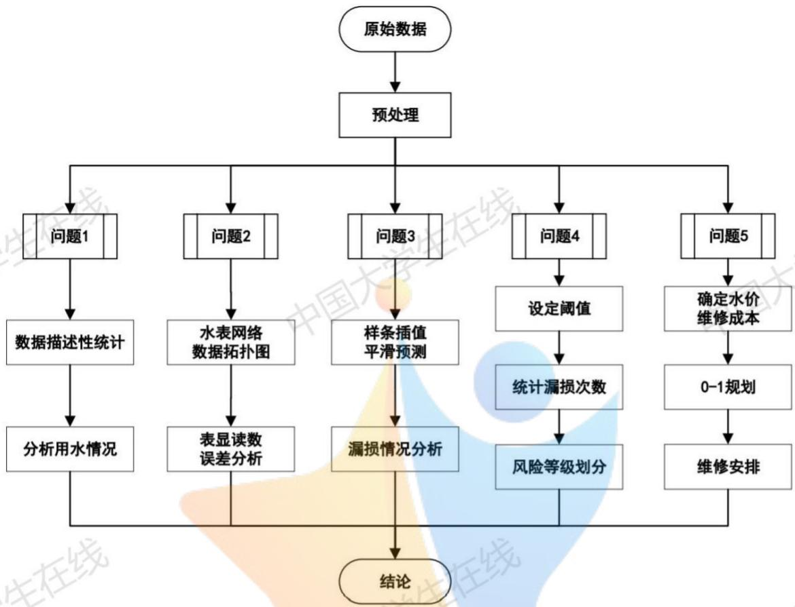

<details>
<summary>flowchart</summary>

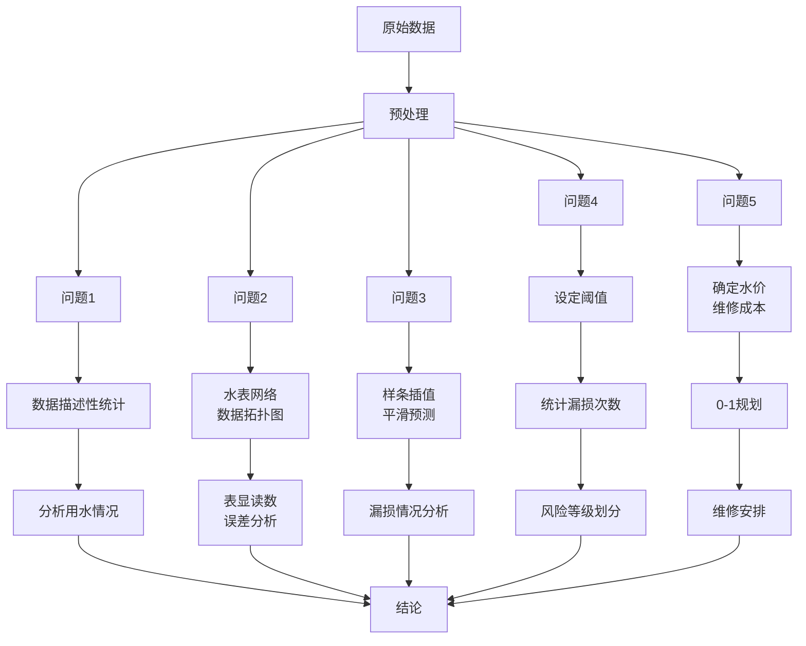
```mermaid
graph TD
  A["原始数据"] --> B["预处理"]
  B --> C["问题1"]
  B --> D["问题2"]
  B --> E["问题3"]
  B --> F["问题4"]
  B --> G["问题5"]
  C --> H["数据描述性统计"]
  D --> I["水表网络\n数据拓扑图"]
  E --> J["样条插值\n平滑预测"]
  F --> K["设定阈值"]
  G --> L["确定水价\n维修成本"]
  H --> M["分析用水情况"]
  I --> N["表显读数\n误差分析"]
  J --> O["漏损情况分析"]
  K --> P["统计漏损次数"]
  L --> Q["0-1规划"]
  P --> R["风险等级划分"]
  Q --> S["维修安排"]
  M --> T["结论"]
  N --> T
  O --> T
  R --> T
  S --> T
```
</details>

图1. 问题分析流程图

## 2.1 问题一分析

问题需要根据已有季度用水表(附件)、水表层次(附件)的数据分析宿舍、教学楼、办公楼、食堂的用水情况特性。为此需要有以下几个分析步骤。

1. 对数据进行描述性统计，获得缺失值、异常值，以及校园用水的总体特征。  
2. 需要对数据进行缺失值、异常值的处理，并对水表进行功能区划分，建立用水情况的水表层级关系表。  
3. 对宿舍功能区、教学楼功能区、办公楼功能区、食堂功能区进行用水分析。

## 2.2 问题二分析

问题需要根据附件中提供的水表层级关系，建立不同层级间水表的关系模型，利用已知数据分析模型误差。

水表的合理使用:

由资料 $^{[1]}$ 电磁水表的误差率较小，而机械速度式水表可检测的最小水流量与管道直径成正比，在直径较大的骨干管道中，采用机械速度式水表难以检测弱水流，误差较大，

见下图:

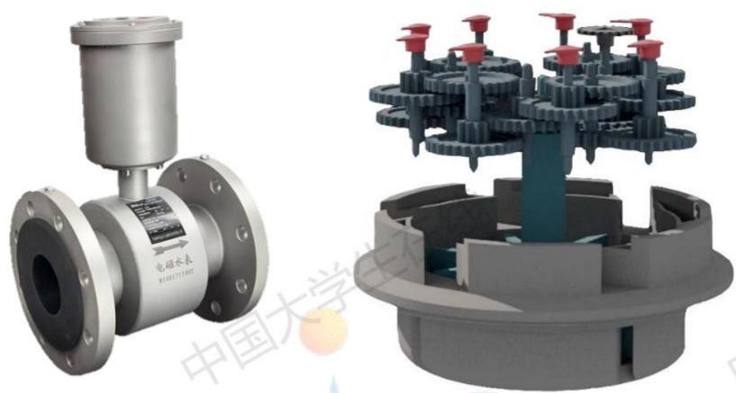

<details>
<summary>natural_image</summary>

Two industrial mechanical components with gear-like assemblies, one labeled '电磁水表' and the other in a circular frame (no visible text or symbols on main components)
</details>

图2. 高精度电磁水表和传统水表

所以：

1. 一级水表采用精度更高的电磁水表；  
2. 二级至四级均采用已广泛使用的机械速度式水表，

我们采用拓扑图将水表间的层级关系可视化；

计算上级水表表显读数和下属水表表显读数之和的差值，将误差分为三类；

1. 一级水表误差按电磁水表统计，二级至四级水表按照机械速度式水表统计  
2. 二级水表按照实际误差来计算，利用其表显数据与一级表数据做差得出误差；

## 2.3 问题三分析

问题需要根据各级水表的显示数据分析出校园水网的具体漏损情况, 文献 [2]采用时间序列神经网络（NAR 神经网络）的预测方法, 基于当前各水表读数时间序列, 对每个读数进行预测, 表显读数与预测值波动超过一定阈值的则视为该时刻发生漏水, 为解决本问题提供了思路, 但是根据附件的数据, 各水表的年用水情况各不相同, 如若进行时间序列分析, 需分水表、分时间段进行稳定性、白噪声以及参数预置的讨论, 所有情况过于繁琐复杂, 本问题并不合适。

有鉴于此，我们参考其预测方法，对时间序列 $t$ 时刻的值进行样条插值平滑预测，从而进行漏损估计，具体的步骤如下：

1. 首先对数据进行预处理工作。对一级水表按照超过一定误差的阈值的异常数据进行置均值的平滑处理；  
2. 其次对一级水表的时间序列数据进行样条插值平滑预测;

3. 利用表显数据与预测值之差进行漏损量的估计。

## 2.4 问题四分析

问题需要从水表的实时数据中发现供水管网的漏损位置：

我们基于问题三的样条插值平滑预测模型：

1. 对二级水表及下属水表进行漏损偏差统计；

2. 计算漏损率:

$$
\text {漏损率} = \frac {\text {原始值－预测值}}{\text {预测值}}
$$

3. 对漏损率超过总体漏损率的时间点和地点判定其发生漏损现象，根据偏差统计划分风险等级，给出供水管网中，可能出现漏损的位置及概率。

## 2.5 问题五分析

问题五需要根据查询资料，结合前面所得到的漏水数据，做出最佳维修策略，为此应首先查阅国家相关水务数据 $^{[3]}$ ，劳务数据以及材料费用数据 $^{[4]}$ ，从而确定水价范围和单次维修价格的范围。

以总损失金额最小作为规则目标函数，以每天是否维修作为决策变量，建立 0-1 规划模型，从而得到维修决策。

## 三 模型假设

1. 假设一级水表采用测量精度较高的电磁水表；  
2. 假设二级至四级采用均已广泛使用机械速度式水表，并有 2%-5% 的相对误差。  
3. 无人蓄意破坏供水管道;  
4. 各水表工作在理想状态下，不受强磁等外界因素干扰；  
5. 水质良好，无明显杂质，不对机械速度式水表产生过大影响；

四 符号说明

<table><tr><td>序号</td><td>符号</td><td>符号表示含义</td></tr><tr><td>1</td><td> $x_{漏损}$ </td><td>各一级水表时间点漏损量</td></tr><tr><td>2</td><td> $x_{原始}$ </td><td>一级水表的原始数据</td></tr><tr><td>3</td><td> $x_{预测}$ </td><td>一级水表的预测漏损量</td></tr><tr><td>4</td><td> $p_{漏损}$ </td><td>水表的漏损率</td></tr><tr><td>5</td><td> $b_{维修}$ </td><td>单次维修费用</td></tr><tr><td>6</td><td> $w_{维修i}$ </td><td>第 $i$ 天是否维修</td></tr></table>

## 五 模型建立与求解

## 5.1 问题一模型建立与求解

## 5.1.1 整体数据描述

首先对数据进行描述性统计如下（部分数据，详细数据见附件）：

表1. 描述性统计

<table><tr><td></td><td>有效个案数</td><td>缺失个案数</td><td>平均值</td><td>中位数</td><td>标准偏差</td><td>最小值</td><td>最大值</td></tr><tr><td>416X</td><td>365.00</td><td>0.00</td><td>66.15</td><td>68.75</td><td>18.47</td><td>0.00</td><td>114.00</td></tr><tr><td>405X</td><td>363.00</td><td>2.00</td><td>130.41</td><td>139.16</td><td>81.02</td><td>0.80</td><td>1011.74</td></tr><tr><td>403X</td><td>363.00</td><td>2.00</td><td>512.37</td><td>474.75</td><td>176.38</td><td>104.50</td><td>1201.25</td></tr><tr><td>401X</td><td>363.00</td><td>2.00</td><td>139.45</td><td>139.25</td><td>50.24</td><td>18.16</td><td>347.91</td></tr><tr><td>419T</td><td>338.00</td><td>27.00</td><td>2.80</td><td>2.89</td><td>0.82</td><td>0.27</td><td>5.03</td></tr><tr><td>418T</td><td>338.00</td><td>27.00</td><td>2.18</td><td>1.71</td><td>1.68</td><td>0.36</td><td>16.30</td></tr><tr><td>417T</td><td>338.00</td><td>27.00</td><td>5.96</td><td>4.83</td><td>4.11</td><td>0.00</td><td>21.58</td></tr></table>

当缺失值不影响数据统计时，不做替换操作，但是对于异常数据，例如二级水表

40337X 中 113-115 行数据大于平均值的 5 倍以上，影响整体数据的光滑程度，不利于数据分析，因此对其进行均值替换处理。根据实际情况我们认为一级水表采用的是误差率较低的水表，而二级以上水表采用的是误差率较高的传统机械式水表，最终统计出一级表显校园总用水量：328232.24，二级表显总用水量：369307，误差率 12.5%。

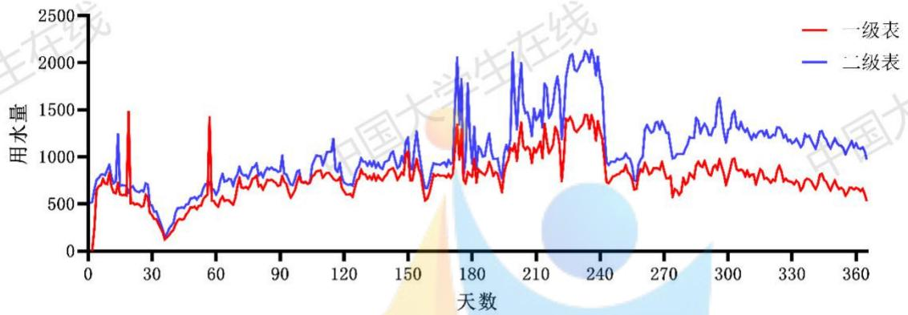

<details>
<summary>line</summary>

| 天数 | 一级表 (用水量) | 二级表 (用水量) |
| --- | --- | --- |
| 0 | 0 | 0 |
| 30 | ~500 | ~600 |
| 60 | ~700 | ~700 |
| 90 | ~700 | ~800 |
| 120 | ~800 | ~900 |
| 150 | ~800 | ~900 |
| 180 | ~1300 | ~2000 |
| 210 | ~1100 | ~1500 |
| 240 | ~1400 | ~2100 |
| 270 | ~800 | ~1200 |
| 300 | ~900 | ~1300 |
| 330 | ~700 | ~1200 |
| 360 | ~600 | ~1000 |
</details>

图3. 一、二级水表表显用水量（年）

根据水表层级附件，我们将二级以上的水表进行了功能区划分如下表：

表2. 功能区分类

<table><tr><td></td><td>水表号</td><td>水表名</td></tr><tr><td rowspan="13">宿舍</td><td>3320100600</td><td>XXX第八学生宿舍</td></tr><tr><td>183671860</td><td>XXX8舍热泵</td></tr><tr><td>3320100700</td><td>XXX第七学生宿舍</td></tr><tr><td>3320100200</td><td>XXX第二学生宿舍</td></tr><tr><td>3320100100</td><td>XXX第一学生宿舍</td></tr><tr><td>3320100500</td><td>XXX第五学生宿舍</td></tr><tr><td>1836718629</td><td>XXX5舍热泵热水</td></tr><tr><td>3320100400</td><td>XXX第四学生宿舍</td></tr><tr><td>1836718625</td><td>XXX4舍热泵热水</td></tr><tr><td>3320100300</td><td>XXX第三学生宿舍</td></tr><tr><td>1836718633</td><td>XXX3舍热泵热水</td></tr><tr><td>3320100800</td><td>XXX第九学生宿舍</td></tr><tr><td>3620301000</td><td>养殖馆附房保卫处宿舍+</td></tr></table>

<table><tr><td></td><td>水表号</td><td>水表名</td></tr><tr><td rowspan="16">教学楼</td><td>3210100200</td><td>XXX成教院XXX分院</td></tr><tr><td>3313800500</td><td>XXXL馆</td></tr><tr><td>3370100100</td><td>XXXL楼</td></tr><tr><td>3313200200</td><td>XXXXS馆</td></tr><tr><td>3370300100</td><td>XXXK</td></tr><tr><td>3200200100</td><td>XXXK楼</td></tr><tr><td>3480400100</td><td>老七楼</td></tr><tr><td>3360300100</td><td>新留学生楼</td></tr><tr><td>3480300100</td><td>XXX老六楼</td></tr><tr><td>3480200100</td><td>XXX老五楼</td></tr><tr><td>3320100900</td><td>留学生楼(新)</td></tr><tr><td>3421300300</td><td>XXX大楼厕所西</td></tr><tr><td>3421300200</td><td>XXX大楼厕所东</td></tr><tr><td>3400500100</td><td>XXX教学大楼总表</td></tr><tr><td>3421300100</td><td>XXX中心大楼泵房</td></tr><tr><td>3315400200</td><td>XXXXM馆</td></tr></table>

<table><tr><td></td><td>水表号</td><td>水表名</td></tr><tr><td rowspan="3">办公楼</td><td>3210100100</td><td>XXX干训楼</td></tr><tr><td>3170100600</td><td>XXX西大楼</td></tr><tr><td>3422200100</td><td>XXX东大楼</td></tr></table>

<table><tr><td></td><td>水表号</td><td>水表名</td></tr><tr><td rowspan="3">食堂</td><td>3390100400</td><td>XXX第五食堂</td></tr><tr><td>3160200300</td><td>XXX第一食堂</td></tr><tr><td>3390100500</td><td>XXX第二食堂</td></tr></table>

## 5.1.2 功能区用水情况（全年）分析

在 Python 中利用 pandas 库的数据处理优势对各功能区进行分类汇总，获得各功能区全年的用水情况如下图：

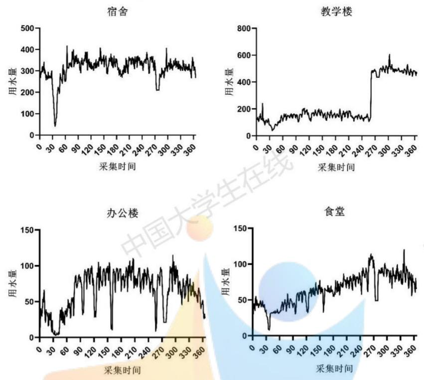  
图4. 各功能区全年用水情况

由上图可以看出，各功能区用水情况有以下特点：1. 整体数据都呈现周期性波动，每周用水量按照工作日和非工作日有峰谷的变化；2. 各功能区在 1-3 月份均处于用水量较少的位置，这个时间段是农历新年所在的寒假期间；3. 教学楼和食堂数据在 9-10 月份有明显的增加，这一时期正是新生报到的时间，因此引起用水量的变化；4. 办公楼和宿舍的用水数据在寒假之外的时间段没有明显的上升下降变化。

## 5.1.3 功能区用水情况（每天）分析

将不同功能区按照工作日、周六日和节假日三种类型进行数据统计分析得到其每日的用水概况图如下：

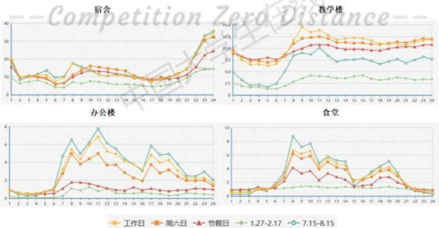  
图5. 功能区按三种日期类型每日用水统计

功能区每日用水分析

从上图可以看出各功能区每日用水情况有以下特点: 1. 所有功能区 00:00-06:00 时间段内的用水量普遍较少; 2. 宿舍和教学楼的用水时间正好相反, 白天学生大部分在教室上课或者学习, 夜晚学生回到宿舍, 此时宿舍用水处于高峰; 3. 办公楼用水高峰位正好是每天上午和下午的工作时间; 4. 食堂的用水高峰分别是 07:00/12:00/18:00 三个时间左右; 5. 寒假期间各功能区用水量均明显小于全年其他时间。

## 5.2 问题二模型建立与求解

## 5.2.1 水表数据关系

首先根据水表层级附件绘制出水网的拓扑结构图，显示出各水表之间的层级关系。

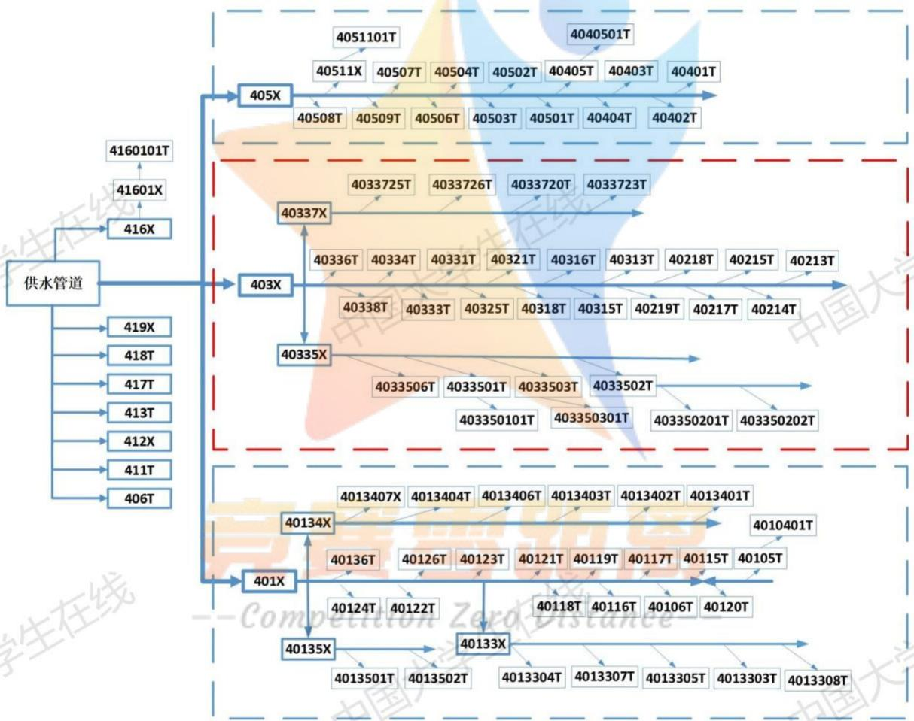

<details>
<summary>flowchart</summary>

This image displays a network flow diagram (a type of flowchart) illustrating the data transmission and reception paths between various water channels, including a central '供水管道' (Water Supply Chain) and multiple parallel processing or distribution paths.
</details>

图6. 水表数据关联拓扑图

并得到他们之间的数据关系为：1. 一级水表 401X、403X、405X 等表显数据应为其二级水表的数据之和；2. 一级水表 416X 的显示数据包含其二级子水表的数据，但两者并不相等；3. 二级水表 40335X/40337X 等所处的位置如区域 1、区域 2、区域 3、区域 4 等本身也会用水，所以二级水表数据包含其三级子水表的数据，但是两者并不相等。

## 5.2.2 误差分析

关联数据平均相对误差 MRE 的计算方法为:

$$
R E _ {i j} = \frac {\left| \sum x _ {\mathrm{二级}} - x _ {\mathrm{一级}} \right|}{x _ {\mathrm{一级}}}
$$

$$
M R E = \frac {1}{n} \sum R E _ {i j}
$$

我们将数据的误差分为三类:

首先一级水表 401X、403X、405X 与其二级子水表之间的数据理论上应该是相等的，经过 pandas 库数据处理分析得到其平均相对误差为

表3. 一级水表数据误差

<table><tr><td>一级水表</td><td>误差</td><td>一级水表</td><td>误差</td><td>一级水表</td><td>误差</td></tr><tr><td>401X</td><td>11%</td><td>403X</td><td>4%</td><td>405X</td><td>11%</td></tr></table>

对于 406T、411T、412T 等一级水表，根据资料 [1] 按精度最高的电磁水表来考虑，其显示数据误差为 ±0.5% - 3%;

对于二级、三级、四级水表，根据资料[1]我们按通用的机械水表来考虑，其显示数据误差为：-5%-3%。

## 5.3 问题三模型建立和求解

## 5.3.1 数据预处理

首先在 pandas 中对一级水表的显示数据进行按天的汇总, 数据见附件, 其波动变化图如下:

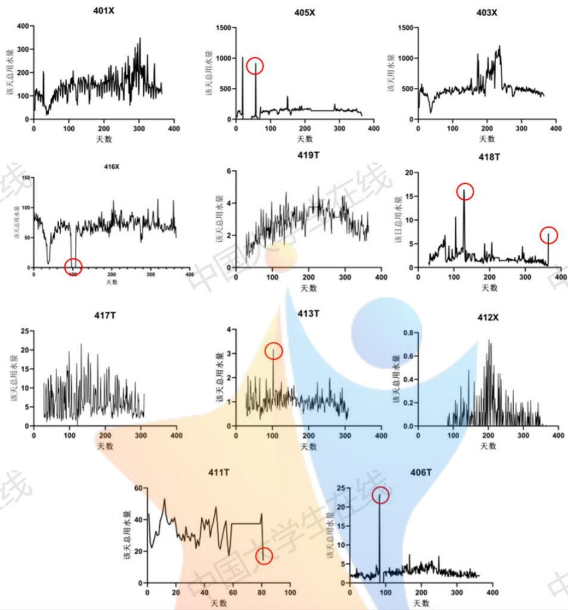  
图7. 一级水表全年用水时间序列图

针对每个一级水表的数据的不同特性，我们把红圈中的异常值进行均值替换处理，从而让数据更加平滑稳定。

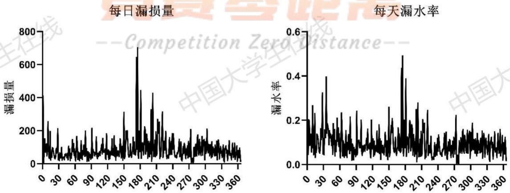  
图8. 全年整体的漏损量和漏损率时间序列图

由上图可看出，全年的漏水量和漏水频率是平稳波动的，日均漏水量为88，日均漏水率为 $8.8\%$ ，在年中的7、8月份，漏水量与漏水率均有较大幅度的波动，需重点进行防范和检修。

## 5.3.2 样条插值平滑预测

样条插值的基本原理如下:

设给定区间 $[a, b]$ 的一个分划：

$$
\Delta : a = x _ {0} <   x _ {0} <   \dots <   x _ {0} = b
$$

若函数 $s(x)$ ，满足条件：

在每一个单独区间段内 $[x_{i-1},x_{i}],(i=1,2,\cdots,n)$ ，是k次多项式；

$s(x)$ 及直到 $k - 1$ 阶导数在给定区间[a,b]上连续。

则称函数 $s(x)$ 是关于分划 $\Delta$ 的k次多项式样条函数， $x_{0},x_{1},\cdots,x_{n}$ 称为样条节点，样条函数记作 $S_{p}(\Delta,k)$ 。k次多项式样条函数的一般形式为：

$$
s _ {k} (x) = \sum_ {i = 0} ^ {k} \frac {\alpha_ {i} x ^ {i}}{i !} + \sum_ {j = 1} ^ {n - 1} \frac {\beta_ {j}}{k !} (x - x _ {j}) _ {+} ^ {k}
$$

其中 $\alpha_{i}(i=0,1,\cdots,k)$ 和 $\beta_{i}(i=1,2,\cdots,n-1)$ 均为任意常数

这里我们采用三次样条插值对一级水表的每个时间序列数据进行预测。

在数据 $x_{ij}$ 附近向左向右各选5个数据共10个，即 $\left[x_{i,j-5}\ldots x_{i,j-1}x_{i,j+1}\ldots x_{i,j+5}\right]$ ，通过这十个数据对 $x_{ij}$ 进行插值预测，得到的预测数据（具体见附件）。

## 5.3.3 漏损情况分析

各一级水表时间点漏损数据 $x_{\text{漏损}}$ 计算方法为：

$$
x _ {\text {漏损}} = x _ {\text {原始}} - x _ {\text {预测}}
$$

漏损率 $p_{\text{漏损}}$ 为：

$$
p _ {\mathrm{漏损}} = \frac {x _ {\mathrm{漏损}}}{x _ {\mathrm{预测}}}
$$

通过借助于Python数据处理，得到各一级水表的具体数据，文献[2]显示我国城市漏水率一般在 $15\%$ 以上，北方地区甚至达到了 $40\%$ ，在此基础上统计得出各水表的漏水次数和漏水量为（具体数据见附件）：

表4. 各水表漏损量和漏损率

<table><tr><td>水表号</td><td>412X</td><td>40336T</td><td>40403T</td><td>40105T</td><td>40502T</td><td>40334T</td><td>4010401T</td><td>403350202T</td><td>40126T</td><td>40118T</td></tr><tr><td>漏水率</td><td>34.8%</td><td>25.8%</td><td>25.2%</td><td>20.2%</td><td>20.0%</td><td>19.2%</td><td>18.9%</td><td>18.6%</td><td>17.9%</td><td>17.7%</td></tr><tr><td>漏水量</td><td>6.33</td><td>76.22</td><td>163.90</td><td>10.53</td><td>228.90</td><td>0.97</td><td>292.14</td><td>10.87</td><td>0.92</td><td>45.43</td></tr><tr><td>水表号</td><td>40124T</td><td>417T</td><td>40316T</td><td>4013403T</td><td>40333T</td><td>40318T</td><td>4013407X</td><td>40121T</td><td>40331T</td><td>40120T</td></tr><tr><td>漏水率</td><td>17.2%</td><td>16.6%</td><td>16.6%</td><td>16.0%</td><td>15.5%</td><td>15.5%</td><td>15.2%</td><td>14.9%</td><td>14.6%</td><td>12.8%</td></tr><tr><td>漏水量</td><td>14.15</td><td>335.40</td><td>89.36</td><td>474.39</td><td>26.09</td><td>10.32</td><td>347.28</td><td>27.74</td><td>13.54</td><td>17.26</td></tr><tr><td>水表号</td><td>40119T</td><td>4160101T</td><td>40136T</td><td>40214T</td><td>40115T</td><td>40321T</td><td>40135X</td><td>40509T</td><td>4013404T</td><td>413T</td></tr><tr><td>漏水率</td><td>12.6%</td><td>12.2%</td><td>11.9%</td><td>11.8%</td><td>11.7%</td><td>10.4%</td><td>10.3%</td><td>9.9%</td><td>9.7%</td><td>9.5%</td></tr><tr><td>漏水量</td><td>90.18</td><td>51.17</td><td>25.28</td><td>1115.73</td><td>89.82</td><td>440.32</td><td>106.94</td><td>33.17</td><td>91.73</td><td>26.69</td></tr><tr><td>水表号</td><td>4013501T</td><td>4051101T</td><td>4013307T</td><td>40511X</td><td>4013401T</td><td>40106T</td><td>4013308T</td><td>40508T</td><td>40133X</td><td>40405T</td></tr><tr><td>漏水率</td><td>9.4%</td><td>9.2%</td><td>9.2%</td><td>9.1%</td><td>9.1%</td><td>8.8%</td><td>8.5%</td><td>8.3%</td><td>8.2%</td><td>8.2%</td></tr><tr><td>漏水量</td><td>39.86</td><td>148.22</td><td>285.15</td><td>140.48</td><td>99.98</td><td>6.98</td><td>441.09</td><td>161.01</td><td>1308.17</td><td>733.24</td></tr><tr><td>水表号</td><td>4013305T</td><td>406T</td><td>4013406T</td><td>41601X</td><td>40313T</td><td>418T</td><td>40116T</td><td>40402T</td><td>40401T</td><td>40123T</td></tr><tr><td>漏水率</td><td>7.9%</td><td>7.8%</td><td>7.6%</td><td>7.5%</td><td>7.4%</td><td>7.4%</td><td>6.9%</td><td>6.8%</td><td>6.7%</td><td>6.7%</td></tr><tr><td>漏水量</td><td>88.29</td><td>75.24</td><td>43.03</td><td>150.84</td><td>233.82</td><td>52.82</td><td>398.88</td><td>124.85</td><td>65.72</td><td>39.73</td></tr><tr><td>水表号</td><td>4013303T</td><td>40122T</td><td>40134X</td><td>4033726T</td><td>40338T</td><td>40504T</td><td>401X</td><td>4033506T</td><td>4040501T</td><td>419T</td></tr><tr><td>漏水率</td><td>6.6%</td><td>6.5%</td><td>6.4%</td><td>6.3%</td><td>6.1%</td><td>6.1%</td><td>5.7%</td><td>5.6%</td><td>5.3%</td><td>5.0%</td></tr><tr><td>漏水量</td><td>684.46</td><td>9.51</td><td>1032.60</td><td>645.72</td><td>184.70</td><td>154.50</td><td>2872.94</td><td>106.29</td><td>89.74</td><td>47.77</td></tr><tr><td>水表号</td><td>40218T</td><td>40507T</td><td>40315T</td><td>4013502T</td><td>4033725T</td><td>403350301T</td><td>403350101T</td><td>416X</td><td>40117T</td><td>4033723T</td></tr><tr><td>漏水率</td><td>5.0%</td><td>4.8%</td><td>4.7%</td><td>4.3%</td><td>4.1%</td><td>4.1%</td><td>4.0%</td><td>3.8%</td><td>3.7%</td><td>3.7%</td></tr><tr><td>漏水量</td><td>95.09</td><td>113.88</td><td>203.48</td><td>10.19</td><td>115.34</td><td>235.91</td><td>115.72</td><td>907.76</td><td>191.78</td><td>74.13</td></tr><tr><td>水表号</td><td>40404T</td><td>403350201T</td><td>40219T</td><td>40501T</td><td>4013402T</td><td>40337X</td><td>4033720T</td><td>40217T</td><td>40325T</td><td>411T</td></tr><tr><td>漏水率</td><td>3.7%</td><td>3.7%</td><td>3.7%</td><td>3.5%</td><td>3.4%</td><td>3.4%</td><td>3.0%</td><td>3.0%</td><td>2.9%</td><td>2.9%</td></tr><tr><td>漏水量</td><td>273.55</td><td>212.11</td><td>87.40</td><td>429.83</td><td>7.90</td><td>3006.97</td><td>463.68</td><td>184.87</td><td>544.23</td><td>490.07</td></tr><tr><td>水表号</td><td>4033502T</td><td>40503T</td><td>405X</td><td>40335X</td><td>40215T</td><td>403X</td><td>4033501T</td><td>40213T</td><td>4033503T</td><td>4013304T</td></tr><tr><td>漏水率</td><td>2.8%</td><td>2.7%</td><td>2.7%</td><td>2.7%</td><td>2.6%</td><td>2.5%</td><td>2.5%</td><td>2.3%</td><td>1.9%</td><td>1.2%</td></tr><tr><td>漏水量</td><td>524.61</td><td>539.53</td><td>1227.30</td><td>1525.04</td><td>343.88</td><td>4724.68</td><td>282.11</td><td>153.52</td><td>353.49</td><td>0.33</td></tr></table>

上表显示一级水表的漏损量估计为 10766，二级以上水表的漏损量估计为：21488，总漏损率估计为：9.8%，

同时数据显示在一级水表中，403X 处的漏损量是最多的，412X 处的漏水率是最高的，平均漏损量为 978；在二级以上的水表中，40337X 的漏损量是最多的，40336T 处的漏损率是最高的，平均漏损量为 268。

## 5.4 问题四模型建立与求解

基于第三问的漏损率数据，我们设置预报发生漏损的漏损率阈值为9.8%，

统计得出各水表的漏损频次排序如图:

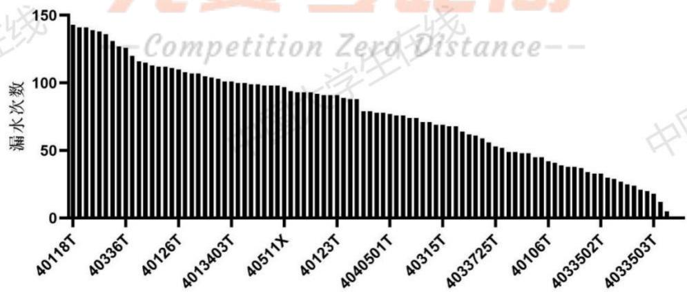

<details>
<summary>bar</summary>

| Category | 漏水次数 |
| --- | --- |
| 40118T | ~145 |
| 40336T | ~125 |
| 40126T | ~115 |
| 4013403T | ~105 |
| 40511X | ~98 |
| 40123T | ~92 |
| 4040501T | ~78 |
| 40315T | ~70 |
| 4033725T | ~55 |
| 40106T | ~42 |
| 4033502T | ~30 |
| 4033503T | ~15 |
</details>

图9. 水表漏水频次

从上图可以看出 40118T/40121T/40331T 的漏损次数排名前三，我们按照每隔 30 次一个漏损发生预报等级，对各水表位置进行漏损等级预报如下图：

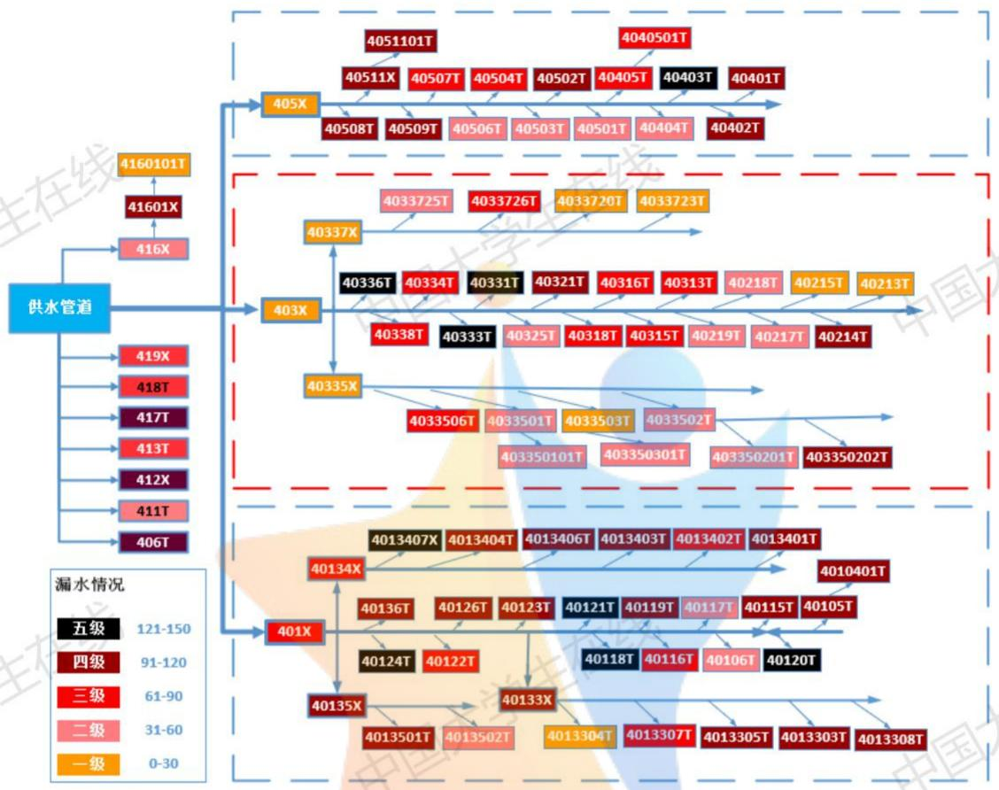

<details>
<summary>flowchart</summary>

This image displays a system architecture or data flow diagram (likely a project management or water supply chain) showing the hierarchy of components and their corresponding status levels categorized by 'Level' (Level 1-50).
</details>

图10. 漏损预报等级

根据漏损预报等级显示：40118T/40121T/40331T 等 9 处水表位置预警等级最高，这些水表点应该重点注意。4010401T/4013501T/40135X 等 32 处预警等级次之需要提高警惕。

## 5.5 问题五模型建立与求解

## 5.5.1 0-1 规划模型建立

依据全国水价网数据资料 $^{[3]}$ ，公共事业单位用水均价为5.5-6.5元/吨，另据资料 $^{[4]}$ 显示供水地下暗管价格为300元/m，单次维修人数3人，人工费为200元/人，单次维修总费用为 $b_{维修}=500$ 元-1500元，由第三、四问可知全年每天的漏水量是不固定的，因此以总损失金额最少建立0-1规划模型：

$$
m i n \sum_ {i = 1} ^ {3 6 5} (b _ {\mathrm{维修}} w _ {\mathrm{维修} i} + b _ {\mathrm{漏损} i} (1 - w _ {\mathrm{维修} i}))
$$

$$
s. t. \quad w _ {\mathrm{维修} i} = 0, 1
$$

## 5.5.2 模型求解

在 matlab 中运用 intlinprog 求解线性 0-1 规划得到维修次数和损失金额关于水价和维修成本的三维曲面图如下:

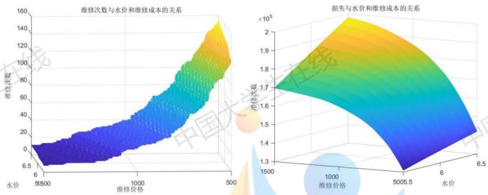  
图11. 维修次数和损失金额与水价和维修成本的关系图  
可以看出当水价为 5.5 元/吨，维修成本为 500 元/次时总的损失金额是最少的；当水价为 6.5 元/吨，维修成本为 1500 元/次时，总的维修次数是最少的。

我们取水价为 6 元/吨，维修成本为 1000 元/次，具体维修安排如下：

<table><tr><td>01/01</td><td>01/02</td><td>01/03</td><td>01/04</td><td>01/05</td><td>01/06</td><td>01/07</td><td>01/08</td><td>01/09</td><td>01/10</td><td>01/11</td><td>01/12</td><td>01/13</td><td>01/14</td><td>01/15</td><td>01/16</td><td>01/17</td><td>01/18</td><td>01/19</td></tr><tr><td>01/20</td><td>01/21</td><td>01/22</td><td>01/23</td><td>01/24</td><td>01/25</td><td>01/26</td><td>01/27</td><td>01/28</td><td>01/29</td><td>01/30</td><td>01/31</td><td>02/01</td><td>02/02</td><td>02/03</td><td>02/04</td><td>02/05</td><td>02/06</td><td>02/07</td></tr><tr><td>02/08</td><td>02/09</td><td>02/10</td><td>02/11</td><td>02/12</td><td>02/13</td><td>02/14</td><td>02/15</td><td>02/16</td><td>02/17</td><td>02/18</td><td>02/19</td><td>02/20</td><td>02/21</td><td>02/22</td><td>02/23</td><td>02/24</td><td>02/25</td><td>02/26</td></tr><tr><td>02/27</td><td>02/28</td><td>03/01</td><td>03/02</td><td>03/03</td><td>03/04</td><td>03/05</td><td>03/06</td><td>03/07</td><td>03/08</td><td>03/09</td><td>03/10</td><td>03/11</td><td>03/12</td><td>03/13</td><td>03/14</td><td>03/15</td><td>03/16</td><td>03/17</td></tr><tr><td>03/18</td><td>03/19</td><td>03/20</td><td>03/21</td><td>03/22</td><td>03/23</td><td>03/24</td><td>03/25</td><td>03/26</td><td>03/27</td><td>03/28</td><td>03/29</td><td>03/30</td><td>03/31</td><td>04/01</td><td>04/02</td><td>04/03</td><td>04/04</td><td>04/05</td></tr><tr><td>04/06</td><td>04/07</td><td>04/08</td><td>04/09</td><td>04/10</td><td>04/11</td><td>04/12</td><td>04/13</td><td>04/14</td><td>04/15</td><td>04/16</td><td>04/17</td><td>04/18</td><td>04/19</td><td>04/20</td><td>04/21</td><td>04/22</td><td>04/23</td><td>04/24</td></tr><tr><td>04/25</td><td>04/26</td><td>04/27</td><td>04/28</td><td>04/29</td><td>04/30</td><td>05/01</td><td>05/02</td><td>05/03</td><td>05/04</td><td>05/05</td><td>05/06</td><td>05/07</td><td>05/08</td><td>05/09</td><td>05/10</td><td>05/11</td><td>05/12</td><td>05/13</td></tr><tr><td>05/14</td><td>05/15</td><td>05/16</td><td>05/17</td><td>05/18</td><td>05/19</td><td>05/20</td><td>05/21</td><td>05/22</td><td>05/23</td><td>05/24</td><td>05/25</td><td>05/26</td><td>05/27</td><td>05/28</td><td>05/29</td><td>05/30</td><td>05/31</td><td>06/01</td></tr><tr><td>06/02</td><td>06/03</td><td>06/04</td><td>06/05</td><td>06/06</td><td>06/07</td><td>06/08</td><td>06/09</td><td>06/10</td><td>06/11</td><td>06/12</td><td>06/13</td><td>06/14</td><td>06/15</td><td>06/16</td><td>06/17</td><td>06/18</td><td>06/19</td><td>06/20</td></tr><tr><td>06/21</td><td>06/22</td><td>06/23</td><td>06/24</td><td>06/25</td><td>06/26</td><td>06/27</td><td>06/28</td><td>06/29</td><td>06/30</td><td>07/01</td><td>07/02</td><td>07/03</td><td>07/04</td><td>07/05</td><td>07/06</td><td>07/07</td><td>07/08</td><td>07/09</td></tr><tr><td>07/10</td><td>07/11</td><td>07/12</td><td>07/13</td><td>07/14</td><td>07/15</td><td>07/16</td><td>07/17</td><td>07/18</td><td>07/19</td><td>07/20</td><td>07/21</td><td>07/22</td><td>07/23</td><td>07/24</td><td>07/25</td><td>07/26</td><td>07/27</td><td>07/28</td></tr><tr><td>07/29</td><td>07/30</td><td>07/31</td><td>08/01</td><td>08/02</td><td>08/03</td><td>08/04</td><td>08/05</td><td>08/06</td><td>08/07</td><td>08/08</td><td>08/09</td><td>08/10</td><td>08/11</td><td>08/12</td><td>08/13</td><td>08/14</td><td>08/15</td><td>08/16</td></tr><tr><td>08/17</td><td>08/18</td><td>08/19</td><td>08/20</td><td>08/21</td><td>08/22</td><td>08/23</td><td>08/24</td><td>08/25</td><td>08/26</td><td>08/27</td><td>08/28</td><td>08/29</td><td>08/30</td><td>08/31</td><td>09/01</td><td>09/02</td><td>09/03</td><td>09/04</td></tr><tr><td>09/05</td><td>09/06</td><td>09/07</td><td>09/08</td><td>09/09</td><td>09/10</td><td>09/11</td><td>09/12</td><td>09/13</td><td>09/14</td><td>09/15</td><td>09/16</td><td>09/17</td><td>09/18</td><td>09/19</td><td>09/20</td><td>09/21</td><td>09/22</td><td>09/23</td></tr><tr><td>09/24</td><td>09/25</td><td>09/26</td><td>09/27</td><td>09/28</td><td>09/29</td><td>09/30</td><td>10/01</td><td>10/02</td><td>10/03</td><td>10/04</td><td>10/05</td><td>10/06</td><td>10/07</td><td>10/08</td><td>10/09</td><td>10/10</td><td>10/11</td><td>10/12</td></tr><tr><td>10/13</td><td>10/14</td><td>10/15</td><td>10/16</td><td>10/17</td><td>10/18</td><td>10/19</td><td>10/20</td><td>10/21</td><td>10/22</td><td>10/23</td><td>10/24</td><td>10/25</td><td>10/26</td><td>10/27</td><td>10/28</td><td>10/29</td><td>10/30</td><td>10/31</td></tr><tr><td>11/01</td><td>11/02</td><td>11/03</td><td>11/04</td><td>11/05</td><td>11/06</td><td>11/07</td><td>11/08</td><td>11/09</td><td>11/10</td><td>11/11</td><td>11/12</td><td>11/13</td><td>11/14</td><td>11/15</td><td>11/16</td><td>11/17</td><td>11/18</td><td>11/19</td></tr><tr><td>11/20</td><td>11/21</td><td>11/22</td><td>11/23</td><td>11/24</td><td>11/25</td><td>11/26</td><td>11/27</td><td>11/28</td><td>11/29</td><td>11/30</td><td>12/01</td><td>12/02</td><td>12/03</td><td>12/04</td><td>12/05</td><td>12/06</td><td>12/07</td><td>12/08</td></tr><tr><td>12/09</td><td>12/10</td><td>12/11</td><td>12/12</td><td>12/13</td><td>12/14</td><td>12/15</td><td>12/16</td><td>12/17</td><td>12/18</td><td>12/19</td><td>12/20</td><td>12/21</td><td>12/22</td><td>12/23</td><td>12/24</td><td>12/25</td><td>12/26</td><td>12/27</td></tr><tr><td>12/28</td><td>12/29</td><td>12/30</td><td>12/31</td><td></td><td></td><td></td><td></td><td></td><td></td><td></td><td></td><td></td><td></td><td></td><td></td><td></td><td></td><td></td></tr></table>

图12. 维修安排（蓝色代表不维修，红色表示维修）

从上表结合模型求解结果可以得出，全年总共维修 33 次，具体的安排如表所示，全年中 6-8 月份维修频率较多，其原因可能是因为夏季雨水增多，造成地下水管的腐蚀，产生管网沉积物，引起供水管破裂，因此 6-8 月份漏水量增大，需检修次数相应增加。

与之相反的是在 11-12 月份的维修次数相对较少，这可能是由于降水量减少，供水管路运行良好，漏水量降低的原因。

总的损失金额为 174,630 元

## 六 模型检验

## 6.1 问题三和问题四的模型灵敏度检验

针我们将时序点向前向后的差值点数由前后各 5 个改为前后 3 个和前后 7 个，分别通过样条插值得到其漏损量和漏损率比较见下表：

表5. 插值点数量的灵敏度检验

<table><tr><td>向前向后插值点数</td><td>3个点</td><td>5个点</td><td>7个点</td></tr><tr><td>漏损量</td><td>32255</td><td>32255</td><td>32255</td></tr><tr><td>漏损率</td><td>9.8%</td><td>9.8%</td><td>9.8%</td></tr></table>

从上表可以看出当改变插值点的个数时，对于漏损量和漏损率均没有的改变，一方面是因为样条插值预测的特性，另一方面也说明我们的模型健壮性较好。

## 6.2 问题五的模型灵敏度检验

我们将水价进一步拓展为 5 元/吨-7 元/吨，维修成本进一步拓展为 200 元/次-2000 元/次，可以看出总维修次数随着水价和维修成本均单调递减，总损失金额随水价和维修成本单调递增。

## 七 模型改进

## 7.1 问题三和问题四的模型改进

我们可以参考文献 $^{[2]}$ 中的时间序列神经网络对数据进行平滑预测，得到更精确的预测值作为计算漏损量和漏损率的参考数据，并以此进行漏损检验分析，分析发生漏损的位置。

## 7.2 问题五模型改进

参考文献 5 发生漏损的点位数量在时间 $[T, T + \tau]$ 内服从泊松分布，我们把全年的漏损数据看成是一个完整的泊松过程，这个过程也是一个马尔科夫链，用随机过程分析方法来对维修决策进行重新规划，可以得到更好的维修安排决策。

此外在考虑约束条件时，也可以加入维修均衡度等条件。

## 八 模型评价

## 8.1 优点

1. 对于问题给出额数据量较大、多种数据格式类型共存、缺失值异常值较多的数据特点，我们采用 Python 中的 pandas 库，快捷方便的对数据进行了挖掘处理；  
2. 我们利用样条插值的光滑预测特性，对漏损情况进行分析，得到较好的漏损位置预测结果；  
3. 我们利用结合实际的水价和维修价格不断波动的特点，建立了动态的 0-1 规划模型，较好的给出了维修决策；

综合以上，我们的模型不但可以推广到其他的供水网络数据分析中，还可以进一步应用到供热数据分析、网络流量数据分析、高速路网数据分析当中，具有较好的推广价值。

## 8.2 缺点

1. 预测数据模型可以考虑更多的因素,获得更加精确的预测值,以此来建立模型;  
2. 维修规划时可以考虑维修的均衡度等因素，进一步优化模型。

## 九 参考文献

[1] “你好，查水表，” [联机]. Available: https://www.bilibili.com/video/av77960277/.  
[2] 朱乃富，《基于数据驱动的供水管网独立计量分区漏损检测和定位方法研究》：硕士学位论文，2019年2月.  
[3] “中国水网水价,” [联机]. Available: http://www.h2o-china.com/price/.  
[4] “双高筋增强聚乙烯（HDPE）缠绕管，” [联机]. Available: http://www.jt1688.cn/photo\_show.aspx?id=206.  
[5] 卓严报，《基于支持向量机的城市给水管网故障诊断研究》：硕士学位论文, 2013 年 6 月.  
[6] 谢金星、薛毅，《优化建模与 LINDO/LINGO 软件》，清华大学出版社, 2006 年.  
[7] 吴小刚、张土乔，“《城市给水网系统的故障风险评价决策技术》,”《自然灾害学报》,2006年4月.  
[8] 王凌, 《维修决策模型和方法的理论与应用研究》, 博士学位论文, 2007 年 6 月.  
[9] 司守奎、孙兆亮，《数学建模算法与应用》，第二版 编辑，国防工业出版社, 2011 年.  
[10] 苗志宏、马金强, MATLAB 面向对象程序设计, 电子工业出版社, 2014 年.  
[11] 吕自荟，《水泵系统状态监测与故障诊断》，硕士学位论文, 2014 年 6 月.  
[12] 梁建文、肖笛、赵新华、张宏伟, “《给水网故障实时诊断方法》,” 《水利学报》, 2001 年 12 月.  
[13] 梁建文、肖笛、张宏伟、赵新华, “《给水管网故障实时诊断方法（Ⅱ）》,” 《自然科学进展》, 2002 年 9 月.  
[14] 李花、梁辉、于宁, Excel 高级数据处理及分析, 电子工业出版社, 2015 年.  
[15] 李航, 《统计学习方法》, 清华大学出版社, 2013 年.  
[16] 郭明乐、黄旭东，《概率论与数理统计》，中国科学技术大学出版社, 2011 年.


<details>
<summary>text_image</summary>

中国大学生在线
中国大学生在线
</details>

## 竞赛零距离

--Competition Zero Distance--

## 十附录

## 10.1 支撑材料目录

<table><tr><td>问题一</td><td>一二级水表表显用水量(年).xls各功能区全年用水情况.xlsx功能区按三种日期类型每日用水统计.xlsCode_1.py</td></tr><tr><td>问题二</td><td>一级水表数据误差.xlsxCode_2.py</td></tr><tr><td>问题三</td><td>一级水表全年用水时间序列图.xlsx全年整体的漏损量和漏损率时间序列图.xlsx各水表漏水量和漏损率,xlsCode_3.py</td></tr><tr><td>问题四</td><td>水表漏水频次.xlsCode_4.py</td></tr><tr><td>问题</td><td>cs.xlssunshi.xlsxsuihua.m</td></tr></table>

## 10.2 代码、操作及结果

## 1. 问题一和问题二

```python
import numpy as np
import pandas as pd
import os
import xlrd
from pandas import to_datetime
import matplotlib.pyplot as plt
import xlwt
import datetime,time
plt.rcParams['font.sans-serif']=['SimHei']
plt.rcParams['axes.unicode_minus']=False

inputdir=r'D:\\主桌面\\E 题\\水表数据'
df_empty=pd.DataFrame(columns=['水表名','水表号','采集时间','上次读数','当前读数','用量'])
for parents, dirnames, filenames in os.walk(inputdir):
    for filename in filenames:
        df=pd.read_excel(os.path.join(parents,filename))
        df_empty=df_empty.append(df,ignore_index=True)
```

```python
data_index=pd.read_excel('D:\\主桌面\\E 题\\附件_水表层级(1).xlsx')
data_index.dropna(axis=0,thresh=7,inplace=True)
data=df_empty.copy()
```

```txt
data_all=pd.merge(data,data_index,how="outer")
data_all.to_csv('D:\\主桌面\\E 题\\功能区关联表.csv')
```

\# 用量是否为表显数据差

data\_all['表显差值']=data\_all['当前读数']-data\_all['上次读数']

data\_all['差值']=data\_all['表显差值']-data\_all['用量']

data\_all['差值'].abs().sum()

data\_all\_tem=data\_all[data\_all['差值'].abs()==0.01]

\# 各水表总用水量统计

sbm\_sl=data\_all['用量'].groupby(by=data\_all['序号']).sum()

#12 个工作区总用水量

gnq\_sl=data\_all['用量'].groupby(by=data\_all['功能分类']).sum()

```txt
data_all['采集时间']=to_datetime(data_all.采集时间,format='%Y/%m/%d %H:%M:%S')
gnq_sl.to_excel('D:\\主桌面\\E 题\\功能区总水量.xls')
```

#12 个功能区按天统计用水量

gnq\_day=pd.DataFrame(columns=['总表','宿舍','教学楼','办公楼','食堂','科研楼','运动场所','后勤保卫','校医院','澡堂','酒店','图书馆','其他'])

for i in np.arange(13):

temp=data\_all[data\_all['功能分类']==i]

temp.set\_index('采集时间',inplace=True)

gnq\_day.iloc[:,i-1]=temp['用量'].resample('D').sum()

gnq\_day.to\_excel('D:\\主桌面\\E 题\\功能区每天水量.xls')

#12 个功能区按月度统计用水量

gnq\_month=pd.DataFrame(columns=['总表','宿舍','教学楼','办公楼','食堂','科研楼','运动场所','后勤保卫','校医院','澡堂','酒店','图书馆','其他'])

for i in np.arange(13):

temp=data\_all[data\_all['功能分类']==i]

temp.set\_index('采集时间',inplace=True)

gnq\_month.iloc[:,i-1]=temp['用量'].resample('M').sum()

gnq\_month.to\_excel('D:\\主桌面\\E 题\\功能区每月水量.xls')

#12 个功能区按小时统计用水量

gnq\_hour=pd.DataFrame(columns=['总表','宿舍','教学楼','办公楼','食堂','科研楼','运动场所','后勤保卫','校医院','澡堂','酒店','图书馆','其他'])

for i in np.arange(13):

```txt
temp=data_all[data_all['功能分类']==i]
temp.set_index('采集时间',inplace=True)
gnq_hour.iloc[:,i-1]=temp['用量'].resample('H').sum()
gnq_hour.to_excel('D:\\主桌面\\E 题\\功能区每小时.xls')
```

gnq\_15min=pd.DataFrame(columns=['总表','宿舍','教学楼','办公楼','食堂','科研楼','运动场所','后勤保卫','校医院','澡堂','酒店','图书馆','其他'])  
```python
for i in np.arange(13):
    temp=data_all[data_all['功能分类']==i]
    temp.set_index('采集时间',inplace=True)
    gnq_15min.iloc[:,i-1]=temp['用量'].resample('15min').sum()
gnq_15min.to_excel('D:\\主桌面\\E 题\\功能区 15min.xls')
```

```python
gnq_ht=gnq_15min.loc['2019-04-01T00:00:00.000000000':'2019-04-30T23:45:00.000000000']
plt.figure()
for i in np.arange(4):
    plt.subplot(4,1,i+1)
    plt.subplots_adjust(hspace=1)
    temp=gnq_ht.iloc[:,i+1]
    plt.plot(np.arange(len(temp[temp<30])),temp[temp<30])
    plt.xlabel(gnq_ht.columns[i+1])
    plt.ylabel('用水量(方)')
plt.savefig('D:\\主桌面\\E 题\\用水量 4 月.png')
plt.show()
```

```python
gnq_ht10=gnq_15min.loc['2019-10-01T00:00:00.000000000':'2019-10-31T23:45:00.000000000']
plt.figure()
for i in np.arange(4):
    plt.subplot(4,1,i+1)
    plt.subplots_adjust(hspace=1)
    temp=gnq_ht10.iloc[:,i+1]
    plt.plot(np.arange(len(temp[temp<30])),temp[temp<30])
    plt.xlabel(gnq_ht10.columns[i+1])
    plt.ylabel('用水量(方)')
plt.savefig('D:\\工作\\2020 数学建模\\E 题\\用水量 10 月.png')
plt.show()
```

```python
gnq_htsj=gnq_15min.loc['2019-07-15T00:00:00.000000000':'2019-08-15T23:45:00.000000000']
plt.figure()
```

```python
for i in np.arange(4):
    plt.subplot(4,1,i+1)
    plt.subplots_adjust(hspace=1)
    temp=gnq_htsj.iloc[:,i+1]
    plt.plot(np.arange(len(temp[temp<30])),temp[temp<30])
    plt.xlabel(gnq_htsj.columns[i+1])
    plt.ylabel('用水量(方)')
plt.savefig('D:\\工作\\2020 数学建模\E 题\\用水量暑假.png')
plt.show()

gnq_ht['时间']=gnq_ht.index.tolist()
gnq_ht['时间']=gnq_ht['时间'].astype('str')
gnq_ht_sd=pd.DataFrame(columns=['02:00','06:00','10:00','14:00','18:00','22:00'])
for i in gnq_ht_sd.columns:
    temp=gnq_ht[gnq_ht['时间'].str.contains(i)]
    temp=temp.set_index(np.arange(len(temp['时间']))))
    gnq_ht_sd.loc[:,i]=temp.iloc[:,1]
    gnq_ht_sd.set_index(np.arange(len(temp['时间'])))

plt.figure()
for i in np.arange(len(gnq_ht_sd.columns)):
    plt.subplot(6,1,i+1)
    plt.subplots_adjust(top=1.5,bottom=0)
    plt.plot(gnq_ht_sd.index,gnq_ht_sd.iloc[:,i])
    plt.xlabel(gnq_ht_sd.columns[i])
    plt.ylabel('用水量（方'))
plt.savefig('D:\\工作\\2020 数学建模\E 题\\时间点用水量.png')
plt.show()

all_sum=pd.DataFrame(columns=np.arange(91)+1)
for i in np.arange(91)+1:
    temp=data_all[data_all['序号']==i]
    temp.set_index('采集时间',inplace=True)
    all_sum.iloc[:,i-1]=temp['用量'].resample('D').sum()

print(all_sum.iloc[9].sum(),all_sum.iloc[9].sum()-all_sum.iloc[9,20])
all_sum.to_excel('D:\\工作\\2020 数学建模\E 题\\all_sum.xls')
```

\# 分级统计水量

\# 一级水表

```python
sbm_1=data_all[data_all['一级表计编码'].notnull()]
sbm_1_yl=pd.DataFrame(columns=sbm_1['一级表计编码'].unique())
sbm_1_yl15=pd.DataFrame(columns=sbm_1['一级表计编码'].unique())
for i in sbm_1['一级表计编码'].unique():
    temp=sbm_1[sbm_1['一级表计编码']==i]
    temp.set_index('采集时间',inplace=True)
    sbm_1_yl[i]=temp['用量'].resample('D').sum()
    sbm_1_yl15[i]=temp['用量'].resample('15min').sum()
```

\# 一级总用水量

```python
for i in sbm_1['一级表计编码'].unique():
    temp=sbm_1_yl[i]
    temp[temp>5*temp.mean()]=temp.mean()
    sbm_1_yl[i]=temp
sbm_1_yl=sbm_1_yl.fillna(0)
zysl_yj=(sbm_1_yl.sum(axis=0)).sum()
```

\# 二级水表

```python
sbm_2=data_all[data_all['二级表计编码'].notnull()]
sbm_2_yl=pd.DataFrame(columns=sbm_2['二级表计编码'].unique())
sbm_2_yl15=pd.DataFrame(columns=sbm_2['二级表计编码'].unique())
for i in sbm_2['二级表计编码'].unique():
    temp=sbm_2[sbm_2['二级表计编码']==i]
    temp.set_index('采集时间',inplace=True)
    sbm_2_yl[i]=temp['用量'].resample('D').sum()
    sbm_2_yl15[i] = temp['用量'].resample('15min').sum()
```

\# 二级表显用水量

```python
for i in sbm_2['二级表计编码'].unique():
    temp=sbm_2_yl[i]
    temp[temp>5*temp.mean()]=temp.mean()
    sbm_2_yl[i]=temp
sbm_2_yl=sbm_2_yl.fillna(0)
zysl_ej=(sbm_2_yl.sum(axis=0)).sum()
```

\# 三级水表

```python
sbm_3=data_all[data_all['三级表计编码'].notnull()]
sbm_3_yl=pd.DataFrame(columns=sbm_3['三级表计编码'].unique())
sbm_3_yl15=pd.DataFrame(columns=sbm_3['三级表计编码'].unique())
for i in sbm_3['三级表计编码'].unique():
```

```python
temp=sbm_3[sbm_3['三级表计编码']==i]
temp.set_index('采集时间',inplace=True)
sbm_3_yl[i]=temp['用量'].resample('D').sum()
sbm_3_yl15[i] = temp['用量'].resample('15min').sum()
```

# 四级水表  
```python
sbm_4=data_all[data_all['四级表计编码'].notnull()]
sbm_4_yl=pd.DataFrame(columns=sbm_4['四级表计编码'].unique())
sbm_4_yl15=pd.DataFrame(columns=sbm_4['四级表计编码'].unique())
for i in sbm_4['四级表计编码'].unique():
    temp=sbm_4[sbm_4['四级表计编码']==i]
    temp.set_index('采集时间',inplace=True)
    sbm_4_yl[i]=temp['用量'].resample('D').sum()
    sbm_4_yl15[i] = temp['用量'].resample('15min').sum()
```

```python
sbm_yl=pd.concat([sbm_1_yl,sbm_2_yl],axis=1)
sbm_yl=pd.concat([sbm_yl,sbm_3_yl],axis=1)
sbm_yl=pd.concat([sbm_yl,sbm_4_yl],axis=1)

sbm_yl15=pd.concat([sbm_2_yl15,sbm_3_yl15],axis=1)
sbm_yl15=pd.concat([sbm_yl15,sbm_4_yl15],axis=1)

sbm_yl.to_excel('D:\\工作\\2020 数学建模\\E 题\\各级用量.xls')
```

```python
for i in np.arange(11):
    plt.figure()
    temp=sbm_yl.iloc[:,i]
    temp=temp[temp.notnull()]
    # temp[temp>100]=temp.mean()
    plt.plot(np.arange(len(temp)),temp)
    plt.xlabel(sbm_yl.columns[i])
    plt.ylabel('用水量')
    plt.savefig('D:\\工作\\2020 数学建模\\E 题\\%d.png''%(i+1))
```

2. 问题三和问题四  
```python
# 数据插值 以每个点向前向后各 5 个点，共十个点作为插值数据进行预测
# data_cz=pd.DataFrame([])
# sbm_yl_pro=pd.DataFrame([])
# for i in np.arange(91):
#     temp=pd.DataFrame(sbm_yl.iloc[:,i].dropna(),columns=[sbm_yl.columns[i]])
```

```python
# temp[sbm_yl.columns[i]][temp[sbm_yl.columns[i]]>5*temp[sbm_yl.columns[i]].mean()]=temp[sbm_yl.columns[i]].mean()
#     sbm_yl_pro = sbm_yl_pro.join(temp, how='outer')
#     for j in np.arange(len(temp)):
#         if j-5<0:
#             temp1=temp.iloc[0:j+6,:].copy()
#             temp1.iloc[j,:]=np.nan
#             temp1=temp1.interpolate(method='pchip',limit_direction='both')
#             temp.iloc[j,:]=temp1.iloc[j,:]#
#         elif j+5>len(temp)-1:
#             temp1=temp[j-5:len(temp)].copy()
#             temp1.iloc[5,:]=np.nan
#             temp1=temp1.interpolate(method='pchip',limit_direction='both')
#             temp.iloc[j,:]=temp1.iloc[5,:]#
#         else:
#             temp1 = temp.iloc[j - 5:j + 6,:].copy()
#             temp1.iloc[5,:] = np.nan
#             temp1=temp1.interpolate(method='pchip',limit_direction='both')
#             temp.iloc[j,:] = temp1.iloc[5,:]#
#     data_cz=data_cz.join(temp,how='outer')
```

#前后各3各数据进行插值

data\_cz=pd.DataFrame([])

sbm\_yl\_pro=pd.DataFrame([])

for i in np.arange(91):

```txt
temp=pd.DataFrame(sbm_yl.iloc[:,i].dropna(),columns=[sbm_yl.columns[i]])
```

temp[sbm\_yl.columns[i]][temp[sbm\_yl.columns[i]]>5\*temp[sbm\_yl.columns[i]].mean()

$= \text{temp[sbm\_yl.columns[i]].mean()}$

sbm\_yl\_pro = sbm\_yl\_pro.join(temp, how='outer')

for j in np.arange(len(temp)):

```python
if j-3<0:
    temp1=temp.iloc[0:j+4,:].copy()
    temp1.iloc[j,:]=np.nan
    temp1=temp1.interpolate(method='pchip',limit_direction='both')
    temp.iloc[j,:]=temp1.iloc[j,:]elif j+3>len(temp)-1:
    temp1=temp[j-3:len(temp)].copy()
    temp1.iloc[3,:]=np.nan
    temp1=temp1.interpolate(method='pchip',limit_direction='both')
    temp.iloc[j,:]=temp1.iloc[3,:]
```

```python
else:
    temp1 = temp.iloc[j - 3:j + 4,:].copy()
    temp1.iloc[3,:] = np.nan
    temp1=temp1.interpolate(method='pchip',limit_direction='both')
    temp.iloc[j,:] = temp1.iloc[3,:]
    data_cz=data_cz.join(temp,how='outer')
data_cz.to_excel('D:\\主桌面\\E 题\\插值结果.xls')

# 前后各 7 各数据进行插值
# data_cz=pd.DataFrame([])
# sbm_yl_pro=pd.DataFrame([])
# for i in np.arange(91):
#     temp=pd.DataFrame(sbm_yl.iloc[:,i].dropna(),columns=[sbm_yl.columns[i]])
#
temp[sbm_yl.columns[i]][temp[sbm_yl.columns[i]]>5*temp[sbm_yl.columns[i]].mean()
]=temp[sbm_yl.columns[i]].mean()
#     sbm_yl_pro = sbm_yl_pro.join(temp, how='outer')
#     for j in np.arange(len(temp)):
#         if j-7<0:
#             temp1=temp.iloc[0:j+8,:].copy()
#             temp1.iloc[j,:]=np.nan
#             temp1=temp1.interpolate(method='pchip',limit_direction='both')
#             temp.iloc[j,:]=temp1.iloc[j,:] 
#     elif j+7>len(temp)-1:
#             temp1=temp[j-7:len(temp)].copy()
#             temp1.iloc[7,:]=np.nan
#             temp1=temp1.interpolate(method='pchip',limit_direction='both')
#             temp.iloc[j,:]=temp1.iloc[7,:] 
#         else:
#             temp1 = temp.iloc[j - 7:j + 8,:].copy()
#             temp1.iloc[7,:] = np.nan
#             temp1=temp1.interpolate(method='pchip',limit_direction='both')
#             temp.iloc[j,:] = temp1.iloc[7,:] 
#     data_cz=data_cz.join(temp,how='outer')
```

# 预测误差  
```python
data_error = sbm_yl_pro - data_cz
data_error_sum = data_error.sum(axis=1)
data_yl1 = sbm_yl.iloc[:, 0:11].sum(axis=1)
data_yl = data_yl1
```

```txt
data_lslv = data_error_sum / data_yl # 每天的漏损率估计
```

```python
# data_lslv.to_excel('D:\\主桌面\\E 题\\漏水率（每天）.xls')
# data_error_sum.to_excel('D:\\主桌面\\E 题\\漏水量（每天）.xls')
data_error[data_error<0]=0
data_error_prob=data_error/data_cz
# data_error_prob[data_cz<2]=0
data_error_prob=data_error_prob.fillna(0)
error_num=(data_error_prob>0.098).astype(int).sum()
error_num.to_excel('D:\\主桌面\\E 题\\漏水次数（每天）.xls')  # 每个水表位置的漏水次数统计
```

```python
# 计算漏损流量
# data_error_prob[data_error_prob<0.2]=0
# data_lsl=data_error_prob*data_cz
data_ls=(data_error).sum() # 每天总漏水量
```

```txt
sbm_yl_sum=sbm_yl.sum()  # 每天总用水量
sbm_lslv=data_ls/sbm_yl_sum
sbm_lslv.to_excel('D:\\主桌面\\E 题\\漏水率.xls')
data_ls.to_csv('D:\\主桌面\\E 题\\漏水量.csv')
```

```txt
zls1=data_ls.sum() # 总漏水量
```

```markdown
# 总漏水率
zlslv=zlsl/zysl_yj # 总漏水率
```

3. 问题五（Matlab）:  
```matlab
clear
clc
data = xlsread('F:\数学建模\E 题\漏水量（每天）.xls');
data = data(2 : end);
sj = 5.5 : 0.1 : 6.5;
wxj = 500 : 1500;
cs = [];
sunshi = [];
for i = 1 : length(sj)
    for j = 1 : length(wxj)
        lsje = data * sj(i);
        wxje = wxj(j) * ones(365, 1);
        lsje_sum = sum(lsje);
```

```matlab
A = wxje - lsje;
lb = zeros(365, 1);
ub = ones(365, 1);
intcon = 1 : 365;
x0 = zeros(365, 1);
[x, f] = intlinprog(A, intcon, [], [], [], [], lb, ub, x0);
cs(i, j) = sum(x);
sunshi(i, j) = f + lsje_sum;
end
end
xlswrite('F:\数学建模\cs.xlsx', cs)
xlswrite('F:\数学建模\sunshi.xlsx', sunshi)
% % [X,Y]=mesh(sj,wxj);
plot3(sj, wxj, cs)
```

## Graphpad

作图流程：以每天总漏水量为例：

1. 打开 Graphpad,  
2. 创建数据集:

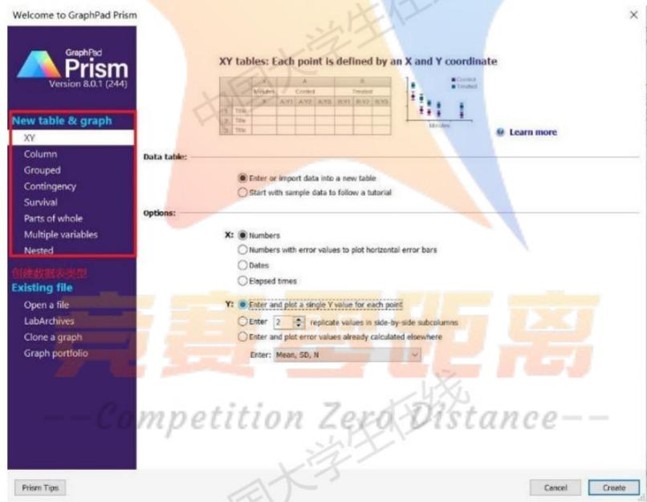

<details>
<summary>text_image</summary>

Welcome to GraphPad Prism
GraphPad Prism Version 8.0.1 (244)
New table & graph
XY
Column
Grouped
Contingency
Survival
Parts of whole
Multiple variables
Nested
创建数据类型
Existing file
Open a file
LabArchives
Clone a graph
Graph portfolio
Prism Tips
XY tables: Each point is defined by an X and Y coordinate
Data table:
Enter or import data into a new table
Start with sample data to follow a tutorial
Options:
X: Numbers
Numbers with error values to plot horizontal error bars
Dates
Elapsed times
Y: Enter and plot a single Y value for each point
Enter 2 replicate values in side-by-side subcolumns
Enter and plot error values already calculated elsewhere
Enter: Mean, SD, N
Learn more
Cancel Create
</details>

3. 将 Excel 数据粘贴至 Graphpad:

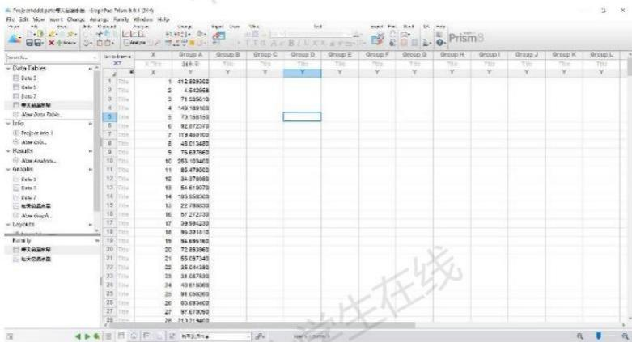

<details>
<summary>text_image</summary>

Data Tables
Table 1
Table 2
Table 3
Table 4
Table 5
Table 6
Table 7
Table 8
Table 9
Table 10
Table 11
Table 12
Table 13
Table 14
Table 15
Table 16
Table 17
Table 18
Table 19
Table 20
Table 21
Table 22
Table 23
Table 24
Table 25
Table 26
Table 27
Table 28
Table 29
Table 30
Table 31
Table 32
Table 33
Table 34
Table 35
Table 36
Table 37
Table 38
Table 39
Table 40
Table 41
Table 42
Table 43
Table 44
Table 45
Table 46
Table 47
Table 48
Table 49
Table 50
Table 51
Table 52
Table 53
Table 54
Table 55
Table 56
Table 57
Table 58
Table 59
Table 60
Table 61
Table 62
Table 63
Table 64
Table 65
Table 66
Table 67
Table 68
Table 69
Table 70
Table 71
Table 72
Table 73
Table 74
Table 75
Table 76
Table 77
Table 78
Table 79
Table 80
Table 81
Table 82
Table 83
Table 84
Table 85
Table 86
Table 87
Table 88
Table 89
Table 90
Table 91
Table 92
Table 93
Table 94
Table 95
Table 96
Table 97
Table 98
Table 99
Table 100
</details>

## 4. 创建图表:

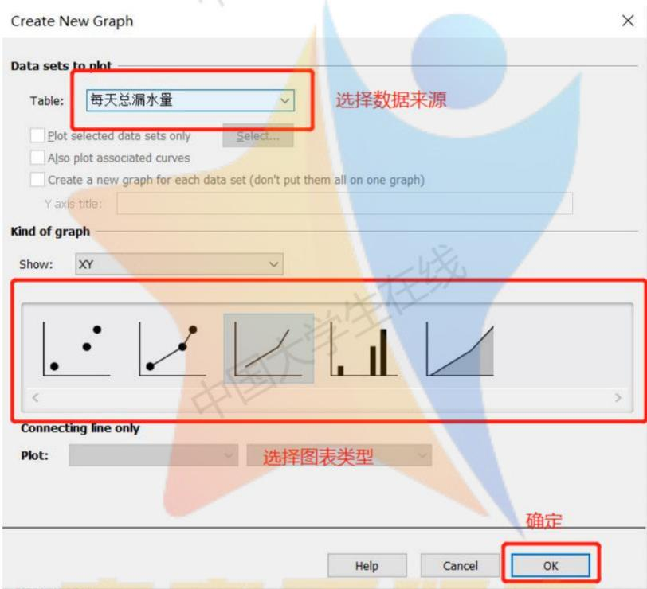

<details>
<summary>text_image</summary>

Create New Graph
Data sets to plot
Table: 每天总漏水量
选择数据来源
Plot selected data sets only Select...
Also plot associated curves
Create a new graph for each data set (don't put them all on one graph)
Y axis title:
Kind of graph
Show: XY
Connecting line only
Plot: 选择图表类型
确定
Help Cancel OK
</details>

5. 随后调节字体、大小、线条宽度和坐标轴等参数  
6. 输出图片:

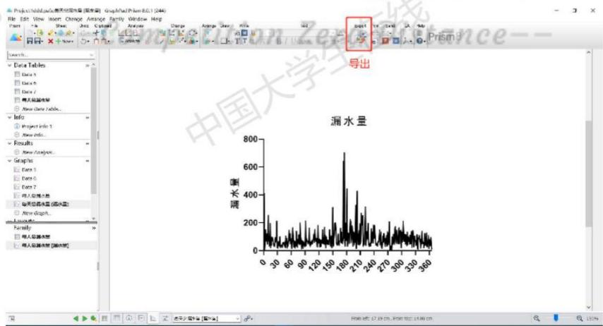

<details>
<summary>line</summary>

| X | 漏水量 |
| --- | --- |
| 0 | ~150 |
| 30 | ~100 |
| 60 | ~150 |
| 90 | ~100 |
| 120 | ~150 |
| 150 | ~100 |
| 160 | ~700 |
| 180 | ~400 |
| 210 | ~400 |
| 240 | ~200 |
| 270 | ~150 |
| 300 | ~150 |
| 330 | ~150 |
| 360 | ~100 |
</details>

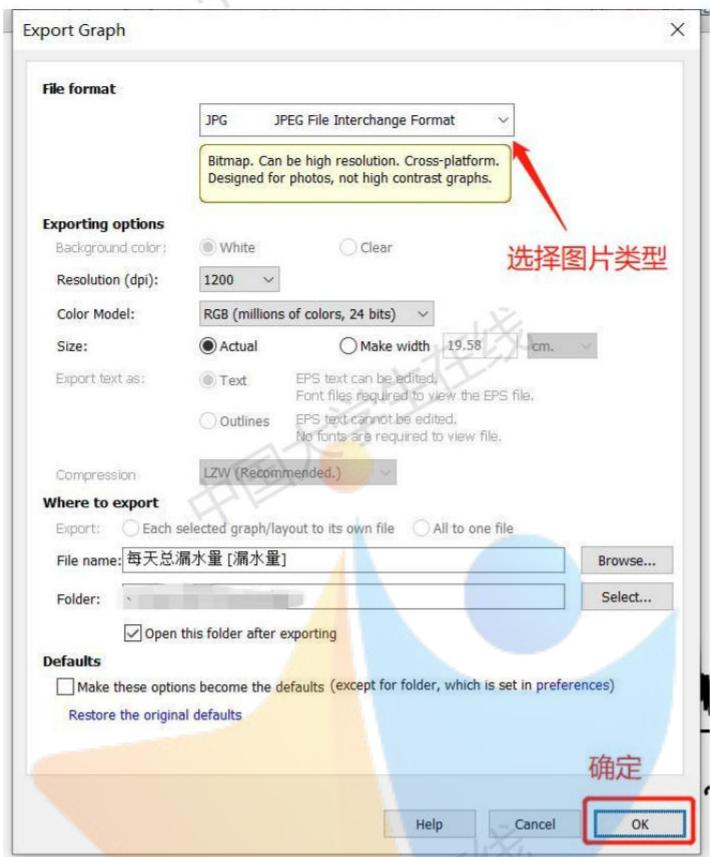

<details>
<summary>text_image</summary>

Export Graph
File format
JPG JPEG File Interchange Format
Bitmap. Can be high resolution. Cross-platform.
Designed for photos, not high contrast graphs.
Exporting options
Background color: White Clear
Resolution (dpi): 1200
Color Model: RGB (millions of colors, 24 bits)
Size: Actual Make width 19.58 cm.
Export text as: Text EPS text can be edited.
Font files required to view the EPS file.
Outlines EPS text cannot be edited.
No fonts are required to view file.
Compression LZW (Recommended.)
Where to export
Export: Each selected graph/layout to its own file All to one file
File name: 每天总漏水量 [漏水量]
Folder:
Browse...
Select...
Open this folder after exporting
Defaults
Make these options become the defaults (except for folder, which is set in preferences)
Restore the original defaults
Help Cancel OK
确定
</details>

7. 导出完成

## Excel

1、先利用 python 中的 pandas 库对数进行了以功能区按小时的求和的数据，并导入到了 excel 表格中。

<table><tr><td colspan="2">A</td><td>B</td><td>C</td><td>D</td><td>E</td><td>F</td><td>G</td><td>H</td><td>I</td><td>J</td><td>K</td><td>L</td><td>M</td><td>N</td><td>O</td><td>P</td></tr><tr><td>1</td><td>采集时间</td><td>总表</td><td>宿舍</td><td>教学楼</td><td>办公楼</td><td>食堂</td><td>科研楼</td><td>运动场所</td><td>后勤保卫</td><td>校医院</td><td>澡堂</td><td>酒店</td><td>图书馆</td><td>其他</td><td></td><td></td></tr><tr><td>2</td><td>2019-01-01 00:00:00</td><td>9.72</td><td>2.19</td><td>0.3</td><td>0.51</td><td>0.12</td><td>0</td><td>1.14</td><td>0.03</td><td>0</td><td>2.31</td><td>0</td><td>5.23</td><td>3</td><td></td><td></td></tr><tr><td>3</td><td>2019-01-01 01:00:00</td><td>10.86</td><td>2.92</td><td>0.4</td><td>0.68</td><td>0.19</td><td>0</td><td>1.52</td><td>0.04</td><td>0</td><td>3.08</td><td>0</td><td>4.32</td><td>1</td><td></td><td></td></tr><tr><td>4</td><td>2019-01-01 02:00:00</td><td>10.46</td><td>2.92</td><td>0.4</td><td>0.68</td><td>0.17</td><td>0</td><td>1.52</td><td>0.04</td><td>0</td><td>3.08</td><td>0</td><td>3.48</td><td>6</td><td></td><td></td></tr><tr><td>5</td><td>2019-01-01 03:00:00</td><td>12.67</td><td>2.23</td><td>0.29</td><td>0.67</td><td>0.04</td><td>0</td><td>1.03</td><td>0.01</td><td>0</td><td>1.77</td><td>0</td><td>2.86</td><td>8</td><td></td><td></td></tr><tr><td>6</td><td>2019-01-01 04:00:00</td><td>12</td><td>1.96</td><td>0.08</td><td>1</td><td>0.16</td><td>0.08</td><td>0.96</td><td>0.08</td><td>0</td><td>2.44</td><td>0.04</td><td>2.92</td><td>7.25</td><td></td><td></td></tr><tr><td>7</td><td>2019-01-01 05:00:00</td><td>12</td><td>1.96</td><td>0.08</td><td>1</td><td>0.16</td><td>0.08</td><td>0.96</td><td>0.08</td><td>0</td><td>2.44</td><td>0.04</td><td>2.92</td><td>1.75</td><td></td><td></td></tr><tr><td>8</td><td>2019-01-01 06:00:00</td><td>12</td><td>1.96</td><td>0.08</td><td>1</td><td>0.31</td><td>0.08</td><td>0.96</td><td>0.08</td><td>0</td><td>2.44</td><td>0.04</td><td>6.1</td><td>2.25</td><td></td><td></td></tr><tr><td>9</td><td>2019-01-01 07:00:00</td><td>7.84</td><td>2.49</td><td>0.91</td><td>2.45</td><td>0.8</td><td>0.52</td><td>1.04</td><td>0.12</td><td>0</td><td>1.71</td><td>0.01</td><td>11.36</td><td>2.25</td><td></td><td></td></tr><tr><td>10</td><td>2019-01-01 08:00:00</td><td>9.84</td><td>5</td><td>0.92</td><td>2.48</td><td>0.85</td><td>0.36</td><td>1.44</td><td>0.84</td><td>0</td><td>3.36</td><td>0.2</td><td>14.64</td><td>4.25</td><td></td><td></td></tr><tr><td>11</td><td>2019-01-01 09:00:00</td><td>10.04</td><td>5</td><td>0.92</td><td>2.48</td><td>0.93</td><td>0.36</td><td>1.56</td><td>0.84</td><td>0</td><td>3.36</td><td>0.2</td><td>12.93</td><td>1.25</td><td></td><td></td></tr><tr><td>12</td><td>2019-01-01 10:00:00</td><td>9.64</td><td>5</td><td>0.92</td><td>2.48</td><td>0.78</td><td>0.36</td><td>1.48</td><td>0.84</td><td>0</td><td>3.36</td><td>0.1</td><td>9.93</td><td>7.5</td><td></td><td></td></tr><tr><td>13</td><td>2019-01-01 11:00:00</td><td>13.02</td><td>6.19</td><td>0.33</td><td>1.83</td><td>3.36</td><td>0.39</td><td>1.26</td><td>0.71</td><td>0</td><td>4.64</td><td>OgOgOgOgOgOgOgOgOgOgOgOgOgOgOgOgOgOgOgOgOgOgOgOgOgOgOgOgOgOgOgOgOgOgOgOgOgOgOgOgOgOgOgOgOgOgOgOgOgOgO
(   )</td><td></td><td></td><td></td><td></td></tr></table>

2、通过函数填充出各时间段的具体日期

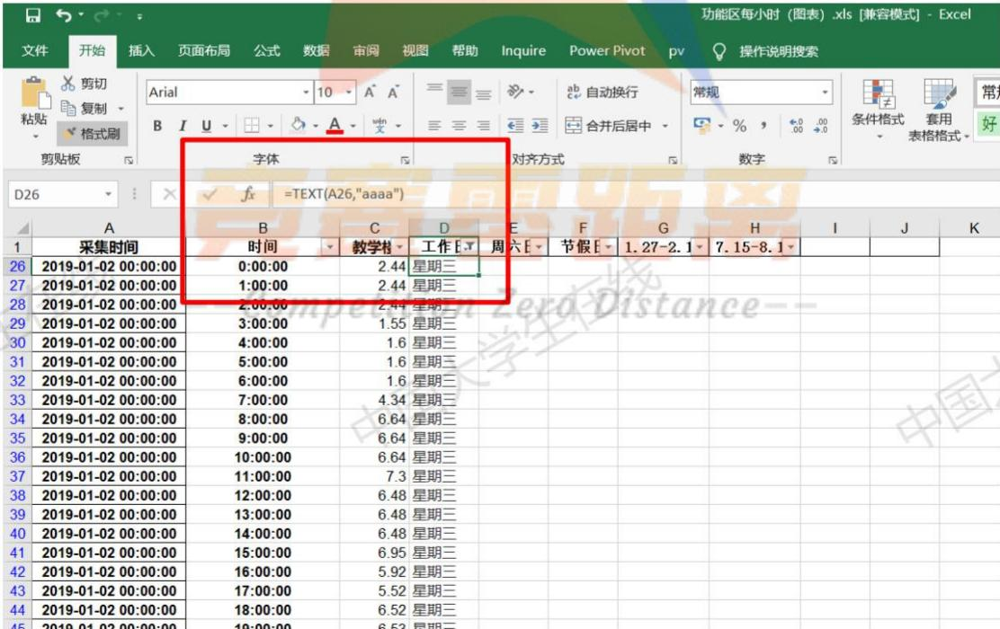

<details>
<summary>text_image</summary>

功能区每小时(图表).xls [兼容模式] - Excel
文件 开始 插入 页面布局 公式 数据 审阅 视图 帮助 Inquire Power Pivot pv 操作说明搜索
剪切 Arial 10 A A = = = = ab 自动换行 常规
粘贴 B I U - - - - - - - - - - - - - - - - - - - - - - - - - - - - - - - - - - - -
格式刷 字体 对齐方式 数字 条件格式 套
剪贴板 D26 fx =TEXT(A26,"aaaa")
A B C D E F G H I J K
采集时间 时间 教学格 工作E 周六E 节假E 1.27-2.1 7.15-8.1
26 2019-01-02 00:00:00 0:00:00 2.44 星期三
27 2019-01-02 00:00:00 1:00:00 2.44 星期三
28 2019-01-02 00:00:00 2:00:00 2.44 星期三
29 2019-01-02 00:00:00 3:00:00 1.55 星期三
30 2019-01-02 00:00:00 4:00:00 1.6 星期三
31 2019-01-02 00:00:00 5:00:00 1.6 星期三
32 2019-01-02 00:00:00 6:00:00 1.6 星期三
33 2019-01-02 00:00:00 7:00:00 4.34 星期三
34 2019-01-02 00:00:00 8:00:00 6.64 星期三
35 2019-01-02 00:00:00 9:00:00 6.64 星期三
36 2019-01-02 00:00:00 10:00:00 6.64 星期三
37 2019-01-02 00:00:00 11:00:00 7.3 星期三
38 2019-01-02 00:00:00 12:00:00 6.48 星期三
39 2019-01-02 00:00:00 13:00:00 6.48 星期三
40 2019-01-02 00:00:00 14:00:00 6.48 星期三
41 2019-01-02 00:00:00 15:00:00 6.95 星期三
42 2019-01-02 00:00:00 16:00:00 5.92 星期三
43 2019-01-02 0O:O:O:O
44 2O-19-19-19-19-19-19-19-19-19-
45 2O-19-19-19-19-19-19-19-19-
46 2O-19-19-19-19-19-19-19-
47 2O-19-19-19-19-19-19-
48 2O-19-19-19-19-19-
49 2O-19-19-19-19-
5O
</details>

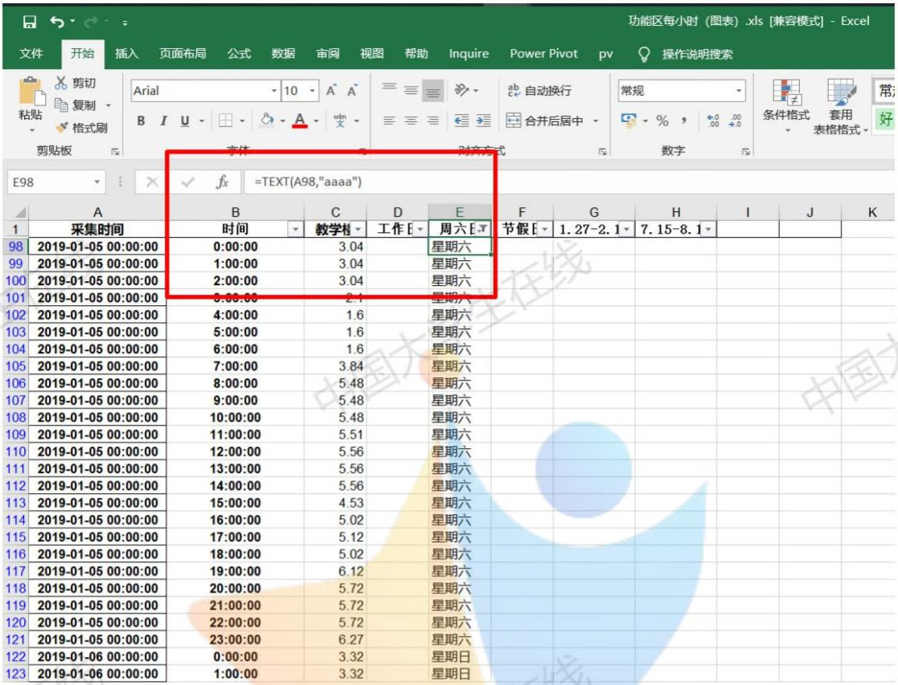

<details>
<summary>heatmap</summary>

| Week | Time |
| --- | --- |
| 98 | 0:00:00 |
| 99 | 1:00:00 |
| 100 | 2:00:00 |
| 101 | 3:00:00 |
| 102 | 4:00:00 |
| 103 | 5:00:00 |
| 104 | 6:00:00 |
| 105 | 7:00:00 |
| 106 | 8:00:00 |
| 107 | 9:00:00 |
| 108 | 10:00:00 |
| 109 | 11:00:00 |
| 110 | 12:00:00 |
| 111 | 13:00:00 |
| 112 | 14:00:00 |
| 113 | 15:00:00 |
| 114 | 16:00:00 |
| 115 | 17:00:00 |
| 116 | 18:00:00 |
| 117 | 19:00:00 |
| 118 | 20:00:00 |
| 119 | 21:00:00 |
| 120 | 22:00:00 |
| 121 | 23:00:00 |
| 122 | 0:00:00 |
| 123 | 1:00:00 |
</details>

3、选择 D-H 列的全部数据——点击筛选

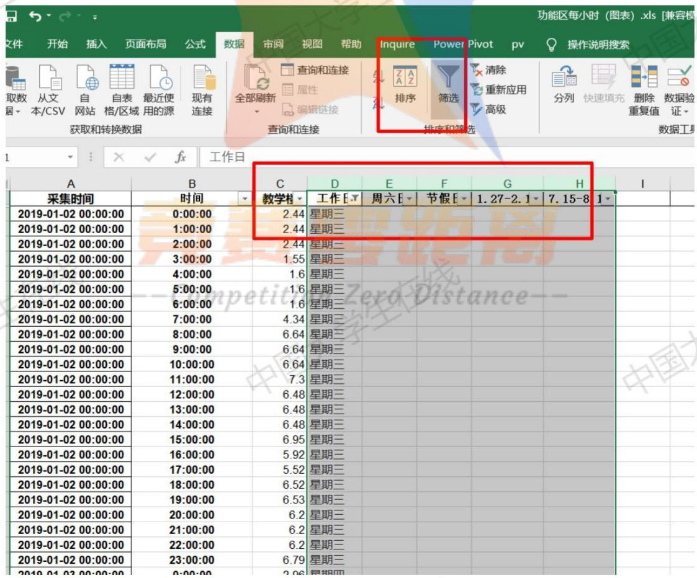

<details>
<summary>text_image</summary>

功能区每小时（图表）.xls [兼容模
文件 开始 插入 页面布局 公式 数据 审阅 视图 帮助 Inquire Power Pivot pv 操作说明搜索
查询和连接
属性
排序 筛选
清除
重新应用
高级
分列 快速填充 删除 数据验
重置值 证
获取和转换数据 查询和连接 排序和筛选 数据工具
A B C D E F G H I
采集时间 时间 教学科 工作E 周六E 节假E 1.27-2.1 7.15-8 1
2019-01-02 00:00:00 0:00:00 2.44 星期三
2019-01-02 00:00:00 1:00:00 2.44 星期三
2019-01-02 00:00:00 2:00:00 2.44 星期三
2019-01-02 00:00:00 3:00:00 1.55 星期三
2019-01-02 00:00:00 4:00:00 1.6 星期三
2019-01-02 00:00:00 5:00:00 1.6 星期三
2019-01-02 00:00:00 6:00:00 1.6 星期三
2019-01-02 00:00:00 7:00:00 4.34 星期三
2019-01-02 00:00:00 8:00:00 6.64 星期三
2019-01-02 00:00:00 9:00:00 6.64 星期三
2019-01-02 00:00:00 10:00:00 6.64 星期三
2019-01-02 00:00:00 11:00:00 7.3 星期三
2019-01-02 00:00:00 12:00:00 6.48 星期三
2019-01-02 00:00:00 13:00:00 6.48 星期三
2019-01-02 00:00:00 14:00:00 6.48 星期三
2019-01-02 00:00:00 15:00:00 6.95 星期三
2019-01-02 00:00:00 16:0O O O O O O O O O O O O O O O O O O O O O O O O O O O O O O O O O O O O O O O O O O O O O O O O O O O O O O O O O O O O O O O O O O O O O O O O O O O O O O O O O O O O O O O O O O O O O OO
2Q19-12-33 6.53 星期三
2Q19-12-33 6.53 星期三
2Q19-12-33 6.53 星期三
2Q19-12-33 6.53 星期三
2Q19-12-33 6.53 星期三
2Q19-12-33 6.53 星期四
</details>

## 4、点击 C1 单元格的小倒三角按钮——除空白外选中其余全部数据

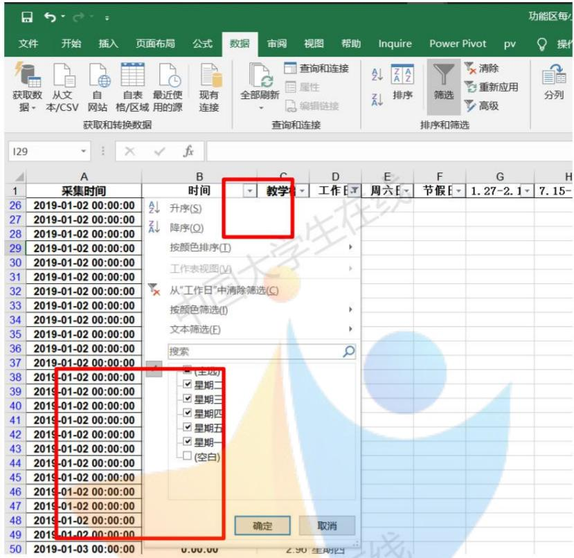

<details>
<summary>text_image</summary>

文件 开始 插入 页面布局 公式 数据 审阅 视图 帮助 Inquire Power Pivot pv 操作
获取数据 从文 自 自表 最近使用的源 现有连接 查询和连接 属性 编辑链接 查询和连接 排序和筛选 分列
获取和转换数据 查询和连接 排序和筛选
129
A	B	C	D	E	F	G	H
1 采集时间 时间	教学	工作(E)	周六(E)	节假(E)	1.27-2.1	7.15-
26	2019-01-02 00:00:00	↓ 升序(S)
27	2019-01-02 00:00:00	↓ 降序(Q)
28	2019-01-02 00:00:00
29	2019-01-02 00:00:00	按颜色排序(I)	 >
30	2019-01-02 00:00:00	工作表现图(V)	 >
31	2019-01-02 00:00:00	从“工作日”中清除筛选(C)
32	2019-01-02 00:00:00	按颜色筛选(I)	 >
33	2019-01-02 00:00:00	文本筛选(F)	 >
34	2019-01-02 00:00:00	搜索
35	2019-01-02 00:00:00
36	2019-01-02 00:00:00
37	2019-01-02 00:00:00	(全选)
	✓ 星期二
	✓ 星期三
	✓ 星期四
	✓ 星期五
	✓ 星期一
	□ (空白)
38	2019-01-02 00:00:00
39	2019-01-02 00:00:00
40	2019-01-02 00:00:00
41	2019-01-02 00:00:00
42	2019-01-02 00:00:00
43	2019-01-02 00:00:00
44	2019-01-02 00:00:00
45	2019-01-02 00:00:00
46	2019-01-02 00:00:00
47	2019-01-02 00:00:00
48	2019-01-02 00:00:00
49	2019-01-02 00:00:00
50	2019-01-3 33 33 33 33 33 33 33 33 33 33 33 33 33 33 33 33 33 33 33 33 33 33 33 33 33 33 33 33 33 33 33 33 33 3<nl>确定	取消
</details>

## 4、选中这两列的所有数据——Ctrl+C

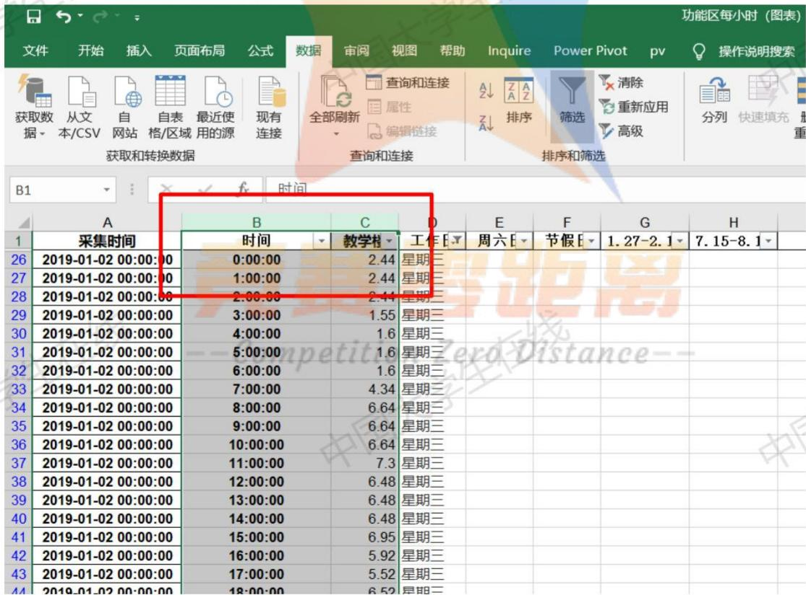

<details>
<summary>text_image</summary>

功能区每小时（图表）
文件 开始 插入 页面布局 公式 数据 审阅 视图 帮助 Inquire Power Pivot pv 操作说明搜索
获取数据 从文 自 网站 最近使用的源 现有连接 查询和连接 属性 编辑链接 查查和连接 排序和筛选 分列 快速填充 删除
B1 时间
A B C D E F G H
1 采集时间 时间 教学校 工作日 周六日 节假日 1.27-2.1 7.15-8.1
26 2019-01-02 00:00:00 0:00:00 2.44 星期三
27 2019-01-02 00:00:00 1:00:00 2.44 星期三
28 2019-01-02 00:00:00 2:00:00 2.44 星期三
29 2019-01-02 00:00:00 3:00:00 1.55 星期三
30 2019-01-02 00:00:00 4:00:00 1.6 星期三
31 2019-01-02 00:00:00 5:00:00 1.6 星期三
32 2019-01-02 00:00:00 6:00:00 1.6 星期三
33 2019-01-02 00:00:00 7:00:00 4.34 星期三
34 2019-01-02 00:00:00 8:00:00 6.64 星期三
35 2019-01-02 00:00:00 9:00:00 6.64 星期三
36 2019-01-02 00:00:00 10:00:00 6.64 星期三
37 2019-01-02 00:00:00 11:00:00 7.3 星期三
38 2019-01-02 00:00:00 12:00:00 6.48 星期三
39 2019-01-02 00:00:00 13:00:00 6.48 星期三
40 2019-01-02 00:00:00 14:00:00 6.48 星期三
41 2019-01-02 00:00:00 15:00:00 6.95 星期三
42 2019-01-02 00:00:00 16:00:00 5.92 星期三
43 2019-01-02 00:00:0<fcel><nl>
</details>

## 5、把第四步的两列复制到 各类时间工作表中的工作日列

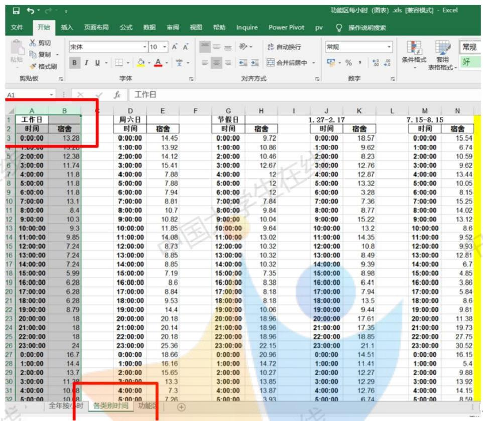

<details>
<summary>text_image</summary>

文件 开始 插入 页面布局 公式 数据 审阅 视图 帮助 Inquire Power Pivot pv 操作说明搜索
剪切 宋体 - 10 - A A 自动换行 常规 条件格式 套
粘贴 格式刷 B I U - A A 合并后居中
剪贴板 字体 对齐方式 数字 表格格式
A1 工作日
A B C D E F G H I J K L M N
1 工作日
2 时间 宿舍
3 0:00:00 13.28
4 1:00:00 15.28
5 2:00:00 12.38
6 3:00:00 11.74
7 4:00:00 11.8
8 5:00:00 11.8
9 6:00:00 11.8
10 7:00:00 13.1
11 8:00:00 8.4
12 9:00:00 10.3
13 10:00:00 9.3
14 11:00:00 9.85
15 12:00:00 7.24
16 13:00:00 7.24
17 14:00:00 7.24
18 15:00:00 5.99
19 16:00:00 6.28
20 17:00:00 6.28
21 18:00:00 6.28
22 19:00:00 8.79
23 20:00:00 18
24 21:00:00 18
25 22:00:00 18
26 23:00:00 24
27 0:00:00 16.7
28 1:00:00 14.4
29 2:00:00 13.7
30 3:00:00 11.28
31 4:00:00 10.8
32 5:00:00 10.8
C D E F G H I J K L M N
周六日 节假日 1.27-2.17 7.15-8.15
时间 宿舍 时间 宿舍 时间 宿舍 时间 宿舍
时间 宿舍 时间 宿舍 时间 宿舍 时间 宿舍
时间 宿舍 时间 宿舍 时间 宿舍 时间 宿舍
时间 宿舍 时间 宿舍 时间 宿舍 时间 宿舍
时间 宿舍 时间 宿舍 时间 宿舍 时间 宿舍
时间 宿舍 时间 宿舍 时间 宿舍 时间 宿舍
时间 宿舍 时间 宿舍 时间 宿舍 时间 空间
</details>

6、在选中 A、B 两列全部数据后——数据透视表——点击确定

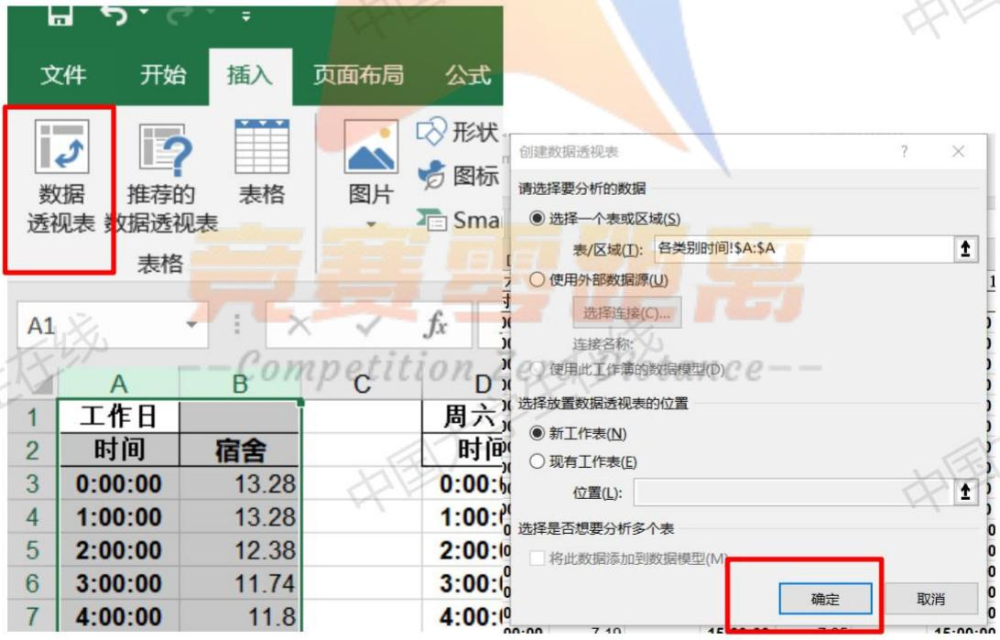

<details>
<summary>text_image</summary>

文件 开始 插入 页面布局 公式
数据
透视表 推荐的 数据透视表 表格 图片 图标 Sma
A1 fx
创建数据透视表
请选择要分析的数据
● 选择一个表或区域(S)
表/区域(I): 各类别时间!\$A:\$A
○ 使用外部数据源(U)
选择连接(C)...
连接名称:
○ 使用此工作簿的数据模型(D)
选择放置数据透视表的位置
● 新工作表(N)
○ 现有工作表(E)
位置(L):
选择是否想要分析多个表
□ 将此数据添加到数据模型(M)
确定 取消
</details>

7、把时间、宿舍分别拖动到行和值的区域——点击宿舍——选择值字段设置——选择平均值——选择确定

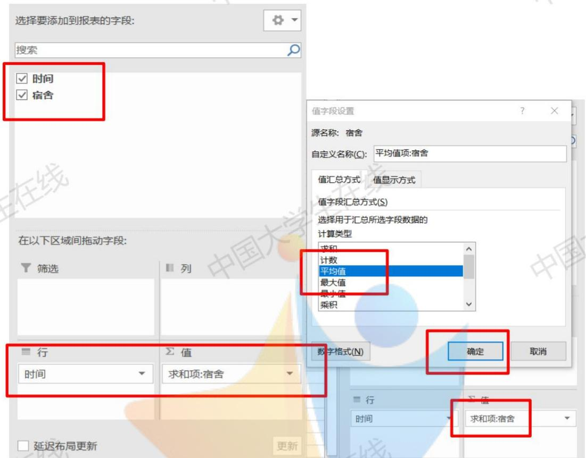

<details>
<summary>text_image</summary>

选择要添加到报表的字段:
搜索
时间
宿舍
在以下区域间拖动字段:
筛选
列
行
Σ值
时间
求和项:宿舍
更新
值字段设置
源名称: 宿舍
自定义名称(C): 平均值项:宿舍
值汇总方式 值显示方式
值字段汇总方式(S)
选择用于汇总所选字段数据的
计算类型
求和
计数
平均值
最大值
最小值
乘积
数字格式(N)
确定
取消
行
时间
Σ值
求和项:宿舍
</details>

8、选择 B 列 5 到 28 行的数据——Ctrl+C——粘贴到功能区工作表中的 B 列 3 到 26 行处。

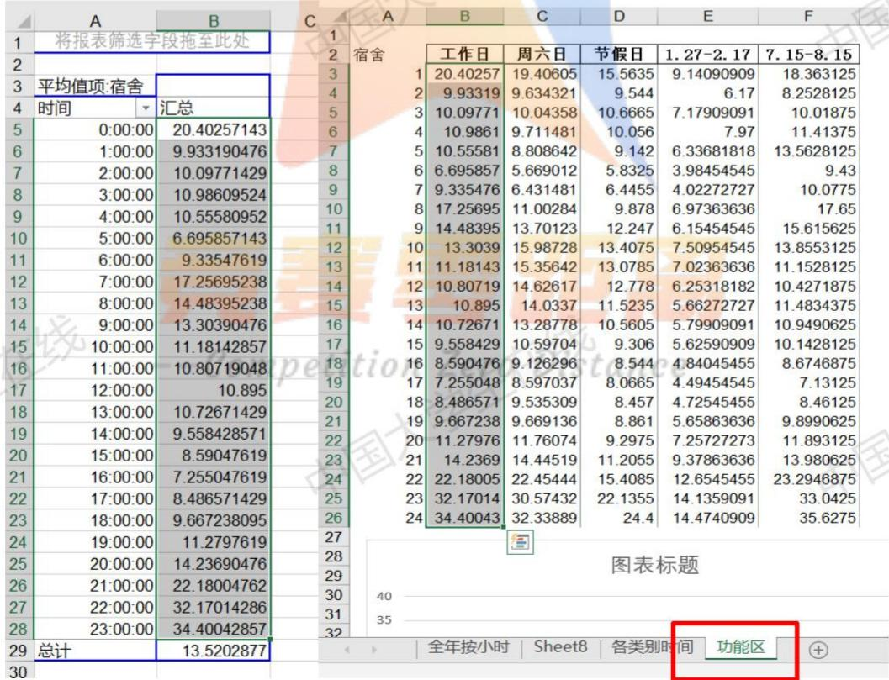

<details>
<summary>text_image</summary>

1
将报表筛选字段拖至此处
2
平均值项:宿舍
时间
汇总
3
4
5
6
7
8
9
10
11
12
13
14
15
16
17
18
19
20
21
22
23
24
25
26
27
28
29
30
31
32
1
2
3
4
5
6
7
8
9
10
11
12
13
14
15
16
17
18
19
20
21
22
23
24
25
26
27
28
29
30
31
32
宿舍
工作日	周六日	节假日	1.27-2.17	7.15-8.15
1	20.40257	19.40605	15.5635	9.14090909	18.363125
2	9.93319	9.634321	9.544	6.17	8.2528125
3	10.09771	10.04358	10.6665	7.17909091	10.01875
4	10.9861	9.711481	10.056	7.97	11.41375
5	10.55581	8.808642	9.142	6.33681818	13.5628125
6	6.695857	5.669012	5.8325	3.98454545	9.43
7	9.335476	6.431481	6.4455	4.02272727	10.0775
8	17.25695	11.00284	9.878	6.97363636	17.65
9	14.48395	13.70123	12.247	6.15454545	15.615625
10	13.3039	15.98728	13.4075	7.50954545	13.8553125
11	11.18143	15.35642	13.0785	7.02363636	11.1528125
12	10.80719	14.62617	12.778	6.25318182	10.4271875
13	10.895	14.0337	11.5235	5.66272727	11.4834375
14	10.72671	13.28778	10.5605	5.79909091	10.9490625
15	9.558429	10.59704	9.306	5.62590909	10.1428125
16	8.590476	9.126296	8.544	4.84045455	8.6746875
17	7.255048	8.597037	8.0665	4.49454545	7.13125
18	8.486571	9.535309	8.457	4.72545455	8.46125
19	9.667238	9.669136	8.861	5.65863636	9.8990625
20	11.27976	11.76074	9.2975	7.25727273	11.893125
21	14.2369	14.44519	11.2055	9.37863636	13.980625
22	22.18005	22.45444	15.4085	12.6545455	23.2946875
23	32.17014	30.57432	22.1355	14.1359091	33.0425
24	34.40043	32.33889	24.4	14.4740909	35.6275

图表标题
图表标题
</details>

9、重复 4——8 的步骤后会得到以下全部数据——Ctrl+C——粘贴到如下网址中

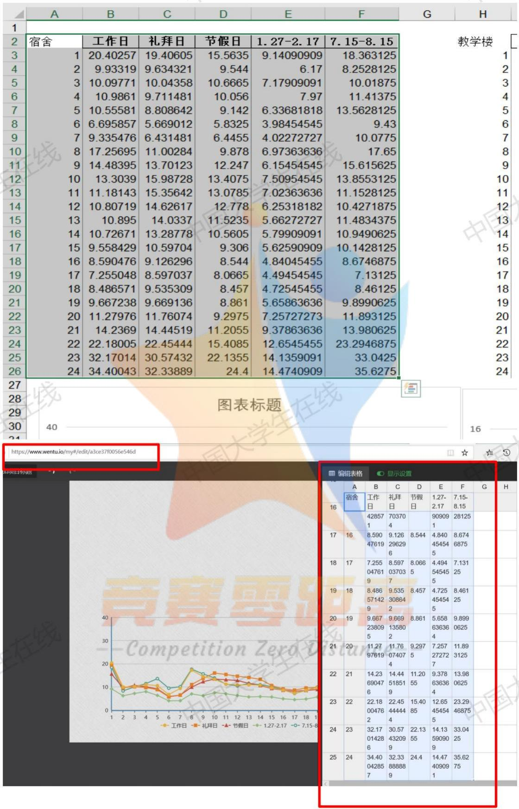

<details>
<summary>line</summary>

| Category | A | B | C | D | E | F | G | H |
| --- | --- | --- | --- | --- | --- | --- | --- | --- |
| 16 | 42857 | 70370 | 90909 | 28125 | — | — | — | — |
| 17 | 8.590 | 9.126 | 8.544 | 4.840 | 8.674 | — | — | — |
| 18 | 7.255 | 8.597 | 8.066 | 4.494 | 7.131 | — | — | — |
| 19 | 8.486 | 9.535 | 8.457 | 4.725 | 8.461 | — | — | — |
| 20 | 9.667 | 10.370 | 8.861 | 5.658 | 8.674 | — | — | — |
| 21 | 11.27 | 11.76 | 9.297 | 6.338 | 8.674 | — | — | — |
| 22 | 14.23 | 14.44 | 11.20 | 9.378 | 13.98 | — | — | — |
| 23 | 22.18 | 22.45 | 15.40 | 12.65 | 23.29 | — | — | — |
| 24 | 32.17 | 30.57 | 22.13 | 14.13 | 33.04 | — | — | — |
| 25 | 34.40 | 32.33 | 24.4 | 14.47 | 35.62 | — | — | — |
| 26 | 34.40043 | 32.33889 | 24.4 | 14.740909 | 35.6275 | — | — | — |
| 27 | — | — | — | — | — | — | — | — |
| 28 | — | — | — | — | — | — | — | — |
| 29 | — | — | — | — | — | — | — | — |
| 30 | — | — | — | — | — | — | — | — |
| 31 | — | — | — | — | — | — | — | — |
| 32 | — | — | — | — | — | — | — | — |
| 33 | — | — | — | — | — | — | — | — |
| 34 | — | — | — | — | — | — | — | — |
| 35 | — | — | — | — | — | — | — | — |
| 36 | — | — | — | — | — | — | — | — |
</details>

10、最终得到如下结果

宿舍  
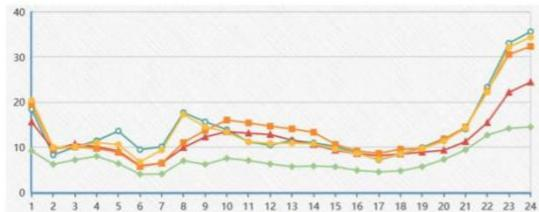

<details>
<summary>line</summary>

| X | Blue (Circle) | Orange (Square) | Red (Triangle) | Green (Diamond) |
|---|---|---|---|---|
| 1 | ~18 | ~20 | ~16 | ~15 |
| 2 | ~9 | ~10 | ~10 | ~7 |
| 3 | ~11 | ~11 | ~11 | ~8 |
| 4 | ~12 | ~11 | ~12 | ~8 |
| 5 | ~14 | ~10 | ~9 | ~7 |
| 6 | ~10 | ~7 | ~6 | ~5 |
| 7 | ~10 | ~8 | ~7 | ~5 |
| 8 | ~18 | ~13 | ~10 | ~7 |
| 9 | ~16 | ~14 | ~12 | ~7 |
| 10 | ~15 | ~16 | ~13 | ~8 |
| 11 | ~14 | ~15 | ~13 | ~7 |
| 12 | ~12 | ~15 | ~12 | ~6 |
| 13 | ~12 | ~14 | ~12 | ~6 |
| 14 | ~11 | ~13 | ~10 | ~6 |
| 15 | ~10 | ~10 | ~9 | ~6 |
| 16 | ~9 | ~9 | ~9 | ~5 |
| 17 | ~9 | ~8 | ~8 | ~5 |
| 18 | ~9 | ~9 | ~9 | ~5 |
| 19 | ~10 | ~10 | ~9 | ~6 |
| 20 | ~12 | ~12 | ~9 | ~8 |
| 21 | ~15 | ~15 | ~11 | ~9 |
| 22 | ~23 | ~23 | ~15 | ~13 |
| 23 | ~33 | ~31 | ~22 | ~14 |
| 24 | ~36 | ~33 | ~25 | ~15 |
</details>

办公楼

教学楼  
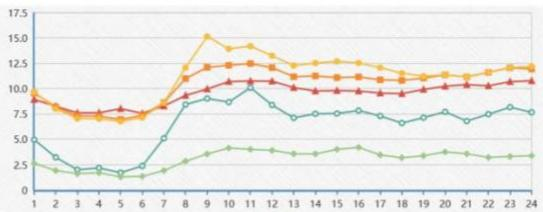

<details>
<summary>line</summary>

| X | Yellow (Square) | Orange (Square) | Red (Circle) | Teal (Circle) |
|---|---|---|---|---|
| 1 | ~9.8 | ~9.0 | ~8.8 | ~5.0 |
| 2 | ~8.2 | ~8.2 | ~7.8 | ~3.4 |
| 3 | ~7.2 | ~7.6 | ~7.6 | ~2.1 |
| 4 | ~7.2 | ~7.6 | ~7.6 | ~2.3 |
| 5 | ~7.2 | ~8.1 | ~8.1 | ~1.9 |
| 6 | ~7.2 | ~7.2 | ~7.2 | ~2.5 |
| 7 | ~8.5 | ~8.5 | ~8.2 | ~5.2 |
| 8 | ~11.5 | ~11.0 | ~9.4 | ~8.5 |
| 9 | ~15.2 | ~12.3 | ~10.0 | ~9.0 |
| 10 | ~14.0 | ~12.4 | ~10.6 | ~9.0 |
| 11 | ~14.3 | ~12.5 | ~10.7 | ~10.0 |
| 12 | ~13.3 | ~12.2 | ~10.7 | ~8.5 |
| 13 | ~12.3 | ~11.2 | ~10.0 | ~7.2 |
| 14 | ~12.6 | ~11.1 | ~9.8 | ~7.6 |
| 15 | ~12.7 | ~11.0 | ~9.8 | ~7.6 |
| 16 | ~12.6 | ~11.0 | ~9.8 | ~7.9 |
| 17 | ~12.0 | ~10.8 | ~9.6 | ~7.3 |
| 18 | ~11.5 | ~10.8 | ~9.6 | ~6.6 |
| 19 | ~11.0 | ~10.9 | ~9.9 | ~7.3 |
| 20 | ~11.4 | ~11.2 | ~10.2 | ~7.8 |
| 21 | ~11.0 | ~10.9 | ~10.3 | ~6.9 |
| 22 | ~11.6 | ~11.6 | ~10.4 | ~7.8 |
| 23 | ~12.0 | ~12.0 | ~10.6 | ~8.0 |
| 24 | ~12.0 | ~12.0 | ~10.7 | ~7.8 |
</details>

食堂

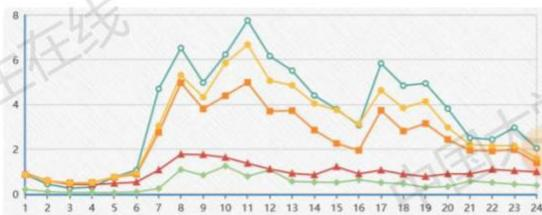

<details>
<summary>line</summary>

| X | Green (Circle) | Yellow (Diamond) | Red (Triangle) | Green (Star) |
|---|---|---|---|---|
| 1 | ~0.9 | ~0.9 | ~0.9 | ~0.1 |
| 2 | ~0.6 | ~0.6 | ~0.6 | ~0.1 |
| 3 | ~0.5 | ~0.5 | ~0.5 | ~0.1 |
| 4 | ~0.5 | ~0.6 | ~0.5 | ~0.1 |
| 5 | ~0.7 | ~0.8 | ~0.5 | ~0.1 |
| 6 | ~0.9 | ~0.9 | ~0.5 | ~0.1 |
| 7 | ~4.7 | ~3.8 | ~2.8 | ~0.2 |
| 8 | ~6.6 | ~5.4 | ~4.9 | ~1.1 |
| 9 | ~5.0 | ~4.6 | ~3.8 | ~1.7 |
| 10 | ~6.3 | ~5.8 | ~4.4 | ~1.7 |
| 11 | ~7.8 | ~6.7 | ~5.0 | ~1.2 |
| 12 | ~6.2 | ~5.0 | ~3.7 | ~1.1 |
| 13 | ~5.5 | ~4.8 | ~3.7 | ~0.7 |
| 14 | ~4.4 | ~4.1 | ~2.9 | ~0.7 |
| 15 | ~3.8 | ~3.7 | ~2.3 | ~0.6 |
| 16 | ~3.1 | ~3.1 | ~2.0 | ~0.6 |
| 17 | ~5.9 | ~4.7 | ~3.7 | ~0.6 |
| 18 | ~4.9 | ~3.9 | ~2.8 | ~0.6 |
| 19 | ~5.0 | ~4.2 | ~3.2 | ~0.5 |
| 20 | ~3.8 | ~3.0 | ~2.4 | ~0.5 |
| 21 | ~2.5 | ~2.1 | ~2.0 | ~0.6 |
| 22 | ~2.5 | ~2.1 | ~2.0 | ~1.0 |
| 23 | ~3.2 | ~2.1 | ~2.0 | ~1.0 |
| 24 | ~2.0 | ~1.6 | ~1.5 | ~0.6 |
</details>

-●- 工作日 -■- 周六日 -▲- 节假日 -◇- 1.27-2.17 -○- 7.15-8.15

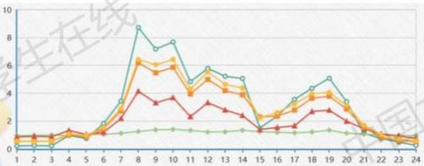

<details>
<summary>line</summary>

| Hour | Green (Circle) | Orange (Square) | Red (Triangle) | Green (Line) |
| --- | --- | --- | --- | --- |
| 1 | ~0.3 | ~0.9 | ~0.9 | ~0.2 |
| 2 | ~0.3 | ~0.7 | ~0.9 | ~0.2 |
| 3 | ~0.3 | ~0.6 | ~0.9 | ~0.2 |
| 4 | ~0.8 | ~1.1 | ~1.2 | ~0.8 |
| 5 | ~0.9 | ~0.9 | ~0.9 | ~0.9 |
| 6 | ~1.7 | ~1.1 | ~1.1 | ~1.1 |
| 7 | ~3.3 | ~2.5 | ~2.1 | ~1.1 |
| 8 | ~8.7 | ~6.4 | ~4.2 | ~1.2 |
| 9 | ~7.1 | ~6.1 | ~3.2 | ~1.3 |
| 10 | ~7.6 | ~6.4 | ~3.6 | ~1.3 |
| 11 | ~4.9 | ~4.0 | ~2.3 | ~1.3 |
| 12 | ~5.8 | ~5.0 | ~3.3 | ~1.2 |
| 13 | ~5.3 | ~4.2 | ~2.8 | ~1.2 |
| 14 | ~5.1 | ~4.0 | ~2.4 | ~1.3 |
| 15 | ~1.3 | ~2.3 | ~1.3 | ~1.3 |
| 16 | ~2.4 | ~2.4 | ~1.4 | ~1.2 |
| 17 | ~3.5 | ~3.0 | ~1.6 | ~1.2 |
| 18 | ~4.4 | ~3.7 | ~2.6 | ~1.3 |
| 19 | ~5.1 | ~4.0 | ~2.7 | ~1.3 |
| 20 | ~3.2 | ~2.8 | ~1.9 | ~1.2 |
| 21 | ~1.5 | ~1.5 | ~1.3 | ~0.9 |
| 22 | ~0.7 | ~0.8 | ~0.8 | ~0.5 |
| 23 | ~0.5 | ~0.6 | ~0.7 | ~0.3 |
| 24 | ~0.8 | ~0.6 | ~0.8 | ~0.3 |
</details>

## 竞赛零距离

--Competition Zero Distance--