# “FAST”主动反射面调节模型

## 摘要

本文从求解FAST主动反射面形状的调节问题出发，通过考虑变形目标的基本要求和评判指标，求解理想抛物面；分析了因反射面板形状原因而导致的，工作抛物面和理想抛物面的偏差，并提供了微调办法；最后计算了调节变形后的接收比、基准反射球面的接收比，将其进行比较，作证了FAST的优良性能。

针对问题1，我们根据题目对理想抛物面对称轴和焦点的要求，得出了理想抛物面中参数之间的关系、参数的存在域等信息。再通过考虑促动器安装的空间特征，发现能够按照等分一定区域的圆心角的方法，设计了能模拟促动器分布、估计促动器伸缩量的模型。我们使用该模型判断抛物面是否满足促动器径向伸缩范围为-0.6～+0.6米的要求，并以促动器伸缩量的总和最小作为评判指标评判满足要求的抛物面，找到了两个性能较好的抛物面，经过比较，最终得到理想抛物面方程为：

$$
z = \frac {x ^ {2}}{4 (F - l _ {2})} + \frac {y ^ {2}}{4 (F - l _ {2})} - 3 0 0. 4 + l _ {2} = 0. 0 0 1 7 8 0 x ^ {2} + 0. 0 0 1 7 8 0 y ^ {2} - 3 0 0. 8 8 4
$$

针对问题2，首先，为求解观测天体位于方位角 $\alpha = 36.795^{\circ}$ ， $\beta = 78.169^{\circ}$ 时的理想抛物面，先建立旋转矩阵和图形变换模型，得到将任意坐标或函数旋转固定角度的方法，从而将问题一中求解得到的理想抛物面方程先绕y轴旋转 $(90^{\circ} - \beta)$ ，再绕z轴旋转 $\alpha$ ，得到用于观测要求天体的理想抛物面方程为：

$$
{ \begin{array}{r l} S ^ {\prime} (x, y, z) & = 0. 1 6 4 1 8 x + 0. 1 2 2 8 y + 0. 9 7 8 7 6 z - 0. 0 0 1 7 7 9 7 (0. 5 9 8 9 5 x - 0. 8 0 0 7 8 y) ^ {2} - \\ & 0. 0 0 1 7 7 9 7 (0. 7 8 3 7 7 x + 0. 5 8 6 2 3 y - 0. 2 0 5 0 3 z) ^ {2} + 3 0 0. 8 8 = 0. \end{array} }
$$

之后，为求解促动器伸缩量的最优值，使反射面尽可能贴近理想抛物面，先假设将主索节点沿径向移动到理想抛物面上，取主索节点和各反射面板圆弧中点作为统计点计算得到均方根误差为4.2mm。设计主索节点的调整策略——调整量由自身即其周围所有圆弧中点与理想抛物面的偏差决定，计算调整后的均方根误差为3.0mm，且其值在迭代中保持稳定，说明此时反射面拟合度已达最优。由主索节点的初始坐标与调整后的最终坐标，求得条件后反射面300m口径内的主索节点编号、位置坐标、各促动器的伸缩量保存在“result.xlsx”中。

针对问题3，首先，为求解调节后馈源舱的接收比，需对每个反射单元单独处理。先定义单个反射面板反射的电磁波信号被馈源舱吸收的比值为单元吸收比，再计算每个反射面板反射信号量占总反射信号量的比值作为其单元吸收比的权重，则整个工作平面的接收比为单元接收比的加权求和，其结果为 $67.46\%$ 。

之后，为求解基准反射球面的接收比，先建立平行电磁波信号入射球面的反射模型。将其简化为平面上信号竖直向下入射的二维模型处理，可解得距 z 轴不同距离处的反射信号与馈源舱平面的交点，若该交点与馈源舱的距离 <0.5m，认为该反射信号被吸收。计算得到基准反射球面上有效的区域为投影到 XY 平面上 r=7.3891m 的圆和 102.6396 <r<108.0129m 的圆环，计算有效面积与 300m 口径圆的面积之比，得到基准反射球面的接收比为 5.27%，可见反射面调节策略起到了明显的作用。

关键词：射电望远镜 主动反射面 坐标变换 蒙特卡洛法 球面镜反射

## 一、问题重述

500m口径球面射电望远镜FAST(Five-hundred-meter Aperture Spherical Telescope)是我国具有自主知识产权的目前全球最大、最灵敏的、射电天文望远镜。它是一个多学科研究平台，其建设将推动许多科技领域的发展。[1]

FAST 的重要工作原理之一是：工作时，球冠状的反射面将在下拉索、促动器的作用下控制调节，形成旋转抛物面，达到汇集电磁波的目的。

问题1：待观测天体位于FAST正上方时，考虑反射面的调节，确定理想旋转抛物面。

问题2：待观测天体的方位角为 $\alpha = 36.795^{\circ}$ ，仰角为 $\beta = 78.169^{\circ}$ 时，确定理想抛物面，并给出让反射面尽量贴近理想抛物面时，理想抛物面的顶点坐标、 $300\mathrm{m}$ 口径反射面内的主索节点编号和坐标、促动器的伸缩量。

问题 3：在问题 2 的调节方案下，计算调节后的吸收比，并与原球面反射面的吸收比作比较。（吸收比指馈源舱的有效区域接收到的信号与 300m 口径反射面反射的信号之比）

## 二、问题分析

由于题中几何体的对称性，大部分问题只需要考虑截面上二维的情况。

由于待观测星体S可以认为离FAST无穷远，故入射信号可以认为是沿星体S-球心C方向入射的平行信号，此时由于抛物面的性质可知平行入射信号经一次反射后将通过抛物面焦点。故基准态为球面的反射面在工作时将调节为近似旋转抛物面，并设定旋转抛物面的口径为300m。

对S观测时，接收平面中心将移动到星体S-球心C连线与焦平面的交点P处，此时希望抛物面以SC为对称轴，以P为焦点。

## 问题1的分析：

为解决问题1，需要解决：（i）以SC为对称轴，以P为焦点的抛物面满足的条件。（ii）估计促动器伸缩程度的方法，判断抛物面是否满足所有促动器的径向伸缩范围在-0.6～+0.6m之间的方法。（iii）考虑面板调节因素，建立评判指标，如：促动器伸缩量的平均值，促动器伸缩量的最大值，对符合题目要求的抛物面进行评判比较、求出理想抛物面。

(i)的求解过程：设抛物面焦距为 $p$ ，由于需要焦点在 $P$ 上，结合附件1中节点位置的数据，可知抛物面的顶点坐标为 $(0,0, - 300.4 - p + F)$ ，即为所求条件。  
(ii) 的求解过程：由题，促动器沿径向安装，调节主索节点，各相邻主索节点间大致等距的，故可在抛物面口径 300m 内，按照一定圆心角步长取径向，在径向上计算球心和基准球面、抛物面的距离差，认为该距离差可以体现促动器伸缩长度。由此判断抛物面对应的径向伸缩量是否满足范围。  
(iii)的求解过程：由(ii)中计算的促动器伸缩长度给出促动器伸缩量的平均值、促动器伸缩量的最大值等评估量。根据评估量择优选择抛物面作为理想抛物面。

## 问题2的分析：

由于反射面板的形状不为抛物面的一部分，故不能经过调节使得300m内反射面的形状完美符合抛物面。在观测某一位角的星体S时，可以先按照方位角要求将问题1中所求的理想抛物面旋转至抛物面顶点、球心C、星体S共线，得到新抛物面的方程。先将主索节点移动至新抛物面上。再通过在每个节点附近取统计点，计算统计点和新抛物面有向距离的平均值，依此反向移动，对节点位置进行调整，使得反射面板贴近抛物面。选取统计点，以统计点位置和新抛物面位置的均方根误差作为评估标准，评估该方法的有效性。可知方法有效，

即可求得题中所需的坐标、伸缩量等。

## 问题3的分析：

按问题2的方案调节后，得到各反射面板的位置信息，结合形状信息，可以求得：各反射面板在入射法平面上的投影面积、反射信号在接收信号平面上形成图形的面积，用蒙特卡罗法求该形成图形与接收信号有效区域交集的面积。分别评估反射面板接收信号量 $I_{1}$ 、反射面板反射信号量 $I_{2}$ 、反射面板反射信号被接收的量 $I_{3}$ ，计算所有面板 $\frac{I_{1}I_{3}}{I_{2}}$ 的和作为此时的接收比。

为基准反射球面接收比，在基准球面的300m口径反射面上考虑每个位置的反射信号情况，求出反射信号和接收平面的交点，通过判断交点是否在信号接收的有效区域。由此可以得到在300m口径反射面内的哪些点可以将信号反射至接收的有效区域、哪些不能。再考虑两个点集在入射法平面上的投影面积，评估反射信号量，由此就可以计算接收比。


<details>
<summary>natural_image</summary>

Abstract graphic of a stylized human figure with a star-shaped background (no text or symbols)
</details>

竞赛零距离
--Competition Zero Distance--

## 三、符号说明

<table><tr><td>符号</td><td>说明</td><td>单位</td></tr><tr><td>S</td><td>被观测的天体</td><td></td></tr><tr><td>C</td><td>基准反射球面球心坐标</td><td></td></tr><tr><td>P</td><td>馈源舱中心坐标</td><td></td></tr><tr><td>R</td><td>基准反射球面半径</td><td>m</td></tr><tr><td>F</td><td>焦径比</td><td></td></tr><tr><td>α</td><td>被观测天体方位角</td><td>。</td></tr><tr><td>β</td><td>被观测天体仰角</td><td>。</td></tr><tr><td>l</td><td>旋转轴上的促动器伸缩量</td><td>m</td></tr><tr><td>φ</td><td>圆心角</td><td>。</td></tr><tr><td> $l_{max}$ </td><td>最大径向偏离差</td><td>m</td></tr><tr><td> $l_{sum}$ </td><td>总径向偏离差水平指标</td><td>m</td></tr><tr><td>p</td><td>焦距</td><td>m</td></tr><tr><td>RMS</td><td>均方根误差</td><td></td></tr><tr><td>d</td><td>主索节点微调距离</td><td>m</td></tr><tr><td>LSUM</td><td>促动器总伸缩量</td><td>m</td></tr><tr><td> $S_w$ </td><td>单个反射面板反射信号在馈源舱所在平面投影面积</td><td> $m^2$ </td></tr><tr><td> $S_{wp}$ </td><td> $S_w$ 与馈源舱有效面积重合部分</td><td> $m^2$ </td></tr><tr><td> $η_i$ </td><td>单元接收比</td><td></td></tr><tr><td> $S_{vi}$ </td><td>单个反射面板在入射信号垂面的投影面积</td><td> $m^2$ </td></tr><tr><td> $S_{sum}$ </td><td> $S_{vi}$ 的和</td><td> $m^2$ </td></tr><tr><td> $w_i$ </td><td>单元接收比权重</td><td></td></tr><tr><td>η</td><td>实际工作面接收比</td><td></td></tr><tr><td> $η_{basic}$ </td><td>基准反射球面接收比</td><td></td></tr></table>

## 四、模型假设

1. 每一块反射面板均为基准球面一部分，即其曲率半径为基准反射球面半径，在调整过程中不变形。  
2. 电磁波信号平行入射到反射面上。  
3. 所考虑的电磁波信号沿直线传播，不考虑其衍射特性。  
4. 不考虑电磁波信号在反射面多次反射的情况。  
5. 在模型中仅考虑几何因素影响，不考虑力学因素影响。  
6. 主索节点坐标与反射面板顶点坐标等同。

## 五、模型建立与求解

## 5.1 问题 1: 理想抛物面的求解和分析

## 5.1.1 模型准备：

## 1）旋转抛物面：

FAST 的工作原理为反射面板将平行电磁波反射会聚到馈源舱有效区域。能将平行光会聚到一点的反射面形状为旋转抛物面，转轴与入射光线平行，会聚点为旋转抛物面的焦点，可用费马原理证明。

## 2）促动器、下拉索、主索节点相对位置分析

根据附件二以及附件三给出的促动器地锚点、顶端、主索节点的编号和坐标，可以按编号将地锚点 $UL_{i}$ 、顶端 $UH_{i}$ 、主索节点 $U_{i}$ 进行对应，并分析这三点与基准球球心C的相对位置。

计算向量 $\overrightarrow{UL_{i}U_{i}},\overrightarrow{UL_{i}C}$ 与 $\overrightarrow{UH_{i}U_{i}},\overrightarrow{UH_{i}C}$ 的夹角 $\gamma_{1},\gamma_{2}$ :

$$
\gamma_ {1} = \arcsin \frac {\left| \overrightarrow {U L _ {i} U _ {i}} \times \overrightarrow {U L _ {i} C} \right|}{\left| \overrightarrow {U L _ {i} U _ {i}} \right| \left| \overrightarrow {U L _ {i} C} \right|}
$$

$$
\gamma_ {2} = \arcsin \frac {\left| \overrightarrow {U H _ {i} U _ {i}} \times \overrightarrow {U H _ {i} C} \right|}{\left| \overrightarrow {U H _ {i} U _ {i}} \right| \left| \overrightarrow {U H _ {i} C} \right|}
$$

本题中绝大多数的夹角弧度值都为或者低于 $10^{-6}$ 水平，故可以认为所有节点都满足促动器地锚点、顶端、主索节点、基准球球心共线。

因此，可以认为所有主索节点的调整方向都是节点关于基准球的径向，并定义使节点远离球心的调整方向为负向，靠近球心的调整方向为正向。

## 5.1.2 模型建立：

## 5.1.2.1 理想抛物面的确定：

## 1）理想抛物面的限制条件：

由于理想抛物面和球面均关于坐标轴Z轴对称，必要时可以采用过对称轴Z轴的二维截面进行考察。

理想抛物面应满足的条件：

由题意，理想抛物面应满足以下3个条件：

1. 理想抛物面对称轴为SC:  
2. 理想抛物面将入射的平行电磁波聚焦在焦面上的定点P;  
3. 理想抛物面对应的各促动器伸缩量不超过-0.6\~+0.6m;

根据附件1中基准球面与SC的交点为一主索节点，坐标为(0,0,-300.4)，结合条件1，可以设理想抛物面的顶点为 $(0,0,-300.4 + l)$ ，则 $l$ 为该主索节点的移动量，根据条件3则有 $-0.6\leq l\geq 0.6$ 。抛物面顶点与 $P$ 点距离为 $F - l$ ，由条件二可知抛物面的焦距即为 $F - l$ 。

故抛物面的方程为：

$$
z = \frac {x ^ {2}}{4 (F - l)} + \frac {y ^ {2}}{4 (F - l)} - 3 0 0. 4 + l \tag {1}
$$

## 2）促动器伸缩量的估计：

为估计抛物面对应的促动器伸缩量,考虑促动器安装位置的特点:促动器沿着径向安装,且由附件1得知各相邻主索节点间的距离大致相等;对垂直SC的基准球面上的圆周考虑,当有主索节点在圆周上时,节点的数量可以视为与圆周周长相等。

故可以通过在截面上，抛物面口径300m内，按照一定圆心角步长 $\Delta\phi$ ，逐个圆心角 $\phi$ 取径向。在 $\phi$ 对应的径向上计算球心和基准球面、抛物面的距离差，用距离差体现促动器的伸缩量 $l_{\phi}$ ，用 $2\pi R\sin\phi$ 体现促动器的数量。

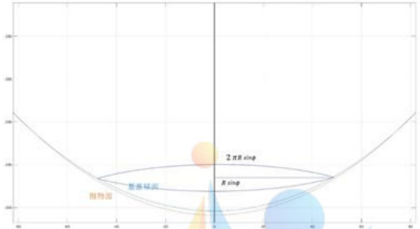

<details>
<summary>bubble</summary>

| Feature | Description |
| --- | --- |
| Y-axis | (0, 150) |
| X-axis | (0, 40) |
| Curve 1 | Parabolic surface |
| Curve 2 | Parabolic curve |
| Curve 3 | Parabolic curve |
| Point 1 | (0, 150) |
| Point 2 | (0, -150) |
| Point 3 | (0, -250) |
| Point 4 | (0, -350) |
| Point 5 | (0, -450) |
| Point 6 | (0, -550) |
| Point 7 | (0, -650) |
| Point 8 | (0, -750) |
| Point 9 | (0, -850) |
| Point 10 | (0, -950) |
| Point 11 | (0, -1050) |
| Point 12 | (0, -1150) |
| Point 13 | (0, -1250) |
| Point 14 | (0, -1350) |
| Point 15 | (0, -1450) |
| Point 16 | (0, -1550) |
| Point 17 | (0, -1650) |
| Point 18 | (0, -1750) |
| Point 19 | (0, -1850) |
| Point 20 | (0, -1950) |
| Point 21 | (0, -2050) |
| Point 22 | (0, -2150) |
| Point 23 | (0, -2250) |
| Point 24 | (0, -2350) |
| Point 25 | (0, -2450) |
| Point 26 | (0, -2550) |
| Point 27 | (0, -2650) |
| Point 28 | (0, -2750) |
| Point 29 | (0, -2850) |
| Point 30 | (0, -2950) |
| Point 31 | (0, -3050) |
| Point 32 | (0, -3150) |
| Point 33 | (0, -3250) |
| Point 34 | (0, -3350) |
| Point 35 | (0, -3450) |
| Point 36 | (0, -3550) |
| Point 37 | (0, -3650) |
| Point 38 | (0, -3750) |
| Point 39 | (0, -3850) |
| Point 40 | (0, -3950) |
| Point 41 | (0, -4050) |
| Point 42 | (0, -4150) |
| Point 43 | (0, -4250) |
| Point 44 | (0, -4350) |
| Point 45 | (0, -4450) |
| Point 46 | (0, -4550) |
| Point 47 | (0, -4650) |
| Point 48 | (0, -4750) |
| Point 49 | (0, -4850) |
| Point 50 | (0, -4950) |
| Point 51 | (0, -5050) |
| Point 52 | (0, -5150) |
| Point 53 | (0, -5250) |
| Point 54 | (0, -5350) |
| Point 55 | (0, -5450) |
| Point 56 | (0, -5550) |
| Point 57 | (0, -5650) |
| Point 58 | (0, -5750) |
| Point 59 | (0, -5850) |
| Point 60 | (0, -5950) |
| Point 61 | (0, -6050) |
| Point 62 | (0, -6150) |
| Point 63 | (0, -6250) |
| Point 64 | (0, -6350) |
| Point 65 | (0, -6450) |
| Point 66 | (0, -6550) |
| Point 67 | (0, -6650) |
| Point 68 | (0, -6750) |
| Point 69 | (0, -6850) |
| Point 70 | (0, -6950) |
| Point 71 | (0, -7050) |
| Point 72 | (0, -7150) |
| Point 73 | (0, -7250) |
| Point 74 | (0, -7350) |
| Point 75 | (0, -7450) |
| Point 76 | (0, -7550) |
| Point 77 | (0, -7650) |
| Point 78 | (0, -7750) |
| Point 79 | (0, -7850) |
| Point 80 | (0, -7950) |
| Point 81 | (0, -8050) |
| Point 82 | (0, -8150) |
| Point 83 | (0, -8250) |
| Point 84 | (0, -8350) |
| Point 85 | (0, -8450) |
| Point 86 | (0, -8550) |
| Point 87 | (0, -8650) |
| Point 88 | (0, -8750) |
| Point 89 | (0, -8850) |
| Point 90 | (0, -8950) |
| Point 91 | (0, -9050) |
| Point 92 | (0, -9150) |
| Point 93 | (0, -9250) |
| Point 94 | (0, -9350) |
| Point 95 | (0, -9450) |
| Point 96 | (0, -9550) |
| Point 97 | (0, -9650) |
| Point 98 | (0, -9750) |
| Point 99 | (0, -9850) |
| Point 100 | (0, -9950) |
</details>

图一：截面以及用 $2\pi R\sin\phi$ 体现促动器的数量

通过遍历 $\phi$ 得到最大径向偏离差：

$$
l _ {m a x} = m a x _ {\phi} \left| l _ {\phi} \right| \tag {2}
$$

通过遍历 $\phi$ 得到总径向偏离差水平：

$$
l _ {s u m} = \sum_ {\phi} \left| l _ {\phi} (2 \pi R s i n \phi) \right| \tag {3}
$$

由条件3的限制，应该有 $l_{max} \leq 0.6$ 。

## 3）理想抛物面的评价指标：

以促动器的总伸缩量最小作为理想抛物面最优的标准，则 $l_{max}$ 和 $l_{sum}$ 可作为促动器总伸缩量的评估指标，选取 $l_{max}$ 最小与 $l_{sum}$ 最小的两个理想抛物面，分别称为第一类理想抛物面、第二类理想抛物面。

## 5.1.2.2 抛物线焦点极坐标方程的建立：

考虑到在平面直角坐标系下，求解抛物线上的点与圆之间的径向距离较繁琐，故采用建立以抛物线焦点为极点，Z轴正向为极轴的坐标系，有表达式如下：

$$
\left\{ \begin{array}{l} \rho = \frac {p}{1 - \cos (\theta)} \\ p = F - l (- 0. 6 <   l <   0. 6) \end{array} \right. \tag {4}
$$

其中 $(\rho,\theta)$ 为抛物线的点的极坐标， $p=F-l(-0.6<l<0.6)$ 是由3个条件导出的结论。

## 5.1.3 问题 1 模型求解：

## 5.1.3.1 理想抛物线判定方程的求解：

求解方法：

采用逐点搜索法：将连续的自变量分解为有限个离散的点，将区域内连续的函数用离散的点来近似，最后遍历所有点对应的解空间，即可找到待求变量的解；

由附件4可知，本题精度的最大容忍度为 $10^{-3}$ 因此将本题中的待求变量 $l$ 按 $10^{-3}$ 的步长遍历 $-0.6 \sim +0.6$ ，其中的每一个值对应唯一的一条抛物线。

抛物线需要满足如下限制条件：

$$
\left\{ \begin{array}{l} \rho = \frac {2 \cdot (F - l)}{1 - \cos (\theta)} \\ | \rho \cdot \sin (\theta) | <   1 5 0 \end{array} \right. \tag {5}
$$

为此，再次使用逐点搜索法，将 $\theta$ 按 $10^{-3}$ 的步长遍历限定范围。

## 5.1.3.2 求解第一类理想抛物面：

对范围内的任意l，有：

$$
\left\{ \begin{array}{c} \rho = \frac {2 \cdot (F - l)}{1 - \cos (\theta)} \\ L = \sqrt {\rho^ {2} + C P ^ {2} - 2 \cdot \rho \cdot C P \cdot \cos (\theta)} \\ \Delta L = | R - L | \end{array} \right. \tag {6}
$$

由此可解得任意的l所对应的 $l_{max}$ ，也就能解出最小的 $l_{max}$ ，及其所对应的 $l_{1}$ 。

## 5.1.3.3 求解第二类理想抛物面：

对范围内的任意l，有：

$$
\left\{ \begin{array}{c} \rho = \frac {2 \cdot (F - l)}{1 - \cos (\theta)} \\ L = \sqrt {\rho^ {2} + C P ^ {2} - 2 \cdot \rho \cdot C P \cdot \cos (\theta)} \\ V = \sum_ {\theta} | L - R | \cdot \frac {2 \pi R}{L} \cdot | \rho \sin (\theta) | \end{array} \right. \tag {7}
$$

由此可解得任意的l所对应的 $l_{sum}$ ，也就能解出最小的 $l_{sum}$ ，及其所对应的 $l_{2}$ 。第二类理想抛物面方程为：

$$
z = \frac {x ^ {2}}{4 (F - l _ {2})} + \frac {y ^ {2}}{4 (F - l _ {2})} - 3 0 0. 4 + l _ {2} \tag {8}
$$

## 5.1.4 求解结果与结果分析：

## 5.1.4.1 求解结果：

综合解上述方程，得到：

第一类理想抛物面的 $l_{1}=-0.336$ ;

第一类理想抛物面方程为：

$$
z = \frac {x ^ {2}}{4 (F - l _ {1})} + \frac {y ^ {2}}{4 (F - l _ {1})} - 3 0 0. 4 + l _ {2} = 0. 0 0 1 7 8 1 x ^ {2} + 0. 0 0 1 7 8 1 y ^ {2} - 3 0 0. 7 3 6 0 \tag {9}
$$

第二类理想抛物面的 $l_{2}=-0.484$ 。

第二类理想抛物面方程为：

$$
z = \frac {x ^ {2}}{4 (F - l _ {2})} + \frac {y ^ {2}}{4 (F - l _ {2})} - 3 0 0. 4 + l _ {2} = 0. 0 0 1 7 8 0 x ^ {2} + 0. 0 0 1 7 8 0 y ^ {2} - 3 0 0. 8 8 4 \tag {10}
$$

## 5.1.4.2 结果分析

作出两类理想抛物面和圆心的径向偏差量及其绝对值如图：

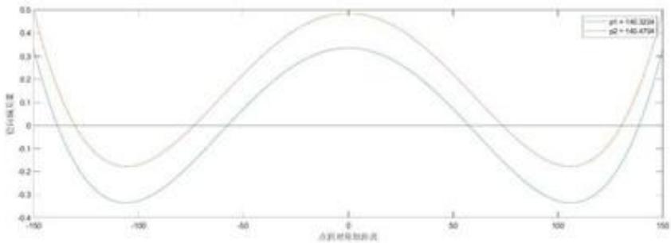

<details>
<summary>line</summary>

| X | p1 | p2 |
| --- | --- | --- |
| -150 | 0.4 | 0.4 |
| -100 | ~-0.33 | ~-0.18 |
| 0 | ~0.33 | ~0.48 |
| 100 | ~-0.33 | ~-0.18 |
| 150 | 0.4 | 0.4 |
</details>

图二：点到对称轴距离以及径向偏差量的关系

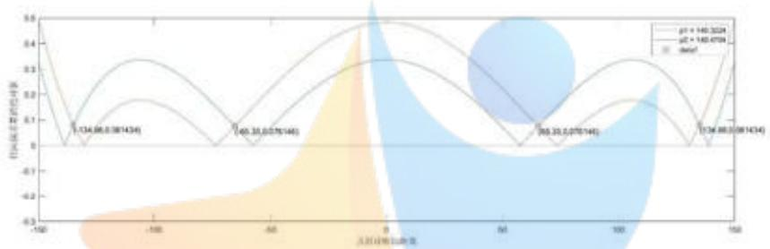

<details>
<summary>line</summary>

| X | p1 | \(\mu2\) |
| --- | --- | --- |
| -134.86 | 0.09 | 0.17 |
| -60.35 | 0.09 | 0.17 |
| 365.35 | 0.09 | 0.17 |
| 134.86 | 0.09 | 0.17 |
</details>

图三：点到对称轴距离以及径向偏差量绝对值的关系

径向偏差量近似于促动器的伸缩量，比较这两类理想抛物面，可以总结其径向偏差量的分布规律：

1）第一类曲面的最大径向偏差量较小，第二类曲面的最大径向偏差量较大；  
2）第一类曲面径向偏差量大于第二类的部分集中在距对称轴约70m至130m处，第二类曲面径向偏差量大于第一类的部分集中在0-60m处。

第二类曲面虽然最大径向偏差量较大，但其偏差较大的部分多集中于中心处，而中心处的主索节点个数较少；第一类曲面虽然最大径向偏差量较小，但其偏差较大的部分多集中于离中心较远处，而离中心较远处一个圆周上主索节点个数较多，因此第二类曲面的总偏差量水平 $l_{sum}$ 较小。我们猜想 $l_{sum}$ 反映了促动器总伸缩量水平，认为最优理想曲面为第二类理想曲面，所求的抛物面方程为：

$$
z = 0. 0 0 1 7 8 0 x ^ {2} + 0. 0 0 1 7 8 0 y ^ {2} - 3 0 0. 8 8 4 \tag {11}
$$

然而次伸缩量水平只是一个估计值而非实际值，该猜想是否正确，即第二类曲面的促动器总伸缩量是否确实大于第一类，需要通过主索节点的具体坐标量化计算，这部分将在问题2中的模型进行验证。验证结果为第二类确实优于第一类。

## 5.2 问题 2: 特定方位角星体的观测与理想抛物面的拟合

## 5.2.1 模型准备：

## 5.2.1.1 旋转矩阵：

在二维平面上，记原点为O，平面上一点A，则将 $\overrightarrow{OA}$ 逆时针旋转 $\theta$ 角所得的 $\overrightarrow{OA}$ 满足：

$$
\left(\overrightarrow {O A ^ {\prime}}\right) ^ {T} = \left( \begin{array}{c c} \cos \theta & - \sin \theta \\ \sin \theta & \cos \theta \end{array} \right) (\overrightarrow {O A}) ^ {T}
$$

这样的 $R=\begin{pmatrix}\cos\theta&-\sin\theta\\ \sin\theta&\cos\theta\end{pmatrix}$ 称为二维空间逆时针旋转 $\theta$ 角的旋转矩阵。

在三维空间中的旋转可以视为几个绕坐标轴的基本旋转的复合，而基本旋转矩阵和二维平面的旋转矩阵十分类似。

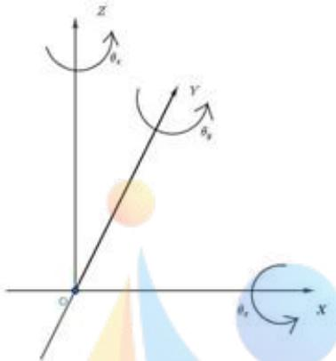

<details>
<summary>text_image</summary>

z
θx
y
θy
O
x
θz
</details>

图四：绕各坐标轴旋转的示意图

绕X轴在YZ平面逆时针旋转 $\theta_{x}$ 的旋转矩阵为：

$$
R _ {x} = \left( \begin{array}{c c c} 1 & 0 & 0 \\ 0 & \cos \theta_ {x} & - \sin \theta_ {x} \\ 0 & \sin \theta_ {x} & \cos \theta_ {x} \end{array} \right)
$$

它可以看作是向量的第一个分量（X坐标）不发生改变，而后两个分量在对应的平面上进行二维旋转所得到的矩阵。

同理，绕Y轴在ZX平面逆时针旋转 $\theta_{y}$ 的旋转矩阵为

$$
R _ {y} = \left( \begin{array}{c c c} \cos \theta_ {y} & 0 & - \sin \theta_ {y} \\ 0 & 1 & 0 \\ \sin \theta_ {y} & 0 & \cos \theta_ {y} \end{array} \right)
$$

绕Y轴在ZX平面逆时针旋转 $\theta_{y}$ 的旋转矩阵为

$$
R _ {z} = \left( \begin{array}{c c c} \cos \theta_ {z} & - \sin \theta_ {z} & 0 \\ \sin \theta_ {z} & \cos \theta_ {z} & 0 \\ 0 & 0 & 1 \end{array} \right)
$$

再根据具体问题判断基本旋转的复合顺序,将基本旋转的旋转矩阵相乘即得到总的旋转矩阵。

例如：依次绕X、Y、Z轴旋转时，旋转矩阵 $R=R_{x}R_{y}R_{z}$ ，记原点为O，空间内一点A， $\overrightarrow{OA}$ 旋转所得的 $\overrightarrow{OA'}$ 满足：

$$
\left(\overrightarrow {O A}\right) ^ {T} = R (\overrightarrow {O A}) ^ {T}
$$

## 5.2.1.2 图形变换：

在三维空间中，记一图形方程为：

$$
F (x, y, z) = 0
$$

记一可逆坐标变换为：

$$
\left(x ^ {\prime}, y ^ {\prime}, z ^ {\prime}\right) = \phi (x, y, z)
$$

记 $\phi^{-1}$ 为它的逆变换。

对F上的点 $(a,b,c)$ 可知以下式子成立：

$$
F \circ \phi^ {- 1} \left(a ^ {\prime}, b ^ {\prime}, c ^ {\prime}\right) = F (a, b, c) = 0
$$

故点 $\left(a^{'}\right)$ ， $b^{'}$ ， $c^{'}$ 在 $F\circ\phi^{-1}$ 所表示的图形上，且 $F\circ\phi^{-1}$ 所表示的图形上的点全为 $\left(a^{'}\right)$ ， $b^{'}$ ， $c^{'}$ 形式的点。

即在 $\phi$ 这一可逆坐标变换下，新的图形方程为：

$$
F \circ \phi^ {- 1} (x, y, z) = 0 \tag {12}
$$

## 5.2.2 模型建立：

## 5.2.2.1 理想曲面模型：

根据模型准备中旋转矩阵与图形变换的结论，将问题1中求解的理想抛物面S为：

$$
S (x, y, z) = 0
$$

进行先绕Y轴逆时针旋转90°-β角，再绕Z轴逆时针旋转α角的旋转坐标变换φ为：

$$
\phi (x, y, z) = \left(R _ {z} R _ {y} (x, y, z) ^ {T}\right) ^ {T}
$$

逆变换 $\phi^{-1}$ 为：

$$
\phi^ {- 1} (x, y, z) = \left(R _ {y} ^ {- 1} R _ {z} ^ {- 1} (x, y, z) ^ {T}\right) ^ {T}
$$

其中 $R_{y} = \left( \begin{array}{ccc}cos(90^{\circ} - \beta) & 0 & -sin(90^{\circ} - \beta)\\ 0 & 1 & 0\\ sin(90^{\circ} - \beta) & 0 & cos(90^{\circ} - \beta) \end{array} \right),\quad R_{z} = \left( \begin{array}{ccc}cos\alpha & -sin\alpha & 0\\ sin\alpha & cos\alpha & 0\\ 0 & 0 & 1 \end{array} \right)$

则旋转后的抛物面 $S'$ 为：

$$
S ^ {\prime} (x, y, z) = S \circ \phi^ {- 1} (x, y, z) = 0 \tag {13}
$$

## 5.2.2.2 促动器调节模型：

在本模型中，需要通过调节促动器伸缩量，将每个反射面板移动到旋转抛物面上。在模型准备中已经证明，在基准球面状态下，球心、主索节点、促动器上、下端点成一条沿径向的直线，说明促动器伸缩量变化时，主索节点沿球的径向运动。

容易想到最简单的调节方案是将全部主索节点沿径向移动到理想抛物面上。作球心和基准球面上主索节点的连线，求其与理想抛物面的交点即可得到主索节点移动后的坐标。具体求解过程在模型求解部分给出。

但由于每个反射面板均为球面的一部分，因此，此时反射面板与理想抛物面不能很好地贴合，可在反射面板上取一系列统计点，计算拟合的均方根误差 RMS，作为拟合效果的评价。为方便统计，可取各主索节点及主索节点两两间的圆弧的中点作为统计点。其中，圆弧中点的坐标求解过程在模型求解部分给出。

设各统计点为 $X_{i}$ ，连接球心O与统计点，与理想抛物面交于 $X_{i}$ ，则均方根误差的计算方法为：

$$
R M S = \sqrt {\frac {1}{n} \sum_ {i = 1} ^ {n} \left| \overrightarrow {C X _ {i}} - \overrightarrow {C X _ {i}} \right| ^ {2}} \tag {14}
$$

由于主索节点都在理想抛物面上，因此拟合误差来源于圆弧中点。通过微调主索节点位置，可能可以减小RMS，提高拟合优度，其大致示意图如下：

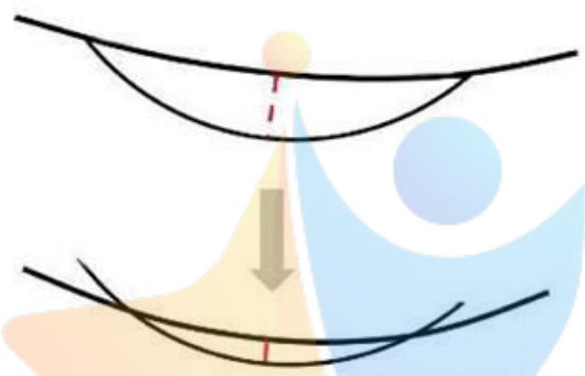

<details>
<summary>natural_image</summary>

Abstract diagram showing a downward arrow from a central point to two curved lines, with no text or symbols present.
</details>

图五：微调主索节点提高拟合优度的示意图

据此设计调整方案如下对于每一个主索节点,其微调距离由自身和连接该主索节点圆弧的中点决定。

为使主索节点的微调距离不过于受连接该主索节点圆弧的中点的影响，在统计时需要为主索节点赋一定的权，可以为其赋权为1/2，其他点赋权为1/12，使得主索节点位置对微调的影响与其他各点影响的总和相等。

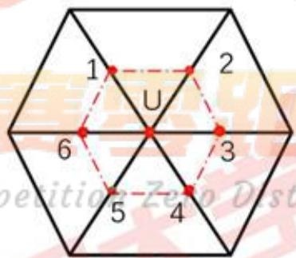

<details>
<summary>text_image</summary>

1
2
U
6
3
5
4
position Zero Dist
</details>

图六：统计点的选取

设主索节点连接k个圆弧，圆弧上的中点记为 $\widehat{X_{f}}$ ，主索节点记为 $\hat{p}$ ，构造统计量D：

$$
D = \frac {1}{2 k} \left(\sum_ {j = 1} ^ {k} \left(\left| \overrightarrow {C X _ {j}} \right| - \left| \overrightarrow {C X _ {j}} \right|\right) + \mathrm{k} \left(\left| \overrightarrow {C P} \right| - \left| \overrightarrow {C P} \right|\right)\right) \tag {15}
$$

式中， $X_{J}$ 为统计点与球心的连线与理想抛物面的交点，其求解方法与求主索节点在理想抛物面上的坐标相同，此处不再赘述。调整原理为：若 $D > 0$ ，说明该主索节点周围的反射面板较多落在在抛物面外侧（即距球心较远），其需要向球心移动，对应促动器伸缩量为正，反之为负。设伸缩量调整值为 $d$ ，则

$$
d = D
$$

据此调节方案同时调节每个主索节点,可以计算得到新的主索节点坐标和各统计点坐标,得到新的均方根误差 $RMS'$ ,若 $RMS'<RMS$ ,说明该调整是有效的。计算新的统计量 $D'$ ,继续对主索节点坐标进行调整,直至统计量D的变化值很小,可认为此时拟合已达最优。[24]

## 5.2.3 模型求解：

## 5.2.3.1 理想抛物面求解：

根据模型准备中旋转矩阵与图形变换的结论，将问题1中求解的理想抛物面S为：

$$
S (x, y, z) = 0. 0 0 1 7 8 0 x ^ {2} + 0. 0 0 1 7 8 0 y ^ {2} - z - 3 0 0. 8 8 4 = 0
$$

则旋转后的抛物面S为：

$$
S ^ {\prime} (x, y, z) = S \circ \phi^ {- 1} (x, y, z) = 0
$$

即：

$$
\begin{array}{l} S ^ {\prime} (x, y, z) = 0. 1 6 4 1 8 x + 0. 1 2 2 8 y + 0. 9 7 8 7 6 z - 0. 0 0 1 7 7 9 7 (0. 5 9 8 9 5 x - 0. 8 0 0 7 8 y) ^ {2} \\ - 0. 0 0 1 7 7 9 7 (0. 7 8 3 7 7 x + 0. 5 8 6 2 3 y - 0. 2 0 5 0 3 z) ^ {2} + 3 0 0. 8 8 = 0 \\ \end{array}
$$

由于问题1中理想抛物面顶点为 $(0,0, - 300.884)$ ，经 $\phi$ 的旋转坐标变换后，得到问题2中抛物面的顶点坐标为 $((R_x^{-1}R_z^{-1}(0,0, - 300.884)^T)^T)$ ，为：

$$
(- 4 9. 3 1 9 4, - 3 6. 8 8 9 0, - 2 9 4. 0 1 8 7)
$$

## 5.2.3.2 促动器调节模型求解：

1）求解主索节点在理想抛物面上的坐标：

设基准球面上一主索节点为 $X(x_{0},y_{0},z_{0})$ ，则可得到其与球心连线的直线方程：

$$
\frac {x - x _ {0}}{x _ {0}} = \frac {y - y _ {0}}{y _ {0}} = \frac {z - z _ {0}}{z _ {0}} (x _ {0}, y _ {0}, z _ {0} \neq 0) \tag {16}
$$

为完整表示 $x_{0}$ 、 $y_{0}$ 、 $z_{0}$ 为0的情况，可表示为参数方程：

$$
\left\{ \begin{array}{l} x = x _ {0} t + x _ {0} \\ y = y _ {0} t + y _ {0}, t \text {为参数} \\ z = z _ {0} t + z _ {0} \end{array} \right. \tag {17}
$$

已知抛物面方程

$$
F (x, y, z) = 0
$$

代入即可求得连线与理想抛物面的焦点，即为主索节点移动到理想抛物面上时的坐标。

求得主索节点在理想抛物面上的坐标后，可粗略求出各促动器伸缩量，从而验证模型一中设计的评价总伸缩量水平的指标了 $l_{sum}$ 是合理的。

设将主索节点移动到理想抛物线上时，促动器的总伸缩量（绝对值）为LSUM

$$
L S U M _ {1} = \sum_ {i = 1} ^ {n _ {1}} \left| X _ {0 i} X _ {1 i} \right| \tag {18}
$$

$$
L S U M _ {2} = \sum_ {i = 1} ^ {n _ {2}} \left| \overline {{X _ {0 i} X _ {2 i}}} \right| \tag {19}
$$

$LSUM_{1}$ ：第一类抛物面的LSUM

$LSUM_{2}$ ：第二类抛物面的LSUM

$X_{0i}$ ：基准球面上的主索节点

$X_{1i}$ ：第一类理想抛物面上的主索节点

$X_{2i}$ ：第二类理想抛物面上的主索节点

代入数据解得

$$
L S U M _ {1} = 1 4 1. 0 0 3 3
$$

$$
LSUM_2 = 114.8469
$$

$LSUM_{2}>LSUM_{1}$ ，因此说明模型1中的伸缩量水平的指标 $l_{sum}$ 是合理的，也即所选取的第二类理想曲面是合理的。

2）求解圆弧中点坐标：

先求出将主索节点移动到理想抛物面上后，反射面板对应的新的球心 $C'$ ：

设球面方程为:

$$
(x - x _ {c ^ {\prime}}) ^ {2} + (y - y _ {c ^ {\prime}}) ^ {2} + (z - z _ {c ^ {\prime}}) ^ {2} = 0
$$

设反射面板三个顶点为P、Q、T，代入球面方程：

$$
\begin{array}{l} (x _ {P} - x _ {c ^ {\prime}}) ^ {2} + (y _ {P} - y _ {c ^ {\prime}}) ^ {2} + (z _ {P} - z _ {c ^ {\prime}}) ^ {2} = 0 \\ \left(x _ {Q} - x _ {c ^ {\prime}}\right) ^ {2} + \left(y _ {Q} - y _ {c ^ {\prime}}\right) ^ {2} + \left(z _ {Q} - z _ {c ^ {\prime}}\right) ^ {2} = 0 \\ (x _ {T} - x _ {c ^ {\prime}}) ^ {2} + (y _ {T} - y _ {c ^ {\prime}}) ^ {2} + (z _ {T} - z _ {c ^ {\prime}}) ^ {2} = 0 \\ \end{array}
$$

联立解得球心坐标。

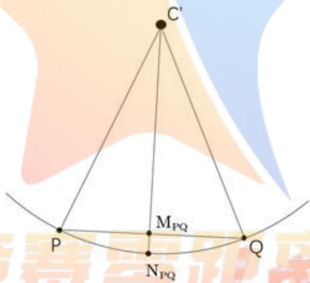

<details>
<summary>text_image</summary>

C'
M_{PQ}
P
N_{PQ}
Q
</details>

图七：球心、圆弧中点坐标的求解

设P、Q中点为 $M_{PQ}$ ，P、Q圆弧中点为 $N_{PQ}$ 则：

$$
M _ {P Q} \left(\frac {x _ {p} + x _ {Q}}{2}, \frac {y _ {p} + y _ {Q}}{2}, \frac {z _ {p} + z _ {Q}}{2}\right)
$$

$$
\overrightarrow {C N _ {P Q}} = R \cdot \frac {\overrightarrow {C M _ {P Q}}}{\left| C M _ {P Q} \right|}
$$

由此求得 $N_{PQ}$ 的坐标，同理可求得各圆弧中点坐标。

3）求解RMS和移动距离d

将各统计点坐标代入公式：

$$
R M S = \sqrt {\frac {1}{n} \sum_ {i = 1} ^ {n} \left| \overrightarrow {C \hat {X} _ {i}} - \overrightarrow {C X _ {i}} \right| ^ {2}}
$$

求得主索节点在理想抛物面上时，均方根误差为： $RMS = 0.0042m = 4.2mm$ 将各统计点坐标代入公式：

$$
d = D = \frac {1}{2 k} \left(\sum_ {j = 1} ^ {k} \left(\left| \overrightarrow {C X _ {j}} \right| - \left| \overrightarrow {C X _ {j}} \right|\right) + \mathrm{k} \left(\left| \overrightarrow {C P} \right| - \left| \overrightarrow {C P} \right|\right)\right) \tag {21}
$$

求得各主索节点第一次微调的距离。

调整后得到新的主索节点坐标，以新的主索节点坐标为基础，计算均方根误差和下一轮的微调距离……迭代3次，结果如下表：

<table><tr><td>调整次数</td><td>平均调整距离(m)</td><td>调整后的均方根误差RMS(m)</td></tr><tr><td>1</td><td>0.0019</td><td>0.0030</td></tr><tr><td>2</td><td>2.4257e-5</td><td>0.0030</td></tr><tr><td>3</td><td>5.6051e-06</td><td>0.0030</td></tr></table>

表一：3次微调的相关参数

从表中可以看出，第一次微调后，均方根误差显著减小，下次需再调整的距离也下降到了一个很小的数量级，说明该调整策略是有效的，且仅需一次调整即可。  
最终得到 $RMS = 0.0030m = 3.0mm$ 。部分主索节点编号、位置坐标及其对应的促动器的伸缩量如下：

<table><tr><td>主索节点编号</td><td>X坐标(米)</td><td>Y坐标(米)</td><td>Z坐标(米)</td><td>伸缩量(米)</td></tr><tr><td>A0</td><td>0</td><td>0</td><td>-300.512</td><td>-0.11225</td></tr><tr><td>B1</td><td>6.108199</td><td>8.407549</td><td>-300.24</td><td>-0.01987</td></tr><tr><td>C1</td><td>9.884383</td><td>-3.21155</td><td>-300.271</td><td>-0.05145</td></tr><tr><td>......</td><td>......</td><td>......</td><td>......</td><td>......</td></tr><tr><td>D267</td><td>-130.239</td><td>-147.809</td><td>-227.334</td><td>-0.41211</td></tr><tr><td>D268</td><td>-139.766</td><td>-140.046</td><td>-226.6</td><td>-0.41893</td></tr><tr><td>D269</td><td>-149.04</td><td>-132.069</td><td>-225.52</td><td>-0.45129</td></tr></table>

表二：主索节点的编号、坐标、伸缩量

完整结果保存在“result.xlsx”文件中。

## 5.3 问题三：接收比的计算与比较

## 5.3.1 模型准备：

## 1) 球面镜性质：

球面镜反射平行入射电磁波的性质的二维表示：

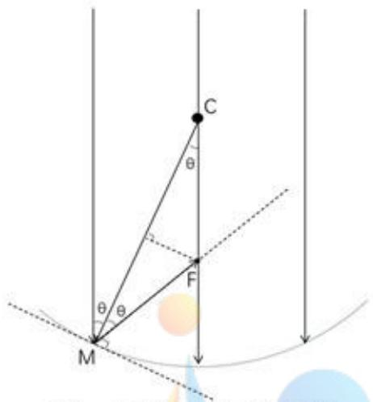

<details>
<summary>text_image</summary>

C
θ
F
θ
M
</details>

图八：球面镜反射性质的示意图

C为球心，入射到球面上一点M的电磁波信号，其反射电磁波信号与过球心的入射电磁波信号交于点F。设入射电磁波信号与CM的夹角为 $\theta$ ，则：

$$
C F = \frac {R}{2 \cos \theta}
$$

越往内（距球心越近）的电磁波信号，其夹角 $\theta$ 越小，且：

$$
\lim _ {\theta \to 0} \frac {R}{2 \cos \theta} = \frac {R}{2}
$$

称为圆反射面的焦距。

越往外的电磁波信号（距球心越远），其夹角 $\theta$ 越大，反射电磁波信号与过圆心入射电磁波信号的交点离圆心越远，如图：

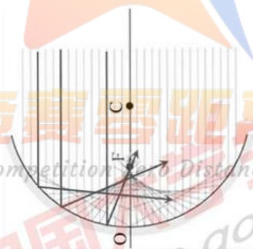

<details>
<summary>text_image</summary>

联赛距离
competition to 0 Distance
</details>

图九：距球心不同位置反射平行入射电磁波的情况

2）判断点是否在与其共面的三角形内：

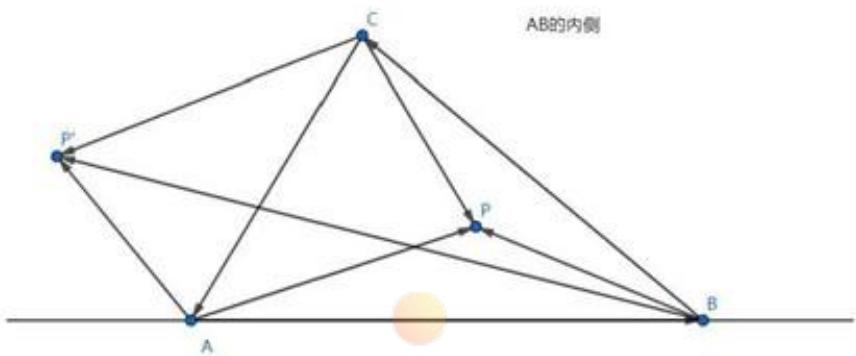

<details>
<summary>text_image</summary>

AB的内側
P'
C
P
A
B
</details>

图十：判断点是否在与其共面的三角形内的示例

如图，在同一平面上有 $\triangle ABC$ ，P是平面上任意一点。

直线AB将平面分成两个半平面以及直线AB自身。我们称C所在的半平面是AB的内侧。

同理，BC的内侧是直线BC分出来的A所在的半平面；CA的内侧是直线CA分出来的B所在的半平面。

记 $J_{C}=\left(\overrightarrow{AB}\times\overrightarrow{AP}\right)\cdot\left(\overrightarrow{AB}\times\overrightarrow{AC}\right)$ 。可知 $J_{C}>0$ 时，P与C在AB的同侧，即P在AB的内侧。

同理记 $J_{A}=(\overrightarrow{BC}\times\overrightarrow{BP})\cdot(\overrightarrow{BC}\times\overrightarrow{BA}),J_{B}=(\overrightarrow{CA}\times\overrightarrow{CP})\cdot(\overrightarrow{CA}\times\overrightarrow{CB})$ 。

可知，当且仅当P同时在AB、BC、CA的内侧时，P在△ABC内部。

当且仅当 $J_{A}$ 、 $J_{B}$ 、 $J_{C}$ 同时大于0时，P在 $\triangle ABC$ 内部。

3）蒙特卡罗法计算面积的原理

蒙特卡罗法：

蒙特卡罗法是一种数值模拟方法，它通过构造一个与待求解模型性能相近的概率模型，在这个概率模型上进行随机抽样、统计实验，通过抽样实验结果得到特定的数字特征，根据大数定律，可以用这样的数字特征作为待求解模型解的近似值。

蒙特卡罗法计算面积：

计算面积是蒙特卡罗法的经典应用场景之一，记待求图形为v，其面积为s，计算s的蒙特卡罗法的基本步骤为：

(1) 找到一个已知面积且能够包含v的图形V（如包含v的矩形），V的面积为S。  
(2) 在V内部随机取N个点（N为较大的正整数），点的选取是在V上的均匀分布。  
(3) 计数在v中的点的个数n， $\hat{s}=\frac{nS}{N}$  
(4) 由于误差 $|s - (\overline{s})|$ 是概率误差，故可以通过多次实验取平均值的方法，用 $\hat{s}$ 的平均值 $\bar{s}$ 作为s的统计值。

## 5.3.2 模型建立：

## 5.3.2.1 实际工作面反射信号接收比：

1）单元接收比：

对于理想抛物面,平行于旋转轴入射的电磁波信号会聚于焦点处,将馈源舱置于焦点处,则理想抛物面的接收比为100%。但在实际工作时,由于每块反射面板的形状是球面的一部分,其反射电磁波信号不会会聚于馈源舱。对于每块反射面板,其反射信号可能被馈源舱完全吸收、吸收一部分或完全未吸收。因此，我们可以定义单元接收比 $\eta_{i}$ 。

$$
\mathrm{单元接收比} = \frac {\mathrm{单个反射面反射信号被馈源舱接收的部分}}{\mathrm{单个反射面的反射信号}}
$$

其计算方式为：

$$
\eta_ {i} = \frac {S _ {w p}}{S _ {w}} \times 100\%
$$

$\eta_{i}$ ：单元接收比

$S_{w}$ ：单个反射面的反射电磁波信号在馈源舱所在平面的投影面积

$S_{wp}$ ：单个反射面的反射电磁波信号在馈源舱所在平面的投影与馈源舱重叠部分的面积

要确定 $S_{w}$ 和 $S_{wp}$ ，首先要确定馈源舱的位置。设馈源舱中心所在点P。当观测天体位于正上方时，有：

$$
\frac {\overrightarrow {C P}}{| C P |} = (0, 0, - 1)
$$

当观测天体的方位角为 $\alpha$ ，仰角为 $\beta$ 时，根据向量旋转，有：

$$
\frac {\overrightarrow {C P}}{| C P |} = (- 0. 1 6 4 2, - 0. 1 2 2 8, - 0. 9 7 8 8)
$$

题目中给出焦径比 $\frac{F}{R}$ 为0.466，有：

$$
| C P | = (1 - 0. 4 6 6) R
$$

可以得到P点坐标，记为 $P(x_{p},y_{p},z_{p})$ 。

则馈源舱所在平面的方程为：

$$
x _ {p} x + y _ {p} y + z _ {p} z = | C P | ^ {2}
$$

对于每一个反射面板，其三个顶点坐标已知，半径固定，入射电磁波信号方向已知。由此可以求得入射电磁波信号在三个顶点处的反射电磁波信号，三条反射电磁波信号与馈源舱所在平面相交，交点相连，计算三角形面积即可近似得到 $S_{w}$ ，其求解过程见模型求解部分。

由于馈源舱位置和半径已知，则 $S_{wp}$ 理论上也可用计算方法求解，但其求解过程较为复杂。为减小模型复杂度，建立用蒙特卡洛方法求解 $S_{wp}$ 的模型，其流程如下：

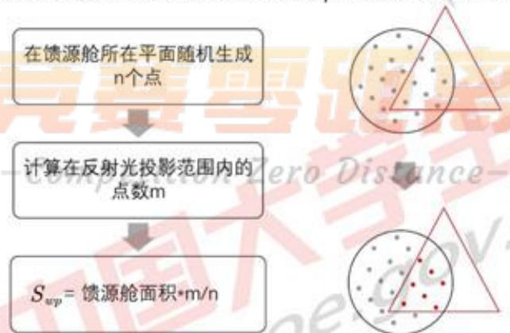

<details>
<summary>flowchart</summary>

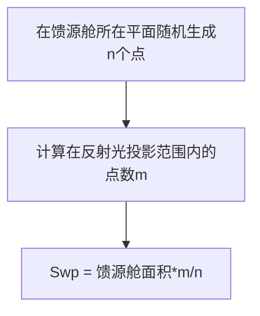
</details>

图十一：蒙特卡罗法的流程图

蒙特卡洛方法准确的前提是取的点 n 的个数足够多，在计算时，我们取 $n=10^{5}$ ，并多次计算取平均值。

2）馈源舱接收比：

由于每个反射面板反射的信号量不同，因此馈源舱接收比并不等于单元接收比的均值，而给每个接收比赋予一个权重 $w_{i}$ :

$$
\mathrm{单元接收比权重} = \frac {\mathrm{单个反射面板反射信号量}}{\mathrm{工作反射面反射信号总量}}
$$

也可称这个权重为单元面板反射信号比，其计算方式为：

$$
\begin{array}{l} w _ {i} = \frac {S _ {v i}}{S _ {s u m}} \\ S _ {s u m} = \sum_ {i = 1} ^ {n} S _ {v i} \\ \end{array}
$$

$W_{i}$ ：单元面板反射信号比（单元接收比权重）

$S_{vi}$ ：单个反射面板在与入射信号垂直的平面上的投影面积

$S_{sum}$ : 300 米口径内反射面板在与入射信号平行的平面上的投影面积之和

入射电磁波信号方向即为 $\overline{CP}$ 方向，为简单起见，可以设与入射电磁波信号垂直的一个投影面为：

$$
x _ {p} x + y _ {p} y + z _ {p} z = 0
$$

由于每个反射面板的顶点坐标已知，则其投影到该面的点的坐标可求，由此可以计算出 $S_{vt}$ ：求解过程见模型求解部分。

馈源舱的总接收比为：

$$
\eta = \sum_ {i} ^ {n} w _ {i} \eta_ {i}
$$

## 5.3.2.2 基准反射球面接收比：

由于球面是旋转对称的，基准球面接收比在方位角为0度，仰角为90度的情况下讨论即可，如图。

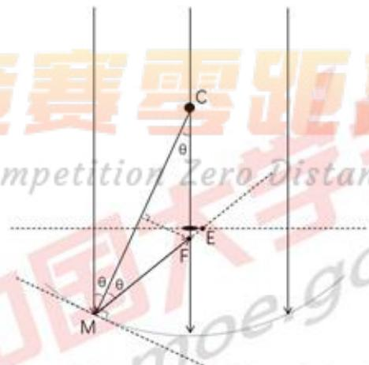

<details>
<summary>text_image</summary>

赛要距
competition Zero Distan
θ
C
E
F
θ/θ
M
</details>

图十二：反射光线与馈源舱所在平面交点示意图

对入射到M点的电磁波信号，设反射电磁波信号与馈源舱所在平面的交点为E，与过球心电磁波信号的交点为 $F$ 。对于口径 $300\mathrm{m}$ ，半径 $300.4\mathrm{m}$ 的球面，讨论范围约为 $0 < \theta < 30^{\circ}$ 。各点坐标：

$$
\begin{array}{l} M (- R \sin \theta , - R \cos \theta) \\ F \left(0, - \frac {R}{2 \cos \theta}\right) \\ E (x _ {E}, - (1 - 0. 4 6 6) R) \\ \end{array}
$$

可得直线MF的方程：

$$
y = \frac {1}{\tan 2 \theta} x - \frac {R}{2 \cos \theta}
$$

求E点横坐标：

$$
\frac {1}{\tan 2 \theta} x _ {E} - \frac {R}{2 \cos \theta} = - (1 - 0. 4 6 6) R
$$

得：

$$
x _ {E} = \left(\frac {R}{2 \cos \theta} - (1 - 0. 4 6 6) R\right) \cdot \tan 2 \theta , \left(0 ^ {\circ} <   \theta <   4 5 ^ {\circ}\right)
$$

基准反射球面上的点反射的信号能被馈源舱接收的充要条件为：

$$
- 0. 5 <   x _ {E} <   0. 5
$$

可以求出满足该条件的 $\theta$ 的范围，从而求解出反射信号能被馈源舱接收的点的范围。设基准反射球面接收比为 $\eta_{basic}$ ，则：

$$
\eta_ {b a s i c} = \frac {S _ {v}}{\pi \times 1 5 0 ^ {2}}
$$

其中 $S_{p}$ 为反射信号能被馈源舱接收的范围在水平面的投影，其求解过程见模型求解部分。

## 5.3.3 模型求解：

## 5.3.3.1 实际工作面反射信号接收比求解：

## 1）单元接收比求解：

首先求解单元反射面板反射的电磁波信号在馈源舱所在平面的投影面积。对任意一个实际工作面上的反射面板，将其扩展成一个大的球面。对其中的一个顶点，作其法平面的二维视图如图：

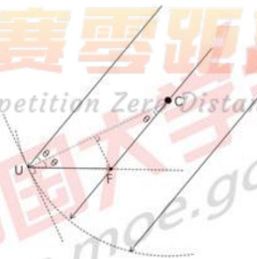

<details>
<summary>text_image</summary>

赛要距
petition Zero Distance
U
F
C
</details>

图十三：主索节点的反射信号

图中 $C$ 为由反射面板三顶点确定的球心，而非基准球面球心，其坐标求解在模型二中已讨论过，此处不再赘述。入射电磁波信号方向为 $\overrightarrow{CP}$ ( $C$ 为基准球面球心， $P$ 为馈源舱中心)；则：

$$
\begin{array}{l} \cos \theta = <   \overrightarrow {C P} \cdot \overrightarrow {C ^ {\prime} U} > = \frac {\left| \overrightarrow {C P} \cdot \overrightarrow {C ^ {\prime} U} \right|}{\left| C P \right| \left| C ^ {\prime} U \right|} \\ \overrightarrow {C F} = \frac {R}{2 \cos \theta} \cdot \frac {\overrightarrow {C P}}{| C P |} \\ \overrightarrow {U F} = \overrightarrow {C ^ {\prime} U} - \overrightarrow {C ^ {\prime} F} = (l, m, n) \\ \end{array}
$$

则直线UF的参数方程为：

$$
\left\{ \begin{array}{l l} x = l t + x _ {U} \\ y = m t + y _ {U}, t \text {为参数} \\ z = n t + z _ {U} \end{array} \right.
$$

馈源舱所在平面的方程为：

$$
x _ {p} x + y _ {p} y + z _ {p} z = | C P | ^ {2}
$$

联立直线方程和平面方程，求解即可得到 U 点反射的电磁波信号与馈源舱所在平面的交点W。

对一个单元反射面板，设其三个顶点反射电磁波信号与馈源舱所在平面的交点为 $W_{1}$ ， $W_{2}$ ， $W_{3}$ ，则：

$$
S _ {w} = \frac {1}{2} \left| \overrightarrow {W _ {1} W _ {2}} \times \overrightarrow {W _ {1} W _ {3}} \right|
$$

用蒙特卡洛方法求解 $S_{wp}$ ，并计算得到单元接收比 $\eta_{\mathrm{i}}$ 部分结果如下：

<table><tr><td>反射单元编号</td><td> $S_w$ </td><td> $S_{wp}$ </td><td> $\eta_i$ </td></tr><tr><td>(A0,B1,C1)</td><td>0.0322</td><td>0.0332</td><td>1.00</td></tr><tr><td>(A0,B1,A1)</td><td>0.0338</td><td>0.0326</td><td>0.96</td></tr><tr><td>(A0,C1,D1)</td><td>0.0117</td><td>0.0114</td><td>0.97</td></tr><tr><td>......</td><td>......</td><td>......</td><td>......</td></tr><tr><td>(D235,E236,E237)</td><td>2.1973</td><td>0.3933</td><td>0.17</td></tr><tr><td>(D246,D247,D269)</td><td>1.1672</td><td>0.2404</td><td>0.20</td></tr><tr><td>(D246,E237,E238)</td><td>2.2383</td><td>0.3930</td><td>0.17</td></tr></table>

表三：蒙特卡洛法求解结果

## 2）总接收比求解

首先求单个反射面板在与入射电磁波垂直方向上的投影。取投影面：

$$
x _ {p} x + y _ {p} y + z _ {p} z = | C P | ^ {2}
$$

过反射面板一点U且与投影面垂直的直线方程：

$$
\left\{ \begin{array}{l} x = x _ {p} t + x _ {U} \\ y = y _ {p} t + y _ {U}, t \text {为参数} \\ z = z _ {p} t + z _ {U} \end{array} \right.
$$

联立直线方程与平面方程，可解得投影点V；

对一个单元反射面板，设其三个顶点反射电磁波信号与投影面的交点为 $V_{i1}$ ， $V_{i2}$ ， $V_{i3}$ ，则：

$$
S _ {v i} = \frac {1}{2} \left| \overrightarrow {V _ {t 1} V _ {t 2}} \times \overrightarrow {V _ {t 1} V _ {t 3}} \right|
$$

$$
S _ {s u m} = \sum_ {i = 1} ^ {n} S _ {v i}
$$

$$
w _ {i} = \frac {S _ {v i}}{S _ {s u m}}
$$

馈源舱吸收比为：

$$
\eta = \sum_ {i} ^ {n} w _ {i} \eta_ {i} = 67.46\%
$$

## 5.3.3.2 基准反射球面接收比求解：

根据：

$$
x _ {E} = \left(\frac {R}{2 \cos \theta} - (1 - 0. 4 6 6) R\right) \cdot \tan 2 \theta , \left(0 ^ {\circ} <   \theta <   4 5 ^ {\circ}\right)
$$

设反射点到Z轴的距离为r，有：

$$
r = R \sin \theta
$$

作出 $x_{E}$ 随 $\theta$ 变化和x随r变化的曲线：

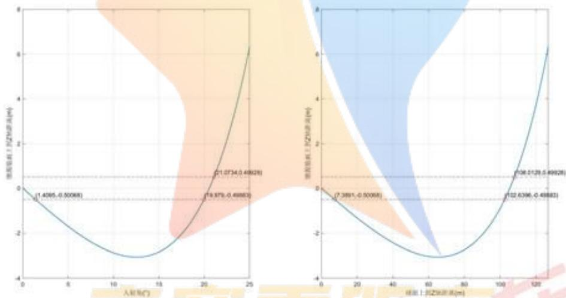  
图十四：反射信号在馈源舱面上到Z轴距离与入射角或球面上到Z轴距离的关系

由 $-0.5 < x_{E} < 0.5$ 的限制条件，解得：

$$
0 <   r <   7. 3 8 9 1 \text {或} 1 0 2. 6 3 9 6 <   r <   1 0 8. 0 1 2 9
$$

则 $S_{v}$ 为一个圆的面积加一个圆环的面积：

$$
S _ {v} \pi = (7. 3 8 9 1 ^ {2} + 1 0 8. 0 1 2 9 ^ {2} - 1 0 2. 6 3 9 8 ^ {2})
$$

求得基准反射球面的接收比为

$$
\eta_ {b a s i c} = \frac {S _ {v}}{\pi \times 150^2} \times 100\% = 5.27\%
$$

## 5.3.4 结果与误差分析：

根据求解结果，通过调节促动器伸缩量，将反射面板从基准反射球面移动到理想抛物

线位置处，可将馈源舱接收比从5.27%提高到67.46%，提升效果非常显著。

对实际工作面的接收比的计算存在一定的误差，误差主要来源于：

1）将反射电磁波信号投影到馈源舱所在平面，在计算时认为一个反射面板反射信号投影的形状为三角形，但实际上该形状可能有微小变形，可能为凸三角形或凹三角形，因此在计算该面积时可能存在误差。

2）将反射面板投影到与入射电磁波信号垂直的平面，在计算时同样认为其投影形状为三角形，误差与1）类似。

3）将反射电磁波信号投影到馈源所在平面，认为单元接收比为：

$$
\eta_ {i} = \frac {S _ {w p}}{S _ {w}} \times 100\%
$$

即是以面积之比作为单元接收比。但实际上电磁波密度在此平面上可能并非均匀分布，因此存在一定误差。

虽然位对上述误差做定量分析，但通过定性分析，这些误差影响都较小，不会对结果造成太大影响。

## 六、模型评价

## 模型优点：

1. 理想抛物面求解模型的指标选取合理，以促动器总伸缩量最小作为最优抛物面指标，并提出促动器总伸缩量的估计方法并验证了该估计方法的合理性，避免了对每个促动器进行计算，减小了运算量。  
2. 反射面最优拟合模型中选取了合适的统计点并赋予合适的权重，得以以较快的速度解得最优拟合位置，拟合精度高，均方根误差仅为3.0mm，符合FAST的工程设计要求。  
3. 求解实际工作反射面的接收比时，对每个反射面板单独处理，保证了求解精度，同时用蒙特卡洛方法减小了计算难度。  
4. 求解基准反射球面的接收比时采用解析方法，误差很小。

## 模型缺点：

1. 求解理想抛物面时仅考虑 300m 口径内的促动器伸缩量，实际上由于在边缘处抛物面于基准球面不重合，300m 外一定范围内的促动器也需进行伸缩，在计算时并未考虑这部分。  
2. 求解 300 米口径范围内反射面板拟合时，仅处理了 3 个顶点都位于 300 米口径范围内的反射面板，没有计算边缘上的面板的调节。  
3. 求解理想抛物面和考虑反射面板调节时，仅考虑几何因素，未考虑力学因素，可能存在不妥当之处。但这也是因为题目所给条件较少，且应力分析难度大。

## 模型改进和推广：

1. 求解理想抛物面时考虑300米口径外周围面板所受影响，将其囊入理想抛物面的评价。  
2. 求解300米口径内反射面板拟合时，将边缘处面板考虑进来。  
3. 将力学因素囊入考虑，如索网的应力分析等。[3]  
4. 结合天体运动要求的主动反射面的动态变化，给出主动反射面动态调控策略。

## 七、参考文献

[1] 南仁东. 500m 球反射面射电望远镜 FAST[J]. 中国科学 G 辑: 物理学、力学、天文学, 2005(05): 3-20.  
[2]钱宏亮. FAST主动反射面支承结构理论与试验研究[D]. 哈尔滨工业大学, 2007.  
[3]朱丽春,500米口径球面射电望远镜(FAST)主动反射面整网变形控制[J].科研信息化技术与应用,2012,3(04):67-75.  
[4] 薛建兴, 王启明, 古学东, 赵清, 甘恒谦. 500m 口径球面射电望远镜瞬时抛物面拟合精度的预估与改善 [J]. 光学精密工程, 2015, 23(07): 2051-2059.


<details>
<summary>natural_image</summary>

Abstract graphic of a stylized human figure with a star-shaped base and gradient fill (no text or symbols)
</details>

竞赛零距离
--Competition Zero Distance--

<table><tr><td>支撑文件列表:</td></tr><tr><td>readme.txtChange_1.m</td></tr><tr><td>Compare_336_484.m</td></tr><tr><td>Distance.m</td></tr><tr><td>Distance_Distribution.m</td></tr><tr><td>Draw.m</td></tr><tr><td>Draw_OriginData.m</td></tr><tr><td>Draw1.m</td></tr><tr><td>Find_Distance.m</td></tr><tr><td>Find_Group.m</td></tr><tr><td>Find_PQT.m</td></tr><tr><td>Group_Position.m</td></tr><tr><td>IsInTri.m</td></tr><tr><td>Length.m</td></tr><tr><td>Linear_Judge.m</td></tr><tr><td>Monte_Carlo.m</td></tr><tr><td>Move.m</td></tr><tr><td>Move_Test.m</td></tr><tr><td>ProjectArea.m</td></tr><tr><td>ProjectWeight.m</td></tr><tr><td>Question1.m</td></tr><tr><td>Question2.m</td></tr><tr><td>Question3.m</td></tr><tr><td>Question3_1.m</td></tr><tr><td>rotation.m</td></tr><tr><td>Data1.mat</td></tr><tr><td>Group_Information.mat</td></tr><tr><td>Information484.mat</td></tr><tr><td>nohalf.mat</td></tr><tr><td>Position.mat</td></tr><tr><td>Position336.mat</td></tr><tr><td>Position484.mat</td></tr><tr><td>Q3data.mat</td></tr><tr><td>Receive.mat</td></tr><tr><td>S.mat</td></tr><tr><td>Middle.mlx</td></tr><tr><td>ReflectPoints.mlx</td></tr><tr><td>附件 1.xlsx</td></tr><tr><td>附件 3.xlsx</td></tr></table>

问题 1. 主函数: (文件名: Question1\_1.m)

<table><tr><td>%%</td></tr><tr><td>% 第一问第一步,算出0.484和0.336</td></tr></table>

```matlab
%0.484 对应 YSum 最大值, 0.336 对应 YMax 最小值
%%
clearvars
clc
YMax = zeros(1,1200);
YSum = zeros(1,1200);
Theta_i = zeros(1,1200);
for i = 1:1200
    syms theta
    R = 300.4;
    x = 0.466*R - 0.6 +0.001*i ;
    aR = R-0.466*R;
    rho = 2.*x./(1-cos(theta));
    Y = sqrt(rho^2+aR^2-2*aR*rho*cos(theta));
    r = rho.*sin(theta);
    deltaTheta = abs(double(solve(r-150,theta)));
    Theta_i(i) = deltaTheta;
    Theta = abs(deltaTheta):0.05:2*pi-abs(deltaTheta);      %精确度 Theta  0.05
    Rho = 2.*x./(1-cos(Theta));
    Y2 = abs(R-sqrt(Rho.^2+aR.^2-2.*aR.*Rho.*cos(Theta)));
    YMax(i) = max(Y2);
    YSum(i) = sum(Y2.*2*pi*R./sqrt(Rho.^2+aR.^2-2.*aR.*Rho.*cos(Theta)).*abs(Rho.*sin(Theta)));
    max(Y2)
end
Index_Max = find(YMax == max(YMax));
p1 = 0.466*R - 0.6 + 0.001*Index_Max;      %p1 满足为最大径向位移最小的焦距;
Index_Sum = find(YSum == min(abs(YSum)));
p2 = 0.466*R - 0.6 + 0.001*Index_Sum;      %p2 满足其与原球面所成体积最小的焦距
```

<table><tr><td>问题2.主函数:(文件名:Question2.m)</td></tr><tr><td>%%</td></tr><tr><td>%论如何把下述四个函数串起来,Question2 只要转这个就能直接转出来</td></tr><tr><td>%%</td></tr><tr><td>Find_PQT</td></tr><tr><td>Find_Group</td></tr><tr><td>Group_Position</td></tr><tr><td>Move_Test</td></tr><tr><td>问题2.子函数:(文件名:rotation.m)</td></tr><tr><td>%%</td></tr><tr><td>%生成旋转抛物面</td></tr><tr><td>%%</td></tr><tr><td>syms x y z;</td></tr><tr><td>p = 0.466*300.4+0.484;</td></tr><tr><td>h=300.4+0.484;</td></tr><tr><td>alpha = 36.795;</td></tr><tr><td>beta = 78.169;</td></tr><tr><td>alpha_rad = alpha*pi/180;</td></tr><tr><td>beta_rad = beta*pi/180;</td></tr><tr><td>Mat_alpha = rotz(alpha);</td></tr><tr><td>Mat_beta = roty(90-beta);</td></tr><tr><td>s = z-(x^2/4/p+y^2/4/p-h);</td></tr><tr><td>test = Mat_alpha*Mat_beta*[0,0,-300.4].&#x27;;</td></tr><tr><td>A = inv(Mat_beta)*inv(Mat_alpha)*[x,y,z].&#x27;;</td></tr><tr><td>S = A(3)-(A(1)^2/4/p+A(2)^2/4/p-h);</td></tr><tr><td>save(&#x27;S.mat&#x27;,&#x27;S&#x27;)</td></tr></table>

<table><tr><td>问题2.子函数:(文件名:Find_PQT.m)</td></tr><tr><td>%%</td></tr><tr><td>% 把点从球上投影到旋转抛物面上</td></tr><tr><td>%%</td></tr><tr><td>[Data1,~] = xlsread(&#x27;附件 1.xlsx&#x27;,1,&#x27;B2:D2227&#x27;);</td></tr><tr><td>rotation</td></tr><tr><td>Solution = zeros(3*length(Data1),4);</td></tr><tr><td>test = [-49.39885 -36.94843 -294.49236];</td></tr><tr><td>Position = zeros(length(Data1),5);</td></tr><tr><td>Position_all = zeros(length(Data1),4);</td></tr></table>

```matlab
tmp = 2;
eqns = [x==0, y==0, S==0];
answer = vpasolve(eqns,[x y z]);
Position_all(1,:) = [1 answer.x(1) answer.y(1) answer.z(1)];
Position(1,:) = [1,0,0,-300.5118141,61.61188336];
for i = 2:length(Data1)
    x0 = Data1(i,1);
    y0 = Data1(i,2);
    z0 = Data1(i,3);
    syms x y z
    if (x0==0) && (y0==0)
        eqns = [x==0,y==0,S==0];
    elseif x0==0
        eqns = [x==0, (y-y0)/y0==(z-z0)/z0, S==0];
    elseif y0==0
        eqns = [y==0, (x-x0)/x0==(z-z0)/z0, S==0];
    else
        eqns = [(x-x0)*y0==(y-y0)*x0, (x-x0)*z0==(z-z0)*x0, S==0];
    end
    answer = vpasolve(eqns,[x y z]);
    for j = 1:length(answer.x)
        L = abs(norm(cross([-answer.x(j) -answer.y(j) -answer.z(j)],test))./norm(test)); %点到直线的距离
        if (L <= 150)
            Position(tmp,1) = i;
            Position(tmp,2) = vpa(answer.x(j),8);
            Position(tmp,3) = vpa(answer.y(j),8);
            Position(tmp,4) = vpa(answer.z(j),8);
            Position(tmp,5) = vpa(L,8);
            tmp = tmp+1;
        end
    end
end
save('Information484.mat','Position');
```

```matlab
问题 2.子函数: (文件名: Find_Group.m)
%%
% 利用附件 1 和 3 的分组信息实现分组。存放在 Group_Data 的前三列里
%%
clearvars
clc
load('Information484.mat')
[num1,txt1,~] = xlsread('附件 1.xlsx',1,'A2:D2227');
```

```matlab
[num2,txt2,~] = xlsread('附件 3.xlsx',1,'A2:C4301');
Group = zeros(length(txt2),1);
for i = 1:length(txt2)
    for j = 1:length(txt1)
        if(strcmp(txt1 {j},txt2(i,1)))
            Group(i,1) = j;
        elseif(strcmp(txt1 {j},txt2(i,2)))
            Group(i,2) = j;
        elseif(strcmp(txt1 {j},txt2(i,3)))
            Group(i,3) = j;
        else
        end
    end
end
Group_Data = zeros(3,3);
k = 1;
for i = 1:length(Group)
    for j = 1:length(Position)
        if(min(ismember(Group(i,:),Position(:,1))) > 0)
            if(Group(i,1) == Position(j,1))
                Group_Data(k,:) = Position(j,2:4);
                k = k + 1;
            elseif(Group(i,2) == Position(j,1))
                Group_Data(k,:) = Position(j,2:4);
                k = k + 1;
            elseif(Group(i,3) == Position(j,1))
                Group_Data(k,:) = Position(j,2:4);
                k = k + 1;
            else
            end
        end
    end
end
save('Information484.mat','Position','Group','Group_Data');
```

```matlab
问题 2.子函数: (文件名: Group_Position.m)
%%数据处理 找到所有三个端点都在抛物面上的反射单元存在 Group_plus
% 并分好组，把中点数据存放在 Group_Data 的 4 到 6 列
%%clearvars
clc
load('Information484')
```

```matlab
k = 1;

Group_plus = zeros(1,3);
for i = 1:length(Group)
    if(min(ismember(Group(i,:),Position(:,1)))>0)
        Group_plus(k,:) = Group(i,:);
        k = k+1;
    end
end
C = zeros(length(Group_plus),3);
for i = 1:length(Group_plus)

    [Ctmp,Middle1,Middle2,Middle3] = Middle(Group_Data(3*i,1:3),Group_Data(3*i-1,1:3),Group_Data(3*i-2,1:3));
    Group_Data(3*i,4:6) = Middle1;
    Group_Data(3*i-1,4:6) = Middle2;
    Group_Data(3*i-2,4:6) = Middle3;
    C(i,:) = Ctmp;
    i
end
% Group_Data 前三列为每块反射单元的主索节点坐标
% 后三列为每块反射单元三条弧中点坐标
save('Information484.mat','Position','Group','Group_Data','Group_plus');
```

```matlab
问题 2.子函数: (文件名: Move.m)
%%
function [Position_Next,Group_Data_Next,Distance_average,Fitness] =
Move(Position,Group_Data,Group_plus)
%% 函数概要
%解决问题
%CUMCM 2021A 第二问 逐次迭代的迭代函数
%调用函数 : Competition Zero Distance
%Length——计算任意给定点到抛物面的距离(限制距离小于 0.6 的解)
%rotation——计算旋转后的理想抛物面方程
%Middle——已知三点计算三弧中点坐标;
%使用数据包:
%Group_Information——包含当所有主索节点坐标均位于理想抛物面上时的:
%
%
%
%
%
```

%输入变量:

<div class="mineru-algorithm" style="white-space: pre-wrap; font-family:monospace;">
%Position——前一次主索节点位置
%Group_Data——各反射单元三节点和三中点的坐标
%          ( Group_Data(3*i-2:3*i,:) 对应 Group_plus(i) 处所示反射单元)
%          ( Group_Data(:,1:3) 对应反射单元的主索节点坐标)
%          ( Group_Data(:,1:3) 对应反射单元的三弧中点坐标)
%Group_plus——包含全部待求主索节点的反射单元编号组合;

%输出变量
%Position_Next——移动后主索节点位置
%GroupData_Next——移动后各反射单元三节点和三中点坐标
%Fitness——各主索节点移动距离和
%%      计算各主索节点调节的距离
%初始化
L_Mid = zeros(length(Group_Data),1);          %编号 i 的中点到抛物面的距离
Point_average = zeros(length(Position),1);   %编号 i 的主索节点调节的距离
MoveMat = zeros(length(Position),1);     %主索节点移动矩阵
L_Position = zeros(length(Position),1);   %主索节点到球心的径向距离
Point =zeros(length(Position),6);    %存放反射单元编号(第 i 个主索节点作
为顶点的反射单元编号)
%计算编号 i 的中点到抛物面的距离
for i = 1:length(Group_Data)
    L_Mid(i) = double(Length(Group_Data(i,4:6)));
end
%中间过程 保存第 i 个主索节点作为顶点的反射单元编号
for i = 1:length(Position)
    [a,~] = find(Group_plus == Position(i,1));
    Point(i,1:length(a)) =a';
end
%计算周围统计点的平均偏移量
for i = 1:length(Point)
    Index = find(Point(i,:) ~= 0);
    for j = 1:length(Index)
%       Point_average(i)=
Point_average(i)+0.5.*(L_Mid(3*Point(i,j))+L_Mid(3*Point(i,j)-1)+L_Mid(3*Point(i,j)-
2))/(3*length(Index));
    L_tmp = zeros(3,1);
    L_Mid_tmp = zeros(3,1);
    L_tmp(1) = norm(Group_Data(3*Point(i,j),4:6) - Position(i,2:4)); %第一
个点到主索节点距离
    L_tmp(2) = norm(Group_Data(3*Point(i,j)-1,4:6) - Position(i,2:4)); %第二
点到主索节点距离
    L_tmp(3) = norm(Group_Data(3*Point(i,j)-2,4:6) - Position(i,2:4)); %第三
</div>

点到主索节点距离

<div class="mineru-algorithm" style="white-space: pre-wrap; font-family:monospace;">
L_Mid_tmp(1) =
L_Mid(3*Point(i,j));
%第一个点到抛物面的距离
L_Mid_tmp(2) = L_Mid(3*Point(i,j)-1);
%第二个点到抛物面的距离
L_Mid_tmp(3) = L_Mid(3*Point(i,j)-2);
%第三个点到抛物面的距离
tmp = find(L_tmp == max(L_tmp));
L_Mid_tmp(tmp) = 0;
L_Main = double(Length(Position(i,2:4)));
Point_average(i) = Point_average(i) + (2*L_Main + 1.*(L_Mid_tmp(1)+L_Mid_tmp(2)+L_Mid_tmp(3)))/(4*length(Index));
end
end
%主索节点偏移量均值
Distance_average = sum(abs(Point_average))/length(Point_average);
%% 计算调节后主索节点位置
for i = 1:(length(Position))
    L_Position(i) = sqrt(Position(i,2)^2 + Position(i,3)^2 + Position(i,4)^2);
    MoveMat(i,1) = (L_Position(i) - Point_average(i))/L_Position(i);
    MoveMat(i,2) = MoveMat(i,1);
    MoveMat(i,3) = MoveMat(i,1);
end
Position_Next(:,1) = Position(:,1);
Position_Next(:,2:4) = Position(:,2:4).*MoveMat;
%% 计算调节后的每块反射单元节点及各边中点坐标
Group_Data_Next = zeros(3,3);
k = 1;
for i = 1:length(Group_plus)
    for j = 1:length(Position_Next)
        if(Group_plus(i,1) == Position(j,1))
            Group_Data_Next(k,:) = Position_Next(j,2:4);
            k = k+1;
        elseif(Group_plus(i,2) == Position(j,1))
            Group_Data_Next(k,:) = Position_Next(j,2:4);
            k = k+1;
        elseif(Group_plus(i,3) == Position(j,1))
            Group_Data_Next(k,:) = Position_Next(j,2:4);
            k = k+1;
        else
        end
    end
end
</div>

```matlab
end
for i = 1:length(Group_plus)

    [~,Middle1,Middle2,Middle3] =
Middle(Group_Data_Next(3*i,1:3),Group_Data_Next(3*i-1,1:3),Group_Data_Next(3*i-2,1:3));
    Group_Data_Next(3*i,4:6) = Middle1;
    Group_Data_Next(3*i-1,4:6) = Middle2;
    Group_Data_Next(3*i-2,4:6) = Middle3;
end

Point_All = [Position_Next(:,2:4);Position_Next(:,2:4);Group_Data_Next(:,4:6)];
Delta_All = zeros(length(Point_All),1);
坐标
for i = 1:length(Point_All)
    Delta_All(i) = abs(double(Length(Point_All(i,1:3)));
end
Fitness = sqrt((Delta_All*Delta_All)/length(Delta_All));

end
```

```matlab
问题 2.子函数: (文件名: Move_Test.m)
%%
%Move 迭代三次的测试函数
%%
load('Group_Information.mat');

[Position_Next1,Group_Data_Next1,Distance_average1,Fitness1] = Move(Position,Group_Data,Group_plus);
[Position_Next2,Group_Data_Next2,Distance_average2,Fitness2] = Move(Position_Next1,Group_Data_Next1,Group_plus);
[Position_Next3,Group_Data_Next3,Distance_average3,Fitness3] = Move(Position_Next2,Group_Data_Next2,Group_plus);
```

```txt
问题 2.子函数: (Length.m)
%%  
%求点到抛物面距离
%%

function L = Length(M)
% M 点为待求到抛物面径向距离的点
```

```matlab
rotation
x0 = M(1);
y0 = M(2);
z0 = M(3);
syms x y z
if (x0==0) && (y0==0)
    eqns = [x==0,y==0,S==0];
elseif x0==0
    eqns = [x==0, (y-y0)/y0==(z-z0)/z0, S==0];
elseif y0==0
    eqns = [y==0, (x-x0)/x0==(z-z0)/z0, S==0];
else
    eqns = [(x-x0)*y0==(y-y0)*x0, (x-x0)*z0==(z-z0)*x0, S==0];
end
answer = vpasolve(eqns,[x y z]);
for i = 1:length(answer.x)
    X0 = double(answer.x(i));
    Y0 = double(answer.y(i));
    Z0 = double(answer.z(i));
    Len = norm([x0,y0,z0])-norm([X0,Y0,Z0]);
    if(abs(Len) <0.6)
        L = double(Len);
    end

end
end
```

问题 3. 主函数: (文件名: Question3\_1.m)  
```matlab
%%
%第三问球面 画图函数
%%
clearvars
clc

R = 300.4;
Theta = zeros(1,3);
theta = 0.0001:0.0001:pi/6;
theta_deg = theta*180/pi;
x1 = (R./(2*cos(theta))- (1-0.466)*R).*tan(2*theta);
L = R*sin(theta);
```

```matlab
Index1 = find(abs(x1-0.5)<0.00117);
Index2 = find(abs(x1+0.5)<0.00117);
Index = [Index1,Index2];
tmp1 = ones(1,length(theta_deg));
tmp2 = ones(1,length(L));
R_Ball = L(Index);      %三个半径，可确定一个圆环和一个圆

figure(1)
title(")

subplot(1,2,1)
plot(theta_deg,x1,'LineWidth',1)
grid on
hold on
plot(theta_deg,0.5*tmp1,'r--');
plot(theta_deg,-0.5*tmp1,'r--');
plot(theta_deg(Index),x1(Index),'ro')
for i = 1:length(Index)

text(theta_deg(Index(i)),x1(Index(i))+0.2,'(',num2str(theta_deg(Index(i))),','',num2str(x1(Index(i))),')'])
end
xlim([0 25]);
xlabel('入射角(°)');
ylabel('馈源舱面上到 Z 轴距离(m)');

subplot(1,2,2)
plot(L,x1,'LineWidth',1);
grid on
hold on
plot(L,0.5*tmp2,'r--');
plot(L,-0.5*tmp2,'r--');
plot(L(Index),x1(Index),'ro')
for i = 1:length(Index)
    text(L(Index(i)),x1(Index(i))+0.2,'(',num2str(L(Index(i))),','',num2str(x1(Index(i))),')'])
end
xlim([0 R*sin(25*pi/180)]);
xlabel('球面上到 Z 轴距离(m)');
ylabel('馈源舱面上到 Z 轴距离(m)');
% saveas(gca,'Q3 球面.png')
```

```matlab
问题 3.主函数: (文件名: Question3.m)
load('Group_Information');
% &&load('Group_Information');
N = 2;
n = 1000;
Receive = zeros(length(Group_plus),1);
for i = 1:N
    [tmp,S_wp(i,:),S(i,:)] = Monte_Carlo(Group_Data,Group_plus,n);
    Receive = Receive + tmp./N;
end

S_Project = zeros(length(Group_plus),1);
V1 = zeros(length(Group_plus),3);
V2 = zeros(length(Group_plus),3);
V3 = zeros(length(Group_plus),3);
for i = 1:length(Group_plus)
    P = Group_Data(3*i-2,1:3);
    Q = Group_Data(3*i-1,1:3);
    T = Group_Data(3*i-0,1:3);
    [S_Project(i),V1(i,:),V2(i,:),V3(i,:)] = ProjectArea(P,Q,T);
end
S_All = sum(S_Project);
Weight = S_Project ./ sum(S_Project);
figure
plot3(Position(:,2),Position(:,3),Position(:,4),'r.')
hold on
grid on
plot3(V1(:,1),V1(:,2),V1(:,3),'b.')
plot3(V2(:,1),V2(:,2),V2(:,3),'b.')
plot3(V3(:,1),V3(:,2),V3(:,3),'b.')
Receive_Rate = Receive.*Weight;
Sum_Receive_Rate = sum(Receive_Rate);
```

```matlab
问题 3.子函数: (文件名: Monte_Carlo.m)
%%  
%蒙特卡洛  
%%  
function [Receive,S_wp,S] = Monte_Carlo(Group_Data,Group_plus,n)  
N = [-49.3194000000000 -36.8890000000000 -294.018700000000];  
% N = Data1(132,:);%底部主索节点  
O = (1-0.466)*N;%馈源舱坐标
```

```matlab
x0 = O(1);
y0 = O(2);
z0 = O(3);
A = N(1);
B = N(2);
C = N(3);
z = @(x,y) (A*x0+B*y0+C*z0-A*x-B*y)/C;
S_Ball = pi./4;
randx = O(1)-0.5 + rand([n,1]);
randy = O(2)-0.5 + rand([n,1]);
M_rand = [randx,randy];
M_rand(:,3) = z(M_rand(:,1),M_rand(:,2));
for i = 1:n
    M_rand(i,4)= norm(M_rand(i,1:3)-O);
end
Index = find(M_rand(:,4) < 0.5);
M_rand = M_rand(Index,1:3);
Number_of_InTri = zeros(length(Group_plus),1);
Receive = zeros(length(Group_plus),1);
S_wp = zeros(length(Group_plus),1);
S = zeros(length(Group_plus),1);
for i = 1:length(Group_plus)
    [W1,W2,W3,S(i)] = ReflectPoints(Group_Data(3*i-2,1:3),Group_Data(3*i-1,1:3),Group_Data(3*i,1:3));
    for j = 1:length(M_rand)
        y_tmp = IsInTri(M_rand(j,:),W1,W2,W3);
        Number_of_InTri(i) = Number_of_InTri(i) + y_tmp;
    end
    S_wp(i) = (( Number_of_InTri(i)/length(M_rand ))*S_Ball );
    Receive(i) = (( Number_of_InTri(i)/length(M_rand ))*S_Ball ) ./ S(i);
end
end
```

问题 3.子函数：（文件名：IsInTrim）  
```matlab
%%
%判定点是否在三点构成的三角形内
%%
function y = IsInTri(P,A,B,C)
%p 为目标点。w1 w2 w3 为构成三角形的三个顶点
vAB = B-A;
vAC = C-A;
```

```matlab
vAP = P-A;
Jc = dot(cross(vAB,vAP),cross(vAB,vAC));

vBC = C-B;
vBP = P-B;
vBA = A-B;
Ja = dot(cross(vBC,vBP),cross(vBC,vBA));

vCA = A-C;
vCP = P-C;
vCB = B-C;
Jb = dot(cross(vCA,vCP),cross(vCA,vCB));

if (Ja>0 && Jb>0 && Jc>0)
    y = 1;
else
    y = 0;
end
% c1 = cross(v12,v1p);
% c2 = cross(v23,v2p);
% c3 = cross(v31,v3p);
% d = [dot(c1,c2),dot(c2,c3),dot(c3,c1)];
%     if(d(1)>0 && d(2)>0)
%         y = 1;
% %     elseif(~any(d))
% %         y = 1/6;
% %     elseif(sum(d == [0 0 0])== 2 )
% %         y = 1/2;
%     else
%         y = 0;
%     end
end
```

<table><tr><td>问题3.子函数:(文件名:ProjectWeight.m)</td></tr><tr><td>%%%求投影在口径面上的权面积重%%clearvarsclcload(&#x27;Group_Information&#x27;);S_Project = zeros(length(Group_plus),1);for i = 1:length(Group_plus)</td></tr></table>

```matlab
P = Group_Data(3*i-2,1:3);
Q = Group_Data(3*i-1,1:3);
T = Group_Data(3*i-0,1:3);
S_Project(i) = ProjectArea(P,Q,T);
end
S_All = sum(S_Project);
Weight = S_Project ./ sum(S_Project)
```

问题 3.子函数: (文件名: Middle.mlx)  
```matlab
function [CPQT,NPQ,NQT,NTP] = Middle(P,Q,T)
%PQT 为同一小反射面上三个主索结点
%CPQT 为小反射面球心
%MPQ MQT MTP 为三直边中点
%NPQ NQT NTP 为三圆弧中点
R = 300.4;
syms cx cy cz %圆心坐标
c = [cx cy cz];
eqns = [sum((P-c).^2)==R^2 sum((Q-c).^2)==R^2 sum((T-c).^2)==R^2];
c_a = vpasolve(eqns,c,[-500,500;-500,500;100,-300]);
CPQT = double([vpa(c_a.cx(1)) vpa(c_a.cy(1)) vpa(c_a.cz(1))]);
MPQ = (P+Q)/2;
MQT = (Q+T)/2;
MTP = (T+P)/2;
kPQ = R/(sum((MPQ-CPQT).^2))^0.5;
kQT = R/(sum((MQT-CPQT).^2))^0.5;
kTP = R/(sum((MTP-CPQT).^2))^0.5;
NPQ = CPQT+kPQ*(MPQ-CPQT);
NQT = CPQT+kQT*(MQT-CPQT);
NTP = CPQT+kTP*(MTP-CPQT);
end
```