# C4 烯烃制备分析与试验设计

## 摘要

$C_{4}$ 烯烃可用于化学工业生产与医药制造，是重要的基础化工原料，是石油化工产业的基础。近些年，随着国内化工产业的不断进步， $C_{4}$ 烯烃的综合利用越来越受到重视，乙醇催化偶合制备 $C_{4}$ 烯烃逐渐进入人们的视野。因此，选择合适的催化生产工艺，实现稳定、高效生产的目标，将有助于相关企业经济效益的提升，同时也能促进我国的化工产业的发展。

针对问题一，首先，经过皮尔逊相关系数分析，计算每种催化剂组合下乙醇转化率、C4烯烃选择性与温度的相关性；根据计算结果所得的相关性系数表可知数据之间存在较强的相关性。以乙醇转化率、C4烯烃选择性为因变量，温度作为自变量进行非线性回归拟合，所有组合的相关性系数 $R^{2}$ 的均值在95%以上，满足二项式非线性回归函数形式。再画出乙醇转化率以及烯烃选择性与温度的图像，对图像进行描述。其次对于第二小问，同时通过聚类分析对数据进行降维处理，将5个附加产物变量降维成2组，在给定温度和催化剂组合下对结果进行了定量分析，发现随着时间的增加，在一定温度和相同催化剂下，随着时间的增加，反应物乙醇转化率持续下降，逐渐趋于稳定；C4烯烃选择性增加，并趋于稳定，与时间呈现出弱负相关性。

针对问题二，根据附件1中数据分析，得出“石英砂”对乙醇转化率以及C4烯烃选择性的影响可以忽略，因此剔除相关该数据，同时利用问题一中的聚类情况，对附件一中的数据进行降维。利用多元线性回归建模，并且通过偏最小二乘回归建模完善改进多元线性回归建模无法分析因变量之间的关系的缺点，得到两种模型对应的残差平方和都在10左右波动，因此两模型差异很小，得出乙醇转化率、C4烯烃选择性这两个因变量之间呈现低相关性。并且得出温度在解释这两个因变量时，具有极为重要的作用，装料比的解释能力均为一般。

针对问题三, 探究多个自变量与在相同的实验条件下, 如何组合从而使得 C4 烯烃的收率最大。通过题中所给的 C4 烯烃收率计算式, 写出基础单目标最优化模型, 同时求出 C4 烯烃收率的多元回归函数对模型进行优化, 引入方差分析探究多自变量之间的交互作用, 从而更好地拟合数据最终求得温度在 $450^{\circ}$ C 时 C4 烯烃的最大收率为 47.1%。当温度限制在 $350^{\circ}$ C 时 C4 烯烃的最大收率为 28.2%。

针对问题四，为了能够在5次实验内更加充分的了解如何提高C4烯烃的收率，本文采取均匀设计实验法，以更少的实验次数获取更多的信息。本文根据问题二偏最小二乘模型所得相关系数判断各个催化剂组合各组分与C4烯烃收率的关系，以此来设置各因素水平及排除相关性极低可视为常量的因变量，满足均匀设计5此实验对自变量的要求，并根据参数水平表设置实验方案。为了化学实验操作安全，本文剔除了均匀设计使用表的最后一行，并以问题三所得最优结果代替。最终，根据均匀设计实验法排列出了再增加的5次实验。

关键词 多元回归模型 偏最小二乘回归分析 最优化 方差分析 均匀设计

## 1 问题提出

## 1.1 背景分析

$C_{4}$ 烯烃可用于生产聚丙烯等多项化工产品，是重要的基础化工原料，是优质的汽油调和组分，是石油化工产业的基础。近些年，随着国内煤化工业的不断发展， $C_{4}$ 烯烃的综合利用越来越受到重视，乙醇催化偶合制备 $C_{4}$ 烯烃逐渐进入人们的视野。[1]

因此，选择合适的催化生产工艺，达到稳定、高效生产的目的，提高 $C_{4}$ 烯烃的选择性和收率，不仅能为企业带来明显的经济效益，同时也能促进我国相关化工企业的发展。

## 1.2 问题重述

某化工实验室针对不同催化剂在不同温度下做了一组实验，结果如附件1和附件2所示。请通过数学建模完成下列问题：

问题一：针对附件1所给的催化剂组合，研究其乙醇转化率、 $C_{4}$ 烯烃的选择性与温度的关系；并分析附件2所给定的催化剂组合在一次实验中350℃下不同时间的实验结果进行分析。

问题二：研究不同催化剂组合和温度对乙醇转化率和 $C_{4}$ 烯烃选择性的影响。

问题三：如何选择催化剂组合与温度，使得在相同实验条件下 C4 烯烃收率尽可能高，若使温度低于 350 度，又如何选择催化剂组合与温度，使得 C4 烯烃收率尽可能高。

问题四：如果允许再增加五次实验，应如何设计，并给出详细理由。

## 2 问题分析

## 2.1 问题一的分析

问题一要求探讨对每种催化剂组合分别研究乙醇转化率、C4烯烃的选择性与温度的关系并对附件2中确定的催化剂组合和温度下，分析反应物生成物随时间变化趋势。在第一小问中，观察附件1中的数据，发现温度与两项指标有着某种关系，利用皮尔逊相关系数判断数据是否存在相关性。通过对数据进行折线图的绘制以及非线性和线性拟合，最终确定温度对乙醇转化率以及C4烯烃选择性大小存在二次函数的关系。同时得出各个催化剂组合下的折线图，得出其中不同催化剂组合条件下确切的影响关系。其次，我们进行了第二部分，对附件二中的数据进行处理。因为给定了温度和催化剂组合，数据两项指标变为了与时间有关的变量，因为产生的无关产物也会对两项指标产生影响，对无关产物进行了聚类处理，就可以实现变量的降维。从而建立二次拟合方程对变量进行拟合，得到二次函数形式的回归方程，从而得到两项指标与时间的具体函数关系。

## 2.2 问题二的分析

问题二要求探讨不同催化剂组合及温度对乙醇转化率以及C4烯烃选择性大小的影响。在问题一的基础上，我们发现数据之间都具有较强的相关性。不妨对附件一中不同组合的催化剂、温度、以及生成物的比率设置赋予变量值，对其进行多元线性回归。在进行相关性检验时，发现变量之间具有很强的相关性，并由此得到多元线性方程，得到的回归方程拟合程度较为理想。为了验证因变量之间也存在影响，同时又进行了偏最小二乘的回归分析进行对比，判断得到的回归方程拟合度与多元线性回归所得结果差别大小，若相差不大说明因变量之间对两项指标的影响不大，若相差较大，就需对比谁的显著性水平更高从而进行选择回归方程。得到的回归方程就可以作为不同催化剂组合和温度对两项指标的影响指标进行量化分析。

## 2.3 问题三的分析

问题三要探究一组催化剂组合与温度在相同实验条件下的最佳组合，以 C4 烯烃收率为目标函数，寻找使得目标函数最大值时的催化剂、温度配比。根据 C4 烯烃收率的求解式，因约束条件不充分，无法求解最优值，加入 C4 烯烃收率的多元线性回归分析进行模型优化，而 C4 烯烃收率不仅受到来自乙醇转化率与 C4 烯烃的回归系数的限制，还有可能受到其他变量的交互影响。因此，对多自变量进行方差分析，得到了温度与 Co 负载量以及乙醇浓度的组合交互时对因变量也产生一定的影响。将之作为注意力自变量加入自变量中，进而再利用 SPSS 进行拟合从而完成，得到了一个对温度信息更敏感的方差分析模型。

## 2.4 问题四的分析

问题四要求再增加 5 组实验来探索各个自变量（催化剂各组分）与因变量（C4 烯烃收率）之间的关系。为了在有限次的实验内更加充分的了解如何自变量与因变量之间的关系，本文采取均匀设计实验法。本文根据问题二偏最小二乘模型所得结果首先剔除了与因变量相关性极低的自变量，以满足均匀设计 5 次实验对自变量个数的要求，并根据化学实验安全原则剔除了均匀设计使用表中可能使化学反应过于剧烈而导致危险发生的组合，并以问题三所得最佳最优结果代替。最终，根据均匀设计实验法设计出了所求的 5 种实验。

## 3 模型假设

为了构建更为精确的数学模型,本文根据实际情况做出以下合理的假设或条件约束:

假设一：乙醇催化偶合制备 $C_{4}$ 烯烃的过程中，除给定催化剂组合以及温度和反应时间外，其它条件对实验结果的影响可忽略不计。  
假设二：在反应进行时，实验室内环境温度和气压不会对反应造成影响。

假设三：实验设备完好且在实验过程中不会出现漏气、破损等情况导致实验失败或数据出现差错。

## 4 符号申明

本文中涉及到的主要变量符号说明：

<table><tr><td>符号</td><td>符号含义及说明</td></tr><tr><td> $y_i$ </td><td>多元线性回归方程的因变量, $i=1,2$ </td></tr><tr><td> $x_i$ </td><td>多元线性回归方程的自变量, $i=1,2$ </td></tr><tr><td> $y_j$ </td><td>偏最小二乘回归分析的原始因变量, $j=1,2,3,4$ </td></tr><tr><td> $x_j$ </td><td>偏最小二乘回归分析的原始自变量, $j=1,2,3,4,5$ </td></tr><tr><td> $y \times j$ </td><td>偏最小二乘回归分析的标准化因变量, $j=1,2,3,4$ </td></tr><tr><td> $x \times j$ </td><td>偏最小二乘回归分析的标准化自变量, $j=1,2,3,4,5$ </td></tr><tr><td> $P_{x,y}$ </td><td>皮尔逊相关系数</td></tr><tr><td> $U_i$ </td><td>二项式回归函数, $i=1,2$ </td></tr><tr><td> $βm$ </td><td>偏回归系数, $m=1,2,3,4,5$ </td></tr><tr><td> $μ_j$ </td><td>第 $j$ 个自变量 $x_j$ 样本均值</td></tr><tr><td> $s_j$ </td><td>第 $j$ 个自变量 $x_j$ 样本标准差</td></tr></table>

注：未申明的变量以其在符号出现处的具体说明为准。

设 $y_{1}$ 表示乙醇转化率， $y_{2}$ 表示C4烯烃选择性， $x_{1}$ 表示Co/SiO2质量， $x_{2}$ 表示Co负载量， $x_{3}$ 表示HAP质量， $x_{4}$ 表示乙醇浓度， $x_{5}$ 表示温度。

## 5 模型建立

## 5.1 问题一的求解与分析

根据题意将问题分为两个小问。第一小问对实验类型分组，通过在数据的可视化以及非线性函数拟合来分析每种催化剂组合、温度对乙醇转化率、C4烯烃的选择性影响分析。第二小问通过对数据聚合，可视化数据变化以及函数拟合关键变量从而对结果进行分析。

## 5.1.1 数据预处理

根据各个催化剂组合的组分不同，本文将所给的催化剂组合分成4类，如下表所示：

表1：催化剂组合分类表

<table><tr><td>组别</td><td>催化剂组合</td><td>分类依据</td></tr><tr><td>1</td><td>A1—A6</td><td>Co 负载量</td></tr><tr><td>2</td><td>A7—A12</td><td>乙醇浓度</td></tr><tr><td>3</td><td>B1—B6</td><td>Co/SiO2 和 HAP 装料比</td></tr><tr><td>4</td><td>A13—A14A7—A8</td><td>特殊对照实验</td></tr></table>

A5  
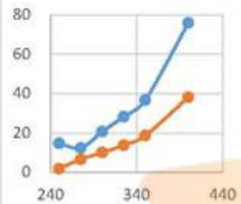

<details>
<summary>line</summary>

| X | Blue | Orange |
| --- | --- | --- |
| 240 | ~15 | ~2 |
| 260 | ~12 | ~6 |
| 280 | ~21 | ~10 |
| 300 | ~28 | ~14 |
| 340 | ~37 | ~19 |
| 400 | ~76 | ~38 |
</details>

A8  
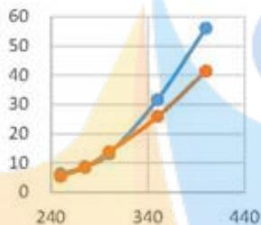

<details>
<summary>line</summary>

| X | Blue Line | Orange Line |
| --- | --- | --- |
| ~250 | ~6 | ~5 |
| ~280 | ~9 | ~9 |
| ~310 | ~14 | ~14 |
| 340 | ~32 | ~26 |
| ~400 | ~56 | ~42 |
</details>

B6  
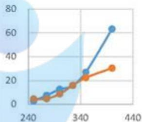

<details>
<summary>line</summary>

| X | Blue Series | Orange Series |
| --- | --- | --- |
| ~245 | ~2 | ~4 |
| ~260 | ~8 | ~4 |
| ~280 | ~13 | ~9 |
| ~300 | ~17 | ~16 |
| 340 | ~27 | ~22 |
| ~400 | ~63 | ~30 |
</details>

注：如上所示为 Class 1 — Class 4 中抽取的具有代表性的图像，其它详见附录。

## Class 1:

在 A1 至 A6 中，各组的装料比率相同，因此本文将其作为一类实验进行分析。

且 A4，温度 $400^{\circ}$ C 下，乙醇转化率在实验组中达到最大，而在催化剂组合 A3，温度 $400^{\circ}$ C 下，C4 烯烃选择性最高。

## Class 2:

在 A7 至 A9 及 A12 中，催化剂组分中的 Co 负载量、装料比率都相同，因此本文同样将其作为一类实验进行分析。

在这些实验组中可以分析得出，随着乙醇加入浓度速率上升时，乙醇转化率逐渐降低。

## Class 3:

在 B1 至 B6 中，B1、B2、B3、B4、B6 中以催化剂质量比为变量进行研究，B5 为其他变量的对照试验。因此本文同样将其作为一类实验进行分析。

实验组 B3、B4、B1、B6、B2 中质量比逐渐增加，由试验结果分析可知，随着温度的升高质量比越大 C4 烯烃选择性就越高。B1 与 B2 以乙醇浓度为变量，当升高乙醇浓度时，可以得知随着温度升高，乙醇转化率与 C4 烯烃选择性都略有下降。

## Class 4:

在A13、A14的对比下，易知在该条件下，“乙醇转化率 $(\%)$ ”变化不大，但

“C4烯烃选择性”波动。

A8 与 B7 之间仅存在着装料方式的不同，有结果分析，两种装袋方式对乙醇转化率、C4 选择性的变化趋势的影响很小，但是经过第（罗马数字二）装袋方式的效果总体优于第一种。

## 5.1.2 问题一第(1)问模型的建立与求解

以下为本文在进行数据分析的流程图：

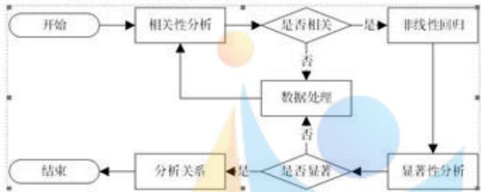

<details>
<summary>flowchart</summary>

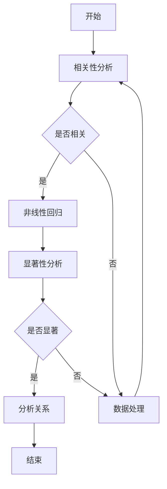
```mermaid
graph TD
  A["开始"] --> B["相关性分析"]
  B --> C{"是否相关"}
  C -->|是| D["非线性回归"]
  C -->|否| E["数据处理"]
  E --> B
  D --> F["显著性分析"]
  F --> G{"是否显著"}
  G -->|是| H["分析关系"]
  G -->|否| E
  H --> I["结束"]
```
</details>

图1：数据分析流程图

## Step 1: 相关性分析

本文首先通过计算皮尔逊相关系数，每种催化剂组合下乙醇转化率、C4烯烃选择性与温度的相关性。

在公式(5-1)中，x 代表温度，y 分别代表乙醇转化率和 C4 烯烃选择性。

$$
P _ {x, y} = \frac {\operatorname{cov} (x , y)}{\sigma_ {x} \sigma_ {y}} = \frac {E [ (x - x _ {i}) (y - y _ {i}) ]}{\sigma_ {x} \sigma_ {y}} \tag {5-1}
$$

计算结果详见目录。在 21 组数据中有 19 组的 Pearson 相关系数大于 0.9，因此，不同催化剂组合的条件下，温度和乙醇转化率、 $C_{4}$ 烯烃选择性数据极强相关。

表 2：乙醇转化率、C4 烯烃选择性与温度的相关系数表

<table><tr><td>催化剂组合</td><td>乙醇转化率 (%)</td><td> $C_4$ 烯烃选择性 (%)</td><td>催化剂组合</td><td>乙醇转化率 (%)</td><td> $C_4$ 烯烃选择性 (%)</td></tr><tr><td>A1</td><td>0.965</td><td>0.887</td><td>A12</td><td>0.963</td><td>0.983</td></tr><tr><td>A2</td><td>0.995</td><td>0.914</td><td>A13</td><td>0.937</td><td>0.988</td></tr><tr><td>A3</td><td>0.982</td><td>0.955</td><td>A14</td><td>0.964</td><td>0.959</td></tr><tr><td>A4</td><td>0.998</td><td>0.958</td><td>B1</td><td>0.962</td><td>0.986</td></tr><tr><td>A5</td><td>0.934</td><td>0.97</td><td>B2</td><td>0.962</td><td>0.985</td></tr><tr><td>A6</td><td>0.984</td><td>0.885</td><td>B3</td><td>0.92</td><td>0.971</td></tr><tr><td>A7</td><td>0.999</td><td>0.968</td><td>B4</td><td>0.91</td><td>0.895</td></tr><tr><td>A8</td><td>0.977</td><td>0.992</td><td>B5</td><td>0.913</td><td>0.978</td></tr><tr><td>A9</td><td>0.921</td><td>0.997</td><td>B6</td><td>0.94</td><td>0.982</td></tr><tr><td>A10</td><td>0.923</td><td>0.861</td><td>B7</td><td>0.936</td><td>0.994</td></tr><tr><td>A11</td><td>0.903</td><td>0.989</td><td></td><td></td><td></td></tr></table>

## Step 2: 非线性回归曲线拟合

由上述分析可知，温度和乙醇转化率、 $C_{4}$ 烯烃选择性数据存在强相关性，且数据呈现正相关的趋势，故本文采用非线性回归的方式进行曲线拟合，分别利用线性方程、“S”型曲线和二次曲线进行拟合，以催化剂组合分组，可得出21张拟合图像：

注：因篇幅所限，此处仅展示2幅有代表性的拟合图像，其它拟合图像相关性系数 $R^2$ 相差不大，均在 $93\%$ 以上，故不在此处罗列，详见附录。

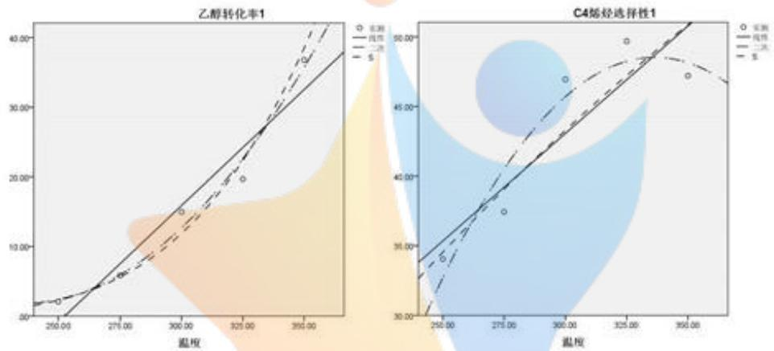

<details>
<summary>scatter</summary>

| Variable | Temperature (range) | Value (range) |
| --- | --- | --- |
| 乙醇转化率1 | 250~350 | 0~40 |
| C4烯烃选择性1 | 250~350 | 30~50 |
</details>

图 2: 拟合图像

观察所有拟合图像可知，三种拟合方式均有较强的相关性。

Step 3: 相关性检验  
表3：不同拟合方式的相关性系数表

<table><tr><td>方程</td><td> $R^2$ </td><td>方程</td><td> $R^2$ </td></tr><tr><td>线性</td><td>0.932</td><td>线性</td><td>0.943</td></tr><tr><td>二次</td><td>0.980</td><td>二次</td><td>0.976</td></tr><tr><td>S型</td><td>0.976</td><td>S型</td><td>0.967</td></tr></table>

注：因篇幅所限，此处仅展示上述2幅有代表性的拟合图像的相关性系数 $R^{2}$ 计算结果，其它拟合图像的相关性系数详见附录。

由完整的相关性系数表可知，所有图像的相关性系数 $R^{2}$ 的均值在95%以上，且始终大于线性和"S"型曲线的相关性系数。因此本文认为，乙醇转化率、C4烯烃的选择性与温度的具有二次相关性，且为正相关。

## 5.1.3 问题一第(2)问模型的建立与求解

## Step 1: 数据预处理

首先，本文为获得时间与乙醇转化率和反应产物的量之间的关系，考虑到该反应副产物选择性之间的数值关系，但是变量过于冗余，可以将相关性高的分为一类，对反应产物进行了降维处理，也就是对各个反应产物进行了分类合并处理，利用SPSS软件进行系统Q型聚类，做出了所有副反应生成物数据谱系图（如下图所示），并针对反应产生的副产物进行分类。

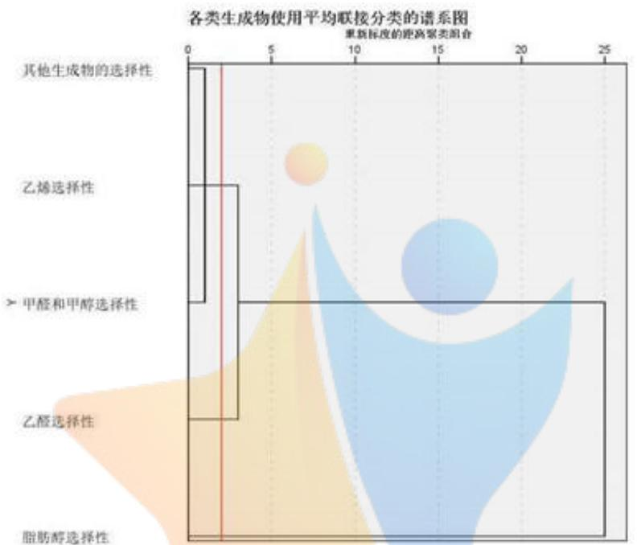

<details>
<summary>dendrogram</summary>

| 生成物类别 | 聚类描述 |
| --- | --- |
| 其他生成物的选择性 | 极小 (0, 0) |
| 乙烯选择性 | 中小 (0, 0) |
| >甲醛和甲醇选择性 | 大小 (0, 0) |
| 乙醛选择性 | 中大 (0, 0) |
| 脂肪醇选择性 | 最大 (0, 25) |
</details>

图3：各反应物聚类谱系图

分析系谱图可以发现，我们可以将乙烯选择性、苯甲基甲醛和苯甲基甲醇的选择性、乙醛选择性以及其他生成物的选择性分为一类称作次要附加产物；脂肪醇的选择性分为一类称作主要附加产物。从而实现数据的降维，因此在六种副生成物中，我们只需要考虑两类生成物对乙醇转化率和C4烯烃选择性的影响即可。

分析附件二中数据得出下图乙醇转化率与各产物选择性图随时间变化图（如图4所示）。

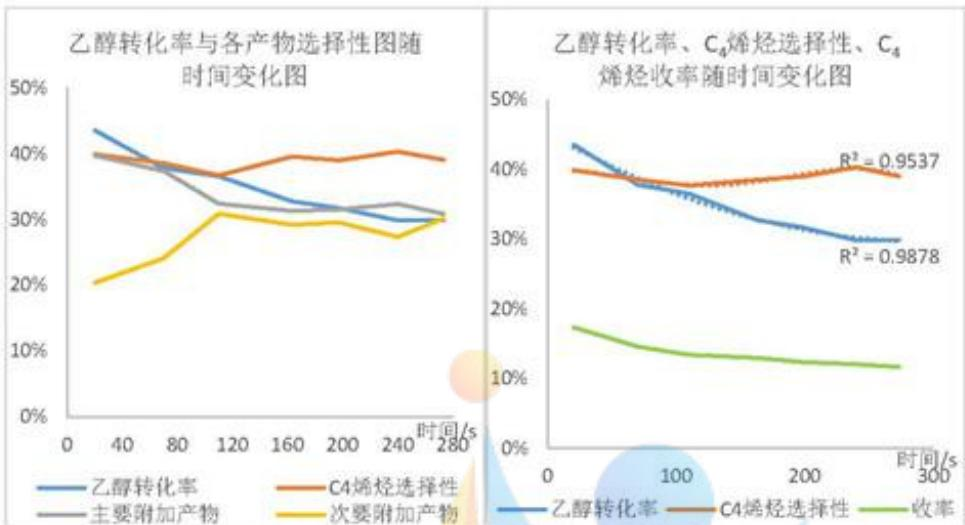  
图4：乙醇转化率与各产物选择性图随时间变化图  
图5：乙醇转化率、C4烯烃选择性、C4烯烃收率随时间变化图

由图4可知，目标生成物中， $C_{4}$ 烯烃的选择性在40%附近波动，且趋向于稳定，其方差为 $1.1768 \times 10^{-4}$ ；主要附加产物的含量在时间区间 $[20s, 110s)$ 之间呈减少的趋势，次要附加产物在该时间区间内呈现增加的趋势，且增加和减少的变化量相比 $C_{4}$ 烯烃选择性变化较大，而在110s之后，两附加产物的选择性趋于稳定；此外，乙醇转化率在整个实验中均呈减小的趋势。

假设乙醇转化率以及C4烯烃收率随时间变化的函数关系式分别为：

$$
U _ {1} = \alpha_ {1 1} t ^ {2} + \alpha_ {1 2} t + \alpha_ {1 3}
$$

$$
U _ {2} = \alpha_ {2 1} t ^ {2} + \alpha_ {2 2} t + \alpha_ {2 3}
$$

经过 SPSS 软件的分析，得到

表 4: 相关系数表  
表a：乙醇转化率

<table><tr><td>R</td><td> $R^2$ </td><td>调整后 $R^2$ </td><td>估算标准误差</td><td>系数 $\alpha_{1m}$ </td></tr><tr><td>.994</td><td>.988</td><td>.982</td><td>.679</td><td>-0.105、0.00017、45.258</td></tr><tr><td colspan="4"></td><td>表b:烯烃选择性</td></tr><tr><td>R</td><td> $R^2$ </td><td>调整后 $R^2$ </td><td>估算标准误差</td><td>系数 $\alpha_{2m}$ </td></tr><tr><td>.968</td><td>.937</td><td>.906</td><td>.063</td><td>0.004、-0.6*10-5、4.112</td></tr></table>

其中 $R^{2}$ 达到了 98.8% 和 93.7% 非常接近 1，假设成立，可以说乙醇转化率以及 C4 烯烃收率与时间具有二次函数的关系，满足下列函数关系式

$$
\mathrm{U_1} = - 0. 1 0 5 \mathrm{t^2} + 0. 0 0 0 1 7 \mathrm{t} + 4 5. 2 5 8
$$

$$
U _ {2} = 0. 0 0 4 - 0. 6 \times 1 0 ^ {- 5} t + 4. 1 1 2
$$

在一定温度和相同催化剂下，随着时间的增加，反应物乙醇转化率持续下降，逐渐趋于稳定；C4烯烃选择性增加，并趋于稳定，与时间呈现出弱负相关性。

## 5.2 问题二的求解与分析

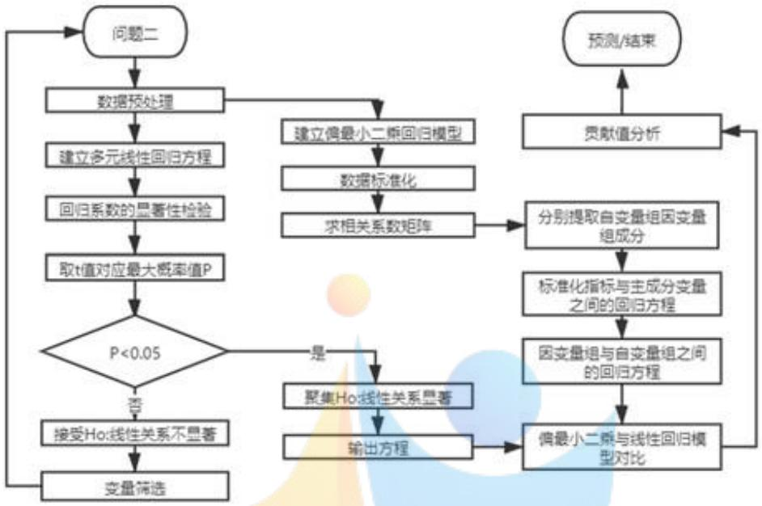

<details>
<summary>flowchart</summary>

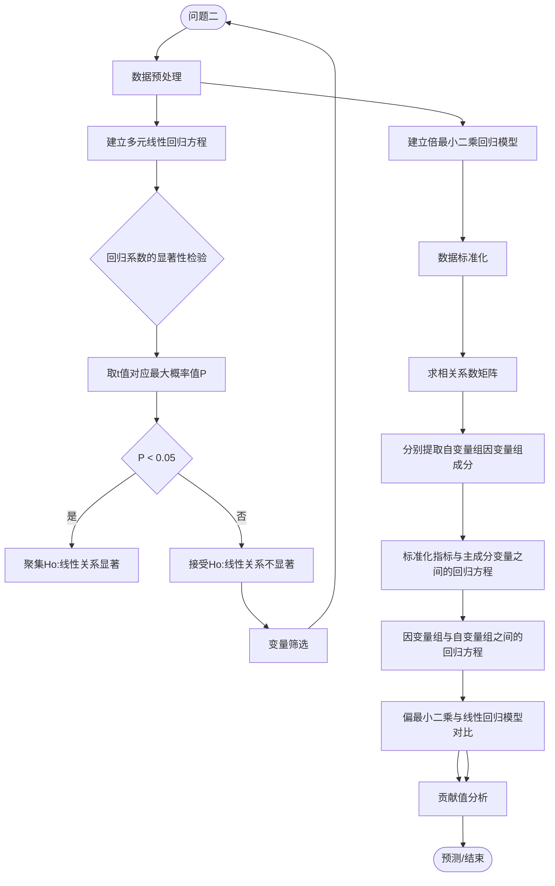
```mermaid
graph TD
  Start(["问题二"]) --> PreProcess["数据预处理"]
  PreProcess --> MultiLinear["建立多元线性回归方程"]
  MultiLinear --> RegressionCheck{"回归系数的显著性检验"}
  RegressionCheck --> CalcValue["取t值对应最大概率值P"]
  CalcValue --> Decision{"P < 0.05"}
  Decision -->|是| CollectInfo["聚集Ho:线性关系显著"]
  Decision -->|否| AcceptData["接受Ho:线性关系不显著"]
  AcceptData --> Filter["变量筛选"]
  Filter --> Start
  PreProcess --> Model1["建立倍最小二乘回归模型"]
  Model1 --> NormCalc["数据标准化"]
  NormCalc --> MatrixReq["求相关系数矩阵"]
  MatrixReq --> ExtractPart["分别提取自变量组因变量组成分"]
  ExtractPart --> Standardize["标准化指标与主成分变量之间的回归方程"]
  Standardize --> IntervalCheck["因变量组与自变量组之间的回归方程"]
  IntervalCheck --> CompareModel["偏最小二乘与线性回归模型对比"]
  CompareModel --> Feedback["贡献值分析"]
  Feedback --> End(["预测/结束"])
  CompareModel --> Feedback
```
</details>

图6：问题二解题流程图

## 5.2.1 数据预处理

(1) 考虑到乙醇在催化偶合制备 C4 烯烃的过程中，所给定的催化剂组合每一种都有相应的对照实验，因此，本文选取所有类型的实验，通过 Python 编程软件中的 pandas 库对附件 1 中的催化剂组合按组分进行拆分，其中装料比是比值的形式在数据中存在，不利于进行数据处理，因而将装料比拆分成 Co/SiO2 质量和 HAP 质量，得到单独的两个自变量。最终我们得到 5 个自变量。  
(2) 石英砂在实验中充当防暴沸的效果 $^{[3]}$ ，在实验中起对照作用，并且在加入石英砂的实验组中乙醇转化率和 C4 烯烃选择性并效率没有明显增大，我们认为石英砂不具有催化作用。因此我们舍弃石英砂这一变量组，详细变量数据见附录。  
(3) 同时，根据问题一中对反应产物的聚类结果，我们仍将杂质分为主要副产物和次要副产物，并得到如下表所示的变量表。

表 5：因变量自变量的选择表

<table><tr><td rowspan="2" colspan="2">自变量</td><td colspan="6">因变量</td></tr><tr><td colspan="2">目标产物</td><td colspan="2">主要副产物</td><td colspan="2">次要副产物</td></tr><tr><td>编码</td><td>变量</td><td>编码</td><td>变量</td><td>编码</td><td>变量</td><td>编码</td><td>变量</td></tr><tr><td>x1</td><td>Co/SiO2质量</td><td>y2</td><td>C4烯烃选择性</td><td rowspan="2">y3</td><td rowspan="2">碳数为4-12脂肪醇</td><td></td><td>甲基苯甲醛和甲基苯甲醛选择性</td></tr><tr><td>x2</td><td>Co负载量</td><td>y1</td><td>乙醇转化率</td><td>y4</td><td>乙醛选择性</td></tr><tr><td>x3</td><td>HAP质量</td><td></td><td></td><td></td><td></td><td></td><td>其他生成物选择性</td></tr><tr><td>x4</td><td>乙醇浓度</td><td></td><td></td><td></td><td></td><td></td><td>乙烯选择性</td></tr></table>

## 5.2.2 模型建立及误差分析

根据附件1中的拆解数据作为自变量，进行多元回归分析，从而得到标准回归系数，进而分析对乙醇转化率、C4烯烃选择性大小的主要影响成分。针对本题中两个因变量，我们通过偏最小二乘法来改进原有的分析方法，探究多因变量的分析。最终通过回归系数来分析乙醇转化率以及C4烯烃转化率的主要影响因素。

## 模型1：多元线性回归模型

## Part 1: 方差分析

根据问题一，可知各个催化剂组合对最终反应生成物的影响存在某种线性关系。此时则对不同的催化物和温度进行分析，判断两者对乙醇转化率以及C4烯烃选择性大小的影响。以 $x_{1}, x_{2}, x_{3}, x_{4}, x_{5}$ 作为自变量，以 $y_{1}, y_{2}$ 作为因变量进行多元线性回归分析。

首先对变量进行方差分析。利用 SPSS 软件进行方差分析，得到如下表所示方差齐次检验的显著性指标：

表6：方差齐次检验表

<table><tr><td colspan="6">乙醇转化率(y1)</td></tr><tr><td>自变量</td><td>Co/SiO2 质量(x1)</td><td>Co 负载量(x2)</td><td>HAP 质量(x3)</td><td>乙醇浓度(y4)</td><td>温度(y5)</td></tr><tr><td>显著性</td><td>0.125</td><td>0.043</td><td>0.041</td><td>0.05</td><td>0.08</td></tr><tr><td colspan="6">C4 烯烃选择性(y2)</td></tr><tr><td>自变量</td><td>Co/SiO2 质量(x1)</td><td>Co 负载量(x2)</td><td>HAP 质量(x3)</td><td>乙醇浓度(y4)</td><td>温度(y5)</td></tr><tr><td>显著性</td><td>0.125</td><td>0.043</td><td>0.041</td><td>0.05</td><td>0.08</td></tr></table>

分析图表可知，方差的显著性均大于0.05，可以认为本次方差分析是齐的。因此进一步进行单因素方差分析得到如表所示单因素方差分析表：

表7：主体间效应检验

<table><tr><td>源</td><td>III 类平方和</td><td>自由度</td><td>均方</td><td>F</td><td>显著性</td></tr><tr><td>修正模型</td><td>98469877.840*</td><td>103</td><td>956018.231</td><td>51.598</td><td>.000</td></tr><tr><td>截距</td><td>20101179.490</td><td>1</td><td>20101179.490</td><td>1084.889</td><td>.000</td></tr><tr><td> $x_1$ </td><td>.000</td><td>0</td><td>.</td><td>.</td><td>.</td></tr><tr><td> $x_2$ </td><td>1881119.655</td><td>3</td><td>627039.885</td><td>33.842</td><td>.000</td></tr><tr><td> $x_3$ </td><td>531008.332</td><td>1</td><td>531008.332</td><td>28.659</td><td>.000</td></tr><tr><td> $x_4$ </td><td>861063.569</td><td>3</td><td>287021.190</td><td>15.491</td><td>.000</td></tr><tr><td> $x_5$ </td><td>38683517.781</td><td>6</td><td>6447252.964</td><td>347.967</td><td>.000</td></tr><tr><td> $x_{2} \cdot x_{5}$ </td><td>2014792.493</td><td>13</td><td>154984.038</td><td>8.365</td><td>.001</td></tr><tr><td> $x_{3} \cdot x_{5}$ </td><td>993214.612</td><td>4</td><td>248303.653</td><td>13.401</td><td>.001</td></tr><tr><td> $x_{4} \cdot x_{5}$ </td><td>1360694.082</td><td>14</td><td>97192.434</td><td>5.246</td><td>.006</td></tr><tr><td>误差</td><td>185283.350</td><td>10</td><td>18528.335</td><td></td><td></td></tr><tr><td>总计</td><td>137924965.473</td><td>114</td><td></td><td></td><td></td></tr><tr><td>修正后总计</td><td>98655161.190</td><td>113</td><td></td><td></td><td></td></tr></table>

关于多个控制变量的独立作用部分，可以得出对因变量影响排序为 $x_{5}, x_{4}, x_{3}, x_{1}, x_{2}$ 说明温度的贡献量最大，即对 $\mathrm{C_4}$ 烯烃收率的大小影响最大， $\mathrm{Co}$ 的负载量贡献量最小，即对其大小影响最小。因此我们可以进行回归分析模型的建立。

## Part 2: 建立多元回归模型

多元线性回归分析的模型为：

$$
\left\{ \begin{array}{l} y = \beta_ {0} + \beta_ {1} x _ {1} + \beta_ {2} x _ {1} + \dots \beta_ {m} x _ {m} + \varepsilon \\ \varepsilon \sim N (0, \sigma^ {2}), \end{array} \quad i = 1, 2, \dots , n \right. \tag {5-2}
$$

其中， $\beta_{0},\beta_{1},\beta_{2},\cdots,\beta_{m},\varepsilon^{2}$ 是偏回归系数，与 $x_{1},x_{2},x_{3},\ldots,x_{m}$ 无相关性。 $\varepsilon$ 为随机误差项。

假设，因变量与各自变量之间存在线性关系，那他们之间的线性总体回归模型可以表示为：

$$
\left\{ \begin{array}{l} y _ {1} = \beta_ {0} + \beta_ {1} x _ {1 1} + \beta_ {2} x _ {1 2} + \beta_ {3} x _ {1 3} + \beta_ {4} x _ {1 4} + \beta_ {5} x _ {1 5} + \varepsilon_ {1} \\ y _ {2} = \beta_ {0} + \beta_ {1} x _ {2 1} + \beta_ {2} x _ {2 2} + \beta_ {3} x _ {2 3} + \beta_ {4} x _ {2 4} + \beta_ {5} x _ {2 5} + \varepsilon_ {2} \end{array} \right. \tag {5-3}
$$

其中， $\varepsilon$ 为随机误差项 $\varepsilon-N(0,\sigma^{2})$ 。

## Part 3: 求解回归系数及分析

下表是回归系数分析表。

表8：回归系数分析表

<table><tr><td rowspan="2" colspan="2">模型</td><td colspan="2">未标准化系数</td><td>标准化系数</td><td rowspan="2">t</td><td rowspan="2">显著性</td></tr><tr><td>B</td><td>标准误差</td><td>Beta</td></tr><tr><td rowspan="6"> $y_1$ </td><td>(常量)</td><td>-80.509</td><td>7.231</td><td></td><td>-11.134</td><td>.000</td></tr><tr><td> $x_1$ </td><td>-.034</td><td>.071</td><td>-.104</td><td>-.476</td><td>.635</td></tr><tr><td> $x_2$ </td><td>.134</td><td>.898</td><td>.007</td><td>.149</td><td>.882</td></tr><tr><td> $x_3$ </td><td>.141</td><td>.069</td><td>.448</td><td>2.045</td><td>.043</td></tr><tr><td> $x_4$ </td><td>-8.765</td><td>2.065</td><td>-.199</td><td>-4.244</td><td>.000</td></tr><tr><td> $x_5$ </td><td>.333</td><td>.019</td><td>.763</td><td>17.530</td><td>.000</td></tr><tr><td rowspan="6"> $y_2$ </td><td>(常量)</td><td>-48.732</td><td>5.112</td><td></td><td>-9.532</td><td>.000</td></tr><tr><td> $x_1$ </td><td>.003</td><td>.050</td><td>.015</td><td>.059</td><td>.953</td></tr><tr><td> $x_2$ </td><td>-3.164</td><td>.635</td><td>-.271</td><td>-4.983</td><td>.000</td></tr><tr><td> $x_3$ </td><td>.086</td><td>.049</td><td>.462</td><td>1.769</td><td>.080</td></tr><tr><td> $x_4$ </td><td>2.673</td><td>1.460</td><td>.102</td><td>1.831</td><td>.070</td></tr><tr><td> $x_5$ </td><td>.181</td><td>.013</td><td>.701</td><td>13.489</td><td>.000</td></tr></table>

并且得到的多元线性回归模型可以表示为:

$$
y _ {1} = - 8 0. 5 0 9 - 0. 0 3 4 x _ {1} + 0. 1 3 4 x _ {2} + 0. 1 4 1 x _ {3} - 8. 7 6 5 x _ {4} + 0. 3 3 3 x _ {5}
$$

$$
y _ {2} = - 4 8. 7 3 2 + 0. 0 0 3 x _ {1} - 3. 1 6 4 x _ {2} + 0. 0 8 6 x _ {3} + 2. 6 7 3 x _ {4} + 0. 1 8 1 x _ {5}
$$

## Part 4: 误差分析

利用SPSS算变量之间的相关系数，得表4， $y_{1}$ ， $y_{2}$ 与 $x_{1},x_{2},x_{3},x_{4}$ 和 $x_{5}$ 之间显著相关。

表9：回归方程的显著性指标

<table><tr><td>模型</td><td>R</td><td>R 方</td><td>调整后 R 方</td><td>标准估算的误差</td><td>德宾-沃森</td></tr><tr><td> $y_1$ </td><td>.892</td><td>.796</td><td>.786</td><td>10.55848</td><td>.937</td></tr><tr><td> $y_2$ </td><td>.842</td><td>.709</td><td>.696</td><td>7.46480</td><td>.580</td></tr></table>

从表中结果可以得出，经过逐步线性回归分析后拟合出的模型 $y_{1}$ 和 $y_{2}$ 的 $R^{2}$ 值分别为0.796和0.709，其值接近1，可以认为模型拟合程度较好。

表 10: 残差统计表  
乙醇转化率残差统计

<table><tr><td></td><td>最小值</td><td>最大值</td><td>平均值</td><td>标准偏差</td><td>个案数</td></tr><tr><td>预测值</td><td>-13.5101</td><td>83.1577</td><td>21.9846</td><td>20.36060</td><td>114</td></tr><tr><td>残差</td><td>-18.60947</td><td>28.80237</td><td>.00000</td><td>10.32224</td><td>114</td></tr><tr><td>标准预测值</td><td>-1.743</td><td>3.004</td><td>.000</td><td>1.000</td><td>114</td></tr><tr><td>标准残差</td><td>-1.763</td><td>2.728</td><td>.000</td><td>.978</td><td>114</td></tr></table>

烯烃选择性残差统计

<table><tr><td></td><td>最小值</td><td>最大值</td><td>平均值</td><td>标准偏差</td><td>个案数</td></tr><tr><td>预测值</td><td>-9.1596</td><td>49.9478</td><td>16.4508</td><td>11.39512</td><td>114</td></tr><tr><td>残差</td><td>-17.30414</td><td>22.09034</td><td>.00000</td><td>7.29778</td><td>114</td></tr><tr><td>标准预测值</td><td>-2.247</td><td>2.940</td><td>.000</td><td>1.000</td><td>114</td></tr><tr><td>标准残差</td><td>-2.318</td><td>2.959</td><td>.000</td><td>.978</td><td>114</td></tr></table>

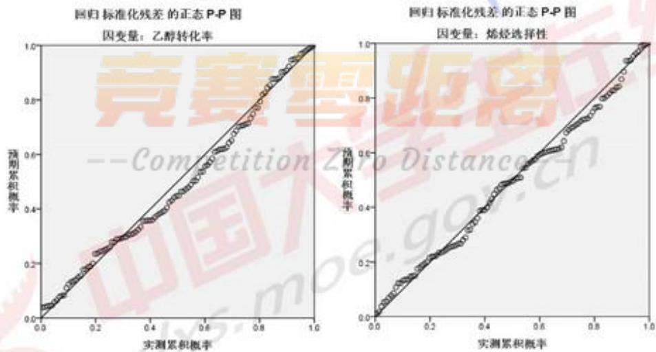  
图7：回归标准化残差的正态P-P图

由表 9 和图 6 的残差分布表图，残差最大值均在 25 左右，且标准化残差都集中分布在直线附近，可以认为标准化残差满足正态分布，误差通过，建立的回归方程合理且误差较小。

## 模型 2：偏最小二乘法回归模型

## Part 1: 模型优化机理

上文在利用多元线性回归建立模型时，分别建立了y1,y2所对应的多元线性回归模型，而对于在化学背景下的多因变量问题中，因变量之间很有可能产生相互影响，针对本题中两个因变量，我们通过偏最小二乘法来改进原有的分析方法，探究多因变量的分析，在原有的基础上探究因变量之间是否存在影响。

## Part 2: 构造偏最小二乘法模型

依据节 5.2.1 中因变量和自变量的分类，存储在下面两个矩阵中：

自变量的观测数据矩阵 $A = (a_{ij})_{\{108\times 5\}}$ ，因变量的观测数据矩阵为 $B = (b_{ij})_{108\times 4}$

Step 1: 数据标准化

将各指标 $a_{ij}$ 转化成指标值 $a_{ij}^{*}$ ，有

$$
a _ {i j} ^ {*} = \frac {a _ {i j} - \mu_ {j} ^ {(1)}}{s _ {j} ^ {(1)}}, i = 1, 2, \dots , 1 0 8, j = 1, 2, 3, 4. \tag {5-4}
$$

其中， $\mu_j^{(1)} = \frac{1}{108}\sum_{i=1}^{108}a_{ij}, s_j^{(1)} = \sqrt{\frac{1}{108-1}\sum_{i=1}^{108}\left(a_{ij} - \mu_j^{(1)}\right)^2}, j = 1,2,3,4$ ，即 $\mu_j^{(1)}, s_j^{(1)}$ 为第 $j$ 个自变量 $x_j$ 的样本均值和样本标准差。对应地，称

$$
x _ {j} ^ {*} = \frac {x _ {j} - \mu_ {j} ^ {(1)}}{s _ {j} ^ {(1)}}, j = 1, 2, 3, 4, \tag {5-5}
$$

为标准化变量。

同理，有标准化指数值

$$
\mathrm{b} _ {\mathrm{ij}} ^ {*} = \frac {b _ {i j} - \mu_ {j} ^ {(2)}}{s _ {j} ^ {(2)}}, i = 1, 2, \dots , 1 0 8, j = 1, 2, 3, 4. \tag {5-6}
$$

其中， $\mu_{j}^{(2)}=\frac{1}{108}\sum_{i=1}^{108}b_{ij},s_{j}^{(2)}=\sqrt{\frac{1}{108-1}\sum_{i=1}^{108}\left(a_{ij}-\mu_{j}^{(2)}\right)^{2}},j=1,2,3,4$ ，即 $\mu_{j}^{(1)},s_{j}^{(1)}$ 为第j个自变量 $x_{j}$ 的样本均值和样本标准差。对应地，称

$$
y _ {j} ^ {*} = \frac {x _ {j} - \mu_ {j} ^ {(2)}}{s _ {j} ^ {(2)}}, j = 1, 2, 3, 4, \tag {5-7}
$$

为标准化变量。

## Step 2: 求相关系数矩阵

下表给出了这9个变量的简单相关系数矩阵。

表 11: 简单相关系数矩阵

<table><tr><td></td><td>x1</td><td>x2</td><td>x3</td><td>x4</td><td>x5</td><td>y1</td><td>y2</td><td>y3</td><td>y4</td></tr><tr><td>x1</td><td>1</td><td>0.2089</td><td>0.9800</td><td>-0.2992</td><td>-0.0018</td><td>0.3946</td><td>0.3799</td><td>-0.1748</td><td>-0.0351</td></tr><tr><td>x2</td><td>0.2089</td><td>1</td><td>0.2136</td><td>0.1413</td><td>-0.0142</td><td>0.0418</td><td>-0.1650</td><td>0.0979</td><td>-0.0137</td></tr><tr><td>x3</td><td>0.9800</td><td>0.2136</td><td>1</td><td>-0.3017</td><td>-0.0014</td><td>0.4065</td><td>0.3876</td><td>-0.0799</td><td>-0.1653</td></tr><tr><td>x4</td><td>-0.2992</td><td>0.1413</td><td>-0.3017</td><td>1</td><td>-0.0385</td><td>-0.3312</td><td>-0.1071</td><td>0.0237</td><td>0.0435</td></tr><tr><td>x5</td><td>-0.0018</td><td>-0.0142</td><td>-0.0014</td><td>-0.0385</td><td>1</td><td>0.7706</td><td>0.6998</td><td>-0.7032</td><td>0.4370</td></tr><tr><td>y1</td><td>0.3946</td><td>0.0418</td><td>0.4065</td><td>-0.3312</td><td>0.7706</td><td>1</td><td>0.7353</td><td>-0.5935</td><td>0.2679</td></tr><tr><td>y2</td><td>0.3799</td><td>-0.1650</td><td>0.3876</td><td>-0.1071</td><td>0.6998</td><td>0.7353</td><td>1</td><td>-0.6634</td><td>0.1752</td></tr><tr><td>y3</td><td>-0.1748</td><td>0.0979</td><td>-0.0799</td><td>0.0237</td><td>-0.7032</td><td>-0.5935</td><td>-0.6634</td><td>1</td><td>-0.8529</td></tr><tr><td>y4</td><td>-0.0351</td><td>-0.0137</td><td>-0.1653</td><td>0.0435</td><td>0.4370</td><td>0.2679</td><td>0.1752</td><td>-0.8529</td><td>1</td></tr></table>

从相关系数矩阵可以看出 Co/SiO2 质量与 Co 负载量正相关，Co 负载量与 HAP 质量、乙醇浓度正相关，HAP 与乙醇浓度负相关，乙醇转化率与 Co/SiO2 质量、Co 负载量、HAP 质量和温度呈正相关，与乙醇浓度呈负相关；C4 烯烃选择性与 Co/SiO2 质量、HAP 质量、温度呈正相关，与 Co 负载量、乙醇浓度呈负相关。

## Step 3: 分别提出自变量组和因变量组的成分

由 Matlab 程序（详见附录），可以得到三对成分[u1,v1],[u2,v2],[u3,v3],[u4,v4], [u5,v5]。

$$
\begin{array}{l} \left\{ \begin{array}{l} u _ {1} = - 0. 0 2 9 6 x _ {1} + 0. 0 0 6 3 x _ {2} - 0. 0 2 6 5 x _ {3} + 0. 0 1 5 x _ {4} - 0. 0 7 0 8 x _ {5} \\ v _ {1} = - 9. 2 2 9 1 y _ {1} - 1 1. 8 0 0 3 y _ {2} - 7. 7 9 9 y _ {4} \end{array} \right. \\ \left\{ \begin{array}{l} u _ {2} = - 0. 0 2 1 8 x _ {1} + 0. 0 1 5 8 x _ {2} - 0. 0 3 7 x _ {3} + 0. 0 2 2 9 x _ {4} + 0. 0 6 0 2 x _ {5} \\ v _ {2} = - 2. 5 6 5 3 y _ {1} - 2. 2 7 5 9 y _ {2} + 6. 7 4 0 8 y _ {4} \end{array} \right. \\ \left\{ \begin{array}{l} u _ {3} = - 0. 0 2 5 x _ {1} + 0. 0 8 2 1 x _ {2} - 0. 0 3 2 5 x _ {3} - 0. 0 6 8 x _ {4} + 0. 0 1 0 6 x _ {5} \\ v _ {3} = 1. 8 2 7 5 y _ {1} - 2. 3 4 5 4 y _ {2} + 0. 4 0 1 2 y _ {4} \end{array} \right. \\ \left\{ \begin{array}{l} u _ {4} = - 0. 1 0 9 0 x _ {1} + 0. 0 5 1 5 x _ {2} + 0. 0 8 2 9 x _ {3} - 0. 0 6 8 1 x _ {4} - 0. 0 1 0 6 x _ {5} \\ v _ {4} = 0. 9 4 5 8 y _ {1} - 0. 2 1 6 4 y _ {2} - 2. 5 3 9 0 y _ {4} \end{array} \right. \\ \left\{ \begin{array}{l} u _ {5} = - 0. 4 5 7 7 x _ {1} + 0. 0 0 8 3 x _ {2} + 0. 4 6 3 x _ {3} + 0. 0 1 5 9 x _ {4} + 0. 0 0 3 4 x _ {5} \\ v _ {5} = 2. 3 5 6 2 y _ {1} - 0. 1 2 5 8 y _ {2} - 8. 2 1 8 y _ {4} \end{array} \right. \\ \end{array}
$$

而前四个成分解释自变量的的比率为 $98.69\%$ ，因此只要选取前四对成分即可满足分析需求。

## Step 4: 求两个成分对时标准化指标变量与成分变量之间的回归方程

求得自变量和因变量组与 $u_{1}, u_{2}, u_{3}, u_{4}, u_{5}$ ，之间的回归方程分别为

$$
\left\{ \begin{array}{l} x _ {1} = - 6. 6 2 2 6 u _ {1} - 7. 7 1 6 6 u _ {2} - 2. 1 8 7 2 u _ {3} - 2. 0 4 9 0 u _ {4} \\ x _ {2} = - 0. 2 7 5 6 u _ {1} - 2. 9 2 6 8 u _ {2} + 6. 7 9 8 2 u _ {3} - 7. 4 6 3 0 u _ {4} \\ x _ {3} = - 6. 6 1 9 7 u _ {1} - 7. 7 6 3 3 u _ {2} - 2. 1 4 1 1 u _ {3} - 1. 6 2 3 3 u _ {4} \\ x _ {4} = 4. 0 0 6 u _ {1} + 4. 0 6 6 1 u _ {2} - 4. 4 6 3 1 u _ {3} - 7. 6 1 0 9 u _ {4} \\ x _ {5} = - 8. 0 6 0 2 u _ {1} + 6. 7 3 6 9 u _ {2} + 1. 3 7 4 2 u _ {3} - 0. 8 1 1 1 u _ {4} \\ y _ {1} = - 9. 2 2 9 1 u _ {1} + 1. 6 3 9 8 u _ {2} + 1. 2 5 0 5 u _ {3} + 0. 3 2 8 5 u _ {4} \\ y _ {2} = - 8. 3 2 4 5 u _ {1} + 2. 2 2 2 6 u _ {2} - 2. 3 6 2 4 u _ {3} - 0. 1 0 2 9 u _ {4} \\ y _ {3} = 6. 5 5 5 1 u _ {1} - 4. 1 3 1 9 u _ {2} + 0. 6 6 8 4 u _ {3} + 1. 4 9 5 u _ {4} \\ y _ {4} = - 2. 8 1 7 2 u _ {1} + 3. 8 8 6 u _ {2} + 0. 7 6 8 8 u _ {3} - 1. 8 9 5 3 u _ {4} \end{array} \right. \tag {5-8}
$$

Step 5: 求因变量组与自变量组之间的回归方程。

把步骤2.5中成分 $u_{i}$ 代入Step3中 $y_{j}^{*}$ 的回归方程，得到标准化指标变量之间的回归方程

将标准化变量 $y_{i}^{*}, x_{j}^{*}(j=1,2,3,4)$ 分别还原成原始变量 $y_{j}, x_{j}$ ，得到回归方程

$$
\left\{ \begin{array}{l} y _ {1} = - 7 9. 8 4 4 5 + 0. 0 5 5 4 x _ {1} + 0. 0 3 5 1 x _ {2} - 0. 0 5 3 8 x _ {3} - 9. 1 8 5 6 x _ {4} + 0. 3 3 2 3 x _ {5} \\ y _ {2} = - 4 8. 3 5 9 5 + 0. 0 5 1 7 x _ {1} - 3. 2 1 7 6 x _ {2} + 0. 0 3 8 7 x _ {3} + 2. 4 4 3 9 x _ {4} + 0. 1 8 0 7 x _ {5} \\ y _ {3} = 1 8 4. 2 6 8 4 - 0. 1 0 3 2 x _ {1} - 1. 8 5 5 2 x _ {2} + 0. 0 2 8 7 x _ {3} - 7. 0 6 6 x _ {4} - 0. 3 5 1 8 x _ {5} \\ y _ {4} = - 3 5. 9 0 9 + 0. 0 5 1 5 x _ {1} + 1. 3 6 2 4 - 0. 0 6 7 4 x _ {3} + 4. 6 2 2 1 x _ {4} + 0. 1 7 1 1 x _ {5} \end{array} \right. (5 - 9)
$$

并且根据 $y1, y2$ 分别计算出 $\mathrm{R}^2$ 为0.812和0.765，其值接近于1，可以认为拟合情况较好。

模型的对比与检验

## Part 1: 模型对比

当比较两个模型在同一组数据上的拟合效果时，更倾向于比较他们的残差平方和来确定，当残差平方和越小时，说明该模型的拟合效果越好。因此利用Python程序分别计算两模型所对应回归函数的残差平方和，进行对比。如下表所示：

表 12：均方误差模型参数对比表  
多元线性回归

<table><tr><td>因变量y</td><td> $R^2$ </td><td>均方误差(MSE)</td></tr><tr><td>乙醇转化率(y1)</td><td>0.796</td><td>10.348</td></tr><tr><td>C4烯烃选择性(y2)</td><td>0.709</td><td>9.474</td></tr><tr><td></td><td></td><td>偏最小二乘回归分析</td></tr><tr><td>乙醇转化率(y1)</td><td>0.812</td><td>10.404</td></tr><tr><td>C4烯烃选择性(y2)</td><td>0.765</td><td>7.057</td></tr></table>

本文认为，在本题中可以直接用多元线性回归分别对因变量进行建模，可以减少考虑本文中多个因变量之间的联系。因为由图中数据可知，两模型所对应的 $y1, y2$ 的残差平方和相差很小， $R^2$ 的差值也很小，说明无论是通过多元线性回归建模，还是通过偏最小二乘法建模得到的回归系数都可以很好的解释多个自变量

与因变量之间的相关性。

## Part 2: 模型的解释

利用偏最小二乘法建模时，根据预测值和实际值做出关于中心轴线的离散图，得到乙醇转化率预测图以及烯烃转化率预测图，根据下图数据分布情况得知拟合效果良好。

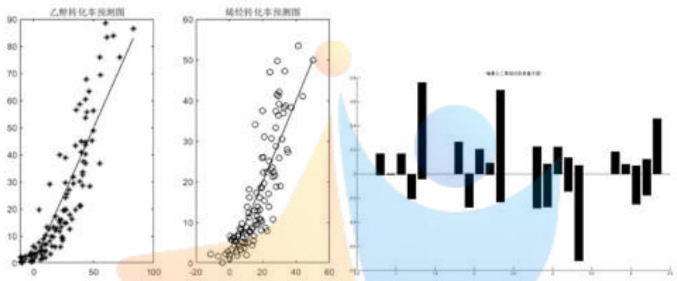  
图8：乙醇转化率、烯烃转化率预测图与偏最小二乘回归系数直方图

从回归系数图中可以观察到，温度变量在解释两个乙醇转化率、C4烯烃回归方程中起到了极为重要的作用，当温度和其它自变量相组合时，对因变量的结果也会产生重要的影响。且Co/SiO2与HAP的装料比的解释能力在两个回归方程中差别不大，均为正相关。而Co负载量在乙醇转化率中基本没有解释性，但是在C4烯烃选择性中有较强的负相关解释性。而乙醇浓度则对乙醇转化率起负相关解释性，而对C4烯烃选择性很少有解释性。

## 5.3 问题三的求解与分析

为了求解一组催化剂组合与温度在相同实验条件下的最佳配比，我们首先根据化学反应关系得出 C4 烯烃收率的直接影响因素，又基于问题二中的结论，推导出 C4 烯烃收率与多个自变量之间的影响关系，建立了单目标最优化模型，并且对多个自变量进行方差分析，对原有模型进行改进，从而在两种温度条件情况下进行全局最优的求解，以获得使得 C4 烯烃收率最大的自变量配比。

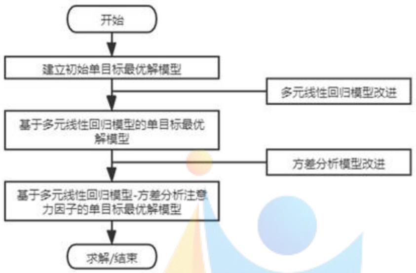

<details>
<summary>flowchart</summary>

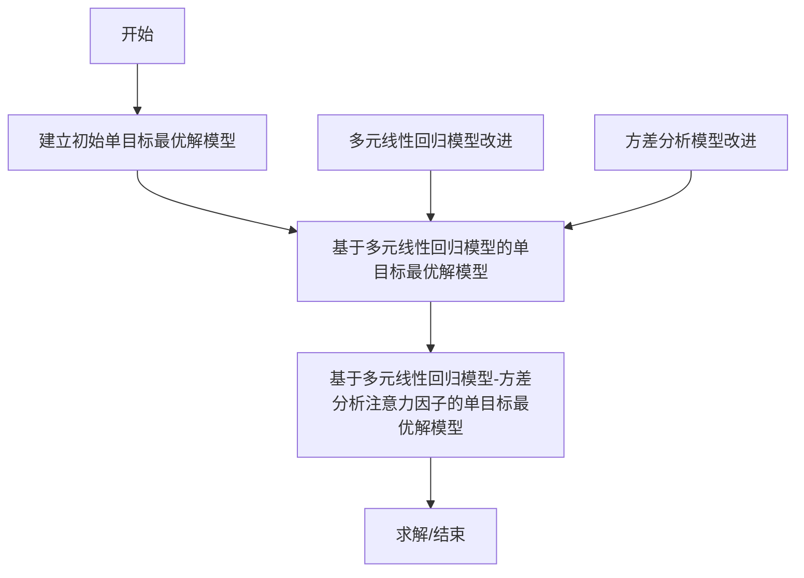
```mermaid
graph TD
  A["开始"] --> B["建立初始单目标最优解模型"]
  B --> C["基于多元线性回归模型的单目标最优解模型"]
  D["多元线性回归模型改进"] --> C
  E["方差分析模型改进"] --> C
  C --> F["基于多元线性回归模型-方差分析注意力因子的单目标最优解模型"]
  F --> G["求解/结束"]
```
</details>

图9：问题三解题流程图

## 5.3.1 C4 烯烃收率的模型建立

## 5.3.1.1 烯烃收率的基础模型

## Step 1: 数据处理

继续参照问题一得到的聚类结果，将生成物分为 C4 烯烃、主要附加产物（脂肪醇）、次要附加产物，进行数据分析。

由收率公式：C4 烯烃收率=乙醇转化率×C4 烯烃选择性，可求得任意一项催化剂组合所对应的 C4 烯烃收率，因此后两项为 C4 烯烃收率的直接影响因素。考虑到本题中需要拟合优良数据，从而得到 C4 烯烃最大收率，而实验中存在部分拟合效果欠佳的数据，因此通过对 109 组 C4 烯烃收率进行排序，确定 C4 烯烃收率值阈值为 1%，以阈值作为筛选条件对数据进行初步筛选。同时对于一些效果不佳的对照实验，也进行数据剔除，最终得到 61 组积极数据。

## Step 2: 基础模型建立

设 $\rho$ 表示 C4 烯烃收率，可以得到下列关系式：

$$
\rho = y _ {1} \times y _ {2} \tag {5-10}
$$

## 5.3.1.2 最大C4烯烃收率的单目标优化模型

## Part 1: 目标函数确定

$$
max \rho = y _ {1} \times y _ {2} \tag {5-11}
$$

## Part 2: 约束条件确定

① 约束条件1：所有生成物选择性之和等于100%，则有

$$
\sum_ {i = 1} ^ {5} y _ {i} = 1 0 0 \tag {5-12}
$$

②约束条件 2：所有自变量满足已有实验设计的取值范围。根据问题二中对附件一所进行的数据拆分，分析得到每一种自变量的实际取值范围，因此一个约束条件是：

$$
X l _ {i} \leq x _ {i} \leq X l _ {r} i = 1, 2, \dots , 5 \tag {5-13}
$$

其中， $Xl_{a}, Xl_{r}$ 分别表示自变量的左右区间。

## Part 3: 模型整合

综上所述，我能得到了最大C4烯烃收率的单目标优化模型：

$$
m a x \rho = y _ {1} \times y _ {2} \tag {5-14}
$$

$$
s. t \left\{ \begin{array}{l} \sum_ {i = 1} ^ {5} y _ {i} = 1 0 0 \\ X l _ {i} \leq x _ {i} \leq X l _ {i} \end{array} \quad i = 1, 2, \dots 5 \right. \tag {5-15}
$$

## 5.3.2 基于多元线性回归的模型优化

## Part 1: 模型改进机理分析

根据题目中的描述以及附件1中数据的特点, 可知本数据为化学反应中的记录值, 无法提过足够有效的约束条件, 经过测试无法直接利用上述的最优化模型进行最优化求解。因此我们提出基于多元线性回归的 C4 烯烃最大收率模型。由于 C4 烯烃选择率来自乙醇转化率与 C4 烯烃选择性的乘积, 其两者的函数表达式是通过多元线性回归来拟合, 因此可以直接用拆分得到的多个自变量对 C4 烯烃收率来做多元线性回归分析, 从而对原有的模型进行有效的改进。

## Part 2: 基于多元线性回归拟合 C4 烯烃收率

参照问题二中的多个自变量参数，使用 SPSS 软件对 C4 烯烃收率进行同等方法的数据拟合，可得到以下的分析结果：

$$
R ^ {2} = 0. 7 5 1
$$

$$
\rho^ {\prime} = - 3 6 1 9. 6 4 7 + 1. 2 3 6 x _ {1} - 6 9. 4 3 1 x _ {2} + 4. 1 2 1 x _ {3} - 1 2 7 6. 7 3 6 x _ {4} + 1 1. 9 9 5 x _ {5}
$$

由于R-squeare>0.7，则我们认为该多元线性回归模型具有较高的可信性。

## Part 3: 获得多元线性回归改进的 C4 烯烃最大收率的最优化模型

因此基于多元线性回归拟合的改进下，由上述分析可得 C4 烯烃最大收率的单目标最优化模型：

$$
\max \rho'
$$

$$
s. t. \left\{ \begin{array}{l} \sum_ {i = 1} ^ {5} y _ {i} = 1 0 0 \\ X l _ {i} \leq x _ {i} \leq X l _ {i} \end{array} \right. i = 1, 2, \dots , 5
$$

## 5.3.3 基于方差分析的 C4 烯烃收率模型优化

## Part 1: 优化机理分析

由于 C4 烯烃收率的是由乙醇转化率与 C4 烯烃选择性相乘所得，因此对于 C4 烯烃收率来说，受到了乙醇转化率与 C4 烯烃转化率的系数的直接限制，因此，我们这此引入方差分析，来看这些变量之间是否含有相互作用关系，从而来对 C4 烯烃的单目标优化模型做优化。

## Part 2: 通过方差分析研究 C4 烯烃收率

根据问题二中的方差分析结果， $x_{2} * x_{5}$ 、 $x_{4} * x_{5}$ 与 $x_{3} * x_{5}$ 之间存在交互作用

同时，根据两者的F值与均方差值可知其对C4烯烃收率的大小产生显著影响。因此我们将该三个交互作用部分作为相互作用因子，令 $x_{6} = x_{2}x_{5}, x_{7} = x_{3}x_{5}, x_{8} = x_{4}x_{5}$ 。通过附件1中数据的合并处理，我们得到了8个自变量，进而通过SPSS软件分析计算多元线性回归模型如下所示：

$$
\begin{array}{l} \rho = \frac {1}{1 0 0} (- 3 3 6 2. 4 8 9 + 5. 2 3 8 x _ {1} + 6 7. 6 2 1 x _ {2} - 2 7. 5 6 8 x _ {3} + 2 0 6. 5 9 8 x _ {4} + 1 1. 5 6 x _ {5} \\ - 0. 5 2 9 x _ {6} + 0. 0 8 6 x _ {7} - 1. 1 5 x _ {8}) \\ \end{array}
$$

## Part 3: 获得方差分析改进的 C4 烯烃最大收率的最优化模型

因此当考虑温度因素时，则通过方差分析对模型进行改进，由上述分析可得C4烯烃最大收率的单目标最优化模型：

$$
\begin{array}{c} \max \rho \\ \text {s.t.} \left\{ \begin{array}{l l} x _ {6} = x _ {2} x _ {5} \\ x _ {7} = x _ {5} x _ {3} \\ x _ {8} = x _ {5} x _ {4} \\ X l _ {i} \leq x _ {i} \leq X l _ {i} \end{array} \right. i = 1, 2, \ldots , 5 \end{array}
$$

## 5.3.3.1 C4烯烃最大收率时的催化剂最佳配比模型的求解

## Case 1: 当在相同的实验条件时, 使用多元线性回归优化的模型进行求解

在相同实验条件下时，所有的自变量的取值与附件1中的数据取值限制相同，说明对于温度等主要影响C4烯烃收率的变量没有受到特殊限制，因此我们直接选取基于多元线性回归改进的C4烯烃最大收率的最优化模型进行求解。

经过 Lingo 程序求得最优值为：47.1%

## Case 2: 当在限制温度的条件时，使用经方差分析二次优化模型进行求解

由上分析同理可得，此时题目中对温度进行了限制，因此我们采用对温度等主要影响系数有增强作用的方差分析改进的C4烯烃最大收率的最优化模型进行求解。

经过 Lingo 程序（见附录）求得最优值为：28.2%

表 13: 主体间效应检验

<table><tr><td></td><td> $x_{1}$ </td><td> $x_{2}$ </td><td> $x_{3}$ </td><td> $x_{4}$ </td><td> $x_{5}$ </td></tr><tr><td>Case 1</td><td>200</td><td>0.5</td><td>200</td><td>0.3</td><td>450</td></tr><tr><td>Case 2</td><td>200</td><td>0.5</td><td>200</td><td>0.3</td><td>350</td></tr></table>

## 5.4 问题四的求解与分析

为了能够在有限的实验次数内更加充分地了解如何提高乙醇选择性和C4烯烃转化率，本文在实验设计时选择均匀设计的方法。

相比于正交设计，均匀设计只考虑试验点在实验范围内的均匀散布。因此，相比于正交设计，均匀设计减少了进行实验的次数，且更加适合在较少的实验中获取更多信息，能够在相同的实验次数下更迅速的找到最优解[8,9]。

在乙醇催化偶合制备 c4 烯烃的实验中，对其产物的造成主要影响的因素有 x1、x2、x3、x4、x5 等五种因素。

由于均匀设计的设计原理约束了 $U_{5}$ 最多只能包含 4 个自变量，故本文参考了前面的问题中做出的偏最小二乘回归系数直方图，将相关性足够低且在直方图中回归系数最接近 0 的自变量 x4 乙醇浓度定为常量，在设计时着重研究其它 4 种自变量与 C4 烯烃收率的关系。

根据附件1所给实验结果，本文在4种因素内选取5种水平，表示为 $U_{5}$ 。

均匀设计 $U_{5}(5^{4})$ 表如下所示：

表 74: ${U}_{5}$ 与 ${U}_{4}^{ * }$ 均匀设计使用表

<table><tr><td>实验号\列号</td><td>1</td><td>2</td><td>3</td><td>4</td></tr><tr><td>1</td><td>1</td><td>2</td><td>3</td><td>4</td></tr><tr><td>2</td><td>2</td><td>4</td><td>1</td><td>3</td></tr><tr><td>3</td><td>3</td><td>1</td><td>4</td><td>2</td></tr><tr><td>4</td><td>4</td><td>3</td><td>2</td><td>1</td></tr><tr><td>5</td><td>5</td><td>5</td><td>5</td><td>5</td></tr></table>

<table><tr><td>实验号\列号</td><td>1</td><td>2</td><td>3</td><td>4</td></tr><tr><td>1</td><td>1</td><td>2</td><td>3</td><td>4</td></tr><tr><td>2</td><td>2</td><td>4</td><td>1</td><td>3</td></tr><tr><td>3</td><td>3</td><td>1</td><td>4</td><td>2</td></tr><tr><td>4</td><td>4</td><td>3</td><td>2</td><td>1</td></tr></table>

各因素水平表如下所示，波浪线表示该数据来自问题三所求最终结果。在设计各因素水平的过程中，观察到偏最小二乘回归系数直方图中，反应温度的相关系数远大于其他几项，因此在设定“温度”因素的水平时，超过附件1所给最大值后增加的步进值较小，但通过研究“温度”因素更能够更好地确定使收率更高的因素，以提高反应速率；相关性最小的因素 $x_{2}$ 在超过问题三所得最佳结果后的步进值较大；而 $x_{1}$ 、 $x_{3}$ 的相关性在 $x_{2}$ 与 $x_{5}$ 之间，但总体更接近 $x_{2}$ ，其因素水平取值也比较靠近实验1中已存在的数据。

表 85：均匀设计中各因素水平

<table><tr><td>水平</td><td>x1</td><td>x2</td><td>x3</td><td>x5</td></tr><tr><td>1</td><td>10</td><td>0.5</td><td>50</td><td>350</td></tr><tr><td>2</td><td>50</td><td>1</td><td>100</td><td>380</td></tr><tr><td>3</td><td>75</td><td>2</td><td>200</td><td>450</td></tr><tr><td>4</td><td>100</td><td>3.5</td><td>300</td><td>475</td></tr><tr><td>5</td><td>200</td><td>5</td><td>400</td><td>500</td></tr></table>

因化学试验存在特殊性，若将最高水平组合在一起可能会导致化学反应过于剧烈，从而使反应容器龟裂，甚至发生爆炸等危险，故在均匀设计使用表中，移除最后一行，得到更加均匀、安全的使用表，以防止事故的发生。此时，设计方案变为 $U_{4}^{*}$ 。

为了补全第5次实验，现有2种方法可以选择：①将问题三使用多元线性回归优化的模型所得结果作为第5次实验；②将 $U_{6}$ 的均匀设计使用表的最后一行删除，化作 $U_{5}^{*}$ 使用。但②因均匀设计原理决定了进行6次实验最多只能存在2个自变量，故舍弃该方法。

表 16: 使用均匀设计增加的 5 组新实验表

<table><tr><td>实验号</td><td>x1</td><td>x2</td><td>x3</td><td>x5</td></tr><tr><td>1</td><td>10</td><td>2</td><td>300</td><td>500</td></tr><tr><td>2</td><td>50</td><td>5</td><td>50</td><td>475</td></tr><tr><td>3</td><td>75</td><td>1</td><td>400</td><td>450</td></tr><tr><td>4</td><td>100</td><td>3.5</td><td>100</td><td>350</td></tr><tr><td>5</td><td>200</td><td>0.5</td><td>200</td><td>380</td></tr></table>

小结 设计的实验方案如上表所示。

第一次实验条件：500℃下，10mg 2wt% Co/SiO₂，300mg HAP。

第二次实验条件：470℃下，50mg 5wt% Co/SiO₂，50mg HAP。

第三次实验条件：450℃下，75mg 1wt% Co/SiO₂，400mg HAP。

第四次实验条件：350℃下，100mg 3.5wt% Co/SiO₂，100mg HAP。

第五次实验条件：380℃下，200mg 0.5wt% Co/SiO₂，200mg HAP。

## 6 灵敏度分析

根据问题二中的分析可知，温度等自变量对因变量的变化有着强烈的影响，因此我们通过对 C4 烯烃收率的回归方程中温度的系数进行灵敏度分析，使其值经过上下 5% 的数据波动，绘制出 C4 烯烃收率的变化情况，如下图所示：

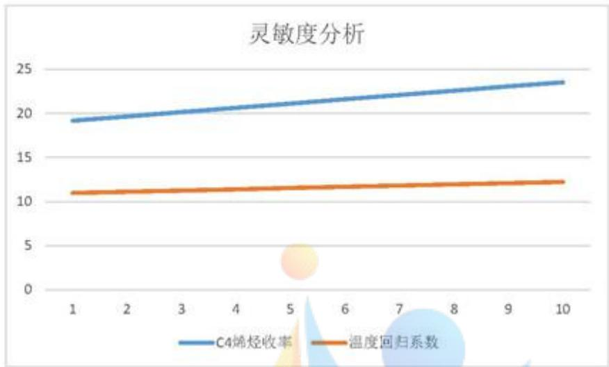

<details>
<summary>line</summary>

| X | C4烯烃收率 | 温度回归系数 |
| --- | --- | --- |
| 1 | ~19.2 | ~11.0 |
| 10 | ~23.5 | ~12.2 |
</details>

图 10: 灵敏度分析图

温度的回归系数在 $10\%$ 的变化区间内引起了C4烯烃收率 $18\%$ 的变化，比较稳定，因此表明模型具有较好的灵敏性。

表 17: 灵敏度数据变化表

<table><tr><td>C4烯烃收率</td><td>温度回归系数</td><td>C4烯烃收率</td><td>温度回归系数</td></tr><tr><td>19.176759</td><td>10.982</td><td>21.604359</td><td>11.6756</td></tr><tr><td>19.662279</td><td>11.12072</td><td>22.089879</td><td>11.81432</td></tr><tr><td>20.147799</td><td>11.25944</td><td>22.575399</td><td>11.95304</td></tr><tr><td>20.633319</td><td>11.39816</td><td>23.060919</td><td>12.09176</td></tr><tr><td>21.118839</td><td>11.53688</td><td>23.546439</td><td>12.23048</td></tr></table>

## 7 模型的评价与推广

## 7.1 模型的优点

1. 方差分析将有助于探究自变量之间的相互作用，从而探究更深层次自变量之间的联系，以此将存在相互作用关系的每一组变量存为新的一个变量，反过来作为多元函数中的一员，提供更好的拟合效果。  
2. 偏最小二乘法和多元线性回归两者相结合进行对比分析，可以探究多个因变量之间是否存在着更深层次的联系，更有利于化学实验型数据的拟合，使其得到更为准确的拟合方程，探究实验物之间的联系，对实验结果进行预测。

## 7.2 模型的缺点

1. 基于多元线性回归与方差分析的 C4 烯烃最大收率模型中，各个组成部分的权重的确定仍然是按照变量贡献率特点进行分析，并无一个完整的体系，含有一定的主观性。  
2. 通过偏最小二乘法进行研究时，只是对应线性多元回归中的乙醇转化率和 C4 烯烃选择性这两个因变量进行分析，得出了因变量之间相关性不大，但模型没有分析其他因变量与只是对应线性多元回归中的乙醇转化率和 C4 烯烃选择性是否存在着隐含关系。存在一定的偶然性。  
3. 在聚类分析时，只是单纯的量化考虑了数值上的聚类，而忽略了其内部化学结构之间联系，使结果偏离于真实情况。

## 7.3 模型的推广

本文问题二中主要应用了多元线性回归以及偏最小二乘回归分析模型。从横向来看，在加入了偏最小二乘法回归分析对于多个因变量，有利于研究多因变量之间的关系，更深层的关注多个因变量之间的潜在相关性，有助于我们分析在化学反应时，更全面的分析各个生成物之间的关系，此时可以再对该模型进行延伸，在医学诊断、化学实验预测中发挥更大的作用，做到“未卜先知”。

## 8 参考文献

[1] 任丽萍, 赵国良, 膝加伟, 王仰东, 谢在库; La 修饰 ZSM-5 分子筛催化剂用于 $\mathrm{C_4}$ 烯烃催化裂解制丙烯[J]; 工业催化; 2007 年 03 期.  
[2] 吕绍沛. 乙醇偶合制备丁醇及 $\mathrm{C_4}$ 烯烃[D]. 大连理工大学, 2018.  
[3] 朱水东. 化学实验中的暴沸与沸石[J]. 高考(综合版), 2012(11):127.  
[4] 杨忠赞, 迟凤琴, 隋虹均, 匡恩俊, 张久明, 宿庆瑞, 张一雯, 刘亦丹. 基于多元线性回归研究有机肥替代对土壤养分及产量的影响 [J]. 东北农业科学, 2021, 46(02):37-42+102.  
[5] 王赫然, 尉佳, 范忠仁. 基于多元线性回归的高新技术企业发展影响因素分析 [J]. 科技通报, 2020, 36(12): 112-115.  
[6] 石彦国, 单彤彤, 曾剑华, 刘琳琳, 朱秀清. 基于主成分分析和偏最小二乘法的蒸煮大豆食味品质评价[J]. 中国食品学报, 2019, 19(10): 265-277.  
[7] 李会芳, 刘静婷, 郎霞, 路晓娟. 基于偏最小二乘法关联分析栀子不同炮制品化学成分与肝肾毒性[J]. 药物评价研究, 2021, 44(09): 1890-1896.  
[8] 浦仕彪, 王钺涵, 杨竹雅, 刘录, 周志宏. 均匀设计法对临床方剂胃肠炎宁颗粒组方优化研究[J]. 云南民族大学学报(自然科学版), 2021, 30(04): 343-346.  
[9] 均匀设计及其应用[J]. 方开泰. 数理统计与管理. 1994(01)

## 附录

## A. 问题一第(1)问结论

催化剂组合分类表

<table><tr><td>组别</td><td>催化剂组合</td><td>分类依据</td></tr><tr><td>1</td><td>A1—A6</td><td>Co 负载量</td></tr><tr><td>2</td><td>A7—A12</td><td>乙醇浓度</td></tr><tr><td>3</td><td>B1—B6</td><td>Co/SiO2 和 HAP 装料比</td></tr><tr><td rowspan="2">4</td><td>A13—A14</td><td rowspan="2">特殊对照实验</td></tr><tr><td>A7—A8</td></tr></table>

## Class 1:

在 A1 到 A6 的实验组中，催化剂组合各分组的质量比为 1，因此本文将其作为一类实验进行分析。

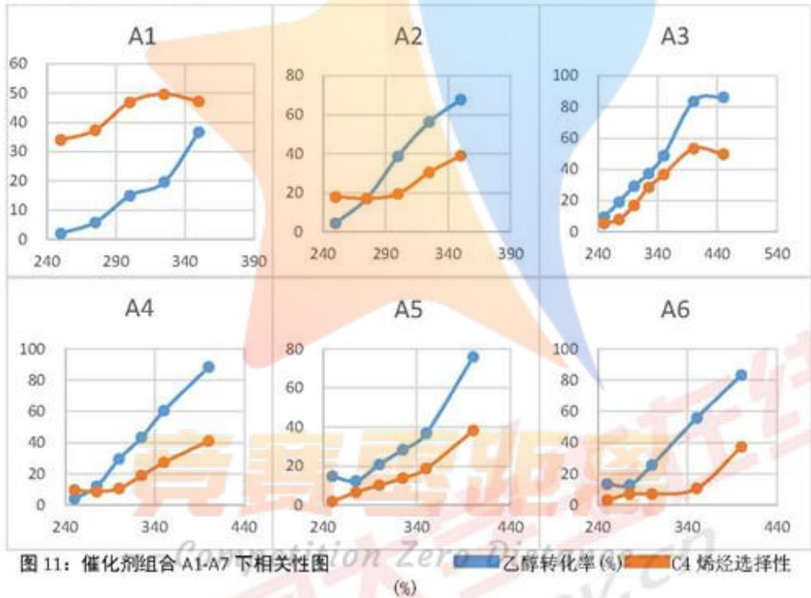

根据催化剂组合特点，可以将 A1、A2、A4、A6 作为一组的对照实验，对照变量为 Co/SiO2 的含量，根据图像变化特点可以分析得出，当 Co/SiO2 的负载量为 1wt% 且在温度区间为 (250℃, 300℃) 时，C4 烯烃的选择性远高于其他含量的情况，但随着温度不断升高，其他组呈上升趋势，A1 组虽趋于平缓，但仍多余其他组。

而 A5 中的 Co/SiO2 含含量比 A3 中的多一倍，但乙醇相对其他组过少，导致最终 C4 选择性少于大部分对照实验，但与 Co/SiO2 过多的 A6 组的选择性类

似。

## Class 2:

在催化剂组合A7至A9以及A12中，催化剂组分中的Co负载量均为 $1\mathrm{wt}\%$ 且 $1\mathrm{wt}\% \mathrm{Co} / \mathrm{SiO2}$ 与HAP含量均为 $50\mathrm{mg}$ ，因此本文同样将其作为一类实验进行分析。

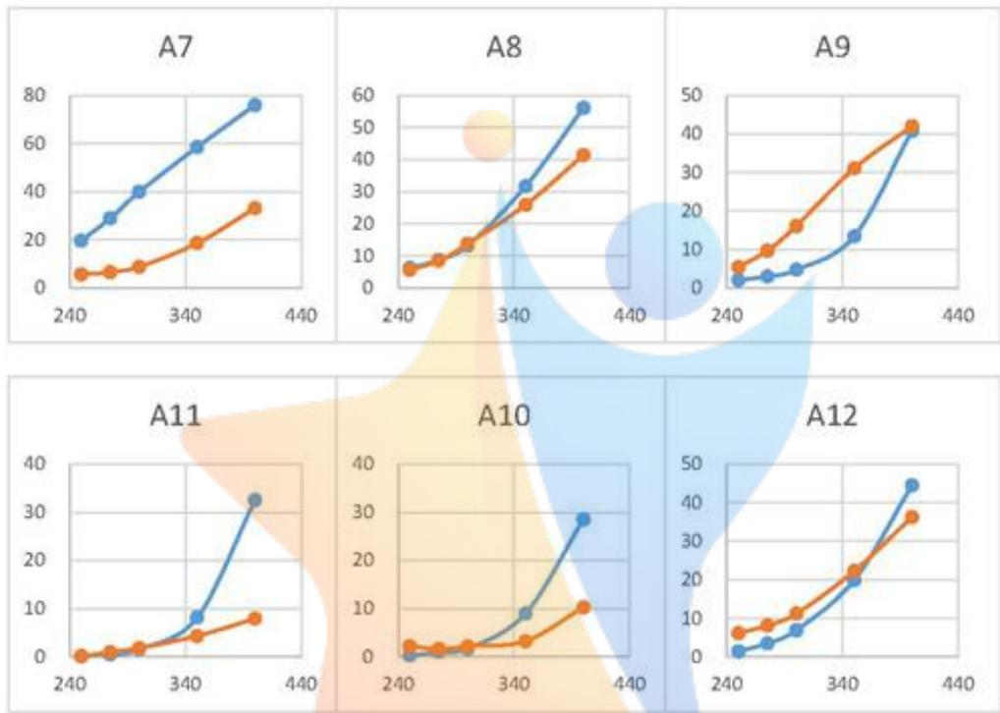  
图12：催化剂组合A7-A12下相关性图（%） 乙醇转化率 $(\%)$ $C_4$ 烯烃选择性

根据附件1易知，从A7、A8、A12与A9这四种催化剂组合中，其乙醇每分钟加入速度从 $0.3\mathrm{ml / min}$ 递增至 $2.1\mathrm{ml / min}$ 。由上图可以得出，在乙醇加入速度越快的情况下，乙醇转化率逐渐降低，在温度区间 $(250^{\circ}\mathrm{C},350^{\circ}\mathrm{C}]$ 上， $\mathrm{C_4}$ 选择性基本不变，在温度区间 $(350^{\circ}\mathrm{C},400^{\circ}\mathrm{C}]$ 呈现先升高后降低的趋势。

## Class 3:

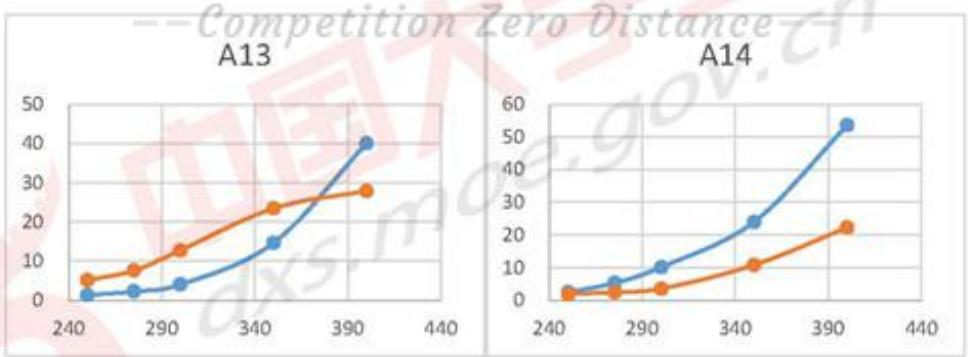

<details>
<summary>line</summary>

| Category | X | Blue | Orange |
| --- | --- | --- | --- |
| A13 | 240 | ~2 | ~5 |
| A13 | 270 | ~3 | ~8 |
| A13 | 290 | ~4 | ~13 |
| A13 | 340 | ~15 | ~24 |
| A13 | 390 | ~40 | ~28 |
| A14 | 240 | ~2 | ~2 |
| A14 | 270 | ~6 | ~3 |
| A14 | 290 | ~10 | ~4 |
| A14 | 340 | ~24 | ~11 |
| A14 | 390 | ~54 | ~22 |
</details>

图13：催化剂组合A13、A14下相关性图 $(\%)$

乙醇转化率(%) C₄烯烃选择性

在第Ⅱ种装袋方式，实验组 B1 至 B6 中，B1、B2、B3、B4、B6 中以催化剂质量比为变量进行研究，B5 为其他变量的对照试验。因此此本文同样将其作为一类实验进行分析。

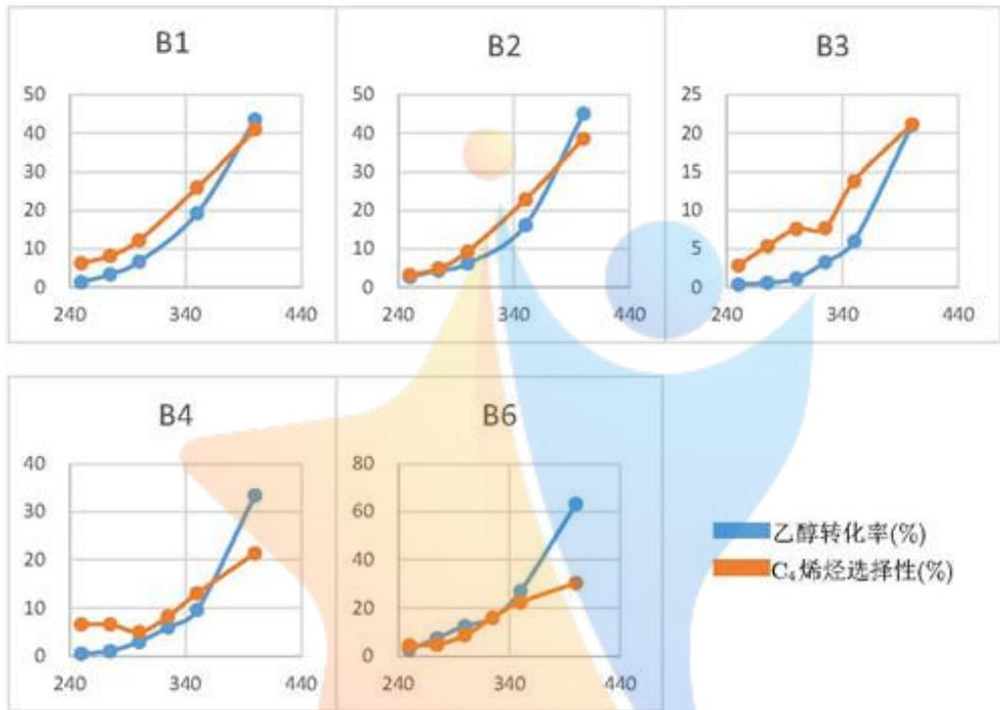  
图 14：催化剂组合 B1-B4、B6 下相关性图

实验组 B3、B4、B1、B6、B2 中质量比逐渐增加，由试验结果分析可知，随着温度的升高质量比越大 C4 烯烃选择性就越高。B1 与 B2 以乙醇浓度为变量，当升高乙醇浓度时，可以得知随着温度升高，乙醇转化率与 C4 烯烃选择性都略有下降。

Class 4:  
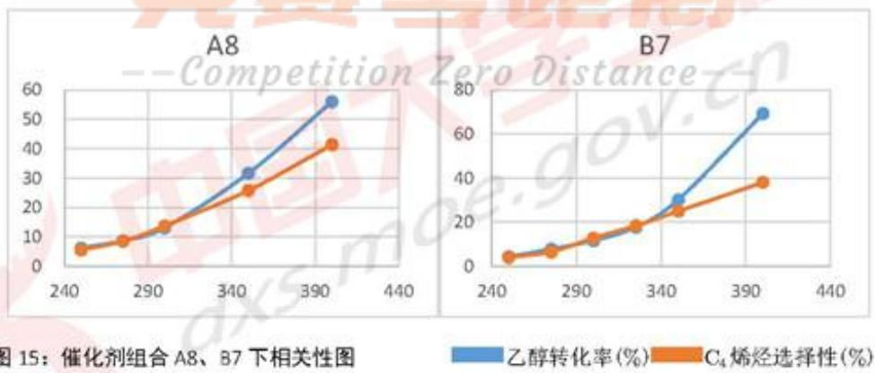

<details>
<summary>line</summary>

| 化剂组合 | 距离 | 乙醇转化率 (%) | C4烯烃选择性 (%) |
| :--- | :--- | :--- | :--- |
| A8 | 240 | ~6 | ~6 |
| A8 | 280 | ~9 | ~9 |
| A8 | 300 | ~13 | ~13 |
| A8 | 350 | ~32 | ~26 |
| A8 | 400 | ~56 | ~41 |
| B7 | 240 | ~4 | ~4 |
| B7 | 280 | ~7 | ~6 |
| B7 | 300 | ~12 | ~12 |
| B7 | 350 | ~18 | ~18 |
| B7 | 360 | ~30 | ~24 |
| B7 | 400 | ~69 | ~38 |
</details>

在催化剂组合 A13、A14 的条件下，易知其组合的变量 1wt%Co/SiO2 与 HAP-乙醇浓度的含量不同，其含量“互换”。在该条件下，“乙醇转化率(%)”变化不大，但“C4烯烃选择性”波动。

A8与B7之间仅存在着装料方式的不同，有结果分析，两种装袋方式对乙醇转化率、C4选择性的变化趋势的影响很小，但是经过第（罗马数字二）装袋方式的效果总体优于第一种。

## B. 问题一拟合图像与相关性系数

模型摘要和参数估算值  
因变量: 乙醇转化率1

<table><tr><td rowspan="2">方程</td><td rowspan="2"> $R^2$ </td><td colspan="4">模型摘要</td><td colspan="3">参数估算值</td></tr><tr><td>F</td><td>自由度 1</td><td>自由度 2</td><td>显著性</td><td>常量</td><td>b1</td><td>b2</td></tr><tr><td>线性</td><td>.932</td><td>41.204</td><td>1</td><td>3</td><td>.008</td><td>-84.074</td><td>.333</td><td></td></tr><tr><td>二次</td><td>.980</td><td>48.340</td><td>2</td><td>2</td><td>.020</td><td>141.807</td><td>-1.194</td><td>.003</td></tr><tr><td>S</td><td>.983</td><td>178.598</td><td>1</td><td>3</td><td>.001</td><td>10.708</td><td>-2470.152</td><td></td></tr></table>

自变量为 温度。

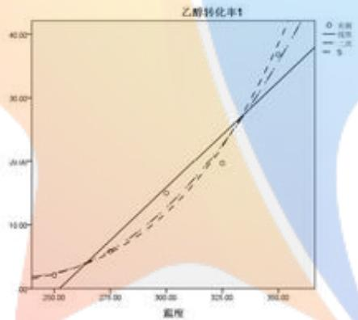

<details>
<summary>line</summary>

| 温度 | 实线 (Y) | 虚线 (Y) | 点划线 (Y) |
| --- | --- | --- | --- |
| 250.00 | ~2.00 | — | — |
| 275.00 | ~6.00 | ~6.00 | ~6.00 |
| 300.00 | ~14.00 | ~12.00 | ~12.00 |
| 325.00 | ~26.00 | ~26.00 | ~26.00 |
| 350.00 | ~38.00 | ~42.00 | — |
</details>

模型摘要和参数估算值

因变量: C4 烯烃选择性 1

<table><tr><td rowspan="2">方程</td><td rowspan="2"> $R^2$ </td><td colspan="4">模型摘要</td><td colspan="3">参数估算值</td></tr><tr><td>F</td><td>自由度 1</td><td>自由度 2</td><td>显著性</td><td>常量</td><td>b1</td><td>b2</td></tr><tr><td>线性</td><td>.787</td><td>11.079</td><td>1</td><td>3</td><td>.045</td><td>-3.242</td><td>.154</td><td></td></tr><tr><td>二次</td><td>.916</td><td>10.899</td><td>2</td><td>2</td><td>.084</td><td>-190.783</td><td>1.422</td><td>-.002</td></tr><tr><td>S</td><td>.848</td><td>16.784</td><td>1</td><td>3</td><td>.026</td><td>4.898</td><td>-338.868</td><td></td></tr></table>

自变量为 温度。

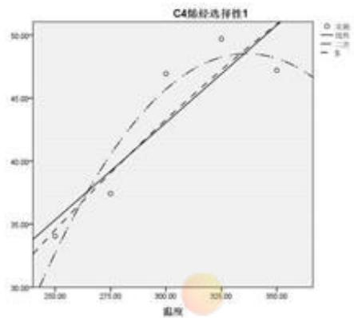

<details>
<summary>scatter</summary>

| 温度 | 实验 (Y) | 续续 (Y) | 二次 (Y) | S (Y) |
| --- | --- | --- | --- | --- |
| ~250.00 | ~34.5 | ~34.5 | ~32.5 | ~34.5 |
| ~275.00 | ~37.5 | ~38.5 | ~38.5 | ~38.5 |
| ~300.00 | ~46.5 | ~43.5 | ~43.5 | ~43.5 |
| ~325.00 | ~49.5 | ~47.5 | ~47.5 | ~47.5 |
| ~350.00 | ~46.5 | ~51.5 | ~48.5 | ~48.5 |
</details>

模型摘要和参数估算值

因变量: 乙醇转化率2

<table><tr><td rowspan="2">方程</td><td rowspan="2"> $R^2$ </td><td colspan="4">模型摘要</td><td colspan="3">参数估算值</td></tr><tr><td>F</td><td>自由度 1</td><td>自由度 2</td><td>显著性</td><td>常量</td><td>b1</td><td>b2</td></tr><tr><td>线性</td><td>.990</td><td>297.825</td><td>1</td><td>3</td><td>.000</td><td>-161.892</td><td>.663</td><td></td></tr><tr><td>二次</td><td>.991</td><td>111.381</td><td>2</td><td>2</td><td>.009</td><td>-227.415</td><td>1.106</td><td>-.001</td></tr><tr><td>S</td><td>.944</td><td>50.190</td><td>1</td><td>3</td><td>.006</td><td>11.258</td><td>-2366.823</td><td></td></tr></table>

自变量为 温度。

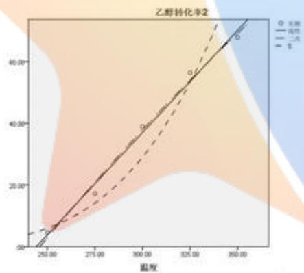

<details>
<summary>scatter</summary>

| 温度 | 实测 (Y) |
| --- | --- |
| ~275.00 | ~19 |
| ~300.00 | ~40 |
| ~325.00 | ~58 |
| ~360.00 | ~68 |
</details>

模型摘要和参数估算值

因变量: C4烯烃选择性2

<table><tr><td rowspan="2">方程</td><td rowspan="2"> $R^2$ </td><td colspan="4">模型摘要</td><td colspan="3">参数估算值</td></tr><tr><td>F</td><td>自由度1</td><td>自由度2</td><td>显著性</td><td>常量</td><td>b1</td><td>b2</td></tr><tr><td>线性</td><td>.836</td><td>15.285</td><td>1</td><td>3</td><td>.030</td><td>-41.546</td><td>.222</td><td></td></tr><tr><td>二次</td><td>.980</td><td>49.722</td><td>2</td><td>2</td><td>.020</td><td>234.745</td><td>-1.646</td><td>.003</td></tr><tr><td>S</td><td>.782</td><td>10.758</td><td>1</td><td>3</td><td>.046</td><td>5.559</td><td>-709.059</td><td></td></tr></table>

自变量为 温度。

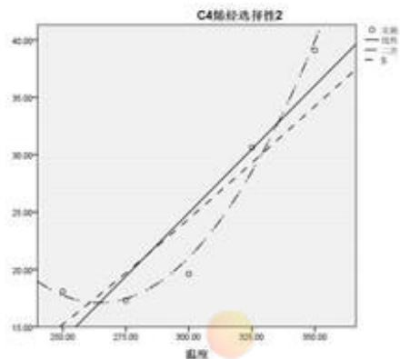

<details>
<summary>line</summary>

| 温度 | 实测 | 实线 | 虚线 | 点划线 |
| --- | --- | --- | --- | --- |
| 250.00 | ~18.00 | — | — | — |
| 275.00 | ~17.00 | ~19.50 | ~19.50 | ~19.50 |
| 300.00 | ~20.00 | ~23.50 | ~23.50 | ~23.50 |
| 325.00 | ~31.00 | ~28.50 | ~28.50 | ~28.50 |
| 350.00 | ~39.50 | ~34.50 | ~34.50 | ~34.50 |
</details>

模型摘要和参数估算值

因变量: 乙醇转化率3

<table><tr><td rowspan="2">方程</td><td rowspan="2"> $R^2$ </td><td colspan="4">模型摘要</td><td colspan="3">参数估算值</td></tr><tr><td>F</td><td>自由度 1</td><td>自由度 2</td><td>显著性</td><td>常量</td><td>b1</td><td>b2</td></tr><tr><td>线性</td><td>.964</td><td>134.968</td><td>1</td><td>5</td><td>.000</td><td>-95.828</td><td>.419</td><td></td></tr><tr><td>二次</td><td>.966</td><td>57.371</td><td>2</td><td>4</td><td>.001</td><td>-134.189</td><td>.647</td><td>.000</td></tr><tr><td>S</td><td>.974</td><td>185.577</td><td>1</td><td>5</td><td>.000</td><td>7.421</td><td>-1245.588</td><td></td></tr></table>

自变量为 温度 A3。

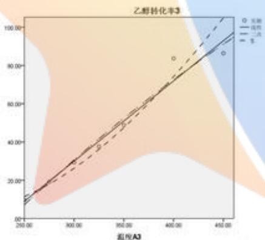

<details>
<summary>scatter</summary>

| 温度A3 | 乙醇转化率 |
| --- | --- |
| ~250.00 | ~15.00 |
| ~450.00 | ~85.00 |
</details>

模型摘要和参数估算值

因变量: C4烯烃选择性3

<table><tr><td rowspan="2">方程</td><td rowspan="2"> $R^2$ </td><td colspan="4">模型摘要</td><td colspan="3">参数估算值</td></tr><tr><td>F</td><td>自由度 1</td><td>自由度 2</td><td>显著性</td><td>常量</td><td>b1</td><td>b2</td></tr><tr><td>线性</td><td>.913</td><td>52.349</td><td>1</td><td>5</td><td>.001</td><td>-59.195</td><td>.261</td><td></td></tr><tr><td>二次</td><td>.955</td><td>42.519</td><td>2</td><td>4</td><td>.002</td><td>-171.076</td><td>.924</td><td>-.001</td></tr><tr><td>S</td><td>.931</td><td>67.340</td><td>1</td><td>5</td><td>.000</td><td>7.333</td><td>-1380.400</td><td></td></tr></table>

自变量为 温度 A3。

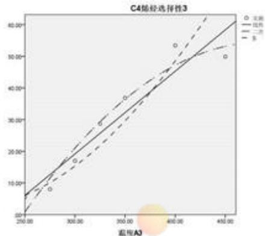

<details>
<summary>scatter</summary>

| 监视A3 | A3 |
| --- | --- |
| ~260 | ~8 |
| ~290 | ~17 |
| ~300 | ~18 |
| ~350 | ~29 |
| ~390 | ~37 |
| ~400 | ~54 |
| ~450 | ~50 |
</details>

模型摘要和参数估算值

因变量: 乙醇转化率4

<table><tr><td rowspan="2">方程</td><td rowspan="2"> $R^2$ </td><td colspan="4">模型摘要</td><td colspan="3">参数估算值</td></tr><tr><td>F</td><td>自由度 1</td><td>自由度 2</td><td>显著性</td><td>常量</td><td>b1</td><td>b2</td></tr><tr><td>线性</td><td>.995</td><td>801.582</td><td>1</td><td>4</td><td>.000</td><td>-144.540</td><td>.582</td><td></td></tr><tr><td>二次</td><td>.996</td><td>362.876</td><td>2</td><td>3</td><td>.000</td><td>-107.611</td><td>.349</td><td>.000</td></tr><tr><td>S</td><td>.951</td><td>77.767</td><td>1</td><td>4</td><td>.001</td><td>9.953</td><td>-2066.750</td><td></td></tr></table>

自变量为 温度 A4。

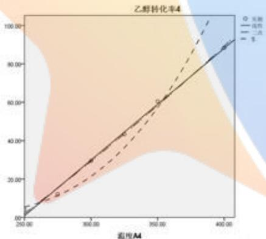

<details>
<summary>line</summary>

| 温度M4 | 实测 (Y) | 理论 (Y) | 二次 (Y) | 二次拟合 (Y) |
| --- | --- | --- | --- | --- |
| 250.00 | ~5 | ~5 | ~5 | ~5 |
| 300.00 | ~30 | ~30 | ~25 | ~30 |
| 350.00 | ~45 | ~45 | ~40 | ~45 |
| 400.00 | ~60 | ~60 | ~60 | ~60 |
| 450.00 | ~90 | ~90 | ~100 | ~90 |
</details>

模型摘要和参数估算值

因变量: C4 烯烃选择性 4

<table><tr><td rowspan="2">方程</td><td rowspan="2"> $R^2$ </td><td colspan="4">模型摘要</td><td colspan="3">参数估算值</td></tr><tr><td>F</td><td>自由度1</td><td>自由度2</td><td>显著性</td><td>常量</td><td>b1</td><td>b2</td></tr><tr><td>线性</td><td>.917</td><td>44.368</td><td>1</td><td>4</td><td>.003</td><td>-52.411</td><td>.227</td><td></td></tr><tr><td>二次</td><td>.977</td><td>62.381</td><td>2</td><td>3</td><td>.004</td><td>72.773</td><td>-.562</td><td>.001</td></tr><tr><td>S</td><td>.871</td><td>27.095</td><td>1</td><td>4</td><td>.006</td><td>6.317</td><td>-1090.270</td><td></td></tr></table>

自变量为 温度 A4。

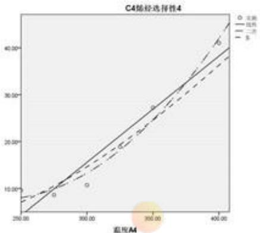

<details>
<summary>scatter</summary>

| 温度A4 | 实测 (°) | 线性 \(({}^{\circ})\) | 二次 \(({}^{\circ})\) | S \(({}^{\circ})\) |
| --- | --- | --- | --- | --- |
| ~270 | ~9 | ~10 | ~10 | ~8 |
| ~300 | ~11 | ~15 | ~15 | ~13 |
| ~330 | ~19 | ~20 | ~20 | ~18 |
| ~350 | ~22 | ~25 | ~25 | ~23 |
| ~370 | ~27 | ~30 | ~30 | ~28 |
| ~400 | ~41 | ~35 | ~35 | ~35 |
</details>

模型摘要和参数估算值

因变量: 乙醇转化率5

<table><tr><td rowspan="2">方程</td><td rowspan="2"> $R^2$ </td><td colspan="4">模型摘要</td><td colspan="3">参数估算值</td></tr><tr><td>F</td><td>自由度 1</td><td>自由度 2</td><td>显著性</td><td>常量</td><td>b1</td><td>b2</td></tr><tr><td>线性</td><td>.873</td><td>27.503</td><td>1</td><td>4</td><td>.006</td><td>-97.593</td><td>.408</td><td></td></tr><tr><td>二次</td><td>.994</td><td>249.910</td><td>2</td><td>3</td><td>.000</td><td>232.407</td><td>-1.672</td><td>.003</td></tr><tr><td>S</td><td>.882</td><td>29.952</td><td>1</td><td>4</td><td>.005</td><td>6.973</td><td>-1149.781</td><td></td></tr></table>

自变量为 温度 A4。

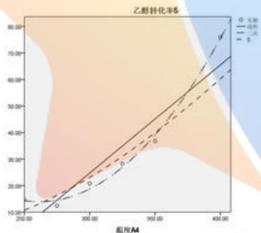

<details>
<summary>line</summary>

| 温度A4 | 实测 (Y) | 模型1 (Y) | 模型2 (Y) | 模型3 (Y) |
| --- | --- | --- | --- | --- |
| 250.00 | — | ~15.00 | ~15.00 | ~15.00 |
| 275.00 | ~13.00 | ~18.00 | ~18.00 | ~18.00 |
| 300.00 | ~21.00 | ~25.00 | ~25.00 | ~25.00 |
| 325.00 | ~29.00 | ~35.00 | ~35.00 | ~35.00 |
| 350.00 | ~37.00 | ~45.00 | ~45.00 | ~45.00 |
| 400.00 | — | ~68.00 | ~68.00 | ~68.00 |
</details>

模型摘要和参数估算值

因变量: C4烯烃选择性5

<table><tr><td rowspan="2">方程</td><td rowspan="2"> $R^2$ </td><td colspan="4">模型摘要</td><td colspan="3">参数估算值</td></tr><tr><td>F</td><td>自由度1</td><td>自由度2</td><td>显著性</td><td>常量</td><td>b1</td><td>b2</td></tr><tr><td>线性</td><td>.940</td><td>62.768</td><td>1</td><td>4</td><td>.001</td><td>-57.813</td><td>.230</td><td></td></tr><tr><td>二次</td><td>.991</td><td>157.173</td><td>2</td><td>3</td><td>.001</td><td>57.884</td><td>-.500</td><td>.001</td></tr><tr><td>S</td><td>.963</td><td>103.385</td><td>1</td><td>4</td><td>.001</td><td>8.276</td><td>-1833.200</td><td></td></tr></table>

自变量为 温度 A4。

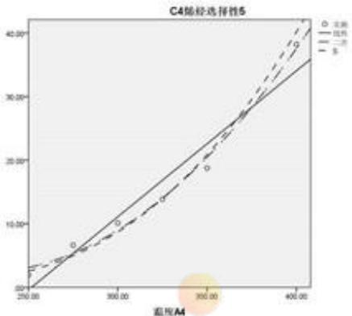

<details>
<summary>line</summary>

| 温度M4 | 实测 (Y) | 理论 (Y) | 二次 (Y) | 点线 (Y) |
| --- | --- | --- | --- | --- |
| ~260 | ~7 | ~5 | ~5 | ~5 |
| ~300 | ~10 | ~10 | ~10 | ~10 |
| ~330 | ~14 | ~14 | ~14 | ~14 |
| ~350 | ~19 | ~19 | ~19 | ~19 |
| ~380 | ~38 | ~38 | ~38 | ~38 |
</details>

模型摘要和参数估算值

因变量: 乙醇转化率6

<table><tr><td rowspan="2">方程</td><td rowspan="2"> $R^2$ </td><td colspan="4">模型摘要</td><td colspan="3">参数估算值</td></tr><tr><td>F</td><td>自由度 1</td><td>自由度 2</td><td>显著性</td><td>常量</td><td>b1</td><td>b2</td></tr><tr><td>线性</td><td>.968</td><td>89.414</td><td>1</td><td>3</td><td>.003</td><td>-119.731</td><td>.501</td><td></td></tr><tr><td>二次</td><td>.986</td><td>70.012</td><td>2</td><td>2</td><td>.014</td><td>51.004</td><td>-.577</td><td>.002</td></tr><tr><td>S</td><td>.943</td><td>49.586</td><td>1</td><td>3</td><td>.006</td><td>7.814</td><td>-1362.320</td><td></td></tr></table>

自变量为 温度 A6。

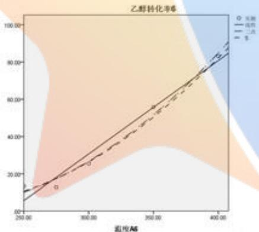

<details>
<summary>line</summary>

| 温度 A6 | 实测 (Y) | 模型1 (Y) | 模型2 (Y) | 模型3 (Y) |
| --- | --- | --- | --- | --- |
| 250.00 | ~12 | ~8 | ~10 | ~10 |
| 275.00 | ~14 | ~18 | ~18 | ~18 |
| 300.00 | ~26 | ~30 | ~30 | ~30 |
| 350.00 | ~56 | ~56 | ~56 | ~56 |
| 400.00 | — | ~85 | ~85 | ~85 |
</details>

模型摘要和参数估算值

因变量: C4烯烃选择性6

<table><tr><td rowspan="2">方程</td><td rowspan="2"> $R^2$ </td><td colspan="4">模型摘要</td><td colspan="3">参数估算值</td></tr><tr><td>F</td><td>自由度1</td><td>自由度2</td><td>显著性</td><td>常量</td><td>b1</td><td>b2</td></tr><tr><td>线性</td><td>.784</td><td>10.886</td><td>1</td><td>3</td><td>.046</td><td>-50.748</td><td>.203</td><td></td></tr><tr><td>二次</td><td>.945</td><td>17.316</td><td>2</td><td>2</td><td>.055</td><td>176.616</td><td>-1.234</td><td>.002</td></tr><tr><td>S</td><td>.880</td><td>21.968</td><td>1</td><td>3</td><td>.018</td><td>6.770</td><td>-1392.868</td><td></td></tr></table>

自变量为 温度 A6。

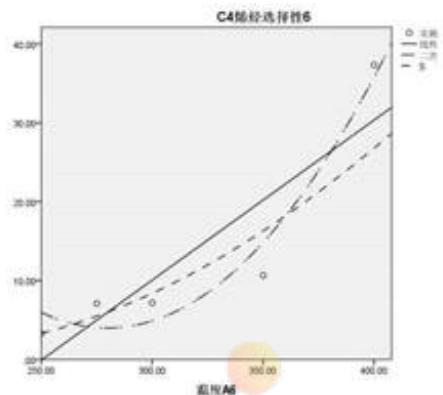

<details>
<summary>line</summary>

| 温度A6 | 实测 | 线性 | 二次 | S |
| --- | --- | --- | --- | --- |
| ~270 | ~7.5 | — | — | — |
| ~300 | ~7.5 | — | — | — |
| ~350 | ~10.5 | — | — | — |
| ~400 | ~38.0 | — | — | — |
</details>

模型摘要和参数估算值

因变量: 乙醇转化率10

<table><tr><td rowspan="2">方程</td><td rowspan="2"> $R^2$ </td><td colspan="4">模型摘要</td><td colspan="3">参数估算值</td></tr><tr><td>F</td><td>自由度 1</td><td>自由度 2</td><td>显著性</td><td>常量</td><td>b1</td><td>b2</td></tr><tr><td>线性</td><td>.852</td><td>17.250</td><td>1</td><td>3</td><td>.025</td><td>-49.688</td><td>.184</td><td></td></tr><tr><td>二次</td><td>.994</td><td>162.912</td><td>2</td><td>2</td><td>.006</td><td>135.513</td><td>-.986</td><td>.002</td></tr><tr><td>S</td><td>.994</td><td>461.766</td><td>1</td><td>3</td><td>.000</td><td>10.792</td><td>-3006.158</td><td></td></tr></table>

自变量为 温度 A6。

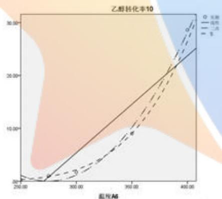

<details>
<summary>line</summary>

| 温度 A6 | 实测 (Y) | 模型1 (Y) | 模型2 (Y) | 模型3 (Y) |
| --- | --- | --- | --- | --- |
| 250.00 | — | ~1.5 | ~1.5 | ~1.5 |
| 300.00 | ~2.0 | ~4.5 | ~4.5 | ~4.5 |
| 350.00 | ~9.0 | ~10.0 | ~10.0 | ~10.0 |
| 400.00 | ~28.0 | ~25.0 | ~25.0 | ~25.0 |
</details>

模型摘要和参数估算值

因变量: C4 烯烃选择性 10

<table><tr><td rowspan="2">方程</td><td rowspan="2"> $R^2$ </td><td colspan="4">模型摘要</td><td colspan="3">参数估算值</td></tr><tr><td>F</td><td>自由度1</td><td>自由度2</td><td>显著性</td><td>常量</td><td>b1</td><td>b2</td></tr><tr><td>线性</td><td>.742</td><td>8.633</td><td>1</td><td>3</td><td>.061</td><td>-12.357</td><td>.052</td><td></td></tr><tr><td>二次</td><td>.978</td><td>45.444</td><td>2</td><td>2</td><td>.022</td><td>59.711</td><td>-.404</td><td>.001</td></tr><tr><td>S</td><td>.709</td><td>7.312</td><td>1</td><td>3</td><td>.074</td><td>4.434</td><td>-1015.963</td><td></td></tr></table>

自变量为 温度 A6。

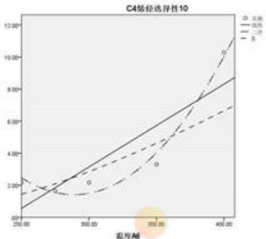

<details>
<summary>line</summary>

| 温度A6 | 实测 (Y) | 实线 (Y) | 二次 (Y) | 点线 (Y) |
| --- | --- | --- | --- | --- |
| 250.00 | — | ~0.7 | ~1.5 | ~2.5 |
| 275.00 | ~1.7 | ~1.8 | ~1.8 | ~1.7 |
| 300.00 | ~2.2 | ~3.0 | ~2.8 | ~1.5 |
| 350.00 | ~3.3 | ~5.5 | ~4.5 | ~3.5 |
| 400.00 | ~10.3 | ~8.8 | ~6.8 | ~11.2 |
</details>

模型摘要和参数估算值

因变量: 乙醇转化率14

<table><tr><td rowspan="2">方程</td><td rowspan="2"> $R^2$ </td><td colspan="4">模型摘要</td><td colspan="3">参数估算值</td></tr><tr><td>F</td><td>自由度 1</td><td>自由度 2</td><td>显著性</td><td>常量</td><td>b1</td><td>b2</td></tr><tr><td>线性</td><td>.929</td><td>39.286</td><td>1</td><td>3</td><td>.008</td><td>-86.644</td><td>.336</td><td></td></tr><tr><td>二次</td><td>.997</td><td>340.958</td><td>2</td><td>2</td><td>.003</td><td>137.880</td><td>-1.083</td><td>.002</td></tr><tr><td>S</td><td>.999</td><td>2735.459</td><td>1</td><td>3</td><td>.000</td><td>9.004</td><td>-2018.312</td><td></td></tr></table>

自变量为 温度 A6。

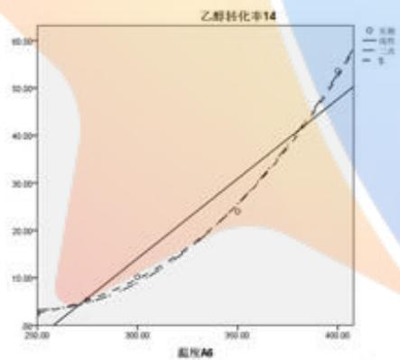

<details>
<summary>line</summary>

| 温度A6 | 实测 (Y) |
| --- | --- |
| 250.00 | ~3.5 |
| 275.00 | ~6.0 |
| 300.00 | ~9.0 |
| 325.00 | ~13.0 |
| 350.00 | ~24.0 |
| 375.00 | ~42.0 |
| 400.00 | ~58.0 |
</details>

模型摘要和参数估算值

因变量: C4烯烃选择性14

<table><tr><td rowspan="2">方程</td><td rowspan="2"> $R^2$ </td><td colspan="4">模型摘要</td><td colspan="3">参数估算值</td></tr><tr><td>F</td><td>自由度1</td><td>自由度2</td><td>显著性</td><td>常量</td><td>b1</td><td>b2</td></tr><tr><td>线性</td><td>.920</td><td>34.486</td><td>1</td><td>3</td><td>.010</td><td>-35.116</td><td>.138</td><td></td></tr><tr><td>二次</td><td>.999</td><td>1862.218</td><td>2</td><td>2</td><td>.001</td><td>64.863</td><td>-.494</td><td>.001</td></tr><tr><td>S</td><td>.966</td><td>84.314</td><td>1</td><td>3</td><td>.003</td><td>7.238</td><td>-1705.611</td><td></td></tr></table>

自变量为 温度 A6。

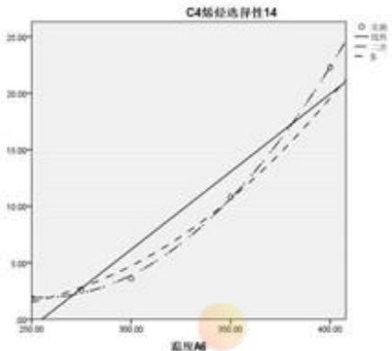

<details>
<summary>line</summary>

| 温度A6 | 实测 | 实线 | 虚线 | 点划线 |
| --- | --- | --- | --- | --- |
| 250.00 | ~2.0 | 0.00 | ~2.0 | ~2.0 |
| 300.00 | ~3.5 | ~7.5 | ~4.5 | ~4.5 |
| 350.00 | ~11.0 | ~17.5 | ~11.0 | ~11.0 |
| 400.00 | ~23.0 | ~21.0 | ~21.0 | ~21.0 |
</details>

模型摘要和参数估算值

因变量: 乙醇转化率 B1

<table><tr><td rowspan="2">方程</td><td rowspan="2"> $R^2$ </td><td colspan="4">模型摘要</td><td colspan="2">参数估算值</td></tr><tr><td>F</td><td>自由度 1</td><td>自由度 2</td><td>显著性</td><td>常量</td><td>b1</td></tr><tr><td>线性</td><td>.925</td><td>37.225</td><td>1</td><td>3</td><td>.009</td><td>-73.190</td><td>.280</td></tr><tr><td>二次</td><td>.999</td><td>899.904</td><td>2</td><td>2</td><td>.001</td><td>121.497</td><td>-.950</td></tr><tr><td>S</td><td>1.000</td><td>10189.576</td><td>1</td><td>3</td><td>.000</td><td>9.477</td><td>-2277.798</td></tr></table>

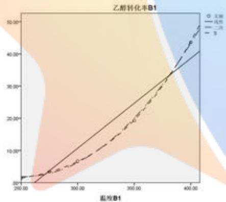

<details>
<summary>line</summary>

| 温度B1 | 实线 (Y) | 虚线 (Y) | 点划线 (Y) |
| --- | --- | --- | --- |
| 200.00 | ~2.5 | ~2.5 | ~2.5 |
| 300.00 | ~12.5 | ~8.5 | ~8.5 |
| 350.00 | ~27.5 | ~22.5 | ~22.5 |
| 400.00 | ~41.0 | ~48.0 | ~48.0 |
</details>

模型摘要和参数估算值

因变量: C4 烯烃选择性 B1

<table><tr><td rowspan="2">方程</td><td rowspan="2"> $R^2$ </td><td colspan="4">模型摘要</td><td colspan="3">参数估算值</td></tr><tr><td>F</td><td>自由度 1</td><td>自由度 2</td><td>显著性</td><td>常量</td><td>b1</td><td>b2</td></tr><tr><td>线性</td><td>.972</td><td>103.253</td><td>1</td><td>3</td><td>.002</td><td>-56.728</td><td>.240</td><td></td></tr><tr><td>二次</td><td>.997</td><td>353.204</td><td>2</td><td>2</td><td>.003</td><td>39.068</td><td>-.365</td><td>.001</td></tr><tr><td>S</td><td>.987</td><td>225.337</td><td>1</td><td>3</td><td>.001</td><td>6.934</td><td>-1300.576</td><td></td></tr></table>

自变量为 温度 B1。

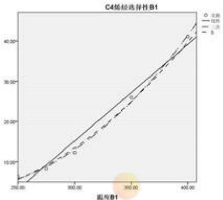

<details>
<summary>line</summary>

| 温度B1 | 实验 (Value) | 试验 (Value) | 二次 (Value) | 二次拟合 (Value) |
| --- | --- | --- | --- | --- |
| ~260 | ~8.5 | ~8.5 | ~8.5 | ~8.5 |
| ~300 | ~12.0 | ~12.0 | ~12.0 | ~12.0 |
| ~350 | ~26.0 | ~26.0 | ~26.0 | ~26.0 |
| ~400 | ~41.0 | ~41.0 | ~41.0 | ~41.0 |
</details>

模型摘要和参数估算值

因变量: 乙醇转化率 B3

<table><tr><td rowspan="2">方程</td><td rowspan="2"> $R^2$ </td><td colspan="4">模型摘要</td><td colspan="3">参数估算值</td></tr><tr><td>F</td><td>自由度 1</td><td>自由度 2</td><td>显著性</td><td>常量</td><td>b1</td><td>b2</td></tr><tr><td>线性</td><td>.792</td><td>15.230</td><td>1</td><td>4</td><td>.018</td><td>-36.184</td><td>.131</td><td></td></tr><tr><td>二次</td><td>.992</td><td>177.563</td><td>2</td><td>3</td><td>.001</td><td>107.209</td><td>-.772</td><td>.001</td></tr><tr><td>S</td><td>.962</td><td>100.473</td><td>1</td><td>4</td><td>.001</td><td>9.617</td><td>-2731.411</td><td></td></tr></table>

自变量为 温度 B3。

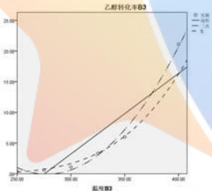

<details>
<summary>line</summary>

| 温度 (C) | 实测 | 模型1 | 模型2 | 模型3 |
| --- | --- | --- | --- | --- |
| 250.00 | — | ~1.0 | ~1.0 | ~1.0 |
| 275.00 | ~0.8 | ~0.2 | ~0.2 | ~0.2 |
| 300.00 | ~1.2 | ~1.5 | ~1.5 | ~1.5 |
| 325.00 | ~3.5 | ~3.5 | ~3.5 | ~3.5 |
| 350.00 | ~6.0 | ~6.0 | ~6.0 | ~6.0 |
| 400.00 | ~21.0 | ~18.0 | ~18.0 | ~18.0 |
</details>

模型摘要和参数估算值

因变量: C4 烯烃选择性 B3

<table><tr><td rowspan="2">方程</td><td rowspan="2"> $R^2$ </td><td colspan="4">模型摘要</td><td colspan="3">参数估算值</td></tr><tr><td>F</td><td>自由度1</td><td>自由度2</td><td>显著性</td><td>常量</td><td>b1</td><td>b2</td></tr><tr><td>线性</td><td>.943</td><td>65.903</td><td>1</td><td>4</td><td>.001</td><td>-28.294</td><td>.120</td><td></td></tr><tr><td>二次</td><td>.976</td><td>61.782</td><td>2</td><td>3</td><td>.004</td><td>20.970</td><td>-.190</td><td>.000</td></tr><tr><td>S</td><td>.967</td><td>117.810</td><td>1</td><td>4</td><td>.000</td><td>6.219</td><td>-1279.868</td><td></td></tr></table>

自变量为 温度 B3。

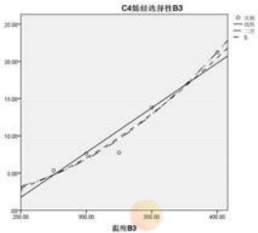

<details>
<summary>scatter</summary>

| 温度B3 | 实验 (B) | 理论 (B) | 二次 (B) |
| --- | --- | --- | --- |
| ~260 | ~5.5 | ~5.5 | ~5.5 |
| ~300 | ~7.5 | ~7.5 | ~7.5 |
| ~340 | ~7.5 | ~10.5 | ~10.5 |
| ~380 | ~14.0 | ~14.0 | ~14.0 |
| ~400 | ~21.5 | ~21.5 | ~21.5 |
</details>

模型摘要和参数估算值

因变量: 乙醇转化率B7

<table><tr><td rowspan="2">方程</td><td rowspan="2"> $R^2$ </td><td colspan="4">模型摘要</td><td colspan="3">参数估算值</td></tr><tr><td>F</td><td>自由度 1</td><td>自由度 2</td><td>显著性</td><td>常量</td><td>b1</td><td>b2</td></tr><tr><td>线性</td><td>.876</td><td>28.342</td><td>1</td><td>4</td><td>.006</td><td>-109.343</td><td>.420</td><td></td></tr><tr><td>二次</td><td>.997</td><td>439.470</td><td>2</td><td>3</td><td>.000</td><td>228.711</td><td>-1.711</td><td>.003</td></tr><tr><td>S</td><td>.984</td><td>241.789</td><td>1</td><td>4</td><td>.000</td><td>8.581</td><td>-1801.328</td><td></td></tr></table>

自变量为 温度 B3。

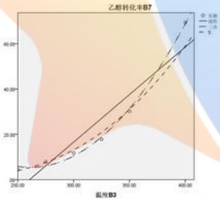

<details>
<summary>line</summary>

| 温度B3 | 实测 (Y) | 连续 (Y) | 二次 (Y) | 重复 (Y) |
| --- | --- | --- | --- | --- |
| ~250.00 | ~8 | ~8 | ~8 | ~8 |
| ~275.00 | ~10 | ~10 | ~10 | ~10 |
| ~300.00 | ~12 | ~12 | ~12 | ~12 |
| ~325.00 | ~19 | ~19 | ~19 | ~19 |
| ~350.00 | ~32 | ~32 | ~32 | ~32 |
| ~400.00 | — | ~65 | ~65 | ~65 |
</details>

模型摘要和参数估算值  
因变量: C4 烯烃选择性 B7

<table><tr><td rowspan="2">方程</td><td rowspan="2"> $R^2$ </td><td colspan="4">模型摘要</td><td colspan="3">参数估算值</td></tr><tr><td>F</td><td>自由度 1</td><td>自由度 2</td><td>显著性</td><td>常量</td><td>b1</td><td>b2</td></tr><tr><td>线性</td><td>.989</td><td>353.933</td><td>1</td><td>4</td><td>.000</td><td>-56.451</td><td>.234</td><td></td></tr><tr><td>二次</td><td>.997</td><td>523.678</td><td>2</td><td>3</td><td>.000</td><td>-9.858</td><td>-.060</td><td>.000</td></tr><tr><td>S</td><td>.990</td><td>402.233</td><td>1</td><td>4</td><td>.000</td><td>7.582</td><td>-1539.007</td><td></td></tr></table>

自变量为 温度 B3。

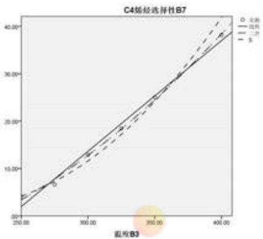

<details>
<summary>line</summary>

| 温度B3 | 实测 | 理论 | 二次 | S |
| --- | --- | --- | --- | --- |
| ~250.00 | ~4.00 | ~2.00 | ~4.00 | ~4.00 |
| ~275.00 | ~7.00 | ~6.00 | ~6.00 | ~6.00 |
| ~300.00 | ~13.00 | ~13.00 | ~13.00 | ~13.00 |
| ~325.00 | ~19.00 | ~19.00 | ~19.00 | ~19.00 |
| ~350.00 | ~25.00 | ~25.00 | ~25.00 | ~25.00 |
| ~375.00 | ~30.00 | ~30.00 | ~30.00 | ~30.00 |
| ~400.00 | ~38.00 | ~38.00 | ~42.00 | ~42.00 |
</details>

## C. 模型建立过程中所使用的源代码

1. lingo 程序求得最优解:

sets:

$$
\text {parm'all / 1..6 / :p1,p2,p3,p4;}
$$

endsets

data:

$$
\mathrm{p} 1 = - 7 9. 8 4 4, 0. 0 5 5 4 2, 0. 0 3 5 0 8, 0. 0 5 3 8 3, - 9. 1 8 5 6, 0. 3 3 2 3 2;
$$

$$
\mathrm{p} 2 = - 4 8. 3 5 9 4, 0. 0 5 1 7, - 3. 2 1 7, 0. 0 3 8 6, 2. 4 4 3 9, 0. 1 8 0 7;
$$

$$
\mathrm{p} 3 = 1 8 4. 2 6 8, - 0. 1 0 3 2, 1. 8 5 5 2 0, 0. 0 2 8 7, - 7. 0 6 5 9, - 0. 3 5 1 8;
$$

$$
\mathrm{p4} = - 3 5. 9 0 8, 0. 0 5 1 4 8, 1. 3 6 2 3, - 0. 0 6 7 3, 4. 6 2 2 0, 0. 1 7 1 0 8;
$$

enddata

$$
\text{!max} = (-3619.647 + 1.236 ^{*} \mathrm{x} 1 - 69.431 ^{*} \mathrm{x} 2 + 4.121 ^{*} \mathrm{x} 3-
$$

$$
1 2 7 6. 7 3 6 ^ {*} \mathrm{x} 4 + 1 1. 9 9 5 ^ {*} \mathrm{x} 5) ^ {*} \mathrm{a} + \mathrm{b} ^ {*} \mathrm{y} 1 ^ {*} \mathrm{y} 2 + (\mathrm{x} 5 ^ {*} \mathrm{x} 2 + \mathrm{x} 5 ^ {*} \mathrm{x} 4) ^ {*} \mathrm{c};
$$

$$
\max = (- 3 6 1 9. 6 4 7 + 1. 2 3 6 ^ {*} \mathrm{x} 1 - 6 9. 4 3 1 ^ {*} \mathrm{x} 2 + 4. 1 2 1 ^ {*} \mathrm{x} 3 -
$$

$$
1 2 7 6. 7 3 6 ^ {*} \mathrm{x} 4 + 1 1. 9 9 5 ^ {*} \mathrm{x} 5) ^ {*} 0. 7 + 0. 6 ^ {*} \mathrm{y} 1 ^ {*} \mathrm{y} 2 + (\mathrm{x} 5 ^ {*} \mathrm{x} 2 + \mathrm{x} 5 ^ {*} \mathrm{x} 4) ^ {*} 0. 5;
$$

$$
\max = ((- 6 3 1 4. 4 7 0 + 3. 9 1 0 ^ {*} \mathrm{x} 1 - 1 5 4. 7 2 7 ^ {*} \mathrm{x} 2 + 3. 9 3 3 ^ {*} \mathrm{x} 3 -
$$

$$
3 1 2. 0 6 3 ^ {*} \mathrm{x} 4 + 2 1. 3 7 5 ^ {*} \mathrm{x} 5) ^ {*} 0. 5 + 0. 4 ^ {*} \mathrm{y} 1 ^ {*} \mathrm{y} 2 + 0. 5 5 ^ {*} (\mathrm{x} 5 ^ {*} \mathrm{x} 2 + \mathrm{x} 5 ^ {*} \mathrm{x} 4)) / 1 0 0;
$$

$$
\max = (- 6 3 1 4. 4 7 0 + 3. 9 1 0 ^ {*} \mathrm{x} 1 - 1 5 4. 7 2 7 ^ {*} \mathrm{x} 2 + 3. 9 3 3 ^ {*} \mathrm{x} 3-
$$

$$
3 1 2. 0 6 3 ^ {*} \mathrm{x} 4 + 2 1. 3 7 5 ^ {*} \mathrm{x} 5) ^ {*} 0. 5 + 0. 5 ^ {*} \mathrm{y} 1 ^ {*} \mathrm{y} 2;
$$

$$
\mathrm{y1} = \mathrm{p1(1)} + \mathrm{p1(2)} ^ {*} \mathrm{x1} + \mathrm{p1(3)} ^ {*} \mathrm{x2} + \mathrm{p1(4)} ^ {*} \mathrm{x3} + \mathrm{p1(5)} ^ {*} \mathrm{x4} + \mathrm{p1(6)} ^ {*} \mathrm{x5};
$$

$$
\mathrm{y} 2 = \mathrm{p} 2 (1) + \mathrm{p} 2 (2) ^ {*} \mathrm{x} 1 + \mathrm{p} 2 (3) ^ {*} \mathrm{x} 2 + \mathrm{p} 2 (4) ^ {*} \mathrm{x} 3 + \mathrm{p} 2 (5) ^ {*} \mathrm{x} 4 + \mathrm{p} 2 (6) ^ {*} \mathrm{x} 5;
$$

```txt
y3=p3(1)+p3(2)*x1+p3(3)*x2+p3(4)*x3+p3(5)*x4+p3(6)*x5;
y4=p4(1)+p4(2)*x1+p4(3)*x2+p4(4)*x3+p4(5)*x4+p4(6)*x5;

y2+y3+y4i=100;
@bnd(10,x1,200);
@bnd(0.5,x2,5);
@bnd(10,x3,200);
@bnd(0.3,x4,2.1);
@bnd(250,x5,350);
```

## 2. 第二问偏最小二乘代码.m

clc,clear

ab0= xlsread('pz.xls'); % 原始数据存放在纯文本文件 pz.txt 中

mu = mean( ab0);sig=std(ab0); % 求均值和标准差

rr= corrcoef(ab0)%求相关系数矩阵

ab= zscore(ab0); %数据标准化

a=ab(:,[1:5]);b=ab(:,[6:end]); % 提出标准化后的自变量和因变量数据

[XL,YL,XS,YS,BETA,PCTVAR,MSE,stats] =plsregress(a,b)

xw=a"XS %求自变量提出成分系教每列对应一个成分,这里 xw 等于 stats.w

yw=b"YS %求因变量提出成分的系数

ncomp =input('ncomp =');

$$
\begin{array}{l} \text {[XL2,YL2,XS2,YS2,BETA2,PCTVAR2,MSE2,stats2]} \\ = \text {plsregress(a,b,ncomp)} \end{array}
$$

n=size(a,2);m=size(b,2);%n 是自变量的个数,m 是因变量的个数

beta3(1,:) = mu(n + 1:end)-

mu(1:n)./sig(1:n)\*BETA2([2:end],:).\*sig(n+1:end);%原始数据回归方程的常数项

beta3([2:n+1],:)=(1./sig(1:n))\*sig(n+1:end).\*BETA2([2:end],:)%计算原始变量x1,…;xn的系数,每一列是一个回归方程

hold on;

%x3str=‘乙醇转化率’,C4烯烃转化率','乙醛选择性','脂肪醇','甲醛甲醛','其他生成物','乙烯选择性''; %新坐标的值

%c11 = categorical();

bar(BETA2','k')%画直方图

title(""偏最小二乘回归系数直方图")
yhat = repmat(beta3(1,:),[size(a,1),1]) +ab0(:,[1:n])\* beta3([2:end],:) %求 y1,,ym 的预测值  
```javascript
ymax =max([yhat,ab0(:,[n+1;end])]);
```

%求预测值和观测值的最大值

%下面画 y1,y2,y3 的预测图，并画直线 y=X  
```matlab
figure, subplot(1,2,1)
a1=[0:ymax(1)];
a2=[0:ymax(1)];
b1=[0:ymax(2)];
b2=[0:ymax(2)];
plot(yhat(:,1),ab0(:,n+1),'*',a1,a2,'color','k')
title('乙醇转化率预测图')
subplot(1,2,2)
plot(yhat(:,2),ab0(:,n+2),'O',b1,b2,'color','k')
title('烯烃转化率预测图')
```  
%legend('烯烃',2)

3. mse.ipynb  
```txt
"cells": [
  -
    "cell'type": "code",
    "execution count": 66,
    "metadata": -
      "collapsed": true
    },
    "outputs": [],
    "source": [
      "import pandas as pd“n”,
      "import numpy as np“n”,
      "import matplotlib"
    ]
  ",
```

```python
"cell'type": "code",
"execution count": 68,
"outputs": [],
"source": [
"# 自己把所有的 X Y（只有两列，乙醇转化率 烯烃选择性）"n",
"X'self = pd.read'excel("../X.xlsx")"n",
"X = X'self.values"n",
"Y'self = pd.read'excel("../Y.xlsx")"n",
"Y = Y'self.values"n",
"# print(3^2)"
],
"metadata": -
"collapsed": false,
"pycharm": -
"name": "#%% 读取数据"n"
"
",
",
-
"cell'type": "code",
"execution count": 90,
"outputs": [],
"source": [
"sum'2 = 0.0"n",
"sum'1 = 0.0"n",
"sum'3 = 0.0"n",
"sum'4 = 0.0"n",
"for i in range(109):"n",
" y'1 = -79.8445 + X[i][0]*0.0554 + X[i][1]*(-0.0351) + *(0.0538) + X[i][3]*(-9.1856) + X[i][4]*0.3323"n",
" y'2 = -48.3595 + X[i][0]*0.0517 + X[i][1]*(-3.2176) + *(0.0387) + X[i][3]*(-2.4439) + X[i][4]*0.1807"n",
```

```txt
" sy'1 = -80.218 + X[i][0]*(-0.033) + X[i][1]*(0.134) +
X[i][2]*(0.141) + X[i][3]*(-8.765) + X[i][4]*0.333“n",
" sy'2 = -54.118 + X[i][0]*0.005 + X[i][1]*(-3.173) + X[i][2]*(0.091)
+ X[i][3]*(2.670) + X[i][4]*0.181“n",
" delta'1 = (y'1 - Y[i][0])**2“n",
" delta'2 = (y'2 - Y[i][1])**2“n",
" delta'3 = (sy'1 - Y[i][0])**2“n",
" delta'4 = (sy'2 - Y[i][1])**2“n",
" sum'1 += delta'1“n",
" sum'2 += delta'2“n",
" sum'3 += delta'3“n",
" sum'4 += delta'4“n",
" print("MSE'y1, MSE'y2 In PLS ::", (sum'1/109)**(1/2),
(sum'2/109)**(1/2))“n",
" print("MSE'y1, MSE'y2 In SPSS::", (sum'3/109)**(1/2),
(sum'4/109)**(1/2)"
],
"metadata": -
"collapsed": false,
"pycharm": -
"name": "#%% 求解 MSE“n"
"
"
",
"cell'type": "code",
"execution count": 72,
"outputs": [
-
"name": "stdout",
"output type": "stream",
"text": [
"0“n",
"1“n",
```

```txt
"3"n"
]
"
],
"source": [],
"metadata": -
"collapsed": false,
"pycharm": -
"name": "#%%"n"
"
"
",
-
"cell'type": "code",
"execution'count": null,
"outputs": [],
"source": [],
"metadata": -
"collapsed": false,
"pycharm": -
"name": "#%%"n"
"
"
"
],
"metadata": -
"kernelspec": -
"display name": "Python
"language": "python",
"name": "python3"
",
"language'info": -
"codemirror'mode": -
```

```txt
"name": "ipython",
    "version": 2
  ",
  "file'extension": ".py",
  "mimetype": "text/x-python",
  "name": "python",
  "nbconvert'exporter": "python",
  "pygments'lexer": "ipython2",
  "version": "2.7.6"
  ",
  },
  "nbformat": 4,
  "nbformat'minor": 0
```