# 基于双因素方差分析的乙醇制备 C4 烯烃的研究

摘要

本文研究的是乙醇偶合制备 C4 烯烃过程中，催化剂组合与温度对乙醇转化率和 C4 烯烃的选择性的影响，通过建立双因素方差分析模型和优化模型，求解得到最优的催化剂组合与温度，获得最高的 C4 烯烃收率。

首先采用三次样条插值法对已知数据进行插值补全，为模型建立提供数据基础。

针对问题一：本文分别对每个装料方式Ⅰ、Ⅱ建立两个回归模型，首先针对附件1中不同催化剂组合，提出建立Logistic增长模型，描述乙醇转化率随温度升高而增加，后趋于平稳的关系；建立一次线性、二次曲线回归模型，描述C4烯烃转化率短期内随温度升高而增加的关系。其次，基于附件二数据散点图可知，C4烯烃选择性在36%～41%间波动，乙醇转化率随时间增加而降低，在29.9%处趋于平稳。

针对问题二：本文建立了双因素方差分析模型，双因素分别为温度和不同催化剂组合。通过方差分析可知，温度和不同催化剂组合对乙醇转化率和C4烯烃选择性的影响都显著，温度的影响力大于不同催化剂组合的影响力。

通过多重比较检验可知，分析的数据中温度越高，乙醇转化率和C4烯烃的选择性越高，影响力越大，400℃时乙醇转化率和C4烯烃的选择性达到最大；将不同催化剂组合对乙醇转化率和C4烯烃选择性的影响力排序，对于乙醇转化率，催化剂组合最优为A7组，最差为B3组，对于C4烯烃选择性，催化剂组合最优为A1组，最差为A11组。

针对问题三：本题需要选择催化剂组合与温度，以获得最大的C4烯烃收率。令收率为因变量，将催化剂中四个组成因素与温度作为5个自变量，用Matlab软件拟合得到五元二次方程，然后建立优化模型，以5个自变量为决策变量，以其取值范围为约束条件，从而得到C4烯烃收率最大值为5719，最优催化剂组合为：167.625mg 1.96wt%Co/SiO2-200mgHAP-乙醇浓度0.85ml/min，温度为400℃；同理，得出温度低于350℃时收率最大值为4648，最优催化剂组合为：200mg 1.67wt%Co/SiO2-200mg HAP-乙醇浓度1.57ml/min，温度为349℃。

针对问题四：本题提出5次实验设计，在问题三的基础上，在最优催化剂组合和最佳温度的附近，进行寻优实验；在收率方差分析求得的最优催化剂组合与温度进行实验验证；对比装料方式Ⅰ和Ⅱ，控制其他变量相同，增加实验以确定装料方式优劣；根据附件2数据，增加采样时刻，找出使乙醇转化率最大的时间点，求出C4烯烃的收率；从补充缺失实验的角度出发，对附件1中没有进行的实验作出补充。

关键词：乙醇；C4烯烃；Logistic增长模型；双因素方差分析；优化模型

## 一、问题的背景与重述

## 1.1 问题的背景

烯烃在制备化工产品和生产医药中间体等方面应用广泛，是一种十分重要的化工原料[1]。又由于全球环境污染问题日益严重，传统制备烯烃的以化石能源为原料的生产方法已不再适用，人们积极寻求以清洁能源为原料的制备方法。乙醇作为生物可再生能源相比起传统化石能源更清洁更环保，能有效降低二氧化碳等气体的排放，缓解全球温室效应[2]。因此探究不同催化剂组合与温度对乙醇偶合制备烯烃的影响具有重要的研究价值。

## 1.2 问题的重述

根据所给的不同催化剂组合和不同温度条件下对乙醇偶合制备烯烃反应的实验观察数据，解决下列问题：

(1) 在附件 1 中不同催化剂组合的条件下, 探究乙醇转化率、烯烃的选择性与温度的关系。再根据附件 2 中实验在 350 度和同一确定的催化剂组合的条件下分析不同时间的测试结果。  
(2) 分别研究不同催化剂组合与温度对乙醇转化率和烯烃选择性大小的影响。  
（3）找出在其他实验条件相同情况下能使烯烃收率最高的催化剂组合和温度。并找出温度低于350度时能使烯烃收率最高的催化剂组合和温度。  
(4) 再设计 5 次实验并给出设计理由。

## 二、问题分析

对于问题一：分别对装料方式Ⅰ、Ⅱ建立了两个回归模型，首先针对附件1中不同催化剂组合，画出散点图，根据散点图数据变化趋势以及反应原理，可建立Logistic增长模型，描述乙醇转化率随温度升高而增加，后趋于平稳的关系；对于C4烯烃转化率，也根据数据特征可建立回归模型，描述C4烯烃转化率短期内随温度升高而增加的关系。其次，基于附件二数据散点图可知，C4烯烃选择性在波动性较大，乙醇转化率随时间增加而降低，最后趋于平稳，可用分段函数进行拟合分析。

对于问题二：将温度分为7个水平，不同催化剂组合分为21个水平，建立双因素方差分析数学模型，可通过偏差均方和的大小对各控制变量是否对乙醇转化率和C4烯烃的选择性具有显著影响进行判断。接下来，可通过对控制变量做多重比较检验，对该控制变量所包括的几个水平下的观测变量均值进行逐对比较。选取均值差之和作为衡量标准，判断影响力大小，进而确定影响力排序。

对于问题三：要选择使得 C4 烯烃收率达到最高的催化剂组合和温度，我们可以把催化剂中的四个因素分开，分析他们和温度对 C4 烯烃收率的影响，并拟合出一个关系式。进而建立优化模型，找出关系函数的最大值，此时对应的 HAP 质量、Co 负载量等数据即为新的催化剂组合和最佳温度。在温度低于 350 度时，用同样的方法进行求解。此外，还可以通过对附件 1 中数据画图统计分析，来验证我们的模型。

对于问题四：本问可以在问题三的基础上，在最优催化剂组合和最佳温度的附近，继续进行实验；在收率方差分析求得的最优催化剂组合与温度进行实验验证；也可以对比装料方式Ⅰ和Ⅱ，控制其他变量相同，增加实验；从补充缺失实验的角度出发，对一些附件1中没有实验的情况作出补充：根据附件2数据，增加采样时刻。

## 三、模型假设

1. 假设用于反应的乙醇除乙醇浓度外其余条件均相同。  
2. 假设所给数据均真实可靠。  
3. 假设该反应不为可逆反应。

四、符号说明

<table><tr><td>符号</td><td>含义</td><td>单位</td></tr><tr><td> $S_i(x)$ </td><td>第i段x的三次样条插值函数</td><td>/</td></tr><tr><td> $a_i, b_i, c_i, d_i$ </td><td>第i段三次样条插值函数的待定系数</td><td>/</td></tr><tr><td>x(T)</td><td>温度为T时的乙醇转化率</td><td>%</td></tr><tr><td>r</td><td>乙醇转化率的增长率</td><td>%</td></tr><tr><td> $x_0$ </td><td>乙醇转化率的初值</td><td>%</td></tr><tr><td> $x_m$ </td><td>乙醇的最大转化率</td><td>%</td></tr><tr><td> $y_1$ </td><td>C4烯烃的选择性</td><td>%</td></tr><tr><td>T</td><td>温度</td><td>°C</td></tr><tr><td> $y_2$ </td><td>乙醇转化率的分段函数</td><td>/</td></tr><tr><td>t</td><td>实验时间</td><td>min</td></tr><tr><td> $A_i$ </td><td>温度因素,i=1...7</td><td>/</td></tr><tr><td> $B_j$ </td><td>催化剂种类因素,j=1...14</td><td>/</td></tr><tr><td> $\alpha_i$ </td><td>温度水平 $A_i$ 的效应,i=1...7</td><td>/</td></tr><tr><td> $\beta_j$ </td><td>不同催化剂种类 $B_j$ ,j=1...14</td><td>/</td></tr><tr><td> $\overline{X}$ </td><td>总偏差平方和</td><td>/</td></tr><tr><td> $S_E$ </td><td>误差平方和</td><td>/</td></tr><tr><td> $S_A$ </td><td>温度因素的偏差平方和</td><td>/</td></tr><tr><td> $S_B$ </td><td>不同催化剂种类因素的偏差平方和</td><td>/</td></tr></table>

## 五、数据预处理

首先我们对附件1中数据进行观察分析，发现每种催化剂组合下的测试温度不完全相同，例如A6、B1等催化剂组合缺少325度的数据，A3催化剂组合中有450度的数据，这些都给后续的分析带来不便，因此我们用三次样条差值法，令温度在250度～400度之间且间隔25度，对其中缺失的数据点进行插值补全。

三次样条插值公式：

$$
S _ {i} (x) = a _ {i} + b _ {i} (x - x _ {i}) + c _ {i} (x - x _ {i}) ^ {2} + d _ {i} (x - x _ {i}) ^ {3}, i = 0, 1, \dots , n - 1 \tag {1}
$$

其中有n个区间，即为n段函数 $S_{0}\sim S_{n-1}$ ，有 $n+1$ 个节点。

运用 Matlab 软件进行插值计算（程序见附录 5），得出补全后的数据如下表所示：

表 1 各催化剂组合对温度的插值数据表

<table><tr><td>组合温度/°C</td><td>250</td><td>275</td><td>300</td><td>325</td><td>350</td><td>375</td><td>400</td></tr><tr><td>A1</td><td>2.07</td><td>5.85</td><td>14.97</td><td>19.68</td><td>36.8</td><td>/</td><td>/</td></tr><tr><td>A</td><td>4.6</td><td>17.2</td><td>38.92</td><td>56.38</td><td>67.88</td><td>/</td><td>/</td></tr><tr><td> $\vdots$ </td><td> $\vdots$ </td><td> $\vdots$ </td><td> $\vdots$ </td><td> $\vdots$ </td><td> $\vdots$ </td><td> $\vdots$ </td><td> $\vdots$ </td></tr><tr><td>A14</td><td>2.5</td><td>5.3</td><td>10.2</td><td>16.03</td><td>24</td><td>35.92</td><td>53.6</td></tr><tr><td>B1</td><td>1.4</td><td>3.4</td><td>6.7</td><td>11.8</td><td>19.3</td><td>29.7</td><td>43.6</td></tr><tr><td>B2</td><td>2.8</td><td>4.4</td><td>6.2</td><td>9.6</td><td>16.2</td><td>27.5</td><td>45.1</td></tr><tr><td> $\vdots$ </td><td> $\vdots$ </td><td> $\vdots$ </td><td> $\vdots$ </td><td> $\vdots$ </td><td> $\vdots$ </td><td> $\vdots$ </td><td> $\vdots$ </td></tr><tr><td>B7</td><td>4.4</td><td>7.9</td><td>11.7</td><td>17.8</td><td>30.2</td><td>48.1</td><td>69.4</td></tr></table>

在表 1 中，每个催化剂组合下有 7 个不同的温度水平，增加了数据点数量，可以有效的提高问题一中模型拟合的准确性。

## 六、模型的建立与求解

## 6.1 问题一模型的建立和求解

## 6.1.1 数据可视化

为了更加直观方便地分析乙醇转化率和C4烯烃的选择性与温度之间的关系，我们考虑对各种催化剂组合下的数据进行可视化，画出散点图如下（完整散点图见附录1）：

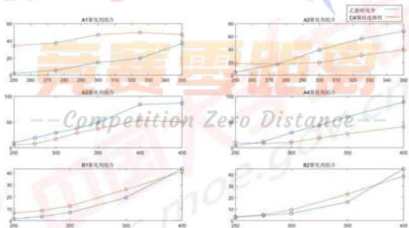  
图 1 乙醇转化率和 C4 烯烃选择性随温度变化散点图(部分)

表 2 不同催化剂组合的乙醇转化率 Logistic 方程

<table><tr><td>催化剂组合</td><td>乙醇转化率Logistic方程</td><td>催化剂组合</td><td>乙醇转化率Logistic方程</td></tr><tr><td>A1</td><td> $x(t) = \frac{83.6511}{(1 + (\frac{83.6511}{2.07} - 1)e^{-0.031t})}$ </td><td>B1</td><td> $x(t) = \frac{81.9731}{(1 + (\frac{81.9731}{1.4} - 1)e^{-0.0261t})}$ </td></tr><tr><td>A2</td><td> $x(t) = \frac{74.3814}{(1 + (\frac{74.3814}{4.6} - 1)e^{-0.0459t})}$ </td><td>B2</td><td> $x(t) = \frac{491950}{(1 + (\frac{481950}{2.8} - 1)e^{-0.0171t})}$ </td></tr><tr><td>⋮</td><td>⋮</td><td>⋮</td><td>⋮</td></tr><tr><td>A14</td><td> $x(t) = \frac{130.7842}{(1 + (\frac{130.7842}{2.5} - 1)e^{-0.0223t})}$ </td><td>B7</td><td> $x(t) = \frac{698.8313}{(1 + (\frac{698.8313}{4.4} - 1)e^{-0.0179t})}$ </td></tr></table>

利用 SPSS 对拟合得到的方程进行卡方检验, 得到 21 组不同催化剂组合所对应的 logistic 方程的显著性均小于 0.05, 可表示所得方程拟合效果较好。

部分 Logistic 模型预测的乙醇转换率变化趋势如下图所示（完整数据拟合图见附录 2）：

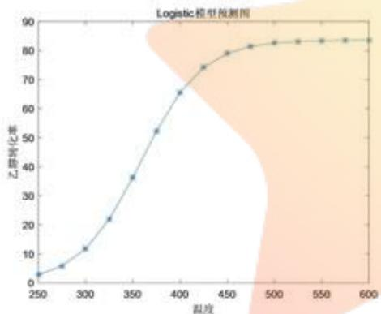

<details>
<summary>line</summary>

| 温度 | 乙醇转化率 |
| --- | --- |
| 250 | ~3 |
| 275 | ~6 |
| 300 | ~12 |
| 325 | ~22 |
| 350 | ~37 |
| 375 | ~52 |
| 400 | ~66 |
| 425 | ~74 |
| 450 | ~79 |
| 475 | ~81 |
| 500 | ~83 |
| 525 | ~83 |
| 550 | ~83 |
| 575 | ~84 |
| 600 | ~84 |
</details>

图 2 B1 组的乙醇转化率趋势预测图

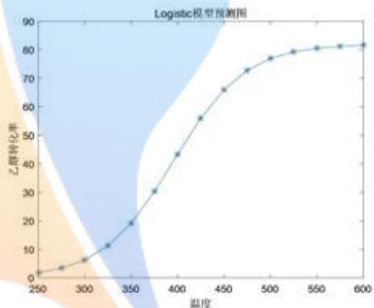

<details>
<summary>line</summary>

| 温度 | 乙醇转化率 |
| --- | --- |
| 250 | ~2 |
| 275 | ~4 |
| 300 | ~6 |
| 325 | ~12 |
| 350 | ~20 |
| 375 | ~31 |
| 400 | ~44 |
| 425 | ~56 |
| 450 | ~66 |
| 475 | ~73 |
| 500 | ~77 |
| 525 | ~80 |
| 550 | ~81 |
| 575 | ~82 |
| 600 | ~82 |
</details>

图 3 A1 组的乙醇转化率趋势预测图

根据拟合所求出的乙醇最大转化率可知，对于不同的催化剂组合，有的组合在实验条件下乙醇的转化率可随温度的升高达到100%，而有的却无法达到，其中乙醇转化率可达100%的催化剂组合如下表：

表 3 乙醇转化率可达 100% 的催化剂组合表

<table><tr><td>装料方式</td><td>催化剂组合</td><td>总数</td></tr><tr><td>装料方式I</td><td>A3, A5, A6, A8, A9, A13, A14</td><td>7</td></tr><tr><td>装料方式II</td><td>B2, B3, B4, B5, B6, B7</td><td>6</td></tr></table>

由上表可知在装料方式Ⅰ下，催化剂组合可使乙醇转化率达100%的占装料方式Ⅰ中总体的50%；在装料方式Ⅱ下，催化剂组合可使乙醇转化率达100%的约占装料方式Ⅱ中总体的85.7%。

则上述表格即为每种催化剂组合中，乙醇转换率与温度的关系。

对每种催化剂组合，乙醇转化率在温度升高的情况下总体呈上涨趋势，但当温度升高到一定程度时乙醇转化速率逐渐降低，最终使乙醇转化率稳定在某一值处，该值即为乙醇转化率的最大值。

由上图可知，乙醇转化率和 C4 烯烃的选择性均随温度的升高而增加，由于催化剂组合的不同，导致变化速率的差异。

## 6.1.1 乙醇转化率与温度的关系

## 6.1.1.1 模型的建立

我们根据数据预处理后的不同催化剂组合的乙醇转化率的数据做出的散点图，可以发现随着温度的上升乙醇转化率均呈上升态势，大多增长速率也随温度的上涨而增加。但由于在化学反应中，反应物转化率最高为100%，且投入的反应物不一定能完全反应，所以我们预测乙醇的转化率随着温度的上涨最终会稳定在某一不大于100%的值上。

因此，我们建立 Logistic 模型对数据进行拟合。

## Setp1 建立指数增长模型

由 Logistic 人口增长模型中，相对增长率=出生率-死亡率可以建立乙醇转化率的增长率模型：

$$
\mathrm{x(T+ΔT)-x(T)=rx(T)ΔT} \tag {2}
$$

其中 $x(T)$ 表示温度为T时的乙醇转化率，r为乙醇转化率的增长率。

经过变形可得：

$$
\frac {\mathrm{dx}}{\mathrm{dt}} = \mathrm{rx}, \mathrm{x(0)} = \mathrm{x_0} \tag {3}
$$

其中 $x_{0}$ 为乙醇转化率的初值。

据此可化简得到乙醇转化率的指数增长模型：

$$
\mathrm{x(T)} = \mathrm{x_0e^{rT}} \tag {4}
$$

## Step2 建立增长率与乙醇转化率的关系式

为了模拟当到达一定温度时乙醇转化速度变慢的情况，我们可以将增长率r视为以乙醇转化率x为自变量的减函数：

$$
\mathrm{r} (\mathrm{x}) = \mathrm{r} - \mathrm{sx} (\mathrm{r}, \mathrm{s} > 0) \tag {5}
$$

当x很小的时候，r为固有增长率，其中s为待定系数。又因为当乙醇转化率达到最大时其转化率可视作0，所以有：

$$
\mathrm{r} (\mathrm{x} _ {\mathrm{m}}) = 0 \tag {6}
$$

其中 $x_{m}$ 为乙醇的最大转化率。

将其代入上式有：

$$
s = \frac {r}{x _ {\mathrm{m}}} \tag {7}
$$

将（7）代入（5）即可得到增长率r与乙醇转化率x的最终关系式：

$$
\mathrm{r} (\mathrm{x}) = \mathrm{r} \left(1 - \frac {\mathrm{x}}{\mathrm{x} _ {\mathrm{m}}}\right) \tag {8}
$$

## Step3 建立 Logistic 增长模型

将（8）代入（4）并化简即可得到所需建立的 Logistic 增长模型：

$$
\mathrm{x} (T) = \frac {\mathrm{x} _ {\mathrm{m}}}{(1 + (\frac {\mathrm{x} _ {\mathrm{m}}}{\mathrm{x} _ {0}} - 1) \mathrm{e} ^ {- r T})} \tag {9}
$$

## 5.1.1.2 结果及分析

将处理过的数据代入上述建立的 Logistic 增长模型，不同催化剂组合在温度变化的情况下拟合得到的方程如下表所示（详见附录 3）：

## 6.1.3 C4 烯烃的选择性与温度的关系

## 6.1.3.1 模型的建立

根据以上的散点图特征，结合温度对化学反应进程的影响作用以及化学反应原理，我们选择最小二乘法对插值后的数据进行一次线性拟合和二次曲线拟合；在化学反应进行到一定程度后，C4烯烃选择性无法预测，因此我们只考虑中间部分散点的拟合。

C4 烯烃选择性随温度变化的一次线性模型：

$$
\mathrm{y} _ {1} = \mathrm{b} _ {1} \mathrm{T} + \mathrm{c} _ {1} \tag {10}
$$

C4 烯烃选择性随温度变化的二次曲线模型：

$$
\mathrm{y} _ {1} = \mathrm{a} _ {2} \mathrm{T} ^ {2} + \mathrm{b} _ {2} \mathrm{T} + \mathrm{c} _ {2} \tag {11}
$$

其中， $y_{1}$ 表示C4烯烃的选择性，T表示温度。

## 6.1.3.2 结果及分析

基于上述两模型，对装料方式Ⅰ下的14种催化剂组合和装料方式Ⅱ下的7种催化剂组合中数据进行回归拟合，运用Matlab软件cftool工具箱求解。

装料方式Ⅰ（14种）、Ⅱ（7种）的C4烯烃选择性与温度关系拟合结果（完整拟合关系式见附录4）：

表 4C4 烯烃选择性与温度关系拟合关系式

<table><tr><td colspan="3">装料方式I</td><td colspan="3">装料方式II</td></tr><tr><td>催化剂组合</td><td>C4烯烃选择性方程</td><td>拟合优度</td><td>催化剂组合</td><td>C4烯烃选择性方程</td><td>拟合优度</td></tr><tr><td>A1</td><td> $y_1 = -0.0021T^2 + 1.422T - 190.8$ </td><td>91.60%</td><td>B1</td><td> $y_1 = 0.0009T^2 - 0.365T + 39.07$ </td><td>99.72%</td></tr><tr><td>A2</td><td> $y_1 = 0.0031T^2 - 1.646T + 234.7$ </td><td>98.03%</td><td>B2</td><td> $y_1 = 0.0010T^2 - 0.403T + 41.33$ </td><td>99.77%</td></tr><tr><td>⋮</td><td>⋮</td><td>⋮</td><td>⋮</td><td>⋮</td><td>⋮</td></tr><tr><td>A14</td><td> $y_1 = 0.0010T^2 - 0.494T + 64.86$ </td><td>99.95%</td><td>B7</td><td> $y_1 = 0.234T - 56.45$ </td><td>98.60%</td></tr></table>

在以上 21 组拟合模型中，拟合优度均大于 90%，甚至有些达到 99% 以上，说明该模型能较好的拟合在 $250^{\circ}C \sim 400^{\circ}C$ 区间内 C4 烯烃选择性与温度的变化关系，证实了模型的准确性。

观察附件 1 中数据，我们发现有 C4 烯烃的选择性随温度升高而降低的情况，列表如下：

表 5 温度升高 C4 烯烃选择性降低的催化剂组合表

<table><tr><td>催化剂组合</td><td>温度/°C</td><td>乙醇转化率(%)</td><td>C4烯烃选择性(%)</td></tr><tr><td rowspan="2">A1</td><td>325</td><td>19.68</td><td>49.7</td></tr><tr><td>350</td><td>36.80</td><td>47.21</td></tr><tr><td rowspan="2">A3</td><td>400</td><td>83.7</td><td>53.43</td></tr><tr><td>450</td><td>86.4</td><td>49.9</td></tr></table>

在以上两个催化剂组合中，当温度继续上升时，乙醇仍在持续转化，而C4烯烃选择性有所降低，说明在达到一定温度时，乙醇不再转化为C4烯烃，而是生成其他产物，不符合本题的目的，因此在此时应停止升温。又由于催化剂各成分的组合不同，导致C4烯烃达到最大选择性的温度也不相同。

## 6.1.4 测试结果与时间的关系

## 6.1.4.1 模型的建立

首先画出测试结果随时间变化的散点图（程序见附录8）如下：

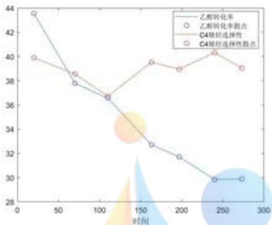

<details>
<summary>line</summary>

| 时间 | 乙醇转化率 | C4烯烃选择性指数 |
| --- | --- | --- |
| ~20 | ~43.5 | ~40.0 |
| ~70 | ~37.8 | ~38.6 |
| ~110 | ~36.6 | ~36.6 |
| ~160 | ~32.7 | ~39.5 |
| ~200 | ~31.7 | ~39.0 |
| ~240 | ~30.0 | ~40.3 |
| ~275 | ~30.0 | ~39.1 |
</details>

图 4 乙醇转化率与 C4 选择性散点图

观察散点图，得到 C4 烯烃选择性在 36%\~41% 之间浮动，可以说明在 350 度时给定的某种催化剂组合下，C4 烯烃选择性与时间的相关性不大；乙醇转化率随时间的增加而降低，最后为一定值，建立分段函数模型，t 表示实验时间，即：

$$
y _ {2} = \left\{ \begin{array}{l l} a _ {3} t ^ {2} + b _ {3} t + c _ {3}, & t <   t ^ {\prime} \\ a, & t \geq t ^ {\prime} \end{array} \right. \tag {12}
$$

## 6.1.4.2 结果及分析

## 乙醇转化率

将附件2中乙醇转化率与时间数据代入Matlab软件cftool工具箱进行求解，得到二次曲线回归函数：

$$
\mathrm{y} _ {2} = 0. 0 0 0 2 \mathrm{t} ^ {2} - 0. 1 0 1 \mathrm{t} + 4 5. 1 \tag {13}
$$

其中，拟合优度 $R^{2}$ 为98.58%，接近于1，认为该模型能较好地反映乙醇转化率与时间的变化关系。

综上，得到分段函数：

$$
y _ {2} = \left\{ \begin{array}{l l} 0. 0 0 0 2 t ^ {2} - 0. 1 0 1 t + 4 5. 1, & t <   2 4 0 \\ 2 9. 9, & t \geq 2 4 0 \end{array} \right. \tag {14}
$$

## C4 烯烃的选择性与其他产物

由于 C4 烯烃选择性与时间之间没有明显的线性或非线性关系，我们考虑对其与其他产物进行统计分析，选择性的分析结果如下：

表 6 反应产物统计分析表

<table><tr><td>产物类型</td><td>均值</td><td>方差</td><td>极差</td></tr><tr><td>C4烯烃</td><td>39.00</td><td>1.37</td><td>3.60</td></tr><tr><td>乙烯</td><td>4.52</td><td>0.04</td><td>0.53</td></tr><tr><td>乙醛</td><td>7.19</td><td>2.13</td><td>3.62</td></tr><tr><td>碳数为4-12脂肪醇</td><td>33.64</td><td>11.94</td><td>8.84</td></tr><tr><td>甲基苯甲醛和甲基苯甲醇</td><td>4.14</td><td>0.55</td><td>2.22</td></tr></table>

由上表的相关统计量可知，C4烯烃的选择性为一随机变量，在本题条件下，不受时间影响。在所有产物中，C4烯烃选择性最大，但方差比较小，说明在36%\~41%区间内，离散程度小；其次为碳数为4-12脂肪醇，但离散程度较大；其余产物含量很小。

## 6.1.5 温度缺失值的预测

在附件1给出的数据中，A1、A2两催化剂组合下，没有375度和400度的相关数据，因此我们基于问题一的logistic回归模型和二次曲线模型进行预测，得到结果：

表 7 预测温度缺失值表

<table><tr><td>催化剂组合</td><td>温度</td><td>乙醇转化率(%)</td><td>C4烯烃选择性(%)</td></tr><tr><td rowspan="2">A1</td><td>375</td><td>52.28</td><td>47.14</td></tr><tr><td>400</td><td>65.54</td><td>42.00</td></tr><tr><td rowspan="2">A2</td><td>375</td><td>72.15</td><td>53.39</td></tr><tr><td>400</td><td>73.66</td><td>72.30</td></tr></table>

## 6.2 问题二的模型建立与求解

## 6.2.1 双因素方差分析模型的建立

方差分析是研究一个(或多个)自变量对一个(或多个)因变量影响的方法[3]。若控制变量对观察变量产生了显著影响,可进一步分析出该控制变量的某一水平对观察变量产生了显著影响。

## a. 试验组设立

建立双因素方差分析数学模型，设温度为因素A，不同的催化剂组合为因素B。温度因素有7个水平 $A_{1}$ ， $A_{2}$ ，…， $A_{7}$ ，催化剂种类因素有14个水平 $B_{1}$ ， $B_{2}$ ，…， $B_{14}$ 。对因素A，B的每一个水平的一组数据 $(A_{i}, B_{j}), (i=1,2,\ldots,7,j=1,2,\ldots,14)$ 只进行一次试验，得到 $L(=7\times14)$ 个试验结果 $X_{ij}$ ，列于下表：

表 8 不同温度、催化剂种类试验的乙醇转化率/C4 烯烃选择性

<table><tr><td>因素A\试验结果B</td><td> $B_{1}$ (A1组)</td><td> $B_{2}$ (A2组)</td><td>...</td><td> $B_{n}$ (B7组)</td></tr><tr><td> $A_{1}$ (250°C)</td><td> $X_{11}$ </td><td> $X_{12}$ </td><td>...</td><td> $X_{1n}$ </td></tr><tr><td> $A_{2}$ (275°C)</td><td> $X_{21}$ </td><td> $X_{22}$ </td><td>...</td><td> $X_{2n}$ </td></tr><tr><td>⋮</td><td>⋮</td><td>⋮</td><td>⋮</td><td>⋮</td></tr><tr><td> $A_{m}$ (400°C)</td><td> $X_{m1}$ </td><td> $X_{m2}$ </td><td>...</td><td> $X_{mn}$ </td></tr></table>

## b.前提假设

检验各个因素样本的均值是否相等，提出原假设为：

$$
\mathrm{H} _ {0 \mathrm{A}}: \mu_ {1 j} = \mu_ {2 j} = \dots = \mu_ {7 j}, j = 1, 2, \dots , 1 4, \tag {15}
$$

$$
\mathrm{H} _ {0 \mathrm{B}}: \mu_ {\mathrm{i} 1} = \mu_ {\mathrm{i} 2} = \dots = \mu_ {\mathrm{i} 1 4}, \mathrm{i} = 1, 2, \dots , 7 。 \tag {16}
$$

备择假设为：

$$
\mathrm{H} _ {1 \mathrm{A}}: \mu_ {1 \mathrm{j}}, \mu_ {2 \mathrm{j}}, \dots , \mu_ {7 \mathrm{j}} \text {不全相等}, \tag {17}
$$

$$
\mathrm{H} _ {1 \mathrm{B}}: \mu_ {\mathrm{i} 1}, \mu_ {\mathrm{i} 2}, \dots , \mu_ {\mathrm{i} 1 4} \text {不全相等。} \tag {18}
$$

## c.因素水平

由附件一原始数据结合三次样条插值，将温度为7个水平，不同催化剂组合分为21个水平，具体见下表：

表 9 因素水平

<table><tr><td>温度</td><td>催化剂组合</td></tr><tr><td>250, 270, 300, 325, 350, 375, 400</td><td>A1, A2, A3, A4, A5, A6, A7, A8, A9, A10, A11, A12, A13, A14, B1, B2, B3, B4, B5, B6, B7</td></tr></table>

## d.构建模型

根据问题情况，双因素控制变量为：温度和不同催化剂种类。根据假设，有 $X_{ij}\sim N(\mu_{ij},\sigma^{2})(\mu_{ij}$ 和 $\sigma^{2}$ 未知），记 $X_{ij}-\mu_{i}=\varepsilon_{ij}$ ，即有 $\varepsilon_{ij}=X_{ij}-\mu_{ij}\sim N(0,\sigma^{2})$ ，故 $X_{ij}-\mu_{ij}$ 可视作随机误差，从而建立如下数学模型：

$$
\left\{ \begin{array}{l} X _ {i j} = \mu_ {i j} + \varepsilon_ {i j}, i = 1, 2, \dots , 7, j = 1, 2, \dots , 1 4 \\ \varepsilon_ {i j} \sim N (0, \sigma^ {2}), \mu_ {i j}, \sigma^ {2} \text {未知}, \varepsilon_ {i j} \text {相互独立} \end{array} \right. \tag {19}
$$

引入以下变量：

$$
\mu = \frac {1}{7 \times 1 4} \sum_ {\mathrm{i} = 1} ^ {7} \sum_ {\mathrm{j} = 1} ^ {1 4} \mu_ {\mathrm{ij}} \tag {20}
$$

$$
\mu_ {\mathrm{i.}} = \frac {1}{1 4} \sum_ {\mathrm{j=1}} ^ {1 4} \mu_ {\mathrm{ij}}, \mathrm{i=1,2,...,7} \tag {21}
$$

$$
\mu_ {j} = \frac {1}{7} \sum_ {i = 1} ^ {7} \mu_ {i j}, j = 1, 2, \dots , 1 4 \tag {22}
$$

$$
\mathrm{a} _ {\mathrm{i}} = \mu_ {\mathrm{i}} - \mu , \mathrm{i} = 1, 2, \dots , 7 \tag {23}
$$

$$
\beta_ {j} = \mu_ {j} - \mu_ {, j = 1, 2, \dots , 1 4} \tag {24}
$$

可知， $\sum_{i=1}^{7}\alpha_{i}=0,\quad\sum_{j=1}^{14}\beta_{j}=0.$ 其中， $\mu$ 为总平均， $\alpha_{i}$ 为温度水平 $A_{i}$ 的效应， $\beta_{j}$ 为不同催化剂种类 $B_{j}$ 的效应，且 $\mu_{ij}=\mu_{ij}+\alpha_{i}+\beta_{j}$

于是，上述模型可写为

$$
\left\{ \begin{array}{l} X _ {i j} = \mu_ {i j} + \varepsilon_ {i j}, i = 1, 2, \dots , 7, j = 1, 2, \dots , 1 4 \\ \varepsilon_ {i j} \sim N (0, o ^ {2}), \mu_ {i j}, o ^ {2} \text {未知}, \varepsilon_ {i j} \text {相互独立} \\ \sum_ {i = 1} ^ {7} a _ {i} = 0, \sum_ {j = 1} ^ {1 4} \beta_ {j} = 0 \end{array} \right. \tag {25}
$$

## 6.2.2 模型的求解

首先，需要对总偏差平方和进行分解处理，有

$$
\overline {{\mathrm{X}}} = \frac {1}{7 \times 1 4} \sum_ {\mathrm{i} = 1} ^ {7} \sum_ {\mathrm{j} = 1} ^ {1 4} \mathrm{X} _ {\mathrm{ij}} \tag {26}
$$

$$
\overline {{\mathrm{X} _ {\mathrm{i}}}} = \frac {1}{1 4} \sum_ {\mathrm{j} = 1} ^ {1 4} \mathrm{X} _ {\mathrm{ij}}, \quad \mathrm{i=1,2,...,7} \tag {27}
$$

$$
\overline {{\mathrm{X} _ {\mathrm{j}}}} = \frac {1}{7} \sum_ {\mathrm{i} = 1} ^ {7} \mathrm{X} _ {\mathrm{ij}}, \quad \mathrm{j=1,2,...,14} \tag {28}
$$

分解总偏差平方和：

$$
S _ {T} = \sum_ {i = 1} ^ {7} \sum_ {j = 1} ^ {1 4} (X _ {i j} - \overline {{X}}) ^ {2}
$$

$$
= \sum_ {i = 1} ^ {7} \sum_ {j = 1} ^ {1 4} [ (\overline {{X _ {i}}} - \overline {{X}}) + (\overline {{X _ {j}}} - \overline {{X}}) + (X _ {i j} - \overline {{X _ {i}}} - \overline {{X _ {j}}} - \overline {{X}}) ] ^ {2} \tag {29}
$$

根据上式，可知 $S_{T}$ 的展开式中三个交叉项的乘积为零，所以有

$$
S _ {T} = S _ {A} + S _ {B} + S _ {E} \tag {30}
$$

其中，

$$
S _ {\mathrm{A}} = \sum_ {\mathrm{i} = 1} ^ {7} \sum_ {\mathrm{j} = 1} ^ {1 4} \left(\mathrm{X} _ {\mathrm{i.}} - \overline {{\mathrm{X}}}\right) ^ {2} = \mathrm{s} \sum_ {\mathrm{i} = 1} ^ {7} \left(\mathrm{X} _ {\mathrm{i.}} - \overline {{\mathrm{X}}}\right) ^ {2} \tag {31}
$$

$$
\mathrm{S} _ {\mathrm{B}} = \sum_ {\mathrm{i} = 1} ^ {7} \sum_ {\mathrm{j} = 1} ^ {1 4} (\mathrm{X} _ {\mathrm{j}} - \overline {{\mathrm{X}}}) ^ {2} = \mathrm{r} \sum_ {\mathrm{i} = 1} ^ {1 4} (\mathrm{X} _ {\mathrm{j}} - \overline {{\mathrm{X}}}) ^ {2} \tag {32}
$$

$$
S _ {\mathrm{E}} = \sum_ {\mathrm{i} = 1} ^ {7} \sum_ {\mathrm{j} = 1} ^ {1 4} (X _ {\mathrm{ij}} - \overline {{X _ {\mathrm{i}}}} - \overline {{X _ {\mathrm{j}}}} - \overline {{X}}) ^ {2} \tag {33}
$$

$S_{E}$ 为误差平方和， $S_{A}$ ， $S_{B}$ 分别为温度因素、不同催化剂种类因素的偏差平方和。

类似易证，当 $H_{0A}$ 、 $H_{0B}$ 成立时， $\frac{S_{A}}{\sigma^{2}}$ ， $\frac{S_{B}}{\sigma^{2}}$ ， $\frac{S_{E}}{\sigma^{2}}$ ， $\frac{S_{T}}{\sigma^{2}}$ 依次服从自由度为r-1,s-1,(r-1)(s-1)的卡方分布，且 $S_{A}$ ， $S_{B}$ ， $S_{E}$ ， $S_{T}$ 相互独立。

## 6.2.3 模型的结果与分析

利用 SPSS 软件进行双因素方差分析（运用 SPSS25 求解具体文件见支撑材料），可得

表 10 方差分析

<table><tr><td>来源</td><td>指标</td><td>平方和</td><td>自由度</td><td>均方和</td><td>F值</td><td>p值</td></tr><tr><td rowspan="2">温度</td><td>乙醇转化率</td><td>43030.439</td><td>6</td><td>7171.740</td><td>124.021</td><td>0.000</td></tr><tr><td>C4烯烃选择性</td><td>13699.242</td><td>6</td><td>2283.207</td><td>84.921</td><td>0.000</td></tr><tr><td rowspan="2">催化剂组合</td><td>乙醇转化率</td><td>26817.274</td><td>20</td><td>1340.864</td><td>23.188</td><td>0.000</td></tr><tr><td>C4烯烃选择性</td><td>12302.377</td><td>20</td><td>615.119</td><td>22.879</td><td>0.000</td></tr><tr><td rowspan="2">误差</td><td>乙醇转化率</td><td>6939.230</td><td>120</td><td>57.827</td><td></td><td></td></tr><tr><td>C4烯烃选择性</td><td>3226.335</td><td>120</td><td>26.886</td><td></td><td></td></tr><tr><td rowspan="2">总和</td><td>乙醇转化率</td><td>76786.943</td><td>146</td><td></td><td></td><td></td></tr><tr><td>C4烯烃选择性</td><td>29227.953</td><td>146</td><td></td><td></td><td></td></tr></table>

由上表，以温度对乙醇转化率的影响为例分析，不同温度对乙醇转化率造成的偏差平方和为43030.439，均方为7171.740；不同催化剂组合对乙醇转化率造成的偏差平方和为26817.274，均方为1340.864。可见，温度水平对乙醇转化率的造成影响要大于不同催化剂组合对乙醇转化率的影响。F值分别为124.021和23.188，对应的p值都是0.000，说明温度和不同催化剂组合对乙醇转化率都有显著影响。

同理，温度和不同催化剂组合对 C4 烯烃选择性也有显著影响，温度水平的造成影响要大于不同催化剂组合造成的影响。

接下来，进一步对各因素中各个水平进行分析。对乙醇转化率、C4烯烃选择性两变量针对温度和不同催化剂组合因素进行多重比较检验（完整变量、因素的检验见支撑材料），乙醇转化率针对温度因素的检验结果见下表：

表 11 多重比较分析表-乙醇转化率针对温度因素（部分）

<table><tr><td>温度I</td><td>温度J</td><td>均值差(I-J)</td><td>均值差的和</td><td>p值</td></tr><tr><td rowspan="5">250</td><td>275</td><td>-3.089524</td><td rowspan="5">-139.0056978</td><td>0.191</td></tr><tr><td>300</td><td>-9.129524</td><td>0.000</td></tr><tr><td> $\vdots$ </td><td> $\vdots$ </td><td> $\vdots$ </td></tr><tr><td>400</td><td>-50.806019</td><td>0</td></tr><tr><td>250</td><td>3.089524</td><td>0.191</td></tr><tr><td rowspan="3">275</td><td>300</td><td>-6.04</td><td rowspan="3">-117.3790312</td><td>0.011</td></tr><tr><td> $\vdots$ </td><td> $\vdots$ </td><td> $\vdots$ </td></tr><tr><td>400</td><td>-47.716495</td><td>0</td></tr><tr><td rowspan="2"> $\vdots$ </td><td> $\vdots$ </td><td> $\vdots$ </td><td rowspan="2"> $\vdots$ </td><td> $\vdots$ </td></tr><tr><td>250</td><td>27.900952</td><td>0</td></tr><tr><td rowspan="3">400</td><td>275</td><td>26.2</td><td rowspan="3">216.636435</td><td>0</td></tr><tr><td> $\vdots$ </td><td> $\vdots$ </td><td> $\vdots$ </td></tr><tr><td>375</td><td>6.458738</td><td>0</td></tr></table>

多重比较检验分别对7个温度水平下的观测变量均值进行逐对比较，判断两变量均值之间是否存在显著差异。由表11可知，温度在400℃时，均值比其他6中温度都要大，且经检验的p值均为0，说明400℃的乙醇转化率显著高于其他6种，可认为此温度下的乙醇转化率为最优。

由此可得，不同温度对乙醇转化率和 C4 烯烃的选择性大小的影响为：在所给数据中，温度越高，乙醇转化率和 C4 烯烃的选择性越高，400℃时乙醇转化率和 C4 烯烃的选择性达到最大。结合第一问拟合数据，随着温度的升高，最终乙醇转化率和 C4 烯烃的选择性将达到平稳状态。

不同催化剂组合对乙醇转化率和 C4 烯烃选择性的关系确定方法同上, 影响力表如下:

表 12 不同催化剂组合对乙醇转化率和 C4 烯烃选择性的影响大小排序

<table><tr><td colspan="6">乙醇转化率</td><td colspan="6">C4烯烃选择性</td></tr><tr><td>排序</td><td>组别</td><td>均值差之和</td><td>排序</td><td>组别</td><td>均值差之和</td><td>排序</td><td>组别</td><td>均值差之和</td><td>排序</td><td>组别</td><td>均值差之和</td></tr><tr><td>1</td><td>A7</td><td>506.81</td><td>12</td><td>A12</td><td>-157.09</td><td>1</td><td>A1</td><td>531.83</td><td>12</td><td>A5</td><td>-33.91</td></tr><tr><td>2</td><td>A2</td><td>478.59</td><td>13</td><td>B1</td><td>-166.01</td><td>2</td><td>A2</td><td>369.56</td><td>13</td><td>B6</td><td>-39.28</td></tr><tr><td>3</td><td>A4</td><td>433.42</td><td>14</td><td>B2</td><td>-178.31</td><td>3</td><td>A3</td><td>197.80</td><td>14</td><td>A7</td><td>-46.95</td></tr><tr><td>4</td><td>A6</td><td>391.31</td><td>15</td><td>B5</td><td>-186.89</td><td>4</td><td>A9</td><td>114.54</td><td>15</td><td>A6</td><td>-103.53</td></tr><tr><td>5</td><td>A3</td><td>364.50</td><td>16</td><td>A9</td><td>-227.36</td><td>5</td><td>A4</td><td>70.25</td><td>16</td><td>B5</td><td>-112.18</td></tr><tr><td>6</td><td>A5</td><td>206.91</td><td>17</td><td>A13</td><td>-228.11</td><td>6</td><td>A8</td><td>62.25</td><td>17</td><td>B3</td><td>-142.23</td></tr><tr><td>7</td><td>A1</td><td>77.79</td><td>18</td><td>B4</td><td>-301.03</td><td>7</td><td>B1</td><td>57.06</td><td>18</td><td>B4</td><td>-145.00</td></tr><tr><td>8</td><td>B7</td><td>54.79</td><td>19</td><td>A11</td><td>-321.94</td><td>8</td><td>B7</td><td>30.56</td><td>19</td><td>A14</td><td>-189.81</td></tr><tr><td>9</td><td>A8</td><td>29.14</td><td>20</td><td>A10</td><td>-328.76</td><td>9</td><td>A12</td><td>6.47</td><td>20</td><td>A10</td><td>-298.53</td></tr><tr><td>10</td><td>B6</td><td>6.66</td><td>21</td><td>B3</td><td>-383.27</td><td>10</td><td>B2</td><td>-5.16</td><td>21</td><td>A11</td><td>-309.03</td></tr><tr><td>11</td><td>A14</td><td>-71.14</td><td>/</td><td>/</td><td>/</td><td>11</td><td>A13</td><td>-14.70</td><td>/</td><td>/</td><td>/</td></tr></table>

在乙醇转化率方面，最优催化剂组合为A7组，最差为B3组；在C4烯烃选择性方面，最优催化剂组合为A1组，最差为A11组。

## 6.3 问题三模型的建立和求解

本题要找出最优的催化剂和温度组合，使得C4烯烃收率达到最大。我们考虑将原有催化剂组合中各个因素分开讨论，与温度一起作为自变量，找出他们与C4烯烃收率的函数关系，最后找出因变量的极大值点，即为C4烯烃的最高收率。

## 6.3.1 C4烯烃收率的拟合模型

## Step1 装料方式 I

将催化剂组合分开后，可以得到 Co/SiO2 的质量、HAP 质量、Co 负载量、每分钟乙醇加入量，四个自变量，分别为 $x_{1}$ 、 $x_{2}$ 、 $x_{3}$ 、 $x_{4}$ ，温度 T 为第五个自变量，再根据公式：

$$
\mathrm{C4} \text {烯烃收率} = \text {乙醇转化率} \times \mathrm{C4} \text {烯烃的选择性}
$$

计算出 C4 烯烃收率，作为因变量 y，运用 Matlab 软件，拟合出装料方式 I 的五元二次函数如下：

$$
\begin{array}{l} y = 1 1 7 8 7 - 2 7. 7 x _ {1} - 7 7. 5 T - 1 7 2. 8 x _ {3} ^ {2} + 0. 1 T ^ {2} \\ + 3. 7 x _ {2} x _ {4} + 0. 1 x _ {1} T - 3. 1 x _ {4} T + 4 8 2. 4 x _ {3} x _ {4} \tag {34} \\ \end{array}
$$

该函数拟合优度为90.16%，接近于1，说明上述五元二次函数能较好地反映C4烯烃收率与各个因素之间的关系，可以用于计算最高收率。

## Step2 装料方式Ⅱ

在装料方式Ⅱ的催化剂组合中，Co/SiO2的质量和HAP的质量全部相等，则作为一个自变量 $x_{1}$ ，Co负载量均为1wt%，不会对C4烯烃收率产生影响，则不作为自变量，每分钟乙醇加入量与温度仍为自变量 $x_{4}$ 和T，同理拟合出三元二次函数如下：

$$
y = 1 0 2 3 8 - 3 3. 5 x _ {1} - 6 4. 7 T + 0. 1 T ^ {2} + 0. 1 x _ {1} T - 0. 7 x _ {4} T \tag {35}
$$

该函数拟合优度为90.78%，效果较好。

## 6.3.2 C4 烯烃收率的优化模型

利用上述拟合函数（34），我们可以建立单目标规划模型，来获得最高的C4烯烃收率。

1）决策变量：C4烯烃收率拟合函数的自变量 $x_{1}$ 、 $x_{2}$ 、 $x_{3}$ 、 $x_{4}$ 、 $T$  
2）目标函数：获得最高的C4烯烃收率：

$$
\begin{array}{l} \max y = 1 1 7 8 7 - 2 7. 7 x _ {1} - 7 7. 5 T - 1 7 2. 8 x _ {3} ^ {2} + 0. 1 T ^ {2} \\ + 3. 7 x _ {2} x _ {4} + 0. 1 x _ {1} T - 3. 1 x _ {4} T + 4 8 2. 4 x _ {3} x _ {4} \tag {36} \\ \end{array}
$$

3）约束条件：5个自变量取值的范围不超过原有催化剂组合中的最大范围。

①Co/SiO2的质量约束：

$$
3 3 \leq x _ {1} \leq 2 0 0 \tag {37}
$$

②HAP 的质量约束:

$$
3 3 \leq x _ {2} \leq 2 0 0 \tag {38}
$$

③Co 负载量约束:

$$
0. 5 \leq x _ {3} \leq 5 \tag {39}
$$

④每分钟乙醇加入量约束：

$$
0. 3 \leq x _ {4} \leq 2. 1 \tag {40}
$$

⑤温度约束：

$$
2 5 0 \leq \mathrm{T} \leq 4 0 0 \tag {41}
$$

综上所述，对 C4 烯烃收率建立优化模型如下：

$$
m a x y = 1 1 7 8 7 - 2 7. 7 x _ {1} - 7 7. 5 T - 1 7 2. 8 x _ {3} ^ {2} + 0. 1 T ^ {2}
$$

$$
+ 3. 7 x _ {2} x _ {4} + 0. 1 x _ {1} T - 3. 1 x _ {4} T + 4 8 2. 4 x _ {3} x _ {4}
$$

$$
\text {s.t.} \left\{ \begin{array}{l} 3 3 \leq \mathrm{x} _ {1} \leq 2 0 0 \\ 3 3 \leq \mathrm{x} _ {2} \leq 2 0 0 \\ 0. 5 \leq \mathrm{x} _ {3} \leq 5 \\ 0. 3 \leq \mathrm{x} _ {4} \leq 2. 1 \\ 2 5 0 \leq \mathrm{T} \leq 4 0 0 \end{array} \right. \tag {42}
$$

## 6.3.3 350 度以下 C4 烯烃收率的优化模型

为了获得 350 度以下的催化剂温度组合，只需在上述优化模型的基础上，改变温度约束为：

$$
2 5 0 \leq \mathrm{T} \leq 3 5 0 \tag {43}
$$

同理获得温度低于 350 度下的 C4 烯烃收率优化模型：

$$
m a x \quad y = 1 1 7 8 7 - 2 7. 7 x _ {1} - 7 7. 5 T - 1 7 2. 8 x _ {3} ^ {2} + 0. 1 T ^ {2}
$$

$$
+ 3. 7 x _ {2} x _ {4} + 0. 1 x _ {1} T - 3. 1 x _ {4} T + 4 8 2. 4 x _ {3} x _ {4}
$$

$$
\text {s.t.} \left\{ \begin{array}{l} 3 3 \leq \mathrm{x} _ {1} \leq 2 0 0 \\ 3 3 \leq \mathrm{x} _ {2} \leq 2 0 0 \\ 0. 5 \leq \mathrm{x} _ {3} \leq 5 \\ 0. 3 \leq \mathrm{x} _ {4} \leq 2. 1 \\ 2 5 0 \leq \mathrm{T} \leq 3 5 0 \end{array} \right. \tag {44}
$$

## 6.3.4 结果的对比分析

在装料方式Ⅱ中，寻找 C4 烯烃收率最大值的方法与以上模型原理相同，我们在这里不再赘述，用 Matlab 软件对以上模型进行求解，得到结果如下表所示：

表 13 规划结果表

<table><tr><td rowspan="2">变量\数据\温度\温度</td><td colspan="2">装料方式I</td><td colspan="2">装料方式II</td></tr><tr><td>全部温度</td><td>350以下温度</td><td>全部温度</td><td>350以下温度</td></tr><tr><td>Co/SiO2的质量</td><td>167.625</td><td>200</td><td>96.67</td><td>100</td></tr><tr><td>HAP的质量</td><td>200</td><td>200</td><td>100</td><td>100</td></tr><tr><td>Co负载量</td><td>1.96</td><td>1.67</td><td>1</td><td>1</td></tr><tr><td>每分钟乙醇加入量</td><td>0.85</td><td>1.57</td><td>0.93</td><td>1.22</td></tr><tr><td>温度</td><td>400</td><td>349</td><td>400</td><td>349</td></tr><tr><td>C4烯烃收率</td><td>5719</td><td>4648</td><td>3491</td><td>1000</td></tr></table>

由上表数据，温度越高，C4 烯烃收率越大，故温度都是该条件下能达到的最高温度。Co/SiO2 质量和 HAP 质量之比近似为 1:1，说明在这一配料比下，C4 烯烃收率较大。对比观察装料方式 I 和装料方式 II，I 中 C4 烯烃收率均高于 II，那么我们知道，方式 I 的收率极限值更大。

## 6.3.5 结果的检验

根据上表结果，可以发现在使 C4 烯烃收率达到最高时，Co/SiO2 和 HAP 的装料比均为 1:1，因此我们对 Co/SiO2 和 HAP 的比例进行作图分析，对比 Co/SiO2:HAP=1:1、2:1、1:2 时，350 度下的 C4 烯烃选择性。

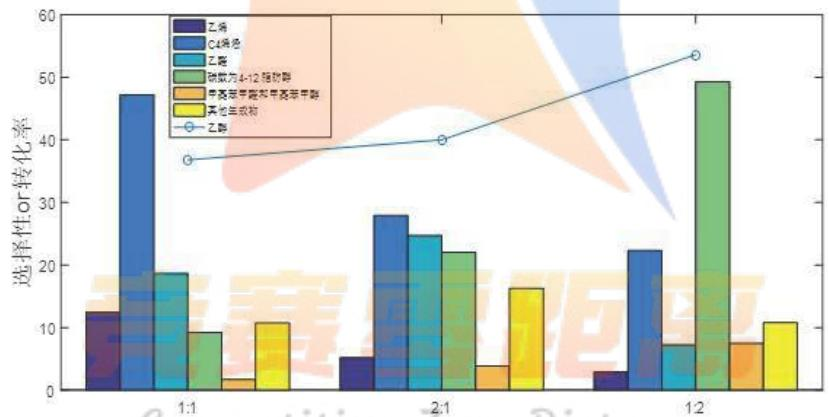

<details>
<summary>bar_line</summary>

| Category | 乙腈 | C4烯烃 | 乙醛 | 硫酸为4-12缩放醇 | 甲基苯甲醛和甲基苯甲醛 | 其他合成物 | 乙醛 (Line) |
| --- | --- | --- | --- | --- | --- | --- | --- |
| 1:1 | ~13 | ~47 | ~19 | ~9 | ~2 | ~11 | ~37 |
| 2:1 | ~5 | ~28 | ~25 | ~22 | ~4 | ~16 | ~40 |
| 1:2 | ~3 | ~23 | ~7 | ~49 | ~8 | ~11 | ~54 |
</details>

图 5 不同催化剂投料比与选择性和转化率柱状图

观察上图，得到在 Co/SiO2: HAP=1:1 时，C4 烯烃选择性最高；在 Co/SiO2: HAP=1:2 时，C4 烯烃选择性最低，与 6.3.4 的结论相符，也从侧面检验了我们模型的正确性。

## 6.4 问题四的分析解决

## 6.4.1 增加实验 1

基于 6.3.4 优化模型求出的 C4 烯烃的收率最大值，我们设计一组实验，来验证优化模型的准确性，增加装料方式 I 中的催化剂组合为 33mg 5wt%Co/SiO2+

33mgHAP-乙醇浓度 0.3ml/min，温度在 375 度，实验分别测量这一条件下乙醇转化率和 C4 烯烃选择性，继而求得 C4 烯烃的收率，与模型中的结果进行比较，以检验其是否准确。

## 6.4.2 增加实验 2

根据问题二的方差分析原理，建立方差分析模型，探究不同催化剂组合与温度对烯烃收率的影响。温度越高，烯烃收率越高，在 $400^{\circ}\mathrm{C}$ 时达到温度最优；催化剂组合影响力大小排序如下表：

表 14 催化剂组合对烯烃收率的影响力大小

<table><tr><td>排序</td><td>组别</td><td>均值差之和</td><td>排序</td><td>组别</td><td>均值差之和</td></tr><tr><td>1</td><td>A2</td><td>29871.27</td><td>12</td><td>A9</td><td>-4267.43</td></tr><tr><td>2</td><td>A3</td><td>18357.35</td><td>13</td><td>A12</td><td>-4454.00</td></tr><tr><td>3</td><td>A4</td><td>13481.36</td><td>14</td><td>B2</td><td>-4628.11</td></tr><tr><td>4</td><td>A1</td><td>12538.42</td><td>15</td><td>A13</td><td>-7167.78</td></tr><tr><td>5</td><td>A7</td><td>5669.26</td><td>16</td><td>A14</td><td>-7636.73</td></tr><tr><td>6</td><td>A6</td><td>2887.66</td><td>17</td><td>B5</td><td>-7882.61</td></tr><tr><td>7</td><td>A5</td><td>2730.45</td><td>18</td><td>B4</td><td>-10562.74</td></tr><tr><td>8</td><td>B7</td><td>2269.73</td><td>19</td><td>B3</td><td>-11827.19</td></tr><tr><td>9</td><td>A8</td><td>1658.44</td><td>20</td><td>A10</td><td>-12929.70</td></tr><tr><td>10</td><td>B6</td><td>-1783.26</td><td>21</td><td>A11</td><td>-12996.47</td></tr><tr><td>11</td><td>B1</td><td>-3327.95</td><td>/</td><td>/</td><td>/</td></tr></table>

由表可知，A2组催化剂的影响力最大，且在 $400^{\circ}\mathrm{C}$ 时达到温度最优。但经数据比对，我们发现题目所给出的数据中没有A2组在 $400^{\circ}\mathrm{C}$ 的实验组，因此我们设计增加催化剂A2组在 $400^{\circ}\mathrm{C}$ 时的实验测试，用于验证方差分析模型中，此条件因素下烯烃收率为最优值。

## 6.4.3 增加实验 3

根据 6.1.4 做出的乙醇转化率随时间变化的散点图我们可以得知在乙醇转化率随时间的增大而减小，且最终稳定在 29.9。我们又求出当 350 度时不同时间 C4 烯烃收率并作散点图，散点图如下所示：

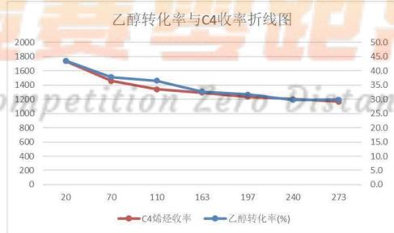

<details>
<summary>line</summary>

| X | C4烯烃收率 | 乙醇转化率(%) |
| --- | --- | --- |
| 20 | ~1750 | ~43.0 |
| 70 | ~1450 | ~38.0 |
| 110 | ~1350 | ~36.0 |
| 163 | ~1300 | ~32.0 |
| 197 | ~1250 | ~31.0 |
| 240 | ~1200 | ~30.0 |
| 273 | ~1200 | ~30.0 |
</details>

图 6 乙醇转化率与 C4 收率折线图

由图可以发现在此实验条件下，C4烯烃收率与乙醇转化率随时间变化趋势相同，都随时间的增大而减少。

又因为当化学反应开始发生时，反应物的转化率一定从0开始增大，而附件二中所给数据当时间处于[20，273]区间时，乙醇转化率却是下降的，因此我们可以推断在时间区间[0, 20]之间一定有一时间点使乙醇转化率达到最大值。根据上文所作图得到的C4烯烃收率变化趋势，我们可以预测在乙醇转化率达到最大值的时刻也能使C4烯烃收率达到最大值。

所以我们可以新增一实验——测量计算在350度时给定的此种催化剂组合在0\~20min内乙醇转化率的大小变化与同时刻C4烯烃选择性，找出使乙醇转化率最大的时间点，求出C4烯烃的收率。

## 6.4.4 增加实验 4

在 A11 催化剂组合中, 有 90mg 石英砂, 但其他催化剂组合中, 并没有 90mgHAP 这一催化剂成分, 无法控制单一变量, 比较石英砂和 HAP 的催化效果优劣。于是根据控制单一变量的原则, 我们设计一组实验, 催化剂组合为: 50mg 1wt%Co/SiO2+ 90mgHAP-乙醇浓度 1.68ml/min。

由于 HAP 主要来源于脊柱动物的骨骼和牙齿，而开采石英砂的石英矿在全国广泛分布，显然成本要比 HAP 低。那么根据我们增加的实验，验证能否用石英砂来代替 HAP 做乙醇偶合制备 C4 烯烃的催化剂，将会大大减小催化剂成本，说明该实验有很强的现实意义。

## 6.4.5 增加实验 5

根据附件一种所给的数据，我们可以找出两组催化剂组合相同但装料方式不同的组合，分别为 A12 与 B1 和 A9 与 B5。下面用 Excel 对这两个组合的数据进行统计分析：

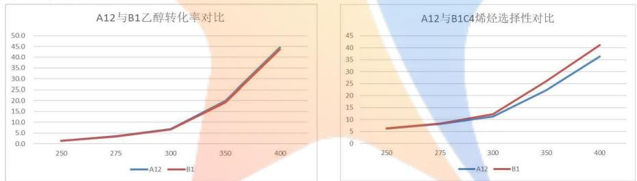

图 7 A12 与 B1 对比图  
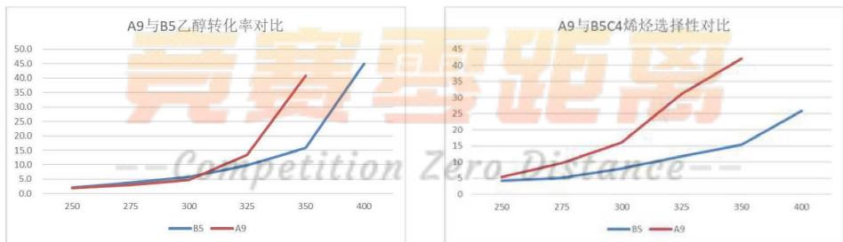  
图 8 A9 与 B5 对比图

由上图可知，相同催化剂组合A12与B1在装料方式不同的情况下，随着温度的上升B1的C4烯烃选择性略高于A12的C4烯烃选择性，乙醇转化率、C4烯烃选择性并无太大差别。但是在催化剂组合A9与B5中，A9的乙醇转化率和c4烯烃选择性明显优于B5，说明了装料方式对实验产生的影响。

在本题中，可以增加催化剂组合相同，但装料方式不同的实验，分析比较哪种装料方式更有助于 C4 烯烃的制备，以确保更好的达到实验目的。

## 七、模型的评价与推广

## 7.1 模型的优点

1、本文首先用三次样条插值法对数据进行插值补全，增加数据点，提高了回归拟合模型的准确性。  
2、对乙醇转化率与温度关系建立 logistic 模型，符合乙醇转化率增长的特点，能较好的预测后面的数据。  
3、本文做了大量的图表来统计分析数据特点，更加直观地对比了不同催化剂组合、温度下的数据特点。  
4、我们采用双因素方差分析的方法，既可以分析两因素的独立作用，又可以分析他们之间的交互作用。

## 7.2 模型的缺点

1、一次线性、二次曲线模型只能描述短期内 C4 烯烃选择性随温度变化的关系，在远处并不适用。  
2、没有对除 C4 烯烃外其他产物做相应的统计分析。

## 7.3 模型的改进

本文应该对除 C4 烯烃外其他产物的数据进行挖掘，考虑到其他产物的价格、是否有害等因素，做出进一步的分析。

## 7.4 模型的推广

本文主要建立的双因素方差分析模型适用范围广泛，对研究一个因素对另一个因素的影响问题有一定的参考价值，适宜推广到商品的销售、水果的生长环境等相关研究工作中。以及本文所建立的Logistic增长模型简单易懂，实用性强，适合推广到化学化工实验、人口增长预测、生物种群预测等相关问题中去。

## 八、参考文献

[1] 乙醇偶合制备丁醇及 C4 烯烃. 吕绍沛. 大连理工大学. 2018  
[2] 一类 Guerbet 反应选择性的数学建模研究. 郑明煊 江新华. 北京化工大学. 2018  
[3] 张玲．单因素及双因素方差分析及检验的原理及统计应用 [J]. 数学学习与研究，2010，07:94-96.

## 附录

## 附录说明：

1. 数据可视化散点图  
2. Logistic 增长模型预测图  
3. Logistic 拟合表  
4. C4 烯烃选择性拟合方程表  
5. 三次样条插值程序  
6. 数据可视化程序  
7. 拟合催化剂组合 A1 的 Logistic 方程程序  
8. 附件2散点图和乙醇转化率方程拟合  
9.拟合五元二次方程程序  
10.拟合函数最大值求解程序  
11.做柱状图程序

附录1  
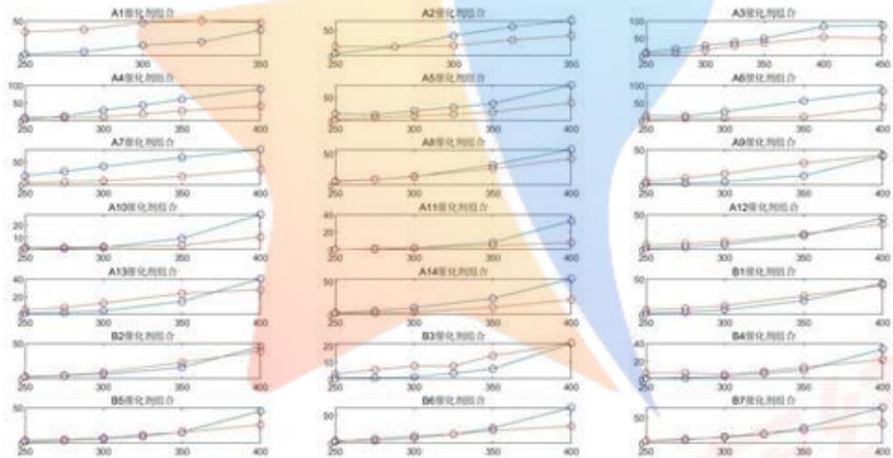  
附录2

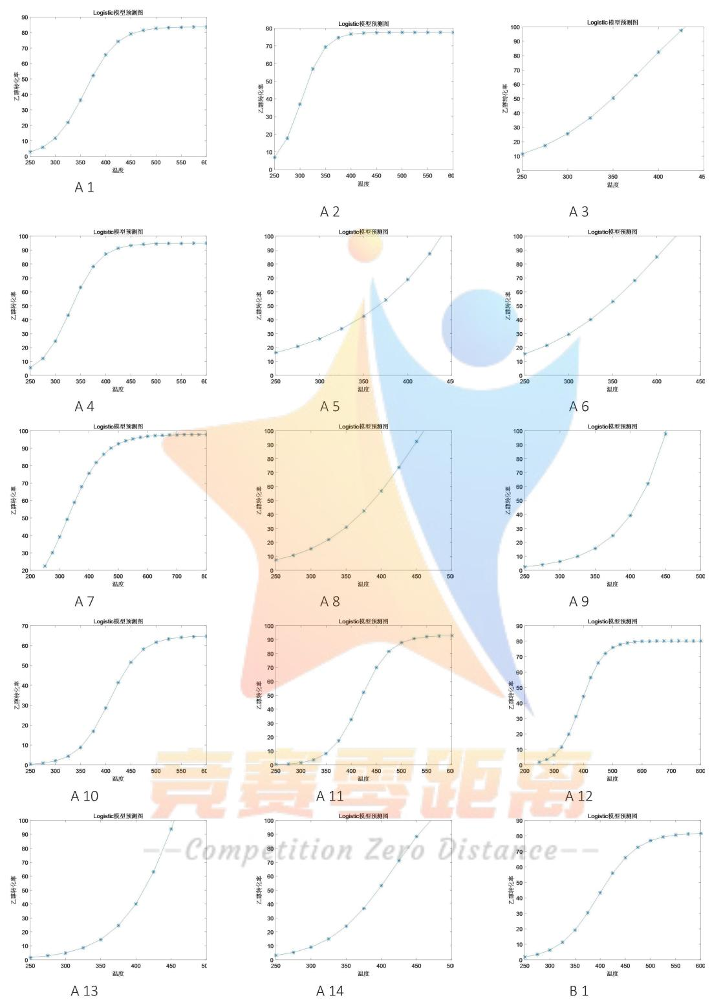

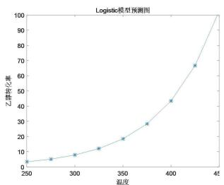

<details>
<summary>line</summary>

| 温度 | 乙醇转化率 |
| --- | --- |
| 250 | ~4 |
| 275 | ~6 |
| 300 | ~9 |
| 325 | ~12 |
| 350 | ~19 |
| 375 | ~29 |
| 400 | ~44 |
| 425 | ~67 |
| 450 | 100 |
</details>

B 2

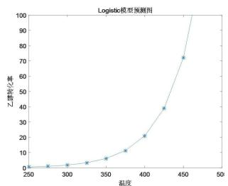

<details>
<summary>line</summary>

| 温度 | 乙醇转化率 |
| --- | --- |
| ~275 | ~1 |
| ~300 | ~2 |
| ~325 | ~4 |
| ~350 | ~6 |
| ~375 | ~11 |
| ~400 | ~21 |
| ~425 | ~39 |
| ~450 | ~72 |
</details>

B 3

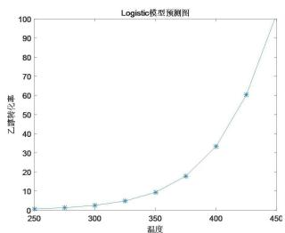

<details>
<summary>line</summary>

| 温度 | 乙醇转化率 |
| --- | --- |
| 250 | ~1 |
| 275 | ~2 |
| 300 | ~3 |
| 325 | ~5 |
| 350 | ~9 |
| 375 | ~18 |
| 400 | ~34 |
| 425 | ~61 |
| 450 | 100 |
</details>

B 4

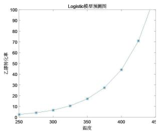

<details>
<summary>line</summary>

| 温度 | 乙醇转化率 |
| --- | --- |
| 250 | ~3 |
| 275 | ~5 |
| 300 | ~7 |
| 325 | ~11 |
| 350 | ~18 |
| 375 | ~28 |
| 400 | ~45 |
| 425 | ~72 |
</details>

B 5

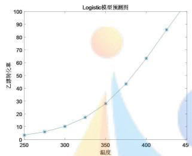

<details>
<summary>line</summary>

| 温度 | 乙烯转化率 |
| --- | --- |
| 250 | ~4 |
| 275 | ~6 |
| 300 | ~11 |
| 325 | ~18 |
| 350 | ~29 |
| 375 | ~44 |
| 400 | ~64 |
| 425 | ~86 |
</details>

B6

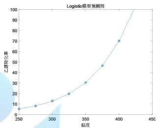

<details>
<summary>line</summary>

| 温度 | 乙醇转化率 |
| --- | --- |
| 250 | ~6 |
| 275 | ~9 |
| 300 | ~13 |
| 325 | ~20 |
| 350 | ~31 |
| 375 | ~47 |
| 400 | ~71 |
</details>

B 7

附录 3

<table><tr><td>催化剂组合</td><td>乙醇转化率 Logistic 方程</td><td>催化剂组合</td><td>乙醇转化率 Logistic 方程</td></tr><tr><td>A1</td><td> $x(t) = \frac{83.6511}{(1 + (\frac{83.6511}{2.07} - 1)e^{-0.031t})}$ </td><td>A8</td><td> $x(t) = \frac{193.8208}{(1 + (\frac{193.8208}{6.3} - 1)e^{-0.0157t})}$ </td></tr><tr><td>A2</td><td> $x(t) = \frac{74.3814}{(1 + (\frac{74.3814}{4.6} - 1)e^{-0.0459t})}$ </td><td>A9</td><td> $x(t) = \frac{327800}{(1 + (\frac{327800}{2.1} - 1)e^{-0.0183t})}$ </td></tr><tr><td>A3</td><td> $x(t) = \frac{142.5954}{(1 + (\frac{142.5954}{9.7} - 1)e^{-0.0183t})}$ </td><td>A10</td><td> $x(t) = \frac{64.8473}{(1 + (\frac{64.8473}{0.3} - 1)e^{-0.0321t})}$ </td></tr><tr><td>A4</td><td> $x(t) = \frac{94.8479}{(1 + (\frac{94.8479}{4} - 1)e^{-0.0346t})}$ </td><td>A11</td><td> $x(t) = \frac{93.0086}{(1 + (\frac{93.0086}{0.2} - 1)e^{-0.0345t})}$ </td></tr><tr><td>A5</td><td> $x(t) = \frac{656050}{(1 + (\frac{656050}{14.8} - 1)e^{-0.0096t})}$ </td><td>A12</td><td> $x(t) = \frac{80.1882}{(1 + (\frac{80.1882}{1.4} - 1)e^{-0.0265t})}$ </td></tr><tr><td>A6</td><td> $x(t) = \frac{188.0317}{(1 + (\frac{188.0317}{13.4} - 1)e^{-0.0148t})}$ </td><td>A13</td><td> $x(t) = \frac{263.0618}{(1 + (\frac{263.0618}{1.3} - 1)e^{-0.0224t})}$ </td></tr><tr><td>A7</td><td> $x(t) = \frac{97.9227}{(1 + (\frac{97.9227}{19.7} - 1)e^{-0.0162t})}$ </td><td>A14</td><td> $x(t) = \frac{130.7842}{(1 + (\frac{130.7842}{2.5} - 1)e^{-0.0223t})}$ </td></tr></table>

附录4

<table><tr><td>催化剂组合编号</td><td>C4 烯烃选择性方程</td><td>拟合优度</td></tr><tr><td>A1</td><td> $y_{2} = -0.0021T^{2} + 1.422T - 190.8$ </td><td>91.60%</td></tr><tr><td>A2</td><td> $y_{2} = 0.0031T^{2} - 1.646T + 234.7$ </td><td>98.03%</td></tr><tr><td>A3</td><td> $y_{2} = 0.335T - 81.36$ </td><td>98.49%</td></tr><tr><td>A4</td><td> $y_{2} = 0.232T - 53.9$ </td><td>93.08%</td></tr><tr><td>A5</td><td> $y_{2} = 0.224T - 56.22$ </td><td>94.41%</td></tr><tr><td>A6</td><td> $y_{2} = 0.0023T^{2} - 1.301T + 188.5$ </td><td>93.58%</td></tr><tr><td>A7</td><td> $y_{2} = 0.186T - 44.54$ </td><td>93.19%</td></tr><tr><td>A8</td><td> $y_{2} = 0.241T - 57.07$ </td><td>98.31%</td></tr><tr><td>A9</td><td> $y_{2} = 0.258T - 60.21$ </td><td>99.46%</td></tr><tr><td>A10</td><td> $y_{2} = 0.0007T^{2} - 0.397T + 59.04$ </td><td>96.46%</td></tr><tr><td>A11</td><td> $y_{2} = 0.052T - 13.31$ </td><td>97.68%</td></tr><tr><td>A12</td><td> $y_{2} = 0.205T - 48.21$ </td><td>96.36%</td></tr><tr><td>A13</td><td> $y_{2} = 0.168T - 37.09$ </td><td>97.55%</td></tr><tr><td>A14</td><td> $y_{2} = 0.0010T^{2} - 0.506T + 66.61$ </td><td>99.90%</td></tr></table>

<table><tr><td>催化剂组合编号</td><td>C4烯烃选择性方程</td><td>拟合优度</td></tr><tr><td>B1</td><td> $y_2 = 0.242T - 57.65$ </td><td>97.01%</td></tr><tr><td>B2</td><td> $y_2 = 0.245T - 61.74$ </td><td>96.89%</td></tr><tr><td>B3</td><td> $y_2 = 0.0005T^2 - 0.178T + 17.5$ </td><td>94.26%</td></tr><tr><td>B4</td><td> $y_2 = 0.0010T^2 - 0.544T + 79.89$ </td><td>97.22%</td></tr><tr><td>B5</td><td> $y_2 = 0.145T - 34.15$ </td><td>96.14%</td></tr><tr><td>B6</td><td> $y_2 = 0.195T - 46.91$ </td><td>96.93%</td></tr><tr><td>B7</td><td> $y_2 = 0.236T - 57.21$ </td><td>99.02%</td></tr></table>

## 附录 5

本文代码使用的软件是 MatlabR2018b

```matlab
乙醇转化率的三次样条插值:
x1 =[250,275,300,325,350];x2=[250,275,300,325,350,400];
x3=[250,275,300,350,400];x4=[250,275,300,325,350,400];
y1 = Y(1:5,1)'; y2=Y(1:5,2)';
new_x =250:25:400;
p1=[];
p1 = [p1,spline(x1,y1,new_x)];
p1 = [p1,spline(x1,y2,new_x)'];%三次样条插值
for i=3:5
    yi=Y(:,i)';
    p1 = [p1,spline(x2,yi,new_x)];
end
```

```matlab
for i=6:16
    yi= Y(1:5,i)';
    p1 = [p1,spline(x3,yi,new_x)'];
end
for i=17:21
    yi= Y(:,i)';
    p1 = [p1,spline(x4,yi,new_x)'];
end
C4 烯烃选择性三次样条插值:
x1 =[250,275,300,325,350];x2=[250,275,300,325,350,400];
x3=[250,275,300,350,400];x4=[250,275,300,325,350,400];
y1 = X(1:5,1)'; y2=X(1:5,2)';
new_x =250:25:400;
p2=[];
p2 = [p2,spline(x1,y1,new_x)'];
p2 = [p2,spline(x1,y2,new_x)'];%三次样条插值
for i=3:5
    yi=X(:,i)';
    p2 = [p2,spline(x2,yi,new_x)'];
end
for i=6:16
    yi= X(1:5,i)';
    p2 = [p2,spline(x3,yi,new_x)'];
end
for i=17:21
    yi= X(:,i)';
    p2 = [p2,spline(x4,yi,new_x)'];
end
```

附录6  
```matlab
%数据可视化
data=xlsread('C:\Users\HD\D)
subplot(7,3,1)
y11=data(1:5,2);
y12=data(1:5,4);
x1=data(1:5,1);
plot(x1,y11)
hold on;scatter(x1,y11,'b')
hold on;plot(x1,y12)
hold on;scatter(x1,y12,'r')
title('A1 催化剂组合')
subplot(7,3,2)
y21=data(6:10,2);
y22=data(6:10,4);
x2=data(6:10,1);
```

```txt
16. plot(x2,y21)
17. hold on;scatter(x2,y21,'b')
18. hold on;plot(x2,y22)
19. hold on;scatter(x2,y22,'r')
20. title('A2 催化剂组合')
21. %后面同理
```

附录7  
```matlab
拟合催化剂组合A1的Logistic方程（剩余20组催化剂组合同理）：
function g = population(x,t,pt)
g = x(1)./(1+(x(1)/2.07-1)*exp(-x(2)*t));
end
t = [250,275,300,325,350];
p = p1(:,1)';%乙醇转化率
t = t-240;
x0 = [150,0.15];
x=lsqcurvefit('population',x0,t,p)%使用函数求得最终的（xm, r）
p01 = population(x,t,pt);
plot(t+240,p,'o',t+240,p01,'-r*')
title('Logistic 模型拟合图')
xlabel('温度');
ylabel('乙醇转化率');
legend('实际数据','理论数据')
作趋势预测图像:
t1=250:25:600;
p02= population(x,t1-240,pt);
plot(t1,p02,'*-')
title('Logistic 模型预测图')
xlabel('温度');
ylabel('乙醇转化率');
```

附录8  
```matlab
%附件 2 散点图
data=xlsread('C:\Users\HD\Desktop\B\附件 2.xlsx');
x=data(:,1);
y1=data(:,2);
y2=data(:,4);
plot(x,y1)
hold on;scatter(x,y1,'b')
hold on;plot(x,y2)
hold on;scatter(x,y2,'r')
xlabel('时间');
legend('乙醇转化率','乙醇转化率散点','C4 烯烃选择性','C4 烯烃选择性散点')
```

```matlab
%cftool 工具箱求二次曲线
function [fitresult, gof] = createFit(x, y)
[xData, yData] = prepareCurveData( x, y );
ft = fittype( 'poly2' );
[fitresult, gof] = fit( xData, yData, ft );
figure( 'Name', 'untitled fit 1' );
h = plot( fitresult, xData, yData );
legend( h, 'y vs. x', 'untitled fit 1', 'Location', 'NorthEast'
xlabel x
ylabel y
grid on
```

附录9  
```matlab
data=xlsread('C:\Users\HD\Desktop\B\附件1.xlsx','A');
y=data(:,8);
T=data(:,1);
x1=data(:,4);%Co/SiO2
x2=data(:,5);%HAP
x3=data(:,6);%wt
x4=data(:,7);%乙醇
X=[ones(size(x1)) x1 x3.^2 T.^2 T x2.*x4 x1.*T x4.*T x3.*x4];
[b,bint,r,rint,stats] = regress(y,X);
stepwise(X,y)
rcoplot(r,rint)
```

附录10  
```javascript
拟合函数的最大值求解:
f=@(x) -172.8*x(3)^2+0.1*x(5)^2-25.3*x(1)-77.5*x(5)+3.7*x(2)*x(4)
+482.4*x(3)*x(4)+0.1*x(1)*x(5)-3.1*x(4)*x(5)+11787;
lb=[33;50;0.5;0.3;250];
ub=[200;200;5;2.1;500];ub2=[200;200;5;2.1;349];
x0=[200;200;1;2;1.68;400];x01=[200;200;1;2;1.68;350];
[x1,fvall]=fmincon(f,x0,[],[],[],[],lb,ub);
x1max2=x1(1);
x2max2=x1(2);
x3max2=x1(3);
x4max2=x1(4);
Tmax2=x1(5);
zmax2=-fvall;
m=[x1max2,x2max2,x3max2,x4max2,Tmax2,zmax2]
[x2,fvall2]=fmincon(f,x01,[],[],[],[],lb,ub2);
x1max22=x2(1);
```

```matlab
x2max22=x2(2);
x3max22=x2(3);
x4max22=x2(4);
Tmax22=x2(5);
zmax22=-fval12;
n=[x1max22,x2max22,x3max22,x4max22,Tmax22,zmax22]
```

附录11  
```matlab
作柱状图:
y=[12.46 47.21 18.66 9.22 1.69 10.76;5.19 27.91 24.73
22.05 3.85 16.27;2.92 22.3 7.22 49.31 7.48 10.77]
;
bar(y,0.5)
hold on
x=[36.8 40 53.6];
plot(x,'-o')
set(gca,'XTickLabel','1:1','2:1','1:2'})
ylabel('选择性 or 转化率')
legend('乙烯','C4 烯烃','乙醛','碳数为 4-12 脂肪醇','甲基苯甲醛和甲基苯甲醇','其他生成物','乙醇')
```