# 生产企业原材料订购与运输的评价与规划模型

## 摘要

本文针对现有的生产企业原材料订购与运输方案的制定问题，通过历史订货和供货数据，针对供货商建立反映了其重要性的多指标评价模型，对模型筛选得出的重要供货商，建立原材料订购与运输方案的多目标规划模型，分别尝试以保障生产稳定性、原材料订购结构优化和产能提升为优化目标，通过遗传算法对模型进行求解，得到基于三种优化目标最佳的订购方案与运输方案。

本题的数据较多，在建立模型前首先对数据进行预处理，发现附件数据不存在明显的错误和缺失。在比较附件1的历史订货数据与供货数据的偏差后，发现存在供货质量极低的33家供货商，将这类明显的低质量供货商剔除，不纳入后续的研究与分析。

研究供货商的历史数据，量化分析供货商的供货特征，首先通过对附件数据进行分析，建立了6个能有效反映供货商供货能力和供货风险的指标。这6个指标分别为供货次数、平均供货量、单次最大供货量、供货稳定性、供货一致性和合理供货比例。通过TOPSIS法，结合6个指标，建立多指标评价模型，对每个供货商的重要性程度进行评价。基于模型的评价结果，本文筛选出了50家最重要的供货商，其中得分最高三家的供货商分别为S140，S229，S361，这三家供货商的得分分别为0.9435，0.8755和0.8401。

以保障生产的稳定性为目标，建立最经济的订购方案与损耗最小的运输方案。针对问题一模型所得的50家最重要供货商，以供货商数目最小和供货能力能满足最大产能为目标，建立基于多目标规划的筛选模型，通过遗传算法求解，发现至少需要39家固定的供货商供货，才能恰好满足最大产能需求。针对这39家供货商，以最小化成本为目标，生产稳定性为约束建立动态规划模型，通过遗传算法进行求解，得到了最经济的订购方案。针对每周的订购方案，以运输损耗为优化目标，建立运输方案的规划模型，通过程序模拟迭代对模型进行求解，得到了损耗最小的转运方案。通过检验库存的变化和估计损耗率，对订购方案和转运方案进行评估，发现本文所得结果是合理且有效的。

通过优化原材料订购结构，对成本进一步压缩。对问题二中的订购方案模型进行分析，发现由于各项成本的数量级差异，导致模型对原材料订购结构并不敏感，进而使得原材料订购结构无法达到最优。以问题二模型结果为起始点，添加对原材料订购结构的强约束，通过遗传算法对模型进行求解，得到新订购方案与转运方案。相比于问题二中的订购方案，新的订购方案优化了原材料的订购结构，使每周的订购成本平均缩减0.956%，最大可缩减4.847%。

考虑生产企业产能提升的潜力，结合供货商和转运商的实际情况，重新制定订购方案与运输方案。供货商和转运商的能力决定了企业产能提升的潜力，在问题二模型的基础上，基于生产背景对模型进行修改，以转运商的转运能力为企业产能提升的上限，放低对供货商供货质量的要求。通过遗传算法对模型进行求解，得到了新的订购方案和转运方案，发现在现有的供货链中，该生产企业的产能还可提高1.58万立方米左右。

关键词：TOPSIS，评价模型，遗传算法，多目标规划模型

## 一、问题重述

某生产企业每年按48周安排生产，需提前制定24周的原材料订货和转运计划。计划的制定需要根据产能要求确定每周的原材料供货商和相应每周的原材料订货数量，并确定第三方物流公司，委托其将原材料转运至企业仓库。该生产企业所用的原材料分为A、B和C三种类型，其采购单价不同，均为独立用于生产产品，生产一立方米产品所需消耗的量不同，三种原材料的运输和储存的单位费用则是相同的。该企业每周产能为2.82万立方米，且要求尽可能保持不少于满足两周生产需求的原材料库存量。供货商实际供货量可能多于或少于订货量，企业对供货商实际供货的原材料总是全部收购。

每家转运商的运输能力为6000立方米/周。在原材料的实际转运过程中会有一定的损耗，不同的转运商产生的损耗程度不同。一家供货商每周的供货的原材料应尽量由一家转运商运输。

附件 1 给出了该企业近 5 年 402 家原材料供货商每周的订货量和供货量数据；附件 2 给出了 8 家转运商近 5 年每周的运输损耗率数据。现完成如下问题：

1. 量化分析附件 1 中 402 家供货商的供货特征，建立反映保障企业生产重要性的数学模型，从而确定 50 家最重要的供货商。  
2. 参照问题一所得的供货商重要性，制定未来24周每周最经济的原材料订购方案及损耗最少的转运方案，并对方案的实施效果进行分析。  
3. 考虑每周所订货的三种原材料的组成结构，压缩生产成本，制定新的订购方案，对新方案的实施效果进行分析，并与原方案对比。  
4. 企业具备提高产能的潜力，根据现有供货商和转运商的实际情况，分析其规律，确定该企业每周产能可提高多少，制定新的订购方案，对新方案的实施效果进行分析。

## 二、问题分析

生产企业原材料的订货与运输问题给出了402家供货商近5年的订货与供货的数据，题目要求据此制定未来24周的订货与转运方案。供货商供货的不稳定性，使得生产企业的供货链上游不可避免的产生风险。为了有效地管理风险，采购商需要与主要供货商建立更紧密的关系，这些供货商被期望提供解决方案，增强采购公司的核心竞争力。[1]因此，面对良莠不齐的402家供货商，考虑到优先保障企业生产以及库存的稳定性，有必要对供货商的供货能力进行筛选，挑选出那些供货能力强，供货稳定性高的供货商建立长期稳定的合作关系，以确保供货链的上游既高效又稳定。

## 2.1 量化分析供货商供货特征衡量供货商重要性

问题一要求基于供货商的历史订货与供货数据进行量化分析，探寻供货商的供货特征，并建立反映保障企业生产重要性的数学模型，筛选出50家最重要的供货商。首先，对附件1的数据进行预处理，确保预处理后的数据不存在错误数据。接着针对预处理后的数据，进行探索性数据分析，观察402家供货商在供货能力，供货稳定性上是否存在明显的差异化特征。基于数据分析的结果，构建能够有效反映供货商供货能力与供货稳定性的指标，对指标进行分析和筛选。结合筛选过后的指标，建立多指标评价模型，对402家供货商进行重要性程度评价，基于评价结果，选择最重要的50家供货商。

## 2.2 考虑生产稳定性的订购方案与运输方案的制定

问题二要求基于问题一，筛选出至少多少家供货商供货能满足每周的最大产能需求，并针对筛选所得的供货商，制定未来24周最经济的订货与损耗最少的转运计划。供货商的选择是结合了供货能力和供货稳定性的综合决策，因此本文通过在建立筛选模型时，需要在满足最大产能原材料需求的前提下，考虑供货不确定性以及运输损耗带来的风险，给出所需供货商数目最少的组合。针对筛选得出的供货商组合，将订货一批原材料的成本作为衡量订货方案经济程度的指标，成本需要将运输成本，储存成本和购买成本都考虑在内。挖掘供货商订货与供货数据的周期性，基于此建立各个供货商供货能力的周期性模型。以成本最小化为目标，动态的库存以及供货商供货能力的周期性变化为约束，建立每周的多变量优化模型。逐周的求解优化模型，即可得到未来24周最经济的订购方案。转运方案的制定，需要考虑到原材料的不同，结合原材料价格以及运输成本，可知不同原材料生产一立方米产品的成本（简称“产品生产成本”）不同，因此转运商的选取应当以损耗率低的转运商运送产品生产成本较高的原材料为原则，据此建立规划模型，结合题干信息建立约束，求解规划模型即可得到每周损耗最小的转运方案。

## 2.3 考虑原材料订货结构优化的订购方案和转运方案制定

对于问题三，本文考虑基于问题二所构建的模型，通过添加对原材料的偏好，尝试对模型进行修改。检验原材料订购结构是否得到优化，通过对成本进行量化，对比问题二和问题三的两种方案的成本差异。

## 2.4 考虑产能提升的订购方案与转运方案制定

对于问题四，同样沿用问题二的思路和模型，对目标供货商与约束条件进行修改。由于企业已具备了提高产能的潜力，为满足企业产能提升的需求，考虑将供货商选取范围进一步扩大。同时由于产能提升潜力的存在，原产能上限已不再成为限制，库存积压导致的成本问题能有效被解决，同时限制企业每周产能的因素转变为转运商每周的总转运量。据此问题二的订购方案中的目标函数，重新求解符合问题四的订购方案。

## 三、基本假设与符号说明

## 3.1 基本假设

(1)该生产企业再过去五年内的生产规模相对稳定，未出现较大变化；  
(2)该生产企业再过去5年的订货数据都是基于对供货商供货能力的充分考虑；  
(3)该生产企业的仓库有足以满足两周以最大产能生产消耗的原材料库存。

## 3.2 符号说明

<table><tr><td>符号</td><td>含义</td><td>单位</td></tr><tr><td> $n_i$ </td><td>供货商i的供货次数</td><td>\</td></tr><tr><td> $m_i$ </td><td>供货商i的平均供货量</td><td> $m^3$ </td></tr><tr><td> $x_i^{max}$ </td><td>供货商i的单次最大供货量</td><td> $m^3$ </td></tr><tr><td> $δ_i$ </td><td>供货商i的供货稳定性</td><td>\</td></tr><tr><td> $Δ_i$ </td><td>供货商i的供货连续性</td><td>\</td></tr><tr><td> $γ_i$ </td><td>供货商i的合理供货比例</td><td>\</td></tr><tr><td> $s_i$ </td><td>供货商i的重要性评分</td><td>\</td></tr><tr><td> $z_{i,t}$ </td><td>第t周企业对供货商i订单量</td><td> $m^3$ </td></tr><tr><td> $x_{i,t}$ </td><td>第t周供货商i实际供货量</td><td> $m^3$ </td></tr><tr><td> $ε_{i,t}$ </td><td>第t周供货商i实际供货偏差量</td><td> $m^3$ </td></tr><tr><td> $\hat{x}_{i,t}$ </td><td>第t周供货商i预测供货量</td><td> $m^3$ </td></tr><tr><td> $V_{A,t}$ </td><td>第t周原材料A的库存</td><td> $m^3$ </td></tr><tr><td> $E_{A,t}$ </td><td>第t周原材料A的消耗量</td><td> $m^3$ </td></tr><tr><td> $C_{Trans}$ </td><td>单位原材料运输费用</td><td>元/ $m^3$ </td></tr><tr><td> $C_{Purchase,A}$ </td><td>单位原材料A采购费用</td><td>元/ $m^3$ </td></tr><tr><td> $C_{Store}$ </td><td>单位原材料储存费用</td><td>元/ $m^3$ </td></tr><tr><td> $O_t$ </td><td>在第t周的目标产能</td><td> $m^3$ </td></tr></table>

## 四、数据预处理

本题附件 1 提供了 402 家供货商近 5 年内 240 周的订单数据与供货数据。由于数据量较大，需要对所给的数据进行一定的预处理，以防止其中存在错误的数据，使得计算时对结果造成影响导致出现误差。

借助Excel软件对附件1中数据进行整理，得到企业对于各供货商的订单总数量，各供货商对企业的供货总单数，供货总量以及各供货商接收到的订货量与实际供货量的差值。如下表所示：

表 1: 对附件 1 数据的统计性分析表

<table><tr><td>供货商 ID</td><td>供货次数</td><td>供货总量</td><td>平均供货量</td><td>平均差值</td></tr><tr><td>S001</td><td>25</td><td>49</td><td>2.0</td><td>2.0</td></tr><tr><td>S002</td><td>71</td><td>273</td><td>3.9</td><td>0.4</td></tr><tr><td>S003</td><td>191</td><td>13138</td><td>68.8</td><td>5.7</td></tr><tr><td>S004</td><td>33</td><td>64</td><td>1.9</td><td>6.3</td></tr><tr><td>S005</td><td>107</td><td>6912</td><td>64.6</td><td>-3.3</td></tr><tr><td>S006</td><td>13</td><td>30</td><td>2.3</td><td>7.9</td></tr><tr><td>...</td><td>...</td><td>...</td><td>...</td><td>...</td></tr></table>

由上表可知，94%的供货商接收到的订货量与实际供货量的差值在100立方米以内，对于个别存在差值较大的供货商需进行进一步分析，检验与处理。分别统计各供货商供货量与订单量差值大于100立方米及1000立方米的次数。所

得结果如表二所示:

表 2: 供货商的缺货情况统计

<table><tr><td>供货商 ID</td><td>缺货大于 100</td><td>缺货大于 1000</td></tr><tr><td>S161</td><td>17</td><td>17</td></tr><tr><td>S160</td><td>15</td><td>15</td></tr><tr><td>S201</td><td>14</td><td>13</td></tr><tr><td>S246</td><td>13</td><td>13</td></tr><tr><td>S074</td><td>20</td><td>12</td></tr><tr><td>...</td><td>...</td><td>...</td></tr></table>

基于假设 2，该生产企业再过去 5 年的订货数据都是基于对供货商供货能力的充分考虑，可推知该企业过去 5 年内的所有订单量均无误。结合如上表格，认定供货总单数较少且供货量与订单量差值大于 100 次数较多的供货商为极低质量供货商。因此为防止其作为极值影响后续计算结果，将 S034，S047，S118，S137 等 33 家极低质量供货商从数据集中剔除，附录 2 中给出了剔除的 33 家供货商的详细数据。

至此完成数据的整理与剔除，后文的建模和求解均建立在此数据预处理的基础上进行。

## 五、问题一的模型建立与求解

本问要求基于供货商的历史订货与供货数据对供货商的供货特征进行量化分析，建立模型反映保障企业生产重要性的模型，并再此基础上给出50家最重要的供货商。企业在选择供货商时，需要综合考虑供货商的运营情况、成本控制、生产运作、技术开发等信息。[2]在本问题中，本文将从所给的历史数据提取一定的指标来衡量供货商的供货特征，指标的选取基于附件1402家供货商近5年的订货与供货数据，基于所得指标，建立多指标评价模型，给出402家供货商的重要性程度。

## 5.1 建模前准备

根据参考文献可知，评价指标应当刻画的是被评价对象的特征或属性。每一项所选取的评判指标均为从不同方面反映评价对象所具有某种特征大小的一个度量。而在多个评价指标构成指标体系时，构建评价指标体系的原则在于：系统性、科学性、可比性、可测性和独立性。

依据此原则，分析供货商的订货与供货数据，构建能够反映供货商供货特征的指标。本文从供货商供货能力与供货稳定性两个角度出发，构建供货次数，平均供货量和单次最大供货量用于反映供货商供货能力；供货稳定性，供货一致性和合理供货比例用于反映供货商供货风险。以这6个指标，建立多指标评价模型，以模型的输出结果作为供货商重要性的体现。

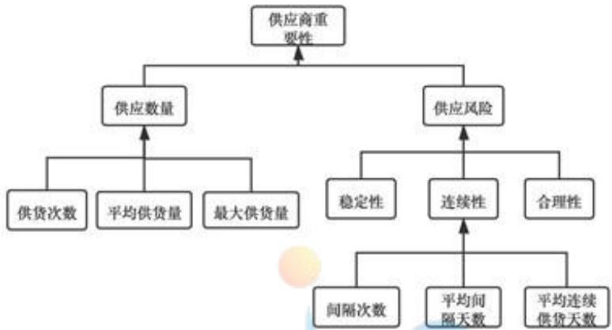

<details>
<summary>flowchart</summary>

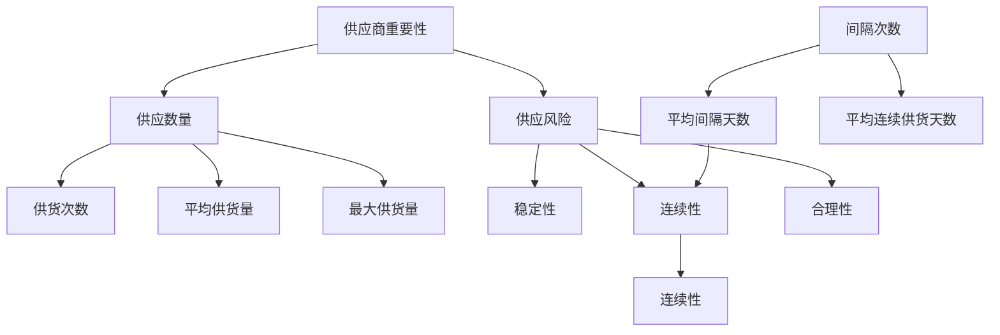
</details>

图 1: 问题一多指标评价模型

## a.供货次数

供货次数间接反映供货商的接到订货的次数，生产企业在过去的5年向该供货商的订货次数，能够直接反映生产企业对该供货商的依赖程度。由假设2可知，生产企业对该供货商的依赖程度能够有效反映生产企业对该供货商供货能力的认可度，即供货次数越多的供货商，具有更强的供货能力。

## b. 平均供货量

基于假设2，平均供货量在一定程度上反映该供货商的供货能力。同时结合供货总量也可以得到各供货商对于企业的供货次数。可以间接反映出该供货商与企业的业务联系，进而反映出该生产企业与该供货商是否存在长久合作关系。若供货商的供货次数越多，则说明供货商与企业和合作关系越紧密，越可能成为高质量供货商。

## c.单次最大供货量

由于该企业对供货商实际提供的原材料总是全部收购，供货商为实现利益最大化，一定会保持最大生产效率。因此单次最大供货量直接反映了供货商供货能力的上限，同样是衡量供货商供货能力的一个重要指标。

## d.供货稳定性

对于企业而言，供货量过多会导致成本增加，供货量过少影响产能释放，因此供货量需要与订单量保持较高的一致性。即供货商的供货量需要保持在企业给予其订单量的一定范围内波动。波动值越小则说明供货商的供货能力越稳定，越受企业的重视。

## e.供货量连续性

供货同种原材料的供货商，能够持续提供原材料的供货商要比间歇性提供原材料的供货商实力更强，同时企业为了节约决策成本，也更愿意选择能够持续供货的供货商。因此供货商的供货连续性越高，则越有可能成为企业的高质量供货商。

## f.合理供货比例

理想供货商的供货量应当与企业的订货量相当，能够充分满足企业需求量的供货商可以为企业减少许多不必要的成本。即供货商的合理供货比例越高，企业越有可能与供货商达成长期合作。

## 5.2 模型的建立

## 5.2.1 指标计算

## a.供货次数

供货总量的计算，基于附件1的供货商供货数据。通过计算各个供货商在过去5年参与供货的次数得到：

$$
n _ {i} = \sum_ {t = 1} ^ {2 4 0} y _ {i, t}
$$

$$
y _ {i, t} \in \{0, 1 \}, i = 1, 2, \dots 4 0 2
$$

其中， $n_{i}$ 即为供货商 i 在近五年供货次数， $y_{i,t}$ 为逻辑变量，其含义为在第 t 周供货商 i 是否参与了供货，“1”表示参与供货，“0”表示未参与供货。

## b. 平均供货量

平均供货量的计算首先需要针对原材料进行换算，将其统一为可生产产品的数目后，剔除在240周内未参与供货的数据，求取平均值：

$$
m _ {i} = \frac {1}{n _ {i}} \sum_ {t = 1} ^ {n _ {i}} \frac {x _ {i , t}}{p _ {i}}, i = 1, 2, \dots 4 0 2
$$

$$
p _ {i} = 0. 6, \quad i \in A
$$

$$
p _ {i} = 0. 6 6, i \in B
$$

$$
p _ {i} = 0. 7 2, i \in \mathbb {C}
$$

其中， $m_{i}$ 即为供货商 i 的平均供货量， $p_{i}$ 为生产一立方米产品所需的原材料消耗， $x_{i,t}$ 为第 t 周供货商 i 的供货量，集合 A, B, C 分别表示各类原材料的供货商集合。

## c. 单次最大供货量

通过附件1所给的供货商历史供货数据，首先对原材料进行换算，将其统一为可生产产品数目，再寻找每家供货商的历史供货数据的最大值：

$$
x _ {i} ^ {\max} = \max \{x _ {i, t}, t = 1, 2,..., 2 4 0 \}, i = 1, 2,..., 4 0 2
$$

其中， $x_{i}^{max}$ 即为供货商 i 的单次最大供货量。

## d. 供货稳定性

通过比较各供货商每次供货量与订单量的差值，可以直观的得到各供货商的供货稳定性，其计算公式如下：

$$
\delta_ {i} = \frac {1}{n _ {i}} \sum_ {t = 1} ^ {n _ {i}} (x _ {i, t} - z _ {i, t}) ^ {2}, i = 1, 2,..., 4 0 2
$$

其中， $\delta_{i}$ 即表示供货商 i 的供货量与订单量的均方误差， $z_{i,t}$ 为第 t 周供货商 i 的订货量。

## e.供货量连续性

由于供货连续性无法由附件1的数据直接得出，故引入时间间隔这一概念，即企业对于各供货商两次订单中间间隔的周数，以及供货商连续为企业提供原材料的周数。构造间隔次数，平均间隔周数，平均连续供货周数三个指标来衡量企业供货连续性。通过熵权法计算三个指标的系数，以三者的综合得分作为各供货商的供货连续性指标。

对于间隔天数，分析后发现其为成本型指标；对于平均间隔天数和平均连续供货天数，分析后发现其为效益型指标。对不同类型的指标进行不同的归一化处理，处理公式如下：

① 成本型指标归一化

$$
x _ {S c a l e} = \frac {x _ {m a x} - x}{x _ {m a x} - x _ {m i n}}
$$

② 效益型指标归一化

$$
x _ {\text {Scale}} = \frac {x - x _ {\min}}{x _ {\max} - x _ {\min}}
$$

结合针对归一化处理后的指标，供货连续性评分模型建立如下：

$$
\Delta_ {i} = w _ {1} r _ {i, 1} + w _ {2} r _ {i, 2} + w _ {3} r _ {i, 3} \tag {1}
$$

其中 $w_{j}$ 即为第j个指标的权重， $r_{i,j}$ 即为供货商i第j个指标的值。通过熵权法求解权重，代入(1)式，即可得供货商i供货连续性 $\Delta_{i}$ 。

## f.合理供货比例

理想供货商的供货量应该在企业所给订单量的一定范围内上下浮动。此处设置浮动范围为 $20\%$ 。即 $x_{i,t} \in (80\% z_{i,t}, 120\% z_{i,t})$ 。若供货事件符合条件，则记为1，否则记为0，则有：

$$
C o u n t _ {i} = \left\{ \begin{array}{l} 1, x _ {i, t} \in (0. 8 z _ {i, t}, 1. 2 z _ {i, t}) \\ 0. x _ {i, t} \notin (0. 8 z _ {i, t}, 1. 2 z _ {i, t}) \end{array} \right.
$$

下一步计算符合条件的供货次数占供货商总供货次数的比值，即可得到供货商i的合理供货比例，即：

$$
\gamma_ {i} = \frac {\text {Count} _ {i}}{n _ {i}}
$$

## 5.2.2 模型汇总

确定了能有效描述供货商的供货特征的指标后，构建供货重要性评价模型，通过熵权法方法求解出各个指标的权重，建立基于 TOPSIS 的多指标评价模型，该得分即反映出供货商重要性，值越大，则重要性程度越高。

熵权法(Entropy Weight Method, EWM)的基本思路是根据指标变异性的大小来确定客观权重。一般来说，若某个指标的信息熵越小，表明指标值得变异程度越大，提供的信息量越多，在综合评价中所能起到的作用也越大，其权重也就越大。相反，某个指标的信息熵越大，表明指标值得变异程度越小，提供的信息量也越少，在综合评价中所起到的作用也越小，其权重也就越小

TOPSIS(Technique for Order Preference by Similarity to Ideal Solution)法是一种常用的组内综合评价方法，能充分利用原始数据的信息，其结果能精确地反映各评价方案之间的差距。基本过程为基于归一化后的原始数据矩阵，采用余弦法找出有限方案中的最优方案和最劣方案，然后分别计算各评价对象与最优方案和最劣方案间的距离，获得各评价对象与最优方案的相对接近程度，以此作为评价优劣的依据。

## 5.3 基于 TOPSIS 的多指标评价模型的求解

## 5.3.1 算法求解

(1)熵权法求解流程如下：

熵权法求解流程

<table><tr><td>Step 1 将数据导入 Python,对指标进行标准化处理</td></tr><tr><td>Step 2 计算标准化后指标的熵值</td></tr><tr><td>Step 3 计算各指标的差异系数</td></tr><tr><td>Step 4 计算各指标的权重</td></tr><tr><td>Step 5 分别用权重乘以归一化后的数据</td></tr></table>

(2) TOPSIS 算法求解流程如下:

TOPSIS算法求解流程

<table><tr><td>Step 1 将数据导入 Python,根据熵权法得到供货次数,平均供货量,单词供货最大值,供货稳定性,供货连续性和合理供货比例共六个指标的权重</td></tr><tr><td>Step 2 对六个指标数据进行指标属性同向化处理并构造归一化初始矩阵</td></tr><tr><td>Step 3 确定最优方案和最劣方案</td></tr><tr><td>Step 4 计算各评价对象与最优方案、最劣方案的接近程度</td></tr><tr><td>Step 5 计算各评价对象与最优方案的贴近程度</td></tr><tr><td>Step 6 根据贴近程度大小进行排序,给出评价结果</td></tr><tr><td>Output: 各供货商 TOPSIS 评价结果</td></tr></table>

## 5.3.2 求解结果展示

表 3: 供货连续性评价体系指标权重

<table><tr><td>连续性评价指标</td><td>间隔次数</td><td>平均间隔周数</td><td>平均连续供货周数</td></tr><tr><td>权重</td><td>0.4383</td><td>0.3560</td><td>0.2057</td></tr></table>

如上表即为供货连续性评价体现的指标权重，即：

$$
\Delta_ {i} = 0. 4 3 8 3 r _ {i, 1} + 0. 3 5 6 0 r _ {i, 2} + 0. 2 0 5 7 r _ {i, 3}
$$

从权重的值不难看出，供货连续性主要受到间隔次数和平均间隔周数的影响，其中间隔次数是反映供货连续性的最终要的一个指标。

## 表 4: TOPSIS 多指标评价模型指标权重

<table><tr><td>指标</td><td>供货总量</td><td>平均供货量</td><td>单词供货最大值</td><td>供货稳定性</td><td>供货连续性</td><td>合理供货比例</td></tr><tr><td>权重</td><td>0.2617</td><td>0.2272</td><td>0.1622</td><td>0.3143</td><td>0.0254</td><td>0.0093</td></tr></table>

上表即为 TOPSIS 多属性评价体现的指标权重，从权重的值来看供货的稳定性是影响供货商重要性最重要的指标，其次为供货的总量，这两点分别对应了供货能力和供货风险。

## 5.4 五十家重要性供货商结果展示

表 5: 50 家最重要的供货商

<table><tr><td>供货商 ID</td><td>重要性程度</td><td>供货商 ID</td><td>重要性程度</td><td>供货商 ID</td><td>重要性程度</td></tr><tr><td>S140</td><td>0.9435</td><td>S268</td><td>0.4676</td><td>S244</td><td>0.2627</td></tr><tr><td>S229</td><td>0.8755</td><td>S306</td><td>0.4565</td><td>S080</td><td>0.2611</td></tr><tr><td>S361</td><td>0.8401</td><td>S307</td><td>0.4498</td><td>S218</td><td>0.2528</td></tr><tr><td>S348</td><td>0.8150</td><td>S194</td><td>0.4425</td><td>S003</td><td>0.2481</td></tr><tr><td>S151</td><td>0.8070</td><td>S352</td><td>0.4257</td><td>S189</td><td>0.2469</td></tr><tr><td>S108</td><td>0.7432</td><td>S143</td><td>0.3990</td><td>S086</td><td>0.2460</td></tr><tr><td>S395</td><td>0.5700</td><td>S247</td><td>0.3860</td><td>S210</td><td>0.2441</td></tr><tr><td>S374</td><td>0.5631</td><td>S037</td><td>0.3654</td><td>S114</td><td>0.2320</td></tr><tr><td>S139</td><td>0.5623</td><td>S284</td><td>0.3643</td><td>S074</td><td>0.2238</td></tr><tr><td>S340</td><td>0.5459</td><td>S365</td><td>0.3612</td><td>S007</td><td>0.2194</td></tr><tr><td>S282</td><td>0.5450</td><td>S031</td><td>0.3495</td><td>S123</td><td>0.2189</td></tr><tr><td>S330</td><td>0.5409</td><td>S040</td><td>0.3069</td><td>S273</td><td>0.2169</td></tr><tr><td>S308</td><td>0.5269</td><td>S364</td><td>0.3003</td><td>S291</td><td>0.2167</td></tr><tr><td>S275</td><td>0.5230</td><td>S346</td><td>0.2981</td><td>S292</td><td>0.2023</td></tr><tr><td>S329</td><td>0.5145</td><td>S367</td><td>0.2908</td><td></td><td></td></tr><tr><td>S126</td><td>0.5111</td><td>S294</td><td>0.2782</td><td></td><td></td></tr><tr><td>S131</td><td>0.4878</td><td>S055</td><td>0.2763</td><td></td><td></td></tr><tr><td>S356</td><td>0.4840</td><td>S338</td><td>0.2755</td><td></td><td></td></tr></table>

## 六、问题二的模型建立与求解

在问题一的求解中，本文通过对供货商的供货特征的分析，综合考虑供货商供货能力和供货风险，建立了反映保障企业生产重要性的数学模型，对供货商的重要性进行了评价，并筛选出了50家最重要的供货商。问题二在问题一结论的基础上，通过建立供货商筛选的多目标规划模型，以确定该生产企业在考虑满足原材料需求的情况下，至少需要选择多少家供货商供货原材料才得以满足生产的需求。针对模型筛选所得的供货商组合，以保障生产的稳定性为前提，考虑供货不稳定性与运输损耗对库存的影响，建立动态规划模型，基于遗传算法，逐周求解最优订购方案与转运方案，制定未来24周最经济的订购方案和转运方案。

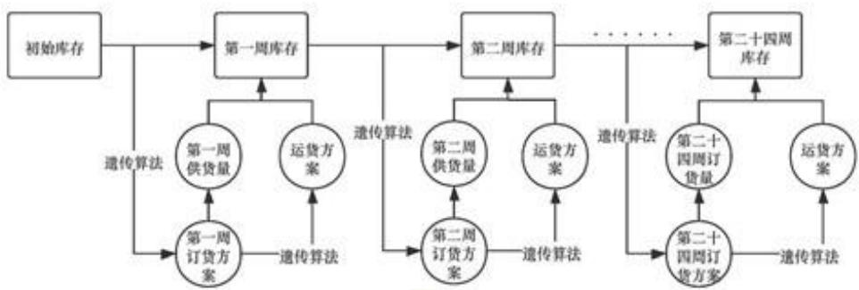

<details>
<summary>flowchart</summary>

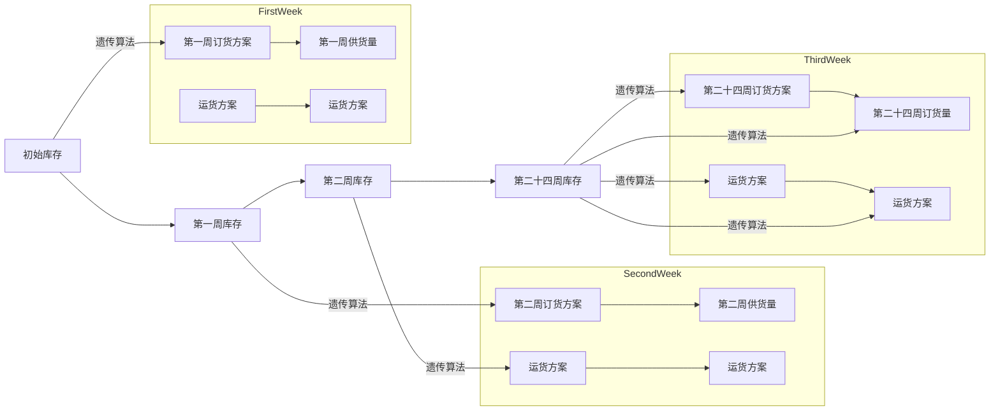
</details>

图 2: 问题二的多目标规划模型

## 6.1 供货商筛选模型的建立

在问题一的模型输出结果的基础上，本问需要进一步缩小目标订货供货商的集合，寻找供货商数目最小的供货商集合。以供货商数目最小为目标的前提下，以每周供货量可满足最大产能需求为约束，建立一个多目标规划模型。如果仅仅要求满足最大产能需求，那就意着模型只考虑了供货商的供货能力，而无法将供货风险考虑再模型中。因此本文将问题一模型输出的供货商重要性也纳入模型中，将供货商重要性之和最大作为第二个优化目标，尝试构建一个多目标规划模型。

## 6.1.1 目标函数的确定

本模型为一个多目标的优化模型，存在两个优化目标，第一个优化目标为每周订货的供货商数目最少，其数学表达式为：

$$
\min _ {y} \sum_ {i = 1} ^ {n} y _ {i}
$$

其中， $y_{i}$ 为一个逻辑变量，取值只有“0”或“1”，其含义为供货商i是否参与本周的供货，0表示不参与供货，1表示参与供货。如上公式即为参与每周供货的供货商数目。

第二个优化目标为参与每周供货的供货商的重要性程度之和最大，公式表达为：

$$
\max \sum_ {i = 1} ^ {n} y _ {i} \cdot s _ {i}
$$

其中， $s_{i}$ 为问题一模型所得的重要性程度指标，其取值范围为[0,1]。该优化目标的设置是考虑了供货商对生产企业的重要性程度，将重要性程度之和设置为最大化目标，可确保在优化问题的求解中，使得重要性程度高的企业优先被考虑参与供货。

对两个优化目标进行进一步化简，将多目标优化转化为单目标优化，所得新式如下：

$$
\min _ {v} \frac {\sum_ {i = 1} ^ {n} y _ {i}}{\sum_ {i = 1} ^ {n} y _ {i} \cdot s _ {i}}
$$

## 6.1.2 约束条件的确定

首先，在假设1的前提条件下，有如下推论，该生产企业5年内规模维持稳定，从企业的供求关系看，该生产企业的产能设置必然会经过仔细的考虑，以避免应产能过剩，而导致增加固定成本，因此可以推论在该假设前提下，该生产企业在日常运营中其产量与最大产能持平。在此推论的基础上，可知该生产企业每周的进货量必须能够满足每周的生产消耗，即最大产能2.82万立方米。对每周的供货量，有如下约束：

$$
\sum_ {i = 1} ^ {n} \frac {y _ {i} \hat {x} _ {i , t} (1 - \alpha_ {i , t})}{p _ {i}} \geqslant 2. 8 2 \times 1 0 ^ {4}, t = 1, 2, \dots 2 4
$$

$$
\hat {x} _ {i, t} = z _ {i, t} + \hat {\epsilon} _ {i, t}
$$

$$
p _ {i} = 0. 6, \quad i \in A
$$

$$
p _ {i} = 0. 6 6, \quad i \in B
$$

$$
p _ {i} = 0. 7 2, \quad i \in C
$$

$$
y _ {i} \in \{0, 1 \}
$$

其中， $p_{i}$ 为生产一立方米产品所需消耗的原材料， $\hat{x}_{i,t}$ 为第 t 周供货商 i 的供货量的估计值， $\alpha_{i,t}$ 为第 t 周供货商 i 所供货的原材料转运损失率， $z_{i,t}$ 为第 t 周供货商 i 所接到的订单数， $\hat{\varepsilon}_{i,t}$ 为第 t 周供货商 i 的供货偏差。

## 6.1.3 优化模型汇总

式（2）即为供货商筛选优化模型，最终汇总如下所示：

$$
\min _ {\nu} \frac {\sum_ {i = 1} ^ {n} y _ {i}}{\sum_ {i = 1} ^ {n} y _ {i} \cdot s _ {i}}
$$

$$
\text {s.t.} \quad \sum_ {i = 1} ^ {n} \frac {y _ {i} \cdot \hat {x} _ {i , t} (1 - \alpha_ {i , t})}{p _ {i}} \geqslant 2. 8 2 \times 1 0 ^ {4}, t = 1, 2, \dots , 2 4 \tag {2}
$$

$$
\hat {x} _ {i, j} = z _ {i, j} + \hat {e} _ {i, j}
$$

$$
p _ {i} = 0. 6, \quad i \in A
$$

$$
p _ {i} = 0. 6 6, i \in B
$$

$$
p _ {i} = 0. 7 2, i \in C
$$

$$
y _ {i} \in \{0, 1 \}
$$

## 6.1.4 模型求解

在对供货商筛选模型进行求解时，可进一步化简，使得模型求解过程更加方便，而不影响结果的准确性。在模型的约束中，本文考虑了原材料在运输过程中所产生的损失，以及供货商的供货偏差，这两个变量属于随机变量。

其中损失率 $\alpha_{i,t}$ ，以附件2的历史数据作为参考，损失率的取值范围大概在[0,0.05]内，其取值较小，因此本文选取附件2的历史数据求取损失率的平均值作为损失率的估计值：

$$
\alpha = \frac {1}{2 4 0} \sum_ {t = 1} ^ {2 4 0} \frac {1}{n _ {t}} \sum_ {j = 1} ^ {n _ {s}} \alpha_ {i, j}
$$

$\alpha_{t,j}$ 为过去五年中第t周转运商j的损失率， $n_{t}$ 为第t周参与转运的转运商数目，经计算得损失率的估计值为1.34%

对于供货量 $\hat{x}_{i,t}$ ，在约束中的含义用于体现供货商的供货能力，而不指代供货商i每周的供货量。因此本文在求解时是使用附件1所提供的供货商历史供货数据的平均值作为对供货能力的估计值：

$$
x _ {i} = \frac {1}{m _ {i}} \sum_ {t = 1} ^ {m _ {i}} x _ {i, t}
$$

其中， $m_{i}$ 为供货商 i 在过去 5 年中供货的次数， $x_{i,t}$ 为过去第 t 周供货商 i 供货的数量。

在进行如上的简化后，通过 Python 编写遗传算法对模型进行求解。遗传算法是模拟达尔文生物进化论的自然选择和遗传学机理的生物进化过程的计算模型，是一种通过模拟自然进化过程搜索最优解的方法。

算法求解本模型的迭代过程如下图所示:

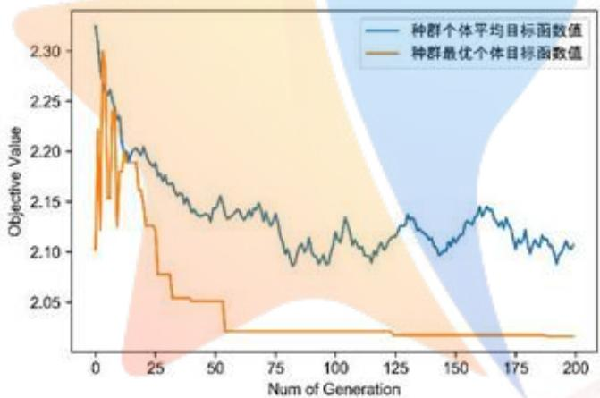

<details>
<summary>line</summary>

| Num of Generation | 种群个体平均目标函数值 | 种群最优个体目标函数值 |
| --- | --- | --- |
| 0 | ~2.32 | ~2.10 |
| 25 | ~2.18 | ~2.08 |
| 50 | ~2.14 | ~2.05 |
| 75 | ~2.13 | ~2.02 |
| 100 | ~2.11 | ~2.02 |
| 125 | ~2.12 | ~2.02 |
| 150 | ~2.11 | ~2.02 |
| 175 | ~2.12 | ~2.02 |
| 200 | ~2.11 | ~2.02 |
</details>

图 3: 问题二订货方案模型的遗传算法求解过程

求解后所得结果如下表所示，至少需要向表6所示的39个供货商订货才可满足每周的生产需求。

表 6: 筛选模型所得的 39 家重要供货商

<table><tr><td>供货商ID</td><td>材料分类</td><td>供货商ID</td><td>材料分类</td><td>供货商ID</td><td>材料分类</td><td>供货商ID</td><td>材料分类</td></tr><tr><td>S003</td><td>C</td><td>S131</td><td>B</td><td>S273</td><td>A</td><td>S340</td><td>B</td></tr><tr><td>S031</td><td>B</td><td>S139</td><td>B</td><td>S275</td><td>A</td><td>S346</td><td>B</td></tr><tr><td>S037</td><td>C</td><td>S140</td><td>B</td><td>S282</td><td>A</td><td>S348</td><td>A</td></tr><tr><td>S055</td><td>B</td><td>S143</td><td>A</td><td>S284</td><td>C</td><td>S356</td><td>C</td></tr><tr><td>S074</td><td>C</td><td>S151</td><td>C</td><td>S292</td><td>A</td><td>S361</td><td>C</td></tr><tr><td>S080</td><td>C</td><td>S189</td><td>A</td><td>S294</td><td>C</td><td>S364</td><td>B</td></tr><tr><td>S086</td><td>C</td><td>S194</td><td>C</td><td>S306</td><td>C</td><td>S367</td><td>B</td></tr><tr><td>S108</td><td>B</td><td>S210</td><td>C</td><td>S329</td><td>A</td><td>S374</td><td>C</td></tr><tr><td>S123</td><td>A</td><td>S229</td><td>A</td><td>S330</td><td>B</td><td>S395</td><td>A</td></tr><tr><td>S126</td><td>C</td><td>S268</td><td>C</td><td>S338</td><td>B</td><td></td><td></td></tr></table>

## 6.2 订购方案模型

6.1 中通过建立供货商筛选模型，对问题一所选择的 50 家重要供货商进行筛选，进一步缩小了原材料供货商的选择范围，再此基础上建立订购方案模型。在本问题中，订购方案的制定，以保持企业生产的稳定以及库存的稳定为原则，以订货成本最小化为目标。基于假设 1，本文有如下推论：对于一个规模稳定的生产企业，其产能是以市场的需求为参考设计的，即生产企业再日常运营中，很少会出现因为市场需求不足，而导致产能过剩的情况。基于此推论，本文在制定每周订货方案时，将以每周产能即为最大产能考虑。

再考虑供货商的供货能力时，问题二的供货商筛选模型中，本文以供货商的平均供货数量作为供货商供货能力的体现。在制定订货方案时，本文认为不应该直接以该值作为每周供货能力的估计值。主要原因有两点：首先，模型的目标是制定未来24周订货方案，如果直接以平均供货数量作为每周的供货量估计值，那么模型的输出结果中每周的订货方案必然是较为一致的，而从供货商的历史订货和供货数据来看，最直观的发现就是，供货商的订单数目并不是每周一致的。其次，考虑到原材料为木制纤维和其他植物素纤维，作为经济作物，其生产是存在一定的周期性的 $^{[3]}$ ，即极有可能供货商的供货能力是存在一定的周期性的。因此，本文假设供货商的供货存在一定的周期性，再模型建立和求解时，考虑对供货商筛选模型所输出的39家供货商的历史数据以24周为一个周期进行周期性规律探索和建模。

## 6.2.1 目标函数的确定：订货成本的计算

订货成本可分为原材料购买成本，原材料运输成本和原材料储存成本，成计算的公式如下：

$$
\begin{array}{l} C o s t _ {t} = C _ {T r a n s} \sum_ {i \in S} x _ {i, t} + \\ C _ {P u r c h a s e, A} \sum_ {i \in A \cap S} x _ {i, t} + C _ {P u r c h a s e, B} \sum_ {i \in B \cap S} x _ {i, t} + C _ {P u r c h a s e, C} \sum_ {i \in C \cap S} x _ {i, t} + \tag {3} \\ C _ {\text {Store}} (V _ {A, t} + V _ {B, t} + V _ {C, t}) \\ \end{array}
$$

其中 $C_{Trans}$ 为原材料每立方米运输成本， $x_{i,t}$ 为第 $t$ 周供货商 $i$ 的供货量， $C_{Purchase,A}$ 为每立方米原材料A的采购价格， $C_{Store}$ 为每立方米原材料的储存成本， $V_{A,t}$ 为第 $t$ 原材料A的库存量，S为目标供货商集合。其中，供货量与订货量有关，其计算公式为：

$$
x _ {i, t} = z _ {i, t} + \epsilon_ {i, t}
$$

$z_{i,t}$ 为第t周供货商i的供货量， $\epsilon_{i,t}$ 第t周供货商i的供货误差。

A、B、C三种原材料均可用于生产产品，不同的原材料生产一立方米产品

的消耗不同，不同原材料的采购单价也不同。三种原材料的价格有如下关系：

$$
C _ {P u r c h a s e, A} = 1. 2 C _ {P u r c h a s e, C}; \quad C _ {P u r c h a s e, B} = 1. 1 C _ {P u r c h a s e, C}
$$

为进一步简化表达式，不妨设原材料 C 的每立方米采购价格为 $C_{Purchase}$ ，结合上述价格关系，式(3)可简化为：

$$
\begin{array}{l} C o s t _ {t} = C _ {T r a n s} \sum_ {i \in S} x _ {i, t} + \\ C _ {P u r c h a s e} \left(\sum_ {i \in A \cap S} 1. 2 x _ {i, t} + \sum_ {i \in B \cap S} 1. 1 x _ {i, t} + \sum_ {i \in C \cap S} x _ {i, t}\right) + \\ C _ {S t o r e} (V _ {A, t} + V _ {B, t} + V _ {C, t}) \\ \end{array}
$$

如上公式所计算订货成本 $Cost_{t}$ ，即为第t周订购方案模型的目标函数。

## 6.2.2 模型约束的确定

## a.库存更新

在企业的生产与订货中，为了满足企业的正常的生产需求，要求企业尽可能保持仓库中有两周生产所需的原材料库存。由于原材料的特殊性，导致供货商供货的不稳定性，使得生产企业的库存每周都有可能会因为供货的差异而导致发生改变。因此，在计划每周的订货数量时，必须考虑库存情况，若库存原材料少于两周生产所需时，则需要增加下周的订货量以填充库存，若库存原材料多于两周生产所需时，则需要减少下周的订货量以缩减库存。综上所述，仓库库存必须作为模型的约束，以确保订货方案的合理性，防止出现库存积压或不足。

在24周内，第t周仓库中不同原材料的库存可表示为如下公式：

$$
\begin{array}{l} V _ {A, t - 1} - E _ {A, t} + \sum_ {i \in A \cap S} x _ {i, t} (1 - \alpha_ {i, t}) = V _ {A, t} \\ V _ {B, t - 1} - E _ {B, t} + \sum_ {i \in B \cap S} x _ {i, t} (1 - \alpha_ {i, t}) = V _ {B, t} \\ V _ {C, t - 1} - E _ {C, t} + \sum_ {i \in C \cap S} x _ {i, t} (1 - \alpha_ {i, t}) = V _ {C, t} \\ \end{array}
$$

其中， $E_{A,t}$ 表示第t周原材料A的消耗量， $V_{A,t}$ 为第t原材料A的库存量， $x_{i,t}$ 为第t周供货商i的供货量， $\alpha_{i,t}$ 为第t周供货商i所供货物在运输产生的损耗率，S为目标供货商集合。

## b.库存维持

如上分析，生产企业必须保持企业仓库每周的库存量维持在两周所需的原材料的需求。就生产稳定性而言，对于生产企业来说，仓库库存的作用是防止出现原材料不足，导致出现生产无法正常进行，故维持两周生产所需的原材料是仓库原材料库存量的下限，因此要求第t周的累计库存符合以下条件：

$$
\frac {V _ {A , t - 1}}{0 . 6} + \frac {V _ {B , t - 1}}{0 . 6 6} + \frac {V _ {C , t - 1}}{0 . 7 2} \geqslant 5. 6 4 \times 1 0 ^ {4}
$$

其中， $V_{A,t}$ 为第 t 原材料 A 的库存量，公式右侧为仓库所存储原材料可生产产品需要大于该生产企业两周的最大产能，即 5.64 万立方米。

## c. 每周的产品生产

该生产企业的规模有限，每周的最大产能为2.82万立方米。在建立该模型时，考虑到附件中并未给出市场需求以及市场的供求关系。在本文中，基于假设1，本文认为该企业的供求关系相对稳定。因此，不存在生产产能过剩的情况。故在订货模型中，每周的产品生产有如下约束：

$$
\frac {E _ {A , t}}{0 . 6} + \frac {E _ {A , t}}{0 . 6 6} + \frac {E _ {A , t}}{0 . 7 2} = 2. 8 2 \times 1 0 ^ {4}
$$

其中， $E_{A,t}$ 表示第t周原材料A的消耗量，公式右侧为企业的每周最大产能，即2.82万立方米。

## d. 供货商i的供货能力

如 6.2 所述，针对 39 家供货商的历史供货数据，本文以 24 周为一个周期长度，将 240 周划分为 10 个周期，对历史供货数据进行了绘图，发现部分供货商供货存在较明显的规律，如下图所示：

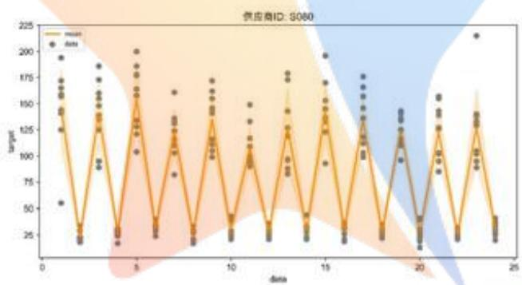

<details>
<summary>scatter</summary>

| data | target (range) |
| --- | --- |
| 1 | 55~195 |
| 2 | 20~35 |
| 3 | 85~185 |
| 4 | 20~35 |
| 5 | 105~200 |
| 6 | 25~40 |
| 7 | 80~160 |
| 8 | 20~35 |
| 9 | 100~175 |
| 10 | 25~45 |
| 11 | 95~150 |
| 12 | 25~40 |
| 13 | 85~180 |
| 14 | 25~45 |
| 15 | 90~195 |
| 16 | 25~40 |
| 17 | 100~175 |
| 18 | 25~40 |
| 19 | 95~145 |
| 20 | 15~40 |
| 21 | 85~160 |
| 22 | 25~40 |
| 23 | 90~215 |
| 24 | 25~45 |
</details>

(a)  
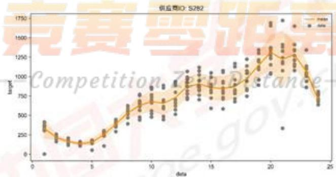

<details>
<summary>scatter</summary>

| data | Aite (range) | Mean |
| --- | --- | --- |
| 1 | 0~420 | ~300 |
| 2 | 150~250 | ~200 |
| 3 | 120~200 | ~180 |
| 4 | 100~150 | ~150 |
| 5 | 50~150 | ~150 |
| 6 | 100~300 | ~250 |
| 7 | 250~450 | ~400 |
| 8 | 400~650 | ~550 |
| 9 | 450~750 | ~650 |
| 10 | 500~850 | ~680 |
| 11 | 450~850 | ~680 |
| 12 | 500~950 | ~720 |
| 13 | 700~1100 | ~850 |
| 14 | 750~1150 | ~900 |
| 15 | 600~1150 | ~880 |
| 16 | 600~1150 | ~880 |
| 17 | 750~1250 | ~920 |
| 18 | 950~1350 | ~1050 |
| 19 | 1150~1450 | ~1200 |
| 20 | 1250~1750 | ~1350 |
| 21 | 320~1750 | ~1250 |
| 22 | 950~1450 | ~1280 |
| 23 | 650~1150 | ~950 |
| 24 | 650~850 | ~750 |
</details>

(b)

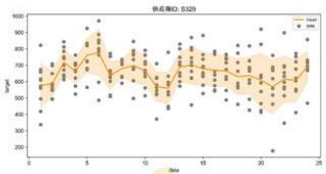

<details>
<summary>scatter</summary>

| data | target (mean) |
| --- | --- |
| 1 | ~580 |
| 2 | ~600 |
| 3 | ~700 |
| 4 | ~660 |
| 5 | ~750 |
| 6 | ~770 |
| 7 | ~650 |
| 8 | ~680 |
| 9 | ~690 |
| 10 | ~660 |
| 11 | ~580 |
| 12 | ~560 |
| 13 | ~680 |
| 14 | ~700 |
| 15 | ~680 |
| 16 | ~670 |
| 17 | ~670 |
| 18 | ~640 |
| 19 | ~630 |
| 20 | ~630 |
| 21 | ~570 |
| 22 | ~610 |
| 23 | ~620 |
| 24 | ~720 |
</details>

(c)  
图 4: 以 24 周为周期的历史供货情况（S080 为(a)、S282 为(b)、S329 为(c)）

上图所示结果为三个供货商再过去240周，共10个周期的供货量数据，从图4中可发现供货商的供货情况是存在供货规律的。因此以24周作为一个供货周期，将每一个供货商过去5年，10个周期内的供货数据作为对供货商供货能力范围的估计，确定供货商在第t周的供货能力范围，即：

$$
z _ {i, t} ^ {\min} \leqslant z _ {i, t} \leqslant z _ {i, t} ^ {\max}
$$

其中， $z_{i,t}^{min}$ 表示历史 10 个周期中第 t 周供货商 i 平均最低供货量， $z_{i,t}^{max}$ 表示历史 10 个周期中第 t 周供货商 i 平均最高供货量的 1.5 倍。

## e.供货偏差

由于原材料的特殊性，供货商无法保证供货的稳定性，历史数据显示每个供货商在每次供货时都存在一定程度的供货偏差。因此，在建立每周的订购方案模型时需要考虑供货偏差的影响，可表示为如下公式：

$$
\epsilon_ {i, t} = G _ {i} (z _ {i, t})
$$

其中， $G_{i}(t)$ 表示供货商i的偏差函数，偏差函数通过高斯过程回归对供货商10个周期的订货与供货数据拟合得到，能够有效反映供货商的供货特点：

$$
G _ {i} (z _ {i, t}) \sim N (\mu_ {i} (z _ {i, t}), \sigma_ {i} ^ {2} (z _ {i, t})) \tag {4}
$$

图 5 为对两家供货商进行高斯过程回归拟合的结果。

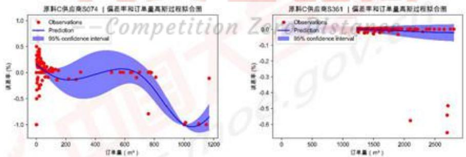  
图 5:S074、S361 的供货数据拟合情况

## 6.2.3 优化模型汇总

综上所述，每周订购方案的多目标优化模型汇总如下所示：

$$
\begin{array}{l} \min _ {x} C _ {\text {Transport}} \sum_ {i \in S} x _ {i, t} + \\ C _ {P u r c h a s e} \left(\sum_ {i \in A \cap S} 1. 2 x _ {i, t} + \sum_ {i \in B \cap S} 1. 1 x _ {i, t} + \sum_ {i \in C \cap S} x _ {i, t}\right) + \\ C _ {S t o r e} (V _ {A, t} + V _ {B, t} + V _ {C, t}) \\ \end{array}
$$

$$
\begin{array}{l} s. t. \quad x _ {i, t} = z _ {i, t} + \epsilon_ {i, t} \\ \frac {V _ {A , t - 1}}{0 . 6} + \frac {V _ {B , t - 1}}{0 . 6 6} + \frac {V _ {C , t - 1}}{0 . 7 2} \geqslant 5. 6 4 \times 1 0 ^ {4} \\ \end{array}
$$

$$
V _ {A, t - 1} - E _ {A, t} + \sum_ {i \in A \cap S} x _ {i, t} (1 - \alpha_ {i, t}) = V _ {A, t}
$$

$$
V _ {B, t - 1} - E _ {B, t} + \sum_ {i \in B \cap S} x _ {i, t} (1 - \alpha_ {i, t}) = V _ {B, t} \tag {5}
$$

$$
V _ {C, t - 1} - E _ {C, t} + \sum_ {i \in C \cap S} x _ {i, t} (1 - \alpha_ {i, t}) = V _ {C, t}
$$

$$
\frac {E _ {A , t}}{0 . 6} + \frac {E _ {A , t}}{0 . 6 6} + \frac {E _ {A , t}}{0 . 7 2} = 2. 8 2 \times 1 0 ^ {4}
$$

$$
z _ {i, t} ^ {\min} \leqslant z _ {i, t} \leqslant z _ {i, t} ^ {\max} \quad i \in S
$$

$$
\epsilon_ {i, t} = G _ {i} (t) z _ {i, t} \quad i \in S
$$

$$
x _ {i, t} \geqslant 0 \quad i \in S
$$

## 6.3 转运分配模型

在为各个供货商选择转运商时，考虑损耗率带来的影响，将由转运损耗带来的原材料损失换算为可生产产品的价值，以最小化该价值作为优化目标。对于每一个转运商，其损耗率的历史数据反映了该转运商的运输能力，本文尝试对转运商j的历史损耗率数据进行统计分布的拟合，以此方式对转运商的运输能力进行建模。通过Python的fitter库实现遍历80种分布对数据进行拟合，以拟合优度作为指标，选用单样本K-S检验的结果作为拟合优度的度量。对分布进行筛选，选择拟合优度最高的分布作为拟合结果输出，该库能有效的保证对转运商运输能力建模的准确性。转运商j的概率密度函数 $\varphi_{j}$ 如下所示：

$$
\varphi_ {j} = P (\theta_ {j} | \alpha_ {j, 1}, \alpha_ {j, 2},..., \alpha_ {j, t}) \tag {6}
$$

其中， $\theta_{i}$ 为分布函数的参数。

在制定第t周的转运方案时，基于式（6）拟合所得的分布函数，生成满足该分布的随机数，作为第t周转运商j的损耗率估计值。在考虑分配转运商时，本文的模型将基于如下几条原则：

① 优先选择损失率估计值低的转运商；  
② 尽可能使得一家供货商的原材料全部由一家转运商运输  
③ 在②的基础上，转运商j，预留出部分转运能力，以应对供货商的供货不稳

定性：

④ 优先分配原材料 A 的供货商：  
⑤ 在④的基础上，优先分配供货量大的供货商。

据此，以损耗原材料可生产产品数量作为优化目标，第t周有如下转运分配方案的优化模型：

$$
\begin{array}{l} \min _ {w} \sum_ {i \in A \cap S} \left(\sum_ {j = 1} ^ {8} \frac {x _ {i , t}}{0 . 6} \varphi_ {j} (t) w _ {i j}\right) + \sum_ {i \in B \cap S} \left(\sum_ {j = 1} ^ {8} \frac {x _ {i , t}}{0 . 6 6} \varphi_ {j} (t) w _ {i j}\right) + \\ \sum_ {i \in C \cap S} \left(\sum_ {j = 1} ^ {8} \frac {x _ {i , t}}{0 . 7 2} \varphi_ {j} (t) w _ {i j}\right) \\ \end{array}
$$

$$
s. t. \quad \sum_ {i \in S} x _ {i, t} w _ {i j} \leqslant 6 0 0 0 (1 - \xi_ {j, t}) \quad j = 1, 2,..., 8
$$

$$
\sum_ {j = 1} ^ {8} w _ {i j} = 1 \quad \forall i \in S
$$

$$
w _ {i j} = \{0, 1 \} \quad \forall i \in S
$$

$$
0 <   \xi_ {j, t} <   0. 1 \quad j = 1, 2, \dots , 8
$$

其中， $w_{ij}$ 为逻辑变量，其含义为供货商i所分配的转运商是否为转运商j，“0”表示为否，“1”表示为是。 $\varphi_{j}(t)$ 表示为第t周转运商j的运输损耗率估计值， $\xi_{j,t}$ 基于原则③设置，是对供货商供货不稳定性的预期，其取值范围为(0,0.1)。

## 6.4 模型的求解

订购方案模型由24个多变量规划模型组成，每周的规划模型其约束受到前一周订货方案的影响，主要体现在每周接收量的差异以及原材料消耗量的差异，导致的库存变化，即每周的订货方案安排是受到上一周生产消耗情况的影响的。而转运模型同样由24个多变量规划模型组成，其求解的基础为本周的订购方案。因此在求解订货与转运方案时，逐周对式（5）模型进行求解，先求出第t-1周的订购方案，在基于订购方案得到本周的转运方案，更新第t-1周的库存情况，作为第t周的求解基础。

在求解订购方案时，基于题目信息设定初始条件。基于假设3可知，第一周时仓库的库存是充足的，不失一般性的设定仓库中三种原材料的库存存量可生产的产品数量是一致的，即每种原材料均可生产1.88万立方米产品。设该生产企业每周的生产消耗的原材料为等比例的，即每周分别使用每种原材料生产0.94万立方米产品。在订购方案的模型中，考虑了第t周供货商i供货时的转运损耗率 $\alpha_{i,t}$ ，就损耗率来说，其变化的范围较小，在附件2的历史数据中范围大概在[0,0.05]，因此取历史损耗率的均值作为每周供货商供货时转运损耗率的估计值，取 $\alpha_{i,t}=1.34\%$ 。

基于上述对模型的简化，本文通过遗传算法对每周的订购方案和转运方案模型进行逐周求解，所得结果如附件 A 所示，遗传算法求解过程如下：

## 遗传算法求解过程

Step 1 设定初始状态，参数以及编码等，导入数据

Step 2 初始化，开始迭代进化

Step 3 对可行解进行选择、重组、变异和合并

Step 4 依据目标函数值的大小分配适应度值

Step 5 计算出当代最优个体的序号

Step 6 重复 3、4、5 三个步骤，直至进化到符合最优或达到最大遗传代数

Step 7 结果解码输出

在求解转运方案模型时，本文通过 Python 程序对该分配模型进行模拟迭代求解，直至损耗成本的变化达到终止条件时，即将结果作为最优转运方案输出。在进行模拟前，本文对参数 $\xi_{j}$ 进行了如下设定：当转运商转运的原材料总量分配已经接近 5400 立方米时，如果下一家需转运的供货商供货量超过了 300 立方米，则不由该转运商转运该笔订单，且在后续的分配中，不再考虑该转运商；如果不超过 300 立方米，则任然由该公司转运，在后续的分配中，不再考虑该转运商。

两个模型的求解代码以及结果参见附录3，及附件A、B。

## 6.5 订购方案及转运方案实施效果分析

对于实施效果，本文从宏观和微观两个角度对实施结果进行展示及分析。在宏观角度下，展示和分析未来24周订购方案和转运方案实施时，每周的库存和产量的动态变化，以及成本和损耗的情况。在微观角度下，展示和分析第3周和第13周的订购方案和转运方案实施效果，检验本周的方案是否合理。

## 6.5.1 宏观角度：未来24周方案实施的效果分析

在评估订购方案与转运方案的实施效果时，本文构建了三个指标进行分析，分别为每周库存原材料可生产产品（简称“库存产量”）、每周原材料占比情况和每周转运损耗情况。其中库存产量和每周转运损耗情况均换算为可生产产品的数量，以便比较和分析。库存产量指标的构建方式如下所示：

$$
V _ {t} = X _ {\text {Receive}, t} + V _ {t - 1} - E _ {t} \tag {6}
$$

其中， $V_{t}$ 即为第 $t$ 周库存产量， $X_{Receive,t}$ 为第 $t$ 周的接收量， $E_{t}$ 为每周产能，式（6）所有变量的值均经过换算，其单位均为一立方米产品。其中 $E_{t}$ 的值为定值2.82万立方米产品，初始库存产量 $V_{0} = 5.64$ 万立方米产品。第 $t$ 周接收量的计算考虑了可能存在的供货商供货不稳定性和转运商的运输损耗，其计算方式如下：

$$
X _ {\text {Receive}, t} = (X _ {\text {Order}, t} + \epsilon (t)) \cdot (1 - \alpha (t))
$$

其中， $\epsilon(t)$ 为供货不稳定性风险函数， $\alpha(t)$ 为运输损失风险函数。这两个函数是通过高斯过程对5年10个周期（24周为一个周期）内的历史数据所得的，与任一供货商或转运商无关，是在宏观上对原材料不稳定性和转运损耗的模拟，基于式（4）拟合所得的分布函数，随机生成对供货不稳定性和转运损耗这两个宏观层面的随机变量的估计值。

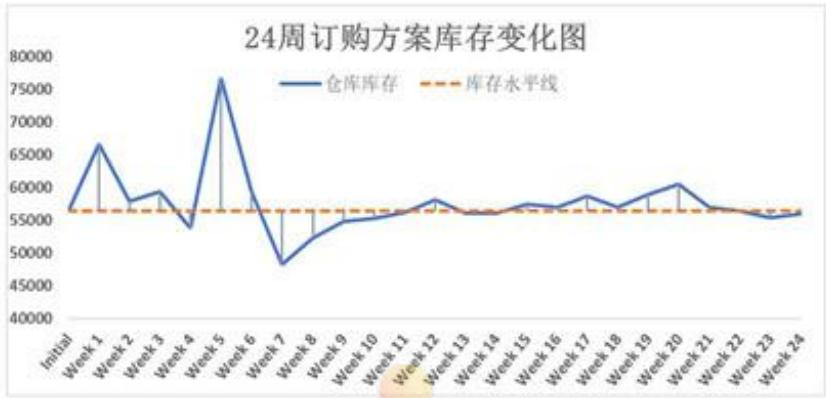

<details>
<summary>line</summary>

| Category | 仓库库存 | 库存水平线 |
| --- | --- | --- |
| Initial | ~57000 | ~56500 |
| Week 1 | ~66500 | ~56500 |
| Week 2 | ~58000 | ~56500 |
| Week 3 | ~59500 | ~56500 |
| Week 4 | ~54000 | ~56500 |
| Week 5 | ~76500 | ~56500 |
| Week 6 | ~59000 | ~56500 |
| Week 7 | ~48500 | ~56500 |
| Week 8 | ~52000 | ~56500 |
| Week 9 | ~54500 | ~56500 |
| Week 10 | ~55000 | ~56500 |
| Week 11 | ~56000 | ~56500 |
| Week 12 | ~58000 | ~56500 |
| Week 13 | ~56000 | ~56500 |
| Week 14 | ~56000 | ~56500 |
| Week 15 | ~57500 | ~56500 |
| Week 16 | ~57000 | ~56500 |
| Week 17 | ~58500 | ~56500 |
| Week 18 | ~57000 | ~56500 |
| Week 19 | ~59000 | ~56500 |
| Week 20 | ~60500 | ~56500 |
| Week 21 | ~57000 | ~56500 |
| Week 22 | ~56500 | ~56500 |
| Week 23 | ~55500 | ~56500 |
| Week 24 | ~56000 | ~56500 |
</details>

图 6: 24 周订购方案库存变化图

上图即为库存产量在该订购方案和转运方案下24周的变化情况。如图可知，库存产量总是在基准水平的上下浮动。当库存超过5.64万立方米时，下一周的实际接收量总是会更少，使得库存回归到基准水平，类似地，在库存产量低于基准水平时，下一周的实际接收量总是会更多，以使得库存回归到基准水平。就每周库存产量的变化来看，其中与基准水平差异较小的情况可以解释为由于供货商供货不稳定性以及运输损耗带来的小幅度差异，属于正常水平；尽管其中出现了库存产量与基准水平差异较大的情况，如第5周和第7周，但值得注意的时，在下一周库存产量马上回归到了基准水平周围。此差异较大现象可能是由于供货商的供货不稳定性造成，而库存产量再下一周迅速回归正常水平，这一现象表明了本文所提出的模型对库存成本的高敏感性，说明了模型，使得能更加合理的制定每周订购方案。

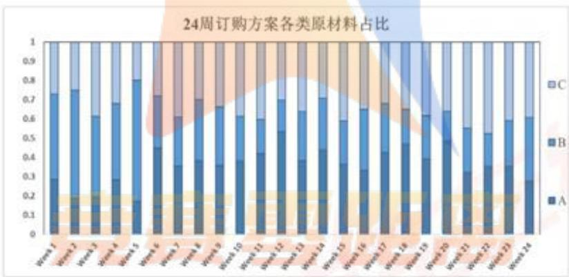

<details>
<summary>bar_stacked</summary>

| Category | A | B | C |
| --- | --- | --- | --- |
| Week 1 | ~0.12 | ~0.38 | ~0.26 |
| Week 2 | ~0.15 | ~0.47 | ~0.21 |
| Week 3 | ~0.13 | ~0.35 | ~0.32 |
| Week 4 | ~0.15 | ~0.39 | ~0.28 |
| Week 5 | ~0.18 | ~0.61 | ~0.14 |
| Week 6 | ~0.45 | ~0.21 | ~0.29 |
| Week 7 | ~0.36 | ~0.21 | ~0.39 |
| Week 8 | ~0.38 | ~0.29 | ~0.31 |
| Week 9 | ~0.36 | ~0.33 | ~0.31 |
| Week 10 | ~0.38 | ~0.24 | ~0.36 |
| Week 11 | ~0.42 | ~0.18 | ~0.36 |
| Week 12 | ~0.54 | ~0.19 | ~0.21 |
| Week 13 | ~0.38 | ~0.27 | ~0.35 |
| Week 14 | ~0.44 | ~0.27 | ~0.25 |
| Week 15 | ~0.37 | ~0.24 | ~0.37 |
| Week 16 | ~0.33 | ~0.34 | ~0.31 |
| Week 17 | ~0.42 | ~0.24 | ~0.26 |
| Week 18 | ~0.47 | ~0.15 | ~0.38 |
| Week 19 | ~0.39 | ~0.24 | ~0.41 |
| Week 20 | ~0.49 | ~0.19 | ~0.34 |
| Week 21 | ~0.32 | ~0.25 | ~0.43 |
| Week 22 | ~0.36 | ~0.18 | ~0.46 |
| Week 23 | ~0.36 | ~0.26 | ~0.41 |
| Week 24 | ~0.28 | ~0.35 | ~0.41 |
</details>

图 7: 24 周订购方案各类原材料占比

上图即为24周订购方案中，订货量中各类原材料的占比情况。如上图所示，三种原材料尽管在生产成本上存在一定差异，而本文所建立的模型，虽然考虑了各产品单价，以及生产消耗，但遗传算法求解所得的最优解中，并未出现对某种原材料的偏向性。

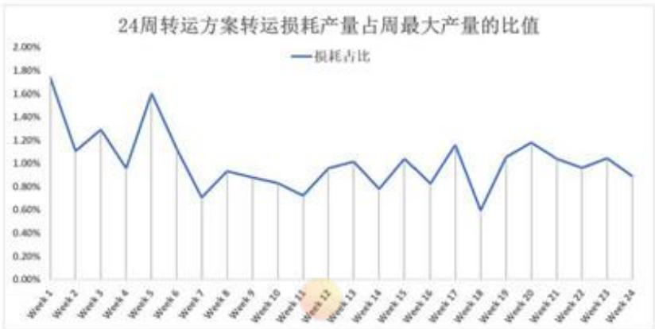

<details>
<summary>line</summary>

| Category | 损耗占比 (%) |
| --- | --- |
| Week 1 | ~1.75 |
| Week 2 | ~1.10 |
| Week 3 | ~1.30 |
| Week 4 | ~0.95 |
| Week 5 | ~1.60 |
| Week 6 | ~1.10 |
| Week 7 | ~0.70 |
| Week 8 | ~0.92 |
| Week 9 | ~0.88 |
| Week 10 | ~0.82 |
| Week 11 | ~0.72 |
| Week 12 | ~0.95 |
| Week 13 | ~1.00 |
| Week 14 | ~0.78 |
| Week 15 | ~1.02 |
| Week 16 | ~0.82 |
| Week 17 | ~1.15 |
| Week 18 | ~0.60 |
| Week 19 | ~1.05 |
| Week 20 | ~1.18 |
| Week 21 | ~1.02 |
| Week 22 | ~0.95 |
| Week 23 | ~1.02 |
| Week 24 | ~0.88 |
</details>

图 8: 24 周转运方案转运损耗产量占周最大产量的比值

上图即为每周转运损耗情况，由损耗产量估计值与周最大产量的比值度量。损耗产量估计值考虑损耗存在的一般情况，将原材料损耗换算为可生产产品，以估计损耗产量，其计算方式如下：

$$
x_{loss,t} = \frac{x_{Supply,t}\cdot\alpha_i}{28400\times P_i}\times 100\%
$$

其中 $\alpha_{i}$ 为转运商j的历史损耗率的均值， $P_{i}$ 为原材料与产品的换算系数，其取值取决于原材料种类。再24周的转运方案实施过程中，损耗产量占最大产能的比例平均值为1.02%。

## 6.5.2 微观角度：第3周和第13周的方案实施效果合理性分析

## (1) 第3周订购方案及转运方案

第3周的订货方案中，估计的接收量换算为可生产产品，为31130.71立方米，该值偏离2.82万立方米的原因是由于供货商供货的不稳定性以及运输损耗。为分析第3周订购方案的合理性，我们结合的第2周库存情况进行考虑，在第2周估计的库存产量为57860.64万立方米，第2周的库存是满足生产企业的稳定性需要的，即尽可能使得库存产量满足两周需求，再此情况下，第2周的订购方案在考虑到供货不稳定性和运输损耗时，其订货总量应当与最大产量的差别不大，从第3周的结果上看，显然是这样的。因此，第3周的订购方案在生产企业稳定性的角度看，是合理的。

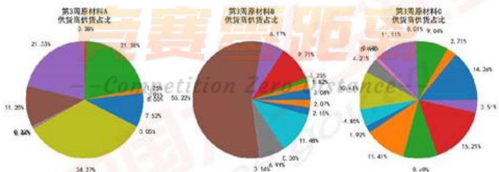

<details>
<summary>pie</summary>

| Category | Value (%) |
| --- | --- |
| 第3周原材料A::供货商供货占比 | 21.38% |
| 第3周原材料A::供货商供货占比 | 21.36% |
| 第3周原材料A::供货商供货占比 | 7.52% |
| 第3周原材料A::供货商供货占比 | 0.00% |
| 第3周原材料A::供货商供货占比 | 34.27% |
| 第3周原材料A::供货商供货占比 | 6.24% |
| 第3周原材料A::供货商供货占比 | 11.25% |
| 第3周原材料A::供货商供货占比 | 21.33% |
| 第3周原材料B::供货商供货占比 | 55.22% |
| 第3周原材料B::供货商供货占比 | 6.17% |
| 第3周原材料B::供货商供货占比 | 9.71% |
| 第3周原材料B::供货商供货占比 | 1.25% |
| 第3周原材料B::供货商供货占比 | 1.62% |
| 第3周原材料B::供货商供货占比 | 3.08% |
| 第3周原材料B::供货商供货占比 | 2.07% |
| 第3周原材料B::供货商供货占比 | 2.10% |
| 第3周原材料B::供货商供货占比 | 11.48% |
| 第3周原材料B::供货商供货占比 | 6.91% |
| 第3周原材料B::供货商供货占比 | 5.64% |
| 第3周原材料C::供货商供货占比 | 8.01% |
| 第3周原材料C::供货商供货占比 | 9.04% |
| 第3周原材料C::供货商供货占比 | 2.71% |
| 第3周原材料C::供货商供货占比 | 14.26% |
| 第3周原材料C::供货商供货占比 | 3.51% |
| 第3周原材料C::供货商供货占比 | 9.64% |
| 第3周原材料C::供货商供货占比 | 4.21% |
| 第3周原材料C::供货商供货占比 | 9.49% |
| 第3周原材料C::供货商供货占比 | 11.41% |
| 第3周原材料C::供货商供货占比 | 4.85% |
| 第3周原材料C::供货商供货占比 | 1.92% |
| 第3周原材料C::供货商供货占比 | 15.21% |
| 第3周原材料C::供货商供货占比 | 9.49% |
</details>

图 9: 第 3 周各原材料供货商供货占比

有关第3周的订货数据如上图表所示，本文展示了三种原材料的供货商供货结构。从各原材料的供货商供货分布来看，原材料A和原材料C的供货商分布较为均衡，不存在过度依赖某一供货商的情况；原材料B的供货商分布较为特别，S139 供货商供货的比例达到了 55%，其实际供货原材料 B 的数目为 4731 立方米，换算为可生产产品数目为 7168 立方米左右，占到了一周产能的 25%。S139 对原材料 B 的供货商在第三周的供货规律如下所示：

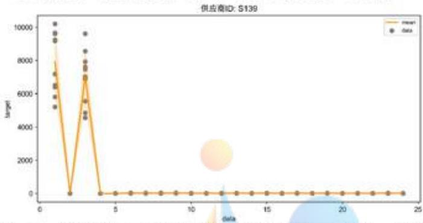

<details>
<summary>line</summary>

| data | mean (target) |
| --- | --- |
| ~1 | ~7800 |
| ~2 | 0 |
| ~3 | ~6900 |
| ~4 | 0 |
| ~5 | 0 |
| ~6 | 0 |
| ~7 | 0 |
| ~8 | 0 |
| ~9 | 0 |
| ~10 | 0 |
| ~11 | 0 |
| ~12 | 0 |
| ~13 | 0 |
| ~14 | 0 |
| ~15 | 0 |
| ~16 | 0 |
| ~17 | 0 |
| ~18 | 0 |
| ~19 | 0 |
| ~20 | 0 |
| ~21 | 0 |
| ~22 | 0 |
| ~23 | 0 |
| ~24 | 0 |
</details>

图 10: 供货商 S139 的历史供货数据（以 24 周为一周期）

由于本模型构建基于供货商供货能力的周期性规律，即通过过去10个周期的供货数据的最大值和最小值作为供货能力的区间边界，第3周出现如上订购方案的原因，是因为S139在过去10个周期内的供货历史数据是遵循历史规律的，因此导致出现了供货能力急剧提升的情况。对此，本文认为S139应当是一家通过种植生产原材料的供货商，由于经济作物的生长规律限制，以至于其供货往往是半年两次左右，且单次可供货数量较多。

## (2) 第 13 周订购方案及转运方案

第13周的订货方案中，估计的接收量换算为可生产产品，为27849立方米，该值偏离2.82万立方米的原因是由于供货商供货的不稳定性以及运输损耗。为分析第13周订购方案的合理性，我们结合的第12周库存情况进行考虑，在第12周估计的库存产量为58080.48万立方米，第12周的库存是满足生产企业的稳定性需要的，即尽可能使得库存产量满足两周需求，再此情况下，第13周的订购方案在考虑到供货不稳定性和运输损耗时，其订货总量应当与最大产量的差别不大，从第13周的结果上看，显然是这样的。因此，第13周的订购方案在生产企业稳定性的角度看，是合理的。

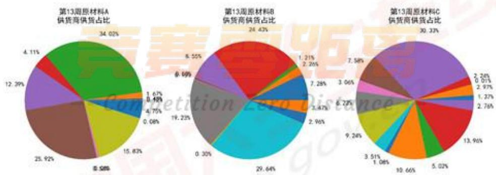

<details>
<summary>pie</summary>

| Category | Value (%) |
| --- | --- |
| 第13周原材料A::绿色 | 34.02 |
| 第13周原材料A::棕色 | 25.92 |
| 第13周原材料A::黄色 | 15.83 |
| 第13周原材料A::紫色 | 12.39 |
| 第13周原材料A::红色 | 4.11 |
| 第13周原材料B::青色 | 29.64 |
| 第13周原材料B::灰色 | 19.23 |
| 第13周原材料B::橙色 | 19.69 |
| 第13周原材料B::蓝色 | 6.55 |
| 第13周原材料B::深蓝色 | 6.55 |
| 第13周原材料B::浅蓝色 | 0.08 |
| 第13周原材料C::紫色 | 30.33 |
| 第13周原材料C::橙色 | 13.96 |
| 第13周原材料C::红色 | 10.66 |
| 第13周原材料C::绿色 | 9.24 |
| 第13周原材料C::蓝色 | 3.51 |
| 第13周原材料C::青色 | 1.08 |
| 第13周原材料C::橙色 | 7.58 |
| 第13周原材料C::红色 | 6.27 |
| 第13周原材料C::蓝色 | 2.96 |
| 第13周原材料C::黄色 | 2.47 |
| 第13周原材料C::橙色 | 7.28 |
| 第13周原材料C::红色 | 2.26 |
| 第13周原材料C::蓝色 | 1.21 |
| 第13周原材料C::黄色 | 0.30 |
</details>

图 11: 第 13 周各原材料供货商供货比例

有关第13周的订货数据如上图表所示，本文展示了三种原材料的供货商供货结构。从各原材料的供货商供货分布来看，三种原材料的供货商分布较为均衡，不存在过度依赖某一供货商的情况。

## 七、问题三的模型建立与求解

企业希望进一步加强供货链成本管理，本小问主要探究如何通过对原材料选购偏好，在未来的24周内分配对于原材料的更优的订单量，从而进一步降低转运和仓储成本。

通过资料得知，供货链企业选择原材料时需要衡量采购成本、产能成本这两大方面。采购成本是购买材料的现金流开销，影响公司显性收益。虽然问题二的模型就此以“订单成本”为优化目标，得到采购成本最经济的方案。然而我们并未发现问题二所得结果中存在对某种原材料的偏向性。这是因为木质纤维材料的采购成本远大于材料的产能成本，而在问题二模型的求解过程中采购成本的下降往往会掩盖原材料的产能成本仍然虚高的现象。原材料的偏向性与其产能成本相关。经市场调研数据显示[4]，产能成本是一个公司或组织为提供或提高其大规模经营能力而发生的费用，衡量为企业实现单位产能需要支出的费用。由题干信息可知，该企业生产相同单位产品所消耗的原材料A、原材料B、原材料C的比值为1:1.1:1.2；而相同单位原材料A、原材料B、原材料C的比值的价格比值为1.2:1.11。已知比例关系，进一步挖掘出不同材料的产能成本特征：

$$
C o s t _ {A} = 0. 7 2 C _ {\text {Purchase}} + 0. 6 (C _ {\text {Trans}} + C _ {\text {Store}})
$$

$$
C o s t _ {B} = 0. 7 2 6 C _ {\text {Purchase}} + 0. 6 6 (C _ {\text {Trans}} + C _ {\text {Store}})
$$

$$
C o s t _ {C} = 0. 7 2 C _ {\text {Purchase}} + 0. 7 2 \left(C _ {\text {Trans}} + C _ {\text {Store}}\right)
$$

由上述公式可知，原材料 A、C 的采购费用并不区分两者的产能成本，均为 $0.72 C_{Purchase}$ ；而对于生产单位产品所需转运、仓储的费用，单位原材料 A 的开销比单位原材料 C 更大。因此，用原材料 A 进行生产的成本更低。

企业为了压缩单位产能的开销，需要尽量多地采购 A 类和尽量少地采购 C 类原材。因此，本小问将在问题二模型结果的基础上改进原有订购方案模型，在控制原方案下采购材料 A、C 等效的产能保持不变的情况下，尽可能减少原材料 A、C 订单所涉及的转运、仓储的费用。

## 7.1 模型的更新

## 7.1.1 订购方案目标函数的更新

由于问题三要求尽量多地采购 A 类和尽量少地采购 C 类原材料，并未提及 B 类原材料。因此考虑在保持 B 类原材料的供货商以及订货量不变的情况下对 A 类和 C 类原材料的供货商选择以及订货量进行进一步优化。

$$
\min C _ {\text {Trans}} \left(\sum_ {i \in A \cap S} x _ {i, t} ^ {\prime} + \sum_ {i \in C \cap S} x _ {i, t} ^ {\prime}\right) + C _ {\text {Store}} (V _ {A, t} ^ {\prime} + V _ {C, t} ^ {\prime})
$$

## 7.1.2 订购方案约束条件的更新

为保持每周计划产能不变，需要保证调整 A 类和 C 类原材料前后可生产的产品总量保持不变，即：

$$
\frac {X _ {A , t - 1} ^ {\prime}}{0 . 6} + \frac {X _ {C , t - 1} ^ {\prime}}{0 . 7 2} = \frac {X _ {A , t - 1}}{0 . 6} + \frac {X _ {C , t - 1}}{0 . 7 2}
$$

同时还需保证库存内可生产的产品总量保持不变，即：

$$
\frac {E _ {A , t - 1} ^ {\prime}}{0 . 6} + \frac {E _ {C , t - 1} ^ {\prime}}{0 . 7 2} = \frac {E _ {A , t - 1}}{0 . 6} + \frac {E _ {C , t - 1}}{0 . 7 2}
$$

为了保证优化结果为尽量多地采购 A 类和尽量少地采购 C 类原材料，对 C 类原材料的订货量区间进行限制；对 A 类原材料的订货量区间进行放宽。

## 7.1.3 订购方案模型汇总

如下即为基于问题二的模型，添加对订单结构约束的模型，其初始的输入方案即为问题二所得的最优订购方案。

$$
\min C _ {T r a n s} \left(\sum_ {i \in A \cap S} x _ {i, t} ^ {\prime} + \sum_ {i \in C \cap S} x _ {i, t} ^ {\prime}\right) + C _ {S t o r e} (V _ {A, t} ^ {\prime} + V _ {C, t} ^ {\prime})
$$

$$
\mathrm{s.t.} \frac {V _ {A , t - 1} ^ {\prime}}{0 . 6} + \frac {V _ {C , t - 1} ^ {\prime}}{0 . 7 2} = \frac {V _ {A , t - 1}}{0 . 6} + \frac {V _ {C , t - 1}}{0 . 7 2}
$$

$$
\frac {X _ {A , t - 1} ^ {\prime}}{0 . 6} + \frac {X _ {C , t - 1} ^ {\prime}}{0 . 7 2} = \frac {X _ {A , t - 1}}{0 . 6} + \frac {X _ {C , t - 1}}{0 . 7 2}
$$

$$
z _ {i, t} ^ {\min} \leq z _ {i, t} \leq z _ {i, t} ^ {\max} \quad i \in A
$$

$$
z _ {i, t} ^ {\min} \leq z _ {i, t} \leq z _ {i, t} ^ {\max} \quad i \in C
$$

$$
x _ {i, t} = z _ {i, t} + \epsilon_ {i, t} \quad i \in A \cup C
$$

$$
x _ {i, t} \geq 0 \quad i \in S
$$

## 7.1.4 转运方案模型说明

在问题三的背景之下，转运方案模型不需要作出修改更新。问题二转运模型的输入为本周的订购方案，该转运模型总是以损耗最小产能为优化目标，求解出最优的转运分配方案。由此可知，企业生产情况的改变，对转运方案的模型是不存在任何影响的，因此，转运方案模型不需要做出更新。

## 7.2 模型的求解

订购方案和转运方案模型虽然存在一定的更新，但是从模型结构的角度看，模型并未产生结构上的变化，因此同样可以考虑使用遗传算法对模型进行求解，遗传算法间接以及求解过程，参照上文所述，求解结果如附件A、B所示。

## 7.3 新方案实施效果分析

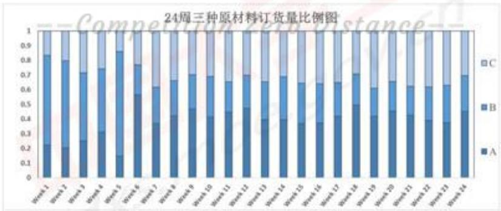

<details>
<summary>bar_stacked</summary>

| Category | A | B | C |
| --- | --- | --- | --- |
| Week 1 | ~0.23 | ~0.56 | ~0.17 |
| Week 2 | ~0.21 | ~0.58 | ~0.19 |
| Week 3 | ~0.25 | ~0.46 | ~0.29 |
| Week 4 | ~0.32 | ~0.43 | ~0.25 |
| Week 5 | ~0.15 | ~0.67 | ~0.12 |
| Week 6 | ~0.57 | ~0.21 | ~0.23 |
| Week 7 | ~0.37 | ~0.25 | ~0.38 |
| Week 8 | ~0.42 | ~0.26 | ~0.34 |
| Week 9 | ~0.47 | ~0.24 | ~0.31 |
| Week 10 | ~0.42 | ~0.26 | ~0.34 |
| Week 11 | ~0.45 | ~0.21 | ~0.35 |
| Week 12 | ~0.47 | ~0.23 | ~0.30 |
| Week 13 | ~0.40 | ~0.27 | ~0.34 |
| Week 14 | ~0.40 | ~0.29 | ~0.31 |
| Week 15 | ~0.37 | ~0.28 | ~0.36 |
| Week 16 | ~0.38 | ~0.28 | ~0.35 |
| Week 17 | ~0.42 | ~0.25 | ~0.34 |
| Week 18 | ~0.50 | ~0.21 | ~0.29 |
| Week 19 | ~0.42 | ~0.21 | ~0.37 |
| Week 20 | ~0.45 | ~0.23 | ~0.31 |
| Week 21 | ~0.43 | ~0.21 | ~0.36 |
| Week 22 | ~0.39 | ~0.24 | ~0.36 |
| Week 23 | ~0.38 | ~0.26 | ~0.34 |
| Week 24 | ~0.45 | ~0.26 | ~0.29 |
</details>

图 12: 24 周三种原材料订货量比例图

如上图所示，即为新的订购方案中，每周订购的原材料构成比例，通过原材料换算，统一换算为可生产产品的数量。相较于问题二模型所得结果不难看出，新的订购方案中，原材料A的订货比例明显再大多数情况下是多于C的。

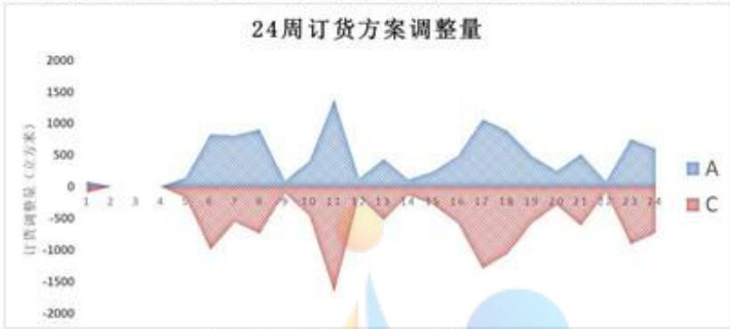

<details>
<summary>area_stacked</summary>

| Week | A (立方米) | C (立方米) |
| --- | --- | --- |
| 1 | 0 | 0 |
| 2 | 0 | 0 |
| 3 | 0 | 0 |
| 4 | 0 | 0 |
| 5 | ~100 | ~-300 |
| 6 | ~800 | ~-950 |
| 7 | ~800 | ~-550 |
| 8 | ~900 | ~-750 |
| 9 | 0 | 0 |
| 10 | ~350 | ~-450 |
| 11 | ~1350 | ~-1650 |
| 12 | ~150 | ~-850 |
| 13 | ~400 | ~-500 |
| 14 | ~150 | ~-250 |
| 15 | ~250 | ~-450 |
| 16 | ~450 | ~-650 |
| 17 | ~1050 | ~-1300 |
| 18 | ~900 | ~-1100 |
| 19 | ~450 | ~-650 |
| 20 | ~250 | ~-450 |
| 21 | ~500 | ~-650 |
| 22 | 0 | 0 |
| 23 | ~750 | ~-900 |
| 24 | ~600 | ~-750 |
</details>

图 13: 24 周订货方案调整量

如上图所示，模型再经过修正后，新的订购方案显然对原材料订购比例进行了调整，且调整结果较为显著，本文认为该结果达到了原材料的最优订购结构。

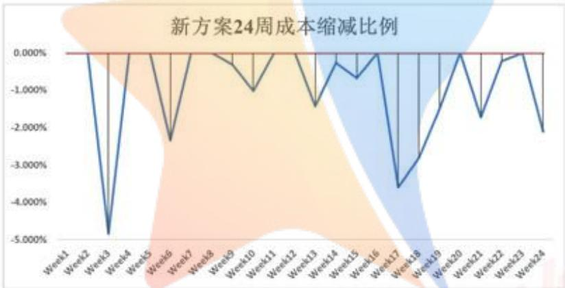

<details>
<summary>line</summary>

| Category | Value (%) |
| --- | --- |
| Week1 | 0.000% |
| Week2 | ~-4.80% |
| Week3 | ~-2.30% |
| Week4 | 0.000% |
| Week5 | ~-0.30% |
| Week6 | ~-1.00% |
| Week7 | 0.000% |
| Week8 | ~-1.40% |
| Week9 | ~-0.30% |
| Week10 | ~-0.70% |
| Week11 | 0.000% |
| Week12 | ~-3.60% |
| Week13 | ~-2.80% |
| Week14 | ~-1.50% |
| Week15 | 0.000% |
| Week16 | ~-1.70% |
| Week17 | ~-0.20% |
| Week18 | 0.000% |
| Week19 | ~-2.10% |
</details>

图 14: 新方案 24 周成本缩减比例

对于新的订购方案，在优化了原材料订购结构的情况下，理论上生产成本可以得到进一步的压缩。本文针对问题二和问题三的订购方案，对成本进行量化比较分析。如下图所示，通过对订购方案的成本进行量化估计，计算除了新方案相较于问题二方案的成本变化比率。其中成本最高减幅达到了 $5\%$ 左右，综合来看，新方案的平均成本缩减比例为 $0.956\%$ 左右。由此可见，新方案虽然对成本起到了压缩的效果，但效果并不显著，对此，本文认为，是由于可选供货商过少，供货商的供货能力也只是恰好满足每周的最大生产要求，因此该模型订购结构的可行域本身并不大，故而差异并不是非常显著。

## 八、问题四的模型建立与求解

问题四题干可知，该企业通过技术改造已具备了提高产能的潜力，可认为该企业的生产力可以满足一切产能需求。即该企业每周的产能已不再成为限制其订货总量的因素。同时，企业也不再存在存储问题，即每周消耗原材料等于各个供货商在当周的供货量。因此，本文考虑该公司产能提升的潜力，基于问题二的订购方案与转运方案模型，对模型进行一定的修正，以得到新的模型。

## 8.1 模型的更新

## 8.1.1 供货商的重新选择

由于企业已具备提高产能的潜力，为取得充足的原材料供货量，供货商的选取不应该再局限于问题二中的39家企业，而应当放宽到所有具有良好供货能力的供货商。该生产企业的产能提升潜力，确保该生产企业有足够的能力应对供货商的不稳定性，即不会出现库存的积压导致成本急剧上升的情况；再者，由于供货商的增加，生产企业的常规最大产能，即2.82万立方米，是更加容易满足的。基于如上分析，本文在问题四的模型中将数据预处理后得到的369家良好供货商均作为备选供货商考虑。

## 8.1.2 订购方案模型目标函数的更新

首先，库存情况将不在作为约束被考虑在模型当中，因为该生产企业具备了在生产层面上应对供货商供货不稳定性的能力，即超出原有最大产能的原材料部分，不再需要被放置在仓库中，而是可以直接被用于生产。因此，仓库的原材料库存产能将恒定维持在5.64万立方米，而仓库成本也成为了一个固定成本，因此考虑将仓储成本从订购方案模型的目标函数中删除。

## 8.1.3 订购方案模型约束的更新

如上文所述，仓库成本成为了一个固定成本，在问题四的模型中，将不再需要考虑仓库的情况，因此，考虑将订购方案模型的约束中，仓储有关部分删除。

考虑将原有最大产能设置为该生产企业每周产能的下限，将转运商的总转运能力作为每周产能限制的上限。本文认为，在产能具备提升潜力的情况下，可以认为生产企业总是能把每周接收的原材料全部用于本周的生产消耗。而在不考虑调用库存的情况下，生产企业每周的生产上限即为每周的接收量总数，由于转运商数目有限，且其转运能力有限，可推知，该生产企业每周的订单数量的上限，即为所有转运商每周的最大转运能力。即每周最大订单量为4.8万立方米。即：

$$
\sum_ {i \in S} z _ {i, t} \leq 4. 8 \times 1 0 ^ {4}
$$

由于新模型考虑拓宽供货商渠道，以增加订货总量，对于这家具备产能提升潜力的生产企业，考虑将其原最大产能设置为每周产能的下线，即规定每周生产量不得少于原产能，即：

$$
\frac {\sum_ {i \in A \cap S} x _ {i , t} (1 - \alpha_ {i , t})}{0 . 6} + \frac {\sum_ {i \in B \cap S} x _ {i , t} (1 - \alpha_ {i , t})}{0 . 6 6} + \frac {\sum_ {i \in C \cap S} x _ {i , t} (1 - \alpha_ {i , t})}{0 . 7 2} \geq 2. 8 2 \times 1 0 ^ {4}
$$

## 8.1.4 更新后的订购方案模型

如下即为考虑产能提升潜力情况，在问题二的订购方案模型的基础上更新得到的产能提升订购方案模型：

$$
\begin{array}{l} \min _ {z} C _ {\text {Trans}} \sum_ {z} x _ {i, t} + C _ {\text {Purchase}} \left(\sum_ {i \in A \cap S} 1. 2 x _ {i, t} + \sum_ {i \in B \cap S} 1. x _ {i, t} + \sum_ {i \in C \cap S} x _ {i, t}\right) \\ s. t. \sum_ {i \in S} z _ {i, t} \leq 4. 8 \times 1 0 ^ {4} \\ z _ {i, t} ^ {\min} \leq z _ {i, t} \leq z _ {i, t} ^ {\max} \quad i \in S \\ \frac {\sum_ {i \in A \cap S} x _ {i , t} (1 - \alpha_ {i , t})}{0 . 6} + \frac {\sum_ {i \in B \cap S} x _ {i , t} (1 - \alpha_ {i , t})}{0 . 6 6} + \frac {\sum_ {i \in C \cap S} x _ {i , t} (1 - \alpha_ {i , t})}{0 . 7 2} \geq 2. 8 2 \times 1 0 ^ {4} \\ x _ {i, t} = z _ {i, t} + \epsilon_ {i, t} \quad i \in S \\ \end{array}
$$

## 8.1.5 转运方案模型的说明

在问题四的背景之下，转运方案模型不需要作出修改更新。问题二转运模型的输入为本周的订购方案，该转运模型总是以损耗最小产能为优化目标，求解出最优的转运分配方案。由此可知，企业生产情况的改变，对转运方案的模型是不存在任何影响的，因此，转运方案模型不需要做出更新。

## 8.2 模型的求解与结果展示

订购方案和转运方案模型虽然存在一定的更新，但是从模型结构的角度看，模型并未产生结构上的变化，因此同样可以考虑使用遗传算法对模型进行求解，遗传算法间接以及求解过程，参照上文所述，求解结果如附件A、B所示。

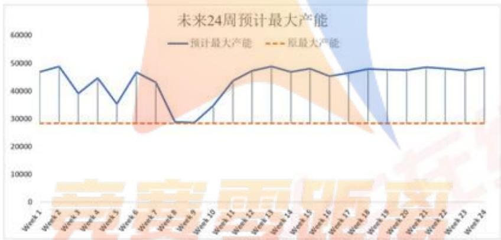

<details>
<summary>line</summary>

| Category | 预计最大产能 | 原最大产能 |
| --- | --- | --- |
| Week 1 | ~47000 | ~28000 |
| Week 2 | ~49000 | ~28000 |
| Week 3 | ~39000 | ~28000 |
| Week 4 | ~45000 | ~28000 |
| Week 5 | ~35000 | ~28000 |
| Week 6 | ~47000 | ~28000 |
| Week 7 | ~43000 | ~28000 |
| Week 8 | ~29000 | ~28000 |
| Week 9 | ~29000 | ~28000 |
| Week 10 | ~35000 | ~28000 |
| Week 11 | ~44000 | ~28000 |
| Week 12 | ~47000 | ~28000 |
| Week 13 | ~49000 | ~28000 |
| Week 14 | ~47000 | ~28000 |
| Week 15 | ~48000 | ~28000 |
| Week 16 | ~45500 | ~28000 |
| Week 17 | ~46500 | ~28000 |
| Week 18 | ~48000 | ~28000 |
| Week 19 | ~47500 | ~28000 |
| Week 20 | ~47500 | ~28000 |
| Week 21 | ~48500 | ~28000 |
| Week 22 | ~48500 | ~28000 |
| Week 23 | ~47500 | ~28000 |
| Week 24 | ~48500 | ~28000 |
</details>

图 15: 未来 24 周预计最大产能

对于问题四的产能提升订购方案模型，其产能的提升效果如下图所示。结合预计最大产能和原最大产能对比来看，不难看出，在考虑了产能提升潜力后的订购方案模型，其输出的新的订购方案，显著的提升了产能。其中产能提升最大值为20490立方米左右，最小值为298立方米左右，平均每周提升产能为15790立方米左右，可见产能具备提升潜力时，该生产企业的产能可得到显著提升。

## 九、模型的评价与改进方向

## 9.1 模型的优点

（1）问题一的模型利用 TOPSIS 法，对六个重要指标赋予权重，得到各供货商质量评分，指标的选取全面地考虑了已知信息，例如对度量供货连续性指标时通过熵权法构建评价体系，使得模型更加可靠；  
（2）问题二的对订货与运输方案构造从问题一中的高质量供货商出发，以保障企业生产的稳定性为前提，对订货与运输方案的制定尽可能全面地考虑其影响因素，且尽量避免主观因素的影响，对随机变量也通过使用如高斯过程回归拟合以及统计分布拟合进行预测估计，使得模型更加客观且真实；  
（3）问题三的订货与运输方案以问题二的模型为基础，考虑到实际情况，并对事件进行仿真模拟，使得模型结果可信度更高；  
（4）问题四的订货与运输方案同样以问题二的模型为基础，进一步放宽约束条件，使企业产能得到充分释放，模型结果表现优秀。

## 9.2 模型的缺点

（1）对小部分数据进行删除，忽略了这部分数据带来的影响，不够全面；  
（2）再建模过程中，对部分约束的研究还不够深入，未能分析其影响结果的逻辑。

## 9.3 模型的改进方向

（1）问题一中对供货商质量分析采用的是 TOPSIS 法，可以考虑采用其余的模型来分析附件 1 中的定价规律；  
（2）问题二中构建的订货与运输方案模型可以考虑更多约束条件，使模型更加符合现实。

## 十、参考文献

[1]Larry C. Giunipero, Reham Aly Eltantawy. Securing the upstream supply chain: a risk management approach[J]. International Journal of Physical Distribution & Logistics Management, 2004, 34(9):  
[2]梁樱.供货链管理模式下企业采购管理方法[N].中国会计报,2021-08-13(007).  
[3]唐林彬,梁樑,浦徐进.供货链中供货存在周期性波动情况下的合作模型[J].系统工程,2004(08):24-27.  
[4]南通市建设工程造价管理处（通建价 [2020]37 号）

## 十一、附录

附录1：支撑材料文件列表

附录 2：补充表格、图片和公式推导

附录 3: Python 代码

附录1：支撑材料文件列表

<table><tr><td>文件名列表</td></tr><tr><td>附件A 订购方案数据结果.xlsx</td></tr><tr><td>附件B 转运方案数据结果.xlsx</td></tr><tr><td>删除数据.xlsx</td></tr><tr><td>数据处理.py</td></tr><tr><td>问题一代码.py</td></tr><tr><td>南通市建设工程造价管理处(通建价[2020]37号).pdf</td></tr><tr><td>问题二相关代码</td></tr><tr><td>供货货能力(高斯过程拟合).py</td></tr><tr><td>问题二供货商筛选模型.py</td></tr><tr><td>问题二订购方案模型.py</td></tr><tr><td>问题二转运模型.py</td></tr><tr><td>问题三相关代码</td></tr><tr><td>问题三订购方案模型.py</td></tr><tr><td>问题三转运模型.py</td></tr><tr><td>问题四相关代码</td></tr><tr><td>问题四订购方案模型.py</td></tr><tr><td>问题四转运模型.py</td></tr></table>

附录 2：补充表格、图片和公式推导

数据预处理后删除的33家极低质量供货商

<table><tr><td>供货商ID</td><td>订单计数</td><td>供货计数</td><td>供货总量</td><td>缺货大于100</td><td>缺货大于1000</td><td>间隔个数</td><td>平均间隔天数</td><td>平均连续供货天数</td></tr><tr><td>S015</td><td>54</td><td>15</td><td>28</td><td>7</td><td>7</td><td>14</td><td>16.07</td><td>1.15</td></tr><tr><td>S034</td><td>77</td><td>14</td><td>30</td><td>8</td><td>0</td><td>10</td><td>17.40</td><td>1.40</td></tr><tr><td>S047</td><td>89</td><td>28</td><td>66</td><td>4</td><td>4</td><td>19</td><td>9.53</td><td>1.47</td></tr><tr><td>S096</td><td>54</td><td>28</td><td>73</td><td>7</td><td>7</td><td>20</td><td>10.60</td><td>1.47</td></tr><tr><td>S097</td><td>74</td><td>30</td><td>63</td><td>18</td><td>8</td><td>19</td><td>11.05</td><td>1.67</td></tr><tr><td>S118</td><td>70</td><td>28</td><td>66</td><td>9</td><td>0</td><td>20</td><td>9.05</td><td>1.40</td></tr><tr><td>S137</td><td>84</td><td>19</td><td>33</td><td>7</td><td>0</td><td>13</td><td>14.08</td><td>1.46</td></tr><tr><td>S153</td><td>56</td><td>13</td><td>175</td><td>12</td><td>0</td><td>8</td><td>22.88</td><td>1.63</td></tr><tr><td>S158</td><td>51</td><td>20</td><td>37</td><td>7</td><td>7</td><td>16</td><td>13.75</td><td>1.33</td></tr><tr><td>S160</td><td>68</td><td>20</td><td>45</td><td>15</td><td>15</td><td>18</td><td>12.00</td><td>1.11</td></tr><tr><td>S161</td><td>72</td><td>20</td><td>47</td><td>17</td><td>17</td><td>16</td><td>13.50</td><td>1.25</td></tr><tr><td>S162</td><td>89</td><td>14</td><td>28</td><td>7</td><td>0</td><td>12</td><td>14.42</td><td>1.17</td></tr><tr><td>S164</td><td>78</td><td>22</td><td>72</td><td>7</td><td>0</td><td>17</td><td>11.00</td><td>1.29</td></tr><tr><td>S173</td><td>39</td><td>16</td><td>372</td><td>7</td><td>0</td><td>9</td><td>11.11</td><td>1.78</td></tr><tr><td>S183</td><td>82</td><td>15</td><td>28</td><td>11</td><td>0</td><td>10</td><td>19.40</td><td>1.50</td></tr><tr><td>S200</td><td>73</td><td>30</td><td>65</td><td>8</td><td>0</td><td>17</td><td>10.53</td><td>1.76</td></tr><tr><td>S201</td><td>49</td><td>28</td><td>81989</td><td>14</td><td>13</td><td>6</td><td>35.33</td><td>4.67</td></tr><tr><td>S215</td><td>76</td><td>14</td><td>50</td><td>10</td><td>0</td><td>12</td><td>14.58</td><td>1.17</td></tr><tr><td>S222</td><td>39</td><td>15</td><td>32</td><td>7</td><td>0</td><td>12</td><td>14.33</td><td>1.25</td></tr><tr><td>S228</td><td>57</td><td>15</td><td>151</td><td>9</td><td>0</td><td>9</td><td>19.56</td><td>1.50</td></tr><tr><td>S231</td><td>78</td><td>16</td><td>31</td><td>10</td><td>0</td><td>12</td><td>13.83</td><td>1.33</td></tr><tr><td>S246</td><td>72</td><td>18</td><td>44</td><td>13</td><td>13</td><td>9</td><td>22.22</td><td>1.80</td></tr><tr><td>S277</td><td>82</td><td>16</td><td>30</td><td>8</td><td>0</td><td>13</td><td>13.15</td><td>1.23</td></tr><tr><td>S285</td><td>79</td><td>19</td><td>35</td><td>18</td><td>0</td><td>15</td><td>14.73</td><td>1.36</td></tr><tr><td>S293</td><td>67</td><td>8</td><td>192</td><td>8</td><td>0</td><td>7</td><td>33.14</td><td>1.33</td></tr><tr><td>S302</td><td>89</td><td>25</td><td>59</td><td>7</td><td>0</td><td>20</td><td>10.75</td><td>1.32</td></tr><tr><td>S334</td><td>72</td><td>10</td><td>148</td><td>12</td><td>0</td><td>10</td><td>22.40</td><td>1.00</td></tr><tr><td>S335</td><td>52</td><td>18</td><td>50</td><td>7</td><td>7</td><td>15</td><td>12.27</td><td>1.20</td></tr><tr><td>S343</td><td>70</td><td>11</td><td>28</td><td>7</td><td>0</td><td>8</td><td>22.00</td><td>1.38</td></tr><tr><td>S354</td><td>64</td><td>23</td><td>57</td><td>9</td><td>0</td><td>15</td><td>14.47</td><td>1.64</td></tr><tr><td>S369</td><td>67</td><td>26</td><td>146</td><td>10</td><td>0</td><td>12</td><td>12.83</td><td>2.17</td></tr><tr><td>S380</td><td>50</td><td>25</td><td>85</td><td>2</td><td>1</td><td>17</td><td>10.82</td><td>1.47</td></tr><tr><td>S396</td><td>91</td><td>25</td><td>38</td><td>8</td><td>0</td><td>21</td><td>10.24</td><td>1.25</td></tr></table>

## TOPSIS 算法流程

## TOPSIS 算法流程

## Input:

供货商数据集 $X = \{x_{1},x_{2},\dots,x_{n}\} ,x_{i}\in R^{m}\forall i = 1,\dots,n$ 各指标权重 $w = (w_{1},w_{2},\dots,w_{m}),w_{i}\in R^{n}\forall i = 1,\dots,m$

## Process:

0.对供货商数据集中的指标属性同向化 $X'$

1. 构造向量归一化后的标准化矩阵 $Z=\{z_{1},z_{2},\ldots,z_{n}\}$  
2. 对 Z 每一列 $z_{i}$

2.1 最劣方案 $Z^{-}$ 的第i维度 $\leftarrow z_{i}$ 元素最小值  
2.2 最优方案 $Z^{+}$ 的第i维度 $\leftarrow z_{i}$ 元素最大值

3.对Z每一列 $z_{i}$

3.1 $z_{i}$ 与最优方案的接近程度 $D_{i}^{+}$ ←式(7.1)  
3.2 $z_{i}$ 与最优方案的接近程度 $D_{i}^{-}$ ←式(7.2)  
3.3 $z_{i}$ 与最优方案的接近程度 $C_{i}$ ←式(8)

4.根据 $C_{i}$ 大小进行排序

Output:各供货商 TOPSIS 评价结果

## 完整符号表

<table><tr><td>符号</td><td>含义</td><td>单位</td></tr><tr><td> $n_i$ </td><td>供货商i的供货次数</td><td>\</td></tr><tr><td> $m_i$ </td><td>供货商i的平均供货量</td><td> $m^3$ </td></tr><tr><td> $x_i^{max}$ </td><td>供货商i的单次最大供货量</td><td>\</td></tr><tr><td> $δ_i$ </td><td>供货商i的供货稳定性</td><td>\</td></tr><tr><td> $Δ_i$ </td><td>供货商i的供货连续性</td><td> $m^3$ </td></tr><tr><td> $γ_i$ </td><td>供货商i的合理供货比例</td><td>\</td></tr><tr><td> $s_i$ </td><td>供货商i的重要性评分</td><td>\</td></tr><tr><td>n</td><td>供货商总数</td><td>\</td></tr><tr><td>S</td><td>选择供货商</td><td>\</td></tr><tr><td> $y_i$ </td><td>是否选择原材料供货商i</td><td>\</td></tr><tr><td> $z_{i,t}$ </td><td>第t周企业对供货商i订单量</td><td> $m^3$ </td></tr><tr><td> $x_{i,t}$ </td><td>第t周供货商i实际供货量</td><td> $m^3$ </td></tr><tr><td> $ε_{i,t}$ </td><td>第t周供货商i实际供货偏差量</td><td> $m^3$ </td></tr><tr><td> $\hat{x}_{i,t}$ </td><td>第t周供货商i预测供货量</td><td> $m^3$ </td></tr><tr><td> $V_{A,t}$ </td><td>第t周原材料A的库存</td><td> $m^3$ </td></tr><tr><td> $V_{B,t}$ </td><td>第t周原材料B的库存</td><td> $m^3$ </td></tr><tr><td> $V_{C,t}$ </td><td>第t周原材料C的库存</td><td> $m^3$ </td></tr><tr><td> $E_{A,t}$ </td><td>第t周原材料A的消耗量</td><td> $m^3$ </td></tr><tr><td> $E_{B,t}$ </td><td>第t周原材料B的消耗量</td><td> $m^3$ </td></tr><tr><td> $E_{C,t}$ </td><td>第t周原材料C的消耗量</td><td> $m^3$ </td></tr><tr><td> $C_{Trans}$ </td><td>单位原材料运输费用</td><td>元/ $m^3$ </td></tr><tr><td> $C_{Purchase,A}$ </td><td>单位原材料A采购费用</td><td>元/ $m^3$ </td></tr><tr><td> $C_{Purchase,B}$ </td><td>单位原材料B采购费用</td><td>元/ $m^3$ </td></tr><tr><td> $C_{Purchase,C}$ </td><td>单位原材料C采购费用</td><td>元/ $m^3$ </td></tr><tr><td> $C_{Store}$ </td><td>单位原材料储存费用</td><td>元/ $m^3$ </td></tr><tr><td> $O_t$ </td><td>在第t周的目标产能</td><td> $m^3$ </td></tr></table>

数据预处理代码  
```python
import numpy as np
import pandas as pd
import math

data=pd.DataFrame(pd.read_excel('附件1 近5年402家供应商的相关数据.xlsx',sheet_name=0))
data1=pd.DataFrame(pd.read_excel('附件1 近5年402家供应商的相关数据.xlsx',sheet_name=1))

data_a = data.loc[data['材料分类'] == 'A'].reset_index(drop=True)
data_b = data.loc[data['材料分类'] == 'B'].reset_index(drop=True)
data_c = data.loc[data['材料分类'] == 'C'].reset_index(drop=True)

data1_a = data1.loc[data['材料分类'] == 'A'].reset_index(drop=True)
data1_b = data1.loc[data['材料分类'] == 'B'].reset_index(drop=True)
data1_c = data1.loc[data['材料分类'] == 'C'].reset_index(drop=True)

data_a.to_excel('订货A.xlsx')
data_b.to_excel('订货B.xlsx')
data_c.to_excel('订货C.xlsx')

data1_a.to_excel('供货A.xlsx')
data1_b.to_excel('供货B.xlsx')
data1_c.to_excel('供货C.xlsx')

num_a=(data1_a == 0).astype(int).sum(axis=1)
num_b=(data1_b == 0).astype(int).sum(axis=1)
num_c=(data1_c == 0).astype(int).sum(axis=1)

num_a = (240-np.array(num_a)).tolist()
num_b = (240-np.array(num_b)).tolist()
num_c = (240-np.array(num_c)).tolist()

total_a=data1_a.sum(axis=1).to_list()
total_b=data1_b.sum(axis=1).to_list()
total_c=data1_c.sum(axis=1).to_list()
```

4平均供货量  
```python
a=[]
b=[]
c=[]
for i in range(len(total_a)):
    a.append(total_a[i]/num_a[i])
for i in range(len(total_b)):
    b.append(total_b[i]/num_b[i])
for i in range(len(total_c)):
    c.append(total_c[i]/num_c[i])

data_a = pd.DataFrame(pd.read_excel('A.xlsx',sheet_name=1))
data_b = pd.DataFrame(pd.read_excel('B.xlsx',sheet_name=1))
data_c = pd.DataFrame(pd.read_excel('C.xlsx',sheet_name=1))

a=np.array(data_a)
a=np.delete(a, [0,1], axis=1)
b=np.array(data_b)
b=np.delete(b, [0,1], axis=1)
```

```python
c=np.array(data_c)
c=np.delete(c, [0,1], axis=1)

a1=a.tolist()
b1=b.tolist()
c1=c.tolist()

def count(a1):
    tem1=[]
    for j in range(len(a1)):
        tem=[]
        z=[]
        for i in range(len(a1[j])):
            if a1[j][i]!=0:
                tem.append(z)
                z=[]
            else:
                z.append(a1[j][i])
        list1 = [x for x in tem if x != [[]]
        tem1.append(list1)
    return tem1

def out2(tem1):
    tem = []
    for i in range(len(tem1)):
        if len(tem1[i]) == 0 :
            tem.append(0)
        else:
            a=0
            for j in range(len(tem1[i])):
                a=a+len(tem1[i][j])
                tem.append(a/len(tem1[i]))
    return tem

def out1(tem1):
    tem = []
    for i in range(len(tem1)):
        if len(tem1[i]) == 0 :
            tem.append(0)
        else:
            tem.append(len(tem1[i]))
    return tem

tem1 = count(a1)
tem = out1(tem1)
print(tem)
tem = out2(tem1)
print(tem)

tem1 = count(b1)
tem = out1(tem1)
print(tem)
tem = out2(tem1)
print(tem)

tem1 = count(c1)
tem = out1(tem1)
print(tem)
tem = out2(tem1)
print(tem)
```

问题—代码  
```python
import numpy as np
import pandas as pd
import matplotlib.pyplot as plt
import math
from sklearn import preprocessing

#熵权法
def cale(data):
    s = 0
    for i in data:
        if i == 0:
            s = s+0
        else:
            s = s+i*math.log(i)
    return s/(-math.log(len(data)))

def get_beta(data,a=402):
    name=data.columns.to_list()
    del name[0]
    beta=[]
    for i in name:
        t=np.array(data[i]).reshape(a,1)
        min_max_scaler = preprocessing.MinMaxScaler()
        X_minMax = min_max_scaler.fit_transform(t)
        beta.append(cale(X_minMax.reshape(1,a).reshape(a,)))
    return beta

tdata = pd.DataFrame(pd.read_excel('表格1.xlsx'))
beta = get_beta(tdata,a=369)

con=[]
for i in range(3):
    a=(1-beta[i+5])/(3-(beta[5]+beta[6]+beta[7]))
    con.append(a)
a=np.array(tdata['间隔个数'])*con[0]+np.array(tdata['平均间隔天数'])*con[1]+np.array(tdata['平均连续供货天数'])*con[2]
print(con)   #熵权法确定的供货连续性系数

#topsis
def topsis(data1, weight=None,a=402):
    # 归一化
    t = np.array(data1[['供货总量','平均供货量(供货总量/供货计数)', '稳定性(累加(供货量-订单量)^2)','供货极差','满足比例(在20%误差内)', '连续性']]).reshape(a,6)
    min_max_scaler = preprocessing.MinMaxScaler()
    data = pd.DataFrame(min_max_scaler.fit_transform(t))

    # 最优最劣方案
    Z = pd.DataFrame([data.min(), data.max()], index=['负理想解', '正理想解'])

    # 距离
    weight = entropyWeight(data1) if weight is None else np.array(weight)
    Result = data.copy()
    Result['正理想解'] = np.sqrt(((data - Z.loc['正理想解']) ** 2 * weight).sum(axis=1))
    Result['负理想解'] = np.sqrt(((data - Z.loc['负理想解']) ** 2 * weight).sum(axis=1))

    # 综合得分指数
```

```python
Result['综合得分指数'] = Result['负理想解'] / (Result['负理想解'] + Result['正理想解'])
Result['排序'] = Result.rank(ascending=False)['综合得分指数']

return Result, Z, weight

def entropyWeight(data):
    data = np.array(data[['供货总量','平均供货量(供货总量/供货计数)','稳定性(累加(供货量-订单量)^2)','供货极差','满足比例(在20%误差内)','连续性']])
    # 归一化
    P = data / data.sum(axis=0)

    # 计算熵值
    E = np.nansum(-P * np.log(P) / np.log(len(data)), axis=0)
    # 计算权系数
    return (1 - E) / (1 - E).sum()
tdata = pd.DataFrame(pd.read_excel('表格2.xlsx'))
Result, Z, weight = topsis(tdata, weight=None,a=369)
Result.to_excel('结果2.xlsx')
```

## 问题二代码

供应货能力（高斯过程拟合）  
```python
#!/usr/bin/env python
# -*- coding:utf-8 -*-

import numpy as np
import pandas as pd
import matplotlib.pyplot as plt

select_suppliers = ['S140',
                   'S229',
                   'S361',
                   'S348',
                   'S151',
                   'S108',
                   'S395',
                   'S139',
                   'S340',
                   'S282',
                   'S308',
                   'S275',
                   'S329',
                   'S126',
                   'S131',
                   'S356',
                   'S268',
                   'S306',
                   'S307',
                   'S352',
                   'S247',
                   'S284',
                   'S365',
                   'S031',
                   'S040',
                   'S364',
                   'S346',
                   'S294',
                   'S055',
                   'S338',
```

```javascript
'S080',
'S218',
'S189',
'S086',
'S210',
'S074',
'S007',
'S273',
'S292']
```

```python
####################### 导入数据 ##########
file0 = pd.read_excel('附件1 近5年402家供应商的相关数据.xlsx', sheet_name = '企业的订货量 (m³) ')
file1 = pd.read_excel('附件1 近5年402家供应商的相关数据.xlsx', sheet_name = '供应商的供货量 (m³) ')
#######################
```

```python
for supplier in select_suppliers:
    plt.figure(figsize=(10, 5), dpi = 400)
    lw = 2
    X = np.tile(np.arange(1,25),(1,10)).T
    X_plot = np.linspace(1, 24, 24)
    y = np.array(file1[file1['供应商ID'] == supplier].iloc[:,2:]).ravel()
    descrip = pd.DataFrame(np.array(file1[file1['供应商ID'] == supplier].iloc[:,2:]).reshape(-1,24)).describe()
    y_mean = descrip.loc['mean',:]
    y_std = descrip.loc['std',:]
    plt.scatter(X, y, c='grey', label='data')
    plt.plot(X_plot, y_mean, color='darkorange', lw=lw, alpha = 0.9,
        label='mean')

    plt.fill_between(X_plot, y_mean - 1.* y_std, y_mean + 1. * y_std, color='darkorange',
        alpha=0.2)
    plt.xlabel('data')
    plt.ylabel('target')
    plt.title(f'供应商ID: {supplier}')
    plt.legend(loc="best", scatterpoints=1, prop={'size': 8})
    plt.savefig(f'./img/供应商ID_{supplier}')
    plt.show()
```  
问题二订货方案模型

```python
import numpy as np
import geatpy as ea # 导入geatpy库
import time
import pandas as pd
from matplotlib import pyplot as plt
from tqdm import tqdm
from sklearn.gaussian_process import GaussianProcessRegressor
from sklearn.gaussian_process.keras import RBF, ConstantKernel as C
import GPy
import warnings
warnings.filterwarnings('ignore')

select_suppliers = ['S140',
                   'S229',
                   'S361',
                   'S348',
                   'S151',
                   'S108',
                   'S395',
```

```python
'S139',
'S340',
'S282',
'S308',
'S275',
'S329',
'S126',
'S131',
'S356',
'S268',
'S306',
'S307',
'S352',
'S247',
'S284',
'S365',
'S031',
'S040',
'S364',
'S346',
'S294',
'S055',
'S338',
'S080',
'S218',
'S189',
'S086',
'S210',
'S074',
'S007',
'S273',
'S292']

gp_dict = {
    'A': [],
    'B': [],
    'C': []
}
```

导入数据  
```sql
select_info = pd.read_excel('P2-1优化结果.xlsx')
file0 = pd.read_excel('附件1 近5年402家供应商的相关数据.xlsx', sheet_name = '企业的订货量 (m³) ')
file1 = pd.read_excel('附件1 近5年402家供应商的相关数据.xlsx', sheet_name = '供应商的供货量 (m³) ')
loss_ratio_df = pd.read_excel('附件2 近5年8家转运商的相关数据.xlsx')
```

```python
x_A_pred_list = pd.read_excel('P2-2A结果.xlsx', index = False).to_numpy()
x_B_pred_list = pd.read_excel('P2-2B结果.xlsx', index = False).to_numpy()
x_C_pred_list = pd.read_excel('P2-2C结果.xlsx', index = False).to_numpy()
```

######### 处理导入数据########  
```txt
order_volume = file0[file0['供应商ID'].isin(select_suppliers)].iloc[:,2:]
supply_volume = file1[file1['供应商ID'].isin(select_suppliers)].iloc[:,2:]
error_df = (supply_volume - order_volume)/order_volume
```

y\_mean\_list, y\_std\_list = [], []  
```markdown
#### 在24周周期内，计算8家转运商的平均转运损耗率 ####
```

```python
for i in range(loss_ratio_df.shape[0]):
    plt.figure(figsize=(10, 5), dpi = 400)
    lw = 2
    X = np.tile(np.arange(1,25),(1,10)).T
```

```python
X_plot = np.linspace(1, 24, 24)
y = np.array(loss_ratio_df[loss_ratio_df['转运商ID'] == 'T'+str(i+1)].iloc[:,1:]).ravel()
sub_df = pd.DataFrame(np.array(loss_ratio_df[loss_ratio_df['转运商ID'] == 'T'+str(i+1)].iloc[:,1:]).reshape(-1,24))
y_mean = sub_df.mean(axis = 0)
y_std = sub_df.std(axis = 0)
y_mean_list.append(y_mean)
y_std_list.append(y_std)
plt.scatter(X, y, c='grey', label='data')
plt.plot(X_plot, y_mean, color='darkorange', lw=lw, alpha = 0.9,
    label='mean')

plt.fill_between(X_plot, y_mean - 1.* y_std, y_mean + 1. * y_std, color='darkorange',
        alpha=0.2)
plt.xlabel('周期')
plt.ylabel('转运损耗率(%)')
plt.title(f'转运商ID: T{str(i+1)}')
plt.legend(loc="best", scatterpoints=1, prop={'size': 8})
plt.show()

alpha = np.array(y_mean_list).mean(axis = 0)

select_A_ID = select_info[select_info['材料分类'] == 'A']['供应商ID']
select_B_ID = select_info[select_info['材料分类'] == 'B']['供应商ID']
select_C_ID = select_info[select_info['材料分类'] == 'C']['供应商ID']
select_suppliers = pd.unique(select_info['供应商ID'])

num_of_a = select_A_ID.shape[0]
num_of_b = select_B_ID.shape[0]
num_of_c = select_C_ID.shape[0]
```

training high斯过程回归模型，预测供应商供应误差率  
```python
def GP_reg(i):
    type_ = file0[file0['供应商ID'].isin(select_supplier)].iloc[i, 1]
    np.random.seed(1)

    y = error_df.iloc[i, :]
    X = order_volume.iloc[i, :]
    X = np.array(X[(y < 1000)]).reshape(-1, 1)
    y = np.array(y[(y < 1000)]).ravel()
    k = GPy.kern.RBF(1)
    m = GPy.models.GPRegression(X, y.reshape(-1, 1), k, normalizer=True)
    m.optimize()
    print(m)

    dy = np.sqrt(list(m['Gaussian_noise.variance'][0]) * np.random.random(y.shape)

    # Instantiate a Gaussian Process model
    kernel = C(list(m['rbf.variance'][0], (1e-3, 1e3)) * RBF(list(m['rbf.lengthscale'][0], (1e-5, 1e5))
    # kernel = C(0.985, (1e-3, 1e3)) * RBF(0.377, (1e-5, 1e3))
    gp = GaussianProcessRegressor(kernel=kernel, alpha=dy ** 1,
                          n_restarts_optimizer=10)

    # Fit to data using Maximum Likelihood Estimation of the parameters
    gp.fit(X, y)
    gp_dict[type_].append(gp)

    # Make the prediction on the meshed x-axis (ask for MSE as well)
    x = np.atleast_2d(np.linspace(0, max(X)[0], 1000)).T
```

```python
y_pred, sigma = gp.predict(x, return_std=True)

# Plot the function, the prediction and the 95% confidence interval based on
# the MSE
plt.figure(dpi=400)
# plt.errorbar(X.ravel(), y, dy, fmt='r.', markersize=10, label='Observations')
plt.plot(X, y, 'r.', markersize=10, label='Observations')
plt.plot(x, y_pred, 'b-', label='Prediction')
plt.fill(np.concatenate([x, x[::-1])), np.concatenate([y_pred - 1.9600 * sigma,
            (y_pred + 1.9600 * sigma)[::-1])), alpha=.5, fc='b', ec='None', label='95% confidence interval')
plt.xlabel('订单量 (m') ')
plt.ylabel('误差率 (%)')
plt.legend(loc='upper left')
supplier = file0[file0['供应商ID'].isin(select_suppliers)].iloc[i, 0]

plt.title(f'原料{type_}供应商{supplier} | 偏差率和订单量高斯过程拟合图')
plt.show()
```

构建问题2-2模型  
```python
def get_range_list(type_, week_i = 1):
    df = file1[file1['材料分类'] == type_].iloc[:,2:]
    min_ = df.iloc[:, np.arange(week_i - 1,240,24)].min(axis = 1)
    max_ = df.iloc[:, np.arange(week_i - 1,240,24)].max(axis = 1)
    range_ = list(zip(min_, max_*1.5))
    range_ = [[i[0], i[1]+1] for i in range_]
    return range_
```  
######### 问题2-2模型目标函数########

```python
Output_list = []
def aimfunc(Phen, V_a, V_b, V_c, CV, NIND):
    global V_a_list, V_b_list, V_c_list
    global V_tol_list, O_prepare_list
    global x_a_pred_list, x_b_pred_list, x_c_pred_list
    global df_A_all, df_B_all, df_C_all
    global Output_list

    C_trans = 1,
    C_purchase = 100,
    C_store = 1

    def error_pred(z, type_):
        a = np.array([gp_dict[type_][i].predict(z[:, [i]], return_std=True) for i in range(z.shape[1])])
        err_pred = a[:, 0, :]
        err_std = a[:, 1, :]
        np.random.seed(1)
        nor_err = np.random.normal(err_pred, err_std)
        err = np.transpose(nor_err) * 1e-2
        err *= z
        #           err = -0.0001*z
        return err

    def convert(x, type_):
        if type_ == 'a': x_ = x * 1.2
        if type_ == 'b': x_ = x * 1.1
        if type_ == 'c': x_ = x
```

```python
return x_
z_a = Phen[:, 0:num_of_a]
z_b = Phen[:, num_of_a: num_of_a + num_of_b]
z_c = Phen[:, num_of_a + num_of_b:]

errorA = error_pred(z_a, 'A')
errorB = error_pred(z_b, 'B')
errorC = error_pred(z_c, 'C')

x_a0, x_b0, x_c0 = z_a + errorA, z_b + errorB, z_c + errorC
x = np.hstack([x_a0, x_b0, x_c0])
x_a = convert(x_a0, 'a')
x_b = convert(x_b0, 'b')
x_c = convert(x_c0, 'c')

# constraint 5
# E_a/0.6 = E_b/0.66 = E_c/0.72 = 0.96 = 2.82/3
#     e_a = max(np.ones_like(V_a)*0.8, 2.82*1e4*V_a/(V_a *0.6 + V_b *0.66 + V_c * 0.72))
#     e_b = max(np.ones_like(V_b)*0.8, 2.82*1e4*V_b/(V_a *0.6 + V_b *0.66 + V_c * 0.72))
#     e_c = max(np.ones_like(V_c)*0.8, 2.82*1e4*V_c/(V_a *0.6 + V_b *0.66 + V_c * 0.72))
e_a = 0.9
e_b = 0.9
e_c = 0.9

#     # constraint 2 ~ 4
V_a2 = V_a * (1 - e_a) + x_a.sum(axis=1)
V_b2 = V_b * (1 - e_b) + x_b.sum(axis=1)
V_c2 = V_c * (1 - e_c) + x_c.sum(axis=1)

Output = (V_a * e_a * 0.6) + (V_b * e_b * 0.66) + (V_c * e_c * 0.72)
Output_list.append(Output)

f = C_trans * x.sum(axis=1) + C_purchase * (x_a.sum(axis=1) + x_b.sum(axis=1) +
x_c.sum(axis=1))
f = f.reshape(-1, 1)

# constraint 1
CV1 = (2.82 * 1e4 * 2 - x_a.sum(axis=1) * (1 - alpha[week_i - 1]) / 0.6 - x_b.sum(axis=1) *
(    1 - alpha[week_i - 1]) / 0.66 - x_c.sum(axis=1) * (1 - alpha[week_i - 1]) /
0.72)
#     print('【进化内部】CV1',CV1.mean())
CV1 = CV1.reshape(-1, 1)

CV2 = (z_a.sum(axis=1) + z_b.sum(axis=1) + z_c.sum(axis=1) - 4.8 * 1e4).reshape(-1, 1)
CV1 = np.hstack([CV1, CV2])
# update 库存
#     print('【进化内部】库存总量：','(V_a2+V_b2+V_c2).mean())
return [f, CV1, V_a2, V_b2, V_c2, x_a0, x_b0, x_c0]

##### 绘制图形 ###
def plot_pie(week_i, variable):
    global V_a_list, V_b_list, V_c_list
    global V_tol_list, O_prepare_list
    global x_a_pred_list, x_b_pred_list, x_c_pred_list
    global df_A_all, df_B_all, df_C_all
    global x_A_all, x_B_all, x_C_all

select_A_ID = file1[file1['材料分类'] == 'A']['供应商ID']
```

```python
select_B_ID = file1[file1['材料分类'] == 'B']['供应商ID']
select_C_ID = file1[file1['材料分类'] == 'C']['供应商ID']

num_of_a = select_A_ID.shape[0]
num_of_b = select_B_ID.shape[0]
num_of_c = select_C_ID.shape[0]

tol_v = [variable[0, : num_of_a].sum(), \
    variable[0, num_of_a:num_of_a + num_of_b].sum(), \
    variable[0, num_of_a + num_of_b:].sum()]
print(f'原材料A在第{week_i}周订单量总额{tol_v[0]} \n\
原材料B在第{week_i}周订单量总额{tol_v[1]} \n\
原材料C在第{week_i}周订单量总额{tol_v[2]} \n\
\n\
原材料第{week_i}周订单量总额:{sum(tol_v)}')

################# plot A ##########
fig = plt.figure(dpi = 400)
# fig = plt.figure(figsize = (7,7))
explode = (0.04,)*num_of_a
labels = select_A_ID
plt.pie(variable[0, : num_of_a], explode = explode, labels = labels, autopct='%1.1f%%')
plt.title(f'原材料A在第{week_i}周订单量比例')
# plt.savefig(f'./img/P2-2-Aweek{week_i}.png')
plt.show()

################# plot B ##########
fig = plt.figure(dpi = 400)
# fig = plt.figure(figsize = (7,7))
explode = (0.04,)*num_of_b
labels = select_B_ID
plt.pie(variable[0,num_of_a:num_of_a+num_of_b], explode = explode, labels = labels,
autopct='%1.1f%%')
plt.title(f'原材料B在第{week_i}周订单量比例')
# plt.savefig(f'./img/P2-2-Bweek{week_i}.png')
plt.show()

################# plot C ##########
fig = plt.figure(dpi = 400)
# fig = plt.figure(figsize = (7,7))
explode = (0.04,)*num_of_c
labels = select_C_ID
plt.pie(variable[0,num_of_a+num_of_b:], explode = explode, labels = labels,
autopct='%1.1f%%')
plt.title(f'原材料C在第{week_i}周订单量比例')
plt.savefig(f'./img/P2-2-Cweek{week_i}.png')
plt.show()

df_A = pd.DataFrame(dict(zip(select_A_ID, variable[0, : num_of_a])), index=
[f'Week{week_i,’”)
df_B = pd.DataFrame(dict(zip(select_B_ID, variable[0, num_of_a:num_of_a + num_of_b])), index=
[f'Week{week_i'})
df_C = pd.DataFrame(dict(zip(select_C_ID, variable[0, num_of_a + num_of_b:])), index=
[f'Week{week_i'})

df_A_all = pd.concat([df_A_all, df_A])
df_B_all = pd.concat([df_B_all, df_B])
df_C_all = pd.concat([df_C_all, df_C])
```  
def run\_algorithm(week\_i):

```python
global V_a_list, V_b_list, V_c_list
global V_tol_list, O_prepare_list
global x_a_pred_list, x_b_pred_list, x_c_pred_list
global df_A_all, df_B_all, df_C_all
global x_A_all, x_B_all, x_C_all
global output_list

"""================---变量设置 catalt="""
tol_num = file1.shape[0]

z_a = get_range_list('A', week_i)  # 第一个决策变量范围
z_b = get_range_list('B', week_i)  # 第一个决策变量范围
z_c = get_range_list('C', week_i)  # 第一个决策变量范围

B = [[1, 1]] * tol_num  # 第一个决策变量边界，1表示包含范围的边界，0表示不包含
D = [1, ] * tol_num
ranges = np.vstack([z_a, z_b, z_c]).T  # 生成自变量的范围矩阵，使得第一行为所有决策变量的下界，第二行为上界
borders = np.vstack(B).T  # 生成自变量的边界矩阵
varTypes = np.array(D)  # 决策变量的类型，0表示连续，1表示离散
"""================---染色体编码设置 catalt="""
Encoding = 'BG'  # 'BG'表示采用二进制/格雷编码
codes = [0, ] * tol_num  # 决策变量的编码方式，设置两个0表示两个决策变量均使用二进制编码
precisions = [4, ] * tol_num  # 决策变量的编码精度，表示二进制编码串解码后能表示的决策变量的精度可达到小数点后6位
scales = [0, ] * tol_num  # 0表示采用算术刻度，1表示采用对数刻度
FieldD = ea.crtfld(Encoding, varTypes, ranges, borders, precisions, codes, scales)  # 调用函数创建译码矩阵
"""================---遗传算法参数设置 catalt="""
#    NIND      = 1000;  # 种群个体数目
MAXGEN = 100;   # 最大遗传代数
maxormins = [1]  # 列表元素为1则表示对应的目标函数是最小化，元素为-1则表示对应的目标函数是最大化
maxormins = np.array(maxormins)  # 转化为Numpy array行向量
selectStyle = 'rws'  # 采用轮盘赌选择
recStyle = 'xovdp'  # 采用两点交叉
mutStyle = 'mutbin'  # 采用二进制染色体的变异算子
Lind = int(np.sum(FieldD[0, :]))  # 计算染色体长度
pc = 0.8  # 交叉概率
pm = 1 / Lind  # 变异概率
obj_trace = np.zeros((MAXGEN, 2))  # 定义目标函数值记录器
var_trace = np.zeros((MAXGEN, Lind))  # 染色体记录器，记录历代最优个体的染色体
"""================---开始遗传算法进化 catalt="""
start_time = time.time()  # 开始计时
Chrom = ea.crtpc(Encoding, NIND, FieldD)  # 生成种群染色体矩阵
variable = ea.bs2ri(Chrom, FieldD)  # 对初始种群进行解码
CV = np.zeros((NIND, 1))  # 初始化一个CV矩阵（此时因为未确定个体是否满足约束条件，因此初始化元素为0，暂认为所有个体是可行解个体）

V_a = V_a_list[-1]
V_b = V_b_list[-1]
V_c = V_c_list[-1]
ObjV, CV, V_a_new, V_b_new, V_c_new, x_a, x_b, x_c = aimfunc(variable, V_a, V_b, V_c, CV,NIND)  # 计算初始种群个体的目标函数值

FitnV = ea.ranking(ObjV, CV, maxormins)  # 根据目标函数大小分配适应度值
best_ind = np.argmax(FitnV)  # 计算当代最优个体的序号
# 开始进化
for gen in tqdm(range(MAXGEN), leave=False):
    SelCh = Chrom[ea.selecting(selectStyle, FitnV, NIND - 1), :]  # 选择
    SelCh = ea.recombin(recStyle, SelCh, pc)  # 重组
    SelCh = ea.mutate(mutStyle, Encoding, SelCh, pm)  # 变异
```

# 把父代精英个体与子代的染色体进行合并，得到新一代种群
Chrom = np.vstack([Chrom[best\_ind, :], SelCh])
Phen = ea.bs2ri(Chrom, FieldD)  # 对种群进行解码(二进制转十进制)
ObjV, CV, V\_a\_new, V\_b\_new, V\_c\_new, x\_a, x\_b, x\_c = aimfunc(Phen, V\_a, V\_b, V\_c, CV,
NIND) # 求种群个体的目标函数值  
```python
#     if len(CV[CV>0])/len(CV) > 0.2:
#         print('CV > 0')
#         V_a_new, V_b_new, V_c_new = V_a, V_b, V_c
#         break
FitnV = ea.ranking(ObjV, CV, maxormins)  # 根据目标函数大小分配适应度值
# 记录
best_ind = np.argmax(FitnV)  # 计算当代最优个体的序号
obj_trace(gen, 0] = np.sum(ObjV) / ObjV.shape[0]  # 记录当代种群的目标函数均值
obj_trace(gen, 1] = ObjV[best_ind]  # 记录当代种群最优个体目标函数值
var_trace(gen, :] = Chrom[best_ind, :]  # 记录当代种群最优个体的染色体
# 进化完成
end_time = time.time()  # 结束计时
ea.trcplot(obj_trace, [["种群个体平均目标函数值', '种群最优个体目标函数值']])  # 绘制图像

"""--输出结果----------------------------------------------------------------"]
best_gen = np.argmax(obj_trace[:, [1]])
print('最优解的目标函数值: ', obj_trace[best_gen, 1])
variable = ea.bs2ri(var_trace[[best_gen], :], FieldD)  # 解码得到表现型（即对应的决策变量值）
#    print('最优解的决策变量值为: ')
#    for i in range(variable.shape[1]):
#         print('z'+str(i)+=',variable[0, i])
V_tol = (V_a_new + V_b_new + V_c_new)[best_gen];
V_tol_list.append(V_tol)
O_prepare = (V_a_new / 0.6 + V_b_new / 0.66 + V_c_new / 0.72)[best_gen];
O_prepare_list.append(O_prepare)
x_a_pred = x_a[best_gen]
x_b_pred = x_b[best_gen]
x_c_pred = x_c[best_gen]
x_a_pred_list.append(x_a_pred)
x_b_pred_list.append(x_b_pred)
x_c_pred_list.append(x_c_pred)
print('库存总量: ', V_tol)
print('预备产能: ', O_prepare)

print('该周产能: ', Output_list[-1][best_gen])
output_list.append(Output_list[-1][best_gen])
print('用时: ', end_time - start_time, '秒')

x_A = pd.DataFrame(dict(zip(select_A_ID, x_a_pred), index=[f'Week{week_i}']))
x_B = pd.DataFrame(dict(zip(select_B_ID, x_b_pred), index=[f'Week{week_i}']))
x_C = pd.DataFrame(dict(zip(select_C_ID, x_c_pred), index=[f'Week{week_i}']))

x_A_all = pd.concat([x_A_all, x_A])
x_B_all = pd.concat([x_B_all, x_B])
x_C_all = pd.concat([x_C_all, x_C])

# update V_list
V_a_list.append(V_a_new)
V_b_list.append(V_b_new)
V_c_list.append(V_c_new)

return variable
```

######### 运用遗传算法求解#########

def pred\_Nweeks(N=24):

```python
global V_a_list, V_b_list, V_c_list
global V_tol_list, O_prepare_list
global x_a_pred_list, x_b_pred_list, x_c_pred_list
global df_A_all, df_B_all, df_C_all
global x_A_all, x_B_all, x_C_all

NIND = 1000; # 种群个体数目
V_a_init = np.tile(np.array(0.94 * 1e4), NIND) * 2
V_b_init = np.tile(np.array(0.94 * 1e4), NIND) * 2
V_c_init = np.tile(np.array(0.94 * 1e4), NIND) * 2
V_a_list, V_b_list, V_c_list = [V_a_init], [V_b_init], [V_c_init]
df_A_all = pd.DataFrame([[]] * len(select_A_ID), index=select_A_ID).T
df_B_all = pd.DataFrame([[]] * len(select_B_ID), index=select_B_ID).T
df_C_all = pd.DataFrame([[]] * len(select_C_ID), index=select_C_ID).T

x_A_all = pd.DataFrame([[]] * len(select_A_ID), index=select_A_ID).T
x_B_all = pd.DataFrame([[]] * len(select_B_ID), index=select_B_ID).T
x_C_all = pd.DataFrame([[]] * len(select_C_ID), index=select_C_ID).T

V_tol_list, O_prepare_list = [], []
x_a_pred_list, x_b_pred_list, x_c_pred_list = [], [], []

for week_i in range(1, N + 1):
    print(f'==================== Week {week_i} ================={'')
    variable = run_algorithm(week_i)
    plot_pie(week_i, variable)

return [df_A_all, df_B_all, df_C_all, x_a_pred_list, x_b_pred_list, x_c_pred_list,
V_tol_list, O_prepare_list]

df_A_all, df_B_all, df_C_all, x_a_pred_list, x_b_pred_list, x_c_pred_list, V_tol_list,
O_prepare_list = pred_Nweeks(N=24)
```

问题二供货商筛选模型  
```python
import numpy as np
import geatpy as ea # 导入geatpy库
import time
import pandas as pd
import matplotlib.pyplot as plt

cost_dict = {
    'A': 0.6,
    'B': 0.66,
    'C': 0.72,
}

####################### 导入数据 ##########
data = pd.read_excel('第一问结果.xlsx')
cost_trans = pd.read_excel('附件2 近5年8家转运商的相关数据.xlsx')
supplier_id = data['供应商ID']
score = data['综合得分指数'].to_numpy()
pred_volume = data['平均供货量(供货总量/供货计数)'].to_numpy()

output_volume_list = []
for i in range(len(pred_volume)):
    output_volume = pred_volume[i] / cost_dict[data['材料分类'][i]]
    output_volume_list.append(output_volume)
```

```python
output_volume_array = np.array(output_volume_list)
file1 = pd.read_excel('附件1 近5年402家供应商的相关数据.xlsx', sheet_name = '供应商的供货量 (m³) ')
####################### 构建问题2-1模型 ##########
def aimfunc(Y, CV, NIND):
    coef = 1
    cost = (cost_trans.mean()/100).mean()
    f = np.divide(Y.sum(axis = 1).reshape(-1,1),coef*(Y * np.tile(score, (NIND,1))).sum(axis = 1).reshape(-1,1))
    CV = -(Y * np.tile(output_volume_array * (1-cost), (NIND,1))).sum(axis = 1) + (np.ones((NIND))*2.82*1e4)
    CV = CV.reshape(-1,1)
    return [f, CV]
```

Downloaded######## 使用遗传算法求解

######### 变量设置########

X = [[0, 1]]\*50 # 决策变量范围

B = [[1, 1]]\*50 # 决策变量边界，1表示包含范围的边界，0表示不包含

D = [1,] \* 50

ranges=np.vstack(X).T # 生成自变量的范围矩阵，使得第一行为所有决策变量的下界，第二行为上界

borders=np.vstack(B).T # 生成自变量的边界矩阵

varTypes = np.array(D) # 决策变量的类型，0表示连续，1表示离散

染色体编码设置

Encoding = 'BG' # 'BG'表示采用二进制/格雷编码

codes = [0,]\*50 # 决策变量的编码方式，设置两个0表示两个决策变量均使用二进制编码

precisions = [4,]\*50 # 决策变量的编码精度，表示二进制编码串解码后能表示的决策变量的精度可达到小数点后6位
scales = [0,]\*50 # 0表示采用算术刻度，1表示采用对数刻度

FieldD = ea.crtfld(Encoding,varTypes,ranges,borders,precisions,codes,scales) # 调用函数创建译码矩阵

########## 遗传算法参数设置########

NIND = 100; # 种群个体数目

MAXGEN = 200; # 最大遗传代数

maxormins = [1] # 列表元素为1则表示对应的目标函数是最小化，元素为-1则表示对应的目标函数是最大化

maxormins = np.array(maxormins) # 转化为Numpy array行向量

selectStyle = 'rws' # 采用轮盘糖选择

recStyle = 'xovdp' # 采用两点交叉

mutStyle = 'mutbin' # 采用二进制染色体的变异算子

Lind = int(np.sum(FieldD[0, :])) # 计算染色体长度

pc = 0.7 # 交叉概率

pm = 1/Lind # 变异概率

obj\_trace = np.zeros((MAXGEN, 2)) # 定义目标函数值记录器

var\_trace = np.zeros((MAXGEN, Lind)) # 染色体记录器，记录历代最优个体的染色体

######### 开始遗传算法进化########

start\_time = time.time() # 开始计时

Chrom = ea.crtpc(Encoding, NIND, FieldD) # 生成种群染色体矩阵

variable = ea.bs2ri(Chrom, FieldD) # 对初始种群进行解码

CV = np.zeros((NIND, 1)) # 初始化一个CV矩阵（此时因为未确定个体是否满足约束条件，因此初始化元素为0，暂认为所有个体是可行解个体）

ObjV, CV = aimfunc(variable, CV, NIND) # 计算初始种群个体的目标函数值

FitnV = ea.ranking(ObjV, CV, maxormins) # 根据目标函数大小分配适应度值

best\_ind = np.argmax(FitnV) # 计算当代最优个体的序号

开始进化

for gen in range(MAXGEN):

SelCh = Chrom[ea.selecting(selectStyle,FitnV,NIND-1),:] # 选择

SelCh = ea.recombin(recStyle, SelCh, pc) # 重组

SelCh = ea.mutate(mutStyle, Encoding, SelCh, pm) # 变异

\# 把父代精英个体与子代的染色体进行合并，得到新一代种群

Chrom = np.vstack([Chrom[best\_ind, :], SelCh])

Phen = ea.bs2ri(Chrom, FieldD) # 对种群进行解码(二进制转十进制)

ObjV, CV = aimfunc(Phen, CV, NIND) # 求种群个体的目标函数值

```python
FitnV = ea.ranking(ObjV, CV, maxormins) # 根据目标函数大小分配适应度值
# 记录
best_ind = np.argmax(FitnV) # 计算当代最优个体的序号
obj_trace(gen,0]=np.sum(ObjV)/ObjV.shape[0] #记录当代种群的目标函数均值
obj_trace(gen,1]=ObjV[best_ind] #记录当代种群最优个体目标函数值
var_trace(gen,:]=Chrom[best_ind,:] #记录当代种群最优个体的染色体
####### 进化完成 =================###
end_time = time.time() # 结束计时
fig = plt.figure(figsize = (10,20), dpi = 400)
ea.trcplot(obj_trace, [["种群个体平均目标函数值', '种群最优个体目标函数值']]) # 绘制图像
plt.show()
####### 输出结果 ########
best_gen = np.argmax(obj_trace[:, [1]])
print('最优解的目标函数值: ', obj_trace[best_gen, 1])
variable = ea.bs2ri(var_trace[[best_gen], :], FieldD) # 解码得到表现型（即对应的决策变量值）
print('最优解的决策变量值为: ')
material_dict = {'A':0, 'B':0, 'C':0}
for i in range(variable.shape[1]):
    if variable[0, i] == 1:
        print('x'+str(i)+=',variable[0, i], '原材料类别:',data['材料分类'][i])
        material_dict[data['材料分类'][i]] += 1
print('共选择个数: '+str(variable[0,:].sum()))
print('用时: ', end_time - start_time, '秒')
print(material_dict)
%%

####### 模型2-1 结果：选择39家贸易供应商 ###
select_idx = [i for i in range(variable.shape[1]) if variable[0, i] == 1];
select_suppliers = supplier_id{select_idx}

df_out = file1[file1['供应商ID'].isin(select_suppliers)].reset_index(drop = True)
df_out.to_excel('P2-1优化结果.xlsx', index = False)
########
```

问题二转运模型  
```python
import numpy as np
import pandas as pd
import matplotlib.pyplot as plt
import re
import math
from scipy.stats import exponnorm
from fitter import Fitter

#对各转运商的损失率进行预估
data=pd.DataFrame(pd.read_excel('2.xlsx'))
a=np.array(data)
a=np.delete(a, 0, axis=1)
loss = []

for j in range(8):
    f = Fitter(np.array(a[j].tolist()),distributions='exponnorm')
    f.fit()
    k=1/(f.fitted_param['exponnorm'][0]*f.fitted_param['exponnorm'][2])
    count = 0
    tem = []
    while count < 24:
        r = exponnorm.rvs(k, size=1)
        if r > 0 and r<5:
            tem.append(float(r))
```

```python
count = count+1
    else:
        pass
    loss.append(tem)

nloss=np.array(loss).T.tolist()
```  
#求解转运方案

```python
rdata=pd.DataFrame(pd.read_excel('P2-2B.xlsx'))
sa = rdata.columns.tolist()

for j in range(24):

    d = {'序号':[1,2,3,4,5,6,7,8],'损失':nloss[j]}
    tem=pd.DataFrame(d).sort_values(by='损失')
    d1 = pd.DataFrame({'商家':sa[0:12],'订单量':np.array(rdata)[j]}).sort_values(by='订单量',ascending = [False])
    d2 = pd.DataFrame({'商家':sa[12:24],'订单量':np.array(rdata)[j][12:24]}).sort_values(by='订单量',ascending = [False])
    d3 = pd.DataFrame({'商家':sa[24:39],'订单量':np.array(rdata)[j]}).sort_values(by='订单量',ascending = [False])
    new = d1.append(d2)
    new = new.append(d3).reset_index(drop=True)
    count1 = 0
    tran = 0
    arr = []
    for i in range(39):
        if new['订单量'][i] == 0:
            arr.append(0)
        else:
            if new['订单量'][i] > 6000:
                re = new['订单量'][i]-6000
                count1 = count1 +1
                tran = 0
                arr.append(tem['序号'].tolist()[count1])
                if re >6000:
                    re = re -6000
                    count1 = count1 +1
                    if re >6000:
                        count1 = count1 +1
                else:
                    tran = tran + new['订单量'][i]
                    if tran < 5500:

                        arr.append(tem['序号'].tolist()[count1])

                        elif tran > 6000:
                            count1 = count1 +1
                            tran = new['订单量'][i]

                        arr.append(tem['序号'].tolist()[count1])

                        else:
                            tran = 0

                            arr.append(tem['序号'].tolist()[count1])
                            count1 = count1 +1
new['转运']=arr
if j == 0 :
    result = new.copy()
```

```python
else:
    result = pd.merge(result,new,on='商家')
print(result)
```

问题三订货方案模型  
```python
import numpy as np
import geatpy as ea # 导入geatpy库
import time
import pandas as pd
import matplotlib.pyplot as plt
from tqdm import tqdm

pre_A = []
pre_C = []
now_A = []
now_C = []
cost_pre = []
cost_now = []

x_A_pred_list = pd.read_excel('P2-2A结果.xlsx', index=False).to_numpy()
x_C_pred_list = pd.read_excel('P2-2C结果.xlsx', index=False).to_numpy()
select_info = pd.read_excel('P2-1优化结果.xlsx')
select_A_ID = select_info[select_info['材料分类'] == 'A']['供应商ID']
select_B_ID = select_info[select_info['材料分类'] == 'B']['供应商ID']
select_C_ID = select_info[select_info['材料分类'] == 'C']['供应商ID']

num_of_a = select_A_ID.shape[0]
num_of_b = select_B_ID.shape[0]
num_of_c = select_C_ID.shape[0]

select_suppliers = pd.unique(select_info['供应商ID'])

file0 = pd.read_excel('附件1.xlsx', sheet_name = '企业的订货量 (m³)')
file1 = pd.read_excel('附件1.xlsx', sheet_name = '供应商的供货量 (m³)')
order_volume = file0[file0['供应商ID'].isin(select_suppliers)].iloc[:,2:]
supply_volume = file1[file1['供应商ID'].isin(select_suppliers)].iloc[:,2:]
error_df = (supply_volume - order_volume)/order_volume

def get_range_list(type_, week_i=1):
    df = select_info[select_info['材料分类'] == type[].iloc[:, 2:]
    min_ = df.iloc[:, np.arange(week_i - 1, 240, 24)].min(axis=1)
    max_ = df.iloc[:, np.arange(week_i - 1, 240, 24)].max(axis=1)

    if type_ == 'A':
        range_ = list(zip(min_, max_* 1.5))
    elif type_ == 'C':
        range_ = list(zip(min_, max_* 0.9))
    range_ = [[i[0], i[1] + 1] for i in range_]

    return range_

def aimfunc(Phen, V_a, V_c, CV, NIND):
    global week_i, x_A_pred_list, x_C_pred_list
```

```python
global V_a2_previous, V_c2_previous
global C_trans, C_store

def error_pred(z, type_):
    err = - 1e-4
    err *= z
    return err

z_a = Phen[:, :num_of_a]
z_c = Phen[:, num_of_a:]

errorA = error_pred(z_a, 'A')
errorC = error_pred(z_c, 'C')
x_a = (z_a + errorA) # /0.6
x_c = (z_c + errorC) # /0.72
x = np.hstack([x_a, x_c])
# constraint 4
E_a, E_c = (2.82 * 1e4 * 1 / 8), (2.82 * 1e4 * 1 / 8)

# constraint 2 ~ 3
V_a2_ = V_a - E_a / 0.6 + x_a.sum(axis=1)
V_c2_ = V_c - E_c / 0.72 + x_c.sum(axis=1)

V_a2 = x_a.sum(axis=1)
V_c2 = x_c.sum(axis=1)

f = C_trans * x.sum(axis=1) + C_store * (V_a2 + V_c2)
f = f.reshape(-1, 1)

# constraint 1
CV1 = np.abs((V_a2 / 0.6 + V_c2 / 0.72) - (V_a2_previous / 0.6 + V_c2_previous / 0.72))
CV1 = CV1.reshape(-1, 1)

return [f, CV1, V_a2_, V_c2_]

def run_algorithm(V_a_list, V_c_list, week_i):
    global V_a2_previous, V_c2_previous
    global V_a2_previous_list, V_c2_previous_list
    global C_trans, C_store

    V_a2_previous, V_c2_previous = V_a2_previous_list[week_i - 1], V_c2_previous_list[week_i - 1]
    """----------变量设置"]]
    tol_num = num_of_a + num_of_c

    z_a = get_range_list('A', week_i) # 第一个决策变量范围
    z_c = get_range_list('C', week_i) # 第一个决策变量范围

    B = [[1, 1]] * tol_num # 第一个决策变量边界，1表示包含范围的边界，θ表示不包含
    D = [1, ] * tol_num
    ranges = np.vstack([z_a, z_c]).T # 生成自变量的范围矩阵，使得第一行为所有决策变量的下界，第二行
    for 上界
    borders = np.vstack(B).T # 生成自变量的边界矩阵
    varTypes = np.array(D) # 决策变量的类型，θ表示连续，1表示离散
    """----------染色体编码设置"]
    Encoding = 'BG' # 'BG'表示采用二进制/格雷编码
    codes = [0, ] * tol_num # 决策变量的编码方式，设置两个θ表示两个决策变量均使用二进制编码
    precisions = [5, ] * tol_num # 决策变量的编码精度，表示二进制编码串解码后能表示的决策变量的精度可
    达到小数点后6位
    scales = [0, ] * tol_num # θ表示采用算术刻度，1表示采用对数刻度
```

# print(len(varTypes),len(ranges),len(borders),len(precisions),len(codes),len(scales))
FieldD = ea.crtfld(Encoding, varTypes, ranges, borders, precisions, codes, scales) # 调用函数创建译码矩阵

<div class="mineru-algorithm" style="white-space: pre-wrap; font-family:monospace;">
"""=(遗传算法参数设置")]
#    NIND      = 1000; # 种群个体数目
MAXGEN = 300;  # 最大遗传代数
maxormins = [1]  # 列表元素为1则表示对应的目标函数是最小化，元素为-1则表示对应的目标函数是最大化
maxormins = np.array(maxormins)  # 转化为Numpy array行向量
selectStyle = 'rws'  # 采用轮盘赌选择
recStyle = 'xovdp'  # 采用两点交叉
mutStyle = 'mutbin'  # 采用二进制染色体的变异算子
Lind = int(np.sum(FieldD[0, :]))  # 计算染色体长度
pc = 0.5  # 交叉概率
pm = 1 / Lind  # 变异概率
obj_trace = np.zeros((MAXGEN, 2))  # 定义目标函数值记录器
var_trace = np.zeros((MAXGEN, Lind))  # 染色体记录器，记录历代最优个体的染色体
"""=(开始遗传算法进化")]
start_time = time.time()  # 开始计时
Chrom = ea.crtpc(Encoding, NIND, FieldD)  # 生成种群染色体矩阵
variable = ea.bs2ri(Chrom, FieldD)  # 对初始种群进行解码
CV = np.zeros((NIND, 1))  # 初始化一个CV矩阵（此时因为未确定个体是否满足约束条件，因此初始化元素为0，暂认为所有个体是可行解个体）

V_a = V_a_list[-1]
V_c = V_c_list[-1]
#     print(V_a.shape[0], V_c.shape[0])
ObjV, CV, V_a_new, V_c_new = aimfunc(variable, V_a, V_c, CV, NIND)  # 计算初始种群个体的目标函数值
</div>

FitnV = ea.ranking(ObjV, CV, maxormins) # 根据目标函数大小分配适应度值

<div class="mineru-algorithm" style="white-space: pre-wrap; font-family:monospace;">
best_ind = np.argmax(FitnV)  # 计算当代最优个体的序号
# 开始进化
for gen in tqdm(range(MAXGEN)):
    SelCh = Chrom[ea.selecting(selectStyle, FitnV, NIND - 1), :]  # 选择
    SelCh = ea.recombin(recStyle, SelCh, pc)  # 重组
    SelCh = ea.mutate(mutStyle, Encoding, SelCh, pm)  # 变异
    # 把父代精英个体与子代的染色体进行合并，得到新一代种群
    Chrom = np.vstack([Chrom[best_ind, :], SelCh])
    Phen = ea.bs2ri(Chrom, FieldD)  # 对种群进行解码(二进制转十进制)
    ObjV, CV, V_a_new_, V_c_new_ = aimfunc(Phen, V_a, V_c, CV, NIND)  # 求种群个体的目标函数值
    #     if np.mean(CV) &gt; 0:
    #       print('CV &gt; 0')
    #       V_a_new, V_c_new = V_a,V_c
    #       break
    FitnV = ea.ranking(ObjV, CV, maxormins)  # 根据目标函数大小分配适应度值
    # 记录
    best_ind = np.argmax(FitnV)  # 计算当代最优个体的序号
    obj_trace(gen, 0] = np.sum(ObjV) / ObjV.shape[0]  # 记录当代种群的目标函数均值
    obj_trace(gen, 1] = ObjV[best_ind]  # 记录当代种群最优个体目标函数值
    var_trace(gen, :] = Chrom[best_ind, :]  # 记录当代种群最优个体的染色体
</div>

4 进化完成

<div class="mineru-algorithm" style="white-space: pre-wrap; font-family:monospace;">
end_time = time.time() # 结束计时
ea.trcplot(obj_trace, [["种群个体平均目标函数值', '种群最优个体目标函数值']]) # 绘制图像
"""----------输出结果---------"""
</div>

<div class="mineru-algorithm" style="white-space: pre-wrap; font-family:monospace;">
best_gen = np.argmax(obj_trace[:, [1]])
x_sum = x_A_pred_list[week_i - 1, :].sum() + x_C_pred_list[week_i - 1, :].sum()
cost_previous = C_trans * x_sum + C_store * (V_a2_previous + V_c2_previous)[best_gen]
print('调整前转运、仓储成本: ', cost_previous)
print('调整后转运、仓储成本: ', obj_trace[best_gen, 1])
cost_pre.append(cost_previous)
</div>

```python
cost_now.append(obj_trace[best_gen, 1])

variable = ea.bs2ri(var_trace[[best_gen], :], FieldD) # 解码得到表现型（即对应的决策变量值）
V_a_new = variable[0, : num_of_a].copy()
V_c_new = variable[0, num_of_a:].copy()

V_tol = (V_a_new.sum() + V_c_new.sum());
V_tol_list.append(V_tol)
O_prepare = (V_a_new.sum() / 0.6 + V_c_new.sum() / 0.72);
O_prepare_list.append(O_prepare)

print('库存总量：', V_tol)
print('原A,C总预备产能：', (V_a2_previous / 0.6 + V_c2_previous / 0.72)[best_gen])
print('预备产能：', O_prepare)
print('用时：', end_time - start_time, '秒')

# update V_list
V_a_list.append(V_a_new_)
V_c_list.append(V_c_new_)
return [variable, V_a_list, V_c_list]

def plot_pie(week_i, variable, df_A_all, df_C_all):
    global pre_A, pre_C, now_A, now_C

    tol_v = [variable[0, : num_of_a].sum(), \
        variable[0, num_of_a:].sum()]
    print(
        f'调整前-原材料A在第{week_i}周订单量总额{x_A_pred_list.sum(axis=1)[week_i - 1]} \n调整前-原材料C在第{week_i}周订单量总额{x_C_pred_list.sum(axis=1)[week_i - 1]} \n调整前-原材料第{week_i}周订单量总额:{x_A_pred_list.sum(axis=1)[week_i - 1] + x_C_pred_list.sum(axis=1)[week_i - 1]}')

    print()

    print(f'原材料A在第{week_i}周订单量总额{tol_v[0]} \n 原材料C在第{week_i}周订单量总额{tol_v[1]} \n原材料第{week_i}周订单量总额:{sum(tol_v)}')

    pre_A.append(x_A_pred_list.sum(axis=1)[week_i - 1])
    pre_C.append(x_C_pred_list.sum(axis=1)[week_i - 1])

    now_A.append(tol_v[0])
    now_C.append(tol_v[1])

    ####### plot A #######
    fig = plt.figure(dpi = 400)
    explode = (0.04,)*num_of_a
    labels = select_A_ID
    plt.pie(variable[0, : num_of_a], explode = explode, labels = labels, autopct='%1.1f%%')
    plt.title(f'原材料A在第{week_i}周订单量比例')
    # plt.savefig(f'./img/P2-2-Aweek{week_i}.png')
    plt.show()

    ####### plot C #######
    fig = plt.figure(dpi = 400)
    explode = (0.04,)*num_of_c
    labels = select_C_ID
    plt.pie(variable[0,num_of_a:], explode = explode, labels = labels, autopct='%1.1f%%')
    plt.title(f'原材料C在第{week_i}周订单量比例')
    # plt.savefig(f'./img/P2-2-Cweek{week_i}.png')
    plt.show()
```

```python
df_A = pd.DataFrame(dict(zip(select_A_ID, variable[0, : num_of_a])), index=
[f'Week{week_i}'])
df_C = pd.DataFrame(dict(zip(select_C_ID, variable[0, num_of_a]:')), index=[f'Week{week_i}'])

df_A_all = pd.concat([df_A_all, df_A])
df_C_all = pd.concat([df_C_all, df_C])

return df_A_all, df_C_all
```

NIND = 1000; # 种群个体数目  
```python
V_a_init = np.tile(np.array(1.88 * 1e4), NIND) / 0.6
V_c_init = np.tile(np.array(1.88 * 1e4), NIND) / 0.72
V_a2_previous_list, V_c2_previous_list = [V_a_init], [V_c_init]
```

for i in range(24):  
```python
V_a2_ = np.tile(np.sum(x_A_pred_list[i, :]), NIND)
V_c2_ = np.tile(np.sum(x_C_pred_list[i, :]), NIND)
V_a2_previous_list.append(V_a2_)
V_c2_previous_list.append(V_c2_)
```

```python
V_a2_previous_list = np.array(V_a2_previous_list)[1:]
V_c2_previous_list = np.array(V_c2_previous_list)[1:]
df_A_all = pd.DataFrame([[]] * len(select_A_ID), index=select_A_ID).T
df_C_all = pd.DataFrame([[]] * len(select_C_ID), index=select_C_ID).T
```

```python
for week_i in range(1,25):
    variable, V_a_list, V_c_list = run_algorithm(V_a_list, V_c_list, week_i)
    df_A_all, df_C_all = plot_pie(week_i, variable, df_A_all, df_C_all)
```

```python
df_A_all.to_excel('P3-1A结果2.xlsx', index = False)
df_C_all.to_excel('P3-1C结果2.xlsx', index = False)
result = pd.DataFrame({'A前订单量(立方米)': np.array(pre_A),
            'A后订单量(立方米)': np.array(now_A),
            'C前订单量(立方米)':pre_C,
            'C后订单量(立方米)':now_C,
            '调整前转运、仓储成本(元)':np.array(cost_pre)*1e3,
            '调整后转运、仓储成本(元)': np.array(cost_now)*1e3},
            index = df_A_all.index)
result.to_excel('P3-1附加信息.xlsx')
```

```python
df_all = pd.concat([df_A_all, df_C_all], axis = 1).T
df_all = df_all.sort_index()
output_df = pd.DataFrame([[]]*df_A_all.shape[0], index = df_A_all.index).T
x_B_pred_list = pd.read_excel('P2-2B结果.xlsx', index = False).T
x_B_pred_list.columns = output_df.columns
df_all = pd.concat([df_A_all, df_C_all], axis = 1).T
df_all = df_all.sort_index()
output_df = pd.DataFrame([[]]*df_A_all.shape[0], index = df_A_all.index).T
x_B_pred_list = pd.read_excel('P2-2B结果.xlsx', index = False).T
x_B_pred_list.columns = output_df.columns
```

```python
for i in range(1,403):
    index = 'S'+'0''(3-len(str(i)))+str(i)
    if index in df_all.index:
        output_df = pd.concat([output_df,pd.DataFrame(df_all.loc[index,]).T])
    elif index in x_B_pred_list.index:
        output_df = pd.concat([output_df, pd.DataFrame(x_B_pred_list.loc[index,:]).T])
    else:
```

```python
output_df = pd.concat([output_df,
            pd.DataFrame([[0]]*df_A_all.shape[0],
                index = df_A_all.index,
                columns = [index]).T])

output_df.to_excel('P3-1结果总和.xlsx')
```

问题三转运模型  
```python
import numpy as np
import pandas as pd
import matplotlib.pyplot as plt
import re
import math
from scipy.stats import exponnorm
from fitter import Fitter

#对各转运商的损失率进行预估
data=pd.DataFrame(pd.read_excel('2.xlsx'))
a=np.array(data)
a=np.delete(a, 0, axis=1)
loss = []

for j in range(8):
    f = Fitter(np.array(a[j].tolist()),distributions='exponnorm')
    f.fit()
    k=1/(f.fitted_param['exponnorm'][0]*f.fitted_param['exponnorm'][2])
    count = 0
    tem = []
    while count < 24:
        r = exponnorm.rvs(k, size=1)
        if r > 0 and r<5:
            tem.append(float(r))
            count = count+1
        else:
            pass
    loss.append(tem)

nloss=np.array(loss).T.tolist()

#求解转运方案
rdataa=pd.DataFrame(pd.read_excel('P3-1A结果2.xlsx'))
rdatab=pd.DataFrame(pd.read_excel('P2-2B.xlsx'))
rdatac=pd.DataFrame(pd.read_excel('P3-1C结果2.xlsx'))
sa = rdataa.columns.tolist()
sb = rdatab.columns.tolist()
sc = rdatac.columns.tolist()
for j in range(24):

    d = {'序号':[1,2,3,4,5,6,7,8],'损失':nloss[j]}
    tem=pd.DataFrame(d).sort_values(by='损失')
    d1 = pd.DataFrame({'商家':sa,'订单量':np.array(rdataa)[j]}).sort_values(by='订单量',ascending = [False])
    d2 = pd.DataFrame({'商家':sb[12:24],'订单量':np.array(rdatab)[j][12:24]}).sort_values(by='订单量',ascending = [False])
    d3 = pd.DataFrame({'商家':sc,'订单量':np.array(rdatac)[j]}).sort_values(by='订单量',ascending = [False])
    new = d1.append(d2)
    new = new.append(d3).reset_index(drop=True)
    count1 = 0
```

```python
tran = 0
arr = []
for i in range(39):
    if new['订单量'][i] == 0:
        arr.append(0)
    else:
        if new['订单量'][i] > 6000:
            re = new['订单量'][i]-6000
            count1 = count1 +1
            tran = 0
            arr.append(tem['序号'].tolist()[count1])
            if re >6000:
                re = re -6000
                count1 = count1 +1
                if re >6000:
                    count1 = count1 +1
            else:
                tran = tran + new['订单量'][i]
                if tran < 5500:

                    arr.append(tem['序号'].tolist()[count1])

                    elif tran > 6000:
                        count1 = count1 +1
                        tran = new['订单量'][i]

                    arr.append(tem['序号'].tolist()[count1])

                    else:
                        tran = 0

                    arr.append(tem['序号'].tolist()[count1])
                    count1 = count1 +1
new['转运']=arr
if j == 0 :
    result = new.copy()
else:
    result = pd.merge(result,new,on='商家')
print(result)
```

问题四订货方案模型  
```python
#!/usr/bin/env python
from matplotlib import pyplot as plt
import numpy as np
import pandas as pd

select_info = pd.read_excel('P2-1优化结果.xlsx')
select_A_ID = select_info[select_info['材料分类'] == 'A']['供应商ID']
select_B_ID = select_info[select_info['材料分类'] == 'B']['供应商ID']
select_C_ID = select_info[select_info['材料分类'] == 'C']['供应商ID']
select_suppliers = pd.unique(select_info['供应商ID'])

num_of_a = select_A_ID.shape[0]
num_of_b = select_B_ID.shape[0]
num_of_c = select_C_ID.shape[0]

Output_list, output_list = [], []
```

```python
def aimfunc(Phen, V_a, V_b, V_c, CV, NIND):
    global V_a_list, V_b_list, V_c_list
    global V_tol_list, 0_prepare_list
    global x_a_pred_list, x_b_pred_list, x_c_pred_list
    global df_A_all, df_B_all, df_C_all
    global Output_list

    C_trans = 1,
    C_purchase = 100,
    C_store = 1

    def error_pred(z, type_):
        a = np.array([gp_dict[type_][i].predict(z[:, [i]], return_std=True) for i in range(z.shape[1])])
        err_pred = a[:, 0, :]
        err_std = a[:, 1, :]
        np.random.seed(1)
        nor_err = np.random.normal(err_pred, err_std)
        err = np.transpose(nor_err) * 1e-2
        err *= z
        return err

    def convert(x, type_):
        if type_ == 'a': x_ = x * 1.2
        if type_ == 'b': x_ = x * 1.1
        if type_ == 'c': x_ = x

        return x_

    z_a = Phen[:, 0:num_of_a]
    z_b = Phen[:, num_of_a: num_of_a + num_of_b]
    z_c = Phen[:, num_of_a + num_of_b:]

    errorA = error_pred(z_a, 'A')
    errorB = error_pred(z_b, 'B')
    errorC = error_pred(z_c, 'C')

    x_a0, x_b0, x_c0 = z_a + errorA, z_b + errorB, z_c + errorC
    x = np.hstack([x_a0, x_b0, x_c0])
    x_a = convert(x_a0, 'a')
    x_b = convert(x_b0, 'b')
    x_c = convert(x_c0, 'c')

    # constraint 5
    e_a = max(np.ones_like(V_a)*0.9, 2.82*1e4*V_a/(V_a *0.6 + V_b *0.66 + V_c * 0.72))
    e_b = max(np.ones_like(V_b)*0.9, 2.82*1e4*V_b/(V_a *0.6 + V_b *0.66 + V_c * 0.72))
    e_c = max(np.ones_like(V_c)*0.9, 2.82*1e4*V_c/(V_a *0.6 + V_b *0.66 + V_c * 0.72))

    # constraint 2 ~ 4
    V_a2 = V_a * (1 - e_a) + x_a.sum(axis=1)
    V_b2 = V_b * (1 - e_b) + x_b.sum(axis=1)
    V_c2 = V_c * (1 - e_c) + x_c.sum(axis=1)

    Output = (V_a * e_a * 0.6) + (V_b * e_b * 0.66) + (V_c * e_c * 0.72)
    Output_list.append(Output)

    f = C_trans * x.sum(axis=1) + C_purchase * (x_a.sum(axis=1) + x_b.sum(axis=1) + x_c.sum(axis=1))
    f = f.reshape(-1, 1)
```

```python
# constraint 1
CV1 = (2.82 * 1e4 * 2 - x_a.sum(axis=1) * (1 - alpha[week_i - 1]) / 0.6 - x_b.sum(axis=1) *
(
    1 - alpha[week_i - 1]) / 0.66 - x_c.sum(axis=1) * (1 - alpha[week_i - 1]) /
0.72)
CV1 = CV1.reshape(-1, 1)

CV2 = (z_a.sum(axis=1) + z_b.sum(axis=1) + z_c.sum(axis=1) - 4.8 * 1e4).reshape(-1, 1)
CV1 = np.hstack([CV1, CV2])
return [f, CV1, V_a2, V_b2, V_c2, x_a0, x_b0, x_c0]
```

```python
def run_algorithm2(week_i):
    global x_a_pred_list, x_b_pred_list, x_c_pred_list

    x_a_pred_list, x_b_pred_list, x_c_pred_list = x_A_pred_list[week_i - 1, :],
x_B_pred_list[week_i - 1,
                        :],
x_C_pred_list[week_i - 1, :]
```

“”变量设置“”

```python
tol_num_A = 8 * num_of_a
tol_num_B = 8 * num_of_b
tol_num_C = 8 * num_of_c
tol_num2 = tol_num_A + tol_num_B + tol_num_C
z_a = [[0, 1]] * tol_num_A
z_b = [[0, 1]] * tol_num_B
z_c = [[0, 1]] * tol_num_C
```

```txt
B = [[1, 1]] * tol_num2 # 第一个决策变量边界，1表示包含范围的边界，0表示不包含
D = [0, ] * tol_num2
ranges = np.vstack([z_a, z_b, z_c]).T # 生成自变量的范围矩阵，使得第一行为所有决策变量的下界，第二行为上界
```

```python
borders = np.vstack(B).T  # 生成自变量的边界矩阵
varTypes = np.array(D)  # 决策变量的类型，0表示连续，1表示离散
"""---------染色体编码设置---------"""
```

```python
Encoding = '8G' # 'BG'表示采用二进制/格雷编码
codes = [0, ] * tol_num2 # 决策变量的编码方式，设置两个0表示两个决策变量均使用二进制编码
precisions = [4, ] * tol_num2 # 决策变量的编码精度，表示二进制编码串解码后能表示的决策变量的精度可达到小数点后6位
```

```txt
scales = [0, ] * tol_num2  # 0表示采用算术刻度。1表示采用对数刻度。
FieldD = ea.crtfld(Encoding, varTypes, ranges, borders, precisions, codes, scales)  # 调用函数创建译码矩阵
```

“...”遗传算法参数设置“...”

```python
NIND = 1000; # 种群个体数目
MAXGEN = 300; # 最大遗传代数
maxormins = [1] # 列表元素为1则表示对应的目标函数是最小化，元素为-1则表示对应的目标函数是最大化
maxormins = np.array(maxormins) # 转化为Numpy array行向量
selectStyle = 'rws' # 采用轮盘赠选择
recStyle = 'xovdp' # 采用两点交叉
mutStyle = 'mutbin' # 采用二进制染色体的变异算子
Lind = int(np.sum(FieldD[0, :])) # 计算染色体长度
pc = 0.8 # 交叉概率
pm = 1 / Lind # 变异概率
obj_trace = np.zeros((MAXGEN, 2)) # 定义目标函数值记录器
var_trace = np.zeros((MAXGEN, Lind)) # 染色体记录器，记录历代最优个体的染色体
"""====================开始遗传算法进化===================="""
start_time = time.time() # 开始计时
Chrom = ea.crtpc(Encoding, NIND, FieldD) # 生成种群染色体矩阵
```

```python
variable = ea.bs2ri(Chrom, FieldD) # 对初始种群进行解码
# CV1 = np.zeros((NIND, 1)) # 初始化一个CV矩阵（此时因为未确定个体是否满足约束条件，因此初始化元素为0，暂认为所有个体是可行解个体）
CV = np.zeros((NIND, 615))
ObjV, CV = aimfunc2(variable, CV, NIND)
FitnV = ea.ranking(ObjV, CV, maxormins) # 根据目标函数大小分配适应度值
best_ind = np.argmax(FitnV) # 计算当代最优个体的序号
# 开始进化
for gen in tqdm(range(MAXGEN), leave=False):
    SelCh = Chrom[ea.selecting(selectStyle, FitnV, NIND - 1), :] # 选择
    SelCh = ea.recombin(recStyle, SelCh, pc) # 重组
    SelCh = ea.mutate(mutStyle, Encoding, SelCh, pm) # 变异
    # 把父代精英个体与子代的染色体进行合并，得到新一代种群
    Chrom = np.vstack([Chrom[best_ind, :], SelCh])
    Phen = ea.bs2ri(Chrom, FieldD) # 对种群进行解码(二进制转十进制)
    ObjV, CV = aimfunc2(Phen, CV, NIND) # 求种群个体的目标函数值
    FitnV = ea.ranking(ObjV, CV, maxormins) # 根据目标函数大小分配适应度值
    # 记录
    best_ind = np.argmax(FitnV) # 计算当代最优个体的序号
    obj_trace(gen, 0] = np.sum(ObjV) / ObjV.shape[0] # 记录当代种群的目标函数均值
    obj_trace(gen, 1] = ObjV[best_ind] # 记录当代种群最优个体目标函数值
    var_trace(gen, :] = Chrom[best_ind, :] # 记录当代种群最优个体的染色体
# 进化完成
end_time = time.time() # 结束计时
ea.trcplot(obj_trace, [["种群个体平均目标函数值', '种群最优个体目标函数值']]) # 绘制图像
print('用时：', end_time - start_time, '秒')

"""----------输出结果 Naj"
best_gen = np.argmax(obj_trace[:, [1]])
print('最优解的目标函数值：', obj_trace[best_gen, 1])
variable = ea.bs2ri(var_trace[[best_gen], :], FieldD) # 解码得到表现型（即对应的决策变量值）

W = variable
W_a, W_b, W_c = W[:, :tol_num_A], W[:, tol_num_A:tol_num_A + tol_num_B], W[:, tol_num_A + tol_num_B:]
W_a = W_a.reshape((f_transA.shape[1], 8))
W_b = W_b.reshape((f_transB.shape[1], 8))
W_c = W_c.reshape((f_transC.shape[1], 8))

assign_A = dict(zip(select_A_ID, [np.argmax(W_a[i, :]) + 1 for i in range(f_transA.shape[1])]))
assign_B = dict(zip(select_B_ID, [np.argmax(W_b[i, :]) + 1 for i in range(f_transB.shape[1])]))
assign_C = dict(zip(select_C_ID, [np.argmax(W_c[i, :]) + 1 for i in range(f_transC.shape[1]))])
print('原材料A供应商对应的转运商ID:\n', assign_A)
print('原材料B供应商对应的转运商ID:\n', assign_B)
print('原材料C供应商对应的转运商ID:\n', assign_C)

return [assign_A, assign_B, assign_C]

pd.DataFrame(np.array(output_list)*1.4, index = [f'Week{i}' for i in range(1, 25)], columns = ['产能']).plot.bar(alpha = 0.7, figsize = (12,5))
plt.axhline(2.82*1e4, linestyle='dashed', c = 'black', label = '期望产能')
plt.title('扩大产能后:预期24周产能')
plt.legend()
plt.ylabel('立方米')
plt.show()

output_df.to_excel('P4-2分配结果.xlsx')
```

```python
import numpy as np
import pandas as pd
import matplotlib.pyplot as plt
import re
import math
from scipy.stats import exponnorm
from fitter import Fitter

#对各转运商的损失率进行预估
data=pd.DataFrame(pd.read_excel('2.xlsx'))
a=np.array(data)
a=np.delete(a, 0, axis=1)
loss = []

for j in range(8):
    f = Fitter(np.array(a[j].tolist()),distributions='exponnorm')
    f.fit()
    k=1/(f.fitted_param['exponnorm'][0]*f.fitted_param['exponnorm'][2])
    count = 0
    tem = []
    while count < 24:
        r = exponnorm.rvs(k, size=1)
        if r > 0 and r<5:
            tem.append(float(r))
            count = count+1
        else:
            pass
    loss.append(tem)

nloss=np.array(loss).T.tolist()

#求解转运方案
rdata=pd.DataFrame(pd.read_excel('/Users/yongjuhao/Desktop/第四问结果1.xlsx'))
sa = rdata.columns.tolist()
for j in range(24):
    d = {'序号':[1,2,3,4,5,6,7,8],'损失':nloss[j]}
    tem=pd.DataFrame(d).sort_values(by='损失')
    d1 = pd.DataFrame({'商家':sa[0:136],'订单量':np.array(rdata)[j][0:136]}).sort_values(by='订单量',ascending = [False])
    d2 = pd.DataFrame({'商家':sa[136:262],'订单量':np.array(rdata)[j][136:262]}).sort_values(by='订单量',ascending = [False])
    d3 = pd.DataFrame({'商家':sa[262:369],'订单量':np.array(rdata)[j][262:369]}).sort_values(by='订单量',ascending = [False])
    new = d1.append(d2)
    new = new.append(d3).reset_index(drop=True)
    count1 = 0
    tran = 0
    arr = []
    for i in range(369):
        if new['订单量'][i] == 0:
            arr.append(0)
        else:
            if new['订单量'][i] > 6000:
                re = new['订单量'][i]-6000
                count1 = count1 +1
                tran = 0
                arr.append(tem['序号'].tolist()[count1])
                if re >6000:
                    re = re -6000
```

```python
count1 = count1 +1
    if re >6000:
        count1 = count1 +1
else:
    tran = tran + new['订单量'][i]
    if tran < 5500:
        if count1 +1 >= 8:
            arr.append(tem['序号'].tolist()[7])
        else:
            arr.append(tem['序号'].tolist()[count1])
    elif tran > 6000:
        count1 = count1 +1
        tran = new['订单量'][i]
        if count1 +1 >= 8:
            arr.append(tem['序号'].tolist()[7])
        else:
            arr.append(tem['序号'].tolist()[count1])
    else:
        tran = 0
        if count1 +1 >= 8:
            arr.append(tem['序号'].tolist()[7])
        else:
            arr.append(tem['序号'].tolist()[count1])
        count1 = count1 +1
new['转运']=arr
if j ==0 :
    result = new.copy()
else:
    result = pd.merge(result,new,on='商家')
```