# 基于双层和随机规划的原材料订购与运输问题

# 摘要

本文主要建立双层随机规划模型、带有偏差变量的随机规划模型、随机整数规划模型并通过基于动态权重的离散化贪心和动态规划算法、二分答案算法为企业解决原材料的订购与运输问题。

首先对附件数据进行预处理，判断各家供应商供货量具有周期性（存在淡季与旺季）、突变性，部分具有泊松分布特性。

对于问题一，使用平均供货强度、完成率、订单率和风险作为指标根据熵权法-TOPSIS对供应商的重要性进行评估，得出权重后计算出每家供应商的得分，按得分排名，找出排名前50家的供应商，结果为S229、S361、S140、S108等50家供应商。

对于问题二，首先以未来24周所选择的供应商为决策变量，以最小化企业未来24周的不重复供应商个数为优化目标建立供应商选择模型。其次以最小化每周运输损耗为上层规划的优化目标，以最小化每周原材料订购成本为下层规划的优化目标建立双层随机规划模型。最后利用动态权重的贪心和动态规划算法解决最少供应商选择问题，针对被选中的供应商使用离散化贪心规划算法解决原材料订购方案问题，使用0-1背包动态规划和贪心再处理的方法以每个转运商期望损耗率为标准贪心处理，制定损耗最少的转运方案。最终确定应至少选择S229、S361、S140、S330、S108等27家供应商供应原材料才可能满足生产，此时预测的A、B、C材料的平均总量分别为 $7076.5m^{3}$ 、 $4704.3m^{3}$ 、 $6888m^{3}$ 。期望损耗量占比为0.532%。分析附件数据发现有产能不足情况，本文取采购成本与产能的比值作为判断指标，未来24周的平均采购成本为0.7215小于之前5年的已知量0.7220，说明订购方案实施效果优秀。

对于问题三，以采购 A 类和 C 类原材料、转运商的转运损耗率为优化目标建立带有偏差变量的随机规划模型。在定性分析材料购买优先级后，对所有供应商使用离散化贪心规划算法解决原材料订购方案问题，再以第二问规划转运方案的方法，得出具体转运方案。此时 24 周里订购 A、B、C 材料的平均总量分别为 $7953.5 \, m^{3}$ 、 $66777.3 \, m^{3}$ 、 $3682.9 \, m^{3}$ ，A、B、C 平均总量占比分别为 43% > 36% > 20%，服从 A > B > C 的优先级。24 周期望损耗量占比为 0.522%，对比第二问的损耗量占比 0.532%，在损耗量方面更加优秀。

对于问题四，以未来24周的产能为决策变量，以最大化未来24周的产能提高率均值为优化目标建立随机整数规划模型。在确定产能提高应满足每周产能达成和两周提前材料供应的规则后，使用二分答案算法进行求解，获得满足规则的最高产能对应值，最终仅考虑材料订购和生产得出最高产能为 $31781\mathrm{m}^3$ ，考虑转运损耗则期望最高产能为 $31344\mathrm{m}^3$ ，平均增加比例为 $12.7\%$ 。此时24周里订购A、B、C材料的平均总量分别为 $7932.5\mathrm{m}^3$ 、 $4945.5\mathrm{m}^3$ 、 $7968.7\mathrm{m}^3$ ，24周期望损耗量占比为 $0.576\%$

关键词：熵权法 -TOPSIS、双层随机规划模型、基于动态权重的离散化贪心算法、动态规划算法、带有偏差变量的随机规划模型、二分答案算法

## 一、问题重述

## 1.1 问题背景

由于原材料的采购成本直接影响企业的生产效益，一些建筑和装饰板材的生产企业往往需要提前计划原材料的订购和转运。现有A、B、C三种类型的原材料，其中A类原材料的采购单价比C类原材料高 $20\%$ ，B类比C类高 $10\%$ 。三类原材料运输和储存的单位费用相同。某企业每年安排生产48周，需要提前根据产能要求计划24周的供应商和相应每周订货量，确定转运商和供货量。

企业每周产能为 2.82 万立方米，每立方米产品需消耗 A 类原材料 0.6 立方米，或 B 类原材料 0.66 立方米，或 C 类原材料 0.72 立方米。但供应商在实际供货时实际供货量可能和订货量不一致。因此该企业为保证正常生产尽可能保持大于等于两周生产需求的库存量，并且对供应商实际提供的原材料全部收购。

在实际转运过程中，原材料会有一定的损耗率，每家转运商的运输能力为 6000 立方米/周。通常一家供应商每周供应的原材料由同一家转运商运输。

## 1.2 问题重述

根据题目背景和附件数据需要解决以下问题：

1、量化分析供应商的供货特征，建立数学模型保障企业生产重要性并找出50家最重要的供应商，在论文中列表给出结果。  
2、基于问题一，选择能在满足生产需求下的最少供应商数量，并根据选中的供应商建立数学模型计划未来24周每周的最经济的订购方案和损耗最少的转运方案。最后分析订购方案和转运方案的实施效果。  
3、在尽量多购买 A 和尽量少购买 C 的基础上建立数学模型计划订购和转运方案来降低转运和仓储成本，并且使转运商的损耗率最小化。最后分析订购方案和转运方案的实施效果。  
4、在现有原材料的供应商和转运商的实际情况下建立数学模型确定每周提高的产能并计划未来24周的订购和转运方案。

## 二、问题分析

首先对附件数据进行预处理，判断各家供应商供货量具有周期性，存在淡季与旺季，部分具有泊松分布特性。

## 2.1 问题一的分析

利用熵权-TOPSIS 法，使用平均供货强度、完成率、订单率和风险作为指标对供应商的重要性进行评估，得出权重后计算出每家供应商的得分，按得分排名，找出排名前

50家的供应商。

## 2.2 问题二的分析

首先以未来24周所选择的供应商为决策变量，以最小化企业未来24周的不重复供应商个数为优化目标建立供应商选择模型。其次为规划成本最小的订购模型与损耗最少的转运方案，确定以所选择的供应商的供货量和所选择的转运商与转运的原材料为决策变量，以最小化每周运输损耗为上层规划的优化目标，以最小化每周原材料订购成本为下层规划的优化目标建立双层随机规划模型。注意一家转运商可能不够的情况。最后利用基于动态权重的离散化贪心和动态规划算法求解并分析实施效果。

## 2.3 问题三的分析

基于问题二的决策变量，以较多采购A类、较少采购C类原材料和减少转运商的转运损耗率以及减少仓储与运输成本为优化目标，建立带有偏差变量的随机规划模型。注意一家转运商可能不够的情况。最后利用基于动态权重的离散化贪心和动态规划算法求解并分析实施效果。

## 2.4 问题四的分析

以未来24周的产能量为决策变量，以最大化未来24周产能提高率均值为优化目标，以转运的原材料量大于等于0、每家转运商每周运输量不超过6000立方米、一家供应商每周供应的原材料尽量由一家转运商运输、任一周的库存量为自然数为约束条件建立随机整数规划模型。注意一家转运商可能不够的情况。最后利用二分答案算法求解并分析实施效果。

综上，问题二、三、四总体分析可视图如下：

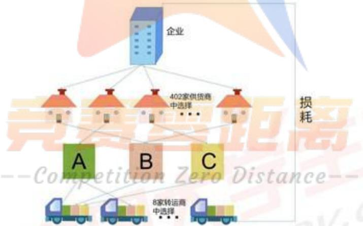

<details>
<summary>flowchart</summary>

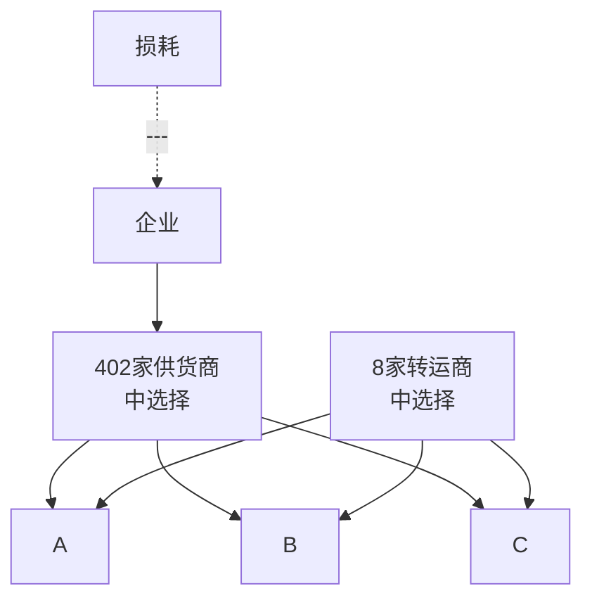
</details>

图1：问题分析总体可视图

## 三、基本假设

1、假设初始库存量满足企业两周产能的约束；

2、假设运输损耗等同于运输损耗材料转换为产能后的损耗；  
3、假设平均运输损耗为1.374294%，假设不考虑供货误差导致的运输和仓储成本变化；  
4、假设考虑平均运输损耗，则实际规划材料所能产生的产能应为28488m³；  
5、假设在分析采购成本时 C 的采购单价为 1。

## 四、符号说明

<table><tr><td>符号</td><td>符号说明</td></tr><tr><td>Q</td><td>每周产能</td></tr><tr><td> $Q_i$ </td><td>第i周产能</td></tr><tr><td> $x_{ij}$ </td><td>第i周是否从第j个供应商采购</td></tr><tr><td> $Q_{A,i}$ </td><td>A类型第i周库存量</td></tr><tr><td> $Q_{B,i}$ </td><td>B类型第i周库存量</td></tr><tr><td> $Q_{C,i}$ </td><td>C类型第i周库存量</td></tr><tr><td> $mat_j$ </td><td>第j个供应商供应材料类型</td></tr><tr><td> $R_{A,i}$ </td><td>A类型第i周需求量</td></tr><tr><td> $R_{B,i}$ </td><td>B类型第i周需求量</td></tr><tr><td> $R_{C,i}$ </td><td>C类型第i周需求量</td></tr><tr><td> $U_{i,k}$ </td><td>第i周第k个转运商损耗率的随机变量</td></tr><tr><td> $Y_{ij}$ </td><td>第i周第j个供应商供应量的随机变量</td></tr><tr><td> $tra_{i,j,k}$ </td><td>第i周第k个转运商是否运送第j家供应商的原材料</td></tr><tr><td> $u_{ik}^A$ </td><td>第i周第k个转运商运送A材料数量</td></tr><tr><td> $u_{ik}^B$ </td><td>第i周第k个转运商运送B材料数量</td></tr><tr><td> $u_{ik}^C$ </td><td>第i周第k个转运商运送C材料数量</td></tr></table>

注：其它符号将在文中具体说明

## 五、模型的建立与求解

## 5.1 数据预处理

本文为便于后续模型的建立，需要找出原材料供应商供应情况规律，因此需要对附件1各数据进行预处理分析，得出不同供应商供货量的一定规律大致分为以下三种。

## 1、周期性

即某家供应商前 240 周供货量数据在周期内具有相似的分布。典型供应商有 S140，其供货量分布如图 2 所示：

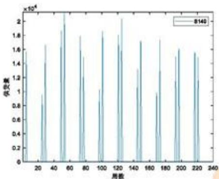

<details>
<summary>bar</summary>

| User Count | Value (x10^4) |
| --- | --- |
| ~5 | ~1.6 |
| ~25 | ~0.95 |
| ~30 | ~1.65 |
| ~50 | ~1.85 |
| ~55 | ~2.1 |
| ~70 | ~1.8 |
| ~75 | ~1.5 |
| ~95 | ~1.05 |
| ~100 | ~1.85 |
| ~120 | ~1.8 |
| ~125 | ~2.05 |
| ~145 | ~1.3 |
| ~150 | ~1.7 |
| ~170 | ~0.95 |
| ~175 | ~1.75 |
| ~195 | ~1.5 |
| ~200 | ~1.6 |
| ~220 | ~1.55 |
| ~225 | ~1.15 |
</details>

图 2: S140 供货量图

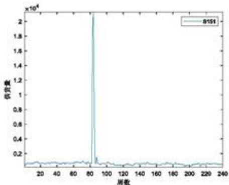

<details>
<summary>line</summary>

| Frequency (Hz) | Value (x 10^4) |
| --- | --- |
| ~80 | ~0.1 |
| ~85 | ~2.1 |
| ~90 | ~0.15 |
</details>

图 3: S151 供货量图

这些供货商供货量数据具有明显的周期性，且周期为 24 周，并且不同周期同时段的供货量会发生波动。

## 2、突变性

即某家供货商在大部分周数有较为稳定的供应量，但在少数情况下供货量特别大。典型的有S151供货商，其240周供货量分布情况如图3所示：

## 3、泊松分布

对每家供应商 240 周的供货量分布进行深入分析，经过 K-S 检验后发现共有 112 家供应商 240 周内的供货量服从泊松分布，因此在后续模型中考虑到随机变量对结果的影响。

总体分析：

首先以周为单位，将每一周 A、B、C 原材料各供应商供货量相加，用 matlab 作出 A、B、C 供应量分布图如下：

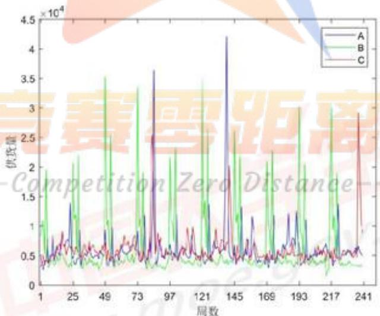

<details>
<summary>line</summary>

| 周数 | A (10^4) | B (10^4) | C (10^4) |
| --- | --- | --- | --- |
| 1 | ~0.5 | ~0.5 | ~0.5 |
| 25 | ~1.4 | ~2.2 | ~0.7 |
| 49 | ~0.6 | ~3.5 | ~0.6 |
| 73 | ~0.8 | ~3.3 | ~0.7 |
| 97 | ~0.6 | ~2.3 | ~0.6 |
| 121 | ~0.6 | ~3.5 | ~0.6 |
| 145 | ~4.2 | ~2.6 | ~2.0 |
| 169 | ~0.6 | ~2.3 | ~0.6 |
| 193 | ~1.2 | ~3.0 | ~0.6 |
| 217 | ~0.6 | ~3.0 | ~0.6 |
| 241 | ~0.6 | ~0.6 | ~2.9 |
</details>

图4：不同周下材料类型供货分布

由上图可以观察到，A、B、C材料的供货量分布均具有周期性，且供货规律周期为

24周。

分析每个周期的 A、B、C 供货情况，部分周期供货量分布情况如下图所示：

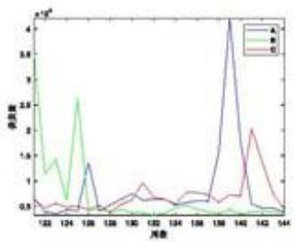

<details>
<summary>line</summary>

| Category | A | B | C |
| --- | --- | --- | --- |
| 122 | ~0.1 | ~3.5 | ~0.6 |
| 124 | ~0.1 | ~0.7 | ~0.3 |
| 128 | ~1.3 | ~2.6 | ~0.3 |
| 130 | ~0.6 | ~0.1 | ~0.7 |
| 132 | ~0.6 | ~0.1 | ~0.9 |
| 134 | ~0.5 | ~0.1 | ~0.6 |
| 136 | ~0.6 | ~0.1 | ~0.7 |
| 138 | ~1.5 | ~0.1 | ~0.6 |
| 139 | ~4.2 | ~0.1 | ~0.7 |
| 141 | ~0.5 | ~0.1 | ~2.0 |
| 144 | ~0.1 | ~0.1 | ~0.1 |
</details>

图 5: 第 6 周期供货分布

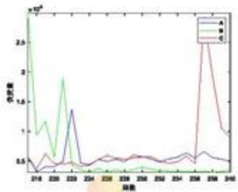

<details>
<summary>line</summary>

| X | A (x10^5) | B (x10^5) | C (x10^5) |
| --- | --- | --- | --- |
| 216 | ~0.3 | ~2.9 | ~0.4 |
| 220 | ~0.4 | ~1.2 | ~0.6 |
| 223 | ~1.4 | ~1.9 | ~0.4 |
| 224 | ~0.4 | ~0.3 | ~0.4 |
| 228 | ~0.5 | ~0.3 | ~0.6 |
| 238 | ~0.5 | ~0.3 | ~0.5 |
| 258 | ~0.5 | ~0.3 | ~0.5 |
| 259 | ~0.6 | ~0.3 | ~2.5 |
| 260 | ~0.5 | ~0.3 | ~1.0 |
| 261 | ~0.5 | ~0.3 | ~0.9 |
</details>

图6: 第10周期供货分布

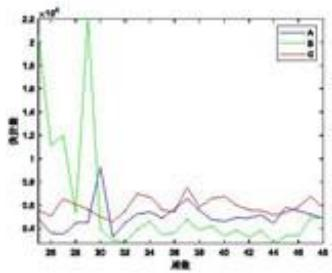

<details>
<summary>line</summary>

| X | A | B | S |
| --- | --- | --- | --- |
| 26 | ~0.45 | ~1.75 | ~0.75 |
| 27 | ~0.42 | ~1.15 | ~0.85 |
| 28 | ~0.45 | ~1.20 | ~0.80 |
| 29 | ~0.50 | ~0.80 | ~0.75 |
| 30 | ~0.95 | ~2.20 | ~0.70 |
| 31 | ~0.40 | ~0.30 | ~0.65 |
| 32 | ~0.45 | ~0.45 | ~0.75 |
| 33 | ~0.55 | ~0.50 | ~0.85 |
| 34 | ~0.60 | ~0.45 | ~0.80 |
| 35 | ~0.65 | ~0.55 | ~0.85 |
| 36 | ~0.75 | ~0.60 | ~0.95 |
| 37 | ~0.85 | ~0.65 | ~1.10 |
| 38 | ~0.75 | ~0.55 | ~1.00 |
| 39 | ~0.70 | ~0.45 | ~1.10 |
| 40 | ~0.65 | ~0.45 | ~1.15 |
| 41 | ~0.65 | ~0.45 | ~1.10 |
| 42 | ~0.65 | ~0.45 | ~1.10 |
| 43 | ~0.65 | ~0.45 | ~1.10 |
| 44 | ~0.65 | ~0.45 | ~1.10 |
| 45 | ~0.75 | ~0.45 | ~1.15 |
| 46 | ~0.80 | ~0.45 | ~1.20 |
| 47 | ~0.75 | ~0.45 | ~1.15 |
| 48 | ~0.70 | ~0.45 | ~1.15 |
</details>

图 7: 第 2 周期供货分布

由图 5、图 6、图 7 看出，不同周期下 A、B、C 的供货分布会不相同，但具有相似的供货规律。如 B 材料在每个周期的第 1 周与第 5 周达到供货量的较大值，并且在第 2-4 周供货量有减少的趋势，而在第 6 周之后的数据变化较为平稳。故在每个周期里，A、B、C 材料供货量都有旺季与淡季，A 材料旺季为每个周期的第 6 周，B 材料旺季为每个周期的第 1 周与第 5 周，C 材料旺季为每周期的第 22 周。

综上，供应商的供货量具有周期性，部分供应商供货量存在泊松分布的情况，并且供货量会根据提供材料类型的分类在不同周期下各自存在淡季和旺季的情况。

## 5.2 问题一熵权法-TOPSIS 评价模型的建立与求解

## 5.2.1 确定评估指标

问题一需要针对附件 1 中 402 家原材料供应商的订货量和供货量进行量化分析，为选出最重要的 50 家供应商，本题使用平均供货强度、完成率、订单率和风险作为指标对供应商的重要性进行评估。

## 1、平均供货强度：

将各家供应商 240 周的供货量之和取均值定义为平均供货强度 $r_{j1}$ ，平均供货强度越大，说明供应商生产能力越强，越能保证企业生产，进而该家供应商重要性越强。公式为：

$$
r _ {j 1} = \frac {\sum_ {l = 1} ^ {2 4 0} c _ {j l}}{2 4 0}, j = 1, 2, \dots , 4 0 2 \tag {5-2-1}
$$

其中 $c_{ji}$ 为第j家供应商第i周的供货量， $j=1,2,\cdots,402$ 。

## 2、完成率：

将 402 家供应商 240 周的总体供货量与接收到的订货量的比值定义为供应商的完成率 $r_{j2}$ ，若完成率太高会提高仓储成本，若完成率太低则供应商供应能力不足。针对这一问题本文对完成率定义区间 [0.8, 1.2]，若完成率在区间内或越接近该区间，说明供应商完成企业安排的能力越强，越能保证企业生产，进而该家供应商的重要性越强。公式为：

$$
r _ {j 2} = \sum_ {i = 1} ^ {2 4 0} c _ {j i} / \sum_ {i = 1} ^ {2 4 0} h _ {j i} \tag {5-2-2}
$$

其中 $h_{ji}$ 为第j家供应商第i周接收到的企业的订货量。

## 3、订单率：

将每家供应商完成指标的供货量的周数在 240 周的占比定义为订单率 $r_{j3}$ ，观察数据，定义指标为 10，即若供应商该周供货量不小于 10，则算完成指标，记录完成指标的总周数，再求出总周数在 240 周的占比。因此，订单率越高，则供应商供货能力越强，越能保证企业生产，进而该家供应商的重要性越强。公式为：

$$
r_{j3} = \frac{g_j}{240}\times 100\% \tag{5 - 2 - 3}
$$

其中 $g_{j}$ 为第j家供应商供货量不小于10的总周数。

## 4、风险：

将各供应商240周的供货量的标准差定义为风险 $r_{j4}$ ，由于在实际情况下企业往往选择供货能力较稳定的供应商，因此供应商的重要性往往与其稳定性挂钩。风险越小，说明该供应商供货量越稳定，则企业选择的可能性越大，进而供应商的重要性越强。公式为：

$$
r _ {j 4} = \sqrt {\frac {\sum_ {i = 1} ^ {2 4 0} (c _ {j i} - \bar {c} _ {j}) ^ {2}}{2 4 0}} (i = 1, 2, \dots , 2 4 0) \tag {5-2-4}
$$

其中 $\bar{c}_{j}$ 为第j家供应商240周的供货量之和的均值， $i=1,2,\cdots,402$ 。

## 5.2.2 熵权法-TOPSIS 模型

熵权法-TOPSIS 模型是一种将根据各指标所含信息的差异性进行各指标客观赋权和逼近于理想解的排序结合起来的一种评价模型。其具体运用流程图 $^{[1]}$ 如下：

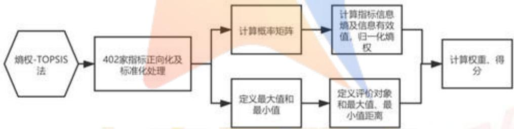

<details>
<summary>flowchart</summary>

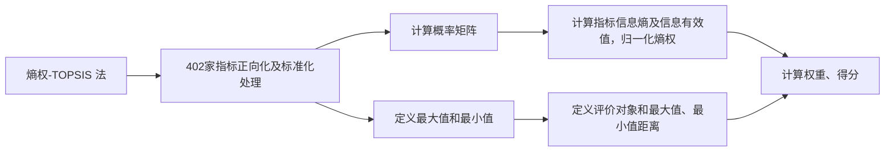
</details>

图8：熵权-TOPSIS法流程图

确定权重后，将每家供应商按平均供货强度、完成率、订单率、风险结合各自权重计算得分，得分公式如下：

$$
v a l u e _ {j} = r _ {j 1} \omega_ {1} + r _ {j 2} \omega_ {2} + r _ {j 3} \omega_ {3} + r _ {j 4} \omega_ {4} \tag {5-2-5}
$$

其中 $value_{j}$ 表示第j家供应商得分，得分越高，对应的供应商越重要。

## 5.1.4 熵权法-TOPSIS 模型的求解与结果分析

## 1、确定权重

本文将 4 种指标作为评价标准对 402 家供应商进行重要性的评分，依据熵权法 -TOPSIS 模型利用 matlab 确定评价指标的权重，权重如表 1 所示：

表1：确定评价指标的权重

<table><tr><td>计算数值</td><td>平均供货强度</td><td>完成率</td><td>订单率</td><td>风险</td></tr><tr><td>熵值( $e_j$ )</td><td>0.5999</td><td>0.9486</td><td>0.6829</td><td>0.9988</td></tr><tr><td>权重( $w_j$ )</td><td>0.519794524</td><td>0.066756</td><td>0.411936</td><td>0.001513</td></tr></table>

## 2、得分排名：

结合公式，得出最后得分，并依据得分选出前50家供应商如下表所示：

表2：前50家供应商排名及对应得分

<table><tr><td>排名</td><td>1</td><td>2</td><td>3</td><td>4</td><td>5</td><td>6</td><td>7</td><td>8</td><td>9</td><td>10</td></tr><tr><td>供应商 ID</td><td>S229</td><td>S361</td><td>S140</td><td>S108</td><td>S151</td><td>S340</td><td>S282</td><td>S275</td><td>S329</td><td>S131</td></tr><tr><td>得分</td><td>0.999</td><td>0.929</td><td>0.719</td><td>0.706</td><td>0.592</td><td>0.539</td><td>0.534</td><td>0.510</td><td>0.505</td><td>0.464</td></tr><tr><td>排名</td><td>11</td><td>12</td><td>13</td><td>14</td><td>15</td><td>16</td><td>17</td><td>18</td><td>19</td><td>20</td></tr><tr><td>供应商 ID</td><td>S308</td><td>S330</td><td>S139</td><td>S356</td><td>S268</td><td>S306</td><td>S194</td><td>S352</td><td>S143</td><td>S348</td></tr><tr><td>得分</td><td>0.463</td><td>0.462</td><td>0.452</td><td>0.449</td><td>0.448</td><td>0.441</td><td>0.393</td><td>0.371</td><td>0.360</td><td>0.325</td></tr><tr><td>排名</td><td>21</td><td>22</td><td>23</td><td>24</td><td>25</td><td>26</td><td>27</td><td>28</td><td>29</td><td>30</td></tr><tr><td>供应商 ID</td><td>S247</td><td>S284</td><td>S365</td><td>S031</td><td>S040</td><td>S364</td><td>S367</td><td>S055</td><td>S346</td><td>S080</td></tr><tr><td>得分</td><td>0.321</td><td>0.307</td><td>0.302</td><td>0.300</td><td>0.291</td><td>0.288</td><td>0.286</td><td>0.283</td><td>0.283</td><td>0.280</td></tr><tr><td>排名</td><td>31</td><td>32</td><td>33</td><td>34</td><td>35</td><td>36</td><td>37</td><td>38</td><td>39</td><td>40</td></tr><tr><td>供应商 ID</td><td>S294</td><td>S218</td><td>S244</td><td>S266</td><td>S007</td><td>S123</td><td>S395</td><td>S307</td><td>S201</td><td>S374</td></tr><tr><td>得分</td><td>0.278</td><td>0.276</td><td>0.274</td><td>0.270</td><td>0.269</td><td>0.269</td><td>0.227</td><td>0.222</td><td>0.220</td><td>0.209</td></tr><tr><td>排名</td><td>41</td><td>42</td><td>43</td><td>44</td><td>45</td><td>46</td><td>47</td><td>48</td><td>49</td><td>50</td></tr><tr><td>供应商 ID</td><td>S003</td><td>S037</td><td>S189</td><td>S126</td><td>S005</td><td>S078</td><td>S292</td><td>S074</td><td>S208</td><td>S210</td></tr><tr><td>得分</td><td>0.186</td><td>0.185</td><td>0.180</td><td>0.159</td><td>0.143</td><td>0.128</td><td>0.128</td><td>0.123</td><td>0.119</td><td>0.115</td></tr></table>

## 3、结果分析：


<details>
<summary>pie</summary>

| Category | Value (%) |
| --- | --- |
| Blue | 36% |
| Orange | 26% |
| Gray | 38% |
</details>

A B C

图9：前50家供应商三种材料占比图

问题一 402 家供应商各指标数据及得分排名保存在附录中。由表 2 看出，前 50 家供应商得分相差较大，排名最高的两家 S229、S361 得分分别为 0.999、0.929，与后面的供应商得分 0.719 明显断档。

由上图可知，前50家供应商供应的三种材料占比C>A>B，总体来说材料类型分布

均匀，供应需求得到满足。

## 5.2 问题二双层随机规划模型的建立与求解

## 5.2.1 供应商选择模型

## - 确定决策变量

由题意易知本问中的决策变量应为未来 24 周所选择的供应商，故引入 0-1 整数变量表示如下：

$$
x _ {i j} = \left\{ \begin{array}{l l} 1, \text {第} i \text {周从第} j \text {个供应商采购} \\ 0, \text {否则} \end{array} \right. \tag {5-3-1}
$$

## - 确定优化目标

本问中需要选择尽可能少的供应商来满足生产的需求，故优化目标为最小化企业未来24周的不重复供应商个数，记I为供应商总数， $T_{j}$ 表示未来24周是否有第j家供应商，优化目标为：

$$
\begin{array}{l} \min Z _ {1} = \sum_ {j = 1} ^ {I} T _ {j} \\ T _ {j} = \left\{ \begin{array}{l} 1, \sum_ {i = 2 4 1} ^ {2 6 4} x _ {i j} > 0 \\ 0, \sum_ {i = 2 4 1} ^ {2 6 4} x _ {i j} = 0 \end{array} \right. \\ \end{array}
$$

## - 确定约束条件

记第j个供应商供应的材料类型为 $mat_{j}$ ，其第i周最大稳定供货量为 $sta_{ij}$ 。c表示C类单位原材料采购成本。该企业每周的产能为Q，每立方米消耗A、B、C类材料分别记为 $use_{A},use_{B},use_{C}$ 。A、B、C材料第i周需求量分别记为 $R_{A,i}$ 、 $R_{B,i}$ 、 $R_{C,i}$ ，初始库存量为 $Q_{A}^{\prime}$ 、 $Q_{B}^{\prime}$ 、 $Q_{C}^{\prime}$ ，第i周末库存量记为 $Q_{A,i}$ 、 $Q_{B,i}$ 、 $Q_{C,i}$ ，前240周期望值分别记为 $E(A)$ 、 $E(B)$ 、 $E(C)$ 。

（1）定义每周需求量为期望与库存波动值相加 $^{[2]}$ ，等式如下：

$$
\left\{ \begin{array}{l} R _ {A, i} = E (A) + Q _ {A} ^ {\prime} - Q _ {A, i - 1} \\ R _ {B, i} = E (B) + Q _ {B} ^ {\prime} - Q _ {B, i - 1}, i = 2 4 1, 2 4 2 \dots , 2 6 4 \\ R _ {C, i} = E (C) + Q _ {C} ^ {\prime} - Q _ {C, i - 1} \end{array} \right. \tag {5-3-2}
$$

(2) 假设初始库存量满足如下约束:

$$
\frac {Q _ {A} ^ {\prime}}{u s e _ {A}} + \frac {Q _ {B} ^ {\prime}}{u s e _ {B}} + \frac {Q _ {C} ^ {\prime}}{u s e _ {C}} = 2 Q \tag {5-3-3}
$$

（3）计算得到8家转运商损耗率均值记为 $\delta$ ，库存量为最大稳定供货量加上供货量减去消耗量，则有：

$$
\left\{ \begin{array}{l} Q _ {A, i} = Q _ {A, i - 1} + \sum_ {i} \sum_ {j = 1} ^ {I} x _ {i j} s t a _ {i j} (1 - \delta) - R _ {A, i}, m a t _ {j} \in A, j = 1, 2 \dots , I \\ Q _ {B, i} = Q _ {B, i - 1} + \sum_ {i} \sum_ {j = 1} ^ {I} x _ {i j} s t a _ {i j} (1 - \delta) - R _ {B, i}, m a t _ {j} \in B, j = 1, 2 \dots , I \\ Q _ {C, i} = Q _ {C, i - 1} + \sum_ {i} \sum_ {j = 1} ^ {I} x _ {i j} s t a _ {i j} (1 - \delta) - R _ {C, i}, m a t _ {j} \in C, j = 1, 2 \dots , I \end{array} \right. \tag {5-3-4}
$$

记企业第l周第j家供货商订货量为 $d_{lj}$ ，供货量为 $g_{lj}$ ，记第A个对应周序列中周数的集合 $AW=\{A,A+24,\cdots,A+24\times9\}$ ，最大稳定供货量定义为：

$$
s t a _ {i j} = \max \{g _ {l j} \}, \frac {g _ {l j}}{d _ {l j}} > 0. 9, i, l \in A W, l <   i
$$

$$
d _ {l j} = \left\{ \begin{array}{l l} d _ {l j}, \text {第} l \text {周第} j \text {家订货量不为} 0 \\ \infty , \text {否则} \end{array} \right.
$$

(4) 任一周的库存量保持多于两周生产的原材料量:

$$
\frac {Q _ {A , i}}{u s e _ {A}} + \frac {Q _ {B , i}}{u s e _ {B}} + \frac {Q _ {C , i}}{u s e _ {C}} \geq 2 Q, i = 2 4 1, 2 4 2 \dots , 2 6 4 \tag {5-3-5}
$$

(5) 任一周的库存量为自然数:

$$
Q _ {A, i}, Q _ {B, i}, Q _ {C, i} \in N, i = 2 4 1, 2 4 2 \dots , 2 6 4 \tag {5-3-6}
$$

综上，供应商选择模型为：

$$
\min Z _ {1} = \sum_ {j = 1} ^ {I} T _ {j}
$$

$$
s. t. \left\{ \begin{array}{l} T _ {j} = \left\{ \begin{array}{l} 1, \sum_ {i = 2 4 1} ^ {2 6 4} x _ {i j} > 0 \\ 0, \sum_ {i = 2 4 1} ^ {2 6 4} x _ {i j} = 0 \end{array} \right. \\ \text {式} (5 - 3 - 2, 3 \dots 6) \\ s t a _ {i j} = \max \left\{g _ {l j} \right\}, \frac {g _ {l j}}{d _ {l j}} > 0. 9, l \in A W, \frac {i}{A} \in N ^ {*} \\ d _ {l j} = \left\{ \begin{array}{l} d _ {l j}, \text {第} l \text {周第} j \text {家订货量不为 } 0 \\ \infty , \text {否则} \end{array} \right. \end{array} \right.
$$

## 5.2.2 订购方案与转运方案

## - 确定决策变量

本问需规划成本最小的订购模型与损耗最少的转运方案，故决策变量应为所选择的供应商的供货量，以及所选择的转运商与转运的原材料：

$$
\{Y _ {i j}, u _ {i k} ^ {A}, u _ {i k} ^ {B}, u _ {i k} ^ {C}, t r a _ {i, j, k} \}
$$

## - 确定优化目标

由题意，首先应确定最经济的原材料订购方案，其次再依据订购方案制定损耗最少的转运方案，故可以用双层规划来对优化目标进行刻画。记随机变量 $Y_{ij}$ 表示第i周第j个供应商的供货量。

下层规划的优化目标为最小化每周原材料订购成本：

$$
\min \sum_ {i} (y _ {A, i} + y _ {B, i} + y _ {C, i})
$$

A、B、C类采购成本分别定义为 $y_{A,i}$ 、 $y_{B,i}$ 、 $y_{C,i}$ ，计算如下：

$$
\left\{ \begin{array}{l} y _ {A, i} = 1. 2 c \sum_ {j = 1} ^ {I} x _ {i j} Y _ {i j}, m a t _ {j} \in A \\ y _ {B, i} = 1. 1 c \sum_ {j = 1} ^ {I} x _ {i j} Y _ {i j}, m a t _ {j} \in B, i = 2 4 1, 2 4 2 \dots , 2 6 4 \\ y _ {C, i} = c \sum_ {j = 1} ^ {I} x _ {i j} Y _ {i j}, m a t _ {j} \in C \end{array} \right. \tag {5-3-7}
$$

本文假设运输损耗等同于运输损耗材料转换为产能后的损耗，即运输损耗最小指的是运输损耗材料转换为产能后的损耗最小，故上层规划的优化目标为：

$$
\min Z _ {2} = \frac {\text {rest} _ {A , I}}{\text {use} _ {A}} + \frac {\text {rest} _ {B , I}}{\text {use} _ {B}} + \frac {\text {rest} _ {C , I}}{\text {use} _ {C}} \tag {5-3-8}
$$

记随机变量 $U_{ik}$ 为第i周第k个转运商的损耗率， $u_{ik}^{A}$ ， $u_{ik}^{B}$ ， $u_{ik}^{C}$ 分别表示第i周第k个转运商运输的A、B、C类型原材料量，L表示转运商总数。则第i周运送后损失的A、B、C类原材料量分别为：

$$
\left\{ \begin{array}{l} r e s t _ {A, i} = \sum_ {k = 1} ^ {L} u _ {i k} ^ {A} U _ {i k} \\ r e s t _ {B, i} = \sum_ {k = 1} ^ {L} u _ {i k} ^ {B} U _ {i k} \\ r e s t _ {C, i} = \sum_ {k = 1} ^ {L} u _ {i k} ^ {C} U _ {i k} \end{array} \right. \tag {5-3-9}
$$

## - 随机变量解释 $^{[2]}$

损耗率数据主要分为两类：

（1）周期型：即损耗率在24周的周期下呈现相似的分布。记第TY个周期中第l周时第k个转运商的周期型损耗率函数为 $h(\text{cycle}_{l,k}^{TY})$ 。  
（2）无规律型：即损耗率没有固定规律。记第i周第k个转运商的无规律型损耗率函数为 $h(non_{i,k})$ 。前240周转运均值记为 $E(non)$ 。

记第k家转运商扰动白噪声序列为 $\beta_{k}$ ，则随机变量为：

$$
U _ {i, k} = \left\{ \begin{array}{l} h \left(\text {cycle} _ {i, k} ^ {T V}\right) + \beta_ {k}, l \in A W, \frac {i}{A} \in N ^ {*} \\ E (\text {non}) \end{array} \right. \tag {5-3-10}
$$

对于供货商供货数据主要分为以下三种情况：

（1）周期型供货：即前240周供货情况在以24周为周期的情况下具有相似性，记第TY周期中第l周时第j家供货商具有周期性的供货量函数为 $f(cyc_{lj}^{TY})$ ;  
（2）泊松分布型供货：即前240周供货情况服从泊松分布，则记第i周第j家供货商具有泊松分布型供货函数为 $f(poi_{i,j})$ ;

（3）突变型供货：即前240周中某几周具有大供货量，其它周下供货较为平稳。对于此类型供货商，本文考虑到突变情况发生较少且极不确定，故只考虑平稳期数据，记第i周第j家供货商具有突变型供货期望为 $f(cha_{i,j})$ 。

记扰动白噪声序列为 $\beta_{j}$ ，则可得到第i周第j家供货商供货量为 $Y_{ij}$

$$
Y _ {i j} = \left\{ \begin{array}{l l} f (c y c _ {i, j} ^ {T Y}) + \beta_ {j}, \text {第} l \text {周第} j \text {家供货商周期型供货}, l \in A W, \frac {i}{A} \in N ^ {*} \\ f (p o i _ {i, j}), \text {第} i \text {周第} j \text {家供货商泊松分布型供货} \\ f (c h a _ {i, j}) + \beta_ {j}, \text {第} i \text {周第} j \text {家供货商突变型供货} \end{array} \right. \tag {5-3-11}
$$

## - 确定约束条件

记 $tra_{i,j,k}$ 表示第i周第k家转运商是否运送第j家供应商的原材料，则：

$$
t r a _ {i, j, k} = \left\{ \begin{array}{l l} 1, & \text {第} i \text {周第} k \text {家转运商运送第} j \text {家供应商的原材料} \\ 0, & \text {否则} \end{array} \right.
$$

上层规划的约束条件为：

(1) 对于转运的原材料量有变量为正整数约束:

$$
u _ {i k} ^ {A}, u _ {i k} ^ {B}, u _ {i k} ^ {C} \geq 0, i = 2 4 1, 2 4 2 \dots , 2 6 4, k = 1, 2 \dots , L \tag {5-3-12}
$$

(2) 对于每一家转运商有每周运输量不超过 6000 立方米/周的约束，即：

$$
u _ {i k} ^ {A} + u _ {i k} ^ {B} + u _ {i k} ^ {C} \leq 6 0 0 0, i = 2 4 1, 2 4 2 \dots , 2 6 4, k = 1, 2 \dots , L \tag {5-3-13}
$$

（3）一家供应商每周供应的原材料尽量由一家转运商运输，需要明确的是，如果本文所选的供应商的供货量大于6000立方米/周，那么一家转运商是不够的。所以约束条件书写如下：

$$
\sum_ {k = 1} ^ {L} x _ {i j} t r a _ {i, j, k} = \left[ \frac {Y _ {i j}}{6 0 0 0} \right] _ {\text {取整数}} + 1, i = 2 4 1, 2 4 2 \dots , 2 6 4, j = 1, 2 \dots , I \tag {5-3-14}
$$

（4）每家转运商每周运输商品数量 $^{[3]}$ 需满足如下公式：

$$
\left\{ \begin{array}{l} u _ {i k} ^ {A} = \sum_ {j = 1} ^ {I} x _ {i j} t r a _ {i, j, k} Y _ {i j}, m a t _ {j} \in A \\ u _ {i k} ^ {B} = \sum_ {j = 1} ^ {I} x _ {i j} t r a _ {i, j, k} Y _ {i j}, m a t _ {j} \in B, k = 1, 2 \dots , L, i = 2 4 1, 2 4 2 \dots , 2 6 4 (5 - 3 - 1 5) \\ u _ {i k} ^ {C} = \sum_ {j = 1} ^ {I} x _ {i j} t r a _ {i, j, k} Y _ {i j}, m a t _ {j} \in C \end{array} \right.
$$

下层规划的约束条件为：

（1）不妨给服从泊松分布的供应商 $^{[4]}$ 假定一个置信水平 $\alpha_{j}$ ，设其供货量均值为 $\lambda_{j}$ ，则应满足：

$$
\sum_ {k = 0} ^ {f (p o i _ {i, j})} \frac {\left(\lambda_ {j}\right) ^ {k}}{k !} e ^ {- \lambda} \geq \alpha_ {j} \tag {5-3-16}
$$

综上，双层随机规划模型为：

$$
\min Z _ {2} = \frac {\text {rest} _ {A , i}}{\text {use} _ {A}} + \frac {\text {rest} _ {B , i}}{\text {use} _ {B}} + \frac {\text {rest} _ {C , i}}{\text {use} _ {C}}
$$

$$
s. t. \left\{ \begin{array}{l} \min \sum_ {i} (y _ {A, i} + y _ {B, i} + y _ {C, i}) \\ s. t. \text {式} (5 - 3 - 1 1) 、 \text {式} (5 - 3 - 7) 、 \text {式} (5 - 3 - 1 6) \\ \text {式} (5 - 3 - 9) 、 \text {式} (5 - 3 - 1 2, 1 3 \dots 1 5) \end{array} \right.
$$

## 5.3.3 问题二双层随机规划模型的求解

## - 基于动态权重的离散化贪心和动态规划算法

在数据预处理中已经将240周均分为10个周期，本文针对供货商i在周期内第j周的供货情况，利用10个相同供货商与周期内相同对应周的数据，分析出此供货商在此周能够提供的供货量的期望值，且期望此值尽量大。

本文设定了两个规则：

（1）供货量在订货量中的占比应在90%以上，即供货相对稳定；  
（2）此供货量应在同供货商与周期内同对应周的数据平均值的三倍以内，即排除不稳定性太大的数据，如供货商 S151 的第 84 周的供货数据 21267；

在以上两个规则都满足的情况下，选择尽可能大的实际供货量作为本文使用的期望供货量。

本文为确定供货商，使用动态权重的离散化贪心 $^{[5]}$ 和动态规划的算法进行求解。

## 1、动态权重的贪心算法：

初始各周权重相同，但是规划确定了一个供货商后，供货商供货将存在一定规律，如第1周供货较多但第3周供货较少，若全局只使用一种贪心策略，可能会导致总体情况良好但是某一周存在极度缺少供货的情况。因此在每次贪心确定对策略帮助最大的供货商后会根据上一个状态提供材料距离期望产能的差，重新设置下一个状态每周的贪心运算权重。

由于转运过程会存在损耗，期望产能需要在原先产能的基础上再增加可能损耗的产能。由于附件2损耗率大小相差较大且无规则排列，本文将附件2的8家转运商240周损耗率为0和数值突变的损耗率剔除后取损耗率均值，再纵向取损耗率均值为 $1.374294\%$ ，将原先产能除以该均值得出一个期望产能28488。则设 $\mathrm{C} = 28488$ 为期望产能，权重更新如下：

$$
S U M c h a = \sum_ {i = 2 4 1} ^ {2 6 4} \max (C - G H _ {i}, 0)
$$

$$
Z _ {i} = \frac {\max (C - G H _ {i} , 0)}{S U M c h a}
$$

## 2、动态规划算法：

全部使用这种动态权重的贪心策略，也难以保证选取的供应商会是最优的选择，因此本文额外设计了一种动态规划算法在贪心策略之外进行规划，具体为：

$$
D P [ i ] = \max \left(D P [ i ], T (x, Z) + T (i - x, Z ^ {\prime})\right)
$$

其中 DP[i] 表示总供货商数量为 i 时，此时的最优策略，T 为贪心规划过程，x 和 (i-x) 表示在此次贪心中共在其中规划了多少个供货商，保证两次贪心规划的供货商不重复，Z为初始权重， $Z'$ 为经过前一部分贪心规划后更新的每周权重值。

供货存在明显的周期性且存在旺季与淡季，因此必然存在某周难以订购齐本周需要材料的情况，经过数据分析，发现第7周和第8周属于连续的供货淡季，因此本文在目标函数中设计了向前观察2周并进行提前准备材料的算法来避免此部分会出现的问题。

动态权重的贪心和动态规划具体算法步骤如下：

Step1: 数据初始化，读入期望供货数据，更新可供选择的重要商家；

Step2: 在权重不变的情况下，进行第一轮运算，记录总供货商数量为 i 时的最优目标函数和对应规划商家；

Step3: 在权重动态的情况下，进行贪心决策和动态规划，更新最优答案；

Step4: 输出所有总供货商数量情况下的答案，找到目标函数最早变为0时对应的供货商情况，作为至少选择多少家供应商供应原材料才可能满足生产的需求的答案，并在后续求解中使用。

## 3、离散化贪心规划算法：

确定供货商后需要规划这些供货商的每周供货量，本文使用离散化贪心规划的方法。首先根据供应商的每周期望供货量，产生离散化数据，具体以其制作成成品的单位成本、对应供货商、对应周和供应产品类别作为一个数据结构单位。对所有单位体积的产品都进行此离散化处理，以便于后续的排序与选择。

此材料制作单位产品的成本价为（单位材料成本价+单位材料储存价）/此单位体积提供稳定性）/单位材料制造成品量。

在算法中将保留一定量的前几周可订购但未被订购的材料的数据到后几周的规划中，用于补充供货淡季时的供货空缺。

离散化贪心规划具体算法步骤为：

Step1: 数据初始化，读入期望供货数据，更新此时可供选择的商家；

Step2: 对本周将材料以 1 立方米为单位离散化，假设该企业第一周原始期望从供应商获得的材料量为 40000 立方米，考虑供货稳定性并增加数据处理量至 44000 立方米材料，比原先增加了 110%，此后等比例处理供应商供货，对于多于期望值的材料，将会存在供货稳定的成本，记录此周的成本、供应商；

Step3：选择前几周可购买但未被规划购买材料的数据，保留前28200×2个离散化数据，进行成本更新，即加上存储成本；

Step4: 将 Step2 与 Step3 结果合并比较并排序，在保证选择的材料能够达成当周产能的前提下，对材料进行最优成本选择。在选择完毕后删除被选择购买的数据，形成新的可购买但未被规划购买材料的数据；

Step5:重复 Step2、Step3、Step4，直至 24 周。

## 4、0-1 背包规划运输算法：

对材料种类进行分析，每单位价值 A>B>C，因此希望 A 尽量由更可靠的转运商转运。对转运商进行分析发现转运商可靠度满足：T3>T6>T2>T8>T4>T1>T7>T5

首先本文根据转运商可靠度由好到坏规划，将单位材料成本由高到低规划，设定了一个初始的转运分配值，即材料 X 应被转运商 Y 运输多少，再在此基础上使用 0-1 背包的动态规划进行求解。

$P(i)$ 为第i组材料占用空间， $V(i)$ 为第i组材料价值。状态转移方程为：

$$
N o w D P (j) = \max \left(N o w D P (j), D P (j - P (i)) + V (i)\right)
$$

具体算法流程如下：

Step1: 分析材料价值和转运商可靠的，初始化规划顺序

Step2: 根据确定的规划顺序，确定初始的转运分配值矩阵，贪心处理转运总量大于6000的材料，具体为根据转运分配值分割，尽可能排满部分的转运分配值，再将转运分配值更新

Step3: 选择规划的转运商，应优先规划可靠的转运商

Step4: 选择规划的材料类型，应优先规划单位价格高的材料，更新转运分配值，具体为此转运商盈余的转运能力增加到被更新的转运分配值上。根据此时转运分配值进行0-1背包求解，求解完毕后更新已被规划材料防止此材料再次被规划。

Step5: 若当前转运商全部转运量规划完毕且仍有待规划材料则返回 Step3 规划下一个转运商，若材料类型未规划完毕则返回 Step4 规划下一种材料。若完全规划完毕则进入 Step6

Step6: 贪心处理未能成功规划材料，具体未找到最可靠且能够排进去的转运商

Step7: 若未完成所有周的转运规划则返回 Step2 对下一周进行转运规划，否则进入 Step8

Step8: 输出具体数据至表格

## - 问题二订购和转运方案的实施效果分析

根据上述算法，用 python 求解得出至少选择 27 家供应商供应原材料才可能满足生产的需求，列表如下：

表 3: 27 家满足生产需求供应商

<table><tr><td>序号</td><td>1</td><td>2</td><td>3</td><td>4</td><td>5</td><td>6</td><td>7</td><td>8</td><td>9</td></tr><tr><td>供应商 ID</td><td>S229</td><td>S361</td><td>S140</td><td>S330</td><td>S108</td><td>S308</td><td>S282</td><td>S340</td><td>S329</td></tr><tr><td>序号</td><td>10</td><td>11</td><td>12</td><td>13</td><td>14</td><td>15</td><td>16</td><td>17</td><td>18</td></tr><tr><td>供应商 ID</td><td>S275</td><td>S356</td><td>S139</td><td>S143</td><td>S131</td><td>S151</td><td>S395</td><td>S352</td><td>S306</td></tr><tr><td>序号</td><td>19</td><td>20</td><td>21</td><td>22</td><td>23</td><td>24</td><td>25</td><td>26</td><td>27</td></tr><tr><td>供应商 ID</td><td>S268</td><td>S307</td><td>S194</td><td>S37</td><td>S284</td><td>S348</td><td>S247</td><td>S31</td><td>S365</td></tr></table>

具体订购和转运方案见附件A、B。

## 1、原材料订购方案：

根据附件 A 中的答案，本文将每周 A、B、C 的订货量进行统计，假设 C 的采购单价为 1，则 A、B 的采购单价分别为 1.2、1.1，得出未来 24 周采购成本如下图所示：

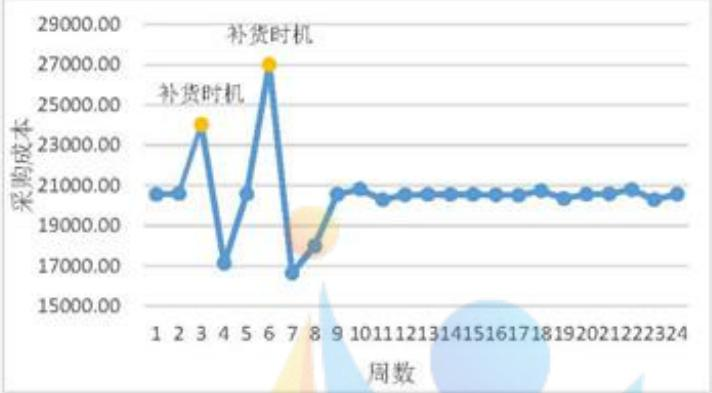

<details>
<summary>line</summary>

| 周数 | 采购成本 |
| --- | --- |
| 1 | ~20500.00 |
| 2 | ~20500.00 |
| 3 | ~24000.00 |
| 4 | ~17000.00 |
| 5 | ~20500.00 |
| 6 | ~27000.00 |
| 7 | ~16500.00 |
| 8 | ~18000.00 |
| 9 | ~20500.00 |
| 10 | ~21000.00 |
| 11 | ~20200.00 |
| 12 | ~20500.00 |
| 13 | ~20500.00 |
| 14 | ~20500.00 |
| 15 | ~20500.00 |
| 16 | ~20500.00 |
| 17 | ~20500.00 |
| 18 | ~21000.00 |
| 19 | ~20500.00 |
| 20 | ~21000.00 |
| 21 | ~21500.00 |
| 22 | ~21500.00 |
| 23 | ~21500.00 |
| 24 | ~21500.00 |
</details>

图 10: 问题二未来 24 周采购成本分布图

由上图可知，在最经济订购方案情况下未来24周采购成本均值为20554.5，由于数据预处理中已经观察出供应量存在淡季和旺季的情况，因此采购成本也随着淡旺季会发生较大的起伏，图中的第3、6周即处于旺季，而紧跟其后的一周均为淡季，因此旺季周可称为补货时机，在旺季期间采购较多材料，在淡季如第4、7周时就可以向其补货。除第3、4、6、7、8周外，大多数周的采购成本在均值附近，占比 $79.2\%$ ，说明订购方案安排较稳定，则模型及相应算法具有实际可行性。

考虑将 A、B、C 三类材料采购单价和每立方米消耗量分别相乘，得出 A、C 生产成本相同且小于 B，因此实际材料选择优先级为 A=C>B。


<details>
<summary>pie</summary>

| Category | Percentage |
| --- | --- |
| 满足优先级 | 79% |
| 不满足优先级 | 21% |
</details>

图 11: 24 周满足优先级占比

由上图可知，有 19 周满足 A=C>B 的优先级，符合最经济订购方案的条件，占比 79%，但由于 A、B、C 的实际供货量不一，因此也会存在不满足优先级的情况。

将附件 1 已知的 240 家供货量与未来 24 周的供货量分别计算均值产能和均值采购成本如下表所示:

表 4: 未来 24 周与已知量各指标均值

<table><tr><td>指标</td><td>240周均值</td><td>未来24周均值</td></tr><tr><td>采购成本</td><td>20168.68167</td><td>20554.5125</td></tr><tr><td>产能</td><td>27933.21412</td><td>28488.53641</td></tr><tr><td>比值</td><td>0.722032258</td><td>0.721501175</td></tr></table>

由上表可以看出，已知的240周采购成本的均值虽然略低于预测的24周均值，但由于其每周均值产能未达到28200立方米即未达到企业每周的产能，本文取采购成本与产能的比值即平均采购成本作为判断标准，由于0.722032258>0.721501175，则未来24周的平均采购成本小于已知量，说明本文预测的未来24周订货方案符合最经济的要求。

## 2、转运方案：

转运方案的实施效果可由所选择转运商的损耗率来刻画。在前240周已知转运损耗率的情况下，本文可得到每周企业转运方案的最佳决策，而在现实情况中即未知转运商的损耗率的情况下，预测值往往会高于最佳决策。故本文以预测值比上最佳决策的比值作为效果好坏依据，比值表如下：

表 5: 问题二比值表

<table><tr><td>周期</td><td>1</td><td>2</td><td>3</td><td>4</td><td>5</td></tr><tr><td>比值</td><td>1.708</td><td>1.482</td><td>0.989</td><td>0.943</td><td>1.152</td></tr><tr><td>周期</td><td>6</td><td>7</td><td>8</td><td>9</td><td>10</td></tr><tr><td>比值</td><td>0.914</td><td>1.335</td><td>1.234</td><td>1.771</td><td>1.255</td></tr></table>

由上表可知，预测值在最佳决策的 0.9\~1.8 倍范围内波动，平均为最佳决策的 1.278 倍。在未知损耗率的情况下，可认为本文的转运方案效果已十分优秀。

综上所述，问题二制定的订购方案和转运方案在实施效果上已十分优秀。

## 5.4 问题三带有偏差变量的随机规划模型的建立与求解

## 5.4.1 确定决策变量

由题意易知本问中决策变量为上一问的所有决策变量：

$$
\{x _ {i j}, Y _ {i j}, u _ {i k} ^ {A}, u _ {i k} ^ {B}, u _ {i k} ^ {C}, t r a _ {i, j, k} \}
$$

## 5.4.2 确定优化目标

本问中需要规划尽量多地采购 A 类和尽量少地采购 C 类原材料，同时希望转运商的转运损耗率尽量少，故优化目标为：

$$
\min Z _ {3} = w e i _ {1} \frac {d _ {A , i} ^ {-}}{d _ {C , i} ^ {-}} + w e i _ {2} d _ {t r a n, i} ^ {+} + w e i _ {3} d _ {c h u, i} ^ {+}
$$

## 5.4.3 确定约束条件

(1) 对于 A、B、C 类原材料，其满足如下约束：

$$
\left\{ \begin{array}{l} \sum_ {j = 1} ^ {I} x _ {i j} Y _ {i j} + d _ {A, i} ^ {-} = Q \times u s e _ {A}, m a t _ {j} \in A \\ \sum_ {j = 1} ^ {I} x _ {i j} Y _ {i j} + d _ {B, i} ^ {-} = Q \times u s e _ {B}, m a t _ {j} \in B, i = 2 4 1, 2 4 2 \dots , 2 6 4 \\ \sum_ {j = 1} ^ {I} x _ {i j} Y _ {i j} + d _ {C, i} ^ {-} = Q \times u s e _ {C}, m a t _ {j} \in C \end{array} \right. \tag {5-4-1}
$$

(2) 每周的所选择转运商转运损耗率之和满足:

$$
\sum_ {k = 1} ^ {L} \sum_ {j = 1} ^ {I} \operatorname{tran} _ {i, j, k} U _ {i, k} - d _ {\text {tran}, i} ^ {+} = 0, i = 2 4 1, 2 4 2 \dots , 2 6 4 \tag {5-4-2}
$$

(3)此时考虑随机变量损耗率,记 $Q_{A,i}^{\prime},Q_{B,i}^{\prime},Q_{C,i}^{\prime}$ 分别为A、B、C类型第i周末库存量, $rel_{A,i}$ 、 $rel_{B,i}$ 、 $rel_{C,i}$ 为运输后剩余木材量,则有 $^{[6]}$ :

$$
\begin{array}{l} \left\{ \begin{array}{l} Q _ {A, i} ^ {\prime} = Q _ {A, i - 1} ^ {\prime} + \sum_ {i} \sum_ {j = 1} ^ {I} x _ {i j} r e l _ {A, i} - R _ {A, i}, m a t _ {j} \in A, j = 1, 2 \dots , I \\ Q _ {B, i} ^ {\prime} = Q _ {B, i - 1} ^ {\prime} + \sum_ {i} \sum_ {j = 1} ^ {I} x _ {i j} r e l _ {B, i} - R _ {B, i}, m a t _ {j} \in B, j = 1, 2 \dots , I \\ Q _ {C, i} ^ {\prime} = Q _ {C, i - 1} ^ {\prime} + \sum_ {i} \sum_ {j = 1} ^ {I} x _ {i j} r e l _ {C, i} - R _ {C, i}, m a t _ {j} \in C, j = 1, 2 \dots , I \end{array} \right. (5-4-3) \\ \left\{ \begin{array}{l} r e l _ {A, i} = \sum_ {k = 1} ^ {L} u _ {i k} ^ {A} (1 - U _ {i k}) \\ r e l _ {B, i} = \sum_ {k = 1} ^ {L} u _ {i k} ^ {B} (1 - U _ {i k}) \\ r e l _ {C, i} = \sum_ {k = 1} ^ {L} u _ {i k} ^ {C} (1 - U _ {i k}) \end{array} \right. (5-4-4) \\ \end{array}
$$

记 $c_{tran}$ 为单位转运与仓储成本，则转运与仓储成本为：

$$
c _ {t r a n} \left(\sum_ {j = 1} ^ {I} x _ {i j} Y _ {i j} + Q _ {A, i} ^ {\prime} + Q _ {B, i} ^ {\prime} + Q _ {C, i} ^ {\prime}\right) - d _ {c h u, i} ^ {+} = 0 \tag {5-4-5}
$$

则需求量为：

$$
\left\{ \begin{array}{l} R _ {A, i} = E (A) + Q _ {A} ^ {\prime} - Q _ {A, i - 1} ^ {\prime} \\ R _ {B, i} = E (B) + Q _ {B} ^ {\prime} - Q _ {B, i - 1} ^ {\prime}, i = 2 4 1, 2 4 2 \dots , 2 6 4 \\ R _ {C, i} = E (C) + Q _ {C} ^ {\prime} - Q _ {C, i - 1} ^ {\prime} \end{array} \right. \tag {5-4-6}
$$

(4) 任一周的库存量保持多于两周生产的原材料量:

$$
\frac {Q _ {A , i} ^ {\prime}}{u s e _ {A}} + \frac {Q _ {B , i} ^ {\prime}}{u s e _ {B}} + \frac {Q _ {C , i} ^ {\prime}}{u s e _ {C}} \geq 2 Q, i = 2 4 1, 2 4 2 \dots , 2 6 4 \tag {5-4-7}
$$

(5) 任一周的库存量为自然数:

$$
Q _ {A, i} ^ {\prime}, Q _ {B, i} ^ {\prime}, Q _ {C, i} ^ {\prime} \in N, i = 2 4 1, 2 4 2 \dots , 2 6 4 \tag {5-4-8}
$$

(6) 对于转运的原材料量同样有:

$$
u _ {i k} ^ {A}, u _ {i k} ^ {B}, u _ {i k} ^ {C} \geq 0, i = 2 4 1, 2 4 2 \dots , 2 6 4, k = 1, 2 \dots , L
$$

(7) 对于每一家转运商有每周运输量不超过6000立方米/周的约束，即

$$
u _ {i k} ^ {A} + u _ {i k} ^ {B} + u _ {i k} ^ {C} \leq 6 0 0 0, i = 2 4 1, 2 4 2 \dots , 2 6 4, k = 1, 2 \dots , L
$$

(8) 一家供应商每周供应的原材料尽量由一家转运商运输, 需要明确的是, 如果本文所选的供应商的供货量大于 6000 立方米/周, 那么一家转运商是不够的。所以约束条件书写如下:

$$
\sum_ {k = 1} ^ {L} x _ {i j} t r a _ {i, j, k} = \left[ \frac {Y _ {i j}}{6 0 0 0} \right] _ {\mathrm{取整数}} + 1, i = 2 4 1, 2 4 2 \dots , 2 6 4, j = 1, 2 \dots , I
$$

(9) 每周的正负偏差量应为正整数，即

$$
d _ {A, i} ^ {-}, d _ {B, i} ^ {-}, d _ {C, i} ^ {-}, d _ {\text {tran}, i} ^ {+} \geq 0, i = 2 4 1, 2 4 2 \dots , 2 6 4 \tag {5-4-9}
$$

综上，问题三带有偏差变量的随机规划模型为：

$$
\min Z _ {3} = w e i _ {1} \frac {d _ {A , i} ^ {-}}{d _ {C , i} ^ {-}} + w e i _ {2} d _ {t r a n, i} ^ {+} + w e i _ {3} d _ {c h u, i} ^ {+}
$$

$$
s. t. \text {式} (5 - 3 - 1 0, 1 1, \dots , 1 4) 、 \text {式} (5 - 4 - 3, 4 \dots , 9)
$$

## 5.4.4 问题三带有偏差变量的随机规划模型的求解

基于问题二的基于动态权重的离散化贪心和动态规划解决转运问题的算法，修改了供应商选择范围和目标函数，用 python 求解得出具体订购和转运方案见附件 A、B。

## - 问题三订购方案的实施效果分析

根据附件 A 中的答案，由于问题三需要尽可能多地采购 A 而尽可能少的采购 C，将已知的 240 周分为 24 个周期，平均每 10 周为一个周期，以已知的 24 个周期的 A、C 的订货量为基准，对比如下图所示：

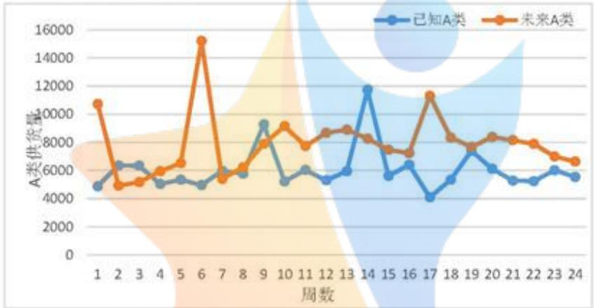

<details>
<summary>line</summary>

| 周数 | 已知A类 | 未来A类 |
| --- | --- | --- |
| 1 | ~4800 | ~10700 |
| 2 | ~6400 | ~4900 |
| 3 | ~6300 | ~5100 |
| 4 | ~5000 | ~5900 |
| 5 | ~5300 | ~6500 |
| 6 | ~4900 | ~15300 |
| 7 | ~5900 | ~5300 |
| 8 | ~5700 | ~6200 |
| 9 | ~9300 | ~7900 |
| 10 | ~5200 | ~9100 |
| 11 | ~6100 | ~7700 |
| 12 | ~5300 | ~8700 |
| 13 | ~5900 | ~8900 |
| 14 | ~11700 | ~8300 |
| 15 | ~5600 | ~7500 |
| 16 | ~6400 | ~7200 |
| 17 | ~4100 | ~11300 |
| 18 | ~5300 | ~8300 |
| 19 | ~7300 | ~7600 |
| 20 | ~6100 | ~8400 |
| 21 | ~5200 | ~8200 |
| 22 | ~5200 | ~7900 |
| 23 | ~6100 | ~7100 |
| 24 | ~5500 | ~6600 |
</details>

图12: 已知量与未来24周A类订货量对比图

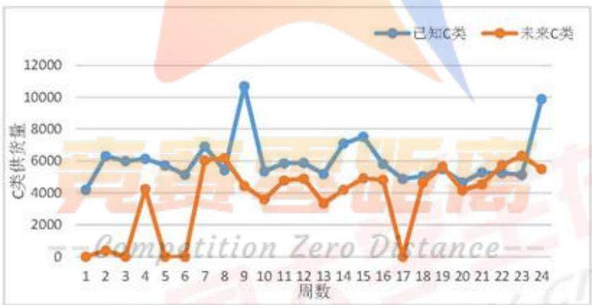

<details>
<summary>line</summary>

| 周数 | 已知C类 | 未来C类 |
| --- | --- | --- |
| 1 | ~4200 | ~100 |
| 2 | ~6300 | ~500 |
| 3 | ~6000 | ~100 |
| 4 | ~6100 | ~4300 |
| 5 | ~5700 | ~100 |
| 6 | ~5200 | ~100 |
| 7 | ~6900 | ~6100 |
| 8 | ~5400 | ~6200 |
| 9 | ~10700 | ~4500 |
| 10 | ~5300 | ~3600 |
| 11 | ~5900 | ~4800 |
| 12 | ~5900 | ~4900 |
| 13 | ~5200 | ~3300 |
| 14 | ~7100 | ~4200 |
| 15 | ~7600 | ~5000 |
| 16 | ~5800 | ~4900 |
| 17 | ~4900 | ~100 |
| 18 | ~5100 | ~4600 |
| 19 | ~5600 | ~5700 |
| 20 | ~4700 | ~4200 |
| 21 | ~5300 | ~4500 |
| 22 | ~5200 | ~5800 |
| 23 | ~5100 | ~6400 |
| 24 | ~9900 | ~5500 |
</details>

图 13: 已知量与未来 24 周 C 类订货量对比图

A、B、C 平均总量占比分别为 43%>36%>20%，服从 A>B>C 的优先级。由于数据预处理中观察到已知供货量存在突变性，由图 12 与图 13 可知，已知的个别周期 A 类供货量会大于未知对应周的 A 类供货量；同理，已知的个别周期 C 类供货量会大于未知对应周的 C 类供货量。由于这部分的周数较少，因此本文将其定义为具有突变性的数据。除个别周期外，未来24周中大多数周的A类订货量均大于已知对应周期的订货量，而C类订货量均小于已知对应周期的订货量，从而反映出问题三求解满足尽量多采购A类和尽量少采购C类的条件，说明模型及相应算法下压缩生产成本的可行性。

综上，问题三订购方案基本达到减少转运及仓储成本以至于压缩生产成本的目的，实施效果良好且具有稳定性。

## - 问题三转运方案的实施效果分析

与第二问判断转运方案效果的操作一致，本文以预测值比上最佳决策的比值作为效果好坏依据，比值表如下：

表6：问题三比值表

<table><tr><td>周期</td><td>1</td><td>2</td><td>3</td><td>4</td><td>5</td></tr><tr><td>比值</td><td>1.700</td><td>1.475</td><td>0.984</td><td>0.938</td><td>1.146</td></tr><tr><td>周期</td><td>6</td><td>7</td><td>8</td><td>9</td><td>10</td></tr><tr><td>比值</td><td>0.909</td><td>1.328</td><td>1.228</td><td>1.762</td><td>1.249</td></tr></table>

由上表可知，预测值在最佳决策的0.9\~1.8倍范围内波动，平均为最佳决策的1.272倍。在未知损耗率的情况下，认为本文的结果在可接受范围内，且转运方案实施效果好。

## 5.5 问题四随机整数规划模型的建立与求解

## 5.5.1 确定决策变量

本问中决策变量应为第i周的产能量 $Q_{i}, i=241,242\cdots,264$

## 5.5.2 确定优化目标

企业生产中如果每周的产能差异大，这对于企业做出需求量决策是不利的，且会影响到生产的稳定性，故本文以最大化未来24周的产能提高率均值为目标：

$$
\max Z _ {4} = \frac {1}{2 4} \sum_ {i = 2 4 1} ^ {2 6 4} \frac {Q _ {i} - Q}{Q}
$$

## 5.5.3 确定约束条件

(1) 对于转运的原材料量有:

$$
u _ {i k} ^ {A}, u _ {i k} ^ {B}, u _ {i k} ^ {C} \geq 0, i = 2 4 1, 2 4 2 \dots , 2 6 4, k = 1, 2 \dots , L
$$

(2) 对于每一家转运商有每周运输量不超过6000立方米/周的约束，即

$$
u _ {i k} ^ {A} + u _ {i k} ^ {B} + u _ {i k} ^ {C} \leq 6 0 0 0, i = 2 4 1, 2 4 2 \dots , 2 6 4, k = 1, 2 \dots , L
$$

（3）一家供应商每周供应的原材料尽量由一家转运商运输，需要明确的是，如果本文所选的供应商的供货量大于6000立方米/周，那么一家转运商是不够的。所以约束条件书写如下：

$$
\sum_ {k = 1} ^ {L} x _ {i j} t r a _ {i, j, k} = \left[ \frac {Y _ {i j}}{6 0 0 0} \right] _ {\mathrm{取整数}} + 1, i = 2 4 1, 2 4 2 \dots , 2 6 4, j = 1, 2 \dots , I
$$

(4) 任一周的库存量保持多于两周生产的原材料量:

$$
\frac {Q _ {A , i} ^ {\prime}}{u s e _ {A}} + \frac {Q _ {B , i} ^ {\prime}}{u s e _ {B}} + \frac {Q _ {C , i} ^ {\prime}}{u s e _ {C}} \geq 2 Q _ {i}, i = 2 4 1, 2 4 2 \dots , 2 6 4 \tag {5-5-1}
$$

(5) 任一周的库存量为自然数:

$$
Q _ {A, i} ^ {\prime}, Q _ {B, i} ^ {\prime}, Q _ {C, i} ^ {\prime} \in N, i = 2 4 1, 2 4 2 \dots , 2 6 4
$$

综上，问题四随机整数规划模型为：

$$
\max Z _ {4} = \frac {1}{2 4} \sum_ {i = 2 4 1} ^ {2 6 4} \frac {Q _ {i} - Q}{Q}
$$

s.t.式(5-3-10,11…,16)、式(5-4-3,4,6,7,8)、式(5-5-1)

## 5.5.4 问题四随机整数规划模型的求解

## - 二分答案算法

本问需要确定产能可以提高的量，对于是否能够提高，本文规定以下规则：

(1) 每周都能达成此产量;

（2）对于供货量，应满足最多提前两周准备，可以保证所有周的材料经过一定规划能够达成此供货量。

由此确定目标函数为：

$$
\max \left(\min (C _ {n o w})\right)   s t. j u d = \sum_ {i = 2 4 1} ^ {2 6 4} \max \left(C _ {n o w} - C L _ {-} s h i f t 2 _ {i}, 0\right) = 0
$$

其中 $C_{now}$ 代表此时的产能，规定为整数，此产能应尽可能大， $CL\_shift2_{i}$ 代表第i周经过提前两周准备材料的规划后，此时的材料能够制造成品的量。

本文使用二分答案算法进行求解，具体算法流程如下：

Step1: 初始化答案区间，即设定1和r;

Step2: 令 mid=(1+r)div 2，使 mid 为此时的产能计算 jud;

Step3: 判断此时jud是否为0，为0则表示此时的mid是符合规则的解，令l=mid再尝试寻找更大解；若不为0则表示此时产能过大，存在某一周完成不了此产能的情况，令r=mid再尝试寻找较小的符合规则的解

Step4: 若 $1+1<r$ 则表示未二分完毕，重新回到 Step2 进行求解，否则输出此时最大产能解。

## - 问题四产能提高分析

根据上述算法，用 python 求解得出该企业每周可以提高产能到 31781 立方米，通过第二问的基于动态权重的离散化贪心和动态规划解决转运问题的算法进行求解，具体订购和转运方案见附件 A、B。

未来24周产能提高率分析：

表 7: 产能提高率

<table><tr><td>周数</td><td>第241周</td><td>第242周</td><td>第243周</td><td>第244周</td><td>第245周</td><td>第246周</td><td>第247周</td><td>第248周</td></tr><tr><td>产能提高率</td><td>0.1270</td><td>0.1270</td><td>0.1443</td><td>0.1097</td><td>0.1270</td><td>0.4895</td><td>-0.0791</td><td>-0.0295</td></tr><tr><td>周数</td><td>第249周</td><td>第250周</td><td>第251周</td><td>第252周</td><td>第253周</td><td>第254周</td><td>第255周</td><td>第256周</td></tr><tr><td>产能提高率</td><td>0.1270</td><td>0.1270</td><td>0.1270</td><td>0.1270</td><td>0.1270</td><td>0.1270</td><td>0.1270</td><td>0.1270</td></tr><tr><td>周数</td><td>第257周</td><td>第258周</td><td>第259周</td><td>第260周</td><td>第261周</td><td>第262周</td><td>第263周</td><td>第264周</td></tr><tr><td>产能提高率</td><td>0.1270</td><td>0.1270</td><td>0.1270</td><td>0.1270</td><td>0.1271</td><td>0.1292</td><td>0.1394</td><td>0.1125</td></tr></table>

周期中的 7、8 周为淡季，故产能提高率为负数。除了第 6、7、8 周产能提高率波动较大，其他时刻产能提高率较为平稳，整体产能提高率的均值为 12.7%，结果较优。

考虑转运损耗则期望最高产能为31781×(1-1.374294%)=31344m³

## 六、模型的评价与改进

## 灵敏度分析

设置参数 lmdl 和 lmdr 表示考虑前后周的界限，即对第 i 周，从 i+lmdl(非正数)考虑到 i+lmdr 周，判断这个范围内能够规划材料能否满足本周的产能。-3 则为 [-3,0]，2 则为 [0,2]。同时前后看 k 周则为 [-k,k]。针对第四问设定不同规则，对答案进行计算，-3 表示缺少若可在后三周内补充回来则此产能有效，2 表示若提早两周准备材料可以补充此周的材料空缺则此产能有效。

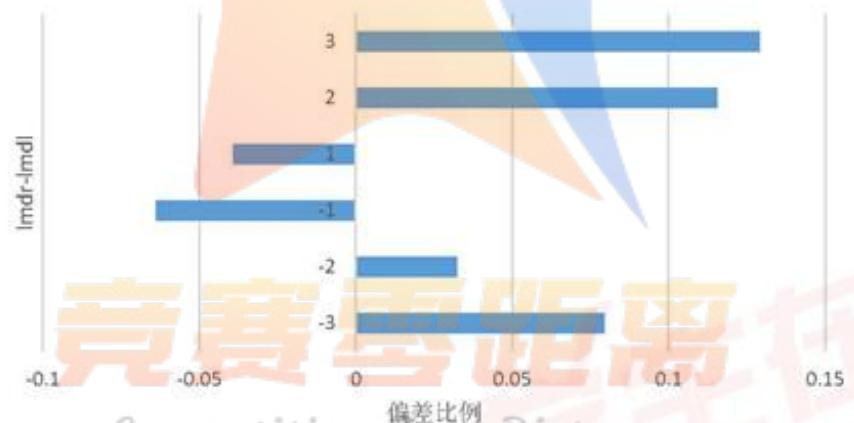

<details>
<summary>bar</summary>

| Category | Deviation Ratio |
| --- | --- |
| 3 | ~0.125 |
| 2 | ~0.115 |
| -1 | ~-0.04 |
| -1 | ~-0.07 |
| -2 | ~0.03 |
| -3 | ~0.08 |
</details>

图 14: 提前或延时补货产能偏差比例

此结果可以看出，由于存在明显的供货淡季和供货旺季，若只提前规划一周或只延后规划一周，那么产能甚至达不到一开始的标准。故本文选择提前两周进行规划是较为合理的。

若同时可以提早准备和延后补充，再次对答案进行计算，3 表示若可在后三周内补充回来或者提早三周准备材料可以补充此周的材料空缺则此产能可行。

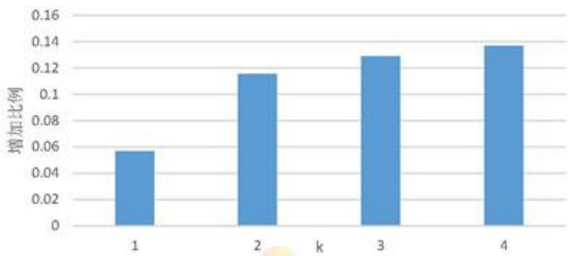

<details>
<summary>bar</summary>

| k | 增加比例 |
| --- | --- |
| 1 | ~0.057 |
| 2 | ~0.116 |
| 3 | ~0.129 |
| 4 | ~0.137 |
</details>

图 15: 同时考虑提早与延时补货产能增加比例

由结果可见，前后看3周和只往前看3周结果相同，且大于只向后看三周的结果，由此可以判断提早准备对产能提高的效果更好。但比较同时前后看1周，和只向前或者向后看1周的结果，发现同时规划前后几周对产能提高存在更为明显的效果。

## 七、参考文献

[1] 毛慧敏. 基于熵权法 TOPSIS 模型的房地产企业财务风险评估 [J]. 中国市场, 2021, {4} (16): 156-159+171.  
[2] 吴鹏, 吕有厂. 随机需求下考虑半成品库存的多周期生产决策优化 [J]. 运筹与管理, 2014, 23(02): 49-54.  
[3]陈俊霖. 基于库存和备用供应商应对供货风险的策略研究[D]. 清华大学, 2012.  
[4] 黄进红. 供应链管理下基于供货不稳定的最优库存模型 [J]. 物流技术, 2008, 27(12): 107-108+119.  
[5] 王娜. 基于分散化收益的供应商数量选择和订货量分配策略研究 [D]. 东北大学, 2008.  
[6] 王瑛, 孙林岩. 基于合作需求预测的多级库存优化模型 [J]. 系统工程理论方法应用, 2004(03): 208-213.

## 八、附录

附录 1 Posit\_Y.m、tosis.m、weight\_shang.m 及答案

介绍：用熵权-TOPSIS法得出第一问各家供应商得分及前50名各指标分布情况

```matlab
function [posit_y] = Posit_Y(y,type,i)
% 输入变量有三个:
% x: 需要将指标正向化处理对应的原始列向量
% type: 指标的类型 (0: 极小型, 1: 中间型, 2: 区间型)
% i: 正在处理的是原始矩阵的列数
% posit_y 表示: 正向化后的列向量
    if type == 0 %此情况为极小型
        disp(['第'num2str(i)'列是极小型, 正在正向化'])
        posit_y = max(y) - y; % 此正向化函数不唯一
        disp(['第'num2str(i)'列极小型正向化处理完成'])
    elseif type == 1 %此情况为中间型
        disp(['第'num2str(i)'列是中间型'])
        best = input('请输入最佳的那一个值: ');
        M = max(abs(y-best));
        posit_y = 1 - abs(y-best) / M;
        disp(['第'num2str(i)'列中间型正向化处理完成'])
    elseif type == 2 %此情况为区间型
        disp(['第'num2str(i)'列是区间型'])
        a = input('请输入区间的下界: ');
        b = input('请输入区间的上界: ');
        r_x = size(y,1); % x 的行数
        M = max([a-min(y),max(y)-b]);
        posit_y = zeros(r_x,1); % 初始化 posit_x 全为 0
        for i = 1: r_x
            if y(i) < a
                posit_y(i) = 1-(a-y(i))/M;
            elseif y(i) > b
                posit_y(i) = 1-(y(i)-b)/M;
            else
                posit_y(i) = 1;
            end
        end
        disp(['第'num2str(i)'列区间型正向化处理完成'])
    else
        disp("没有这种类型的指标, 请检查 Type 向量中是否有除了 1、2、3 之外的其他值")
    end
End

clear;cle%清空工作区
tic;%计算运行时间
load Y.mat%导入供应商指标

%% 第二步: 判断是否需要正向化
[n_Y,m_Y] = size(Y);
```

```matlab
disp(['共有' num2str(n_Y)'个评价对象, 'num2str(m_Y)'个评价指标]);
Judgement = input(['这' num2str(m_Y)'个指标是否需要经过正向化处理，需要请输入1，不需要输入0:
');
if Judgement == 1
    Pos_Y = input('输入需要正向化处理的指标所在列，例如第2、3、6三列需要处理，那么你需要输入
[2,3,6]: ');
    disp('请输入需要处理的这些列的指标类型（1：极小型， 2：中间型， 3：区间型）')
    Type_Y = input('例如：第2列是极小型，第3列是区间型，第6列是中间型，就输入[1,3,2]: ');
    % Position 和 Type 是两个同维度的行向量
    for i = 1 : size(Pos_Y,2) %这里需要对这些列分别处理，因此我们需要知道一共要处理的次数，即循
环的次数
        Y(:,Pos_Y(i)) = Posit_Y(Y(:,Pos_Y(i)),Type_Y(i),Pos_Y(i));
    % Posit_Y 是进行正向化
    % 第一个参数是要正向化处理的那一列向量 X(:,Position(i))
    % Type_Y：对应列的指标类型（1：极小型， 2：中间型， 3：区间型）
    % Pos_Y：原始矩阵中的位置
    % 函数返回正向化之后的指标
    end
    disp('正向化后的矩阵 Y = ');
    disp(Y);
end

%% 第三步：对正向化后的矩阵进行标准化
Z = Y ./ repmat(sum(Y.*Y).^0.5, n_Y, 1);
disp('标准化矩阵 Z =')
disp(Z);

%% 判断是否需要增加权重
Judgement = input('请输入是否需要增加权重，需要输入1，不需要输入0: ');
if Judgement == 1
    Judgement = input('使用熵权法确定权重请输入1，否则输入0: ');
    if Judgement == 1
        if sum(sum(Z<0)) > 0      % 如果之前标准化后的Z矩阵中存在负数，则重新对X进行标准化
            disp('原来标准化得到的Z矩阵中存在负数，所以需要对X重新标准化');
            for i = 1:n_Y
                for j = 1:m_Y
                    Z(i,j) = [Y(i,j) - min(Y(:,j))] / [max(Y(:,j)) - min(Y(:,j))];
            end
        end
        disp('X重新进行标准化得到的标准化矩阵Z为：'),
        disp(Z);
    end
    w = weight_shang(Z);
    disp('熵权法确定的权重为：')
```

```matlab
disp(w)
else %自己输入权重
    disp(['对应输入每一列的权重']);
    w = input(['你需要输入' num2str(m_Y) '个权数。''请以行向量的形式输入这' num2str(m_Y) '个权重: Investment])
end
else
    w = ones(1,m_Y) /m_Y ; %默认相同权重
end

%% 第四步：计算与最大值的距离和最小值的距离，并算出得分
D_P = sum([(Z - repmat(max(Z),n_Y,1)) .^ 2 ] .* repmat(w,n_Y,1) ,2) .^ 0.5;      % D+ 与最大值的距离向量
D_N = sum([(Z - repmat(min(Z),n_Y,1)) .^ 2 ] .* repmat(w,n_Y,1) ,2) .^ 0.5;      % D- 与最小值的距离向量
S = D_N / (D_P + D_N);     % 未归一化的得分
disp('最后的得分为：')
stand_S = S / sum(S)
[sorted_S,index] = sort(stand_S,'descend')

function [W] = weight_shang(Z)
% 计算有 n 个样本，m 个指标的样本所对应的的熵权
% 其中 Z = n * m 的矩阵（要经过正向化和标准化处理，且元素中不存在负数）

%% 计算熵权
    [n,m] = size(Z);
    D = zeros(1,m);   % 初始化保存信息效用值的行向量
    for i = 1:m
        for j = 1:n
            p(j,i) = Z(j,i) / sum(Z(:,i)); %计算概率矩阵 p 的元素值
            % 注意，p 有可能为 0，故分情况讨论（此时计算 ln(p)*p 时，Matlab 会返回 NaN）
            if(p(j,i) == 0)
                e(j,i) = 0;
            else
                e(j,i) = -(p(j,i)*log(p(j,i)))/log(n);
            end
        end
        e(i) = sum(e(:,i));
        D(i) = 1 - e(i); % 计算信息效用值
    end
    W = D ./sum(D);   % 将信息效用值归一化，得到权重 1 * m 的行向量
    disp('熵值为：');
    for i = 1:m
        disp(e(i));
    end
end
```

<table><tr><td>end</td></tr><tr><td>else</td></tr><tr><td>w = ones(1,m_A) / m_A; %默认相同权重</td></tr><tr><td>end</td></tr></table>

<table><tr><td>排名</td><td>供应商ID</td><td>材料分类</td><td>平均供货强度</td><td>完成率</td><td>订单率</td><td>风险</td><td>得分</td></tr><tr><td rowspan="2">1</td><td rowspan="2">S229</td><td rowspan="2">A</td><td rowspan="2">1478.695833</td><td rowspan="2">0.98611223</td><td rowspan="2">1</td><td>467.513167</td><td>0.99944926</td></tr><tr><td>4</td><td>8</td></tr><tr><td rowspan="2">2</td><td rowspan="2">S361</td><td rowspan="2">C</td><td rowspan="2">1367</td><td>0.98388973</td><td></td><td>401.927325</td><td>0.92931089</td></tr><tr><td>5</td><td>1</td><td>5</td><td>5</td></tr><tr><td rowspan="2">3</td><td rowspan="2">S140</td><td rowspan="2">B</td><td rowspan="2">1258.529167</td><td>0.62782190</td><td>0.16666666</td><td>4368.31613</td><td>0.71942205</td></tr><tr><td>1</td><td>7</td><td>4</td><td>8</td></tr><tr><td rowspan="2">4</td><td rowspan="2">S108</td><td rowspan="2">B</td><td rowspan="2">1003.958333</td><td rowspan="2">0.8876568</td><td rowspan="2">1</td><td>1222.85137</td><td>0.70567581</td></tr><tr><td>3</td><td>7</td></tr><tr><td rowspan="2">5</td><td rowspan="2">S151</td><td rowspan="2">C</td><td rowspan="2">810.4083333</td><td>0.72979625</td><td></td><td>1821.03310</td><td>0.59233310</td></tr><tr><td>5</td><td>1</td><td>9</td><td>9</td></tr><tr><td rowspan="2">6</td><td rowspan="2">S340</td><td rowspan="2">B</td><td rowspan="2">714.275</td><td>0.99666279</td><td></td><td>159.253752</td><td>0.53886924</td></tr><tr><td>1</td><td>1</td><td>6</td><td>6</td></tr><tr><td rowspan="2">7</td><td rowspan="2">S282</td><td rowspan="2">A</td><td rowspan="2">705.5833333</td><td>1.00480030</td><td>0.99583333</td><td>385.971924</td><td>0.53374978</td></tr><tr><td>4</td><td>3</td><td>4</td><td>3</td></tr><tr><td rowspan="2">8</td><td rowspan="2">S275</td><td rowspan="2">A</td><td rowspan="2">660.6375</td><td>1.00254821</td><td></td><td>115.263781</td><td>0.50987362</td></tr><tr><td>4</td><td>1</td><td>9</td><td>6</td></tr><tr><td rowspan="2">9</td><td rowspan="2">S329</td><td rowspan="2">A</td><td rowspan="2">652.1583333</td><td>1.00107451</td><td></td><td>119.017470</td><td>0.50536095</td></tr><tr><td>2</td><td>1</td><td>4</td><td>8</td></tr><tr><td rowspan="2">10</td><td rowspan="2">S131</td><td rowspan="2">B</td><td rowspan="2">572.9666667</td><td>0.98659071</td><td>0.99583333</td><td></td><td>0.46380117</td></tr><tr><td>2</td><td>3</td><td>145.581846</td><td>7</td></tr><tr><td rowspan="2">11</td><td rowspan="2">S308</td><td rowspan="2">B</td><td rowspan="2">570.825</td><td>0.73544916</td><td></td><td>544.280108</td><td></td></tr><tr><td>7</td><td>1</td><td>1</td><td>0.46290653</td></tr><tr><td rowspan="2">12</td><td rowspan="2">S330</td><td rowspan="2">B</td><td rowspan="2">569.3833333</td><td>0.78998728</td><td></td><td>672.349799</td><td>0.46241402</td></tr><tr><td>2</td><td>1</td><td>6</td><td>6</td></tr><tr><td rowspan="2">13</td><td rowspan="2">S139</td><td rowspan="2">B</td><td rowspan="2">632.7583333</td><td>0.85436685</td><td>0.61666666</td><td>2115.45059</td><td>0.45207379</td></tr><tr><td>6</td><td>7</td><td>2</td><td>1</td></tr><tr><td rowspan="2">14</td><td rowspan="2">S356</td><td rowspan="2">C</td><td rowspan="2">542.9458333</td><td>0.98261846</td><td></td><td>353.468965</td><td>0.44924541</td></tr><tr><td>6</td><td>1</td><td>5</td><td>9</td></tr><tr><td rowspan="2">15</td><td rowspan="2">S268</td><td rowspan="2">C</td><td rowspan="2">540.775</td><td>1.00321558</td><td></td><td>70.7375975</td><td>0.44817364</td></tr><tr><td>3</td><td>1</td><td>6</td><td>9</td></tr><tr><td rowspan="2">16</td><td rowspan="2">S306</td><td rowspan="2">C</td><td rowspan="2">525.4</td><td>1.00330999</td><td></td><td>115.817701</td><td>0.44062179</td></tr><tr><td>4</td><td>1</td><td>6</td><td>6</td></tr><tr><td rowspan="2">17</td><td rowspan="2">S194</td><td rowspan="2">C</td><td rowspan="2">422.3541667</td><td>0.99985204</td><td></td><td>58.2041985</td><td>0.39261111</td></tr><tr><td>2</td><td>1</td><td>8</td><td>3</td></tr><tr><td rowspan="2">18</td><td rowspan="2">S352</td><td rowspan="2">A</td><td rowspan="2">370.9625</td><td>0.99698768</td><td></td><td>144.211515</td><td>0.37061096</td></tr><tr><td>2</td><td>1</td><td>1</td><td>2</td></tr><tr><td rowspan="2">19</td><td rowspan="2">S143</td><td rowspan="2">A</td><td rowspan="2">344.9458333</td><td>0.87540446</td><td></td><td>274.516880</td><td>0.36004001</td></tr><tr><td>2</td><td>1</td><td>9</td><td>3</td></tr><tr><td rowspan="2">20</td><td rowspan="2">S348</td><td rowspan="2">A</td><td rowspan="2">385.0875</td><td>0.55305818</td><td></td><td></td><td>0.32521189</td></tr><tr><td>27 4</td><td>0.6875</td><td>2625.09545</td><td>2</td></tr><tr><td rowspan="2">21</td><td rowspan="2">S247</td><td rowspan="2">C</td><td rowspan="2">236.2416667</td><td>1.01246428</td><td></td><td>33.1340700</td><td>0.32058609</td></tr><tr><td>6</td><td>1</td><td>4</td><td>5</td></tr><tr><td rowspan="2">22</td><td rowspan="2">S284</td><td rowspan="2">C</td><td rowspan="2">194.1541667</td><td>1.02377238</td><td>0.99583333</td><td>161.236850</td><td>0.30681845</td></tr><tr><td>3</td><td>3</td><td>8</td><td>5</td></tr></table>

```python
附录 2 data.py
介绍: 处理附件 1 近 5 年 402 家供应商的相关数据.xlsx 文件, 生成 ACB 各自每周的订货和供货表格订货量.xlsx 和供货量.xlsx
import xlrd
import xlsxwriter
excel = xlrd.open_workbook("附件 1 近 5 年 402 家供应商的相关数据.xlsx", 'rb')
sheet = excel.sheet_by_name('企业的订货量 (m') ')
ID=[]
FL=[]

for r in range(sheet.nrows):
    ID.append(sheet.cell_value(r, 0))
    FL.append(sheet.cell_value(r, 1))
AW=[]
BW=[]
CW=[]
for c in range(2,sheet.ncols):
    AN=0
    BN=0
    CN=0
    for r in range(1,sheet.nrows):
        if FL[r]=='A':
            AN+=sheet.cell_value(r, c)
        if FL[rOUR]
            BN+=sheet.cell_value(r, c)
        if FL[rOUT]
            CN+=sheet.cell_value(r, c)
    AW.append(AN)
    BW.append(BN)
    CW.append(CN)
workbook = xlsxwriter.Workbook('订货量.xlsx') # 建立文件
worksheet = workbook.add_worksheet() # 建立 sheet, 可以 work.add_worksheet('employee') 来指定 sheet 名, 但中文名会报 UnicodeDecodeErro 的错误
worksheet.write(1, 0, "A")
worksheet.write(2, 0, "B")
worksheet.write(3, 0, "C")
for i in range(len(AW)):
    worksheet.write(0, i+1, i+1)
    worksheet.write(1, i+1, AW[i])
    worksheet.write(2, i+1, BW[i])
    worksheet.write(3, i+1, CW[i])
workbook.close()
```

```python
excel = xlrd.open_workbook("附件 1 近 5 年 402 家供应商的相关数据.xlsx", 'rb')
sheet = excel.sheet_by_name('供应商的供货量 (m³) ')
ID=[]
FL=[]

for r in range(sheet.nrows):
    ID.append(sheet.cell_value(r, 0))
    FL.append(sheet.cell_value(r, 1))
AW=[]
BW=[]
CW=[]
for c in range(2,sheet.ncols):
    AN=0
    BN=0
    CN=0
    for r in range(1,sheet.nrows):
        if FL[r]=='A':
            AN+=sheet.cell_value(r, c)
        if FL[r]=='B':
            BN+=sheet.cell_value(r, c)
        if FL[rOUR='C':
            CN+=sheet.cell_value(r, c)
    AW.append(AN)
    BW.append(BN)
    CW.append(CN)
workbook = xlsxwriter.Workbook('供货量.xlsx')  # 建立文件
worksheet = workbook.add_worksheet()  # 建立 sheet, 可以 work.add_worksheet('employee')来指定 sheet 名, 但中文名会报 UnicodeDecodeErro 的错误

worksheet.write(1, 0, "A")
worksheet.write(2, 0, "B")
worksheet.write(3, 0, "C")
for i in range(len(AW)):
    worksheet.write(0, i+1, i+1)
    worksheet.write(1, i+1, AW[i])
    worksheet.write(2, i+1, BW[i])
    worksheet.write(3, i+1, CW[i])
workbook.close()
```

## 附录 3 weekcmp.py

介绍：比较每周期内同一周供货情况，输入：附件1近5年402家供应商的相关数据.xlsx；获得期望供货量.xlsx

```python
import xlrd
import xlsxwriter
import numpy as np
excel = xlrd.open_workbook("附件 1 近 5 年 402 家供应商的相关数据.xlsx", 'rb')
sheet = excel.sheet_by_name('供应商的供货量 (m³) ')
ID=[]
FL=[]
DH=[]
GH=[]

for r in range(1,sheet.nrows):
    ID.append(sheet.cell_value(r, 0))
    FL.append(sheet.cell_value(r, 1))
for r in range(1, sheet.nrows):
    val=[]
    for c in range(2, sheet.ncols):
        val.append(sheet.cell_value(r, c))
    GH.append(tuple(val))

sheet = excel.sheet_by_name('企业的订货量 (m³) ')
DH=[]
for r in range(1, sheet.nrows):
    val=[]
    for c in range(2, sheet.ncols):
        val.append(sheet.cell_value(r, c))
    DH.append(tuple(val))

GH_T=[]
for r in range(sheet.nrows-1):
    S_GH = []
    S_DH = []
    for i in range(10):#10 个周期
        val1=[]
        val2=[]
        for j in range(24):#一个周期 24 周
            k=i*24+j
            #print(r)
            val1.append(DH[r][k])
            val2.append(GH[r][k])
```

```python
S_DH.append(tuple(val1))
    S_GH.append(tuple(val2))
    val = []
    for j in range(24):
        CMP1=[]
        CMP2=[]
        for i in range(10):
            k = i * 24 + j
            CMP1.append(DH[r][k])
            CMP2.append(GH[r][k])
        AVE=np.mean(CMP2)
        GH_max=0
        for i in range(10):
            if CMP1[i]==0:
                continue
            if CMP2[i]/CMP1[i]>0.9 and CMP2[i]<=AVE*3 and GH_max<CMP2[i]:
                GH_max = CMP2[i]
            val.append(GH_max)
            GH_T.append(tuple(val))

workbook = xlsxwriter.Workbook('期望供货量.xlsx') # 建立文件
worksheet = workbook.add_worksheet() # 建立 sheet，可以 work.add_worksheet('employee')来指定 sheet 名，但中文名会报 UnicodeDecodeErro 的错误

for r in range(sheet.nrows-1):
    worksheet.write(r + 1, 0, ID[r])
    for j in range(24):
        worksheet.write(r+1, j+1, GH_T[r][j])
workbook.close()
```

## 附录 4 Solve\_GHS\_T2.py

介绍：第二问动态贪心动态规划算法，求解最少供货商代码，输入：期望供货量.xlsx；输出表格：供应商规划结果.xlsx

```python
import random
import numpy as np
import xlrd
import xlsxwriter
excel = xlrd.open_workbook("期望供货量.xlsx", 'rb')
sheet = excel.sheet_by_name('Sheet1')
n=402
w=24
C=28488
DP=np.zeros(n)
S=["]*n
ID=[]
FL=[]
GHL=[]
Seln=[]
top50=[228,360,139,107,150,339,281,274,328,130,307,329,138,355,267,305,193,351,142,34
7,246,283,364,30,39,363,366,54,345,79,293,217,243,265,6,122,394,306,200,373,2,36,188,12
5,4,77,291,73,207,209]
for r in range(sheet.nrows):
    ID.append(sheet.cell_value(r, 0))
    FL.append(sheet.cell_value(r, 1))
for r in range(1,sheet.nrows):
    val=[]
    for c in range(2,sheet.ncols):
        s=sheet.cell_value(r, c)
        if FL[r]=='A':
            s=s/0.6
        if FL[r]=='B':
            s=s/0.66
        if FL[r]=='C':
            s=s/0.72
        val.append(s)
    GHL.append(tuple(val))
Z=np.ones(24)

def T(k,Z,name):
    name2=[]
```

```python
ObjL=np.zeros(w)
ObjL2 = np.zeros(w)
for i in range(k):
    minObj = 7777777
    now_j = 0
    for j in top50:
        now_Obj=0
        if j in name or j in name2:
            continue
        for z in range(w):
            ObjL2[z]=ObjL[z]+GHL[j][z]
            now_Obj+=Z[z]*max(C-ObjL2[z],0)
        if now_Obj<minObj:
            minObj=now_Obj
            now_j=j
        for z in range(w):
            ObjL[z]+=GHL[now_j][z]
        name2.append(now_j)
    return name2

def get_new_Z(name):
    cha = np.zeros(w)
    ObjL=np.zeros(w)
    newZ = np.zeros(w)
    for j in name:
        for z in range(w):
            ObjL[z]+= GHL[j][z]
    for z in range(w):
        cha[z]=C-ObjL[z]
    for z in range(w-1):
        if cha[z]<0:
            cha[z+1]+=cha[z]
            cha[z]=0
    if cha[w-1] < 0:
        cha[w - 1] = 0
    s=np.sum(cha)
    for z in range(w):
        newZ[z]=cha[z]/s
    return newZ
```

```python
def GetObj(name):
    ObjL = np.zeros(w)
    now_Obj=0
    for j in name:
        for z in range(w):
            ObjL[z] += GHL[j][z]
            ""for z in range(1,w):#往前看一周
            if ObjL[z]>0 and ObjL[z-1]<0 :
                ObjL[z]:=ObjL[z-1]
                ObjL[z] =max(ObjL[z],0)"
            for z in range(w-1, 1,-1):
                if ObjL[z]-C<0:#第一周
                    x=C-ObjL[z]
                    if ObjL[z-1]-C>0:
                        if x<ObjL[z-1]-C:
                            ObjL[z - 1]=-x
                            ObjL[z]+=x
                        else:
                            y=ObjL[z-1]-C
                            ObjL[z - 1] -= y
                            ObjL[z] += y
                        if ObjL[z]-C<0:#第二周
                            x=C-ObjL[z]
                            if ObjL[z-2]-C>0:
                                if x<ObjL[z-2]-C:
                                    ObjL[z - 2]=-x
                                    ObjL[z]+=x
                                else:
                                    y=ObjL[z-2]-C
                                    ObjL[z - 2] -= y
                                    ObjL[z] += y
        z=1
        if ObjL[z] - C < 0:
            x = C - ObjL[z]
            if ObjL[z - 1] - C > 0:
                if x < ObjL[z - 1] - C:
                    ObjL[z - 1] -= x
                    ObjL[z] += x
```

```python
else:
    y = ObjL[z - 1] - C
    ObjL[z - 1] -= y
    ObjL[z] += y
for z in range(w):
    now_Obj += max(C - ObjL[z], 0)
    #now_Obj += (C - ObjL[z])
return now_Obj

if __name__ == "__main__":
    for i in range(n):
        DP[i]=77777777
    Sel1=[]
    for i in range(1,50):
        Sel2 = T(1, Z, Sel1).copy()
        Sel3=Sel1+Sel2
        Sel1=Sel3.copy()
        #Z = get_new_Z(Sel1).copy()
        Seln.append(Sel1)
        S[i-1] = Sel1
        DP[i-1] = GetObj(Sel1)
        #print(Sel1)
        #print(DP[50])
        #93980.45454545454
    for i in range(1,50):
        Sel1 = Seln[i - 1].copy()
        Z2 = get_new_Z(Sel1).copy()
        Sel2 = Sel1.copy()
        for r in range(50 - i):
            Sone = T(1, Z2, Sel2).copy()
            Scmp = Sel2 + Sone
            Sel2 = Scmp.copy()
            result = GetObj(Sel2)
            if DP[r+i]>result:
                S[r+i]=Sel2
                DP[r+i]=result
    workbook = xlsxwriter.Workbook('供应商规划结果.xlsx')  # 建立文件
    worksheet = workbook.add_worksheet()  # 建立 sheet，可以 work.add_worksheet('employee')来指定 sheet 名，但中文名会报 UnicodeDecodeErro 的错
```

误  
```python
for r in range(50):
    worksheet.write(r, 0, DP[r])
    worksheet.write(r, 1, str(S[r]))
workbook.close()
```

```python
附录 5 Solve_GHL_T2.py
介绍：对确定的供货商贪心求解供货量分配的规划，输入：期望供货量.xlsx；输出表格：订单量规划结果.xlsx，T4 同理，区别为供应商列表为全部供应商
import random
import numpy as np
import xlrd
import xlsxwriter
def takeCB(elem):
    return elem[0]
excel = xlrd.open_workbook("期望供货量.xlsx", 'rb')
sheet = excel.sheet_by_name('Sheet1')
n=402
w=24
C=28488
maxl=C*2
ID=[]
FL=[]
GHL=[]
Seln=[]
JIEGUO=np.zeros((n,w))
for r in range(1,sheet.nrows):
    ID.append(sheet.cell_value(r, 0))
    FL.append(sheet.cell_value(r, 1))
for r in range(1,sheet.nrows):
    val=[]
    for c in range(2,sheet.ncols):
        s=sheet.cell_value(r, c)
        val.append(s)
    GHL.append(tuple(val))
```

```python
def DOIT(PX):
    now_Tag=0
    for L in PX:
        i=L[2]
        j=L[1]
        now_Tag+=1/L[3]
        JIEGUO[j][i]+=1#/L[3]
    print(now_Tag)

if __name__ == "__main__":
    PX = []
    namelist=[228, 360, 139, 329, 107, 307, 281, 339, 328, 274, 355, 138, 142, 130,
150, 394, 351, 305, 267, 306, 193, 36, 283, 347, 246, 30, 364]
    #上面的数据来自表格供应商规划结果.xlsx里第一个变成0的行，为从0开始序号
    for i in range(w):
        #WW=WL[i]/C
        if len(PX)>maxl:
            PX=PX[:maxl].copy()
        for j in range(len(PX)):
            PX[j][0]+=0.1#存储成本
        for j in namelist:#或者 in namelist range(n)改成固定哪几家供应商
            now_GH=int(GHL[j][i])
            #now_GH= 一定范围超出
            for k in range(now_GH):
                val = []
                if FL[j]=='A':
                    zh=0.6
                    jg=1.2
                if FL[j]=='B':
                    zh=0.66
                    jg=1.1
                if FL[j]=='C':
                    zh=0.72
                    jg=1
                if k>GHL[j][i]:
                    wdd=0.001
                else:
                    wdd=1
```

```txt
000 000 999 999
```

```python
附录 6 Solve_getABC.py
介绍：输入：订单量规划结果.xlsx 和期望供货量.xlsx；输出：ABC_quanju.xlsx，表示此时规划每周 ABC 各买多少，经过其他处理变为纵向表格：ABCtestT2.xlsx用于后续规划。T3T4 同理，只修改了输出文件名
import random
import numpy as np
import xlrd
import xlsxwriter
excel = xlrd.open_workbook("期望供货量.xlsx", 'rb')
sheet = excel.sheet_by_name('Sheet1')
num=402
w=24
C=28488
```

```python
ID=[]
FL=[]
for r in range(sheet.nrows):
    ID.append(sheet.cell_value(r, 0))
    FL.append(sheet.cell_value(r, 1))
excel = xlrd.open_workbook("订单量规划结果.xlsx", 'rb')
sheet = excel.sheet_by_name('Sheet1')
AW=[]
BW=[]
CW=[]
for c in range(1, sheet.ncols):
    AN=0
    BN=0
    CN=0
    A = []
    B = []
    C = []
    for r in range(1, sheet.nrows):
        s = sheet.cell_value(r, c)
        if FL[r]=='A':
            AN+=s
            A.append([s,r])
        if FL[r]=='B':
            BN += s
            B.append([s,r])
        if FL[r]=='C':
            CN += s
            C.append([s,r])
    AW.append(AN)
    BW.append(BN)
    CW.append(CN)

workbook = xlsxwriter.Workbook('ABC_quanju.xlsx') # 建立文件
worksheet = workbook.add_worksheet() # 建立 sheet，可以
work.add_worksheet('employee')来指定 sheet 名，但中文名会报 UnicodeDecodeErro
的错误
worksheet.write(1, 0, 'A')
worksheet.write(2, 0, 'B')
```

```python
worksheet.write(3, 0, 'C')
for i in range(w):
    worksheet.write(1, i+1, AW[i])
    worksheet.write(2, i+1, BW[i])
    worksheet.write(3, i+1, CW[i])
workbook.close()
```

```python
附录 7 data_YS.py
介绍：输入：ABCtestT2.xlsx；输出：转运分配值.xlsx，规划 ABC 在贪心情况下应在每个转运商分配多少的初始值，T3T4 同理，只修改了输入文件名
import random
import numpy as np
import xlrd
import xlsxwriter
excel = xlrd.open_workbook("ABCtestT2.xlsx", 'rb')
sheet = excel.sheet_by_name('Sheet1')
workbook = xlsxwriter.Workbook('转运分配值.xlsx') # 建立文件
worksheet = workbook.add_worksheet() # 建立 sheet，可以
work.add_worksheet('employee')来指定 sheet 名，但中文名会报 UnicodeDecodeErro 的错误
pc=1.05
X=[2,5,1,7,3,0,6,4]
chushi=np.zeros(8)
for i in range(8):
    chushi[X[i]]=0
for z in range(24):
    A = int(sheet.cell_value(z * 3 + 1, 1))
    B = int(sheet.cell_value(z * 3 + 2, 1))
    C = int(sheet.cell_value(z * 3 + 3, 1))
    AL = np.zeros(8)
    BL = np.zeros(8)
    CL = np.zeros(8)
    NOW=[A,B,C]
    FP=np.zeros((3,8))
    f=0
    j=0
```

```python
while f<3:
    i=X[j]
    if NOW[f]>6000-(FP[0][i]+FP[1][i]+FP[2][i]):#排满 i
        c=6000-(FP[0][i]+FP[1][i]+FP[2][i])
        FP[f][i]+=c
        NOW[f]+=c
        j+=1
    else:#排不满
        c=NOW[f]
        FP[f][i]+=c
        NOW[f] -= c
        f+=1
    for i in range(3):
        for j in range(8):
            if FP[i][j]==0:
                FP[i][j]=chushi[j]
    for j in range(8):
        worksheet.write(z * 3 + 1, j + 1, FP[0][j])
        worksheet.write(z * 3 + 2, j + 1, FP[1][j])
        worksheet.write(z * 3 + 3, j + 1, FP[2][j])
    print(FP)
    workbook.close()
```

```python
附录 8 Solve_YS_T2.py
介绍：输入：期望供货量.xlsx、订单量规划结果.xlsx 和转运分配值.xlsx，输出：
YS_T2.xlsx
01 背包+贪心规划转运情况，T3T4 同理，只修改了输出文件名
import random
import numpy as np
import xlrd
import xlsxwriter
excel = xlrd.open_workbook("期望供货量.xlsx", 'rb')
sheet = excel.sheet_by_name('Sheet1')
num=402
w=24
C=28488
```

```python
YS=np.zeros((num+1,w*8+1))
ID=[]
FL=[]
for r in range(sheet.nrows):
    ID.append(sheet.cell_value(r, 0))
    FL.append(sheet.cell_value(r, 1))

def getFP(c):
    excel = xlrd.open_workbook("转运分配值.xlsx", 'rb')
    sheet = excel.sheet_by_name('Sheet1')
    FPJZ=[]
    for j in range(3):
        val = []
        for i in range(8):
            val.append(int(sheet.cell_value((c-1)*3+j+1,i+1)))
        FPJZ.append((val))
    return FPJZ
def bag(n,c,w,v):
    res=[[-1 for j in range(c+1)] for i in range(n+1)]
    for j in range(c+1):
        res[0][j]=0
    for i in range(1,n+1):
        for j in range(1,c+1):
            res[i][j]=res[i-1][j]
            if j>=w[i-1] and res[i][j]<res[i-1][j-w[i-1]]+v[i-1]:
                res[i][j]=res[i-1][j-w[i-1]]+v[i-1]
    return res

def show(n,c,w,res,r,cc,k):
    us = []
    if res[n][c]<=0:
        return []
    print('最大价值为:', res[n][c])
    x=[False for i in range(n)]
    j=c
    for i in range(n,0,-1):#此次应从大到小否则出错
        if res[i][j]>res[i-1][j]:
            x[i-1]=True
            j-=w[i-1]
```

```python
for i in range(n):
    if x[i]:
        print(ID[int(r[i])],',',end=")
        us.append(int(r[i]))
        YS[int(r[i])][(cc-1)*8+k]+=w[i]
    print("")
    return us
excel = xlrd.open_workbook("订单量规划结果.xlsx", 'rb')
sheet = excel.sheet_by_name('Sheet1')
AW=[]
BW=[]
CW=[]
Tpaixu=[2,5,1,7,3,0,6,4]
for c in range(1, sheet.ncols):
    A_used = []
    B_used = []
    C_used = []
    AN=0
    BN=0
    CN=0
    A = []
    B = []
    C = []
    A_w=[]
    B_w = []
    C_w = []
    AT=np.zeros(8)
    BT=np.zeros(8)
    CT=np.zeros(8)
    FP=getFP(c)
    print(FP)
    for r in range(1, sheet.nrows):
        s = sheet.cell_value(r, c)
        if FL[r]=='A':
            AN+=s
            A.append([s,r])
        if FL[r]=='B':
            BN += s
            B.append([s,r])
```

```python
if FL[r]=='C':
    CN += s
    C.append([s,r])
AW.append(AN)
BW.append(BN)
CW.append(CN)
for i in range(len(A)):
    while A[i][0]>6000:
        for k in Tpaixu:
            if FP[0][k]>10:
                A[i][0]==FP[0][k]
                YS[int(A[i][1])][(c - 1) * 8 + k] += FP[0][k]
                FP[0][k]=0
                break

for i in range(len(B)):
    while B[i][0]>6000:
        for k in Tpaixu:
            if FP[1][k]>10:
                B[i][0]==FP[1][k]
                YS[int(B[i][1])][(c - 1) * 8 + k] += FP[1][k]
                FP[1][k]=0
                break

for i in range(len(C)):
    while C[i][0]>6000:
        for k in Tpaixu:
            if FP[2][k]>10:
                C[i][0]==FP[2][k]
                YS[int(C[i][1])][(c - 1) * 8 + k] += FP[2][k]
                FP[2][k]=0
                break

for k in Tpaixu:
    i=k
    t=0
    for kk in range(num + 1):
        t += YS[kk][(c - 1) * 8 + i]
    xx = int(min(int(FP[0][k]),6000-t))
```

```python
A_w=[]
A_r=[]
for x in A:
    if x[1] in A_used:
        continue
    if x[0]==0:
        continue
    A_w.append(int(x[0]))
    A_r.append(int(x[1]))
n=len(A_w)
res=bag(n,xx,A_w,A_w).copy()
used2=show(n, xx, A_w, res, A_r, c, k)
AT[k]+=(res[n][xx])
#print(used2)
A_used=(A_used+used2).copy()

i = k
t = 0
for kk in range(num + 1):
    t += YS[kk][(c - 1) * 8 + i]
xx = int(min(FP[1][k]+xx-res[n][xx], 6000 - t))
B_w = []
B_r = []
for x in B:
    if x[1] in B_used:
        continue
    if x[0] == 0:
        continue
    B_w.append(int(x[0]))
    B_r.append(int(x[1]))
n = len(B_w)
res = bag(n, xx, B_w, B_w).copy()
used2 = show(n, xx, B_w, res, B_r, c, k)
BT[k]+=(res[n][xx])
# print(used2)
B_used = (B_used + used2).copy()

i = k
t = 0
```

```python
for kk in range(num + 1):
    t += YS[kk][(c - 1) * 8 + i]
xx = int(min(FP[2][k]+xx-res[n][xx], 6000 - t))
C_w = []
C_r = []
for x in C:
    if x[1] in C_used:
        continue
    if x[0] == 0:
        continue
    C_w.append(int(x[0]))
    C_r.append(int(x[1]))
n = len(C_w)
res = bag(n, xx, C_w, C_w).copy()
used2 = show(n, xx, C_w, res, C_r, c, k)
CT[k]+=(res[n][xx])
# print(used2)
C_used = (C_used + used2).copy()
for x in A:
    if x[0] == 0 or x[1] in A_used:
        continue
    else:
        cho=-1
        F_now=-1
        for ii in Tpaixu:
            i=ii
            t=0
            for kk in range(num+1):
                t+=YS[kk][(c - 1) * 8 + i]
                if x[0]+t<6000 and FP[0][i]>F_now:
                    cho=i
                    F_now=FP[0][i]
        AT[cho]+=x[0]
        YS[int(x[1])][(c - 1) * 8 + cho] += x[0]
for x in B:
    if x[0] == 0 or x[1] in B_used:
        continue
    else:
        cho = -1
```

```python
F_now = -1
    for ii in Tpaixu:
        i = ii
        t = 0
        for kk in range(num + 1):
            t += YS[kk][(c - 1) * 8 + i]
        if x[0]+t<6000 and FP[1][i]>F_now:#期望放最多且放得进去
            cho=i
            F_now=FP[1][i]
        BT[cho]+=x[0]
        YS[int(x[1])][(c - 1) * 8 + cho] += x[0]
    for x in C:
        if x[0] == 0 or x[1] in C_used:
            continue
        else:
            cho = -1
            F_now = -1
            for ii in Tpaixu:
                i = ii
                t = 0
                for kk in range(num + 1):
                    t += YS[kk][(c - 1) * 8 + i]
                if x[0]+t<6000 and FP[2][i]>F_now:
                    cho=i
                    F_now=FP[2][i]
                CT[cho]+=x[0]
                YS[int(x[1])][(c - 1) * 8 + cho] += x[0]

workbook = xlsxwriter.Workbook('YS_T2.xlsx') # 建立文件
worksheet = workbook.add_worksheet() # 建立 sheet，可以 work.add_worksheet('employee')来指定 sheet 名，但中文名会报 UnicodeDecodeErro 的错误
for i in range(num+1):
    worksheet.write(i, 0, ID[i])
for i in range(num+1):
    for j in range(w*8):
        worksheet.write(i, j+1, YS[i][j])
workbook.close()
```

```python
附录 9 Solve_getABC_YS.py
介绍：输入：YS_T2.xlsx 和期望供货量.xlsx；输出：转运 ABC.xlsx，处理每个
转运商在当周转运的材料 ABC 分别是多少，T3T4 同理，只修改了输入文件名
import random
import numpy as np
import xlrd
import xlsxwriter
excel = xlrd.open_workbook("期望供货量.xlsx", 'rb')
sheet = excel.sheet_by_name('Sheet1')
num=402
w=24
C=28488
ID=[]
FL=[]
for r in range(sheet.nrows):
    ID.append(sheet.cell_value(r, 0))
    FL.append(sheet.cell_value(r, 1))
excel = xlrd.open_workbook("YS_T2.xlsx", 'rb')
sheet = excel.sheet_by_name('Sheet1')
AW=[]
BW=[]
CW=[]
for c in range(1, sheet.ncols):
    AN=0
    BN=0
    CN=0
    A=[]
    B=[]
    C=[]
    for r in range(1, sheet.nrows):
        s = sheet.cell_value(r, c)
        if FL[r]=='A':
            AN+=s
            A.append([s,r])
        if FL[r]=='B':
            BN += s
            B.append([s,r])
        if FL[r]=='C':
```

```python
CN += s
C.append([s,r])
AW.append(AN)
BW.append(BN)
CW.append(CN)

workbook = xlsxwriter.Workbook('转运 ABC.xlsx')  # 建立文件
worksheet = workbook.add_worksheet()    # 建立 sheet, 可以
work.add_worksheet('employee')来指定 sheet 名,但中文名会报 UnicodeDecodeErro
的错误
worksheet.write(1, 0, 'A')
worksheet.write(2, 0, 'B')
worksheet.write(3, 0, 'C')
k=1
for i in range(len(AW)):
    worksheet.write(0, i + 1, "T"+str(k))
    k+=1
    if k==9:
        k=1
        worksheet.write(1, i+1, AW[i])
        worksheet.write(2, i+1, BW[i])
        worksheet.write(3, i+1, CW[i])
    workbook.close()
```

```python
附录 10 Solve_GHL_T3.py
介绍：对确定的供货商贪心求解供货量分配的规划，相比 T2 修改了目标函数，
输入：期望供货量.xlsx；输出表格：订单量规划结果.xlsx
import random
import numpy as np
import xlrd --Competition Zero Distance--
import xlsxwriter
def takeCB(elem):
    return elem[0]
excel = xlrd.open_workbook("期望供货量.xlsx", 'rb')
sheet = excel.sheet_by_name('Sheet1')
```

```python
n=402
w=24
C=28488
maxl=C*2
ID=[]
FL=[]
GHL=[]
Seln=[]
JIEGUO=np.zeros((n,w))
for r in range(1,sheet.nrows):
    ID.append(sheet.cell_value(r, 0))
    FL.append(sheet.cell_value(r, 1))
for r in range(1,sheet.nrows):
    val=[]
    for c in range(2,sheet.ncols):
        s=sheet.cell_value(r, c)
        val.append(s)
    GHL.append(tuple(val))

def DOIT(PX):
    now_Tag=0
    for L in PX:
        i=L[2]
        j=L[1]
        now_Tag+=1/L[3]
        JIEGUO[j][i]+=1#/L[3]
    print(now_Tag)

if __name__ = "__main__":
    PX = []
    namelist=[]
    for i in range(n):
        namelist.append(i)
    for i in range(w):
        if len(PX)>maxl:
            PX=PX[:maxl].copy()
        for j in range(len(PX)):
            PX[j][0]+=0.2#存储成本
        for j in namelist:#或者 in namelist range(n)改成固定哪几家供应商
```

```python
now_GH=int(GHL[j][i])
#now_GH= 一定范围超出
for k in range(now_GH):
    val = []
    if FL[j]=='A':
        zh=0.6
        jg=1.2
    if FL[j]=='B':
        zh=0.66
        jg=1.1
    if FL[j]=='C':
        zh=0.72
        jg=1
    if k>GHL[j][i]:
        wdd=0.001
    else:
        wdd=1
    CB=zh #A<B<C
    CB=CB/wdd
    PX.append([CB,j,i,zh])
    PX.sort(key=takeCB)
    tag=0
    k=0
    while tag<C:
        tag+=1/PX[k][3]
        k+=1
    PX_now=PX[0:k].copy()
    PX=PX[k:].copy()
    DOIT(PX_now)
    workbook = xlsxwriter.Workbook('订单量规划结果.xlsx')  # 建立文件
    worksheet = workbook.add_worksheet()  # 建立 sheet，可以 work.add_worksheet('employee')来指定 sheet 名，但中文名会报 UnicodeDecodeErro 的错误
    for r in range(n):
        worksheet.write(r + 1, 0, ID[r])
    for r in range(n):
        for c in range(w):
            worksheet.write(r+1, c+1, JIEGUO[r][c])
    workbook.close()
```

print(JIEGUO)

```python
附录 11 Solve_erfenans_T4.py
介绍：二分答案求解能达到的最大产能值。输入：期望供货量.xlsx；输出：最大产能值
import numpy as np
import xlrd
n=402
w=24
ID=[]
FL=[]
GHL=[]
NL=[]
excel = xlrd.open_workbook("期望供货量.xlsx", 'rb')
sheet = excel.sheet_by_name('Sheet1')
for r in range(sheet.nrows):
    ID.append(sheet.cell_value(r, 0))
    FL.append(sheet.cell_value(r, 1))
for r in range(1,sheet.nrows):
    val=[]
    for c in range(2,sheet.ncols):
        s=sheet.cell_value(r, c)
        if FL[r]=='A':
            s=s/0.6
        if FL[r]=='B':
            s=s/0.66
        if FL[rOUR:
            s=s/0.72
        val.append(s)
    GHL.append(tuple(val))
def GetObj(name,C):
    ObjL = np.zeros(w)
```

```python
now_Obj=0
for j in name:
    for z in range(w):
        ObjL[z] += GHL[j][z]
    ""for z in range(1,w):#往前看一周
        if ObjL[z]>0 and ObjL[z-1]<0 :
            ObjL[z]:=ObjL[z-1]
            ObjL[z] =max(ObjL[z],0)"
    for z in range(w-1, 1,-1):
        if ObjL[z]-C<0:#第一周
            x=C-ObjL[z]
            if ObjL[z-1]-C>0:
                if x<ObjL[z-1]-C:
                    ObjL[z - 1]:=x
                    ObjL[z]+=x
                else:
                    y=ObjL[z-1]-C
                    ObjL[z - 1] -= y
                    ObjL[z] += y
        if ObjL[z]-C<0:#第二周
            x=C-ObjL[z]
            if ObjL[z-2]-C>0:
                if x<ObjL[z-2]-C:
                    ObjL[z - 2]:=x
                    ObjL[z]+=x
                else:
                    y=ObjL[z-2]-C
                    ObjL[z - 2] -= y
                    ObjL[z] += y
    z=1
    if ObjL[z] - C < 0:
        x = C - ObjL[z]
        if ObjL[z - 1] - C > 0:
            if x < ObjL[z - 1] - C:
                ObjL[z - 1] -= x
                ObjL[z] += x
            else:
                y = ObjL[z - 1] - C
                ObjL[z - 1] -= y
```

```python
ObjL[z] += y
for z in range(w):
    now_Obj += max(C - ObjL[z], 0)
    #now_Obj += (C - ObjL[z])
return now_Obj

if __name__ == "__main__":
    l=28200
    r=50000
    for i in range(n):
        NL.append(i)
    while l+1<r:
        mid = int((l + r) / 2)
        C=mid
        tag=GetObj(NL,C)
        if tag==0:
            ans=mid
            l=mid
        else:
            r=mid
    print(ans)
```

```python
附录 12 Solve_erfenans_T4_lmd.py
介绍：二分答案求解能达到的最大产能值，设计了一周可以提前看或者向后看或者同时向前向后几周的不同情况，具体为修改 lmdl 和 lmdr 控制左右观察范围，进行灵敏度分析。输入：期望供货量.xlsx；输出：最大产能值
import numpy as np
import xlrd
n=402
w=24
ID=[]
FL=[]
GHL=[]
NL=[]
excel = xlrd.open_workbook("期望供货量.xlsx", 'rb')
sheet = excel.sheet_by_name('Sheet1')
for r in range(sheet.nrows):
    ID.append(sheet.cell_value(r, 0))
    FL.append(sheet.cell_value(r, 1))
```

```python
for r in range(1,sheet.nrows):
    val=[]
    for c in range(2,sheet.ncols):
        s=sheet.cell_value(r, c)
        if FL[r]=='A':
            s=s/0.6
        if FL[r]=='B':
            s=s/0.66
        if FL[r]=='C':
            s=s/0.72
        val.append(s)
    GHL.append(tuple(val))
lmdl=-4
lmdr=4#灵敏度分析，往前看 lmd-1 周修改这个 lr
def GetObj(name,C):
    ObjL = np.zeros(w)
    now_Obj=0
    for j in name:
        for z in range(w):
            ObjL[z] += GHL[j][z]
    for z in range(w-1, 1,-1):
        for kk in range(lmdl,lmdr+1):
            print(kk)
            #print(kk)
            if ObjL[z]-C<0:
                if z-kk>23:
                    continue
                if z-kk<0:
                    continue
                x=C-ObjL[z]
                if ObjL[z-kk]-C>0:
                    if x<ObjL[z-kk]-C:
                        ObjL[z - kk]==x
                        ObjL[z]+=x
                    else:
                        y=ObjL[z-kk]-C
                        ObjL[z - kk] -= y
                        ObjL[z] += y
    for z in range(w):
```

```python
now_Obj += max(C - ObjL[z], 0)
#now_Obj += (C - ObjL[z])
return now_Obj

if __name__ == "__main__":
    l=10000
    r=50000
    for i in range(n):
        NL.append(i)
    while l+1<r:
        mid = int((l + r) / 2)
        C=mid
        tag=GetObj(NL,C)
        if tag==0:
            ans=mid
            l=mid
        else:
            r=mid
    print(ans)
```