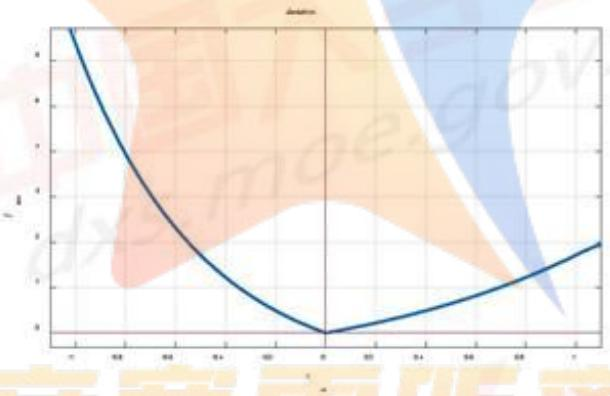
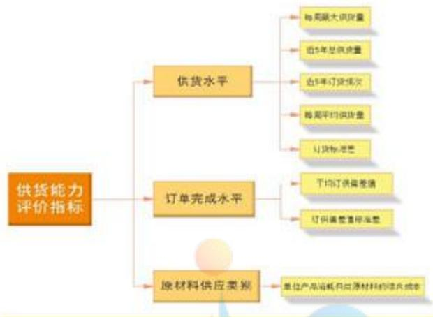
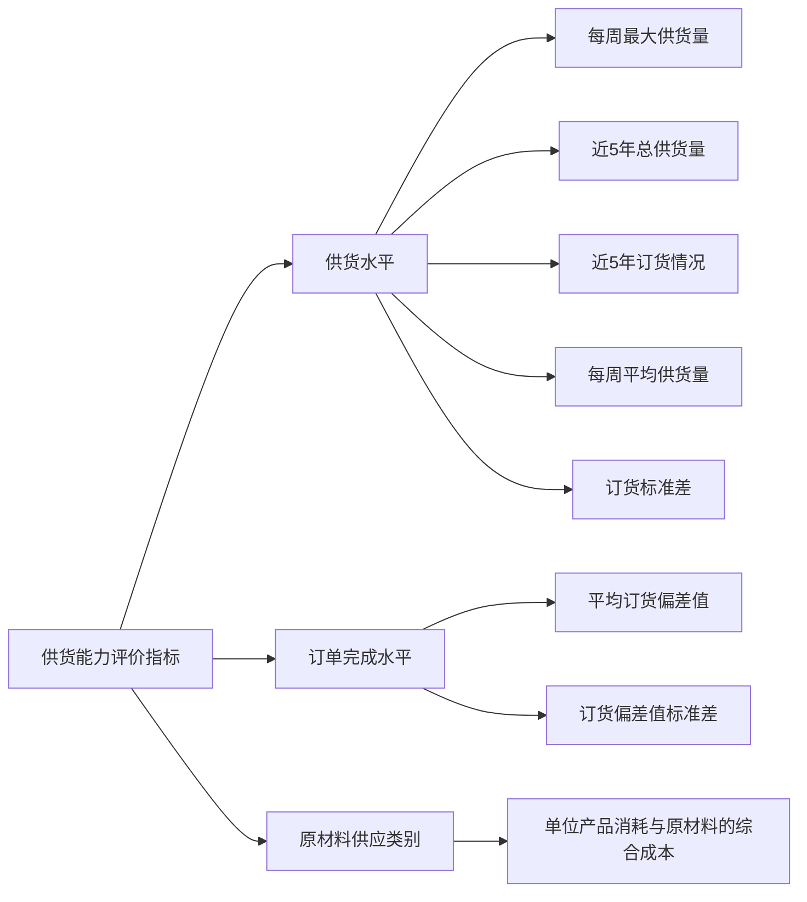
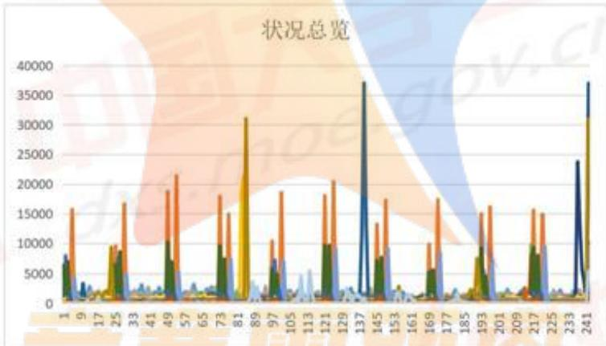
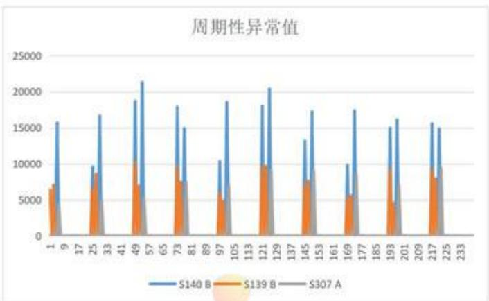
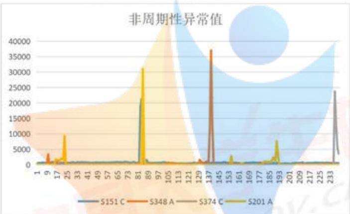
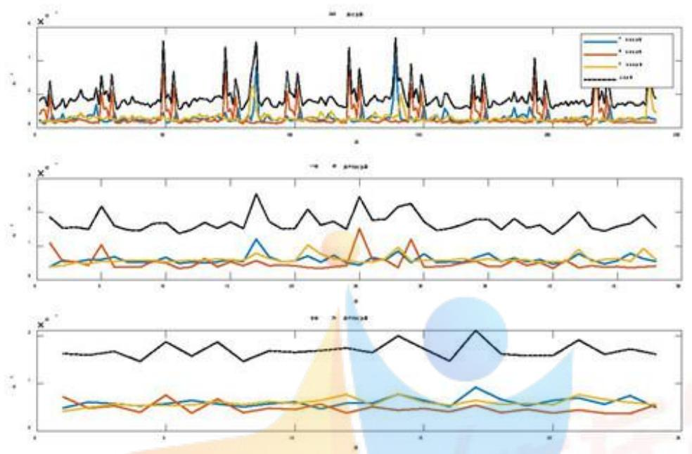
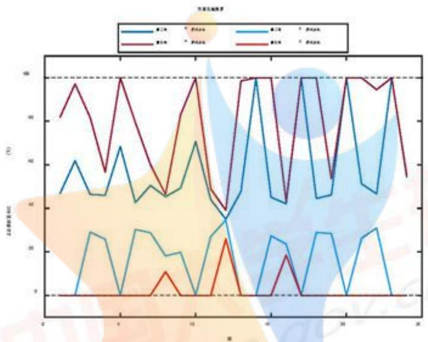

# 基于优化算法的企业原材料订购与运输规划模型

## 摘要

为保障生产企业持续稳定发展，本文建立了综合评价模型帮助企业筛选高质量合作供应商，并根据企业生产需求和供应商、转运商实际情况制定未来半年的订购和运输计划。同时展望未来，对相同原材料市场下企业产能最大化提出见解。

针对问题一，通过对402家供应商的供货特征进行量化分析，本文确定了供货水平、订单完成水平和原材料供应类别三个一级指标，进而细化为每周最大供货量、近5年订货频次、平均订供偏差值、以及单位产品消耗各类原材料的综合成本等八个二级指标。建立基于投影寻踪法的供货能力评价模型，用加速遗传优化算法求出最佳投影方向 $a = [0.414\ 0.310\ 0.566\ 0.235\ 0.577\ 0.131\ 0.007\ 0.085]$ 作为各指标权重，给每家供应商打分，排名前50的作为最重要供应商。

针对问题二，首先以供应商总数最小为目标函数，每家供应商为一个决策变量，综合考虑稳定供货能力，供给需求关系，损耗率，库存量与产能的关系，库存剩余量的迭代关系和初始库存剩余量等约束条件建立0-1整数规划模型，求解该模型，得到该企业应至少选择24家供应商供应原材料才可能满足生产的需求。其次，在该模型的结果下，选择成本最低为目标函数，在上述约束条件下建立线性规划模型，得到该企业最经济的订购方案，同时求得平均1立方米原材料只需花费1.0925的采购单价。最后根据以上两个模型的结果，以损耗最低为目标函数，综合考虑转运损失率，总承接量，总供货量等约束条件建立线性规划模型，求解该模型得到损耗最低的转运方案，平均损耗率为 $0.2143\%$

针对问题三，仅考虑重要性排名前50的供应商，在问题二础上，加入订购A、C原材料数量差最大这一目标函数，综合考虑各类原材料的总订货量、供给需求关系和库存剩余量的迭代关系等约束条件，建立多目标规划模型。应用多目标粒子群算法求解该模型以得到企业订购方案。求解出24周A类原材料和C类原材料的平均订购量在总原材料平均订购量中的占比分别为79.95%和2.3%，与两类材料在问题二中的占比57.69%和15.79%相比明显更优。最终同问题二一样，以损耗率最低为目标函数，在相同约束条件下构建线性规划模型求得新的转运方案。

针对问题四，通过分析得知该企业每周的产能可以提高多少取决于每周收到的原材料的等效产能，故以该等效产能最大为目标函数，综合考虑运输总量，供货量，前后周供货量的相互影响等约束条件，建立线性规划模型。模型求解结果显示每周运输总量都约为最大运输量，即该企业产能的提升主要受到现有转运商实际情况的限制，最终得到该企业平均最大原材料等效产能为73944立方米，所以该企业产能可以提升约45744立方米

关键词：投影寻踪法 加速的遗传优化算法 线性规划 多目标规划 迭代关系约束

## 一、问题重述

某建筑和装饰板材的生产企业使用的原材料总体分为A、B、C三类，每立方米产品消耗A、B、C类原材料分别为0.6、0.66、0.72立方米。这三类原材料的采购单价不同且存在一定关系，其运输和储存的单位费用相同。该生产企业每年按48周安排生产，并根据产能要求提前制定24周的原材料订购和转运计划，向原材料供应商订购计划数目的原材料，并尽量委托一家转运商去往指定的供应商将原材料供货量转运到仓库。

由于原材料的特殊性，供应商的实际供货量可能少于或者多于生产企业给定的订购，量并且在转运过程中原材料会有损耗，导致仓库实际的接收量小于供货量。为了保证企业正常生产，企业要尽可能保持不少于满足两周生产需求的原材料库存量。

因此，本题要求建立数学模型，解决以下问题：

1、选取并量化402家供应商的供货特征的评价指标，建立反映保障企业生产重要性的数学模型，确定50家最重要的供应商。  
2、参考问题 1，确定满足生产需求所必需的最少的供应商数量，针对确定的供应商制定未来 24 周每周最经济的订购方案，由此再制定出损耗最少的转运方案并分析实施效果。  
3、计划 A 类原材料的采购量尽量多和 C 类原材料的采购量尽量少，使运输和仓储的成本降低，同时使转运损耗尽量低，由此制定新的订购和转运方案并分析实施效果。  
4、在已知企业的产能可提高的前提下，根据现有原材料供应商和转运商的实际情况，确定每周的产能可以提高多少，并给出未来24周的订购和转运方案。

## 二、问题分析

某建筑和装饰板材的生产企业所用原材料总体分为 A、B、C 三种类型，企业会根据产能要求和库存量提前确定 24 周每周的原材料供应商和每周的订购数量，并确定物流公司使原材料供货量运输到企业仓库，保证企业的仓库储量不少于两周的生产需要，同时保证本周生产所需原材料数量，从而保障企业的正常生产。

## 2.1 问题一：

为建立反映保障企业生产重要性的数学模型，本文通过对附件一中402家供应商的供货特征进行量化处理，即对供应商的供货能力进行综合评价，确定了供货水平、订单完成水平和原材料供应类别三个一级评价指标。其中，供货水平用每周最大供货量、每周平均供货量、近5年总供货量、近5年订货频次、供货量的标准差这五个二级指标来表征，订单完成水平则用订供偏差率来表征，原材料供应类别用单位产品消耗A、B、C三类原材料的采购及运输和储存成本来表征。基于加速遗传算法改进的投影寻踪法，本文可以对附件一中402家供应商进行综合评价，得出每个供应商的供货能力打分，将排名前50的供应商作为最重要的50家供应商。

## 2.2 问题二：

问题二要求“至少”选择多少家供应商供应原材料才“可能”满足“生产的需求”，相当于在供货能力较高的供应商集合中用这些供应商供货能力（数量）的最大值作为解决问题的参数之一，去寻找能够满足企业每周的库存储量以及产能要求的供应商的最少的数量（目标函数）。为此，本文将问题一中的50家供应商作为研究对象集合，建立线性规划模型，满足最重要的约束条件之一：本周企业仓库的接收量+上一周剩余的库存量≥该周产能所需原材料数量+满足两周产能所需的原材料库存量，从而得出能够满足企业生产需要的最少的供应商数量。

可以根据上述模型确定出每周的原材料供应商（总共24周），再对这些供应商订制未来24周每周“最经济”的“订购方案”，即建立第二个线性规划模型，计划出关于每周向已确定的供应商订购的最优的原材料数量，使得订购和运输及储存成本达到最低（目标函数）。

之后，本文根据制定的订购方案，在假设一家供应商每周供应的原材料由一家转运商运输的基础上，建立第三个线性规划模型，以在运输过程中损耗的原材料最少为目标函数确定出每周每家供应商决定由哪一家转运商运输并运输多少原材料，从而制定出损耗最少的转运方案。

## 2.3 问题三：

根据题意要求，用 A 类原材料订购量尽量多 C 类原材料订购量尽量少，以及成本费用达到最小作为两个目标函数，在供给需求关系和库存剩余量的迭代关系等约束下，建立多目标规划模型，求解出新的订购方案。据此，再次运用问题二中求解转运方案的模型，通过调整目标函数为损耗率的表达式，求解出转运商的损耗率最小的转运方案。

## 2.4 问题四：

要考虑该企业每周的产能可以提高多少，首先要考虑该企业每周收货量最高为多少。当企业技术改造后产能无法阶跃式提升到最高产能，因为随着产能改变库存也会改变，企业应先补充库存。所以只考虑稳定后的产能。在稳定时可以大致认为24周每周收货量的最大值等效的产能就是该企业本周的产能。但由于产能应该是定值，为了使24周都满足生产需求，取24周最大值中的最小值作为最终的产能。

## 三、模型假设

1. 假设一家供应商每周供应的原材料尽量由一家转运商运输，但可以允许一家供应商由数量较少的转运商转运。  
2. 假设企业对供应商实际提供的原材料总是全部收购。  
3. 假设在前一周该生产企业会按照订购计划订购下一周生产所需的原材料，并且原材料可以在下一周一开始就进入仓库储存起来。  
4. 假设该生产企业在一周内的产能均可以完成且不会超额完成。  
5. 假设运输费用只取决于所装材料的体积，与运输路程的长短无关。

6. 假设每周的供货总量在该周内由转运商全部转运完成，不会出现遗留到下一周运输的情况。  
7. 假设在企业通过技术改造具备了提高产能的潜力时，此时由制定的订购和转运方案使原材料接受量增大，认为此时该生产企业的产能与接受量相匹配。

## 四、符号说明

表 1 符号说明

<table><tr><td>符号</td><td>说明</td></tr><tr><td>i</td><td>供应商的序号</td></tr><tr><td>j</td><td>周数</td></tr><tr><td>k</td><td>转运商的序号</td></tr><tr><td> $r_{os}$ </td><td>订供偏差率</td></tr><tr><td> $C_t$ </td><td>总成本</td></tr><tr><td>S</td><td>供货量</td></tr><tr><td>O</td><td>订货量</td></tr><tr><td>R</td><td>剩余量</td></tr><tr><td>L</td><td>损耗率</td></tr><tr><td>T</td><td>转运量</td></tr></table>

## 五、问题一的模型建立与求解

## 5.1 基于投影寻踪法的供货能力评价模型的建立

要求建立一套能够反映保障企业生产重要性的数学模型，在此基础上确定50家对于该建筑和装饰板材的生产企业的生产有重要性或者重要保障的原材料供应商。由于供应商对于企业的生产的影响是多方面多层次的，为此本文通过建立关于供应商供货能力的评价模型，给附件一中402家供应商综合打分，由该得分反映出供货商对于保障企业生产的重要程度，最后挑选出排名前50家供应商，确定为对该生产企业最重要的50家供应商。

## 5.1.2 评价指标的选取

参考国内外已有研究[1]，发现在现有研究中“质量、成本、交货、服务”四个方面是人们评价供应商时关注的重点，通过分析供应商的供应特征以及选择供应商的主要目的，我们深度挖掘附件一中402家原材料供应商在近五年内的订货量和供货量的数据，从供货水平、订单完成水平和原材料供应类别这三方面进行细化指标选取，从而选取每周最大供货量、每周平均供货量、近5年总供货量、近5年订货频次、供货量的标准差、平均综合偏差值、综合偏差值的标准差、单位产品消耗A、B、C三类原材料的综合成本（分为采购和运输及储存两方面）八个二级的细化指标用以评价供应商的供货能力，具体的细化指标的计算公式如下。

## 5.1.3 评价指标的量化计算

## 1. 每周最大供货量

为了反映第i家供货商的单次最大供货数量（能力），本文通过附件一的数据，找出402家企业在近5年（240周）的最大供应量，从而得到关于最大供应量的 $402\times1$ 的列向量。

## 2. 近5年总供货量

为了反映第i家供货商的总供货数量（能力），本文将第i家供货商每周的供货量累加，得到第i家供货商的总供货量，从而得到关于近5年总供货量的 $402\times1$ 的列向量。

## 3. 每周平均供货量

为了反映供货商在实际供货时能够提供的平均供货数量，本文根据附件一中的数据统计出第i家供货商在240周内的供货频次（符号），并提取出附件一中第i家供应商在近五年（240周的）供货总量ai=加和号。得到关于第i家供货商每周平均供货量的402\*1的列向量

## 4. 近5年订货频次

为了反映该建筑和装饰板材的生产企业对于原材料供应商的潜在意向合作关系，本文统计出该企业在近5年内选择第i家供货商订购原材料的次数（符号），从而得到关于近五年企业对402家供货商的订购频次的402\*1的列向量

## 5. 供货量的标准差

为了反映该建筑和装饰板材的生产企业与供货商之间稳定的交易关系，例如：在企业产能一定的情况下，某原材料供货商对该企业在近5年内的供货量的标准差接近于0，则可以认为该企业对该家供货商的合作关系十分稳定，相当于此供货商对于企业的重要性比较高，本文先统计出第i家供应商近5年内的供货量均值，再得出供货量的标准差。

## 6. 由订供偏差率确定的综合偏差值的均值及标准差

由于原材料的特殊性，在实际情况中供应商很难严格按照订单需求供货，实际供货量往往多于或少于订货量，为了反映原材料供应商对该生产企业给出的订单需求的响应能力和订单处理能力，本文通过设定实际订供偏差率：

$$
r _ {o s} = \frac {\mathrm{订货量} - \mathrm{供货量}}{\mathrm{订货量}} \tag {5.1}
$$

表示内实际供货量与订货量的平均偏差率。在理想情况下订供偏差率为零，但在实际情况中供货量与订货量不对等的情况是在所难免的。因此，对于某供应商的实际订供偏差率越接近与零，则认为该供应商的响应能力或订单处理能力越强，供货的稳定性越高，同等条件下，选择该供应商的可能性越大。

为了体现出在实际供求关系中供货量少于订货量对该企业生产的影响明显重于供货量大于订货量的影响这一问题，本文在实际订供偏差率的基础上设定订供偏差值：

$$
\text {deviation} = f _ {\text {dev}} (r _ {\text {os}}) \tag {5.2}
$$

其中 $f_{dev}(r_{os})$ 称为订供偏差函数， $r_{os}$ 为实际订供偏差率，根据订供偏差函数和实际订供偏差率便得到订供偏差值deviation，该值越大则表明供应商的订单处理能力越差。由于实际订供偏差率的正负对该企业的生产造成的影响不同，所以订供偏差函数 $f_{dev}(r_{os})$ 满足下列条件：

(1) 当 $r_{os}=0$ 时，函数值为0;  
(2) 当 $r_{os}<0$ 时，函数值大于0，且函数的二阶导数大于0；  
(3) 当 $r_{os}>0$ 时，函数值大于0，且函数的二阶导数大于0；  
(4) $f_{dev}(r_{os}) < f_{dev}(-r_{os}), \quad for r_{os} > 0$

综合考虑以上条件和生活实际，构造出订供偏差函数的具体表达式为：

$$
f _ {d e v} (r _ {o s}) = \left\{ \begin{array}{l l} e ^ {x} - 1, x \geqslant 0 \\ e ^ {- 2 x} - 1, x <   0 \end{array} \right. \tag {5.3}
$$

绘制出订供偏差函数的函数图像如图1:



<details>
<summary>contour</summary>

| x | y |
| --- | --- |
| -1.0 | ~9.5 |
| 0.0 | 0.0 |
| 1.0 | ~2.0 |
</details>

图 1 偏差函数图像

为了能够直接反映出综合偏差值越大表明供应商对订单的处理/完成水平越高这一关系，本文通过正向化处理，设定

$$
\text {deviation} = \text {Max} - \text {deviation} \tag {5.4}
$$

其中Max是供应商240周订供偏差值中的最大值。因此订供偏差值的值越大则表明供应商对订单的处理水平越高，越可靠。最后本文求出供应商在有订货量时的订供偏差值的平均值和方差，作为两项细化的指标来表征订单完成水平。

## 7. 单位产品消耗 A、B、C 三类原材料的综合成本

已知 A、B、C 三类原材料的采购费用以及生产单位立方米产品消耗的体积不同，并且由附件一的数据可知一家供应商只供应一类原材料，因此选择不同类别的原材料供应商产生的生产成本不同。为了反映供应商供应的原材料类别在一定程度上会造成生产成本偏高，影响企业的经济效益，本文设定单位产品消耗各类原材料的综合成本：

$$
C _ {t} = c _ {m} + c _ {t s} \tag {5.5}
$$

其中， $c_{m}$ 为采购成本， $c_{ts}$ 为运输及储存的成本。

根据题意可知，各类原材料的采购单价分别为：

$$
\left\{ \begin{array}{l l} 1. 2 p _ {\mathrm{uni}} & A \text {类} \\ 1. 1 p _ {\mathrm{uni}} & B \text {类} \\ p _ {\mathrm{uni}} & C \text {类} \end{array} \right. \tag {5.6}
$$

单位立方米的产品消耗的各类原材料为：

$$
\left\{ \begin{array}{l l} v _ {A} = 0. 6 0 m ^ {3} & A \text {类} \\ v _ {B} = 0. 6 6 m ^ {3} & B \text {类} \\ v _ {C} = 0. 7 2 m ^ {3} & C \text {类} \end{array} \right. \tag {5.7}
$$

各类原材料运输和储存的单位费用相同，且为 $c_{units}$ 。

所以生产单位立方米产品所消耗的各类原材料的采购成本分别为：

$$
\left\{ \begin{array}{l l} c _ {m A} = v _ {A} \times 1. 2 p _ {\mathrm{uni}} = 0. 7 2 p _ {\mathrm{uni}} & A \text {类} \\ c _ {m B} = v _ {B} \times 1. 1 p _ {\mathrm{uni}} = 0. 7 2 p _ {\mathrm{uni}} & B \text {类} \\ c _ {m C} = v _ {C} \times p _ {\mathrm{uni}} = 0. 7 2 6 p _ {\mathrm{uni}} & C \text {类} \end{array} \right. \tag {5.8}
$$

可见，生产单位立方米的产品所需原材料的采购成本和原材料的类别关系不大。生产单位立方米产品所消耗的各类原材料的运输及储存成本分别为：

$$
\left\{ \begin{array}{l l} c _ {t s A} = v _ {A} \times c _ {u n i t s} = 0. 6 c _ {u n i t s} & A \text {类} \\ c _ {t s B} = v _ {B} \times c _ {u n i t s} = 0. 6 6 c _ {u n i t s} & B \text {类} \\ c _ {t s C} = v _ {C} \times c _ {u n i t s} = 0. 7 2 c _ {u n i t s} & C \text {类} \end{array} \right. \tag {5.9}
$$

于是可以得到单位产品消耗各类原材料的综合成本：

$$
C _ {t} = \left\{ \begin{array}{l l} 0. 7 2 p _ {\mathrm{uni}} + 0. 6 c _ {\mathrm{units}} & A \text {类} \\ 0. 7 2 6 p _ {\mathrm{uni}} + 0. 6 6 c _ {\mathrm{units}} & B \text {类} \\ 0. 7 2 p _ {\mathrm{uni}} + 0. 7 2 c _ {\mathrm{units}} & C \text {类} \end{array} \right. \tag {5.10}
$$

## 5.1.4 评价指标的构建

本文构建的供应商供货能力评价指标体系如下：



<details>
<summary>flowchart</summary>


</details>

图 2 评价指标体系

其中，供货水平下的五个细化的二级指标能够反映出供应商的供货数量（能力）的大小，以及该生产企业选择供应商的意愿程度和生产企业与供应商以往5年的合作稳定程度。平均订购偏差率、订供偏差率的标准差可以反映出供货商对于该生产企业订购的原材料数量的响应能力或处理订单的能力，其数值越大说明该供应商会经常出现“供不应求”的现象，在一定程度上会对该生产企业的正常生产造成影响，同时也能一定程度说明供应商的信誉水平。单位产品消耗各类原材料的综合成本在一定程度上会造成生产成本偏高，从而影响企业的经济效益。

## 5.1.5 基于投影寻踪法的供货能力评价模型

本文选择了8个细化的评价指标来综合评价供应商的供货能力大小，由于各个指标对于评价供货能力的贡献程度不同，同时各个指标之间有着直接或者间接的联系，不相互独立，为了更客观、更科学地进行评价，本文选择投影寻踪法进行评价。

投影寻踪法 $^{[2]}$ ，是处理和分析高维数据的一类统计方法，其基本思想是将高维数据投影到低维的子空间上，寻找出反映原高维数据的结构或特征的投影值，以达到研究和分析高维数据的目的。这样得到的结果在一定程度上解决了因某项指标得分导致评价结果严重变化的问题，从而提高了综合评价各层次的分辨力和评价模型的精度。

基于投影寻踪法的供货能力评价模型建立的具体步骤如下：

## step1: 数据的处理

## (1) 指标的正负向性分析

我们选取了8个评价指标以评价供应商的供货能力的大小，但这些指标的正负向性并不相同，即并非数值越大越好，所以在建立评价模型之前，我们首先要进行正负向性分析。

表 2 指标的正负向性分析

<table><tr><td>指标</td><td>正负向性</td></tr><tr><td>最大供货量</td><td>+</td></tr><tr><td>总共货量</td><td>+</td></tr><tr><td>供货频次</td><td>+</td></tr><tr><td>平均供货量</td><td>+</td></tr><tr><td>供货量标准差</td><td>-</td></tr><tr><td>平均订供偏差值</td><td>+</td></tr><tr><td>订供偏差值标准差</td><td>-</td></tr><tr><td>单位产品消耗各类原材料的综合成本</td><td>-</td></tr></table>

定义：表中“+”代表正向性即指标值越大则供货商越重要；表中“-”代表负向性即指标值越大则供货商越不重要。

对呈负向性的指标进行指标正向化处理：

$$
x _ {j} = \max x _ {j} - x _ {j} \tag {5.11}
$$

其中 $x_{j}$ 表示第j列指标值 $(j\in\{0,1,2,\ldots8\})$ ， $\max x_{j}$ 表示第j列指标的最大值。
(2) 归一化处理

由于所选取指标的单位不统一，所以各指标除了数值的影响外还应考虑量纲的影响，为了消去量纲的影响对数据进行归一化处理。对于不同正负向性的指标应采用不同的归一化处理方法使得处理后的数据不仅消除量纲的影响还消除了正负向性的差异。于是有：

$$
x _ {j} = \left\{ \begin{array}{l} \frac {x _ {j} - \min x _ {j}}{\max x _ {j} - \min x _ {j}}, \text {for positive indicators} \\ \frac {\max x _ {j} - x _ {j}}{\max x _ {j} - \min x _ {j}}, \text {for negative indicators} \end{array} \right. \tag {5.12}
$$

其中 $x_{j}$ 表示第j列指标值 $(j\in\{0,1,2,\ldots8\})$ ， $\max x_{j}$ 表示第j列指标的最大值， $\min x_{j}$ 表示第j列指标的最小值。

## step2: 线性投影

从不同的方向或角度去观察数据，寻找最能充分挖掘数据特征的最优投影方向。随机抽取若干初始投影方向 $a=(a_{1},a_{2},a_{3},\ldots,a_{m})$ 计算其投影指标的大小。确定最大指标的投影的解为其最佳投影方向，则第i个样本在一维线性空间的投影特征值 $z_{i}$ 的表达式为：

$$
z _ {i} = \sum_ {j = 1} ^ {m} a _ {j} x _ {i j} \tag {5.13}
$$

## step3: 构造投影指标函数

对于最优投影方向的定义不尽相同，本文希望投影特征值 $z_{i}(i=1,2,\ldots,8)$ 的分布满足：

1、局部投影点尽可能密集。  
2、投影点团在整体上尽可能散开。

为满足这两点要求不妨将目标函数构造为:

$$
\max Q (a) = S _ {a} D _ {a} \tag {5.14}
$$

其中 $S_{a}$ 为投影特征值的标准差， $D_{a}$ 为投影特征值的局部密度。相应计算公式为：

$$
S _ {a} = \sqrt {\sum_ {i = 1} ^ {8} \left(z _ {i} - \overline {{z _ {a}}}\right) ^ {2} / (n - 1)} \tag {5.15}
$$

$$
D _ {a} = \sum_ {i = 1} ^ {n} \sum_ {j = 1} ^ {n} (R - r _ {i k}) f (R - r _ {i k}) \tag {5.16}
$$

其中 $r_{ik}$ 为投影特征值间的距离，且有 $r_{ik}=|z_{i}-z_{k}|(i,j=1,2,\ldots,n)$ ， $f(t)$ 为阶跃信号，且有 $f(t)=\begin{cases}0,t<0\\1,t\geqslant0\end{cases}$ ，R为估计局部散点密度的窗宽参数，按照宽度内至少包含一个散点的原则，有 $\max(r_{ik})<R<2m,for i,k=1,2,\ldots,n$ 。

## step4: 优化投影方向

综上所述得到非线性优化模型：

$$
\begin{array}{l} \max Q (a) = S _ {a} D _ {a} \\ s. t. \left\{ \begin{array}{l} S _ {a} = \sqrt {\sum_ {i = 1} ^ {8} \left(z _ {i} - z _ {a}\right) ^ {2} / (n - 1)} \\ D _ {a} = \sum_ {i = 1} ^ {n} \sum_ {j = 1} ^ {n} (R - r _ {a}) f (R - r _ {a}) \\ r _ {a k} = | z _ {i} - z _ {k} | \\ f (t) = \left\{ \begin{array}{l} 0, t <   0 \\ 1, t \geqslant 0 \end{array} \right. \\ \sum_ {j = 1} ^ {m} a _ {j} ^ {2} = 1 \\ 0 <   a _ {j} <   1 \\ \max (r _ {a k}) <   R <   2 m \end{array} \right. \end{array} \tag {5.17}
$$

这是一个复杂的非线性优化模型，一般的方法难以求解，所以用遗传算法 $^{[3]}$ 优化求解过程。使用如下语句在 MATLAB 中调用遗传算法：

$$
\text {function} [ a, b, \min, \max ] = \text {RAGA} (\mathrm{xx}, \mathrm{N}, \mathrm{n}, \mathrm{Pc}, \mathrm{Pm}, \mathrm{M}, \text {DaiNo}, \mathrm{Ci}, \text {ads})
$$

式中：N 为种群规模；Pc 为交叉概率；Pm 为变异概率；DaiNo 为在进行两代进化之后加速一次而设定的限制数；n 为优化变量数目，M 为变异方向所需要的随机数，Ci 为加速次数，ads 为 0 是求最小值，为其它求最大值。

调用遗传算法优化求解后，返回最优投影方向向量a、该方向投影指标量b。

## step5: 求解投影评价值

利用求解所得的最佳投影方向计算样本的投影指标值：

$$
z _ {i} = \sum_ {j = 1} ^ {m} a _ {j} x _ {i j} \tag {5.18}
$$

其中最佳投影方向向量即为权重向量，投影指标值即为最终综合评价得分。

## 5.2 基于投影寻踪法的供货能力评价模型的求解

迭代十次遗传算法优化函数，得到最优投影方向向量为：

$$
a = [ 0. 4 1 4 0. 3 1 0 0. 5 6 6 0. 2 3 5 0. 5 7 7 0. 1 3 1 0. 0 0 7 0. 0 8 5 ]
$$

该方向投影指标量降序输出得到50家最重要的供应商，列表如下：

表 3 50 家最重要供应商得分

<table><tr><td>供应商 ID</td><td>综合评价得分</td><td>供应商 ID</td><td>综合评价得分</td></tr><tr><td>S229</td><td>1.303</td><td>S040</td><td>0.833</td></tr><tr><td>S140</td><td>1.301</td><td>S364</td><td>0.830</td></tr><tr><td>S361</td><td>1.263</td><td>S055</td><td>0.827</td></tr><tr><td>S151</td><td>1.209</td><td>S367</td><td>0.826</td></tr><tr><td>S108</td><td>1.178</td><td>S346</td><td>0.819</td></tr><tr><td>S330</td><td>1.046</td><td>S080</td><td>0.814</td></tr><tr><td>S348</td><td>1.037</td><td>S294</td><td>0.812</td></tr><tr><td>S308</td><td>1.035</td><td>S244</td><td>0.809</td></tr><tr><td>S282</td><td>1.034</td><td>S218</td><td>0.808</td></tr><tr><td>S340</td><td>1.033</td><td>S007</td><td>0.796</td></tr><tr><td>S374</td><td>1.024</td><td>S123</td><td>0.795</td></tr><tr><td>S139</td><td>1.016</td><td>S266</td><td>0.794</td></tr><tr><td>S275</td><td>1.013</td><td>S150</td><td>0.792</td></tr><tr><td>S329</td><td>1.011</td><td>S314</td><td>0.771</td></tr><tr><td>S131</td><td>0.984</td><td>S114</td><td>0.770</td></tr><tr><td>S356</td><td>0.980</td><td>S307</td><td>0.746</td></tr><tr><td>S268</td><td>0.972</td><td>S291</td><td>0.732</td></tr><tr><td>S306</td><td>0.968</td><td>S338</td><td>0.726</td></tr><tr><td>S194</td><td>0.931</td><td>S086</td><td>0.709</td></tr><tr><td>S143</td><td>0.919</td><td>S098</td><td>0.674</td></tr><tr><td>S352</td><td>0.914</td><td>S201</td><td>0.651</td></tr><tr><td>S247</td><td>0.867</td><td>S003</td><td>0.646</td></tr><tr><td>S284</td><td>0.865</td><td>S076</td><td>0.644</td></tr><tr><td>S365</td><td>0.846</td><td>S037</td><td>0.632</td></tr><tr><td>S031</td><td>0.844</td><td>S129</td><td>0.631</td></tr></table>

## 六、问题二的模型建立与求解

## 6.1 基于 0-1 整数规划的最少供应商模型的建立

题目要求“参考问题1”，确定至少选择多少家供应商供应原材料才可能满足生产的需求，因此，本文首先将供应商集合压缩为问题一中求解的供货能力排名前50的供应商，继而针对这50家供应商，建立0-1整数规划模型，以满足生产需要的最少的供应商数目为目标函数，从而求解出选用哪几家供应商供应原材料，并且这些供应商的总数为多少。

## 6.1.1 数据可视化

根据将得到的排名前 50 的供应商的数据做可视化处理，从中可以提取出一些异常值，即波动很大的值。这些异常值大致可分为两种，即周期性异常值和非周期性异常值，分别从中选取部分数据并可视化得到下图：



<details>
<summary>bar_stacked</summary>

| Category | Value (Blue) | Value (Green) | Value (Orange) | Value (Yellow) |
| --- | --- | --- | --- | --- |
| 1 | ~8000 | ~6500 | ~16000 | — |
| 9 | ~3500 | ~1000 | ~1000 | — |
| 17 | ~1000 | ~1000 | ~1000 | — |
| 25 | ~9500 | ~9500 | ~17000 | — |
| 33 | ~2500 | ~1000 | ~1000 | — |
| 41 | ~2500 | ~1000 | ~1000 | — |
| 49 | ~19000 | ~10500 | ~22000 | — |
| 57 | ~2500 | ~1000 | ~1000 | — |
| 65 | ~2500 | ~1000 | ~1000 | — |
| 73 | ~18500 | ~10000 | ~15000 | — |
| 81 | ~2500 | ~7500 | ~31500 | — |
| 89 | ~2500 | ~1000 | ~1000 | — |
| 97 | ~11000 | ~6500 | ~19000 | — |
| 105 | ~2500 | ~1000 | ~1000 | — |
| 113 | ~2500 | ~1000 | ~1000 | — |
| 121 | ~18500 | ~10500 | ~21000 | — |
| 129 | ~2500 | ~1000 | ~1000 | — |
| 137 | ~37500 | ~15500 | ~25500 | — |
| 145 | ~13500 | ~8500 | ~17500 | — |
| 153 | ~2500 | ~1550 | ~1550 | — |
| 161 | ~2500 | ~1550 | ~1550 | — |
| 169 | ~17500 | ~6500 | ~2550 | — |
| 177 | ~2500 | ~1550 | ~1550 | — |
| 185 | ~2500 | ~1550 | ~1550 | — |
| 193 | ~24500 | ~8500 | ~37500 | — |
| 201 | ~24500 | ~8500 | ~37500 | — |
| 233 | ~24500 | ~8500 | ~37500 | — |
| 241 | ~37500 | ~8500 | ~37500 | — |
</details>

图 1 50 家供应商供应量总览



<details>
<summary>bar_stacked</summary>

| Category | S140 B | S139 B | S307 A |
| --- | --- | --- | --- |
| 1 | ~15800 | ~6800 | ~200 |
| 9 | ~16000 | ~7200 | ~200 |
| 17 | ~16800 | ~8800 | ~200 |
| 25 | ~18800 | ~10800 | ~200 |
| 33 | ~21500 | ~7200 | ~200 |
| 41 | ~18000 | ~9800 | ~200 |
| 49 | ~15200 | ~7600 | ~200 |
| 57 | ~18800 | ~5600 | ~200 |
| 65 | ~18200 | ~9800 | ~200 |
| 73 | ~20500 | ~9800 | ~200 |
| 81 | ~17500 | ~7800 | ~200 |
| 89 | ~17500 | ~7800 | ~200 |
| 97 | ~15200 | ~5600 | ~200 |
| 105 | ~17500 | ~7800 | ~200 |
| 113 | ~17500 | ~7800 | ~200 |
| 121 | ~15200 | ~5600 | ~200 |
| 129 | ~16500 | ~9500 | ~200 |
| 137 | ~15800 | ~9500 | ~200 |
| 145 | ~15200 | ~9500 | ~200 |
| 153 | ~15200 | ~9500 | ~200 |
| 161 | ~15200 | ~9500 | ~200 |
| 169 | ~15200 | ~9500 | ~200 |
| 177 | ~15200 | ~9500 | ~200 |
| 185 | ~15200 | ~9500 | ~200 |
| 193 | ~15200 | ~9500 | ~200 |
| 201 | ~15200 | ~9500 | ~200 |
| 209 | ~15200 | ~9500 | ~200 |
| 217 | ~15200 | ~9500 | ~200 |
| 225 | ~15200 | ~9500 | ~200 |
| 233 | — | — | — |
</details>

图 2 供应量呈周期性变化的供应商  


<details>
<summary>area</summary>

| X | S151 C | S348 A | S374 C | S201 A |
| --- | --- | --- | --- | --- |
| 9 | ~1000 | ~3500 | — | — |
| 25 | ~1000 | ~9500 | — | — |
| 81 | ~1000 | ~1000 | — | ~21000 |
| 89 | ~1000 | ~1000 | — | ~31000 |
| 137 | ~1000 | ~37000 | ~37000 | — |
| 153 | ~1000 | ~1000 | — | ~3500 |
| 193 | ~1000 | ~1000 | — | ~8000 |
| 233 | ~1000 | ~1000 | ~24000 | — |
</details>

图 3 供应量呈非周期性变化的供应商

对于周期性异常值出现的原因可以认为是供货商的供货能力有限，在某次大量供货后需要备货调整一段时间才能再次具备供货的能力。而对于非周期性异常值出现的原因可以认为是虽然该供货商是极具实力的，但是由于没有与企业的密切联系所以常常收不到订单，而当某一次企业急需大量原材料时该供货商提供了大量货品。

容易发现选区的 50 家供货商拥有各自的供货规律，但在下文的分析中不单独分析，原因有如下两点：

1、非周期性异常值的干扰。非周期性异常值不具规律且供货量巨大，对周期性异常值产生较大的干扰。  
2、该规律是在该企业原本订货方案的基础上产生的，但下文的分析需要规划新的订货方案，使得原本的规律被打破，因此将原有规律参入下文的分析并不一定能优化最终的结果。

## 6.1.2 目标函数的构建

为尽可能选择少的供应商以满足生产的需要，本文从402家供应商中选出供货能力排名前50家供应商作为研究对象，所以，本文构建的目标函数为：

$$
\min \sum_ {i = 1} ^ {5 0} x _ {i j} \tag {6.1}
$$

其中 $x_{ij}$ 表示在50家供应商中第 $i$ 个供应商在第 $j$ 周是否向该生产企业供货。若供货则 $x_{ij}$ 为1，否则为0。

## 6.1.3 约束条件的构建

## 1、稳定供货能力

为了求解满足企业生产需要的最少的供应商数量，本文设定每个供应商的供货量达到自己的最大供货水平，即历史最大供货量。需要注意的是，对于一家供应商来说，24周每周向企业提供的供应量不能一直都是历史最大供货量，因此历史最大供应量不能表征在稳定供货情况下的供货能力，实际中稳定供货能力应小于历史最大供货量。定义缓冲参数 $B, B \in (0, 1)$ ，使得：

$$
\text {稳定供货能力} S _ {i j} = B \cdot \text {最大供货能力} \tag {6.2}
$$

通过文献查阅法得知B=0.9。

## 2、供给需求关系

由于在第j周所有供货商的供货经过转运到达企业后应满足企业本周的生产需要和库存需要，因此存在供给需求的等式关系，即该生产企业在第j周实际的原材料接收量与第j-1周企业仓库中剩余的原材料库存量之和必须不少于企业本周的产能所需原材料量和两周生产需求的原材料库存量。为了计算方便，我们将等式两边的原材料接收量与原材料库存量均转化为对应的产能，则供给需求关系式如下：

$$
\sum_ {i = 1} ^ {5 0} x _ {i j} S _ {i j} (1 - L _ {i j}) f _ {i y p e} (i) + R _ {j - 1} = P + S _ {2 w} \tag {6.3}
$$

其中， $f_{type}(i)$ 为转换函数，可以将不同类别的原材料接受量转换成产能，例如；对于 A 类原材料而言 $f_{type}(i)=\frac{1}{0.6}$ ；对于 B 类原材料而言 $f_{type}(i)=\frac{1}{0.66}$ ；对于 C 类原材料而言 $f_{type}(i)=\frac{1}{0.72}$ 。 $S_{ij}$ 表示第 i 个供货商在第 j 周的供货量， $L_{ij}$ 表示第 i 个供货商在第 j 周转运过程中的损耗率， $R_{j}$ 表示该企业在第 j 周生产结束后剩余的库存量转化为相应的产能量（单位：立方米），P 表示企业每周的产能（单位：立方米）， $S_{2w}$ 表示满足企业两周生产需求的原材料库存量。

## 3、损耗率

在考虑第i个供货商在第j周发出的供货量在转运过程中的损耗率 $L_{ij}$ 时，由于此时无法确定该家供货商选择的转运公司，所以用附件二中关于转运商240周的损耗率统计出以24周为周期每周的平均损耗率，计算公式如下：

$$
L _ {i j} = \bar {L} = \frac {\sum_ {i = 1} ^ {8} L _ {j k}}{8} \tag {6.4}
$$

在这种情况下第i个供货和第l个供应商在第j周的损耗率相同有：

$$
L _ {i j} = L _ {i j} = \frac {\sum_ {l = 1} ^ {8} L _ {j k}}{8} \tag {6.5}
$$

## 4、库存量与产能的关系

根据题意，该企业要尽可能保持不少于两周生产需求的原材料库存量，因此，有关系式如下：

$$
S _ {2 w} = 2 P \tag {6.6}
$$

注： $S_{2w}$ 并非原材料库存量，而是原材料库存量转化后的相应产能。

## 5、库存剩余量的迭代关系

第j周的原材料库存剩余量 $R_{j}$ 应等于第j周的原材料接收量与第j-1周的原材料库存剩余量之和再减去第j周的产能所耗的原材料。为了计算方便，本文将等式两边的原材料接收量与原材料库存剩余量均转化为相应的产能，所以库存剩余量的迭代关系式如下：

$$
\left\{ \begin{array}{l} R _ {j} = \sum_ {i = 1} ^ {5 0} x _ {i j} S _ {i j} (1 - L _ {i j}) f _ {\text {bgpe}} (i) + R _ {j - 1} - P \\ R _ {j - 1} = \sum_ {i = 1} ^ {5 0} x _ {i (j - 1)} S _ {i (j - 1)} (1 - L _ {i (j - 1)}) f _ {\text {bgpe}} (i) + R _ {j - 2} - P \\ \vdots \\ R _ {1} = \sum_ {i = 1} ^ {5 0} x _ {i 1} S _ {i 1} (1 - L _ {i 1}) f _ {\text {bgpe}} (i) + R _ {0} - P \end{array} \right. \tag {6.7}
$$

## 6、初始库存剩余量的确定

  
图 4 订货量不同周期分布

在知道库存剩余量的迭代关系后，确定初始的库存剩余量 $R_{0}$ 至关重要。考虑到企业并非刚刚成立，所以在上一个为期24周的生产结束时企业大概率不会讲仓库中所有的库存量全部生产用尽，因此不能简单的认为 $R_{0}=0$ 。

根据图6的订货量曲线不难发现订货量大致呈现随周期变化的规律，且周期长度为24周。所以在以24周为周期的订购计划的开始，初始库存剩余量大致可用以往周期的初始库存剩余量来计算，即：往年24周订购计划开始时的初始库存剩余量的均值大致为1.82（单位：万立方米），转换为对应的产能大致是1.82T，其中，T为单位原材料量对应的生产量（综合考虑A、B、C三种材料），且 $T\approx1/0.66$ ，于是可以得到等效的产能为2.757（单位：万立方米），大致为一周产能所需要的原材料量，综合考虑该企业要尽可能保持不少于满足两周生产需求的原材料库存量，所以在周期开始时的库存量大致为两周生产需要的原材料量。因此不妨设 $R_{0}=S_{2w}$ 。

## 6.1.4 基于 0-1 整数规划的最少供应商模型

在满足企业的生产需求的情况下，尽可能用最少的供应商向该企业提供生产的原材料，结合已知条件和假设，基于0-1整数规划的最少供应商模型确立为：

$$
\min \sum_ {i = 1} ^ {5 0} x _ {i j}
$$

$$
s. t. \left\{ \begin{array}{l} \sum_ {i = 1} ^ {5 0} x _ {i j} S _ {i j} (1 - L _ {i j}) f _ {\text {type}} (i) + R _ {j - 1} = P + S _ {2 w} \\ R _ {j - 1} = \sum_ {i = 1} ^ {5 0} x _ {i (j - 1)} S _ {i (j - 1)} (1 - L _ {i (j - 1)}) f _ {\text {type}} (i) + R _ {j - 2} - P, \quad (j \geqslant 2) \\ L _ {i j} = \bar {L} \\ S _ {i j} = B \cdot \text {最大供货能力} \\ R _ {0} = S _ {2 w} \\ S _ {2 w} = 2 P \end{array} \right. \tag {6.8}
$$

需要注意：由于迭代，该0-1整数规划模型对于每个 $j$ （即周）都是一个全新的规划，所以会有24个关于 $x_{ij}$ 的列向量，也会有24个 $\min \sum_{i=1}^{50} x_{ij}$ ，而本文要选取所有 $\min \sum_{i=1}^{50} x_{ij}$ 中的最大值作为最终的规划结果。

## 6.2 基于 0-1 规划的最少供应商模型的求解

在满足生产需求的情况下的得到最少的供应商数目为24，结果如下表4所示：

表 4 选出的 24 家最少供应商

<table><tr><td colspan="4">至少24家供应商明细</td></tr><tr><td>S229</td><td>S308</td><td>S356</td><td>S247</td></tr><tr><td>S361</td><td>S282</td><td>S268</td><td>S284</td></tr><tr><td>S151</td><td>S340</td><td>S306</td><td>S055</td></tr><tr><td>S108</td><td>S275</td><td>S194</td><td>S201</td></tr><tr><td>S330</td><td>S329</td><td>S143</td><td>S003</td></tr><tr><td>S229</td><td>S131</td><td>S352</td><td>S037</td></tr></table>

## 6.3 基于线性规划的最经济订购方案模型的建立

为了制定未来24周每周“最经济”的原材料订购方案，本文针对上述模型求解出的24家原材料供应商，建立线性规划模型，在必须满足企业的生产需求的约束条件下，以24周该生产企业需要给原材料供应商的采购费用和给物流公司（即转运商）的运输费用以及在仓库储存费用之和达到最小作为目标函数，从而确定出24家原材料供应商每周接到的订货量（总共24周）。

## 6.3.1 目标函数的构建

由于制定订购方案需要明确该生产企业需要订购的原材料供应商以及向这些供应商每周（总共24周）订购的订货量，因此我们选择以第i家供应商在第j周接到的订货量为自变量，即 $O_{ij}$ 根据题目要求，本文此处的供应商已经确定为上述0-1整数规划模型所求解得到的24家供应商，因此 $i=1,2,\ldots,24,j=1,2,\ldots,24$ 。以240周内所有供应商提供的总供货量在采购和运输以及储存该三方面花费的成本最小构造目标函数，表达式如下：

$$
\min \sum_ {i = 1} ^ {2 4} \sum_ {j = 1} ^ {2 4} O _ {i j} (1 - r _ {o s _ {i}}) (r _ {i} p _ {\mathrm{m}} + c _ {t s}) \tag {6.9}
$$

其中， $r_{os_{ij}}$ 表示以 240 周为时间总长，24 周为一个单位时间长度得到的第 i 家供应商在第 j 周的平均订购偏差率， $r_{i}$ 是第 i 个供应商供应的原材料的采购单价相对 C 类原材料采购单价的比值，其可能取值为 $\{1.2\ 1.1\ 1\}$ ， $p_{uni}$ 表示 C 类原材料的采购单价， $c_{ti}$ 表示原材料运输和储存的单位费用。

## 6.3.2 约束条件的构建

由于订购方案是为了满足企业的正常生产需求，因此本文此处的约束条件与基于0-1整数规划的最少供应商模型相同，只是变量的表示发生了变化，因此此处不再多余赘述约束条件的构建。

## 6.3.3 基于线性规划的最经济订购方案模型

为了制定未来 24 周每周最经济的订购方案，即要求订购的原材料总量在采购、运输及储存三方面的成本花费为最小，在制定方案的同时也需要保证该订购方案满足企业的生产需求，结合已知条件和假设，该规划模型需要满足以下约束：

1. 该生产企业对一周的原材料接收量和上一周剩余的原材料库存量的总和不少于满足两周生产需要的原材料库存量与一周的产能需要的原材料的总和。  
2. 一周的原材料库存量是来源于该周的原材料接收量与上一周剩余的原材料库存量的总和中除去该周的产能需要的原材料量后剩余的数量。  
3. 该生产企业第一周的库存量为两倍的产能所需原材料。  
4. 该企业尽可能保持不少于满足两周生产需求的原材料库存量。  
5. 为了计算方便,本文将原材料的接收量和库存量转换为相应的等量产能。因此,基于线性规划的最经济订购方案模型确立为:

$$
\min \sum_ {i = 1} ^ {2 4} O _ {i j} (1 - r _ {\mathrm{os}}) (r _ {i} \tau_ {1} + \tau_ {2})
$$

$$
s. t. \left\{ \begin{array}{l} \sum_ {i = 1} ^ {2 4} x _ {i j} O _ {i j} (1 - r _ {\alpha_ {i j}}) (1 - L _ {i j}) f _ {\text {egpe}} (i) + R _ {j - 1} = P + S _ {2 w} \\ R _ {j - 1} = \sum_ {i = 1} ^ {5 0} x _ {i (j - 1)} O _ {i (j - 1)} (1 - r _ {\alpha_ {i j}}) (1 - L _ {i (j - 1)}) f _ {\text {egpe}} (i) + R _ {j - 2} - P, \quad (j \geqslant 2) \\ L _ {i j} = \bar {L} \\ r _ {\alpha_ {i j}} = r _ {\alpha_ {i j}} \\ R _ {0} = S _ {2 w} \\ S _ {2 w} = 2 P \end{array} \right. \tag {6.10}
$$

## 6.4 基于线性规划的最经济订购方案模型的求解

订购方案的结果详见附件A。

## 方案实施效果分析：

将订购方案、运转方案录入附件 A、B 中，同时记录预测的 24 周总成本、每周总转运数和总损耗数。根据本文模型建立的原理，每周 8 家转运商总转运量应大致等于该周向 24 家供应商订货总数，输出结果显示求解结果与预期吻合。此外，可知 24 周平均每立方米原材料需单位成本如下，可见订购方案较为经济。（1 m³ 原材料 A 需 1.7 单位成本，B 为 1.6，C 为 1.5）

表 5 未来 24 周每立方米原料平均成本

<table><tr><td>1</td><td>2</td><td>3</td><td>4</td><td>5</td><td>6</td><td>7</td><td>8</td><td>9</td><td>10</td><td>11</td><td>12</td></tr><tr><td>1.60</td><td>1.61</td><td>1.57</td><td>1.57</td><td>1.62</td><td>1.56</td><td>1.57</td><td>1.58</td><td>1.58</td><td>1.62</td><td>1.52</td><td>1.55</td></tr><tr><td>13</td><td>14</td><td>15</td><td>16</td><td>17</td><td>18</td><td>19</td><td>20</td><td>21</td><td>22</td><td>23</td><td>24</td></tr><tr><td>1.65</td><td>1.65</td><td>1.57</td><td>1.57</td><td>1.65</td><td>1.57</td><td>1.57</td><td>1.65</td><td>1.57</td><td>1.57</td><td>1.65</td><td>1.60</td></tr></table>

## 6.5 基于线性规划的最少转运损耗方案模型的建立

根据上述基于线性规划的最经济订购方案模型，可以得到24家供应商每周接到的订购量，据此来制定每周内每家供应商的供货量分配给哪一家/几家转运商来运输，并以每家转运商的运输能力为6000立方米/周作为约束条件之一，建立线性规划模型，以8家转运商在24周的转运过程中的总损耗量最少为目标函数，从而确定出每周每家转运商转运哪家/几家供货商的供货量。

## 6.5.1 目标函数的构建

由于转运损耗无记忆，即过去的转运损耗不会影响本周的转运损耗，所以要使转运损耗最小只需要使每周的转运损耗都最小，为了简便计算可以一周为单位考虑。假设第 $j(j = 1,2,\dots,24)$ 周第 $i(i = 1,2,\dots,24)$ 家供货商由第 $k(k = 1,2,\dots,8)$ 家转运公司转运的原材料量为 $T_{ik}$ ，该转运公司的转运损耗率为 $L_{k}$ ，则第 $j$ 周所有货物的总损耗为 $\sum_{i=1}^{24} \sum_{k=1}^{8} T_{ik} L_{k}$ ，所以为了使得转运损耗最小，有目标函数：

$$
\min \sum_ {i = 1} ^ {2 4} \sum_ {k = 1} ^ {8} T _ {i k} L _ {k}, f o r j = 1, 2,..., 2 4 \tag {6.11}
$$

## 6.5.2 约束条件的构建

## 1. 转运损失率

由于同一个转运公司不同时间转运的损耗率不同，且由上文可知，整个订购运送过程具有周期性，近5年共有10个周期，周期为24周，故转运公司k在第j周的转运损失率可以用以往10个周期中第j周转运损失率的均值 $\overline{L}(k,j)$ 表示，计算关系式如下：

$$
L _ {k} = \bar {L} (k, j) \tag {6.12}
$$

## 2. 总承接量

根据题意每家转运商的运输能力为 6000 立方米/周，所以第 k 家转运公司在 24 周内转运原材料的总量不大于 6000（单位：立方米），不等式如下：

$$
\sum_ {i = 1} ^ {2 4} T _ {i k} \leqslant 6 0 0 0, \text {for} k = 1, 2,..., 8 \tag {6.13}
$$

## 3. 总供货量

若第i家供货商由第k家转运公司转运的原材料量为 $T_{ik}$ ，则该供货商由各个转运商转运的原材料量的总和应该为该供货商的总供货量，即：

$$
\sum_ {k = 1} ^ {8} T _ {i k} = S _ {i}, \text {for} i = 1, 2,..., 2 4 \tag {6.14}
$$

其中， $S_{i}$ 为第 i 家供货商在第 j 天的给定的总供货量。

## 6.5.3 基于线性规划的最少转运损耗方案模型

因此，基于线性规划的最经济转运方案模型确立为：

$$
\min \sum_ {i = 1} ^ {2 4} \sum_ {k = 1} ^ {8} T _ {i k} L _ {k}
$$

$$
\text {s.t.} \left\{ \begin{array}{l} L _ {k} = \bar {L} (k, j) \\ \sum_ {i = 1} ^ {2 4} T _ {i k} \leqslant 6 0 0 0, \text {for} k = 1, 2, \dots , 8 \\ \sum_ {k = 1} ^ {8} T _ {i k} = S _ {i}, \text {for} i = 1, 2, \dots , 2 4 \end{array} \right. \tag {6.15}
$$

需要注意：该线性规划模型只针对求解一周的转运方案，为了获得24周的转运方案，则需要重复使用该模型，其中 $T_{ik}$ 、 $L_{k}$ 和 $S_{i}$ 都会随着周数的改变而改变。在每一次使用该线性规划模型的过程中， $\sum_{k=1}^{8}T_{ik}=S_{i},\ for\ i=1,2,\ldots,24$ 和 $\sum_{i=1}^{24}T_{ik}\leqslant6000,\ for\ k=1,2,\ldots,8$ 这两个约束条件分别式关于24周每周的约束条件和8家转运商每家的约束条件，所以该模型的可解性是一定被保证的。

## 6.6 基于线性规划的最少损耗转运方案模型的求解

转运方案详见附件B。

## 方案实施效果分析：

24周平均每周转运损耗率如下，可见转运方案转运效率良好：

表 6 24 周平均每周转运损耗率

<table><tr><td>1</td><td>2</td><td>3</td><td>4</td><td>5</td><td>6</td></tr><tr><td>0.1397</td><td>0.2122</td><td>0.1717</td><td>0.1859</td><td>0.2003</td><td>0.2567</td></tr><tr><td>7</td><td>8</td><td>9</td><td>10</td><td>11</td><td>12</td></tr><tr><td>0.1189</td><td>0.0280</td><td>0.1960</td><td>0.2439</td><td>0.1233</td><td>0.2115</td></tr><tr><td>13</td><td>14</td><td>15</td><td>16</td><td>17</td><td>18</td></tr><tr><td>0.2936</td><td>0.3483</td><td>0.3442</td><td>0.1412</td><td>0.4659</td><td>0.4881</td></tr><tr><td>19</td><td>20</td><td>21</td><td>22</td><td>23</td><td>24</td></tr><tr><td>0.1621</td><td>0.1621</td><td>0.1621</td><td>0.1621</td><td>0.1621</td><td>0.1621</td></tr></table>

## 七、问题三的模型建立与求解

根据问题一中由供应商的供货能力打分挑选出的最重要的50家供货商，通过观察这50家每周的供货量发现排在靠后的供应商每周供货量基本为个位数，如果再除去运输路途中损耗掉的原材料，可知这五十家供应商的供货量已经可以达到402家总供货量的 $90\%$ 以上，此时如果再增加供应商的数量，会导致该生产企业的经济效益严重下降。为此，在制定新的订购方案是本文依然只考虑前50名供货商作为研究对象。

## 7.1 基于多目标规划的新订购方案模型的建立

## 7.1.1 目标函数的构造

## 1、增A少C

根据题意该企业为了压缩生产成本，现计划尽量多地采购A类和尽量少地采购C类原材料。假设A类原材料的订购量为 $V_{A}$ ，B类原材料的订购量为 $V_{B}$ ，C类原材料的订购量为 $V_{C}$ ，则希望 $V_{A}$ 尽可能大而 $V_{C}$ 尽可能小。又由于本文对 $V_{A}$ 增大和 $V_{C}$ 减小是同等希望的，第一个目标函数表达式为：

$$
\max (V _ {A} - V _ {c}) \tag {7.1}
$$

## 2、减少总成本

根据题意，计划希望 $V_{A}$ 尽可能大而 $V_{C}$ 尽可能小是为了减少转运及仓储的成本，更进一步就是为了压缩生产总成本 $C_{t}$ ，所以有目标函数：

$$
\min C _ {t} \tag {7.2}
$$

对于生产总成本 $C_{t}$ ，根据问题一中对单位产品消耗的各类原材料综合成本的分析有：

$$
C _ {t} = V _ {A} P _ {A} + V _ {B} P _ {B} + V _ {C} P _ {C} + (V _ {A} + V _ {B} + V _ {C}) c _ {t s} \tag {7.3}
$$

其中 $P_{A}$ 、 $P_{B}$ 、 $P_{C}$ 分别为三类原材料的采购单价， $c_{ts}$ 为三类原材料运输和储存的单位费用。

## 7.1.2 约束条件的构造

## 1. 各类原材料的总订货量

由于在第j周第i家供货商的原材料类别由i决定，所以各类原材料的总订货量应选取相应类别的供货商的订货量进行加和。

定义类别判断函数 $f_{tdA}(i)$ 、 $f_{tdB}(i)$ 和 $f_{tdC}(i)$ 有如下性质：

对于 $f_{tdA}(i)$ ，若第i家供货商供应的原材料为A类原材料，则 $f_{tdA}(i)$ 取1，否则取0；

对于 $f_{tdB}(i)$ ，若第i家供货商供应的原材料为B类原材料，则 $f_{tdB}(i)$ 取1，否则取0；

对于 $f_{tdC}(i)$ ，若第i家供货商供应的原材料为C类原材料，则 $f_{tdC}(i)$ 取1，否则取0；

于是可以得到第j周订的各类原材料的体积：

$$
\left\{ \begin{array}{l} V _ {A} = \sum_ {i = 1} ^ {5 0} x _ {i} O _ {i} f _ {t d A} (i) \\ V _ {B} = \sum_ {i = 1} ^ {5 0} x _ {i} O _ {i} f _ {t d B} (i) \\ V _ {C} = \sum_ {i = 1} ^ {5 0} x _ {i} O _ {i} f _ {t d C} (i) \end{array} \right. \tag {7.4}
$$

其中， $O_{i}$ 为第 $j$ 周企业对第 $\pmb{i}$ 家供货商的订货量， $\pmb{x}_i$ 表示企业是否从第 $\pmb{i}$ 个供货商处订货，若订货则 $\pmb{x}_i$ 为1，否则为0。

## 2. 供给需求关系

在该订购方案中同样需要满足企业的生产需求，即使得企业保持不少于每周生产需求的原材料量和两周生产需求的原材料库存量，将各类原材料订购量转换为产能的公式有：

$$
\mathrm{A} \text {的产能为} \frac {V _ {A}}{0 . 6}, \mathrm{B} \text {的产能为} \frac {V _ {B}}{0 . 6 6}, \mathrm{C} \text {的产能为} \frac {V _ {C}}{0 . 7 2}
$$

但是由于订货量与实际供货量存在偏差，即订供偏差率 $\tau_{oa}$ ，且供给货物再转运途中存在损耗，所以实际上能够转化为的产能小于上式产能，综合考虑订供偏差率和转运损失，定义损失系数 $L=\frac{实际等效产能}{理论等效产能}$ ，于是总订购等效的产能为 $\left(\frac{V_{A}}{0.6}+\frac{V_{B}}{0.66}+\frac{V_{C}}{0.72}\right)L$ 。于是对于第j周而言满足生产需求：

$$
\left(\frac {V _ {A}}{0 . 6} + \frac {V _ {B}}{0 . 6 6} + \frac {V _ {C}}{0 . 7 2}\right) L + R _ {j - 1} \geqslant P + S _ {2 w} \tag {7.5}
$$

其中 $R_{j-1}$ 为上一周完成生产后的库存的等效产能。

## 3. 库存剩余量的迭代关系

第 j 周的库存剩余量 $R_{j}$ 为第 j 周的接收量与第 j-1 周的库存剩余量之和再减去第 j 周的生产消耗，所以剩余量满足迭代关系：

$$
\left\{ \begin{array}{l} R _ {j} = \left(\frac {V _ {A j}}{0 . 6} + \frac {V _ {B j}}{0 . 6 6} + \frac {V _ {C j}}{0 . 7 2}\right) L + R _ {j - 1} - P \\ R _ {j - 1} = \left(\frac {V _ {A (j - 1)}}{0 . 6} + \frac {V _ {B (j - 1)}}{0 . 6 6} + \frac {V _ {C (j - 1)}}{0 . 7 2}\right) L + R _ {j - 2} - P \\ \vdots \\ R _ {1} = \left(\frac {V _ {A 1}}{0 . 6} + \frac {V _ {B 1}}{0 . 6 6} + \frac {V _ {C 1}}{0 . 7 2}\right) L + R _ {0} - P \end{array} \right. \tag {7.6}
$$

## 7.1.3 基于多目标规划的新订购方案模型

为了制定为了制定未来24周每周新的订购方案，即要求订购的A类原材料总量尽量多C类原材料总量尽量少，以及在采购、运输及储存三方面的成本花费最小，在制定方案的同时也需要保证该订购方案满足企业的生产需求，结合已知条件和假设，该规划模型需要满足以下约束：

（1）各类原材料总订购量应该由各类原材料供应商的总订购量加和。

(2)该生产企业对一周的原材料接收量和上一周剩余的原材料库存量的总和不少于满足两周生产需要的原材料库存量与一周的产能需要的原材料的总和。

（3）该企业尽可能保持不少于满足两周生产需求的原材料库存量。

（4）该生产企业所花费成本来源于各类原材料的采购成本，运输及储存成本。

(5)一周的原材料库存量是来源于该周的原材料接收量与上一周剩余的原材料库存量的总和中除去该周的产能需要的原材料量后剩余的数量。

（6）该生产企业第一周的初始库存量为两倍的产能所需原材料。

因此，基于多目标规划的新订购方案模型确立为：

$$
\begin{array}{l} \max \left(V _ {A} - V _ {c}\right) \\ \min C _ {t} \\ s. t. \left\{ \begin{array}{l} V _ {A} = \sum_ {i = 1} ^ {5 0} x _ {i} O _ {i} f _ {t d A} (i) \\ V _ {B} = \sum_ {i = 1} ^ {5 0} x _ {i} O _ {i} f _ {t d B} (i) \\ V _ {C} = \sum_ {i = 1} ^ {5 0} x _ {i} O _ {i} f _ {t d C} (i) \\ \left(\frac {V _ {A}}{0 . 6} + \frac {V _ {B}}{0 . 6 6} + \frac {V _ {C}}{0 . 7 2}\right) L + R _ {j - 1} \geqslant P + S _ {2 w} \\ S _ {2 w} = 2 P \\ C _ {t} = V _ {A} P _ {A} + V _ {B} P _ {B} + V _ {C} P _ {C} + \left(V _ {A} + V _ {B} + V _ {C}\right) c _ {t s} \\ R _ {j - 1} = \left(\frac {V _ {A (j - 1)}}{0 . 6} + \frac {V _ {B (j - 1)}}{0 . 6 6} + \frac {V _ {C (j - 1)}}{0 . 7 2}\right) L + R _ {j - 2} - P \\ R _ {0} = S _ {2 w} \end{array} \right. \end{array} \tag {7.7}
$$

求解多目标规划问题可以化多目标为单目标或使用优化算法求解，考虑到将多目标直接化为单目标主观性太强，采用多目标粒子群优化算法 $^{[4]}$ 求解模型。将粒子群算法应用于多目标主要需关注pbest和gbest的选择问题。多目标粒子群算法在选择pbest时随机选择其中一个作为历史最优，而对于选择gbest则是在最优集中根据密集程度选择一个领导者，这时需要用到自适应网格法。根据多目标粒子群算法原理，构建函数并调用求解。多目标粒子群优化函数如下：

$$
\begin{array}{r l} \text {function [REP] = mopso(c, iw,max\_iter, lower\_bound, swarm\_size, rep\_size, grid\_size,} \\ & \quad \text {alpha, beta, gamma, mu, objective, constraint)} \end{array}
$$

式中：c 为认知加速、社交加速系数；iw 为开始，结束惯性权重；max\_iter 为最大迭代次数；swarm\_size 为粒子群大小；rep\_size 为存储库大小；grid\_size 为每个维度的网格数百分比；alpha 为通货膨胀率；beta 为领导者选择压力；gamma 为删除选择压力；mu 为突变率；objective 为目标函数；constraint 为约束函数

## 7.2 基于多目标规划的新订购方案模型的求解

求解结果详见附件A。

## 方案实施效果分析

第三问在第二问基础上增加目标函数，尽可能订购原材料 A 而非原材料 C，此时订购原材料总数应当小于第二问，求解结果与预期吻合。此外，将二三问 A 原料、C 原料占原料总数百分进行对比，可以明显看出第三问多目标规划效果良好，A 原料占比增加，C 原料占比下降。



<details>
<summary>line</summary>

| Day | Series 1 (Dark Blue) (%) | Series 2 (Light Blue) (%) | Series 3 (Purple) (%) | Series 4 (Red) (%) |
| --- | --- | --- | --- | --- |
| 1 | ~45 | 0 | ~60 | 0 |
| 2 | ~50 | ~28 | ~55 | 0 |
| 3 | ~45 | ~25 | ~45 | 0 |
| 4 | ~45 | 0 | ~35 | 0 |
| 5 | ~55 | ~28 | ~58 | 0 |
| 6 | ~45 | ~28 | ~45 | 0 |
| 7 | ~42 | ~28 | ~40 | 0 |
| 8 | ~48 | ~18 | ~35 | ~10 |
| 9 | ~45 | ~19 | ~42 | 0 |
| 10 | ~58 | ~28 | ~58 | 0 |
| 11 | ~45 | ~35 | ~45 | ~25 |
| 12 | ~40 | ~35 | ~38 | 0 |
| 13 | ~45 | ~45 | ~58 | 0 |
| 14 | ~58 | ~58 | ~58 | 0 |
| 15 | ~45 | ~28 | ~45 | 0 |
| 16 | ~42 | ~22 | ~42 | ~18 |
| 17 | ~58 | 0 | ~58 | 0 |
| 18 | ~45 | ~28 | ~45 | 0 |
| 19 | ~45 | ~28 | ~45 | 0 |
| 20 | ~58 | 0 | ~58 | 0 |
| 21 | ~45 | ~28 | ~58 | 0 |
| 22 | ~58 | ~30 | ~58 | 0 |
| 23 | ~45 | 0 | ~58 | 0 |
| 24 | ~58 | 0 | ~35 | 0 |
</details>

图 5 多目标规划实施效果分析

## 7.3 基于线性规划的新转运方案模型的建立

## 7.3.1 目标函数的构造

对于转运方案，同问题二中需要使总的转运损耗最小，但问题三需要考虑的是总的损耗率最小，所以将问题二的转运方案的目标函数谢进行调整，得到以总的转运损耗率最小为目标函数的表达式如下：

$$
\min \frac {\sum_ {i = 1} ^ {5 0} \sum_ {k = 1} ^ {8} T _ {i k} L _ {k}}{\sum_ {i = 1} ^ {5 0} S _ {i}}, \text {for} j = 1, 2, \dots , 2 4 \tag {7.8}
$$

## 7.3.2 约束条件的构造

## 1. 实际供货量

基于上述多目标规划的新订购方案模型可以得到第 $j$ 周企业向供货商 $\pmb{i}$ 的订货量矩阵：

$$
O = \left| \begin{array}{c c c c} O _ {1 1} & O _ {1 2} & \dots & O _ {1 n} \\ O _ {2 1} & O _ {2 2} & \dots & O _ {2 n} \\ \vdots & \vdots & \ddots & \vdots \\ O _ {m 1} & O _ {m 2} & \dots & O _ {m n} \end{array} \right| \tag {7.9}
$$

其中，m=50，n=24。

在问题二中已经分析并求得订供偏差率矩阵：

$$
R _ {o s} = \left| \begin{array}{c c c c} r _ {1 1} & r _ {1 2} & \dots & r _ {1 n} \\ r _ {2 1} & r _ {2 2} & \dots & r _ {2 n} \\ \vdots & \vdots & \ddots & \vdots \\ r _ {m 1} & r _ {m 2} & \dots & r _ {m n} \end{array} \right| \tag {7.10}
$$

所以可以根据二者求得关于第i家供应商在第j周的实际供货量矩阵：

$$
S = \left| \begin{array}{c c c c} S _ {1 1} & S _ {1 2} & \dots & S _ {1 n} \\ S _ {2 1} & S _ {2 2} & \dots & S _ {2 n} \\ \vdots & \vdots & \ddots & \vdots \\ S _ {m 1} & S _ {m 2} & \dots & S _ {m n} \end{array} \right| \tag {7.11}
$$

其中， $S_{ij}=O_{ij}r_{ij}$ 。

## 2. 转运损失率

类同问题二中求解转运方案模型的约束有：

$$
L _ {k} = \bar {L} (k, j) \tag {7.12}
$$

## 3. 总转运量

类同问题二中求解转运方案模型的约束有：

$$
\sum_ {i = 1} ^ {5 0} T _ {i k} \leqslant 6 0 0 0, f o r k = 1, 2,..., 8 \tag {7.13}
$$

## 4. 总供货量

类同问题二中求解转运方案模型的约束有：

$$
\sum_ {k = 1} ^ {8} T _ {i k} = S _ {i}, \text {for} i = 1, 2,..., 5 0 \tag {7.14}
$$

## 7.3.3 基于线性规划的新转运方案模型

为了制定未来24周转运商的转运损耗最小的订购方案，结合已知条件和假设，该规划模型需要满足以下约束：

1、第k家转运商在第j周的平均转运损耗率为近5年共10个周期里的每个第j周的转运损耗率的平均值。  
2、每一家转运商的运输能力为6000/周。  
3、8家转运商对第i家供货商的总转运量等于第i家转运商的总供货量。

因此，基于线性规划的新转运方案模型确立为：

$$
\min \frac {\sum_ {i = 1} ^ {5 0} \sum_ {k = 1} ^ {8} T _ {i k} L _ {k}}{\sum_ {i = 1} ^ {5 0} S _ {i}}
$$

$$
s. t. \left\{ \begin{array}{l} L _ {k} = \bar {L} (k, j) \\ \sum_ {i = 1} ^ {5 0} T _ {i k} \leqslant 6 0 0 0, \text {for} k = 1, 2, \dots , 8 \\ \sum_ {k = 1} ^ {8} T _ {i k} = S _ {i}, \text {for} i = 1, 2, \dots , 5 0 \end{array} \right. \tag {7.15}
$$

## 7.4 基于线性规划的新转运方案模型的求解

结果详见附录 B。

## 八、问题四的模型建立与求解

## 8.1 基于线性规划的产能模型的建立

## 8.1.1 目标函数的构造

该企业通过技术改造提高产能，于是每周订货量提升，库存量也会提升。在考虑该企业产能究竟能提高多少时应考虑稳定状态下的订供货情况，因为企业刚刚产能升级时需要扩大库存容量此时的产能不能阶跃式提高，而需要一段时间以达到稳定。达到稳定后可以认为每周企业收到的原材料的等效产能就是其新的产能，所以我们希望每周企业收到的原材料的等效产能最大化。在第j周收到原材料的等效产能为：

$$
\sum_ {i = 1} ^ {5 0} S _ {i} f _ {\text {type}} (i) L _ {i} \tag {8.1}
$$

于是可以得到目标函数：

$$
\max \sum_ {i = 1} ^ {5 0} S _ {i} f _ {\text {type}} (i) L _ {i} \tag {8.2}
$$

## 8.1.2 约束条件的构造

## 1.运输总量

由题意可知每家转运商的运输能力为6000立方米/周，一共有8家转运公司，所以每周被转运的货物的总量应该不大于8家转运公司总的运输能力，于是有：

$$
\sum_ {i = 1} ^ {5 0} S _ {i} \leqslant 4 8 0 0 0 \tag {8.3}
$$

## 2.供货量

第i家供货公司的供货能力是有限的，即 $S_{i}$ 不可能无限大。本团队认为在未来的24周里该供货公司的供货量超过过去五年的记录为低概率事件不予考虑，所以关于供货量有如下约束条件：

$$
0 \leqslant S _ {i} \leqslant S _ {\text {imax}} \tag {8.4}
$$

其中 $S_{i\max}$ 为过去五年里第i家供货公司供货量的最大值

## 3.供货量的相互影响

在实际中时供货公司持续以历史最大供货量向企业供货是不可能的，换言之假设供货公司在第j-1周以历史最大供货量 $S_{imax}$ 向企业供货，则在下一周（第j周）企业需要休整备货，即下一周企业的最大供货量不再是 $S_{imax}$ ，而应更小。

根据以上分析，不妨设 $S_{ij} \leqslant S_{imax} - 0.9S_{i(j-1)}$ 以建立前后两周供货量的相互影响关系。

## 8.1.3 基于线性规划的产能模型

根据以上分析建立线性规划模型：

$$
\max \sum_ {i = 1} ^ {5 0} S _ {i} f _ {\text {type}} (i) (1 - L _ {i})
$$

$$
s. t. \left\{ \begin{array}{l} \sum_ {i = 1} ^ {5 0} S _ {i} \leqslant 4 8 0 0 0 \\ 0 \leqslant S _ {i} \leqslant S _ {i \max} \\ S _ {i j} \leqslant S _ {\text {imax}} - 0. 9 S _ {i (j - 1)} \end{array} \right. \tag {8.5}
$$

当 $j = 1$ 时有 $S_{i1} \leqslant S_{i\max} - 0.9S_{i0}$ ，不妨令 $S_{i0} = 0$ 。

需要注意的是对于 j 从 1 到 24 供 24 个取值对应着 24 个不同的线性规划，也就有 24 个不同的最大原材料的等效产能，这里应选用其中最小的作为提升后的产能值以确保每周的供货量都足够满足生产需要。

## 8.2 基于线性规划的产能模型的求解

根据模型求得每周订货量接近 $48000 \, m^{3}$ ，由此可知在现有供应商和转运商的条件下，限制企业每周产能的是转运商的总能力，若企业想继续提高产能，需增加转运商数量或提高转运商每周转运能力。企业最大产能 24 周预测值如下：

表 7 未来 24 周企业最大产能预测值

<table><tr><td>1</td><td>2</td><td>3</td><td>4</td><td>5</td><td>6</td></tr><tr><td>74036</td><td>73859</td><td>74017</td><td>73875</td><td>74003</td><td>73888</td></tr><tr><td>7</td><td>8</td><td>9</td><td>10</td><td>11</td><td>12</td></tr><tr><td>73991</td><td>73899</td><td>73981</td><td>73908</td><td>73974</td><td>73915</td></tr><tr><td>13</td><td>14</td><td>15</td><td>16</td><td>17</td><td>18</td></tr><tr><td>73967</td><td>73920</td><td>73962</td><td>73925</td><td>73958</td><td>73929</td></tr><tr><td>19</td><td>20</td><td>21</td><td>22</td><td>23</td><td>24</td></tr><tr><td>73955</td><td>73932</td><td>73952</td><td>73934</td><td>73950</td><td>73936</td></tr></table>

## 九、模型的综合评价与推广

## 9.1 模型的优点

规划模型中创新性地加入迭代约束，通过第j周的剩余量 $R_{j}$ 和第 $(j-1)$ 周的剩余量 $R_{j-1}$ 的关系式迭代，并通过合理分析往期5年的订供货数据，给出初始剩余量 $R_{0}$ 。该迭代约束使得模型更符合现实情况，若不考虑迭代关系随机生成剩余量 $R_{j}$ 则约束性较弱，难以与实际情况匹配，在考虑迭代关系后将剩余量在时间上联系起来，更贴合实际，增强了模型的实用性。除此以外，由于迭代关系的加入，当某一周订货量过大导致剩余量过大时，下一周的订货量会自动减小以减小下一周的剩余量，这使得模型更加稳定。

## 9.2 模型的缺点

题目中“通常情况下，一家供应商每周供应的原材料尽量由一家转运商运输”所产生的约束难以很好的描述。若过于强烈的要求则可能会出现约束过强无法规划出最终结果的情况，且会使转运损耗提升，而弱化要求又恐与题意相悖。本模型综合考虑实际情况中企业对转运损耗更为看重，弱化对于“通常情况下，一家供应商每周供应的原材料尽量由一家转运商运输”的要求。

## 9.3 模型的推广

该模型不仅可以应用于该企业的订购转运方案的确定，对于类似于订购和转运的相关问题都可以处理，譬如游乐园网上订票系统在不同时段发放多少张门票，将放票类比为订购，将园区余量类比为库存量等

## 十、参考文献

[1]葛锦林.基于量化模型的供应商选择决策的研究现状[J].南通航运职业技术学院学报,2021,20(02):42-46.  
[2]李琼.洪水灾害风险分析与评价方法的研究及改进[D].华中科技大学,2012.  
[3] 葛继科, 邱玉辉, 吴春明, 蒲国林. 遗传算法研究综述 [J]. 计算机应用研究, 2008(10): 2911-2916.  
[4]肖晓伟,肖迪,林锦国,肖玉峰.多目标优化问题的研究概述[J].计算机应用研究,2011,28(03):805-808+827.

## 十一、附录

## 附录一：代码

（说明：支撑文件直接放于此工作目录下 D:\MATLAB2020a\bin\

附录中仅列出部分代码，可视化程序及问题三、四中与问题二相似的代码可在支撑文件中找到，未在附录中列出。）

问题一：

<table><tr><td>程序编号</td><td>T1-1</td><td>文件名称</td><td>data_to_indicator.m</td><td>说明</td><td>评价指标构建</td></tr><tr><td colspan="6">%工作目录: D:\MATLAB2020a\bin\%MATLAB R2020a%% 供货水平指标clc,clear,close all%导入供货数据data=xlsread(&#x27;附件1 近5年402家供应商的相关数据.xlsx&#x27;,2,&#x27;C2:IH403&#x27;);for i=1:402MAX(i)=max(data(i,:));SUM(i)=sum(data(i,:));WEEK(i)=sum(~ismember(data(i,:),0));MEANW(i)=SUM(i)/WEEK(i);STD(i)=std(data(i,~ismember(data(i,:),0}}});endzhibiao1=[MAX&#x27; SUM&#x27; WEEK&#x27; MEANW&#x27; STD&#x27;]xlswrite(&#x27;指标选取.xlsx&#x27;,zhibiao1,&#x27;B2:F403&#x27;);%% 订单完成水平指标</td></tr></table>

```matlab
data2=xlsread("附件1 近5年402家供应商的相关数据.xlsx',1,'C2:IH403');
%带入偏差函数
for i=1:402
    for j=1:240
        DR(i,j)=(data2(i,j)-data(i,j))/data2(i,j);%delivery ratio
        if DR(i,j)>0
            DR(i,j)=exp(DR(i,j))-1;
        else
            DR(i,j)=exp(-2*DR(i,j))-1;
        end
    end
end
for i=1:402
    MEANDR(i)=mean(DR(i,~isnan(DR(i,:))));
    STDDR(i)=std(DR(i,~isnan(DR(i,:))));
end
DR=[DR MEANDR' STDDR'];
xlswrite('指标选取.xlsx',DR,2,'B2:II403');
xlswrite('指标选取.xlsx',MEANDR',1,'G2:G403');
xlswrite('指标选取.xlsx',STDDR',1,'H2:H403');
%% 原材料供应类别指标
% 设置导入选项并导入数据
opts = spreadsheetImportOptions("NumVariables", 1);
% 指定工作表和范围
opts.Sheet = "企业的订货量 (m?) ";
opts.DataRange = "B1:B403";
% 指定列名称和类型
opts.VariableNames = "VarName2";
opts.VariableTypes = "categorical";
% 指定变量属性
opts = setvaropts(opts, "VarName2", "EmptyFieldRule", "auto");
% 导入数据
classify= readtable("D:\MATLAB2020a\bin\附件1 近5年402家供应商的相关数据.xlsx",
opts, "UseExcel", false);
classify(1,:) = [];
%将分类变量转换为1.2.3
classify_double=table2array(varfun(@double,classify));
a=[1.2 1.1 1];
b=[0.6 0.66 0.72];
c1=1;c2=1;
classify_score=(a(classify_double).*c1+c2).*b(classify_double);
xlswrite('指标选取.xlsx',classify_score',1,'I2:I403');
```

<table><tr><td>程序编号</td><td>T1-2</td><td>文件名称</td><td>RAGA_PPCE.m</td><td>说明</td><td>遗传算法改进的投影寻踪法</td></tr><tr><td colspan="6">clear;clc;d=[];e=[];X=xlsread(&#x27;指标选取.xlsx&#x27;,1,&#x27;B2:I403&#x27;);%迭代十次for k=1:10%数据正向化处理for i=5:8X(:,i)=max(X(:,i))-X(:,i);end%数据最小-最大规范化x=mapminmax(X&#x27;,0,1);x=x&#x27;;N=400;Pc=0.8;Pm=0.2;M=10;Ci=7;n=8;DaiNo=2;ads=1;%调用遗传算法求解[a1,b1,ee,ff]=RAGA(x,N,n,Pc,Pm,M,DaiNo,Ci,ads);d=[d,a1];e=[b1;e];end[a2 b2]=max(d);%得到各指标权重e1=e(b2,:) %得到评分ff=e1*x&#x27;xlswrite(&#x27;指标选取.xlsx&#x27;,ff&#x27;,1,&#x27;I2:I403&#x27;);</td></tr></table>

<table><tr><td>程序编号</td><td>T1-3</td><td>文件名称</td><td>RAGA.m</td><td>说明</td><td>遗传算法优化求解函数</td></tr><tr><td colspan="6">function [a,b,mmin,mmax]=RAGA(xx,N,n,Pc,Pm,M,DaiNo,Ci,ads)tic;%N为种群规模,Pc为交叉概率,Pm为变异概率,DaiNo为了在进行两代进化之后加速一次而设定的限制数%n优化变量数目,M变异方向所需要的随机数,Ci为加速次数,xmin为优化变量的下限向量,xmax为优化变量的上限向量%变量的数目n必须等于xmin和xmax的维数;ads为0是求最小值,为其它求最大值。%mmin和mmax为优秀个体变化区间的上下限值if ads==0ad=&#x27;ascend&#x27;;elsead=&#x27;descend&#x27;;end%%================step1生成初始父代=================mm1=zeros(1,n);mm2=ones(1,n);for z=1:Ci %表示加速次数为20次</td></tr></table>

```matlab
z
for i=1:N
    while 1==1
    for p=1:n
        bb(p)=unifrnd(mm1(p),mm2(p));
    end
    temp=sum(bb.^2);
    a=sqrt(bb.^2/temp);
    y=Feasibility(a);
    if y==1
        v(i,:)=a;
        break;
    end
end
end
% step1 end
for s=1:DaiNo
% step2 计算适应度
for i=1:N
    fv(i)=Target(xx,v(i,:));
end
%按适应度排序
[fv,i]=sort(fv,ad);
v=v(i,:);
%step2 end
%step3 计算基于序的评价函数
arfa=0.05;
q(1)=0;
for i=2:N+1
    q(i)=q(i-1)+arfa*(1-arfa)^(i-2);
end
%step3 end
%step4 选择操作
for i=1:N
    r=unifrnd(0,q(N+1));
    for j=2:N+1
        if r>q(j-1) & r<=q(j)
            vtemp1(i,:)=v(j-1,:);
        end
    end
end
%step4 end
%step5 交叉操作
while 1==1
CrossNo=0;
```

```matlab
v1=vtemp1;
for i=1:N
    r1=unifrnd(0,1);
    if r1 < Pc
        CrossNo=CrossNo+1;
        vtemp2(CrossNo,:)=v1(i,:);
        v1(i,:)=zeros(1,n);
    end
end
if CrossNo~=0 & mod(CrossNo,2)==0
    break;
elseif CrossNo==0|mod(CrossNo,2)==1
    vtemp2=[];
end
end
shengyuNo=0;
for i=1:N
    if v1(i,:)~=zeros(1,n)
        shengyuNo=shengyuNo+1;
        vtemp3(shengyuNo,:)=v1(i,:);%vtemp3 表示选择后剩余的父代
    end
end
%随机选择配对进行交叉操作
for i=1:CrossNo
    r2=ceil(unifrnd(0,1)*(CrossNo-i+1));
    vtemp4(i,:)=vtemp2(r2,:);
    vtemp2(r2,:)=[];
end
%==================随机配对结束，按顺序 2 数为一对==================
for i=1:2:(CrossNo-1)
    while 1==1
        r3=unifrnd(0,1);
        v20(i,:)=r3*vtemp4(i,:)+(1-r3)*vtemp4(i+1,:);
        v20(i+1,:)=(1-r3)*vtemp4(i,:)+r3*vtemp4(i+1,:);
        temp1=sum(v20(i,:).^2);
        temp2=sum(v20(i+1,:).^2);
        v2(i,:)=sqrt(v20(i,:).^2/temp1);
        v2(i+1,:)=sqrt(v20(i+1,:).^2/temp2);
        if Feasibility(v2(i,:)==1 & Feasibility(v2(i+1,:))==1
            break;
        end
    end
end
%step5 end
v3=[vtemp3;v2];                      %合并交叉部分和剩余部分
```

```matlab
%step6 变异操作
while 1==1
    MutationNo=0;
    v4=v3;
    for i=1:N
        r4=unifrnd(0,1);
        if r4<Pm
            MutationNo=MutationNo+1;
            vtemp5(MutationNo,:)=v4(i,:);
            v4(i,:)=zeros(1,n);
        end
    end
    if MutationNo~=0
        break;
    end
end
%选择进行变异操作的父代结束
shengyuNo1=0;
for i=1:N
    if v4(i,:)~=zeros(1,n)
        shengyuNo1=shengyuNo1+1;
        vtemp6(shengyuNo1,:)=v4(i,:);%vtemp6 表示选择后剩余的父代
    end
end
%变异开始
DirectionV=unifrnd(-1,1,1,n);
for i=1:MutationNo
    tempNo=0;
    while 1==1
        tempNo=tempNo+1;
        v5(i,:)=sqrt(((vtemp5(i,:)+M*DirectionV).^2)./sum((vtemp5(i,:)+M*DirectionV).^2));
        y=Feasibility(v5(i,:));
        if tempNo==200
            v5(i,:)=vtemp5(i,:);
            break;
        elseif y==1
            break;
        end
        M=unifrnd(0,M);
    end
end
%step6 end
vk=[v5;vtemp6];
v=vk;
end
```

```matlab
%进行两代进化后再进行适应度评价
for i=1:N;
    fv(i)=Target(xx,v(i,:));
end
%根据适应度排序
[fv,i]=sort(fv,ad);
v=v(i,:);
vk=v;
vv=vk(1:20,:); %选取前 20 个为优秀个体
t=1:n;
mm1(t)=min(vv(:,t));
mm2(t)=max(vv(:,t));
mmin(z,:)=mm1;
mmax(z,:)=mm2;
if abs(mm1-mm2)<=0.00001
    break;
end
end
a=fv(1);    %最大函数值
b=vv(1,:);    %最大函数值对应的变量值
toc
```

```matlab
程序编号 T1-4 文件名称 Target.m 说明 投影寻踪法目标函数
%subfunction of RAGA_PPC
function y=Target(x,a)
[m,n]=size(x);
for i=1:m
    s1=0;
    for j=1:n
        s1=s1+a(j)*x(i,j);
    end
    z(i)=s1;
end
%求 z 的标准差 Sz
Sz=std(z);
%计算 z 的局部密度 Dz
R=0.1*Sz;
s3=0;
for i=1:m
    for j=1:m
        r=abs(z(i)-z(j));
        t=R-r;
```

```matlab
if t>=0
            u=1;
        else
            u=0;
        end
        s3=s3+t*u;
    end
end
Dz=s3;
%计算目标函数值 Q
y=Sz*Dz;
```

```matlab
程序编号 T1-5 文件名称 Feasibility.m 说明 可行性约束函数
%subfunction of RAGA_PPC
function y=Feasibility(a)
b=sum(a.^2);
if abs(b-1)<=0.00001
    y=1;
else
    y=0;
end
```

## 问题二：

```matlab
程序编号 T2-1 文件名称 min_supplier.m 说明 求最少供应商数量
clc,clear,close all
data1=xlsread('前 50 家供应商数据提取.xlsx',1,'C2:IH51');
data2=xlsread('前 50 家供应商数据提取.xlsx',2,'C2:IH51');
% for i=1:50
%     WEEK(i)=sum(~ismember(data1(i,:),0));
%     ratio(i,:)=data2(i,:)./data1(i,:);
%     sum_ratio(i)=sum(ratio(i,~isnan(ratio(i,:))));
%     aver_ratio=sum_ratio./WEEK;
% end
for i=1:50
    for j=1:240
    ratio2(i,j)=data2(i,j)./data1(i,j);
    end
end
WEEK2=zeros(50,24);
sum_ratio2=zeros(50,24);
for i=1:50
    for j=1:24
```

```matlab
for n=1:10
    WEEK2(i,j)=WEEK2(i,j)+sum(~ismember(data1(i,j*n),0));
    if ~isnan(ratio2(i,j*n))
    sum_ratio2(i,j)=sum_ratio2(i,j)+ratio2(i,j*n);
    else
    end
    end
end
aver_ratio2=sum_ratio2./WEEK2;
for i=1:50
    aver_ratio2(i,isnan(aver_ratio2(i,:)))=1e-4;
end
% SUM=zeros(50,24);WEEK=zeros(50,24);
% for i=1:50
%     for j=1:24
%         for n=1:10
%         SUM(i,j)= SUM(i,j)+data2(i,n*j);
%         WEEK(i,j)=WEEK(i,j)+~ismember(data2(i,n*j),0);
%         end
%     end
% end
% MEAN= SUM./WEEK;

for i=1:50
    for j=1:24
        for n=1:10
            if n==1
                MAX(i,j)= data2(i,n*j);
            else
                if data2(i,n*j)>MAX(i,j)
                    MAX(i,j)=data2(i,n*j)
                else
            end
        end
    end
end
for i=1:50
    MAX(i,isnan(MAX(i,:)))=1e-4;
end
MAX=0.9*MAX;
X=zeros(50,24);AA=zeros(24,50);K=zeros(24,1);q=zeros(24,1);
for j=1:24
    f=ones(50,1);
```

```matlab
intcon=50;
A=MAX(:,j).*aver_ratio2(:,j);
A=A';
vol=28200*0.66
lb=zeros(1,50);
ub=ones(1,50);
if j==1
    b=-vol;
    x=intlinprog(f,intcon,-A,b,[],[],lb,ub);
    AA(j,:)=A;
    k=0;
    for i=1:50
        k=k+A(1,i)*x(i,1);
    end;
    K(j,1)=k;
    Q=k+vol;
    q(j,1)=Q;
    X(:,j)=x;
else
    b=Q-3*vol;
    AA(j,:)=A;
    x=intlinprog(f,intcon,-A,b,[],[],lb,ub);
    k=0;
    for i=1:50
        k=k+A(1,i)*x(i,1);
    end;
    K(j,1)=k;
    Q=k+Q-vol;
    q(j,1)=Q;
    X(:,j)=x;
end
end
supplier=max(sum(X));
```

```matlab
程序编号 T2-2 文件名称 economical_plan.m 说明 订购方案
clc,clear,close all
data=xlsread('最少 24 家供应商数据提取.xlsx',2,'C2:IH25');
%% 
for i=1:24
    for j=1:24
        for n=1:10
            if n==1
MAX(i,j)= data(i,n*j);
        else
```

```matlab
if data(i,n*j)>MAX(i,j)
    MAX(i,j)=data(i,n*j)
else
end
end
end
end
end
for i=1:24
    MAX(i,isnan(MAX(i,:)))=1e-4;
end
%%
opts = spreadsheetImportOptions("NumVariables", 1);
opts.Sheet = "Sheet1";
opts.DataRange = "B2:B25";
opts.VariableNames = "VarName2";
opts.VariableTypes = "categorical";
opts = setvaropts(opts, "VarName2", "EmptyFieldRule", "auto");
classify= readtable("D:\MATLAB2020a\bin\最少 24 家供应商数据提取.xlsx", opts, "UseExcel", false);
clear opts
classify_double=table2array(varfun(@double,classify));
a=[1.2 1.1 1];
b=[0.6 0.66 0.72];
c1=1;c2=0.5;
classify_score=(a(classify_double).*c1+c2).*b(classify_double);
%%
% opts = spreadsheetImportOptions("NumVariables", 1);
% opts.Sheet = "Sheet1";
% opts.DataRange = "A2:A25";
% opts.VariableNames = "ID";
% opts.VariableTypes = "string";
% opts = setvaropts(opts, "ID", "WhitespaceRule", "preserve");
% opts = setvaropts(opts, "ID", "EmptyFieldRule", "auto");
% str= readtable("Dr\MATLAB2020a\bin\最少 24 家供应商数据提取.xlsx", opts, "UseExcel", false);
% clear opts
% str=table2array(str);
% supplier = double(erase(str,"S"));
%%
X=zeros(24,24);
f=classify_score';
intcon=24;
A=1./b(classify_double);
```

```matlab
for j=1:24
    vol=28200;
    lb=zeros(1,24);
    ub=MAX(:,j)';
    if j==1
        b=-vol;
        x=intlinprog(f,intcon,-A,b,[],[],lb,ub);
        k=0;
        for i=1:24
            k=k+A(1,i)*x(i,1);
        end
        Q=k+vol;
        X(:,j)=x;
    else
        b=Q-3*vol;
        x=intlinprog(f,intcon,-A,b,[],[],lb,ub);
        k=0;
        for i=1:24
            k=k+A(1,i)*x(i,1);
        end
        Q=k+Q-vol;
        X(:,j)=x;
    end
end
X=floor(X);
```

```matlab
程序编号 T2-3 文件名称 transfer_plan.m 说明 转运方案
clc,clear,close all
load economical.mat
data=xlsread('附件2 近5年8家转运商的相关数据.xlsx',1,'B2:IG9');
y1=zeros(8,240);x=zeros(8,24);y=zeros(8,24);
for i=1:8
    y1(i,:)=data(i,:);
    x(i,:)=1:24
    for j=1:24
        for n=1:10
            y(i,j)=y(i,j)+y1(i,j*n);
        end
    end
end
ratio=y,/10;
ratio(ratio==0)=0.0324;
ratio(ratio<0.001)=0.001;
intcon=192;
```

```matlab
XX=zeros(192,24);
for j=1:24
    lb=zeros(1,192);
    ub=repmat(6000,1,192);
    A=zeros(8,192);
    Aeq=zeros(24,192);
    ra=ratio(:,j);
    ra=repmat(ra',1,24);
    ra=ra';
    q=X(:,j);
    f=0.01*ra;
    for i=1:8
        for n=1:192
            if mod(n,8)==i
                A(i,n)=1;
            else
            end
        end
    end
    for i=1:24
        A(8,8*1)=1;
    end
    for i=1:24
        for n=1:192
            if ceil(n/8)==i
                Aeq(i,n)=1;
            else
            end
        end
    end
    B=repmat(6000,8,1);
    Beq=X(:,j);
    jieguo=intlinprog(f,intcon,A,B,Aeq,Beq,lb,ub);
    XX(:,j)=jieguo;
end

Target=zeros(24,192);
for i=1:24
    for j=1:24 %供应商
        Target(j,8*(i-1)+1:8*i)=XX(8*(j-1)+1:8*j,i)';
    end
end
Target(find(Target==0))=nan;
```

问题三：

<table><tr><td>程序编号</td><td>T3-1</td><td>文件名称</td><td>mopso.m</td><td>说明</td><td>多目标粒子群优化函数</td></tr><tr><td colspan="6">function [REP]= mopso(c,iw,max_iter,lower_bound,upper_bound,swarm_size,rep_size,grid_size,alpha,beta,gamma,mu,objective,constraint)%initialize parametersif nargin==0c = [0.1,0.2]; % [cognitive acceleration, social acceleration] coefficientsiw = [0.5 0.001]; % [starting, ending] inertia weightmax_iter = 100; % maximum iterationslower_bound = zeros(1,3); % lower bound of varsupper_bound = pi/2*ones(1,3); % upper bound of varsswarm_size=100; % swarm sizerep_size=100; % Repository Sizegrid_size=7; % Number of Grids per Dimensionalpha=0.1; % Inflation Ratebeta=2; % Leader Selection Pressuregamma=2; % Deletion Selection Pressuremu=0.1; % Mutation Rateobjective=@fitness; % objective functionconstraint=@constraints; % constraints functionend%%initialize particlesfprintf(&#x27;Initializing swarm ...\n&#x27;)w = @(it) ((max_iter - it) - (iw(1) - iw(2)))/max_iter + iw(2);pm = @(it) (1-(it-1)/(max_iter-1))^1/mu);swarm(1,swarm_size) = Particle();for i =1:swarm_sizeswarm(i)=Particle(lower_bound,upper_bound,objective,constraint);retry = 0;while ~all(swarm(i).isFeasable) &amp;&amp; retry&lt;100swarm(i)=Particle(lower_bound,upper_bound,objective,constraint);retry = retry + 1;endendREP = Repository(swarm,rep_size,grid_size,alpha,beta,gamma);</td></tr></table>

<table><tr><td>程序编号</td><td>T3-2</td><td>文件名称</td><td>Particle.m</td><td>说明</td><td>定义 Particle 类</td></tr><tr><td colspan="6">classdef Particle properties</td></tr><tr><td colspan="6">x</td></tr><tr><td colspan="6">l</td></tr><tr><td colspan="6">u</td></tr></table>

```matlab
v
cost
isFeasable
pBest
pBestCost
GridIndex
isDominated
end
methods
function obj = Particle(lower,upper,objective,constraint)
    if nargin > 0
        obj.GridIndex = 0;
        obj.isDominated = false;
        obj.x = unifrnd(lower,upper);
        obj.l = lower;
        obj.u = upper;
        obj.v = zeros(1,max(length(lower),length(upper)));
        obj.isFeasable = constraint(obj.x);
        if all(obj.isFeasable)
            obj.cost = objective(obj.x);
            obj.pBestCost = obj.cost;
            obj.pBest = obj.x;
        else
            obj.cost = NaN;
            obj.pBestCost = NaN;
            obj.pBest = NaN;
        end
    end
end
function obj = update(obj,w,c,pm,gBest,objective,constraint)
    obj = obj.updateV(w,c,gBest);
    obj = obj.updateX();
    obj.isFeasable = constraint(obj.x);
    if all(obj.isFeasable)
        obj.cost = objective(obj.x);
    else
        obj.cost = NaN;
    end
    obj = obj.applyMutation(pm,objective);
    obj = obj.updatePbest();
end
function obj = updateV(obj,w,c,gBest)
    obj.v = w.*obj.v + c(1).*rand.*(obj.pBest-obj.x) + c(2).*rand.*(gBest.x-obj.x);
end
function obj = updateX(obj)
```

```matlab
i=find(or(obj.x+obj.v>obj.u,obj.x+obj.v<obj.l));
obj.v(i) = -obj.v(i);
obj.x = max(min(obj.x+obj.v,obj.u),obj.l);
end
function obj = updatePbest(obj)
    if all(obj.isFeasable)
        if isnan(obj.pBestCost)
            obj.pBest = obj.x;
            obj.pBestCost = obj.cost;
        elseif all(obj.pBestCost >= obj.cost) && any(obj.pBestCost > obj.cost)
            obj.pBest = obj.x;
            obj.pBestCost = obj.cost;
        end
    else
        if isnan(obj.pBestCost)
            if rand<0.5
                obj.pBest = obj.x;
                obj.pBestCost = obj.cost;
            end
        end
    end
end
function obj = applyMutatation(obj,pm,objective)
    if rand<pm
        X=obj.Mutate(pm);
        X.cost=objective(X.x);
        if X.dominates(obj)
            obj=X;
        elseif ~obj.dominates(X)
            if rand<0.5
                obj=X;
            end
        end
    end
end
end
function obj=Mutate(obj,pm)
    nVar=numel(obj.x);
    j=randi([1 nVar]);
    dx=pm*(obj.u(j)-obj.l(j));
    lb=max(obj.x(j)-dx,obj.l(j));
    ub=min(obj.x(j)+dx,obj.u(j));
    obj.x(j)=unifrnd(lb,ub);
end
function d = dominates(obj,obj1)
    if all(obj.isFeasable)
```

```matlab
if all(obj1.isFeasable)
    if all(obj.cost <= obj1.cost) && any(obj.cost < obj1.cost)
        d = true;
    else
        d = false;
    end
else
    d = true;
end
elseif all(obj1.isFeasable)
    d = false;
elseif sum(obj.isFeasable)>=sum(obj1.isFeasable)
    d = true;
else
    d = false;
end
end
function obj=updateGridIndex(obj,Grid)
    nObj=length(obj.cost);
    nGrid=length(Grid(1).LB);
    GridSubIndex=zeros(1,nObj);
    for j=1:nObj
        GridSubIndex(j)=find(obj.cost(j)<Grid(j).UB,1,'first');
    end
    obj.GridIndex=GridSubIndex(1);
    for j=2:nObj
        obj.GridIndex=obj.GridIndex-1;
        obj.GridIndex=nGrid*obj.GridIndex;
        obj.GridIndex=obj.GridIndex+GridSubIndex(j);
    end
end
end
methods (Static)
function swarm = updateDomination(swarm)
    for index = 1:length(swarm)
        swarm(index).isDominated = false;
        for i = 1:length(swarm)
            if i == index
                continue
            end
            if swarm(i).dominates(swarm(index))
                swarm(index).isDominated = true;
                break
            end
end
```

<table><tr><td></td><td>end</td></tr><tr><td></td><td>end</td></tr><tr><td></td><td>end</td></tr><tr><td>end</td><td></td></tr></table>

<table><tr><td>程序编号</td><td>T3-3</td><td>文件名称</td><td>Repository.m</td><td>说明</td><td>定义 Repository 类</td></tr><tr><td colspan="6">classdef Repository</td></tr><tr><td colspan="6">properties</td></tr><tr><td colspan="6">swarm</td></tr><tr><td colspan="6">rep_size</td></tr><tr><td colspan="6">Grid</td></tr><tr><td colspan="6">grid_size</td></tr><tr><td colspan="6">alpha</td></tr><tr><td colspan="6">beta</td></tr><tr><td colspan="6">gamma</td></tr><tr><td colspan="6">end</td></tr><tr><td colspan="6">methods</td></tr><tr><td colspan="6">function obj = Repository(swarm,rep_size,grid_size,alpha,beta,gamma)</td></tr><tr><td colspan="6">if nargin&gt;0</td></tr><tr><td colspan="6">obj.rep_size = rep_size;</td></tr><tr><td colspan="6">swarm = Particle.updateDomination(swarm);</td></tr><tr><td colspan="6">obj.swarm = swarm(~[swarm.isDominated]);</td></tr><tr><td colspan="6">obj.grid_size=grid_size;</td></tr><tr><td colspan="6">obj.alpha=alpha;</td></tr><tr><td colspan="6">obj.beta = beta;</td></tr><tr><td colspan="6">obj.gamma = gamma;</td></tr><tr><td colspan="6">obj.Grid=obj.grid();</td></tr><tr><td colspan="6">for i = 1:length(obj.swarm)</td></tr><tr><td colspan="6">obj.swarm(i) = obj.swarm(i).updateGridIndex(obj.Grid);</td></tr><tr><td colspan="6">end</td></tr><tr><td colspan="6">end</td></tr><tr><td colspan="6">end</td></tr><tr><td colspan="6">function Grid = grid(obj)</td></tr><tr><td colspan="6">C = vertcat(obj.swarm.cost);</td></tr><tr><td colspan="6">cmin = min(C,[],1);</td></tr><tr><td colspan="6">cmax = max(C,[],1);</td></tr><tr><td colspan="6">dc = cmax - cmin;</td></tr><tr><td colspan="6">cmin = cmin - obj.alpha * dc;</td></tr><tr><td colspan="6">cmax = cmax + obj.alpha * dc;</td></tr><tr><td colspan="6">nObj = size(C,2);</td></tr><tr><td colspan="6">empty_grid.LB = [];</td></tr><tr><td colspan="6">empty_grid.UB = [];</td></tr><tr><td colspan="6">Grid = repmat(empty_grid,nObj,1);</td></tr></table>

```matlab
for j = 1:nObj
    cj = linspace(cmin(j),cmax(j),obj.grid_size+1);
    Grid(j).LB = [-inf, cj];
    Grid(j).UB = [cj, +inf];
end
end
function leader = SelectLeader(obj)
    GI = [obj.swarm.GridIndex];
    OC = unique(GI);
    N = zeros(size(OC));
    for k = 1:length(OC)
        N(k) = length(find(GI==OC(k)));
    end
    P = exp(-obj.beta*N);
    P = P/sum(P);
    sci = Repository.RouletteWheelSelection(P);
    sc = OC(sci);
    SCM = find(GI==sc);
    smi = randi([1 length(SCM)]);
    sm = SCM(smi);
    leader = obj.swarm(sm);
end
function obj = DeleteOneRepMemebr(obj)
    GI=[obj.swarm.GridIndex];
    OC=unique(GI);
    N=zeros(size(OC));
    for k=1:length(OC)
        N(k)=length(find(GI==OC(k)));
    end
    P=exp(obj.gamma*N);
    P=P/sum(P);
    sci=Repository.RouletteWheelSelection(P);
    sc=OC(sci);
    SCM=find(GI==sc);
    smi=randi([1 length(SCM)]);
    sm=SCM(smi);
    obj.swarm(sm)=[];
end
function obj = update(obj.swarm)
    swarm = Particle.updateDomination(swarm);
    obj.swarm = [obj.swarm.swarm(~[swarm.isDomina;
obj.swarm = Particle.updateDomination(obj.swarm;
obj.swarm = obj.swarm(~[obj.swarm.isDominated]
obj.Grid=obj.grid();
    for i = 1:length(obj.swarm)
```

```matlab
obj.swarm(i) = obj.swarm(i).updateGridIndex(obj.Grid);
        end
        Extra=length(obj.swarm)-obj.rep_size;
        for e=1:Extra
            obj=obj.DeleteOneRepMemebr();
        end
    end
end
methods (Static)
    function i = RouletteWheelSelection(P)
        i = find(rand<=cumsum(P),1,'first');
    end
end
end
```

## 问题四：

```matlab
程序编号 T4-2 文件名称 data_to_indicator.m 说明 最大产能下订购方案
clc,clear,close all
data=xlsread('前50家供应商数据提取.xlsx',2,'C2:IH51');
for i=1:50
    MIN(i,1)=min(data(i,:));
    MAX(i,1)=max(data(i,:));
end
MAX=0.42*MAX;
%%
opts = spreadsheetImportOptions("NumVariables", 1);
opts.Sheet = "Sheet1";
opts.DataRange = "B2:B51";
opts.VariableNames = "VarName2";
opts.VariableTypes = "categorical";
opts = setvaropts(opts, "VarName2", "EmptyFieldRule", "auto");
classify= readtable("D:\MATLAB2020a\bin\前50家供应商数据提取.xlsx", opts, "UseExcel", false);
clear opts
classify_double=table2array(varfun(@double,classify));
a=[1.2 1.1 1];
b=[0.6 0.66 0.72];
c1=1;c2=0.5;
classify_score=(a(classify_double).*c1+c2).*b(classify_double);
for i=1:50
    if classify_double==1
        MAX(i,:)=MAX(i,:)*1.1;
```

```matlab
else if classify_double==2
MAX(i,:)=MAX(i,:)0.9;
else if classify_double==3
MAX(i,:)=MAX(i,:)0.8;
    end
    end
end
end
%%
plan=zeros(50,48);
for i=1:50
    plan(i,1)=ceil(rand*MAX(i,1));
end
for i=2:48
    f=ones(50,1);
    for k=1:50
        f(k,1)=f(k,1)./b(classify_double(k,1));
    end
    f=ones(50,1);
    intcon=50;
    v=ones(1,50);
    A=diag(v);
    A=[A;ones(1,50)];
    B=zeros(51,1);
    B(51,1)=48000;
    for j=1:50
        B(j,1)=MAX(j,1)-0.9*plan(j,i-1);
    end
    lb=zeros(1,50);
    x=intlinprog(-f,intcon,A,B,[],[],lb,[]);
    plan(:,i)=x;
end
plan=ceil(plan);
```

## 附录二：支持材料文件列表

1. MOPSO\mopso.m  
2. MOPSO\Particle.m  
3. MOPSO\Repository.m  
4. RAGA\_PPCE\Feasibility.m  
5. RAGA\_PPCE\RAGA.m  
6. RAGA\_PPCE\RAGA\_PPCE.m  
7. RAGA\_PPCE\Target.m  
8. 附件 A、附件 B——求解结果\附件 A 订购方案数据结果.xlsx  
9. 附件 A、附件 B——求解结果\附件 B 转运方案数据结果.xlsx

10. data\_to\_indicator.m  
11. deviation.fig  
12. economical.mat  
13. economical\_plan.m  
14. max\_capacity.m  
15. max\_capacity\_eco.mat  
16. min\_supplier.m  
17. multiple\_target\_eco.m  
18. multiple\_target\_eco.mat  
19. multiple\_target\_trans.m  
20. Q3\_visual.fig  
21. transfer\_plan.m  
22. visual1.fig  
23. visual2.fig  
24. 前 50 家供应商数据提取.xlsx  
25. 指标选取.xlsx  
26. 最少 24 家供应商数据提取.xlsx