# 双目标贪心优化下的企业原料订购运输方案

## 摘要

生产企业的原料订购与运输计划受采购成本、运输损耗、原料类型等各种因素影响，且部分特征与时间相关。本文基于某企业所需三种原料属性与多家原料供应商、原料转运商的历史交易信息，建立存贮模型下的多目标贪心优化等模型，对该企业未来24周的订购运输决策提供方案。

针对问题一，对给定的402家供应商进行评价分析。对所有供应商进行数据预处理，清洗掉历史参考价值较低的供应商。对筛选留下的176家供应商，建立反映合作可靠性的评价指标体系，遴选出9类代表性指标量化各方面供货特征，其中重点关注订单信誉度、货量波动等方面。运用熵权法确定各指标的初始体系权重。分析初始结果，运用层次分析法对模型进行修正：将9项指标分为三类，引入人工判断二次调节权重。该模型保留了数据本身区分属性，且符合人类经验判断，同时通过了一致性检验。应用此模型对176家供货商打分排序，选择前50家最优的供货商列在文中，并例举前5家的指标雷达图。

针对问题二，“最经济”方案的制定属于双目标优化问题：采购成本最少，运输损耗最少。将第一问中50家供应商依据供货时间特征分为平稳型、周期型，分别构造供应模式。建立企业的经济进货存贮模型，简化原料储存策略。在多个子模型基础上建立第二问的双目标定量规划式，分别定义采购、转运、存储过程的目标函数和约束关系。参照外层供应商、内层转运商的最优评分排序，针对不同商家供货量及供应-转运交接关系，构建双层贪心算法并论证其合理性。提出四种关键式对供货量作决策，实验求解对比各关键式结果，选取最优关键式嵌入模型。该模型求得的方案平均采购成本为20488单位/周，平均转运损耗为135.33单位/周，合作商家数量大约为16家。在模型中对各商家参数与关键环节引入供货参数等随机变量，使模型更加吻合真实情景，并提高其自动调整订购策略的能力，加强了模型的稳健性。

针对问题三，以压缩存储成本为目标，对第二问模型进行定向权重重排筛选操作。首先论证存储成本最小化等价于推论“尽量增加A类订单、减少C类订单”。基于此推论，对原50家供应商二次评分，指定重判权重：A类1.05，B类1，C类0.95，处理原评分得到新体系下供应商评分及排序。另外在原贪心算法中添加定向筛选环节，提高对C类原料的动态排斥度。应用新模型求解，得A类/C类周供应量比值为7.34，平均转运损耗为72.73单位/周，验证了推论方向的正确性，并给出了具体供货量与商家匹配决策方案。

针对问题四，产能提升的方法应当基于前文贪心优化模型。扩大供应商范围至全部176家有效商家。论证在提高产能前提下，企业的产品收益不会亏损，该优化方向是合理的。另外，此处存贮模型与订购运输方案满足独立不干扰性。对提高后的产能进行建模，提出动态产能、静态产能两种模式：产能的动态演变使该模型所得方案可根据当前状态累积提升产能消耗，具备进化性，适用于发展期企业；静态产能保证了企业各量的稳定性，相关比例可定制单周产能的个性化分配方案，适用于稳定期企业。本文选取动态产能求解实验，得出该方案下动态产能平均量为 $43299m^{3}/$ 周，相比原固定产能提升了 $53\%$ ，24周前后自身提升了 $27\%$ 。

关键词：双目标优化 存贮模型 贪心 评价指标体系

## 1 问题重述

## 1.1 问题背景

已知某建筑板材生产企业需要对自身产能原料的订购与运输进行未来24周的计划，使得任何时候都能够满足企业未来两周的产能需求，同时尽量使方案更加经济可行。原材料总体分为A，B，C三种类型。

原料从购入到生产大体经过以下三个环节：订货、转运与存储。这三个环节中涉及的对象除了该生产企业之外，还有原材料供应商（“供应商”）和运输的物流公司（“转运商”）；各供应商、转运商均有多家可供选择。在订货环节中，每家供应商只生产一种货物，企业根据自身的产能需求对某些供应商提出下一周原材料需求（“订货量”）；但供应商的实际生产受各种因素影响，实际供货量（“供货量”）与订货量不完全一致，并且根据合约企业会全部收购供货量的货物，而在转运途中，原材料由于路途损耗（以“损耗率”记录），最终抵达仓库的量将少于供货量（“接受量”）；一家供货商的原料在一周内只由一家转运商运输。

一年以 48 个生产周计算，企业的产能需求为一周 2.82 万立方米，每立方米生产需要特定的 A 或 B 或 C 原料量。三个环节中均会产生成本，其中订货成本各有差别（以 C 为标准记录相对价格），而转运与存储成本三者相同。A，B，C 的产能值与相对价格见表 1：

<table><tr><td>原料</td><td>每立方米产能所需(m3)</td><td>采购相对价格</td></tr><tr><td>A</td><td>0.6</td><td>120%</td></tr><tr><td>B</td><td>0.66</td><td>110%</td></tr><tr><td>C</td><td>0.72</td><td>100%</td></tr></table>

表 1: 原材料相关数据表

企业仓库存储的要求为，任何时候的库存应当保证未来两周的需求。

## 1.2 问题提出

现在给出两个附件，其中附件1包含了402家供应商在5年内240周自身原料的订货量及对应供应量。订货量为0时说明该周该供应商没有供货订单。附件2包含8家转运商5年内运输的损耗率，其中损耗率为0说明该转运商该周没有进行转运作业。

由问题背景及附件，尝试帮助该企业拟订合理的原料订购与运输方案：

(1) 问题一：对于附件 1 中的 402 位供货商的供货特征进行分析评价，从企业需求保证考虑出发，选出最适于合作的 50 家供应商。  
(2) 问题二：参考问题一的分析评价，选择至少某几家供应商进行订货需求，在满足仓库要求的基础上，以“订购方案最经济”和“转运损耗最少”为目标，制定未来24周的订购转运方案。并且对该方案的实施效果进行分析。

(3) 问题三：注意到 A, B, C 的生产成本与单位产值关系，考虑在压缩转运存储成本的目标下，可以尽量提高 A:C 产品量的比值等等。基于该“转运存储成本的压缩”，同时延续问题二“转运损耗最少”，制定新的订购转运方案。对方案效果进行分析。  
(4) 问题四：该企业的产能具有了提高的能力，故根据当前原材料情况出发，探讨每周产能可以提升多少，并且给出订购转运方案。

## 2 问题假设

## 一、供货商和转运商的特征属性不考虑季节变化，但考虑周期性变化。

由于多数供货商数据缺少足量季节样本分析，且观察数据可知特征随时间变化趋势不明显，故本题中不考虑季节影响。注意：此处季节指周的年坐标，与“周期”类循环量概念不同。

## 二、一家转运商在一周中可运多家供应商的货物。

由题可知一家供应商一周内的货物均由一家转运商负责，而转运商的最大运输量、转运商个数、供应商单次供货量反映可知：若假设一家转运商只运一家供应商货物，则实际接收量难以满足一周要求，故原假设不成立。

## 三、企业的储存容量是无限的，初始库存满足两周产能约束。储存成本为一次性，即持续储存不消耗成本。

为满足题给约束，规定企业的初始库存有 $28200^{*}2m^{3}$ 。在题目中未给出储存容量的约束，且未给出三种货物采购、运输、储存之间的相对成本比例，故无法对持续性储存消耗建模。考虑简化情况，即单次储存消耗。

## 四、商家的信誉、交货准确度等属性是确定的。

假设 5 年中每家商家的交货偏差、货量波动、周期等属性固定不变，或有确定的对应关系。忽略掉 5 年中偶然因素对其的影响，以便于提取商家准确内在属性。

## 五、企业对于库存中 A,B,C 货物的选取消耗规则是自动的。

该题解重点考虑原料的采购、运输方案，对于企业仓库中每周不同货物选取规则进行简化。企业总是会自动选取最优方案消耗，如，当 A 料较多，而 B,C 料紧缺时，优先利用 A 料转化产能。基于此点考虑，除开问题三我们不关心仓库中三种货物分别存储量，故该题的存贮模型可简化为转化后的“产值”的量。

## 3 符号说明

<table><tr><td>符号</td><td>含义说明</td><td>单位</td></tr><tr><td>k</td><td>周数 (1 ≤ k ≤ 24)</td><td>次序</td></tr><tr><td>i</td><td>50 家供应商排名 (1 ≤ i ≤ 50)</td><td>次序</td></tr><tr><td>j</td><td>转运商排名 (1 ≤ j ≤ 8)</td><td>次序</td></tr><tr><td> $d_{i,k}$ </td><td>第 i 个供应商在第 k 周的订货量</td><td> $m^3$ </td></tr><tr><td> $s_{i,k}$ </td><td>第 i 个供应商在第 k 周的供货量</td><td> $m^3$ </td></tr><tr><td> $t_{i,k}$ </td><td>第 i 个供应商在第 k 周的接收量</td><td> $m^3$ </td></tr><tr><td> $j_{i,k}$ </td><td>第 i 个供应商在第 k 周对接的转运商</td><td>编号</td></tr><tr><td> $w_k$ </td><td>企业第 k 周的库存产能</td><td> $m^3$ </td></tr><tr><td> $\Delta w_k$ </td><td>企业第 k 周新接收的产能</td><td> $m^3$ </td></tr><tr><td> $v_k$ </td><td>企业第 k 周消耗的动态产能</td><td> $m^3$ </td></tr><tr><td> $C_k$ </td><td>企业第 k 周的采购成本</td><td>C 单位价格 / $m^3$ </td></tr><tr><td> $L_k$ </td><td>企业第 k 周的运输损失产能</td><td> $m^3$ </td></tr><tr><td> $p_i$ </td><td>第 i 个供应商的偏差率</td><td>%</td></tr><tr><td> $Dp_i$ </td><td>第 i 个供应商偏差率的标准差</td><td>%</td></tr><tr><td> $l_j$ </td><td>第 j 个转运商的损耗率</td><td>%</td></tr><tr><td> $Dl_j$ </td><td>第 j 个转运商损耗率的标准差</td><td>%</td></tr><tr><td> $r_i$ </td><td>第 i 家供应商对应产品类别的相对成本</td><td>-</td></tr><tr><td> $z_i$ </td><td>第 i 家供应商对应产品类别的单位产能转化率</td><td>-</td></tr><tr><td> $n_i$ </td><td>第  $\hat{i}$  个转运商在 240 周中的总订单数 (1 ≤  $\hat{i}$  ≤ 240)</td><td>笔</td></tr><tr><td> $m_i$ </td><td>第  $\hat{i}$  个转运商在 240 周中的完成订单数 (1 ≤  $\hat{i}$  ≤ 240)</td><td>笔</td></tr></table>

表 2: 符号说明表  
注：表中未出现的符号在文中均有详细说明。

## 4 问题分析

## 4.1 问题一的分析

该问主要对 402 家供货商的情况进行整体评价分析，以便于后续方案的建模与求解。评价分析的思路流程如下：

首先对数据进行预处理。依据附件1，对于240周内所得样本订单不足的供货商，由于其数据过少，难以在忽略偶然因素的影响下确定其供货特点，故对其进行排除。该合格指标可通过订单数量、总订货量等等进行判断。

构建供货特征评价指标，对预备供货商集进行量化分析。此处的指标评定参考文献并结合该数据集分析进行构建。根据历史订单情况给每个供货商打分，并且引入层次分析法、熵权法等打分式

模型，将各指标融合多角度判断评价。

根据该供应商评价模型，确定50家最具合作潜力的供应商，列表给出在文中。

## 4.2 问题二的分析

第二问基于前一问给出的 50 个供应商，结合 8 个转运商，确定未来 24 周的理想订购转运方案，以达到订购成本最少化、转运损耗最小化的目标。最后对该方案进行实施效果的分析。

该问内含多层模型，外层为双目标定量规划问题，内层为经济进货存贮模型，同时还包含了第一问的商家建模。建模时首先分析存贮模型的基本属性，再将其嵌套入目标规划中作为约束部分。另外从时间角度考虑细化供应商模型，将问一中50家按照供货量时间特征分为“平稳型”和“周期型”，分类讨论其供货模式。

在模型的求解部分，基于优化的目标与模型中排名因素，自然考虑贪心算法的应用。对采购、转运环节展开讨论，提出一种双层贪心算法，论证贪心在此处优化的合理性；并讨论关键式-商家订购量计算公式的选择，对不同公式进行程序求解、对比分析得出可行方案。在最后的效果分析中，画出最优方案中各类型的供货变化、总库存变化状态、成本变化等指标，并进行解释说明。

## 4.3 问题三的分析

题目对订货运输方案要求进行更改，提出了压缩成本的角度，并且得出推论应使 A 类原料尽可能多、C 类尽可能少。应当对这条结论进行证明解释，再加以应用。压缩成本与单位产能密度、原料性价比相关，分析三种原料这方面的性质。

利用推论构思新的模型算法思路。从供应商排序模型出发，设计新评价方式使 A 类供应商的评价提高、C 类评价降低，引入调整权重做此步处理。除此之外，对原先贪心算法的实现过程添加筛选机制，使 C 类商家被选中的频率进一步降低，可从优先度相近的其余供应商作替代考虑。

最后对实验结果的 A、C 类商家比例，新方案的运输损耗量进行展示及分析说明。

## 4.4 问题四的分析

问题四的要求与问题二、三相对，将前两问的约束条件转化成了最优化目标，而先前的最优化目标在此处不做限制，因此模型上可继承第二问模型框架思路。不同的工作为，此处产能的消耗不再是原先规定定值，考虑两种情况：动态产能变化与静态产能变化。分别对这两种情况进行建模、推理、讨论，依据更新后的模型进行引入随机参数的模拟，重复实验并分析其代表性效益量在产能提升前后的变化。——Competition Zero Distance——

动态产能与静态产能的思路不一样，动态主要约束条件为存贮模型警戒点，而静态产能需要进行解析分析，推算得出表达式。

## 5 问题一的供应商评价选择

## 5.1 建立评价模型

## 5.1.1 数据预处理

首先，根据历史5年供应商的供货总量，分离开供货总量过小的供应商，使得数据更有参考价值。作出图1可知，选取总供货量100为分界线，先行考虑大于100的供应商，共筛选得到176家供应商。

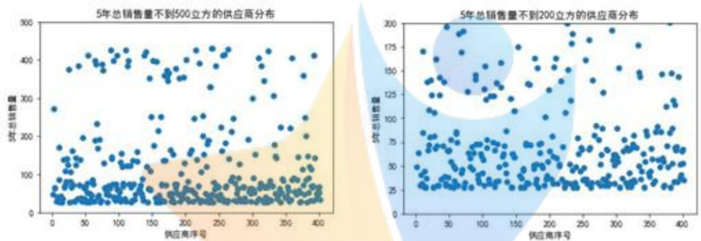  
图 1: 历史总销售量供应商分布

同时，可以检验本题中不存在“延迟交货”这一现象，即并不存在某订单量为0，而相应的供货量不为0的情况。

## 5.1.2 指标选择

整个供应链系统是一种人工和自然相结合的多变量、多目标、多约束条件的复杂非线性开放系统，供应商系统是这当中的一个子系统。对于这类系统的指标设计，应遵循如下原则：

（一）指标系统性。由于系统受到多重因素影响，所以选择的参数要尽可能全面、系统地反映供应商目前地综合水平，并对未来有一定指导。  
（二）指标科学性。将绝对数指标和相对数指标相结合，通过绝对数指标反映出供应商总量上、规模上地情况，通过相对数指标反映出速度和比率等。两类指标相辅相成，结合分析，可以更为准确地反映实际情况。  
（三）指标实用性。这主要包括指标的可计算性及计算所需数据的可行性。指标具有一定的灵活性，使得供应商根据情况合理利用。

为了量化第i家供应商的供货特征，从企业合作能力、绩效、灵活性等角度定义如下指标3：

<table><tr><td>指标</td><td>计算方法</td><td>数学表达式</td></tr><tr><td>供货及时性  $f_{i}^{(1)}$ </td><td> $\frac{\text{准时供货次数}}{\text{总订货次数}} \cdot 100\%$ </td><td> $\frac{m_{i}}{n_{i}} \cdot 100\%$ </td></tr><tr><td>交货准确度  $f_{i}^{(2)}$ </td><td> $(\frac{\text{供货量-订货量}}{\text{订货量}})^{2}$  的平均值</td><td> $\frac{1}{n_{i}} \sum_{i=1}^{240} (\frac{s_{ik} - d_{ik}}{d_{ik}})^{2}$ </td></tr><tr><td>供货波动性  $f_{i}^{(3)}$ </td><td> $\frac{(\text{供货量-订货量}) \text{的标准偏差}}{(\text{供货量-订货量}) \text{的平均值}}$ </td><td> $\frac{n_{i} \cdot SD(s_{ik} - d_{ik})}{\sum_{i=1}^{240}(s_{ik} - d_{ik})}$ </td></tr><tr><td>供货量方差  $f_{i}^{(4)}$ </td><td>供货量在题给 240 周下的方差</td><td> $D s_{i}$ </td></tr><tr><td>产品占有率  $f_{i}^{(5)}$ </td><td> $\frac{\text{供货量}}{\text{此类材料总供货量}} \cdot 100\%$ </td><td> $\frac{1}{n_{i}} \sum_{i=1}^{n_{i}} \frac{s_{ik}}{\sum_{i=1}^{n_{i}} s_{ik}} \cdot 100\%$ 此类材料</td></tr><tr><td>信誉度  $f_{i}^{(6)}$ </td><td>每周的交易准确度 · ln(订货量)</td><td> $\frac{s_{ik} - d_{ik}}{d_{ik}} \cdot \ln d_{ik}$ </td></tr><tr><td>平均忙期量  $f_{i}^{(7)}$ </td><td>供货量 &gt; 5 时供货量的平均值</td><td> $\frac{1}{n_{i}} \sum_{k} \frac{s_{ik} - d_{ik}}{d_{ik}}$ </td></tr><tr><td>批量柔性  $f_{i}^{(8)}$ </td><td>每周 $\frac{\text{供货量}}{\text{订货量}}$ 最大能增加的百分比</td><td> $\max_{k} \frac{s_{ik} - d_{ik}}{d_{ik}}$ </td></tr><tr><td>供给弹性  $f_{i}^{(9)}$ </td><td> $\frac{\text{供货量方差}}{240 \text{ 周供货量平均值}} \cdot 100\%$ </td><td> $\frac{n_{i} \cdot D s_{i}}{\sum_{i=1}^{240} s_{ik}} \cdot 100\%$ </td></tr></table>

表 3: 指标确定

下面给出这9个指标的实际意义[1]:

\- $f_{i}^{(1)}$ 供货及时性反映供应商订单的完成率，鉴于上文已经验证了不存在“延迟交货”的情况。

\- $f_{i}^{(2)}$ 交货准确度衡量了供货量与订货量之间的偏差情况。

\- $f_{i}^{(3)}$ 供货波动性反映供货与订货的差量这组数据的离散程度，体现了供货是否稳定。

\- $f_{i}^{(4)}$ 供货量方差体现供应商所能供货的波动性大小，这是一个极小型指标。

\- $f_{i}^{(5)}$ 产品占有率反映供应商在供应链中的重要性，以此反映它对于保障生产的重要性。

\- $f_{i}^{(6)}$ 信誉度考虑了在订货数量大小有差别时，供货商的供货数据有效性并不相同。能够很好满足更大量的订货，比满足较小的订货，应当更有参考价值。这是一个极小型指标。

\- $f_{i}^{(7)}$ 平均忙期量比单纯计算供货量的平均值更有意义，它去除了供应商没有订单而导致的供货量为 0 的情况。这个指标在第二问也有不小的作用。

\- $f_{i}^{(8)}$ 批量柔性用来衡量供应商的速度，如果企业增加订单，供应商在供给批量中最大能增加的百分比。

\- $f_{i}^{(9)}$ 供给弹性形容的是供应商能够同时满足大订货量和小订货量的能力。

## 5.1.3 评价体系的建立

## （一）熵权法初步确定权重

为了尽可能的精确客观，选择熵权法对于上述9个指标确定权重，打分评价，用各个供应商的得分来反映它们对于保障企业生产的重要性。

熵权法用于对有限个决策进行评价，通过对不同指标的信息熵进行对比，确定指标的权重，最终决定最优策略。通常来说，如果某个指标的信息熵越小，表明不同决策对应该指标的变化程度越大，提供的信息也就越多，起到的作用越大，它的权重也就越大。它的具体步骤如下：

## Step1. 数据标准化

设 $X_{ij}$ 表示评价对象 i 在第 j 个指标处的取值。对于极大型指标和极小型指标，应用不同的方法对其进行标准化。对极大型指标，定义标准化后的值 $Y_{ij} = \frac{X_{ij} - \min_i X_j}{\max_i X_j - \min_i X_j}$ ；对极小型指标，定义标准化后的值 $Y_{ij} = \frac{\max_i X_j - X_{ij}}{\max_i X_j - \min_i X_j}$ 。

## Step2. 求出各指标的信息熵

根据信息熵的定义，一组数据的信息熵

$$
E _ {j} = - \frac {1}{\ln n} \sum_ {j = 1} ^ {n} p _ {i j} \ln p _ {i j} \tag {5.1.1}
$$

其中 $p_{ij} = \frac{Y_{ij}}{\sum_{i=1}nY_{ij}}$ ，如果 $p_{ij} = 0$ ，定义 $\lim_{p_{ij}\to 0}p_{ij}\ln p_{ij} = 0,$

## Step3. 确定各指标的权重

利用（2）中得到的信息熵，计算出权重

$$
W _ {j} = \frac {1 - E _ {i}}{k - \sum_ {i} E _ {i}} \tag {5.1.2}
$$

## (二) 层次分析法适度修正

由于熵权法仅是根据数据自身混乱程度，来比较得出各个指标的权重。但根据实际操作结果来看，这难免会出现与事实不吻合的情形，需要在适度范围内修正。于是加入人工干预，以熵权法得到的权重作为参考，应用层次分析法改进此评价体系。

层次分析法是一种系统性的分析方法。简洁使用，需要定量数据。

本问中将 9 个指标归类并修改为二级指标，新定义三个一级指标：绩效评价、战略意义、潜力估计，得到如下图2所示的评价指标体系。二级指标相关部分的权重依据熵权法确定；一级指标相互间的权重查阅文献，利用层次分析法得到，具体步骤如下：

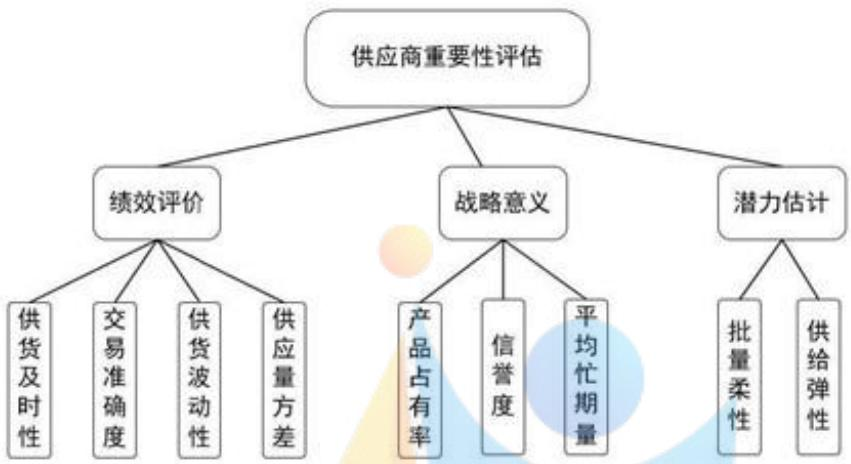

<details>
<summary>flowchart</summary>

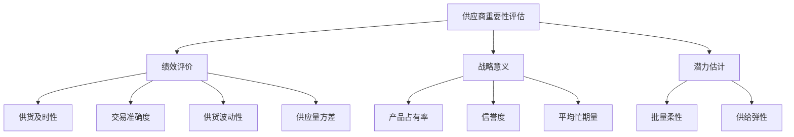
</details>

图 2: 评价指标体系

Step1. 计算比较矩阵的特征值。将最大特征值的特征向量归一化，作为权向量。确定各因素的权重。

Step2. 一致性检验，防止确定权重随意而导致矛盾。引入一致性指标 $CI$ 和随机一致性指标 $RI$ ，计算一致性比率 $\frac{CI}{RI}$ ，当小于0.1则满足条件。

## 5.2 模型求解

## 5.2.1 供货特征的量化分析

用交易型、战略型、大额型来描述供应商的供货特征。通常来说，交易型指为数众多，但交易金额较小的供应商；战略型指公司战略发展必需的几家供应商；大额型指交易数额巨大，但是战略意义一般的供应商。[2]

这三种特征在所给的供应商中都有所体现。对于交易型特征为主的供应商，它们供应量不大、灵活性较强，但是增长潜力有限，对于保障企业生产重要性有限，可以预见它们的排名较后，这在下文评价体系求解中得到验证。对于战略型或者大额型特征为主的供应商，它们生产规模较大，有较好的财务状况，往往对该企业生产保障起到重要作用。

除此以外，求出9个指标对应的值。注意到指标中供货量方差 $f_{i}^{(4)}$ 、供货波动性 $f_{i}^{(3)}$ 、交货准确度 $f_{i}^{(2)}$ 是极小型指标其余是极大型指标，分别用不同的方法将它们标准化，并且均化为极大型指标，便于观察。具体见附录A。

## 5.2.2 供应商重要性的评价与分析

首先，运用 SPSSAU 求出各指标权重，如下图3蓝字所示。譬如“供给弹性”指标，它在评价保障生产的重要性时作用较为次要，但因为其离散程度较大，解得的权重相应较大，与具体情况矛

盾，需要进行合理范围内的修正。

然后，利用层次分析法，根据文献与经验，给出比较矩阵 $\begin{bmatrix}1&0.2&0.167\\5&1&0.769\\6&1.3&1\end{bmatrix}$ ，解得绩效评价、战略意义、潜力估计对应的权重为40.467%,51.219%,8.314%，且通过一致性检验。结合先前二级指标的权重，得到修正后的指标权重，如下图3黄字所示。

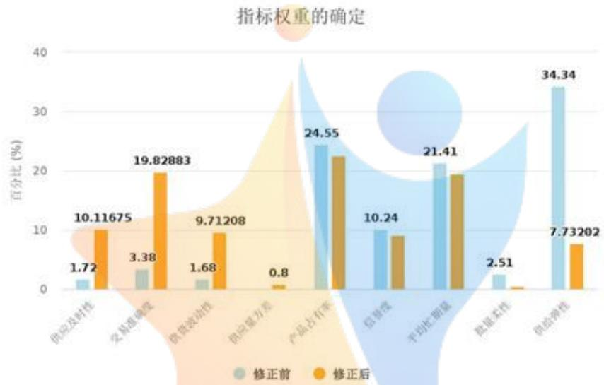

<details>
<summary>bar</summary>

| 指标 | 修正前 (%) | 修正后 (%) |
| :--- | :--- | :--- |
| 供应及时性 | 1.72 | 10.11675 |
| 交易准确度 | 3.38 | 19.82883 |
| 供货波动性 | 1.68 | 9.71208 |
| 供应量方差 | — | 0.8 |
| 产品占有率 | 24.55 | 22.5 |
| 信誉度 | 10.24 | 9.0 |
| 平均扩期量 | 21.41 | 19.5 |
| 拟量柔性 | 2.51 | — |
| 供给弹性 | 34.34 | 7.73202 |
</details>

图 3: 层次分析法修正前后的权重的比较

基于修正后的权重，对供应商 i 进行打分。记分数为 w，则

$$
w _ {i} = 0. 1 0 1 \cdot f _ {i} ^ {(1)} + 0. 1 9 8 \cdot f _ {i} ^ {(2)} + 0. 0 9 7 \cdot f _ {i} ^ {(3)} + 0. 0 0 8 \cdot f _ {i} ^ {(4)} + 0. 2 2 5 \cdot f _ {i} ^ {(5)} + 0. 0 9 2 \cdot f _ {i} ^ {(6)} + 0. 1 9 5 \cdot f _ {i} ^ {(7)} + 0. 0 0 6 \cdot f _ {i} ^ {(8)} + 0. 0 7 7 \cdot f _ {i} ^ {(9)} \tag {5.2.1}
$$

打分得到 50 家最重要的供应商，如下表4所示：

<table><tr><td>排名</td><td>供应商 ID</td><td>评分</td><td>排名</td><td>供应商 ID</td><td>评分</td><td>排名</td><td>供应商 ID</td><td>评分</td></tr><tr><td>1</td><td>S201</td><td>0.75974645</td><td>18</td><td>S348</td><td>0.45921065</td><td>35</td><td>S005</td><td>0.388482065</td></tr><tr><td>2</td><td>S229</td><td>0.646160998</td><td>19</td><td>S374</td><td>0.452996397</td><td>36</td><td>S123</td><td>0.385770748</td></tr><tr><td>3</td><td>S361</td><td>0.626986785</td><td>20</td><td>S126</td><td>0.452707551</td><td>37</td><td>S367</td><td>0.38271972</td></tr><tr><td>4</td><td>S140</td><td>0.582720318</td><td>21</td><td>S352</td><td>0.451897697</td><td>38</td><td>S037</td><td>0.37993823</td></tr><tr><td>5</td><td>S108</td><td>0.562163907</td><td>22</td><td>S356</td><td>0.451782973</td><td>39</td><td>S189</td><td>0.376542632</td></tr><tr><td>6</td><td>S282</td><td>0.541186211</td><td>23</td><td>S284</td><td>0.443962706</td><td>40</td><td>S346</td><td>0.374376793</td></tr><tr><td>7</td><td>S340</td><td>0.536377517</td><td>24</td><td>S247</td><td>0.442722083</td><td>41</td><td>S244</td><td>0.372966686</td></tr><tr><td>8</td><td>S275</td><td>0.529990375</td><td>25</td><td>S031</td><td>0.434323795</td><td>42</td><td>S364</td><td>0.372366756</td></tr><tr><td>9</td><td>S329</td><td>0.526701861</td><td>26</td><td>S307</td><td>0.430694683</td><td>43</td><td>S055</td><td>0.371128447</td></tr><tr><td>10</td><td>S395</td><td>0.523379239</td><td>27</td><td>S365</td><td>0.423267153</td><td>44</td><td>S210</td><td>0.365853787</td></tr><tr><td>11</td><td>S131</td><td>0.507056588</td><td>28</td><td>S143</td><td>0.423261774</td><td>45</td><td>S074</td><td>0.362386554</td></tr><tr><td>12</td><td>S268</td><td>0.503219779</td><td>29</td><td>S294</td><td>0.410719677</td><td>46</td><td>S078</td><td>0.361104426</td></tr><tr><td>13</td><td>S306</td><td>0.495833855</td><td>30</td><td>S139</td><td>0.405768113</td><td>47</td><td>S086</td><td>0.354186795</td></tr><tr><td>14</td><td>S151</td><td>0.489199392</td><td>31</td><td>S218</td><td>0.404435297</td><td>48</td><td>S007</td><td>0.350107187</td></tr><tr><td>15</td><td>S308</td><td>0.483788422</td><td>32</td><td>S080</td><td>0.400158729</td><td>49</td><td>S273</td><td>0.349888122</td></tr><tr><td>16</td><td>S330</td><td>0.465845283</td><td>33</td><td>S040</td><td>0.394213106</td><td>50</td><td>S003</td><td>0.347399242</td></tr><tr><td>17</td><td>S194</td><td>0.465013512</td><td>34</td><td>S266</td><td>0.394086124</td><td></td><td></td><td></td></tr></table>

表4: 排名前 50 的供应商

如下图4，作出了部分排名在前的供应商的特征分布。结合下图4和附录B中的数据，可以发现排名在前的供应商大多有两个及以上的指标表现较为出色，或者大部分指标均表现良好，这与现实认知相符。这些排名在前的供应商与企业合作频繁，供货量大，能准时供货的情况数多；那些交易量少，食言次数多的企业均排名在后。除此以外，排名靠前的企业有的供货弹性较大，有的供货潜力较好……能够满足企业的各种策略要求，对于保障企业生产发挥着至关重要的作用。由此，评价体系的合理性可见一斑。

竞赛零距离
--Competition Zero Distance--

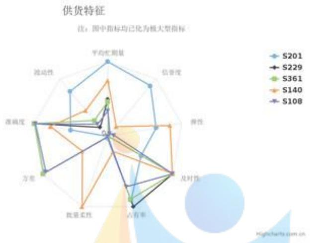

<details>
<summary>radar</summary>

| 维度 | S201 | S229 | S361 | S140 | S108 |
| --- | --- | --- | --- | --- | --- |
| 平均忙测量 | ~0.8 | ~0.2 | ~0.3 | ~0.5 | ~0.2 |
| 信誉度 | ~0.7 | ~0.1 | ~0.1 | ~0.1 | ~0.1 |
| 弹性 | ~0.6 | ~0.1 | ~0.1 | ~0.6 | ~0.1 |
| 及时性 | ~0.1 | ~0.1 | ~0.1 | ~0.1 | ~0.1 |
| 占有率 | ~0.1 | ~0.8 | ~0.8 | ~0.1 | ~0.1 |
| 批量柔性 | ~0.1 | ~0.1 | ~0.1 | ~0.8 | ~0.1 |
| 方差 | ~0.2 | ~0.1 | ~0.8 | ~0.1 | ~0.8 |
| 深程度 | ~0.1 | ~0.1 | ~0.1 | ~0.1 | ~0.1 |
| 波动性 | ~0.6 | ~0.1 | ~0.1 | ~0.1 | ~0.1 |
</details>

图 4: 前 5 名供货特征比较

## 6 问题二中贪心算法求解双目标优化问题

## 6.1 模型建立

在分析中我们指出，这一问的模型包含多个部分：内层的经济进货存贮模型，外层的双目标定量规划问题，以及问题一中求得的供应商模型。以下对这几个子模型分别进行建模与解说。

## 6.1.1 经济进货存贮模型

存贮模型是数学建模中一种常用模型，存贮论本身也涉及有最优存储策略的运筹求解。由于该题着重对存贮之前的采购-运输环节的策略进行讨论，故依据假设五，此处的存贮模型进行了适当简化，保证在完整表示目标约束条件的同时，不将模型过于复杂化。[3]

该情景模型中所涉及到的存贮要素有：

- 需求量：每周对于产能的需求量为 $28200m^{3}$ ，间接代表对A、B、C三种物品的需求量。  
- 订货批量：一次订货中，包含A,B,C的数量。此为我们本问优化求解的对象。  
- 订货间隔期：一周一次订货（进货）  
- 相关费用：分为订货费、运输费和存贮费。

该企业的存贮策略为 $(t,s)$ 型策略，即，每隔一周补充进货一次，补充量参考存贮警戒点s进行设计。警戒点约束条件为满足未来两周的产能供应，即 $s=28200*2=56400(m^{3})$ 。

依据假设五，对A,B,C的存储进行简化处理，实际分开存储的三种货物在此模型中统一转换为产能进行存储，第i家供应商对应商品的单位产能转换系数 $z_{i}$ 依题可知。故对第i个商家在第k

周的接收量 $t_{i,k}$ 所得到的产能，有转换公式：

$$
w _ {i, k} = \frac {t _ {i , k}}{z _ {i}} \tag {6.1.1}
$$

由此，第k周企业获得的产能值 $\Delta w_{k}$ 为

$$
\Delta w _ {k} = \sum_ {i = 1} ^ {5 0} w _ {i, k} = \sum_ {i = 1} ^ {5 0} \frac {t _ {i , k}}{z _ {i}} \tag {6.1.2}
$$

第k周总库存产能值 $w_{k}$ 基于上一周库存，还要进行消耗和补充操作，有

$$
w _ {k} = w _ {k - 1} + \Delta w _ {k} - 2 8 2 0 0 \tag {6.1.3}
$$

由于模型警戒点的设置，我们假设初始状态时企业库存量 $w_{0}=56400$ ，刚好满足产能要求约束。该假设在保证模型自治的同时，也没有给未来周的状态带来外来影响。

## 6.1.2 供应商模型的细化分类

分析数据发现，部分商家存在供应量非常小的时间段，而其余商家供货较为平稳、大致维持在同一水平波动。分析认为，周期性的存在表示了该商家具有短时间内提供大量货物的能力，但是之后需要一段时间进行供应量的积累恢复，从而造成了明显周期变化。

据此，定义两种供应商类型：平稳型、周期型。当该供应商某周供货量少于5时，该周算作供应“空期”，视为无法提供（中大额）订单。相应的，高于 $5m^{3}$ 的周记为“忙期”，即可以提供相对应数量级的大额订单。对于连续空期和连续忙期，算出其240周内平均时间长度，作为空期/忙期转换的周期长度。

在方案中对于周期型供应商的行为基于此周期建模：初期该供应商处于周期中某一随机位置，随着周数增加缓慢推进周期变化。当该周处于空期时，此商家不接受订单，产出量为0；当该周处于忙期时，依据往期忙期平均量、偏差率等属性，确定其接受的订单量。如果某一商家的平均空期为0，则说明其属于平稳型。人工粗略筛查50组数据确保，不存在位于5附近平稳波动的商家被误判为周期型的情况。

附录 C 为前 50 组商家的周期/平稳型分类情况。

## 6.1.3 双目标定量规划建模

企业一周进行订货流程包含如下三个环节：

1. 采购。该环节交接对象为供货商与企业：企业每周向供应商预订订单上的订货量 $d_{i,k}$ ，供应商根据实际情况回返相应供货量 $s_{i,k}$ 。供货量与订货量之间存在一定差异，通过偏差率 $p_{i,k}$ 计算。对于供应商生产提供的供货量，无论其与订货量差别多少，企业均全盘接受。故采购环节产生的成本按照供货量计算，记为 $C_k$ 。（ $i$ 表示供货商编号， $k$ 表示周数）  
2. 转运。此过程涉及供货商与转运商的匹配问题。一家供货商将提供的供货量交给仅一家转运商转运，第 $i$ 家供货商在第 $k$ 周对接的转运商记为 $kj_{i,k}$ 。转运过程中可能出现损耗，即损耗率 $l_j$ ，经过转运实际递交给企业的量为接收量 $t[i,k]$ ，小于先前供货量。

3. 存贮。企业将最终获得的接收总量存入仓库。仓库的容量假设是无限的，第 k 周仓库库存量记为 $w_{k}$ ，转运与存贮环节成本统一记录。

## （一）基本量计算与随机变量假设

各量之间的关系有以下公式计算：

$$
s _ {i, k} = p _ {i, k} d _ {i, k} \tag {6.1.4}
$$

$$
t _ {i, k} = (1 - l _ {j _ {i, k}, k}) s _ {i, k} \tag {6.1.5}
$$

假设偏差率 $p_{i,k}$ 、损耗率 $l_{j,k}$ 均为正态分布，由附件1处理得到每家供应商或转运商对应率的均值和标准差 $p_{i}, Dp_{i}, l_{j}, Dl_{j}$ ，生成正态分布的随机量来模拟未来24周中损耗率、偏差率的波动。

$$
p _ {i, k} \sim N (p _ {i}, D p _ {i}) \quad l _ {i, k} \sim N (l _ {j}, D l _ {j}) \tag {6.1.6}
$$

此处对于偏差率和损耗率进行随机处理的考虑为，由假设一商家对应概率波动不存在季度变化，上下浮动看做真实世界中广泛存在的独立不相干干扰量的影响，在大部分情况下是基于正态分布的。同时，偏差率等本身具备了偏置性，正态分布的对称性并不会扭曲货量变化时的非对称性。另外，随机量的引入使得未来24周方案抛弃了一成不变的平稳型而具有波动性，在丰富方案的同时，也具备了自动上下调整库存的能力，使模型具有更强的稳健性。

## (二) 目标函数

现有如下目标：

a. “最经济”的订购方案

该目标要求方案的订购环节“最经济”，即订购成本越少越好。企业第i家供应商某一周的订单最终交易量应当以实际供货量为准，故有目标函数a：

$$
\min \sum_ {k = 1} ^ {2 4} \sum_ {i = 1} ^ {5 0} r _ {i} s _ {i, k} \tag {6.1.7}
$$

b. 转运损耗最少

基于目标函数 a 的最优解下，进一步确定转运方案。对于转运途中存在物品损耗的情况，也可看做成本的负方向指标。对于损耗量价值的量化估计，我们将其转换为产能，表示“在路途中损失的产能”。据此有以下目标函数 b:

$$
\min \sum_ {k = 1} ^ {2 4} \sum_ {i = 1} ^ {5 0} \frac {s _ {i , k} - t _ {i , k}}{z _ {i}} \tag {6.1.8}
$$

## (三) 约束条件

由题中各约束条件整理如下：

1. 转运商每周最多运送 $6000m^{3}$ ;

2. 贮存模型中存贮警戒点 s 约束，要求满足未来至少两周库存；  
3. 贮存模型中库存量 $w_{k}$ 的时间变化关系；  
4. 偏差率、损耗率基于正态分布的随机变量；  
5. 订货量需满足一定合理性，不可过大或过小；  
6. 各参数的非负性。

## （四）双目标规划方程

$$
\min \sum_ {k = 1} ^ {2 4} \sum_ {i = 1} ^ {5 0} r _ {i} s _ {i, k} \tag {6.1.9}
$$

$$
\min \sum_ {k = 1} ^ {2 4} \sum_ {i = 1} ^ {5 0} \frac {s _ {i , k} - t _ {i , k}}{z _ {i}} \tag {6.1.10}
$$

$$
s. t. \left\{ \begin{array}{l} \sum_ {j = 0} ^ {5 0} s _ {i, k} \leq 6 0 0 0, \quad (\forall j, k, j _ {i, k} = j) \\ w _ {k} \geq 2 8 2 0 0 * 2 \\ w _ {k} = w _ {k - 1} + \Delta w _ {k} - 2 8 2 0 0 \\ p _ {i, k} \sim N (p _ {i}, D p _ {i}), \quad l _ {i, k} \sim N (l _ {j}, D l _ {j}) \\ s _ {i, k} = p _ {i, k} d _ {i, k} \\ t _ {i, k} = (1 - l _ {j _ {i, k}, k}) s _ {i, k} \\ 0 \leq d _ {i, k} \leq 6 0 0 0 \\ s _ {i, k}, t _ {i, k}, w _ {k} \geq 0 \end{array} \right. \tag {6.1.11}
$$

## 6.2 算法模型求解

## 6.2.1 构建贪心算法

对于双目标优化类问题，考虑贪心算法进行求解。此处构架双层贪心，优先满足目标函数 a 即供应环节，其次满足目标函数 b 即转运环节。算法伪代码见下：

Algorithm 1 双层贪心算法：求采购最经济方案及其对应运输方案  
相关量说明  
```txt
X - 供应商集,
Y - 转运商集,
KeyExpression - 关键式
```

<div class="mineru-algorithm" style="white-space: pre-wrap; font-family:monospace;">
for week $k = 1 \rightarrow 24$ do
    $w_k \leftarrow w_{k-1} - 28200$
    for $x_i, i = 1 \rightarrow 50$ do
        if $x_i \in X_{steady}$ then
            $d_{i,k} \leftarrow KeyExpression$
        else $x_i \in X_{periodic}$
            if $x_i$ 处于忙期 then
                $d_{i,k} \leftarrow KeyExpression$
            else $x_i$ 处于空期
                continue
        $p_{i,k} \leftarrow p \sim N(p_i, Dp_i)$ $s_{i,k} \leftarrow p_{i,k} * d_{i,k}$ $\forall j : clean \quad y_i.storage$
        for $y_j, j = 1 \rightarrow 8$ do
            if $y_j.storage + s_{i,k} \leq 6000$ then
                $J_{i,k} \leftarrow y_j$ $y_i.storage \leftarrow y_i.storage + s_{i,k}$ $l_{i,k} \leftarrow l \sim N(l_{J_{i,k}}, Dl_{Ji,k})$ $t_{i,k} \leftarrow (1 - l_{i,k} * s_{i,k})$ $w_k \leftarrow w_k + t_{i,k}/z_i$
        if $w_k \geq 28200 * 2$ then
            break
    $C_k \leftarrow \sum_{i=1}^{50} s_{i,k} * r_i$ $L_k \leftarrow \sum_{i=1}^{50} (s_{i,k} - t_{i,k})/z_i$
</div>

## 6.2.2 贪心的合理性论证

贪心策略首先需要一个满足界限，定义为贪心满意目标。在每周进货时，企业只需要满足库存足够未来两周的产能，一旦大于该产能立即“见好就收”，停止增加订单。过多的产能不仅可能来自较差的供应方和运输方、从而导致偏差率和损耗较大，还有可能提高存贮、运输的成本。故此处的贪心满意目标为：当前库存量大于未来两周所需产能。

接下来构建双层嵌套贪心，分别探讨订货量的选择和供货运输匹配。

## （一）外层贪心：最优供货商

由问题一得 50 家按照合作可靠度高低排序好的供货商，基于贪心，从最优合作商开始下订单，直到估计该周的最终接受量达到贪心满意目标。由供货商的供货周期类型可知，周期型供货商在“空期”时无法提供订单，则此时跳过处于空期的供货商，依次选择次优的合作商下单。

下单时的订货量根据关键式判断，将在下文中讨论。

## （二）内层贪心：最优运输商

参考供货商可靠度排序，对转运商同样构建排序操作。参考平均损耗量、损耗量偏差等，获得转运商的最优排序表：(见附录 C)

本周有订单的供货商，由最优到最次大致订单量呈递减趋势，因为可靠度越高的供货商的合作量也相对更大、更划算。故对最优到最次的供货商，依次分配当前仍有空间的最优转运商。越高合作量的供应商，具有优先选择高级转运商的权利。若当前最优转运商的剩余空间无法装下该供应商商品，则考虑次优转运商，直到与一名转运商匹配。

多次试验表明，不存在转运商不足的情况。

## 6.2.3 关键式-商家订购量计算公式

贪心策略确定之后，对 $d_{i,k}$ 的选取进行探讨，并由此提出以下四个较具代表性的公式。

首先 $d_{i,k}$ 需要与历史5年数据中该供应商的供货量具有相关性。往年该供应商与企业的供货量平均值反映了该供货商的货物供给能力、与企业合作量大小、合作频率密度等等，在考虑未来方案的时候也应当遵循该规律，而供货量的方差反映与其订单是否平稳，也可作为参考加入未来方案的订货量考虑中。运用第一问得出的供货量平均值、平均方差等数据。故四个公式的供货量基础均来自往年平均值 $D_{i}$ 。

经过供应商评价模型后，贪心算法优先选择的商家均具有较高的合作潜力，故引入进货参数1.5乘以往年平均值，在不脱离历史数据的合理范围内提高与该商的合作力度，从而向更优方向探索。同时，类似偏差率的随机生成，订货量也应当体现一定的随机性，以保证方案在一定波动范围内的自我调节能力。公式A、B分别将随机性赋给加法或乘法，留待观察效果。

同时，分析历史数据发现，当订货量过大时，一方面供货量的随机波动将增强，另一方面其偏差率也将大幅下降。故定义公式 C、D 描述这两种现象。

## 公式 A

$$
d _ {i, k} = \overline {{D _ {i}}} * (1. 5 + \epsilon) \tag {6.2.1}
$$

其中 $\epsilon \sim N(0.2, 0.5)$

## 公式 B

$$
d _ {i, k} = \overline {{D _ {i}}} * 1. 5 + \epsilon \tag {6.2.2}
$$

其中 $\epsilon \sim N(0,500)$

公式 C

$$
d _ {i, k} = \overline {{D _ {i}}} * 1. 5 + \epsilon \tag {6.2.3}
$$

其中

$$
\epsilon \sim \left\{ \begin{array}{l l} N (0, 5 0 0), & \text {if} \quad \overline {{D _ {i}}} * 1. 5 > 2 5 0 0 \\ N (0, 2 0 0), & \text {if} \quad \overline {{D _ {i}}} * 1. 5 \leq 2 5 0 0 \end{array} \right. \tag {6.2.4}
$$

公式 D

$$
d _ {i, k} = \overline {{D _ {i}}} * 1. 5 + \epsilon \tag {6.2.5}
$$

其中

$$
\epsilon \sim \left\{ \begin{array}{l l} N (0, 5 0 0), & \text {if} \quad \overline {{D _ {i}}} * 1. 5 > 2 5 0 0 \\ N (0, 2 0 0), & \text {if} \quad \overline {{D _ {i}}} * 1. 5 \leq 2 5 0 0 \end{array} \right. \tag {6.2.6}
$$

且

$$
p _ {i, k} \sim \left\{ \begin{array}{l l} 0. 7 * N (p _ {i}, D p _ {i}), & \text {if} \overline {{D _ {i}}} * 1. 5 > 2 5 0 0 \\ N (p _ {i}, D p _ {i}), & \text {if} \overline {{D _ {i}}} * 1. 5 \leq 2 5 0 0 \end{array} \right. \tag {6.2.7}
$$

## 6.3 方案的实施效果分析

## (一) 结果分析

取定进货参数为 1.5，分别对四个关键式进行实验，求得结果分别如下5:

分析该图，公式 B 出现了未满足约束要求的情况，而公式 D 进货成本略高于 A、C，且在初始阶段刚刚满足约束条件，稳健性不强；公式 A 与 C 的结果均较为可观且相接近，但公式 C 的定义更加贴合实际，故最终选择公式 C 为关键式。

基于此方案，多次实验求得相关目标值。选取频率较高且目标较优的典型代表方案，将方案列入附件 A，且求得该方案下的某次单周采购成本 $C_{k}$ 如下：

[21508.2 20326.5 19584.1 20590.4 20351.7 20808.9 20719.3 19879.6 20656.8 20378.3 20788.9 19947.4 20950.5 20085.2 20671.8 21109.2 19764.3 20432.9 20412.2 21566.2 20051.1 20061.8 20125.7 20940.8]

其平均订购成本为20488/周。

同样，求得其转运损耗量 $L_{k}$ 为：

[146.36363636 134.34343434 139.74747475 147.85353535 134.92424242 141.36363636 120.37878788 140. 123.05555556 141.99494949 123.40909091 131.59090909 139.09090909 137.85353535 136.21212121 144.87373737 129.04040404 128.88888889 137.82828283 131.91919192 132.1969697 133.08080808 131.36363636 140.60606061]

其平均转运损耗为 135.33/周。

该问还要求与尽量少的供应商合作，求得该值如下：

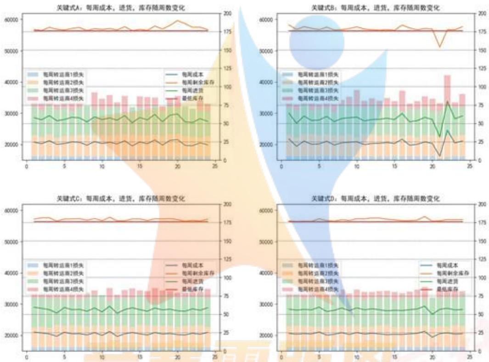  
图 5: 四项公式比较

--Competition Zero Distance--

[16. 15. 16. 28. 17. 18. 18. 14. 10. 12. 14. 15. 11. 24. 16. 25. 15. 16. 16. 18. 17. 17. 17. 23.]

合作商家数量大致在16家左右，范围从10至25均有。

## (二) 合理性说明

画出排名前 10 的供应商的准确性随订货量变化的重叠散点图6。通过比较下图6与实验所得数据，发现所得数据对应的供货准确度均较高，基本不存在偏差较大的情形，由此证明我们得到的订购方案是合理可行的。

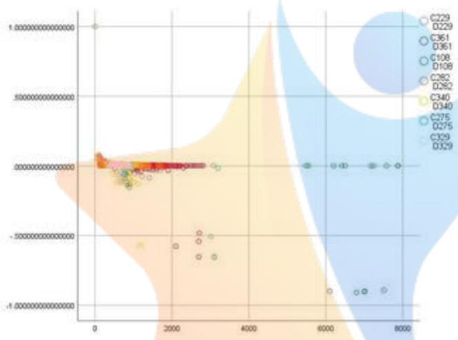

<details>
<summary>bubble</summary>

| Series | X (range) | Y (range) |
| --- | --- | --- |
| C229 | 0~8000 | -1.0~1.0 |
| C361 | 500~7500 | -0.9~0.0 |
| C108 | 500~7500 | -0.9~0.0 |
| C282 | 500~7500 | -0.9~0.0 |
| C340 | 500~7500 | -0.9~0.0 |
| C275 | 500~7500 | -0.9~0.0 |
| C329 | 500~7500 | -0.9~0.0 |
</details>

图6: 供应商历史波动性分析

## 7 定向目标权重筛选在问题三的应用

## 7.1 目标模型的建立

题目引入压缩成本的考虑，也即尽量减小企业在存储环节所花的成本。题目给出未证明的推论如下：

推论：尽量采购 A 类原料、减少采购 C 类原料，可达成压缩成本效果。

首先对该推论进行证明，再基于此推论设计新订购模型。

## 7.1.1 原料属性分析及推论证明

由题表1已知各原料原始属性。其单位产能转化率z表示生产一立方米产能所需的原料量，而相对成本r反映原料价格。由此计算原料的性价比 $=r^{(x)}z^{(x)}$ ，表示以x为原料生产每单位产能所需的采购成本。结果如下表5：

<table><tr><td>种类</td><td>A</td><td>B</td><td>C</td></tr><tr><td>性价比</td><td>0.72</td><td>0.726</td><td>0.72</td></tr></table>

表 5: 原料性价比  
A、C类原料性价比相同，而由 $z^{(A)} < z^{(C)}$ 产生相同产能所需的A原料更少。因此为节约存贮成本，尽可能使单位存贮物产生产能更高，应提高A类原料采购量，减少C类原料采购量。推论证明完毕。  
而对于 B 类原料，其性价比较低，且单位产能密度低于 A，但高于 C，故 B 作为中间量次于 A 类产品但优于 C 类产品。由于第三问成本仅从存贮方面考虑，故 B 类性价比低于 C 类的特点对重要性没有影响。

## 7.1.2 基于权重二次排序

基于推论对现有供应商排名进行更改，突出 A 类供应商的重要性，依次降低另两种。不同于第一问中各指标经过熵权法、层次分析法得出的分数评判，该处依照推论有明确的目标进行二次规划。在具备明确方向的背景下，人为重新指定类型权重简单有效。  
现指定三类权重：A 类 1.05，B 类 1，C 类 0.95，乘以原评价分数得到新评价分数，排序获得新排名。权重的选取基于一般常识与多次实验判断，一方面权重不可过小，确保新方案中各类原料的显著突出度，具备与原方案排名的明显区别以保证模型三的思想贯彻始终；另一方面设定值不可过大，否则将会导致排名过于激进，导致解得方案过多关注存贮成本压缩，失去对采购成本的约束与供应商合作可靠性相关关系。  
列出新排名中前十名的前后变化6:

<table><tr><td>代码</td><td>原评分</td><td>排名</td><td>新评分</td><td>新排名</td><td>材料分类</td></tr><tr><td>S201</td><td>0.759</td><td>1</td><td>0.797</td><td>1</td><td>A</td></tr><tr><td>S229</td><td>0.646</td><td>2</td><td>0.678</td><td>2</td><td>A</td></tr><tr><td>S361</td><td>0.626</td><td>3</td><td>0.595</td><td>3</td><td>C</td></tr><tr><td>S140</td><td>0.582</td><td>4</td><td>0.582</td><td>4</td><td>B</td></tr><tr><td>S282</td><td>0.541</td><td>6</td><td>0.568</td><td>5</td><td>A</td></tr><tr><td>S108</td><td>0.562</td><td>5</td><td>0.562</td><td>6</td><td>B</td></tr><tr><td>S275</td><td>0.529</td><td>8</td><td>0.556</td><td>7</td><td>A</td></tr><tr><td>S329</td><td>0.526</td><td>9</td><td>0.553</td><td>8</td><td>A</td></tr><tr><td>S395</td><td>0.523</td><td>10</td><td>0.549</td><td>9</td><td>A</td></tr><tr><td>S340</td><td>0.536</td><td>7</td><td>0.536</td><td>10</td><td>B</td></tr></table>

表6: 供应商排名变化

## 7.1.3 定向筛选对算法进行更改

贪心算法的处理中加入定向筛选操作，进一步提高对 C 类原料的排斥度，以获得更好的存贮成本。添加定向筛选算法至订购环节的优先供货商选取流程中。

该算法筛选条件为，若当前最优商家为 C 类，且下一非 C 类商家与其评价级别相近时，用下一商家代替该商家以减少 C 类供应订单。“相近”的筛选判断机制取 5%，该区间下前后供应商综合评价差别较小，生产原料上的优先级使得靠后的非 C 类供应商可以获得更高的被选中频率。

类似的，也可依据相同原理对 A 类商品进行向上提升的筛选，此处仅提出想法，不作赘述。

Algorithm 2 C 类定向筛选算法

<div class="mineru-algorithm" style="white-space: pre-wrap; font-family:monospace;">
1: 对厂家 $i_1, i_2$:
2: if class($i_1$) = 3 and class($i_2$) = 1 or 2 and $\frac{score(i_1) - score(i_2)}{score(i_1)} &lt; 5\%$ then
3: 跳过 $i_1$，选择 $i_2$ 为当前首选供应商
</div>

## 7.2 求解所得方案分析

将基于新排名且引入定向筛选机制的模型称作新模型，进行实验求解与原模型对比。

求得其转运损耗量 $L_{k}$ 为：

[79.7301424 72.32361493 80.16933504 72.70351575 75.00855177 74.96830567 74.95028003 69.99244121 79.80875954 70.31252042 70.49169535 74.72436144 72.65595341 71.41491977 74.98176174 83.20885243 71.10907587 69.18801292 79.57907641 71.95125798 80.34817925 29.04782128 74.34384891]

其平均转运损耗为 72.73/周，显见新模型下各转运商的转运损耗量整体下降了，而存贮模型的警戒条件仍可被满足，说明新模型方法与先前相比，有效降低了方案的转运存储成本。

画出原排序方案与新排序方案的各项成本、损耗指标如下7

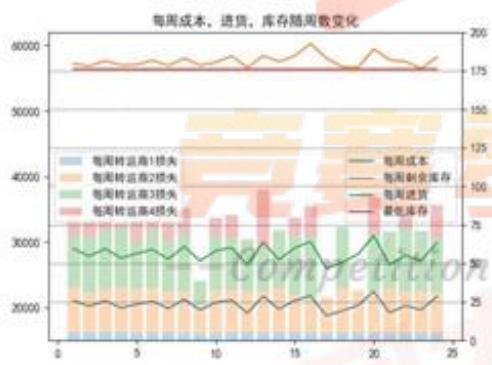

<details>
<summary>area_stacked</summary>

| Category | 每周转运商1损失 | 每周转运商2损失 | 每周转运商3损失 | 每周转运商4损失 | 每周成本 | 每周剩余库存 | 每周进货 | 最低库存 |
| --- | --- | --- | --- | --- | --- | --- | --- | --- |
| 0 | ~5000 | ~10000 | ~15000 | ~5000 | ~60 | ~180 | ~25 | ~20 |
| 5 | ~5000 | ~10000 | ~15000 | ~5000 | ~60 | ~180 | ~25 | ~20 |
| 10 | ~5000 | ~10000 | ~15000 | ~5000 | ~60 | ~180 | ~25 | ~20 |
| 15 | ~5000 | ~10000 | ~15000 | ~5000 | ~60 | ~180 | ~25 | ~20 |
| 20 | ~5000 | ~10000 | ~15000 | ~5000 | ~60 | ~180 | ~25 | ~20 |
| 24 | ~5000 | ~10000 | ~15000 | ~5000 | ~60 | ~180 | ~25 | ~20 |
</details>

(a) 原模型指标

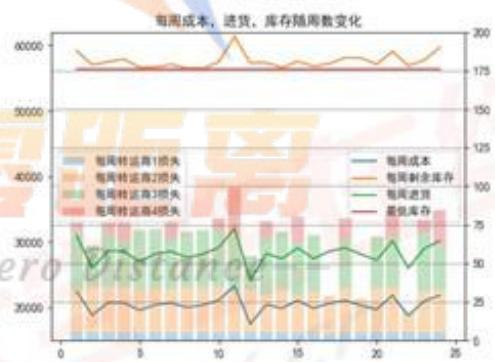

<details>
<summary>bar_stacked</summary>

| Category | 每周转运商1损失 | 每周转运商2损失 | 每周转运商3损失 | 每周转运商4损失 | 每周成本 | 每周剩余库存 | 每周进仓 | 最低库存 |
| --- | --- | --- | --- | --- | --- | --- | --- | --- |
| 1 | ~1500 | ~15000 | ~15000 | ~15000 | ~180 | ~190 | ~65 | ~25 |
| 2 | ~1500 | ~15000 | ~15000 | ~15000 | ~180 | ~185 | ~50 | ~20 |
| 3 | ~1500 | ~15000 | ~15000 | ~15000 | ~180 | ~185 | ~60 | ~25 |
| 4 | ~1500 | ~15000 | ~15000 | ~15000 | ~180 | ~185 | ~60 | ~25 |
| 5 | ~1500 | ~15000 | ~15000 | ~15000 | ~180 | ~185 | ~60 | ~25 |
| 6 | ~1500 | ~15000 | ~15000 | ~15000 | ~180 | ~185 | ~60 | ~25 |
| 7 | ~1500 | ~15000 | ~15000 | ~15000 | ~180 | ~185 | ~60 | ~25 |
| 8 | ~1500 | ~15000 | ~15000 | ~15000 | ~180 | ~185 | ~60 | ~25 |
| 9 | ~1500 | ~15000 | ~15000 | ~15000 | ~180 | ~185 | ~60 | ~25 |
| 10 | ~1500 | ~15000 | ~15000 | ~15000 | ~180 | ~185 | ~65 | ~25 |
| 11 | ~1500 | ~15000 | ~15000 | ~15000 | ~185 | ~220 | ~75 | ~35 |
| 12 | ~1500 | ~15000 | ~15000 | ~15000 | ~185 | ~225 | ~45 | ~25 |
| 13 | ~1500 | ~15000 | ~15000 | ~15000 | ~185 | ~225 | ~65 | ~35 |
| 14 | ~1500 | ~15000 | ~15000 | ~15000 | ~185 | ~225 | ~65 | ~35 |
| 15 | ~1500 | ~15000 | ~15000 | ~15000 | ~185 | ~225 | ~65 | ~35 |
| 16 | ~1500 | ~15000 | ~15000 | ~15000 | ~185 | ~225 | ~65 | ~35 |
| 17 | ~1500 | ~15000 | ~15000 | ~15000 | ~185 | ~225 | ~65 | ~35 |
| 18 | ~1500 | ~15000 | ~15000 | ~15000 | ~185 | ~225 | ~65 | ~35 |
| 19 | ~1500 | ~15000 | ~15000 | ~15000 | ~185 | ~225 | ~65 | ~35 |
| 20 | ~1500 | ~15000 | ~15000 | ~15000 | ~185 | ~225 | ~65 | ~35 |
| 21 | ~1500 | ~15000 | ~15000 | ~15000 | ~185 | ~225 | ~75 | ~45 |
| 22 | ~1500 | ~15000 | ~15000 | ~15000 | ~185 | ~225 | ~65 | ~35 |
| 23 | ~1500 | ~15000 | ~15000 | ~15000 | ~185 | ~225 | ~75 | ~45 |
</details>

(b) 新模型指标  
图 7: 模型各项指标变化

将转运损耗量单独画出，效果更为直观 8(a):

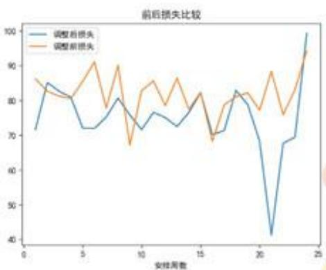

<details>
<summary>line</summary>

| 安排周数 | 调整后损失 | 调整前损失 |
| --- | --- | --- |
| 1 | ~72 | ~86 |
| 2 | ~85 | ~83 |
| 3 | ~83 | ~81 |
| 4 | ~81 | ~81 |
| 5 | ~72 | ~84 |
| 6 | ~72 | ~91 |
| 7 | ~75 | ~78 |
| 8 | ~80 | ~90 |
| 9 | ~76 | ~67 |
| 10 | ~72 | ~83 |
| 11 | ~77 | ~86 |
| 12 | ~75 | ~79 |
| 13 | ~73 | ~87 |
| 14 | ~78 | ~78 |
| 15 | ~82 | ~82 |
| 16 | ~70 | ~69 |
| 17 | ~71 | ~79 |
| 18 | ~83 | ~82 |
| 19 | ~80 | ~82 |
| 20 | ~69 | ~77 |
| 21 | ~41 | ~88 |
| 22 | ~68 | ~76 |
| 23 | ~69 | ~84 |
| 24 | ~99 | ~94 |
</details>

(a) 损耗量对比

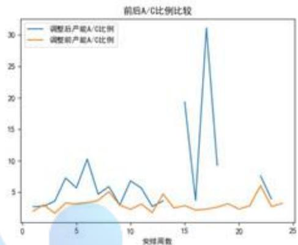

<details>
<summary>line</summary>

| 安排周数 | 调整后产能A/C比例 | 调整前产能A/C比例 |
| --- | --- | --- |
| 1 | ~2.8 | ~1.8 |
| 2 | ~3.0 | ~2.5 |
| 3 | ~3.5 | ~1.5 |
| 4 | ~7.2 | ~3.2 |
| 5 | ~5.8 | ~3.2 |
| 6 | ~10.2 | ~3.5 |
| 7 | ~4.8 | ~4.0 |
| 8 | ~6.0 | ~5.2 |
| 9 | ~3.0 | ~2.8 |
| 10 | ~6.8 | ~2.2 |
| 11 | ~5.8 | ~3.0 |
| 12 | ~3.0 | ~1.8 |
| 13 | ~3.5 | ~4.8 |
| 14 | — | ~2.5 |
| 15 | ~19.5 | ~2.8 |
| 16 | ~3.8 | ~2.2 |
| 17 | ~31.0 | ~2.0 |
| 18 | ~9.5 | ~2.5 |
| 19 | — | ~3.0 |
| 20 | — | ~2.2 |
| 21 | — | ~2.5 |
| 22 | ~7.8 | ~6.0 |
| 23 | ~3.8 | ~2.5 |
| 24 | — | ~3.2 |
</details>

(b) A/C 供货量比较  
图 8: 前后对比参照

此外，对模型调整前后的 A 类、C 类合作量进行比较 8(b)，纵坐标为某周 A 类所有供货量与 C 类所有供货量的比值；调整后不存在比例的情况为，该周无 C 类商品供货。经过计算可知，在新方案下 A/C 类供货量之比平均在 7.34（除去比例不存在情况）。每周情况差别较大，最高可达无穷大，最低也将近有 3 倍。此处表明前述权重调整与定向筛选对 A、C 起到了实际吸引、排斥作用，且同样说明 A/C 值较大时，方案的损耗指标、存贮成本的确降低了，印证了题给推论的正确性。

## 8 问题四的产能拓展

## 8.1 提升产能的思路模型

问题四可以分为进货与投入生产这两个相互独立的部分，进货量的大幅提升无疑对产能提高有着显著作用，而原材料的投产分配方式在此问中并非主要影响因素，但在实际生活中是不容忽视的一部分。

现要求在被选商家的情况下，尽量提升每周产能，这要求每周进货量尽量增大，并且保证一定范围内成本和损耗值的合理性。显然，此处成本损耗不作为优化目标，进行了部分松弛操作。对于我们筛选出来的前50家供应商，在针对成本损耗优化的第二三问中，均取得了较好的效果。但是鉴于此问目标逆转，在较松的成本损耗约束情况下需要更多的进货量，故我们考虑全部176家数据具备参考性的供应商。这些供应商中评分较低者存在偏差率大、供应量小等情况，但对尽量提高每周产能具有积极作用。

## 8.1.1 产品收益亏损与否的证明

鉴于原材料在转运途中会有一定量的损失，但是最终售卖产品所得的收益能否抵消这部分亏损是一个疑问。经过证明，提出如下命题，所以此问无需考虑产品售价与提高产能之间的关系。

命题：产品不会亏损。

证明：假设 $1m^{3}$ 的C原料的定价为1， $1m^{3}$ 产品的价格为 $P$ ，即售价是原料C单价的 $P$ 倍。

记 A 材料总供应量为 $A(m^{3})$ ，B 为 $B(m^{3})$ ，C 为 $C(m^{3})$ 。则总材料成本为 $0.72A + 0.726B + 0.72C$ ，到手产量为 $\left(\frac{A}{0.6} + \frac{B}{0.66} + \frac{C}{0.72}\right) \cdot (1 - s\%)$ ，其中 s 为转运过程中的平均损耗率。当产品全部卖出时，共能收入 $\left(\frac{A}{0.6} + \frac{B}{0.66}\right) + \frac{C}{0.72}) \cdot (1 - s\%) \cdot P$ 。

得到总利润为总收入-总材料成本-转运费-库存费，其中库存费与转运费题目并未给出具体数据与定价方式，依据实际情况，它们远小于材料的进货费用，故此处略去不记。故总利润大致为

$$
\begin{array}{l} \left(\frac {A}{0 . 6} + \frac {B}{0 . 6 6} + \frac {C}{0 . 7 2}\right) \cdot (1 - s \%) \cdot P - (0. 7 2 A + 0. 7 2 6 B + 0. 7 2 C) (8.1.1) \\ = \left[ \frac {(1 - s \%) \cdot P}{0 . 6} - 0. 7 2 \right] \cdot A + \left[ \frac {(1 - s \%) \cdot P}{0 . 6 6} - 0. 7 2 6 \right] \cdot B + \left[ \frac {(1 - s \%) \cdot P}{0 . 7 2} - 0. 7 2 \right] \cdot C (8.1.2) \\ \end{array}
$$

由题给数据可知：s < 5，所以上式在 s = 5 时取到最小值，最小值为 $(1.58P - 0.72)A + (1.44P - 0.726)B + (1.32P - 0.72)C \gg 0$ 。由此证明了转运过程中的损失不足以导致整体的亏损，产品一般不会亏损。

## 8.1.2 原材料使用模式

如何合理使用原材料每周的库存量和进货量，使得产能最大化？我们提出两种方案。

## (一) 动态产能情况

假设产能可随着当前周企业库存进行调整，前提条件为满足存贮警戒点未来两周的产能供应。基于当前状态考虑暂时固定未来两周产能值，则未来一周最大可达产能值为

$$
v _ {k} = \frac {w _ {k - 1}}{2} \tag {8.1.3}
$$

其余量有计算公式：

$$
w _ {k} = w _ {k - 1} - v _ {k} + \Delta w _ {k} \tag {8.1.4}
$$

$$
\Delta w _ {k} = \sum_ {i = 1} ^ {1 7 6} \frac {t _ {i , k}}{z _ {i}} \tag {8.1.5}
$$

## (二) 静态产能情况

为避免库存越积越多或者越用越少的情况，且实际中我们要求企业每周的产能尽可能稳定，为此我们提出更优的分配方案。每周投入的产量根据当前库存和本周、下周的进货数量情况，计算出相应比例，来确定单周产能的个性化分配方案。

假设第 $k$ 周用于生产的产能为 $a_{k}$ ，于是有 $a_{k} = x \cdot w_{k-1} + y \cdot t_{k}$ ，其中 $x \cdot 100\%$ 、 $y \cdot 100\%$ 表示选择投入生产的百分比， $w_{k}, t_{k}$ 分别表示第 $k$ 周的库存产能与实际接受量。相应地有 $a_{k+1} = x \cdot w_{k} + y \cdot t_{k+1}$ 与 $w_{k} = (1 - x) \cdot w_{k-1} + (1 - y) \cdot t_{k}$ 。

(1) 实际应用中，在技术改造后的一段时间内，生产应尽快趋于稳定，即要求第 k 周与第 $k+1$ 周投入生产的产能基本相同，有如下等式：

$$
a _ {k} = a _ {k + 1} \tag {8.1.6}
$$

$$
\Rightarrow x \cdot w _ {k - 1} + y \cdot t _ {k} \doteq x \cdot w _ {k} + y \cdot t _ {k + 1} \tag {8.1.7}
$$

$$
\Rightarrow x ^ {2} \cdot w _ {k - 1} \doteq (x - x y - y) t _ {k} + y \cdot t _ {k + 1} \tag {8.1.8}
$$

(2) 由题目要求,企业库存量产能要尽可能满足两周生产需求。同时,如果库存过多,但并不投入生产,无疑造成资源的浪费。因此,库存应尽可能刚好满足接下来两周的生产需求,有如下等式:

$$
w _ {k - 1} = a _ {k} + a _ {k + 1} \doteq 2 a _ {k} \tag {8.1.9}
$$

$$
\Rightarrow w _ {k} \doteq \frac {2 y \cdot t _ {k}}{1 - 2 x} \tag {8.1.10}
$$

联立（1）、（2）中得到的两个等式，解得

$$
\frac {t _ {k + 1}}{t _ {k}} \doteq - \frac {x}{y} + \frac {1 - x}{1 - 2 x} \tag {8.1.11}
$$

由于 $t_{k + 1}$ 、 $t_k$ 在订购方案的制定中已经给出，是定值，故可以求出 $x$ 、 $y$ 变量之间的比例，确定第 $k$ 周个性化的生产方案。

## 8.2 求解分析产能提升情况

## 8.2.1 最优供应分配方案

为使得每周进货量尽可能大，在增加至176家供货商的同时，除去模型二算法种贪心满意目标。从最优供应商开始选择，与其达成制定订单量，直到达成两个约束条件之一：总共176家供货商全部选完，或者所有8家转运商满载运输。

## 8.2.2 实验分析产能结果

该处实现仅考虑动态产能情况，对于静态的解析论证见上文。求解动态产能模型，获得以下数据9。

由图 (a)，对于以上两个约束条件，我们发现通常情况下前者截止了订单的扩大，而 8 家转运商少有满载情况。原因是即使纳入所有 176 家供应商，由于评分较低的供应商多为周期型，整体供货量贡献度较小，仍然无法使所有转运商满负荷工作。对于这一结果存疑，可能需要考虑更高的进货参数，或者降低商家的偏差率。

图 (b) 中 “每周产能” 图例即为求得动态产能变化。随周期推进，动态产能 $v_{k}$ 呈现上下波动状态，但总是优于最初 28200 的固定产能。并且随着周数的延长，动态产能的平均趋势也逐渐提高，24 周前后自身提升了约 27% 的产能值。这说明此方案中库存量及产能量将逐渐提高，这也符合我们的常识认知。图上还能看出，每周增加产能 $\Delta w_{k}$ 对于动态产能变化的影响，后者的波动趋势与前者几乎相同，整体滞后约 3 周。

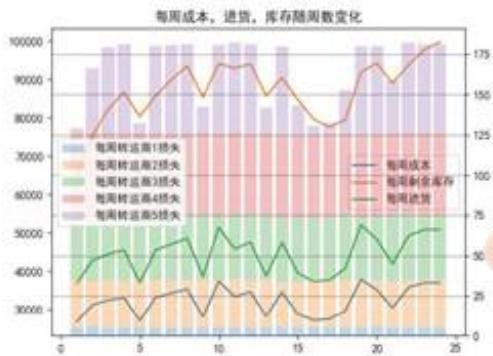

<details>
<summary>bar_stacked</summary>

| Category | 每周转运至1损失 | 每周转运至2损失 | 每周转运至3损失 | 每周转运至4损失 | 每周转运至5损失 | 每周成本 | 每周剩余库存 | 每周流货 |
| --- | --- | --- | --- | --- | --- | --- | --- | --- |
| 1 | ~2000 | ~20000 | ~20000 | ~20000 | ~20000 | ~38000 | ~125 | ~15 |
| 2 | ~2000 | ~20000 | ~20000 | ~20000 | ~20000 | ~43000 | ~135 | ~25 |
| 3 | ~2000 | ~20000 | ~20000 | ~20000 | ~20000 | ~45000 | ~145 | ~28 |
| 4 | ~2000 | ~20000 | ~20000 | ~20000 | ~20000 | ~46000 | ~155 | ~25 |
| 5 | ~2000 | ~20000 | ~20000 | ~20000 | ~20000 | ~46000 | ~145 | ~15 |
| 6 | ~2000 | ~20000 | ~20000 | ~20000 | ~20000 | ~47000 | ~155 | ~25 |
| 7 | ~2000 | ~20000 | ~20000 | ~20000 | ~20000 | ~48000 | ~165 | ~35 |
| 8 | ~2000 | ~20000 | ~20000 | ~20000 | ~20000 | ~49000 | ~175 | ~35 |
| 9 | ~2000 | ~20000 | ~20000 | ~20000 | ~20000 | ~49500 | ~165 | ~35 |
</details>

(a)

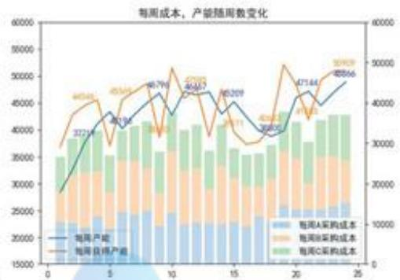

<details>
<summary>bar_stacked</summary>

| 周数 | 每周A采购成本 | 每周B采购成本 | 每周C采购成本 | 每周产能 | 每周总产能 |
| --- | --- | --- | --- | --- | --- |
| 1 | ~23000 | ~15000 | ~10000 | ~28000 | 37214 |
| 2 | ~23000 | ~16000 | ~11000 | ~32000 | 40548 |
| 3 | ~24000 | ~16000 | ~11000 | ~35000 | 45349 |
| 4 | ~24000 | ~16000 | ~11000 | ~38000 | 46799 |
| 5 | ~25000 | ~16000 | ~11000 | ~41000 | 47972 |
| 6 | ~25000 | ~16000 | ~11000 | ~43000 | 48447 |
| 7 | ~25000 | ~16000 | ~11000 | ~45000 | 48529 |
| 8 | ~25000 | ~16000 | ~11000 | ~46000 | 48885 |
| 9 | ~25000 | ~16000 | ~11000 | ~47000 | 49769 |
| 10 | ~25000 | ~16000 | ~11000 | ~48000 | 51744 |
| 11 | ~25000 | ~16000 | ~11000 | ~49000 | 53728 |
| 12 | ~25000 | ~16000 | ~11000 | ~50000 | 55866 |
| 13 | ~25000 | ~16000 | ~11000 | ~51000 | 57939 |
| 14 | ~25000 | ~16000 | ~11000 | ~52000 | 59979 |
| 15 | ~25000 | ~16000 | ~11000 | ~53000 | 62144 |
| 16 | ~25000 | ~16000 | ~11000 | ~54000 | 64386 |
| 17 | ~25000 | ~16000 | ~11000 | ~55000 | 66638 |
| 18 | ~25000 | ~16000 | ~11000 | ~56000 | 68999 |
| 19 | ~25538 | ~16538 | ~12538 | ~57538 | 71379 |
| 20 | ~26538 | ~17538 | ~13538 | ~59538 | 74779 |
| 21 | ~27538 | ~18538 | ~14538 | ~61538 | 77399 |
| 22 | ~28538 | ~19538 | ~15538 | ~63538 | 80229 |
| 23 | ~29538 | ~21538 | ~16538 | ~65538 | 83269 |
| 24 | ~31538 | ~23538 | ~17538 | ~67538 | 86399 |
| 25 | — | — | — | — | — |
</details>

(b)  
图 9: 动态模型实验结果

方案所涉及的供应商最低排名均延至 170+ 家，而其中进行了订单交易的商家每周数量主要集中在 60 至 70 家之间，中位数和众数约为 66 家。这说明其中将近一半的商家平均处于周期型的空期，不参与贡献直接跳过。

对求得数据取平均值，得出最终该方案的平均动态产能为 43299，在原先 28200 的产能基础上提升了 53% 的收益。每周平均获得产能为 43667，即在基本维持未来两周消耗需求的约束下，库存量也将逐渐上升。

## 9 模型评价

## 9.1 优点分析

## （一）多种评价指标方式协同确定

模型一查阅相关文献，提出九种具有实际意义的指标对供应商各方面能力评价。对各属性标准化、正向化后，首先运用熵权法确定整体权重偏向，根据求得反馈重新人为调整部分重点相关指标的权重设定，套用层次分析法二次评价。多种评价指标体系协同确定最终评分等级，保证了所得排名中既包含数据本身区分性质，同时也包含人为一般经验知识引导，最终结果对合作优先度具有更科学的体现。

## （二）对供货商供货周期特征的精确建模

在考虑信誉度等常规指标的基础上，从时间维度分类不同供货商，精确模拟周期变化规律。从历史数据中提取的周期规律包含了5年240周的信息，作平均处理后对未来半年24周周期变化具有较为准确的预判模式。观察50家供应商数据表发现，周期型供货商忙期内的供货量普遍高于平稳型，表示了频率低、单次贡献高的合作订单；而平稳型占据整体接收量比例较高，说明整体产能获取量主要以相对量较低但分布稳定连续的订单为主。

## （三）模拟随机变量波动影响

模型二中将供应商偏差量、每周订货量等视作随机变量，假设其为正态分布并从历史数据中提取相关参数，对未来24周模拟生成新的随机变量。该步随机操作符合真实世界的随机波动性，从损耗偏差、供货情况等方面考虑非确定性因素的干扰。同时，对于非对称的随机变量如偏差率，正态分布随机性的对称性不影响均值本身偏差方向的指引，不会引入坏的偏差影响。另外，更丰富的随机性可提高模型求解方案应对现实情况偶然波动因素的能力，使得该方案具备一定的自我调节能力，在真实设定下比平稳确定性模型表现更好。

## （四）多层贪心对多目标优化问题的递进解法

求解多目标优化问题的方式较多，在该题模型二多目标的求解中，若选择线性规划则变量过多、约束条件不足求得少量较优解，若考虑动态规划则状态决策空间过大（6000\*50\*24）、求解过程计算量过高且短时间内无法取得较优解。分析题目发现该题具备一种很强的贪心解法，且在多目标优先级已排序的情况下，依据优先级对最高目标首先进行贪心求解，再于求解过程中依次嵌套内层目标的贪心解法，即可求得最终较优解。虽然同样基于遍历思想，但由于贪心算法首先朝最好的方向进行搜索，故总能在少数时间内取得较好的解。

贪心算法成功的前提是贪心过程关键式的选取。同样模型二对于关键式进行了多种因素的讨论，并且通过实验对比确定最终最优关键式。模型三中也包含了多层贪心的运用。

## （五）每周产能消耗的静态、动态情景讨论

在最终问的要求中我们给出了两种情景：静态产能与动态产能，并分别进行讨论。分类讨论的意义是，增加了方案的多样性，对于现实生产中不同的情形可选择更多方案，且动态和静态产能的计算生成原理均有其合理性。另外，进一步的扩展还可考虑动态、静态混合产能方案，此处列举思路供读者参考。

## 9.2 缺点分析

## （一）贪心限定舍弃低排名供应商

在问题二、三的求解中，选取的供应商范围限定在模型一评价筛选出来的50家供应商之内。理论上可添加任意范围的供应商进入供货合作备选名单，但模型的贪心要求使得评分较低的供应商在方案中基本不存在贡献度，即低评分供应商在方案中几乎没有订单量。虽然该处理与第二问要求的“至少多少家供应商”相吻合，但在实际情况中并不一定是最优解。

## （二）关键式选取影响方案构成

关键式是确定每周供货量，模拟得出后续转运方案与周库存产能变化的重要公式。对于该公式的选取构造，我们例举了四个典型式实验分析，但无法求得关键式的最优形式及其最优解析参数。应指出，模型贪心的关键式选取本身即为了降低计算上的复杂度；若强求得到关键式解析解，其复杂度并不小于使用线性规划或动态规划求解第二问的情况。故关键式的最优解改进无解。

不过，在当前关键式下得到的较优解相对也接近于理想最优解，此误差可以容忍。

## (三) 随机变量带来不确定性影响

随机变量在具备优点（三）中好处的同时，同样也有少数劣势，最主要的一点即其使得最终得出的方案具有不确定性，每次求得的方案可能不一样。这是因为我们的较优解解集中方案不唯一，不同的随机变量会影响此次方案各决策量的变化。在以上几问的分析中，我们列出的结果均为多次实验出现频率较高的较好方案的典型代表。

在运用本模型实际求解的过程中，使用方宜多次运行求解过程，选取频率较高的较好方案作为最终解。


<details>
<summary>natural_image</summary>

Abstract graphic of a stylized human figure in blue and yellow against a star background (no text or symbols)
</details>

## 竞赛零距离

--Competition Zero Distance--

## Bibliography

[1] 徐呈祥. 糖果企业供应商选择研究 [D]. 东北农业大学, 2017.  
[2] MBA 智库百科. 供应商 [EB]/[OL]. https://wiki.mbalib.com/wiki/供应商, 2021-9-12.  
[3] 司守奎, 孙玺菁. 《数学建模算法与应用》[M]. 北京: 国防工业出版社, 2011.


<details>
<summary>natural_image</summary>

Abstract graphic of a stylized human figure with a star and gradient background (no text or symbols)
</details>

## 竞赛零距离

--Competition Zero Distance--

附录

## A 问题一指标初始数据

文件：176 家指标原始值.xlsx

表 7: 176 家指标原始值

<table><tr><td>排名</td><td>供应商</td><td>ID</td><td>材料分类</td><td>供应及时性</td><td>交货准确度</td><td>供货波动性</td><td>供货量方差</td><td>产品占有率</td><td>信誉度</td><td>平均忙期量</td><td>批量柔性</td><td>供给弹性</td></tr><tr><td>1</td><td>S201</td><td>1</td><td></td><td>0.571</td><td>0.474</td><td>1.92</td><td>3.43E7</td><td>0.247</td><td>3.34</td><td>2930</td><td>0.0333</td><td>11700</td></tr><tr><td>2</td><td>S229</td><td>1</td><td></td><td>1</td><td>0.00526</td><td>6.7</td><td>219000</td><td>0.272</td><td>0.0421</td><td>1470</td><td>0.018</td><td>148</td></tr><tr><td>3</td><td>S361</td><td>3</td><td></td><td>1</td><td>0.00616</td><td>5.78</td><td>162000</td><td>0.243</td><td>0.0482</td><td>1370</td><td>0.0115</td><td>119</td></tr><tr><td>4</td><td>S140</td><td>2</td><td></td><td>0.995</td><td>0.211</td><td>4.43</td><td>2.08E7</td><td>0.058</td><td>0.652</td><td>2190</td><td>1</td><td>15100</td></tr><tr><td>5</td><td>S108</td><td>2</td><td></td><td>1</td><td>0.0187</td><td>6.28</td><td>1500000</td><td>0.195</td><td>0.164</td><td>1000</td><td>0.0171</td><td>1500</td></tr><tr><td>6</td><td>S282</td><td>1</td><td></td><td>1</td><td>0.00506</td><td>1.92</td><td>150000</td><td>0.127</td><td>0.0023</td><td>707</td><td>1</td><td>212</td></tr><tr><td>7</td><td>S340</td><td>2</td><td></td><td>1</td><td>0.0021</td><td>4.18</td><td>25500</td><td>0.162</td><td>0.0146</td><td>712</td><td>0.05</td><td>35.7</td></tr><tr><td>8</td><td>S275</td><td>1</td><td></td><td>1</td><td>3.55E-4</td><td>1.98</td><td>13300</td><td>0.125</td><td>0.00235</td><td>659</td><td>0.0211</td><td>20.2</td></tr><tr><td>9</td><td>S329</td><td>1</td><td></td><td>1</td><td>5.93E-04</td><td>2.07</td><td>14200</td><td>0.123</td><td>0.00387</td><td>650</td><td>0.0412</td><td>21.8</td></tr><tr><td>10</td><td>S395</td><td>1</td><td></td><td>0.881</td><td>0.139</td><td>3.78</td><td>2450000</td><td>0.132</td><td>0.629</td><td>1050</td><td>0.333</td><td>2390</td></tr><tr><td>11</td><td>S131</td><td>2</td><td></td><td>1</td><td>0.0109</td><td>4.03</td><td>21300</td><td>0.13</td><td>0.043</td><td>574</td><td>1</td><td>37.1</td></tr><tr><td>12</td><td>S268</td><td>3</td><td></td><td>1</td><td>5.92E-4</td><td>1.76</td><td>5020</td><td>0.0989</td><td>0.00372</td><td>540</td><td>0.028</td><td>9.29</td></tr><tr><td>13</td><td>S306</td><td>3</td><td></td><td>1</td><td>6.52E-4</td><td>1.89</td><td>13500</td><td>0.0932</td><td>0.00411</td><td>524</td><td>0.0267</td><td>25.6</td></tr><tr><td>14</td><td>S151</td><td>3</td><td></td><td>1</td><td>0.0224</td><td>7.09</td><td>3330000</td><td>0.121</td><td>0.209</td><td>810</td><td>0.0429</td><td>4110</td></tr><tr><td>15</td><td>S308</td><td>2</td><td></td><td>1</td><td>0.0313</td><td>5.11</td><td>297000</td><td>0.121</td><td>0.273</td><td>571</td><td>0.1</td><td>521</td></tr><tr><td>16</td><td>S330</td><td>2</td><td></td><td>1</td><td>0.0213</td><td>6.43</td><td>454000</td><td>0.118</td><td>0.187</td><td>569</td><td>0.16</td><td>797</td></tr><tr><td>17</td><td>S194</td><td>3</td><td></td><td>1</td><td>0.00214</td><td>2.7</td><td>3400</td><td>0.0769</td><td>0.0134</td><td>421</td><td>0.0265</td><td>8.05</td></tr><tr><td>18</td><td>S348</td><td>1</td><td></td><td>0.975</td><td>0.109</td><td>6.48</td><td>8530000</td><td>0.039</td><td>0.478</td><td>516</td><td>1</td><td>17900</td></tr><tr><td>19</td><td>S374</td><td>3</td><td></td><td>1</td><td>0.268</td><td>0.85</td><td>3220000</td><td>0.0125</td><td>0.326</td><td>307</td><td>1</td><td>15700</td></tr><tr><td>20</td><td>S126</td><td>3</td><td></td><td>0.91</td><td>0.203</td><td>3.53</td><td>3220000</td><td>0.0561</td><td>0.965</td><td>609</td><td>1</td><td>6170</td></tr><tr><td>21</td><td>S352</td><td>1</td><td></td><td>1</td><td>0.00538</td><td>3.01</td><td>20900</td><td>0.0696</td><td>0.0318</td><td>370</td><td>0.075</td><td>56.3</td></tr><tr><td>22</td><td>S356</td><td>3</td><td></td><td>1</td><td>0.00664</td><td>5.58</td><td>125000</td><td>0.0937</td><td>0.0461</td><td>538</td><td>0.18</td><td>231</td></tr><tr><td>23</td><td>S284</td><td>3</td><td></td><td>1</td><td>0.00383</td><td>0.518</td><td>26100</td><td>0.034</td><td>0.0152</td><td>194</td><td>0.3</td><td>134</td></tr><tr><td>24</td><td>S247</td><td>3</td><td></td><td>1</td><td>0.00117</td><td>1.29</td><td>1100</td><td>0.043</td><td>0.00643</td><td>236</td><td>0.0529</td><td>4.67</td></tr><tr><td>25</td><td>S031</td><td>2</td><td></td><td>1</td><td>0.00395</td><td>1.44</td><td>1030</td><td>0.0393</td><td>0.0189</td><td>171</td><td>0.25</td><td>5.99</td></tr><tr><td>26</td><td>S307</td><td>1</td><td></td><td>0.994</td><td>0.356</td><td>5.57</td><td>3010000</td><td>0.0448</td><td>0.565</td><td>1260</td><td>1</td><td>6590</td></tr><tr><td>27</td><td>S365</td><td>3</td><td></td><td>1</td><td>0.00284</td><td>1.81</td><td>4160</td><td>0.0323</td><td>0.0148</td><td>173</td><td>0.1</td><td>24</td></tr><tr><td>28</td><td>S143</td><td>1</td><td></td><td>1</td><td>0.0422</td><td>4.98</td><td>75700</td><td>0.0633</td><td>0.249</td><td>346</td><td>0.9</td><td>219</td></tr><tr><td>29</td><td>S294</td><td>3</td><td></td><td>1</td><td>0.00893</td><td>1.1</td><td>177</td><td>0.0142</td><td>0.0383</td><td>78.7</td><td>0.18</td><td>2.25</td></tr><tr><td>30</td><td>S139</td><td>2</td><td></td><td>0.991</td><td>0.168</td><td>7.91</td><td>4820000</td><td>0.0464</td><td>0.471</td><td>744</td><td>1</td><td>7050</td></tr><tr><td>31</td><td>S218</td><td>3</td><td></td><td>1</td><td>0.038</td><td>1.38</td><td>1310</td><td>0.0116</td><td>0.123</td><td>64.5</td><td>0.9</td><td>20.3</td></tr><tr><td>32</td><td>S080</td><td>3</td><td></td><td>1</td><td>0.0509</td><td>1.83</td><td>3220</td><td>0.0142</td><td>0.157</td><td>80.2</td><td>0.9</td><td>40.2</td></tr><tr><td>33</td><td>S040</td><td>2</td><td></td><td>1</td><td>0.0141</td><td>3.55</td><td>5530</td><td>0.0277</td><td>0.0791</td><td>133</td><td>0.14</td><td>41.6</td></tr><tr><td>34</td><td>S266</td><td>1</td><td></td><td>1</td><td>0.0872</td><td>0.858</td><td>10.8</td><td>0.00513</td><td>0.265</td><td>27.1</td><td>0.5</td><td>0.398</td></tr><tr><td>35</td><td>S005</td><td>1</td><td></td><td>0.939</td><td>0.108</td><td>0.949</td><td>630</td><td>0.012</td><td>0.0838</td><td>66.3</td><td>1</td><td>9.75</td></tr><tr><td>36</td><td>S123</td><td>1</td><td></td><td>1</td><td>0.0963</td><td>1.57</td><td>103</td><td>0.0051</td><td>0.277</td><td>26.9</td><td>0.9</td><td>3.85</td></tr></table>

<table><tr><td>37</td><td>S367</td><td>2</td><td>1</td><td>0.0257</td><td>4.11</td><td>4430</td><td>0.0243</td><td>0.138</td><td>110</td><td>0.3</td><td>40.3</td></tr><tr><td>38</td><td>S037</td><td>3</td><td>0.975</td><td>0.219</td><td>5.48</td><td>596000</td><td>0.0438</td><td>0.359</td><td>473</td><td>1</td><td>1850</td></tr><tr><td>39</td><td>S189</td><td>1</td><td>0.95</td><td>0.093</td><td>2.17</td><td>516</td><td>0.0111</td><td>0.0934</td><td>62.5</td><td>1</td><td>8.75</td></tr><tr><td>40</td><td>S346</td><td>2</td><td>1</td><td>0.0187</td><td>4.52</td><td>299</td><td>0.0219</td><td>0.109</td><td>96.6</td><td>0.16</td><td>3.09</td></tr><tr><td>41</td><td>S244</td><td>3</td><td>1</td><td>0.058</td><td>3.72</td><td>1290</td><td>0.0119</td><td>0.203</td><td>68.1</td><td>0.9</td><td>18.9</td></tr><tr><td>42</td><td>S364</td><td>2</td><td>1</td><td>0.0118</td><td>4.97</td><td>10100</td><td>0.0235</td><td>0.0657</td><td>120</td><td>0.18</td><td>84.4</td></tr><tr><td>43</td><td>S055</td><td>2</td><td>1</td><td>0.046</td><td>4.59</td><td>36400</td><td>0.0176</td><td>0.283</td><td>100</td><td>0.3</td><td>363</td></tr><tr><td>44</td><td>S210</td><td>3</td><td>0.849</td><td>0.307</td><td>2.27</td><td>47100</td><td>0.0212</td><td>1.32</td><td>170</td><td>0.9</td><td>354</td></tr><tr><td>45</td><td>S074</td><td>3</td><td>0.934</td><td>0.258</td><td>2.68</td><td>32700</td><td>0.0132</td><td>0.973</td><td>111</td><td>1</td><td>428</td></tr><tr><td>46</td><td>S078</td><td>1</td><td>0.944</td><td>0.144</td><td>3.49</td><td>8010</td><td>0.0156</td><td>0.402</td><td>85.5</td><td>0.9</td><td>94.6</td></tr><tr><td>47</td><td>S086</td><td>3</td><td>0.986</td><td>0.241</td><td>3.87</td><td>70600</td><td>0.015</td><td>0.543</td><td>184</td><td>1</td><td>810</td></tr><tr><td>48</td><td>S007</td><td>1</td><td>1</td><td>0.255</td><td>2.57</td><td>879</td><td>0.00621</td><td>0.633</td><td>28.9</td><td>0.9</td><td>30.4</td></tr><tr><td>49</td><td>S273</td><td>1</td><td>0.909</td><td>0.149</td><td>4.27</td><td>8520</td><td>0.0196</td><td>0.345</td><td>114</td><td>0.9</td><td>80.8</td></tr><tr><td>50</td><td>S003</td><td>3</td><td>0.96</td><td>0.129</td><td>4.34</td><td>6350</td><td>0.0112</td><td>0.226</td><td>78.7</td><td>1</td><td>92.4</td></tr><tr><td>51</td><td>S291</td><td>1</td><td>0.986</td><td>0.176</td><td>4.27</td><td>11300</td><td>0.00708</td><td>0.398</td><td>51.3</td><td>1</td><td>310</td></tr><tr><td>52</td><td>S379</td><td>3</td><td>0.973</td><td>0.306</td><td>0.985</td><td>187</td><td>0.00113</td><td>0.101</td><td>22</td><td>1</td><td>27.1</td></tr><tr><td>53</td><td>S342</td><td>3</td><td>0.975</td><td>0.326</td><td>0.875</td><td>22</td><td>9.88E-4</td><td>0.159</td><td>9.74</td><td>1</td><td>3.84</td></tr><tr><td>54</td><td>S338</td><td>2</td><td>1</td><td>0.202</td><td>6.3</td><td>212000</td><td>0.0155</td><td>0.28</td><td>301</td><td>1</td><td>1430</td></tr><tr><td>55</td><td>S092</td><td>2</td><td>0.969</td><td>0.351</td><td>0.7</td><td>3.22</td><td>6.82E-4</td><td>0.121</td><td>5.93</td><td>1</td><td>1.02</td></tr><tr><td>56</td><td>S114</td><td>1</td><td>0.991</td><td>0.153</td><td>5.48</td><td>19800</td><td>0.00912</td><td>0.255</td><td>76.3</td><td>1</td><td>414</td></tr><tr><td>57</td><td>S221</td><td>1</td><td>0.976</td><td>0.401</td><td>0.338</td><td>3.15</td><td>6.23E-4</td><td>0.119</td><td>5.96</td><td>1</td><td>0.989</td></tr><tr><td>58</td><td>S392</td><td>2</td><td>0.935</td><td>0.357</td><td>0.773</td><td>3.17</td><td>7.09E-4</td><td>0.123</td><td>5.85</td><td>1</td><td>0.994</td></tr><tr><td>59</td><td>S292</td><td>1</td><td>0.763</td><td>0.279</td><td>3.05</td><td>4810</td><td>0.0199</td><td>0.537</td><td>104</td><td>0.9</td><td>47.3</td></tr><tr><td>60</td><td>S025</td><td>3</td><td>0.933</td><td>0.36</td><td>0.777</td><td>2.73</td><td>5.14E-4</td><td>0.121</td><td>5.36</td><td>1</td><td>0.916</td></tr><tr><td>61</td><td>S150</td><td>1</td><td>1</td><td>0.164</td><td>5.1</td><td>1320</td><td>0.00139</td><td>0.302</td><td>10.9</td><td>1</td><td>175</td></tr><tr><td>62</td><td>S178</td><td>1</td><td>1</td><td>0.425</td><td>0.451</td><td>7.1</td><td>6.19E-4</td><td>0.122</td><td>7.17</td><td>1</td><td>1.96</td></tr><tr><td>63</td><td>S314</td><td>3</td><td>1</td><td>0.176</td><td>4.97</td><td>38.4</td><td>0.00133</td><td>0.29</td><td>9.73</td><td>1</td><td>5.4</td></tr><tr><td>64</td><td>S169</td><td>2</td><td>0.959</td><td>0.418</td><td>0.469</td><td>2.47</td><td>6.48E-4</td><td>0.133</td><td>5.83</td><td>1</td><td>0.811</td></tr><tr><td>65</td><td>S174</td><td>2</td><td>0.992</td><td>0.459</td><td>0.286</td><td>2.49</td><td>6.11E-4</td><td>0.131</td><td>5.81</td><td>1</td><td>0.898</td></tr><tr><td>66</td><td>S256</td><td>2</td><td>0.946</td><td>0.362</td><td>1.7</td><td>6.47</td><td>7.38E-4</td><td>0.144</td><td>7.03</td><td>1</td><td>1.94</td></tr><tr><td>67</td><td>S141</td><td>2</td><td>0.923</td><td>0.408</td><td>0.749</td><td>4.39</td><td>7.47E-4</td><td>0.114</td><td>6.18</td><td>1</td><td>1.25</td></tr><tr><td>68</td><td>S324</td><td>2</td><td>0.926</td><td>0.412</td><td>0.731</td><td>3.43</td><td>7.39E-4</td><td>0.124</td><td>6.11</td><td>1</td><td>1.02</td></tr><tr><td>69</td><td>S113</td><td>3</td><td>0.955</td><td>0.432</td><td>0.676</td><td>4.23</td><td>5.2E-4</td><td>0.113</td><td>6.5</td><td>1</td><td>1.38</td></tr><tr><td>70</td><td>S208</td><td>1</td><td>0.714</td><td>0.377</td><td>2.79</td><td>22600</td><td>0.0191</td><td>0.899</td><td>101</td><td>0.8</td><td>232</td></tr><tr><td>71</td><td>S030</td><td>1</td><td>0.966</td><td>0.45</td><td>1.06</td><td>54.8</td><td>0.0011</td><td>0.233</td><td>15.1</td><td>1</td><td>9.47</td></tr><tr><td>72</td><td>S075</td><td>1</td><td>0.933</td><td>0.415</td><td>1.17</td><td>8.12</td><td>6.05E-4</td><td>0.128</td><td>6.67</td><td>1</td><td>2.6</td></tr><tr><td>73</td><td>S152</td><td>1</td><td>0.905</td><td>0.415</td><td>1.09</td><td>3.4</td><td>6.23E-4</td><td>0.135</td><td>6.26</td><td>1</td><td>1.06</td></tr><tr><td>74</td><td>S157</td><td>1</td><td>0.909</td><td>0.421</td><td>3.04</td><td>2.85</td><td>6.24E-4</td><td>1.13</td><td>5.68</td><td>1</td><td>0.865</td></tr><tr><td>75</td><td>S300</td><td>1</td><td>0.727</td><td>0.333</td><td>2.35</td><td>1050</td><td>0.00623</td><td>0.692</td><td>37.4</td><td>0.6</td><td>28.2</td></tr><tr><td>76</td><td>S154</td><td>1</td><td>0.74</td><td>0.337</td><td>3.53</td><td>9680</td><td>0.0168</td><td>0.542</td><td>116</td><td>1</td><td>97.7</td></tr><tr><td>77</td><td>S216</td><td>2</td><td>0.872</td><td>0.422</td><td>0.982</td><td>3.16</td><td>7.25E-4</td><td>0.118</td><td>5.74</td><td>1</td><td>0.96</td></tr><tr><td>78</td><td>S193</td><td>2</td><td>0.833</td><td>0.403</td><td>1.08</td><td>9.62</td><td>0.00104</td><td>0.136</td><td>7.86</td><td>1</td><td>2.38</td></tr><tr><td>79</td><td>S237</td><td>1</td><td>0.983</td><td>0.492</td><td>1.03</td><td>2.69</td><td>5.17E-4</td><td>0.159</td><td>6</td><td>1</td><td>0.978</td></tr><tr><td>80</td><td>S023</td><td>3</td><td>0.831</td><td>0.415</td><td>2.73</td><td>569</td><td>0.00223</td><td>0.972</td><td>26</td><td>1</td><td>46.4</td></tr><tr><td>81</td><td>S175</td><td>2</td><td>0.979</td><td>0.526</td><td>0.43</td><td>2.86</td><td>5.81E-4</td><td>0.126</td><td>6.18</td><td>1</td><td>1.08</td></tr><tr><td>82</td><td>S253</td><td>3</td><td>0.944</td><td>0.493</td><td>0.701</td><td>7.85</td><td>5.55E-4</td><td>0.113</td><td>8.07</td><td>1</td><td>2.39</td></tr><tr><td>83</td><td>S172</td><td>2</td><td>0.934</td><td>0.477</td><td>1.1</td><td>2.22</td><td>5.95E-4</td><td>0.149</td><td>5.47</td><td>1</td><td>0.798</td></tr><tr><td>84</td><td>S149</td><td>3</td><td>0.889</td><td>0.476</td><td>0.742</td><td>6.51</td><td>5.78E-4</td><td>0.113</td><td>7.67</td><td>1</td><td>1.87</td></tr><tr><td>85</td><td>S129</td><td>3</td><td>0.946</td><td>0.39</td><td>3.51</td><td>386</td><td>0.00151</td><td>0.449</td><td>29.2</td><td>1</td><td>48.6</td></tr><tr><td>86</td><td>S036</td><td>2</td><td>0.907</td><td>0.499</td><td>0.786</td><td>2.75</td><td>6.92E-4</td><td>0.137</td><td>5.83</td><td>1</td><td>1.09</td></tr><tr><td>87</td><td>S310</td><td>2</td><td>0.868</td><td>0.476</td><td>0.835</td><td>3.49</td><td>7.08E-4</td><td>0.122</td><td>6.16</td><td>1</td><td>1.08</td></tr><tr><td>88</td><td>S381</td><td>1</td><td>0.875</td><td>0.456</td><td>2.47</td><td>117</td><td>0.00129</td><td>0.417</td><td>20.6</td><td>1</td><td>16.3</td></tr><tr><td>89</td><td>S360</td><td>2</td><td>0.868</td><td>0.412</td><td>2.88</td><td>2.61</td><td>6.89E-4</td><td>0.187</td><td>5.67</td><td>1</td><td>0.843</td></tr><tr><td>90</td><td>S110</td><td>3</td><td>0.831</td><td>0.437</td><td>2.23</td><td>2.95</td><td>5.81E-4</td><td>0.178</td><td>5.61</td><td>1</td><td>0.885</td></tr><tr><td>91</td><td>S263</td><td>3</td><td>0.868</td><td>0.426</td><td>3.18</td><td>3.56</td><td>5.7E-4</td><td>0.244</td><td>5.87</td><td>1</td><td>1.1</td></tr><tr><td>92</td><td>S383</td><td>3</td><td>0.794</td><td>0.515</td><td>1.5</td><td>40.4</td><td>0.00102</td><td>0.209</td><td>12.6</td><td>1</td><td>7.42</td></tr><tr><td>93</td><td>S064</td><td>1</td><td>0.94</td><td>0.412</td><td>5.13</td><td>3.12</td><td>6.02E-4</td><td>0.523</td><td>5.88</td><td>1</td><td>0.991</td></tr><tr><td>94</td><td>S191</td><td>2</td><td>0.895</td><td>0.462</td><td>4.14</td><td>2.37</td><td>6.52E-4</td><td>0.63</td><td>5.6</td><td>1</td><td>0.804</td></tr><tr><td>95</td><td>S318</td><td>1</td><td>0.925</td><td>0.609</td><td>1.27</td><td>67.8</td><td>6.83E-4</td><td>0.146</td><td>33</td><td>1</td><td>19.4</td></tr><tr><td>96</td><td>S388</td><td>2</td><td>0.901</td><td>0.474</td><td>3.86</td><td>4.59</td><td>2.95E-4</td><td>0.665</td><td>7.43</td><td>0.5</td><td>2.57</td></tr><tr><td>97</td><td>S088</td><td>2</td><td>0.908</td><td>0.466</td><td>3.68</td><td>3.92</td><td>6.7E-4</td><td>0.304</td><td>6.33</td><td>1</td><td>1.28</td></tr><tr><td>98</td><td>S046</td><td>1</td><td>0.881</td><td>0.599</td><td>0.961</td><td>0.387</td><td>2.68E-4</td><td>0.149</td><td>0</td><td>1</td><td>0.275</td></tr><tr><td>99</td><td>S098</td><td>2</td><td>0.986</td><td>0.642</td><td>1.38</td><td>1.5</td><td>4.65E-4</td><td>0.204</td><td>6.29</td><td>1</td><td>0.747</td></tr><tr><td>100</td><td>S186</td><td>3</td><td>0.924</td><td>0.421</td><td>4.91</td><td>3.45</td><td>5.47E-4</td><td>0.442</td><td>6.19</td><td>1</td><td>1.12</td></tr><tr><td>101</td><td>S054</td><td>2</td><td>0.876</td><td>0.472</td><td>3.43</td><td>19.5</td><td>9.06E-4</td><td>0.261</td><td>9.64</td><td>1</td><td>5.33</td></tr><tr><td>102</td><td>S076</td><td>3</td><td>0.98</td><td>0.69</td><td>0.668</td><td>0.869</td><td>3.34E-4</td><td>0.153</td><td>5</td><td>1</td><td>0.455</td></tr><tr><td>103</td><td>S239</td><td>3</td><td>1</td><td>0.356</td><td>6.71</td><td>3.2</td><td>5.2E-4</td><td>0.182</td><td>5.56</td><td>1</td><td>1.08</td></tr><tr><td>104</td><td>S227</td><td>1</td><td>0.769</td><td>0.496</td><td>3.28</td><td>275</td><td>0.00131</td><td>0.566</td><td>21.3</td><td>1</td><td>32.5</td></tr><tr><td>105</td><td>S357</td><td>3</td><td>0.794</td><td>0.567</td><td>1.47</td><td>47.9</td><td>6.31E-4</td><td>0.126</td><td>10.6</td><td>1</td><td>11.8</td></tr><tr><td>106</td><td>S235</td><td>2</td><td>0.816</td><td>0.589</td><td>2.77</td><td>176</td><td>0.00139</td><td>0.78</td><td>19.3</td><td>1</td><td>28.8</td></tr><tr><td>107</td><td>S386</td><td>2</td><td>0.759</td><td>0.583</td><td>1.12</td><td>10.5</td><td>7.75E-4</td><td>0.152</td><td>10.8</td><td>1</td><td>3.63</td></tr><tr><td>108</td><td>S332</td><td>1</td><td>0.902</td><td>0.533</td><td>4.14</td><td>392</td><td>0.00132</td><td>0.411</td><td>26.3</td><td>1</td><td>59.1</td></tr><tr><td>109</td><td>S202</td><td>2</td><td>0.955</td><td>0.384</td><td>6.71</td><td>2.67</td><td>6.76E-4</td><td>0.264</td><td>6</td><td>1</td><td>0.847</td></tr><tr><td>110</td><td>S102</td><td>1</td><td>0.781</td><td>0.61</td><td>2.79</td><td>5.91</td><td>4.6E-4</td><td>0.9</td><td>7.57</td><td>1</td><td>2.26</td></tr><tr><td>111</td><td>S115</td><td>1</td><td>0.858</td><td>0.429</td><td>5.27</td><td>3.09</td><td>6.39E-4</td><td>0.284</td><td>6</td><td>1</td><td>0.94</td></tr><tr><td>112</td><td>S138</td><td>2</td><td>0.893</td><td>0.411</td><td>6.23</td><td>2.46</td><td>6.16E-4</td><td>0.337</td><td>5.43</td><td>1</td><td>0.851</td></tr><tr><td>113</td><td>S271</td><td>3</td><td>0.79</td><td>0.562</td><td>3.18</td><td>63.1</td><td>7.65E-4</td><td>0.438</td><td>12.5</td><td>1</td><td>12.5</td></tr><tr><td>114</td><td>S146</td><td>2</td><td>0.904</td><td>0.667</td><td>3.27</td><td>29.7</td><td>5.0E-4</td><td>0.685</td><td>26</td><td>1</td><td>14.3</td></tr><tr><td>115</td><td>S213</td><td>3</td><td>0.982</td><td>0.809</td><td>0.593</td><td>0.474</td><td>2.78E-4</td><td>0.165</td><td>0</td><td>1</td><td>0.314</td></tr><tr><td>116</td><td>S245</td><td>3</td><td>0.933</td><td>0.656</td><td>3.65</td><td>84</td><td>4.31E-4</td><td>0.491</td><td>58.3</td><td>1</td><td>33.1</td></tr><tr><td>117</td><td>S265</td><td>1</td><td>0.738</td><td>0.658</td><td>2.61</td><td>11.5</td><td>5.75E-4</td><td>1.12</td><td>9.2</td><td>0.5</td><td>4.82</td></tr><tr><td>118</td><td>S066</td><td>1</td><td>0.936</td><td>0.437</td><td>6.62</td><td>2.81</td><td>5.69E-4</td><td>0.268</td><td>5.67</td><td>1</td><td>0.954</td></tr><tr><td>119</td><td>S067</td><td>3</td><td>1</td><td>0.845</td><td>0.378</td><td>0.368</td><td>2.49E-4</td><td>0.164</td><td>0</td><td>1</td><td>0.267</td></tr><tr><td>120</td><td>S199</td><td>2</td><td>0.625</td><td>0.693</td><td>2.67</td><td>35.1</td><td>9.28E-4</td><td>1.73</td><td>13.1</td><td>1</td><td>8.09</td></tr><tr><td>121</td><td>S258</td><td>2</td><td>0.893</td><td>0.395</td><td>7.02</td><td>3.73</td><td>7.42E-4</td><td>0.198</td><td>6.07</td><td>1</td><td>1.13</td></tr><tr><td>122</td><td>S069</td><td>2</td><td>0.714</td><td>0.586</td><td>3.02</td><td>5.29</td><td>6.16E-4</td><td>0.525</td><td>7.88</td><td>1</td><td>2.19</td></tr><tr><td>123</td><td>S065</td><td>1</td><td>0.727</td><td>0.654</td><td>1.6</td><td>21.3</td><td>6.9E-4</td><td>0.304</td><td>12.4</td><td>0.8</td><td>7.2</td></tr><tr><td>124</td><td>S128</td><td>1</td><td>0.718</td><td>0.672</td><td>1.3</td><td>9.68</td><td>4.9E-4</td><td>0.192</td><td>8.86</td><td>1</td><td>3.71</td></tr><tr><td>125</td><td>S233</td><td>2</td><td>0.671</td><td>0.615</td><td>2.06</td><td>9.27</td><td>5.19E-4</td><td>0.293</td><td>8.18</td><td>1</td><td>2.95</td></tr><tr><td>126</td><td>S173</td><td>3</td><td>0.41</td><td>0.718</td><td>2.09</td><td>4770</td><td>0.00359</td><td>2.14</td><td>50</td><td>1</td><td>205</td></tr><tr><td>127</td><td>S039</td><td>3</td><td>0.714</td><td>0.626</td><td>3.53</td><td>646</td><td>0.00139</td><td>0.786</td><td>32.3</td><td>1</td><td>75.5</td></tr><tr><td>128</td><td>S376</td><td>2</td><td>0.877</td><td>0.49</td><td>6.15</td><td>1.96</td><td>6.32E-4</td><td>0.266</td><td>5.28</td><td>1</td><td>0.661</td></tr><tr><td>129</td><td>S336</td><td>1</td><td>0.66</td><td>0.658</td><td>1.5</td><td>48.6</td><td>8.58E-4</td><td>0.233</td><td>13.6</td><td>1</td><td>10.5</td></tr><tr><td>130</td><td>S232</td><td>2</td><td>0.65</td><td>0.666</td><td>1.96</td><td>31.8</td><td>9.94E-4</td><td>0.58</td><td>13.8</td><td>1</td><td>6.94</td></tr><tr><td>131</td><td>S197</td><td>2</td><td>0.952</td><td>0.449</td><td>7.56</td><td>3.23</td><td>6.41E-4</td><td>0.219</td><td>6.05</td><td>1</td><td>1.09</td></tr><tr><td>132</td><td>S313</td><td>3</td><td>0.551</td><td>0.677</td><td>2.45</td><td>148</td><td>0.00157</td><td>1.26</td><td>21.2</td><td>1</td><td>14.6</td></tr><tr><td>133</td><td>S117</td><td>2</td><td>0.622</td><td>0.711</td><td>3.03</td><td>6.18</td><td>3.08E-4</td><td>1.48</td><td>7.56</td><td>0.333</td><td>3.07</td></tr><tr><td>134</td><td>S153</td><td>2</td><td>0.232</td><td>0.917</td><td>1.88</td><td>1780</td><td>0.00308</td><td>3.77</td><td>154</td><td>1</td><td>132</td></tr><tr><td>135</td><td>S002</td><td>1</td><td>0.747</td><td>0.677</td><td>3.2</td><td>74.3</td><td>6.56E-4</td><td>0.438</td><td>17.8</td><td>1</td><td>19.3</td></tr><tr><td>136</td><td>S254</td><td>1</td><td>0.578</td><td>0.676</td><td>1.46</td><td>67.8</td><td>0.00118</td><td>0.216</td><td>18</td><td>1</td><td>11</td></tr><tr><td>137</td><td>S089</td><td>1</td><td>0.581</td><td>0.703</td><td>2.48</td><td>45.3</td><td>0.00105</td><td>0.965</td><td>12.3</td><td>1</td><td>8.04</td></tr><tr><td>138</td><td>S163</td><td>1</td><td>0.59</td><td>0.691</td><td>2.99</td><td>79.7</td><td>9.76E-4</td><td>1.03</td><td>18.1</td><td>1</td><td>14.6</td></tr><tr><td>139</td><td>S217</td><td>1</td><td>0.465</td><td>0.631</td><td>1.92</td><td>16.1</td><td>0.00187</td><td>0.464</td><td>8.4</td><td>1</td><td>2.31</td></tr><tr><td>140</td><td>S369</td><td>3</td><td>0.388</td><td>0.837</td><td>2.09</td><td>58.8</td><td>0.00105</td><td>2.6</td><td>16.1</td><td>1</td><td>10.5</td></tr><tr><td>141</td><td>S226</td><td>1</td><td>0.576</td><td>0.669</td><td>2.59</td><td>78.2</td><td>0.00108</td><td>0.417</td><td>17.6</td><td>1</td><td>13.3</td></tr><tr><td>142</td><td>S269</td><td>1</td><td>0.923</td><td>0.819</td><td>4.42</td><td>0.547</td><td>2.81E-4</td><td>1.07</td><td>5.5</td><td>1</td><td>0.371</td></tr><tr><td>143</td><td>S090</td><td>3</td><td>0.674</td><td>0.663</td><td>4.06</td><td>43.4</td><td>9.37E-4</td><td>0.619</td><td>14.7</td><td>1</td><td>8.69</td></tr><tr><td>144</td><td>S228</td><td>3</td><td>0.263</td><td>0.834</td><td>2.22</td><td>129</td><td>0.00197</td><td>2.96</td><td>16.9</td><td>1</td><td>12.8</td></tr><tr><td>145</td><td>S159</td><td>1</td><td>0.573</td><td>0.672</td><td>2.43</td><td>50.2</td><td>8.92E-4</td><td>0.242</td><td>12.3</td><td>1</td><td>11</td></tr><tr><td>146</td><td>S170</td><td>1</td><td>0.585</td><td>0.704</td><td>3.29</td><td>48</td><td>0.00106</td><td>0.828</td><td>14.4</td><td>1</td><td>8.53</td></tr><tr><td>147</td><td>S024</td><td>2</td><td>0.584</td><td>0.702</td><td>2.76</td><td>5.6</td><td>7.38E-4</td><td>0.504</td><td>7.14</td><td>1</td><td>2.03</td></tr><tr><td>148</td><td>S333</td><td>2</td><td>0.782</td><td>0.687</td><td>5.06</td><td>1.31</td><td>4.41E-4</td><td>0.626</td><td>5.2</td><td>1</td><td>0.712</td></tr><tr><td>149</td><td>S224</td><td>2</td><td>0.864</td><td>0.84</td><td>4.28</td><td>0.119</td><td>2.51E-4</td><td>1.11</td><td>0</td><td>1</td><td>0.105</td></tr><tr><td>150</td><td>S182</td><td>3</td><td>0.563</td><td>0.784</td><td>2.47</td><td>57.2</td><td>0.00104</td><td>0.849</td><td>16.1</td><td>1</td><td>10.1</td></tr><tr><td>151</td><td>S207</td><td>3</td><td>0.484</td><td>0.757</td><td>2.62</td><td>14.2</td><td>5.05E-4</td><td>1.09</td><td>9.3</td><td>1</td><td>4.05</td></tr><tr><td>152</td><td>S035</td><td>1</td><td>0.55</td><td>0.74</td><td>2.08</td><td>13.8</td><td>6.41E-4</td><td>0.382</td><td>10.6</td><td>0.5</td><td>5.26</td></tr><tr><td>153</td><td>S121</td><td>1</td><td>0.481</td><td>0.747</td><td>2.26</td><td>55.3</td><td>9.89E-4</td><td>0.637</td><td>17</td><td>1</td><td>10.5</td></tr><tr><td>154</td><td>S304</td><td>1</td><td>0.88</td><td>0.714</td><td>5.98</td><td>1.12</td><td>3.04E-4</td><td>0.392</td><td>5.33</td><td>1</td><td>0.632</td></tr><tr><td>155</td><td>S042</td><td>1</td><td>0.446</td><td>0.738</td><td>2.82</td><td>52.6</td><td>0.00104</td><td>0.789</td><td>14.7</td><td>1</td><td>9.53</td></tr><tr><td>156</td><td>S209</td><td>1</td><td>0.507</td><td>0.722</td><td>3.05</td><td>63.6</td><td>6.89E-4</td><td>0.46</td><td>12.3</td><td>1</td><td>14.4</td></tr><tr><td>157</td><td>S293</td><td>1</td><td>0.119</td><td>0.958</td><td>2.58</td><td>3680</td><td>0.00431</td><td>3.59</td><td>90.5</td><td>1</td><td>153</td></tr><tr><td>158</td><td>S280</td><td>2</td><td>0.647</td><td>0.748</td><td>4.58</td><td>3.4</td><td>3.6E-4</td><td>0.723</td><td>9.67</td><td>1</td><td>2.01</td></tr><tr><td>159</td><td>S105</td><td>2</td><td>0.455</td><td>0.694</td><td>3.02</td><td>86.1</td><td>0.00124</td><td>0.318</td><td>11.4</td><td>1</td><td>17.9</td></tr><tr><td>160</td><td>S334</td><td>3</td><td>0.139</td><td>0.904</td><td>2.2</td><td>10.6</td><td>0.00247</td><td>3.16</td><td>14.8</td><td>0.7</td><td>0.718</td></tr><tr><td>161</td><td>S028</td><td>2</td><td>0.388</td><td>0.731</td><td>2.02</td><td>18.8</td><td>3.06E-4</td><td>0.419</td><td>9.11</td><td>1</td><td>3.37</td></tr><tr><td>162</td><td>S104</td><td>1</td><td>0.347</td><td>0.793</td><td>2.51</td><td>92.9</td><td>0.00105</td><td>1.21</td><td>13</td><td>1</td><td>15</td></tr><tr><td>163</td><td>S017</td><td>1</td><td>0.373</td><td>0.767</td><td>2.07</td><td>50.3</td><td>0.00101</td><td>0.52</td><td>13.4</td><td>0.8</td><td>9.11</td></tr><tr><td>164</td><td>S260</td><td>2</td><td>0.883</td><td>0.708</td><td>7.31</td><td>0.484</td><td>2.99E-4</td><td>0.361</td><td>0</td><td>1</td><td>0.337</td></tr><tr><td>165</td><td>S167</td><td>1</td><td>0.4</td><td>0.776</td><td>2.45</td><td>43.6</td><td>9.29E-4</td><td>0.558</td><td>16</td><td>1</td><td>8.98</td></tr><tr><td>166</td><td>S147</td><td>2</td><td>0.4</td><td>0.84</td><td>2.82</td><td>572</td><td>0.00377</td><td>1.05</td><td>50</td><td>1</td><td>42.4</td></tr><tr><td>167</td><td>S010</td><td>2</td><td>0.364</td><td>0.792</td><td>3</td><td>48.5</td><td>0.00112</td><td>1.08</td><td>14.3</td><td>1</td><td>9.13</td></tr><tr><td>168</td><td>S112</td><td>2</td><td>0.313</td><td>0.788</td><td>2.88</td><td>785</td><td>0.00595</td><td>1.08</td><td>40.3</td><td>0.15</td><td>31.9</td></tr><tr><td>169</td><td>S142</td><td>2</td><td>0.326</td><td>0.848</td><td>2.48</td><td>133</td><td>0.0023</td><td>1.26</td><td>18.3</td><td>1</td><td>16.5</td></tr><tr><td>170</td><td>S394</td><td>1</td><td>0.152</td><td>0.886</td><td>2.52</td><td>26.3</td><td>0.00251</td><td>2.26</td><td>14.4</td><td>0.7</td><td>1.82</td></tr><tr><td>171</td><td>S375</td><td>2</td><td>0.213</td><td>0.911</td><td>3.13</td><td>659</td><td>0.00224</td><td>1.85</td><td>94</td><td>1</td><td>76.4</td></tr><tr><td>172</td><td>S022</td><td>1</td><td>0.242</td><td>0.883</td><td>2.83</td><td>142</td><td>0.00161</td><td>1.23</td><td>23.8</td><td>1</td><td>16.3</td></tr><tr><td>173</td><td>S019</td><td>2</td><td>0.207</td><td>0.89</td><td>2.8</td><td>246</td><td>0.00244</td><td>1.28</td><td>23.3</td><td>1</td><td>27.1</td></tr><tr><td>174</td><td>S071</td><td>1</td><td>0.167</td><td>0.871</td><td>2.15</td><td>78.1</td><td>0.00423</td><td>0.791</td><td>18.9</td><td>0.6</td><td>4.91</td></tr><tr><td>175</td><td>S077</td><td>2</td><td>0.207</td><td>0.933</td><td>3.11</td><td>329</td><td>0.00285</td><td>1.4</td><td>37.7</td><td>1</td><td>30.9</td></tr><tr><td>176</td><td>S127</td><td>1</td><td>0.375</td><td>0.784</td><td>6.26</td><td>60.3</td><td>0.00125</td><td>0.535</td><td>14</td><td>1</td><td>9.15</td></tr></table>

## B 问题一最终指标

文件：176 家标准化后的指标与最终得分.xlsx

表8: 176家标准化后的指标与最终得分

<table><tr><td>排名</td><td>供应商 ID</td><td>最终得分</td><td>及时性</td><td>准确度</td><td>供货波动性</td><td>供货量方差</td><td>产品占有率</td><td>信誉度</td><td>平均忙期量</td><td>批量柔性</td><td>供给弹性</td></tr><tr><td>1</td><td>S201</td><td>0.7597</td><td>0.5131</td><td>0.5054</td><td>0.7857</td><td>0</td><td>0.908</td><td>0.8859</td><td>1</td><td>0.0221</td><td>0.6536</td></tr><tr><td>2</td><td>S229</td><td>0.6462</td><td>1</td><td>0.9949</td><td>0.1587</td><td>0.9936</td><td>1</td><td>0.0106</td><td>0.5017</td><td>0.0066</td><td>0.0083</td></tr><tr><td>3</td><td>S361</td><td>0.627</td><td>1</td><td>0.9939</td><td>0.2794</td><td>0.9953</td><td>0.8933</td><td>0.0122</td><td>0.4676</td><td>0</td><td>0.0066</td></tr><tr><td>4</td><td>S140</td><td>0.5827</td><td>0.9943</td><td>0.78</td><td>0.4565</td><td>0.3936</td><td>0.2125</td><td>0.1724</td><td>0.7474</td><td>1</td><td>0.8436</td></tr><tr><td>5</td><td>S108</td><td>0.5622</td><td>1</td><td>0.9808</td><td>0.2138</td><td>0.9563</td><td>0.7167</td><td>0.0429</td><td>0.3413</td><td>0.0057</td><td>0.0838</td></tr><tr><td>6</td><td>S282</td><td>0.5412</td><td>1</td><td>0.9951</td><td>0.7857</td><td>0.9956</td><td>0.4664</td><td>0</td><td>0.2413</td><td>1</td><td>0.0118</td></tr><tr><td>7</td><td>S340</td><td>0.5364</td><td>1</td><td>0.9982</td><td>0.4892</td><td>0.9993</td><td>0.5952</td><td>0.0033</td><td>0.243</td><td>0.0389</td><td>0.002</td></tr><tr><td>8</td><td>S275</td><td>0.53</td><td>1</td><td>1</td><td>0.7778</td><td>0.9996</td><td>0.4591</td><td>0</td><td>0.2249</td><td>0.0097</td><td>0.0011</td></tr><tr><td>9</td><td>S329</td><td>0.5267</td><td>1</td><td>0.9998</td><td>0.766</td><td>0.9996</td><td>0.4517</td><td>0.0004</td><td>0.2218</td><td>0.03</td><td>0.0012</td></tr><tr><td>10</td><td>S395</td><td>0.5234</td><td>0.8649</td><td>0.8552</td><td>0.5417</td><td>0.9286</td><td>0.4848</td><td>0.1663</td><td>0.3584</td><td>0.3252</td><td>0.1335</td></tr><tr><td>11</td><td>S131</td><td>0.5071</td><td>1</td><td>0.989</td><td>0.5089</td><td>0.9994</td><td>0.4775</td><td>0.0108</td><td>0.1959</td><td>1</td><td>0.0021</td></tr><tr><td>12</td><td>S268</td><td>0.5032</td><td>1</td><td>0.9998</td><td>0.8067</td><td>0.9999</td><td>0.363</td><td>0.0004</td><td>0.1843</td><td>0.0167</td><td>0.0005</td></tr><tr><td>13</td><td>S306</td><td>0.4958</td><td>1</td><td>0.9997</td><td>0.7896</td><td>0.9996</td><td>0.342</td><td>0.0005</td><td>0.1788</td><td>0.0154</td><td>0.0014</td></tr><tr><td>14</td><td>S151</td><td>0.4892</td><td>1</td><td>0.977</td><td>0.1076</td><td>0.9029</td><td>0.4443</td><td>0.0549</td><td>0.2765</td><td>0.0318</td><td>0.2296</td></tr><tr><td>15</td><td>S308</td><td>0.4838</td><td>1</td><td>0.9677</td><td>0.3673</td><td>0.9913</td><td>0.4443</td><td>0.0718</td><td>0.1949</td><td>0.0895</td><td>0.0291</td></tr><tr><td>16</td><td>S330</td><td>0.4658</td><td>1</td><td>0.9781</td><td>0.1941</td><td>0.9868</td><td>0.4333</td><td>0.049</td><td>0.1942</td><td>0.1502</td><td>0.0445</td></tr><tr><td>17</td><td>S194</td><td>0.465</td><td>1</td><td>0.9981</td><td>0.6834</td><td>0.9999</td><td>0.2821</td><td>0.0029</td><td>0.1437</td><td>0.0152</td><td>0.0004</td></tr><tr><td>18</td><td>S348</td><td>0.4592</td><td>0.9716</td><td>0.8865</td><td>0.1876</td><td>0.7513</td><td>0.1426</td><td>0.1263</td><td>0.1761</td><td>1</td><td>1</td></tr><tr><td>19</td><td>S374</td><td>0.453</td><td>1</td><td>0.7205</td><td>0.926</td><td>0.9061</td><td>0.0451</td><td>0.0859</td><td>0.1048</td><td>1</td><td>0.8771</td></tr><tr><td>20</td><td>S126</td><td>0.4527</td><td>0.8978</td><td>0.7884</td><td>0.5745</td><td>0.9061</td><td>0.2055</td><td>0.2555</td><td>0.2078</td><td>1</td><td>0.3447</td></tr><tr><td>21</td><td>S352</td><td>0.4519</td><td>1</td><td>0.9948</td><td>0.6427</td><td>0.9994</td><td>0.2552</td><td>0.0078</td><td>0.1263</td><td>0.0642</td><td>0.0031</td></tr><tr><td>22</td><td>S356</td><td>0.4518</td><td>1</td><td>0.9934</td><td>0.3056</td><td>0.9964</td><td>0.3439</td><td>0.0116</td><td>0.1836</td><td>0.1705</td><td>0.0129</td></tr><tr><td>23</td><td>S284</td><td>0.444</td><td>1</td><td>0.9964</td><td>0.9696</td><td>0.9992</td><td>0.1242</td><td>0.0034</td><td>0.0662</td><td>0.2919</td><td>0.0075</td></tr><tr><td>24</td><td>S247</td><td>0.4427</td><td>1</td><td>0.9991</td><td>0.8683</td><td>1</td><td>0.1573</td><td>0.0011</td><td>0.0805</td><td>0.0419</td><td>0.0003</td></tr><tr><td>25</td><td>S031</td><td>0.4343</td><td>1</td><td>0.9962</td><td>0.8486</td><td>1</td><td>0.1437</td><td>0.0044</td><td>0.0584</td><td>0.2413</td><td>0.0003</td></tr><tr><td>26</td><td>S307</td><td>0.4307</td><td>0.9932</td><td>0.6286</td><td>0.3069</td><td>0.9122</td><td>0.1639</td><td>0.1493</td><td>0.43</td><td>1</td><td>0.3682</td></tr><tr><td>27</td><td>S365</td><td>0.4233</td><td>1</td><td>0.9974</td><td>0.8001</td><td>0.9999</td><td>0.1179</td><td>0.0033</td><td>0.059</td><td>0.0895</td><td>0.0013</td></tr><tr><td>28</td><td>S143</td><td>0.4233</td><td>1</td><td>0.9563</td><td>0.3843</td><td>0.9978</td><td>0.232</td><td>0.0655</td><td>0.1181</td><td>0.8988</td><td>0.0122</td></tr><tr><td>29</td><td>S294</td><td>0.4107</td><td>1</td><td>0.991</td><td>0.8932</td><td>1</td><td>0.0513</td><td>0.0096</td><td>0.0269</td><td>0.1705</td><td>0.0001</td></tr><tr><td>30</td><td>S139</td><td>0.4058</td><td>0.9898</td><td>0.8249</td><td>0</td><td>0.8595</td><td>0.1698</td><td>0.1244</td><td>0.2539</td><td>1</td><td>0.3939</td></tr><tr><td>31</td><td>S218</td><td>0.4044</td><td>1</td><td>0.9607</td><td>0.8565</td><td>1</td><td>0.0418</td><td>0.032</td><td>0.022</td><td>0.8988</td><td>0.0011</td></tr><tr><td>32</td><td>S080</td><td>0.4002</td><td>1</td><td>0.9472</td><td>0.7975</td><td>0.9999</td><td>0.0513</td><td>0.0411</td><td>0.0274</td><td>0.8988</td><td>0.0022</td></tr><tr><td>33</td><td>S040</td><td>0.3942</td><td>1</td><td>0.9856</td><td>0.5719</td><td>0.9998</td><td>0.101</td><td>0.0204</td><td>0.0454</td><td>0.13</td><td>0.0023</td></tr><tr><td>34</td><td>S266</td><td>0.3941</td><td>1</td><td>0.9093</td><td>0.925</td><td>1</td><td>0.018</td><td>0.0697</td><td>0.0092</td><td>0.4942</td><td>0</td></tr><tr><td>35</td><td>S005</td><td>0.3885</td><td>0.9308</td><td>0.8876</td><td>0.913</td><td>1</td><td>0.0432</td><td>0.0216</td><td>0.0226</td><td>1</td><td>0.0005</td></tr><tr><td>36</td><td>S123</td><td>0.3858</td><td>1</td><td>0.8998</td><td>0.8316</td><td>1</td><td>0.0179</td><td>0.0729</td><td>0.0092</td><td>0.8988</td><td>0.0002</td></tr><tr><td>37</td><td>S367</td><td>0.3827</td><td>1</td><td>0.9735</td><td>0.4984</td><td>0.9999</td><td>0.0885</td><td>0.036</td><td>0.0375</td><td>0.2919</td><td>0.0022</td></tr><tr><td>38</td><td>S037</td><td>0.3799</td><td>0.9716</td><td>0.7717</td><td>0.3187</td><td>0.9826</td><td>0.1603</td><td>0.0947</td><td>0.1614</td><td>1</td><td>0.1033</td></tr><tr><td>39</td><td>S189</td><td>0.3765</td><td>0.9432</td><td>0.9033</td><td>0.7529</td><td>1</td><td>0.0399</td><td>0.0242</td><td>0.0213</td><td>1</td><td>0.0005</td></tr><tr><td>40</td><td>S346</td><td>0.3744</td><td>1</td><td>0.9808</td><td>0.4446</td><td>1</td><td>0.0797</td><td>0.0283</td><td>0.033</td><td>0.1502</td><td>0.0002</td></tr><tr><td>41</td><td>S244</td><td>0.373</td><td>1</td><td>0.9398</td><td>0.5496</td><td>1</td><td>0.0429</td><td>0.0533</td><td>0.0232</td><td>0.8988</td><td>0.0011</td></tr><tr><td>42</td><td>S364</td><td>0.3724</td><td>1</td><td>0.988</td><td>0.3856</td><td>0.9997</td><td>0.0856</td><td>0.0168</td><td>0.041</td><td>0.1705</td><td>0.0047</td></tr><tr><td>43</td><td>S055</td><td>0.3711</td><td>1</td><td>0.9523</td><td>0.4355</td><td>0.9989</td><td>0.0638</td><td>0.0745</td><td>0.0341</td><td>0.2919</td><td>0.0203</td></tr><tr><td>44</td><td>S210</td><td>0.3659</td><td>0.8286</td><td>0.6798</td><td>0.7398</td><td>0.9986</td><td>0.0771</td><td>0.3497</td><td>0.058</td><td>0.8988</td><td>0.0198</td></tr><tr><td>45</td><td>S074</td><td>0.3624</td><td>0.9251</td><td>0.731</td><td>0.686</td><td>0.999</td><td>0.0477</td><td>0.2576</td><td>0.0379</td><td>1</td><td>0.0239</td></tr><tr><td>46</td><td>S078</td><td>0.3611</td><td>0.9364</td><td>0.85</td><td>0.5797</td><td>0.9998</td><td>0.0565</td><td>0.1061</td><td>0.0292</td><td>0.8988</td><td>0.0053</td></tr><tr><td>47</td><td>S086</td><td>0.3542</td><td>0.9841</td><td>0.7487</td><td>0.5299</td><td>0.9979</td><td>0.0543</td><td>0.1435</td><td>0.0628</td><td>1</td><td>0.0452</td></tr><tr><td>48</td><td>S007</td><td>0.3501</td><td>1</td><td>0.7341</td><td>0.7004</td><td>1</td><td>0.0219</td><td>0.1674</td><td>0.0099</td><td>0.8988</td><td>0.0017</td></tr><tr><td>49</td><td>S273</td><td>0.3499</td><td>0.8967</td><td>0.8448</td><td>0.4774</td><td>0.9998</td><td>0.0712</td><td>0.091</td><td>0.0389</td><td>0.8988</td><td>0.0045</td></tr><tr><td>50</td><td>S003</td><td>0.3474</td><td>0.9546</td><td>0.8657</td><td>0.4683</td><td>0.9998</td><td>0.0403</td><td>0.0594</td><td>0.0269</td><td>1</td><td>0.0052</td></tr><tr><td>51</td><td>S291</td><td>0.3415</td><td>0.9841</td><td>0.8166</td><td>0.4774</td><td>0.9997</td><td>0.0251</td><td>0.105</td><td>0.0175</td><td>1</td><td>0.0173</td></tr><tr><td>52</td><td>S379</td><td>0.3395</td><td>0.9694</td><td>0.6808</td><td>0.9083</td><td>1</td><td>0.0032</td><td>0.0262</td><td>0.0075</td><td>1</td><td>0.0015</td></tr><tr><td>53</td><td>S342</td><td>0.3374</td><td>0.9716</td><td>0.66</td><td>0.9227</td><td>1</td><td>0.0027</td><td>0.0416</td><td>0.0033</td><td>1</td><td>0.0002</td></tr><tr><td>54</td><td>S338</td><td>0.3373</td><td>1</td><td>0.7894</td><td>0.2112</td><td>0.9938</td><td>0.0561</td><td>0.0737</td><td>0.1027</td><td>1</td><td>0.0799</td></tr><tr><td>55</td><td>S092</td><td>0.3323</td><td>0.9648</td><td>0.6338</td><td>0.9457</td><td>1</td><td>0.0016</td><td>0.0315</td><td>0.002</td><td>1</td><td>0.0001</td></tr><tr><td>56</td><td>S114</td><td>0.3317</td><td>0.9898</td><td>0.8406</td><td>0.3187</td><td>0.9994</td><td>0.0326</td><td>0.0671</td><td>0.026</td><td>1</td><td>0.0231</td></tr><tr><td>57</td><td>S221</td><td>0.3273</td><td>0.9728</td><td>0.5816</td><td>0.9932</td><td>1</td><td>0.0014</td><td>0.031</td><td>0.002</td><td>1</td><td>0</td></tr><tr><td>58</td><td>S392</td><td>0.3263</td><td>0.9262</td><td>0.6276</td><td>0.9361</td><td>1</td><td>0.0017</td><td>0.032</td><td>0.002</td><td>1</td><td>0</td></tr><tr><td>59</td><td>S292</td><td>0.3259</td><td>0.731</td><td>0.709</td><td>0.6375</td><td>0.9999</td><td>0.0723</td><td>0.1419</td><td>0.0355</td><td>0.8988</td><td>0.0026</td></tr><tr><td>60</td><td>S025</td><td>0.3252</td><td>0.924</td><td>0.6244</td><td>0.9356</td><td>1</td><td>0.001</td><td>0.0315</td><td>0.0018</td><td>1</td><td>0</td></tr><tr><td>61</td><td>S150</td><td>0.3247</td><td>1</td><td>0.8291</td><td>0.3686</td><td>1</td><td>0.0042</td><td>0.0795</td><td>0.0037</td><td>1</td><td>0.0098</td></tr><tr><td>62</td><td>S178</td><td>0.3238</td><td>1</td><td>0.5566</td><td>0.9784</td><td>1</td><td>0.0014</td><td>0.0318</td><td>0.0024</td><td>1</td><td>0.0001</td></tr><tr><td>63</td><td>S314</td><td>0.3227</td><td>1</td><td>0.8166</td><td>0.3856</td><td>1</td><td>0.004</td><td>0.0764</td><td>0.0033</td><td>1</td><td>0.0003</td></tr><tr><td>64</td><td>S169</td><td>0.3205</td><td>0.9535</td><td>0.5639</td><td>0.976</td><td>1</td><td>0.0015</td><td>0.0347</td><td>0.002</td><td>1</td><td>0</td></tr><tr><td>65</td><td>S174</td><td>0.3181</td><td>0.9909</td><td>0.5211</td><td>1</td><td>1</td><td>0.0013</td><td>0.0342</td><td>0.002</td><td>1</td><td>0</td></tr><tr><td>66</td><td>S256</td><td>0.3154</td><td>0.9387</td><td>0.6224</td><td>0.8145</td><td>1</td><td>0.0018</td><td>0.0376</td><td>0.0024</td><td>1</td><td>0.0001</td></tr><tr><td>67</td><td>S141</td><td>0.3145</td><td>0.9126</td><td>0.5743</td><td>0.9393</td><td>1</td><td>0.0018</td><td>0.0296</td><td>0.0021</td><td>1</td><td>0.0001</td></tr><tr><td>68</td><td>S324</td><td>0.3145</td><td>0.916</td><td>0.5701</td><td>0.9416</td><td>1</td><td>0.0018</td><td>0.0323</td><td>0.0021</td><td>1</td><td>0.0001</td></tr><tr><td>69</td><td>S113</td><td>0.314</td><td>0.9489</td><td>0.5493</td><td>0.9488</td><td>1</td><td>0.001</td><td>0.0294</td><td>0.0022</td><td>1</td><td>0.0001</td></tr><tr><td>70</td><td>S208</td><td>0.3115</td><td>0.6754</td><td>0.6067</td><td>0.6716</td><td>0.9993</td><td>0.0694</td><td>0.238</td><td>0.0345</td><td>0.7977</td><td>0.013</td></tr><tr><td>71</td><td>S030</td><td>0.3106</td><td>0.9614</td><td>0.5305</td><td>0.8985</td><td>1</td><td>0.0031</td><td>0.0612</td><td>0.0052</td><td>1</td><td>0.0005</td></tr><tr><td>72</td><td>S075</td><td>0.3091</td><td>0.924</td><td>0.567</td><td>0.8841</td><td>1</td><td>0.0013</td><td>0.0334</td><td>0.0023</td><td>1</td><td>0.0001</td></tr><tr><td>73</td><td>S152</td><td>0.3071</td><td>0.8922</td><td>0.567</td><td>0.8945</td><td>1</td><td>0.0014</td><td>0.0352</td><td>0.0021</td><td>1</td><td>0.0001</td></tr><tr><td>74</td><td>S157</td><td>0.3058</td><td>0.8967</td><td>0.5608</td><td>0.6388</td><td>1</td><td>0.0014</td><td>0.2993</td><td>0.0019</td><td>1</td><td>0</td></tr><tr><td>75</td><td>S300</td><td>0.3057</td><td>0.6901</td><td>0.6526</td><td>0.7293</td><td>1</td><td>0.022</td><td>0.1831</td><td>0.0128</td><td>0.5953</td><td>0.0016</td></tr><tr><td>76</td><td>S154</td><td>0.3043</td><td>0.7049</td><td>0.6485</td><td>0.5745</td><td>0.9997</td><td>0.0609</td><td>0.1432</td><td>0.0396</td><td>1</td><td>0.0055</td></tr><tr><td>77</td><td>S216</td><td>0.3029</td><td>0.8547</td><td>0.5597</td><td>0.9087</td><td>1</td><td>0.0018</td><td>0.0307</td><td>0.002</td><td>1</td><td>0</td></tr><tr><td>78</td><td>S193</td><td>0.3019</td><td>0.8104</td><td>0.5795</td><td>0.8959</td><td>1</td><td>0.0029</td><td>0.0355</td><td>0.0027</td><td>1</td><td>0.0001</td></tr><tr><td>79</td><td>S237</td><td>0.3014</td><td>0.9807</td><td>0.4866</td><td>0.9024</td><td>1</td><td>0.001</td><td>0.0416</td><td>0.002</td><td>1</td><td>0</td></tr><tr><td>80</td><td>S023</td><td>0.3011</td><td>0.8082</td><td>0.567</td><td>0.6794</td><td>1</td><td>0.0073</td><td>0.2574</td><td>0.0089</td><td>1</td><td>0.0026</td></tr><tr><td>81</td><td>S175</td><td>0.3008</td><td>0.9762</td><td>0.4511</td><td>0.9811</td><td>1</td><td>0.0012</td><td>0.0328</td><td>0.0021</td><td>1</td><td>0.0001</td></tr><tr><td>82</td><td>S253</td><td>0.2999</td><td>0.9364</td><td>0.4856</td><td>0.9456</td><td>1</td><td>0.0011</td><td>0.0294</td><td>0.0028</td><td>1</td><td>0.0001</td></tr><tr><td>83</td><td>S172</td><td>0.2977</td><td>0.9251</td><td>0.5023</td><td>0.8932</td><td>1</td><td>0.0013</td><td>0.0389</td><td>0.0019</td><td>1</td><td>0</td></tr><tr><td>84</td><td>S149</td><td>0.2966</td><td>0.874</td><td>0.5033</td><td>0.9402</td><td>1</td><td>0.0012</td><td>0.0294</td><td>0.0026</td><td>1</td><td>0.0001</td></tr><tr><td>85</td><td>S129</td><td>0.2963</td><td>0.9387</td><td>0.5931</td><td>0.5771</td><td>1</td><td>0.0046</td><td>0.1186</td><td>0.01</td><td>1</td><td>0.0027</td></tr><tr><td>86</td><td>S036</td><td>0.2939</td><td>0.8944</td><td>0.4793</td><td>0.9344</td><td>1</td><td>0.0016</td><td>0.0358</td><td>0.002</td><td>1</td><td>0.0001</td></tr><tr><td>87</td><td>S310</td><td>0.2932</td><td>0.8502</td><td>0.5033</td><td>0.928</td><td>1</td><td>0.0017</td><td>0.0318</td><td>0.0021</td><td>1</td><td>0.0001</td></tr><tr><td>88</td><td>S381</td><td>0.2861</td><td>0.8581</td><td>0.5242</td><td>0.7135</td><td>1</td><td>0.0038</td><td>0.1101</td><td>0.007</td><td>1</td><td>0.0009</td></tr><tr><td>89</td><td>S360</td><td>0.282</td><td>0.8502</td><td>0.5701</td><td>0.6598</td><td>1</td><td>0.0016</td><td>0.049</td><td>0.0019</td><td>1</td><td>0</td></tr><tr><td>90</td><td>S110</td><td>0.2805</td><td>0.8082</td><td>0.544</td><td>0.745</td><td>1</td><td>0.0012</td><td>0.0466</td><td>0.0019</td><td>1</td><td>0</td></tr><tr><td>91</td><td>S263</td><td>0.2766</td><td>0.8502</td><td>0.5555</td><td>0.6204</td><td>1</td><td>0.0012</td><td>0.0642</td><td>0.002</td><td>1</td><td>0.0001</td></tr><tr><td>92</td><td>S383</td><td>0.2711</td><td>0.7662</td><td>0.4626</td><td>0.8408</td><td>1</td><td>0.0028</td><td>0.0549</td><td>0.0043</td><td>1</td><td>0.0004</td></tr><tr><td>93</td><td>S064</td><td>0.2698</td><td>0.9319</td><td>0.5701</td><td>0.3646</td><td>1</td><td>0.0013</td><td>0.1382</td><td>0.002</td><td>1</td><td>0</td></tr><tr><td>94</td><td>S191</td><td>0.2695</td><td>0.8808</td><td>0.5179</td><td>0.4945</td><td>1</td><td>0.0015</td><td>0.1666</td><td>0.0019</td><td>1</td><td>0</td></tr><tr><td>95</td><td>S318</td><td>0.2692</td><td>0.9149</td><td>0.3644</td><td>0.8709</td><td>1</td><td>0.0016</td><td>0.0381</td><td>0.0113</td><td>1</td><td>0.0011</td></tr><tr><td>96</td><td>S388</td><td>0.269</td><td>0.8876</td><td>0.5054</td><td>0.5312</td><td>1</td><td>0.0002</td><td>0.1759</td><td>0.0025</td><td>0.4942</td><td>0.0001</td></tr><tr><td>97</td><td>S088</td><td>0.2681</td><td>0.8956</td><td>0.5138</td><td>0.5548</td><td>1</td><td>0.0015</td><td>0.0801</td><td>0.0022</td><td>1</td><td>0.0001</td></tr><tr><td>98</td><td>S046</td><td>0.2676</td><td>0.8649</td><td>0.3749</td><td>0.9115</td><td>1</td><td>0.0001</td><td>0.0389</td><td>0</td><td>1</td><td>0</td></tr><tr><td>99</td><td>S098</td><td>0.2673</td><td>0.9841</td><td>0.33</td><td>0.8565</td><td>1</td><td>0.0008</td><td>0.0535</td><td>0.0021</td><td>1</td><td>0</td></tr><tr><td>100</td><td>S186</td><td>0.2669</td><td>0.9137</td><td>0.5608</td><td>0.3935</td><td>1</td><td>0.0011</td><td>0.1167</td><td>0.0021</td><td>1</td><td>0.0001</td></tr><tr><td>101</td><td>S054</td><td>0.2658</td><td>0.8593</td><td>0.5075</td><td>0.5876</td><td>1</td><td>0.0024</td><td>0.0687</td><td>0.0033</td><td>1</td><td>0.0003</td></tr><tr><td>102</td><td>S076</td><td>0.2643</td><td>0.9773</td><td>0.2799</td><td>0.9499</td><td>1</td><td>0.0003</td><td>0.04</td><td>0.0017</td><td>1</td><td>0</td></tr><tr><td>103</td><td>S239</td><td>0.2597</td><td>1</td><td>0.6286</td><td>0.1574</td><td>1</td><td>0.001</td><td>0.0477</td><td>0.0019</td><td>1</td><td>0.0001</td></tr><tr><td>104</td><td>S227</td><td>0.2591</td><td>0.7378</td><td>0.4824</td><td>0.6073</td><td>1</td><td>0.0039</td><td>0.1496</td><td>0.0073</td><td>1</td><td>0.0018</td></tr><tr><td>105</td><td>S357</td><td>0.2582</td><td>0.7662</td><td>0.4083</td><td>0.8447</td><td>1</td><td>0.0014</td><td>0.0328</td><td>0.0036</td><td>1</td><td>0.0007</td></tr><tr><td>106</td><td>S235</td><td>0.2569</td><td>0.7911</td><td>0.3853</td><td>0.6742</td><td>1</td><td>0.0042</td><td>0.2064</td><td>0.0066</td><td>1</td><td>0.0016</td></tr><tr><td>107</td><td>S386</td><td>0.2561</td><td>0.7264</td><td>0.3916</td><td>0.8906</td><td>1</td><td>0.0019</td><td>0.0397</td><td>0.0037</td><td>1</td><td>0.0002</td></tr><tr><td>108</td><td>S332</td><td>0.2525</td><td>0.8888</td><td>0.4438</td><td>0.4945</td><td>1</td><td>0.0039</td><td>0.1085</td><td>0.009</td><td>1</td><td>0.0033</td></tr><tr><td>109</td><td>S202</td><td>0.2509</td><td>0.9489</td><td>0.5994</td><td>0.1574</td><td>1</td><td>0.0016</td><td>0.0695</td><td>0.002</td><td>1</td><td>0</td></tr><tr><td>110</td><td>S102</td><td>0.2496</td><td>0.7514</td><td>0.3634</td><td>0.6716</td><td>1</td><td>0.0008</td><td>0.2383</td><td>0.0026</td><td>1</td><td>0.0001</td></tr><tr><td>111</td><td>S115</td><td>0.2493</td><td>0.8388</td><td>0.5524</td><td>0.3463</td><td>1</td><td>0.0014</td><td>0.0748</td><td>0.002</td><td>1</td><td>0</td></tr><tr><td>112</td><td>S138</td><td>0.246</td><td>0.8785</td><td>0.5712</td><td>0.2204</td><td>1</td><td>0.0014</td><td>0.0888</td><td>0.0019</td><td>1</td><td>0</td></tr><tr><td>113</td><td>S271</td><td>0.2449</td><td>0.7616</td><td>0.4135</td><td>0.6204</td><td>1</td><td>0.0019</td><td>0.1156</td><td>0.0043</td><td>1</td><td>0.0007</td></tr><tr><td>114</td><td>S146</td><td>0.2419</td><td>0.891</td><td>0.3039</td><td>0.6086</td><td>1</td><td>0.0009</td><td>0.1812</td><td>0.0089</td><td>1</td><td>0.0008</td></tr><tr><td>115</td><td>S213</td><td>0.2408</td><td>0.9796</td><td>0.1556</td><td>0.9597</td><td>1</td><td>0.0001</td><td>0.0432</td><td>0</td><td>1</td><td>0</td></tr><tr><td>116</td><td>S245</td><td>0.24</td><td>0.924</td><td>0.3154</td><td>0.5588</td><td>1</td><td>0.0007</td><td>0.1297</td><td>0.0199</td><td>1</td><td>0.0018</td></tr><tr><td>117</td><td>S265</td><td>0.2397</td><td>0.7026</td><td>0.3133</td><td>0.6952</td><td>1</td><td>0.0012</td><td>0.2967</td><td>0.0031</td><td>0.4942</td><td>0.0003</td></tr><tr><td>118</td><td>S066</td><td>0.2389</td><td>0.9274</td><td>0.544</td><td>0.1692</td><td>1</td><td>0.0012</td><td>0.0705</td><td>0.0019</td><td>1</td><td>0</td></tr><tr><td>119</td><td>S067</td><td>0.2381</td><td>1</td><td>0.118</td><td>0.9879</td><td>1</td><td>0</td><td>0.0429</td><td>0</td><td>1</td><td>0</td></tr><tr><td>120</td><td>S199</td><td>0.2372</td><td>0.5743</td><td>0.2767</td><td>0.6873</td><td>1</td><td>0.0025</td><td>0.4586</td><td>0.0045</td><td>1</td><td>0.0004</td></tr><tr><td>121</td><td>S258</td><td>0.236</td><td>0.8785</td><td>0.5879</td><td>0.1167</td><td>1</td><td>0.0018</td><td>0.0519</td><td>0.0021</td><td>1</td><td>0.0001</td></tr><tr><td>122</td><td>S069</td><td>0.2349</td><td>0.6754</td><td>0.3885</td><td>0.6414</td><td>1</td><td>0.0014</td><td>0.1387</td><td>0.0027</td><td>1</td><td>0.0001</td></tr><tr><td>123</td><td>S065</td><td>0.2342</td><td>0.6901</td><td>0.3174</td><td>0.8276</td><td>1</td><td>0.0016</td><td>0.0801</td><td>0.0042</td><td>0.7977</td><td>0.0004</td></tr><tr><td>124</td><td>S128</td><td>0.2313</td><td>0.6799</td><td>0.2986</td><td>0.867</td><td>1</td><td>0.0009</td><td>0.0503</td><td>0.003</td><td>1</td><td>0.0002</td></tr><tr><td>125</td><td>S233</td><td>0.2305</td><td>0.6266</td><td>0.3582</td><td>0.7673</td><td>1</td><td>0.001</td><td>0.0772</td><td>0.0028</td><td>1</td><td>0.0002</td></tr><tr><td>126</td><td>S173</td><td>0.2302</td><td>0.3303</td><td>0.2506</td><td>0.7634</td><td>0.9999</td><td>0.0123</td><td>0.5674</td><td>0.0171</td><td>1</td><td>0.0114</td></tr><tr><td>127</td><td>S039</td><td>0.2291</td><td>0.6754</td><td>0.3467</td><td>0.5745</td><td>1</td><td>0.0042</td><td>0.208</td><td>0.011</td><td>1</td><td>0.0042</td></tr><tr><td>128</td><td>S376</td><td>0.2271</td><td>0.8604</td><td>0.4887</td><td>0.2308</td><td>1</td><td>0.0014</td><td>0.07</td><td>0.0018</td><td>1</td><td>0</td></tr><tr><td>129</td><td>S336</td><td>0.2266</td><td>0.6141</td><td>0.3133</td><td>0.8408</td><td>1</td><td>0.0022</td><td>0.0612</td><td>0.0046</td><td>1</td><td>0.0006</td></tr><tr><td>130</td><td>S232</td><td>0.2266</td><td>0.6027</td><td>0.3049</td><td>0.7804</td><td>1</td><td>0.0027</td><td>0.1533</td><td>0.0047</td><td>1</td><td>0.0004</td></tr><tr><td>131</td><td>S197</td><td>0.2252</td><td>0.9455</td><td>0.5315</td><td>0.0459</td><td>1</td><td>0.0014</td><td>0.0575</td><td>0.0021</td><td>1</td><td>0.0001</td></tr><tr><td>132</td><td>S313</td><td>0.2244</td><td>0.4904</td><td>0.2934</td><td>0.7162</td><td>1</td><td>0.0049</td><td>0.3338</td><td>0.0072</td><td>1</td><td>0.0008</td></tr><tr><td>133</td><td>S117</td><td>0.2176</td><td>0.5709</td><td>0.2579</td><td>0.6401</td><td>1</td><td>0.0002</td><td>0.3922</td><td>0.0026</td><td>0.3252</td><td>0.0002</td></tr><tr><td>134</td><td>S153</td><td>0.2174</td><td>0.1283</td><td>0.0428</td><td>0.7909</td><td>0.9999</td><td>0.0104</td><td>1</td><td>0.0526</td><td>1</td><td>0.0074</td></tr><tr><td>135</td><td>S002</td><td>0.2162</td><td>0.7128</td><td>0.2934</td><td>0.6178</td><td>1</td><td>0.0015</td><td>0.1156</td><td>0.0061</td><td>1</td><td>0.0011</td></tr><tr><td>136</td><td>S254</td><td>0.2142</td><td>0.521</td><td>0.2945</td><td>0.846</td><td>1</td><td>0.0034</td><td>0.0567</td><td>0.0061</td><td>1</td><td>0.0006</td></tr><tr><td>137</td><td>S089</td><td>0.2138</td><td>0.5244</td><td>0.2663</td><td>0.7122</td><td>1</td><td>0.0029</td><td>0.2555</td><td>0.0042</td><td>1</td><td>0.0004</td></tr><tr><td>138</td><td>S163</td><td>0.2128</td><td>0.5346</td><td>0.2788</td><td>0.6453</td><td>1</td><td>0.0027</td><td>0.2728</td><td>0.0062</td><td>1</td><td>0.0008</td></tr><tr><td>139</td><td>S217</td><td>0.2106</td><td>0.3927</td><td>0.3415</td><td>0.7857</td><td>1</td><td>0.006</td><td>0.1225</td><td>0.0029</td><td>1</td><td>0.0001</td></tr><tr><td>140</td><td>S369</td><td>0.2092</td><td>0.3053</td><td>0.1264</td><td>0.7634</td><td>1</td><td>0.0029</td><td>0.6895</td><td>0.0055</td><td>1</td><td>0.0006</td></tr><tr><td>141</td><td>S226</td><td>0.2058</td><td>0.5187</td><td>0.3018</td><td>0.6978</td><td>1</td><td>0.0031</td><td>0.1101</td><td>0.006</td><td>1</td><td>0.0007</td></tr><tr><td>142</td><td>S269</td><td>0.2058</td><td>0.9126</td><td>0.1451</td><td>0.4578</td><td>1</td><td>0.0001</td><td>0.2834</td><td>0.0019</td><td>1</td><td>0</td></tr><tr><td>143</td><td>S090</td><td>0.2042</td><td>0.63</td><td>0.308</td><td>0.505</td><td>1</td><td>0.0025</td><td>0.1637</td><td>0.005</td><td>1</td><td>0.0005</td></tr><tr><td>144</td><td>S228</td><td>0.2034</td><td>0.1635</td><td>0.1295</td><td>0.7463</td><td>1</td><td>0.0063</td><td>0.785</td><td>0.0058</td><td>1</td><td>0.0007</td></tr><tr><td>145</td><td>S159</td><td>0.2021</td><td>0.5153</td><td>0.2986</td><td>0.7188</td><td>1</td><td>0.0024</td><td>0.0636</td><td>0.0042</td><td>1</td><td>0.0006</td></tr><tr><td>146</td><td>S170</td><td>0.2005</td><td>0.5289</td><td>0.2652</td><td>0.606</td><td>1</td><td>0.003</td><td>0.2192</td><td>0.0049</td><td>1</td><td>0.0005</td></tr><tr><td>147</td><td>S024</td><td>0.1989</td><td>0.5278</td><td>0.2673</td><td>0.6755</td><td>1</td><td>0.0018</td><td>0.1332</td><td>0.0024</td><td>1</td><td>0.0001</td></tr><tr><td>148</td><td>S333</td><td>0.198</td><td>0.7526</td><td>0.283</td><td>0.3738</td><td>1</td><td>0.0007</td><td>0.1655</td><td>0.0018</td><td>1</td><td>0</td></tr><tr><td>149</td><td>S224</td><td>0.197</td><td>0.8456</td><td>0.1232</td><td>0.4761</td><td>1</td><td>0</td><td>0.294</td><td>0</td><td>1</td><td>0</td></tr><tr><td>150</td><td>S182</td><td>0.1925</td><td>0.504</td><td>0.1817</td><td>0.7135</td><td>1</td><td>0.0029</td><td>0.2247</td><td>0.0055</td><td>1</td><td>0.0006</td></tr><tr><td>151</td><td>S207</td><td>0.1921</td><td>0.4143</td><td>0.2099</td><td>0.6939</td><td>1</td><td>0.0009</td><td>0.2887</td><td>0.0032</td><td>1</td><td>0.0002</td></tr><tr><td>152</td><td>S035</td><td>0.19</td><td>0.4892</td><td>0.2276</td><td>0.7647</td><td>1</td><td>0.0014</td><td>0.1008</td><td>0.0036</td><td>0.4942</td><td>0.0003</td></tr><tr><td>153</td><td>S121</td><td>0.1883</td><td>0.4109</td><td>0.2203</td><td>0.7411</td><td>1</td><td>0.0027</td><td>0.1685</td><td>0.0058</td><td>1</td><td>0.0006</td></tr><tr><td>154</td><td>S304</td><td>0.1861</td><td>0.8638</td><td>0.2548</td><td>0.2531</td><td>1</td><td>0.0002</td><td>0.1034</td><td>0.0018</td><td>1</td><td>0</td></tr><tr><td>155</td><td>S042</td><td>0.1826</td><td>0.3712</td><td>0.2297</td><td>0.6676</td><td>1</td><td>0.0029</td><td>0.2088</td><td>0.005</td><td>1</td><td>0.0005</td></tr><tr><td>156</td><td>S209</td><td>0.1815</td><td>0.4404</td><td>0.2464</td><td>0.6375</td><td>1</td><td>0.0016</td><td>0.1215</td><td>0.0042</td><td>1</td><td>0.0008</td></tr><tr><td>157</td><td>S293</td><td>0.1795</td><td>0</td><td>0</td><td>0.6991</td><td>0.9999</td><td>0.0149</td><td>0.9522</td><td>0.0309</td><td>1</td><td>0.0085</td></tr><tr><td>158</td><td>S280</td><td>0.1786</td><td>0.5993</td><td>0.2193</td><td>0.4368</td><td>1</td><td>0.0004</td><td>0.1913</td><td>0.0033</td><td>1</td><td>0.0001</td></tr><tr><td>159</td><td>S105</td><td>0.1786</td><td>0.3814</td><td>0.2757</td><td>0.6414</td><td>1</td><td>0.0036</td><td>0.0838</td><td>0.0039</td><td>1</td><td>0.001</td></tr><tr><td>160</td><td>S334</td><td>0.1783</td><td>0.0227</td><td>0.0564</td><td>0.749</td><td>1</td><td>0.0082</td><td>0.8381</td><td>0.0051</td><td>0.6965</td><td>0</td></tr><tr><td>161</td><td>S028</td><td>0.1775</td><td>0.3053</td><td>0.237</td><td>0.7726</td><td>1</td><td>0.0002</td><td>0.1106</td><td>0.0031</td><td>1</td><td>0.0002</td></tr><tr><td>162</td><td>S104</td><td>0.174</td><td>0.2588</td><td>0.1723</td><td>0.7083</td><td>1</td><td>0.0029</td><td>0.3205</td><td>0.0044</td><td>1</td><td>0.0008</td></tr><tr><td>163</td><td>S017</td><td>0.1699</td><td>0.2883</td><td>0.1994</td><td>0.766</td><td>1</td><td>0.0028</td><td>0.1374</td><td>0.0046</td><td>0.7977</td><td>0.0005</td></tr><tr><td>164</td><td>S260</td><td>0.1697</td><td>0.8672</td><td>0.2611</td><td>0.0787</td><td>1</td><td>0.0002</td><td>0.0952</td><td>0</td><td>1</td><td>0</td></tr><tr><td>165</td><td>S167</td><td>0.1685</td><td>0.319</td><td>0.19</td><td>0.7162</td><td>1</td><td>0.0025</td><td>0.1475</td><td>0.0055</td><td>1</td><td>0.0005</td></tr><tr><td>166</td><td>S147</td><td>0.1674</td><td>0.319</td><td>0.1232</td><td>0.6676</td><td>1</td><td>0.013</td><td>0.2781</td><td>0.0171</td><td>1</td><td>0.0024</td></tr><tr><td>167</td><td>S010</td><td>0.1669</td><td>0.2781</td><td>0.1733</td><td>0.644</td><td>1</td><td>0.0032</td><td>0.286</td><td>0.0049</td><td>1</td><td>0.0005</td></tr><tr><td>168</td><td>S112</td><td>0.1642</td><td>0.2202</td><td>0.1775</td><td>0.6598</td><td>1</td><td>0.021</td><td>0.286</td><td>0.0138</td><td>0.1401</td><td>0.0018</td></tr><tr><td>169</td><td>S142</td><td>0.1632</td><td>0.235</td><td>0.1149</td><td>0.7122</td><td>1</td><td>0.0075</td><td>0.3338</td><td>0.0062</td><td>1</td><td>0.0009</td></tr><tr><td>170</td><td>S394</td><td>0.1575</td><td>0.0375</td><td>0.0752</td><td>0.707</td><td>1</td><td>0.0083</td><td>0.5992</td><td>0.0049</td><td>0.6965</td><td>0.0001</td></tr><tr><td>171</td><td>S375</td><td>0.1487</td><td>0.1067</td><td>0.0491</td><td>0.627</td><td>1</td><td>0.0073</td><td>0.4904</td><td>0.0321</td><td>1</td><td>0.0043</td></tr><tr><td>172</td><td>S022</td><td>0.141</td><td>0.1396</td><td>0.0783</td><td>0.6663</td><td>1</td><td>0.005</td><td>0.3258</td><td>0.0081</td><td>1</td><td>0.0009</td></tr><tr><td>173</td><td>S019</td><td>0.1378</td><td>0.0999</td><td>0.071</td><td>0.6703</td><td>1</td><td>0.0081</td><td>0.3391</td><td>0.008</td><td>1</td><td>0.0015</td></tr><tr><td>174</td><td>S071</td><td>0.1322</td><td>0.0545</td><td>0.0908</td><td>0.7555</td><td>1</td><td>0.0146</td><td>0.2093</td><td>0.0065</td><td>0.5953</td><td>0.0003</td></tr><tr><td>175</td><td>S077</td><td>0.1292</td><td>0.0999</td><td>0.0261</td><td>0.6296</td><td>1</td><td>0.0096</td><td>0.371</td><td>0.0129</td><td>1</td><td>0.0017</td></tr><tr><td>176</td><td>S127</td><td>0.1151</td><td>0.2906</td><td>0.1817</td><td>0.2164</td><td>1</td><td>0.0037</td><td>0.1414</td><td>0.0048</td><td>1</td><td>0.0005</td></tr></table>

## C 问题三新评价

文件：供给商分析 - 第三题新评分.xlsx

表9: 供给商分析 - 第三题新评分

<table><tr><td>代码</td><td>评分</td><td>排名</td><td>新评分</td><td>新排名</td><td>材料分类</td><td>供应偏差</td><td>平均忙期量</td><td>类型(0-平稳,1-周期)</td></tr><tr><td>S201</td><td>0.75974645</td><td>1</td><td>0.797733773</td><td>1</td><td>1</td><td>0.938597099</td><td>2930</td><td>1</td></tr><tr><td>S229</td><td>0.646160998</td><td>2</td><td>0.678469048</td><td>2</td><td>1</td><td>0.994387609</td><td>1470</td><td>0</td></tr><tr><td>S361</td><td>0.626986785</td><td>3</td><td>0.595637446</td><td>3</td><td>3</td><td>0.992012141</td><td>1370</td><td>0</td></tr><tr><td>S140</td><td>0.582720318</td><td>4</td><td>0.582720318</td><td>4</td><td>2</td><td>1.079308646</td><td>2190</td><td>1</td></tr><tr><td>S282</td><td>0.541186211</td><td>6</td><td>0.568245521</td><td>5</td><td>1</td><td>1.009170688</td><td>707</td><td>0</td></tr><tr><td>S108</td><td>0.562163907</td><td>5</td><td>0.562163907</td><td>6</td><td>2</td><td>0.983967758</td><td>1000</td><td>0</td></tr><tr><td>S275</td><td>0.529990375</td><td>8</td><td>0.556489894</td><td>7</td><td>1</td><td>1.003358179</td><td>659</td><td>0</td></tr><tr><td>S329</td><td>0.526701861</td><td>9</td><td>0.553036954</td><td>8</td><td>1</td><td>1.001927732</td><td>650</td><td>0</td></tr><tr><td>S395</td><td>0.523379239</td><td>10</td><td>0.549548201</td><td>9</td><td>1</td><td>1.034072873</td><td>1050</td><td>1</td></tr><tr><td>S340</td><td>0.536377517</td><td>7</td><td>0.536377517</td><td>10</td><td>2</td><td>0.999286394</td><td>712</td><td>0</td></tr><tr><td>S131</td><td>0.507056588</td><td>11</td><td>0.507056588</td><td>11</td><td>2</td><td>0.993171931</td><td>574</td><td>0</td></tr><tr><td>S308</td><td>0.483788422</td><td>15</td><td>0.483788422</td><td>12</td><td>2</td><td>0.974273932</td><td>571</td><td>0</td></tr><tr><td>S348</td><td>0.45921065</td><td>18</td><td>0.482171182</td><td>13</td><td>1</td><td>1.085455292</td><td>516</td><td>1</td></tr><tr><td>S268</td><td>0.503219779</td><td>12</td><td>0.47805879</td><td>14</td><td>3</td><td>1.003486449</td><td>540</td><td>0</td></tr><tr><td>S352</td><td>0.451897697</td><td>21</td><td>0.474492582</td><td>15</td><td>1</td><td>1.001532219</td><td>370</td><td>0</td></tr><tr><td>S306</td><td>0.495833855</td><td>13</td><td>0.471042162</td><td>16</td><td>3</td><td>1.004553487</td><td>524</td><td>0</td></tr><tr><td>S330</td><td>0.465845283</td><td>16</td><td>0.465845283</td><td>17</td><td>2</td><td>0.985486559</td><td>569</td><td>0</td></tr><tr><td>S151</td><td>0.489199392</td><td>14</td><td>0.464739422</td><td>18</td><td>3</td><td>0.983204211</td><td>810</td><td>0</td></tr><tr><td>S307</td><td>0.430694683</td><td>26</td><td>0.452229417</td><td>19</td><td>1</td><td>1.130532651</td><td>1260</td><td>1</td></tr><tr><td>S143</td><td>0.423261774</td><td>28</td><td>0.444424863</td><td>20</td><td>1</td><td>1.002846257</td><td>346</td><td>0</td></tr><tr><td>S194</td><td>0.465013512</td><td>17</td><td>0.441762836</td><td>21</td><td>3</td><td>1.001890698</td><td>421</td><td>0</td></tr><tr><td>S031</td><td>0.434323795</td><td>25</td><td>0.434323795</td><td>22</td><td>2</td><td>1.019790955</td><td>171</td><td>0</td></tr><tr><td>S374</td><td>0.452996397</td><td>19</td><td>0.430346578</td><td>23</td><td>3</td><td>1.284341248</td><td>307</td><td>1</td></tr><tr><td>S126</td><td>0.452707551</td><td>20</td><td>0.430072173</td><td>24</td><td>3</td><td>1.066199786</td><td>609</td><td>1</td></tr><tr><td>S356</td><td>0.451782973</td><td>22</td><td>0.429193825</td><td>25</td><td>3</td><td>1.002601807</td><td>538</td><td>0</td></tr><tr><td>S284</td><td>0.443962706</td><td>23</td><td>0.421764571</td><td>26</td><td>3</td><td>1.037560804</td><td>194</td><td>0</td></tr><tr><td>S247</td><td>0.442722083</td><td>24</td><td>0.420585979</td><td>27</td><td>3</td><td>1.013863546</td><td>236</td><td>0</td></tr><tr><td>S266</td><td>0.394086124</td><td>34</td><td>0.41379043</td><td>28</td><td>1</td><td>1.204428173</td><td>27.1</td><td>0</td></tr></table>

<table><tr><td>S005</td><td>0.388482065</td><td>35</td><td>0.407906168</td><td>29</td><td>1</td><td>1.098158422</td><td>66.3</td><td>1</td></tr><tr><td>S139</td><td>0.405768113</td><td>30</td><td>0.405768113</td><td>30</td><td>2</td><td>1.24830339</td><td>744</td><td>1</td></tr><tr><td>S123</td><td>0.385770748</td><td>36</td><td>0.405059285</td><td>31</td><td>1</td><td>1.13866868</td><td>26.9</td><td>0</td></tr><tr><td>S365</td><td>0.423267153</td><td>27</td><td>0.402103796</td><td>32</td><td>3</td><td>1.021675868</td><td>173</td><td>0</td></tr><tr><td>S189</td><td>0.376542632</td><td>39</td><td>0.395369764</td><td>33</td><td>1</td><td>1.055992216</td><td>62.5</td><td>1</td></tr><tr><td>S040</td><td>0.394213106</td><td>33</td><td>0.394213106</td><td>34</td><td>2</td><td>1.018639413</td><td>133</td><td>0</td></tr><tr><td>S294</td><td>0.410719677</td><td>29</td><td>0.390183693</td><td>35</td><td>3</td><td>1.042336086</td><td>78.7</td><td>0</td></tr><tr><td>S218</td><td>0.404435297</td><td>31</td><td>0.384213532</td><td>36</td><td>3</td><td>1.099639896</td><td>64.5</td><td>0</td></tr><tr><td>S367</td><td>0.38271972</td><td>37</td><td>0.38271972</td><td>37</td><td>2</td><td>1.030739196</td><td>110</td><td>0</td></tr><tr><td>S080</td><td>0.400158729</td><td>32</td><td>0.380150792</td><td>38</td><td>3</td><td>1.085448421</td><td>80.2</td><td>0</td></tr><tr><td>S078</td><td>0.361104426</td><td>46</td><td>0.379159648</td><td>39</td><td>1</td><td>1.046795208</td><td>85.5</td><td>1</td></tr><tr><td>S346</td><td>0.374376793</td><td>40</td><td>0.374376793</td><td>40</td><td>2</td><td>1.01692339</td><td>96.6</td><td>0</td></tr><tr><td>S364</td><td>0.372366756</td><td>42</td><td>0.372366756</td><td>41</td><td>2</td><td>1.038313593</td><td>120</td><td>0</td></tr><tr><td>S055</td><td>0.371128447</td><td>43</td><td>0.371128447</td><td>42</td><td>2</td><td>1.039237966</td><td>100</td><td>0</td></tr><tr><td>S007</td><td>0.350107187</td><td>48</td><td>0.367612547</td><td>43</td><td>1</td><td>1.288458314</td><td>28.9</td><td>0</td></tr><tr><td>S273</td><td>0.349888122</td><td>49</td><td>0.367382528</td><td>44</td><td>1</td><td>1.097859688</td><td>114</td><td>0</td></tr><tr><td>S037</td><td>0.37993823</td><td>38</td><td>0.360941318</td><td>45</td><td>3</td><td>1.074224244</td><td>473</td><td>1</td></tr><tr><td>S244</td><td>0.372966686</td><td>41</td><td>0.354318352</td><td>46</td><td>3</td><td>1.071043207</td><td>68.1</td><td>0</td></tr><tr><td>S210</td><td>0.365853787</td><td>44</td><td>0.347561098</td><td>47</td><td>3</td><td>0.991005503</td><td>170</td><td>1</td></tr><tr><td>S074</td><td>0.362386554</td><td>45</td><td>0.344267227</td><td>48</td><td>3</td><td>1.055334615</td><td>111</td><td>1</td></tr><tr><td>S086</td><td>0.354186795</td><td>47</td><td>0.336477455</td><td>49</td><td>3</td><td>1.08576467</td><td>184</td><td>1</td></tr><tr><td>S003</td><td>0.347399242</td><td>50</td><td>0.33002928</td><td>50</td><td>3</td><td>1.069185997</td><td>78.7</td><td>1</td></tr></table>

## D 问题一代码

文件: Problem1.py

```python
#第一个模块——对供应及时性的考量,可以考虑称之为“履约率”
#目标: 给出shape=(402,)的数列,对应各个供应商的供货及时性
import pandas as pd
import matplotlib.pyplot as plt
import numpy as np
from collections import Counter
df = pd.read_excel("附件1 近5年402家供应商的相关数据.xlsx",sheet_name='企业的订货←量(m')')
df1 = pd.read_excel("附件1 近5年402家供应商的相关数据.xlsx",sheet_name='供应商的←供货量(m')')

temp = df[df.columns[2:])
temp1 = df1[df1.columns[2:]

''
temp.replace(0.,np.nan,inplace=True)
temp1.replace(0.,np.nan,inplace=True)
'''
```

```python
temp = np.array(temp)
temp1 = np.array(temp1)

bool_m=temp!=0
bool_m1=temp1!=0

bool_m_count=np.sum(bool_m,axis=1)
bool_m1_count=np.sum(bool_m1,axis=1)

result=(bool_m1_count)/(bool_m_count)
print(result)

#第二个模块——产品占有率
#目标：给出三个数列，对应三种原材料各个供应商的产品占有率
import pandas as pd
import matplotlib.pyplot as plt
import numpy as np
from collections import Counter
df1 = pd.read_excel("附件1 近5年402家供应商的相关数据.xlsx",sheet_name='供应商的←供货量(m')')

dfA_bool=df1["材料分类"]=="A"
dfA=df1[dfA_bool]

dfB_bool=df1["材料分类"]=="B"
dfB=df1[dfB_bool]

dfC_bool=df1["材料分类"]=="C"
dfC=df1[dfC_bool]

def every_week_total_offer(df):
    temp = df[df.columns[2:]
    return temp.values,np.sum(temp.values,axis=0)

A_offer,A_sum=every_week_total_offer(dfA)
B_offer,B_sum=every_week_total_offer(dfB)
C_offer,C_sum=every_week_total_offer(dfC)

def rate(offer,sum,n):
    position=offer[n]!=0

    return np.mean(offer[n][position]/sum[position])

A=[]
```

```python
B=[]
C=[]
for i in range(A_offer.shape[0]):
    A.append(rate(A_offer,A_sum,i))
for i in range(B_offer.shape[0]):
    B.append(rate(B_offer,B_sum,i))
for i in range(C_offer.shape[0]):
    C.append(rate(C_offer,C_sum,i))

print(A)
print(B)
print(C)

#第三个模块——批量柔性，也即每一批次最大增加的百分比
#目标：给出一个数列，对应每个供应商的批量柔性指标
import pandas as pd
import matplotlib.pyplot as plt
import numpy as np
from collections import Counter
df = pd.read_excel("附件1 近5年402家供应商的相关数据.xlsx",sheet_name='企业的订货←量(m²)')
df1 = pd.read_excel("附件1 近5年402家供应商的相关数据.xlsx",sheet_name='供应商的←供货量(m²)')

temp = df[df.columns[2:])
temp1 = df1[df1.columns[2:]

delta=temp1-temp
data=delta/temp
data=data.fillna(0)

result=np.max(data.values,axis=1)
print(result)

#第四个模块——交货准确度
#目标：给出一个数列，对应每个供应商的交货准确度指标
import pandas as pd
import matplotlib.pyplot as plt
import numpy as np
from collections import Counter
df = pd.read_excel("附件1 近5年402家供应商的相关数据.xlsx",sheet_name='企业的订货←量(m²)')
df1 = pd.read_excel("附件1 近5年402家供应商的相关数据.xlsx",sheet_name='供应商的←
```

供货量（m³）·）  
```python
temp = df[df.columns[2:]]
temp1 = df1[df1.columns[2:])

delta=temp1-temp
data=delta/temp
data=data*data
data=data.fillna(0)
data=data.values

result=[]

for i in range(402):
    position=data[i]!=0
    result.append(np.mean(data[i][position]))

print(result)

#第五个模块——供货波动性
#目标：给出一个数列，对应每个供应商供货波动性的指标
import pandas as pd
import matplotlib.pyplot as plt
import numpy as np
from collections import Counter
df = pd.read_excel("附件1 近5年402家供应商的相关数据.xlsx",sheet_name='企业的订货←量(m') ")
df1 = pd.read_excel("附件1 近5年402家供应商的相关数据.xlsx",sheet_name='供应商的←供货量(m') ')

temp = df[df.columns[2:]]
temp1 = df1[df1.columns[2:]

delta=temp1-temp
data=delta/temp
data=data.fillna(0)#这几步是为了排除未产生的订单
data*=temp
data=data.values

result=[]

for i in range(402):
    position=data[i]!=0
    result.append(np.std(data[i][position],ddof = 1)/np.mean(data[i][position]))
```

```python
print(result)

#第六个模块——信誉度
#目标：给出一个数列，对应每个供应商信誉度的指标
import pandas as pd
import matplotlib.pyplot as plt
import numpy as np
from collections import Counter
df = pd.read_excel("附件1 近5年402家供应商的相关数据.xlsx",sheet_name='企业的订货←量(m²)')
df1 = pd.read_excel("附件1 近5年402家供应商的相关数据.xlsx",sheet_name='供应商的←供货量(m²)')

temp = df[df.columns[2:]
temp1 = df1[df1.columns[2:]

delta=temp1-temp
data=delta/temp
data=data*data*log(temp)
data=data.fillna(0)
data=data.values

result=[]

for i in range(402):
    position=data[i]!=0
    result.append(np.mean(data[i][position]))

print(result)

#第七个模块——供给弹性
#目标：给出一个数列，对应每个供应商供给弹性的指标
import pandas as pd
import matplotlib.pyplot as plt
import numpy as np
from collections import Counter
df = pd.read_excel("附件1 近5年402家供应商的相关数据.xlsx",sheet_name='企业的订货←量(m²)')
df1 = pd.read_excel("附件1 近5年402家供应商的相关数据.xlsx",sheet_name='供应商的←供货量(m²)')

temp = df[df.columns[2:]]
```

```python
temp1 = df1[df1.columns[2:]]

data=temp1/temp
data=data*temp
data=data.fillna(0)
data=data.values

result=[]

for i in range(402):
    position=data[i]!=0
    result.append(np.var(data[i][position],ddof = 1)/np.mean(data[i][position]))

print(result)
```

## E 问题二代码

文件：Problem2.py

```python
# 贪心思路
#A属性的分数乘以1.05, B不变, C变为0.95
import numpy as np
import matplotlib.pyplot as plt

plt.rcParams['font.sans-serif'] = ['SimHei']
# 1. 对象定义与解释
# 供应商1-50对应的代号, 排序顺序为第一问中评分高低
GongyingName = [] # 字符串, 从1开始, 下同理
# 转运商1-8对应的代号, 排序顺序为评分高低
ZhuanyunName = []
# 供应商类别, 0为平稳, 1为周期
Gclass = []
Gabc1 = [] # A, B, C, 此为成本
Gabc2 = [] # 此为产能转化
# 平均值
Gmean = []
# 供应商的偏差率、方差
p = []
p_fc = []
# 周期
Gweek = np.random.rand(51)
Gweekmark = []
Gworkweekmark = []
```

```python
# 转运商的损耗率
l = []
l_fc = []#fc为方差
# 第k周的剩余库存
w = np.zeros([25]) # 0-24, 未减去当前一周消耗
w[0] = 28200 * 2
# 当前周的供货量、接收量
s = np.zeros([51], dtype=int)
t = np.zeros([51], dtype=int)
# 当前车装载情况
car = np.zeros([9], dtype=int)

# ————策略
# 第1个供应商的第k周订货量
d = np.zeros([51, 25], dtype=int)
# 第1个供应商的第k周选择的转运商
J = np.zeros([51, 25], dtype=int)

# ————目标
C = np.zeros([25])
L = np.zeros([25])
Furest=np.zeros([25])
True_use=np.zeros([25])

# 2. 数据载入
from xlrd import open_workbook

book=open_workbook(r'转运量分析.xlsx')
sheet=book.sheets()[0]
ZhuanyunName = np.array([x.value for x in sheet.col(0,start_rowx=1, end_rowx=9)])
ZhuanyunName = np.append([' '], ZhuanyunName)
l = np.array([float(x.value) for x in sheet.col(1,start_rowx=1, end_rowx=9)])
l = np.append([0], l)
l_fc = np.array([float(x.value) for x in sheet.col(2,start_rowx=1, end_rowx=9)])
l_fc = np.append([0], l_fc)

book=open_workbook(r'供给商分析.xlsx')
sheet=book.sheets()[0]
GongyingName = np.array([x.value for x in sheet.col(0, start_rowx=1, end_rowx=51)←])
GongyingName = np.append([' '], GongyingName)

p = np.array([float(x.value) for x in sheet.col(5, start_rowx=1, end_rowx=51)])
```

```python
p = np.append([0], p)
p_fc = np.array([float(x.value) for x in sheet.col(6,start_rowx=1, end_rowx=51)])
p_fc = np.append([0], p_fc)

Gclass = np.array([int(x.value) for x in sheet.col(11, start_rowx=1, end_rowx=51))
])
Gclass = np.append([''], Gclass)
Gabc1 = np.array([float(x.value) for x in sheet.col(3, start_rowx=1, end_rowx=51))
])
Gabc1 = np.append([0], Gabc1)
Gabc2 = np.array([float(x.value) for x in sheet.col(4,start_rowx=1, end_rowx=51))
])
Gabc2 = np.append([1], Gabc2)

Gweekmark = np.array([float(x.value) for x in sheet.col(7, start_rowx=1, end_rowx=51)])
Gweekmark = np.append([0], Gweekmark)

Gworkweekmark = np.array([float(x.value) for x in sheet.col(9, start_rowx=1, end_rowx=51)])
Gworkweekmark = np.append([0], Gworkweekmark)

# 周期随机初始化
Gweek = Gweek * Gworkweekmark
Gweek = Gweek.astype(int)

Gmean = np.array([float(x.value) for x in sheet.col(10, start_rowx=1, end_rowx=51)])
Gmean = np.append([0], Gmean)

Everyweek_get=np.zeros([25])
LOST=np.zeros([9, 25])

# 3. 贪心过程，对每一用来记
for k in range(1, 25):
    w[k] = v[k-1] - 28200

    for i in range(1, 51):
        if Gclass[i] == 0:
            if Gmean[i]>2500:
                d[i, k] = Gmean[i]*1.3 + np.random.normal(0, 500)
            else:
                d[i, k] = Gmean[i] * 1.3 + np.random.normal(0, 200)
            else:
```

```python
if Gweek[i] >= Gworkweekmark[i]:
    if Gmean[i] > 2500:
        d[i, k] = Gmean[i] * 1.3 + np.random.normal(0, 500)
    else:
        d[i, k] = Gmean[i] * 1.3 + np.random.normal(0, 200)
    Gweek[i] = 0
elif Gweek[i] >= Gweekmark[i]:
    if Gmean[i] > 2500:
        d[i, k] = Gmean[i] * 1.3 + np.random.normal(0, 500)
    else:
        d[i, k] = Gmean[i] * 1.3 + np.random.normal(0, 200)
else:
    continue # next i
True_use[k] += 1
Furest[k] = i

pp = np.random.normal(p[i], p_fc[i], 1)
s[i] = pp * d[i, k]
for j in range(1, 9):
    if car[j] + s[i] <= 6000:
        J[i, k] = j
        car[j] += s[i]
        LOST[j,k]+= s[i]*np.random.normal(l[J[i, k]], l_fc[J[i, k]], 1)
        break
ll = np.random.normal(l[J[i, k]], l_fc[J[i, k]], 1)

t[i] = (i-11) * s[i]

v[k] += t[i] / Gabc2[i]
if v[k] >= 28200 * 2:
    break
Gweek += 1
Everyweek_get[k]=sum(t/ Gabc2)
C[k] = sum(s * Gabc1)
L[k] = sum((s - t) / Gabc2)

# clean
# 当前周的供货量、接收量
s = np.zeros([51], dtype=int)
t = np.zeros([51], dtype=int)
# 当前车装载情况
car = np.zeros([9], dtype=int)
```

#4. 绘制图表

```python
ax1 = plt.gca()
ax1.set_ylim(15000,62000)
ax2 = ax1.twinx()
ax1.plot(range(1,25),C[1:],label='每周成本')
ax1.plot(range(1,25),w[1:],label='每周剩余库存')
ax1.plot(range(1,25),Everyweek_get[1:],label='每周进货')
ax1.plot(range(1, 25), [28200 * 2]*24, label='最低库存')
ax2.bar(range(1,25),LOST[1,1:],label='每周转运商1损失',alpha=0.3,bottom=0)
ax2.bar(range(1,25),LOST[2,1:],label='每周转运商2损失',alpha=0.3,bottom=LOST←
[1,1:])
ax2.bar(range(1,25),LOST[3,1:],label='每周转运商3损失',alpha=0.3,bottom=LOST←
[1,1:]+LOST[2,1:])
ax2.bar(range(1,25),LOST[4,1:],label='每周转运商4损失',alpha=0.3,bottom=LOST←
[1,1:]+LOST[2,1:]+LOST[3,1:])
ax2.set_ylim(0,200)
ax2.legend(loc=6,ncol=1)
plt.xlabel('安排周数')
ax1.legend(loc=0,ncol=1)
plt.grid(linestyle=":", color="k")
plt.title('每周成本，进货，库存随周数变化')
plt.show()
```

## F 问题三代码

文件: Problem3.py

```python
# 贪心思路
import rando
import numpy as np
import matplotlib.pyplot as plt

plt.rcParams['font.sans-serif'] = ['SimHei']

random.seed(0)
def test_func(sup_pram,name):
    # 1. 对象定义与解释
    Cost_accumulated = np.zeros([3, 25])

    # 供应商1-50对应的代号，排序顺序为第一间中评分高低
    GongyingName = []  # 字符串，从1开始，下同理
    # 转运商1-8对应的代号，排序顺序为评分高低
    ZhuanyunName = []
```

供应商类别，0为平稳，1为周期

$$
\text {Gclass} = [ ]
$$

Gabc1 = [] # A, B, C, 此为成本

Gabc2 = [] # 此为产能转化

\# 平均值

$$
\text {Gmean} = [ ]
$$

供应商的偏差率、方差

$$
\mathrm{p} = [ ]
$$

$$
\mathrm{p} _ {-} \mathrm{fc} = [ ]
$$

\# 周期

$$
\text {Gweek} = \text {np.random.rand(51)}
$$

$$
\text {Gweekmark} = [ ]
$$

$$
\text {Gworkweekmark} = [ ]
$$

① 转运商的损耗率

$$
1 = [ ]
$$

1\_fc = [] # fc即是方差

\# 第k周的剩余库存

w = np.zeros([25]) # 0-24，未减去当前一周消耗

$$
w [ 0 ] = 2 8 2 0 0 * 2
$$

当前周的供货量、接收量

$$
\mathrm{s} = \text {np.zeros ([51], dtype = int)}
$$

$$
\mathrm{t} = \text {np.zeros ([51], dtype = int)}
$$

当前车装载情况

$$
\text {car} = \text {np.zeros([9], dtype = int)}
$$

\# ———— 策略

\# 第1个供应商的第k周订货量

$$
\mathrm{d} = \text {np.zeros} ([ 5 1, 2 5 ], \text {dtype = int})
$$

\# 第1个供应商的第k周选择的转运商

$$
\mathrm{J} = \text {np.zeros} ([ 5 1, 2 5 ], \text {dtype = int})
$$

\# ———— 目标

$$
\mathrm{C} = \text {np.zeros ([25])}
$$

$$
\mathrm{L} = \text {np.zeros ([25])}
$$

#2. 数据载入

from xlrd import open\_workbook

book = open\_workbook(r'转运量分析.xlsx')

$$
\text {sheet} = \text {book.sheets()} [ 0 ]
$$

ZhuanyunName = np.array([x.value for x in sheet.col(0, start\_rowx=1, end\_rowx←

```python
=9)])
ZhuanyunName = np.append([' '], ZhuanyunName)
l = np.array([float(x.value) for x in sheet.col(1, start_rowx=1, end_rowx=9)←])
l = np.append([0], 1)
l_fc = np.array([float(x.value) for x in sheet.col(2, start_rowx=1, end_rowx←
=9)])
l_fc = np.append([0], l_fc)

book = open_workbook(name)
sheet = book.sheets()[0]
GongyingName = np.array([x.value for x in sheet.col(0, start_rowx=1, end_rowx←
=51)])
GongyingName = np.append([' '], GongyingName)

p = np.array([float(x.value) for x in sheet.col(5, start_rowx=1, end_rowx=51)←
])
p = np.append([0], p)
p_fc = np.array([float(x.value) for x in sheet.col(6, start_rowx=1, end_rowx←
=51)])
p_fc = np.append([0], p_fc)

Gclass = np.array([int(x.value) for x in sheet.col(11, start_rowx=1, end_rowx←
=51)])
Gclass = np.append([''], Gclass)

Gscore = np.array([float(x.value) for x in sheet.col(12, start_rowx=1, ←
end_rowx=51)])
Gscore = np.append([0], Gscore)

Gabc1 = np.array([float(x.value) for x in sheet.col(3, start_rowx=1, end_rowx←
=51)])
Gabc1 = np.append([0], Gabc1)
Gabc2 = np.array([float(x.value) for x in sheet.col(4, start_rowx=1, end_rowx←
=51)])
Gabc2 = np.append([1], Gabc2)

Gweekmark = np.array([float(x.value) for x in sheet.col(7, start_rowx=1, ←
end_rowx=51)])
Gweekmark = np.append([0], Gweekmark)

Gworkweekmark = np.array([float(x.value) for x in sheet.col(9, start_rowx=1, ←
end_rowx=51)])
Gworkweekmark = np.append([0], Gworkweekmark)
```

```python
Gweek = Gweek * Gworkweekmark
Gweek = Gweek.astype(int)

Gmean = np.array([float(x.value) for x in sheet.col(10, start_rowx=1, ← end_rowx=51)])
Gmean = np.append([0], Gmean)

Everyweek_get = np.zeros([25])
LOST = np.zeros([9, 25])
Everyweek_chooseA=np.zeros([25])
Everyweek_chooseC = np.zeros([25])
```

#3. 贪心过程，对每一周来记
#从总体上说，  
```python
for k in range(1, 25):
    w[k] = w[k - 1] - 28200

chooseA = 0
chooseC = 0

for i in range(1, 51):
    if i<50 and 0.98*Gscore[i]<Gscore[i+1] and Gabc1[i]<Gabc1[i+1]:
        continue
    if Gclass[i] == 0:
        d[i, k] = Gmean[i]*(sup_pram+np.random.normal(0.2, 0.5))
    else:
        if Gweek[i] >= Gworkweekmark[i]:
            d[i, k] = Gmean[i]*(sup_pram+np.random.normal(0.2, 0.5))
        elif Gweek[i] >= Gweekmark[i]:
            d[i, k] = Gmean[i]*(sup_pram+np.random.normal(0.2, 0.5))
        else:
            continue # next i

    if Gabc1[i]==1.2:
        chooseA+=1
    elif Gabc1[i]==1:
        chooseC+=1

    pp = np.random.normal(p[i], p_fc[i], 1)
    s[i] = pp * d[i, k]

    for j in range(1, 9):
        if car[j] + s[i] <= 6000:
            J[i, k] = j
```

```python
car[j] += s[i]
    LOST[j, k] += s[i] * np.random.normal(1[J[i, k]], 1_fc[J[i, k←
     ]], 1)
    break
    ll = np.random.normal(1[J[i, k]], 1_fc[J[i, k]], 1)

    t[i] = (1 - ll) * s[i]

    w[k] += t[i] / Gabc2[i]
    if w[k] >= 28200 * 2:
        break
Gweek += 1
Everyweek_get[k] = sum(t / Gabc2)
C[k] = sum(s * Gabc1)
L[k] = sum((s - t) / Gabc2)
Cost_accumulated[0][k] = sum(s[np.where(Gabc1 == 1.2)] /0.6)
Cost_accumulated[1][k] = sum(s[np.where(Gabc1 == 1.1)] /0.66)
Cost_accumulated[2][k] = sum(s[np.where(Gabc1 == 1)] /0.72)

# clean
# 当前周的供货量、接收量
s = np.zeros([51], dtype=int)
t = np.zeros([51], dtype=int)
# 当前车装载情况
car = np.zeros([9], dtype=int)
Everyweek_chooseA[k]=chooseA
Everyweek_chooseC[k]=chooseC
```

```python
ax1 = plt.gca()
ax1.set_ylim(15000, 62000)
ax2 = ax1.twinx()
ax1.plot(range(1, 25), C[1:], label='每周成本')
ax1.plot(range(1, 25), w[1:], label='每周剩余库存')
ax1.plot(range(1, 25), Everyweek_get[1:], label='每周进货')
ax1.plot(range(1, 25), [28200 * 2]*24, label='最低库存')
ax2.bar(range(1, 25), LOST[1, 1:], label='每周转运商1损失', alpha=0.3, bottom←
=0)
ax2.bar(range(1, 25), LOST[2, 1:], label='每周转运商2损失', alpha=0.3, bottom←
=LOST[1, 1:])
ax2.bar(range(1, 25), LOST[3, 1:], label='每周转运商3损失', alpha=0.3, bottom←
=LOST[1, 1:] + LOST[2, 1:])
ax2.bar(range(1, 25), LOST[4, 1:], label='每周转运商4损失', alpha=0.3, bottom←
=LOST[1, 1:] + LOST[2, 1:] + LOST[3, 1:])
```

```python
ax2.set_ylim(0, 200)
ax2.legend(loc=6, ncol=1)
plt.xlabel('安排周数')
ax1.legend(loc=0, ncol=1)
plt.grid(linestyle=":", color="k")
plt.title('每周成本，进货，库存随周数变化')

plt.show()
# 每周实际收货量的变化图
return LOST[1, 1:] + LOST[2, 1:] + LOST[3, 1:] + LOST[4, 1:], ←
Everyweek_chooseA, Everyweek_chooseC, Cost_accumulated[0], Cost_accumulated←
[2]

LOST1, Everyweek_chooseA1, Everyweek_chooseC1, Pa1, Pc1=test_func(1.5, r'供给商分析.←
xlsx')
LOST2, Everyweek_chooseA2, Everyweek_chooseC2, Pa2, Pc2=test_func(1.5, r'供给商分析 - ←
第二题.xlsx')

plt.xlabel('安排周数')
plt.plot(range(1, 25), LOST1, label="调整后损失")
plt.plot(range(1, 25), LOST2, label="调整前损失")
plt.legend(loc=0, ncol=1)
plt.title('前后损失比较')
plt.show()

plt.xlabel('安排周数')
plt.plot(range(1, 25), (Everyweek_chooseA1/Everyweek_chooseC1)[1:], label="调整后A/←
C比例")
plt.plot(range(1, 25), (Everyweek_chooseA2/Everyweek_chooseC2)[1:], label="调整前A/←
C比例")
plt.legend(loc=0, ncol=1)
plt.title('前后A/C比例比较')
plt.show()

plt.xlabel('安排周数')
plt.plot(range(1, 25), (Everyweek_chooseA1-Everyweek_chooseC1)[1:], label="调整后A,←
C之差")
plt.plot(range(1, 25), (Everyweek_chooseA2-Everyweek_chooseC2)[1:], label="调整前A,←
C之差")
plt.legend(loc=0, ncol=1)
plt.title('前后A/C比例比较')
plt.show()

plt.xlabel('安排周数')
```

```txt
plt.plot(range(1, 25),(Pa1/Pc1)[1:],label="调整后产能A/C比例")
plt.plot(range(1, 25),(Pa2/Pc2)[1:],label="调整前产能A/C比例")
plt.legend(loc=0, ncol=1)
plt.title('前后A/C比例比较')
plt.show()
```

## G 问题四代码

文件: Problem4.py  
```python
import numpy as np
import =matplotlib.pyplot as plt

plt.rcParams['font.sans-serif'] = ['SimHei']
# 1. 对象定义与解释

# 供应商1-50对应的代号，排序顺序为第一问中评分高低
GongyingName = [] # 字符串，从1开始，下同理
# 转运商1-8对应的代号，排序顺序为评分高低
ZhuanyunName = []

# 供应商类别，0为平稳，1为周期
Gclass = []
Gabc1 = [] # A, B, C, 此为成本
Gabc2 = [] # 此为产能转化
# 平均值 ✓
Gmean = []

# 供应商的偏差率、方差
p = []

p_fc = []

#%% 周期 ✓
Gweek = np.random.rand(177)

#%%
Gweekmark = []

Gworkweekmark = []

# 转运商的损耗率
l = []

l_fc = []

# 第k周的剩余库存
w = np.zeros([25]) # 0-24，未减去当前一周消耗
```

```python
w[0] = 56800
# 当前周的供货量、接收量
s = np.zeros([177], dtype=int)
t = np.zeros([177], dtype=int)
# 当前车装载情况
car = np.zeros([9], dtype=int)

# ————策略
# 第i个供应商的第k周订货量
d = np.zeros([177, 25], dtype=int)
# 第i个供应商的第k周选择的转运商
J = np.zeros([177, 25], dtype=int)

# ————目标
C = np.zeros([25])
L = np.zeros([25])

Everyweek_get = np.zeros([25])
LOST = np.zeros([9, 25])

#%% 2. 数据载入
from xlrd import open_workbook

book=open_workbook(r'转运量分析.xlsx')
sheet=book.sheets()[0]
ZhuanyunName = np.array([x.value for x in sheet.col(0,start_rowx=1, end_rowx=9)])
ZhuanyunName = np.append([''], ZhuanyunName)
l = np.array([float(x.value) for x in sheet.col(1,start_rowx=1, end_rowx=9)])
l = np.append([0], 1)
l_fc = np.array([float(x.value) for x in sheet.col(2,start_rowx=1, end_rowx=9)])
l_fc = np.append([0], l_fc)

book=open_workbook(r'供给商分析.xlsx')
sheet=book.sheets()[0]
GongyingName = np.array([x.value for x in sheet.col(0, start_rowx=1, end_rowx←=177)])
GongyingName = np.append([''], GongyingName)
p = np.array([float(x.value) for x in sheet.col(5, start_rowx=1, end_rowx=177)])
p = np.append([0], p)
p_fc = np.array([float(x.value) for x in sheet.col(6, start_rowx=1, end_rowx=177)←])
p_fc = np.append([0], p_fc)

Gclass = np.array([int(x.value) for x in sheet.col(11, start_rowx=1, end_rowx←=177)])
```

```python
Gclass = np.append([''], Gclass)
Gabc1 = np.array([float(x.value) for x in sheet.col(3, start_rowx=1, end_rowx←
=177)])
Gabc1 = np.append([0], Gabc1)
Gabc2 = np.array([float(x.value) for x in sheet.col(4,start_rowx=1, end_rowx=177)
])
Gabc2 = np.append([1], Gabc2)

Gweekmark = np.array([float(x.value) for x in sheet.col(7, start_rowx=1, end_rowx←
=177)])
Gweekmark = np.append([0], Gweekmark)
Gworkweekmark = np.array([float(x.value) for x in sheet.col(9, start_rowx=1,
end_rowx=177)])
Gworkweekmark = np.append([0], Gworkweekmark)

Gweek = Gweek * Gworkweekmark
Gweek = Gweek.astype(int)

Gmean = np.array([float(x.value) for x in sheet.col(10, start_rowx=1, end_rowx←
=177)])
Gmean = np.append([0], Gmean)

Productivity=np.zeros([25])
Cost_accumulated=np.zeros([3,25])

Furest=np.zeros([25])
True_use=np.zeros([25])

#%% 3. 贪心过程，对每一周来记
for x in range(1, 25):
    w[k] = w[k-1]/2 #每周消耗该周库存产能的一半
    Productivity[k]=w[k-1]/2
    for i in range(1, 177):
        if Gclass[i] == 0:
            d[i, k] = Gmean[i]*(1.3+np.random.normal(0.2, 0.5))
        else:
            if Gweek[i] >= Gworkweekmark[i]:
                d[i, k] = Gmean[i]*(1.3+np.random.normal(0.2, 0.5))
                Gweek[i] = 0
            elif Gweek[i] >= Gweekmark[i]:
                d[i, k] = Gmean[i]*(1.3+np.random.normal(0.2, 0.5))
            else:
                continue # next i.
    True_use[k]+=1
    Furest[k]=i
```

```python
pp = np.random.normal(p[i], p_fc[i], 1)
s[i] = pp * d[i, k]
mk = 0
for j in range(1, 9):
    if car[j] + s[i] <= 6000:
        J[i, k] = j
        car[j] += s[i]
        LOST[j, k] += s[i] * np.random.normal(l[J[i, k]], l_fc[J[i, k]], 1)
        break
    if j == 8:
        mk = 1
    if mk == 1:
        break
    ll = np.random.normal(1[J[i, k]], l_fc[J[i, k]], 1)
    t[i] = (1-11) * s[i]

    v[k] += t[i] / Gabc2[i]
Gweek += 1
Everyweek_get[k] = sum(t / Gabc2)
C[k] = sum(s * Gabc1)
L[k] = sum((s - t) / Gabc2)
Cost_accumulated[0][k]=sum(s[np.where(Gabc1==1.2)]*1.2)
Cost_accumulated[1][k]=sum(s[np.where(Gabc1==1.1)]*1.1)
Cost_accumulated[2][k] = sum(s[np.where(Gabc1 == 1)] * 1)
# clean
# 当前周的供货量、接收量
s = np.zeros([177], dtype=int)
t = np.zeros([177], dtype=int)
# 当前车装载情况
car = np.zeros([9], dtype=int)

ax1 = plt.gca()
#ax1.set_ylim(15000, 62000)
ax2 = ax1.twinx()
ax1.plot(range(1, 25), C[1:], label='每周成本')
ax1.plot(range(1, 25), v[1:], label='每周剩余库存')
ax1.plot(range(1, 25), Everyweek_get[1:], label='每周进货')
ax2.bar(range(1, 25), LOST[1, 1:], label='每周转运商1损失', alpha=0.3, bottom=0)
ax2.bar(range(1, 25), LOST[2, 1:], label='每周转运商2损失', alpha=0.3, bottom=←
        LOST[1, 1:])
ax2.bar(range(1, 25), LOST[3, 1:], label='每周转运商3损失', alpha=0.3, bottom=←
        LOST[1, 1:] + LOST[2, 1:])
ax2.bar(range(1, 25), LOST[4, 1:], label='每周转运商4损失', alpha=0.3, bottom=←
        LOST[1, 1:] + LOST[2, 1:] + LOST[3, 1:])
```

```python
ax2.bar(range(1, 25), LOST[5, 1:], label='每周转运商5损失', alpha=0.3, bottom=←
    LOST[1, 1:] + LOST[2, 1:] + LOST[3, 1:]+LOST[4, 1:])

#ax2.set_ylim(0, 200)
ax2.legend(loc=6, ncol=1)
plt.xlabel('安排周数')
ax1.legend(loc=0, ncol=1)
plt.grid(linestyle=":", color="k")
plt.title('每周成本，进货，库存随周数变化')

plt.show()

ax1 = plt.gca()
ax1.set_ylim(15000, 60000)
ax2 = ax1.twinx()
ax1.plot(range(1, 25), Productivity[1:], label='每周产能')
ax1.plot(range(1, 25), Everyweek_get[1:], label='每周获得产能')
ax2.bar(range(1, 25), Cost_accumulated[0, 1:], label='每周A采购成本', alpha=0.3, ←
    bottom=0)
ax2.bar(range(1, 25), Cost_accumulated[1, 1:], label='每周B采购成本', alpha=0.3, ←
    bottom=Cost_accumulated[0, 1:])
ax2.bar(range(1, 25), Cost_accumulated[2, 1:], label='每周C采购成本', alpha=0.3, ←
    bottom=Cost_accumulated[0, 1:]+Cost_accumulated[1, 1:])

lis=np.linspace(3,24,8,dtype=int)

for i,j in zip(lis,Productivity[lis]):
    ax1.text(i-1,j+1000,int(j),color="b")

for i,j in zip(lis,Everyweek_get[lis]):
    ax1.text(i-1,j+1000,int(j),color="darkorange")

ax2.legend(loc=4, ncol=1)
plt.xlabel('安排周数')
ax1.legend(loc=3, ncol=1)
ax2.set_ylim(0, 60000)
#plt.grid(linestyle=":", color="k")
plt.title('每周成本，产能随周数变化')
plt.show()
```