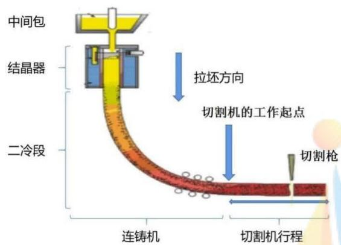
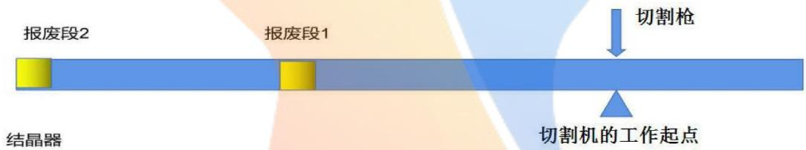
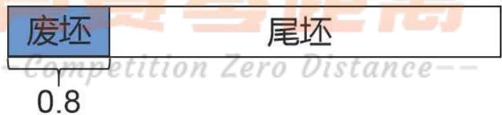
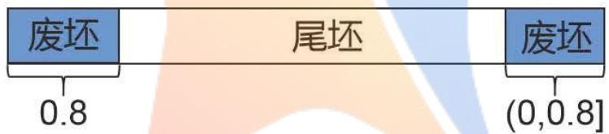
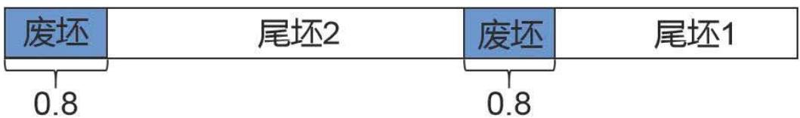
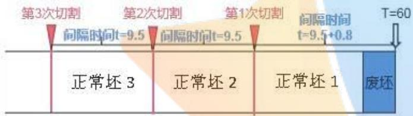
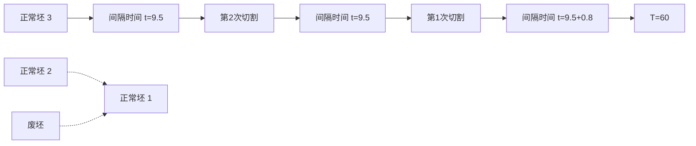
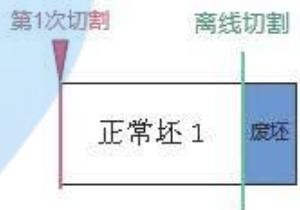

# 连铸切割的在线优化模型

## 摘要

连铸是将钢水变成钢坯的生产过程，而优化切割是连铸的关键技术之一，直接影响了钢坯的利用率和用户的满意度。本文从尾坯切割损失、满足用户目标值两方面研究连铸的最优切割方案，并制定了出现异常情况下的实时最优切割方案。

问题 1：在满足基本要求和正常要求的前提下，首先，证明了关于尾坯长度和用户目标范围实现切割损失为 0 的充要条件。考虑实际生产和测量都建立在一定精度之上，取定精度为 0.1 米，将 4.8 米\~12.6 米划分为 79 种长度规格；根据参数与要求、用户目标值范围等条件，建立基于 79 种长度规格的切割损失最小整线性规划模型。进一步，给出了切割总损失最小值函数 $f(L)$ 关于尾坯长度 L 的函数解析表达式。其次，将整线性规划模型所求的切割损失最小值固定，构造平均绝对偏差来刻画满足用户目标值，在切割损失最小的前提下，建立了最小平均绝对偏差模型并最终求得最优切割方案。结果表明，在切割损失最小的前提下，问题 1 中给出的 12 个尾坯最优切割方案的平均绝对偏差在 0.16\~0.5 米之间。

问题 2：考虑结晶器异常会出现报废段，基于问题 1 的模型和结果，本文分 “尾坯 +0.8 米废坯”、“部分长度( $\leqslant$ 0.8 米)废坯+尾坯+0.8 米废坯”、“尾坯 1+0.8 米废坯+尾坯 2+0.8 米废坯” 等三种讨论了实时初始最优切割方案和调整后最优切割方案。结果表明，9 段异常时刻初始切割方案总共调整了 8 次，声明不做调整 0 次；总的切割损失为 16.6 米。

问题 3：结晶器出现异常的时刻都与问题 2 相同的条件下，分别求出了用户目标值为 8.5 米和 11.1 米的实时初始最优切割方案和调整后最优切割方案。用户目标值为 8.5 米初始切割方案总共调整了 8 次，声明不做调整 0 次，总的切割损失为 8.8 米；用户目标值为 11.1 米初始切割方案总共调整了 8 次，声明不做调整 0 次，总的切割损失为 17.1 米。

关键词：连铸切割 切割损失 整线性规划 平均绝对偏差 最优方案

## 一. 问题重述

## 1.1 问题背景



<details>
<summary>flowchart</summary>


</details>

图 1 连铸工艺的示意图

连铸流程如图1，钢水从中间包到结晶器，接着在二冷段拉坯，最后被切割机切割。其中，从结晶器中心到切割机工作起点处钢坯的长度是60.0米。连铸拉坯的速度为1.0米/分钟。切割机每次会从工作起点开始切割，切割机与钢坯同步移动3分钟完成切割，然后1分钟返回工作起点，等待下次切割。切割机在线切割后的钢坯长度必须为4.8\~12.6米之间，下道工序可接受的长度为8.0\~11.6米。对于在线切割的钢坯长度取值在[11.6, 12.6]，需要离线切割。

在浇钢过程中，结晶器会出现异常，这时，位于结晶器内部的一段钢坯需要报废，称此段钢坯为报废段(图2)，报废段的长度为0.8米。结晶器一旦异常，切割工序立刻知道，可以立即调整切割方案。含有报废段的钢坯需要离线二次切割。



<details>
<summary>text_image</summary>

报废段2
报废段1
切割枪
结晶器
切割机的工作起点
</details>

图 2 钢坯出现报废段的示意图

## 1.2 问题提出

在最优切割方案中，首先必须保证切割损失(报废钢坯的长度)最小，其次尽可能满足用户要求。建立数学模型或设计算法，解决以下问题：

(1)已知尾坯长度为 109.0、93.4、80.9、72.0、62.7、52.5、44.9、42.7、31.6、22.7、14.5 和 13.7(单位：米)，用户目标值为 9.5 米，目标范围为 9.0\~10.0 米，列表写出具体的最优切割方案，包括“尾坯长度、切割方案、切割损失”等内容。  
(2)在结晶器在0.0、45.6、98.6、131.5、190.8、233.3、266.0、270.7和327.9(单位：分钟)出现异常，用户目标值是9.5米，目标范围是9.0\~10.0米。在出现新的报废段后(包括第一次报废)，将每种情况的切割方案一起列出，按“初始切割方案、调整后的切割方案、切割损失”写出。  
(3)结晶器出现异常的时刻是同(2)相同，用户目标值是8.5米，目标范围是8.0\~9.0米以及用户目标值是11.1米，目标范围是10.6\~11.6米两种情况，分别按“初始切割方案、调整后的切割方案、切割损失”写出最优切割方案。

## 二. 模型假设

1. 假设本文中连铸设备钢坯切割的精度为 0.1 米;  
2. 假设 $t = 0$ 表示带有坯壳的钢水刚从结晶器中心出现；  
3. 假设未说明结晶器异常时，连铸设备正常生产钢坯；  
4. 由于报废段长度为固定值，本文切割损失仅为正常钢坯的切割所产生的报废钢坯长度，不计入报废段长度；  
5. 假设温度、压力恒定，切割设备能正常进行，不存在漏钢现象；  
6. 不考虑切割方案调整所需的时间。

## 三. 符号说明

<table><tr><td>符号</td><td>说明</td><td>单位</td></tr><tr><td>L</td><td>尾坯长度</td><td>米</td></tr><tr><td>Y</td><td>切割损失</td><td>米</td></tr><tr><td> $Y_{\min}$ </td><td>最小切割损失值</td><td>米</td></tr><tr><td>d</td><td>用户的目标值</td><td>米</td></tr><tr><td>t</td><td>钢水在结晶器中心的时间</td><td>分钟</td></tr><tr><td> $x_i$ </td><td>第i种规格的板坯数量</td><td>根</td></tr><tr><td>Z</td><td>用户目标值的平均绝对偏差</td><td>米</td></tr></table>

\*其他未标明符号在文中说明

## 四．问题分析

针对问题1，要给出尾坯的最优切割方案，首先对已知报废长度进行规律探索，初步推论出理论切割总损失最小值与尾坯长度的关系。接着，建立两阶段模型求出尾坯切割最优方案。其中，第一阶段模型求解切割损失的最小值；第二阶段模型寻找尽可能满足用户目标值的切割方案。最后，发现实际最小切割损失与理论最小切割损失完全相同，说明本文找到最小切割损失与尾坯长度的联系。

针对问题2，在两段报废段之间的正常钢坯可视为问题1中的“尾坯”。由于结晶器异常时常发生，本文将分三种情况讨论尾坯与废坯的连接类型，并给出相应的切割算法。第(1)小问要给出钢坯首次初选报废段的实时切割方案，由题目可知结晶器首次出现异常的时刻为0.0，因为假设未说明结晶器异常时，钢坯中不存在报废段，按照用户目标值9.5米进行钢坯的切割。第(2)小问要给出新一段钢坯和当前段钢坯的调整方案，

按照三种类型的对应算法进行求解。

针对问题3，在假设实时最优切割方案和结晶器出现异常的时刻都与问题2相同的条件下，要给出用户目标值分别为8.5米和11.1米的最优实时切割方案。直接使用问题2的算法，即可求出问题3中(1)(2)小问的实时最优切割方案。

## 五. 模型建立与求解

## 5.1 模型的准备

连铸停浇时，将必然会产生尾坯，因此在实际生产中需要对尾坯进行切割。切割就可能会产生报废钢坯(即切割出的长度不满足用户的目标值范围)，为使报废钢坯的长度尽可能的小，首先讨论钢坯报废长度为0的条件。设尾坯长度为 $L$ ，用户目标范围为 $[a,b]$ ，若 $\frac{L}{a}$ 或 $\frac{L}{b}$ 恰好为整数，那么可将尾坯平均切割长度为 $a$ 或 $b$ ，从而报废长度为0。因此，下面将讨论 $\frac{L}{a}$ ， $\frac{L}{b}$ 均不为整数时，报废长度为0的充要条件。

定理1：在钢材连铸切割中，若尾坯长度为 $L$ ，用户目标范围为 $[a,b]$ ，且 $a\neq b$ 。若 $\frac{L}{a}$ $\frac{L}{b}$ 均不是整数，那么报废钢坯长度为0的充要条件是 $\left\lfloor \frac{L}{a}\right\rfloor -\left\lfloor \frac{L}{b}\right\rfloor \geqslant 1$ 。

证明：

(1) 充分性证明。

若 $\left\lfloor \frac{L}{a}\right\rfloor -\left\lfloor \frac{L}{b}\right\rfloor \geqslant 1$ ，将尾坯平均切割为 $\left\lfloor \frac{L}{a}\right\rfloor$ 段，每一段的长度为 $\frac{L}{\left\lfloor\frac{L}{a}\right\rfloor}$ ，由 $\frac{L}{a}\geqslant \left\lfloor \frac{L}{a}\right\rfloor$ 可得 $\frac{L}{\left\lfloor\frac{L}{a}\right\rfloor}\geqslant \frac{L}{\frac{L}{a}} = a$ 。

另一方面， $\left\lfloor \frac{L}{a}\right\rfloor \geqslant \left\lfloor \frac{L}{b}\right\rfloor + 1 > \frac{L}{b}$ ，得 $\frac{L}{\left\lfloor \frac{L}{a} \right\rfloor} \leqslant \frac{L}{\left\lfloor \frac{L}{b} \right\rfloor + 1} < \frac{L}{\frac{L}{b}} = b$ 。

因此，每一段长度都在 $[a, b]$ ，符合用户目标范围，报废钢坯长度为 0。

(2) 必要性证明。

若报废钢坯长度为0，则可设尾坯长度为L被切割为 $L_{1},L_{2},\cdots,L_{n}$ ，且 $a\leqslant L_{1}\leqslant L_{2}\leqslant\cdots\leqslant L_{n}\leqslant b$ ，得 $na\leqslant\sum_{i=1}^{n}L_{i}\leqslant nb$ ，又由于 $\frac{L}{a}$ 、 $\frac{L}{b}$ 均不是整数，可得na<L<nb，即有 $\frac{L}{b}<n<\frac{L}{a}$ 。

因此 $\left\lfloor \frac{L}{a}\right\rfloor \geqslant n$ ， $\left\lfloor \frac{L}{b}\right\rfloor \leqslant n - 1$ ，即有 $\left\lfloor \frac{L}{a}\right\rfloor -\left\lfloor \frac{L}{b}\right\rfloor \geqslant 1$ 。

综上所述，报废钢坯长度为0的充要条件是 $\left\lfloor \frac{L}{a}\right\rfloor -\left\lfloor \frac{L}{b}\right\rfloor \geqslant 1$ 。

由于 $a < b$ ， $\left\lfloor \frac{L}{a} \right\rfloor - \left\lfloor \frac{L}{b} \right\rfloor \geqslant 0$ 。因此，若 $\left\lfloor \frac{L}{a} \right\rfloor - \left\lfloor \frac{L}{b} \right\rfloor$ 的值不满足定理1中 $\left\lfloor \frac{L}{a} \right\rfloor - \left\lfloor \frac{L}{b} \right\rfloor \geqslant 1$ 的条件，只可能 $\left\lfloor \frac{L}{a} \right\rfloor - \left\lfloor \frac{L}{b} \right\rfloor = 0$ 。由于定理1给出的是充要条件，因此可以得到下述推论。

推论1：在钢材连铸切割中，若尾坯长度为 $L$ ，用户目标范围为 $[a,b]$ ，且 $a < b$ 。若 $\frac{L}{a}$ ， $\frac{L}{b}$ 均不是整数，且 $\left\lfloor \frac{L}{a} \right\rfloor - \left\lfloor \frac{L}{b} \right\rfloor = 0$ ，该尾坯切割后报废钢坯长度必大于0。

## 5.2 问题1的求解

实际生产过程和测量工作总是建立在一定的精度之上。根据问题1给出的数据，我们不妨假设该连铸工艺切割的精度为0.1米，在此基础上建立模型寻找最优切割方案。由于切割方案要优先考虑切割损失，在相同的切割损失下才需要尽量满足用户的目标值；因此，本文将分别建立两阶段模型：第一阶段模型，根据参数与要求、用户目标值范围等条件建立切割损失最小模型；第二阶段模型，在切割损失达到最小值的前提下，寻找尽可能满足用户目标值的切割方案，建立满足用户目标值最优模型。

## 5.2.1 切割损失最小模型的建立

根据基本要求，要将在线切割后的钢坯运走，切割出的长度值必须在4.8\~12.6米之间。我们已经假定连铸工艺切割的精度为0.1米，因此，尾坯只能被切割成4.8米、4.9米、5.0米、…、12.6米共79种不同长度规格。设 $x_{i}$ 表示尾坯被切割出第i种长度规格数，其中 $i=1,2,\cdots,79$ 。假设尾坯长度为L，由于被切割后尾坯总长度仍保持不变，因此有：

$$
\sum_ {i = 1} ^ {7 9} [ 4. 8 + 0. 1 (i - 1) ] = L
$$

问题 1 中，用户的目标值范围为 9.0\~10.0 米之间，因此，9.0 米以下长度规格及 10.0 米以上长度规格均产生切割损失。其中：

(1)9.0米以下长度规格的切割损失为： $\sum_{i = 1}^{42}[4.8 + 0.1(i - 1)]x_i$

(2)10.0米以上长度规格，超过10.0米的部分要离线切下报废，因此10.0米以上长度规格的切割损失为： $\sum_{j=1}^{26}0.1j\cdot x_{53+j}$

因此，长度为L的尾坯被切成79种不同长度规格后，其切割总损失量为：

$$
Y = \sum_ {i = 1} ^ {4 2} [ 4. 8 + 0. 1 (i - 1) ] x _ {i} + \sum_ {j = 1} ^ {2 6} 0. 1 j \cdot x _ {5 3 + j}
$$

基于以上分析，我们建立以下切割损失最小的整线性规划模型：

$$
\min \quad Y = \sum_ {i = 1} ^ {4 2} [ 4. 8 + 0. 1 (i - 1) ] x _ {i} + \sum_ {j = 1} ^ {2 6} 0. 1 j \cdot x _ {5 3 + j} \tag {1}
$$

$$
s. t. \quad \sum_ {i = 1} ^ {7 9} [ 4. 8 + 0. 1 (i - 1) ] = L \tag {2}
$$

$$
x _ {i} \in N \quad i = 1, 2, \dots , 7 9
$$

下面对上述建立在0.1米精度上的整线性规划模型的求解结果进行分析和检验。问题1中用户目标值为[9.0 10.0]，假设尾坯长度为 $L$ ，切割总损失最小值为 $f(L)$ 。对于尾坯长度 $L$ 的不同取值范围，根据定理1，从理论上构建切割总损失最小值 $f(L)$ 的解析式，具体分15种情况讨论：

(1)在 $L\in [9,10]\cup [18,20]\cup [27,30]\cup [36,40]\cup [45,50]\cup [54,60]\cup [63,70]$

$$
\cup [ 7 2, 8 0 ] \cup [ 8 1, + \infty ] \text {时，} f (L) = 0
$$

(2)在 $L\in (80,81)$ 时， $f(L) = L - 80$ (3)在 $L\in (80,81)$ 时， $f(L) = L - 80$  
(4)在 $L\in (70,72)$ 时， $f(L) = L - 70$ (5)在 $L\in (60,63)$ 时， $f(L) = L - 60$  
(6)在 $L\in (60,63)$ 时， $f(L) = L - 60$ (7)在 $L\in (50,54)$ 时， $f(L) = L - 50$  
(8)在 $L\in (40,45)$ 时， $f(L) = L - 40$ (9)在 $L\in (30,36)$ 时， $f(L) = L - 30$  
(10)在 $L\in (20,27)$ 时， $f(L) = L - 20$ (11)在 $L\in (14.8,18)$ 时， $f(L) = L - 10$  
(12)在 $L\in (13.7,14.8]$ 时， $f(L) = 4.8$ (13)在 $L\in (12.6,13.7]$ 时， $f(L) = L$  
(14)在 $L\in (10,12.6]$ 时， $f(L) = L - 10$ (15)在 $L\in [4.8,9)$ 时， $f(L) = L$

对问题1给出的12种不同长度的尾坯，根据给出的切割总损失最小值 $f(L)$ 解析函数，可以计算其切割总损失最小的理论值。将该理论值与建立在0.1米精度上的整线性规划模型求出的最小值进行对比，如下表1所示。

表 1 不同尾坯长度的最小损失值对比表

<table><tr><td>尾坯长度</td><td>整线性规划所求损失最小值</td><td>最小值函数 $f(L)$ 计算的理论值</td></tr><tr><td>109</td><td>0</td><td>0</td></tr><tr><td>93.4</td><td>0</td><td>0</td></tr><tr><td>80.9</td><td>0.9</td><td>0.9</td></tr><tr><td>72</td><td>0</td><td>0</td></tr><tr><td>62.7</td><td>2.7</td><td>2.7</td></tr><tr><td>52.5</td><td>2.5</td><td>2.5</td></tr><tr><td>44.9</td><td>4.9</td><td>4.9</td></tr><tr><td>42.7</td><td>2.7</td><td>2.7</td></tr><tr><td>31.6</td><td>1.6</td><td>1.6</td></tr><tr><td>22.7</td><td>2.7</td><td>2.7</td></tr><tr><td>14.5</td><td>4.8</td><td>4.8</td></tr><tr><td>13.7</td><td>13.7</td><td>13.7</td></tr></table>

检验结果表明，本文建立的整线性规划模型虽然建立在一定精度之上，但模型求解结果与理论计算结果完全吻合。

## 5.2.2 满足用户目标值最优模型的建立

通过上文建立的整线性规划模型，求解出了尾坯切割损失的最小值。对于整线性规划模型，切割损失的最小值是唯一的，但最优解即切割方案可能不唯一。下面将求得的尾坯切割最小值 $Y_{min}$ 固定，在此条件下寻找最满足用户目标值的切割方案。设板坯长度L，用户的目标值为d，目标范围为 $[a,b]$ ；第1\~79种长度规格分别对应长度4.8米、4.9米、5.0米、…、12.6米， $x_{i}$ 表示尾坯被切割出第i种长度规格数，其中 $i=1,2,\cdots,79$ ，设长度a、b分别对应第 $k_{1}$ 和第 $k_{2}$ 种长度规格，则显然有：

$$
k _ {1} = \frac {a - 4 . 8}{0 . 1} + 1 \text {和} k _ {2} = \frac {b - 4 . 8}{0 . 1} + 1.
$$

下面构建平均绝对偏差来刻画满足用户目标值的情况。由于不在目标范围的长度规格全部报废而不提交给用户，只考虑目标范围内的钢坯满足用户目标值的情况。但需要注意的是，按照第一阶段模型结果，超过目标值范围上限值b长度规格的仍离线切割成长度b提交用户，因此仍需考虑这些长度规格带来的偏差。

第 $k_{1}\sim$ 第 $k_{2}$ 种长度规格的绝对偏差和为： $\sum_{n = 0}^{k_2 - k_1}x_{k_1 + n}|(a + 0.1n) - d|$

第 $k_{1} + 1\sim$ 第79种长度规格的绝对偏差和为： $\sum_{m = 1}^{79 - k_2}x_{k_2 + m}|b - d|$

因此，满足用户目标值的平均绝对偏差为：

$$
Z = \frac {\sum_ {n = 0} ^ {k _ {2} - k _ {1}} x _ {k _ {1} + n} | (a + 0 . 1 n) - d | + \sum_ {m = 1} ^ {7 9 - k _ {2}} x _ {k _ {2} + m} | b - d |}{\sum_ {i = k _ {1}} ^ {7 9} x _ {i}}
$$

将第一阶段模型求得的尾坯切割最小值 $Y_{min}$ 固定，建立满足用户目标值的规划模型如下：

$$
\min Z = \frac {\sum_ {n = 0} ^ {k _ {2} - k _ {1}} x _ {k _ {1} + n} | (a + 0 . 1 n) - d | + \sum_ {u = 1} ^ {7 9 - k _ {2}} x _ {k _ {2} + u} | b - d |}{\sum_ {m = k _ {1}} ^ {7 9} x _ {m}} \tag {3}
$$

$$
s. t. \sum_ {i = 1} ^ {7 9} [ 4. 8 + 0. 1 (i - 1) ] = L \tag {4}
$$

$$
\sum_ {i = 1} ^ {4 2} [ 4. 8 + 0. 1 (i - 1) ] x _ {i} + \sum_ {j = 1} ^ {2 6} 0. 1 j \cdot x _ {5 3 + j} = Y _ {\min} \tag {5}
$$

$$
x _ {i} \in N \quad i = 1, 2, \dots 7 9
$$

## 5.2.3 模型的求解

根据切割损失最小模型、满足用户目标值最优模型进行求解，可得切割方案、切割损失，整理可得表2。

表 2 最优切割方案

<table><tr><td>尾坯长度(米)</td><td>109</td><td>93.4</td><td>80.9</td><td>72</td><td>62.7</td><td>52.5</td><td>44.9</td><td>42.7</td><td>31.6</td><td>22.7</td><td>14.5</td><td>13.7</td></tr><tr><td>切割损失(米)</td><td>0</td><td>0</td><td>0.9</td><td>0</td><td>2.7</td><td>2.5</td><td>4.9</td><td>2.7</td><td>1.6</td><td>2.7</td><td>4.8</td><td>13.7</td></tr><tr><td>目标值平均绝对偏差(米)</td><td>0.41</td><td>0.16</td><td>0.5</td><td>0.5</td><td>0.5</td><td>0.5</td><td>0.5</td><td>0.5</td><td>0.5</td><td>0.5</td><td>0.2</td><td>—</td></tr><tr><td rowspan="11">切割方案</td><td>9.6</td><td>9.3</td><td>10</td><td>9</td><td>10.4</td><td>10.5</td><td>4.8</td><td>10.4</td><td>10.4</td><td>11.2</td><td>4.8</td><td>4.8</td></tr><tr><td>9.8</td><td>9.3</td><td>10</td><td>9</td><td>10.4</td><td>10.5</td><td>10</td><td>10.5</td><td>10.5</td><td>11.5</td><td>9.7</td><td>8.9</td></tr><tr><td>9.9</td><td>9.3</td><td>10</td><td>9</td><td>10.4</td><td>10.5</td><td>10</td><td>10.9</td><td>10.7</td><td></td><td></td><td></td></tr><tr><td>9.9</td><td>9.3</td><td>10</td><td>9</td><td>10.4</td><td>10.5</td><td>10</td><td>10.9</td><td></td><td></td><td></td><td></td></tr><tr><td>9.9</td><td>9.3</td><td>10</td><td>9</td><td>10.4</td><td>10.5</td><td>10.1</td><td></td><td></td><td></td><td></td><td></td></tr><tr><td>9.9</td><td>9.3</td><td>10</td><td>9</td><td>10.7</td><td></td><td></td><td></td><td></td><td></td><td></td><td></td></tr><tr><td>10</td><td>9.3</td><td>10</td><td>9</td><td></td><td></td><td></td><td></td><td></td><td></td><td></td><td></td></tr><tr><td>10</td><td>9.3</td><td>10.9</td><td>9</td><td></td><td></td><td></td><td></td><td></td><td></td><td></td><td></td></tr><tr><td>10</td><td>9.5</td><td></td><td></td><td></td><td></td><td></td><td></td><td></td><td></td><td></td><td></td></tr><tr><td>10</td><td>9.5</td><td></td><td></td><td></td><td></td><td></td><td></td><td></td><td></td><td></td><td></td></tr><tr><td>10</td><td></td><td></td><td></td><td></td><td></td><td></td><td></td><td></td><td></td><td></td><td></td></tr></table>

(注: 表 2 中尾坯长度等于 13.7 米时, 切割损失为 13.7 米, 用户满意偏差不存在)

## 5.3 问题2的求解

## 5.3.1 算法设计

在理想状况下，若结晶器始终保持正常，那么连铸切割的长度应恒定为用户目标值9.5米。但是，在浇钢过程中，结晶器会发生异常，每次异常都会产生0.8米长度的报废钢，本文定义报废段是废坯。结晶器异常前生产的钢坯全部为正常钢坯，由于该段正常钢坯后连着报废钢，可以将该段正常钢坯看作是问题1中的“尾坯”。由于结晶器异常时常发生，本文将分三种情况讨论尾坯与废坯的连接类型。

类型 1：“尾坯+0.8米废坯”的情况，如下图3所示。



<details>
<summary>text_image</summary>

废坯
0.8
尾坯
Competition Zero Distance--
</details>

图3 “尾坯+0.8米废坯”的情况

假设结晶体某次异常后，0.8米废坯前连着的“尾坯”长度为L，那么总的被切割长度为 $(L+0.8)$ 米。类似问题1中切割总损失最小值函数 $f(L)$ ，下面给出包含0.8米废坯的切割总损失最小值函数 $f(L+0.8)$ ，具体分12种情况讨论：

(1)在 $L \in [9, 10] \cup [18, 20] \cup [27, 30] \cup [36, 40] \cup [45, 50] \cup [54, 60]$ 时，损失 $f(L + 0.8) = 0$

(2)在 $L\in (50,54)$ 时， $f(L + 0.8) = L - 50$

(3)在 $L\in (40,45)$ 时， $f(L + 0.8) = L - 40$

(4)在 $L\in (30,36)$ 时， $f(L + 0.8) = L - 30$

(5)在 $L\in (20,27)$ 时， $f(L + 0.8) = L - 20$

(6)在 $L\in(14.0,18]$ 时， $f(L+0.8)=L-10$

(7)在 $L\in (12.9,14.0]$ 时， $f(L + 0.8) = 4$

(8)在 $L \in (12.6, 12.9]$ 时， $f(L + 0.8) = L$

(9)在 $L \in (10, 12.6]$ 时， $f(L + 0.8) = L - 10$

(10)在 $L\in[4,9)$ 时， $f(L+0.8)=L$

(11)在 $L\in (2.8,4)$ 时， $f(L + 0.8) = 4$

(12)在 $L\in (0,2.8]$ 时， $f(L + 0.8) = L$

在问题1中，当尾坯长度为 $L = 14$ 米时，因为没有长度为0.8米的废坯，最优切割方案只能是切成“4.8米+9.2米”，即 $f(14) = 4.8$ 米；而在问题2中，如果有0.8米长的废坯，可以切成“10米+(4.0+0.8)米”，即 $f(14 + 0.8) = 4$ 米。因此，如果出现情况1，按照如下方法进行切割：

(1)类型 1 中尾坯的长度 $L \in (12.9, 14.0]$ 时, 首先切掉 $(L - 4)$ 米, 再切除 4.8 米(连同废坯);

(2)类型1中尾坯的长度 $L\in[4.8,9)$ 时，直接将L切掉；废坯留给下一段；

(3)类型1中尾坯的长度 $L\in(0,4.8)$ 时，将整段L连同0.8米废坯，再加上下一段 $(4-L)$ 总共4.8米切除；

(4)除上述三种情况外，尾坯L按照问题1中两阶段模型进行切割；0.8米废坯留给下一段。

类型 2: “部分长度( $\leqslant$ 0.8 米)废坯+尾坯+0.8 米废坯”的情况，如图 4 所示。



<details>
<summary>text_image</summary>

废坯
0.8
尾坯
废坯
(0,0.8]
</details>

图 4 “部分长度废坯+尾坯+0.8 米废坯”的情况

(1)类型2中尾坯的长度 $L\in[4,+\infty)$ 时，切割方式与类型1类似，只不过要必须要将部分长度( $\leqslant0.8$ 米)废坯切除，不留给下一段；

(2)类型1中尾坯的长度 $L\in(0,4.8)$ 时，将整段L连同0.8米废坯，再加上下一段 $(4-L)$ 总共4.8米切除；这里的可能只是第二段废坯的一部分或者包含第二段废坯以及正常钢坯的部分。

类型 3: “尾坯 1+0.8 米废坯+尾坯 2+0.8 米废坯”的情况，如下图 5 所示。



<details>
<summary>flowchart</summary>


</details>

图 5 “尾坯 1+0.8 米废坯+尾坯 2+0.8 米废坯”的情况

(1)优先根据类型3中尾坯1的长度 $L_{1}$ 取值，按照类型1的情况分类进行切割；

(2) 根据上面尾坯 1 的切割结果，判断尾坯 2 属于类型 1 或者类型 2；再按照类型 1 或者类型 2 的讨论情况进行切割。

综上所述，根据结晶器异常发生时刻，钢坯的所属的类型情况实时制定或者调整切割方案。如果结晶器异常过于频繁，同时出现3个以上的报废坯需要处理，可以作类似的讨论。

## 5.3.2 求解结果

## (1) 第 1 次出现报废段的最优切割方案

从结晶器中心到切割机工作起点处钢坯的长度是60.0米，而连铸拉坯的速度为1.0米（分钟），所以结晶器中心到切割机工作起点的时间为60分钟。设t为钢水到达结晶器中心的时间，那么钢坯到达切割枪工作起点的时间为 $(60+t)$ 分钟。由于钢坯第1次出现报废段的时间是t=0，即钢坯的首段0.8米是报废段。显然，最优切割方案就是首先切下9.5+0.8=10.3米，再离线将0.8米段报废段切掉。之后，连铸切割的长度应恢复为用户目标值9.5米，直至第2次报废时刻出现，如图6、图7。



<details>
<summary>flowchart</summary>


</details>

图6在线切割



<details>
<summary>text_image</summary>

第1次切割
离线切割
正常坯 1
废坯
</details>

图7 离线切割

## (2) 出现新报废段的最优切割方案

根据算法，求出当钢坯第 2\~9 次出现报废段时，对应的实时最优切割方案，见表 3\~表 10。

表 3 钢坯第 2 次出现报废段的最优切割方案

<table><tr><td rowspan="2">初始切割方案</td><td>切割时间(分钟)</td><td>70.3</td><td>79.8</td><td>89.3</td><td>98.8</td><td>108.6</td><td>118.1</td><td>127.6</td><td>...</td></tr><tr><td>切割长度(米)</td><td>9.5+0.8</td><td>9.5</td><td>9.5</td><td>9.5</td><td>9.5</td><td>9.5</td><td>9.5</td><td>9.5</td></tr><tr><td rowspan="2">调整后的切割方案</td><td>切割时间(分钟)</td><td>70.8</td><td>80.8</td><td>90.8</td><td>100.8</td><td>106.4</td><td>115.9</td><td>125.4</td><td>...</td></tr><tr><td>切割长度(米)</td><td>10+0.8</td><td>10</td><td>10</td><td>10</td><td>4.8+0.8</td><td>9.5</td><td>9.5</td><td>9.5</td></tr><tr><td colspan="10">切割损失:4.8米</td></tr></table>

表 4 钢坯第 3 次出现报废段的最优切割方案

<table><tr><td rowspan="2">初始切割方案</td><td>切割时间(分钟)</td><td>100.8</td><td>106.4</td><td>115.9</td><td>125.4</td><td>134.9</td><td>144.4</td><td>153.9</td><td>163.4</td></tr><tr><td>切割长度</td><td>10</td><td>4.8+0.8</td><td>9.5</td><td>9.5</td><td>9.5</td><td>9.5</td><td>9.5</td><td>9.5</td></tr><tr><td></td><td>(米)</td><td></td><td></td><td></td><td></td><td></td><td></td><td></td><td></td></tr><tr><td rowspan="2">调整后的切割方案</td><td>切割时间(分钟)</td><td>100.8</td><td>106.4</td><td>116.9</td><td>127.4</td><td>137.8</td><td>148.2</td><td>159.4</td><td>168.9</td></tr><tr><td>切割长度(米)</td><td>10</td><td>4.8+0.8</td><td>10.5</td><td>10.5</td><td>10.4</td><td>10.4</td><td>10.4+0.8</td><td>9.5</td></tr><tr><td colspan="10">切割损失:2.2米</td></tr></table>

表 5 钢坯第 4 次出现报废段的最优切割方案

<table><tr><td rowspan="2">初始切割方案</td><td>切割时间(分钟)</td><td>137.8</td><td>148.2</td><td>159.4</td><td>168.9</td><td>178.4</td><td>187.9</td><td>197.4</td><td>206.9</td></tr><tr><td>切割长度(米)</td><td>10.4</td><td>10.4</td><td>10.4+0.8</td><td>9.5</td><td>9.5</td><td>9.5</td><td>9.5</td><td>9.5</td></tr><tr><td rowspan="2">调整后的切割方案</td><td>切割时间(分钟)</td><td>137.8</td><td>148.2</td><td>159.4</td><td>170.1</td><td>180.8</td><td>192.3</td><td>201.8</td><td>211.3</td></tr><tr><td>切割长度(米)</td><td>10.4</td><td>10.4</td><td>10.4+0.8</td><td>10.7</td><td>10.7</td><td>10.7+0.8</td><td>9.5</td><td>9.5</td></tr><tr><td colspan="10">切割损失:2.1米</td></tr></table>

表 6 钢坯第 5 次出现报废段的最优切割方案

<table><tr><td rowspan="2">初始切割方案</td><td>切割时间(分钟)</td><td>192.3</td><td>201.8</td><td>211.3</td><td>220.8</td><td>230.3</td><td>239.8</td><td>249.3</td><td>...</td></tr><tr><td>切割长度(米)</td><td>10.7+0.8</td><td>9.5</td><td>9.5</td><td>9.5</td><td>9.5</td><td>9.5</td><td>9.5</td><td>9.5</td></tr><tr><td rowspan="2">调整后的切割方案</td><td>切割时间(分钟)</td><td>192.3</td><td>202.1</td><td>211.9</td><td>221.7</td><td>231.4</td><td>241.1</td><td>251.6</td><td>...</td></tr><tr><td>切割长度(米)</td><td>10.7+0.8</td><td>9.8</td><td>9.8</td><td>9.8</td><td>9.7</td><td>9.7</td><td>9.7+0.8</td><td>9.5</td></tr><tr><td colspan="10">切割损失:0米</td></tr></table>

表 7 钢坯第 6 次出现报废段的最优切割方案

<table><tr><td rowspan="2">初始切割方案</td><td>切割时间(分钟)</td><td>241.1</td><td>251.6</td><td>261.1</td><td>270.6</td><td>280.1</td><td>289.6</td><td>...</td></tr><tr><td>切割长度(米)</td><td>9.7</td><td>9.7+0.8</td><td>9.5</td><td>9.5</td><td>9.5</td><td>9.5</td><td>9.5</td></tr><tr><td rowspan="2">调整后的切割方案</td><td>切割时间(分钟)</td><td>241.1</td><td>251.6</td><td>262.1</td><td>272.5</td><td>282.9</td><td>294.1</td><td>...</td></tr><tr><td>切割长度(米)</td><td>9.7</td><td>9.7+0.8</td><td>10.5</td><td>10.4</td><td>10.4</td><td>10.4+0.8</td><td>9.5</td></tr><tr><td colspan="9">切割损失:1.7米</td></tr></table>

表 8 钢坯第 7 次出现报废段的最优切割方案

<table><tr><td rowspan="2">初始切割方案</td><td>切割时间(分钟)</td><td>272.5</td><td>282.9</td><td>294.1</td><td>303.6</td><td>313.1</td><td>322.6</td><td>...</td></tr><tr><td>切割长度(米)</td><td>10.4</td><td>10.4</td><td>10.4+0.8</td><td>9.5</td><td>9.5</td><td>9.5</td><td>9.5</td></tr><tr><td rowspan="2">调整后的切割方案</td><td>切割时间(分钟)</td><td>272.5</td><td>282.9</td><td>294.1</td><td>305.1</td><td>316</td><td>326.8</td><td>...</td></tr><tr><td>切割长度(米)</td><td>10.4</td><td>10.4</td><td>10.4+0.8</td><td>11</td><td>10.9</td><td>10+0.8</td><td>9.5</td></tr><tr><td colspan="9">切割损失:1.9米</td></tr></table>

表 9 钢坯第 8 次出现报废段的最优切割方案

<table><tr><td rowspan="2">初始切割方案</td><td>切割时间(分钟)</td><td>272.5</td><td>282.9</td><td>294.1</td><td>305.1</td><td>316</td><td>326.8</td><td>336.3</td><td>...</td></tr><tr><td>切割长度(米)</td><td>10.4</td><td>10.4</td><td>10.4+0.8</td><td>11</td><td>10.9</td><td>10+0.8</td><td>9.5</td><td>9.5</td></tr><tr><td rowspan="2">调整后的切割方案</td><td>切割时间(分钟)</td><td>272.5</td><td>282.9</td><td>294.1</td><td>305.1</td><td>316</td><td>326</td><td>331.5</td><td>...</td></tr><tr><td>切割长度(米)</td><td>10.4</td><td>10.4</td><td>10.4+0.8</td><td>11</td><td>10.9</td><td>10</td><td>0.8+3.9+0.8</td><td>9.5</td></tr><tr><td colspan="10">切割损失:3.9米</td></tr></table>

表 10 钢坯第 9 次出现报废段的最优切割方案

<table><tr><td rowspan="2">初始切割方案</td><td>切割时间(分钟)</td><td>341</td><td>350.5</td><td>360</td><td>369.5</td><td>379</td><td>388.5</td><td>...</td></tr><tr><td>切割长度(米)</td><td>9.5</td><td>9.5</td><td>9.5</td><td>9.5</td><td>9.5</td><td>9.5</td><td>9.5</td></tr><tr><td rowspan="2">调整后的切割方案</td><td>切割时间(分钟)</td><td>340.9</td><td>350.3</td><td>359.7</td><td>369.1</td><td>378.5</td><td>388.7</td><td>...</td></tr><tr><td>切割长度(米)</td><td>9.4</td><td>9.4</td><td>9.4</td><td>9.4</td><td>9.4</td><td>9.4+0.8</td><td>9.5</td></tr><tr><td colspan="9">切割损失:0米</td></tr></table>

综上，每次出现新异常均需对原切割方案进行调整。9次异常总切割损失（不计报废段自身长度）为： $4.8 + 2.2 + 2.1 + 0 + 1.7 + 1.9 + 3.9 + 0 = 16.6$ （米）。

## 5.4 问题3的求解

问题3只是将问题2的用户目标值和目标范围改动，所用求解方法与求解问题2相同，利用算法进行求解。

1）用户目标值是8.5米，目标范围是8.0\~9.0米。

对于不同的正常钢坯长度 $L$ (范围在0\~60米)，下面给出包含0.8米废坯的切割总损失最小值函数 $f(L + 0.8)$ 。具体情况如下：

在 $L \in [8, 9] \cup [16, 18] \cup [24, 27] \cup [32, 36] \cup [40, 45] \cup [48, 54] \cup [56, 60]$ 时，损失 $f(L + 0.8) = 0$

<table><tr><td>在L∈(63,64)时，f(L+0.8)=L-63</td><td>在L∈(54,56)时，f(L+0.8)=L-54</td></tr><tr><td>在L∈(45,48)时，f(L+0.8)=L-45</td><td>在L∈(36,40)时，f(L+0.8)=L-36</td></tr><tr><td>在L∈(27,32)时，f(L+0.8)=L-27</td><td>在L∈(18,24)时，f(L+0.8)=L-18</td></tr><tr><td>在L∈(13.0,16)时，f(L+0.8)=L-9</td><td>在L∈(12.6,13.0]时，f(L+0.8)=4</td></tr><tr><td>在L∈[4,8)时，f(L+0.8)=L</td><td>在L∈(3.8,4)时，f(L+0.8)=4</td></tr><tr><td>在L∈(0,3.8]时，f(L+0.8)=L</td><td></td></tr></table>

根据算法，求出当钢坯第1\~9次出现报废段时，对应的实时最优切割方案，见表11\~表19。

表 11 钢坯第 1 次出现报废段的最优切割方案

<table><tr><td rowspan="2">初始切割方案</td><td>切割时间(分钟)</td><td>69.3</td><td>77.8</td><td>86.3</td><td>94.8</td><td>103.3</td><td>111.3</td><td>120.3</td><td>...</td></tr><tr><td>切割长度(米)</td><td>8.5+0.8</td><td>8.5</td><td>8.5</td><td>8.5</td><td>8.5</td><td>8.5</td><td>8.5</td><td>8.5</td></tr><tr><td colspan="10">切割损失:0米</td></tr></table>

表 12 钢坯第 2 次出现报废段的最优切割方案

<table><tr><td rowspan="2">初始切割方案</td><td>切割时间(分钟)</td><td>69.3</td><td>77.8</td><td>86.3</td><td>94.8</td><td>103.3</td><td>111.3</td><td>120.3</td><td>...</td></tr><tr><td>切割长度(米)</td><td>8.5+0.8</td><td>8.5</td><td>8.5</td><td>8.5</td><td>8.5</td><td>8.5</td><td>8.5</td><td>8.5</td></tr><tr><td rowspan="2">调整后的切割方案</td><td>切割时间(分钟)</td><td>69.8</td><td>78.8</td><td>87.8</td><td>96.7</td><td>106.4</td><td>114.9</td><td>123.4</td><td>...</td></tr><tr><td>切割长度(米)</td><td>9+0.8</td><td>9</td><td>9</td><td>8.9</td><td>8.9+0.8</td><td>8.5</td><td>8.5</td><td>8.5</td></tr><tr><td colspan="10">切割损失:0米</td></tr></table>

表 13 钢坯第 3 次出现报废段的最优切割方案

<table><tr><td rowspan="2">初始切割方案</td><td>切割时间(分钟)</td><td>106.4</td><td>114.9</td><td>123.4</td><td>131.9</td><td>140.4</td><td>148.9</td><td>157.4</td><td>...</td></tr><tr><td>切割长度(米)</td><td>8.9+0.8</td><td>8.5</td><td>8.5</td><td>8.5</td><td>8.5</td><td>8.5</td><td>8.5</td><td>8.5</td></tr><tr><td>调整后</td><td>切割时间</td><td>106.4</td><td>115.1</td><td>123.8</td><td>132.5</td><td>141.2</td><td>149.9</td><td>159.4</td><td>...</td></tr><tr><td rowspan="2">的切割方案</td><td>(分钟)</td><td></td><td></td><td></td><td></td><td></td><td></td><td></td><td></td></tr><tr><td>切割长度(米)</td><td>8.9+0.8</td><td>8.7</td><td>8.7</td><td>8.7</td><td>8.7</td><td>8.7</td><td>8.7+0.8</td><td>8.5</td></tr><tr><td colspan="10">切割损失:0米</td></tr></table>

表 14 钢坯第 4 次出现报废段的最优切割方案

<table><tr><td rowspan="2">初始切割方案</td><td>切割时间(分钟)</td><td>132.5</td><td>141.2</td><td>149.9</td><td>159.4</td><td>167.9</td><td>176.4</td><td>184.9</td><td>193.4</td></tr><tr><td>切割长度(米)</td><td>8.7</td><td>8.7</td><td>8.7</td><td>8.7+0.8</td><td>8.5</td><td>8.5</td><td>8.5</td><td>8.5</td></tr><tr><td rowspan="2">调整后的切割方案</td><td>切割时间(分钟)</td><td>132.5</td><td>141.2</td><td>149.9</td><td>159.4</td><td>167.5</td><td>175.5</td><td>183.5</td><td>192.3</td></tr><tr><td>切割长度(米)</td><td>8.7</td><td>8.7</td><td>8.7</td><td>8.7+0.8</td><td>8.1</td><td>8</td><td>8</td><td>8+0.8</td></tr><tr><td colspan="10">切割损失:0米</td></tr></table>

表 15 钢坯第 5 次出现报废段的最优切割方案

<table><tr><td rowspan="2">初始切割方案</td><td>切割时间(分钟)</td><td>192.3</td><td>200.8</td><td>209.3</td><td>217.8</td><td>226.3</td><td>234.8</td><td>243.3</td><td>251.8</td></tr><tr><td>切割长度(米)</td><td>8+0.8</td><td>8.5</td><td>8.5</td><td>8.5</td><td>8.5</td><td>8.5</td><td>8.5</td><td>8.5</td></tr><tr><td rowspan="2">调整后的切割方案</td><td>切割时间(分钟)</td><td>192.3</td><td>200.7</td><td>209.1</td><td>217.5</td><td>225.9</td><td>234.2</td><td>242.5</td><td>251.6</td></tr><tr><td>切割长度(米)</td><td>8+0.8</td><td>8.4</td><td>8.4</td><td>8.4</td><td>8.4</td><td>8.3</td><td>8.3</td><td>8.3+0.8</td></tr><tr><td colspan="10">切割损失:0米</td></tr></table>

表 16 钢坯第 6 次出现报废段的最优切割方案

<table><tr><td rowspan="2">初始切割方案</td><td>切割时间(分钟)</td><td>234.2</td><td>242.5</td><td>251.6</td><td>260.1</td><td>268.6</td><td>277.1</td><td>285.6</td><td>294.1</td></tr><tr><td>切割长度(米)</td><td>8.3</td><td>8.3</td><td>8.3+0.8</td><td>8.5</td><td>8.5</td><td>8.5</td><td>8.5</td><td>8.5</td></tr><tr><td rowspan="2">调整后的切割方案</td><td>切割时间(分钟)</td><td>234.2</td><td>242.5</td><td>251.6</td><td>260</td><td>268.4</td><td>276.7</td><td>285</td><td>294.1</td></tr><tr><td>切割长度(米)</td><td>8.3</td><td>8.3</td><td>8.3+0.8</td><td>8.4</td><td>8.4</td><td>8.3</td><td>8.3</td><td>8.3+0.8</td></tr><tr><td colspan="10">切割损失:0米</td></tr><tr><td rowspan="2">初始切割方案</td><td>切割时间(分钟)</td><td>268.4</td><td>276.7</td><td>285</td><td>294.1</td><td>302.6</td><td>311.1</td><td>319.6</td><td>328.1</td></tr><tr><td>切割长度(米)</td><td>8.4</td><td>8.3</td><td>8.3</td><td>8.3+0.8</td><td>8.5</td><td>8.5</td><td>8.5</td><td>8.5</td></tr><tr><td rowspan="2">调整后的切割方案</td><td>切割时间(分钟)</td><td>268.4</td><td>276.7</td><td>285</td><td>294.1</td><td>303.1</td><td>312.1</td><td>321.1</td><td>326.8</td></tr><tr><td>切割长度(米)</td><td>8.4</td><td>8.3</td><td>8.3</td><td>8.3+0.8</td><td>9</td><td>9</td><td>9</td><td>4.9+0.8</td></tr><tr><td colspan="10">切割损失:4.9米</td></tr></table>

表 17 钢坯第 7 次出现报废段的最优切割方案

表 18 钢坯第 8 次出现报废段的最优切割方案

<table><tr><td rowspan="2">初始切割方案</td><td>切割时间(分钟)</td><td>276.7</td><td>285</td><td>294.1</td><td>303.1</td><td>312.1</td><td>321.1</td><td>326.8</td><td>...</td></tr><tr><td>切割长度(米)</td><td>8.3</td><td>8.3</td><td>8.3+0.8</td><td>9</td><td>9</td><td>9</td><td>4.9+0.8</td><td>8.5</td></tr><tr><td rowspan="2">调整后的切割方案</td><td>切割时间(分钟)</td><td>276.7</td><td>285</td><td>294.1</td><td>303.1</td><td>312.1</td><td>321.1</td><td>331.5</td><td>...</td></tr><tr><td>切割长度(米)</td><td>8.3</td><td>8.3</td><td>8.3+0.8</td><td>9</td><td>9</td><td>9</td><td>4.9+0.8+3.9+0.8</td><td>8.5</td></tr><tr><td colspan="10">切割损失:3.9米</td></tr></table>

表 19 钢坯第 9 次出现报废段的最优切割方案

<table><tr><td rowspan="2">初始切割方案</td><td>切割时间(分钟)</td><td>331.5</td><td>340</td><td>348.5</td><td>357</td><td>365.5</td><td>374</td><td>382.5</td><td>391</td></tr><tr><td>切割长度(米)</td><td>4.9+0.8+3.9+0.8</td><td>8.5</td><td>8.5</td><td>8.5</td><td>8.5</td><td>8.5</td><td>8.5</td><td>8.5</td></tr><tr><td rowspan="2">调整后的切割方案</td><td>切割时间(分钟)</td><td>331.5</td><td>339.6</td><td>347.7</td><td>355.8</td><td>363.9</td><td>371.9</td><td>379.9</td><td>388.7</td></tr><tr><td>切割长度(米)</td><td>4.9+0.8+3.9+0.8</td><td>8.1</td><td>8.1</td><td>8.1</td><td>8.1</td><td>8</td><td>8</td><td>8+0.8</td></tr><tr><td colspan="10">切割损失:0米</td></tr></table>

综上，每次出现新异常均需对原切割方案进行调整。9次异常总切割损失（不计报废段自身长度）为： $0 + 0 + 0 + 0 + 0 + 0 + 4.9 + 3.9 + 0 = 8.8$ （米）。

2）用户目标值是11.1米，目标范围是10.6\~11.6米。

对于不同的正常钢坯长度 $L$ (范围在0\~60米)，下面给出包含0.8米废坯的切割总损失最小值函数 $f(L + 0.8)$ 。具体情况如下，见表20。

## 表 20 切割总损失最小值函数函数 $f\left( L\right)$ 的分段表达式

<table><tr><td colspan="2">当 $L \in [10.6, 11.6] \cup [21.2, 23.2] \cup [31.8, 34.8] \cup [42.4, 46.4] \cup [53, 58]$ 时, $f(L+0.8)=0$ </td></tr><tr><td>当 $L \in (58, 60]$ 时, $f(L+0.8)=L-58$ </td><td>当 $L \in (51.2, 53)$ 时, $f(L+0.8)=L-46.4$ </td></tr><tr><td>当 $L \in (50.4, 51.2]$ 时, $f(L+0.8)=4$ </td><td>当 $L \in (46.4, 50.4]$ 时, $f(L+0.8)=L-46.4$ </td></tr><tr><td>当 $L \in (39.6, 42.4)$ 时, $f(L+0.8)=L-34.8$ </td><td>当 $L \in (37.8, 39.6]$ 时, $f(L+0.8)=4$ </td></tr><tr><td>当 $L \in (34.8, 37.8]$ 时, $f(L+0.8)=L-34.8$ </td><td>当 $L \in (27.2, 31.8)$ 时, $f(L+0.8)=L-23.2$ </td></tr><tr><td>当 $L \in (25.1, 27.2]$ 时, $f(L+0.8)=4$ </td><td>当 $L \in (23.2, 25.1]$ 时, $f(L+0.8)=L-23.2$ </td></tr><tr><td>当 $L \in (15.6, 21.2)$ 时, $f(L+0.8)=L-11.6$ </td><td>当 $L \in (14.5, 15.6]$ 时, $f(L+0.8)=4$ </td></tr><tr><td>当 $L \in (12.6, 14.5]$ 时, $f(L+0.8)=L$ </td><td>当 $L \in (11.6, 12.6]$ 时, $f(L+0.8)=L-11.6$ </td></tr><tr><td>当 $L \in [4.8, 10.6)$ 时, $f(L+0.8)=L$ </td><td>当 $L \in (1.2, 4)$ 时, $f(L+0.8)=4$ </td></tr><tr><td>当 $L \in (0, 1.2]$ 时, $f(L+0.8)=L$ </td><td></td></tr></table>

根据算法，求出当钢坯第 1\~9 次出现报废段时，对应的实时最优切割方案，见表 21\~表 29。

表 21 钢坯第 1 次出现报废段的最优切割方案

<table><tr><td rowspan="2">初始切割方案</td><td>切割时间(分钟)</td><td>71.9</td><td>83</td><td>94.1</td><td>105.2</td><td>116.3</td><td>127.4</td><td>138.5</td><td>...</td></tr><tr><td>切割长度(米)</td><td>11.1+0.8</td><td>11.1</td><td>11.1</td><td>11.1</td><td>11.1</td><td>11.1</td><td>11.1</td><td>11.1</td></tr><tr><td colspan="10">切割损失:0米</td></tr></table>

表 22 钢坯第 2 次出现报废段的最优切割方案

<table><tr><td rowspan="2">初始切割方案</td><td>切割时间(分钟)</td><td>71.9</td><td>83</td><td>94.1</td><td>105.2</td><td>116.3</td><td>127.4</td><td>138.5</td><td>...</td></tr><tr><td>切割长度(米)</td><td>11.1+0.8</td><td>11.1</td><td>11.1</td><td>11.1</td><td>11.1</td><td>11.1</td><td>11.1</td><td>11.1</td></tr><tr><td rowspan="2">调整后的切割方案</td><td>切割时间(分钟)</td><td>72</td><td>83.2</td><td>94.4</td><td>106.4</td><td>117.5</td><td>128.6</td><td>139.7</td><td>...</td></tr><tr><td>切割长度(米)</td><td>11.2+0.8</td><td>11.2</td><td>11.2</td><td>11.2+0.8</td><td>11.1</td><td>11.1</td><td>11.1</td><td>11.1</td></tr><tr><td colspan="10">切割损失:0米</td></tr></table>

表 23 钢坯第 3 次出现报废段的最优切割方案

<table><tr><td rowspan="2">初始切割方案</td><td>切割时间(分钟)</td><td>106.4</td><td>117.5</td><td>128.6</td><td>139.7</td><td>150.8</td><td>161.9</td><td>173</td><td>...</td></tr><tr><td>切割长度(米)</td><td>11.2+0.8</td><td>11.1</td><td>11.1</td><td>11.1</td><td>11.1</td><td>11.1</td><td>11.1</td><td>11.1</td></tr><tr><td>调整后的切割</td><td>切割时间(分钟)</td><td>106.4</td><td>118</td><td>129.6</td><td>141.2</td><td>152.8</td><td>159.4</td><td>170.5</td><td>...</td></tr><tr><td>方案</td><td>切割长度(米)</td><td>11.2+0.8</td><td>11.6</td><td>11.6</td><td>11.6</td><td>11.6</td><td>5.8+0.8</td><td>11.1</td><td>11.1</td></tr><tr><td colspan="10">切割损失: 5.8 米</td></tr></table>

表 24 钢坯第 4 次出现报废段的最优切割方案

<table><tr><td rowspan="2">初始切割方案</td><td>切割时间(分钟)</td><td>141.2</td><td>152.8</td><td>159.4</td><td>170.5</td><td>181.6</td><td>192.7</td><td>203.8</td><td>...</td></tr><tr><td>切割长度(米)</td><td>11.6</td><td>11.6</td><td>5.8+0.8</td><td>11.1</td><td>11.1</td><td>11.1</td><td>11.1</td><td>11.1</td></tr><tr><td rowspan="2">调整后的切割方案</td><td>切割时间(分钟)</td><td>141.2</td><td>152.8</td><td>159.4</td><td>170.1</td><td>180.8</td><td>192.3</td><td>203.4</td><td>...</td></tr><tr><td>切割长度(米)</td><td>11.6</td><td>11.6</td><td>5.8+0.8</td><td>10.7</td><td>10.7</td><td>10.7+0.8</td><td>11.1</td><td>11.1</td></tr><tr><td colspan="10">切割损失:0米</td></tr></table>

表 25 钢坯第 5 次出现报废段的最优切割方案

<table><tr><td rowspan="2">初始切割方案</td><td>切割时间(分钟)</td><td>192.3</td><td>203.4</td><td>214.5</td><td>225.6</td><td>236.7</td><td>247.8</td><td>258.9</td><td>...</td></tr><tr><td>切割长度(米)</td><td>10.7+0.8</td><td>11.1</td><td>11.1</td><td>11.1</td><td>11.1</td><td>11.1</td><td>11.1</td><td>11.1</td></tr><tr><td rowspan="2">调整后的切割方案</td><td>切割时间(分钟)</td><td>192.8</td><td>204.4</td><td>216</td><td>227.6</td><td>239.2</td><td>251.6</td><td>262.7</td><td>...</td></tr><tr><td>切割长度(米)</td><td>10.7+0.8+0.5</td><td>11.6</td><td>11.6</td><td>11.6</td><td>11.6</td><td>11.6+0.8</td><td>11.1</td><td>11.1</td></tr><tr><td colspan="10">切割损失:0.5米</td></tr></table>

表 26 钢坯第 6 次出现报废段的最优切割方案

<table><tr><td rowspan="2">初始切割方案</td><td>切割时间(分钟)</td><td>239.2</td><td>251.6</td><td>262.7</td><td>273.8</td><td>284.9</td><td>296</td><td>307.1</td><td>...</td></tr><tr><td>切割长度(米)</td><td>11.6</td><td>11.6+0.8</td><td>11.1</td><td>11.1</td><td>11.1</td><td>11.1</td><td>11.1</td><td>11.1</td></tr><tr><td rowspan="2">调整后的切割方案</td><td>切割时间(分钟)</td><td>239.2</td><td>251.6</td><td>263.2</td><td>274.8</td><td>286.4</td><td>294.1</td><td>305.2</td><td>...</td></tr><tr><td>切割长度(米)</td><td>11.6</td><td>11.6+0.8</td><td>11.6</td><td>11.6</td><td>11.6</td><td>6.9+0.8</td><td>11.1</td><td>11.1</td></tr><tr><td colspan="10">切割损失:6.9米</td></tr></table>

表 27 钢坯第 7 次出现报废段的最优切割方案

<table><tr><td>初始切割方案</td><td>切割时间(分钟)</td><td>274.8</td><td>286.4</td><td>294.1</td><td>305.2</td><td>316.3</td><td>327.4</td><td>338.5</td><td>...</td></tr><tr><td></td><td>切割长度(米)</td><td>11.6</td><td>11.6</td><td>6.9+0.8</td><td>11.1</td><td>11.1</td><td>11.1</td><td>11.1</td><td>11.1</td></tr><tr><td rowspan="2">调整后的切割方案</td><td>切割时间(分钟)</td><td>274.8</td><td>286.4</td><td>294.1</td><td>304.8</td><td>315.4</td><td>326.8</td><td>337.9</td><td>...</td></tr><tr><td>切割长度(米)</td><td>11.6</td><td>11.6</td><td>6.9+0.8</td><td>10.7</td><td>10.6</td><td>10.6+0.8</td><td>11.1</td><td>11.1</td></tr><tr><td colspan="10">切割损失:0米</td></tr></table>

表 28 钢坯第 8 次出现报废段的最优切割方案

<table><tr><td rowspan="2">初始切割方案</td><td>切割时间(分钟)</td><td>274.8</td><td>286.4</td><td>294.1</td><td>304.8</td><td>315.4</td><td>326.8</td><td>337.9</td><td>...</td></tr><tr><td>切割长度(米)</td><td>11.6</td><td>11.6</td><td>6.9+0.8</td><td>10.7</td><td>10.6</td><td>10.6+0.8</td><td>11.1</td><td>11.1</td></tr><tr><td rowspan="2">调整后的切割方案</td><td>切割时间(分钟)</td><td>274.8</td><td>286.4</td><td>294.1</td><td>304.8</td><td>315.4</td><td>326</td><td>331.5</td><td>...</td></tr><tr><td>切割长度(米)</td><td>11.6</td><td>11.6</td><td>6.9+0.8</td><td>10.7</td><td>10.6</td><td>10.6</td><td>0.8+3.9+0.8</td><td>11.1</td></tr><tr><td colspan="10">切割损失:3.9米</td></tr></table>

表 29 钢坯第 9 次出现报废段的最优切割方案

<table><tr><td rowspan="2">初始切割方案</td><td>切割时间(分钟)</td><td>331.5</td><td>342.6</td><td>353.7</td><td>364.8</td><td>375.9</td><td>387</td><td>398.1</td><td>...</td></tr><tr><td>切割长度(米)</td><td>0.8+3.9+0.8</td><td>11.1</td><td>11.1</td><td>11.1</td><td>11.1</td><td>11.1</td><td>11.1</td><td>11.1</td></tr><tr><td rowspan="2">调整后的切割方案</td><td>切割时间(分钟)</td><td>331.5</td><td>342.8</td><td>354.1</td><td>365.4</td><td>376.7</td><td>388.7</td><td>399.8</td><td>...</td></tr><tr><td>切割长度(米)</td><td>0.8+3.9+0.8</td><td>11.3</td><td>11.3</td><td>11.3</td><td>11.3</td><td>11.2+0.8</td><td>11.1</td><td>11.1</td></tr><tr><td colspan="10">切割损失:0米</td></tr></table>

综上，每次出现新异常均需对原切割方案进行调整。9次异常总切割损失（不计报废段自身长度）为： $0 + 0 + 5.8 + 0 + 0.5 + 6.9 + 0 + 3.9 + 0 = 17.1$ （米）。

## 六. 模型的评价

## 6.1 模型的优点与缺点

（1）本文证明出报废长度值为0的充要条件，具有普遍适用性；此外，还给出了最小切割损失值函数 $f(L)$ 的解析表达式，通过尾坯长度就可以立即计算最小切割损失；  
（2）基于切割损失最小，尽可能满足用户目标值，建立精度为0.1的整规划模型，考虑的目标较为全面，得到的最终求解结果是最优切割方案；

（3）本文在一定的生产精度上建立的整线性规划模型简洁高效，可以推广到大规模生产情况；模型较为简单和高效；  
（4）模型求得的实际最小损失与通过命题1推导函数 $f(L)$ 求得的理论最小损失相同，使得可以后期建立算法直接用函数 $f(L)$ 求得最小损失，大大提高求解效率。  
（5）求出的最小切割损失值函数 $f(L)$ 分段情况较多，表达式需要花费较长时间，并且不同的用户目标范围的 $f(L)$ 表达式不同；  
（6）对于实时最优切割方案，没有考虑方案调整所需的时间，在实际生产中可能会有执行偏差。

## 6.2 模型的改进与推广

本文建立的整线性规划模型建立在 0.1 米的精度之上的组合优化模型，将长度规格离散成 79 段。因此，还可以进一步建立基于连续型决策变量的优化模型从而使得模型具有更高的精确度和推广性。在问题 2 和问题 3 种，本文设计的算法仅讨论了 3 种类型；实际上，如果结晶器故障极其频繁，那么会出现更多的类型。因此，可以在本文 3 种类型的基础上讨论更多的类型以适应更为复杂的生产过程。

## 附录

## 附录1

介绍：支撑材料的文件列表

## 问题 1 的源代码

fenduanhanshu.m

切割损失最小模型.lg4

满足用户目标值最优模型.lg4

## 问题 2 的源代码

main.m

## 问题3的源代码

main.m

注：m 文件是 Matlab 程序，lg4 是 lingo 文件

## 附录2

介绍：lingo 代码，作用是求解切割损失最小模型

```matlab
model:
sets:
r/1..79/:x;!x 为长度为 4,4.1,……, 12.6 米铁坯的个数;
endsets
data:
l=109;! l 为尾坯长度;
d=4.8;! d 为最小长度限制;
enddata
min=@sum(r(i)|i#le#42:(d+0.1*(i-1))*x(i))+@sum(r(i)|i#ge#54:(d+0.1*(i-1)-10)*x(i));! 损失最小;
@sum(r(i):(d+0.1*i-0.1)*x(i)=l;
@for(r:@gin(x));
End
```

## 附录3

介绍：lingo 代码，作用是求解满足用户目标值最优模型

```txt
model:
sets:
r/1..79/:x;
endsets
data:
l=109;! l 为尾坯长度;
d=4.8;! d 为最小长度限制;
enddata
```

```matlab
min=(@sum(r(i)|i#ge#43#and#i#le#53:@abs(9.5-(d+0.1*(i-1)))^2*x(i))+(10-9.5)*@sum(r(i)|i#ge#54:x))/@sum(r(i)|i#ge#43:x);!用户满意度最优:
@sum(r(i)|i#le#42:(d+0.1*(i-1))*x(i))+@sum(r(i)|i#ge#54:(d+0.1*(i-1)-10)*x(i))=0;!保证在损失最小的情况:
@sum(r(i):(d+0.1*i-0.1)*x(i))=1;
@for(r:@gin(x));
end
```


<details>
<summary>natural_image</summary>

Abstract graphic of a stylized human figure with a star and gradient background (no text or symbols)
</details>

## 竞赛零距离

--Competition Zero Distance--