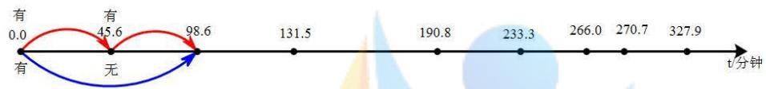
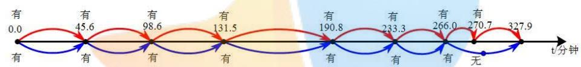

# 连铸切割的在线优化

## 摘要

本文主要针对连铸切割的问题，基于附录给出的参数、钢坯长度的要求以及用户的不同目标值，建立数学模型以制定具体的最优切割方案。

针对问题一，首先以尾坯的切割损失最小、切割长度为9.5米的根数最多以及切割长度为9.0-10.0米的根数最多建立多目标规划模型。然后，通过序贯解法，以切割损失最小为目标函数、以尾坯长度为约束求解最优，将得到的最优解看做约束条件放入第二个目标（即切割长度为9.5米的根数最多）求解最优。接着，将前两个目标的最优解看做约束条件一并放入第三个目标求解最优，得到多目标规划模型的最优解。最后，将12个尾坯长度分别带入模型，利用matlab解得不同尾坯的最优切割方案和切割损失，见表1。

针对问题二，对于第一小问，首先以钢坯的切割损失最小、切割长度为9.5米的根数最多以及切割长度为9.0-10.0米的根数最多三个目标建立多目标规划模型。然后，对除去0.8米的报废段剩下的44.8米的钢坯进行分析，利用matlab给出具体切割方案，见表2，在此基础上，将0.8米报废段附着于4.8米的最小损失段一起切除，给出具体切割方案，见表3。最后，将报废段之前还存在60.0米或64.0米长度的钢坯与所需的切割长度（45.6米）结合，得出最终的最优切割方案，见表4。

对于第二小问，首先利用问题二的模型，得到在出现新的报废段后，新一段钢坯的切割方案，见表5。基于此方案与相关的工艺参数，进一步得到实时的最优切割方案，见表6。然后，为了得到当前段钢坯切割的更优调整方案，采用两种方法求解初始切割方案。方法一：假定第 $n$ 个时间窗口 $(n\geq 3)$ ，仅第 $n - 1$ 个时间窗口无异常，其他时间窗口均有异常。得到从第3-9个窗口中每个窗口均往前2个异常时刻，除去0.8米报废段后的具体切割方案，再将7个时间段的切割方案分别加上该时间段之前每个时间单元的切割方案，得到初始切割方案，见表7。方法二：假定所有时间窗口均无异常，分别求出后7个窗口之前所有时间单元的切割方案之和即得到初始切割方案，见表9。最后，通过对比分析发现方法一所得出的切割方案更贴近调整后的切割方案。据此，将方法一得到的初始切割方案与调整后的切割方案以及切割损失情况进行整合得到所有时刻具体的最优切割方案，见表10。

针对问题三，首先根据用户要求，以钢坯的切割损失最小、切割长度为8.5米的根数最多以及切割长度为8.0-9.0米的根数最多三个目标建立多目标规划模型。然后利用问题二得出的更优方法（即方法一），得到初始切割方案与调整后的切割方案以及最终切割方案并计算出切割损失，见表14。同理得用户目标值是11.1米、目标范围是10.6-11.6米的最优切割方案，见表18。

关键词：连铸切割；多目标规划模型；对比分析；matlab

## 一、问题重述

## 1.1 问题背景

连铸 $^{[1]}$ 过程，具体流程为：钢水连续地从中间包浇入结晶器，并按照一定速度从结晶器向下拉出，然后进入二冷段。钢水经过结晶器时，与结晶器表面接触的地方形成了固态的坯壳。在二冷段中，坯壳逐渐增厚并最终凝固形成钢坯。然后，按照一定尺寸要求对钢坯进行切割。

## 1.2 问题提出

根据以上背景，以及附录中所给的参数与要求，建立数学模型，解决以下问题：

问题 1: 在满足基本要求和正常要求的条件下, 依据尾坯长度制定最优的切割方案。假定用户的目标值为 9.5 米, 目标范围为 9.0-10.0 米, 现需对以下尾坯长度: 109.0、93.4、80.9、72.0、62.7、52.5、44.9、42.7、31.6、22.7、14.5 和 13.7 (单位: 米), 按照“尾坯长度、切割方案、切割损失”等内容列表给出具体的最优切割方案。

问题 2：在结晶器出现异常时，给出下列问题实时的最优切割方案：

(1)在钢坯第1次出现报废段时，给出此段钢坯的切割方案；  
(2)在出现了新的报废段后,给出新一段钢坯的切割方案和当前段钢坯切割的调整方案,或声明不作调整。

假设结晶器出现异常的时刻在 0.0、45.6、98.6、131.5、190.8、233.3、266.0、270.7 和 327.9(单位：分钟)，用户目标值为 9.5 米，目标范围为 9.0-10.0 米。在满足基本要求和正常要求的条件下，按照“初始切割方案、调整后的切割方案、切割损失”等内容列表给出这些时刻具体的最优切割方案。

问题 3：假设实时最优切割方案和结晶器出现异常的时刻均与问题 2 相同，在满足基本要求和正常要求的条件下，分别对用户目标值为 8.5 米，目标范围为 8.0-9.0 米和用户目标值为 11.1 米，目标范围为 10.6-11.6 米两种情况按“初始切割方案、调整后的切割方案、切割损失”等内容给出具体的最优切割方案。

## 二、问题分析

## 2.1 问题一的分析

要在满足基本要求和正常要求的条件下依据尾坯长度制定出最优的切割方案，由于在切割方案中需要优先考虑切割损失，并要求切割损失（报废钢坯的长度）尽量小，其次考虑用户要求，在相同的切割损失下应尽量满足用户的目标值，因此可以建立多目标规划模型，通过序贯解法，将目标按其重要程度不同优先等级，依次转化为多个线性规划模型，以109.0米的尾坯长度为例，先以切割损失最小作为目标得出初步切割方案，再以钢坯长度为9.5米的根数最多作为目标得出进一步的切割方案，最后以钢坯长度范围在9.0-10.0米的根数最多为目标得出最终切割方案。

## 2.2 问题二的分析

首先要得到钢坯第一次出现报废段时，此段钢坯的切割方案，可以考虑到当结晶器出现异常时，结晶器内部的一段钢坯会立即报废，且切割后的钢坯在进入下道工序时不能含有报废段，如钢坯出现报废段，则可以通过离线的二次切割，使余下的钢坯符合下道工序要求的长度，因此我们可以考虑将0.8米的报废段附着在其他钢坯上，针对剩下的44.8米的钢坯，可以建立多元目标规划模型得出具体切割方案，如果具体切割方案中存在切割损失时，报废段附着在最小损失段一起切除，当不存在切割损失时，将其附着在最长段一起切割，然后再通过离线的二次切割将其与满足要求的钢坯分离。另外，当结晶器出现异常时，报废段是在结晶器中产生的，在这段报废段之前二冷段中已经产生钢坯。因为从结晶器中心到切割机工作起点处钢坯的长度是60.0米，而切割机切断一块钢坯的时间为3分钟，切割后返回到工作起点的时间为1分钟，切割机与连铸拉坯同步运动的速度为1.0米/分钟。当出现报废段时无法判断切割机所处位置，在此可以只考虑切割机在起点等待切割和刚好开始切钢坯这两种情况，所以在报废段之前还存在60.0米或64.0米长度的钢坯，然后通过模型求出60.0米和64.0米钢坯的具体切割方案，再将60.0米和64.0米钢坯的具体切割方案加上44.8米的具体切割方案，即得到钢坯第一次出现报废段时，此段钢坯的切割方案。

其次，要得到出现新的报废段后，新一段钢坯的切割方案，同理于求解钢坯第一次出现报废段时，此段钢坯的切割方案所建立的模型，考虑将0.8米的报废段附着在其他钢坯上，针对剩下的钢坯，给出具体切割方案。

接着，要求出现报废段后当前段钢坯的调整方案，方案的调整可理解为是由于这9个时刻点中某些时刻从无异常到有异常所导致的，可以采用两种方法进行求解，首先定义以每个异常时刻为时间窗口，则有9个窗口，以相邻两个异常时刻为时间单元，则有8个时间单元，对于初始切割方案的理解，方法一认为是在仅当前段钢坯的倒数第二个时间窗口无异常，且此前所有时间窗口为有异常的条件下，从第3个窗口至第9个窗口每个窗口均往前2个异常时刻计算除去0.8米报废段后的钢坯长度，得到7个钢坯长度，再根据问题二中求解钢坯第1次出现报废段时钢坯的切割方案所建立的模型求出其最优切割方案。然后，将7个时间段的切割方案分别加上该时间段之前每个时间单元的切割方案，而方法二认为在所有时间窗口均无异常的条件下，第3个窗口至第9个窗口，共7个窗口，分别求出这7个窗口的之前所有时间单元的切割方案之和。而对于调整后的切割方案的理解，两种方法都认为是在所有时间窗口均无异常的条件下，第3个窗口至第9个窗口，共7个窗口，分别求出这7个窗口的之前所有时间单元的切割方案之和。然后根据建立的模型分别求出方法一方法二的初始切割方案和调整后的切割方案，最后通过对比得出当前段钢坯的调整方案。

最后，要给出结晶器出现异常时的实时最优切割方案，由于结晶器从0.0时刻出现异常时无法判断切割机所处位置，在此只考虑切割机在起点等待切割的情况，此时从结晶器中心到切割机工作起点处钢坯的长度是60.0米，又已知连铸拉坯的速度为1.0米/分钟，所以0.0时刻出现的报废段需要经过60.0分钟才能来到工作起点，因此可以先对结晶器中心到切割机工作起点处长度为60.0米的钢坯进行切割，然后根据后面每个时间单元的最优切割方案来制定实时的最优切割方案。

## 2.3 问题三的分析

要在实时最优切割方案和结晶器出现异常的时刻均与问题二相同，且满足基本要求和正常要求的条件下，按“初始切割方案、调整后的切割方案、切割损失”分别给出对目标值为8.5米和11.1米，目标范围为8.0-9.0米和10.6-11.6米的具体最优切割方案，此题同理于问题二求解用户目标值是9.5米，目标范围是9.0-10米的具体最优切割方案所建立的模型。首先根据用户要求，以钢坯的切割损失最小、切割长度为8.5米的根数最多以及切割长度为8.0-9.0米的根数最多三个目标建立多目标规划模型。然后利用问题二得出的更优方法，根据所建立的模型解得初始切割方案与调整后的切割方案并计算出切割损失，同理得用户目标值是11.1米、目标范围是10.6-11.6米的最优切割方案。

## 三、符号说明

<table><tr><td>符号</td><td>名称</td></tr><tr><td> $a_j$ </td><td>第j种切割方案的长度</td></tr><tr><td> $x_{ij} (i=1,2,\cdots,12,j=1,2,\cdots,n)$ </td><td>第i种尾坯第j种切割方案的根数</td></tr><tr><td> $b_k (k=1,2,\cdots,12)$ </td><td>第k种尾坯的长度</td></tr><tr><td> $y_{qj} (q=1,2,\cdots,n,j=1,2,\cdots,n)$ </td><td>第q种钢坯第j种切割方案的根数</td></tr><tr><td> $c_p (p=1,2,\cdots,27)$ </td><td>第p种钢坯的长度</td></tr><tr><td>y</td><td>满足用户需求的钢坯根数</td></tr></table>

## 四、模型假设

1. 结晶器出现异常时，立即出现报废段。  
2. 结晶器在 0.0 时刻出现异常时，切割机在工作起点处等待切割。  
3.钢坯长度只保留一位小数。

## 五、模型建立与求解

## 5.1 问题一模型建立与求解

## 5.1.1 模型建立

在切割尾坯的方案中，优先考虑切割损失，要求切割损失即报废尾坯的长度尽量最小，其次考虑用户要求，在相同的切割损失下，切割出的尾坯尽量满足用户的目标值，而在目标范围内的长度也是可以接受的，一般目标范围为用户目标值 $\pm 0.5$ 米。

切割后的尾坯长度必须在4.8-12.6米之间，我们只考虑一位小数的切割情况，所以从4.8-12.6米共有79种切割长度的可能。因为下道工序能够接受的尾坯长度为8.0-11.6米，而用户要求的尾坯长度目标范围为9.0-10.0米，且当尾坯长度不在目标范围时，会产生损失。因此在切割尾坯时，在尾坯满足4.8-12.6米能运走的前提下，我们考虑的切割范围为9.0-10.0米。

因此可以建立多目标规划模型，通过序贯解法[2]度不同优先等级，依次转化为多个线性规划模型。

首先以切割损失最小作为目标得出初步切割方案，再以钢坯长度为9.5米的根数最多作为目标得出进一步的切割方案，最后以钢坯长度范围在9.0-10.0米的根数最多为目标得出最终切割方案。

具体的多目标规划模型 $^{[3]}$ 如下：

① 尾坯的切割损失最小

目标函数为:

$$
\min Z _ {1} = \sum_ {j = 1} ^ {4 2} a _ {j} x _ {1 j} + \sum_ {j = 5 4} ^ {7 9} (a _ {j} - 1 0) x _ {1 j}
$$

约束条件为:

$$
\sum_ {j = 1} ^ {7 9} a _ {j} x _ {1 j} = b _ {k}
$$

② 尾坯切割长度为9.5米的根数最多

目标函数为:

$$
\max Z _ {2} = x _ {1 j} (j = 4 8)
$$

约束条件为:

$$
\left\{ \begin{array}{l} \sum_ {j = 1} ^ {7 9} a _ {j} x _ {1 j} = b _ {k} \\ \sum_ {j = 1} ^ {4 2} a _ {j} x _ {1 j} + \sum_ {j = 5 4} ^ {7 9} (a _ {j} - 1 0) x _ {1 j} = Z _ {1} \end{array} \right.
$$

③ 尾坯切割长度为9.0-10.0米的根数最多

目标函数为:

$$
\max Z _ {3} = \sum_ {j = 4 3} ^ {5 3} x _ {1 j}
$$

约束条件为:

$$
\left\{ \begin{array}{l} \sum_ {j = 1} ^ {7 9} a _ {j} x _ {1 j} = b _ {k} \\ \sum_ {j = 1} ^ {4 2} a _ {j} x _ {1 j} + \sum_ {j = 5 4} ^ {7 9} (a _ {j} - 1 0) x _ {1 j} = Z _ {1} \\ \sum_ {j = 4 3} ^ {5 3} x _ {1 j} = Z _ {2} \end{array} \right.
$$

## 5.1.2 模型求解

由题意得:

$$
a _ {j} = [ 4. 8: 0. 1: 1 2. 6 ], b _ {1}: b _ {1 2} = [ 1 0 9, 9 3. 4, 8 0. 9, 7 2, 6 2. 7, 5 2. 5, 4 4. 9, 4 2. 7, 3 1. 6, 2 2. 7, 1 4. 5, 1 3. 7 ]
$$

利用 matlab 软件，对以上所建立的多目标规划模型分别进行求解（具体程序见附录程序 1）。

最后求得这12种长度的尾坯的最优切割方案和切割损失情况如表1所示。

表 1: 这 12 种长度的尾坯的最优切割方案和切割损失情况

<table><tr><td>尾坯长度/m</td><td>具体切割方案</td><td>切割损失/m</td><td>满足用户要求的数量/根</td></tr><tr><td>109.0</td><td>9.0m*10根、9.5m*2根</td><td>0</td><td>12</td></tr><tr><td>93.4</td><td>9.0m*2根、9.2m*2根、9.5m*6根</td><td>0</td><td>10</td></tr><tr><td>80.9</td><td>4.8m*1根、9.5m*7根、9.6m*1根</td><td>4.8</td><td>8</td></tr><tr><td>72.0</td><td>9.0m*8根</td><td>0</td><td>8</td></tr><tr><td>62.7</td><td>4.8m*1根、9.5m*4根、9.9m*1根、10.0m*1根</td><td>4.8</td><td>6</td></tr><tr><td>52.5</td><td>4.8m*1根、9.5m*4根、9.7m*1根</td><td>4.8</td><td>5</td></tr><tr><td>44.9</td><td>4.9m*1根、10.0m*4根</td><td>4.9</td><td>4</td></tr><tr><td>42.7</td><td>4.8m*1根、9.4m*1根、9.5m*3根</td><td>4.8</td><td>4</td></tr><tr><td>31.6</td><td>5.0m*1根、6.6m*1根、10.0m*2根</td><td>11.6</td><td>2</td></tr><tr><td>22.7</td><td>5.0m*1根、7.7m*1根、10.0m*1根</td><td>12.7</td><td>1</td></tr><tr><td>14.5</td><td>4.8m*1根、9.7m*1根</td><td>4.8</td><td>1</td></tr><tr><td>13.7</td><td>4.8m*1根、8.9m*1根</td><td>13.7</td><td>0</td></tr></table>

由模型求解的结果可知：①长度为109.0米、93.4米、72.0米的尾坯可以完全切割，既无切割损失又完全满足用户要求；②长度为80.9米、62.7米、52.5米、44.9米、42.7米、14.5米的尾坯通过切割既满足用户要求又使切割损失最小化，分别为4.8米和4.9米；③长度为31.6米和22.7米的尾坯在分别切完2根10.0米和1根10.0米的长度后，分别剩下11.6米和12.7米，和长度为13.7米的尾坯，这三段在要求切割长度必须大于4.8米和进入下道工序必须在8.0-11.6米的条件下，无论怎么切都无法满足用户要求，所以这三段均为切割损失；④这12种长度的尾坯切割损失共为66.9米，满足用户要求的根数共为61根。

在本问题中，长度为 13.7 米的尾坯可以切割成 4.8 米和 8.9 米,均不满足用户要求，需要报废。但在实际情况中，8.9 米满足下一道工序的长度要求，可以储存下来，虽然它不满足此用户的目标范围，但它可能满足其他用户的要求，可以将它提供给满足要求的用户，以此可以减少总的成本。

## 5.2 问题二模型建立与求解

## 5.2.1 模型建立

## （一）钢坯第1次出现报废段

由题目信息可得，结晶器首次出现异常的时刻在0.0分钟，即在钢坯最初时出现报废段，因此我们只需考虑0.0分钟至45.6分钟即下一次结晶器出现异常的时刻这之间所产生钢坯的切割方案。已知连铸拉坯的速度为1.0米/分钟，所以在这段时间内钢坯产生的总长度为45.6米（包含报废长度0.8米）。

已知切割后的钢坯在进入下道工序时不能含有报废段。当出现报废段时，需先通过切割机切断附着有报废段的钢坯，再通过离线的二次切割使余下钢坯的长度符合下道工序的要求。因此在此题中，考虑将0.8米的报废段附着在其他钢坯上，针对剩下的44.8米的钢坯，给出具体切割方案。

首先以切割损失最小作为目标得出初步切割方案，再以钢坯长度为9.5米的根数最多作为目标得出进一步的切割方案，最后以钢坯长度范围在9.0-10.0米的根数最多为目标得出最终切割方案。

建立多目标规划模型具体如下：

① 钢坯的切割损失最小

目标函数为:

$$
\min Z _ {4} = \sum_ {j = 1} ^ {4 2} a _ {j} y _ {1 j} + \sum_ {j = 5 4} ^ {7 9} (a _ {j} - 1 0) y _ {1 j}
$$

约束条件为:

$$
\sum_ {j = 1} ^ {7 9} a _ {j} y _ {1 j} = c _ {p}
$$

② 钢坯切割长度为9.5米的根数最多

目标函数为:

$$
\max Z _ {5} = y _ {1 j} (j = 4 8)
$$

约束条件为:

$$
\left\{ \begin{array}{l} \sum_ {j = 1} ^ {7 9} a _ {j} y _ {1 j} = c _ {p} \\ \sum_ {j = 1} ^ {4 2} a _ {j} y _ {1 j} + \sum_ {j = 5 4} ^ {7 9} (a _ {j} - 1 0) y _ {1 j} = Z _ {4} \end{array} \right.
$$

③ 尾坯切割长度为9.0-10.0米的根数最多

目标函数为:

$$
\max Z _ {6} = \sum_ {j = 4 3} ^ {5 3} y _ {1 j}
$$

约束条件为:

$$
\left\{ \begin{array}{l} \sum_ {j = 1} ^ {7 9} a _ {j} y _ {1 j} = c _ {p} \\ \sum_ {j = 1} ^ {4 2} a _ {j} y _ {1 j} + \sum_ {j = 5 4} ^ {7 9} (a _ {j} - 1 0) y _ {1 j} = Z _ {4} \\ \sum_ {j = 4 3} ^ {5 3} y _ {1 j} = Z _ {5} \end{array} \right.
$$

## （二）出现新的报废段

## (1) 新一段钢坯的切割方案

由问题2第（一）问已知当钢坯出现第1次报废时，所切割的长度为45.6米，即在时刻0.0至45.6分钟所产生的钢坯。当再次出现报废段则为新的报废段即在45.6分钟及以后时刻所产生。所以我们在此问中所要解决的钢坯切割方案分别为在时刻45.6至98.6分钟、98.6至131.5分钟、131.5至190.8分钟、190.8至233.3分钟、233.3至266.0分钟、266.0至270.7分钟、270.0至327.9分钟所生产的钢坯，即长度分别为53米、32.9米、59.3米、42.5米、32.7米、4.7米、57.2米（包含报废段）。

为了减少损失，考虑到报废段可以附着在其他钢坯上，因此先确定去除了报废段后其他钢坯的最优切割方案，通过分析题意此方案会出现两种情况：①存在切割损失；②不存在切割损失。当存在切割损失时，报废段附着在最小损失段一起切除；当不存在切割损失时，将其附着在最长段一起切割，然后再通过离线的二次切割将其与满足要求的钢坯分离。

由此，可以先考虑长度为 44.8 米、52.2 米、32.1 米、58.5 米、41.7 米、31.9 米和 56.4 米的钢坯最优切割方案，然后再将报废段附着在其中一条钢坯上。要求这些长度的钢坯的最优切割方案，建立了多目标规划模型，与问题二中求解钢坯第 1 次出现报废段时钢坯的切割方案所建立的模型相同。

## (2) 当前段钢坯切割的调整方案

根据题目进行分析，方案的调整可理解为是由于这9个时刻点中某些时刻从无异常到有异常所导致的，可以采用以下两种方法进行求解。

定义：以每个异常时刻为时间窗口，则有9个窗口；以相邻两个异常时刻为时间单元，则有8个时间单元。

方法一：

初始切割方案：假定从第 n 个时间窗口开始 $(n \geq 3)$ ，仅第 n-1 个时间窗口无异常，第 $n - 1$ 个时间窗口前的所有时间窗口均有异常。先从第3个窗口至第9个窗口每个窗口均往前2个异常时刻计算除去0.8米报废段后的钢坯长度，得到7个钢坯长度，再根据问题二中求解钢坯第1次出现报废段时钢坯的切割方案所建立的模型求出其最优切割方案。然后，将7个时间段的切割方案分别加上该时间段之前每个时间单元的切割方案。

调整后的切割方案：假定所有时间窗口均有异常，从第3个窗口至第9个窗口，共有7个窗口，分别求出这7个窗口之前所有时间单元的切割方案之和。

以第 2 个时间窗口与第 8 个时间窗口为例，蓝色线条为初始切割方案，红色线条为调整后的切割方案（图中“有”代表所在窗口有异常，“无”代表所在窗口无异常）。



<details>
<summary>state_timeline</summary>

| Time (t/分钟) | State | Value |
| --- | --- | --- |
| 0.0 | 有 | 0.0 |
| 45.6 | 有 | 45.6 |
| 98.6 | 无 | 98.6 |
| 131.5 | — | 131.5 |
| 190.8 | — | 190.8 |
| 233.3 | — | 233.3 |
| 266.0 | — | 266.0 |
| 270.7 | — | 270.7 |
| 327.9 | — | 327.9 |
</details>

图 1: 第 2 个时间窗口导致的方案调整



<details>
<summary>state_timeline</summary>

| Stage | Value |
| --- | --- |
| 1 | 0.0 |
| 2 | 45.6 |
| 3 | 98.6 |
| 4 | 131.5 |
| 5 | 190.8 |
| 6 | 233.3 |
| 7 | 266.0 |
| 8 | 270.7 |
| 9 | 327.9 |
</details>

图 2: 第 8 个时间窗口导致的方案调整

方法二：

初始切割方案：假定所有时间窗口均无异常，从第3个窗口至第9个窗口，共有7个窗口，分别求出这7个窗口之前所有时间单元的切割方案之和。

调整后的切割方案：假定所有时间窗口均有异常，从第3个窗口至第9个窗口，共有7个窗口，分别求出这7个窗口之前所有时间单元的切割方案之和。

## 5.2.2 模型求解

## （一）钢坯第1次出现报废段

由题意得：

$$
a _ {j} = [ 4. 8: 0. 1: 1 2. 6 ], c _ {1}: c _ {9} = [ 4 4. 8, 5 2. 2, 3 2. 1, 5 8. 5, 4 1. 7, 3 1. 9, 5 6. 4, 6 0, 6 4 ]
$$

利用 matlab 软件，对上述建立的多目标规划模型分别进行求解（具体程序见附录程序 2）。

最后得出钢坯第 1 次出现报废段时所产生的 44.8 米钢坯的最优切割方案和切割损失情况如表 2 所示。

表 2: 44.8 米长度钢坯的切割方案和切割损失情况

<table><tr><td>钢坯长度(不含报废段)/m</td><td>具体切割方案</td><td>切割损失/m</td><td>满足用户要求的数量/根</td></tr><tr><td>44.8</td><td>4.8m*1 根、10.0m*4 根</td><td>4.8</td><td>4</td></tr></table>

由模型求解结果可知，第一段含报废段的钢坯被切割成了5根，其中满足用户要求的有 4 根即 10.0m\*4 根。而剩下 1 根 4.8m 的钢坯，由于长度未达到 8m 无法进入下道工序，只能全部报废（即属于此方案的切割损失）。因此，可以将 0.8 米的报废段附着在此钢坯上一起切割，最优的切割方案如表 3 所示：

表 3: 45.6 米长度钢坯的最优切割方案和切割损失情况

<table><tr><td>钢坯长度(含报废段)/m</td><td>最优切割方案</td><td>切割损失/m</td><td>满足用户要求的数量/根</td></tr><tr><td>45.6</td><td>5.6m*1 根、10.0m*4 根</td><td>5.6</td><td>4</td></tr></table>

当结晶器出现异常时，报废段是在结晶器中产生的，在这段报废段之前二冷段中已经产生钢坯。因为从结晶器中心到切割机工作起点处钢坯的长度是60.0米，而切割机切断一块钢坯的时间为3分钟，切割后返回到工作起点的时间为1分钟，切割机与连铸拉坯同步运动的速度为1.0米/分钟。当出现报废段时无法判断切割机所处位置，在此我们只考虑切割机等待和刚好开始切钢坯这两种情况，所以在报废段之前还存在60米或64米长度的钢坯，然后通过模型求出60米和64米钢坯的具体切割方案（具体程序见附录程序3），再将60.0米和64.0米钢坯的具体切割方案加上44.8米的具体切割方案，即得到钢坯第一次出现报废段时，此段钢坯的切割方案。利用matlab软件求解，得出的最优切割方案和切割损失情况如表4所示。

表 4: 105.6 米和 109.6 米长度钢坯的最优切割方案和切割损失情况

<table><tr><td>钢坯长度(含报废段)/m</td><td>最优切割方案</td><td>切割损失/m</td><td>满足用户要求的数量/根</td></tr><tr><td>105.6</td><td>5.6m*1 根、10.0m*10 根</td><td>5.6</td><td>10</td></tr><tr><td>109.6</td><td>5.6m*1 根、9m*5 根、9.5m*2 根、10.0m*4 根</td><td>5.6</td><td>11</td></tr></table>

## （二）出现新的报废段

## (1) 新一段钢坯的切割方案

利用matlab软件，对建立的多目标规划模型分别进行求解，得到7个时间单元的具体切割方案（具体程序见附录程序2）。

注明：由于第7个时间单元的钢坯长度为4.7米（含一个报废段），不满足切割后的钢坯长度必须在4.8-12.6米之间的基本要求，若在此段进行切割，则会出现无法运走阻碍生产的情况，因此将第7个时间单元的钢坯长度（4.7米）与第8个时间单元的报废段（0.8米）结合切割，固定此切割方案，即第7个时间单元的钢坯长度为5.5米。

最后得出钢坯出现新的报废段时 8 个时间单元的最优切割方案和切割损失情况如表 5 所示。

表 5：新的报废段时 8 个时间单元的最优切割方案和切割损失情况

<table><tr><td>钢坯长度(不含报废段)/m</td><td>具体切割方案</td><td>切割损失/m</td><td>包含报废段的切割损失/m</td><td>满足用户要求的数量/根</td></tr><tr><td>44.8</td><td>4.8m*1根、10.0m*4根</td><td>4.8</td><td>5.6</td><td>4</td></tr><tr><td>52.2</td><td>4.8m*1根、9.4m*1根、9.5m*4根</td><td>4.8</td><td>5.6</td><td>5</td></tr><tr><td>32.1</td><td>4.8m*1根、9.1m*3根</td><td>4.8</td><td>5.6</td><td>3</td></tr><tr><td>58.5</td><td>9.5m*3根、10.0m*3根</td><td>0</td><td>0.8</td><td>6</td></tr><tr><td>41.7</td><td>4.8m*1根、9.0m*1根、9.2m*2根、9.5m*1根</td><td>4.8</td><td>5.6</td><td>4</td></tr><tr><td>31.9</td><td>4.8m*1根、9.0m*2根、9.1m*1根</td><td>4.8</td><td>5.6</td><td>3</td></tr><tr><td>5.5</td><td>5.5m*1根</td><td>5.5</td><td>5.5</td><td>0</td></tr><tr><td>56.4</td><td>9.2m*2根、9.5m*4根</td><td>0</td><td>0</td><td>6</td></tr></table>

假设切割机在 0.0 时刻就在起点处等待切割。因为在 0.0 时刻结晶器出现异常，从结晶器中心到切割机工作起点处钢坯的长度是 60.0 米。已知连铸拉坯的速度为 1.0 米/分钟，所以 0.0 时刻出现的报废段需要经过 60.0 分钟才能来到工作起点。

首先对结晶器中心到切割机工作起点处长度为 60.0 米的钢坯进行切割，然后根据表 4 中每个时间单元的最优切割方案制定实时的最优切割方案，如表 6 所示（表中时间段为开始切割至此段钢坯切割结束的时间）。

表 6: 钢坯的实时最优切割方案

<table><tr><td>时间段/分钟</td><td>切割方案/m</td><td>时间段/分钟</td><td>切割方案/m</td><td>时间段/分钟</td><td>切割方案/m</td></tr><tr><td>10.0-13.0</td><td>10.0</td><td>149.1-152.1</td><td>9.5</td><td>283.8-286.8</td><td>9.2</td></tr><tr><td>20.0-23.0</td><td>10.0</td><td>158.6-161.6</td><td>9.5</td><td>293.3-296.3</td><td>9.5</td></tr><tr><td>30.0-33.0</td><td>10.0</td><td>164.2-167.2</td><td>5.6</td><td>298.9-301.9</td><td>5.6</td></tr><tr><td>40.0-43.0</td><td>10.0</td><td>173.3-176.3</td><td>9.1</td><td>307.9-310.9</td><td>9.0</td></tr><tr><td>50.0-53.0</td><td>10.0</td><td>182.4-185.4</td><td>9.1</td><td>316.9-319.9</td><td>9.0</td></tr><tr><td>60.0-63.0</td><td>10.0</td><td>191.5-194.5</td><td>9.1</td><td>326.0-329.0</td><td>9.1</td></tr><tr><td>65.6-68.6</td><td>5.6</td><td>201.0-203.0</td><td>9.5</td><td>331.5-334.5</td><td>5.5</td></tr><tr><td>75.6-78.6</td><td>10.0</td><td>210.5-213.5</td><td>9.5</td><td>340.7-343.7</td><td>9.2</td></tr><tr><td>85.6-88.6</td><td>10.0</td><td>220.0-223.0</td><td>9.5</td><td>349.9-352.9</td><td>9.2</td></tr><tr><td>95.6-98.6</td><td>10.0</td><td>230.8-233.8</td><td>10.8</td><td>359.4-362.4</td><td>9.5</td></tr><tr><td>105.6-108.6</td><td>10.0</td><td>240.8-243.8</td><td>10.0</td><td>368.9-371.9</td><td>9.5</td></tr><tr><td>111.2-114.2</td><td>5.6</td><td>250.8-253.8</td><td>10.0</td><td>378.4-381.4</td><td>9.5</td></tr><tr><td>120.6-123.6</td><td>9.4</td><td>256.4-259.4</td><td>5.6</td><td>387.9-390.9</td><td>9.5</td></tr><tr><td>130.1-133.1</td><td>9.5</td><td>265.4-268.4</td><td>9.0</td><td></td><td></td></tr><tr><td>139.6-142.6</td><td>9.5</td><td>274.6-277.6</td><td>9.2</td><td></td><td></td></tr></table>

由上表可得：①切割完这些长度的钢坯共需时间390.9分钟；②在230.8-233.8时间段切割的10.8米钢坯是由结晶器在131.5时刻产生的0.8米的报废段附着在10.0米的钢坯上产生的。后续需要通过离线的二次切割切除报废段。

(2) 当前段钢坯切割的调整方案

方法一：

由题意得:

$$
a _ {j} = [ 4. 8: 0. 1: 1 2. 6 ], c _ {1 0}: c _ {1 6} = [ 9 7. 8 8 5. 1 9 1. 4 1 0 1 7 4. 4 3 1. 9 5 6. 4 ]
$$

初始切割方案的计算：利用matlab软件，对问题二第（一）小问建立的模型进行求解，得到从第3个窗口至第9个窗口每个窗口均往前2个异常时刻计算除去0.8米报废段后的钢坯长度的具体切割方案（具体程序见附录程序4)，然后，将7个时间段的切割方案分别加上该时间段之前每个时间单元的切割方案，具体见表7。

表 7: 当前 7 个时间段钢坯的初始切割方案情况

<table><tr><td>时刻/分钟</td><td>初始切割方案</td><td>切割损失/m</td><td>含报废段的切割损失/m</td><td>满足用户要求的数量/根</td></tr><tr><td>0.0-98.6</td><td>9.5m*4根、9.8m*1根、10.0m*5根</td><td>0</td><td>0.8</td><td>10</td></tr><tr><td>0.0-131.5</td><td>4.8m*1根、9.1m*1根、9.5m*8根、10m*4根</td><td>4.8</td><td>6.4</td><td>13</td></tr><tr><td>0.0-190.8</td><td>4.8m*2根、9.0m*6根、9.2m*2根、9.4m*1根、9.5m*6根、10m*4根</td><td>9.6</td><td>12.0</td><td>19</td></tr><tr><td>0.0-233.3</td><td>4.8m*3根、9.0m*7根、9.1m*3根、9.4m*1根、9.5m*8根、10m*4根</td><td>14.4</td><td>17.6</td><td>23</td></tr><tr><td>0.0-266.0</td><td>4.8m*3根、9.0m*2根、9.1m*3根、9.2m*2根、9.4m*1根、9.5m*11根、10m*7根</td><td>14.4</td><td>18.4</td><td>26</td></tr><tr><td>0.0-270.7</td><td>4.8m*5根、5.5m*1根、9.0m*3根、9.1m*4根、9.2m*2根、9.4m*1根、9.5m*8根、10m*7根</td><td>29.5</td><td>33.5</td><td>25</td></tr><tr><td>0.0-327.9</td><td>4.8m*5根、5.5m*1根、9.0m*3根、9.1m*4根、9.2m*4根、9.4m*1根、9.5m*12根、10m*7根</td><td>29.5</td><td>33.5</td><td>31</td></tr></table>

调整后的切割方案的计算：假定所有时间窗口均有异常，从第3个窗口至第9个窗口，共有7个窗口，分别求出这7个窗口之前所有时间单元的切割方案之和，即利用表5的数据得到调整后的切割方案情况，具体如表8所示。

表 8: 当前 7 个时间段钢坯的调整后的切割方案情况

<table><tr><td>时刻/分钟</td><td>调整后的切割方案</td><td>切割损失/m</td><td>包含报废段的切割损失/m</td><td>满足用户要求的数量/根</td></tr><tr><td>0.0-98.6</td><td>4.8m*2 根、9.4m*1 根、9.5m*4 根、10.0m*4 根</td><td>9.6</td><td>11.2</td><td>9</td></tr><tr><td>0.0-131.5</td><td>4.8m*3 根、9.1m*3 根、9.4m*1 根、9.5m*4 根、10m*4 根</td><td>14.4</td><td>16.8</td><td>12</td></tr><tr><td>0.0-190.8</td><td>4.8m*3 根、9.1m*3 根、9.4m*1 根、9.5m*7 根、10m*7 根</td><td>14.4</td><td>17.6</td><td>18</td></tr><tr><td>0.0-233.3</td><td>4.8m*4 根、9.0m*1 根、9.1m*3 根、9.2m*2 根、9.4m*1 根、9.5m*8 根、10m*7 根</td><td>19.2</td><td>23.2</td><td>22</td></tr><tr><td>0.0-266.0</td><td>4.8m*5 根、9.0m*3 根、9.1m*4 根、9.2m*2 根、9.4m*1 根、9.5m*8 根、10m*7 根</td><td>24</td><td>28.8</td><td>25</td></tr><tr><td>0.0-270.7</td><td>4.8m*5 根、5.5m*1 根、9.0m*3 根、9.1m*4 根、9.2m*2 根、9.4m*1 根、9.5m*8 根、10m*7 根</td><td>29.5</td><td>34.3</td><td>25</td></tr><tr><td>0.0-327.9</td><td>4.8m*5 根、5.5m*1 根、9.0m*3 根、9.1m*4 根、9.2m*4 根、9.4m*1 根、9.5m*12 根、10m*7 根</td><td>29.5</td><td>34.3</td><td>31</td></tr></table>

方法二：

$$
\text {由题意得:} a _ {j} = [ 4. 8: 0. 1: 1 2. 6 ], c _ {1 7}: c _ {2 3} = [ 9 8. 6 1 3 1. 5 1 9 0. 8 2 3 3. 3 2 6 6 2 7 0. 7 3 2 7. 9 ]
$$

初始切割方案的计算：利用matlab软件，对建立的多目标规划模型分别进行求解，初始切割方案，即假定所有时间窗口均无异常，从第3个窗口至第9个窗口，共有7个窗口，分别求出这7个窗口之前所有时间单元的切割方案，具体如表9所示。（具体程序见附录程序5）

表 9: 方法二当前 7 个时间段钢坯的初始切割方案情况

<table><tr><td>时刻/分钟</td><td>初始切割方案</td><td>切割损失/m</td><td>包含报废段的切割损失/m</td><td>满足用户要求的数量/根</td></tr><tr><td>0.0-98.6</td><td>9.5m*2根、9.6m*1根、10.0m*7根</td><td>0</td><td>0</td><td>10</td></tr><tr><td>0.0-131.5</td><td>9.0m*3根、9.5m*11根</td><td>0</td><td>0</td><td>14</td></tr><tr><td>0.0-190.8</td><td>9.5m*18根、9.8m*1根、10m*1根</td><td>0</td><td>0</td><td>20</td></tr><tr><td>0.0-233.3</td><td>9.0m*7根、9.1m*1根、9.2m*1根、9.5m*16根</td><td>0</td><td>0</td><td>25</td></tr><tr><td>0.0-266.0</td><td>9.5m*28根</td><td>0</td><td>0</td><td>28</td></tr><tr><td>0.0-270.7</td><td>9.0m*9根、9.2m*1根、9.5m*19根</td><td>0</td><td>0</td><td>29</td></tr><tr><td>0.0-327.9</td><td>9.0m*8根、9.2m*2根、9.5m*25根</td><td>0</td><td>0</td><td>35</td></tr></table>

将方法二所得的初始切割方案（表9）与调整后的切割方案（表8）进行对比分析，发现这7个时间单位的初始切割方案均与调整后的切割方案不同，不是最优切割方案，所以均需要调整，按照表4中的调整后的切割方案进行切割。

对比方法一与方法二求解出的新一段钢坯的初始切割方案，发现方法一所得出的切割方案更贴近调整后的切割方案，因此方法一比方法二更加满足题目要求，更加优化。

所以对方法一求解得到的钢坯的初始切割方案、调整后的切割方案及切割损失情况进行整合，得到了所有时刻具体的最优切割方案，如表 10 所示。

表 10: 当前 7 个时间段钢坯的初始切割方案、调整后的切割方案及切割损失情况

<table><tr><td>时刻/分钟</td><td>初始切割方案</td><td>调整后的切割方案</td><td>切割损失/m</td><td>最终的切割方案</td></tr><tr><td>0.0-98.6</td><td>9.5m*4根、9.8m*1根、10.0m*5根</td><td>4.8m*2根、9.4m*1根、9.5m*4根、10.0m*4根</td><td>9.6</td><td>4.8m*2根、9.4m*1根、9.5m*4根、10.0m*4根</td></tr><tr><td>0.0-131.5</td><td>4.8m*1根、9.1m*1根、9.5m*8根、10m*4根</td><td>4.8m*3根、9.1m*3根、9.4m*1根、9.5m*4根、10m*4根</td><td>14.4</td><td>4.8m*3根、9.1m*3根、9.4m*1根、9.5m*4根、10m*4根</td></tr><tr><td>0.0-190.8</td><td>4.8m*2根、9.0m*6根、9.2m*2根、9.4m*1根、9.5m*6根、10m*4根</td><td>4.8m*3根、9.1m*3根、9.4m*1根、9.5m*7根、10m*7根</td><td>14.4</td><td>4.8m*3根、9.1m*3根、9.4m*1根、9.5m*7根、10m*7根</td></tr><tr><td>0.0-233.3</td><td>4.8m*3根、9.0m*7根、9.1m*3根、9.4m*1根、9.5m*8根、10m*4根</td><td>4.8m*4根、9.0m*1根、9.1m*3根、9.2m*2根、9.4m*1根、、9.5m*8根、10m*7根</td><td>19.2</td><td>4.8m*4根、9.0m*1根、9.1m*3根、9.2m*2根、9.4m*1根、、9.5m*8根、10m*7根</td></tr><tr><td>0.0-266.0</td><td>4.8m*3根、9.0m*2根、9.1m*3根、9.2m*2根、9.4m*1根、9.5m*11根、10m*7根</td><td>4.8m*5根、9.0m*3根、9.1m*4根、9.2m*2根、9.4m*1根、9.5m*8根、10m*7根</td><td>24</td><td>4.8m*5根、9.0m*3根、9.1m*4根、9.2m*2根、9.4m*1根、9.5m*8根、10m*7根</td></tr><tr><td>0.0-270.7</td><td>4.8m*5根、5.5m*1根、9.0m*3根、9.1m*4根、9.2m*2根、9.4m*1根、9.5m*8根、10m*7根</td><td>4.8m*5根、5.5m*1根、9.0m*3根、9.1m*4根、9.2m*2根、9.4m*1根、9.5m*8根、10m*7根</td><td>29.5</td><td>不作调整</td></tr><tr><td>0.0-327.9</td><td>4.8m*5根、5.5m*1根、9.0m*3根、9.1m*4根、9.2m*4根、9.4m*1根、9.5m*12根、10m*7根</td><td>4.8m*5根、5.5m*1根、9.0m*3根、9.1m*4根、9.2m*4根、9.4m*1根、9.5m*12根、10m*7根</td><td>29.5</td><td>不作调整</td></tr></table>

通过分析表 10，即当前 7 个时间单元钢坯的初始切割方案和调整后的切割方案可知：①在出现新的报废段后，前 5 个时间单元的当前段钢坯切割方案不同，需要调整，以表 10 中调整后的切割方案为标准进行切割；②在出现新的报废段后，后 2 个时间单元的当前段钢坯切割方案相同，则不需要调整。

## 5.3 问题三模型建立与求解

## 5.3.1 模型建立

## （一）用户目标值是8.5米，目标范围是8.0-9.0米

此问题建立的模型与问题二所建立的模型原理一致，首先以切割损失最小作为目标得出初步切割方案，再以钢坯长度为8.5米的根数最多作为目标得出进一步的切割方案，最后以钢坯长度范围在8.0-9.0米的根数最多为目标得出最终切割方案。

建立多目标规划模型具体如下：

①钢坯的切割损失最小

目标函数为:

$$
\min Z _ {7} = \sum_ {j = 1} ^ {3 2} a _ {j} y _ {1 j} + \sum_ {j = 4 4} ^ {7 9} (a _ {j} - 9) y _ {1 j}
$$

约束条件为:

$$
\sum_ {j = 1} ^ {7 9} a _ {j} y _ {1 j} = c _ {p}
$$

②钢坯切割长度为8.5米的根数最多

目标函数为:

$$
\max Z _ {8} = y _ {1 j} (j = 3 8)
$$

约束条件为:

$$
\left\{ \begin{array}{l} \sum_ {j = 1} ^ {7 9} a _ {j} y _ {1 j} = c _ {p} \\ \sum_ {j = 1} ^ {3 2} a _ {j} y _ {1 j} + \sum_ {j = 4 4} ^ {7 9} (a _ {j} - 9) y _ {1 j} = Z _ {7} \end{array} \right.
$$

③尾坯切割长度为8.0-9.0米的根数最多目标函数为：

$$
\max Z _ {9} = \sum_ {j = 3 3} ^ {4 3} y _ {1 j}
$$

约束条件为:

$$
\left\{ \begin{array}{l} \sum_ {j = 1} ^ {7 9} a _ {j} y _ {1 j} = c _ {p} \\ \sum_ {j = 1} ^ {3 2} a _ {j} y _ {1 j} + \sum_ {j = 4 4} ^ {7 9} (a _ {j} - 9) y _ {1 j} = Z _ {7} \\ \sum_ {j = 3 3} ^ {4 3} y _ {1 j} = Z _ {8} \end{array} \right.
$$

## （二）用户目标值是11.1米，目标范围是10.6-11.6米

此问题建立的模型与用户目标值是8.5米，目标范围是8.0-9.0米所建立的模型原理一致，首先以切割损失最小作为目标得出初步切割方案，再以钢坯长度为11.1米的根数最多作为目标得出进一步的切割方案，最后以钢坯长度范围在10.6-11.6米的根数最多为目标得出最终切割方案。

建立多目标规划模型具体如下：

①钢坯的切割损失最小

目标函数为:

$$
\min Z _ {1 0} = \sum_ {j = 1} ^ {5 8} a _ {j} y _ {1 j} + \sum_ {j = 7 0} ^ {7 9} (a _ {j} - 1 1. 6) y _ {1 j}
$$

约束条件为:

$$
\sum_ {j = 1} ^ {7 9} a _ {j} y _ {1 j} = c _ {p}
$$

②钢坯切割长度为11.1米的根数最多

目标函数为:

$$
\max Z _ {1 1} = y _ {1 j} (j = 6 4)
$$

约束条件为：

$$
\left\{ \begin{array}{l} \sum_ {j = 1} ^ {7 9} a _ {j} y _ {1 j} = c _ {p} \\ \sum_ {j = 1} ^ {5 8} a _ {j} y _ {1 j} + \sum_ {j = 7 0} ^ {7 9} \big (a _ {j} - 1 1. 6 \big) y _ {1 j} = Z _ {1 0} \end{array} \right.
$$

③尾坯切割长度为10.6-11.6米的根数最多

目标函数为:

$$
\max Z _ {1 2} = \sum_ {j = 5 9} ^ {6 9} y _ {1 j}
$$

约束条件为:

$$
\left\{ \begin{array}{l} \sum_ {j = 1} ^ {7 9} a _ {j} y _ {1 j} = c _ {p} \\ \sum_ {j = 1} ^ {5 8} a _ {j} y _ {1 j} + \sum_ {j = 7 0} ^ {7 9} (a _ {j} - 1 1. 6) y _ {1 j} = Z _ {1 0} \\ \sum_ {j = 5 9} ^ {6 9} y _ {1 j} = Z _ {1 1} \end{array} \right.
$$

## 5.3.2 模型求解

## （一）满足用户目标值是8.5米，目标范围是8.0-9.0米的钢坯切割方案

由题意得:

$$
a _ {j} = [ 4. 8: 0. 1: 1 2. 6 ], c _ {1}: c _ {7} = [ 4 4. 8, 5 2. 2, 3 2. 1, 5 8. 5, 4 1. 7, 3 1. 9, 5 6. 4 ]
$$

利用 matlab 软件，对建立的多目标规划模型分别进行求解，得到 7 个时间单元的具体切割方案（具体程序见附录程序 6）。

结合已知的第七个时间单元为固定的 5.5 米切割，最后得出钢坯出现新的报废段时 8 个时间单元的最优切割方案和切割损失情况如表 11 所示。

表 11：出现新的报废段时 8 个时间单元的最优切割方案和切割损失情况

<table><tr><td>钢坯长度(不含报废段)/m</td><td>具体切割方案</td><td>切割损失/m</td><td>包含报废段的切割损失/m</td><td>满足用户要求的数量/根</td></tr><tr><td>44.8</td><td>8.8m*1 根、9m*4 根</td><td>0</td><td>0.8</td><td>5</td></tr><tr><td>52.2</td><td>8.5m*3 根、8.7m*1 根、9.0m*2 根</td><td>0</td><td>0.8</td><td>6</td></tr><tr><td>32.1</td><td>8.0m*3 根、8.1m*1 根</td><td>0</td><td>0.8</td><td>4</td></tr><tr><td>58.5</td><td>8.0m*2 根、8.5m*5 根</td><td>0</td><td>0.8</td><td>7</td></tr><tr><td>41.7</td><td>8.0m*1 根、8.2m*1 根、8.5m*3 根</td><td>0</td><td>0.8</td><td>5</td></tr><tr><td>31.9</td><td>4.9m*1 根、9.0m*3 根</td><td>4.9</td><td>5.7</td><td>3</td></tr><tr><td>5.5</td><td>5.5m*1 根</td><td>5.5</td><td>5.5</td><td>0</td></tr><tr><td>56.4</td><td>8.0m*5 根、8.2m*2 根</td><td>0</td><td>0</td><td>7</td></tr></table>

由题意得:

$$
a _ {j} = \left[ 4. 8: 0. 1: 1 2. 6 \right], c _ {1 0}: c _ {1 6} = \left[ 9 7. 8 8 5. 1 9 1. 4 1 0 1 7 4. 4 3 1. 9 5 6. 4 \right]
$$

初始切割方案的计算：利用 matlab 软件，对建立的多元目标规划模型进行求解，得到从第 3 个窗口至第 9 个窗口每个窗口均往前 2 个异常时刻计算除去 0.8 米报废段后的钢坯长度的具体切割方案（具体程序见附录程序 7），然后，将 7 个时间段的切割方案分别加上该时间段之前每个时间单元的切割方案，具体见附录表 12。

调整后的切割方案的计算：假定所有时间窗口均有异常，从第3个窗口至第9个窗口，共有7个窗口，分别求出这7个窗口之前所有时间单元的切割方案之和，即利用表11数据得到调整后的切割方案情况，具体见附录表13。

对求解得到的钢坯的初始切割方案、调整后的切割方案及切割损失情况进行整合，得到了所有时刻具体的最优切割方案，如表 14 所示。

表 14: 当前 7 个时间段钢坯的初始切割方案、调整后的切割方案及切割损失情况

<table><tr><td>时刻/分钟</td><td>初始切割方案</td><td>调整后的切割方案</td><td>切割损失/m</td><td>最终的切割方案</td></tr><tr><td>0.0-98.6</td><td>8.0m*7根、8.1m*1根、8.2m*1根、8.5m*3根</td><td>8.5m*3根、8.7m*1根、8.8m*1根、9.0m*6根</td><td>0</td><td>8.5m*3根、8.7m*1根、8.8m*1根、9.0m*6根</td></tr><tr><td>0.0-131.5</td><td>8.5m*9根、8.6m*1根、8.8m*1根、9.0m*4根</td><td>8.0m*3根、8.1m*1根、8.5m*3根、8.7m*1根、8.8m*1根、9.0m*6根</td><td>0</td><td>8.0m*3根、8.1m*1根、8.5m*3根、8.7m*1根、8.8m*1根、9.0m*6根</td></tr><tr><td>0.0-190.8</td><td>8.0m*3根、8.2m*2根、8.5m*9根、8.7m*1根、8.8m*1根、9.0m*6根、</td><td>8.0m*5根、8.1m*1根、8.5m*8根、8.7m*1根、8.8m*1根、9.0m*6根</td><td>0</td><td>8.0m*5根、8.1m*1根、8.5m*8根、8.7m*1根、8.8m*1根、9.0m*6根</td></tr><tr><td>0.0-233.3</td><td>8.0m*5根、8.1m*1根、8.5m*13根、8.7m*1根、8.8m*1根、9.0m*6根</td><td>8.0m*6根、8.1m*1根、8.2m*1根8.5m*11根、8.7m*1根、8.8m*1根、9.0m*6根</td><td>0</td><td>8.0m*6根、8.1m*1根、8.2m*1根8.5m*11根、8.7m*1根、8.8m*1根、9.0m*6根</td></tr><tr><td>0.0-266.0</td><td>8.0m*8根、8.1m*1根、8.2m*2根、8.5m*12根、8.7m*1根、8.8m*1根、9.0m*6根</td><td>4.9m*1根、8.0m*6根、8.1m*1根、8.2m*1根、8.5m*11根、8.7m*1根、8.8m*1根、9.0m*9根</td><td>4.9</td><td>4.9m*1根、8.0m*6根、8.1m*1根、8.2m*1根、8.5m*11根、8.7m*1根、8.8m*1根、9.0m*9根</td></tr><tr><td>0.0-270.7</td><td>4.9m*1根、5.5m*1根、8.0m*6根、8.1m*1根、8.2m*1根、8.5m*11根、8.7m*1根、8.8m*1根、9.0m*9根</td><td>4.9m*1根、5.5m*1根、8.0m*6根、8.1m*1根、8.2m*1根、8.5m*11根、8.7m*1根、8.8m*1根、9.0m*9根</td><td>10.4</td><td>不作调整</td></tr><tr><td>0.0-327.9</td><td>4.9m*1根、5.5m*1根、8.0m*11根、8.1m*1根、8.2m*3根、8.5m*11根、8.7m*1根、8.8m*1根、9.0m*9根</td><td>4.9m*1根、5.5m*1根、8.0m*11根、8.1m*1根、8.2m*3根、8.5m*11根、8.7m*1根、8.8m*1根、9.0m*9根</td><td>10.4</td><td>不作调整</td></tr></table>

通过对比分析表 14，即当前 7 个时间单元钢坯的初始切割方案和调整后的切割方案可知：①在出现新的报废段后，前 5 个时间窗口的当前段钢坯切割方案不同，需要调整，以表 14 中调整后的最终切割方案为标准进行切割；②在出现新的报废段后，后 2 个时间单元的当前段钢坯切割方案相同，则不需要调整。

## （二）满足用户目标值是11.1米，目标范围是10.6-11.6米的钢坯切割方案

由题意得:

$$
a _ {j} = [ 4. 8: 0. 1: 1 2. 6 ]
$$

$$
c _ {1}: c _ {1 6} = \left[ 4 4. 8, 5 2. 2, 3 2. 1, 5 8. 5, 4 1. 7, 3 1. 9, 5 6. 4, 9 7. 8, 8 5. 1, 9 1. 4, 1 0 1, 7 4. 4, 3 1. 9, 5 6. 4 \right]
$$

同理可得，利用 matlab 软件，对建立的多目标规划模型分别进行求解，得到 7 个时间单元的具体切割方案。

钢坯出现新的报废段时，用户目标值是11.1米，目标范围是10.6-11.6米的8个时间单元的最优切割方案和切割损失情况、初始切割方案和调整后的切割方案如表15（具体程序见附录程序8）、表16（具体程序见附录程序9）和表17所示，具体表格数据见附录。

对求解得到的钢坯的初始切割方案、调整后的切割方案及切割损失情况进行整合，得到了所有时刻具体的最优切割方案，如表 18 所示。

表 18：当前 7 个时间段钢坯的初始切割方案、调整后的切割方案及切割损失情况

<table><tr><td>时刻/分钟</td><td>初始切割方案</td><td>调整后的切割方案</td><td>切割损失/m</td><td>最终的切割方案</td></tr><tr><td>0.0-98.6</td><td>10.6m*3根、10.8m*2根、11.1m*4根</td><td>5.8m*1根、11.1m*3根、11.5m*1根、11.6m*4根</td><td>5.8</td><td>5.8m*1根、11.1m*3根、11.5m*1根、11.6m*4根</td></tr><tr><td>0.0-131.5</td><td>10.6m*5根、10.7m*3根、11.1m*3根、11.5m*1根</td><td>5.8m*1根、10.7m*3根、11.1m*3根、11.5m*1根、11.6m*4根</td><td>5.8</td><td>5.8m*1根、10.7m*3根、11.1m*3根、11.5m*1根、11.6m*4根</td></tr><tr><td>0.0-190.8</td><td>5.8m*1根、11.1m*5根、11.2m*1根、11.5m*1根、11.6m*9根</td><td>4.8m*1根、5.8m*1根、10.6m*3根、10.7m*3根、10.8m*1根、11.1m*4根、11.5m*1根、11.6m*4根</td><td>10.6</td><td>4.8m*1根、5.8m*1根、10.6m*3根、10.7m*3根、10.8m*1根、11.1m*4根、11.5m*1根、11.6m*4根</td></tr><tr><td>0.0-233.3</td><td>5.8m*1根、10.7m*3根、11.1m*9根、11.2m*1根、11.5m*1根、11.6m*1根</td><td>4.8m*1根、5.8m*1根、6.9m*1根、10.6m*3根、10.7m*3根、10.8m*1根、11.1m*4根、11.5m*1根、11.6m*7根</td><td>17.5</td><td>4.8m*1根、5.8m*1根、6.9m*1根、10.6m*3根、10.7m*3根、10.8m*1根、11.1m*4根、11.5m*1根、11.6m*7根</td></tr><tr><td>0.0-266.0</td><td>4.8m*1根、5.8m*1根、10.6m*9根、10.7m*3根、10.8m*2根、11.1m*4根、11.5m*1根、11.6m*4根</td><td>4.8m*1根、5.8m*1根、6.9m*1根、10.6m*5根、10.7m*4根、10.8m*1根、11.1m*4根、11.5m*1根、11.6m*7根</td><td>17.5</td><td>4.8m*1根、5.8m*1根、6.9m*1根、10.6m*5根、10.7m*4根、10.8m*1根、11.1m*4根、11.5m*1根、11.6m*7根</td></tr><tr><td>0.0-270.7</td><td>4.8m*1根、5.5m*1根、5.8m*1根、6.9m*1根、10.6m*5根、10.7m*4根、10.8m*1根、11.1m*4根、11.5m*1根、11.6m*7根</td><td>4.8m*1根、5.5m*1根、5.8m*1根、6.9m*1根、10.6m*5根、10.7m*4根、10.8m*1根、11.1m*4根、11.5m*1根、11.6m*7根</td><td>23</td><td>不作调整</td></tr><tr><td>0.0-327.9</td><td>4.8m*1根、5.5m*1根、5.8m*1根、6.9m*1根、10.6m*5根、10.7m*4根、10.8m*1根、11.1m*7根、11.5m*2根、11.6m*8根</td><td>4.8m*1根、5.5m*1根、5.8m*1根、6.9m*1根、10.6m*5根、10.7m*4根、10.8m*1根、11.1m*7根、11.5m*2根、11.6m*8根</td><td>23</td><td>不作调整</td></tr></table>

通过对比分析表 18，即当前 7 个时间单元钢坯的初始切割方案和调整后的切割方案可知：①在出现新的报废段后，前 5 个时间窗口的当前段钢坯切割方案不同，需要调整，以表 18 中调整后的最终切割方案为标准进行切割；②在出现新的报废段后，后 2 个时间单元的当前段钢坯切割方案相同，则不需要调整。

## 六、模型的优化

在问题 2 与问题 3 已有的切割方案中，当钢坯切割有损失且这段钢坯含有报废段时，可以用报废段替换损失段中可使用的钢坯，以此优化切割方案，减少由于报废段导致的切割损失。

满足优化的条件为：① 有切割损失；② 报废段；③ 标范围上限×满足用户需求的钢坯根数-切割后满足目标范围钢坯总长度≥0

以问题 2 第（一）问的具体切割方案为例（表 5）。

目标范围上限×满足用户需求的钢坯根数-切割后满足目标范围的钢坯总长度≥0

如 44.8 米长的钢坯切割成 $4.8m^{*}1$ 根、 $10.0m^{*}4$ 根，满足优化条件①和②但不满足③，所以此段无法优化，已是最优切割方案。52.2 米长的钢坯切割成 $4.8m^{*}1$ 根、 $9.4m^{*}1$ 根、 $9.5m^{*}4$ 根，有切割损失、有报废段，且 10y-切割后满足 $9.0 \sim 10.0$ 米的钢坯总长度的值为 2.6 米，大于 0，满足优化的三个条件，可以进行优化。

满足优化条件的钢坯长度（不含报废段）分别为52.2米、32.1米、41.7米和31.9米。由题意可得： $a_{j} = [4.8:0.1:12.6],c_{24}:c_{27} = [48.2,28.1,37.7,27.9]$ ，优化前和优化后（具体程序见附录程序10）的具体切割方案如表19所示。

表 19: 优化前和优化后的具体切割方案情况

<table><tr><td>钢坯长度(不含报废段)/m</td><td>优化前的具体切割方案</td><td>优化后的具体切割方案</td></tr><tr><td>52.2</td><td>4.8m*1根、9.4m*1根、9.5m*4根</td><td>4.8m*1根、9.5m*3根、9.8m*1根、9.9m*1根</td></tr><tr><td>32.1</td><td>4.8m*1根、9.1m*3根</td><td>4.8m*1根、9.1m*1根、9.5m*2根</td></tr><tr><td>41.7</td><td>4.8m*1根、9.0m*1根、9.2m*2根、9.5m*1根</td><td>4.8m*1根、9.2m*2根、9.5m*3根</td></tr><tr><td>31.9</td><td>4.8m*1根、9.0m*2根、9.1m*1根</td><td>4.8m*1根、9.2m*2根、9.5m*1根</td></tr></table>

优化前和优化后的切割损失情况对比如表 20 所示。

表 20：优化前和优化后的切割损失情况对比

<table><tr><td>满足优化条件的钢坯长度/m</td><td>52.2</td><td>32.1</td><td>41.7</td><td>31.9</td></tr><tr><td>优化前的包含报废段的切割损失/m</td><td>5.6</td><td>5.6</td><td>5.6</td><td>5.6</td></tr><tr><td>优化后的包含报废段的切割损失/m</td><td>4.8</td><td>4.8</td><td>4.8</td><td>4.8</td></tr></table>

通过对表格数据进行分析，优化后的模型可以使由于报废段导致的切割损失更小，此优化模型优化结果极好。

## 七、模型评价与推广

## 6.1 模型优点：

①本文的模型建立在理性的分析和合理的推导之上，化繁为简，将复杂的多目标规划问题，逐一转化为三个单目标问题的解。模型的建立整体且全面，得到的结果也较为准确。  
②该模型对于本文给出的钢坯切割问题，有着较强的实用性和适用性，随着用户要求的目标值改变后依然可以使用，因此它具有较强的现实意义。  
③该模型虽然自动化和智能化程度不够，需要较多的经验性人工干预，但本文在进行充分的理论分析的基础上，在计算结果的衔接方面取得了良好的效果，并且可以对问题二中的结果进一步优化，能够很好的得到连铸切割的最优切割方案。

## 6.2 模型缺点：

①由于该模型进行了相应的简化，导致模型的结果可能和实际结果有所出入。

②为了避免过大的计算量，在本论文中只考虑了切割机的切割长度精确到一位小数的情况，存在一定的局限性。

## 八、参考文献

[1] 【连铸 国外常用连铸结构工艺流程图\_\_搜狐网】
https://mbd.baidu.com/ma/s/LTKLGwq7  
[2] 刘保东，宿洁，陈建良，数学建模基础教程 [M]，北京：高等教育出版社，2015(9):279  
[3] 司守奎，孙兆亮，数学建模算法与应用[M]，北京：国防工业大学出版社，2021(3):432

## 九、附录

本论文没有支撑材料

问题一的程序：

程序 1：不同尾坯最优切割方案程序

```javascript
k=[109 93.4 80.9 72 62.7 52.5 44.9 42.7 31.6 22.7 14.5 13.7];
k=k(1); %如果要求其它尾坯长度的最优切割方案只需要更改 k 中括号内的数字，如要求尾坯长度为 93.4 米的最优切割方案只要将 k 中括号内的数字 1 改为 2 即可
```

```matlab
f1=zeros(1,79);
f1(1,1:42)=[4.8:0.1:8.9];
f1(1,54:79)=[10.1:0.1:12.6];
intcon=[1:79];
a=[];
b=[];
aeq1=[4.8:0.1:12.6];
beq1=k;
lb=zeros(79,1);
ub=[];
[x1,y1]=intlinprog(f1,intcon,a,b,aeq1,beq1,lb,ub);
x1=x1',y1
f2=zeros(1,79);
f2(1,48)=-1;
c2=zeros(1,79);
c2(1,1:42)=[4.8:0.1:8.9];
c2(1,54:79)=[10.1:0.1:12.6];
aeq2=[4.8:0.1:12.6;c2];
beq2=[k,y1];
[x2,y2]=intlinprog(f2,intcon,a,b,aeq2,beq2,lb,ub);
x2=x2';
y2=-y2
f3=zeros(1,79);
f3(1,43:53)=-1;
c3=zeros(1,79);
c3(1,1:42)=[4.8:0.1:8.9];
c3(1,54:79)=[10.1:0.1:12.6];
```

```matlab
d=zeros(1,79);
d(1,48)=1;
aeq3=[4.8:0.1:12.6;c3;d];
beq3=[k,y1,y2];
[x,y]=intlinprog(f3,intcon,a,b,aeq3,beq3,lb,ub);
x=x';
y=-y
```

## 问题二的程序：

程序 2：除了第七个时间单元之外的其它七个时间单元的切割方案程序

k=[44.8 52.2 32.1 58.5 41.7 31.9 56.4];%由于第7个异常时刻点和第八个异常时刻点之间包括其中报废段的长度为4.7，小于4.8

%会影响生产，为此我们将第七个时间段的 4.7 与第八个异常时刻点产生的 0.8 米的报废段相结合，得到一个具有两条报废段的，总长为 5.5 米的，大于 4.8 不影响生产的钢坯

%求的是这九个出现异常时刻之间除去第七个时间段的其它七个时间段除去其报废段的钢坯的切割方案

$k=k(1);\%$ 现在求的是0.0-45.6这个时间段中除去开头0.8米报废段的钢坯的最优切割方案，如果要求其它时间段钢坯长度的最优切割方案只需要更改k中括号内的数字

```matlab
f1=zeros(1,79);
f1(1,1:42)=[4.8:0.1:8.9];
f1(1,54:79)=[10.1:0.1:12.6];
intcon=[1:79];
a=[];
b=[];
aeq1=[4.8:0.1:12.6];
beq1=k;
lb=zeros(79,1);
ub=[];
[x1,y1]=intlinprog(f1,intcon,a,b,aeq1,beq1,lb,ub);
x1=x1',y1
f2=zeros(1,79);
f2(1,48)=-1;
c2=zeros(1,79);
```

```matlab
c2(1,1:42)=[4.8:0.1:8.9];
c2(1,54:79)=[10.1:0.1:12.6];
aeq2=[4.8:0.1:12.6;c2];
beq2=[k,y1];
[x2,y2]=intlinprog(f2,intcon,a,b,aeq2,beq2,lb,ub);
x2=x2'
y2=-y2
f3=zeros(1,79);
f3(1,43:53)=-1;
c3=zeros(1,79);
c3(1,1:42)=[4.8:0.1:8.9];
c3(1,54:79)=[10.1:0.1:12.6];
d=zeros(1,79);
d(1,48)=1;
aeq3=[4.8:0.1:12.6;c3;d];
beq3=[k,y1,y2];
[x,y]=intlinprog(f3,intcon,a,b,aeq3,beq3,lb,ub);
x=x'
y=-y
```

程序 3：60.0 米和 64.0 米钢坯的最优切割方案程序  
```matlab
k=[60 64];
k=k(1);
f1=zeros(1,79);
f1(1,1:42)=[4.8:0.1:8.9];
f1(1,54:79)=[10.1:0.1:12.6];
intcon=[1:79];
a=[];
b=[];
aeq1=[4.8:0.1:12.6];
beq1=k;
lb=zeros(79,1);
ub=[];
[x1,y1]=intlinprog(f1,intcon,a,b,aeq1,beq1,lb,ub);
```

```matlab
x1=x1',y1;
f2=zeros(1,79);
f2(1,48)=-1;
c2=zeros(1,79);
c2(1,1:42)=[4.8:0.1:8.9];
c2(1,54:79)=[10.1:0.1:12.6];
aeq2=[4.8:0.1:12.6;c2];
beq2=[k,y1];
[x2,y2]=intlinprog(f2,intcon,a,b,aeq2,beq2,lb,ub);
x2=x2';
y2=-y2
f3=zeros(1,79);
f3(1,43:53)=-1;
c3=zeros(1,79);
c3(1,1:42)=[4.8:0.1:8.9];
c3(1,54:79)=[10.1:0.1:12.6];
d=zeros(1,79);
d(1,48)=1;
aeq3=[4.8:0.1:12.6;c3;d];
beq3=[k,y1,y2];
[x,y]=intlinprog(f3,intcon,a,b,aeq3,beq3,lb,ub);
x=x';
y=-y
```

程序 4：方法一得到从第 3-9 个窗口中每个窗口均往前 2 个异常时刻，除去 0.8 米报废段后的具体切割方案  
```matlab
k=[97.8 85.1 91.4 101 74.4 31.9 56.4];
k=k(1);%现在求的是 0.0-98.6 这个时间段中除去开头 0.8 米报废段的总长为 97.8 米的钢坯的最优切割方案，如果要求其它时间段钢坯长度的最优切割方案只需要更改 k 中括号内的数字
f1=zeros(1,79);
f1(1,1:42)=[4.8:0.1:8.9];
f1(1,54:79)=[10.1:0.1:12.6];
intcon=[1:79];
```

```matlab
a=[];
b=[];
aeq1=[4.8:0.1:12.6];
beq1=k;
lb=zeros(79,1);
ub=[];
[x1,y1]=intlinprog(f1,intcon,a,b,aeq1,beq1,lb,ub);
x1=x1',y1
f2=zeros(1,79);
f2(1,48)=-1;
c2=zeros(1,79);
c2(1,1:42)=[4.8:0.1:8.9];
c2(1,54:79)=[10.1:0.1:12.6];
aeq2=[4.8:0.1:12.6;c2];
beq2=[k,y1];
[x2,y2]=intlinprog(f2,intcon,a,b,aeq2,beq2,lb,ub);
x2=x2'
y2=-y2
f3=zeros(1,79);
f3(1,43:53)=-1;
c3=zeros(1,79);
c3(1,1:42)=[4.8:0.1:8.9];
c3(1,54:79)=[10.1:0.1:12.6];
d=zeros(1,79);
d(1,48)=1;
aeq3=[4.8:0.1:12.6;c3;d];
beq3=[k,y1,y2];
[x,y]=intlinprog(f3,intcon,a,b,aeq3,beq3,lb,ub);
x=x'
y=-y
```

程序 5：方法二得出的当前段钢坯的初始切割方案程序
k=[98.6 131.5 190.8 233.3 266 270.7 327.9];

k=k(1);%现在求的是0.0-98.6这个时间段钢坯的最优切割方案，如果要求其它时间段钢坯长度的最优切割方案只需要更改k中括号内的数字

```matlab
f1=zeros(1,79);
f1(1,1:42)=[4.8:0.1:8.9];
f1(1,54:79)=[10.1:0.1:12.6];
intcon=[1:79];
a=[];
b=[];
aeq1=[4.8:0.1:12.6];
beq1=k;
lb=zeros(79,1);
ub=[];
[x1,y1]=intlinprog(f1,intcon,a,b,aeq1,beq1,lb,ub);
x1=x1',y1
f2=zeros(1,79);
f2(1,48)=-1;
c2=zeros(1,79);
c2(1,1:42)=[4.8:0.1:8.9];
c2(1,54:79)=[10.1:0.1:12.6];
aeq2=[4.8:0.1:12.6;c2];
beq2=[k,y1];
[x2,y2]=intlinprog(f2,intcon,a,b,aeq2,beq2,lb,ub);
x2=x2'
y2=-y2
f3=zeros(1,79);
f3(1,43:53)=-1;
c3=zeros(1,79);
c3(1,1:42)=[4.8:0.1:8.9];
c3(1,54:79)=[10.1:0.1:12.6];
d=zeros(1,79);
d(1,48)=1;
aeq3=[4.8:0.1:12.6;c3;d];
beq3=[k,y1,y2];
[x,y]=intlinprog(f3,intcon,a,b,aeq3,beq3,lb,ub);
```

```javascript
x=x'
y=-y
```

## 问题三的程序：

程序 6：除了第七个时间单元之外的其它七个时间单元的切割方案程序

```javascript
k=[44.8 52.2 32.1 58.5 41.7 31.9 56.4];
```

$k=k(1);\%$ 现在求的是 0.0-45.6 这个时间段中除去开头 0.8 米报废段的钢坯的最优切割方案，如果要求其它时间段钢坯长度的最优切割方案只需要更改 k 中括号内的数字

```matlab
f1=zeros(1,79);
f1(1,1:32)=[4.8:0.1:7.9];
f1(1,44:79)=[9.1:0.1:12.6];
intcon=[1:79];
a=[];
b=[];
aeq1=[4.8:0.1:12.6];
beq1=k;
lb=zeros(79,1);
ub=[];
[x1,y1]=intlinprog(f1,intcon,a,b,aeq1,beq1,lb,ub);
x1=x1',y1;
f2=zeros(1,79);
f2(1,38)=-1;
c2=zeros(1,79);
c2(1,1:32)=[4.8:0.1:7.9];
c2(1,44:79)=[9.1:0.1:12.6];
aeq2=[4.8:0.1:12.6;c2];
beq2=[k,y1];
[x2,y2]=intlinprog(f2,intcon,a,b,aeq2,beq2,lb,ub);
x2=x2';
y2=-y2
f3=zeros(1,79);
f3(1,33:43)=-1;
c3=zeros(1,79);
c3(1,1:32)=[4.8:0.1:7.9];
```

```matlab
c3(1,44:79)=[9.1:0.1:12.6];
d(1,38)=1;
aeq3=[4.8:0.1:12.6;c3;d];
beq3=[k,y1,y2];
[x,y]=intlinprog(f3,intcon,a,b,aeq3,beq3,lb,ub);
x=x';
y=-y
```

程序 7：从第 3-9 个窗口中每个窗口均往前 2 个异常时刻，除去 0.8 米报废段后的具体切割方案  
```txt
k=[97.8 85.1 91.4 101 74.4 31.9 56.4];
k=k(1);%现在求的是 0.0-98.6 这个时间段中除去开头 0.8 米报废段的钢坯的最优切割方案，如果要求其它时间段钢坯长度的最优切割方案只需要更改 k 中括号内的数字
```

```matlab
f1=zeros(1,79);
f1(1,1:32)=[4.8:0.1:7.9];
f1(1,44:79)=[9.1:0.1:12.6];
intcon=[1:79];
a=[];
b=[];
aeq1=[4.8:0.1:12.6];
beq1=k;
lb=zeros(79,1);
ub=[];
[x1,y1]=intlinprog(f1,intcon,a,b,aeq1,beq1,lb,ub);
x1=x1',y1;
f2=zeros(1,79);
f2(1,38)=-1;
c2=zeros(1,79);
c2(1,1:32)=[4.8:0.1:7.9];
c2(1,44:79)=[9.1:0.1:12.6];
aeq2=[4.8:0.1:12.6;c2];
beq2=[k,y1];
[x2,y2]=intlinprog(f2,intcon,a,b,aeq2,beq2,lb,ub);
x2=x2';
```

```matlab
y2=-y2
f3=zeros(1,79);
f3(1,33:43)=-1;
c3=zeros(1,79);
c3(1,1:32)=[4.8:0.1:7.9];
c3(1,44:79)=[9.1:0.1:12.6];
d(1,38)=1;
aeq3=[4.8:0.1:12.6;c3;d];
beq3=[k,y1,y2];
[x,y]=intlinprog(f3,intcon,a,b,aeq3,beq3,lb,ub);
x=x';
y=-y
```

程序 8：除了第七个时间单元之外的其它七个时间单元的切割方案程序  
```matlab
k=[44.8 52.2 32.1 58.5 41.7 31.9 56.4];
k=k(7);%现在求的是 0.0-45.6 这个时间段中除去开头 0.8 米报废段的钢坯的最优切割方案，如果要求其它时间段钢坯长度的最优切割方案只需要更改 k 中括号内的数字
f1=zeros(1,79);
f1(1,1:58)=[4.8:0.1:10.5];
f1(1,70:79)=[11.7:0.1:12.6];
intcon=[1:79];
a=[];
b=[];
aeq1=[4.8:0.1:12.6];
beq1=k;
lb=zeros(79,1);
ub=[];
[x1,y1]=intlinprog(f1,intcon,a,b,aeq1,beq1,lb,ub);
x1=x1',y1
f2=zeros(1,79);
f2(1,64)=-1;
c2=zeros(1,79);
c2(1,1:58)=[4.8:0.1:10.5];
c2(1,70:79)=[11.7:0.1:12.6];
```

```matlab
aeq2=[4.8:0.1:12.6;c2];
beq2=[k,y1];
[x2,y2]=intlinprog(f2,intcon,a,b,aeq2,beq2,lb,ub);
x2=x2';
y2=-y2
f3=zeros(1,79);
f3(1,59:69)=-1;
c3=zeros(1,79);
c3(1,1:58)=[4.8:0.1:10.5];
c3(1,70:79)=[11.7:0.1:12.6];d=zeros(1,79);
d(1,64)=1;
aeq3=[4.8:0.1:12.6;c3;d];
beq3=[k,y1,y2];
[x,y]=intlinprog(f3,intcon,a,b,aeq3,beq3,lb,ub);
x=x';
y=-y
```

程序 9：从第 3-9 个窗口中每个窗口均往前 2 个异常时刻，除去 0.8 米报废段后的具体切割方案  
```matlab
k=[97.8 85.1 91.4 101 74.4 31.9 56.4];
k=k(1);
f1=zeros(1,79);
f1(1,1:58)=[4.8:0.1:10.5];
f1(1,70:79)=[11.7:0.1:12.6];
intcon=[1:79];
a=[];
b=[];
aeq1=[4.8:0.1:12.6];
beq1=k;
lb=zeros(79,1);
ub=[];
[x1,y1]=intlinprog(f1,intcon,a,b,aeq1,beq1,lb,ub);
x1=x1',y1
f2=zeros(1,79);
```

```matlab
f2(1,64)=-1;
c2=zeros(1,79);
c2(1,1:58)=[4.8:0.1:10.5];
c2(1,70:79)=[11.7:0.1:12.6];
aeq2=[4.8:0.1:12.6;c2];
beq2=[k,y1];
[x2,y2]=intlinprog(f2,intcon,a,b,aeq2,beq2,lb,ub);
x2=x2';
y2=-y2
f3=zeros(1,79);
f3(1,59:69)=-1;
c3=zeros(1,79);
c3(1,1:58)=[4.8:0.1:10.5];
c3(1,70:79)=[11.7:0.1:12.6];d=zeros(1,79);
d(1,64)=1;
aeq3=[4.8:0.1:12.6;c3;d];
beq3=[k,y1,y2];
[x,y]=intlinprog(f3,intcon,a,b,aeq3,beq3,lb,ub);
x=x';
y=-y
```

程序 10：改进后的切割方案程序  
```matlab
k=[48.2 28.1 37.7 27.9];
k=k(1);%如果要求其它时间段钢坯长度的最优切割方案只需要更改 k 中括号内的数字
f1=zeros(1,79);
f1(1,1:42)=[4.8:0.1:8.9];
f1(1,54:79)=[10.1:0.1:12.6];
intcon=[1:79];
a=[];
b=[];
aeq1=[4.8:0.1:12.6];
beq1=k;
lb=zeros(79,1);
ub=[];
```

```matlab
[x1,y1]=intlinprog(f1,intcon,a,b,aeq1,beq1,lb,ub);
x1=x1',y1;
f2=zeros(1,79);
f2(1,48)=-1;
c2=zeros(1,79);
c2(1,1:42)=[4.8:0.1:8.9];
c2(1,54:79)=[10.1:0.1:12.6];
aeq2=[4.8:0.1:12.6;c2];
beq2=[k,y1];
[x2,y2]=intlinprog(f2,intcon,a,b,aeq2,beq2,lb,ub);
x2=x2';
y2=-y2
f3=zeros(1,79);
f3(1,43:53)=-1;
c3=zeros(1,79);
c3(1,1:42)=[4.8:0.1:8.9];
c3(1,54:79)=[10.1:0.1:12.6];
d=zeros(1,79);
d(1,48)=1;
aeq3=[4.8:0.1:12.6;c3;d];
beq3=[k,y1,y2];
[x,y]=intlinprog(f3,intcon,a,b,aeq3,beq3,lb,ub);
x=x';
y=-y
```  
表格：

表 12: 7 个时间段分别加上该时间段之前每个时间单元的切割方案

<table><tr><td>时刻/分钟</td><td>初始切割方案</td><td>切割损失/m</td><td>含报废段的切割损失/m</td><td>满足用户要求的数量/根</td></tr><tr><td>0.0-98.6</td><td>8.0m*7 根、8.1m*1 根、8.2m*1 根、8.5m*3 根</td><td>0</td><td>0.8</td><td>12</td></tr><tr><td>0.0-131.5</td><td>8.5m*9 根、8.6m*1 根、8.8m*1 根、9.0m*4 根</td><td>0</td><td>1.6</td><td>15</td></tr><tr><td>0.0-190.8</td><td>8.0m*3根、8.2m*2根、8.5m*9根、8.7m*1根、8.8m*1根、9.0m*6根、</td><td>0</td><td>2.4</td><td>22</td></tr><tr><td>0.0-233.3</td><td>8.0m*5根、8.1m*1根、8.5m*13根、8.7m*1根、8.8m*1根、9.0m*6根</td><td>0</td><td>3.2</td><td>27</td></tr><tr><td>0.0-266.0</td><td>8.0m*8根、8.1m*1根、8.2m*2根、8.5m*12根、8.7m*1根、8.8m*1根、9.0m*6根</td><td>0</td><td>4</td><td>31</td></tr><tr><td>0.0-270.7</td><td>4.9m*1根、5.5m*1根、8.0m*6根、8.1m*1根、8.2m*1根、8.5m*11根、8.7m*1根、8.8m*1根、9.0m*9根</td><td>10.4</td><td>14.4</td><td>30</td></tr><tr><td>0.0-327.9</td><td>4.9m*1根、5.5m*1根、8.0m*11根、8.1m*1根、8.2m*3根、8.5m*11根、8.7m*1根、8.8m*1根、9.0m*9根</td><td>10.4</td><td>14.4</td><td>37</td></tr></table>

表 13：7 个窗口之前所有时间单元的切割方案之和

<table><tr><td>时刻/分钟</td><td>调整后的切割方案</td><td>切割损失/m</td><td>包含报废段的切割损失/m</td><td>满足用户要求的数量/根</td></tr><tr><td>0.0-98.6</td><td>8.5m*3 根、8.7m*1 根、8.8m*1 根、9.0m*6 根</td><td>0</td><td>1.6</td><td>11</td></tr><tr><td>0.0-131.5</td><td>8.0m*3 根、8.1m*1 根、8.5m*3 根、8.7m*1 根、8.8m*1 根、9.0m*6 根</td><td>0</td><td>2.4</td><td>15</td></tr><tr><td>0.0-190.8</td><td>8.0m*5 根、8.1m*1 根、8.5m*8 根、8.7m*1 根、8.8m*1 根、9.0m*6 根</td><td>0</td><td>3.2</td><td>22</td></tr><tr><td>0.0-233.3</td><td>8.0m*6 根、8.1m*1 根、8.2m*1 根 8.5m*11 根、8.7m*1 根、8.8m*1 根、9.0m*6 根</td><td>0</td><td>4</td><td>27</td></tr><tr><td>0.0-266.0</td><td>4.9m*1 根、8.0m*6 根、8.1m*1 根、8.2m*1 根、8.5m*11 根、8.7m*1 根、8.8m*1 根、9.0m*9 根</td><td>4.9</td><td>9.7</td><td>30</td></tr><tr><td>0.0-270.7</td><td>4.9m*1 根、5.5m*1 根、8.0m*6 根、8.1m*1 根、8.2m*1 根、8.5m*11 根、8.7m*1 根、8.8m*1 根、9.0m*9 根</td><td>10.4</td><td>15.2</td><td>30</td></tr><tr><td>0.0-327.9</td><td>4.9m*1根、5.5m*1根、8.0m*11根、8.1m*1根、8.2m*3根、8.5m*11根、8.7m*1根、8.8m*1根、9.0m*9根</td><td>10.4</td><td>15.2</td><td>37</td></tr></table>

表 15：满足用户目标值是 11.1 米条件的最优切割方案和切割损失情况

<table><tr><td>钢坯长度(不含报废段)/m</td><td>具体切割方案</td><td>切割损失/m</td><td>包含报废段的切割损失/m</td><td>满足用户要求的数量/根</td></tr><tr><td>44.8</td><td>11.1m*3 根、11.5m*1 根</td><td>0</td><td>0.8</td><td>4</td></tr><tr><td>52.2</td><td>5.8m*1 根、11.6m*4 根</td><td>5.8</td><td>6.6</td><td>4</td></tr><tr><td>32.1</td><td>10.7m*3 根</td><td>0</td><td>0.8</td><td>3</td></tr><tr><td>58.5</td><td>4.8m*1 根、10.6m*3 根、10.8m*1 根、11.1m*1 根</td><td>4.8</td><td>5.6</td><td>5</td></tr><tr><td>41.7</td><td>6.9m*1 根、11.6m*3 根</td><td>6.9</td><td>7.7</td><td>3</td></tr><tr><td>31.9</td><td>10.6m*2 根、10.7m*1 根</td><td>0</td><td>0.8</td><td>3</td></tr><tr><td>5.5</td><td>5.5m*1 根</td><td>5.5</td><td>5.5</td><td>0</td></tr><tr><td>56.4</td><td>11.1m*3 根、11.5m*1 根、11.6m*1 根</td><td>0</td><td>0</td><td>5</td></tr></table>

表 16：满足用户目标值是 11.1 米条件的初始切割方案和切割损失情况

<table><tr><td>时刻/分钟</td><td>初始切割方案</td><td>切割损失/m</td><td>含报废段的切割损失/m</td><td>满足用户要求的数量/根</td></tr><tr><td>0.0-98.6</td><td>10.6m*3 根、10.8m*2 根、11.1m*4 根</td><td>0</td><td>0.8</td><td>9</td></tr><tr><td>0.0-131.5</td><td>10.6m*5 根、10.7m*3 根、11.1m*3 根、11.5m*1 根</td><td>0</td><td>1.6</td><td>12</td></tr><tr><td>0.0-190.8</td><td>5.8m*1 根、11.1m*5 根、11.2m*1 根、11.5m*1 根、11.6m*9 根</td><td>5.8</td><td>8.2</td><td>16</td></tr><tr><td>0.0-233.3</td><td>5.8m*1 根、10.7m*3 根、11.1m*9 根、11.2m*1 根、11.5m*1 根、11.6m*1 根</td><td>5.8</td><td>9</td><td>20</td></tr><tr><td>0.0-266.0</td><td>4.8m*1 根、5.8m*1 根、10.6m*9 根、10.7m*3 根、10.8m*2 根、11.1m*4 根、11.5m*1 根、11.6m*4 根</td><td>10.6</td><td>14.6</td><td>23</td></tr><tr><td>0.0-270.7</td><td>4.8m*1 根、5.5m*1 根、5.8m*1 根、6.9m*1 根、10.6m*5 根、10.7m*4 根、10.8m*1 根、11.1m*4 根、11.5m*1 根、11.6m*7 根</td><td>23</td><td>27.8</td><td>22</td></tr><tr><td>0.0-327.9</td><td>4.8m*1根、5.5m*1根、5.8m*1根、6.9m*1根、10.6m*5根、10.7m*4根、10.8m*1根、11.1m*7根、11.5m*2根、11.6m*8根</td><td>23</td><td>28.6</td><td>27</td></tr></table>

表 17: 满足用户目标值是 11.1 米条件的调整后的切割方案和切割损失情况

<table><tr><td>时刻/分钟</td><td>调整后的切割方案</td><td>切割损失/m</td><td>包含报废段的切割损失/m</td><td>满足用户要求的数量/根</td></tr><tr><td>0.0-98.6</td><td>5.8m*1 根、11.1m*3 根、11.5m*1 根、11.6m*4 根</td><td>5.8</td><td>7.4</td><td>8</td></tr><tr><td>0.0-131.5</td><td>5.8m*1 根、10.7m*3 根、11.1m*3 根、11.5m*1 根、11.6m*4 根</td><td>5.8</td><td>8.2</td><td>11</td></tr><tr><td>0.0-190.8</td><td>4.8m*1 根、5.8m*1 根、10.6m*3 根、10.7m*3 根、10.8m*1 根、11.1m*4 根、11.5m*1 根、11.6m*4 根</td><td>10.6</td><td>13.8</td><td>16</td></tr><tr><td>0.0-233.3</td><td>4.8m*1 根、5.8m*1 根、6.9m*1 根、10.6m*3 根、10.7m*3 根、10.8m*1 根、11.1m*4 根、11.5m*1 根、11.6m*7 根</td><td>17.5</td><td>21.5</td><td>19</td></tr><tr><td>0.0-266.0</td><td>4.8m*1 根、5.8m*1 根、6.9m*1 根、10.6m*5 根、10.7m*4 根、10.8m*1 根、11.1m*4 根、11.5m*1 根、11.6m*7 根</td><td>17.5</td><td>22.3</td><td>22</td></tr><tr><td>0.0-270.7</td><td>4.8m*1 根、5.5m*1 根、5.8m*1 根、6.9m*1 根、10.6m*5 根、10.7m*4 根、10.8m*1 根、11.1m*4 根、11.5m*1 根、11.6m*7 根</td><td>23</td><td>27.8</td><td>22</td></tr><tr><td>0.0-327.9</td><td>4.8m*1 根、5.5m*1 根、5.8m*1 根、6.9m*1 根、10.6m*5 根、10.7m*4 根、10.8m*1 根、11.1m*7 根、11.5m*2 根、11.6m*8 根</td><td>23</td><td>27.8</td><td>27</td></tr></table>