# 连铸切割的在线优化

## 摘要

连铸切割是将钢水变成钢坯的过程，具体的工艺流程可以概括为，钢水浇铸 $\rightarrow$ 产生钢坯（或报废段） $\rightarrow$ 切割机切割（在线切割） $\rightarrow$ 二次离线切割。本文根据题目要求，在满足切割的正常要求和基本要求的前提下，以优先考虑减少切割损失，其次考虑用户要求为原则，对连铸切割的在线切割过程优化，设计连铸切割的最优切割方案的算法，并利用Dev-C++编程软件进行求解，利用Excel统计数据后将方案具体体现在表格中。

针对问题一，先建立“尾坯长度”和“用户要求”之间的关系，并初步计算出损失范围，由此确定“最小损失”。例如钢坯长度为 $S = 109$ 米，用户目标值为 $N = 9.5$ 米，切割出最多9.5米的方案：切割出9.5米的尾坯段数为 $F = \left[\frac{S}{N}\right]$ $= \left[\frac{109}{9.5}\right] = 11$ 段。切割为11段10米需要110米尾坯 $109 - 10^{*}11 = -1$ 米。切割为 $11 + 1$ 段9米需要108米，此时损失1米。切割为11段10米需要110米尾坯调整为：其中 $\left[\frac{-1}{0.5}\right] = 2$ 段保持9.5米不变，其余 $11 - 2 = 9$ 段调整为每段10米，此时无余料，为最优切割方案。结合基本要求分各种情况，给出了最优方案切割流程图，并利用Dev-C++编写程序求解，并且运算出了结果。

针对问题二，在合理假设钢坯实时长度后，利用问题一的算法辅助计算出第一次出现报废段时的切割方案；当新的报废段出现后，设计出“左侧报废段长度+钢坯长度+右侧报废段长度”的初始切割方案，研究出优先“左侧钢坯损失长度+报废段长度+右侧钢坯损失长度”的调整方案，比较后确定最优切割方案并据此设计此题算法。并且使用Dev-C++软件编写了程序，运行程序得出了最优切割方案。

针对问题三，算法设计与问题二相同，利用问题二中编写的程序，调整参数范围，运行程序，得出了最优切割方案。

本文最后指出了算法的优点和不足，并提出了比较明确的可继续改善模型的方向。总体上，本文思路清晰，分析细致，逻辑严谨，所建模型通用性和实用性较强。

关键词：连铸切割、优化、Dev-C++、算法设计、最优切割方案

## 一、问题重述

## 1.1 问题背景

连铸切割是生产各类钢铁产品过程中，将钢水凝固成钢坯的一种方法。具体方法为钢水不断地通过结晶器，形成硬壳后从结晶器下方出口连续拉出，直到在二冷段逐渐形成钢坯，然后由切割机的负责将钢坯进行切割。而本文的目的是优化连铸切割的方案，但是这个过程里面，有许多影响连铸切割的因素，需要我们来考虑：如在浇钢过程中，结晶器异常时产生会产生报废段、连铸停浇时，产生的尾坯也需要切割、用户对钢坯的要求、钢坯的切割损失等。在满足基本要求和正常要求的情况下，秉承着切割后不影响下一道工序，优先使切割损失最小化，同时尽量满足用户需求的原则，制定最优的切割方案。

## 1.2 已知条件和相关数据

问题附录中已知的参数与要求：

工艺参数：切割机切割一块钢坯3分钟，返回切割起点1分钟。结晶器中心离切割机工作起点60米，连铸拉坯速度1米/分钟。结晶器出现异常导致的报废段长度为0.8米。

基本要求：为不阻碍生产，切割出的钢坯必须在4.8\~12.6米。切割后的钢坯还可进行二次离线切割，但切割下的部分报废。切割完成后进入下一道工序时不能含有报废段，而且下一道工序可接受长度为8\~11.6米。

正常要求：正常切割要满足用户要求，其中包括目标值和目标范围。切割长度在目标范围也是可以接受的，但是应尽量满足目标值。

## 1.3 需要解决的问题

问题一：对尾坯长度，用户给出的目标值（9.5米）以及目标范围（9\~10米）进行分析，用给出的多个尾坯长度（109、93.4、80.9、72、62.7、52.5、44.9、42.9、42.7、31.6、22.7、14.5、13.7（单位：米））进行模拟切割，算出准确的最小切割损失，同时给出最优切割方案，最优切割方案通过“尾坯长度、切割损失、切割方案”等内容列表给出，设计最优切割方案的数学算法。

## 问题二：

（1）本题中已经假设了第一次结晶器出现异常的时刻为0.0分钟，在钢坯第一次出现报废段的时候，确定报废段的位置，并且考虑报废段对切割方案的影响，可以利用本文在问题一中设计的最优切割方案数学算法来辅助解决。  
（2）对结晶器的多个异常时刻（0、45.6、98.6、131.5、190.8、233.3、266、270.7、327.9（单位：分钟））导致的报废段的位置进行分析，研究每新增一个报废段对切割方案的影响，计算切割损失，对每次新增的报废段对方案的影响做判断，比较初始切割方案和调整后的切割方案，主要通过损失大小和满足目标值的根数来确定是否需要调整方案，并将具体方案按题目要求列表给出。

问题三：用户（1）和用户（2）对切割的目标值和目标范围都不相同，这是对问题二的进阶，在变动的用户要求下（用户（1）目标值8.5米，目标范围8\~9米、用户（2）目标值11米，目标范围10.6\~11.6米），分别求解最优的切割方案。设计在对不同用户要求时的最优切割方案数学算法。

## 二、问题分析

连铸切割的最优切割方案是我们必须要回答的问题。无论是结晶器异常出现的报废段，还是变动的用户要求，都是对最优切割方案不断增加的情景变动以及约束条件，这时就需要合理调整算法，使得最优切割方案更加贴近实际和复杂的情景。根据题目中所给的参数和要求，首先明确钢坯切割长度是4.8\~12.6米，而且切割下来的钢坯还可以进行2次离线切割。所以在首次在线切割时，尽管切割长度可能会超出用户的目标范围，但是只要单次切割的钢坯在这个4.8\~12.6米的范围内，长度都是可以通过2次离线切割的再调整的。而且本题中所给的用户目标范围都在4.8\~12.6米这个范围之间，由此可以先忽略基本要求中钢坯切割的可运输范围（4.8\~12.6米）对切割方案的影响（如果产生影响会在制定的方案中进行后续调整），可以想办法先通过尾坯长度来计算出切割损失值，再通过损失来制定切割方案。

## 针对问题一：

首先在这个问题的情景里面，我们暂时不需要考虑报废段和变动的用户需求对算法的影响，而且尾坯长度和用户要求（目标值 N，目标范围 Nmin\~Nmax）已经给出，所以可以先建立这两个已知条件之间的关系。先让切割时每一段都满足目标值 N，求出这时的损失值，再利用目标范围和目标值的差值，得出一个损失值的浮动范围（包含最大值和最小值）。这 2 个值代表的意义不同，最小值即钢坯全为 Nmax 时钢坯的损失值，最大值即钢坯全是 Nmin 时钢坯的损失值，若尾坯切割损失的最大值 Imax 大于 Nmin 时，其实这时候的最大损失值 Imax 是可以再次进行调整的，需要将调整后的损失值再与最小值比较，才可以求解最终的最小损失值。这时利用最小损失值即可轻易设计最优切割方案算法，为题目中所给的每一个尾坯长度制定出最优切割方案。

## 针对问题二（1）：

在这个问题的情景中，要考虑的是产生了第一段报废段对算法的影响，对于问题所给的结晶器异常时刻，首先明确的是，当结晶器出现异常时，是在浇钢过程中的，所以我们要先对结晶器以下的钢坯长度做出假设。又由于结晶器中心到切割机工作起点的长度为60米，所以我们要先确定结晶器中心、结晶器内部空间和报废段长度的关系，并假设结晶器内部空间高度和报废长度相等。对于假设出的钢坯长度，可以将其和报废段长度进行合并，并利用在第一问的已得出的最优切割方案数学算法求解，将求得的损失值再与0.8米的报废段长度进行比较，在确定损失大小是否合理后，确定最终的最小损失值，并得出在钢坯第一次出现报废段时，此段钢坯的最优切割方案。

## 针对问题二（2）：

在这个问题的情景中，我们还要考虑的是不断出现的新的报废段对切割方案的影响。先思考第二次出现的报废段时的情况，也就是在结晶器异常时刻0、45.6分钟时，此段的最优切割方案，可以使用在

问题二（1）得出的切割方案算法辅助求解。当我们明确了第二次出现的的报废段对切割方案的影响后，我们再将下一个新的报废段纳入思考范围。由于新报废段的不断加入，是需要对切割方案进行优化调整的，所以我们的思路是将每一段的钢坯和报废段都当成一个整体单独切割，运用在问题二（1）的数学算法求解得出一个初始切割方案；而接下来思考的就是调整后的切割方案，我们希望调整后的方案应该是可以减少二次离线切割的次数（即优化切割工序）或者尽可能再减少切割损失，所以我们将初始切割方案得出的每一段钢坯的切割损失-0.8米，即为求出每一段钢坯（不含报废段）的切割损失，有了这些切割损失的数据后，然后尽量让相邻两段的切割损失可以和固定损失的0.8米报废段一起切除，这就是调整后的切割方案。在得出两个切割方案后，对两者进行比较，确定是否采用调整方案或者不作调整。据此还可以设计出一个最优切割方案的数学算法。需要将“初始切割方案、调整后的切割方案、切割损失”等内容列表给出。

## 针对问题三：

在这个情景中我们还要考虑的是变动的用户要求，问题三的本质是对问题二的进价，所以在用户目标值和目标范围发生改变时，我们还可以利用在问题二中得出的最优切割数学算法辅助求解。

## 三、算法假设

1. 假设在连铸切割的过程中，包括结晶器、切割机在内的各种器械均不发生故障，且流程各部分能正常运作均不受外界影响。  
2. 假设结晶器内部空间的高度为 0.8 米。  
3. 由于结晶器是在浇钢过程中出现异常，所以假设结晶器中心到切割机起点的位置都是充满钢坯的，即其中有60米长的钢坯。且切割机起点前还有t米待切割长度，则从结晶器中心开始以下的钢坯长度为 $60 + t$ 米。

## 四、符号说明

<table><tr><td colspan="2">符号说明</td></tr><tr><td>S</td><td>预切割钢坯长度</td></tr><tr><td>N</td><td>用户目标值</td></tr><tr><td>[Nmin, Nmax]</td><td>目标范围</td></tr><tr><td>[Cmin, Cmax]</td><td>首次切割后可运走长度范围</td></tr><tr><td>F</td><td>最优切割方案切割出的符合标准的尾坯段数</td></tr><tr><td>g</td><td>全部切割为N的切割方案的切割损失</td></tr><tr><td>e</td><td>一段长度为N=9.5的钢坯上下浮动范围</td></tr><tr><td>E</td><td>F段N米钢坯总长度可上下浮动范围</td></tr><tr><td>lmin</td><td>所有切割方案的切割损失的最小值</td></tr><tr><td>Imax</td><td>所有切割方案的切割损失的最大值</td></tr></table>

## 五、算法建立与求解

## 5.1 问题一的求解

问题一要求按“尾坯长度”、“切割方案”、“切割损失”等内容列表给出具体的最优切割方案。

## 5.1.1 举例分析

为得出数学计算模型与算法，我们取尾坯长度为109.0米分析如下：假设预切割钢坯长度为S=109米，用户目标值为N=9.5米，最优切割方案切割出的符合标准的尾坯段数为 $F=\left[\frac{S}{N}\right]=\left[\frac{109}{9.5}\right]=11$ 段，全部切割为N=9.5的切割方案的切割损失为 $g=S-F*N=109-11*9.5=4.5$ 米，目标范围为[Nmin, Nmax]=[9, 10]，首次切割后可运走长度范围为[Cmin, Cmax]=[4.8, 12.6]，一段长度为N=9.5的钢坯上下浮动范围为e=10-9.5=0.5米，故F段N米钢坯总长度可上下浮动范围为 $E=F*e=11*0.5=5.5$ 米，以上切割方案的切割损失的最小值设为 $I_{min}=g-E=4.5-5.5=-1$ 米，以上切割方案的切割损失的最大值设为 $I_{max}=g+E=4.5+5.5=10$ 米。

全部切割为 $\left[\frac{109}{9.5}\right] = 11$ 段9.5米时，还余下4.5米， $\left[\frac{4.5}{0.5}\right] = 9, 4.5 \bmod 0.5 = 0$ ，将这9段0.5米的钢坯分别加到长度为9.5米的钢坯上，使这9段钢坯长度变为10米，另外两段长为9.5米的钢坯长度不变。

## 5.1.2 流程图建立

由此以 Imin 为条件建立最优切割方案的分类流程图如下:

(设) $k = |lmin| / 0.5$ ;

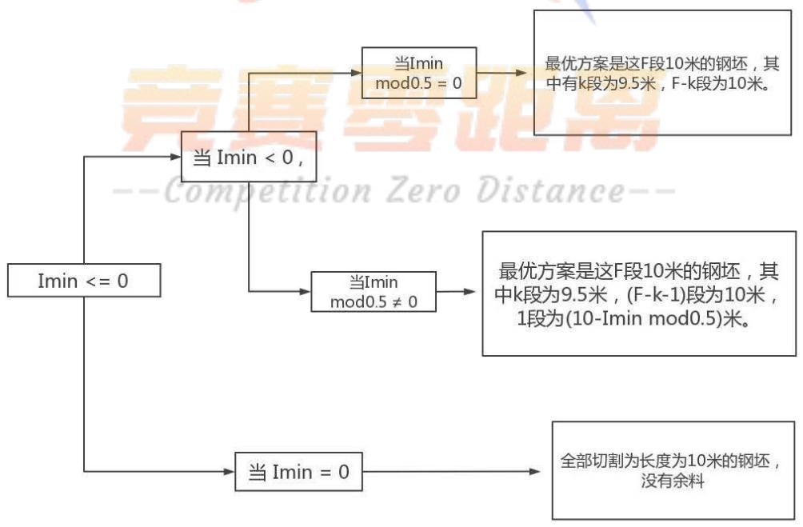

<details>
<summary>flowchart</summary>

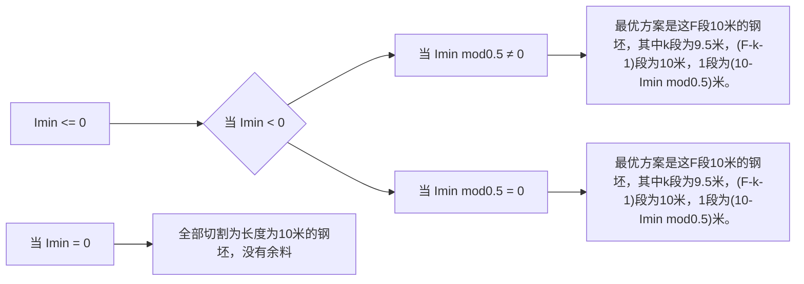
</details>

以此逻辑可推得当 $\mathrm{lmin} \leq 0$ 时的计算流程图

设： $L = (10 + f \bmod (lmin, (12.6 - 10)))$

$$
\mathrm{J} = \left[ \frac {\operatorname{Imin}}{1 2 . 6 - 1 0} \right]
$$

$$
\mathrm{J2} = \left[ \frac {\mathrm{fmod(Imax,10)}}{0 . 5} \right]
$$

L2 = 9 + fmod ( fmod ( Imax, 10 ) , 0.5)

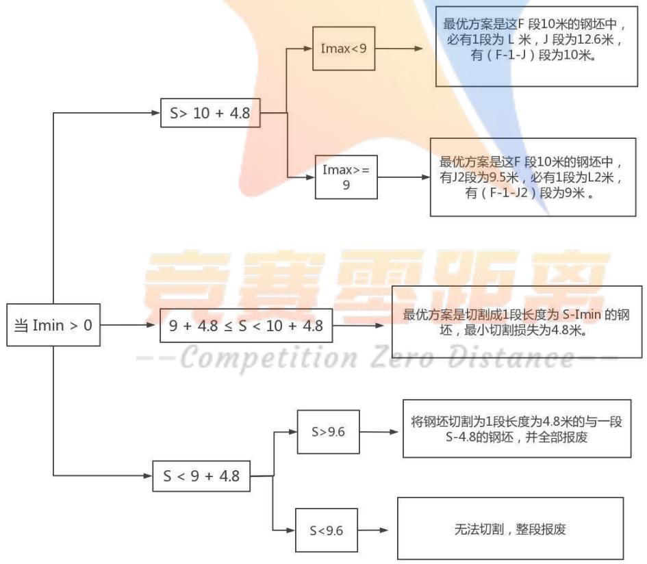

<details>
<summary>flowchart</summary>

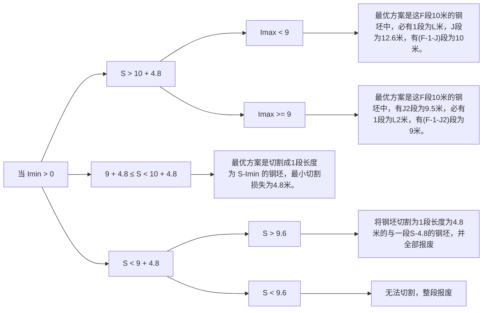
</details>

## 5.1.3 程序的建立

依据流程图我们运用 Dev-C++ 编程软件以 C 语言建立了一套程序（具体程序内容见附录），依次输入各给定尾坯长度，输出结果如下图：

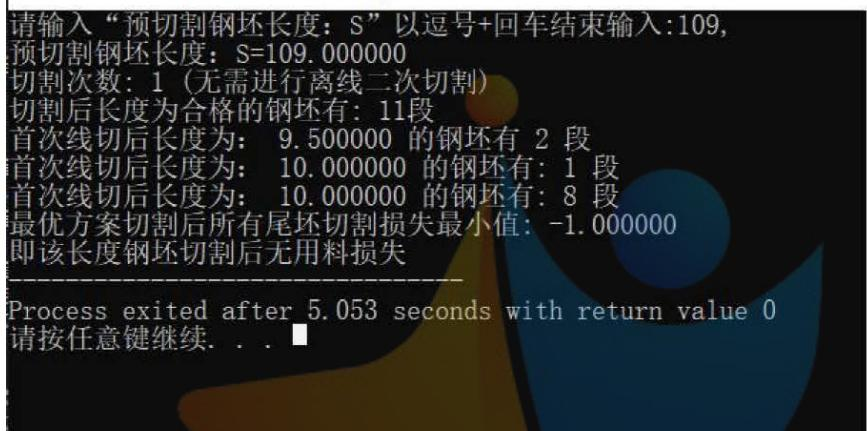

<details>
<summary>text_image</summary>

请输入“预切割钢坯长度：S”以逗号+回车结束输入:109,
预切割钢坯长度：S=109.000000
切割次数：1（无需进行离线二次切割）
切割后长度为合格的钢坯有：11段
首次线切后长度为： 9.500000 的钢坯有 2 段
首次线切后长度为： 10.000000 的钢坯有：1 段
首次线切后长度为： 10.000000 的钢坯有：8 段
最优方案切割后所有尾坯切割损失最小值：-1.000000
即该长度钢坯切割后无用料损失
-------------------
Process exited after 5.053 seconds with return value 0
请按任意键继续. . . ■
</details>

图1（尾坯长度为109.0时的输出结果）

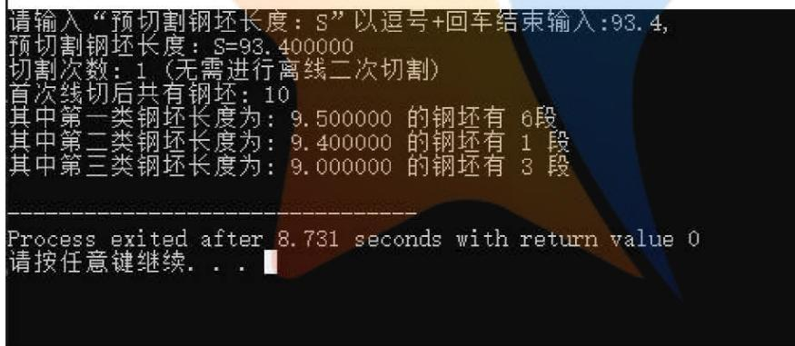

<details>
<summary>text_image</summary>

请输入“预切割钢坯长度：S”以逗号+回车结束输入:93.4,
预切割钢坯长度：S=93.400000
切割次数：1（无需进行离线二次切割）
首次线切后共有钢坯：10
其中第一类钢坯长度为：9.500000 的钢坯有 6段
其中第二类钢坯长度为：9.400000 的钢坯有 1 段
其中第三类钢坯长度为：9.000000 的钢坯有 3 段
-----------------
Process exited after 8.731 seconds with return value 0
请按任意键继续. . .
</details>

图 2（尾坯长度为 93.4 时的输出结果）  
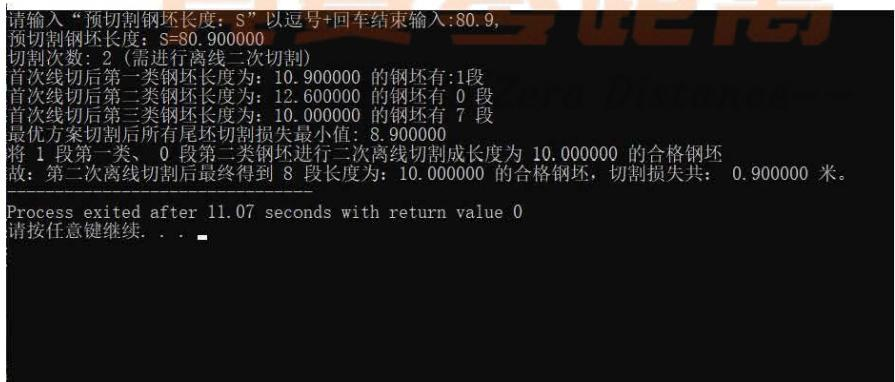

<details>
<summary>text_image</summary>

请输入“预切割钢坯长度：S”以逗号+回车结束输入:80.9,
预切割钢坯长度：S=80.900000
切割次数：2（需进行离线二次切割）
首次线切后第一类钢坯长度为：10.900000 的钢坯有:1段
首次线切后第二类钢坯长度为：12.600000 的钢坯有 0 段
首次线切后第三类钢坯长度为：10.000000 的钢坯有 7 段
最优方案切割后所有尾坯切割损失最小值：8.900000
将 1 段第一类、0 段第二类钢坯进行二次离线切割成长度为 10.000000 的合格钢坯
故：第二次离线切割后最终得到 8 段长度为：10.000000 的合格钢坯，切割损失共： 0.900000 米。
-----------------
Process exited after 11.07 seconds with return value 0
请按任意键继续. . .
</details>

图3（尾坯长度为80.9时的输出结果）

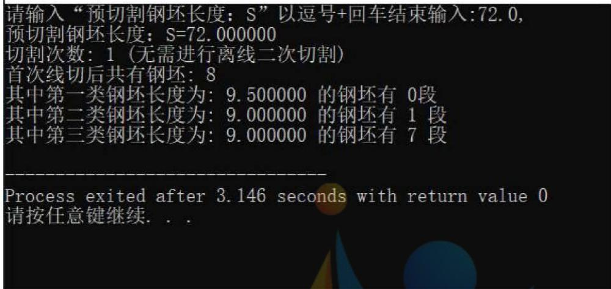

<details>
<summary>text_image</summary>

请输入“预切割钢坯长度：S”以逗号+回车结束输入:72.0,
预切割钢坯长度：S=72.000000
切割次数：1（无需进行离线二次切割）
首次线切后共有钢坯：8
其中第一类钢坯长度为：9.500000 的钢坯有 0段
其中第二类钢坯长度为：9.000000 的钢坯有 1 段
其中第三类钢坯长度为：9.000000 的钢坯有 7 段
-------------------
Process exited after 3.146 seconds with return value 0
请按任意键继续. . .
</details>

图4（尾坯长度为72.0时的输出结果）

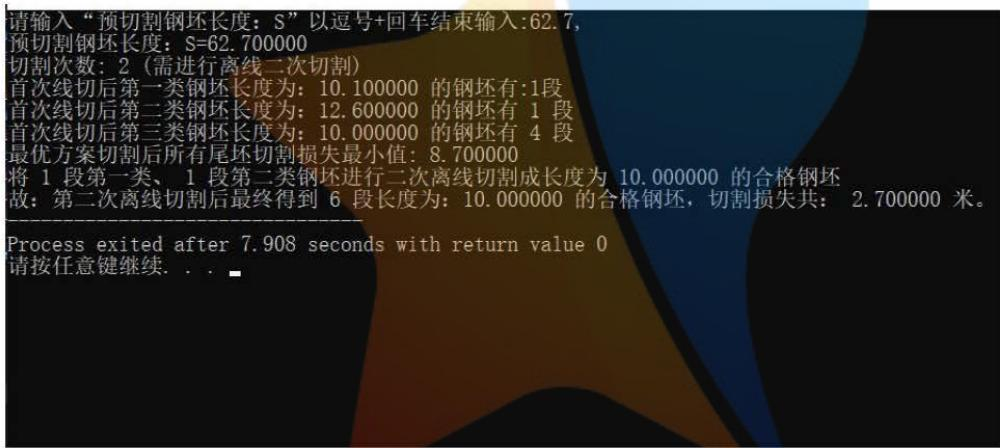

<details>
<summary>text_image</summary>

请输入“预切割钢坯长度：S”以逗号+回车结束输入:62.7,
预切割钢坯长度：S=62.700000
切割次数：2（需进行离线二次切割）
首次线切后第一类钢坯长度为：10.100000 的钢坯有:1段
首次线切后第二类钢坯长度为：12.600000 的钢坯有 1 段
首次线切后第三类钢坯长度为：10.000000 的钢坯有 4 段
最优方案切割后所有尾坯切割损失最小值：8.700000
将 1 段第一类、 1 段第二类钢坯进行二次离线切割成长度为 10.000000 的合格钢坯
故：第二次离线切割后最终得到 6 段长度为：10.000000 的合格钢坯，切割损失共： 2.700000 米。
-----------------
Process exited after 7.908 seconds with return value 0
请按任意键继续. . . ■
</details>

图 5（尾坯长度为 62.7 时的输出结果）

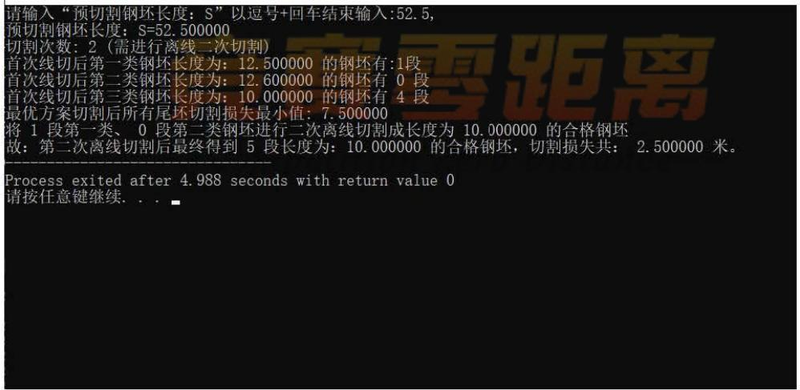

<details>
<summary>text_image</summary>

请输入“预切割钢坯长度：S”以逗号+回车结束输入:52.5,
预切割钢坯长度：S=52.500000
切割次数：2（需进行离线二次切割）
首次线切后第一类钢坯长度为：12.500000 的钢坯有:1段
首次线切后第二类钢坯长度为：12.600000 的钢坯有 0 段
首次线切后第三类钢坯长度为：10.000000 的钢坯有 4 段
最优方案切割后所有尾坯切割损失最小值：7.500000
将 1 段第一类、 0 段第二类钢坯进行二次离线切割成长度为 10.000000 的合格钢坯
故：第二次离线切割后最终得到 5 段长度为：10.000000 的合格钢坯，切割损失共： 2.500000 米。
Process exited after 4.988 seconds with return value 0
请按任意键继续. . .
</details>

图6（尾坯长度为52.5时的输出结果）

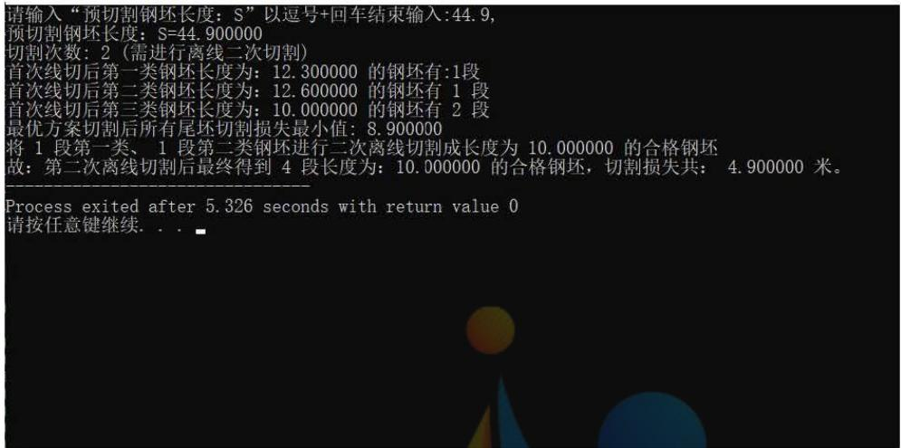

<details>
<summary>text_image</summary>

请输入“预切割钢坯长度：S”以逗号+回车结束输入:44.9,
预切割钢坯长度：S=44.900000
切割次数：2（需进行离线二次切割）
首次线切后第一类钢坯长度为：12.300000 的钢坯有:1段
首次线切后第二类钢坯长度为：12.600000 的钢坯有 1 段
首次线切后第三类钢坯长度为：10.000000 的钢坯有 2 段
最优方案切割后所有尾坯切割损失最小值：8.900000
将 1 段第一类、 1 段第二类钢坯进行二次离线切割成长度为 10.000000 的合格钢坯
故：第二次离线切割后最终得到 4 段长度为：10.000000 的合格钢坯，切割损失共； 4.900000 米。
-----------------
Process exited after 5.326 seconds with return value 0
请按任意键继续. . . ■
</details>

图7（尾坯长度为44.9时的输出结果）

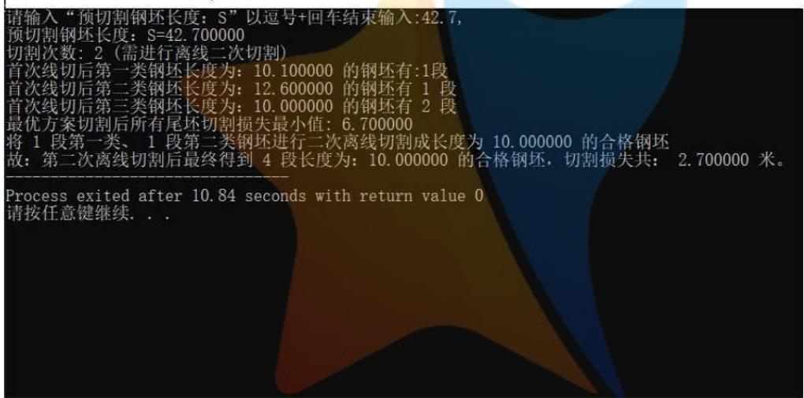

<details>
<summary>text_image</summary>

请输入“预切割钢坯长度：S”以逗号+回车结束输入:42.7,
预切割钢坯长度：S=42.700000
切割次数：2（需进行离线二次切割）
首次线切后第一类钢坯长度为：10.100000 的钢坯有:1段
首次线切后第二类钢坯长度为：12.600000 的钢坯有 1 段
首次线切后第三类钢坯长度为：10.000000 的钢坯有 2 段
最优方案切割后所有尾坯切割损失最小值：6.700000
将 1 段第一类、 1 段第二类钢坯进行二次离线切割成长度为 10.000000 的合格钢坯
故：第二次离线切割后最终得到 4 段长度为：10.000000 的合格钢坯，切割损失共： 2.700000 米。
-----------------
Process exited after 10.84 seconds with return value 0
请按任意键继续. . .
</details>

图8（尾坯长度为42.7时的输出结果）

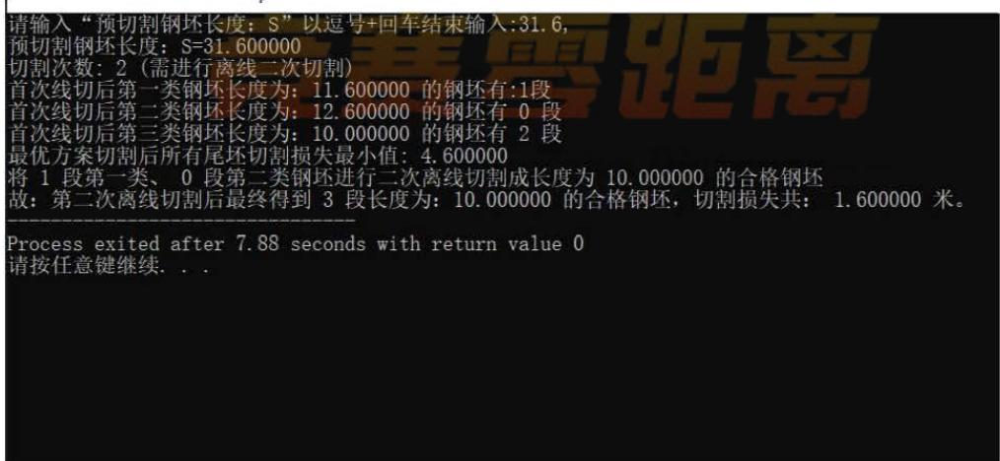

<details>
<summary>text_image</summary>

请输入“预切割钢坯长度：S”以逗号+回车结束输入:31.6,
预切割钢坯长度：S=31.600000
切割次数：2（需进行离线二次切割）
首次线切后第一类钢坯长度为：11.600000 的钢坯有:1段
首次线切后第二类钢坯长度为：12.600000 的钢坯有 0 段
首次线切后第三类钢坯长度为：10.000000 的钢坯有 2 段
最优方案切割后所有尾坯切割损失最小值：4.600000
将 1 段第一类、 0 段第二类钢坯进行二次离线切割成长度为 10.000000 的合格钢坯
故：第二次离线切割后最终得到 3 段长度为：10.000000 的合格钢坯，切割损失共： 1.600000 米。
-----------------
Process exited after 7.88 seconds with return value 0
请按任意键继续. . .
</details>

图 9（尾坯长度为 31.6 时的输出结果）

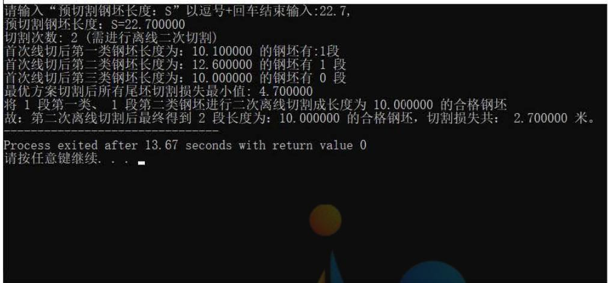

<details>
<summary>text_image</summary>

请输入“预切割钢坯长度：S”以逗号+回车结束输入:22.7,
预切割钢坯长度：S=22.700000
切割次数：2（需进行离线二次切割）
首次线切后第一类钢坯长度为：10.100000 的钢坯有:1段
首次线切后第二类钢坯长度为：12.600000 的钢坯有 1 段
首次线切后第三类钢坯长度为：10.000000 的钢坯有 0 段
最优方案切割后所有尾坯切割损失最小值：4.700000
将 1 段第一类、 1 段第二类钢坯进行二次离线切割成长度为 10.000000 的合格钢坯
故：第二次离线切割后最终得到 2 段长度为：10.000000 的合格钢坯，切割损失共： 2.700000 米。
-----------------
Process exited after 13.67 seconds with return value 0
请按任意键继续. . . ■
</details>

图 10（尾坯长度为 22.7 时的输出结果）

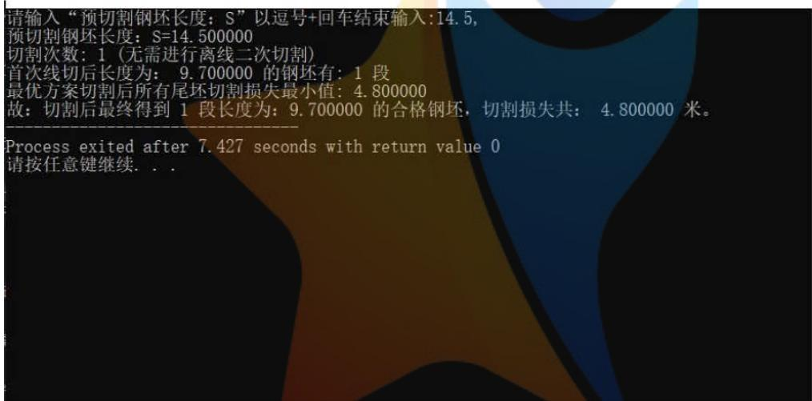

<details>
<summary>text_image</summary>

请输入“预切割钢坯长度：S”以逗号+回车结束输入:14.5,
预切割钢坯长度：S=14.500000
切割次数：1（无需进行离线二次切割）
首次线切后长度为：9.700000的钢坯有：1段
最优方案切割后所有尾坯切割损失最小值：4.800000
故：切割后最终得到1段长度为：9.700000的合格钢坯，切割损失共：4.800000米。
-------------------------
Process exited after 7.427 seconds with return value 0
请按任意键继续. . .
</details>

图 11（尾坯长度为 14.5 时的输出结果）

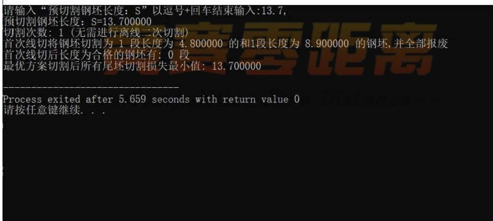

<details>
<summary>text_image</summary>

请输入“预切割钢坯长度：S”以逗号+回车结束输入:13.7,
预切割钢坯长度：S=13.700000
切割次数：1（无需进行离线二次切割）
首次线切将钢坯切割为1段长度为4.800000的和1段长度为8.900000的钢坯,并全部报废
首次线切后长度为合格的钢坯有:0段
最优方案切割后所有尾坯切割损失最小值:13.700000
-------------------
Process exited after 5.659 seconds with return value 0
请按任意键继续. . .
</details>

图12（尾坯长度为13.7时的输出结果）

## 5.1.4 列表

由该数学算法输出结果，最终可得具体最优切割方案表如下：

<table><tr><td colspan="7">最优切割方案</td></tr><tr><td rowspan="3">尾坯长度(米)</td><td colspan="5">切割方案</td><td rowspan="3">切割损失(米)</td></tr><tr><td rowspan="2">是否离线切割</td><td colspan="2">首次线上切割后</td><td colspan="2">二次离线切割后</td></tr><tr><td>各尾坯长度(米)</td><td>段数</td><td>各尾坯长度(米)</td><td>段数</td></tr><tr><td rowspan="2">109.0</td><td rowspan="2">否</td><td>10</td><td>9</td><td rowspan="2" colspan="2">/</td><td rowspan="2">0</td></tr><tr><td>9.5</td><td>2</td></tr><tr><td rowspan="3">93.4</td><td rowspan="3">否</td><td>9.5</td><td>6</td><td rowspan="3" colspan="2">/</td><td rowspan="3">0</td></tr><tr><td>9.4</td><td>1</td></tr><tr><td>9</td><td>3</td></tr><tr><td rowspan="2">80.9</td><td rowspan="2">是</td><td>10.9</td><td>1</td><td rowspan="2">10</td><td rowspan="2">8</td><td rowspan="2">0.9</td></tr><tr><td>10</td><td>7</td></tr><tr><td>72.0</td><td>否</td><td>9</td><td>8</td><td colspan="2">/</td><td>0</td></tr><tr><td rowspan="3">62.7</td><td rowspan="3">是</td><td>12.6</td><td>1</td><td rowspan="3">10</td><td rowspan="3">6</td><td rowspan="3">2.7</td></tr><tr><td>10.1</td><td>1</td></tr><tr><td>10</td><td>4</td></tr><tr><td rowspan="2">52.5</td><td rowspan="2">是</td><td>12.5</td><td>1</td><td rowspan="2">10</td><td rowspan="2">5</td><td rowspan="2">2.5</td></tr><tr><td>10</td><td>4</td></tr><tr><td rowspan="3">44.9</td><td rowspan="3">是</td><td>12.6</td><td>1</td><td rowspan="3">10</td><td rowspan="3">4</td><td rowspan="3">4.9</td></tr><tr><td>12.3</td><td>1</td></tr><tr><td>10</td><td>2</td></tr><tr><td rowspan="3">42.7</td><td rowspan="3">是</td><td>12.6</td><td>1</td><td rowspan="3">10</td><td rowspan="3">4</td><td rowspan="3">2.7</td></tr><tr><td>10.1</td><td>1</td></tr><tr><td>10</td><td>2</td></tr><tr><td rowspan="2">31.6</td><td rowspan="2">是</td><td>11.6</td><td>1</td><td rowspan="2">10</td><td rowspan="2">3</td><td rowspan="2">1.6</td></tr><tr><td>10</td><td>2</td></tr><tr><td rowspan="2">22.7</td><td rowspan="2">是</td><td>12.6</td><td>1</td><td rowspan="2">10</td><td rowspan="2">2</td><td rowspan="2">2.7</td></tr><tr><td>10.1</td><td>1</td></tr><tr><td>14.5</td><td>否</td><td>9.7</td><td>1</td><td colspan="2">/</td><td>4.8</td></tr><tr><td rowspan="2">13.7</td><td rowspan="2">否</td><td>8.9</td><td>1</td><td rowspan="2" colspan="2">/</td><td rowspan="2">13.7</td></tr><tr><td>4.8</td><td>1</td></tr></table>

## 5.2 问题二的求解

## 5.2.1 问题二（1）的求解

假设第一段钢坯长度为60.4米（其中含有报废段0.8米）。代入问题一所建立的算法解得最小损耗为0.4米。因报废段为固定损耗，长度0.8米，0.4<0.8，需取0.8米。则最佳切割方案为10，10，10，10，10，10.4（含0.8米报废段，需二次切割0.8米）。

假设第一段钢坯长度为 $60.4 + t$ 米（其中含有报废段0.8米）。代入问题一所建立的算法即可得出最小损耗，当最小损耗小于等于0.8时，因报废段为固定损耗，需取0.8米。当最小损耗大于0.8时，取当前最小损耗。在得到 $60.4 + t$ 准确数值后，将其代入问题一所设计的算法，即可得到最佳切割方案。

下图为 $60.4 + t = 69.9$ 时的运算结果。

```txt
请输入“预切割钢坯长度：S”以逗号+回车结束输入:69.9,
预切割钢坯长度：S=69.900000
切割次数：2（需进行离线二次切割）
首次线切后第一类钢坯长度为：10.700000 的钢坯有:1 段
首次线切后第二类钢坯长度为：12.600000 的钢坯有 0 段
首次线切后第三类钢坯长度为：10.000000 的钢坯有 6 段
首次线切后第四类钢坯长度为：9.900000 的钢坯有 1 段
最优方案切割后所有尾坯切割损失最小值：0.800000
将 1 段第一类、 0 段第二类钢坯进行二次离线切割成长度为 10.000000 的合格钢坯
故：第二次离线切割后最终得到 7 段长度为：10.000000 的合格钢坯，切割损失共： 0.800000 米。
将 1 段第一类、 0 段第二类钢坯进行二次离线切割成长度为 10.000000 的合格钢坯
故：第二次离线切割后最终得到 7 段长度为：10.000000 的合格钢坯，切割损失共： 0.800000 米。
Imin = 0.800000
Imax = 6.900000
```

```txt
Process exited after 45.88 seconds with return value 0
请按任意键继续...
```

下图为 $60+t=60$ 时的运算结果。

```txt
请输入“预切割钢坯长度：S”以逗号+回车结束输入:60.4
预切割钢坯长度：S=60.400000
切割次数：2（需进行离线二次切割）
首次线切后第一类钢坯长度为：10.400000 的钢坯有：1 段
首次线切后第二类钢坯长度为：12.600000 的钢坯有 0 段
首次线切后第三类钢坯长度为：10.000000 的钢坯有 5 段
首次线切后第四类钢坯长度为：9.600000 的钢坯有 1 段
最优方案切割后所有尾坯切割损失最小值：0.800000
将 1 段第一类、 0 段第二类钢坯进行二次离线切割成长度为 10.000000 的合格钢坯
故：第二次离线切割后最终得到 6 段长度为：10.000000 的合格钢坯，切割损失共： 0.800000 米。
将 1 段第一类、 0 段第二类钢坯进行二次离线切割成长度为 10.000000 的合格钢坯
故：第二次离线切割后最终得到 6 段长度为：10.000000 的合格钢坯，切割损失共： 0.800000 米。
Imin = 0.800000
Imax = 6.400000
```

```txt
Process exited after 7.625 seconds with return value 0
请按任意键继续. . .
```

## 5.2.2 问题二（2）的求解

在合理假设钢坯实时长度后，利用问题一的算法辅助计算出第一次出现报废段时的切割方案：当新的报废段出现后，设计出“左侧报废段长度+钢坯长度+右侧报废段长度”的初始切割方案，研究出优先“左侧钢坯损失长度+报废段长度+右侧钢坯损失长度”的调整方案，比较后确定最优切割方案并据此设计此题算法。并且使用Dev-C++软件编写了程序，运行程序得出了最优切割方案。

当出现新的报废段时，如下图

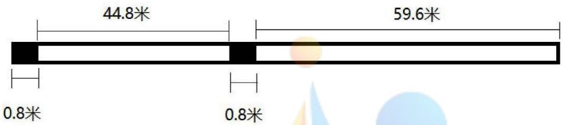

<details>
<summary>text_image</summary>

44.8米
59.6米
0.8米
0.8米
</details>

新一段钢坯及报废段长度为 45.6 米（其中含有报废段 0.8 米），代入问题一所设计的算法，解得最小损耗为 5.6 米，则最佳切割方案为 10, 10, 10, 10, 5.6（含 0.8 米报废段，需二次切割 0.8 米）。

当相邻两段钢坯的最小损耗值之和加上两段钢坯之间报废段长度大于等于4.8米，小于等于12.6米时，应将两段钢坯的损耗部分与报废段一同切割，以达到优化切割工序的目的。

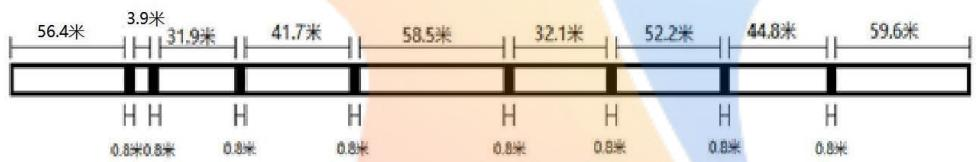

<details>
<summary>state_timeline</summary>

| Time Interval (m) | Value |
| --- | --- |
| 0~3.9 | 0.8 |
| 3.9~41.7 | 0.8 |
| 41.7~58.5 | 0.8 |
| 58.5~32.1 | 0.8 |
| 32.1~52.2 | 0.8 |
| 52.2~44.8 | 0.8 |
| 44.8~59.6 | 0.8 |
</details>

由调整后的切割方案1程序（见附件）运行如下：

```txt
请输入“预切割钢坯长度：S”以逗号+回车结束输入:60.4,
预切割钢坯长度：S=60.400000
切割次数：2（需进行离线二次切割）
首次线切后第一类钢坯长度为：10.400000 的钢坯有：1 段
首次线切后第二类钢坯长度为：12.600000 的钢坯有 0 段
首次线切后第三类钢坯长度为：10.000000 的钢坯有 5 段
首次线切后第四类钢坯长度为：9.600000 的钢坯有 1 段
最优方案切割后所有尾坯切割损失最小值：0.800000
将 1 段第一类、 0 段第二类钢坯进行二次离线切割成长度为 10.000000 的合格钢坯
故：第二次离线切割后最终得到 6 段长度为：10.000000 的合格钢坯，切割损失共： 0.800000 米。
将 1 段第一类、 0 段第二类钢坯进行二次离线切割成长度为 10.000000 的合格钢坯
故：第二次离线切割后最终得到 6 段长度为：10.000000 的合格钢坯，切割损失共： 0.800000 米。
Imin = 0.800000
Imax = 6.400000
-----------------
Process exited after 19.9 seconds with return value 0
请按任意键继续. . .
```

由调整后的切割方案1程序（见附件），将程序中的运算结果整理如下：

<table><tr><td colspan="8">切割方案</td></tr><tr><td colspan="4">初始切割方案</td><td colspan="4">调整后的切割方案1</td></tr><tr><td>长度</td><td>每段长度段数</td><td></td><td>切割损失</td><td>合并相邻报废段计算</td><td>每段长度</td><td>段数</td><td>切割损失</td></tr><tr><td>60.4</td><td>10.4</td><td>1</td><td rowspan="2">0.8</td><td>105.2</td><td>9.6</td><td>1</td><td rowspan="2">0</td></tr><tr><td></td><td>10</td><td>5</td><td></td><td>10</td><td>5</td></tr><tr><td>45.6</td><td>10.4</td><td>1</td><td rowspan="3">5.6</td><td>46.4(包含2报废段)</td><td>11.2</td><td>1</td><td rowspan="3">6.4</td></tr><tr><td></td><td>12.6</td><td>2</td><td></td><td>12.6</td><td>2</td></tr><tr><td></td><td>10</td><td>1</td><td></td><td>10</td><td>1</td></tr><tr><td>53</td><td>10.4</td><td>1</td><td rowspan="3">3</td><td>52.2</td><td>12.2</td><td>1</td><td rowspan="2">2.2</td></tr><tr><td></td><td>12.6</td><td>1</td><td></td><td>10</td><td>1</td></tr><tr><td></td><td>10</td><td>3</td><td>33.7(包含2报废段)</td><td>11.1</td><td>1</td><td rowspan="3">3.7</td></tr><tr><td>32.9</td><td>10.3</td><td>1</td><td rowspan="3">2.9</td><td></td><td>12.6</td><td>1</td></tr><tr><td></td><td>12.6</td><td>1</td><td></td><td>10</td><td>1</td></tr><tr><td></td><td>10</td><td>1</td><td>58.5</td><td>9.5</td><td>3</td><td rowspan="3">0</td></tr><tr><td>59.3</td><td>9.5</td><td>1</td><td rowspan="3">0.8</td><td></td><td>10</td><td>1</td></tr><tr><td></td><td>9.8</td><td>1</td><td></td><td>10</td><td>1</td></tr><tr><td></td><td>10</td><td>4</td><td>43.3(包含2报废段)</td><td>10.7</td><td>1</td><td rowspan="3">3.3</td></tr><tr><td>42.5</td><td>12.5</td><td>1</td><td rowspan="2">2.5</td><td></td><td>12.6</td><td>1</td></tr><tr><td></td><td>10</td><td>3</td><td></td><td>10</td><td>2</td></tr><tr><td>32.7</td><td>10.1</td><td>1</td><td rowspan="3">2.7</td><td>31.9</td><td>11.9</td><td>1</td><td rowspan="2">1.9</td></tr><tr><td></td><td>12.6</td><td>1</td><td></td><td>10</td><td>2</td></tr><tr><td></td><td>10</td><td>1</td><td>4.8(包含2报废段)</td><td>4.8</td><td>1</td><td>4.8</td></tr><tr><td>4.7</td><td></td><td></td><td>4.7</td><td>57.1</td><td>9.5</td><td>5</td><td rowspan="2">0</td></tr><tr><td>56.4</td><td>9.5</td><td>3</td><td rowspan="3">0.8</td><td></td><td>9.6</td><td>1</td></tr><tr><td></td><td>9.1</td><td>1</td><td></td><td></td><td></td><td></td></tr><tr><td></td><td>9</td><td>2</td><td></td><td></td><td></td><td></td></tr><tr><td colspan="4">初始切割方案</td><td colspan="4">调整后的切割方案2</td></tr><tr><td>长度</td><td>每段长度段数</td><td></td><td>切割损失</td><td>合并相邻钢坯最小切割损失</td><td>每段长度</td><td>段数</td><td>切割损失</td></tr><tr><td>60.4</td><td>10.4</td><td>1</td><td rowspan="2">0.8</td><td>105.2</td><td>9.6</td><td>1</td><td rowspan="2">5.6</td></tr><tr><td></td><td>10</td><td>5</td><td></td><td>10</td><td>9</td></tr><tr><td>45.6</td><td>10.4</td><td>1</td><td rowspan="3">5.6</td><td>97.8</td><td>10</td><td>9</td><td rowspan="3">7.8</td></tr><tr><td></td><td>12.6</td><td>2</td><td></td><td>7.8</td><td>1</td></tr><tr><td></td><td>10</td><td>1</td><td></td><td></td><td></td></tr><tr><td>53</td><td>10.4</td><td>1</td><td rowspan="3">3</td><td>85.1</td><td>10</td><td>8</td><td rowspan="3">5.1</td></tr><tr><td></td><td>12.6</td><td>1</td><td></td><td>5.1</td><td>1</td></tr><tr><td></td><td>10</td><td>3</td><td></td><td></td><td></td></tr><tr><td>32.9</td><td>10.3</td><td>1</td><td rowspan="3">2.9</td><td>91.4</td><td colspan="2" rowspan="3">/</td><td rowspan="3">2.9</td></tr><tr><td></td><td>12.6</td><td>1</td><td></td></tr><tr><td></td><td>10</td><td>1</td><td></td></tr><tr><td>59.3</td><td>9.5</td><td>1</td><td rowspan="3">0.8</td><td>100.2</td><td colspan="2" rowspan="3">/</td><td rowspan="3">2.5</td></tr><tr><td></td><td>9.8</td><td>1</td><td></td></tr><tr><td></td><td>10</td><td>4</td><td></td></tr><tr><td>42.5</td><td>12.5</td><td>1</td><td rowspan="2">2.5</td><td>74.4</td><td colspan="2" rowspan="2">/</td><td rowspan="2">4.4</td></tr><tr><td></td><td>10</td><td>3</td><td></td></tr><tr><td>32.7</td><td>10.1</td><td>1</td><td rowspan="3">2.7</td><td>36.6</td><td>10</td><td>3</td><td rowspan="3">6.6</td></tr><tr><td></td><td>12.6</td><td>1</td><td></td><td>6.6</td><td>1</td></tr><tr><td></td><td>10</td><td>1</td><td></td><td></td><td></td></tr><tr><td>4.7</td><td></td><td></td><td>4.7</td><td>61.1</td><td>10</td><td>5</td><td rowspan="3">11.1</td></tr><tr><td>56.4</td><td>9.5</td><td>3</td><td rowspan="3">0.8</td><td></td><td>11.1</td><td>1</td></tr><tr><td></td><td>9.1</td><td>1</td><td></td><td></td><td></td></tr><tr><td></td><td>9</td><td>2</td><td></td><td></td><td></td><td></td></tr></table>

由上述两个表格可知:  
调整后的方案 1 在减少切割损失层面更优：当相邻报废段之间钢坯长度大于 3.2 小于 9 时，可以减少损耗。  
调整后的方案2在切割工序层面更优，相邻两段钢坯的最小损耗值之和加上两段钢坯之间报废段长度大于等于4.8米，小于等于12.6米时，将两段钢坯的损耗部分与报废段一同切割，可以达到优化切割工序的目的。

## 5.3 问题三的求解

## 5.3.1 对于（1）用户要求求解

对（1）用户目标值：8.5米 目标范围：8.0-9.0米,修改算法中的目标值和目标范围,由问题二所设计数学算法可得下表：

<table><tr><td colspan="8">切割方案</td></tr><tr><td colspan="4">初始切割方案</td><td colspan="4">调整后的切割方案1</td></tr><tr><td>长度</td><td>每段长度段数</td><td></td><td>切割损失</td><td>合并相邻报废段计算</td><td>每段长度</td><td>段数</td><td>切割损失</td></tr><tr><td rowspan="3">60.4</td><td>8.5</td><td>3</td><td rowspan="3">0.8</td><td rowspan="2">59.6</td><td>8.5</td><td>6</td><td rowspan="2">0</td></tr><tr><td>8.7</td><td>1</td><td>8.6</td><td>1</td></tr><tr><td>9</td><td>3</td><td rowspan="3">46.4(包含2报废段)</td><td>10.4</td><td>1</td><td rowspan="3">1.6</td></tr><tr><td rowspan="3">45.6</td><td>9.6</td><td>1</td><td rowspan="3">0.8</td><td>9</td><td>4</td></tr><tr><td>9</td><td>4</td><td>8.8</td><td>1</td></tr><tr><td>8.8</td><td>1</td><td rowspan="3">52.2</td><td>8.5</td><td>3</td><td rowspan="3">0</td></tr><tr><td rowspan="3">53</td><td>8.8</td><td>1</td><td rowspan="3">0.8</td><td>9.7</td><td>1</td></tr><tr><td>9</td><td>5</td><td>9</td><td>2</td></tr><tr><td></td><td></td><td rowspan="3">33.7(包含2报废段)</td><td>8.1</td><td>1</td><td rowspan="3">1.6</td></tr><tr><td rowspan="3">32.9</td><td>8.1</td><td>1</td><td rowspan="3">0.8</td><td rowspan="2">8</td><td rowspan="2">3</td></tr><tr><td>8</td><td>3</td></tr><tr><td></td><td></td><td rowspan="3">58.5</td><td>8.5</td><td>5</td><td rowspan="3">0</td></tr><tr><td rowspan="3">59.3</td><td>8.5</td><td>6</td><td rowspan="3">0.8</td><td rowspan="2">8</td><td rowspan="2">2</td></tr><tr><td>8</td><td>1</td></tr><tr><td></td><td></td><td rowspan="3">43.3(包含2报废段)</td><td>8.9</td><td>1</td><td rowspan="3">1.6</td></tr><tr><td rowspan="3">42.5</td><td>8.5</td><td>3</td><td rowspan="3">0.8</td><td rowspan="2">9</td><td rowspan="2">4</td></tr><tr><td>8.8</td><td>1</td></tr><tr><td>9</td><td>1</td><td rowspan="3">31.9</td><td>10.3</td><td>1</td><td rowspan="3">4.9</td></tr><tr><td rowspan="3">32.7</td><td>11.1</td><td>1</td><td rowspan="3">5.7</td><td>12.6</td><td>1</td></tr><tr><td>12.6</td><td>1</td><td>9</td><td>1</td></tr><tr><td>9</td><td>1</td><td>4.8(包含2报废段)</td><td>4.8</td><td>1</td><td>4.8</td></tr><tr><td rowspan="2">4.7</td><td rowspan="2">/</td><td></td><td rowspan="2">4.7</td><td rowspan="4">57.1</td><td>8.5</td><td>2</td><td rowspan="4">0</td></tr><tr><td></td><td rowspan="2">8.1</td><td rowspan="2">1</td></tr><tr><td rowspan="2">56.4</td><td>11.4</td><td>1</td><td rowspan="2">2.4</td></tr><tr><td>9</td><td>5</td><td>8</td><td>4</td></tr><tr><td colspan="4">初始切割方案</td><td colspan="4">调整后的切割方案2</td></tr><tr><td>长度</td><td>每段长度段数</td><td></td><td>切割损失</td><td>合并相邻报废段计算</td><td>每段长度</td><td>段数</td><td>切割损失</td></tr><tr><td rowspan="3">60.4</td><td>8.5</td><td>3</td><td rowspan="3">0.8</td><td rowspan="3">59.6</td><td>8.5</td><td>6</td><td rowspan="3">0</td></tr><tr><td>8.7</td><td>1</td><td rowspan="2">8.6</td><td rowspan="2">1</td></tr><tr><td>9</td><td>3</td></tr><tr><td rowspan="3">45.6</td><td>9.6</td><td>1</td><td rowspan="3">0.8</td><td rowspan="3">46.4(包含2报废段)</td><td>10.4</td><td>1</td><td rowspan="3">1.6</td></tr><tr><td>9</td><td>4</td><td>9</td><td>4</td></tr><tr><td>8.8</td><td>1</td><td>8.8</td><td>1</td></tr><tr><td rowspan="3">53</td><td>8.8</td><td>1</td><td rowspan="3">0.8</td><td rowspan="3">52.2</td><td>8.5</td><td>3</td><td rowspan="3">0</td></tr><tr><td rowspan="2">9</td><td rowspan="2">5</td><td>9.7</td><td>1</td></tr><tr><td>9</td><td>2</td></tr><tr><td rowspan="2">32.9</td><td>8.1</td><td>1</td><td rowspan="2">0.8</td><td rowspan="2">33.7(包含2报废段)</td><td>8.1</td><td>1</td><td rowspan="2">1.6</td></tr><tr><td>8</td><td>3</td><td>8</td><td>3</td></tr><tr><td rowspan="3">59.3</td><td>8.5</td><td>6</td><td rowspan="3">0.8</td><td rowspan="3">58.5</td><td>8.5</td><td>5</td><td rowspan="3">0</td></tr><tr><td rowspan="2">8</td><td rowspan="2">1</td><td>8</td><td>2</td></tr><tr><td></td><td></td></tr><tr><td rowspan="3">42.5</td><td>8.5</td><td>3</td><td rowspan="3">0.8</td><td rowspan="3">43.3(包含2报废段)</td><td>8.9</td><td>1</td><td rowspan="3">1.6</td></tr><tr><td>8.8</td><td>1</td><td rowspan="2">9</td><td rowspan="2">4</td></tr><tr><td>9</td><td>1</td></tr><tr><td rowspan="3">32.7</td><td>11.1</td><td>1</td><td rowspan="3">5.7</td><td rowspan="3">31.9</td><td>10.3</td><td>1</td><td rowspan="3">4.9</td></tr><tr><td>12.6</td><td>1</td><td>12.6</td><td>1</td></tr><tr><td>9</td><td>1</td><td>9</td><td>1</td></tr><tr><td>4</td><td>4</td><td>1</td><td>4</td><td>4.8(包含2报废段)</td><td>4.8</td><td>1</td><td>4.8</td></tr><tr><td rowspan="3">56.4</td><td>11.4</td><td>1</td><td rowspan="3">2.4</td><td rowspan="3">57.1</td><td>8.5</td><td>2</td><td rowspan="3">0</td></tr><tr><td rowspan="2">9</td><td rowspan="2">5</td><td>8.1</td><td>1</td></tr><tr><td>8</td><td>4</td></tr></table>

## 5.3.1 对于（1）用户要求求解

对（2）用户目标值：11.1米 目标范围：10.6-11.6米

修改算法中的目标值和目标范围

由问题二所设计数学算法可得下表：

<table><tr><td colspan="8">切割方案</td></tr><tr><td colspan="4">初始切割方案</td><td colspan="4">调整后的切割方案1</td></tr><tr><td>长度</td><td>每段长度段数</td><td></td><td>切割损失</td><td>合并相邻报废段计算</td><td>每段长度</td><td>段数</td><td>切割损失</td></tr><tr><td rowspan="3">60.4</td><td>12</td><td>1</td><td rowspan="3">2.4</td><td rowspan="3">59.6</td><td>12.2</td><td>1</td><td rowspan="3"></td></tr><tr><td>12.6</td><td>2</td><td>12.6</td><td>1</td></tr><tr><td>11.6</td><td>2</td><td>11.6</td><td>3</td></tr><tr><td rowspan="2">45.6</td><td>11.6</td><td>4</td><td rowspan="2">0.8</td><td rowspan="2">46.4(包含2报废段)</td><td>11.1</td><td>3</td><td rowspan="2">1.6</td></tr><tr><td>11.8</td><td>1</td><td>11.5</td><td>1</td></tr><tr><td rowspan="2">53</td><td rowspan="2">11.6</td><td rowspan="2">4</td><td rowspan="2">6.6</td><td rowspan="2">52.2</td><td>11.6</td><td>4</td><td rowspan="2">5.8</td></tr><tr><td>5.8</td><td>1</td></tr><tr><td rowspan="3">32.9</td><td>10.9</td><td>1</td><td rowspan="3">0.8</td><td rowspan="3">33.7(包含2报废段)</td><td>12.1</td><td>1</td><td rowspan="3">1.6</td></tr><tr><td rowspan="2">10.6</td><td rowspan="2">2</td><td>11.6</td><td>2</td></tr><tr><td>10.5</td><td>1</td></tr><tr><td rowspan="3">59.3</td><td>11.9</td><td>1</td><td rowspan="3">1.3</td><td rowspan="3">58.5</td><td>12.1</td><td>1</td><td rowspan="3">0.5</td></tr><tr><td>12.6</td><td>1</td><td rowspan="2">11.6</td><td rowspan="2">4</td></tr><tr><td>11.6</td><td>3</td></tr><tr><td rowspan="2">42.5</td><td>11.6</td><td>3</td><td rowspan="2">7.7</td><td rowspan="2">43.3(包含2报废段)</td><td>11.1</td><td>3</td><td rowspan="2">8.5</td></tr><tr><td>7.7</td><td>1</td><td>10</td><td>1</td></tr><tr><td rowspan="2">32.7</td><td>11.6</td><td>2</td><td rowspan="2">8.7</td><td rowspan="2">31.9</td><td>10.7</td><td>1</td><td rowspan="2">8.7</td></tr><tr><td>8.7</td><td>1</td><td>10.6</td><td>2</td></tr><tr><td>4.7</td><td></td><td></td><td>4.7</td><td>4.8(包含2报废段)</td><td>4.8</td><td>1</td><td>4.8</td></tr><tr><td rowspan="3">56.4</td><td>11.1</td><td>3</td><td rowspan="3">0</td><td rowspan="3">56.4</td><td>11.1</td><td>3</td><td rowspan="3">0</td></tr><tr><td>11.6</td><td>1</td><td>11.6</td><td>1</td></tr><tr><td>11.5</td><td>1</td><td>11.5</td><td>1</td></tr><tr><td colspan="4">初始切割方案</td><td colspan="4">调整后的切割方案2</td></tr><tr><td>长度</td><td>每段长度段数</td><td></td><td>切割损失</td><td>合并相邻钢坯最小切割损失</td><td>每段长度</td><td>段数</td><td>切割损失</td></tr><tr><td rowspan="3">60.4</td><td>12</td><td>1</td><td rowspan="3">2.4</td><td rowspan="5">105.2</td><td>12.2</td><td>1</td><td rowspan="5">2.4</td></tr><tr><td>12.6</td><td>2</td><td>12.6</td><td>1</td></tr><tr><td>11.6</td><td>2</td><td>11.6</td><td>3</td></tr><tr><td rowspan="4">45.6</td><td rowspan="2">11.6</td><td rowspan="2">4</td><td rowspan="4">0.8</td><td>11.1</td><td>3</td></tr><tr><td>11.5</td><td>1</td></tr><tr><td rowspan="2">11.8</td><td rowspan="2">1</td><td rowspan="3">97.8</td><td>11.1</td><td>3</td><td rowspan="3">6.6</td></tr><tr><td>11.5</td><td>1</td></tr><tr><td rowspan="2">53</td><td rowspan="2">11.6</td><td rowspan="2">4</td><td rowspan="2">6.6</td><td>11.6</td><td>4</td></tr><tr><td rowspan="4">85.1</td><td>11.6</td><td>4</td><td rowspan="4">15.5</td></tr><tr><td rowspan="2">32.9</td><td>10.9</td><td>1</td><td rowspan="2">0.8</td><td>10.9</td><td>1</td></tr><tr><td>10.6</td><td>2</td><td>10.6</td><td>2</td></tr><tr><td rowspan="3">59.3</td><td>11.9</td><td>1</td><td rowspan="3">1.3</td><td></td><td></td></tr><tr><td>12.6</td><td>1</td><td rowspan="4">91.4</td><td>10.9</td><td>1</td><td rowspan="4">10.2</td></tr><tr><td>11.6</td><td>3</td><td>10.6</td><td>2</td></tr><tr><td rowspan="4">42.5</td><td rowspan="2">11.6</td><td rowspan="2">3</td><td rowspan="4">7.7</td><td>12.1</td><td>1</td></tr><tr><td>11.6</td><td>4</td></tr><tr><td rowspan="2">7.7</td><td rowspan="2">1</td><td rowspan="3">100.2</td><td>12.1</td><td>1</td><td rowspan="3">8.2</td></tr><tr><td>11.6</td><td>4</td></tr><tr><td rowspan="3">32.7</td><td>11.6</td><td>2</td><td rowspan="3">8.7</td><td>11.6</td><td>3</td></tr><tr><td rowspan="2">8.7</td><td rowspan="2">1</td><td rowspan="3">74.4</td><td>11.6</td><td>3</td><td rowspan="3">16.4</td></tr><tr><td>10.7</td><td>1</td></tr><tr><td rowspan="2">4.7</td><td rowspan="2">/</td><td rowspan="2"></td><td rowspan="2">4.7</td><td>10.6</td><td>2</td></tr><tr><td rowspan="2">36.6</td><td>10.7</td><td>1</td><td rowspan="2">13.4</td></tr><tr><td rowspan="4">56.4</td><td>11.1</td><td>3</td><td rowspan="4">0</td><td>10.6</td><td>2</td></tr><tr><td rowspan="2">11.6</td><td rowspan="2">1</td><td rowspan="3">61.1</td><td>11.1</td><td>3</td><td rowspan="3">9.8</td></tr><tr><td>11.5</td><td>1</td></tr><tr><td>11.5</td><td>1</td><td>11.6</td><td>1</td></tr></table>

对比上表中的两个方案可知：调整后的方案1在减少切割损失层面更优：

当（1）用户目标值 相邻报废段之间钢坯长度大于3.2小于8时，可以减少损耗。  
当（2）用户目标值相邻报废段之间钢坯长度大于3.2小于10.6时，可以减少损耗。

调整后的方案2在切割工序层面更优，

（1）用户目标值：相邻两段钢坯的最小损耗值之和加上两段钢坯之间报废段长度大于等于4.8米，小于等于12.6米时，将两段钢坯的损耗部分与报废段一同切割，可以达到优化切割工序的目的。  
（2）用户目标值：相邻两段钢坯的最小损耗值之和加上两段钢坯之间报废段长度大于等于4.8米，小于等于12.6米时，将两段钢坯的损耗部分与报废段一同切割，可以达到优化切割工序的目的。

由题意可知，在切割方案中，应优先考虑切割损失，要求切割损失尽量小，其次考虑用户需求。对比以上调整后的两个切割方案，我们认为调整后的切割方案1，更符合优先考虑切割损失的要求。

## 六、算法评价与推广

## 6.1 算法的评价

用Excel将从Dev-C++编程软件得出的数据按内容列表，更加直观、严谨，也提高了数据的可读性。本算法最大的优点是：算法通用性强，因为建立算法时使用的测试数据是一个变量，所以在探讨不同数据时的情况时，均可以得出最优方案。

对于问题一设计的算法，实际上在损失值不变的情况下，我们还可以从段数的方面继续优化算法。比如说在一些特殊情况下，是可以通过在用户目标范围里取更小的长度，来增加切割出的段数的，这个处理并不会影响损失大小。不过问题优先考虑的是损失值和用户要求，并未提出段数的问题，所以段数的增加不在我们的目前优化方案内，这是此算法还可以进行继续优化的地方。以上还可继续进行算法优化的地方都是本文建模的不足之处，但算法可继续完善的方向是比较明确的。

对于问题三建立的算法，这是一个复杂情境下的最优方案的算法，综合了在多种因素的影响下对最优方案的考量。因为影响因素过多，所以算法复杂性较大，但是算法得出的结果经过多次检验证实是和实际情况基本吻合的最优方案，极大降低了误差，保证了算法的科学性和准确性。

## 6.2 算法的推广

本文算法适用领域十分广泛，对数据的分析和处理方案，可运用到工业材料的切割、资源的合理分配、经济的减损等方面；问题二中的算法可以运用到有害物质的剔除，障碍路线规划等；问题三中算法不同期望的规划可以运用到金融交易，风险评估等方面，具有提高资源利用率、节省人力成本及提高经济效益等优点，实用性强。

## 七、参考文献

[1] 司守奎 孙兆亮. 数学建模算法与应用（第 2 版）[M]. 北京：国防工业出版社，2020.  
[2] 明日科技.Visual C++从入门到精通[M].北京；清华大学出版社，2019.  
[3] 姜启源 谢金星 叶俊. 数学模型（第五版）[第五版]. 北京：高等教育出版社，2019.

## 八、附录

## 一、Dev-C++程序

## 1. 最优切割方案程序

```c
#include <stdio.h>
#include <math.h>

int main() {
    double S,N=8.5,Nmin=8,Nmax=9,Cmin=4.8,Cmax=12.6;
    printf("请输入“预切割钢坯长度：S”以逗号+回车结束输入:");
    scanf("%lf\n",&S);
    printf("预切割钢坯长度：S=%lf\n",S);

    double e = N - Nmin;

    double f = S/N;
    int F = 0;
    F = (int)f;
    double g = S-F*N;
    float E = F*e;

    double Imax = g+E,Imin = g-E;

    if(lmin>0){
        if(S>(Nmax+Cmin)){
            if(lmax<Nmin){
                printf("切割次数: 2 (需进行离线二次切割)\n");
                    double r1 = Nmax + fmod(lmin,(Cmax-Nmax)),F1 = 1;
                    printf("首次线切后第一类钢坯长度为：%f 的钢坯有:1 段\n",r1);
                    double f2 = Imin/(Cmax-Nmax),r2 = Cmax;
                    int F2 = 0;
                    F2 = (int)f2;
                    printf("首次线切后第二类钢坯长度为：%lf 的钢坯有 %d 段\n",r2,F2);
                    double r3 = Nmax;
                    int F3 = F-F1-F2;
                    printf("首次线切后第三类钢坯长度为：%lf 的钢坯有 %d 段\n",r3,F3);
                    printf("最优方案切割后所有尾坯切割损失最小值：%f\n",Imin);
                    double r = Nmax;
                    printf("将 1 段第一类、 %d 段第二类钢坯进行二次离线切割成长度为 %lf 的合格钢坯\n",F2,r);
                    printf("故：第二次离线切割后最终得到 %d 段长度为：%lf 的合格钢坯，切割损失共：%f 米。",F,r,Imin);
```

```c
}
    if(lmax>=Nmin){
        printf("切割次数: 1 (无需进行离线二次切割)\n");
        double f1 = lmax/Nmin;
        F = F+(int)f1;
        printf("首次线切后共有钢坯: %d\n", F);
        double r1 = N;
        float f2 = fmod(lmax,Nmin)/e;
        int F1 = 0;
        F1 = (int)f2;
        printf("其中第一类钢坯长度为: %f 的钢坯有 %d 段\n", r1,F1);
        double r2 = Nmin + fmod(fmod(lmax,Nmin),e);
        int F2 = 1;
        printf("其中第二类钢坯长度为: %f 的钢坯有 1 段 \n", r2);
        double r3 = Nmin;
        int F3=F-F1-F2;
        printf("其中第三类钢坯长度为: %f 的钢坯有 %d 段\n", r3,F3);
        printf("故: 切割后最终得到 %d 段长度合格钢坯, 切割损失共: %f 米。",F,lmin);
    }
}
if(S<(Nmax+Cmin) & S>=(Nmin+Cmin)){
    printf("切割次数: 1 (无需进行离线二次切割)\n");
    lmin = Cmin;
    double r2 = S-lmin,F1 = 1;
    printf("首次线切后长度为: %f 的钢坯有: 1 段\n", r2);
    printf("最优方案切割后所有尾坯切割损失最小值: %f\n",lmin);
    printf("故: 切割后最终得到 1 段长度为: %lf 的合格钢坯, 切割损失共: %f 米。",r2,lmin);
}
if(S<(Nmin+Cmin)){
    if(S<2*Cmin) {
        printf("切割次数: 0\n (无法切割, 整段报废)\n");
    }
    if(S>2*Cmin){
        printf("切割次数: 1 (无需进行离线二次切割)\n");
        double r1 = Cmin;
        double r2 = S-Cmin;
        printf("首次线切将钢坯切割为 1 段长度为 %lf 的和 1 段长度为 %lf 的钢坯,并全部报废\n",
r1,r2);
    }
    lmax = lmin = S;
    F = 0;
    printf("首次线切后长度为合格的钢坯有: %d 段\n", F);
    printf("最优方案切割后所有尾坯切割损失最小值: %f\n",lmin);
}
}
```

```c
if(lmin<0){
    printf("切割次数: 1 (无需进行离线二次切割)\n");
    printf("切割后长度为合格的钢坯有: %d 段\n", F);
    double f1 = -lmin/e;
    int F1 = 0;
    F1 = (int)f1;
    printf("首次线切后长度为: %f 的钢坯有 %d 段\n",N,F1);
    double r2 = Nmax + fmod(lmin,e),F2 = 1;
    printf("首次线切后长度为: %f 的钢坯有: 1 段\n", r2);
    int F3 = F-F1-F2;
    printf("首次线切后长度为: %lf 的钢坯有: %d 段\n",Nmax,F3);
    printf("最优方案切割后所有尾坯切割损失最小值: %f\n",lmin);
    printf("即该长度钢坯切割后无用料损失");
}
if(lmin==0){
    printf("切割次数: 1\n");
    printf("首次切割后长度为: %lf 的钢坯有 %d 段\n",Nmax,F);
    printf("最优方案切割后所有尾坯切割损失最大值: %f\n 最优方案切割后所有尾坯切割损失最小值: %f\n",lmax,lmin);
}
return 0;
}
```

## 2. 调整后的切割方案程序

## 2.1 调整后的切割方案 1 程序

```c
#include <stdio.h>
#include <math.h>
```

```txt
int main() {
    double S,N=9.5,Nmin=9,Nmax=10,Cmin=4.8,Cmax=12.6;
    printf("请输入"预切割钢坯长度: S"以逗号+回车结束输入:");
    scanf("%lf\n",&S);
    printf("预切割钢坯长度: S=%lf\n",S);
```

```txt
double e = N - Nm

double f = S/N;
int F = 0;
F = (int)f;
double g = S-F*N;
float E = F*e;
```

```c
double Imax = g+E,Imin = g-E;
double L = 0.8;

if(Imin < 0){
    Imin = Imin+L;
}

if(Imin>0){
    if(S>(Nmax+Cmin)){
        if(Imax<(Nmin+L)){
            printf("切割次数: 2 (需进行离线二次切割)\n");
            double r1 = Nmax + fmod(Imin,(Cmax-Nmax)),F1 = 1;
            printf("首次线切后第一类钢坯长度为: %f 的钢坯有:1 段\n", r1);
            double f2 = Imin/(Cmax-Nmax),r2 = Cmax;
            int F2 = 0;
            F2 = (int)f2;
            printf("首次线切后第二类钢坯长度为: %lf 的钢坯有 %d 段\n",r2,F2);
            double r3 = Nmax;
            int F3 = F-F1-F2;
            printf("首次线切后第三类钢坯长度为: %lf 的钢坯有 %d 段\n",r3,F3);
            if(Imin<L){
                double r4 = Nmax-(L-Imin);
                int F4 = 1;
                Imin = Imin+F4*(L-Imin);
                printf("首次线切后第四类钢坯长度为: %lf 的钢坯有 1 段\n",r4);
                printf("最优方案切割后所有尾坯切割损失最小值: %f\n",Imin);
                double r = Nmax;
                printf("将 1 段第一类、 %d 段第二类钢坯进行二次离线切割成长度为 %lf 的合格钢坯\n",F2,r);
                printf("故: 第二次离线切割后最终得到 %d 段长度为: %lf 的合格钢坯, 切割损失共: %f米。\n",F,r,Imin);
            }
            if(Imin>=L){
                double r = Nmax;
                printf("将 1 段第一类、 %d 段第二类钢坯进行二次离线切割成长度为 %lf 的合格钢坯\n",F2,r);
                printf("故: 第二次离线切割后最终得到 %d 段长度为: %lf 的合格钢坯, 切割损失共: %f米。\n",F,r,Imin);
            }
        }
        if(Imax>=Nmin+L){
            if(Imax<=(Nmin+L) & Imax<=(Nmax+L)){
                printf("切割次数: 1 (无需进行离线二次切割)\n");
                double r1 = Imax-L;
```

```c
int F1 = 1;
printf("切割后长度为 %f 的钢坯有 1 段",r1);
double r2 = Nmin;
printf("切割后长度为 %f 的钢坯有 %d 段\n",r2,F);
F = F+1;
printf("共切割为 %d 段\n 最终切割损失为 %f 米",F,L);
}
if(lmax>Nmax+L){
printf("切割次数: 1 (无需进行离线二次切割)\n");
double f1 = lmax/(Nmin+L);
int F4;
F4 = (int)f1-1;
F=F+F4 ;
double Nnew = Nmin+L;
printf("首次线切后共有钢坯: %d\n", F);
double r1 = N;
float f2 = fmod(lmax,Nmin+L)/e;
int F1 = 0;
F1 = (int)f2;
printf("其中第一类钢坯长度为: %f 的钢坯有 %d 段\n", r1,F1);
double r2 = Nmin + fmod(fmod(lmax,(Nmin+L)),e);
int F2 = 1;
printf("其中第二类钢坯长度为: %f 的钢坯有 1 段 \n", r2);
double r3 = Nmin;
int F3=F-F1-F2+1;
printf("其中第三类钢坯长度为: %f 的钢坯有 %d 段\n", r3,F3);
printf("其中第四类钢坯长度为: %f 的钢坯有 %d 段\n", Nnew,F4);
printf("最终切割损失为 %f \n",L);
}
}
}
if(S<(Nmax+Cmin) & S>=(Nmin+Cmin)){
printf("切割次数: 1 (无需进行离线二次切割)\n");
lmin = Cmin;
double r2 = S-lmin,F1 = 1;
printf("首次线切后长度为: %f 的钢坯有: 1 段\n", r2);
printf("最优方案切割后所有尾坯切割损失最小值: %f\n",lmin);
printf("故: 切割后最终得到 1 段长度为: %lf 的合格钢坯, 切割损失共: %f 米。",r2,lmin);
}
if(S<(Nmin+Cmin)){
if(S<2*Cmin) {
printf("切割次数: 0\n (无法切割, 整段报废)\n");
}
if(S>2*Cmin){
printf("切割次数: 1 (无需进行离线二次切割)\n");
```

```c
double r1 = Cmin;
double r2 = S-Cmin;
printf("首次线切将钢坯切割为 1 段长度为 %lf 的和 1 段长度为 %lf 的钢坯,并全部报废\n",
r1,r2);
}
Imax = Imin = S;
F = 0;
printf("首次线切后长度为合格的钢坯有: %d 段\n", F);
printf("最优方案切割后所有尾坯切割损失最小值: %f\n",Imin);
}
}
if(lmin<0){
printf("切割次数: 1 (无需进行离线二次切割)\n");
printf("切割后长度为合格的钢坯有: %d 段\n", F);
double f1 = -lmin/e;
int F1 = 0;
F1 = (int)f1;
printf("首次线切后长度为: %f 的钢坯有 %d 段\n",N,F1);
double r2 = Nmax + fmod(lmin,e),F2 =1;
printf("首次线切后长度为: %f 的钢坯有: 1 段\n", r2);
int F3 = F-F1-F2;
printf("首次线切后长度为: %lf 的钢坯有: %d 段\n",Nmax,F3);
lmin = -(S-F1*N-r2-F3*Nmax);
printf("最优方案切割后所有尾坯切割损失最小值: %f\n",Imin);
printf("即该长度钢坯切割后无用料损失\n");
}
if(lmin==0){
printf("切割次数: 2\n");
if(L>e){
double r1 = Nmax-e;
double f1 = L/e;
int F1 = 0;
F1 = (int)f1;
F =F-F1;
printf("首次切割后长度为: %lf 的钢坯有 %d 段\n",r1,F1);
double r2 = Nmax-fmod(L,e);
F =F-1;
lmin = S-F1*r1-r2-F*Nmax;
printf("首次切割后长度为: %lf 的钢坯有 1 段\n",r2);
printf("首次切割后长度为: %lf 的钢坯有 %d 段\n",Nmax,F);
}
if(L<=e){
double r = Nmax-L;
F =F-1;
printf("首次切割后长度为: %lf 的钢坯有 1 段\n",r);
```

```c
printf("首次切割后长度为: %lf 的钢坯有 %d 段\n",Nmax,F);
    lmin = S-r-F*Nmax;
}
printf("最优方案切割后所有尾坯切割损失最小值:%f\n",lmin);
}
printf("lmin = %f\nlmax = %f",lmin,lmax);
return 0;
}
```

2.1 调整后的切割方案 1 程序  
```c
#include <stdio.h>
#include <math.h>

int main() {
    double S,N=9.5,Nmin=9,Nmax=10,Cmin=4.8,Cmax=12.6;
    printf("请输入"预切割钢坯长度: S"以逗号+回车结束输入:");
    scanf("%lf\n",&S);
    printf("预切割钢坯长度: S=%lf\n",S);

    double e = N - Nmin;

    double f = S/N;
    int F = 0;
    F = (int)f;
    double g = S-F*N;
    float E = F*e;

    double Imax = g+E,Imin = g-E;
    double L = 1.6;

    if(lmin < 0){
        Imin = Imin+L;
    }

    if(lmin>0){
        if(S>(Nmax+Cmin)){
            if(lmax<(Nmin+L)){
                printf("切割次数: 2 (需进行离线二次切割)\n");
                double r1 = Nmax + fmod(lmin,(Cmax-Nmax)),F1 = 1;
                printf("首次线切后第一类钢坯长度为: %f 的钢坯有:1 段\n",r1);
                double f2 = Imin/(Cmax-Nmax),r2 = Cmax;
                int F2 = 0;
                F2 = (int)f2;
```

```c
printf("首次线切后第二类钢坯长度为: %lf 的钢坯有 %d 段\n",r2,F2);
    double r3 = Nmax;
    int F3 = F-F1-F2;
    printf("首次线切后第三类钢坯长度为: %lf 的钢坯有 %d 段\n",r3,F3);
    if(lmin<L){
        double r4 = Nmax-(L-lmin);
        int F4 = 1;
        lmin = lmin+F4*(L-lmin);
        printf("首次线切后第四类钢坯长度为: %lf 的钢坯有 1 段\n",r4);
        printf("最优方案切割后所有尾坯切割损失最小值: %f\n",lmin);
        double r = Nmax;
        printf("将 1 段第一类、 %d 段第二类钢坯进行二次离线切割成长度为 %lf 的合格钢坯\n",F2,r);
        printf("故: 第二次离线切割后最终得到 %d 段长度为: %lf 的合格钢坯, 切割损失共: %f米。\n",F,r,lmin);
    }
    if(lmin>=L){
        double r = Nmax;
        printf("将 1 段第一类、 %d 段第二类钢坯进行二次离线切割成长度为 %lf 的合格钢坯\n",F2,r);
        printf("故: 第二次离线切割后最终得到 %d 段长度为: %lf 的合格钢坯, 切割损失共: %f米。\n",F,r,lmin);
    }
}
if(lmax>=Nmin+L){
    if(lmax>=(Nmin+L) & lmax<=(Nmax+L)){
        printf("切割次数: 1 (无需进行离线二次切割)\n");
        double r1 = lmax-L;
        int F1 = 1;
        printf("切割后长度为 %f 的钢坯有 1 段",r1);
        double r2 = Nmin;
        printf("切割后长度为 %f 的钢坯有 %d 段\n",r2,F);
        F = F+1;
        printf("共切割为 %d 段\n 最终切割损失为 %f 米",F,L);
    }
    if(lmax>Nmax+L){
        printf("切割次数: 1 (无需进行离线二次切割)\n");
        double f1 = lmax/(Nmin+L);
        int F4;
        F4 = (int)f1-1;
        F=F+F4;
        double Nnew = Nmin+L;
        printf("首次线切后共有钢坯: %d\n", F);
        double r1 = N;
```

```c
float f2 = fmod(lmax,Nmin+L)/e;
    int F1 = 0;
    F1 = (int)f2;
    printf("其中第一类钢坯长度为: %f 的钢坯有 %d 段\n", r1,F1);
    double r2 = Nmin + fmod(fmod(lmax,(Nmin+L)),e);
    int F2 = 1;
    printf("其中第二类钢坯长度为: %f 的钢坯有 1 段 \n", r2);
    double r3 = Nmin;
    int F3=F-F1-F2+1;
    printf("其中第三类钢坯长度为: %f 的钢坯有 %d 段\n", r3,F3);
    printf("其中第四类钢坯长度为: %f 的钢坯有 %d 段\n", Nnew,F4);
    printf("最终切割损失为 %f\n",L);
}
}
if(S<(Nmax+Cmin) & S>=(Nmin+Cmin)){
    printf("切割次数: 1 (无需进行离线二次切割)\n");
    Imin = Cmin;
    double r2 = S-Imin,F1 = 1;
    printf("首次线切后长度为: %f 的钢坯有: 1 段\n", r2);
    printf("最优方案切割后所有尾坯切割损失最小值: %f\n",Imin);
    printf("故: 切割后最终得到 1 段长度为: %lf 的合格钢坯, 切割损失共: %f 米。",r2,Imin);
}
if(S<(Nmin+Cmin)){
    if(S<2*Cmin) {
        printf("切割次数: 0\n (无法切割, 整段报废)\n");
    }
    if(S>2*Cmin){
        printf("切割次数: 1 (无需进行离线二次切割)\n");
        double r1 = Cmin;
        double r2 = S-Cmin;
        printf("首次线切将钢坯切割为 1 段长度为 %lf 的和 1 段长度为 %lf 的钢坯,并全部报废\n", r1,r2);
    }
    Imax = Imin = S;
    F = 0;
    printf("首次线切后长度为合格的钢坯有: %d 段\n", F);
    printf("最优方案切割后所有尾坯切割损失最小值: %f\n",Imin);
}
}
if(lmin<0){
    printf("切割次数: 1 (无需进行离线二次切割)\n");
    printf("切割后长度为合格的钢坯有: %d 段\n", F);
    double f1 = -lmin/e;
    int F1 = 0;
```

```c
F1 = (int)f1;
printf("首次线切后长度为: %f 的钢坯有 %d 段\n",N,F1);
double r2 = Nmax + fmod(lmin,e),F2 = 1;
printf("首次线切后长度为: %f 的钢坯有: 1 段\n",r2);
int F3 = F-F1-F2;
printf("首次线切后长度为: %lf 的钢坯有:%d 段\n",Nmax,F3);
lmin = -(S-F1*N-r2-F3*Nmax);
printf("最优方案切割后所有尾坯切割损失最小值:%f\n",lmin);
printf("即该长度钢坯切割后无用料损失\n");
}
if(lmin==0){
    printf("切割次数: 2\n");
    if(L>e){
        double r1 = Nmax-e;
        double f1 = L/e;
        int F1 = 0;
        F1 = (int)f1;
        F = F-F1;
        printf("首次切割后长度为: %lf 的钢坯有 %d 段\n",r1,F1);
        double r2 = Nmax-fmod(L,e);
        F = F-1;
        lmin = S-F1*r1-r2-F*Nmax;
        printf("首次切割后长度为: %lf 的钢坯有 1 段\n",r2);
        printf("首次切割后长度为: %lf 的钢坯有 %d 段\n",Nmax,F);
    }
    if(L<=e){
        double r = Nmax-L;
        F = F-1;
        printf("首次切割后长度为: %lf 的钢坯有 1 段\n",r);
        printf("首次切割后长度为: %lf 的钢坯有 %d 段\n",Nmax,F);
        lmin = S-r-F*Nmax;
    }
    printf("最优方案切割后所有尾坯切割损失最小值:%f\n",lmin);
}
printf("lmin = %f\nlmax = %f",lmin,lmax);
return 0;
}
```