# 基于机器学习的中药材类别与产地鉴别

## 摘要

本文通过建立基于机器学习的五种分类器，分析了近中红外数据及其光谱图，对药材实现种类与产地的鉴别。

针对问题一，主要解决两个问题：一是需要研究不同种类药材的特征和差异性，二是要鉴别药材的种类。鉴于原始光谱数据可能会出现基线偏移和重叠，所以我们使用Savitzky-Golay卷积平滑法与其一阶及二阶平滑导数和标准正态变换（SNV）来对光谱数据进行预处理；运用主成分分析（PCA）对原始光谱数据进行降维，抽取12个主成分，进行K-means聚类，将药材划分为六类；对每一类药材进行药材特征及差异性的分析及SID值的比较，发现第四类药材（只有3个样本）的光谱图明显不同于其他种类药材，而其他种类药材的SID值相互间差异不大，推测除第四类药材的产地外，其他类药材的产地及生长环境相差不大。

针对问题二，我们提出了相对完整的中药产地和类型鉴别框架：包括光谱数据预处理、特征提取、特征选择、分类模型构建及性能测试。采用了SG平滑法结合一阶和二阶导数法进行预处理，用PCA降维提取特征，使用决策树、K-邻近、朴素贝叶斯和线性判别分析的分类器，对中药光谱数据进行类型鉴别，结果表明：SG平滑结合二阶导数能增加大部分分类器的识别效果，在不同的分类器中，LDA的性能最稳定，最佳识别准确率为98.3%， $F_{1}$ 分数为0.98。利用鉴别分类器可提取对未知样品的鉴别结果为：

<table><tr><td>NO</td><td>3</td><td>14</td><td>38</td><td>48</td><td>58</td><td>71</td><td>79</td><td>86</td><td>89</td><td>110</td><td>134</td><td>152</td><td>227</td><td>331</td><td>618</td></tr><tr><td>OP</td><td>6</td><td>1</td><td>4</td><td>7</td><td>10</td><td>6</td><td>9</td><td>11</td><td>3</td><td>4</td><td>9</td><td>2</td><td>5</td><td>8</td><td>3</td></tr></table>

针对问题三，利用第二问的识别框架，我们分别基于近红外光谱数据、中红外光谱数据及两者合并的光谱数据分别建立分类学习模型，结果在产地鉴别效果中，近红外光谱不如中红外光谱不如二者合并的综合光谱。其中的LDA识别效果最好，识别率为98.4%， $F_{1}$ 分数为0.97，对未知产地进行鉴别，结果为：

<table><tr><td>NO</td><td>4</td><td>15</td><td>22</td><td>30</td><td>34</td><td>45</td><td>74</td><td>114</td><td>170</td><td>209</td></tr><tr><td>OP</td><td>17</td><td>11</td><td>1</td><td>2</td><td>16</td><td>3</td><td>4</td><td>10</td><td>9</td><td>14</td></tr></table>

针对问题四，基于二问中的识别框架，利用附件四中的近红外数据对药材类型进行鉴别，识别准确率达到100%，但是对于鉴别产地时，效果不理想，于是我们建立基于药材类型的产地识别模型，在识别了药材类型的基础上，对不同药材的产地建立识别模型，分别提升准确率达到72.6%，88.9%与100%，最终结果为：

<table><tr><td>NO</td><td>94</td><td>109</td><td>140</td><td>278</td><td>308</td><td>330</td><td>347</td></tr><tr><td>Class</td><td>A</td><td>A</td><td>A</td><td>C</td><td>C</td><td>C</td><td>B</td></tr><tr><td>OP</td><td>5</td><td>3</td><td>3</td><td>1</td><td>3</td><td>4</td><td>11</td></tr></table>

本文研究发现光谱数据预处理、特征抽取和选择算法可以有效的提高光谱分析的准确率。就本题问题而言SG的一阶导数预处理，PCA提取特征、LDA学习的准确率最稳定

关键词：红外光谱 中药材鉴别 机器学习

## 一、问题重述

## 1.1 问题背景

道地药材是指经过中医临床长期应用优选出来的，产在特定地域，与其他地区所产同种中药材相比，品质和疗效更好，且质量稳定，具有较高知名度的中药材。中药材的道地性以产地为主要指标，产地的鉴别对于药材品质鉴别尤为重要。很多中药材形态相似，但其化学成分、性味、毒性、用量、药理作用和功能等方面均不完全相同。我国传统医学对中药材鉴别一直采用性状鉴别，基源鉴别，显微鉴别及理化鉴别等方法。但是对于药材外观损坏，或残缺不全的中药材应用传统鉴别方法有一定的困难。采用红外光谱法，根据其微观特征，可以准确地进行中药材真伪及混乱品种的鉴别。

## 1.2 问题的提出

附件 1 至附件 4 是一些中药材的近红外或中红外光谱数据，其中 No 列为药材的编号，Class 列为中药材的类别，OP 列为该种药材的产地，其余各列第一行的数据为光谱的波数，第二行以后的数据表示该行编号的药材在对应波段光谱照射下的吸光度，但由于该吸光度为仪器矫正后的值，所以可能存在负值。

建立数学模型，研究解决以下问题：

(1) 根据附件 1 中几种药材的中红外光谱数据，研究不同种类药材的特征和差异性，并鉴别药材的种类。  
(2) 根据附件 2 中某一种药材的中红外光谱数据，分析不同产地药材的特征和差异性,鉴别该种药材的产地，并将药材产地的鉴别结果填入编号表格中。  
(3) 根据附件 3 中某一种药材的近红外数据和中红外数据, 鉴别该种药材的产地, 并将所给出编号的药材产地的鉴别结果填入编号表格中。  
(4) 根据附件 4 中几种药材的近红外光谱数据，鉴别药材的类别与产地，并将所给出编号的药材类别与药材产地的鉴别结果填入表格中。

## 二、问题分析

## 2.1 数据预处理

由于在对中药材进行光谱采集的过程中，会受到颗粒大小、高频随机噪声、样品背景、散射光、仪器响应速度及外界环境等多种因素的干扰，因此获取的光谱数据除含有样本本身的大量信息以外，往往还含有与测试样本无关的成分，从而导致光谱出现了基线偏移和重叠。这些因素会严重影响到所建模型的稳定性和准确度，所以为减弱或者消除这些无关的非目标因素从而获取一个稳定、可靠和准确的校正模型，我们必须要对光谱数据进行去噪，可以使用Savitzky-Golay卷积平滑法和标准正态变量变换（SNV）对光谱数据进行预处理。

## 2.2 问题一的分析

问题一要求根据附件1中几种药材的中红外光谱数据，研究不同种类药材的特征和药材之间的差异性，并鉴别药材的种类。在对附件1光谱数据预处理后，使用主成分分析（PCA）将高维度数据降维到适当的维度，再基于主成分分析进行特征抽取，选取经过主成分分析后累计贡献率超过80%的特征值所对应的主成分，使用K-means聚类方法对选取的主成分进行聚类，并通过SID光谱散度分析探究分类的合理性，最后通过对不同种类药材的光谱数据进行作图，通过峰度、峰形及峰强进行分析几种药材之间不同的特征及差异性。

## 2.3 问题二的分析

问题二要求根据附件 2 某一种药材的中红外光谱数据分析不同产地药材的特征和差异性，并鉴别药材的产地。在对附件 2 光谱数据预处理后，使用主成分分析（PCA）法抽取特征值，并对数据集进行划分，用特征值进行机器学习训练，然后鉴别出药材的产地，最后对药材进行特征的分析及差异性的比较。

## 2.4 问题三的分析

问题三要求根据附件 3 中某一种药材的近红外数据和中红外数据对药材产地进行鉴别。分别对附件 3 中近红外与中红外的光谱数据预处理后，使用分类器模型对药材的产地进行鉴别。

## 2.5 问题四的分析

问题四要求根据附件 4 中几种药材的近红外光谱数据鉴别药材的类别与产地。在对附件 4 中的近红外光谱数据预处理后，我们利用问题二的分类器模型将药材的类别进行分类与产地进行鉴别。

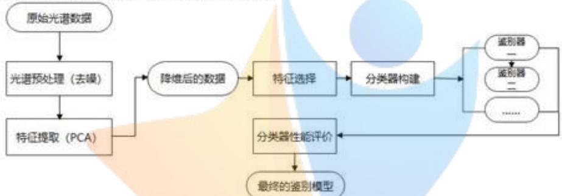

<details>
<summary>flowchart</summary>

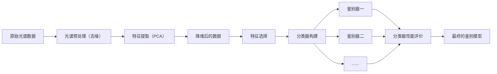
</details>

图 1 基于机器学习的光谱产地识别框架

## 三、模型假设与约定

1. 假设所有的近红外波长都在 $0.75 \mu m$ 到 $3 \mu m$ 范围内，中红外波长都在为 $3 \mu m$ 到 $30 \mu m$ 范围内。  
2. 各个附件的药材数据真实可靠。  
3. 不考虑外界因素比如空气湿度，光照强度等对数据进行干扰。

四、符号说明及名词定义

<table><tr><td>符号</td><td>说明</td></tr><tr><td> $x_{i}$ </td><td>第 $i$ 样品光谱的平均值</td></tr><tr><td> $m$ </td><td>波长点数</td></tr><tr><td> $n$ </td><td>校正样品数</td></tr><tr><td> $\lambda_{m}$ </td><td>特征值</td></tr><tr><td> $a_{m}$ </td><td>特征向量</td></tr><tr><td> $P(c_{k})$ </td><td>产地在样本中出现的概率</td></tr><tr><td> $P(c_{k} | x)$ </td><td>概率密度函数</td></tr><tr><td> $\Omega$ </td><td>输入空间</td></tr><tr><td> $precision_{k}$ </td><td>查准率</td></tr><tr><td> $recall_{k}$ </td><td>查全率</td></tr><tr><td>accuracy</td><td>准确率</td></tr></table>

## 五、模型建立与求解

## 5.1 问题一的模型建立与分析

## 5.1.1 光谱去噪

对光谱数据进行预处理，采用Savitzky-Golay卷积平滑法和标准正态变量变换（SNV）来对光谱数据进行预处理。

## (1) Savitzky-Golay卷积平滑法

Savitzky-Golay卷积是利用局部滑动窗口来实现的一种多项式回归算法，其原理为：将原始的受干扰的光谱数值替换为平均值，该均值实质是通过局部的移动窗口对要替换的数值进行最近似于真实信号的多项式拟合，从而使得原来受到干扰的光谱值可以更正为更为合理的信号值，其近似过程实质上可以看做是一种加权的平均方法。

设滤波窗口的宽度 $n=2m+1$ ，各测量点为 $x=\{-m,-m+2,\ldots,0,1,\ldots,m-1,m\}$ ，我们采用二次多项式对窗口内的数据进行拟合，其表达式为：

$$
y = a _ {0} + a _ {1} x + a _ {2} x ^ {2} \tag {1}
$$

其中 $a_0, a_1$ 和 $a_2$ 为二次多项式的系数， $y$ 为多项式拟合后的值。由公式（1）可以得到 $n$ 个类似的方程，从而构成一个三元线性方程组。

通过公式（1），我们可以得到拟合后的 SG 平滑光谱值。

一阶 SG 平滑导数为:

$$
\left. \frac {d y}{d x} \right| _ {x = 0} = a _ {1} \tag {2}
$$

二阶 SG 平滑导数为:

$$
\left. \frac {d ^ {2} y}{d x ^ {2}} \right| _ {x = 0} = a _ {2} \tag {3}
$$

## (2) 标准正态变量变换(SNV)

标准正态变量变换(SNV)主要是用来消除固体颗粒大小、表面散射以及光程变化对漫反射光谱的影响。对需SNV变换的光谱按下式计算：

$$
X _ {i, S N V} = \frac {x _ {i , k} - x _ {i}}{\frac {m _ {k = i} \left(x _ {i , k} - x _ {i}\right) ^ {2}}{(m - 1)}} \tag {4}
$$

式（5）中 $x_{i}$ 是第 i 样品光谱的平均值， $k=1,2,\cdots,m$ ，m 为波长点数； $i=1,2,\cdots,n$ ，n 为校正样品数； $X_{i,SNV}$ 是变换后的光谱。

本次处理使用四种去噪的算法：SG平滑法，一阶SG平滑导数和二阶SG平滑导数，来获得近似去噪后的中药材光谱数据，使鉴别模型更为精确地表达中药

材的光谱特征。

使用光谱去噪模型，对附件1中的中药材光谱图进行处理，结果如图2图3所示。原始的几种中药材光谱吸收率显示在（图3）中，使用原始SG平滑及在此基础上衍生出的一阶SG平滑导数和二阶SG平滑导数的去噪效果图见图3(b)-(d)中。将（图2）与（图3）进行对比，我们可以发现经过SG平滑后原始光谱图变得更加光滑。在进行一阶导数运算后，光谱范围从[-0.1,0.9]压缩[-0.06,0.12]，同时光谱信号得到更进一步的平滑，消除了基线漂移，使原始光谱中的波峰变为0在进行二阶导数运算后，范围缩小到[-0.08]到[0.06]，二阶导数光谱的平滑效果跟一阶导数接近，但数据得到更进一步压缩，消除了基线漂移和光谱倾斜，增强了光谱特征。而经过SNV预处理后的光谱图，却保留了原光谱数据的值，且吸光度放大后，可以非常直观地看出各数据之间的差异，其得注意的是，通过图3可以看出，中药材样本的光谱具有很大的重叠性。

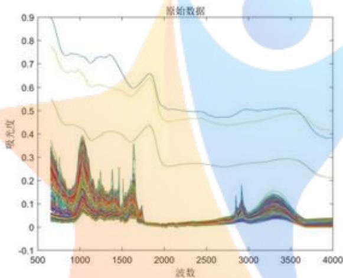

<details>
<summary>line</summary>

| 波数 | 吸光度 (Series 1) | 吸光度 (Series 2) | 吸光度 (Series 3) | 吸光度 (Series 4) | 吸光度 (Series 5) | 吸光度 (Series 6) | 吸光度 (Series 7) | 吸光度 (Series 8) |
| --- | --- | --- | --- | --- | --- | --- | --- | --- |
| 500 | ~0.9 | ~0.78 | ~0.55 | ~0.35 | ~0.25 | ~0.15 | ~0.12 | ~0.08 |
| 1000 | ~0.75 | ~0.65 | ~0.45 | ~0.38 | ~0.28 | ~0.18 | ~0.15 | ~0.12 |
| 1500 | ~0.72 | ~0.62 | ~0.42 | ~0.35 | ~0.25 | ~0.15 | ~0.12 | ~0.08 |
| 2000 | ~0.65 | ~0.55 | ~0.45 | ~0.38 | ~0.28 | ~0.18 | ~0.15 | ~0.12 |
| 2500 | ~0.52 | ~0.48 | ~0.38 | ~0.32 | ~0.25 | ~0.15 | ~0.12 | ~0.08 |
| 3000 | ~0.52 | ~0.48 | ~0.38 | ~0.32 | ~0.25 | ~0.15 | ~0.12 | ~0.08 |
| 3500 | ~0.52 | ~0.48 | ~0.38 | ~0.32 | ~0.25 | ~0.15 | ~0.12 | ~0.08 |
| 4000 | ~0.42 | ~0.42 | ~0.38 | ~0.32 | ~0.25 | ~0.15 | ~0.12 | ~0.08 |
</details>

图 2 原始数据光谱图

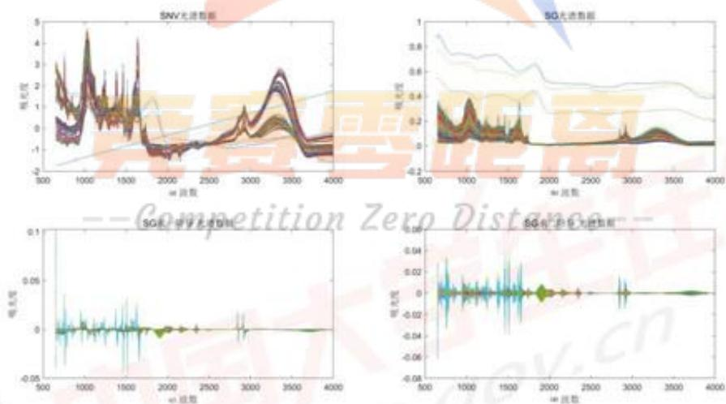  
图 3 中药材原始光谱去噪后效果图  
其中从左往右依次为：（a）SNV光谱图；（b）SG平滑后的效果图；（c）SG平滑后一阶导数的效果图；（d）SG平滑后二阶导数的效果图

在对光谱去噪后，由于数据量过多，因此我们需要使用主成分分析选取特征值对其进行降维。

## 5.1.2 基于主成分分析（PCA）选取特征值

由于中药材的数据量太大,我们需要将上千维中药材的原始光谱数据用少量的数据主成分来代替,所以首先用 PCA 主成分分析方法降维选取中药材的特征值,然后利用特征值使用K-means 将其进行聚类。

主成分分析（PCA）是常见的用于高维数据中的特征抽取方法之一，PCA（主成分分析法）是对高维样本空间引入随机变量，将多个变量通过线性变换选出较少重要变量的一种多元统计方法。

原始样本数可以表达为： $X=\left[x^{1},x^{2},\ldots,x^{m}\right]$ ，m为原始光谱分布图的维数。

为了使光谱数据集能更适合PCA的运算，所以需要先将数据进行归一化处理，然后计算标准化和偶样本的协方差矩阵R，与R的特征值 $\lambda_{m}$ 和特征向量 $a_{m}$ 。

$$
\text {贡献率} = \frac {\lambda_ {i}}{\sum_ {k = 1} ^ {p} \lambda_ {k}} (i = 1, 2, \dots , p) \tag {5}
$$

$$
\text {累计贡献率} = \frac {\sum_ {k = 1} ^ {i} \lambda_ {k}}{\sum_ {k = 1} ^ {p} \lambda_ {k}} (i = 1, 2, \dots , p) \tag {6}
$$

取贡献率达到80%的特征值对应的第一至第m(m≤p)个主成分，利用公式

$$
F _ {\mathrm{i}} = a _ {1 i} X _ {x 1} + a _ {2 i} X _ {x 2} + \dots + a _ {p i} X _ {p} (\mathrm{i} = 1, 2 \dots , \mathrm{m}) \tag {7}
$$

其中 $a_{1i}, a_{2i} \ldots a_{pi}$ 为 $X$ 的协方差阵 $\Sigma$ 的特征值所对应的特征向量， $X_{x1}, X_{x2}, \ldots, a_{pi}$ 是原始变量标准化后的值。

当特征向量的值越大时，表示其含有更多的原始信息或能量，对该主成分的影响越大，具有更大的重要性。

因为没有足够的证据表明某一段光谱具有很强的区分度，因此对附件1中整个光谱段 $652 - 3999(cm^{-1})$ 进行主成分提取以得到最具代表性的光谱信息，以主成分的贡献度排序得到的结果如图4与图5所示。

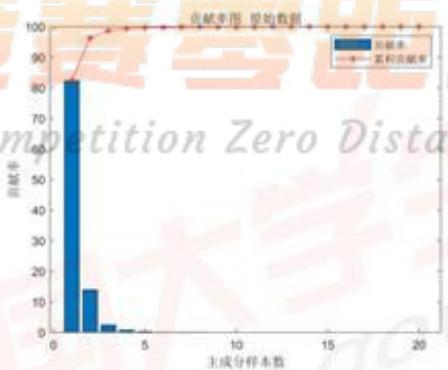

<details>
<summary>bar</summary>

| 生成分样本数 | 贡献率 (%) |
| --- | --- |
| 0~1 | ~83 |
| 1~2 | ~14 |
| 2~3 | ~3 |
| 3~4 | ~1 |
| 4~5 | ~0.5 |
</details>

图4原始贡献率

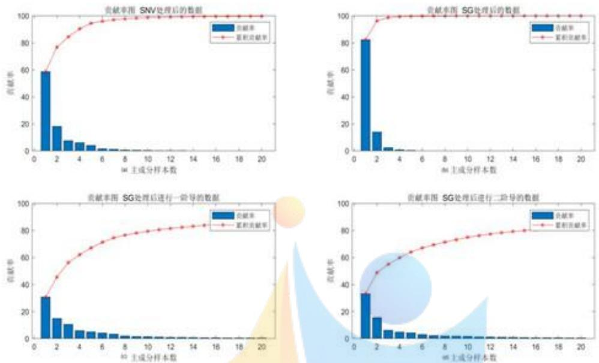  
图 5 附件 1 中药材光谱数据进行 PCA 特征抽取之后的主成分贡献率  
其中从左往右依次为：（a）SNV平滑后的数据进行PCA特征抽取；（b）SG平滑后的数据进行PCA特征抽取；（c）SG平滑后一阶导数的数据进行PCA特征抽取；（d）SG平滑后二阶导数的数据进行PCA特征抽取

观察图 4与图 5, 我们发现, 进行降维后, 原始数据中主成分1达到了82.37%, 前三个主成分占据了98.67%的信息量, 在经过SNV平滑后的主成分贡献率前三个主成分占据了84.38%的信息量, 在对SG平滑后的数据提取主成分, 前三个主成分占据了98.67%的信息量, 而对一阶导数和二阶导数后的平滑数据, 前三个主成分分别占据了56.19%及54.93%。由此可知, 光谱数据在经过一阶SG平滑导数与二阶SG平滑导数PCA降维后累计贡献率较低, 因此需要提取的样本数相较于使用其他方式进行数据处理后的样本数更多。

提取每一个处理方式处理后的光谱数据使用主成分分析后累计贡献率超过80%的特征值所对应的主成分，保存的主成分个数见下表：

表 1 附件 1 进行 PCA 主成分保留个数

<table><tr><td></td><td>原始数据</td><td>SNV 标准正交变换</td><td>SG 平滑算法</td><td>SG 一阶平滑</td><td>SG 二阶平滑</td></tr><tr><td>主成分个数</td><td>3</td><td>4</td><td>3</td><td>12</td><td>16</td></tr><tr><td>累计贡献率</td><td>98.67%</td><td>90.47%</td><td>98.67%</td><td>80.56%</td><td>80.00%</td></tr></table>

## 5.1.3 基于K-means聚类算法进行药材分类

K-means 聚类算法需要先指定需要划分的类的个数 k 值，然后随机地选择 K 个数据对象作为初始的聚类中心，并且计算其余的各个数据对象到这 K 个初始聚类中心的距离，把数据对象划归到距离它最近的那个中心所处在的簇类中：同一聚类中的对象相似度较高；而不同聚类中的对象相似度较低。聚类相似度是利用各聚类中对象的均值所获得一个“中心对象（引力中心）来进行计算的。

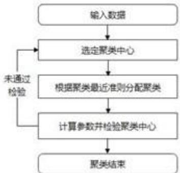

<details>
<summary>flowchart</summary>

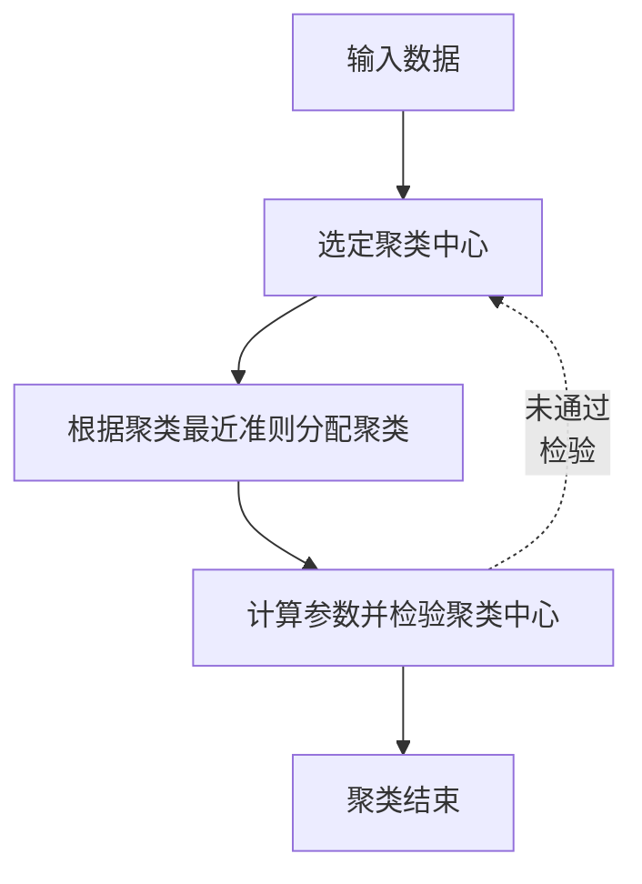
</details>

图 6 K-means 聚类算法流程图

由于无法得知最好聚类效果的聚类中心设定值，所以我们将聚类中心分别设置为4和6进行聚类测试，并将聚类结果可视化，结果见图7和图8。

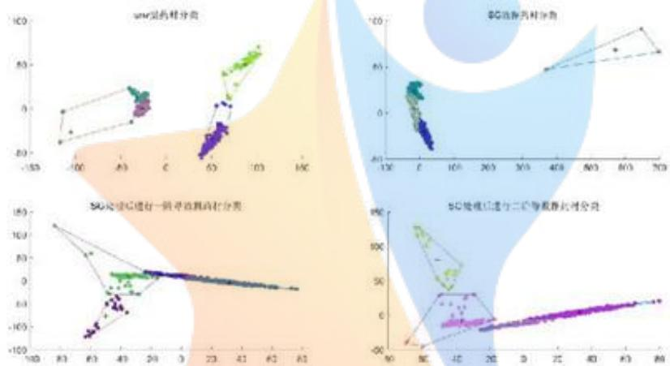  
图 7 聚类中心为 4 的聚类效果图

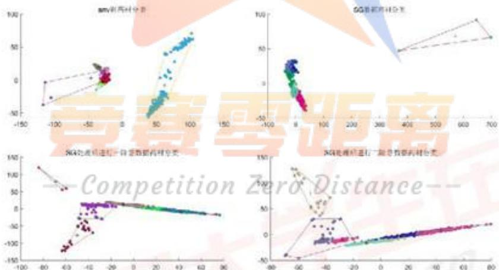  
图 8 聚类中心为 6 的聚类效果图

在原始光谱和 SG 平滑后的光谱数据上进行 PCA 降维和 K-means 聚类后，不同种类之间的中药材分布具有一定的区分度。

根据观察，我们可以得知设定聚类中心为6的聚类效果比设定聚类中心为4的聚类效果更好，所以我们将聚类中心定为6，将中药材分为六个类别（具体分类结果见附录)。并且在分布图中我们可以判断经过 SG 一阶导数平滑后聚类的效果最好，经过 SNV 处理和 SG 平滑后的数据聚类效果最差。

所以使用经过 SG 一阶导数平滑处理后的数据进行分为 6 类，并对每一类的药材进行编号，将每一类药材抽取一个最接近于聚类中性点的特征明显的样本进行特征值分析，再将多个样本进行画图比较差异值分析，见图 9。

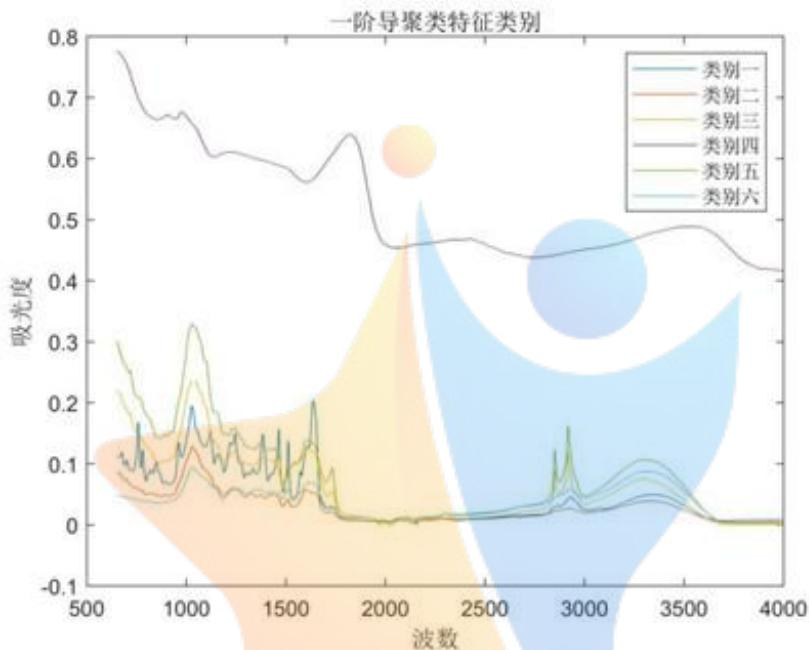

<details>
<summary>line</summary>

| 波数 | 类别一 (吸光度) | 类别二 (吸光度) | 类别三 (吸光度) | 类别四 (吸光度) | 类别五 (吸光度) | 类别六 (吸光度) |
| --- | --- | --- | --- | --- | --- | --- |
| 500 | ~0.12 | ~0.12 | ~0.12 | ~0.78 | ~0.30 | ~0.12 |
| 1000 | ~0.12 | ~0.12 | ~0.12 | ~0.68 | ~0.33 | ~0.12 |
| 1500 | ~0.12 | ~0.12 | ~0.12 | ~0.60 | ~0.15 | ~0.12 |
| 2000 | ~0.12 | ~0.12 | ~0.12 | ~0.46 | ~0.12 | ~0.12 |
| 2500 | ~0.12 | ~0.12 | ~0.12 | ~0.46 | ~0.12 | ~0.12 |
| 3000 | ~0.12 | ~0.12 | ~0.12 | ~0.44 | ~0.16 | ~0.12 |
| 3500 | ~0.12 | ~0.12 | ~0.12 | ~0.48 | ~0.12 | ~0.12 |
| 4000 | ~0.12 | ~0.12 | ~0.12 | ~0.42 | ~0.12 | ~0.12 |
</details>

图 9 SG 一阶平滑导数聚类特征类别

根据上图观察，我们可以发现，在 SG 一阶平滑导数处理后的进行聚类的特征图中，第四类中药材的整体吸光度明显高于其他几类，特征最为明显；第六类中药材在 1600 波数出现最高吸收峰后，趋势变得平稳，类别二、三、五的大致趋势相似，但在峰差、峰宽及吸光度的大小是存在一定差异，可能是因为这几种中药材的生长环境相似。

除第四类与第六类药材外中药材外，其余药材的特征为：在波数为1100处出现最高吸收峰，且波数为1700之后，随波数增大，吸光度增幅逐渐放缓趋势，没有明显的“峰-谷”变化；波数在2800处时吸光度形成吸收谷且波数在2900时，存在一个弱反射峰。

表 2 不同种类的光谱差异表

<table><tr><td></td><td>种类一</td><td>种类二</td><td>种类三</td><td>种类四</td><td>种类五</td><td>种类六</td></tr><tr><td>总峰数</td><td>1-2</td><td>1</td><td>2-3</td><td>1</td><td>2-3</td><td>1-2</td></tr><tr><td>最高峰位</td><td>1700-2000</td><td>1100-1300</td><td>1100-1300</td><td>652-700</td><td>1100-1300</td><td>1200-1400</td></tr><tr><td>峰强</td><td>较强</td><td>较弱</td><td>较强</td><td>较弱</td><td>强</td><td>弱</td></tr><tr><td>峰形</td><td>尖</td><td>钝</td><td>尖</td><td>钝</td><td>尖</td><td>钝</td></tr></table>

但还不能单纯地通过光谱图对中药材进行差异性判定，我们结合化学计量方法使用SID散度分析进一步分析六个中药材之间的差异性。

## 5.1.4 光谱信息散度 (SID)

SID 可用于表征不同样本光谱间相似性。不同样本光谱间的 SID 越小，这两个样本的相似度越高，样本数据越接近,使用 SID 进行中药材的差异分析是非常合适的。

对于光谱 $x_{1}=\left(x_{11},x_{12},\ldots,x_{1l}\right)$ 和光谱 $x_{2}=\left(x_{21},x_{22},\ldots,x_{2l}\right)$ 可以得到两条光谱的概率向量分别是 $q=\left(q_{1},q_{2},\ldots,q_{i}\right)^{T}$ 和 $p=\left(p_{1},p_{2},\ldots,p_{i}\right)^{T}$ 。

其中 $q_{i} = x_{1i} / \left(\sum_{i=1}^{I}x_{1i}\right),p_{i} = x_{2i} / \left(\sum_{i=1}^{I}x_{2i}\right)$ 。

根据光谱信息理论，可以得到 $x_{1}$ 和 $x_{2}$ 的自信息为：

$$
l _ {i} (x _ {1}) = - \log q _ {i} \tag {8}
$$

$$
l _ {i} (x _ {2}) = - \log p _ {i} \tag {9}
$$

可以得到 $x_{2}$ 关于 $x_{1}$ 的相对熵：

$$
D \big (x _ {1} \parallel x _ {2} \big) = \sum_ {i = 1} ^ {l} q _ {i} \log \left(\frac {q _ {i}}{p _ {i}}\right) \tag {10}
$$

两者散度的计算公式如下：

$$
S I D \big (x _ {1}, x _ {2} \big) = D \big (x _ {1} \parallel x _ {2} \big) + D \big (x _ {2} \parallel x _ {1} \big) \tag {11}
$$

通过计算，我们得到六个种类的之间相对的 SID 值，见下表：

表 3 六个种类的 SID 表

<table><tr><td></td><td>种类一</td><td>种类二</td><td>种类三</td><td>种类四</td><td>种类五</td><td>种类六</td></tr><tr><td>种类一</td><td>0</td><td>0.0344</td><td>0.0362</td><td>0.2190</td><td>0.0460</td><td>0.1415</td></tr><tr><td>种类二</td><td>0.0344</td><td>0</td><td>0.0118</td><td>0.1571</td><td>0.0109</td><td>0.0907</td></tr><tr><td>种类三</td><td>0.0362</td><td>0.0118</td><td>0</td><td>0.2047</td><td>0.0028</td><td>0.1233</td></tr><tr><td>种类四</td><td>0.2190</td><td>0.1571</td><td>0.2047</td><td>0</td><td>0.1997</td><td>0.1271</td></tr><tr><td>种类五</td><td>0.0460</td><td>0.0109</td><td>0.0028</td><td>0.1997</td><td>0</td><td>0.1204</td></tr><tr><td>种类六</td><td>0.1415</td><td>0.0907</td><td>0.1233</td><td>0.1271</td><td>0.1204</td><td>0</td></tr></table>

由上表可知，种类一、二、三、五与种类四差异最大，数据最不接近，根据推测可能是因为地域原因，地理位置较远；种类一与种类六种类对种类二的数据SID值相对最小，分别为0.0344与0.0907；而种类二与种类三对种类五SID值相对较小，分别为0.0109与0.0028。所以总结：种类一、二、三、五、六地理位置应该相隔不远，环境气候相似，导致中药材的化学组成成分相差不大。

## 5.2 问题二模型建立与分析

问题二需要对某一种药材的产地进行鉴别，并分析不同产地的药材的差异和特征。附件2给出了问题二所需要的某一种药材的中红外光谱，我们需要先对中红外光谱数据进行去噪处理，根据问题一中的比较，我们得知使用标准正态变量变换（SNV）处理效果不够理想，所以参考问题一中的去噪过程选择采用SG与其一阶平滑导数和二阶平滑导数对附件2进行去噪。具体过程见流程图：

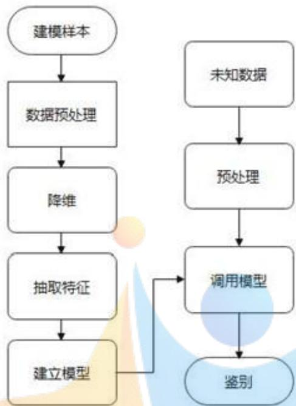

<details>
<summary>flowchart</summary>

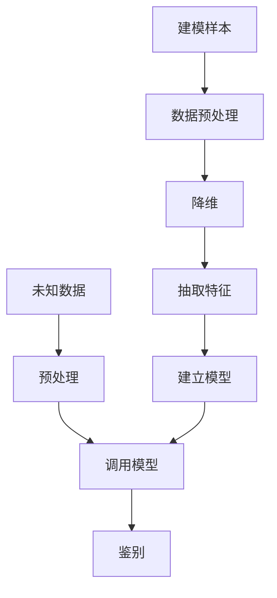
</details>

图 10 模型流程图

## 5.2.1 不同产地的中药材特征值和差异性分析

由于附件 2 给出的是某一种中药材不同产地的中红外光谱数据, 所以在十一个地区随机选取了一个样本进行特征值比较与差异值分析, 见下图:

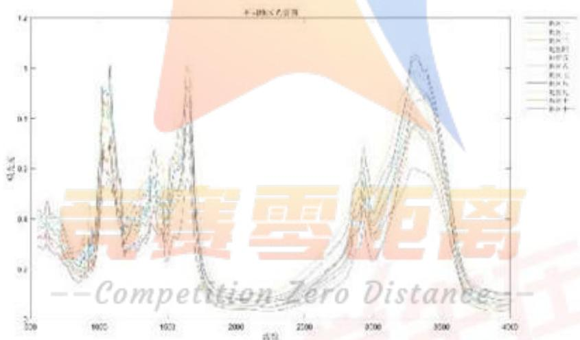

<details>
<summary>line</summary>

| 时间 | 距离 1 | 距离 2 | 距离 3 | 距离 4 | 距离 5 | 距离 6 | 距离 7 | 距离 8 |
| --- | --- | --- | --- | --- | --- | --- | --- | --- |
| 300 | ~0.35 | ~0.35 | ~0.35 | ~0.35 | ~0.35 | ~0.35 | ~0.35 | ~0.35 |
| 600 | ~0.85 | ~0.85 | ~0.85 | ~0.85 | ~0.85 | ~0.85 | ~0.85 | ~0.85 |
| 1000 | ~0.45 | ~0.45 | ~0.45 | ~0.45 | ~0.45 | ~0.45 | ~0.45 | ~0.45 |
| 1500 | ~1.0 | ~1.0 | ~1.0 | ~1.0 | ~1.0 | ~1.0 | ~1.0 | ~1.0 |
| 2000 | ~-0.25 | ~-0.25 | ~-0.25 | ~-0.25 | ~-0.25 | ~-0.25 | ~-0.25 | ~-0.25 |
| 3000 | ~0.65 | ~0.65 | ~0.65 | ~0.65 | ~0.65 | ~0.65 | ~0.65 | ~0.65 |
| 3500 | ~1.1 | ~1.1 | ~1.1 | ~1.1 | ~1.1 | ~1.1 | ~1.1 | ~1.1 |
| 4000 | ~-0.25 | ~-0.25 | ~-0.25 | ~-0.25 | ~-0.25 | ~-0.25 | ~-0.25 | ~-0.25 |
</details>

图11十一个产地药材的光谱特征图

根据上图观察,我们可以发现十一个产地药材的光谱特征图大致趋势是一致的,但是各药材的最大吸光度、峰高、峰宽,峰差不同,所有的药材分别在波数为1050、1600、3400左右出现三个明显峰。

表 4 不同地区药材的光谱差异表

<table><tr><td>地区</td><td>一</td><td>二</td><td>三</td><td>四</td><td>五</td><td>六</td><td>七</td><td>八</td><td>九</td><td>十</td><td>十一</td></tr><tr><td>峰数</td><td>3</td><td>3</td><td>3</td><td>3</td><td>3</td><td>3</td><td>3</td><td>3</td><td>3</td><td>3</td><td>3</td></tr><tr><td>峰位</td><td>3300-3400</td><td>1600-1700</td><td>3300-3400</td><td>3200-3300</td><td>3100-3400</td><td>1600-1700</td><td>1600-1700</td><td>3300-3400</td><td>1100-1200</td><td>3200-3300</td><td>1100-1200</td></tr><tr><td>峰强</td><td>较强</td><td>较弱</td><td>较弱</td><td>较弱</td><td>强</td><td>较强</td><td>较强</td><td>强</td><td>较弱</td><td>较强</td><td>强</td></tr><tr><td>峰形</td><td>尖</td><td>钝</td><td>钝</td><td>钝</td><td>尖</td><td>尖</td><td>尖</td><td>尖</td><td>钝</td><td>尖</td><td>钝</td></tr></table>

## 5.2.2 通过 SID 值对其进行定量分析

由SID表可知（见附录），地区一与地区十一的SID值最大，为0.0152数据最不接近，根据推测可能因为土壤、天气的原因造成药材的物理性质发生了变化；地区三与地区六SID值最小，为0.0004。因此可以推断：种类一、二、三、五、六地理位置应该相隔不远，环境气候相似，导致中药材的化学组成成分相差不大。

## 5.2.3 基于主成分分析（PCA）提取特征值

光谱数据去噪后,再采用主成分分析法（PCA）对中红外光谱进行降维，提取光谱特征，其贡献率作为代表性的光谱信息，见下图：

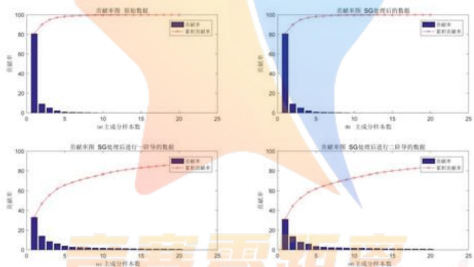  
图 12 附件 2 中药材光谱数据进行 PCA 特征抽取之后的主成分贡献率

其中从左往右依次为：（a）原始数据进行 PCA 特征抽取；（b）SG 平滑后的数据进行 PCA 特征抽取；（c）SG 平滑后一阶导数的数据进行 PCA 特征抽取；（d）SG 平滑后二阶导数的数据进行 PCA 特征抽取

观察我们发现，进行降维后，原始数据中主成分1达到了80.70%，前三个主成分占据了94.90%的信息量，在经过SG平滑后的数据提取主成分，前三个主成分占据了94.89%的信息量，而在SG平滑后一阶导数和二阶导数的PCA特征抽取，前三个主成分分别占据了55.52%及52.54%。由此可知，光谱数据在经过一阶SG平滑导数与二阶SG平滑导数PCA降维后需要保留的主成分个数更多，见下表：

表 5 附件 2 进行 PCA 后主成分保留个数

<table><tr><td></td><td>原始数据</td><td>SG平滑算法</td><td>SG一阶平滑</td><td>SG二阶平滑</td></tr><tr><td>保存主成分的个数</td><td>3</td><td>3</td><td>14</td><td>17</td></tr><tr><td>累计贡献率</td><td>94.90%</td><td>94.89%</td><td>82.04%</td><td>81.51%</td></tr></table>

## 5.2.4 样本均衡性分析

为了防止出现过拟合现象，我们对样本的均衡度进行分析，结果见下表：

表 6 问题二的样本均衡度

<table><tr><td>OP</td><td>1</td><td>2</td><td>3</td><td>4</td><td>5</td><td>6</td><td>7</td><td>8</td><td>9</td><td>10</td><td>11</td></tr><tr><td>样本数</td><td>67</td><td>59</td><td>67</td><td>88</td><td>29</td><td>87</td><td>50</td><td>59</td><td>31</td><td>66</td><td>55</td></tr></table>

由于样本数相差不大，所以我们暂不考虑对样本数的统一。

## 5.2.5 鉴别分类器构建

在进行特征的选取后，我们需要利用分类器进行对选取的特征的学习，分类器可以构建出对中药材产地的鉴别模型，且不同的分类器具有不同的特性，即使采用的同一组数据进行训练，得到的结果也往往有所差异。因此我们主要采用数据挖掘中常见的贝叶斯分类器（NB）、决策树算法（DT）、K近邻分类器（KNN）、支持向量机（SVM）和线性判别分类器（LDA）来构造五个不同的鉴别分类器。使用多种分类器进行训练，将不同的结果进行对比，找到效果最好的分类器，从而更高效更准确地实现对药材产地的鉴别。

## (1) 朴素贝叶斯分类器(NB)

朴素贝叶斯分类器(NB)是基于概率分布的分类器。贝叶斯决策理论是解决模式分类问题的基本途径之一，意为决策问题可以转化为概率分布的形式来表达，假设其相关的先验概率是已知的，根据贝叶斯公式，在已知其先验概率的前提下，我们可以推导出其后验概率，即

$$
P (c _ {k} | x) = P (c _ {k}) \times P (x | c _ {k}) \times P (x) ^ {- 1} \tag {12}
$$

上式中 $c_{k}$ 表示第 $k$ 个类别，即表示某一个中药材的产地。 $x$ 表示位置的样本， $P(c_k)$ 表示该产地在样本中出现的概率， $P(c_k \mid x)$ 表示在该产地条件下，测试样本 $x$ 的概率密度函数。通过公式（8），得到该测试的中药材样本属于某一产地的后验概率。通过选择最大的概率值，贝叶斯分类器将中药材样本鉴别为最可能的产地。

朴素贝叶斯分类的算法步骤：

1) 设 $x=\left\{a_{1},a_{2},\ldots,a_{m}\right\}$ 为一个待测样本集， $a_{i}$ 为 x 的第 i 个特征属性，x 包含 m 个特征。  
2）设中药材产地类别集合 $C=\left\{c_{1},c_{2},\ldots,c_{n}\right\}$ 。  
3）通过公式（8），分别计算出 $P(c_{1}|x)$ ， $P(c_{2}|x),\ldots,P(c_{n}|x)$ 。  
4) 如果 $p(c_k|x) = \max \left\{p(c_1|x), p(c_2|x), \dots, p(c_n|x)\right\}$ ，则 $x \in c_k, 1 \leq k \leq n$ 。

## (2) K近邻分类（KNN）

KNN的分类的过程主要是基于样本之间的距离比较即从训练样本中找出K个与其最相近的样本，通过比较K个样本中所属类别的个数多少，来判定测试样本的类别，在使用KNN进行分类时，选择的样本的个数不同，使用样本进行比较后，KNN算法需要我们人为决定K的取值，K的取值不同，也有可能会对识别结果造成差异，在本文中我们主要选择欧式距离作为样本件距离的度量。

## (3) 线性判别分析（LDA）

LDA 其基本思想是寻找一投影方向，使训练样本投影到该方向时尽可能具有最大类间距离和最小类内距离，设训练样本中有 c 个类别，根据 Fisher's 线性判别准则，这需要 c-1 个判别函数。也就是将 d 维的特征空间向 c-1 维空间做投影。

## (4) 决策树模型 (DT)

决策树模型采用树形结构，将特征属性和最终的决策值进行联系，每一个内部的节点表述一个输入变量，数分支代表一个测试输出，树叶代表分类的结果，根据输入，通过根到叶之间的路径判断得到一条分类规则。

决策树往往采用自顶向下的方式生成，从根节点开始，通过对原始的数据集进行逐个属性测试并分裂为子集得到。这一过程在每一个生成的子集上重复递归地进行，直到某一个节点上的所有样本都被划分到同一个类别，或者对原始数据不能再进行有效的分割时结束。

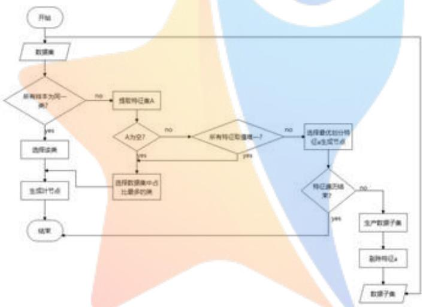

<details>
<summary>flowchart</summary>

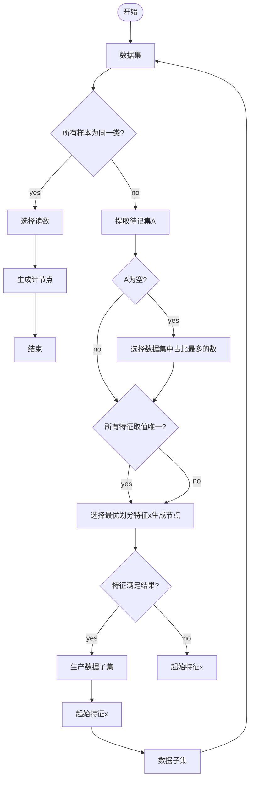
</details>

图 13 决策树模型流程图

## (5) 支持向量机模型（SVM）

支持向量机的主要思想是找到一个超平面是其尽可能多的将两类数据分开，同时使两类数据点距离分类面最短。

根据给定的训练集：

$$
T = \left\{\left[ a _ {1}, y _ {1} \right], \left[ a _ {2}, y _ {2} \right], \dots , \left[ a _ {l}, y _ {l} \right] \right\} \in (\Omega \times Y) ^ {L} \tag {13}
$$

上式中， $a_{i}\in\Omega=R^{n}$ ； $\Omega$ 称为输入空间，输入空间中的每一个点a由n个属性特征组成； $y_{i}\in Y=\{-1,1\},i=1,2,\cdots,l$

寻找 $\mathbf{R}^n$ 上的一个实值函数 $g(x)$ ，以便用分类函数

$$
f (x) = \text {sign} (g (x)) \tag {14}
$$

判断任意一个模式x相对应的y值的问题为分类问题。

## 5.2.6 基于分类器交叉验证与性能评价模型

为了挑选出最好的分类模型，我们需要测试分类器的性能，并使用一些指标进行性能的检验。

我们采用 $M \times N$ 交叉验证法。将数据集划分为10个等分，然后使用9个数据子集的数据进行训练，用剩下的一个子集进行测试。以上过程遍历10次以尽可能确保每一份数据集都参加了训练和测试，并且整个实验过程也要重复5次以确保样本划分的影响最小，最后测试集结束测试时，我们可以训练 $5 \times 10$ 个模型并获得50个测试结果，然后将测试结果的平均值作为次交叉验证模型的指标。进行50次不同的测试以获得最为精确的评价，从而减少样本划分引起的误差。

在性能指标的选取上我们通过正确率来评价鉴别模型的总的性能：

$$
P _ {a} = \frac {n _ {r}}{N _ {t}} \tag {15}
$$

其中 $n_{r}$ 是所有被正确分类的样本， $N_{r}$ 为测试样本的总数。

由于在实践中样本的分布是未知的,所有我们还需要使用混淆矩阵来概括分类器的性能,并通过混淆矩阵得到另外几个不同的评价标准,计算步骤如下:

首先计算每个类别下的precision和recall:

$$
{p r e c i s i o n _ {k}} = \frac {T P}{T P + F P} \tag {16}
$$

$$
\text {recall} _ {k} = \frac {T P}{T P + F N} \tag {17}
$$

准确率（accuracy）代表分类器对整个严格不能判断正确的比重：

$$
\text {accuracy} = \frac {T P + T N}{T P + T N + F P + F N} \tag {18}
$$

计算每个类别下的 $F_{1}$ 分数：

$$
F _ {1 k} = \frac {2 \cdot \text {precision} _ {k} \cdot \text {recall} _ {k}}{\text {precision} _ {k} + \text {recall} _ {k}} \tag {19}
$$

对每个类别下的 $F_{1}$ 分数求均值，得到最终测评结果：

$$
\text {score} = \left(\frac {1}{n} \sum F 1 _ {k}\right) ^ {2} \tag {20}
$$

上式中，TP代表预测答案正确；FP代表预测为本类；FN代表预测为其他类标。

当分类器能正确识别全部测试样本是时， $F_{1}$ 分数达到最大值为1，反之为0。

## 5.2.7 分类器性能评价

各鉴别分类器分别进行5×10次交叉验证后得到的平均识别率见下表：

表 7 四个分类器的产地鉴别准确率

<table><tr><td>分类器</td><td>原始数据</td><td>SG平滑</td><td>SG一阶平滑导数</td><td>SG二阶平滑导数</td></tr><tr><td>DT</td><td>31.8%</td><td>28.3%</td><td>54.0%</td><td>56.8%</td></tr><tr><td>KNN</td><td>34.8%</td><td>34.8%</td><td>97.3%</td><td>97.3%</td></tr><tr><td>NB</td><td>32.7%</td><td>33.7%</td><td>91.2%</td><td>93.0%</td></tr><tr><td>LDA</td><td>30.9%</td><td>30.9%</td><td>92.9%</td><td>98.3%</td></tr><tr><td>SVM</td><td>34.3%</td><td>33.9%</td><td>96.7%</td><td>98.2%</td></tr></table>

从上表中可以看出，LDA 在 SG 二阶平滑导数数据集上识别率达到整个鉴别准确率的最高值，为 98%，其次 SVM 与 KNN 的表现最好，KNN 在 SG 一阶平滑导数据集上达到了 97.3% 的准确率，且除 DT 外，所有的分类器在数据经过 SG 一阶及二阶平滑后，准确率提到了 90% 以上。说明在经过 SG 一阶和二阶平滑导数数据后，KNN、NB、LDA 的性能都得到很大的提升，只有 DT 的性能提升不是理想，应该是因为对测试数据的分类没有那么准确，即出现过拟合现象。

所以综合看来，经过 SG 二阶平滑导数处理后的数据使用 LDA 分类器的产地鉴别准确率最高，为 98.3%，于是我们采用 LDA 分类器对中药材的产地进行鉴别。

## 5.2.8 LDA 分类器的性能评价

在选定分类器后，我们对分类器的性能进行评价，通过混淆矩阵进行判定分类错误的样本。见图 14。

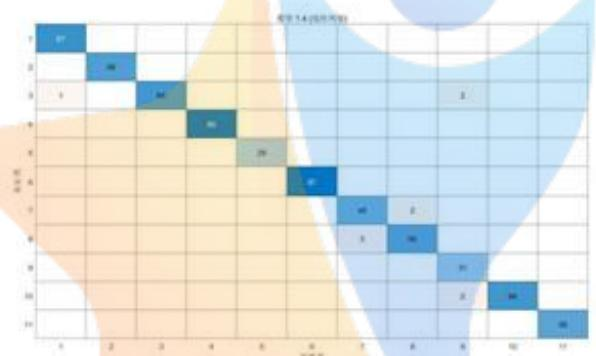

<details>
<summary>heatmap</summary>

| Category | 1 | 2 | 3 | 4 | 5 | 6 | 7 | 8 | 9 | 10 | 11 |
| --- | --- | --- | --- | --- | --- | --- | --- | --- | --- | --- | --- |
| 1 | 87 | — | — | — | — | — | — | — | — | — | — |
| 2 | — | 98 | — | — | — | — | — | — | — | — | — |
| 3 | 1 | — | 94 | — | — | — | — | — | — | — | — |
| 4 | — | — | — | 99 | — | — | — | — | — | — | — |
| 5 | — | — | — | — | 29 | — | — | — | — | — | — |
| 6 | — | — | — | — | — | 87 | — | — | — | — | — |
| 7 | — | — | — | — | — | — | 90 | 1 | — | — | — |
| 8 | — | — | — | — | — | — | 11 | 90 | — | — | — |
| 9 | — | — | — | — | — | — | — | 12 | 90 | — | — |
| 10 | — | — | — | — | — | — | — | — | 90 | 90 | — |
| 11 | — | — | — | — | — | — | — | — | — | 90 | 90 |
</details>

图 14 问题二 LDA 线性判别混淆矩阵

由图 14 我们可以看出，LDA 的判别中有 5 个地方判别错误，有一份样本应当属于第三类，却被判为第一类；有两份样本应当属于第三类、第七类、第十类，却被判为第九类第八类与第九类；有三份样本应当属于第八类，却被判为了第七类。

通过混淆矩阵得到的敏感度（TPR），特异性（FPR）， $F_{1}$ 分数的结果如下表所示：

表 8 各产地的评价指标

<table><tr><td>产地</td><td>1</td><td>2</td><td>3</td><td>4</td><td>5</td><td>6</td><td>7</td><td>8</td><td>9</td><td>10</td><td>11</td></tr><tr><td>TP</td><td>67</td><td>59</td><td>64</td><td>88</td><td>29</td><td>87</td><td>48</td><td>56</td><td>31</td><td>64</td><td>55</td></tr><tr><td>FP</td><td>1</td><td>0</td><td>0</td><td>0</td><td>0</td><td>0</td><td>3</td><td>2</td><td>4</td><td>2</td><td>0</td></tr><tr><td>FN</td><td>0</td><td>0</td><td>3</td><td>0</td><td>0</td><td>0</td><td>2</td><td>3</td><td>0</td><td>0</td><td>0</td></tr><tr><td> $F_1分数$ </td><td>0.99</td><td>1.00</td><td>0.98</td><td>1.00</td><td>1.00</td><td>1.00</td><td>0.95</td><td>0.96</td><td>0.94</td><td>0.98</td><td>1.00</td></tr></table>

通过对十一个产地的 $F_{1}$ 分数进行求和取平均，计算得到 $F_{1}$ 综合得分为0.98，说明药材产地的分类精确率很高。

最后计算，给出的药材产地鉴别为见下表：

表 9 问题二药材产地编号图

<table><tr><td>NO</td><td>3</td><td>14</td><td>38</td><td>48</td><td>58</td><td>71</td><td>79</td><td>86</td></tr><tr><td>OP</td><td>6</td><td>1</td><td>4</td><td>7</td><td>10</td><td>6</td><td>9</td><td>11</td></tr></table>

<table><tr><td>NO</td><td>89</td><td>110</td><td>134</td><td>152</td><td>227</td><td>331</td><td>618</td></tr><tr><td>OP</td><td>3</td><td>4</td><td>9</td><td>2</td><td>5</td><td>8</td><td>3</td></tr></table>

## 5.3 问题三的模型建立与求解

问题三需要我们根据同种药材的近红外数据与中红外数据，鉴别其产地并填写鉴别结果。

## 5.3.1 去噪处理与特征值提取

经过前两问我们发现原始数据和SG平滑后的数据分类效果相对于SG一阶平滑导数和二阶平滑导数不理想，于是我们仅采用SG一阶平滑导数和二阶平滑导数对近红外数据和中红外数据进行去噪。然后使用主成分分析（PCA）进行特征值的提取。在选取主成分时我们只采用指定解释方差达到95%的主成分，最后选取了54个主成分。

## 5.3.2 波段的选取与分类器的选择

因为药材会在近红外数据和中红外数据的光谱图上显示不同的效果,于是我们在使用以下三种方法选取波段:

1. 选取中红外光谱数据  
2. 选取近红外光谱数据  
3. 选取中红外光谱数据与近红外光谱数据

将选取的红外光谱数据进行数据集划分后利用分类器进行选取特征的学习，计算五种分类器的准确率，见下表：

表 10 五个分类器对不同波段红外数据分类后的产地鉴别准确率

<table><tr><td>分类器</td><td>近红外SG一阶平滑</td><td>近红外SG二阶平滑</td><td>中红外SG一阶平滑</td><td>中红外SG二阶平滑</td><td>整段红外SG一阶平滑</td><td>整段红外SG二阶平滑</td></tr><tr><td>DT</td><td>81.6%</td><td>78.4%</td><td>69.0%</td><td>70.6%</td><td>82.9%</td><td>73.9%</td></tr><tr><td>KNN</td><td>86.9%</td><td>85.3%</td><td>90.6%</td><td>90.6%</td><td>94.3%</td><td>92.2%</td></tr><tr><td>NB</td><td>83.3%</td><td>85.3%</td><td>87.8%</td><td>92.2%</td><td>91.0%</td><td>87.8%</td></tr><tr><td>LDA</td><td>97.6%</td><td>97.6%</td><td>89.4%</td><td>92.2%</td><td>98.4%</td><td>97.1%</td></tr><tr><td>SVM</td><td>91.0%</td><td>92.2%</td><td>91.0%</td><td>93.5%</td><td>91.3%</td><td>94.7%</td></tr></table>

从上表可知，近红外光谱数据经过 SG 一阶及二阶平滑后 LDA 分类器的准确率最高，都为 97.6%；中红外光谱数据经过 SG 一阶及二阶平滑后 SVM 分类器的准确率最高，分别为 91% 与 93.5%；而选取的整段红外光谱数据经过 SG 一阶及二阶平滑后的准确率达到了 98.4% 与 97.1%，综合所有的准确率来看，选取整段红外光谱进行训练后使用 LDA 分类器得到的产地鉴别准确率最高。所以我们选取经过 SG 一阶平滑处理后的近中红外结合数据使用 LDA 分类器进行中药材的产地鉴别。

## 5.3.3 样本均衡性分析

在使用分类器进行预测前，我们对样本数进行均衡性的检验

表 11 问题二各个产地的样本数

<table><tr><td>OP</td><td>1</td><td>2</td><td>3</td><td>4</td><td>5</td><td>6</td><td>7</td><td>8</td><td>9</td><td>10</td><td>11</td><td>12</td><td>13</td><td>14</td><td>15</td><td>16</td><td>17</td></tr><tr><td>近红外样本</td><td>14</td><td>14</td><td>14</td><td>14</td><td>15</td><td>15</td><td>15</td><td>15</td><td>14</td><td>14</td><td>14</td><td>15</td><td>15</td><td>14</td><td>15</td><td>14</td><td>14</td></tr><tr><td>中红外样本</td><td>14</td><td>14</td><td>14</td><td>14</td><td>15</td><td>15</td><td>15</td><td>15</td><td>14</td><td>14</td><td>14</td><td>15</td><td>15</td><td>14</td><td>15</td><td>14</td><td>14</td></tr></table>

由上表可得，每一个产地的近红外样本数与中红外样本数相差不超过一个样本数，说明均衡性非常好，可以直接进行预测。

## 5.3.4 基于LDA分类器的预测性能评价与鉴别

在选定分类器后，我们对分类器的性能进行评价，通过混淆矩阵进行判定分类错误的样本。

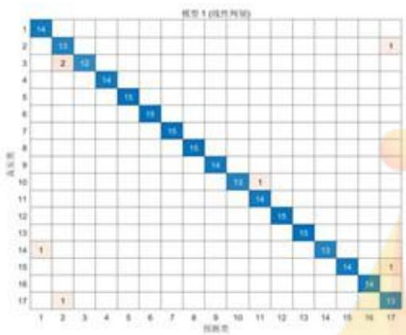

<details>
<summary>heatmap</summary>

| Category | X | Y | Value |
| --- | --- | --- | --- |
| 1 | 1 | 1 | 14 |
| 2 | 2 | 2 | 13 |
| 3 | 3 | 3 | 12 |
| 4 | 4 | 4 | 14 |
| 5 | 5 | 5 | 15 |
| 6 | 6 | 6 | 19 |
| 7 | 7 | 7 | 15 |
| 8 | 8 | 8 | 16 |
| 9 | 9 | 9 | 14 |
| 10 | 10 | 10 | 12 |
| 11 | 11 | 11 | 1 |
| 12 | 12 | 12 | 14 |
| 13 | 13 | 13 | 16 |
| 14 | 14 | 14 | 15 |
| 15 | 15 | 15 | 13 |
| 16 | 16 | 16 | 14 |
| 17 | 17 | 17 | 13 |
| N/A | N/A | N/A | 1 |
| N/A | N/A | N/A | 2 |
| N/A | N/A | N/A | 3 |
| N/A | N/A | N/A | 4 |
| N/A | N/A | N/A | 5 |
| N/A | N/A | N/A | 6 |
| N/A | N/A | N/A | 7 |
| N/A | N/A | N/A | 8 |
| N/A | N/A | N/A | 9 |
| N/A | N/A | N/A | 10 |
| N/A | N/A | N/A | 11 |
| N/A | N/A | N/A | 12 |
| N/A | N/A | N/A | 13 |
| N/A | N/A | N/A | 14 |
| N/A | N/A | N/A | 15 |
| N/A | N/A | N/A | 16 |
| N/A | N/A | N/A | 17 |
| N/A | N/A | N/A | 18 |
| N/A | N/A | N/A | 19 |
| N/A | N/A | N/A | 20 |
| N/A | N/A | N/A | 21 |
| N/A | N/A | N/A | 22 |
| N/A | N/A | N/A | 23 |
| N/A | N/A | N/A | 24 |
| N/A | N/A | N/A | 25 |
| N/A | N/A | N/A | 26 |
| N/A | N/A | N/A | 27 |
| N/A | N/A | N/A | 28 |
| N/A | N/A | N/A | 29 |
| N/A | N/A | N/A | 30 |
| N/A | N/A | N/A | 31 |
| N/A | N/A | N/A | 32 |
| N/A | N/A | N/A | 33 |
| N/A | N/A | N/A | 34 |
| N/A | N/A | N/A | 35 |
| N/A | N/A | N/A | 36 |
| N/A | N/A | N/A | 37 |
| N/A | N/A | N/A | 38 |
| N/A | N/A | N/A | 39 |
| N/A | N/A | N/A | 40 |
| N/A | N/A | N/A | 41 |
| N/A | N/A | N/A | 42 |
| N/A | N/A | N/A | 43 |
| N/A | N/A | N/A | 44 |
| N/A | N/A | N/A | 45 |
| N/A | N/A | N/A | 46 |
| N/A | N/A | N/A | 47 |
| N/A | N/A | N/A | 48 |
| N/A | N/A | N/A | 49 |
| N/A | N/A | N/A | 50 |
| N/A | N/A | N/A | 51 |
| N/A | N/A | N/A | 52 |
| N/A | N/A | N/A | 53 |
| N/A | N/A | N/A | 54 |
| N/A | N/A | N/A | 55 |
| N/A | N/A | N/A | 56 |
| N/A | N/A | N/A | 57 |
| N/A | N/A | N/A | 58 |
| N/A | N/A | N/A | 59 |
| N/A | N/A | N/A | 60 |
| N/A | N/A | N/A | 61 |
| N/A | N/A | N/A | 62 |
| N/A | N/A | N/A | 63 |
| N/A | N/A | N/A | 64 |
| N/A | N/A | N/A | 65 |
| N/A | N/A | N/A | 66 |
</details>

图 15 问题三 LDA 产地鉴别模型混淆矩阵

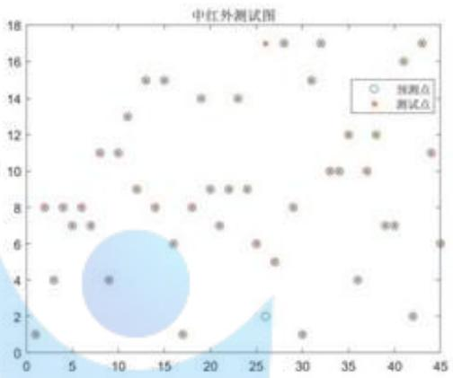

<details>
<summary>scatter</summary>

| 类别 | X | Y |
| --- | --- | --- |
| 测试点 | ~1 | 8 |
| 测试点 | ~2 | 4 |
| 测试点 | ~3 | 8 |
| 测试点 | ~5 | 7 |
| 测试点 | ~6 | 8 |
| 测试点 | ~7 | 7 |
| 测试点 | ~9 | 11 |
| 测试点 | ~10 | 11 |
| 测试点 | ~10 | 4 |
| 测试点 | ~11 | 13 |
| 测试点 | ~12 | 9 |
| 测试点 | ~13 | 15 |
| 测试点 | ~14 | 15 |
| 测试点 | ~15 | 8 |
| 测试点 | ~16 | 6 |
| 测试点 | ~17 | 1 |
| 测试点 | ~18 | 8 |
| 测试点 | ~19 | 14 |
| 测试点 | ~20 | 9 |
| 测试点 | ~21 | 9 |
| 测试点 | ~22 | 7 |
| 测试点 | ~23 | 9 |
| 测试点 | ~24 | 9 |
| 测试点 | ~25 | 6 |
| 测试点 | ~26 | 5 |
| 测试点 | ~26 | 2 |
| 测试点 | ~27 | 17 |
| 测试点 | ~28 | 17 |
| 测试点 | ~29 | 8 |
| 测试点 | ~30 | 1 |
| 测试点 | ~31 | 15 |
| 测试点 | ~32 | 17 |
| 测试点 | ~33 | 10 |
| 测试点 | ~34 | 10 |
| 测试点 | ~35 | 12 |
| 测试点 | ~36 | 4 |
| 测试点 | ~37 | 10 |
| 测试点 | ~38 | 12 |
| 测试点 | ~39 | 7 |
| 测试点 | ~40 | 7 |
| 测试点 | ~41 | 16 |
| 测试点 | ~42 | 2 |
| 测试点 | ~43 | 17 |
| 测试点 | ~44 | 11 |
| 测试点 | ~45 | 6 |
</details>

图 16 LDA 分类器分类器测试集仿真效果图

由图 15 的混淆矩阵我们可以看出，LDA 的判别中有 6 个地方判别错误，有一份样本应当属于第二类、第十四类、第十五类与第十七类，却被判到第十七类、第一类、第十七类与第二类；有两份样本应当属于第三类却被判为第二类。

由图 15 的分类器预测效果图可知，将 SG 一阶平滑处理后的近中红外光谱数据作为测试点，除某个点的预测发生偏移外，其他测试点都在预测点的中心位置，使用此模型进行产地鉴别得到的预测点与测试点基本全部吻合，结果表明 LDA 分类器进行产地鉴别效果好且准确率高。

通过混淆矩阵得到的敏感度（TPR），特异性（FPR）， $F_{1}$ 分数的结果如下表所示：

表 12 问题三的各评价指标

<table><tr><td>产地</td><td>1</td><td>2</td><td>3</td><td>4</td><td>5</td><td>6</td><td>7</td><td>8</td><td>9</td><td>10</td><td>11</td><td>12</td><td>13</td><td>14</td><td>15</td></tr><tr><td>TP</td><td>14</td><td>13</td><td>12</td><td>14</td><td>15</td><td>15</td><td>15</td><td>15</td><td>14</td><td>13</td><td>14</td><td>15</td><td>15</td><td>13</td><td>14</td></tr><tr><td>FP</td><td>1</td><td>3</td><td>0</td><td>0</td><td>0</td><td>0</td><td>0</td><td>0</td><td>0</td><td>0</td><td>1</td><td>0</td><td>0</td><td>0</td><td>0</td></tr><tr><td>FN</td><td>0</td><td>1</td><td>2</td><td>0</td><td>0</td><td>0</td><td>0</td><td>0</td><td>0</td><td>1</td><td>0</td><td>0</td><td>0</td><td>1</td><td>1</td></tr><tr><td> $F_1分数$ </td><td>0.97</td><td>0.87</td><td>0.92</td><td>1</td><td>1</td><td>1</td><td>1</td><td>1</td><td>1</td><td>0.96</td><td>0.97</td><td>1</td><td>1</td><td>0.96</td><td>0.97</td></tr></table>

通过对十一个产地的 $F_{1}$ 分数进行求和取平均，计算得到 $F_{1}$ 综合得分为0.97，说明药材产地的分类精确率很高。

最后进行编号预测，给出的药材产地鉴别为见下表：

表 13 问题三的药材产地编号表

<table><tr><td>NO</td><td>4</td><td>15</td><td>22</td><td>30</td><td>34</td><td>45</td><td>74</td><td>114</td><td>170</td><td>209</td></tr><tr><td>OP</td><td>17</td><td>11</td><td>1</td><td>2</td><td>16</td><td>3</td><td>4</td><td>10</td><td>9</td><td>14</td></tr></table>

## 5.4 问题四的模型建立与求解

问题四要求我们根据附件4提供的几种药材的近红外光谱数据进行类别与产

地的鉴别。

由问题一和问题二提出的鉴别框架，分别对中药材的类别和产地进行建模预测。

## 5.4.1 基于近红外光谱的中药材类别鉴别模型：

分类模型准确率见下表:

表 14 对类别的预测准确率

<table><tr><td>分类器</td><td>SG一阶平滑导数</td><td>SG二阶平滑导数</td></tr><tr><td>DT</td><td>100%</td><td>100%</td></tr><tr><td>KNN</td><td>58.4%</td><td>100%</td></tr><tr><td>NB</td><td>100%</td><td>58.4%</td></tr><tr><td>LDA</td><td>100%</td><td>100%</td></tr><tr><td>SVM</td><td>100%</td><td>100%</td></tr></table>

由上表可知，在对类别的分类时，除KNN外，其他分类器的效果都达到了100%，而KNN预测准确率较低的原因可能是因为样本数据量少，不利于KNN分类器进行分类，因此我们随机选择SVM分类器对分类结果通过混淆矩阵与预测效果图进行数据可视化检验：

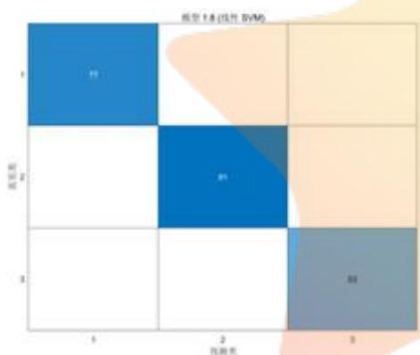

<details>
<summary>heatmap</summary>

| Row | Col 1 | Col 2 | Col 3 |
| --- | --- | --- | --- |
| 1 | 91 | — | — |
| 2 | — | 91 | — |
| 3 | — | — | 93 |
</details>

图 17 SVM 分类器的产地鉴别模型混淆矩阵

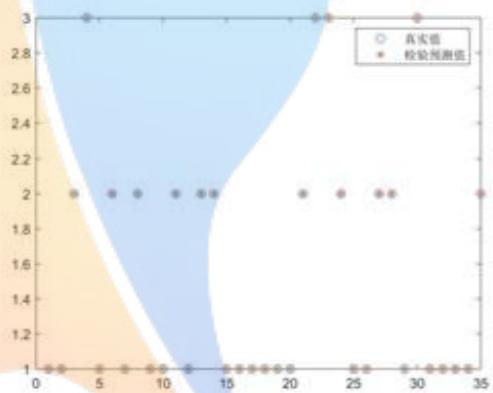  
图 16 SVM 分类器测试集数据仿真结果

由上图可知，混淆矩阵中并无真实数据被错误预测，且每个真实值都处于预测值的预测中心，无任何偏差，说明SVM的预测准确率符合100%，分类效果已达到理想

未知中药材模型预测结果如下表：

表 15 未知中药材模型预测结果

<table><tr><td>NO</td><td>94</td><td>109</td><td>140</td><td>278</td><td>308</td><td>330</td><td>347</td></tr><tr><td>Class</td><td>A</td><td>A</td><td>A</td><td>C</td><td>C</td><td>C</td><td>B</td></tr></table>

## 5.4.2 产地鉴别模型

预测准确率见下表:

表 16 各种分类器对产地的预测准确率

<table><tr><td>分类器</td><td>SG一阶平滑导数</td><td>SG二阶平滑导数</td></tr><tr><td>DT</td><td>61.1%</td><td>56.4%</td></tr><tr><td>KNN</td><td>63.4%</td><td>58.0%</td></tr><tr><td>NB</td><td>54.8%</td><td>58.3%</td></tr><tr><td>LDA</td><td>75.5%</td><td>65.0%</td></tr><tr><td>SVM</td><td>49.0%</td><td>49.0%</td></tr></table>

由上表可知，在经过一阶平滑处理后的光谱数据经过LDA分类器进行预测的准确率较高，但仍不理想。

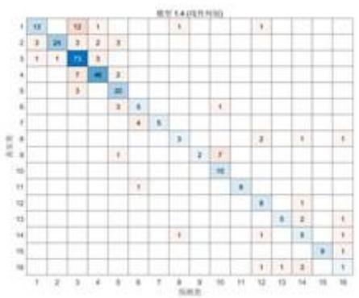

<details>
<summary>heatmap</summary>

| Category | 1 | 2 | 3 | 4 | 5 | 6 | 7 | 8 | 9 | 10 | 11 | 12 | 13 | 14 | 15 | 16 |
| --- | --- | --- | --- | --- | --- | --- | --- | --- | --- | --- | --- | --- | --- | --- | --- | --- |
| 1 | 13 | — | 12 | 1 | — | — | — | — | 1 | — | — | — | 1 | — | — | — |
| 2 | 3 | 24 | 3 | 2 | 3 | — | — | — | — | — | — | — | — | — | — | — |
| 3 | 1 | 1 | 73 | 3 | — | — | — | — | — | — | — | — | — | — | — | — |
| 4 | — | — | 1 | — | 3 | — | — | — | — | — | — | — | — | — | — | — |
| 5 | — | — | 3 | — | 22 | — | — | — | — | — | — | — | — | — | — | — |
| 6 | — | — | — | — | 3 | 6 | — | — | — | 1 | — | — | — | — | — | — |
| 7 | — | — | — | — | — | 4 | 5 | — | — | — | — | — | — | — | — | — |
| 8 | — | — | — | — | — | — | — | 3 | — | — | — | 2 | — | 1 | — | 1 |
| 9 | — | — | — | — | 1 | — | — | — | 2 | 7 | — | — | — | — | — | — |
</details>

图 17 LDA 分类器模型的混淆矩阵

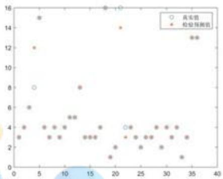

<details>
<summary>scatter</summary>

| Series | X | Y |
| --- | --- | --- |
| 真实值 | ~4 | 8 |
| 真实值 | ~19 | 16 |
| 真实值 | ~21 | 16 |
| 检验预测值 | ~1 | 3 |
| 检验预测值 | ~1 | 4 |
| 检验预测值 | ~3 | 6 |
| 检验预测值 | ~4 | 12 |
| 检验预测值 | ~5 | 15 |
| 检验预测值 | ~7 | 4 |
| 检验预测值 | ~8 | 3 |
| 检验预测值 | ~9 | 4 |
| 检验预测值 | ~10 | 3 |
| 检验预测值 | ~11 | 5 |
| 检验预测值 | ~12 | 5 |
| 检验预测值 | ~13 | 8 |
| 检验预测值 | ~14 | 3 |
| 检验预测值 | ~15 | 3 |
| 检验预测值 | ~16 | 3 |
| 检验预测值 | ~17 | 4 |
| 检验预测值 | ~19 | 1 |
| 检验预测值 | ~20 | 2 |
| 检验预测值 | ~22 | 3 |
| 检验预测值 | ~23 | 4 |
| 检验预测值 | ~24 | 3 |
| 检验预测值 | ~25 | 2 |
| 检验预测值 | ~26 | 3 |
| 检验预测值 | ~27 | 3 |
| 检验预测值 | ~28 | 4 |
| 检验预测值 | ~29 | 2 |
| 检验预测值 | ~30 | 4 |
| 检验预测值 | ~31 | 4 |
| 检验预测值 | ~32 | 3 |
| 检验预测值 | ~33 | 1 |
| 检验预测值 | ~34 | 3 |
| 检验预测值 | ~35 | 13 |
| 检验预测值 | ~36 | 13 |
</details>

图 20 LDA 分类器测试集仿真效果

由上述结果，各种分类器基于近红外光谱数据建模时，模型的准确率不高。我们通过观察各样品的近红外光谱图，发现在近红外波段中药材的光吸收差异不大。

为探索原因，我们对光谱数据进行样本均衡性分析，统计了不同类别和不同产地的样本数量，结果如下表：

表 17 样本数量统计表

<table><tr><td></td><td>A</td><td>B</td><td>C</td><td>未知</td><td>总计</td></tr><tr><td>1</td><td>10</td><td>5</td><td>4</td><td>11</td><td>30</td></tr><tr><td>2</td><td>4</td><td>8</td><td>14</td><td>12</td><td>38</td></tr><tr><td>3</td><td>30</td><td>5</td><td>16</td><td>37</td><td>88</td></tr><tr><td>4</td><td>24</td><td>6</td><td>9</td><td>26</td><td>65</td></tr><tr><td>5</td><td>12</td><td>4</td><td>0</td><td>9</td><td>25</td></tr><tr><td>6</td><td>0</td><td>8</td><td>0</td><td>2</td><td>10</td></tr><tr><td>7</td><td>0</td><td>7</td><td>0</td><td>2</td><td>9</td></tr><tr><td>8</td><td>0</td><td>3</td><td>0</td><td>6</td><td>9</td></tr><tr><td>9</td><td>0</td><td>7</td><td>0</td><td>3</td><td>10</td></tr><tr><td>10</td><td>0</td><td>6</td><td>0</td><td>4</td><td>10</td></tr><tr><td>11</td><td>0</td><td>5</td><td>0</td><td>4</td><td>9</td></tr><tr><td>12</td><td>0</td><td>5</td><td>0</td><td>4</td><td>9</td></tr><tr><td>13</td><td>0</td><td>4</td><td>0</td><td>6</td><td>10</td></tr><tr><td>14</td><td>0</td><td>4</td><td>0</td><td>4</td><td>8</td></tr><tr><td>15</td><td>0</td><td>6</td><td>0</td><td>5</td><td>11</td></tr><tr><td>16</td><td>0</td><td>7</td><td>0</td><td>1</td><td>8</td></tr><tr><td>未知</td><td>17</td><td>12</td><td>14</td><td>7</td><td>50</td></tr><tr><td>总计</td><td>97</td><td>102</td><td>57</td><td>143</td><td>399</td></tr></table>

由上表我们可以看出就产地而言样本数量存在较为严重的不均衡性，产地3的样本最多有88个，而产地14、16的样本只有8个。因此我们考虑建立基于中药材的类别的场地鉴别模型。

## 5.4.3 基于中药材的类别的产地鉴别模型

对三种中药材（A、B、C）分别进行产地鉴别模型结果如下表：

表 18 提升后的产地鉴别准确率

<table><tr><td></td><td colspan="3">SG一阶平滑</td><td colspan="3">SG二阶平滑</td></tr><tr><td>分类器</td><td>A</td><td>B</td><td>C</td><td>A</td><td>B</td><td>C</td></tr><tr><td>DT</td><td>62.5%</td><td>68.9%</td><td>90.7%</td><td>53.8%</td><td>62.2%</td><td>95.3%</td></tr><tr><td>LDA</td><td>76.2%</td><td>88.9%</td><td>100%</td><td>72.5%</td><td>80.0%</td><td>100%</td></tr><tr><td>NB</td><td>68.8%</td><td>73.3%</td><td>95.3%</td><td>61.3%</td><td>77.8%</td><td>95.3%</td></tr><tr><td>SVM</td><td>75.0%</td><td>74.4%</td><td>100%</td><td>72.5%</td><td>57.8%</td><td>100%</td></tr><tr><td>KNN</td><td>65.0%</td><td>80.0%</td><td>90.7%</td><td>72.5%</td><td>80.0%</td><td>95.3%</td></tr></table>

从上表可以发现相对于未进行药材类别分类的的识别模型，准确率有显著的提升。其中，经过SG一阶平滑后的光谱数据再经过LDA进行产地鉴别，鉴别准确率最高，三个分类分别达到了76.2%、88.9%、100%的鉴别准确率。

表 19 各类别产地鉴别模型的的 F 分数

<table><tr><td>产地</td><td>1</td><td>2</td><td>3</td><td>4</td><td>5</td><td>6</td><td>7</td><td>8</td></tr><tr><td>A</td><td>0.57</td><td>0.75</td><td>0.73</td><td>0.85</td><td>0.83</td><td>--</td><td>--</td><td>--</td></tr><tr><td>B</td><td>1</td><td>0.89</td><td>0.57</td><td>0.92</td><td>0.89</td><td>1</td><td>1</td><td>1</td></tr><tr><td>C</td><td>1</td><td>1</td><td>1</td><td>1</td><td>--</td><td>--</td><td>--</td><td>--</td></tr><tr><td>产地</td><td>9</td><td>10</td><td>11</td><td>12</td><td>13</td><td>14</td><td>15</td><td>16</td></tr><tr><td>A</td><td>--</td><td>--</td><td>--</td><td>--</td><td>--</td><td>--</td><td>--</td><td>--</td></tr><tr><td>B</td><td>0.83</td><td>0.92</td><td>1</td><td>1</td><td>0.66</td><td>0.5</td><td>1</td><td>0.83</td></tr><tr><td>C</td><td>--</td><td>--</td><td>--</td><td>--</td><td>--</td><td>--</td><td>--</td><td>--</td></tr></table>

注：--表示该类别没有此产地的样品

运用基于中药材类别的产地鉴别模型对未知样品进行鉴别结果如下：

表 20 问题四药材的鉴别与分类表

<table><tr><td>NO</td><td>94</td><td>109</td><td>140</td><td>278</td><td>308</td><td>330</td><td>347</td></tr><tr><td>Class</td><td>A</td><td>A</td><td>A</td><td>C</td><td>C</td><td>C</td><td>B</td></tr><tr><td>OP</td><td>5</td><td>3</td><td>3</td><td>1</td><td>3</td><td>4</td><td>11</td></tr></table>

## 六、模型检验

由于在模型建立中，我们已经通过敏感度（TPR），特异性（FPR）， $F_{1}$ 分数对模型进行了检验，并且所有模型的正确率都达到了理想结果，所以在这里不做过多阐述。

## 七、模型评价

## 优点：

1、在问题三中，我们将近红外光谱数据与中红外光谱数据进行合并后，产地鉴别的模型准确率有所提高。  
2、在问题四中，我们改进了机器学习的产地鉴别模型，建立了基于中药材类别的产地鉴别模型。  
3、结合机器学习、化学计量学等现代分析方法，建立了多种中药材类别与

产地的鉴别和分析模型，提高了中药材类别与产地的鉴别和分析的准确性。

缺点：

1、在光谱特征提取时，可以使用更复杂的特征抽取算法，如流形学习、压缩感知等技术进行研究。

## 八、模型推广

本文建立的基于机器学习的中药材类别与产地鉴别模型，对其他植物的类别鉴别与产地鉴别都具有参考作用。

## 九、参考文献

[1] 但松健. 基于 NIR 光谱分析的柑橘产地鉴别及品质检测技术研究[D]. 重庆大学. 2017.  
[2] 田园盛. 黄土高原水蚀风蚀交错区生物土壤结皮高光谱特征研究[D]. 西北农林科技大学, 2019.  
[3] 鄭悦, 张红光, 卢建刚, 施英姿, 陈金水. 基于光谱信息散度的近红外光谱局部偏最小二乘建模方法 [J]. 计算机与应用化学.  
[4] 黄艳华，杜娟，夏田，刘斯佳，李洪超，张蕴薇. 近红外光谱在植物种及品种鉴定中的应用[J]. 中国农学通报. 2014, (6): 46-51.

## 十、附录

表 21 药材分类明细表

<table><tr><td colspan="6">SG处理后进行一阶导数据药材分类</td></tr><tr><td>类别一</td><td>类别二</td><td>类别三</td><td>类别四</td><td>类别五</td><td>类别六</td></tr><tr><td>61</td><td>1</td><td>8</td><td>64</td><td>3</td><td>6</td></tr><tr><td>67</td><td>2</td><td>10</td><td>136</td><td>5</td><td>12</td></tr><tr><td>69</td><td>4</td><td>13</td><td>201</td><td>11</td><td>14</td></tr><tr><td>78</td><td>7</td><td>15</td><td></td><td>16</td><td>17</td></tr><tr><td>94</td><td>9</td><td>20</td><td></td><td>18</td><td>30</td></tr><tr><td>120</td><td>19</td><td>24</td><td></td><td>22</td><td>31</td></tr><tr><td>130</td><td>21</td><td>26</td><td></td><td>25</td><td>48</td></tr><tr><td>183</td><td>23</td><td>27</td><td></td><td>33</td><td>53</td></tr><tr><td>184</td><td>32</td><td>28</td><td></td><td>34</td><td>59</td></tr><tr><td>200</td><td>35</td><td>29</td><td></td><td>38</td><td>77</td></tr><tr><td>220</td><td>39</td><td>36</td><td></td><td>47</td><td>79</td></tr><tr><td>258</td><td>40</td><td>37</td><td></td><td>62</td><td>86</td></tr><tr><td>279</td><td>41</td><td>42</td><td></td><td>63</td><td>93</td></tr><tr><td>297</td><td>45</td><td>43</td><td></td><td>65</td><td>95</td></tr><tr><td>308</td><td>46</td><td>44</td><td></td><td>66</td><td>100</td></tr><tr><td>318</td><td>51</td><td>49</td><td></td><td>68</td><td>103</td></tr><tr><td>345</td><td>55</td><td>50</td><td></td><td>74</td><td>106</td></tr><tr><td>384</td><td>56</td><td>52</td><td></td><td>81</td><td>109</td></tr><tr><td>390</td><td>57</td><td>54</td><td></td><td>82</td><td>113</td></tr><tr><td>397</td><td>60</td><td>58</td><td></td><td>85</td><td>124</td></tr><tr><td>400</td><td>71</td><td>70</td><td></td><td>87</td><td>128</td></tr><tr><td>412</td><td>73</td><td>72</td><td></td><td>90</td><td>131</td></tr><tr><td></td><td>75</td><td>84</td><td></td><td>99</td><td>133</td></tr><tr><td></td><td>76</td><td>88</td><td></td><td>104</td><td>138</td></tr><tr><td></td><td>80</td><td>96</td><td></td><td>116</td><td>145</td></tr><tr><td></td><td>83</td><td>97</td><td></td><td>118</td><td>154</td></tr><tr><td></td><td>89</td><td>98</td><td></td><td>126</td><td>167</td></tr><tr><td></td><td>91</td><td>101</td><td></td><td>127</td><td>168</td></tr><tr><td></td><td>92</td><td>105</td><td></td><td>129</td><td>170</td></tr><tr><td></td><td>102</td><td>107</td><td></td><td>134</td><td>173</td></tr><tr><td></td><td>111</td><td>108</td><td></td><td>137</td><td>174</td></tr><tr><td></td><td>114</td><td>110</td><td></td><td>140</td><td>175</td></tr><tr><td></td><td>121</td><td>112</td><td></td><td>143</td><td>179</td></tr><tr><td></td><td>122</td><td>115</td><td></td><td>144</td><td>180</td></tr><tr><td></td><td>132</td><td>117</td><td></td><td>152</td><td>187</td></tr><tr><td></td><td>135</td><td>119</td><td></td><td>155</td><td>190</td></tr><tr><td></td><td>139</td><td>125</td><td></td><td>164</td><td>192</td></tr><tr><td></td><td>142</td><td>141</td><td></td><td>165</td><td>195</td></tr><tr><td></td><td>146</td><td>147</td><td></td><td>171</td><td>208</td></tr><tr><td></td><td>148</td><td>149</td><td></td><td>176</td><td>210</td></tr><tr><td></td><td>151</td><td>150</td><td></td><td>181</td><td>216</td></tr><tr><td></td><td>156</td><td>153</td><td></td><td>188</td><td>217</td></tr><tr><td></td><td>157</td><td>158</td><td></td><td>196</td><td>236</td></tr><tr><td></td><td>159</td><td>163</td><td></td><td>197</td><td>239</td></tr><tr><td></td><td>160</td><td>172</td><td></td><td>198</td><td>242</td></tr><tr><td></td><td>161</td><td>178</td><td></td><td>199</td><td>247</td></tr><tr><td></td><td>162</td><td>182</td><td></td><td>203</td><td>251</td></tr><tr><td></td><td>166</td><td>185</td><td></td><td>206</td><td>254</td></tr><tr><td></td><td>169</td><td>186</td><td></td><td>213</td><td>256</td></tr><tr><td></td><td>177</td><td>207</td><td></td><td>218</td><td>261</td></tr><tr><td></td><td>189</td><td>211</td><td></td><td>221</td><td>262</td></tr><tr><td></td><td>191</td><td>212</td><td></td><td>222</td><td>274</td></tr><tr><td></td><td>193</td><td>214</td><td></td><td>225</td><td>276</td></tr><tr><td></td><td>194</td><td>215</td><td></td><td>232</td><td>278</td></tr><tr><td></td><td>202</td><td>219</td><td></td><td>237</td><td>287</td></tr><tr><td></td><td>204</td><td>226</td><td></td><td>238</td><td>290</td></tr><tr><td></td><td>205</td><td>229</td><td></td><td>240</td><td>292</td></tr><tr><td></td><td>209</td><td>241</td><td></td><td>249</td><td>295</td></tr><tr><td></td><td>223</td><td>243</td><td></td><td>253</td><td>304</td></tr><tr><td></td><td>224</td><td>245</td><td></td><td>257</td><td>306</td></tr><tr><td></td><td>227</td><td>248</td><td></td><td>259</td><td>311</td></tr><tr><td></td><td>228</td><td>250</td><td></td><td>260</td><td>312</td></tr><tr><td></td><td>230</td><td>252</td><td></td><td>270</td><td>314</td></tr><tr><td></td><td>231</td><td>263</td><td></td><td>271</td><td>315</td></tr><tr><td></td><td>233</td><td>264</td><td></td><td>272</td><td>316</td></tr><tr><td></td><td>234</td><td>269</td><td></td><td>275</td><td>321</td></tr><tr><td></td><td>235</td><td>273</td><td></td><td>281</td><td>327</td></tr><tr><td></td><td>244</td><td>277</td><td></td><td>282</td><td>329</td></tr><tr><td></td><td>246</td><td>283</td><td></td><td>288</td><td>332</td></tr><tr><td></td><td>255</td><td>284</td><td></td><td>291</td><td>339</td></tr><tr><td></td><td>265</td><td>301</td><td></td><td>293</td><td>340</td></tr><tr><td></td><td>266</td><td>302</td><td></td><td>296</td><td>343</td></tr><tr><td></td><td>267</td><td>317</td><td></td><td>298</td><td>344</td></tr><tr><td></td><td>268</td><td>319</td><td></td><td>300</td><td>348</td></tr><tr><td></td><td>280</td><td>322</td><td></td><td>303</td><td>352</td></tr><tr><td></td><td>285</td><td>328</td><td></td><td>305</td><td>353</td></tr><tr><td></td><td>286</td><td>349</td><td></td><td>309</td><td>355</td></tr><tr><td></td><td>289</td><td>350</td><td></td><td>313</td><td>358</td></tr><tr><td></td><td>294</td><td>356</td><td></td><td>323</td><td>360</td></tr><tr><td></td><td>299</td><td>359</td><td></td><td>324</td><td>365</td></tr><tr><td></td><td>307</td><td>363</td><td></td><td>325</td><td>374</td></tr><tr><td></td><td>310</td><td>368</td><td></td><td>331</td><td>393</td></tr><tr><td></td><td>320</td><td>370</td><td></td><td>334</td><td>395</td></tr><tr><td></td><td>326</td><td>378</td><td></td><td>336</td><td>399</td></tr><tr><td></td><td>330</td><td>379</td><td></td><td>347</td><td>405</td></tr><tr><td></td><td>333</td><td>381</td><td></td><td>354</td><td>409</td></tr><tr><td></td><td>335</td><td>383</td><td></td><td>361</td><td>414</td></tr><tr><td></td><td>337</td><td>387</td><td></td><td>362</td><td>420</td></tr><tr><td></td><td>338</td><td>389</td><td></td><td>366</td><td>424</td></tr><tr><td></td><td>341</td><td>394</td><td></td><td>371</td><td></td></tr><tr><td></td><td>342</td><td>396</td><td></td><td>373</td><td></td></tr><tr><td></td><td>346</td><td>401</td><td></td><td>375</td><td></td></tr><tr><td></td><td>351</td><td>402</td><td></td><td>376</td><td></td></tr><tr><td></td><td>357</td><td>404</td><td></td><td>377</td><td></td></tr><tr><td></td><td>364</td><td>406</td><td></td><td>380</td><td></td></tr><tr><td></td><td>367</td><td>411</td><td></td><td>382</td><td></td></tr><tr><td></td><td>369</td><td>415</td><td></td><td>385</td><td></td></tr><tr><td></td><td>372</td><td>422</td><td></td><td>386</td><td></td></tr><tr><td></td><td>392</td><td>423</td><td></td><td>388</td><td></td></tr><tr><td></td><td>398</td><td></td><td></td><td>391</td><td></td></tr><tr><td></td><td>403</td><td></td><td></td><td>407</td><td></td></tr><tr><td></td><td>416</td><td></td><td></td><td>408</td><td></td></tr><tr><td></td><td>417</td><td></td><td></td><td>410</td><td></td></tr><tr><td></td><td>421</td><td></td><td></td><td>413</td><td></td></tr><tr><td></td><td>425</td><td></td><td></td><td>418</td><td></td></tr><tr><td></td><td>123</td><td></td><td></td><td>419</td><td></td></tr><tr><td>类别一</td><td>类别二</td><td>类别三</td><td>类别四</td><td>类别五</td><td>类别六</td></tr><tr><td>308</td><td>193</td><td>356</td><td>136</td><td>272</td><td>95</td></tr></table>

表 22 问题二的 SID 表

<table><tr><td>地区</td><td>1</td><td>2</td><td>3</td><td>4</td><td>5</td></tr><tr><td>1</td><td>0.0000</td><td>0.0083</td><td>0.0043</td><td>0.0063</td><td>0.0075</td></tr><tr><td>2</td><td>0.0083</td><td>0.0000</td><td>0.0038</td><td>0.0029</td><td>0.0070</td></tr><tr><td>3</td><td>0.0043</td><td>0.0038</td><td>0.0000</td><td>0.0024</td><td>0.0086</td></tr><tr><td>4</td><td>0.0063</td><td>0.0029</td><td>0.0024</td><td>0.0000</td><td>0.0054</td></tr><tr><td>5</td><td>0.0075</td><td>0.0070</td><td>0.0086</td><td>0.0054</td><td>0.0000</td></tr><tr><td>6</td><td>0.0041</td><td>0.0034</td><td>0.0004</td><td>0.0020</td><td>0.0072</td></tr><tr><td>7</td><td>0.0122</td><td>0.0016</td><td>0.0049</td><td>0.0028</td><td>0.0080</td></tr><tr><td>8</td><td>0.0115</td><td>0.0067</td><td>0.0077</td><td>0.0025</td><td>0.0064</td></tr><tr><td>9</td><td>0.0095</td><td>0.0034</td><td>0.0030</td><td>0.0012</td><td>0.0066</td></tr><tr><td>10</td><td>0.0148</td><td>0.0100</td><td>0.0075</td><td>0.0036</td><td>0.0100</td></tr><tr><td>11</td><td>0.0152</td><td>0.0100</td><td>0.0046</td><td>0.0056</td><td>0.0142</td></tr><tr><td>地区</td><td>6</td><td>7</td><td>8</td><td>9</td><td>10</td></tr><tr><td>1</td><td>0.0041</td><td>0.0122</td><td>0.0115</td><td>0.0095</td><td>0.0148</td></tr><tr><td>2</td><td>0.0034</td><td>0.0016</td><td>0.0067</td><td>0.0034</td><td>0.0100</td></tr><tr><td>3</td><td>0.0004</td><td>0.0049</td><td>0.0077</td><td>0.0030</td><td>0.0075</td></tr><tr><td>4</td><td>0.0020</td><td>0.0028</td><td>0.0025</td><td>0.0012</td><td>0.0036</td></tr><tr><td>5</td><td>0.0072</td><td>0.0080</td><td>0.0064</td><td>0.0066</td><td>0.0100</td></tr><tr><td>6</td><td>0.0000</td><td>0.0043</td><td>0.0066</td><td>0.0023</td><td>0.0073</td></tr><tr><td>7</td><td>0.0043</td><td>0.0000</td><td>0.0059</td><td>0.0023</td><td>0.0083</td></tr><tr><td>8</td><td>0.0066</td><td>0.0059</td><td>0.0000</td><td>0.0033</td><td>0.0027</td></tr><tr><td>9</td><td>0.0023</td><td>0.0023</td><td>0.0033</td><td>0.0000</td><td>0.0033</td></tr><tr><td>10</td><td>0.0073</td><td>0.0083</td><td>0.0027</td><td>0.0033</td><td>0.0000</td></tr><tr><td>11</td><td>0.0045</td><td>0.0067</td><td>0.0084</td><td>0.0033</td><td>0.0051</td></tr></table>

问题1

clc;clear  
2. a = xlsread('附件1.xlsx');  
3. ques\_1\_1 = a(:,2:end);  
4. %% 原数据  
5. data = ques\_1\_1;  
6. x\_wn = data(1,:);  
7. y\_abb = data(2:end,:);  
8. figure()  
9. plot(x\_wn,y\_abb);%不同种类编号不同波数的吸光率

```matlab
title('原始数据');xlabel('波数');ylabel('吸光度')
%% SNV 标准正交变换
figure();
[xsnv] = snv(data);
plot(x_wn,xsnv)
title('SNV 光谱数据');xlabel('波数');ylabel('吸光度')
%% SG 平滑算法
rd = 5;
f1 = 11;
figure();
kmtlb = sgolayfilt(y_abb',rd,f1,kaiser(f1,38));
plot(x_wn,kmtlb)
title('SG 光谱数据');xlabel('波数');ylabel('吸光度')
%% 在 SG 平滑的基础上进行求导
figure();
k_deriv1 = diff(kmtlb,1); %SG 数据的一阶求导
plot(x_wn(1:end-1),k_deriv1)
title('SG 求一阶导 光谱数据');xlabel('波数');ylabel('吸光度')
figure();
k_deriv2 = diff(kmtlb,2); %SG 数据的二阶求导
plot(x_wn(1:end-2),k_deriv2)
title('SG 求二阶导 光谱数据');xlabel('波数');ylabel('吸光度')
%% 将平滑后的数据进行 PCA 分析降维度
x1 = y_abb;
[cum_contribution_rate1,F1,contribution_rate1]= PCA1(x1);
xsnv1 = xsnv(2:end,:);
x2 = xsnv1;
[cum_contribution_rate2,F2,contribution_rate2]= PCA1(x2);
x3 = kmtlb';
[cum_contribution_rate3,F3,contribution_rate3]= PCA1(x3);
x4 = k_deriv1';
[cum_contribution_rate4,F4,contribution_rate4]= PCA1(x4);
x5 = k_deriv2';
[cum_contribution_rate5,F5,contribution_rate5]= PCA1(x5);
%% 将 PCA 提取出贡献率与累计贡献率进行可视化
xx = 20; % 看前 20 个特征的贡献率与累计贡献率
y1 = contribution_rate1(1:xx)*100;
figure;bar(y1)
hold on
yy1 = cum_contribution_rate1(1:xx)*100;
plot(1:xx,yy1,'r*-'') %未经处理数据
title('贡献率图 原始数据');
xlabel('主成分样本数');ylabel('贡献率')
legend('贡献率','累积贡献率')
```

```matlab
y2 = contribution_rate2(1:xx)*100;
figure;bar(y2)
hold on
yy2 = cum_contribution_rate2(1:xx)*100;
plot(1:xx,yy2,'r*-'') %SNV 处理后的数据
title('贡献率图 SNV 处理后的数据');
xlabel('主成分样本数');ylabel('贡献率')
legend('贡献率','累积贡献率')

y3 = contribution_rate3(1:xx)*100;
figure;bar(y3)
hold on
yy3 = cum_contribution_rate3(1:xx)*100;
plot(1:xx,yy3,'r*-'') %SG 处理后的数据
title('贡献率图 SG 处理后的数据');
xlabel('主成分样本数');ylabel('贡献率')
legend('贡献率','累积贡献率')

y4 = contribution_rate4(1:xx)*100;
figure;bar(y4)
hold on
yy4 = cum_contribution_rate4(1:xx)*100;
plot(1:xx,yy4,'r*-'') %SG 处理后进行一阶导的数据
title('贡献率图 SG 处理后进行一阶导的数据');
xlabel('主成分样本数');ylabel('贡献率')
legend('贡献率','累积贡献率')

y5 = contribution_rate5(1:xx)*100;
figure;bar(y5)
hold on
yy5 = cum_contribution_rate5(1:xx)*100;
plot(1:xx,yy5,'r*-'') %SG 处理后进行二阶导的数据
title('贡献率图 SG 处理后进行二阶导的数据');
xlabel('主成分样本数');ylabel('贡献率')
legend('贡献率','累积贡献率')
```

```matlab
function [cum_contribution_rate,F,contribution_rate]= PCA1(x)
  [n,p] = size(x);
X=zscore(x);
R = cov(X);
R = corrcoef(x);
```

```matlab
[V,D] = eig(R);
lambda1 = diag(D);
lambda1 = lambda1(end:-1:1);
contribution_rate = lambda1 / sum(lambda1);          % 计算贡献率
cum_contribution_rate = cumsum(lambda1)/ sum(lambda1);  % 计算累计贡献率
V=rot90(V)';
%% 计算我们所需要的主成分的值
i = 1;
s = 0;
if cum_contribution_rate(i)>0.8
    m = 3;
else
    while s <0.8
        s = cum_contribution_rate(i);
        i = i + 1;
        m = i;
    end
end
F = zeros(n,m);
for i = 1:m
    ai = V(:,i)';   % 将第 i 个特征向量取出，并转置为行向量
    Ai = repmat(ai,n,1);
    F(:, i) = sum(Ai .* X, 2);
end
end
```

```matlab
function [xsnv]=snv(data)
x=data;
[m,n]=size(x);
xsnv=(x-mean(x')'*ones(1,n))./(std(x')'*ones(1,n));
```

```matlab
clc;clear
load('pca_p.mat', 'F1')
ppoint = F1;
k = 6;
    count = 100;                      % 定义光谱最大循环次数
[N,~] = size(ppoint);
center = ppoint(1:k,:);                 % 令前 k 个点为光谱初始中心
distance_square = zeros(N,k);
while count~=0
```

```matlab
for i = 1:k
    distance_square(:,i) = sum((ppoint - repmat(center(i,:),N,1)).^2,2);

    str1 = ['Center',num2str(i),'=[];'];
    eval(str1);
end

for i = 1:N
    minposition = find(distance_square(i,:)==min(distance_square(i,:)));
    str1 = ['Center',num2str(minposition)];
    eval([str1,'=[',str1 Commodities[i,:]);]);
end

for i = 1:k
    str1 = ['Center',num2str(i)];
    eval(['center_New(',num2str(i),':) = mean(',str1',1);']);
end

if sym(sum((center_New - center).^2)) == 0
    break
else
    center = center_New;
end

count = count-1;
end

for i = 1:k
    I = num2str(i);
    disp(['第',I,'组聚类的点集:']);
    disp(eval(['Center',I]))
end
for % 把光谱聚类点显示出来
hold on
for i = 1:k
    str1 = ['Center',num2str(i)];
    plot(eval([str1,((:,1)')),eval([str1,((:,2)')),.' Markersize',15,'color',rand rand rand]);
    eval(['kn = boundary(',str1,((:,1)',str1,((:,2),0.1);']);
    if isempty(kn)
        eval(['plot(',str1,((:,1)',str1,((:,2));']);
    else
        eval(['plot(',str1,'(kn,1),',str1,'(kn,2));']);
```

```matlab
end
    plot(center(:,1),center(:,2),'k+');
    title('原始数据药材分类');
```

```matlab
clc;clear
load('pca_p.mat', 'F2')
ppoint = F2;
k = 6;

count = 100;                          % 定义光谱最大循环次数
[N,~] = size(ppoint);
center = ppoint(1:k,:);                 % 令光谱前 k 个点为初始中心
distance_square = zeros(N,k);
while count~=0
    for i = 1:k
        distance_square(:,i) = sum((ppoint - repmat(center(i,:),N,1)).^2,2);

        str1 = ['Center',num2str(i),'=[];'];
        eval(str1);
    end

    for i = 1:N
        minposition = find(distance_square(i,:)==min(distance_square(i,:)));
        str1 = ['Center',num2str(minposition)];
        eval([str1,'=[',str1 Commodities[i,:]);']);
    end
    for i = 1:k
        str1 = ['Center',num2str(i)];
        eval(['center_New(',num2str(i),':) = mean(',str1',1);']);
    end

    if sym(sum((center_New - center).^2)) == 0
        break
    else
        center = center_New;
    end
    count = count-1;
```

```matlab
end
for i = 1:k
    I = num2str(i);
    disp(['第',I,'组聚类的点集为: ']);
    disp(eval(['Center',I]))
end
end
for i = 1:k
    str1 = ['Center',num2str(i)];
    plot(eval([str1,'(:,1)'],eval([str1,'(:,2)]),'.','Markersize',15,'color',[rand rand rand]);
    eval(['kn = boundary(',str1,'(:,1),',str1,'(:,2),0.1);']);
    if isempty(kn)
        eval(['plot(',str1,'(:,1),',str1,'(:,2));']);
    else
        eval(['plot(',str1,'(kn,1),',str1,'(kn,2));']);
    end
    plot(center(:,1),center(:,2),'k+');
    title('snv 据药材分类');
end
```

```matlab
clc;clear
load('pca_p.mat', 'F3')
ppoint = F3;                          % 输入点的光谱坐标
k = 6;
count = 100;                          % 定义最大循环次数
[N,~] = size(ppoint);
center = ppoint(1:k,:);          % 令前 k 个点为初始的光谱中心
distance_square = zeros(N,k);
while count~=0
    for i = 1:k
        distance_square(:,i) = sum((ppoint - repmat(center(i,:),N,1)).^2,2);

        str1 = ['Center',num2str(i),'=[];'];
        eval(str1);
    end % 计算到每个点到各个聚类中心的距离
    for i = 1:N
        minposition = find(distance_square(i,:)==min(distance_square(i,:)));
        str1 = ['Center',num2str(minposition)];
```

```matlab
eval([str1,'=[',str1,';ppoint(i,:)];']);
end

for i = 1:k
    str1 = ['Center',num2str(i)];
    eval(['center_New(',num2str(i),',:) = mean(',str1,',1);']);
end

if sym(sum((center_New - center).^2)) == 0
    break
else
    center = center_New;
end

count = count-1;
end
for i = 1:k
    I = num2str(i);
    disp(['第',I,'组聚类的点集为: ']);
    disp(eval(['Center',I]))
end
hold on
for i = 1:k
    str1 = ['Center',num2str(i)];
    plot(eval([str1,'(:,1)')),eval([str1,'(:,2)')),'.','Markersize',15,'color',[rand rand rand]);
    eval(['kn = boundary(',str1,'(:,1),',str1,'(:,2),0.1);']);
    if isempty(kn)
        eval(['plot(',str1,'(:,1),',str1,'(:,2));']);
    else
        eval(['plot(',str1,'(kn,1),',str1,'(kn,2));']);
end
plot(center(:,1),center(:,2),'k+');
title('SG 数据药材分类');
end
```

```matlab
clc;clear
load('pca_p.mat', 'F4')
ppoint = F4;
k = 6;
count = 100;
[N,~] = size(ppoint);
center = ppoint(1:k,:);
```

```matlab
distance_square = zeros(N,k);
while count~=0
    for i = 1:k
        distance_square(:,i) = sum((ppoint - repmat(center(i,:),N,1)).^2,2);

        str1 = ['Center',num2str(i),'=[];'];
        eval(str1);
    end % 计算到每个点到各个聚类中心的距离

    for i = 1:N
        minposition = find(distance_square(i,:)==min(distance_square(i,:)));
        str1 = ['Center',num2str(minposition)];
        eval([str1,'=[',str1 Commodities[i,:]);']);
    end

    for i = 1:k
        str1 = ['Center',num2str(i)];
        eval(['center_New(',num2str(i),':) = mean(',str1',1);']);
    end

    if sym(sum((center_New - center).^2)) == 0
        break
    else
        center = center_New;
    end
    count = count-1;
end
for i = 1:k
    I = num2str(i);
    disp(['第',I,'组聚类的点集为: ']);
    disp(eval(['Center',I]))
end
% 把光谱聚类点显示出来

hold on
for i = 1:k
    str1 = ['Center',num2str(i)];
    plot(eval([str1,((:,1)')),eval([str1,((:,2)')),'.','Markersize',15,'color',rand rand rand]);
    eval(['kn = boundary(',str1,((:,1)',str1,((:,2),0.1);']);
    if isempty(kn)
        eval(['plot(',str1,((:,1)',str1,((:,2));']);
    else
        eval(['plot(',str1,'(kn,1),',str1,'(kn,2));']);
```

```matlab
end
    plot(center(:,1),center(:,2),'k+');
    title('SG 处理后进行一阶导数据药材分类');
end
a1 = zeros(size(Center1,1),1);
for ii = 1:size(Center1,1)
    cc1 = find(F4(:,1)==Center1(ii,1));
    a1(ii) = cc1;
end
a2 = zeros(size(Center2,1),1);
for ii1 = 1:size(Center2,1)
    cc2 = find(F4(:,2)==Center2(ii1,2));
    if length(cc2)==1
        a2(ii1) = cc2;
    else
        a2(ii1) = cc2(1);
        aaa1 =cc2(2);
    end
end
a2=unique(a2);a2=[a2;aaa1];
a3 = zeros(size(Center3,1),1);
for ii2 = 1:size(Center3,1)
    cc3 = find(F4(:,1)==Center3(ii2,1));
    a3(ii2) = cc3;
end
a4 = zeros(size(Center4,1),1);
for ii3 = 1:size(Center4,1)
    cc4 = find(F4(:,1)==Center4(ii3,1));
    a4(ii3) = cc4;
end
a5 = zeros(size(Center5,1),1);
for ii4 = 1:size(Center5,1)
    cc5 = find(F4(:,1)==Center5(ii4,1));
    a5(ii4) = cc5;
end
a6 = zeros(size(F4,1),1);
aa = [a1;a2;a3;a4;a5];
aa = sort(aa,1,'descend');
for j = 1:length(aa)
    a6(aa(j)) = 1;
end
aa1 = find(a6 == 0);
```

93. a6 = aa1;  
```matlab
clc;clear
load('pca_p.mat', 'F5')
ppoint = F5;
k = 6;                          % 输入光谱聚类组数

count = 100;
[N,~] = size(ppoint);
center = ppoint(1:k,:);          % 令光谱前 k 个点为初始中心

distance_square = zeros(N,k);
while count~=0
    for i = 1:k
        distance_square(:,i) = sum((ppoint - repmat(center(i,:),N,1)).^2,2);

        str1 = ['Center',num2str(i),'=[];'];
        eval(str1);
    end
    for i = 1:N
        minposition = find(distance_square(i,:)==min(distance_square(i,:)));
        str1 = ['Center',num2str(minposition)];
        eval([str1,'=[',str1 Commodities[i,:]);]);
    end
    for i = 1:k
        str1 = ['Center',num2str(i)];
        eval(['center_New(',num2str(i),':) = mean(',str1',1);']);
    end
    if sym(sum((center_New - center).^2)) == 0
        break
    else
        center = center_New;
    end
    count = count-1;
end
for i = 1:k
    I = num2str(i);
    disp(['第',I,'组聚类点集为: ']);
    disp(eval(['Center',I]))
```

```matlab
end % 把聚类点显示出来

hold on
for i = 1:k
    str1 = ['Center',num2str(i)];
    plot(eval([str1,'(:,1)'],eval([str1,'(:,2)]),'.','Markersize',15,'color',[rand rand rand]);
    eval(['kn = boundary(',str1,'(:,1),',str1,'(:,2),0.1);']);
    if isempty(kn)
        eval(['plot(',str1,'(:,1),',str1,'(:,2));']);
    else
        eval(['plot(',str1,'(kn,1),',str1,'(kn,2));']);
    end
    plot(center(:,1),center(:,2),'k+');
    title('SG 处理后进行二阶导数据药材分类');
end

a1 = zeros(size(Center1,1),1);
for ii = 1:size(Center1,1)
    cc1 = find(F5(:,1)==Center1(ii,1));
    a1(ii) = cc1;
end
a2 = zeros(size(Center2,1),1);
for iii = 1:size(Center2,1)
    cc2 = find(F5(:,2)==Center2(ii1,2));
    a2(ii1) = cc2;
end
a3 = zeros(size(Center3,1),1);
for iii2 = 1:size(Center3,1)
    cc3 = find(F5(:,1)==Center3(ii2,1));
    a3(ii2) = cc3;
end
a4 = zeros(size(Center4,1),1);
for iii3 = 1:size(Center4,1)
    cc4 = find(F5(:,2)==Center4(ii3,2));
    if length(cc4)==1
        a4(ii3) = cc4;
    else
        a4(ii3) = cc4(1);
        aaa1 =cc4(2);
    end
end
a4=unique(a4);a4=[a4;aaa1];
a5 = zeros(size(Center5,1),1);
for iii4 = 1:size(Center5,1)
```

```matlab
cc5 = find(F5(:,1)==Center5(ii4,1));
a5(ii4) = cc5;

end

a6 = zeros(size(F5,1),1);

aa = [a1;a2;a3;a4;a5];

aa = sort(aa,1,'descend');

for j = 1:length(aa)

    a6(aa(j)) = 1;

end

aa1 = find(a6 == 0);

a6 = aa1;
```

```matlab
clc;clear
a = xlsread('附件1.xlsx');
ques_1_1 = a(:,2:end);
data2 = [308 193 356 136 272 95;130 268 356 191 272 95];
a1 = data2(1,:);
data1 = ques_1_1(2:end,:);
b1 = data1(a1,:);
x_wn = ques_1_1(1,:);
plot(x_wn,b1);    %SG 处理后进行一阶导数据药材分类后提取特征数据
title('一阶导聚类特征类别')
xlabel('波数');ylabel('吸光度')
legend('类别一','类别二','类别三','类别四','类别五','类别六')
ll = zeros(length(data2(1,:)));
for i = 1:length(data2(1,:))
    for j = 1:length(data2(1,:))
        g1 = b1(i,:);g2 = b1(j,:);
        p1 = g1/sum(g1);q1 = g2/sum(g2);
        D12 = sum(p1.*(log10(p1/q1)));
        D21 = sum(q1.*(log10(q1/p1)));
        sid = D12 + D21;
        ll(i,j) = sid;
    end
end
```

## 问题二：

clc;clear  
2. %% 将问题二数据提取到工作区  
3. a = xlsread('附件2.xlsx');

```matlab
ques_2_1 = a(:,2:end);
ques_2_1(isnan(ques_2_1(:,1)),1)=0;
data = ques_2_1(2:end,2:end);
data1 = ques_2_1(2:end,1);
data2 = ques_2_1(1,2:end);
%% 数据预处理 SG SG-1 SG-2
rd = 5;
f1 = 11;
kmtlb = sgolayfilt(data',rd,f1,kaiser(f1,38)); % SG
k_deriv1 = diff(kmtlb,1); % SG-1
k_deriv2 = diff(kmtlb,2); % SG-2
%% 提取主成分 PCA
x1 = data;
[cum_contribution_rate1,F1,contribution_rate1]= PCA1(x1);
x2 = kmtlb';
[cum_contribution_rate2,F2,contribution_rate2]= PCA1(x2);
x3 = k_deriv1';
[cum_contribution_rate3,F3,contribution_rate3]= PCA1(x3);
x4 = k_deriv2';
[cum_contribution_rate4,F4,contribution_rate4]= PCA1(x4);
%% 画出贡献率图
xx = 20; % 看前 20 个特征的贡献率与累计贡献率
y1 = contribution_rate1(1:xx)*100;
figure;bar(y1)
hold on
yy1 = cum_contribution_rate1(1:xx)*100;
plot(1:xx,yy1,'r*-'') %未经处理数据
title('贡献率图 原始数据');
xlabel('主成分样本数');ylabel('贡献率')
legend('贡献率','累积贡献率')
figure;bar(y2)
hold on
yy2 = cum_contribution_rate2(1:xx)*100;
plot(1:xx,yy2,'r*-'') %SG 处理后的数据
title('贡献率图 SG 处理后的数据');
xlabel('主成分样本数');ylabel('贡献率')
legend('贡献率','累积贡献率')
figure;bar(y3)
hold on
```

```matlab
yy3 = cum_contribution_rate3(1:xx)*100;
plot(1:xx,yy3,'r*-'') %SG 处理后进行一阶导的数据
title('贡献率图 SG 处理后进行一阶导的数据');
xlabel('主成分样本数');ylabel('贡献率')
legend('贡献率','累积贡献率')

y4 = contribution_rate4(1:xx)*100;
figure;bar(y4)
hold on
yy4 = cum_contribution_rate4(1:xx)*100;
plot(1:xx,yy4,'r*-'') %SG 处理后进行二阶导的数据
title('贡献率图 SG 处理后进行二阶导的数据');
xlabel('主成分样本数');ylabel('贡献率')
legend('贡献率','累积贡献率')
```

```matlab
clc;clear
a = xlsread('附件 2.xlsx');
ques_2_1 = a(:,2:end);
ques_2_1(isnan(ques_2_1(:,1)),1)=0;
data1 = ques_2_1(2:end,1);
st = data1;
st1 = unique(st);st1(1)=[];
st_1 = sum(st ==st1(1));st_ind_1 = find(st ==st1(1));
st_2=sum(st ==st1(2));st_ind_2 = find(st ==st1(2));
st_3=sum(st ==st1(3));st_ind_3 = find(st ==st1(3));
st_4=sum(st ==st1(4));st_ind_4 = find(st ==st1(4));
st_5=sum(st ==st1(5));st_ind_5 = find(st ==st1(5));
st_6=sum(st ==st1(6));st_ind_6 = find(st ==st1(6));
st_7=sum(st ==st1(7));st_ind_7 = find(st ==st1(7));
st_8=sum(st ==st1(8));st_ind_8 = find(st ==st1(8));
st_9=sum(st ==st1(9));st_ind_9 = find(st ==st1(9));
st_10=sum(st ==st1(10));st_ind_10 = find(st ==st1(10));
st_11=sum(st ==st1(11));st_ind_11 = find(st ==st1(11));
st_0=sum(st ==0);st_ind_0 = find(st ==0);

randv1 = randperm(st_1);randv3 = randperm(st_3);
randv4 = randperm(st_4); randv6 = randperm(st_6);
randv10 = randperm(st_10); randv2 = randperm(st_2);
randv7 = randperm(st_7);randv8 = randperm(st_8);
randv11 = randperm(st_11); randv5 = randperm(st_5);
randv9 = randperm(st_9);
```

```matlab
data2 = [st_ind_1(randv1(1)),st_ind_2(randv2(1)),st_ind_3(randv3(1)),st_ind_4(randv4(1)),...
    st_ind_5(randv5(1)),st_ind_6(randv6(1)),st_ind_7(randv7(1)),st_ind_8(randv8(1)),...
    st_ind_9(randv9(1)),st_ind_10(randv10(1)),st_ind_11(randv11(1))];
a1 = data2;
data1 = ques_2_1(2:end,2:end);
b1 = data1(a1,:);
x_wn = ques_2_1(1,2:end);
plot(x_wn,b1);
title('不同地区光谱图')
xlabel('波数');ylabel('吸光度')
legend('地区一','地区二','地区三','地区四','地区五','地区六','地区七','地区八'...
,'地区九','地区十','地区十一','Location','northeastoutside');
for i = 1:length(data2(1,:))
    for j = 1:length(data2(1,:))
        g1 = b1(i,:);g2 = b1(j,:);
        p1 = g1/sum(g1);q1 = g2/sum(g2);
        D12 = sum(p1.*(log10(p1/q1)));
        D21 = sum(q1.*(log10(q1/p1)));
        sid = D12 + D21;
        ll(i,j) = sid;
    end
end
```

```matlab
%%GSdiff1
clc;clear
a = xlsread('附件 2.xlsx');
a = a';x = a(3:end,1);y = a(2:end,2:end);
%提取需要鉴别药材
tiqu_column = [3 14 38 48 58 71 79 86 89 ...
110 134 152 227 331 618];
op = y(1,:);
op(:,tiqu_column) = [];
B = y(2:end,:);
order = 5;
framelen = 11;
sgf = sgolayfilt(B,order,framelen);      %SG
k_deriv2 = diff(sgf,1);                     %SG 数据的一阶求导
```

```matlab
sgf1 = k_deriv2;
sgf1 = mapstd(sgf1);                      %数据标准化
y_tiqu = sgf1(:,tiqu_column);
sgf1(:,tiqu_column) = [];
sgf1 = [sgf1;op];
% classificationLearner                     %此处调用分类器工具箱
```

```matlab
%%GSdiff2
clc;clear
a = xlsread('附件 2.xlsx');
a = a';x = a(3:end,1);y = a(2:end,2:end);
%提取需要鉴别药材
tiqu_column = [3 14 38 48 58 71 79 86 89 ...
110 134 152 227 331 618];
op = y(1,:);
op(:,tiqu_column) = [];
B = y(2:end,:);
order = 5;
framelen = 11;
sgf = sgolayfilt(B,order,framelen);      %SG
k_deriv2 = diff(sgf,2);                  %SG 数据的二阶求导
sgf1 = k_deriv2;
sgf1 = mapstd(sgf1);                 %数据标准化
y_tiqu = sgf1(:,tiqu_column);
sgf1(:,tiqu_column) = [];
sgf1 = [sgf1;op];
% classificationLearner                      %此处调用分类器工具箱
% save('data2WEN.mat','trainedModel')
load data2WEN
yuce = trainedModel.predictFcn(y_tiqu);
OP = [6 1 4 7 10 6 9 11 3 4 9 2 5 8 3] %得到编号所在的 OP
```

```matlab
%%GSsoonth
clc;clear
a = xlsread('附件 2.xlsx');
a = a';x = a(3:end,1);y = a(2:end,2:end);
%提取需要鉴别药材
tiqu_column = [3 14 38 48 58 71 79 86 89 ...
110 134 152 227 331 618];
op = y(1,:);
op(:,tiqu_column) = [];
```

```matlab
B = y(2:end,:);
order = 5;
framelen = 11;
sgf = sgolayfilt(B,order,framelen);      %SG
sgf1 = mapstd(sgf);                       %数据标准化
y_tiqu = sgf1(:,tiqu_column);
sgf1(:,tiqu_column) = [];
sgf1 = [sgf1;op];
% classificationLearner                      %此处调用分类器工具箱
```

```matlab
%%原始数据
clc;clear
a = xlsread('附件 2.xlsx');
a = a';x = a(3:end,1);y = a(2:end,2:end);
%提取需要鉴别药材
tiqu_column = [3 14 38 48 58 71 79 86 89 ...
110 134 152 227 331 618];
op = y(1,:);
op(:,tiqu_column) = [];
B = y(2:end,:);
B1 = mapstd(B);                      %数据标准化
y_tiqu = B1(:,tiqu_column);
B1(:,tiqu_column) = [];
B1 = [B1;op];
% classificationLearner                      %此处调用分类器工具箱
```

## 问题三

```matlab
%%进红外 SGdiff1
clc;clear
a = xlsread('附件 3.xlsx','近红外');
a = a';x = a(3:end,1);y = a(2:end,2:end);
%提取需要鉴别药材
tiqu_column = [4 15 22 30 34 45 74 114 170 209];
op = y(1,:);
op(:,tiqu_column) = [];
B = y(2:end,:);
order = 5;
framelen = 11;
sgf = sgolayfilt(B,order,framelen);      %SG
k_deriv1 = diff(sgf,1);                  %SG 数据的一阶求导
sgf1 = k_deriv1;
sgf1 = mapstd(sgf1);                 %数据标准化
```

```matlab
y_tiqu = sgf1(:,tiqu_column);
sgf1(:,tiqu_column) = [];
sgf1 = [sgf1;op];
% classificationLearner                      %此处调用分类器工具箱
% save('data22.mat','trainedModel')
```

```matlab
%%进红外 SGdiff2
clc;clear
a = xlsread('附件 3.xlsx','近红外');
a = a';x = a(3:end,1);y = a(2:end,2:end);
%提取需要鉴别药材
tiqu_column = [4 15 22 30 34 45 74 114 170 209];
op = y(1,:);
op(:,tiqu_column) = [];
B = y(2:end,:);
order = 5;
framelen = 11;
sgf = sgolayfilt(B,order,framelen);          %SG
k_deriv1 = diff(sgf,1);                    %SG 数据的一阶求导
sgf1 = k_deriv1;
sgf1 = mapstd(sgf1);                    %数据标准化
y_tiqu = sgf1(:,tiqu_column);
sgf1(:,tiqu_column) = [];
sgf1 = [sgf1;op];
% classificationLearner                 %此处调用分类器工具箱
% save('data21.mat','trainedModel')
load data21
yuce = trainedModel.predictFcn(y_tiqu);
yuce1 = [17;11;1;2;16;3;4;10;9;14]      %这是得到问题三的 OP
```

```matlab
%%检验中红外
clc;clear
a = xlsread('附件3.xlsx','中红外');
a = a';x = a(3:end,1);y = a(2:end,2:end);
%提取需要鉴别药材
tiqu_column = [4 15 22 30 34 45 74 114 170 209];
op = y(1,:);
op(:,tiqu_column) = [];
B = y(2:end,:);
order = 5;
framelen = 11;
```

```matlab
sgf = sgolayfilt(8,order,framelen);          %SG
k_deriv2 = diff(sgf,2);                    %SG 数据的一阶求导
sgf1 = k_deriv2;
sgf1 = mapstd(sgf1);                   %数据标准化
y_tiqu = sgf1(:,tiqu_column);
sgf1(:,tiqu_column) = [];
sgf1 = [sgf1;op];
train = sgf1(:,1:200);                     %选择两百个做训练集
test = sgf1(:,201:end);                  %选择剩下的做测试集
sim = test(end,:);                            %检验集
test(end,:) = [];
% classificationLearner                 %此处调用分类器工具箱
% save('data2.mat','trainedModel1')
load data2
yuce = trainedModel1.predictFcn(test);
yuce1 = [1;8;4;8;7;8;7;11;4;11;2;9;15;8;...%这是用模型得到的预测 OP
    15;6;1;8;14;9;7;9;14;9;6;2;5;17;8;1;
    15;17;10;10;12;4;7;12;7;7;16;2;17;11;6]
plot(1:45,yuce,'o')
hold on
plot(1:45,sim,'*')                      %画出的检验图显然正确率很高
```

```matlab
%%检验近红外
clc;clear
a = xlsread('附件3.xlsx','近红外');
a = a';x = a(3:end,1);y = a(2:end,2:end);
%提取需要鉴别药材
tiqu_column = [4 15 22 30 34 45 74 114 170 209];
op = y(1,:);
op(:,tiqu_column) = [];
B = y(2:end,:);
order = 5;
framelen = 11;
sgf = sgolayfilt(B,order,framelen);      %SG
k_deriv2 = diff(sgf,2);                  %SG 数据的一阶求导
sgf1 = k_deriv2;
sgf1 = mapstd(sgf1);                 %数据标准化
y_tiqu = sgf1(:,tiqu_column);
sgf1(:,tiqu_column) = [];
sgf1 = [sgf1;op];
train = sgf1(:,1:200);               %选择两百个做训练集
test = sgf1(:,201:end);              %选择剩下的做测试集
sim = test(end,:);                   %检验集
```

```matlab
test(end,:) = [];
% classificationLearner                      %此处调用分类器工具箱
% save('data22.mat','trainedModel')
load data22
yuce = trainedModel.predictFcn(test);
yuce1 = [1,8,4,8,7,8,7,11,4,11,13,9,...%这是用模型得到的预测 OP
    15,8,15,6,1,8,14,9,7,9,14,9,6,2,5,...
    17,8,1,15,17,10,10,12,4,10,12,7,7,16,2,17,11,6]
plot(1:45,yuce,'o')
hold on
plot(1:45,sim,'*')                     %画出检验图显然正确率很高
```

```matlab
clc;clear
a1 = xlsread('附件 3.xlsx', '近红外');
a2 = xlsread('附件 3.xlsx', '中红外');
a1 = a1(:,3:end);
a = [a2,a1];
a = a';x = a(3:end,1);y = a(2:end,2:end);
%提取需要鉴别药材
tiqu_column = [4 15 22 30 34 45 74 114 170 209];
op = y(1,:);
op(:,tiqu_column) = [];
B = y(2:end,:);
order = 5;
framelen = 11;
sgf = sgolayfilt(B,order,framelen);      %SG
k_deriv1 = diff(sgf,1);                  %SG 数据的一阶求导
sgf1 = k_deriv1;
sgf1 = mapstd(sgf1);                 %数据标准化
y_tiqu = sgf1(:,tiqu_column);
sgf1(:,tiqu_column) = [];
sgf1 = [sgf1;op];
% classificationLearner          %此处调用分类器
```

```matlab
clc;clear
a1 = xlsread('附件 3.xlsx','近红外');
a2 = xlsread('附件 3.xlsx','中红外');
a1 = a1(:,3:end);
a = [a2,a1];
a = a';x = a(3:end,1);y = a(2:end,2:end);
%提取需要鉴别药材
```

```matlab
tiqu_column = [4 15 22 30 34 45 74 114 170 209];
op = y(1,:);
op(:,tiqu_column) = [];
B = y(2:end,:);
order = 5;
framelen = 11;
sgf = sgolayfilt(B,order,framelen);      %SG
k_deriv2 = diff(sgf,2);                  %SG 数据的一阶求导
sgf1 = k_deriv2;
sgf1 = mapstd(sgf1);                 %数据标准化
y_tiqu = sgf1(:,tiqu_column);
sgf1(:,tiqu_column) = [];
sgf1 = [sgf1;op];
%classificationLearner                     %此处调用分类器工具箱
```

```matlab
%%中红外 SGdiff1
clc;clear
a = xlsread('附件 3.xlsx','中红外');
a = a';x = a(3:end,1);y = a(2:end,2:end);
%提取需要鉴别药材
tiqu_column = [4 15 22 30 34 45 74 114 170 209];
op = y(1,:);
op(:,tiqu_column) = [];
B = y(2:end,:);
order = 5;
framelen = 11;
sgf = sgolayfilt(B,order,framelen);      %SG
k_deriv1 = diff(sgf,1);                  %SG 数据的一阶求导
sgf1 = k_deriv1;
sgf1 = mapstd(sgf1);                 %数据标准化
y_tiqu = sgf1(:,tiqu_column);
sgf1(:,tiqu_column) = [];
sgf1 = [sgf1;op];
% classificationLearner               %此处调用分类器
```

```matlab
%%中红外 SGdiff2
clc;clear
a = xlsread('附件 3.xlsx','中红外');
a = a';x = a(3:end,1);y = a(2:end,2:end);
%提取需要鉴别药材
tiqu_column = [4 15 22 30 34 45 74 114 170 209];
```

```matlab
op = y(1,:);
op(:,tiqu_column) = [];
B = y(2:end,:);
order = 5;
framelen = 11;
sgf = sgolayfilt(B,order,framelen);      %SG
k_deriv2 = diff(sgf,2);                  %SG 数据的二阶求导
sgf1 = k_deriv2;
sgf1 = mapstd(sgf1);                   %数据标准化
y_tiqu = sgf1(:,tiqu_column);
sgf1(:,tiqu_column) = [];
sgf1 = [sgf1;op];
% classificationLearner                 %此处调用分类器工具箱
```

问题四：将附件四 class 数据（A、B、C 分别转换成 1，2，3）

```matlab
%将附件四 class 数据 (A、B、C 分别转换成 1, 2, 3)
clc;clear
a = xlsread('附件 4.xlsx');
x = a(2:end,3);y = a(2:end,4:end);
%提取需要鉴别药材
tiqu_column = find(isnan(x));
tiqu_column1 = find(~isnan(x));
op = x;
op (tiqu_column)=[];
order = 5;
framelen = 11;
sgf = sgolayfilt(y',order,framelen);      %SG
k_deriv2 = diff(sgf,1);                      %SG 数据的一阶求导
sgf1 = k_deriv2;
sgf1 = mapstd(sgf1);                  %数据标准化
y_tiqu = sgf1(:,tiqu_column1);
y_tiqu = y_tiqu';
sgf2 = [op,y_tiqu];
%classificationLearner                 %此处调用分类器工具箱
% save('trainedModel3.mat','trainedModel3')
train = sgf2(1:314,:);      % 训练集
load trainedModel3
test = sgf2(314:end,:);      % 检验集
test1 = test(:,1);test2 = test(:,2:end);
yfit = trainedModel3.predictFcn(test2);
xx =1:length(test1);
plot(xx,test1,'o'); hold on
plot(xx,yfit,'*')
```

```javascript
legend('真实值','检验预测值')%检验集可视化
sgf1 = sgf1';
sim = sgf1([94 109 140 278 308 330 347],:);
yfit1 = trainedModel3.predictFcn(sim);
```

```matlab
%将附件四 class 数据 (A、B、C 分别转换成 1, 2, 3)
clc;clear
a = xlsread('附件 4.xlsx');
data_opandc1 = a(2:end,2:end);
data_opandc1(isnan(data_opandc1(:,1)),:)=[];
data_opandc1(isnan(data_opandc1(:,2)),:)=[];
st_ind_1 = find(data_opandc1(:,1) ==1);
class_1 = (data_opandc1(data_opandc1(:,1)==1,2));
l=data_opandc1(st_ind_1,3:end);
order = 5;
framelen = 11;
sgf = sgolayfilt(l',order,framelen);          %SG
k_deriv1 = diff(sgf,1);                       %SG 数据的一阶求导
class_1_all =[class_1,k_deriv1'];
ll = a([94,109,140]+1,4:end);      %预测
sgf1 = sgolayfilt(ll',order,framelen);       %SG
k_deriv11 = diff(sgf1,1);                       %SG 数据的一阶求导
load trainedModel6
yfit1 = trainedModel6.predictFcn(k_deriv11');
str_ind_2 = find(data_opandc1(:,1) ==2);
class_2 = (data_opandc1(data_opandc1(:,1)==2,2));
l2=data_opandc1(st_ind_2,3:end);
order = 5;
framelen = 11;
sgff = sgolayfilt(l2',order,framelen);       %SG
k_deriv2 = diff(sgff,2);                   %SG 数据的一阶求导
class_2_all =[class_2,k_deriv2'];
ll2 = a([347]+1,4:end);        %预测
sgf2 = sgolayfilt(ll2',order,framelen);       %SG
k_deriv11 = diff(sgf2,1);                    %SG 数据的一阶求导
load trainedModel7
yfit2 = trainedModel7.predictFcn(k_deriv11');
str_ind_3 = find(data_opandc1(:,1) ==3);
class_3 = (data_opandc1(data_opandc1(:,1)==3,2));
l3=data_opandc1(st_ind_3,3:end);
order = 5;
```

```matlab
framelen = 11;
sgff3 = sgolayfilt(13',order,framelen);      %SG
k_deriv3 = diff(sgff3,1);                     %SG 数据的一阶求导
class_3_all =[class_3,k_deriv3'];
ll3 = a([278 308 330]+1,4:end);       %预测
sgf3 = sgolayfilt(ll3',order,framelen);     %SG
k_deriv13 = diff(sgf3,1);                    %SG 数据的一阶求导
load trainedModel8
yfit3 = trainedModel8.predictFcn(k_deriv13');
```

```matlab
%将附件四 class 数据 (A、B、C 分别转换成 1, 2, 3)
clc;clear
a = xlsread('附件 4.xlsx');
x = a(2:end,2);y = a(2:end,4:end);
%提取需要鉴别药材
tiqu_column = find(isnan(x));
tiqu_column1 = find(~isnan(x));
op = x;
op (tiqu_column)=[];
order = 5;
framelen = 11;
sgf = sgolayfilt(y',order,framelen);      %SG
k_deriv2 = diff(sgf,1);                  %SG 数据的一阶求导
sgf1 = k_deriv2;
sgf1 = mapstd(sgf1);                 %数据标准化
y_tiqu = sgf1(:,tiqu_column1);
y_tiqu = y_tiqu';
sgf2 = [op,y_tiqu];
%classificationLearner                    %此处调用分类器工具箱
% save('trainedModel.mat','trainedModel')
train = sgf2(1:221,:);      % 训练集
load trainedModel
test = sgf2(222:end,:);     % 检验集
test1 = test(:,1);test2 = test(:,2:end);
yfit = trainedModel.predictFcn(test2);
xx =1:length(test1);
plot(xx,test1,'o'); hold on
plot(xx,yfit,'*')
legend('真实值','检验预测值')%检验集可视化
sgf1 = sgf1';
sim = sgf1([94 109 140 278 308 330 347],:);
yfit1 = trainedModel.predictFcn(sim);
```

```matlab
%将附件四 class 数据 (A、B、C 分别转换成 1, 2, 3)
clc;clear
a = xlsread('附件 4.xlsx');
x = a(2:end,3);y = a(2:end,4:end);
%提取需要鉴别药材
tiqu_column = find(isnan(x));
tiqu_column1 = find(~isnan(x));
op = x;
op (tiqu_column)=[];
order = 5;
framelen = 11;
sgf = sgolayfilt(y',order,framelen);      %SG
k_deriv2 = diff(sgf,2);                  %SG 数据的二阶求导
sgf1 = k_deriv2;
sgf1 = mapstd(sgf1);                 %数据标准化
y_tiqu = sgf1(:,tiqu_column1);
y_tiqu = y_tiqu';
sgf2 = [op,y_tiqu];
%classificationLearner                    %此处调用分类器工具箱
% save('trainedModel2.mat','trainedModel2')
train = sgf2(1:314,:);      % 训练集
load trainedModel2
test = sgf2(314:end,:);     % 检验集
test1 = test(:,1);test2 = test(:,2:end);
yfit = trainedModel2.predictFcn(test2);
xx =1:length(test1);
plot(xx,test1,'o'); hold on
plot(xx,yfit,'*')
legend('真实值','检验预测值')%检验集可视化
sgf1 = sgf1';
sim = sgf1([94 109 140 278 308 330 347],:);
yfit1 = trainedModel2.predictFcn(sim);
```

```matlab
%将附件四 class 数据 (A、B、C 分别转换成 1, 2, 3)
clc;clear
a = xlsread('附件 4.xlsx');
x = a(2:end,2);y = a(2:end,4:end);
%提取需要鉴别药材
tiqu_column = find(isnan(x));
tiqu_column1 = find(~isnan(x));
op = x;
```

```matlab
op (tiqu_column)=[];
order = 5;
framelen = 11;
sgf = sgolayfilt(y',order,framelen);      %SG
k_deriv2 = diff(sgf,2);                     %SG 数据的一阶求导
sgf1 = k_deriv2;
sgf1 = mapstd(sgf1);                    %数据标准化
y_tiqu = sgf1(:,tiqu_column1);
y_tiqu = y_tiqu';
sgf2 = [op,y_tiqu];
%classificationLearner                  %此处调用分类器工具箱
% save('trainedModel1.mat','trainedModel1')
train = sgf2(1:221,:);       % 训练集
load trainedModel1
test = sgf2(222:end,:);     % 检验集
test1 = test(:,1);test2 = test(:,2:end);
yfit = trainedModel1.predictFcn(test2);
xx =1:length(test1);
plot(xx,test1,'o'); hold on
plot(xx,yfit,'*')
legend('真实值','检验预测值')%检验集可视化
sgf1 = sgf1';
sim = sgf1([94 109 140 278 308 330 347],:);
yfit1 = trainedModel1.predictFcn(sim);
```