## 中药材的鉴别

## 摘要

科学准确地鉴别中药材类别与产地，对于智慧中药产业具有重要的作用。本文构建了基于智能优化和机器学习结合的中药材鉴别模型，有效提高了中药材的鉴别类别与产地的精度，主要解决以下问题：

针对问题一，首先，对附件1数据进行数据预处理，并将样本进行描述性统计和可视化分析；其次，分别将原始数据、主成分分析降维后数据、提取不同波段长度的特征作为属性数据，通过肘部法则、平均轮廓法和间隔统计量法确定最优聚类数。利用K-means和Ward方法对中药材进行聚类分析，将不同类别的药材数据进行差异性分析。

针对问题二，将11个不同产地药材的中红外光谱数据进行统计分析，绘制出每个产地对应光谱数据的均值曲线和方差曲线，将原始数据进行了降维和分波段计算特征处理，形成了包括原始数据在内的五类不同数据集，分别利用LightGBM、极端梯度增强（XGBoost）、支持向量机（SVM）、随机森林（RF）、梯度提升决策树（GBDT）和多层感知机（MLP）六种机器学习算法进行分类，采用交叉验证计算四个评价指标对分类结果进行评价。最后，利用不同机器学习方法给出药材产地。鉴别结果详见下表。

<table><tr><td>No</td><td>3</td><td>14</td><td>38</td><td>48</td><td>58</td><td>71</td><td>79</td><td>86</td><td>89</td><td>110</td><td>134</td><td>152</td><td>227</td><td>331</td><td>618</td></tr><tr><td>OP</td><td>6</td><td>1</td><td>4</td><td>6</td><td>10</td><td>6</td><td>9</td><td>11</td><td>3</td><td>4</td><td>9</td><td>2</td><td>5</td><td>8</td><td>3</td></tr></table>

针对问题三，基于鲸鱼优化和机器学习的药材产地鉴别模型。首先，提取不同区间波段特征属性，分别将13个不同产地药材的近红外光谱数据进行特征分析，分别利用LightGBM等6种算法对药材产地进行分类识别，并筛选出有利于产地识别的重要特征；其次，利用中红外光谱数据提取不同区间波段特征属性，利用上述6种算法对药材产地进行分类识别；利用上述两个方案组成产地识别的特征集，利用不同机器学习方法选定最佳模型；最后，提出基于鲸鱼优化和LightGBM方法结合的药材产地识别模型，并对药材产地进行识别。鉴别结果详见下表。

<table><tr><td>No</td><td>4</td><td>15</td><td>22</td><td>30</td><td>34</td><td>45</td><td>74</td><td>114</td><td>170</td><td>209</td></tr><tr><td>OP</td><td>17</td><td>11</td><td>1</td><td>2</td><td>16</td><td>3</td><td>4</td><td>10</td><td>9</td><td>14</td></tr></table>

针对问题四，将附件4近红外数据进行统计分析并提取特征，参照问题三建模思路，利用不同机器学习算法对中药材的类别和产地进行分类预测；通过构建中药材类别预测模型，为未知的中药材样本类别进行预测和标记，再对中药材产地建模。同理，通过构建中药材产地预测模型，为未知的中药材样本产地进行预测和标记，对中药材类别构建类别预测模型。充分挖掘不同波段对药材类别和产地分类效果差异性，构建基于机器学习的两阶段药材类别与产地识别模型，鉴别结果详见下表。

<table><tr><td>No</td><td>94</td><td>109</td><td>140</td><td>278</td><td>308</td><td>330</td><td>347</td></tr><tr><td>Class</td><td>A</td><td>A</td><td>A</td><td>C</td><td>C</td><td>C</td><td>B</td></tr><tr><td>OP</td><td>5</td><td>3</td><td>1</td><td>1</td><td>3</td><td>4</td><td>11</td></tr></table>

本文创新之处：采用主成分分析对数据进行降维，利用动态 K-means 实现中药材聚类并进行差异性分析。提出鲸鱼优化和机器学习结合的中药材类别与产地识别模型，该模型识别效果好、精度高，对葡萄酒分类、精准医疗、故障诊断等领域具有重要的参考价值。

关键词：中药材鉴别 K-means 聚类 鲸鱼优化 机器学习 评价指标

## 一、问题重述

科学准确地鉴别中药材类别对于智慧医疗和保障人民身体健康具有至关重要的作用。不同种类的中药材与同一种类来自不同产地的中药材，在近红外、中红外光谱的照射下，会呈现出不同的光谱特征。利用这些特征可以较容易的鉴别中药材的种类，而对于中药材的产地，由于不同产地的同种药材在同波段内光谱比较接近，在样本量不充足时，可以采用近红外和中红外的光谱数据相互验证来对中药材产地进行综合鉴别。现已有一些中药材的近红外或中红外光谱数据的四个附件。

建立数学模型解决以下问题：

(1) 根据附件 1, 分析不同种类药材的特征和差异性, 并鉴别药材的种类。  
(2) 根据附件 2, 分析不同产地药材的特征和差异性, 鉴别药材的产地, 并给出部分编号对应的药材产地的鉴别结果。  
(3) 根据附件 3, 鉴别某一种药材的产地, 并给出部分编号对应的药材产地的鉴别结果。  
（4）根据附件 4，鉴别某些药材的类别与产地，并给出部分编号对应的药材类别与产地的鉴别结果。

## 二、问题分析

本文主要解决红外光谱下中药材的分析与鉴别问题。要求依据所提供近红外和中红外的光谱数据，对不同种类药材的特征和差异性进行分析，并鉴别药材类别与产地。

## 2.1 问题一的分析

根据附件1中已有的几种药材的中红外光谱数据，研究药材的特征和它们之间的差异性，并鉴别药材种类。由于红外光谱的高度特征性，在中红外光谱的照射下要想鉴别药材的种类可以将在对应波段光谱照射下的不同的吸光度来进行分类，将具有相似性的数据认定为同一种类。对附件1进行数据预处理，再对数据进行可视化分析，并将个体样本进行描述性统计分析，再分别利用不同的聚类分析方法对中红外光谱数据进行分类；最后，将不同类别的中药材数据进行特征提取和差异性分析。

## 2.2 问题二的分析

根据附件2中某一种药材的中红外光谱数据，分析不同产地药材的特征和差异性，并鉴别药材的产地。首先，分别将11个不同产地药材的中红外光谱数据进行综合汇总，绘制出每个产地对应光谱数据的均值曲线和方差曲线，同时，为更好衡量不同产地药材的差异性和区分度，我们将原始数据进行了降维和分波段计算特征处理，形成了包括原始数据在内的五类不同数据集，比较分析了支持向量机（SVM）、随机森林（RF）、极端梯度增强（XGBoost）、梯度提升决策树（GBDT）、LightGBM和多层感知机（MLP）这六种机器学习分类算法。本文中的六种分类算法都是根据训练集建立模型，进行五折交叉验证，从而对测试集进行预测，并与真实结果进行对比，应用的评价指标为Precision、Recall、F1-score以及Accuracy。最后，用不同机器学习方法给出文中所给编号的药材产地鉴别结果。

## 2.3 问题三的分析

构建基于机器学习的药材产地鉴别模型。首先，利用近红外光谱数据提取不同区间波段特征属性，分别利用 SVM、RF、XGBoost、GBDT、LSTM 和 MLP 等不同机器学习算法对药材产地进行分类识别，并筛选出有利于产地识别的重要特征；其次，利用中红外光谱数据提取不同区间波段特征属性，分别利用上述 6 种不同机器学习算法对药材产地进行分类识别，并筛选出对产地鉴别有利的重要特征；再次，利用上述两个方案筛选后组成产地识别的特征集，利用不同机器学习方法选定最佳模型；最后，提出基于鲸鱼优化和 XGBoost 结合的药材产地识别模型，并计算出药材的鉴别结果。

## 2.4 问题四的分析

借鉴上述问题的建模思路，通过研究不同药材的近红外光谱数据，分析不同药材的特征和差异性，以及不同产地的同一种药材鉴别具有一定难度。本文分三种情形建模：包括已知类别，未知产地的识别模型；未知类别、已知产地的识别模型；类别和产地均未知的识别模型。利用 SVM、RF、XGBoost、GBDT、LSTM 和 MLP 等不同机器学习算法对药材类别和产地进行识别，并进行综合评定，最终给出文中所给编号的药材类别与产地的鉴别结果。

## 三、模型假设与符号说明

## 3.1 模型假设

1. 不同产地的同一种药材光谱特征不完全相同；  
2. 对应波段光谱照射下的吸光度为仪器矫正后的值；  
3. 不同种类中药材的光谱特征之间的存在差异;  
4. 中药材的红外光谱数据误差在可接受范围内。

## 3.2 符号说明

<table><tr><td>符号</td><td>含义</td></tr><tr><td> $x_{i}$ </td><td>表示药材第i个对应波段光谱照射下的吸光度</td></tr><tr><td>Class</td><td>表示中药材的类别</td></tr><tr><td>OP</td><td>表示该种药材的产地</td></tr><tr><td>K</td><td>表示通过聚类分析得到的分类数</td></tr><tr><td>P</td><td>表示评价指标中的精确率</td></tr><tr><td>R</td><td>表示评价指标中的召回率</td></tr><tr><td>ACC</td><td>表示评价指标中的准确率</td></tr><tr><td> $F_{1}$ </td><td>表示精确率和召回率的加权平均数</td></tr></table>

## 四、问题一模型的建立与求解

## 4.1 数据预处理

数据预处理在数据分析中起到非常重要的作用。对数据进行预处理，从而提高数据分析质量。附件1中数据不存在缺失值。针对附件1数据进行统计分析发现，如图4-1所示，编号为64、136、201的数据明显大于其他数据，为提高后续建模的准确性，将这三个编号药材的吸光度数据进行单独提取。

对光谱数据进行主成分分析，需要首先对数据进行标准化处理，将原始数据经过处理转换为无量纲的相对数值，建立数据之间的可比性，同时避免数据样本中较大值与较小值对综合指数的影响，保证结果的可靠性。本文采用标准归一化方法，输出范围在0-1之间。找出每个属性的最大值和最小值，并将一个数据原始值进行标准化处理。标准化公式如下：

$$
x _ {\text {new}} = \frac {x - x _ {\min}}{x _ {\max} - x _ {\min}} \tag {4-1}
$$

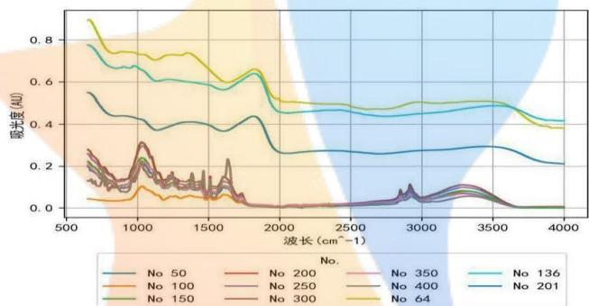

<details>
<summary>line</summary>

| Wavenumber \((cm^{-1})\) | No 50 | No 100 | No 136 | No 201 | No 250 | No 300 | No 400 | No 64 |
| --- | --- | --- | --- | --- | --- | --- | --- | --- |
| 500 | ~0.28 | ~0.04 | ~0.78 | ~0.55 | ~0.22 | ~0.28 | ~0.28 | ~0.90 |
| 1000 | ~0.15 | ~0.08 | ~0.68 | ~0.42 | ~0.15 | ~0.15 | ~0.15 | ~0.75 |
| 1500 | ~0.12 | ~0.06 | ~0.60 | ~0.40 | ~0.12 | ~0.12 | ~0.12 | ~0.65 |
| 2000 | ~0.01 | ~0.01 | ~0.45 | ~0.27 | ~0.01 | ~0.01 | ~0.01 | ~0.50 |
| 2500 | ~0.01 | ~0.01 | ~0.46 | ~0.27 | ~0.01 | ~0.01 | ~0.01 | ~0.48 |
| 3000 | ~0.05 | ~0.05 | ~0.44 | ~0.27 | ~0.05 | ~0.05 | ~0.05 | ~0.50 |
| 3500 | ~0.12 | ~0.12 | ~0.48 | ~0.29 | ~0.12 | ~0.12 | ~0.12 | ~0.50 |
| 4000 | ~0.21 | ~0.21 | ~0.42 | ~0.21 | ~0.21 | ~0.21 | ~0.21 | ~0.38 |
</details>

图 4-1 部分药材的中红外光谱数据示意图

## 4.2 描述性统计分析

本文从横向及纵向上对数据进行描述性统计分析，即分别以编号为50、100、150、200、250、300、350、400的样本为例，对不同波段上的数据进行描述性统计分析，可以看出样本的整体情况；以波数为1000的不同种类药材为例进行描述性统计分析，可以看出某一波段数据的特征。

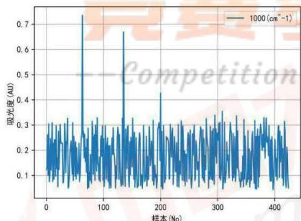

<details>
<summary>line</summary>

| 样本 (No) | 吸光度 (AU) |
| --- | --- |
| ~60 | ~0.74 |
| ~130 | ~0.67 |
| ~200 | ~0.43 |
</details>

图 4-2. 同一波数对应吸光度数据示意图

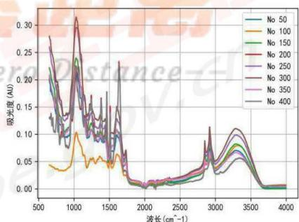

<details>
<summary>line</summary>

| Wavelength \((cm^{-1})\) | No 50 | No 100 | No 150 | No 200 | No 250 | No 300 | No 350 | No 400 |
| --- | --- | --- | --- | --- | --- | --- | --- | --- |
| ~600 | ~0.19 | ~0.045 | ~0.21 | ~0.27 | ~0.28 | ~0.28 | ~0.28 | ~0.28 |
| ~1000 | ~0.10 | ~0.10 | ~0.24 | ~0.31 | ~0.31 | ~0.31 | ~0.31 | ~0.31 |
| ~1500 | ~0.10 | ~0.05 | ~0.10 | ~0.15 | ~0.15 | ~0.15 | ~0.15 | ~0.15 |
| ~2850 | ~0.04 | ~0.04 | ~0.04 | ~0.04 | ~0.04 | ~0.04 | ~0.04 | ~0.11 |
| ~3350 | ~0.06 | ~0.06 | ~0.07 | ~0.08 | ~0.09 | ~0.11 | ~0.11 | ~0.11 |
| ~3850 | ~0.01 | ~0.01 | ~0.01 | ~0.01 | ~0.01 | ~0.01 | ~0.01 | ~0.01 |
</details>

图 4-3. 不同类别药材光谱数据示意图

从图可以明显看出在同一波段，不同样本的吸光度呈现出较大的差异性；同时，可以明显看出不同样本的中红外光谱数据的波形存在较大差异，这说明所选取的样本可能

来自于不同类别的药材。

表 4-1. 描述性统计分析

<table><tr><td>编号</td><td>总数</td><td>均值</td><td>标准差</td><td>最小值</td><td>上四分位数</td><td>中位数</td><td>下四分位数</td><td>最大值</td></tr><tr><td>50</td><td>3348</td><td>0.052</td><td>0.050</td><td>0.001</td><td>0.011</td><td>0.038</td><td>0.085</td><td>0.215</td></tr><tr><td>100</td><td>3348</td><td>0.035</td><td>0.023</td><td>0.003</td><td>0.012</td><td>0.034</td><td>0.051</td><td>0.104</td></tr><tr><td>150</td><td>3348</td><td>0.058</td><td>0.058</td><td>0.000</td><td>0.010</td><td>0.043</td><td>0.096</td><td>0.240</td></tr><tr><td>200</td><td>3348</td><td>0.051</td><td>0.053</td><td>-0.001</td><td>0.007</td><td>0.030</td><td>0.091</td><td>0.233</td></tr><tr><td>250</td><td>3348</td><td>0.071</td><td>0.067</td><td>0.004</td><td>0.016</td><td>0.053</td><td>0.111</td><td>0.296</td></tr><tr><td>300</td><td>3348</td><td>0.077</td><td>0.072</td><td>0.005</td><td>0.016</td><td>0.059</td><td>0.124</td><td>0.315</td></tr></table>

表 4-1 为不同编号样本的描述性统计分析，由表 可以看出每个样本有 3348 个数据点，样本均值在 0.035 到 0.077 之间，标准差从 0.023 到 0.072 之间，这说明不同类别样本的红外光谱数据的波动性存在差异；由上四分位数、中位数、下四分位数的差异可以看出，不同类别样本在同一波段呈现出的差异并不相同。

## 4.3 基于 K-means 的中药材聚类分析

## 4.3.1 确定最佳聚类数

通过聚类分析鉴别药材种类要首先确定 K 值，即药材种类数。确定 K-means 的 K 值的方法：肘部法则、平均轮廓法和间隔统计量法。

## (1) 肘部法则的平均指标

随着聚类数 K 的增大，样本划分会更加精细，误差平方和 SSE 会逐渐变小。SSE 和 K 的关系图是一个手肘的形状，而这个肘部对应的 K 值就是数据的真实聚类数。

$$
S S E = \sum_ {(i = 1)} ^ {k} \sum_ {c \in C _ {i}} | p - m _ {i} | ^ {2} \tag {4-2}
$$

## (2) 平均轮廓法

使用平均轮廓法也可以确定出 K 值，对于一个聚类任务，我们希望得到的簇中，簇内尽量紧密，簇间尽量远离，轮廓系数便是类的密集与分散程度的评价指标

$$
\sum_ {i = 1} ^ {m} \left\| \overline {{x}} ^ {(i)} - x ^ {(i)} \right\| _ {2} ^ {2} \tag {4-3}
$$

公式表达如下：

$$
S (i) = \frac {b (i) - a (i)}{\max \{a (i) , b (i) \}} \tag {4-4}
$$

其中 $a(i)$ 代表同簇样本到其他样本的平均距离， $b(i)$ 代表样本到除自身所在簇外的最近簇的样本的均值，s取值在[-1,1]之间。

$$
s (i) = \left\{ \begin{array}{c} 1 - \frac {a (i)}{b (i)}, \quad a (i) <   b (i) \\ 0, \quad a (i) = b (i) \\ \frac {b (i)}{a (i)} - 1, \quad a (i) > b (i) \end{array} \right. \tag {4-5}
$$

## (3) 间隔统计量法

间隔统计量法对经验的依赖不强，只需要找到最大间隔统计量所对应的K即可。当分为K组时，对应的损失函数为欧几里得距离平方和，记为 $D_{k}$ ，则间隔统计量 $(Gap(k))$ 定义为：

$$
G a p (k) = E \left(\log D _ {k}\right) - \log D _ {k} \tag {4-6}
$$

间隔统计量取得最大值所对应的 K 就是最佳的分组数。

## 4.3.2 利用原始数据进行聚类

问题一在中红外光谱的照射下，对应波段光谱照射下的不同药材的吸光度不同来进行分类，将具有相似性的数据认定为同一种类。针对问题一，利用 K-means 聚类方法对数据预处理后的数据进行聚类分析，首先是对聚类数目 K 值即药材的种类数目的确定，利用肘部法则、平均轮廓法和间隔统计量三种方法确定最优 K 值，结果如图所示：

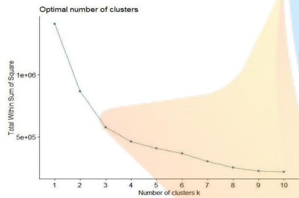

<details>
<summary>line</summary>

| Number of clusters k | Total Within Sum of Square |
| --- | --- |
| 1 | ~1.4e+06 |
| 2 | ~8.5e+05 |
| 3 | ~5.8e+05 |
| 4 | ~4.7e+05 |
| 5 | ~4.1e+05 |
| 6 | ~3.7e+05 |
| 7 | ~3.1e+05 |
| 8 | ~2.6e+05 |
| 9 | ~2.2e+05 |
| 10 | ~2.0e+05 |
</details>

图 4-4. 肘部法则确定聚类数

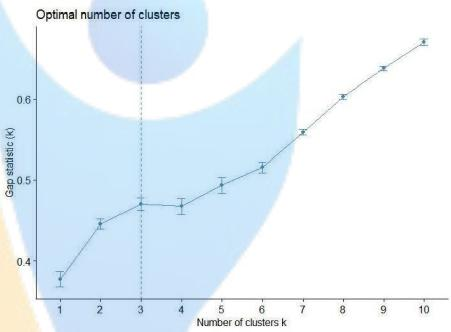

<details>
<summary>line</summary>

| Number of clusters k | Gap statistic (k) |
| --- | --- |
| 1 | ~0.38 |
| 2 | ~0.45 |
| 3 | ~0.47 |
| 4 | ~0.47 |
| 5 | ~0.50 |
| 6 | ~0.52 |
| 7 | ~0.56 |
| 8 | ~0.60 |
| 9 | ~0.64 |
| 10 | ~0.68 |
</details>

图 4-5.间隔统计量确定聚类数

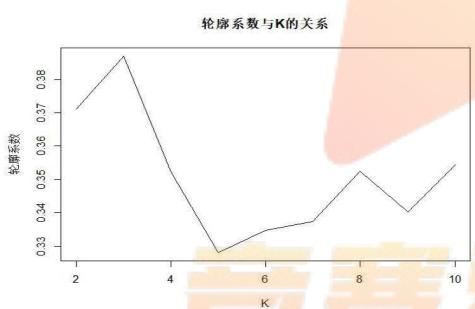

<details>
<summary>line</summary>

| K | 轮廓系数 |
| --- | --- |
| 2 | ~0.371 |
| 3 | ~0.386 |
| 4 | ~0.352 |
| 5 | ~0.329 |
| 6 | ~0.335 |
| 7 | ~0.338 |
| 8 | ~0.352 |
| 9 | ~0.340 |
| 10 | ~0.354 |
</details>

图 4-6. 平均轮廓法确定聚类数

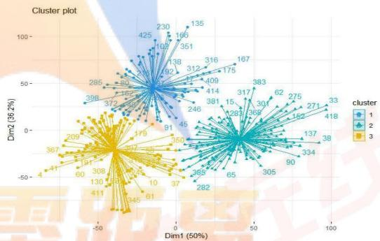

<details>
<summary>scatter</summary>

| Cluster | Dim1 (50%) (range) | Dim2 (36.2%) (range) |
| --- | --- | --- |
| 1 | -40~80 | -20~110 |
| 2 | -40~90 | -40~70 |
| 3 | -60~-10 | -60~30 |
</details>

图 4-7.K-means 聚类效果图

根据肘部法则，随着聚类数K的增大，SSE逐渐减小，逐渐趋于平稳。由图4-8所示，当K小于3时，随着K增大，图线斜率变化很大；但当K到达3时，随着K增大，图线斜率变化减小，并趋于平缓。因此可以根据SSE下降幅度，可以判定转折处 $\mathrm{K} = 3$ 为最佳聚类数。图4-5是由间隔统计量法得到的K值，当 $\mathrm{K} = 3$ 时， $Gap(k)$ 取得局部最大值。根据平均轮廓法，平均轮廓系数越大，说明聚类效果越好，图4-6中 $\mathrm{K} = 3$ 时平均轮廓系数达到最大值，因此最佳聚类数目为3。综上所述，选择 $\mathrm{K} = 3$ 为最优K值，即药材的种类为3类。图4-7是 $\mathrm{K} = 3$ 时根据K-means聚类方法对数据进行聚类得到的结果。

## 4.3.3 基于主成分分析的 K-means 聚类

主成分分析（PCA）是一种常见的数据降维方法，针对问题一，由于附件1中样本量为425，中红外光谱数为3348，因此利用主成分分析法对数据进行降维，得到累积贡

献率如表 4-3 所示:

表 4-2. 累积贡献率表

<table><tr><td></td><td>m=1</td><td>m=2</td><td>m=3</td><td>m=4</td></tr><tr><td>累积贡献率</td><td>50.01%</td><td>86.18%</td><td>92.49%</td><td>97.25%</td></tr></table>

由表4-2可知，选取前三个主成分时，累计贡献率达到了0.9249，因此选取三个主成分以此来进行K-means聚类，聚类结果如图4-8、4-9、4-10、4-11所示。

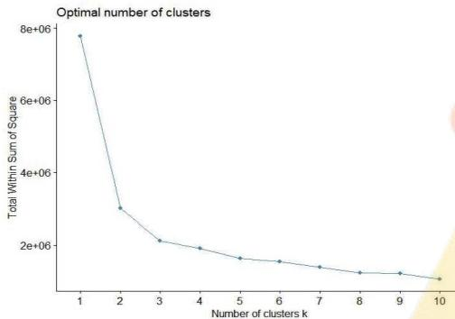

<details>
<summary>line</summary>

| Number of clusters k | Total Within Sum of Square |
| --- | --- |
| 1 | ~7.8e+06 |
| 2 | ~3.0e+06 |
| 3 | ~2.1e+06 |
| 4 | ~1.9e+06 |
| 5 | ~1.6e+06 |
| 6 | ~1.5e+06 |
| 7 | ~1.3e+06 |
| 8 | ~1.1e+06 |
| 9 | ~1.1e+06 |
| 10 | ~0.9e+06 |
</details>

图 4-8. 肘部法则确定聚类数

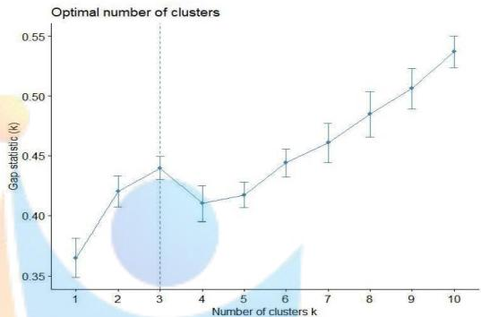

<details>
<summary>line</summary>

| Number of clusters k | Gap statistic (k) |
| --- | --- |
| 1 | ~0.368 |
| 2 | ~0.421 |
| 3 | ~0.441 |
| 4 | ~0.412 |
| 5 | ~0.419 |
| 6 | ~0.445 |
| 7 | ~0.462 |
| 8 | ~0.486 |
| 9 | ~0.507 |
| 10 | ~0.539 |
</details>

图 4-9.间隔统计量确定聚类数

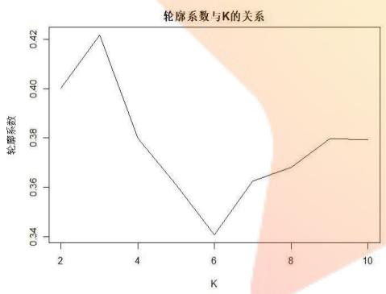

<details>
<summary>line</summary>

| K | 轮廓系数 |
| --- | --- |
| 2 | ~0.40 |
| 3 | ~0.42 |
| 4 | ~0.38 |
| 6 | ~0.34 |
| 7 | ~0.36 |
| 8 | ~0.37 |
| 9 | ~0.38 |
| 10 | ~0.38 |
</details>

图 4-10. 平均轮廓法确定聚类数

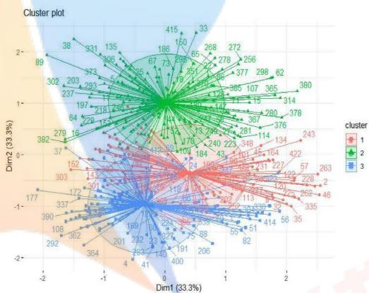

<details>
<summary>radar</summary>

| Series | Dim1 (33.3%) (range) | Dim2 (33.3%) (range) | Cluster |
| --- | --- | --- | --- |
| Green | -2.0~2.5 | -1.5~2.5 | 2 |
| Red | -1.5~2.0 | -1.5~1.5 | 1 |
| Blue | -2.0~1.5 | -2.0~0.5 | 3 |
</details>

图 4-11.K-means 聚类结果图

图 4-8 中，K<3 时，随着 K 增大，图线斜率变化很大；但当 K>3 时，随着 K 增大，图线斜率变化减小，图形并趋于平缓。因此根据肘部法则可以判定 K=3 为最佳聚类数。图 4-9 是由间隔统计量法得到的 K 值，当 K=3 时， $Gap(k)$ 取得局部最大值。根据图 4-10 的平均轮廓法，K=3 时平均轮廓系数达到最大值，因此最佳聚类数目为 3。综上所述，经过 PCA 降维选取三个主成分后再进行聚类，最终选择 K=3 为最优 K 值。图 4-11 是 K=3 时根据 PCA 降维后选取三个主成分后再进行 K-means 聚类得到的结果。

## 4.3.4 基于特征提取的 K-means 聚类

通过对数据进行定性判断发现：对于不同中药材来说，在大部分波长区间中红外光谱数据基本相近，可认为该段红外光谱在判别中药材时贡献度较小，或造成信息冗余，因此对于不同药材不同波段来说如何提取其主要差异性特征是一个值得聚焦的问题。

在这里，我们使用平滑处理的方式，以窗口长度为20、50和100，分别提取不同药材不同波段窗口的均值、标准差、下四分位数、中位数、上四分位数、偏度和峰度等特征，以此为聚类特征完成K-means聚类。

图 4-12、图 4-13、图 4-14、图 4-15 是以窗口长度为 20 的平滑处理提取药材的均值、标准差、下四分位数、中位数、上四分位数、偏度和峰度等特征后利用 K-means 方法聚类的结果。

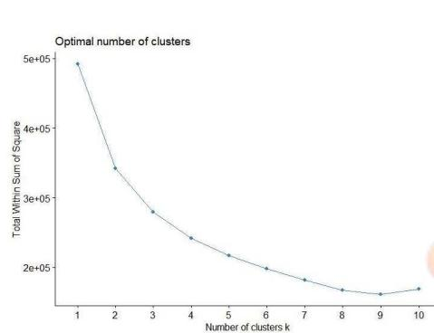

<details>
<summary>line</summary>

| Number of clusters k | Total Within Sum of Square |
| --- | --- |
| 1 | ~490000 |
| 2 | ~340000 |
| 3 | ~280000 |
| 4 | ~240000 |
| 5 | ~220000 |
| 6 | ~200000 |
| 7 | ~185000 |
| 8 | ~170000 |
| 9 | ~165000 |
| 10 | ~175000 |
</details>

图 4-12. 肘部法则确定聚类数

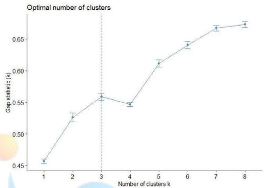

<details>
<summary>line</summary>

| Number of clusters k | Gap statistic (k) |
| --- | --- |
| 1 | ~0.458 |
| 2 | ~0.527 |
| 3 | ~0.560 |
| 4 | ~0.548 |
| 5 | ~0.612 |
| 6 | ~0.641 |
| 7 | ~0.669 |
| 8 | ~0.675 |
</details>

图 4-13. 间隔统计量确定聚类数

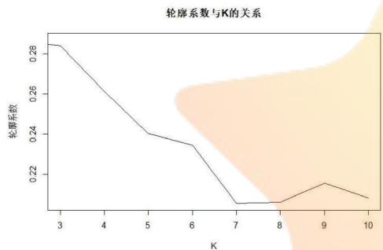

<details>
<summary>line</summary>

| K | 轮廓系数 |
| --- | --- |
| 3 | ~0.284 |
| 5 | ~0.240 |
| 6 | ~0.234 |
| 7 | ~0.206 |
| 8 | ~0.206 |
| 9 | ~0.216 |
| 10 | ~0.208 |
</details>

图 4-14. 平均轮廓法确定聚类数  
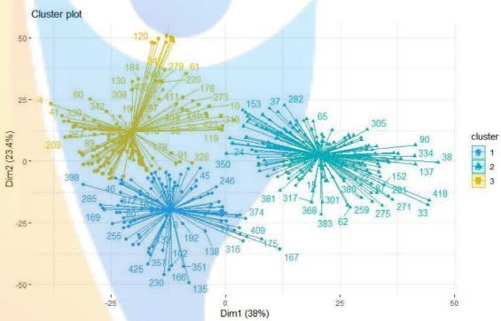

<details>
<summary>scatter</summary>

| Cluster | Dim1 (38%) (range) | Dim2 (23.4%) (range) |
| --- | --- | --- |
| 1 | -30~45 | -45~25 |
| 2 | -25~45 | -45~25 |
| 3 | -35~10 | -10~50 |
</details>

图 4-15.K-means 聚类结果图

图 4-12 是由肘部法则得到的 K 值，在 K=3 时，畸变程度得到大幅改善，可以选取 K=3 作为聚类数量。图 4-13 是由间隔统计量法得到的 K 值，当 K=3 时， $Gap(k)$ 取得局部最大值，可以选取 K=3 为最佳的聚类数目。图 4-14 是由平均轮廓法得到的 K 值，在 K=3 时平均轮廓系数达到最大值，可以选取 K=3 为最佳聚类数目。综上所述，选取 K=3 为最优 K 值进行聚类分析，即药材的种类为 3 类。图 4-15 是 K-means 聚类方法在 K=3 时对窗口长度 20 的特征提取后的数据进行聚类得到的结果。

图 4-16、图 4-17、4-18、4-19 是以窗口长度为 50 的平滑处理提取均值、标准差、下四分位数、中位数、上四分位数、偏度和峰度等特征后进行 K-means 聚类的结果。

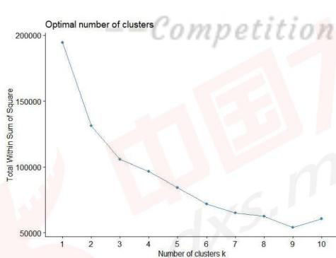

<details>
<summary>line</summary>

| Number of clusters k | Total Within Sum of Square |
| --- | --- |
| 1 | ~195000 |
| 2 | ~132000 |
| 3 | ~106000 |
| 4 | ~97000 |
| 5 | ~84000 |
| 6 | ~72000 |
| 7 | ~66000 |
| 8 | ~63000 |
| 9 | ~55000 |
| 10 | ~61000 |
</details>

图 4-16. 肘部法则确定聚类数

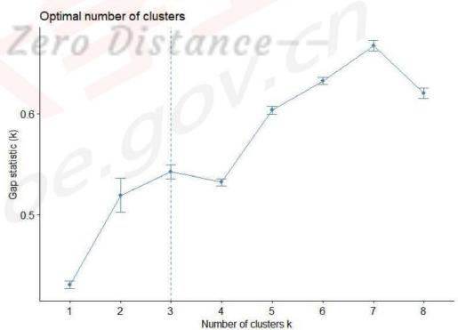

<details>
<summary>line</summary>

| Number of clusters k | Gap statistic (k) |
| --- | --- |
| 1 | ~0.42 |
| 2 | ~0.52 |
| 3 | ~0.54 |
| 4 | ~0.53 |
| 5 | ~0.60 |
| 6 | ~0.63 |
| 7 | ~0.68 |
| 8 | ~0.62 |
</details>

图 4-17. 间隔统计量确定聚类数

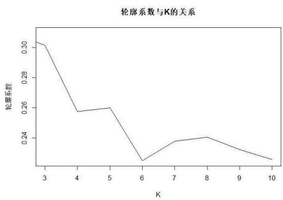

<details>
<summary>line</summary>

| K | 轮廓系数 |
| --- | --- |
| 3 | ~0.305 |
| 4 | ~0.258 |
| 5 | ~0.260 |
| 6 | ~0.225 |
| 7 | ~0.238 |
| 8 | ~0.240 |
| 9 | ~0.233 |
| 10 | ~0.225 |
</details>

图 4-18. 平均轮廓法确定聚类数

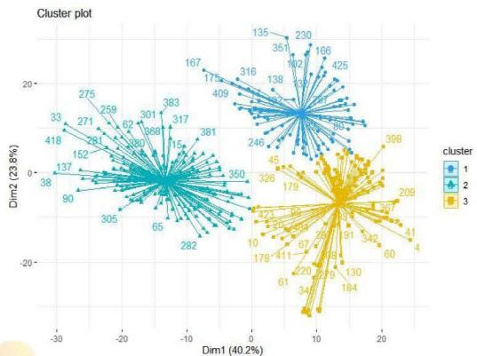

<details>
<summary>bubble</summary>

| Cluster | Dim1 (range) | Dim2 (range) |
| --- | --- | --- |
| 1 | -15~20 | 5~25 |
| 2 | -30~-5 | -10~15 |
| 3 | 0~25 | -25~10 |
</details>

图 4-19.K-means 聚类结果图

根据肘部法则、间隔统计量法和平均轮廓法的基本原理，观察图4-16、图4-17和图4-18可以得出，在 $\mathrm{K} = 3$ 时，畸变程度得到大幅改善， $Gap(k)$ 取得局部最大值，并且平均轮廓系数达到最大值。因此，可以选取 $\mathrm{K} = 3$ 为最优K值进行聚类分析，即药材的种类为3类。图4-19是K-means聚类方法在 $\mathrm{K} = 3$ 时对窗口长度50的特征提取后的数据进行聚类得到的结果。

表 4-3. 基于 PCA 和特征提取 (20) 的 K-means 聚类的结果

<table><tr><td colspan="2">部分药材编号</td></tr><tr><td>1类</td><td>1、17、32、35、39、40、45、46</td></tr><tr><td>2类</td><td>2、5、8、11、13、15、16、18、22、24、25、26、27、28、29、33、34、36、37、38、43、44、47、49</td></tr><tr><td>3类</td><td>1、4、6、7、9、10、12、14、19、20、21、23、24、30、31、35、36、37、41、42、48、50</td></tr></table>

根据聚类优度（组间距离占总距离的比值）5种聚类方法中基于PCA的K-means的拟合优度最高，因此经过PCA降维处理后再进行聚类的效果最好。表4-3是经过PCA降维处理后和滑动窗口为20的特征提取后的K-means聚类结果，表中列出了编号为前50的药材的聚类结果。

## 4.4 基于 Ward 方法的中药材聚类分析

## 4.4.1 利用原始数据进行 Ward 聚类

针对问题一，对处理之后的数据利用Ward聚类方法进行聚类分析，结果如图4-20所示。我们将附件1中的几种药材的中红外光谱数据进行聚类，试图对几种药材进行分类。如图所示，应用Ward方法进行聚类，根据Ward聚类分析的结果可以大致把中药材分成三类，此时各组出现的异常点大致相同。

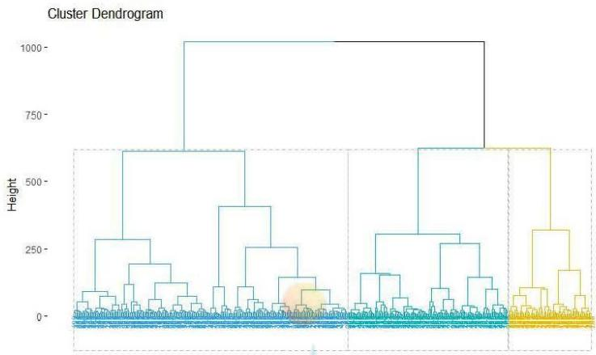

<details>
<summary>dendrogram</summary>

| Cluster Height | Description |
| --- | --- |
| 0~1000 | Hierarchical clustering structure (represented by color-coded clusters) |
</details>

图 4-20. Ward 聚类谱系图

## 4.4.2 基于主成分分析的 Ward 聚类

针对问题一，对数据进行主成分分析，对选取前三个主成分的数据再进行 Ward 聚类分析，结果如图 4-21 所示。

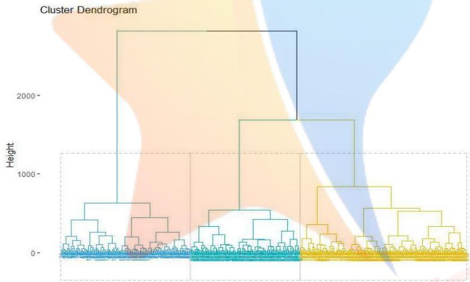

<details>
<summary>dendrogram</summary>

| Cluster | Height (Relative) |
| --- | --- |
| Top Cluster | ~2800 |
| Middle Cluster | ~1700 |
| Bottom Cluster | ~850 |
</details>

图 4-21. PCA 降维后的 Ward 聚类谱系图

图 4-21 是经过 PCA 降维后选取前三个主成分后进行 Ward 聚类分析后的结果，对几种药材进行分类，基本保留原来的数据信息。由图 4-21 分析可得，应用主成分分析法进行 Ward 聚类，根据 Ward 聚类分析的结果可以把中药材分成三类，此时各组出现的异常点大致相同。

## 4.4.3 基于特征提取的 Ward 聚类

图 4-22 是以窗口长度为 20 的平滑处理提取药材的均值、标准差、下四分位数、中位数、上四分位数、偏度和峰度等特征后利用 Ward 聚类的聚类结果。

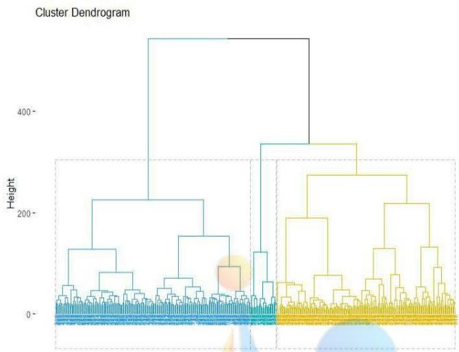

<details>
<summary>dendrogram</summary>

| Cluster Group | Height (Approximate) |
| --- | --- |
| Blue (Left) | ~100 ~250 |
| Yellow (Right) | ~100 ~350 |
</details>

图 4-22. 窗口长度 20 的特征提取后的 Ward 聚类谱系图

图 4-22 是选取窗口长度为 20 进行的 Ward 聚类分析后的结果，对几种药材进行分类。由上图分析可得，基于特征分析进行 Ward 聚类，根据 Ward 聚类分析的结果可以把中药材分成三类，此时各组出现的异常点大致相同。

图 4-23 是以窗口长度为 20 的平滑处理提取药材的均值、标准差、下四分位数、中位数、上四分位数、偏度和峰度等特征后利用 Ward 聚类的聚类结果。

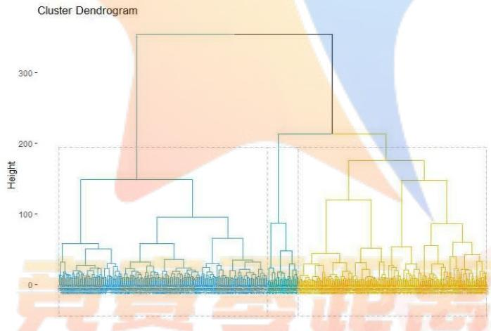

<details>
<summary>dendrogram</summary>

| Cluster Group | Height (Approximate) |
| --- | --- |
| Left Cluster | ~150 |
| Right Cluster | ~210 |
</details>

图 4-23. 窗口长度 50 的特征提取后的 Ward 聚类谱系图

将波段窗口长度设为 50，进行的 Ward 聚类分析，对药材进行聚类。结果如图 4-23 所示，利用 Ward 聚类分析可以把中药材根据具体目标任务需要分成三类、五类、七类、九类等不同类别。

## 4.5 不同种类药材的特征差异性分析

中药材的种类鉴别相对比较容易，不同种类的中药材呈现的光谱的区别比较明显。为了更准确的分析不同种类药材的特征和差异性，本文采用方差分析对不同类别的药材进行分析。本文分析的控制变量为不同种类的药材，即研究不同种类药材的中红外光谱是否存在显著性差异。根据4.4中的聚类结果，分别将3个不同种类药材的中红外光谱数据进行综合汇总，绘制出每个种类药材对应光谱数据的均值曲线和标准差曲线。

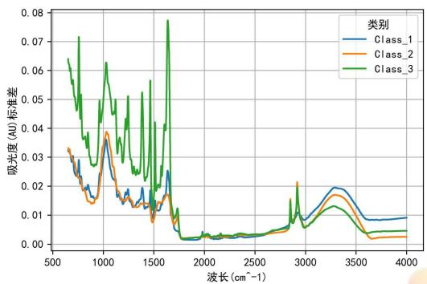

<details>
<summary>line</summary>

| Wavelength \((cm^{-1})\) | Class_1 (AU) | Class_2 (AU) | Class_3 (AU) |
| --- | --- | --- | --- |
| 500 | ~0.031 | ~0.033 | ~0.064 |
| 1000 | ~0.037 | ~0.039 | ~0.063 |
| 1500 | ~0.018 | ~0.014 | ~0.057 |
| 2000 | ~0.002 | ~0.002 | ~0.002 |
| 2500 | ~0.003 | ~0.003 | ~0.003 |
| 3000 | ~0.012 | ~0.012 | ~0.012 |
| 3500 | ~0.019 | ~0.017 | ~0.013 |
| 4000 | ~0.009 | ~0.003 | ~0.005 |
</details>

图 4-24 不同种类药材光谱数据均值曲线

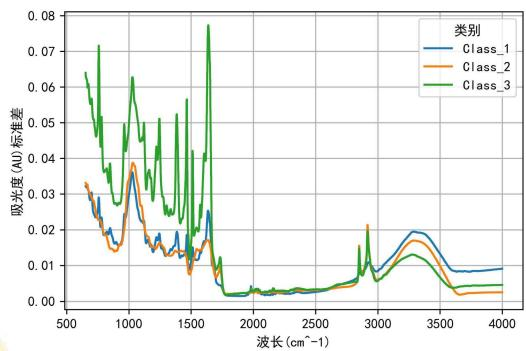

<details>
<summary>line</summary>

| Wavelength \((cm^{-1})\) | Class_1 (AU) | Class_2 (AU) | Class_3 (AU) |
| --- | --- | --- | --- |
| 500 | ~0.031 | ~0.033 | ~0.064 |
| 1000 | ~0.037 | ~0.039 | ~0.063 |
| 1500 | ~0.018 | ~0.014 | ~0.057 |
| 2000 | ~0.002 | ~0.002 | ~0.002 |
| 2500 | ~0.003 | ~0.003 | ~0.003 |
| 3000 | ~0.012 | ~0.012 | ~0.012 |
| 3500 | ~0.019 | ~0.017 | ~0.013 |
| 4000 | ~0.009 | ~0.003 | ~0.004 |
</details>

图 4-25 不同种类药材光谱数据标准差曲线

由中红外光谱数据的均值曲线和标准差曲线可以看出，不同种类药材的红外光谱数据存在较大差异。为了更好的提取不同波段的特征，本文将药材中红外光谱分成间隔为50（cm-1）的若干个波段，选取波段的均值、标准差、下四分位数、中位数、上四分位数、偏度和峰度等特征，并利用方差分析对不同种类药材的中红外光谱进行差异性分析，结果如表4-4所示。

表 4-4 分波段方差分析表

<table><tr><td>波段</td><td>F value</td><td>P value</td></tr><tr><td>[901-950]</td><td>192.4</td><td>&lt;2e-16***</td></tr><tr><td>[951-1000]</td><td>132.9</td><td>&lt;2e-16***</td></tr><tr><td>[1001-1050]</td><td>46.14</td><td>1.13E-11***</td></tr><tr><td>[1051-1200]</td><td>78.06</td><td>&lt;2e-16***</td></tr><tr><td>...</td><td>...</td><td>...</td></tr></table>

注：\*、\*\*、\*\*\*分别代表0.1、0.05、0.01的显著性水平

表 4-4 为不同种类药材中红外光谱的方差分析结果，结果显示，在大多数波段不同种类药材中红外光谱存在显著性差异。为了准确的比较不同种类药材的差异性，本文选取了部分波段进行精准分析，结果如表 4-5 所示。

表 4-5 不同波段方差分析表

<table><tr><td>波段</td><td>F-value</td><td>P-value</td></tr><tr><td>[50-350]</td><td>865.3</td><td>&lt;2e-16***</td></tr><tr><td>[1000-1450]</td><td>37732</td><td>&lt;2e-16***</td></tr><tr><td>[1650-1800]</td><td>53310</td><td>&lt;2e-16***</td></tr></table>

由表4-5中不同种类的药材在波段[50-350]、[1000-1450]、[1650-1800]的方差分析结果可知，在这3个波段上方差分析的P值均小于0.01，拒绝不同种类药材的中红外光谱数据不存在显著差异的原假设，因此可以认为不同种类药材的中红外光谱数据在波段[50-350]、[1000-1450]、[1650-1800]上存在显著的差异性。

波段-20 数据：表示间隔 20 的波段光谱数据集合；

波段-50 数据：表示间隔 50 的波段光谱数据集合；

波段-100 数据：表示间隔 100 的波段光谱数据集合。

## 五、问题二模型的建立与求解

## 5.1 不同产地药材的特征与差异性分析

道地药材强调药材的产地，不同产地的药材会存在较大的差异性。为了分析不同产地药材的特征和差异性，本文采用方差分析对不同产地的药材进行分析。本文分析的控制变量为不同类别的药材，即研究不同产地药材的中红外光谱是否存在显著性差异。首先，分别将11个不同产地药材的中红外光谱数据进行综合汇总，绘制出每个产地对应光谱数据的均值曲线和标准差曲线。

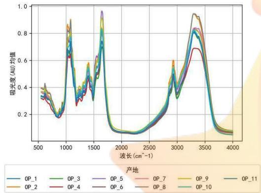

<details>
<summary>line</summary>

| 波长 \((cm^{-1})\) | OP_1 | OP_2 | OP_3 | OP_4 | OP_5 | OP_6 | OP_7 | OP_8 | OP_9 | OP_10 | OP_11 |
| --- | --- | --- | --- | --- | --- | --- | --- | --- | --- | --- | --- |
| 500 | ~0.33 | ~0.38 | ~0.36 | ~0.32 | ~0.35 | ~0.33 | ~0.33 | ~0.33 | ~0.33 | ~0.33 | ~0.33 |
| 1000 | ~0.65 | ~0.85 | ~0.88 | ~0.62 | ~0.88 | ~0.88 | ~0.88 | ~0.88 | ~0.88 | ~0.88 | ~0.88 |
| 1500 | ~0.45 | ~0.55 | ~0.58 | ~0.45 | ~0.55 | ~0.55 | ~0.55 | ~0.55 | ~0.55 | ~0.55 | ~0.55 |
| 2000 | ~0.10 | ~0.10 | ~0.10 | ~0.10 | ~0.10 | ~0.10 | ~0.10 | ~0.10 | ~0.10 | ~0.10 | ~0.10 |
| 2500 | ~0.12 | ~0.12 | ~0.12 | ~0.12 | ~0.12 | ~0.12 | ~0.12 | ~0.12 | ~0.12 | ~0.12 | ~0.12 |
| 3000 | ~0.45 | ~0.60 | ~0.62 | ~0.45 | ~0.62 | ~0.62 | ~0.62 | ~0.62 | ~0.62 | ~0.62 | ~0.62 |
| 3500 | ~0.75 | ~0.95 | ~0.95 | ~0.75 | ~0.95 | ~0.95 | ~0.95 | ~0.95 | ~0.95 | ~0.95 | ~0.95 |
| 4000 | ~0.12 | ~0.12 | ~0.12 | ~0.12 | ~0.12 | ~0.12 | ~0.12 | ~0.12 | ~0.12 | ~0.12 | ~0.12 |
</details>

图 5-1 不同产地药材光谱数据均值曲线

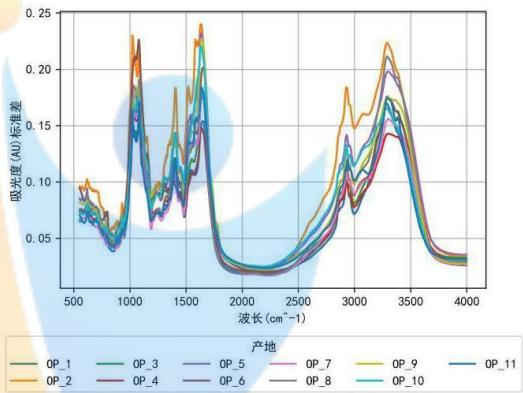

<details>
<summary>line</summary>

| 波长 \((cm^{-1})\) | OP_1 | OP_2 | OP_3 | OP_4 | OP_5 | OP_6 | OP_7 | OP_8 | OP_9 | OP_10 | OP_11 |
| --- | --- | --- | --- | --- | --- | --- | --- | --- | --- | --- | --- |
| 500 | ~0.07 | ~0.09 | ~0.08 | ~0.07 | ~0.07 | ~0.07 | ~0.07 | ~0.07 | ~0.07 | ~0.07 | ~0.07 |
| 1000 | ~0.15 | ~0.23 | ~0.18 | ~0.16 | ~0.16 | ~0.16 | ~0.16 | ~0.16 | ~0.16 | ~0.16 | ~0.16 |
| 1500 | ~0.12 | ~0.18 | ~0.14 | ~0.12 | ~0.12 | ~0.12 | ~0.12 | ~0.12 | ~0.12 | ~0.12 | ~0.12 |
| 2000 | ~0.03 | ~0.03 | ~0.03 | ~0.03 | ~0.03 | ~0.03 | ~0.03 | ~0.03 | ~0.03 | ~0.03 | ~0.03 |
| 2500 | ~0.04 | ~0.05 | ~0.04 | ~0.04 | ~0.04 | ~0.04 | ~0.04 | ~0.04 | ~0.04 | ~0.04 | ~0.04 |
| 3000 | ~0.12 | ~0.18 | ~0.14 | ~0.12 | ~0.12 | ~0.12 | ~0.12 | ~0.12 | ~0.12 | ~0.12 | ~0.12 |
| 3500 | ~0.16 | ~0.22 | ~0.18 | ~0.16 | ~0.16 | ~0.16 | ~0.16 | ~0.16 | ~0.16 | ~0.16 | ~0.16 |
| 4000 | ~0.03 | ~0.03 | ~0.03 | ~0.03 | ~0.03 | ~0.03 | ~0.03 | ~0.03 | ~0.03 | ~0.03 | ~0.03 |
</details>

图 5-2 不同产地药材光谱数据标准差曲线

由光谱数据的均值曲线和方差曲线可以看出，不同产地药材的中红外光谱的波形大致相似，但同一波段对应吸光度的均值和标准差存在差异。为了更好的提取不同波段的特征，本文将药材中红外光谱分成间隔为 $50(cm^{-1})$ 的若干个波段，选取波段的均值、标准差、下四分位数、中位数、上四分位数、偏度和峰度等特征，并利用方差分析对不同产地药材的中红外光谱进行差异性分析。

表 5-1 分波段方差分析表

<table><tr><td>波段</td><td>F value</td><td>P value</td></tr><tr><td>[701-750]</td><td>13.14</td><td>0.0003***</td></tr><tr><td>[751-800]</td><td>1.193</td><td>0.275</td></tr><tr><td>[801-850]</td><td>19.34</td><td>1.10E-05***</td></tr><tr><td>[901-950]</td><td>10.98</td><td>0.0009***</td></tr><tr><td>[951-1000]</td><td>3.712</td><td>0.054.</td></tr><tr><td>[1001-1050]</td><td>23.92</td><td>1.01E-06***</td></tr><tr><td>...</td><td>...</td><td>...</td></tr></table>

表 5-2 为不同产地药材中红外光谱的方差分析结果，结果显示，在某些波段不同产地药材中红外光谱存在显著性差异，而在某些波段其差异并不明显。为了准确的比较不同产地药材的差异性，本文选取了差异性较大的波段进行精准分析，结果下表所示。

表 5-2 不同波段方差分析表

<table><tr><td>波段</td><td>F-value</td><td>P-value</td></tr><tr><td>[1000-1500]</td><td>2339</td><td>&lt;2e-16***</td></tr><tr><td>[1650-1900]</td><td>2209</td><td>&lt;2e-16***</td></tr></table>

由表5-2中不同产地的药材在波段[1000-1500]、[1650-1900]、[1700-2150]的方差分析结果可知，在这3个波段上方差分析的P值均小于0.01，拒绝不同产地药材的中红外光谱数据不存在显著差异的原假设，因此可以认为不同产地药材的中红外光谱数据在波段[1000-1500]、[1650-1900]、[1700-2150]上存在非常显著的差异性。

## 5.2 基于机器学习方法的药材产地鉴别模型

## 5.2.1 基本理论

（1）支持向量机（SVM）：利用和函数建立输出特征向量与高维度的特征空间向量的映射关系，在维度更高的尺度空间中存在某个超平面能将样本正确划分。对于给定的样本集 $D=\{(x_{1},y_{1}),(x_{2},y_{2}),\cdots,(x_{n},y_{n})\}$ ，其中 $y\in\{-1,1\}$ ，支持向量机算法需要寻找一个能够划分训练集D样本空间的超平面，使得不同类别的样本可以划分出来。对于样本空间的超平面可以使用如下的线性方程来刻画：

$$
w ^ {T} x + b = 0 \tag {5-1}
$$

寻找具有“最大间隔”的超平面，即

$$
\max _ {w, b} \frac {2}{\| w \|} \tag {5-2}
$$

$$
s. t. y _ {i} (w ^ {T} x _ {i} + b) \geq 1, i = 1, 2, \dots , m
$$

上式可等价为：

$$
\min _ {w, b} \frac {1}{2} \| w \| ^ {2} \tag {5-2}
$$

$$
s. t. y _ {i} (w ^ {T} x _ {i} + b) \geq 1, i = 1, 2, \dots , m
$$

引入拉格朗日乘子 $\alpha_{i}$ ，则对应目标函数为：

$$
J (w, b, \alpha) = \frac {1}{2} \| w \| ^ {2} + \sum_ {i = 1} ^ {m} \alpha_ {i} (1 - y _ {i} (w ^ {T} x _ {i} + b)) \tag {5-3}
$$

得到上式的对偶问题并求解:

$$
\begin{array}{l} \max _ {\alpha} \sum_ {i = 1} ^ {m} \alpha_ {i} - \frac {1}{2} \sum_ {i = 1} ^ {m} \sum_ {j = 1} ^ {m} \alpha_ {i} \alpha_ {j} y _ {i} y _ {j} x _ {i} ^ {T} x _ {j} \\ s. t. \left\{ \begin{array}{l} \sum_ {i = 1} ^ {m} \alpha_ {i} y _ {i} = 0 \\ \alpha_ {i} \geq 0, i = 1, 2, \dots , m \end{array} \right. \tag {5-4} \\ \end{array}
$$

（2）随机森林（RF）：随机森林是由 Breiman 于 2001 年提出来的一种基于集成学习思想的算法，具体步骤如下：

a.从收集到的数据集中随机选取 $k$ 个变量，共 $m$ 个变量（其中 $k$ 小于等于 $m$ ），然后根据这 $k$ 个变量建立决策树；  
b. 并重复 $n$ 次上面的过程，使得这 $k$ 个变量经过不同的随机组合构建出 $n$ 棵不同的决策树；

c. 然后对每棵决策树都用随机变量来预测结果，并记录所有预测的结果，就可以从 $n$ 棵决策树中得出 $n$ 种结果；  
d. 计算每个预测结果的得票数，再选择模式，即把最高票数的预测结果作为随机森林算法的最终预测结果。

（3）LightGBM: 是为了解决 GBDT 在海量数据遇到的问题而提出的，是基于决策树算法的梯度提升框架，它支持高效率的并行训练，并且具有更快的训练速度、更低的内存消耗、更好的准确率、支持分布式可以快速处理海量数据等优点，可用于排序、分类、回归以及很多其他的机器学习任务中。

## 5.2.2 评价指标

评价指标是衡量一个模型好坏的关键，本文采用的评价指标为 Precision、Recall、F1-score 以及 Accuracy。

计算评价指标要用到混淆矩阵，混淆矩阵的定义为:

TP: 将正类预测为正类数;

TN: 将负类预测为负类数;

FP: 将负类预测为正类数误报;

FN: 将正类预测为负类数。

精确率(Precision)定义为: $P = \frac{TP}{TP + FP}$ 表示被分为正例的示例中实际为正例的比例。

召回率(Recall)定义为： $R = \frac{TP}{TP + FN}$ 为覆盖面的度量，度量有多少正例被分为正例。

准确率(Accuracy)定义为： $ACC=\frac{TP+TN}{TP+TN+FP+FN}$

F1-score 定义为： $F_{1}=\frac{2PR}{P+R}$ ，其中 P 为 Precision，R 为 Recall。它是模型精确率和召回率的一种加权平均。

## 5.2.3 模型比较

为了对药材的不同产地进行有效鉴别，本文运用了LightGBM、XGBoost、SVM、RF、GBDT和MLP等六种机器学习分类算法。同时，为更好衡量不同产地药材的差异性和区分度，本文将原始数据进行了降维和分波段计算特征处理，即以20、50和100的间隔将原始数据分为若干个区间，形成了包括原始数据在内的五类不同数据集。对五类数据集运用不同机器学习模型建模得到的结果如表5-3所示。

表 5-3 基于机器学习方法的药材产地鉴别模型比较

<table><tr><td>数据</td><td>模型</td><td>召回率</td><td>精确率</td><td>准确率</td><td>F1值</td></tr><tr><td rowspan="6">原始数据</td><td>SVC</td><td>0.869</td><td>0.876</td><td>0.871</td><td>0.870</td></tr><tr><td>RF</td><td>0.500</td><td>0.538</td><td>0.535</td><td>0.506</td></tr><tr><td>XGBoost</td><td>0.566</td><td>0.599</td><td>0.588</td><td>0.568</td></tr><tr><td>GBDT</td><td>0.502</td><td>0.520</td><td>0.529</td><td>0.500</td></tr><tr><td>LightGBM</td><td>0.570</td><td>0.604</td><td>0.600</td><td>0.571</td></tr><tr><td>MLP</td><td>0.514</td><td>0.538</td><td>0.550</td><td>0.509</td></tr><tr><td rowspan="3">PCA降维数据</td><td>SVC</td><td>0.876</td><td>0.869</td><td>0.870</td><td>0.871</td></tr><tr><td>RF</td><td>0.538</td><td>0.500</td><td>0.506</td><td>0.535</td></tr><tr><td>XGBoost</td><td>0.599</td><td>0.566</td><td>0.568</td><td>0.588</td></tr></table>

<table><tr><td rowspan="5"></td><td>GBDT</td><td>0.539</td><td>0.498</td><td>0.500</td><td>0.541</td></tr><tr><td>LightGBM</td><td>0.516</td><td>0.473</td><td>0.475</td><td>0.512</td></tr><tr><td>MLP</td><td>0.521</td><td>0.488</td><td>0.482</td><td>0.521</td></tr><tr><td>SVC</td><td>0.914</td><td>0.921</td><td>0.913</td><td>0.916</td></tr><tr><td>RF</td><td>0.915</td><td>0.929</td><td>0.927</td><td>0.915</td></tr><tr><td rowspan="6">波段-20数据</td><td>XGBoost</td><td>0.970</td><td>0.974</td><td>0.970</td><td>0.970</td></tr><tr><td>GBDT</td><td>0.881</td><td>0.889</td><td>0.900</td><td>0.883</td></tr><tr><td>LightGBM</td><td>0.964</td><td>0.968</td><td>0.964</td><td>0.964</td></tr><tr><td>MLP</td><td>0.813</td><td>0.839</td><td>0.828</td><td>0.817</td></tr><tr><td>SVC</td><td>0.861</td><td>0.868</td><td>0.863</td><td>0.860</td></tr><tr><td>RF</td><td>0.869</td><td>0.882</td><td>0.857</td><td>0.861</td></tr><tr><td rowspan="6">波段-50数据</td><td>XGBoost</td><td>0.915</td><td>0.935</td><td>0.921</td><td>0.920</td></tr><tr><td>GBDT</td><td>0.793</td><td>0.834</td><td>0.816</td><td>0.799</td></tr><tr><td>LightGBM</td><td>0.923</td><td>0.932</td><td>0.925</td><td>0.923</td></tr><tr><td>MLP</td><td>0.812</td><td>0.820</td><td>0.815</td><td>0.809</td></tr><tr><td>SVC</td><td>0.824</td><td>0.835</td><td>0.825</td><td>0.823</td></tr><tr><td>RF</td><td>0.834</td><td>0.871</td><td>0.853</td><td>0.841</td></tr><tr><td rowspan="4">波段-100数据</td><td>XGBoost</td><td>0.881</td><td>0.897</td><td>0.887</td><td>0.884</td></tr><tr><td>GBDT</td><td>0.814</td><td>0.835</td><td>0.822</td><td>0.822</td></tr><tr><td>LightGBM</td><td>0.850</td><td>0.866</td><td>0.854</td><td>0.853</td></tr><tr><td>MLP</td><td>0.787</td><td>0.795</td><td>0.790</td><td>0.785</td></tr></table>

由表5-3可以看出，在分波段数据集上，XGBoost模型的准确率最高。分波段数据集的模型准确率明显高于原始数据集和PCA数据集的模型准确率，且波段为20的数据集模型准确率最高。

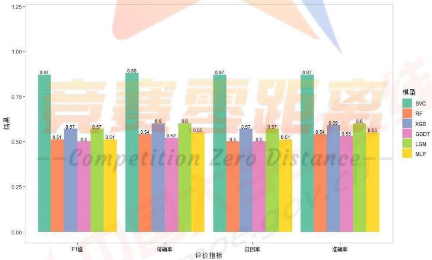

<details>
<summary>bar</summary>

| 评价指标 | SVC | RF | XGB | GBDT | LGM | MLP |
| --- | --- | --- | --- | --- | --- | --- |
| F1值 | 0.87 | 0.51 | 0.57 | 0.5 | 0.57 | 0.51 |
| 精确率 | 0.88 | 0.54 | 0.6 | 0.52 | 0.6 | 0.55 |
| 召回率 | 0.87 | 0.5 | 0.57 | 0.5 | 0.57 | 0.51 |
| 准确率 | 0.87 | 0.54 | 0.59 | 0.53 | 0.6 | 0.55 |
</details>

图 5-1 原始数据集模型比较

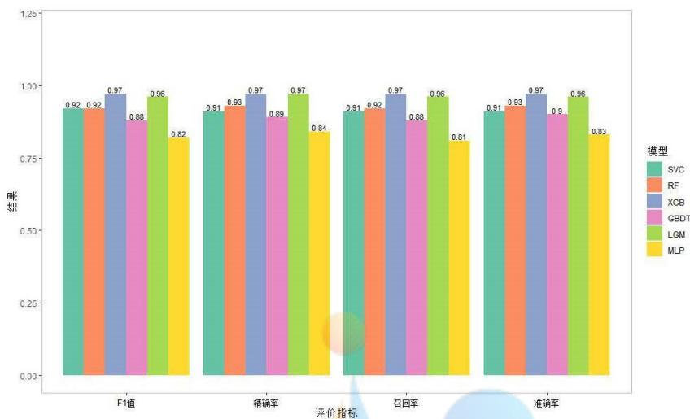

<details>
<summary>bar</summary>

| 评价指标 | SVC | RF | XGB | GBDT | LGM | MLP |
| --- | --- | --- | --- | --- | --- | --- |
| F1值 | 0.92 | 0.92 | 0.97 | 0.88 | 0.96 | 0.82 |
| 精确率 | 0.91 | 0.93 | 0.97 | 0.89 | 0.97 | 0.84 |
| 召回率 | 0.91 | 0.92 | 0.97 | 0.88 | 0.96 | 0.81 |
| 准确率 | 0.91 | 0.93 | 0.97 | 0.9 | 0.96 | 0.83 |
</details>

图 5-2 波段-20 数据集模型比较

由图5-2原始数据集模型比较和图5-3波段-20数据集模型比较可以看出，在原始数据集上支持向量机的分类效果最好，在波段-20的数据集上XGBoost和LightGBM模型的性能明显优于其它模型。同时也可以清楚的看出，波段-20的数据集分类准确率等普遍优于原始数据集，说明分波段提取特征后分类准确率会显著提高。

## 5.3 对未知药材产地进行鉴别

为了对未知药材产地进行准确鉴别，本文利用上述包括 SVC、XGBoost、RF、LightGBM 机器学习模型，得到的各模型分类结果如下表所示。

表 5-4 不同模型对未知药材产地鉴别结果

<table><tr><td>模型类型</td><td>3</td><td>14</td><td>38</td><td>48</td><td>58</td><td>71</td><td>79</td><td>86</td><td>89</td><td>110</td><td>134</td><td>152</td><td>227</td><td>331</td><td>618</td></tr><tr><td>20-SVC</td><td>6</td><td>1</td><td>4</td><td>10</td><td>10</td><td>6</td><td>9</td><td>6</td><td>3</td><td>4</td><td>9</td><td>10</td><td>5</td><td>7</td><td>3</td></tr><tr><td>20-XGBoost</td><td>6</td><td>1</td><td>4</td><td>6</td><td>10</td><td>6</td><td>9</td><td>11</td><td>3</td><td>4</td><td>9</td><td>2</td><td>2</td><td>8</td><td>3</td></tr><tr><td>20-RF</td><td>6</td><td>1</td><td>4</td><td>6</td><td>6</td><td>6</td><td>4</td><td>10</td><td>3</td><td>4</td><td>6</td><td>2</td><td>5</td><td>8</td><td>3</td></tr><tr><td>20-LightGBM</td><td>6</td><td>1</td><td>4</td><td>9</td><td>10</td><td>6</td><td>9</td><td>10</td><td>2</td><td>4</td><td>10</td><td>9</td><td>4</td><td>8</td><td>3</td></tr><tr><td>50-SVC</td><td>6</td><td>1</td><td>4</td><td>7</td><td>6</td><td>7</td><td>9</td><td>2</td><td>3</td><td>4</td><td>9</td><td>2</td><td>5</td><td>8</td><td>3</td></tr><tr><td>50-RF</td><td>6</td><td>1</td><td>4</td><td>6</td><td>6</td><td>6</td><td>9</td><td>11</td><td>3</td><td>4</td><td>9</td><td>2</td><td>5</td><td>8</td><td>3</td></tr><tr><td>50-XGBoost</td><td>6</td><td>1</td><td>4</td><td>6</td><td>10</td><td>6</td><td>10</td><td>11</td><td>3</td><td>4</td><td>9</td><td>2</td><td>5</td><td>7</td><td>3</td></tr><tr><td>50-LightGBM</td><td>6</td><td>1</td><td>4</td><td>6</td><td>10</td><td>6</td><td>4</td><td>11</td><td>3</td><td>4</td><td>9</td><td>2</td><td>10</td><td>8</td><td>3</td></tr><tr><td>100-SVC</td><td>6</td><td>1</td><td>4</td><td>6</td><td>9</td><td>6</td><td>9</td><td>11</td><td>3</td><td>4</td><td>9</td><td>2</td><td>5</td><td>8</td><td>3</td></tr><tr><td>100-RF</td><td>6</td><td>1</td><td>4</td><td>6</td><td>6</td><td>6</td><td>4</td><td>6</td><td>3</td><td>4</td><td>9</td><td>10</td><td>5</td><td>8</td><td>3</td></tr><tr><td>100-XGBoost</td><td>6</td><td>1</td><td>4</td><td>6</td><td>10</td><td>11</td><td>9</td><td>11</td><td>3</td><td>4</td><td>9</td><td>10</td><td>5</td><td>7</td><td>3</td></tr><tr><td>100-LightGBM</td><td>6</td><td>1</td><td>4</td><td>6</td><td>10</td><td>6</td><td>9</td><td>11</td><td>3</td><td>4</td><td>9</td><td>2</td><td>5</td><td>8</td><td>3</td></tr></table>

注：20、50、100代表波段间隔，SVC、XGBoost等代表机器学习模型

由表 5-4 中不同模型对未知药材产地鉴别结果可知，大多数模型对未知药材产地的鉴别结果相同，为了对未知药材的产地进行更精准的鉴别，本文采用多数投票法对以上模型进行结合分析，最终得到如表 5-5 所示的未知药材产地鉴别结果。

表 5-5 未知药材产地鉴别结果

<table><tr><td>No</td><td>3</td><td>14</td><td>38</td><td>48</td><td>58</td><td>71</td><td>79</td><td>86</td><td>89</td><td>110</td><td>134</td><td>152</td><td>227</td><td>331</td><td>618</td></tr><tr><td>OP</td><td>6</td><td>1</td><td>4</td><td>6</td><td>10</td><td>6</td><td>9</td><td>11</td><td>3</td><td>4</td><td>9</td><td>2</td><td>5</td><td>8</td><td>3</td></tr></table>

## 六、问题三模型的建立与求解

尽管不同种类的中药材在呈现的光谱的区别比较明显，但是不同产地的中药材在同一波段内比较接近，容易造成鉴别误差。科学实践发现：部分中药材在近红外或中红外区别较为明显，因此，如问题二构建的仅仅依据中红外光谱数据鉴别中医药种类的分类模型性能会存在着性能上限。故而，在本问中融入近红外数据，尝试进一步提取不同产地中药材在光谱数据中的差异性特征，提高中药材鉴别分类的精度。

## 6.1 基于机器学习的近红外光谱数据的中药材产地鉴别模型

首先利用支持向量机（SVM）、随机森林（RF）、极端梯度增强（XGBoost）、梯度提升决策树（GBDT）、LightGBM 和多层感知机（MLP）这六种机器学习分类算法对近红外光谱数据进行分类建模，结果如下。

表 6-1 基于机器学习的近红外光谱数据的中药材产地鉴别模型比较

<table><tr><td>数据</td><td>模型</td><td>召回率</td><td>精确率</td><td>准确率</td><td>F1值</td></tr><tr><td rowspan="7">原始数据</td><td>SVC</td><td>0.873</td><td>0.892</td><td>0.878</td><td>0.864</td></tr><tr><td>RF</td><td>0.694</td><td>0.684</td><td>0.698</td><td>0.665</td></tr><tr><td>XGBoost</td><td>0.665</td><td>0.679</td><td>0.661</td><td>0.648</td></tr><tr><td>GBDT</td><td>0.602</td><td>0.637</td><td>0.604</td><td>0.597</td></tr><tr><td>LightGBM</td><td>0.696</td><td>0.730</td><td>0.698</td><td>0.683</td></tr><tr><td>MLP</td><td>0.557</td><td>0.539</td><td>0.555</td><td>0.521</td></tr><tr><td>SVC</td><td>0.873</td><td>0.892</td><td>0.878</td><td>0.864</td></tr><tr><td rowspan="4">PCA降维数据</td><td>RF</td><td>0.937</td><td>0.949</td><td>0.939</td><td>0.933</td></tr><tr><td>XGBoost</td><td>0.847</td><td>0.873</td><td>0.845</td><td>0.841</td></tr><tr><td>GBDT</td><td>0.784</td><td>0.818</td><td>0.771</td><td>0.761</td></tr><tr><td>LightGBM</td><td>0.888</td><td>0.911</td><td>0.890</td><td>0.884</td></tr><tr><td rowspan="8">波段-20数据</td><td>MLP</td><td>0.788</td><td>0.823</td><td>0.792</td><td>0.779</td></tr><tr><td>SVC</td><td>0.896</td><td>0.931</td><td>0.898</td><td>0.891</td></tr><tr><td>RF</td><td>0.929</td><td>0.936</td><td>0.931</td><td>0.923</td></tr><tr><td>XGBoost</td><td>0.886</td><td>0.915</td><td>0.884</td><td>0.889</td></tr><tr><td>GBDT</td><td>0.778</td><td>0.845</td><td>0.763</td><td>0.766</td></tr><tr><td>LightGBM</td><td>0.943</td><td>0.960</td><td>0.947</td><td>0.942</td></tr><tr><td>MLP</td><td>0.813</td><td>0.858</td><td>0.812</td><td>0.809</td></tr><tr><td>SVC</td><td>0.896</td><td>0.916</td><td>0.892</td><td>0.898</td></tr><tr><td rowspan="5">波段-50数据</td><td>RF</td><td>0.935</td><td>0.947</td><td>0.939</td><td>0.930</td></tr><tr><td>XGBoost</td><td>0.886</td><td>0.924</td><td>0.890</td><td>0.883</td></tr><tr><td>GBDT</td><td>0.792</td><td>0.847</td><td>0.783</td><td>0.785</td></tr><tr><td>LightGBM</td><td>0.918</td><td>0.942</td><td>0.922</td><td>0.915</td></tr><tr><td>MLP</td><td>0.776</td><td>0.818</td><td>0.776</td><td>0.764</td></tr><tr><td rowspan="6">波段-100数据</td><td>SVC</td><td>0.896</td><td>0.922</td><td>0.898</td><td>0.891</td></tr><tr><td>RF</td><td>0.943</td><td>0.960</td><td>0.947</td><td>0.941</td></tr><tr><td>XGBoost</td><td>0.906</td><td>0.935</td><td>0.906</td><td>0.904</td></tr><tr><td>GBDT</td><td>0.760</td><td>0.815</td><td>0.759</td><td>0.750</td></tr><tr><td>LightGBM</td><td>0.931</td><td>0.946</td><td>0.935</td><td>0.929</td></tr><tr><td>MLP</td><td>0.786</td><td>0.818</td><td>0.788</td><td>0.778</td></tr></table>

由表 6-1 可以看出，在原始数据集上支持向量机模型的分类准确率最高，在波段-20的数据集上 LightGBM 模型的效果最好，而在 PCA 降维数据集波段-50 和波段-100 的数据集上，随机森林模型的性能最优越。同时分波段数据集的表现要明显优于原始数据集和 PCA 数据集。

## 6.2 基于机器学习的中红外光谱数据的中药材产地鉴别模型

利用支持向量机（SVM）、随机森林（RF）、极端梯度增强（XGBoost）、梯度提升决策树（GBDT）、LightGBM 和多层感知机（MLP）六种机器学习分类算法对中红外光谱数据进行分类建模，结果如下。

表 6-2 基于机器学习的中红外光谱数据的中药材产地鉴别模型比较

<table><tr><td>数据</td><td>模型</td><td>召回率</td><td>精确率</td><td>准确率</td><td>F1值</td></tr><tr><td rowspan="7">原始数据</td><td>SVC</td><td>0.906</td><td>0.925</td><td>0.910</td><td>0.904</td></tr><tr><td>RF</td><td>0.647</td><td>0.663</td><td>0.649</td><td>0.622</td></tr><tr><td>XGBoost</td><td>0.625</td><td>0.663</td><td>0.629</td><td>0.610</td></tr><tr><td>GBDT</td><td>0.561</td><td>0.567</td><td>0.547</td><td>0.535</td></tr><tr><td>LightGBM</td><td>0.616</td><td>0.640</td><td>0.620</td><td>0.598</td></tr><tr><td>MLP</td><td>0.710</td><td>0.726</td><td>0.706</td><td>0.699</td></tr><tr><td>SVC</td><td>0.898</td><td>0.920</td><td>0.902</td><td>0.895</td></tr><tr><td rowspan="5">PCA降维数据</td><td>RF</td><td>0.901</td><td>0.924</td><td>0.906</td><td>0.898</td></tr><tr><td>XGBoost</td><td>0.816</td><td>0.841</td><td>0.816</td><td>0.806</td></tr><tr><td>GBDT</td><td>0.729</td><td>0.750</td><td>0.735</td><td>0.723</td></tr><tr><td>LightGBM</td><td>0.880</td><td>0.902</td><td>0.882</td><td>0.877</td></tr><tr><td>MLP</td><td>0.735</td><td>0.774</td><td>0.735</td><td>0.723</td></tr><tr><td rowspan="7">波段-20数据</td><td>SVC</td><td>0.924</td><td>0.934</td><td>0.927</td><td>0.916</td></tr><tr><td>RF</td><td>0.941</td><td>0.958</td><td>0.947</td><td>0.942</td></tr><tr><td>XGBoost</td><td>0.898</td><td>0.928</td><td>0.902</td><td>0.895</td></tr><tr><td>GBDT</td><td>0.775</td><td>0.808</td><td>0.771</td><td>0.752</td></tr><tr><td>LightGBM</td><td>0.953</td><td>0.966</td><td>0.955</td><td>0.952</td></tr><tr><td>MLP</td><td>0.819</td><td>0.848</td><td>0.820</td><td>0.813</td></tr><tr><td>SVC</td><td>0.902</td><td>0.912</td><td>0.906</td><td>0.897</td></tr><tr><td rowspan="5">波段-50数据</td><td>RF</td><td>0.935</td><td>0.949</td><td>0.939</td><td>0.936</td></tr><tr><td>XGBoost</td><td>0.890</td><td>0.902</td><td>0.894</td><td>0.885</td></tr><tr><td>GBDT</td><td>0.749</td><td>0.808</td><td>0.751</td><td>0.742</td></tr><tr><td>LightGBM</td><td>0.929</td><td>0.939</td><td>0.931</td><td>0.925</td></tr><tr><td>MLP</td><td>0.767</td><td>0.785</td><td>0.771</td><td>0.751</td></tr><tr><td>波段-100数据</td><td>SVC</td><td>0.857</td><td>0.874</td><td>0.857</td><td>0.852</td></tr></table>

<table><tr><td>RF</td><td>0.906</td><td>0.926</td><td>0.910</td><td>0.904</td></tr><tr><td>XGBoost</td><td>0.869</td><td>0.898</td><td>0.873</td><td>0.863</td></tr><tr><td>GBDT</td><td>0.784</td><td>0.893</td><td>0.783</td><td>0.776</td></tr><tr><td>LightGBM</td><td>0.911</td><td>0.930</td><td>0.914</td><td>0.905</td></tr><tr><td>MLP</td><td>0.786</td><td>0.818</td><td>0.778</td><td>0.788</td></tr></table>

由表 可以看出，在原始数据集上支持向量机模型分类准确率最高，在波段-20的数据集上 LightGBM 模型的效果最好，而在 PCA 降维数据集波段-50 和波段-100 的数据集上，随机森林模型的性能最优越。同时在分波段数据集上的表现要普遍优于原始数据集和 PCA 数据集。

## 6.3 基于机器学习的近、中红外光谱数据的中药材产地鉴别模型

由于有些中药材的近红外区别比较明显，而有些药材的中红外区别比较明显，因此本文将近、中红外光谱数据特征对中药材产地进行综合鉴别。选取支持向量机（SVM）、随机森林（RF）、极端梯度增强（XGBoost）、梯度提升决策树（GBDT）、LightGBM和多层感知机（MLP）六种机器学习进行分类建模，结果如表6-3所示。

表 6-3 基于机器学习的近、中红外光谱数据的中药材产地鉴别模型

<table><tr><td>数据</td><td>模型</td><td>召回率</td><td>精确率</td><td>准确率</td><td>F1值</td></tr><tr><td rowspan="6">原始数据</td><td>SVC</td><td>0.898</td><td>0.933</td><td>0.902</td><td>0.89</td></tr><tr><td>RF</td><td>0.692</td><td>0.733</td><td>0.694</td><td>0.681</td></tr><tr><td>XGBoost</td><td>0.724</td><td>0.792</td><td>0.722</td><td>0.725</td></tr><tr><td>GBDT</td><td>0.620</td><td>0.656</td><td>0.633</td><td>0.631</td></tr><tr><td>LightGBM</td><td>0.763</td><td>0.797</td><td>0.763</td><td>0.754</td></tr><tr><td>MLP</td><td>0.582</td><td>0.567</td><td>0.584</td><td>0.555</td></tr><tr><td rowspan="6">PCA降维数据</td><td>SVC</td><td>0.898</td><td>0.933</td><td>0.902</td><td>0.895</td></tr><tr><td>RF</td><td>0.892</td><td>0.914</td><td>0.894</td><td>0.888</td></tr><tr><td>XGBoost</td><td>0.818</td><td>0.855</td><td>0.820</td><td>0.813</td></tr><tr><td>GBDT</td><td>0.743</td><td>0.824</td><td>0.743</td><td>0.723</td></tr><tr><td>LightGBM</td><td>0.867</td><td>0.899</td><td>0.869</td><td>0.865</td></tr><tr><td>MLP</td><td>0.792</td><td>0.822</td><td>0.792</td><td>0.780</td></tr><tr><td rowspan="7">波段-20数据</td><td>SVC</td><td>0.954</td><td>0.967</td><td>0.955</td><td>0.951</td></tr><tr><td>RF</td><td>0.976</td><td>0.984</td><td>0.980</td><td>0.976</td></tr><tr><td>XGBoost</td><td>0.950</td><td>0.965</td><td>0.951</td><td>0.950</td></tr><tr><td>GBDT</td><td>0.845</td><td>0.895</td><td>0.844</td><td>0.843</td></tr><tr><td>LightGBM</td><td>0.949</td><td>0.963</td><td>0.951</td><td>0.948</td></tr><tr><td>MLP</td><td>0.837</td><td>0.887</td><td>0.836</td><td>0.830</td></tr><tr><td>SVC</td><td>0.922</td><td>0.940</td><td>0.922</td><td>0.918</td></tr><tr><td rowspan="4">波段-50数据</td><td>RF</td><td>0.973</td><td>0.982</td><td>0.976</td><td>0.972</td></tr><tr><td>XGBoost</td><td>0.884</td><td>0.918</td><td>0.890</td><td>0.884</td></tr><tr><td>GBDT</td><td>0.820</td><td>0.844</td><td>0.812</td><td>0.807</td></tr><tr><td>LightGBM</td><td>0.924</td><td>0.941</td><td>0.927</td><td>0.919</td></tr><tr><td rowspan="2">波段-100数据</td><td>MLP</td><td>0.868</td><td>0.894</td><td>0.873</td><td>0.862</td></tr><tr><td>SVC</td><td>0.918</td><td>0.938</td><td>0.922</td><td>0.916</td></tr></table>

<table><tr><td>RF</td><td>0.963</td><td>0.974</td><td>0.967</td><td>0.962</td></tr><tr><td>XGBoost</td><td>0.916</td><td>0.939</td><td>0.918</td><td>0.915</td></tr><tr><td>GBDT</td><td>0.800</td><td>0.853</td><td>0.796</td><td>0.797</td></tr><tr><td>LightGBM</td><td>0.951</td><td>0.961</td><td>0.955</td><td>0.950</td></tr><tr><td>MLP</td><td>0.798</td><td>0.838</td><td>0.804</td><td>0.792</td></tr></table>

由表 6-3 可以看出, 在原始数据集和 PCA 降维数据集上支持向量机模型分类效果最好, 在分波段数据集上随机森林模型显示出优越的性能。与只使用近红外光谱数据和只使用中红外光谱数据相比, 同时使用近、中红外光谱数据可以有效提高模型的分类精度。

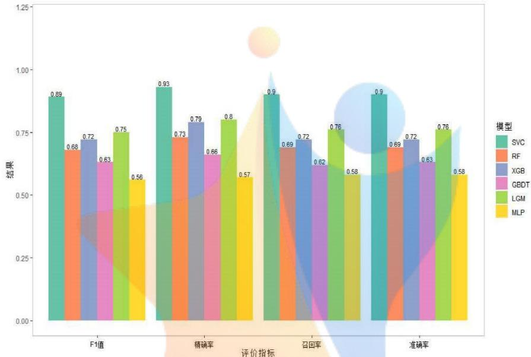

<details>
<summary>bar</summary>

| 评价指标 | 模型::SVC | 模型::RF | 模型::XGB | 模型::GBDT | 模型::LGM | 模型::MLP |
| --- | --- | --- | --- | --- | --- | --- |
| F1值 | 0.89 | 0.68 | 0.72 | 0.63 | 0.75 | 0.56 |
| 精确率 | 0.93 | 0.73 | 0.79 | 0.66 | 0.8 | 0.57 |
| 召回率 | 0.9 | 0.69 | 0.72 | 0.62 | 0.76 | 0.58 |
| 准确率 | 0.9 | 0.69 | 0.72 | 0.63 | 0.76 | 0.58 |
</details>

图 6-1 原始数据模型比较  
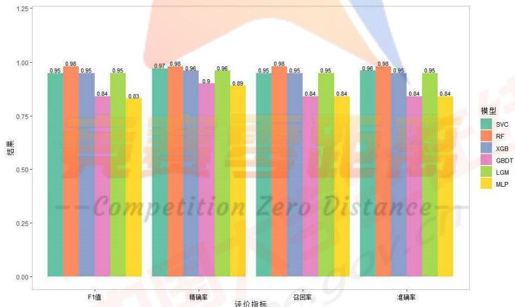

<details>
<summary>bar</summary>

| 评价指标 | 模型::SVC | 模型::RF | 模型::XGB | 模型::GBDT | 模型::LGM | 模型::MLP |
| --- | --- | --- | --- | --- | --- | --- |
| F1值 | 0.95 | 0.98 | 0.95 | 0.84 | 0.95 | 0.83 |
| 精确率 | 0.97 | 0.98 | 0.96 | 0.9 | 0.96 | 0.89 |
| 召回率 | 0.95 | 0.98 | 0.95 | 0.84 | 0.95 | 0.84 |
| 准确率 | 0.96 | 0.98 | 0.95 | 0.84 | 0.95 | 0.84 |
</details>

图 6-2 波段-20 数据模型比较

由图 6-2 原始数据集模型比较和图 5-3 波段-20 数据集模型比较可以看出，在原始数据集上支持向量机的分类效果最好，在波段-20 的数据集上随机森林模型的性能明显优于其它模型。同时也可以清楚的看出，波段-20 的数据集分类准确率等普遍优于原始数据集，说明分波段提取特征后分类准确率会显著提高。

## 6.3 基于鲸鱼优化与 LightGBM 结合的中药材产地鉴别模型

## 6.3.1 近中红外光谱数据在中药材产地鉴别

澳大利亚格里菲斯大学 Mirjalili 等人 2016 年提出鲸鱼优化算法（WOA），具有操作简单、需要调整的参数少、跳出局部区域等优点。鲸鱼优化算法具体步骤如下：

## 1.包围猎物(Encircling prey)

定义最佳搜索个体之后，其他搜索个体将尝试向最佳搜索个体更新它们的位置。这一行为由以下方程表示：

$$
\vec {D} = \left| \vec {C} \cdot \vec {X} ^ {*} (t) - \vec {X} (t) \right| \tag {6-1}
$$

$$
\vec {X} (t + 1) = \vec {X} ^ {*} (t) - \vec {A} \cdot \vec {D} \tag {6-2}
$$

其中 $t$ 表示当前迭代， $\vec{A}$ 和 $\vec{C}$ 是系数向量， $\vec{X}^{*}(t)$ 表示目前为止最好的鲸鱼位置向量， $\vec{X}(t)$ 表示当前鲸鱼的位置向量， $\mid \mid$ 表示绝对值。每次迭代过程中有更优解出现时就需要更新 $\vec{X}^{*}(t)$ 。向量 $\vec{A}$ 和 $\vec{C}$ 计算方法如下：

$$
\vec {A} = 2 \vec {a} \vec {r} - a \tag {6-3}
$$

$$
\vec {C} = 2 \vec {r} \tag {6-4}
$$

$a$ 在迭代过程中，由2线性递减到0， $\vec{a} = 2 - \frac{2t}{T_{\mathrm{max}}}$ ， $\vec{r}$ 是满足[0,1]中的随机向量。

## 2. 泡泡网攻击方式

通过收缩包围和螺旋更新两种方法对泡网攻击行为进行数学建模。

（1）收缩包围机制：该过程通过在迭代过程中降低 $\bar{a}$ 值来实现，搜索个体的新位置，定义为介于原个体位置和当前最佳个体位置之间的任何位置。

(2) 螺旋更新位置:

$$
\vec {X} (t + 1) = \vec {D} ^ {\prime} \cdot e ^ {b l} \cdot \cos (2 \pi l) + \vec {X} ^ {*} (t) \tag {6-5}
$$

其中 $\vec{D}' = |\vec{X}^*(t) - \vec{X}(t)|$ 表示第 $i$ 头鲸到猎物的距离(目前得到的最佳解)， $b$ 是个常数，定义了对数螺旋的形状， $l$ 为 $[-1,1]$ 中的随机数。

模型如下：

$$
\vec {X} (t + 1) = \left\{ \begin{array}{l l} \vec {X} ^ {*} (t) - \vec {A} \cdot \vec {D} & \text {if} p <   0. 5 \\ \vec {D} ^ {\prime} \cdot e ^ {b l} \cdot \cos (2 \pi l) + \vec {X} ^ {*} (t) & \text {if} p \geq 0. 5 \end{array} \right. \tag {6-6}
$$

P 是 $[0,1]$ 之间的随机数。

## 3. 搜索猎物

随机计算出的 $\vec{A}$ 比-1小或比1大时，将强迫搜索个体去远离参考鲸鱼。此时的数学模型为：

$$
\vec {D} = \left| \vec {C} \cdot \vec {X} _ {\text {rand}} - \vec {X} \right| \tag {6-7}
$$

$$
\vec {X} (t + 1) = \vec {X} _ {\text {rand}} - \vec {A} \cdot \vec {D} \tag {6-8}
$$

$\vec{X}_{rand}$ 是随机选择的鲸鱼位置向量。

从问题 3 中利用近、中红外数据对中药材产地的鉴别结果可以看出 LightGBM 模型的优势，为了进一步使模型更加完善，精确率更高，使用鲸鱼优化算法对 LightGBM 中的两个参数（learnin\_rate、n\_estimators）进行优化，比较同一模型下使用不同数据的分类准确率结果如表所示。

表 6-4 鲸鱼优化后 LightGBM 模型分类准确率

<table><tr><td>产地</td><td>近红外数据分类准确率</td><td>中红外数据分类准确率</td><td>近与中红外数据分类准确率</td></tr><tr><td>1</td><td>1</td><td>1</td><td>1</td></tr><tr><td>2</td><td>1</td><td>1</td><td>1</td></tr><tr><td>3</td><td>1</td><td>1</td><td>1</td></tr><tr><td>4</td><td>1</td><td>1</td><td>1</td></tr><tr><td>5</td><td>1</td><td>1</td><td>1</td></tr><tr><td>6</td><td>1</td><td>1</td><td>1</td></tr><tr><td>7</td><td>1</td><td>1</td><td>1</td></tr><tr><td>8</td><td>1</td><td>0.8</td><td>1</td></tr><tr><td>9</td><td>1</td><td>1</td><td>1</td></tr><tr><td>10</td><td>0.83</td><td>1</td><td>1</td></tr><tr><td>11</td><td>1</td><td>1</td><td>1</td></tr><tr><td>12</td><td>1</td><td>1</td><td>1</td></tr><tr><td>13</td><td>1</td><td>1</td><td>1</td></tr><tr><td>14</td><td>1</td><td>1</td><td>1</td></tr><tr><td>15</td><td>1</td><td>0.5</td><td>1</td></tr><tr><td>16</td><td>1</td><td>1</td><td>1</td></tr><tr><td>17</td><td>1</td><td>1</td><td>1</td></tr></table>

从表 6-4 能够看出，对于近红外光谱数据来说，波段 20 的数据在 LightGBM 模型上的效果最好，准确率达到了 0.947，通过优化再五折交叉验证后的最终准确率达到了 0.959。接下来对训练集的数据进行分类，计算出训练集的每个标签预测正确的概率，训练集包含 62 个样本，只有产地 10 的正确率为 0.83，其余产地的正确率都为 1。在中红外光谱数据集上，波段 100 的 LightGBM 模型的准确率最高，同样采用鲸鱼优化算法优化 LightGBM 的两个参数，优化后的精度为 0.971，准确度提升了 1.6%，只有产地 8 的正确率不为 1。同时使用近、中红外数据分类时，同样 LightGBM 在特征为波段 100 的数据上表现最佳，经过优化后模型的准确率为 0.982，输出的所有产地正确率都为 1。

根据上述分析使用近中红外数据并且是波段为 100 的数据，LightGBM 模型参数优化后的分类精度为 0.982，基于此对特征的重要性进行评估，选取的前三十个特征。

表 6-5 特征重要性排序

<table><tr><td>变量</td><td>重要性</td><td>变量</td><td>重要性</td><td>变量</td><td>重要性</td></tr><tr><td>1</td><td>k_66</td><td>11</td><td>std_34</td><td>21</td><td>k_70</td></tr><tr><td>2</td><td>k_64</td><td>12</td><td>k_81</td><td>22</td><td>std_45</td></tr><tr><td>3</td><td>k_55</td><td>13</td><td>sk_3</td><td>23</td><td>k_67</td></tr><tr><td>4</td><td>k_17</td><td>14</td><td>sk_17</td><td>24</td><td>k_77</td></tr><tr><td>5</td><td>sk_19</td><td>15</td><td>k_20</td><td>25</td><td>sk_4</td></tr><tr><td>6</td><td>sk_12</td><td>16</td><td>sk_7</td><td>26</td><td>std_43</td></tr><tr><td>7</td><td>k_61</td><td>17</td><td>k_19</td><td>27</td><td>k_65</td></tr><tr><td>8</td><td>std_23</td><td>18</td><td>k_32</td><td>28</td><td>std_48</td></tr><tr><td>9</td><td>k_2</td><td>19</td><td>k_3</td><td>29</td><td>sk_23</td></tr><tr><td>10</td><td>sk_28</td><td>20</td><td>sk_65</td><td>30</td><td>std_49</td></tr></table>

注：k 代表峰度，sk 代表偏度。

由表 6-5 特征重要性排序结果可以看出，最重要的特征大多数为偏度和峰度，这说明不同产地药材的偏度和峰度存在较大差异，是影响不同产地药材鉴别的重要因素。

为了对未知药材产地进行准确鉴别，本文利用上述包括 SVC、XGBoost、RF、LightGBM 机器学习模型，使用投票法对模型进行结合，最终得到如表 6-6 所示的未知药材产地鉴别结果

表 6-6 未知药材产地鉴别结果

<table><tr><td>No</td><td>4</td><td>15</td><td>22</td><td>30</td><td>34</td><td>45</td><td>74</td><td>114</td><td>170</td><td>209</td></tr><tr><td>OP</td><td>17</td><td>11</td><td>1</td><td>2</td><td>16</td><td>3</td><td>4</td><td>10</td><td>9</td><td>14</td></tr></table>

## 七、问题四模型的建立与求解

在问题四中，需要使用所提供的几种药材近红外光谱数据，鉴别药材的类别与产地。通过对附件四数据研究发现，对于不同药材编号，各个光谱波段特征信息完整，但是Class或OP标签并不完全标记，存在这数据缺失的情形。因此，基于数据驱动对药材进行类别和产地进行鉴定的场景可以归纳为一下几种：

1）已知中药材所属类别，但是在产地上无法准确识别，造成“OP”标签缺失；

2）已知中药材产地，但是在中药材类别上无法下定论，造成“Class”标签缺失；

3）对于中药材类别和生产产地均无法人工识别，仅仅拥有中药材产品在不同的光谱波段上的吸光度数据，造成“Class”和“OP”标签同时缺失。

因此，对于以上三种不同的真实场景，基于机器学习对中药材类别和产地进行智能识别，充分发挥数据的价值和算法的性能，为生产和生活带来便宜。

针对以上三种场景，基于数据驱动的方案可以归纳为以下建模场景：

1）以近红外光谱数据，对近红外光谱数据进行特征提取，筛选出未缺失标签的类别或产地，后使用机器学习算法对中药材的类别和产地进行单独的有监督分类预测；

2）由于不同中药材在类别和产地的差异性，如图7-1所示，在产地号较高的产地仅仅有B类中药材，可知中药材的产地和类别存在着明显的相关关系，将类别或产地纳入产地或类别预测模型中具有重要意义。因此，可以通过首先构建中药材类别预测模型，为未知的中药材样本类别进行预测和标记，随后纳入特征，对中药材产地构建预测模型。同理，通过首先构建中药材产地预测模型，为未知的中药材样本产地进行预测和标记，随后纳入特征，对中药材类别构建类别预测模型。

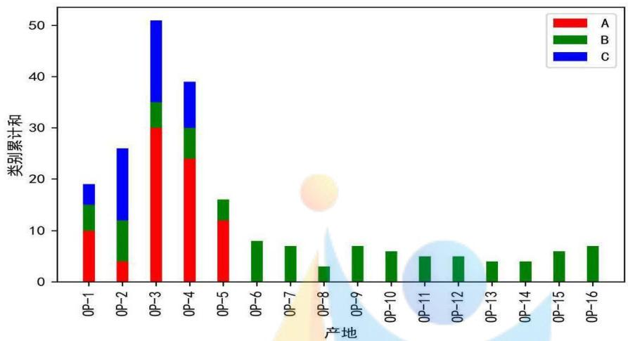

<details>
<summary>bar_stacked</summary>

| 产地 | A | B | C |
| --- | --- | --- | --- |
| OP-1 | 10 | ~5 | ~4 |
| OP-2 | 4 | ~7 | ~14 |
| OP-3 | 30 | ~5 | ~15 |
| OP-4 | 24 | ~6 | ~9 |
| OP-5 | 12 | ~4 | 0 |
| OP-6 | 0 | 8 | 0 |
| OP-7 | 0 | 7 | 0 |
| OP-8 | 0 | 3 | 0 |
| OP-9 | 0 | 7 | 0 |
| OP-10 | 0 | 6 | 0 |
| OP-11 | 0 | 5 | 0 |
| OP-12 | 0 | 5 | 0 |
| OP-13 | 0 | 4 | 0 |
| OP-14 | 0 | 4 | 0 |
| OP-15 | 0 | 6 | 0 |
| OP-16 | 0 | 7 | 0 |
</details>

图 7-1 近红外光谱数据中不同产地对应类别的示意图

在本问题中，旨在通过机器学习算法对中药材的产地和类别进行鉴定分类。因此，在构建分类模型中，仍可以考虑采用问题二和问题三的模型构建思路和求解策略。不过，需要注意的是对特征的扩增或进一步提升模型分类性能。

具体来说，根据数据特征的不同，可以分为：仅考虑原始特征，考虑辅助特征（类别或产地）和考虑使用预测的类别或产地标签，即对应基于原始光谱特征的机器学习方法的分类预测模型和特征融合的机器学习方法的两阶段预测模型。进一步地融合不同的机器学习方法，如SVR、RF、GBDT和XGBoost等分类算法，为客观地评价使用五折交叉验证得到各个算法在不同的数据特征下的泛化性能。

## 7.1 基于原始光谱数据的机器学习方法的中药材鉴别模型

原始光谱特征能够从中药材固有属性中提取差异性特征，为中药材类别和产地鉴别提供核心特征信息，因此，基于原始光谱特征构建机器学习方法对中药材的类别和产地鉴别模型能够准确识别出中药材类别和产地。下表7-1展示了在原始光谱特征下的各类机器学习方法泛化性能测试结果。

表 7-1 基于原始光谱特征的机器学习方法模型比较结果

<table><tr><td colspan="2"></td><td colspan="3">Class 分类预测</td><td colspan="3">OP 分类预测</td></tr><tr><td>模型</td><td>评价指标</td><td>波段-20</td><td>波段-50</td><td>波段-100</td><td>波段-20</td><td>波段-50</td><td>波段-100</td></tr><tr><td rowspan="3">RF</td><td>Precision</td><td>1.000</td><td>1.000</td><td>1.000</td><td>0.870</td><td>0.844</td><td>0.806</td></tr><tr><td>Recall</td><td>1.000</td><td>1.000</td><td>1.000</td><td>0.856</td><td>0.841</td><td>0.802</td></tr><tr><td>F1</td><td>1.000</td><td>1.000</td><td>1.000</td><td>0.839</td><td>0.822</td><td>0.774</td></tr><tr><td rowspan="4">LGBM</td><td>Accuracy</td><td>1.000</td><td>1.000</td><td>1.000</td><td>0.868</td><td>0.851</td><td>0.834</td></tr><tr><td>Precision</td><td>1.000</td><td>0.994</td><td>1.000</td><td>0.768</td><td>0.779</td><td>0.779</td></tr><tr><td>Recall</td><td>1.000</td><td>0.991</td><td>1.000</td><td>0.728</td><td>0.720</td><td>0.686</td></tr><tr><td>F1</td><td>1.000</td><td>0.992</td><td>1.000</td><td>0.725</td><td>0.722</td><td>0.703</td></tr><tr><td rowspan="3">XGBoost</td><td>Accuracy</td><td>1.000</td><td>0.992</td><td>1.000</td><td>0.794</td><td>0.788</td><td>0.774</td></tr><tr><td>Precision</td><td>1.000</td><td>0.991</td><td>0.997</td><td>0.788</td><td>0.801</td><td>0.749</td></tr><tr><td>Recall</td><td>1.000</td><td>0.985</td><td>0.996</td><td>0.775</td><td>0.804</td><td>0.739</td></tr></table>

<table><tr><td>F1</td><td>1.000</td><td>0.987</td><td>0.997</td><td>0.755</td><td>0.782</td><td>0.722</td></tr><tr><td>Accuracy</td><td>1.000</td><td>0.988</td><td>0.996</td><td>0.831</td><td>0.819</td><td>0.814</td></tr></table>

从上表中可以看出：对于中药材类别分类问题，各类中药材光谱信息特征差异性较大，机器学习算法能够较为精准地分类。对于中药材产地分类问题，RF的分类预测效果明显，具有较高的泛化性能。

## 7.2 基于特征融合的机器学习方法的两阶段中药材鉴别模型

基于数据驱动的模型构建往往缺乏解释性，因此，在能够融入经验知识或部分重要已知信息能够为分类预测提升一定的性能。在问题四给定的附件数据中，能够清晰发现部分样本中药材拥有确定的标签，而许多样本中药材缺乏一个标签，甚至缺失两个标签。在这种场景下，可以通过已有的标签信息，构建中药材类别和产地的分类预测模型。因此，在本场景下，在分类预测中药材类别时融入产地特征，首先通过构建中药材类别预测模型，对未知的中药材类别标签的样本进行标注，完成第一阶段预测；随后，基于近红外光谱信息特征和中药材类别标签构建中药材产地预测模型，完成第二阶段预测，以此称之为两阶段中药材鉴别模型。同理，在分类预测中药材产地时融入类别特征。

在算法比较中，为了客观科学的比较两阶段预测模型的真实性能，筛选原始数据中同时含有中药材类别和产地标签的样本训练机器学习分类预测模型进行对比。下表7-2为该场景下三种不同数据条件下的各机器学习分类预测模型的泛化性能测试结果。

表 7-2 特征融合的机器学习方法的两阶段中药材鉴别模型比较结果

<table><tr><td colspan="2"></td><td colspan="3">融合 OP 特征预测 Class 分类</td><td colspan="3">融合 Class 特征预测 OP 分类</td></tr><tr><td>模型</td><td>评价指标</td><td>波段-20</td><td>波段-50</td><td>波段-100</td><td>波段-20</td><td>波段-50</td><td>波段-100</td></tr><tr><td rowspan="4">RF</td><td>Precision</td><td>1.000</td><td>1.000</td><td>1.000</td><td>0.687</td><td>0.660</td><td>0.640</td></tr><tr><td>Recall</td><td>1.000</td><td>1.000</td><td>1.000</td><td>0.737</td><td>0.715</td><td>0.694</td></tr><tr><td>F1</td><td>1.000</td><td>1.000</td><td>1.000</td><td>0.691</td><td>0.670</td><td>0.642</td></tr><tr><td>Accuracy</td><td>1.000</td><td>1.000</td><td>1.000</td><td>0.800</td><td>0.798</td><td>0.775</td></tr><tr><td rowspan="4">LightGBM</td><td>Precision</td><td>0.993</td><td>0.992</td><td>0.993</td><td>-</td><td>-</td><td>-</td></tr><tr><td>Recall</td><td>0.985</td><td>0.985</td><td>0.988</td><td>-</td><td>-</td><td>-</td></tr><tr><td>F1</td><td>0.989</td><td>0.988</td><td>0.990</td><td>-</td><td>-</td><td>-</td></tr><tr><td>Accuracy</td><td>0.991</td><td>0.991</td><td>0.992</td><td>-</td><td>-</td><td>-</td></tr><tr><td rowspan="4">XGBoost</td><td>Precision</td><td>1.000</td><td>0.996</td><td>1.000</td><td>0.622</td><td>0.588</td><td>0.626</td></tr><tr><td>Recall</td><td>1.000</td><td>0.993</td><td>1.000</td><td>0.659</td><td>0.641</td><td>0.668</td></tr><tr><td>F1</td><td>1.000</td><td>0.994</td><td>1.000</td><td>0.618</td><td>0.587</td><td>0.623</td></tr><tr><td>Accuracy</td><td>1.000</td><td>0.995</td><td>1.000</td><td>0.751</td><td>0.728</td><td>0.765</td></tr></table>

从上表 7-2 可知：1）两阶段预测模型中，基于产地一阶段预测模型的类别二阶段预测模型能够同时保证类别和产地鉴定更为精准，表明类别特征对于产地分类预测模型提供了重要特征，能够增强产地分类预测模型的性能；2）和完全标签样本中药材数据构建的机器学习方法分类预测模型相比，基于标签标注的二阶段预测模型性能并没有显著下降，表明基于标签标注的二阶段预测模型方案可行，同时映射出第一阶段预测模型极高的分类性能；3）从以上构建的机器学习模型可知，利用近红外数据能够精准鉴别中药材产地和类别，能够减轻人工识别压力和降低经验误差，对中药材的分类和经济价值衡量具有重大作用。

选取以上实验中最优模型对目标样本进行分类预测, 分类预测结果如下表 7-3 所示。

表 7-3 目标中药材样本类别和产地分类预测结果

<table><tr><td>No</td><td>94</td><td>109</td><td>140</td><td>278</td><td>308</td><td>330</td><td>347</td></tr><tr><td>Class</td><td>A</td><td>A</td><td>A</td><td>C</td><td>C</td><td>C</td><td>B</td></tr><tr><td>OP</td><td>5</td><td>3</td><td>1</td><td>1</td><td>3</td><td>4</td><td>11</td></tr></table>

## 八、模型的评价

## 8.1 模型的优点

(1) 本文充分挖掘近红外、中红外光谱数据不同波段特征对中药材类别与产地鉴别的特性。  
(2) 本文对原始数据进行了降维和分波段计算特征处理, 利用了六种机器学习分类算法进行鉴别分析, 更充分地衡量不同产地药材和类别的差异性和区分度。  
(3) 本文提出了基于鲸鱼优化和 LightGBM 结合的药材类别和产地识别模型, 使得结果的精确度得到进一步提高, 模型泛化能力得到提升。

## 8.2 模型的不足

本文仅依据近红外和中红外光谱数据鉴别中医药种类的分类模型的性能可能会存在着特征属性数据局限性，可以适当增加中药材的其他物理属性特征。

## 8.3 模型的推广

总之，本文所建立的模型与实际情况相符合，具有一定的指导性。同时可针对模型进行更深层次的分析，模型分类精度较高，泛化性能较好，可以应用于葡萄酒分类、疾病诊断、故障识别等领域。

## 九、参考文献

[1] 韩中庚. 数学建模方法及其应用[M]. 高等教育出版社, 2009.  
[2] 周志华. 机器学习[M]. 清华大学出版社, 2016.  
[3] Seyedali Mirjalili, Andrew Lewis. The Whale Optimization Algorithm[J]. Advances in Engineering Software, 2016, 95:51-67.  
[4] 李航. 统计学习方法[M]. 清华大学出版社, 2012.  
[5] 刘沭华, 张学工, 周群, 等. 模式识别和红外光谱法相结合鉴别中药材产地[J]. 光谱学与光谱分析, 2005(06): 878-881.  
[6] 司守奎, 孙兆亮. 数学建模算法与应用[M]. 第2版. 北京: 国防工业出版社, 2016.  
[7] 汪晓银, 周保平. 数学建模与数学实验[M]. 北京: 科学出版社, 1-6, 2010.  
[8] 杨岩, 肖佳妹, 周晋, 等. 支持向量机法及其在中药研究中的应用[J]. 中草药, 2020(8).  
[9] 刘沐华, 张学工, 孙素琴. 中药材产地的近红外光谱自动鉴别和特征谱段选择[J]. 科学通报, 2005, 50(004): 393-398.

## 附录

```r
#######################问题1
#install.packages("factoextra")#可视化包
#install.packages("fpc")
library(factoextra)
library(fpc)
library(cluster)
library("stats")
mydata=read.csv("data.csv")
#数据预处理
is.na(mydata)#查看数据是否有缺失值
sum(is.na(mydata))#缺失值的个数
data1=mydata[c(-201,-136,-64),]#删除异常值(离群点)
data=data1[,-1]#删除第一列
std.data=as.matrix(scale(data))#数据标准化

#######################确定最佳聚类数目
##1.肘部法则
fviz_nbclust(std.data, kmeans,method = "wss",k.max = 10)
##2.平均轮廓法
#K取2到10，评估K
K<-2:10
round<-10 # 每次迭代10次，避免局部最优
rst <- sapply(K, function (i){
    print(paste( "K=",i))
    mean(sapply(1:round, function (r){
        print(paste( "Round",r))
        result <- kmeans(std.data, i)
        stats <- cluster.stats(dist(std.data), result$cluster)
        stats$avg.silwidth
    }))}
})
plot(K,rst,type='I',main='轮廓系数与K的关系', ylab='轮廓数量'，
##3.间隔统计量
stat_gap <- clusGap(std.data, kmeans, nstart = 25, K.max = 10
fviz_gap_stat(stat_gap)

#######################K-means 聚类
km_result=kmeans(std.data,centers=3,iter.max=10)
#提取类标签并且与原始数据进行合并
dd=cbind(data, cluster = km_result$cluster)
```

#write.csv(dd,"D:/桌面文件/建模/问题1数据/K-means+标签.csv")

#查看每一类的数目

table(km\_result\$cluster)

#进行可视化展示

```python
fviz_cluster(km_result, data = std.data,
        palette = c("#2E9FDF", "#00AFBB", "#E7B800"),
        ellipse.type = "euclid",
        star.plot = TRUE,
        repel = TRUE,
        ggtheme = theme_minimal()
)
```

##########PCA 降维

```txt
rm1=cor(std.data)
rsl=eigen(rml)
val=rs1$values
(Standard_deviation=sqrt(val))
```

#计算方差贡献率和累积贡献率；

```txt
(Proportion_of_Variance=val/sum(val))
(Cumulative_Proportion=cumsum(Proportion_of_Variance))
```

#碎石图绘制;

```txt
par(mar=c(6,6,2,2))
plot(rs1\$values,type="b",cex=1,cex.lab=1,cex.axis=1,lty=2,lwd=2,
    xlab = "主成分编号",ylab="特征值(主成分方差)")
```

#提取结果中的特征向量(也称为 Loadings,载荷矩阵):

U=as.matrix(rs1\$vectors)

#进行矩阵乘法，获得 PC score:

PC=std.data %\*0% U

pc\_data = PC[,1:3] #选取 3 个主成分

pc\_data = data.frame(pc\_data)

#write.csv(pc\_data,"D:/桌面文件/建模/问题1数据/PCA\_data.csv")

#########层次聚类

result=dist(std.data,method="euclidean")

hc\_result=hclust(d=result,method="ward.D2")

cluster=cutree(hc\_result, k = 3)#提取类标签

dd=cbind(data, cluster = cluster)

#write.csv(dd,"D:/桌面文件/建模/问题1数据/Ward+标签.csv")

#查看每一类的数目

table(cluster)

```txt
fviz_dend(hc_result,k=3,cex=0.5,
    k_colors=c("#2E9FDF", "#00AFBB", "#E7B800"),
    color_labels_by_k=TRUE,rect = TRUE,ang=-1)
```

问题2  
```python
import pandas as pd
import numpy as np
import matplotlib.pyplot as plt
import seaborn as sns
import statsmodels
import xgboost as xgb
import time
import math
import lightgbm as lgb

from sklearn.model_selection import train_test_split # 划分数据集
from sklearn.svm import SVC
from sklearn import metrics # 引入包含数据验证方法的包
from sklearn.model_selection import GridSearchCV
from sklearn.model_selection import cross_val_score
from sklearn.metrics import r2_score, mean_squared_error, mean_absolute_error
from sklearn.ensemble import RandomForestClassifier
from sklearn import ensemble
from sklearn.neural_network import MLPClassifier
## 读入原始数据
data = pd.read_csv('Q2_feature_20.csv')
dataa = pd.read_excel('YUCE_feature_20.xlsx')
feature_data = data[~data['OP'].isna()] # 正则方式除去空标签值（sheet1）
X = feature_data.iloc[:, :-1]
Y = feature_data.iloc[:, -1]
#数据集划分
x_train, x_test, y_train, y_test = train_test_split(X, Y, test_size=0.2, random_state=0) # 数据集划分
#SVC
tuned_parameters = ['kernel': ('linear', 'rbf', 'sigmoid'), 'C': np.logspace(-3, 3, 13), 'gamma': np.logspace(-3, 3))] # 备选参数列表
opt_clf = GridSearchCV(SVC(), tuned_parameters)
opt_clf.fit(x_train, y_train)
print(opt_clf.best_params_)
final_clf = SVC(C=3.1622776601683795, kernel=rbf, gamma=0.01, decision_function_shape='ovr')

final_clf = SVC(C=3.1622776601683795, kernel=rbf, gamma=0.01, decision_function_shape='ovr')
pfitness = cross_val_score(final_clf, X, Y, cv=5,scoring='precision_macro').mean()
rfitness = cross_val_score(final_clf, X, Y, cv=5,scoring='recall_macro').mean()
ffitness = cross_val_score(final_clf, X, Y, cv=5,scoring='f1_macro').mean()
afitness = cross_val_score(final_clf, X, Y, cv=5,scoring='accuracy').mean()
```

```python
final_clf.fit(X, Y)
pred1 = final_clf.predict(dataa)
```

#RF  
```python
clf = RandomForestClassifier(n_estimators=99, max_depth=89,max_features=28)
pfitness1 = cross_val_score(clf, X, Y, cv=5,scoring='precision_macro').mean()
rfitness1 = cross_val_score(clf, X, Y, cv=5,scoring='recall_macro').mean()
ffitness1 = cross_val_score(clf, X, Y, cv=5,scoring='fl_macro').mean()
afitness1 = cross_val_score(clf, X, Y, cv=5,scoring='accuracy').mean()

rf_model = RandomForestClassifier(n_estimators=99, max_depth=89,max_features=28)
rf_model.fit(X, Y)
pred = rf_model.predict(dataa)
```

#xgb  
```python
xgbc = xgb.XGBClassifier(max_depth=3, learning_rate=0.28005144974158647,
    n_estimators=473, objective='multi:softmax',
    eval_metric='error', num_class=11,
    booster='gbtree', n_jobs=4,
    gamma=0, min_child_weight=0.01226452121030943,
    subsample=0.37768775627497536,
    colsample_bytree=0.8, seed=7)
```

```python
pfitness = cross_val_score(xgbc, X, Y, cv=5,scoring='precision_macro').mean()
rfitness = cross_val_score(xgbc, X, Y, cv=5,scoring='recall_macro').mean()
ffitness = cross_val_score(xgbc, X, Y, cv=5,scoring='f1_macro').mean()
afitness = cross_val_score(xgbc, X, Y, cv=5,scoring='accuracy').mean()
```

```txt
xgbc.fit(X, Y)
pred = xgbc.predict(dataa)
```

#GBDT  
```python
clf = ensemble.GradientBoostingClassifier(n_estimators=100,
                      max_depth=3)
pfitness3 = cross_val_score(clf, X, Y, cv=5,scoring='precision_macro').mean()
rfitness3 = cross_val_score(clf, X, Y, cv=5,scoring='recall_macro').mean()
ffitness3 = cross_val_score(clf, X, Y, cv=5,scoring='f1_macro').mean()
afitness3 = cross_val_score(clf, X, Y, cv=5,scoring='accuracy').mean()
```

```python
clf.fit(X, Y)
pred = clf.predict(dataa)
```

```python
clf = MLPClassifier(solver='lbfgs', alpha=1e-5, hidden_layer_sizes=(50, 50), random_state=1)
pfitness4 = cross_val_score(clf, X, Y, cv=5, scoring='precision_macro').mean()
```

rfitness4 = cross\_val\_score(clf, X, Y, cv=5,scoring='recall\_macro').mean()

ffitness4 = cross\_val\_score(clf, X, Y, cv=5, scoring='f1\_macro').mean()

afitness4 = cross\_val\_score(clf, X, Y, cv=5,scoring='accuracy').mean()

clf.fit(X, Y)

pred = clf.predict(dataa)

gbm = lgb.LGBMClassifier(learning\_rate=0.19681498709141632,

n\_estimators=225)

gbm\_merge20\_pre = cross\_val\_score(gbm, X, Y, cv=5,scoring='precision\_macro').mean()

gbm\_merge20\_rec = cross\_val\_score(gbm, X, Y, cv=5, scoring='recall\_macro').mean()

gbm\_merge20\_f1 = cross\_val\_score(gbm, X, Y, cv=5, scoring='f1\_macro').mean()

gbm\_merge20\_acc = cross\_val\_score(gbm, X, Y, cv=5, scoring='accuracy').mean()

gbm.fit(X, Y)

pred = gbm.predict(dataa)

########问题3，导包同问题2

dataa = pd.read\_excel('Q3\_1\_20 填表.xlsx')

#合并特征

data\_3\_1\_1 = pd.read\_excel('Q3\_1\_feature\_20.xlsx')

data\_3\_1\_20 = data\_3\_1\_1[\~data\_3\_1\_1['OP'].isna() ] # 正则方式除去空标签值（sheet1）

X = data\_3\_1\_20.iloc[:, :-1]  # 特征

Y = data\_3\_1\_20.iloc[:, -1]  # 预测目标

\# 数据集划分

x\_train, x\_test, y\_train, y\_test = train\_test\_split(X, Y, test\_size=0.25, random\_state=0)  # 数据集划分
# RF 五折交叉验证

clf = RandomForestClassifier(n\_estimators=100, max\_depth=None,

min\_samples\_split=2, random\_state=0)

RF\_merge20\_pre = cross\_val\_score(clf, X, Y, cv=5,scoring='precision\_macro').mean()

RF\_merge20\_rec = cross\_val\_score(clf, X, Y, cv=5,scoring='recall\_macro').mean()

RF\_merge20\_f1 = cross\_val\_score(clf, X, Y, cv=5, scoring='f1\_macro').mean()

RF\_merge20\_acc = cross\_val\_score(clf, X, Y, cv=5,scoring='accuracy').mean()

clf.fit(X, Y)

pred = clf.predict(dataa)

#SVC

tuned\_parameters = [{'kernel': ('linear', 'rbf', 'sigmoid'), 'C': np.logspace(

-3, 3, 13), 'gamma': np.logspace(-3, 3, 13)}] # 备选参数列表

opt\_clf = GridSearchCV(SVC(), tuned\_parameters)

opt\_clf.fit(x\_train, y\_train)

print(opt\_clf.best\_params\_)  
```python
final_clf = SVC(C=0.01, kernel='linear', gamma=0.001, decision_function_shape='ovr')
```

```python
SVC_merge20_pre = cross_val_score(final_clf, X, Y, cv=5, scoring='precision_macro').mean()
SVC_merge20_rec = cross_val_score(final_clf, X, Y, cv=5, scoring='recall_macro').mean()
SVC_merge20_f1 = cross_val_score(final_clf, X, Y, cv=5, scoring='f1_macro').mean()
SVC_merge20_acc = cross_val_score(final_clf, X, Y, cv=5, scoring='accuracy').mean()
```

```python
final_clf.fit(X, Y)
pred = final_clf.predict(dataa)
```

```python
#XGBOOST
xgbc = xgb.XGBClassifier()
XGB_merge20_pre = cross_val_score(xgbc, X, Y, cv=5,scoring='precision_macro').mean()
XGB_merge20_rec = cross_val_score(xgbc, X, Y, cv=5,scoring='recall_macro').mean()
XGB_merge20_f1 = cross_val_score(xgbc, X, Y, cv=5,scoring='f1_macro').mean()
XGB_merge20_acc = cross_val_score(xgbc, X, Y, cv=5,scoring='accuracy').mean()
```

```txt
xgbc.fit(X, Y)
pred = xgbc.predict(dataa)
```

```python
#GBDT
GBDT = ensemble.GradientBoostingClassifier()
GBDT_merge20_pre = cross_val_score(GBDT, X, Y, cv=5,scoring='precision_macro').mean()
GBDT_merge20_rec = cross_val_score(GBDT, X, Y, cv=5,scoring='recall_macro').mean()
GBDT_merge20_f1 = cross_val_score(GBDT, X, Y, cv=5,scoring='f1_macro').mean()
GBDT_merge20_acc = cross_val_score(GBDT, X, Y, cv=5,scoring='accuracy').mean()
```

```txt
GBDT.fit(X, Y)
pred = GBDT.predict(dataa)
```

```txt
#LGB
def woagbm(fitness, noclus, max_iterations, noposs, min_values = [0,5], max_values = [1,500]):
```

```python
""
    noclus = 维度
    max_iterations = 迭代次数
    noposs = 种群数
"

poss_sols = np.zeros((noposs, noclus)) # 鲸鱼位置
gbest = np.zeros((noclus,)) # 全局最佳鲸鱼位置
b = 1.0#定义对数螺旋形状的常数
```

```python
values = [0.1,1]#随机设置需要优化的整型和浮点型，1：整型，0.1：浮点型
# 种群初始化
boundary=np.zeros((noclus,))
for j in range(noclus):
    boundary[j] = isinstance(values[j], int)#判断是不是整型
    for i in range(noposs):
        if boundary[j]==1:
            poss_sols[i][j] =np.random.randint(low=min_values[j],high=max_values[j])
        else:
            poss_sols[i][j] =(max_values[j]-min_values[j])*np.random.rand()+min_values[j]
poss_sols=poss_sols.astype(object)##为了让整型和浮点型数据放在一个数组里
poss_sols[:, 1]=poss_sols[:, 1].astype(np.int)#将整型那列数据变成整型
# poss_sols[:, 2]=poss_sols[:, 2].astype(np.int)
global_fitness = np.inf##正无穷大
for i in range(noposs):
    cur_par_fitness = fitness(poss_sols[i])
    if cur_par_fitness < global_fitness:
        global_fitness = cur_par_fitness
        gbest = poss_sols[i]
# 开始迭代
trace=[]
for it in range(max_iterations):
    for i in range(noposs):
        a = 2.0 - (2.0*it)/(1.0 * max_iterations)
        r = np.random.random()
        A = 2.0*a*r - a
        C = 2.0*r
        l = 2.0 * np.random.random() - 1.0
        p = np.random.random()
    for j in range(noclus):
        x = poss_sols[i][j]
        if p < 0.5:
            if abs(A) < 1:
                _x = gbest[j]
            else :
                rand = np.random.randint(noposs)
                _x = poss_sols[rand][j]
            D = abs(C*_x - x)
            updatedx = _x - A*D
        else :
            _x = gbest[j]
            D = abs(_x - x)
```

```txt
updatedx = D * math.exp(b*l) * math.cos(2.0* math.cos(2* math.pi*l)) + _x
```

```python
if updatedx < min_values[j] or updatedx > max_values[j]:
    updatedx = (max_values[j] - min_values[j])*np.random.rand()+min_values[j]
```

```python
poss_sols[i][j] = updatedx
    poss_sols=poss_sols.astype(object)
    poss_sols[:, 1]=poss_sols[:, 1].astype(np.int)
    #poss_sols[:, 2]=poss_sols[:, 2].astype(np.int)
    fitnessi = fitness(poss_sols[i])
    if fitnessi < global_fitness :
        global_fitness = fitnessi
        gbest = poss_sols[i]
trace.append(global_fitness)
print ("iteration",it,"f(x) =",global_fitness)
```

return gbest, global\_fitness, trace  
```python
def fitness(parameter):
    gbm = lgb.LGBMClassifier(learning_rate=parameter[0], n_estimators=parameter[1])
    fitness = cross_val_score(gbm, X, Y, cv=5).mean()  # 五折交叉验证 并取均值
    fitness = 1 - fitness
    return fitness
```

gbest, fitness, trace=woagbm(fitness,2,100,50)  
```lua
print('最优解为：',fitness)
print('最优位置为：',gbest)
gbm = lgb.LGBMClassifier(learning_rate=0.24725041153210095, n_estimators=37)
gbm_merge20_pre = cross_val_score(gbm, X, Y, cv=5,scoring='precision_macro').mean()
gbm_merge20_rec = cross_val_score(gbm, X, Y, cv=5,scoring='recall_macro').mean()
gbm_merge20_f1 = cross_val_score(gbm, X, Y, cv=5,scoring='f1_macro').mean()
gbm_merge20_acc = cross_val_score(gbm, X, Y, cv=5,scoring='accuracy').mean()
```  
gbm .fit(X, Y)
pred = gbm .predict(dataa)

```python
#MLP
MLP = MLPClassifier(solver='lbfgs', alpha=1e-5,hidden_layer_sizes=(50, 50), random_state=1)
MLP_merge20_pre = cross_val_score(MLP, X, Y, cv=5,scoring='precision_macro').mean()
MLP_merge20_rec = cross_val_score(MLP, X, Y, cv=5,scoring='recall_macro').mean()
MLP_merge20_f1 = cross_val_score(MLP, X, Y, cv=5,scoring='f1_macro').mean()
MLP_merge20_acc = cross_val_score(MLP, X, Y, cv=5,scoring='accuracy').mean()
```

```txt
MLP.fit(X, Y)
pred = MLP.predict(dataa)
```

########问题 4，导包同问题 2

\## 读入原始数据

```python
data_4 = pd.read_excel('附件 4.xlsx')
```

```txt
data = pd.DataFrame()
```

```txt
for i in range(L-1):
```

```python
tem_data = pd.DataFrame([mean_list[i], std_list[i], quantile_low_list[i], quantile_mid_list[i],
```

```python
quantile_high_list[i], sk_list[i], k_list[i]],
```

```python
index=['mean_'+str(i),      'std_'+str(i),      'quantile_low_'+str(i),
```

```txt
'quantile_mid_'+str(i),
```

```python
'quantile_high_'+str(i),'sk_'+str(i),'k_'+str(i)])
```

```txt
data = pd.concat([data, tem_data])
```

```txt
data = pd.DataFrame(data.values.T, index=data.columns, columns=data.index)
```

```python
#data['OP'] = data_2['OP']
```

```txt
data.to_excel('YUCE_feature_100.xlsx', encoding='ANSI')
```

##特征提取

```python
def extract_feature(data, w):
```

```txt
mean_list = []  # 均值
```

```txt
std_list = []  # 标准差
```

```txt
quantile_low_list = []  # 下四分位
```

```txt
quantile_mid_list = []  # 中位数
```

```txt
quantile_high_list = []  # 上四分位
```

```txt
sk_list = []  # 偏度
```

```python
k_list = [] # 峰度
```

```javascript
L = math.ceil(data.shape[1] / w) + 1
```

```txt
data = data.reset_index(drop=True)
```

```python
for i in range(1, L):
```

```txt
if (i == L):
```

```python
tem_data = data.iloc[:, 3 + w * (i - 1):]  # 提取数据
```

```txt
mean_list.append(np.mean(tem_data, axis=1)) # 均值
```

```txt
std_list.append(np.std(tem_data, axis=1))  # 标准差
```

```python
quantile_low_list.append(np.quantile(tem_data, 0.75, axis=1)) # 下四分位数
```

```txt
quantile_mid_list.append(np.quantile(tem_data, 0.5, axis=1)) # 中位数
```

```txt
quantile_high_list.append(np.quantile(tem_data, 0.25, axis=1)) # 上四分位数
```

```txt
sk_list.append(st.skew(tem_data, axis=1))  # 计算偏度
```

```python
k_list.append(st.kurtosis(tem_data, axis=1)) # 计算峰度
```

```txt
else:
```

```python
tem_data = data.iloc[:, 3 + w * (i - 1): 3 + w * i]  # 提取数据
```

```txt
mean_list.append(np.mean(tem_data, axis=1)) # 均值
```

```txt
std_list.append(np.std(tem_data, axis=1)) # 标准差
```

```python
quantile_low_list.append(np.quantile(tem_data, 0.75, axis=1)) # 下四分位数
quantile_mid_list.append(np.quantile(tem_data, 0.5, axis=1)) # 中位数
quantile_high_list.append(np.quantile(tem_data, 0.25, axis=1)) # 上四分位数
sk_list.append(st.skew(tem_data, axis=1)) # 计算偏度
k_list.append(st.kurtosis(tem_data, axis=1)) # 计算峰度
data_ = pd.DataFrame()
for i in range(L-1):
    tem_data = pd.DataFrame([mean_list[i], std_list[i], quantile_low_list[i], quantile_mid_list[i],
                      quantile_high_list[i], sk_list[i], k_list[i]],
                      index=['mean_'+str(i), 'std_'+str(i), 'quantile_low_'+str(i),
'quantile_mid_'+str(i),
                     'quantile_high_'+str(i), 'sk_'+str(i), 'k_'+str(i)])
    data_ = pd.concat([data_, tem_data])

    data_ = pd.DataFrame(data_.values.T, index=data_.columns, columns=data_.index)
    data_['Class'] = data['Class']
    data_['OP'] = data['OP']
    data.to_excel('Q4_feature_20.xlsx', encoding='ANSI')
    return data_
## Class 预测模型
data_4_class_feature = extract_feature(data_4_class, 20)#class 非空
# Class 非空，不考虑 OP，Class 预测模型
X_train_c, X_test_c, y_train_c, y_test_c = train_test_split(data_4_class_feature.iloc[:, :-2],
                             data_4_class_feature.iloc[:, -2],
test_size=0.25, random_state=0)
clf = RandmForestClassifier(n_estimators=50, max_depth=None,min_samples_split=5, random_state=1)

pfitness = cross_val_score(clf, data_4_class_feature.iloc[:, :-2], data_4_class_feature.iloc[:, -2],
cv=5,scoring='precision_macro').mean()
rfitness = cross_val_score(clf, data_4_class_feature.iloc[:, :-2], data_4_class_feature.iloc[:, -2],
cv=5,scoring='recall_macro').mean()
ffitness = cross_val_score(clf, data_4_class_feature.iloc[:, :-2], data_4_class_feature.iloc[:, -2],
cv=5,scoring='f1_macro').mean()
afitness = cross_val_score(clf, data_4_class_feature.iloc[:, :-2], data_4_class_feature.iloc[:, -2],
cv=5,scoring='accuracy').mean()

data_20 = pd.read_excel('Q4-21 填表.xlsx')
data_20 = pd.read_excel('Q4-21 填表.xlsx')
clf.fit(data_4_class_feature.iloc[:, :-2], data_4_class_feature.iloc[:, -2])
pred = clf.predict(data_20)
#Class 预测模型，用 op 列
# Class 和 OP 均为非空情形，可以相互参考
data_4_nonan_feature = extract_feature(data_4_nonan, 20)#全部数据都不是空
```

\# Class，考虑 OP

X\_train\_c, X\_test\_c, y\_train\_c, y\_test\_c = train\_test\_split(pd.concat([data\_4\_nonan\_feature.iloc[:, :-2], data\_4\_nonan\_feature.iloc[:, -1]], axis=1),

data\_4\_nonan\_feature.iloc[:,

-2],test\_size=0.25, random\_state=0)

clf = RandomForestClassifier(n\_estimators=50, max\_depth=None, min\_samples\_split=5, random\_state=1)

pfitness = cross\_val\_score(clf, pd.concat([data\_4\_nonan\_feature.iloc[:, :-2], data\_4\_nonan\_feature.iloc[:,

-1]],axis=1), data\_4\_nonan\_feature.iloc[:, -2], cv=5,scoring='precision\_macro').mean()

rfitness = cross\_val\_score(clf, pd.concat([data\_4\_nonan\_feature.iloc[:, :-2], data\_4\_nonan\_feature.iloc[:,

-1]],axis=1), data\_4\_nonan\_feature.iloc[:, -2], cv=5, scoring='recall\_macro').mean()

ffitness = cross\_val\_score(clf, pd.concat([data\_4\_nonan\_feature.iloc[:, :-2], data\_4\_nonan\_feature.iloc[:,

-1]],axis=1), data\_4\_nonan\_feature.iloc[:, -2], cv=5, scoring='f1\_macro').mean()

afitness = cross\_val\_score(clf, pd.concat([data\_4\_nonan\_feature.iloc[:, :-2], data\_4\_nonan\_feature.iloc[:,

-1]],axis=1), data\_4\_nonan\_feature.iloc[:, -2], cv=5,scoring='accuracy').mean()

clf .fit(pd.concat([data\_4\_nonan\_feature.iloc[:, :-2], data\_4\_nonan\_feature.iloc[:,

-1]],axis=1),data\_4\_nonan\_feature.iloc[:, -2])

pred = clf .predict(data\_20)

\###### Class 预测模型,不用 op 列

\# 特征提取

data\_4\_class\_feature = extract\_feature(data\_4\_class, 50)#class 非空

\# Class 非空，不考虑 OP，Class 预测模型

X\_train\_c, X\_test\_c, y\_train\_c, y\_test\_c = train\_test\_split(data\_4\_class\_feature.iloc[:, :-2],

data\_4\_class\_feature.iloc[:, -2],

test\_size=0.25, random\_state=0)

clf = RandomForestClassifier(n\_estimators=50, max\_depth=None,min\_samples\_split=5, random\_state=1)

pfitness = cross\_val\_score(clf, data\_4\_class\_feature.iloc[:, :-2], data\_4\_class\_feature.iloc[:, -2], cv=5, scoring=precision\_macro').mean()

rfitness = cross\_val\_score(clf, data\_4\_class\_feature.iloc[:, :-2], data\_4\_class\_feature.iloc[:, -2],
cv=5,scoring='recall\_macro').mean()

ffitness = cross\_val\_score(clf, data\_4\_class\_feature.iloc[:, :-2], data\_4\_class\_feature.iloc[:, -2], cv=5,scoring='fl\_macro').mean()

afitness = cross\_val\_score(clf, data\_4\_class\_feature.iloc[:, :-2], data\_4\_class\_feature.iloc[:, -2], cv=5, scoring='accuracy').mean()

#op 预测模型,不用 Class 列

\# 特征提取

data\_4\_op\_feature = extract\_feature(data\_4\_op, 20)#OP 非空

#OP 非空，不考虑 Class，OP 预测模型

X\_train\_o, X\_test\_o, y\_train\_o, y\_test\_o = train\_test\_split(data\_4\_op\_feature.iloc[:, :-2],

data\_4\_op\_feature.iloc[:,      -1],

test\_size=0.25, random\_state=0)

clf = RandomForestClassifier(n\_estimators=50, max\_depth=None, min\_samples\_split=5, random\_state=1)

pfitness = cross\_val\_score(clf, data\_4\_op\_feature.iloc[:, :-2], data\_4\_op\_feature.iloc[:, -1],

```python
cv=5,scoring='precision_macro').mean()
    rfitness = cross_val_score(clf, data_4_op_feature.iloc[:, :-2], data_4_op_feature.iloc[:, -1],
cv=5,scoring='recall_macro').mean()
    ffitness = cross_val_score(clf, data_4_op_feature.iloc[:, :-2], data_4_op_feature.iloc[:, -1],
cv=5,scoring='fl_macro').mean()
    afitness = cross_val_score(clf, data_4_op_feature.iloc[:, :-2], data_4_op_feature.iloc[:, -1],
cv=5,scoring='accuracy').mean()
    # OP，考虑 class
    X_train_c, X_test_c, y_train_c, y_test_c = train_test_split(data_4_nonan_feature.iloc[:, -1],
data_4_nonan_feature.iloc[:, -1],
test_size=0.25, random_state=0)
    clf = RandomForestClassifier(n_estimators=50, max_depth=None, min_samples_split=5, random_state=1)
    pfitness = cross_val_score(clf, data_4_nonan_feature.iloc[:, :-1], data_4_nonan_feature.iloc[:, -1],
cv=5,scoring='precision_macro').mean()
    rfitness = cross_val_score(clf, data_4_nonan_feature.iloc[:, :-1], data_4_nonan_feature.iloc[:, -1],
cv=5,scoring='recall_macro').mean()
    ffitness = cross_val_score(clf, data_4_nonan_feature.iloc[:, :-1], data_4_nonan_feature.iloc[:, -1],
cv=5,scoring='fl_macro').mean()
    afitness = cross_val_score(clf, data_4_nonan_feature.iloc[:, :-1], data_4_nonan_feature.iloc[:, -1],
cv=5,scoring='accuracy').mean()
```