# 基于红外光谱法的中药材鉴别

## 摘要

本文对附件中的数据进行了统计分析，对不同的问题分别建立了聚类和分类模型，通过红外光谱数据实现了对中药材的鉴别。首先对附件1\~4的所有数据进行了预处理，通过作图发现部分波长的数据差距很小，于是利用极差，将差异不明显的波长数据剔除，再对所有的数据进行降维处理，将数据量压缩到适当范围内。最后对不同题目的聚类和分类模型进行求解。

问题一，通过对附件1的中红外光谱数据进行探索性分析，发现了其中有3组数据（第64、136、201号）属于异常值，将其剔除。然后利用极差，剔除掉极差小于均值的数据，使得数据从原始的3348维降到了1331维。在此基础上，通过比较研究发现非线性降维算法比线性降维算法效果更佳，于是采用非线性的等距离映射算法(Isomap)，将数据维度降至3维。最后建立了聚类模型，选择了K-means算法进行聚类，通过其轮廓系数的计算，发现聚为3类最为恰当。剔除3组数据后，余下422种药材，被聚为3类，每类分别有96,137,189组数据。

问题二，采用了与问题一完全相同的数据预处理方式，特征提取、非线性降维，然后建立了分类模型。利用支持向量机进行模型求解，将已知数据分为训练集和测试集，通过反复调参，使得模型训练集的正确率达到 $98\%$ ，测试集上的正确率达到 $93.9\%$ 。最后代入未知数据得到如下结果：

<table><tr><td>No</td><td>3</td><td>14</td><td>38</td><td>48</td><td>58</td><td>71</td><td>79</td><td>86</td><td>89</td><td>110</td><td>134</td><td>152</td><td>227</td><td>331</td><td>618</td></tr><tr><td>OP</td><td>6</td><td>1</td><td>4</td><td>7</td><td>10</td><td>6</td><td>6</td><td>2</td><td>3</td><td>4</td><td>9</td><td>2</td><td>5</td><td>8</td><td>3</td></tr></table>

问题三，比问题二多出了近红外 5997 组数据，本文采用了特征提取，非线性降维等与问题二类似的方法进行数据预处理。研究发现有些中药材的近红外区别比较明显，另一些则在中红外区别比较明显，通过支持向量机及从未知数据到已知数据的最短欧式距离的计算发现，在近红外、中红外及合并数据上的结果不完全相同，本文选择重复率较高的产地做为最终结论：

<table><tr><td>No</td><td>4</td><td>15</td><td>22</td><td>30</td><td>34</td><td>45</td><td>74</td><td>114</td><td>170</td><td>209</td></tr><tr><td>OP</td><td>17</td><td>11</td><td>1</td><td>2</td><td>16</td><td>3</td><td>4</td><td>10</td><td>9</td><td>14</td></tr></table>

问题四，通过作图发现，不同药材类别区分度较大，可以直接将 A 类药材与 BC 类药材区分开。再研究 BC 类药材，通过先特征提取、LLE 局部线性降维方法建立分类模型。进而用支持向量机，得到了比较明确的分类，不论是训练集还是测试集都达到了 100% 的准确率。这说明不同种类的中药材的光谱区别是比较明显的。最后，采用问题三完全相同的方法求得药材的产地。结果如下：

<table><tr><td>No</td><td>94</td><td>109</td><td>140</td><td>278</td><td>308</td><td>330</td><td>347</td></tr><tr><td>Class</td><td>A</td><td>A</td><td>A</td><td>C</td><td>C</td><td>C</td><td>B</td></tr><tr><td>OP</td><td>5</td><td>3</td><td>2</td><td>1</td><td>3</td><td>4</td><td>11</td></tr></table>

关键词：Isomap 非线性降维；K-means 聚类；分类模型；支持向量机；LLE 算法

## 一、问题重述

## 1.1 问题背景

中药是中医之本，中药材的精准鉴别对于中医治疗帮助巨大。随着科学技术的不断发展，运用近红外、中红外光谱的照射来辨别中药材的种类与产地已经成为主流方法之一。

中药材的种类鉴别在红外光谱的照射下比较明显，在对于中药材的产地鉴别，及样本量不足的情况下，我们需要运用近红外与中红外的光谱检测数据进行特征与差异性综合分析，得出中药材的道地性。

## 1.2 已知条件

1. 各药材光谱照射的波数。  
2. 各药材在对应波段光谱照射下的吸光度。

## 1.3 需解决的问题

1. 分析几种药材在中红外光谱照射下的吸光度特征，比较不同药材吸光度的差异性，并以此对药材分类。  
2. 结合不同产地的同种药材在中红外光谱不同波段照射下的吸光度，分析由产地不同造成的吸光度特征与差异，并给出各药材产地的鉴别结果。  
3. 统计、分析某一种药材在近红外与中红外两种光谱照射下产生的数据，并给出该种药材产地的鉴别结果。  
4. 不同药材在近红外光谱照射下的吸光度不同，根据给出的数据特征，分析并得出各药材的类别与产地。

## 二、问题分析

## 2.1 问题一分析

附件1给出的数据共有3348个不同的光谱波数，其中并不是所有光谱波数上不同种药材的差异性都很明显，因此首先可以将不同种药材上差异性较高的光谱波数提取出来作为特征区间。而对大量未知种类的药材数据进行鉴别，那么将特征类似的数据归为一类是较为不错的做法，即聚类分析。而聚类分析要求数据的维度不能过高，所以在聚类之前应当将数据降维处理，使用线性或非线性降维算法将数据维度降低到合适的维度再聚类就可以将同种类的药物鉴别出来。

## 2.2 问题二分析

附件 2 中大多数药材的产地已经标明，需要鉴别未标明产地的 15 个药材样本。对于将未知类别样本归类到已知种类中，属于分类问题，由于不同产地的同种药物数据差异较小，提取出特征区间就更加重要。同样数据也需要降维。在完成数据处理之后，可以使用随机森林或者支持向量机进行模型求解，将已知数据分为训练集和测试集。调整参数建立合适的模型进行求解。

## 2.3 问题三分析

附件3中有两个表，包括中红外数据表和近红外数据表，如果将近红外数据表去除，那么和问题二没有区别。由于有些中药材的近红外区别比较明显，而另一些药材的中红外区别比较明显，所以我们可以考虑先用其中一个数据表来建立模型求解，再用另一个数据表及合并两个表格同时对鉴别结果进行矫正和互相验证以提高鉴别的准确率。

## 2.4 问题四分析

附件 4 中，除了有产地还有类别，可以认为是在问题二只需要鉴别产地的基础上增加了药品种类的鉴别，而产地和种类均有较多的数据缺失，可以在对照二者缺失值后，再分别对产地和种类建立分类模型，最后将两个模型分别求解。

## 三、模型假设

1. 中药材类别确定；  
2. 题目各附件所给的数据真实、可靠；  
3. 各类中药材在红外光谱照射下未受到其他因素干扰。

## 四、符号说明

<table><tr><td>符号</td><td>定义</td><td>符号</td><td>定义</td></tr><tr><td>Vi</td><td>光谱波数</td><td>Ai</td><td>吸光度</td></tr><tr><td>Ti[m,n]</td><td>特征区间</td><td>B</td><td>内积矩阵</td></tr><tr><td>Λ</td><td>特征值矩阵</td><td>S(i)</td><td>聚为i类时的轮廓系数</td></tr><tr><td>Z</td><td>特征向量</td><td>Xij</td><td>曲线ij间的欧氏距离</td></tr></table>

## 五、模型建立与求解

## 5.1 问题一模型建立与求解

## 5.1.1 数据预处理

对于问题一，首先对附件一中的数据进行检查，使用Python编程处理检查以下数据异常情况：

1. 是否存在缺失值  
2. 是否存在异常值  
3. 是否存在大量重复值

经计算，在附件 1 中未发现缺失值，但有 3 组数据异常，也未发现重复值，数据完整性好。

表 1 附件 1 数据描述性统计结果

<table><tr><td></td><td>count</td><td>mean</td><td>std</td><td>min</td><td>25%</td><td>50%</td><td>75%</td><td>max</td></tr><tr><td>652</td><td>422.0000</td><td>0.1644</td><td>0.1077</td><td>0.0235</td><td>0.0515</td><td>0.1492</td><td>0.2676</td><td>0.3775</td></tr><tr><td>653</td><td>422.0000</td><td>0.1634</td><td>0.1068</td><td>0.0235</td><td>0.0515</td><td>0.1489</td><td>0.2659</td><td>0.3746</td></tr><tr><td>654</td><td>422.0000</td><td>0.1634</td><td>0.1068</td><td>0.0235</td><td>0.0515</td><td>0.1489</td><td>0.2659</td><td>0.3746</td></tr><tr><td>655</td><td>422.0000</td><td>0.1626</td><td>0.1060</td><td>0.0235</td><td>0.0515</td><td>0.1486</td><td>0.2629</td><td>0.3730</td></tr><tr><td>656</td><td>422.0000</td><td>0.1626</td><td>0.1060</td><td>0.0235</td><td>0.0515</td><td>0.1486</td><td>0.2629</td><td>0.3730</td></tr><tr><td>...</td><td>...</td><td>...</td><td>...</td><td>...</td><td>...</td><td>...</td><td>...</td><td>...</td></tr><tr><td>3995</td><td>422.0000</td><td>0.0083</td><td>0.0082</td><td>-0.0018</td><td>0.0027</td><td>0.0060</td><td>0.0110</td><td>0.0408</td></tr><tr><td>3996</td><td>422.0000</td><td>0.0083</td><td>0.0082</td><td>-0.0018</td><td>0.0027</td><td>0.0060</td><td>0.0110</td><td>0.0408</td></tr><tr><td>3997</td><td>422.0000</td><td>0.0083</td><td>0.0082</td><td>-0.0018</td><td>0.0026</td><td>0.0060</td><td>0.0109</td><td>0.0408</td></tr><tr><td>3998</td><td>422.0000</td><td>0.0083</td><td>0.0082</td><td>-0.0018</td><td>0.0026</td><td>0.0060</td><td>0.0109</td><td>0.0408</td></tr><tr><td>3999</td><td>422.0000</td><td>0.0083</td><td>0.0082</td><td>-0.0018</td><td>0.0026</td><td>0.0060</td><td>0.0109</td><td>0.0408</td></tr></table>

附件一共有 425 条药材光谱记录，每条记录有 3348 个不同的光谱波段数据项。本文先对 3348 个不同的光谱波段进行了大致的描述性统计。结果见表 1。

进行描述性统计之后, 先将原始数据 425 条药材记录的数据绘制在同一个图表上, 作出图像如下:

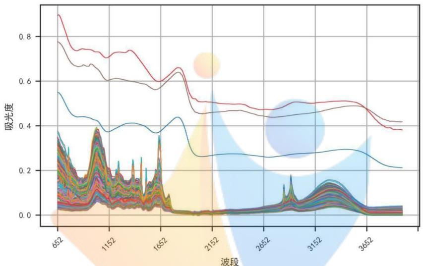

<details>
<summary>line</summary>

| 波段 | Absorbance (Series 1) | Absorbance (Series 2) | Absorbance (Series 3) | Absorbance (Series 4) |
| --- | --- | --- | --- | --- |
| 652 | ~0.90 | ~0.78 | ~0.55 | ~0.38 |
| 1152 | ~0.72 | ~0.61 | ~0.40 | ~0.15 |
| 1652 | ~0.60 | ~0.57 | ~0.37 | ~0.12 |
| 2152 | ~0.51 | ~0.46 | ~0.27 | ~0.02 |
| 2652 | ~0.48 | ~0.45 | ~0.27 | ~0.02 |
| 3152 | ~0.51 | ~0.48 | ~0.29 | ~0.12 |
| 3652 | ~0.42 | ~0.42 | ~0.22 | ~0.03 |
</details>

图 1 附件 1 原始数据图

从原始数据图像中可以看出有三组明显异常的数据，利用 3δ 原则，我们计算得出异常数据分别是编号为 64、136、201 的药材记录，删除后的图像如图 2.

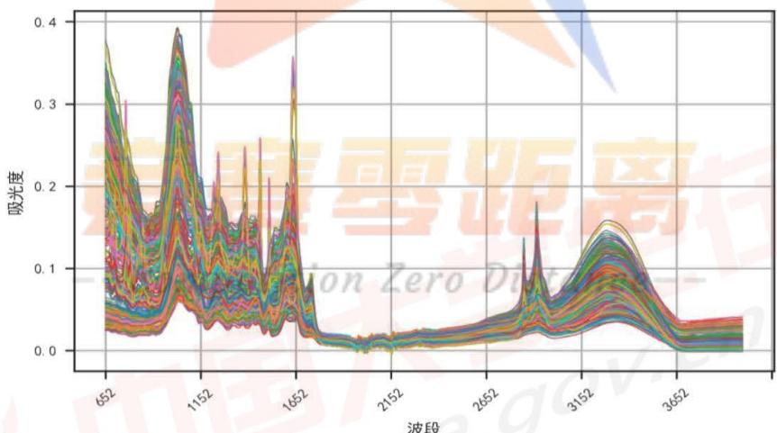

<details>
<summary>spectrogram</summary>

| 波段 | 吸光度 |
| --- | --- |
| 652 | ~0.38 |
| 1152 | ~0.39 |
| 1652 | ~0.36 |
| 2152 | ~0.02 |
| 2652 | ~0.04 |
| 3152 | ~0.15 |
| 3652 | ~0.04 |
</details>

图2附件1删除原始数据后的图

删除3组异常数据后，可以看出从图中看出，422条药材记录的中红外光谱数据图整体趋势差别不大，其图表特征表现为其光谱波数区间为[1700, 2800]左右时，不同药材的吸光度差异较小，其数据曲线贴合度较高。类似的光谱波数区间还有[3650, 3999]等。而在光谱波数区间为[652, 1700]左右，不同的药材吸光度差异较大，类似的光谱波数区间还有[2800, 3000]等。此类光谱波数区间对于不同的药材记录，吸光度差异较大，其特征适合用于分辨不同药材种类。

## 5.1.2 问题一模型建立

我们定义，当一个光谱波数区间 $[m, n]$ 上每个光谱波数 $V_{i} (m \leq i \leq n)$ 在所有药材记录中的吸光度 $A_{i}$ 最大值减去最小值（即极差）大于所有波数吸光度的平均极差。则称该区间为特征区间。记为 $T_{i}[m, n]$ ，即：

$$
A _ {i \max} - A _ {i \min} > A _ {m e a n} \quad m \leq i \leq n
$$

## 5.1.3 问题一模型求解

使用 Python 编程，最终从附件 1 中提取出特征区间 T₁[652, 1472]，T₂[1506, 1674]，T₃[2846, 2855]，T₄[2906, 2936]，T₅[3151, 3450]。区间总长度为 1331 列。即从原始数据的 3348 维降低到 1331 维，降维后的数据大小为 422×1331。

对降维后的数据使用 Python 编程进行标准化处理，处理后的结果如下图：

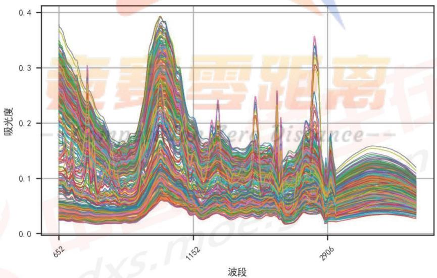

<details>
<summary>line</summary>

| 波段 | 吸光度 (Series 1) | 吸光度 (Series 2) | 吸光度 (Series 3) | 吸光度 (Series 4) | 吸光度 (Series 5) | 吸光度 (Series 6) | 吸光度 (Series 7) | 吸光度 (Series 8) | 吸光度 (Series 9) | 吸光度 (Series 10) |
| --- | --- | --- | --- | --- | --- | --- | --- | --- | --- | --- |
| 652 | ~0.37 | ~0.34 | ~0.32 | ~0.30 | ~0.28 | ~0.26 | ~0.24 | ~0.22 | ~0.20 | ~0.18 |
| 1152 | ~0.39 | ~0.37 | ~0.35 | ~0.33 | ~0.31 | ~0.29 | ~0.27 | ~0.25 | ~0.23 | ~0.21 |
| 2906 | ~0.36 | ~0.34 | ~0.32 | ~0.30 | ~0.28 | ~0.26 | ~0.24 | ~0.22 | ~0.20 | ~0.18 |
</details>

图3提取特征向量后的图形

经过前期的特征值提取后已经将数据从3348维降低到1331维，但是尚不足以进行聚类等后续处理，还需要继续降低维度。经过反复尝试，我们发现非线性降维算法比线性降维算法效果更佳，于是选择了非线性的等距离映射算法（Isomap）进行降维。

等距离映射算法（Isomap）是一种非线性的降维方法，其原理基于多维尺度变换算法（MDS），是 MDS 的一个变种，试图保留数据内在的由测地线距离蕴含的几何结构。

## (1) Isomap 算法使用流程:

Step1: 设置每个点最近邻点数 k，构建出连通图和邻接矩阵。

Step2: 通过图的最短路径构建原始空间中的距离矩阵。

Step3: 计算出内积矩阵 B。

Step4: 对内积矩阵 $B$ 进行特征值分解, 获得特征值矩阵 $\Lambda$ 和特征向量矩阵 $V$ 。

Step5: 取特征值矩阵最大的前 $Z$ 项及其对应的特征向量 $Z = V_{Z}A_{Z}^{1 / 2}$ 。

利用Python编程实现该算法后，数据维度降低到3维，处理后的数据大小为 $422 \times 3$ 。

对于问题一，主要需要解决的是识别不同种药材的特征，实现对药材种类的鉴别。使用聚类算法可以有效的将具有同类特征的药材聚为一类，实现鉴别。本文采用了经典的 K-means 聚类算法对降维后的数据进行聚类。

## (2) K-means 聚类算法使用流程介绍

Step1: 指定需要划分的类的个数 K。

Step2: 随机地选择 K 个数据对象作为初始的聚类中心。

Step3: 计算其余的各个数据对象到这 K 个初始聚类中心的距离，把数据对象划归到距离它最近的那个中心所处在的类中。

Step4: 调整新类并且重新计算出新类的中心。

Step5: 循环步骤三和四，看中心是否收敛（不变），如果收敛或达到迭代次数则停止循环。

在进行 K-means 聚类前关键一步是确定一个 K 值作为聚类时类的数量。因此选取一个合理的K值非常重要。本文采取的方法是枚举出所有较为合理的K值，计算出各自的轮廓系数。

轮廓系数结合了聚类的凝聚度和分离度，用于评估聚类的效果。设聚类结果中的某个为 i， $i=1,2,3\ldots N$ ，该聚类结果的轮廓系数为 $S(i)$ 。

$$
a (i) = a v g (\text {点} i \text {到所有它所属的簇中其它点的距离})
$$

$$
b (i) = \min (\text {点} i \text {到某一不包含它的簇内的所有点的平均距离})
$$

$$
S (i) = \frac {b (i) - a (i)}{\max \{b (i) , a (i) \}} \quad i = 1, 2, 3 \dots N
$$

可以知道轮廓系数值处于-1\~1之间，轮廓系数值越大，表示聚类效果越好。使用python编程计算出的轮廓系数如下图：

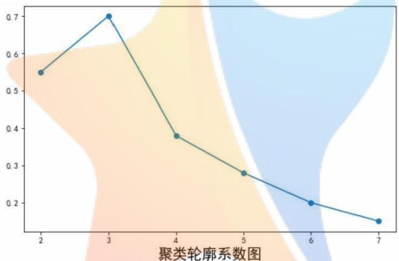

<details>
<summary>line</summary>

| 聚类轮廓系数 | 值 |
| --- | --- |
| 2 | ~0.55 |
| 3 | 0.7 |
| 4 | ~0.38 |
| 5 | ~0.28 |
| 6 | 0.2 |
| 7 | ~0.15 |
</details>

图 4 K-means 聚类轮廓系数

由轮廓系数图容易知道，选取 K=3 时，轮廓系数最高。在此前提下，本文使用 python 编程对处理后的数据进行 K-means 聚类。最终将附件一中剔除 3 条异常数据后的 422 条药材记录聚类成三类药材，并按照数量高低命名为 A 类、B 类、C 类，最终聚类结果如下表所示：

表 2 附件 1 药材分类结果

<table><tr><td>类别</td><td>A类</td><td>B类</td><td>C类</td></tr><tr><td>数量</td><td>189</td><td>137</td><td>96</td></tr></table>

将通过聚类分析后鉴别出的三种药材数量绘制在图表中如下, 其中红色为 A 类、蓝色为 B 类、绿色为 C 类。

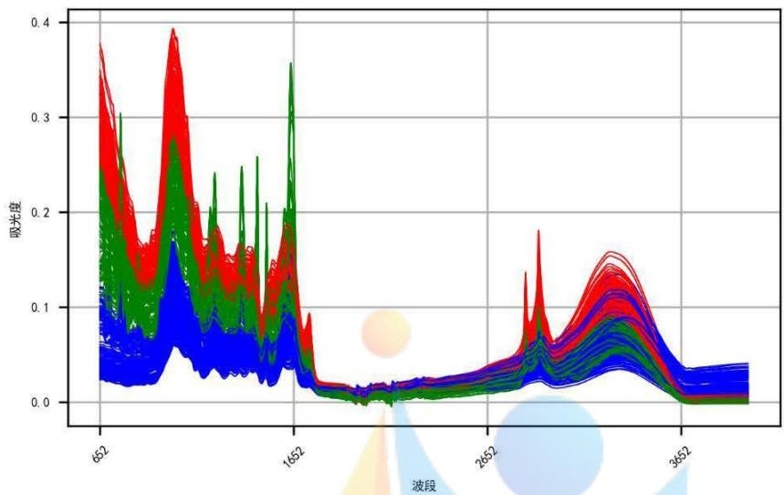

<details>
<summary>spectrogram</summary>

| Wavelength (nm) | Absorbance (Red) | Absorbance (Green) | Absorbance (Blue) |
| --- | --- | --- | --- |
| 652 | ~0.38 | ~0.25 | ~0.12 |
| 1652 | ~0.15 | ~0.35 | ~0.08 |
| 2652 | ~0.05 | ~0.04 | ~0.03 |
| 3652 | ~0.15 | ~0.12 | ~0.08 |
</details>

图 5 附件 1 分类后光谱曲线图

## 5.2 问题二模型建立与求解

## 5.2.1 数据预处理

对于问题二，首先对附件二数据进行前期处理和检查：

1. 是否存在缺失值。  
2. 是否存在异常值。  
3. 是否存在大量重复值。

表 3 附件 2 数据描述性统计结果

<table><tr><td></td><td>count</td><td>mean</td><td>std</td><td>min</td><td>1%</td><td>25%</td><td>50%</td><td>75%</td><td>99%</td><td>max</td></tr><tr><td>OP</td><td>673.0000</td><td>5.6033</td><td>3.2351</td><td>0.0000</td><td>0.0000</td><td>3.0000</td><td>6.0000</td><td>8.0000</td><td>11.0000</td><td>11.0000</td></tr><tr><td>551</td><td>673.0000</td><td>0.3517</td><td>0.0820</td><td>0.1842</td><td>0.2026</td><td>0.2911</td><td>0.3427</td><td>0.4070</td><td>0.5591</td><td>0.6113</td></tr><tr><td>552</td><td>673.0000</td><td>0.3517</td><td>0.0820</td><td>0.1842</td><td>0.2026</td><td>0.2911</td><td>0.3427</td><td>0.4070</td><td>0.5591</td><td>0.6113</td></tr><tr><td>553</td><td>673.0000</td><td>0.3517</td><td>0.0818</td><td>0.1840</td><td>0.2033</td><td>0.2903</td><td>0.3428</td><td>0.4069</td><td>0.5591</td><td>0.6093</td></tr><tr><td>554</td><td>673.0000</td><td>0.3517</td><td>0.0818</td><td>0.1840</td><td>0.2033</td><td>0.2903</td><td>0.3428</td><td>0.4069</td><td>0.5591</td><td>0.6093</td></tr><tr><td>...</td><td>...</td><td>...</td><td>...</td><td>...</td><td>...</td><td>...</td><td>...</td><td>...</td><td>...</td><td>...</td></tr><tr><td>3994</td><td>673.0000</td><td>0.0645</td><td>0.0313</td><td>-0.0066</td><td>0.0007</td><td>0.0440</td><td>0.0620</td><td>0.0859</td><td>0.1312</td><td>0.1552</td></tr><tr><td>3995</td><td>673.0000</td><td>0.0645</td><td>0.0313</td><td>-0.0066</td><td>0.0007</td><td>0.0440</td><td>0.0620</td><td>0.0859</td><td>0.1312</td><td>0.1552</td></tr><tr><td>3996</td><td>673.0000</td><td>0.0644</td><td>0.0313</td><td>-0.0067</td><td>0.0006</td><td>0.0438</td><td>0.0619</td><td>0.0858</td><td>0.1310</td><td>0.1551</td></tr><tr><td>3997</td><td>673.0000</td><td>0.0644</td><td>0.0313</td><td>-0.0067</td><td>0.0006</td><td>0.0438</td><td>0.0619</td><td>0.0858</td><td>0.1310</td><td>0.1551</td></tr><tr><td>3998</td><td>673.0000</td><td>0.0643</td><td>0.0313</td><td>-0.0068</td><td>0.0005</td><td>0.0437</td><td>0.0618</td><td>0.0857</td><td>0.1309</td><td>0.1551</td></tr></table>

附件 2 共有 672 条药材记录, 每条记录有光谱波数 551 至 3998 共 3448 个数据项, 均未发现大量重复数据和异常数据。其中光谱波数的列中未发现缺失数据。

表示产地的 OP 列除去需鉴定场地的 15 个缺失项外也无缺失项, 数据完整性良好。为便于后续分析, 本文对表示光谱波数的列做了描述性统计, 统计结果如表 3。

## 5.2.2 问题二模型建立

根据附件二中已标明产地的药材记录，可以得出该药材共有 11 处产地，其每种药材的记录条数如下表所示：

表 4 药材产地计数统计

<table><tr><td>产地</td><td>1</td><td>2</td><td>3</td><td>4</td><td>5</td><td>6</td><td>7</td><td>8</td><td>9</td><td>10</td><td>11</td></tr><tr><td>计数</td><td>67</td><td>59</td><td>67</td><td>88</td><td>29</td><td>87</td><td>50</td><td>59</td><td>31</td><td>66</td><td>55</td></tr></table>

将附件 2 的 673 条药材的记录使用 Python 编程绘制出图表，为便于绘图，先暂时将未分类的 15 条记录产地分类数据项填充为 0，绘图结果如下：

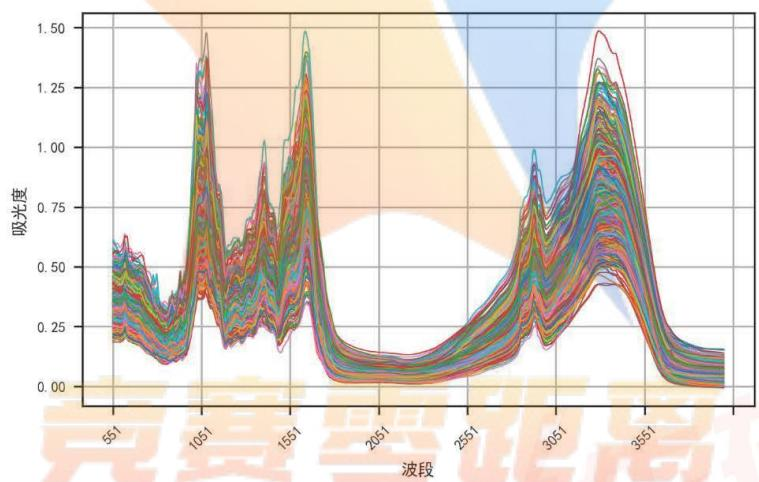

<details>
<summary>line</summary>

| 波段 | 吸光度 (Range) |
| --- | --- |
| 551 | ~0.20 ~0.60 |
| 1051 | ~0.15 ~1.45 |
| 1551 | ~0.15 ~1.45 |
| 2051 | ~0.05 ~0.20 |
| 2551 | ~0.05 ~0.30 |
| 3051 | ~0.20 ~1.00 |
| 3551 | ~0.05 ~1.45 |
</details>

图 6 附件 2 原始数据图

从图中可以看出，来自11个产地的同一种药材的中红外光谱数据图整体趋势差别不大，其图表特征表现为其光谱波数区间为[551, 1000]左右，不同产地的药材吸光度差异较小，其数据曲线贴合度较高。类似的光谱波数区间还有[1650, 2800]、[3500, 3998]等。而在光谱波数区间为[1000, 1700]左右，不同产地的药材吸光度差异较大，类似的光谱波数区间还有[2800, 3000]、[3200, 3500]等。此类光谱波数区间对于不同产地的同种药材，吸光度差异较大，其特征适合用于分辨不同产地的同种药材。

为了放大图像中的特征，本文还对附件1做了一阶平滑处理，处理后图像如下：

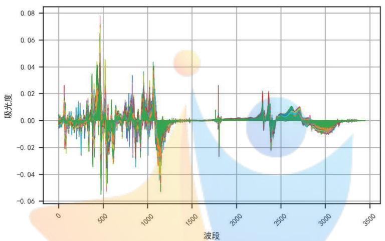

<details>
<summary>spectrogram</summary>

| 波段 | 吸光度 |
| --- | --- |
| 0 | ~0.00 |
| 500 | ~0.08 |
| 1000 | ~0.04 |
| 1500 | ~0.00 |
| 2000 | ~0.00 |
| 2500 | ~0.02 |
| 3000 | ~-0.01 |
| 3500 | ~0.00 |
</details>

图 7 附件 2 做一阶平滑处理后数据图

我们定义，当一个光谱波数区间 $[m,n]$ 上每个光谱波数 $V_{i}(m\leq i\leq n)$ 在所有药材记录中的吸光度 $A_{i}$ 最大值减去最小值（即极差）大于所有波数吸光度的平均极差。则称该区间为特征区间。记为 $T[m,n]$ ，即：

$$
A _ {i \max} - A _ {i \min} > A _ {m e a n} \quad m \leq i \leq n
$$

通过 Python 编程所计算出的结果，显示在附件二光谱波数区间[551, 3998]中，共有三个特征区间分别为， $\mathrm{T}_{1}[975, 1182]$ 、 $\mathrm{T}_{2}[1293, 1732]$ 、 $\mathrm{T}_{3}[2824, 3577]$ 。三个区间的总长度为 1402，即包含 1402 个不同且连续的光谱波数（区间与区间之间波数不连续）。

在寻找到特征区间之后，以光谱波数作为 x 坐标，以吸光度作为 y 坐标。我们将要分类的 15 条药材记录与已分类的 658 条药材记录在特征区间上计算曲线间的欧式距离， $X_{ij}$ ， $1 \leq i \leq 15$ ， $1 \leq j \leq 658$ 。

$$
X _ {i j} = \frac {1}{n} \sum_ {k = 1} ^ {n} \sqrt {(x _ {k i} - x _ {k j}) ^ {2} + (y _ {k i} - y _ {k j}) ^ {2}} \quad 1 \leq i \leq 1 5 \quad 1 \leq j \leq 6 5 8 \quad n = 1 4 0 2
$$

## 5.2.3 问题二模型求解

使用Python编程计算得出，未分类的15条药材记录与已分类的658条记录之间的距离矩阵如下。

表 5 未分类记录与已分类记录间的距离矩阵

<table><tr><td>No</td><td>OP</td><td>3.000</td><td>14.000</td><td>38.000</td><td>48.000</td><td>...</td><td>152.000</td><td>227.000</td><td>331.000</td><td>618.000</td></tr><tr><td>1.000</td><td>11</td><td>0.072</td><td>0.176</td><td>0.067</td><td>0.071</td><td>...</td><td>0.086</td><td>0.121</td><td>0.099</td><td>0.080</td></tr><tr><td>2.000</td><td>1</td><td>0.057</td><td>0.151</td><td>0.093</td><td>0.062</td><td>...</td><td>0.082</td><td>0.122</td><td>0.092</td><td>0.058</td></tr><tr><td>4.000</td><td>6</td><td>0.096</td><td>0.203</td><td>0.115</td><td>0.090</td><td>...</td><td>0.095</td><td>0.090</td><td>0.133</td><td>0.106</td></tr><tr><td>5.000</td><td>7</td><td>0.096</td><td>0.140</td><td>0.156</td><td>0.101</td><td>...</td><td>0.128</td><td>0.161</td><td>0.091</td><td>0.097</td></tr><tr><td>6.000</td><td>8</td><td>0.089</td><td>0.115</td><td>0.192</td><td>0.132</td><td>...</td><td>0.141</td><td>0.154</td><td>0.141</td><td>0.107</td></tr><tr><td>...</td><td>...</td><td>...</td><td>...</td><td>...</td><td>...</td><td>...</td><td>...</td><td>...</td><td>...</td><td>...</td></tr><tr><td>669.000</td><td>9</td><td>0.129</td><td>0.216</td><td>0.059</td><td>0.106</td><td>...</td><td>0.117</td><td>0.172</td><td>0.128</td><td>0.125</td></tr><tr><td>670.000</td><td>6</td><td>0.087</td><td>0.183</td><td>0.079</td><td>0.072</td><td>...</td><td>0.067</td><td>0.124</td><td>0.091</td><td>0.097</td></tr><tr><td>671.000</td><td>4</td><td>0.130</td><td>0.222</td><td>0.036</td><td>0.107</td><td>...</td><td>0.107</td><td>0.147</td><td>0.116</td><td>0.128</td></tr><tr><td>672.000</td><td>5</td><td>0.116</td><td>0.222</td><td>0.079</td><td>0.104</td><td></td><td>0.091</td><td>0.089</td><td>0.122</td><td>0.126</td></tr><tr><td>673.000</td><td>1</td><td>0.078</td><td>0.145</td><td>0.105</td><td>0.098</td><td>...</td><td>0.104</td><td>0.144</td><td>0.102</td><td>0.085</td></tr></table>

将 15 条未分类药材记录与已分类的药材记录对比，若两者之间的欧式距离最小，则可以认为二者的光谱波数数据曲线在特征区间上重合度较高，即二者极大可能产自同一产地。

筛选数据可以得到与未分类的[3, 14, 38, 48, 58, 71, 79, 86, 89, 110, 134, 152, 227, 331, 618]号药材重合度最高的光谱数据曲线为[280, 518, 599, 124, 327, 4, 193, 505, 588, 531, 497, 75, 251, 537, 154].

对应的产地分别为[(3, 6), (14, 1), (38, 4), (48, 6), (58, 7), (71, 6), (79, 2), (86, 6), (89, 1), (110, 4), (134, 9), (152, 2), (227, 5), (331, 8), (618, 6)]。

通过距离拟合已经可以初步鉴别出 15 个未分类药材记录的产地，为了提高鉴别准确率，再利用支持向量机，对 15 个未确定产地的药材记录进行模型求解。

这次，我们选择了 LLE 降维方式(Locally Linear Embedding)局部线性降维，经过反复调参，我们将数据维度降到了 35 维。这样既保留了原数据的主要特征，也充分减少了计算量。

对于输入空间中的非线性分类问题, 可以通过非线性变换将它转化为某个维特征空间中的线性分类问题, 在高维特征空间中学习线性支持向量机。

输入训练数据集 $T = \{(x_{1},y_{1}),(x_{2},y_{2})\dots (x_{N},y_{N})\}$ 其中 $x_{i}\in R^{n}$ ， $y_{i}\in \{+1, - 1\}$

$$
i = 1, 2, \dots N;
$$

输出分类决策函数；

1. 选取适当的核函数 $K(x,z)$ 和惩罚参数 $C > 0$ ，构造并求解凸二次规划问题：

$$
\min _ {\alpha} \frac {1}{2} \sum_ {i = 1} ^ {n} \sum_ {j = 1} ^ {n} \alpha_ {i} \alpha_ {j} y _ {i} y _ {j} K (x _ {i}, x _ {j}) - \sum_ {i = 1} ^ {n} \alpha_ {i}
$$

$$
s. t. \quad \sum_ {i = 1} ^ {n} \alpha_ {i} y _ {i} = 0 \quad 0 \leq \alpha_ {i} \leq C, i = 1, 2, \dots N
$$

得到最优解 $\alpha^{*} = (\alpha_{1}^{*},\alpha_{2}^{*},\dots,\alpha_{N}^{*})^{T}$ 。

2. 计算，选择 $\alpha^{*}$ 的一个分量 $\alpha_{j}^{*}$ 满足条件 $0 < \alpha_{j}^{*} < C$ ，计算 $b^{*} = y_{j} - \sum_{i=1}^{n} \alpha_{i}^{*} y_{j} K(x_{i}, x_{j})$

3.分类决策函数： $f(x) = \mathrm{sign}(\sum_{i = 1}^{n}\alpha_{i}^{*}y_{j}K(x_{i},x_{j}) + b^{*})$

直接调用 Python 的 sklearn 库中的函数 SVC 编程计算，将已知数据分为训练集和测试集，通过反复调参，最终我们的模型在训练集上达到 98% 的正确率，而在测试集上达到 93.9% 的正确率。最后带入未知数据得到结果如下表所示：

<table><tr><td>No</td><td>3</td><td>14</td><td>38</td><td>48</td><td>58</td><td>71</td><td>79</td><td>86</td><td>89</td><td>110</td><td>134</td><td>152</td><td>227</td><td>331</td><td>618</td></tr><tr><td>OP</td><td>6</td><td>1</td><td>4</td><td>7</td><td>10</td><td>6</td><td>6</td><td>2</td><td>3</td><td>4</td><td>9</td><td>2</td><td>5</td><td>8</td><td>3</td></tr></table>

## 5.3 问题三模型建立与求解

前期对附件 3 数据处理采用了和问题二相同的步骤, 即检查数据、数据降维, 标准化等处理。另外, 由于附件 3 有中红外和近红外两个表, 且两个表在产地(OP)列均有空缺值, 经过编程对照, 发现两个表的空缺值一致, 且与问题三所需鉴别的 10 条药材记录一致。说明数据完整性良好, 其他数据均标明了产地。

附件三的中红外和近红外在光谱波数为4000左右处相连，相连处只存在4个缺失值，分别是4000，4001，4002，4003，可近似认为中红外和近红外表为连续，将两表连接后画出数据图如下：

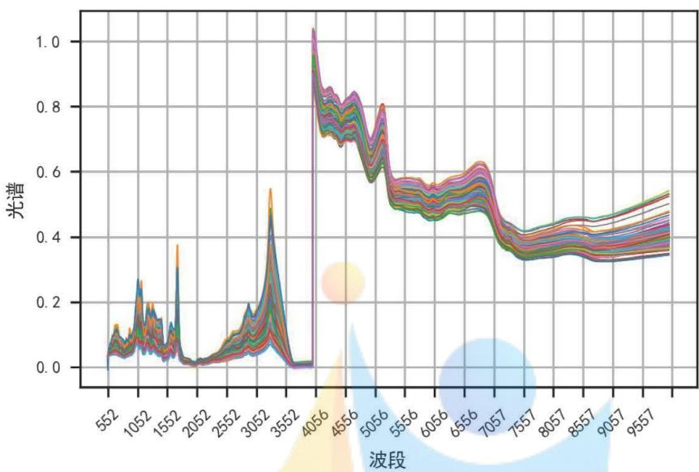

<details>
<summary>line</summary>

| 波段 | 光谱 (Series 1) | 光谱 (Series 2) | 光谱 (Series 3) | 光谱 (Series 4) | 光谱 (Series 5) | 光谱 (Series 6) | 光谱 (Series 7) | 光谱 (Series 8) | 光谱 (Series 9) | 光谱 (Series 10) |
| --- | --- | --- | --- | --- | --- | --- | --- | --- | --- | --- |
| 552 | ~0.05 | ~0.05 | ~0.05 | ~0.05 | ~0.05 | ~0.05 | ~0.05 | ~0.05 | ~0.05 | ~0.05 |
| 1052 | ~0.15 | ~0.15 | ~0.15 | ~0.15 | ~0.15 | ~0.15 | ~0.15 | ~0.15 | ~0.15 | ~0.15 |
| 1552 | ~0.38 | ~0.38 | ~0.38 | ~0.38 | ~0.38 | ~0.38 | ~0.38 | ~0.38 | ~0.38 | ~0.38 |
| 2052 | ~0.02 | ~0.02 | ~0.02 | ~0.02 | ~0.02 | ~0.02 | ~0.02 | ~0.02 | ~0.02 | ~0.02 |
| 2552 | ~0.12 | ~0.12 | ~0.12 | ~0.12 | ~0.12 | ~0.12 | ~0.12 | ~0.12 | ~0.12 | ~0.12 |
| 3052 | ~0.55 | ~0.55 | ~0.55 | ~0.55 | ~0.55 | ~0.55 | ~0.55 | ~0.55 | ~0.55 | ~0.55 |
| 3552 | ~0.01 | ~0.01 | ~0.01 | ~0.01 | ~0.01 | ~0.01 | ~0.01 | ~0.01 | ~0.01 | ~0.01 |
| 4056 | >1.0 | >1.0 | >1.0 | >1.0 | >1.0 | >1.0 | >1.0 | >1.0 | >1.0 | >1.0 |
| 4556 | ~0.75 | ~0.75 | ~0.75 | ~0.75 | ~0.75 | ~0.75 | ~0.75 | ~0.75 | ~0.75 | ~0.75 |
| 5056 | ~0.82 | ~0.82 | ~0.82 | ~0.82 | ~0.82 | ~0.82 | ~0.82 | ~0.82 | ~0.82 | ~0.82 |
| 5556 | ~0.68 | ~0.68 | ~0.68 | ~0.68 | ~0.68 | ~0.68 | ~0.68 | ~0.68 | ~0.68 | ~0.68 |
| 6056 | ~0.62 | ~0.62 | ~0.62 | ~0.62 | ~0.62 | ~0.62 | ~0.62 | ~0.62 | ~0.62 | ~0.62 |
| 6556 | ~0.63 | ~0.63 | ~0.63 | ~0.63 | ~0.63 | ~0.63 | ~0.63 | ~0.63 | ~0.63 | ~0.63 |
| 7057 | ~0.48 | ~0.48 | ~0.48 | ~0.48 | ~0.48 | ~0.48 | ~0.48 | ~0.48 | ~0.48 | ~0.48 |
| 7557 | ~0.42 | ~0.42 | ~0.42 | ~0.42 | ~0.42 | ~0.42 | ~0.42 | ~0.42 | ~0.42 | ~0.42 |
| 8057 | ~0.44 | ~0.44 | ~0.44 | ~0.44 | ~0.44 | ~0.44 | ~0.44 | ~0.44 | ~0.44 | ~0.44 |
| 8557 | ~0.46 | ~0.46 | ~0.46 | ~0.46 | ~0.46 | ~0.46 | ~0.46 | ~0.46 | ~0.46 | ~0.46 |
| 9057 | ~0.48 | ~0.48 | ~0.48 | ~0.48 | ~0.48 | ~0.48 | ~0.48 | ~0.48 | ~0.48 | ~0.48 |
| 9557 | ~0.52 | ~0.52 | ~0.52 | ~0.52 | ~0.52 | ~0.52 | ~0.52 | ~0.52 | ~0.52 | ~0.52 |

由于图中未提供具体数值标签，表中数据均为基于网格线的估算值（使用~前缀）。
</details>

图8附件3中红外近红外合并数据

再将中红外表中数据作出图表如下：

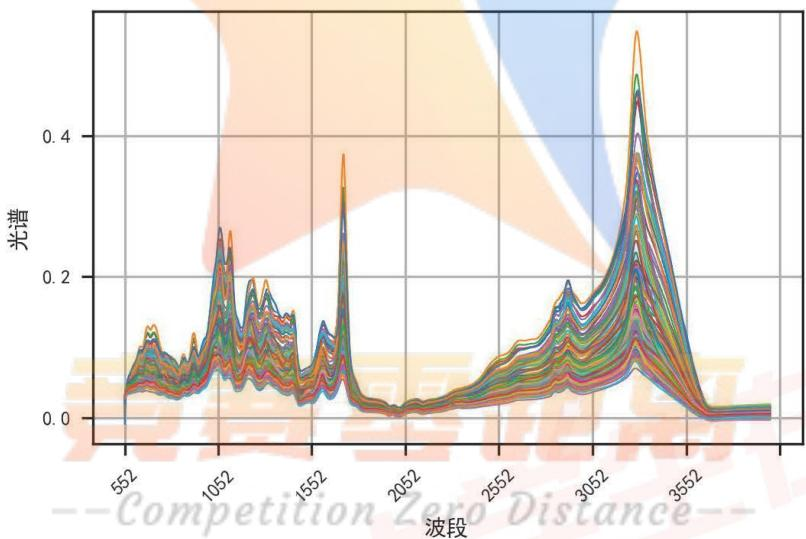

<details>
<summary>spectrogram</summary>

| Wave Segment | Intensity (Range) |
| --- | --- |
| 552 | ~0.03 ~0.13 |
| 1052 | ~0.04 ~0.27 |
| 1552 | ~0.03 ~0.38 |
| 2052 | ~0.01 ~0.04 |
| 2552 | ~0.03 ~0.19 |
| 3052 | ~0.04 ~0.55 |
| 3552 | ~0.01 ~0.03 |
</details>

图 9 附件 3 中红外原始数据

近红外数据作出图表如下:

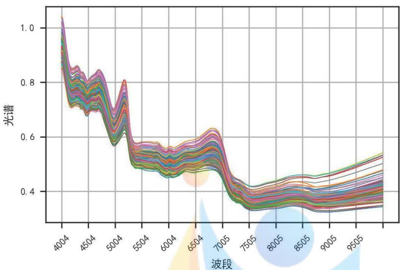

<details>
<summary>line</summary>

| 波段 | 光谱 (Series 1) | 光谱 (Series 2) | 光谱 (Series 3) | 光谱 (Series 4) | 光谱 (Series 5) | 光谱 (Series 6) | 光谱 (Series 7) | 光谱 (Series 8) | 光谱 (Series 9) | 光谱 (Series 10) |
| --- | --- | --- | --- | --- | --- | --- | --- | --- | --- | --- |
| 4004 | ~1.05 | ~1.05 | ~1.05 | ~1.05 | ~1.05 | ~1.05 | ~1.05 | ~1.05 | ~1.05 | ~1.05 |
| 4504 | ~0.82 | ~0.82 | ~0.82 | ~0.82 | ~0.82 | ~0.82 | ~0.82 | ~0.82 | ~0.82 | ~0.82 |
| 5004 | ~0.78 | ~0.78 | ~0.78 | ~0.78 | ~0.78 | ~0.78 | ~0.78 | ~0.78 | ~0.78 | ~0.78 |
| 5504 | ~0.58 | ~0.58 | ~0.58 | ~0.58 | ~0.58 | ~0.58 | ~0.58 | ~0.58 | ~0.58 | ~0.58 |
| 6004 | ~0.56 | ~0.56 | ~0.56 | ~0.56 | ~0.56 | ~0.56 | ~0.56 | ~0.56 | ~0.56 | ~0.56 |
| 6504 | ~0.62 | ~0.62 | ~0.62 | ~0.62 | ~0.62 | ~0.62 | ~0.62 | ~0.62 | ~0.62 | ~0.62 |
| 7005 | ~0.42 | ~0.42 | ~0.42 | ~0.42 | ~0.42 | ~0.42 | ~0.42 | ~0.42 | ~0.42 | ~0.42 |
| 7505 | ~0.38 | ~0.38 | ~0.38 | ~0.38 | ~0.38 | ~0.38 | ~0.38 | ~0.38 | ~0.38 | ~0.38 |
| 8005 | ~0.42 | ~0.42 | ~0.42 | ~0.42 | ~0.42 | ~0.42 | ~0.42 | ~0.42 | ~0.42 | ~0.42 |
| 8505 | ~0.44 | ~0.44 | ~0.44 | ~0.44 | ~0.44 | ~0.44 | ~0.44 | ~0.44 | ~0.44 | ~0.44 |
| 9005 | ~0.46 | ~0.46 | ~0.46 | ~0.46 | ~0.46 | ~0.46 | ~0.46 | ~0.46 | ~0.46 | ~0.46 |
| 9505 | ~0.52 | ~0.52 | ~0.52 | ~0.52 | ~0.52 | ~0.52 | ~0.52 | ~0.52 | ~0.52 | ~0.52 |
</details>

图 10 附件 3 近红外原始数据

## 5.3.1 问题三模型建立

观察上述三个数据图表，可以看出与问题二初始图表非常类似。因此可以采取与问题二类似的模型进行求解。

## 5.3.2 问题三模型求解

首先，我们去求相邻两个数据之差，相当于是求导数。再利用极差大于均值的方法提取特征向量。  
然后我们还是用 LLE 局部线性降维，对数据降维处理，最后利用支持向量机进行求解。  
为了得到更加准确的鉴定结果，本文对三个数据表（连接表、中红外、近红外）进行分别求解。求解结果如下：

<table><tr><td>No</td><td>4</td><td>15</td><td>22</td><td>30</td><td>34</td><td>45</td><td>74</td><td>114</td><td>170</td><td>209</td></tr><tr><td>连接表</td><td>16</td><td>11</td><td>1</td><td>9</td><td>16</td><td>3</td><td>4</td><td>10</td><td>9</td><td>10</td></tr><tr><td>中红外</td><td>4</td><td>10</td><td>1</td><td>2</td><td>16</td><td>3</td><td>4</td><td>11</td><td>9</td><td>11</td></tr><tr><td>近红外</td><td>2</td><td>11</td><td>1</td><td>2</td><td>16</td><td>3</td><td>4</td><td>10</td><td>9</td><td>14</td></tr></table>

利用支持向量机发现取得的结果在不同的数据集上不完全相同, 而不论在训练集还是测试集上其正确率都不分伯仲。最终以特征区间差异较大的中红外数据所得出的结果为主, 用近红外数据和连接表数据得出的结果加以矫正, 经过综合考虑, 最终对问题三所给出编号的药材记录的产地鉴定结果如下:

<table><tr><td>No</td><td>4</td><td>15</td><td>22</td><td>30</td><td>34</td><td>45</td><td>74</td><td>114</td><td>170</td><td>209</td></tr><tr><td>OP</td><td>17</td><td>11</td><td>1</td><td>2</td><td>16</td><td>3</td><td>4</td><td>10</td><td>9</td><td>14</td></tr></table>

## 5.4 问题四模型建立与求解

对于问题四，可以考虑成在问题二的基础上增加了对药材类别的鉴定。提供的是近红外光谱波段的数据，由于要同时鉴别出未知药材的类别和产地。而类别不同显示出的差异较大，所以先对类别进行分类，将未知类别的记录划分到已知的类别里面。

在数据预处理中，通过附件4数据可以得到，除Class、OP列外无缺失数据，其中Class列缺失143条数据，即有143条药材记录不能确定类别；OP列缺失50条数据，即有50条药材记录不能确定产地；二者的交集共有7项，即问题四需要确定类别和产地的[94，109，140，278，308，330，347]号药材记录。

将已知类别的 256 条记录绘制出图表如下:

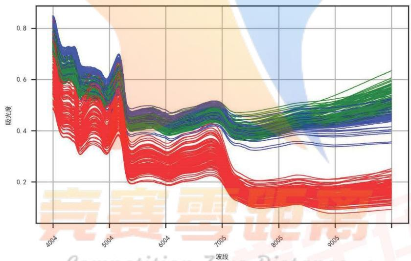

<details>
<summary>line</summary>

| Wavelength \((cm^{-1})\) | Absorbance (Red) | Absorbance (Blue/Green) |
| --- | --- | --- |
| 4004 | ~0.65 | ~0.85 |
| 5004 | ~0.35 | ~0.65 |
| 6004 | ~0.20 | ~0.45 |
| 7005 | ~0.25 | ~0.45 |
| 8005 | ~0.15 | ~0.40 |
| 9005 | ~0.15 | ~0.45 |
</details>

图11 附件4按不同类别着色的数据图

其中红色为 A 类，绿色为 B 类，蓝色为 C 类。从此图可以非常明显的将 A 类数据和 B、C 类数据进行区分。

这里就可以判定有 53 组数据为 A 类数据，将所有 A 类数据剔除，仅余 BC 类数据继续判断。

于是我们暂时剔除 A 类和已分配为 A 类的数据，将 B、C 类的数据单独绘制

作图并放大，如下图：

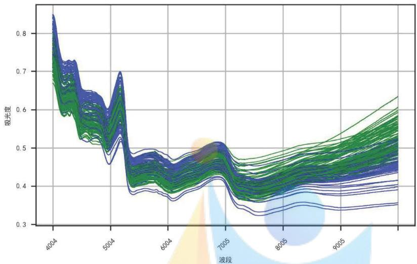

<details>
<summary>line</summary>

| Wavelength (波段) | Absorbance (Series 1) | Absorbance (Series 2) | Absorbance (Series 3) | Absorbance (Series 4) | Absorbance (Series 5) | Absorbance (Series 6) | Absorbance (Series 7) | Absorbance (Series 8) | Absorbance (Series 9) | Absorbance (Series 10) |
| --- | --- | --- | --- | --- | --- | --- | --- | --- | --- | --- |
| 4004 | ~0.85 | ~0.85 | ~0.85 | ~0.85 | ~0.85 | ~0.85 | ~0.85 | ~0.85 | ~0.85 | ~0.85 |
| 5004 | ~0.65 | ~0.65 | ~0.65 | ~0.65 | ~0.65 | ~0.65 | ~0.65 | ~0.65 | ~0.65 | ~0.65 |
| 6004 | ~0.48 | ~0.48 | ~0.48 | ~0.48 | ~0.48 | ~0.48 | ~0.48 | ~0.48 | ~0.48 | ~0.48 |
| 7005 | ~0.51 | ~0.51 | ~0.51 | ~0.51 | ~0.51 | ~0.51 | ~0.51 | ~0.51 | ~0.51 | ~0.51 |
| 8005 | ~0.42 | ~0.42 | ~0.42 | ~0.42 | ~0.42 | ~0.42 | ~0.42 | ~0.42 | ~0.42 | ~0.42 |
| 9005 | ~0.38 | ~0.38 | ~0.38 | ~0.38 | ~0.38 | ~0.38 | ~0.38 | ~0.38 | ~0.38 | ~0.38 |
</details>

图 12 附件 4 中 BC 类数据分色图

B、C 类数据贴合程度较高，从图形上面很难区分出来，我们将未分类数据和 B、C 绘制在一起继续观察图表，绘制图像如下：

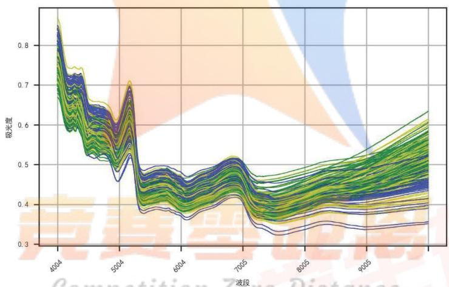

<details>
<summary>line</summary>

| Wavelength | Absorbance (Range) |
| --- | --- |
| 4004 | ~0.3 ~0.85 |
| 5004 | ~0.38 ~0.71 |
| 6004 | ~0.36 ~0.49 |
| 7005 | ~0.32 ~0.52 |
| 8005 | ~0.33 ~0.48 |
| 9005 | ~0.35 ~0.63 |
</details>

图 13 附件 4 中 BC 类数据及未分类数据图

容易发现，B、C类和未分类的数据也难以分辨出来。因此我们还是采用问题二类似的方法，先提取特征向量，再将数据降维，建立分类模型，最后使用支持向量机进行求解。我们将已知数据分为训练集和测试集，将训练集带入进行训练，并用测试集带入进行测试，这次得到的训练集和测试集的正确率均为100%。

这说明不同种类的中药材呈现的光谱的区别明显，比较任意区分。最终我们得出了分类结果如下表：

<table><tr><td>种类</td><td>药材标签号</td><td>数量</td></tr><tr><td>A</td><td>16, 31, 40, 46, 53, 60, 66, 67, 79, 94, 100, 109, 116, 131, 138, 139, 140, 152, 156, 173, 184, 185, 197, 199, 203, 219, 220, 223, 228, 232, 233, 246, 263, 267, 272, 276, 279, 286, 309, 310, 311, 313, 329, 335, 346, 359, 368, 375, 384, 387, 388, 390, 392</td><td>53</td></tr><tr><td>B</td><td>3, 6, 11, 18, 21, 32, 34, 35, 51, 55, 58, 59, 70, 71, 73, 76, 82, 89, 91, 106, 107, 128, 129, 143, 144, 146, 157, 158, 167, 168, 180, 181, 182, 201, 202, 210, 216, 217, 221, 247, 248, 251, 258, 259, 265, 277, 280, 281, 290, 291, 341, 342, 344, 347, 353, 363, 370, 372, 373, 377, 396, 399</td><td>62</td></tr><tr><td>C</td><td>5, 20, 22, 30, 33, 36, 48, 50, 101, 110, 125, 136, 137, 154, 175, 177, 186, 212, 214, 266, 278, 303, 304, 308, 330, 350, 364, 376</td><td>28</td></tr></table>

分类结果将 143 条未分类数据归于 A、B、C 三类，其中 A 类 53 条记录，B 类 62 条记录，C 类 28 条记录。显示为红色的为问题 4 需要填写的 7 条记录的分类。

完成分类鉴定之后,再进行产地的鉴定,先对附件4产地数据进行初步统计,结果如下:

<table><tr><td>产地</td><td>1</td><td>2</td><td>3</td><td>4</td><td>5</td><td>6</td><td>7</td><td>8</td><td>9</td></tr><tr><td>数量</td><td>30</td><td>38</td><td>88</td><td>65</td><td>25</td><td>10</td><td>9</td><td>9</td><td>10</td></tr><tr><td>产地</td><td>10</td><td>11</td><td>12</td><td>13</td><td>14</td><td>15</td><td>16</td><td>未分类</td><td></td></tr><tr><td>数量</td><td>10</td><td>9</td><td>9</td><td>10</td><td>8</td><td>11</td><td>8</td><td>50</td><td></td></tr></table>

进行初步统计后，我们按照不同产地着不同的颜色，画出附件4产地统计图

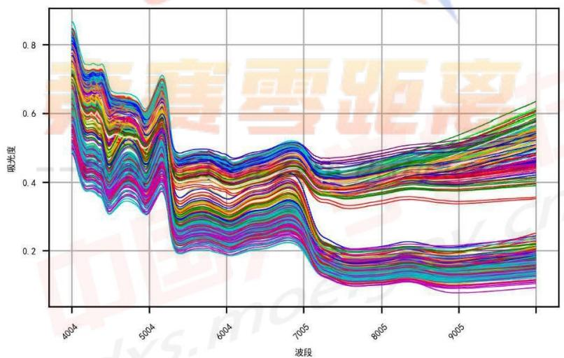

<details>
<summary>line</summary>

| 波段 | 吸光度 (Series 1) | 吸光度 (Series 2) | 吸光度 (Series 3) | 吸光度 (Series 4) | 吸光度 (Series 5) | 吸光度 (Series 6) | 吸光度 (Series 7) | 吸光度 (Series 8) | 吸光度 (Series 9) | 吸光度 (Series 10) |
| --- | --- | --- | --- | --- | --- | --- | --- | --- | --- | --- |
| 4004 | ~0.85 | ~0.82 | ~0.78 | ~0.75 | ~0.72 | ~0.68 | ~0.65 | ~0.62 | ~0.58 | ~0.55 |
| 5004 | ~0.65 | ~0.62 | ~0.58 | ~0.55 | ~0.52 | ~0.48 | ~0.45 | ~0.42 | ~0.38 | ~0.35 |
| 6004 | ~0.48 | ~0.45 | ~0.42 | ~0.38 | ~0.35 | ~0.32 | ~0.28 | ~0.25 | ~0.22 | ~0.20 |
| 7005 | ~0.52 | ~0.48 | ~0.45 | ~0.42 | ~0.38 | ~0.35 | ~0.32 | ~0.28 | ~0.25 | ~0.22 |
| 8005 | ~0.45 | ~0.42 | ~0.38 | ~0.35 | ~0.32 | ~0.28 | ~0.25 | ~0.22 | ~0.18 | ~0.15 |
| 9005 | ~0.62 | ~0.58 | ~0.55 | ~0.52 | ~0.48 | ~0.45 | ~0.42 | ~0.38 | ~0.35 | ~0.32 |
</details>

图14 附件4不同产地颜色图

由于产地较多，共17种，肉眼难以分辨。因此我们采取与问题二相同的方法进行分类，先提取特征向量，再将数据降维后利用支持向量机求解，由于原数据图表部分光谱波数区间特征不明显，我们先对原始数据做一阶平滑处理，结果如下图：

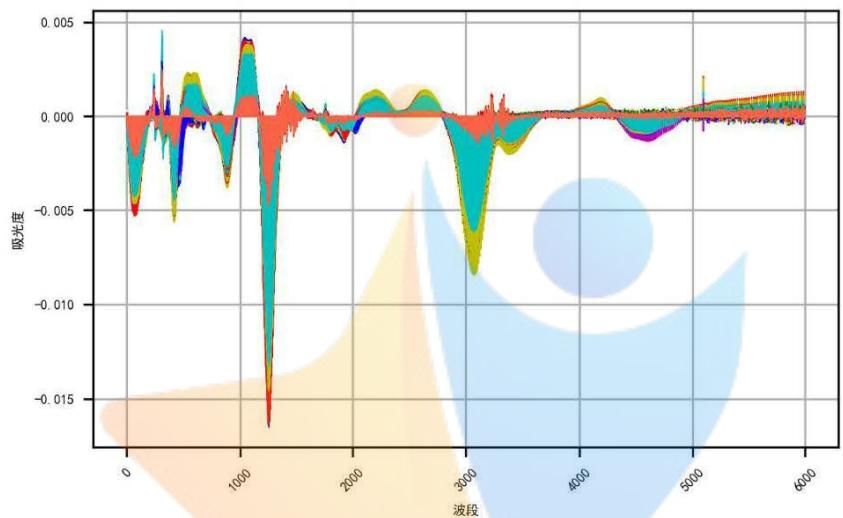

<details>
<summary>area_stacked</summary>

| 波段 | Absorbance |
| --- | --- |
| 0 | ~0.000 |
| 1200 | ~-0.016 |
| 3000 | ~-0.008 |
| 4500 | ~-0.001 |
</details>

图15附件4做平滑处理后的数据图

完成数据的平滑处理后，与问题三类似，提取近红外光谱波数的特征区间，并使用非线性降维算法进行降维处理，利用未分类数据到已分类数据的最短欧式距离来进行分类，最终分类结果如下：

<table><tr><td>产地</td><td>药材标签号</td><td>个数</td></tr><tr><td>1</td><td>52, 68, 83, 93, 115, 176, 218, 260, 278, 292</td><td>10</td></tr><tr><td>2</td><td>4, 10, 42, 140, 149, 297, 356, 379</td><td>8</td></tr><tr><td>3</td><td>14, 109, 166, 253, 308</td><td>5</td></tr><tr><td>4</td><td>2, 27, 113, 126, 155, 188, 207, 209, 330, 336, 349, 365, 389, 394</td><td>14</td></tr><tr><td>5</td><td>39, 94, 192, 324</td><td>4</td></tr><tr><td>7</td><td>9</td><td>1</td></tr><tr><td>8</td><td>61</td><td>1</td></tr><tr><td>11</td><td>347</td><td>1</td></tr><tr><td>12</td><td>340</td><td>1</td></tr><tr><td>13</td><td>65</td><td>1</td></tr><tr><td>14</td><td>80, 104, 385</td><td>3</td></tr><tr><td>16</td><td>12</td><td>1</td></tr></table>

上表中显示为红色的药材编号即为问题四需要填写产地的7个药材记录。综合种类和产地结果，问题四最终结果如下：

<table><tr><td>No</td><td>94</td><td>109</td><td>140</td><td>278</td><td>308</td><td>330</td><td>347</td></tr><tr><td>Class</td><td>A</td><td>A</td><td>A</td><td>C</td><td>C</td><td>C</td><td>B</td></tr><tr><td>OP</td><td>5</td><td>3</td><td>2</td><td>1</td><td>3</td><td>4</td><td>11</td></tr></table>

## 六、模型评价与推广

本文针对题目分别给出的不同药材、不同产地的同一药材在近红外光谱与中红外光谱技术照射下的吸光度数据，统计分析出了不同药材在中红外光谱照射的特征性和差异性，并依托聚类模型为药材进行分类，运用分类模型实现了不同产地同一种药材的鉴别。值得在大数据时代，帮助医生精准识别中药材类别进行治疗，作用巨大。

## 6.1 模型的优点

## (1) 聚类模型:

考虑到了每个光谱波数上不同种药材的差异性不明显的因素，并提取出较为显著的特征区间，再使用非线性的等距离映射算法对数据进行降至3维，有助于后续数据分析。

## (2) 分类模型

继承了问题一的数据降维, 提取特征区间, 获得了可以便于后续分析的数据, 再使用支持向量机对模型进行求解, 该模型速度快、准确率高, 且具有普及性。

## 6.1 模型的缺点

对数据多次降维和提取特征区间后提高了模型求解效率，但也使得部分差异不显著的数据没有得到使用，可以改进将这部分数据用于矫正模型。其次该鉴别模型的前期参数调试过程较为复杂可以进一步优化使模型更简洁，减低使用模型时的学习成本。

## 七、参考文献

[1] 基于 Isomap 特征降维的人脸表情相似度评估方法 [J]. 黄东晋, 肖帆, 秦汉, 蒋晨凤, 丁友东. 现代电影技术. 2019(06).  
[2] 支持向量机损失函数分析[J]. 王华军，修乃华. 数学进展. 2021(08).  
[3] 基于 SVM 分类器的癫痫脑电时空特征提取方法的研究 [J]. 易芳吉, 钟丽莎, 李章勇. 重庆邮电大学学报（自然科学版）. 2021(08).  
[4] 相关向量机多分类算法的研究与应用 [D]. 柳长源. 哈尔滨工程大学 2013.  
[5] K-means 聚类算法在通信运营商精准营销中的应用研究[D]. 郑舒方. 吉林大学 2019.  
[6] 基于 LLE 降维思想的自然计算方法[J]. 张潞瑶，季伟东，程昊. 系统仿真学报. 2020（10）.  
[7] 基于近红外光谱法对温郁金源 3 种药材的快速鉴别 [J]. 赵金凯，罗云云，杨柳，杜伟锋，葛卫红. 中华中医药药刊. 2020(09).  
[8]颜文勇，《数学建模》，高等教育出版社，2011.

## 附录

源程序说明：

1. 本文所有代码，均在 Jupyter Notebook 中编写，编写完成后复制进 word 文档。  
2. 由于所给数据均为 xlsx 文档，用 python 读入较慢，为加快程序运行速度，提高效率，我们先将其另存为 csv 格式，再在程序中读入。

## 一、问题一 Python 源代码

import numpy as np

import pandas as pd

import matplotlib.pyplot as plt

plt.rcParams['font.sans-serif'] = ['SimHei']

plt.rcParams['axes.unicode\_minus'] = False

data0 = pd.read\_csv(r'./附件/附件 1.csv', index\_col = 0)

data0.shape

data0.head()

data0.describe()

data0.info()

data0.isnull().any().any()

def my\_plot(x):

plt.plot(x.index, x.values, linewidth = 0.5)

def PlotSpectrum(data, str0):

fontsize = 5

plt.figure(str0, figsize = (5, 3), dpi = 300)

plt.xticks(range(0, 4001, 500), rotation = 45, fontsize = 5)

plt.yticks(fontsize = fontsize)

plt.xlabel('波段', fontsize = 6)

plt.ylabel('吸光度', fontsize = 6)

plt.grid(True)

data.agg(lambda x: my\_plot(x), axis = 1)

plt.show()

PlotSpectrum(data0, '附件一光谱数据曲线图')

def box(x):

small = x.mean() - 3 \* x.std()

```python
large = x.mean() + 3 * x.std()
    return (x < small) | (x > large)

yczhi = data0.agg(lambda x: box(x))
yczhi_index = data0[(yczhi.sum(axis = 1) > 100)].index
yczhi_index

data0.drop(yczhi_index, axis = 0, inplace = True)
data0.shape
```

PlotSpectrum(data0, '附件一光谱数据曲线图')

```python
data_corr = data0.corr()
data_corr

data_std = data0.std()
print(data_std.min(), data_std.max())
(data_std<0.05).sum()

max_min = data0.agg(lambda x: x.max() - x.min())
print(max_min.describe())
data1 = data0.loc[:,max_min > max_min.mean() + 0 * max_min.std()]
data1.shape

from sklearn.preprocessing import StandardScaler
scaler = StandardScaler().fit(data1)
data2 = scaler.transform(data1)
data2 = pd.DataFrame(data1, index = data1.index)
```

PlotSpectrum(data1, '附件一光谱标准化处理后数据曲线图')

```python
from sklearn.manifold import Isomap
isomap = Isomap(n_components = 3).fit(data1)
data2 = isomap.transform(data1)
print(data2.shape)
plt.figure()
plt.scatter(data2[:,0], data2[:,1])
plt.show()

from sklearn.cluster import KMeans
from sklearn.metrics import silhouette_score
scores = []
for n_clusters in range(2, 8):
    cluster = KMeans(n_clusters = n_clusters, random_state = 0).fit(data1)
```

```python
score = silhouette_score(data1, cluster.labels_)
scores.append(score)
print(scores)
plt.figure('聚类数量的轮廓系数')
plt.plot(range(2, 8), scores, '-o')
plt.show()

cluster = KMeans(n_clusters = 3).fit(data1)
pd.Series(cluster.labels_).value_counts().sort_index()

plt.figure()
plt.scatter(data2[:,0], data2[:,1], c = cluster.labels_)
plt.show()

colors = {'A': 'r', 'B': 'g', 'C': 'b', 'D' : 'y'}
colors = ['r', 'g', 'b']
plt.figure('附件一分类图', figsize = (5, 3), dpi = 300)
plt.xticks(range(0, 10000, 1000), rotation = 45, fontsize = 5)
plt.yticks(fontsize = 5)
plt.xlabel('波段', fontsize = 5)
plt.ylabel('吸光度', fontsize = 5)
for i in range(data0.shape[0]):
    plt.plot(data0.columns, data0.iloc[i,:] , c = colors[cluster.labels_[i]], linewidth = 0.5)
plt.grid(True)
plt.show()
```

## 二、问题二 Python 源代码

import numpy as np

import pandas as pd

import matplotlib.pyplot as plt

plt.rcParams['font.sans-serif'] = ['SimHei']

plt.rcParams['axes.unicode\_minus'] = False

\# 用来正常显示中文标签

\# 用来正常显示负号

data0 = pd.read\_csv(r'./附件/附件 2.csv', index\_col = 0)

data0.shape

data0.head()

data0.describe([0.01, 0.25, 0.75, 0.99]).T

data0.info()

data0.iloc[:,1:].isnull().any().any()

```python
data0.iloc[:,0].isnull().sum()

data0.iloc[:,0].value_counts().sort_index()

data_X = data0.iloc[:,1:]
print(data_X.shape)
data_X = pd.DataFrame(data_X.iloc[:,1:].values - data_X.iloc[:,:-1].values, index = data0.index)
print(data_X.shape)
print(data_X)
data_y = data0.iloc[:,0]
print(data_X.shape, data_y.shape)
print(f'缺失值个数: {data_y.isnull().sum()个')
data_y.fillna(0, inplace = True)  # 暂时用 0 填充缺失值
print(f'缺失值个数: {(data_y == 0).sum()个')
# 转换为整数
data_y = data_y.astype('int')
# 保留缺失值的索引号
qsz_index = data_y[data_y == 0].index
qsz_index

def my_plot(x):
    plt.plot(x.index, x.values, linewidth = 0.5)

def PlotSpectrum(data, str0):
    fontsize = 5
    plt.figure(str0, figsize = (5, 3), dpi = 300)
    plt.xticks(range(0, 4001, 500), rotation = 45, fontsize = 5)
    plt.yticks(fontsize = fontsize)
    plt.xlabel('波段', fontsize = 6)
    plt.ylabel('吸光度', fontsize = 6)
    plt.grid(True)
    data.agg(lambda x: my_plot(x), axis = 1)
    plt.show()

PlotSpectrum(data0.iloc[:,1:], '附件二光谱数据曲线图')
```

PlotSpectrum(data\_X, '附件二一阶平滑后数据曲线图')  
```python
max_min = data_X.agg(lambda x: x.max() - x.min())
print(max_min.describe())
data1 = data_X.loc[:,max_min > max_min.mean() + 0 * max_min.std()]
# data1 = data_X
print(data_X.shape, data1.shape)
```

```python
data_X_know = data1.drop(qsz_index)
data_X_unknown = data1.loc[qsz_index,:]
print(data_X_know.index, '\n', data_X_unknown.index)
data_y_know = data_y.drop(qsz_index)
print(data_X_know.shape, data_y_know.shape, data_X_unknown.shape)
test = pd.concat([data_y_know, data_X_know],axis = 1)
test.shape

from scipy.spatial import distance_matrix
dis = pd.DataFrame(distance_matrix(data_X_know.values, data_X_unknown.values), index = data_X_know.index, columns = data_X_unknown.index)
dis_group = pd.concat([data_y_know, dis], axis = 1)
print(dis_group.shape)
print(dis_group.columns)
print(dis_group)

min_index = dis_group.idxmin()
print(min_index)
[*zip(qsz_index, dis_group.loc[min_index[1:], 'OP'])]

dis_groupby = dis_group.groupby('OP').mean()
dis_groupby

by_min_index = dis_groupby.idxmin()
print(by_min_index)

dis = pd.DataFrame(distance_matrix(data_X_know.values, data_X_know.values), index = data_X_know.index, columns = data_X_know.index)
dis_group = pd.concat([data_y_know, dis], axis = 1)
print(dis_group.shape)
print(dis_group.columns)
print(dis_group)

OP_index = [0 for i in range(12)]
for i in range(1, 12):
    OP_index[i] = dis_group[dis_group['OP'] == i].index
OP_index

dis = pd.DataFrame(distance_matrix(data_X_know.loc[OP_index[1],:].values,
data_X_know.loc[OP_index[1],:].values)).mean().mean()
print(dis)
dis = pd.DataFrame(distance_matrix(data_X_know.loc[OP_index[1],:].values,
data_X_know.loc[OP_index[2],:].values)).mean().mean()
```

dis

```python
dis_g = pd.DataFrame(np.zeros([11,11]), index = range(1, 12), columns = range(1, 12))
for i in range(1, 12):
    for j in range(1, 12):
        dis_g.loc[i, j] = pd.DataFrame(distance_matrix(data_X_know.loc[OP_index[i],:].values,
data_X_know.loc[OP_index[j],:].values)).mean().mean()
dis_g
```

dis\_g.idxmin()

```python
from sklearn.manifold import LocallyLinearEmbedding
from sklearn.svm import SVC
from sklearn.model_selection import cross_val_score
from sklearn.model_selection import train_test_split
```

```python
print(data_X.shape)
best_LLE_clf_n_components, best_LLE_clf_n_neighbors = 35, 70
best_params_ = {'C': 2.438775510204082, 'gamma': 18.420699693267164}
print(f'n_components          =      {best_LLE_clf_n_components},       n_neighbors     = {best_LLE_clf_n_neighbors}')
# print(f'best_params_ = {grid.best_params_}')
lle = LocallyLinearEmbedding(n_components = best_LLE_clf_n_components
                    , n_neighbors = best_LLE_clf_n_neighbors
                    , method = 'modified').fit(data1)  # LLE 降维
```

```python
data_X_Ile = lle.transform(data1)          # 获取降维后的数据
data_X_Ile = pd.DataFrame(data_X_Ile)            # 转换为 DataFrame
data_y = pd.Series(data_y)              # 转换为 Series
```

```python
# 将未分类数据剥离
data_X_llle_know = data_X_llle.drop(qsz_index, axis = 0)      # 删除未分类的行
data_X_llle_unknown = data_X_llle.loc[qsz_index, :]          # 取出未分类的行
print(data_X_llle_know.shape, data_X_llle_unknown.shape, data_y_know.shape)
# clf = SVC(C = best_params_['C'], kernel = 'rbf', gamma = best_params_['gamma'],
decision_function_shape = 'ovr', cache_size = 5000 # MB
#
# )
# cvs = cross_val_score(clf, data_X_llle_know, data_y_know, cv = 10)
# print(f'预测平均准确率: {cvs.mean()}')
Xtrain, Xtest, Ytrain, Ytest = train_test_split(data_X_llle_know, data_y_know, test_size = 0.3)    #
分离出测试集和训练集
clf = SVC(C = best_params_['C'], kernel = 'rbf', gamma = best_params_['gamma'],
decision_function_shape = 'ovr', cache_size = 5000 # MB
).fit(Xtrain, Ytrain)
score_r = clf.score(Xtest, Ytest)
print(score_r)
```

clf = clf.fit(data\_X\_lle\_know, data\_y\_know)

print(clf.score(data\_X\_llle\_know, data\_y\_know))

print(clf.predict(data\_X\_IIe\_unknown))

## 三、问题三 Python 源代码

import numpy as np

import pandas as pd

import matplotlib.pyplot as plt

plt.rcParams['font.sans-serif'] = ['SimHei']

plt.rcParams['axes.unicode\_minus'] = False

\# 用来正常显示中文标签

\# 用来正常显示负号

data1 = pd.read\_csv(r'./附件/附件 3 中红外.csv', index\_col = 0)

data2 = pd.read\_csv(r'./附件/附件 3 近红外.csv', index\_col = 0)

print(data1.shape, data2.shape)

data1.head()

Data2.head()

print(data1['OP'].isnull().any(), data2['OP'].isnull().any())

print(data1['OP'].isnull().sum(), data2['OP'].isnull().sum())

print(data1[data1['OP'].isnull)].index, '\n', data2[data2['OP'].isnull)].index)

qsz\_index = data1[data1['OP'].isnull()].index

all(data1['OP'].drop(qsz\_index) == data2['OP'].drop(qsz\_index))

data1.describe([0.01, 0.25, 0.75, 0.99]).T

data2.describe([0.01, 0.25, 0.75, 0.99]).T

data1.info()

data2.info()

data1.iloc[:,1:].isnull().any().any()

data2.iloc[:,1:].isnull().any().any()

data1['OP'].fillna(0, inplace = True)

data1['OP'] = data1['OP'].astype('int')

data1['OP'].value\_counts().sort\_index()

```python
print(data1.index, '\n', data2.index)
print(data1.columns, '\n', data2.columns)

data0 = pd.concat([data1, data2.iloc[:,1:], axis = 1)
data0.shape

data0.head()

data_X = data0.iloc[:,1:]
data_y = data0.iloc[:,0]
print(data_X.shape, data_y.shape)
print(f'缺失值个数: {data_y.isnull().sum()}个')
data_y.fillna(0, inplace = True)    # 暂时用 0 填充缺失值
print(f'缺失值个数: {(data_y == 0).sum()}个')
# 转换为整数
data_y = data_y.astype('int')
# 保留缺失值的索引号
qsz_index = data_y[data_y == 0].index
data_y_unknown = pd.Series([17, 11, 1, 2, 16, 3, 4, 10, 9, 14], index = qsz_index, )
print(qsz_index)

def my_plot(x):
    plt.plot(x.index, x.values, linewidth = 0.5)

def PlotSpectrum(data, str0):
    plt.figure(str0, figsize = (4, 2.5), dpi = 300)
    plt.xticks(range(0, 10001, 500), rotation = 45, fontsize = 5)
    plt.yticks(fontsize = 5)
    plt.xlabel('波段', fontsize = 6)
    plt.ylabel('吸光度', fontsize = 6)
    plt.grid(True)
    data.agg(lambda x: my_plot(x), axis = 1)
    plt.show()
```

PlotSpectrum(data\_X, '附件 3 光谱数据曲线图')

PlotSpectrum(data1.iloc[:,1:], '附件 3 光谱数据曲线图')

PlotSpectrum(data2.iloc[:,1:], '附件 3 光谱数据曲线图')

```python
max_min = data_X.agg(lambda x: x.max() - x.min())
print(max_min.describe())
data_jw = data_X.loc[:,max_min > max_min.mean() + 0 * max_min.std()]
```

```python
# data1 = data_X
print(data_X.shape, data_jw.shape)

data_X_know = data_jw.loc[index_14,:] 
data_X_unknown = data_jw.loc[qsz_index,:] 
print(data_X_know.index, '\n', data_X_unknown.index) 
data_y_know = data_y.drop(qsz_index) 
print(data_X_know.shape, data_y_know.shape, data_X_unknown.shape) 
test = pd.concat([data_y_know, data_X_know],axis = 1) 
test.shape

from scipy.spatial import distance_matrix 
dis = pd.DataFrame(distance_matrix(data_X_know.values, data_X_unknown.values), index = data_X_know.index, columns = data_X_unknown.index) 
# np.linalg.norm(np.array(data_X_know[0,:])) 
dis_group = pd.concat([data_y_know, dis], axis = 1) 
print(dis_group.shape) 
print(dis_group.columns) 
print(dis_group)

min_index = dis_group.idxmin() 
print(min_index) 
[*zip(qsz_index, dis_group.loc[min_index[1:], 'OP'])] 

dis_groupby = dis_group.groupby('OP').mean() 
dis_groupby

by_min_index = dis_groupby.idxmin() 
print(by_min_index)

data3_X = pd.DataFrame(data1.iloc[:,2:].values - data1.iloc[:,1:-1].values, index = data1.index) 
data4_X = pd.DataFrame(data2.iloc[:,2:].values - data2.iloc[:,1:-1].values, index = data2.index) 
print(data3_X.shape, data4_X.shape) 
print(all(data3_X.index == data4_X.index)) 
print(data3_X.columns, data4_X.columns)

max_min3 = data3_X.agg(lambda x: x.max() - x.min()) 
print(max_min3.describe()) 
data3_jw = data3_X.loc[:,max_min3 > max_min3.mean() + 0 * max_min3.std()] 
print(data3_X.shape, data3_jw.shape)

max_min4 = data4_X.agg(lambda x: x.max() - x.min()) 
print(max_min4.describe()) 
data4_jw = data4_X.loc[:,max_min4 > max_min4.mean() + 0 * max_min4.std()]
```

```python
print(data4_X.shape, data4_jw.shape)

data3_X_know = data3_jw.loc[index_14,:]  
data3_X_unknown = data3_jw.loc[qsz_index,:]  
print(data3_X_know.index, '\n', data3_X_unknown.index)  
data3_y_know = data_y.drop(qsz_index)  
print(data3_X_know.shape, data3_y_know.shape, data3_X_unknown.shape)  
print(data3_X_know, data3_X_unknown)  
data4_X_know = data4_jw.loc[index_14,:]  
data4_X_unknown = data4_jw.loc[qsz_index,:]  
print(data4_X_know.index, '\n', data4_X_unknown.index)  
data4_y_know = data_y.drop(qsz_index)  
print(data4_X_know.shape, data4_y_know.shape, data4_X_unknown.shape)  

from scipy.spatial import distance_matrix  
dis3 = pd.DataFrame(distance_matrix(data3_X_know.values, data3_X_unknown.values), index = data3_X_know.index, columns = data3_X_unknown.index)  
dis3_group = pd.concat([data3_y_know, dis3], axis = 1)  
print(dis3_group.shape)  
print(dis3_group.columns)  
print(dis3_group)  

dis4 = pd.DataFrame(distance_matrix(data4_X_know.values, data4_X_unknown.values), index = data4_X_know.index, columns = data4_X_unknown.index)  
dis4_group = pd.concat([data4_y_know, dis4], axis = 1)  
print(dis4_group.shape)  
print(dis4_group.columns)  
print(dis4_group)  

print(dis3_group.shape, type(dis3_group))  
min_index3 = dis3_group.idxmin()  
print(min_index3)  
print([*zip(qsz_index, dis3_group.loc[min_index3[1:], 'OP']]))  

min_index4 = dis4_group.idxmin()  
print(min_index4)  
print([*zip(qsz_index, dis4_group.loc[min_index4[1:], 'OP']]))
```

## 四、问题四 Python 源代码

```python
import numpy as np
import pandas as pd
import matplotlib.pyplot as plt
```

```txt
plt.rcParams['font.sans-serif'] = ['SimHei']
```

\# 用来正常显示中文标签

```python
plt.rcParams['axes.unicode_minus'] = False
data0 = pd.read_csv(r'./附件/附件 4.csv', index_col = 0)
data0.shape

data0.head()

print(data0['OP'].isnull().any(), data0['Class'].isnull().any())

data0.describe([0.01, 0.25, 0.75, 0.99]).T
data0.info()
data0.iloc[:,2:].isnull().any().any()
data0.iloc[:,0].value_counts().sort_index()
data0.iloc[:,1].value_counts().sort_index()
print(data0['OP'].isnull().sum(), data0['Class'].isnull().sum())
OP_null_index = data0[data0['OP'].isnull()).index
Class_null_index = data0[data0['Class'].isnull()).index
print(OP_null_index, '\n', Class_null_index)
public_index = []
for i in OP_null_index:
    if i in Class_null_index:
        public_index.append(i)
public_index

def my_plot(x):
    plt.plot(x.index, x.values, linewidth = 0.5)

def PlotSpectrum(data, str0):
    fontsize = 5
    plt.figure(str0, figsize = (5, 3), dpi = 300)
    plt.xticks(range(0, 8001, 500), rotation = 45, fontsize = 5)
    plt.yticks(fontsize = fontsize)
    plt.xlabel('波段', fontsize = 6)
    plt.ylabel('吸光度', fontsize = 6)
    plt.grid(True)
    data.agg(lambda x: my_plot(x), axis = 1)
    plt.show()

PlotSpectrum(data0.iloc[:,2:], '附件四光谱数据曲线图')
```

```python
data0['Class'].fillna('D', inplace = True)
data0['OP'].fillna(0, inplace = True)
data0

colors = {'A': 'r', 'B': 'g', 'C': 'b', 'D' : 'y'}
plt.figure('附件四 Class', figsize = (5, 3), dpi = 300)
plt.xticks(range(0, 10000, 1000), rotation = 45, fontsize = 5)
plt.yticks(fontsize = 5)
plt.xlabel('波段', fontsize = 5)
plt.ylabel('吸光度', fontsize = 5)
for i in range(data0.shape[0]):
    if data0.iloc[i,0] != 'D':
        plt.plot(data0.columns[2:], data0.iloc[i,2:], c = colors[data0.iloc[i,0]], linewidth = 0.5)
plt.grid(True)
plt.show()

colors = {'A': 'r', 'B': 'g', 'C': 'b', 'D' : 'y'}
plt.figure('附件四 Class', figsize = (5, 3), dpi = 300)
plt.xticks(range(0, 10000, 1000), rotation = 45, fontsize = 5)
plt.yticks(fontsize = 5)
plt.xlabel('波段', fontsize = 5)
plt.ylabel('吸光度', fontsize = 5)
for i in range(data0.shape[0]):
    if data0.iloc[i,0] == 'B' or data0.iloc[i,0] == 'C':
        plt.plot(data0.columns[2:], data0.iloc[i,2:], c = colors[data0.iloc[i,0]], linewidth = 0.5)
plt.grid(True)
plt.show()

data_X = dataBCD.iloc[:, 2:]
data_Class = dataBCD.iloc[:, 0]
max_min = data_X.agg(lambda x: x.max() - x.min())
print(max_min.describe())
data1 = data_X.loc[:, max_min > max_min.mean() + 0 * max_min.std()]
print(data_X.shape, data1.shape)
data1

data_Class_know = data1.drop(BC_index)
data_Class_unknown = data1.loc[BC_index,:] 
print(data_Class_know.index, '\n', data_Class_unknown.index)

from scipy.spatial import distance_matrix

dis_C = pd.DataFrame(distance_matrix(data_Class_know.values, data_Class_unknown.values),
```

```python
index = data_Class_know.index, columns = data_Class_unknow.index)
dis_Cgroup = pd.concat([data_Class, dis_C], axis = 1)
print(dis_Cgroup.shape)
print(dis_Cgroup.columns)
print(dis_Cgroup)

min_Cindex = dis_Cgroup.iloc[:,1:].idxmin()
print(min_Cindex)
[*zip(BC_index, dis_Cgroup.loc[min_Cindex[1:], 'Class'])]

from sklearn.manifold import LocallyLinearEmbedding
from sklearn.svm import SVC
from sklearn.model_selection import cross_val_score
from sklearn.model_selection import train_test_split

print(dataBCD.shape)
best_LLE_clf_n_components, best_LLE_clf_n_neighbors = 20, 40
best_params_ = {'C': 2.438775510204082, 'gamma': 18.420699693267164}
print(f'n_components = {best_LLE_clf_n_components}, n_neighbors = {best_LLE_clf_n_neighbors}')
# print(f'best_params_ = {grid.best_params_}')
Ile = LocallyLinearEmbedding(n_components = best_LLE_clf_n_components
        , n_neighbors = best_LLE_clf_n_neighbors
        , method = 'modified').fit(dataBCD.iloc[:,2:]) # LLE 降维
dataBCD_Ile = Ile.transform(dataBCD.iloc[:,2:]) # 获取降维后的数据
dataBCD_Ile = pd.DataFrame(dataBCD_Ile, index = dataBCD.index) # 转换为 DataFrame
print(dataBCD_Ile)

X_know = dataBCD_Ile[(dataBCD['Class'] == 'B') | (dataBCD['Class'] == 'C')]
X_unknow = dataBCD_Ile[(dataBCD['Class'] == 'D')]
y_know = dataBCD.loc[(dataBCD['Class'] == 'B') | (dataBCD['Class'] == 'C'),'Class']
print(X_know.shape, X_unknow.shape, y_know.shape)
Xtrain, Xtest, Ytrain, Ytest = train_test_split(X_know, y_know, test_size = 0.3) # 分离出测试集和训练集
clf = SVC(C = best_params_['C'], kernel = 'rbf', gamma = best_params_['gamma'],
decision_function_shape = 'ovr', cache_size = 5000 # MB
).fit(Xtrain, Ytrain)
score_r = clf.score(Xtest, Ytest)
print(score_r)
clf = clf.fit(X_know, y_know)
print(clf.score(X_know, y_know))
print(clf.predict(X_unknown))
resBC = [*zip(BC_index, clf.predict(X_unknown))]
```

```python
resB, resC = [], []
for i in resBC:
    if i[1] == 'B':
        resB.append(i[0])
    else:
        resC.append(i[0])
print(resBC)
print(resB, len(resB))
print(resC, len(resC))

colors = ["r", "g", "b", "c", "m", "y", "navy", "purple", "gold", "gray", "orange", "lime", "pink",
"tomato", "khaki", "azure", "linen", "rose", ]
plt.figure('附件四 Class', figsize = (5, 3), dpi = 300)
plt.xticks(range(0, 10000, 1000), rotation = 45, fontsize = 5)
plt.yticks(fontsize = 5)
plt.xlabel('波段', fontsize = 5)
plt.ylabel('吸光度', fontsize = 5)
plt.grid(True)
for i in range(data0.shape[0]):
    plt.plot(data0.columns[2:], data0.iloc[i,2:], color = colors[int(data0.iloc[i,1)]], linewidth = 0.5)
plt.show()

best_LLE_clf_n_components, best_LLE_clf_n_neighbors = 20, 40
best_params_ = {'C': 2.438775510204082, 'gamma': 18.420699693267164}
print(f'n_components = {best_LLE_clf_n_components}, n_neighbors =
{best_LLE_clf_n_neighbors}')
# print(f'best_params_ = {grid.best_params_}')
Ile = LocallyLinearEmbedding(n_components = best_LLE_clf_n_components
            , n_neighbors = best_LLE_clf_n_neighbors
            , method = 'modified').fit(dataBCD.iloc[:,2:]) # LLE 降维
dataBCD_Ile = Ile.transform(dataBCD.iloc[:,2:]) # 获取降维后的数据
dataBCD_Ile = pd.DataFrame(dataBCD_Ile, index = dataBCD.index) # 转换为 DataFrame
print(dataBCD_Ile)

X_know = dataBCD_Ile[(dataBCD['Class'] == 'B') | (dataBCD['Class'] == 'C')]
X_unknow = dataBCD_Ile[(dataBCD['Class'] == 'D')]
y_know = dataBCD.loc[(dataBCD['Class'] == 'B') | (dataBCD['Class'] == 'C'),'Class']
print(X_know.shape, X_unknow.shape, y_know.shape)
Xtrain, Xtest, Ytrain, Ytest = train_test_split(X_know, y_know, test_size = 0.3) # 分离出测试集和训练集
clf = SVC(C = best_params_['C'], kernel = 'rbf', gamma = best_params_['gamma'],
decision_function_shape = 'ovr', cache_size = 5000 # MB
).fit(Xtrain, Ytrain)
```

```python
score_r = clf.score(Xtest, Ytest)
print(score_r)
clf = clf.fit(X_know, y_know)
print(clf.score(X_know, y_know))
print(clf.predict(X_unknown))
[*zip(BC_index, clf.predict(X_unknown))]

data0['OP'] = data0['OP'].astype(int)
data0

data_X = pd.DataFrame(data0.iloc[:,3:].values - data0.iloc[:,2:-1].values, index = data0.index)
data_X

colors = ["r", "g", "b", "c", "m", "y", "navy", "purple", "gold", "gray", "orange", "lime", "pink",
"tomato", "khaki", "azure", "linen", "rose", ]
plt.figure('附件四 Class', figsize = (5, 3), dpi = 300)
plt.xticks(range(0, 10000, 1000), rotation = 45, fontsize = 5)
plt.yticks(fontsize = 5)
plt.xlabel('波段', fontsize = 5)
plt.ylabel('吸光度', fontsize = 5)
plt.grid(True)
for i in range(data_X.shape[0]):
    plt.plot(data_X.columns[2:], data_X.iloc[i,2:], color = colors[int(data0.iloc[i,1])], linewidth = 0.5)
plt.show()

max_min = data_X.agg(lambda x: x.max() - x.min())
print(max_min.describe())
data_X1 = data_X.loc[:,max_min > max_min.mean() + 0 * max_min.std()]
# data1 = data_X
print(data_X.shape, data_X1.shape)

data_X_know = data_X1.loc[data0['OP'] != 0]
data_X_unknown = data_X1.loc[data0['OP'] == 0]
print(data_X_know.shape, '\n', data_X_unknown.shape)
print(data_X_know.index, '\n', data_X_unknown.index)
data_y_know = data0.loc[data0['OP'] != 0, 'OP']
print(data_X_know.shape, data_y_know.shape, data_X_unknown.shape)
print(data_y_know.index)

from scipy.spatial import distance_matrix
dis = pd.DataFrame(distance_matrix(data_X_know.values, data_X_unknown.values), index =
data_X_know.index, columns = data_X_unknown.index)
dis_group = pd.concat([data_y_know, dis], axis = 1)
```

```txt
print(dis_group.shape)
print(dis_group.columns)
print(dis_group)

min_index = dis_group.idxmin()
print(min_index)
res = [*zip(OP_null_index, dis_group.loc[min_index[1:], 'OP'])]
res
```

```python
dict1 = {i : [] for i in range(17)}
for i in range(len(res)):
    dict1[res[i][1]].append(res[i][0])
for i in dict1.keys():
    print(i, dict1[i], len(dict1[i]))
```

## 竞赛零距离

--Competition Zero Distance--