# 基于解析和数值方法的波浪能发电装置最大功率求解

摘要：

本文研究了波浪能发电装置的运动状态与最大平均输出功率，根据牛顿第二定律和刚体转动定律，分别对浮子与振子建立常微分方程模型，根据阻尼系数是否恒定采用不同方法求解（角）位移与（角）速度；以平均输出功率为目标函数，根据阻尼系数是否恒定求解最优化问题，得到最大输出功率及相应参数。

问题一，首先对平衡状态下的装置进行受力分析，得到浮子与振子初始位置，并将其作为参照点，然后对垂荡运动下的浮子与振子分别进行受力分析，根据牛顿第二定律，可以得到波浪能装置垂荡运动状态下的二元二阶常系数非齐次微分方程组。

在直线阻尼器的阻尼系数恒定的情况下，采用拉普拉斯变换法，对微分方程组求拉普拉斯变换，求解出浮子振子的位移与速度的象函数，再作拉氏反变换回到时域得到微分方程组的解析解，求得第100s时浮子位移为-0.0836m，速度为-0.643m/s，振子位移为-0.084m，速度为-0.6042m/s，其他时刻数据见正文。

在阻尼系数非恒定的情况下，将微分方程改写成四元一阶非常系数微分方程组，采用四阶 Runge-Kutta 法求微分方程组的数值解，得到 100s 时浮子位移为 -0.0894m，速度为 -0.6066m/s，振子位移为 -0.0952m，速度为 -0.6467m/s，其他时刻数据见正文。

问题二，基于问题一中给出的微分方程组，在阻尼系数恒定的情况下，由于电学方程和力学方程具有对偶性质，采用力电比拟的方法，将力学量等价为电学量，力学方程比拟成电学方程，画出电路图，使用电路理论和阻抗匹配原理，将阻尼器的输出功率转化为电阻的最大功率进行求解，求得当阻尼系数为37193.81 $N \cdot s \cdot m^{-1}$ 时，PTO系统的最大平均功率为229.334W。

在阻尼系数非恒定的情况下，建立优化模型计算阻尼器的功率的极值，以比例系数和幂指数为决策变量，取速度稳定后的十个周期的平均功率作为目标函数，浮子和振子的运动方程作为控制函数，浮子和振子的运动限制为约束条件，建立最优化模型。采用梯形法计算目标函数的数值积分，求解最优化模型得到比例系数为100000，幂指数为0.3975，PTO的最大平均输出功率为228.89 W。

问题三，采用从整体到局部的方法分析纵摇运动，首先根据浮子质量均匀的条件，计算出浮子的质心位于圆锥底部上方1.564m处，再由垂荡运动下振子的坐标得到系统整体质心的坐标。由此表示出质心与转轴的距离，并计算出相对于转轴的转动惯量。考虑力矩作用点不同，根据假设对力矩进行了不同参考系下的转化。参考垂荡运动的微分方程，根据刚体转动定理列出角位移的微分方程，并与垂荡运动的方程联立，采用四阶Runge-Kutta法求解，得到第100s时相对于转轴，浮子垂荡位移为-0.0501m，垂荡速度为-0.9466m/s，纵摇角位移为-0.0022，纵摇角速度为 $0.0401s^{-1}$ ；振子垂荡位移为-0.0426m，垂荡速度为-1.0365m/s，纵摇角位移为-0.00024，纵摇角速度为 $0.0527s^{-1}$ 。

问题四，根据问题三列出的关于浮子与振子平动与转动的方程，参考问题二列出的最优化模型，目标函数变为直线阻尼器和旋转阻尼器的功率之和，控制函数为浮子和振子的转动方程，再次使用梯形法求得当直线阻尼器的阻尼系数为 $62140N\cdot s/m$ ，旋转阻尼器的阻尼系数为 $95541N\cdot s^{2}$ 时，PTO的最大平均输出功率为327.96W。

关键字：波浪发电装置 力电比拟法 拉普拉斯变换 最优化 龙格库塔法 梯形法

## 一、问题重述

## 1.1 问题背景

随着人类科技和社会经济的迅速发展，传统化石能源已经不能满足发展的需要，能源需求和环境污染将是人类面临的双重挑战，因而，发展可再生能源产业受到了世界各国的重视。波浪能作为一种储量大、无污染的可再生能源，具有很大的开发潜力。本题给出了一种振荡浮子式波浪发电装置，其由浮子、振子、中轴及能量输出系统（PTO）组成，在波浪的作用下，浮子在运动的同时带动振子运动，两者的相对运动能够驱动阻尼器做功，并将所做的功作为能量输出。

## 1.2 问题要求

问题 1 仅考虑垂荡，在波浪激励力 $f\cos\omega t$ 的作用下，要求分别计算两种情况下浮子和振子在前40个波浪周期内，时间间隔为0.2s的垂荡位移和速度。情况 1 为直线阻尼器的阻尼系数恒为 $10000N\cdot s/m$ ，情况 2 为阻尼系数与浮子和振子的相对速度绝对值的0.5次幂成正比，且比例系数取10000。

问题 2 在问题 1 的基础上, 给出阻尼范围为[0,100000], 幂指数区间为[0,1], 要求在阻尼恒定与变化两种情况下, 计算最大输出功率及相应的最优阻尼系数。

问题3要求考虑垂荡与纵摇，在波浪激励力 $f\cos\omega t$ 和波浪激励力矩 $L\cos\omega t$ 的作用下，要求计算直线阻尼器和旋转阻尼器的阻尼系数分别恒定为10000N·s/m和1000N·m·s时，浮子和振子在前40个波浪周期内，时间间隔为0.2s的垂荡位移与速度和纵摇角位移与角速度。

问题 4 在问题 3 的基础上，给出直线阻尼器和旋转阻尼器的阻尼系数的取值范围均为[0,100000]，要求计算最大输出功率及相应的最优阻尼系数。

## 二、问题分析

## 2.1 对问题一的分析

首先对平衡状态下的浮子与振子进行受力分析，可以求得平衡状态下浮力、弹簧弹力、浮子与振子重力之间的关系，求出平衡时浮子的吃水深度与弹簧压缩量。

然后对垂荡运动下的浮子与振子进行受力分析，浮子在线性周期微幅波作用下会受到重力、浮力、波浪激励力、兴波阻尼力、弹簧弹力以及阻尼器产生的阻尼力，振子受到重力、弹簧弹力与阻尼器产生的阻尼力。

由于在平衡状态时，浮子的重力，浮力和弹簧拉力已经处于平衡状态；在垂荡状态时，我们又只关心浮子相对平衡位置的位移，故可将浮子的重力，浮力和一部分弹簧拉力合成为静水恢复力，对振子也可做相似简化。

根据牛顿第二定律，可以分别对浮子与振子列动力学方程。根据各个力的定义，列出的方程组为二阶非齐次线性微分方程组。在阻尼系数恒定时，方程组是常系数的；在阻尼系数与浮子振子相对速度有关时，即阻尼系数非恒定时，方程组是非常系数的。问题一需要解这两个微分方程组。

对于二阶常系数非齐次线性微分方程组，其激励是正弦函数，解析解容易求得，可以用拉普拉斯变换，将时域的微分方程组变换到复频域中得到象函数，解象函数的方程，再做拉普拉斯反变换恢复回时域。

对于二阶非常系数非齐次微分方程组，其解析解难以求得，因此可以采用微分方程的数值解法，譬如龙格-库塔法。数值解法是通用的解法，因此还可以应用在问题二的优化模型中。但是数值解法是近似的，可能与解析解存在误差，因此需要对其进行误差分析，证明其可靠性。

## 2.2 对问题二的分析

问题二是一个优化问题，要求求阻尼器的最大功率。阻尼器的瞬时功率可以表示为阻尼系数乘以相对速度的平方，平均功率为瞬时功率在一个周期内的积分除以周期长度。和问题一一样，问题二分为阻尼系数恒定与阻尼系数非恒定两种情况。

阻尼系数恒定时，理论上可以再次使用拉普拉斯变换求解含参的微分方程组，但此方法略繁琐。考虑到力学系统和电学系统间存在对偶性，我们可以将遵循牛顿第二定律的二阶常系数非齐次线性微分方程组中的质量换成电感，阻尼系数换成电阻，弹簧刚度换成电感的倒数，位移换成电荷，便可得到对偶的遵循回路电流方程的二阶常系数非齐次线性微分方程组。这种方法被称为力电比拟法，力学问题化为了电学问题。

通过方程组，可以画出对应的电路图，特别是由于阻尼被比拟成电阻，阻尼的功率就是电阻的功率，因此只需要计算电阻阻值取值为何值时其功率最大，可以利用阻抗匹配的知识求解。

阻尼系数非恒定时，无法通过力电比拟法求解，因此只能列出优化模型，决策变量是阻尼系数前的比例系数与幂指数，用阻尼系数和相对速度表示出目标函数。因为目标函数是一个定积分，而被积函数是通过微分方程的数值解求得，只有离散点的取值，因此需要采用数值积分法，譬如梯形法才能求得目标函数的取值。

## 2.3 对问题三的分析

问题三要求装置除了垂荡运动外，还作纵摇运动，因此需要一组新的变量来描述其运动。将系统视为一个质量不变，但是质心位置变化的刚体；根据刚体运动的规律，可将系统的运动分为平动和转动，分别可以对应垂荡和纵摇运动。

为了便于分析，作出假设，即浮子和振子进行纵摇运动的角位移很小，因而在垂荡运动时浮子和振子近似处在同一条直线上，纵摇运动不会影响到竖直方向上的受力，在此种假设下垂荡运动仍可以沿用第一问的建立的模型求解。而纵摇运动，可以根据刚体的转动规律来求解。只要计算出装置的各个部分相对于转轴的转动惯量，根据已知的力矩条件就可以得到关于角位移的微分方程。初始位置，浮子、振子、转轴、质心均处于同一直线上。

## 2.4 对问题四的分析

问题四可以参照问题二建立最优化模型。问题四浮子与振子的运动和问题三一致，因此决策变量是直线阻尼和旋转阻尼的阻尼系数；从问题三可以得到浮子振子的转动方程，作为新的控制方程；此时 PTO 装置的输出功率除了来自直线阻尼，还来自旋转阻尼，目标函数是旋转阻尼的平均功率，且由于平动和转动也是对偶的，因此旋转阻尼器的平均功率也可以参照直线阻尼器的平均功率定义。

## 三、模型假设

1. 不考虑中轴、底座、隔层及 PTO 的质量和各种摩擦。  
2. 假设海水是无粘、无旋且不可压缩的理想流体，可采用微幅波理论进行计算。  
3. 假设运动过程中圆锥部分始终全在水下。  
4. 假设直线阻尼器和旋转阻尼器的阻尼力（矩）转化为电能的效率是100%。  
5. 除了弹簧和阻尼器，装置上的所有零件均不发生形变，可以视作刚体。  
6. 假设浮子和振子进行纵摇运动的角位移较小，在垂荡运动时浮子和振子近似处在同一条直线上，且纵摇运动不会影响分析垂荡运动的受力。

## 四、符号说明

<table><tr><td>符号</td><td>说明</td><td>单位</td></tr><tr><td> $m_1$ </td><td>浮子的质量</td><td>kg</td></tr><tr><td> $m_2$ </td><td>振子的质量</td><td>kg</td></tr><tr><td> $x_1$ </td><td>浮子位移</td><td>m</td></tr><tr><td> $x_2$ </td><td>振子位移</td><td>m</td></tr><tr><td> $F_1$ </td><td>静水恢复力</td><td>N</td></tr><tr><td> $F_2$ </td><td>修正后的弹簧弹力</td><td>N</td></tr><tr><td> $F_3$ </td><td>阻尼器产生的阻尼力</td><td>N</td></tr><tr><td> $F_4$ </td><td>垂荡兴波阻尼力</td><td>N</td></tr><tr><td> $F_5$ </td><td>波浪激励力</td><td>N</td></tr><tr><td> $k_1$ </td><td>垂荡静水恢复力系数</td><td>N/m</td></tr><tr><td> $k_2$ </td><td>弹簧刚度</td><td>N/m</td></tr><tr><td> $k_3$ </td><td>阻尼器阻尼力系数</td><td>N·s/m</td></tr><tr><td> $k_4$ </td><td>垂荡兴波阻尼系数</td><td>N·s/m</td></tr><tr><td> $m_c$ </td><td>垂荡附加质量</td><td>kg</td></tr><tr><td> $x_0$ </td><td>平衡时弹簧长度</td><td>m</td></tr><tr><td> $J_1$ </td><td>浮子相对于转轴的转动惯量</td><td>N· $m^2$ </td></tr><tr><td> $J_2$ </td><td>振子相对于转轴的转动惯量</td><td>N· $m^2$ </td></tr><tr><td> $θ_1$ </td><td>浮子角位移</td><td>rad</td></tr><tr><td> $θ_2$ </td><td>振子角位移</td><td>rad</td></tr><tr><td> $M_1$ </td><td>静水恢复力矩</td><td>N·m</td></tr><tr><td> $M_2$ </td><td>弹簧扭矩</td><td>N·m</td></tr><tr><td> $M_{3}$ </td><td>阻尼器阻尼力矩</td><td> $N \cdot m$ </td></tr><tr><td> $M_{4}$ </td><td>纵摇兴波阻尼力矩</td><td> $N \cdot m$ </td></tr><tr><td> $M_{5}$ </td><td>波浪激励力矩</td><td> $N \cdot m$ </td></tr><tr><td> $l_{1}$ </td><td>静水恢复力矩系数</td><td> $N/m$ </td></tr><tr><td> $l_{2}$ </td><td>扭转弹簧刚度</td><td> $N \cdot m$ </td></tr><tr><td> $l_{3}$ </td><td>阻尼器阻尼力矩系数</td><td> $N \cdot s^{2}$ </td></tr><tr><td> $l_{4}$ </td><td>纵摇兴波阻尼系数</td><td> $N \cdot m \cdot s$ </td></tr><tr><td> $J_{c}$ </td><td>纵摇附加转动惯量</td><td> $kg \cdot m^{2}$ </td></tr></table>

## 五、模型的建立与求解

## 5.1 问题一模型的建立

由于浮子和振子之间通过阻尼器所产生的阻尼力与弹簧弹力相衔接，故将浮子与振子分别进行受力分析。记竖直向上为正方向。

## 5.1.1 平衡状态下的受力分析

首先，对平衡状态下的浮子进行受力分析，令浮子质量为 $m_{1}$ ，振子质量为 $m_{2}$ ，可以得到：

$$
F _ {f l o a t} - m _ {1} g + F _ {N} = 0 \tag {1-1}
$$

$$
F _ {f l o a t} = \rho g V _ {0} \tag {1-2}
$$

其中， $F_{float}$ 为浮力， $F_{N}$ 为弹簧对浮子的弹力， $V_{0}$ 为排开水的体积， $F_{N}$ 可表示为：

$$
F _ {N} = - k _ {2} x _ {0} \tag {1-3}
$$

$x_{0}$ 为弹簧此时相对原长的缩短量。

其次，对平衡状态下的振子进行受力分析：

$$
- m _ {2} g - F _ {N} = 0 \tag {1-4}
$$

将 $(1-1)(1-2)(1-3)$ 式合并有：

$$
\rho g V _ {0} - m _ {1} g - k _ {2} x _ {0} = 0 \tag {1-5}
$$

相当于将浮子和振子当作一个整体进行受力分析。由(3)(4)可以算出：

$$
x _ {0} = 0. 2 9 8 0 m
$$

假设浮子的圆锥部分全在水下，令浮子在平衡状态下的吃水深度为 $\Delta h$ ，浮子圆柱部分高度和圆锥部分高度分别为 $H_{1}$ 和 $H_{2}$ ，浮子低半径为R，则可以求得：

$$
V _ {0} = \frac {1}{3} \pi R ^ {2} H _ {2} + \pi R ^ {2} (\Delta h - H _ {2}) \tag {1-6}
$$

进而由(1-5)(1-6)可以求得此时浮子吃水深度为：

$$
\Delta \mathrm{h} = 2. 8 \mathrm{m}
$$

因为 $\Delta h=2.8m>H_{2}$ ，故此时圆锥部分的确全在水下，且水下的高度为0.2m

## 5.1.2 垂荡运动状态下的受力分析

设浮子偏离平衡位置的距离为 $x_{1}$ ，振子偏离平衡位置的距离为 $x_{2}$ ，如图1所示。设竖直向上为正方向。

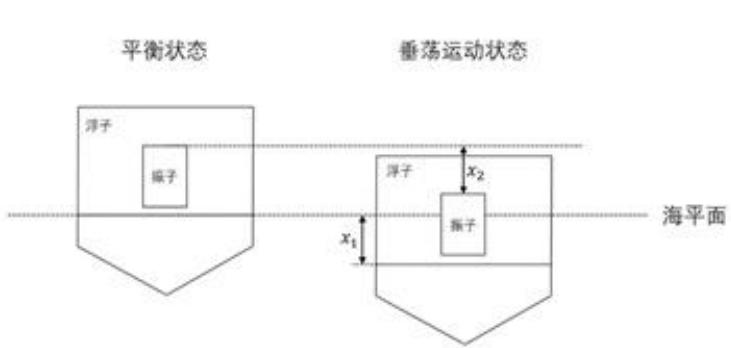

<details>
<summary>text_image</summary>

平衡状态
浮子
振子
垂荡运动状态
浮子
x₂
振子
x₁
海平面
</details>

图 1 浮子坐标示意图

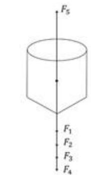

<details>
<summary>text_image</summary>

F₅
F₁
F₂
F₃
F₄
</details>

图 2 浮子受力分析图

针对垂荡运动状态下的浮子进行受力分析，如图2所示。首先，浮子受到波浪激励力，记作 $F_{5}$ 。 $F_{5}$ 对浮子的初始作用方向为竖直向上，其表达式为：

$$
F _ {5} = f \cos \omega t \tag {1-7}
$$

其中，f为垂荡激励力振幅， $\omega$ 为角频率。

浮子在海水中做垂荡运动时，会受到浮力 $F_{float}$ ，比平衡状态下所受浮力大 $\Delta F_{float}$ ：

$$
F _ {f l o a t} = \rho g V _ {0} + \Delta F _ {f l o a t} \tag {1-8}
$$

$\Delta F_{float}$ 可以用浮子位移为 $x_{1}$ 时，浮标在海平面以下的体积 $V(x_{1})$ 计算得到，因此 $\Delta F_{float}$ 仅为 $x_{1}$ 的函数：

$$
\Delta F _ {f l o a t} = \rho g V (x _ {1}) - \rho g V _ {0} \tag {1-9}
$$

考虑到浮标的几何形状是圆柱下拼圆锥，且几何参数已知， $\Delta F_{float}$ 可以计算如下：

$$
\Delta F _ {f l o a t} = \left\{ \begin{array}{l l} - \rho g \pi R ^ {2} & x _ {1} \leq - 1 \\ - \rho g \pi R ^ {2} x _ {1} & - 1 \leq x _ {1} <   2 \\ \text {不可行} & 2 \leq x _ {2} \end{array} \right. \tag {1-10}
$$

由式(1-10)，假设浮子可以处于全部浸入海面、海面位于圆柱部分两种状态，不考虑其他状态。在求解后面的优化问题中，会将这个条件作为优化问题的约束条件之一。

PTO 系统中包含一个弹簧和一个阻尼器。此时弹簧对浮子产生的弹簧弹力仍然记作 $F_{N}$ ，比平衡状态下所受弹力大 $\Delta F_{N}$ ，可得：

$$
F _ {N} = - k _ {2} (x _ {1} - x _ {2} + x _ {0}) = - k _ {2} x _ {0} + \Delta F _ {N} \tag {1-11}
$$

将阻尼器对浮子产生的阻尼力记作 $F_{3}$ ，因为阻尼器的阻尼力与浮子和振子的相对速度成正比，比例系数为阻尼器的阻尼系数，记作 $k_{3}$ ，故：

$$
F _ {3} = - k _ {3} (\dot {x} _ {1} - \dot {x} _ {2}) \tag {1-12}
$$

浮子在海水中做垂荡运动时，会兴起波浪，产生对垂荡运动的阻力，称为兴波阻尼力，记作 $F_{4}$ 。 $F_{4}$ 与垂荡运动的速度成正比，方向相反，故：

$$
F _ {4} = - k _ {4} \dot {x} _ {1} \tag {1-13}
$$

此外，浮子运动时会推动周围海水运动，产生附加惯性力，其对应产生一个附加质量，记作 $m_{c}$ 。根据以上分析，可以得到浮子的受力分析关系式：

$$
F _ {f l o a t} + F _ {N} + F _ {3} + F _ {4} + F _ {5} - m _ {1} g = (m _ {1} + m _ {c}) \ddot {x} _ {1} \tag {1-14}
$$

代入(1-8)与(1-11)式:

$$
\rho g V _ {0} + \Delta F _ {\text {float}} - k _ {2} x _ {-} 0 + \Delta F _ {N} + F _ {3} + F _ {4} + F _ {5} - m _ {-} 1 g = (m _ {1} + m _ {c}) \ddot {x} _ {1} (1 - 1 5)
$$

再代入(1-5)式，消去常数项：

$$
\Delta F _ {f l o a t} + \Delta F _ {N} + F _ {3} + F _ {4} + F _ {5} = (m _ {1} + m _ {c}) \ddot {x} _ {1} \tag {1-16}
$$

$\Delta F_{float}$ 就是由浮体在垂荡运动时所受到的浮力变化引起的静水恢复力，记做 $F_{1}$

$\Delta F_{N}$ 为修正后的弹簧对浮子的拉力，记做 $F_{2}$ 。

因此最终有：

$$
F _ {1} + F _ {2} + F _ {3} + F _ {4} + F _ {5} = (m _ {1} + m _ {c}) \ddot {x} _ {1} \tag {1-17}
$$

对垂荡运动状态下的振子进行受力分析，如图3所示。

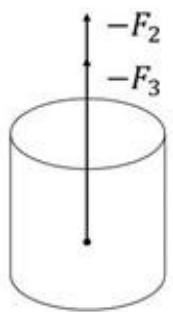

<details>
<summary>text_image</summary>

-F₂
-F₃
</details>

图3 振子受力分析图

振子受到弹簧与阻尼器对它的力及其本身的重力，关系式如下：

$$
\left\{ \begin{array}{c} - (- k _ {2} (x _ {2} - x _ {1} + x _ {0}) + F _ {3} + G _ {2}) = m _ {2} \ddot {x} _ {2} \\ G _ {2} = m _ {2} g \end{array} \right. \tag {1-18}
$$

代入(1-3)(1-4)两式，得到

$$
- (F _ {2} + F _ {3}) = m _ {2} \ddot {x} _ {2} \tag {1-19}
$$

综上，可以得到如下微分方程组模型：

$$
\left\{ \begin{array}{c} F _ {1} + F _ {2} + F _ {3} + F _ {4} + F _ {5} = (m _ {1} + m _ {c}) \ddot {x} _ {1} \\ - (F _ {2} + F _ {3}) = m _ {2} \ddot {x} _ {2} \\ F _ {1} = - k _ {1} x _ {1} \\ F _ {2} = - k _ {2} (x _ {1} - x _ {2}) \\ F _ {3} = - k _ {3} (\dot {x} _ {1} - \dot {x} _ {2}) \\ F _ {4} = - k _ {4} \dot {x} _ {1} \\ F _ {5} = f c o s \omega t \end{array} \right. \tag {1-20}
$$

代入数据得：

$$
\left\{ \begin{array}{c} (m _ {1} + m _ {c}) \ddot {x} _ {1} = - k _ {1} x _ {1} - k _ {2} (x _ {1} - x _ {2}) - k _ {3} (\dot {x} _ {1} - \dot {x} _ {2}) - k _ {4} \dot {x} _ {1} + f c o s \omega t \\ m _ {2} \ddot {x} _ {2} = k _ {2} (x _ {1} - x _ {2}) + k _ {3} (\dot {x} _ {1} - \dot {x} _ {2}) \end{array} \right. \tag {1-21}
$$

## 5.2 问题一模型的求解

上述模型是一个二元二次常系数非齐次微分方程组，问题一给出了两种情况，在第一种情况下，直线阻尼器的阻尼系数为定值，这使得方程组的形式比较简单，可以通过求拉普拉斯变换的方法求得其解析解；在第二种情况下，直线阻尼器的阻尼系数与浮子和振子的相对速度的绝对值的幂成正比，表达式相对复杂，使用拉普拉斯变换计算难度较大，所以使用四阶 Runge-Kutta 法求其数值解。

## 5.2.1 阻尼系数为定值情况下的求解

运用拉普拉斯变换的线性性质和微分性质可将复杂的常微分方程运算过程简单化。微分方程的拉普拉斯变换解法的方法是：

1、先取根据拉氏变换把微分方程化为象函数的代数方程；  
2、根据代数方程求出象函数；  
3、再取逆拉氏变换得到原微分方程的解。

在阻尼系数为定值的情况下，(1-20)为二阶微分非齐次线性方程组，其象函数容易求出，因此我们采用拉普拉斯变换求解。

先假设在整个运动过程中永远只有一部分圆柱和所有圆锥在水下，即 $-1 \leq x_{1} \leq 2$ ，此时：

$$
F _ {1} = - \rho g \pi R ^ {2} x _ {1} = - k _ {1} x _ {1} \tag {2-1}
$$

我们会在计算结束后验证这个假设。

将(1-21)式移项并合并同类项：

$$
\left\{ \begin{array}{c} (m _ {1} + m _ {c}) \ddot {x} _ {1} + (k _ {3} + k _ {4}) \dot {x} _ {1} - k _ {3} \dot {x} _ {2} + (k _ {1} + k _ {2}) x _ {1} - k _ {2} x _ {2} - f c o s \omega t = 0 \\ m _ {2} \ddot {x} _ {2} - k _ {3} \dot {x} _ {1} + k _ {3} \dot {x} _ {2} - k _ {2} x _ {1} + k _ {2} x _ {2} = 0 \end{array} \right. \tag {2-2}
$$

根据拉普拉斯变换的定义，一个定义在区间 $[0,\infty)$ 的函数 $f(t)$ ，它的单边拉普拉斯变换式 $F(s)$ 为：

$$
F (s) = \int_ {0 _ {-}} ^ {\infty} f (t) e ^ {- s t} d t \tag {2-3}
$$

其单边拉普拉斯逆变换为：

$$
f (t) = \frac {1}{2 \pi j} \int_ {\beta - j \infty} ^ {\beta + j \infty} F (s) e ^ {s t} d s \tag {2-4}
$$

对式(2-2)求单边拉普拉斯变换得象函数：

$$
\left\{ \begin{array}{c} (m _ {1} + m _ {c}) s ^ {2} X _ {1} (s) + (k _ {1} + k _ {2}) s X _ {1} (s) - k _ {3} s X _ {2} (s) + (k _ {1} + k _ {2}) X _ {1} (s) - k _ {2} X _ {2} (s) - \frac {f s}{s ^ {2} + \omega^ {2}} = 0 \\ m _ {2} s ^ {2} X _ {2} (s) - k _ {3} s X _ {1} (s) + k _ {3} s X _ {2} (s) - k _ {2} X _ {s} + k _ {2} X _ {2} (s) = 0 \end{array} \right. \tag {2-5}
$$

代入第一问的相关参数和初值：

$$
\left\{ \begin{array}{c} m _ {1} = 4 8 6 6 k g \\ m _ {2} = 2 4 3 3 k g \\ k _ {1} = 3 1 5 5 7. 2 9 8 N \cdot m ^ {- 1} \\ k _ {2} = 8 0 0 0 0 N \cdot m ^ {- 1} \\ k _ {4} = 6 5 6. 3 5 1 6 N \cdot s \cdot m ^ {- 1} \\ f = 6 2 5 0 N \\ \omega = 1. 4 0 0 5 s ^ {- 1} \\ m _ {c} = 1 3 3 5. 5 3 5 k g \end{array} \quad \left\{ \begin{array}{l} x _ {1} (0) = 0 \\ x _ {2} (0) = 0 \\ \dot {x} _ {1} (0) = 0 \\ \dot {x} _ {2} (0) = 0 \end{array} \right. \right. \tag {2-6}
$$

解得：

$$
\left\{ \begin{array}{c} X _ {1} (s) = \frac {0 . 0 4 1 + 0 . 4 3 4 s}{1 . 9 6 1 + s ^ {2}} + \frac {- 0 . 0 7 1 - 0 . 4 2 7 s}{3 . 5 3 9 + 0 . 0 8 6 s + s ^ {2}} + \frac {- 0 . 0 4 3 - 0 . 0 0 6 s}{4 7 . 2 7 0 + 5 . 7 4 2 s + s ^ {2}} \\ X _ {2} (s) = \frac {0 . 0 5 1 + 0 . 4 6 0 s}{1 . 9 6 1 + s ^ {2}} + \frac {- 0 . 0 9 9 - 0 . 4 7 6 s}{3 . 5 3 9 + 0 . 0 8 6 s + s ^ {2}} + \frac {- 5 . 7 0 4 \times 1 0 ^ {- 1 7} + 2 . 0 6 3 \times 1 0 ^ {- 1 7} s}{3 2 . 8 8 1 + 4 . 1 1 0 s + s ^ {2}} + \frac {0 . 0 9 8 + 0 . 0 1 5 s}{4 7 . 2 7 1 + 5 . 7 4 2 s + s ^ {2}} \end{array} \right. \tag {2-7}
$$

分别对 $X_{1}(s), X_{2}(s), sX_{1}(s), sX_{2}(s)$ 做单边拉普拉斯逆变换，并将结果中的复指数化为三角函数的形式，可得：

$$
\left\{ \begin{array}{l} x _ {1} (t) = (- 7. 5 7 8 \times 1 0 ^ {- 3} \sin (- 6. 2 4 7 t - 1. 0 0 8) e ^ {- 2. 8 7 1 t} - 0. 4 2 9 \sin (- 1. 8 8 1 t - 1. 5 0 5) e ^ {- 0. 0 4 3 t} \\ \quad + 0. 4 3 5 \sin (- 1. 4 0 0 5 t - 1. 5 0 3)) \varepsilon (t) \\ x _ {2} (t) = (1. 7 8 9 \times 1 0 ^ {- 2} \sin (- 6. 2 4 7 t - 1. 0 8 1) e ^ {- 2. 8 7 1 t} - 0. 4 7 8 \sin (- 1. 8 8 1 t - 1. 4 8 3) e ^ {- 0. 0 4 3 t} \\ \quad + 0. 4 6 2 \sin (- 1. 4 0 0 5 t - 1. 4 9 2)) \varepsilon (t) \\ \dot {x} _ {1} (t) = (0. 1 2 3 \sin (6. 2 4 7 t - 5. 8 5 8 \times 1 0 ^ {- 2}) e ^ {- 2. 8 7 1 t} - 0. 8 9 9 \sin (1. 8 8 1 t - 6. 4 5 2 \times 1 0 ^ {- 2}) e ^ {- 0. 0 4 3 t} \\ \quad + 0. 6 4 7 \sin (1. 4 0 0 5 t - 7. 8 6 0 \times 1 0 ^ {- 2})) \varepsilon (t) \\ \dot {x} _ {2} (t) = (- 5. 2 1 0 \times 1 0 ^ {- 2} \sin (6. 2 4 7 t - 0. 1 3 2) e ^ {- 2. 8 7 1 t} - 0. 8 0 7 \sin (1. 8 8 1 t - 4. 2 7 6 \times 1 0 ^ {- 2}) e ^ {- 0. 0 4 3 t} \\ \quad + 0. 6 1 0 \sin (1. 4 0 0 5 t - 6. 7 8 5 \times 1 0 ^ {- 2})) \varepsilon (t) \end{array} \right. \tag {2-8}
$$

因为四个变量都只在 $t \geq 0$ 的时间不为0，所以每一个变量都乘以阶跃函数：

$$
\varepsilon (t) = \left\{ \begin{array}{l l} 1 & t \geq 0 \\ 0 & t <   0 \end{array} \right.
$$

注意到每一个变量都由形如 $Asin(\omega t+\phi)e^{bt}$ 的三项组成，其中 $\omega_{1}=6.247$ 与 $\omega_{2}=1.881$ 为此系统的特征频率， $\omega_{3}=1.4005$ 为外力的频率。

取时间步长为0.2s， $x_{1}(t)$ 与 $x_{2}(t)-x_{1}(t)$ ， $\dot{x}_{1}(t)$ 与 $\dot{x}_{2}(t)$ 如图4所示：

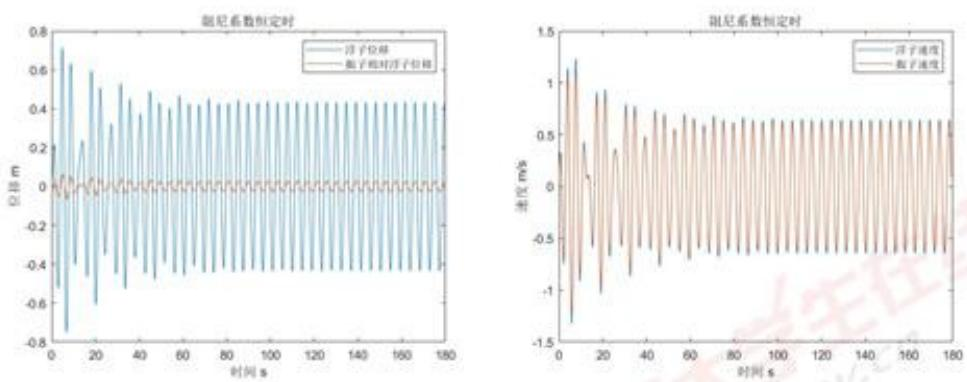  
图 4 阻尼系数恒定时结果曲线

可见，在整个运动时间内始终有 $-1 \leq x_{1} \leq 2$ ，说明永远只有一部分圆柱和所有

圆锥在水下的假设是正确的。

取 $t = 10s,20s,40s,60s,100s$ 计算这些时刻的 $x_{1}(t)$ 与 $x_{2}(t),\dot{x}_{1}(t)$ 与 $\dot{x}_2(t)$ 如下表：

<table><tr><td rowspan="2">时间(s)</td><td colspan="2">浮子</td><td colspan="2">振子</td></tr><tr><td>位移(m)</td><td>速度(m/s)</td><td>位移(m)</td><td>速度(m/s)</td></tr><tr><td>10</td><td>-0.190713821</td><td>-0.693953476</td><td>-0.211681303</td><td>-0.64100737</td></tr><tr><td>20</td><td>-0.590687694</td><td>-0.272774738</td><td>-0.634251241</td><td>-0.240950128</td></tr><tr><td>40</td><td>0.285373218</td><td>0.332912377</td><td>0.296497416</td><td>0.312970676</td></tr><tr><td>60</td><td>-0.314507575</td><td>-0.51572832</td><td>-0.331437723</td><td>-0.479454391</td></tr><tr><td>100</td><td>-0.083615586</td><td>-0.643002735</td><td>-0.084068954</td><td>-0.604211053</td></tr></table>

## 5.2.2 阻尼系数为变值情况下的求解

## 5.2.2.1 四阶 Runge-Kutta 法简介

Runge-Kutta法用于求解形如 $y' = f(x, y)$ 的微分方程组，其中 $x, y$ 可以是长度一样的向量。基本思想是利用 $f(x, y)$ 在某些特殊点上的函数值的线性组合，来估算高阶单步法的平均斜率。四阶Runge-Kutta法使用如下方法进行计算：

$$
\left\{ \begin{array}{c} y _ {i + 1} = y _ {i} + \frac {1}{6} h (d _ {1} + 2 d _ {2} + 2 d _ {3} + d _ {4}) \\ d _ {1} = f (x _ {i}, y _ {i}) \\ d _ {2} = f \left(x _ {i} + \frac {1}{2} h, y _ {i} + \frac {1}{2} d _ {1} h\right) \\ d _ {3} = f \left(x _ {i} + \frac {1}{2} h, y _ {i} + \frac {1}{2} d _ {2} h\right) \\ d _ {4} = f (x _ {i} + h, y _ {i} + d _ {3} h) \end{array} \right. \tag {2-9}
$$

其中 $y_{i}$ 为迭代下标为i的因变量， $x_{i}$ 为迭代下标为i的自变量，步长为 $h=x_{i+1}-x_{i}$ ， $d_{1}\sim d_{4}$ 为Runge-Kutta法中间变量。

## 5.2.1.3 模型的求解

第二种情况下，直线阻尼器的阻尼系数与浮子和振子的相对速度的绝对值的0.5次幂成正比，其中比例系数取10000，即：

$$
k _ {3} = 1 0 0 0 0 | \dot {x} _ {1} - \dot {x} _ {2} | ^ {0. 5} \tag {2-10}
$$

代入式(1-20)中，并将二元二阶常系数非齐次微分方程组改写为四元一阶常系数非齐次微分方程组，以符合 Runge-Kutta 的要求：

$$
\dot {x} = \left\{ \begin{array}{l} \dot {x} _ {1} \\ \dot {x} _ {2} \\ \dot {x} _ {3} \\ \dot {x} _ {4} \end{array} = f (t, x) = \left\{ \begin{array}{c} \frac {- k _ {1} x _ {1} - k _ {2} (x _ {1} - x _ {2}) - k _ {3} (\dot {x} _ {1} - \dot {x} _ {2}) - k _ {4} \dot {x} _ {1} + f c o s \omega t}{(m _ {1} + m _ {c})} \\ \frac {k _ {2} (x _ {1} - x _ {2}) + k _ {3} (\dot {x} _ {1} - \dot {x} _ {2})}{m _ {2}} \end{array} \right. \right. \tag {2-11}
$$

在这个方程中， $x_{1}(t), x_{2}(t), x_{3}(t), x_{4}(t)$ 分别为浮子的位移、振子的位移、浮子的速度、振子的速度。

代入第一问的相关参数与初值(2-6)，使用 Runge-Kutta 法迭代 40 个周期，取时间间隔为 $t_{i+1}-t_i=h=0.2s$ ，计算得到的 $x_{1}(t)$ 与 $x_{2}(t)-x_{1}(t)$ ， $x_{3}(t)$ 与

$x_{4}(t)$ 如图5所示:

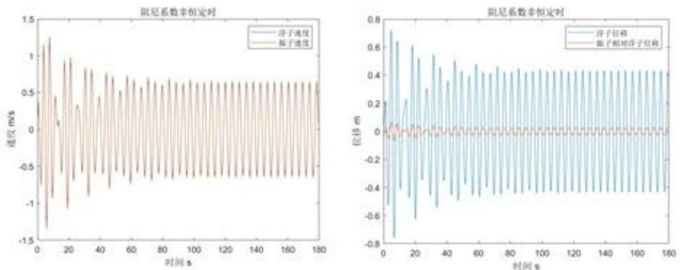

图 5 阻尼系数非恒定时结果曲线

<table><tr><td rowspan="2">时间(s)</td><td colspan="2">浮子</td><td colspan="2">振子</td></tr><tr><td>位移(m)</td><td>速度(m/s)</td><td>位移(m)</td><td>速度(m/s)</td></tr><tr><td>10</td><td>-0.205920238</td><td>-0.645809997</td><td>-0.234964788</td><td>-0.691513475</td></tr><tr><td>20</td><td>-0.61064358</td><td>-0.246366756</td><td>-0.660770395</td><td>-0.267815187</td></tr><tr><td>40</td><td>0.266694073</td><td>0.30147726</td><td>0.277778099</td><td>0.320606667</td></tr><tr><td>60</td><td>-0.328078998</td><td>-0.485631323</td><td>-0.350656448</td><td>-0.517789228</td></tr><tr><td>100</td><td>-0.089379868</td><td>-0.606618652</td><td>-0.095246409</td><td>-0.646739304</td></tr></table>

## 5.3 问题二模型的建立

问题二分为两种情况，第一种情况阻尼系数恒定，微分方程组是线性的，因此可以使用力电比拟的方法，不去求解含参的微分方程，而是将整个振荡浮子式波浪发电系统等效为一个电感-电容-电阻的二阶电路，即将问题转化为求解可变线性电路元件的最大功率的问题，通过函数极值的方法求解析解。

第二种情况，阻尼系数与浮子和振子的相对速度的绝对值的幂成正比，无法采用力电比拟法，故建立最优化模型进行求数值解。

## 5.3.1 力电比拟法模型的建立与求解

力学系统和电学系统在一些情况下是类似的，如果两个系统都是二阶齐次常系数微分方程，那么两个系统具有对偶关系 $^{[2]}$ ：

$$
m \ddot {x} + \rho \dot {x} + k x = 0 \tag {3-1}
$$

$$
L \ddot {q} + R \dot {q} + 1 / C q = 0 \tag {3-2}
$$

其中力学方程遵循牛顿第二定律，电学方程遵循无源RLC回路压降等于0的方程。质量对应电感，阻尼系数对应电阻，弹簧刚度对应电感的倒数，位移对应电荷，不难发现两个方程是等价的。因此，可以用电学系统的语言描述力学系统。

对于情况一，考虑阻尼系数恒定时的方程组：

$$
\left\{ \begin{array}{c} (m _ {1} + m _ {c}) \ddot {x} _ {1} + k _ {1} x _ {1} + k _ {2} (x _ {1} - x _ {2}) + k _ {3} (\dot {x} _ {1} - \dot {x} _ {2}) + k _ {4} \dot {x} _ {1} - f c o s \omega t = 0 \\ m _ {2} \ddot {x} _ {2} - k _ {2} (x _ {1} - x _ {2}) - k _ {3} (\dot {x} _ {1} - \dot {x} _ {2}) = 0 \end{array} \right. \tag {3-3}
$$

两个力学方程，对应两条电学回路。电路中各变量与机械系统中各物理量的对应关系如表1所示。

表1 振荡浮子式波浪发电系统机械量与电量等效对照图

<table><tr><td colspan="2">机械物理量</td><td colspan="2">电路变量</td></tr><tr><td>名称</td><td>符号</td><td>名称</td><td>符号</td></tr><tr><td>浮子质量与垂荡附加质量之和</td><td> $m_1 + m_c$ </td><td>电感 1</td><td> $L_1$ </td></tr><tr><td>振子质量</td><td> $m_2$ </td><td>电感 2</td><td> $L_2$ </td></tr><tr><td>浮子位移</td><td> $x_1$ </td><td>回路 1 电荷量</td><td> $q_1$ </td></tr><tr><td>振子位移</td><td> $x_2$ </td><td>回路 2 电荷量</td><td> $q_2$ </td></tr><tr><td>浮子速度</td><td> $\dot{x}_1$ </td><td>回路 1 电流</td><td> $I_1$ </td></tr><tr><td>振子速度</td><td> $\dot{x}_2$ </td><td>回路 2 电流</td><td> $I_2$ </td></tr><tr><td>垂荡静水恢复力系数</td><td> $k_1$ </td><td>电容  $1^{-1}$ </td><td> $C_1^{-1}$ </td></tr><tr><td>弹簧刚度</td><td> $k_2$ </td><td>电容  $2^{-2}$ </td><td> $C_2^{-1}$ </td></tr><tr><td>垂荡兴波阻尼系数</td><td> $k_4$ </td><td>电阻 1</td><td> $R_1$ </td></tr><tr><td>阻尼器阻尼力系数</td><td> $k_3$ </td><td>电阻 2</td><td> $R_2$ </td></tr><tr><td>垂荡激励力振幅</td><td> $f$ </td><td>余弦交流电源振幅</td><td> $A$ </td></tr><tr><td>入射波浪频率</td><td> $\omega$ </td><td>余弦交流电源频率</td><td> $\omega$ </td></tr></table>

由表1转化为电路方程组可得：

$$
\left\{ \begin{array}{c} L _ {1} \frac {d I _ {1}}{d t} + \frac {1}{C _ {1}} \int I _ {1} d t + \frac {1}{C _ {2}} \int (I _ {1} - I _ {2}) d t + R _ {2} (I _ {1} - I _ {2}) + R _ {1} I _ {1} = A c o s \omega t \\ L _ {2} \frac {d I _ {2}}{d t} - \frac {1}{C _ {2}} \int (I _ {1} - I _ {2}) d t - R _ {2} (I _ {1} - I _ {2}) = 0 \end{array} \right. \tag {3-4}
$$

这是根据回路电流法列出的电路方程组，两个方程对应两条支路，可根据方程组画出电路图，如图6所示。

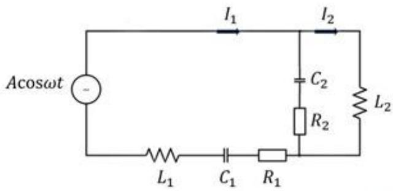

<details>
<summary>text_image</summary>

Acosωt
-
I₁
I₂
C₂
R₂
L₂
L₁
C₁
R₁
</details>

图6力电比拟等效电路图

这是一个二阶 RLC 电路，应用相量法求解 $^{[2]}$ 。将 $L_{1}, C_{1}, R_{1}$ 三个器件看作一个整体，其阻抗记作 $Z_{1}$ ，根据三者串并联关系，用 $Z_{1R}$ 和 $Z_{1X}$ 表示 $Z_{1}$ 的实部和虚部，可得：

$$
Z _ {1} = j \omega L _ {1} + \frac {1}{j \omega C _ {1}} + R _ {1} = Z _ {1 R} + j Z _ {1 X} \tag {3-5}
$$

$$
Z _ {1 R} = R _ {1}
$$

$$
Z _ {1 X} = \omega \mathrm{L} _ {1} - 1 / (\omega \mathrm{C} _ {1})
$$

将 $L_{2}, C_{2}, R_{2}$ 三个器件看作另一个整体，其阻抗记作 $Z_{2}$ ，根据三者串并联关系，用 $Z_{2R}$ 和 $Z_{2X}$ 表示 $Z_{2}$ 的实部和虚部，可得：

$$
Z _ {2} = \frac {j \omega L _ {2} \left(\frac {1}{j \omega C _ {2}} + R _ {2}\right)}{j \omega L _ {2} + \frac {1}{j \omega C _ {2}} + R _ {2}} = Z _ {2 R} + j Z _ {2 X} \tag {3-6}
$$

$$
Z _ {2 R} = \frac {\mathrm{C} _ {2} \mathrm{L} _ {2} \mathrm{R} _ {2} \omega^ {2} - \mathrm{C} _ {2} \mathrm{L} _ {2} \mathrm{R} _ {2} \omega^ {2} (1 - \mathrm{C} _ {2} \mathrm{L} _ {2} \omega^ {2})}{\mathrm{C} _ {2} ^ {2} \mathrm{R} _ {2} ^ {2} \omega^ {2} + (1 - \mathrm{C} _ {2} \mathrm{L} _ {2} \omega^ {2}) ^ {2}}
$$

$$
Z _ {2 X} = \frac {\mathrm{C} _ {2} ^ {2} \mathrm{L} _ {2} \mathrm{R} _ {2} ^ {2} \omega^ {3} + \mathrm{L} _ {2} \omega (1 - \mathrm{C} _ {2} \mathrm{L} _ {2} \omega^ {2})}{\mathrm{C} _ {2} ^ {2} \mathrm{R} _ {2} ^ {2} \omega^ {2} + (1 - \mathrm{C} _ {2} \mathrm{L} _ {2} \omega^ {2}) ^ {2}}
$$

在力电比拟模型中，阻尼器阻尼力系数 $k_{3}$ 被比拟成电阻 $R_{2}$ ，振子与浮子的弹簧被比拟成 $C_{2}$ ，故PTO的输出功率为 $C_{2}$ 与 $R_{2}$ 的功率 $^{[2]}$ 。在 $L_{2}, C_{2}, R_{2}$ 三个器件组成的负载中， $L_{2}$ 与 $C_{2}$ 在一个周期内充电和放电的功率相等，平均功率为 $0^{[1]}$ ，而 $R_{2}$ 在一个周期中始终对外做功，故 $L_{2}, C_{2}, R_{2}$ 三个器件的平均功率即为 $R_{2}$ 的平均功率 $^{[1]}$ ：

$$
P _ {2} = I ^ {2} R _ {2} = \frac {A ^ {2}}{2} \frac {Z _ {2 R}}{(Z _ {1 R} + Z _ {2 R}) ^ {2} + (Z _ {1 X} + Z _ {2 X}) ^ {2}} \tag {3-7}
$$

其中 $Z_{2R}$ 与 $Z_{2X}$ 都是 $R_{2}$ 的函数，因此 $P_{2}$ 也是 $R_{2}$ 的函数，求其极值点即可求得 $R_{2}$ 的最大功率和此时 $k_{3}$ 的值，进而求得PTO的最大输出功率。

由问题二的力学参数(3-8)可以得到电路参数(3-9):

$$
\left\{ \begin{array}{c} m _ {1} = 4 8 6 6 k g \\ m _ {2} = 2 4 3 3 k g \\ k _ {1} = 3 1 5 5 7. 2 9 8 N \cdot m ^ {- 1} \\ k _ {2} = 8 0 0 0 0 N \cdot m ^ {- 1} \\ k _ {4} = 1 6 7. 8 3 9 5 N \cdot s \cdot m ^ {- 1} \\ f = 4 8 9 0 N \\ \omega = 2. 4 1 4 3 s ^ {- 1} \\ m _ {c} = 1 1 6 5. 9 9 2 k g \end{array} \left\{ \begin{array}{l} x _ {1} (0) = 0 \\ x _ {2} (0) = 0 \\ \dot {x} _ {1} (0) = 0 \\ \dot {x} _ {2} (0) = 0 \end{array} \right. \right. \tag {3-8}
$$

$$
\left\{ \begin{array}{c} L _ {1} = 6 0 3 1. 9 9 2 H \\ L _ {2} = 2 4 3 3 H \\ C _ {1} = 3. 1 6 8 8 \times 1 0 ^ {- 5} F \\ C _ {2} = 1. 2 5 \times 1 0 ^ {- 5} F \\ R _ {1} = 1 6 7. 8 3 9 5 \Omega \\ A = 4 8 9 0 V \\ \omega = 2. 4 1 4 3 s ^ {- 1} \end{array} \quad \left\{ \begin{array}{l} q _ {1} (0) = 0 \\ q _ {2} (0) = 0 \\ I _ {1} (0) = 0 \\ I _ {2} (0) = 0 \end{array} \right. \right. \tag {3-9}
$$

将(3-9)相关参数代入(3-5)(3-6)(3-7)中，可以算得此时：

$$
Z _ {1 R} = 1 6 7. 8 4
$$

$$
Z _ {1 X} = - 8 9 4. 9 5
$$

$$
Z _ {2 R} = \frac {0 . 0 2 2 2 R _ {2}}{0 . 7 2 4 + 7 . 6 6 1 \times 1 0 ^ {- 1 0} R _ {2} ^ {2}} \tag {3-10}
$$

$$
Z _ {2 X} = \frac {4 5 8 4 + 4 . 1 2 7 \times 1 0 ^ {- 6} R _ {2} ^ {2}}{0 . 7 2 4 + 7 . 6 6 1 \times 1 0 ^ {- 1 0} R _ {2} ^ {2}} \tag {3-11}
$$

$$
P _ {2} = \frac {1 . 7 1 7 \times 1 0 ^ {7} \times (9 . 4 5 0 \times 1 0 ^ {8} R _ {2} + R _ {2} ^ {3})}{1 . 3 0 7 \times 1 0 ^ {1 8} + 4 . 5 5 5 \times 1 0 ^ {1 1} R _ {2} + 2 . 3 2 8 \times 1 0 ^ {9} R _ {2} ^ {2} + 4 8 2 . 0 R _ {2} ^ {3} + R _ {2} ^ {4}} (3 - 1 2)
$$

令 $\frac{dP_{2}}{dR_{2}}=0$ ，求得 $P_{2}$ 的极值点为 $R_{2}=37193.81\Omega$ ，此时 $P_{2max}=229.334W$ 。为了验证结果合理性，绘制出 $P_{2}$ 关于 $R_{2}$ 的函数图像，如图8所示。

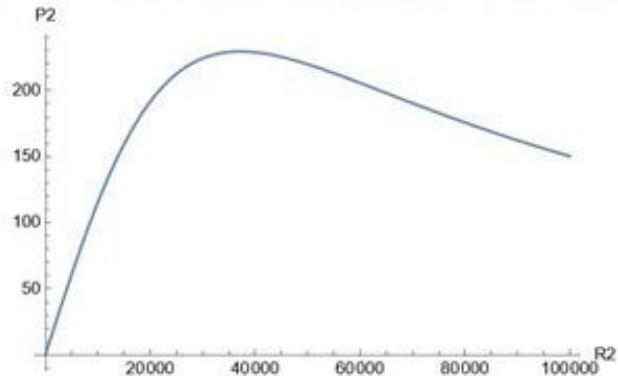

<details>
<summary>line</summary>

| R2 | P2 |
| --- | --- |
| 0 | 0 |
| ~10000 | ~100 |
| ~20000 | ~180 |
| ~30000 | ~220 |
| ~40000 | ~230 |
| ~50000 | ~225 |
| ~60000 | ~215 |
| ~70000 | ~205 |
| ~80000 | ~195 |
| ~90000 | ~185 |
| ~100000 | ~175 |
| ~110000 | ~165 |
| ~120000 | ~155 |
| ~130000 | ~150 |
</details>

图7 $P_{2}$ 关于 $R_{2}$ 的函数图像

从图7中可以看出， $P_{2}$ 的极值点为 $R_{2} = 37193.81\Omega$ ，此时 $P_{2max} = 229.334W$ 结果合理。故当 $k_{3} = R_{2} = 37193.81N\cdot s\cdot m^{-1}$ 时，阻尼器平均功率最大为 $229.334W$ 。力电比拟法求最大功率不需要用到数值方法，求出的结果是精确解。

## 5.3.2 最优阻尼系数模型的建立与求解

设发电系统一个周期内的平均功率为P。已知位移 $x_{1}$ 和 $x_{2}$ 是时间的函数，即：

$$
\left\{ \begin{array}{l} x _ {1} = x _ {1} (t) \\ x _ {2} = x _ {2} (t) \end{array} \right. \tag {3-13}
$$

因此在一个周期内阻尼器的功率可以表示为：

$$
P = \frac {\int_ {t _ {0}} ^ {t _ {0} + T} F _ {3} d (x _ {1} - x _ {2})}{T} \tag {3-14}
$$

其中 $F_{3}$ 为阻尼器的力的大小。将 $F_{3}$ 代入，可以得到：

$$
P = \frac {\int_ {t _ {0}} ^ {t _ {0} + T} k _ {3} (\dot {x} _ {1} - \dot {x} _ {2}) ^ {2} d t}{T} \tag {3-15}
$$

由第一问的数据可知，在时间较小的地方浮子与振子的速度幅度尚不稳定，为了求得稳定的平均功率，减小误差，故这里计算100个周期的浮子与振子的速度，并取最后十个周期的平均功率作为目标函数：

$$
\bar {P} = \frac {\int_ {9 0 T} ^ {1 0 0 T} k _ {3} \left(\dot {x} _ {1} - \dot {x} _ {2}\right) ^ {2} d t}{1 0 T} \tag {3-16}
$$

取 $\alpha$ 与 $\beta$ 作为决策变量，且 $\alpha\in[0,100000]$ ， $\beta\in[0,1]$ 。

$$
k _ {3} = \alpha | \dot {x} _ {1} - \dot {x} _ {2} | ^ {\beta} \tag {3-17}
$$

第一个约束条件为振子不能碰到浮子顶端，振子高度为 $H_{3}$ ，可得：

$$
x _ {0} + x _ {2} - x _ {1} + \mathrm{H} _ {3} \leq \mathrm{H} _ {1} \tag {3-18}
$$

第二个约束条件为浮子不能飞出水面，而问题一中求得浮子在平衡位置时的吃水深度为2.8m，可得：

$$
x _ {1} \leq 2. 8 \tag {3-19}
$$

第三个约束条件为弹簧长度大于零，可得：

$$
x _ {1} - x _ {2} + x _ {0} \leq \mathrm{L} _ {0} \tag {3-20}
$$

最终建立如下最优阻尼系数模型：

$$
\left[ \hat {\alpha}, \hat {\beta} \right] = \underset {\alpha , \beta} {\arg} \max \bar {P} = \frac {\int_ {9 0 T} ^ {1 0 0 T} k _ {3} (\dot {x} _ {1} - \dot {x} _ {2}) ^ {2} d t}{1 0 T} \tag {3-21}
$$

$$
\text {s.t.} \left\{ \begin{array}{c} (m _ {1} + m _ {c}) \ddot {x} _ {1} = - k _ {1} x _ {1} - k _ {2} (x _ {1} - x _ {2}) - k _ {3} (\dot {x} _ {1} - \dot {x} _ {2}) - k _ {4} \dot {x} _ {1} + f \cos \omega t \\ m _ {2} \ddot {x} _ {2} = k _ {2} (x _ {1} - x _ {2}) + k _ {3} (\dot {x} _ {1} - \dot {x} _ {2}) \\ k _ {3} = \alpha | \dot {x} _ {1} - \dot {x} _ {2} | ^ {\beta} \\ x _ {0} + x _ {2} - x _ {1} + \mathrm{H} _ {3} \leq \mathrm{H} _ {1} \\ x 1 \leq 2. 8 \\ x _ {1} - x _ {2} + x _ {0} \leq \mathrm{L} _ {0} \\ \alpha \in [ 0, 1 0 0 0 0 0 ] \\ \beta \in [ 0, 1 ] \end{array} \right.
$$

由于目标函数为定积分，但是被积函数只有离散点处的值，因此只能使用数值积分计算该定积分。梯形法通过将一个区域分为包含多个更容易计算的梯形区域，对区间内的积分计算近似值。对于具有N+1个均匀分布的点的积分，近似值为：

$$
\int_ {a} ^ {b} f (x) d x \approx \frac {b - a}{2 N} \sum_ {n = 1} ^ {N} \left(f (x _ {n}) + f (x _ {n + 1})\right)
$$

$$
= \frac {b - a}{2 N} [ f (x _ {1}) + 2 f (x _ {2}) + \dots + 2 f (x _ {N}) + f (x _ {N + 1}) ] \tag {3-22}
$$

由于只有两个决策变量，求解此优化问题较简单，使用 MATLAB 的数值积分函数计算目标函数，使用优化工具箱编程求解，得到最优解与决策变量的值：

$$
\begin{array}{l} P _ {m a x} = 2 2 8. 8 9 W \\ \left\{ \begin{array}{l} \hat {\alpha} = 0. 3 9 7 5 \\ \hat {\beta} = 1 0 0 0 0 0 \end{array} \right. \\ \end{array}
$$

为了验证结果的可靠性，以0.001作为 $\alpha$ 的步长，1000作为 $\beta$ 的步长，且 $\beta\in$

[0,200000]，对 $P_{2}$ 进行遍历求值，结果如图8所示：

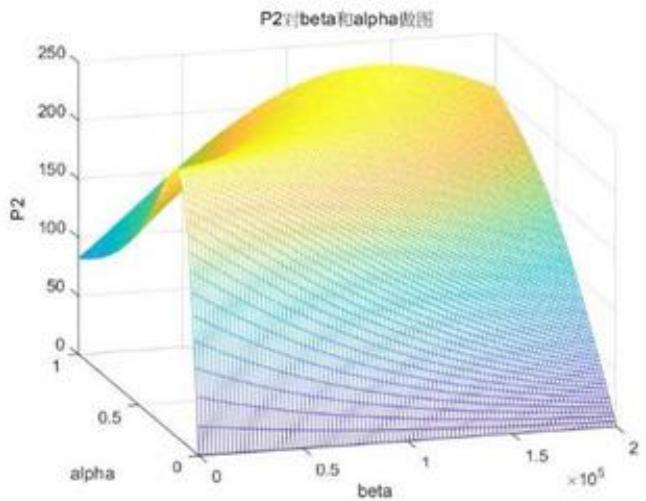

<details>
<summary>surface_3d</summary>

| alpha | beta (x10^5) | P2 |
| --- | --- | --- |
| 0~1 | 0~2 | ~75 ~240 |
</details>

图8 P对β和α作图

可以看出，图像存在一个明显的“山脊”，高度在228W左右，并且山脊的方向沿着β的正方向，并向α的正方向偏；在β∈[0,100000]时，极值点的确在β的边界处取得；如果β的上界能进一步提高，极值点的β还会进一步增加，对应的 $P_{max}$ 也能跟着提高。

## 5.4 问题三模型的建立

由题目可知，该波浪能装置的系统除了垂荡运动外，还作纵摇运动，因此需要一组新的变量来描述其运动。将系统视为一个质量不变，但是质心位置变化的刚体：根据刚体运动的规律，可将系统的运动分为平动和转动，分别可以对应垂荡和纵摇运动。

假设浮子和振子进行纵摇运动的角位移很小，因而在垂荡运动时浮子和振子近似处在同一条直线上，纵摇运动不会影响到竖直方向上的受力，垂荡运动仍可以沿用第一问的建立的模型求解。

## 5.4.1 质心位置和各点相对于转轴转动惯量的计算

浮子由一个圆锥壳体和一个壳体组成，它们的总面积为：

$$
S = \frac {1}{2} \cdot 2 \pi R \cdot \sqrt {R ^ {2} + H _ {2} ^ {2}} + 3 \cdot \pi R ^ {2} + 2 \pi R \cdot H _ {1} = 9. 6 4 m ^ {2}
$$

根据题设，浮子与振子质量均匀，则浮子处处具有相等的面密度：

$$
\sigma = \frac {m _ {1}}{S} \tag {4-1}
$$

则在第一问的坐标系下，浮子的质心：

$$
x _ {0 1} = \frac {1}{m _ {1}} \left(\int_ {- 2. 8} ^ {- 2} \sigma \cdot 2 \pi \cdot \frac {5}{4} \cdot x \frac {\sqrt {R ^ {2} + H _ {2} ^ {2}}}{H _ {2}} d x + \int_ {- 2} ^ {1} \sigma \cdot \pi R ^ {2} \cdot d x\right) = - 1. 2 3 6 m;
$$

振子的质心：

$$
x _ {O 2} = x _ {2} - x _ {1} + x _ {0} + \frac {H _ {3}}{2} \tag {4-2}
$$

转轴的坐标为：

$$
x _ {z} = - 2;
$$

浮子相对于转轴转动惯量为：

$$
J _ {1} = \int (x - x _ {z}) ^ {2} d m = m _ {1} (x _ {0 1} - x _ {z}) ^ {2} = 0. 7 6 4 k g \cdot m ^ {2}
$$

根据圆柱体转动惯量公式和平行轴定理，振子相对于转轴转动惯量为：

$$
J _ {2} = m _ {2} (x _ {0 2} - x _ {z}) ^ {2} = \frac {1}{4} m _ {2} r ^ {2} + \frac {1}{1 2} m _ {2} \left(\frac {H _ {3}}{2}\right) ^ {2} + m _ {2} \left(x _ {2} - x _ {1} + x _ {0} + \frac {H _ {3}}{2} + 2\right) ^ {2} (4 - 3)
$$

## 5.4.2 纵摇运动状态下的力矩分析

对于纵摇运动，采取先整体、后隔离的方法来研究。先将浮子振子作为一个整体来考察受力和力矩，再分开分别研究。查阅文献可知 $^{[3]}$ ，静水恢复力矩、兴波阻尼力矩、波浪激励力矩作用点都在系统整体的质心O上，而扭转弹簧力矩和阻尼力矩作用点是转轴 $O_{z}$ ，因此需要将以系统整体质心O为中心轴的参考系中的变量转化到以转轴 $O_{z}$ 为中心轴的参考系当中。

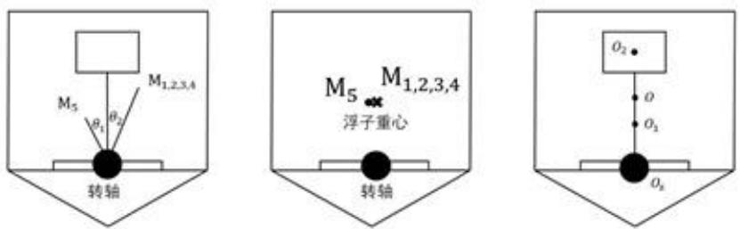

<details>
<summary>text_image</summary>

M5
θ1
θ2
M1,2,3,4
转轴
M5 M1,2,3,4
浮子重心
转轴
O2
O
O1
Ox
</details>

图9浮子力矩分析示意图

对于静水恢复力矩 $M_{1}$ 、兴波阻尼力矩 $M_{4}$ 、波浪激励力矩 $M_{5}$ ，分别有对应的使系统发生纵摇的力 $F_{1}^{\prime}$ 、 $F_{2}^{\prime}$ 、 $F_{3}^{\prime}$ ；由于系统只有浮子与海水接触，因此这几个力实际作用点为浮子的质心 $O_{1}$ ，大小为：

$$
F _ {\mathrm{i}} ^ {\prime} = \frac {M _ {\mathrm{i}}}{O O _ {1}} i = 1, 2, 3 \tag {4-4}
$$

方向垂直于质心连线 $OO_{1}$ 。切换到以转轴为中心轴的参考系中，这些力对转轴产生的力矩为：

$$
M _ {i} ^ {\prime} = F _ {i} ^ {\prime} \cdot O _ {1} O _ {z} \tag {4-5}
$$

于是我们得到了不同参考系下振子所受力矩的转换公式：

$$
M _ {i} ^ {\prime} = M _ {i} ^ {\prime} \cdot \frac {O _ {1} O _ {z}}{O O _ {1}} \quad i = 1, 2, 3 \tag {4-6}
$$

接下来研究振子的转动，以振荡浮子的转轴作为参考系，以逆时针旋转为正方向，假设浮子、振子与竖直方向的夹角分别为 $\theta_{1}$ 、 $\theta_{2}$ 。根据刚体力学，转动过程与平动过程中的力学变量有对应关系：

<table><tr><td colspan="2">平动物理量</td><td colspan="2">转动物理量</td></tr><tr><td>名称</td><td>符号</td><td>名称</td><td>符号</td></tr><tr><td>质量</td><td> $m_{1}$ </td><td>转动惯量</td><td> $J$ </td></tr><tr><td>力</td><td> $F$ </td><td>力矩</td><td> $M$ </td></tr><tr><td>位移</td><td> $x$ </td><td>角位移</td><td> $\theta$ </td></tr><tr><td>速度</td><td> $\dot{x}$ </td><td>角速度</td><td> $\dot{\theta}$ </td></tr><tr><td>加速度</td><td> $\ddot{x}$ </td><td>角加速度</td><td> $\ddot{\theta}$ </td></tr></table>

由转动定理：

$$
M = J \ddot {\theta} \tag {4-7}
$$

与平动类似，可以列出描述转动的方程：

$$
\left\{ \begin{array}{l} M _ {1} + M _ {2} ^ {\prime} + M _ {3} ^ {\prime} + M _ {4} + M _ {5} = \left(J _ {1} + J _ {c}\right) \ddot {x} _ {1} \\ - \left(F _ {2} + F _ {3}\right) = m _ {2} \ddot {x} _ {2} \\ M _ {1} = - l _ {1} \theta_ {1} \\ M _ {2} ^ {\prime} = \frac {O _ {1} O _ {z}}{O O _ {1}} M _ {2} \\ M _ {2} = - l _ {2} \frac {O _ {1} O _ {z}}{O O _ {1}} \left(\theta_ {1} - \theta_ {2}\right) \\ M _ {3} ^ {\prime} = \frac {O _ {1} O _ {z}}{O O _ {1}} M _ {3} \\ M _ {3} = - l _ {3} \frac {O _ {1} O _ {z}}{O O _ {1}} \left(\dot {\theta} _ {1} - \dot {\theta} _ {2}\right) \\ M _ {4} = - l _ {4} \dot {\theta} _ {1} \\ M _ {5} = L \cos \omega t \end{array} \right. \tag {4-8}
$$

浮子和振子同时还做垂荡运动，服从(1-21)的模型。

## 5.5 问题三模型的求解

将相关数值与初值代入(1-21)与(4-5)求解，初值为：

$$
\left\{ \begin{array}{l} x _ {1} (0) = 0 \\ x _ {2} (0) = 0 \\ \dot {x} _ {1} (0) = 0 \\ \dot {x} _ {2} (0) = 0 \end{array} \quad \left\{ \begin{array}{l} \theta_ {1} (0) = 0 \\ \theta_ {2} (0) = 0 \\ \dot {\theta} _ {1} (0) = 0 \\ \dot {\theta} _ {2} (0) = 0 \end{array} \right. \right. \tag {5-1}
$$

相关数值为：

$$
\left\{ \begin{array}{c} m _ {1} = 4 8 6 6 k g \\ m _ {2} = 2 4 3 3 k g \\ k _ {1} = 3 1 5 5 7. 2 9 8 N \cdot m ^ {- 1} \\ k _ {2} = 8 0 0 0 0 N \cdot m ^ {- 1} \\ k _ {3} = 1 0 0 0 0 N \cdot s \cdot m ^ {- 1} \\ k _ {4} = 6 8 3. 4 5 5 8 N \cdot s \cdot m ^ {- 1} \\ f = 3 6 4 0 N \\ \omega = 1. 7 1 5 2 s ^ {- 1} \\ m _ {c} = 1 0 9 1. 0 9 9 k g \end{array} \left\{ \begin{array}{c} l _ {1} = 8 8 9 0. 7 N \cdot m ^ {- 1} \\ l _ {2} = 2 5 0 0 0 0 N \\ l _ {3} = 1 0 0 0 N \cdot s ^ {2} \\ l _ {4} = 6 5 4. 3 3 8 3 N \cdot m \cdot s \\ L = 1 6 9 0 N \cdot m \\ J _ {c} = 7 0 0 1. 9 1 4 k g \cdot m ^ {2} \end{array} \right. \right. \tag {5-2}
$$

使用 Runge-Kutta 法迭代 40 个周期，取时间间隔为 $t_{i+1}-t_{i}=h=0.2s$ ，计算得到以下数据：

<table><tr><td rowspan="2">时间</td><td colspan="4">浮子</td></tr><tr><td>垂荡位移(m)</td><td>垂荡速度(m/s)</td><td>纵摇角位移</td><td>纵摇角速度(s-1)</td></tr><tr><td>10s</td><td>-0.528272233</td><td>0.969849457</td><td>0.021266958</td><td>-0.043717752</td></tr><tr><td>20s</td><td>-0.704793796</td><td>-0.269296298</td><td>0.035788926</td><td>0.004455693</td></tr><tr><td>40s</td><td>0.369362994</td><td>0.757490926</td><td>-0.019977299</td><td>-0.029534371</td></tr><tr><td>60s</td><td>-0.320634199</td><td>-0.721770333</td><td>0.014853296</td><td>0.023680267</td></tr><tr><td>100s</td><td>-0.050140944</td><td>-0.946646528</td><td>-0.002223505</td><td>0.040093425</td></tr></table>

<table><tr><td rowspan="2">时间</td><td colspan="4">振子</td></tr><tr><td>垂荡位移(m)</td><td>垂荡速度(m/s)</td><td>纵摇角位移</td><td>纵摇角速度( $s^{-1}$ )</td></tr><tr><td>10s</td><td>-0.598724851</td><td>1.038198143</td><td>0.022856302</td><td>-0.069077888</td></tr><tr><td>20s</td><td>-0.772270572</td><td>-0.319012527</td><td>0.043397997</td><td>0.007792942</td></tr><tr><td>40s</td><td>0.392645906</td><td>0.845024287</td><td>-0.026575779</td><td>-0.036208455</td></tr><tr><td>60s</td><td>-0.341387527</td><td>-0.799331753</td><td>0.020386542</td><td>0.032719571</td></tr><tr><td>100s</td><td>-0.042597326</td><td>-1.036491582</td><td>-0.000244189</td><td>0.052720679</td></tr></table>

振荡稳定后， $\theta_{1},\theta_{2}$ 的振幅较小，为0.15左右，基本符合前文作出的假设。

## 5.6 问题四模型的建立和求解

与问题二阻尼系数恒定的情况相似，已知位移 $x_{1},x_{2}$ ，角位移 $\theta_{1},\theta_{2}$ 是时间的函数，即：

$$
\left\{ \begin{array}{l} x _ {1} = x _ {1} (t) \\ x _ {2} = x _ {2} (t) \\ \theta_ {1} = \theta_ {1} (t) \\ \theta_ {2} = \theta_ {2} (t) \end{array} \right. \tag {6-1}
$$

在(3-12)的基础上，增加纵摇得到的功率。纵摇得到的功率为力矩对作用角位移的积分除以作用时间。

$$
P ^ {\prime} = \frac {\int_ {t 0} ^ {t 0 + T} | F _ {3} | d (x _ {1} - x _ {2}) + | M _ {3} | d (\theta_ {1} - \theta_ {2})}{T} \tag {6-2}
$$

其中， $F_{3}$ 为阻尼器的力的大小， $M_{3}$ 为阻尼器阻尼力矩。将两者代入，可以得到：

$$
P ^ {\prime} = \frac {\int_ {t 0} ^ {t 0 + T} k _ {3} (\dot {x _ {1}} - \dot {x _ {2}}) ^ {2} + l _ {3} (\dot {\theta_ {1}} - \dot {\theta_ {2}}) ^ {2} d t}{T} \tag {6-3}
$$

同理，计算100个周期的浮子与振子的速度，并取最后十个周期的平均功率作为目标函数：

$$
\bar {P} ^ {\prime} = \frac {\int_ {9 0 T} ^ {1 0 0 T} k _ {3} (\dot {x _ {1}} - \dot {x _ {2}}) ^ {2} + l _ {3} \left(\dot {\theta_ {1}} - \dot {\theta_ {2}}\right) ^ {2} d t}{1 0 T} \tag {6-4}
$$

取 $\gamma$ 和 $\delta$ 作为决策变量，且 $\gamma,\delta\in[0,100000]$ 。

$$
k _ {3} = \gamma | \dot {x} _ {1} - \dot {x} _ {2} | \tag {6-5}
$$

$$
l _ {3} = \delta \left| \dot {\theta} _ {1} - \dot {\theta} _ {2} \right| \tag {6-6}
$$

约束条件同(3-18)(3-19)(3-20)。

最终建立如下最优阻尼系数模型：

$$
\left[ \hat {\gamma}, \hat {\delta} \right] = \underset {\gamma , \delta} {\arg \max} \frac {\int_ {9 0 T} ^ {1 0 0 T} k _ {3} (\dot {x} _ {1} - \dot {x} _ {2}) ^ {2} + l _ {3} \left(\dot {\theta} _ {1} - \dot {\theta} _ {2}\right) ^ {2} d t}{1 0 T} \tag {6-7}
$$

$$
s. t. \left\{ \begin{array}{c} k _ {3} = \gamma   | \dot {x} _ {1} - \dot {x} _ {2} | \\ l _ {3} = \delta | \dot {\theta} _ {1} - \dot {\theta} _ {2} | \\ x _ {0} + x _ {2} - x _ {1} + \mathrm{H} _ {3} \leq \mathrm{H} _ {1} \\ x _ {1} \leq 2. 8 \\ x _ {1} - x _ {2} + x _ {0} \leq \mathrm{L} _ {0} \\ (1 - 2 1) (4 - 8) \end{array} \right.
$$

同样使用梯形法求解数值积分, 使用 MATLAB 的数值积分函数计算目标函数, 使用优化工具箱编程求解得到最优解与决策变量的值:

$$
P _ {m a x} ^ {\prime} = 3 2 7. 9 6 \mathrm{W}
$$

$$
\left\{ \begin{array}{l} \hat {\gamma} = 6 2 1 4 0 \\ \hat {\delta} = 9 5 5 4 1 \end{array} \right.
$$

其中有317.75W是直线阻尼器的贡献，10.21W是旋转阻尼器的贡献。

为了验证结果的可靠性，我们以1000为步长，遍历 $\gamma$ 和 $\delta$ ，计算对应的 $P^{\prime}$ ，如图10所示：

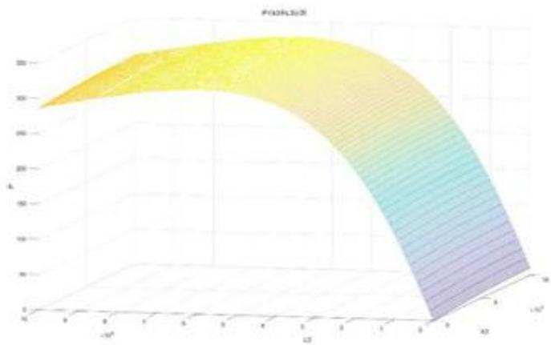

<details>
<summary>surface_3d</summary>

| x | y | Z |
| --- | --- | --- |
| -10^4 | -10^4 | ~25 |
| -10^4 | 0 | ~28 |
| -10^4 | 10^4 | ~29 |
| 0 | -10^4 | ~27 |
| 0 | 0 | ~26 |
| 0 | 10^4 | ~25 |
| 10^4 | -10^4 | ~24 |
| 10^4 | 0 | ~22 |
| 10^4 | 10^4 | ~20 |
| 10^5 | -10^4 | ~21 |
| 10^5 | 0 | ~19 |
| 10^5 | 10^4 | ~17 |
| 10^5 | 10^5 | ~15 |
</details>

图10P对 $\gamma$ 和 $\delta$ 作图

可以看出在解空间内能取到功率的极大值。并且其值主要由δ决定。

## 六、模型的检验

在无法求出解析解的情况下都采用 Runge-Kutta 法求解模型，因此有必要对其精度进行检验。

在问题一阻尼恒定的情况下，采用拉普拉斯变换求得了微分方程的解析解。这里再用 Runge-Kutta 法求同一个微分方程组的数值解，两式相减可以得到 Runge-Kutta 法的绝对误差。选取浮子与振子的位移与速度进行误差分析，误差值如图 11 所示：

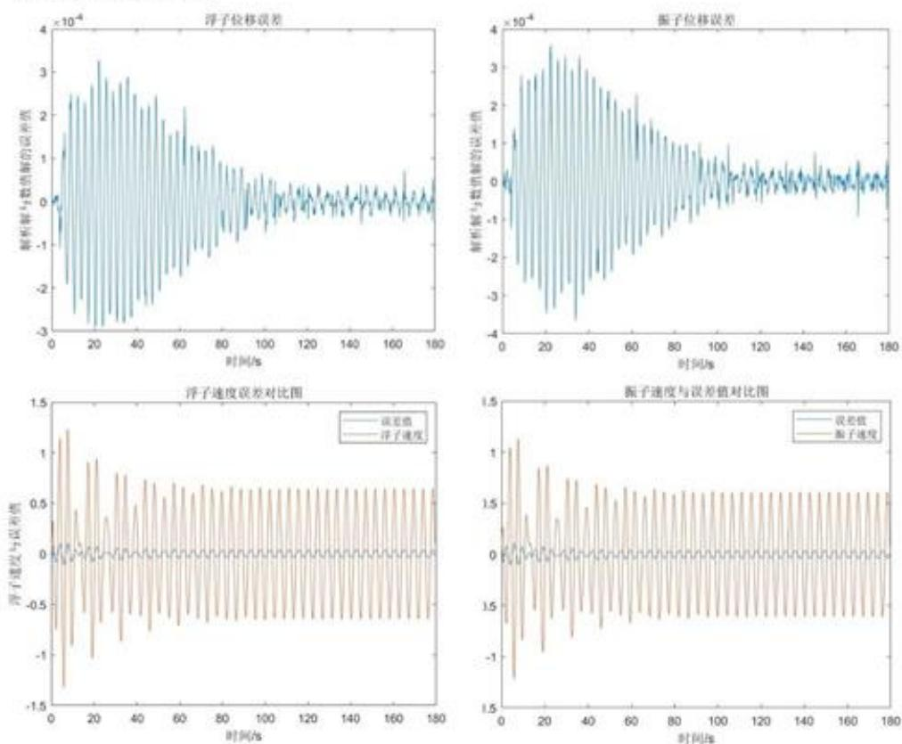  
图 11 误差分析图

由图 11 可得，浮子与振子的位移与速度在开始的一段时间内尚不稳定，误差相对较大。浮子与振子的位移误差能够控制在 $10^{-4}$ 数量级之内，完全可以忽略不计；速度误差在开始一段时间内波动幅度相对较大，稳定后控制在 0.04 左右，相比于稳定后 0.65 左右的振幅，控制在 5% 上下，同样可以接受。说明通过拉普拉斯变换求得的解析解与通过 Runge-Kutta 法迭代得到的数值解几乎完全相同，验证了 Runge-Kutta 法的可靠性。

## 七、模型的评价与推广

## 6.1 模型的优点

1. 本文在清楚地分析了整个物理过程的基础上，以通过受力分析得到的力学微分方程模型为基础进行求解，考虑问题全面，具有很高的通用性。  
2. 模型的计算根据不同情况下微分方程的复杂程度，采取不同的方法，更加灵活可靠。在微分方程复杂程度合适的情况下，采用拉普拉斯变换的方法可以准确求得微分方程解析解，优于龙格库塔法；通过力电比拟的方法，可以利用电路的性质求解优化问题，简化了模型。同时，不同的方法还能相互检验解的合理性。  
3. 在同时考虑装置垂荡和纵摇运动时，将两种运动独立开进行计算，简化了模型，降低模型复杂度。

## 6.2 模型的缺点

波浪能装置在纵摇状态下，“浮子和振子进行纵摇运动的角位移很小”的假设过强，实际求解得到的角位移略微偏大，说明模型具有一定的误差。

## 6.3 模型的推广

本题模型只考虑了垂荡和纵摇，若需要进一步改进模型，可以将波浪能装置的运动推广到纵荡、横荡、垂荡、横摇、纵摇、艏摇六个自由度 $^{[3]}$ ，能更加全面地分析装置的运动情况与输出功率。

## 八、参考文献

[1] 黄秀秀. 振荡浮子式波浪发电系统的功率控制 [D]. 华南理工大学, 2019. DOI: 10.27151/d.cnki.ghnlu.2019.001731.  
[2]邱关源.电路[M].北京:高等教育出版社,2011:221-241  
[3] 马山, 赵彬彬, 廖康平. 海洋浮体水动力学与运动性能 [M]. 哈尔滨: 哈尔滨工程大学出版社, 2019: 63

## 九、附录

支撑材料列表：

```txt
result1-1.xlsx
result1-2.xlsx
result3.xlsx
module1_1.m 用于给出第一问第一种情况的微分方程
module1_2.m 用于给出第一问第二种情况的微分方程
module2_1.m 用于给出第二问第一种情况的微分方程
module2_2.m 用于给出第二问第二种情况的微分方程
module3_1.m 用于给出第三问的微分方程
module4_1.m 用于给出第四问的微分方程
v1_jiexi.m 用于给出第一问第一种情况浮子速度的解析方程
v2_jiexi.m 用于给出第一问第一种情况振子速度的解析方程
x1_jiexi.m 用于给出第一问第一种情况浮子位移的解析方程
x2_jiexi.m 用于给出第一问第一种情况振子位移的解析方程
laplace.nb 计算拉普拉斯逆变换
circuit2_1.nb 计算力电比拟电路的数值解
circuit2_2.nb 计算力电比拟电路的符号解
CreateProblem2_1.m 给第二问第一种情况建立优化问题模型
CreateProblem2_2.m 给第二问第二种情况建立优化问题模型
CreateProblem4_1.m 给第四问建立优化模型
task1.mlx 第一问主函数
task2.mlx 第二问主函数
task3.mlx 第三问主函数
task4.mlx 第四问主函数
error_estimate.mlx 误差检验主函数
```

```matlab
module1_1.m 用于给出第一问第一种情况的微分方程
function dxdt =module1_1(t,x)
m1=4866;
m2=2433;
mc=1335.535;
rho=1025;
g=9.81;
R=1;
H_1=3;
k1=31557.298;
k2=80000;
k3=10000;
k4=656.3616;
x0=m2*g/k2;
fmax=6250;
omega=1.4005;

x1=x(1);
x2=x(2);
x3=x(3);%dx1dt
x4=x(4);%dx2dt

dxdt=[x3;
x4;
(-k1*x1*(x1>=-1)-k1*(-1)*(x1<-1)-k2*(x1-x2+0)-k3*(x3-x4)-k4*x3+fmax*cos(omega*t))/(m1+mc);
-g+(k2*(x1-x2+x0)+k3*(x3-x4))/m2;
];
end
```

```matlab
module1_2.m 用于给出第一问第二种情况的微分方程
function dxdt =module1_2(t,x)
m1=4866;
m2=2433;
mc=1335.535;
rho=1025;
g=9.81;
R=1;
H_1=3;
x0=0.2980425;
k1=pi*g*R*R*rho;
k2=80000;

k4=656.3616;
fmax=6250;
omega=1.4005;

x1=x(1);
x2=x(2);
x3=x(3);%dx1dt
x4=x(4);%dx2dt
k3=10000*sqrt(abs(x3-x4));

dxdt=[x3;
x4;
(-k1*x1*(x1>=-1)-k1*(-1)*(x1<-1)-k2*(x1-x2)-k3*(x3-x4)-k4*x3+fmax*cos(omega*t))/(m1+mc);
-g+(k2*(x1-x2+x0)+k3*(x3-x4))/m2;
];
end
```

module2\_1.m 用于给出第二问第一种情况的微分方程  
```matlab
function dxdt =module2_1(t,x,k3)
m1=4866;
m2=2433;
mc=1165.992;
rho=1025;
g=9.81;
R=1;
H_1=3;
x0=0.2980425;
k1=pi*g*R*R*rho;
k2=80000;

k4=167.8395;
fmax=4890;
omega=2.2143;

x1=x(1);
x2=x(2);
x3=x(3);%dx1dt
x4=x(4);%dx2dt

dxdt=[x3;
x4;
(-k1*x1-k2*(x1-x2)-k3*(x3-x4)-k4*x3+fmax*cos(omega*t))/(m1+mc);
-g+(k2*(x1-x2+x0)+k3*(x3-x4))/m2;
];
end
```

module2\_2.m 用于给出第二问第二种情况的微分方程  
```matlab
function dxdt =module2_2(t,x,beta,alpha)
m1=4866;
m2=2433;
mc=1165.992;
rho=1025;
g=9.81;
R=1;
H_1=3;
x0=0.2980425;
k1=pi*g*R*R*rho;
k2=80000;

k4=167.8395;
fmax=4890;
omega=2.2143;

x1=x(1);
x2=x(2);
x3=x(3);%dx1dt
x4=x(4);%dx2dt
k3=beta*(abs(x3-x4))^(alpha);

dxdt=[x3;
x4;
(-k1*x1-k2*(x1-x2)-k3.*(x3-x4)-
k4*x3+fmax*cos(omega*t))/(m1+mc);
-g+(k2*(x1-x2+x0)+k3.*(x3-x4))/m2;
];
end
```

module3\_1.m 用于给出第三问的微分方程  
```matlab
function dxdt =module3_1(t,x)
omega=1.7152;

m1=4866;
m2=2433;
mc=1028.876;
rho=1025;
g=9.81;
R=1;
H_1=3;

k1=31557.298;
k2=80000;
k3=10000;
k4=683.4558;
fmax=4890;
x0=m2*g/k2;

%J1=1040.6332;
%J1=1420.6332;
Jc=7001.914;
L1=8890.7;
L2=250000;
L3=1000;
L4=654.3383;
Mmax=1690;

x1=x(1);
x2=x(2);
x3=x(3);%dx1dt
x4=x(4);%dx2dt
theta1=x(5);
theta2=x(6);
theta3=x(7);%dtheta1dt
theta4=x(8);%dtheta2dt

J2=2433*0.5/3*(3*(x2-x1+x0)^2+3*0.5*(x2-x1+x0)+0.5*0.5);
J1=0.5*4866*(1.236+x2-x1+x0+0.25).^2/9;

001=1/3*(0.25+x2-x1+x0+1.236);
```

```javascript
002=2/3*(0.25+x2-x1+x0);
020z=0.25+x2-x1+x0;
010z=0.764;
b=010z/001;
```

```matlab
dxdt=[x3;
x4;
(-k1*x1*(x1>=-1)-k1*(-1)*(x1<-1)-k2*(x1-x2)-k3*(x3-x4)-k4*x3+fmax*cos(omega*t))/(m1+mc);
(k2*(x1-x2)+k3*(x3-x4))/m2;
theta3;
theta4;
(-b*L1*theta1-L2*(theta1-theta2)-L3*(theta3-theta4)-b*L4*theta3+b*Mmax*cos(omega*t))/(J1+Jc);
%(-L1*theta1-L2*(theta1-theta2)-L3*(theta3-theta4)-L4*theta3+Mmax*cos(omega*t))/(J1+Jc);
%(-L1*theta1-L4*theta3+Mmax*cos(omega*t))/(J1+Jc);

(L2*(theta1-theta2)+L3*(theta3-theta4))./J2;
%(L2*(theta1-theta2)+L3*(theta3-theta4))./J2;
%(L2*(theta4)+L3*(theta4)+2*m2*theta3*theta4)./J2;
];
end
```

module4\_1.m 用于给出第四问的微分方程
function dxdt =module4\_1(t,x,k3,L3)
omega=1.9806;  
```matlab
m1=4866;
m2=2433;
mc=1091.099;
rho=1025;
g=9.81;
R=1;
H_1=3;
```

```matlab
k1=31557.298;
k2=80000;
```

```txt
k4=528.5018;
fmax=4890;
x0=m2*g/k2;
```

```matlab
J1=1040.6332;
Jc=7142.493;
L1=8890.7;
L2=250000;
```

```javascript
L4=1655.909;
Mmax=2140;
```

```matlab
x1=x(1);
x2=x(2);
x3=x(3);%dx1dt
x4=x(4);%dx2dt
theta1=x(5);
theta2=x(6);
theta3=x(7);%dtheta1dt
theta4=x(8);%dtheta2dt
```

```matlab
% J2=2433*0.5/3*(3*(x2-x1+x0)^2+3*0.5*(x2-x1+x0)+0.5*0.5);
%
% dxdt=[x3;
```

```matlab
% x4;
% (-k1*x1*(x1>=-1)-k1*(-1)*(x1<-1)-k2*(x1-x2)-k3*(x3-x4)-k4*x3+fmax*cos(omega*t))/(m1+mc);
% (k2*(x1-x2)+k3*(x3-x4))/m2;
% theta3;
% theta4;
% (-L1*theta1-L2*(theta1-theta2)-L3*(theta3-theta4)-L4*theta3+Mmax*cos(omega*t))/(J1+Jc);
% (L2*(theta1-theta2)+L3*(theta3-theta4))./J2;
% ];
```

```javascript
J2=2433*0.5/3*(3*(x2-x1+x0)^2+3*0.5*(x2-x1+x0)+0.5*0.5);
J1=0.5*4866*(1.236+x2-x1+x0+0.25).^2/9;
```

```txt
001=1/3*(0.25+x2-x1+x0+1.236);
002=2/3*(0.25+x2-x1+x0);
020z=0.25+x2-x1+x0;
010z=0.764;
b=010z/001;
```

```matlab
dxdt=[x3;
x4;
(-k1*x1*(x1>=-1)-k1*(-1)*(x1<-1)-k2*(x1-x2)-k3*(x3-x4)-k4*x3+fmax*cos(omega*t))/(m1+mc);
(k2*(x1-x2)+k3*(x3-x4))/m2;
theta3;
theta4;
(-b*L1*theta1-L2*(theta1-theta2)-L3*(theta3-theta4)-b*L4*theta3+b*Mmax*cos(omega*t))/(J1+Jc);
%(-L1*theta1-L2*(theta1-theta2)-L3*(theta3-theta4)-L4*theta3+Mmax*cos(omega*t))/(J1+Jc);
%(-L1*theta1-L4*theta3+Mmax*cos(omega*t))/(J1+Jc);

(L2*(theta1-theta2)+L3*(theta3-theta4))./J2;
%(L2*(theta1-theta2)+L3*(theta3-theta4))./J2;
%(L2*(theta4)+L3*(theta4)+2*m2*theta3*theta4)./J2;
];
end
```

```matlab
v1_jiexi.m 用于给出第一问第一种情况浮子速度的解析方程
function v1 = v1_jiexijie(t)
v1=(0.359987E-2+sqrt(-1)*(-0.61379E-1)).*exp(1).^(((-
0.28712E1)+sqrt( ...
-1)*(-0.624717E1)).*t)+(0.359987E-2+sqrt(-1)*0.61379E-
1).*exp(1) ...
.^(((-0.28712E1)+sqrt(-1)*0.624717E1).*t)+((-0.289964E-
1)+sqrt(-1) ...
*0.448779E0).*exp(1).^(((-0.430417E-1)+sqrt(-1)*(-
0.188089E1)).*t) ...
+((-0.289964E-1)+sqrt(-1)*(-0.448779E0)).*exp(1).^(((-
0.430417E-1) ...
+sqrt(-1)*0.188089E1).*t)+(0.253966E-1+sqrt(-1)*(-
0.322436E0)).* ...
exp(1).^((0.E-323+sqrt(-1)*(-0.14005E1)).*t)+(0.253966E-
1+sqrt(-1) ...
*0.322436E0).*exp(1).^((0.E-323+sqrt(-1)*0.14005E1).*t);
end
```

v2\_jiexi.m 用于给出第一问第一种情况振子速度的解析方程  
```matlab
function v2 = v2_jiexijie(t)
v2=((-0.342278E-2)+sqrt(-1)*0.25825E-1).*exp(1).^(((-
0.28712E1)+sqrt( ...
-1)*(-0.624717E1)).*t)+((-0.342278E-2)+sqrt(-1)*(-0.25825E-
1)).* ...
exp(1).^(((-0.28712E1)+sqrt(-1)*0.624717E1).*t)+((-0.172369E-
1)+ ...
sqrt(-1)*0.402895E0).*exp(1).^(((-0.430417E-1)+sqrt(-1)*( ...
-0.188089E1)).*t)+((-0.172369E-1)+sqrt(-1)*(-
0.402895E0)).*exp(1) ...
.^(((-0.430417E-1)+sqrt(-1)*0.188089E1).*t)+(0.206597E-
1+sqrt(-1)* ...
(-0.304031E0)).*exp(1).^((0.E-323+sqrt(-1)*(-
0.14005E1)).*t)+( ...
0.206597E-1+sqrt(-1)*0.304031E0).*exp(1).^((0.E-323+sqrt(-
1)* ...
0.14005E1).*t);
end
```

```matlab
x1_jiexi.m 用于给出第一问第一种情况浮子位移的解析方程
function x1 = x1_jiexijie(t)
x1=((-0.320505E-2)+sqrt(-1)*(-0.202094E-2)).*exp(1).^(((-
0.28712E1)+ ...
    sqrt(-1)*(-0.624717E1)).*t)+((-0.320505E-2)+sqrt(-
1)*0.202094E-2) ...
    .*exp(1).^(((-0.28712E1)+sqrt(-1)*0.624717E1).*t)+((-
0.213883E0)+ ...
    sqrt(-1)*(-0.140587E-1)).*exp(1).^(((-0.430417E-1)+sqrt(-
1)*( ...
    -0.188089E1)).*t)+((-0.213883E0)+sqrt(-1)*0.140587E-
1).*exp(1).^(( ...
    (-0.430417E-1)+sqrt(-1)*0.188089E1).*t)+(0.217088E0+sqrt(-
1)* ...
    0.147517E-1).*exp(1).^(0.E-323+sqrt(-1)*(-
0.14005E1)).*t)+( ...
    0.217088E0+sqrt(-1)*(-0.147517E-1)).*exp(1).^(0.E-323+sqrt(-
1)* ...
    0.14005E1).*t);
end
```

x2\_jiexi.m 用于给出第一问第一种情况振子位移的解析方程  
```matlab
function x2 = x2_jiexijie(t)
x2=(0.789299E-2+sqrt(-1)*0.420387E-2).*exp(1).^(((-
0.28712E1)+sqrt( ...
-1)*(-0.624717E1)).*t)+(0.789299E-2+sqrt(-1)*(-0.420387E-
2)).*exp( ...
1).^(((-0.28712E1)+sqrt(-1)*0.624717E1).*t)+((--
0.238122E0)+sqrt( ...
-1)*(-0.208655E-1)).*exp(1).^(((-0.430417E-1)+sqrt(-1)*( ...
-0.188089E1)).*t)+((-0.238122E0)+sqrt(-1)*0.208655E-
1).*exp(1).^((( ...
(-0.430417E-1)+sqrt(-1)*0.188089E1).*t)+(0.230229E0+sqrt(-
1)* ...
0.181339E-1).*exp(1).^(((0.E-323+sqrt(-1)*(-
0.14005E1)).*t)+( ...
0.230229E0+sqrt(-1)*(-0.181339E-1)).*exp(1).^(((0.E-323+sqrt(-
1)* ...
0.14005E1).*t);
end
```

laplace.nb 计算拉普拉斯逆变换

m1=4866;

m2=2433;

mc=1335.535;

k1=31557.298;

k2=80000;

k3=10000;

k4=656.3516;

f=6250;

omega=1.4005;

Solve[(m1+mc)x1 s^2+(k1+k2)x1-k2 x2+(k3+k4)x1 s-k3 s x2-f s /(s^2+

omega^2)==0,m2 s^2 x2-k2 x1+k2 x2-k3 x1 s+k3 s x2==0},{x1,x2}]

$\{ \mathrm { x 1 - > - } ( ( - 5 . * 1 0 ^ { 8 } \mathrm { s - } 6 . 2 5 * 1 0 ^ { 7 } \mathrm { s ^ { 2 } - } 1 . 5 2 0 6 3 * 1 0 ^ { 7 } \mathrm { s ^ { 3 } ) / ( ( 1 . 9 6 1 4 + \mathrm { s ^ { 2 } } ) }$

$(2.52458*10^{9}+3.68081*10^{8}s+7.74105*10^{8}s^{2}+8.79423*10^{7}s^{3}+1.50883*10^{7}$

$\mathrm{s}^{4})))$ , x2->-((4.11015 (8.+1.s) (-5.\*10^8 s-6.25\*10^7 s^2-1.52063\*10^7 s^3))/((1.9614 +s^2))

(32.8812 +4.11015 s+1. s²) (2.52458\*10⁹+3.68081\*10⁸ s+7.74105\*10⁸

$\mathrm{s}^{2} + 8.79423*10^{7}\mathrm{s}^{3} + 1.50883*10^{7}\mathrm{s}^{4}))\}\}$

$\{\mathrm{x}1,\mathrm{x}2\} = \{-((-5.*10^{8}\mathrm{s} - 6.25*10^{7}\mathrm{s}^{2} - 1.52063*10^{7}\mathrm{s}^{3}) / ((1.9614 + \mathrm{s}^{2}))$

$(2.52458*10^{9}+3.68081*10^{8}s+7.74105*10^{8}s^{2}+8.79423*10^{7}s^{3}+1.50883*10^{7}s^{4})))$

((4.11015 (8.+1.s) (-5.\*10^8 s-6.25\*10^7 s^2-1.52063\*10^7 s^3))/((1.9614 +s^2) (32.8812

$+4.11015 \mathrm{~s} + 1. \mathrm{~s}^{2}) (2.52458 * 10^{9} + 3.68081 * 10^{8} \mathrm{~s} + 7.74105 * 10^{8} \mathrm{~s}^{2} + 8.79423 * 10^{7}$

$\mathrm{s}^{3} + 1.50883*10^{7}\mathrm{s}^{4}))\}$

$\left\{ - \left( (-5. * 10^{8} \mathrm{~s} - 6.25 * 10^{7} \mathrm{~s}^{2} - 1.52063 * 10^{7} \mathrm{~s}^{3}) / ((1.9614 + \mathrm{s}^{2}) (2.52458 * 10^{9} + 3.68081 * 10^{8} \right.\right.$

$\mathrm{s} + 7.74105*10^{8}\mathrm{s}^{2} + 8.79423*10^{7}\mathrm{s}^{3} + 1.50883*10^{7}\mathrm{s}^{4}))$ ,-((4.11015 (8.+1.s) (-5.\*108s-

$6.25*10^{7}s^{2}-1.52063*10^{7}s^{3})/(1.9614+s^{2})(32.8812+4.11015s+1.s^{2})$

$(2.52458*10^{9}+3.68081*10^{8}s+7.74105*10^{8}s^{2}+8.79423*10^{7}s^{3}+1.50883*10^{7}s^{4})))$

## Apart[x1]

(0.0413194 +0.434175 s)/(1.9614 +1. s²)+(-0.0712974-0.427765 s)/(3.5396

+0.0860835 s+1. s²)+(-0.043655-0.0064101 s)/(47.271 +5.74241 s+1. s²)

## Apart[x2]

(0.0507931+0.460458 s)/(1.9614+1. s²)+(-0.0989896-0.476244 s)/(3.5396

$+0.0860835 \mathrm{~s} + 1. \mathrm{~s}^{2}) + (-5.70398 * 10^{-17} + 2.06256 * 10^{-17} \mathrm{~s}) / (32.8812 + 4.11015 \mathrm{~s} + 1.$

$\mathrm{s}^{2}) + (0.0978493 + 0.015786\mathrm{s}) / (47.271 + 5.74241\mathrm{s} + 1.\mathrm{s}^{2})$

X1=Simplify[InverseLaplaceTransform[x1,s,t]]

$(-0.00320505 - 0.00202094 \mathrm{I}) \mathrm{E}^{(-2.8712 - 6.24717 \mathrm{I}) \mathrm{t}} - (0.00320505 - 0.00202094 \mathrm{I}) \mathrm{E}^{(-}$

2.8712+6.24717 I) t-(0.213883 +0.0140587 I) E(-0.0430417-1.88089 I) t-(0.213883 -0.0140587 I)

$\mathrm{E}^{(-0.0430417 + 1.88089\mathrm{I})\mathrm{t}} + (0.217088 + 0.0147517\mathrm{I})\mathrm{E}^{(0. - 1.4005\mathrm{I})\mathrm{t}} + (0.217088 - 0.0147517\mathrm{I})$

$\mathrm{E}^{(0, +1.4005\mathrm{I})\mathrm{t}}$

X2=Simplify[InverseLaplaceTransform[x2,s,t]]

<div class="mineru-algorithm" style="white-space: pre-wrap; font-family:monospace;">
(0.00789299 +0.00420387 I) E $^{(-2.8712-6.24717\mathrm{I})\mathrm{t}}$ +(0.00789299 -0.00420387 I) E $^{(-2.8712+6.24717\mathrm{I})\mathrm{t}}$ -(0.238122 +0.0208655 I) E $^{(-0.0430417-1.88089\mathrm{I})\mathrm{t}}$ -(0.238122 -0.0208655 I) E $^{(-0.0430417+1.88089\mathrm{I})\mathrm{t}}$ +(0.230229 +0.0181339 I) E $^{(-0.-1.4005\mathrm{I})\mathrm{t}}$ +(0.230229 -0.0181339 I) E $^{(0.+1.4005\mathrm{I})\mathrm{t}}$
</div>

Y1=Simplify[InverseLaplaceTransform[s x2,s,t]]

<div class="mineru-algorithm" style="white-space: pre-wrap; font-family:monospace;">
(0.00359987 -0.061379 I) E$^{(-2.8712-6.24717\text{I})\text{t}}$+(0.00359987 +0.061379 I) E$^{(-2.8712+6.24717\text{I})\text{t}}$-(0.0289964 -0.448779 I) E$^{(-0.0430417-1.88089\text{I})\text{t}}$-(0.0289964 +0.448779 I) E$^{(-0.0430417+1.88089\text{I})\text{t}}$+(0.0253966 -0.322436 I) E$^{(0.-1.4005\text{I})\text{t}}$+(0.0253966 +0.322436 I) E$^{(0.+1.4005\text{I})\text{t}}$
</div>

Y2=Simplify[InverseLaplaceTransform[s x1,s,t]]

<div class="mineru-algorithm" style="white-space: pre-wrap; font-family:monospace;">
$(-0.00342278 + 0.025825 \mathrm{I}) \mathrm{E}^{(-2.8712 - 6.24717 \mathrm{I}) \mathrm{t}} - (0.00342278 + 0.025825 \mathrm{I}) \mathrm{E}^{(-2.8712 + 6.24717 \mathrm{I})}$ t-(0.0172369 -0.402895 I) $\mathrm{E}^{(-0.0430417 - 1.88089 \mathrm{I}) \mathrm{t}} - (0.0172369 + 0.402895 \mathrm{I}) \mathrm{E}^{(-0.0430417 + 1.88089 \mathrm{I}) \mathrm{t}} + (0.0206597 - 0.304031 \mathrm{I}) \mathrm{E}^{(0. - 1.4005 \mathrm{I}) \mathrm{t}} + (0.0206597 + 0.304031 \mathrm{I}) \mathrm{E}^{(0. + 1.4005 \mathrm{I}) \mathrm{t}}$
</div>

Import["ToMatlab.m","Package"]

```txt
x1=ToMatlab[X1]
x2=ToMatlab[X2]
y1=ToMatlab[Y1]
y2=ToMatlab[Y2]
((-0.320505E-2)+sqrt(-1)*(-0.202094E-2)).*exp(1).^(((-0.28712E1)+ ...
sqrt(-1)*(-0.624717E1)).*t)+((-0.320505E-2)+sqrt(-1)*0.202094E-2) ...
.*exp(1).^(((-0.28712E1)+sqrt(-1)*0.624717E1).*t)+((-0.213883E0)+ ...
sqrt(-1)*(-0.140587E-1)).*exp(1).^(((-0.430417E-1)+sqrt(-1)*( ...
-0.188089E1)).*t)+((-0.213883E0)+sqrt(-1)*0.140587E-1).*exp(1).^((( ...
(-0.430417E-1)+sqrt(-1)*0.188089E1).*t)+(0.217088E0+sqrt(-1)* ...
0.147517E-1).*exp(1).^((0.E-323+sqrt(-1)*(-0.14005E1)).*t)+( ...
0.217088E0+sqrt(-1)*(-0.147517E-1)).*exp(1).^((0.E-323+sqrt(-1)* ...
0.14005E1).*t);
```

```txt
(0.789299E-2+sqrt(-1)*0.420387E-2).*exp(1).^(((-0.28712E1)+sqrt( ...
-1)*(-0.624717E1)).*t)+(0.789299E-2+sqrt(-1)*(-0.420387E-2)).*exp( ...
1).^(((-0.28712E1)+sqrt(-1)*0.624717E1).*t)+((-0.238122E0)+sqrt( ...
-1)*(-0.208655E-1)).*exp(1).^(((-0.430417E-1)+sqrt(-1)*( ...
-0.188089E1)).*t)+((-0.238122E0)+sqrt(-1)*0.208655E-1).*exp(1).^((( ...
(-0.430417E-1)+sqrt(-1)*0.188089E1).*t)+(0.230229E0+sqrt(-1)* ...
0.181339E-1).*exp(1).^((0.E-323+sqrt(-1)*(-0.14005E1)).*t)+( ...
0.230229E0+sqrt(-1)*(-0.181339E-1)).*exp(1).^((0.E-323+sqrt(-1)* ...
```

0.14005E1).\*t);

```javascript
(0.359987E-2+sqrt(-1)*(-0.61379E-1)).*exp(1).^(((-0.28712E1)+sqrt(... -1)*(-0.624717E1)).*t)+(0.359987E-2+sqrt(-1)*0.61379E-1).*exp(1) ... ^(((-0.28712E1)+sqrt(-1)*0.624717E1)).*t)+((-0.289964E-1)+sqrt(-1) ... *0.448779E0).*exp(1).^(((-0.430417E-1)+sqrt(-1)*(-0.188089E1)).*t) ... +((-0.289964E-1)+sqrt(-1)*(-0.448779E0)).*exp(1).^(((-0.430417E-1) ... +sqrt(-1)*0.188089E1).*t)+(0.253966E-1+sqrt(-1)*(-0.322436E0)).* ... exp(1).^(0.E-323+sqrt(-1)*(-0.14005E1)).*t)+(0.253966E-1+sqrt(-1) ... *0.322436E0).*exp(1).^((0.E-323+sqrt(-1)*0.14005E1).*t);
```

```typescript
((-0.342278E-2)+sqrt(-1)*0.25825E-1).*exp(1).^(((-0.28712E1)+sqrt(... -1)*(-0.624717E1)).*t)+((-0.342278E-2)+sqrt(-1)*(-0.25825E-1)).* ...
exp(1).^(((-0.28712E1)+sqrt(-1)*0.624717E1).*t)+((-0.172369E-1)+ ... sqrt(-1)*0.402895E0).*exp(1).^(((-0.430417E-1)+sqrt(-1)*(... -0.188089E1)).*t)+((-0.172369E-1)+sqrt(-1)*(-0.402895E0)).*exp(1) ...
.^(((-0.430417E-1)+sqrt(-1)*0.188089E1).*t)+(0.206597E-1+sqrt(-1)* ... (-0.304031E0)).*exp(1).^((0.E-323+sqrt(-1)*(-0.14005E1)).*t)+( ... 0.206597E-1+sqrt(-1)*0.304031E0).*exp(1).^((0.E-323+sqrt(-1)* ... 0.14005E1).*t);
```

circuit2\_1.nb 计算力电比拟电路的数值解

m1=4866;

m2=2433;

mc=1165.992;

k1=31557.298;

k2=80000;

k3=36000;

k4=167.8395;

f=4890;

omega=2.2143;

L1=m1+mc;

L2=m2;

C1=1/k1;

C2=1/k2;

R1=k4;

Z1=I omega L1+1/(I omega C1)+R1;

$Z2=1/(1/(R2+1/(I omega C2))+1/(I omega L2));$

RZ1=Re[Z1];

RZ2=Re[Z2];

IZ1=Im[Z1];

IZ2=Im[Z2];

P2[R2\_]=f^2/2\*(RZ2/((RZ1+RZ2)^2+(IZ1+IZ2)^2))

(11956050 Re[1/((0.-0.000185619 I)+1/((0.-36128.8 I)+R2))])/((-894.951+Im[1/((0.

-0.000185619 I)+1/((0.-36128.8 I)+R2))])²+(167.84 +Re[1/((0.-0.000185619

I)+1/((0.-36128.8 I)+R2))])²)

Plot[%211,{R2,0,100000}]

circuit2\_2.nb 计算力电比拟电路的符号解

<div class="mineru-algorithm" style="white-space: pre-wrap; font-family:monospace;">
m1=4866;
m2=2433;
mc=1165.992;
k1=31557.298;
k2=80000;
k3=36000;
k4=167.8395;
f=4890;
omega=2.2143;
w=omega;

l1=m1+mc;
l2=m2;
c1=1/k1;
c2=1/k2;
R1=k4;a=-w^2 c2 l2 R2;
ad=-w^2 c2 l2;
b=w l2;
c=1-w^2 c2 l2;
d=w c2 R2;
dd=w c2;
Z1R=R1;
Z1X=w l1 -1/(w c1)
Z2R=(a c+b d)/(c^2+d^2)
Z2X=(b c-a d)/(c^2+d^2)
-894.951
(0.0222357 R2)/(0.724003 +7.66113*10^-10 R2^2)
(4584.04 +4.12735*10^-6 R2^2)/(0.724003 +7.66113*10^-10 R2^2)
P=f*f/2*(Z2R)/((Z1R+Z2R)^2+(Z1X+Z2X)^2)

(265851.R2)/((0.724003 +7.66113*10^-10 R2^2) ((167.84 +(0.0222357 R2)/(0.724003 +7.66113*10^-10 R2^2))^2+(-894.951+(4584.04 +4.12735*10^-6 R2^2)/(0.724003 +7.66113*10^-10 R2^2))^2))
FullSimplify[P]
(1.62264*10^16 R2+1.71702*10^7 R2^3)/(1.30734*10^18+R2 (4.55573*10^11+R2 (2.32841*10^9+R2 (482.071 +1.R2))))
Cancel[(1.62264*10^16 R2+1.71702*10^7 R2^3)/(1.30734*10^18+R2 (4.55573*10^11+R2 (2.32841*10^9+R2 (482.071 +1.R2))))]
(1.71702*10^7 (9.45034*10^8 R2+1.R2^3))/(1.30734*10^18+4.55573*10^11 R2+2.32841*10^9 R2^2+482.071 R2^3+1.R2^4)

$\sigma_{R2}\frac{1.62264\times 10^{16}R2 + 1.71702\times 10^7R2^3}{1.30734\times 10^{18} + R2 (4.55573\times 10^{11} + R2 (2.32841\times 10^9 + R2 (482.071 + 1.R2)))}$
</div>

```txt
-(((1.62264*10^16 R2+1.71702*10^7 R2^3)(4.55573*10^11+R2 (2.32841*10^9+R2 (482.071 +1. R2))+R2 (2.32841*10^9+R2 (482.071 +1. R2)+R2 (482.071 +2. R2))))/(1.30734*10^18+R2 (4.55573*10^11+R2 (2.32841*10^9+R2 (482.071 +1. R2))))^2)+(1.62264*10^16+5.15105*10^7 R2^2)/(1.30734*10^18+R2 (4.55573*10^11+R2 (2.32841*10^9+R2 (482.071 +1. R2))))
FullSimplify[%91]
(2.12134*10^34+R2 (-1.09951*10^12+R2 (2.956*10^25+R2 (-4096.+R2 (- 8.69993*10^15+(-3.8147*10^-6-1.71702*10^7 R2) R2)))))/(1.30734*10^18+R2 (4.55573*10^11+R2 (2.32841*10^9+R2 (482.071 +1. R2))))^2
FindMaxValue[P,{{R2,0}}]
229.334
FindArgMax[P,{{R2,0}}]
{37193.8}
```

```matlab
CreateProblem2_1.m 给第二问第一种情况建立优化问题模型
function prob2_1 = CreateProblem_2_1()
omega=2.2143;
T=2*pi/omega;
t=(0:0.2:100*T)';
x0=[0,0,0,0];
k3=optimvar('k3','LowerBound',0,'UpperBound',100000);
%module2_1
[~,module2_1_x]=fcn2optimexpr(@(k3)(ode45(@(t,x)module2_1(t,x,
k3),t,x0)),k3);
module2_1_x1=module2_1_x(:,1);
module2_1_x2=module2_1_x(:,2);
module2_1_v1=module2_1_x(:,3);
module2_1_v2=module2_1_x(:,4);
p2_1=trapz(t(end-floor(10*T/0.2):end),-(-k3*(module2_1_v1(end-
floor(10*T/0.2):end)-module2_1_v2(end-
floor(10*T/0.2):end)).^2))./(10*T);
prob2_1=optimproblem('ObjectiveSense','max','Objective',p2_1);
prob2_1.Constraints.con1 = module2_1_x2-
module2_1_x1<=2.2019575;
prob2_1.Constraints.con2 = module2_1_x1-
module2_1_x2<=0.201575;
%prob2_1.Constraints.con3 = module2_1_x1 >=-1;
prob2_1.Constraints.con4 = module2_1_x1 <=2;
end
```

```matlab
CreateProblem2_2.m 给第二问第二种情况建立优化问题模型
function prob2_2 = CreateProblem_2_2()
omega=2.2143;
T=2*pi/omega;
t=(0:0.2:100*T)';
x0=[0,0,0,0];
beta=optimvar('beta','LowerBound',0,'UpperBound',100000);
alpha=optimvar('alpha','LowerBound',0,'UpperBound',1);
%module2_2
[~,module2_2_x]=fcn2optimexpr(@(beta,alpha)(ode45(@(t,x)module
2_2(t,x,beta,alpha),t,x0)),beta,alpha);
module2_2_x1=module2_2_x(:,1);
module2_2_x2=module2_2_x(:,2);
module2_2_v1=module2_2_x(:,3);
module2_2_v2=module2_2_x(:,4);
t_integer=t(end-floor(10*T/0.2):end);
v2_v1=(module2_2_v1(end-floor(10*T/0.2):end)-module2_2_v2(end-
floor(10*T/0.2):end));%v2-v1
p2_2=trapz(t_integer,beta*fcn2optimexpr(@(v2_v1,alpha)abs(v2_v
1).^(alpha).*(v2_v1).^2,v2_v1,alpha))./(10*T);
prob2_2=optimproblem('ObjectiveSense','max','Objective',p2_2);
prob2_2.Constraints.con1 = module2_2_x2-
module2_2_x1<=2.2019575;
prob2_2.Constraints.con2 = module2_2_x1-
module2_2_x2<=0.201575;
%prob2_2.Constraints.con3 = module2_2_x1 >=-1;
prob2_2.Constraints.con4 = module2_2_x1 <=2;
end
```

```matlab
CreateProblem4_1.m 给第四问建立优化模型
function prob4_1 = CreateProblem_4_1()
omega=2.2143;
T=2*pi/omega;
t=(0:0.2:100*T)';
x0=[0,0,0,0,0,0,0,0];
k3=optimvar('k3','LowerBound',0,'UpperBound',100000);
L3=optimvar('L3','LowerBound',0,'UpperBound',100000);
%module4_1
[~,module4_1_x]=fcn2optimexpr(@(k3,L3)(ode45(@(t,x)module4_1(t,x,k3,L3),t,x0)),k3,L3);
module4_1_x1=module4_1_x(:,1);
module4_1_x2=module4_1_x(:,2);
module4_1_v1=module4_1_x(:,3);
module4_1_v2=module4_1_x(:,4);
module4_1_alpha1=module4_1_x(:,7);
module4_1_alpha2=module4_1_x(:,8);
p4_1=trapz(t(end-floor(10*T/0.2):end),-(-k3*(module4_1_v1(end-floor(10*T/0.2):end)-module4_1_v2(end-floor(10*T/0.2):end)).^2))./(10*T);
p4_2=trapz(t(end-floor(10*T/0.2):end),-(-L3*(module4_1_alpha1(end-floor(10*T/0.2):end)-module4_1_alpha2(end-floor(10*T/0.2):end)).^2))./(10*T);
p4=p4_1+p4_2;
prob4_1=optimproblem('ObjectiveSense','max','Objective',p4);
prob4_1.Constraints.con1 = module4_1_x2-module4_1_x1<=2.2019575;
prob4_1.Constraints.con2 = module4_1_x1-module4_1_x2<=0.201575;
prob4_1.Constraints.con4 = module4_1_x1 <=2;
end
```

task1.mlx 第一问主函数  
```matlab
clear
m1=4866;
m2=2433;
mc=1335.535;
rho=1025;
g=9.81;
R=1;
H_1=3;
k1=31557.298;
k2=80000;
k3=10000;
k4=656.3616;
fmax=6250;
omega=1.4005;

T=2*pi/omega;
t=(0:0.2:40*T)';
```

```matlab
%module1_1
module1_1_x1=x1_jiexijie(t);
module1_1_x2=x2_jiexijie(t);
module1_1_v1=v1_jiexijie(t);
module1_1_v2=v2_jiexijie(t);
p1_1=trapz(t(end-floor(10*T/0.2):end),-(-k3*(module1_1_v1(end-floor(10*T/0.2):end)-module1_1_v2(end-floor(10*T/0.2):end)).^2))./(10*T);
plot(t,module1_1_x1);hold on;plot(t,module1_1_x2-module1_1_x1);hold off;legend('浮子位移','振子相对浮子位移');title('阻尼系数恒定时');xlabel('时间 s');ylabel('位移 m')
plot(t,module1_1_v1);hold on;plot(t,module1_1_v2);hold off;legend('浮子速度','振子速度');title('阻尼系数恒定时');xlabel('时间 s');ylabel('速度 m/s')
```

```matlab
%module1_2
x0=[0,0,0,0];
[~,module1_2_x]=ode45(@(t,x)module1_2(t,x),t,x0);
module1_2_x1=module1_2_x(:,1);
module1_2_x2=module1_2_x(:,2);
module1_2_v1=module1_2_x(:,3);
```

```txt
module1_2_v2=module1_2_x(:,4);
p1_2=trapz(t(end-floor(10*T/0.2):end),-(-k3*(module1_2_v1(end-floor(10*T/0.2):end)-module1_2_v2(end-floor(10*T/0.2):end)).^2))./(10*T);
plot(t,module1_2_x1);hold on;plot(t,module1_2_x2-module1_2_x1);hold off;legend('浮子位移','振子相对浮子位移');title('阻尼系数非恒定时');xlabel('时间 s');ylabel('位移 m')
plot(t,module1_2_v1);hold on;plot(t,module1_2_v2);hold off;legend('浮子速度','振子速度');title('阻尼系数非恒定时');xlabel('时间 s');ylabel('速度 m/s')
```

task2.mlx 第二问主函数  
```matlab
m1=4866;
m2=2433;
mc=1165.992;
rho=1025;
g=9.81;
R=1;
H_1=3;
x0=0.2980425;
k1=31557.298;
k2=80000;

k4=167.8395;
fmax=4890;
omega=2.2143;
T=2*pi/omega;
t=(0:0.2:100*T)';
x0=[0,0,0,0];
```

%module2\_1 优化  
```matlab
prob2_1 = CreateProblem_2_1();
options = optimoptions("fmincon",...
    "Algorithm","interior-point",...
    "EnableFeasibilityMode",true,...
    "SubproblemAlgorithm","cg");
k0.k3=10000;
gs = GlobalSearch(FunctionTolerance=1e-4);
[sol2_1,fvl2_1] = solve(prob2_1,k0,gs,'Options',options);
```

%module2\_1 遍历  
```matlab
p2_1_1=zeros(100,1);
i=1;
for k3=0:10:100000
    [~,module2_1_x]=(ode45(@(t,x)module2_1(t,x,k3),t,x0));
    module2_1_x1=module2_1_x(:,1);
    module2_1_x2=module2_1_x(:,2);
    module2_1_v1=module2_1_x(:,3);
    module2_1_v2=module2_1_x(:,4);
    p2_1_1(i)=trapz(t(end-floor(10*T/0.2):end),-(-k3*(module2_1_v1(end-floor(10*T/0.2):end)-module2_1_v2(end-floor(10*T/0.2):end)).^2))./(10*T);
    i=i+1;
```

end

```matlab
%module2_1 验证
k3=sol2_1.k3;
k3=37043;
[~,module2_1_x]=(ode45(@(t,x)module2_1(t,x,k3),t,x0));
module2_1_x1=module2_1_x(:,1);
module2_1_x2=module2_1_x(:,2);
module2_1_v1=module2_1_x(:,3);
module2_1_v2=module2_1_x(:,4);
p2_1=trapz(t(end-floor(10*T/0.2):end),-(-k3*(module2_1_v1(end-floor(10*T/0.2):end)-module2_1_v2(end-floor(10*T/0.2):end)).^2))./(10*T);
```

```matlab
%module2_2 优化
prob2_2 = CreateProblem_2_2();
options = optimoptions("fmincon",...
    "Algorithm","interior-point",...
    "EnableFeasibilityMode",true,...
    "SubproblemAlgorithm","cg");
k0.beta=100000;
k0.alpha=0.5;
gs = GlobalSearch(FunctionTolerance=1e-4);
[sol2_2,fvl2_2] = solve(prob2_2,k0,gs,'Options',options);
```

```matlab
%module2_2 验证
beta=sol2_2.beta;
alpha=sol2_2.alpha;
[~,module2_2_x]=(ode45(@(t,x)module2_2(t,x,beta,alpha),t,x0));
module2_2_x1=module2_2_x(:,1);
module2_2_x2=module2_2_x(:,2);
module2_2_v1=module2_2_x(:,3);
module2_2_v2=module2_2_x(:,4);
p2_2_1=trapz(t(end-floor(10*T/0.2):end),-(-beta*abs((module2_2_v1(end-floor(10*T/0.2):end)-module2_2_v2(end-floor(10*T/0.2):end)).^alpha).*(module2_2_v1(end-floor(10*T/0.2):end)-module2_2_v2(end-floor(10*T/0.2):end)).^2))./(10*T)
```

```matlab
%module2_2 遍历
N=100;
beta=linspace(0,200000,N);
```

```matlab
alpha=linspace(0,1,N);
p2_2_3=zeros(N,N);
for i=1:N
    k3i=beta(i);
    for j=1:N
        alphaj=alpha(j);
        [~,module2_2_x]=(ode45(@(t,x)module2_2(t,x,k3i,alphaj),t,x0));
        module2_2_x1=module2_2_x(:,1);
        module2_2_x2=module2_2_x(:,2);
        module2_2_v1=module2_2_x(:,3);
        module2_2_v2=module2_2_x(:,4);
        if((module2_2_x2-module2_2_x1<=2.2019575)&(module2_2_x1-module2_2_x2<=0.201575)&( module2_2_x1 <=2))
            p2_2_3(i,j)=trapz(t(end-floor(10*T/0.2):end),-(-k3i*abs((module2_2_v1(end-floor(10*T/0.2):end)-module2_2_v2(end-floor(10*T/0.2):end)).^alphaj).*(module2_2_v1(end-floor(10*T/0.2):end)-module2_2_v2(end-floor(10*T/0.2):end)).^2))./(10*T);
        end
    end
end
mesh(k3,alpha,p2_2_3);xlabel('beta');ylabel('alpha');zlabel('P2');title('P2 对 beta 和 alpha 做图')
```

task3.mlx 第三问主函数  
```txt
clear

omega=1.7152;

m1=4866;
m2=2433;
mc=1028.876;
rho=1025;
g=9.81;
R=1;
H_1=3;

k1=31557.298;
k2=80000;
k3=10000;
k4=683.4558;
fmax=4890;

J1=1040.6332;
Jc=7001.914;
L1=8890.7;
L2=250000;
L3=1000;
L4=654.3383;
Mmax=1690;

T=2*pi/omega;
t=(0:0.2:40*T)';
x0=[0,0,0,0,0,0,0,0];
```

```matlab
%module3_1
[t,module3_1_x]=ode45(@(t,x)module3_1(t,x),t,x0);
module3_1_x1=module3_1_x(:,1);
module3_1_x2=module3_1_x(:,2);
module3_1_v1=module3_1_x(:,3);
module3_1_v2=module3_1_x(:,4);
module3_1_theta1=module3_1_x(:,5);
```

```matlab
module3_1_theta2=module3_1_x(:,6);
module3_1_alpha1=module3_1_x(:,7);
module3_1_alpha2=module3_1_x(:,8);
p3_1_1=trapz(t(end-floor(10*T/0.2):end),-(-k3*(module3_1_v1(end-
floor(10*T/0.2):end)-module3_1_v2(end-
floor(10*T/0.2):end)).^2))./(10*T);
p3_1_2=trapz(t(end-floor(10*T/0.2):end),-(-L3*(module3_1_alpha1(end-
floor(10*T/0.2):end)-module3_1_alpha2(end-
floor(10*T/0.2):end)).^2))./(10*T);
p3_1=p3_1_1+p3_1_2;
delta_theta=module3_1_theta1-module3_1_theta2;
delta_alpha=module3_1_alpha1-module3_1_alpha2;
```

task4.mlx 第四问主函数

```matlab
clear

omega=1.9806;

m1=4866;
m2=2433;
mc=1091.099;
rho=1025;
g=9.81;
R=1;
H_1=3;
```

```matlab
k1=31557.298;
k2=80000;
```

```txt
k4=528.5018;
fmax=4890;
```

```matlab
J1=1040.6332;
Jc=7142.493;
L1=8890.7;
L2=250000;
```

```javascript
L4=1655.909;
Mmax=2140;
```

```javascript
T=2*pi/omega;
t=(0:0.2:100*T)';
xθ=[0,0,0,0,0,0,0,0];
```

```matlab
%module4_1 遍历
N=100;
M=100;
p4=zeros(N,M);
p4_1=zeros(N,M);
```

```matlab
p4_2=zeros(N,M);
k3i=linspace(0,100000,N);
L3j=linspace(0,100000,M);
for i=1:N
    k3=k3i(i);
    for j=1:M
        L3=L3j(j);
        [~,module4_1_x]=(ode45(@(t,x)module4_1(t,x,k3,L3),t,x0));
        module4_1_v1=module4_1_x(:,3);
        module4_1_v2=module4_1_x(:,4);
        module4_1_alpha1=module4_1_x(:,7);
        module4_1_alpha2=module4_1_x(:,8);
        p4_1(i,j)=trapz(t(end-floor(10*T/0.2):end),-(-k3*(module4_1_v1(end-floor(10*T/0.2):end)-module4_1_v2(end-floor(10*T/0.2):end)).^2))./(10*T);
        p4_2(i,j)=trapz(t(end-floor(10*T/0.2):end),-(-L3*(module4_1_alpha1(end-floor(10*T/0.2):end)-module4_1_alpha2(end-floor(10*T/0.2):end)).^2))./(10*T);
        p4(i,j)=p4_1(i,j)+p4_2(i,j);
    end
end
mesh(k3i,L3j,p4);xlabel('k3');ylabel('L3');zlabel('P');title('P 对 k3 和 L3 做图')
```

```matlab
%module4_1 优化
prob4_1 = CreateProblem_4_1();
% options = optimoptions("fmincon",...
%     "Algorithm","interior-point",...
%     "EnableFeasibilityMode",true,...
%     "SubproblemAlgorithm","cg",...
%     'Display','iter');
options = optimoptions("fmincon",...
    "Algorithm","interior-point",...
    'Display','iter');
k0.k3=30000;
k0.L3=30000;
gs = GlobalSearch(FunctionTolerance=1e-4);
[sol4_1,fvl4_1] = solve(prob4_1,k0,gs,'Options',options);

%module4_1 验证
k3=sol4_1.k3;
L3=sol4_1.L3;
[t,module4_1_x]=ode45(@(t,x)module4_1(t,x,k3,L3),t,x0);
```

```matlab
module4_1_x1=module4_1_x(:,1);
module4_1_x2=module4_1_x(:,2);
module4_1_v1=module4_1_x(:,3);
module4_1_v2=module4_1_x(:,4);
module4_1_theta1=module4_1_x(:,5);
module4_1_theta2=module4_1_x(:,6);
module4_1_alpha1=module4_1_x(:,7);
module4_1_alpha2=module4_1_x(:,8);
p4_1_1=trapz(t(end-floor(10*T/0.2):end),-(-k3*(module4_1_v1(end-floor(10*T/0.2):end)-module4_1_v2(end-floor(10*T/0.2):end)).^2))./(10*T);
p4_1_2=trapz(t(end-floor(10*T/0.2):end),-(-L3*(module4_1_alpha1(end-floor(10*T/0.2):end)-module4_1_alpha2(end-floor(10*T/0.2):end)).^2))./(10*T);
P4=p4_1_1+p4_1_2;
delta_theta=module4_1_theta1-module4_1_theta2;
```

error\_estimate.mlx 误差检验主函数

```matlab
clear

omega=1.9806;

m1=4866;
m2=2433;
mc=1091.099;
rho=1025;
g=9.81;
R=1;
H_1=3;
```

```matlab
k1=31557.298;
k2=80000;
```

```txt
k4=528.5018;
fmax=4890;
```

```matlab
J1=1040.6332;
Jc=7142.493;
L1=8890.7;
L2=250000;
```

```javascript
L4=1655.909;
Mmax=2140;
```

```javascript
T=2*pi/omega;
t=(0:0.2:100*T)';
x0=[0,0,0,0,0,0,0,0];
```

```matlab
%module4_1 遍历
N=100;
M=100;
p4=zeros(N,M);
p4_1=zeros(N,M);
```

```matlab
p4_2=zeros(N,M);
k3i=linspace(0,100000,N);
L3j=linspace(0,100000,M);
for i=1:N
    k3=k3i(i);
    for j=1:M
        L3=L3j(j);
        [~,module4_1_x]=(ode45(@(t,x)module4_1(t,x,k3,L3),t,x0));
        module4_1_v1=module4_1_x(:,3);
        module4_1_v2=module4_1_x(:,4);
        module4_1_alpha1=module4_1_x(:,7);
        module4_1_alpha2=module4_1_x(:,8);
        p4_1(i,j)=trapz(t(end-floor(10*T/0.2):end),-(-k3*(module4_1_v1(end-floor(10*T/0.2):end)-module4_1_v2(end-floor(10*T/0.2):end)).^2))./(10*T);
        p4_2(i,j)=trapz(t(end-floor(10*T/0.2):end),-(-L3*(module4_1_alpha1(end-floor(10*T/0.2):end)-module4_1_alpha2(end-floor(10*T/0.2):end)).^2))./(10*T);
        p4(i,j)=p4_1(i,j)+p4_2(i,j);
    end
end
mesh(k3i,L3j,p4);xlabel('k3');ylabel('L3');zlabel('P');title('P 对 k3 和 L3 做图')
```

```matlab
%module4_1 优化
prob4_1 = CreateProblem_4_1();
% options = optimoptions("fmincon",...
%     "Algorithm","interior-point",...
%     "EnableFeasibilityMode",true,...
%     "SubproblemAlgorithm","cg",...
%     'Display','iter');
options = optimoptions("fmincon",...
    "Algorithm","interior-point",...
    'Display','iter');
k0.k3=30000;
k0.L3=30000;
gs = GlobalSearch(FunctionTolerance=1e-4);
[sol4_1,fvl4_1] = solve(prob4_1,k0,gs,'Options',options);

%module4_1 验证
k3=sol4_1.k3;
L3=sol4_1.L3;
[t,module4_1_x]=ode45(@(t,x)module4_1(t,x,k3,L3),t,x0);
```

```matlab
module4_1_x1=module4_1_x(:,1);
module4_1_x2=module4_1_x(:,2);
module4_1_v1=module4_1_x(:,3);
module4_1_v2=module4_1_x(:,4);
module4_1_theta1=module4_1_x(:,5);
module4_1_theta2=module4_1_x(:,6);
module4_1_alpha1=module4_1_x(:,7);
module4_1_alpha2=module4_1_x(:,8);
p4_1_1=trapz(t(end-floor(10*T/0.2):end),-(-k3*(module4_1_v1(end-floor(10*T/0.2):end)-module4_1_v2(end-floor(10*T/0.2):end)).^2))./(10*T);
p4_1_2=trapz(t(end-floor(10*T/0.2):end),-(-L3*(module4_1_alpha1(end-floor(10*T/0.2):end)-module4_1_alpha2(end-floor(10*T/0.2):end)).^2))./(10*T);
P4=p4_1_1+p4_1_2;
delta_theta=module4_1_theta1-module4_1_theta2;
```