# 无人机遂行编队飞行中的纯方位无源定位

## 摘要

本文主要主要研究无人机纯方位无源定位，建立定位模型和调整方案模型完成有效定位被动接收信号无人机以及进行纯方位无源定位调整工作。

针对问题一（1），首先根据3架无人机相对位置信息进行分类讨论，再结合正弦定理以及其他几何关系，确定六种定位模型，采用遍历算法，固定一架发射信号无人机，遍历另外两架无人机的相对位置关系，求解每种情况下所有位置上被动接收无人机的实际坐标，输出图解结果，发现定位效果良好，模型合理。

针对问题一（2），在无人机知道自身编号与其余无人机的相对位置关系的假设条件下，确定位置编号发射信号无人机的相对位置，再推断其准确标号。随后结合问题一（1）定位模型计算被动接受无人机坐标，确定定位是否有效。利用仿真模拟生成的无人机实际坐标样本，验证得仅需通过增加一架无人机发射信号就能够有效定位接受信号无人机位置。

针对问题一（3），分析给定初始坐标值，调整方案分为三步骤，步骤一：利用问题一（1）的定位模型，调整同一圆周上的三架无人机的相对位置接近理想位置关系。步骤二：以步骤一中三架无人机为参照系，利用问题一（1）的定位模型，调节余下无人机的角度坐标，使之接近理想相对位置，输出角度调节量；步骤三：同步骤二参照基准，建立几何关系模型，调节余下无人机的长度坐标。每一步骤都对应各自独立的调整模型，模型求解利用迭代算法进行。通过输出调整后的坐标位置信息，对比初始位置信息确认此方案模型可行、实用。

针对问题二，将锥形编队分解成多个同心圆的圆形编队，利用问题一（3）中给出的调节方案调整各圆周上无人机，针对特殊点通过共线无人机制定相应的调整方案。

关键词：遍历算法、定位模型、调整方案模型、迭代算法、仿真模拟

## 一、问题重述

## 1.1 问题背景

无人机集群遂行编队飞行，为避免外界干扰，将尽可能减少向外发射电磁波信号。为保持编队队形，将采用纯方位无源定位的方法对编队无人机进行位置调整。即由编队中某几架无人机发射信号、其余无人机被动接受信号，从中提取方位信息进行定位，来调整无人机位置。接受信息无人机所受到的方位信息约定为：该无人机与任意两架发射信号的无人机连线之间的夹角（如图1-1所示）。其中编号FY01、FY02、FY03的无人机发射信号，编号FY04的无人机接收的方位信息是 $\alpha_{1},\alpha_{2}$ 和 $\alpha_{3}$ 。

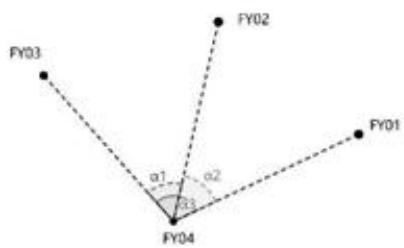

<details>
<summary>text_image</summary>

FY03
FY02
a1
a2
FY01
FY04
α3
</details>

图 1-1 无人机接收方向信息示意图

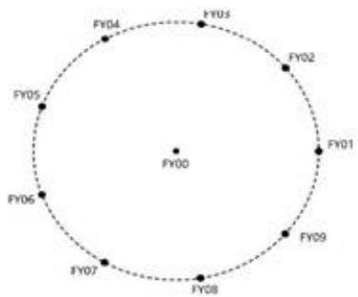

<details>
<summary>donut</summary>

| Fiscal Year | Position |
| --- | --- |
| FY00 | Center |
| FY01 | Rightmost point |
| FY02 | Top-right point |
| FY03 | Top-left point |
| FY04 | Top-left point |
| FY05 | Bottom-left point |
| FY06 | Bottom-left point |
| FY07 | Bottom-right point |
| FY08 | Bottom-right point |
| FY09 | Bottom-right point |
</details>

图 1-2 圆形无人机编队示意图

## 1.2 问题重述

问题1：编队由10架无人机组成，形成圆形编队，其中编号FY01～FY09的9架无人机均匀分布在某一圆周上，另一架无人机（编号FY00）位于圆心（见图1-2）。第一小问：假定位于圆心无人机（FY00）和编队中另2架无人机的发射信号，在发射信号无人机位置无偏且编号已知条件下，建立被动接收信号无人机的定位模型（被动接收无人机的位置有偏）。第二小问：探究某位置无人机在除FY00和FY01外，还需几架无人机发射信号（其他发射信号无人机编号位置，位置无偏），才能实现自身的有效定位。第三小问：按图1-2的编队要求。当初始时刻无人机的位置略有偏差，给出合理具体的无人机位置调整方案，发射信号的无人机数为圆心无人机FY00和圆周上最多3架无人机，进过多次调整，实现所有无人机在理想位置。

问题2：实际飞行中，无人机集群存在其他编队队形，如锥形编队队形（见图1-3，相邻两架无人机的直线间距相等）。考虑纯方位无源定位情形，设计无

人机调整方案。

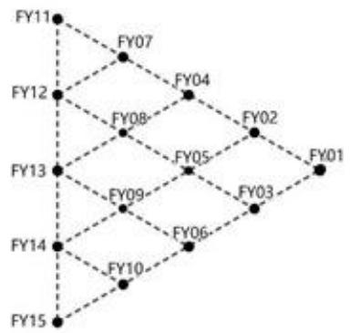

<details>
<summary>flowchart</summary>

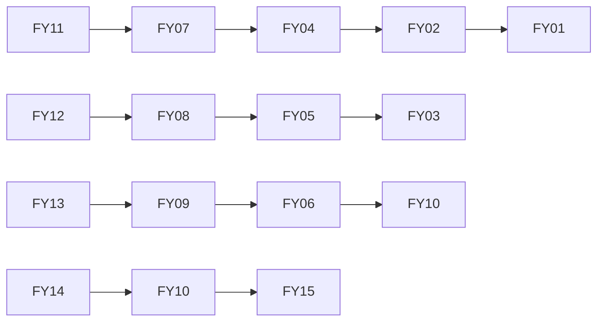
</details>

图 1-3 锥形无人机编队示意图

## 二、问题分析

## 2.1 问题一（1）的分析

问题一首先根据无偏差的位置坐标确定圆周上两架发射信号无人机与单架接收信号无人机的相对位置关系，根据相对位置关系进行定位模型的分流，其中定位模型根据圆周上的三架无人机以及圆心无人机（FY00）之间的几何关系，利用正弦定理建立。最后在此定位模型的框架下，固定一架发射信号无人机位置，遍历第二架发射信号无人机和被动接收信号无人机的无偏位置坐标的所有可能，随机生成无偏坐标基础上的有偏接收无人机坐标值，求解出每一种可能情况下被动接收信号无人机的位置信息。

## 2.2 问题一（2）的分析

问题二首先确定来自编号FY01无人机发出的信号，此过程需要圆周上另外的两架无人机。通过两组无人机的三组角度信息确定FY01无人机发出的信息后，再从两架无人机中随机选择一架所提供的角度信息通过几何关系判断发射源与接收源的相对位置（此处假设被动接收信号无人机知道自身编号），根据相对位置的条件再进一步确定未知编号发射信号无人机的编号，从而利用已知的角度信息和坐标信息，代入问题一所得的定位模型，计算出被动接收信号无人机的实际坐标，建立偏差值的范围判定定位有效性，将实际坐标与无偏坐标作差并对比偏差值的范围，得出结论。

## 2.3 问题一（3）的分析

问题三首先分析给定的无人机初始位置表，确定基准圆周，本题考虑FY02 $\left(\rho_{2},\theta_{2}\right)$ 、FY05 $\left(\rho_{5},\theta_{5}\right)$ 、FY08 $\left(\rho_{8},\theta_{8}\right)$ 所在半径98m的圆作为调整方案的理想圆周。调整方案大致分为三大步骤：一、 $\theta_{2}$ 、 $\theta_{5}$ 、 $\theta_{8}$ 的调整，使得无人机FY02、FY05、FY08的相对位置接近理想值或达到理想值。二、由步骤一得到 $\theta_{2}^{\prime}$ 、 $\theta_{5}^{\prime}$ 、 $\theta_{8}^{\prime}$ ，将其作为发射信号无人机，且为圆周上的参考系，调整余下圆周上所有无人机的角度坐标 $\theta_{k},k=1,3,\ldots,9$ 。三、经过前两步骤的调整，此时所有无人机均匀分布在以无人机FY00为圆心的同心圆上，以无人机FY02、FY05、FY08为参照系，利用几何关系调整其余无人机的长度坐标 $\rho_{k},k=1,3,\ldots,9$ ，使得所有无人机均匀分布在半径为98m的圆上。

## 2.4 问题二的分析

问题二首先在锥形编队内找出一个无人机，使得以它作为圆心，划分多个同心圆，是尽可能多的无人机的理想坐标在圆周上，此无人机编号确定为FY05，随后分组调整无人机，每组包括的无人机为相互所成圆形编队的无人机，最后套用问题一（3）的方案模型，对各个圆形编队的无人机进行调整。唯一单独考虑的无人机编号为FY11和FY15，采用调整位置后的两组共线发射信号的无人机与FY05所成的角度信息的变化关系进去制定调整方案。

## 三、模型假设

1、假设无人机发射信号与接收信号稳定不受干扰。  
2、假设忽略被动接受无人机处理信号的时间。  
3、假设每架无人机知道自身编号以及相对位置关系。

## 四、符号说明

<table><tr><td>符号</td><td>含义</td></tr><tr><td>k</td><td>被动接收信号无人机k</td></tr></table>

<table><tr><td>i</td><td>圆周上发射信号无人机i</td></tr><tr><td>j</td><td>圆周上发射信号无人机j</td></tr><tr><td> $(\rho_i, \theta_i)$ </td><td>极坐标下无人机i的坐标点</td></tr><tr><td> $\alpha_i$ </td><td>表示无人机i与无人机FY00发出的角度信息</td></tr><tr><td> $\alpha_j$ </td><td>表示无人机j与无人机FY00发出的角度信息</td></tr><tr><td>n</td><td>表示无人机i与无人机k之间间隔的无人机数量</td></tr><tr><td> $(\rho_i', \theta_i')$ </td><td>无人机i在均匀分布下的无偏坐标值</td></tr><tr><td> $\alpha_i'$ </td><td>表示无人机FY0i与FY00发出的无偏角度信息</td></tr></table>

注：其他符号将在下文中给出具体说明。

## 五、问题一（1）模型的建立与求解

## 5.1 相对位置关系的确立

根据无人机圆形编队的特性，以圆心无人机FY00为原点建立极坐标系，则圆周上的两架发射信号的无人机和所需确立位置坐标的被动接收无人机坐标可分别表示为 $(\rho_{i},\theta_{i})$ 、 $(\rho_{j},\theta_{j})$ 、 $(\rho_{k},\theta_{k})$ 。根据 $\theta_{i}$ 、 $\theta_{j}$ 、 $\theta_{k}$ ，将相对位置关系分为如下三类（其中包括9种形态， $i,j$ 为发射信号无人机， $k$ 为接收信号无人机， $\theta_{i} < \theta_{j}$ ）。

① $\theta_{i}<\theta_{j}<\theta_{k}$  
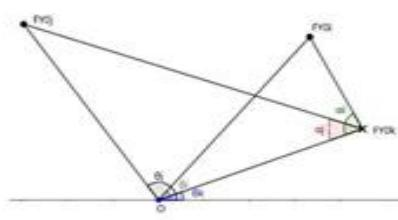

<details>
<summary>text_image</summary>

Geometric diagram with labeled points and angles, showing triangle relationships and right-angle markers
</details>

a

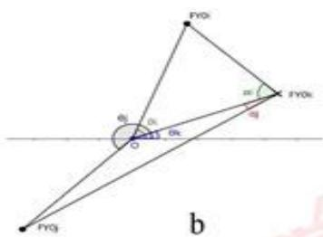

<details>
<summary>text_image</summary>

FVO
FVOI
θi
θk
O
a
a
b
</details>

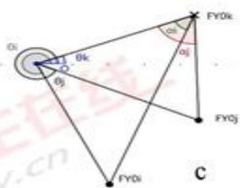

<details>
<summary>text_image</summary>

O
θk
θj
FY0k
C
FY0j
</details>

图 5-1 相对位置关系图-1

② $\theta_{i}<\theta_{k}<\theta_{j}$

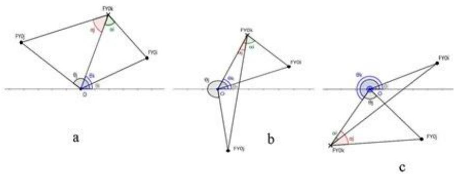

<details>
<summary>text_image</summary>

a
b
c
</details>

图 5-2 相对位置关系图-2

③ $\theta_{k}<\theta_{i}<\theta_{j}$

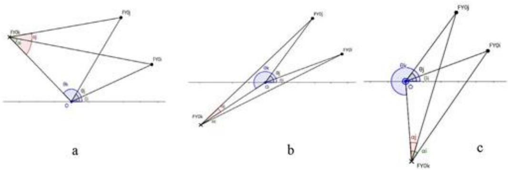  
图 5-3 相对位置关系图-3

在针对以上三类九种形态的位置关系仅考虑分类讨论的类别全面性分析的完整性，但在求解过程中，发现类别①与类别③对应的位置关系在几何上具有对称性，可通过旋转重叠，则定位模型是一致可互通的，所以定位模型忽略类别③的分析，且在程序上为方便遍历，也忽略了类别③。仅对类别①与类别②做定位模型的建立，共六个具体模型公式。

## 5.2 定位模型的确立

第一类下，a形态： $\theta_{k}^{*} - \theta_{i} <   \pi ,\theta_{k}^{*} - \theta_{j} <   \pi$

指 ok 与 oj、oi 所成夹角均小于 $180^{\circ}$ ，其中， $\theta_{k}^{*}$ 表示被动接收信号的无人机所对应位置上的无偏角度坐标。

接收到的方向信息 $\alpha_{i},\alpha_{j}$ ，通过几何角度表示如下：

$$
\left\{ \begin{array}{l} \alpha_ {i} = \frac {\pi - \theta_ {k} ^ {\prime} + \theta_ {i}}{2} + \varepsilon_ {i} \\ \alpha_ {j} = \frac {\pi - \theta_ {k} ^ {\prime} + \theta_ {j}}{2} + \varepsilon_ {j} \end{array} \right. \tag {1-1}
$$

其中， $\alpha_{i}$ 表示 FY00 与 FY0i 发出的角度信息，即 $\angle oki$ ；

$\alpha_{j}$ 表示 FY00 与 FY0j 发出的角度信息，即 $\angle okj$ ;

$\varepsilon_{i}$ 表示接收的信号角度 $\angle oki$ 的值存在的偏差；

$\varepsilon_{j}$ 表示接收的信号角度 $\angle okj$ 的值存在的偏差；

由正弦定理可得如下等式：

$$
\left\{ \begin{array}{l} \frac {\rho_ {k}}{\sin \left(\theta_ {k} + \alpha_ {j} - \theta_ {j}\right)} = \frac {\rho_ {j}}{\sin \alpha_ {j}} \\ \frac {\rho_ {k}}{\sin \left(\theta_ {k} + \alpha_ {i} - \theta_ {i}\right)} = \frac {\rho_ {i}}{\sin \alpha_ {i}} \end{array} \right. \tag {1-2}
$$

长度变量 $\rho_{k}$ 可通过式（1-2）分离所得：

$$
\rho_ {k} = \frac {\rho_ {i} \bullet \sin \left(\theta_ {k} + \alpha_ {i} - \theta_ {i}\right)}{\sin \alpha_ {i}} \text {或} \rho_ {k} = \frac {\rho_ {j} \bullet \sin \left(\theta_ {k} + \alpha_ {j} - \theta_ {j}\right)}{\sin \alpha_ {j}} \tag {1-3}
$$

由于式（1-3）中的两个等式是等价的，下文将选取 $\rho_{k},\alpha_{j}$ 的等式。

角度变量 $\theta_{k}$ 可通过式（1-2）联立所得：

$$
\tan \theta_ {k} = \frac {\sin (\alpha_ {j} - \theta_ {j}) \cdot \sin \alpha_ {i} - \sin (\alpha_ {i} - \theta_ {i}) \cdot \sin \alpha_ {j}}{\cos (\alpha_ {i} - \theta_ {i}) \cdot \sin \alpha_ {j} - \cos (\alpha_ {j} - \theta_ {j}) \cdot \sin \alpha_ {i}} \tag {1-4}
$$

联合式（1-3）、式（1-4），给出定位模型1：

$$
\begin{array}{l} \left\{ \begin{array}{l} \rho_ {k} = \frac {\rho_ {j} \cdot \sin \left(\theta_ {k} + \alpha_ {j} - \theta_ {j}\right)}{\sin \alpha_ {j}} \\ \tan \theta_ {k} = \frac {\sin (\alpha_ {j} - \theta_ {j}) \cdot \sin \alpha_ {i} - \sin (\alpha_ {i} - \theta_ {i}) \cdot \sin \alpha_ {j}}{\cos (\alpha_ {i} - \theta_ {i}) \cdot \sin \alpha_ {j} - \cos (\alpha_ {j} - \theta_ {j}) \cdot \sin \alpha_ {i}} \end{array} \right. \\ \begin{array}{l} \text {s.t.} \left\{ \begin{array}{l} \theta_ {i} <   \theta_ {j} <   \theta_ {k} \\ \theta_ {k} ^ {\prime} - \theta_ {i} <   \pi \\ \theta_ {k} ^ {\prime} - \theta_ {j} <   \pi \\ \alpha_ {i} = (\pi - \theta_ {k} ^ {\prime} + \theta_ {i}) / 2 + \varepsilon_ {i} \\ \alpha_ {j} = (\pi - \theta_ {k} ^ {\prime} + \theta_ {j}) / 2 + \varepsilon_ {j} \end{array} \right. \end{array} \tag {1-5} \\ \end{array}
$$

第一类下，b形态： $\theta_{k}^{\prime}-\theta_{i}>\pi,\theta_{k}^{\prime}-\theta_{j}<\pi$

指 ok 与 oi 所成夹角大于 $180^{\circ}$ ，ok 与 oj 所成夹角小于 $180^{\circ}$ 。

接收到的方向信息 $\alpha_{i},\alpha_{j}$ ，通过几何角度表示如下：

$$
\left\{ \begin{array}{l} \alpha_ {i} = \frac {\theta_ {k} ^ {\prime} - \theta_ {i} - \pi}{2} + \varepsilon_ {i} \\ \alpha_ {j} = \frac {\pi - \theta_ {k} ^ {\prime} + \theta_ {j}}{2} + \varepsilon_ {j} \end{array} \right. \tag {1-6}
$$

由正弦定理可得如下等式：

$$
\left\{ \begin{array}{l} \frac {\rho_ {k}}{\sin \left(\theta_ {k} + \alpha_ {j} - \theta_ {j}\right)} = \frac {\rho_ {j}}{\sin \alpha_ {j}} \\ \frac {\rho_ {k}}{\sin \left(\theta_ {k} + \alpha_ {i} + \theta_ {i}\right)} = \frac {\rho_ {i}}{\sin \alpha_ {i}} \end{array} \right. \tag {1-7}
$$

长度变量 $\rho_{k}$ 可通过式（1-7）分离所得：

$$
\rho_ {k} = \frac {\rho_ {i} \bullet \sin \left(\theta_ {k} + \alpha_ {i} + \theta_ {i}\right)}{\sin \alpha_ {i}} \text {或} \rho_ {k} = \frac {\rho_ {j} \bullet \sin \left(\theta_ {k} + \alpha_ {j} - \theta_ {j}\right)}{\sin \alpha_ {j}} \tag {1-8}
$$

由于式（1-8）中的两个等式是等价的，下文将选取 $\rho_{k},\alpha_{j}$ 的等式。

角度变量 $\theta_{k}$ 可通过式（1-7）联立所得：

$$
\tan \theta_ {k} = \frac {\sin (\theta_ {j} - \alpha_ {j}) \cdot \sin \alpha_ {i} + \sin (\alpha_ {i} + \theta_ {i}) \cdot \sin \alpha_ {j}}{\cos (\alpha_ {i} + \theta_ {i}) \cdot \sin \alpha_ {j} + \cos (\alpha_ {j} - \theta_ {j}) \cdot \sin \alpha_ {i}} \tag {1-9}
$$

联合式（1-8）、式（1-9），给出定位模型2：

$$
\left\{ \begin{array}{l} \rho_ {k} = \frac {\rho_ {j} \cdot \sin \left(\theta_ {k} + \alpha_ {j} - \theta_ {j}\right)}{\sin \alpha_ {j}} \\ \tan \theta_ {k} = \frac {\sin (\theta_ {j} - \alpha_ {j}) \cdot \sin \alpha_ {i} + \sin (\alpha_ {i} + \theta_ {i}) \cdot \sin \alpha_ {j}}{\cos (\alpha_ {i} + \theta_ {i}) \cdot \sin \alpha_ {j} + \cos (\alpha_ {j} - \theta_ {j}) \cdot \sin \alpha_ {i}} \end{array} \right.
$$

$$
\text {s.t.} \left\{ \begin{array}{l} \theta_ {i} <   \theta_ {j} <   \theta_ {k} \\ \theta_ {k} ^ {\prime} - \theta_ {i} > \pi \\ \theta_ {k} ^ {\prime} - \theta_ {j} <   \pi \\ \alpha_ {i} = (\theta_ {k} ^ {\prime} - \theta_ {i} - \pi) / 2 + \varepsilon_ {i} \\ \alpha_ {j} = (\pi - \theta_ {k} ^ {\prime} + \theta_ {j}) / 2 + \varepsilon_ {j} \end{array} \right. \tag {1-10}
$$

此后 4 种状态的定位模型分析情况与上述分析一致，篇幅原因不再赘述，下文直接给出定位模型表达式：

第一类下，c形态： $\theta_{k}^{\prime}-\theta_{i}>\pi,\theta_{k}^{\prime}-\theta_{j}>\pi$

指 ok 与 oi、oj 所成夹角均大于 $180^{\circ}$ 。

定位模型3:

$$
\begin{array}{l} \left\{ \begin{array}{l} \rho_ {k} = \frac {\rho_ {j} \cdot \sin \left(\theta_ {k} + \alpha_ {j} + \theta_ {j}\right)}{\sin \alpha_ {j}} \\ \tan \theta_ {k} = \frac {\sin (\theta_ {j} + \alpha_ {j}) \cdot \sin \alpha_ {i} - \sin (\alpha_ {i} + \theta_ {i}) \cdot \sin \alpha_ {j}}{\cos (\alpha_ {j} - \theta_ {j}) \cdot \sin \alpha_ {i} - \cos (\alpha_ {i} + \theta_ {i}) \cdot \sin \alpha_ {j}} \end{array} \right. \\ \begin{array}{l} \text {s.t.} \left\{ \begin{array}{l} \theta_ {i} <   \theta_ {j} <   \theta_ {k} \\ \theta_ {k} ^ {\prime} - \theta_ {i} > \pi \\ \theta_ {k} ^ {\prime} - \theta_ {j} > \pi \\ \alpha_ {i} = (\theta_ {k} ^ {\prime} - \theta_ {i} - \pi) / 2 + \varepsilon_ {i} \\ \alpha_ {j} = (\theta_ {k} ^ {\prime} - \theta_ {j} - \pi) / 2 + \varepsilon_ {j} \end{array} \right. \end{array} \tag {1-11} \\ \end{array}
$$

第二类下，a形态： $\theta_{k}^{\prime}-\theta_{i}<\pi,\theta_{j}-\theta_{k}^{\prime}<\pi$

定位模型 4:

$$
\left\{ \begin{array}{l} \rho_ {k} = \frac {\rho_ {j} \cdot \sin (\alpha_ {j} + \theta_ {j} - \theta_ {k})}{\sin \alpha_ {j}} \\ \tan \theta_ {k} = \frac {\sin (\theta_ {j} + \alpha_ {j}) \cdot \sin \alpha_ {i} - \sin (\alpha_ {i} - \theta_ {i}) \cdot \sin \alpha_ {j}}{\cos (\alpha_ {j} + \theta_ {j}) \cdot \sin \alpha_ {i} + \cos (\alpha_ {i} - \theta_ {i}) \cdot \sin \alpha_ {j}} \end{array} \right.
$$

$$
\text {s.t.} \left\{ \begin{array}{l} \theta_ {i} <   \theta_ {k} <   \theta_ {j} \\ \theta_ {k} ^ {\prime} - \theta_ {i} <   \pi \\ \theta_ {j} - \theta_ {k} ^ {\prime} <   \pi \\ \alpha_ {i} = (\pi - \theta_ {k} ^ {\prime} + \theta_ {i}) / 2 + \varepsilon_ {i} \\ \alpha_ {j} = (\pi - \theta_ {j} + \theta_ {k} ^ {\prime}) / 2 + \varepsilon_ {j} \end{array} \right. \tag {2-1}
$$

第二类下，b形态： $\theta_{k}^{\prime}-\theta_{i}>\pi,\theta_{j}-\theta_{k}^{\prime}<\pi$

定位模型 5:

$$
\left\{ \begin{array}{l} \rho_ {k} = \frac {\rho_ {j} \cdot \sin \left(\theta_ {k} - \alpha_ {j} - \theta_ {j}\right)}{\sin \alpha_ {j}} \\ \tan \theta_ {k} = \frac {\sin (\alpha_ {i} - \theta_ {i}) \cdot \sin \alpha_ {j} - \sin (\theta_ {j} + \alpha_ {j}) \cdot \sin \alpha_ {i}}{\cos (\alpha_ {i} - \theta_ {i}) \cdot \sin \alpha_ {j} - \cos (\alpha_ {j} + \theta_ {j}) \cdot \sin \alpha_ {i}} \end{array} \right.
$$

$$
s. t. \left\{ \begin{array}{l} \theta_ {i} <   \theta_ {k} <   \theta_ {j} \\ \theta_ {k} ^ {\prime} - \theta_ {i} > \pi \\ \theta_ {j} - \theta_ {k} ^ {\prime} <   \pi \\ \alpha_ {i} = (\theta_ {k} ^ {\prime} - \theta_ {i} - \pi) / 2 + \varepsilon_ {i} \\ \alpha_ {j} = (\pi - \theta_ {j} + \theta_ {k} ^ {\prime}) / 2 + \varepsilon_ {j} \end{array} \right. \tag {2-2}
$$

第二类下，III形态： $\theta_{k}^{\prime}-\theta_{i}<\pi,\theta_{j}-\theta_{k}^{\prime}>\pi$

定位模型6: $\left\{ \begin{array}{l}\rho_{k} = \frac{\rho_{j}\bullet\sin\left(\theta_{k} + \alpha_{j} - \theta_{j}\right)}{\sin\alpha_{j}}\\ \tan \theta_{k} = \frac{\sin(\alpha_{i} - \theta_{i})\bullet\sin\alpha_{j} + \sin(\alpha_{j} - \theta_{j})\bullet\sin\alpha_{i}}{\cos(\alpha_{i} - \theta_{i})\bullet\sin\alpha_{j} + \cos(\alpha_{j} - \theta_{j})\bullet\sin\alpha_{i}} \end{array} \right.$ (2-3)

$$
\text {s.t.} \left\{ \begin{array}{l} \theta_ {i} <   \theta_ {k} <   \theta_ {j} \\ \theta_ {k} ^ {\prime} - \theta_ {i} <   \pi \\ \theta_ {j} - \theta_ {k} ^ {\prime} > \pi \\ \alpha_ {i} = (\pi - \theta_ {k} ^ {\prime} + \theta_ {i}) / 2 + \varepsilon_ {i} \\ \alpha_ {j} = (\theta_ {j} - \theta_ {k} ^ {\prime} - \pi) / 2 + \varepsilon_ {j} \end{array} \right.
$$

## 5.3 定位模型的求解

本题利用遍历算法，遍历每一种定位模型下所有可能存在的无人机位置关系，输入已知量 $\alpha_{i},\alpha_{j},\theta_{i}^{\prime}(\rho_{i},\theta_{i}),(\rho_{j},\theta_{j})$ 。其中 $\alpha_{i},\alpha_{j}$ 中所带的偏差量 $\varepsilon_i,\varepsilon_j$ 的范围均为 $-1^{\circ}$ 到 $1^{\circ}$ 。以步长为 $0.1^{\circ}$ 在偏差量 $\varepsilon_{i},\varepsilon_{j}$ 的范围呢遍历计算每一个 $\alpha_{i},\alpha_{j}$ 所对应的无人机 $k$ 的实际位置坐标。

Step1: 将发射信号无人机 $i$ 的坐标始终固定，为 $(\rho_i, 0)$ ， $\rho_i = 100m$ ，遍历发射信号无人机 $j$ 的所有可能坐标位置；

Step2: 遍历定位模型 1-6 情况下, 被动接收无人机 $k$ 与无人机 $i$ , $j$ 的位置关系, 得出无偏情况下的接收到的角度信号, 记为 $\alpha_{i}^{'}$ , $\alpha_{j}^{'}$ ;

Step3: 已知实际接受角度信息 $\alpha_{i}, \alpha_{j}$ 的范围，以步长 $0.1^{\circ}$ 开始遍历，利用对应定位模型计算无人机 k 的实际坐标可能；

Step4: 记录所得全部结果，并绘图输出结果，作为本文所给定位模型的求解。

## 5.4 问题一（1）的结果分析

遍历结果如下图 5-4 所示:

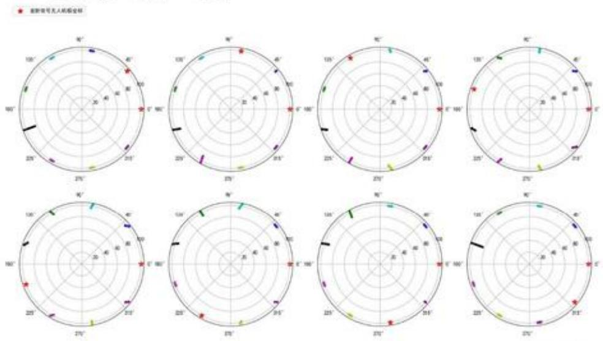

<details>
<summary>radar</summary>

| Latitude | \(N{}^{\circ}\) | Value |
| --- | --- | --- |
| \(N{}^{\circ}\) | ~\(40{}^{\circ}\) | ~80 |
| \(N{}^{\circ}\) | ~\(60{}^{\circ}\) | ~90 |
| \(N{}^{\circ}\) | ~\(80{}^{\circ}\) | ~80 |
| \(N{}^{\circ}\) | ~\(100{}^{\circ}\) | ~70 |
| \(N{}^{\circ}\) | ~\(120{}^{\circ}\) | ~60 |
| \(N{}^{\circ}\) | ~\(140{}^{\circ}\) | ~50 |
| \(N{}^{\circ}\) | ~\(160{}^{\circ}\) | ~40 |
| \(N{}^{\circ}\) | ~\(180{}^{\circ}\) | ~30 |
| \(N{}^{\circ}\) | ~\(200{}^{\circ}\) | ~20 |
| \(N{}^{\circ}\) | ~\(220{}^{\circ}\) | ~10 |
| \(N{}^{\circ}\) | ~\(240{}^{\circ}\) | ~5 |
| \(N{}^{\circ}\) | ~\(260{}^{\circ}\) | ~2 |
| \(N{}^{\circ}\) | ~\(280{}^{\circ}\) | ~1 |
| \(N{}^{\circ}\) | ~\(300{}^{\circ}\) | ~1 |
| \(N{}^{\circ}\) | ~\(320{}^{\circ}\) | ~1 |
| \(N{}^{\circ}\) | ~\(340{}^{\circ}\) | ~1 |
| \(N{}^{\circ}\) | ~\(360{}^{\circ}\) | ~1 |
| \(N{}^{\circ}\) | ~\(380{}^{\circ}\) | ~1 |
| \(N{}^{\circ}\) | ~\(400{}^{\circ}\) | ~1 |
| \(N{}^{\circ}\) | ~\(420{}^{\circ}\) | ~1 |
| \(N{}^{\circ}\) | ~\(440{}^{\circ}\) | ~1 |
| \(N{}^{\circ}\) | ~\(460{}^{\circ}\) | ~1 |
| \(N{}^{\circ}\) | ~\(480{}^{\circ}\) | ~1 |
| \(N{}^{\circ}\) | ~\(500{}^{\circ}\) | ~1 |
| \(N{}^{\circ}\) | ~\(520{}^{\circ}\) | ~1 |
| \(N{}^{\circ}\) | ~\(540{}^{\circ}\) | ~1 |
| \(N{}^{\circ}\) | ~\(560{}^{\circ}\) | ~1 |
| \(N{}^{\circ}\) | ~\(580{}^{\circ}\) | ~1 |
| \(N{}^{\circ}\) | ~\(600{}^{\circ}\) | ~1 |
| \(N{}^{\circ}\) | ~\(620{}^{\circ}\) | ~1 |
| \(N{}^{\circ}\) | ~\(640{}^{\circ}\) | ~1 |
| \(N{}^{\circ}\) | ~\(660{}^{\circ}\) | ~1 |
| \(N{}^{\circ}\) | ~\(680{}^{\circ}\) | ~1 |
| \(N{}^{\circ}\) | ~\(700{}^{\circ}\) | ~1 |
| \(N{}^{\circ}\) | ~\(720{}^{\circ}\) | ~1 |
| \(N{}^{\circ}\) | ~\(740{}^{\circ}\) | ~1 |
| \(N{}^{\circ}\) | ~\(760{}^{\circ}\) | ~1 |
| \(N{}^{\circ}\) | ~\(780{}^{\circ}\) | ~1 |
| \(N{}^{\circ}\) | ~\(800{}^{\circ}\) | ~1 |
| \(N{}^{\circ}\) | ~\(820{}^{\circ}\) | ~1 |
| \(N{}^{\circ}\) | ~\(840{}^{\circ}\) | ~1 |
| \(N{}^{\circ}\) | ~\(860{}^{\circ}\) | ~1 |
| \(N{}^{\circ}\) | ~\(880{}^{\circ}\) | ~1 |
| \(N{}^{\circ}\) | ~\(900{}^{\circ}\) | ~1 |
| \(N{}^{\circ}\) | ~\(920{}^{\circ}\) | ~1 |
| \(N{}^{\circ}\) | ~\(940{}^{\circ}\) | ~1 |
| \(N{}^{\circ}\) | ~\(960{}^{\circ}\) | ~1 |
| \(N{}^{\circ}\) | ~\(980{}^{\circ}\) | ~1 |
| \(N{}^{\circ}\) | ~\(1000{}^{\circ}\) | ~1 |
| \(N{}^{\circ}\) | ~\(1020{}^{\circ}\) | ~1 |
| \(N{}^{\circ}\) | ~\(1040{}^{\circ}\) | ~1 |
| \(N{}^{\circ}\) | ~\(1060{}^{\circ}\) | ~1 |
| \(N{}^{\circ}\) | ~\(1080{}^{\circ}\) | ~1 |
| \(N{}^{\circ}\) | ~\(1100{}^{\circ}\) | ~1 |
| \(N{}^{\circ}\) | ~\(1120{}^{\circ}\) | ~1 |
| \(N{}^{\circ}\) | ~\(1140{}^{\circ}\) | ~1 |
| \(N{}^{\circ}\) | ~\(1160{}^{\circ}\) | ~1 |
| \(N{}^{\circ}\) | ~\(1180{}^{\circ}\) | ~1 |
| \(N{}^{\circ}\) | ~\(1200{}^{\circ}\) | ~1 |
| \(N{}^{\circ}\) | ~\(1220{}^{\circ}\) | ~1 |
| \(N{}^{\circ}\) | ~\(1240{}^{\circ}\) | ~1 |
| \(N{}^{\circ}\) | ~\(1260{}^{\circ}\) | ~1 |
| \(N{}^{\circ}\) | ~\(1280{}^{\circ}\) | ~1 |
| \(N{}^{\circ}\) | ~\(1300{}^{\circ}\) | ~1 |
| \(N{}^{\circ}\) | ~\(1320{}^{\circ}\) | ~1 |
| \(N{}^{\circ}\) | ~\(1340{}^{\circ}\) | ~1 |
| \(N{}^{\circ}\) | ~\(1360{}^{\circ}\) | ~1 |
| \(N{}^{\circ}\) | ~\(1380{}^{\circ}\) | ~1 |
| \(N{}^{\circ}\) | ~\(1400{}^{\circ}\) | ~1 |
| \(N{}^{\circ}\) | ~\(1420{}^{\circ}\) | ~1 |
| \(N{}^{\circ}\) | ~\(1440{}^{\circ}\) | ~1 |
| \(N{}^{\circ}\) | ~\(1460{}^{\circ}\) | ~1 |
| \(N{}^{\circ}\) | ~\(1480{}^{\circ}\) | ~1 |
| \(N{}^{\circ}\) | ~\(1500{}^{\circ}\) | ~1 |
| \(N{}^{\circ}\) | ~\(1520{}^{\circ}\) | ~1 |
| \(N{}^{\circ}\) | ~\(1540{}^{\circ}\) | ~1 |
| \(N{}^{\circ}\) | ~\(1560{}^{\circ}\) | ~1 |
| \(N{}^{\circ}\) | ~\(1580{}^{\circ}\) | ~1 |
| \(N{}^{\circ}\) | ~\(1600{}^{\circ}\) | ~1 |
| \(N{}^{\circ}\) | ~\(1620{}^{\circ}\) | ~1 |
| \(N{}^{\circ}\) | ~\(1640{}^{\circ}\) | ~1 |
| \(N{}^{\circ}\) | ~\(1660{}^{\circ}\) | ~1 |
| \(N{}^{\circ}\) | ~\(1680{}^{\circ}\) | ~1 |
| \(N{}^{\circ}\) | ~\(1700{}^{\circ}\) | ~1 |
| \(N{}^{\circ}\) | ~\(1720{}^{\circ}\) | ~1 |
| \(N{}^{\circ}\) | ~\(1740{}^{\circ}\) | ~1 |
| \(N{}^{\circ}\) | ~\(1760{}^{\circ}\) | ~1 |
| \(N{}^{\circ}\) | ~\(1780{}^{\circ}\) | ~1 |
| \(N{}^{\circ}\) | ~\(1800{}^{\circ}\) | ~1 |
| \(N{}^{\circ}\) | ~\(1820{}^{\circ}\) | ~1 |
| \(N{}^{\circ}\) | ~\(1840{}^{\circ}\) | ~1 |
| \(N{}^{\circ}\) | ~\(1860{}^{\circ}\) | ~1 |
| \(N{}^{\circ}\) | ~\(1880{}^{\circ}\) | ~1 |
| \(N{}^{\circ}\) | ~\(1900{}^{\circ}\) | ~1 |
| \(N{}^{\circ}\) | ~\(1920{}^{\circ}\) | ~1 |
| \(N{}^{\circ}\) | ~\(1940{}^{\circ}\) | ~1 |
| \(N{}^{\circ}\) | ~\(1960{}^{\circ}\) | ~1 |
| \(N{}^{\circ}\) | ~\(1980{}^{\circ}\) | ~1 |
| \(N{}^{\circ}\) | ~\(2000 {}^{ \cdot }\) | ~5555555555555555555555555555555555555555555555555555555555555555555555555555555555555555555555555555.<nl> |
</details>

图 5-4 全局定位结果展示图

图中两个五星点为发射信号无人机的无偏坐标点，其中始终视为一架无人机的坐标处于(100,0)，彩色点群表示被动接收无人机k所对应的实际坐标的可能位置，其中颜色顺序即为位置遍历的顺序，每个点群包含了20个实际坐标点，如图可以看出被动接收无人机的实际位置略有偏差但满足均匀分布于圆周上。体现所给定位模型的合理性与准确性。

## 六、问题一（2）模型的建立与求解

通过问题一（1）的定位模型可知，对于被动接收信号的无人机有效定位需要输入的已知量有 $\alpha_{i},\alpha_{j},\theta_{k}^{\prime},(\rho_{i},\theta_{i}),(\rho_{j},\theta_{j})$ ，即两架圆周上已知编号的发射信号无人机 $i,j$ 发射的角度信息以及自身坐标信息和被动接收消息无人机相对位置的无偏角度。问题二给出FY00和FY01的具体位置，在接收信号无人机 $k$ 已知自身编号（确定与FY01的相对位置）的情况下，初步确定为另需一架无人机发射信号，因为发射信号的无人机位置无偏，所以通过确定该无人机与自身的相对位置，即可对自身进行有效定位。

## 6.1 未知编号信号发射无人机与接收无人机相对位置的确定

假定被动接收信号的无人机 k 知道自身具体编号， $k=2,3,\ldots,9$ ，即自身与编号 FY01 无人机的相对位置已知，基于此，再引入一架未知编号的发射信号无人机，记做 FY0i（简称“无人机 i”）。

## 6.1.1 确定 FY0k 与 FY0i 的相对位置关系

对于 FY0i，FY0k 接收到其与 FY00 所成的角度信息和与 FY01 所成的角度信息，即图 6-1 所示 $\alpha_{i}$ （∠ik0）和 $\lambda_{i}$ （∠ik1）

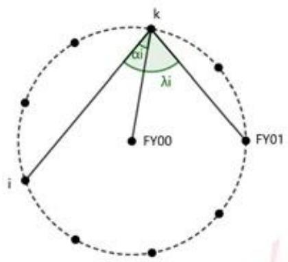

<details>
<summary>text_image</summary>

k
αi
λi
FY00
i
FY01
</details>

图 6-1 接收信号示意图

在圆形编队内，由于分布的均匀性和圆的对称性，在不考虑无人机自身存在微小位置偏差的情况下，定义 $\alpha_{i}^{'}$ 为无人机 $i$ 与无人机 $k$ 的无偏角度信息。 $\alpha_{i}^{'}$ 与无人机 $i$ 、无人机 $k$ 之间间隔的无人机数量 $n$ 存在如下表所示关系：

表 6-1 n 与 $\alpha'$ 的关系表

<table><tr><td>n(架)</td><td>0</td><td>1</td><td>2</td><td>3</td></tr><tr><td> $\alpha_{i}^{'}$ (°)</td><td>70</td><td>50</td><td>30</td><td>10</td></tr></table>

由于考虑被动接收信号的无人机 $k$ 存在的偏差不足 $y$ 影响相对位置的判断，所以 $\alpha_{i} \approx \alpha_{i}^{'}$ 成立，得出无人机 $i$ ， $k$ 相对位置的关系式如下：

$$
n = \frac {1 8 0 ^ {\circ} - 2 \alpha_ {i} ^ {\prime}}{4 0 ^ {\circ}} - 1
$$

其中，n 表示无人机 i 与无人机 k 之间间隔的无人机数量。通过 n 即可初步判断无人机 i、k 的相对位置关系。

由于圆的对称性质，确定的无人机 $i$ 并不是唯一的，如上图6-1，存在无人机 $i'$ 具有相同的角度信息干扰判断，即 $\alpha_{i} \approx \alpha_{i'} \approx \alpha_{i'} \approx \alpha_{i'}'$ 。

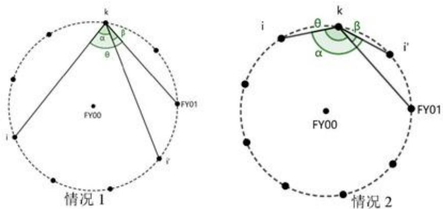  
图 6-2 无人机 i 与无人机 i 的关系图

## 6.1.2 锁定 FY0i 的相对位置坐标

由图6-2，可以观察FY01无人机与无人机i、无人机i'的发射信号形成的角度信息是不一致的，将无人机i、k、i'的信号角度记为 $\alpha$ ；无人机FY01、k、i'的信号角度记为 $\beta$ ；将无人机FY01、k、i的信号角度记为 $\theta$ 。无人机k可根据此信息的差异最终锁定这架未知编号无人机的相对位置坐标信息。

由于对称性，角 $\alpha$ 的无偏值与 $i, k$ 之间间隔的无人机数 $n$ 依旧有关系，如下

表所示：

表 6-2n 与 $\alpha$ 的关系表

<table><tr><td>n(架)</td><td>0</td><td>1</td><td>2</td><td>3</td></tr><tr><td>α(°)</td><td>140</td><td>100</td><td>60</td><td>20</td></tr></table>

角 $\alpha$ 、 $\beta$ 、 $\theta$ 存在如下关系式：

k=2, 3, 4, 5:

$$
\left\{ \begin{array}{l} \theta = \alpha + \beta , n > k - 2 \\ \theta = \alpha - \beta , n <   k - 2 \end{array} \right.
$$

k=6, 7, 8, 9;

$$
\left\{ \begin{array}{l} \theta = \alpha + \beta , n > 9 - k \\ \theta = \alpha - \beta , n <   9 - k \end{array} \right.
$$

其中根据无人机 k 与无人机 FY01 和无人机 i 之间分别间隔的无人机数量的比较确定三个角之间的数量关系，如图 6-2 所示。当 n 与 k 的关系取等号时，说明无人机 i 与无人机 FY01 关于无人机 k 对称。无人机 i 的相对位置坐标随即确定。

我们假定无人机 i 始终偏离无人机 FY01，无人机 i' 始终靠近无人机 FY01，则有角度角度大小关系如下：

k=2, 3, 4, 5:

$$
\left\{ \begin{array}{l} \theta > \alpha > \beta , n > k - 2 \\ \theta > \frac {\alpha}{2} > \beta , n <   k - 2 \end{array} \right.
$$

k=6, 7, 8, 9:

$$
\left\{ \begin{array}{l} \theta > \alpha > \beta , n > 9 - k \\ \theta > \frac {\alpha}{2} > \beta , n <   9 - k \end{array} \right.
$$

即判断 $\lambda_{1} \approx \theta$ 或 $\lambda_{2} \approx \beta$ 确定最终无人机FY0i的相对位置坐标

## 6.1.3 判断发射信号无人机 FY0i 的流程图展示

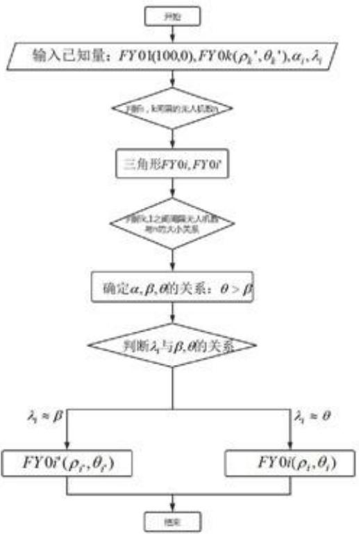

<details>
<summary>flowchart</summary>

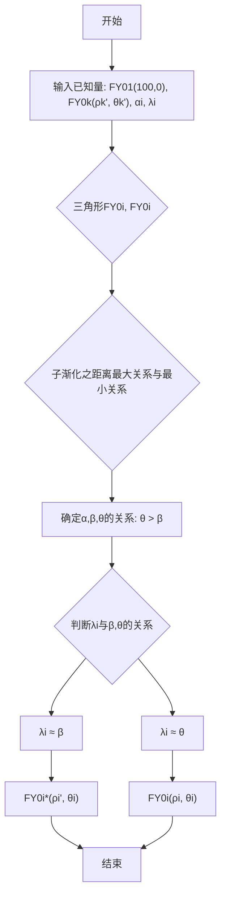
</details>

图6-3 求解流程图

## 6.2 问题一（2）的求解

本题求解采用仿真模拟算法，设定角度坐标随机偏差值正负 $1^{\circ}$ ，对每个 $k$ 的取值随机生成10500组无人机 $k$ 的实际坐标，再遍历发射信号无人机 $i$ 的所有可能位置，针对每一次确定后输入的 $\alpha_{i} (\angle ik0)$ 和 $\lambda_{i} (\angle ik1)$ 值进行求解发射信号无人机 $i$ 的坐标 $(\rho_{i}, \theta_{i})$ ，将所有已知量输入问题一（1）的定位模型，求解被动接收信号无人机 $k$ 的实际坐标，并利用与无偏坐标进行作差判断有效性。求解步骤如下：

Step1: 输入随机生成的 10500 组被动接收信号无人机 k 的实际坐标和发射信号无人机 i 的相对位置，其中无人机 i 的坐标位置，无人机 k 的无偏坐标已知；

Step2: 利用已知量 $\alpha_{i}$ 和 $\lambda_{i}$ 求解无人机 i 与无人机 k 之间间隔无人机数 n;

Step3: 判断 $n$ 和无人机 $k$ 与无人机FY01之间间隔无人机数量的数量关系，确定信号角度的数量关系；

Step4: 利用 $\lambda_{i}$ 与 Step3 所给信号角度的关系进行拟对，锁定无人机 i 的位置

坐标：

Step5: 取出已知量 $\alpha_{i}, \alpha_{1}, \theta_{k}, (\rho_{i}, \theta_{i}), (\rho_{1}, \theta_{1})$ ，利用问题一（1）的定位模型，求解无人机 k 的实际坐标 $(\rho_{k}, \theta_{k})$ 。

Step6: 计算模型求解实际坐标值与随机生成坐标值的平均偏差, 做有效性分析。

## 6.3 问题一（2）的结果分析

由于求解方法为仿真模拟，10500组具体结果以excel表格形式展示，篇幅问题，详解见支撑材料，文本内仅展示一种情况下的结果分析：

表 6-3 被动接收无人机 FY02 定位的遍历结果

<table><tr><td></td><td> $\angle i2i'$ 的无偏值</td><td> $\angle i21$ 的无偏值</td><td>FY0i</td><td>角度值的平均偏差</td><td>长度值的平均偏差</td></tr><tr><td>1</td><td>140.82</td><td>140.31</td><td>FY03</td><td>0.00</td><td>0.64</td></tr><tr><td>2</td><td>140.77</td><td>140.51</td><td>FY03</td><td>0.00</td><td>0.64</td></tr><tr><td>3</td><td>140.15</td><td>140.10</td><td>FY03</td><td>0.00</td><td>0.64</td></tr><tr><td>⋮</td><td>⋮</td><td>⋮</td><td>⋮</td><td>⋮</td><td>⋮</td></tr><tr><td>10499</td><td>100.19</td><td>19.84</td><td>FY09</td><td>1.00</td><td>0.00</td></tr><tr><td>10500</td><td>100.68</td><td>19.57</td><td>FY09</td><td>1.00</td><td>0.00</td></tr><tr><td>平均值</td><td>/</td><td>/</td><td>/</td><td>0.70</td><td>0.54</td></tr></table>

仿真模拟的准确率达到 $100\%$ 。上表展示的是随机 $k = 2$ 的10500组数据，遍历增加一架发射信号的无人机FY0i的所有可能位置，检测是否都能有效确定FY02的实际坐标。如表所示，在每种FY0i作为发射信号无人机的条件下，两个坐标值的平均偏差均较小。且未展示的其余7张表格的结果（支撑材料中见）也十分理想，说明除FY00和FY01外，仅需一架无人机发射信号，即可实现无人机的有效定位。

## 七、问题一（3）模型的建立与求解

## 7.1 基准圆周的选取

问题一（3）要求设计调整方案使得9架无人机最终均匀分布在某一圆周之上，根据题给无人机初始位置信息（如下表7-1所示），确定本题调整到的基准圆周为半径98m的圆上，即初始时刻无人机FY02、FY05、FY08所在的圆。即对应极坐标下，圆周上的无人机长度坐标的无偏值为 $\rho=98m$

表 7-1 无人机的初始位置

<table><tr><td>无人机编号</td><td>极坐标( $m,^\circ$ )</td></tr><tr><td>0</td><td>(0,0)</td></tr><tr><td>1</td><td>(100,0)</td></tr><tr><td>2</td><td>(98,40.10)</td></tr><tr><td>3</td><td>(112,80.21)</td></tr><tr><td>4</td><td>(105,119.75)</td></tr><tr><td>5</td><td>(98,159.86)</td></tr><tr><td>6</td><td>(112,199.96)</td></tr><tr><td>7</td><td>(105,240.07)</td></tr><tr><td>8</td><td>(98,280.17)</td></tr><tr><td>9</td><td>(112,320.28)</td></tr></table>

## 7.2 调整方案设计

## 7.2.1 调整方案步骤一

步骤一是调整无人机 FY02、FY05、FY08 初始位置角度坐标的数据，使其达到无偏理想值或误差尽可能小的理想值。

(1) 无人机 FY02、FY05、FY08 的信号发射与接收关系

根据两两之间的夹角与 $120^{\circ}$ 作差的绝对值的大小判断，判断模型为：

$$
\min \{| 1 2 0 - \theta_ {5} + \theta_ {2} |, | 1 2 0 - \theta_ {8} + \theta_ {5} |, | 1 2 0 - (2 \pi - \theta_ {8} + \theta_ {2}) | \} \tag {7-1}
$$

其中， $\theta$ 表示对应极坐标上的角度坐标。如图7-1，可表示为：

$$
\min \{| 1 2 0 - \beta_ {2 5} |, | 1 2 0 - \beta_ {5 8} |, | 1 2 0 - \beta_ {2 8} | \} \tag {7-2}
$$

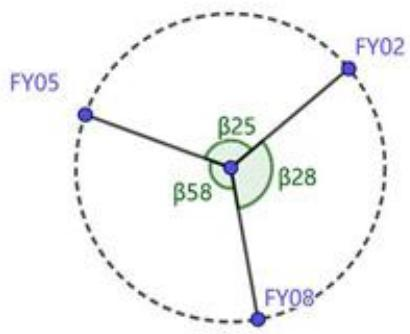

<details>
<summary>donut</summary>

| Fiscal Year | Value |
| --- | --- |
| FY02 | \(\beta25\) |
| FY05 | — |
| FY08 | \(\beta28\) |
| FY08 | \(\beta58\) |
</details>

图 7-1 两两夹角关系图

判断结果对应的角度下标值即为信号发射无人机的编号。本题结果为 $\left|120-\beta_{28}\right|<\left|120-\beta_{25}\right|<\left|120-\beta_{38}\right|$ ，即确定步骤一中圆周上发射信号无人机为FY02、FY08，被动接收信号无人机为FY05，且FY05需要调整位置坐标，FY02与FY08的相对位置视为理想位置，其坐标也为理想坐标点。

## (2) 无人机 FY05 位置坐标的调整

由问题一（1）中的定位模型4可知发射信号无人机i, j与被动接收信号无人机k的角度坐标关系式如下：

$$
\theta_ {k} = \arctan (\frac {\sin (\theta_ {j} + \alpha_ {j}) \cdot \sin \alpha_ {i} - \sin (\alpha_ {i} - \theta_ {i}) \cdot \sin \alpha_ {j}}{\cos (\alpha_ {j} + \theta_ {j}) \cdot \sin \alpha_ {i} + \cos (\alpha_ {i} - \theta_ {i}) \cdot \sin \alpha_ {j}}) \tag {7-3}
$$

根据发射信号无人机的理想坐标，我们可以确定接收信号无人机的理想角度坐标，记为 $\theta_{k}^{'}$ ，关系式如下：

$$
\theta_ {i} ^ {\prime} = \arctan (\frac {\sin (\theta_ {j} + \alpha_ {j} ^ {\prime}) \cdot \sin \alpha_ {i} ^ {\prime} - \sin (\alpha_ {i} ^ {\prime} - \theta_ {i}) \cdot \sin \alpha_ {j} ^ {\prime}}{\cos (\alpha_ {j} ^ {\prime} + \theta_ {j}) \cdot \sin \alpha_ {i} ^ {\prime} + \cos (\alpha_ {i} ^ {\prime} - \theta_ {i}) \cdot \sin \alpha_ {j} ^ {\prime}}) \tag {7-4}
$$

由于本题中无人机2、5、8相对位置对称的特殊性，可直接建立 $\alpha_{i}$ 与 $\alpha_{i}^{\prime}$ 的关系和 $\alpha_{j}$ 与 $\alpha_{j}^{\prime}$ 的关系：

$$
\alpha_ {i} ^ {\prime} = \alpha_ {i} - \frac {(\alpha_ {i} - \alpha_ {j})}{2} \tag {7-5}
$$

$$
\alpha_ {j} ^ {\prime} = \alpha_ {j} - \frac {(\alpha_ {j} - \alpha_ {i})}{2} \tag {7-6}
$$

联合式（7-3）、（7-4）、（7-5）、（7-6）得调整角度量 $\Delta\theta_{k}$ 的表达式：

$$
\begin{array}{l} \Delta \theta_ {k} = \arctan \left(\frac {\sin (\theta_ {j} + \alpha_ {j} - \frac {(\alpha_ {j} - \alpha_ {i})}{2}) \cdot \sin (\alpha_ {i} - \frac {(\alpha_ {i} - \alpha_ {j})}{2}) - \sin (\alpha_ {i} - \frac {(\alpha_ {i} - \alpha_ {j})}{2} - \theta_ {i}) \cdot \sin (\alpha_ {j} - \frac {(\alpha_ {j} - \alpha_ {i})}{2})}{\cos (\alpha_ {j} - \frac {(\alpha_ {j} - \alpha_ {i})}{2} + \theta_ {j}) \cdot \sin (\alpha_ {i} - \frac {(\alpha_ {i} - \alpha_ {j})}{2}) + \cos (\alpha_ {i} - \frac {(\alpha_ {i} - \alpha_ {j})}{2} - \theta_ {i}) \cdot \sin (\alpha_ {j} - \frac {(\alpha_ {j} - \alpha_ {i})}{2})}\right) \\ - \arctan (\frac {\sin (\theta_ {j} + \alpha_ {j}) \cdot \sin \alpha_ {i} - \sin (\alpha_ {i} - \theta_ {i}) \cdot \sin \alpha_ {j}}{\cos (\alpha_ {j} + \theta_ {j}) \cdot \sin \alpha_ {i} + \cos (\alpha_ {i} - \theta_ {i}) \cdot \sin \alpha_ {j}}) \\ \end{array}
$$

(7-7)

调整后的 $\beta_{25}$ 、 $\beta_{28}$ 、 $\beta_{58}$ 再进行式（7-2）的比较，通过迭代反复计算、更新无人机FY02、FY05、FY08的坐标，使得方案结果更加逼近无偏值。

## 7.2.2 调整方案步骤二

经过步骤一，圆周上确定三架发射信号无人机，编号分别为FY02、FY05、FY08，认定其坐标值为近似理想值，步骤二遍历其他任意无人机作为被动接收信号无人机，根据角度信息调整各自的角度坐标 $\theta_{k}$ ，使得所有无人机均匀分布在以FY00为圆心的同心圆之上。

## (1) 圆周上的信号发射无人机的选择

利用圆的对称关系，发现无人机2、5、8之间均间隔两架无人机，所以圆周上的信号发射无人机i, j的选择如下表7-2所示：

表 7-2 信号发射无人机的选择

<table><tr><td>k</td><td>252</td><td>52</td><td>2</td></tr><tr><td>i</td><td>2</td><td>5</td><td>8</td></tr><tr><td>j</td><td>5</td><td>8</td><td>2</td></tr></table>

选择情况如图 7-2 所示:

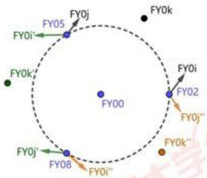

<details>
<summary>flowchart</summary>

This diagram illustrates the cyclical relationships and transitions between various fiscal years (FY00 to FY08) within a circular system.
</details>

图 7-2 选定发射信号无人机示意图

(2) 无人机 FY0k 角度坐标 $\theta_{k}$ 的调整

此步骤值调解 FY0k 的角度坐标，即 $\theta_{k}$ 。则长度坐标 $\rho_{k}$ 为无关变量，假定 $\rho_{k} = \rho_{i} = \rho_{j}$ 。由于对称性，调整模型只考虑一种情况下间隔内人两种不同情形。

由问题一（1）中的定位模型4可知发射信号无人机i，j与被动接收信号无人机k的角度坐标关系式如下：

$$
\theta_ {k} = \arctan (\frac {\sin (\theta_ {j} + \alpha_ {j}) \cdot \sin \alpha_ {i} - \sin (\alpha_ {i} - \theta_ {i}) \cdot \sin \alpha_ {j}}{\cos (\alpha_ {j} + \theta_ {j}) \cdot \sin \alpha_ {i} + \cos (\alpha_ {i} - \theta_ {i}) \cdot \sin \alpha_ {j}}) \tag {7-8}
$$

根据发射信号无人机的理想坐标，我们可以确定接收信号无人机的理想角度坐标，记为 $\theta_{k}^{'}$ ，关系式如下：

$$
\theta_ {k} ^ {\prime} = \arctan (\frac {\sin (\theta_ {j} + \alpha_ {j} ^ {\prime}) \cdot \sin \alpha_ {i} ^ {\prime} - \sin (\alpha_ {i} ^ {\prime} - \theta_ {i}) \cdot \sin \alpha_ {j} ^ {\prime}}{\cos (\alpha_ {j} ^ {\prime} + \theta_ {j}) \cdot \sin \alpha_ {i} ^ {\prime} + \cos (\alpha_ {i} ^ {\prime} - \theta_ {i}) \cdot \sin \alpha_ {j} ^ {\prime}}) \tag {7-9}
$$

信号角度 $\alpha_{i}$ 、 $\alpha_{j}$ 的大小关系决定了 $\alpha_{i}$ 与 $\alpha_{i}^{\prime}$ 的关系和 $\alpha_{j}$ 与 $\alpha_{j}^{\prime}$ 的关系表达式：

$$
\text {当} \alpha_ {i} <   \alpha_ {j} \text {时,} \left\{ \begin{array}{l} \alpha_ {i} ^ {\cdot} = \alpha_ {i} - \frac {\left(\alpha_ {i} - \alpha_ {j}\right) + 2 0}{2} \\ \alpha_ {j} ^ {\cdot} = \alpha_ {j} - \frac {\left(\alpha_ {i} - \alpha_ {j}\right) + 2 0}{2} \end{array} \right. \tag {7-10}
$$

$$
\mathrm{当} \alpha_ {i} > \alpha_ {j} \mathrm{时}, \left\{ \begin{array}{l l} \alpha_ {i} ^ {\prime} = \alpha_ {i} - \frac {(\alpha_ {i} - \alpha_ {j}) - 2 0}{2} \\ \alpha_ {j} ^ {\prime} = \alpha_ {j} - \frac {(\alpha_ {i} - \alpha_ {j}) - 2 0}{2} \end{array} \right.
$$

联合式（7-8）、（7-9）、（7-10）得调整角度量 $\Delta\theta_{k}$ 的表达式：

$$
\left\{ \begin{array}{l} \Delta \theta_ {k} = \arctan (\frac {\sin (\theta_ {j} + \alpha_ {j} - \frac {(\alpha_ {i} - \alpha_ {j})}{2} + 2 0) \cdot \sin (\alpha_ {i} - \frac {(\alpha_ {i} - \alpha_ {j})}{2} - 2 0) - \sin (\alpha_ {i} - \frac {(\alpha_ {i} - \alpha_ {j})}{2} - 2 0 - \theta_ {i}) \cdot \sin (\alpha_ {j} - \frac {(\alpha_ {i} - \alpha_ {j})}{2} + 2 0)}{\cos (\alpha_ {j} - \frac {(\alpha_ {i} - \alpha_ {j})}{2} + 2 0 + \theta_ {j}) \cdot \sin (\alpha_ {i} - \frac {(\alpha_ {i} - \alpha_ {j})}{2} - 2 0) + \cos (\alpha_ {i} - \frac {(\alpha_ {i} - \alpha_ {j})}{2} - 2 0 - \theta_ {i}) \cdot \sin (\alpha_ {j} - \frac {(\alpha_ {i} - \alpha_ {j})}{2} + 2 0)} \\ - \arctan (\frac {\sin (\theta_ {j} + \alpha_ {j}) \cdot \sin \alpha_ {i} - \sin (\alpha_ {i} - \theta_ {i}) \cdot \sin \alpha_ {j}}{\cos (\alpha_ {j} + \theta_ {j}) \cdot \sin \alpha_ {i} + \cos (\alpha_ {i} - \theta_ {i}) \cdot \sin \alpha_ {j}}, \quad \alpha_ {i} <   \alpha_ {j} \\ \Delta \theta_ {k} = \arctan (\frac {\sin (\theta_ {j} + \alpha_ {j} - \frac {(\alpha_ {i} - \alpha_ {j})}{2} - 2 0) \cdot \sin (\alpha_ {i} - \frac {(\alpha_ {i} - \alpha_ {j})}{2} + 2 0) - \sin (\alpha_ {i} - \frac {(\alpha_ {i} - \alpha_ {j})}{2} + 2 0 - \theta_ {i}) \cdot \sin (\alpha_ {j} - \frac {(\alpha_ {i} - \alpha_ {j})}{2} - 2 0)}{\cos (\alpha_ {j} - \frac {(\alpha_ {i} - \alpha_ {j})}{2} - 2 0 + \theta_ {j}) \cdot \sin (\alpha_ {i} - \frac {(\alpha_ {i} - \alpha_ {j})}{2} + 2 0) + \cos (\alpha_ {i} - \frac {(\alpha_ {i} - \alpha_ {j})}{2} + 2 0 - \theta_ {i}) \cdot \sin (\alpha_ {j} - \frac {(\alpha_ {i} - \alpha_ {j})}{2} - 2 0)} \\ - \arctan (\frac {\sin (\theta_ {j} + \alpha_ {j}) \cdot \sin \alpha_ {i} - \sin (\alpha_ {i} - \theta_ {i}) \cdot \sin \alpha_ {j}}{\cos (\alpha_ {j} + \theta_ {j}) \cdot \sin \alpha_ {i} + \cos (\alpha_ {i} - {\theta_ {i}}) \cdot \sin {\alpha_ {j}}}), \quad \alpha_ {i} > {\alpha_ {j}}. \end{array} \right.
$$

(7-11)

## 7.2.3 调整方案步骤三

经过步骤二，所有飞机的角度坐标均匀分布，相对位置分布呈现为同心圆的各个均匀分布点，这一步调整被动接收无人机 $k$ 的长度坐标，即 $\rho_{k}$ 。因为均匀分布， $\theta_{k}$ 可认为是无偏值或近似无偏，由步骤二求解得到，即 $\theta_{k} \approx \theta_{k}^{'}$ ， $k = 1,2,\dots,9$ 。

(1) 圆周上的信号发射无人机的选择

此过程与步骤二完全一致。

(2) 无人机 FY0k 长度坐标 $\rho_{k}$ 调整

此步骤求解 FY0k 长度坐标 $\rho_{k}$ ，如图利用正弦定理，建立 $\rho_{k}$ 的表达式以及目标长度坐标 $\rho_{k}^{'}$ 的表达式：

$$
\rho_ {k} = \frac {\rho_ {i}}{\sin \alpha_ {i}} \mathrm{sin} (\pi - \alpha_ {i} - \theta_ {k} + \theta_ {i}) \tag {7-12}
$$

$$
\rho_ {k} ^ {\prime} = \frac {\rho_ {i}}{\sin \alpha_ {i}} \cdot \sin (\pi - \alpha_ {i} ^ {\prime} - \theta_ {k} + \theta_ {i}) \tag {7-13}
$$

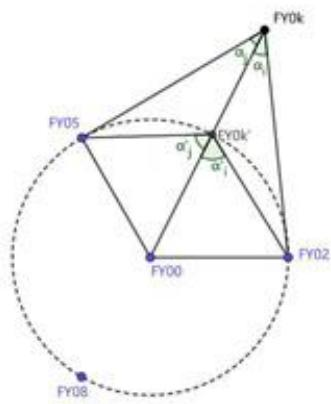

<details>
<summary>text_image</summary>

FY0k
α₁
α₂
FY05
α'₁
FY0k'
α'₂
FY00
FY02
FY08
</details>

图 7-3 长度坐标调整示意图

将式（7-12）、式（7-13）作差，得到调整长度量 $\Delta\rho_{k}$ 的表达式：

$$
\Delta \rho_ {k} = \frac {\rho_ {i}}{\sin \alpha_ {i}} \cdot \sin (\pi - \alpha_ {i} - \theta_ {k} + \theta_ {i}) - \frac {\rho_ {i}}{\sin \alpha_ {i}} \cdot \sin (\pi - \alpha_ {i} ^ {\prime} - \theta_ {k} + \theta_ {i}) \tag {7-14}
$$

其中， $\Delta\rho_{k}$ 的正负值有方向意义，当 $\Delta\rho_{k}$ 为正，则向圆心方向调整长度距离，当 $\Delta\rho_{k}$ 为负，则背离圆心方向调整长度距离。

## 7.3 方案模型的求解

## 7.3.1 方案模型汇总

总方案模型如下式所示：

调整方案步骤一： $\Delta \theta_{\mathrm{p}} = \arctan \left( \frac{\sin (\theta_{j} + \alpha_{j} - \frac {(\alpha_{j} - \alpha_{i})}{2}) \sin (\alpha_{i} - \frac {(\alpha_{i} - \alpha_{j})}{2}) - \sin (\alpha_{i} - \frac {(\alpha_{i} - \alpha_{j})}{2}) \theta_{j}) \sin (\alpha_{j} - \frac {(\alpha_{j} - \alpha_{i})}{2})}{\cos (\alpha_{j} - \frac {(\alpha_{j} - \alpha_{i})}{2} + \theta_{j}) \sin (\alpha_{i} - \frac {(\alpha_{i} - \alpha_{j})}{2}) + \cos (\alpha_{i} - \frac {(\alpha_{i} - \alpha_{j})}{2}) \theta_{j}) \sin (\alpha_{j} - \frac {(\alpha_{j} - \alpha_{i})}{2})}\right)$

$$
- \arctan \left(\frac {\sin \left(\theta_ {j} + \alpha_ {j}\right) \sin \alpha_ {i} - \sin \left(\alpha_ {i} - \theta_ {i}\right) \cdot \sin \alpha_ {j}}{\cos \left(\alpha_ {j} + \theta_ {j}\right) \sin \alpha_ {i} + \cos \left(\alpha_ {i} - \theta_ {i}\right) \cdot \sin \alpha_ {j}}\right), k = 5, i = 2, j = 8
$$

$$
\text {调整方案步骤二:} \left\{\begin{array}{l}\Delta \theta_ {s} = \arctan \left( \right.\frac {\sin \left(\theta_ {j} + \alpha_ {j} - \frac {\left(\alpha_ {i} - \alpha_ {j}\right)}{2} + 2 0\right) \sin \left(\alpha_ {i} - \frac {\left(\alpha_ {i} - \alpha_ {j}\right)}{2} - 2 0\right) - \sin \left(\alpha_ {i} - \frac {\left(\alpha_ {i} - \alpha_ {j}\right)}{2} - 2 0 - \theta_ {i}\right) \sin \left(\alpha_ {j} - \frac {\left(\alpha_ {i} - \alpha_ {j}\right)}{2} + 2 0\right)}{\cos \left(\alpha_ {j} - \frac {\left(\alpha_ {i} - \alpha_ {j}\right)}{2} + 2 0 + \theta_ {j}\right) \sin \left(\alpha_ {i} - \frac {\left(\alpha_ {i} - \alpha_ {j}\right)}{2} - 2 0\right) + \cos \left(\alpha_ {i} - \frac {\left(\alpha_ {i} - \alpha_ {j}\right)}{2} - 2 0 - \theta_ {i}\right) \sin \left( \right.\alpha_ {j} - \frac {\left(\alpha_ {i} - \alpha_ {j}\right)}{2} + 2 0)}\\- \arctan \left( \right.\frac {\sin \left(\theta_ {j} + \alpha_ {j}\right) \sin \alpha_ {i} - \sin \left(\alpha_ {i} - \theta_ {i}\right) \sin \alpha_ {j}}{\cos \left(\alpha_ {j} + \theta_ {j}\right) \sin \alpha_ {i} + \cos \left(\alpha_ {i} - \theta_ {i}\right) \sin \alpha_ {j}}, \alpha <   \alpha_ {j}\\k = 1, 3, 4, 6, 7, 9, i = 2, 5, 8, j = 2, 5, 8\\\Delta \theta_ {s} = \arctan \left( \right.\frac {\sin \left(\theta_ {j} + \alpha_ {j} - \frac {\left(\alpha_ {i} - \alpha_ {j}\right)}{2} - 2 0\right) \sin \left(\alpha_ {i} - \frac {\left(\alpha_ {i} - \alpha_ {j}\right)}{2} + 2 0\right) - \sin \left(\alpha_ {i} - \frac {\left(\alpha_ {i} - \alpha_ {j}\right)}{2} + 2 0 - \theta_ {i}\right) + \sin \left(\alpha_ {j} - \frac {\left(\alpha_ {i} - \alpha_ {j}\right)}{2} - 2 0\right)}{\cos \left(\alpha_ {j} - \frac {\left(\alpha_ {i} - \alpha_ {j}\right)}{2} - 2 0 + \theta_ {j}\right) \sin \left(\alpha_ {i} - \frac {\left(\alpha_ {i} - \alpha_ {j}\right)}{2} + 2 0\right) + \cos (\alpha_ {i} - \frac {\left(\alpha_ {i} - \alpha_ {j}\right)}{2}) + 2 0 - \theta_ {i}) \sin (\alpha_ {j} - \frac {\left(\alpha_ {i} - \alpha_ {j}\right)}{2} - 2 0)}\\- \arctan (\frac {\sin (\theta_ {j} + \alpha_ {j}) \sin \alpha_ {i} - \sin (\alpha_ {i} - \theta_ {i}) \sin \alpha_ {j}}{\cos (\alpha_ {j} + \theta_ {j}) \sin \alpha_ {i} + \cos (\alpha_ {i} - \theta_ {i}) \sin \alpha_ {j}}, a > a _ {j}\end{array}, k = 1, 3, 4, 6, 7, 9, i = 2, 5, 8, j = 2, 5, 8\right\}
$$

$$
\text {调整方案步骤三}: \Delta \rho_ {a} = \frac {\rho_ {i}}{\sin \alpha_ {i}} \sin (\pi - \alpha_ {i} - \theta_ {a} + \theta_ {i}) - \frac {\rho_ {i}}{\sin \alpha_ {i}} \sin (\pi - \alpha_ {i} - \theta_ {a} + \theta_ {i}), k 1, 3, 4, 6, 7, 9, + 2, 5, 8, + 2, 5, 8
$$

利用迭代法实现无人机位置调整对应角度信息 $\alpha_{i},\alpha_{j}$ 的更新，最终调整至所得 $\alpha_{i},\alpha_{j}$ 解出对应 $\theta_{k}$ 等于或无限接近无偏值位置时，迭代结束。

求解步骤如下：

Step1: 输入初始位置各无人机的坐标参数;

Step2: 赋值无人机 FY05 的参数给无人机 k，记录 $\theta_{k}$ ，赋值无人机 FY02、FY08 的参数给无人机 i, j，计算出 $\alpha_{i}, \alpha_{j}$ 的初始迭代值；

Step3: 开始迭代 $\alpha_{i}, \alpha_{j}$ ，利用定位模型 4 计算每一轮迭代后对应的 $\theta_{k}$ ，直至迭代结束，记录最后一次 $\theta_{k}$ ，记为 $\theta_{k}^{'}$ ，与 Step2 中 $\theta_{k}$ 作差记为调整量 $\Delta\theta_{k}$ ；

Step4: 赋值其余无人机坐标参数给无人机 k, 记录 $\theta_{k}$ , 根据无人机 k 赋值 FY02、FY05、FY08 的参数给无人机 i, j, 计算出 $\alpha_{i}, \alpha_{j}$ 的初始迭代值;

Step5: 重复 Step3, 计算出其余无人机的角度坐标 $\theta_{k}$ 的调整值;

Step6: 对 Step4 中的赋值进行长度坐标 $\rho_{k}$ 的调整量计算;

Step7: 整合调整后的全体无人机坐标参数制表，输出结果。

## 7.4 模型求解结果展示

调整方案模型下的输出结果如下表7-3所示：

表 7-3 调整后各无人机位置

<table><tr><td>无人机编号</td><td>极坐标(m,°)</td><td>调整量 $\rho_{k}$ </td><td>调整量 $\Delta\theta_{k}$ </td></tr><tr><td>0</td><td>(0,0)</td><td>0.00</td><td>0.</td></tr><tr><td>1</td><td>(98.12,0.30)</td><td>1.88</td><td>0.30</td></tr><tr><td>2</td><td>(98.00,40.10)</td><td>0.00</td><td>0.</td></tr><tr><td>3</td><td>(98.56,80.25)</td><td>13.44</td><td>0.04</td></tr><tr><td>4</td><td>(97.93,119.75)</td><td>7.07</td><td>0.00</td></tr><tr><td>5</td><td>(98.00,159.86)</td><td>0.00</td><td>0.00</td></tr><tr><td>6</td><td>(97.68,199.95)</td><td>14.32</td><td>0.01</td></tr><tr><td>7</td><td>(97.86,239.95)</td><td>7.16</td><td>-0.12</td></tr><tr><td>8</td><td>(98.00,280.17)</td><td>0.00</td><td>0.00</td></tr><tr><td>9</td><td>(98.29,320.31)</td><td>13.71</td><td>0.03</td></tr></table>

从输出的结果来看，角度上的调整量较小到可以忽略不计，最大为无人机1的调整量为 $0.3^{\circ}$ ，考虑两架无人机距离因素的影响放大了角度变动对相对位置的影响。在长度上的调整是明显的，且调整后的位置坐标与无偏值虽有误差，但误差较小。从整体结果的对比来看，此调整方案具有可行性和实用性。

## 八、问题二模型的建立与求解

问题二涉及实际飞行中存在的锥形编队队形，设计无人机位置调整方案，使得锥形编队队形通过纯方位无源定位的情形进行各自相对位置的有效定位与调整。

## 8.1 编队形状的转化

如图 8-1，首先对锥形无人机编队进行圆形化转化：

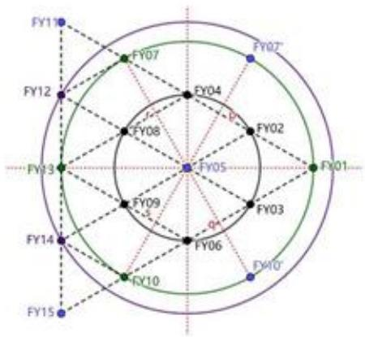

<details>
<summary>text_image</summary>

FY11
FY07
FY02"
FY04
FY02
FY08
FY05
FY01
FY09
FY03
FY06
FY10
FY14
FY10'
FY15
</details>

图 8-1 锥形编队圆形化分类示意图

以无人机FY05为圆心，我们能将锥形无人机编队上的15架无人机进行分组，第一组包括无人机FY02、FY03、FY04、FY06、FY08、FY09，假定其理想位置坐标分布在半径为 $50m$ 的圆周上，我们将该圆等分成12份，则第二组包括无人机FY01、FY07、FY10、FY13，理想位置坐标分布于半径为 $50\sqrt{3} m$ 的圆周上、第三组包括无人机FY12、FY14，理想位置坐标分布于半径 $100m$ 的圆周上，不对FY11与FY15进行分类，因为上述所有的无人机均能在12等分的位置找到与自身对应的理想坐标值，FY11与FY15无对应点。

## 8.2 调整方案设计

## 8.2.1 角度坐标 $\theta$ 的调整模型

结合问题一（3）对圆形编队设计的调整方案模型，在本题中，依然能够使用该方案了前两步骤，对除FY05、FY11、FY15外所有无人机的相对位置坐标的角度坐标进行调整，直至达到理想位置坐标点。其调整推导与问题一（3）完全一致，对此不再重述，下文给出角度坐标调整方案模型公式：

$$
\begin{array}{l} \Delta \theta_ {i} = \arctan \frac {\sin (\theta_ {j} + \alpha_ {j} - \frac {(\alpha_ {j} - \alpha_ {i})}{2}) \cdot \sin (\alpha_ {i} - \frac {(\alpha_ {i} - \alpha_ {j})}{2}) - \sin (\alpha_ {i} - \frac {(\alpha_ {i} - \alpha_ {j})}{2}) \cdot \sin (\alpha_ {j} - \frac {(\alpha_ {j} - \alpha_ {i})}{2})}{\cos (\alpha_ {j} - \frac {(\alpha_ {j} - \alpha_ {i})}{2} + \theta_ {j}) \cdot \sin (\alpha_ {i} - \frac {(\alpha_ {i} - \alpha_ {j})}{2}) + \cos (\alpha_ {i} - \frac {(\alpha_ {i} - \alpha_ {j})}{2}) \cdot \sin (\alpha_ {j} - \frac {(\alpha_ {j} - \alpha_ {i})}{2})} \\ - \arctan (\frac {\sin (\theta_ {j} + \alpha_ {j}) \sin \alpha_ {j} - \sin (\alpha_ {i} - \theta_ {j}) \sin \alpha_ {j}}{\cos (\alpha_ {j} + \theta_ {j}) \sin \alpha_ {i} + \cos (\alpha_ {i} - \theta_ {i}) \sin \alpha_ {j}}) \\ \Delta \theta_ {s} = \arctan \left(\frac {\sin (\theta_ {j} + \alpha_ {j} - \frac {(\alpha_ {i} - \alpha_ {j})}{2} + 2 0) \sin (\alpha_ {i} - \frac {(\alpha_ {i} - \alpha_ {j})}{2} - 2 0) - \sin (\alpha_ {i} - \frac {(\alpha_ {i} - \alpha_ {j})}{2} - 2 0 - \theta_ {j}) \sin (\alpha_ {j} - \frac {(\alpha_ {i} - \alpha_ {j})}{2} + 2 0)}{\cos (\alpha_ {j} - \frac {(\alpha_ {i} - \alpha_ {j})}{2} + 2 0 + \theta_ {j}) \sin (\alpha_ {i} - \frac {(\alpha_ {i} - \alpha_ {j})}{2} - 2 0) + \cos (\alpha_ {i} - \frac {(\alpha_ {i} - \alpha_ {j})}{2} - 2 0 - \theta_ {j}) \sin (\alpha_ {j} - \frac {(\alpha_ {i} - \alpha_ {j})}{2} + 2 0)}\right) \\ \left\{ \begin{array}{l} - \arctan \frac {\sin (\theta_ {j} + \alpha_ {j}) \cdot \sin \alpha_ {i} - \sin (\alpha_ {i} - \theta) \cdot \sin \alpha_ {j}}{\cos (\alpha_ {j} + \theta_ {j}) \cdot \sin \alpha_ {i} + \cos (\alpha_ {i} - \theta) \cdot \sin \alpha_ {j}}, \alpha_ {i} <   \alpha_ {j} \\ \Delta \theta_ {1} = \arctan \frac {\sin (\theta_ {j} + \alpha_ {j} - \frac {(\alpha_ {i} - \alpha_ {j})}{2} + 2 0) \cdot \sin (\alpha_ {i} - \frac {(\alpha_ {i} - \alpha_ {j})}{2} + 2 0) - \sin (\alpha_ {i} - \frac {(\alpha_ {i} - \alpha_ {j})}{2} + 2 0 - \theta) \cdot \sin (\alpha_ {j} - \frac {(\alpha_ {i} - \alpha_ {j})}{2} + 2 0)}{\cos (\alpha_ {j} - \frac {(\alpha_ {i} - \alpha_ {j})}{2} + 2 0 + \theta_ {j}) \cdot \sin (\alpha_ {i} - \frac {(\alpha_ {i} - \alpha_ {j})}{2} + 2 0) + \cos (\alpha_ {i} - \frac {(\alpha_ {i} - \alpha_ {j})}{2} + 2 0 - \theta) \cdot \sin (\alpha_ {j} - \frac {(\alpha_ {i} - \alpha_ {j})}{2} + 2 0)} \\ - \arctan \frac {\sin (\theta_ {j} + \alpha_ {j}) \cdot \sin \alpha_ {i} - \sin (\alpha_ {i} - \theta) \cdot \sin \alpha_ {j}}{\cos (\alpha_ {j} + \theta_ {j}) \cdot \sin \alpha_ {i} + \cos (\alpha_ {i} - \theta) \cdot \sin \alpha_{j}}, \alpha_ {j} > \alpha_ {j} \end{array} \right. \\ \end{array}
$$

此方案模型内唯一未确定的值为发射信号无人机i,j和被动接收信号无人机k 的遍历范围，原因是此范围需要通过给定实际的初始位置坐标确定，但问题二并未给出相关数据。但其范围将在下文的仿真模拟中随机确定，值得注意的是每一组的随机生成的无人机坐标至少存在三个长度坐标相等但角度坐标略有偏差的数据。

## 8.2.2 长度坐标 $\rho$ 的调整模型

长度坐标 $\rho$ 的调整考虑组别不同所在圆周的半径不同，所有需要分组迭代调整组内无人机的长度坐标值。方案模型推导同问题一（3），公式如下：

$$
\rho_ {k, c} = \frac {\rho_ {i , c}}{\sin \alpha_ {i , c}} \cdot \sin (\pi - \alpha_ {i, c} - \theta_ {k, c} + \theta_ {i, c})
$$

$$
\rho_ {k, c} ^ {\cdot} = \frac {\rho_ {i , c}}{\sin \alpha_ {i , c} ^ {\cdot}} \cdot \sin (\pi - \alpha_ {i, c} ^ {\cdot} - \theta_ {k, c} + \theta_ {i, c})
$$

$$
\Delta \rho_ {k, c} = \frac {\rho_ {i , c}}{\sin \alpha_ {i , c}} \cdot \sin (\pi - \alpha_ {i, c} - \theta_ {k, c} + \theta_ {i, c}) - \frac {\rho_ {i , c}}{\sin \alpha_ {i , c} ^ {'}} \cdot \sin (\pi - \alpha_ {i, c} ^ {'} - \theta_ {k, c} + \theta_ {i, c})
$$

其中，所有变量变成2维坐标，是考虑此时不同组别目标长度不同，共c组，c=1、2、3。

## 8.1.2 FY11、FY15 坐标的确定与调整

对于 FY11、FY15 两架无人机的位置调整利用接收到的随机两组共线无人机发射的信号角度信息值来确定。

角度坐标 $\theta$ 利用角度 $\alpha_{i},\alpha_{j}$ 的平均确定：

$$
\theta_ {k} = \frac {2 \pi + \theta_ {i} + \theta_ {j} - 2 \alpha_ {i} - 2 \alpha_ {j}}{4} + \frac {2 \pi + \theta_ {j} + \theta_ {j} - 2 \alpha_ {j} - 2 \alpha_ {j}}{4}
$$

长度坐标 $\rho$ 根据正弦定理根据角度坐标的确定而确定。

## 九、模型评价与推广

## 9.1 模型评价

## 9.1.1 模型优点

1、准确性高。本文中的定位模型、调整方案模型都是通过纯几何意义推导确定，求解采用遍历、仿真模拟、迭代算法，得到结果准确度高，误差小。

2、层次性高。文本的定位模型、调整方案模型的建立过程由简入繁、根据题目的要求层层递进。

## 9.1.2 模型缺点

调整方案模型适用的假定前提存在一定的严苛性，使得调整的适用范围被局限。

## 9.1.2 模型的推广

本文提供的定位模型适用于保持在同一高度飞行所有圆形编队，且无论均匀分布多少架飞机，只要相互直接的飞行不受影响即可。

调节方案模型虽假定了至少存在三架飞机在同一半径的圆周上，使得某些编队分布的情况不适用于此模型，但模型的思路是分析调整方案的有效渠道之一。

## 十、参考文献

[1]范嫦娥,李德毅,彭冬亮,郭云飞.基于遗传算法的单站无源纯方位定位算法[J].计算机仿真,2007(06):168-170+295.  
[2]修建娟,王国宏,何友,修建华.纯方位系统中的定位模糊区分析[J].系统工程与电子技术,2005(08):1391-1393+1424.  
[3]王本才,王国宏,何友.多站纯方位无源定位算法研究进展[J].电光与控制,2012,19(05):56-62.

## 十一、附录

附件目录：

<table><tr><td>问题一(1)</td><td>B_1_1.png:第一小问的结果</td></tr><tr><td>问题一(2)</td><td>B_2.xlsx:位置无偏差时各夹角度数B_2_标准结果.xlsx:位置无偏差时的标准结果B_2_模拟结果.xlsx:位置有偏差时的模拟结果</td></tr><tr><td>问题一(3)</td><td>B_3_origin_data.xlsx:原题表一数据B_3_result.csv:调整后的表一数据B_3_result.txt:角度、极径调整量以及调整前后结果</td></tr></table>

代码目录：

<table><tr><td>问题一(1)</td><td>B_1.py: 问题一第一小问绘图程序</td></tr><tr><td>问题一(2)</td><td>B_2.py: 问题一第二小问程序</td></tr><tr><td>问题一(3)</td><td>B_3.py: 问题一第三小问程序</td></tr></table>

问题一(1)代码(B\_1.py): 问题一第一小问绘图程序  
```python
import numpy as np
import matplotlib.pyplot as plt
import pandas as pd
import warnings

# warnings.filterwarnings('ignore')
plt.rcParams['font.sans-serif'] = ['SimHei']  # 用来正常显示中文标签
plt.rcParams['axes.unicode_minus'] = False  # 用来正常显示负号

class B_1_cls:
    def __init__(self):
        self.theta_rad = None
        self.theta_deg = None
        self.r = None
        self.all_color = ['b', 'c', 'g', 'k', 'm', 'y', 'purple']
        self.color = None
        self.counter = 0  # 计时器，画图用

    def __mid_k_func(self, theta_i, theta_j, theta_k_true):
        """
```

```python
此时 k 在中间,偏差为+-1
"""
theta_rad = None
theta_deg = None
r = None
color = None
if theta_j - theta_k_true < 180 and theta_k_true - theta_i < 180:
    alpha_i = (180 - theta_k_true + theta_i) / 2
    alpha_i = np.arange(alpha_i - 1, alpha_i + 1, 0.1)
    alpha_j = (180 + theta_k_true - theta_j) / 2
    alpha_j = np.arange(alpha_j - 1, alpha_j + 1, 0.1)
    # print(alpha_i)
    # print(alpha_j)
    # print(alpha_i.shape)

    fenzi = np.sin(np.radians(alpha_j + theta_j)) * np.sin(np.radians(alpha_i)) + np.sin(np.radians(-alpha_i + theta_i)) * np.sin(np.radians(alpha_j))
    fenmu = np.cos(np.radians(alpha_j + theta_j)) * np.sin(np.radians(alpha_i)) +
np.cos(np.radians(-alpha_i + theta_i)) * np.sin(np.radians(alpha_j))

    theta_rad = np.array(pd.Series(np.arctan(fenzi / fenmu)).map(lambda x: x if x > 0 else x + np.pi))
    theta_deg = np.rad2deg(theta_rad)
    r = 100 * np.sin(np.radians(180 - theta_j + theta_deg - alpha_j)) /
np.sin(np.radians(alpha_j))
    # print("====================")
    # print(theta_deg)
    # print(r)
    # print("====================")
    # print(theta_deg.shape)
    # print(r.shape)
    # print("theta 为: {}".format(theta_deg))
    # print("r 为: {}".format(r))
elif theta_j - theta_k_true > 180 and theta_k_true - theta_i < 180:
    alpha_i = (180 - theta_k_true + theta_i) / 2
```

```txt
alpha_i = np.arange(alpha_i - 1, alpha_i + 1, 0.1)
alpha_j = (-180 - theta_k_true + theta_j) / 2
alpha_j = np.arange(alpha_j - 1, alpha_j + 1, 0.1)

fenzi = np.sin(np.radians(-alpha_j + theta_j)) * np.sin(np.radians(alpha_i)) - np.sin(
np.radians(-alpha_i + theta_i)) * np.sin(np.radians(alpha_j))
fenmu = np.cos(np.radians(-alpha_j + theta_j)) * np.sin(np.radians(alpha_i)) -
np.cos(np.radians(-alpha_i + theta_i)) * np.sin(np.radians(alpha_j))

theta_rad = np.array(pd.Series(np.arctan(fenzi / fenmu)).map(lambda x: x if x > 0
else x + np.pi))

theta_deg = np.rad2deg(theta_rad)
# print("====================")
# print(theta_deg)
# print("====================")
r = 100 * np.sin(np.radians(-180 - theta_deg + theta_j - alpha_j)) /
np.sin(np.radians(alpha_j))

elif theta_j - theta_k_true < 180 and theta_k_true - theta_i > 180:
alpha_i = (-180 + theta_k_true - theta_i) / 2
alpha_i = np.arange(alpha_i - 1, alpha_i + 1, 0.1)
alpha_j = (180 + theta_k_true - theta_j) / 2
alpha_j = np.arange(alpha_j - 1, alpha_j + 1, 0.1)

fenzi = np.sin(np.radians(alpha_i + theta_i)) * np.sin(np.radians(alpha_j)) - np.sin(
np.radians(alpha_j + theta_j)) * np.sin(np.radians(alpha_i))
fenmu = np.cos(np.radians(alpha_i + theta_i)) * np.sin(np.radians(alpha_j)) -
np.cos(np.radians(alpha_j + theta_j)) * np.sin(np.radians(alpha_i))

theta_rad = np.array(pd.Series(np.arctan(fenzi / fenmu)).map(lambda x: x + np.pi if
x > 0 else x + 2 * np.pi))
theta_deg = np.rad2deg(theta_rad)
r = 100 * np.sin(np.radians(180 + theta_deg - theta_j - alpha_j)) /
np.sin(np.radians(alpha_j))
# print("====================")
```

```python
# print(theta_deg)
# print(r)
# print("====================")

return theta_rad, theta_deg, r

def __right_or_left_k_func(self, theta_i, theta_j, theta_k_true):
    """
    此时 k 在两边,偏差为+-1
    """
    theta_rad = None
    theta_deg = None
    r = None
    if theta_k_true - theta_j < 180 and theta_k_true - theta_i < 180:
        alpha_i = (180 - theta_k_true + theta_i) / 2
        alpha_i = np.arange(alpha_i - 1, alpha_i + 1, 0.1)
        alpha_j = (180 - theta_k_true + theta_j) / 2
        alpha_j = np.arange(alpha_j - 1, alpha_j + 1, 0.1)

        fenzi = np.sin(np.radians(alpha_j - theta_j)) * np.sin(np.radians(alpha_i)) - np.sin(np.radians(alpha_i - theta_i)) * np.sin(np.radians(alpha_j))
        fenmu = np.cos(np.radians(alpha_i - theta_i)) * np.sin(np.radians(alpha_j)) - np.cos(np.radians(alpha_j - theta_j)) * np.sin(np.radians(alpha_i))

        theta_rad = np.array(pd.Series(np.arctan(fenzi / fenmu)).map(lambda x: x if x > 0 else x + np.pi))
        theta_deg = np.rad2deg(theta_rad)
        r = 100 * np.sin(np.radians(-theta_j + theta_deg + alpha_j)) / np.sin(np.radians(alpha_j))

    elif theta_k_true - theta_j < 180 and theta_k_true - theta_i > 180:
        alpha_i = (-180 + theta_k_true - theta_i) / 2
        alpha_i = np.arange(alpha_i - 1, alpha_i + 1, 0.1)
        alpha_j = (180 - theta_k_true + theta_j) / 2
        alpha_j = np.arange(alpha_j - 1, alpha_j + 1, 0.1)
```

```python
fenzi = np.sin(np.radians(-alpha_j + theta_j)) * np.sin(np.radians(alpha_i)) +
np.sin(np.radians(alpha_i + theta_i)) * np.sin(np.radians(alpha_j))
fenmu = np.cos(np.radians(alpha_i + theta_i)) * np.sin(np.radians(alpha_j)) +
np.cos(np.radians(alpha_j - theta_j)) * np.sin(np.radians(alpha_i))

theta_rad = np.array(pd.Series(np.arctan(fenzi / fenmu)).map(lambda x: x + np.pi if
x > 0 else x + 2 * np.pi))
theta_deg = np.rad2deg(theta_rad)
r = 100 * np.sin(np.radians(theta_deg - theta_j + alpha_j)) /
np.sin(np.radians(alpha_j))
elif theta_k_true - theta_j > 180 and theta_k_true - theta_i > 180:
alpha_i = (-180 + theta_k_true - theta_i) / 2
alpha_i = np.arange(alpha_i - 1, alpha_i + 1, 0.1)
alpha_j = (-180 + theta_k_true - theta_j) / 2
alpha_j = np.arange(alpha_j - 1, alpha_j + 1, 0.1)

fenzi = np.sin(np.radians(alpha_j + theta_j)) * np.sin(np.radians(alpha_i)) - np.sin(
np.radians(alpha_i + theta_i)) * np.sin(np.radians(alpha_j))
fenmu = np.cos(np.radians(alpha_j + theta_j)) * np.sin(np.radians(alpha_i)) -
np.cos(np.radians(alpha_i + theta_i)) * np.sin(np.radians(alpha_j))

theta_rad = np.array(
pd.Series(np.arctan(fenzi / fenmu)).map(lambda x: x + np.pi if x > 0 else x + 2
* np.pi))
theta_deg = np.rad2deg(theta_rad)
r = 100 * np.sin(np.radians(-180 + theta_deg - theta_j - alpha_j)) /
np.sin(np.radians(alpha_j))
return theta_rad, theta_deg, r

def polar_plot(self):
Qi = 0
Qj = np.arange(40, 360, 40)
Qk = np.arange(40, 360, 40)
```

```python
for i, j in enumerate(Qj):
    ax = plt.subplot(2, 4, i + 1, projection='polar')
    self.theta_rad = np.array([])
    self.theta_deg = np.array([])
    self.r = np.array([])
    self.color = np.array([])
    self.counter = 0
    for k in Qk:
        if k == j:
            continue
        else:
            if j > k:
                theta_rad, theta_deg, temp_r = self.__mid_k_func(Qi, j, k)
                self.theta_rad = np.hstack([self.theta_rad, theta_rad])
                self.theta_deg = np.hstack([self.theta_deg, theta_deg])
                self.r = np.hstack([self.r, temp_r])
                self.color = np.hstack(
                    [self.color, np.array([self.all_color[self.counter] for _ in range(theta_rad.shape[0])]])
                    elif j < k:
                        theta_rad, theta_deg, temp_r = self.__right_or_left_k_func(Qi, j, k)
                        self.theta_rad = np.hstack([self.theta_rad, theta_rad])
                        self.theta_deg = np.hstack([self.theta_deg, theta_deg])
                        self.r = np.hstack([self.r, temp_r])
                        self.color = np.hstack(
                            [self.color, np.array([self.all_color[self.counter] for _ in range(theta_rad.shape[0])]])
                    self.counter += 1
                # print(self.theta_deg)
                # print(self.r)
                # print("====================")
                # print("====================")
                # print("====================")
                # 画图
```

```python
# ax.scatter(self.theta_rad, self.r, label='定点 i 极坐标', s=10, c=self.color)
ax.scatter(self.theta_rad, self.r, s=10, c=self.color)
ax.set_rlim(0, 105)
ax.scatter(Qi, 100, s=100, c='r', marker='*')
if i == 0:
    ax.scatter(np.radians(j), 100, s=100, c='r', marker='*', label='发射信号无人机极坐标')
    ax.legend(bbox_to_anchor=(.55, 1.35))
    # ax.legend(bbox_to_anchor=(0, 1.35))
ax.scatter(np.radians(j), 100, s=100, c='r', marker='*')
# plt.title("极坐标图", loc = 'left')
plt.show()

# @classmethod
def b_2(self, j, k):
    return self.__mid_k_func(0, j, k) if j > k else self.__right_or_left_k_func(0, j, k)

if __name__ == '__main__':
    b_1 = B_1_cls()
    b_1.polar_plot()
```

问题一(2)代码(B\_2.py): 问题一第二小问程序  
```python
import numpy as np
import matplotlib.pyplot as plt
import pandas as pd
import warnings
from B_1 import B_1_cls

# warnings.filterwarnings('ignore')
plt.rcParams['font.sans-serif'] = ['SimHei']  # 用来正常显示中文标签
plt.rcParams['axes.unicode_minus'] = False  # 用来正常显示负号

def my_func(i_2_ii, i_2_1, ii_2_1, number, sep):
    """
    返回发射点编号
```

```python
number:第几架飞机为接受点
sep:间隔数
"""
if number >= 6:
    if i_2_ii == 0 or i_2_1 == 0 or ii_2_1 == 0:
        result = number - sep
    elif i_2_ii == i_2_1 + ii_2_1:
        if i_2_1 > i_2_ii / 2:
            result = number - sep
        else:
            result = number + sep if number + sep <= 9 else number + sep - 9
    else:
        if i_2_1 > ii_2_1:
            result = number - sep
        else:
            result = number + sep if number + sep <= 9 else number + sep - 9
    else:
        if i_2_ii == 0 or i_2_1 == 0 or ii_2_1 == 0:
            result = number + sep if number + sep <= 9 else number + sep - 9
    elif i_2_ii == i_2_1 + ii_2_1:
        if i_2_1 > i_2_ii / 2:
            result = number + sep if number + sep <= 9 else number + sep - 9
        else:
            result = number - sep if number - sep > 1 else number + (9 - sep)
    else:
        if i_2_1 > ii_2_1:
            result = number + sep if number + sep <= 9 else number + sep - 9
        else:
            result = number - sep if number - sep > 1 else number + (9 - sep)

return result

if __name__ == '__main__':
    b_1_cls = B_1_cls()
```

# 标准结果  
```python
writer = pd.ExcelWriter("B_2_标准结果.xlsx", engine='openpyxl')
for i in range(8):
    number = i + 2  # 第 i + 2 架飞机作为接受点
    data = pd.read_excel("B_2.xlsx", sheet_name=i)
    data_arr = np.array(data)
    # print(data.shape) #(7, 3)
    # print(data)
    result = np.zeros((7,))
    mean_theta_deg = np.zeros((7,))
    mean_r = np.zeros((7,))
    mean_true_theta_deg_bias = np.zeros((7,))
    mean_true_r_bias = np.zeros((7,))
    for j in range(7):
        i_2_ii, i_2_1, ii_2_1 = data_arr[j, :]
        sep = 1 if i_2_ii == 140 else 2 if i_2_ii == 100 else 3 if i_2_ii == 60 else 4
        result[j] = my_func(i_2_ii, i_2_1, ii_2_1, number, sep)
    data["发射点无人机编号"] = result

    data.to_excel(writer, sheet_name="Sheet {}".format(i), index=False)
writer.close()
```

# 模拟结果  
```python
writer2 = pd.ExcelWriter("B_2_模拟结果.xlsx", engine='openpyxl')
for i in range(8):
    number = i + 2  # 第 i + 2 架飞机作为接受点
    data = pd.read_excel("B_2.xlsx", sheet_name=i)
    data_arr = np.array(data)

    r = np.random.rand(10500)  # 随机数
    new_data = np.zeros((10500, 3))
    for j in range(data.shape[0]):
        s = data_arr[j, :]
        if s[0] == 0 or s[1] == 0 or s[2] == 0:
```

```python
for k in range(1500):
    temp_r = r[1500 * j + k]
    temp_r_2 = (temp_r - 0) * np.random.random_sample()
    temp_r_3 = temp_r - temp_r_2
    new_data[1500 * j + k] = [s[0] + temp_r, s[1] + temp_r_2, s[2] +
temp_r_3]
else:
    max_index = np.argmax(s)
    other_index = [i for i, x in enumerate(s) if x < np.max(s)]
    for k in range(1500):
        temp_r = r[1500 * j + k]
        temp_r_2 = np.random.rand()
        temp_r_3 = temp_r - temp_r_2
        new_data[1500 * j + k, max_index] = s[max_index] + temp_r
        new_data[1500 * j + k, other_index[0]] += s[other_index[0]] + temp_r_2
        new_data[1500 * j + k, other_index[1]] += s[other_index[1]] + temp_r_3

result = np.zeros((10500,))
mean_theta_deg = np.zeros((10500,))
mean_r = np.zeros((10500,))
mean_true_theta_deg_bias = np.zeros((10500,))
mean_true_r_bias = np.zeros((10500,))
for j in range(10500):
    i_2_ii, i_2_1, ii_2_1 = new_data[j, :]
    sep = 1 if abs(i_2_ii - 140) < 1 else 2 if abs(i_2_ii - 100) < 1 else 3 if abs(i_2_ii - 60) <
else 4
    result[j] = my_func(i_2_ii, i_2_1, ii_2_1, number, sep)
    theta_rad, theta_deg, r = b_1_cls.b_2(40 * (result[j] - 1), 40 * (number - 1))
    mean_theta_deg[j] = np.mean(theta_deg)
    mean_r[j] = np.mean(r)
    mean_true_theta_deg_bias[j] = np.mean(np.abs(theta_deg - 40 * (number - 1)))
# 平均绝对误差
    mean_true_r_bias[j] = np.mean(np.abs(r - 100)) # 平均绝对误差
new_data2 = pd.DataFrame(new_data, columns=data.columns)
new_data2["发射点无人机编号"] = result
```

```python
new_data2["角{}度数".format(i+2)] = mean_theta_deg
new_data2["角{}极径".format(i+2)] = mean_r
new_data2["角{}度数平均绝对误差".format(i+2)] = mean_true_theta_deg_bias
new_data2["角{}极径平均绝对误差".format(i+2)] = mean_true_r_bias
new_data2.to_excel(writer2, sheet_name="Sheet {}".format(i), index=False)
print("表{}生成结束！".format(i+2))
writer2.close()
```

问题一(3)代码(B\_3.py): 问题一第三小问程序  
```python
import numpy as np
import matplotlib.pyplot as plt
import pandas as pd
from sympy import *
from copy import deepcopy
import warnings

# warnings.filterwarnings('ignore')
plt.rcParams['font.sans-serif'] = ['SimHei']  # 用来正常显示中文标签
plt.rcParams['axes.unicode_minus'] = False  # 用来正常显示负号

class B_3_CLS:
    def __init__(self, data=None):
        self.data = data
        self.data_arr = np.array(deepcopy(data))

    def first_step(self, theta_i, theta_j, theta_k_true):
        """
        度数更新
        :param theta_k_true: 指表格的数据度数
        """
        alpha_i = (180 - theta_k_true + theta_i) / 2
        alpha_j = (180 + theta_k_true - theta_j) / 2
        temp = theta_k_true
        print("调整飞机 2,5,8 的 theta")
        print("飞机 2,5,8 的初始 theta 为{}".format(theta_k_true))
```

```python
while 1:
    fenzi = np.sin(np.radians(alpha_j + theta_j)) * np.sin(np.radians(alpha_i)) + np.sin(np.radians(-alpha_i + theta_i)) * np.sin(np.radians(alpha_j))
    fenmu = np.cos(np.radians(alpha_j + theta_j)) * np.sin(np.radians(alpha_i)) + np.cos(np.radians(-alpha_i + theta_i)) * np.sin(np.radians(alpha_j))

    theta_rad = np.array(pd.Series(np.arctan(fenzi / fenmu)).map(lambda x: x if x > 0 else x + np.pi))
    theta_deg = np.rad2deg(theta_rad)
    print{"飞机 2,5,8 的 delta theta 为{}".format(theta_deg - temp})
    if abs(theta_deg - temp) < 1e-16:
        # 更新角度
        self.data_arr[5, 0] += theta_deg - temp
        print("更新后 2,5,8 的 theta 为: {}".format(theta_deg))
        print("====================")
        break
    alpha_i -= (alpha_i - alpha_j) / 2
    alpha_j -= (alpha_j - alpha_i) / 2
    temp = theta_deg

def second_step(self, number):
    """
    :param number:要更新的飞机编号
    """
    assert number != 2 and number != 5 and number != 8, "number shouldn't equal with 2 5 8!"
    if 2 < number < 8:
        if 2 < number < 5:
            i = 2
            j = 5
        else:
            i = 5
            j = 8
        theta_i, theta_j, theta_k_true = self.data_arr[i, 0], self.data_arr[j, 0], self.data_arr[number, 0]
```

```python
print{"原 theta 为: {}".format(theta_k_true))
alpha_i = (180 - theta_k_true + theta_i) / 2
alpha_j = (180 + theta_k_true - theta_j) / 2
temp = theta_k_true
while 1:
    alpha_i, alpha_j, temp, sep = self.__mid_k_func(theta_i, theta_j,
theta_k_true, alpha_i, alpha_j, temp,number)
    if sep < 0.001:
        self.data_arr[number, 0] = temp
        print("更新后 theta 为: {}".format(temp))
        print("====================")
        break
else:
    i = 8
    j = 2
    print("原 theta 为: {}".format(self.data_arr[number, 0]))
    theta_i = self.data_arr[i, 0] + 80 if self.data_arr[i, 0] + 80 <= 360 else self.data_arr[i,
0] + 80 - 360
    theta_j = self.data_arr[j, 0] + 80 if self.data_arr[j, 0] + 80 <= 360 else self.data_arr[j,
0] + 80 - 360
    theta_k_true = self.data_arr[number, 0] + 80 if self.data_arr[number, 0] + 80 <=
360 else self.data_arr[number, 0] + 80 - 360

    alpha_i = (180 - theta_k_true + theta_i) / 2
    alpha_j = (180 + theta_k_true - theta_j) / 2
    temp = theta_k_true
    while 1:
        alpha_i, alpha_j, temp, sep = self.__mid_k_func(theta_i, theta_j,
theta_k_true, alpha_i, alpha_j, temp,number)

        if sep < 0.001:
            theta_deg = temp - 80 if temp - 80 >= 0 else temp - 80 + 360
            self.data_arr[number, 0] = theta_deg
            print("更新后 theta 为: {}".format(theta_deg))
```

```python
print("====================")
break

def third_step(self, number):
    """
    :param number:要更新的飞机编号
    """
    assert number != 2 and number != 5 and number != 8, "number shouldn't equal with 2
5 8!"
    if 2 < number < 8:
        if 2 < number < 5:
            i = 2
            j = 5
        else:
            i = 5
            j = 8
        theta_i, theta_j, theta_k = self.data_arr[i, 0], self.data_arr[j, 0],
self.data_arr[number, 0]
        alpha_jj = 50 if number == 3 or number == 6 else 70
        # alpha_i = (180 - theta_k + theta_i) / 2
        # alpha_j = (180 + theta_k - theta_j) / 2
        delta_rho = self.data_arr[number, 1] - 98 * np.sin(np.radians(180 - alpha_jj -
theta_j + theta_k)) / np.sin(np.radians(alpha_jj))

        print("原 rho 为: {}".format(self.data_arr[number, 1]))
        self.data_arr[number, 1] -= delta_rho
        print("飞机{}的 delta rho 为{}".format(number, delta_rho))
        print("更新后飞机{}的 rho 为{}".format(number, self.data_arr[number, 1]))

    else:
        i = 8
        j = 2
        theta_i = self.data_arr[i, 0] + 80 if self.data_arr[i, 0] + 80 <= 360 else self.data_arr[i,
0] + 80 - 360
        theta_j = self.data_arr[j, 0] + 80 if self.data_arr[j, 0] + 80 <= 360 else self.data_arr[j,
```

```python
0] + 80 - 360
theta_k = self.data_arr[number, 0] + 80 if self.data_arr[number, 0] + 80 <= 360 else
self.data_arr[number, 0] + 80 - 360
alpha_jj = 50 if number == 9 else 70
delta_rho = self.data_arr[number, 1] - 98 * np.sin(np.radians(180 - alpha_jj -
theta_j + theta_k)) / np.sin(np.radians(alpha_jj))
print("原 rho 为: {}".format(self.data_arr[number, 1]))
self.data_arr[number, 1] -= delta_rho
print("飞机{}的 delta rho 为{}".format(number, delta_rho))
print("更新后飞机{}的 rho 为{}".format(number, self.data_arr[number, 1]))

return delta_rho

def __mid_k_func(self, theta_i, theta_j, theta_k_true, alpha_i, alpha_j, temp, number):
sep = None
if theta_j - theta_k_true < 180 and theta_k_true - theta_i < 180:
fenzi = np.sin(np.radians(alpha_j + theta_j)) * np.sin(np.radians(alpha_i)) + np.sin(
np.radians(-alpha_i + theta_i)) * np.sin(np.radians(alpha_j))
fenmu = np.cos(np.radians(alpha_j + theta_j)) * np.sin(np.radians(alpha_i)) +
np.cos(np.radians(-alpha_i + theta_i)) * np.sin(np.radians(alpha_j))
if 5 < number < 8:
theta_rad = np.array(pd.Series(np.arctan(fenzi / fenmu)).map(lambda x: x +
np.pi))
else:
theta_rad = np.array(pd.Series(np.arctan(fenzi / fenmu)).map(lambda x: x if
x > 0 else x + np.pi))
theta_deg = np.rad2deg(theta_rad)
# print(theta_deg)
print("飞机{}的 delta theta 为{}".format(number, theta_deg - temp))
if alpha_i < alpha_j:
alpha_i -= (alpha_i - alpha_j + 20) / 2
alpha_j -= (alpha_i - alpha_j - 20) / 2
else:
alpha_i -= (alpha_i - alpha_j - 20) / 2
alpha_j -= (alpha_i - alpha_j + 20) / 2
```

```python
sep = abs(theta_deg - temp)
temp = theta_deg

return alpha_i, alpha_j, temp, sep

if __name__ == '__main__':
    data = pd.read_excel("B_3_origin_data.xlsx").set_index("无人机编号")
    # print(data)
    # print(data.shape) #(10, 2)

    instance = B_3_CLS(data)

    instance.first_step(40.1, 280.17, 159.86)

    for i in range(1, 10):
        if i == 2 or i == 5 or i == 8:
            continue
        print{"调整飞机{}的 theta".format(i))
        instance.second_step(i)
        print("**************************************************************************")
print("**************************************************************************")
print("**************************************************************************")
print("**************************************************************************")
print("**************************************************************************")

for i in range(1, 10):
    if i == 2 or i == 5 or i == 8:
        continue
        print{"调整飞机{}的 rho".format(i))
        instance.third_step(i)
        print("**************************************************************************")

pd.DataFrame(instance.data_arr, index=instance.data.index,
columns=instance.data.columns).to_csv("B_3_result.csv")
```