# 基于局部最优模型的无人机位置调整策略与仿真定位

摘要

纯方位无源定位即用被动式探测设备接收辐射源的方位信号并进行定位，设备本身不发出任何电磁信号，对无人机遂行编队飞行的位置调整及阵型保持具有重要意义。本文主要研究了圆形编队以及锥形编队的无人机阵型，基于局部最优模型与仿真实验，建立了无人机的定位模型以及无人机位置的调整策略。

针对问题一，首先讨论了圆形阵列中三架发出信号无人机的四种排布方式，并在极坐标下根据正弦定理分别讨论各无人机间的几何关系，将无人机的定位问题转化为方程问题。其次，求解方程得出无人机位置的一般解，建立了被动接受信号无人机定位模型，结果见式(1)-(2)。随后，为解决特殊情况下方程解的不唯一性，以及位于信号源连线角平分线上无人机位置的不确定性，提出了假设：已知信号源发射电磁波的次序。最后，给出该背景下无人机的位置调整策略：先沿圆的径向，再沿圆的切向进行调整，从而使模型更具完整性。

针对问题二，首先提出并证明引理：对于正九边形的圆周角 $\alpha$ ，存在正整数 $k$ ，使得 $\alpha = 20^{\circ}k$ ；对于伪圆周角 $\beta$ ，存在正整数 $l$ ，使得 $\beta = 10^{\circ}(2l - 1)$ 。其次基于此引理，讨论未知编号无人机对应的方位角与圆心角的两种相对关系，运用集合元素唯一性证明未知编号信息源发射信号的唯一性，反推出发射信号无人机的编号，将问题划归为问题一中的定位模型，在接受方向信息角与理想值误差 $\pm 5^{\circ}$ 范围内，得出仅再需要一架无人机作为信号源即可确定接受信号无人机的位置的结论。

针对问题三，对于初始位置略有偏差的圆形编队，首先对一般情况下无人机初始位置进行预处理：即将无人机j沿径向调整，使其从无人机0,1两架无人机接收到的方位角调整为 $90^{\circ}-20^{\circ}(j-1)$ 。其次通过数学证明，预处理后可以将无人机的距离误差自15%缩小至5%。随后，由于各无人机之间的信息不共享，故不能出现通过任何全局的信息对无人机做出调整。基于局部最优模型分两种方案进行调整策略的研究：每次选取圆周上三或两架无人机作为信号源，目标函数为接收信号无人机对应的方位角向量和标准值向量的范数平方，使其最小化。最后，对该模型进行仿真模拟，得出对于给定初始值的两种方案位置的调整结果，如表5所示。比较两个方案全局检验误差值的收敛速度、收敛值，最终估算总发射电磁波信号次数，得出方案二，即每次在圆周上选取两架无人机发射信号，更优。

针对问题四，对于初始位置略有偏差的锥形编队，首先提出并证明三条引理：给定空间中近似成正三角形的三个点A,B,C与一在边AC附近的点D，可将 $\triangle ABC$ 调整为严格正三角形；可将点D调到边AC上，并使之成为定比分点；在 $\triangle ABC$ 中心附近的点可调整至几何中心。其次，将无人机分为中心对称的三类，基于引理按贪心策略分三步调整：由引理一调整顶点处三架无人机；由引理二将三角形每条边上的无人机距离等分；由引理三调正三角形的中心点。随后，进行计算机仿真实验，生成随机数实现模型。最后进行三维平面拟合，定义平面化检验函数检验调整方案的优劣性。平面化检验函数值由3.893降至0.206，降低了94.7%，准确性良好。

本文最后进行了无人机调整模型的灵敏性分析，对飞行阵列的精确点进行服从正态分布的微小扰动。取十组数据集进行全局误差分析。结果表明误差值随着循环次数迅速下降并收敛 $10^{-7} \sim 10^{-5}$ ，可见局部优化模型具有良好的鲁棒性。

关键词：局部最优调整 贪心策略 微小量仿真 几何关系 三维平面拟合

## 一、问题重述

## 1.1 问题背景

相较于有源（主动）传感器不仅发射信号，还接收从目标返回的信号的特点，无源（被动）传感器不发射任何信号，只接收来自目标的信号[1-2]。在无人机遂行编队飞行中，为了尽可能保持电磁静默，故采用纯方位无源定位的方法调整无人机的位置，即由编队中部分无人机发射信号、其余无人机被动接收信号，仅根据方向信息进行定位。在该问题的无人机编队中，每架无人机的编号固定，且无人机之间的相对位置保持不变，但具体位置与规划位置略有偏差。研究纯方位无源定位对无人机阵型的训练和管理具有重要意义。

## 1.2 问题要求

基于上述背景，要求建立数学模型解决如下问题：

问题的无人机阵型分为两类：1）圆形编队：由10架无人机组成，其中9架无人机（编号FY01\~FY09）均匀分布在某圆周上，另1架无人机（编号FY00）位于圆心。2）锥形编队：由15架无人机组成（编号FY01\~FY15），且直线上相邻两架无人机的间距相等。无人机基于自身感知的高度信息，均保持在同一个高度上飞行。

问题一：圆形编队中，位于圆心的无人机和圆周上另2架无人机发射信号。发射信号的无人机位置无偏差且编号已知，被动接受信号的无人机位置略有偏差，建立被动接收信号的无人机定位模型。

问题二：圆形编队中，FY00 和 FY01 以及编队中若干编号未知的无人机发射信号。发射信号的无人机位置无偏差，被动接受信号的无人机位置略有偏差。除 FY00 和 FY01 外，还需要几架无人机发射信号才能实现被动接收信号无人机的有效定位。

问题三：圆形编队中，圆周半径为 100m，初始时刻无人机的位置略有偏差。根据题目数据，要求给出合理的无人机位置调整方案。即通过多次调整，每次选择编号为 FY00 的无人机和圆周上最多 3 架无人机遂行发射信号，其余无人机根据接收到的方向信息调整到理想位置，使得 9 架无人机最终均匀分布在某个圆周上。

问题四：锥形编队中，考虑纯方位无源定位的情形，设计无人机位置调整方案。

## 二、问题分析

## 2.1 问题一的分析

该问本质上是一个方程问题。由于已知位置的三架无人机位置无偏差，故可建立极坐标并运用正弦定理计算出被动接受信号无人机的位置。考虑到圆形阵列的特殊性，两架圆周上发出信号的无人机具有四种位置关系，故需对其进行分情况讨论。另外，注意到九等分圆的轴对称性，因此最终位置的解有两个，需假设接收信号无人机已知自身的编号。计算出待定位无人机的位置后，可根据圆内角、圆周角、圆外角的性质给出其位置的调整方案，使之可以准确地消除位置偏差。

## 2.2 问题二的分析

该问本质上是问题一的变式，核心思路是在接受容许接受方向信息角误差范围内，如何将其化归成问题一中被动接收信号无人机的定位模型。考虑到圆形编队及其内接正九边形的性质，可以提出并证明正九边形圆周角与伪圆周角的数学规律，并基于此规律假设并证明未知位置无人机发射信息集合的唯一性，即可反推出未知位置无人机的编号。若如上假设得证，则仅再需要一架无人机即可确定被动接受信号无人机的位置。

## 2.3 问题三的分析

该问本质上是一个局部优化问题。虽然无人机的初始位置与正九边形顶点有微小偏差，但我们可以通过一定手段（详见正文），称为预处理，将极径误差大幅下降。预处理后，分两种方案建立局部最优模型，即每次均匀选取圆周上两或三架无人机发射信号，目标函数为对应的方位角向量和标准值向量的范数平方的最小值。为了评价两种方案的优劣性，可根据目标函数的和设置误差函数比较两方案全局误差的收敛速度和收敛值，进而比较需要发射的次数。随后代入题目中已给的初始数据验证，并利用计算机模拟生成初始位置的随机数来衡量模型的灵敏性。

## 2.4 问题四的分析

该问可以通过贪心策略来实现。本题抓住锥形集群的几何特点：正三角形高度对称性以及大量三点共线辅助移动调整。考虑到正三角形的几何性质，提出三种独立的调整策略：保证每个小三角形是正三角形，且点与点之间共线；保证大三角形边上每个点等分；保证中间三角形中心准确。因此，可以基于此假设并证明三条引理，即给定空间中近似成正三角形的三个点与一在其中一边附近的点，可通过将其调整为严格的正三角形；可以将点调至共线并使之成为定比分点；在三角形中心附近的点可通过微调使其成为其中心。随后将15个点分成三类，逐步调整。进行计算机的仿真模拟微小量的调整，随机生成初始数据，并分别计算三个引理所对应的误差值与锥形阵列全局的误差值（通过三维平面拟合求误差平方和），评价模型的优劣性。

综上所述，四个问题的分析思路可表示如下：

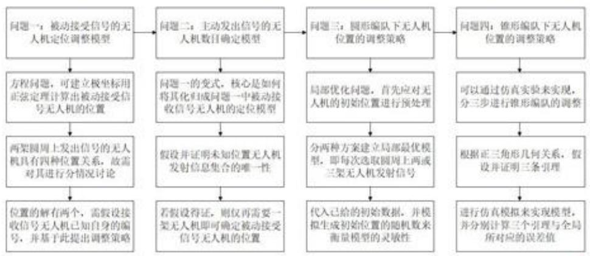

<details>
<summary>flowchart</summary>

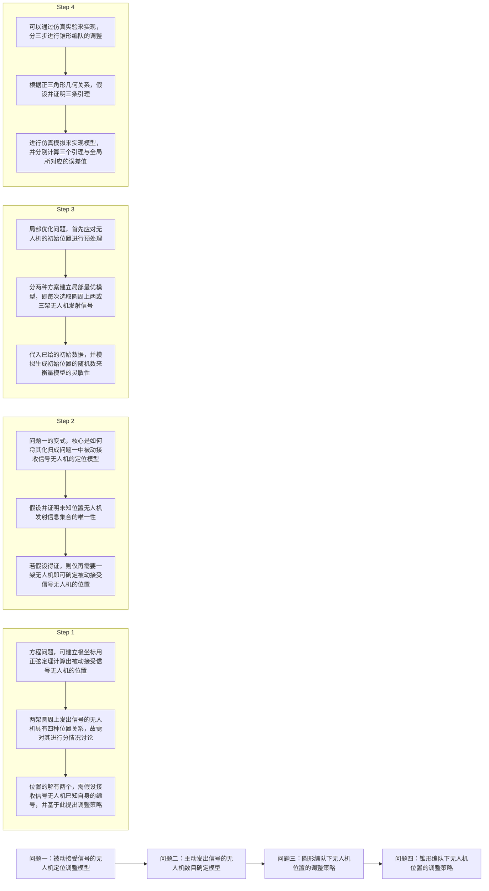
</details>

图1 问题分析总体思路

## 三、模型假设

## 3.1 假设无人机间信息不共享

接收信号的无人机是被动接收的，不能发射电磁波信号，故无人机间的信息不共享。即无人机i不能利用其他无人机j接收到的方向信息。

## 3.2 假设每架无人机均知道自己的编号

结合实际情况，每架飞机在做出调整时均知道自己飞机的编号。

## 3.3 假设已知无人机信号源的信号发射次序

为位于信号源连线角平分线上无人机位置的不确定性，故需作出假设。

## 3.4 假设无人机圆形编队圆周上的无人机角度偏差不超过±5°

无人机的位置相对准确位置略有偏差，故合理地假设方向信息角度偏差不超过±5°。另外，假设偏差不超过±5°，接收信号无人机可以根据接收到的角度推断出该角的理想值。例如，假设无人机接受到47°的方向信息，那该角的理想值即为50°。

## 3.5 假设无人机位置调整可以沿任意方向

无人机的飞行方向与设计性能相关[3]。正常无人机在空中拥有了12个自由度，可以任意飞行；然而如果是四轴无人机，基本上只能有限角度倾斜着飞。

## 3.6 假设无人机不可以沿某一方向移动指定距离

在对问题三模型进行求解时，设置搜索邻域、搜索步长是为了对无人机实际飞行情况进行仿真模拟。实际情况是无人机在原来位置附近任意移动，搜索目标函数最小值。

## 3.7 假设当误差小于一定值时，可以认为无人机以正九边形遂行编队飞行

考虑到实际情况，无人机群构成严格正九边形是不可能的，总会有一定的误差。所以我们认为，当无人机群构成的九边形与正九边形误差小于一定值时，即认为无人机群构成正九边形。

四、符号说明

<table><tr><td>符号</td><td>说明</td></tr><tr><td> $\alpha_1$ </td><td>被动机关于前两架主动机的方位角</td></tr><tr><td> $\alpha_2$ </td><td>被动机关于一、三两架主动机的方位角</td></tr><tr><td> $\alpha_3$ </td><td>被动机关于二、三两架主动机的方位角</td></tr><tr><td>(R,θ)</td><td>极坐标下第三架主动机的位置</td></tr><tr><td>(r,φ)</td><td>极坐标下被动机的位置</td></tr><tr><td> $f_i,g_i,...,v_i$ </td><td>局部最优模型的目标函数</td></tr><tr><td> $\varepsilon_k$ </td><td>半径误差</td></tr><tr><td> $\xi_{k}$ </td><td>角度误差</td></tr><tr><td> $\eta$ </td><td>局部最优模型循环次数阈值</td></tr><tr><td> $\sigma$ </td><td>局部最优模型总循环次数</td></tr><tr><td> $\mu_{i}$ </td><td>误差函数</td></tr><tr><td> $\epsilon$ </td><td>最小值平面化检验函数</td></tr><tr><td> $(R_{i},\Theta_{i})$ </td><td>点 $A_{i}$ 的精确位置</td></tr></table>

## 五、模型的建立与求解

## 5.1 问题一：被动接受信号无人机的定位调整模型

根据题意将该问题分为两个步骤。首先在极坐标下建立方程，分两种情况讨论并计算被动接受信号无人机的方位角，得出无人机方位角关于发射信息的解析解；其次从几何角度给出位置稍有偏差的无人机的调整方案，从而建立被动接受信号无人机的定位调整模型。

## 5.1.1 被动机定位模型的建立

由于无人机的分布呈辐射对称的状态，故圆周上第一架主动发出信号的无人机（主动机）的选取具有任意性，不妨 FY01 为第一架主动机。以 FY00 为原点，FY00 与 FY01 连线方向为极轴，逆时针为正方向建立极坐标系。

定义变量环境：设极轴与原点和另一架主动机的连线的夹角为 $\theta$ ，与原点和被动接受信号无人机（被动机）的连线夹角为 $\varphi$ ；用编号的大小来衡量主动机的次序，编号越小次序越低。被动机关于前两架主动机的方位角为 $\alpha_{1}$ ，被动机关于一、三两架主动机的方位角为 $\alpha_{2}$ ，被动机关于二、三两架主动机的方位角为 $\alpha_{3}$ 。由于主动机的位置无偏差，被动机的位置略有偏差，故设圆周上两架主动机的位置分为 $(R,0)$ ， $(R,\theta)$ ，被动机的位置为 $(r,\varphi)$ 。

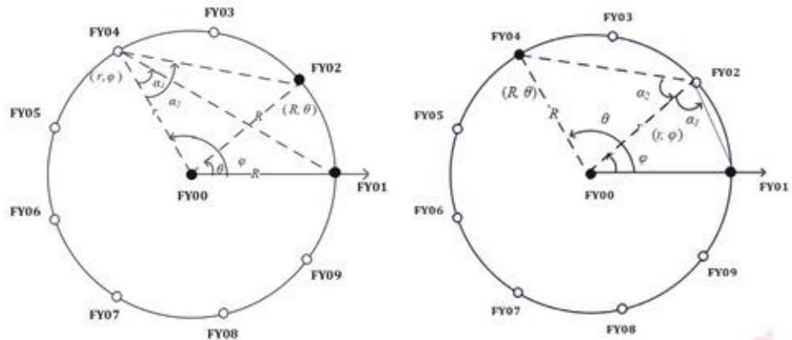  
图 2-3 主动机与被动机排布的两种情况

故该无人机定位问题可化归为方程问题进行求解。两架圆周上的被动机的分布有两种情况，即 $\varphi > \theta$ 与 $\theta > \varphi$ 。而 $\theta$ 与 $\varphi$ 的取值范围则有四种情况，即 $\theta \in [0, \pi) \cap \varphi \in [0, \pi)$ ， $\theta \in [0, \pi) \cap \varphi \in [\pi, 2\pi)$ ， $\theta \in [\pi, 2\pi) \cap \varphi \in [0, \pi)$ ， $\theta \in [\pi, 2\pi) \cap \varphi \in [\pi, 2\pi)$ 。易证 $\theta$ 与 $\varphi$ 的取值范围不影响数值解的大小，仅影响解的正负，故仅从 $\theta$ 与 $\varphi$ 的大小关系出发进行讨论。以 $\theta \in [0,\pi)\cap \varphi \in [0,\pi)$ 为例，设两架第二架主动机分为FY02, FY04；两架被动机分为FY04, FY02，具体图示见图2-3。

根据正弦定理，可列得方程如下：

$$
\left\{ \begin{array}{l} {{ \frac {R}{\sin \alpha_ {1}} =  \frac {r}{\sin (\alpha_ {1} + \varphi_ {1})}}} \\ {{ \frac {R}{\sin \alpha_ {2}} =  \frac {r}{\sin (\alpha_ {2} + \varphi_ {1} - \theta)}}} \end{array} \right. \text {与} \left\{ \begin{array}{l} {{ \frac {R}{\sin \alpha_ {1}} =  \frac {r}{\sin (\alpha_ {1} + \varphi_ {2})}}} \\ {{ \frac {R}{\sin \alpha_ {2}} =  \frac {r}{\sin (\alpha_ {2} + \theta - \varphi_ {2})}}} \end{array} \right.
$$

即

$$
\left\{ \begin{array}{l} \frac {R}{\sin \alpha_ {1}} = \frac {r}{\sin (\alpha_ {1} + \varphi)} \\ \frac {R}{\sin \alpha_ {2}} = \frac {r}{\sin (\alpha_ {2} + | \varphi - \theta |)} \end{array} \right.
$$

## 5.1.2 被动机定位模型的求解

两式相除，得

$$
\begin{array}{l} \frac {\sin \alpha_ {2}}{\sin \alpha_ {1}} = \frac {\sin (\alpha_ {2} + | \varphi - \theta |)}{\sin (\alpha_ {1} + \varphi)} \\ \Rightarrow \frac {\sin \alpha_ {2}}{\sin \alpha_ {1}} = \frac {\sin (\alpha_ {2} + \theta) \sin \varphi \pm \cos (\alpha_ {2} + \theta) \cos \varphi}{\sin \alpha_ {1} \sin \varphi + \cos \alpha_ {1} \cos \varphi} \\ \Rightarrow 1 = \frac {\sin \alpha_ {1} \sin (\alpha_ {2} + \theta) \tan \varphi \pm \sin \alpha_ {1} \cos (\alpha_ {2} + \theta)}{\sin \alpha_ {2} \sin \alpha_ {1} \tan \varphi + \sin \alpha_ {2} \cos \alpha_ {1}} \\ \Rightarrow \tan \varphi = \frac {\cos \alpha_ {1} \pm \cos (\alpha_ {2} \pm \theta)}{\sin \alpha_ {1} [ \sin (\alpha_ {2} \pm \theta) - \sin \alpha_ {2} ]} \\ \end{array}
$$

则上述方程的解为

$$
\left\{ \begin{array}{l} \varphi_ {1} = \arctan \frac {\cos \alpha_ {1} + \cos (\alpha_ {2} + \theta)}{\sin \alpha_ {1} [ \sin (\alpha_ {2} + \theta) - \sin \alpha_ {2} ]} \\ r _ {1} = \frac {R \sin (\alpha_ {2} - \varphi + \theta)}{\sin \alpha_ {2}} \end{array} \right. \tag {1}
$$

$$
\left\{ \begin{array}{l} \varphi_ {2} = \arctan \frac {\cos \alpha_ {1} - \cos (\alpha_ {2} - \theta)}{\sin \alpha_ {1} [ \sin (\alpha_ {2} - \theta) - \sin \alpha_ {2} ]} \\ r _ {2} = \frac {R \sin (\alpha_ {2} + \varphi - \theta)}{\sin \alpha_ {2}} \end{array} \right. \tag {2}
$$

上述两组解为被动机位置的解析解，其极坐标为 $(r_{1},\varphi_{1})$ 与 $(r_{2},\varphi_{2})$ 。在几何上这两组解对应的被动机位置以三架主动机对应圆心角的角平分线为轴对称分布，如图4所示。特殊地，当被动机与相应角平分线的延长线重合时，方程的两个解相等，如图5所示。

为了准确知道被动机的具体位置，故应提出假设：被动接收信号的无人机已知自己对应的编号。基于此假设，可以确定被动机位置的唯一解。在实际情况中，一定编号的无人机对应的遥控设备往往固定，故此假设是合理的。

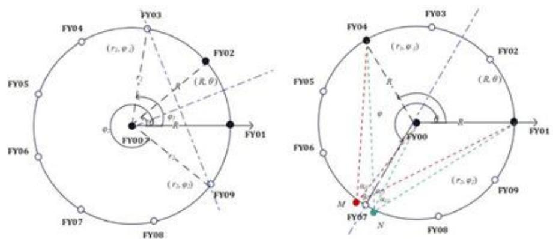  
图 4-5 解的几何分布及特殊情况

在图 5 的情况中，FY07 为被动机，FY00, FY04, FY01 为主动机。当被动机位置略有偏差时， $\alpha_{1}$ 与 $\alpha_{2}$ 近似相等。由于传感器的无源性，且仅能接收到方向信息，故 FY07 并不知道 $\alpha_{1}$ 与 $\alpha_{2}$ 对应的主动机编号。因此，FY07 的实际位置可能有两个，即如图 5 所示的 M, N 两点。

为找出 FY07 位置的真实点，可假设信号源发射的次序已知，即信号源发射信号并非同时，则 FY07 接收到的信号并非无序的集合。基于此可知角 $\alpha_{1}$ 与 $\alpha_{2}$ 对应的主动机，从而可剔除 FY07 位置的虚假点，确定其真实位置。

## 5.1.3 被动接收信号无人机位置的调整方案

定位被动机后可更明确地知道其偏离程度。为了尽可能地减小这种偏离程度，故在此提出被动机位置的调整方案。由于圆的高度对称性，主动机的排布共分四种，如图6所示：

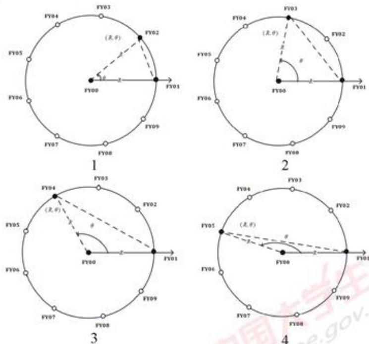

图 6 主动机的四种排布

以排布方式1为例讨论被动机位置的调整方案，其余三种排布同理。如图7所示，FY00, FY01, FY02为主动机，P点为被动机所在位置，根据5.1.1中方位角的定义， $\angle PF0F1 = \alpha_{1}$ ， $\angle PF0F2 = \alpha_{2}$ ， $\angle F1PF2 = \alpha_{3}$ ，易知 $\angle F1F0F2 = 40^{\circ}$ 。若P的位置无偏差，则各无人机对应的方向角如表1所示。

表1 无偏差时 P 的方位角

<table><tr><td></td><td>FY03</td><td>FY04</td><td>FY05</td><td>FY06</td><td>FY07</td><td>FY08</td><td>FY09</td></tr><tr><td> $\alpha_1$ </td><td>50°</td><td>30°</td><td>10°</td><td>10°</td><td>10°</td><td>30°</td><td>50°</td></tr><tr><td> $\alpha_2$ </td><td>70°</td><td>50°</td><td>30°</td><td>20°</td><td>30°</td><td>50°</td><td>70°</td></tr><tr><td> $\alpha_3$ </td><td>20°</td><td>20°</td><td>20°</td><td>10°</td><td>20°</td><td>20°</td><td>20°</td></tr></table>

若 P 的位置有偏差，则可将被动机的位置分为两种情况讨论。

1. 当 P 点在圆周上时，方位角满足：

$$
\left\{ \begin{array}{l} \alpha_ {1} = 9 0 ^ {\circ} \\ \alpha_ {2} = 9 0 ^ {\circ} - \frac {\varphi - 4 0 ^ {\circ}}{2} \\ \alpha_ {3} = 2 0 ^ {\circ} \end{array} \right.
$$

2. 当 P 点不在圆周上时，根据圆的性质：同弧所对的圆外角<圆周角<圆内角，则在图 6 中，对于 $\widehat{F1F2}$ ，P 在圆外时， $\alpha_{3}<20^{\circ}$ ；P 在圆内时， $\alpha_{3}>20^{\circ}$ 。

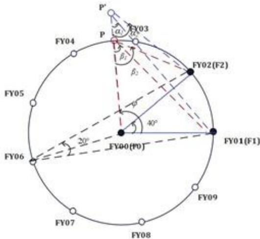

<details>
<summary>text_image</summary>

P'
FY03
P
β1
β2
FY02(F2)
FY01(F1)
40°
20°
FY00(F0)
FY06
FY05
FY04
FY09
FY07
FY08
</details>

图 7 排布方式 1 的被动机位置

因此，若要将有偏差的被动机调至无偏差，应按以下步骤进行：

Step1: 观测被动机接收到的方位角信号，利用 $\alpha_{1}$ 与 $\alpha_{2}$ 计算出 $\alpha_{3}$ 。

Step2: 比较 $\alpha_{3}$ 与 $20^{\circ}$ 的大小，若 $\alpha_{3} > 20^{\circ}$ ，跳至 Step3；若 $\alpha_{3} < 20^{\circ}$ ，跳至 Step4；若 $\alpha_{3} = 20^{\circ}$ ，跳至 Step5。

Step3: 被动机在圆内，应沿径向背离圆心飞行，直至 $\alpha_{3}=20^{\circ}$ 。

Step4: 被动机在圆外，应沿径向朝向圆心飞行，直至 $\alpha_{3}=20^{\circ}$ 。

Step5: 被动机在圆周上，进行角度微调。应沿切线方向飞行（无人机不施加朝向圆心的力），直至 $\alpha_{1}$ 与 $\alpha_{2}$ 和无偏差的方向角重合。

## 5.2 问题二：主动发出信号无人机的数目确定

为确定在已知位置无偏差的 FY00, FY01 为主动机外，还需几架位置无偏差的主动机才能准确定位被动机，可以考虑从圆形编队的性质出发。首先提出引理 1，得出正九边形圆周角与伪圆周角的数学规律；其次基于该规律，结合两集合相等的判定，即可以推测出未知主动机的编号，从而将其转化为 5.1 中被动接收信号无人机的定位模型，确定主动发出信号无人机的数目。

## 5.2.1 定义与引理

定义 1: 记正九边形为 $A_{1}A_{2}\cdots A_{9}$ ，圆心为O，称 $\angle A_{i}A_{j}O(i\neq j)$ 为正九边形的伪圆周角， $\angle A_{i}A_{j}A_{k}(i,j,k$ 互不相等 $)$ 为正九边形的圆周角， $\angle A_{i}OA_{j}(i\neq j)$ 为正九边形的圆心角，如图8所示。

引理 1：对于正九边形的圆周角 $\alpha$ ，存在正整数 k，使得 $\alpha = 20^{\circ}k$ ；对于正九边形的伪圆周角 $\beta$ ，存在正整数 l，使得 $\beta = 10^{\circ}(2l - 1)$ 。

引理1是显然的。因为正九边形的圆心角 $\angle A_{i}OA_{j}(i\neq j)$ 可以表示为 $40^{\circ}k(k$ 为正整数)，那么其对应的圆周角 $\angle A_{i}A_{k}A_{j}(i\neq j,k$ 与 $i,j$ 不相等)就可以表示为 $20^{\circ}k(k$ 为正整数)，并且其对应的伪圆周角 $\angle OA_{i}A_{j}(i\neq j)$ 可以表示为 $(180^{\circ} - 40^{\circ}k) / 2 = 90^{\circ} - 20^{\circ}k = 10^{\circ}(2l - 1)$ （ $l$ 为正整数），如图9，引理1得证。

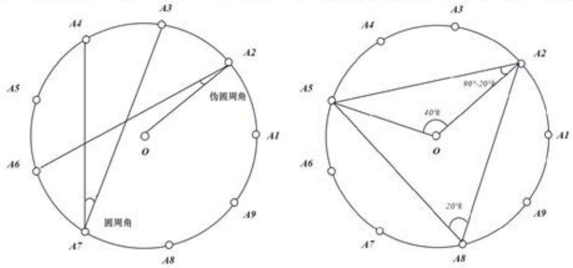  
图 8-9 角的定义与引理的证明

## 5.2.2 未知编号无人机数目的确定

下面我们证明：除 FY00 和 FY01 外，只需要一架无人机发射信号，就可以实现无人机的有效定位。

不妨设发射信号的无人机为0,1,i(i待定)，接收信号的无人机为j；无人机0,1,j形成的圆心角为 $\theta$ ；无人机j收到来自无人机0,1,i的方向信息为 $\alpha,\beta,\gamma$ 。

易知， $\alpha, \beta, \gamma$ 三个角中必有一个为正九边形的圆周角，不妨设 $\alpha$ 为该角。从而 $i$ 的位置可能有两个，记为 $i_1, i_2$ 。

1）当 $\alpha<90^{\circ}-\theta/2$ 时，利用几何关系可以得到，无人机0,1, $i_{1}$ 发射给j的方向信息为集合 $I_{1}$ :

$$
I _ {1} = \left\{\alpha , \frac {1 8 0 ^ {\circ} - \theta}{2}, \frac {1 8 0 ^ {\circ} - \theta - 2 \alpha}{2} \right\}
$$

同样可求，无人机0,1, $i_{2}$ 发射给j的方向信息为集合 $I_{2}$ :

$$
I _ {2} = \left\{\alpha , \frac {1 8 0 ^ {\circ} - \theta}{2}, \alpha + \frac {1 8 0 ^ {\circ} - \theta}{2} \right\}
$$

$I_{1} \neq I_{2}$ 。在模型假设3.4误差 $\pm 5^{\circ}$ 下， $I_{2}$ 中的元素

$$
\alpha + \frac {1 8 0 ^ {\circ} - \theta}{2} \neq \alpha , \frac {1 8 0 ^ {\circ} - \theta}{2}, \frac {1 8 0 ^ {\circ} - \theta - 2 \alpha}{2}
$$

此处不相等指在±5°误差波动下，上式不等号左右取值无交集。

故 $I_{1}$ 不可能等于 $I_{2}$ 。从而可以根据无人机 $\pmb{j}$ 实际接收到的方向信息确定出无人机 $i_1,i_2$ 哪个发射的信号，不妨设 $i_1$ 发射的信号。这样，发射信号的无人机0,1, $i_{1}$ 位置无偏差且编号已知，根据5.1中被动接收信号无人机的定位模型，即可实现无人机 $\pmb{j}$ 的有效定位。

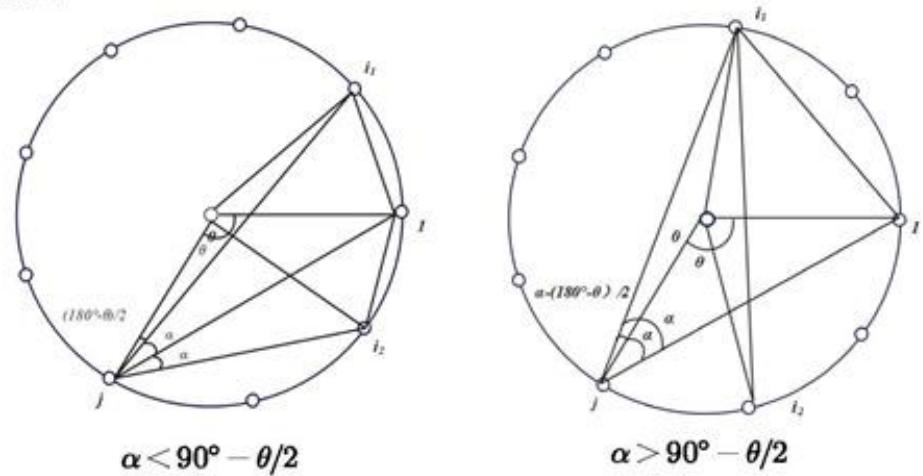  
图 10-11 主动机的两种分布情况

2）当 $\alpha > 90^{\circ} - \theta / 2$ 时， $i_1, i_2$ 的位置可能与上述略有不同，但无本质区别。不过是，无人机 $0, 1, i_1$ 发射给 $j$ 的方向信息集合 $I_1'$ 变为

$$
I _ {1} ^ {\prime} = \left\{\alpha , \frac {1 8 0 ^ {\circ} - \theta}{2}, \alpha - \frac {1 8 0 ^ {\circ} - \theta}{2} \right\}
$$

无人机0,1, $i_{2}$ 发射给j的方向信息集合 $I_{1}^{\prime}$ 变为

$$
I _ {2} ^ {\prime} = \left\{\alpha , \frac {1 8 0 ^ {\circ} - \theta}{2}, \alpha + \frac {1 8 0 ^ {\circ} - \theta}{2} \right\}
$$

同样，在模型假设 3.4 误差±5°下，仍有 $I_{1} \neq I_{2}$ 。同上所证，可实现无人机j的有效定位。

综上所述，在假设3.4误差±5°内，除FY00和FY01外，只需要一架无人机发射信号，就可以实现无人机的有效定位。

## 5.3 问题三：圆形编队的具体调整方案

可将此问题分为四个步骤进行。首先基于一般的模型，对无人机初始位置进行预处理，证明通过无人机径向的调整后，可使得距离误差缩小。其次，分两种方案建立局部最优模型，即每次选取圆周上两或三架无人机发射信号。以两种方案中对应的方位角向量和标准值向量的范数平方的最小值作为目标函数。随后，以两个方案中每个点最后一次调整后对应目标函数的和作为误差函数，来评估无人机的调整方案。最后代入题目中已给的初始数据，并利用计算机模拟生成初始位置的随机数来衡量模型的灵敏性。

## 5.3.1 无人机初始位置的预处理

记理想无人机所围成圆的半径为R。由于图形的相似性（两个相似的图形，对应角相等），故必须有一架无人机距圆心距离为R。记极坐标下无人机位置分别为 $(0,0^{\circ})$ ， $(R,0^{\circ})$ ， $(R+\varepsilon_{k},40^{\circ}(k-1)+\xi_{k}),k=2,3,\cdots,9$ ，其中 $\varepsilon_{k}$ 与 $\xi_{k}$ 分别为半径误差与角度误差。由于初始时刻无人机的位置略有偏差，故不妨设 $\varepsilon_{k}\in(-15\%R,15\%R)$ ， $\xi_{k}\in\{-0.5^{\circ},0.5^{\circ}\},k=2,3,\cdots,9$ 。

对初始时刻无人机的位置进行预处理，使得对 $\forall k\in\{2,3,\cdots,9\}$ ，距离误差 $\varepsilon_{k}$ 可缩小至 $(-5\%R,5\%R)$ 。预处理过程如下：

对任意无人机 $j\in\{2,3,\cdots,9\}$ ，其极坐标为 $(R+\varepsilon_{j},40(j-1)+\xi_{j})$ ，将其沿径向调整，使其从无人机0,1接收到的方向信息角调整为 $\alpha_{j}=90^{\circ}-20^{\circ}(j-1)$ 。  
沿径向调整是因为，无人机j只知道来自0,1无人机的方向信息角，不知道其极角为 $40^{\circ}j+\xi_{j}$ ，沿其他方向调整很可能会使其极角更大程度的偏离 $40^{\circ}j$ 。

下面我们证明，通过对无人机初始位置预处理，可以将距离误差缩小至 $\varepsilon_{k}\in(-5\%R,5\%R)$ ：

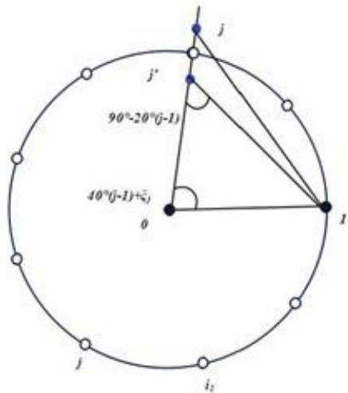

<details>
<summary>text_image</summary>

j
j'
90°-20°(j-1)
40°(j-1)+ξ₁
θ
I
j
i₂
</details>

图 12 预处理证明示意图

由正弦定理可得

$$
\frac {0 j ^ {\prime}}{\sin [ 1 8 0 ^ {\circ} - (9 0 ^ {\circ} - 2 0 (j - 1)) - (4 0 (j - 1) + \xi_ {j}) ]} = \frac {R}{\sin [ 9 0 ^ {\circ} - 2 0 ^ {\circ} (j - 1) ]}
$$

整理得

$$
\begin{array}{l} \frac {0 j ^ {\prime}}{R} = \frac {\cos [ 2 0 ^ {\circ} (j - 1) + \xi_ {j} ]}{\cos [ 2 0 ^ {\circ} (j - 1) ]} = \cos (\xi_ {j}) - \tan (2 0 ^ {\circ} k) \sin (\xi_ {j}) \text {(关于} k, \xi_ {j} \text {单调递减)} \\ \leqslant \cos (- 0. 5 ^ {\circ}) - \tan (2 0 ^ {\circ} * 4) \sin (- 0. 5 ^ {\circ}) \\ \approx 1. 0 4 9 \\ \end{array}
$$

从而距离误差

$$
\varepsilon_ {j} = \frac {| R - 0 j ^ {\prime} |}{R} \approx 0. 0 4 9 <   5
$$

由此可见，对无人机初始位置预处理是必要的。一方面，预处理可使距离误差缩小至更小的范围，如图13所示。更重要的是，通过下面局部最优模型可以看出，初始位置预处理将大大减小目标函数最优值搜索次数。我们知道，一次搜索对应k次无人机向外发射电磁波信号。初始位置预处理意味着将大大减少无人机向外发射电磁波信号的次数。

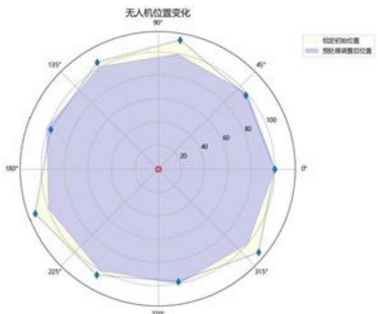

<details>
<summary>radar</summary>

| 角度 \(({}^{\circ})\) | 初始初始位置 | 预计调整后位置 |
| --- | --- | --- |
| 0 | ~95 | ~95 |
| 45 | ~85 | ~85 |
| 90 | ~95 | ~95 |
| 135 | ~85 | ~85 |
| 180 | ~95 | ~95 |
| 225 | ~85 | ~85 |
| 270 | ~95 | ~95 |
| 315 | ~95 | ~95 |
</details>

图 13 无人机初始位置与处理前后对比

## 5.3.2 局部最优模型的建立

由于无人机定位系统的无源性，各无人机之间的信息不共享，故无法通过全局对无人机位置进行调整。下面通过局部最优模型，实现无人机位置尽可能均匀分布在以R为半径的圆周，且无人机向外发射电磁波信号的总次数尽可能小。

以无人机 0 为原点，01 方向为 x 轴正方向建立平面直角坐标系 xOy，并假设 1 的位置 $(R,0)$ 是准确的。

下面介绍两种调整方案，一种是每轮调整仅选取圆周上三架无人机发射信号，其余无人机被动接收信号并作出调整；另一种是每轮调整仅选取圆周上两架无人机发射信号，其余无人机被动接受信号并做出调整。最后，定义误差函数，量化两种方案调整的好坏。

## 方案一：每次选取圆周上三个无人机发射信号

考虑到正九边形的对称性，258、369、471三组无人机均近似构成等边三角形，将他们依次作为发射信号的无人机，其余无人机（除无人机1）接收信号根据局部最优模型做出调整。注意，无人机1的位置是准确的，始终不调整。

Step1: 选取 0258 为发射信号无人机, 134679 无人机被动接受信号并作出调整 (1 不需要调整)。由于对称性, 以无人机 3 为例 (其余无人机与 3 无本质区别), 其调整方式如下:

记 $\angle 530 = \alpha, \angle 038 = \beta, \angle 032 = \gamma$ 。由正九边形几何关系易知， $\alpha, \beta, \gamma$ 三个角的理想值分别为 $50^{\circ}, 10^{\circ}, 70^{\circ}$ 。记 $\boldsymbol{x} = [\alpha, \beta, \gamma]^{T}, \boldsymbol{y} = [50^{\circ}, 10^{\circ}, 70^{\circ}]^{T}$ ，建立目标函数

$$
f _ {3} (\alpha , \beta , \gamma) = \| \boldsymbol {x} - \boldsymbol {y} \| _ {2} ^ {2} = (\alpha - 5 0 ^ {\circ}) ^ {2} + (\beta - 1 0 ^ {\circ}) ^ {2} + (\gamma - 7 0 ^ {\circ}) ^ {2}
$$

$f_{3}$ 下标为对应无人机编号。依此，其余待调整无人机目标函数为 $f_{4}, f_{6}, f_{7}, f_{9}$ 。以无人机3为中心，在边长为 $a$ 的正方形区域内以步长 $b$ 进行搜索，使目标函数达到最小值。设置邻域边长、搜索步长只是为了利用Python对无人机实际调整进行仿真模拟。实际情况是无人机在其原来位置附近任意搜索。

注意到，此处（包括下面及方案二）定义的目标函数不是全局函数，其仅通过待调整飞机接受到的信息 $x$ 建立的， $y$ 是根据模型假设3.4在 $x$ 的基础上推断出来的。

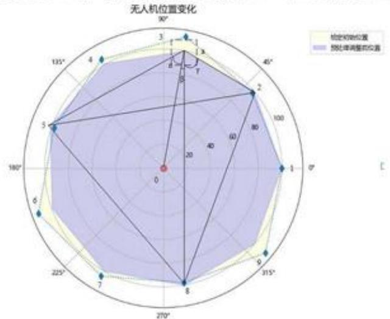

<details>
<summary>radar</summary>

| Angle | 初始初始位置 | 预处理调整前位置 |
| --- | --- | --- |
| \(0{}^{\circ}\) | ~95 | ~95 |
| \(30{}^{\circ}\) | ~85 | ~85 |
| \(60{}^{\circ}\) | ~75 | ~75 |
| \(90{}^{\circ}\) | ~85 | ~85 |
| \(120{}^{\circ}\) | ~95 | ~95 |
| \(150{}^{\circ}\) | ~85 | ~85 |
| \(180{}^{\circ}\) | ~75 | ~75 |
| \(210{}^{\circ}\) | ~85 | ~85 |
| \(240{}^{\circ}\) | ~95 | ~95 |
| \(270{}^{\circ}\) | ~85 | ~85 |
| \(300{}^{\circ}\) | ~75 | ~75 |
| \(330{}^{\circ}\) | ~85 | ~85 |
| \(360{}^{\circ}\) | ~95 | ~95 |
| \(390{}^{\circ}\) | ~85 | ~85 |
| \(420{}^{\circ}\) | ~75 | ~75 |
| \(450{}^{\circ}\) | ~85 | ~85 |
| \(480{}^{\circ}\) | ~95 | ~95 |
| \(510{}^{\circ}\) | ~85 | ~85 |
| \(540{}^{\circ}\) | ~75 | ~75 |
| \(570{}^{\circ}\) | ~85 | ~85 |
| \(600{}^{\circ}\) | ~95 | ~95 |
| \(630{}^{\circ}\) | ~85 | ~85 |
| \(660{}^{\circ}\) | ~75 | ~75 |
| \(690{}^{\circ}\) | ~85 | ~85 |
| \(720{}^{\circ}\) | ~95 | ~95 |
| \(750{}^{\circ}\) | ~85 | ~85 |
| \(780{}^{\circ}\) | ~75 | ~75 |
| \(810{}^{\circ}\) | ~85 | ~85 |
| \(840{}^{\circ}\) | ~95 | ~95 |
| \(870{}^{\circ}\) | ~85 | ~85 |
| \(900{}^{\circ}\) | ~75 | ~75 |
| \(930{}^{\circ}\) | ~85 | ~85 |
| \(960{}^{\circ}\) | ~95 | ~95 |
| \(990{}^{\circ}\) | ~85 | ~85 |
| \(1020{}^{\circ}\) | ~75 | ~75 |
| \(1050{}^{\circ}\) | ~85 | ~85 |
| \(1080{}^{\circ}\) | ~95 | ~95 |
| \(1110{}^{\circ}\) | ~85 | ~85 |
| \(1140{}^{\circ}\) | ~75 | ~75 |
| \(1170{}^{\circ}\) | ~85 | ~85 |
| \(1200{}^{\circ}\) | ~95 | ~95 |
| \(1230{}^{\circ}\) | ~85 | ~85 |
| \(1260{}^{\circ}\) | ~75 | ~75 |
| \(1290{}^{\circ}\) | ~85 | ~85 |
| \(1320{}^{\circ}\) | ~95 | ~95 |
| \(1350{}^{\circ}\) | ~85 | ~85 |
| \(1380{}^{\circ}\) | ~75 | ~75 |
| \(1410{}^{\circ}\) | ~85 | ~85 |
| \(1440{}^{\circ}\) | ~95 | ~95 |
| \(1470{}^{\circ}\) | ~85 | ~85 |
| \(1500{}^{\circ}\) | ~75 | ~75 |
| \(1530{}^{\circ}\) | ~85 | ~85 |
| \(1560{}^{\circ}\) | ~95 | ~95 |
| \(1590{}^{\circ}\) | ~85 | ~85 |
| \(1620{}^{\circ}\) | ~75 | ~75 |
| \(1650{}^{\circ}\) | ~85 | ~85 |
| \(1680{}^{\circ}\) | ~95 | ~95 |
| \(1710{}^{\circ}\) | ~85 | ~85 |
| \(1740{}^{\circ}\) | ~75 | ~75 |
| \(1770{}^{\circ}\) | ~85 | ~85 |
| \(1800{}^{\circ}\) | ~95 | ~95 |
| \(1830{}^{\circ}\) | ~85 | ~85 |
| \(1860{}^{\circ}\) | ~75 | ~75 |
| \(1890{}^{\circ}\) | ~85 | ~85 |
| \(200{}^{\circ}\) (end point) | 0.24 (at 330°) | 0.24 (at 330°) |

Note: The value 'a' is labeled near the data point at 330° on the axis.
</details>

图 14 方案一预处理后的调整图示

Step2: 选取 0369 为发射信号无人机, 124578 无人机被动接受信号并作出调整 (1 不需要调整)。调整方式同 Step1, 无人机 2 的目标函数记为 $g_2$ 。其余待调整无人机目标函数为 $g_4, g_5, g_7, g_8$ 。

Step3: 选取 0471 为发射信号无人机, 235689 无人机被动接受信号并作出调整 (1 不需要调整)。调整方式同 Step1, 无人机 2 的目标函数记为 $h_2$ 。其余待调整无人机目标函数为 $h_3, h_5, h_6, h_8, h_9$ 。

Step4: 设置循环次数阈值 $\eta$ ，以控制无人机调整结束。记总循环次数为 $\sigma$ ，一次循环指先选取选取0258为发射信号无人机，其他无人机作出调整，然后选取0369为发射信号无人机，其他无人机作出调整, 最后选取0471为发射信号无人机，其他无人机作出调整。一次循环每架无人机（无人机0,1除外）均被一次选做发射信号无人机与选做两次被动接受信号无人机做出调整。也即，若总循环次数为 $\sigma$ ，各无人机调整次数如表2所示：

表 2 步骤一循环时各无人机调整次数

<table><tr><td>飞机编号</td><td>0</td><td>1</td><td>2~9</td></tr><tr><td>调整次数</td><td>0</td><td>0</td><td>2σ</td></tr></table>

总调整次数为 $2\sigma\times3\times8=48\sigma$ 。若每架无人机（0,1除外）调整次数超过 $\eta$ ，即 $\sigma>\eta/2$ ，则该飞机调整结束。否则， $\sigma\leqslant\eta/2$ ，返回Step1继续调整。

Step5: 定义误差检测函数

$$
\mu = h _ {2} + h _ {3} + g _ {4} + h _ {5} + h _ {6} + g _ {7} + h _ {8} + h _ {9}
$$

量化无人机趋于正九边形程度。

注意， $g_{i}, h_{j}$ 均为无人机 i, j 最后做出调整时对应的目标函数。定义全局误差函数以衡量无人机调整方案的好坏是合理的。因为，无人机并没有根据全局误差函数做出位置调整，这并不违反无人机间信息不共享的前提。

综上所述，方案一对应的流程图可表示如下：

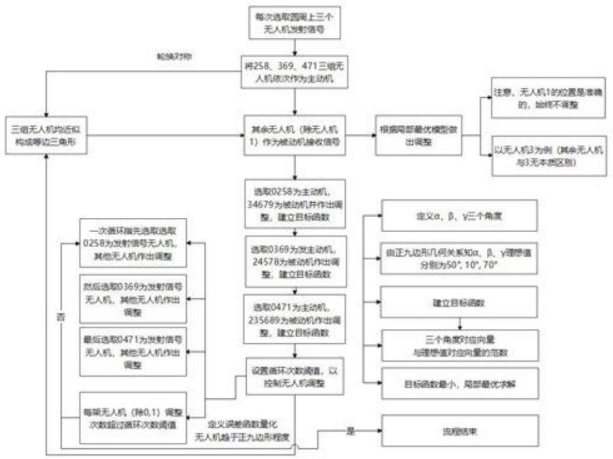

<details>
<summary>flowchart</summary>

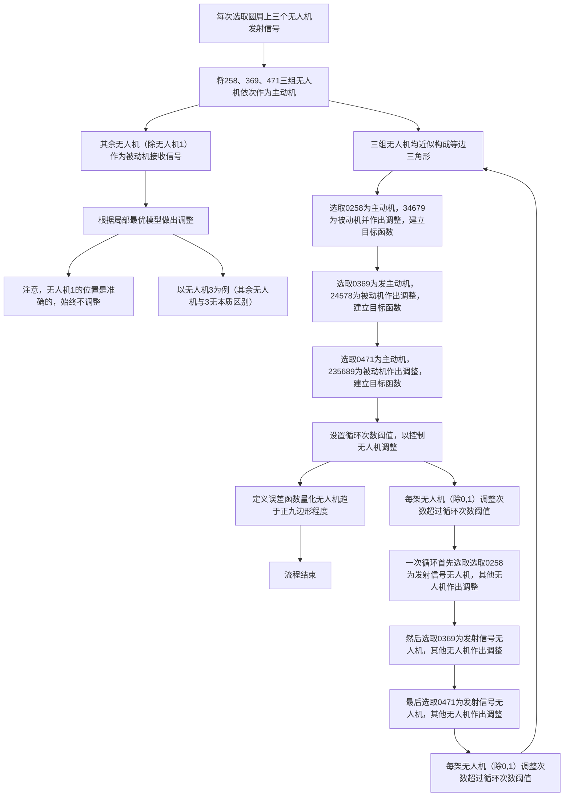
</details>

图 15 方案一对应的流程图

## 方案二：每次选取圆周上两个无人机发射信号

分别选取027、038、049、015、016无人机发射信号，调整方案与方案一本质相同。仅以025无人机发射信号为例。

Step1: 选取 027 为发射信号无人机, 1345689 无人机被动接受信号并作出调整 (1 不需要调整)。以无人机 9 接收信号为例 (其余无人机与 3 大同小异, 目标函数见表 3), 其调整方式如下:

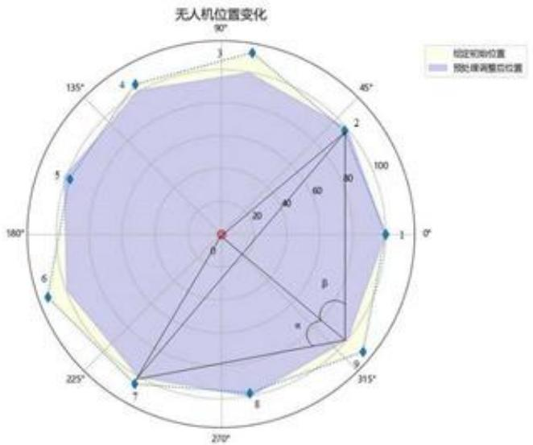

<details>
<summary>radar</summary>

| 角度 | 预处理调整后位置 (Y) | 预处理初始位置 (Y) |
| --- | --- | --- |
| \(0{}^{\circ}\) | ~85 | ~85 |
| \(15{}^{\circ}\) | ~85 | ~85 |
| \(30{}^{\circ}\) | ~85 | ~85 |
| \(45{}^{\circ}\) | ~85 | ~85 |
| \(60{}^{\circ}\) | ~85 | ~85 |
| \(75{}^{\circ}\) | ~85 | ~85 |
| \(90{}^{\circ}\) | ~85 | ~85 |
| \(105{}^{\circ}\) | ~85 | ~85 |
| \(120{}^{\circ}\) | ~85 | ~85 |
| \(135{}^{\circ}\) | ~85 | ~85 |
| \(150{}^{\circ}\) | ~85 | ~85 |
| \(165{}^{\circ}\) | ~85 | ~85 |
| \(180{}^{\circ}\) | ~85 | ~85 |
| \(195{}^{\circ}\) | ~85 | ~85 |
| \(210{}^{\circ}\) | ~85 | ~85 |
| \(225{}^{\circ}\) | ~85 | ~85 |
| \(240{}^{\circ}\) | ~85 | ~85 |
| \(255{}^{\circ}\) | ~85 | ~85 |
| \(270{}^{\circ}\) | ~85 | ~85 |
| \(285{}^{\circ}\) | ~85 | ~85 |
| \(300{}^{\circ}\) | ~85 | ~85 |
| \(315{}^{\circ}\) | ~85 | ~85 |
| \(330{}^{\circ}\) | ~85 | ~85 |
| \(345{}^{\circ}\) | ~85 | ~85 |
| \(360{}^{\circ}\) | ~85 | ~85 |
| \(375{}^{\circ}\) | ~85 | ~85 |
| \(390{}^{\circ}\) | ~85 | ~85 |
| \(405{}^{\circ}\) | ~85 | ~85 |
| \(420{}^{\circ}\) | ~85 | ~85 |
| \(435{}^{\circ}\) | ~85 | ~85 |
| \(450{}^{\circ}\) | ~85 | ~85 |
| \(465{}^{\circ}\) | ~85 | ~85 |
| \(480{}^{\circ}\) | ~85 | ~85 |
| \(495{}^{\circ}\) | ~85 | ~85 |
| \(510{}^{\circ}\) | ~85 | ~85 |
| \(525{}^{\circ}\) | ~85 | ~85 |
| \(540{}^{\circ}\) | ~85 | ~85 |
| \(555{}^{\circ}\) | ~85 | ~85 |
| \(570{}^{\circ}\) | ~85 | ~85 |
| \(585{}^{\circ}\) | ~85 | ~85 |
| \(600{}^{\circ}\) | ~85 | ~85 |
| \(615{}^{\circ}\) | ~85 | ~85 |
| \(630{}^{\circ}\) | ~85 | ~85 |
| \(645{}^{\circ}\) | ~85 | ~85 |
| \(660{}^{\circ}\) | ~85 | ~85 |
| \(675{}^{\circ}\) | ~85 | ~85 |
| \(690{}^{\circ}\) | ~85 | ~85 |
| \(705{}^{\circ}\) | ~85 | ~85 |
| \(720{}^{\circ}\) | ~85 | ~85 |
| \(735{}^{\circ}\) | ~85 | ~85 |
| \(750{}^{\circ}\) | ~85 | ~85 |
| \(765{}^{\circ}\) | ~85 | ~85 |
| \(780{}^{\circ}\) | ~85 | ~85 |
| \(795{}^{\circ}\) | ~85 | ~85 |
| \(810{}^{\circ}\) | ~85 | ~85 |
| \(825{}^{\circ}\) | ~85 | ~85 |
| \(840{}^{\circ}\) | ~85 | ~85 |
| \(855{}^{\circ}\) | ~85 | ~85 |
| \(870{}^{\circ}\) | ~85 | ~85 |
| \(885{}^{\circ}\) | ~85 | ~85 |
| \(900{}^{\circ}\) | ~85 | ~85 |
| \(915{}^{\circ}\) | ~85 | ~85 |
| \(930{}^{\circ}\) | ~85 | ~85 |
| \(945{}^{\circ}\) | ~85 | ~85 |
| \(960{}^{\circ}\) | ~85 | ~85 |
| \(975{}^{\circ}\) | ~85 | ~85 |
| \(990{}^{\circ}\) | ~85 | ~85 |
</details>

图 16 方案二预处理后的调整图示

记 $\angle 709 = \alpha, \angle 902 = \beta$ 。由正九边形几何关系易知， $\alpha, \beta$ 三个角的理想值均为 $50^{\circ}$ （不同发射信号的无人机，不同接受信号的无人机确切指导见表3）。记 $\boldsymbol{x} = [\alpha, \beta]^{T}, \boldsymbol{y} = [50^{\circ}, 50^{\circ}]^{T}$ ，建立目标函数

$$
f _ {9} (\alpha , \beta , \gamma) = \| \boldsymbol {x} - \boldsymbol {y} \| _ {2} ^ {2} = (\alpha - 5 0 ^ {\circ}) ^ {2} + (\beta - 5 0 ^ {\circ}) ^ {2}
$$

$f_{9}$ 下标为对应无人机编号。依此，其余待调整无人机目标函数为 $f_{3}, f_{4}, f_{5}, f_{6}, f_{8}$ 。以无人机 9 为中心，在边长为 a 的正方形区域内以步长 b 调整，使目标函数达到最小值。

表 3 目标函数序列

<table><tr><td></td><td>2</td><td>3</td><td>4</td><td>5</td></tr><tr><td>027</td><td></td><td> $(70^{\circ}, 10^{\circ})$ </td><td> $(30^{\circ}, 50^{\circ})$ </td><td> $(30^{\circ}, 50^{\circ})$ </td></tr><tr><td>038</td><td> $(70^{\circ}, 30^{\circ})$ </td><td></td><td> $(70^{\circ}, 10^{\circ})$ </td><td> $(50^{\circ}, 30^{\circ})$ </td></tr><tr><td>049</td><td> $(50^{\circ}, 50^{\circ})$ </td><td> $(70^{\circ}, 30^{\circ})$ </td><td></td><td> $(70^{\circ}, 10^{\circ})$ </td></tr><tr><td>015</td><td> $(70^{\circ}, 30^{\circ})$ </td><td> $(50^{\circ}, 50^{\circ})$ </td><td> $(70^{\circ}, 30^{\circ})$ </td><td></td></tr><tr><td>016</td><td> $(70^{\circ}, 10^{\circ})$ </td><td> $(50^{\circ}, 30^{\circ})$ </td><td> $(50^{\circ}, 30^{\circ})$ </td><td> $(70^{\circ}, 10^{\circ})$ </td></tr></table>

续表3 目标函数序列

<table><tr><td></td><td>6</td><td>7</td><td>8</td><td>9</td></tr><tr><td>027</td><td> $(70^{\circ}, 10^{\circ})$ </td><td></td><td> $(70^{\circ}, 30^{\circ})$ </td><td> $(50^{\circ}, 50^{\circ})$ </td></tr><tr><td>038</td><td> $(50^{\circ}, 30^{\circ})$ </td><td> $(70^{\circ}, 10^{\circ})$ </td><td></td><td> $(70^{\circ}, 30^{\circ})$ </td></tr><tr><td>049</td><td> $(50^{\circ}, 30^{\circ})$ </td><td> $(50^{\circ}, 30^{\circ})$ </td><td> $(70^{\circ}, 10^{\circ})$ </td><td></td></tr><tr><td>015</td><td> $(70^{\circ}, 10^{\circ})$ </td><td> $(50^{\circ}, 30^{\circ})$ </td><td> $(50^{\circ}, 30^{\circ})$ </td><td> $(70^{\circ}, 10^{\circ})$ </td></tr><tr><td>016</td><td></td><td> $(70^{\circ}, 30^{\circ})$ </td><td> $(50^{\circ}, 50^{\circ})$ </td><td> $(70^{\circ}, 30^{\circ})$ </td></tr></table>

Step2: 选取038三架为发射信号无人机，无人机1245679被动接受信号并作出调整（1不需要调整）。调整方式同Step1，目标函数记为 $g_{i}$ 。

Step3: 选取049三架为发射信号无人机，无人机1235678被动接受信号并作出调整（1不需要调整）。调整方式同Step1，目标函数记为 $h_{i}$ 。

Step4: 选取015三架为发射信号无人机，无人机2346789被动接受信号并作出调

整。调整方式同Step1，目标函数记为 $u_{i}$ 。

Step5: 选取 016 三架为发射信号无人机，无人机 2345789 被动接受信号并作出调整。调整方式同 Step1，目标函数记为 $v_{i}$ 。

Step6: 设置循环次数阈值 $\eta$ ，以控制调整结束。仍记总循环次数为 $\sigma$ 。 $\sigma$ 参数含义同步骤一所述相同。各无人机调整次数如下表

表 4 步骤二循环时各无人机调整次数

<table><tr><td>飞机编号</td><td>0</td><td>1</td><td>2~9</td></tr><tr><td>调整次数</td><td>0</td><td>0</td><td>4σ</td></tr></table>

总调整次数为 $4\sigma\times2\times8=64\sigma$ 次。从而若每辆无人机（0,1除外）调整次数超过 $\eta$ ，即 $\sigma>\eta/4$ ，则该飞机调整结束。否则， $\sigma\leqslant\eta/4$ ，返回Step1继续调整。

Step7: 定义误差检测函数

$$
\mu = v _ {2} + v _ {3} + v _ {4} + v _ {5} + u _ {6} + v _ {7} + v _ {8} + v _ {9}
$$

量化无人机趋于正九边形程度。

注意， $u_{i}, v_{j}$ 含义均为无人机 i, j 最后做出调整时对应的目标函数。定义全局误差函数以衡量无人机调整方案的好坏同样是合理的。无人机并没有根据全局误差函数做出位置调整，同样不违反无人机间信息不共享的前提。

综上所述，方案二对应的流程图可表示如下：

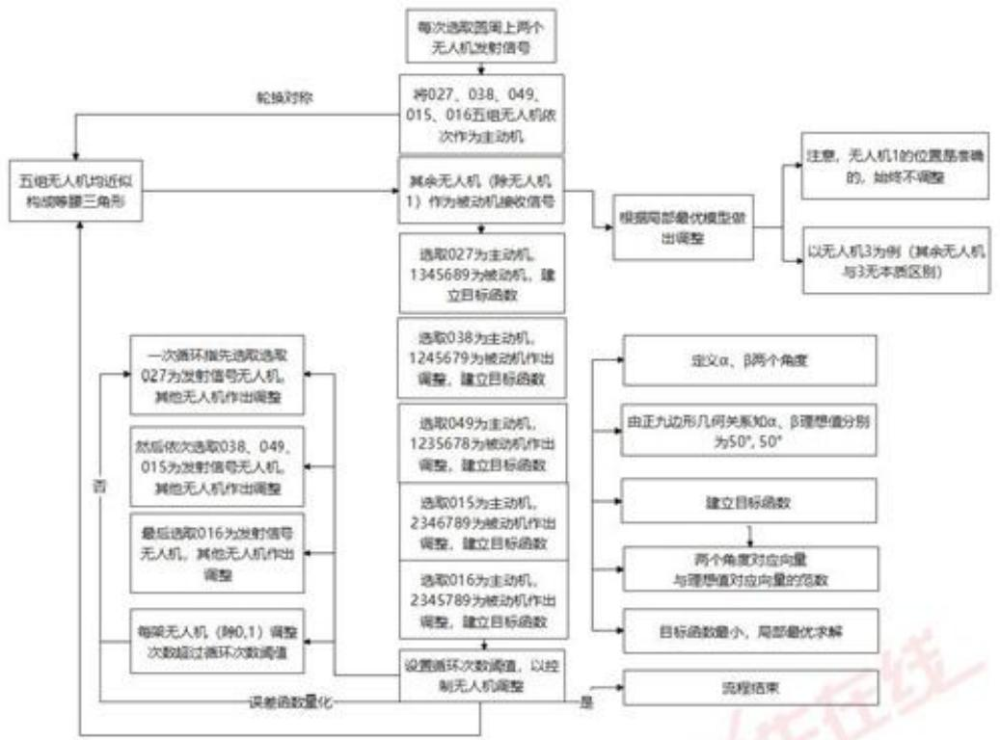

<details>
<summary>flowchart</summary>

This flowchart illustrates the iterative process of selecting and adjusting a specific number of无人机 (无人机) for calculating target function values. It details steps from initial input to convergence, iterative adjustments, and final output.
</details>

图17 方案二对应的流程图

## 5.3.3 模型的检验与仿真

通过仿真模拟对局部最优模型进行检验。无人机实际情况是可以沿任意方向微调的，为了对无人机进行仿真模拟，取搜索区域正方形边长a=0.2、搜索步长b=0.01（这对应无人机在原来位置微调），编写Python程序求解模型。

仿真求解模型实际是求如下函数的最优值对应的 $(i,j)$ ：

$$
\arg \min _ {(i, j)} f _ {u} = \sum_ {v} [ A n g l e \langle (x _ {v}, y _ {v}), (x _ {u} + i b, y _ {u} + j b), (0, 0) \rangle - I d e a l _ {v 0} ] ^ {2}
$$

其中， $f_{u}$ 是无人机 $A_{u}(u=2,3,\cdots,9)$ 的目标函数，Angle $\langle A,B,O\rangle$ 表示边AO与边BO的夹角， $Ideal_{v0}$ 表示无人机v,0发射信号u接收方向信息的理想值。方案一选取三架无人机，v取三个值；而方案二选取两架无人机，v取两个值。

对题目中已给的原始坐标的调整方案求解结果如下：

通过方案一（每次选取圆周上三个无人机发射信号）与方案二（每次选取圆周上上两个无人机发射信号）调整完后的无人机极坐标对比见表4：

表 5 原始坐标、方案一与方案二调整完后的坐标对比

<table><tr><td>无人机编号</td><td>原始值</td><td>方案一</td><td>方案二</td></tr><tr><td>0</td><td>(0,0)</td><td>(0,0)</td><td>(0,0)</td></tr><tr><td>1</td><td>(100,0)</td><td>(100,0)</td><td>(100,0)</td></tr><tr><td>2</td><td>(98,40.10)</td><td>(99.9932,40.0051)</td><td>(100.0009,40.0015)</td></tr><tr><td>3</td><td>(112,80.21)</td><td>(99.9969,80.0075)</td><td>(99.9987,80.0019)</td></tr><tr><td>4</td><td>(105,119.75)</td><td>(99.9967,120.0052)</td><td>(100.0004,119.9974)</td></tr><tr><td>5</td><td>(98,159.86)</td><td>(99.9959,160.0013)</td><td>(99.9993,159.9959)</td></tr><tr><td>6</td><td>(112,199.96)</td><td>(99.9953,200.0066)</td><td>(100.0013,199.9993)</td></tr><tr><td>7</td><td>(105,240.07)</td><td>(99.9986,240.0064)</td><td>(100.0036,240.0014)</td></tr><tr><td>8</td><td>(98,280.17)</td><td>(100.0037,280.0031)</td><td>(100.0019,279.9975)</td></tr><tr><td>9</td><td>(112,320.28)</td><td>(100.0055,320.0043)</td><td>(99.9979,320.0007)</td></tr></table>

无人机原始位置、预处理后的位置与方案一、方案二调整完后的位置见极坐标图18:

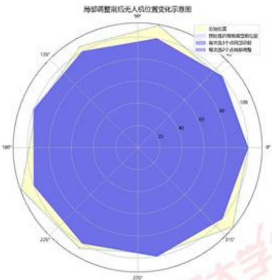

<details>
<summary>radar</summary>

| 维度 (Angle) | 初始位置 (Initial Position) | 预始后调整至初始位置 (Pre-adjusted Position) | 每大选3个点的调整 (Every 3 points adjustment) | 每大选2个点的调整 (Every 2 points adjustment) |
| --- | --- | --- | --- | --- |
| \(0{}^{\circ}\) | ~95 | ~95 | ~95 | ~95 |
| \(15{}^{\circ}\) | ~85 | ~85 | ~85 | ~85 |
| \(30{}^{\circ}\) | ~75 | ~75 | ~75 | ~75 |
| \(45{}^{\circ}\) | ~65 | ~65 | ~65 | ~65 |
| \(60{}^{\circ}\) | ~60 | ~60 | ~60 | ~60 |
| \(75{}^{\circ}\) | ~60 | ~60 | ~60 | ~60 |
| \(90{}^{\circ}\) | ~70 | ~70 | ~70 | ~70 |
| \(105{}^{\circ}\) | ~80 | ~80 | ~80 | ~80 |
| \(120{}^{\circ}\) | ~90 | ~90 | ~90 | ~90 |
| \(135{}^{\circ}\) | ~95 | ~95 | ~95 | ~95 |
| \(150{}^{\circ}\) | ~95 | ~95 | ~95 | ~95 |
| \(165{}^{\circ}\) | ~90 | ~90 | ~90 | ~90 |
| \(180{}^{\circ}\) | ~85 | ~85 | ~85 | ~85 |
| \(195{}^{\circ}\) | ~80 | ~80 | ~80 | ~80 |
| \(210{}^{\circ}\) | ~75 | ~75 | ~75 | ~75 |
| \(225{}^{\circ}\) | ~70 | ~70 | ~70 | ~70 |
| \(240{}^{\circ}\) | ~65 | ~65 | ~65 | ~65 |
| \(255{}^{\circ}\) | ~60 | ~60 | ~60 | ~60 |
| \(270{}^{\circ}\) | ~60 | ~60 | ~60 | ~60 |
| \(285{}^{\circ}\) | ~65 | ~65 | ~65 | ~65 |
| \(300{}^{\circ}\) | ~70 | ~70 | ~70 | ~70 |
| \(315{}^{\circ}\) | ~80 | ~80 | ~80 | ~80 |
| \(330{}^{\circ}\) | ~90 | ~90 | ~90 | ~90 |
| \(345{}^{\circ}\) | ~95 | ~95 | ~95 | ~95 |
| \(360{}^{\circ}\) | ~95 | ~95 | ~95 | ~95 |
| \(375{}^{\circ}\) | ~90 | ~90 | ~90 | ~90 |
| \(390{}^{\circ}\) | ~85 | ~85 | ~85 | ~85 |
| \(405{}^{\circ}\) | ~80 | ~80 | ~80 | ~80 |
| \(420{}^{\circ}\) | ~75 | ~75 | ~75 | ~75 |
| \(435{}^{\circ}\) | ~70 | ~70 | ~70 | ~70 |
| \(450{}^{\circ}\) | ~65 | ~65 | ~65 | ~65 |
| \(465{}^{\circ}\) | ~60 | ~60 | ~60 | ~60 |
| \(480{}^{\circ}\) | ~60 | ~60 | ~60 | ~60 |
| \(495{}^{\circ}\) | ~65 | ~65 | ~65 | ~65 |
| \(510{}^{\circ}\) | ~70 | ~70 | ~70 | ~70 |
| \(525{}^{\circ}\) | ~80 | ~80 | ~80 | ~80 |
| \(540{}^{\circ}\) | ~90 | ~90 | ~90 | ~90 |
| \(555{}^{\circ}\) | ~95 | ~95 | ~95 | ~95 |
| \(570{}^{\circ}\) | ~95 | ~95 | ~95 | ~95 |
| \(585{}^{\circ}\) | ~90 | ~90 | ~90 | ~90 |
| \(600{}^{\circ}\) | ~85 | ~85 | ~85 | ~85 |
| \(615{}^{\circ}\) | ~80 | ~80 | ~80 | ~80 |
| \(630{}^{\circ}\) | ~75 | ~75 | ~75 | ~75 |
| \(645{}^{\circ}\) | ~70 | ~70 | ~70 | ~70 |
| \(660{}^{\circ}\) | ~65 | ~65 | ~65 | ~65 |
| \(675{}^{\circ}\) | ~60 | ~60 | ~60 | ~60 |
| \(690{}^{\circ}\) | ~60 | ~60 | ~60 | ~60 |
| \(705{}^{\circ}\) | ~65 | ~65 | ~65 | ~65 |
| \(720{}^{\circ}\) | ~70 | ~70 | ~70 | ~70 |
| \(735{}^{\circ}\) | ~80 | ~80 | ~80 | ~80 |
| \(750{}^{\circ}\) | ~90 | ~90 | ~90 | ~90 |
</details>

图 18 方案一、方案二调整完后的位置

图 18 是预处理前原始位置、预处理后局部调整前位置、两种方案分别调整后位置对比图。可以看出，预处理后，无人机位置已经很接近正九边形了。所以调整前后的图是十分相似的，没有很明显的区别。无人机 5 可以较明显地看出两种方案调整后的位置。

方案一与方案二的全局检验误差值函数 $\mu_{1},\mu_{2}$ 如图19所示：

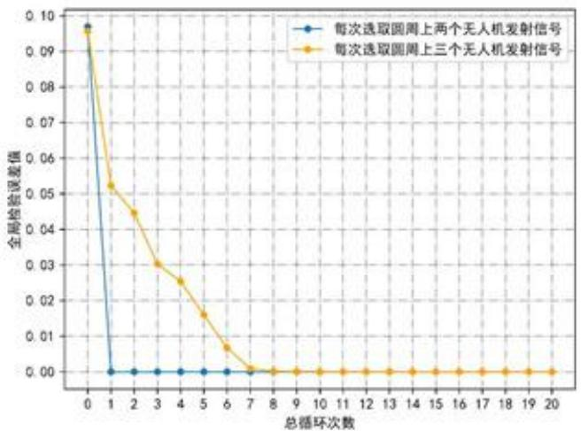

<details>
<summary>line</summary>

| 总循环次数 | 每次选取圆周上两个无人机发射信号 | 每次选取圆周上三个无人机发射信号 |
| --- | --- | --- |
| 0 | ~0.097 | ~0.096 |
| 1 | 0.000 | ~0.052 |
| 2 | 0.000 | ~0.045 |
| 3 | 0.000 | ~0.030 |
| 4 | 0.000 | ~0.025 |
| 5 | 0.000 | ~0.016 |
| 6 | 0.000 | ~0.007 |
| 7 | 0.000 | ~0.001 |
| 8 | 0.000 | 0.000 |
| 9 | 0.000 | 0.000 |
| 10 | 0.000 | 0.000 |
| 11 | 0.000 | 0.000 |
| 12 | 0.000 | 0.000 |
| 13 | 0.000 | 0.000 |
| 14 | 0.000 | 0.000 |
| 15 | 0.000 | 0.000 |
| 16 | 0.000 | 0.000 |
| 17 | 0.000 | 0.000 |
| 18 | 0.000 | 0.000 |
| 19 | 0.000 | 0.000 |
| 20 | 0.000 | 0.000 |
</details>

图 19 方案一与方案二的全局检验误差值函数

两种方案全局检验误差关于总循环次的具体值见表5：

表 6 两种方案全局检验误差关于总循环次的具体值

<table><tr><td>次数</td><td>1</td><td>2</td><td>3</td><td>4</td><td>5</td><td>6</td><td>7</td><td>8</td></tr><tr><td>方案二</td><td>0.0969</td><td>1.90e-06</td><td>1.24e-06</td><td>8.36e-07</td><td>7.26e-06</td><td>5.96e-06</td><td>5.96e-06</td><td>5.96e-06</td></tr><tr><td>方案一</td><td>0.0956</td><td>0.0523</td><td>0.0446</td><td>0.0302</td><td>0.0254</td><td>0.0160</td><td>0.0067</td><td>0.0009</td></tr></table>

续表 6 两种方案全局检验误差关于总循环次的具体值

<table><tr><td>次数</td><td>9</td><td>10</td><td>11</td><td>12</td><td>13</td><td>14</td><td>15</td><td>16</td></tr><tr><td>方案二</td><td>5.96e-06</td><td>5.96e-06</td><td>5.96e-06</td><td>5.96e-06</td><td>5.96e-06</td><td>5.96e-06</td><td>5.96e-06</td><td>5.96e-06</td></tr><tr><td>方案一</td><td>0.0002</td><td>5.35e-05</td><td>5.35e-05</td><td>5.35e-05</td><td>5.35e-05</td><td>1.01e-05</td><td>7.42e-05</td><td>7.42e-05</td></tr></table>

对比两个方案可以得出如下两点结论：

## 1）方案二的收敛速度要明显优于方案一的收敛速度

方案二在循环1次后，全局检验误差就从0.1降到了1.901e-06，而方案二需要循环7次才能进全局检验误差从0.1缩小至0.0067。即方案二所有无人机调整 $64\sigma=64$ 次，全局检验误差就可以缩小至很小的收敛值；而即方案一所有无人机通过调整 $48\sigma=48\times7=336$ 次，全局检验误差才可以缩小至较小的收敛值，收敛值约为前者十倍。

## 2）方案二的全局检验误差的收敛值远远小于方案一的全局检验误差的收敛值

方案二的全局检验误差在循环6次后达到稳定值5.961e-06，方案二的全局检验误差循环15次才达到稳定值7.42e-05。

究其原因，我们推测，求解模型是一个离散化的过程，即以一定步长在待调整点的邻域内搜索目标函数的最优值。由于搜索的离散性、步长精度的设置，全局检验误差值不可能严格等于0，最终误差在 $10^{-6}\sim10^{-5}$ 范围内比较理想。

无人机集群在遂行编队飞行时，为避免外界干扰，应尽可能保持电磁静默，少向外发射电磁波信号。下面我们通过估计电磁信号发射次数比较两个方案的好坏。

两个方案均以步长 $b$ 通过遍历待调整点边长为 $a$ 的正方形邻域内所有点确定目标函数最小值，一个点一次遍历约发射 $(a / b)^2$ 次。在循环相同次数 $\sigma$ 时，方案一需要发射电磁信号 $48\sigma \times (a / b)^2$ 次，方案二需要发射电磁信号 $64\sigma \times (a / b)^2$ 次。在全局检验误差收敛时，方案一需要发射电磁信号 $48 \times 7 \times (0.2 / 0.01)^2 = 134400$ 次，而方案二仅需 $64 \times 1 \times (0.2 / 0.01)^2 = 25600$ 次，约为前者的 $19\%$ 。从这个角度分析，通过方案二调整无人机更优。

特别注意，上面计算的调整次数（像134400、2560次）无实际参考价值，其仅用于比较方案一、方案二发射次数的多少以评估两个方案好坏，与无人机实际调整次数无关。

综上所述，从误差与发射电磁信号次数两个角度分析，方案二，即每次调整选取圆周上两个无人机发射信号，比方案一更优。

需要注意的是，单凭一组原始数据并不能准确检验模型的准确性，故在本文的第六部分将生成服从高斯分布的随机数，进而对该模型进行灵敏性分析。

## 5.4 问题四：锥形编队的具体调整方案

## 5.4.1 理论调整

给定初始位置略有偏差的无人机锥形编队队形，我们证明，在空间中可以调整至存在倾角与初始位置相近的严格的锥形编队队形。为此，首先给出三个引理，他们分别对应不同类的操作。

◇ 引理 1：给定空间中近似成正三角形的三个点A,B,C，与一在边AC附近的点D，可以通过三步微调，将△ABC调整为严格正三角形，点B始终不动，且D在边AC上：

第一步：点A,B,C不动，调整点D。控制 $\angle ADC=180^{\circ}$ ，使得D通过微调落在边AC上，如图20步骤1所示；

第二步：点A,B,D不动，调整点C。控制 $\angle ACD=0^{\circ},\angle DCB=\angle BCA=60^{\circ}$ ，使得点C在边AD上且 $\angle C=60^{\circ}$ ，如图20步骤2所示；

第三步：点B,D,C不动，调整点A。控制 $\angle CAD=0^{\circ},\angle DAB=\angle BCA=60^{\circ}$ ，使得点A在边CD延长线上且 $\angle A=60^{\circ}$ ，如图20步骤3所示。

通过以上三步，可以将 $\triangle ABC$ 在给定位置附近微调为正三角形，且点D在AC上，即将 $\triangle ABC$ 调至 $\triangle AB'C'$ 。

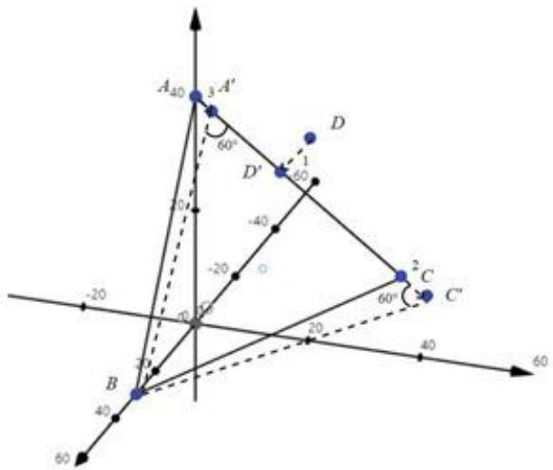

<details>
<summary>text_image</summary>

A40
3 A'
60°
D
1
60°
-40
20
-20
-10
-50
-20
B
2
C
60°
C"
20
40
60
60
</details>

图 20 引理 1 的调整方案

引理 2：给定空间中近似成正三角形的三个点 A, B, C，与一在边 AC 附近的点 D 对于任意 $\lambda \in [0, +\infty]$ ，可以将点调到边 AC 上，且满足 $AD/DC = \lambda$ ，如图 21 所示。当点 D 在边 AC 上，且满足 $AD/DC = \lambda$ 时，根据正三角形几何关系易求

$$
\angle A D B = \arccos \frac {\lambda - 1}{2 \sqrt {\lambda^ {2} + \lambda + 1}}
$$

调整方案如下：点A,B,C不动，微调点D，控制：

$$
\angle A D C = 0 ^ {\circ}, \angle A D B = \arccos \frac {\lambda - 1}{2 \sqrt {\lambda^ {2} + \lambda + 1}}
$$

使得点D在边AC上且满足 $AD/DC=\lambda$ 。

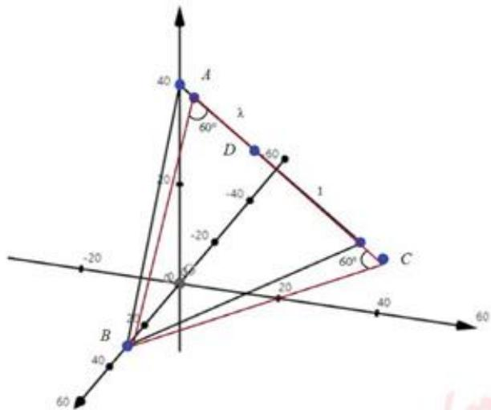

<details>
<summary>text_image</summary>

40
A
λ
60°
D
-40
-20
-20
60°
C
20
20
40
60
B
40
60
</details>

图 21 引理 2 的几何关系

引理 3: 给定空间中成正三角形的三个点 A, B, C，与在 $\triangle ABC$ 中心附近的点 D，可通过微调使得 D 是 $\triangle ABC$ 的中心，如图 22 所示。

点A,B,C不动，微调点D。控制 $\angle ADB=\angle BDC=\angle CDA=120^{\circ}$ ，即可使点D为 $\triangle ABC$ 的中心。证明是显然的，由于此时 $\angle ADB+\angle BDC+\angle CDA=360^{\circ}$ ，故点D在平面ABC内。由F定理，平面上满足 $\angle ADB=\angle BDC=\angle CDA=120^{\circ}$ 的点只有一个——FERMAT点。又因为 $\triangle ABC$ 是正三角形，其FERMAT点即为中心，从而点D为 $\triangle ABC$ 的中心。

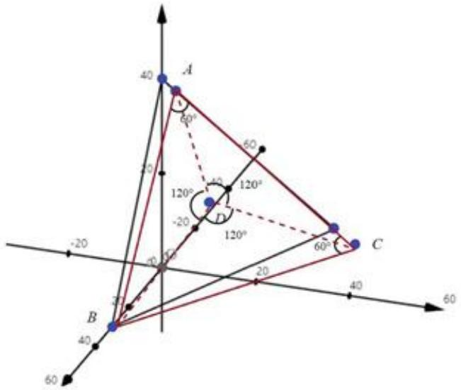

<details>
<summary>text_image</summary>

40
A
60°
60
120°
120°
-20
D
120°
-20
C
60°
20
20
40
60
B
40
60
</details>

图 22 引理 3 的几何关系

下面我们通过以上三个引理，将给定的初始位置略有偏差的无人机锥形编队队形调整至存在倾角与初始位置相近的严格的锥形编队队形。

为叙述方便，标记锥形编队无人机所在点依次为 $A_{1},A_{2},\cdots,A_{15}$ （下面不区分点 $A_{1}$ 与无人机 $A_{1}$ ），截取锥形编队无人机所在空间中的平面，如图23所示。

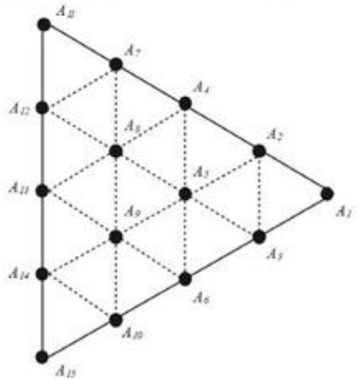

<details>
<summary>text_image</summary>

A₂₁
A₇
A₄
A₂
A₁₂
A₈
A₃
A₁₁
A₉
A₅
A₁₄
A₆
A₁₀
A₁₅
A₃
</details>

图 23 锥形编队无人机排布

Step1: 由引理 1, 调整 $A_{1}, A_{11}, A_{15}, A_{12}$ , 可以将 $\triangle A_{1}A_{11}A_{15}$ 调整为正三角形, 且 $A_{12}$ 在边 $A_{11}A_{15}$ 。具体操作如下 (对应于引理 1 中的操作): 首先选取 $A_{11}, A_{12}$ 发射信号, $A_{12}$ 接受, 如此可以将 $A_{11}, A_{12}, A_{15}$ 调至共线。然后分别选取 $A_{1}, A_{11}, A_{12}$ 发射信号、 $A_{15}$ 接收信号与选取 $A_{1}, A_{12}, A_{15}$ , 发射信号、 $A_{11}$ 接收信号, 可将 $\triangle A_{1}A_{11}A_{15}$ 调整为正

三角形，且 $A_{12}$ 在边 $A_{11}A_{15}$ 。

Step2: 由引理 2，可以将 $A_{2}, A_{4}, A_{7}$ 调至边 $A_{1}, A_{11}$ 的四等分点， $A_{3}, A_{6}, A_{10}$ 调至边 $A_{1}, A_{15}$ 的四等分点， $A_{12}, A_{13}, A_{14}$ 调至边 $A_{11}A_{15}$ 的四等分点。每次调整均是选取 $A_{1}, A_{11}, A_{15}$ 发射信号，待调整点接收信号即可。

Step3: 由引理 3，可以将 $A_{5}$ 调至正 $\triangle A_{1}A_{7}A_{10}$ 的中心， $A_{8}$ 调至正 $\triangle A_{2}A_{11}A_{14}$ 的中心， $A_{9}$ 调至正 $\triangle A_{3}A_{12}A_{15}$ 的中心。

综上， $A_{1}A_{2}\cdots A_{15}$ 调至准确位置且在同一有一定倾角的平面内，构成锥形编队队形，总体调节的流程图如下：

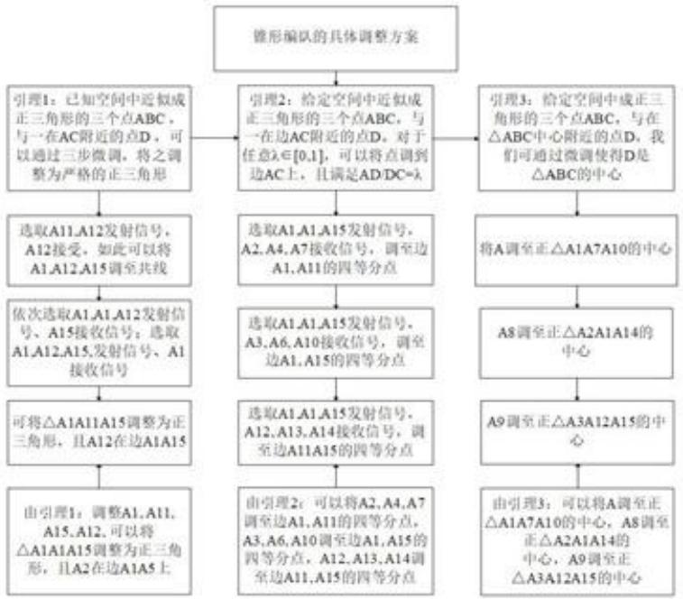

<details>
<summary>flowchart</summary>

```mermaid
graph TD
  A["锥形编队的具体调整方案"] --> B["引理1：已知空间中近似成正三角形的三个点ABC，与一在AC附近的点D，可以通过三步微调，将之调整为严格的正三角形"]
  A --> C["&quot;引理2：给定空间中近似成正三角形的三个点ABC，与一在边AC附近的点D。对于任意λ∈[0,1"]，可以将点调到边AC上，且满足AD/DC=λ"]
  A --> D["引理3：给定空间中成正三角形的三个点ABC，与在△ABC中心附近的点D，我们可通过微调使得D是△ABC的中心"]
  
  B --> E["选取A11,A12发射信号，A12接受，如此可以将A1,A12,A15调至共线"]
  E --> F["依次选取A1,A1,A12发射信号、A15接收信号；选取A1,A12,A15,发射信号、A1接收信号"]
  F --> G["可将△A1A11A15调整为正三角形，且A12在边A1A15"]
  G --> H["由引理1：调整A1,A11,A15,A12，可以将△A1A1A15调整为正三角形，且A2在边A1A5上"]
  
  C --> I["选取A1,A1,A15发射信号，A2,A4,A7接收信号，调至边A1,A11的四等分点"]
  I --> J["选取A1,A1,A15发射信号、A3,A6,A10接收信号，调至边A1,A15的四等分点"]
  J --> K["选取A1,A1,A15发射信号、A12、A13、A14接收信号，调至边A11A15的四等分点"]
  K --> L["由引理2：可以将A2、A4、A7调至边A1、A11的四等分点，A3、A6、A10调至边A1、A15的四等分点，A12、A13、A14调至边A11、A15的四等分点"]
  
  D --> M["将A调至正△A1A7A10的中心"]
  M --> N["A8调至正△A2A1A14的中心"]
  N --> O["A9调至正△A3A12A15的中心"]
  O --> P["由引理3：可以将A调至正△A1A7A10的中心，A8调至正△A2A1A14的中心，A9调至正△A3A12A15的中心"]
```
</details>

图 24 锥形编队调节的流程图

## 5.4.2 引理的检验与仿真

由 5.4.1 所述，调整策略是由引理 1-3 实现。下面用 Python 实现每个引理，全局调整好坏在 5.4.3 讨论。

## 1）引理1实现

随机生成近似正 $\triangle ABC$ 与边AC附近的点D，通过引理1调整，保留三位小数，坐标变化见表7，角度变化见表8，空间调整前后见图26。

表 7 引理 1 调整前后各点坐标变化

<table><tr><td></td><td>A点</td><td>B点</td></tr><tr><td>调整前坐标</td><td>(16.5, 10.9, 0.1)</td><td>(0, 0, 0.15)</td></tr><tr><td>调整后坐标</td><td>(16.520, 10.440, 0.100)</td><td>(0, 0, 0)</td></tr></table>

续表7 引理1调整前后各点坐标变化

<table><tr><td>调整前坐标</td><td>C点</td><td>D点</td></tr><tr><td>调整后坐标</td><td>(17.3,-9.0,0.15)</td><td>(18.4,0,-0.15)</td></tr><tr><td>调整前坐标</td><td>(17.300,-9.090,0.150)</td><td>(16.990,-1.290,0.130)</td></tr></table>

表 8 引理 1 调整前后各角度变换

<table><tr><td></td><td>∠BCA</td><td>∠BAC</td><td>∠ACD</td></tr><tr><td>调整前角度</td><td>60.2128</td><td>58.8545</td><td>162.8470</td></tr><tr><td>调整后角度</td><td>59.9934</td><td>59.9972</td><td>179.9814</td></tr></table>

$\angle BCA, \angle BAC$ 与 $60^{\circ}$ 误差仅有 $0.011\%$ 与 $0.004\%$ , $\angle ACD$ 与 $180^{\circ}$ 误差也仅有 $0.01\%$ . 在模型离散性与步长设置（ $b = 0.01$ ）下，调整效果可以接受。

## 2）引理2实现

继上一步引理1调整完的正 $\triangle ABC$ 与边AC上的点D，给定 $\lambda=1$ ，通过引理2调整，保留三位小数，坐标变换见表9，角度变化见表10。

表9 引理2调整前后点D坐标和角度变化

<table><tr><td></td><td>D点</td><td>∠ADB</td></tr><tr><td>调整前坐标/角度</td><td>(16.990, -1.290, 0.130)</td><td>83.363</td></tr><tr><td>调整后坐标/角度</td><td>(16.9100, 0.6800, 0.1200)</td><td>90.014</td></tr></table>

$\angle ADB$ 与 $90^{\circ}$ 误差仅有 0.016%。在模型离散性与步长设置（b=0.01）下，调整效果可以接受。

## 3）引理3实现

继上一步引理2调整完的正 $\triangle ABC$ 与边 $AC$ 上的点 $D$ ，给定正 $\triangle ABC$ 中心附近一点 $E$ ，通过引理3调整，保留三位小数，坐标变换见表[9]，角度变化见表[9]。

表 10 引理 3 调整前后点E坐标和角度变化

<table><tr><td></td><td>E点</td><td>∠AEB</td><td>∠BEC</td><td>∠CEA</td></tr><tr><td>调整前位置</td><td>(4.1,0.11,0.3)</td><td>141.504</td><td>143.313</td><td>74.621</td></tr><tr><td>调整后位置</td><td>(11.270,0.450,0.160)</td><td>120.008</td><td>120.005</td><td>119.980</td></tr></table>

$\angle AEB + \angle BEC + \angle CEA \approx 120.008 + 120.005 + 119.980 \approx 359.986$ 与 $360^{\circ}$ 的误差仅有 $0.0038\%$ ，在模型离散性与步长设置（ $b = 0.01$ ）下，可以接受点 $E$ 在平面 $ABC$ 中。

## 5.4.3 模型仿真定位及检验

## 1）定义平面化检验函数A

给定空间中n个点 $A_{1},A_{2},\cdots,A_{n}$ ，设其坐标为 $(x_{i},y_{i},z_{i})(i=1,2,\cdots,n)$ ，利用最小二乘法拟合 $A_{1},A_{2},\cdots,A_{n}$ 的平面 $\pi:Ax+By+Cz+D=0$ ，即确定A,B,C,D使得

$$
\epsilon = \sum_ {i = 1} ^ {n} d ^ {2} (A _ {i}, \pi)
$$

最小。其中， $d(A_{i},\pi)$ 表示点 $A_{i}$ 到平面 $\pi$ 的距离。称 $\epsilon$ 最小值为平面化检验函数，记为 $\Lambda=\Lambda(A_{1},A_{2},\cdots,A_{n})$ 。

## 2）检验无人机调整前后平面化程度

对 $A_{1},A_{2},\cdots,A_{15}$ 锥形队列的调整，实际上是由引理1\~3组合而成。随机生成近似锥形排列的15个点的坐标 $A_{i}(x_{i},y_{i},z_{i})$ 编写Python求解。

仿真定位方法如下。

本题相较于问题三，将无人机位置的扰动从二维推广至三维，在仿真微调过程中取搜索区域正方体边长 $a = 0.2$ 、搜索步长 $b = 0.01$ ，要求目标函数的最优值，仿真目标即找到最佳的 $(i,j,k)$ 使得目标函数尽可能减小：

$$
\arg \min _ {(i, j, k)} f _ {u} = F (x _ {u} + i b, y _ {u} + j b, z _ {u} + k b)
$$

其中， $f_{u}$ 是无人机 $A_{u}(u=1,2,3,\cdots,15)$ 的目标函数，函数 F 在三个步骤中各不相同，均为给定夹角与目标角误差的平方和，具体仿真计算见支撑材料。

仿真定位结果如下：调整前后15个点空间图如图27所示。

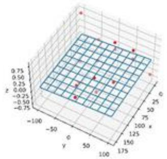

<details>
<summary>scatter_3d</summary>

| Series | x (range) | y (range) | z (range) |
| --- | --- | --- | --- |
| Red | 0~125 | -100~100 | -0.75~0.75 |
| Pink | 0~125 | -100~100 | -0.75~0.75 |
</details>

图 27.1 调整前拟合平面

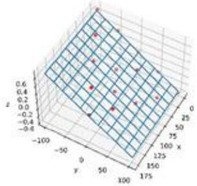

<details>
<summary>scatter_3d</summary>

| Series | x (range) | y (range) | z (range) |
| --- | --- | --- | --- |
| Red | -10~175 | -100~100 | -0.4~0.6 |
| Blue | -10~175 | -100~100 | -0.4~0.6 |
</details>

图 27.2 调整后拟合平面

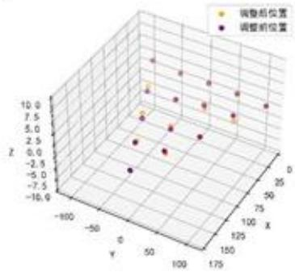

<details>
<summary>scatter_3d</summary>

| Series | X | Y | Z |
| --- | --- | --- | --- |
| 调整后位置 | ~25 | ~100 | ~8.0 |
| 调整后位置 | ~25 | ~75 | ~6.0 |
| 调整后位置 | ~25 | ~50 | ~4.0 |
| 调整后位置 | ~25 | ~25 | ~2.0 |
| 调整后位置 | ~25 | ~0 | ~0.0 |
| 调整后位置 | ~25 | ~-25 | ~-2.0 |
| 调整后位置 | ~25 | ~-50 | ~-4.0 |
| 调整后位置 | ~25 | ~-75 | ~-6.0 |
| 调整后位置 | ~25 | ~-100 | ~-8.0 |
| 调整后位置 | ~25 | ~-125 | ~-10.0 |
| 调整后位置 | ~50 | ~100 | ~8.0 |
| 调整后位置 | ~50 | ~75 | ~6.0 |
| 调整后位置 | ~50 | ~50 | ~4.0 |
| 调整后位置 | ~50 | ~25 | ~2.0 |
| 调整后位置 | ~50 | ~0 | ~0.0 |
| 调整后位置 | ~50 | ~-25 | ~-2.0 |
| 调整后位置 | ~50 | ~-50 | ~-4.0 |
| 调整后位置 | ~50 | ~-75 | ~-6.0 |
| 调整后位置 | ~50 | ~-100 | ~-8.0 |
| 调整后位置 | ~75 | ~100 | ~8.0 |
| 调整后位置 | ~75 | ~75 | ~6.0 |
| 调整后位置 | ~75 | ~50 | ~4.0 |
| 调整后位置 | ~75 | ~25 | ~2.0 |
| 调整后位置 | ~75 | ~0 | ~0.0 |
| 调整后位置 | ~75 | ~-25 | ~-2.0 |
| 调整后位置 | ~75 | ~-50 | ~-4.0 |
| 调整后位置 | ~75 | ~-75 | ~-6.0 |
| 调整后位置 | ~75 | ~-100 | ~-8.0 |
| 调整后位置 | ~100 | ~100 | ~8.0 |
| 调整后位置 | ~100 | ~75 | ~6.0 |
| 调整后位置 | ~100 | ~50 | ~4.0 |
| 调整后位置 | ~100 | ~25 | ~2.0 |
| 调整后位置 | ~100 | ~0 | ~0.0 |
| 调整后位置 | ~100 | ~-25 | ~-2.0 |
| 调整后位置 | ~100 | ~-50 | ~-4.0 |
| 调整后位置 | ~100 | ~-75 | ~-6.0 |
| 调整后位置 | ~100 | ~-100 | ~-8.0 |
| 调整后位置 | ~125 | ~125 | ~8.0 |
| 调整后位置 | ~125 | ~75 | ~6.0 |
| 调整后位置 | ~125 | ~50 | ~4.0 |
| 调整后位置 | ~125 | ~25 | ~2.0 |
| 调整后位置 | ~125 | ~0 | ~0.0 |
| 调整后位置 | ~125 | ~-25 | ~-2.0 |
| 调整后位置 | ~125 | ~-50 | ~-4.0 |
| 调整后位置 | ~125 | ~-75 | ~-6.0 |
| 调整后位置 | ~125 | ~-100 | ~-8.0 |
| 调整后位置 | ~150 | — | — |
| 调整前位置 (top) | — | — | 10.0~12.5 |
| 调整前位置 (bottom) | — | — | -4.0~-6.9999999999999999999999999999999999999999999999999999999999999999999999999999999999999999999999999999 |
</details>

图 27.3 调整前后对比

调整前平面化检验函数 $A_{1}=3.893$ ，调整后平面化检验函数 $A_{2}=0.206$ 。调整前后15个点的三维坐标见附录。可见，通过调整，无人机集群更趋近共面。

## 六、模型的分析与检验

如5.3.3中结论所述，单凭一组原始数据并不能准确检验模型的准确性。故对问题三中局部最优模型的方案二（因为通过5.3.3的比较，方案二比方案一好）进行灵敏性分析。

考虑对精确点 $A_{i}(100,40^{\circ}(i-1))(i=2,3,\ldots,9)$ 进行如下扰动：

$$
\left\{\begin{array}{l}R _ {i} = 1 0 0 \rightarrow r _ {i} = (1 + \delta_ {i}) ^ {*} R _ {i}\\\Theta_ {i} = 4 0 ^ {\circ} (i - 1) \rightarrow \theta_ {i} = \Theta_ {i} + \Delta \theta_ {i}\end{array}\right.
$$

其中， $(R_{i},\Theta_{i})$ 表示点 $A_{i}$ 精确位置。 $\delta_{i}$ 与 $\Delta\theta_{i}$ 分别为半径随机扰动与角度随机扰动。取 $\delta_{i}$ 服从均值为 0，标准差为 0.01 的高斯分布，即 $\delta_{i}\sim N(0,0.01^{2})$ ；取 $\delta_{i}$ 服从均值为 0，标准差为 0.1 的正态分布，即 $\Delta\theta_{i}\sim N(0,0.1^{2})$ 。进行十组扰动，将其中一组（其余见代码）的半径随机扰动 $\delta_{i}$ 与角度随机扰动 $\Delta\theta_{i}$ 列入下表：

表 11 扰动后半径与角度的数值

<table><tr><td>无人机编号</td><td>扰动后半径/m</td><td>扰动后角度/°</td></tr><tr><td>1</td><td>100*(1-0.016313) = 98.3687</td><td>0-0.0458</td></tr><tr><td>2</td><td>100*(1-0.001972) = 99.8028</td><td>40+0.0848</td></tr><tr><td>3</td><td>100*(1-0.002484) = 99.7516</td><td>80+0.3295</td></tr><tr><td>4</td><td>100*(1-0.009305) = 99.0695</td><td>120-0.1379</td></tr><tr><td>5</td><td>100*(1-0.008444) = 99.1556</td><td>160-0.1500</td></tr><tr><td>6</td><td>100*(1+0.007840) = 100.7840</td><td>200+0.0619</td></tr></table>

<table><tr><td>7</td><td>100*(1-0.009405) = 99.0595</td><td>240-0.0677</td></tr><tr><td>8</td><td>100*(1-0.005320) = 99.4680</td><td>280+0.0653</td></tr><tr><td>9</td><td>100*(1-0.000776) = 99.9224</td><td>320+0.1547</td></tr></table>

通过方案二（每次调整选取圆周上两个无人机发射信号）对十组扰动进行调整，计算得全局检验误差值如下图：

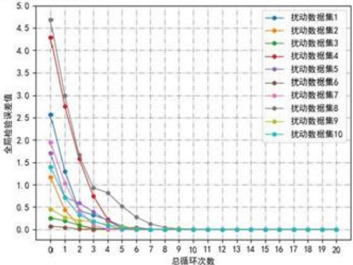

<details>
<summary>line</summary>

| 总循环次数 | 扰动数据集1 | 扰动数据集2 | 扰动数据集3 | 扰动数据集4 | 扰动数据集5 | 扰动数据集6 | 扰动数据集7 | 扰动数据集8 | 扰动数据集9 | 扰动数据集10 |
| --- | --- | --- | --- | --- | --- | --- | --- | --- | --- | --- |
| 0 | ~2.55 | ~1.15 | ~0.25 | ~4.3 | ~1.7 | ~0.08 | ~1.95 | ~4.7 | ~0.45 | ~1.4 |
| 1 | ~1.3 | ~0.45 | ~0.2 | ~2.75 | ~1.05 | ~0.05 | ~1.05 | ~3.0 | ~0.25 | ~0.7 |
| 2 | ~0.35 | ~0.15 | ~0.1 | ~1.6 | ~0.6 | ~0.02 | ~0.6 | ~1.65 | ~0.15 | ~0.35 |
| 3 | ~0.35 | ~0.05 | ~0.05 | ~0.75 | ~0.35 | ~0.01 | ~0.35 | ~0.95 | ~0.05 | ~0.2 |
| 4 | ~0.25 | ~0.02 | ~0.02 | ~0.25 | ~0.15 | ~0.01 | ~0.15 | ~0.85 | ~0.02 | ~0.1 |
| 5 | ~0.15 | ~0.01 | ~0.01 | ~0.15 | ~0.08 | ~0.01 | ~0.08 | ~0.55 | ~0.01 | ~0.05 |
| 6 | ~0.1 | ~0.01 | ~0.01 | ~0.1 | ~0.05 | ~0.01 | ~0.05 | ~0.3 | ~0.01 | ~0.02 |
| 7 | ~0.08 | ~0.01 | ~0.01 | ~0.08 | ~0.03 | ~0.01 | ~0.03 | ~0.15 | ~0.01 | ~0.01 |
| 8~20 | 0~0 | 0~0 | 0~0 | 0~0 | 0~0 | 0~0 | 0~0 | 0~0 | 0~0 | 0~0 |
</details>

图 28 十组数据集的全局检验误差值

由图 28 可见，全局检验误差值随着循环次数迅速下降并收敛 $10^{-7}\sim10^{-6}$ ，可见模型对于一定范围内的扰动显示出较好的稳定性。因此，局部优化模型具有良好的鲁棒性。

## 七、模型的评价、改进与推广

## 7.1 模型的优点

1. 对于问题一第二问，通过严格的数学证明了在模型假设 3.4 误差±5°下，仅再需要一架无人机作为信号源即可确定接受信号无人机的位置。  
2. 问题三中建立局部最优模型对无人机位置进行调整，综合仿真模拟结果看，虽然建立的是局部模型，但可以达到全局最优。  
3. 问题四通过严格的数学证明，可以将15架无人机调整至严格的锥形编队。  
4. 问题一中考虑到了被动机位于三架主动机角平分线上位置不确定的特殊情况，故提出假设已知主动机发射的次序，使模型更具完备性。  
5. 问题二中证明化归的思想要比枚举法更为便捷

## 7.2 模型的缺点

1. 利用计算机最小化控制无人机位置调整的目标函数是在初始点进行暴力搜索，即是离散化过程，运算量也与步长设置密切相关。  
2. 问题四的调整方案不能保证相邻无人机距离为给定值。

## 7.3 模型的推广

本文将无人机抽象为几何点，实际上并没有用到关于无人机的任何特性。据此，宇宙飞船定位、船只定位等均可以沿用本论文中的模型。

## 八、参考文献

[1]聂博文. 微小型四旋翼无人直升机建模及控制方法研究[D]. 国防科学技术大学, 2006.  
[2]林岳松. 多运动目标的无源跟踪与数据关联算法研究[D]. 浙江大学, 2003.  
[3]徐敬. 舰艇对海上目标纯方位无源定位研究[D]. 大连理工大学, 2002.  
[4] 姜启源. 谢金星. 叶俊. 《数学模型（第五版）》，北京：高等教育出版社，2003,73-85.

## 附录

说明：由于每个功能代码过长，附录3-5只放了部分核心代码。

<table><tr><td>附录1</td></tr><tr><td>支撑材料的文件列表</td></tr><tr><td>T1-3预处理是对表中数据预处理部分的代码,以及飞机前后位置对比图T1-3局部调整两个python文件分别是对本题论文中两种模型的仿真实验T1-3局部调整前后对比绘制了点变化在极坐标中反映的结果T1-3两种模型结果对比反映了随着循环次数的递增设计的误差检测函数的变化趋势T2 3个文件分别是对引理的仿真实验给定略有偏差的数据运行仿真模型检验引理的正确性T2模型验证随机生成15个略有偏差的点构成锥形进行模型仿真T2结果是对T2模型验证前后位置的对比三维图形T2拟合平面是对本题模型的检验</td></tr></table>

<table><tr><td>附录2</td></tr><tr><td>问题四,调整前后15个点坐标</td></tr><tr><td>#调整前x_lst = [0, 172.5849703361308, 130.31053186487503, 129.8999963197148, 87.40951707533729, 86.73545784686141, 86.42219856743965, 43.238240083571775, 43.537671588762926, 42.907286891592236, 44.11251663622844, 0.9524770522945771, -0.1031730146858596, -0.5529740507383931, 0.9332149292996521, 0.5418555762004413]y_lst = [0, 0.9743774126537483, 24.913086330612813, -25.876708996208606, 50.12316376755098, 0.9951782205496467, -49.52174747162192, 74.01871209180575, 24.16558240521679, -24.879408055333283, -74.73222042176403, 100.47725589932327, 49.4965680599237, -0.9345715613262222, -49.18974689256766, -100.58430167340168]z_lst = [0, 0.11417707355129991, 0.49355928755122647, -0.14568634413313086, -0.07856198814204896, -0.8102178515140541, -0.7485911377795991, 0.7737870283715225, 0.7855557667588986, -0.22617781561841177, -0.5406072425582142, -0.5414806627246775, -0.2270074255766248, -0.15826725127853036, -0.0203398482543673, 0.7177759516825288]</td></tr><tr><td>调整后坐标x [0, 172.5849703361308, 129.66053186487505, 129.56999631971482, 86.75951707533733, 86.66545784686141, 86.55219856743966, 43.868240083571784, 43.75767158876292, 43.65728689159224, 43.542516636228434, 0.9624770522945771, 0.8568269853141403, 0.7570259492616065, 0.6432149292996521, 0.5418555762004409]调整后坐标y [0, 0.9743774126537483, 25.873086330612818, -</td></tr></table>

```txt
23.736708996208584, 50.76316376755098, 1.1551782205496468, -
48.451747471621914, 75.64871209180566, 26.055582405216814, -
23.559408055333265, -
73.16222042176412, 100.53725589932327, 50.94656805992372, 1.3254284386737778,
-48.25974689256765, -97.86430167340184]
调整后坐标
z [0, 0.11417707355129991, -0.046440712448773507, 0.26431365586686917, -
0.21856198814204897, -0.1502178515140542, 0.4114088622204009, -
0.37621297162847744, 0.12555576675889865, -
0.10617781561841173, 0.5593927574417857, -0.5414806627246775, -
0.2270074255766248, 0.08173274872146966, 0.39966015174563274, 0.707775951682
5288]
```

```python
附录3
第三题局部调整仿真定位。完整代码见支撑材料
#以258为发射点，点p作为接收点的调整策略，调整策略仅依据三个接收角,该调整为一轮调整中的第一部分
def f258_p(p):
    #局部调整一个点（以258为发射点调整接收点3）
    #一次调整的过程
    #三个接收角度
    angle0p2 = calculate_angle(x_lst[p],y_lst[p],x_lst[0],y_lst[0],x_lst[2],y_lst[2])
    angle0p5 = calculate_angle(x_lst[p],y_lst[p],x_lst[0],y_lst[0],x_lst[5],y_lst[5])
    angle0p8 = calculate_angle(x_lst[p],y_lst[p],x_lst[0],y_lst[0],x_lst[8],y_lst[8])
    angle0p2_acc = angle0p2
    angle0p5_acc = angle0p5
    angle0p8_acc = angle0p8
    objective_fp = (max(angle0p2,angle0p5,angle0p8)-70)**2+(mid(angle0p2,angle0p5,angle0p8)-50)**2+(min(angle0p2,angle0p5,angle0p8)-10)**2
    objective_min_fp = objective_fp
    objective_fp_lst=[]
    i_min=10
    j_min=10
    for i in range(0,21):
        for j in range(0,21):
            tmp_x = x_lst[p]+0.01*(i-10)
            tmp_y = y_lst[p]+0.01*(j-10)
            angle0p2 = calculate_angle(tmp_x, tmp_y, x_lst[0], y_lst[0], x_lst[2], y_lst[2])
            angle0p5 = calculate_angle(tmp_x, tmp_y, x_lst[0], y_lst[0], x_lst[5], y_lst[5])
            angle0p8 = calculate_angle(tmp_x, tmp_y, x_lst[0], y_lst[0], x_lst[8], y_lst[8])
            objective_tmpp = (max(angle0p2,angle0p5,angle0p8)-70)**2+(mid(angle0p2,angle0p5,angle0p8)-50)**2+(min(angle0p2,angle0p5,angle0p8)-10)**2
```

```python
# objective_f3_lst.append((max(angle032,angle035,angle038)-70)**2+(mid(angle032,angle035,angle038)-50)**2+(min(angle032,angle035,angle038)-10)**2)
    if objective_tmpp < objective_min_fp:
        objective_min_fp = objective_tmpp
        j_min = j
        i_min = i
        angle0p2_acc = angle0p2
        angle0p5_acc = angle0p5
        angle0p8_acc = angle0p8

    x_lst[p] += 0.01*(i_min-10)
    y_lst[p] += 0.01*(j_min-10)
    # print(&apos;f&apos;,p,angle0p2_acc, angle0p5_acc, angle0p8_acc, objective_fp, obj ective_min_fp)
```

```python
引理 1 仿真定位。完整代码见支撑材料
import numpy as np
# 三维坐标初始化 ABCD 列表第一列为空值 验证
# 顺序 0 ABCD
# 自己设计一组 原始数据
x_lst = [0, 175/10-1, 0, 173/10, 174/10+1]
y_lst = [0, 99/10+1, 0, -100/10+1, 0]
z_lst = [0, 0.1, 0, 0.15, -0.15]
x_lst_origin = tuple(x_lst)
y_lst_origin = tuple(y_lst)
z_lst_origin = tuple(z_lst)
print(&apos;原始坐标 x&apos;,x_lst)
print(&apos;原始坐标 y&apos;,y_lst)
print(&apos;原始坐标 z&apos;,z_lst)

# 角度计算
def calculate_angle_dimension_3(x0, y0, z0, x1, y1, z1, x2, y2, z2):
    dis0 = (x1 - x2) ** 2 + (y1 - y2) ** 2 + (z1 - z2) ** 2
    dis1 = (x2 - x0) ** 2 + (y2 - y0) ** 2 + (z2 - z0) ** 2
    dis2 = (x1 - x0) ** 2 + (y1 - y0) ** 2 + (z1 - z0) ** 2
    cos_angle = (dis2 + dis1 - dis0) / (2 * np.sqrt(dis1) * np.sqrt(dis2))
    angle = np.arccos(cos_angle)
```

```python
return angle / np.pi * 180

angle_BAC = calculate_angle_dimension_3(x_lst[1], y_lst[1], z_lst[1], x_lst[2], y_lst[2],
z_lst[2], x_lst[3], y_lst[3],
    z_lst[3])
angle_BCA = calculate_angle_dimension_3(x_lst[3], y_lst[3], z_lst[3], x_lst[1], y_lst[1],
z_lst[1], x_lst[2], y_lst[2],
    z_lst[2])
angleD = calculate_angle_dimension_3(x_lst[4], y_lst[4], z_lst[4], x_lst[1], y_lst[1], z lst
t[1], x_lst[3],
    y_lst[3], z_lst[3])

def mid(x, y, z):
    if x != max(x, y, z) and x != min(x, y, z):
        return x
    elif y != max(x, y, z) and y != min(x, y, z):
        return y
    else:
        return z

# 原始角度

print(&apos;原始角度
angle_BCA, angle_BAC, angleD&apos;,angle_BCA, angle_BAC, angleD)

# 调整 D 点 目标 角 ADC=180

def fD_180(p):
    angleD = calculate_angle_dimension_3(x_lst[4], y_lst[4], z_lst[4], x_lst[1], y_lst[1], z
lst[1], x_lst[3],
    y_lst[3], z_lst[3])
    angleD_acc = angleD
    objective_fD = (angleD - 180) ** 2
    objective_min_fD = objective_fD
    objective_fD_lst = []
    i_min = 10
    j_min = 10
    k_min = 10
    for i in range(0, 21):
        for j in range(0, 21):
            for k in range(0, 21):
                tmp_x = x_lst[p] + 0.01 * (i - 10)
                tmp_y = y_lst[p] + 0.01 * (j - 10)
                tmp_z = z_lst[p] + 0.01 * (k - 10)
                angleD = calculate_angle_dimension_3(tmp_x, tmp_y, tmp_z, x_lst[1], y_lst[1
], z lst[1].
```

```python
x_lst[3], y_lst[3], z_lst[3])
objective_tmpp = (angleD - 180) ** 2
if objective_tmpp < objective_min_fD:
    objective_min_fD = objective_tmpp
    j_min = j
    i_min = i
    k_min = k
    angleD_acc = angleD
x_lst[p] += 0.01 * (i_min - 10)
y_lst[p] += 0.01 * (j_min - 10)
z_lst[p] += 0.01 * (k_min - 10)
# print(&apos;f&apos;, p, angleD_acc)
```

```python
def f9(p):
    angle1 = calculate_angle_dimension_3(x_lst[p], y_lst[p], z_lst[p], x_lst[3], y_lst[3], z_lst[3], x_lst[12],
        y_lst[12], z_lst[12])
    angle2 = calculate_angle_dimension_3(x_lst[p], y_lst[p], z_lst[p], x_lst[15], y_lst[15], z_lst[15], x_lst[12],
        y_lst[12], z_lst[12])
    angle3 = calculate_angle_dimension_3(x_lst[p], y_lst[p], z_lst[p], x_lst[3], y_lst[3], z_lst[3], x_lst[15],
        y_lst[15], z_lst[15])
    objective_f = (angle1 - 120) ** 2 + (angle2 - 120) ** 2 + (angle3 - 120) ** 2
    angle1_acc = angle1
    angle2_acc = angle2
    angle3_acc = angle3
    objective_min_f = objective_f
    i_min = 10
    j_min = 10
    k_min = 10
    for i in range(0, 21):
        for j in range(0, 21):
            for k in range(0, 21):
                tmp_x = x_lst[p] + 0.01 * (i - 10)
                tmp_y = y_lst[p] + 0.01 * (j - 10)
                tmp_z = z_lst[p] + 0.01 * (k - 10)
                angle1 = calculate_angle_dimension_3(tmp_x,tmp_y,tmp_z, x_lst[3], y_lst[3], z_lst[3],
                    x_lst[12],
                    y_lst[12], z_lst[12])
                angle2 = calculate_angle_dimension_3(tmp_x,tmp_y,tmp_z, x_lst[15], y_lst[15], z_lst[15],
                    x_lst[12],
                    y_lst[12], z_lst[12])
```

```python
angle3 = calculate_angle_dimension_3(tmp_x,tmp_y,tmp_z, x_lst[3], y_lst[3],
z_lst[3],
        x_lst[15],
        y_lst[15], z_lst[15])
    objective_tmpp = (angle1 - 120) ** 2 + (angle2 - 120) ** 2 + (angle3 - 120) **
2
    if objective_tmpp < objective_min_f:
        objective_min_f = objective_tmpp
        j_min = j
        i_min = i
        k_min = k
        angle1_acc = angle1
        angle2_acc = angle2
        angle3_acc = angle3
    x_lst[p] += 0.01 * (i_min - 10)
    y_lst[p] += 0.01 * (j_min - 10)
    z_lst[p] += 0.01 * (k_min - 10)
    print(&apos;f&apos;, p, angle1_acc, angle2_acc, angle3_acc)
```