# 基于成分数据的古代玻璃制品的成分分析与鉴别

## 摘要

针对问题一, 本文首先对数据进行预处理, 对表单 2 中的无效数据采取剔除处理,并将化学成分含量数据转化为完美成分数据 (定和为 1), 再采用中心化对数比变换方法对成分数据进行转换用于消除定和限制对后续分析的影响, 并对表单 1 四类别进行量化, 运用量化后的数据来分析相关性; 对于第一小问, 题目要求分别研究文物样品表面风化与颜色、玻璃类型以及纹饰间的关系, 本文对超过 $20\%$ 的比例期望计数小于 5 的组别建立 Pearson 卡方检验法, 并对不满足卡方检验前提的组别建立 Yates 校正卡方检验法。对于第二小问, 题目要求根据玻璃类型, 描述有无风化样品化学成分含量的统计规律, 本文引入均值、最大值、最小值、标准差、变异系数、偏度系数、峰度系数描述统计量, 并用箱线图反映多组连续型数据分布的散布范围以及中心位置。对于第三小问,本文通过聚类使得数据呈现时序关系, 并基于经过中心化对数比变换后的数据, 通过回归方程建立化学成分趋势变换模型以预测风化前化学成分含量。使用基于中心化对数比变换的成分数据预测模型, 可以使预测结果保证各化学成分累计和为 $100\%$ 。

针对问题二, 第一小问要求分析铅钡玻璃以及高钾玻璃的分类规律, 本文引入监督学习进行分类, 采用决策树法对数据进行分类, 求解结果发现该模型在精确率、召回率、准确率以及 F1 系数上均为 1, 说明模型性能良好。第二小问要求对不同的玻璃类型选择适合的化学成分进行亚类分类, 本文利用 R 型聚类法得到的特征变量为基础进行 Q 型聚类, 相比于直接使用 Q 型聚类法具有更高的合理性, 并通过在扰动范围内随意重新赋值, 扰动范围处于 [0.1,0.2] 范围内, 由此说明模型敏感性良好。

针对问题三，题目要求通过分析表单3中未知玻璃类别的文物样品的化学成分，鉴别未知玻璃类别的文物编号所属类型。本文基于问题二的建模与求解，使用于问题二中训练好的决策树进行分类，并通过Q型聚类法进行交叉检验，分别对风化以及未风化玻璃进行敏感度分析，结果表明本文使用方法在准确性和敏感性上皆有不错表现。

针对问题四，题目要求分析不同玻璃类别的化学成分间的相关性，即分别研究高钾玻璃与铅钡玻璃的化学成分指标间的关联，本文建立灰色关联分析模型。由于每种玻璃类别都有十四项化学成分，于是遍历每项成分，依次作为母序列，其余十三组成分作为子序列，建立灰色关联分析模型，并对关联系数进行加权处理即可得到关联度值，以关联度值的大小来衡量相关性大小；其次要比较不同玻璃类别间的关联度值的差异程度，最后通过观测关联系数图发现，高钾玻璃关联系数趋于集中分布，而铅钡玻璃关联系数趋于分散，并根据关联度值分析差异性。

关键字：中心化对数变换 卡方检验 决策树法 聚类分析 灰色关联分析

## 一、问题重述

## 1.1 问题背景

玻璃为丝绸之路早期贸易交流的重要物证，其主要化学成分为 $SiO_{2}$ 。而纯石英砂的熔点较高，因此在炼制时应添加助熔剂以降低熔化温度。古代常用硝石、铅矿石、草木灰以及天然泡碱等作为助熔剂，并且用石灰石作为稳定剂。

由于古代玻璃很容易因为埋藏环境的影响而导致风化，而且在风化的过程中，环境元素会于玻璃内部元素进行大量的交换，导致玻璃的成分比例发生改变，继而会影响对玻璃类别的正确判断。

## 1.2 问题重述

考古工作者根据对玻璃样品的检测以及文物的化学成分将现有古代一批玻璃制品划分为铅钡玻璃及高钾玻璃，其中附件表单1为文物的分类情况，表单2为组成玻璃样品的主要化学成分占比。根据附件数据相关信息建立模型，解决以下四个问题：

针对问题一：分析玻璃文物表面风化和颜色、玻璃类型以及纹饰的关系；根据玻璃类型，描述统计文物表面无风化以及有风化成分含量的规律，依据风化点检测数据来预测其风化前的成分含量。

针对问题二：根据附件所提供的数据分析玻璃类型的分类规律；对于不同的玻璃类型选择适合的化学成分进行亚类划分，给出划分的方法及结果，并分析结果的敏感性及合理性。

针对问题三：通过分析表单3中未知玻璃类别的文物样品的化学成分，基于第二间，鉴别未知玻璃类别的文物编号所属类型，并分析结果的敏感性。

针对问题四：分别分析不同玻璃类型的化学成分之间的关联性，并分析不同玻璃类型间化学成分的关联性差异程度。

## 二、模型的假设

本文提出以下合理假设：

- 假设文物形状对结果没有显著性影响  
- 假设已风化表面不会对未风化表面产生影响  
- 假设文物风化过程中不会出现剧烈的环境变换  
- 假设古代玻璃中的气泡不对定量分析产生影响

三、符号说明

<table><tr><td>符号</td><td>意义</td></tr><tr><td>r</td><td>行数</td></tr><tr><td>c</td><td>列数</td></tr><tr><td> $O_{i,j}$ </td><td>观测值(实际值)</td></tr><tr><td> $E_{i,j}$ </td><td>理论值(期望值)</td></tr><tr><td>R</td><td>表单2原始矩阵</td></tr><tr><td> $R^{*}$ </td><td>表单2成分数据矩阵</td></tr><tr><td> $V_{n}$ </td><td>n阶中心矩</td></tr><tr><td> $\beta_{s}$ </td><td>偏峰系数</td></tr><tr><td> $\tilde{x}$ </td><td>峰度系数</td></tr><tr><td> $\tilde{x}$ </td><td>中位数</td></tr><tr><td> $d_{ij}$ </td><td>表示采样点 $X_{i}$ 与 $X_{j}$ 之间的距离</td></tr></table>

## 四、问题分析

## 4.1 问题一

针对问题一，第一小问要分析玻璃文物表面风化和颜色、玻璃类型以及纹饰的关系，首先对数据进行预处理，对表单2无效数据采取剔除处理，并对表单1四类别进行量化，用量化后的数据来分析相关性，将化学成分数据转化为成分数据，即各个化学成分的累加和为100%，并采用中心化对数变换以充分体现成分特性；本文对超过20%的比例期望计数小于5的组别采用Pearson卡方检验，并对不满足卡方检验前提的组别采用Yates校正卡方检验法。对于第二小问，题目要求根据玻璃类型，描述有无风化样品化学成分含量的统计规律，本文引入均值、最大值、最小值、标准差、变异系数、偏度系数、峰度系数描述统计量，并用箱线图反映多组连续型数据分布的散布范围以及中心位置。对于第三小问，建立时序关系，并通过回归方程建立化学成分趋势变换模型以预测风化前化学成分含量。

## 4.2 问题二

针对问题二，第一小问要分析铅钡玻璃以及高钾玻璃的分类规律，本文引入监督学习进行分类，采用决策树法用于数据分类，并基于传统的决策树模型建立改进的梯度提升决策树算法，进一步提高结果的准确性。第二小问要求对不同的玻璃类型选择适合的化学成分进行亚类分类，利用 R 型聚类法得到的特征变量为基础进行 Q 型聚类，相比于直接使用 Q 型聚类法具有更高的合理性，并通过在扰动范围内随意重新赋值，扰动范围较小，模型敏感性良好。

## 4.3 问题三

针对问题三，要通过分析表单3中未知玻璃类别的文物样品的化学成分，鉴别未知玻璃类别的文物编号所属类型，在问题二的基础上，对问题二训练好的决策树进行分类，并通过Q型聚类法进行交叉检验，最后对结果进行敏感性分析。

## 4.4问题四

针对问题四，要分析不同玻璃类别的化学成分间的相关性，即分别研究高钾玻璃与铅钡玻璃的化学成分指标间的关联，本文引入灰色关联分析模型，由于每种玻璃类别都有十四项化学成分，于是遍历每项成分，依次作为母序列，其余十三组成分作为子序列，建立灰色关联分析模型，并对关联系数进行加权处理即可得到关联度值，以关联度值的大小来衡量相关性大小；其次要比较不同玻璃类别间的关联度值的差异程度，因此通过观测关联系数图来判别不同玻璃类型成分关联的离散集中程度，并根据关联度值分析差异性。

## 五、问题一模型的建立与求解

## 5.1 数据预处理

## 5.1.1剔除无效数据

由题目可知，有效数据的各成分比例累加和应该介于85%-105%。研究表单2发现，文物采样点15与17成分比例累加和均低于85%，属于无效数据，故剔除15与17两组数据。

## 5.1.2 成分数据

成分数据指任意非负的 $n$ 元向量 $x = [x_1, x_2, \ldots, x_n]$ ，且满足约束条件 $\sum_{i=1}^{n} x_i = 1, 0 \leq x_i \leq 1$ ，该约束条件成为定和约束，是成分数据的基本性质。由题目背景可知，附件中数据为各化学成分占比，因此是成分数据。为了更好的分析数据统计规律，本文对有效数据进行了转换，转换公式如式(1)所示，经过转换后的数据化学成分累计和为 $100\%$ 。

$$
C _ {i} = \frac {C _ {i}}{\sum_ {j = 1} ^ {n} C _ {j}} (i = 1, 2, \dots , n) \tag {1}
$$

## 5.1.3 中心化对数比变换

n 元成分数据所处的向量空间成为单形空间，由于单形空间需满足定和约束，因此针对普通数据的传统统计学分析方法对于成分数据不再适用 $^{[3]}$ 。通过查阅文献 $[1][3]$ 得知，在单形空间上分析往往具有以下三点问题：

1) 数据的直观形态在单形空间和欧式空间上不同，无法跨空间进行解释。  
2) 在单形空间上计算得到的成分数据的协方差矩阵有明显偏负性，与欧式空间上的内涵截然不同。  
3) 单形空间上的成分数据缺乏参数分布，使得对数据的变异模式进行分析时存在

参数建模困难。

基于上述存在问题，本文对数据进行中心对数比变换（alr）处理，经过中心对数比变换后的数据可以更加充分体现成分特性，使得成分数据中的可解释性更强。alr 计算公式如式(2)所示。

$$
\mathrm{clr} = \left\{\ln \frac {x _ {1}}{g (x)}, \ln \frac {x _ {2}}{g (x)}, \dots , \ln \frac {x _ {n}}{g (x)} \right\} \tag {2}
$$

其中 $g(x) = [x_1 \cdot x_2 \cdot \dots \cdot x_n]^{\frac{1}{n}}$ 。

## 5.1.4 量化处理

为更好的进行相关性分析，本文分别对表单1中“纹饰”，“类型”，“颜色”，“表面风化”四个指标进行量化处理，量化处理结果如表1所示。

表1 量化处理

<table><tr><td>量化前</td><td>量化后</td></tr><tr><td>A、B、C</td><td>0、1、2</td></tr><tr><td>高钾、铅钡</td><td>0、1</td></tr><tr><td>黑、蓝绿、绿、浅蓝、浅绿、深蓝、深绿</td><td>0、1、2、3、4、5、6、7</td></tr><tr><td>未风化、风化</td><td>0、1</td></tr></table>

## 5.1.5 空缺数据处理

针对表单1中的“颜色”存在四组缺失数据。由于在控制“表面风化”、“类型”以及“纹饰”相同的情况下，其“颜色”会出现多种情况，同时表单2的文物采样点只是文物表面的随机部位，其并不能代表整个文物，因此本文认为不能通过已知数据填补“颜色”空缺，因此后文进行“颜色”与“表面风化”的相关性分析时，忽略19、40、48、58四组数据。针对表单2中的空缺数据，根据题目背景可知，空缺数据表示未检测到该成分，因此对该空缺数据进行补0处理。

## 5.2 针对问题一第一小问

## 5.2.1 卡方检验

卡方分析（卡方检验）是一种利用样本数据的实际值与理论值的吻合度来判断接受还是拒绝原假设的方法，常用于分析两个分类变量之间的相关性。由于玻璃文物表面风化、纹饰、玻璃类型和颜色均为分类变量，因此本文设计“表面风化-纹饰”、“表面风化-颜色”和“表面风化-玻璃类型”三组卡方检验用于分析指标间的相关性。

## (1) 期望计数

本文欲采用 Pearson 卡方检验分析相关性，考虑到在使用 Pearson 卡方检验时，如果存在超过 20% 的比例期望计数小于 5 会导致假设不可信。期望值计算公式如(3)所示。本文利用 SPSSPRO 求出“表面风化-纹饰”、“表面风化-颜色”和“表面风化-玻璃类型”三组数据的期望计数结果分别如表 2、表 3、表 4 所示。

$$
E _ {i, j} = \frac {\sum_ {i = 1} ^ {r} O _ {i , j}}{\sum_ {j = 1} ^ {c} \sum_ {i = 1} ^ {r} O _ {i , j}} \times \sum_ {j = 1} ^ {c} O _ {i, j} \tag {3}
$$

表 2 表面风化-纹饰期望计数图

<table><tr><td></td><td>值</td><td>自由度</td><td>渐进显著性(双侧)</td></tr><tr><td>皮尔逊卡方</td><td> $4.957^a$ </td><td>2</td><td>0.084</td></tr><tr><td>释然比</td><td>7.120</td><td>2</td><td>0.028</td></tr><tr><td>线性关联</td><td>0.137</td><td>1</td><td>0.712</td></tr></table>

a 2个单元格（33.3%）的期望计数小于5.最小期望计数为2.48。

表 3 表面风化-颜色期望计数图

<table><tr><td></td><td>值</td><td>自由度</td><td>渐进显著性(双侧)</td></tr><tr><td>皮尔逊卡方</td><td> $6.287^a$ </td><td>7</td><td>0.507</td></tr><tr><td>释然比</td><td>8.156</td><td>7</td><td>0.319</td></tr><tr><td>线性关联</td><td>0.873</td><td>1</td><td>0.350</td></tr></table>

a 12个单元格（75.0%）的期望计数小于5.最小期望计数为0.44。

表 4 表面风化-玻璃类型期望计数图

<table><tr><td></td><td>值</td><td>自由度</td><td>渐进显著性(双侧)</td></tr><tr><td>皮尔逊卡方</td><td> $6.880^a$ </td><td>1</td><td>0.009</td></tr><tr><td>释然比</td><td>6.889</td><td>1</td><td>0.009</td></tr><tr><td>线性关联</td><td>6.762</td><td>1</td><td>0.009</td></tr></table>

a 0个单元格（0.0%）的期望计数小于5.最小期望计数为7.45。

由表2、表3、表4可知，“表面风化-玻璃类型”组别的全部单元格期望计数大于1，并且期望计数大于1小于5的单元格比例小于20%，满足使用Pearson卡方检验前提，因此对“表面风化-玻璃类型”组别采用Pearson卡方检验。“表面风化-颜色”和“表面风化-纹饰”组别不满足使用Pearson卡方检验的前提，因此对该两组采用Yates校正卡方检验。

## (2) Pearson 卡方检验

本文对“表面风化-玻璃类型”组采用 Pearson 卡方检验。检验步骤如下：

Step1) 提出假设

原假设 $H_{0}$ : 表面风化与玻璃类型相互独立不相关。

备择假设 $H_{1}$ ：表面风化与玻璃类型有关联。

Step2) 构造卡方检验统计量 $\chi^{2}$

卡方检验统计量 $\chi^{2}$ 计算公式如式(4)所示。

$$
\chi^ {2} = \sum_ {i = 1} ^ {r} \sum_ {j = 1} ^ {c} \frac {\left(O _ {i , j} - E _ {i , j}\right) ^ {2}}{E _ {i , j}} \tag {4}
$$

其中 r 为行，c 为列， $O_{i,j}$ 表示观测值即实际值， $E_{i,j}$ 表示理论值即期望值。统计量 $\chi^{2}$ 可以用于估计期望值跟实际值的偏离程度。

Step3) 计算出 $\chi^{2}$ 的自由度

本文利用 SPSSPRO 进行 Pearson 卡方检验，结果如表 5 所示。

表 5 表面风化-类型 Pearson 卡方检验结果

<table><tr><td rowspan="2">题目</td><td rowspan="2">名称</td><td colspan="2">类型</td><td rowspan="2">合计</td><td rowspan="2"> $\chi^2$ </td><td rowspan="2">P</td></tr><tr><td>0.0</td><td>1.0</td></tr><tr><td rowspan="2">表面风化</td><td>0.0</td><td>12</td><td>12</td><td>24</td><td></td><td></td></tr><tr><td>1.0</td><td>6</td><td>28</td><td>34</td><td>6.88</td><td>0.009</td></tr><tr><td>合计</td><td></td><td>18</td><td>40</td><td>58</td><td></td><td></td></tr></table>

由表 5 可知，Pearson 卡方检验分析的 P 值为 0.009，小于 0.05，故拒绝原假设，接受备择假设，即认为表面风化与玻璃类型相关。

## (2) Yates 校正卡方检验

对“表面风化-颜色”和“表面风化-纹饰”组采用 Yates 校正卡方检验。在满足 Yates 校正卡方检验的前提下，将理论值与观测值之间差值减掉 0.5 以达到校正减小误差的目的。Yates 校正卡方检验统计量 $\chi_{Yates}^{2}$ 计算公式如式(5)所示。

$$
\chi_ {\mathrm{Yates}} ^ {2} = \sum_ {i = 1} ^ {r} \sum_ {j = 1} ^ {c} \frac {\left(\left| O _ {i , j} - E _ {i , j} \right| - 0 . 5\right) ^ {2}}{E _ {i , j}} \sim \chi^ {2} ((r - 1) (c - 1)) \tag {5}
$$

本文使用 SPSSPRO 进行 Yates 校正卡方检验，结果如表 6 和表 7 所示。

表 6 表面风化-颜色 Yates 校正卡方检验结果

<table><tr><td rowspan="2"></td><td rowspan="2">分化与否</td><td colspan="8">颜色</td><td rowspan="2">合计</td><td rowspan="2"> $\chi^{2}_{Yates}$ </td><td rowspan="2">P</td></tr><tr><td>0</td><td>1</td><td>2</td><td>3</td><td>4</td><td>5</td><td>6</td><td>7</td></tr><tr><td rowspan="2">表面风化</td><td>0</td><td>0</td><td>6</td><td>1</td><td>8</td><td>2</td><td>2</td><td>3</td><td>2</td><td>24</td><td></td><td></td></tr><tr><td>1</td><td>2</td><td>9</td><td>0</td><td>12</td><td>1</td><td>0</td><td>4</td><td>2</td><td>30</td><td>6.287</td><td>0.507</td></tr><tr><td>合计</td><td></td><td>2</td><td>15</td><td>1</td><td>20</td><td>3</td><td>2</td><td>7</td><td>4</td><td>54</td><td></td><td></td></tr></table>

表 7 表面风化-颜色 Yates 校正卡方检验结果

<table><tr><td rowspan="2"></td><td rowspan="2">分化与否</td><td colspan="3">纹饰</td><td rowspan="2">合计</td><td rowspan="2"> $\chi^{2}_{Yates}$ </td><td rowspan="2">P</td></tr><tr><td>0</td><td>1</td><td>2</td></tr><tr><td rowspan="2">表面风化</td><td>0</td><td>11</td><td>0</td><td>13</td><td>24</td><td></td><td></td></tr><tr><td>1</td><td>11</td><td>6</td><td>17</td><td>34</td><td>4.957</td><td>0.084</td></tr><tr><td>合计</td><td></td><td>22</td><td>6</td><td>30</td><td>58</td><td></td><td></td></tr></table>

由表6可知，“表面风化-颜色”组的Yates校正卡方检验P值为0.507，大于0.05，因此在显著性水平 $5\%$ 上，不能拒绝原假设，拒绝备择假设，即认为表面风化与颜色相互独立不相关。由表7可知，“表面风化-纹饰”组的Yates校正卡方检验P值为0.084，大于0.05，因此在显著性水平 $5\%$ 上，不能拒绝原假设，拒绝备择假设，即认为表面风化与纹饰相互独立不相关。

## (3) 总结

玻璃文物的表面风化程度与玻璃类型有关联，与纹饰、颜色相互独立不相关。

## 5.3 针对问题一第二小问

## 5.3.1 描述统计量

题目要求结合玻璃类型，研究有无风化样品化学成分含量的统计规律，本文依据表单1将表单2中的数据分为四大类：高钾风化、高钾无风化、铅钡风化、铅钡无风化，再分别讨论此四类玻璃文物表面化学成分含量的统计规律，即分析均值、最大值、最小值、标准差、变异系数、偏度系数、峰度系数描述统计量。

## (1) 变异系数

变异系数可标准化度量概率分布的离散程度，其计算公式如式(6)所示。

$$
CV = \frac {\sigma_ {\tau}}{m _ {\tau}} \times 100\% \tag {6}
$$

其中 CV 为变异系数， $\sigma_{\tau}$ 为标准差， $m_{\tau}$ 为平均值。

## (2) 偏度系数

偏度 $(\beta_{s})$ 常用于衡量样本数据分布偏离对称性程度，其计算公式如式(7)所示。若 $\beta_{s}>0$ ，则认为处于均值右边的数据偏多；反之，若 $\beta_{s}<0$ ，则认为处于均值左边的数据偏多；当 $\beta_{s}$ 接近于0时，则认为样本数据是对称分布的。

$$
\beta_ {s} = \frac {v _ {3}}{v _ {2} ^ {\frac {3}{2}}} = \frac {E (X - E (X)) ^ {3}}{\mathrm{Var} (X) ^ {\frac {3}{2}}} \tag {7}
$$

其中 $E(X)$ 为均值， $Var(X)$ 为方差， $v_{n}$ 表示 n 阶中心矩。

## (3) 峰度系数

峰度 $(\beta_{k})$ 用于反映峰部的尖度程度，其计算公式如式(8)所示。若 $\beta_{k}>0$ ，则说明该分布相比于正态分布顶部更加尖锐或者尾部更加粗；反之，若 $\beta_{k}<0$ ，则说明该分布相比于正态分布顶部更加平坦或者尾部更加细；当 $\beta_{k}=0$ 时表示该分布与标准正态分布顶部尖锐程度和尾部粗细相当，因而峰度可作为衡量偏离正态分布形状的尺度。

$$
\beta_ {k} = \frac {v _ {4}}{v _ {2} ^ {2}} = \frac {E (X - E (X)) ^ {4}}{[ \mathrm{Var} (X) ] ^ {2}} - 3 \tag {8}
$$

其中 $E(X)$ 为均值， $Var(X)$ 为方差， $v_{n}$ 表示 n 阶中心矩。

## (4) 求解

利用 Python 求解四类的描述统计量值如表 9 所示（由篇幅原因，只展示风化铅钡组合的统计量表，其余 3 组见附件）。

表 8 古代玻璃化学成分含量描述性统计分析结果

<table><tr><td>指标</td><td>平均值</td><td>标准差</td><td>最大值</td><td>峰度</td><td>最小值</td><td>偏度</td><td>变异系数</td></tr><tr><td> $SiO_2$ </td><td>2.242</td><td>0.924</td><td>3.937</td><td>0.651</td><td>-0.13</td><td>-0.58</td><td>0.412</td></tr><tr><td> $Na_2O$ </td><td>0.013</td><td>0.364</td><td>1.044</td><td>3.997</td><td>-1.09</td><td>-0.04</td><td>27.25</td></tr><tr><td> $K_2O$ </td><td>-0.97</td><td>1.147</td><td>0</td><td>-1.66</td><td>-2.97</td><td>-0.46</td><td>-1.18</td></tr><tr><td>CaO</td><td>-0.38</td><td>0.648</td><td>0.497</td><td>-0.71</td><td>-1.88</td><td>-0.66</td><td>-1.73</td></tr><tr><td>MgO</td><td>-0.69</td><td>0.678</td><td>0</td><td>-1.49</td><td>-1.84</td><td>-0.34</td><td>-0.98</td></tr><tr><td> $Al_2O_3$ </td><td>-0.09</td><td>0.984</td><td>2.043</td><td>-0.29</td><td>-1.83</td><td>0.156</td><td>-11.2</td></tr><tr><td> $Fe_2O_3$ </td><td>-0.72</td><td>0.804</td><td>0</td><td>-0.42</td><td>-2.58</td><td>-0.84</td><td>-1.11</td></tr><tr><td>CuO</td><td>-0.82</td><td>0.877</td><td>0.889</td><td>-0.6</td><td>-2.76</td><td>0.044</td><td>-1.06</td></tr><tr><td>PbO</td><td>2.402</td><td>0.532</td><td>3.51</td><td>-0.75</td><td>1.39</td><td>0.239</td><td>0.222</td></tr><tr><td>BaO</td><td>1.036</td><td>0.631</td><td>2.168</td><td>-0.6</td><td>-0.18</td><td>-0.13</td><td>0.609</td></tr><tr><td> $P_2O_5$ </td><td>-0.1</td><td>1.132</td><td>1.189</td><td>1.121</td><td>-3.23</td><td>-1.25</td><td>-11.1</td></tr><tr><td>SrO</td><td>-1.83</td><td>0.759</td><td>0</td><td>1.634</td><td>-2.93</td><td>1.425</td><td>-0.42</td></tr><tr><td> $SnO_2$ </td><td>-0.12</td><td>0.438</td><td>0</td><td>13.63</td><td>-1.94</td><td>-3.79</td><td>-3.66</td></tr><tr><td> $SO_2$ </td><td>0.028</td><td>0.336</td><td>1.369</td><td>9.857</td><td>-0.8</td><td>2.109</td><td>12.01</td></tr></table>

通过计算结果可知，风化铅钡类别的有9组成分指标的偏度系数小于0，说明落在均值左侧的数据均偏多，其中 $Na_{2}O$ 偏度系数近似等于0，说明CaO的数据是接近对称分布的，其余五组成分指标的偏度系数大于0，说明落在均值右侧的数据偏多；六组成分指标的峰度系数大于0，说明指标分布相比于正态分布顶部更加尖锐或者尾部更加粗，其余八项指标峰度系数小于0，说明分布相比于正态分布顶部更加平坦或者尾部更加细。风化高钾类别的偏度系数六组小于0，说明该六组落在均值左侧的数据均偏多，还有六组偏度系数值为0，说明该六组数据是对称分布的，其余两组 $Al_{2}O_{3}$ 、 $P_{2}O_{5}$ 偏度系数值大于0，数据分布在均值右侧的数据偏多；六组数据峰度系数大于0，说明指标分布相比于正态分布顶部更加尖锐或者尾部更加粗，还有两组数据峰度系数小于0，说明分布相比于正态分布顶部更加平坦或者尾部更加细，其余六组数据偏度系数为0，说明其分布与标准正态分布顶部尖锐程度和尾部粗细相当。由于变异系数多为负数，剩下的都大于0.15属于强变异，在统计学意义上无很大意义，故不做分析。

不风化铅钡类别的偏度系数六组数据大于0，说明落在均值右侧的数据均偏多，其中CaO、CuO、P2O5偏度系数近似等于0，说明数据是接近对称分布的；七组指标的峰度系数大于0，说明指标分布相比于正态分布顶部更加尖锐或者尾部更加粗，其余七项指标峰度系数小于0，说明该分布相比于正态分布顶部更加平坦或者尾部更加细。不风化高钾类别的偏度系数基本上都小于0，说明落在均值左侧的数据均偏多，其余三组CaO、MgO、P2O5偏度系数小于0但近似等于0，说明其数据是接近对称分布的；八组指标的峰度系数大于0，说明指标分布相比于正态分布顶部更加尖锐或者尾部更加粗，其余六组峰度系数小于0，说明该分布相比于正态分布顶部更加平坦或者尾部更加细。变异系数同风化铅钡类，其值多为负数，剩下的都大于0.15属于强变异，在统计学意义上无很大意义，故不做分析。

## 5.3.2 箱线图

箱线图可反映多组连续型数据分布的散布范围以及中心位置，其中连续型变量为在一定区间范围内可随意取值的变量，且箱线图中箱子的宽度在一定程度上可以反映样本数据的波动程度，因此本文通过箱线图来统计各个化学成分指标的数据值分布特征。箱线图绘图步骤如下：

Step1) 对 n 个样本数据 $x_{1}, x_{2}, \ldots, x_{n}$ 由小到大排序。

Step2) 根据排序后的样本数据，找出其中位数 $\tilde{x}$ 。中位数为箱子中间的一条线，可反映整体数据分布的平均水平。

Step3) 分别计算上四分数 $Q_{1}$ 和下四分数 $Q_{2}$ 。

Step4) 计算箱体的长度: $Q_{1}-Q_{2}$ 。

Step5) 分别计算出上限及下限。其中箱子的下限为下四分位数，上限为上四分位数。

Step6）绘制出上下限、须触线、箱体，并标明上下四分数以及中位数，最后绘出箱线图。

超过箱子上下方的数据为异常值数据。

利用 Python 绘出箱线图如图 1 所示。

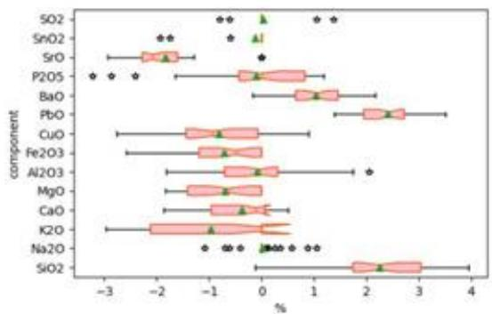

<details>
<summary>boxplot</summary>

| Component | Q1 | Q2 (Median) | Q3 |
| --- | --- | --- | --- |
| SO2 | ~0.5 | ~0.8 | ~1.2 |
| SnO2 | ~-0.5 | ~0.0 | ~0.2 |
| SrO | ~-2.2 | ~-1.8 | ~-1.5 |
| P2O5 | ~-0.5 | ~0.0 | ~0.8 |
| BaO | ~0.5 | ~0.8 | ~1.2 |
| PbO | ~1.8 | ~2.2 | ~2.6 |
| CuO | ~-1.2 | ~-0.8 | ~-0.4 |
| Fe2O3 | ~-1.0 | ~-0.6 | ~-0.2 |
| Al2O3 | ~-0.5 | ~-0.2 | ~0.2 |
| MgO | ~-1.2 | ~-0.8 | ~-0.4 |
| CaO | ~-1.0 | ~-0.6 | ~-0.2 |
| K2O | ~-2.2 | ~-1.5 | ~-0.8 |
| Na2O | ~0.0 | ~0.1 | ~0.2 |
| SiO2 | ~1.8 | ~2.2 | ~3.0 |
</details>

(a) 铅钡风化

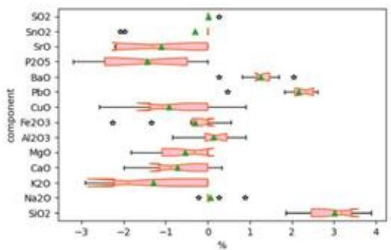

<details>
<summary>boxplot</summary>

| Component | Q1 | Q2 (Median) | Q3 | IQR |
| --- | --- | --- | --- | --- |
| SO2 | ~0.1 | ~0.2 | ~0.3 | ~0.2 |
| SnO2 | ~-2.1 | ~-2.0 | ~-1.9 | ~0.0 |
| SrO | ~-2.4 | ~-2.3 | ~-2.2 | ~0.0 |
| P2O5 | ~-2.6 | ~-2.4 | ~-2.1 | ~0.7 |
| BaO | ~1.2 | ~1.3 | ~1.4 | ~0.2 |
| PbO | ~2.1 | ~2.2 | ~2.3 | ~0.2 |
| CuO | ~-1.8 | ~-1.6 | ~-1.4 | ~0.6 |
| Fe2O3 | ~-0.4 | ~-0.3 | ~-0.2 | ~0.2 |
| Al2O3 | ~-0.1 | ~0.0 | ~0.1 | ~0.2 |
| MgO | ~-1.1 | ~-1.0 | ~-0.9 | ~0.2 |
| CaO | ~-1.3 | ~-1.2 | ~-1.1 | ~0.2 |
| K2O | ~-2.8 | ~-2.7 | ~-2.6 | ~0.2 |
| Na2O | ~-0.1 | ~0.0 | ~0.1 | ~0.2 |
| SiO2 | ~2.5 | ~2.8 | ~3.1 | ~0.6 |
</details>

(b) 铅钡未风化

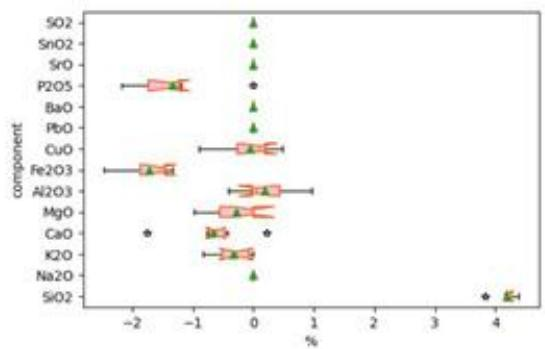

<details>
<summary>boxplot</summary>

| Component | Q1 | Q2 (Median) | Q3 | IQR |
| --- | --- | --- | --- | --- |
| SO2 | ~0.0 | ~0.0 | ~0.0 | 0 |
| SnO2 | ~0.0 | ~0.0 | ~0.0 | 0 |
| SrO | ~0.0 | ~0.0 | ~0.0 | 0 |
| P2O5 | ~-1.7 | ~-1.4 | ~-1.1 | ~0.4 |
| BaO | ~0.0 | ~0.0 | ~0.0 | 0 |
| PbO | ~0.0 | ~0.0 | ~0.0 | 0 |
| CuO | ~-0.6 | ~-0.1 | ~0.1 | ~0.7 |
| Fe2O3 | ~-1.8 | ~-1.5 | ~-1.2 | ~0.4 |
| Al2O3 | ~-0.3 | ~-0.1 | ~0.1 | ~0.6 |
| MgO | ~-0.6 | ~-0.3 | ~-0.1 | ~0.5 |
| CaO | ~-1.8 | ~-1.8 | ~-1.8 | 0 |
| K2O | ~-0.7 | ~-0.4 | ~-0.2 | ~0.5 |
| Na2O | ~-0.1 | ~-0.1 | ~-0.1 | 0 |
| SiO2 | ~3.9 | ~4.1 | ~4.3 | ~0.4 |
</details>

(c) 高钾风化

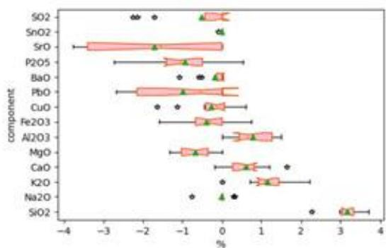

<details>
<summary>boxplot</summary>

| Component | Q1 (%) | Q2 (Median) (%) | Q3 (%) |
| --- | --- | --- | --- |
| SO2 | ~-0.5 | ~0.1 | ~0.4 |
| SnO2 | ~-0.1 | ~0.0 | ~0.1 |
| SrO | ~-3.6 | ~-1.8 | ~0.0 |
| P2O5 | ~-1.5 | ~-0.9 | ~-0.4 |
| BaO | ~-0.1 | ~0.0 | ~0.1 |
| PbO | ~-2.2 | ~-0.8 | ~0.1 |
| CuO | ~-0.3 | ~-0.1 | ~0.1 |
| Fe2O3 | ~-0.7 | ~-0.3 | ~0.1 |
| Al2O3 | ~0.4 | ~0.7 | ~1.1 |
| MgO | ~-1.2 | ~-0.8 | ~-0.4 |
| CaO | ~0.3 | ~0.6 | ~0.9 |
| K2O | ~0.9 | ~1.2 | ~1.5 |
| Na2O | ~-0.8 | ~-0.1 | ~0.1 |
| SiO2 | ~3.1 | ~3.2 | ~3.3 |
</details>

(d) 高钾未风化  
图 1 四类箱线图

由图1可知，铅钡玻璃与高钾玻璃的风化进程不同。针对铅钡玻璃，通过箱线图可知，在风化过程中， $SrO$ 、 $P_{2}O_{5}$ 、 $Fe_{2}O_{3}$ 、 $SiO_{2}$ 会减少。风化前后 $K_{2}O$ 数据分布离散程度都较大，说明风化对 $Na_{2}O$ 影响较小。针对高钾玻璃，通过箱线图可知，在风化过程中， $SrO$ 、 $P_{2}O_{5}$ 、PbO、 $Al_{2}O_{3}$ 、CaO、 $K_{2}O$ 、 $Fe_{2}O_{3}$ 含量减少， $SO_{2}$ 、 $SiO_{2}$ 含量增多。由上可以说明， $SrO$ 、 $P_{2}O_{5}$ 、 $Fe_{2}O_{3}$ 是风化流失产物，不是风化产物。

## 5.4针对问题一第三小问

再对数据进行聚类，建立时序关系，再通过回归方程建立化学成分趋势变化模型，最后通过不同化学物质趋势变化预测风化前的化学成分含量。

## 5.4.1 确定风化点

题目要求根据风化点检测数据，预测其风化前的化学成分含量。由题可知表单2的检测数据除个别表明数据来源（取自严重风化层或未风化区域），其余均为随机采样而来。根据问题一的第二小问求解可知，铅钡玻璃和高钾玻璃的化学成分变化规律不一致，因此本文先将数据根据玻璃类型进行分类，在对各自的两个类别进行Q型聚类分析，分别将两组数据分化为两类，即取自风化点和取自非风化点，从而确定需要预测数据。

## (1)Q型聚类分析

Q型聚类采用离差平方和法，若分类效果好，则同类文物采样点的离差平方和应当

较小，各类别之间的离差平方和应当较大。

假设 N 个文物采样点共可分成 k 类： $G_{1}, G_{2}, \ldots, G_{k}$ ，用 $X_{t}^{i}$ 表示 $G_{t}$ 中的第 i 个采样点， $N_{t}$ 表示 $G_{t}$ 中的采样点个数， $\bar{X}_{t}$ 代表 $G_{t}$ 的质心，则 $G_{t}$ 的采样点的离差平方和 $(S_{t})$ 的计算公式如式(9)所示。k 类的离差平方和（S）计算公式如式(10)所示。

$$
S _ {t} = \sum_ {i = 1} ^ {N _ {t}} \left(X _ {t} ^ {i} - \bar {X} _ {t}\right) ^ {T} \left(X _ {t} ^ {i} - \bar {X} _ {t}\right) \tag {9}
$$

$$
S = \sum_ {t = 1} ^ {k} \sum_ {i = 1} ^ {N _ {t}} \left(X _ {t} ^ {i} - \bar {X} _ {t}\right) ^ {T} \left(X _ {t} ^ {i} - \bar {X} _ {t}\right) \tag {10}
$$

通过公式可知，当固定 k 时，若要使 S 达到最小值，则需先将所有采样点各自分为一类，每次缩小一类后的离差平方和就会增多，选择使得 S 增大最小的两类别进行合并，直到所有采样点归为一类结束。本文分别对高钾玻璃数据和铅钡玻璃的未经过中心化对数比转换的数据进行 Q 型聚类，结果如图 2 所示。

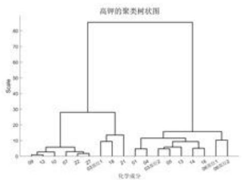

<details>
<summary>dendrogram</summary>

| Cluster ID | Chemical Class |
| --- | --- |
| 09 | 化学成分1 |
| 13 | 化学成分1 |
| 10 | 化学成分1 |
| 07 | 化学成分1 |
| 22 | 化学成分1 |
| 27 | 化学成分1 |
| 02/05/11 | 化学成分1 |
| 18 | 化学成分1 |
| 21 | 化学成分1 |
| 01 | 化学成分2 |
| 04 | 化学成分2 |
| 02/05/12 | 化学成分2 |
| 05 | 化学成分2 |
| 13 | 化学成分2 |
| 14 | 化学成分2 |
| 16 | 化学成分2 |
| 08/05/11 | 化学成分2 |
| 08/05/12 | 化学成分2 |
</details>

(a) 高钾玻璃

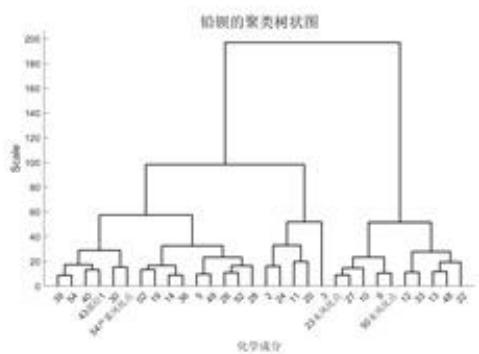

<details>
<summary>dendrogram</summary>

| Cluster Group | Sample ID |
| --- | --- |
| Top Cluster | 30, 34, 40, 42, 46, 50, 52, 54, 56, 58, 60, 62, 64, 66, 68, 70, 72, 74, 76, 78, 80, 82, 84, 86, 88, 90, 92, 94, 96, 98, 100 |
| Bottom Cluster | 21, 22, 23, 24, 25, 26, 27, 28, 29, 30, 31, 32, 33, 34, 35, 36, 37 |
</details>

(b) 铅钡玻璃  
图 2 Q 型聚类结果

## (2)2 类聚类

选定 k=2，分别对高钾玻璃数据和铅钡玻璃数据进行聚类分析。基于问题一第二小问的求解，即高钾玻璃中的 $SiO_{2}$ 会随着玻璃风化而减少，同时基于表单1中给出的表面风化结果，本文可以对高钾玻璃的2类聚类结果进行区分（判断哪一类为未风化点，哪一类为风化点），该聚类结果也可以反向证明本文问题一的第二小问结论正确。对于铅钡玻璃，本文通过观察聚类结果发现：明确采样点为未分化点的数据均聚于一类，因此可以对铅钡玻璃的2类聚类结果进行区分。具体聚类结果见表9和表10。

表 9 高钾玻璃风化点筛选

<table><tr><td>类别</td><td>组别</td></tr><tr><td>未风化点</td><td>06部位1,06部位2,01,03部位2,04,05,13,14,16</td></tr><tr><td>风化点</td><td>07,09,10,12,22,27,03部位1,18,21</td></tr></table>

表 10 铅钡玻璃风化点筛选

<table><tr><td>类别</td><td>组别</td></tr><tr><td>未风化点</td><td>23 未风化点,25 未风化点,42 未风化点 1,42 未风化点 2,46 47,49 未风化点,50 未风化点,55,28 未风化点,29 未风化点 31,32,33,35,37,44 未风化点,45,48,53 未风化点</td></tr><tr><td>风化点</td><td>08,08 严重风化点,11,20,24,26,26 严重风化点,02,19 30 部位 1,30 部位 2,34,36,38,39,40,41,43 部位 1,43 部位 2 49,50,51 部位 1,51 部位 2,52,54,54 严重风化点,56,57,58</td></tr></table>

表9和表10中的风化点即为本题需要进行预测的数据点。

## 5.4.2 建立时序关系

本题需要根据风化点检测数据，预测风化前的化学成分含量，本文首先对已有数据通过聚类建立时序关系。选定 k=4，分别对高钾玻璃和铅钡玻璃进行聚类分析。基于问题一第二小问的求解，本文以“未风化”、“轻度风化”、“中度风化”、“严重分化”分别表示通过 Q 型聚类得到的 4 个聚类。判定聚类所属类别方式与前文 2 类聚类中判断未风化点与风化点的方式一致。具体聚类结果见表 11 和表 12。

表 11 高钾玻璃时序

<table><tr><td>时段</td><td>组别</td></tr><tr><td>未风化</td><td>06部位1,06部位2</td></tr><tr><td>轻度风化</td><td>01,03部位2,04,05,13,14,16</td></tr><tr><td>中度风化</td><td>07,09,10,12,22,27</td></tr><tr><td>严重风化</td><td>03部位1,18,21</td></tr></table>

表 12 铅钡玻璃时序

<table><tr><td>时段</td><td>组别</td></tr><tr><td>未风化</td><td>23 未风化点,25 未风化点,42 未风化点1,42 未风化点246,47,49 未风化点,50 未风化点,55</td></tr><tr><td>轻度风化</td><td>28 未风化点,29 未风化点,31,32,33,3537,44 未风化点,45,48,53 未风化点</td></tr><tr><td>中度风化</td><td>02,19,30 部位1,30 部位2,34,3638,39,40,41,43 部位1,43 部位2,49,5051 部位1,51 部位2,52,54,54 严重风化点,56,57,58</td></tr><tr><td>严重风化</td><td>08,08 严重风化点,11,20,24,26,26 严重风化点</td></tr></table>

## 5.4.3 基于中心化对数比变换的成分数据预测建模

## (1) 提取中心元素

平均数是统计学中最常用的统计量，可以用于表明数据的相对集中较多的中心位置，即反应了现象总体的集中趋势，因此本文将聚类后得到的无风化、轻度风化、中度风化、严重风化四组数据中的每种化学成分分别计算平均值。计算结果如表13和表14所示。

表 13 高钾玻璃中心元素

<table><tr><td>时期</td><td> $SiO_2$ </td><td> $Na_2O$ </td><td> $K_2O$ </td><td> $CaO$ </td><td>...</td><td> $P_2O_5$ </td><td> $SrO$ </td><td> $SnO_2$ </td><td> $SO_2$ </td></tr><tr><td>未风化</td><td>3.18</td><td>0</td><td>1.04</td><td>0.32</td><td>...</td><td>0.49</td><td>-3.14</td><td>0</td><td>0</td></tr><tr><td>轻度风化</td><td>3.07</td><td>-0.023</td><td>1.37</td><td>0.91</td><td>...</td><td>-1.31</td><td>-1.54</td><td>0</td><td>-0.87</td></tr><tr><td>中度风化</td><td>3.39</td><td>0</td><td>0.68</td><td>0.06</td><td>...</td><td>-1.01</td><td>-1.20</td><td>-0.03</td><td>0</td></tr><tr><td>严重风化</td><td>4.19</td><td>0</td><td>-0.33</td><td>-0.66</td><td>...</td><td>-1.33</td><td>0</td><td>0</td><td>0</td></tr></table>

表 14 铅钡玻璃中心元素

<table><tr><td>时期</td><td> $SiO_2$ </td><td> $Na_2O$ </td><td> $K_2O$ </td><td> $CaO$ </td><td>...</td><td> $P_2O_5$ </td><td> $SrO$ </td><td> $SnO_2$ </td><td> $SO_2$ </td></tr><tr><td>未风化</td><td>2.93</td><td>0.31</td><td>-1.28</td><td>-0.69</td><td>...</td><td>-1.35</td><td>-1.52</td><td>0</td><td>0</td></tr><tr><td>轻度风化</td><td>3.48</td><td>-0.08</td><td>-1.87</td><td>-0.59</td><td>...</td><td>-0.88</td><td>-1.59</td><td>-0.21</td><td>0.02</td></tr><tr><td>中度风化</td><td>2.10</td><td>-0.02</td><td>-0.56</td><td>-0.23</td><td>...</td><td>0.06</td><td>-1.66</td><td>-0.27</td><td>0</td></tr><tr><td>严重风化</td><td>1.30</td><td>0</td><td>-1.03</td><td>-0.72</td><td>...</td><td>-0.30</td><td>-1.80</td><td>0</td><td>0.14</td></tr></table>

注：回归预测所采用的数据均为原始成分数据经过中心化对数比变换后得到的数据。

(2) 回归方程

表 15 高钾玻璃不同化学物质的回归方程

<table><tr><td>化学成分</td><td>拟合方程</td><td>R2</td></tr><tr><td>SiO2</td><td>y1=0.22723x2-0.80111x+3.7528</td><td>0.9998</td></tr><tr><td>Na2O</td><td>y2=0.0058222x2-0.026782x+0.017467</td><td>0.4000</td></tr><tr><td>K2O</td><td>y3=-0.33656x2+1.2032x+0.20916</td><td>0.9852</td></tr><tr><td>CaO</td><td>y4=-0.32877x2+1.2634x-0.53707</td><td>0.9032</td></tr><tr><td>MgO</td><td>y5=0.17385x2-0.81395x+0.23308</td><td>0.7651</td></tr><tr><td>Al2O3</td><td>y6=0.097855x2-0.87667x+2.1485</td><td>0.9958</td></tr><tr><td>Fe2O3</td><td>y7=-0.13064x2+0.092781x+0.19998</td><td>0.6812</td></tr><tr><td>CuO</td><td>y8=0.11082x2-0.54651x+0.33076</td><td>0.8341</td></tr><tr><td>PbO</td><td>y9=-0.15351x2+1.3981x-3.3438</td><td>0.7077</td></tr><tr><td>BaO</td><td>y10=-0.16556x2+1.0597x-1.6575</td><td>0.8050</td></tr><tr><td>P2O5</td><td>y11=0.37287x2-2.3791x+2.3604</td><td>0.8353</td></tr><tr><td>SrO</td><td>y12=-0.098761x2+1.4698x-4.4054</td><td>0.9550</td></tr><tr><td>SnO2</td><td>y13=0.0077947x2-0.042091x+0.038973</td><td>0.4000</td></tr><tr><td>SO2</td><td>y14=0.21755x2-1.0007x+0.65265</td><td>0.4000</td></tr></table>

表 16 铅钡玻璃不同化学物质的回归方程

<table><tr><td>化学成分</td><td>拟合方程</td><td>R2</td></tr><tr><td>SiO2</td><td>y1=-0.3396x2+1.0705x+2.3223</td><td>0.8838</td></tr><tr><td>Na2O</td><td>y2=0.10372x2-0.60509x+0.78593</td><td>0.8641</td></tr><tr><td>K2O</td><td>y3=0.030076x2+0.053855x-1.5456</td><td>0.2355</td></tr><tr><td>CaO</td><td>y4=-0.14745x2+0.76249x-1.3586</td><td>0.5873</td></tr><tr><td>MgO</td><td>y5=0.035845x2-0.040357x-0.74295</td><td>0.3290</td></tr><tr><td>Al2O3</td><td>y6=-0.37381x2+1.4176x-0.79698</td><td>0.8702</td></tr><tr><td>Fe2O3</td><td>y7=0.30831x2-1.61x+1.2538</td><td>0.8462</td></tr><tr><td>CuO</td><td>y8=0.42794x2-1.7517x+0.45063</td><td>0.9997</td></tr><tr><td>PbO</td><td>y9=-0.22029x2+1.0199x+1.2875</td><td>0.4710</td></tr><tr><td>BaO</td><td>y10=0.24927x2-1.0428x+1.9411</td><td>0.8984</td></tr><tr><td>P2O5</td><td>y11=-0.20757x2+1.4471x-2.6769</td><td>0.8652</td></tr><tr><td>SrO</td><td>y12=-0.017988x2+0.001265x-1.5109</td><td>0.9926</td></tr><tr><td>SnO2</td><td>y13=0.12159x2-0.6138x+0.50097</td><td>0.9748</td></tr><tr><td>SO2</td><td>y14=0.02995x2-0.10895x+0.08985</td><td>0.8349</td></tr></table>

通过表 15 和表 16 的可知，一些化学成分拟合优度 $R^{2}$ 相对较低，可以认为该化学成分不受到风化影响，因此在后续预测过程中，仅对拟合优度 $R^{2}$ 较高的化学成分进行预测，对拟合优度 $R^{2}$ 较低的化学成分采取不变策略，即认为风化前后该化学成分不变。

## (3)预测风化点未风化时的化学含量方法

假设回归方程为 $f(x) = ax^2 + bx + c$ ，一个风化点的某化学成分为 $(t, c)$ ，其中 $t$ 表示该风化点所处的时序， $c$ 表示该风化点的某化学成分含量检测值。距离 $d = f(t) - c$ 。根据前文表述，当 $t = 1$ 时表示未风化，因此本文认为对拟合曲线进行平移，使得该拟合曲线经过需要预测的点，即可反向预测出未风化前的数据。该方法示意图如图3所示。

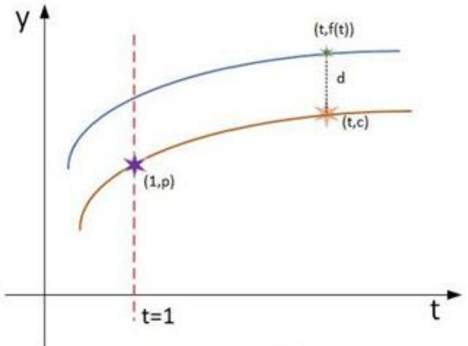

<details>
<summary>line</summary>

| Point | X-coordinate | Y-coordinate |
| --- | --- | --- |
| Star | 1 | p |
| Star | t | c |
| Star | t | f(t) |
</details>

图3 预测示意图

由图3可知，预测未风化前的化学成分含量取决于距离d和回归方程。当回归方程确定时距离d是唯一决定变量，本文考虑到可能存在异常数据使得该点测量值距离拟合曲线预测值遥远，即d很大，这会导致预测的未风化的化学成分失真。为了减小异常数据对预测的影响，本文令 $d'=\sqrt{d}$ ，再使用 $d'$ 作为距离用于预测未风化前的化学成分：

## (4) 中心化对数比逆变换

对于回归建模后求解出的未风化时各化学成分数据 $V = (v_{1}, v_{2}, \ldots, v_{p})$ 需要通过中心化对数比逆变换回到实际值表示。中心化对数比逆变换计算公式如式(11)所示。

$$
\left\{ \begin{array}{l l} w _ {j} = v _ {j} - v _ {p} & j = 1, 2, \dots , p - 1 \\ x _ {j} = \frac {e ^ {w _ {i}}}{1 + \sum_ {i = 1} ^ {p - 1} e ^ {w _ {j}}} & j = 1, 2, \dots , p - 1 \\ x _ {p} = \frac {1}{\left(1 + \sum_ {i = 1} ^ {p - 1} e ^ {w _ {i}}\right)} \end{array} \right. \tag {11}
$$

通过式(11).可以将预测值 $V=(v_{1},v_{2},\ldots,v_{p})$ 转化为相应的成分数据 $X=(x_{1},x_{2},\ldots,x_{p})$

## (3)预测结果

通过前文阐述的预测方法，本文对风化点数据进行预测，结果如表17和表18所示。

表 17 高钾玻璃风化点预测

<table><tr><td>采样点</td><td> $SiO_2$ </td><td> $Na_2O$ </td><td> $K_2O$ </td><td> $CaO$ </td><td>...</td><td> $P_2O_5$ </td><td> $SrO$ </td><td> $SnO_2$ </td><td> $SO_2$ </td></tr><tr><td>07</td><td>69.63</td><td>0</td><td>6.32</td><td>3.29</td><td>...</td><td>3.57</td><td>0.17</td><td>0</td><td>0</td></tr><tr><td>09</td><td>73.92</td><td>0</td><td>6.26</td><td>2.95</td><td>...</td><td>2.58</td><td>0.15</td><td>0</td><td>0</td></tr><tr><td>10</td><td>73.09</td><td>0</td><td>5.52</td><td>3.17</td><td>...</td><td>4.95</td><td>0.14</td><td>0</td><td>0</td></tr><tr><td>12</td><td>74.4</td><td>0</td><td>5.82</td><td>2.88</td><td>...</td><td>2.68</td><td>0.15</td><td>0</td><td>0</td></tr><tr><td>22</td><td>72.87</td><td>0</td><td>6.04</td><td>2.18</td><td>...</td><td>2.45</td><td>0.15</td><td>0</td><td>0</td></tr><tr><td>27</td><td>73.68</td><td>0</td><td>5.72</td><td>2.86</td><td>...</td><td>2.4</td><td>0.15</td><td>0</td><td>0</td></tr><tr><td>03部位1</td><td>56.03</td><td>0</td><td>12.72</td><td>5.2</td><td>...</td><td>2.76</td><td>0.12</td><td>0</td><td>0</td></tr><tr><td>18</td><td>56.55</td><td>0</td><td>14.27</td><td>5.49</td><td>...</td><td>4.81</td><td>0.15</td><td>1.36</td><td>0</td></tr><tr><td>21</td><td>59.15</td><td>0</td><td>8.88</td><td>6.2</td><td>...</td><td>3.33</td><td>0.11</td><td>0</td><td>0</td></tr></table>

表 18 铅钡玻璃风化点预测

<table><tr><td>采样点</td><td> $SiO_2$ </td><td> $Na_2O$ </td><td> $K_2O$ </td><td> $CaO$ </td><td>...</td><td> $P_2O_5$ </td><td> $SrO$ </td><td> $SnO_2$ </td><td> $SO_2$ </td></tr><tr><td>08</td><td>67.39</td><td>2.52</td><td>0</td><td>0.23</td><td>...</td><td>0.22</td><td>0.05</td><td>1.74</td><td>0.96</td></tr><tr><td>08严重风化点</td><td>53.95</td><td>3.39</td><td>0</td><td>0.41</td><td>...</td><td>1.29</td><td>0.07</td><td>2.34</td><td>6.71</td></tr><tr><td>11</td><td>74.36</td><td>1.65</td><td>0.07</td><td>0.26</td><td>...</td><td>0.88</td><td>0.04</td><td>1.14</td><td>1.25</td></tr><tr><td>20</td><td>75.08</td><td>2.05</td><td>0.19</td><td>0.32</td><td>...</td><td>0.23</td><td>0.09</td><td>1.42</td><td>1.56</td></tr><tr><td>24</td><td>70.82</td><td>1.59</td><td>0</td><td>0.11</td><td>...</td><td>0.04</td><td>0.04</td><td>1.1</td><td>1.21</td></tr><tr><td>26</td><td>65.12</td><td>2.27</td><td>0</td><td>0.21</td><td>...</td><td>0.19</td><td>0.05</td><td>1.57</td><td>0.76</td></tr><tr><td>26严重风化点</td><td>45.52</td><td>2.86</td><td>0.21</td><td>0.38</td><td>...</td><td>1.11</td><td>0.07</td><td>1.97</td><td>6.6</td></tr><tr><td>...</td><td>...</td><td>...</td><td>...</td><td>...</td><td>...</td><td>...</td><td>...</td><td>...</td><td>...</td></tr><tr><td>51部位1</td><td>63.02</td><td>1.58</td><td>0</td><td>1.35</td><td>...</td><td>0.81</td><td>0.04</td><td>0.3</td><td>1.2</td></tr><tr><td>51部位2</td><td>60.62</td><td>1.85</td><td>0</td><td>1.74</td><td>...</td><td>0.9</td><td>0.08</td><td>1.28</td><td>1.4</td></tr><tr><td>52</td><td>66.68</td><td>0.63</td><td>0</td><td>1.11</td><td>...</td><td>0.71</td><td>0.03</td><td>0.94</td><td>1.03</td></tr><tr><td>54</td><td>59.51</td><td>1.58</td><td>0.12</td><td>0.24</td><td>...</td><td>0.56</td><td>0.04</td><td>1.09</td><td>1.2</td></tr><tr><td>54严重风化点</td><td>50.02</td><td>2.53</td><td>0</td><td>0.4</td><td>...</td><td>1.38</td><td>0.07</td><td>1.75</td><td>1.93</td></tr><tr><td>56</td><td>68.33</td><td>2</td><td>0</td><td>0.17</td><td>...</td><td>0.14</td><td>0.09</td><td>1.38</td><td>1.52</td></tr><tr><td>57</td><td>63.87</td><td>2.52</td><td>0</td><td>0.2</td><td>...</td><td>0.28</td><td>0.11</td><td>1.74</td><td>1.91</td></tr><tr><td>58</td><td>65.63</td><td>1.41</td><td>0.12</td><td>1.25</td><td>...</td><td>0.79</td><td>0.03</td><td>0.98</td><td>1.07</td></tr></table>

## (4) 结果分析与验证

在主观分析层面，通过比对预测数据和采自未风化点的数据，本文发现预测数据与未风化点数据具有相似性，且因为本文使用经过中心化对数比变换后的数据进行回归分析，所以在预测风化前各化学成分含量的时候，可以保证预测的各化学成分累计和为100%，符合客观真理。综上认为本文提出的预测方法适用于预测风化前个化学成分

含量。

在客观分析层面，本文对混合了真实检测数据 D1 和预测数据 D2 的数据 D3 进行了聚类分析。在二聚类情况下，结果表明预测数据 D2 全部与真实检测数据 D1 中的已知未风化检测数据聚为一类，即表面预测数据 D2 与未风化数据更为相似，因此认为本文提出的预测方法可以有效的预测风化前的各化学成分含量。聚类谱系图见附录，在谱系图中 \*\* 表示预测数据。

## 六、问题二模型的建立与求解

## 6.1 针对问题二第一小问

题目要求分析高钾玻璃和铅钡玻璃的分类规律，由于表单2中每个数据所属玻璃类别都已知，因此本文可以采用监督学习进行分类。通过问题一的求解，得知玻璃的主要化学成分含量会随着风化过程进行而变化，因此本文认为不可将所有数据混为一谈。本文在求解此问上选择将原始数据拆分成风化点数据与未风化点数据，再分别对两类数据使用决策树分类。

## 6.1.1 决策树

决策树是一种用于数据分类的方法，它有如流程图一样的树状结构，其中每个内部节点表示在一个属性上的测试，每一个分支节点表示一个测试输出，每个叶子节点表示一类或者类分布。决策树本质是一种自顶向下的逐步构造方法，它在构造的过程中一般采用信息增益度量。信息增益最大表明了数据集在分类过程中能够最大化减小其不确定性，因此ID3在构建算法的过程中所挑选的特征具有更好的分类效果。信息熵(H)以及信息增益(G)可定义如下：

$$
H (p) = - \sum p \times \lg p
$$

$$
H (Y \mid X) = \sum_ {i = 1} ^ {n} p _ {i} H (Y \mid X = X _ {i}) \tag {12}
$$

$$
G (D, A) = H (D) - H (D \mid A)
$$

其中 p 表示随机变量的概率，A 表示特征，D 代表数据集， $H(D)$ 定义为经验熵， $H(Y|X)$ 定义为条件熵， $H(D|A)$ 表示特征 A 在数据集 D 的条件下的经验条件熵。

## 6.1.2 决策树分类结果

运用 SPSSPRO 进行决策树分类，得到结果如下：

## (1) 针对未风化点数据

针对为风化数据集，取70%数据作为训练集，30%数据作为测试集，得到如图4所示的决策树。由图可知，未风化点的玻璃类型分类规律主要由PbO含量决定，当该玻璃中PbO含量小于或等于8.495时，将其归于高钾玻璃类；当该玻璃中PbO含量大于8.495时，将其归于铅钡玻璃类。对该模型的评估结果如表19所示。

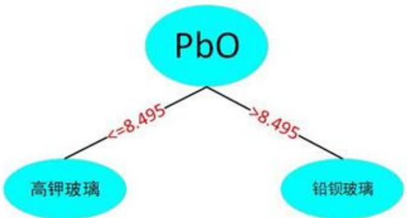

<details>
<summary>flowchart</summary>


</details>

图 4 未风化类型决策树

表 19 未风化类型决策树评估

<table><tr><td>数据集</td><td>精确率</td><td>召回率</td><td>准确率</td><td>F1</td></tr><tr><td>训练集</td><td>1</td><td>1</td><td>1</td><td>1</td></tr><tr><td>测试集</td><td>1</td><td>1</td><td>1</td><td>1</td></tr></table>

通过表 19 可知，该模型在精确率、召回率、准确率和 F1 系数上均为 1，表示该模型性能良好。

## (2) 针对风化点数据

针对风化点数据集，取70%数据作为训练集，30%数据作为测试集，得到如图5所示的决策树。由图可知，风化点的玻璃类型分类规律主要由PbO含量决定，当该玻璃中PbO含量小于或等于6.155时，将其归于高钾玻璃类；当该玻璃中PbO含量大于6.155时，将其归于铅钡玻璃类。对该模型的评估结果如表20所示。

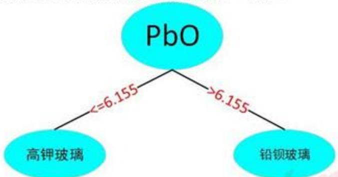

<details>
<summary>flowchart</summary>

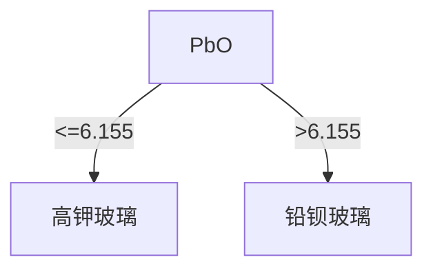
</details>

图 5 未风化类型决策树

表 20 未风化类型决策树评估

<table><tr><td>数据集</td><td>精确率</td><td>召回率</td><td>准确率</td><td>F1</td></tr><tr><td>训练集</td><td>1</td><td>1</td><td>1</td><td>1</td></tr><tr><td>测试集</td><td>1</td><td>1</td><td>1</td><td>1</td></tr></table>

通过表 20 可知，该模型在精确率、召回率、准确率和 F1 系数上均为 1，表示该模型性能良好。

## 6.1.3 问题二第一小问总结

通过上述分析，可以得出以下两点结论：

(1) 高钾玻璃与铅钡玻璃的区分，主要取决于玻璃中的 PbO 含量，即铅钡玻璃的 PbO 含量较高，高钾玻璃的 PbO 含量较低，因此 PbO 含量应该归为区分高钾玻璃与铅钡玻璃的主要指标。  
(2) 高钾玻璃与铅钡玻璃的分类规律会收到风化影响。通过图 4 和图 5 可知，有无风化会对决策边界产生影响，即风化过程会导致玻璃的 PbO 含量降低。

## 6.2 针对问题二第二小问

题目要求对每个类别选择合适的化学成分进行亚分类，基于前文得到的：风化过程会对化学成分含量产生影响，本文首先将原始数据分成“铅钡风化”、“铅钡不风化”、“高钾风化”和“高钾不风化”四类进行亚分类。为了选择合适化学成分进行亚分类，本文首先对玻璃的14种主要化学成分进行R型聚类分析法，将14种化学成分聚成三类，再取每类具有代表性的成分当做合适的化学成分进行Q型聚类，进而得到亚分类结果。

## 6.2.1 R 型聚类分析

在对变量进行聚类分析时，首先应该确定变量的相识度量。

## (1) 相关系数

记变量 $x_{j}$ 的取值 $(x_{1j}, x_{2j}, \ldots, x_{nj})^{T} \in R^{n}(j = 1, 2, \ldots, m)$ ，用两变量 $x_{j}$ 和 $x_{k}$ 的样本相关系数作为它们的相似性度量，即

$$
r _ {i j} = \frac {\sum_ {i = 1} ^ {n} (x _ {i j} - \bar {x} _ {j}) (x _ {i k} - \bar {x} _ {k})}{\left[ \sum_ {i = 1} ^ {n} (x _ {i j} - \bar {x} _ {j}) ^ {2} \sum_ {i = 1} ^ {n} (x _ {i k} - \bar {x} _ {k}) \right] ^ {\frac {1}{2}}} \tag {13}
$$

## (2) 相关系数矩阵求解

利用 Matlab 求解 14 个化学成分的皮尔逊相关系数矩阵，结果如图 6 所示。

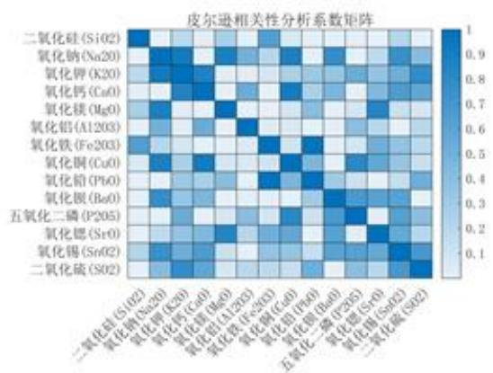

<details>
<summary>heatmap</summary>

| 氧化物 (Symbol) | 二氧化硅 (S102) | 氧化钠 (Na20) | 氧化钾 (K20) | 氧化钙 (CuO) | 氧化镁 (MgO) | 氧化铝 (Al203) | 氧化铁 (Fe203) | 氧化铜 (CuO) | 氧化铅 (PbO) | 氧化钡 (BaO) | 五氧化二磷 (P205) | 氧化锶 (SrO) | 氧化锡 (SnO2) | 二氧化硫 (SO2) |
| --- | --- | --- | --- | --- | --- | --- | --- | --- | --- | --- | --- | --- | --- | --- |
| 二氧化硅 (S102) | ~0.95 | ~0.45 | ~0.45 | ~0.45 | ~0.45 | ~0.45 | ~0.45 | ~0.45 | ~0.45 | ~0.45 | ~0.45 | ~0.45 | ~0.45 | ~0.45 |
| 氧化钠 (Na20) | ~0.45 | ~0.85 | ~0.85 | ~0.45 | ~0.45 | ~0.45 | ~0.45 | ~0.45 | ~0.45 | ~0.45 | ~0.45 | ~0.45 | ~0.45 | ~0.45 |
| 氧化钾 (K20) | ~0.45 | ~0.85 | ~0.85 | ~0.45 | ~0.45 | ~0.45 | ~0.45 | ~0.45 | ~0.45 | ~0.45 | ~0.45 | ~0.45 | ~0.45 | ~0.45 |
| 氧化钙 (CuO) | ~0.45 | ~0.85 | ~0.85 | ~0.45 | ~0.45 | ~0.45 | ~0.45 | ~0.45 | ~0.45 | ~0.45 | ~0.45 | ~0.45 | ~0.45 | ~0.45 |
| 氧化镁 (MgO) | ~0.45 | ~0.85 | ~0.85 | ~0.45 | ~0.85 | ~0.45 | ~0.45 | ~0.45 | ~0.45 | ~0.45 | ~0.65 | ~0.45 | ~0.45 | ~0.45 |
| 氧化铝 (Al203) | ~0.45 | ~0.85 | ~0.85 | ~0.45 | ~0.85 | ~0.85 | ~0.85 | ~0.45 | ~0.45 | ~0.45 | ~0.65 | ~0.45 | ~0.45 | ~0.45 |
| 氧化铁 (Fe2O3) | ~0.85 | ~0.85 | ~0.85 | ~0.45 | ~0.85 | ~0.85 | ~1.00 | ~1.00 | ~1.00 | ~1.00 | ~1.00 | ~1.00 | ~1.00 | ~1.00 |
| 氧化铜 (CuO) | ~0.85 | ~1.00 | ~1.00 | ~1.00 | ~1.00 | ~1.00 | ~1.00 | ~1.00 | ~1.00 | ~1.00 | ~1.00 | ~1.00 | ~1.00 | ~1.00 |
| 氧化铅 (PbO) | ~1.00 | ~1.00 | ~1.00 | ~1.00 | ~1.00 | ~1.00 | ~1.00 | ~1.00 | ~1.00 | ~1.00 | ~1.00 | ~1.00 | ~1.00 | ~1.00 |
| 氧化钡 (BaO) | ~1.00 | ~1.00 | ~1.00 | ~1.00 | ~1.00 | ~1.00 | ~1.00 | ~1.00 | ~1.00 | ~1.85 | ~1.85 | ~1.85 | ~1.85 | ~1.85 |
| 五氧化二磷 (P2O5) | ~1.85 | ~1.85 | ~1.85 | ~1.85 | ~1.85 | ~1.85 | ~1.85 | ~1.85 | ~1.85 | ~1.85 | ~1.85 | ~1.85 | ~1.85 | ~1.85 |
</details>

(a) 铅钡风化

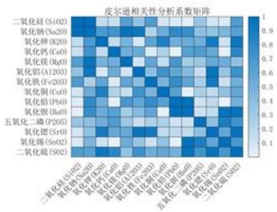

<details>
<summary>heatmap</summary>

| 氧化物 | 二氧化硅 (SiO2) | 氧化钠 (Na20) | 氧化钾 (K20) | 氧化钙 (CaO) | 氧化镁 (MgO) | 氧化铝 (Al2O3) | 氧化铁 (Fe2O3) | 氧化铜 (CuO) | 氧化铅 (PbO) | 氧化铜 (BaO) | 五氧化二磷 (P2O5) | 氧化锶 (SrO) | 氧化锡 (SnO2) | 二氧化硫 (SO2) |
| --- | --- | --- | --- | --- | --- | --- | --- | --- | --- | --- | --- | --- | --- | --- |
| 二氧化硅 (SiO2) | ~0.95 | ~0.85 | ~0.75 | ~0.85 | ~0.75 | ~0.65 | ~0.65 | ~0.65 | ~0.65 | ~0.65 | ~0.65 | ~0.65 | ~0.65 | ~0.65 |
| 氧化钠 (Na20) | ~0.95 | ~0.85 | ~0.95 | ~0.85 | ~0.75 | ~0.65 | ~0.65 | ~0.65 | ~0.65 | ~0.65 | ~0.65 | ~0.65 | ~0.65 | ~0.65 |
| 氧化钾 (K20) | ~0.75 | ~0.95 | ~0.85 | ~0.75 | ~0.65 | ~0.65 | ~0.65 | ~0.65 | ~0.65 | ~0.65 | ~0.65 | ~0.65 | ~0.65 | ~0.65 |
| 氧化钙 (CaO) | ~0.75 | ~0.75 | ~0.95 | ~0.75 | ~0.65 | ~0.65 | ~0.65 | ~0.65 | ~0.65 | ~0.65 | ~0.65 | ~0.65 | ~0.65 | ~0.65 |
| 氧化镁 (MgO) | ~0.75 | ~0.95 | ~0.85 | ~0.75 | ~0.95 | ~0.75 | ~0.75 | ~0.75 | ~0.75 | ~0.75 | ~0.75 | ~0.75 | ~0.75 | ~0.75 |
| 氧化铝 (Al2O3) | ~0.75 | ~0.85 | ~0.75 | ~0.75 | ~0.85 | ~0.95 | ~0.85 | ~0.85 | ~0.85 | ~0.85 | ~0.85 | ~0.85 | ~0.85 | ~0.85 |
| 氧化铁 (Fe2O3) | ~0.75 | ~0.75 | ~0.75 | ~0.75 | ~0.75 | ~0.95 | ~0.85 | ~0.85 | ~0.85 | ~0.85 | ~0.85 | ~0.85 | ~0.85 | ~0.85 |
| 氧化铜 (CuO) | ~0.75 | ~0.95 | ~0.85 | ~0.75 | ~0.75 | ~0.75 | ~0.95 | ~0.95 | ~1.0 | — | — | — | — | — |
| 氧化铅 (PbO) | ~0.75 | ~0.95 | ~1.0 | — | — | — | — | — | — | — | — | — | — | — |
| 氧化铜 (BaO) | — | — | — | — | — | — | — | — | — | — | — | — | — | — |
| 五氧化二磷 (P2O5) | — | — | — | — | — | — | — | — | — | — | — | — | — | — |
</details>

(b) 铅钡未风化

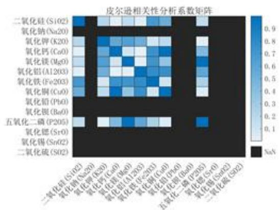

<details>
<summary>heatmap</summary>

| 氧化物 | 二氧化硅 (Si02) | 氧化钠 (Na20) | 氧化钾 (K20) | 氧化钙 (CaO) | 氧化镁 (MgO) | 氧化铝 (Al203) | 氧化铁 (Fe203) | 氧化铜 (CuO) | 氧化铅 (PbO) | 氧化钡 (BaO) | 五氧化二磷 (P205) | 氧化锶 (SrO) | 氧化锡 (SnO2) | 二氧化硫 (SO2) |
| --- | --- | --- | --- | --- | --- | --- | --- | --- | --- | --- | --- | --- | --- | --- |
| 二氧化硅 (Si02) | ~0.9 | ~0.1 | ~0.1 | ~0.1 | ~0.1 | ~0.1 | ~0.1 | ~0.1 | ~0.1 | ~0.1 | ~0.1 | ~0.1 | ~0.1 | ~0.1 |
| 氧化钠 (Na20) | ~0.9 | ~0.1 | ~0.1 | ~0.1 | ~0.1 | ~0.1 | ~0.1 | ~0.1 | ~0.1 | ~0.1 | ~0.1 | ~0.1 | ~0.1 | ~0.1 |
| 氧化钾 (K20) | ~0.1 | ~0.6 | ~0.6 | ~0.6 | ~0.6 | ~0.6 | ~0.6 | ~0.6 | ~0.6 | ~0.6 | ~0.6 | ~0.6 | ~0.6 | ~0.6 |
| 氧化钙 (CaO) | ~0.1 | ~0.6 | ~0.6 | ~0.6 | ~0.6 | ~0.6 | ~0.6 | ~0.6 | ~0.6 | ~0.6 | ~0.6 | ~0.6 | ~0.6 | ~0.6 |
| 氧化镁 (MgO) | ~0.1 | ~0.6 | ~0.6 | ~0.6 | ~0.6 | ~0.9 | ~0.6 | ~0.6 | ~0.6 | ~0.6 | ~0.6 | ~0.6 | ~0.6 | ~0.6 |
| 氧化铝 (Al203) | ~0.1 | ~0.6 | ~0.6 | ~0.6 | ~0.6 | ~0.6 | ~0.6 | ~0.6 | ~0.6 | ~0.6 | ~0.6 | ~0.6 | ~0.6 | ~0.6 |
| 氧化铁 (Fe203) | ~0.9 | ~0.1 | ~0.1 | ~0.1 | ~0.1 | ~0.1 | ~0.1 | ~0.1 | ~0.1 | ~0.1 | ~0.1 | ~0.1 | ~0.1 | ~0.1 |
| 氧化铜 (CuO) | ~0.9 | ~0.1 | ~0.1 | ~0.1 | ~0.1 | ~0.1 | ~0.1 | ~0.1 | ~0.9 | ~0.9 | ~0.9 | ~0.9 | ~0.9 | ~0.9 |
| 氧化铅 (PbO) | ~0.9 | ~0.1 | ~0.1 | ~0.1 | ~0.1 | ~0.1 | ~0.1 | ~0.1 | ~0.9 | ~0.9 | ~0.9 | ~0.9 | ~0.9 | ~0.9 |
| 氧化钡 (BaO) | ~0.9 | ~0.1 | ~0.1 | ~0.1 | ~0.1 | ~0.1 | ~0.1 | ~0.1 | ~0.9 | ~0.9 | ~0.9 | ~0.9 | ~0.9 | ~0.9 |
| 五氧化二磷 (P205) | ~0.1 | — | — | — | — | — | — | — | — | — | — | — | — | — |
| 氧化锶 (SrO) | — | — | — | — | — | — | — | — | — | — | — | — | — | — |
</details>

(c) 高钾风化

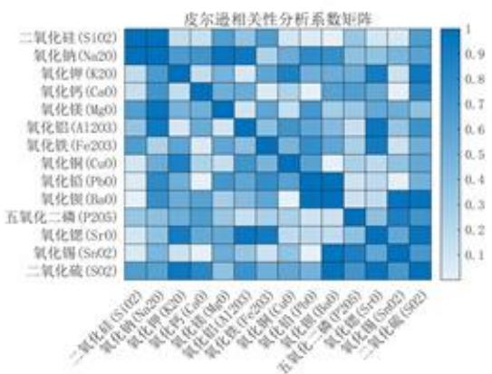

<details>
<summary>heatmap</summary>

| 氧化物 (S102) | 氧化钠(Na20) | 氧化钾(K20) | 氧化钙(CaO) | 氧化镁(MgO) | 氧化铝(A1203) | 氧化铁(Fe203) | 氧化铜(CuO) | 氧化铝(PbO) | 氧化钡(BaO) | 五氧化二磷(P205) | 氧化锶(SrO) | 氧化锡(SnO2) | 二氧化硫(SO2) |
| --- | --- | --- | --- | --- | --- | --- | --- | --- | --- | --- | --- | --- | --- |
| **二氧化硅 (S102)** | ~0.9 | ~0.8 | ~0.7 | ~0.6 | ~0.5 | ~0.4 | ~0.3 | ~0.2 | ~0.1 | ~0.1 | ~0.1 | ~0.1 | ~0.1 |
| **氧化钠(Na20)** | ~0.9 | ~0.8 | ~0.7 | ~0.6 | ~0.5 | ~0.4 | ~0.3 | ~0.2 | ~0.1 | ~0.1 | ~0.1 | ~0.1 | ~0.1 |
| **氧化钾(K20)** | ~0.7 | ~0.8 | ~0.7 | ~0.6 | ~0.5 | ~0.4 | ~0.3 | ~0.2 | ~0.1 | ~0.1 | ~0.1 | ~0.1 | ~0.1 |
| **氧化钙(CaO)** | ~0.7 | ~0.8 | ~0.7 | ~0.6 | ~0.5 | ~0.4 | ~0.3 | ~0.2 | ~0.1 | ~0.1 | ~0.1 | ~0.1 | ~0.1 |
| **氧化镁(MgO)** | ~0.7 | ~0.8 | ~0.7 | ~0.6 | ~0.5 | ~0.4 | ~0.3 | ~0.2 | ~0.1 | ~0.1 | ~0.1 | ~0.1 | ~0.1 |
| **氧化铝(A1203)** | ~0.7 | ~0.8 | ~0.7 | ~0.6 | ~0.5 | ~0.4 | ~0.3 | ~0.2 | ~0.1 | ~0.1 | ~0.1 | ~0.1 | ~0.1 |
| **氧化铁(Fe203)** | ~0.7 | ~0.8 | ~0.7 | ~0.6 | ~0.5 | ~0.4 | ~0.3 | ~0.2 | ~0.1 | ~0.1 | ~0.1 | ~0.1 | ~0.1 |
| **氧化铜(CuO)** | ~0.7 | ~0.8 | ~0.7 | ~0.6 | ~0.5 | ~0.4 | ~0.3 | ~0.2 | ~0.1 | ~0.1 | ~0.1 | ~0.1 | ~0.1 |
| **氧化铝(PbO)** | ~0.7 | ~0.8 | ~0.7 | ~0.6 | ~0.5 | ~0.4 | ~0.3 | ~0.2 | ~0.1 | ~0.1 | ~0.1 | ~0.1 | ~0.1 |
| **氧化钡(BaO)** | ~0.7 | ~0.8 | ~0.7 | ~0.6 | ~0.5 | ~0.4 | ~0.3 | ~0.2 | ~0.1 | ~0.1 | ~0.1 | ~0.1 | ~0.1 |
| **五氧化二磷(P205)** | ~0.7 | ~0.8 | ~0.7 | ~0.6 | ~0.5 | ~0.4 | ~0.3 | ~0.2 | ~0.1 | ~0.1 | ~0.1 | ~0.1 | ~0.1 |
| **氧化锶(SrO)** | ~0.7 | ~0.8 | ~0.7 | ~0.6 | ~0.5 | ~0.4 | ~0.3 | ~0.2 | ~0.1 | ~0.1 | ~0.1 | ~0.1 | ~0.1 |
</details>

(d) 高钾未风化  
图6 四类相关系数矩阵  
注：高钾风化中由于存在多列皆为0的情况，因此存在NAN值。

通过相关系数矩阵可知，某些变量之间是具有强相关性，因此可以对14个化学成分根据相关性进行R型决裂，再从每个类中选取具有代表性的特征变量。

本文使用相关系数用于度量变量间的相似性，使用最短距离法度量类间相似性。

## (3) 最短距离法

定义两种变量之间的距离为式(14)。

$$
R (G _ {1}, G _ {2}) = \min \{d _ {j k} \}, x _ {j} \in G _ {1}, x _ {k} \in G _ {2} \tag {14}
$$

其中， $d_{jk}=1-|r_{jk}|$ ，此时 $R(G_{1},G_{2})$ 与两类变量中的相似性最大的两个变量之间的相似性度量值有关。

## (4)R型聚类分析结果

利用 Matlab 进行 R 型聚类分析，结果如表 21、表 22、表 23 和表 24 所示。

表 21 高钾未风化 R 型聚类

<table><tr><td>类别</td><td>化学成分</td></tr><tr><td>第一类</td><td> $MgO, Al_{2}O_{3}, Fe_{2}O_{3}, CuO^{*}, PbO, BaO, P_{2}O_{5}, SrO$ </td></tr><tr><td>第二类</td><td> $Na_{2}O, K_{2}O, CaO, SO_{2}^{*}$ </td></tr><tr><td>第三类</td><td> $SiO_{2}, SnO_{2}^{*}$ </td></tr></table>

- 代表性特征变量。

表 22 铅钡未风化 R 型聚类

<table><tr><td>类别</td><td>化学成分</td></tr><tr><td>第一类</td><td> $Na_{2}O^{*}$ </td></tr><tr><td>第二类</td><td> $SiO_{2}^{*}, SO_{2}$ </td></tr><tr><td>第三类</td><td> $K_{2}O, CaO, MgO, Al_{2}O_{3}, Fe_{2}O_{3}, CuO^{*}, PbO, BaO, P_{2}O_{5}, SrO, SnO_{2}$ </td></tr></table>

- 代表性特征变量。

表 23 高钾风化 R 型聚类

<table><tr><td>类别</td><td>化学成分</td></tr><tr><td>第一类</td><td> $SnO_{2}^{*}$ </td></tr><tr><td>第二类</td><td> $Na_{2}O, SiO_{2}, MgO, Al_{2}O_{3}, Fe_{2}O_{3}, CuO^{*}, PbO, BaO, P_{2}O_{5}, SrO, K_{2}O, CaO$ </td></tr><tr><td>第三类</td><td> $SO_{2}^{*}$ </td></tr></table>

代表性特征变量。

表 24 铅钡风化 R 型聚类

<table><tr><td>类别</td><td>化学成分</td></tr><tr><td>第一类</td><td> $CuO^{*},BaO,SO_{2}$ </td></tr><tr><td>第二类</td><td> $CaO,MgO,Fe_{2}O_{3},PbO,P_{2}O_{5},SrO^{*}$ </td></tr><tr><td>第三类</td><td> $SiO_{2},SnO_{2},Al_{2}O_{3}^{*},Na_{2}O,K_{2}O$ </td></tr></table>

- 代表性特征变量。

代表特征变量即为本文选用的合适的化学成分，在后文将以 R 型聚类得到的特征变量为基础，进行 Q 型聚类。

## (5)Q型聚类分析结果

Q型聚类结果如图7所示。

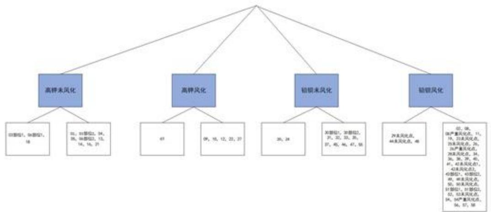

<details>
<summary>flowchart</summary>

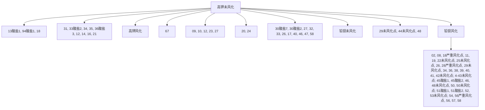
</details>

图 7 亚分类结果

## 6.3 针对问题二第三小问

## 6.3.1 合理性分析

本文提出的划分亚类的方法充分利用了前问求解答案，同时利用了 R 型和 Q 型聚类。在系统分析和成分分类的过程中，往往会存在许多相关变量，这些相关变量会对结果产生一定影响，本文为了能够更好的划分亚类，选择先进行 R 型聚类。通过 R 型聚类不仅可以了解个别变量之间的关系的亲疏程度，也可以了解各个变量组合之间的亲疏程度。本文利用 R 型聚类将 14 组化学成分聚类成 3 组，通过选取特征变量的方式确定合适的化学成分。通过 R 型聚类找到的化学成分更加具有说服力。

由于本题要求对数据进行亚类划分，本文在使用 R 型聚类得到合适的化学成分后，进行 Q 聚类对数据点进行划分。相比于直接进行 Q 型聚类划分亚类，先进行 R 型聚类在进行 Q 型聚类可以有更好的划分性能和划分依据。

## 6.3.2 敏感性分析

敏感性分析需要从定量分析的角度研究有关因素发生某种变化对某一个或一组关键指标影响程度的一种不确定分析技术[2]。本文通过对R型聚类得到的3个特征量进行扰动处理，通过分析扰动比例对模型分类结果的影响，进而对模型的敏感性进行分析。通过给代表性特征变量随机进行扰动，分析影响分类结果与否，可以得到如表25所示结果。其中扰动范围 $p$ 是指对于原始数据 $x$ ，在 $[(1 - p)x,(1 + p)x]$ 范围内随机取数对 $x$ 重新赋值，无论抽取何数，都不会对分类结果产生影响。

表 25 代表性特征变量扰动范围

<table><tr><td>组别</td><td>代表性特征变量</td><td>扰动范围</td></tr><tr><td rowspan="3">高钾未风化</td><td>SnO2</td><td>0.1</td></tr><tr><td>CuO</td><td>0.15</td></tr><tr><td>CaO</td><td>0.15</td></tr><tr><td rowspan="3">铅钡未风化</td><td>Na2O</td><td>0.2</td></tr><tr><td>CuO</td><td>0.2</td></tr><tr><td>SiO2</td><td>0.05</td></tr><tr><td rowspan="3">高钾风化</td><td>SnO2</td><td>0.15</td></tr><tr><td>CuO</td><td>0.15</td></tr><tr><td>SO2</td><td>0.15</td></tr><tr><td rowspan="3">铅钡风化</td><td>Al2O3</td><td>0.15</td></tr><tr><td>CuO</td><td>0.1</td></tr><tr><td>SrO</td><td>0.15</td></tr></table>

从表中可以看出，对于三类代表性特征变量，其扰动范围处于[0.1,0.2]范围内，在一定程度上可以说明，小范围的数据变化不会对分类结果产生影响，由此可以说明本文使用的模型敏感性良好。

## 七、问题三模型的建立与求解

## 7.1针对问题三第一小问

题目要求对未知类别玻璃文物的化学成分进行分析，通过观察数据发现，所给出的数据为未分类玻璃文物的化学成分比例。与表单2不同的是，表单3中的化学成分比例为文物的化学成分比例，不是通过进行随机表面采样检测到的化学成分比例，因此，本文认为表单3中给出的“表面风化”信息可以用于区分风化与否。即不需要再对表单3中数据进行分类（风化或未风化）处理。

## 7.1.1 鉴别属性

在问题二第一小问的建模求解中，本文分别对风化与未风化数据构建决策树，用于区分高钾和铅钡玻璃。本文认为表单3中数据与前文数据类型相似，因此在解决此问题上使用通过表单2数据训练好的决策树进行分类。通过决策树进行分类，结果如表26所示。

表 26 决策树分类结果

<table><tr><td>玻璃类别</td><td>文件编号</td></tr><tr><td>高钾玻璃</td><td>A1,A6,A7</td></tr><tr><td>铅钡玻璃</td><td>A2,A3,A4,A5,A8</td></tr></table>

## 7.1.2 交叉检验

本文通过 Q 型聚类方式对其结果进行检验，分别对表面有风化和表面无风化玻璃进行聚类，聚类汇总结果如表 27 所示。

表 27 聚类结果

<table><tr><td>玻璃类别</td><td>文件编号</td></tr><tr><td>高钾玻璃</td><td>A1,A6,A7</td></tr><tr><td>铅钡玻璃</td><td>A2,A3,A4,A5,A8</td></tr></table>

## 7.2 针对问题三第二小问

## 7.2.1 敏感性分析

根据问题二第一小问的求解可知，无论风化与否，对玻璃类型进行分类的唯一指标为 $PbO$ 。对于风化类型，当 $PbO > 6.155$ 时，即可判定为铅钡玻璃，而在表单3中风化玻璃A2、A5、A6、A7的 $PbO$ 的成分含量分别为 $34.3\%$ ， $12.23\%$ ， $0\%$ ， $0\%$ ，它们与6.155的差异较大，模型能接受的摆动范围也高，所以本文使用的模型在对风化玻璃进行分类时的敏感性较高。对于未风化玻璃A1,A3,A4,A8的 $PbO$ 的成分含量分别为 $0\%$ ， $39.58\%$ ， $24.28\%$ ， $21.24\%$ ，它们与相较于 $8.495\%$ 的差异较大，模型能接受的数据摆动范围较高，因此本文使用的模型在对无风化玻璃进行分类时的敏感性较高。综上所示，本文针对问题三使用的分类模型具有较高的分类性能，在准确性和敏感性上取得较好表现。

## 八、问题四模型的建立与求解

要针对不同玻璃类型，分析其化学成分之间的关联性，即分别研究高钾玻璃与铅钡玻璃的化学成分指标间的关联，以 $SiO_{2}$ 作为母序列，其余十三组指标为子序列，不同类别的玻璃建立灰色关联分析模型，遍历 $SiO_{2}$ 、 $Na_{2}O$ 、…、 $SO_{2}$ 作为母序列，并对关联系数进行加权处理得到关联度值，以关联值大小来衡量相关性大小。

## 8.1 针对问题四第一小问

## 8.1.1 灰色关联分析

灰色关联分析是根据数据指标几何形状的相似程度来衡量指标之间的联系是否紧密，当指标间的曲线越接近时，说明相应指标之间的关联度就越大，反之越小。

Step1）确定比较对象（评价对象）和参考数列（评价标准）。

假设评价对象有 m 个，评价指标有 n 个，参考数列为 $x_{0}=x_{0}(k)|k=1,2,\ldots,n$ ，比较数列为 $x_{i}=x_{i}(k)|k=1,2,\ldots,m$ 。

Step2）对变量数据进行预处理。

分别对母序列以及子序列中的每一个指标进行预处理，首先求解出各个指标的平均值，再用该指标中的各个元素除以该均值，预处理可去除掉量纲的影响同时缩小指标的范围简便计算。假设标准化矩阵为 Z，其中 $z_{ij}$ 表示矩阵 Z 中的元素，那么预处理公式

可表示为：

$$
z _ {i j} = \frac {x _ {i j}}{\bar {x} _ {i j}} \tag {15}
$$

得到标准化矩阵 Z:

$$
Z = \left[ \begin{array}{c c c c} z _ {1 1} & z _ {1 2} & \dots & z _ {1 m} \\ z _ {2 1} & z _ {2 2} & \dots & z _ {2 m} \\ \vdots & \vdots & \ddots & \vdots \\ z _ {n 1} & z _ {n 2} & \dots & z _ {n m} \end{array} \right] \tag {16}
$$

Step3) 确定各指标值对应的权重。

确定各个指标对应的权重 $w = [w_{1},\dots ,w_{n}]$ ，其中 $w_{k}(k = 1,2,\dots ,n)$ 表示第 $k$ 个评价指标所对应的权重。

Step4) 计算灰色关联系数。

$$
\xi_ {i} (k) = \frac {\min _ {s} \min _ {t} | x _ {0} (t) - x _ {s} (t) | + \rho \max _ {s} \max _ {t} | x _ {0} (t) - x _ {s} (t) |}{| x _ {0} (k) - x _ {i} (k) | + \rho \max \max _ {s} | x _ {0} (t) - x _ {s} (t) |} \tag {17}
$$

其中 $\rho[0,1]$ 为分辨系数（一般取值 0.5）。各指标的关联系数也可表示为：

$$
y (x _ {0} (k), x _ {i} (k)) = \frac {a + \rho b}{| x _ {0} (k) - x _ {i} (k) | + \rho b} (i = 1, 2, \dots , m, k = 1, 2, \dots , n) \tag {18}
$$

其中 $a$ 为两极小差， $b$ 为两极大差，计算如下：

$$
\mathrm{a} = \min _ {\mathrm{i}} \min _ {\mathrm{k}} | \mathrm{x} _ {0} (\mathrm{k}) - \mathrm{x} _ {\mathrm{i}} (\mathrm{k}) | \tag {19}
$$

$$
\mathrm{b} = \max _ {\mathrm{i}} \max _ {\mathrm{k}} | \mathrm{x} _ {0} (\mathrm{k}) - \mathrm{x} _ {\mathrm{i}} (\mathrm{k}) |
$$

Step5) 计算灰色加权关联度。

$$
r _ {i} = \sum_ {k = 1} ^ {n} w _ {i} \xi_ {i} (k) \tag {20}
$$

其中 $r_{i}$ 表示第i个评价对象关于理想对象的灰色加权关联度。

## 8.1.2 模型的求解

利用 SPSSPRO 分别绘制高钾、铅钡玻璃以 $SiO_{2}$ 为母序列的灰色关联度图像如下图 8 和图 9 所示。

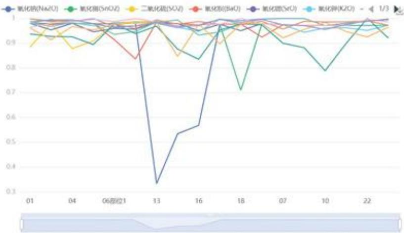

<details>
<summary>line</summary>

| Time | 氧化物(Na2O) | 氧化物(SiO2) | 二氧化硫(SO2) | 氧化物(BaO) | 氧化物(SiO) | 氧化物(K2O) |
| --- | --- | --- | --- | --- | --- | --- |
| 01 | ~0.98 | ~0.93 | ~0.96 | ~0.99 | ~0.98 | ~0.98 |
| 04 | ~0.97 | ~0.92 | ~0.88 | ~0.98 | ~0.97 | ~0.97 |
| 06 | ~0.96 | ~0.95 | ~0.97 | ~0.98 | ~0.97 | ~0.97 |
| 13 | ~0.33 | ~0.97 | ~0.98 | ~0.83 | ~0.98 | ~0.98 |
| 16 | ~0.56 | ~0.83 | ~0.84 | ~0.98 | ~0.98 | ~0.98 |
| 18 | ~0.96 | ~0.71 | ~0.96 | ~0.98 | ~0.98 | ~0.98 |
| 07 | ~0.95 | ~0.97 | ~0.96 | ~0.98 | ~0.98 | ~0.98 |
| 10 | ~0.78 | ~0.88 | ~0.96 | ~0.98 | ~0.98 | ~0.98 |
| 22 | ~0.96 | ~0.92 | ~0.96 | ~0.98 | ~0.98 | ~0.98 |
</details>

图 8 高钾类灰色关联度

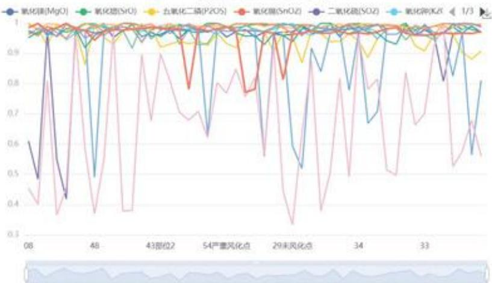

<details>
<summary>line</summary>

| Location | 氧化锂[MgO] | 氧化锂(SrO) | 五氧化二磷(P2OS) | 氧化锂(SnOZ) | 二氧化硫(SOZ) | 氧化钾(KZ) |
| --- | --- | --- | --- | --- | --- | --- |
| 08 | ~0.61 | ~0.97 | ~0.98 | ~0.99 | ~0.98 | ~0.98 |
| 48 | ~0.50 | ~0.98 | ~0.98 | ~0.98 | ~0.98 | ~0.98 |
| 43部位2 | ~0.98 | ~0.98 | ~0.98 | ~0.98 | ~0.98 | ~0.98 |
| 54严重风化点 | ~0.63 | ~0.98 | ~0.98 | ~0.78 | ~0.98 | ~0.98 |
| 29未风化点 | ~0.52 | ~0.98 | ~0.98 | ~0.81 | ~0.98 | ~0.98 |
| 34 | ~0.67 | ~0.98 | ~0.98 | ~0.98 | ~0.98 | ~0.98 |
| 33 | ~0.56 | ~0.98 | ~0.98 | ~0.98 | ~0.98 | ~0.98 |
</details>

图 9 铅钡类灰色关联度

通过图像比对可知，铅钡玻璃的各子序列分布较为离散，而高钾玻璃的各子序列分布较为集中。分别以高钾玻璃和铅钡玻璃中 $SiO_{2}$ 为母序列，利用 SPSSPRO 对关联系数进行加权处理得到关联度值，求解出灰色关联度如下表 1 所示：（因篇幅原因，此处只展示高钾及铅钡以 $SiO_{2}$ 为母序列的灰色关联度图表，其余详见附录）

表 28 高钾和铅钡 $SiO_{2}$ 灰色关联度对比表

<table><tr><td>类别</td><td>高钾类关联度</td><td>铅钡类关联度</td></tr><tr><td>Na2O</td><td>0.893</td><td>0.899</td></tr><tr><td> $K_2O$ </td><td>0.972</td><td>0.977</td></tr><tr><td>CaO</td><td>0.921</td><td>0.969</td></tr><tr><td>MgO</td><td>0.981</td><td>0.975</td></tr><tr><td> $Al_2O_3$ </td><td>0.98</td><td>0.667</td></tr><tr><td> $Fe_2O_3$ </td><td>0.982</td><td>0.973</td></tr><tr><td>CuO</td><td>0.951</td><td>0.978</td></tr><tr><td>PbO</td><td>0.97</td><td>0.991</td></tr><tr><td>BaO</td><td>0.962</td><td>0.987</td></tr><tr><td> $P_2O_5$ </td><td>0.986</td><td>0.949</td></tr><tr><td>SrO</td><td>0.968</td><td>0.987</td></tr><tr><td> $SnO_2$ </td><td>0.962</td><td>0.959</td></tr><tr><td> $SO_2$ </td><td>0.962</td><td>0.932</td></tr></table>

由上表分析可知，由于关联度值介于区间[0,1]上，且关联度值越大表示与母序列（即 $SiO_{2}$ ）的相关性越强，关联度越高，意味着子序列与母序列之间的关联性较高，反之越低。从上表可看出：对于高钾玻璃母序列 $SiO_{2}$ 而言：针对十三个评价项，其中五氧化二磷 $P_{2}O_{5}$ 的关联度为最高0.986，即评价最高，而氧化钠Na2O的关联度为最低0.893，即评价最低。对于铅钡玻璃母序列 $SiO_{2}$ 而言：针对十三个评价项，其中氧化铅PbO的关联度为最高0.991，即评价最高，而氧化铝 $Al_{2}O_{3}$ 的关联度为最低0.667，即评价最低。总结：当两类玻璃类型分别以BaO或SrO为母序列时，均与PbO的关联度最高；其中对于高钾玻璃而言，SiO2与P2O5互为最大关联性；对于铅钡玻璃而言， $SiO_{2}$ 与PbO互为最大关联性。

## 8.1.3 差异性比较

在求解出各个化学成分之间的关联度值的基础上，比较不同玻璃类别间的关联度值差异程度，可发现无论选定哪个化学成分作为母序列，铅钡玻璃的其余十三个评价项关联系数分布的离散程度远高于高钾玻璃，高钾玻璃的关联系数大多数稳定分布在区间[0.9,1]上，而铅钡玻璃的关联系数分布波动性较大。其中铅钡玻璃中以 $PbO$ 或者 $CuO$ 为母序列的氧化铝 $Al_{2}O_{3}$ 灰色关联度值均为最低值，即评价最低，相反，对于高钾玻璃中以 $PbO$ 或者 $CuO$ 为母序列的氧化铝 $Al_{2}O_{3}$ 灰色关联度值均为最高值，即评价最高。其中高钾玻璃中仅有一组的最低关联度值为 $CaO$ ，其余均为 $Na_{2}O$ ；而对于铅钡玻璃中仅有一组的最低关联度值为 $SnO_{2}$ ，其余均为 $Al_{2}O_{3}$ 。

## 九、优缺点分析

## 9.1 优点

(1)本文充分考虑到成分数据的特点,采用中心化对数变换对原始数据进行变换,变换后的数据可以打破定和的限制,使得数据更加优质。  
(2) 本文使用经过中心化对数变换后的数据进行回归预测，可以保证预测到的各成分累计和为 100%，使得预测数据更加真实可靠。  
(3)本文采用随机扰动方式对模型进行敏感性分析，可以使得模型评价更为客观。  
(4)本文充分考虑到变量与变量之间的相关性，使用R型聚类对原始数据进行降维，可以使得化学成分选择的更加客观。  
(5)本文使用的灰色预测模型对样本量的多少，或样本量有无规律同样适用，并且计算量比较小，十分方便，并且不会出现定量分析结果和定性分析结果不符的情况。

## 9.2缺点

(1) 本文使用的模型在小批量数据上有较好的表现，但因为确实大数据验证，无法保证要良好的延展性。  
(2) 本文在关系探究式没有充分考虑定量变量与定类变量的联系，可能存在潜在联系。

## 参考文献

[1] 付亚龙. 成分数据处理方法研究. Master's thesis, 长安大学, 2019.  
[2] 蔡毅, 邢岩, and 胡丹. 敏感性分析综述. 北京师范大学学报: 自然科学版, 44(1):9-16, 2008.  
[3] 郭丽娟 and 关蓉. 基于空间等价性的成分数据变换方法比较研究. Statistics and Application, 7:271, 2018.

## 附录A

## 1.1 高钾聚类检验

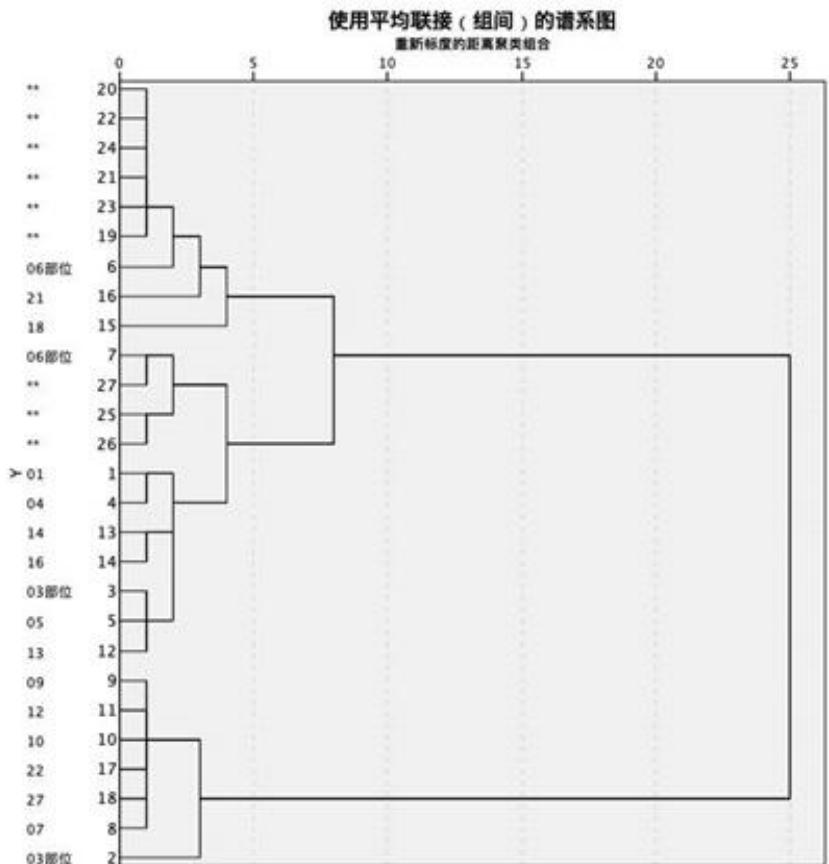

<details>
<summary>dendrogram</summary>

| Node ID | Cluster Group |
| --- | --- |
| 20 | Left Cluster |
| 22 | Left Cluster |
| 24 | Left Cluster |
| 21 | Left Cluster |
| 23 | Left Cluster |
| 19 | Left Cluster |
| 6 | Right Cluster |
| 21 | Right Cluster |
| 18 | Right Cluster |
| 15 | Right Cluster |
| 7 | Right Cluster |
| 27 | Right Cluster |
| 25 | Right Cluster |
| 26 | Right Cluster |
| 1 | Right Cluster |
| 4 | Right Cluster |
| 14 | Right Cluster |
| 16 | Right Cluster |
| 3 | Right Cluster |
| 5 | Right Cluster |
| 13 | Right Cluster |
| 9 | Right Cluster |
| 11 | Right Cluster |
| 10 | Right Cluster |
| 17 | Right Cluster |
| 18 | Right Cluster |
| 8 | Right Cluster |
| 2 | Right Cluster |
</details>

图 10 高钾聚类检验

1.2 铅钡聚类检验  
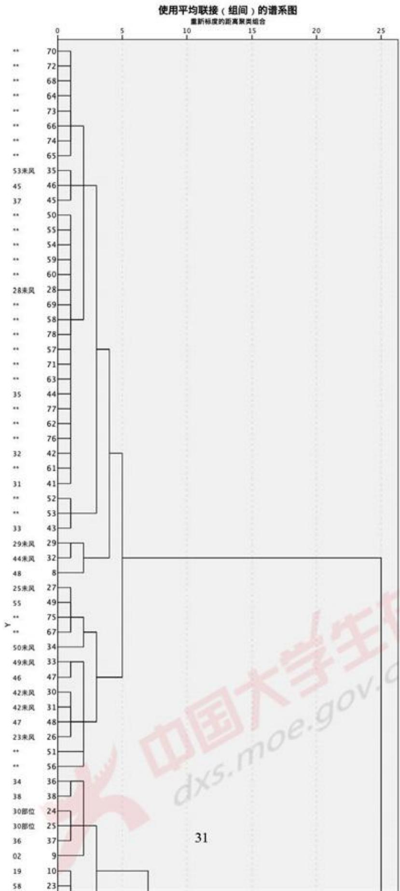

<details>
<summary>dendrogram</summary>

| Sample ID | Cluster Group |
| --- | --- |
| 70 | Left Cluster |
| 46 | Left Cluster |
| 57 | Left Cluster |
| 29 | Right Cluster |
| 32 | Right Cluster |
| 44 | Right Cluster |
| 29 | Right Cluster |
| 32 | Right Cluster |
| 38 | Right Cluster |
| 30 | Right Cluster |
| 24 | Right Cluster |
| 25 | Right Cluster |
| 36 | Right Cluster |
| 10 | Right Cluster |
| 23 | Right Cluster |
</details>

## 附录B

2.1 聚类与回归  
```matlab
clear; clc; close all;

%% 全部
% [data, name] = read_fen_lei_xing();
%
% D=pdist(data, 'minkowski');
% M=squareform(D);
% Z=linkage(D,'centroid');
% H=dendrogram(Z,'labels',name);
% xlabel('City');
% ylabel('Scale');
% C=cophenet(Z,D);
% T=cluster(Z,3);

%% 铅钡
is_qian_bei = 0;
ok = 1;
if is_qian_bei == 1
    [data1, name1] = read_qian_bei(ok); %铅钡
else
    [data1, name1] = read_gao_jia(ok); %高钾
end
% for i = 1 : size(data1, 1)
%     if sum(data1(i, :)) -= 100
%         data1(i, :) = data1(2, :) / sum(data1(2, :)) * 100;
%    end
% end

D=pdist(data1, 'minkowski', 2);
Z=linkage(D,'ward');
H=dendrogram(Z,'labels',name1);
set(H, 'color', 'k', 'linewidth', 1.3); %把聚类图线颜色改为黑色，线宽加粗
if is_qian_bei == 1
    title('铅钡的聚类树状图', 'FontSize', 16);
else
    title('高钾的聚类树状图', 'FontSize', 16);
end
xlabel('化学成分', 'FontSize', 12);
ylabel('Scale', 'FontSize', 12);
k = 2;
```

```matlab
T=cluster(Z,k);
for i = 1 : k
    tm = find(T == i); %求第i类的对象
    tm = tm'; %变成行向量
    %tm = reshape(tm, 1, length(tm)); %变成行向量
    fprintf(2, '第%d类的有: \n', i); %显示分类结果
    for j = 1 : length(tm)
        fprintf("%s ", name1(tm(j)));
    end
    fprintf("\n");
end
```

% 再分类  
```matlab
z1 = find(T == 1);

D=pdist(data1(z1, :), 'minkowski', 2);
M=squareform(D);
Z=linkage(D,'ward');
name11 = name1(z1);
H=dendrogram(Z,'labels',name11);
xlabel('化学成分');
ylabel('Scale');
C=cophenet(Z,D);
k = 2;
T1=cluster(Z,k);
for i = 1 : k
    tm = find(T1 == i); %求第i类的对象
    tm = tm'; %变成行向量
    %tm = reshape(tm, 1, length(tm)); %变成行向量
    fprintf('第%d类的有: \n', i); %显示分类结果
    for j = 1 : length(tm)
        fprintf("%s ", name11(tm(j)));
    end
    fprintf("\n");
end
```

```matlab
z2 = find(T == 2);
D=pdist(data1(z2, :), 'minkowski', 2);
M=squareform(D);
Z=linkage(D,'ward'); name12 = name1(z2);
H=dendrogram(Z,'labels',name12);
xlabel('化学成分');
```

```matlab
ylabel('Scale');
C=cophenet(Z,D);
k = 2;
T2 =cluster(Z,k);
T2 = T2 + 2;
for i = 3 : k + 2
    tm = find(T2 == i); %求第1类的对象
    tm = tm'; %变成行向量
    %tm = reshape(tm, 1, length(tm)); %变成行向量
    fprintf('第%d类的有: \n', i); %显示分类结果
    for j = 1 : length(tm)
        fprintf("%s ", name12(tm(j)));
    end
    fprintf("\n");
end
```

```matlab
z12 = [z1; z2]; T12 = [T1; T2];
[-, ind] = sort(z12);
T12 = T12(ind);
```

```matlab
% plot(T12, data1(:, 1), '*');
```

```matlab
%%
ok = 0;
if is_qian_bei == 1
    [data1, name1] = read_qian_bei(ok); %铅钡
else
    [data1, name1] = read_gao_jia(ok); %高钾
end
fea = ones(14, 4);
for i = 1 : 14
    for t = 1 : 4
        fea(i, t) = mean(data1(T12 == t, i));
    end
end
fea = fea';
```

```matlab
fea = [fea(1, :); fea(2, :); fea(4, :); fea(3, :)];
% 1 2 3 4
% 2 1 3 4

% if is_qian_bei == 1
%     fea = [fea(2, :); fea(1, :); fea(3:4, :)]; %铅钡
% else
%     fea = [fea(2, :); fea(1, :); fea(4, :); fea(3, :)]; %高钾
% end
```

%% 灰色预测  
```matlab
%
% for i = 1 : 14
%   figure;
%   sGM11(fea(:, i));
% end
```  
%%

```matlab
x0 = 1:4;
x1 = 1:0.2:4;
fea_name = [
    "二氧化硅(SiO2)"
    "氧化钠(Na2O)"
    "氧化钾(K2O)"
    "氧化钙(CaO)"
    "氧化镁(MgO)"
    "氧化铝(Al2O3)"
    "氧化铁(Fe2O3)"
    "氧化铜(CuO)"
    "氧化铅(PbO)"
    "氧化钡(BaO)"
    "五氧化二磷(P2O5)"
    "氧化锶(SrO)"
    "氧化锡(SnO2)"
    "二氧化硫(SO2)"];
a = 1; b = 14;
p = zeros(14, 3);
for i = a : b
```

```matlab
p(i, :) = polyfit(x0, fea(:, i), 2);
y1 = polyval(p(i, :), x1);
R2(fea(:, i), y1);
%fprintf("%s 拟合的 方程系数: %s\n", fea_name(i), num2str(p(i, :)));
figure; H = plot(x0, fea(:, i), '*', 'LineWidth', 5); hold on; plot(x1, y1, 'o');
    legend('真实值', '拟合值');
%set(H, 'LineWidth', 7);
xlabel('风化时期');
title(fea_name(i));
end
```

%% 预测  
```javascript
[qian_be13, qian_be14, gao_jia3, gao_jia4] = read_pred();
```

```matlab
qian_bei_pred4 = zeros(size(qian_bei4));
gao_jia_pred4 = zeros(size(gao_jia4));

qian_bei_pred3 = zeros(size(qian_bei3));
gao_jia_pred3 = zeros(size(gao_jia3));

if is_qian_bei == 1
    % Mg0 K20
    for i = 1 : size(qian_bei4, 1)
        for j = a : b
            if j == 5 || j == 3
                qian_bei_pred4(i, j) = qian_bei4(i, j);
                continue;
            end
            if qian_bei4(i, j) > 0
                qian_bei_pred4(i, j) = power(qian_bei4(i, j) - getY(p(j, :), 4), 1/2) + getY(p(j, :), 1);
            else
                qian_bei_pred4(i, j) = -power(-qian_bei4(i, j) - getY(p(j, :), 4), 1/2) +
                    getY(p(j, :), 1);
            end
        end
    end

    for i = 1 : size(qian_bei3, 1)
        for j = a : b
            if j == 5 || j == 3
                qian_bei_pred3(i, j) = qian_bei3(i, j);
                continue;
            end
            if qian_bei3(i, j) > 0
                qian_bei_pred3(i, j) = power(qian_bei3(i, j) - getY(p(j, :), 4), 1/2) + getY(p(j, :), 1);
            else
                qian_bei_pred3(i, j) = -power(-qian_bei3(i, j) - getY(p(j, :), 4), 1/2) +
                    etiquet(p(j, :), 1);
            end
        end
    end

    writematrix(qian_bei_pred4, '../qian_bei4.xlsx')
    writematrix(qian_bei_pred3, '../qian_bei3.xlsx')
else
    % So2 SnO2 Na20
    for i = 1 : size(gao_jia4, 1)
```

```matlab
for j = a : b
    if j == 14 || j == 13 || j == 2
        gao_jia_pred4(i, j) = gao_jia4(i, j);
        continue;
    end
    if gao_jia4(i, j) > 0
        gao_jia_pred4(i, j) = power(gao_jia4(i, j) - getY(p(j, :), 4), 1/2) + getY(p(j,
            :), 1);
    else
        gao_jia_pred4(i, j) = -power(-gao_jia4(i, j) - getY(p(j, :), 4), 1/2) + getY(p(j,
            :), 1);
    end
end
end

for i = 1 : size(gao_jia3, 1)
    for j = a : b
        if j == 14 || j == 13 || j == 2
            gao_jia_pred3(i, j) = gao_jia3(i, j);
            continue;
        end
        if gao_jia3(i, j) > 0
            gao_jia_pred3(i, j) = power(gao_jia3(i, j) - getY(p(j, :), 4), 1/2) + getY(p(j,
            :), 1);
        else
            gao_jia_pred3(i, j) = -power(-gao_jia3(i, j) - getY(p(j, :), 4), 1/2) + getY(p(j,
            :), 1);
        end
    end
end

writematrix(gao_jia_pred4, '../gao_jia_pred4.xlsx')
writematrix(gao_jia_pred3, '../gao_jia_pred3.xlsx')
end
```

## 附录C

## 3.1 Log-ratio 逆变换

```python
import numpy as np
import matplotlib.pyplot as plt
import pandas as pd
import openpyxl
from sklearn import decomposition
```

```python
def loadDataSet(filename):
    ex = openpyxl.load_workbook(filename)
    sheet = ex.get_sheet_by_name("高钾")
    data1 = []
    data2 = []
    for i in range(2 , 20):
        res = []
        for j in range(2 , 16):
            res.append(sheet.cell(row=i,column=j).value)
        data1.append(res)

    sheet = ex.get_sheet_by_name("铅钡")
    for i in range(2, 51):
        res = []
        for j in range(2, 16):
            res.append(sheet.cell(row=i, column=j).value)
        data2.append(res)

    return data1 , data2

def process(data , n , m):
    X = []
    for i in range(0 , n):
        res = []
        for j in range(0 , m):
            if data[i][j] == 0 : continue
            else :
                res.append(data[i][j])

        down = 1
        w = []
        for j in range(0 , len(res) - 1) :
            w.append(res[j] - res[len(res) - 1])

        for j in range(0 , len(w)):
            down += np.exp(w[j])

        ptr = []
        for j in range(0 , len(w) ):
            ptr.append(np.exp(w[j]) / down)

        ptr.append(1 / down)

        x = []
        idx = 0
```

```python
for j in range(0 , m):
    if data[i][j] == 0 :
        x.append(0)
    else :
        x.append(ptr[idx])
        idx += 1

    X.append(x)

return X

filename = 'Log-ratio变换.xlsx'

data1 , data2 = loadDataSet(filename)

print(data1)
print(data2)
data1 = process(data1, len(data1) , len(data1[0]))
data2 = process(data2 , len(data2) , len(data2[0]))

# 创建一个excel表格
wk = openpyxl.Workbook()
# 创建一个sheet.命名为my_sheet，默认名称为“sheet1”
sheet1 = wk.create_sheet('高钾')
sheet2 = wk.create_sheet('铅钡')

# 在my_sheet中写入相关属性

for i in range(1 , len(data1) + 1):
    for j in range(1 , len(data1[0]) + 1):
        sheet1.cell(row=1, column=j).value = data1[i - 1][j - 1]

for i in range(1 , len(data2) + 1):
    for j in range(1 , len(data2[0]) + 1):
        sheet2.cell(row=1, column=j).value = data2[i - 1][j - 1]

wk.save('../第二小问/Log-ratio逆变换测试.xlsx')
```

## 附录D

## 4.1 Log-ratio 变换

```python
import numpy as np
import matplotlib.pyplot as plt
import pandas as pd
import openpyxl
from sklearn import decomposition

def loadDataSet(filename):
    ex = openpyxl.load_workbook(filename)
    sheet = ex.get_sheet_by_name("高钾")
    data1 = []
    data2 = []
    for i in range(2 , 20):
        res = []
        for j in range(2 , 16):
            res.append(sheet.cell(row=i,column=j).value)
        data1.append(res)

    sheet = ex.get_sheet_by_name("铅钡")
    for i in range(2, 51):
        res = []
        for j in range(2, 16):
            res.append(sheet.cell(row=i, column=j).value)
        data2.append(res)

    return data1 , data2

def process(data , n , m):
    a = []
    for i in range(0, n ):
        down = 1
        num = 0
        b = []
        for j in range(0 , m ):
            if data[i][j] == 0:continue
            else :
                down = down * float(data[i][j])
                num += 1
        down = pow(down , 1 / num)
        for j in range(0 , m ):
            if data[i][j] == 0 :
                b.append(0)
            else :
                b.append(np.log(float(data[i][j])/down) )
        a.append(b)
```

```python
return a

filename = '归一化后用于log变换.xlsx'
data1 , data2 = loadDataSet(filename)

data1 = process(data1 , len(data1) , len(data1[0]))
data2 = process(data2 , len(data2) , len(data2[0]))

# 创建一个excel表格
wk = openpyx1.Workbook()
# 创建一个sheet,命名为my_sheet,默认名称为"sheet1"
sheet1 = wk.create_sheet('高钾')
sheet2 = wk.create_sheet('铅钡')

# 在my_sheet中写入相关属性

for i in range(1 , len(data1) + 1):
    for j in range(1 , len(data1[0]) + 1):
        sheet1.cell(row=i, column=j).value = data1[i - 1][j - 1]

for i in range(1 , len(data2) + 1):
    for j in range(1 , len(data2[0]) + 1):
        sheet2.cell(row=i, column=j).value = data2[i - 1][j - 1]

wk.save('../第二小问/Log-ratio变换.xlsx')
```