# 基于时间序列预测的物料生产安排模型

## 摘要

论文试图根据某企业产品需求的历史记录，建立数学模型，解决合理安排生产计划问题。

首先，统计所有284种不同物料需求出现的频数、数量、趋势、销售单价和销售总额，选择销售总额较大、记录频数较多、需求数量较高的不同趋势（水平型、上升型、下降型）的6种物料进行关注。

其次，对选择重点关注的6种物料，以周为单位，统计每种物料的周需求量。建立物料需求的周预测模型，采用三次指数平滑预测法，编写程序，进行短期预测。即用前100周数据预测第101周数据，用前101周数据预测第102周数据，以此类推。经过不断尝试，并且考虑到平均服务水平不低于85%的要求，针对不同趋势的数据，采用不同的参数（水平型取参数 $\alpha=0.3$ ，上升型取参数 $\alpha=0.8$ ，下降型取参数 $\alpha=0.4$ ），这样选择的参数可以快速、大幅提高需求量的增长，从而降低缺货量，进而保障服务水平的高质量。

根据这个原则，分别对6种不同物料进行统计和计算，得到6种物料第101-177周的库存量、缺货量和服务水平，以及综合结果。计算结果发现，6种物料的平均服务水平都超过85%，绝大多数周的服务水平都达到100%，然而，平均库存量也较大。其中物料6004021055平均库存量高达198.63件/周。

再次，在第2题的生产安排模型中，服务水平高，但是库存量大，为了在二者之间寻求平衡，论文提出“强化参数法”和“联合调整法”。在“强化参数法”中，对于每周需求量计算都按照方案调整一次参数，及时地补充和跟进需求量的增加，以保证服务水平不会连续较低的情况。而“联合调整法”则是联合上周库存量、缺货量和本周需求预测值，极大限度地压缩库存量，减少成本。在这两个方法相继使用之下，很好地平衡了服务水平和库存量的关系。

根据这个想法，分别对6种不同物料进行统计和计算，得到6种物料第101-177周的库存量、缺货量和服务水平，以及综合结果。计算结果发现，所有物料的平均库存量均有不同程度下降，物料6004021055的平均库存量降到45.51件/周，降幅 $77.1\%$ ，而平均服务水平则降为 $82.91\%$ 。针对其他平均库存量本来就较小的物料，改进方案，使得服务水平达到 $85\%$ 以上的同时，平均库存量也在20件/周以下。

最后，调整假设条件，延长产品从计划到使用的时间，这必然导致缺货量增加，所以对“强化参数法”和“联合调整法”都进行了改进，倾向于增加库存量来避免持续缺货，严重影响服务水平的情况，针对延长k周（k=2）的情况进行计算，从计算结果来看，效果是很好的，只是对于这两种方法中的参数，需要更多数据和探索，以期获得更多经验。

关键词：生产安排 时间序列 三次指数平滑 预测 MATLAB 库存量 服务水平

## 一、问题重述

某电子产品制造企业，欲分析已有历史数据，预测物料需求，进而安排生产计划。

赛题附件提供某电子产品制造企业自2019年1月1日起至2022年5月21日的物料编码及其需求量、销售单价记录，我们将解决以下：

1、分析历史数据，选择6种应当重点关注的物料，建立物料需求的周预测模型，并利用历史数据对预测模型进行评价；  
2、如果本周计划生产的物料只能在k（k=1）周及以后使用，制定6种重点物料的生产计划表（含第101周-177周生产计划数、实际需求量、库存量、缺货量、服务水平），计算6种物料的综合结果，使得平均服务水平不低于85%；  
3、平衡库存量成本与服务水平之间的关系，调整周生产计划，重新制定生产计划表和计算综合结果；  
4、如果本周计划生产的物料只能在 $k(k \geq 2)$ 周及以后使用，重新制定生产计划。

## 二、问题分析

## 2.1 问题 1 分析

1. 结合物料需求出现的频数、数量、趋势、销售单价和销售总额，利用 EXCEL 工具排序，选择 6 种重点关注的物料。  
2. 以周为单位，统计周需求量历史数据。  
3. 建立时间序列三次指数平滑预测模型，对周需求量进行预测，计算误差。

## 2.2 问题 2 分析

1. 假设周需求量预测值为生产计划，提出“参数调整法”，即对物料趋势进行分类，利用三次指数平滑预测法，水平型取参数 $\alpha=0.3$ ，上升型取参数 $\alpha=0.7$ （为了保障服务水平处于较高的质量），下降型取参数 $\alpha=0.6$ ，确定生产计划。

2. 梳理生产计划、实际需求、库存、缺货量及服务水平之间的关系，按照一周后才能使用产品的假设，计算 6 种重点关注物料在第 101-177 周的库存、缺货量及服务水平。

3. 进一步计算 6 种物料的综合结果。

4. 分析问题。

## 2.3 问题 3 分析

1. 将问题 2 的流程进行调整，增加调整生产计划的步骤：

确定需求量预测——“强化参数法+联合调整法”调整实际生产计划——计算库存、缺货量、服务水平——计算综合结果。

2. 确定调整实际生产计划的方案，即根据库存、需求量调整生产计划（降低库存成本），根据服务水平、缺货量调整生产计划（提高服务水平），以实现平均服务水平高于80%，且库存量大幅度低于问题2中库存量。最终实现库存量与服务水平之间的平衡。  
3. 计算 6 种物料的库存、缺货量及服务水平，及综合结果，并与问题 2 中的结果进行对比。

## 2.4 问题 4 分析

1. 更改假设，假设本周计划生产的物料只能在 k=2 周及以后使用，那么对突然增加需求量的情况就必然导致服务水平极低，所以必须继续调大参数 $\alpha=0.9$ ，并且在需求量基础上数乘 $\beta(\beta\geq1)$ ，以达到快速增加需求量的目的。k 值越大， $\beta$ 值也越大。  
2. 计算 6 种物料的库存、缺货量及服务水平，及综合结果。

## 三、模型假设与符号说明

## 3.1 模型假设

1、假设附件所给数据无遗漏，数值均无误；  
2、假设本周生产计划所生产的产品，本周并不能使用，必须在 $k(k \geq 1)$ 周之后才能使用。

## 3.2 符号说明

<table><tr><td>符号</td><td>含义</td></tr><tr><td> $y_{t}$ </td><td>第t周实际需求量</td></tr><tr><td> $y_{t}$ </td><td>第t周需求量预测值</td></tr><tr><td> $C_{t}$ </td><td>第t周生产计划数量</td></tr><tr><td> $K_{t}$ </td><td>第t周库存量</td></tr><tr><td> $Q_{t}$ </td><td>第t周缺货量</td></tr><tr><td> $F_{t}$ </td><td>第t周服务水平</td></tr><tr><td> $\alpha$ </td><td>三次指数平滑预测法中的参数</td></tr><tr><td> $\beta$ </td><td>问题4中生产计划调整参数</td></tr></table>

表1 论文中使用的符号说明

## 四、模型的建立与求解

## 4.1 问题 1 的模型

## 4.1.1 选择6种重点关注的物料

附件中给出 2019 年 1 月 1 日-2022 年 5 月 21 日共 22453 条数据，每条数据含物料编码、需求量及销售单价。

在 EXCEL 中，对物料编码去重复，得到共 284 个不同的物料编码，再用 COUNTIF 函数分类计数得到不同物料编码的频数，用 SUMIF 函数分类求和得到不同物料编码的数量，考虑到企业盈利的目的，计算不同物料编码的销售总额。需要指出的是，同一物料编码的销售单价在不同时间会有差别，论文中将采用平均销售单价的计算办法，即：

$$
\mathrm{平均销售单价} = \frac {\mathrm{销售总额}}{\mathrm{总数量}} = \frac {\sum (\mathrm{数量} \times \mathrm{销售单价})}{\sum \mathrm{数量}}
$$

接下来考虑几项指标：

·频数，代表订单客户的数量，频数越大，客户群体越大。

·数量，代表物料需求总量，关系到销售数量、销售总额，影响生产计划。

·平均销售单价，与销售总额相关。

趋势，代表对产品的预判，影响生产计划。

不同物料的各项计算结果如表 2（按销售总额降序排列，颜色代表在该项目降序排列中居前十五）：

<table><tr><td>物料编码</td><td>频数</td><td>数量</td><td>平均销售单价</td><td>销售总额</td><td>趋势(特点)</td><td>重点关注</td></tr><tr><td>6004020918</td><td>620</td><td>2213</td><td>2280</td><td>5045408</td><td>下降型数据</td><td>√</td></tr><tr><td>6004010372</td><td>80</td><td>2657</td><td>1815</td><td>4823621</td><td>频数太少,数据量不够多,影响预测,建议后期关注</td><td></td></tr><tr><td>6004020900</td><td>444</td><td>717</td><td>6332</td><td>4540071</td><td>上升型数据</td><td>√</td></tr><tr><td>6004021155</td><td>130</td><td>1075</td><td>3517</td><td>3781103</td><td>频数太少,数据量不够多,影响预测,建议后期关注</td><td></td></tr><tr><td>6004010174</td><td>418</td><td>2601</td><td>1302</td><td>3386739</td><td>2021.11.5之后无数据,不值得关注</td><td></td></tr><tr><td>6004021055</td><td>318</td><td>2969</td><td>1050</td><td>3116285</td><td rowspan="2">下降型数据水平型数据,从2019-2022年需求量持续保持,有特点</td><td>√</td></tr><tr><td>6004020768</td><td>180</td><td>434</td><td>6410</td><td>2781860</td><td>√</td></tr><tr><td>6004021096</td><td>160</td><td>569</td><td>4456</td><td>2535298</td><td>频数太少,数据量不够</td><td></td></tr><tr><td>6004021111</td><td>139</td><td>375</td><td>6521</td><td>2445243</td><td rowspan="2">多,影响预测,建议后期关注频数太少,数据量不够多,影响预测,建议后期关注频数太少,数据量不够多,影响预测,建议后期关注</td><td></td></tr><tr><td>6004020763</td><td>126</td><td>283</td><td>8609</td><td>2436296</td><td></td></tr><tr><td>6004020921</td><td>337</td><td>934</td><td>2396</td><td>2238134</td><td>水平型数据</td><td>✓</td></tr><tr><td>6004010256</td><td>955</td><td>1585</td><td>1366</td><td>2165199</td><td>上升型数据</td><td>✓</td></tr></table>

表 2 不同物料编码的频数、数量、销售单价、销售总额计算

表 2 列出的是按销售总额排序的前 10 位，其他有些物料虽然销售单价高达上万元，但是需求量不大，导致销售总额不高，如果利润率相当的情况下，利润也就不如销售总额更高的物料来得大。

挑选原则：在选择重点关注的6种物料时，优先考虑销售总额高的物料，其次，考虑物料的频数较多、需求数量较大，最好有不同趋势的物料。如果周需求量的数据太少，会影响预测结果，建议后期再关注。

例如，在统计周需求量时，发现物料6004010174在2021年11月5日之后就没有需求数据了，该情况被认为是产品停产或者不再销售，也就是需求趋势为0，故不应关注这样的物料。另外，物料6004020900从2019年10月21日才开始出现记录，持续到2022年5月21日，且需求量逐步增加，这样的物料值得被关注。  
最后，在综合考虑频数、数量、销售单价、销售总额等各项因素后，选择以下6种物料重点关注：

<table><tr><td></td><td>物料编码</td></tr><tr><td>1</td><td>6004020918</td></tr><tr><td>2</td><td>6004020900</td></tr><tr><td>3</td><td>6004021055</td></tr><tr><td>4</td><td>6004020768</td></tr><tr><td>5</td><td>6004020921</td></tr><tr><td>6</td><td>6004010256</td></tr></table>

表 3 重点关注的 6 种物料编码

## 4.1.2 物料需求的周预测模型——时间序列模型（三次指数平滑法）

首先，对6种不同物料需求量按周进行统计，绘制散点图：

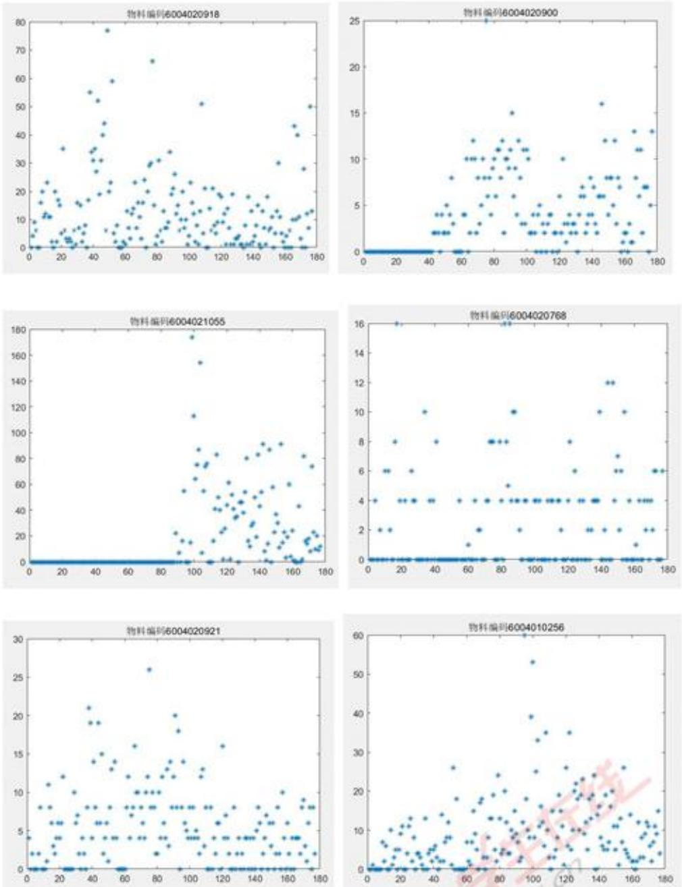  
图1重点关注的6种物料周需求量散点图

观察散点图，发现：

1. 6004020918、6004020768、6004020921、6004010256 物料自 2019 年 1 月 2 日以来保持持续生产，而 6004020900、6004021055 物料都只是近一年来才有

生产记录。

2. 6004020900、6004010256 物料的周需求量有上升趋势，6004020918、6004021055 物料周需求量略有下降趋势，6004020768、6004020721 物料周需求量则有水平型趋势。

针对数据特点，建立时间序列模型来进行周预测。

假设周需求量为时间序列 $\{y_{i}\}$ ，下面综述时间序列的几种模型：

<table><tr><td>时间序列方法</td><td>时间序列模型</td><td>特点</td></tr><tr><td>简单一次移动平均预测法</td><td> $\hat{y}_{t+1} = \frac{y_t + y_{t-1} + \cdots + y_{t-n+1}}{n}$  $\hat{y}_{t+1}$ 表示第t+1期预测值(t≥n) $y_t$ 表示第t期实际值n表示移动平均的项数预测误差  $\sigma = \sqrt{\frac{\sum (y_{t+1} - \hat{y}_{t+1})^2}{N-n}}$ N为时间序列 $\{y_t\}$ 所含原始数据的个数</td><td>把参与平均的数据在预测中所起的作用同等对待;n不宜过大或过小,如果没有周期变动,n可取较大,如果数据类型呈上升型或下降型趋势,n可取较小的数。</td></tr><tr><td>加权一次移动平均预测法</td><td> $\hat{y}_{t+1} = \frac{w_1 y_t + w_2 y_{t-1} + \cdots + w_n y_{t-n+1}}{w_1 + w_2 + \cdots + w_n}$  $\hat{y}_{t+1}$ 表示第t+1期预测值 $y_t$ 表示第t期实际值 $w_i$ 表示权重n表示移动平均的项数预测误差  $\sigma = \sqrt{\frac{\sum (y_{t+1} - \hat{y}_{t+1})^2}{N-n}}$ N为时间序列 $\{y_t\}$ 所含原始数据的个数</td><td>把参与平均的数据在预测中所起的作用区别对待;一般原则:近期数据的权重大,远期数据的权重小。</td></tr><tr><td>一次指数平滑预测法</td><td> $\hat{y}_{t+1} = S_t^{(1)} = \alpha y_t + (1 - \alpha) S_{t-1}^{(1)}$  $\hat{y}_{t+1}$ 表示第t+1期预测值 $y_t$ 表示第t期实际值 $S_{t-1}^{(1)}, S_t^{(1)}$ 分别表示第t-1,t期一次指数平滑值 $\alpha$ 表示平滑系数, $0 < \alpha < 1$ 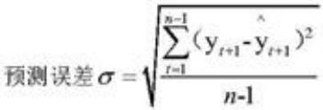n为时间序列 $\{ y_t\}$ 所含原始数据的个数</td><td>实际预测时,可选不同的 $\alpha$ 值进行比较,选择一个比较合适的 $\alpha$ 值。需要给出初值 $S_0^{(1)}$ ,可取原时间序列的第一项或前几项的算数平均值为初值。</td></tr><tr><td>二次指数平滑预测法</td><td>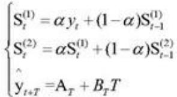 $A_T = 2S_t^{(1)} - S_t^{(2)}$ 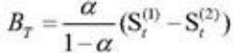</td><td>适用于时间序列呈线性增长趋势情况下的短期预测</td></tr><tr><td>三次指数平滑预测法</td><td>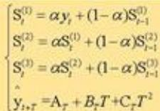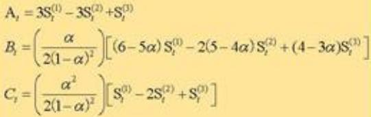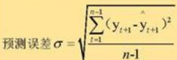</td><td>三次指数平滑在二次指数平滑的基础上保留了季节性的信息,使得其可以预测带有季节性的时间序列。适用更多时间序列的应用问题。经验地,当时间序列数据是水平型的发展趋势类型, $\alpha$ 可取0-0.3;当时间序列数据是上升(或下降)的发展趋势类型, $\alpha$ 可取0.6-1.</td></tr></table>

表 4 时间序列方法

根据物料周需求量散点图, 发现并不是所有需求量都具有上升型或下降型的特点, 还是有水平型的的数据存在。所以, 论文将采用三次指数平滑预测法, 以适合更多的需求量类型。

## 具体算法：

1. 利用 $y_{1}, y_{2}, \cdots, y_{100}$ 预测 $y_{101}$ ,  
2.再利用 $y_{1}, y_{2}, \cdots, y_{101}$ 预测 $y_{102}$ ，……，以此类推，  
3.如果遇到周需求量预测值 $y_{t}<0$ ，校准取 $y_{t}=0$ 。

根据三次指数平滑预测法的算法编写 MATLAB 程序实现计算（见附录）。

以物料编号 6004020768 为例，由于数据有水平型特点，故取 $\alpha=0.3$ ，计算结果如下：

<table><tr><td></td><td>实际值 $y_t$ </td><td>预测值 $\hat{y}_t$ </td><td>方差 $\left( y_t - \hat{y}_t \right)^2$ </td></tr><tr><td>第101周</td><td>4.00</td><td>3.14</td><td>0.74</td></tr><tr><td>第102周</td><td>0.00</td><td>4.79</td><td>22.92</td></tr><tr><td>第103周</td><td>4.00</td><td>1.72</td><td>5.19</td></tr><tr><td>第104周</td><td>0.00</td><td>3.88</td><td>15.09</td></tr><tr><td>第105周</td><td>0.00</td><td>1.15</td><td>1.31</td></tr><tr><td>第106周</td><td>0.00</td><td>0.00</td><td>0.00</td></tr><tr><td>第107周</td><td>0.00</td><td>0.00</td><td>0.00</td></tr><tr><td>......</td><td>......</td><td>......</td><td>......</td></tr><tr><td>第173周</td><td>6.00</td><td>5.77</td><td>0.05</td></tr><tr><td>第174周</td><td>0.00</td><td>7.00</td><td>48.98</td></tr><tr><td>第175周</td><td>0.00</td><td>1.88</td><td>3.52</td></tr><tr><td>第176周</td><td>0.00</td><td>0.00</td><td>0.00</td></tr><tr><td>第177周</td><td>6.00</td><td>0.00</td><td>36.00</td></tr><tr><td colspan="4">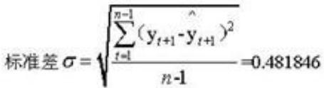</td></tr></table>

表 5 预测值与实际值误差计算

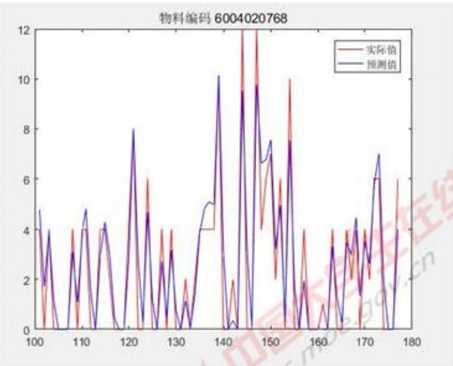

<details>
<summary>line</summary>

| X | 实际值 | 预测值 |
| --- | --- | --- |
| 100 | ~4.5 | ~4.8 |
| 102 | ~1.8 | ~2.2 |
| 103 | ~4.0 | ~4.0 |
| 108 | ~3.0 | ~3.0 |
| 110 | ~4.0 | ~4.8 |
| 112 | ~4.0 | ~4.0 |
| 115 | ~4.2 | ~4.2 |
| 121 | ~8.0 | ~8.0 |
| 124 | ~6.0 | ~4.8 |
| 127 | ~4.0 | ~4.0 |
| 129 | ~4.0 | ~3.2 |
| 131 | ~2.0 | ~1.2 |
| 133 | ~1.2 | ~1.2 |
| 136 | ~4.0 | ~5.0 |
| 138 | ~4.0 | ~5.0 |
| 139 | ~4.0 | ~5.0 |
| 140 | ~4.0 | ~5.0 |
| 141 | ~2.0 | ~0.5 |
| 143 | ~9.5 | ~9.5 |
| 144 | ~12.0 | ~9.5 |
| 146 | ~6.5 | ~6.8 |
| 148 | ~7.5 | ~7.5 |
| 150 | ~6.0 | ~6.8 |
| 152 | ~4.8 | ~4.8 |
| 153 | ~7.5 | ~7.5 |
| 154 | ~10.0 | ~7.5 |
| 156 | ~2.0 | ~2.0 |
| 158 | ~4.0 | ~4.0 |
| 160 | ~1.0 | ~1.0 |
| 162 | ~3.5 | ~3.5 |
| 164 | ~4.0 | ~4.0 |
| 166 | ~3.5 | ~3.5 |
| 168 | ~4.5 | ~4.5 |
| 170 | ~3.5 | ~3.5 |
| 172 | ~6.0 | ~7.0 |
| 174 | ~6.0 | ~6.0 |
| 176 | ~6.0 | ~6.0 |
</details>

图 2 实际值与预测值比较图

所有6种物料的预测值及误差计算见支撑材料“第1题-6种物料的预测值及误差计算.xlsx”。

对于前期为0后面才出现数据的情况，我们尝试了保留数据0和删除数据0两种方法进行预测，得到计算结果对比图：

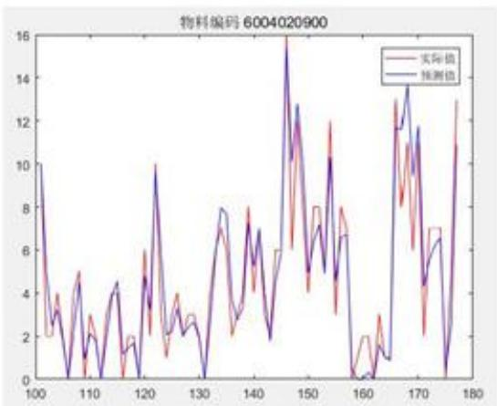

<details>
<summary>line</summary>

| X | 实际值 | 预测值 |
| --- | --- | --- |
| 100 | ~10 | ~10 |
| 102 | ~2 | ~3 |
| 105 | ~3 | ~3 |
| 107 | ~5 | ~5 |
| 109 | ~1 | ~1 |
| 111 | ~3 | ~2 |
| 113 | ~4 | ~4 |
| 115 | ~1.5 | ~1.5 |
| 117 | ~2 | ~2 |
| 119 | ~6 | ~6 |
| 121 | ~10 | ~10 |
| 123 | ~2 | ~2 |
| 125 | ~4 | ~4 |
| 127 | ~2.5 | ~2.5 |
| 129 | ~3 | ~3 |
| 131 | ~0 | ~0 |
| 133 | ~7 | ~7 |
| 135 | ~8 | ~8 |
| 137 | ~3 | ~3 |
| 139 | ~8 | ~8 |
| 141 | ~5 | ~5 |
| 143 | ~6 | ~6 |
| 145 | ~16 | ~16 |
| 147 | ~12 | ~12 |
| 149 | ~4 | ~4 |
| 151 | ~8 | ~8 |
| 153 | ~7 | ~7 |
| 155 | ~12 | ~12 |
| 157 | ~3 | ~3 |
| 159 | ~8 | ~8 |
| 161 | ~0.5 | ~0.5 |
| 163 | ~2 | ~2 |
| 165 | ~3 | ~3 |
| 167 | ~8.5 | ~8.5 |
| 169 | ~13.5 | ~13.5 |
| 171 | ~6 | ~6 |
| 173 | ~7 | ~7 |
| 175 | ~0.5 | ~0.5 |
| 177 | ~13 | ~13 |
</details>

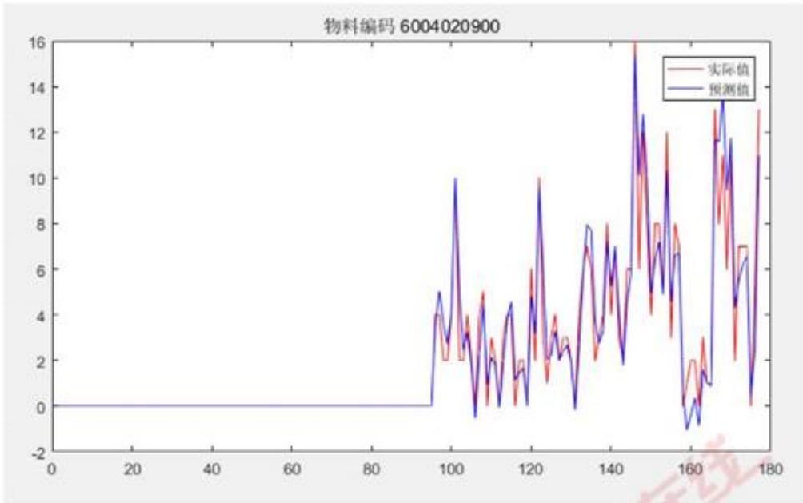

<details>
<summary>line</summary>

| X | 实际值 | 预测值 |
| --- | --- | --- |
| 0 | 0 | 0 |
| 95 | 0 | 0 |
| 96 | ~4 | ~4 |
| 97 | ~2 | ~3 |
| 98 | ~4 | ~5 |
| 99 | ~2 | ~3 |
| 100 | ~10 | ~10 |
| 101 | ~2 | ~3 |
| 102 | ~2 | ~3 |
| 103 | ~4 | ~4 |
| 104 | ~2 | ~2 |
| 105 | ~5 | ~5 |
| 106 | ~2 | ~2 |
| 107 | ~0 | ~0 |
| 108 | ~2 | ~2 |
| 109 | ~4 | ~4 |
| 110 | ~2 | ~2 |
| 111 | ~4 | ~4 |
| 112 | ~2 | ~2 |
| 113 | ~4 | ~4 |
| 114 | ~2 | ~2 |
| 115 | ~4 | ~4 |
| 116 | ~2 | ~2 |
| 117 | ~4 | ~4 |
| 118 | ~2 | ~2 |
| 119 | ~4 | ~4 |
| 120 | ~2 | ~2 |
| 121 | ~6 | ~6 |
| 122 | ~2 | ~2 |
| 123 | ~10 | ~10 |
| 124 | ~2 | ~2 |
| 125 | ~4 | ~4 |
| 126 | ~2 | ~2 |
| 127 | ~3 | ~3 |
| 128 | ~2 | ~2 |
| 129 | ~3 | ~3 |
| 130 | ~2 | ~2 |
| 131 | ~3 | ~3 |
| 132 | ~2 | ~2 |
| 133 | ~3 | ~3 |
| 134 | ~2 | ~2 |
| 135 | ~8 | ~8 |
| 136 | ~7 | ~7 |
| 137 | ~8 | ~8 |
| 138 | ~6 | ~6 |
| 139 | ~8 | ~8 |
| 140 | ~6 | ~6 |
| 141 | ~8 | ~8 |
| 142 | ~6 | ~6 |
| 143 | ~8 | ~8 |
| 144 | ~6 | ~6 |
| 145 | ~6 | ~6 |
| 146 | ~6 | ~6 |
| 147 | ~60 | ~60 |
| 148 | ~16 | ~16 |
| 149 | ~60 | ~60 |
| 150 | ~12 | ~12 |
| 151 | ~60 | ~60 |
| 152 | ~80 | ~80 |
| 153 | ~60 | ~60 |
| 154 | ~80 | ~80 |
| 155 | ~60 | ~60 |
| 156 | ~80 | ~80 |
| 157 | ~60 | ~60 |
| 158 | ~80 | ~80 |
| 159 | ~60 | ~60 |
| 160 | -~10 | -~10 |
| 161 | -~5 | -~5 |
| 162 | -~5 | -~5 |
| 163 | -~5 | -~5 |
| 164 | -~5 | -~5 |
| 165 | -~5 | -~5 |
| 166 | -~5 | -~5 |
| 167 | -~5 | -~5 |
| 168 | -~5 | -~5 |
| 169 | -~5 | -~5 |
| 170 | -~5 | -~5 |
| 171 | -~5 | -~5 |
| 172 | -~5 | -~5 |
| 173 | -~5 | -~5 |
| 174 | -~5 | -~5 |
| 175 | -~5 | -~5 |
| 176 | -~5 | -~5 |
| 177 | -~5 | -~5 |
| 178 | -~5 | -~5 |
| 179 | -~5 | -~5 |
</details>

图3是否使用前期0数据对比图

可以发现,除了最初的几个数据预测有偏差之外,后面的预测结果几乎一致,但是前面数据增长速度跟不上的话,会影响服务水平的计算。所以,论文中采用删除前期全是0的数据,从第一个不是0的数据开始。

采用时间序列三次指数平滑预测法模型评价：

(1) 利用三次指数平滑预测法，适合更多样的数据变化类型，包括水平型、上升型、下降型等。水平型取参数 $\alpha=0.3$ ，上升型取参数 $\alpha=0.6$ ，下降型取参数 $\alpha=0.6$ ，预测周需求量。

(2) 使用 MATLAB 编程计算，快速便捷；

（3）利用前100多个数据预测下一个数据，预测更准，误差更小；

（4）对于企业来说，只需要每周运行一次程序，即可得到下周需求量的预测，很方便；积累的数据量越大，预测的结果越可靠。

## 4.2 问题 2 的模型

## 4.2.1 制定生产计划——参数调整法（确保服务水平高质量）

## 1. 理清生产计划、实际需求量、库存量、缺货量、服务水平之间的关系

根据题目假设，本周计划生产的物料只能在下周及以后使用，那么，五个元素之间的关系如下：

<table><tr><td>周</td><td>生产计划 $C_{t}$ </td><td>实际需求量 $y_{t}$ </td><td>库存量 $K_{t}$ </td><td>缺货量 $Q_{t}$ </td><td>服务水平 $F_{t}$ </td></tr><tr><td>t</td><td> $C_{t}$ </td><td> $y_{t}$ </td><td> $K_{t}$ </td><td> $Q_{t}$ </td><td> $F_{t}$ </td></tr><tr><td>t+1</td><td> $C_{t+1}$ </td><td> $y_{t+1}$ </td><td> $K_{t+1}$ </td><td> $Q_{t+1}$ </td><td> $F_{t+1}$ </td></tr></table>

表6 生产计划、实际需求量、库存量、缺货量、服务水平之间关系

$$
K _ {\mathrm{t+1}} = \left\{ \begin{array}{l l} C _ {\mathrm{t}} + K _ {\mathrm{t}} - (y _ {\mathrm{t+1}} + Q _ {t}), & \text {如果} C _ {\mathrm{t}} + K _ {\mathrm{t}} \geq y _ {\mathrm{t+1}} + Q _ {t} \\ 0, & \text {否则} \end{array} \right.
$$

$$
Q _ {\mathrm{t+1}} = \left\{ \begin{array}{l l} y _ {\mathrm{t+1}} + Q _ {t} - (C _ {\mathrm{t}} + K _ {\mathrm{t}}), & \text {如果} C _ {\mathrm{t-1}} + K _ {\mathrm{t-1}} \leq y _ {\mathrm{t}} + Q _ {t} \\ 0, & \text {否则} \end{array} \right.
$$

$$
F _ {\mathrm{t+1}} = 1 - \frac {Q _ {\mathrm{t+1}}}{y _ {\mathrm{t+1}}}
$$

进一步假设第100周末的库存量和缺货量均为零，第100周的生产计划数恰好等于第101周的实际需求数，即第101周库存量=0，缺货量=0。

## 2.“参数调整法”确定生产计划（确保服务水平高质量）

根据需求量数据的趋势特点,采用不同的参数进行平滑:水平型取参数 $\alpha=0.3$ , 上升型取参数 $\alpha=0.8$ , 下降型取参数 $\alpha=0.4$ 。这样选择参数, 会使得数据在上升时快速增加, 以达到避免积累缺货的目的。

利用第1题三次指数平滑预测法得到的第t周需求量预测值 $y_{\mathrm{t}}$ ，用来估计第t周的生产计划 $C_{\mathrm{t}}$ ，以物料6004010256为例，由于数据具有上升型特点，故取参数 $\alpha = 0.8$ ，计算第101-110周的服务水平。为了避免实际需求量为0时出现服务水平计算过程中分母等于0的情况，将公式修改为：

$$
\mathrm{服务水平} = \left\{ \begin{array}{l l} 1 - \frac {\mathrm{缺货量}}{\mathrm{实际需求量}}, & \mathrm{实际需求量} \neq 0 \\ \mathrm{不存在}, & \mathrm{实际需求量} = 0 \end{array} \right.
$$

下表为物料 6004010256 的生产计划、实际需求量、库存量、缺货量和服务水平的计算结果：

<table><tr><td>周</td><td>生产计划Ct</td><td>实际需求量y:</td><td>库存量Kt</td><td>缺货量Qt</td><td>服务水平Ft</td></tr><tr><td>101</td><td>63.82</td><td>8.00</td><td>0.00</td><td>0.00</td><td>100.0%</td></tr><tr><td>102</td><td>13.00</td><td>25.00</td><td>38.82</td><td>0.00</td><td>100.0%</td></tr><tr><td>103</td><td>18.74</td><td>33.00</td><td>18.82</td><td>0.00</td><td>100.0%</td></tr><tr><td>104</td><td>31.35</td><td>11.00</td><td>26.57</td><td>0.00</td><td>100.0%</td></tr><tr><td>105</td><td>8.44</td><td>16.00</td><td>41.92</td><td>0.00</td><td>100.0%</td></tr><tr><td>106</td><td>9.33</td><td>12.00</td><td>38.36</td><td>0.00</td><td>100.0%</td></tr><tr><td>107</td><td>6.76</td><td>6.00</td><td>41.69</td><td>0.00</td><td>100.0%</td></tr><tr><td>108</td><td>0.62</td><td>35.00</td><td>13.46</td><td>0.00</td><td>100.0%</td></tr><tr><td>109</td><td>35.71</td><td>10.00</td><td>4.07</td><td>0.00</td><td>100.0%</td></tr><tr><td>110</td><td>14.58</td><td>3.00</td><td>36.78</td><td>0.00</td><td>100.0%</td></tr></table>

表7“参数调整法”计算的生产计划（物料6004010256）

从表格中可以看出，库存量持续为正，缺货量就能保持是0，那么服务水平将得到极大保障。

所有 6 种物料第 101-110 周的计算结果见支撑材料“第 2 题-6 种物料的 101\~110 周生产计划数、实际需求量、库存量、缺货量和服务水平.xlsx”。

同样的方法，计算6种物料第101-177周的计算结果。

所有 6 种物料第 101-177 周的计算结果见支撑材料“第 2 题-6 种物料的 101\~177 周生产计划数、实际需求量、库存量、缺货量和服务水平.xlsx”。

接下来，考查6种物料的综合结果：

<table><tr><td>物料编码</td><td>平均生产计划数/(件/周)</td><td>平均实际需求量/(件/周)</td><td>平均库存量(件/周)</td><td>平均缺货量/(件/周)</td><td>平均服务水平</td></tr><tr><td>6004021055</td><td>37.78</td><td>34.70</td><td>198.63</td><td>0.00</td><td>100.00%</td></tr><tr><td>6004020900</td><td>4.63</td><td>4.58</td><td>13.84</td><td>0.00</td><td>100.00%</td></tr><tr><td>6004010256</td><td>11.89</td><td>11.22</td><td>35.80</td><td>0.00</td><td>100.00%</td></tr><tr><td>6004020768</td><td>2.78</td><td>2.47</td><td>17.47</td><td>0.00</td><td>100.00%</td></tr><tr><td>6004020918</td><td>10.58</td><td>9.94</td><td>31.81</td><td>1.09</td><td>88.45%</td></tr><tr><td>6004020921</td><td>4.13</td><td>3.87</td><td>11.86</td><td>0.39</td><td>93.63%</td></tr></table>

表8“参数调整法”计算的综合结果

计算结果发现：

1.6种物料的平均服务水平都超过85%，达到要求。  
2. 平均库存量均大于 0，而且物料 6004021055 的平均库存量高达近 200 件/周，有很大的压缩空间。  
3. 绝大多数情况下，服务水平均为 $100\%$ ，在遇到实际需求数量突然增加时，生产计划跟不上，于是会出现1周或连续2周平均服务水平较低的情况。例如，物料6004020900在第146、147周、第167周出现服务水平较低，均是因为上一周出现需求量至少增加10件的差值。

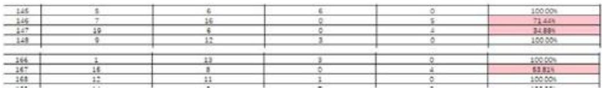

<details>
<summary>bar</summary>

| Category | Value |
| --- | --- |
| 145 | 5 |
| 146 | 7 |
| 147 | 19 |
| 148 | 9 |
| 166 | 1 |
| 167 | 16 |
| 168 | 17 |
| 169 | 11 |
| 170 | 9 |
| 16 | 6 |
| 16 | 16 |
| 16 | 6 |
| 16 | 12 |
| 16 | 3 |
| 16 | 3 |
| 16 | 0 |
| 16 | 0 |
| 16 | 0 |
| 16 | 0 |
| 16 | 0 |
| 16 | 0 |
| 16 | 0 |
| 16 | 0 |
| 16 | 0 |
| 16 | 0 |
| 16 | 0 |
| 16 | 0 |
| 16 | 0 |
| 24.88% | — |
| 24.88% | — |
| 24.88% | — |
| 24.88% | — |
| 24.88% | — |
| 24.88% | — |
| 24.88% | — |
| 24.88% | — |
| 24.88% | — |
| 24.88% | — |
</details>

图 4 物料 6004020900 在第 146、147 周、第 167 周出现服务水平较低

## 4.3 问题 3 的模型

## 4.3.1 调整生产计划——强化参数法（利于提高服务水平）

如果为了满足服务水平，可以加大生产计划，弊端是很可能造成库存量大，增加成本；反之，如果为了降低库存成本，减少生产计划，弊端是很可能造成库存不足，缺货量增加，引起服务水平下降。

## （一）强化参数法（利于提高服务水平）

为了避免因需求量激增而生产计划跟不上的现象，在使用三次指数平滑预测法时，注意时刻调整参数 $\alpha$ ，而不是针对某一物料统一采用相同的参数 $\alpha$ ，具体地，观察最近的两次数据，按照下面的表格选择参数：

<table><tr><td colspan="2">情况</td><td>参数选择</td><td>说明</td></tr><tr><td> $y_{t+1}-y_t$ </td><td>[100,+∞)</td><td>α=0.9</td><td>面对上周需求量数据从0突然激增到很大的数时,需要快速、大幅度地预测,不仅能超过上周实际需求量,还要能预留出富余来应对本周的实际需求量,以保障服务水平不会连续2周都出现低质量情况。</td></tr><tr><td> $y_{t+1}-y_t$ </td><td>[50,100)</td><td>α=0.8</td><td></td></tr><tr><td> $y_{t+1}-y_t$ </td><td>[10,50)</td><td>α=0.6</td><td></td></tr><tr><td> $y_{t+1}-y_t$ </td><td>(-10,10)</td><td>α=0.3</td><td>面对需求数量稳定变化不大的情况,预测值也稳定地随之变化,不会积压过多的库存量。</td></tr><tr><td> $y_{t+1}-y_t$ </td><td>[-50,-10)</td><td>α=0.4</td><td></td></tr><tr><td> $y_{t+1}-y_t$ </td><td>[-100,-50)</td><td>α=0.5</td><td></td></tr><tr><td> $y_{t+1}-y_t$ </td><td>[-∞,-100)</td><td>α=0.6</td><td>面对需求数量突然减小,为了留有一定储备,所以下降幅度相对激增时的增加幅度来得缓一些。</td></tr></table>

表9“强化参数法”的参数选择参考值

## 4.3.2 调整生产计划——联合调整法（利于降低库存量）

为了尽可能地降低库存量成本，将生产计划 $C_{t}$ 进行以下调整：

$$
C _ {\mathrm{t+1}} = \left\{ \begin{array}{l l} \hat {y} _ {\mathrm{t+1}} - K _ {\mathrm{t}} + \mathrm{Q} _ {\mathrm{t}}, & \text {如果} \hat {y} _ {\mathrm{t+1}} - K _ {\mathrm{t}} + \mathrm{Q} _ {\mathrm{t}} \geq 0 \\ 0, & \text {否则} \end{array} \right.
$$

如果（本周预测需求量+上周缺货量）高于上周库存量，则本周生产 $y_{t+1}-K_{t}+Q_{t}$ ，如果（本周预测需求量+上周缺货量）低于上周库存量，则本周生产为0。

按照这样的调整方案，尽可能减少本周库存量，降低成本。

## 4.3.3 调整生产计划前后效果对比

在先后使用“强化参数法”和“联合调整法”之后，对之前的6种物料重新计算生产计划、库存量、缺货量、服务水平，综合结果如下：

<table><tr><td>周</td><td>预测需求量/件</td><td>实际生产计划/件</td><td>实际需求量/件</td><td>库存量/件</td><td>缺货量/件</td><td>服务水平</td></tr><tr><td>101</td><td>14.95</td><td>15.00</td><td>4.00</td><td>0.00</td><td>0.00</td><td>100.00%</td></tr><tr><td>102</td><td>5.33</td><td>5.33</td><td>8.00</td><td>7.00</td><td>0.00</td><td>100.00%</td></tr><tr><td>103</td><td>8.51</td><td>1.51</td><td>4.00</td><td>8.33</td><td>0.00</td><td>100.00%</td></tr><tr><td>104</td><td>5.89</td><td>0.00</td><td>5.00</td><td>4.84</td><td>0.00</td><td>100.00%</td></tr><tr><td>105</td><td>6.18</td><td>1.35</td><td>4.00</td><td>0.84</td><td>0.00</td><td>100.00%</td></tr><tr><td>106</td><td>4.88</td><td>4.05</td><td>2.00</td><td>0.18</td><td>0.00</td><td>100.00%</td></tr><tr><td>107</td><td>1.56</td><td>1.37</td><td>12.00</td><td>0.00</td><td>7.77</td><td>35.31%</td></tr><tr><td>108</td><td>13.53</td><td>21.30</td><td>13.00</td><td>0.00</td><td>19.40</td><td>0.00%</td></tr><tr><td>109</td><td>15.91</td><td>35.31</td><td>3.00</td><td>0.00</td><td>1.10</td><td>63.46%</td></tr><tr><td>110</td><td>6.24</td><td>7.34</td><td>8.00</td><td>26.21</td><td>0.00</td><td>100.00%</td></tr></table>

表 10 “强化参数法”+“联合调整法”计算结果（物料 6004020921）

<table><tr><td>物料编码</td><td>平均预测需求量/(件/周)</td><td>平均生产计划数/(件/周)</td><td>平均实际需求量/(件/周)</td><td>平均库存量(件/周)</td><td>平均缺货量/(件/周)</td><td>平均服务水平</td></tr><tr><td>6004021055</td><td>37.15</td><td>34.39</td><td>34.70</td><td>45.51</td><td>9.74</td><td>82.91%</td></tr><tr><td>6004020900</td><td>4.78</td><td>4.38</td><td>4.58</td><td>6.01</td><td>1.39</td><td>81.34%</td></tr><tr><td>6004010256</td><td>12.36</td><td>11.31</td><td>11.22</td><td>13.89</td><td>3.20</td><td>79.14%</td></tr><tr><td>6004020768</td><td>3.55</td><td>2.58</td><td>2.47</td><td>6.64</td><td>0.41</td><td>89.00%</td></tr><tr><td>6004020918</td><td>11.26</td><td>10.07</td><td>9.94</td><td>20.76</td><td>3.94</td><td>80.92%</td></tr><tr><td>6004020921</td><td>4.58</td><td>3.88</td><td>3.87</td><td>7.40</td><td>1.20</td><td>77.93%</td></tr></table>

表 11 “强化参数法”+“联合调整法”计算的综合结果

具体6种物料在101-110、101-177周的生产情况计算见支撑材料“第3题-6种物料的101\~110周生产计划数、实际需求量、库存量、缺货量和服务水平.xlsx”、“第3题-6种物料的101\~177周生产计划数、实际需求量、库存量、缺货量和服务水平.xlsx”、“第3题-6种物料的综合结果.xlsx”。

对比表9和表10，可以发现：

1. 所有物料的平均库存量均有不同程度下降，平均服务水平也有降低。  
2. 物料 6004021055 平均库存量从 198.63 下降到 45.51，降幅 77.1%，而平均服务水平则从 100% 下降到 82.91%。  
3. 物料 6004020921 平均库存量从 11.86 下降到 7.4，降幅 37.6%，而平均服务水平则从 93.63% 下降到 77.93%。  
4. 针对库存量较大的物料，“强化参数法”和“联合调整法”大幅度减少了库存量成本，损失了部分服务水平应该是值得的；而针对库存量较小的物料，减少的库存量绝对值不多，但平均服务水平低于85%太多，容易流失客户，不值得。

针对这个问题，我们将“强化参数法”和“联合调整法”模型再次改进：

若经历“强化参数法”和“联合调整法”步骤之后，平均库存量低于30件/周，且平均服务水平低于85%的，令 $C_{t+1}=\left(\hat{y}_{t+1}-K_{t}+Q_{t}\right)\times1.1$ ，使得平均库存量小幅增加，但平均服务水平达到85%。

再次计算6种物料的各项数据和综合结果，得到：

<table><tr><td>周</td><td>预测需求量/件</td><td>实际生产计划/件</td><td>实际需求量/件</td><td>库存量/件</td><td>缺货量/件</td><td>服务水平</td></tr><tr><td>101</td><td>14.95</td><td>15.00</td><td>4.00</td><td>0.00</td><td>0.00</td><td>100.00%</td></tr><tr><td>102</td><td>5.33</td><td>7.27</td><td>8.00</td><td>7.00</td><td>0.00</td><td>100.00%</td></tr><tr><td>103</td><td>8.51</td><td>2.06</td><td>4.00</td><td>10.27</td><td>0.00</td><td>100.00%</td></tr><tr><td>104</td><td>5.89</td><td>0.00</td><td>5.00</td><td>7.33</td><td>0.00</td><td>100.00%</td></tr><tr><td>105</td><td>6.18</td><td>0.00</td><td>4.00</td><td>3.33</td><td>0.00</td><td>100.00%</td></tr><tr><td>106</td><td>4.88</td><td>2.12</td><td>2.00</td><td>1.33</td><td>0.00</td><td>100.00%</td></tr><tr><td>107</td><td>1.56</td><td>0.30</td><td>12.00</td><td>0.00</td><td>8.55</td><td>28.81%</td></tr><tr><td>108</td><td>13.53</td><td>30.14</td><td>13.00</td><td>0.00</td><td>21.25</td><td>0.00%</td></tr><tr><td>109</td><td>15.91</td><td>50.72</td><td>3.00</td><td>5.89</td><td>0.00</td><td>100.00%</td></tr><tr><td>110</td><td>6.24</td><td>0.48</td><td>8.00</td><td>48.61</td><td>0.00</td><td>100.00%</td></tr></table>

表 12 “强化参数法”+“联合调整法”（改进版）计算结果（物料 6004020921）

<table><tr><td>物料编码</td><td>平均预测需求量/(件/周)</td><td>平均生产计划数/(件/周)</td><td>平均实际需求量/(件/周)</td><td>平均库存量(件/周)</td><td>平均缺货量/(件/周)</td><td>平均服务水平</td></tr><tr><td>6004021055</td><td>37.15</td><td>34.09</td><td>34.70</td><td>81.23</td><td>6.45</td><td>87.76%</td></tr><tr><td>6004020900</td><td>4.78</td><td>4.37</td><td>4.58</td><td>10.15</td><td>1.15</td><td>85.40%</td></tr><tr><td>6004010256</td><td>12.36</td><td>11.32</td><td>11.22</td><td>23.33</td><td>1.83</td><td>89.35%</td></tr><tr><td>6004020768</td><td>3.55</td><td>2.58</td><td>2.47</td><td>6.64</td><td>0.41</td><td>89.00%</td></tr><tr><td>6004020918</td><td>11.26</td><td>10.39</td><td>9.94</td><td>31.11</td><td>2.52</td><td>85.63%</td></tr><tr><td>6004020921</td><td>4.58</td><td>3.90</td><td>3.87</td><td>9.88</td><td>0.70</td><td>87.93%</td></tr></table>

表 13 “强化参数法”+“联合调整法”（补充版）计算的综合结果

改进调整之后,发现平均服务水平都上升,且达到85%以上!物料6004020921第109周的服务水平从63.46%上升到100%。

具体6种物料在101-110、101-177周的生产情况计算见支撑材料“第3题-6种物料的101\~110周生产计划数、实际需求量、库存量、缺货量和服务水平（改进版).xlsx”、“第3题-6种物料的101\~177周生产计划数、实际需求量、库存量、缺货量和服务水平(改进版).xlsx”、“第3题-6种物料的综合结果(改进版).xlsx”。

## 4.4 问题4的模型

## 4.4.1 推广模型（考虑 k=2 周及以后才能使用）

更改假设，假设本周计划生产的物料只能在k=2周及以后使用，那么对突然增加需求量的情况就必然导致服务水平极低，而且会有持续影响，所以必须继续调大参数 $\alpha=0.9$ ，并且在需求量基础上数乘 $\beta(\beta\geq1)$ ，以达到快速增加需求量的目的。k值越大， $\beta$ 值也越大。

可以增加参数 $\beta(\beta>0)$ ，使得

$$
\begin{array}{l} C _ {\mathrm{t+1}} = \left\{ \begin{array}{l l} \left(\hat {y} _ {\mathrm{t+1}} - K _ {\mathrm{t}} + Q _ {\mathrm{t}}\right) \times \beta , & \text {如果} \hat {y} _ {\mathrm{t+1}} - K _ {\mathrm{t}} + Q _ {\mathrm{t}} \geq 0 \\ 0, & \text {否则} \end{array} \right. \\ K _ {\mathrm{t+1}} = \left\{ \begin{array}{l l} C _ {\mathrm{t-1}} + K _ {\mathrm{t}} - X _ {\mathrm{t}} - Q _ {\mathrm{t}}, & \text {如果} C _ {\mathrm{t-1}} + K _ {\mathrm{t}} - Q _ {\mathrm{t}} \geq 0 \\ 0, & \text {否则} \end{array} \right. \\ \end{array}
$$

如果想要提高服务水平，就让 $\beta > 1$ ， $\beta$ 越大，生产越多，库存越多；反之，如果想要降低库存量，就让 $0 < \beta \leq 1$ ， $\beta$ 越小，生产越少，库存越少，但缺货量提高，服务水平就越小。

对于 k=2，取 $\beta=1.3\sim1.4$ ，计算 6 种物料的库存、缺货量及服务水平，及综合结果。

<table><tr><td>物料编码</td><td>平均预测需求量/(件/周)</td><td>平均生产计划数/(件/周)</td><td>平均实际需求量/(件/周)</td><td>平均库存量(件/周)</td><td>平均缺货量/(件/周)</td><td>平均服务水平</td></tr><tr><td>6004021055</td><td>37.15</td><td>32.97</td><td>34.70</td><td>74.57</td><td>16.05</td><td>80.00%</td></tr><tr><td>6004020900</td><td>4.78</td><td>4.62</td><td>4.58</td><td>11.97</td><td>2.26</td><td>65.82%</td></tr><tr><td>6004010256</td><td>12.36</td><td>11.44</td><td>11.22</td><td>20.87</td><td>5.00</td><td>67.54%</td></tr><tr><td>6004020768</td><td>3.55</td><td>2.74</td><td>2.47</td><td>9.27</td><td>0.81</td><td>73.14%</td></tr><tr><td>6004020918</td><td>11.26</td><td>10.23</td><td>9.94</td><td>28.75</td><td>4.15</td><td>63.33%</td></tr><tr><td>6004020921</td><td>4.58</td><td>3.95</td><td>3.87</td><td>9.04</td><td>1.34</td><td>67.15%</td></tr></table>

表 14 6 种物料的综合结果 ( $\beta=1$ )

<table><tr><td>物料编码</td><td>平均预测需求量/(件/周)</td><td>平均生产计划数/(件/周)</td><td>平均实际需求量/(件/周)</td><td>平均库存量(件/周)</td><td>平均缺货量/(件/周)</td><td>平均服务水平</td></tr><tr><td>6004021055</td><td>37.15</td><td>35.96</td><td>34.70</td><td>104.13</td><td>10.73</td><td>81.61%</td></tr><tr><td>6004020900</td><td>4.78</td><td>4.75</td><td>4.58</td><td>19.88</td><td>1.65</td><td>81.71%</td></tr><tr><td>6004010256</td><td>12.36</td><td>10.98</td><td>11.22</td><td>42.43</td><td>3.77</td><td>85.10%</td></tr><tr><td>6004020768</td><td>3.55</td><td>2.74</td><td>2.47</td><td>12.81</td><td>0.58</td><td>86.34%</td></tr><tr><td>6004020918</td><td>11.26</td><td>10.25</td><td>9.94</td><td>49.32</td><td>2.48</td><td>86.50%</td></tr><tr><td>6004020921</td><td>4.58</td><td>4.25</td><td>3.87</td><td>16.98</td><td>1.13</td><td>84.24%</td></tr></table>

表 15 6 种物料的综合结果 ( $\beta=1.3\sim1.4$ )

所有6种物料具体各周、综合结果的计算结果见支撑材料：

“第4题-6种物料的101\~110周生产计划数、实际需求量、库存量、缺货量和服务水平(k=2)( $\beta=1$ ).xlsx”

“第4题-6种物料的101\~177周生产计划数、实际需求量、库存量、缺货量和服务水平(k=2)( $\beta=1$ ).xlsx”

“问题4-6种物料的综合结果(k=2)(β=1)”

“第4题-6种物料的101\~110周生产计划数、实际需求量、库存量、缺货量和服务水平(k=2)（β=1.3\~1.4）.xlsx”、

“第4题-6种物料的101\~177周生产计划数、实际需求量、库存量、缺货量和服务水平(k=2)（β=1.3\~1.4）.xlsx”、

“问题4-6种物料的综合结果(k=2)(β=1.3\~1.4)”

## 4.4.2 推广模型（考虑 k（≥2）周及以后才能使用）

对于 $k \geq 2$ ,

$$
C _ {\mathrm{t+1}} = \left\{ \begin{array}{l l} \left(\hat {y} _ {\mathrm{t+1}} - K _ {\mathrm{t}} + Q _ {\mathrm{t}}\right) \times \beta , & \text {如果} \hat {y} _ {\mathrm{t+1}} - K _ {\mathrm{t}} + Q _ {\mathrm{t}} \geq 0 \\ 0, & \text {否则} \end{array} \right.
$$

$$
K _ {\mathrm{t+1}} = \left\{ \begin{array}{l l} C _ {\mathrm{t+1-k}} + K _ {\mathrm{t}} - X _ {\mathrm{t}} - Q _ {\mathrm{t}}, & \text {如果} C _ {\mathrm{t+1-k}} + K _ {\mathrm{t}} - X _ {\mathrm{t}} - Q _ {\mathrm{t}} \geq 0 \\ 0, & \text {否则} \end{array} \right.
$$

此时，建议 $\beta$ 取更大的数值，具体参数需要在实际计算中不断摸索。

## 五、模型的结果

1. 小批量物料的生产安排过程，可以总结为：

(1) 统计周需求量:  
(2) 利用时间序列三次指数平滑模型, 结合历史数据, 预测本周需求量, 融合参数调整法, 实时调整参数, 提高服务水平;  
(3) 利用联合调整法, 联合上周库存量和缺货量, 兼顾物料 k 周之后使用的情况, 采用公式

$$
C _ {\mathrm{t+1}} = \left\{ \begin{array}{l l} \left(\hat {y} _ {\mathrm{t+1}} - K _ {\mathrm{t}} + \mathrm{Q} _ {\mathrm{t}}\right) \times \beta , & \text {如果} \hat {y} _ {\mathrm{t+1}} - K _ {\mathrm{t}} + \mathrm{Q} _ {\mathrm{t}} \geq 0 \\ 0, & \text {否则} \end{array} \right.
$$

确定本周生产计划最终结果，其中 $\beta>0$ 。

(4) 每周实时检查库存量、缺货量以及服务水平，及时调整相关参数，做到库存量与服务水平的平衡。

2. 所有计算结果：

（1）第1题时间序列模型三次指数平滑预测法计算程序见附录第二部分“程序附录”；

(2) 第1题预测值与实际值的误差计算见支撑材料

“第1题-6种物料的预测值及误差计算.xlsx”；

(3) 第2题“参数调整法”计算结果见支撑材料

“第2题-6种物料的101\~110周生产计划数、实际需求量、库存量、缺货量和服务水平.xlsx”

“第2题-6种物料的101\~177周生产计划数、实际需求量、库存量、缺货量和服务水平.xlsx”、

“第2题-6种物料的综合结果.xlsx”：

(4) 第3题“强化参数法”+“联合调整法”计算结果见支撑材料

“第3题-6种物料的101\~110周生产计划数、实际需求量、库存量、缺货量和服务水平.xlsx”、

“第3题-6种物料的101\~177周生产计划数、实际需求量、库存量、缺货量和服务水平.xlsx”、

“第3题-6种物料的综合结果.xlsx”：

(5) 第3题“强化参数法”+“联合调整法”（改进版）计算结果见支撑材料

“第3题-6种物料的101\~110周生产计划数、实际需求量、库存量、缺货量和服务水平(改进版).xlsx”、

“第3题-6种物料的101\~177周生产计划数、实际需求量、库存量、缺货量和服务水平(改进版).xlsx”

“第3题-6种物料的综合结果(改进版).xlsx”:

(6) 第 4 题 k=2 计算结果见支撑材料

“第4题-6种物料的101\~110周生产计划数、实际需求量、库存量、缺货量和服务水平(k=2)(β=1).xlsx”

“第4题-6种物料的101\~177周生产计划数、实际需求量、库存量、缺货量和服务水平(k=2)( $\beta=1$ ).xlsx”

“第4题-6种物料的综合结果(k=2)(β=1).xlsx”、

“第4题-6种物料的101\~110周生产计划数、实际需求量、库存量、缺货量和服务水平(k=2)（β=1.3\~1.4）.xlsx”、

“第4题-6种物料的101\~177周生产计划数、实际需求量、库存量、缺货量和服务水平(k=2)（β=1.3\~1.4）.xlsx”

“第4题-6种物料的综合结果(k=2)（β=1.3\~1.4）.xlsx”.

3. 所有计算结论：

（1）利用三次指数平滑模型预测需求量，标准差较小，稳定准确；  
（2）“参数调整法”模型下，服务水平较高，6种物料的平均服务水平均达到85%以上；  
（3）“强化参数法”+“联合调整法”模型下，库存量大幅下降，平均服务水平在80%以上，经过参数调整改进后，服务水平上升至85%以上；  
（4）如果本周计划生产的物料只能在 $k(k\geq2)$ 周及以后使用，可以预测服务水平将普遍下降（ $\beta=1$ 时），增加 $\beta$ 参数继续调整，对于k=2的情况进行计算，取 $\beta=1.3\sim1.4$ ，计算得到平均服务水平仍然在80%以上。

## 六、模型的评价与改进

1、论文给出小批量物料生产过程的具体步骤（见第五部分模型的结果），清晰明了、易操作，具有一定推广意义。  
2、有效地应用 MATLAB 软件编写三次指数平滑预测法的算法程序，方便调整参数 $\alpha$ ，极大地提高运算速度。  
3、在选择重点关注物料的时候，如果能将所有284种物料的周需求量都绘图，就能找到更多不同的类型来关注。  
4、该问题可能还可以尝试用规划模型来求解生产规划，由于时间有限，未能深入探索。

## 七、参考文献

[1] 时间序列挖掘-预测算法-三次指数平滑法(Holt-Winters)  
https://www.cnblogs.com/kemaswill/archive/2013/04/01/2993583.html，2022年9月16日。  
[2] Matlab 实现指数平滑,  
https://blog.csdn.net/qq\_43605229/article/details/116358184?utm\_source=app&app\_version=5.3.  
0&code=app\_1562916241&uLinkId=usr1mkqgl919blenhttps://www.cnblogs.com/kemaswill/archive/2013/04/01/2993583.html，2022年9月16日。  
[3] 布罗克威尔，《时间序列的理论与方法》第二版，北京：高等教育出版社，2001年.  
[4] 王立柱，《时间序列模型及预测》，北京：科学出版社，2018年.  
[5] 王倩，《数学建模方法与应用》，北京：北京师范大学出版社，2016年.

## 附录

## （一）支撑材料的文件列表

第1题-6种物料的预测值及误差计算.xlsx

第2题-6种物料的101\~110周生产计划数、实际需求量、库存量、缺货量和服务水平.xlsx  
第2题-6种物料的101\~177周生产计划数、实际需求量、库存量、缺货量和服务水平.xlsx  
第2题-6种物料的综合结果.xlsx

第3题-6种物料的101\~110周生产计划数、实际需求量、库存量、缺货量和服务水平.xlsx  
第3题-6种物料的101\~177周生产计划数、实际需求量、库存量、缺货量和服务水平.xlsx  
第3题-6种物料的综合结果.xlsx

第3题-6种物料的综合结果（改进版）.xlsx

第 3 题-6 种物料的 101\~110 周生产计划数、实际需求量、库存量、缺货量和服务水平（改进版）.xlsx

第 3 题-6 种物料的 101\~177 周生产计划数、实际需求量、库存量、缺货量和服务水平（改进版）.xlsx

第4题-6种物料的101\~110周生产计划数、实际需求量、库存量、缺货量和服务水平.xlsx  
第4题-6种物料的101\~177周生产计划数、实际需求量、库存量、缺货量和服务水平.xlsx  
第4题-6种物料的综合结果.xlsx

## （二）程序附录

1、三次指数平滑算法MATLAB程序  
```matlab
clc,clear
load fulua.txt
yt=fulua;
n=length(yt);
yt=fulua;
n=size(yt,1);
alpha=0.4;
st1_0=mean(yt(1:3));
st2_0=st1_0;st3_0=st1_0;
st1(1)=alpha*yt(1)+(1-alpha)*st1_0;
st2(1)=alpha*st1(1)+(1-alpha)*st2_0;
st3(1)=alpha*st2(1)+(1-alpha)*st3_0;
for i=2:n
    st1(i)=alpha*yt(i)+(1-alpha)*st1(i-1);
    st2(i)=alpha*st1(i)+(1-alpha)*st2(i-1);
    st3(i)=alpha*st2(i)+(1-alpha)*st3(i-1);
end
xlswrite('fulua',[st1',st2',st3'])
st1=[st1_0,st1];
st2=[st2_0,st2];
st3=[st3_0,st3];
a=3*st1-3*st2+st3;
b=0.5*alpha/(1-alpha)^2*((6-5*alpha)*st1-2*(5-4*alpha)*st2+(4-3*alpha)*st3);
c=0.5*alpha^2/(1-alpha)^2*(st1-2*st2+st3);
yu=a+b+c;

for i=1:n+1
    if yu(i)<0
    yu(i)=0;
    end
end

xlswrite('fulua.xls','1','sheet1','D1')
plot(1:n,yt,'r',1:n,yu(1:n),'b')
title("物料编码 6004020900');
legend('实际值','预测值');
kn=1
result=[a(n+1),b(n+1),c(n+1)];
for i=1:kn yshu(i)=polyval(result,i);
    str=char(['B',int2str(n+i)]);
    xlswrite('jieguo.xls',yshu(i),'20900',str)
```

```txt
end
if yshu<0
    yshu=0;
end
yshu
yu=yu';
```

2、问题3 MATLAB程序（物料编码6004010256）  
```matlab
clc,clear
load fulu1.txt
yt=fulu1;
n=length(yt);
yt=fulu1;
n=size(yt,1);
alpha=0.5;
st1_0=mean(yt(1:3));
st2_0=st1_0;st3_0=st1_0;
st1(1)=alpha*yt(1)+(1-alpha)*st1_0;
st2(1)=alpha*st1(1)+(1-alpha)*st2_0;
st3(1)=alpha*st2(1)+(1-alpha)*st3_0;
for i=2:n
    st1(i)=alpha*yt(i)+(1-alpha)*st1(i-1);
    st2(i)=alpha*st1(i)+(1-alpha)*st2(i-1);
    st3(i)=alpha*st2(i)+(1-alpha)*st3(i-1);
end
xlswrite('fulua',[st1',st2',st3'])
st1=[st1_0,st1];
st2=[st2_0,st2];
st3=[st3_0,st3];
a=3*st1-3*st2+st3;
b=0.5*alpha/(1-alpha)^2*((6-5*alpha)*st1-2*(5-4*alpha)*st2+(4-3*alpha)*st3);
c=0.5*alpha^2/(1-alpha)^2*(st1-2*st2+st3);
yu=a+b+c;
for i=101:140
    if yu(i)>0
    yu(i)=yu(i)*1.15;
    end
end
for i=1:n
    if yu(i)<17.9
    yu(i)=yu(i)*1.25;
    end
end
```

```matlab
for i=1:n+1
    if yu(i)>35.8
    yu(i)=yu(i)*0.85;
    end
end
for i=140:n+1
    if yu(i)>35.8
    yu(i)=yu(i)*0.9;
    end
end
for i=1:n+1
    if yu(i)>17.9
    yu(i)=yu(i)*0.85;
    end
end
for i=140:n+1
    if yu(i)>17.9
    yu(i)=yu(i)*0.9;
    end
end
for i=1:n+1
    if yu(i)<0
    yu(i)=0;
    end
end

xlswrite('fulua.xls','1','sheet1','D1')
plot(1:n,yt,'r',1:n,yu(1:n),'b')
title('物料编码 6004010256');
legend('实际值','预测值');
kn=1
result=[a(n+1),b(n+1),c(n+1)];
for i=1:kn yshu(i)=polyval(result,i);
    str=char(['B',int2str(n+i)]);
    xlswrite('jieguo.xls',yshu(i),'10372',str)
end
if yshu<0
    yshu=0;
end
yshu
yu=yu';
```