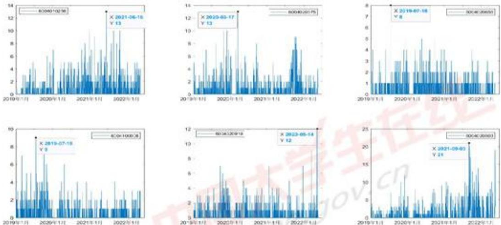
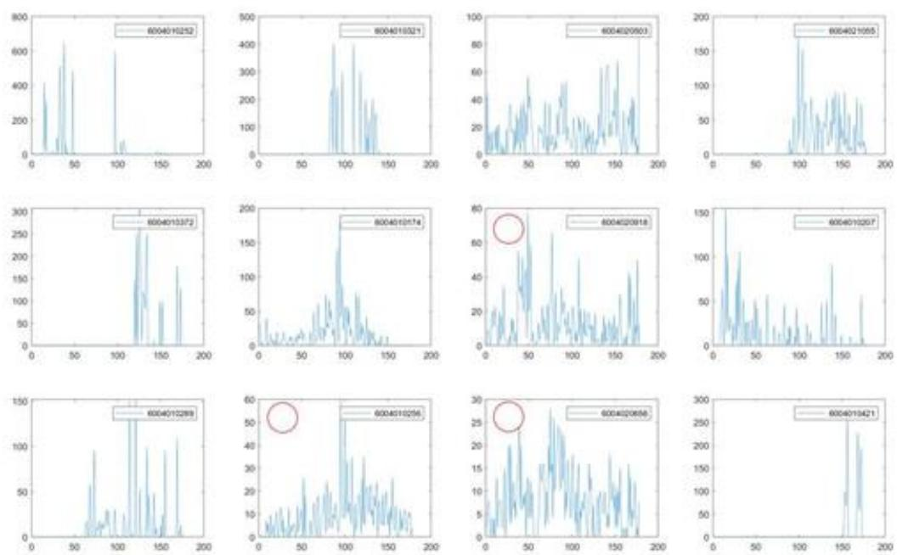
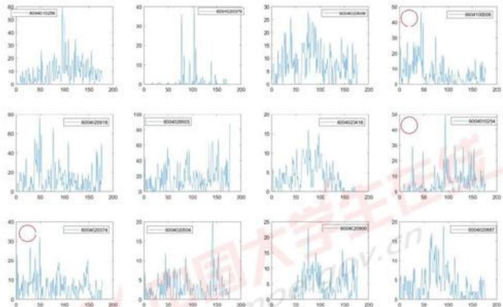
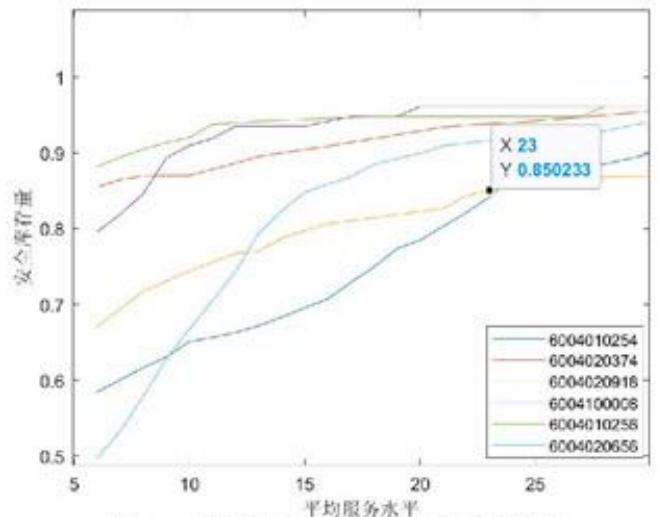
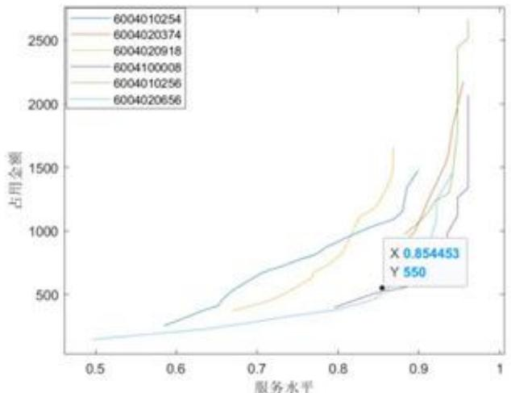

# 基于时间序列预测的动态生产优化模型

## 摘要

在多品种小批量物料的生产中，需求量往往具有不稳定性。本文为了解决对未来需求的预测及生产计划的安排问题，基于时间序列预测模型，综合利用 MATLAB 和 SPSS，建立了物料需求的周预测模型，对物料生产计划进行安排并给出 6 种物料的安排方案，并根据库存与服务水平对模型进行优化，最后建立了适用于一般情况的普适性模型。

针对问题一，本文首先计算出每种物料需求出现的总频数、总需求量、平均销售单价及总销售额，并分析这四种数据之间的关系。其次，利用SPSS进行K-均值聚类，结合频数最高的12个物料，全部进行可视化处理后，考虑到数据的连续性和稳定性，挑选出的6个物料为：6004020918，6004010256，6004020656，6004100008，6004010254，6004020374。再次，采用加权移动平均法、指数平滑法和ARIMA模型这三种时间序列预测模型，分别对6种物料的需求进行预测。最后，计算出三种方法对应的每种物料的平均相对误差，通过对比发现ARIMA模型的平均相对误差最小，采用ARIMA模型作为物料需求的周预测模型。

针对问题二，为减小客户需求产生的波动，引入安全库存量，安全库存量的取值为权数、平均需求量和供求周期之积。本周的生产计划等于上周需求量减去本周库存加上本周缺货和安全库存，本周的库存和缺货等于上周生产计划与上周库存之和，再减去本周实际需求与上周缺货。建立了物料生产计划安排的优化模型，选择物料6004020918，计算第101\~110周的生产计划、实际需求、库存、缺货量及服务水平，见表12，每种物料的综合结果见表13，6种物料第101\~177周的全部计算结果放于支撑材料。

针对问题三，为平衡库存量与服务水平，使平均服务水平在不小于85%的情况下尽可能降低，将安全库存量的权重取值从0.5调整到0.3。根据新得到的安全库存量，计算出物料6004020918第101\~110周的全部生产计划、实际需求、库存、缺货量及服务水平和6种物料的综合结果，放于表14和表15,6种物料的全部计算结果放于支撑材料。

针对问题四，对于问题二的重新考虑，首先将问题二的模型做出适当调整。其次，假设安全库存量的取值分别为6,7,8,…,30，将每种取值代入模型计算出每种物料的平均服务水平，利用MATLAB绘制出6条平均服务水平随安全库存量的变化曲线。再次，找出一个使平均服务水平尽可能小、6种物料的平均服务水平均大于85%的点，其安全库存量为23。最后，重新计算6种物料的生产计划、实际需求、库存、缺货量及服务水平，结果分别放于表16、表17和支撑材料。对于问题三的重新考虑，首先计算出每种物料的占用资金，即为累积库存量与平均销售单价之积。其次画出占用资金随平均服务水平变化的可视化图像。再次，选取曲线斜率最小的那个点作为平衡点。最后，利用MATLAB重新计算6种物料的生产计划、实际需求、库存、缺货量及服务水平，结果放于表18、表19和支撑材料。给出在一般情况下，生产计划的普适性模型。

关键词：安全库存量；平均服务水平；时间序列预测模型；优化模型

## 一、问题重述

## 1.1. 问题背景

在多品种小批量的物料生产中，很多企业的产品是针对不同的客户进行生产，不同产品具有不同需求，企业的资源往往分配在多个品种之间。客户的需求具有不稳定性，导致产品的生产周期具有不确定性，产品生产需求量的预测极容易产生偏差，加大了企业控制生产的难度[1]。

## 1.2. 问题提出

某电子产品制造企业在进行多品种小批量的物料生产时，无法提取预估物料的实际需求量。企业希望根据附件中已有的历史数据，运用数学方法进行分析并建立数学模型，帮助企业预测物料的需求量，合理地安排物料生产。

问题一：考虑从物料需求出现的频数、数量、趋势和销售单价等方面，对附件中企业的历史数据进行分析。根据分析结果选择6种应当重点关注的物料，建立这6种物料需求的周预测模型，周预测模型即以周为时间单位，预测每种物料的周需求量，并利用历史数据对预测模型进行分析与评价。

问题二：若只按照物料需求量的预测值来安排生产，可能会产生较大的库存或较多的缺货，这将给企业造成经济和信誉方面的损失。为使生产计划更加合理，需综合考虑需求量的预测值、需求特征、库存量及缺货量等方面。

首先，需提供一种制定生产计划的方法，在每周初制定本周的物料生产计划以安排生产，从第101周开始到第177周为止，使平均服务水平不低于85%。假设本周计划生产的物料，只能在下周及以后使用。为方便计算结果的统一，进一步假设第100周末的库存量和缺货量均为零，第100周的生产计划数刚好等于第101周的实际需求数。

其次，从问题一选出的6种物料中选择一种物料，将选中物料第101\~110周的生产计划数、实际需求量、库存量、缺货量和服务水平按表1的形式填写，放在正文中。

表 1: XXXX 物料第 101\~110 周的生产计划、实际需求、库存、缺货量及服务水平

<table><tr><td>周</td><td>生产计划/件</td><td>实际需求量/件</td><td>库存量/件</td><td>缺货量/件</td><td>服务水平</td></tr><tr><td>101</td><td></td><td></td><td></td><td></td><td></td></tr><tr><td> $\vdots$ </td><td></td><td></td><td></td><td></td><td></td></tr></table>

最后，将问题一选定的 6 种物料第 101\~177 周的全部计算结果按表 1 的形式填写在 Excel 表中，通过支撑材料提交。将 6 种物料第 101\~177 周平均值的综合结果按表 2 的形式填写，放入正文中。

表 2: 6 种物料的综合结果

<table><tr><td>物料编码</td><td>平均生产计划数/(件/周)</td><td>平均实际需求量/(件/周)</td><td>平均库存量/(件/周)</td><td>平均缺货量/(件/周)</td><td>平均水平</td></tr><tr><td>XXXX</td><td></td><td></td><td></td><td></td><td></td></tr><tr><td> $\vdots$ </td><td></td><td></td><td></td><td></td><td></td></tr></table>

问题三：考虑到物料的价格，物料的库存需要占用资金。为了使库存量与服务水平达到平衡，需对现有的周生产计划进行调整并说明理由。根据调整后的周生产计划，对问题一选定的6种物料重新计算，并将全部计算结果以表1的形式填写在Excel文件中，通过支撑材料提交，将综合结果按表2的形式填写，放入正文中。对于问题二选中的一种物料，将其第101\~110周的生产计划数、实际需求量、库存量、缺货量及服务水平按

表 1 的形式填写，放入正文中。

问题四：若本周计划生产的物料只能在两周及以后使用，重新考虑问题二和问题三。如果本周计划生产的物料只能在 $k(k\geq2)$ 周及以后使用，重新制定生产计划，并考虑此方法是否能推广到一般情况。

## 二、问题分析

## 2.1. 问题一的分析

首先，考虑从需求出现的频数、需求量、销售单价与总销售额这四个方面对每种物料进行分析。计算出每种物料需求出现的总频数与总需求量，将频数与需求量随时间的变化趋势进行可视化处理，并分析其中一个方面与另外三个方面的相关性。由于每种物料在4年内的的销售单价不尽相同，考虑取每种物料的平均销售单价进行分析，再用总需求量乘以平均销售单价，得到每种物料的总销售额并分析其与另外三=者之间的关系。其次，通过需求量与频数筛选出6种物料。这6种物料的需求量和频数应尽可能大，需求量应尽量稳定，波动不要太大；频数也应尽量连续，不要存在大段空缺。再次，建立筛选出来的6种物料需求量的周预测模型。由于多品种小批量的物料生产预测具有一定的困难，可采用多种方法进行预测，如加权移动平均法、指数平滑法和ARIMA模型。最后，将不同方法求出的预测值分别进行误差分析，进行比较后选出误差最小的方法作为物料需求的周预测模型。

## 2.2.问题二的分析

由于历史数据过少，及预测模型的精度问题，如果企业直接按照物料的预测值生产，产生较大的库存或者较大的缺货量的风险较大，这将会对企业的经济及信誉造成损失。为使物料的平均服务水平不小于 $85\%$ ，每种物料可引入一个安全库存值，防止客户需求产生较大的波动。需要根据预测值、需求量、库存量、安全库存量及缺货量等多个方面，建立生产计划安排的优化模型，计算出题目中需要我们给出的6种物料的结果，并放于表中。

## 2.3. 问题三的分析

库存量越高，服务水平也越高，满足客户需求的比例也越大。若想要提升服务水平，就要增大库存量。但由于物料的价格，物料的存储需要占用资金，超过需求量的库存量会对企业造成额外的经济负担。所以，库存量的取值并不是越大越好。库存量需要在满足需求的同时，不会对服务水平造成较坏的影响。可以通过调整安全库存量的大小，来对6种物料的服务水平进行进一步的优化。

## 2.4. 问题四的分析

已生产的物料只能在两周及以后使用，需重新考虑问题二和问题三。对于问题二，应对问题二的模型进行适当的修改，再重新计算6种物料的生产安排。对于问题三，需重新考虑库存量于服务水平之间的关系，绘制二者的可视化图像以进行更好的描述，并计算出6种物料对应的结果。通过对问题二、三的重新考虑，得到该模型与时间的关系，将该模型推广到一般情况。

## 三、模型假设

1. 不考虑物料的生产成本。

2. 不考虑生产物料时出现的损失。

## 四、符号说明

<table><tr><td>符号</td><td>意义</td><td>单位</td></tr><tr><td> $y_{ij}$ </td><td>第i种物料第j周的需求预测值</td><td>件</td></tr><tr><td> $x_{ij}$ </td><td>第i种物料第j周的实际需求值</td><td>件</td></tr><tr><td> $\delta_{ij}$ </td><td>第i种物料第j周的相对误差</td><td>\</td></tr><tr><td> $s_{ij}$ </td><td>第i种物料第j周的计划生产量</td><td>件</td></tr><tr><td> $a_{ij}$ </td><td>第i种物料第j周的库存量</td><td>件</td></tr><tr><td> $b_{ij}$ </td><td>第i种物料第j周的缺货量</td><td>件</td></tr><tr><td> $c_{ij}$ </td><td>表示第i种物料第j周的需求预测值</td><td>件</td></tr></table>

注： $i=1,2,3,\cdots,6,\quad j=1,2,3,\cdots177$ ，其余符号在下文中进行说明。

## 五、模型的建立与求解

## 5.1. 数据预处理

首先，利用 SPSS 软件将附件中每种物料的需求量按照星期进行统计，得到每种物料每周的需求数量。

其次，利用 MATLAB 软件将合并的数据进行离群值检验，检验发现几乎每种物料的数据都存在较多离群值，认为这些离群数据是合理的，不作为异常值处理。

## 5.2. 问题一模型的建立与求解

## 5.2.1. 数据分析

从附件中可知，该电子产品制造企业共有284种物料需要生产，从2019年1月2日至2022年5月21日共有1236天，177个星期。本文首先对附件中的历史数据进行分析，考虑从每种物料需求出现的频数、需求量、平均销售单价与总销售额这四个方面进行分析。

对于每种物料需求出现的频数，不论该物料在一天中出现的次数，将4年内每种物料出现天数的频数进行统计。对于每种物料的数量，计算其4年内所需总数量，即每种物料需求量之和。对于销售单价和销售额，同种物料在同一时间进行交易，其销售单价和需求量也存在不相同的情况，将每种物料的销售数量乘以其对应时间的销售额，得到每种物料每次销售的销售额，将每种物料所有销售额相加得到总销售额，每种物料的总销售额与总需求量之积为平均销售单价。利用MATLAB软件计算出每种物料需求出现的频数、需求量、销售单价及总销售额。

## 1）物料需求出现的总频数

将物料需求出现的总频数按照从高到低的顺序排列，选取频数排名前 20 的物料，得到表 3。

表 3: 频数排名前 20 的物料

<table><tr><td>商品编号</td><td>频数</td><td>需求量</td><td>平均销售单价</td><td>总销售额</td></tr><tr><td>6004010256</td><td>411</td><td>1585</td><td>1358.20</td><td>2152747.00</td></tr><tr><td>6004020375</td><td>358</td><td>883</td><td>316.99</td><td>279902.17</td></tr><tr><td>6004020656</td><td>357</td><td>1439</td><td>71.90</td><td>103464.10</td></tr><tr><td>6004100008</td><td>349</td><td>1223</td><td>1771.86</td><td>2166984.78</td></tr><tr><td>6004020918</td><td>343</td><td>2213</td><td>2289.65</td><td>5066995.45</td></tr><tr><td>6004020503</td><td>322</td><td>3011</td><td>220.40</td><td>663624.40</td></tr><tr><td>6004020418</td><td>317</td><td>655</td><td>920.72</td><td>603071.60</td></tr><tr><td>6004010254</td><td>301</td><td>1094</td><td>1132.53</td><td>1238987.82</td></tr><tr><td>6004020374</td><td>300</td><td>1099</td><td>266.72</td><td>293125.28</td></tr><tr><td>6004020504</td><td>287</td><td>533</td><td>3665.36</td><td>1953636.88</td></tr><tr><td>6004020900</td><td>273</td><td>717</td><td>6331.49</td><td>4539678.33</td></tr><tr><td>6004020887</td><td>265</td><td>643</td><td>2240.26</td><td>1440487.18</td></tr><tr><td>6004020622</td><td>236</td><td>858</td><td>365.21</td><td>313350.18</td></tr><tr><td>6004020905</td><td>233</td><td>475</td><td>4586.00</td><td>2178350.00</td></tr><tr><td>6004020847</td><td>232</td><td>476</td><td>2203.64</td><td>1048932.64</td></tr><tr><td>6004020921</td><td>230</td><td>934</td><td>2399.12</td><td>2240778.08</td></tr><tr><td>6004020372</td><td>229</td><td>439</td><td>3314.34</td><td>1454995.26</td></tr><tr><td>6004010174</td><td>227</td><td>2601</td><td>1296.90</td><td>3373236.90</td></tr><tr><td>6004010255</td><td>217</td><td>1090</td><td>1361.79</td><td>1484351.10</td></tr><tr><td>6004020922</td><td>208</td><td>426</td><td>2371.72</td><td>1010352.72</td></tr></table>

频数表示物料在1236天中出现需求的天数。由表3可以看出，物料需求出现最高的商品编号为“6004010256”，出现频数为411次，占总频数的 $33.25\%$ ，所有频数均在200以上，频数在200以上的物料数量共20个，占总物料的 $7.04\%$ 。但频数最高的物料对应的需求量、平均销售单价与总销售额的值并不是最高，其余频数对应的三者的值也无规律可循，说明物料需求出现的频数与需求量、总销售额与平均销售单价之间并无明显关系。

除去频数前20的物料，还有部分物料在1236天中只出现过十几次或几次。其中出现频数在100以下的物料共有239种，占总物料的 $84.15\%$ ；频数在10以下（包括10）的物料共125种，占总数量的 $44.01\%$ ；频数为1的物料共29种，占总数量的 $10.21\%$ 。但需求出现的频数小，需求量不一定少。比如商品编号为“6004010372”的频数为32，其对应需求量为2657，说明该物料虽然需求次数少，但每次需求量大。这些数据均反应出多品种小批量物料客户需求的不稳定性的特点。

将需求出现的频数最高的 6 个物料筛选出来，计算 6 个物料每天的频数，并利用 MATLAB 软件进行可视化处理，结果如图 1 所示。

  
图 1: 频数最高的 6 个物料每天频数的变化趋势

根据图1可以看出，物料需求量出现的频数并没有明显的随时间变化的趋势。物料“6004020503”每天需求量出现频数在6种物料中最大，为21次，时间为2021年9月3日。物料“6004010256”和“6004020375”需求出现频数相同，为13次。物料“6004020656”和“6004100008”需求出现频数最多的天数同为2019年7月18日，频数分别为8次和9次。每种物料每天需求的出现次数大部分为1次和2次，一天内需求出现次数最多的为1次，反映了多品种小批量物料的每次生产数量少的特点。

## 2) 总需求量

将每种物料的总需求量按照降序进行排列，并选取排名前20的物料，放于表4。

表 4: 需求量排名前 20 的物料

<table><tr><td>商品编号</td><td>频数</td><td>需求量</td><td>平均销售单价</td><td>总销售额</td></tr><tr><td>6004010252</td><td>36</td><td>4103</td><td>266.74</td><td>1094434.22</td></tr><tr><td>6004010321</td><td>26</td><td>3554</td><td>290.99</td><td>1034178.46</td></tr><tr><td>6004020503</td><td>322</td><td>3011</td><td>220.40</td><td>663624.40</td></tr><tr><td>6004021055</td><td>171</td><td>2969</td><td>1052.92</td><td>3126119.48</td></tr><tr><td>6004010372</td><td>32</td><td>2657</td><td>1812.67</td><td>4816264.19</td></tr><tr><td>6004010174</td><td>227</td><td>2601</td><td>1296.90</td><td>3373236.90</td></tr><tr><td>6004020918</td><td>343</td><td>2213</td><td>2289.65</td><td>5066995.45</td></tr><tr><td>6004010207</td><td>119</td><td>2064</td><td>962.13</td><td>1985836.32</td></tr><tr><td>6004010289</td><td>74</td><td>1591</td><td>662.49</td><td>1054021.59</td></tr><tr><td>6004010256</td><td>411</td><td>1585</td><td>1358.20</td><td>2152747.00</td></tr><tr><td>6004020656</td><td>357</td><td>1439</td><td>71.90</td><td>103464.10</td></tr><tr><td>6004010421</td><td>28</td><td>1381</td><td>1004.06</td><td>1386606.86</td></tr><tr><td>6004021030</td><td>99</td><td>1249</td><td>1129.53</td><td>1410782.97</td></tr><tr><td>6004100008</td><td>349</td><td>1223</td><td>1771.86</td><td>2166984.78</td></tr><tr><td>6004020841</td><td>113</td><td>1123</td><td>170.46</td><td>191426.58</td></tr><tr><td>6004020374</td><td>300</td><td>1099</td><td>266.72</td><td>293125.28</td></tr><tr><td>6004010254</td><td>301</td><td>1094</td><td>1132.53</td><td>1238987.82</td></tr><tr><td>6004010255</td><td>217</td><td>1090</td><td>1361.79</td><td>1484351.10</td></tr><tr><td>6004021155</td><td>72</td><td>1075</td><td>3497.44</td><td>3759748.00</td></tr><tr><td>6004020921</td><td>230</td><td>934</td><td>2399.12</td><td>2240778.08</td></tr></table>

从表 4 中可以看出，需求量最大的商品编号为 “6004010252”，需求量为 4103 件。除去表中最后一个物料 “6004020921”，其余物料的需求量均在 1000 教案以上，共有 19 个，占总数的 6.69%。当需求量逐渐减小时，频数、平均销售单价和总销售额并不会随之发生相应的变化，说明需求量与平均销售单价、频数和总销售额之间无明显相关性。

物料需求量的最小值为 1，其中小于 500 件的物料共有 242 种，占物料总数量的 85.21%。需求量小于 50 件（包括 50 件）的物料共有 141 种，占总数的 49.65%。需求量为 1 件的物料共 11 种，占总数的 3.87%。说明大部分物料的总需求量较小，反映了物料生产每次生产数量小，但种类多的特点。

## 3) 平均销售单价

将每种物料的平均销售单价从高到低的顺序进行排序，选择排名前 5 和后 5 的物料，如表 5 所示。

表 5：平均销售价格排名前 5 和后 5 的物料

<table><tr><td>商品编号</td><td>频数</td><td>需求量</td><td>平均销售单价</td><td>总销售额</td></tr><tr><td>6004020839</td><td>7</td><td>14</td><td>18676.34</td><td>261468.76</td></tr><tr><td>6004020709</td><td>49</td><td>52</td><td>16648.10</td><td>865701.20</td></tr><tr><td>6004020708</td><td>4</td><td>4</td><td>16645.45</td><td>66581.80</td></tr><tr><td>6004020782</td><td>1</td><td>1</td><td>16643.72</td><td>16643.72</td></tr><tr><td>6004020838</td><td>7</td><td>7</td><td>9061.24</td><td>63428.68</td></tr><tr><td>...</td><td>...</td><td>...</td><td>...</td><td>...</td></tr><tr><td>6004020841</td><td>113</td><td>1123</td><td>170.46</td><td>191426.58</td></tr><tr><td>6004020072</td><td>128</td><td>209</td><td>126.56</td><td>26451.04</td></tr><tr><td>6004020656</td><td>357</td><td>1439</td><td>71.90</td><td>103464.10</td></tr><tr><td>6004010359</td><td>10</td><td>286</td><td>54.91</td><td>15704.26</td></tr><tr><td>6004010250</td><td>37</td><td>659</td><td>38.16</td><td>25147.44</td></tr></table>

平均销售单价为每种物料的销售额之和除以需求量之和。由表5可以看出，商品编号“6004020839”的平均销售单价最高，为18676.34。表中排名前5的物料频数和需求量普遍较低，如编号“6004020782”平均销售单价为16643.72，但对应的频数和需求量均为1。平均销售单价最低的物料编号为“6004010250”，平均销售单价为38.16。排名最后5名的物料频数和需求量比之前5名普遍较高，但并不绝对，如编号“6004010359”的物料平均销售单价为54.91，其对应频数只有10。但从总体上看，在多品种小批量物料生产中，售价更低的物料需求量及需求出现的频次会略高于售价更高的物料。

## 4) 总销售额

将每种物料的总销售额依照降序排列，挑选排名前5和排名后5的物料，如表6所示。

表 6: 总销售额排名前 5 和后 5 的物料

<table><tr><td>商品编号</td><td>频数</td><td>需求量</td><td>平均销售单价</td><td>总销售额</td></tr><tr><td>6004020918</td><td>343</td><td>2213</td><td>2289.65</td><td>5066995.45</td></tr><tr><td>6004010372</td><td>32</td><td>2657</td><td>1812.67</td><td>4816264.19</td></tr><tr><td>6004020900</td><td>273</td><td>717</td><td>6331.49</td><td>4539678.33</td></tr><tr><td>6004021155</td><td>72</td><td>1075</td><td>3497.44</td><td>3759748.00</td></tr><tr><td>6004010174</td><td>227</td><td>2601</td><td>1296.90</td><td>3373236.90</td></tr><tr><td>...</td><td>...</td><td>...</td><td>...</td><td>...</td></tr><tr><td>6004020350</td><td>1</td><td>1</td><td>1687.63</td><td>1687.63</td></tr><tr><td>6004010286</td><td>1</td><td>4</td><td>327.28</td><td>1309.12</td></tr><tr><td>6004021065</td><td>1</td><td>1</td><td>1098.82</td><td>1098.82</td></tr><tr><td>6004020173</td><td>1</td><td>1</td><td>701.17</td><td>701.17</td></tr><tr><td>6004010396</td><td>1</td><td>2</td><td>244.97</td><td>489.94</td></tr></table>

根据表 6 可以得出，编号 “6004020918” 的物料总销售额最大，为 5066995.45，编号 “6004010396” 的物料总销售额最小，为 489.94。从总体上看，总销售额高的物料，其对应需求出现的频数与需求量较高；反之，其频数和需求量较低。但这并不绝对，如的物料 “6004010372”，总销售额在表中排名第 2，物料需求量很大，为 2657 件，但频数只有 32 次。

## 5.2.2. 物料选择

在多品种小批量物料的生产中，多数商品的需求量往往很小，需求量大的商品其需求次数也存在较小的可能性，需求的数量与频率具有不稳定性。因此，在挑选物料时应优先考虑物料需求数量和需求出现频率的大小，以及需求量和需求出现频率的连续性与稳定性。

首先考虑需求量的大小。在前面的分析中发现需求量小于500的物料个数占比为 $85.21\%$ ，大部分物料在这1236天中需求量很小。利用MATLAB软件计算出每种物料每周的需求量，利用SPSS25软件的 $K-$ 均值聚类将物料的需求量进行分类，筛选得到12种物料。

  
图 2: 需求量前 12 种的物料的每周需求量

图 2 为筛选出的 12 种物料每周需求量的可视化图像。从图中可以看出，虽然这 12 个物料需求量为所有物料中最大，但部分物料需求出现的频次存在大段空白，如物料 “6004010252” 中间需求空白周为 48\~96 周，97\~109 周再次出现需求，110\~177 周需求量基本为 0。排除掉需求量不连续，不稳定的物料，从 12 种物料中挑选出 3 种，图中○代表挑选出的物料。根据需求量的大小挑选出的物料为：6004020918，6004010256，6004020656。

其次考虑需求出现的频数。将需求频数最高的 12 个物料每周的需求量利用 MATLAB 软件进行可视化处理，得到图 3。

  
图 3: 频数前12种的物料的每周需求量

图 3 为频数排名前 12 的物料的每周需求量可视化图像。结合图像的连续性与稳定性，优先考虑频数排名靠前的物料，除去前面已经挑选的 3 种物料，再次挑选出 3 种物料。选中的物料用 ○ 进行标记，分别为：6004100008，6004010254，6004020374。

综上所述，挑选出的6种物料分别为：6004020918，6004010256，6004020656，6004100008，6004010254，6004020374。

## 5.2.3. 需求的周预测模型

由于多品种小批量物料生产的不稳定性，其需求量的预测具有一定的困难。为了对需求量进行更加准确的预测，采用加权移动平均法、指数平滑法 $^{[2]}$ 和 ARIMA 模型 $^{[3]}$ 分别对这 6 种物料的需求量进行预测。

## 1) 加权移动平均法

由之前对物料需求量和需求出现的频率的分析可知，二者随时间并没有明显的变化趋势，所以用于运算的数据如果过多，相当于增加了各种噪声，使得预测精度下降。因此，在计算6种物料每周的需求量时，只选择前四周的需求数据用于运算。距离预测周越近周期的数据分配越高的权重；反之，分配的权重越低。将每种物料预测周的前四周的需求量分别乘以其对应的权重，将这四个数之和除以权重之和，得到每种物料周预测值。即

$$
y _ {i j} = \frac {q _ {1} x _ {i (j - 1)} + q _ {2} x _ {i (j - 2)} + q _ {3} x _ {i (j - 3)} + q _ {4} x _ {i (j - 4)}}{\sum_ {p = 1} ^ {4} q _ {p}} \tag {1}
$$

$y_{ij}$ 表示第 i 种物料第 j 周的需求预测值， $x_{i(j-1)}$ 、 $x_{i(j-2)}$ 、 $x_{i(j-3)}$ 和 $x_{i(j-4)}$ 分别表示第 i 种物料预测周的前一周、前两周、前三周和前四周的需求量， $i=1,2,3,\cdots,6$ ， $j=5,6,7,\cdots,177$ 。 $q_{p}$ 表示第 p 个权重， $q_{1}=0.4$ ， $q_{2}=0.3$ ， $q_{3}=0.2$ ， $q_{4}=0.1$ ， $\sum_{p=1}^{4}q_{p}$ 表示所有权重之和。

## 2) 指数平滑法

以每种物料上一周的实际需求与预测值作为基础，引入平滑常数来计算当前周的预测值，即

$$
y _ {i j} = \alpha \cdot x _ {i (j - 1)} + (1 - \alpha) \cdot y _ {i (j - 1)} \tag {2}
$$

$y_{i(j-1)}$ 表示第 i 种物料上一周的预测值。 $\alpha$ 为平滑常数，由于对当前周预测值影响较大的为上一周的需求量，上一周的预测值对本周预测值影响较小，所以 $\alpha$ 的取值为 0.8，则上一周预测值的平滑常数为 0.2。

## 3) ARIMA 模型

ARIMA(p,d,q)模型即为差分自回归移动平均模型，p 为自回归（AR）的项数，d 为非平稳序列转成平稳序列需要进行的差分次数，q 为滑动平均（MA）的滑动平均项数。利用 SPSS 软件进行时间序列预测，并对结果进行分析。

表 7: 模型描述

<table><tr><td></td><td>模型 ID</td><td>模型类型</td></tr><tr><td>模型_1</td><td>@6004010254</td><td>简单</td></tr><tr><td>模型_2</td><td>@6004020374</td><td>ARIMA(0,0,2)</td></tr><tr><td>模型_3</td><td>@6004020918</td><td>简单</td></tr><tr><td>模型_4</td><td>@6004100008</td><td>简单</td></tr><tr><td>模型_5</td><td>@6004010256</td><td>简单</td></tr></table>

模型 6

@6004020656

简单

表 7 为 6 个物料的 ARIMA 模型描述。从表中可以看出，模型 1、3、4、5、6 的模型类型为简单，说明其 p、d、q 的值都取 0。模型 2 的模型类型为 ARIMA(0,0,2)，说明物料 “6004020374” 的滑动平均项数为 2，差分次数与自回归项数均为 0。

表 8: 模型拟合度

<table><tr><td rowspan="2">拟合统计</td><td rowspan="2">平均值</td><td rowspan="2">标准误差</td><td rowspan="2">最小值</td><td rowspan="2">最大值</td><td colspan="7">百分位数</td></tr><tr><td>5</td><td>10</td><td>25</td><td>50</td><td>75</td><td>90</td><td>95</td></tr><tr><td>平稳R方</td><td>0.361</td><td>0.121</td><td>0.121</td><td>0.448</td><td>0.121</td><td>0.121</td><td>0.304</td><td>0.398</td><td>0.44</td><td>0.448</td><td>0.448</td></tr><tr><td>R方</td><td>0.14</td><td>0.05</td><td>0.076</td><td>0.211</td><td>0.076</td><td>0.076</td><td>0.095</td><td>0.137</td><td>0.185</td><td>0.211</td><td>0.211</td></tr><tr><td>RMSE</td><td>7.882</td><td>2.877</td><td>5.329</td><td>13.253</td><td>5.329</td><td>5.329</td><td>5.673</td><td>7.158</td><td>9.767</td><td>13.253</td><td>13.253</td></tr><tr><td>MAPE</td><td>111.677</td><td>37.165</td><td>72.858</td><td>176.816</td><td>72.858</td><td>72.858</td><td>79.728</td><td>106.907</td><td>137.619</td><td>176.816</td><td>176.816</td></tr><tr><td>MaxAPE</td><td>1208.328</td><td>675.313</td><td>596.85</td><td>2507.448</td><td>596.85</td><td>596.85</td><td>756.162</td><td>1074.871</td><td>1516.859</td><td>2507.448</td><td>2507.448</td></tr><tr><td>MAE</td><td>5.758</td><td>2.001</td><td>4.116</td><td>9.628</td><td>4.116</td><td>4.116</td><td>4.536</td><td>5.029</td><td>6.959</td><td>9.628</td><td>9.628</td></tr><tr><td>MaxAE</td><td>35.251</td><td>14.718</td><td>16.93</td><td>51.697</td><td>16.93</td><td>16.93</td><td>21.226</td><td>35.524</td><td>49.803</td><td>51.697</td><td>51.697</td></tr><tr><td>正态化BIC</td><td>4.068</td><td>0.647</td><td>3.405</td><td>5.198</td><td>3.405</td><td>3.405</td><td>3.507</td><td>3.965</td><td>4.55</td><td>5.198</td><td>5.198</td></tr></table>

表 8 为 6 种物料的 ARIMA 模型拟合度。由于物料需求量随时间变化趋势并不明显，所以 R 方更具有参考意义。R 方的平均值为 0.14，最小值为 0.076，最大值为 0.211，整体拟合效果一般。

表 9: 模型统计

<table><tr><td rowspan="2">模型</td><td rowspan="2">预测变量数</td><td colspan="4">模型拟合度统计</td><td colspan="3">杨-博克斯 Q(18)</td><td rowspan="2">离群值数</td></tr><tr><td>平稳R方</td><td>R方</td><td>RMSE</td><td>MAE</td><td>统计</td><td>DF</td><td>显著性</td></tr><tr><td>@6004010254-模型_1</td><td>0</td><td>0.365</td><td>0.102</td><td>7.332</td><td>4.965</td><td>30.023</td><td>17</td><td>0.026</td><td>0</td></tr><tr><td>@6004020374-模型_2</td><td>0</td><td>0.121</td><td>0.121</td><td>5.329</td><td>4.116</td><td>12.609</td><td>17</td><td>0.762</td><td>0</td></tr><tr><td>@6004020918-模型_3</td><td>0</td><td>0.398</td><td>0.076</td><td>13.253</td><td>9.628</td><td>26.046</td><td>17</td><td>0.074</td><td>0</td></tr><tr><td>@6004100008-模型_4</td><td>0</td><td>0.448</td><td>0.211</td><td>6.983</td><td>5.094</td><td>32.337</td><td>17</td><td>0.014</td><td>0</td></tr><tr><td>@6004010256-模型_5</td><td>0</td><td>0.438</td><td>0.152</td><td>8.604</td><td>6.07</td><td>30.569</td><td>17</td><td>0.023</td><td>0</td></tr><tr><td>@6004020656-模型_6</td><td>0</td><td>0.397</td><td>0.176</td><td>5.787</td><td>4.676</td><td>30.267</td><td>17</td><td>0.024</td><td>0</td></tr></table>

表 9 为 ARIMA 模型对 6 种物料的拟合统计量。根据表 9 可以得出，虽然 R 方的平均值为 0.14，但在“杨-博克斯 Q(18)”的统计中，6 中物料的显著性分别为 0.026、0.762、0.074、0.014、0.023 和 0.024，均大于 0.01，接受原假设，6 种物料的残差符合随机分布。同时，离群值数全部为 0，说明 6 种物料的拟合数据可以接受。

## 4) 预测模型的评价

通过加权移动平均法和指数平滑法，利用 MATLAB 软件计算出 6 种物料在 2 种不同方法下的每周需求预测值，利用 SPSS 软件计算 ARIMA 模型的 6 种每周预测值，并计算每种方法的平均相对误差。

相对误差 $\delta$ 为预测值与实际需求值之差，与预测值的比值。即

$$
\delta_ {i j} = \frac {\left| y _ {i j} - x _ {i j} \right|}{y _ {i j}} \tag {3}
$$

$\delta_{ij}$ 表示第 $i$ 种物料第 $j$ 周的相对误差，则平均相对误差为

$$
\overline {{\delta}} _ {i} = \frac {\sum_ {j = 1} ^ {1 7 7} \delta_ {i j}}{n} \tag {4}
$$

$\bar{\delta}_{i}$ 表示第i种物料的平均相对误差，n表示相对误差的个数，n=177。

利用 MATLAB 软件计算 6 种物料在 3 种不同方法下的平均相对误差，结果如表 10 所示。

表 10: 三种方法的检验

<table><tr><td colspan="2">商品编号</td><td>6004010254</td><td>6004020374</td><td>6004020918</td><td>6004100008</td><td>6004010256</td><td>6004020656</td></tr><tr><td rowspan="3">MSE(均方误差)</td><td>指数平滑法</td><td>71.16</td><td>42.62</td><td>239.21</td><td>71.22</td><td>111.24</td><td>45.48</td></tr><tr><td>加权移动平均法</td><td>98.46</td><td>55.29</td><td>323.11</td><td>74.42</td><td>107.02</td><td>61.25</td></tr><tr><td>ARIMA</td><td>53.45</td><td>28.08</td><td>174.65</td><td>48.49</td><td>73.61</td><td>33.3</td></tr><tr><td rowspan="3">RMSE(均方根误差)</td><td>指数平滑法</td><td>8.43</td><td>6.52</td><td>15.46</td><td>15.46</td><td>10.54</td><td>6.74</td></tr><tr><td>加权移动平均法</td><td>9.92</td><td>7.43</td><td>17.97</td><td>8.62</td><td>10.34</td><td>7.82</td></tr><tr><td>ARIMA</td><td>7.31</td><td>5.29</td><td>13.21</td><td>6.96</td><td>8.57</td><td>5.77</td></tr><tr><td rowspan="3">平均相对误差</td><td>指数平滑法</td><td>5.45</td><td>4.75</td><td>10.84</td><td>5.78</td><td>7.32</td><td>5.21</td></tr><tr><td>加权移动平均法</td><td>6.34</td><td>5.38</td><td>12.54</td><td>6.03</td><td>7.14</td><td>6.15</td></tr><tr><td>ARIMA</td><td>4.96</td><td>4.11</td><td>9.62</td><td>5.09</td><td>6.06</td><td>4.67</td></tr></table>

由表 10 可以看出，ARIMA 模型的均方误差、均方根误差和平均相对误差均小于另外两种方法，说明 ARIMA 模型计算出的预测值更加接近真实值。因此，选择 ARIMA 模型作为本文需求量的周预测模型。

## 5.3. 问题二模型的建立与求解

如果安排生产时只考虑问题一得出的周预测值，可能会产生较多的库存与缺货。因此，生产计划的安排应综合考虑实际需求量、库存量和缺货量。

通过查阅网上资料可知，企业在安排生产时存在一个安全库存量[4]，在客户的需求产生波动时，就需要安全库存量去平衡客户的需求，使其波动尽可能小。每种物料都有一个安全库存值，安全库存的取值与平均需求量和供应周期有关，平均需求量为整个前置时间的平均需求量，即

$$
\overline {{x}} _ {i} = \frac {\sum_ {j = 1} ^ {1 0 0} x _ {i j}}{m} \tag {5}
$$

$\bar{x}_{i}$ 表示第 i 种物料的平均需求量，m 表示需求量的个数，本问题中 m=100。供应周期表示生产计划与真正交货的时间间隔，假设安全库存取平均需求量的一半，可得

$$
\beta_ {i} = 0. 5 \overline {{x}} _ {i} \cdot k \tag {6}
$$

$\beta_{i}$ 表示第 i 种物料的安全库存量，k 表示供求周期。由于题目中假设本周生产的物料只能用于下周及以后，所以 k=1。

库存量与缺货量的计算公式完全一样，当计算结果为正时，代表库存量；结果为负时，代表缺货量。引入0-1变量e、f来判断正负值，每周的实际库存量和缺货量为

$$
a _ {i j} = (s _ {i (j - 1)} + a _ {i (j - 1)} - x _ {i j} - b _ {i (j - 1)}) e \tag {7}
$$

$$
b _ {i j} = (s _ {i (j - 1)} + a _ {i (j - 1)} - x _ {i j} - b _ {i (j - 1)}) f \tag {8}
$$

$$
e = \left\{ \begin{array}{l} 1, a _ {i j} > 0 \\ 0, a _ {i j} <   0 \end{array} \right. \tag {9}
$$

$$
f = \left\{ \begin{array}{l} 1, b _ {i j} > 0 \\ 0, b _ {i j} <   0 \end{array} \right. \tag {10}
$$

$a_{ij}$ 表示第 i 种物料第 j 周的库存量， $b_{ij}$ 表示第 i 种物料第 j 周的缺货量， $s_{i(j-1)}$ 表示第 i 种物料第 j-1 周的实际需求量， $b_{i(j-1)}$ 表示第 i 种物料第 j-1 周的缺货量。

服务水平的计算公式为

$$
\text {服务水平} = 1 - \frac {\text {缺货量}}{\text {实际需求量}} \tag {11}
$$

则每种物料的平均服务水平为

$$
\overline {{h}} _ {i} = \frac {\sum_ {j = 1 0 1} ^ {1 7 7} (1 - \frac {b _ {i j}}{x _ {i j}})}{t} \tag {12}
$$

$\bar{h}_{i}$ 表示第i种物料的平均服务水平，t表示服务水平的个数，t=77。

企业在生产物料时会产生一定的生产成本，为节省生产成本，应使生产计划在满足需求的同时，使生产计划尽可能小。则生产计划为

$$
\min s _ {i j} \geq x _ {i (j - 1)} - a _ {i j} + b _ {i j} + \beta_ {i} \tag {13}
$$

$s_{ij}$ 表示第 i 种物料第 j 周的计划生产量， $x_{i(j-1)}$ 表示第 i 种物料第 j-1 周的实际需求量。当 $s_{ij}<0$ 时，说明上一周留下的库存较多，本周的生产计划可直接取 0。再次引入 0-1 变量进行判断。

综上所述，生产计划的优化模型为

$$
\min z \cdot s _ {i j} \geq x _ {i (j - 1)} - a _ {i j} + b _ {i j} + \beta_ {i} \tag {14}
$$

$$
s. t. \left\{ \begin{array}{l} \beta_ {i} = \frac {0 . 5 k \sum_ {j = 1} ^ {1 0 0} x _ {i j}}{m} \\ a _ {i j} = \left(s _ {i (j - 1)} + a _ {i (j - 1)} - x _ {i j} - b _ {i (j - 1)}\right) e \\ b _ {i j} = \left(s _ {i (j - 1)} + a _ {i (j - 1)} - x _ {i j} - b _ {i (j - 1)}\right) f \\ \frac {\sum_ {j = 1 0 1} ^ {1 7 7} \left(1 - \frac {b _ {i j}}{x _ {i j}}\right)}{t} \geq 8 5 \% \\ e = \left\{ \begin{array}{l} 1, a _ {i j} > 0 \\ 0, a _ {i j} <   0 \end{array} \right. \\ f = \left\{ \begin{array}{l} 1, b _ {i j} > 0 \\ 0, b _ {i j} <   0 \end{array} \right. \\ z = \left\{ \begin{array}{l} 1, s _ {i j} > 0 \\ 0, s _ {i j} <   0 \end{array} \right. \\ k = 1 \end{array} \right. \tag {15}
$$

计算得出每一种物料的安全库存，见表 11。

表 11: 每种物料的安全库存

<table><tr><td>物料编号</td><td>安全库存/件</td></tr><tr><td>6004010254</td><td>3</td></tr><tr><td>6004020374</td><td>4</td></tr><tr><td>6004020918</td><td>8</td></tr><tr><td>6004100008</td><td>5</td></tr><tr><td>6004010256</td><td>4</td></tr><tr><td>6004020656</td><td>5</td></tr></table>

选择物料“6004020918”，利用Excel软件计算第101\~110周的计划生产数、实际需求量、库存量、缺货量及服务水平，结果如表12所示。

表 12：6004020918 物料第 101～110 周的生产计划、实际需求、库存、缺货量及服务水平（1）

<table><tr><td>周</td><td>生产计划/件</td><td>实际需求量/件</td><td>库存量/件</td><td>缺货量/件</td><td>服务水平</td></tr><tr><td>101</td><td>12</td><td>23</td><td>0</td><td>0</td><td>100.00%</td></tr><tr><td>102</td><td>35</td><td>16</td><td>0</td><td>4</td><td>75.00%</td></tr><tr><td>103</td><td>5</td><td>12</td><td>19</td><td>0</td><td>100.00%</td></tr><tr><td>104</td><td>0</td><td>2</td><td>22</td><td>0</td><td>100.00%</td></tr><tr><td>105</td><td>0</td><td>8</td><td>14</td><td>0</td><td>100.00%</td></tr><tr><td>106</td><td>3</td><td>1</td><td>13</td><td>0</td><td>100.00%</td></tr><tr><td>107</td><td>4</td><td>11</td><td>5</td><td>0</td><td>100.00%</td></tr><tr><td>108</td><td>61</td><td>51</td><td>0</td><td>42</td><td>17.65%</td></tr><tr><td>109</td><td>45</td><td>5</td><td>14</td><td>0</td><td>100.00%</td></tr><tr><td>110</td><td>0</td><td>21</td><td>38</td><td>0</td><td>100.00%</td></tr></table>

问题一中选定的6种物料的全部计算结果均放于支撑材料“问题二”。

6种物料的综合结果如表13所示。

表 13: 6 种物料的综合结果 (1)

<table><tr><td>物料编码</td><td>平均生产计划数/(件/周)</td><td>平均实际需求量/(件/周)</td><td>平均库存量/(件/周)</td><td>平均缺货量/(件/周)</td><td>平均服务水平</td></tr><tr><td>6004020918</td><td>10.30</td><td>9.84</td><td>14.25</td><td>1.75</td><td>95.31%</td></tr><tr><td>6004010256</td><td>11.34</td><td>11.10</td><td>8.96</td><td>1.38</td><td>92.29%</td></tr><tr><td>6004020656</td><td>5.90</td><td>6.04</td><td>7.95</td><td>0.55</td><td>95.87%</td></tr><tr><td>6004100008</td><td>3.84</td><td>3.78</td><td>6.95</td><td>0.19</td><td>98.22%</td></tr><tr><td>6004010254</td><td>7.90</td><td>8.03</td><td>7.39</td><td>1.68</td><td>91.72%</td></tr><tr><td>6004020374</td><td>5.22</td><td>5.19</td><td>5.14</td><td>0.40</td><td>96.41%</td></tr></table>

## 5.4. 问题三模型的建立与求解

当想要提升服务水平时，就需增加库存量。但库存量并不是越高越好，库存量越大，物料所需的占用资金就越多，这会使企业的总利润减小。库存量是一个动态的值，依照问题二的模型，提高库存量的唯一方法就是增加安全库存量。

根据公式（6）可知，安全库存量为权数与平均需求量和供应周期之积，可以通过改变权数的大小来改变安全库存量。由于问题二计算出的6种物料的平均服务水平均在90%，要高于问题二中平均服务水平不少于85%的情况。为了减少企业的占用资金，考虑降低安全库存量。

将权数从0.5调整为0.3，则重新计算的安全库存为

$$
\beta_ {i} ^ {\prime} = 0. 3 \overline {{x}} _ {i} \cdot k \tag {16}
$$

将重新计算的安全库存代入到问题二的优化模型中，对物料“6004020918”的结果

重新计算，得到表 14。

表 14: 6004020918 物料第 101\~110 周的生产计划、实际需求、库存、缺货量及服务水平 (2)

<table><tr><td>周</td><td>生产计划/件</td><td>实际需求量/件</td><td>库存量/件</td><td>缺货量/件</td><td>服务水平</td></tr><tr><td>101</td><td>9</td><td>23</td><td>0</td><td>0</td><td>100.00%</td></tr><tr><td>102</td><td>35</td><td>16</td><td>0</td><td>7</td><td>56.25%</td></tr><tr><td>103</td><td>5</td><td>12</td><td>16</td><td>0</td><td>100.00%</td></tr><tr><td>104</td><td>0</td><td>2</td><td>19</td><td>0</td><td>100.00%</td></tr><tr><td>105</td><td>0</td><td>8</td><td>11</td><td>0</td><td>100.00%</td></tr><tr><td>106</td><td>3</td><td>1</td><td>10</td><td>0</td><td>100.00%</td></tr><tr><td>107</td><td>4</td><td>11</td><td>2</td><td>0</td><td>100.00%</td></tr><tr><td>108</td><td>61</td><td>51</td><td>0</td><td>45</td><td>11.76%</td></tr><tr><td>109</td><td>45</td><td>5</td><td>11</td><td>0</td><td>100.00%</td></tr><tr><td>110</td><td>0</td><td>21</td><td>35</td><td>0</td><td>100.00%</td></tr></table>

计算6种物料的综合结果，放于表15。

表 15: 6 种物料的综合结果 (2)

<table><tr><td>物料编码</td><td>平均生产计划数/(件/周)</td><td>平均实际需求量/(件/周)</td><td>平均库存量/(件/周)</td><td>平均缺货量/(件/周)</td><td>平均服务水平</td></tr><tr><td>6004020918</td><td>10.26</td><td>9.84</td><td>11.77</td><td>2.23</td><td>92.97%</td></tr><tr><td>6004010256</td><td>11.17</td><td>11.10</td><td>8.25</td><td>1.81</td><td>90.53%</td></tr><tr><td>6004020656</td><td>5.87</td><td>6.04</td><td>6.27</td><td>0.96</td><td>90.62%</td></tr><tr><td>6004100008</td><td>3.82</td><td>3.78</td><td>5.23</td><td>0.45</td><td>95.40%</td></tr><tr><td>6004010254</td><td>11.16</td><td>11.10</td><td>7.14</td><td>2.36</td><td>87.88%</td></tr><tr><td>6004020374</td><td>5.21</td><td>5.19</td><td>4.34</td><td>0.58</td><td>94.55%</td></tr></table>

6种物料的全部计算结果放于支撑材料“问题三”。

## 5.5. 问题四模型的建立与求解

## 5.5.1. 问题二的重新考虑

当本周计划生产的物料只能用于两周及以后时，生产计划也需随之改变。应为

$$
\min s _ {i j} ^ {\prime} \geq c _ {i (j + 2)} - a _ {i (j - 1)} + b _ {i (j - 1)} + \beta_ {i} \tag {17}
$$

$s_{ij}^{\prime}$ 表示重新考虑后的第i种物料第j周的计划生产量， $c_{i(j+2)}$ 为第i种物料第 $j+2$ 周的需求预测值， $a_{i(j-1)}$ 表示第i种物料第j-1周的库存量， $b_{i(j-1)}$ 表示第i种物料第j-1周的缺货量。

每周的库存量和缺货量也发生了改变，为

$$
a _ {i j} ^ {\prime} = (s _ {i (j + 2)} ^ {\prime} - x _ {i j}) e \tag {18}
$$

$$
b _ {i j} ^ {\prime} = (s _ {i (j + 2)} ^ {\prime} - x _ {i j}) f \tag {19}
$$

$$
e = \left\{ \begin{array}{l} 1, a _ {i j} > 0 \\ 0, a _ {i j} <   0 \end{array} \right. \tag {20}
$$

$$
f = \left\{ \begin{array}{l} 1, b _ {i j} > 0 \\ 0, b _ {i j} <   0 \end{array} \right. \tag {21}
$$

$a_{ij}^{\prime}$ 表示重新考虑的第i种物料第j周的库存量， $b_{ij}^{\prime}$ 表示重新考虑的第i种物料第j周的缺货量，e,f为0-1变量。

对于安全库存量，取6\~30的值，将每个安全库存量的值代入模型，利用MATLAB软件进行计算,得到6种物料的不同安全库存量对应的平均服务水平，计算结果放于支撑材料“问题四（一）”。

进行可视化处理后如图 4 所示。



<details>
<summary>line</summary>

| 平均服务水平 | 6004010254 | 6004020374 | 6004020916 | 6004100008 | 6004010258 | 6004020656 |
| --- | --- | --- | --- | --- | --- | --- |
| 23 | 0.850233 | ~0.95 | ~0.87 | ~0.95 | ~0.95 | ~0.95 |
</details>

图 4: 平均服务水平随安全库存量的变化

从图 4 中可以看出，平均服务水平大于 85% 的最低安全库存量为 23，将 23 作为每种物料的安全库存量。

其余约束条件与问题二相同。利用MATLAB软件进行计算，得出的结果如下。

表 16: 6004020918 物料第 101\~110 周的生产计划、实际需求、库存、缺货量及服务水平 (3)

<table><tr><td>周</td><td>生产计划/件</td><td>实际需求量/件</td><td>库存量/件</td><td>缺货量/件</td><td>服务水平</td></tr><tr><td>101</td><td>6</td><td>23</td><td>0</td><td>0</td><td>100.00%</td></tr><tr><td>102</td><td>36</td><td>16</td><td>26</td><td>0</td><td>100.00%</td></tr><tr><td>103</td><td>10</td><td>12</td><td>35</td><td>0</td><td>100.00%</td></tr><tr><td>104</td><td>0</td><td>2</td><td>23</td><td>0</td><td>100.00%</td></tr><tr><td>105</td><td>5</td><td>8</td><td>0</td><td>23</td><td>0.00%</td></tr><tr><td>106</td><td>0</td><td>1</td><td>0</td><td>28</td><td>0.00%</td></tr><tr><td>107</td><td>21</td><td>11</td><td>0</td><td>28</td><td>0.00%</td></tr><tr><td>108</td><td>57</td><td>51</td><td>29</td><td>0</td><td>100.00%</td></tr><tr><td>109</td><td>4</td><td>5</td><td>33</td><td>0</td><td>100.00%</td></tr><tr><td>110</td><td>19</td><td>21</td><td>38</td><td>0</td><td>100.00%</td></tr></table>

表 16 为生产物料在两周及以后使用时，物料 6004020918 重新考虑问题二后的 101\~110 周的生产计划表。

表 17: 6 种物料的综合结果 (3)

<table><tr><td>物料编码</td><td>平均生产计划数/(件/周)</td><td>平均实际需求量/(件/周)</td><td>平均库存量/(件/周)</td><td>平均缺货量/(件/周)</td><td>平均服务水平</td></tr><tr><td>6004010254</td><td>8.52</td><td>8.21</td><td>14.05</td><td>1.77</td><td>87.73%</td></tr><tr><td>6004020374</td><td>5.81</td><td>5.25</td><td>22.71</td><td>0.28</td><td>97.68%</td></tr><tr><td>6004020918</td><td>9.72</td><td>9.32</td><td>16.69</td><td>3.73</td><td>88.62%</td></tr><tr><td>6004100008</td><td>4.13</td><td>3.73</td><td>20.97</td><td>0.00</td><td>100.00%</td></tr><tr><td>6004010256</td><td>11.12</td><td>11.21</td><td>29.09</td><td>3.73</td><td>98.67%</td></tr><tr><td>6004020656</td><td>5.82</td><td>5.54</td><td>21.93</td><td>0.44</td><td>97.09%</td></tr></table>

表 17 为 6 中物料重新计算的综合结果。6 种物料重新考虑问题二后的全部计算结果放于支撑材料 “问题四（二）”。

## 5.5.2. 问题三的重新考虑

物料的库存需要占用资金，每种物料的占用资金等于每种物料的累积库存量与平均销售单价之积，即

$$
M _ {i} = r _ {i} \cdot \sum_ {j = 1 0 1} ^ {1 7 5} a _ {i j} \tag {22}
$$

$M_{i}$ 表示第 i 种物料的占用资金， $r_{i}$ 表示第 i 种物料的平均销售单价，平均销售单价在问题一中已经给出。

利用 MATLAB 软件绘制每种物料的占用资金随服务水平变化的可视化图像, 如图 5 所示。



<details>
<summary>line</summary>

| Service Level | 6004010254 (Y) | 6004020374 (Y) | 6004020918 (Y) | 6004100008 (Y) | 6004010256 (Y) | 6004020656 (Y) |
| --- | --- | --- | --- | --- | --- | --- |
| 0.5 | ~150 | — | — | — | — | — |
| 0.6 | ~250 | — | — | — | — | — |
| 0.7 | ~450 | ~400 | ~400 | — | — | — |
| 0.8 | ~850 | ~850 | ~850 | ~400 | — | — |
| 0.854453 | — | — | — | — | 550 | — |
| 0.9 | ~1500 | ~1500 | ~1500 | ~1500 | ~1500 | ~1500 |
| 1.0 | — | — | — | ~2100 | ~2600 | ~2600 |
</details>

图 5: 占用资金随服务水平的变化

根据图 5 可以看出，曲线的前半段占用金额增长缓慢，但服务水平增长快速。曲线的后半段服务水平增长缓慢，但占用金额增长十分迅速。为使占用金额与服务水平达到平衡，选取曲线斜率最小的点。该点已在图中标出，服务水平为 0.854453，占用资金为 550，对应的安全库存量为 24。

重新计算的结果如下。

表 18: 6004020918 物料第 101\~110 周的生产计划、实际需求、库存、缺货量及服务水平 (4)

<table><tr><td>周</td><td>生产计划/件</td><td>实际需求量/件</td><td>库存量/件</td><td>缺货量/件</td><td>服务水平</td></tr><tr><td>101</td><td>0</td><td>23</td><td>0</td><td>0</td><td>100.00%</td></tr><tr><td>102</td><td>37</td><td>16</td><td>27</td><td>0</td><td>100.00%</td></tr><tr><td>103</td><td>10</td><td>12</td><td>36</td><td>0</td><td>100.00%</td></tr><tr><td>104</td><td>0</td><td>2</td><td>24</td><td>0</td><td>100.00%</td></tr><tr><td>105</td><td>5</td><td>8</td><td>0</td><td>22</td><td>0.00%</td></tr><tr><td>106</td><td>0</td><td>1</td><td>0</td><td>27</td><td>0.00%</td></tr><tr><td>107</td><td>21</td><td>11</td><td>0</td><td>27</td><td>0.00%</td></tr><tr><td>108</td><td>57</td><td>51</td><td>30</td><td>0</td><td>100.00%</td></tr><tr><td>109</td><td>4</td><td>5</td><td>34</td><td>0</td><td>100.00%</td></tr><tr><td>110</td><td>19</td><td>21</td><td>39</td><td>0</td><td>100.00%</td></tr></table>

表 18 为重新考虑问题三后，物料 “6004020918” 101\~110 周的生产计划表。表 19 为 6 种物料重新考虑问题三后的综合结果。

表 19: 6 种物料的综合结果 (4)

<table><tr><td>物料编码</td><td>平均生产计划数/(件/周)</td><td>平均实际需求量/(件/周)</td><td>平均库存量/(件/周)</td><td>平均缺货量/(件/周)</td><td>平均服务水平</td></tr><tr><td>6004010254</td><td>8.32</td><td>8.12</td><td>14.80</td><td>1.56</td><td>90.53%</td></tr><tr><td>6004020374</td><td>5.73</td><td>5.17</td><td>23.64</td><td>0.24</td><td>97.86%</td></tr><tr><td>6004020918</td><td>9.65</td><td>9.27</td><td>17.47</td><td>3.55</td><td>89.17%</td></tr><tr><td>6004100008</td><td>4.01</td><td>3.64</td><td>21.96</td><td>0.00</td><td>100.00%</td></tr><tr><td>6004010256</td><td>11.11</td><td>3.64</td><td>30.00</td><td>0.05</td><td>98.67%</td></tr><tr><td>6004020656</td><td>6.29</td><td>6.07</td><td>14.04</td><td>0.29</td><td>95.73%</td></tr></table>

重新考虑后的6种物料的全部计算结果放于支撑材料“问题四（三）”。

## 5.5.3. 一般情况的生产计划的制定

当本周生产的物料只能在 $k(\geq2)$ 周及以后使用，则生产计划为

$$
\min s _ {i j} \geq c _ {i (j + k)} - a _ {i (j - k - 1)} + b _ {i (j - k - 1)} + \beta_ {i} \tag {23}
$$

库存量和缺货量为

$$
a _ {i j} = (s _ {i (j + k)} - x _ {i j}) e \tag {24}
$$

$$
b _ {i j} = (s _ {i (j + k)} - x _ {i j}) e \tag {25}
$$

$$
e = \left\{ \begin{array}{l} 1, a _ {i j} > 0 \\ 0, a _ {i j} <   0 \end{array} \right. \tag {26}
$$

$$
f = \left\{ \begin{array}{l} 1, b _ {i j} > 0 \\ 0, b _ {i j} <   0 \end{array} \right. \tag {27}
$$

安全库存量为

$$
\beta_ {i} = \frac {0 . 5 k \sum_ {j = 1} ^ {1 0 0} x _ {i j}}{m} \tag {28}
$$

在一般情况下，生产计划的安排可以根据此模型得出。

## 六、模型的评价与推广

## 6.1. 模型的优点

1) 使用了安全库存量,使需求的波动性降低。  
2) 问题一中的预测使用多种时间序列预测方法进行预测，提高了模型的精度。

## 6.2. 模型的缺点

1) 模型对长时间周期预测精度不高。  
2) 没有明确地给出库存量与服务水平的关系。

## 6.3. 模型的推广

可以对存在时间序列关系的数据预测，如超市商品进货量的预测，某旅游景点游客人数的预测。

## 参考文献

[1] LH 科教小百科. 多品种中小批量生产的特点是什么，

https://zhidao.baidu.com/question/880190027381973212.html.2022-9-16。  
[2] Merry. 需求预测的基本方法，https://zhuanlan.zhihu.com/p/55358058.2022-9-17。  
[3] 王慧. 基于 ARIMA 模型的新疆建筑业人力资源需求预测 [J]. 房地产世界, 2022, (15): 26-28.  
[4] xvkelij47. 如何平衡库存与服务水平的关系，https://www.docin.com/p-1637152895.html.2022-9-17。

## 附录

问题一预测结果支撑材料文件名为：预测值.xlsx

问题二支撑材料名为：问题二.xlsx

问题三支撑材料名为：问题三.xlsx

问题四重新考虑第二问支撑材料文件名为：问题四（二）.xlsx

问题四重新考虑问题三支撑材料文件名为：问题四（三）.xlsx

附录一：问题——matlab 源程序  
```matlab
%%
clear ;clc
need=xlsread('need.xlsx');
nedding=zeros(1236,284);
for i=1:284
    for j=1:1236
        nedding(j,i)=need(j+(i-1)*1236);%将插空好的数据按每类的商品编号填入。
    end
end
weeknedding=zeros(177,284);%一共 178 周,284 类商品
weeknedding(1,:)=sum(nedding([1:5],:));%第一周从星期三开始
weeknedding(177,:)=sum(nedding([end-6:end],:));%最后一周到星期六结束
for i=2:176
    weeknedding(i,:)=sum(nedding([7*(i-1)-1:7*i-2],:));
end
```

x=[18 38 119 229 53 5 204 8 32 21 127 73];%通过聚类分析得到了，按需求量较高的12组数据。

```matlab
armday=nedding(:,x);
armweek=weeknedding(:,x);
%% 
for i=1:12
    subplot(3,4,i);
    plot(1:177,armweek(:,i))
```

```matlab
end
%plot(1:177,armweek,'LineWidth',2)
```

```matlab
subplot(3,4,1);
plot(1:177,armweek(:,1))
legend('6004010252');
subplot(3,4,2);
plot(1:177,armweek(:,2))
legend(' 6004010321');
subplot(3,4,3);
plot(1:177,armweek(:,3))
legend(' 6004020503');
subplot(3,4,4);
plot(1:177,armweek(:,4))
```

```matlab
legend('6004021055');
subplot(3,4,5);
plot(1:177,armweek(:,5))
legend('6004010372');
subplot(3,4,6);
plot(1:177,armweek(:,6))
legend('6004010174');
subplot(3,4,7);
plot(1:177,armweek(:,7))
legend('6004020918');
subplot(3,4,8);
plot(1:177,armweek(:,8))
legend('6004010207');
subplot(3,4,9);
plot(1:177,armweek(:,9))
legend('6004010289');
subplot(3,4,10);
plot(1:177,armweek(:,10))
legend('6004010256');
subplot(3,4,11);
plot(1:177,armweek(:,11))
legend('6004020656');
subplot(3,4,12);
plot(1:177,armweek(:,12))
legend('6004010421');

%%
%频数的计算
frequencyday=zeros(1,284);%按天出现的频率
for i=1:284%一共 284 种商品
    count=0;
    for j=1:1236
        if nedding(j,i)>0
            count=count+1;
        end
    end
    frequencyday(i)=count;
end

frequencyweek=zeros(1,284);%每种商品按周出现的频率
for i=1:284%一共 284 种商品
    count=0;
    for j=1:177
        if weeknedding(j,i)>0
            count=count+1;
        end
    end
    frequencyweek(i)=count;
end
```

附录二：问题四——matlab源程序  
```matlab
%%  
%现在是推广到第k周的情况。  
clear  
load weeknedding;%加载的是每种商品按周合并  
weak=weeknedding(:,[19 107 204 264 21 127]);%6种商品的实际需求量。  
predicted=xlsread('预测值.xlsx');%这是预测值  
predicted=ceil(predicted(2:end,[2:end]));
need=weak([101:end],:);%每周的需求量还是原来的  
x=8;  
y=19;  
count=1;  
    h=24;  
    sub=predicted([101:end-1],:)+h-need(:,:,)%按标准时间计算好的差值(也就是库存)  
    sub(1,:)=0;sub(2,:)=0;  
    disp(h)  
    predicted=predicted([101:end-1],:)+h;%i行表示第i周的预测值  
    a=sub;  
    %%  
    exchange=zeros(77,6);%计划生产  
    for i=1:6  
        for j=2:77-2  
            exchange(j,i)=predicted(j+2,i)-sub(j,i);  
            if j<77  
                %sub(j+1,i)=sub(j+1,i)+4;  
                if exchange(j+2,i)<0%当预测值小于库存量，也就是不生产物料时还有库存，那么这个库存将会留到后面
```

```matlab
exchange(j+2,i)=0;
sub(j,i)=sub(j,i)-predicted(j+2,i)+sub(j,i);
end
end

end
end
predicted=exchange;
ss=sub-a;
%%
sub2=predicted([1:end-3],:)-need([4:end],:);%这是从 1: 74 周的差值。
loseserver=ones(74,6);
more=zeros(74,6);
lost=zeros(74,6);
```

```matlab
%填入库存量，缺货量，
subs=zeros(74,6);%累计库存或累计缺货量。
for i=2:length(sub2)
    %subs(i,:)=sub2(i-1,:)+sub2(i,:);%从 1: 74 周的库存
    subs(i,:)=sum(sub2([1:i],:));
```

```matlab
end
for j=1:6
    for i=1:74
        if subs(i,j)<0
            loseserver(i,j)=1+subs(i,j)/need(i,j);
            if loseserver(i,j)<0
                loseserver(i,j)=0;
            end
            lost(i,j)=-subs(i,j);
        else
            more(i,j)=subs(i,j);
        end
    end
end
for i=1:6
    for j=1:74
        if need(j,i)==0
            loseserver(j,i)=1;
        end
    end
end
a=sum(loseserver)/77;
b=sum(more);
server(count,[1:6])=a;
k(count,[1:6])=b;
```