# 基于机理分析法的定日镜场优化设计模型

## 摘要

本文针对定日镜场优化设计问题，运用光学相关定律进行机理分析，建立单目标最优化模型，基于三分查找、蒙特卡洛方法进行计算机求解，在不同的定日镜数量、位置、尺寸的多种情形下，解决了定日镜场各效率的求解与输出功率优化问题。

对于给定镜场参数情形下的光学效率与输出热功率求解问题，将定日镜反射集热过程划分为太阳光线入射过程、定日镜法向调整过程、阴影遮挡与集热器截断过程，分别进行建模。太阳光线入射过程，通过太阳高度角、方位角确定入射光线方向；定日镜法向调整过程，根据定日镜与集热器中心位置计算反射光线方向向量，从而计算出各定日镜平面法向量；阴影遮挡与集热器截断过程，利用空间向量方法判断光线入射、反射过程中是否被其他定日镜阻挡，计算镜面各点反射锥形光线在集热器表面形成的光斑面积，从而计算阴影遮挡效率、集热器截断效率。通过上述分析，建立定日镜场光学效率与输出热功率求解模型。将定日镜面栅格化，求解得到在原问题给定参数下，定日镜场光学效率、余弦效率、阴影遮挡效率、截断效率、输出热功率、单位面积镜面输出热功率的年平均值分别为 0.4902，0.7565，0.8955，0.8078，24.04MW，0.3827kW/㎡。

对于统一定日镜尺寸及安装高度情形下镜场单位面积镜面输出热功率（以下简称年平均功率）的优化问题，可利用上一问题模型计算年平均功率并进行优化。以最大化年平均功率为优化目标，镜场半径、定日镜与吸收塔距离、镜面宽高、相邻定日镜底座中心距离的限制为约束条件，建立镜场年平均功率单目标优化模型。为降低庞大的解空间维度，固定其他变量，对镜面宽、高等变量单独分析，基于三分查找算法搜索变量的较优解，得到近似最优情形下，吸收塔的平面位置坐标为 (0,-237.0240)，定日镜宽、高均为5.4670m，安装高度均为6m，定日镜数量为3249，镜场光学效率、余弦效率、阴影遮挡效率、截断效率、输出热功率、单位面积镜面输出热功率的年平均值分别为0.5787，0.8614，0.8546，0.8811，43.73MW，0.4505kW/m<sup>2</sup>。

对于各定日镜尺寸及安装高度可变情形下镜场年平均功率的优化问题，本问题仅在上一问题基础上增大了解空间维度，故建立优化目标、约束条件与上一问题相同的镜场年平均功率单目标优化模型。以各排定日镜安装高度为决策变量进行蒙特卡洛模拟求解，其他参数与上一问题保持一致，得到近似最优情形下，镜场光学效率、余弦效率、阴影遮挡效率、截断效率、输出热功率、单位面积镜面输出热功率的年平均值分别为0.5856，0.8625，0.8642，0.8804，44.25MW，0.4556kW/m<sup>2</sup>，定日镜数量、各定日镜尺寸与安装高度、吸收塔位置坐标与上一问题一致。

最后，对模型进行检验，并评估模型优缺点。

关键词：定日镜场 单目标优化 栅格化 三分查找 蒙特卡洛

## 一、问题重述

## 1 . 1 问题背景

我国正积极采取行动，以应对气候变化并实现“碳达峰”和“碳中和”的目标，为达到该目标，需构建一个以新能源为主体的电力系统。因此，我国计划在地理坐标为东经98.5度和北纬 39.4度，位于海拔 3000米的高海拔地区上实施太阳能发电项目。

此发电项目利用了塔式太阳能光热发电技术，它是一种低碳、环保的清洁能源技术。在这个技术中，定日镜是基本组件之一。定日镜由两个主要部分组成：纵向转轴和水平转轴，平面反射镜则安装在水平转轴上。纵向转轴的轴线与地面垂直，负责控制反射镜的方位角，而水平转轴的轴线与地面平行，用于控制反射镜的俯仰角。这些调整可以确保太阳光线准确地聚焦在吸收塔上的集热器上。

为实现发电目标，计划在圆形区域内建设一个定日镜场，这个区域的半径为350米。为了便于规划和操作，以圆形区域的中心为原点，建立三维坐标系。项目规划中，吸收塔的高度为80米，集热器采用高8米、直径7米的圆柱形外表受光式集热器。此外，规划还包括在吸收塔周围的100 米范围内留出空地，以用于建造厂房。

定日镜的形状为平面矩形，其中上下两条边始终平行于地面。且上下两条边之间的距离和左右两条边之间的距离被分别定义位镜面高度与宽度。为确保稳定的反射效果，镜面宽度不小于镜面高度。此外，为了维护和清洗设备，相邻定日镜底座中心之间的距离必须比镜面宽度多出至少5 米。

最后，为了进行性能评估和数据分析，所有“年均”指标的计算时点均为当地时间每月 21 日的几个具体时刻，包括 9:00、10:30、12:00、13:30 和 15:00。

## 1.2 问题要求

问题一 在本问题中，需要在以吸收塔为圆心，半径为 的圆形区域内建设一个圆形定日镜场。在已知定日镜的尺寸以及各个定日镜的地理位置情况下，该问题的目标是计算该定日镜场的年均光学效率，年均输出热功率，和单位镜面积的年均输出热功率。光学效率和输出热功率的定义已在附录中给出，最终的计算结果将以表格1和表格2 的格式进行呈现。

问题二: 本问题需要在满足定日镜场的额定年平均输出热功率为 60 MW 的前提下，最大化单位镜面面积年平均输出热功率。为此，需要确定吸收塔的位置坐标、定日镜尺寸、安装高度、定日镜数目以及定日镜位置。在设计过程中，各个定日镜尺寸以及安装高度需保持相同。设计完成后，将结果按照表格1、2、3的格式填写，并将吸收塔的位置坐标、定日镜尺寸、安装高度以及定日镜位置按照指定格式保存到名为”result2.xlsx”的文件中。

问题三: 在本问题中，由于定日镜的尺寸以及安装高度可以不同，因此需要重新设计太阳能定日镜场，以满足定日镜场的额定功率为 60MW 的条件下，最大化单位镜面面积年平均输出热功率。设计完成后，将结果按照表格1、表格2和表格3的格式填写，并将吸收塔的位置坐标、各定日镜尺寸、安装高度以及定日镜位置按照指定格式保存到名为”result3.xlsx” 的文件中。

## 二、 问题分析

## 2.1 对定日镜场光学效率与输出热功率求解模型的分析

在本问题中，需根据原问题给定参数计算定日镜场的月平均与年平均余弦效率、阴影遮挡效率、光学效率等指标。为计算余弦效率和阴影遮挡效率，首先需要确定太阳方位、定日镜平面法向量，可栅格化定日镜平面，对每一栅格判断光线是否被遮挡或形成阴影。对反射无遮挡的光线，可模拟镜面反射时形成的锥形光束，通过集热器表面光斑面积求解集热器截断效率。镜面反射率可取为固定常数，大气透射率可通过镜面中心到集热器距离进行求解。通过上述效率值，进一步计算镜场光学效率、输出热功率等。

## 2.2 对镜场年平均功率优化模型的分析

在本问题中，需要在统一定日镜尺寸及安装高度情形下，对单位镜面面积年平均输出的热功率进行优化，需要基于上一问题模型计算定日镜场各效率值，利用单目标优化相关理论进行求解。由于各定日镜的位置、安装高度均为决策变量，解空间维数庞大，需要先进行降维处理，减少决策变量个数，可以利用固定若干变量、搜索其他变量较优解的方法对解空间进行降维。

## 2.3 对镜场年平均功率优化模型的分析

在本问题中，需要在各定日镜尺寸及安装高度可自由选择的情形下，对单位镜面面积年平均输出的热功率进行优化。与上一问题类似，可利用单目标最优化理论进行求解。本问题各个定日镜的高度、宽度与底座中心位置坐标均为决策变量，解空间维数相比上一问题进一步增大，需要在上一问题的定日镜位置坐标基础上进行调整，可以利用蒙特卡洛方法进行随机模拟，求解近似最优解。

## 三、模型假设与约定

1. 忽略降雨等天气因素对定日镜光学效率的影响，仅考虑晴朗天气的情形；  
2. 反射光线在集热器表面形成的光斑内均匀分布，且能量全部被集热器接收；  
3. 计算阴影遮挡、余弦效率时，由于太阳光锥顶角极小，将入射太阳光视为平行光；  
4. 计算某块定日镜阴影遮挡时，仅考虑其他定日镜对入射、反射太阳光的遮挡，忽略吸收塔导致的阴影遮挡；  
5. 忽略镜面厚度；  
6. 不考虑镜场内地形起伏；  
7. 所有镜面上各点镜面反射率均为相等的常数；  
8. 忽略光线在定日镜表面的漫反射。

## 四、符号说明及名词定义

表 1 符号说明

<table><tr><td>符号</td><td>含义</td><td>单位</td></tr><tr><td>δ</td><td>太阳赤纬角</td><td>rad</td></tr><tr><td>ω</td><td>太阳时角</td><td>rad</td></tr><tr><td>φ</td><td>定日镜场所在地纬度,北纬为正</td><td>rad</td></tr><tr><td> $H_a$ </td><td>定日镜场所在地海拔</td><td>km</td></tr><tr><td> $α_s$ </td><td>太阳高度角</td><td>rad</td></tr><tr><td> $γ_s$ </td><td>太阳方位角</td><td>rad</td></tr><tr><td> $u_i$ </td><td>第i块定日镜中心入射光线方向向量</td><td>-</td></tr><tr><td> $v_i$ </td><td>第i块定日镜中心反射光线方向向量</td><td>-</td></tr><tr><td> $n_i$ </td><td>第i块定日镜平面法向量</td><td>-</td></tr><tr><td> $η_i$ </td><td>第i块定日镜光学效率</td><td>-</td></tr><tr><td> $(\eta_{cos})_i$ </td><td>第i块定日镜余弦效率</td><td>-</td></tr><tr><td> $(\eta_{sb})_i$ </td><td>第i块定日镜阴影遮挡效率</td><td>-</td></tr><tr><td> $(\eta_{trunc})_i$ </td><td>第i块定日镜对应集热器截断效率</td><td>-</td></tr><tr><td> $A_i$ </td><td>第i块定日镜采光面积</td><td>m2</td></tr><tr><td> $W_i$ </td><td>第i块定日镜宽度</td><td>m</td></tr><tr><td> $H_i$ </td><td>第i块定日镜高度</td><td>m</td></tr><tr><td> $h_i$ </td><td>第i块定日镜安装高度</td><td>m</td></tr><tr><td>N</td><td>定日镜场定日镜总面数</td><td>-</td></tr><tr><td> $x_c$ </td><td>集热器中心在镜场坐标系内x坐标</td><td>m</td></tr><tr><td> $y_c$ </td><td>集热器中心在镜场坐标系内y坐标</td><td>m</td></tr><tr><td> $z_c$ </td><td>集热器中心在镜场坐标系内z坐标</td><td>m</td></tr><tr><td> $E_{field}$ </td><td>定日镜场输出热功率</td><td>kW/m2</td></tr></table>

## 五、模型建立与求解

## 5.1 问题一的模型建立与求解

## 5.1.1 问题一的建模准备

在本问题中涉及到光线的反射与入射，因此需要判断入射点是否在定日镜面上。

## 平面内一点的位置判断

判断平面上一点 P 是否在矩形内，可将矩形分为两个三角形，因此该问题等价于判断平面上该点是否位于其中任意一三角形内。如图1(b)所示，将一个矩形沿其对角线将将其等分为两个三角形，其中 $Q _ { i }$ 为矩形区域，从而将问题转换为判断平面一点是否位于三角形内部。

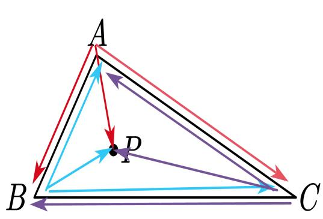

<details>
<summary>text_image</summary>

A
P
B
C
</details>

(a) 点在三角形区域内

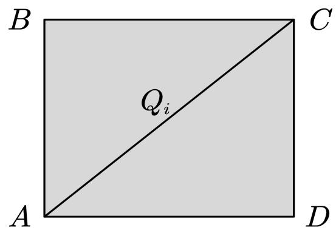

<details>
<summary>text_image</summary>

B
C
Qᵢ
A
D
</details>

(b) 矩形区域  
图 1

若平面上一点在三角形内如,图 1(a)，其满足如下条件：

$$
\left\{ \begin{array}{l} (\vec {A B} \times \vec {A P}) \cdot (\vec {A B} \times \vec {A C}) > 0 \\ (\vec {B C} \times \vec {B P}) \cdot (\vec {B C} \times \vec {B A}) > 0 \\ (\vec {C A} \times \vec {C P}) \cdot (\vec {C A} \times \vec {C B}) > 0 \end{array} \right. \tag {1}
$$

## 5.1.2 问题一的模型建立

在本问题中需要对定日镜场的年平均光学效率、年平均输出热功率以及单位镜面面积年平均输出热功率。通过题目所给公式以及信息得知，为计算各个定日镜的光学效率和输出热功率，需要确定各时刻太阳方位角、高度角，从而确定各个定日镜平面法向量，并计算阴影遮挡效率、截断效率、余弦效率等相关参数。

## 太阳方位的确定:

为确定太阳方位，需计算太阳高度角、方位角，为此需要先计算太阳赤纬角、时角。太阳的高度角、方位角、时角、赤纬角如下图所示：

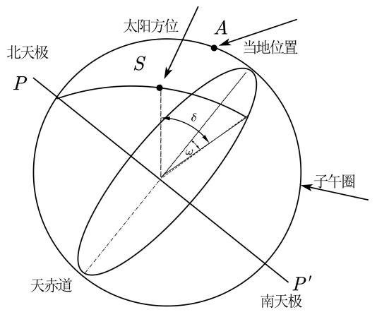

<details>
<summary>text_image</summary>

太阳方位
A
当地位置
S
δ
ω1
北天极
P
子午圈
P′
南天极
天赤道
</details>

(a) 太阳时角与赤纬角示意图 <sup>[1]</sup>

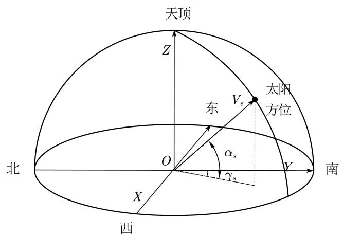

<details>
<summary>text_image</summary>

天顶
Z
东
V_s
太阳
方位
α_s
γ_s
北
O
Y
南
X
西
</details>

(b) 太阳高度角与方位角示意图 <sup>[1]</sup>  
图 2

太阳赤纬角δ 表征了给定时刻日地连线与地球赤道面之间的夹角<sup>[1]</sup>，其计算公式如下：

$$
\sin \delta = \sin \frac {2 \pi D}{3 6 5} \sin \left(\frac {2 \pi}{3 6 0} 2 3. 4 5\right) \tag {2}
$$

其中D 为以春分作为第0 天起算的天数。

太阳时角 $\omega$ 是由于地球自转引起太阳相对地球转动的角度，等于地球在一段时间内自转角度<sup>[1]</sup>，其计算公式如下：

$$
\omega = \frac {\pi}{1 2} (S T - 1 2) \tag {3}
$$

其中 $S T$ 为当地时间。

根据太阳赤纬角、时角，可以计算太阳高度角与太阳方位角。

太阳高度角 $\alpha _ { s }$ 是太阳入射光线与地平面之间的夹角<sup>[1]</sup>，计算公式如下：

$$
\sin \alpha_ {s} = \cos \delta \cos \varphi \cos \omega + \sin \delta \sin \varphi \tag {4}
$$

其中δ 为太阳赤纬角， $\varphi$ 为当地纬度(北纬为正), $\omega$ 为太阳时角。

太阳方位角 $\gamma _ { s }$ 是入射光线在地平面上的垂直投影与镜场坐标系 $y$ 轴之间的夹角，计算公式如下：

$$
\cos \gamma_ {s} = \frac {\sin \delta - \sin \alpha_ {s} \sin \varphi}{\cos \alpha_ {s} \cos \varphi} \tag {5}
$$

其中 $\alpha _ { s }$ 为太阳高度角， $\delta$ 为太阳赤纬角， $\varphi$ 为当地纬度(北纬为正)。

定日镜平面法向量的计算：

设第i块定日镜入射光线单位方向向量为 $\mathbf { \delta } \mathbf { u } _ { i }$ ，反射光线单位方向向量为 ${ \boldsymbol { v } } _ { i }$ ，且 $\mathbf { \delta } \mathbf { u } _ { i }$ 、${ \boldsymbol { v } } _ { i }$ 方向分别与入射光线、反射光线同向，如图3 所示:

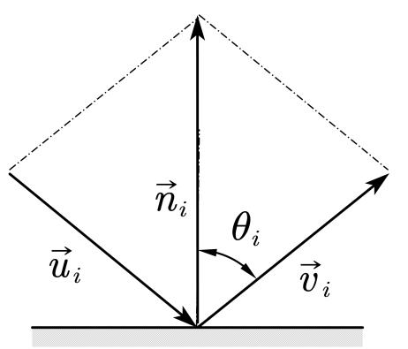

<details>
<summary>text_image</summary>

n_i
θ_i
u_i
v_i
</details>

(a)

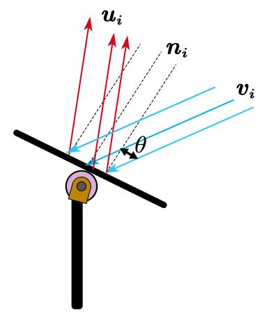

<details>
<summary>text_image</summary>

uᵢ
nᵢ
vᵢ
θ
</details>

(b)  
图3 各方向向量、法向量、反射角图示

由于入射到定日镜中心的光线需反射到集热器中心，根据第 i 块定日镜中心坐标$( x _ { i } , y _ { i } , z _ { i } )$ 与集热器中心坐标 $( x _ { c } , y _ { c } , z _ { c } )$ 得到反射光线方向向量为：

$$
\boldsymbol {t} _ {\boldsymbol {i}} = \left(x _ {c} - x _ {i}\right) \boldsymbol {e} _ {\boldsymbol {x}} + \left(y _ {c} - y _ {i}\right) \boldsymbol {e} _ {\boldsymbol {y}} + \left(z _ {c} - z _ {i}\right) \boldsymbol {e} _ {\boldsymbol {z}} \tag {6}
$$

其中 $e _ { x } , e _ { y } , e _ { z }$ 分别为指向 $x , y ,$ z 轴正方向的单位向量。

反射光线所对应的单位向量 ${ \boldsymbol { v } } _ { i }$ 为：

$$
\boldsymbol {v} _ {i} = \frac {\boldsymbol {e} _ {\boldsymbol {x}} \left(x _ {c} - x _ {i}\right) + \boldsymbol {e} _ {\boldsymbol {y}} \left(y _ {c} - y _ {i}\right) + \boldsymbol {e} _ {\boldsymbol {z}} \left(z _ {c} - z _ {i}\right)}{\sqrt {\left(x _ {c} - x _ {i}\right) ^ {2} + \left(y _ {c} - y _ {i}\right) ^ {2} + \left(z _ {c} - z _ {i}\right) ^ {2}}} \tag {7}
$$

如图 2 所示，由于反射光线 $\mathbf { \delta } \mathbf { u } _ { i }$ 和入射光线 ${ \boldsymbol { v } } _ { i }$ 的模长均为 1，根据矢量几何关系可得第i 块定日镜所在平面法向量 $\mathbf { \mathit { n } } _ { i }$ 为：

$$
\boldsymbol {n} _ {i} = \boldsymbol {v} _ {i} - \boldsymbol {u} _ {i} \tag {8}
$$

## 镜面反射率模型

依据题目信息，镜面反射率 $\eta _ { r e f }$ 为常数 0.92。

## 阴影遮挡效率模型

如图3所示， $\mathbf { \Delta } u _ { i } , v _ { i } , n _ { i }$ 分别为第i块定日镜入射光线方向向量，反射光线方向向量，定日镜平面法向量，入射点的坐标为 $\left( x _ { r i } , y _ { r i } , z _ { r i } \right)$ 。因此入射光线所在直线方程为：

$$
\frac {x - x _ {r i}}{u _ {i x}} = \frac {y - y _ {r i}}{u _ {i y}} = \frac {z - z _ {r i}}{u _ {i z}} \tag {9}
$$

反射光线所在的直线方程为:

$$
\frac {x - x _ {r i}}{v _ {i x}} = \frac {y - y _ {r i}}{v _ {i y}} = \frac {z - z _ {r i}}{v _ {i z}} \tag {10}
$$

定日镜所在平面方程为：

$$
n _ {i x} (x - x _ {r i}) + n _ {i y} (y - y _ {r i}) + n _ {i z} (z - z _ {r i}) = 0 \tag {11}
$$

考虑第i 块定日镜，其所在的平面方程为：

$$
n _ {j x} (x - x _ {r j}) + n _ {j y} (y - y _ {r j}) + n _ {j z} (z - z _ {r j}) = 0 \tag {12}
$$

联立 9 式和 12 式可求得交点 $P _ { 1 }$ 为 $\left( { { x _ { 1 i } } , { y _ { 1 i } } , { z _ { 1 i } } } \right)$ , 联立 10 式和 12 式可求得交点 $P _ { 2 }$ 为$\left( { { x } _ { 2 i } } , { { y } _ { 2 i } } , { { z } _ { 2 i } } \right)$ 。

为判断入射光线是否会形成阴影以及反射光线是否会被遮挡，记第i块定日镜镜面矩形区域为 $Q _ { i }$ 。若 $\left( { { x } _ { 1 i } } , { { y } _ { 1 i } } , { { z } _ { 1 z } } \right)$ 在 $Q _ { i }$ 内，且 $\left( { { x _ { 1 i } } , { y _ { 1 i } } , { z _ { 1 i } } } \right)$ 在第i块定日镜入射光线一侧，则入射光线到达第i块定日镜前被第 $j$ 块定日镜阻碍，称为阴影。 $\left( { { x _ { 1 i } } , { y _ { 1 i } } , { z _ { 1 i } } } \right)$ 在定日镜入射光线一侧，等价于向量 $( x _ { r i } - x _ { 1 i } ) e _ { x } + ( y _ { r i } - y _ { 1 i } ) e _ { y } + ( z _ { r i } - z _ { 1 i } ) e _ { z }$ 与 $\mathbf { \delta } \mathbf { u } _ { i }$ 同向。

记 $s = 0$ 表示该入射光不形成阴影， $s = 1$ 表示该入射光线形成阴影，则形成阴影$s = 1$ 的等价条件为：

$$
\left\{ \begin{array}{l} (x _ {r i} - x _ {1 i}) u _ {i x} + (y _ {r i} - y _ {1 i}) u _ {i y} + (z _ {r i} - z _ {1 i}) u _ {i z} > 0 \\ (x _ {1 i}, y _ {1 i}, z _ {1 i}) \in Q _ {j} \end{array} \right. \tag {13}
$$

其中判断点是否在矩形内的方法见问题一的建模准备，其他情况 $s = 0$

同理判断反射光线是否会被遮挡，若 $\left( { { x } _ { 2 i } } , { { y } _ { 2 i } } , { { z } _ { 2 i } } \right)$ , 且 $\left( { { x } _ { 2 i } } , { { y } _ { 2 i } } , { { z } _ { 2 i } } \right)$ 在第i块定日镜反射光线一侧，则反射光线到达集热器之前被第 $j$ 块定日镜阻挡，称为遮挡。 $\left( { { x } _ { 2 i } } , { { y } _ { 2 i } } , { { z } _ { 2 i } } \right)$ 在定日反射光线一侧，等价于向量 $( x _ { 2 i } - x _ { r i } ) \pmb { e _ { x } } + ( y _ { 2 i } - y _ { r i } ) \pmb { e _ { y } } + ( z _ { 2 i } - z _ { r i } ) \pmb { e _ { z } }$ 与 ${ \boldsymbol { v } } _ { i }$ 同向。

记 $b = 0$ 表示该反射光线不形成遮挡 $\mathbf { \nabla } _ { \mathcal { V } } = 1$ 表示该反射光线形成遮挡，则形成遮挡$b = 1$ 的等价条件为：

$$
\left\{ \begin{array}{l} (x _ {2 i} - x _ {r i}) v _ {i x} + (y _ {2 i} - y _ {r i}) v _ {i y} + (z _ {2 i} - z _ {r i}) v _ {i z} > 0 \\ (x _ {2 i}, y _ {2 i}, z _ {2 i}) \in Q _ {j} \end{array} \right. \tag {14}
$$

入射光线形成阴影以及反射光线形成遮挡的示意图如下：

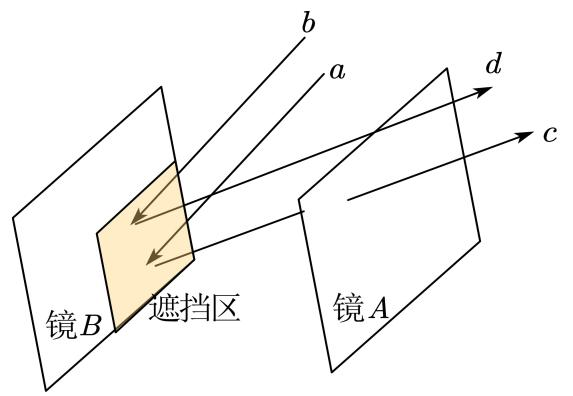

<details>
<summary>text_image</summary>

镜B 遮挡区
镜A
a
b
d
c
</details>

(a) 反射光线形成遮挡示意图

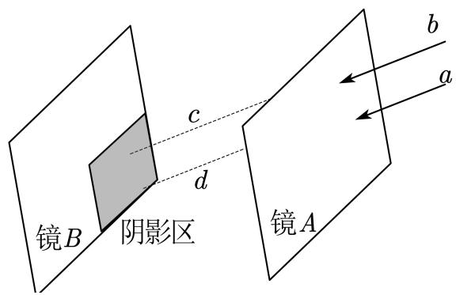

<details>
<summary>text_image</summary>

镜B 阴影区
c
d
镜A
b
a
</details>

(b) 入射光线形成阴影示意图  
图 4

$s = 0$ 且b = 0时，表示该入射光线不形成阴影以及反射光线不形成遮挡。记第i块定日镜对应 $s = 0$ $b = 0$ 的光线数目为 $N _ { l i }$ , 总入射光线为 $N _ { i } ,$ , 因此每块定日镜年平均阴影遮挡效率 $( \eta _ { s b } ) _ { i }$ 为：

$$
(\eta_ {s b}) _ {i} = \frac {N _ {l i}}{N _ {i}} \tag {15}
$$

## 截断效率模型

截断效率定义为吸热器截获的能量占镜场汇聚能量的百分比<sup>[2]</sup>。

镜面每一点反射光线是构成一束锥形光束，半角展宽为 4.65mrad<sup>[2]</sup>, 因此反射光线会在集热器表面上形成光斑

第 i 块定日镜的截断效率可以等价于第 i 块定日镜反射且无遮挡光线中，打到集热器上的光线数目 $N _ { d i }$ 的占比，即

$$
(\eta_ {t r u n c}) _ {i} = \frac {N _ {d i}}{N _ {i}} \tag {16}
$$

## 余弦效率模型

余弦效率是指定日镜面上入射光线和镜面反射点的法线方向之间夹角 θ 的余弦值$\cos \theta \ ^ { [ 1 ] }$ 。第 i 个定日镜的余弦效率 $\eta _ { c o s }$ 为：

$$
(\eta_ {c o s}) _ {i} = \cos \theta_ {i} = \frac {| \boldsymbol {n} _ {i} \cdot \boldsymbol {v} _ {i} |}{| | \boldsymbol {n} _ {i} | | \cdot | | \boldsymbol {v} _ {i} | |} \tag {17}
$$

其中 $\theta _ { i }$ 是第 i 块定日镜中心的入射光线的方向向量 ${ \boldsymbol { v } } _ { i }$ 与该定日镜法向向量 $\mathbf { \nabla } n _ { i }$ 所形成的锐角夹角。

## 大气透射率模型

太阳光经由定日镜反射后到达集热器表面的过程中，太阳辐射因大气散射或被空气中的杂质颗粒物阻挡，造成能量损失。大气透射率定义为太阳光线穿过大气到达集热器表面的能量比例<sup>[1]</sup>。第i 块定日镜对应的大气透射率为：

$$
(\eta_ {a t}) _ {i} = 0. 9 9 3 2 1 - 0. 0 0 0 1 1 7 6 (d _ {H R}) _ {i} + 1. 9 7 \times 1 0 ^ {- 8} (d _ {H R}) _ {i} ^ {2} \quad (d _ {H R}) _ {i} \leq 1 0 0 0 \tag {18}
$$

其中 $\left( d _ { H R } \right) _ { i }$ 为第i 块定日镜中心到集热器中心的距离，其计算公式如下：

$$
(d _ {H R}) _ {i} = \sqrt {(x _ {i} - x _ {c}) ^ {2} + (y _ {i} - y _ {c}) ^ {2} + (z _ {i} - z _ {c}) ^ {2}} \tag {19}
$$

## 定日镜场输出热功率模型

将地球上垂直于太阳光线的平面单位面积上，单位时间内接收到的太阳辐射能量定义为法向直接辐射照度DNI<sup>[3]</sup>，可以由以下公式计算得：

$$
\left\{ \begin{array}{l} D N I = G _ {0} [ a + b \cdot e x p (- \frac {c}{\sin \alpha_ {s}}) ] \\ a = 0. 4 2 3 7 - 0. 0 0 8 2 1 (6 - H _ {a}) ^ {2} \\ b = 0. 5 0 5 5 + 0. 0 0 5 9 5 (6. 5 - H _ {a}) ^ {2} \\ c = 0. 2 7 1 1 + 0. 0 1 8 5 8 (2. 5 - H _ {a}) ^ {2} \end{array} \right. \tag {20}
$$

其中DNI为法向直接辐射照度(单位： $\mathrm { k W / m ^ { 2 } } )$ ； $a , b , c$ 为经验公式的系数； $H _ { a }$ −为当地海拔高度(单位：km)； $G _ { 0 }$ 为太阳常数，其值为 $1 . 3 6 6 \mathrm { { k W / m ^ { 2 } } }$ C

定日镜场的输出热功率 $E _ { f i e l d }$ 为：

$$
E _ {f i e l d} = D N I \cdot \sum_ {i} ^ {N} A _ {i} \cdot \eta_ {i} \tag {21}
$$

其中 DNI 为法向直接辐射照度 (单位： $\mathrm { k W / m ^ { 2 } } )$ ；N 为定日镜总数 (单位：面); $A _ { i }$ 为第 i面定日镜采光面积(单位： $\mathbf { m } ^ { 2 } )$ )； $\eta _ { i }$ 为第i 面镜子的光学效率。

定日镜的光学效率η 的计算公式如下：

$$
\eta = \eta_ {s b} \cdot \eta_ {c o s} \cdot \eta_ {a t} \cdot \eta_ {t r u n c} \cdot \eta_ {r e f} \tag {22}
$$

其中 $\eta _ { s b }$ 为阴影遮挡效率， $\eta _ { c o s }$ 为余弦效率， $\eta _ { a t }$ 为大气投射率， $\eta _ { t r u n c }$ 为集热器截断效率， $\eta _ { r e f }$ 为镜面反射率。

综上所述，在本问题中建立了定日镜场光学效率与输出热功率求解模型：

$$
\left\{ \begin{array}{l} \text {太阳光线入射} \left\{ \begin{array}{l} \sin \delta = \sin \frac {2 \pi D}{3 6 5} \sin \left(\frac {2 \pi}{3 6 0} 2 3. 4 5\right) \\ \omega = \frac {\pi}{1 2} (S T - 1 2) \\ \sin \alpha_ {s} = \cos \delta \cos \varphi \cos \omega + \sin \delta \sin \varphi \end{array} \right. \\ \text {阴影判断} \left\{ \begin{array}{l} \left(x _ {r i} - x _ {1 i}\right) u _ {i x} + \left(y _ {r i} - y _ {1 i}\right) u _ {i y} + \left(z _ {r i} - z _ {1 i}\right) u _ {i z} > 0 \\ \left(x _ {1 i}, y _ {1 i}, z _ {1 i}\right) \in Q _ {j} \end{array} \right. \\ \text {遮挡判断} \left\{ \begin{array}{l} \left(x _ {2 i} - x _ {r i}\right) v _ {i x} + \left(y _ {2 i} - y _ {r i}\right) v _ {i y} + \left(z _ {2 i} - z _ {r i}\right) v _ {i z} > 0 \\ \left(x _ {2 i}, y _ {2 i}, z _ {2 i}\right) \in Q _ {j} \end{array} \right. \\ \text {镜场效率与热功率计算} \left\{ \begin{array}{l} \left(\eta_ {s b}\right) _ {i} = \frac {N _ {l i}}{N _ {i}} \\ \left(\eta_ {\text {trunc}}\right) _ {i} = \frac {N _ {d i}}{N _ {i}} \\ \left(\eta_ {\cos}\right) _ {i} = \cos \theta_ {i} = \frac {\left| n _ {i} \cdot v _ {i} \right|}{\left| | n _ {i} | | \cdot | | v _ {i} | | \right|} \\ \left(\eta_ {\text {at}}\right) _ {i} = 0. 9 9 3 2 1 - 0. 0 0 0 1 1 7 6 \left(d _ {H R}\right) _ {i} + 1. 9 7 \times 1 0 ^ {- 8} \left(d _ {H R}\right) _ {i} ^ {2} \\ \left(\eta_ {\text {ref}}\right) _ {i} = 0. 9 2 \\ \eta = \eta_ {s b} \cdot \eta_ {\cos} \cdot \eta_ {\text {at}} \cdot \eta_ {\text {trunc}} \cdot \eta_ {\text {ref}} \\ E _ {\text {field}} = D N I \cdot \sum_ {i} ^ {N} A _ {i} \cdot \eta_ {i} \end{array} \right. \\ (2 3) \end{array} \right.
$$

## 5.1.3问题一的模型求解

在本问题中，将定日镜反射集热过程划分为太阳光线入射过程、定日镜法向调整过程、阴影遮挡与集热器截断过程。对这三个过程进行仿真模拟，从而得到阴影遮挡效率等需要计算的指标。仿真步骤如算法1所述。

## 算法1：栅格化模拟定日镜反射太阳光的过程仿真

输入：待求月份X、当地时间Y、定日镜以及集热器坐标

输出：定日镜场每月21日的平均光学效率及输出功率

Step1 根据太阳高度角和方位角，以及当地的地理位置，输入日期 X 月 21 日和当地时间Y 时刻，求解在X 月21日Y 时刻的太阳光的入射方向，得到X 月21日Y 时刻的入射光方向向量。

Step2根据附件的数据和已知数据可以得到定日镜以及集热器的三维坐标，由定日镜和集热器的中心可以求出反射光线的方向向量，入射方向向量和反射方向向量根据菱形几何关系可以求出定日镜法向量。

Step3开始入射的阴影模拟：对第i个定日镜进行分析，将该定日镜分成若干栅格，遍历每个栅格，对每个栅格执行Step4。

Step4将栅格中心作为入射光线的接触点 (即入射光射在栅格中心)。寻找与第 i 个定日镜最近的其他 6 个定日镜，求出入射光线和这些定日镜所在平面的交点。判断交点是否在这些定日镜框定的矩形内，若交点落入矩形，且矩形被入射光穿透(入射光不是一条直线，终点在第 i 个定日镜面，背后的矩形不会被穿透，需要排除)，则说明入射光被该栅格阻挡，产生了阴影。若该栅格没有阴影，转入Step5判断该栅格的反射光线是否会被遮挡。

Step5将栅格中心作为反射光线的出发点。与Step4类似，寻找反射光线和其他6个最近邻定日镜的交点。若交点在矩形内，并被反射光穿透，则说明产生了遮挡。返回Step3遍历其他栅格，若遍历完成，记录栅格的阴影遮挡信息，执行Step6。

Step6 循环执行 Step3 Step5 直至遍历所有定日镜。遍历完成后执行 Step7 开始模拟截断过程，计算截断效率。

Step7开始反射的截断效率计算：将反射光线模拟成锥形光线，锥形光线会在集热器上形成光斑。对于第i个定日镜，将该定日镜分成若干栅格，根据记录的栅格阴影遮挡信息，得到没有阴影遮挡的栅格所形成的总光斑面积和集热器接收到的光斑面积，从而计算得出第i个定日镜的截断效率。遍历所有定日镜得到所有的截断效率。

Step8根据以上结果计算光学效率及输出功率。遍历其他日期和时刻，得到每月21日的平均光学效率及输出功率，从而得到年平均光学效率及输出功率。

为直观的展示算法流程，上述算法的流程图如下所示：

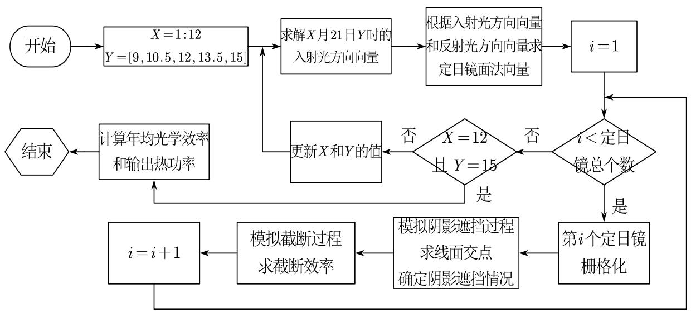

<details>
<summary>flowchart</summary>

```mermaid
graph TD
  Start(["开始"]) --> X1["&quot;X = 1:12\nY = [9, 10.5, 12, 13.5, 15"]"]
  X1 --> S1["求解X月21日Y时的入射光方向向量"]
  S1 --> S2["根据入射光方向向量和反射光方向向量求定日镜面法向量"]
  S2 --> I1["i = 1"]
  I1 --> CheckI{"i < 定日镜总个数"}
  CheckI -->|否| CheckX{"X = 12\n且 Y = 15"}
  CheckX -->|否| UpdateX["更新X和Y的值"]
  UpdateX --> S1
  CheckX -->|是| CalcA["计算年均光学效率\n和输出热功率"]
  CalcA --> EndNode{{"结束"}}
  CheckI -->|是| SetI["第i个定日镜栅格化"]
  SetI --> Simulate["模拟阴影遮挡过程\n求线面交点\n确定阴影遮挡情况"]
  Simulate --> CutOff["模拟截断过程\n求截断效率"]
  CutOff --> I2["i = i + 1"]
  I2 --> CheckI
```
</details>

图5 算法1的流程图

该算法将定日镜的镜面栅格化，以便于对入射和反射光线的模拟.计算截断效率时，由于镜面高度相对于定日镜到集热器中心的距离较小，故计算光斑大小时，忽略定日镜

镜面到集热器中心距离变化。

求出各指标的月平均值，其结果如表2所示。此外，通过月平均指标求出定镜日场的年平均光学效率以及输出热功率等指标如表3 所示。

表2 每月21日平均光学效率及输出功率(详见附录A)

<table><tr><td>日期</td><td>平均光学效率</td><td>平均余弦效率</td><td>平均阴影遮挡效率</td><td>平均截断效率</td><td>单位面积镜面平均输出热功率 (kW/m2)</td></tr><tr><td>1月21日</td><td>0.4705</td><td>0.7199</td><td>0.8967</td><td>0.8070</td><td>0.3404</td></tr><tr><td>3月21日</td><td>0.4980</td><td>0.7611</td><td>0.9058</td><td>0.8084</td><td>0.3955</td></tr><tr><td>5月21日</td><td>0.5038</td><td>0.7893</td><td>0.8859</td><td>0.8086</td><td>0.4145</td></tr><tr><td>7月21日</td><td>0.5039</td><td>0.7892</td><td>0.8862</td><td>0.8084</td><td>0.4146</td></tr><tr><td>9月21日</td><td>0.4972</td><td>0.7601</td><td>0.9054</td><td>0.8085</td><td>0.3942</td></tr><tr><td>11月21日</td><td>0.4682</td><td>0.7182</td><td>0.8945</td><td>0.8068</td><td>0.3369</td></tr></table>

表3 年平均光学效率及输出功率

<table><tr><td>年平均光学效率</td><td>年平均余弦效率</td><td>年平均阴影遮挡效率</td><td>年平均截断效率</td><td>年平均输出热功率 (MW)</td><td>单位面积镜面平均输出热功率 (kW/m2)</td></tr><tr><td>0.4902</td><td>0.7565</td><td>0.8955</td><td>0.8078</td><td>24.04</td><td>0.3827</td></tr></table>

## 5.1.4 问题一的模型结果分析

依据题目信息可得，题中所有指标的计算时刻为一年中每月21日9:00、10:30、12:00、13:30、15:00。通过对记录的时刻进行分析，9:00、10:30 关于中午 12:00 分别与 13:30、15:00 对称。此外一年之中太阳的视运动轨迹也关于定日镜场对称，因此在本题中整个定日镜场的所有的“年平均”指标关于东西方向对称。其中定日镜场的年平均大气透射效率以及年平均截断效率关于镜日场中心对称。镜日场中的每块定日镜的年大气透射效率，年平均截断效率，年平均余弦效率，年平均阴影遮挡效率，年平均光学效率和年平均输出热功率的散点分布示意图如下：

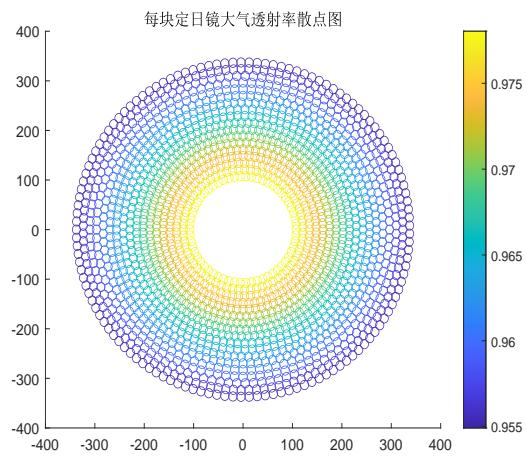

<details>
<summary>heatmap</summary>

| X (range) | Y (range) | 透射率 (Color Scale) |
| --- | --- | --- |
| -350~350 | -350~350 | 0.955~0.975 |
</details>

(a)每块定日镜对应大气透射效率散点图

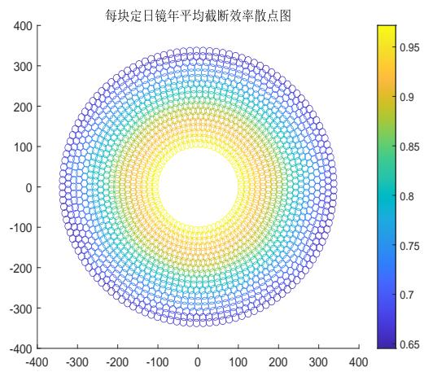

<details>
<summary>heatmap</summary>

| 效率等级 (Color) | 效率值范围 |
| --- | --- |
| 蓝色 | 0.65~0.75 |
| 橙色 | 0.85~0.95 |
| 黄色 | 0.95~1.00 |
| 绿色 | 0.85~0.95 |
| 青色 | 0.75~0.85 |
| 浅蓝色 | 0.65~0.75 |
</details>

(b) 每块定日镜年平均截断效率散点图

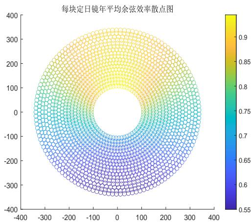

<details>
<summary>scatter</summary>

| 效率 (Color) | 效率 (Color) |
| --- | --- |
| 0.55~0.60 | Blue |
| 0.60~0.65 | Dark Blue |
| 0.65~0.70 | Blue-Green |
| 0.70~0.75 | Green |
| 0.75~0.80 | Yellow-Green |
| 0.80~0.85 | Yellow |
| 0.85~0.90 | Yellow |
| 0.90~1.00 | Light Yellow |
</details>

(c)每块定日镜年平均余弦效率散点图

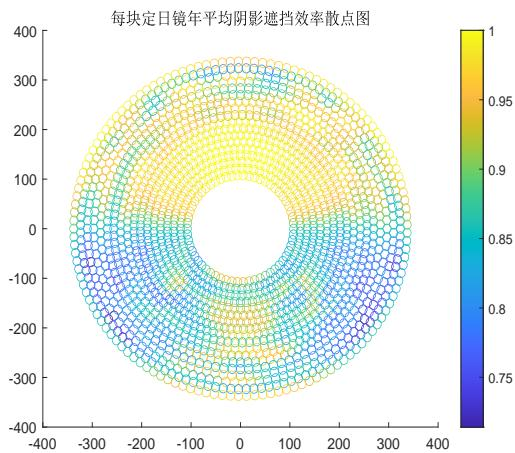

<details>
<summary>scatter</summary>

| 效率等级 (Color) | 效率范围 |
| --- | --- |
| 1 | 黄色 |
| 0.95 | 橙色 |
| 0.9 | 浅橙色 |
| 0.85 | 青色 |
| 0.8 | 蓝色 |
| 0.75 | 蓝色 |
| 0.65 | 蓝色 |
| 0.55 | 蓝色 |
| 0.45 | 蓝色 |
| 0.35 | 蓝色 |
| 0.25 | 蓝色 |
| 0.15 | 蓝色 |
| 0.05 | 蓝色 |
| -0.15 | 蓝色 |
| -0.25 | 蓝色 |
| -0.35 | 蓝色 |
| -0.45 | 蓝色 |
| -0.55 | 蓝色 |
| -0.65 | 蓝色 |
| -0.75 | 蓝色 |
| -0.85 | 蓝色 |
| -0.95 | 蓝色 |
| -1.0 | 黄色 |
</details>

(d) 每块定日镜年平均阴影遮挡效率散点图

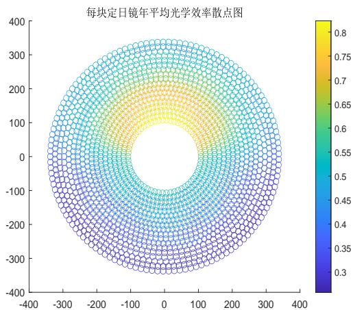

<details>
<summary>scatter</summary>

| 效率 (Color) | 效率 (Color) |
| --- | --- |
| 0.3~0.45 | 蓝色 |
| 0.45~0.6 | 蓝色 |
| 0.6~0.75 | 橙色 |
| 0.75~0.8 | 黄色 |
</details>

(e)每块定日镜年平均光学效率散点图

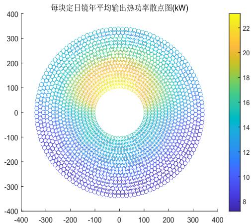

<details>
<summary>heatmap</summary>

| 纵坐标 (X) | 纵坐标 (Y) | 热功率 (kW) |
| --- | --- | --- |
| -400~400 | -400~400 | 8~22 |
</details>

(f) 每块定日镜年平均输出热功率散点图  
图 6

由于太阳视运动轨迹在东西方向上对称，因此散点图也应大致关于东西方向对称。

## 5.2 问题二的模型建立与求解

## 5.2.1 问题二的模型建立

本问题需要在满足定日镜场额定功率、定日镜尺寸、定日镜间距限制的条件下，最优化单位镜面面积年平均输出热功率 $P _ { d }$ ，建立以 $P _ { d }$ 为目标函数的单目标优化模型。

首先设定日镜总数为 $N$ ，每块定日镜镜面宽度为W，高度为H，安装高度为h，则单位镜面面积年平均输出热功率 $P _ { d }$ ，即优化目标如下。

优化目标：

$$
P _ {d} = \frac {E _ {y}}{N W H} \tag {24}
$$

其中 $E _ { y }$ 为定日镜场年平均输出热功率。

## 约束条件：

为确定该模型的约束条件，首先设吸收塔的横纵坐标分别为 $x _ { c }$ ， $y _ { c }$ ，第i块定日镜位置为 $( x _ { i } , y _ { i } , h )$ 。由于吸收塔周围100m以内不设置定日镜，故有：

$$
\forall i \in \{1, 2, \dots , N \}, \quad \sqrt {(x _ {i} - x _ {c}) ^ {2} + (y _ {i} - y _ {c}) ^ {2}} \geq 1 0 0 \tag {25}
$$

由于镜面宽度不小于镜面高度，故有：

$$
W \geq H \tag {26}
$$

镜面边长在2m到8m之间，且定日镜的安装高度在2m至 6m之间，故有：

$$
W \in [ 2, 8 ], \quad H \in [ 2, 8 ], \quad h \in [ 2, 6 ] \tag {27}
$$

定日镜的安装高度必须保证镜面在绕水平转轴旋转时不会触及地面，故有：

$$
h \geq \frac {1}{2} H \tag {28}
$$

为保持清洁，相邻的定日镜底座中心之间的距离比镜面宽度多5m以上，故有：

$$
\forall i, j \in \{1, 2, \dots , N \}, \quad \sqrt {(x _ {i} - x _ {j}) ^ {2} + (y _ {i} - y _ {j}) ^ {2}} \geq W + 5 \tag {29}
$$

此外定日镜均位于半径350m的范围内，故有：

$$
\forall i \in \{1, 2,..., N \}, \quad \sqrt {x _ {i} ^ {2} + y _ {i} ^ {2}} \leq 3 5 0 \tag {30}
$$

定日镜场的额定年平均输出热功率还需要达到60MW，故有：

$$
E _ {y} \geq 6 0 \times 1 0 ^ {3} \tag {31}
$$

综上所述，建立镜场年平均功率单目标优化模型如下：

$$
\max \quad P _ {d} \tag {32}
$$

$$
s. t \left\{ \begin{array}{l} \forall i \in \{1, 2, \dots , N \}, \quad \sqrt {\left(x _ {i} - x _ {c}\right) ^ {2} + \left(y _ {i} - y _ {c}\right) ^ {2}} \geq 1 0 0 \\ W \geq H \\ W \in [ 2, 8 ], \quad H \in [ 2, 8 ], \quad h \in [ 2, 6 ] \\ h \geq \frac {1}{2} H \\ \forall i, j \in \{1, 2, \dots , N \}, \quad \sqrt {\left(x _ {i} - x _ {j}\right) ^ {2} + \left(y _ {i} - y _ {j}\right) ^ {2}} \geq W + 5 \\ \forall i \in \{1, 2, \dots , N \}, \quad \sqrt {x _ {i} ^ {2} + y _ {i} ^ {2}} \leq 3 5 0 \\ E _ {y} \geq 6 0 \times 1 0 ^ {3} \end{array} \right. \tag {33}
$$

## 5.2.2 问题二的模型求解

在本问题中，优化目标为单位镜面面积年平均输出热功率 $P _ { d }$ ，其自变量为多维向量，其中包括吸收塔位置坐标、定日镜尺寸、定日镜安装高度、定日镜数目、定日镜位置。因此为优化该目标函数，我们分析其中一个变量时，将其他变量固定，得到每一变量单独对该目标函数的影响。为加快运行速度，经检验，可仅将镜面分为2\*2的栅格进行相关指标计算，与上一问题计算结果偏差在2% 以内。

由第一问求解结果所得各个指标的散点图可知，北方的光学效率整体高于南方的光学效率，因此为获得更大的单位镜面面积年平均输出热功率，将吸收塔的位置坐标由定日镜场中心向南方移动。设吸收塔向南方移动的距离为 D，固定其他变量进行并改变D 的值，模拟得到不同D 取值下的目标函数值 $P _ { d }$ ，并证明了 $P _ { d }$ 是关于D 的单峰函数。(详情见附件代码m21)

此后，将定日镜宽度W 与高度H 一起进行验证，通过模拟发现在不同 $W$ 和H 的取值下，当 $W = H$ 时 $P _ { d }$ 有最大值。(详情请见附录代码m22)同理将定日镜宽度W 和相邻定日镜间距 $d r$ 一起验证，通过模拟发现在不同W 和 $d r$ 的取值下，当 $d r = W + 5$ 时 $P _ { d }$ 有最大值。(详情请见附录代码m22)最后考虑W 单独为 $P _ { d }$ 的影响，模拟发现 $P _ { d }$ 是关于 W 的单峰函数。 详情请见附录代码 至于定日镜数量以及定日镜位置，在上述调节过程中已经安置好。定日镜高度在本问题只影响截断效率，故取最大值使得截断效率最大。上述分析中我们发现有 $P _ { d } ( D )$ 单峰曲线和 $P _ { d } ( W )$ 单峰曲线，通过求解曲线的极大值点，即可得到变量的较优解。

为求解无解析式的单峰函数的极值点，我们将采用三分查找法对其进行求解。三分法是二分法的变种，他最基本的用途是求单峰函数的极值点。

## 算法2：三分查找算法

输入：单峰曲线离散节点与对应函数值，停止条件ϵ为一较小的正数，即代表迭代收敛。

输出：极大值和极大值点

Step1 计算 $l _ { s e c }$ 和 $r _ { s e c }$ 的目标函数值 $f ( l _ { s e c } )$ 和 $f ( r _ { s e c } )$ ，如果 $f ( l _ { s e c } ) < f ( r _ { s e c } )$ ，转至 Step2；如果 $f ( l _ { s e c } ) > ( r _ { s e c } )$ ，转至 Step3

Step2极大值一定在 $[ l _ { s e c } , r ]$ 内取到，令 $l = l _ { s e c }$ ，计算更新的 $l _ { s e c } = l + ( r _ { s e c } - l _ { s e c } ) / 3$ 和$r _ { s e c } = l + 2 \times ( r _ { s e c } - l _ { s e c } ) / 3$ 。如果 $| l _ { s e c } - r _ { s e c } | < \epsilon$ ，结束迭代并输出结果。

Step3极大值一定在 $[ l , r _ { s e c } ]$ 内取到，令 $r = r _ { s e c } ,$ ，计算更新的 $l _ { s e c } = l + ( r _ { s e c } - l _ { s e c } ) / 3$ 和$r _ { s e c } = l + 2 \times ( r _ { s e c } - l _ { s e c } ) / 3$ 。如果 $| l _ { s e c } - r _ { s e c } | < \epsilon$ ，结束迭代并输出结果。

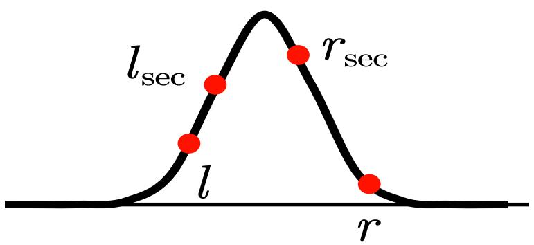

<details>
<summary>line</summary>

| Point | Description |
| --- | --- |
| l | Leftmost point on the curve |
| l_sec | Second point on the curve |
| r_sec | Third point on the curve |
| r | Rightmost point on the curve |
</details>

图7 算法2的图形解释

利用三分法对 $P _ { d }$ 关于D的单峰函数和 $P _ { d }$ 关于W 的单峰函数求解结果示意图如图9所示，其中红色点为三分迭代法所寻找的 $l _ { s e c }$ 和 $r _ { s e c }$ ，蓝色实线为拟合曲线：

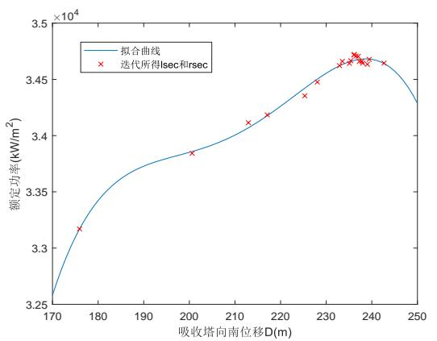

<details>
<summary>line</summary>

| 吸收塔向南位移 D (m) | 额定功率 \((kW/m^{2})\) |
| --- | --- |
| ~176 | ~3.32 |
| ~201 | ~3.385 |
| ~213 | ~3.412 |
| ~217 | ~3.42 |
| ~226 | ~3.435 |
| ~229 | ~3.448 |
| ~233 | ~3.465 |
| ~235 | ~3.468 |
| ~236 | ~3.472 |
| ~237 | ~3.465 |
| ~238 | ~3.468 |
| ~239 | ~3.465 |
| ~241 | ~3.465 |
</details>

(a) $P _ { d } ( D )$ 单峰曲线

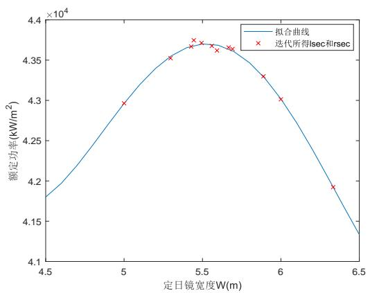

<details>
<summary>line</summary>

| 定日镜宽度 W(m) | 额定功率 \((kW/m^{2})\) |
| --- | --- |
| 4.5 | ~41800 |
| 5.0 | ~43000 |
| 5.3 | ~43500 |
| 5.4 | ~43650 |
| 5.45 | ~43750 |
| 5.5 | ~43700 |
| 5.6 | ~43600 |
| 5.65 | ~43650 |
| 5.9 | ~43300 |
| 6.0 | ~43000 |
| 6.3 | ~41900 |
</details>

(b) $P _ { d } ( W )$ 单峰曲线  
图 8

由图中数据可得，当吸收塔向南移动距离D 为237.0240m，单位镜面面积年平均输

出热功率 $P _ { d }$ 最大；当定日镜宽度W 为5.4670m时， $P _ { d }$ 达到最大值。

表4 部分月数21日平均光学效率及输出功率(详见附录B)

<table><tr><td>日期</td><td>平均光学效率</td><td>平均余弦效率</td><td>平均阴影遮挡效率</td><td>平均截断效率</td><td>单位面积镜面平均输出热功率 (kW/m2)</td></tr><tr><td>1月21日</td><td>0.6099</td><td>0.8914</td><td>0.8697</td><td>0.8807</td><td>0.4411</td></tr><tr><td>3月21日</td><td>0.5883</td><td>0.8681</td><td>0.8627</td><td>0.8809</td><td>0.4674</td></tr><tr><td>5月21日</td><td>0.5406</td><td>0.8241</td><td>0.8354</td><td>0.8818</td><td>0.4455</td></tr><tr><td>7月21日</td><td>0.5409</td><td>0.8244</td><td>0.8355</td><td>0.8818</td><td>0.4457</td></tr><tr><td>9月21日</td><td>0.5896</td><td>0.8691</td><td>0.8636</td><td>0.8808</td><td>0.4677</td></tr><tr><td>11月21日</td><td>0.6084</td><td>0.8919</td><td>0.8670</td><td>0.8807</td><td>0.4375</td></tr></table>

表5 年平均光学效率及输出功率

<table><tr><td>年平均光学效率</td><td>年平均余弦效率</td><td>年平均阴影遮挡效率</td><td>年平均截断效率</td><td>年平均输出热功率 (MW)</td><td>单位面积镜面平均输出热功率 (kW/m2)</td></tr><tr><td>0.5787</td><td>0.8614</td><td>0.8546</td><td>0.8811</td><td>43.73</td><td>0.4505</td></tr></table>

表6 问题二的参数设计表

<table><tr><td>吸收塔的平面位置坐标</td><td>定日镜尺寸(宽×高)</td><td>定日镜安装高度(m)</td><td>定日镜总面数</td><td>定日镜总面积(m2)</td></tr><tr><td>(0,-237.0240)</td><td>/</td><td>/</td><td>3249</td><td>97106.40</td></tr></table>

## 5.3 问题三的模型建立与求解

## 5.3.1 问题三的模型建立

本问题同样需要在满足定镜日场额定功率、定日镜尺寸、定日镜间距限制的条件下，最优化单位镜面面积年平均输出热功率 $P _ { d }$ ，使之达到最大，但在此优化过程各个定日镜的尺寸以及高度可以不同。

首先设定日镜总数为 $N$ ，第i块定日镜镜面宽度为 $W _ { i }$ ，高度为 $H _ { i }$ ，安装高度为 $h _ { i }$ ，则单位镜面面积年平均输出热功率 $P _ { d }$ ，即优化目标如下：

优化目标：

$$
P _ {d} = \frac {E _ {y}}{\sum_ {i = 1} ^ {N} W _ {i} H _ {i}} \tag {34}
$$

其中 $E _ { y }$ 为镜面年平均输出热功率输出。因此以 $P _ { d }$ 为优化目标建立最优化模型如下：

$$
\max \quad P _ {d} \tag {35}
$$

## 约束条件：

为确定该模型的约束条件，首先设吸收塔的平面坐标为 $( x _ { c } , y _ { c } )$ ，第i块定日镜位置为 $( x _ { i } , y _ { i } , h )$ 。由于吸收塔周围100m以内不设置定日镜，故有：

$$
\forall i \in \{1, 2, \dots , N \}, \quad \sqrt {(x _ {i} - x _ {c}) ^ {2} + (y _ {i} - y _ {c}) ^ {2}} \geq 1 0 0 \tag {36}
$$

由于镜面宽度不小于镜面高度，故有：

$$
\forall i \in \{1, 2,..., N \}, \quad W _ {i} \geq H _ {i} \tag {37}
$$

镜面边长在2m 到8m 之间，且定日镜的安装高度在2m至 6m之间，故有：

$$
\forall i \in \{1, 2, \dots , N \}, \quad W _ {i} \in [ 2, 8 ], \quad H _ {i} \in [ 2, 8 ], \quad h _ {i} \in [ 2, 6 ] \tag {38}
$$

定日镜的安装高度必须保证镜面在绕水平转轴旋转时不会触及地面，故有：

$$
\forall i \in \{1, 2,..., N \}, \quad h _ {i} \geq \frac {1}{2} H _ {i} \tag {39}
$$

为保持清洁，相邻的定日镜底座中心之间的距离比镜面宽度多5m以上，故有：

$$
\forall i, j \in \{1, 2, \dots , N \}, \quad \sqrt {(x _ {i} - x _ {j}) ^ {2} + (y _ {i} - y _ {j}) ^ {2}} \geq \frac {W _ {i} + W _ {j}}{2} + 5 \tag {40}
$$

此外定日镜均位于半径350m的范围内，故有：

$$
\forall i \in \{1, 2, \dots , N \}, \quad \sqrt {x _ {i} ^ {2} + y _ {i} ^ {2}} \leq 3 5 0 \tag {41}
$$

定日镜场的额定年平均输出热功率还需要达到60MW，故有：

$$
E _ {y} \geq 6 0 \times 1 0 ^ {3} \tag {42}
$$

综上所述，建立镜场年平均功率单目标优化模型：

$$
\max \quad P _ {d} \tag {43}
$$

$$
s. t \left\{ \begin{array}{l l} \forall i \in \{1, 2, \dots , N \}, & \sqrt {\left(x _ {i} - x _ {c}\right) ^ {2} + \left(y _ {i} - y _ {c}\right) ^ {2}} \geq 1 0 0 \\ \forall i \in \{1, 2, \dots , N \}, & W _ {i} \geq H _ {i} \\ \forall i \in \{1, 2, \dots , N \}, & W _ {i} \in [ 2, 8 ], \quad H _ {i} \in [ 2, 8 ], \quad h _ {i} \in [ 2, 6 ] \\ \forall i \in \{1, 2, \dots , N \}, & h _ {i} \geq \frac {1}{2} H _ {i} \\ \forall i, j \in \{1, 2, \dots , N \}, & \sqrt {\left(x _ {i} - x _ {j}\right) ^ {2} + \left(y _ {i} - y _ {j}\right) ^ {2}} \geq \frac {W _ {i} + W _ {j}}{2} + 5 \\ \forall i \in \{1, 2, \dots , N \}, & \sqrt {x _ {i} ^ {2} + y _ {i} ^ {2}} \leq 3 5 0 \\ E _ {y} \geq 6 0 \times 1 0 ^ {3} \end{array} \right. \tag {44}
$$

## 5.3.2 问题三的模型求解

在问题二的基础上，我们在本问题中可以自由的选择每一块定日镜的尺寸和高度。在问题二的两个单峰曲线已经证明并求出了使得目标函数，即定日镜场额定年平均输出热功率 $P _ { d }$ 较大的定日镜宽度 W 和吸收塔向南的位移 D，因此为简化对定日镜的调节，本问题不再改变 W 和 D，以及定日镜场的各个定日镜的位置分布，而是将重心放在定日镜安装高度上。利用蒙特卡洛方法，随机生成每一圈定日镜的高度，并求得这组高度下的目标函数值，循环进行上述操作并更新较优解。得到定日镜场中的定日镜排布图：

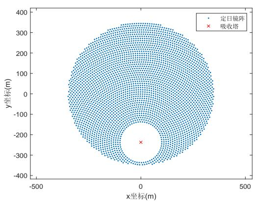

<details>
<summary>scatter</summary>

| Series | x坐标(m) (range) | y坐标(m) (range) |
| --- | --- | --- |
| 定日镜阵 | -350~350 | -350~350 |
| 吸收塔 | 0 | -240 |
</details>

(a)

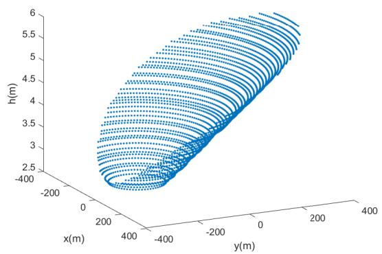

<details>
<summary>scatter_3d</summary>

| Series | x(m) (range) | y(m) (range) | h(m) (range) |
| --- | --- | --- | --- |
| Data Points | -400~400 | -400~400 | 2.5~6.0 |
</details>

(b)  
图9 调节后定日镜场中定日镜排布图

表7 部分月数21日平均光学效率及输出功率(详见附录C)

<table><tr><td>日期</td><td>平均光学效率</td><td>平均余弦效率</td><td>平均阴影遮挡效率</td><td>平均截断效率</td><td>单位面积镜面平均输出热功率 (kW/m2)</td></tr><tr><td>1月21日</td><td>0.6157</td><td>0.8920</td><td>0.8779</td><td>0.8800</td><td>0.4472</td></tr><tr><td>3月21日</td><td>0.5955</td><td>0.8692</td><td>0.8729</td><td>0.8802</td><td>0.4755</td></tr><tr><td>5月21日</td><td>0.5479</td><td>0.8256</td><td>0.8455</td><td>0.8812</td><td>0.4556</td></tr><tr><td>7月21日</td><td>0.5482</td><td>0.8259</td><td>0.8457</td><td>0.8812</td><td>0.4557</td></tr><tr><td>9月21日</td><td>0.5966</td><td>0.8702</td><td>0.8735</td><td>0.8802</td><td>0.4755</td></tr><tr><td>11月21日</td><td>0.6149</td><td>0.8925</td><td>0.8762</td><td>0.8800</td><td>0.4439</td></tr></table>

表 8 年平均光学效率及输出功率

<table><tr><td>年平均光学效率</td><td>年平均余弦效率</td><td>年平均阴影遮挡效率</td><td>年平均截断效率</td><td>年平均输出热功率 (MW)</td><td>单位面积镜面平均输出热功率 (kW/m2)</td></tr><tr><td>0.5856</td><td>0.8625</td><td>0.8642</td><td>0.8804</td><td>44.25</td><td>0.4556</td></tr></table>

表9 问题三的参数设计表

<table><tr><td>吸收塔的平面位置坐标</td><td>定日镜尺寸(宽×高)</td><td>定日镜安装高度(m)</td><td>定日镜总面数</td><td>定日镜总面积(m2)</td></tr><tr><td>(0,-237.0240)</td><td>/</td><td>/</td><td>3249</td><td>97106.40</td></tr></table>

## 六、 模型检验

由于问题二与问题三的模型都是基于问题一变化而得，因此在本小节中，将对问题一中的模型进行检验，并判断问题一中模型的合理性。对问题一的问题分析可得，在该问题中对指标进行计算的时间段关于中午 12:00对称，从而得到各个年平均指标的散点图均东西对称。因此为检验模型的合理性，我们将改变对指标的计算时间为上午 8:00、8:30、9:00、9:30、10:00。画出的各个指标的散点图如下所示：

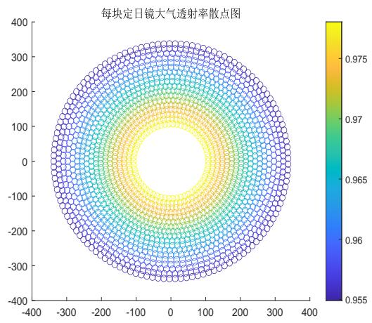

<details>
<summary>heatmap</summary>

| X (range) | Y (range) | 透射率 |
| --- | --- | --- |
| -350~350 | -350~350 | 0.955~0.975 |
</details>

(a)每块定日镜对应大气透射效率散点图

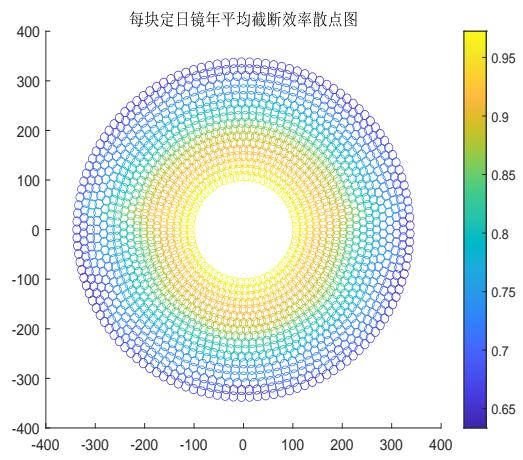

<details>
<summary>heatmap</summary>

| 效率等级 (Color) | 效率值范围 |
| --- | --- |
| 蓝色 | 0.65~0.75 |
| 橙色 | 0.85~0.95 |
| 青色 | 0.85~0.95 |
| 绿色 | 0.85~0.95 |
| 青色 | 0.85~0.95 |
| 黄色 | 0.95~1.0 |
</details>

(b) 每块定日镜年平均截断效率散点图

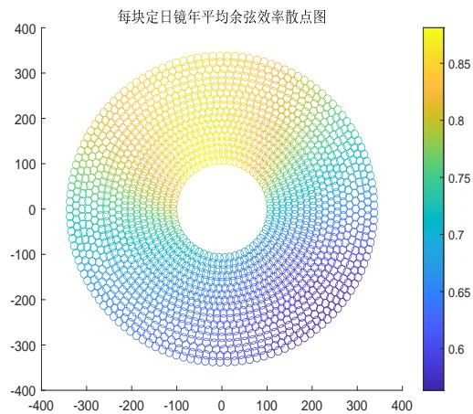

<details>
<summary>scatter</summary>

| 效率 (Color) | 效率 (Color) |
| --- | --- |
| 0.6~0.85 | 0.6~0.85 |
</details>

(c)每块定日镜年平均余弦效率散点图

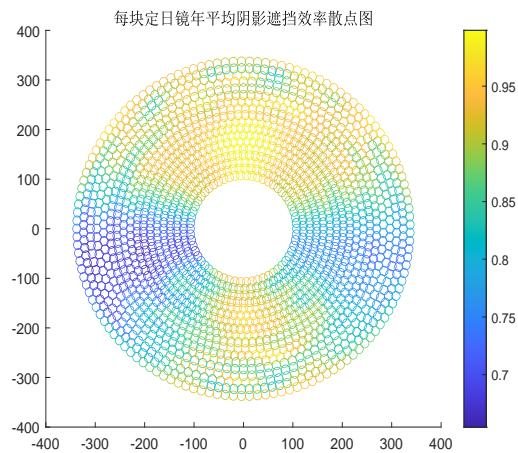

<details>
<summary>scatter</summary>

| Angle (deg) | Efficiency (range) |
| --- | --- |
| -350~350 | 0.7~0.98 |
</details>

(d) 每块定日镜年平均阴影遮挡效率散点图

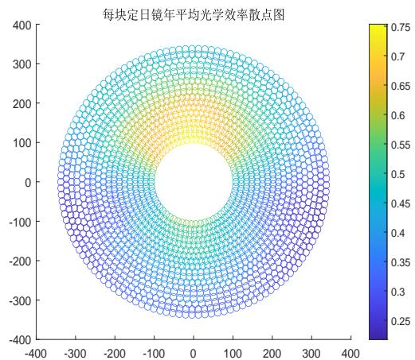

<details>
<summary>scatter</summary>

| 效率 (Color) | 效率 (Color) |
| --- | --- |
| 0.25~0.35 | Blue |
| 0.35~0.45 | Cyan |
| 0.45~0.55 | Green |
| 0.55~0.65 | Yellow-Green |
| 0.65~0.75 | Yellow |
| 0.75~0.85 | Orange-Yellow |
</details>

(e)每块定日镜年平均光学效率散点图

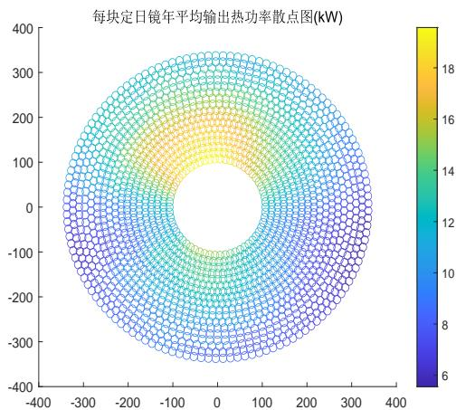

<details>
<summary>heatmap</summary>

| X (range) | Y (range) | Heat Power (kW) |
| --- | --- | --- |
| -350~350 | -350~350 | 6~19 |
</details>

(f) 每块定日镜年平均输出热功率散点图  
图 10

上述结果表明，散点图的峰值移动规律与太阳视运动规律一致。说明模型可以较为真实准确地反映定日镜场镜面反射、阴影遮挡、集热器截断等光学现象。

## 七、模型评估

## 模型优点：

1. 基于光学定律建立数学模型，真实准确反映光线入射、反射及阴影遮挡规律；  
2. 通过栅格化方法求解阴影遮挡效率与截断效率，避免了繁复的解析推导，模型求解简便；  
3. 在问题2、3 的求解中，通过三分法降低解空间维度，极大加快了模型求解速度。

## 模型缺点：

1. 采用栅格化方法进行模型求解，求得的阴影遮挡效率、截断效率与真实值有少量偏差；

2. 忽略了吸收塔在定日镜表面形成的阴影，求得的阴影遮挡效率偏大。

## 参考文献

[1] 刘建兴. 塔式光热电站光学效率建模仿真及定日镜场优化布置 [D]. 兰州交通大学,2022.  
[2] 张平, 奚正稳, 华文瀚等. 太阳能塔式光热镜场光学效率计算方法 [J]. 技术与市场,2021,28(06):5-8.  
[3] 杜宇航等，塔式光热电站定日镜不同聚焦策略的影响分析[J]，动力工程学报，2020，40(5):426-432

## A 附件清单

1.1 附录A：问题1每月21日平均光学效率及输出功率  
1.2 附录B：问题2每月21日平均光学效率及输出功率  
1.3 附录C：问题3每月21日平均光学效率及输出功率  
1 . 4 Matlab 程序 m11.m  
1 . 5 Matlab 程序 m12.m  
1 . 6 Matlab 程序 m21.m  
1 . 7 Matlab 程序 m22.m  
1 . 8 Matlab 程序 m23.m  
1 . 9 Matlab 程序 m3.m

## 附录A 问题1每月21日平均光学效率及输出功率

表10 问题1每月21日平均光学效率及输出功率

<table><tr><td>日期</td><td>平均光学效率</td><td>平均余弦效率</td><td>平均阴影遮挡效率</td><td>平均截断效率</td><td>单位面积镜面平均输出热功率(kW/m2)</td></tr><tr><td>1月21日</td><td>0.4705</td><td>0.7199</td><td>0.8967</td><td>0.8070</td><td>0.3404</td></tr><tr><td>2月21日</td><td>0.4859</td><td>0.7404</td><td>0.9043</td><td>0.8081</td><td>0.3715</td></tr><tr><td>3月21日</td><td>0.4980</td><td>0.7611</td><td>0.9058</td><td>0.8084</td><td>0.3955</td></tr><tr><td>4月21日</td><td>0.5039</td><td>0.7793</td><td>0.8977</td><td>0.8067</td><td>0.4101</td></tr><tr><td>5月21日</td><td>0.5038</td><td>0.7893</td><td>0.8859</td><td>0.8086</td><td>0.4145</td></tr><tr><td>6月21日</td><td>0.5022</td><td>0.7924</td><td>0.8799</td><td>0.8091</td><td>0.4144</td></tr><tr><td>7月21日</td><td>0.5039</td><td>0.7892</td><td>0.8862</td><td>0.8084</td><td>0.4146</td></tr><tr><td>8月21日</td><td>0.5039</td><td>0.7786</td><td>0.8984</td><td>0.8069</td><td>0.4097</td></tr><tr><td>9月21日</td><td>0.4972</td><td>0.7601</td><td>0.9054</td><td>0.8085</td><td>0.3942</td></tr><tr><td>10月21日</td><td>0.4845</td><td>0.7378</td><td>0.9043</td><td>0.8082</td><td>0.3683</td></tr><tr><td>11月21日</td><td>0.4682</td><td>0.7182</td><td>0.8945</td><td>0.8068</td><td>0.3369</td></tr><tr><td>12月21日</td><td>0.4601</td><td>0.7111</td><td>0.8873</td><td>0.8067</td><td>0.3227</td></tr></table>

## 附录B 问题2每月21日平均光学效率及输出功率

表11 问题2每月21日平均光学效率及输出功率

<table><tr><td>日期</td><td>平均光学效率</td><td>平均余弦效率</td><td>平均阴影遮挡效率</td><td>平均截断效率</td><td>单位面积镜面平均输出热功率 (kW/m2)</td></tr><tr><td>1月21日</td><td>0.6099</td><td>0.8914</td><td>0.8697</td><td>0.8807</td><td>0.4411</td></tr><tr><td>2月21日</td><td>0.6055</td><td>0.8832</td><td>0.8728</td><td>0.8806</td><td>0.4629</td></tr><tr><td>3月21日</td><td>0.5883</td><td>0.8681</td><td>0.8627</td><td>0.8809</td><td>0.4674</td></tr><tr><td>4月21日</td><td>0.5639</td><td>0.8451</td><td>0.8495</td><td>0.8811</td><td>0.4594</td></tr><tr><td>5月21日</td><td>0.5406</td><td>0.8241</td><td>0.8354</td><td>0.8818</td><td>0.4455</td></tr><tr><td>6月21日</td><td>0.5309</td><td>0.8153</td><td>0.8294</td><td>0.8820</td><td>0.4388</td></tr><tr><td>7月21日</td><td>0.5409</td><td>0.8244</td><td>0.8355</td><td>0.8818</td><td>0.4457</td></tr><tr><td>8月21日</td><td>0.5651</td><td>0.8462</td><td>0.8501</td><td>0.8812</td><td>0.4599</td></tr><tr><td>9月21日</td><td>0.5896</td><td>0.8691</td><td>0.8636</td><td>0.8808</td><td>0.4677</td></tr><tr><td>10月21日</td><td>0.6068</td><td>0.8845</td><td>0.8732</td><td>0.8806</td><td>0.4611</td></tr><tr><td>11月21日</td><td>0.6084</td><td>0.8919</td><td>0.8670</td><td>0.8807</td><td>0.4375</td></tr><tr><td>12月21日</td><td>0.5944</td><td>0.8935</td><td>0.8466</td><td>0.8808</td><td>0.4175</td></tr></table>

## 附录C 问题3每月21日平均光学效率及输出功率

表12 问题3每月21日平均光学效率及输出功率

<table><tr><td>日期</td><td>平均光学效率</td><td>平均余弦效率</td><td>平均阴影遮挡效率</td><td>平均截断效率</td><td>单位面积镜面平均输出热功率(kW/m2)</td></tr><tr><td>1月21日</td><td>0.6157</td><td>0.8920</td><td>0.8779</td><td>0.8800</td><td>0.4450</td></tr><tr><td>2月21日</td><td>0.6117</td><td>0.8840</td><td>0.8815</td><td>0.8799</td><td>0.4672</td></tr><tr><td>3月21日</td><td>0.5955</td><td>0.8692</td><td>0.8729</td><td>0.8802</td><td>0.4730</td></tr><tr><td>4月21日</td><td>0.5712</td><td>0.8464</td><td>0.8596</td><td>0.8805</td><td>0.4653</td></tr><tr><td>5月21日</td><td>0.5479</td><td>0.8256</td><td>0.8455</td><td>0.8812</td><td>0.4517</td></tr><tr><td>6月21日</td><td>0.5381</td><td>0.8168</td><td>0.8393</td><td>0.8814</td><td>0.4449</td></tr><tr><td>7月21日</td><td>0.5482</td><td>0.8259</td><td>0.8457</td><td>0.8812</td><td>0.4520</td></tr><tr><td>8月21日</td><td>0.5723</td><td>0.8476</td><td>0.8600</td><td>0.8805</td><td>0.4658</td></tr><tr><td>9月21日</td><td>0.5966</td><td>0.8702</td><td>0.8735</td><td>0.8802</td><td>0.4730</td></tr><tr><td>10月21日</td><td>0.6128</td><td>0.8853</td><td>0.8817</td><td>0.8799</td><td>0.4653</td></tr><tr><td>11月21日</td><td>0.6149</td><td>0.8925</td><td>0.8762</td><td>0.8800</td><td>0.4419</td></tr><tr><td>12月21日</td><td>0.6020</td><td>0.8940</td><td>0.8572</td><td>0.8800</td><td>0.4224</td></tr></table>

## 附录 D Matlab 程序 m11.m

```matlab
% 第一题
clear;
location=readmatrix('附件');% location为定日镜xy坐标
% figure;plot(location(:,1),location(:,2),'.');
% title('附件定日镜坐标信息');axis equal;

loc_jire=[0,0,80];%集热器中心坐标
h=4;% 定日镜高度
loc_dingri=[location,h+zeros(size(location,1),1)]; %定日器中心坐标
s_reflect=loc_jire-loc_dingri; % 反射光线的方向向量
s_reflect=s_reflect./sqrt(s_reflect(:,1).^2+s_reflect(:,2).^2+s_reflect(:,3).^2);%单位化
D=readmatrix('日期天数计算.xlsx');
```

```matlab
D(:,1:2)=[];% D为以春分作为第0天起算的天数 12个月

ST=8:0.5:10;% 当地时间

% i=D长12 j=ST长5 共60次
alphas=zeros(12,5);gamas=zeros(12,5);s_in=zeros(12,15); %初始化
phi=39.4*pi/180;% 当地纬度
for i=1:12 %第i行为日期
    for j=1:3 %第j列为时间
        delta=asin( sin(2*pi*D(i)/365)*sin(2*pi*23.45/360) );% 太阳赤纬角
        w=(ST(j)-12)*pi/12;% 太阳时角
        alphas(i,j)=asin( cos(delta)*cos(phi)*cos(w)+sin(delta)*sin(phi) );% 太阳高度角
        gamas(i,j)=real(acos( (sin(delta)-sin(alphas(i,j))*sin(phi))/(cos(alphas(i,j))*cos(phi)) 
         ));)%太阳方位角
%       if gamas(i,j)>pi
%       gamas(i,j)=2*pi-gamas(i,j);
%       end
        s_in(i,3*(j-1)+(1:3))=-[sin(gamas(i,j)),cos(gamas(i,j)),tan(alphas(i,j))];%
            入射光的方向向量 12行*15列 每3列一组为一组方向向量
        s_in(i,3*(j-1)+(1:3))=s_in(i,3*(j-1)+(1:3))./norm(s_in(i,3*(j-1)+(1:3)));% 单位化
    end
end
s_in(:,10)=-s_in(:,4);
s_in(:,11)=s_in(:,5);
s_in(:,12)=s_in(:,6);
s_in(:,13)=-s_in(:,1);
s_in(:,14)=s_in(:,2);
s_in(:,15)=s_in(:,3);
% i=D长12 j=ST长5 共60次
n_dingri=zeros(size(location,1),3); % 第i天,第j时,定日器法向量
shade=zeros(12,5,1745); %阴影初始化
ntrunc=zeros(12,5,1745);%截断效率初始化
for i=1:12 %第i行为日期
    for j=1:5 %第j列为时间
        n_dingri=s_in(i,3*(j-1)+(1:3))-s_reflect;% 确定每个定日器的法向量
        n_dingri=n_dingri./sqrt(n_dingri(:,1).^2+n_dingri(:,2).^2+n_dingri(:,3).^2);

        W=6;H=6;% 定日镜W宽度 H高度
        v1=[n_dingri(:,2),-n_dingri(:,1),zeros(size(n_dingri(:,1)))];
        v2=[-n_dingri(:,1).*n_dingri(:,3),-n_dingri(:,2).*n_dingri(:,3),n_dingri(:,2).^2+n_dingri(:,1).^2];
        v1=v1./sqrt(v1(:,1).^2+v1(:,3).^2+v1(:,3).^2);
        v2=v2./sqrt(v2(:,1).^2+v2(:,3).^2+v2(:,3).^2);
        xp1=location(:,1)+W*v1(:,1)/2+H*v2(:,1)/2;
        yp1=location(:,2)+W*v1(:,2)/2+H*v2(:,2)/2;
        zp1=h+W*v1(:,3)/2+H*v2(:,3)/2;
        xp2=location(:,1)-W*v1(:,1)/2+H*v2(:,1)/2;
        yp2=location(:,2)-W*v1(:,2)/2+H*v2(:,2)/2;
```

```matlab
zp2=h-W*v1(:,3)/2+H*v2(:,3)/2;
xp3=location(:,1)-W*v1(:,1)/2-H*v2(:,1)/2;
yp3=location(:,2)-W*v1(:,2)/2-H*v2(:,2)/2;
zp3=h-W*v1(:,3)/2-H*v2(:,3)/2;
xp4=location(:,1)+W*v1(:,1)/2-H*v2(:,1)/2;
yp4=location(:,2)+W*v1(:,2)/2-H*v2(:,2)/2;
zp4=h+W*v1(:,3)/2-H*v2(:,3)/2;

dl=H/5;% 分网格
xid=W/dl;yid=H/dl;% xy分为xyid格
%%%%%% 阴影遮挡计算开始

for k=1:length(xp1) %扫描每一个定日器算阴影
    %从左上角开始 向右、向下分格子
    shade1=zeros(xid,yid);% 保存第k块板的阴影信息
    for ii=1:xid % 从左到右一列一列扫
        for jj=1:yid % 每一列都从上往下扫
            xi=xp2(k)+jj*dl*v1(k,1)-ii*dl*v2(k,1)-dl*v1(k,1)/2+dl*v2(k,1)/2;
                %格子中右下角的坐标 作为这一格的代表
            yi=yp2(k)+jj*dl*v1(k,2)-ii*dl*v2(k,2)-dl*v1(k,2)/2+dl*v2(k,2)/2;
            zi=zp2(k)+jj*dl*v1(k,3)-ii*dl*v2(k,3)-dl*v1(k,3)/2+dl*v2(k,3)/2;
            temp=[location,h=zeros(size(location,1),1)]; %临时定日点阵
            temp(k,:)=[inf,inf,inf];
            for time=1:6 %找最近的6个点
                kk = dsearchn(temp,[location(k,:),4]);%kk是temp里距离k最近的定日索引
                % 线面交点计算
                [px1,py1,pz1]=CalPlaneLineIntersectPoint(n_dingri(kk,:),[location(kk,:),h],s_in(i,3*(j-1)+
                    %%阴影
                if dot([location(kk,:),h]-[px1,py1,pz1],s_in(i,3*(j-1)+(1:3))>0
                    result1=is_point_in_rectangular(px1,py1,pz1,[xp1(kk),yp1(kk),zp1(kk);xp2(kk),yp2(kk),zp
                else
                    result1=0;
                end
                if result1>0
                    shade1(ii,jj)=1;
                    shade(i,j,k)=shade(i,j,k)+1; %找到就退出六次的循环
                    break
                end
                [px2,py2,pz2]=CalPlaneLineIntersectPoint(n_dingri(kk,:),[location(kk,:),h],s_reflect(k,:),
                    %%遮挡
                if dot([px2,py2,pz2]-[location(kk,:),h],s_reflect(k,:))>0
                    result2=is_point_in_rectangular(px2,py2,pz2,[xp1(kk),yp1(kk),zp1(kk);xp2(kk),yp2(kk),zp
                else
                    result2=0;
                end                      %%%%画图
                %
                    plot3([xi,xi-n_dingri(k,1)*5],[yi,yi-n_dingri(k,2)*5],[zi,zi-n_dingri(k,3)*5],[xi,xi-s
```

```matlab
%%%%%%%%%%%%%%%%%%%
    if result2>0
        shade1(ii,jj)=1;
        shade(i,j,k)=shade(i,j,k)+1; %找到就退出六次的循环
        break
    else
        temp(kk,:)=[inf,inf,inf]; %将找到的最近点删除
    end
end
end %%%%%%% 阴影遮挡计算结束
end %%%%%%% 没有阴影遮挡的区域 截断计算开始
if sum(sum(shade1))==xid*yid
    ntrunc(i,j,k)=inf;
    continue
end
d=sqrt(location(k,1)^2+location(k,2)^2+(h-80)^2); %定日镜到集热器中心距离
r=4.65*10^(-3)*d; %光斑半径
xlim=3.5-r;ylimit=4-r;
light_out=(W+2*r)*(H+2*r);%不考虑阴影的定日镜总输出
%light_overflow=(7+2*r)*(8+2*r)-8*7;%不考虑阴影的总溢出
light_in=min(8,2*r+H)*min(7,2*r+W);%不考虑阴影的集热器总输入
[xx,yy]=find(shade1>0); %阴影索引
for ix=1:length(xx)
    yi=H/2-xx(ix)*dl+dl/2;xi=-W/2+yy(ix)*dl-dl/2;
    if xx(ix)==1 && yy(ix)==1 || xx(ix)==1 && yy(ix)==xid || xx(ix)==yid && yy(ix)==1
        || xx(ix)==yid && yy(ix)==xid %四个角
        if r+abs(xi)+dl/2<3.5 %说明集热器全部吸收
            light_out=light_out-(dl+r)^2;
            light_in=light_in-(dl+r)^2;
        elseif r+abs(yi)+dl/2<4 %说明集热器上下全部吸收 左右溢出
            light_out=light_out-(dl+r)^2;
            light_in=light_in-(dl/2+3.5-abs(xi))*(dl+r);
        else %上下左右都溢出
            light_out=light_out-(dl+r)^2;
            light_in=light_in-(dl/2+3.5-abs(xi))*(dl/2+4-abs(yi));
        end
    elseif xx(ix)==1 && 1<yy(ix) && yy(ix)<xid || xx(ix)==yid && 1<yy(ix) &&
        yy(ix)<xid %左右
        if r+abs(yi)+dl/2<4 %说明集热器全部吸收
            light_out=light_out-(dl+r)*dl;
            light_in=light_in-(dl+r)*dl;
        else %上下溢出
            light_out=light_out-(dl+r)*dl;
            light_in=light_in-(dl/2+4-abs(yi))*dl;
        end
    elseif yy(ix)==1 && 1<xx(ix) && xx(ix)<yid || yy(ix)==xid && 1<xx(ix) &&
        xx(ix)<yid %上下
```

```matlab
if r+abs(xi)+dl/2<3.5 %说明集热器全部吸收
    light_out=light_out-(dl+r)*dl;
    light_in=light_in-(dl+r)*dl;
else %左右溢出
    light_out=light_out-(dl+r)*dl;
    light_in=light_in-(dl/2+3.5-abs(xi))*dl;
end
else
    light_out=light_out-dl^2;
    light_in=light_in-dl^2;
end
end
ntrunc(i,j,k)=light_in/light_out;
end %%%% 截断计算结束
%%%%%%画图
% scatter(location(:,1),location(:,2),[],shade)
%%%%%画图
end
end

save('Q1.mat')
save('s_in','s_in')
save('alphas','alphas')
%% 计算各个效率
m1_2;

%% 子函数

function [px,py,pz]=CalPlaneLineIntersectPoint(en,planepoint,es,linepoint)
% en为法向量 planepoint为平面上一个点的坐标 es为直线的方向向量 linepoint为直线上一个点的坐标
vpt=dot(en,es); %内积
if vpt==0
    px=[];py=[];pz=[];
else
    t=((planepoint(1)-linepoint(1))*en(1)+(planepoint(2)-linepoint(2))*en(2)+(planepoint(3)-linepoint(3))*en(3));
    px=line(1)+es(1)*t;
    py=line(2)+es(2)*t;
    pz=line(3)+es(3)*t;
end
end
function result = point_in_triangle(px,py,pz,A,B,C)
V1q=[px-A(1),py-A(2),pz-A(3)];
V2q=[px-B(1),py-B(2),pz-B(3)];
V3q=[px-C(1),py-C(2),pz-C(3)];

yon=biggerthan0(B-A,C-A,C-B,V1q,V2q,V3q);
if yon==1 %点在第i个目标面内
```

```matlab
result=1;
else
    result=0;
end
end

% 判断点是否在矩形内部
function result = is_point_in_rectangular(px,py,pz, rectangular)
A = rectangular(1, :);
B = rectangular(2, :);
C = rectangular(3, :);
D = rectangular(4, :);
% 分别判断点是否在两个三角形内部
if point_in_triangle(px,py,pz,A,B,C)||point_in_triangle(px,py,pz,A,C,D)
    result = true;
else
    result = false;
end
end

function yon=biggerthan0(V12,V13,V23,V1q,V2q,V3q)
yon=1;
yon=yon*(dot(cross(V12,V1q),cross(V12,V13))>0);
yon=yon*(dot(cross(V23,V2q),cross(V23,-V12))>0);
yon=yon*(dot(cross(-V13,V3q),cross(-V13,-V23))>0);
end
```

## 附录 E Matlab 程序 m12.m

```matlab
clear
load Q1.mat
%% 余弦效率
eta_cos=zeros(12,5,size(location,1));
for i=1:12 %第i行为日期
    for j=1:5 %第j列为时间
        n_dingri=s_in(i,3*(j-1)+(1:3))-s_reflect;% 确定每个定日器的法向量
        n_dingri=n_dingri./sqrt(n_dingri(:,1).^2+n_dingri(:,2).^2+n_dingri(:,3).^2);
        for k=1:size(location,1)
            eta_cos(i,j,k)=abs(dot(n_dingri(k,:),s_in(i,3*(j-1)+(1:3))));
        end
    end
end

month_eta_cos=zeros(12,1);
for i=1:12
```

```matlab
month_eta_cos(i)=sum(eta_cos(i,:,:),'all')/(5*size(location,1));
end
year_eta_cos=mean(month_eta_cos);
```

%绘制散点图  
```matlab
tmp=sum(eta_cos,1);
tmp=sum(tmp,2);
tmp=reshape(tmp,size(location,1),1);
tmp=tmp/(12*5);
figure
scatter(location(:,1),location(:,2),[],tmp);
title('每块定日镜年平均余弦效率散点图')
colorbar
%% 阴影遮挡效率
eta_sb=1-shade*5/(xid*yid*8);
month_eta_sb=zeros(12,1);
for i=1:12
    month_eta_sb(i)=sum(eta_sb(i,:,:),'all')/(5*size(location,1));
end
year_eta_sb=mean(month_eta_sb);
```

%绘制散点图  
```matlab
tmp=sum(eta_sb,1);
tmp=sum(tmp,2);
tmp=reshape(tmp,size(location,1),1);
tmp=tmp/(12*5);
figure
scatter(location(:,1),location(:,2),[],tmp);
title('每块定日镜年平均阴影遮挡效率散点图')
colorbar
```

%% 大气透射率  
```matlab
tmp=loc_dingri(:,1).^2+loc_dingri(:,2).^2+(loc_dingri(:,3)-loc_jire(3)).^2;
d_HR=sqrt(tmp);
tmp1=0.99321 - 0.0001176*d_HR + 1.97e-8*d_HR.^2;
eta_at=zeros(12,5,size(location,1));
for i=1:size(location,1)
    eta_at(:,:,i)=tmp1(i)*ones(12,5);
end
```

%绘制散点图  
```matlab
tmp=sum(eta_at,1);
tmp=sum(tmp,2);
tmp=reshape(tmp,size(location,1),1);
tmp=tmp/(12*5);
figure
scatter(location(:,1),location(:,2),[],tmp);
title('每块定日镜大气透射率散点图')
```

```matlab
colorbar
%% 截断效率
% inf处理，赋平均值
eta_trunc=ntrunc;
infid=[];%inf值的id，每行为i, j, k
cnt=0;
for i=1:12
    for j=1:5
        for k=1:size(location,1)
            if eta_trunc(i,j,k)~=inf
                cnt=cnt+eta_trunc(i,j,k);
            else
                infid=[infid;i j k];
            end
        end
    end
end
N=size(infid,1);
ave=cnt/(12*5*size(location,1)-N);

for i=1:N
    eta_trunc(infid(i,1),infid(i,2),infid(i,3))=ave;
end
```

%开始计算月平均与年平均  
```matlab
month_eta_trunc=zeros(12,1);
for i=1:12
    tmp=eta_trunc(i,:,:);
    tmp(tmp==inf)=[];
    month_eta_trunc(i)=sum(tmp,'all')/numel(tmp);
end
year_eta_trunc=mean(month_eta_trunc);
```

%绘制散点图  
```matlab
tmp=sum(eta_trunc,1);
tmp=sum(tmp,2);
tmp=reshape(tmp,size(location,1),1);
tmp=tmp/(12*5);
figure
scatter(location(:,1),location(:,2),[],tmp);
title('每块定日镜年平均截断效率散点图')
colorbar
%% 镜面反射率
eta_ref=0.92*ones(12,5,size(location,1));
```

%% 光学效率  
```txt
eta=eta_sb.*eta_cos.*eta_at.*eta_trunc.*eta_ref;
```

```matlab
month_eta=zeros(12,1);
for i=1:12
    tmp=eta(i,:,:);
    month_eta(i)=sum(tmp,'all')/numel(tmp);
end
year_eta=mean(month_eta);

%绘制散点图
tmp=sum(eta,1);
tmp=sum(tmp,2);
tmp=reshape(tmp,size(location,1),1);
tmp=tmp/(12*5);
figure
scatter(location(:,1),location(:,2),[],tmp);
title('每块定日镜年平均光学效率散点图')
colorbar
%% 单位面积镜面输出热功率
% 构造DNI矩阵
G0=1.366;
altitude=3;
a=0.4237-0.00821*(6-altitude)^2;
b=0.5055+0.00595*(6.5-altitude)^2;
c=0.2711+0.01858*(2.5-altitude)^2;
tmp2=G0*(a+b*exp(-c./sin(alphas)));%12*5矩阵
DNI=zeros(12,5,size(location,1));
for i=1:size(location,1)
    DNI(:,:,i)=tmp2;
end

%定日镜面积
A=W.*H.*ones(12,5,size(location,1));

E=DNI.*A.*eta;%每块热功率，12*5*size(location,1)
Ef=sum(E,3);%镜场总瞬时热功率，12*5
year_Ef=sum(Ef,'all')/(12*5);%镜场年平均热功率,1*1
tmp=sum(A,3);Ef_per_area=Ef/tmp(1);%单位面积输出热功率,12*5

%每块镜子年平均热功率，1745*1
mirror_year_ave=zeros(size(location,1),1);
for i=1:size(location,1)
    mirror_year_ave(i)=sum(E(:,:,i),'all')/(12*5);
end

%单位面积输出月、年平均
month_Ef_per_area=zeros(12,1);
for i=1:12
    tmp=Ef_per_area(i,:,:);
```

```matlab
month_Ef_per_area(i)=sum(tmp,'all')/numel(tmp);
end
year_Ef_per_area=mean(month_Ef_per_area);

%每块定日镜年平均输出热功率散点图
figure
scatter(location(:,1),location(:,2),[],mirror_year_ave);
title('每块定日镜年平均输出热功率散点图(kW)')
colorbar
```

## 附录 F Matlab 程序 m21.m

```matlab
clear
load('s_in');load("alphas.mat")
%% 三分查找
e=1;
W=8;H=8;h=6;
%goal=60*10^3; %目标是年输出60MW
% 最大热功率位于100,pi/2处, beta为同层相邻定日镜夹角
mind=0;maxd=250;
leftd=(maxd-mind)/3;rightd=2*(maxd-mind)/3;
dddd=inf;
while dddd>e
    leftd=mind+(maxd-mind)/3;rightd=mind+2*(maxd-mind)/3;
    YEAR_EF=[];
    for D=[leftd,rightd] % 左中右
        %% 放置定日镜
        dr=W+5;
        R=100:dr:(350+D);
        x=[];y=[];
        theta_bond=zeros(1,length(R));
        for i=1:length(R)
            if R(i)<350-D   % 定日最远边界
                theta_bond(i)=-pi/2;
            else
                theta_bond(i)=asin((R(i)^2+D^2-350^2)/(2*R(i)*D));
            end
        end
        beta=dr./R;% 满足相邻定日镜大于5m 约束6
        for i=1:length(beta)
            theta=( (-1)^i*beta(i)/4+theta_bond(i)+beta(i)/2
                ):beta(i):(pi-theta_bond(i)-beta(i)/4);%更新theta
                x=[x,R(i)*cos(theta)];y=[y,R(i)*sin(theta)]; %放置定日镜
        end
```

```matlab
%% 计算本次的额定热功率 year_EF
%   plot(x,y,'.')
    location=[x',y'-D];
    [aaa,~]=Objfun2(H,W,h,D,location);
    YEAR_EF=[YEAR_EF,aaa];
end
if YEAR_EF(1)<YEAR_EF(2)
    mind=leftd;
    dddd=abs(leftd-rightd)
elseif YEAR_EF(1)>YEAR_EF(2)
    maxd=rightd;
    dddd=abs(leftd-rightd)
end
end

save('D','D');
```

## 附录 G Matlab 程序 m22.m

```matlab
%% 已知集热器坐标 D=156.0504 改变参数 W H
D=156.0504 ;
h=6;
% beta为同层相邻定日镜夹角
A=[];
for H=2:8
    for W=H:8
        %% 放置定日镜
        dr=11+2*W/8;
        R=100:dr:(350+D);
        x=[];y=[];
        theta_bond=zeros(1,length(R));
        for i=1:length(R)
            if R(i)<350-D  % 定日最远边界
                theta_bond(i)=-pi/2;
            else
                theta_bond(i)=asin((R(i)^2+D^2-350^2)/(2*R(i)*D));
            end
        end
        beta=dr./R;% 满足相邻定日镜大于5m 约束6
        for i=1:length(beta)
            theta=( (-1)^i*beta(i)/4+theta_bond(i)+beta(i)/2
                ):beta(i):(pi-theta_bond(i)-beta(i)/4);%更新theta
                x=[x,R(i)*cos(theta)];y=[y,R(i)*sin(theta)]; %放置定日镜
        end
        %% 计算本次的额定热功率 year_EF
```

```matlab
location=[x',y'-D];
    [year_EF,~]=Objfun2(H,W,h,D,location);
    A=[A;W,H,year_EF]
end
end

%% 
% 由结果可知，W=H时效率最高
%%
```

## 附录 H Matlab 程序 m23.m

```matlab
%% 已知集热器坐标 D=237.0240 改变参数W dr
D=156.0504 ;
h=6;
%% H=6
A=[];
for H=6
    for dr=(H+5):0.2:(H+7)
        W=H;
        R=100:dr:(350+D);
        x=[];y=[];
        theta_bond=zeros(1,length(R));
        for i=1:length(R)
            if R(i)<350-D % 定日最远边界
                theta_bond(i)=-pi/2;
            else
                theta_bond(i)=asin((R(i)^2+D^2-350^2)/(2*R(i)*D));
            end
        end
        beta=dr./R;% 满足相邻定日镜大于5m 约束6
        for i=1:length(beta)
            theta=((-1)^i*beta(i)/4+theta_bond(i)+beta(i)/2
                ):beta(i):(pi-theta_bond(i)-beta(i)/4);%更新theta
                x=[x,R(i)*cos(theta)];y=[y,R(i)*sin(theta)]; %放置定日镜
            end
            location=[x',y'];
            [year_EF,~]=Objfun2(H,W,h,D,location);
            A=[A;W,dr,year_EF]
            if size(A,1)>2 && A(end,3)-A(end-1,3)<0 && A(end-1,3)-A(end-2,3)<0
                break
            end
        end
    end
end
%% 求解结果 （部分）
```

```matlab
% 1.0e+04 *
% 0.0006 0.0011 4.0290
% 0.0006 0.0011 3.9190
% 0.0006 0.0011 3.7962
% 0.0006 0.0012 3.6965
% 0.0006 0.0012 3.5853

%% H=5
A=[];
for H=5
    for dr=(H+5):0.2:(H+7)
        W=H;
        R=100:dr:(350+D);
        x=[];y=[];
        theta_bond=zeros(1,length(R));
        for i=1:length(R)
            if R(i)<350-D % 定日最远边界
                theta_bond(i)=-pi/2;
            else
                theta_bond(i)=asin((R(i)^2+D^2-350^2)/(2*R(i)*D));
            end
        end
        beta=dr./R;% 满足相邻定日镜大于5m 约束6
        for i=1:length(beta)
            theta=((-1)^i*beta(i)/4+theta_bond(i)+beta(i)/2
                ):beta(i):(pi-theta_bond(i)-beta(i)/4);%更新theta
                x=[x,R(i)*cos(theta)];y=[y,R(i)*sin(theta)]; %放置定日镜
            end
            location=[x',y'];
            [year_EF,~]=Objfun2(H,W,h,D,location);
            A=[A;W,dr,year_EF]
            if size(A,1)>2 && A(end,3)-A(end-1,3)<0 && A(end-1,3)-A(end-2,3)<0
                break
            end
        end
end
%% 求解结果 （部分）
% 1.0e+04 *
%
% 0.0005 0.0010 4.0764
% 0.0005 0.0010 3.9347
% 0.0005 0.0010 3.8147

%% H=4
A=[];
for H=4
    for dr=(H+5):0.2:(H+7)
```

```matlab
W=H;
R=100:dr:(350+D);
x=[];y=[];
theta_bond=zeros(1,length(R));
for i=1:length(R)
    if R(i)<350-D  % 定日最远边界
        theta_bond(i)=-pi/2;
    else
        theta_bond(i)=asin((R(i)^2+D^2-350^2)/(2*R(i)*D));
    end
end
beta=dr./R;% 满足相邻定日镜大于5m 约束6
for i=1:length(beta)
    theta=((-1)^i*beta(i)/4+theta_bond(i)+beta(i)/2
        ):beta(i):(pi-theta_bond(i)-beta(i)/4);%更新theta
    x=[x,R(i)*cos(theta)];y=[y,R(i)*sin(theta)]; %放置定日镜
end
location=[x',y'];
[year_EF,~]=Objfun2(H,W,h,D,location);
A=[A;W,dr,year_EF]
if size(A,1)>2 && A(end,3)-A(end-1,3)<0 && A(end-1,3)-A(end-2,3)<0
    break
end
end
end
%% 结果展示
%   1.0e+04 *
%
%   0.0004   0.0009   3.6235
%   0.0004   0.0009   3.4889
%   0.0004   0.0009   3.3570
%% H=7
A=[];
for H=7
    for dr=(H+5):0.2:(H+7)
        W=H;
        R=100:dr:(350+D);
        x=[];y=[];
        theta_bond=zeros(1,length(R));
        for i=1:length(R)
            if R(i)<350-D  % 定日最远边界
                theta_bond(i)=-pi/2;
            else
                theta_bond(i)=asin((R(i)^2+D^2-350^2)/(2*R(i)*D));
            end
end
```

```matlab
beta=dr./R;% 满足相邻定日镜大于5m 约束6
for i=1:length(beta)
    theta=( (-1)^i*beta(i)/4+theta_bond(i)+beta(i)/2
        ):beta(i):(pi-theta_bond(i)-beta(i)/4);%更新theta
    x=[x,R(i)*cos(theta)];y=[y,R(i)*sin(theta)]; %放置定日镜
end
location=[x',y'];
[year_EF,~]=Objfun2(H,W,h,D,location);
A=[A;W,dr,year_EF]
if size(A,1)>2 && A(end,3)-A(end-1,3)<0 && A(end-1,3)-A(end-2,3)<0
    break
end
end
end
%%     求解结果 （部分）
%   1.0e+04 *
%
%   0.0007  0.0012  3.6638
%   0.0007  0.0012  3.5775
%   0.0007  0.0012  3.4847
%% H=8
A=[];
for H=8
    for dr=(H+5):0.2:(H+7)
        W=H;
        R=100:dr:(350+D);
        x=[];y=[];
        theta_bond=zeros(1,length(R));
        for i=1:length(R)
            if R(i)<350-D   % 定日最远边界
                theta_bond(i)=-pi/2;
            else
                theta_bond(i)=asin((R(i)^2+D^2-350^2)/(2*R(i)*D));
            end
        end
        beta=dr./R;% 满足相邻定日镜大于5m 约束6
        for i=1:length(beta)
            theta=( (-1)^i*beta(i)/4+theta_bond(i)+beta(i)/2
                ):beta(i):(pi-theta_bond(i)-beta(i)/4);%更新theta
        x=[x,R(i)*cos(theta)];y=[y,R(i)*sin(theta)]; %放置定日镜
    end
    location=[x',y'];
    [year_EF,~]=Objfun2(H,W,h,D,location);
    A=[A;W,dr,year_EF]
    if size(A,1)>2 && A(end,3)-A(end-1,3)<0 && A(end-1,3)-A(end-2,3)<0
        break
```

```matlab
end
    end
end
%%      求解结果 （部分）
% 0.0008   0.0013   3.2720
%   0.0008   0.0013   3.1997
%   0.0008   0.0013   3.1309

%% 结论 具有峰值 是随W变化的单峰 dr=W+5时最大
%%
%% 4~7 三分法求峰值
% 三分查找
e=0.05;
h=6;
mind=4;maxd=7;
leftd=(maxd-mind)/3;rightd=2*(maxd-mind)/3;
dddd=inf;
B=[];
while dddd>=e
    leftd=mind+(maxd-mind)/3;rightd=mind+2*(maxd-mind)/3;
    YEAR_EF=[];
    for W=[leftd,rightd] % 左中右
        H=W;
        dr=W+5;
        R=100:dr:(350+D);
        x=[];y=[];
        theta_bond=zeros(1,length(R));
        for i=1:length(R)
            if R(i)<350-D   % 定日最远边界
                theta_bond(i)=-pi/2;
            else
                theta_bond(i)=asin((R(i)^2+D^2-350^2)/(2*R(i)*D));
            end
        end
        beta=dr./R;% 满足相邻定日镜大于5m 约束6
        for i=1:length(beta)
            theta=( (-1)^i*beta(i)/4+theta_bond(i)+beta(i)/2
                ):beta(i):(pi-theta_bond(i)-beta(i)/4);%更新theta
                x=[x,R(i)*cos(theta)];y=[y,R(i)*sin(theta)]; %放置定日镜
        end
        % 计算本次的额定热功率 year_EF
        location=[x',y'-D];
        h=6;
        [aaa,~]=Objfun2(H,W,h,D,location);
        YEAR_EF=[YEAR_EF,aaa];
    end
```

```matlab
if YEAR_EF(1)<YEAR_EF(2)
    B=[B,mind,leftd,rightd,maxd,YEAR_EF];
    mind=leftd;
    dddd=abs(leftd-rightd)

elseif YEAR_EF(1)>YEAR_EF(2)
    B=[B,mind,leftd,rightd,maxd,YEAR_EF];
    maxd=rightd;
    dddd=abs(leftd-rightd)

end
end
%% W=5.4670
%
%
%

save('D','D')
save('W','W')
```

## 附录 I Matlab 程序 m3.m

```matlab
clear;
% load D;load W;
W=5.4670;
D=237.0240;
dr=W+5;
h0=6;
H=W;
R=100:dr:(350+D);
x=[];y=[];num=[];
theta_bond=zeros(1,length(R));
for i=1:length(R)
    if R(i)<350-D  % 定日最远边界
        theta_bond(i)=-pi/2;
    else
        theta_bond(i)=asin((R(i)^2+D^2-350^2)/(2*R(i)*D));
    end
end
beta=dr./R;% 满足相邻定日镜大于5m 约束6
for i=1:length(beta)
    theta=( (-1)^i*beta(i)/4+theta_bond(i)+beta(i)/2
        ):beta(i):(pi-theta_bond(i)-beta(i)/4);%更新theta
    x=[x,R(i)*cos(theta)];y=[y,R(i)*sin(theta)]; %放置定日镜
    num=[num,length(x)];
```

```matlab
end
location=[x',y'-D];
n=length(beta);
step=(6-W/2)/n;
h_tj0=W/2+step/2:step:6;
maxval=0;
for time=1:1e6
h_tj=h_tj0+step*rand(1,length(beta))-step/2; %随机取点
% h_tj=sort(h_tj);

h(1:num(i))=h_tj(1); % h 赋值过程
for i=2:length(beta)
h(num(i-1)+1:num(i))=h_tj(i);
end

[year_Ef,year_Ef_per_area]=Objfun3(H,W,h,D,location)
if year_Ef>maxval
    maxval=year_Ef;
    maxh=h;
    maxh_tj=h_tj;
end

end
```